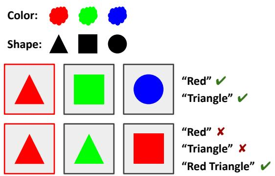
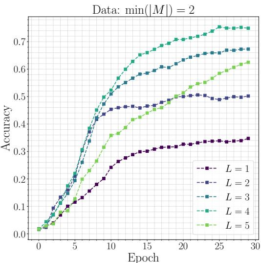
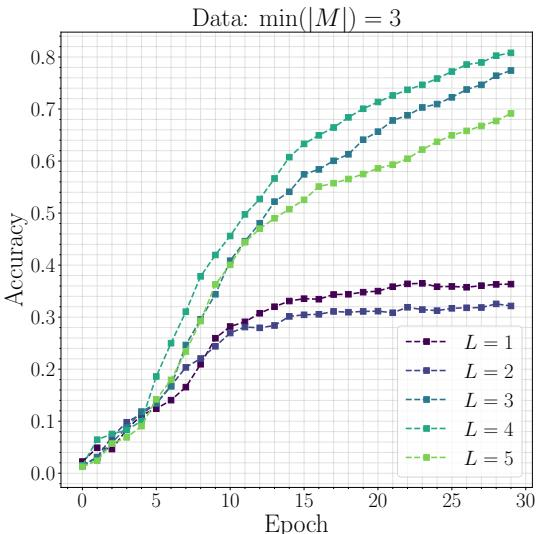

# A Combinatorial Approach to Neural Emergent Communication

Zheyuan Zhang<sup>†</sup>

University of Michigan

Ann Arbor, MI

zheyuan@umich.edu

## Abstract

Substantial research on deep learning-based emergent communication uses the referential game framework, specifically the Lewis signaling game, however we argue that successful communication in this game typically only need one or two symbols for target image classification because of a sampling pitfall in the training data. To address this issue, we provide a theoretical analysis and introduce a combinatorial algorithm SolveMinSym (SMS) to solve the symbolic complexity for classification, which is the minimum number of symbols in the message for successful communication. We use the SMS algorithm to create datasets with different symbolic complexity to empiri cally show that data with higher symbolic complexity increases the number of effective symbols in the emergent language.

## 1 Introduction

In a multi-agent environment, communication often naturally evolves as a strategic behavior (Russell and Norvig, 2010). Emergent communication is in such setting typically, in which the communication channel between agents gets optimized for solving a cooperative task, e.g. Lewis signaling games (Lewis, 1969). However, we argue that the languages emerged from these games are in a simple form of language (e.g. one or two words), differs from the human language, underlying complexity from compositionality. Therefore, in this paper, we investigate the theoretical effective symbols for the emerged language in Lewis signaling games.

## 2 Related Work

The Partially Observable Markov Decision Process (POMDP) extends the Markov Decision Process (MDP) framework in which the agent is not able to access the complete state information of the environment (Lovejoy, 1991) and communication potentially leads to coordination of agents for higher rewards. Also, some scholars in linguistics, psychology and biology posit that language evolved from primate communication (Tomasello and Call, 1997; Tomasello, 2013; Pika and Mitani, 2006).

Many works in emergent communication and language emergence use the referential game framework which is the Lewis signaling game, providing a setting for learning communication protocol, as well as the analysis of the emergent language (Lewis, 1969; Lazaridou et al., 2016; Havrylov and Titov, 2017; Evtimova et al., 2018; Bouchacourt and Baroni, 2018, 2019; Kharitonov et al., 2019; Michel et al., 2023). There are also works explored other games (Mordatch and Abbeel, 2018; Das et al., 2019; Mu and Goodman, 2021), intrinsic motivations and extrinsic environmental pressures for language emergence (Chentanez et al., 2004; Cornudella et al., 2015; Gaya et al., 2016; Hazra et al., 2020, 2021; Li and Bowling, 2019; Cogswell et al., 2019). More recent works explore the role of emergent language for embodied AI and robotics (Liu et al., 2023; Mu et al., 2023). We refer to Appendix A.1 for more related works.

The work most related to this paper is Kottur et al. (2017). Their game is a Task & Talk reference game which has multiple rounds of dialog. A-BOT is given an object unseen by Q-BOT and Q-BOT is assigned a task consisting of two attributes. The goal is to find these two attributes of the hidden object for Q-BOT through dialog with A-BOT. They found that overcomplete vocabularies result in no dialog, instead having a codebook that maps symbols to objects. Our paper, differs from this work, instead of using a multi-round dialog game, we use the classical Lewis signaling game. Additionally, we mainly investigate the emergence of longer compositional language.

## 3 Symbolic Complexity for Classification

For this paper, we consider the classification-based Lewis signaling game or referential game introduced by Lazaridou et al. (2016); Havrylov and Titov (2017):

1. A target image $I _ { t } .$ , along with K distracting images $\{ I _ { d _ { k } } \} _ { k = 1 } ^ { K }$ are sampled at random from a set of images.

2. Two agents, a sender $S _ { \theta _ { 1 } }$ and a receiver $R _ { \theta _ { 2 } }$

3. The sender sends a message M to the receiver after observing the target image.

4. The receiver’s objective is to select the target image from $\{ I _ { t } , I _ { d _ { 1 } } , I _ { d _ { 2 } } , \ldots , I _ { d _ { K } } \}$ given M.

The communication is successful if the receiver correctly selects the target image from distracting images. We denote M as the length of the message M and $L$ as the maximum message length for communication. The motivation of our work comes from observation in varying M (Havrylov and Titov, 2017). We find that there’s no significant improvement on communication success when increasing L from 2 to 3 and subsequent increments. Therefore, M requires only 2 tokens for successful communication. This means the number of effective symbols in M is 2. In order to study how to emerge longer effective language, we use attribute-value vocabulary, similar to Kottur et al. (2017) and create synthetic datasets for theoretical analysis and more controlled experiments. Specifically, we define A attributes $a _ { 1 } , a _ { 2 } , a _ { 3 } , . . . , a _ { | A | }$ and $\vert V _ { a _ { i } } \vert$ values for each attribute $a _ { i }$

We argue that the bottleneck of producing longer effective M lies on the inherent limitations of the dataset being used to train the agents. For example, suppose we sample 10 images, denote as $I _ { \{ 1 , 2 , 3 , \ldots , 1 0 \} }$ and each $I _ { i }$ represents a distinct object category (e.g. ball, bottle, person). In this case, we only need one symbol for classification of any target image, if each class is represented by 1 symbol. We have the following assumption.

Assumption 1. Any Lewis signaling game has a symbolic complexity (i.e. minimum number of symbols), min( M ), for successful communication, i.e. correct classification of the target image.

Figure 1 shows an example for identifying min( M ) for successful classification of the target image in a synthetic setting. In this synthetic example, we consider 2 attributes, color and shape. Target images in both the top row and the bottom row are those with red boundaries and rest are distracting images. For the top row, we only need 1 symbol "Triangle" or "Red" to correctly discern the target images from distracting images. For the bottom row, 1 symbol is not enough because only "Triangle" matches to the second image which is a distracting image and only "Red" matches to the third image which is also a distracting image. Therefore we need at least 2 symbols "Red Trian-$\mathrm { g l e } "$ for the successful classification. Therefore, min $( | M | ) = 1$ for the top row and min $( | M | ) = 2$ for the bottom row, despite that both rows have the same target image and same number of distracting images.

  
Figure 1: Example of minimum symbols for successful classification.

3.1 The Pitfalls in the Lewis Signaling Game Using the example above, if min $( | M | ) > 1$ , it requires sampled images to have the same object category (e.g. ball) and the target image belongs to that object category. This setting forces the model to use another symbol to further distinguish the target image from distracting images (e.g. red ball, blue ball). If we have an attribute $a _ { 1 }$ to represent "object category", and $\vert V _ { a _ { 1 } } \vert$ represents number of object categories, we randomly sample n images where $n = K + 1$ under the assumption that the dataset is uniformly distributed (i.e. $P ( a _ { i } ) = P ( a _ { j } )$ for any i and $j )$ and we sample with replacement for simpler analysis, the probability of the sampled images to have at least m images of the same class for any class X is:

$$
\begin{array} { c } { { P ( X \geq m ) = } } \\ { { \displaystyle \sum _ { k = m } ^ { n } \binom { n } { k } ( \frac { 1 } { | V _ { a _ { 1 } } | } ) ^ { k } ( 1 - \frac { 1 } { | V _ { a _ { 1 } } | } ) ^ { n - k } } } \end{array}\tag{1}
$$

Since we are interested in any class achieving this count, the probability of at least one class has at least m images of the same class is:

$$
P ( \exists X \geq m ) = 1 - ( 1 - P ( X \geq m ) ) ^ { | V _ { a _ { 1 } } | }\tag{2}
$$

From Eqn.1 and Eqn.2, as n increases, $P ( \exists X \geq$ m) increases. One could infer that if we increase the number of distracting images, it is likely needing more symbols for successful communication. However, this is rarely the case because as $\vert V _ { a _ { 1 } } \vert$ increases, $P ( \exists X \geq m )$ decreases. The Microsoft COCO dataset, MSCOCO (Chen et al., 2015) used in Havrylov and Titov (2017) contains 80 annotated object categories. In fact, since MSCOCO are real images, rather than synthetically generated images, the total number of object categories is (much) larger than 80. Therefore, even if n becomes large, $P ( \exists X \geq m )$ can still be small because $\vert V _ { a _ { 1 } } \vert$ is too large. Havrylov and Titov (2017) uses 127 distracting images so $n = 1 2 8 .$ . However, for example, if $| V _ { a _ { 1 } } | = 1 0 0 0 0$ and $m = 2$ minimally, $P ( \exists X \geq m ) \approx 5 5 \%$ before sampling the target image. In this case, for most of the training data, $\operatorname* { m i n } ( | M | ) = 1$ . This theoretical analysis is supported by the experimental findings in their work, which show that $| M | = 1$ results in a 60% communication success rate. Additionally, even if images are in the same class, further distinguishing the target image mostly likely requires only 1 additional symbol.

## 3.2 Combinatorial Algorithm for Solving Symbolic Complexity

In the previous section, we analyzed that it would only require 1 to 2 symbols for successful classification in most real images (e.g. MSCOCO) for Lewis signaling game. Our hypothesis is that increasing min $( | M | )$ for the data itself leading to emerge longer effective language, as an alternative to designing new learning algorithms for agents.

Dataset Generation In order to solve min $( | M | )$ we synthetically generate a dataset for controlling attributes and values for each attributes, which is not available for real images. Previously, we defined $| A |$ attributes and $\left| V _ { a _ { i } } \right|$ values for each attribute $a _ { i }$ . Here, for simpler analysis and more controlled experiments, we consider a special case where $| V _ { a _ { i } } | = | V _ { a _ { j } } |$ for any i and $j .$ . That is, number of values is the same for all attributes. Therefore, we can simplify the notation to $| A |$ attributes and $| V |$ values. Similar to Li and Bowling (2019) and Kottur et al. (2017), each image $I ^ { \ast } \mathrm { s }$ representation is a vector $V _ { I _ { i } }$ concatenating one-hot vectors of attributes, that is, $V _ { I _ { i } } \in \mathbb { R } ^ { | A | \times \top }$ . In this paper, we use $| A | = 2 0$ and $| V | = 4$

SolveMinSym (SMS) Algorithm We now have access to the ground-truth attribute values of the image, then we use a combinatorial approach to solve the minimum number of symbols given the target image and all images. Generally, we generate all possible non-empty combinations with respect to the target image from least number of symbols (i.e. 1) to maximum number of symbols (i.e. A ). Then, we iterate through these combinations for checking whether the iterated combination uniquely identifies the target image and return the length of the combination once it returns true. Unique identification determines whether the combination matches to any distracting image (i.e. making target image not unique which fails the communication). Theoretically, since the length of the combination increases from minimum to maximum, the min $( | M | )$ equals to the length of the combination returned. We refer to Appendix A.2 for the implementation details.

min(|M|) Controlled Sampling for Lewis Signaling Game To approach our hypothesis on increasing symbolic complexity for the training data itself leading to emerge longer effective language. We implemented the min( M ) Controlled Sampling algorithm as below:

Algorithm 2 min $\overline { { ( \vert M \vert ) } }$ Controlled Sampling   
1: Input: Dataset $D ,$ size of generated data $N _ { g } ,$   
number of min $( | M | ) \ N _ { m i n }$ , number of dis  
tracting images $N _ { d }$   
2: $D _ { L } = \{ \}$   
3: while $| D _ { L } [ 0 . . . N _ { m i n } ] | < N _ { g }$ do   
4: $I \sim \mathrm { U n i f o r m } ( D , N _ { d } + 1 )$   
5: $I _ { t } \sim \mathrm { U n i f o r m } ( I , 1 )$   
6: $N _ { m s } = \mathsf { S M S } ( I _ { t } , I )$   
7: Add $I _ { t } , I$ to $D _ { L } [ N _ { m s } ]$   
8: end while   
9: Return $D _ { L }$

By applying the controlled sampling algorithm to our synthetically generated data, we are able to generate data with different min $( | M | )$ . In this paper, we use $N _ { g } = 1 0 0 0 0 ( 8 0 0 0$ used for training and 2000 used for evaluating), $N _ { d } ~ = ~ 6 3$ (sample 64 images each time). By Eqn.1 and Eqn.2, we find theoretically and also empirically that the min $( | M | )$ data is a highly narrow distribution which the majority of data are on two different min $( | M | ) \mathbf { s }$ for a certain configuration of $| A |$ and S . Therefore, in order to collect 10000 datapoints within a reasonable time. We only have two sets of data with min $( | M | ) = 2 , 3$

## 4 Experiments

We parameterize the sender $S _ { \theta _ { 1 } }$ and the receiver $R _ { \theta _ { 2 } }$ with GRU (Cho et al., 2014). The hidden dimension of the GRU is 512 and the embedding size is 32. We use Schedule-Free AdamW for optimization (Defazio et al., 2024). The vocabulary size is set to be $| A | \times | V | = 2 0 \times 4 = 8 0$ . We do not use an arbitrary large vocabulary size (e.g. 10000) because it is disadvantageous to compositionality as it encourages one symbol to represent composed phrase (e.g. Both "Red" and "Red $\mathrm { T r i a n g l e " }$ can be represented by only 1 symbol). We also do not use a minimal vocabulary size V because it forces the model to learn the ordering of attributes and it is not realistic to human languages (e.g. we use "Red" and "Triangle" as two different words. It’s hard to interpret a phrase like "Red $\operatorname { \mathbf { R e d } } ^ { \prime \prime }$ with the first word corresponds to the color and the second word corresponds to the shape). The computation graph of $S _ { \theta _ { 1 } }$ contains sampling (i.e. generation) so it becomes nondifferentiable, therefore we use Gumbel-Softmax Relexation, as detailed in $\mathsf { A p - }$ pendix A.3.

Results and Discussions. In order to examine the effect of the min $( | M | )$ data, we run the experiments multiple times with $L = 1 , 2 , 3 , 4 , 5$ under the same setting for both data with min $( | M | ) = 2$ and data with min $( | M | ) = 3$ over 30 epochs. We present the results in Figure 2 and 3. We see that for data with min $( | M | ) = 2$ , the difference between the accuracy of $L = 2$ and the maximum accuracy at epoch 30 is around 25%. However, for data with min $( | { \cal M } | ) = 3$ , the difference between the accuracy of $L = 2$ and the maximum accuracy at epoch 30 is around 50% which is 2 times than the data with min $( | M | ) = 2$ . This demonstrates that increasing min $( | M | ) = 2$ for the data increases the effective message length. Additionally, increasing L to be higher than min $( | M | )$ is usually effective because the model tends to provide information more than minimal requirements (i.e. min $( | M | ) )$ ). Moreover, in some cases, the accuracy of lower maximum $\lvert M \rvert$ is higher than the accuracy of higher maximum M . This is because it is easier for the model to manipulate less symbols under certain constraints. Finally, we observe that $L = 1$ can achieve to an accuracy around 35% for data with min $( | M | ) = 2$ and $L = 1 , 2$ can also achieve to around 35% for data with min $( | M | ) = 3$ . We hypothesize this is because we use the vocabulary size $| A | \times | V |$ and the model can learn to use 1 symbol to represent a composed phrase like "Red Trian-$\mathrm { g l e } "$ , by avoiding using some preset vocabularies (i.e. some of the symbols represent one word and some of the symbols represent multiple words).

  
Figure 2: Validation accuracy over epochs with different maximum message lengths (L) on data where min $( | M | ) = 2$

  
Figure 3: Validation accuracy over epochs with different maximum message lengths (L) on data where min $( | M | ) = 3$

## 5 Conclusions

In this paper, we theoretically analyzed the sampling pitfall in the training data that leads to ineffective message length of the emerged language in the Lewis signaling game. We propose the SolveMinSym SMS algorithm to solve the symbolic complexity for classification of the target image, and show that data with higher symbolic complexity emerge longer effective language.

## 6 Limitations

The data distribution of min( M ) is highly narrow so it is difficult to collect data with high min( M ) $\left( \mathrm { e . g . > 3 } \right)$ . Therefore, our experiments only compare min $( | M | ) = 2$ with min $( | M | ) = 3$ . Future works should explore how to synthetically generate data with arbitrary min( M ) directly.

## 7 Acknowledgements

The author would like to thank Ziqiao Ma, Joyce Chai for their helpful discussions and the anonymous reviewers for their valuable comments and suggestions.

## References

Diane Bouchacourt and Marco Baroni. 2018. How agents see things: On visual representations in an emergent language game. In Proceedings ofthe 2018 Conference on Empirical Methods in Natural Language Processing, pages 981–985.

Diane Bouchacourt and Marco Baroni. 2019. Miss tools and mr fruit: Emergent communication in agents learning about object affordances. In Proceedings of the 57th Annual Meeting of the Association for Computational Linguistics, pages 3909–3918, Florence, Italy. Association for Computational Linguistics.

Xinlei Chen, Hao Fang, Tsung-Yi Lin, Ramakrishna Vedantam, Saurabh Gupta, Piotr Dollár, and C Lawrence Zitnick. 2015. Microsoft coco captions: Data collection and evaluation server. arXiv preprint arXiv:1504.00325.

Nuttapong Chentanez, Andrew Barto, and Satinder Singh. 2004. Intrinsically motivated reinforcement learning. Advances in neural information processing systems, 17.

Kyunghyun Cho, Bart Van Merriënboer, Dzmitry Bahdanau, and Yoshua Bengio. 2014. On the properties of neural machine translation: Encoder-decoder approaches. arXiv preprint arXiv:1409.1259.

Caroline Claus and Craig Boutilier. 1998. The dynamics of reinforcement learning in cooperative multiagent systems. AAAI/IAAI, 1998(746-752):2.

Michael Cogswell, Jiasen Lu, Stefan Lee, Devi Parikh, and Dhruv Batra. 2019. Emergence of compositional language with deep generational transmission. arXiv preprint arXiv:1904.09067.

Miquel Cornudella, Paul Van Eecke, and Remi Van Trijp. 2015. How intrinsic motivation can speed up language emergence. In Artificial Life Conference Proceedings, pages 571–578. MIT Press One Rogers Street, Cambridge, MA 02142-1209, USA journals-info . . . .

Abhishek Das, Théophile Gervet, Joshua Romoff, Dhruv Batra, Devi Parikh, Mike Rabbat, and Joelle Pineau. 2019. Tarmac: Targeted multi-agent communication. In International Conference on Machine Learning, pages 1538–1546. PMLR.

Aaron Defazio, Xingyu Yang, Harsh Mehta, Konstantin Mishchenko, Ahmed Khaled, and Ashok Cutkosky. 2024. The road less scheduled. Preprint, arXiv:2405.15682.

Katrina Evtimova, Andrew Drozdov, Douwe Kiela, and Kyunghyun Cho. 2018. Emergent communication in a multi-modal, multi-step referential game. In International Conference on Learning Representations.

Miquel Cornudella Gaya, Thierry Poibeau, and Remi van Trijp. 2016. The role of intrinsic motivation in artificial language emergence: a case study on colour. In 26th International Conference on Computational Linguistics (COLING 2016), pages 1646–1656.

Piotr J Gmytrasiewicz, Matthew Summers, and Dhruva Gopal. 2002. Toward automated evolution of agent communication languages. In Proceedings of the 35th Annual Hawaii International Conference on System Sciences, pages 10–pp. IEEE.

Claudia V Goldman and Shlomo Zilberstein. 2003. Optimizing information exchange in cooperative multiagent systems. In Proceedings of the second international joint conference on Autonomous agents and multiagent systems, pages 137–144.

Serhii Havrylov and Ivan Titov. 2017. Emergence of language with multi-agent games: Learning to communicate with sequences of symbols. Advances in neural information processing systems, 30.

Rishi Hazra, Sonu Dixit, and Sayambhu Sen. 2020. Intrinsically motivated compositional language emergence. arXiv e-prints, pages arXiv–2012.

Rishi Hazra, Sonu Dixit, and Sayambhu Sen. 2021. Zero-shot generalization using intrinsically motivated compositional emergent protocols. arXiv preprint arXiv:2105.05069.

Eric Jang, Shixiang Gu, and Ben Poole. 2016. Categorical reparameterization with gumbel-softmax. In International Conference on Learning Representations.

Eugene Kharitonov, Rahma Chaabouni, Diane Bouchacourt, and Marco Baroni. 2019. Egg: a toolkit for research on emergence of language in games. arXiv preprint arXiv:1907.00852.

Satwik Kottur, José Moura, Stefan Lee, and Dhruv Batra. 2017. Natural language does not emerge ‘naturally’ in multi-agent dialog. In Proceedings of the 2017 Conference on Empirical Methods in Natural Language Processing, pages 2962–2967, Copenhagen, Denmark. Association for Computational Linguistics.

Angeliki Lazaridou, Alexander Peysakhovich, and Marco Baroni. 2016. Multi-agent cooperation and the emergence of (natural) language. arXiv preprint arXiv:1612.07182.

David Kellogg Lewis. 1969. Convention: A philosophical study. Harvard University Press.

Fushan Li and Michael Bowling. 2019. Ease-ofteaching and language structure from emergent communication. Advances in neural information processing systems, 32.

Evan Zheran Liu, Sahaana Suri, Tong Mu, Allan Zhou, and Chelsea Finn. 2023. Simple embodied language learning as a byproduct of meta-reinforcement learning. arXiv preprint arXiv:2306.08400.

William S Lovejoy. 1991. A survey of algorithmic methods for partially observed markov decision processes. Annals ofOperations Research, 28(1):47–65.

Paul Michel, Mathieu Rita, Kory Wallace Mathewson, Olivier Tieleman, and Angeliki Lazaridou. 2023. Revisiting populations in multi-agent communication. In The Eleventh International Conference on Learning Representations.

Igor Mordatch and Pieter Abbeel. 2018. Emergence of grounded compositional language in multi-agent populations. In Proceedings of the AAAI conference on artificial intelligence, volume 32.

Jesse Mu and Noah Goodman. 2021. Emergent communication of generalizations. Advances in Neural Information Processing Systems, 34:17994–18007.

Yao Mu, Shunyu Yao, Mingyu Ding, Ping Luo, and Chuang Gan. 2023. Ec2: Emergent communication for embodied control. In Proceedings of the IEEE/CVF Conference on Computer Vision and Pattern Recognition, pages 6704–6714.

Simone Pika and John Mitani. 2006. Referential gestural communication in wild chimpanzees (pan troglodytes). Current Biology, 16(6):R191–R192.

Stuart J Russell and Peter Norvig. 2010. Artificial intelligence a modern approach. London.

Sainbayar Sukhbaatar, Rob Fergus, et al. 2016. Learning multiagent communication with backpropagation. Advances in neural information processing systems, 29.

Michael Tomasello. 2013. The cultural roots of language. In Communicating meaning, pages 275–307. Psychology Press.

Michael Tomasello and Josep Call. 1997. Primate cognition. Oxford University Press, USA.

Jun Wang and Les Gasser. 2002. Mutual online concept learning for multiple agents. In Proceedings of the first international joint conference on Autonomous agents and multiagent systems: part 1, pages 362– 369.

Ronald J Williams. 1992. Simple statistical gradientfollowing algorithms for connectionist reinforcement learning. Machine learning, 8:229–256.

## A Appendix

## A.1 Extended Related Works

Earliest research on language and communication in multi-agent setting predominantly focuses on contexts wherein agents operate with a preestablished, fixed communication language (Claus and Boutilier, 1998; Goldman and Zilberstein, 2003). Nevertheless, this line of works do not directly address the phenomenon of language emergence, as it relies on predefined communication protocols to facilitate multi-agent cooperation.

In the pioneer research on learning the communication languages for agents, a noteworthy contribution is the model proposed by Gmytrasiewicz et al. (2002). This model conceptualizes negotiation as a mechanism to evolve an agent communication language from a knowledge representation language using a rule-based approach. MOCL extends classical online concept learning from single-agent to multi-agent settings for vocabulary convergence using the Perceptron algorithm (Wang and Gasser, 2002). However, these works either assumes some rules pre-existing in the system or the form of language is too simple. Additionally, there’s a disjoint of learning language and controlling actions.

Reinforced Inter-Agent Learning (RIAL) and Differentiable Inter-Agent Learning (DIAL) explore centralized learning coupled with decentralized execution. RIAL integrates deep Q-learning within a recurrent network framework. On the other hand, DIAL facilitates the transmission of continuous messages among agents during the centralized learning phase and transitions to discretizing these real-valued messages in the decentralized execution stage. Similarly, CommNet introduces an efficient controller designed for a variety of multi-agent reinforcement learning tasks, which enables the learning of continuous communication between agents (Sukhbaatar et al., 2016). Both studies highlight that models equipped with learnable communication protocols demonstrate superior performance compared to those lacking such communication capabilities, but without interpretability of the emergent language.

## A.2 SolveMinSym (SMS) Implementation Details

Please refer to Algorithm 1 for the Python code.

```python
def SolveMinSym ( target_image , all_images ):
n n n
Solves the minimum number of symbols required to uniquely identify the target
image
distracting_images = [ img for img in all_images if img != target_image ] #
Exclude target
for combination in attribute_combinations ( target_image ):
if is_unique_combination ( combination , distracting_images ):
return len ( combination )
return None
def attribute_combinations ( image ):
Generates all possible non - empty combinations of the image from short to long
n n n
attrs = list ( image . items ())
return chain . from_iterable ( combinations (attrs , r) for r in range (1, len( attrs )
+1) )
def is_unique_combination ( combination , distracting_images ):
Tests if a given combination of attributes uniquely identifies the target image
by checking if the combination of attributes in the target image can match to
any distracting image
for image in distracting_images :
match = all ( image . get ( key ) == value for key , value in combination )
if match :
return False # Found a match in distracting images (i.e. not unique )
return True
```  
Algorithm 1: Python code of SolveMinSym for solving min( M )

## A.3 Preliminaries of Gumbel-Softmax Relaxation

We follow Havrylov and Titov (2017) in using Gumbel-Softmax Relaxation for optimization. It points out that REINFORCE (Williams, 1992) underuses available information about the environment. Gumbel-Softmax estimator is an efficient gradient estimator that replaces the nondifferentiable sample from a categorical distribution with a differentiable sample from a Gumbel-Softmax distribution (Jang et al., 2016). Gumbel-Softmax Trick generates n-dimensional sample vectors:

exp((log π<sub>i</sub> + g<sub>i</sub>)/τ ) v<sub>i</sub> P<sup>N</sup><sub>j=1</sub> exp((log π<sub>j</sub> + g<sub>j</sub> )/τ ) <sup>for</sup> <sup>i</sup> <sup>=</sup> <sup>1,</sup> <sup>...,</sup> <sup>N</sup> where $\pi _ { i }$ are class probabilities from a categorical distribution and τ is the temperature. However, real-value communication is not realistic compared to natural language communication. To avoid this, straight-through (GT) Gumbel-Softmax estimator discretizes v using argmax in the forward pass but uses continuous relaxation in the backward pass by assuming the gradient of discrete v is similar to continuous v.