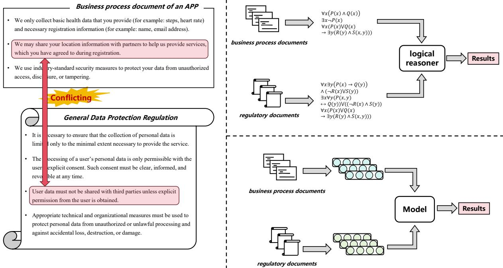
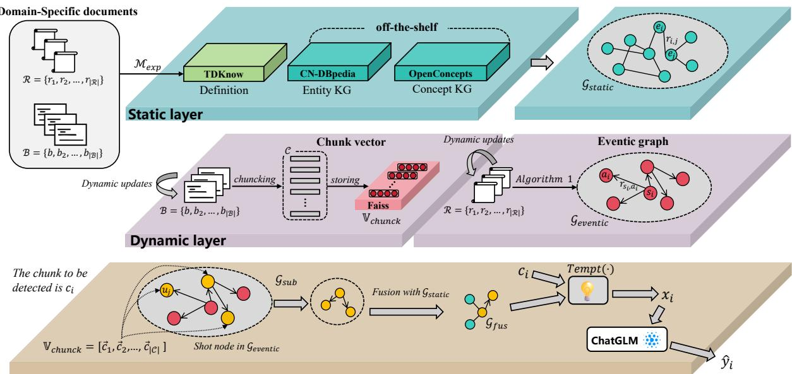
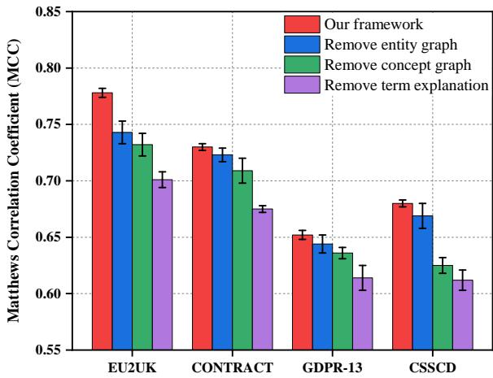
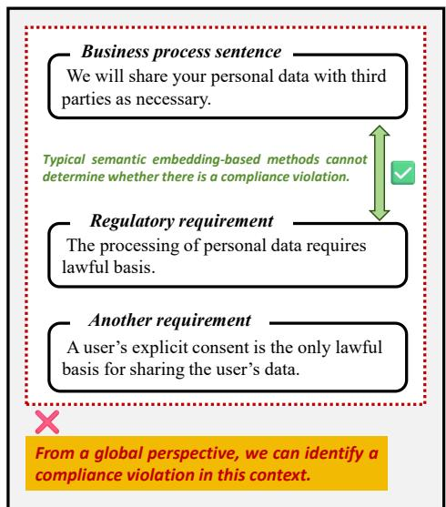
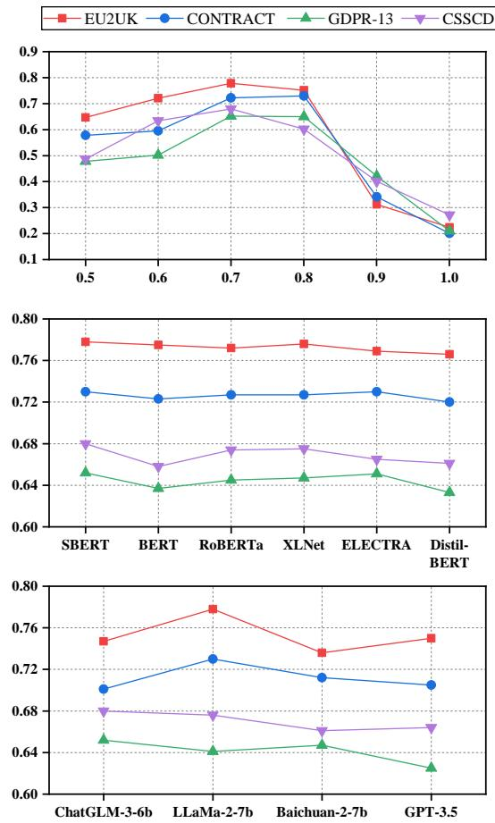
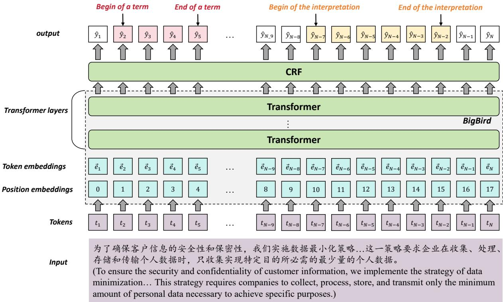
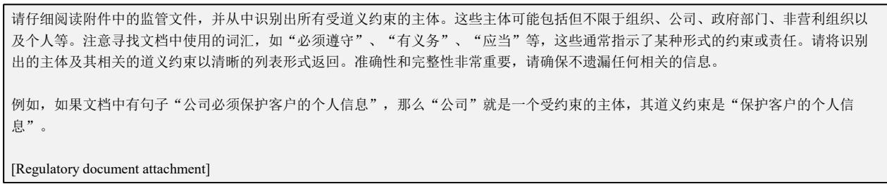
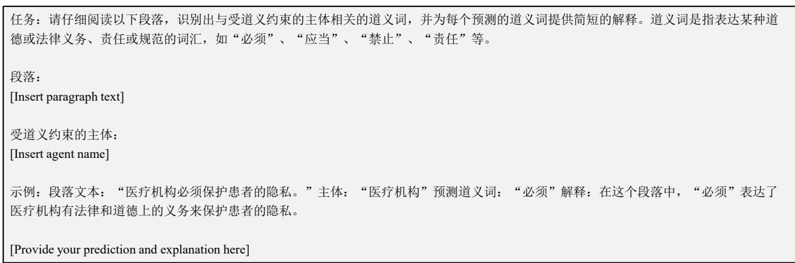
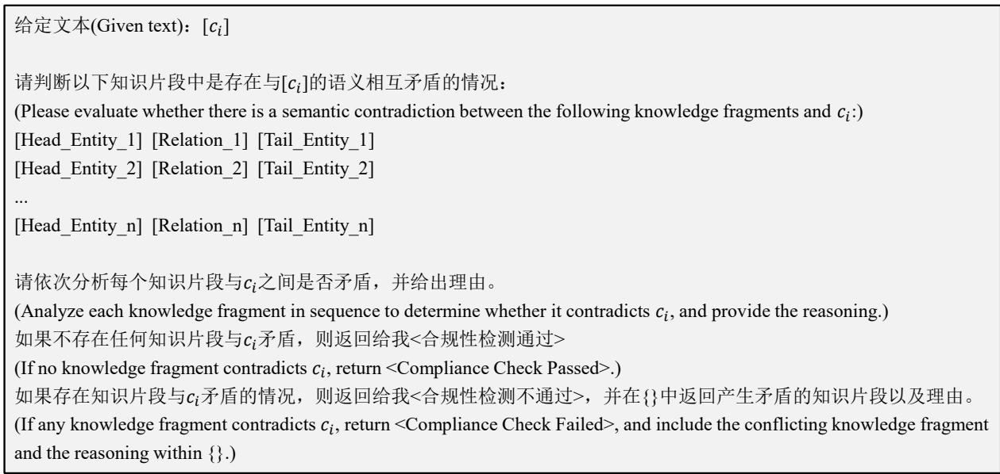
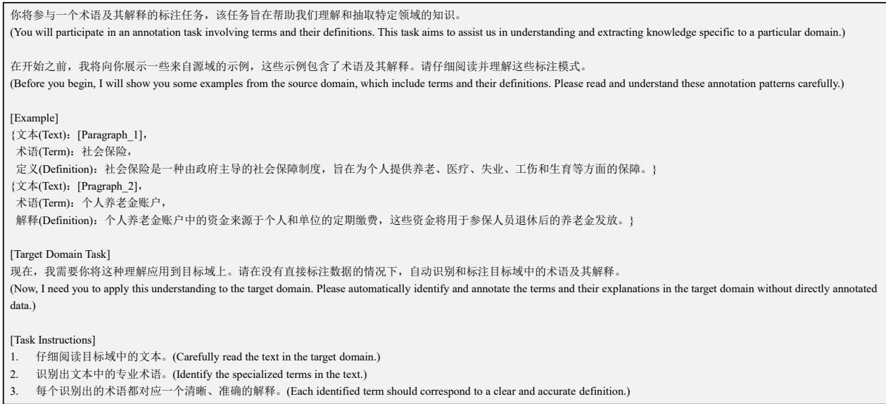

# A Compliance Checking Framework Based on Retrieval Augmented Generation

Jingyun Sun, Zhongze Luo, Yang Li Northeast Forestry University, Harbin, China {sunjingyun, luozhongze, yli}@nefu.edu.cn

## Abstract

The text-based compliance checking aims to verify whether a company’s business processes comply with laws, regulations, and industry standards using NLP techniques. Existing methods can be divided into two categories: Logic-based methods offer the advantage of precise and reliable reasoning processes but lack flexibility. Semantic embedding methods are more generalizable; however, they may lose structured information and lack logical coherence. To combine the strengths of both approaches, we propose a compliance checking framework based on Retrieval-Augmented Generation (RAG). This framework includes a static layer for storing factual knowledge, a dynamic layer for storing regulatory and business process information, and a computational layer for retrieval and reasoning. We employ an eventic graph to structurally describe regulatory information as we recognize that the knowledge in regulatory documents is centered not on entities but on actions and states. We conducted experiments on Chinese and English compliance checking datasets. The results demonstrate that our framework consistently achieves state-of-the-art results across various scenarios, surpassing other baselines.

## 1 Introduction

Compliance checking is a critical tool that ensures a company’s operations adhere to relevant laws, regulations, and standards, helping prevent violations (Esposito et al., 2023; Robaldo et al., 2024), reduce legal risks, and support sustainable development. Text-based compliance checks focus on leveraging natural language processing techniques to analyze business process documents and regulatory documents, aiming to uncover potential violations (Cejas et al., 2023; Fitkau and Hartmann, 2024; Ren et al., 2024).

The left side of Figure 1 illustrates a schematic of text-based compliance checking. The second sentence in the business process document posits that users, upon registration, consent to share their location information with partners for service provision, implying acceptance of certain data-sharing terms without explicit agreement. However, the third statement in the General Data Protection Regulation (GDPR) unequivocally asserts that user data shall not be shared with third parties unless explicit consent is granted. Thus, the operational protocol of this APP encounters a compliance conflict.

Text-based compliance checking methods can be broadly categorized into two types: logic reasoning methods (Bhuiyan et al., 2024; Fitkau and Hartmann, 2024), as illustrated in the upper right corner of Figure 1, and semantic embedding methods (Beach et al., 2024; Chen et al., 2024), as depicted in the lower right corner of Figure 1. Logic reasoning methods typically utilize tools such as Petri nets, first-order predicate logic, and BPMN to describe business process information and regulatory information. Compliance is then determined through explicit logical reasoning. These methods provide precise inference rules to reduce ambiguity and improve checking accuracy but often lack scalability, making adaptation to changing business environments difficult. Semantic embedding methods represent the semantics of business processes and regulatory requirements using low-dimensional continuous vectors, and then employ trained neural network models to assess compliance. These methods can optimize and improve performance with new data and regulations but may lose critical structured information and context, affecting compliance checking accuracy.

To integrate the advantages of the aforementioned methods, we design a compliance checking framework based on Retrieval-Augmented Generation (RAG), which combines structured knowledge with the parametric knowledge of Large

  
Figure 1: The left depicts a schematic diagram of the text-based compliance checking task, while the upper right corner illustrates compliance checking methods grounded in pure logical reasoning. Conversely, the lower right corner portrays compliance checking methods rooted solely in embedding techniques.

Language Models (LLMs) to achieve enhanced compliance checking. Our framework consists of three layers: the static layer, the dynamic layer, and the computational layer. In the static layer, we utilize conventional knowledge graphs to represent factual knowledge, including entities or concepts and their relationships, as well as term definitions. The dynamic layer comprises two sub-modules: a regulatory information module based on an eventic graph and a business process information module based on chunk vectors. In the computational layer, we retrieve relevant information from the static and dynamic layers to guide the LLM in generating compliance reasoning results. Additionally, to construct the eventic graph about regulatory information, we propose an unsupervised information extraction algorithm centered on deontic propositions.

We conducted extensive experiments on four existing compliance checking datasets. The experimental results demonstrate that the proposed framework significantly outperforms other baselines. Additionally, the experiments indicate that our framework exhibits greater flexibility compared to other supervised approaches, enabling rapid and unsupervised adaptation to other target domains. Furthermore, the experiments show that our framework is more adept at identifying compliance conflicts that require global reasoning, a task that even the latest LLMs struggle to accomplish.

## 2 Related works

There are currently two primary text-based compliance checking methods: logic-based reasoning and semantic embedding-based methods (Hashmi et al., 2018; Ly et al., 2015).

A logic-based reasoning approach first formalizes the semantics of business processes and regulatory requirements, then performs explicit reasoning on this formalization to assess the compliance of business processes. For instance, some studies focus on converting natural language texts into first-order predicate logic expressions, followed by explicit logical reasoning using tools like Prolog or CLIPS (Governatori et al., 2006; Zhang and El-Gohary, 2017). Additionally, some research employs Petri nets—a widely used formal modeling language—to model business processes, enabling reasoning and verification of compliance by examining the transitions and states within the Petri net models (Rojas et al., 2016; Rozinat and Van der Aalst, 2008). There are also industry-specific formal modeling and reasoning methods, such as Building Information Modeling (BIM) for checking architectural compliance (Guo et al., 2021; Zheng et al., 2024) and Formal Contract Language (FCL) for verifying contract consistency.

The method based on semantic embeddings first employs low-dimensional continuous embedding vectors to represent the semantics of business processes and regulatory requirements, and then infers compliance implicitly through vector calculations (Saeidi et al., 2021). For instance, (Aires et al., 2018) embedded texts using sent2vec and then calculated their semantic compliance relationships using offset. (Aires and Meneguzzi, 2021) used convolutional networks to extract key semantic features from business process texts and regulatory texts, and determined the compliance of a business process through a classification head. (Huang et al., 2024) applied multi-task deep learning to simultaneously focus on both global and local semantic information in texts, thereby accurately capturing the compliance relationships between texts.

The advantage of logic-based methods is their ability to accurately capture structured relationships between business processes and regulations, with good interpretability. However, they lack scalability and rely heavily on domain experts, limiting adaptability to evolving regulatory requirement. In contrast, semantic embedding-based methods are flexible and less dependent on experts, but they lose structured process information and global context, reducing accuracy and interpretability. Our framework combines the strengths of both approaches. Unlike previous studies (Guo et al., 2021; Zheng et al., 2022), we integrate eventic graphs with LLMs using the RAG paradigm, a novel approach in compliance checking.

## 3 Framework

We design a static layer and a dynamic layer for store information. Additionally, we use a computational layer to retrieve knowledge and drive the reasoning process for compliance checking within the LLM. Therefore, our framework consists of three layers, as illustrated in Figure 2: the static layer for storing factual knowledge, the dynamic layer for storing regulatory information and business process information, and the computational layer responsible for global scheduling and executing compliance reasoning. The construction or computation process of each layer will be introduced in detail below.

## 3.1 Static layer

While entities, actions, states, and deontic propositions plays a central role in compliance checking tasks, static factual knowledge is equally indispensable. For instance, a simple factual statement like “Huawei Technologies Co., Ltd. is located in Guangdong Province” provides crucial information that allows us to infer that the information technology regulations in Guangdong Province are binding on Huawei Technologies Co., Ltd.

We store three types of factual knowledge in the static layer: entity-centric, concept-centric, and term definition-centric knowledge. Given the widespread use of entity- and concept-centric knowledge graphs in the industry, we opt for existing open-source resources. We select CN-Dbpedia (an entity-centric knowledge graph) and OpenConcepts (a concept-centric knowledge graph) for the Chinese datasets. Besides, we chose Dbpedia (an entity-centric knowledge graph) and ConceptNet (a concept-centric knowledge graph) for the English datasets.

To obtain the definitions of terms, we trained a model for joint extraction of terms and their definitions. This model employs BigBird as the backbone, with a CRF layer appended to capture global label dependencies within the sequence. BigBird was chosen because most terms and their definitions are not confined to a single sentence but span across entire paragraphs. Therefore, we used paragraphs as input units and leveraged the BigBird model, which supports long text inputs. We annotated 5,500 term-definition pairs to serve as the training and development sets. The trained model, denoted as the function $M _ { e x p } .$ , is used to extract terms and their definitions from domain-specific regulatory documents $\mathcal { R } = \left\{ r _ { 1 } , r _ { 2 } , \ldots , r _ { | \mathcal { R } | } \right\}$ and business process documents $\dot { \boldsymbol { B } } = \left\{ b , b _ { 2 } , \ldots , \dot { b } _ { | \boldsymbol { B } | } \right\}$ as shown in Equation 1.

$$
\begin{array} { r l } & { M _ { e x p } : ( \mathcal { R } = \left\{ \boldsymbol { r } _ { 1 } , \boldsymbol { r } _ { 2 } , \ldots , \boldsymbol { r } _ { | \mathcal { R } | } \right\} , } \\ & { B = \left\{ b , b _ { 2 } , \ldots , b _ { | \mathcal { B } | } \right\} ) \mapsto E x p K n o w } \end{array}\tag{1}
$$

The extracted terms and their corresponding definitions are stored in an knowledge base referred to as TDKnow. Ultimately, we integrate TDKnow with CN-DBpedia and OpenConcepts to form a comprehensive static factual knowledge graph for compliance checking, denoted as $\mathcal { G } _ { s t a t i c }$ . The structural diagram of model $M _ { e x p } ,$ specific training details, and the annotation process of the termdefinition pairs can be found in Appendix A.

## 3.2 Dynamic layer

The dynamic layer is utilized for storing business process information and regulatory information.

  
� = “We may share your location information with partners to help us provide services, which you have agreed to during registration.”

Figure 2: RAG-based compliance checking framework. This framework comprises three layers: the upper static layer (blue) stores static factual knowledge; the middle dynamic layer (purple) holds changing regulatory and business process information; the lower computing layer (yellow) retrieves pertinent knowledge to infer compliance outcomes.

We employ an eventic graph to describe regulatory information, as such information pertains not to entities and their relationships, but rather to knowledge regarding agents, actions, states, and deontic propositions. In addition, we use chunk vectors to represent business process information to facilitate vectorized computations. The following sections provide an introduction to these two components respectively.

Part 1: Eventic graph for regulatory information. The eventic knowledge graph focuses on describing the relationships between subjects, actions, states, and events, which aligns with the perspective used in regulatory information descriptions. Therefore, we construct an eventic graph capable of describing regulatory information, referred to as $\mathcal { G } _ { e v e n t i c }$ . Based on the characteristics of regulatory information and theories related to deontic propositions, we define the ontology for $\mathcal { G } _ { e v e n t i c } .$ , which includes six entity types and seven relationship types, as detailed in Appendix B. Unlike conventional knowledge graphs where nodes are predominantly entity names, the nodes in $\mathcal { G } _ { e v e n t i c }$ mainly describe actions and states, resulting in longer node texts. Consequently, standard named entity recognition and event extraction methods are ineffective in extracting the structured knowledge required for constructing $\mathcal { G } _ { e v e n t i c }$ To address this issue, we propose an information extraction algorithm centered on deontic propositions, utilizing the API of a commercial LLM, as illustrated in Algorithm 1. To avoid the need for labor-intensive data annotation, Algorithm 1 is entirely unsupervised.

The core objective of Algorithm 1 is to extract regulatory information centered around deontic propositions from regulatory documents. The input to this algorithm is a collection of regulatory documents within a specific domain, denoted as $\mathcal { R } = \left\{ r _ { 1 } , r _ { 2 } , \ldots , r _ { | \mathcal { R } | } \right\}$ , and the output is a set of triples E. In line 3, the algorithm aims to extract all agents subject to deontic constraints from the entire set of regulatory documents. Lines 4 through 8 are designed to extract deontic words from each paragraph based on the identified agents. According to our observations, nearly all actions or states under deontic constraints follow immediately after deontic words. Consequently, lines 8 through 11 of the algorithm extract these actions and states directly based on the predefined rules. The instruction templates for lines 3 and 8, $T e m p t _ { 1 }$ and T empt , are provided in Appendix C. Finally, the triples centered on deontic propositions are stored in the set E.

Part 2: Chunck vectors for business process information. To facilitate the computation of semantic vectors, we segment the business process into chunks and embed them as semantic vectors using the SBERT model proposed by (Zhao et al.,

Algorithm 1 Deontic Proposition-centered Infor  
mation Extraction Algorithm based on LLM   
INPUT: Regulatory document set R   
$\left\{ r _ { 1 } , r _ { 2 } , \ldots , r _ { | \mathcal { R } | } \right\}$   
OUTPUT: Set of triples $\mathcal { E }$   
1: Initialize an empty set ${ \mathcal { E } } = \{ \}$   
2: for each $r _ { i }$ in R do   
3: $\mathcal { A } _ { \mathrm { a g e n t } }  L L M ( T e m p t _ { 1 } ( r _ { i } ) ) / /$ Extract   
all agents from $r _ { i }$ via the LLM   
4: Divide $r _ { i }$ to obtain sequence $P _ { i }$ of para  
graphs.   
5: for each $p _ { j }$ in $P _ { i }$ do   
6: Match each agent in ${ \mathcal { A } } _ { \mathrm { a g e n t } }$   
7: if agent in $p _ { j }$ then   
8: dword $ L L M ( T e m p t _ { 2 } ( a g e n t , p _ { k } ) )$   
$/ /$ Extract deontic word   
9: s ← End index of string dword   
10: e ← End index of string $p _ { j }$   
11: action $ p _ { k } [ s : e ]$   
12: Add (agent, dword, action) into E   
13: end if   
14: end for   
15: end for   
16: return E

2019), storing these vectors in the Faiss (Qin et al., 2020) vector database. This process is illustrated in Equations 2-3.

$$
\begin{array} { r } { c h u n k : B = \left\{ b _ { 1 } , b _ { 2 } , \dotsc , b _ { | B | } \right\} } \\ { \mapsto \mathcal { C } = \left\{ c _ { 1 } , c _ { 2 } , \dotsc , c _ { | \mathcal { C } | } \right\} } \end{array}\tag{2}
$$

$$
S B E R T : { \mathcal { C } } \mapsto \mathbb { C } = [ { \vec { c } } _ { 1 } , { \vec { c } } _ { 2 } , \dots , { \vec { c } } _ { | { \mathcal { C } } | } ]\tag{3}
$$

where $\mathcal { C }$ represents the set of chunks, and C is the matrix composed of the semantic vectors of these chunks.

## 3.3 Computing layer

The purpose of this layer is to retrieve knowledge from both the static and dynamic layers, thereby guiding the LLM to generate accurate and reliable compliance checking results. Initially, we allow the vectors in $\mathbb { C }$ to sequentially match the knowledge graph $\mathcal { G } _ { e v e n t i c } .$ Specifically, for each vector ${ \vec { c } } _ { i } ,$ , we calculate its semantic similarity with each node $u _ { j }$ in $\mathcal { G } _ { e v e n t i c }$ . If the semantic similarity exceeds the threshold λ, the node $u _ { j }$ is considered a hit. This process is illustrated in Equation 4.

$$
f \left( u _ { j } \right) = \left\{ { { h i t } , \begin{array} { l l } { h i t , } & { i f \cos ( { { \vec { c } } _ { i } } , { { \vec { u } } _ { j } } ) \geq \lambda } \\ { \qquad } \\ { m i s s , } & { e l s e } \end{array} } \right.\tag{4}
$$

where $\vec { u } _ { j }$ represents the embedding vector of node $u _ { j }$ (using SBERT for semantic embedding). All hit nodes in $\mathcal { G } _ { e v e n t i c }$ are denoted as $\mathcal { G } _ { s u b }$ , with $\mathcal { G } _ { s u b } \subset$ $\mathcal { G } _ { e v e n t i c } .$

Next, nodes from $\mathcal { G } _ { s u b }$ are matched with those in $\mathcal { G } _ { s t a t i c }$ to obtain the intersection set ${ \mathcal P } .$ , as shown in Equation 5.

$$
\mathcal { P } = \{ p \in V _ { \mathcal { G } _ { s t a t i c } } | p = s \in V \mathcal { G } _ { s u b } \}\tag{5}
$$

where $V _ { \mathcal { G } _ { s t a t i c } }$ represents the set of nodes in $\mathcal { G } _ { s t a t i c } ,$ and $V _ { \mathcal { G } _ { s u b } }$ represents the set of nodes in $\mathcal { G } _ { s u b }$

Subsequently, the set of neighbor nodes $\mathcal { N }$ of the set $\mathcal { P }$ is obtained, as shown in Equation 6.

$$
\mathcal { N } = \cup _ { p \in \mathcal { P } } N ( p )\tag{6}
$$

where $p$ represents a node in ${ \mathcal P } _ { \mathrm { { : } } }$ , and $N \left( p \right) =$ $\{ n \in V \mathcal { G } _ { s t a t i c } | \left( p , n \right) \in E \mathcal { P } _ { s t a t i c } \}$ . Besides, $E _ { \mathcal { G } _ { s t a t i c } }$ denotes the edge set of $\mathcal { G } _ { s t a t i c } .$ . Ultimately, the largest connected graph with $\mathcal { N }$ as its nodes is obtained, denoted as $\mathcal { G } _ { f u s } . \mathcal { G } _ { f u s }$ is a heterogeneous knowledge graph related to ${ \vec { c } } _ { i } ,$ encompassing both static and dynamic knowledge.

We wrap the current chunk $c _ { i }$ and its associated knowledge graph $\mathcal { G } _ { f u s }$ using the instruction template T empt3(·) to obtain the input $x _ { i }$ . The instruction template is illustrated in Appendix D.

Finally, the input $x _ { i }$ is provided to ChatGLM-3-6b, guiding it to generate compliance checking results with explanations, as shown in Equation 7. For the datasets in English, we employ the LLaMa-2 model.

$$
C h a t G L M : T e m p t _ { 3 } ( c _ { i } , G _ { f u s } ) \longmapsto { \hat { y } } _ { i }\tag{7}
$$

where $\hat { y } _ { i }$ represents the compliance checking results with explanations generated by the LLM.

## 4 Experimental settings

## 4.1 Datasets

To evaluate the effectiveness of our framework, we conducted experiments on the following four datasets: 1) EU2UK is a dataset proposed by (Chalkidis et al., 2021) aimed at checking whether UK legislation complies with EU directives. This dataset is designed for document-level compliance checking , where the unit of compliance conflict is the entire document rather than individual sentences. 2) GDPR-13 is a dataset introduced by Liu et al. (Liu et al., 2021) used to analyze the compliance of privacy policies of applications with Chapter 13 of the GDPR. 3) CONTRACT is a dataset developed by (Aires et al., 2019) intended to assess contract consistency. 4) CSSCD is a Chinese dataset proposed by (Huang et al., 2024) for analyzing compliance in social security operations. This is the only Chinese dataset among the four; the other three datasets are in English.

## 4.2 Baselines

We compare our framwork with the following baselines: 1) Doc2Doc, an information retrieval-based method focused on document-level compliance checking, which achived the best performance on the EU2UK dataset (Chalkidis et al., 2021). 2) CLS represents the semantic classification-based compliance checking method proposed by (Liu et al., 2021), where business sentences are categorized into predefined violation classes using machine learning or neural network classifiers. 3) Offsets, originally proposed by (Aires et al., 2018) as a contract consistency method based on semantic embeddings, is also applicable to compliance checking tasks. 4) NeuralConflict is a multi-task learningbased compliance checking method designed to analyze both local and global semantic compliance simultaneously (Huang et al., 2024).

Additionally, considering the similarity in objectives between compliance checking and textual entailment tasks, we also included the following baselines: 5) TER-PLM, a method for textual entailment recognition that directly concatenates two sentences (with [SEP] as a separator) as input to language models (Wehnert et al., 2022). 6) TER-Inner, an interaction attention-based textual entailment recognition method, which has demonstrated effectiveness across multiple datasets (Sun et al., 2017). 7) TER-GraphAtt, a textual entailment recognition method based on graph attention networks, which has achieved state-of-the-art results on several datasets (Chen et al., 2019).

## 5 Results and analysis

## 5.1 Performance comparison with baselines

We first analyze the performance of the aforementioned baselines and our framework across four datasets. The compliance checking task is characterized by a severe imbalance in the number of positive and negative samples, with the majority of business processes being compliant, while non-compliant cases are relatively few. In light of this, we use the Matthews Correlation Coefficient (MCC) as the evaluation metric. MCC is a measure for assessing the performance of binary classifiers, particularly effective in handling datasets with imbalanced sample distributions.

The experimental results are presented in Table 1. Upon examining the table, it is evident that our proposed framework demonstrates outstanding performance in compliance checking, which strongly attests to the framework’s effectiveness and advancement. Notably, on the document-level compliance checking dataset EU2UK, our framework exhibits a particularly significant performance advantage, surpassing the second-place method by 0.048. This indicates that our framework possesses a remarkable capability for conducting global compliance analysis and checking.

In the tests conducted on the non-document-level datasets GDPR-13, CONTRACT, and CSSCD, the performance of the text entailment recognition baselines surpassed that of the compliance checking baselines. This suggests that compliance checking methods based on semantic embeddings may potentially be replaced by other deep learning models with similar task objectives. However, our approach consistently outperformed all baselines across the four datasets. This is attributed to our framework’s reasoning process not only focuses on the semantic consistency between current business process sentences and regulatory statements but also emphasizes the comprehensive analysis of global regulatory information. Furthermore, the static and dynamic knowledge layers demonstrated unique and irreplaceable advantages, as further verified and analyzed in the experiments discussed in Section 5.2 and 5.3.

Table 1: Performance of our proposed framework and baselines on the four datasets. The evaluation metric used is the Matthews Correlation Coefficient (MCC).
<table><tr><td rowspan="2">Method</td><td colspan="3">English</td><td rowspan="2">Chinese CSSCD</td></tr><tr><td>EU2UK</td><td>GDPR-13</td><td>CONTRACT</td></tr><tr><td>Doc2Doc</td><td>0.724</td><td>0.601</td><td>0.674</td><td>0.628</td></tr><tr><td>CLS</td><td>1</td><td>0.602</td><td>0.672</td><td>0.633</td></tr><tr><td>Offsets</td><td>1</td><td>0.584</td><td>0.648</td><td>0.611</td></tr><tr><td>NeuralConflict</td><td>1</td><td>0.610</td><td>0.661</td><td>0.643</td></tr><tr><td>TER-PLM</td><td>1</td><td>0.617</td><td>0.694</td><td>0.645</td></tr><tr><td>TER-Inner</td><td>1</td><td>0.620</td><td>0.712</td><td>0.650</td></tr><tr><td>TER-GraphAtt</td><td>0.730</td><td>0.619</td><td>0.713</td><td>0.648</td></tr><tr><td>Our framework</td><td>0.778</td><td>0.652</td><td>0.730</td><td>0.680</td></tr></table>

## 5.2 Ablation study

This section analyzes the contributions of each module within our framework. We sequentially remove the three knowledge graphs from the static layer until the entire static layer is eliminated. As shown in Figure 3, the performance of our framework on all four datasets consistently declines with the successive removal of the knowledge graphs. This indicates that each knowledge graph within the static layer—namely, the entity graph, the concept graph, and the term definition graph—is indispensable for compliance checking within the framework.

  
Figure 3: Results of the ablation study.

Furthermore, we observe that when all the knowledge graphs, i.e., the entire static layer, are removed, the compliance checking performance of our framework falls below that of other baselines. This suggests that factual knowledge is essential in compliance checking tasks.

## 5.3 Domain adaptability

We can apply the designed framework in a domainindependent manner, with only the term definition extraction module requiring domain-specific labeled data. To overcome this limitation, we leverage the In-Contextual Learning (ICL) capabilities of LLMs to reduce the dependence on domainspecific data. Specifically, after demonstrating the annotation patterns of terms and definitions from the source domain to the LLM, the model is then directed to perform unsupervised annotation on the target domain. The instruction template used to guide the LLM’s annotation is shown in Appendix E.

We use the CSSCD dataset as the source domain and the other three datasets as the target domains. The experimental results in Table 2 demonstrate that our framework maintains effective compliance checking performance even in cross-domain scenarios.

Table 2: The effectiveness of the term and explanation extraction in the domain transfer scenario.
<table><tr><td>Source domain</td><td>CSSCD</td><td>MCC</td></tr><tr><td></td><td>EU2UK</td><td>0.743</td></tr><tr><td>Target domains</td><td>GDPR-13</td><td>0.603</td></tr><tr><td></td><td>CONTRACT</td><td>0.714</td></tr></table>

## 5.4 Global information perception

To evaluate the framework’s capability in checking global compliance, we analyzed a specific case, as illustrated in Figure 4. In the figure, the business process sentence is “We will share your personal data with third parties as necessary,” while a regulatory requirement states, “The processing of personal data requires lawful basis.” Analyzing these two sentences alone reveals no compliance conflict. However, considering an additional regulatory requirement, “A user’s explicit consent is the only lawful basis for sharing data,” it becomes evident that there is a conflict between the business process and the regulatory requirements when both regulations are considered together.

We tested whether the baseline methods could identify this compliance conflict, several opensource LLMs were also included in the experiments. All traditional baseline methods failed to identify this compliance conflict. Among the LLM baselines, only MoonShot-v1-128k and GPT-4 correctly identified this conflict. We hypothesize that this is because the pre-training data for these two LLMs included the General Data Protection Regulation and the business process of this APP.

## 5.5 Analysis of influencing factors

This section analyzes the factors that may influence the performance of our framework. First, we examine the impact of the sole hyperparameter, λ, which requires manual configuration. As illustrated in Figure 5(a), our framework performs optimally when λ is set to 0.7 or 0.8. When λ is set to 0.9, the compliance checking capability of the framework declines sharply. We attribute this to the excessively high threshold prevents $c _ { i }$ from connecting to a sufficient number of nodes, thereby limiting the structured knowledge available for LLM reasoning.

Subsequently, we replaced the language model SBERT in Section 3.2 with BERT, RoBERTa, XL-Net, ELECTRA, and DistilBERT, respectively. As shown in Figure 5(b), substituting different language models had minimal impact on the frame-

  
Figure 4: The business process statement in the diagram does not conflict with the first regulatory requirement. However, when both regulatory requirements are considered simultaneously, the business process is in violation of the regulations.

work’s performance.

Finally, we replaced ChatGLM-3-6b with other LLMs. As depicted in Figure 5(c), ChatGLM demonstrates the best performance on the Chinese dataset, while LLaMa-2 achieved the best results on the English datasets.

## 6 Conclusion

We proposed a compliance checking framework based on Retrieval-Augmented Generation (RAG), which leverages the strengths of both embeddingbased and logic-based compliance checking methods. The framework consists of three layers: a static layer that stores factual knowledge, a dynamic layer that holds regulatory information and business process data, and a computational layer responsible for knowledge retrieval and guiding the reasoning of Large Language Models (LLMs). Experimental results demonstrate that our framework achieves state-of-the-art performance across four compliance checking datasets. Moreover, our framework exhibits superior do-main adaptability and is capable of detecting potential compliance conflicts from a global perspective.

## 7 Limitations and potential solutions

Our framework relies on the retrieval of knowledge from both the static and dynamic layers. Despite carefully designing retrieval strategies and setting retrieval thresholds, the thresholds originally set may become invalid once the knowledge in the static and dynamic layers is updated, potentially interfering with the reasoning of the LLM. A potential future solution could involve designing an LLM agent-based knowledge retrieval mechanism, where agents with autonomous decision-making capabilities dynamically and intelligently retrieve the knowledge needed for LLM reasoning.

  
Figure 5: Subfigure (a) illustrates the impact of the hyperparameter λ on the framework, subfigure (b) demonstrates the influence of different encoder models on the framework, and subfigure (c) presents the effects of various LLMs on the framework.

## Acknowledgements

We thank the anonymous reviewers for their insightful comments. This work has been supported by the National Natural Science Foundation of China (NSFC) via Grant 62276059 and the Heilongjiang Provincial Natural Science Foundation of China via Grant YQ2023F001.

## References

João Paulo Aires, Roger Leitzke Granada, Juarez Monteiro, Rodrigo Coelho Barros, and Felipe Rech

Meneguzzi. 2019. Classification of contractual conflicts via learning of semantic representations. In Proceedings of the 18th International Conference on Autonomous Agents and Multiagent Systems (AA-MAS), 2019, Canadá.

João Paulo Aires and Felipe Meneguzzi. 2021. Norm conflict identification using a convolutional neural network. In Coordination, Organizations, Institutions, Norms, and Ethics for Governance of Multi-Agent Systems XIII: International Workshops COIN 2017 and COINE 2020, Sao Paulo, Brazil, May 8- 9, 2017 and Virtual Event, May 9, 2020, Revised Selected Papers, pages 3–19. Springer.

João Paulo Aires, Juarez Monteiro, Roger Granada, and Felipe Meneguzzi. 2018. Norm conflict identification using vector space offsets. In 2018 International Joint Conference on Neural Networks (IJCNN), pages 1–8. IEEE.

Thomas Beach, Jonathan Yeung, Nicholas Nisbet, and Yacine Rezgui. 2024. Digital approaches to construction compliance checking: Validating the suitability of an ecosystem approach to compliance checking. Advanced Engineering Informatics, 59:102288.

Hanif Bhuiyan, Guido Governatori, Andy Bond, and Andry Rakotonirainy. 2024. Traffic rules compliance checking of automated vehicle maneuvers. Artificial Intelligence and Law, 32(1):1–56.

Orlando Amaral Cejas, Muhammad Ilyas Azeem, Sallam Abualhaija, and Lionel C Briand. 2023. Nlpbased automated compliance checking of data processing agreements against gdpr. IEEE Transactions on Software Engineering, 49(9):4282–4303.

Ilias Chalkidis, Manos Fergadiotis, Nikolaos Manginas, Eva Katakalou, and Prodromos Malakasiotis. 2021. Regulatory compliance through doc2doc information retrieval: A case study in eu/uk legislation where text similarity has limitations. arXiv preprint arXiv:2101.10726.

Daoyuan Chen, Yaliang Li, Min Yang, Hai-Tao Zheng, and Ying Shen. 2019. Knowledge-aware textual entailment with graph attention network. In Proceedings ofthe 28th ACM International Conference on Information and Knowledge Management, pages 2145–2148.

Nanjiang Chen, Xuhui Lin, Hai Jiang, and Yi An. 2024. Automated building information modeling compliance check through a large language model combined with deep learning and ontology. Buildings, 14(7):1983.

Christian Esposito, Ross Horne, Livio Robaldo, Bart Buelens, and Elfi Goesaert. 2023. Assessing the solid protocol in relation to security and privacy obligations. Information, 14(7):411.

Isabelle Fitkau and Timo Hartmann. 2024. An ontologybased approach of automatic compliance checking for structural fire safety requirements. Advanced Engineering Informatics, 59:102314.

Guido Governatori, Zoran Milosevic, and Shazia Sadiq. 2006. Compliance checking between business processes and business contracts. In 2006 10th IEEE International Enterprise Distributed Object Computing Conference (EDOC’06), pages 221–232. IEEE.

Dongming Guo, Erling Onstein, and Angela Daniela La Rosa. 2021. A semantic approach for automated rule compliance checking in construction industry. IEEE Access, 9:129648–129660.

Mustafa Hashmi, Guido Governatori, Ho-Pun Lam, and Moe Thandar Wynn. 2018. Are we done with business process compliance: state of the art and challenges ahead. Knowledge and Information Systems, 57(1):79–133.

Shaobin Huang, Jingyun Sun, and Rongsheng Li. 2024. Neuralconflict: Using neural networks to identify norm conflicts in normative documents. Expert Systems, 41(6):e13035.

Shuang Liu, Baiyang Zhao, Renjie Guo, Guozhu Meng, Fan Zhang, and Meishan Zhang. 2021. Have you been properly notified? automatic compliance analysis of privacy policy text with gdpr article 13. In Proceedings of the Web Conference 2021, pages 2154– 2164.

Linh Thao Ly, Fabrizio Maria Maggi, Marco Montali, Stefanie Rinderle-Ma, and Wil MP Van Der Aalst. 2015. Compliance monitoring in business processes: Functionalities, application, and tool-support. Information systems, 54:209–234.

Chunyuan Qin, Chuan Deng, Jiashun Huang, Kunxian Shu, and Mingze Bai. 2020. An efficient faiss-based search method for mass spectral library searching. In 2020 3rd International Conference on Advanced Electronic Materials, Computers and Software Engineering (AEMCSE), pages 513–518. IEEE.

Qiubing Ren, Dongliang Zhang, Mingchao Li, Shu Chen, Dan Tian, Heng Li, and Leping Liu. 2024. Automatic quality compliance checking in concrete dam construction: Integrating rule syntax parsing and semantic distance. Advanced Engineering Informatics, 60:102409.

Livio Robaldo, Sotiris Batsakis, Roberta Calegari, Francesco Calimeri, Megumi Fujita, Guido Governatori, Maria Concetta Morelli, Francesco Pacenza, Giuseppe Pisano, Ken Satoh, et al. 2024. Compliance checking on first-order knowledge with conflicting and compensatory norms: a comparison among currently available technologies. Artificial Intelligence and Law, 32(2):505–555.

Eric Rojas, Jorge Munoz-Gama, Marcos Sepúlveda, and Daniel Capurro. 2016. Process mining in healthcare: A literature review. Journal of biomedical informatics, 61:224–236.

Anne Rozinat and Wil MP Van der Aalst. 2008. Conformance checking of processes based on monitoring real behavior. Information Systems, 33(1):64–95.

Marzieh Saeidi, Majid Yazdani, and Andreas Vlachos. 2021. Cross-policy compliance detection via question answering. In Proceedings of the 2021 Conference on Empirical Methods in Natural Language Processing, pages 8622–8632.

Chengjie Sun, Yang Liu, Chang’e Jia, Bingquan Liu, and Lei Lin. 2017. Recognizing text entailment via bidirectional lstm model with inner-attention. In Intelligent Computing Methodologies: 13th International Conference, ICIC 2017, Liverpool, UK, August 7-10, 2017, Proceedings, Part III 13, pages 448–457. Springer.

Sabine Wehnert, Shipra Dureja, Libin Kutty, Viju Sudhi, and Ernesto William De Luca. 2022. Applying bert embeddings to predict legal textual entailment. The Review of Socionetwork Strategies, 16(1):197–219.

Jiansong Zhang and Nora M El-Gohary. 2017. Semantic-based logic representation and reasoning for automated regulatory compliance checking. Journal of Computing in Civil Engineering, 31(1):04016037.

Zhe Zhao, Hui Chen, Jinbin Zhang, Wayne Xin Zhao, Tao Liu, Wei Lu, Xi Chen, Haotang Deng, Qi Ju, and Xiaoyong Du. 2019. Uer: An open-source toolkit for pre-training models. In Proceedings of the 2019 Conference on Empirical Methods in Natural Language Processing and the 9th International Joint Conference on Natural Language Processing (EMNLP-IJCNLP): System Demonstrations, pages 241–246.

Zhe Zheng, Yu-Cheng Zhou, Ke-Yin Chen, Xin-Zheng Lu, Zhong-Tian She, and Jia-Rui Lin. 2024. A text classification-based approach for evaluating and enhancing the machine interpretability of building codes. Engineering Applications of Artificial Intelligence, 127:107207.

Zhe Zheng, Yu-Cheng Zhou, Xin-Zheng Lu, and Jia-Rui Lin. 2022. Knowledge-informed semantic alignment and rule interpretation for automated compliance checking. Automation in Construction, 142:104524.

## A BigBird-based jointly extraction model for terms and explanations

Figure 6 illustrates the structure of the joint extraction model for terms and explanations. This is a typical model structure used for sequence labeling, where a CRF layer is added after BigBird to model dependencies between labels, thereby improving the global prediction accuracy of the label sequence. As shown in the figure, terms and their explanations are extracted simultaneously, ensuring the sharing of task information. BigBird allows for input of up to 8,000 tokens, making it capable of accepting input text in whole paragraph units.

We annotated 5,500 samples for the training and development validation of the model, with 4,000 used for training and 1,500 for development validation. First, we divided business process and regulatory documents from specific domains into paragraphs. Then, three junior annotators each annotated 2,000 samples, resulting in a total of 6,000 annotated samples. These 6,000 samples were then reviewed by two senior annotators, who removed 500 poorly annotated samples, leaving us with 5,500 high-quality annotated samples. We used Fleiss’ Kappa to evaluate the consistency between the two senior annotators during the review process. The formula for calculating Fleiss’ Kappa is as follows:

$$
K a p p a = 1 - \frac { P _ { 0 } - P _ { e } } { 1 - P _ { e } }\tag{8}
$$

In this formula, $P _ { o }$ represents the observed proportion of agreement between the reviewers, while $P _ { e }$ represents the expected proportion of agreement based on random chance. We collected the annotation results of the two senior annotators for the 500 samples that were removed and calculated their consistency. By comparing their annotations, we obtained a Kappa value of 0.78, which indicates a high level of agreement between the two senior annotators during the review process.

During the model training process, we set the maximum input length to 5,000, the batch size to 4, and the learning rate to 2e-5. We used AdamW as the optimizer, with the maximum number of optimization epochs set to 20. Additionally, we implemented early stopping to prevent overfitting.

## B Ontology of deontic proposition-centered eventic graph

We have defined the entity types and relationship types included in the ontology for the event graph $\mathcal { G } _ { e v e n t i c }$ . Table 3 presents the entity types along with corresponding examples, while Table 4 presents the relationship types and their examples.

## C Templates for deontic proposition-centered information extraction

In line 3 of Algorithm 1, template Tempt1 is used to guide the large model in extracting all agents from the given regulatory document. The template is as shown in Figure 7.

Table 3: Predefined entity types for eventic graph.
<table><tr><td>Entity type</td><td>Example</td></tr><tr><td>Organization</td><td>Huawei Technologies Co., Ltd</td></tr><tr><td>Person</td><td>Ren Zhengfei</td></tr><tr><td>Regulatory document</td><td>“Regulation on the Internet Protection of Minors&quot;</td></tr><tr><td>Category</td><td>Data Security, Protection of minors</td></tr><tr><td>Action</td><td>Share user&#x27;s data with third parties</td></tr><tr><td>State</td><td>Stored on an isolated server</td></tr></table>

Table 4: Predefined relation types for eventic graph.
<table><tr><td>Relation type</td><td>Example</td></tr><tr><td>Publish</td><td>“Internet Information Office of China&quot;, Publish, “Regulations on Ecological Governance of Network Information Content&quot;</td></tr><tr><td>WorkFor</td><td>&quot;Ren Zhengfei&quot; WorkFor</td></tr><tr><td rowspan="2"></td><td>“Huawei Technologies Co., Ltd”</td></tr><tr><td>“Information technology companies&quot;</td></tr><tr><td rowspan="2">Duty</td><td>Duty</td></tr><tr><td>“Ensure uesers&#x27; personal data is limited only to the minimal extent necessary to provide the service&quot;</td></tr><tr><td rowspan="2">Prohibited</td><td>“APP service provider&quot;</td></tr><tr><td>Prohibited “Share user&#x27;s data with third parties&quot;</td></tr><tr><td rowspan="2">Right</td><td>“Shenzhen Market Supervision and Administration Bureau&quot;</td></tr><tr><td>HaveRight</td></tr><tr><td rowspan="2">ClassifiedTo</td><td>“Penalties for violating companies&quot;</td></tr><tr><td>“Regulation on the Internet Protection of Minors&quot; ClassifiedTo</td></tr><tr><td rowspan="2"></td><td>“Information security&quot;</td></tr><tr><td>&quot;Regulation on the Internet Protection of Minors&quot;</td></tr><tr><td rowspan="3">Cite</td><td></td></tr><tr><td>Cite</td></tr><tr><td>“Minors Protection Act&quot;</td></tr></table>

In line 8 of Algorithm 1, template T empt2 is used to guide the large model in predicting the moral words based on the current paragraph and the subject it contains. The template is as shown in Figure 8.

## D Template for wrapping chunks and their related knowledge

Template for wrapping chunks and their related knowledge is as shown in Figure 9.

## E The instruction template used to guide the LLM’s annotation

The instruction template used to guide the LLM’s annotation is shown in Figure 10.

  
Figure 6: Structure of the jointly extraction model for terms and explanations.

  
任务：请仔细阅读以下段落，识别出与受道义约束的主体相关的道义词，并为每个预测的道义词提供简短的解释。道义词是指表达某种道Figure 7: Template T empt1 is used to guide the large model in extracting all agents from the given regulatory 德或法律义document.

  
Figure 8: Template Tempt is used to guide the large model in predicting the moral words based on the current paragraph and the subject it contains.

  
Figure 9: Template for wrapping chunks and their related knowledge.

  
Figure 10: The instruction template used to guide the LLM’s annotation.