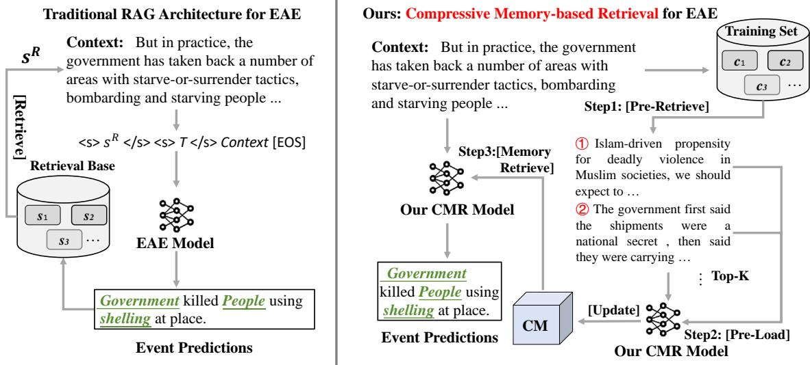
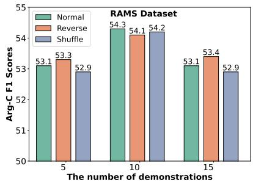
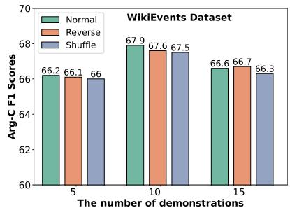
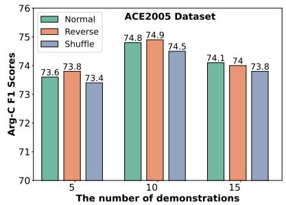

<table><tr><td>Events</td></tr><tr><td>Event Type: Life.die.death-caused-by-violent-events Template: Killer killed victimusing instrument at place.</td></tr><tr><td>Event Type: Life.die.conflict.yield.surrender Template:Surrenderersurrendered to recipient at place.</td></tr></table>

# A Compressive Memory-based Retrieval Approach for Event Argument Extraction

Wanlong Liu1, Enqi Zhang1, Shaohuan Cheng1, Li Zhou2, Dingyi Zeng1, Chen Zhang3, Malu Zhang1, Wenyu Chen 米

1University of Electronic Science and Technology of China

2The Chinese University of Hong Kong, Shenzhen

3 National University of Singapore

liuwanlong@std.uestc.edu.cn, maluzhang@uestc.edu.cn, cwy@uestc.edu.cn

## Abstract

Recent works have demonstrated the effectiveness of retrieval augmentation in the Event Argument Extraction (EAE) task. However, existing retrieval-based EAE methods have two main limitations: (1) input length constraints and (2) the gap between the retriever and the inference model. These issues limit the diversity and quality of the retrieved information. In this paper, we propose a Compressive Memorybased Retrieval (CMR) mechanism for EAE, which addresses the two limitations mentioned above. Our compressive memory, designed as a dynamic matrix that effectively caches retrieved information and supports continuous updates, overcomes the limitations of the in put length. Additionally, after pre-loading all candidate demonstrations into the compressive memory, the model further retrieves and filters relevant information from memory based on the input query, bridging the gap between the retriever and the inference model. Extensive experiments show that our method achieves new state-of-the-art performance on three public datasets (RAMS, WikiEvents, ACE05), significantly outperforming existing retrieval-based EAE methods.

## 1 Introduction

Event argument extraction (EAE) is a crucial and challenging subtask of information extraction (Ren et al., 2022b; Yang et al., 2021; Ding et al., 2024), aimed at identifying event-related arguments and determining their roles within texts. For instance, as shown in Figure 1, when the target event is Life.die.death with the trigger bombarding, EAE models are tasked with extracting arguments like “government” and “shelling”, which correspond to the roles of attacker, and instrument.

With the successful application of retrievalaugmented generation (RAG) (Lewis et al., 2020) technology to various NLP tasks (Levonian et al.,

Figure 1: An example of an EAE task from the RAMS dataset (Ebner et al., 2020). Each underlined section in the template (prompt), known as a role slot, corresponds to a specific argument role.

2023; Yin et al., 2024b,a; Ni et al., 2024; Wang et al., 2024; Liang et al., 2024), some works (Du and Ji, 2022; Du et al., 2022; Ren et al., 2023; Huang, 2023) have incorporated retrievalaugmented techniques into event extraction. They use similarity-based retrieval to retrieve the most relevant instances (demonstrations) from the training set for the input query, providing prior external knowledge and augmenting the EAE process. However, these retrieval-based EAE methods still face some issues that hinder further improvement.

First, retrieval augmentation is limited by the model input length. Current mainstream generation-based EAE approaches typically utilize BART (Lewis et al., 2019) or T5 (Raffel et al., 2020) as the PLM. Consequently, due to the input length limitation of these inference models, only a very limited amount of retrieved information can be used for augmentation. For instance, in previous retrieval-based EAE methods (Ren et al., 2023; Huang, 2023), the number of retrieved demonstrations is limited to just one, which significantly limits the diversity of retrieved content.

Second, the retrieval quality is limited by the gap between the retriever and the inference model. Current mainstream retrieval-based EAE methods (Ren et al., 2023; Huang, 2023; Du et al., 2022) use dense retrievers such as S-BERT (Reimers, 2019) and retrieve based on the similarity of the context. These retrievers, often untrained, exhibit an embedding gap with inference models as highlighted in recent studies (Ren et al., 2022a; Thakur et al., 2021; Xu et al., 2023), leading to sub-optimal retrieval quality. Additionally, in EAE tasks, only a few contextual words serve as event arguments, while other extraneous content can mislead the retriever, resulting in the retrieval of irrelevant demonstrations.

Recently, numerous studies (Munkhdalai et al., 2024; Katharopoulos et al., 2020; Tiezzi et al., 2024; Gu and Dao, 2023) have adopted RNNinspired approaches to tackle the quadratic complexity issue of processing long texts in transformers. Inspired by these works, we propose a Compressive Memory-based Retrieval (CMR) method for EAE, which effectively addresses the two issues mentioned above. Specifically, we design a compressive memory mechanism that caches the information of retrieved demonstrations. This compressive memory, structured as a dynamic matrix, supports continuous updates and is theoretically capable of caching information indefinitely. Before inference, the model pre-loads all candidate demonstrations into the memory. Then it dynamically retrieves necessary information from the memory based on the input query, enabling adaptive filtering of the candidate demonstrations retrieved by the retriever.

Our proposed CMR model has the following two advantages over existing EAE methods: (1) CMR breaks the limitation of the model’s context window size, enabling the retrieval of more instances as demonstrations and ensuring the diversity of RAG. (2) CMR integrates a memory retrieval mechanism that further filters the retrieved information, allowing adaptive retrieval of relevant data for the EAE task. Its parameters are jointly trained with those of the PLM, bridging the gap between the retriever and inference model. Additionally, we introduce a training strategy that enhances the efficiency of the training process and improves the robustness of the model. Our contributions are summarized as follows:

• We propose a Compressive Memory-based

Retrieval (CMR) mechanism for EAE, employing a dynamic memory matrix to store retrieved demonstrations. This approach enables existing EAE models to handle larger volumes of retrieved content, significantly enhancing retrieval diversity.

• Our CMR mechanism can further filter retrieved information from candidate demonstrations, reducing interference from irrelevant information and bridging the gap between the retriever and inference model.

• Extensive experiments demonstrate that the proposed CMR mechanism outperforms previous retrieved-based EAE methods. Further experimental analysis demonstrates the effectiveness and robustness of our method.

## 2 Methodology

In this section, we first provide a formal definition of the EAE task. Consider an instance $\left( \boldsymbol { X } , \{ e _ { i } \} _ { i = 1 } ^ { K } , \{ t _ { i } \} _ { i = 1 } ^ { K } , \{ R ^ { ( e _ { i } ) } \} _ { i = 1 } ^ { K } \right)$ , where $\begin{array} { r l } { X } & { { } = } \end{array}$ $\{ w _ { 0 } , w _ { 1 } , \dotsc , w _ { N - 1 } \}$ represents the document text consisting of $N$ words, and K is the number of target events. Here, $e _ { i }$ denotes the type of the i-th event, $t _ { i } \subseteq X$ represents the trigger word of the i-th event, and $R ^ { ( e _ { i } ) }$ indicates the set of roles associated with the event $e _ { i }$ . The objective is to extract a set of spans $S _ { i }$ for each event $e _ { i } ,$ , which satisfies $\forall a ^ { ( r ) } \in S _ { i } , ( a ^ { ( r ) } \subseteq X ) \wedge ( r \in R ^ { ( e _ { i } ) } )$ . Following this, we introduce the traditional RAG architecture for EAE and then describe our proposed Compressive Memory-based Retrieval (CMR) architecture.

## 2.1 Traditional RAG Architecture for EAE

Traditional retrieval-based EAE methods typically retrieve the demonstrations from a knowledge base, such as the training set. Specifically, when predicting the i-th event $e _ { i }$ in a document, the knowledge base is $K = \{ s _ { 1 } , s _ { 2 } , . . . , s _ { n } \}$ , where $s _ { i }$ denotes the candidates to be retrieved1. Then, using S-BERT embeddings (Reimers, 2019), the cosine similarity between $e _ { i } \mathrm { { } s }$ context $c _ { i }$ and each candidate in K is calculated, and the candidate with the highest score is selected as additional input to enhance the prediction of $e _ { i } { \cdot }$

  
Figure 2: Overview of Compressive Memory-based Retrieval architecture. “CM” denotes the Compressive Memory. First, the model pre-loads all retrieved candidate demonstrations to build the memory. Then, it dynamically retrieves information from the memory based on the input query, and subsequently generates the final prediction.

$$
\begin{array} { c } { { \mathrm { s c o r e } ( s _ { j } , c _ { i } ) = \displaystyle \frac { \exp f ( c _ { i } , s _ { j } ) } { \sum _ { s _ { j } \in M } \exp f ( c _ { i } , s _ { j } ) } , } } \\ { { f ( c _ { i } , s _ { j } ) = \displaystyle \mathrm { S } { \cdot } { \mathrm { B E R T } } ( c _ { i } ) ^ { T } \mathrm { S } { \cdot } { \mathrm { B E R T } } ( s _ { j } ) , } } \\ { { s _ { i } ^ { R } = \displaystyle \mathrm { a r g m a x } \operatorname { s c o r e } ( s _ { j } , c _ { i } ) , } } \end{array}\tag{1}
$$

where $s _ { i } ^ { R }$ denotes the retrieved candidate that ei depends on. Then $s _ { i } ^ { R }$ is concatenated as a prefix to the input to enhance the model’s performance:

$$
\mathrm { I n p u t } = \langle s \rangle s _ { i } ^ { R } \langle / s \rangle \langle s \rangle P \langle / s \rangle x _ { 1 } , x _ { 2 } , \ldots , x _ { N } [ \mathrm { E O S } ] .
$$

where $x _ { 1 } , x _ { 2 } , \ldots , x _ { N }$ , are the context words, ⟨s⟩ and $\langle / s \rangle$ denote special delimiter tokens, and P indicates the task prompt2. P and the context words form the event context $c _ { i }$

## 2.2 Compressive Memory-based Retrieval

Traditional retrieval-based EAE architectures primarily face two major issues: (1) Due to the input length limitation of PLMs, the retrieved content is restricted to the most similar candidate, and severely lacking in diversity. (2) The retriever uses fixed parameters and is not trained alongside the model to adapt to downstream tasks.

Inspired by Linear Attention mechanism (Katharopoulos et al., 2020), we introduce our Compressive Memory-based Retrieval (CMR) mechanism for EAE in this section. Our CMR mechanism addresses the above two issues: (1)

The CMR mechanism overcomes the limitation of model input length, theoretically enabling the retrieval of an unlimited number of demonstrations. (2) It incorporates a memory retrieval mechanism that can further filter the information, enabling the model to adaptively retrieve useful information for the EAE task. Its parameters are jointly trained with those of the PLM, bridging the gap between the retriever and inference model. In Appendix C, we prove that our CMR mechanism enables the information retrieval of demonstrations stored in memory.

Compressive Memory. We design a compressive memory M for each transformer layer to store candidate demonstrations encountered by the model. Unlike traditional vector retrieval databases, this memory is a fixed-size matrix. Each time the model finishes processing a candidate instance, the memory is updated based on the Key-Value (KV) cache of that instance. Note that the compressive memory is not part of the model parameters and can be inserted or removed as needed. When previous memories are no longer required, M can be reset to zero, effectively erasing all stored information.

Memory Storage and Update. For simplicity, we only illustrate the memory mechanism for a single layer. Given the context of the instance q and the retrieved demonstrations $D = \{ d _ { 1 } , d _ { 2 } , \ldots , d _ { k } \}$ our CMR mechanism first stores these demonstrations into the compressive memory. To prevent memory overflow, inspired by (Katharopoulos et al., 2020), we introduce a normalization term n $\mathbf { \Lambda } \in \mathbb { R } ^ { d _ { k } }$ , using a sum of all keys for normalization. For each demonstration $d _ { i }$ , represented by the embedding $\mathbf { X } ^ { d _ { i } } \in \mathbb { R } ^ { N \times d _ { \mathrm { m o d e l } } }$ , the memory and normalization term are updated as follows:

$$
\mathbf { K } ^ { d _ { i } } = \mathbf { X } ^ { d _ { i } } \mathbf { W } _ { k } , \mathbf { V } ^ { d _ { i } } = \mathbf { X } ^ { d _ { i } } \mathbf { W } _ { v } ,\tag{2}
$$

$$
\mathbf { M } _ { i }  \mathbf { M } _ { i - 1 } + \sigma ( \mathbf { K } ^ { d _ { i } } ) ^ { T } \mathbf { V } ^ { d _ { i } } ,\tag{3}
$$

$$
\mathbf { n } _ { i } \gets \mathbf { n } _ { i - 1 } + \sum _ { j = 1 } ^ { N } \sigma ( \mathbf { K } _ { j } ^ { d _ { i } } ) ,\tag{4}
$$

where $\mathbf { W } _ { k } \in \mathbb { R } ^ { d _ { \mathrm { m o d e l } } \times d _ { k } }$ and $\mathbf { W } _ { v } \in \mathbb { R } ^ { d _ { \mathrm { m o d e l } } \times d _ { v } }$ are trainable parameters from the transformer. Activation function σ is the element-wise ELU + 1 (Clevert et al., 2015) function.

Memory Retrieval. The process of memory retrieval is integrated into the transformer’s multihead attention mechanism. For the instance q, represented by the embedding $\mathbf { X } \in \mathbb { R } ^ { N \times d _ { \mathrm { m o d e l } } }$ , we initially calculate the vanilla dot-product attention (for a single head) $\mathbf { A } _ { \mathrm { d o t } } \in \mathbb { R } ^ { N \times d _ { v } }$ as follows:

$$
\mathbf { A } _ { \mathrm { d o t } } = \mathrm { s o f t m a x } \left( \frac { \mathbf { Q } \mathbf { K } ^ { T } } { \sqrt { d _ { \mathrm { m o d e l } } } } \right) \mathbf { V } ,\tag{5}
$$

$$
\mathbf { K } = \mathbf { X } \mathbf { W } _ { k } , \mathbf { V } = \mathbf { X } \mathbf { W } _ { v } , \mathbf { Q } = \mathbf { X } \mathbf { W } _ { q } .\tag{6}
$$

Subsequently, we utilize the input query $\mathbf { Q } \in$ R $N { \times } d _ { k }$ to retrieve from memory, obtaining the retrieval-augmented representation $\mathbf { A } _ { \mathrm { r e t } } \in \mathbb { R } ^ { \tilde { N } \times d _ { v } } ;$

$$
\mathbf { A } _ { \mathrm { r e t } } = { \frac { \sigma ( \mathbf { Q } ) \mathbf { M } _ { k } } { \sigma ( \mathbf { Q } ) \mathbf { n } _ { k } } } .\tag{7}
$$

Here, $\mathbf { M } _ { k } \in \mathbb { R } ^ { d _ { k } \times d _ { v } }$ is the compressive memory that stores information of all demonstrations, and $\mathbf { n } _ { k } \in \mathbb { R } ^ { d _ { k } }$ is the normalization term, which is crucial for training stability.

Then, we combine the vanilla dot-product attention $\mathbf { A } _ { \mathrm { d o t } }$ and the retrieved $\mathbf { A } _ { \mathrm { r e t } }$ using a gating mechanism:

$$
\mathbf { A } = S ( \gamma ) \odot \mathbf { A } _ { \mathrm { r e t } } + ( 1 - S ( \gamma ) ) \odot \mathbf { A } _ { \mathrm { d o t } } ,\tag{8}
$$

where $\gamma$ is a trainable gating scalar, and $S ( \cdot )$ denotes the Sigmoid function. Through the trainable gating scalar γ, the model achieves a learnable balance between input and retrieved information. Note that since the stored KV entries implicitly include the model’s predictions, our memory update process retains both the context of candidate demonstrations and the model’s event predictions.

## 2.3 Implementation

The proposed CMR mechanism can be well applied to both encoder-decoder and decoder-only architectures. (1) For models with an encoderdecoder architecture, the memory retrieval operations in Section 2.2 are implemented in the crossattention module of each decoder layer, using the decoder’s input as Q illustrated in Equation 7. (2) For decoder-only models, we replace the vanilla self-attention mechanism in each layer with our CMR mechanism.

## 2.3.1 Training

During the training process, we need to teach the model how to retrieve relevant information from memory to enhance generation for the EAE task. However, pre-retrieving the top-k-related candidate demonstrations for each training instance entails certain limitations: (1) The fixed number of retrieved demonstrations during training may restrict the model to a specific demonstration count, limiting the robustness of RAG. (2) Such a training approach is very time-consuming.

Therefore, we propose an efficient and robust training method. Specifically, we set a maximum retrieval number Max\_retrieval and initialize the memory ${ { \bf { M } } _ { 0 } }$ to zero. Within Max\_retrieval, the model updates its memory as it infers each training instance3. When the number of instances stored in memory exceeds Max\_retrieval, the memory is reset to zero and the cycle repeats. The Max\_retrieval is set to match the model’s gradient accumulation steps. To ensure the relevance of the retrieved information, we rerank the shuffled training data in each epoch, organizing batches so that each training instance is primarily surrounded by instances of the same event type4, while also including a strategic mix of instances from different types to enhance model generalization and prevent overfitting. The detailed training algorithm is outlined in Algorithm 1 in Appendix A.

Our proposed training method has the following two advantages: (1) It significantly reduces training time. (2) Within each cycle of Max\_retrieval, the count of instances stored in memory continuously increases. This naturally provides training instances with varying retrieval numbers, which enables the model to adapt to varying retrieval volumes, enhancing its robustness.

## 2.3.2 Inference

During inference, the model first pre-loads all candidate demonstrations to build memory. Specifically, each retrieved demonstration (context) is fed into the model, and the memory is updated according to Equations 3 and 4. Notably, during the pre-loading of each demonstration, the memory is only updated but does not participate in the attention calculation. To improve efficiency, we pre-load candidate demonstrations in batches, significantly reducing inference time.

Subsequently, the model dynamically retrieves necessary information from the memory based on the input query (context of the current inference instance), facilitating adaptive filtering of information from candidate demonstrations. As for the input order of candidate demonstrations, we illustrate in the experimental section that our model is not sensitive to the input order. The inference algorithm is detailed in Algorithm 2 in Appendix A.

## 3 Experiments

This section applies the proposed CMR mechanism to the current mainstream EAE baselines across three commonly used EAE benchmarks. Subsequently, we extend the CMR mechanism to decoder-only large language models to further explore its effectiveness. Additionally, we conduct detailed analytical experiments to analyze our method across various settings.

## 3.1 Experimental Setup

## 3.1.1 Datasets

We conduct experiments on three widely used EAE datasets: RAMS (Ebner et al., 2020), WikiEvents (Li et al., 2021), and ACE2005 (Doddington et al., 2004). Detailed descriptions of these datasets are provided in Appendix B.1.

## 3.1.2 Baselines

We categorize the baselines for comparison into two groups: W.o. Retrieval and With Retrieval. W.o. Retrieval: We select recent state-of-the-art EAE methods, including DEEIA (Liu et al., 2024), TabEAE (He et al., 2023), SPEAE (Nguyen, 2023), SCPRG (Liu et al., 2023), PAIE (Ma et al., 2022), and BART-Gen (Li et al., 2021).

With Retrieval: We choose some classic retrievalbased EAE methods, including R-GQA (Du and Ji,

2022) and AHR (Ren et al., 2023). Since previous retrieval-based EAE methods did not use uniform datasets and metrics for evaluation, to ensure a more comprehensive and fair comparison, we establish two retrieval-based EAE baselines PAIE-R and BART-Gen-R based on two commonly used methods, PAIE and BART-Gen. Specifically, we follow (Du and Ji, 2022), using the S-BERT retriever to identify and incorporate the most relevant (Top-1) event prediction as a prefix into the input.

## 3.1.3 Evaluation Metrics

Following earlier studies (Ma et al., 2022; He et al., 2023), we evaluate the performance using two metrics: (1) Argument Identification F1 (Arg-I), which deems a predicted event argument correct if its boundaries align with any corresponding reference arguments. (2) Argument Classification F1 (Arg-C), requiring both boundary and role type accuracy for a predicted event argument to be considered correct. Our experiments are conducted five times with different seeds, and we report the average results.

## 3.2 Main Results

Comparison with W.o. Retrieval methods. As shown in Table 1, our PAIE-CMR and BART-Gen-CMR models outperform previous non-retrieval SOTA methods, such as SCPRG and DEEIA, showcasing a strong competitive advantage.

Comparison with Retrieval-based methods. As shown in Table 1, two classic EAE baselines, PAIE and BART-Gen, achieve improved performance across all three datasets after incorporating retrieval, which highlights the positive impact of RAG on the EAE task. However, the performance improvement of PAIE-R and BART-Gen-R over the baseline is minimal, demonstrating the limitations of previous retrieval-based EAE methods. These methods are restricted to retrieving only the top-1 demonstration, which severely lacks diversity and results in sub-optimal performance. In contrast, our CMR mechanism ensures the diversity of retrieved demonstrations and further filters the information, achieving superior performance.

## 3.3 CMR for Decoder-Only LLMs

In this section, we explore the effectiveness of our CMR mechanism on decoder-only LLMs. We fine-tune LLaMA3-8b-instruct (Touvron et al., 2023) on the RAMS dataset and evaluate the performance of our method.

<table><tr><td rowspan="2">Scheme</td><td rowspan="2">Method</td><td rowspan="2">PLM</td><td colspan="2">RAMS</td><td colspan="2">WikiEvents</td><td colspan="2">ACE2005</td></tr><tr><td>Arg-I</td><td>Arg-C</td><td>Arg-I</td><td>Arg-C</td><td>Arg-I</td><td>Arg-C</td></tr><tr><td rowspan="6">W.o. Retrieval</td><td>DEEIA (2024)</td><td>RoBERTa-1</td><td>58.0</td><td>53.4</td><td>71.8</td><td>67.0</td><td>76.3</td><td>74.1</td></tr><tr><td>TabEAE (2023)</td><td>RoBERTa-1</td><td>57.3</td><td>52.7</td><td>71.4</td><td>66.5</td><td>77.2</td><td>75.0</td></tr><tr><td>SPEAE (2023)</td><td>BART-1</td><td>58.0</td><td>53.3</td><td>71.9</td><td>66.1</td><td></td><td></td></tr><tr><td>SCPRG (2023)</td><td>RoBERTa-1</td><td>56.7</td><td>52.3</td><td>71.3</td><td>66.4</td><td></td><td></td></tr><tr><td>PAIE (2022)</td><td>BART-1</td><td>56.8</td><td>52.2</td><td>70.5</td><td>65.3</td><td>72.1</td><td>70.8</td></tr><tr><td>BART-Gen (2021)</td><td>BART-1</td><td>51.2</td><td>48.6</td><td>66.8</td><td>62.4</td><td>69.9</td><td>66.7</td></tr><tr><td rowspan="4">With Retrieval</td><td>R-GQA (2022)</td><td>BART-1</td><td></td><td></td><td></td><td></td><td>75.5</td><td>72.8</td></tr><tr><td>AHR (2023)</td><td>T5-1</td><td>54.6</td><td>48.4</td><td>69.6</td><td>63.4</td><td></td><td></td></tr><tr><td>PAIE-R*</td><td>BART-1</td><td>57.4</td><td>53.0</td><td>71.2</td><td>66.0</td><td>73.0</td><td>71.9</td></tr><tr><td>BART-Gen-R*</td><td>BART-1</td><td>51.4</td><td>49.1</td><td>67.9</td><td>63.2</td><td>70.2</td><td>66.9</td></tr><tr><td rowspan="2"></td><td>PAIE-CMR (Ours)</td><td>BART-1</td><td>59.1 (↑ 1.7)</td><td>54.3 (↑1.3)</td><td>72.8 (↑1.6)</td><td>67.9 (↑1.9)</td><td>76.8 (↑3.8)</td><td>74.8 (↑2.9)</td></tr><tr><td>BART-Gen-CMR (Ours)</td><td>BART-1</td><td>53.2 (↑1.8)</td><td>51.4 (↑2.3)</td><td>69.1 (↑1.2)</td><td>65.3 (↑2.1)</td><td>72.4 (↑2.2)</td><td>69.3 (↑2.4)</td></tr></table>

Table 1: Comparison of performance on RAMS, WikiEvents, and ACE2005 test set. \* means that we add traditional retrieval into the original method. The shaded area represents our methods, which retrieve top-10 demonstrations. Bold and underline indicate the best and second-best experimental results.

  
Figure 3: Demonstrations order experiment for PAIE-CMR. Normal uses the top-k demonstrations in their original retrieved order, Reverse uses them in the opposite order, and Shuffle means randomly shuffling the demonstrations.

<table><tr><td rowspan="2">Method</td><td rowspan="2">#N</td><td colspan="2">RAMS</td><td colspan="2">WikiEvents</td><td colspan="2">ACE2005</td></tr><tr><td></td><td>Arg-I Arg-C</td><td> Arg-I Arg-C</td><td></td><td></td><td>Arg-I Arg-C</td></tr><tr><td rowspan="4">PAIE-CMR</td><td>0</td><td>56.1</td><td>51.8</td><td>70.6</td><td>64.8</td><td>71.9</td><td>70.4</td></tr><tr><td>1</td><td>57.8</td><td>53.1</td><td>71.4</td><td>66.2</td><td>74.3</td><td>72.9</td></tr><tr><td>5</td><td>58.5</td><td>53.6</td><td>72.0</td><td>66.9</td><td>75.2</td><td>73.6</td></tr><tr><td>10 15</td><td>59.1 58.8</td><td>54.3 54.0</td><td>72.8 72.4</td><td>67.9 67.5</td><td>76.8 76.2</td><td>74.8 74.1</td></tr><tr><td rowspan="5">B-G-CMR</td><td>0</td><td>51.0</td><td>47.5</td><td>66.0</td><td>61.7</td><td>69.2</td><td>66.4</td></tr><tr><td>1</td><td>52.0</td><td>49.9</td><td>68.4</td><td>64.1</td><td>70.8</td><td>67.7</td></tr><tr><td>5</td><td>52.7</td><td>50.8</td><td>69.1</td><td>65.3</td><td>72.0</td><td>69.1</td></tr><tr><td>10</td><td>53.2</td><td>51.4</td><td>68.9</td><td>64.7</td><td>72.4</td><td>69.3</td></tr><tr><td>15</td><td>52.9</td><td>51.0</td><td>68.5</td><td>64.1</td><td>71.7</td><td>68.6</td></tr></table>

Table 2: The performance of retrieving varying numbers of demonstrations in CMR mechanism. #N represents the number of retrieved top-k demonstrations, with #N equals to 0 indicating no retrieval.

Evaluation Metrics. We establish two evaluation metrics to evaluate the performance of the LLM-based EAE models: (1) Strict-F1, which considers a predicted event argument correct if the model’s prediction exactly matches the golden label. (2) Relaxed-F1, which considers a prediction correct if the golden label is contained within the model’s prediction.

Experimental Details. We select LLaMA3-8binstruct for full-parameter fine-tuning on RAMS training set and evaluate it on the RAMS, WikiEvents, and ACE2005 test sets. First, we train LLaMA3-SFT-CMR using the CMR mechanism, following the training strategy outlined in Section 2.3.1. For comparison, we also train a LLaMA3-SFT model using standard supervised fine-tuning. The inference process follows Algorithm 2 in appendix A. Additional training details, including prompts and experimental settings, are provided in Appendix B.3.

Analysis. As shown in Table 3: (1) For LLaMA3- SFT, the impact of RAG after supervised finetuning is minimal, even with a decline in performance on WikiEvents dataset. (2) In contrast, our LLaMA3-SFT-CMR model performs better on all three datasets, underscoring the effectiveness of our CMR mechanism in decoder-only LLM architectures and demonstrating the generalizability of our approach. (3) However, the overall improvement of LLaMA3-SFT-CMR over LLaMA3-SFT remains limited. We assume that this is due to the large parameter size of the model, combined with the relatively small size and limited task diversity of the fine-tuning data, which may hinder the model’s ability to fully learn the CMR capability.

<table><tr><td rowspan="2">Method</td><td rowspan="2">#N</td><td colspan="2">RAMS</td><td colspan="2">WikiEvents</td><td colspan="2">ACE2005</td></tr><tr><td>Strict F1</td><td>Relaxed F1</td><td>Strict F1</td><td>Relaxed F1</td><td>Strict F1</td><td>Relaxed F1</td></tr><tr><td>LLaMA3-SFT-CMR</td><td>5</td><td>32.48</td><td>35.25</td><td>23.11</td><td>31.63</td><td>30.72</td><td>42.97</td></tr><tr><td>LLaMA3-SFT-CMR</td><td>10</td><td>32.78</td><td>37.24</td><td>24.22</td><td>32.96</td><td>31.21</td><td>43.54</td></tr><tr><td>LLaMA3-SFT</td><td>0</td><td>31.05</td><td>34.93</td><td>22.41</td><td>30.99</td><td>27.81</td><td>40.28</td></tr><tr><td>LLaMA3-SFT</td><td>5</td><td>31.65</td><td>35.63</td><td>22.77</td><td>31.00</td><td>28.88</td><td>41.69</td></tr><tr><td>LLaMA3-SFT</td><td>10</td><td>32.96</td><td>36.10</td><td>21.23</td><td>30.64</td><td>29.49</td><td>41.35</td></tr><tr><td>LLaMA3-SFT-R</td><td>0</td><td>29.74</td><td>32.68</td><td>19.43</td><td>29.67</td><td>28.95</td><td>39.40</td></tr><tr><td>LLaMA3-SFT-R</td><td>5</td><td>32.72</td><td>35.34</td><td>22.02</td><td>31.08</td><td>30.46</td><td>41.66</td></tr><tr><td>LLaMA3-SFT-R</td><td>10</td><td>33.08</td><td>37.42</td><td>22.80</td><td>31.63</td><td>30.28</td><td>41.87</td></tr></table>

Table 3: Performance comparison of models fine-tuned on LLaMA3-8b-instruct. LLaMA3-8b-SFT, LLaMA3-8b-SFT and LLaMA3-8b-SFT-R are all trained on the RAMS training set and then evaluated on the RAMS, WikiEvents, and ACE2005 test sets. #N indicates the number of retrieved demonstrations from corresponding training set. Bold highlights the best experimental results.

## 4 Analysis

In this section, we further analyze our CMR mechanism by addressing the following questions: Q1: How does the CMR mechanism compare to directly using a long-context model? Q2: How does the number of demonstrations during inference affect performance? Q3: What impact does the order of demonstrations have on performance? Q4: Can this method filter out irrelevant information and enhance the robustness of the RAG?

## 4.1 Q1: Compare with Long-Context Models

To evaluate the effectiveness of the CMR mechanism compared to directly using a long-context model, we select LLaMA3-8b-instruct as the base model and train LLaMA3-SFT-R model through retrieval-based training. Aligning with the the training process of our CMR mechanism, we retrieve top 8 demonstrations for each training instance and insert these demonstrations into the prompt in Figure 4. The remaining fine-tuning details are consistent with those of LLaMA3-SFT.

As shown in Table 3, LLaMA3-SFT-R significantly improves performance over the nonretrieval scenario with retrieval. Additionally, although LLaMA3-SFT-R performs well on the RAMS dataset, it generalizes poorly to WikiEvents and ACE2005 when compared to our LLaMA3- SFT-CMR model. This suggests that simply using a long-context model to directly train RAG capabilities for EAE results in poor generalization. In contrast, our model learns to adaptively retrieve and filter information from memory during training, which enhances the generalization capability.

## 4.2 Q2: Analysis on Demonstration Numbers

Table 3 shows the performance of PAIE-CMR and BART-Gen-CMR across different numbers of demonstrations. (1) When #N is 1, our CMR approach outperforms PAIE-R and BART-Gen-R. This improvement can be attributed to two reasons: (a) Our method uses more comprehensive demonstrations, including both context and implicit event predictions. (b) Our CMR mechanism adaptively filters retrieved information, reducing interference from irrelevant data. (2) As #N increases, the performance shows an improving trend across all three datasets. It suggests that the growing amount and diversity of retrieved information contributes to enhanced performance. Furthermore, it demonstrates that our CMR mechanism effectively stores information from candidate demonstrations and retrieves useful information efficiently. (3) However, when #N exceeds 10, the performance declines. We attribute this to the number of retrieved demonstrations surpassing the training limit of Max\_retrieval, making it difficult for the model to effectively store and manage the excessive information.

<table><tr><td rowspan="2">Method</td><td rowspan="2">#N</td><td rowspan="2">#Mode</td><td colspan="2">RAMS</td><td colspan="2">WikiEvent</td></tr><tr><td></td><td>Arg-I Arg-C</td><td>Arg-I Arg-C</td><td></td></tr><tr><td>PAIE</td><td>0</td><td>No Ret.</td><td>56.8</td><td>52.2</td><td>70.5</td><td>65.3</td></tr><tr><td>PAIE-R</td><td>1 1</td><td>Top-k Random</td><td>57.4 56.2</td><td>53.0 51.5</td><td>71.2 70.1</td><td>66.0 64.4</td></tr><tr><td rowspan="3">PAIE-CMR</td><td>1</td><td>Top-k</td><td>57.6</td><td>53.1</td><td>71.4</td><td>66.2</td></tr><tr><td>1</td><td>Random</td><td>57.2</td><td>52.5</td><td>70.6</td><td>65.6</td></tr><tr><td>5</td><td>Top-k</td><td>58.5</td><td>53.6</td><td>72.0</td><td>66.9</td></tr><tr><td></td><td>5</td><td>Random</td><td>57.7</td><td>53.1</td><td>71.4</td><td>66.6</td></tr></table>

Table 4: Experiments on retrieval robustness. We compare PAIE-R with our PAIE-CMR, highlighting the robustness of our retrieval method. #Mode={No Retrieval, Top-k Retrieval, Random Retrieval} represents the different retrieval modes. Random retrieval involves randomly selecting demonstrations from the training set.

## 4.3 Q3: Analysis on Demonstration Order

To explore our method’s sensitivity to the order of demonstrations, we design three types of input orders—Normal, Reverse, and Shuffle—and conduct inference on trained checkpoints from three datasets, respectively. We first retrieve the top-k demonstrations and then conduct inference using the PAIE-CMR in the aforementioned three orders. As illustrated in Figure 4, when the number of demonstrations is held constant, the performance of the three orders exhibits negligible variation, indicating that our method is insensitive to the order of demonstrations. We assume this is due to (a) the inference process ensuring that each demonstration’s memory remains unaffected by others, making the CMR mechanism order-insensitive, and (b) the instance shuffling during training across epochs, which further enhances our model’s robustness.

## 4.4 Q4: Retrieval Robustness Analysis

To explore the retrieval robustness of our method, we implement two retrieval strategies: (1) Topk, which retrieves the top-k most similar demonstrations. (2) Random, which selects demonstrations randomly from the training set. As shown in Table 4, the traditional retrieval-based EAE method, PAIE-R, is highly sensitive to the relevance of the retrieved content. Its performance declines significantly with random retrieval, even dropping below that of using no retrieval at all. In contrast, our CMR mechanism demonstrates stronger robustness under conditions of random retrieval. It can be attributed to our training strategy, where we maintain a selection of unrelated demonstrations in memory during each gradient update. Furthermore, our CMR mechanism adaptively filters out irrelevant information, effectively reducing interference from noisy data. These two strategies significantly enhance the robustness of our model’s RAG robustness against irrelevant demonstrations.

In Appendix B.4, we also conduct experiments to evaluate our model’s performance with RAG under new ontologies, demonstrating its robust generalizability across domain transfer scenarios.

## 5 Related Works

## 5.1 Event Argument Extraction

Event argument extraction (EAE) aims to extract specific details about the identified events, such as their locations or the individuals involved, which is a challenging task in Natural Language processing (Yu et al., 2021, 2024). Recent mainstream EAE methods can be primarily divided into the following two categories. (1) Span-based methods, which identify candidate spans and predict their roles (Zhang et al., 2020; Yang et al., 2023; Liu et al., 2017; Zhang et al., 2020; Liu et al., 2023; Xu et al., 2022). (2) Generation-based methods, which have recently gained popularity, utilize slotted templates and a generative slot-filling strategy for argument extraction (Ma et al., 2022; He et al., 2023; Nguyen, 2023; Li et al., 2021; Huang, 2023; Zeng et al., 2022). While both methods offer distinct advantages, generation-based methods have demonstrated superior generalizability and competitive performance compared to their span-based counterparts (Hsu et al., 2023).

With the advancement of RAG technology (Lewis et al., 2020), some works (Du and Ji, 2022; Ren et al., 2023; Huang, 2023) have incorporated RAG techniques into event extraction, leading to some performance boosts. However, these methods are constrained by the model’s input length, resulting in a limited amount of content available for retrieval enhancement, which significantly restricts both the diversity and quality of RAG. These methods also suffer from a substantial information gap between the retriever and the inference model, which leads to sub-optimal performance.

## 5.2 RNN-Inspired Memory Methods for Transformers

Recently, numerous studies have adopted RNNinspired approaches to tackle the quadratic complexity issue of processing long texts in transformers. For example, (Katharopoulos et al., 2020) introduces Linear Attention, which reduces complexity by efficiently retaining relevant information. Similarly, (Munkhdalai et al., 2024) proposes the Infinite Transformer, which utilizes the memory mechanism to allow the model to focus on previously stored information. Additionally, Mamba (Gu and Dao, 2023) incorporates memory-augmented attention, storing crucial past information for future reference. (Tiezzi et al., 2024) leverages state-space models to manage long-range dependencies. Inspired by these works, we propose a compressive memory mechanism that adaptively retrieves and dynamically updates stored information.

## 6 Conclusion

In this paper, we introduce a Compressive Memory-based Retrieval (CMR) mechanism to overcome input length constraints and the gap between the retriever and inference model in retrievalbased EAE methods. Our approach uses a dynamic, updating matrix to continuously store demonstrations. By pre-loading candidate demonstrations and dynamically filtering based on the input query, our model significantly enhances the retrieval quality. Extensive experiments on three public datasets demonstrate that our method achieves new stateof-the-art performance, outperforming existing retrieval-based EAE methods.

## 7 Limitations

The improvement of our CMR mechanism when applied to LLM models (LLaMA3-8b-instruct) is limited. We hypothesize that this is due to the substantial number of model parameters, coupled with the relatively small scale and limited diversity of our training data. Many studies (Chen et al., 2024; Chung et al., 2024; Zhang et al., 2024) have emphasized that the diversity and quality of data are crucial for enhancing model performance. However, the event argument extraction data we currently use for training is inconsistent in quality and limited in quantity. Moving forward, we plan to explore the use of larger-scale or synthetic data and a more diverse set of tasks, aiming to extend our CMR mechanism to a broader range of NLP applications, including generative tasks such as question answering.

## Acknowledgements

This work was supported in part by the National Natural Science Foundation of China under grant U22B2061. We would like to express our sincere gratitude to Qiao Liu for his significant contributions to this project. Qiao Liu received the PhD degree from University of Electronic Science and Technology of China(UESTC) in 2010. He was a visiting scholar at the Computer and Information Science Department of University of Pennsylvania from 2007 to 2009. He joined the School of Infmation and Software Engineering at UESTC as an associate professor in 2012. Now he serves as a professor at the School of Computer Science and Engineering of UESTC. His research interests include Natural Language Processing and Data Mining.

## References

Zhe Chen, Weiyun Wang, Hao Tian, Shenglong Ye, Zhangwei Gao, Erfei Cui, Wenwen Tong, Kongzhi Hu, Jiapeng Luo, Zheng Ma, et al. 2024. How far are we to gpt-4v? closing the gap to commercial

multimodal models with open-source suites. arXiv preprint arXiv:2404.16821.

Hyung Won Chung, Le Hou, Shayne Longpre, Barret Zoph, Yi Tay, William Fedus, Yunxuan Li, Xuezhi Wang, Mostafa Dehghani, Siddhartha Brahma, et al. 2024. Scaling instruction-finetuned language models. Journal ofMachine Learning Research, 25(70):1–53.

Djork-Arné Clevert, Thomas Unterthiner, and Sepp Hochreiter. 2015. Fast and accurate deep network learning by exponential linear units (elus). arXiv preprint arXiv:1511.07289.

Zhuojun Ding, Wei Wei, Xiaoye Qu, and Dangyang Chen. 2024. Improving pseudo labels with globallocal denoising framework for cross-lingual named entity recognition. arXiv preprint arXiv:2406.01213.

George R Doddington, Alexis Mitchell, Mark A Przybocki, Lance A Ramshaw, Stephanie M Strassel, and Ralph M Weischedel. 2004. The automatic content extraction (ace) program-tasks, data, and evaluation. In Lrec, volume 2, pages 837–840. Lisbon.

Xinya Du and Heng Ji. 2022. Retrieval-augmented generative question answering for event argument extraction. arXiv preprint arXiv:2211.07067.

Xinya Du, Sha Li, and Heng Ji. 2022. Dynamic global memory for document-level argument extraction. arXiv preprint arXiv:2209.08679.

Seth Ebner, Patrick Xia, Ryan Culkin, Kyle Rawlins, and Benjamin Van Durme. 2020. Multi-sentence argument linking. In Proc. of ACL.

Albert Gu and Tri Dao. 2023. Mamba: Linear-time sequence modeling with selective state spaces. arXiv preprint arXiv:2312.00752.

Yuxin He, Jingyue Hu, and Buzhou Tang. 2023. Revisiting event argument extraction: Can eae models learn better when being aware of event co-occurrences? arXiv preprint arXiv:2306.00502.

I Hsu, Zhiyu Xie, Kuan-Hao Huang, Prem Natarajan, Nanyun Peng, et al. 2023. Ampere: Amr-aware prefix for generation-based event argument extraction model. arXiv preprint arXiv:2305.16734.

Huang. 2023. From simple to complex: A progressive framework for document-level informative argument extraction. arXiv preprint arXiv:2310.16358.

Angelos Katharopoulos, Apoorv Vyas, Nikolaos Pappas, and François Fleuret. 2020. Transformers are rnns: Fast autoregressive transformers with linear attention. In International conference on machine learning, pages 5156–5165. PMLR.

Zachary Levonian, Chenglu Li, Wangda Zhu, Anoushka Gade, Owen Henkel, Millie-Ellen Postle, and Wanli Xing. 2023. Retrieval-augmented generation to improve math question-answering: Trade-offs between groundedness and human preference. arXiv preprint arXiv:2310.03184.

Mike Lewis, Yinhan Liu, Naman Goyal, Marjan Ghazvininejad, Abdelrahman Mohamed, Omer Levy, Ves Stoyanov, and Luke Zettlemoyer. 2019. Bart: Denoising sequence-to-sequence pre-training for natural language generation, translation, and comprehension. arXiv preprint arXiv:1910.13461.

Patrick Lewis, Ethan Perez, Aleksandra Piktus, Fabio Petroni, Vladimir Karpukhin, Naman Goyal, Heinrich Küttler, Mike Lewis, Wen-tau Yih, Tim Rocktäschel, et al. 2020. Retrieval-augmented generation for knowledge-intensive nlp tasks. Advances in Neural Information Processing Systems, 33:9459–9474.

Sha Li, Heng Ji, and Jiawei Han. 2021. Document-level event argument extraction by conditional generation. In Proc. of NAACL.

Qiuyu Liang, Weihua Wang, Feilong Bao, and Guanglai Gao. 2024. L^2gc: Lorentzian linear graph convolutional networks for node classification. In Proceedings of the 2024 Joint International Conference on Computational Linguistics, Language Resources and Evaluation (LREC-COLING 2024), pages 9988– 9998.

Shulin Liu, Yubo Chen, Kang Liu, and Jun Zhao. 2017. Exploiting argument information to improve event detection via supervised attention mechanisms. In Proc. ofACL.

Wanlong Liu, Shaohuan Cheng, Dingyi Zeng, and Qu Hong. 2023. Enhancing document-level event argument extraction with contextual clues and role relevance. In Findings ofthe Associationfor Computational Linguistics: ACL 2023, pages 12908–12922.

Wanlong Liu, Li Zhou, Dingyi Zeng, Yichen Xiao, Shaohuan Cheng, Chen Zhang, Grandee Lee, Malu Zhang, and Wenyu Chen. 2024. Beyond single-event extraction: Towards efficient document-level multi-event argument extraction. arXiv preprint arXiv:2405.01884.

Yubo Ma, Zehao Wang, Yixin Cao, Mukai Li, Meiqi Chen, Kun Wang, and Jing Shao. 2022. Prompt for extraction? paie: Prompting argument interaction for event argument extraction. arXiv preprint arXiv:2202.12109.

Tsendsuren Munkhdalai, Manaal Faruqui, and Siddharth Gopal. 2024. Leave no context behind: Efficient infinite context transformers with infini-attention. arXiv preprint arXiv:2404.07143.

Thien Nguyen, Chien. 2023. Contextualized soft prompts for extraction of event arguments. In Findings of the Association for Computational Linguistics: ACL 2023, pages 4352–4361.

Haowei Ni, Shuchen Meng, Xieming Geng, Panfeng Li, Zhuoying Li, Xupeng Chen, Xiaotong Wang, and Shiyao Zhang. 2024. Time series modeling for heart rate prediction: From arima to transformers. arXiv preprint arXiv:2406.12199.

Colin Raffel, Noam Shazeer, Adam Roberts, Katherine Lee, Sharan Narang, Michael Matena, Yanqi Zhou, Wei Li, and Peter J Liu. 2020. Exploring the limits of transfer learning with a unified text-to-text transformer. Journal ofmachine learning research, 21(140):1–67.

Reimers. 2019. Sentence-bert: Sentence embeddings using siamese bert-networks. arXiv preprint arXiv:1908.10084.

Ruiyang Ren, Yingqi Qu, Jing Liu, Wayne Xin Zhao, Qifei Wu, Yuchen Ding, Hua Wu, Haifeng Wang, and Ji-Rong Wen. 2022a. A thorough examination on zero-shot dense retrieval. arXiv preprint arXiv:2204.12755.

Yubing Ren, Yanan Cao, Fang Fang, Ping Guo, Zheng Lin, Wei Ma, and Yi Liu. 2022b. Clio: Roleinteractive multi-event head attention network for document-level event extraction. In Proceedings of the 29th International Conference on Computational Linguistics, pages 2504–2514.

Yubing Ren, Yanan Cao, Ping Guo, Fang Fang, Wei Ma, and Zheng Lin. 2023. Retrieve-and-sample: Document-level event argument extraction via hybrid retrieval augmentation. In Proceedings of the 61st Annual Meeting of the Association for Computational Linguistics (Volume 1: Long Papers), pages 293–306.

Nandan Thakur, Nils Reimers, Andreas Rücklé, Abhishek Srivastava, and Iryna Gurevych. 2021. Beir: A heterogenous benchmark for zero-shot evaluation of information retrieval models. arXiv preprint arXiv:2104.08663.

Matteo Tiezzi, Michele Casoni, Alessandro Betti, Marco Gori, and Stefano Melacci. 2024. State-space modeling in long sequence processing: A survey on recurrence in the transformer era. arXiv preprint arXiv:2406.09062.

H Touvron, T Lavril, G Izacard, X Martinet, MA Lachaux, T Lacroix, B Rozière, N Goyal, E Hambro, F Azhar, et al. 2023. Open and efficient foundation language models. Preprint at arXiv. https://doi. org/10.48550/arXiv, 2302.

Yao-Hung Hubert Tsai, Shaojie Bai, Makoto Yamada, Louis-Philippe Morency, and Ruslan Salakhutdinov. 2019. Transformer dissection: a unified understanding of transformer’s attention via the lens of kernel. arXiv preprint arXiv:1908.11775.

Cunda Wang, Weihua Wang, Qiuyu Liang, Jie Yu, and Guanglai Gao. 2024. Gsea: Global structure-aware graph neural networks for entity alignment. In CCF International Conference on Natural Language Processing and Chinese Computing, pages 187–199. Springer.

Runxin Xu, Peiyi Wang, Tianyu Liu, Shuang Zeng, Baobao Chang, and Zhifang Sui. 2022. A two-stream amr-enhanced model for document-level event argument extraction. arXiv e-prints.

Shicheng Xu, Liang Pang, Huawei Shen, and Xueqi Cheng. 2023. Berm: Training the balanced and extractable representation for matching to improve generalization ability of dense retrieval. arXiv preprint arXiv:2305.11052.

Hang Yang, Dianbo Sui, Yubo Chen, Kang Liu, Jun Zhao, and Taifeng Wang. 2021. Document-level event extraction via parallel prediction networks. In Proceedings ofthe 59th Annual Meeting ofthe Associationfor Computational Linguistics and the 11th International Joint Conference on Natural Language Processing (Volume 1: Long Papers), pages 6298– 6308.

Yuqing Yang, Qipeng Guo, Xiangkun Hu, Yue Zhang, Xipeng Qiu, and Zheng Zhang. 2023. An amr-based link prediction approach for document-level event argument extraction. arXiv preprint arXiv:2305.19162.

Xin Yin, Chao Ni, Tien N Nguyen, Shaohua Wang, and Xiaohu Yang. 2024a. Rectifier: Code translation with corrector via llms. arXiv preprint arXiv:2407.07472.

Xin Yin, Chao Ni, Shaohua Wang, Zhenhao Li, Limin Zeng, and Xiaohu Yang. 2024b. Thinkrepair: Selfdirected automated program repair. In Proceedings ofthe 33rd ACM SIGSOFT International Symposium on Software Testing and Analysis, pages 1274–1286.

Peiyang Yu, Victor Y Cui, and Jiaxin Guan. 2021. Text classification by using natural language processing. In Journal of Physics: Conference Series, volume 1802, page 042010. IOP Publishing.

Peiyang Yu, Xiaochuan Xu, and Jiani Wang. 2024. Applications of large language models in multimodal learning. Journal ofComputer Technology and Applied Mathematics, 1(4):108–116.

Qi Zeng, Qiusi Zhan, and Heng Ji. 2022. Improving consistency with event awareness for document-level argument extraction. arXiv preprint arXiv:2205.14847.

Tianjun Zhang, Shishir G Patil, Naman Jain, Sheng Shen, Matei Zaharia, Ion Stoica, and Joseph E Gonzalez. 2024. Raft: Adapting language model to domain specific rag. arXiv preprint arXiv:2403.10131.

Zhisong Zhang, Xiang Kong, Zhengzhong Liu, Xuezhe Ma, and Eduard Hovy. 2020. A two-step approach for implicit event argument detection. In Proc. of ACL.

## A Training and Inference Details

We propose an efficient and robust training method, and the detailed algorithm is shown in Algorithm 1. For clarity, we only describe the memory update process. Details on normalization and other operations can be found in Section 2.2 of the main text. The ShuffleRerank function first shuffles the training data to eliminate sequence-based patterns, promoting model generalization. After shuffling, the data is reranked by event type, ensuring each batch primarily contains instances of the same event type, with a strategic mix of 20% different types included to further enhance generalization and prevent overfitting. In the training process, data within each batch is processed in parallel.

Algorithm 1 Efficient Training of CMR   
Require: Training data $T ~ = ~ \{ s _ { 1 } , s _ { 2 } , . . . , s _ { n } \}$   
Maximum retrieval number Max\_retrieval,   
Model M   
Ensure: Trained model M   
1: $\mathbf { M } _ { 0 } \gets \mathbf { 0 } , t \gets 1$   
2: for epoch $e = 1$ to E do   
3: $\mathbf { D } _ { e } \gets$ ShuffleRerank(T) // Shuffle and   
rerank by event type   
4: for batch $b \subset \mathbf { D } _ { e }$ do   
5: for instance $s _ { i } \in b$ do   
6: $\mathbf { O } _ { t } , \mathbf { M } _ { t } \gets \mathcal { M } ( \mathbf { M } _ { t - 1 } , s _ { i } )$ // Forward   
propagate, $\mathbf { O } _ { t }$ denotes the event predic  
tions of the model.   
7: $t \gets t + 1$   
8: end for   
9: $\begin{array} { r } { \mathbf { M } _ { t }  \mathbf { M } _ { t - | b | } + \frac { 1 } { | b | } \sum _ { i = 1 } ^ { | b | } \mathbf { M } _ { t - | b | + i } / / \mathbf { U } \mathbf { p } \mathrm { - } } \end{array}$   
date memory   
10: if $t > M a x _ { - }$ \_retrieval then   
11: $\mathbf { M } _ { 0 } \gets \mathbf { 0 } , t \gets 1 / /$ Reset memory and   
counter   
12: Update model parameters of M   
13: end if   
14: end for   
15: end for

The detailed inference process is shown in Algorithm 2. RetrieveTopK uses S-BERT to retrieve the top-k relevant demonstration contexts based on similarity. During inference, data within each demonstration batch $B _ { j }$ is processed in parallel (as seen in lines 4-6 of Algorithm 2), significantly improving inference efficiency.

Algorithm 2 Inference with CMR   
Require: Knowledge base K, Input query q,   
Model M, Retrieval number k   
Ensure: Inference result for query q   
1: D ← RetrieveTopK $( K , q , k )$ // Top-k demon  
strations   
2: $\mathbf { M } _ { 0 } \gets \mathbf { 0 } , t \gets 1 / /$ Initialize memory   
3: for each batch $B _ { j } \subset D$ do   
4: for each $d _ { i } \in B _ { j }$ do   
5: $\mathbf { M } _ { t } \gets \mathcal { M } ( \mathbf { M } _ { 0 } , d _ { i } )$   
6: $t \gets t + 1$   
7: end for   
8: $\begin{array} { r } { \mathbf { M } _ { t } \gets \mathbf { M } _ { t - | B _ { j } | } + \frac { 1 } { | B _ { j } | } \sum _ { i = 1 } ^ { | B _ { j } | } \mathbf { M } _ { t - | B _ { j } | + i } / / } \end{array}$   
Update memory   
9: end for   
10: output $ \mathcal { M } ( \mathbf { M } _ { k } , q )$ // Final inference with   
memory and query   
11: return output

## B Experimental Analysis

## B.1 Dataset Statistics

We evaluate our proposed method on three event argument extraction (EAE) datasets.

RAMS (Ebner et al., 2020) is a document-level EAE dataset comprising 9,124 annotated events from English online news. We use a sliding window approach to aggregate events within the same context into single instances with multiple events, following the original train/dev/test split as in (He et al., 2023).

WikiEvents (Zhang et al., 2020) is a documentlevel EAE dataset with events from English Wikipedia and related news articles. Although it includes co-reference links for arguments, we only utilize the exact argument annotations in our experiments.

ACE05 (Doddington et al., 2004) is a labeled corpus for information extraction, including newswire, broadcast news, and telephone conversations. We use the English event annotations for sentencelevel EAE, following the preprocessing method described by (Ma et al., 2022).

The detailed dataset statistics for the three datasets are presented in Table 5.

## B.2 Implement Details for models in Encoder-Decoder Architecture

Our models, including PAIE-R, BART-Gen-R, PAIE-CMR and BART-Gen-CMR, based on encoder-decoder architectures, are run on a single

<table><tr><td>Dataset</td><td>RAMS</td><td>WikiEvents ACE2005</td><td></td></tr><tr><td># Event Types</td><td>139</td><td>50</td><td>33</td></tr><tr><td># Events per Doc</td><td>1.25</td><td>1.78</td><td>1.19</td></tr><tr><td># Args per Event</td><td>2.33</td><td>1.40</td><td>1.35</td></tr><tr><td># Total Events</td><td></td><td></td><td></td></tr><tr><td>Training Set</td><td>7329</td><td>3241</td><td>4202</td></tr><tr><td>Validation Set</td><td>924</td><td>345</td><td>450</td></tr><tr><td>Test Set</td><td>871</td><td>365</td><td>403</td></tr></table>

Table 5: Overview of Dataset Statistics.

RTX 4090 GPU. All experimental results are averaged over five random seeds. The trainable gating scalar γ is initialized to 0 for all layers. The detailed hyperparameters for PAIE-CMR and BART-Gen-CMR are presented in Table 6 and Table 7.

<table><tr><td>Hyperparameters</td><td>RAMS Wiki</td><td>ACE2005</td></tr><tr><td>Training Steps*</td><td>20000</td><td>20000 15000</td></tr><tr><td>Warmup Ratio</td><td>0.1</td><td>0.1 0.2</td></tr><tr><td>Learning Rate</td><td>2e-5</td><td>2e-5 2e-5</td></tr><tr><td>Gradient Accum Steps*</td><td>8</td><td>8 8</td></tr><tr><td>Max_retrieval*</td><td>8</td><td>8 8</td></tr><tr><td>Batch Size</td><td>4 4</td><td>16</td></tr><tr><td>Context Window Size</td><td>250</td><td>250 250</td></tr><tr><td>Max Span Length</td><td>10 10</td><td>10</td></tr><tr><td>Max Encoder Seq Length</td><td>500</td><td>500 500</td></tr><tr><td>Max Prompt Length</td><td>210 210</td><td>80</td></tr><tr><td>Demonstration Batch  ${ \mathrm { S i z e ^ { * } } }$ </td><td>4</td><td>4 4</td></tr></table>

Table 6: Hyperparameter settings for PAIE-CMR. \* means that we tuned the hyperparameters in our experiments. The rest of hyperparameters are set the same as PAIE (Ma et al., 2022).

## B.3 Implement Details for Models in Decoder-Only Architecture

We choose LLaMA3-8b-instruct for fullparameter fine-tuning on the RAMS dataset. The experiments are conducted using four 80GB A100 GPUs, with training lasting approximately one hour for 3 epochs. The batch size is set to 2 per GPU, with 8 gradient accumulation steps, and the maximum input length is 4096 tokens. During the training process, we format the inputs as <bos> X Y <eos> and the labels as <ignore> ...<ignore> Y <eos>. In this setup, <bos> marks the beginning of the sequence, X Y represents the input context and label, and <eos> indicates the end of the sequence. The labels are structured to ignore the initial part of the sequence (denoted by <ignore> tokens), focusing only on Y <eos> for loss calculation during training. The prompts are specifically designed for the EAE task, as detailed in Figure 4 and Figure 5. We train the LLaMA3-SFT-CMR model using the CMR mechanism, following the training strategy in Section 2.3.1. The memory is updated only after the model processes an entire instance. For comparison, we also train a LLaMA3-SFT model using standard supervised fine-tuning.

<table><tr><td>Hyperparameters</td><td>RAMS Wiki ACE2005</td><td></td></tr><tr><td>Training Epochs*</td><td>8</td><td>8 5</td></tr><tr><td>Warmup Ratio</td><td>0.0</td><td>0.0 0.0</td></tr><tr><td>Learning Rate</td><td>3e-5 3e-5</td><td>3e-5</td></tr><tr><td>Gradient Accum Steps*</td><td>8</td><td>8 8</td></tr><tr><td>Max_retrieval*</td><td>8 8</td><td>8</td></tr><tr><td>Batch Size</td><td>2 2</td><td>8</td></tr><tr><td>Weight Decay</td><td>0 0</td><td>0</td></tr><tr><td>Demonstration Batch  ${ \mathrm { S i z e ^ { * } } }$ </td><td>4 4</td><td>4</td></tr></table>

Table 7: Hyperparameter settings for BART-Gen-CMR. \* means that we tuned the hyperparameters in our experiments. The rest of hyperparameters are set the same as PAIE (Huang, 2023).

## B.4 Domain Transfer Experiments

In this section, to simulate a real-world scenario, we explore the capabilities of our model with RAG applied to test sets of new ontologies (event types and argument types), following the studies by (Li et al., 2021; Du and Ji, 2022). Specifically, we conduct experiments on the RAMS, WikiEvents, and Ace05 datasets, training the model on the source dataset (src) and evaluating it on the target dataset (tgt). As shown in Table 8, compared to PAIE, our PAIE-CMR performs better in all domain transfer scenarios, demonstrating our model’s capability with RAG under new ontologies. This illustrates the robust generalizability of our approach.

## C Detailed Analysis of Compressive Memory-based Retrieval

In this section, we further analyze our CMR mechanism and show that it enables the retrieval of information from demonstrations stored in memory. First, we briefly introduce the concept of traditional attention and linear attention (Katharopoulos et al., 2020) to lay the groundwork for our approach, then we demonstrate that our approach can be considered a natural extension of linear attention and therefore can be seen as a retrieval process of information from demonstrations stored in memory.

Task Description: Given a document and an event, identify all arguments related to the   
event and classify the role of each argument. Limit your response to arguments only.   
Please provide your answer in the following JSON format: [{"type": "<role>", "argument":   
"<argument>"}, {"type": "<role>", "argument": "<argument>"}, ...].   
Retrieved Context: <Provide the retrieved context here>   
Context: <Provide the context that requires inference>   
Arguments:  
Figure 4: Our designed prompt for EAE task for normal decoder-only LLMs.

<table><tr><td>Task Description: Given a document and an event, identify all arguments related to the event and classify the role of each argument. Limit your response to arguments only. Please provide your answer in the following JSON format: [{&quot;type&quot;: &quot;&lt;role&gt;&quot;, &quot;argument&quot;: &quot;&lt;argument&gt;&quot;}, {&quot;type&quot;: &quot;&lt;role&gt;&quot;, &quot;argument&quot;: &quot;&lt;argument&gt;&quot;}, ...].</td></tr><tr><td>Context: &lt;Provide the context that requires inference&gt; Arguments:</td></tr></table>

Figure 5: Our designed prompt for EAE task for our CMR-based LLMs.

For an embedded input sequence $( { \bf x } _ { 1 } , { \bf x } _ { 2 } , \cdots , { \bf x } _ { N } )$ , traditional attention mechanism generates a sequence-to-sequence mapping by calculating the interactions between inputs from each location and inputs from other locations and integrating them into its own representation, obtaining the output sequences $\left( \mathbf { y } _ { 1 } , \mathbf { y } _ { 2 } , \cdots , \mathbf { y } _ { N } \right)$ Taking the i-th token as an example, and disregarding the scaling factor, the resulting output ${ \bf y } _ { i }$ of the aggregated global information is as follows:

$$
{ \bf y } _ { i } = \frac { \sum _ { j = 1 } ^ { N } e x p ( { \bf q } _ { i } { \bf k } _ { j } ^ { T } ) { \bf v } _ { j } } { \sum _ { j = 1 } ^ { N } e x p ( { \bf q } _ { i } { \bf k } _ { j } ^ { T } ) } .
$$

Here, $\mathbf { q } _ { i } , \mathbf { k } _ { i } , \mathbf { v } _ { i } \ \in \ \mathbb { R } ^ { 1 \times d } ,$ , correspond to the i-th token’s query, key, and value in traditional attention. The softmax function $\frac { e x p ( \mathbf { q } _ { i } \mathbf { k } _ { j } ^ { T } ) } { \sum _ { j = 1 } ^ { N } e x p ( \mathbf { q } _ { i } \mathbf { k } _ { j } ^ { T } ) }$ can be viewed as a weighting coefficient based on the similarity between $x _ { i }$ and $x _ { j }$ . (Katharopoulos et al., 2020) treat this similarity calculation method as one of the general functions sim(·, ·) representing the interactions between different tokens. Linear attention uses a kernel function K to represent the $s i m ( \cdot , \cdot )$ , i.e $s i m ( \mathbf { q } _ { i } , \mathbf { k } _ { j } ) : = \mathcal { K } ( q _ { i } , k _ { j } )$ = $\sigma ( \mathbf { q } _ { i } ) \sigma ( \mathbf { k } _ { j } ^ { T } )$ , here $\sigma : \mathbb { R } ^ { 1 \times d }  \mathbb { R } ^ { 1 \times d ^ { \prime } }$ is a nonlinear and positive map (Tiezzi et al., 2024; Tsai et al., 2019). Then the output can be written by the

following formula:

$$
\mathbf { y } _ { i } = \frac { \sum _ { j = 1 } ^ { N } s i m ( \mathbf { q } _ { i } , \mathbf { k } _ { j } ) \mathbf { v } _ { j } } { \sum _ { j = 1 } ^ { N } s i m ( \mathbf { q } _ { i } , \mathbf { k } _ { j } ) } = \frac { \sum _ { j = 1 } ^ { N } \sigma ( \mathbf { q } _ { i } ) \sigma ( \mathbf { k } _ { j } ^ { T } ) \mathbf { v } _ { j } } { \sum _ { j = 1 } ^ { N } \sigma ( \mathbf { q } _ { i } ) \sigma ( \mathbf { k } _ { j } ^ { T } ) } .
$$

The function σ in linear attention serves to replace the traditional attention mechanism based on softmax’s similarity. The splitting of the sim(·, ·) allows the calculation order of Q, K, and V to be swapped so that the complexity of the calculation does not need to increase with the quadratic complexity of the sequence length. For details, please refer to (Katharopoulos et al., 2020).

Our work generalizes this computation method from vectors to matrices and realizes information aggregation among different texts. Combined with the equations 3 and 7, $\mathbf { A } _ { \mathrm { r e t } }$ can be represented by the following formula:

$$
\begin{array} { r } { \mathbf { A } _ { \mathrm { r e t } } = \frac { \sigma ( \mathbf { Q } ) \mathbf { M } _ { k } } { \sigma ( \mathbf { Q } ) \mathbf { n } _ { k } } = \frac { \sigma ( \mathbf { Q } ) \sum _ { i = 1 } ^ { k } \sigma ( \mathbf { K } ^ { d _ { i } } ) ^ { T } \mathbf { V } ^ { d _ { i } } } { \sigma ( \mathbf { Q } ) \mathbf { n } _ { k } } } \\ { = \frac { \sum _ { i = 1 } ^ { k } \sigma ( \mathbf { Q } ) \sigma ( \mathbf { K } ^ { d _ { i } } ) ^ { T } \mathbf { V } ^ { d _ { i } } } { \sigma ( \mathbf { Q } ) \mathbf { n } _ { k } } . } \end{array}
$$

Here, it can be considered that $\sigma ( \mathbf { Q } ) \sigma ( \mathbf { K } ^ { d _ { i } } ) ^ { T }$ is the approximation of the sim(·, ·) function acting on the matrix, representing the "similarity" between the query $\mathbf { Q }$ and each demonstration $d _ { i }$ . Besides, knowing that our approach involves giving each existing demonstration $d _ { i }$ interaction with the query $\mathbf { Q } ,$ closely related to the demonstration $d _ { i }$ itself, this whole process can be understood through a selection mechanism (Gu and Dao, 2023): retaining important information among $\{ d _ { 1 } , d _ { 2 } , \dots , d _ { k } \}$ related to the query Q and discarding unimportant information. A function $f ( \mathbf { Q } , d _ { i } ) = \sigma ( \mathbf { Q } ) \sigma ( \mathbf { K } ^ { d _ { i } } ) ^ { T }$ determines the importance of the demonstration $d _ { i }$ influences how the representation $\mathbf { V } ^ { d _ { i } }$ acts on the final representation of input, i.e. $\mathbf { A } _ { \mathrm { r e t } }$ . Therefore, this process can be viewed as the query Q retrieving information from the candidate demonstrations.

<table><tr><td>Model</td><td>RAMS ↓ WIKI</td><td>RAMS ↓ ACE05</td><td>WIKI ↓ RAMS</td><td>WIKI  $\Downarrow$ </td><td>ACE05 ↓</td><td>ACE05 ↓</td><td> $\operatorname { A v g }$ </td></tr><tr><td>PAIE</td><td>20.5</td><td>32.4</td><td>32.2</td><td>ACE05 48.5</td><td>RAMS 20.3</td><td>WIKI 40.6</td><td>32.4</td></tr><tr><td>PAIE-CMR (Ours)</td><td>26.8</td><td>35.1</td><td>34.9</td><td>51.1</td><td>23.8</td><td>45.8</td><td>36.3</td></tr></table>

Table 8: Performance metrics (Arg-C F1 score) across various src⇒tgt configurations are detailed. The model is trained on the $\tt S c c$ dataset and evaluated on the tgt dataset. The Avg column reflects the mean scores from all src⇒tgt scenarios.

<table><tr><td rowspan="2">Method</td><td rowspan="2">#N</td><td rowspan="2">#Demo BS</td><td>RAMS</td></tr><tr><td>Inference Time (s)</td></tr><tr><td>PAIE</td><td>0</td><td>-</td><td>22.95</td></tr><tr><td rowspan="7">PAIE-CMR</td><td>1</td><td>1</td><td>46.18</td></tr><tr><td>5</td><td>1</td><td>136.21</td></tr><tr><td>5</td><td>4</td><td>90.72</td></tr><tr><td>10</td><td>1</td><td>227.26</td></tr><tr><td>10</td><td>4</td><td>141.75</td></tr><tr><td>15</td><td>1</td><td>356.44</td></tr><tr><td>15</td><td>4</td><td>206.32</td></tr></table>

Table 9: Inference time (second) for PAIE and PAIE-CMR on the test set of RAMS dataset. Experiments are run on one same RTX 4090 GPU. # Demo BS denotes the batch size of processing demonstrations.

## D Efficiency Analysis

In this section, we explore the efficiency of the CMR mechanism. We compare the inference time of PAIE-CMR and PAIE on the RAMS test set. For PAIE-CMR, we measure the time required to retrieve 1, 5, 10, and 15 demonstrations. The inference batch size is set to 1, and the demonstration batch size $B _ { j }$ is 4.

As shown in Table 9, our PAIE-CMR model increases inference time compared to PAIE due to the need to store demonstrations. However, this additional time is justified by the corresponding improvement in performance. Moreover, by processing demonstrations in batches, our approach effectively reduces the overall time cost during in-

ference.

## E Demonstration Diversity Analysis

In this section, we analyze the improvement in diversity when retrieving multiple demonstrations compared to retrieving only the top 1 demonstration. We provide a specific case to illustrate this. As shown in Figure 6, the example case is an instance randomly selected from the RAMS dataset. Below are the demonstrations retrieved using SBERT based on similarity. It is evident that retrieving the top 5 demonstrations, compared to just the top 1, results in a greater diversity of event types. A more diverse set of demonstrations can provide richer retrieval information, ensuring the effectiveness of RAG.

  
Figure 6: A specific case from the RAMS dataset highlighting the importance of diversity in demonstrations.