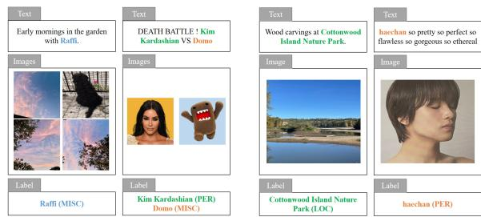
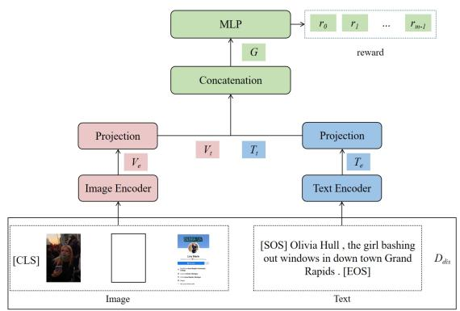
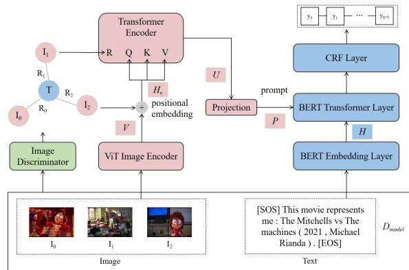

# A Graph Interaction Framework on Relevance for Multimodal Named Entity Recognition with Multiple Images

Jiachen Zhao\* and Shizhou Huang\* and Xin Lin†

East China Normal University, Shanghai, China

51265901017@stu.ecnu.edu.cn, huangshizhou@ica.stc.sh.cn, xlin@cs.ecnu.edu.cn

## Abstract

Posts containing multiple images have significant research potential in Multimodal Named Entity Recognition nowadays. The previous methods determine whether the images are related to named entities in the text through similarity computation, such as using CLIP. However, it is not effective in some cases and not conducive to task transfer, especially in multiimage scenarios. To address the issue, we propose a graph interaction framework on relevance (GIFR) for Multimodal Named Entity Recognition with multiple images. For humans, they have the abilities to distinguish whether an image is relevant to named entities, but human capabilities are difficult to model. Therefore, we propose using reinforcement learning based on human preference to integrate human abilities into the model to determine whether an image-text pair is relevant, which is referred to as relevance. To better leverage relevance, we construct a heterogeneous graph and introduce graph transformer to enable information interaction. Experiments on benchmark datasets demonstrate that our method achieves the stateof-the-art performance.

## 1 Introduction

With the inclusion of images, Multimodal Named Entity Recognition (MNER) has emerged as a focal area of researches in NER (Xu et al., 2023). The introduction of the image can provide richer semantic information for NER, helping the identification of semantically ambiguous entities due to insufficient textual context, which is effective in various real-world scenarios (Chen et al., 2021).

Earlier works only concentrate on single-image scenarios. With the significant production of usergenerated content in social media, the number of posts containing multiple images is growing. To bridge the gap in real MNER scenarios involving multiple images, Huang et al. (2024) proposes a novel MNER dataset with multiple images called MNER-MI. According to Huang et al. (2024), considering multiple images not only helps alleviate the ambiguity present in posts with only one image but also provides richer visual information for identifying more named entities in the text. For instance, consider the two examples presented in Figure 1a: If we leverage methods in single-image scenarios only considering the first image, we do not have enough context to classify Raffi and Domo as MISC.

  
(a) Two examples of MNER with multiple images.  
(b) Two examples of relevant image-text pair with low similarity scores.  
Figure 1: Examples of image-text pairs.

However, in multi-image scenarios, MNER still faces the same issues in single-image scenarios, where some images are not helpful for recognizing named entities and may introduce additional noise. With the increase in images, the issue becomes more severe in multi-image scenarios. For example, in the first example of 1a, the three images containing sky are not helpful for recognizing named entities.

Previous works have proposed numerous multimodal approaches to alleviating the negative impact of irrelevant images (Zhao et al., 2022; Yu et al., 2020; Xu et al., 2022b; Zhang et al., 2021). For example, Xu et al. (2022a) proposes using the CLIP model to calculate the similarity scores between image and text to determine if the image is helpful for identifying named entities. However, it is not effective in some cases. As illustrated in Figure 1b, these two images respectively demonstrate the scenery of a park and a portrait of a person, which are relevant to the named entities Cottonwood Island Nature Park and Haechan. However, when calculating their similarity scores using CLIP, they are only 0.19 and 0.18. We argue that both text and images contain rich semantic information, and merely computing similarity scores is insufficient to determine which visual information is beneficial for MNER.

Moreover, we argue that the CLIP model aligns images with descriptive text during training and named entities are not present in the text. Additionally, posts contain numerous slang terms and non-standard grammar. In that case, it is not conducive to task transfer. However, for humans, they can leverage their own abilities to judge whether an image is relevant to the named entities in the text. However, modelling human intuition is challenging. Fortunately, reinforcement learning based on human preference can integrate human abilities into model through rewards (Liu et al., 2020). In contrast to previous methods that utilize model with limited transferability for similarity computation, our method explicitly assign a score for the MNER task to determine whether the image is relevant to the named entities in the text, which is referred to as relevance.

Therefore, we propose training a discriminator using reinforcement learning based on human preference. This discriminator is utilized to determine whether an image is relevant to named entities in the text. In addition, how to effectively utilize relevance in the domain of MNER with multiple images is also a challenge. To better leverage relevance, we explicitly model the relevance between the images and text as a heterogeneous graph and employ a graph transformer structure to enable information interaction.

Our main contributions can be summarized as follows:

First, to our best knowledge, we are the first to propose the limited transferability for similarity computation and to leverage reinforcement learning based on human preference to integrate human abilities into model through reward in MNER domain.

Second, we explicitly model the relevance between the images and text as a heterogeneous graph to better leverage relevance and employ graph transformer to enable information interaction.

Finally, experiments demonstrate the efficiency of our proposed GIFR on multi-image datasets, achieving state-of-the-art performance.

## 2 Related Work

## 2.1 Multimodal Named Entity Recognition with Single Images

MNER introduces images as an additional modality, providing supplementary information for NER. Early researches in the domain of MNER only focus on posts containing single images.

The following works primarily concentrate on the implicit fusion of semantic information from the two modalities. Zhang et al. (2018) employs a gating mechanism to calculate cross-modal attention scores. Xu et al. (2023) fuses different types of image representations through a Mixtureof-Experts approach. Chen et al. (2022) proposes to achieve the information interaction of two modalities in the form of prompts.

The following works focus on filtering irrelevant visual information to alleviate distracting visual information. Xu et al. (2022b) computes similarity scores of the image-text pairs to determine the relevant image regions. Zhang et al. (2021) proposes employing visual grounding to associate text tokens with relevant image regions in order to alleviate the impact of distracting irrelevant regions. Yu et al. (2020) introduces an auxiliary module taking text as input to identify named entity boundaries preventing excessive focus on irrelevant visual information. Zhao et al. (2022) determines whether the image is relevant by calculating the cosine similarity between image captions and text.

However, implicit fusion and similarity computation fall short. They sometimes fail to establish a correspondence between relevant visual information and named entities in the text. We argue that both text and images contain rich semantic information, and the relevance between images and named entities in the text is complex, abstract, and requires human involvement, which means that it is difficult to model. Reinforcement learning based on human preference can integrate human abilities into model through rewards. Therefore, we propose a reinforcement learning approach based on human preference to determine the relevance between images and named entities in the text.

  
(a) The overview of Relevance-based Image Discriminator.

  
(b) The overview of Intra-modal Interaction and Inter-modal Interaction.  
Figure 2: The overview of GIFR.

## 2.2 Multimodal Named Entity Recognition with Multiple Images

Nowadays, there is an increasing number of posts including multiple images. Multiple images can provide more context to alleviate ambiguity and help identify more named entities. Research focus has gradually shifted towards MNER with multiple images.

Huang et al. (2024) proposes modeling multiple images as frames and using prompts to facilitate information interaction between images and text. However, this method does not explicitly filter visual information. Therefore, we propose modeling images and text as a graph using relevance and introduce a graph transformer to enable information interaction.

## 3 Overview

## 3.1 Problem Definition

Given a text as $X = \{ x _ { 0 } , x _ { 1 } , x _ { 2 } , \dotsc , x _ { n - 1 } \}$ and its associated images $I = \{ I _ { 0 } , I _ { 1 } , \ldots , I _ { m - 1 } \}$ as input. The aim of MNER involves extracting named entities from the given text, and classifying these named entities into pre-defined types. We model this task as a sequence labelling problem. For each token $x _ { i } \in X$ , we need to predict its corresponding label $y _ { i } \in Y$ based on the text X and the images I, where $Y = \{ y _ { 1 } , y _ { 2 } , y _ { 3 } , . . . , y _ { n } \}$ is a predefined set of labels following the BIO (Beginning, Inside, Outside) labeling scheme (Sang and Veenstra, 1999).

## 3.2 Framework

As shown in Figure 2, our proposed framework consists of three components: Relevance-based Image

Discriminator, Intra-modal Interaction, and Intermodal Interaction. For the first component, we initially divide the dataset into two sets, which is $D _ { d i s }$ and $D _ { m o d e l } . \ D _ { d i s }$ is used to train the Relevancebased Image Discriminator. The model’s objective is to assign a relevance score to each image based on the input text and associated images, sorting the images according to these scores. Then, we model the images and text as a graph based on relevance scores. For the second component, a graph transformer is employed to enable information interaction. For the third component, we project the interacted image representations and input them as prompts into a BERT (Devlin et al., 2018) model to achieve information interaction between images and text, and feed the text representation into a conditional random field layer to get the final prediction result.

## 4 Method

## 4.1 Relevance-based Image Discriminator

The Relevance-based Image Discriminator is used to determine whether the images are relevant to the named entities in the text. Since some irrelevant images can interfere with the prediction results, image filtering is necessary (Vempala and Preo¸tiuc-Pietro, 2019; Sun et al., 2021). However, previous filtering methods based on similarity scores are unreliable. Humans can judge whether an image is relevant to named entities in the text based on their own abilities. However, modeling these human intuitions is quite challenging due to its complexity and abstraction. Through reinforcement learning based on human preference, models can learn human abilities through human involvement in the form of rewards, so we choose to train a discriminator to determine the relevance between images and text based on reinforcement learning based on human preference (Liu et al., 2020).

Inspired by Xu et al. (2022a), after dividing the dataset, we use $D _ { d i s }$ as the training set for the discriminator. Inspired by Liu et al. (2020), for an image-text pair containing multiple images, we have humans rank the images within the image-text pairs based on relevance. Humans rank the images they consider more relevant higher and less relevant ones lower. That is the images ranked higher are preferred by humans. By involving humans in this ranking process, we explicitly model human preference. Moreover, we explicitly insert a blank image between relevant and irrelevant images in every image-text pair to further differentiate whether an image is relevant to the named entities in the text or not. In a given image-text pair, the discriminator will assign a higher relevance score to the image ranked higher and a lower relevance score to the image ranked lower.

As shown in Figure 2a, we use the CLIP (Radford et al., 2021) model to encode text and images. For text, we first tokenize it using byte code encoding (Sennrich et al., 2015) to obtain a sequence $X = ( x _ { 0 } , x _ { 1 } , x _ { 2 } , \dotsc , x _ { n - 1 } )$ , and then add special tokens [SOS] and [EOS] at the beginning and the end, resulting in $( [ S O S ] , x _ { 0 } , x _ { 1 } , x _ { 2 } , \dots , [ E O S ] )$ These special tokens represent the start and end of the sequence. We use the representation of [EOS] from the last layer of the text encoder as the representation of the entire text, denoted as $T _ { e } \in { \cal R } ^ { d _ { t } }$ . For images, we first preprocess them to 224 × 224 pixels. Then, we divide the image into $7 \times 7$ regions, where each region has $3 2 \times$ 32 pixels, and treat each region as $v _ { i } ,$ resulting in $I _ { i } = ( v _ { 1 } , v _ { 2 } , v _ { 3 } , \ldots , v _ { 4 9 } )$ . We add a special token $[ C L S ]$ at the beginning of this sequence, resulting in $( [ C L S ] , v _ { 1 } , v _ { 2 } , v _ { 3 } , \dotsc , v _ { 4 9 } )$ as the input of the image encoder. The representation of [CLS] from the last layer is used as the representation of the entire image, denoted as $V _ { e } \in { \pmb R } ^ { d _ { v } }$ . Next, we project the text representation $T _ { e }$ and image representation $V _ { e }$ to the same dimension to get $T _ { t } ~ \in ~ { \cal R } ^ { d _ { s } }$ and $V _ { t } \in { \pmb R } ^ { d _ { s } }$ . We then concatenate $T _ { t }$ and $V _ { t }$ to get $G \in { \pmb R } ^ { d _ { 2 s } }$ , and input G into an MLP to obtain a scalar r.

Inspired by Ouyang et al. (2022) , for an imagetext pair $P = \{ X , I \}$ containing multiple images, where X represents the text and the corresponding images are $I = \{ I _ { 0 } , I _ { 1 } , . . . , I _ { m - 1 } \}$ , we use the sort order of the images as the supervision signal.

We pair the images in I into pairs, denoting $I _ { A }$ as the relatively higher-ranked image and $I _ { B }$ as the relatively lower-ranked image. This means that $I _ { A }$ is more relevant to the named entities in the text X compared to $I _ { B } ,$ , and its relevance score should be higher than that of $I _ { B }$ . The corresponding loss is shown below.

$$
L _ { D } = - { \frac { 1 } { | D | } } \sum _ { ( I _ { A } , I _ { B } ) \in D } l o g ( \sigma ( r ( I _ { A } ) - r ( I _ { B } ) ) ) ,\tag{1}
$$

where D is collection of image pairs, σ is the sigmoid activation function, $r ( I _ { A } )$ and $r ( I _ { B } )$ represent the rewards obtained by passing images $I _ { A }$ and $I _ { B }$ through the discriminator respectively, $I _ { A }$ is the more relevant image in the image-text pair, while $I _ { B }$ is the less relevant image in the pair.

After training the discriminator, we use the $D _ { m o d e l }$ dataset as the test set and let the discriminator sort the images in the test set according to their relevance. For each image-text pair containing multiple images, a blank image is also included. Images ranked after the blank image are considered irrelevant and images ranked before the blank image are considered relevant.

## 4.2 Graph Construction

To better leverage relevance, we model the images and text as a graph. Each node in the graph represents an image or a text, and we connect the images and text belonging to the same image-text pair with edges. The difference between the relevance scores of an image and the blank image is used as the weight of edge between that image and the corresponding text since the loss of the discriminator is based on the difference. This constructs a heterogeneous graph for the multi-modality.

$$
R _ { i } = \sigma ( r ( I _ { i } ) - r ( I _ { b l a n k } ) ) ~ 0 \leq i \leq m - 1 ,\tag{2}
$$

where $R _ { i }$ is the weight of the edge between the image $I _ { i }$ and the text, $r ( I _ { i } )$ and $r ( I _ { b l a n k } )$ represent the rewards obtained by passing images $I _ { i }$ and $I _ { b l a n k }$ through the discriminator, σ is the sigmoid activation function.

## 4.3 Intra-modal Interaction

We argue that the multiple images belonging to the same image-text pair require information interaction. Previous MNER works have only used gating mechanisms (Zhang et al., 2021) or GCN (Zhao et al., 2022) to enable information interaction between graph nodes, but we argue that gating mechanisms cannot achieve sufficient information interaction, and GCN suffer from over-smoothing and over-squashing problems. Therefore, we propose introducing graph transformer based on the graph constructed using relevance into MNER. It is a transformer-based framework that takes node features as input. To incorporate graph structural information, it incorporates edge information into both positional embedding and attention score calculation, enabling information interaction among nodes on the graph (Ying et al., 2021).

As shown in Figure 2b, first, we use ViT (Dosovitskiy et al., 2020) to encode the images and obtain the representation $V _ { i }$ for each image. For positional encoding, since this is a heterogeneous graph, we only consider the connection between images. After ignoring the text, images linked by the text are considered to have edges. For each node $V _ { i }$ , we follow Ying et al. (2021) and assign a learnable vector based on its degree $d e g ( V _ { i } )$ . The positional embedding is defined as follows:

$$
h _ { V i } = V _ { i } + z _ { d e g ( V _ { i } ) } ,\tag{3}
$$

where $V _ { i } ~ \in ~ { \cal R } ^ { d _ { v } }$ is the representation of the image, $z _ { d e g ( V _ { i } ) } \in R ^ { d _ { v } }$ is the learnable vector that represent the structural information of node $V _ { i }$ in the graph, determined by the degree $d e g ( V _ { i } )$ of the nodes.

When calculating the self-attention scores, we follow Dwivedi and Bresson (2020) and incorporate the edge weights.

$$
U = ( s o f t m a x ( \frac { Q _ { H _ { V } } K _ { H _ { V } } ^ { T } } { \sqrt { d _ { v } } } ) \odot R ) V _ { H _ { V } } ,\tag{4}
$$

where $U \in { \pmb R } ^ { m * d _ { v } }$ is the visual representation and m is the number of images in the same imagetext pair, $Q _ { H _ { V } } , K _ { H _ { V } }$ and $V _ { H _ { V } } \in R ^ { m * d _ { v } }$ are the corresponding query, key and value matrices in transformer encoder layer, d is the number of attention heads, $R \in R ^ { 1 * \bar { m } }$ denotes the weight of the edges of the constructed graph and ⊙ denotes the element wise product.

## 4.4 Inter-modal Interaction

We use BERT to encode the text and incorporate visual information as prompts into each layer of BERT to enable inter-modal interaction.

First, we follow Devlin et al. (2018) and tokenize the text and add special tokens [CLS] and [SEP] at the beginning and end, resulting in $( [ C L S ] , x _ { 0 } , x _ { 1 } , x _ { 2 } , \dots , [ S E P ] )$ Then, through the embedding layer, we obtain $H \_ =$ $( h _ { 0 } , h _ { 1 } , h _ { 2 } , \ldots , h _ { n + 1 } ) \in { \bf \Phi } R ^ { d _ { t } * ( n + 2 ) }$ . To achieve inter-modal interaction, inspired by Liang et al. (2022), we first project the visual representation into the same dimension as the text representation and input the visual information as prompt. The prompt containing visual information is defined as follow:

$$
P ^ { l } = W _ { p } ^ { l } U ^ { T } \qquad 1 \leq l \leq L ,\tag{5}
$$

where $W _ { p } ^ { l } \in \ R ^ { d _ { t } * d _ { v } }$ is the weight matrix, L is the number of the layer of Transformer, which means that every layer has their own prompt so that each layer can interact with different visual information, which is helpful to text representation learning.

For each layer of Transformer, its input is $H ^ { l - 1 }$ and the prompt is $P ^ { l }$ , and its output is $\bar { H } ^ { l }$ . We first perform a linear transformation to obtain $Q ^ { l } , K ^ { l }$ and $V ^ { l } \in { \pmb R } ^ { d _ { t } * ( n + 2 ) }$ for the lth layer.

For the prompt, we follow Chen et al. (2022) and perform a linear transformation to obtain the supplementary $K _ { P } ^ { l } \in R ^ { d _ { t } * m }$ and $V _ { P } ^ { l } \in { \pmb R } ^ { d _ { t } * m }$ . Then, in the lth layer, we perform inter-modal information interaction.

$$
\begin{array} { r } { K _ { P } ^ { l } = W _ { k } ^ { l } P ^ { l } , } \\ { V _ { P } ^ { l } = W _ { v } ^ { l } P ^ { l } , } \end{array}\tag{6}
$$

$$
{ H ^ { l } } = s o f t m a x ( \frac { ( Q ^ { l } ) ^ { T } [ K _ { P } ^ { l } , K ^ { l } ] } { \sqrt { d _ { t } } } ) [ V _ { P } ^ { l } , V ^ { l } ] ^ { T } ,\tag{7}
$$

where $W _ { k } ^ { l } \in R ^ { d _ { t } * d _ { t } }$ and $W _ { v } ^ { l } \in R ^ { d _ { t } * d _ { t } }$ are two weight matrices, [·] is the concatenation of both visual and textual semantic information, $H ^ { l } \in$ $\pmb { R } ^ { ( n + 2 ) * d _ { t } }$ is the lth layer output hidden representation and we denote $\dot { H ^ { L } } \in \hat { R ^ { ( n + 2 ) * d _ { t } } }$ as the output representation of the last layer.

Since this is a NER task, for the text representation containing visual information, we finally use a conditional random fields layer for decoding the representation (Lafferty et al., 2001). Based on the output probabilities, we predict the labels.

$$
\begin{array} { l } { P ( y \mid H ^ { L } ) = \displaystyle \frac { e x p ( S ( H ^ { L } , y ) ) } { \sum _ { y ^ { \prime } \in Y } e x p ( S ( H ^ { L } , y ^ { \prime } ) ) } , } \\ { S ( H ^ { L } , y ) = \displaystyle \sum _ { i = 0 } ^ { n } T _ { y _ { i } , y _ { i + 1 } } + \sum _ { i = 1 } ^ { n } E _ { h _ { i } , y _ { i } } , } \end{array}\tag{8}
$$

where the $P ( y \mid H ^ { L } )$ represent the output conditional probabilities given the final hidden representation $\bar { H } ^ { L } , S ( H ^ { L } , \bar { y } )$ is the unnormalized score for the output sequence $y .$ , Y is the set of all possible output sequences, $\scriptstyle \sum _ { i = 0 } ^ { n } T _ { y _ { i } , y _ { i + 1 } }$ is the sum of transition scores between adjacent labels, where $T$ is the transition score matrix, $\scriptstyle \sum _ { i = 1 } ^ { n } E _ { h _ { i } , y _ { i } }$ is the sum of emission scores between each hidden representation $h _ { i }$ and its corresponding label $y _ { i }$ , where $E$ is the emission score matrix (Lafferty et al., 2001).

We follow Lample et al. (2016) and use the loglikelihood loss as the loss function for this task, which is defined as follows:

$$
L _ { N } = - \frac { 1 } { | D _ { m o d e l } | } \sum _ { k = 1 } ^ { N } l o g ( P ( y _ { k } \mid H _ { k } ^ { L } ) )\tag{9}
$$

where $| D _ { m o d e l } |$ denotes the size of the dataset $D _ { m o d e l }$ , which is N.

<table><tr><td rowspan=1 colspan=1>Type</td><td rowspan=1 colspan=1>MNER-MITrainDev Test</td><td rowspan=1 colspan=1>MNER-MI-PlusTrainDev Test</td></tr><tr><td rowspan=1 colspan=1>PER</td><td rowspan=1 colspan=1>4529 573  439</td><td rowspan=1 colspan=1>74721199 1060</td></tr><tr><td rowspan=1 colspan=1>LOC</td><td rowspan=1 colspan=1>1878 210  156</td><td rowspan=3 colspan=1>2609383  3342947540  4872755410  390</td></tr><tr><td rowspan=1 colspan=1>ORG</td><td rowspan=1 colspan=1>1273 165  92</td></tr><tr><td rowspan=1 colspan=1>MISC</td><td rowspan=1 colspan=1>2054260  233</td></tr><tr><td rowspan=1 colspan=1>Total</td><td rowspan=1 colspan=1>97341208 920</td><td rowspan=1 colspan=1>1578325322271</td></tr><tr><td rowspan=2 colspan=1>ImageTweet</td><td rowspan=1 colspan=1>19188 24382395</td><td rowspan=2 colspan=1>22561 3161311810229 15831583</td></tr><tr><td rowspan=1 colspan=1>6856860  860</td></tr></table>

Table 1: Statistics of MNER-MI and MNER -MI-Plus.

## 5 Experiments

In this section, we conduct several experiments to demonstrate the effectiveness of our proposed model. Following Chen and Feng (2023), we choose to use precision (P), recall (R), and F1 score (F1) as the evaluation metrics.

## 5.1 Experiment Settings

Datasets. As shown in Table 1, the sizes of the train / validation / test sets for the two datasets are 6,856 / 860 / 860 and 10,229 / 1,583 / 1,583 respectively. The MNER-MI dataset only contains image-text pairs composed of multiple images and the number of images is 24,021, while MNER-MI-Plus, due to the incorporation of Twitter2017, also includes oneto-one image-text pairs and the number of images is 28840 (Huang et al., 2024).

Parameters Settings. The experiments are conducted on NVIDIA GeForce RTX 4060 GPUs with PyTorch 2.3.1. We use CLIP-vit-base-patch321 as the base model for encoding text and images in the Discriminator. We use BERT-base2 and ViT-basepatch $1 6 ^ { 3 }$ as the base models for encoding text and images in the MNER model. Following Loshchilov and Hutter (2017), we use AdamW as the optimizer, with the learning rate ranging from [1e-5, 8e-5], batch size ranging from [8, 32], and the number of training epochs ranging from [10, 25].

Baseline. For the choice of baseline models, we select text-based unimodal models, text and image-based multimodal models, and LLMs. For text-based unimodal models, we choose BLSTMbased models: BiLSTM-CRF (Huang et al., 2015), CNNBiLSTM-CRF (Ma and Hovy, 2016), and HBiLSTM-CRF (Lample et al., 2016), as well as transformer-based models: BERT (Devlin et al., 2018). For text and image-based multimodal models, we select the following models. GVATT-HBiLSTM-CRF (Lu et al., 2018) and AdaCAN-CNN-BiLSTM-CRF (Zhang et al., 2018) incorporate visual information on top of BLSTM-based unimodal models. UMT (Yu et al., 2020) introduce visual information through cross-attention based on BERT and add an auxiliary module to identify entity spans. UMGF (Zhang et al., 2021) employing visual grounding to associate text tokens with relevant image regions. MAF (Xu et al., 2022b) aligns the representations of the two modalities through contrastive learning. HVPNeT (Chen et al., 2022) and VisualPT-MoE (Xu et al., 2023) achieve the interaction between the two modalities in a promptbased way. For LLMs, we choose the text-based GPT4 and the text and image-based MiniGPT4 (Zhu et al., 2023). The models listed above all take single image as input while UMT-MI, UMGF-MI, VisualPT-MoE-MI and TPM-MI (Huang et al., 2024) take multiple images as input. UMT-MI,

<table><tr><td rowspan="2">Modality Model</td><td rowspan="2"></td><td colspan="3">MNER-MI</td><td colspan="3">MNER-MI-Plus</td></tr><tr><td>P</td><td>R</td><td>F1</td><td>P</td><td>R</td><td>F1</td></tr><tr><td rowspan="4">Text</td><td>BiLSTM-CRF</td><td>64.03</td><td>65.91</td><td>64.96</td><td>73.65</td><td>70.74</td><td>72.17</td></tr><tr><td>CNN-BiLSTM-CRF</td><td>64.89</td><td>66.89</td><td>65.87</td><td>73.71</td><td>71.97</td><td>72.83</td></tr><tr><td>GPT4</td><td>64.28</td><td>67.91</td><td>66.05</td><td>63.76</td><td>69.12</td><td>66.33</td></tr><tr><td>HBiLSTM-CRF</td><td>64.51</td><td>68.55</td><td>66.47</td><td>72.19</td><td>74.34</td><td>73.25</td></tr><tr><td rowspan="14">Text + Image</td><td>BERT</td><td>69.04</td><td>73.54</td><td>71.22</td><td>77.35</td><td>79.19</td><td>78.26</td></tr><tr><td>MiniGPT4</td><td>59.87</td><td>62.37</td><td>61.09</td><td>62.22</td><td>64.27</td><td>63.23</td></tr><tr><td>GVATT-HBiLSTM-CRF</td><td>67.83</td><td>67.19</td><td>67.51</td><td>76.31</td><td>73.11</td><td>74.68</td></tr><tr><td>AdaCAN-CNN-BiLSTM-CRF</td><td>67.89</td><td>68.24</td><td>68.06</td><td>75.67</td><td>73.85</td><td>74.75</td></tr><tr><td>UMT</td><td>74.23</td><td>74.03</td><td>74.13</td><td>81.71</td><td>79.50</td><td>80.59</td></tr><tr><td>MAF</td><td>74.91</td><td>73.60</td><td>74.25</td><td>80.17</td><td>81.29</td><td>80.73</td></tr><tr><td>UMGF</td><td>73.74</td><td>75.30</td><td>74.51</td><td>82.31</td><td>79.65</td><td>80.96</td></tr><tr><td>VisualPT-MoE HVPNeT</td><td>74.77 74.93</td><td>75.01</td><td>74.89</td><td>82.72</td><td>80.64</td><td>81.67</td></tr><tr><td></td><td></td><td>75.28</td><td>75.10</td><td>81.88</td><td>80.94</td><td>81.41</td></tr><tr><td>UMT-MI</td><td>76.56</td><td>75.90</td><td>76.23</td><td>82.26</td><td>82.96</td><td>82.61</td></tr><tr><td>UMGF-MI</td><td>75.88</td><td>77.14</td><td>76.50</td><td>82.55</td><td>82.25</td><td>82.40</td></tr><tr><td>VisualPT-MoE-MI</td><td>76.87</td><td>76.38 77.19</td><td>76.62</td><td>82.61</td><td>82.79</td><td>82.70</td></tr><tr><td>TPM-MI GIFR</td><td>77.45 77.46</td><td>78.76</td><td>77.32 78.10</td><td>83.66 83.52</td><td>83.18 84.42</td><td>83.42 83.97</td></tr></table>

Table 2: Performance of various models on the MNER-MI and MNER-MI-Plus.

UMGF-MI, and VisualPT-MoE-MI are variants of their corresponding models.

## 5.2 Result and Analysis

As shown in Table 2, we compare the performance of our proposed method and previous models on the MNER-MI and MNER-MI-Plus datasets. We can draw the following conclusions:

Firstly, BERT-based text models perform better than BLSTM-based text models, with BERT achieving F1 scores of 71.22 and 78.26, a few points higher than BLSTM-based models indicating that pre-trained language models excel in the domain of NER.

Secondly, the performance of many text and image-based multimodal models is better than their corresponding text-based unimodal models, demonstrating the importance of introducing images as auxiliary information for NER tasks. For example, GVATT-HBiLSTM-CRF achieves F1 scores of 67.51 and 74.68, and AdaCAN-CNN-BiLSTM-CRF achieves F1 scores of 68.06 and 74.75, a few points higher than their corresponding textbased unimodal models, namely HBiLSTM-CRF and CNN-BiLSTM-CRF. In addition, models that take multiple images as input perform better than their corresponding models that take single image as input. For example, VisualPT-MoE achieves F1 scores of 74.89 and 81.67, less than two points lower than VisualPT-MoE-MI. This proves that more images can bring more auxiliary information and improve performance.

Thirdly, for LLMs, GPT4 achieves F1 scores of 66.05 and 66.33, performing worse than some text-based unimodal models. MiniGPT4, which incorporates visual information, achieves F1 scores of 61.09 and 63.23, performing even worse than GPT4. This indicates that LLMs still face challenges in the domain of NER, and Multimodal LLMs find it more difficult to comprehend instructions and utilize information.

Finally, our proposed GIFR achieves the best performance which demonstrates the effectiveness of our proposed method. The reason is that we distinguish unhelpful images, encouraging the model to focus on images that are relevant to the named entities in the text and reducing the interference of irrelevant images on the task. Additionally, the use of graph transformer better leverages relevance to achieve information interaction. Our model excels in MNER-MI-Plus, demonstrating the performance of our method in single-image scenarios.

<table><tr><td rowspan="2">Model</td><td colspan="3">MNER-MI</td><td colspan="3">MNER-MI-Plus</td></tr><tr><td>P</td><td>R</td><td>F1</td><td>P</td><td>R</td><td>F1</td></tr><tr><td>w/o D w/o P</td><td>77.06 77.3678.29</td><td>77.92</td><td>77.50 77.82</td><td>82.94 83.79</td><td>83.96 83.9283.85</td><td>83.45 82.8683.2783.06</td></tr></table>

Table 3: Ablation study of our proposed GIFR. We propose three variants of our model: GIFR-w/o Discriminator(w/o D), GIFR-w/o Positonal Embedding(w/o P), and GIFR-w/o Graph(w/o G).

## 5.3 Ablation Study

To investigate the impact of each module in our proposed model on performance, we conducted ablation experiments.

GIFR-w/o Discriminator removes the module that determines whether an image and text are relevant, i.e., the Relevance-based Image Discriminator, from the original model. It sets the weight of all edges to 1 when constructing the graph. GIFRw/o Positonal Embedding removes the positional embedding structure from the graph transformer and replaces it with the regular positional embedding used in a standard transformer. GIFR-w/o Graph removes the graph constructed based on the Relevance-based Image Discriminator and also removes the Intra-modal Interaction used for information interaction.

As shown in Table 3, all three variants exhibit varying degrees of performance degradation. Among them, GIFR-w/o Discriminator shows drop of 0.60 and 0.52 points, indicating that irrelevant images do interfere with the model’s judgment, and our proposed Relevance-based Image Discriminator can effectively distinguish between relevant and irrelevant images. GIFR-w/o Positonal Embedding also shows a drop of 0.28 and 0.12 points, suggesting that the positional embedding that incorporates structural information of the graph is effective in understanding the graph and facilitates better information interaction. GIFR-w/o Graph drops 1.87 and 0.91 points compared to the original model, indicating that for image-text pairs containing multiple images, it is necessary to distinguish between relevant and irrelevant images and allow sufficient interaction.

<table><tr><td>Image</td><td>R</td><td>Text</td></tr><tr><td></td><td>0.25</td><td>only in the Philippines (LOC)</td></tr><tr><td></td><td>0.15</td><td>I vote BTSARMY for BestFanArmy (MISC)</td></tr><tr><td></td><td>0.98</td><td>ZhangJingyi for Chanel (ORG) More pics</td></tr><tr><td></td><td>0.73</td><td>Isabelle (MISC)&#x27;s morn- ing announcement today</td></tr></table>

Table 4: The case study demonstrates the ability of this discriminator to differentiate whether the images are relevant to the named entities.

## 5.4 Case Study

To demonstrate the effectiveness of our proposed GIFR, we identify a few examples from the dataset as shown in Table 4. For ease of explanation, we only highlight a portion of the named entities.

In the first two examples, the discriminator determines that the images are irrelevant to the named entities. In the first example, the image shows a fan with fire, which is irrelevant to “Philippines". In the second example, the image only displays the word “please" and doesn’t provide any relevant information to the named entities “BestFanArmy". These two images would introduce noise to the model.

In the following two examples, the discriminator recognizes that the images are relevant to the named entities. In the third example, “Chanel" can refer to a person or a brand. With the image, we can see that a celebrity is endorsing the “Chanel" brand, so “Chanel" should be classified as ORG. In the fourth example, “Isabelle" usually refers to a person, but from the image of an animal and the dialogue box, we can infer that “Isabelle" is a cartoon character, which should be classified as MISC. Both of these images are relevant to the named entities and help alleviate ambiguity.

## 6 Conclusion

In this paper, we propose our GIFR. In order to better remove interference from images which are irrelevant to the named entities in the text, we propose a discriminator distinguishing images based on relevance through reinforcement learning based on human preference. In addition, in order to better leverage relevance, we explicitly model the relevance between the images and text as a heterogeneous graph and employ a graph transformer structure to enable information interaction. We have conducted extensive experiments, ablation experiments, and case studies to demonstrate the effectiveness of our proposed GIFR.

## 7 Limitations

When considering relevance, the focus is on the entire image and the text. However, there are still some irrelevant regions within the entire image, indicating a lack of fine granularity.

## Acknowledgments

This work is supported by National Science and Technology Major Project (2021ZD0111000/2021ZD0111004), the Science and Technology Commission of Shanghai Municipality Grant (No. 21511100101, 22511105901,22DZ2229004), the Open Research Fund of Key Laboratory of Advanced Theory and Application in Statistics and Data Science (East China Normal University), Ministry of Education. Xin Lin is the corresponding author. Xin Lin is also a member of Key Laboratory of Advanced Theory and Application in Statistics and Data Science (East China Normal University), Ministry of Education.

## References

Dawei Chen, Zhixu Li, Binbin Gu, and Zhigang Chen. 2021. Multimodal named entity recognition with image attributes and image knowledge. In Database Systems for Advanced Applications: 26th International Conference, DASFAA 2021, Taipei, Taiwan, April 11–14, 2021, Proceedings, Part II 26, pages 186–201. Springer.

Feng Chen and Yujian Feng. 2023. Chain-of-thought prompt distillation for multimodal named entity and multimodal relation extraction. arXiv preprint arXiv:2306.14122.

Xiang Chen, Ningyu Zhang, Lei Li, Yunzhi Yao, Shumin Deng, Chuanqi Tan, Fei Huang, Luo Si, and Huajun Chen. 2022. Good visual guidance makes a better extractor: Hierarchical visual prefix for multimodal entity and relation extraction. arXiv preprint arXiv:2205.03521.

Jacob Devlin, Ming-Wei Chang, Kenton Lee, and Kristina Toutanova. 2018. Bert: Pre-training of deep bidirectional transformers for language understanding. arXiv preprint arXiv:1810.04805.

Alexey Dosovitskiy, Lucas Beyer, Alexander Kolesnikov, Dirk Weissenborn, Xiaohua Zhai, Thomas Unterthiner, Mostafa Dehghani, Matthias Minderer, Georg Heigold, Sylvain Gelly, et al. 2020. An image is worth 16x16 words: Transformers for image recognition at scale. arXiv preprint arXiv:2010.11929.

Vijay Prakash Dwivedi and Xavier Bresson. 2020. A generalization of transformer networks to graphs. arXiv preprint arXiv:2012.09699.

Shizhou Huang, Bo Xu, Changqun Li, Jiabo Ye, and Xin Lin. 2024. Mner-mi: A multi-image dataset for multimodal named entity recognition in social media. In Proceedings ofthe 2024 Joint International Conference on Computational Linguistics, Language Resources and Evaluation (LREC-COLING 2024), pages 11452–11462.

Zhiheng Huang, Wei Xu, and Kai Yu. 2015. Bidirectional lstm-crf models for sequence tagging. arXiv preprint arXiv:1508.01991.

John Lafferty, Andrew McCallum, Fernando Pereira, et al. 2001. Conditional random fields: Probabilistic models for segmenting and labeling sequence data. In Icml, volume 1, page 3. Williamstown, MA.

Guillaume Lample, Miguel Ballesteros, Sandeep Subramanian, Kazuya Kawakami, and Chris Dyer. 2016. Neural architectures for named entity recognition. arXiv preprint arXiv:1603.01360.

Sheng Liang, Mengjie Zhao, and Hinrich Schütze. 2022. Modular and parameter-efficient multimodal fusion with prompting. arXiv preprint arXiv:2203.08055.

Fei Liu et al. 2020. Learning to summarize from human feedback. In Proceedings of the 58th Annual Meeting of the Association for Computational Linguistics.

Ilya Loshchilov and Frank Hutter. 2017. Decoupled weight decay regularization. arXiv preprint arXiv:1711.05101.

Di Lu, Leonardo Neves, Vitor Carvalho, Ning Zhang, and Heng Ji. 2018. Visual attention model for name tagging in multimodal social media. In Proceedings of the 56th Annual Meeting of the Association for Computational Linguistics (Volume 1: Long Papers), pages 1990–1999.

Xuezhe Ma and Eduard Hovy. 2016. End-to-end sequence labeling via bi-directional lstm-cnns-crf. arXiv preprint arXiv:1603.01354.

Long Ouyang, Jeffrey Wu, Xu Jiang, Diogo Almeida, Carroll Wainwright, Pamela Mishkin, Chong Zhang, Sandhini Agarwal, Katarina Slama, Alex Ray, et al. 2022. Training language models to follow instructions with human feedback. Advances in neural information processing systems, 35:27730–27744.

Alec Radford, Jong Wook Kim, Chris Hallacy, Aditya Ramesh, Gabriel Goh, Sandhini Agarwal, Girish Sastry, Amanda Askell, Pamela Mishkin, Jack Clark, et al. 2021. Learning transferable visual models from natural language supervision. In International conference on machine learning, pages 8748–8763. PMLR.

Erik F Sang and Jorn Veenstra. 1999. Representing text chunks. arXiv preprint cs/9907006.

Rico Sennrich, Barry Haddow, and Alexandra Birch. 2015. Neural machine translation of rare words with subword units. arXiv preprint arXiv:1508.07909.

Lin Sun, Jiquan Wang, Kai Zhang, Yindu Su, and Fangsheng Weng. 2021. Rpbert: a text-image relation propagation-based bert model for multimodal ner. In Proceedings ofthe AAAI conference on artificial intelligence, volume 35, pages 13860–13868.

Alakananda Vempala and Daniel Preo¸tiuc-Pietro. 2019. Categorizing and inferring the relationship between the text and image of twitter posts. In Proceedings of the 57th annual meeting of the Association for Computational Linguistics, pages 2830–2840.

Bo Xu, Shizhou Huang, Ming Du, Hongya Wang, Hui Song, Chaofeng Sha, and Yanghua Xiao. 2022a. Different data, different modalities! reinforced data splitting for effective multimodal information extraction from social media posts. In Proceedings ofthe 29th International Conference on Computational Linguistics, pages 1855–1864.

Bo Xu, Shizhou Huang, Ming Du, Hongya Wang, Hui Song, Yanghua Xiao, and Xin Lin. 2023. A unified visual prompt tuning framework with mixtureof-experts for multimodal information extraction. In International Conference on Database Systems for Advanced Applications, pages 544–554. Springer.

Bo Xu, Shizhou Huang, Chaofeng Sha, and Hongya Wang. 2022b. Maf: a general matching and alignment framework for multimodal named entity recognition. In Proceedings ofthefifteenth ACM international conference on web search and data mining, pages 1215–1223.

Chengxuan Ying, Tianle Cai, Shengjie Luo, Shuxin Zheng, Guolin Ke, Di He, Yanming Shen, and Tie-Yan Liu. 2021. Do transformers really perform badly for graph representation? Advances in neural information processing systems, 34:28877–28888.

Jianfei Yu, Jing Jiang, Li Yang, and Rui Xia. 2020. Improving multimodal named entity recognition via entity span detection with unified multimodal transformer. In Proceedings ofthe 58th Annual Meeting ofthe Associationfor Computational Linguistics. Association for Computational Linguistics.

Dong Zhang, Suzhong Wei, Shoushan Li, Hanqian Wu, Qiaoming Zhu, and Guodong Zhou. 2021. Multimodal graph fusion for named entity recognition with targeted visual guidance. In Proceedings of the AAAI conference on artificial intelligence, volume 35, pages 14347–14355.

Qi Zhang, Jinlan Fu, Xiaoyu Liu, and Xuanjing Huang. 2018. Adaptive co-attention network for named entity recognition in tweets. In Proceedings ofthe AAAI conference on artificial intelligence, volume 32.

Fei Zhao, Chunhui Li, Zhen Wu, Shangyu Xing, and Xinyu Dai. 2022. Learning from different text-image pairs: A relation-enhanced graph convolutional network for multimodal ner. In Proceedings ofthe 30th ACM international conference on multimedia, pages 3983–3992.

Deyao Zhu, Jun Chen, Xiaoqian Shen, Xiang Li, and Mohamed Elhoseiny. 2023. Minigpt-4: Enhancing vision-language understanding with advanced large language models. arXiv preprint arXiv:2304.10592.