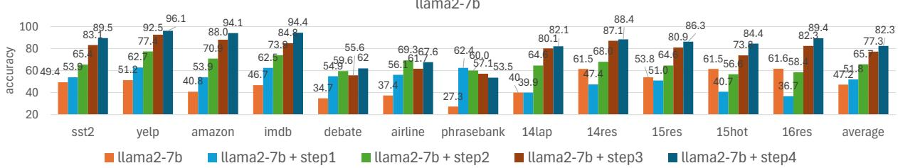
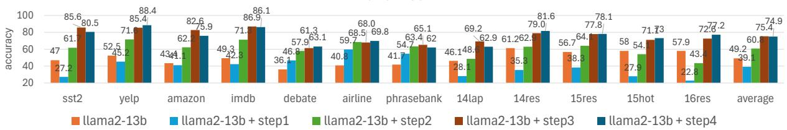
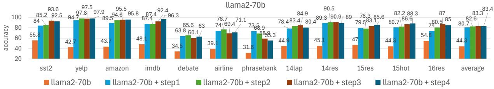
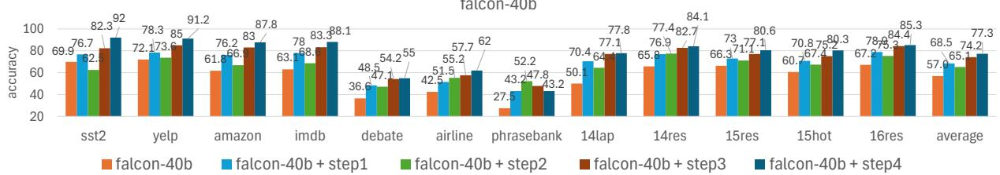

# A Simple-Yet-Efficient Instruction Augmentation Method for Zero-Shot Sentiment Classification

Yang Zhao1, Masayasu Muraoka1, Issei Yoshida1,

Bishwaranjan Bhattacharjee2, Hiroshi Kanayama1

1IBM Research - Tokyo, 19-21 Nihonbashi Hakozaki-cho, Chuo City, Tokyo, 103-8510, Japan, 2IBM Research, Yorktown Heights, New York 10598, USA

## Abstract

Instruction tuning significantly enhances the performance of large language models in tasks such as sentiment classification. Previous stud ies have leveraged labeled instances from sentiment benchmark datasets to instruction-tune LLMs, improving zero-shot sentiment classification performance. In this work, we propose a simple-yet-efficient instruction augmentation method which does not rely on any actual labeled sentiment instances. With just 240 pseudo instruction instances, the proposed method significantly improve the classification performance across several LLMs on 12 benchmark datasets, increasing scores by 30 points and outperforming LLMs that utilize more complex instruction tuning methods by 5.1 points. Surprisingly, the models tuned with 240 pseudo-instructions even outperform those tuned with actual domain-specific instruction instances. Despite method’s simplicity, our further analysis suggests that the probability shift toward the positive and negative classes and its generalization ability may be the primary driver of the improvement. Our instruction data and code is released1 for reproduction and future research.

## 1 Introduction

Sentiment analysis has long been an established area of research in Natural Language Processing (NLP). With recent advancements in Large Language Models (LLMs), impressive zero-shot performance in sentiment analysis was achieved by instruction-tuned LLMs (Deng et al., 2023; Wang et al., 2023a; Scaria et al., 2023). A typical sentiment Instruction Instance is a tuple with three components (T, I, O):

• Instruction Text (T): Classify the following sentence into either positive, neutral or negative sentiment.

• Input (I): A movie journey worth taking.

• Output (O): The sentiment is positive.

where the instruction text (T) refers to the user instruction. It usually specifies desired outputs; the input (I) refers to the input sentence or document for the sentiment task; the output (O) refers to the ground-truth answer corresponding to the instruction text.

Previously, many sentiment analysis studies have utilized actual training instances in sentiment benchmark datasets as Input (I) and corresponding labels as Output (O) for instruction tuning. For example, Wei et al. (2021) instruction-tuned LLMs across various NLP tasks, including four sentiment datasets, while Chung et al. (2022) further expanded this approach to over 1,800 NLP tasks. Considering sentiment classification spans diverse domains such as finance, restaurants, movies, and politics, obtaining a large number of domain-specific labeled instances for instruction tuning is laborintensive and inefficient.

To enhance this aspect, we propose a simple-yetefficient instruction augmentation method to construct sentimental adjective-based pseudo instructions which do not rely on any training instances in sentiment benchmark datasets. Subsequently, we instruction-tune Llama2-7b,13b,70b base models (Touvron et al., 2023) and the Falcon base model (Almazrouei et al., 2023) and evaluate their zero-shot performance on 12 sentiment benchmark datasets (7 general sentiment analysis datasets and 5 aspect-based sentiment analysis datasets). The results show that this method significantly outperforms the base models by 30 points and surpasses other instruction-tuned models by an average of 5.1 points. Surprisingly, models tuned with 240 pseudo instructions even outperform those tuned with actual domain instruction instances. Despite the method’s simplicity, further analysis suggests that the improvement is primarily driven by a probability shift of the sentiment polarity classes. Our contribution are three-fold:

• We proposed a simple-yet-efficient sentiment instruction augmentation method significantly boosting the zero-shot performance across 12 sentiment benchmark datasets.

• We conducted ablation study, domain analysis, and offered a perspective of probability shift to demonstrate effectiveness and advantage of the proposed method.

• We released constructed instruction instances and experimental code publicly for future research.

## 2 Sentimental Adjective Instruction Construction

We herein describe the steps to construct pseudo instances using sentimental adjectives. Section 2.1 outlines the process for collecting diverse sentiment instruction text (T) from various corpora. Section 2.2 details the steps to construct instruction using sentimental adjectives for Input (I) and Output (O).

## 2.1 Instruction Text (T) Collection

User instructions exhibit a wide variety of paraphrasing. For instance, Please classify the sentence into either positive, negative, or neutral can be also expressed like Please determine whether the sentence is positive, negative, or neutral. To increase the diversity, we collect sentiment instruction text (T) from five widely-used instruction datasets written by either human annotators or LLMs, as follows: (1) SuperNI (Wang et al., 2022), which contains 96k instructions written by humans covering 1600+ NLP tasks. (2) Alpaca2 (Taori et al., 2023), which contains 52k instructions generated by GPT-3 (davinci-003). (3) Self-instruct (Wang et al., 2023b), which contains 82k instructions generated by GPT-3 (vanilla). (4) Unnatural Instructions (Honovich et al., 2023), which contains 68k instructions generated by GPT-3 (davinci-002). (5) Baize (Xu et al., 2023), which contains 210k instruction instances created by prompting ChatGPT and letting it converse with itself.

We extracted all the instruction text (T) from these datasets and designed several heuristics to filter out only sentiment classification-related instruction. Please see Appendix A for details on instruction filtering. As this work focuses on sentiment classification, we retained instruction texts only if they contain the terms ‘sentiment’, ‘positive’, ‘negative’, and ‘neutral’. Finally, 110 diverse sentiment instruction text (T) are yielded, and we empirically determine to use 80 for training and $3 0 ^ { 3 }$ for testing during instruction tuning. For the aspect-based sentiment classification task, we add with respect to the TARGET to the instruction text and replace TARGET with the specific aspect. Table 10 in Appendix shows 10 samples out of 110 instruction texts.

## 2.2 Sentimental Adjective based (I, O) Pair

Inspired by the concept of evaluative adjectives in linguistics, we describe the four steps to automatically collect pairs of instruction input (I) and output (O). Evaluative adjectives often express value judgments and convey opinions, emotions, or subjective interpretations. For instance, adjectives like beautiful imply a positive sentiment, while awful suggests a negative one. We refer to our collected adjectives as sentimental adjectives.

Step 1. Collect sentimental adjective candidates. We start by collecting adjectives from SentiWord-Net $3 . 0 ^ { 4 }$ (Baccianella et al., 2010) where each sense of an adjective word w is assigned two scores: a positive score $( S _ { p o s } )$ and a negative score $( S _ { n e g } )$ where $0 \le S _ { k } \le 1$ and $k \in \{ p o s , n e g \}$ . The selection criteria is:

1. Choose all words where at least one of its senses meets the criteria: $S _ { p o s } \ \geq \ r$ and $S _ { n e g } = 0 . 0$ to compile positive word list $L _ { p o s } ^ { 1 }$

2. Choose all words where at least one of its senses meets the criteria:: $S _ { n e g } ~ \geq ~ r$ and $S _ { p o s } = 0 . 0$ to compile negative word list $L _ { n e g } ^ { 1 }$

3. Choose all words where at least one of its senses meets the criteria: $S _ { p o s } ~ = ~ 0 . 0$ and $S _ { n e g } = 0 . 0$ to compile neutral word list $L _ { n e u } ^ { 1 }$

We empirically determine the threshold r to trade off between the number and quality of adjectives. Please see Table 11 in Appendix for $L ^ { 1 }$

Step 2. Align with sentiment word sense.   
This step aims to refine the adjective lists in Step 1.

For instance, one sense of the word ‘fresh’ meets the criteria $S _ { n e g } \geq 0 . 7 5$ and $S _ { p o s } = 0 . 0 $ , this word is therefore included in the negative list $L _ { n e g } ^ { 1 }$ . However, ‘fresh’ often conveys a non-negative meaning, typically referring to something new or unused. including this word in the negative list may confuse the model during instruction tuning. To address this, we utilize pre-defined positive $( V _ { p o s } )$ and negative $( V _ { n e g } )$ vocabularies in Hu and Liu (2004). Words in lists $L _ { p o s } ^ { 1 }$ and $L _ { n e g } ^ { 1 }$ are excluded if they do not appear in $\bar { V } _ { p o s }$ and $V _ { n e g }$ , respectively. Words in $L _ { n e u } ^ { 1 }$ are removed if they appear in either $V _ { p o s }$ or $V _ { n e g } .$ . This process results in three refined lists: $L _ { p o s } ^ { 2 } , L _ { n e g } ^ { 2 } ,$ , and $L _ { n e u } ^ { 2 }$ . Please see Table 12 in $\mathsf { A p - }$ pendix for $L ^ { 2 }$

## Step 3. Rank word by frequency.

This step focuses on selecting more domainagnostic words by leveraging frequency information. We use English Wikipedia5 to obtain word frequency for ranking adjectives in each list in descending order based on their frequency. If an adjective in $L _ { p o s } ^ { 2 } , L _ { n e g } ^ { 2 }$ , and $L _ { n e u } ^ { 2 }$ is not in the wiki frequency list, its frequency would be set to zero. After ranking, frequent words such as best, great, and important appear at the top of the positive list, whereas the original words in the list are legendary, solid, and gallant. We note the ranked lists as $L _ { p o s } ^ { 3 } ,$ $L _ { n e g } ^ { 3 } ,$ , and $L _ { n e u } ^ { 3 }$ . Please see Table 13 in Appendix for $L ^ { 3 }$

## Step 4. Add negation words.

This step helps LLMs to better handle sentences containing negation words, which is common in sentiment classification. We add the negation word not directly before adjectives (e.g., not beautiful) for $X \%$ of instances in only $L _ { p o s } ^ { 3 }$ and $L _ { n e g } ^ { 3 }$ . Subsequently, adjectives with negation from the positive list are transferred to the negative list and vice versa. This process yields the final lists: $L _ { p o s } ^ { 4 } , L _ { n e g } ^ { 4 }$ , and $L _ { n e u } ^ { 4 }$ (where $L _ { n e u } ^ { 4 } = L _ { n e u } ^ { 3 } )$ . Please see Table 14 in Appendix for $L ^ { 4 }$

After completing steps 1 to 4, we take the first instruction text T from 80 instruction texts in Section 2.1, the first adjective from $L _ { p o s } ^ { 4 }$ and positive to form the first tuple (T, I, O); Continue this process until the 80th instruction text is taken. Then, we obtained 80 tuples for the positive class, 80 tuples for the negative class, 80 tuples for the neural class respectively. Please refer to Table 9 in Appendix for examples of constructed tuple for each class.

## 3 Experiment

## 3.1 Experimental Setup

The constructed 240 tuples are split into 80% for the training set and 20% for the development set. We set the threshold r in SentiWordNet 3.0 in Step 1 to 0.75, and negation word percentage X to 10%, according to performance on the development set. For training, we follow Touvron et al. (2023) by utilizing an auto-regressive objective and zeroing out the loss on tokens from the user prompt, including instruction text and input, while backpropagating only on instruction output. Of the 110 instruction texts, we use 80 for model training and development, and remaining 30 for testing. This approach better replicates real-world scenarios and ensures the instruction texts are unseen, as users’ instructions are inherently unpredictable.

During training, we employ the efficient parameter tuning technique, LoRA (Hu et al., 2021), with a LoRA rank of 8 and LoRA alpha of 32. We set learning rate to 2e-4 and batch size to 2. During inference, we follow Dettmers et al. (2022) to load models in the 8-bit mode which significantly speeds up the inference and has negligible impact on the final performance. We set the maximum number of generated tokens to 20. All the experiments are conducted using one A100 GPU. For the largest model, Llama2-70B, only 0.024% of the parameters are trainable, and training took approximately 2 GPU hours. For testing, evaluating the 70B model across 12 datasets requires approximately 8 GPU hours. Other smaller models require less time.

## 3.2 Evaluation Metric

Since all the instruction texts we collected explicitly specify the output space as positive, negative, or neutral label, we adopt the following metric for calculating instance-wise accuracy: 1) Score 1 if the output string contains the ground-truth label and does not contain other classes’ ground-truth labels (case insensitive); 2) Score 0, otherwise. To verify the reliability of this metric, we asked a human annotator to rate two hundred Llama2-7b’s outputs from the SST-2 dataset. The annotator observed that the output was either a single label like positive or a sentence like The sentiment is positive.; in minor cases, the output was nonsensical. The annotator then assigned a score of 1 if the model output expressed the same sentiment as the ground-truth label, and 0 otherwise. We calculated the Pearson correlation coefficient between the two sequences of zero-one labels (one from the human annotator and one from the automatic metric), which yielded a value of 1.0. Observing such a high correlation score between the human annotator and our automatic metric, we decided to use this metric for all datasets.

## 3.3 Dataset

We experiment with 7 general sentiment classification datasets, i.e., SST-2 (Socher et al., 2013), IMDB, Yelp, Amazon datasets from (Kotzias et al., 2015), Airline6, Debate7, financial phrasebank (Malo et al., 2014a) as well as 5 aspect-based sentiment classification datasets8 from the Workshop on Semantic Evaluation (SemEval) in 2014, 2015, and 2016. Please refer to related work for detailed description of datasets.

<table><tr><td>Dataset</td><td>Domain</td><td>Size</td><td># Class</td><td>Aspect</td></tr><tr><td>SST-2</td><td>Movie</td><td>1,821</td><td>2</td><td>no</td></tr><tr><td>Yelp</td><td>Restaurant</td><td>1,000</td><td>2</td><td>no</td></tr><tr><td>Amazon (Amaz)</td><td>Product</td><td>1,000</td><td>2</td><td>no</td></tr><tr><td>IMDB</td><td>Movie</td><td>1,000</td><td>2</td><td>no</td></tr><tr><td>Airline</td><td>Operation</td><td>1,000</td><td>3</td><td>no</td></tr><tr><td>Debate (Deba)</td><td>Politics</td><td>1,000</td><td>3</td><td>no</td></tr><tr><td>PhraseBank (PB)</td><td>Finance</td><td>970</td><td>3</td><td>no</td></tr><tr><td>SemEval-14lap</td><td>Laptop</td><td>543</td><td>3</td><td>yes</td></tr><tr><td>SemEval-14res</td><td>Restaurant</td><td>994</td><td>3</td><td>yes</td></tr><tr><td>SemEval-15res</td><td>Restaurant</td><td>485</td><td>3</td><td>yes</td></tr><tr><td>SemEval-15hot</td><td>Hotel</td><td>215</td><td>3</td><td>yes</td></tr><tr><td>SemEval-16res</td><td>Restaurant</td><td>514</td><td>3</td><td>yes</td></tr></table>

Table 1: Statistics of sentiment classification datasets.

Table 1 shows the statistics of each dataset. We paired each sentence from the sentiment benchmark datasets with 30 instruction texts for testing. For instance, in the case of SST-2, this resulted in 1,821 × 30 = 54,630 instances used for testing instructiontuned models. The same procedure was applied to the other datasets.

## 3.4 Models

We instruction-tuned Llama2 base model9 (Touvron et al., 2023), and falcon-40b base model (Almazrouei et al., 2023) using our constructed 240 instruction tuples (T, I, O), noted as base+ours. In addition, we consider the following comparison methods:

base+ours w/o adjective Previous works, such as Kung and Peng (2023), have pointed out that some instruction-tuned models do not fully utilize instructions, and that the impressive performance gains from instruction tuning may stem from models learning superficial patterns, such as the output space and format. To verify this, we replaced the sentimental adjectives with empty strings to ablate the input, while keeping the instruction text and output format unchanged.

lexicon-match baseline We add a sentiment lexicon match-based model (Gilbert, 2014), which directly utilizes the presence of positive (e.g., great, good, and nice) and negative words (e.g., sad, bad, and worse) to determine the sentiment polarities. This aims to determine if good performance can be achieved through simple sentimental word matching, without injecting these sentimental adjectives via instruction tuning.

llama2 chat model The Llama2 chat model began supervised fine-tuning with converted instructions from 1.8K NLP tasks (Chung et al., 2024). The model was further fine-tuned on 27,540 annotated instructions and millions of human preference data via reinforcement learning. We believe this provides a powerful baseline, even for our sentiment classification task.

falcon chat model It is also known as the Falcon-40B-Instruct model10, which is fine-tuned on hundreds of thousands of QA and dialog instances from Quora, Stack Overflow, and MedQuAD questions.

## 4 Result and Analysis

## 4.1 Overall performance

Table 2 shows comparison results and our observations are as follows:

<table><tr><td>Dataset</td><td>SST-2</td><td>Yelp</td><td>Amaz</td><td>IMDB</td><td>Deba</td><td>Airline</td><td>PB</td><td>14hap</td><td>14res</td><td>15res</td><td>15hot</td><td>16res</td><td>Ave.</td></tr><tr><td>△ Lexicon-match baseline</td><td>59.2</td><td>64.7</td><td>69.6</td><td>69.0</td><td>55.4</td><td>63.6</td><td>56.0</td><td>68.9</td><td>81.5</td><td>74.4</td><td>74.9</td><td>78.4</td><td>67.9</td></tr><tr><td>#1 llama2-7b-base</td><td>49.4</td><td>51.2</td><td>40.8</td><td>46.7</td><td>34.7</td><td>37.4</td><td>27.3</td><td>40.0</td><td>61.5</td><td>53.8</td><td>61.5</td><td>61.6</td><td>47.2</td></tr><tr><td>#2 llama2-7b-chat</td><td>78.8</td><td>88.8</td><td>83.5</td><td>86.2</td><td>61.6</td><td>69.9</td><td>60.5</td><td>75.5</td><td>83.6</td><td>78.9</td><td>71.5</td><td>75.7</td><td>76.2</td></tr><tr><td>#3 base+ours w/o adjective</td><td>38.9</td><td>35.5</td><td>32.3</td><td>37.9</td><td>35.2</td><td>35.6</td><td>29.9</td><td>18.3</td><td>13.8</td><td>24.9</td><td>16.4</td><td>13.4</td><td>27.7</td></tr><tr><td>#4 base+ours</td><td>89.5</td><td>96.1</td><td>94.1</td><td>94.4</td><td>62.0</td><td>67.6</td><td>53.5</td><td>82.1</td><td>88.4</td><td>86.3</td><td>84.4</td><td>89.4</td><td>82.3</td></tr><tr><td>$1 llama2-13b-base</td><td>47.0</td><td>52.5</td><td>43.4</td><td>49.3</td><td>36.1</td><td>40.8</td><td>41.7</td><td>46.1</td><td>61.2</td><td>56.7</td><td>58.0</td><td>57.9</td><td>49.2</td></tr><tr><td>$2 llama2-13b-chat</td><td>71.2</td><td>79.0</td><td>75.0</td><td>77.9</td><td>62.9</td><td>69.5</td><td>59.1</td><td>68.9</td><td>76.9</td><td>71.4</td><td>63.1</td><td>65.4</td><td>70.0</td></tr><tr><td>$3 base+ours w/o adjective</td><td>49.6</td><td>50.4</td><td>44.4</td><td>50.7</td><td>38.7</td><td>43.1</td><td>26.3</td><td>28.0</td><td>35.1</td><td>41.9</td><td>33.9</td><td>24.9</td><td>38.9</td></tr><tr><td>$4 base+ours</td><td>80.5</td><td>88.4</td><td>75.9</td><td>86.1</td><td>63.1</td><td>69.8</td><td>62.0</td><td>62.9</td><td>81.6</td><td>78.1</td><td>73.0</td><td>77.2</td><td>74.9</td></tr><tr><td>&amp;1 1lama2-70b-base</td><td>55.8</td><td>42.7</td><td>43.7</td><td>48.1</td><td>34.5</td><td>39.1</td><td>31.6</td><td>44.9</td><td>45.1</td><td>47.0</td><td>44.3</td><td>54.8</td><td>44.3</td></tr><tr><td>&amp;2 llama2-70b-chat</td><td>81.9</td><td>90.0</td><td>87.6</td><td>88.6</td><td>64.8</td><td>72.6</td><td>68.8</td><td>74.5</td><td>80.9</td><td>77.1</td><td>72.3</td><td>67.8</td><td>77.2</td></tr><tr><td>&amp;3 base+ours w/o adjective</td><td>72.4</td><td>80.5</td><td>75.8</td><td>77.4</td><td>43.6</td><td>51.1</td><td>29.4</td><td>64.3</td><td>77.1</td><td>72.3</td><td>71.1</td><td>67.0</td><td>65.2</td></tr><tr><td>&amp;4 base+ours</td><td>92.5</td><td>97.9</td><td>95.8</td><td>96.3</td><td>63.0</td><td>71.1</td><td>55.3</td><td>80.4</td><td>89.0</td><td>85.6</td><td>88.3</td><td>85.0</td><td>83.4</td></tr><tr><td>1 falcon-40b-base</td><td>69.9</td><td>72.1</td><td>61.8</td><td>63.1</td><td>36.6</td><td>42.5</td><td>27.5</td><td>50.1</td><td>65.8</td><td>66.3</td><td>60.7</td><td>67.2</td><td>57.0</td></tr><tr><td>2 falcon-40b-instr.</td><td>78.9</td><td>89.2</td><td>80.0</td><td>83.2</td><td>51.5</td><td>55.2</td><td>40.3</td><td>74.7</td><td>86.3</td><td>81.3</td><td>83.3</td><td>85.3</td><td>74.1</td></tr><tr><td>3 base+ours w/o adjective</td><td>63.6</td><td>58.7</td><td>46.4</td><td>53.4</td><td>36.0</td><td>38.9</td><td>23.8</td><td>35.7</td><td>56.5</td><td>51.7</td><td>51.0</td><td>53.2</td><td>47.4</td></tr><tr><td>4 base+ours</td><td>92.0</td><td>91.2</td><td>87.8</td><td>88.1</td><td>55.0</td><td>62.0</td><td>43.2</td><td>77.8</td><td>84.1</td><td>80.6</td><td>80.3</td><td>85.3</td><td>77.3</td></tr></table>

Table 2: Accuracy of zero-shot sentiment classification on 12 benchmark datasets. Best results associated with the same base model are in bold.

(1) Our instruction-tuned models (base+ours) outperform all base models by 30 points and even all chat models by 5.1 points on average, validating the effectiveness and efficiency of our method given that our models used only 240 instruction instances for tuning. Moreover, our instruction-tuned Llama2-70B model achieves the best average performance, while our instruction-tuned Llama2-7B model is also highly competitive. This suggests that model size remains an important factor in the effectiveness of instruction tuning.

(2) The results of base+ours w/o adjective show significant performance degradation for Llama2- 7B (#3), Llama2-13B (\$3), and Falcon-40B (♢). While the "empty-input" instruction tuning boosts Llama2-70B’s performance to some extent (&3), combining it with our sentimental adjectives achieves the best performance (&4). Comparison between base+ours and base+ours w/o adjective verifies that the performance improvements are largely not attributed to learning the output space formats, such as positive and negative labels.

(3) To investigate whether our base+ours models simply memorize sentimental adjectives for making predictions, we added a sentiment lexicon match-based model for comparison. The results show that our models significantly outperform this baseline (△), indicating that incorporating sentimental adjectives into LLMs through instruction tuning equips the models to handle not only straightforward sentiment lexicon-based cases but also more challenging cases without explicit sentiment lexicons.

(4) All models, whether instruction-tuned or not, struggle with the finance dataset (PB) compared to other domains. We investigated vocabulary overlap between domains, as shown in Figure 2, which shows that the finance domain is significantly different from other domains. This suggests a high necessity for LLMs to undergo domain adaptation to further enhance domain-specific zero-shot performance.

Furthermore, we also investigated how the number of instruction tuples affects the performance of the proposed method. We experimented with 50, 100, 150, and 200 instruction tuples, balancing each class, using the llama2-7b model. The results in Table 8 in Appendix show that 240 tuples provide a good trade-off between performance enhancement and computational efficiency.

## 4.2 How each step contributes to performance?

To investigate how each step in the word selection process in Section 2.2 impacts the model’s instruction-tuning performance, we conducted ablation studies and have the following finding on results in Figure 1: (1) Overall, regarding the average performance, each step contributes to performance improvement, confirming the necessity of implementing all four steps; (2) Steps contribute differently to the average performance. In small models like Llama2-7B, each step consistently improves performance. In contrast, for larger models like Llama2-70B, Step 1 leads to significant improvements, indicating that larger models are more effective at learning from the unrefined sentimental adjective list $( L _ { \mathrm { 1 } } \mathrm { d a t a } )$ . Nevertheless, smaller gains (2.7 points) were also observed after implementing Steps 2, 3, and 4.

  
Figure 1: An ablation study was conducted for each step. The llama2-7b+step1 refers to the fine-tuning of the llama2-7b model using data selected by step1. The llama2-7b+step2 involves fine-tuning the llama2-7b model with data selected from step1 to step2. The llama2-7b+step3 pertains to fine-tuning the llama2-7b model using data from step1 to step3. The llama2-7b+step4 describes the fine-tuning of the llama2-7b model with data spanning from step1 to step4.

<table><tr><td colspan="14" rowspan="2">top-500 frequent  SST-2  Yelp Amazon IMDB Debate Airline   PB   14lap  14res  15res  15hot  16resaverageoper. finance laptop  resto  resto  hotel  resto</td></tr><tr><td colspan="1" rowspan="1">word overlap (%)</td><td colspan="3" rowspan="1">movie resto product</td><td colspan="2" rowspan="1">movie politics</td></tr><tr><td colspan="1" rowspan="1">SST-2 (movie)</td><td colspan="1" rowspan="1">100</td><td colspan="1" rowspan="1">25</td><td colspan="1" rowspan="1">27</td><td colspan="1" rowspan="1">51</td><td colspan="1" rowspan="1">25</td><td colspan="1" rowspan="1">20</td><td colspan="1" rowspan="1">9</td><td colspan="1" rowspan="1">21</td><td colspan="1" rowspan="1">20</td><td colspan="1" rowspan="1">21</td><td colspan="1" rowspan="1">17</td><td colspan="1" rowspan="1">18</td><td colspan="1" rowspan="1">29</td></tr><tr><td colspan="1" rowspan="1">Yelp (resto)</td><td colspan="1" rowspan="1">25</td><td colspan="1" rowspan="1">100</td><td colspan="1" rowspan="1">36</td><td colspan="1" rowspan="1">33</td><td colspan="1" rowspan="1">24</td><td colspan="1" rowspan="1">31</td><td colspan="1" rowspan="1">12</td><td colspan="1" rowspan="1">23</td><td colspan="1" rowspan="1">45</td><td colspan="1" rowspan="1">45</td><td colspan="1" rowspan="1">32</td><td colspan="1" rowspan="1">43</td><td colspan="1" rowspan="1">38</td></tr><tr><td colspan="1" rowspan="1">Amazon (product)</td><td colspan="1" rowspan="1">27</td><td colspan="1" rowspan="1">36</td><td colspan="1" rowspan="1">100</td><td colspan="1" rowspan="1">33</td><td colspan="1" rowspan="1">25</td><td colspan="1" rowspan="1">29</td><td colspan="1" rowspan="1">16</td><td colspan="1" rowspan="1">36</td><td colspan="1" rowspan="1">25</td><td colspan="1" rowspan="1">25</td><td colspan="1" rowspan="1">26</td><td colspan="1" rowspan="1">23</td><td colspan="1" rowspan="1">33</td></tr><tr><td colspan="1" rowspan="1">IMDB (movie)</td><td colspan="1" rowspan="1">51</td><td colspan="1" rowspan="1">33</td><td colspan="1" rowspan="1">33</td><td colspan="1" rowspan="1">100</td><td colspan="1" rowspan="1">29</td><td colspan="1" rowspan="1">24</td><td colspan="1" rowspan="1">10</td><td colspan="1" rowspan="1">25</td><td colspan="1" rowspan="1">23</td><td colspan="1" rowspan="1">26</td><td colspan="1" rowspan="1">22</td><td colspan="1" rowspan="1">23</td><td colspan="1" rowspan="1">33</td></tr><tr><td colspan="1" rowspan="1">Debate (politics)</td><td colspan="1" rowspan="1">25</td><td colspan="1" rowspan="1">24</td><td colspan="1" rowspan="1">25</td><td colspan="1" rowspan="1">29</td><td colspan="1" rowspan="1">100</td><td colspan="1" rowspan="1">29</td><td colspan="1" rowspan="1">12</td><td colspan="1" rowspan="1">18</td><td colspan="1" rowspan="1">15</td><td colspan="1" rowspan="1">18</td><td colspan="1" rowspan="1">16</td><td colspan="1" rowspan="1">14</td><td colspan="1" rowspan="1">27</td></tr><tr><td colspan="1" rowspan="1">Airline (oper.)</td><td colspan="1" rowspan="1">20</td><td colspan="1" rowspan="1">31</td><td colspan="1" rowspan="1">29</td><td colspan="1" rowspan="1">24</td><td colspan="1" rowspan="1">29</td><td colspan="1" rowspan="1">100</td><td colspan="1" rowspan="1">16</td><td colspan="1" rowspan="1">21</td><td colspan="1" rowspan="1">17</td><td colspan="1" rowspan="1">20</td><td colspan="1" rowspan="1">25</td><td colspan="1" rowspan="1">18</td><td colspan="1" rowspan="1">29</td></tr><tr><td colspan="1" rowspan="1">PB (finance)</td><td colspan="1" rowspan="1">9</td><td colspan="1" rowspan="1">12</td><td colspan="1" rowspan="1">16</td><td colspan="1" rowspan="1">10</td><td colspan="1" rowspan="1">12</td><td colspan="1" rowspan="1">16</td><td colspan="1" rowspan="1">100</td><td colspan="1" rowspan="1">14</td><td colspan="1" rowspan="1">8</td><td colspan="1" rowspan="1">8</td><td colspan="1" rowspan="1">13</td><td colspan="1" rowspan="1">8</td><td colspan="1" rowspan="1">19</td></tr><tr><td colspan="1" rowspan="1">14lap (laptop)</td><td colspan="1" rowspan="1">21</td><td colspan="1" rowspan="1">23</td><td colspan="1" rowspan="1">36</td><td colspan="1" rowspan="1">25</td><td colspan="1" rowspan="1">18</td><td colspan="1" rowspan="1">21</td><td colspan="1" rowspan="1">14</td><td colspan="1" rowspan="1">100</td><td colspan="1" rowspan="1">18</td><td colspan="1" rowspan="1">19</td><td colspan="1" rowspan="1">19</td><td colspan="1" rowspan="1">17</td><td colspan="1" rowspan="1">28</td></tr><tr><td colspan="1" rowspan="1">14res (resto)</td><td colspan="1" rowspan="1">20</td><td colspan="1" rowspan="1">45</td><td colspan="1" rowspan="1">25</td><td colspan="1" rowspan="1">23</td><td colspan="1" rowspan="1">15</td><td colspan="1" rowspan="1">17</td><td colspan="1" rowspan="1">8</td><td colspan="1" rowspan="1">18</td><td colspan="1" rowspan="1">100</td><td colspan="1" rowspan="1">38</td><td colspan="1" rowspan="1">25</td><td colspan="1" rowspan="1">39</td><td colspan="1" rowspan="1">31</td></tr><tr><td colspan="1" rowspan="1">15res (resto)</td><td colspan="1" rowspan="1">21</td><td colspan="1" rowspan="1">45</td><td colspan="1" rowspan="1">25</td><td colspan="1" rowspan="1">26</td><td colspan="1" rowspan="1">18</td><td colspan="1" rowspan="1">20</td><td colspan="1" rowspan="1">8</td><td colspan="1" rowspan="1">19</td><td colspan="1" rowspan="1">38</td><td colspan="1" rowspan="1">100</td><td colspan="1" rowspan="1">22</td><td colspan="1" rowspan="1">37</td><td colspan="1" rowspan="1">32</td></tr><tr><td colspan="1" rowspan="1">15hot (hotel)</td><td colspan="1" rowspan="1">17</td><td colspan="1" rowspan="1">32</td><td colspan="1" rowspan="1">26</td><td colspan="1" rowspan="1">22</td><td colspan="1" rowspan="1">16</td><td colspan="1" rowspan="1">25</td><td colspan="1" rowspan="1">13</td><td colspan="1" rowspan="1">19</td><td colspan="1" rowspan="1">25</td><td colspan="1" rowspan="1">22</td><td colspan="1" rowspan="1">100</td><td colspan="1" rowspan="1">25</td><td colspan="1" rowspan="1">28</td></tr><tr><td colspan="1" rowspan="1">16res (resto)</td><td colspan="1" rowspan="1">18</td><td colspan="1" rowspan="1">43</td><td colspan="1" rowspan="1">23</td><td colspan="1" rowspan="1">23</td><td colspan="1" rowspan="1">14</td><td colspan="1" rowspan="1">18</td><td colspan="1" rowspan="1">8</td><td colspan="1" rowspan="1">17</td><td colspan="1" rowspan="1">39</td><td colspan="1" rowspan="1">37</td><td colspan="1" rowspan="1">25</td><td colspan="1" rowspan="1">100</td><td colspan="1" rowspan="1">30</td></tr><tr><td>Dataset</td><td>|SST-2 Yelp movie resto</td><td></td><td>Amaz product</td><td>IMDB movie</td><td>Deba politics</td><td>Airline oper.</td><td>PB finance</td><td>14hap laptop</td><td>14res 15res resto</td><td>resto</td><td>15hot 16res hotel</td><td>resto</td><td>Ave.</td></tr><tr><td>Model+SST-2</td><td>97.2</td><td>87.0</td><td>79.0</td><td>78.4</td><td>52.2</td><td>52.5</td><td>40.1</td><td>66.5</td><td>76.6</td><td>71.9</td><td>72.9</td><td>71.3</td><td>70.5</td></tr><tr><td>Model+Yelp</td><td>87.1</td><td>92.3</td><td>88.0</td><td>91.2</td><td>62.0</td><td>58.6</td><td>48.1</td><td>80.1</td><td>90.1</td><td>84.6</td><td>85.2</td><td>87.7</td><td>79.6</td></tr><tr><td>Model+Amaz</td><td>91.4</td><td>89.5</td><td>98.0</td><td>75.7</td><td>48.9</td><td>54.4</td><td>30.3</td><td>75.8</td><td>84.5</td><td>77.1</td><td>80.3</td><td>78.2</td><td>73.7</td></tr><tr><td>Model+IMDB</td><td>79.1</td><td>88.2</td><td>82.1</td><td>96.2</td><td>52.4</td><td>53.6</td><td>39.3</td><td>68.8</td><td>76.0</td><td>71.8</td><td>72.4</td><td>72.5</td><td>71.0</td></tr><tr><td>Model+Debate</td><td>43.2</td><td>56.8</td><td>44.1</td><td>51.2</td><td>58.7</td><td>59.4</td><td>62.4</td><td>31.1</td><td>35.6</td><td>41.0</td><td>25.7</td><td>23.8</td><td>44.4</td></tr><tr><td>Model+Airline</td><td>61.7</td><td>78.9</td><td>62.6</td><td>64.6</td><td>59.0</td><td>73.6</td><td>65.5</td><td>49.2</td><td>70.9</td><td>68.3</td><td>58.5</td><td>62.6</td><td>64.6</td></tr><tr><td>Model+PB</td><td>54.0</td><td>60.4</td><td>44.7</td><td>51.1</td><td>59.9</td><td>59.1</td><td>83.7</td><td>33.8</td><td>32.4</td><td>41.4</td><td>35.3</td><td>26.1</td><td>48.5</td></tr><tr><td>Model+14lap</td><td>79.1</td><td>90.4</td><td>80.7</td><td>81.7</td><td>61.5</td><td>69.4</td><td>68.7</td><td>82.9</td><td>82.8</td><td>79.1</td><td>70.3</td><td>80.8</td><td>77.3</td></tr><tr><td>Model+14res</td><td>69.5</td><td>84.6</td><td>76.9</td><td>78.3</td><td>60.7</td><td>71.0</td><td>65.3</td><td>70.9</td><td>81.2</td><td>75.8</td><td>63.1</td><td>75.2</td><td>72.7</td></tr><tr><td>Model+15res</td><td>77.8</td><td>91.7</td><td>86.4</td><td>82.2</td><td>55.3</td><td>59.0</td><td>45.0</td><td>74.3</td><td>79.3</td><td>81.7</td><td>72.9</td><td>78.6</td><td>73.7</td></tr><tr><td>Model+15hot</td><td>91.2</td><td>78.6</td><td>68.1</td><td>70.7</td><td>49.6</td><td>52.2</td><td>40.7</td><td>59.5</td><td>69.0</td><td>64.2</td><td>87.1</td><td>63.9</td><td>66.2</td></tr><tr><td>Model+16res</td><td>88.5</td><td>93.8</td><td>89.3</td><td>89.9</td><td>62.4</td><td>61.4</td><td>49.7</td><td>76.6</td><td>85.0</td><td>82.5</td><td>77.7</td><td>90.0</td><td>78.9</td></tr><tr><td>ours</td><td>89.5</td><td>96.1</td><td>94.1</td><td>94.4</td><td>62.0</td><td>67.6</td><td>53.5</td><td>82.1</td><td>88.4</td><td>86.3</td><td>84.4</td><td>89.4</td><td>82.3</td></tr></table>

Figure 2: Vocabulary overlap (%) of 12 sentiment datasets. resto stands for restaurant and oper. stands for operation. Vocabularies for each domain are created by considering the top 500 most frequent words (excluding stopwords) in each dataset. Red color indicates a high degree of vocabulary overlap, while blue color indicates a low degree of vocabulary overlap.

Table 3: Performance of 12 instruction-tuned llama2-7b models on domain-specific ground-truth tuple. We used one dataset for training and all datasets for testing. All other experimental and hyperparameter settings were kept the same as in the proposed method. resto stands for restaurant and oper. stands for operation. Best results are in bold.

## 4.3 Our domain-agnostic v.s. domain-specific ground-truth instruction instance

One question is what the performance would be when using real instruction instances in the sentiment benchmarks. To answer this, we compared our domain-agnostic adjective-based instruction instances with domain-specific ground-truth instances by replacing instruction input I and output O with ground-truth sentences and their sentiment labels, forming a new tuple (T, I’, O’). For example, when using sentences from the Financial Phrasebank data, we refer to this model as a financial domain-specific instruction tuple.

For a fair comparison across each of the 12 benchmark datasets, we extracted 240 domainspecific instances, with 80 instances per sentiment class to construct new tuples (T, I’, O’). For twoclass sentiment classification, we selected 120 instances per class11. Additionally, since the llama2-

7b model achieves nearly the best result (only 0.9 points behind the llama2-70b) but has significantly lower latency, we conducted our experiments using the llama2-7b model. Consequently, we trained 12 domain-specific instruction-tuned models. Table 3 shows the experimental result of instruction-tuning using domain-specific tuples. We have following observations:

(1) For 8 out of 12 sentiment datasets, domainspecific instruction-tuned models achieve the best performance within its own domain. If domains are similar, the improvement is also significant. For example, both the Yelp and SemEval-14res datasets pertain to the restaurant scenario. The best performance on the SemEval-14res dataset was observed when the model was instruction-tuned using the Yelp dataset. Interestingly, our model achieved the best average performance across 12 datasets, compared to each domain-specific model. This highlights a distinct advantage of our method: our domain-agnostic pseudo instruction tuning avoids overfitting too much to specific domains, leading to better generalization across other domains.

(2) Instruction tuning with the Yelp dataset resulted in the best average performance (79.6) across all datasets, while fine-tuning with the PB (finance) and Debate (politics) dataset resulted in low average performances. To investigate the underlying reasons, we examine domain overlap among the datasets, following the approach of Gururangan et al. (2020): We identified the 500 most frequent non-stopwords12 in each dataset as a representation of its domain. As illustrated in Figure 2, the last column shows the average vocabulary overlap with all other datasets which indicates how close a dataset is to all other datasets. We found that the finance domain is the furthest from other domains, the politics domain is the second furthest, while Yelp is the closest. This may explain why, in Table 3, instruction-tuning using Yelp achieves the best average performance, while instruction-tuning using the PhraseBank finance dataset achieves the lowest one.

<table><tr><td>P_neg_ave</td><td>SST-2</td><td>Yelp</td><td>Amaz</td><td>IMDB</td><td>Deba</td><td>Airline</td><td>PB</td><td></td><td>14hap 14res</td><td>15res</td><td>15hot 16res</td><td></td></tr><tr><td>llama2-7b-base</td><td>0.014</td><td>0.040</td><td>0.035</td><td>0.030</td><td>0.014</td><td>0.024</td><td>0.008</td><td>0.025</td><td>0.032</td><td></td><td>0.036 0.026 0.031</td><td></td></tr><tr><td>llama2-7b-base+ours</td><td></td><td>0.016 0.045 0.042</td><td></td><td>0.032</td><td>0.016</td><td>0.027</td><td>0.012</td><td></td><td></td><td></td><td></td><td>0.028 0.034 0.039 0.032 0.034</td></tr></table>

Table 4: Probability shift of negative adjectives of using llama2-7b-base and llama2-7b-base+ours.
<table><tr><td>P_pos_ave</td><td>SST-2</td><td></td><td></td><td>Yelp Amaz IMDB</td><td></td><td>Deba Airline</td><td>PB</td><td></td><td>14hap 14res 15res 15hot 16res</td><td></td><td></td><td></td></tr><tr><td>llama2-7b-base</td><td>0.013</td><td></td><td>0.027 0.026</td><td>0.025</td><td>0.012</td><td>0.020</td><td>0.009</td><td>0.0200.021 0.0230.017 0.021</td><td></td><td></td><td></td><td></td></tr><tr><td>llama2-7b-base+ours</td><td>0.015 0.031 0.031 0.026 0.014 0.025</td><td></td><td></td><td></td><td></td><td></td><td></td><td>0.011 0.023 0.023 0.025 0.020 0.024</td><td></td><td></td><td></td><td></td></tr></table>

Table 5: Probability shift of positive adjectives of using llama2-7b-base and llama2-7b-base+ours.

Given the promising results using Yelp domainspecific instances, we increased the number of instances from 240 to 1,000. However, this resulted in performance drop across all datasets except Yelp. Please see Appendix C for details.

## 4.4 Why simple adjective-based tuning improves performance of LLMs?

To investigate why LLMs significantly improved zero-shot classification performance after instruction tuning with just 240 sentimental adjectives, we hypothesize that this is primarily due to the probability shift of sentimental words after our instruction tuning. More specifically, after instruction tuning, a LLM is more likely to associate, for example, negative sentences with many other negative words, leading to better prediction performance, even though those negative words never appear during instruction tuning.

To verify this, we take all negative sentences from 12 datasets respectively and append The sentiment is $X ^ { 1 3 }$ to each negative sentence, such as The decor of the restaurant is terrible. The sentiment is X. Then, we replace X with 1,000 negative adjectives collected in Step 2 of Section 2.2, such as “disappointing”14, and sum the probabilities of 1,000 negative adjectives from the model’s softmax layer for each sentence to get $P _ { - } n e g _ { - } s u m$ . We average P\_neg\_sum over all negative sentences in each dataset to finally get P\_neg\_ave. For example, in the SST-2 dataset, there are 912 negative sentences and we replace X in each sentence with 1,000 negative adjectives, generating 912,000 test cases. Our assumption is that if the model is “good,” the probabilities of these negative words in the X position should be higher than those of a “bad” model, because we know these sentences are negative. The result in Table 4 verifies our assumption: there are obvious increases in probabilities across all 12 datasets. We observe the same probability shift tendency of positive words and please refer to Table 5 in Appendix for details.

## 4.5 Performance on Hard Sentiment Cases

Hard sentiment cases refer to documents which do not contain explicitly sentimental words such as terrible or excellent; For example, This is a must-to-watch movie. This sentence conveys quite positive sentiment despite it does include any explicitly sentimental words. These cases are much harder for models to make judgment and we are thus interested in the following question: how does our data augmentation method perform on these hard sentiment cases?

To verify this, we utilize a pre-defined positive list $( V _ { p o s } )$ and negative list $( V _ { n e g } )$ in Step 2 of Section 2.2 to filter each dataset. More specifically, we remove sentences from each dataset if any positive or negative sentiment words in $V _ { p o s }$ or $V _ { n e g }$ appear in the sentences. Table 6 shows the number of hard cases in each dataset. We observe that even in hard cases, our instruction-tuned models achieve significant improvements, further validating the generalization capability of the proposed method, especially when only explicit sentiment words are used as input for instruction tuning.

<table><tr><td></td><td>SST-2</td><td>Yelp</td><td>Amaz</td><td>IMDB</td><td>Deba Airline</td><td></td><td>PB</td><td>14hap</td><td>14res</td><td>15res</td><td>15hot 16res</td><td></td><td>Ave.</td></tr><tr><td># of cases</td><td>62</td><td>74</td><td>65</td><td>66</td><td>150</td><td>119</td><td>111</td><td>46</td><td>105</td><td>63</td><td>21</td><td>23</td><td></td></tr><tr><td>llama2-7b-base</td><td>35.5</td><td>43.4</td><td>36.5</td><td>37.6</td><td>18.0</td><td>19.5</td><td>22.7</td><td>23.0</td><td>35.4</td><td>32.9</td><td>34.8</td><td>34.1</td><td>31.1</td></tr><tr><td>llama2-7b-base+ours</td><td>84.5</td><td>92.2</td><td>92.7</td><td>90.6</td><td>36.0</td><td>39.8</td><td>43.0</td><td>47.2</td><td>48.3</td><td>45.2</td><td>38.4</td><td>42.3</td><td>58.4</td></tr></table>

Table 6: Accuracy performance comparison between llama2-7b-base and llama2-7b-base+ours for implicit (hard) cases across each dataset.

## 5 Related Work

Sentiment analysis has been a long established area of NLP research. Over the years, various domainspecific sentiment benchmarks have been proposed. In 2013, Socher et al. (2013) introduced the Stanford Sentiment Treebank benchmark, training a Recursive Neural Tensor Network for movie review classification. In 2014, Malo et al. (2014b) annotated news articles and created a financial benchmark for sentiment classification. In 2015, Kotzias et al. (2015) extracted sentences from three realworld customer review data sources: Amazon (amazon.com), IMDB (imdb.com), and Yelp15. They manually labeled 1,000 sentences from each source, with 500 positive and 500 negative sentences. On the other hand, Aspect-Based Sentiment Analysis (ABSA) has become increasingly important in practice. Between 2014 and 2016, the SemEval workshop introduced several ABSA tasks, resulting in SemEval-14, SemEval-15, and SemEval-16, which encompassed domains such as restaurants, hotels, and laptop PCs. On the other hand, sentiment adjectives have been studied in a separate line of research. Wiebe et al. (2000); Glass (2024) explore subjective adjectives, while Wiegand et al. (2013) focus on predictive adjectives. Much of the early research in sentiment focused on adjectives (Taboada et al., 2011). Incorporating these adjectives into the instruction tuning data is one of the key differences between our work and theirs.

With recent advancement of LLMs, many LLMbased models have been proposed for sentiment analysis and aspect-based sentiment analysis. Deng et al. (2023) leverage LLMs to generate financial sentiment labels to train a smaller model for sentiment analysis on social media content. Wang et al. (2023c) demonstrate that ChatGPT exhibits impressive zero-shot capabilities in sentiment classification, although it still lags behind domain-specific fully-supervised SOTA models. Recently, Zhao et al. (2023) utilized generic responses in dialogue corpora to debias LLMs for zero-shot sentiment classification. Scaria et al. (2023) proposed an instruction learning paradigm for ABSA, introducing positive, negative, and neutral examples to each training sample and fine-tuning the model for ABSA subtasks. Kanayama et al. (2024) further incorporated multilingual lexicon knowledge in LLMs to enhance sentiment classification performance. Our work differs from these approaches by not utilizing any actual training instances from sentiment benchmarks in the instruction construction.

## 6 Conclusion

In this work, we construct a small number of pseudo instructions to instruction-tune LLMs. The experimental result demonstrates significant performance gains over the base models on a wide range of sentiment benchmarks. Despite its simplicity, our method is supported by extensive analysis and ablation studies that highlight its effectiveness and advantages. Notably, it does not rely on groundtruth training instances from sentiment benchmarks and demonstrates superior generalization across diverse domains compared to domain-specific sentiment models. In future, we would extend our method to more fine-grained emotion classification.

## 7 Limitations

As we are focusing on classification task, the output space in this study is discrete, comprising positive, negative, neutral categories, rather than continuous. This approach is not suitable for scenarios that require continuous scoring, such as sentiment regression tasks. Also, while our method effectively handles general and aspect-based sentiment classification tasks, its ability to enhance more finegrained sentiment classifications, such as 5-class classification, remains unclear. Further investigation and adaptation are required.

## Acknowledgments

We sincerely thank the reviewers and conference chairs for their valuable comments and suggestions.

## References

Ebtesam Almazrouei, Hamza Alobeidli, Abdulaziz Alshamsi, Alessandro Cappelli, Ruxandra Cojocaru, Mérouane Debbah, Étienne Goffinet, Daniel Hesslow, Julien Launay, Quentin Malartic, et al. 2023. The falcon series of open language models. arXiv preprint arXiv:2311.16867.

Stefano Baccianella, Andrea Esuli, Fabrizio Sebastiani, et al. 2010. Sentiwordnet 3.0: an enhanced lexical resource for sentiment analysis and opinion mining. In Lrec, volume 10, pages 2200–2204.

Hyung Won Chung, Le Hou, Shayne Longpre, Barret Zoph, Yi Tay, William Fedus, Eric Li, Xuezhi Wang, Mostafa Dehghani, Siddhartha Brahma, et al. 2022. Scaling instruction-finetuned language models. arXiv preprint arXiv:2210.11416.

Hyung Won Chung, Le Hou, Shayne Longpre, Barret Zoph, Yi Tay, William Fedus, Yunxuan Li, Xuezhi Wang, Mostafa Dehghani, Siddhartha Brahma, et al. 2024. Scaling instruction-finetuned language models. Journal ofMachine Learning Research, 25(70):1–53.

Xiang Deng, Vasilisa Bashlovkina, Feng Han, Simon Baumgartner, and Michael Bendersky. 2023. LLMs to the Moon? Reddit market sentiment analysis with large language models. In Companion Proceedings ofthe ACM Web Conference 2023, pages 1014–1019.

Tim Dettmers, Mike Lewis, Younes Belkada, and Luke Zettlemoyer. 2022. Gpt3. int8 (): 8-bit matrix multiplication for transformers at scale. Advances in Neural Information Processing Systems, 35:30318– 30332.

Eric Gilbert. 2014. Vader: A parsimonious rule-based model for sentiment analysis of social media text. In Proceedings ofthe international AAAI conference on web and social media, volume 8, pages 216–225.

Lelia Glass. 2024. The red dress is cute: why subjective adjectives are more often predicative. Corpus Linguistics and Linguistic Theory, (0).

Suchin Gururangan, Ana Marasovic, Swabha´ Swayamdipta, Kyle Lo, Iz Beltagy, Doug Downey, and Noah A. Smith. 2020. Don’t stop pretraining: Adapt language models to domains and tasks. In Proceedings of the 58th Annual Meeting of the Association for Computational Linguistics, pages 8342–8360, Online. Association for Computational Linguistics.

Or Honovich, Thomas Scialom, Omer Levy, and Timo Schick. 2023. Unnatural instructions: Tuning language models with (almost) no human labor. In Pro-

ceedings ofthe 61st Annual Meeting ofthe Association for Computational Linguistics (Volume 1: Long Papers), Toronto, Canada.

Edward J Hu, Yelong Shen, Phillip Wallis, Zeyuan Allen-Zhu, Yuanzhi Li, Shean Wang, Lu Wang, and Weizhu Chen. 2021. Lora: Low-rank adaptation of large language models. arXiv preprint arXiv:2106.09685.

Minqing Hu and Bing Liu. 2004. Mining and summarizing customer reviews. In Proceedings of the tenth ACM SIGKDD international conference on Knowledge discovery and data mining, pages 168–177.

Hiroshi Kanayama, Yang Zhao, Ran Iwamoto, and Takuya Ohko. 2024. Incorporating syntax and lexical knowledge to multilingual sentiment classification on large language models. In Findings of the Association for Computational Linguistics ACL 2024, pages 4810–4817.

Dimitrios Kotzias, Misha Denil, Nando De Freitas, and Padhraic Smyth. 2015. From group to individual labels using deep features. In Proceedings of the 21th ACM SIGKDD international conference on knowledge discovery and data mining, pages 597–606.

Po-Nien Kung and Nanyun Peng. 2023. Do models really learn to follow instructions? an empirical study of instruction tuning. In Proceedings ofthe 61st Annual Meeting ofthe Associationfor Computational Linguistics (Volume 2: Short Papers), pages 1317– 1328, Toronto, Canada. Association for Computational Linguistics.

P. Malo, A. Sinha, P. Korhonen, J. Wallenius, and P. Takala. 2014a. Good debt or bad debt: Detecting semantic orientations in economic texts. Journal ofthe Associationfor Information Science and Technology, 65.

Pekka Malo, Ankur Sinha, Pekka Korhonen, Jyrki Wallenius, and Pyry Takala. 2014b. Good debt or bad debt: Detecting semantic orientations in economic texts. Journal of the Association for Information Science and Technology, 65(4):782–796.

Kevin Scaria, Himanshu Gupta, Siddharth Goyal, Saurabh Arjun Sawant, Swaroop Mishra, and Chitta Baral. 2023. Instructabsa: Instruction learning for aspect based sentiment analysis. arXiv preprint arXiv:2302.08624.

Richard Socher, Alex Perelygin, Jean Wu, Jason Chuang, Christopher D. Manning, Andrew Ng, and Christopher Potts. 2013. Recursive deep models for semantic compositionality over a sentiment treebank. In Proceedings of the 2013 Conference on Empirical Methods in Natural Language Processing, pages 1631–1642, Seattle, Washington, USA. Association for Computational Linguistics.

Maite Taboada, Julian Brooke, Milan Tofiloski, Kimberly Voll, and Manfred Stede. 2011. Lexicon-based methods for sentiment analysis. Computational Linguistics, 37(2):267–307.

Rohan Taori, Ishaan Gulrajani, Tianyi Zhang, Yann Dubois, Xuechen Li, Carlos Guestrin, Percy Liang, and Tatsunori B. Hashimoto. 2023. Stanford alpaca: An instruction-following llama model.

Hugo Touvron, Louis Martin, Kevin Stone, Peter Albert, Amjad Almahairi, Yasmine Babaei, Nikolay Bashlykov, Soumya Batra, Prajjwal Bhargava, Shruti Bhosale, et al. 2023. Llama 2: Open foundation and fine-tuned chat models. arXiv preprint arXiv:2307.09288.

Yizhong Wang, Hamish Ivison, Pradeep Dasigi, Jack Hessel, Tushar Khot, Khyathi Raghavi Chandu, David Wadden, Kelsey MacMillan, Noah A Smith, Iz Beltagy, et al. 2023a. How far can camels go? exploring the state of instruction tuning on open resources. arXiv preprint arXiv:2306.04751.

Yizhong Wang, Yeganeh Kordi, Swaroop Mishra, Alisa Liu, Noah A. Smith, Daniel Khashabi, and Hannaneh Hajishirzi. 2023b. Self-instruct: Aligning language models with self-generated instructions. In Proceedings ofthe 61st Annual Meeting ofthe Associationfor Computational Linguistics (Volume 1: Long Papers), Toronto, Canada.

Yizhong Wang, Swaroop Mishra, Pegah Alipoormolabashi, Yeganeh Kordi, Amirreza Mirzaei, Atharva Naik, Arjun Ashok, Arut Selvan Dhanasekaran, Anjana Arunkumar, David Stap, et al. 2022. Supernaturalinstructions: Generalization via declarative instructions on 1600+ nlp tasks. In Proceedings of the 2022 Conference on Empirical Methods in Natural Language Processing, pages 5085–5109.

Zengzhi Wang, Qiming Xie, Yi Feng, Zixiang Ding, Zinong Yang, and Rui Xia. 2023c. Is chatgpt a good sentiment analyzer? a preliminary study. arXiv preprint arXiv:2304.04339.

Jason Wei, Maarten Bosma, Vincent Y Zhao, Kelvin Guu, Adams Wei Yu, Brian Lester, Nan Du, Andrew M Dai, and Quoc V Le. 2021. Finetuned language models are zero-shot learners. arXiv preprint arXiv:2109.01652.

Janyce Wiebe et al. 2000. Learning subjective adjectives from corpora. Aaai/iaai, 20(0):0.

Michael Wiegand, Josef Ruppenhofer, and Dietrich Klakow. 2013. Predicative adjectives: An unsupervised criterion to extract subjective adjectives. In Proceedings of the 2013 Conference of the North American Chapter of the Association for Computational Linguistics: Human Language Technologies, pages 534–539.

Canwen Xu, Daya Guo, Nan Duan, and Julian McAuley. 2023. Baize: An open-source chat model with parameter-efficient tuning on self-chat data. arXiv preprint arXiv:2304.01196.

Yang Zhao, Tetsuya Nasukawa, Masayasu Muraoka, and Bishwaranjan Bhattacharjee. 2023. A simple yet strong domain-agnostic de-bias method for zero-shot

sentiment classification. In Findings of the Association for Computational Linguistics: ACL 2023, pages 3923–3931, Toronto, Canada. Association for Computational Linguistics.

## A Instruction Text Collection Details

We herein describe filtering steps as follows and please refer to the code in supplementary material for the implementation:

• Filter 1: we extract all the instruction text (T) from five instruction datasets for all NLP tasks and yield 509,901 in total.

• Filter 2: as this work focuses on sentiment classification with a discrete output space, we designed several heuristics to remove irrelevant instruction text. Specifically, we kept instruction text only if it contained ‘sentiment’, ‘positive’, ‘negative’, or ‘neutral’. Please refer to the code for the implementation. This process resulted in 974 instruction texts.

• Filter 3: we removed any repeated, word-level, or multi-sentence sentiment instruction texts. Additionally, to exclude sentiment regressionrelated instructions, we removed any instruction text containing strings such as ‘sentiment score,’ ‘rating,’ ‘1 for,’ ‘0 for,’ ‘-1 for,’ etc. This process finally left us with 110 instruction texts.

## B How the number of constructed instruction tuple affects performance?

We experimented with 50, 100, 150, and 200 instances to observe the performance change (we balance each class) using llama2-7b model. Table 8 shows the results: we observed that as the number of tuples increased, there was a consistent performance improvement. However, the growth rate of improvement slowed when the number of instances exceeded 200. Considering that further increases in instances yielded only marginal improvements (less than 1 point, from 200 to 240 tuples), we determined that 240 tuples provided a good trade-off between performance enhancement and computational efficiency.

## C Additional experimental result with Yelp domain specific instances

Considering the promising results from domainspecific real instances of the Yelp dataset, we wondered if leveraging more instances would enhance performance. To test this, we instruction-tuned the llama2-7b model using the entire Yelp dataset, which contains 1,000 instances. Table 7 shows that the model trained on the full Yelp dataset performs perfectly on its own domain. However, the model shows significant performance drops compared to the models trained with fewer Yelp instances. We speculate that this is due to overfitting to the specific domain (i.e., Yelp); For domains closer to Yelp (i.e., restaurant), the performance drop is smaller (SemEval-14res, 15res, 16res); for those further from the Yelp domain, such as debate (Deba) and finance (PB), the drop is larger. We believe this highlights a distinct advantage of our method: our domain-agnostic, adjective-based instructions avoid overfitting too much to specific domains, leading to better generalization across other domains.

<table><tr><td>Dataset</td><td>SST-2 movie</td><td>Yelp resto</td><td>Amaz product</td><td>IMDB movie</td><td>Deba politics</td><td>Airline oper.</td><td>PB finance</td><td>14hap laptop</td><td>14res resto</td><td>15res resto</td><td>hotel</td><td>15hot 16res resto</td><td>Ave. Ave.</td></tr><tr><td>Yelp (240)</td><td>87.1</td><td>92.3</td><td>88.0</td><td>91.2</td><td>62.0</td><td>58.6</td><td>48.1</td><td>80.1</td><td>90.1</td><td>84.6</td><td>85.2</td><td>87.7</td><td>79.6</td></tr><tr><td>Yelp (1,000)</td><td>84.4</td><td>100.0</td><td>85.1</td><td>85.2</td><td>48.9</td><td>56.0</td><td>40.8</td><td>76.5</td><td>89.9</td><td>81.0</td><td>80.5</td><td>86.2</td><td>75.8</td></tr></table>

Table 7: Performance of instruction-tuned llama2-7b using different amount of Yelp data. Best results are in bold.

<table><tr><td>Dataset</td><td>|SST-2</td><td>Yelp</td><td>Amaz</td><td>IMDB</td><td>Deba Airline</td><td></td><td>PB</td><td>14hap</td><td>14res</td><td>15res</td><td>15hot</td><td>16res</td><td>Ave.</td></tr><tr><td>base model</td><td>49.4</td><td>51.2</td><td>40.8</td><td>46.7</td><td>34.7</td><td>37.4</td><td>27.3</td><td>40.0</td><td>61.5</td><td>53.8</td><td>61.5</td><td>61.6</td><td>47.2</td></tr><tr><td>base + 50 tuples</td><td>68.1</td><td>72.6</td><td>63.7</td><td>69.0</td><td>54.1</td><td>59.1</td><td>62.2</td><td>53.4</td><td>58.5</td><td>60.5</td><td>49.2</td><td>52.2</td><td>60.2</td></tr><tr><td>base + 100 tuples</td><td>71.0</td><td>78.8</td><td>70.3</td><td>72.9</td><td>51.7</td><td>58.5</td><td>55.0</td><td>59.1</td><td>68.4</td><td>66</td><td>57.1</td><td>59.9</td><td>64.1</td></tr><tr><td>base + 150 tuples</td><td>78.6</td><td>87.4</td><td>80.7</td><td>80.8</td><td>58.2</td><td>67.9</td><td>66.2</td><td>75.2</td><td>79.8</td><td>76.1</td><td>65.6</td><td>73.6</td><td>74.2</td></tr><tr><td>base + 200 tuples</td><td>87.5</td><td>96.2</td><td>94.8</td><td>90.7</td><td>58.5</td><td>63.6</td><td>49.5</td><td>84.8</td><td>90.8</td><td>85.6</td><td>84.1</td><td>87.9</td><td>81.2</td></tr><tr><td>base + 240 tuples</td><td>89.5</td><td>96.1</td><td>94.1</td><td>94.4</td><td>62.0</td><td>67.6</td><td>53.5</td><td>82.1</td><td>88.4</td><td>86.3</td><td>84.4</td><td>89.4</td><td>82.3</td></tr></table>

Table 8: Performance of instruction-tuned llama2-7b using different number of constructed instruction tuples. Best results are in bold.

<table><tr><td rowspan=1 colspan=1>mode</td><td rowspan=1 colspan=1>source: instruction text (T) + input (I)</td><td rowspan=1 colspan=1>target: output (O)</td></tr><tr><td rowspan=1 colspan=1>Training</td><td rowspan=1 colspan=1>Classify the given text into positive, negative or neutral sentiment.\n beautiful. \n Answer:</td><td rowspan=1 colspan=1>positive</td></tr><tr><td rowspan=1 colspan=1>Training</td><td rowspan=1 colspan=1>Classify the given text into positive, negative or neutral sentiment.\n dangerous. \n Answer:</td><td rowspan=1 colspan=1>negative</td></tr><tr><td rowspan=1 colspan=1>Training</td><td rowspan=1 colspan=1>Classify the given text into positive, negative or neutral sentiment.\n general. \n Answer:</td><td rowspan=1 colspan=1>neutral</td></tr><tr><td rowspan=1 colspan=1>Evaluation</td><td rowspan=1 colspan=1>Categorize the following sentence into either positive, neutral, ornegative sentiment.\n A movie journey worth taking. \n Answer:</td><td rowspan=1 colspan=1>[LLM&#x27;s prediction]</td></tr></table>

Table 9: Constructed sentimental adjective-based tuple for training and testing. Note that there is no overlap between training instruction texts and testing instruction texts to make the evaluation out-of-the-box.

<table><tr><td rowspan=1 colspan=1>#</td><td rowspan=1 colspan=1>Instruction text sample</td></tr><tr><td rowspan=1 colspan=1>1</td><td rowspan=1 colspan=1>Analyze the content of the following text to determine whether it has a positive, negative orneutral sentiment [with respect to the TARGET].</td></tr><tr><td rowspan=1 colspan=1>2</td><td rowspan=1 colspan=1>Categorize the following sentence into either positive, neutral, or negative sentiment [withrespect to the TARGET].</td></tr><tr><td rowspan=1 colspan=1>3</td><td rowspan=1 colspan=1>Classify the given text into positive, negative or neutral sentiment [with respect to theTARGET].</td></tr><tr><td rowspan=1 colspan=1>4</td><td rowspan=1 colspan=1>Detect if the given text is positive, negative, or neutral in sentiment [with respect to theTARGET]. output one of these three labels for each input.</td></tr><tr><td rowspan=1 colspan=1>5</td><td rowspan=1 colspan=1>Find out the sentiment of the given sentence [with respect to the TARGET]. positive, negative,neutral.</td></tr><tr><td rowspan=1 colspan=1>6</td><td rowspan=1 colspan=1>Given a sentence, detect its sentiment [with respect to the TARGET]. possible outputs include:positive, negative, neutral.</td></tr><tr><td rowspan=1 colspan=1>7</td><td rowspan=1 colspan=1>In this task, you are given a sentence. Your task is to determine whether the sentiment in thesentence conveys either positive, negative or neutral emotion [with respect to the TARGET].</td></tr><tr><td rowspan=1 colspan=1>8</td><td rowspan=1 colspan=1>Perform sentiment analysis and produce a label indicating whether the sentiment of givensentence is positive, negative, or neutral [with respect to the TARGET].</td></tr><tr><td rowspan=1 colspan=1>9</td><td rowspan=1 colspan=1>What is the sentiment of the given statement [with respect to the TARGET]? (you shouldrespond with one of these: &quot;positive&quot;, &quot;negative&quot;, &quot;neutral&quot;).</td></tr><tr><td rowspan=1 colspan=1>10</td><td rowspan=1 colspan=1>You are given a sentence. Your task is to identify if the statement is positive, negative, orneutral [with respect to the TARGET].</td></tr></table>

Table 10: 10 samples out of 110 from our collection of sentiment classification-related instruction text (T). Please note that when it comes to aspect-based sentiment classification task, we add [with respect to the TARGET] and replace TARGET with the specific aspect in the sentence.

<table><tr><td>positive words</td><td>negative words</td><td>neutral words</td></tr><tr><td>sophisticated</td><td>contemptible</td><td>last-ditch</td></tr><tr><td>magna-cum-laude</td><td>bogus</td><td>alate</td></tr><tr><td>gorgeous</td><td>salt</td><td>floored</td></tr><tr><td>boss</td><td>unfree</td><td>quadrilateral</td></tr><tr><td>heaven-sent</td><td>hidden</td><td>forty</td></tr><tr><td>exhaustive</td><td>inhumane</td><td>french-speaking</td></tr><tr><td>superb</td><td>humble</td><td>combined</td></tr><tr><td>healthy</td><td>false</td><td>client-server</td></tr><tr><td></td><td></td><td></td></tr></table>

Table 11: Step 1. Collect sentimental adjectives candidates.

<table><tr><td>positive words</td><td>negative words</td><td>neutral words</td></tr><tr><td>sophisticated</td><td>contemptible</td><td>alate</td></tr><tr><td>gorgeous</td><td>bogus</td><td>quadrilateral</td></tr><tr><td>superb</td><td>inhumane</td><td>forty</td></tr><tr><td>healthy</td><td>false</td><td>french-speaking</td></tr><tr><td>meticulous</td><td>precarious</td><td>combined</td></tr><tr><td>perfect</td><td>upset</td><td>client-server</td></tr><tr><td>sweet</td><td>numb</td><td>trojan</td></tr><tr><td>coherent</td><td>indelicate</td><td>diagonal</td></tr><tr><td></td><td></td><td></td></tr></table>

Table 12: Step 2. Align with sentiment word sense.

<table><tr><td rowspan=1 colspan=1>positive words</td><td rowspan=1 colspan=1>negative words</td><td rowspan=1 colspan=1>neutral words</td></tr><tr><td rowspan=1 colspan=1>best</td><td rowspan=1 colspan=1>dead</td><td rowspan=1 colspan=1>new</td></tr><tr><td rowspan=1 colspan=1>great</td><td rowspan=1 colspan=1>poor</td><td rowspan=1 colspan=1>more</td></tr><tr><td rowspan=1 colspan=1>important</td><td rowspan=1 colspan=1>difficult</td><td rowspan=4 colspan=1>nationalmostmanyamericanearly</td></tr><tr><td rowspan=1 colspan=1>good</td><td rowspan=1 colspan=1>unable</td></tr><tr><td rowspan=1 colspan=1>better</td><td rowspan=1 colspan=1>bad</td></tr><tr><td rowspan=1 colspan=1>supremegolden</td><td rowspan=1 colspan=1>wildcold</td></tr><tr><td rowspan=1 colspan=1>greatest…</td><td rowspan=1 colspan=1>offensive</td><td rowspan=1 colspan=1>high…</td></tr></table>

Table 13: Step 3. Rank word by frequency.

<table><tr><td>positive words</td><td>negative words</td><td>neutral words</td></tr><tr><td>best</td><td>dead</td><td>new</td></tr><tr><td>great</td><td>poor</td><td>more</td></tr><tr><td>important</td><td>difficult</td><td>national</td></tr><tr><td>good</td><td>unable</td><td>most</td></tr><tr><td>better</td><td>bad</td><td>many</td></tr><tr><td>supreme</td><td>wild</td><td>american</td></tr><tr><td>golden</td><td>cold</td><td>early</td></tr><tr><td>not offensive</td><td>not greatest</td><td>high</td></tr><tr><td></td><td></td><td></td></tr></table>

Table 14: Step 4. Add negation words.