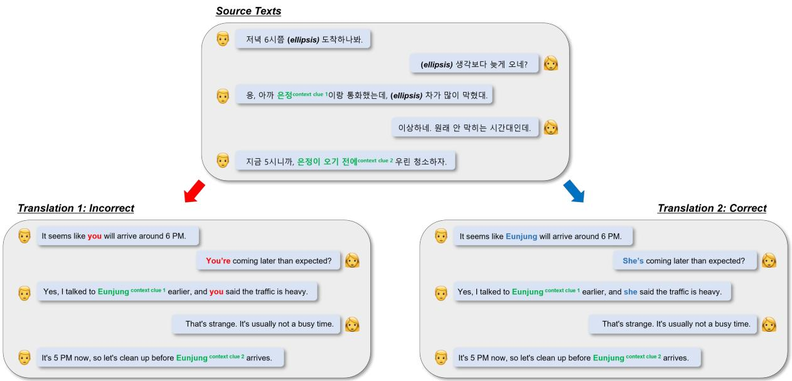
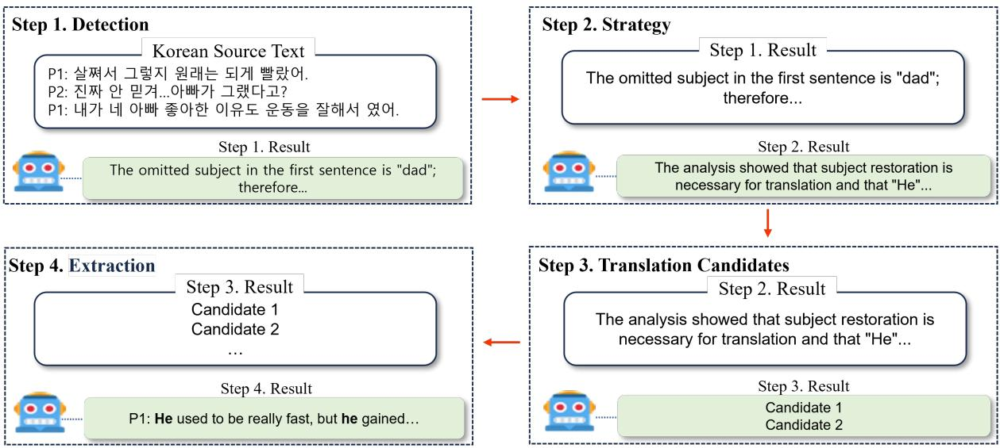
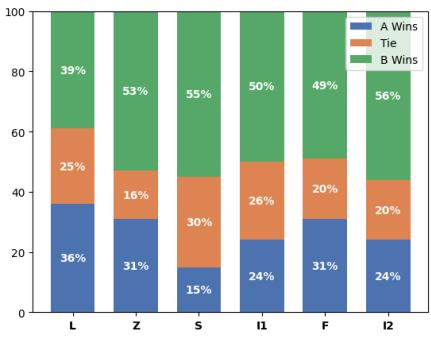
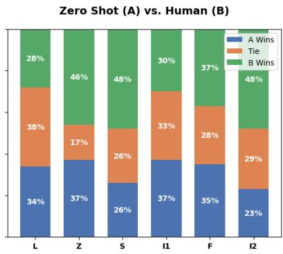
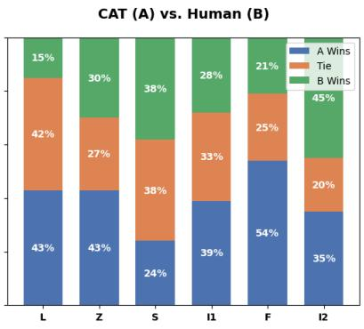
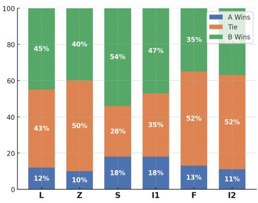
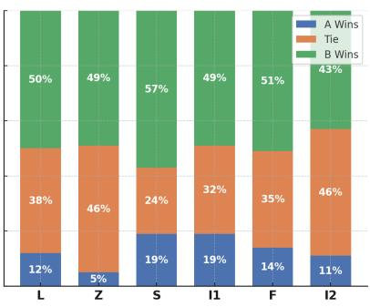
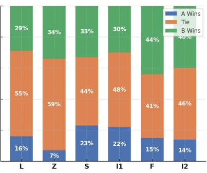

# A Testset for Context-Aware LLM Translation in Korean-to-English Discourse Level Translation \*

Minjae Lee1, Youngbin Noh2, Seung Jin Lee2,∗

1Korea University, 2NCSOFT

## Abstract

Large Language Models (LLMs) demonstrate remarkable performance in machine translation. Recent studies indicate that for highresource languages, LLM surpasses encoderdecoder neural machine translation (NMT) models. However, evaluation datasets used in many LLM-based translation studies are often compromised by data leakage and lack demanding datasets that accurately gauge the potential and limitations of LLMs in human-like translation. This paper introduces a manually con structed Korean-English discourse-level corpus comprising 600 text instances featuring six linguistic phenomena: lexical ambiguity, zero anaphora, slang, idiom, figurative language, and implicature. Utilizing this challenge test set, we investigated LLM’s Korean-to-English translation capability, particularly in cases requiring inter-sentential context based semantic inference. The findings reveal that stateof-the-art LLM, such as GPT-4o, still struggle with specific linguistic phenomena that can be challenging for machine translation. Additionally, step-by-step prompting, such as Chainof-Thought (CoT) prompting, significantly enhance the translation performance of LLMs compared to zero-shot prompting.

## 1 Introduction

Since the advent of large language model (LLM), numerous studies have extensively compared the translation performance of neural machine translation (NMT) systems including commercial MT systems (e.g., Google Translate, DeepL, Microsoft Translator) against LLM-based translations, demonstrating the remarkable capability of LLMs in machine translation (Vilar et al., 2022; Hendy et al., 2023; Zhang et al., 2023). Notably, results from the General Machine Translation Task at WMT23 indicated that GPT-4, using 5-shot prompting, achieved top rankings across most translation domains and language pairs (Kocmi et al., 2023).

However, many previous studies on LLM-based machine translation have primarily focused on sentence-level parallel corpus. Sentence-level translation is relatively simple as it involves less contextual information and fewer structural linguistic phenomena. With recent advancements, both LLMs and NMT models perform well on single-sentence translations, making it increasingly difficult to distinguish between human and machine translations for high-resource language pairs. Therefore, to thoroughly investigate the potential and limitations of LLMs in machine translation, it is crucial to study multi-sentence level translations involving complex discourse phenomena that require additional contextual information from preceding or following sentences.

Translating single sentences differs significantly from translating multi-sentence texts. Multisentence translation is more than the mere concatenation of individual sentence translations; it requires considering both the intra-sentence context and the inter-sentence context, which highlights one of the significant gaps between single sentence translation and multi-sentence translation. As a chatbot designed for conversation, ChatGPT excel in maintaining long-term coherence and consistency with previous conversational turns. Trained on vast amounts of dialogue data, it possesses substantial knowledge of human conversational conventions.

In this context, Wang et al. (2023) proposed test dataset and evaluation methodologies to assess the structural modeling capability of LLMs, represented by ChatGPT, in document-level text translation. They utilized document-level evaluation metric sacreBLEU (d-BLEU) (Liu et al., 2020)

  
Figure 1: An example of context-aware, discourse-level Korean-to-English translation. The highlighted discourse phenomenon is zero anaphora, a type of ellipsis. The parts highlighted in green indicate context clues necessary for an appropriate translation, while the parts highlighted in red and blue represent incorrect and correct translations, respectively.

and two custom metrics, consistency of Terminology Translation (cTT) and Accuracy of Zero Pronoun Translation (AZPT), to measure ChatGPT’s discourse awareness. However, the test set used in their study were not free from data leakage. Specifically, the contrastive test set proposed by Voita et al. (2019), used to evaluate ChatGPT’s discourse knowledge, were publicly released in 2019, raising the possibility of data leakage. Additionally, that test set comprise positive and negative translations for four discourse phenomena: Deixis, Lexicon Consistency, Ellipsis (Inflection), and Ellipsis (Verb Phrase). The evaluation was conducted through a method of selecting the appropriate translation from two options rather than directly examining the translation output, presenting inherent limitations in the analysis.

To address these issues, this paper directly examines multi-sentence level translation performance of LLM, and a representative commercial MT system(i.e., Google Translate), using a manually constructed challenge set free from data leakage. This challenge set includes six linguistic phenomena—Lexical Ambiguity, Zero Anaphora, Slang, Idiom, Metaphor, and Implicature—that require utilizing inter-sentence context for appropriate translation. The main findings of the empirical study based on the proposed test set are as follows:

• Higher-quality translations can be achieved for texts containing linguistic phenomena such as zero anaphora, idioms, figurative language through step-by-step prompting.

• The most powerful LLM with zero-shot prompting, still struggles with specific linguistic phenomena such as zero anaphora.

• For a fine-grained evaluation of translations involving demanding linguistic phenomena, existing quantitative metrics (e.g., BLEU, COMET) are insufficient.

## 2 Test Set Construction

To explore the potential and limitations of LLMs in discourse-level context aware MT, we constructed test set categorized into three main categories and six sub-linguistic phenomena. Examples of each linguistic phenomenon are provided in Table 1.

All text instances in the test set were manually constructed. The Korean source texts were constructed and annotated to indicate the location of each phenomenon, as well as the correct explaination and interpretation. Workers were native Korean speakers to reflect practical usability in Korean. Human English translations of the Korean texts were performed by highly proficient graduate-level translators fluent in both Korean and English. Detailed linguistic resource statistics on the constructed test set’s sentence and word counts are provided in Appendix A.

<table><tr><td>Category</td><td>Phenomenon</td><td>Source Text</td><td>Target Text (Suboptimal)</td><td>Target Text (Enhanced)</td></tr><tr><td>Ambiguity</td><td>Lexical ambiguity</td><td>P1: ! P:,</td><td>P1: Hi! P2: Yeah, It was fun. bye.</td><td>P1: Bye! P2: Yeah, It was fun. bye.</td></tr><tr><td>Ellipsis</td><td>Zero Anaphora</td><td>. P2:. .</td><td>P1: I gained weight, but I used to be really fast. P2: I can&#x27;t believe it... Dad was like that? P1: I liked your dad because he was</td><td>P1: He used to be really fast, but he gained weight. P2: I can&#x27;t believe it... Dad was like that? P1: I liked your dad because he was good at sports.</td></tr><tr><td rowspan="5">Literalism</td><td>Slang</td><td>P: . P P2:</td><td>P2: If you lie down right after eating like that, you will get acid reflux. P1: Okay, stop hitting my bones. P2: If you get it, why don&#x27;t you sit up?</td><td>P2: If you lie down right after eating like that, you will get acid reflux. P1: Okay, stop roasting me. P2: If you get it, why don&#x27;t you sit up?</td></tr><tr><td>Idiom</td><td>[]] P1: 2:.</td><td>P1: [Reading a sports article] &quot;Ronaldo is a more complete player than Messi,&quot; said the captain of the Portuguese national team. P2: Well, His arms are bent inwards...</td><td>P1: [While reading a sports article] &quot;Ronaldo is a more complete player than Messi,&quot; said the captain of the Portuguese national team. P2: Well, he is biased after all..</td></tr><tr><td>Figurative Language</td><td>P: . P:， .</td><td>P1: The days of eating a full meal of meat soup with white rice are gone. P2: The rate of inflation is really severe. I&#x27;m worried we might be heading for another Great Depression.</td><td>P1: The days of living high on the hog are over. P2: The rate of inflation is really severe. I&#x27;m worried we might be heading for another Great Depression.</td></tr><tr><td>Implicature</td><td>P1:? P:.[]] P1:.</td><td>P1: Is there an available seat here? P2: Yes, there is. [Shows the bag] P1: I guess I&#x27;ll have to find another place.</td><td>P1: Is there an available seat here? P2: No, it&#x27;s already taken. [Shows the bag] P1: I guess I&#x27;ll have to find another place.</td></tr></table>

Table 1: An example of linguistic phenomena that can be challenging for machine translation. In the Korean source text, the parts where the relevant linguistic phenomena occur are highlighted in bold. In the suboptimal translation examples, the parts that are less optimal translated due to these phenomena are highlighted in red, while in the enhanced translation examples, the parts with more suitable expressions related to the phenomena are highlighted in blue.

Below, we discuss each category and sublinguistic phenomenon, providing background explanations and highlighting translation challenges.

## 2.1 Ambiguity

The Ambiguity category encompasses issues arising when a word in one language has multiple possible translations in another language (Tokowicz and Degani, 2010). This includes lexical ambiguity, polysemy, and near-synonymy, characterized by one-to-many mappings requiring context reflection for accurate translation. Our proposed test set focuses on cases where inter-sentential context is necessary for determining the meaning, aiming to thoroughly assess LLMs’ understanding and utilization of higher-level discourse structures.

A representative example is provided as the Lexical Ambiguity phenomenon in Table 1. The ambiguous and polysemous words included in the test set are primarily verbs and nouns. Korean, the source language, often has multiple meanings associated with a single verb. For instance, the Korean verb "보다" (pronounced boda) can mean "look," "meet," "read," or "try," depending on the context.

Additionally, many nouns derived from chinese characters have different meanings despite having the same spelling. For example, "연초" (pronounced yeoncho) can mean "the beginning of the year" or "tobacco."

## 2.2 Ellipsis

Ellipsis refers to situations where one or more words are omitted from a sentence or phrase, yet their meaning can be inferred from the surrounding context (Yamamoto and Sumita, 1998; Voita et al., 2019). Ellipsis in machine translation poses a challenge when the source language frequently omits certain sentence components, requiring appropriate restoration in the target language where such omissions are generally not permissible. Zero anaphora, a typical example of Ellipsis, involves the omission of pronouns or noun phrases. Korean, a pro-drop language, commonly omits subjects or objects, whereas English does not. As shown in the example in Table 1, determining the subject of the predicates (i.e. "used to be fast," "gain") in the first utterance requires inference from the subsequent context. This test set focuses on cases where intra-sentential context is insufficient for appropriate restoration, aiming to assess LLMs’ understanding and utilization of discourse structures.

## 2.3 Literalism

In machine translation, literalism—where translations are overly literal and fail to capture the intended meaning—has been a significant challenge. The MQM framework (Dankers et al., 2022), used in major machine translation conferences like WMT for both human and automatic evaluation, classifies such errors as translations that are overly literal. Literalism issues have also been addressed in literary text translations, indicating a significant gap between human and NMT model translations even with literary data-trained NMT models (Guerberof-Arenas and Toral, 2022).

Resolving literalism issues requires understanding and utilizing context to determine whether a translation should be literal or liberal. Our proposed test set focuses on cases requiring both intrasentential and inter-sentential context, classified into four phenomena: Slang, Idiom, Figurative Language, and Implicature. An example is provided in Table 1. This suite aims to assess LLMs’ abilities to utilize contextual information for appropriate liberal translations.

## 3 Experimentation

To verify the utility of the proposed test set, we compared and analyzed the translation performance of a representative commercial MT system and LLM based MT on predefined evaluation method.

## 3.1 MT System & LLM

To compare the translation performance of existing encoder-decoder based models and LLMs, we used the most representative models, Google Translate (GMT) and ChatGPT. Google Translate, the most widely used MT system globally, is renowned for its accuracy and efficiency. For ChatGPT, we utilized the GPT-4o model1, known for improved performance in non-English languages (OpenAI, 2024). Both models generated translations within an API environment.

## 3.2 Translation Methodology

To thoroughly investigate the potential and limitations of LLM performance on the constructed challenge set, we applied an additional prompt methodology beyond the simplest and most common method, zero-shot prompting. Chain-of-Thought (CoT) prompting (Wei et al., 2022; Kojima et al., 2022), known for significant performance improvements in various reasoning tasks, was used to design a step-by-step prompting methodology for this translation task. Additionally, Wang et al. (2022) demonstrated that the Self-Consistency methodology, which selects the best result from multiple CoT pathways, was also used to design the translation prompt methodology.

We named this prompting framework Context-Aware Prompting (CAP) because it utilizes a cascading process that focuses on existing contextual information (Figure 2). The actual prompts used in the experiment, including the zero-shot prompt, can be found in Appendix B. In summary, the translation methodologies used in the experiment are as follows: 1) Google Tranlsate (GMT) which is representative NMT model, 2) Zero shot Prompting with GPT-4o, which is the simplest approach to utilize LLM to machine translation, 3) CAP framework with GPT-4o.

The steps of the CAP framework are detailed below:

• Step 1. Detection - Identifying linguistic phenomena in the source text that require special attention during translation.

• Step 2. Strategy - Developing strategies to generate the best translation based on the output of Step 1.

• Step 3. Translation Candidates - Generating five translation candidates based on the output of Step 2 and selecting the best translation.

• Step 4. Extraction - Extracting only the selected translation from the output of Step 3.

## 3.3 Evaluation Method

As explained, the challenge set consists of subsets where each subset has been deliberately created to assess the model’s performance on a particular phenomenon. Therefore, instead of evaluating the overall quality of the generated translations in terms of adequacy and fluency, a specialized quality evaluation for each linguistic phenomenon can be conducted. For this purpose, specific evaluation criteria for each phenomenon were established using a 3-point scale, and four proficient bilingual scorers were instructed on these criteria to perform the evaluations. Detailed information on the 3-point scale evaluation criteria can be found in the Appendix C.

  
Figure 2: The Context-Aware Prompting (CAP) framework consists of four steps: Detection, Strategy, Translation Candidates, and Extraction. Each step is executed using its own specific prompt template.The actual prompts used in the experiment can be found in Appendix B.

In addition to the phenomenon-specific human evaluation, a human preference study was conducted to compare the overall translation quality and preferences across six comparison pairs. Similar to the quantitative 3-point scale evaluations, this preference study involved four proficient bilingual individuals. Finally, the translation quality scores derived from representative automatic evaluation metrics—including sentence-level evaluation metrics, document-specific evaluation metrics, and LLM-based evaluation methodologies—were compared with the two aforementioned human-based evaluation results. The following are the methods used in our experimentation:

## 1. 3-Point Scale Scoring

Proficient bilingual evaluators used predefined 3-point criteria, described in both English and Korean, tailored to each phenomenon.

## 2. Human Preference Study

Proficient bilingual evaluators assigned preferences to comparison pairs of human and machine translations, as well as pairs of different machine translations. If the preference for both was the same or similar, a tie was given.

## 3. Representative Automatic Metrics

We employed several representative automatic evaluation metrics to evaluate the translation quality:

• Sentence-level BLEU (s-BLEU; Papineni et al. 2002): Measures the n-gram overlap between the machine translation output and the reference translation at the sentence level.

• COMET22 (Rei et al., 2022): A state-ofthe-art neural-based evaluation method that leverages pretrained models to better predict human judgment of sentencelevel translation quality.

• Document-level BLEU (d-BLEU; Liu et al. 2020): Extends the BLEU metric to evaluate translation quality at the document level, taking into account contextual consistency across sentences.

• BlonDe (Jiang et al., 2021): A discourseaware metric designed to evaluate translations by considering discourse-level phenomena, providing a more holistic assessment of translation quality.

• GEMBA-MQM (Kocmi and Federmann, 2023): An LLM-based quality estimation method that utilizes large language models (LLMs) to estimate translation quality through error analysis.

## 4 Results

As previously described, we compared our different machine translation methodologies using both aggregate statistics from human evaluations and representative automatic metrics. Overall, our observations indicate that the zero-shot translation by GPT-4o, a state-of-the-art LLM, consistently received higher scores in all evaluations compared to Google Translate. However, there are still areas for improvement, and a step-by-step translation generation approach, such as the CAP framework, can enhance the translation quality for linguistic phenomena that pose challenges to machine translation.

## 4.1 Human Evaluation Using a 3-Point Scale

The result of the 3-point scores are shown in Table 3. The scores are the averages of 100 text instances assigned to each phenomena and MT system. First, comparing Google Translate and ChatGPT-4o, regardless of the prompting method, ChatGPT-4o consistently received higher scores. Notably, Google Translate scored significantly lower on the Slang subset, and the scores between Zero-Shot and CAP were nearly identical. This suggests that, unlike LLMs, which have likely learned about slang and its context from large amounts of web data, NMT model may lack adequate knowledge of slang, leading to a literal translation of Korean slang.

In the implicature subset, the score difference between NMT model and LLM was relatively small compared to other subsets, which may be because literal translations of implied utterances can better capture their intended meaning. For the lexical ambiguity subset, although multi-sentence context is required, the small score difference between Zero-Shot and CAP translations indicates that this phenomenon can be well addressed without additional intermediate prompting steps. However, excluding the slang and lexical ambiguity subsets, CAP framework consistently outperformed Zero-Shot prompting in the remaining four phenomena subsets. Specifically, in the zero anaphora subset, the score difference between Zero-Shot and CAP was larger than the difference between Google Translate and Zero-Shot (e.g., the score difference between Google Translate and Zero-Shot for Zero Anaphora was 0.24, while the difference between Zero-Shot and CAP was 0.31).

## 4.2 Human Preference Study

The overall percentage results of the human preference study are presented in Table 4. Surprisingly, CAP translations achieved a win rate approximately 10% higher than human translations in the preference study. In contrast, Zero-Shot translations had a win rate approximately 7% lower than human translations. For comparison with Google

Translate, more than half of the participants preferred human translations. These results align with the overall average scores from the previous 3-point scale human evaluations, where CAP translations ranked first, Zero-Shot translations second, and Google Translate last. The results of the preference study for each linguistic phenomenon can be found in Appendix D, which also show that, consistent with the previous 3-point scale evaluations, CAP achieved the highest win rate in all categories except for the Slang type. We also conducted a human preference study comparing the machine translation methodologies, and the results of this study are presented in Appendix D. This study also revealed that CAP had the highest preference among the machine translation methods.

## 4.3 Representative Automatic Metrics

The results are shown in Table 5. When evaluated using sentence-centric metrics, each text was divided into sentences, and the average of these scores was assigned as the score for the respective text. Generally, in automatic metrics, zeroshot scores outperformed both Google Translate and CAP, which was particularly evident in the s-BLEU scores. Although the COMET22 scores were also higher for zero-shot in many cases, the differences were much more subtle compared to the BLEU scores. Additionally, in the zero anaphora, slang and idiom subsets, CAP scores were equal to or higher than zero-shot scores. Notably, compared to human evaluations, the scoring pattern for zero anaphora was significantly different, highlighting the limitations of n-gram-based evaluations in providing fine-grained quality evaluation. The document-centric metric scores also mirrored the trends of the sentence-centric metrics.

In the lexical ambiguity, idiom, and implicature subsets, the zero-shot scores surpassed those of both d-BLEU and BlonDe for Google Translate and CAP. The LLM evaluation using GPT-4o, specifically the GEMBA-MQM prompt for quality estimation, showed that zero-shot and CAP achieved the highest scores in three subsets each. It is also noteworthy that the score differences between the two were minimal across all subsets. Overall, the evaluations using automatic metrics clearly revealed the performance gap between NMT model and LLM, but failed to provide fine-grained evaluation for discourse-level translation between prompting methodologies.

<table><tr><td rowspan="2">MT System</td><td>Ambiguity</td><td>Ellipsis</td><td colspan="4">Literalism</td><td>Averaged</td></tr><tr><td>Lexical Ambiguity</td><td>Zero Anaphora</td><td>Slang</td><td>Idiom</td><td>Figurative Language</td><td>Implicature</td><td></td></tr><tr><td>Google Translate</td><td>2.57</td><td>2.13</td><td>2.06</td><td>2.29</td><td>2.42</td><td>2.62</td><td>2.35</td></tr><tr><td>Zero Shot</td><td>2.81</td><td>2.37</td><td>2.59</td><td>2.60</td><td>2.51</td><td>2.70</td><td>2.59</td></tr><tr><td>CAP</td><td>2.85</td><td>2.68</td><td>2.58</td><td>2.76</td><td>2.69</td><td>2.77</td><td>2.72</td></tr></table>

Table 2: 3-Point Scale Human Evaluation Results. CAP received the highest scores in all subcategories except for the Slang category.

<table><tr><td rowspan="2"></td><td colspan="3">Comparison Against Human Translation</td></tr><tr><td>GMT</td><td>Zero Shot</td><td>CAP</td></tr><tr><td>Win (%)</td><td>26.83</td><td>32.00</td><td>39.67</td></tr><tr><td>Tie (%)</td><td>22.83</td><td>28.50</td><td>30.83</td></tr><tr><td>Lose (%)</td><td>50.33</td><td>39.50</td><td>29.50</td></tr></table>

Table 3: Human preference ratings for different translation methodologies. The "Win" column indicates the percentage where the machine translation method outperformed human translation, while "Lose" indicates where the human translation was preferred.

## 5 Related Work

## 5.1 Evaluation Test Suites for Context-Aware Machine Translation

Context-aware test suites have been consistently proposed over recent years, highlighting their importance and interest in the machine translation field (Hardmeier et al., 2015; Guillou and Hardmeier, 2016; Burchardt et al., 2017; Isabelle et al., 2017; Gonzales et al., 2017; Müller et al., 2018; Bawden et al., 2017; Voita et al., 2019; Jwalapuram et al., 2020). Despite advancements in contextdependent translation problems, existing datasets still have limitations. Most test suites focus on one context-dependent discourse phenomenon, predominantly pronoun translation, and lack test sets for languages other than English or European languages. Additionally, many test sets are derived from publicly available WMT resources or webcrawled data, leading to potential data leakage for LLMs. Many test sets focus on sentence-level context-aware MT tasks rather than utilizing intersentential context, making it difficult to objectively evaluate the capabilities of multilingual LLMs beyond single-sentence context-dependent translation problems.

Rikters et al. (2021) directly constructed a document-level parallel corpus including Japanese, a non-European language, without using existing resources. However, this corpus is not specialized for evaluating MT systems’ capabilities in context-dependent translation problems beyond single-sentence context. Jiang et al. (2023) created a parallel corpus with extensive annotations for discourse phenomena categorized into four aspectsentity, terminology, coreference, and quotation. This allows for evaluating and analyzing MT systems’ capabilities in context-aware translation, including LLMs. However, the dataset was further processed from the BWB parallel corpus (Jiang et al., 2021), making it prone to data leakage for modern LLMs like ChatGPT-4o. The dataset is also limited to the Web Novel domain. Lei et al. (2024) proposed a Chinese-to-English parallel corpus for evaluating consistent terminology translation in documentlevel texts, distinguishing true and false consistency to assess consistent translations with terminological diversity. However, it is limited to terminology consistency issues.

## 5.2 LLM for Machine Translation

Due to the impressive performance of Large Language Models in the NLP field, leveraging LLMs for machine translation has recently seen a surge in research. Following studies on the capability of LLMs in In-Context Learning (ICL) (Dong et al., 2022) and the effectiveness of step-by-step prompting (Wei et al., 2022; Kojima et al., 2022), many studies have actively explored the translation performance of LLMs through few-shot prompting (Agrawal et al., 2022; Vilar et al., 2022; Hendy et al., 2023; Zhang et al., 2023)and step-by-step prompting methodologies (Raunak et al., 2023; Chen et al., 2023; He et al., 2024; Na et al., 2024; Feng et al., 2024). Previous studies indicate that for high-resource languages, LLM-based machine translation performance has reached or surpassed that of commercial MT systems. However, most of the datasets used in these studies are parallel corpora at the single-sentence level, still insufficient to reveal the full potential and limitations of

<table><tr><td>Phenomenon</td><td>MT System</td><td colspan="2">Sentence Centric Metric</td><td colspan="2">Document Centric Metric</td><td>LLM Eval</td><td colspan="2">Human Eval</td></tr><tr><td></td><td></td><td>s-BLEU</td><td>COMET22</td><td>d-BLEU</td><td>BlonDe</td><td>GEMBA- MQM</td><td>3-point</td><td>Preference</td></tr><tr><td rowspan="4">Lexical Ambiguity</td><td>Google Translate</td><td>25.81</td><td>0.825</td><td>26.23</td><td>0.487</td><td>-5.12</td><td>2.57</td><td>61%</td></tr><tr><td>Zero Shot</td><td>29.89</td><td>0.848</td><td>31.07</td><td>0.525</td><td>-2.81</td><td>2.81</td><td>72%</td></tr><tr><td>CAP</td><td>28.21</td><td>0.839</td><td>29.17</td><td>0.508</td><td>-2.7</td><td>2.85</td><td>85%</td></tr><tr><td>Google Translate</td><td>26.61</td><td>0.848</td><td>28.64</td><td>0.475</td><td>-7.06</td><td>2.13</td><td>47%</td></tr><tr><td rowspan="3">Zero Anaphora</td><td>Zero Shot</td><td>28.08</td><td>0.851</td><td>29.11</td><td>0.5071</td><td>-3.33</td><td>2.37</td><td>54%</td></tr><tr><td>CAP</td><td>26.23</td><td>0.851</td><td>30.79</td><td>0.488</td><td>-3.29</td><td>2.68</td><td>70%</td></tr><tr><td>Google Translate</td><td>38.89</td><td>0.843</td><td>38.91</td><td>0.570</td><td>-8.56</td><td>2.06</td><td>45%</td></tr><tr><td rowspan="3">Slang</td><td>Zero Shot</td><td>45.46</td><td>0.867</td><td>45.52</td><td>0.618</td><td>-2.94</td><td>2.59</td><td>52%</td></tr><tr><td>CAP</td><td>43.34</td><td>0.871</td><td>42.96</td><td>0.629</td><td>-3.11</td><td>2.58</td><td>62%</td></tr><tr><td>Google Translate</td><td>28.63</td><td>0.816</td><td>26.97</td><td>0.494</td><td>-6.33</td><td>2.29</td><td>50%</td></tr><tr><td rowspan="3">Idiom</td><td>Zero Shot</td><td>30.88</td><td>0.825</td><td>29.55</td><td>0.520</td><td>-2.98</td><td>2.60</td><td>70%</td></tr><tr><td>CAP</td><td>29.30</td><td>0.830</td><td>27.76</td><td>0.504</td><td>-2.96</td><td>2.76</td><td>72%</td></tr><tr><td>Google Translate</td><td>32.85</td><td>0.834</td><td>32.80</td><td>0.517</td><td>-4.69</td><td>2.42</td><td>51%</td></tr><tr><td rowspan="3">Figurative Language</td><td>Zero Shot</td><td>36.43</td><td>0.847</td><td>36.68</td><td>0.533</td><td>-2.73</td><td>2.51</td><td>63%</td></tr><tr><td>CAP</td><td>34.35</td><td>0.840</td><td>33.72</td><td>0.550</td><td>-2.96</td><td>2.69</td><td>79%</td></tr><tr><td>Google Translate</td><td>38.92</td><td>0.864</td><td>40.56</td><td>0.454</td><td>-4.66</td><td>2.62</td><td>44%</td></tr><tr><td rowspan="3">Implicature</td><td>Zero Shot</td><td>44.89</td><td>0.877</td><td>45.80</td><td>0.606</td><td>-2.49</td><td>2.70</td><td></td></tr><tr><td>CAP</td><td></td><td>0.867</td><td>40.71</td><td>0.568</td><td>-2.95</td><td>2.77</td><td>52%</td></tr><tr><td></td><td>39.70</td><td></td><td></td><td></td><td></td><td></td><td>55%</td></tr></table>

Table 4: Comparison between Automatic Evaluation Metric and Human Evaluation

## LLM-based machine translation.

Wang et al. (2023) systematically investigated the document-level translation capabilities of LLMs, particularly GPT-3.5 and GPT-4 models. Their study analyzed the impact of prompt templates on document-level translation performance and discourse modeling abilities. While this study conducted a systematic investigation of LLMs document-level translation capabilities, it is distinguished from our research due to data leakage issues and the use of indirect analysis methods. Karpinska and Iyyer (2023) examined the translation performance of LLMs in literary translation at the paragraph level across 18 language pairs, conducting human error analysis and evaluation of LLM outputs to reveal their potential and limitations. However, this study is limited to translations of specific literary works. Wu et al. (2024) investigated the impact of prompt strategies and finetuning on document-level text translation performance. This study is distinguished from ours by focusing on LLMs’ utilization of inter-sentential context and limitations across various linguistic phenomena based on a test set and prompting methodology.

## 6 Conclusion

In this study, we manually constructed and provided a total of 600 Korean-English test suites, categorized into three main categories and six linguistic phenomena that require document or discourselevel contextual translation. Based on the proposed test suites, we compared the translation patterns of a representative commercial MT system, Google Translate, and the state-of-the-art LLM, GPT-4o. Our findings indicate that across all sub-linguistic phenomena, the encoder-decoder structured NMT model, Google Translate, significantly underperformed compared to GPT-4o, even when utilizing our proposed CAP framework as well as zero-shot prompting. Additionally, the step-by-step translation generation approach of CAP received higher scores and preferences in human evaluations compared to zero-shot prompting. This indicates that even the state-of-the-art LLM with zero-shot still has room for improvement in translating texts containing certain linguistic phenomena.

On the other hand, the scores from existing automatic evaluation metrics showed little to no difference between zero-shot and CAP framework, with zero-shot prompting sometimes scoring higher. This suggests that current automatic evaluation metrics may be insufficient for assessing the performance of context-aware translation at the document or discourse level. Consequently, to improve translation quality for challenging issues requiring discourse-level context, our study demonstrates that step-by-step prompting can significantly enhance LLM translations, revealing the potential of LLMs to achieve human-like translation quality.

## Limitations

The test suites used in our research were manually created for evaluation and limited to 100 instances per linguistic phenomenon, resulting in a total of 600 instances. This limitation was due to practical constraints such as time and resource costs. Furthermore, our experiments were conducted solely on one language pair, Korean-English, indicating the need for further studies across additional language pairs. Additionally, we evaluated only one representative model for both NMT and LLM, suggesting the necessity for further experiments with a broader range of NMT models and various LLMs. To verify the effectiveness of step-by-step prompting in enhancing discourse-level, context-based translation quality, further experiments with LLMs of different parameter sizes are necessary. Moreover, while human evaluation was the primary method used for assessing the generated translations due to resource constraints, additional research on automatic evaluation metrics that offer fine-grained assessments of discourse-level translations, similar to human evaluation, is needed.

## Acknowledgements

This work was conducted during an internship at NCSOFT and was funded by the Center for Digital Humanities at the Research Institute of Humanities Convergence, Korea University.

This work was also supported by the Institute for Information & Communications Technology Promotion (IITP) grant funded by the Korea government (MSIP) (RS-2024-00398115, Research on the reliability and coherence of outcomes produced by Generative AI).

We extend our sincere appreciation to all individuals and institutions who contributed to the completion of this work.

## References

Sweta Agrawal, Chunting Zhou, Mike Lewis, Luke Zettlemoyer, and Marjan Ghazvininejad. 2022. Incontext examples selection for machine translation. arXiv preprint arXiv:2212.02437.

Rachel Bawden, Rico Sennrich, Alexandra Birch, and Barry Haddow. 2017. Evaluating discourse phenomena in neural machine translation. arXiv preprint arXiv:1711.00513.

Aljoscha Burchardt, Vivien Macketanz, Jon Dehdari, Georg Heigold, Peter Jan-Thorsten, and Philip Williams. 2017. A linguistic evaluation of rule-based, phrase-based, and neural mt engines. The Prague bul letin ofmathematical linguistics, 108(1):159.

Pinzhen Chen, Zhicheng Guo, Barry Haddow, and Kenneth Heafield. 2023. Iterative translation refinement with large language models. arXiv preprint arXiv:2306.03856.

Verna Dankers, Christopher G Lucas, and Ivan Titov. 2022. Can transformer be too compositional? analysing idiom processing in neural machine translation. arXiv preprint arXiv:2205.15301.

Qingxiu Dong, Lei Li, Damai Dai, Ce Zheng, Zhiyong Wu, Baobao Chang, Xu Sun, Jingjing Xu, and Zhifang Sui. 2022. A survey on in-context learning. arXiv preprint arXiv:2301.00234.

Zhaopeng Feng, Yan Zhang, Hao Li, Wenqiang Liu, Jun Lang, Yang Feng, Jian Wu, and Zuozhu Liu. 2024. Improving llm-based machine translation with systematic self-correction. arXiv preprint arXiv:2402.16379.

Annette Rios Gonzales, Laura Mascarell, and Rico Sennrich. 2017. Improving word sense disambiguation in neural machine translation with sense embeddings. In Proceedings ofthe Second Conference on Machine Translation, pages 11–19.

Ana Guerberof-Arenas and Antonio Toral. 2022. Creativity in translation: Machine translation as a constraint for literary texts. Translation Spaces, 11(2):184–212.

Liane Guillou and Christian Hardmeier. 2016. Protest: A test suite for evaluating pronouns in machine translation. In Proceedings of the Tenth International Conference on Language Resources and Evaluation (LREC’16), pages 636–643.

Christian Hardmeier, Preslav Nakov, Sara Stymne, Jörg Tiedemann, Yannick Versley, and Mauro Cettolo. 2015. Pronoun-focused mt and cross-lingual pronoun prediction: Findings of the 2015 discomt shared task on pronoun translation. In Second Workshop on Discourse in Machine Translation (DiscoMT), 17 September 2015, Lisbon, Portugal, pages 1–16. Association for Computational Linguistics.

Zhiwei He, Tian Liang, Wenxiang Jiao, Zhuosheng Zhang, Yujiu Yang, Rui Wang, Zhaopeng Tu, Shuming Shi, and Xing Wang. 2024. Exploring humanlike translation strategy with large language models. Transactions of the Association for Computational Linguistics, 12:229–246.

Amr Hendy, Mohamed Abdelrehim, Amr Sharaf, Vikas Raunak, Mohamed Gabr, Hitokazu Matsushita, Young Jin Kim, Mohamed Afify, and Hany Hassan Awadalla. 2023. How good are gpt models at machine translation? a comprehensive evaluation. arXiv preprint arXiv:2302.09210.

Pierre Isabelle, Colin Cherry, and George Foster. 2017. A challenge set approach to evaluating machine translation. arXiv preprint arXiv:1704.07431.

Yuchen Eleanor Jiang, Tianyu Liu, Shuming Ma, Dongdong Zhang, Mrinmaya Sachan, and Ryan Cotterell. 2023. Discourse centric evaluation of machine translation with a densely annotated parallel corpus. arXiv preprint arXiv:2305.11142.

Yuchen Eleanor Jiang, Tianyu Liu, Shuming Ma, Dongdong Zhang, Jian Yang, Haoyang Huang, Rico Sennrich, Ryan Cotterell, Mrinmaya Sachan, and Ming Zhou. 2021. Blonde: An automatic evaluation metric for document-level machine translation. arXiv preprint arXiv:2103.11878.

Prathyusha Jwalapuram, Barbara Rychalska, Shafiq Joty, and Dominika Basaj. 2020. Can your context-aware mt system pass the dip benchmark tests?: Evaluation benchmarks for discourse phenomena in machine translation. arXiv preprint arXiv:2004.14607.

Marzena Karpinska and Mohit Iyyer. 2023. Large language models effectively leverage document-level context for literary translation, but critical errors persist. arXiv preprint arXiv:2304.03245.

Tom Kocmi, Eleftherios Avramidis, Rachel Bawden, Ondˇrej Bojar, Anton Dvorkovich, Christian Federmann, Mark Fishel, Markus Freitag, Thamme Gowda, Roman Grundkiewicz, et al. 2023. Findings of the 2023 conference on machine translation (wmt23): Llms are here but not quite there yet. In Proceedings of the Eighth Conference on Machine Translation, pages 1–42.

Tom Kocmi and Christian Federmann. 2023. Gembamqm: Detecting translation quality error spans with gpt-4. arXiv preprint arXiv:2310.13988.

Takeshi Kojima, Shixiang Shane Gu, Machel Reid, Yutaka Matsuo, and Yusuke Iwasawa. 2022. Large language models are zero-shot reasoners. Advances in neural information processing systems, 35:22199– 22213.

Xiangyu Lei, Junhui Li, Shimin Tao, and Hao Yang. 2024. Evaluation dataset for lexical translation consistency in chinese-to-english document-level translation. In Proceedings ofthe 2024 Joint International Conference on Computational Linguistics, Language Resources and Evaluation (LREC-COLING 2024), pages 6575–6581.

Yinhan Liu, Jiatao Gu, Naman Goyal, Xian Li, Sergey Edunov, Marjan Ghazvininejad, Mike Lewis, and Luke Zettlemoyer. 2020. Multilingual denoising pretraining for neural machine translation. Transactions ofthe Associationfor Computational Linguistics, 8:726–742.

Mathias Müller, Annette Rios, Elena Voita, and Rico Sennrich. 2018. A large-scale test set for the evaluation of context-aware pronoun translation in neural machine translation. arXiv preprint arXiv:1810.02268.

Hongbin Na, Zimu Wang, Mieradilijiang Maimaiti, Tong Chen, Wei Wang, Tao Shen, and Ling Chen.

2024. Rethinking human-like translation strategy: Integrating drift-diffusion model with large language models for machine translation. arXiv preprint arXiv:2402.10699.

OpenAI. 2024. Openai. Accessed: 2024-07-16.

Kishore Papineni, Salim Roukos, Todd Ward, and Wei-Jing Zhu. 2002. Bleu: a method for automatic evaluation of machine translation. In Proceedings ofthe 40th annual meeting ofthe Associationfor Computational Linguistics, pages 311–318.

Vikas Raunak, Amr Sharaf, Yiren Wang, Hany Hassan Awadallah, and Arul Menezes. 2023. Leveraging gpt-4 for automatic translation post-editing. arXiv preprint arXiv:2305.14878.

Ricardo Rei, José GC De Souza, Duarte Alves, Chrysoula Zerva, Ana C Farinha, Taisiya Glushkova, Alon Lavie, Luisa Coheur, and André FT Martins. 2022. Comet-22: Unbabel-ist 2022 submission for the metrics shared task. In Proceedings of the Seventh Conference on Machine Translation (WMT), pages 578–585.

Mat¯ıss Rikters, Ryokan Ri, Tong Li, and Toshiaki Nakazawa. 2021. Japanese–english conversation parallel corpus for promoting context-aware machine translation research. Journal of Natural Language Processing, 28(2):380–403.

Natasha Tokowicz and Tamar Degani. 2010. Translation ambiguity: Consequences for learning and processing. In Research in second language processing and parsing, pages 281–294. John Benjamins.

David Vilar, Markus Freitag, Colin Cherry, Jiaming Luo, Viresh Ratnakar, and George Foster. 2022. Prompting palm for translation: Assessing strategies and performance. arXiv preprint arXiv:2211.09102.

Elena Voita, Rico Sennrich, and Ivan Titov. 2019. When a good translation is wrong in context: Context-aware machine translation improves on deixis, ellipsis, and lexical cohesion. arXiv preprint arXiv:1905.05979.

Longyue Wang, Chenyang Lyu, Tianbo Ji, Zhirui Zhang, Dian Yu, Shuming Shi, and Zhaopeng Tu. 2023. Document-level machine translation with large language models. arXiv preprint arXiv:2304.02210.

Xuezhi Wang, Jason Wei, Dale Schuurmans, Quoc Le, Ed Chi, Sharan Narang, Aakanksha Chowdhery, and Denny Zhou. 2022. Self-consistency improves chain of thought reasoning in language models. arXiv preprint arXiv:2203.11171.

Jason Wei, Xuezhi Wang, Dale Schuurmans, Maarten Bosma, Fei Xia, Ed Chi, Quoc V Le, Denny Zhou, et al. 2022. Chain-of-thought prompting elicits reasoning in large language models. Advances in neural information processing systems, 35:24824–24837.

Minghao Wu, Thuy-Trang Vu, Lizhen Qu, George Foster, and Gholamreza Haffari. 2024. Adapting large language models for document-level machine translation. arXiv preprint arXiv:2401.06468.

Kazuhide Yamamoto and Eiichiro Sumita. 1998. Feasibility study for ellipsis resolution in dialogues by machine-learning technique. In COLING 1998 Volume 2: The 17th International Conference on Computational Linguistics.

Biao Zhang, Barry Haddow, and Alexandra Birch. 2023. Prompting large language model for machine translation: A case study. In International Conference on Machine Learning, pages 41092–41110. PMLR.

## A Statistics

The linguistic resource statistics for the constructed Korean-English test set are shown in Table 5.

## B Prompt

Below is the template for the Zero shot prompt We used.

\### INSTRUCTION:

Please translate the following korean text input to English.

###Korean Source Text:

{src}

The CAP framework are composed of a Step 1 Detection prompt specialized for each linguistic phenomenon and common Step 2, Step 3, Step 4 prompts. The temperature of the LLM model used was set to 0. The full prompts from Step 1 to Step 4 are presented in Table 5, and the Step 1 detection prompts for each linguistic phenomenon are presented in Table 6.

## C 3-point Scale Evaluation Criteria

The 3-point scale human evaluation was performed considering only the result for the specific linguistic type, not the overall quality of the translation. In other words, the quality was evaluated only for the translation of the linguistic phenomenon present in the text (e.g., Slang, Idiom). The criteria were provided in both Korean and English. The details are presented in Table 7.

## D Human Preference Study Results

The results of the preference study between human and machine translation methodologies for each phenomenon are shown in Figure 3. Similarly, the

results of the human preference study between different machine translation methodologies can be found in Figure 4.

Google Translate (A) vs. Human (B)  

  
Figure 3: Results of the human preference study between human and machine translation methodologies. The blue parts represent the win percentage for machine translation methodologies, the green parts represent the win percentage for human translation, and the orange parts represent the tie percentage. The x-axis labels correspond to the first letter of each linguistic phenomenon: "L" for "Lexical Ambiguity," "Z" for "Zero Anaphora," "S" for "Slang," "I1" for "Idiom," "F" for "Figurative Language," and "I2" for "Implicature.

Google Translate (A) vs. Zero Shot (B)  

Google Translate (A) vs. CAT (B)  

Zero Shot (A) vs. CAT (B)  
  
Figure 4: Results of the human preference study between machine translation methodologies.

<table><tr><td>Type</td><td>Phenomenon</td><td>#text</td><td>#sent</td><td>#word</td><td>#word/sent</td><td>#sent/text</td></tr><tr><td>Ambiguity</td><td>Lexical Ambiguity</td><td>100</td><td>264</td><td>2,569 / 2,567</td><td>9.73 / 9.72</td><td>2.74</td></tr><tr><td>Ellipsis</td><td>Zero Anaphora</td><td>100</td><td>389</td><td>4,362 / 4,165</td><td>11.30/ 10.79</td><td>3.89</td></tr><tr><td></td><td>Slang</td><td>100</td><td>298</td><td>3,285 /3,315</td><td>11.17 / 11.27</td><td>2.98</td></tr><tr><td>Literalism</td><td>Idiom</td><td>100</td><td>250</td><td>3,099 / 2,849</td><td>12.64 / 11.62</td><td>2.50</td></tr><tr><td></td><td>Figurative language</td><td>100</td><td>309</td><td>3,401 /3,153</td><td>11.37 / 10.54</td><td>3.09</td></tr><tr><td></td><td>Implicature</td><td>100</td><td>276</td><td>2,798 / 2,794</td><td>10.32 / 10.30</td><td>2.76</td></tr><tr><td></td><td>Total</td><td>600</td><td>1,759</td><td>19,605 / 18,843</td><td>11.14/10.71</td><td>2.93</td></tr></table>

Table 5: Statistics about linguistic resources for each type of phenomenon. The values for the number of words and the average number of words per sentence differ between the Korean source text and the English translated text; thus, they are presented in the format "source count/target count."

<table><tr><td>Prompt Step</td><td>Phenomenon</td><td>Prompt Full Text</td></tr><tr><td></td><td>Lexical Ambiguity</td><td># Your Mission: Determine whether the given Korean text contains words that can have multiple meanings depending on the context, i.e., words with polysemy. # Related Knowledge: Polysemy refers to the phenomenon where a single word has multiple meanings. Words with polysemy are those whose meanings must be determined through the surrounding context. # Guideline: ## Step 1. Based on the real-world context, infer and describe the moment and situation in which the given text or conversation was actually written or occurred. (The text may be an excerpt from a larger context. Therefore, consider the possibility of previously mentioned content.) ## Step 2: Based on the information given in Related Knowledge and the content of Step 1, identify the intention and nuance of each sentence or utterance.</td></tr><tr><td>Step 2. Strategy</td><td>All</td><td>response. # Your Mission: Based on the analysis performed in the previous conversation, formulate the best translation strategy needed to create the most appropriate English translation of the given Korean text. # Guideline: First, critically review whether the performed analysis is appropriate or inappropriate. Based on the appropriately analyzed content, identify the next parts that need to be inferred step by step. Then, infer what the appropriate answers to the identified inference tasks are. Through this process, establish a strategy for the most appropriate English translation. # Additional Details: It is not necessary to provide the actual English translation of the sentences. Focus solely on inferring and presenting the most appropriate answers regarding the aspects to be considered during translation.</td></tr><tr><td>Step 3. Translation Candidates</td><td>All</td><td>{src} Based on the previous conversations, create a total of 5 final English translation candidates for the given Korean text. Among the 5 candidates you have written, judge which one is the best translation, providing the reasoning for your judgment, and at the very end of your response, select the best translation. # Korean Text</td></tr><tr><td>Step 4. Extraction</td><td>All</td><td>{src} Please provide the final English translation text that you selected separately from the previous answer, without any</td></tr></table>

Table 6: Full Prompt Texts - "Lexical Ambiguity"

<table><tr><td>Phenomenon</td><td>Prompt Full Text</td></tr><tr><td>Zero Anaphora</td><td># Your Mission: Determine whether the given Korean text contains instances of zero anaphora, i.e., where subjects, objects, complements, etc., are omitted. # Related Knowledge: Korean frequently exhibits zero anaphora, where the central topic (person, event, object, etc.) of a conversation is often omitted. To appropriately infer these omissions, one must consider not only the inner sentential context but also the inter-sentential context. It is necessary to examine a broader range of context, not just the preceding and following sentences. Note that the presence of subjects and objects within a sentence does not automatically mean that zero anaphora is absent, as a single sentence may contain multiple phrases and clauses. Additionally, in Korean, even when the central topic of a conversation is neither the speaker nor the listener but a third party, it is frequently omitted. # Guideline: ## Step 1. Based on the real-world context, infer and describe the moment and situation in which the given text or conversation was actually written or occurred. (The text may be an excerpt from a larger context. Therefore, consider the possibility of previously mentioned content.) ## Step 2: Based on the information given in Related Knowledge and the content of Step 1, analyze whether there are instances of zero anaphora and discuss the appropriate interpretation. (In doing so, the relationships with other sentences or utterances must be considered!)</td></tr><tr><td>Slang</td><td>{src} # Your Mission: Determine whether the given Korean text contains slang. # Related Knowledge: Related Knowledge: Slang refers to informal and colloquial language often used in casual conversations for witty or fresh expressions. # Guideline: ## Step 1. Step 1. Based on the real-world context, infer and describe the moment and situation in which the given text or conversation was actually written or occurred. (The text may be an excerpt from a larger context. Therefore, consider the possibility of previously mentioned content.) # Step 2: Based on the information given in Related Knowledge and the content of Step 1, identify the intention and nuance of each sentence or utterance. ## Step 3: Finally, analyze any slang, if present, and discuss the appropriate interpretation. # Answer Details: Focus on the aspects that must be considered due to slang when translating into English. Write your reasoning step-by-step first, and if there is slang, include it in the last line with a 1, or 0 if there is none. Only write 1 or 0 in the last line. It is not necessary to provide the actual English translation in your response.</td></tr><tr><td>Idiom</td><td>{src} # Your Mission: Determine whether the given Korean text contains idiomatic expressions. # Related Knowledge: Idiomatic expressions are phrases that produce a meaning that is different from the literal meanings of their individual words. These are expressions that people use conventionally. # Guideline: ## Step 1. Based on the real-world context, infer and describe the moment and situation in which the given text or conversation was actually written or occurred. (The text may be an excerpt from a larger context. Therefore, consider the possibility of previously mentioned content.) ## Step 2: Based on the information given in Related Knowledge and the content of Step 1, identify the intention and nuance of each sentence or utterance. ## Step 3: Finally, analyze any idiomatic expressions, if present, and discuss the appropriate interpretation. # Answer Details: Focus on the aspects that must be considered due to idiomatic expressions when translating into English. Write your reasoning step-by-step</td></tr><tr><td>Figurative Language</td><td># Korean Text {src} # Your Mission: Determine whether the given Korean text contains figurative language. # Related Knowledge: Figurative language involves expressing something by comparing it to another thing or situation. # Guideline: ## Step 1. Based on the real-world context, infer and describe the moment and situation in which the given text or conversation was actually written or occurred. (The text may be an excerpt from a larger context. Therefore, consider the possibility of previously mentioned content.) ## Step 2: Based on the information given in Related Knowledge and the content of Step 1, identify the intention and nuance of each sentence or utterance. ## Step 3: Finally, analyze any figurative language, if present, and discuss the appropriate interpretation. # Answer Details: Focus on the aspects that must be considered due to figurative language when translating into English. Write your reasoning step-by-step first, and if there are instances of figurative language, include them in the last line with a 1, or 0 if there are none. Only write 1 or 0 in the last line.</td></tr><tr><td>Implicature</td><td>{src} # Your Mission: Determine whether the given Korean text contains implicature. # Related Knowledge: Implicature refers to a linguistic phenomenon where the literal meaning of the words is not the intended meaning, which is influenced by the purpose of the utterance and the surrounding context. To identify implicature, one must consider both the inner sentential context and the inter-sentential context, looking at a broader range beyond just the preceding and following sentences. # Guideline: ## Step 1. Based on the real-world context, infer and describe the moment and situation in which the given text or conversation was actually written or occurred. (The text may be an excerpt from a larger context. Therefore, consider the possibility of previously mentioned content.) ## Step 2: Based on the information given in Related Knowledge and the content of Step 1, identify the intention and nuance of each sentence or utterance. ## Step 3: Finally, analyze any instances of implicature, if present, and discuss the appropriate interpretation. # Answer Details: Focus on the aspects that must be considered due to implicature when translating into English. Write your reasoning step-by-step first, and</td></tr></table>

Table 7: Step 1 Detection Prompts for Each Linguistic Phenomenon

<table><tr><td>Phenomenon</td><td>Score</td><td>Criteria</td></tr><tr><td rowspan="2">Lexical Ambiguity</td><td>3 point</td><td>• Machine translation that correctly determines the meaning of a word using expressions found in the human reference translation • Machine translation that correctly determines the meaning of a word with English native expressions of an equivalent level</td></tr><tr><td>2 point</td><td>• Machine translation that conveys the intention or meaning of the sentence but uses awkward words or expressions due to literal translation • Machine translation that creates potential misunderstandings of the original text&#x27;s meaning due to liberal translation</td></tr><tr><td></td><td>1 point</td><td>• Machine translation that fails to convey meaning due to incorrect word usage • Machine translation that completely alters the meaning due to a literal translation</td></tr><tr><td rowspan="3">Zero Anaphora</td><td>3 point</td><td>• Machine translation that appropriately resolves zero anaphora using referents and names found in the human reference translation • Machine translation that appropriately resolves zero anaphora with referents and names of an equivalent level</td></tr><tr><td>2 point</td><td>• Machine translation where pronouns and names are restored but cause potential misunderstandings or awkwardness in the translation</td></tr><tr><td>1 point</td><td>• Machine translation where pronouns and names are not restored at all • Machine translation where pronouns and names are restored but incorrectly refer to entirely different referents</td></tr><tr><td rowspan="3">Slang</td><td>3 point</td><td>• Machine translation that appropriately translates slang using expressions found in the human reference translation • Machine translation that appropriately uses English native expressions of an equivalent level</td></tr><tr><td>2 point</td><td>• Machine translation that conveys meaning but includes awkward expressions due to literal translation • Machine translation that creates potential misunderstandings of the original text&#x27;s meaning due to liberal translation</td></tr><tr><td>1 point</td><td>• Machine translation that fails to convey meaning due to a literal translation • Machine translation that completely alters the meaning due to liberal translation</td></tr><tr><td rowspan="3">Idiom</td><td>3 point</td><td>• Machine translation that appropriately translates idiomatic expressions using expressions found in the human reference translation • Machine translation that appropriately uses English native expressions of an equivalent level</td></tr><tr><td>2 point</td><td>• Machine translation that conveys meaning but includes awkward expressions due to literal translation • Machine translation that creates potential misunderstandings of the original text&#x27;s meaning due to liberal translation</td></tr><tr><td>1 point</td><td>• Machine translation that fails to convey meaning due to a literal translation • Machine translation that completely alters the meaning due to liberal translation • Machine translation that appropriately translates figurative expressions using expressions found in the human</td></tr><tr><td rowspan="3">Figurative Language</td><td></td><td>reference translation • Machine translation that appropriately uses English native expressions of an equivalent level</td></tr><tr><td>2 point</td><td>• Machine translation that conveys meaning but includes awkward expressions due to literal translation • Machine translation that creates potential misunderstandings of the original text&#x27;s meaning due to liberal translation</td></tr><tr><td>1 point</td><td>• Machine translation that fails to convey meaning due to a literal translation • Machine translation that completely alters the meaning due to liberal translation • Machine translation that appropriately reflects the nuance of implied or sarcastic statements using expressions</td></tr><tr><td rowspan="3">Implicature</td><td></td><td>found in the human reference translation • Machine translation that appropriately reflects the nuance with English native expressions of an equivalent level</td></tr><tr><td>2 point</td><td>• Machine translation that conveys meaning but includes awkward expressions due to literal translation • Machine translation that creates potential misunderstandings of the original text&#x27;s meaning due to liberal translation</td></tr><tr><td>1 point</td><td>• Machine translation that fails to convey meaning due to a literal translation • Machine translation that completely alters the meaning due to liberal translation</td></tr></table>

Table 8: 3-Point Evaluation Criteria for Different Linguistic Phenomena