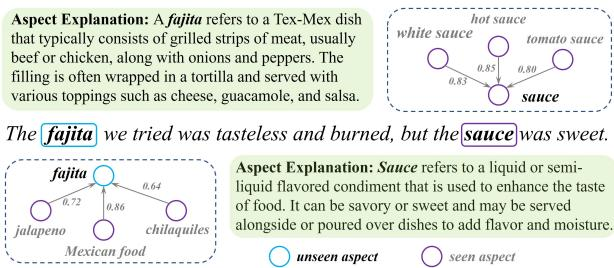
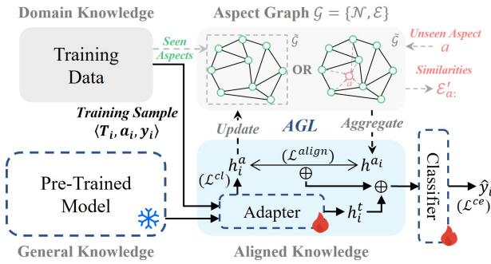
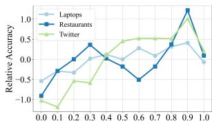
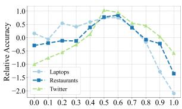
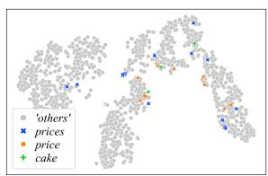
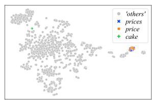
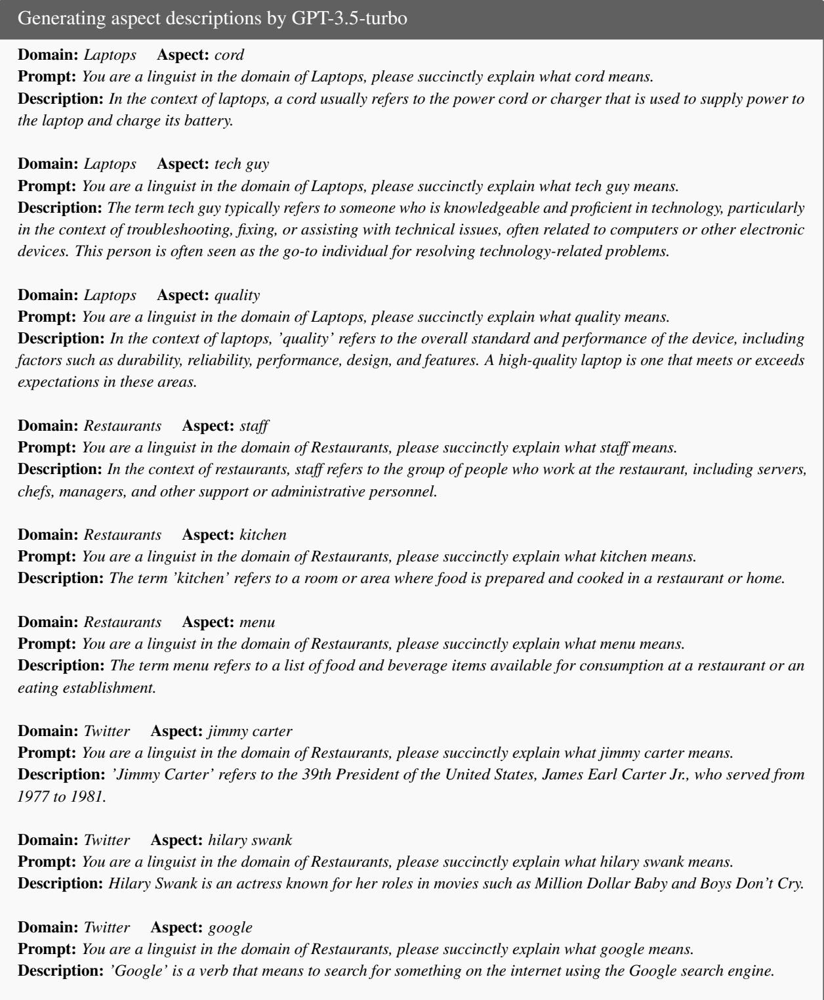

# AGCL: Aspect Graph Construction and Learning for Aspect-level Sentiment Classification

Zhongquan Jian1,2,†, Daihang Wu4,†, Shaopan Wang1,2, Yancheng Wang5, Junfeng Yao3,2,1,6,7, Meihong Wang2,‡, Qingqiang Wu3,2,1,6,7,‡,

1Institute of Artificial Intelligence, Xiamen University, China, 2School of Informatics, Xiamen University, China, 3School of Film, Xiamen University, China, 4College of Management, Mahidol University, Thailand, 5School of Computing and Data Science, Xiamen University Malaysia, Malaysia,   
6Key Laboratory of Digital Protection and Intelligent Processing of Intangible Cultural   
Heritage of Fujian and Taiwan, Ministry of Culture and Tourism, Xiamen University, 7Xiamen Key Laboratory of Intelligent Storage and Computing, School of Informatics, Xiamen University Correspondence: wangmh@xmu.edu.cn, wuqq@xmu.edu.cn

## Abstract

Prior studies on Aspect-level Sentiment Classification (ALSC) emphasize modeling interrelationships among aspects and contexts but overlook the crucial role of aspects themselves as essential domain knowledge. To this end, we propose AGCL, a novel Aspect Graph Construction and Learning method, aimed at furnishing the model with finely tuned aspect information to bolster its task-understanding ability. AGCL’s pivotal innovations reside in Aspect Graph Construction (AGC) and Aspect Graph Learning (AGL), where AGC harnesses intrinsic aspect connections to construct the domain aspect graph, and then AGL iteratively updates the introduced aspect graph to enhance its domain expertise, making it more suitable for the ALSC task. Hence, this domain aspect graph can serve as a bridge connecting unseen aspects with seen aspects, thereby enhancing the model’s generalization capability. Experiment results on three widely used datasets demonstrate the significance of aspect information for ALSC and highlight AGL’s superiority in aspect learning, surpassing state-of-the-art baselines greatly. Code is available at https: //github.com/jian-projects/agcl.

## 1 Introduction

As an important research topic of Natural Language Processing (NLP), Aspect-level Sentiment Classification (ALSC) is a fine-grained sentiment analysis task that aims to identify the sentiment polarity of a review text toward each corresponding aspect (Brauwers and Frasincar, 2022; Jian et al.,

  
Figure 1: An example of review text. Seen aspects are that explicitly mentioned in the training set, while unseen aspects are not.

2024), which has been widely applied in real-world scenarios such as public opinion monitoring (Chen et al., 2022b), text classification (Bestvater and Monroe, 2023), and content recommendation (Kim et al., 2021). As illustrated in Figure 1, given the review text “The fajita we tried was tasteless and burned, but the sauce was sweet.”, ALSC is required to predict the sentiment polarities toward “fajita” as Negative and “sauce” as Positive.

The rise of deep learning and Pre-trained Language Models (PLMs) (Qiu et al., 2020) has significantly advanced NLP tasks with high accuracy (Min et al., 2023). Therefore, leveraging PLMs as the foundation, various ALSC methods have been developed to investigate inherent connections between aspects and contexts. Among them, RNN-based approaches (Wankhade et al., 2023; Huang et al., 2023) prioritize capturing surfacelevel word sequence information, while Graphbased models (Li et al., 2021a; Yang et al., 2023; Jiang et al., 2023; Yin and Zhong, 2024) exploit sentence dependency structures to account for syntactic relationships, often resulting in superior performance over RNN-based counterparts. In addition, Knowledge-based models (Li et al., 2021b; Zhang et al., 2022b; Yong et al., 2023; Jian et al., 2024; Ouyang et al., 2024) focus on improving the model’s understanding of domain-specific tasks by integrating external valuable information and have emerged as the predominant approaches within the ALSC community. Their success lies in the alignment of domain knowledge with the general knowledge (Bao et al., 2023). As shown in Figure 2, "general knowledge" refers to the knowledge stored within PLMs, while "domain knowledge" pertains to fine-tuning data. Additionally, we designate "aligned knowledge" as that contained within the ALSC model after fine-tuning with domain data.

Inspired by Jian et al. (2024), aspects are predefined specialized terms and phrases, often rare in general language usage particularly within lowresource language environments. They serve as prime representatives of domain knowledge within the ALSC scenario, prompting two pivotal issues: 1) prior studies have predominantly concentrated on modeling the aspect-opinion interplay, neglecting the crucial role of aspects as representatives of domain knowledge, and 2) aspects present in the training set, referred to as "seen aspects", undergo explicit alignment after fine-tuning with training data, while the majority of "unseen aspects" (those absent from the training data) remain underaligned, hindering the model’s generalization ability. Although the subword-based tokenization technique, e.g., BPE (Sennrich et al., 2016), used in PLMs alleviate the issue of under-alignment to some extent, the limited number of seen aspect tokens fails to adequately cover all subwords associated with unseen aspects.

To address these issues, we propose a novel Aspect Graph Construction and Learning (AGCL) method to highlight the important role of aspects for ALSC. Based on the interrelationships among domain aspects, we suggest building the domain aspect graph, which is leveraged as expert knowledge to facilitate both model training and inference processes. Figure 1 depicts a subset of nodes and edges within the built aspect graph, where nodes represent aspects and edges denote their similarities. Hence, this aspect graph can be used as a bridge to link the unseen aspect (e.g., "fajita" in Figure 1) with seen aspects, and thus provides a way to deduce representations of unseen aspects through their associations with seen aspects.

Given the expenses of building the aspect graph by domain experts, we suggest treating language models as experts to automate the aspect graph construction, dubbed AGC. To bolster the efficacy of the aspect graph, we develop the Aspect Graph Learning (AGL), including two key iterative processes: 1) enhancing aspect representations with valuable information derived from the aspect graph, and 2) updating the aspect graph with aligned knowledge to enhance its domain expertise and efficacy. Moreover, based on the similarities of aspects, we introduce contrastive learning to pull similar aspects closer and push dissimilar aspects apart, thereby improving the robustness of aspect representations. In summary, our contributions are summarized as follows:

• We highly suggest building the domain aspect graph, utilized as expert knowledge, to enhance the ALSC model’s focus on aspects and improve its generalization capability.

• We carefully develop the aspect graph learning method to facilitate knowledge alignment and achieve a more refined and effective aspect graph for sentiment analysis.

• We extensively experiment on three ALSC datasets, yielding promising results that affirm the significance of aspect information for ALSC, and the effectiveness of AGL in aspect learning.

## 2 Related Work

## 2.1 Aspect-Level Sentiment Classification

Due to the strong language modeling capabilities, PLMs have become the primary choice for ALSC (Brauwers and Frasincar, 2022). Existing PLMbased ALSC methods broadly fall into two categories: those utilizing PLMs as text encoders and those enhancing PLMs’ comprehension abilities.

Building upon the PLMs, sophisticated model components are intricately crafted to discern the correlation between contextual opinions and aspects, mainly including attention mechanisms and graph structure learning. Representatively, Tang et al. (2019) and Su et al. (2021) iteratively masked tokens with the highest attention weights to uncover the most influential opinion words. In contrast, GNN-based methods (Wang et al., 2020; Xiao et al., 2021; Li et al., 2021a; Chen et al., 2022a; Ma et al., 2023; Yin and Zhong, 2024) usually introduced the syntactic dependency tree knowledge and employed GNN to encode and analyze the structural relationships within the text, where DualGCN (Li et al., 2021a) designed SynGCN to alleviate dependency error and SemGCN to capture semantic correlations, dotGCN (Chen et al., 2022a) proposed an aspect-specific and language-agnostic discrete latent opinion tree structure to reduce the dependency on the accuracy of the parse tree, and APARN (Ma et al., 2023) replaced the syntactic dependency tree with the semantic structure to align the semantic requirement for the ALSC task.

Without complex components design, Li et al. (2019), Xu et al. (2019) and Silva and Marcacini (2021) demonstrate that remarkable results can be achieved by merely appending a linear classification layer and then fine-tuning PLMs with few domain data. This proficiency stems from aligning pre-trained general knowledge with domainspecific knowledge. Hence, numerous studies have attempted to incorporate external knowledge to enhance the model’s task-understanding ability. On the one hand, further exploiting the domain knowledge in the training set can significantly improve the model’s performance. Typically, Jian et al. (2024) proposed to retrieve similar samples from training data to execute joint learning, which enables the model to be aware of the unified pattern of sentiment semantics. On the other hand, external knowledge bases can bring additional information to enhance the available general and domain knowledge. For example, Zhong et al. (2023) introduced the knowledge graphs of WordNet (Miller, 1995) as prior knowledge to alleviate the difficulty of sentence comprehension. Wu et al. (2023) applied YAGO (Rebele et al., 2016) to extract additional entity information to mine the potential sentiment polarity of sentiment items. Jin et al. (2023) requested the Oxford Dictionary to expand the description of aspect terms.

In our work, we concentrate on the aspect information within the domain, emphasizing their importance for ALSC. The proposed AGL aims to enhance the model’s understanding by providing finely tuned aspect information, and establish a bridge to connect unseen aspects and seen aspects, thereby improving the model’s generalizability.

## 2.2 Contrastive Learning in ALSC

Contrastive learning (He et al., 2020; Gao et al., 2021; Xu et al., 2023) has emerged as a powerful paradigm in the domains of unsupervised representation learning (Gidaris et al., 2018) and supervised representation learning (Khosla et al., 2020). This approach leverages the notion that semantically similar samples should be brought closer in the embedding space while pushing dissimilar samples apart (Xu et al., 2023). Contrastive learning has been extensively applied in the ALSC task and has shown promising results. For example, Liang et al. (2021) utilized a supervised contrastive learning framework to exploit correlations and variances in sentiment polarities and patterns. Jian et al. (2024) proposed a retrieval contrastive learning method to enhance the model’s ability to capture the robust sentiment semantics of aspects. Shi et al. (2024) designed a KL divergence-based contrastive learning that promotes contextual representation modeling by incorporating dual-way information.

## 3 Methodology

## 3.1 Problem Definition and Motivation

Given a review text $T = \{ t _ { 1 } , t _ { 2 } , . . . , t _ { n } \}$ of n tokens with k aspects $\{ a _ { i } \} _ { i = 1 } ^ { k }$ , where each aspect is explicitly mentioned in $T$ and spans across $m _ { i } ( 1 \leqslant m _ { i } < n )$ tokens. ALSC aims to predict the sentiment polarity of $T$ toward each aspect $a _ { i } .$ , formulated as $f _ { A L S C } : \mathcal { M } ( T , a _ { i } )  \hat { y } _ { i }$ where M is the PLM-based ALSC model, generally consisting of an encoder and classifier, that maps the input text to the sentiment polarity $\hat { y } _ { i } \in$ {Positive, Neutral, Negative}.

Given a domain data $D = \{ \langle T _ { i } , a _ { i } , y _ { i } \rangle \} _ { i = 1 } ^ { N }$ with N samples, each comprised of a review text, a certain aspect, and its corresponding sentiment polarity. All aspects in D, denoted as A, construct the set of seen aspects, whose tokens can be explicitly trained to refine their semantics to meet the task’s requirement. In contrast to seen aspects, the unseen aspect a $\notin$ A cannot be explicitly trained, and its semantics heavily rely on the general knowledge of PLMs, leading to a disparity between domain-specific requirements and general knowledge. Hence, we suggest building the domain aspect graph and employing it as expert knowledge to establish a bridge between unseen aspects and seen aspects, thus mitigating the under-alignment issue of unseen aspects. In practice, the aspect graph is typically provided by domain experts, but the high cost of manual construction motivates us to develop an automated method for aspect graph construction, ensuring technical integrity.

## 3.2 Aspect Graph Construction (AGC)

Intuitively, aspects within a domain are relevant and can be connected by their intrinsic connections. Here, we leverage semantic similarities of seen aspects to construct the aspect graph. Unseen aspects can be inserted into this aspect graph based on their similarities to seen aspects, facilitating the semantics inference of unseen aspects from seen ones. Formally, we define the aspect graph as $\mathcal { G } = \{ \mathcal { N } , \mathcal { E } \}$ , where $\mathcal { N }$ is the set of nodes representing seen aspects, and E is the set of edges representing similarities of aspects. The challenging of aspect graph construction lies in determining values in E. Here, we suggest treating language models as domain experts to encode the node representations and obtaining $\mathcal { E }$ automatically by cosine similarity calculation. Hence, the quality of G heavily relies on the abilities of language models.

Generally, aspects are words or phrases with few tokens, posing challenges for language models, even Large Language Models (LLMs) (Min et al., 2023), to accurately capture aspect semantics, thus resulting in imperfect aspect relationships. Inspired by the successful practice of LLMs in instruction learning (Ouyang et al., 2022), we request LLMs to elucidate aspects according to their corresponding domains. Subsequently, the Sentence Language Model (SLM), such as SBERT (Reimers and Gurevych, 2019), is employed to encode the aspect description and obtain aspect representation.

$$
e _ { a } = S L M \left( L L M ( a s p e c t , d o m a i n ) \right)\tag{1}
$$

where LLM represents the process of leveraging LLMs to clarify the aspect term based on its domain. In this paper, the template of the prompt is designed as "You are a linguist in the domain of [domain], please succinctly explain what [aspect] means.". Two examples of aspect explanations are shown in Figure 1. SLM denotes the encoding process by a sentence language model and returns sentence embedding $e _ { a }$ as the representation of the corresponding aspect term.

In this way, informative aspect representations within the specified domain can be calculated, forming the node embedding attribution, denoted as $\mathcal { N } ^ { e } = \{ e _ { a _ { i } } \} _ { a _ { i } \in A }$ . Subsequently, similarities between aspects can be calculated:

$$
\mathcal { E } ( a _ { i } , a _ { j } ) = \frac { \boldsymbol { e } _ { a _ { i } } \cdot \boldsymbol { e } _ { a _ { j } } } { \| \boldsymbol { e } _ { a _ { i } } \| \| \boldsymbol { e } _ { a _ { j } } \| }\tag{2}
$$

where $a _ { i } \in A$ and $a _ { j } \in A$ are any two aspects in the training set. In addition, for the unseen aspect

  
Figure 2: The process of Aspect Graph Learning (AGL), where the aspect graph can be built by $\mathsf { A G C } ( \mathcal G = \tilde { \mathcal G } )$ or provided by domain experts $( \mathcal { G } = \bar { \mathcal { G } } )$ . indicates parameter unfrozen, while indicates parameter frozen.

$\not \in A$ , its similarity with seen aspect $a _ { j } \in A$ can be calculated as $\begin{array} { r } { \mathcal { E } ^ { \prime } ( a , a _ { j } ) = \frac { e _ { a } \cdot e _ { a _ { j } } } { \| e _ { a } \| \| e _ { a _ { j } } \| } } \end{array}$

## 3.3 Aspect Graph Learning (AGL)

Fine-tuning the model with domain data is a common practice to enhance the model’s understanding in the specified domain, a process of aligning general knowledge with domain knowledge, achieving aligned knowledge that is beneficial for the downstream task. In this process, representations of aspects will be constantly refined to adapt to the specified domain. Following the basic mode in Li et al. (2019) and Silva and Marcacini (2021), for each training sample $\langle T _ { i } , a _ { i } , y _ { i } \rangle \in D$ , token representations are calculated:

$$
H = \mathcal { M } _ { e } \left( \left[ C L S \right] T _ { i } \left[ S E P \right] a _ { i } \left[ S E P \right] \right)\tag{3}
$$

where $\mathcal { M } _ { e }$ is the model encoder used to transfer tokens into representations H. [CLS] and [SEP] are special tokens in the pre-trained model, where the token representation of [CLS] is usually viewed as the overall text representation $h _ { i } ^ { t } \ = \ H _ { 0 }$ . In addition, we employ mean pooling operation to aggregate multiple aspect token representations as the model-generated aspect representation $h _ { i } ^ { a } \in$ $\mathbb { R } ^ { d } .$ , where d is the dimension of representation.

## 3.3.1 Enhance Aspect Representation

As illustrated in Figure 2, in addition to the modelgenerated aspect representation, another kind of aspect representation can be derived from the aspect graph by aggregating other aspect representations based on their similarities:

$$
\left\{ \begin{array} { l l } { h ^ { a _ { i } } = \sum _ { j = 1 } ^ { | A | } w _ { j } \cdot \mathcal { N } ^ { e } ( a _ { j } ) } \\ { w = n o r m \left( \{ \mathcal { E } ( a _ { i } , a _ { j } ) \} _ { j = 1 } ^ { | A | } \right) } \end{array} \right.\tag{4}
$$

where $h ^ { a _ { i } }$ denotes the aggregated aspect representation obtained by the weighted sum of other aspect representations. $\mathcal { N } ^ { e } ( \ast )$ represents retrieving the corresponding aspect representation from the domain aspect graph. norm(∗) denotes the normalization function that projects the similarities into weights. Thus, $w _ { j }$ denotes the proportion of j-th aspect representation in constructing $h ^ { a _ { i } }$ , satisfying $\textstyle \sum _ { j = 1 } ^ { | A | } w _ { j } \ = \ 1$ and $w _ { i } = 0$ (we exclude the target aspect itself to simulate the model’s inference scenario). For any unseen aspect a $\not \in { \cal A }$ its aggregated representation can be calculated in the same way based on its similarities to the seen aspects: $\mathcal { E } _ { a : } ^ { \prime } = \{ \mathcal { E } ^ { \prime } ( a , a _ { j } ) \} _ { j = 1 } ^ { | A | }$

In the inference phase, aggregated aspect representations are essential for unseen aspects, as we initially suppose their representations generated by the model are unconvincing. Hence, to ensure the quality of the aggregated aspect representation, we introduce the aspect representation alignment loss:

$$
\mathcal { L } _ { i } ^ { a l i g n } = \frac { 1 } { d } \sum _ { j = 1 } ^ { d } \left| h _ { i , j } ^ { a } - h _ { j } ^ { a _ { i } } \right|\tag{5}
$$

where $h _ { i , j } ^ { a }$ and $h _ { j } ^ { a _ { i } }$ are the $j \cdot$ -th dimension of the model-generated aspect representation and the aggregated aspect representation, respectively. In this way, the aggregated aspect representations are encouraged to be close to the model-generated aspect representations to ensure their validity.

Finally, the enhanced aspect representation is obtained by combining the model-generated and the aggregated aspect representations:

$$
\tilde { h } _ { i } ^ { a } = ( 1 - \lambda ) h _ { i } ^ { a } + \lambda h ^ { a _ { i } }\tag{6}
$$

where $\lambda = 0 . 5$ is a weight coefficient that controls the influence of aggregated aspect representation. Ideally, for the seen aspect, the aggregated aspect representation matches the model-generated representation perfectly, and thus $\tilde { h } _ { i } ^ { a } = h _ { i } ^ { a }$ . For the unseen aspect, the model-generated representation is effectively enhanced by the convincing aggregated aspect representation, thereby improving the model’s generalization ability.

## 3.3.2 Update Aspect Graph

The most important element in $\mathcal { G } ~ = ~ \{ \mathcal { N } , \mathcal { E } \}$ is the aspect similarity matrix $\mathcal { E } _ { : }$ , which determines the relationships between aspects. As the inferior important element, we initialize the node attributes $\mathcal { N } ^ { \bar { e } }$ with the aspect representations calculated by

SLMs and update them with the model-generated aspect representations:

$$
\mathcal { N } ^ { e } ( a _ { i } ) = \alpha _ { i } \mathcal { N } ^ { e } ( a _ { i } ) + ( 1 - \alpha _ { i } ) h _ { i } ^ { a }\tag{7}
$$

where $\alpha _ { i } \in [ 0 , 1 )$ is a momentum coefficient (He et al., 2020) for node embedding updating. We employ the reciprocal of sample frequency as αi: $\alpha _ { i } = 1 / N _ { a _ { i } } , N _ { a _ { i } }$ is the number of samples with the aspect of $a _ { i } .$ . This setting guarantees that comprehensive aspect knowledge from the training data can be incorporated into $\mathcal { N } ^ { e }$ within one epoch, irrespective of the aspect’s frequency. Furthermore, by updating $\mathcal { N } ^ { e }$ with aspect representations generated by the model, the aspect graph undergoes continual refinement tailored to domain-specific requirements, thereby bridging the gap between model-generated and aggregated aspect representations, i.e., aggregated aspect representations can be viewed as aligned knowledge.

## 3.3.3 Aspect Representation Rectification

During the model training, we update node representations $\mathcal { N } ^ { e }$ with the model-generated aspect representations, which may lead to inconsistencies between the relationships reflected in $\mathcal { N } ^ { e }$ and those depicted in $\mathcal { E } .$ One approach is to implement a hard constraint to ensure that the aspect representations comply with their similarities in $\mathcal { E }$ . However, given potential errors in the automatically built aspect graph, we opt for soft constraints to regularize the model-generated aspect representations, $i . e . _ { \cdot }$ , based on the aspect similarities within $\mathcal { E } ,$ we expect the representations of similar aspects to be close to each other and dissimilar aspects to be far apart. More precisely, for aspect representations within a batch, we retrieve their similarities from $\mathcal { E }$ and utilize contrastive learning to pull similar aspects together while pushing apart dissimilar ones.

$$
\begin{array} { r l r } {  { \mathcal { L } ^ { c l } = - \frac { 1 } { N _ { b } ^ { i } } \sum _ { i = 1 } ^ { N _ { b } } \mathbb { I } _ { N _ { b } ^ { j } > 0 } \frac { 1 } { N _ { b } ^ { j } } \sum _ { j = 1 } ^ { N _ { b } } \mathbb { I } _ { \mathcal { E } _ { i j } > \varepsilon } \cdot l o g } } \\ & { } & { \frac { e x p ( s i m ( h _ { i } ^ { a } , h _ { j } ^ { a } ) / \tau ) } { \sum _ { k = 1 } ^ { N _ { b } } \mathbb { I } _ { i \neq k } \cdot e x p ( s i m ( h _ { i } ^ { a } , h _ { k } ^ { a } ) / \tau ) } } \end{array}\tag{8}
$$

where $h _ { i } ^ { a }$ and $h _ { j } ^ { a }$ are the aspect representations of the i-th and $j \mathrm { - t h }$ samples respectively, and $\mathcal { E } _ { i , j }$ denotes their similarity that derived from the aspect graph. $h _ { k } ^ { a }$ is the aspect representation of the k-th sample in this batch. $\tau = 1 . 0$ is the temperature coefficient used for the cosine similarity measure function sim $( * , * )$ $\mathbb { I } _ { c o n d i t i o n }$ denotes the indicator function that returns 1 when condition is satisfied, and 0 otherwise. $N _ { b }$ denotes the sample number within this batch, $N _ { b } ^ { \mathcal { I } }$ and $N _ { b } ^ { i }$ indicates the numbers that meet the conditions $\mathcal { E } _ { i , j } ~ > ~ \varepsilon$ and $N _ { b } ^ { j } ~ > ~ 0$ respectively. $\varepsilon = 0 . 9$ is the threshold used to judge whether aspects are similar or not.

## 3.4 Model Training and Inference

Training: To further highlight the significance of the aspect, the text and aspect representations are joined to predict the sentiment polarity.

$$
\hat { y } _ { i } = \mathcal { M } _ { c } ( h _ { i } ^ { t } + \tilde { h } _ { i } ^ { a } )\tag{9}
$$

where $\mathcal { M } _ { c }$ denotes the classifier used to obtain the sentiment distribution $\hat { y } _ { i }$ . Then, the classification loss is calculated by the cross-entropy function:

$$
\mathcal { L } _ { i } ^ { c e } = - y _ { i } \cdot l o g ( \hat { y } _ { i } )\tag{10}
$$

where $y _ { i }$ and $\hat { y } _ { i }$ denote the ground truth and predicted sentiment distribution, respectively. Finally, the model is optimized by the combined loss:

$$
\mathcal { L } = \frac { 1 } { N _ { b } } \sum _ { i = 1 } ^ { N _ { b } } ( \mathcal { L } _ { i } ^ { c e } + \mathcal { L } _ { i } ^ { a l i g n } ) + \mathcal { L } ^ { c l }\tag{11}
$$

Inference: As depicted in Table 1, aspects in the test set contain both seen and unseen aspects. For the sample with the seen aspect, we utilize the same mode as training to infer its sentiment polarity. For the sample with unseen aspect, the difference is that we need to additionally calculate the similarities between the unseen aspect and seen aspects due to they are not contained in the aspect graph.

## 4 Experimental setup

## 4.1 Datasets

We evaluate the proposed method on three widelyused ALSC datasets, including Laptops and Restaurants from SemEval 2014 Task 4 (Pontiki et al., 2014), and Twitter from Dong et al. (2014). The statistic of each dataset is summarized in Table 1, demonstrating that unseen aspects are prevalent in ALSC scenarios.

## 4.2 Compared Models

We compare AGL with recent advanced models, broadly divided into two categories: structurebased models and knowledge-based models.

Structure-based Models: BERTABSA-ATT (Su et al., 2021), DualGCN (Li et al., 2021a), dot-GCN (Chen et al., 2022a), BiSyn-GAT (Liang et al., 2022), RoBERTa4GCN (Xiao et al., 2021), TextGT+BERT (Yin and Zhong, 2024).

<table><tr><td rowspan="2">Datasets</td><td colspan="2">Laptops</td><td colspan="2">Restaurants</td><td colspan="2">Twitter</td></tr><tr><td>Train</td><td>Test</td><td>Train</td><td>Test</td><td>Train</td><td>Test</td></tr><tr><td>Aspects:</td><td></td><td></td><td></td><td></td><td></td><td></td></tr><tr><td>seen</td><td>949</td><td>154</td><td>1202</td><td>187</td><td>113</td><td>77</td></tr><tr><td>unseen</td><td></td><td>235</td><td>一</td><td>333</td><td>1</td><td>5</td></tr><tr><td>Samples: Positive</td><td>994</td><td>341</td><td>2164</td><td>727</td><td>1561</td><td>173</td></tr><tr><td>Neutral</td><td>464</td><td>169</td><td>637</td><td>196</td><td>3127</td><td>346</td></tr><tr><td>Negative</td><td></td><td>128</td><td>807</td><td>196</td><td>1560</td><td>173</td></tr><tr><td></td><td>870</td><td></td><td></td><td></td><td></td><td></td></tr><tr><td>Total</td><td>2328</td><td>638</td><td>3608</td><td>1119</td><td>6248</td><td>692</td></tr></table>

Table 1: Statistics of the three ALSC datasets.

Knowledge-based Models: BERTABSA (Su et al., 2021), ABSA-DeBERTa (Silva and Marcacini, 2021), ABSA-ESA (Ouyang et al., 2024), DR-BERT (Zhang et al., 2022a), DeBERTa+RCL (Jian et al., 2024), PConvRoBERTa (Feng et al., 2023).

## 4.3 Implementation Details

For AGC, we utilize the GPT-3.5-turbo to generate aspect descriptions, and employ the SBERT model (specifically all-roberta-large-v11) to encode these enriched aspect descriptions with 1024 dimensions. We randomly sampled 100 aspect descriptions from each dataset for manual evaluation, and all were rated as acceptable, as examplified in the Appendix.

For AGL, we adapt the DeBERTa-large2 model with adapters embedded in each layer as the model encoder $\mathcal { M } _ { e }$ . The parameters of the pre-trained DeBERTa model are fixed, and only the parameters of adapters and classifier are fine-tuned during the model training. Hence, only 6.03% (26M/431M) of the parameters are fine-tuned, which significantly reduces the training cost. During the model training, Adam is utilized as the optimizer with the initial learning rate tuned from 1e-4 to 3e-4, the batch size is manually adjusted from 16 to 32, and the dropout rate is set to 0.3. The max number of epochs is set to 25, 25, and 30 for Laptops, Restaurants, and Twitter, respectively. The other hyperparameters have been provided when they are introduced in the Methodology. All experiments are conducted on a single NVIDIA 3090ti GPU with 24GB memory.

<table><tr><td rowspan="2">Categories</td><td rowspan="2">Models</td><td colspan="2">Laptops</td><td colspan="2">Restaurants</td><td colspan="2">Twitter</td></tr><tr><td>Macro-F1</td><td>Accuracy</td><td>Macro-F1</td><td>Accuracy</td><td>Macro-F1</td><td>Accuracy</td></tr><tr><td>Prompt</td><td>GPT-3.5-turbo</td><td>73.16</td><td>80.00</td><td>75.17</td><td>87.15</td><td>61.67</td><td>60.96</td></tr><tr><td rowspan="5">Structure</td><td>DualGCN</td><td>78.10</td><td>81.80</td><td>81.16</td><td>87.13</td><td>76.02</td><td>77.40</td></tr><tr><td>dotGCN</td><td>78.10</td><td>81.03</td><td>80.49</td><td>86.16</td><td>77.00</td><td>78.11</td></tr><tr><td>BiSyn-GAT</td><td>79.15</td><td>82.44</td><td>81.63</td><td>87.49</td><td>76.80</td><td>77.99</td></tr><tr><td>RoBERTa4GCN</td><td>78.16</td><td>81.80</td><td>78.61</td><td>86.23</td><td>74.00</td><td>74.75</td></tr><tr><td>TextGT+BERT</td><td>78.71</td><td>81.33</td><td>82.27</td><td>87.31</td><td>76.45</td><td>77.70</td></tr><tr><td rowspan="8">Knowledge</td><td>*BERTABSA</td><td>77.88</td><td>81.38</td><td>80.49</td><td>86.61</td><td>75.67</td><td>76.59</td></tr><tr><td>BERTABSA-ATT</td><td>79.30</td><td>82.64</td><td>82.34</td><td>87.86</td><td>76.45</td><td>77.60</td></tr><tr><td>ABSA-DeBERTa</td><td>79.36</td><td>82.76</td><td>83.42</td><td>89.46</td><td></td><td></td></tr><tr><td>ABSA-ESA</td><td>79.34</td><td>82.44</td><td>81.74</td><td>88.29</td><td></td><td></td></tr><tr><td>DR-BERT</td><td>78.16</td><td>81.45</td><td>82.31</td><td>87.72</td><td>76.10</td><td>77.24</td></tr><tr><td>DeBERTa+RCL</td><td>80.28</td><td>82.76</td><td>84.68</td><td>89.38</td><td>77.47</td><td>78.32</td></tr><tr><td>PConvRoBERTa</td><td>80.89</td><td>83.54</td><td>84.27</td><td>89.29</td><td>77.53</td><td>78.47</td></tr><tr><td>AGL (Ours)</td><td> $\mathbf { 8 2 . 1 5 } _ { \uparrow 1 . 2 6 }$ </td><td> $\mathbf { 8 4 . 5 4 } _ { \uparrow 1 . 0 0 }$ </td><td> ${ \bf 8 5 . 6 3 } _ { \uparrow 0 . 9 5 }$ </td><td> ${ \bf 9 0 . 3 0 _ { \uparrow 0 . 8 4 } }$ </td><td> $7 8 . 1 5 _ { \uparrow 0 . 6 2 }$ </td><td>78.85↑0.38</td></tr></table>

Table 2: Comparisons (%) among baselines, with best and second-best results highlighted in bold and underlined, respectively. ♠ denotes the results are derived from Su et al. (2021), others are cited from their original publications.

## 5 Experimental results

## 5.1 Main Results

We run our model three times and compare it with advanced baselines. The main comparative results are tabulated in Table 2, with the best and second-best results highlighted in bold and underlined, respectively. We additionally using the GPT-3.5-turbo model to execute the ALSC task (Zhang et al., 2024) (refer to the Appendix for more details). Despite LLM’s superior performance on universal tasks, it lags behind the specialized models for the ALSC task, indicating the necessity of designing specialized models for specific tasks. In addition, we have the following observations.

First, PLM-based models excel well in ALSC because PLMs have learned a large amount of general language knowledge from extensive corpora, facilitating the capture of intricate syntactic and semantic nuances. As evidenced by BERTABSA, simply fine-tuning the BERT model yields competitive results. Furthermore, incorporating external dependency syntax tree knowledge is effective, approaches like DualGCN and BiSyn-GAT surpass BERTABSA across all datasets. The difference between structure-based models lies in the usage mode of the dependency syntax tree, and they possess their strengths and weaknesses in different scenarios. For example, dotGCN outperforms the other structure-based models on Twitter but lags on Laptops. TextGT+BERT performs well in Restaurants but falls short on Laptops and Twitter, inferior to BiSyn-GAT. The potential limitation may lie in the variability of parsed dependency syntax trees across different datasets, which could affect the model’s ability to generalize effectively.

Second, knowledge-based models concentrate on enhancing the model’s understanding of the data and task attributes. BERTABSA-ATT leverages the most influential tokens within the sentence, resulting in significantly improved performance compared to BERTABSA. Compared with ABSA-DeBERTa, DeBERTa+RCL achieves better performance through the retrieval of similar samples and joint training with these retrieved samples. PConvRoBERTa and DeBERTa+RCL surpass the structure-based models across all datasets, indicating the critical importance of enhancing the model’s comprehension of data and task attributes in the PLM era. The potential advantage of knowledge-based models may be that they further activate the PLM’s ability to capture the intrinsic sentiment semantic of the review text, which is more conducive to the model’s generalization.

Finally, AGL surpasses all comparative baselines in both Accuracy and Macro-F1 scores. Compared to the second-best results, AGL achieves improvements of 1.26%, 0.95%, and 0.62% on Laptops, Restaurants, and Twitter, respectively, in terms of Macro-F1. In addition, AGL outperforms ABSA-DeBERTa by enhancing semantics of aspects, resulting in significant performance enhancements of 2.79 points on Laptops and 2.21 points on Restaurants in terms of the Macro-F1 metric. These results underscore the significance of aspect information for ALSC and the effectiveness of AGL in learning meaningful aspect semantics.

  
(a) ε (in Equation (8))

  
(b) λ (in Equation (6))

Figure 3: AGL’s performance with different parameters.
<table><tr><td>Methods</td><td>seen</td><td>unseen</td></tr><tr><td>w/ AGL</td><td>91.89</td><td>86.84</td></tr><tr><td>w/o AGL</td><td> $9 0 . 9 3 _ { \downarrow 0 . 9 6 }$ </td><td> $8 5 . 4 2 _ { \downarrow 1 . 4 2 }$ </td></tr></table>

Table 3: Accuracies of samples with different aspects.

## 5.2 Parameter Analysis

As summarized in Figure 3, we investigate the impacts of hyperparameters ε (threshold of similarity in Equation (8)) and λ (weight coefficient in Equation (6)) on the model’s performance (both vary from 0.0 to 1.0). Relative accuracy (values adjusted by subtracting the mean values) is adapted to facilitate the comparison. From Figure 3(a), AGL’s performance is gradually improved with the increase of ε, and reaching the optimal value around 0.9. $\varepsilon = 1 . 0$ means that the aspect representation rectification module is disabled, which leads to a significant performance drop. Additionally, Figure 3(b) shows that introducing aspect representations from the optimized aspect graph improves the model’s performance, achieving the best results at λ = 0.5.

## 5.3 Ablation Studies

In this section, we conduct ablation studies to identify the key factors behind AGL’s superiority.

Effects on different aspects: Table 3 statistics accuracies of samples with seen and unseen aspects on Restaurants. As seen, without using AGL, the model’s performance declines in both seen and unseen aspects, with a more pronounced drop in samples with unseen aspects. This result highlights the effectiveness of AGL in enhancing the semantics of aspects, particularly unseen aspects, which improves the model’s generalization ability.

<table><tr><td>Methods</td><td>Macro-F1</td><td>Accuracy</td></tr><tr><td>AGL</td><td>85.63</td><td>90.30</td></tr><tr><td>w/o  $[ \mathcal { L } ^ { c l } ]$ </td><td> $8 4 . 5 0 _ { \downarrow 1 . 1 3 }$ </td><td> $8 9 . 7 6 _ { \downarrow 0 . 5 4 }$ </td></tr><tr><td>w/o  $[ \mathcal { L } ^ { a l i g n } ]$ </td><td> $8 5 . 3 3 _ { \downarrow 0 . 3 0 }$ </td><td> $9 0 . 0 6 _ { \downarrow 0 . 2 4 }$ </td></tr><tr><td>w/o  $[ \mathcal { L } ^ { c l } , \mathcal { L } ^ { a l i g n } ]$ </td><td> $8 4 . 1 7 _ { \downarrow 1 . 4 6 }$ </td><td> $8 9 . 3 4 _ { \downarrow 0 . 9 6 }$ </td></tr></table>

Table 4: Ablation studies with different modules.

Influences of key modules: Two key modules, $\mathcal { L } ^ { c l }$ and $\mathcal { L } ^ { a l i g n }$ , are removed to evaluate their impact on the model’s performance. Experimental results on Restaurants are presented in Table 4, from which we have the following observations. 1) Rectifying aspect representations is crucial, as removing $\mathcal { L } ^ { c l }$ causes a significant performance drop, highlighting their importance for aspect graph learning and knowledge alignment. 2) The primary role of $\mathcal { L } ^ { a l i g n }$ is to bridge unseen aspects, and its removal, resulting in a performance drop, highlights AGL’s ability to generalize to unseen aspects. 3) The performance drop is more pronounced when both $\mathcal { L } ^ { c l }$ and $\mathcal { L } ^ { a l i g n }$ are removed, highlighting the importance of both modules in AGL, they collectively contribute to AGL’s superiority.

## 5.4 Visualization of aspects

To further highlight the importance of our proposed AGL, we visualize aspect representations on Restaurants using t-SNE (Van der Maaten and Hinton, 2008) in Figure 4. Aspect representations are extracted from the model at a mid-performance checkpoint from three runs. As illustrated in Figure 4(a), due to the influence of the context, representations of the same aspects are scattered in the embedding space. After rectified by the aspect graph, aspect representations, for both seen (e.g., "price") and unseen aspects (e.g., "cake"), are kept consistent regardless of the context, as depicted in Figure 4(b). Furthermore, when AGL is introduced, similar aspects (e.g., "price" and "prices") are brought closer together while dissimilar ones (e.g., "price" and "cake") are pushed further apart, highlighting its notable superiority.

## 6 Conclusion

In this paper, we explore the role of aspect for ALSC instead of meticulous model component design. To this end, we propose AGCL, a novel method that constructs the domain aspect graph and employs it as expert knowledge to enhance the aspect representations. The key points of AGCL reside in two perspectives: 1) employing language models as experts to automatically build the domain aspect graph, and 2) developing effective mechanisms to update the aspect graph and facilitate the knowledge alignment process. Experimental results and ablation studies demonstrate the effectiveness of AGL in enhancing the aspect representations and improving the model’s generalization ability. In the future, we plan to explore better ways to use the well-refined aspect information in the domain aspect graph.

  
(a) Model w/o AGL

  
(b) Model w/ AGL  
Figure 4: Visualization of aspects, "prices" and "price" are seen aspects, while "cake" is an unseen aspect.

## Limitations

This work has three limitations: 1) AGL depends on the domain expertise of aspect graph. Manual construction of this graph is costly, while automated construction relies on the performance of language models. 2) Information aggregation within the aspect graph is limited to one-hop, limiting deeper aspect dependency exploration. 3) This paper provides a straightforward implementation of aspect graph knowledge, while the more nuanced domain knowledge embedded in the constructed aspect graph remains under exploration and is reserved for future work.

## Acknowledgments

This work is supported by the 3D visualization digital twin integrated control system (No.2023CXY0111), the solfeggio ear training intelligent robot and cloud platform research and development project for music education (No.2024CXY0102), and the public technology service platform project of Xiamen City (No.3502Z20231043).

## References

Keqin Bao, Jizhi Zhang, Yang Zhang, Wenjie Wang, Fuli Feng, and Xiangnan He. 2023. Tallrec: An ef-

fective and efficient tuning framework to align large language model with recommendation. In Proceedings ofthe 17th ACM Conference on Recommender Systems, page 1007–1014.

Samuel E. Bestvater and Burt L. Monroe. 2023. Sentiment is not stance: Target-aware opinion classification for political text analysis. Political Analysis, 31(2):235–256.

Gianni Brauwers and Flavius Frasincar. 2022. A survey on aspect-based sentiment classification. ACM Computing Surveys, 55(4).

Chenhua Chen, Zhiyang Teng, Zhongqing Wang, and Yue Zhang. 2022a. Discrete opinion tree induction for aspect-based sentiment analysis. In Proceedings of the 60th Annual Meeting of the Association for Computational Linguistics, pages 2051–2064.

Xiaohong Chen, Weiwei Zhang, Xuanhua Xu, and Wenzhi Cao. 2022b. A public and large-scale expert information fusion method and its application: Mining public opinion via sentiment analysis and measuring public dynamic reliability. Information Fusion, 78:71–85.

Li Dong, Furu Wei, Chuanqi Tan, Duyu Tang, Ming Zhou, and Ke Xu. 2014. Adaptive recursive neural network for target-dependent twitter sentiment classification. In Proceedings ofthe 52nd annual meeting of the association for computational linguistics, pages 49–54.

Ao Feng, Jiazhi Cai, Zhengjie Gao, and Xiaojie Li. 2023. Aspect-level sentiment classification with fused local and global context. Journal ofBig Data, 10(1):176.

Tianyu Gao, Xingcheng Yao, and Danqi Chen. 2021. SimCSE: Simple contrastive learning of sentence embeddings. In Proceedings ofthe 2021 Conference on Empirical Methods in Natural Language Processing, pages 6894–6910.

Spyros Gidaris, Praveer Singh, and Nikos Komodakis. 2018. Unsupervised representation learning by predicting image rotations. In 6th International Conference on Learning Representations.

Kaiming He, Haoqi Fan, Yuxin Wu, Saining Xie, and Ross Girshick. 2020. Momentum contrast for unsupervised visual representation learning. In Proceedings ofthe IEEE/CVF Conference on Computer Vision and Pattern Recognition, pages 9729–9738.

Yanping Huang, Qian Liu, Hong Peng, Jun Wang, Qian Yang, and David Orellana-Martín. 2023. Sentiment classification using bidirectional lstm-snp model and attention mechanism. Expert Systems with Applications, 221:119730.

Zhongquan Jian, Jiajian Li, Qingqiang Wu, and Junfeng Yao. 2024. Retrieval contrastive learning for aspect-level sentiment classification. Information Processing & Management, 61(1):103539.

Baoxing Jiang, Guangtao Xu, and Peiyu Liu. 2023. Aspect-level sentiment classification via location enhanced aspect-merged graph convolutional networks. The Journal of Supercomputing, pages 1–26.

Weiqiang Jin, Biao Zhao, Liwen Zhang, Chenxing Liu, and Hang Yu. 2023. Back to common sense: Oxford dictionary descriptive knowledge augmentation for aspect-based sentiment analysis. Information Processing & Management, 60(3):103260.

Prannay Khosla, Piotr Teterwak, Chen Wang, Aaron Sarna, Yonglong Tian, Phillip Isola, Aaron Maschinot, Ce Liu, and Dilip Krishnan. 2020. Supervised contrastive learning. Advances in Neural Information Processing Systems, 33:18661–18673.

Tae-Yeun Kim, Hoon Ko, Sung-Hwan Kim, and Ho-Da Kim. 2021. Modeling of recommendation system based on emotional information and collaborative filtering. Sensors, 21(6):1997.

Ruifan Li, Hao Chen, Fangxiang Feng, Zhanyu Ma, Xiaojie Wang, and Eduard Hovy. 2021a. Dual graph convolutional networks for aspect-based sentiment analysis. In Proceedings of the 59th Annual Meeting ofthe Associationfor Computational Linguistics and the 11th International Joint Conference on Natural Language Processing, pages 6319–6329.

Xin Li, Lidong Bing, Wenxuan Zhang, and Wai Lam. 2019. Exploiting BERT for end-to-end aspect-based sentiment analysis. In Proceedings ofthe 5th Workshop on Noisy User-generated Text, pages 34–41.

Zhengyan Li, Yicheng Zou, Chong Zhang, Qi Zhang, and Zhongyu Wei. 2021b. Learning implicit sentiment in aspect-based sentiment analysis with supervised contrastive pre-training. In Proceedings ofthe 2021 Conference on Empirical Methods in Natural Language Processing, pages 246–256.

Bin Liang, Wangda Luo, Xiang Li, Lin Gui, Min Yang, Xiaoqi Yu, and Ruifeng Xu. 2021. Enhancing aspectbased sentiment analysis with supervised contrastive learning. In CIKM ’21: The 30th ACM International Conference on Information and Knowledge Management, pages 3242–3247.

Shuo Liang, Wei Wei, Xian-Ling Mao, Fei Wang, and Zhiyong He. 2022. BiSyn-GAT+: Bi-syntax aware graph attention network for aspect-based sentiment analysis. In Findings of the Association for Computational Linguistics, pages 1835–1848.

Fukun Ma, Xuming Hu, Aiwei Liu, Yawen Yang, Shuang Li, Philip S. Yu, and Lijie Wen. 2023. Amrbased network for aspect-based sentiment analysis. In Proceedings of the 61st Annual Meeting of the Association for Computational Linguistics, pages 322– 337.

George A. Miller. 1995. Wordnet: a lexical database for english. Communications ofthe ACM, 38(11):39–41.

Bonan Min, Hayley Ross, Elior Sulem, Amir Pouran Ben Veyseh, Thien Huu Nguyen, Oscar Sainz, Eneko Agirre, Ilana Heintz, and Dan Roth. 2023. Recent advances in natural language processing via large pre-trained language models: A survey. ACM Computing Surveys, 56(2):1–40.

Jihong Ouyang, Zhiyao Yang, Silong Liang, Bing Wang, Yimeng Wang, and Ximing Li. 2024. Aspect-based sentiment analysis with explicit sentiment augmentations. In Thirty-Eighth AAAI Conference on Artificial Intelligence, Thirty-Sixth Conference on Innovative Applications ofArtificial Intelligence, and Fourteenth Symposium on Educational Advances in Artificial Intelligence, pages 18842–18850.

Long Ouyang, Jeffrey Wu, Xu Jiang, Diogo Almeida, Carroll Wainwright, Pamela Mishkin, Chong Zhang, Sandhini Agarwal, Katarina Slama, Alex Ray, John Schulman, Jacob Hilton, Fraser Kelton, Luke Miller, Maddie Simens, Amanda Askell, Peter Welinder, Paul F Christiano, Jan Leike, and Ryan Lowe. 2022. Training language models to follow instructions with human feedback. In Advances in Neural Information Processing Systems, volume 35, pages 27730–27744.

Maria Pontiki, Dimitris Galanis, John Pavlopoulos, Harris Papageorgiou, Ion Androutsopoulos, and Suresh Manandhar. 2014. Semeval-2014 task 4: Aspect based sentiment analysis. In Proceedings of the 8th International Workshop on Semantic Evaluation, pages 27–35.

Xipeng Qiu, Tianxiang Sun, Yige Xu, Yunfan Shao, Ning Dai, and Xuanjing Huang. 2020. Pre-trained models for natural language processing: A survey. Science China Technological Sciences, 63(10):1872– 1897.

Thomas Rebele, Fabian M. Suchanek, Johannes Hoffart, Joanna Biega, Erdal Kuzey, and Gerhard Weikum. 2016. YAGO: A multilingual knowledge base from wikipedia, wordnet, and geonames. In The Semantic Web - ISWC 2016 - 15th International Semantic Web Conference, volume 9982, pages 177–185.

Nils Reimers and Iryna Gurevych. 2019. Sentence-BERT: Sentence embeddings using Siamese BERTnetworks. In Proceedings ofthe 2019 Conference on Empirical Methods in Natural Language Processing and the 9th International Joint Conference on Natural Language Processing (EMNLP-IJCNLP), pages 3982–3992.

Rico Sennrich, Barry Haddow, and Alexandra Birch. 2016. Neural machine translation of rare words with subword units. In Proceedings of the 54th Annual Meeting of the Association for Computational Linguistics, pages 1715–1725.

Xuefeng Shi, Min Hu, Fuji Ren, and Piao Shi. 2024. Prompted representation joint contrastive learning for aspect-based sentiment analysis. Knowledge-Based System, 285:111345.

Emanuel Huber da Silva and Ricardo Marcondes Marcacini. 2021. Aspect-based sentiment analysis using bert with disentangled attention. In Proceedings of the LatinX in AI (LXAI) Research workshop at ICML 2021.

Jinsong Su, Jialong Tang, Hui Jiang, Ziyao Lu, Yubin Ge, Linfeng Song, Deyi Xiong, Le Sun, and Jiebo Luo. 2021. Enhanced aspect-based sentiment analysis models with progressive self-supervised attention learning. Artificial Intelligence, 296:103477.

Jialong Tang, Ziyao Lu, Jinsong Su, Yubin Ge, Linfeng Song, Le Sun, and Jiebo Luo. 2019. Progressive self-supervised attention learning for aspect-level sentiment analysis. In Proceedings ofthe 57th Annual Meeting of the Association for Computational Linguistics, pages 557–566.

Laurens Van der Maaten and Geoffrey Hinton. 2008. Visualizing data using t-sne. Journal of machine learning research, 9(11).

Kai Wang, Weizhou Shen, Yunyi Yang, Xiaojun Quan, and Rui Wang. 2020. Relational graph attention network for aspect-based sentiment analysis. In Proceedings of the 58th Annual Meeting of the Association for Computational Linguistics, pages 3229– 3238.

Mayur Wankhade, Chandra Sekhara Rao Annavarapu, and Ajith Abraham. 2023. Mapa bilstm-bert: multiaspects position aware attention for aspect level sentiment analysis. The Journal of Supercomputing, 79(10):11452–11477.

Haiyan Wu, Chaogeng Huang, and Shengchun Deng. 2023. Improving aspect-based sentiment analysis with knowledge-aware dependency graph network. Information Fusion, 92:289–299.

Zeguan Xiao, Jiarun Wu, Qingliang Chen, and Congjian Deng. 2021. Bert4gcn: Using bert intermediate layers to augment gcn for aspect-based sentiment classification. In Proceedings ofthe 2021 Conference on Empirical Methods in Natural Language Processing, pages 9193–9200.

Hu Xu, Bing Liu, Lei Shu, and Philip Yu. 2019. BERT post-training for review reading comprehension and aspect-based sentiment analysis. In Proceedings of the 2019 Conference of the North American Chapter of the Association for Computational Linguistics, pages 2324–2335.

Lingling Xu, Haoran Xie, Zongxi Li, Fu Lee Wang, Weiming Wang, and Qing Li. 2023. Contrastive learning models for sentence representations. ACM Transactions on Intelligent Systems and Technology, 14(4):1–34.

Yuxin Yang, Xia Sun, Qiang Lu, Richard Sutcliffe, and Jun Feng. 2023. A sentiment and syntactic-aware graph convolutional network for aspect-level sentiment classification. In ICASSP 2023-2023 IEEE International Conference on Acoustics, Speech and Signal Processing, pages 1–5.

Shuo Yin and Guoqiang Zhong. 2024. Textgt: A doubleview graph transformer on text for aspect-based sentiment analysis. In Thirty-Eighth AAAI Conference on Artificial Intelligence, Thirty-Sixth Conference on Innovative Applications ofArtificial Intelligence, and Fourteenth Symposium on Educational Advances in Artificial Intelligence, pages 19404–19412.

Qian Yong, Chen Chen, Zhongqing Wang, Rong Xiao, and Haihong Tang. 2023. Sgpt: Semantic graphs based pre-training for aspect-based sentiment analysis. World Wide Web, pages 1–14.

Kai Zhang, Kun Zhang, Mengdi Zhang, Hongke Zhao, Qi Liu, Wei Wu, and Enhong Chen. 2022a. Incorporating dynamic semantics into pre-trained language model for aspect-based sentiment analysis. In Findings of the Association for Computational Linguistics, pages 3599–3610.

Wenxuan Zhang, Yue Deng, Bing Liu, Sinno Pan, and Lidong Bing. 2024. Sentiment analysis in the era of large language models: A reality check. In Findings ofthe Associationfor Computational Linguistics: NAACL 2024, pages 3881–3906.

Yiming Zhang, Min Zhang, Sai Wu, and Junbo Zhao. 2022b. Towards unifying the label space for aspectand sentence-based sentiment analysis. In Findings of the Association for Computational Linguistics, pages 20–30.

Qihuang Zhong, Liang Ding, Juhua Liu, Bo Du, Hua Jin, and Dacheng Tao. 2023. Knowledge graph augmented network towards multiview representation learning for aspect-based sentiment analysis. IEEE Transactions on Knowledge and Data Engineering, 35(10):10098–10111.

## A Appendix

## A.1 Aspect Descriptions Generated by GPT-3.5-turbo

To achieve better connections between aspects and their similarities, we use GPT-3.5-turbo to generate aspect descriptions with the tamplate "You are a linguist in the domain of [domain], please succinctly explain what [asoect] means.". Some examples of the generated aspect descriptions are shown as follows. All the generated aspect descriptions are provided in the source code repository.

## A.2 Performance of LLMs on Aspect-level Sentiment Classification

Following Zhang et al. (2024), we evaluate LLM performance on aspect-level sentiment classification (ALSC) using the SemEval 2014 datasets for laptops and restaurants, as well as the Twitter dataset. The prompts for zero-shot and few-shot settings are exemplified below, including the task definition, demonstrations, and input sentnece. In few-shot settings, demonstrations are selected based on the similarity between input sentences and training sentences. We retrieve an equal number of samples across different sentiment polarities, thus 3, 6, and 9 demonstrations are used in our experiments, respectively.

Experimental results across different settings and models are shown in Table 5, where we employ more powerful GPT models to fully explore the potential of LLMs in the ALSC task. It’s worth noting that advanced models like GPT-4o are unnecessary for the aspect description generation in our work, as simple and concise aspect descriptions that we need can be effectively generated by GPT-3.5-turbo. Hence, we only report the best results of GPT-3.5-turbo in Table 2. As seen, more powerful models may not always lead to better performance, such as GPT-4o-mini performs better than GPT-4o on Laptops and Twitter. Furthermore, demonstrations are crucial for the model’s performance, which significantly improves the model’s performance in the few-shot setting. However, more demonstrations do not always lead to better performance, as better results can be achieve with 6 demonstrations than 9 demonstrations on most cases.

<table><tr><td rowspan="2">Models</td><td rowspan="2">Settings</td><td colspan="2">Laptops</td><td colspan="2">Restaurants</td><td colspan="2">Twitter</td></tr><tr><td>Macro-F1</td><td>Accuracy</td><td>Macro-F1</td><td>Accuracy</td><td>Macro-F1</td><td>Accuracy</td></tr><tr><td rowspan="4">GPT-3.5-turbo</td><td>0-shot</td><td>57.21</td><td>73.22</td><td>63.78</td><td>81.56</td><td>50.35</td><td>51.98</td></tr><tr><td>3-shot</td><td>70.87</td><td>79.04</td><td>73.00</td><td>85.64</td><td>60.31</td><td>59.77</td></tr><tr><td>6-shot</td><td>73.16</td><td>80.00</td><td>72.30</td><td>84.62</td><td>61.67</td><td>60.96</td></tr><tr><td>9-shot</td><td>71.22</td><td>77.60</td><td>75.17</td><td>87.15</td><td>61.06</td><td>60.64</td></tr><tr><td rowspan="4">GPT-4o-mini</td><td>0-shot</td><td>74.56</td><td>80.35</td><td>65.76</td><td>83.61</td><td>64.78</td><td>64.57</td></tr><tr><td>3-shot</td><td>72.40</td><td>79.43</td><td>70.57</td><td>84.88</td><td>65.05</td><td>64.48</td></tr><tr><td>6-shot</td><td>73.60</td><td>79.67</td><td>74.09</td><td>85.71</td><td>66.21</td><td>65.57</td></tr><tr><td>9-shot</td><td>76.30</td><td>80.66</td><td>73.40</td><td>86.11</td><td>64.35</td><td>63.48</td></tr><tr><td rowspan="4">GPT-40</td><td>0-shot</td><td>71.79</td><td>75.84</td><td>70.18</td><td>84.36</td><td>52.49</td><td>51.65</td></tr><tr><td>3-shot</td><td>70.84</td><td>75.84</td><td>78.15</td><td>87.93</td><td>57.84</td><td>56.82</td></tr><tr><td>6-shot</td><td>73.93</td><td>78.61</td><td>85.65</td><td>90.50</td><td>64.96</td><td>64.20</td></tr><tr><td>9-shot</td><td>71.49</td><td>75.98</td><td>79.66</td><td>86.59</td><td>62.22</td><td>61.41</td></tr></table>

Table 5: Experimental results of LLMs on aspect-level sentiment classification.

<table><tr><td>Prompt for ALSC: zero-shot prompting</td></tr><tr><td>Definition:</td></tr><tr><td>Please perform the Aspect Level Sentiment Classification task:</td></tr><tr><td>given a sentence and a specific aspect, predict the sentiment of this sentence toward this aspect. Sentiment must be selected from [&#x27;negative&#x27;, &#x27;neutral&#x27;, &#x27;positive&#x27;]. Please return the predicted sentiment only, without any other comments or texts.</td></tr><tr><td>Demonstrations:</td></tr><tr><td></td></tr><tr><td>Input: Now, complete the task:</td></tr><tr><td>Sentence: the bread is top notch as well .</td></tr><tr><td>Aspect: bread</td></tr><tr><td></td></tr><tr><td>Output: Label: positive</td></tr></table>

## Prompt for ALSC: few-shot prompting (3-shot for example)

<table><tr><td>Prompt Tor ALSC: Tew-shot prompting (3-shot Tor example)</td></tr><tr><td>Definition: Please perform the Aspect Level Sentiment Classification task:</td></tr><tr><td>given a sentence and a specific aspect, predict the sentiment of this sentence toward this aspect. Sentiment must be selected</td></tr><tr><td>from [&#x27;negative&#x27;, &#x27;neutral&#x27;, &#x27;positive&#x27;]. Please return the predicted sentiment only, without any other comments or texts.</td></tr><tr><td>Demonstrations: Sentence: very good breads as well .</td></tr><tr><td>Aspect: breads</td></tr><tr><td>Label: positive</td></tr><tr><td>Sentence: the bread is the soft paratha bread (unlike the plain bread they use in calcutta) , and the stuffing is tandoori styled and very flavorful .</td></tr><tr><td>Aspect: bread Label: negative</td></tr><tr><td>Sentence: also , top the meal with a delicious and perfect slice of tiramisu .</td></tr><tr><td>Aspect: meal</td></tr><tr><td>Label: neutral</td></tr><tr><td></td></tr><tr><td>Input: Now, complete the task:</td></tr><tr><td>Sentence: the bread is top notch as well .</td></tr><tr><td>Aspect: bread</td></tr><tr><td></td></tr><tr><td></td></tr><tr><td>Output:</td></tr><tr><td>Label: positive</td></tr></table>