# ALYMPICS: LLM Agents Meet Game Theory

Shaoguang Mao<sup>1,\*</sup>, Yuzhe Cai<sup>2,3,\*</sup>, Yan Xia<sup>1</sup>, Wenshan Wu<sup>1</sup>, Xun Wang<sup>1</sup>, Fengyi Wang<sup>1</sup>, Qiang Guan<sup>2,3</sup>, Tao Ge<sup>1</sup>, Furu Wei <sup>1</sup>

<sup>1</sup>Microsoft Research Asia, Beijing, China

<sup>2</sup>The Key Laboratory of Cognition and Decision Intelligence for Complex System, Institute of Automation, Chinese Academy of Sciences, Beijing, China <sup>3</sup>University of Chinese Academy of Sciences, Beijing, China Correspondence: shaoguang.mao@microsoft.com

## Abstract

Game theory is a branch of mathematics that studies strategic interactions among rational agents. We propose Alympics (Olympics for Agents), a systematic framework utilizing Large Language Model (LLM) agents for empirical game theory research. Alympics creates a versatile platform for studying complex game theory problems, bridging the gap between theoretical game theory and empirical investigations by providing a controlled environment for simulating human-like strategic interactions with LLM agents. In our pilot case study, the “Water Allocation Challenge”, we explore Alympics through a challenging strategic game focused on the multi-round auction of scarce survival resources. This study demonstrates the framework’s ability to qualitatively and quantitatively analyze game determinants, strategies, and outcomes. Additionally, we conduct a comprehensive human assessment and an in-depth evaluation of LLM agents in rational strategic decision-making scenarios. Our findings highlight LLM agents’ potential to advance game theory knowledge and expand the understanding of their proficiency in emulating human strategic behavior. Codes, prompts, and all related resources are available at ALYMPICS.

## 1 Introduction

Game theory is a branch of mathematics that studies strategic interactions among rational agents. It has applications in many fields, such as economics (Shubik, 1981; Pohjola, 1986), social sciences (Sanfey, 2007; Ziems et al., 2023), computer science (Yang and Wang, 2020), and biology (Archetti and Pienta, 2019). However, the study of game theory in practice presents challenges: Many real-world problems in game theory cannot be solved through simple theoretical deductions. Instead, they often require real-world experiments, which can be expensive, time-consuming, and ethically complex due to the involvement of human participants (Crawford, 2002; Levitt and List, 2009; Camerer, 2011).

Fortunately, recent advancements in Large Language Models (LLMs) (OpenAI, 2023; Bubeck et al., 2023; Touvron et al., 2023) and LLM-based agents (Sumers et al., 2023; Li et al., 2023; Lin et al., 2023; Guo, 2023) now offer a new opportunity to study these complex game theory problems with AI (Gandhi et al., 2023; Gemp et al., 2024; Yadong Zhang, 2024). Also, some studies create benchmarks for game theory problems to measure the reasoning performance of LLMs (Huang et al., 2024; Zhang et al., 2024). These developments have enabled the creation of increasingly sophisticated systems capable of simulating human behavior in various dimensions, including style, tone, personality, emotions, and even collaborative and competitive efforts (Wang et al., 2023a; Talebirad and Nadiri, 2023; Madaan et al., 2023; Wang et al., 2023b; de Zarzà et al., 2023; Zhao et al., 2023; Park et al., 2023; Chen et al., 2023; Abdelnabi et al., 2023; Zhang et al., 2023; Lorè and Heydari, 2023; Horton, 2023). For example, Xu et al. (2023b,c) illustrate this progress using the example of Werewolf, where they observe nonpreprogrammed emergent strategic behaviors in LLMs during gameplay, such as trust, confrontation, camouflage, and leadership.

We build upon previous research to further investigate the use of LLM agents in game theory. Specifically, we address the following research questions (RQs): First, can we construct a unified, controllable, and efficient framework for simulating human strategic interactions and facilitating empirical studies of game theoretical models? Second, what methods are available for conducting game theory research using the LLM agent framework? Third, does the LLM agent exhibit strategic behavior similar to humans, and what level of ra-

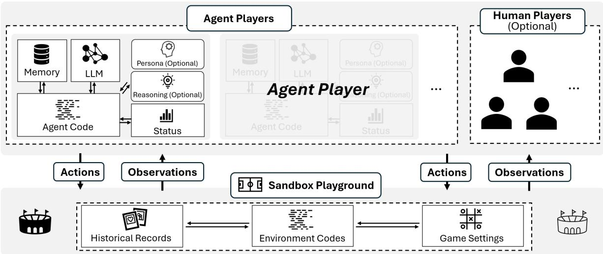  
Figure 1: The architecture of Alympics comprises the Sandbox Playground and Players. The Sandbox Playground creates an environment where game settings, as specified by researchers, are executed. Agent players, along with the optional human players, actively engage in the game within this environment.

## tional strategic reasoning can it achieve?

For the first RQ, we argue that LLMs can be used to implement rational agents which can participate in game-theoretic scenarios and provide empirical insights into the dynamics and outcomes of strategic interactions. We introduce Alympics, Olympics for Agents, a new framework for game theory using LLM agents. Alympics incorporates a Sandbox Playground, Agent Players, and the optional Human Players, enabling the construction of realistic and dynamic models of rational interactions. By leveraging the capabilities of LLM agents, our framework provides researchers with a controlled, scalable, and reproducible platform for exploring various game scenarios and testing hypotheses in game theory.

For the second RQ, we present a pilot study centered around an unequal competition for limited resources to exemplify the practicality and effectiveness of simulating and researching game theory scenarios. Although there is a lot of works that uses our open-source platform to study game theoryrelated issues, in this paper, to more focusedly demonstrate Alympics, we chose a specific problem for an in-depth demonstration. As shown in Fig.2, this game is a reduction of a series of classic game theory problems such as auctions, dynamic games, and unequal competition. By controlling resource availability and agent personalities, we demonstrate how Alympics can be employed to investigate the factors influencing game outcomes. Also, we compare the results simulated in the Alympics with the predicted results based on Auction Theory (Bazerman and Samuelson, 1983; Krishna, 2009; Horton,

2023), and their high consistency further demonstrates the potential of the proposed platform.

For the third RQ, we conduct an exhaustive human assessment of the agent’s performance in game-theoretic scenarios. Our human evaluation results found that humans’ perception of the agent’s performance in games is similar to their self-assessment results. The result is crucial for judging conducting game-theoretic experiments through Alympics or other AI agent settings.

In summary, this paper has the following contributions: (1) the proposal of a systematic LLM agent-based framework to facilitate game theory research, (2) The development of a game setting inspired by a range of classic game theory problems, showcasing Alympics’s strength in both qualitative and quantitative analysis of game factors, players strategies, and outcomes. (3) The comprehensive subjective evaluation of LLM agents’ performance in strategic scenarios, which reveals the capability of LLMs in mimicking complex human strategic behaviors in socioeconomic contexts.

## 2 Alympics: An LLM Agent-based Game Theory Playground

Alympics is a systematic and open-source framework designed to leverage LLM agents for game theory research. It consists of three main components: Sandbox Playground, Agent Players, and optionally, Human Players. As depicted in Figure 1, both Agent Players and Human Players engage in games within the Sandbox Playground. The base class design is included in appendix A.

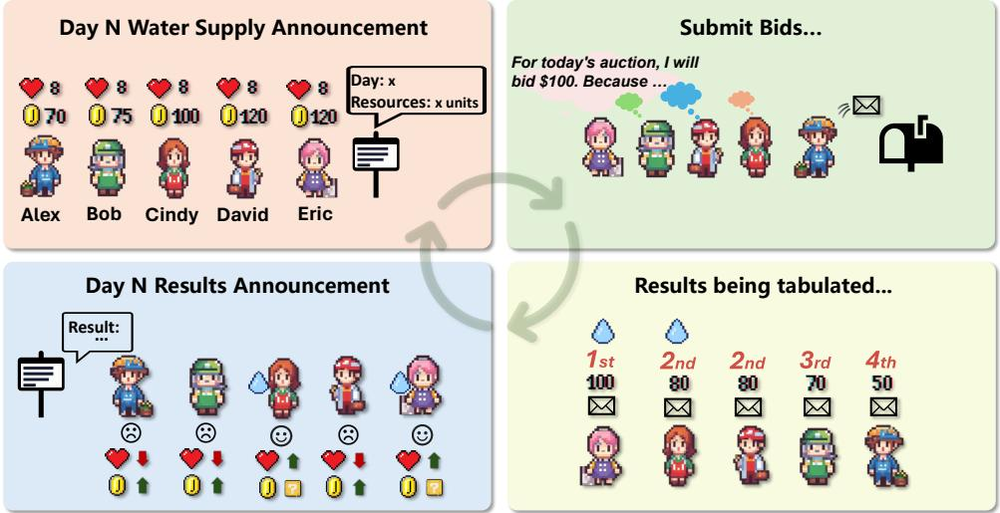  
Figure 2: “Water Allocation Challenge”: Agent Players are tasked with ensuring survival over 20 days by strategically acquiring water resources through daily auctions.

## 2.1 Sandbox Playground

The Sandbox Playground functions as the environment for game execution, offering a versatile and controlled setting for agent interactions. It is comprised of three primary components:

Environment codes: These codes establish the game’s rules, ensuring a consistent and reliable framework for experiments.

Historical records: This archive maintains detailed records of past games in any multi-round setting, supporting thorough analysis and enabling the evaluation of agent strategies with proceeding of the game.

Game settings: This feature allows researchers to customize parameters precisely, enhancing the framework’s ability to accommodate a wide range of scenarios.

## 2.2 Agent Players

Agent Players are LLM-powered entities that participate in strategic games within the Sandbox Playground. Each Agent Player includes the following components:

Agent Codes: These represent the algorithms responsible for decision-making and strategy formulation;

Player Status: This defines the current state of the agent.

Large Language Model: This model is the engine that empower the agent’s cognitive capabilities and enables natural language interactions.

Memory Cache: A storage system for historical data relevant to the games (Shinn et al., 2023; Hu et al., 2023; Hou et al., 2024; Huang et al., 2023;

Zhao et al., 2024; Hou et al., 2024).

Reasoning Plugin: A specialized logic for complex decision-making processes (Wei et al., 2022; Yao et al., 2023; Zhang et al., 2024; Gandhi et al., 2023).

Persona Setting: This defines the agent’s behavioral profile and strategic preferences (Liu et al., 2022; Wang et al., 2023c; Xu et al., 2023a; Shao et al., 2023).

Other Components: Additional tailored elements address specific research needs, such as tool utilization (Cai et al., 2023; Shen et al., 2023; Liang et al., 2023; Qin et al., 2023) and augmentation.

## 3 Pilot Demonstration: Water Allocation Challenge

Alympics provides a research platform for conducting experiments on complex game theory problems. As a pilot demonstration, we introduced the "Water Allocation Challenge," a game that integrates concepts from auction theory, resource allocation, survival strategy, repeated games, Nash equilibrium, fairness, and risk management. By focusing on this well-defined setting, we show how the platform can be used for empirical studies of game theoretical models

## 3.1 Settings

We introduce the game setting here. W Town is experiencing a rare drought. Residents in W Town have been tasked with ensuring their survival over a period of 20 days by acquiring water resources.

Each player will participate in daily auctions to bid for the necessary water resources to meet their individual needs.

• Goal: All residents share the same objective: to survive until the end of the 20-day period.

• Player Info: Each player has unique water requirements and varying salaries. Refer to specific information in Fig. 3.

• Health Points: Each player has a maximum of 10 health points and starts with 8. If a player’s health points drop to or below 0, they will be eliminated from the game.

• Routine: Every day, all players bid on water resources to meet their needs. If a player goes without obtaining water resources for k consecutive days (referred to as ‘No-Water Days’), the player’s health will be reduced by k points on that day. If their water needs are met, 2 points will be added to the player’s health, and the count of No-Water Days will be reset to zero.

• Supply: The daily water supply varies but is always less than the total demand. The specific amount is announced before the daily auction.

• Auction Rule: To allocate water resources, a sealed-bid auction will be conducted daily. The government will allocate water resources based on the principle of the highest bidder until the remaining water resources are insufficient to meet anyone’s requirement. In case of a tie, priority will be given to residents with lower requirements.

## 3.2 Formulation

In this game, each player is assumed to maximize their expected utility, which is dependent on both their survival and the cost incurred in securing water. A basic utility function could be proposed as follows:

$$
U _ { i } ( b _ { i } ) = V _ { i } ( h _ { i } ) - C _ { i } ( b _ { i } )\tag{1}
$$

Where: $U _ { i } ( b _ { i } )$ is the utility of player i when bidding $b _ { i } . \mathrm { ~ \textit ~ { ~ V ~ } ~ } ( h _ { i } )$ is the value function of healthy status $h _ { i } . ~ h _ { i }$ increases with the number of health points and decreases with the number of no-water days. $\begin{array} { r } { V _ { i } ( h _ { i } ) \propto \frac { 1 } { h _ { i } } } \end{array}$ . When $h _ { i }$ decreases, the value of obtaining water resources to the player increases.

$C _ { i } ( b _ { i } )$ is the cost function of bidding $b _ { i }$ , which could simply be the amount of money spent. Players will aim to choose $b _ { i }$ that maximizes $U _ { i } ( b _ { i } )$

Given that the game extends over multiple days, it should be further modeled as a dynamic game where each player’s strategy on day t depends not only on their current status but also on their expectations about future auctions. The value function $V _ { i } ^ { t }$ of player i on day t might then satisfy the equation:

$$
V _ { i } ^ { t } = \operatorname* { m a x } _ { b _ { i } ^ { t } } \left[ U _ { i } ^ { t } ( b _ { i } ^ { t } ) + \delta V _ { i } ^ { t + 1 } \right]\tag{2}
$$

Where δ is the discount factor representing the player’s valuation of future utility relative to present utility. In each auction, players choose their bids simultaneously without knowing the bids of the others. A Nash equilibrium occurs when no player can improve their utility by unilaterally changing their own bid, given the bids of the others. The equilibrium bid $b _ { i } ^ { * }$ for each player can be determined by the condition that no player can increase their utility by deviating from $b _ { i } ^ { * }$ . Formally, a set of strategies $( b _ { 1 } ^ { * } , b _ { 2 } ^ { * } , \ldots , b _ { n } ^ { * } )$ is a Nash Equilibrium if for each player i,

$$
U _ { i } ( b _ { i } ^ { * } , b _ { - i } ^ { * } ) \geqslant U _ { i } ( b _ { i } , b _ { - i } ^ { * } ) \quad { \mathrm { f o r ~ a l l ~ f e a s i b l e ~ } } b _ { i } ,\tag{3}
$$

Regarding the bidding trend across all players, let $p _ { t }$ be the minimum successful bid in day t. The variation in $p _ { t }$ over time could be modeled using a difference equation that reflects both the strategic adjustments of players and the decrease or increase of their wealth:

$$
p _ { t } = f ( p _ { t - 1 } , \mathrm { s u p p l y } _ { t } , H , W , \overline { { d } } )\tag{4}
$$

supply is the resource supply on day t. H is the healthy status of players, reflecting overall health or number of players remaining. W is the wealthy status of players, reflecting overall wealth accumulation. d represents the average demand among survival players. f is a function that captures how these factors influence the evolution of bidding behavior.

## 4 Experiments

## 4.1 Implementation

GPT-4 is utilized for the implementation. Each agent player is equipped with an individual instance of GPT-4<sup>2</sup>. Assume the system message as

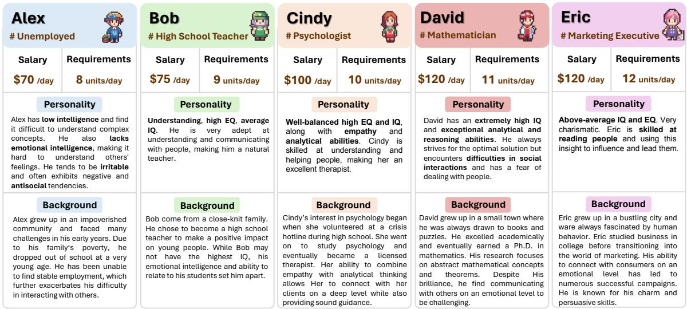  
Figure 3: The agent player’s information and persona. In all experiments, basic information (including name, daily salary and requirements) will be used. While Profession, Personality, and Background are only used in the Player Persona comparative experiments.

S (i.e., game setting, or optional persona), bidding results as $B = [ b ^ { 1 } , \bar { b } ^ { 2 } , . . . , \bar { b } ^ { 2 0 } ]$ , where $b ^ { n }$ represents the bidding summary of round n. Additionally, consider bidding results from the i-th player as $R _ { i } = [ r _ { i } ^ { 1 } , r _ { i } ^ { 2 } , . . . , r _ { i } ^ { 2 0 } ]$ , where $r _ { i } ^ { n }$ is the response from the i-th player in round n. Assume the participants’ information denoted as $I = [ i ^ { 1 } , i ^ { 2 } , . . . , i ^ { 2 0 } ]$ where $i ^ { n }$ represents the broadcasted information of all participants in round $n ,$ including health points, remaining budget, and consecutive No-Water Days. All prompts can be found in the appendix B.1. To obtain response $r _ { i } ^ { n }$ from i-th player for a round $n ,$ the operation is as eq.5.

$$
r _ { i } ^ { n } = \mathrm { G P T 4 } ( S , r _ { i } ^ { 1 } , b ^ { 1 } , i ^ { 1 } , . . . , r _ { i } ^ { n - 1 } , b ^ { n - 1 } , i ^ { n - 1 } )\tag{5}
$$

## 4.2 Variables

Resource Abundance We categorized resource abundance into three levels: Low, Medium, and High. With a total water demand of 50 units from all agents, daily supplies varied uniformly as follows: Low from 10 to 20 units, Medium from 15 to 25 units, and High from 20 to 30 units. We introduce the Resource Satisfaction Rate (RSR), representing the mathematical expectation of the resource’s satisfaction rate for the total demand of surviving players.

$$
\mathrm { R S R } = \frac { \mathbb { E } ( \mathrm { r e s o u r c e s } ) } { \sum _ { i \in \mathrm { s u r v i v o r s } } \mathrm { r e q u i r m e n t } _ { i } }\tag{6}
$$

An RSR value close to 0 indicates high competition, whereas values equal to or greater than 1 suggest that all demands are fully met, indicating no competition. In settings of low, medium, and high resource abundance, RSR values are 0.3, 0.4, and 0.5, respectively.

<table><tr><td>Group</td><td>ID</td><td>Resource Abundance</td><td>Persona</td></tr><tr><td rowspan="3">(a)</td><td>1</td><td>Low</td><td>x</td></tr><tr><td>2</td><td>Medium</td><td>x</td></tr><tr><td>3</td><td>High</td><td>x</td></tr><tr><td rowspan="3">(b)</td><td>4</td><td>Low</td><td>V</td></tr><tr><td>5</td><td>Medium</td><td>V</td></tr><tr><td>6</td><td>High</td><td>V</td></tr></table>

Table 1: Experimental Settings.

Player Persona We compared two scenarios: one without persona assignments, where agents use the GPT-4 model directly, and another where agents are assigned distinct personas, including professions, personality, and backgrounds. This approach aims to increase heterogeneity among agents and to investigate how personas influence survival strategies and outcomes. The persona settings can be found in the Fig.3.

## 4.3 Experimental Settings

Our study consists of six experimental settings as detailed in Table 1. Experimental Group (a) includes settings 1 to 3, without persona assignments to agents, each provided with low, medium, and high resource abundance respectively. Experimental Group (b) includes settings 4 to 6, where agents are assigned personas, as depicted in Fig.3, with corresponding resource levels. This setup allows for analysis of the impact of resource abundance and persona assignments on player strategies, survival, and game outcomes. Each experimental setting was repeated ten times<sup>3</sup>. A comprehensive game record instance available in Appendix C.1.

## 4.4 Indicators

We observe the following indicators to understand resource allocation dynamics and player survival strategies in a game setting. The indicators $\mathrm { R S R _ { S } }$ and $\mathrm { R S R _ { E } }$ represent the Resource Satisfaction Rates at the beginning and end of each game, respectively. Comparing these values allows us to evaluate changes in per capita resource allocation and assess resource abundance post-game.

We also measure the number of survivors, represented as $\mathrm { N _ { s u r v i v o r } , }$ and track the survival rates of individual players. For instance, $\mathrm { S R _ { A } }$ indicates player A’s survival rate across 10 game rounds under specific conditions.

Additionally, we examine the minimum successful bid price, $p ,$ in each round, where $p _ { n }$ represents the price in round $n .$ . Analyzing the fluctuations in $p _ { n }$ provides insights into bidding strategies and trends among players.

Furthermore, auction efficiency can be assessed by how well the needs of the players are met relative to the bids made (Milgrom, 2004; Ausubel et al., 2014). We define an efficiency metric, ϵ, as the ratio of total player satisfaction to total resources bid:

$$
\epsilon = \frac { \sum _ { i = 1 } ^ { N } u _ { i } } { \sum _ { i = 1 } ^ { N } b _ { i } } , \quad u _ { i } = \operatorname* { m i n } \left( 1 , \frac { w _ { i } } { d _ { i } } \right)\tag{7}
$$

Where $u _ { i }$ is a utility function indicating player i’s satisfaction. To simplify, we define it as a function of the water received compared to the water needed. Where $w _ { i }$ is the water received.

## 5 Results and Discussions

## 5.1 Survival Rates and Auction Efficiency

Table 2 indicates that resource-abundant settings yield higher survival rates, demonstrating efficient resource distribution through the auction mechanism that meets the needs of most players. In contrast, resource-scarce settings exhibit lower survival rates, reflecting potential inefficiencies and the adverse impacts of the auction format on individuals with limited financial capabilities or higher needs.

Furthermore, the table shows a positive correlation between auction efficiency (ϵ) and resource abundance. This suggests that in resourceconstrained scenarios, the bidding costs required to achieve the same utility are elevated, resulting in lower satisfaction per unit of expenditure. These findings indicate the increased difficulty and expense of securing desired outcomes in conditions of scarcity.

## 5.2 Influence of Individual Differences on Outcomes

Economic and Demand Factors: Players with higher incomes or lower daily water needs generally perform better, especially in low resource environments. This aligns with auction theory (Krishna, 2009) where financial capability and valuation affect bidding power and outcomes. Comparative experiments in settings 1-3 showed significantly higher survival rates for Cindy, David, and Eric compared to Alex and Bob, with Alex and Bob’s survival rate in setting 1 being only 10%.

Persona Effects: Personas impact player strategies by introducing heterogeneous risk preferences, survival tactics, and potentially different levels of rationality or irrationality in bidding behaviors. Table 5 shows that average survival rates increase under low resource conditions but decrease under medium resource conditions when personas are assigned. Additionally, changes in survival rates were observed for certain players after persona assignment. For example, Eric’s survival rate is greatly improved. Word clouds generated from statements made during the bidding by agent players are included in Appendix C.5 to illustrate differences in bidding styles. Although the observed indicators changed after introducing the Persona, the differences were not significant according to the significance test results (Table 4). We speculate that simply adding a Persona to the system message does not result in significant differences.

## 5.3 Influence of Resource Abundance on Bidding Behavior

Scarcity Drives High Bids: In low resource settings (setting 1 and 4), bids are significantly high early in the game as players compete fiercely to secure essential resources for survival. It aligns with auction theory’s prediction that increased competition for limited goods drives up prices (Krishna, 2009). Also, in resource-scarce environments, the initial spike in bids followed by a decrease suggests players initially overestimate the necessary bid to secure resources, possibly due to uncertainty about competitors’ actions. As the eliminations in the game progresses and players become more informed about others’ strategies, bids stabilize or decline.

<table><tr><td>R.A.</td><td>Player</td><td colspan="10"></td><td colspan="10">w/ Persona</td></tr><tr><td rowspan="8"></td><td colspan="19"></td><td colspan="12">Setting 4 3 4 5 6 7 8 9 10</td></tr><tr><td rowspan="9">Alex</td><td colspan="10">1 2</td><td colspan="10">Avg. 1 2</td></tr><tr><td></td><td>x x</td><td>x</td><td>x</td><td>6 x</td><td>x</td><td>x</td><td>9 x</td><td>10</td><td>0.10 0.10</td><td>L x</td><td></td><td></td><td></td><td>x</td><td></td><td></td><td></td><td>x</td><td>Avg. x</td></tr><tr><td>Bob</td><td>V</td><td>x x</td><td>x</td><td>V</td><td>x</td><td>x</td><td></td><td></td><td></td><td></td><td></td><td>x</td><td></td><td>x</td><td></td><td></td><td></td><td></td><td>x</td><td>x 0.10</td></tr><tr><td>Cindy</td><td>V</td><td></td><td>x</td><td></td><td>V</td><td>V</td><td>x V</td><td></td><td></td><td>0.50</td><td></td><td></td><td></td><td></td><td></td><td></td><td></td><td></td><td>V</td><td>0.40</td></tr><tr><td>David</td><td>x</td><td>V</td><td>V</td><td></td><td>V</td><td>è</td><td>V</td><td>x</td><td></td><td>0.70</td><td></td><td></td><td></td><td></td><td></td><td></td><td>x</td><td></td><td>x</td><td>0.60</td></tr><tr><td>Eric</td><td>V</td><td>x</td><td></td><td></td><td>x</td><td>x</td><td>x</td><td>V</td><td></td><td>0.40</td><td>V</td><td></td><td></td><td></td><td>L</td><td></td><td>x</td><td></td><td>L</td><td>0.70</td></tr><tr><td>RSR_S</td><td>0.30</td><td>0.30</td><td>0.30</td><td>0.30 0.30</td><td>0.30</td><td>0.30</td><td>0.30</td><td>0.30</td><td>0.30</td><td>0.30</td><td>0.30</td><td>0.30</td><td>0.30</td><td>0.30</td><td>0.30</td><td>0.30</td><td>0.30</td><td>0.30</td><td>0.30</td><td>0.30 0.30</td></tr><tr><td>RSRE €(*1k)</td><td>0.68</td><td>0.71</td><td>0.65</td><td>1.36 0.71</td><td>0.71</td><td>0.71</td><td>0.71</td><td>1.25</td><td>0.79</td><td>0.83</td><td>0.75 2.86</td><td>0.50</td><td>0.65</td><td>0.71</td><td>0.65</td><td>0.65</td><td>0.56</td><td>0.65</td><td>0.68</td><td>1.36</td><td>0.72</td></tr><tr><td></td><td>2.35</td><td>1.19</td><td>2.39</td><td>1.69 2.32</td><td>1.14</td><td>0.99</td><td>0.81</td><td>2.06</td><td>0.75</td><td>1.57</td><td></td><td>2.58</td><td>2.52</td><td>0.87</td><td>1.68</td><td>1.90</td><td>0.68</td><td>2.09</td><td></td><td>2.54</td><td>2.06 1.98</td></tr><tr><td></td><td></td><td></td><td></td><td></td><td>Setting 2</td><td></td><td></td><td></td><td></td><td></td><td></td><td></td><td></td><td></td><td></td><td>Setting 5</td><td></td><td></td><td></td><td></td><td></td></tr><tr><td rowspan="9">Alex Medium Bob Cindy</td><td></td><td>2</td><td>3</td><td>4</td><td>5</td><td>6</td><td>7</td><td></td><td>9</td><td>10</td><td>Avg.</td><td></td><td>2</td><td>3</td><td>4</td><td>5</td><td>6</td><td>7</td><td>8</td><td></td><td>9</td><td>10 Avg.</td></tr><tr><td></td><td>x</td><td>J</td><td></td><td></td><td></td><td></td><td></td><td>V</td><td>è</td><td>0.80</td><td></td><td>è</td><td>V</td><td>è</td><td>V</td><td>x</td><td>V</td><td>V</td><td></td><td>x</td><td>x 0.60</td></tr><tr><td></td><td>X</td><td>è</td><td></td><td></td><td></td><td></td><td></td><td>V</td><td>T</td><td>0.50</td><td>x</td><td></td><td>V</td><td>e</td><td>V</td><td>V</td><td>x</td><td>x</td><td></td><td>x</td><td>0.60</td></tr><tr><td></td><td>2</td><td>V</td><td></td><td></td><td>J</td><td>V</td><td></td><td>x</td><td>x</td><td>0.80</td><td>è</td><td></td><td>x</td><td>V</td><td>L</td><td>x</td><td>V</td><td>x</td><td>x</td><td>V</td><td>0.60</td></tr><tr><td>David</td><td></td><td></td><td></td><td></td><td></td><td></td><td></td><td>V</td><td></td><td>0.80</td><td>V</td><td></td><td>x</td><td>x</td><td>x</td><td></td><td>x</td><td>è</td><td>V</td><td>x</td><td>0.50</td></tr><tr><td></td><td></td><td>V</td><td></td><td></td><td>L</td><td>L</td><td>t</td><td>V</td><td>V</td><td>0.90</td><td>x</td><td>V</td><td>V</td><td>V</td><td>L</td><td>L</td><td>V</td><td></td><td>J</td><td>V</td><td>0.90</td></tr><tr><td>RSR_S</td><td>0.40</td><td>0.40 0.40</td><td>0.40</td><td>0.40</td><td>0.40</td><td>0.40</td><td>0.40</td><td>0.40</td><td>0.40</td><td>0.40</td><td>0.40</td><td>0.40</td><td>0.40</td><td>0.40</td><td>0.40</td><td>0.40</td><td>0.40</td><td>0.40</td><td>0.40</td><td>0.40</td><td>0.40</td></tr><tr><td>RSR_E</td><td>0.61</td><td>0.49</td><td>0.40</td><td>0.49</td><td>0.48</td><td>0.67</td><td>0.61</td><td>0.50</td><td>0.50</td><td>0.51</td><td>0.95</td><td>0.40</td><td>0.69</td><td>0.51</td><td>0.51</td><td>0.63</td><td>0.67</td><td>0.65</td><td>0.87</td><td>0.65</td><td>0.65</td></tr><tr><td>€(*1k) 3.09</td><td>3.83</td><td>2.83</td><td>3.83</td><td>1.89</td><td>3.48</td><td>3.00</td><td>2.72</td><td>3.15</td><td>2.78</td><td>3.06</td><td>2.47</td><td>3.67 2.34</td><td></td><td>3.15</td><td>2.05</td><td>2.75</td><td>4.03</td><td>3.38</td><td></td><td>2.98</td><td>2.90 2.97</td></tr><tr><td rowspan="7">High David Eric</td><td></td><td colspan="10"></td><td colspan="10">Setting 6</td></tr><tr><td>Alex Bob Cindy</td><td>1</td><td>2</td><td>3</td><td>4</td><td>5</td><td></td><td></td><td></td><td>10</td><td>Avg.</td><td></td><td>2</td></table>

the player’s survival at the end of the game, while a ’ ’ indicates the player’s eliminated during the game. Based on the survival status, theTable 2: Survival Status Records: The table lists the survival status of each player at the end of the games for all settings. $\mathrm { ~ \bf ~ A ~ } ^ { \prime } \surd$ indicates the player’s survival at the end of the game, while $\mathbf { a } \ ' \times \mathbf { \ ' }$ <sup>RSR</sup>  indicates the player’s eliminated during the game. Based on the survival status, the table reports the Survival Rate for each player under different settings. Additionally, we report the Resource Satisfaction Rate (RSR) at the beginning (RSR ) and end of the game $( \mathrm { R S R } _ { \mathrm { E } } )$ , along with the auction efficiency ϵ. R.A. stands for Resource Abundance.

Abundance Lowers Bid Intensity: Conversely, as the abundance of resources increases (setting 3 and 6), the minimum successful bid $p$ decreases. In conditions of abundant resources, survival is reasonably assured, leading players to commit less money to competition. This suggests that as the pressure to obtain resources decreases, so does the financial commitment players are willing to make, consistent with economic principles of supply and demand. Also, the bids gradually increase in resource-rich settings (settings 3 and 6 in Fig. 4). Players can accumulate wealth and increase their bids over time to improve health points without immediate survival pressure.

## 5.4 Winner’s Curse

Players suffer from the winner’s curse in tightly contested auctions, where they overpay to secure resources, undermining their long-term survival prospects (Bazerman and Samuelson, 1983). By observing the survival rates of players who successfully bid in each round under setting 1 (tightly contested auctions), we surprisingly found that the survival rate of players who succeeded in the first round of bidding is only 40%, while those who succeeded in the second round reached 80%. The detailed results could be found in Appendix C.4. This indicates that early bidding success does not necessarily improve chances of ultimate survival.

Due to higher Health Points and lower No-Drink Days in game beginning, according to Equation.1 and 2, the value function $V _ { i } ( H _ { i } )$ is lower then the player’s overestimation $\hat { V } _ { i }$ and the cost $b _ { i }$ is higher than optimal bid $b _ { i } ^ { * }$ , leading to a decrease in $U _ { i } ( b _ { i } )$ This is consistent with the Winner’s Curse in Auction Theory.

## 6 Subjective Evaluation

There are many works on simulating human behaviors through LLM agents, yet it remains uncertain whether these simulations truly exhibit rational reasoning and strategic behaviors. Therefore, we invited 10 human judges<sup>4</sup>. These judges systematically evaluated LLM Agents in the “Water Allocation Challenge”, playing the game themselves before the formal evaluation to gain a deeper understanding and also conducted self-evaluations to serve as a reference for assessing the Agent Play-

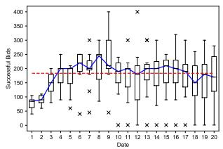  
(a) Setting 1

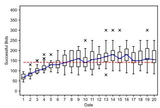  
(b) Setting 2

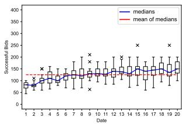  
(c) Setting 3

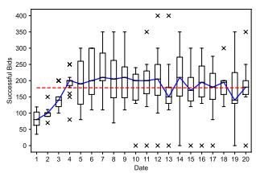  
(d) Setting 4

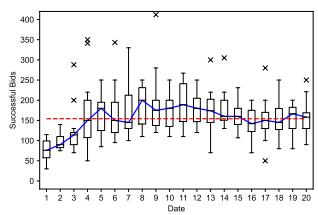  
(e) Setting 5

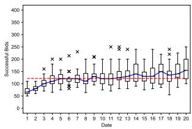  
(f) Setting 6

Figure 4: Box plots illustrate the minimum successful bids from 10 independent experiments for various settings. Each subplot corresponds to one experiment, with the x-axis indicating the round and the y-axis showing the price. These figures highlight the absolute values and trends in the bids. Additionally, the daily median trend is depicted with a blue line, while the average median over 20 game days is shown as a red dashed line.
<table><tr><td></td><td>Player</td><td>IU</td><td>LR</td><td>SE</td><td>AD</td><td>LP</td><td>IA</td></tr><tr><td rowspan="4">Agent Players</td><td>1st Quantile</td><td>3.00</td><td>3.00</td><td>3.00</td><td>3.00</td><td>3.00</td><td>3.00</td></tr><tr><td>Median</td><td>3.00</td><td>4.00</td><td>4.00</td><td>4.00</td><td>4.00</td><td>4.00</td></tr><tr><td>3rd Quantile</td><td>4.00</td><td>4.00</td><td>4.00</td><td>4.00</td><td>4.00</td><td>5.00</td></tr><tr><td>Average STD</td><td>3.33 1.04</td><td>3.47 1.00</td><td>3.46 1.10</td><td>3.42 1.12</td><td>3.88 0.88</td><td>3.51 1.24</td></tr><tr><td rowspan="5">Human Self-assessment</td><td>1st Quantile</td><td>3.00</td><td>3.00</td><td>3.00</td><td>3.00</td><td>3.00</td><td>N.A.</td></tr><tr><td>Median</td><td>4.00</td><td>4.00</td><td>3.50</td><td>3.50</td><td>3.50</td><td>N.A.</td></tr><tr><td>3rd Quantile</td><td>4.00</td><td>4.00</td><td>4.00</td><td>4.75</td><td>4.00</td><td>N.A.</td></tr><tr><td>Average</td><td>3.60</td><td>3.50</td><td>3.30</td><td>3.70</td><td>3.40</td><td>N.A.</td></tr><tr><td>STD</td><td>0.52</td><td>0.71</td><td>0.82</td><td>1.06</td><td>1.26</td><td>N.A.</td></tr></table>

Table 3: The statistical results of human assessments of the agent players in the game.

ers.

For our study, we randomly selected 30 records from a total of 60 experiments. This included 15 records from agents without personas and another 15 from agents with personas, with each record evaluated by five judges. The judges rated the agents on "Information Utilization (IU)", "Logical Reasoning (LR)", "Strategic Effectiveness (SE)", "Adaptability and Strategic Evolution (AD)", and "Long-term Planning (LP)" on a scale of 1 to 5, providing rationale for their scores (Table. 6). For records involving agents with personas, an additional assessment on "Identity Alignment (IA)" was included. The criteria and annotations used in the evaluations are detailed in Appendix D.2.

Our statistical analysis, presented in Table.3 and Fig.10, indicates that the LLM Agent Players’ performance is comparable to human self-evaluations, particularly in long-term planning where agents outperformed humans. However, they fell short in adaptability and information utilization. The evaluation notes reveal that while agents often plan for long-term survival, retaining funds for future bids, humans focus more on immediate bidding success. This suggests that while LLMs can consider long-term outcomes, their adaptability needs improvement.

Furthermore, despite different personas being assigned to agents, the "Identity Alignment" scores were low and varied significantly, indicating that merely adding persona information does not effectively simulate the nuanced characteristics of certain personalities or professional players. A detailed analysis of these findings is available in Appendix E.1.

## 7 Conclusions

This paper introduces the innovative Alympics framework, employing LLM agents to tackle complex game-theoretical problems. This framework serves as a crucial advancement in the empirical studies of game theory, enabling the analysis and modeling of sophisticated scenarios. By investigating how various factors affect game outcomes, Alympics demonstrates its capability to simulate realistic behaviors within a controlled, scalable, and reproducible setting. This platform not only facilitates an exploration of game theory but also helps pivot the study of decision-making from traditional axiomatic approaches to those that incorporate behavioral and linguistic dimensions.

## 8 Limitations

First, due to space constraints and the focus on central themes, a comprehensive discussion of all relevant topics is beyond the scope of this paper. For instance, not all components in Fig.1, like augmentation on reasoning plugin and memory cache, were fully covered in this submission. However, our system architecture offers a flexible interface for these modules, enabling researchers to replicate and extend our findings effectively.

Second, we only present a detailed demonstration of one game in this paper. Our platform, however, is flexible and can be applied to various games. Subsequent work based on our open source framework includes research on topics such as Keynes’ Beauty Contest and negotiation (Zhang et al., 2024), further demonstrating the versatility and usability of the framework.

Third, each experiment was repeated ten times. While the “Law of Large Numbers” suggests that a larger sample size would yield results closer to the expected value, our significance analysis of key metrics indicates that these ten experiments provide a reliable pilot demonstration for the conclusion we propose.

## Acknowledgments

We would like to express our gratitude to anonymous reviewers for their insightful comments and suggestions. We also extend our thanks to our colleague, Ting Song, and our fellow interns, Fangru Lin and Yadong Zhang, at Microsoft Research Asia for their valuable internal discussions and feedback.

## References

Sahar Abdelnabi, Amr Gomaa, Sarath Sivaprasad, Lea Schönherr, and Mario Fritz. 2023. Llm-deliberation: Evaluating llms with interactive multi-agent negotiation games. arXiv preprint arXiv:2309.17234.

Marco Archetti and Kenneth J Pienta. 2019. Cooperation among cancer cells: applying game theory to cancer. Nature Reviews Cancer, 19(2):110–117.

Lawrence M Ausubel, Peter Cramton, Marek Pycia, Marzena Rostek, and Marek Weretka. 2014. Demand reduction and inefficiency in multi-unit auctions. The Review ofEconomic Studies, 81(4):1366–1400.

Max H Bazerman and William F Samuelson. 1983. I won the auction but don’t want the prize. Journal of conflict resolution, 27(4):618–634.

Sébastien Bubeck, Varun Chandrasekaran, Ronen Eldan, Johannes Gehrke, Eric Horvitz, Ece Kamar, Peter Lee, Yin Tat Lee, Yuanzhi Li, Scott Lundberg, et al. 2023. Sparks of artificial general intelligence: Early experiments with gpt-4. arXiv preprint arXiv:2303.12712.

Yuzhe Cai, Shaoguang Mao, Wenshan Wu, Zehua Wang, Yaobo Liang, Tao Ge, Chenfei Wu, Wang You, Ting Song, Yan Xia, et al. 2023. Low-code llm: Visual programming over llms. arXiv preprint arXiv:2304.08103, 2.

Colin F Camerer. 2011. Behavioral game theory: Experiments in strategic interaction. Princeton university press.

Jiangjie Chen, Siyu Yuan, Rong Ye, Bodhisattwa Prasad Majumder, and Kyle Richardson. 2023. Put your money where your mouth is: Evaluating strategic planning and execution of llm agents in an auction arena. arXiv preprint arXiv:2310.05746.

Vincent P Crawford. 2002. Introduction to experimental game theory. Journal ofEconomic Theory, 104(1):1– 15.

I de Zarzà, J de Curtò, Gemma Roig, Pietro Manzoni, and Carlos T Calafate. 2023. Emergent cooperation and strategy adaptation in multi-agent systems: An extended coevolutionary theory with llms. Electronics, 12(12):2722.

Kanishk Gandhi, Dorsa Sadigh, and Noah D Goodman. 2023. Strategic reasoning with language models. arXiv preprint arXiv:2305.19165.

Ian Gemp, Yoram Bachrach, Marc Lanctot, Roma Patel, Vibhavari Dasagi, Luke Marris, Georgios Piliouras, and Karl Tuyls. 2024. States as strings as strategies: Steering language models with game-theoretic solvers. arXiv preprint arXiv:2402.01704.

Fulin Guo. 2023. Gpt agents in game theory experiments. arXiv preprint arXiv:2305.05516.

John J Horton. 2023. Large language models as simulated economic agents: What can we learn from homo silicus? Technical report, National Bureau of Economic Research.

Yuki Hou, Haruki Tamoto, and Homei Miyashita. 2024. " my agent understands me better": Integrating dynamic human-like memory recall and consolidation in llm-based agents. arXiv preprint arXiv:2404.00573.

Chenxu Hu, Jie Fu, Chenzhuang Du, Simian Luo, Junbo Zhao, and Hang Zhao. 2023. Chatdb: Augmenting llms with databases as their symbolic memory. arXiv preprint arXiv:2306.03901.

Jen-tse Huang, Eric John Li, Man Ho Lam, Tian Liang, Wenxuan Wang, Youliang Yuan, Wenxiang Jiao, Xing Wang, Zhaopeng Tu, and Michael R Lyu. 2024. How far are we on the decision-making of llms? evaluating llms’ gaming ability in multi-agent environments. arXiv preprint arXiv:2403.11807.

Ziheng Huang, Sebastian Gutierrez, Hemanth Kamana, and Stephen MacNeil. 2023. Memory sandbox: Transparent and interactive memory management for conversational agents. In Adjunct Proceedings of the 36th Annual ACM Symposium on User Interface Software and Technology, pages 1–3.

Vijay Krishna. 2009. Auction theory. Academic press.

Steven D Levitt and John A List. 2009. Field experiments in economics: The past, the present, and the future. European Economic Review, 53(1):1–18.

Guohao Li, Hasan Abed Al Kader Hammoud, Hani Itani, Dmitrii Khizbullin, and Bernard Ghanem. 2023. Camel: Communicative agents for" mind" exploration of large scale language model society. arXiv preprint arXiv:2303.17760.

Yaobo Liang, Chenfei Wu, Ting Song, Wenshan Wu, Yan Xia, Yu Liu, Yang Ou, Shuai Lu, Lei Ji, Shaoguang Mao, et al. 2023. Taskmatrix. ai: Completing tasks by connecting foundation models with millions of apis. arXiv preprint arXiv:2303.16434.

Bill Yuchen Lin, Yicheng Fu, Karina Yang, Prithviraj Ammanabrolu, Faeze Brahman, Shiyu Huang, Chandra Bhagavatula, Yejin Choi, and Xiang Ren. 2023. Swiftsage: A generative agent with fast and slow thinking for complex interactive tasks. arXiv preprint arXiv:2305.17390.

Yifan Liu, Wei Wei, Jiayi Liu, Xianling Mao, Rui Fang, and Dangyang Chen. 2022. Improving personality consistency in conversation by persona extending. In Proceedings of the 31st ACM International Conference on Information & Knowledge Management, pages 1350–1359.

Nunzio Lorè and Babak Heydari. 2023. Strategic behavior of large language models: Game structure vs. contextual framing. arXiv preprint arXiv:2309.05898.

Aman Madaan, Niket Tandon, Prakhar Gupta, Skyler Hallinan, Luyu Gao, Sarah Wiegreffe, Uri Alon, Nouha Dziri, Shrimai Prabhumoye, Yiming Yang, et al. 2023. Self-refine: Iterative refinement with self-feedback. arXiv preprint arXiv:2303.17651.

Paul Robert Milgrom. 2004. Putting auction theory to work. Cambridge University Press.

OpenAI. 2023. Gpt-4 technical report.

Joon Sung Park, Joseph C O’Brien, Carrie J Cai, Meredith Ringel Morris, Percy Liang, and Michael S Bernstein. 2023. Generative agents: Interactive simulacra of human behavior. arXiv preprint arXiv:2304.03442.

Matti Pohjola. 1986. Applications of dynamic game theory to macroeconomics. Dynamic games and applications in economics, pages 103–133.

Yujia Qin, Shihao Liang, Yining Ye, Kunlun Zhu, Lan Yan, Yaxi Lu, Yankai Lin, Xin Cong, Xiangru Tang, Bill Qian, et al. 2023. Toolllm: Facilitating large language models to master 16000+ real-world apis. arXiv preprint arXiv:2307.16789.

Alan G Sanfey. 2007. Social decision-making: insights from game theory and neuroscience. Science, 318(5850):598–602.

Yunfan Shao, Linyang Li, Junqi Dai, and Xipeng Qiu. 2023. Character-llm: A trainable agent for roleplaying. arXiv preprint arXiv:2310.10158.

Yongliang Shen, Kaitao Song, Xu Tan, Dongsheng Li, Weiming Lu, and Yueting Zhuang. 2023. Hugginggpt: Solving ai tasks with chatgpt and its friends in huggingface. arXiv preprint arXiv:2303.17580.

Noah Shinn, Beck Labash, and Ashwin Gopinath. 2023. Reflexion: an autonomous agent with dynamic memory and self-reflection. arXiv preprint arXiv:2303.11366.

Martin Shubik. 1981. Game theory models and methods in political economy. Handbook of Mathematical Economics, 1:285–330.

Theodore Sumers, Shunyu Yao, Karthik Narasimhan, and Thomas L Griffiths. 2023. Cognitive architectures for language agents. arXiv preprint arXiv:2309.02427.

Yashar Talebirad and Amirhossein Nadiri. 2023. Multiagent collaboration: Harnessing the power of intelligent llm agents. arXiv preprint arXiv:2306.03314.

Hugo Touvron, Louis Martin, Kevin Stone, Peter Albert, Amjad Almahairi, Yasmine Babaei, Nikolay Bashlykov, Soumya Batra, Prajjwal Bhargava, Shruti Bhosale, et al. 2023. Llama 2: Open foundation and fine-tuned chat models. arXiv preprint arXiv:2307.09288.

Lei Wang, Chen Ma, Xueyang Feng, Zeyu Zhang, Hao Yang, Jingsen Zhang, Zhiyuan Chen, Jiakai Tang, Xu Chen, Yankai Lin, et al. 2023a. A survey on large language model based autonomous agents. arXiv preprint arXiv:2308.11432.

Xintao Wang, Quan Tu, Yaying Fei, Ziang Leng, and Cheng Li. 2023b. Does role-playing chatbots capture the character personalities? assessing personality traits for role-playing chatbots.

Zhenhailong Wang, Shaoguang Mao, Wenshan Wu, Tao Ge, Furu Wei, and Heng Ji. 2023c. Unleashing cognitive synergy in large language models: A task-solving agent through multi-persona selfcollaboration. arXiv preprint arXiv:2307.05300.

Jason Wei, Xuezhi Wang, Dale Schuurmans, Maarten Bosma, Fei Xia, Ed Chi, Quoc V Le, Denny Zhou, et al. 2022. Chain-of-thought prompting elicits reasoning in large language models. Advances in Neural Information Processing Systems, 35:24824–24837.

Benfeng Xu, An Yang, Junyang Lin, Quan Wang, Chang Zhou, Yongdong Zhang, and Zhendong Mao. 2023a. Expertprompting: Instructing large language models to be distinguished experts. arXiv preprint arXiv:2305.14688.

Yuzhuang Xu, Shuo Wang, Peng Li, Fuwen Luo, Xiaolong Wang, Weidong Liu, and Yang Liu. 2023b. Exploring large language models for communication games: An empirical study on werewolf.

Zelai Xu, Chao Yu, Fei Fang, Yu Wang, and Yi Wu. 2023c. Language agents with reinforcement learning for strategic play in the werewolf game. arXiv preprint arXiv:2310.18940.

Tao Ge Xun Wang Yan Xia Wenshan Wu Ting Song Man Lan Furu Wei Yadong Zhang, Shaoguang Mao. 2024. LLM as a mastermind: A survey of strategic reasoning with large language models. In First Conference on Language Modeling.

Yaodong Yang and Jun Wang. 2020. An overview of multi-agent reinforcement learning from game theoretical perspective. arXiv preprint arXiv:2011.00583.

Shunyu Yao, Dian Yu, Jeffrey Zhao, Izhak Shafran, Thomas L Griffiths, Yuan Cao, and Karthik Narasimhan. 2023. Tree of thoughts: Deliberate problem solving with large language models. arXiv preprint arXiv:2305.10601.

Jintian Zhang, Xin Xu, and Shumin Deng. 2023. Exploring collaboration mechanisms for llm agents: A social psychology view. arXiv preprint arXiv:2310.02124.

Yadong Zhang, Shaoguang Mao, Tao Ge, Xun Wang, Yan Xia, Man Lan, and Furu Wei. 2024. K-level reasoning with large language models. arXiv preprint arXiv:2402.01521.

Andrew Zhao, Daniel Huang, Quentin Xu, Matthieu Lin, Yong-Jin Liu, and Gao Huang. 2024. Expel: Llm agents are experiential learners. In Proceedings of the AAAI Conference on Artificial Intelligence, volume 38, pages 19632–19642.

Qinlin Zhao, Jindong Wang, Yixuan Zhang, Yiqiao Jin, Kaijie Zhu, Hao Chen, and Xing Xie. 2023. Competeai: Understanding the competition behaviors in large language model-based agents. arXiv preprint arXiv:2310.17512.

Caleb Ziems, William Held, Omar Shaikh, Jiaao Chen, Zhehao Zhang, and Diyi Yang. 2023. Can large language models transform computational social science? arXiv preprint arXiv:2305.03514.

```python
class SandboxPlayground : available" available "
def __init__ (self , environment_codes
Listing 1: Python version base class designs in
, game_settings , players ) : Alympics.
environment_codes
self . game_settings =
game_settings B Implementation Details
self . historical_records = []
self . players = players B.1 Prompts
def add_historical_record (self , The Game Rules are displayed in the system mes
record ): sage. For each round, the prompt ‘Calling for
self . historical_records . append (
record ) Daily Auction Bids’ will be provided to the agent
1 players. Following all auction bids, the prompt
1 def get_historical_records ( self ): ‘Daily Results Announcement’ will be presented
12 return self . historical_records
to the agents as context information for the next
13
14 def set_game_settings (self , bid.
new_settings ) :
15 self . game_settings =
new_settings
16
17
1 class AgentPlayer :
19 def __init__ (self , agent_codes ,
player_status , llm ,
persona_setting = None ,
reasoning_plugin =None ,
memory_cache =None ,
other_components = None ):
20 self . agent_codes = agent_codes
21 self . player_status =
player_status
22 self . llm = llm
23 self . persona_setting =
persona_setting
24 self . reasoning_plugin =
reasoning_plugin
25 self . memory_cache = memory_cache
if memory_cache is not None
else []
26 self . other_components =
other_components if
other_components is not None
else {}
27
28 def make_decision ( self , game_state ) :
29 decision = self . agent_codes ( self
.llm , game_state , self .
persona_setting , self .
reasoning_plugin , self .
memory_cache , self .
other_components )
return decision
31
32 def update_status (self , new_status ):
33 self . player_status = new_status
34
35 def add_to_memory (self , data ):
36 self . memory_cache . append ( data )
37
38 def use_reasoning_plugin (self ,
complex_scenario ):
39 if self . reasoning_plugin :
40 return self . reasoning_plugin
( self .llm ,
complex_scenario )
2856
```

## A Base Class Designs in Alympics

else :   
return "No reasoning plugin

<table><tr><td>Introduction to Game Rules You are {player} and a resident living in W-Town. {optional background}</td></tr><tr><td>W Town is experiencing a rare drought. Every residents in Town W is ensuring their survival over a period of 20 days by acquiring the water resources. Attention, all W-Town residents, welcome to the Water Allocation Challenge!</td></tr><tr><td>In this challenge, you are tasked with ensuring your survival over a period of 20 days by acquiring the necessary water resources to maintain your health. You will participate in daily auctions to bid for water resources to meet your individual needs. Here are the game rules and settings:</td></tr><tr><td>1. You are one of five residents with different water requirements, budgets, and health points. 2. Your goal is to survive until the end of the 20 days.</td></tr><tr><td>3. Each resident has a maximum of 10 health points and starts with 8 health points. If your health</td></tr><tr><td>points drop below or equal to 0, you will be considered dead and eliminated from the game! All your accumulated money will be reset to Zero!</td></tr><tr><td>4. Every day, you will bid on water resources to meet your needs. If your consecutive days without obtaining water resource (No-Water Days) reach n, your health will be deducted by n points on that</td></tr><tr><td>day. If your water needs are met, 2 points will be added to your health, and the No-Water Days will be reset to 0.</td></tr><tr><td>5. The total daily water supply will vary between LOWER and UPPER units. The specific amount will be announced before daily auction.</td></tr><tr><td>6. Each resident has a different daily water requirement and budget for bidding on water resources:</td></tr><tr><td>- Alex: Water requirement - 8 units/day; Daily Salary - $70/day</td></tr><tr><td>- Bob: Water requirement - 9 units/day; Daily Salary - $75/day</td></tr><tr><td>- Cindy: Water requirement - 10 units/day; Daily Salary - $100/day</td></tr><tr><td>- David: Water requirement - 11 units/day; Daily Salary - $120/day</td></tr><tr><td>- Eric: Water requirement - 12 units/day; Daily Salary - $120/day</td></tr><tr><td></td></tr><tr><td>7. To allocate water resources, a sealed-bid auction will be conducted daily. Each resident submits a single bid for their entire water need. The town government will allocate water resources according to</td></tr><tr><td>the principle of highest bidder until the remaining water resources are insufficient to meet anyone&#x27;s requirement.</td></tr><tr><td>8. If a tie occurs and the remaining water resources are not sufficient to meet the needs of the residents involved in the tie, priority will be given to residents with lower needs. For example, A and B bid $100</td></tr><tr><td>at the same time, B’s need will be met first considering B&#x27;s need 9 units is lower than A&#x27;s need 10 units.</td></tr><tr><td>All bidding information will be made public after the allocation of water resources on the same day. Remember, the key to success is effective bidding and strategizing to ensure your survival. Good luck!</td></tr><tr><td>Calling for Daily Auction Bids</td></tr><tr><td></td></tr><tr><td></td></tr><tr><td>Hello, {player}! Today is the Day {round} of the Water Allocation Challenge, with a quantity of</td></tr><tr><td></td></tr><tr><td></td></tr><tr><td></td></tr><tr><td></td></tr><tr><td></td></tr><tr><td></td></tr><tr><td></td></tr><tr><td></td></tr><tr><td></td></tr><tr><td></td></tr><tr><td></td></tr><tr><td></td></tr><tr><td></td></tr><tr><td></td></tr><tr><td></td></tr><tr><td></td></tr><tr><td></td></tr><tr><td></td></tr><tr><td></td></tr><tr><td></td></tr><tr><td></td></tr><tr><td></td></tr><tr><td></td></tr><tr><td></td></tr><tr><td></td></tr><tr><td></td></tr><tr><td></td></tr><tr><td></td></tr><tr><td></td></tr><tr><td></td></tr><tr><td></td></tr><tr><td></td></tr><tr><td></td></tr><tr><td></td></tr><tr><td></td></tr><tr><td></td></tr><tr><td></td></tr><tr><td></td></tr><tr><td></td></tr><tr><td></td></tr><tr><td></td></tr><tr><td></td></tr><tr><td></td></tr><tr><td></td></tr><tr><td></td></tr><tr><td></td></tr><tr><td></td></tr><tr><td></td></tr><tr><td></td></tr><tr><td></td></tr><tr><td></td></tr><tr><td>{supply amount } units. Your status:</td></tr><tr><td></td></tr><tr><td></td></tr><tr><td></td></tr><tr><td></td></tr><tr><td></td></tr><tr><td></td></tr><tr><td></td></tr><tr><td></td></tr><tr><td></td></tr><tr><td></td></tr><tr><td></td></tr><tr><td></td></tr><tr><td></td></tr><tr><td></td></tr><tr><td></td></tr><tr><td></td></tr><tr><td></td></tr><tr><td></td></tr><tr><td></td></tr><tr><td></td></tr><tr><td></td></tr><tr><td></td></tr><tr><td></td></tr><tr><td></td></tr><tr><td></td></tr><tr><td></td></tr><tr><td></td></tr><tr><td></td></tr><tr><td></td></tr><tr><td></td></tr><tr><td></td></tr><tr><td></td></tr><tr><td></td></tr><tr><td></td></tr><tr><td></td></tr><tr><td></td></tr><tr><td></td></tr><tr><td></td></tr><tr><td></td></tr><tr><td></td></tr><tr><td></td></tr><tr><td></td></tr><tr><td></td></tr><tr><td></td></tr><tr><td></td></tr><tr><td></td></tr><tr><td></td></tr><tr><td></td></tr><tr><td></td></tr><tr><td>{status }</td></tr><tr><td></td></tr><tr><td></td></tr><tr><td></td></tr><tr><td></td></tr><tr><td></td></tr><tr><td></td></tr><tr><td></td></tr><tr><td></td></tr><tr><td></td></tr><tr><td></td></tr><tr><td></td></tr><tr><td></td></tr><tr><td></td></tr><tr><td></td></tr><tr><td></td></tr><tr><td></td></tr><tr><td></td></tr><tr><td></td></tr><tr><td></td></tr><tr><td></td></tr><tr><td></td></tr><tr><td>Please carefully analyze your situation to decide on this round of bidding. Remember, the most</td></tr><tr><td></td></tr><tr><td></td></tr></table>

## Daily Results Announcement

Thank you all for participating in today’s auction. Now, I will announce the results of today’s auction. DAY {round} BIDDING OFFERS INFORMATION:

\- Alex: \${alex\_bidding} for 15 units

\- Bob: \${bob\_bidding} for 10 units

\- Cindy: \${cindy\_bidding} for 20 units

\- David: \${david\_bidding} for 8 units

\- Eric: \${eric\_bidding} for 25 units

## Total Supply: {supply} units

According to the principle of higher bidder, the water will be allocated to {allocation\_result}. After allocation, all survival residents’ information is as follows:

\- Alex: -BALANCE:\$alex.balance -HEALTH POINT:alex.hp -NO-DRINK:alex.nodrink

\- Bob: -BALANCE:\$bob.balance -HEALTH POINT:bob.hp -NO-DRINK:bob.nodrink

\- Cindy: -BALANCE:\$cindy.balance -HEALTH POINT:cindy.hp -NO-DRINK:cindy.nodrink

\- David: -BALANCE:\$david.balance -HEALTH POINT:david.hp -NO-DRINK:david.nodrink

\- Eric: -BALANCE:\$eric.balance -HEALTH POINT:eric.hp -NO-DRINK:eric.nodrink

## B.2 Game Design Principle and the Data Leakage Issues within Classic Games

We conducted preliminary experiments where we tested LLM agents with classic questions like the Prisoner’s Dilemma<sup>5</sup>, including simple variations. The language models were able to recognize these questions and directly output well-known research conclusions, such as how to maximize expectations in matrix games like the Prisoner’s Dilemma.

Classic questions are inevitably likely to appear in the LLM training corpus. This is akin to testing LLMs with data from training corpus, which does not necessarily represent their capabilities. Therefore, we abstracted, combined, and rearranged multiple classic questions to serve as case studies.

## C Additional Experimental Results

## C.1 An Example of A Round of the Game

We record the agent players’ bids, resource allocations, health points, bidding reasons, and No-Water Days for each round. As shown in Fig.5, in Day-7, there are a total of 19 units of water supply. The five players bid \$150, \$200, \$120, \$180, and \$300 respectively. According to the rule of highest bidder wins, Eric successfully obtains the water resources. After this round, Eric’s HP increase, while the remaining players’ HP decrease. Bob’s HP is below 0, so he is considered “dead".

By analyzing the bids and agent players’ bidding logic, we can uncover their strategies. For instance, from the bidding logic of Agent player Alex, we can see that Alex considers, “By bidding \$150, I have a higher chance ofwinning water resources while still maintaining a balanceforfuture auctions." This shows the agent player’s ability for long-term planning. Similarly, from player Eric’s bidding logic, “My health points have reached a critical level of 1, and my No-Water days have increased to 4, making it essential for me to obtain water today to avoid death." Accordingly, Eric made a very high bid \$300 in this round to ensure survival. This also demonstrates the adaptability of Agent players in facing different situations.

## C.2 Detailed Experimental Results

We present details from the first experiments for each experimental setting, including information on the bids (Fig.6), health points (Fig.7), and balances of each agent player (Fig.8) in every round of the game.

By examining the details, we can understand the specific performance and survival status of different agent players in the game. We can also further observe the impact of the game settings on the players’ survival status and strategies. For example, in different settings, in which round do players usually start to be eliminated, and what is the relationship between the consumption and accumulation of players’ balances.

## C.3 Significance Tests

We conducted significance tests on three key metrics (Survival Rate, RSR<sub>E</sub>, and Auction Efficiency ϵ) across ten repeated experiments of six experimental settings. As shown in Table 4, greenhighlighted cells $( \mathtt { p } < 0 . 0 5 )$ indicate significant differences between the corresponding settings, suggesting statistically significant conclusions.

Overall, the analysis reveals that significant conclusions can be drawn from most experimental comparisons. However, some settings do not show significant differences, such as settings 1 vs. 4, 2 vs. 5, and 3 vs. 6. All discussions of experimental results are based solely on these significant results.

<table><tr><td rowspan=1 colspan=1>Survival Rate</td><td rowspan=1 colspan=3>1   2   3</td><td rowspan=1 colspan=1>4</td><td rowspan=1 colspan=1>5</td><td rowspan=1 colspan=1>6</td></tr><tr><td rowspan=1 colspan=1>1</td><td rowspan=1 colspan=2>N.A.0.02</td><td rowspan=1 colspan=1>0.00</td><td rowspan=1 colspan=1>0.71</td><td rowspan=1 colspan=1>0.07</td><td rowspan=1 colspan=1>0.00</td></tr><tr><td rowspan=1 colspan=1>2</td><td rowspan=1 colspan=2>0.02N.A.</td><td rowspan=1 colspan=1>0.01</td><td rowspan=1 colspan=1>0.03</td><td rowspan=1 colspan=1>0.25</td><td rowspan=1 colspan=1>0.03</td></tr><tr><td rowspan=2 colspan=1>34</td><td rowspan=1 colspan=1>0.00</td><td rowspan=1 colspan=1>0.01</td><td rowspan=1 colspan=1>N.A.</td><td rowspan=1 colspan=1>0.00</td><td rowspan=1 colspan=1>0.00</td><td rowspan=1 colspan=1>0.67</td></tr><tr><td rowspan=1 colspan=1>0.71</td><td rowspan=1 colspan=1>0.03</td><td rowspan=1 colspan=1>0.00</td><td rowspan=1 colspan=1>N.A.</td><td rowspan=1 colspan=1>0.12</td><td rowspan=3 colspan=1>0.000.00N.A.</td></tr><tr><td rowspan=1 colspan=1>5</td><td rowspan=1 colspan=1>0.07</td><td rowspan=1 colspan=1>0.25</td><td rowspan=1 colspan=1>0.00</td><td rowspan=1 colspan=1>0.12</td><td rowspan=2 colspan=1>N.A.0.00</td></tr><tr><td rowspan=1 colspan=1>6</td><td rowspan=1 colspan=1>0.00</td><td rowspan=1 colspan=1>0.03</td><td rowspan=1 colspan=1>0.67</td><td rowspan=1 colspan=1>0.00</td></tr><tr><td rowspan=1 colspan=1>RSRE</td><td rowspan=1 colspan=1>1</td><td rowspan=1 colspan=1>2</td><td rowspan=1 colspan=1>3</td><td rowspan=1 colspan=1>4</td><td rowspan=1 colspan=1>5</td><td rowspan=1 colspan=1>6</td></tr><tr><td rowspan=1 colspan=1>1</td><td rowspan=1 colspan=1>N.A.</td><td rowspan=1 colspan=1>0.00</td><td rowspan=1 colspan=1>0.00</td><td rowspan=1 colspan=1>0.32</td><td rowspan=1 colspan=1>0.08</td><td rowspan=1 colspan=1>0.00</td></tr><tr><td rowspan=1 colspan=1>2</td><td rowspan=1 colspan=1>0.00</td><td rowspan=1 colspan=1>N.A.</td><td rowspan=1 colspan=1>0.69</td><td rowspan=1 colspan=1>0.02</td><td rowspan=1 colspan=1>0.03</td><td rowspan=1 colspan=1>0.83</td></tr><tr><td rowspan=1 colspan=1>3</td><td rowspan=1 colspan=1>0.00</td><td rowspan=1 colspan=1>0.69</td><td rowspan=1 colspan=1>N.A.</td><td rowspan=1 colspan=1>0.02</td><td rowspan=1 colspan=1>0.03</td><td rowspan=1 colspan=1>0.78</td></tr><tr><td rowspan=1 colspan=1>4</td><td rowspan=1 colspan=1>0.32</td><td rowspan=1 colspan=1>0.02</td><td rowspan=1 colspan=1>0.02</td><td rowspan=1 colspan=1>N.A.</td><td rowspan=1 colspan=1>0.50</td><td rowspan=2 colspan=1>0.020.03</td></tr><tr><td rowspan=1 colspan=1>5</td><td rowspan=1 colspan=1>0.08</td><td rowspan=1 colspan=1>0.03</td><td rowspan=1 colspan=1>0.03</td><td rowspan=1 colspan=1>0.50</td><td rowspan=1 colspan=1>N.A.</td></tr><tr><td rowspan=1 colspan=1>6</td><td rowspan=1 colspan=1>0.00</td><td rowspan=1 colspan=1>0.83</td><td rowspan=1 colspan=1>0.78</td><td rowspan=1 colspan=1>0.02</td><td rowspan=1 colspan=1>0.03</td><td rowspan=1 colspan=1>N.A.</td></tr><tr><td rowspan=1 colspan=1>Auction Efficiency</td><td rowspan=1 colspan=1>1</td><td rowspan=1 colspan=1>2</td><td rowspan=1 colspan=1>3</td><td rowspan=1 colspan=1>4</td><td rowspan=1 colspan=1>5</td><td rowspan=1 colspan=1>6</td></tr><tr><td rowspan=1 colspan=1>1</td><td rowspan=1 colspan=1>N.A.</td><td rowspan=1 colspan=1>0.00</td><td rowspan=1 colspan=1>0.00</td><td rowspan=1 colspan=1>0.21</td><td rowspan=1 colspan=1>0.00</td><td rowspan=1 colspan=1>0.00</td></tr><tr><td rowspan=1 colspan=1>2</td><td rowspan=1 colspan=1>0.00</td><td rowspan=1 colspan=1>N.A.</td><td rowspan=1 colspan=1>0.00</td><td rowspan=1 colspan=1>0.00</td><td rowspan=1 colspan=1>0.74</td><td rowspan=1 colspan=1>0.00</td></tr><tr><td rowspan=1 colspan=1>3</td><td rowspan=1 colspan=1>0.00</td><td rowspan=1 colspan=1>0.00</td><td rowspan=1 colspan=1>N.A.</td><td rowspan=1 colspan=1>0.00</td><td rowspan=1 colspan=1>0.00</td><td rowspan=1 colspan=1>0.20</td></tr><tr><td rowspan=1 colspan=1>4</td><td rowspan=1 colspan=1>0.21</td><td rowspan=1 colspan=1>0.00</td><td rowspan=1 colspan=1>0.00</td><td rowspan=1 colspan=1>N.A.</td><td rowspan=1 colspan=1>0.00</td><td rowspan=1 colspan=1>0.00</td></tr><tr><td rowspan=1 colspan=1>5</td><td rowspan=1 colspan=1>0.00</td><td rowspan=1 colspan=1>0.74</td><td rowspan=1 colspan=1>0.00</td><td rowspan=1 colspan=1>0.00</td><td rowspan=1 colspan=1>N.A.</td><td rowspan=1 colspan=1>0.00</td></tr><tr><td rowspan=1 colspan=1>6</td><td rowspan=1 colspan=1>0.00</td><td rowspan=1 colspan=1>0.00</td><td rowspan=1 colspan=1>0.20</td><td rowspan=1 colspan=1>0.00</td><td rowspan=1 colspan=1>0.00</td><td rowspan=1 colspan=1>N.A.</td></tr></table>

Table 4: P-Value in the Significant Test. P<0.05 (green background) indicates that there is a significant difference between two settings and a significant conclusion could be obtained.

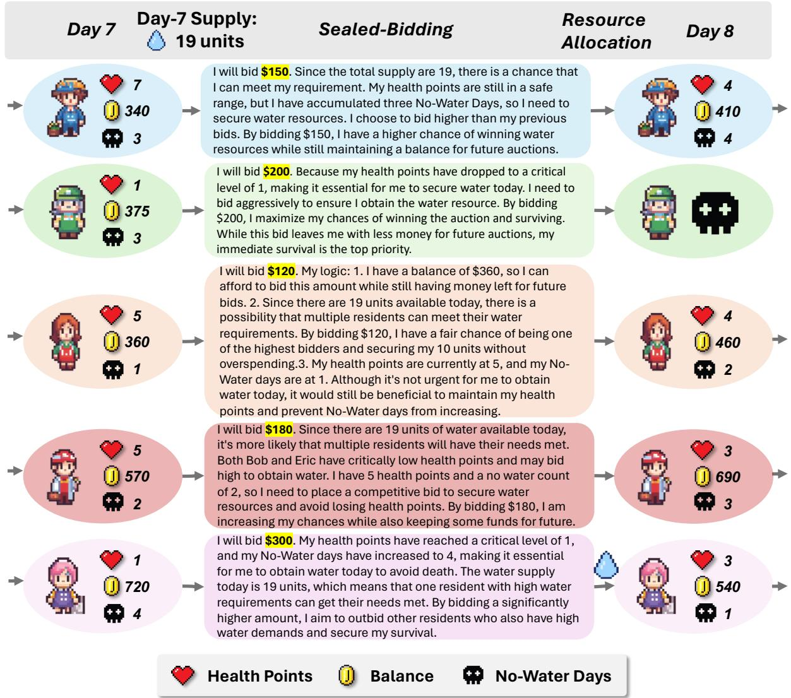  
Figure 5: An example of a round of the game in setting 1.  
C.4 Impact of Successful Bidding on Player Survival

To examine how successful bidding in each round affects players’ chances of surviving until the end of the game, we listed the players who won bids in each round within a tightly contested auction setting (Setting 1) and tracked the survival rate of these players who successfully survive to the end.

Interestingly, our findings indicate that successful bidding in certain rounds notably decreased player’s survival rates. Drawing on Auction Theory, we hypothesize that during some pivotal rounds, widespread overbidding occurs, escalating costs and consequently impacting players’ long-term survival opportunities.

## C.5 Bidding Logic Word Clouds for Agent Players with Assigned Personas

We create word clouds to display the key words in the bidding logic of different Agent Players in the game, aiming to observe the bidding logic exhibited by different agent players after being assigned a persona. It is evident that Alex, who was assigned a persona with low IQ and low EQ, demonstrates simple and direct bidding logic, lacking consideration for important factors such as health points, drinking days, and water resources.

However, we found that the word clouds of agent players assigned with some personas are not very distinctive, which also confirms the discussion in Appendix E.1 that simply adding personas to system messages does not fully achieve the simulation of different personas.

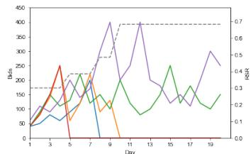  
(a) Setting 1

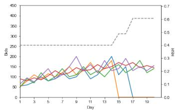  
(b) Setting 2

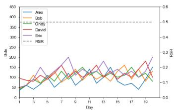  
(c) Setting 3

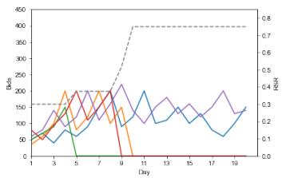  
(d) Setting 4

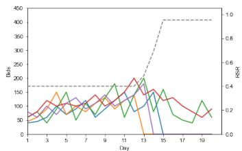  
(e) Setting 5

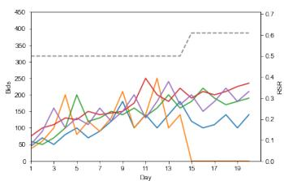  
(f) Setting 6  
Figure 6: Curves depicting the change in bids over days. The x-axis represents the date, and the y-axis represents the price. Additionally, we have plotted the trend of the RSR with a gray line.

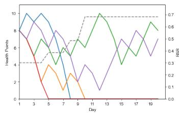  
(a) Setting 1

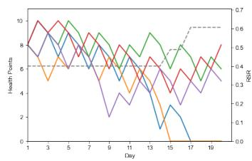  
(b) Setting 2

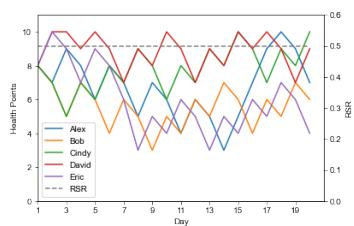  
(c) Setting 3

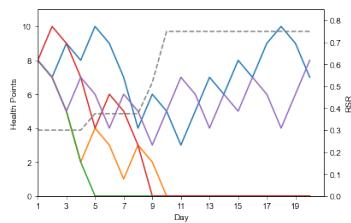  
(d) Setting 4

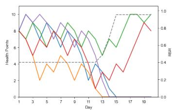  
(e) Setting 5

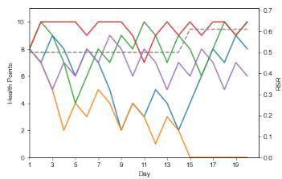  
(f) Setting 6  
Figure 7: Curves depicting the change in health points over days. The x-axis represents the date, and the y-axis represents the price. Additionally, we have plotted the trend of the RSR with a gray line.

## D Details on the Subjective Evaluation

## D.1 Criteria for Selecting Human Judges

All 10 human judges held bachelor’s degrees or higher, with majors including economics, psychology, mathematics, management, computer science, and more. To ensure a more objective evaluation and better understand the game, judges were invited to play the game before starting the official evaluation. They also conducted self-evaluations of their performance after the game, and we used the self-evaluation scores as a reference for the performance of the Agent Players. Fig.11 lists the results.

Interestingly, the performance and competitive position of the human judges in the game were very consistent with that of the Agent Players. For example, the player survival rate and bidding trends under corresponding resource supply settings. This also indirectly reflects that using Agent Players for strategic game simulation is a supplement to game theory experiments.

The screening and task allocation for Human Judges are completed by our partnered data company. We ensure that all Human Judges are assigned a reasonable workload and receive fair compensation.

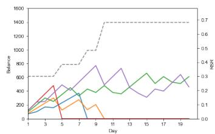  
(a) Setting 1

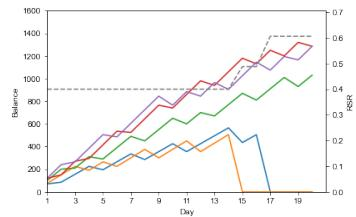  
(b) Setting 2

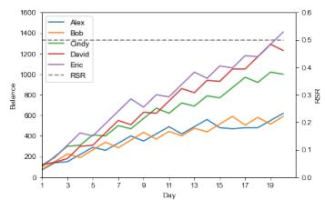  
(c) Setting 3

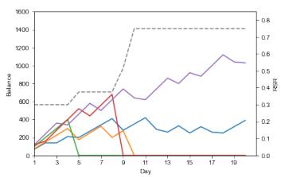  
(d) Setting 4

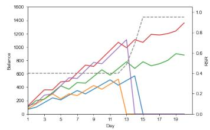  
(e) Setting 5

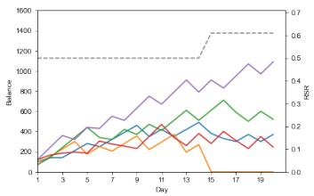  
(f) Setting 6

Figure 8: Curves depicting the change in balance over days. The x-axis represents the date, and the y-axis represents the price. Additionally, we have plotted the trend of the RSR with a gray line.
<table><tr><td>No.Round</td><td>1</td><td>2</td><td>3</td><td>4</td><td>5</td><td>6</td><td>7</td><td>8</td><td>9</td><td>10</td><td>11</td><td>12</td><td>13</td><td>14</td><td>15</td><td>16</td><td>17</td><td>18</td><td>19</td><td>20</td></tr><tr><td>1</td><td>A</td><td>E</td><td>A/C</td><td>B</td><td>E</td><td>C</td><td>B</td><td>C</td><td>E</td><td>C</td><td>C</td><td>E</td><td>E</td><td>E</td><td>C</td><td>E</td><td>C</td><td>C</td><td>E</td><td>E</td></tr><tr><td>2</td><td>E</td><td>C</td><td>D</td><td>A/B</td><td>E</td><td>C</td><td>D</td><td>C</td><td>D</td><td>D</td><td>C</td><td>D</td><td>C</td><td>D</td><td>D</td><td>C</td><td>D</td><td>C</td><td>D</td><td>C</td></tr><tr><td>3</td><td>D</td><td>E</td><td>A/C</td><td>A</td><td>A/D</td><td>A/E</td><td>A/C</td><td>D</td><td>A/E</td><td>D</td><td>E</td><td>A</td><td>D</td><td>E</td><td>E</td><td>D</td><td>E</td><td>D</td><td>Null</td><td>D</td></tr><tr><td>4</td><td>D</td><td>C</td><td>E</td><td>B</td><td>D</td><td>D</td><td>B</td><td>D</td><td>D</td><td>D</td><td>D</td><td>D</td><td>D</td><td>D</td><td>D</td><td>D</td><td>D</td><td>D</td><td>D</td><td>D</td></tr><tr><td>5</td><td>D</td><td>B</td><td>E</td><td>A</td><td>B</td><td></td><td>A/B</td><td>A</td><td>E</td><td>E</td><td>B</td><td>E</td><td>B</td><td>E</td><td>E</td><td>B</td><td>E</td><td>B</td><td>E</td><td>E</td></tr><tr><td>6</td><td>D</td><td>A/C</td><td>E</td><td>A/B</td><td>D</td><td>ＥC</td><td>E</td><td>D</td><td>C</td><td>D</td><td>C</td><td>D</td><td>C</td><td>D</td><td>C</td><td>D</td><td>C</td><td>D</td><td>C</td><td>D</td></tr><tr><td>7</td><td>D</td><td>D</td><td>E</td><td>C</td><td>D</td><td>E</td><td>C</td><td>D</td><td>C</td><td>D</td><td>C</td><td>D</td><td>C</td><td>D</td><td>C</td><td>D</td><td>C</td><td>D</td><td>D</td><td>C</td></tr><tr><td>8</td><td>E</td><td>C</td><td>D</td><td>A/B</td><td>A/C</td><td>D</td><td>B</td><td>C</td><td>D</td><td>C</td><td>D</td><td>C</td><td>D</td><td>C</td><td>D</td><td>D</td><td>C</td><td>D</td><td>C</td><td>D</td></tr><tr><td>9 10</td><td>D E</td><td>E</td><td>C</td><td>A</td><td>D</td><td>E</td><td>A</td><td>D</td><td>E</td><td>D</td><td>E</td><td>Null</td><td>D</td><td>E</td><td>Null</td><td>Null</td><td>E</td><td>E</td><td>E</td><td>E</td></tr><tr><td></td><td></td><td>A</td><td>D</td><td>B</td><td>D</td><td>A</td><td>B</td><td>D</td><td>A/D</td><td>A</td><td>A/D</td><td>D</td><td>A</td><td>A/D</td><td>D</td><td>A</td><td>D</td><td>A/D</td><td>A/D</td><td>D</td></tr><tr><td>Survival</td><td>0.4</td><td>0.8</td><td>0.4</td><td>0.1</td><td>0.6</td><td>0.8</td><td>0.2</td><td>0.8</td><td>0.9</td><td>0.9</td><td>1.0</td><td>0.8</td><td>0.9</td><td>1.0</td><td>0.9</td><td>0.9</td><td>1.0</td><td>1.0</td><td>0.9</td><td>1.0</td></tr></table>

<sup>setting.</sup> <sup>A</sup> <sup>green</sup> <sup>background</sup> <sup>indicates</sup> <sup>that</sup> <sup>this</sup> <sup>player</sup> <sup>survived</sup> <sup>until</sup> <sup>the</sup> <sup>end</sup> <sup>of</sup> <sup>the</sup> <sup>game.</sup> <sup>We</sup> <sup>also</sup> <sup>report</sup> <sup>the</sup> <sup>survival</sup> <sup>rate</sup> <sup>of</sup> <sup>players</sup> <sup>who</sup>Table 5: Record of players who successfully bid in each round of each experiment in Experimental Setting 1, a tightly contested auction setting. A green background indicates that this player survived until the end of the game. We also report the survival rate of players who successfully bid each day until the end of the game.

## D.2 Instruction for Human Subjective Evaluation

## Instructions:

\- Assess the player’s performance in each category on a scale of 1 to 5.

\- Consider the specific context of the game and the role the player assumes.

\- Use this scale as a guide to identify areas of strength and improvement.

\- Provide a score as well as explain your scoring reasons.

## Information Utilization

\- 1: The player does not consider real-time information, leading to noticeably delayed decision making.

\- 2: The player noticeably misses out on processing some information.

\- 3: The player considers key information adequately but has room for improvement.

\- 4: The player utilizes information comprehensively to make rational decisions.

\- 5: The player consistently and timely uses all available information comprehensively.

## Logical Reasoning

\- 1: The player’s decisions are mostly illogical, akin to random choices.

\- 2: The player’s decisions have obvious shortcomings.

\- 3: The player generally makes decisions based on information and inference.

\- 4: The player’s decisions are reasonable and highly logical.

(a) Alex

  
(b) Bob  
(c) Cindy


  
(e) Eric

Figure 9: Bidding Logic Word Clouds for Agent Players with Assigned Personas  
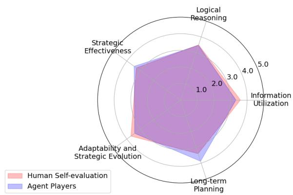  
Figure 10: Comparison of human judges’ self-assessments versus their evaluation of the performance of Agent players.

\- 5: The player has exceptional reasoning and thinking skills, always making optimal decisions.

## Strategic Effectiveness

\- 1: The player’s strategy is simple, ineffective, and lacks depth.

\- 2: The player’s strategy is somewhat effective but rather one-dimensional.

\- 3: The player’s strategy is effective in specific situations, with room for improvement.

\- 4: The player’s strategy is effective, considering key factors and generally successful.

\- 5: The player’s strategy is highly effective, considering various factors, giving them an advantage in the game.

## Adaptability and Strategic Evolution

\- 1: The player lacks strategic variation and adaptability, with slow responses to situational and environmental changes.

\- 2: The player has limited strategic variation and weak adaptability to new situations.

\- 3: The player is somewhat adaptable, capable of adjusting strategies to some extent.

\- 4: The player is flexible in strategy changes, adjusting to situational and environmental shifts.

\- 5: The player is extremely flexible in strategy, proactively adapting to various game scenarios.

## Long-term Planning

\- 1: The player lacks long-term planning, relying more on short-term reactions.

\- 2: The player sometimes considers long-term planning but mainly relies on short-term decisions.

\- 3: The player’s strategy considers long-term planning but is shortsighted in some situations.

\- 4: The player’s strategy and actions consider long-term plans, with clear and consistent adherence.

\- 5: The player has a strong ability for longterm planning, comprehensively strategizing future actions.

## Identity Alignment

\- 1: The player’s decisions and thought processes do not align with their character’s identity, lacking character personality.

\- 2: The player’s decisions and thought processes somewhat align with their character’s identity but are overall mediocre.

\- 3: The player’s decisions and thought processes generally match their character’s identity but lack deep personalization.

\- 4: The player’s decisions and thought processes well align with their character’s identity, reflecting its personalization.

\- 5: The player’s decisions and thought processes are highly consistent with their character’s identity, perfectly showcasing character personality.

## D.3 Instance of Human Subjective Annotation

Table 6 presents an instance of human annotation. Human subjects score each aspect and provide a rationale during the annotation process, ensuring that the results are more reliable. Additionally, the Scoring Rationale can support more analysis. All annotation records will be made public.

## E Broad Discussions

## E.1 Identity Alignment of the Agent Players

According to human reviewers’ ratings, LLM Agents do not score highly on ‘Identity Alignment and exhibit significant variance. Meanwhile, in our experiments, we observed that the survival rates of agents vary when assigned different personas, with an overall increase in average survival rates for all agent players. This suggests an interesting observation that assigning personas can alter some behaviors of agent players, but the performance of these agents does not consistently align with human expectations for such personas.

Upon reading and analyzing all recorded supporting reasons, we found that the scores given by the reviewers are primarily based on the following considerations: 1. Whether the bidding logic displays information related to the persona; 2. Whether the bidding logic is consistent with the expected behavior of the given persona. The main reason for the large variance is that agents with personas characterized by low emotional intelligence or intelligence still focus on maximizing their chances of winning during bidding, which differs from the reviewers’ impressions of such groups.

We speculate that language models are trained on diverse datasets and are inherently designed to generalize across them. They excel at producing responses that fit a wide range of scenarios but may struggle with deeply personalized, consistent character portrayal. When a persona requires specialized knowledge or a unique style of interaction (like that of a professional player or a specific job role), the generalist nature of LLMs may not suffice to accurately replicate such detailed, consistent traits.

Human personalities and professional roles are complex and dynamic, often influenced by a myriad of subtle cues and background knowledge that are difficult to include in a brief prompt. Personas involve not just factual backgrounds but also behaviors, decision-making styles, and emotional responses, which are challenging to model accurately through brief text descriptions alone.

While adding persona information to prompts is a step toward personalized interactions with language models, achieving deep, consistent, and accurate persona simulation requires more research. These might include continuous learning, more interactive and adaptive model behavior, and advanced techniques for maintaining context and persona consistency throughout interactions. We believe the Alympics framework provides a good foundation to conduct research on these topics.

<table><tr><td>Aspect</td><td>Score</td><td>Scoring Rationale</td></tr><tr><td>Information Utilization</td><td>5</td><td>Basically, whenever information came up in the game, David took it into ac- count.</td></tr><tr><td>Logical Reasoning</td><td>5</td><td>David&#x27;s logic is impeccable and worthy of a mathematician.</td></tr><tr><td>Strategic Effectiveness</td><td>5</td><td>David&#x27;s strategy is very comprehensive, he knows when to “attack&quot; and when to “save his energy&quot;.</td></tr><tr><td>Adaptability and Strategic Evolution</td><td>5</td><td>Each of David&#x27;s games is a case-by-case analysis of specific data.</td></tr><tr><td>Long-term Planning</td><td>5</td><td>He does this very well, for example, ev- ery game he makes some “deposits&quot; in his hand.</td></tr><tr><td>Identity Alignment</td><td>5</td><td>His very precise data analysis of each opponent in the game, as well as his analysis of the data set for each round of the game, basically made him shine. Complete Mathematician Behavior!</td></tr></table>

Table 6: Instance of human subjective evaluation. Supporting scoring rationale is required during scoring

<table><tr><td colspan="9">GAME1</td><td colspan="7">GAME2</td></tr><tr><td colspan="7">GAME CONFIG:</td><td colspan="7">GAME CONFIG:</td></tr><tr><td></td><td></td><td>RANGE(Total Daily water) = (10,20)</td><td></td><td>PLAYER3</td><td>PLAYER4</td><td>PLAYER5</td><td></td><td>ROUND</td><td>WATER VALUE</td><td>RANGE(Total Daily water) = (20,30)</td><td></td><td></td><td></td><td></td></tr><tr><td>ROUND VALUE</td><td>WATER</td><td>BALANCE 70</td><td>PLAYER1PLAYER2 75</td><td>100</td><td>120</td><td></td><td>120</td><td></td><td>22</td><td>PLAYER6 BALANCE 70</td><td>PLAYER7 75</td><td>PLAYER8 100</td><td></td><td>PLAYER9 PLAYER10 120 120</td></tr><tr><td>DAY1</td><td>13</td><td>HEALTH 8 27</td><td>8 18</td><td>8 30</td><td>8 35</td><td>40</td><td>DAY1</td><td></td><td></td><td>HEALTH 8 BID 70 NO WATER 1</td><td>8 71</td><td>8 50</td><td></td><td>8 99 100</td></tr><tr><td></td><td></td><td>BID NO WATER 140 7</td><td></td><td>150 200</td><td>240 7</td><td>200</td><td>DAY2</td><td></td><td>24</td><td>BALANCE 140</td><td>079 10</td><td>1 200</td><td>1</td><td>0 240 220</td></tr><tr><td>DAY2</td><td>12</td><td>BALANCE HEALTH BID</td><td>81</td><td>7</td><td>81</td><td>10</td><td></td><td></td><td>HEALTH BID</td><td>7 110</td><td>1</td><td>7 141</td><td>7 137</td><td>10 155 0</td></tr><tr><td></td><td>16</td><td>67 NO WATER 210 BALANCE 5</td><td>0 144 9</td><td>55 2 300 5</td><td>360 5</td><td>1 320</td><td>DAY3</td><td>25</td><td>NO WATER BALANCE HEALTH BID</td><td>210 5 9</td><td>154</td><td>0 159 9</td><td>360 5</td><td>185 10 1</td></tr><tr><td>DAY3</td><td></td><td>HEALTH BID NO WATER BALANCE HEALTH</td><td>99 3 280 2</td><td>1 269 1 0 219 131 8 7</td><td>153 3 480 2</td><td>9 55 2 440</td><td></td><td></td><td>NO WATER BALANCE</td><td>160 0 120 7</td><td>20 2 229 7</td><td>89 1 259 8</td><td>201 0 279 7</td><td>305 9 200</td></tr><tr><td>DAY4</td><td>17</td><td>BID NO WATER BALANCE</td><td>275 4</td><td>31 2 1 294 231 6</td><td>302 0 298 4</td><td>7 250 3 560 4</td><td>DAY4</td><td>26</td><td>HEALTH BID NO WATER BALANCE HEALTH</td><td>115 1 0 190 9</td><td>200 104</td><td>170 2 359 6</td><td>249 0 150 9</td><td>2 425 7</td></tr><tr><td>DAY5</td><td>17 12</td><td>HEALTH BID NO WATER BALANCE HEALTH</td><td></td><td>6 111 3 369</td><td>418 3</td><td>299 0 381</td><td>DAY5</td><td>27</td><td>BID NO WATER BALANCE</td><td>6 180 2 260 4</td><td>4 179 8</td><td>191 0 268 8</td><td>99 1 270 8</td><td>350 0 195 9</td></tr><tr><td>DAY6</td><td></td><td>BID NO WATER BALANCE HEALTH</td><td>334</td><td>331 3 4 300 4 3 431</td><td>382 0 156 5</td><td>6 0 503</td><td>DAY6</td><td>21</td><td>HEALTH BID NO WATER BALANCE</td><td>260 100 0 2 70 254 6 6</td><td>368</td><td>160 1 7</td><td>195 0 195 10</td><td>10 315 8</td></tr><tr><td>DAY7</td><td>12 13</td><td>BID NO WATER BALANCE HEALTH</td><td>0</td><td>431 1 4 0</td><td>0 1 276 4</td><td>5 432 0 191</td><td>DAY7</td><td>24</td><td>HEALTH BID NO WATER BALANCE</td><td>70 200 1 0 140 129 5 8</td><td>255 213</td><td>0 9</td><td>165 1 315 9</td><td>72 435 6</td></tr><tr><td>DAY8</td><td></td><td>BID NO WATER BALANCE</td><td></td><td></td><td>20 0 376 6</td><td>0 311 6</td><td>DAY8 DAY9</td><td>25 23</td><td>HEALTH BID NO WATER BALANCE HEALTH</td><td>139 10 2 1 210 204 3</td><td>100 313 8</td><td>197</td><td>0 238 10</td><td>300 255 8 212</td></tr><tr><td>DAY9</td><td>14</td><td>HEALTH BID NO WATER BALANCE HEALTH</td><td></td><td></td><td>64 0 432 8</td><td>15 2 431 4</td><td>DAY10</td><td>20</td><td>BID NO WATER BALANCE</td><td>210 100 3 2 279 0</td><td>211 0 202 10</td><td>210</td><td>1 358 9</td><td>0 163 10</td></tr><tr><td>DAY10</td><td>20</td><td>BID NO WATER BALANCE HEALTH</td><td></td><td></td><td>20 1 552</td><td>100 0 451 6</td><td>DAY11</td><td>21</td><td>HEALTH BID NO WATER BALANCE HEALTH</td><td>3 354</td><td>30 1 302 9</td><td>215 199</td><td>0 263 10</td><td>1 283 2</td></tr><tr><td>DAY11</td><td>13</td><td>BID NO WATER BALANCE</td><td></td><td></td><td>100 672 5</td><td>400 0 171 8</td><td>DAY12</td><td>28</td><td>BID NO WATER BALANCE HEALTH</td><td>283 0 146 4</td><td>284 0 118 10 1</td><td>196</td><td>383 9</td><td>403 300</td></tr><tr><td>DAY12</td><td>17</td><td>HEALTH BID NO WATER BALANCE HEALTH</td><td></td><td></td><td>172 2 620 7</td><td>150 1 291 10</td><td>DAY13</td><td>27</td><td>BID NO WATER BALANCE HEALTH</td><td>118 1 221 100</td><td>1 218 9 218</td><td>225</td><td>0 307 10</td><td>0 223 9</td></tr><tr><td>DAY13 DAY14</td><td>18 14</td><td>BID NO WATER BALANCE HEALTH BID</td><td></td><td></td><td>260 0 480 9 68</td><td>411 5 400 0</td><td>DAY14</td><td>26</td><td>BID NO WATER BALANCE HEALTH BID</td><td>2 296 0</td><td>0 100 10 100</td><td>120</td><td>0 202 10</td><td>343 8 204 0</td></tr><tr><td>DAY15</td><td>15</td><td>NO WATER BALANCE HEALTH BID</td><td></td><td></td><td>600 8 100 0</td><td>131 100 251</td><td>DAY15</td><td>25</td><td>NO WATER BALANCE HEALTH BID NO WATER</td><td>168 120 1 243</td><td>200 9 100 2 300</td><td>0</td><td>322 9 122</td><td>259 10 122 0 320 257</td></tr><tr><td>DAY16</td><td>16</td><td>NO WATER BALANCE HEALTH BID NO WATER</td><td></td><td></td><td>620 10 200 1 740</td><td>6 250 0 121</td><td>DAY16</td><td>20</td><td>BALANCE HEALTH BID NO WATER BALANCE</td><td>2 243 0 754</td><td>274 0 126</td><td></td><td>10 120 1</td><td>10 122 440 377 9 o</td></tr><tr><td>DAY17</td><td>19</td><td>BALANCE HEALTH BID NO WATER</td><td></td><td></td><td>% 121 0 739</td><td>8 121 1 241</td><td>DAY17</td><td>21</td><td>HEALTH BID NO WATER BALANCE</td><td>75 075</td><td>9 76 226</td><td></td><td>76 2 560</td><td>78 0 419</td></tr><tr><td>DAY18</td><td>15</td><td>BALANCE HEALTH BID</td><td></td><td></td><td>10 200 0</td><td>200 361</td><td>DAY18</td><td>30</td><td>HEALTH BID NO WATER</td><td>675 1</td><td>8 130 2</td><td>0</td><td>227</td><td>10 229 0 310</td></tr><tr><td>DAY19</td><td>18</td><td>NO WATER BALANCE HEALTH BID</td><td></td><td></td><td>659 10 200</td><td>5 310</td><td>DAY19</td><td>29</td><td>BALANCE HEALTH BID NO WATER</td><td>55 150</td><td>326 6 151</td><td>9</td><td>453 151</td><td>10</td></tr><tr><td></td><td></td><td>NO WATER BALANCE HEALTH</td><td></td><td></td><td>779 9</td><td>0 171</td><td>DAY20</td><td>21</td><td>BALANCE HEALTH</td><td>2 225 3</td><td>0 275 8</td><td></td><td>0 422 10</td><td>430</td></tr><tr><td>DAY20</td><td>13</td><td>BID NO WATER</td><td></td><td></td><td>171 0</td><td>170</td><td></td><td></td><td>BID NO WATER</td><td>225 0</td><td>275</td><td></td><td>276</td><td>423 0</td></tr><tr><td></td><td></td><td></td><td></td><td></td><td>608 10</td><td>171</td><td></td><td></td><td>BALANCE HEALTH</td><td>0 5</td><td>375 7 4</td><td></td><td>542 9</td><td></td></tr><tr><td></td><td></td><td></td><td>4 4 4</td><td></td><td></td><td>6</td><td></td><td></td><td>IU LR SAD</td><td>4</td><td>4</td><td></td><td>4</td><td>10</td></tr><tr><td>Self-evaluation</td><td></td><td></td><td></td><td></td><td></td><td></td><td></td><td>Self-evaluation</td><td></td><td></td><td></td><td></td><td></td><td></td></tr><tr><td></td><td>Final</td><td>BALANCE HEALTH IU LR</td><td></td><td></td><td></td><td></td><td></td><td>Final</td><td></td><td></td><td></td><td></td><td></td><td></td></tr></table>

Figure 11: Water Allocation Challenge gameplay records of human judges.