Dayuan Fu1, Jianzhao Huang1, Siyuan Lu1, Guanting Dong 1,

Yejie Wang1, Keqing He2, Weiran Xu1\*

1Beijing University of Posts and Telecommunications, Beijing, China

2Meituan, Beijing, China

{fdy,huangjianzhao,lengshuiyu,dongguanting,wangyejie,xuweiran}@bupt.edu.cn hekeqing@meituan.com

## Abstract

Addressing the disparity between forecasts and actual results can enable individuals to expand their thought processes and stimulate self-reflection, thus promoting accurate planning. In this research, we present PreAct, an agent framework that integrates prediction, reasoning, and action. By utilizing the information derived from predictions, the large language model (LLM) agent can provide a wider range and more strategically focused reasoning. This leads to more efficient actions that aid the agent in accomplishing intricate tasks. Our experimental results show that PreAct surpasses the ReAct method in completing complex tasks and that PreAct’s performance can be further improved when paired with other memory or selection strategy techniques. We presented the model with varying quantities of historical predictions and discovered that these predictions consistently enhance LLM planning. The variances in single-step reasoning between Pre-Act and ReAct indicate that PreAct indeed has benefits in terms of diversity and strategic orientation over ReAct. 1

## 1 Introduction

The language agent is made to address the Markov decision processes (MDPs) issues (Wei et al., 2022; Kojima et al., 2022; Wang et al., 2022) through the planning and decision-making capabilities of the large language model (LLM) (Achiam et al., 2023). Given that MDPs comprise two main parts, action and state, the optimization of the language agent can be broken down into 2 questions:

(Q1) Which action(s) should be sampled based on a given state?

(Q2) Which state is closest to task completion? On the one hand, ReAct (Yao et al., 2022) found that using chain-of-thought (COT) (Wei et al.,

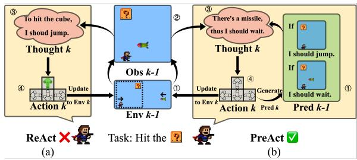  
Figure 1: Comparison between ReAct and PreAct. The scene start from $E n v _ { k - 1 }$ and $P r e d _ { k - 1 } ,$ The $O b s _ { k - }$ 1 comes from the $E n v _ { k - 1 }$ and $A c t i o n _ { k - 1 } = g o$ right. Env = environment, Obs=observation, Pred=prediction.

2022) with all historical thought, action, and observation, LLMs can sample higher quality action(s) than Act-only prompt.

On the other hand, TOT (Yao et al., 2023), GOT (Besta et al., 2023), and RAP (Hao et al., 2023) generate multiple possible actions (ReAct-based or Act-only-based (Yao et al., 2022)) and select a state each turn based on state selection strategies and observations. They found good state selection strategies can also improve the overall results.

Recent work seems to focus mostly on designing superior state selection strategies and overlooking the optimization of action sample methods. However, such action sampling methods typically generate direct causal reasoning pathways and may generate the same actions multiple times, which limits their effectiveness in tasks requiring complex relationships. As a result, finding an action sampling method that can improve action quality and actions diversity is important.

Inspired by the works in Task-Oriented Dialogue about predicting future (Qi et al., 2020; Zeng et al., 2022, 2023; Lei et al., 2023), we introduce PreAct: predict future with reasoning and action. Specifically, PreAct requires predicting the possible observations and corresponding measures at a higher level after making an action. This mode can enhance LLMs’ directional strategy in reasoning to assist planning in the right way. It can also guide LLMs to conduct more diverse reasoning, thereby leading LLMs to explore thinking more broadly and comprehensively, enabling the agent to handle tasks with greater complexity.

In summary, our main contributions are:

(1) We first propose PreAct, a simple and effective approach to synchronize reasoning, action, and prediction in language models for task-solving.

(2) Our research confirms PreAct’s effectiveness, regardless of Reflexion technology or TOT selection strategy. Our experiment demonstrates that PreAct enhances the diversity and directional strategy of planning.

(3) The ablation studies have revealed that predictions play a continuous and positive role in augmenting planning and decision-making.

## 2 Method

## 2.1 Preliminaries

Agent in Environment Actions and observations construct the process agent made in the environment. For an agent in step k, the agent will give an action based on history information, last observation, and its action policy $a _ { k } =$ $\pi _ { a g e n t } ( o _ { k - 1 } , h i s t o r y )$ . After the action has been decided, the agent will act in the environment and gain the new observation by state transition function $o _ { k } = \pi _ { e n v } ( o _ { k - 1 } , a _ { k } )$ . For an LLM agent, it can only control the $\pi _ { a g e n t }$ and the construction of history. So, the target of the LLM agent is to design efficient $\pi _ { a g e n t }$ and history.

ReAct (Yao et al., 2022) ReAct is a pioneering work towards LLM agent that combines thought t, action a, and observation o. ReAct use $L L M ( \cdot | C O T p r o m p t )$ as the $\pi _ { a g e n t } ( \cdot )$ and the set of $\left\{ o _ { 0 } , t _ { 1 } , a _ { 1 } , o _ { 1 } , . . . , t _ { k - 1 } , a _ { k - 1 } \right\}$ as the $h i s t o r y _ { r }$ By leveraging LLM’s planning ability, the ReAct agent can explore the environment and solve the problem step by step.

Reflexion (Shinn et al., 2023) Reflexion is a long-term memory strategy to improve the quality of history in Agent. Take ReAct’s Reflexion as an example, if a task fails, the LLM will be asked to make a reflection like ref = $L L M _ { r e f } ( \{ o _ { 0 } , t _ { 1 } , a _ { 1 } , o _ { 1 } , . . . , t _ { k } , a _ { k } , o _ { k } \} )$ . Once the reflection has been made, the history will be updated to $\{ r e f , o _ { 0 } , t _ { 1 } , a _ { 1 } , o _ { 1 } , . . . , t _ { k - 1 } , a _ { k - 1 } \}$ . Such a strategy can remind LLM of some information and help it to avoid some decision mistakes.

TOT (Yao et al., 2023) Tree-of-thought is a selection strategy to improve the qualities actions. Specifically, TOT will sample several actions and select 1 action in each turn. Its action policy can be formulated as

$$
\begin{array} { l } { { \{ a _ { k 1 } , . . . a _ { k n } \} = \pi _ { a g e n t } ( o _ { k - 1 } , h i s t o r y ) . } } \\ { { a _ { k } = \pi _ { s e l e c t i o n } ( o _ { k - 1 } , h i s t o r y , a _ { k 1 } , . . . a _ { k n } ) } } \end{array}
$$

## 2.2 PreAct

The framework of PreAct has been shown in Figure 1. It has two differences with ReAct. For the $\pi _ { a g e n t } ( \cdot )$ part, PreAct will prompt the LLM to generate a prediction $p$ of future observation(s) and measurements in each step and hint the LLM to reflect or change its plan direction based on the difference between the predict observation(s) and the real observation. By applying the prompt, the diversity and strategy of the plan LLM made can be enhanced. 2 For the history part, PreAct will add the prediction of future observation(s) in it. Although PreAct seems to improve LLM’s reflection and planning ability, there are still 3 questions:

(1) Do PreAct and Reflexion work orthogonal?

(2) Do PreAct and selection strategies like TOT work in a mutually reinforcing manner?

(3) Is the effect of the prediction permanent?

Based on these questions, we consider 4 modes: (1) Permanent3: All predictions will be preserved in permanent history, as $\begin{array} { r l } { h i s t o r y _ { p } } & { { } = } \end{array}$ $\left\{ o _ { 0 } , t _ { 1 } , a _ { 1 } , p _ { 1 } , o _ { 1 } , . . . , t _ { k - 1 } , a _ { k - 1 } , p _ { k - 1 } \right\}$

(2) Immediate: Only the last prediction will be preserved in immediate history, as $h i s t o r y _ { i } ~ =$ $\left\{ o _ { 0 } , t _ { 1 } , a _ { 1 } , o _ { 1 } , . . . , t _ { k - 1 } , a _ { k - 1 } , p _ { k - 1 } \right\}$

(3) Reflexion: Reflexion and all prediction will be preserved in the history, as historyr = $\left\{ r e f , o _ { 0 } , t _ { 1 } , a _ { 1 } , p _ { 1 } , o _ { 1 } , . . . , t _ { k - 1 } , a _ { k - 1 } , p _ { k - 1 } \right\}$

(4) TOT: Applying TOT action policy with $h i s t o r y = h i s t o r y _ { p }$ (TOT-PreAct) or history = $h i s t o r y _ { r } \ : ( \mathrm { T O T \mathrm { - } R e A c t } )$

## 3 Experiment

Our experiments are designed to address the following research questions (RQs): RQ1: Does PreAct exhibit higher effectiveness compared to ReAct in dealing with tasks among different modes? RQ2: Does historical prediction contribute to sustained gains in planning? RQ3: What are the intrinsic reasons for PreAct’s superior facilitation of planning compared to ReAct?

<table><tr><td rowspan="2">Model</td><td colspan="2">HH</td><td colspan="2">OS</td><td colspan="2">DB</td><td colspan="2">LTP</td></tr><tr><td>Dev</td><td>Test</td><td>Dev</td><td>Test</td><td>Dev</td><td>Test</td><td>Dev</td><td>Test</td></tr><tr><td>Permanent Mode</td><td></td><td></td><td></td><td></td><td></td><td></td><td></td><td></td></tr><tr><td>ReAct (3.5)</td><td>0.0</td><td>10.0</td><td>46.2</td><td>16.7</td><td>53.3</td><td>39.3</td><td>13.5</td><td>11.0</td></tr><tr><td>PreAct (3.5)</td><td>15.0</td><td>18.0</td><td>46.2</td><td>20.1</td><td>53.3</td><td>45.7</td><td>16.9</td><td>14.1</td></tr><tr><td>ReAct (4)</td><td>65.0</td><td>68.0</td><td>65.4</td><td>37.5</td><td>56.7</td><td>51.3</td><td>29.7</td><td>29.0</td></tr><tr><td>PreAct (4)</td><td>80.0</td><td>78.0</td><td>69.2</td><td>43.1</td><td>58.3</td><td>51.3</td><td>30.6</td><td>24.9</td></tr><tr><td>Reflexion Mode</td><td></td><td></td><td></td><td></td><td></td><td></td><td></td><td></td></tr><tr><td>ReAct (3.5)</td><td>10.0</td><td>18.0</td><td>50.0</td><td>21.5</td><td>55.0</td><td>45.6</td><td></td><td></td></tr><tr><td>PreAct (3.5)</td><td>35.0</td><td>20.0</td><td>53.8</td><td>24.3</td><td>60.0</td><td>55.3</td><td></td><td></td></tr><tr><td>ReAct (4)</td><td>80.0</td><td>78.0</td><td>73.1</td><td>48.6</td><td>61.7</td><td>58.0</td><td></td><td></td></tr><tr><td>PreAct (4)</td><td>90.0</td><td>80.0</td><td>73.1</td><td>50.0</td><td>61.7</td><td>58.3</td><td></td><td></td></tr></table>

Table 1: The result of ReAct and PreAct in 4 datasets. The version of GPT are included in ( parentheses )

<table><tr><td rowspan="2">Model</td><td colspan="5">100</td><td>1000</td></tr><tr><td>0</td><td>1</td><td>2</td><td>3</td><td>4</td><td>0</td></tr><tr><td>ReAct+TOT</td><td>66</td><td>63</td><td>62</td><td>65</td><td>67</td><td>64.9</td></tr><tr><td>PreAct+TOT</td><td>70</td><td>72</td><td>67</td><td>70</td><td>68</td><td>70.8</td></tr></table>

Table 2: The result of ReAct and PreAct with TOT in HotpotQA under different sample sizes. We ran the test 5 times with a sample size of 100 and once with a sample size of 1000 due to the inherent randomness of TOT results and the scale of HotpotQA.

## 3.1 Experiment Setup

We evaluate PreAct on 4 different sub-datasets, Householding (HH), Operating System (OS), Database (DB), and Lateral thinking puzzles (LTP)4 in AgentBench (Liu et al., 2023). We evaluate PreAct with TOT on HotpotQA (Yang et al., 2018). More details can be found in Appendix A.

## 3.2 Main Result (RQ1)

Table 1 delineates the performance of PreAct and ReAct under two distinct settings, Permanent and Reflexion, across four datasets. In the HH task, PreAct boasts an approximate 20% enhancement over ReAct. In the OS and DB coding tasks, there is an average improvement of 12% and 6% respectively with PreAct, and under the Reflexion setting, the enhancements are 5% and 8% respectively. In the LTP context, PreAct yields results akin to Act-only, which may be attributed to GPT’s safety mechanisms resulting in multiple refusals to answer, thereby diminishing effective exploratory steps. Overall, in the majority of cases, PreAct outperforms ReAct. Furthermore, the application of Reflexion on top of PreAct consistently elevates model performance. Table 2 presents the performance of PreAct and ReAct using the TOT selection strategy. Both 100-sample and 1000-sample results show that PreAct is approximately 5% higher than ReAct, indicating a certain level of independence between PreAct and selection strategies like TOT. These results suggest that the improvements in planning and decision-making ability in LLMs can be jointly provided by rich prior task information and observation predictions.

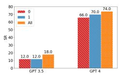  
(a) HH

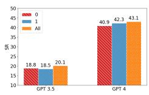  
(b) OS

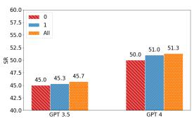  
(c) DB

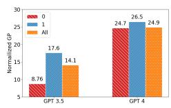  
(d) LTP  
Figure 2: Historical Prediction’s Influence. 0 refers to ReAct’s history, 1 refers to immediate mode history and all refers to permanent mode history.

## 3.3 Historical Prediction Influence Scope(RQ2)

Figure 2 demonstrates the impact of varying amounts of prediction history on the inferential performance of LLMs.5 It is evident from the experiments conducted on the HH, OS, and DB datasets that increased retention of prediction history correlates with a higher success rate. Take PreAct (GPT4) as an example, the success rate of tasks in 3 settings are 66%, 70%, 74% in HH; 40.9%, 42.3%, 43.1% in OS; and 50%, 51%, 51.3% in DB, respectively. These findings suggest that historical predictions have a sustained positive effect on the model’s reasoning abilities. However, on the LTP dataset, a greater amount of historical data results in a higher refusal probability, which in turn leads to a decline in performance in Permanent mode.

## 3.4 Intrinsic Reason Analysis (RQ3)

In our hypothesis, PreAct is presumed to enhance the inferential diversity and the directional strategy of reasoning, thereby augmenting the planning capabilities of the LLM. In this section, we will investigate these two contributing factors.

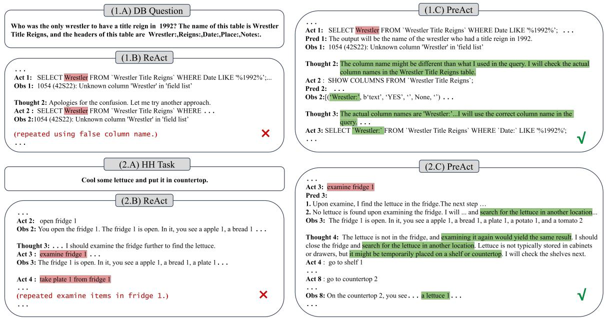  
Figure 3: Two representative examples in DB and HH set between ReAct and PreAct. We omit unimportant information in the example. Act=Action, Obs=observation, Pred=prediction.

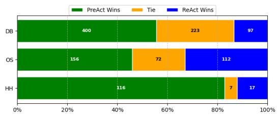  
Figure 4: Overall Diversity Comparison between ReAct and PreAct

<table><tr><td rowspan="2">Model</td><td colspan="2">Dev</td><td colspan="2">Test</td></tr><tr><td>GPT3.5</td><td>GPT4</td><td>GPT3.5</td><td>GPT4</td></tr><tr><td>ReAct</td><td>0.69</td><td>1.89</td><td>0.85</td><td>1.91</td></tr><tr><td>PreAct</td><td>0.84</td><td>2.29</td><td>1.04</td><td>2.30</td></tr></table>

Table 3: The score of strategy in HH dataset

Diversity Figure 4 displays the diversity comparison between ReAct and PreAct. The chart reveals that on any given dataset, at least 45% of the instances show that PreAct thought’s diversity is superior to ReAct, while the opposite scenario does not exceed 34%. This indicates that using PreAct can significantly increase reasoning diversity, thereby expanding the inferential space and broadening the spectrum of possible actions. 6

Directional Strategy As shown in Table 3, Pre-Act’s directional strategy score7 is at least 20% higher than that of ReAct. This indicates that Pre-Act is better at determining planning direction.

Case Study Figure 3 shows the partial trajectories of PreAct and ReAct on the DB and HH datasets. Although PreAct and ReAct made identical errors, PreAct can rectify its mistakes, while ReAct does not. In the DB set, both ReAct and PreAct used the same incorrect column name in Act 1. PreAct corrected this by verifying the actual column names, while ReAct repeatedly used the erroneous column name. In the HH task, after examining the fridge, ReAct interacts with objects inside the fridge, which is irrelevant to the task, whereas PreAct had predicted ” No lettuce in fridge ” condition and tried to locate the lettuce elsewhere.

## 4 Conclusion

In this paper, we introduce PreAct, a simple framework that utilizes predictions to enhance the diversity and strategic direction of planning, thereby improving the effectiveness of agents. This enhancement is continuous, independent of Reflexion, or TOT, and will persistently improve with the accumulation of historical predictions.

Based on the findings of PreAct, we propose two metrics for evaluating planning, which may help in setting the reward functions at the process level for reinforcement learning in future work, ultimately training more powerful agents.

## Acknowledgments

We thank all anonymous reviewers for their helpful comments and suggestions. This work was partially supported by the State Key Laboratory of Massive Personalized Customization System and Technology (No. H&C-MPC-2023-02-07(Q)), State Grid Technology Project (5700-202416236A-1-1-ZN) “Research on active semantic discovery technology based on SG-CIM and its application in power grid equipment supply chain optimization”, China Unicom Software Research Institute “Framework Agreement for Seven Model Technology Research and Application Demonstration Projects (Software Development for Government Enterprise Content Generation) of China Unicom Software Research Institute from 2024 to 2025” (No.5500331818) and the National Natural Science Foundation of China (NSFC No.62076031 and No.62076036).

## Limitations

While PreAct improves the agent’s planning ability, there are still directions to explore for future work. (1) In most of the time, PreAct only interacts with the short-time memory like history. In the future, we will investigate the interaction between PreAct and other long-term memory beyond Reflexion.

(2) We only explore PreAct’s ability by prompting, in the future, we will fine-tune the model with PreAct trajectory to find more intrinsic reason.

## Broader Impact

PreAct proposes that a model’s reasoning and planning abilities can be enhanced through predictions which presents a new approach for the implementation of LLM agents. We have demonstrated that PreAct contributes to the improvement of reasoning diversity and directional strategic behavior, providing reasonable evaluation metrics for the reasoning of LLM agents. This will have a positive impact on the assessment and optimization of LLM agents.

However, due to the inherent hallucinations and biases of LLMs, PreAct may still exhibit deviations in intent, although it is known from LTP examples that PreAct, compared to Act-only models, possesses a stronger ability to refuse responses when faced with toxic texts.

## References

Josh Achiam, Steven Adler, Sandhini Agarwal, Lama Ahmad, Ilge Akkaya, Florencia Leoni Aleman, Diogo Almeida, Janko Altenschmidt, Sam Altman, Shyamal Anadkat, et al. 2023. Gpt-4 technical report. arXiv preprint arXiv:2303.08774.

Maciej Besta, Nils Blach, Ales Kubicek, Robert Gerstenberger, Lukas Gianinazzi, Joanna Gajda, Tomasz Lehmann, Michal Podstawski, Hubert Niewiadomski, Piotr Nyczyk, et al. 2023. Graph of thoughts: Solving elaborate problems with large language models. arXiv preprint arXiv:2308.09687.

Wenhu Chen, Xueguang Ma, Xinyi Wang, and William W Cohen. 2022. Program of thoughts prompting: Disentangling computation from reasoning for numerical reasoning tasks. arXiv preprint arXiv:2211.12588.

Wenhu Chen, Hanwen Zha, Zhiyu Chen, Wenhan Xiong, Hong Wang, and William Wang. 2020. Hybridqa: A dataset of multi-hop question answering over tabular and textual data. arXiv preprint arXiv:2004.07347.

Guanting Dong, Tingfeng Hui, Zhuoma GongQue, Jinxu Zhao, Daichi Guo, Gang Zhao, Keqing He, and Weiran Xu. 2023a. Demonsf: A multi-task demonstration-based generative framework for noisy slot filling task. Preprint, arXiv:2310.10169.

Guanting Dong, Jinxu Zhao, Tingfeng Hui, Daichi Guo, Wenlong Wan, Boqi Feng, Yueyan Qiu, Zhuoma Gongque, Keqing He, Zechen Wang, and Weiran Xu. 2023b. Revisit input perturbation problems for llms: A unified robustness evaluation framework for noisy slot filling task. Preprint, arXiv:2310.06504.

Shibo Hao, Yi Gu, Haodi Ma, Joshua Jiahua Hong, Zhen Wang, Daisy Zhe Wang, and Zhiting Hu. 2023. Reasoning with language model is planning with world model. arXiv preprint arXiv:2305.14992.

Peter E Hart, Nils J Nilsson, and Bertram Raphael. 1968. A formal basis for the heuristic determination of minimum cost paths. IEEE transactions on Systems Science and Cybernetics, 4(2):100–107.

Chenxu Hu, Jie Fu, Chenzhuang Du, Simian Luo, Junbo Zhao, and Hang Zhao. 2023a. Chatdb: Augmenting llms with databases as their symbolic memory. arXiv preprint arXiv:2306.03901.

Mengkang Hu, Yao Mu, Xinmiao Yu, Mingyu Ding, Shiguang Wu, Wenqi Shao, Qiguang Chen, Bin Wang, Yu Qiao, and Ping Luo. 2023b. Tree-planner: Efficient close-loop task planning with large language models. arXiv preprint arXiv:2310.08582.

Wenlong Huang, Pieter Abbeel, Deepak Pathak, and Igor Mordatch. 2022. Language models as zero-shot planners: Extracting actionable knowledge for embodied agents. In International Conference on Machine Learning, pages 9118–9147. PMLR.

Mohit Iyyer, Wen-tau Yih, and Ming-Wei Chang. 2017. Search-based neural structured learning for sequential question answering. In Proceedings ofthe 55th Annual Meeting of the Association for Computational Linguistics (Volume 1: Long Papers), pages 1821– 1831.

Takeshi Kojima, Shixiang Shane Gu, Machel Reid, Yutaka Matsuo, and Yusuke Iwasawa. 2022. Large language models are zero-shot reasoners. Advances in neural information processing systems, 35:22199– 22213.

Shanglin Lei, Guanting Dong, Xiaoping Wang, Keheng Wang, and Sirui Wang. 2023. Instructerc: Reforming emotion recognition in conversation with a retrieval multi-task llms framework. arXiv preprint arXiv:2309.11911.

Xiao Liu, Hao Yu, Hanchen Zhang, Yifan Xu, Xuanyu Lei, Hanyu Lai, Yu Gu, Hangliang Ding, Kaiwen Men, Kejuan Yang, et al. 2023. Agentbench: Evaluating llms as agents. arXiv preprint arXiv:2308.03688.

Pan Lu, Baolin Peng, Hao Cheng, Michel Galley, Kai-Wei Chang, Ying Nian Wu, Song-Chun Zhu, and Jianfeng Gao. 2023. Chameleon: Plug-and-play compositional reasoning with large language models. arXiv preprint arXiv:2304.09842.

Bodhisattwa Prasad Majumder, Bhavana Dalvi Mishra, Peter Jansen, Oyvind Tafjord, Niket Tandon, Li Zhang, Chris Callison-Burch, and Peter Clark. 2023. Clin: A continually learning language agent for rapid task adaptation and generalization. arXiv preprint arXiv:2310.10134.

Nicholas Metropolis and Stanislaw Ulam. 1949. The monte carlo method. Journal ofthe American statistical association, 44(247):335–341.

Linyong Nan, Chiachun Hsieh, Ziming Mao, Xi Victoria Lin, Neha Verma, Rui Zhang, Wojciech Krysci ´ nski,´ Hailey Schoelkopf, Riley Kong, Xiangru Tang, et al. 2022. Fetaqa: Free-form table question answering. Transactions of the Association for Computational Linguistics, 10:35–49.

Panupong Pasupat and Percy Liang. 2015. Compositional semantic parsing on semi-structured tables. arXiv preprint arXiv:1508.00305.

Weizhen Qi, Yu Yan, Yeyun Gong, Dayiheng Liu, Nan Duan, Jiusheng Chen, Ruofei Zhang, and Ming Zhou. 2020. Prophetnet: Predicting future n-gram for sequence-to-sequence pre-training. Preprint, arXiv:2001.04063.

Noah Shinn, Federico Cassano, Ashwin Gopinath, Karthik R Narasimhan, and Shunyu Yao. 2023. Reflexion: Language agents with verbal reinforcement learning. In Thirty-seventh Conference on Neural Information Processing Systems.

Mohit Shridhar, Xingdi Yuan, Marc-Alexandre Côté, Yonatan Bisk, Adam Trischler, and Matthew Hausknecht. 2020. Alfworld: Aligning text and embodied environments for interactive learning. arXiv preprint arXiv:2010.03768.

Chan Hee Song, Jiaman Wu, Clayton Washington, Brian M Sadler, Wei-Lun Chao, and Yu Su. 2023. Llm-planner: Few-shot grounded planning for embodied agents with large language models. In Proceedings ofthe IEEE/CVF International Conference on Computer Vision, pages 2998–3009.

Jiashuo Sun, Chengjin Xu, Lumingyuan Tang, Saizhuo Wang, Chen Lin, Yeyun Gong, Heung-Yeung Shum, and Jian Guo. 2023. Think-on-graph: Deep and responsible reasoning of large language model with knowledge graph. arXiv preprint arXiv:2307.07697.

Guanzhi Wang, Yuqi Xie, Yunfan Jiang, Ajay Mandlekar, Chaowei Xiao, Yuke Zhu, Linxi Fan, and Anima Anandkumar. 2023a. Voyager: An open-ended embodied agent with large language models. arXiv preprint arXiv:2305.16291.

Xuezhi Wang, Jason Wei, Dale Schuurmans, Quoc Le, Ed Chi, Sharan Narang, Aakanksha Chowdhery, and Denny Zhou. 2022. Self-consistency improves chain of thought reasoning in language models. arXiv preprint arXiv:2203.11171.

Zihao Wang, Shaofei Cai, Guanzhou Chen, Anji Liu, Xiaojian Ma, and Yitao Liang. 2023b. Describe, explain, plan and select: Interactive planning with large language models enables open-world multi-task agents. arXiv preprint arXiv:2302.01560.

Jason Wei, Xuezhi Wang, Dale Schuurmans, Maarten Bosma, Fei Xia, Ed Chi, Quoc V Le, Denny Zhou, et al. 2022. Chain-of-thought prompting elicits reasoning in large language models. Advances in Neural Information Processing Systems, 35:24824–24837.

Licheng Wen, Daocheng Fu, Xin Li, Xinyu Cai, Tao Ma, Pinlong Cai, Min Dou, Botian Shi, Liang He, and Yu Qiao. 2023. Dilu: A knowledge-driven approach to autonomous driving with large language models. arXiv preprint arXiv:2309.16292.

Binfeng Xu, Zhiyuan Peng, Bowen Lei, Subhabrata Mukherjee, Yuchen Liu, and Dongkuan Xu. 2023. Rewoo: Decoupling reasoning from observations for efficient augmented language models. arXiv preprint arXiv:2305.18323.

Zhilin Yang, Peng Qi, Saizheng Zhang, Yoshua Bengio, William W Cohen, Ruslan Salakhutdinov, and Christopher D Manning. 2018. Hotpotqa: A dataset for diverse, explainable multi-hop question answering. arXiv preprint arXiv:1809.09600.

Zongxin Yang, Guikun Chen, Xiaodi Li, Wenguan Wang, and Yi Yang. 2024. Doraemongpt: Toward understanding dynamic scenes with large language models. arXiv preprint arXiv:2401.08392.

Shunyu Yao, Dian Yu, Jeffrey Zhao, Izhak Shafran, Thomas L Griffiths, Yuan Cao, and Karthik Narasimhan. 2023. Tree of thoughts: Deliberate problem solving with large language models. arXiv preprint arXiv:2305.10601.

Shunyu Yao, Jeffrey Zhao, Dian Yu, Nan Du, Izhak Shafran, Karthik Narasimhan, and Yuan Cao. 2022. React: Synergizing reasoning and acting in language models. arXiv preprint arXiv:2210.03629.

Weihao Zeng, Keqing He, Yejie Wang, Chen Zeng, Jingang Wang, Yunsen Xian, and Weiran Xu. 2023. Futuretod: Teaching future knowledge to pre-trained language model for task-oriented dialogue. arXiv preprint arXiv:2306.10315.

Weihao Zeng, Keqing He, Zechen Wang, Dayuan Fu, Guanting Dong, Ruotong Geng, Pei Wang, Jingang Wang, Chaobo Sun, Wei Wu, et al. 2022. Semi-supervised knowledge-grounded pre-training for task-oriented dialog systems. arXiv preprint arXiv:2210.08873.

Andrew Zhao, Daniel Huang, Quentin Xu, Matthieu Lin, Yong-Jin Liu, and Gao Huang. 2023a. Expel: Llm agents are experiential learners. arXiv preprint arXiv:2308.10144.

Gang Zhao, Xiaocheng Gong, Xinjie Yang, Guanting Dong, Shudong Lu, and Si Li. 2023b. DemoSG: Demonstration-enhanced schema-guided generation for low-resource event extraction. In Findings ofthe Associationfor Computational Linguistics: EMNLP 2023, pages 1805–1816, Singapore. Association for Computational Linguistics.

Zirui Zhao, Wee Sun Lee, and David Hsu. 2023c. Large language models as commonsense knowledge for large-scale task planning. arXiv preprint arXiv:2305.14078.

Victor Zhong, Caiming Xiong, and Richard Socher. 2017. Seq2sql: Generating structured queries from natural language using reinforcement learning. arXiv preprint arXiv:1709.00103.

Wanjun Zhong, Lianghong Guo, Qiqi Gao, and Yanlin Wang. 2023. Memorybank: Enhancing large language models with long-term memory. arXiv preprint arXiv:2305.10250.

Andy Zhou, Kai Yan, Michal Shlapentokh-Rothman, Haohan Wang, and Yu-Xiong Wang. 2023. Language agent tree search unifies reasoning acting and planning in language models. arXiv preprint arXiv:2310.04406.

Yuchen Zhuang, Xiang Chen, Tong Yu, Saayan Mitra, Victor Bursztyn, Ryan A Rossi, Somdeb Sarkhel, and Chao Zhang. 2023. Toolchain\*: Efficient action space navigation in large language models with a\* search. arXiv preprint arXiv:2310.13227.

## A Experiment Setup

## A.1 Hyper-parameter

We use gpt-3.5-turbo-1106 in all 3.5 versions and gpt-4-1106-preview in all 4 versions in Agent-Bench. We use gpt-4-turbo-2024-04-09 in TOT

## A.2 Dataset Information

There are 4 datasets in AgentBench: Householding, Operating System, Database, Lateral Thinking Puzzles. 8

The Householding task (HH) uses the Alfworld benchmark (Shridhar et al., 2020). The ALFWorld benchmark consists of text-based simulations of home settings, offering an interactive platform for an agent to execute decision-making tasks via text interfaces. The agent’s goal is to decompose a complex goal into simple actions, based on the provided environment description and a target instruction. With each action, the agent gets feedback from the environment, enabling it to adjust its strategy and proceed with the next task to achieve the primary goal ultimately.

The Operating System dataset (OS) (Liu et al., 2023) is designed to test Large Language Models (LLMs) by having them interact with and control an operating system through a terminal interface. It aims to assess LLMs within authentic interactive bash environments, such as Ubuntu Docker, by asking them questions with definitive answers or instructing them to perform a sequence of practical operations.

The Database dataset (DB) amalgamates several established datasets: WikiSQL (Zhong et al., 2017), WikiTableQuestions (Pasupat and Liang, 2015), SQA (Iyyer et al., 2017), HybridaQA (Chen et al., 2020), and FeTaQA (Nan et al., 2022), focusing on evaluate LLMs on authentic SQL interfaces and databases as is in the real world.

The Lateral thinking puzzles (LTP) (Liu et al., 2023), also known as situation puzzles are a globally popular group game. In the game, one person acts as the host and presents a puzzle, while other players attempt to solve it by asking questions that can only be answered with "yes," "no," or "irrelevant." The game ends when a player figures out the key aspect of the puzzle’s story. The name of the game comes from the term "lateral thinking,"

which is the capacity to reason and generate new ideas from unique and unconventional viewpoints.

Since some $\mathrm { L T P ^ { \circ } s }$ contents and descriptions might induce psychological discomfort, the application of ReAct and PreAct in LTP may trigger GPT’s rejection mechanism leading fail. As a result, the original LTP dataset uses the Act-only framework. For a fair comparison, we remove all samples that have refusal for more than three (included) consecutive rounds and change the metric of LTP to a normalized one.

More detailed information about these 4 datasets has been shown below.

<table><tr><td>Dataset</td><td>Operating System</td><td>Database</td><td>Householding</td><td>Lateral Thinking Puzzles</td></tr><tr><td>Abbr.</td><td>OS</td><td>DB</td><td>HH</td><td>LTP</td></tr><tr><td>#Max Turn</td><td>8</td><td>5</td><td>35</td><td>50</td></tr><tr><td>Metrics</td><td>SR</td><td>SR</td><td>SR</td><td>Normalized GP</td></tr><tr><td>#Dev</td><td>26</td><td>60</td><td>20</td><td>40</td></tr><tr><td>#Test</td><td>144</td><td>300</td><td>50</td><td>100</td></tr></table>

Table 4: The information of 4 datasets in Agent-Bench(Liu et al., 2023). In the main text, we use abbreviations to represent these datasets. "#Max Turn" denotes the estimated number of interacting max turns to solve a single problem. "SR" stands for Success Rate. "Normalized GP" refers to the percent of information the agent has guessed in the games which will not lead to refusal for more than three consecutive rounds. "#Dev" is the number of samples in the Dev set. "#Test" is the number of samples in the Test set. We align with the setting in AgentBench’s GitHub code, which may be different from the setting in the paper.

In the rounds following the successful inference of "The tools pierced through Xiao Ming’s skull", there will be safety prompts that output in an unexpected format, which leads to the failure of PreAct. (It should be noted that this is not the input exceed error, since they have different error logs!)

## Harmful example in ltp

Question: The classmates celebrated Xiao Ming’s birthday, but under the watchful eyes of everyone, Xiao Ming was stabbed to death by a sharp weapon, please reason.

Ground Truth: Some cakes need to be shaped, and they will be fixed with bamboo sticks or similar sharp objects. In order to surprise Xiao Ming, the classmate who ordered the cake ordered a cake with a strange shape, which contained a weapon. However, some students didn’t know that after singing the birthday song to Xiao

Ming, they put Xiao Ming’s head into the cake and pierced his head with a sharp weapon.

We use HotpotQA (Yang et al., 2018) in TOT setting. The TOT-ReAct version comes from LATS (Zhou et al., 2023). Due to the inherent randomness of TOT results and the large scale of HotpotQA, we ran the test 5 times with a sample size of 100 (id 0-99) and 1 time with a sample size of 1000 (id 0-999).

## B Prompts

Italic text will be replaced by real task information or trajectory.

## B.1 Prompts in HH

## HH PreAct Prompt

Interact with a household to solve a task. Imagine you are an intelligent agent in a household environment and your target is to perform actions to complete the task goal. At the beginning of your interactions, you will be given the detailed description of the current environment and your goal to accomplish. For each of your turn, you will be given a list of actions which you can choose one to perform in this turn. In each of your turn, you must first think about the current condition and plan for your future actions, and then output your action in this turn, and then predict the various types of feedback the environment might provide at a high level, and ensure to furnish corresponding handling measures for each potential category of feedback. Your output must strictly follow this format:"THOUGHT: your thoughts.

ACTION: your next action.

PREDICTED FEEDBACK:

1. first possible feedback type and the corresponding handling measures.

2. second possible feedback type and the corresponding handling measures.

and so on...

". After your each turn, the environment will give you immediate feedback based on which you plan your next few steps. if the environment output "Nothing happened", that means the previous action is invalid and you should try more options. If the actual feedback doesn’t fall into any of the previously predicted scenarios, you need to contemplate the reasons for this disparity in the next round’s "THOUGHT:" section and use this as a basis to reflect on the previous planning. Finally, integrate all relevant factors to re-plan the strategy.

## Reminder:

1. The action must be chosen from the given available actions. Any actions except provided available actions will be regarded as illegal.

2. The records of available actions from past rounds will be deleted, and only the available actions for the current round will be provided. You need to adapt to this reduction and correctly understand the context.

3. In each of your turn, you must first think based on the task, current environment, and historical information before providing an action, then predict the types of environmental feedback. You cannot skip any of these steps and your output must strictly follow the format provided before.

## HH ReAct Prompt

Interact with a household to solve a task. Imagine you are an intelligent agent in a household environment and your target is to perform actions to complete the task goal. At the beginning of your interactions, you will be given the detailed description of the current environment and your goal to accomplish. For each of your turn, you will be given a list of actions which you can choose one to perform in this turn. You should choose from two actions: "THOUGHT" or "ACTION". If you choose "THOUGHT", you should first think about the current condition and plan for your future actions, and then output your action in this turn. Your output must strictly follow this format:"THOUGHT: your thoughts.

ACTION: your next action

"; If you choose "ACTION", you should directly output the action in this turn. Your output must strictly follow this format:"ACTION: your next action ". After your each turn, the environment will give you immediate feedback based on which you plan your next few steps. if the environment output "Nothing happened", that means the previous action is invalid and you should try more options.

## Reminder:

1. the action must be chosen from the given available actions. Any actions except provided available actions will be regarded as illegal.

2. Think when necessary, try to act directly more in the process.

## B.2 Prompts in OS

## OS PreAct Prompt

You are an assistant that will act like a person, I’will play the role of linux(ubuntu) operating system. Your goal is to implement the operations required by me or answer to the question proposed by me. For each of your turn, you should first think what you should do, then you should take exact one of the three actions: "bash", "finish" or "answer". If your action is ’bash’, you should also predict the possibile OS output in HIGH LEVEL and give suggestions for each possibility to deal with it. You should also compare the real output of the OS, your last prediction and the suggestion. If the real output mismatch your prediction, you should reflect your thought and action and make new planning.

1. If you think you should execute some bash code, take bash action, and you should print like this:

Think: put your thought here.

Act: bash

“‘ bash

\# put your bash code here “

Predict OS output:

1.Your first prediction and suggestion

2.Your second prediction and suggestion

2. If you think you have finished the task, take finish action, and you should print like this:

Think: put your thought here.

Act: finish

3. If you think you have got the answer to the question, take answer action, and you should print like this:

Think: put your thought here.

Act: answer(Your answer to the question should be put in this pair of parentheses) If the output is too long, I will truncate it. The truncated output is not complete. You have to deal with the truncating problem by yourself. Attention, your bash code should not contain any input operation. Once again, you should take only exact one of the three actions in each turn.

(example)

Now, I will start a new problem in a new   
OS. My problem is:   
(problem)

## OS ReAct Prompt

You are an assistant that will act like a person, I’will play the role of linux(ubuntu) operating system. Your goal is to implement the operations required by me or answer to the question proposed by me. For each of your turn, you should first think what you should do, and then take exact one of the three actions: "bash", "finish" or "answer". 1. If you think you should execute some bash code, take bash action, and you should print like this:

Think: put your thought here.

Act: bash

“‘ bash

\# put your bash code here “

2. If you think you have finished the task, take finish action, and you should print like this:

Think: put your thought here.

Act: finish

3. If you think you have got the answer to the question, take answer action, and you should print like this:

Think: put your thought here.

Act: answer(Your answer to the question should be put in this pair of parentheses) If the output is too long, I will truncate it. The truncated output is not complete. You have to deal with the truncating problem by yourself. Attention, your bash code should not contain any input operation. Once again, you should take only exact one of the three actions in each turn.

(example)

Now, I will start a new problem in a new   
OS. My problem is:   
(problem)

## B.3 Prompts in DB

## DB PreAct Prompt

I will ask you a question, then you should help me operate a MySQL database with SQL to answer the question.

You should thought, give act, and predicte the possible output of the SQL.

In thought part, you should explain the problem and your solution to me. If the SQL output mismatches the predict output, you should ckeck the plan and SQL in the last round carefully, find out its mistake in it and refine it.

After thinking and explaining thoroughly, every round you can choose to operate or to answer. Finally, you should predict the possible HIGH LEVEL output of the SQL and give a next step suggestion. Remember your prediction should be HIGH LEVEL, not just the SQL output.

your operation should be like this:

Thought: Your thoughts here

Action: Operation

“‘sql

SELECT \* FROM table WHERE condition; “‘

Predict MySql Output:

1. Your first HIGH LEVEL output of the SQL and the next step suggestion.

2. Your second HIGH LEVEL output of the SQL and the next step suggestion.

You MUST put SQL in markdown format without any other comments. Your SQL should be in one line.

Every time you can only execute one SQL statement. I will only execute the statement in the first SQL code block. Every time you write a SQL, I will execute it for you and give you the output.

If you are done operating, and you want to commit your final answer, then write down: Thought: Your thoughts here

Action: Answer   
Final Answer: ["ANSWER1", "AN-  
SWER2", ...]

DO NOT write this pattern unless you are sure about your answer. I expect an accurate and correct answer.

Your answer should be accurate. Your answer must be exactly the same as the correct answer.

If the question is about modifying the database, then after done operation, your answer field can be anything.

If your response cannot match any pattern I mentioned earlier, you will be judged as FAIL immediately.

Your input will be raw MySQL response, you have to deal with it by yourself.

## DB ReAct Prompt

I will ask you a question, then you should help me operate a MySQL database with SQL to answer the question.

You have to explain the problem and your solution to me and write down your thoughts.

After thinking and explaining thoroughly, every round you can choose to operate or to answer.

your operation should be like this:

Thought: Your thoughts here

Action: Operation

“‘sql

SELECT \* FROM table WHERE condi-tion;

You MUST put SQL in markdown format without any other comments. Your SQL should be in one line.

Every time you can only execute one SQL statement. I will only execute the statement in the first SQL code block. Every time you write a SQL, I will execute it for you and give you the output.

If you are done operating, and you want to commit your final answer, then write down: Action: Answer

Final Answer: ["ANSWER1", "AN-SWER2", ...]

DO NOT write this pattern unless you are sure about your answer. I expect an accurate and correct answer.

Your answer should be accurate. Your answer must be exactly the same as the correct answer.

If the question is about modifying the database, then after done operation, your answer field can be anything.

If your response cannot match any pattern I mentioned earlier, you will be judged as FAIL immediately.

Your input will be raw MySQL response, you have to deal with it by yourself.

## B.4 Prompts in LTP

Following is the prompt of LTP. The Chinese version is just a translation of the English version.

## LTP PreAct Prompt

You are a game player, and you are playing Lateral Thinking Puzzle, also known as Situation Puzzle.

Lateral Thinking Puzzle is a deductive reasoning game, and here are the game rules:

1. At the beginning of the game, you will receive a narrative, referred to as "story". Based on the story, you need to ask questions that can be answered with "yes", "no", or "irrelevant" to guess out the "truth".

2. By asking questions, you narrow down the range of possibilities until you eventually guess out the truth.

3. Each time, you can only ask one question.

4. Remember that your role is a player. You cannot declare the end of the game, give up on reasoning, or request a new game.

5. You cannot directly repeat information already provided in the story.

6. You cannot directly ask for details about the story in the form of "why" questions; you need to make your own guesses for truth.

7. You cannot directly inquire about the story; you must make your own deductions.

Next, please make full use of the information provided above to engage in game reasoning. Keep in mind that your questions should be answerable with "yes", "no", or "irrelevant", and you can only ask one question at a time.

In order for you to deduce the truth from the story more effectively, in each of your turn, you must output your question, and then give a plan of question direction for each potential category of feedback the host might provide, which is among Yes, No, Irrelevant and Redundant. In each of your turn, please ensure that your output contains a question about the story and strictly adhere to the following template: "Question: [Your question in this turn].

Predicted Feedback:

1. Yes. [Next turn plan].

2. No. [Next turn plan].

3. Irrelevant. [Next turn plan].

4. Redundant. [Next turn plan]."

Note that we may delete some Predicted Feedback in the history, but you should follow the Question, Predicted Feedback format.

Here is your story:

(story)

You can start guessing the content of the truth, and I will answer your questions. Please note that your questions should be answerable with "yes", "no", or "irrelevant".

## LTP ReAct Prompt

You are a game player, and you are playing Lateral Thinking Puzzle, also known as Situation Puzzle.

Lateral Thinking Puzzle is a deductive reasoning game, and here are the game rules:

1. At the beginning of the game, you will receive a narrative, referred to as "story". Based on the story, you need to ask questions that can be answered with "yes", "no", or "irrelevant" to guess out the "truth".

2. By asking questions, you narrow down the range of possibilities until you eventually guess out the truth.

3. Each time, you can only ask one question.

4. Remember that your role is a player. You cannot declare the end of the game, give up on reasoning, or request a new game.

5. You cannot directly repeat information already provided in the story.

6. You cannot directly ask for details about the story in the form of "why" questions; you need to make your own guesses for truth.

7. You cannot directly inquire about the story; you must make your own deductions.

Next, please make full use of the information provided above to engage in game reasoning. Keep in mind that your questions should be answerable with "yes", "no", or "irrelevant", and you can only ask one question at a time.

Here is your story:

(story)

You can start guessing the content of the truth, and I will answer your questions. Please note that your questions should be answerable with "yes", "no", or "irrelevant".

## B.5 Prompt of Reflexion

Both ReAct and PreAct use the same format, we just set examples to ” in Preact.

## Reflexion Prompt

You are an advanced reasoning agent that can improve based on self reflection. You will be given a previous reasoning trial and a question to answer. You were unsuccessful in answering the question either because you guessed the wrong answer, or you used up your set number of reasoning steps. In a few sentences, Diagnose a possible reason for failure and devise a new, concise, high level plan that aims to mitigate the same failure. Use complete sentences.

Here are some examples:

{examples}

(END OF EXAMPLES)

Previous trial:

Question: {question}

{scratchpad}

Reflection:

## B.6 Prompt of PreAct in HotpotQA

## HH ReAct Prompt

Solve a question answering task with interleaving Thought, Action, Predicted Feedback, Observation steps. Thought can reason about the current situation, and Action can be three types:

(1) Search[entity], which searches the exact entity on Wikipedia and returns the first paragraph if it exists. If not, it will return some similar entities to search.

(2) Lookup[keyword], which returns the next sentence containing keyword in the current passage.

(3) Finish[answer], which returns the answer and finishes the task.

Predicted Feedback are your guess at the possible feedback type and the corresponding handling measures before observation.

Thoughts, Actions, and Predicted Feedback should be one line each, so du not use multiple lines inside them.

After each observation, provide the next Thought and next Action. Here are some examples:

(three examples)

(problem)

## B.7 Prompt of Diversity Judgment

## Directional Strategy Judgment Prompt

I will provide you two trajectories of an agent interacting with the environment to accomplish the same task. Please evaluate the diversity of the agent’s thinking and actions in these two trajectories and assign a score (0 to 100) for each trajectory. When evaluating, please analyze and compare the given trajectories first, provide your thought process, and then give the final diversity score for each trajectory. Your output should strictly adhere to the following format:

"Thought: [Your Thought]

Score 1: [Score of trajectory 1]

Score 2: [Score of trajectory 2]"

[BEGIN OF ONE TRAJECTORY]

(one ofthe trajectories)

[END OF ONE TRAJECTORY]

[BEGIN OF ANOTHER TRAJECTORY]

(another of the trajectories)

[END OF ANOTHER TRAJECTORY]

## B.8 Prompt of Directional Strategy Judgment

Following is the prompt of directional strategy judgment. We remove all predictions in the history and turn for a fair comparison The red part is the criteria of scoring.

## Directional Strategy Judgment Prompt

I will provide you with a part of the trajectory where an agent interacts with the environment to accomplish a certain task, and the complete ground truth trajectory of the task. You need to assess the quality of the direction of the action plan in the last round of the evaluated trajectory at a high level, that is, what extent it facilitated the completion of the task with the information agent has gained, and provide a score (minus one to positive three) for the last round of the trajectory. (3: last plan direction is correct based on ground truth, 2: last plan direction is incorrect based on ground truth but seems (strong) reasonable based on evaluated trajectory history, 1: last plan direction is incorrect based on ground truth but seems (weak) reasonable based on evaluated trajectory history, 0: last plan direction is incorrect based on ground truth and seems unreasonable based on evaluated trajectory history, and the direction of evaluated trajectory history is also incorrect, -1: last plan direction is incorrect based on ground truth but the direction of evaluated trajectory history is correct, last plan direction disturb the direction)

You must first analyze and understand the reasons for the success of the ground truth trajectory, and then analyze what agent know in the evaluated trajectory, and then analyze the impact of changing the action plan on completing the task and measure the extent to which these effects facilitate task completion with a score.

Your output should strictly adhere to the following format:

Thought: [Your Thought]

Last Round Replan Score: [Score for the last round replan]

[BEGIN OF GROUND TRUTH TRAJEC-TORY]

(ground truth trajectory)

[END OF GROUND TRUTH TRAJEC-TORY]

[BEGIN OF THE TRAJECTORY TO BE EVALUATED]

(evaluated trajectory history)

(evaluated trajectory turn)

[END OF THE TRAJECTORY TO BE EVALUATED]

## C Correlation Analysis

Figure 5 displayed the relationship between diversity, directional strategy, and success rate on HH, revealing that the success rate is positively correlated with both indicators. Furthermore, the correlation coefficient between directional strategy and success rate is 99.8% (Dev) and 99.3% (Test), whereas the correlation coefficient for diversity is 83.7% (Dev) and 91.2% (Test).

To further prove the reliability of the diversity metric, We computed the number of different actions (divided by the total round number) in Alfworld and found about 82% of results can match our diversity result. This can partly prove the efficiency of Diversity metrics.

Since there are a lot of works use GPT to select the possible state (for example, TOT (Yao et al., 2023), LATS (Zhou et al., 2023)), it has been proved that GPT4 can judge directional strategy.

## D Specific Diversity Comparison between ReAct and PreAct

We presented two trajectories with thought and action to GPT-4, asking it to score each trajectory on a scale from 0 to 100.9 Figure 6 presents the specific diversity comparison between ReAct and PreAct among different set and model.

## E Directional Strategy metrics.

For each round of every trajectory, we provide the model with ground truth, all thoughts and actions from previous rounds and the current round’s thoughts and actions, while discarding all predictions. We then ask GPT-4 to score its directional strategy on a scale from −1 ∼ 3 for each turn and the metric of strategy is:

$$
M _ { s } = E _ { x \sim p } \left( E _ { t \sim x } \left( L L M _ { s c o r e } \left( t \right) \right) \right)\tag{1}
$$

where x is the sample, t is the thought and action in one turn and $L L M _ { s c o r e }$ is the scorer.

## Score rules

3: last plan direction is correct based on ground truth

2: last plan direction is incorrect based on ground truth but seems (strong) reasonable based on evaluated trajectory history

1: last plan direction is incorrect based on ground truth but seems (weak) reasonable based on evaluated trajectory history

0: last plan direction is incorrect based on ground truth and seems unreasonable based on evaluated trajectory history, and the direction of evaluated trajectory history is also incorrect

-1: last plan direction is incorrect based on ground truth but the direction of evaluated trajectory history is correct, last plan direction disturb the direction.

Faithfulness To fairly compare whether the scores of PreAct and ReAct align with human expectations, we first selected 20 PreAct trajectories and chose one round from each as the annotation round. We then removed all predictions and used the ReAct method to obtain the corresponding annotation round for ReAct. For GPT4, we scored according to the scoring principle of prompting GPT-4. For human annotation, we provided the prompt and content given to GPT-4 to the annotators and emphasized the annotation principle. PreAct and ReAct trajectories were provided each time, but their order of appearance was random. We compared the Directional Strategy scores given by each annotator for these 40 decisions with the Directional Strategy scores given by GPT-4. The experiment found that humans and GPT-4 completely agreed on 50% of the data, and for 85% of the data, the score difference between humans and GPT-4 was less than or equal to 1 point.

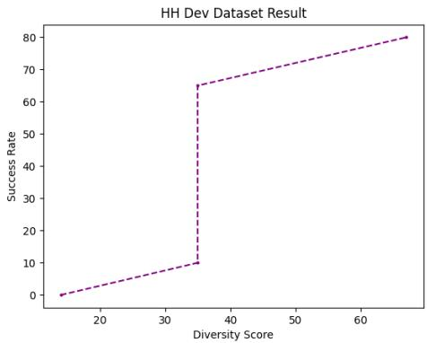  
(a) Diversity Correlation in Dev set

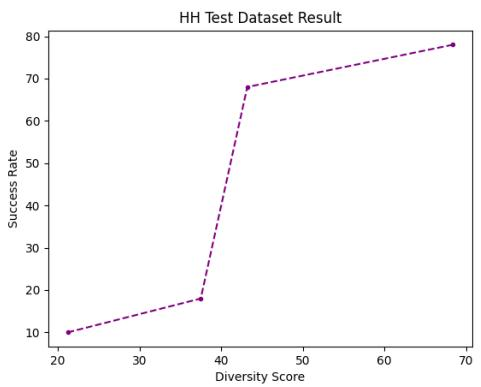  
(b) Diversity Correlation in Test set

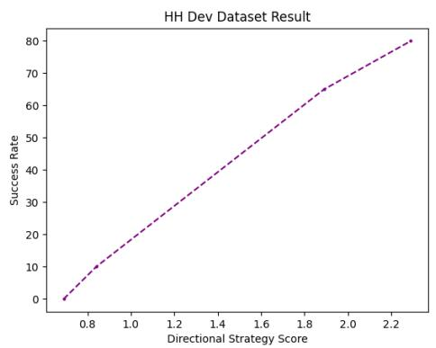  
(c) Directional Strategy Correlation in Dev set with GPT4

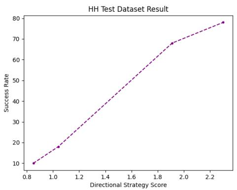  
(d) Directional Strategy Correlation in Test set  
Figure 5: Correlation Analysis in HH Dataset

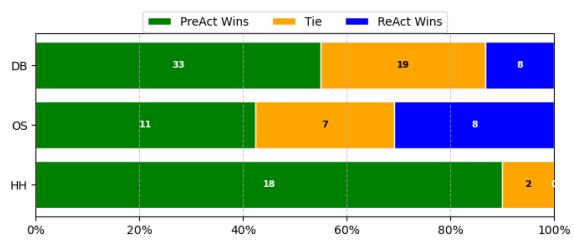  
(a) Diversity in Dev set with GPT3.5

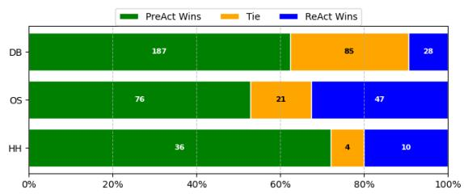  
(b) Diversity in Test set with GPT3.5

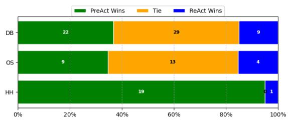  
(c) Diversity in Dev set with GPT4

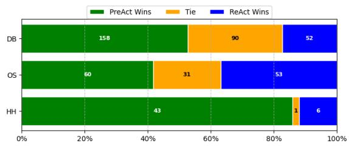  
(d) Diversity in Test set with GPT4  
Figure 6: Specific Diversity Comparison between ReAct and PreAct

<table><tr><td>Model</td><td>0</td><td>1</td><td>2</td><td>3</td><td>4</td></tr><tr><td>ReAct+TOT</td><td>66</td><td>63</td><td>62</td><td>65</td><td>67</td></tr><tr><td>PreAct+TOT</td><td>70</td><td>72</td><td>67</td><td>70</td><td>68</td></tr><tr><td>PreAct+TOT (h=0.5)</td><td>67</td><td>68</td><td>72</td><td>63</td><td>63</td></tr><tr><td>PreAct+TOT (h=1.0)</td><td>66</td><td>61</td><td>69</td><td>55</td><td>69</td></tr></table>

Table 5: The result of ReAct and PreAct with TOT in HotpotQA under different sample sizes. We ran the test 5 times with a sample size of 100.

## F When PreAct Meets Hallucination

Table 5 displays the performance of PreAct+TOT under the condition of hallucination in prediction. Under this setup, we first run the PreAct+TOT setting with sample IDs 100-999 and save all predictions. During inference, the original prediction may be replaced with a random prediction from the corresponding round with the replacement rate being the value of hallucination (h in the Table 5.)

The result in Table 5 shows that when all predictions are hallucinatory, the performance may decrease and the variance of the result is big, so PreAct may be largely influenced by hallucination. But when half of the predictions are hallucinatory, the performance can improve in most cases. As a result, if the degree of hallucination is not significant, PreAct can perform better.

## G Related Work

## G.1 Agent Planning

With the discovery of the chain-of-thought (Wei et al., 2022; Kojima et al., 2022), utilizing the reasoning capabilities of LLMs for planning has become possible (Huang et al., 2022). Within this context, two modes are distinguished: ReWOO (Xu et al., 2023) and ReAct (Yao et al., 2022).

When faced with a task, the former works (Xu et al., 2023; Chen et al., 2022; Lu et al., 2023; Hu et al., 2023a) conducts all planning in one go and executes sequentially, while the latter executes planning step by step. Although ReWOO possesses higher efficiency and fewer model invocations, it struggles with complex, observation-requiring planning tasks.

ReAct, on the other hand, synthesizes thought and action and continuously updates this approach based on observations, allowing it to cope with a wider variety of situations (Yao et al., 2022; Wang et al., 2023b). However, as this paper points out, ReAct’s reasoning diversity and directional strategy are less robust.

Works like Tree-of-Thought(Yao et al., 2023; Hu et al., 2023b) and Graph-of-thought(Besta et al., 2023; Sun et al., 2023) allow the generation of multiple possible actions at each step to expand the action space and explore the most likely directions.

To more efficiently choose directions, the works like LLM-MCTS (Zhao et al., 2023c), RAP (Hao et al., 2023), LATS (Zhou et al., 2023), DoraemonGPT (Yang et al., 2024) and Toolchain (Zhuang et al., 2023), employed pathfinding algorithms such as A∗ (Hart et al., 1968) or MCTS (Metropolis and Ulam, 1949).

## G.2 Agent long-term Memory

In this paper, we only consider 1 type of agent long-term memory, Reflexion (Shinn et al., 2023). Besides, there are still 2 types: example memory and insight memory.

Example memory entails the manual creation of samples that align with the expectations of specific tasks. During operation, instances of successful examples that are akin to the current task are retrieved using techniques such as vector similarity or BM25 (Dong et al., 2023a,b; Zhao et al., 2023b). These examples are then fed into the large language model as part of the prompt. (Wang et al., 2023a; Wen et al., 2023; Song et al., 2023; Zhong et al., 2023)

Conversely, insight memory encapsulates both successful and unsuccessful instances into condensed insights via the large language model. When faced with new tasks, these synthesized insights are incorporated directly into the prompt for the large language model, assisting in the planning and decision-making processes. (Majumder et al., 2023; Zhao et al., 2023a).