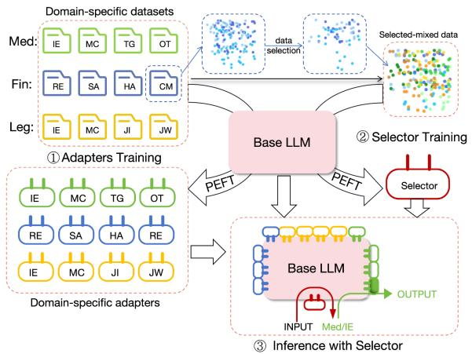
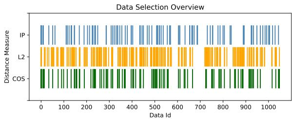
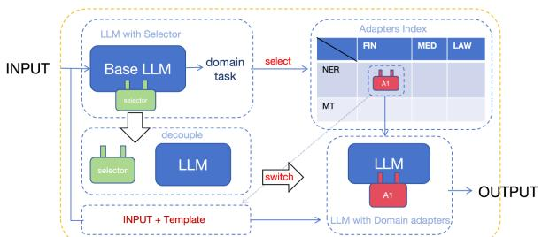
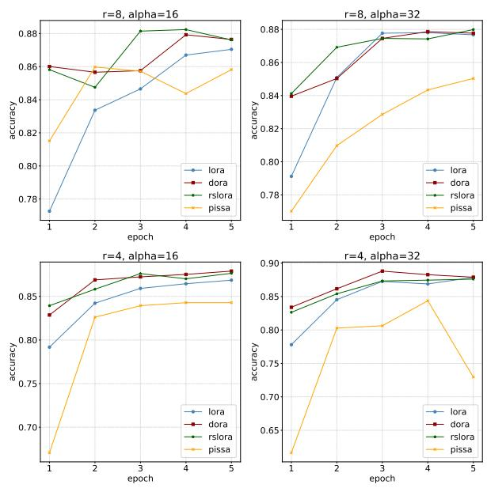

# Adapters Selector: Cross-domains and Multi-tasks LoRA Modules Integration Usage Method

Yimin Tian2, Bolin Zhang 1\*, Zhiying Tu2, Dianhui Chu2

1Harbin Institute of Technology, Harbin, China

2Harbin Institute of Technology, Weihai, China

Correspondence: 23S130398@stu.hit.edu.cn, brolin@hit.edu.cn, tzy\_hit@hit.edu.cn, chudh@hit.edu.cn

## Abstract

Parameter-Efficient Fine-Tuning (PEFT) adapts large language models (LLMs) to specific domains by updating only a small portion of the parameters. Although fine-tuning on a single task within a specific domain has demonstrated promising results, there remains limited exploration on how to effectively integrate these adapters for optimal performance. In this paper, we propose Adapters Selector (AS): a novel framework for better integrating usage of multiple adapters by training a middleman adapter to select the appropriate adapter for inference. Our framework utilizes PEFT to train a selector that determines which input content corresponds to which task in which domain, and subsequently selects the homologous adapter. By the way, The AS has developed the capability to execute cross-domain multitasks effectively through the utilization of a compact model in combination with multiple LoRA modules. Our code is publicly available at https://github.com/tirant35/TASA.

## 1 Introduction

In recent years, large language models have demonstrated unprecedented performance in various natural language processing tasks and domain adaptation. If aiming to achieve significant breakthroughs in a specific domain, it is a common strategy to fine-tune pre-trained large language models with small, high-quality domain-specific data(Chung et al., 2024; Ouyang et al., 2022).

To minimize the hardware expenses for domainspecific training, a method known as parameterefficient fine-tuning(Ding et al., 2023; Mangrulkar et al., 2022) is commonly employed to replace full parameter training in domain-specific training. PEFT optimizes only a small subset of model parameters while freezing the rest, thereby significantly reducing existing requirements and training costs. Numerous PEFT methods have been proposed, including LoRA(Hu et al., 2021), Adapter(Houlsby et al., 2019), Prompttuning(Lester et al., 2021), Prefix-tuning(Li and Liang, 2021), IA3(Liu et al., 2022), Bitfit(Zaken et al., 2021), their variants(Wang et al., 2022; Zhang et al., 2023; Liu et al., 2024b; Kalajdzievski, 2023; Meng et al., 2024; Wang et al., 2024b; Rücklé et al., 2020; Pfeiffer et al., 2020; Hu et al., 2023; Mahabadi et al., 2021) or combinations(Mao et al., 2021; He et al., 2021) and more.

In comparison with other fine-tuning methods, LoRA and its variants offer several advantages: 1) they are highly modular and easily mergeable and separable; 2) they demonstrate strong performance even when the amount of training data is consistent. Despite LoRA’s capability to handle large model domain tasks, there remains an unexplored potential for combining these modules for multi-task scenarios. Conflicting knowledge from various disciplines makes it challenging for LoRA modules from different suppliers to concurrently support the same LLM. The question persists: can the combination of these LoRA modules maximize the domain-specific impact of each adapter to its fullest extent on a single model?

However, existing methodologies often exhibit limitations when applied to cross-domain multitask scenarios(Crawshaw, 2020; Zhang and Yang, 2021). While these approaches adapt to the multitask environment through information sharing and increased adapters’ connections(Wang et al., 2023a, 2022, 2023c), they also incur training costs and introduce inference delays(Chen et al., 2024b). Furthermore, alternative joint training methods utilizing multi-LoRA(Wang et al., 2023b; Gao et al., 2024; Dou et al., 2024) have not yet been proposed as suitable solutions for addressing cross-domain multi-task scenarios.

Therefore, the objective of this article is to incorporate domain-specific adapters into a base model while preserving the domain-specific performance of each adapter and enabling flexible switching of different LoRA modules. The LoRA method was utilized to individually fine-tune the base model using these datasets in order to obtain multiple domain-specific fine-tuning weights (Section 3.2). Subsequently, a unique data selecting method was employed to filter and merge datasets of equivalent sizes representing both the domain and task from each task’s dataset. Through this hybrid representation dataset, PEFT fine-tuning of the base model resulted in an adapter capable of recognizing both the domain and task, which we refer to as a Selector (Section 3.3). The utilization of a selector maintains adapters’ respective capabilities without the need for multitasking fine-tuning.

The main contributions of this work are summarized as follows:

• We propose the integration usage method of PEFT fine-tuning modules into LLMs for cross-domain multi-task scenarios, with domain and task selection facilitated by Selector.

• We propose a Kmeans-based data selection method for Selector training and updating, which utilizes the output vectors from the embedding layer of the base model to calculate the distances between different sample.

• Adapters and selectors are trained separately on a small model using multi-domain and multi-task datasets, and we suggest a joint inference method for adapters and selector.

## 2 Related Work

## 2.1 PEFT

The PEFT method decreases the hardware requirements for model fine-tuning by significantly reducing the trainable parameters and optimizing the state cached in memory. The reduction of trainable parameters results in a smaller solution space, enabling the PEFT method to achieve comparable tuning performance by exploiting local optima of the pre-trained model.

LoRA(Hu et al., 2021) and its derivatives stand out among numerous PEFT methods due to their high performance. LoRA injects trainable rank decomposition matrices into each layer of the Transformer architecture; rsLoRA(Kalajdzievski, 2023) adds rank stabilization scaling factor; DoRA(Liu et al., 2024b) optimizes the size and direction of the weights separately; PiSSA(Meng et al., 2024) initializes the dominant singular values and singular vectors for training these matrices.

## 2.2 Multi-Task Learning with PEFT

The utilization of PEFT in multi-task learning(Crawshaw, 2020; Zhang and Yang, 2021) has also resulted in the following advancements:

Adapters are used for code summarization across different programming languages(Wang et al., 2023a). HyperFormer(Mahabadi et al., 2021) utilizes shared hypernetworks across layers and tasks to assign task-specific weights to adapter activations(Hu et al., 2023). Multitask Prompt Tuning (Wang et al., 2023c)enhances prompt tuning by initially extracting adapted source prompts for different tasks and then refining them with low-rank updates. In the context of vision, MT-LoRA(Agiza et al., 2024) is utilized in a hierarchical transformer-based MTL architecture to tailor it for multiple downstream dense prediction tasks. MFTCoder(Liu et al., 2024a) enables simultaneous and parallel fine-tuning on multiple tasks.

However, the utilization of PEFT multi-tasking is centered on dataset construction and synchronous learning, posing challenges in maintaining optimal data performance across various fields. Our framework retains all the information within the data, ensuring optimal performance across various domains and tasks.

## 2.3 LoRA Integration for Multi-Task Learning

New methods for training LoRA module combinations have emerged recently. LoraHub(Huang et al., 2023) manages new tasks by integrating the module weights of the current tasks. Various sophisticated mixture of expert networks combined with LoRA modules(Liu et al., 2023a; Gao et al., 2024; Dou et al., 2024; Feng et al., 2024; Zadouri et al., 2023; Li et al., 2024) make LoRA capable of dealing with multi-task scenarios, but require special moe training methods or structures. These methods necessitate a trade-off between optimizing performance for a specific task and the ability to handle multiple tasks simultaneously.

## 3 Approach

In this section, we provide a detailed introduction to the definition and function of our Adapter Selector(AS), elucidating the rationale behind its utilization methodology, the method for its training, and the process of its updating.

## 3.1 Overview of the Framework

Our proposed framework—AS, depicted in Figure 1, incorporates a selector and multiple adapters. Fine-tuning of models using multi-domain and multi-task datasets is conducted to optimize performance for specific tasks. The mixed representation dataset is utilized for training the selector to identify the domain and task of model inputs. Subsequently, the fully equipped model, including one selector and all adapters, is capable of executing activities in accordance with the reasoning process.

## 3.2 Adapters

In our framework, adapters are trained on data from a single task within a specific domain. There is no requirement for multi-task data construction and data balancing; only the unique strengths of each dataset should be utilized and integrated into the weights trained by PEFT. The LoRA method(Hu et al., 2021) is employed to train each adapter in our work for remarkable effects, but it is not restricted to using a single PEFT method. During domain-specific training, any variant of LoRA or other fine-tuning methods can be utilized, even in the presence of conflicts between the two methods. This is due to our method employing a single adapter combined on the model during inference.

## 3.3 Selector Training Method

We conduct data selection on datasets from various sources to train the Selector, with a focus on the key factors influencing the screening process being sentence embedding and distance measurement.

Data Selection Selecting from origin datasets is an efficient approach to reduce the cost of model training(Wang et al., 2024a). We apply the Kmeans method(Chen et al., 2023) with novel embedding method and distance measurement to select the training dataset for each task.

Initially, we use the sentence embedding method to embed the input of each data point, followed by clustering a specified number of cluster centers using Kmeans in this input-set. The set of cluster centers obtained represents the domain-task of this task in the input element of the data set. Simultaneously, with the domain and task as output, we can construct the representation data set for this task. The representation datasets for all tasks are combined and reordered to create a dataset used for selector training, ensuring an equal amount of data from each task.

  
Figure 1: The overall architecture of our proposed AS. The framework involves three processes. Firstly, every domain-specific task-specific dataset is used to fine-tune the model and obtain the adapters index. Secondly, each dataset should undergo data selection and the resulting subsets should then be randomly mixed with shuffling in order to train the selector. Finally, the adapter and selector are integrated into the base model for inference.

Algorithm 1 Data Selection Algorithm   
1: procedure KMEANS(k, D)   
2: $D ^ { \prime } = \{ a v e r a g e ( d [ i n p u t ] \cdot W _ { e m b e d d i n g } )$   
$d \in D \}$   
Select k initial centroids C   
$\left\{ c _ { 1 } , c _ { 2 } , \ldots , c _ { k } \right\} \subseteq D ^ { \prime }$   
4: repeat   
5: for i = 1 to |D′| do   
6: zi ← arg minj distance(xi, ci)   
7: end for   
8: for j = 1 to k do   
9: $\begin{array} { r } { c _ { j }  \frac { 1 } { | C _ { j } | } \sum _ { x \in C _ { j } } x } \end{array}$   
10: end for   
11: until centroids do not change or a maxi  
mum number of iterations is reached   
12: return C   
13: end procedure

We firstly compute the embedding vector for each input in the initial dataset D, and then initialize k, the number of selecting entries. Subsequently, we apply Kmeans clustering with a distance measure according to the specific steps outlined in Algorithm 1. Afterwards, we choose the set of vector data that is nearest to each cluster center as the ultimate representation of the dataset.

Sentence Embedding During the process of sentence embedding, we utilize the Embedding layer from a large language model (LLM) instead of an embedding model based on BERT.

  
Figure 2: The outcomes of applying the aforementioned data selecting method to the Chinese multi-choice question answering data in the financial domain in Section 4.3, utilizing three distance measures for comparison.

We observe that for certain adapter training tasks with a substantial amount of data, there is a significant time investment in generating sentence embeddings, whereas calculating with the embedding requires minimal time. Moreover, the upgrade in embedding dimension (from 768 of m3e(Chen et al., 2024a) to 3584 of Qwen2 embedding layer) and its ability to be completed using the summation method with very little memory requirement.

Distance Measure After obtaining the embedding vector, we offer three commonly used distance measures that can be easily calculated using kmeans methods: Euclidean distance (L2), inner product (IP), and cosine similarity (COS). Each of these measures can be utilized to meet different deployment requirements and various situations.

Let x = sentenceEmbedding(input ) and y = sentenceEmbedding(input ), where input and input are two different texts and x, y are the corresponding sentence embeddings. The three distance measures are computed as follows.

$$
\mathbf { L 2 } ( \mathbf { x } , \mathbf { y } ) = { \sqrt { \sum _ { i = 1 } ^ { n } ( x _ { i } - y _ { i } ) ^ { 2 } } }\tag{1}
$$

$$
\mathbf { I P ( x , y ) } = { \sqrt { \sum _ { i = 1 } ^ { n } x _ { i } y _ { i } } }\tag{2}
$$

$$
\mathbf { C O S ( x , y ) } = \frac { \sum _ { i = 1 } ^ { n } x _ { i } y _ { i } } { \sqrt { \sum _ { i = 1 } ^ { n } x _ { i } ^ { 2 } } \sqrt { \sum _ { i = 1 } ^ { n } y _ { i } ^ { 2 } } }\tag{3}
$$

Figure 2 illustrates a comparison utilizing the three distance measures. Measuring with IP will produce a limited number of results, while using L2 will yield a greater quantity, and employing COS will fall somewhere in between the two.

## 3.4 Updating Method

If the selector needs to adapt to a change or if there is an imbalance in task effects between domains, adjustments to the selector are necessary. We suggest fine-tuning again for updating the selector. Mixing new domain task data with the original training data simultaneously can effectively tackle this issue. The following are potential update operations for the selector based on changing requirements, along with the corresponding data selection method used for secondary fine tuning.

  
Figure 3: The specific steps of selection, switching, and inference using the inference flow of the AS framework simulate involve separating the model from the selector and combining it with the adapter selected by the selector to generate an output from an input with a domain-task-specific template or instruction.

Add To incorporate new adapters while preserving the original ones, it is necessary to apply data selection to the new data and integrate them. To maintain the original performance of the selector, this integrated data must retain a portion of the original training data for each original task.

Balance In the same domain, certain tasks with ambiguous data boundaries may lack clear differentiation, while other specific data can be effectively distinguished, necessitating the use of a balancing operation on the selector. We apply proportional data reduction for easily distinguishable tasks and data augmentation for less distinguishable tasks.

Delete When we remove any indistinguishable tasks or unbalanced tasks, we utilize data selection on the new data and integrate it with a portion of the task data that needs to be preserved.

## 3.5 Inference Process

Once the adapters and selector have been trained, they can be utilized for collaborative inference. The inference process begins by loading the selector along with all the adapters. The only additional component is an adapter dictionary, which comprises an index of adapters, with domain and task keys serving as identifiers, and the adapter weights as the corresponding values. The flow of the inference process is illustrated in Figure 3 in a straightforward and effective manner.

Adapter Selection After the initial input is processed by the base LLM alongside the selector, the model identifies its corresponding domain and task. Then we locate the appropriate adapter in the adapters index based on the domain and task determined by the selector.

Adapter Switching We initially decouple the model from the selector and subsequently integrate the selected adapter with the model.

Domain Inference Another function of the adapter index is to align chat templates or domainspecific instruction templates with input to enhance inference performance. Once the input is combined with its corresponding prompt, the model with adapter undergoes the inference process, resulting in the final output. After completion of a single inference, the base LLM recombines with the selector and remains in readiness for the subsequent inference request.

## 4 Experiment

## 4.1 Research Question

We design experiments to answer the following research questions (RQs)

RQ1. What different factors influence the effectiveness of AS? i.e. different quantities of tasks to be consolidated, different parameter configurations utilized in the LoRA training and data selecting processes. And does it offer advantages compared to other methods such as multi-task PEFT and MultiLoRA-like methods?

RQ2. Has the advancement of fine-tuning techniques, particularly the proposal of different iterations of the LoRA method, been advantageous for our framework?

RQ3. Does our proposed method of updating the selector through second fine-tuning demonstrate efficacy, and what are the impacts and consequences of each update operation?

RQ4. In an age of growing LLM diversity, can we develop selectors without Qwen2 and still achieve the same level of efficiency?

## 4.2 Comparison Models

We utilize LLM in conjunction with the applied AS framework, as well as various multi-task learning and multi-LoRA learning frameworks. In order to optimize the impact of these frameworks, we have curated datasets containing an equal number of tasks and utilizing identical LoRA parameters.

MFTCoder By leveraging a combination of diverse loss functions, MFTCoder(Liu et al., 2024a) adeptly tackles prevalent obstacles in multi-task learning of LoRA, including data imbalance and divergent convergence rates.

MoELoRA Training LoRA modules in the form of MoE leverages the benefits of both adaptability to multitasking and efficient parameter fine-tuning. Increasing the utilization of experts at higher layers will improve the efficacy of MoE-LoRA(Gao et al., 2024). We employ identical fine-tuning parameters for comparison with our framework.

## 4.3 Experiment Setup

The detailed scheme of our experimental design and implementation, as well as the comparison parameters of different training methods.

Dataset Selection We choose datasets from the prevalent application domains of LLMS, including medical, legal, and finance. The examples of the dataset can be found in the appendix B.

In the field of medical(Med), we initially chose the MedicalNLP dataset(Jin et al., 2021) for the Multiple-Choice Questions(MC) and a portion of the BioInstruct dataset(Tran et al., 2024) for the Information Extraction(IE). Furthermore, in order to simulate these ambiguous real-world tasks and investigate the effectiveness of the selector update method proposed in Section 3.3, we extracted two challenging and ambiguous tasks from BioInstruct: Text Generation(TG) and Question Answer(QA).

In the finance(Fin) sector, we utilize the Fin-GPT(Liu et al., 2023b) dataset and have specifically chosen four tasks, which are:Relation Extraction(RE),Sentiment Analysis(SA),Headline Analysis(HA),Chinese Multiple-Choice Questions(CM). The final task was selected to investigate the multilingual proficiency in task resolution.

In the legal(Legal) domain, we use the Legalbench dataset(Guha et al., 2024), four tasks were extracted from them: Multiple-Choice Questions(MC), Information Extraction(IE), Judging Correct or Incorrect(JW), and Judging Relevant or Irrelevant(JI).

Metrics We evaluate Selector based on its ability to accurately assess the domain and task. The selector’s accuracy(acc.) in assessing domains and tasks is on par with the adapter’s retention of domain capabilities. We employ distinct evaluation metrics for various tasks. Some tasks are assessed for accuracy including MC in medical, all tasks in legal and all tasks except RE in financial.

<table><tr><td rowspan="2">selector</td><td rowspan="2">size</td><td rowspan="2">embedding</td><td rowspan="2">distance</td><td rowspan="2">acc.</td><td colspan="2">Med</td><td colspan="2">Legal</td><td colspan="2">Fin</td></tr><tr><td>ie</td><td>mc</td><td>ie</td><td>mc</td><td>re</td><td>sa</td></tr><tr><td>1</td><td>100*6</td><td>m3e</td><td>L2</td><td>0.802</td><td>0.974</td><td>1.00</td><td>0.828</td><td>0.999</td><td>0.238</td><td>0.775</td></tr><tr><td>2</td><td>100*6</td><td>m3e</td><td>IP</td><td>0.813</td><td>0.973</td><td>0.999</td><td>0.950</td><td>0.999</td><td>0.258</td><td>0.699</td></tr><tr><td>3</td><td>100*6</td><td>m3e</td><td>COS</td><td>0.744</td><td>0.909</td><td>1.00</td><td>0.679</td><td>0.999</td><td>0.684</td><td>0.193</td></tr><tr><td>4</td><td>500*6</td><td>m3e</td><td>L2</td><td>0.969</td><td>0.993</td><td>1.00</td><td>0.995</td><td>0.999</td><td>0.953</td><td>0.877</td></tr><tr><td>5</td><td>500*6</td><td>m3e</td><td>IP</td><td>0.959</td><td>0.987</td><td>1.00</td><td>0.995</td><td>0.999</td><td>0.959</td><td>0.812</td></tr><tr><td>6</td><td>500*6</td><td>m3e</td><td>COS</td><td>0.968</td><td>0.991</td><td>0.999</td><td>0.995</td><td>0.999</td><td>0.923</td><td>0.902</td></tr><tr><td>7</td><td>1000*6</td><td>m3e</td><td>L2</td><td>0.982</td><td>0.995</td><td>1.00</td><td>0.995</td><td>0.999</td><td>0.962</td><td>0.940</td></tr><tr><td>8</td><td>1000*6</td><td>m3e</td><td>IP</td><td>0.985</td><td>0.992</td><td>1.00</td><td>0.995</td><td>0.998</td><td>0.949</td><td>0.974</td></tr><tr><td>9</td><td>1000*6</td><td>m3e</td><td>COS</td><td>0.986</td><td>0.993</td><td>1.00</td><td>0.999</td><td>0.999</td><td>0.952</td><td>0.975</td></tr><tr><td>10</td><td>100*6</td><td>embed-layer</td><td>L2</td><td>0.841</td><td>0.978</td><td>1.00</td><td>0.986</td><td>0.999</td><td>0.498</td><td>0.588</td></tr><tr><td>11</td><td>100*6</td><td>embed-layer</td><td>COS</td><td>0.815</td><td>0.983</td><td>1.00</td><td>0.975</td><td>0.999</td><td>0.262</td><td>0.671</td></tr><tr><td>12</td><td>500*6</td><td>embed-layer</td><td>L2</td><td>0.971</td><td>0.993</td><td>0.999</td><td>0.994</td><td>0.997</td><td>0.912</td><td>0.931</td></tr><tr><td>13</td><td>500*6</td><td>embed-layer</td><td>COS</td><td>0.965</td><td>0.997</td><td>1.00</td><td>0.995</td><td>0.999</td><td>0.902</td><td>0.895</td></tr><tr><td>14</td><td>1000*6</td><td>embed-layer</td><td>L2</td><td>0.989</td><td>0.999</td><td>1.00</td><td>0.999</td><td>0.999</td><td>0.966</td><td>0.973</td></tr><tr><td>15</td><td>1000*6</td><td>embed-layer</td><td>COS</td><td>0.985</td><td>0.997</td><td>1.00</td><td>0.995</td><td>0.999</td><td>0.955</td><td>0.965</td></tr><tr><td>MTFCoder</td><td>一</td><td>1</td><td>1</td><td>0.607</td><td>0.756</td><td>0.302</td><td>0.740</td><td>0.364</td><td>0.540</td><td>0.936</td></tr><tr><td>MoE LoRA</td><td>一</td><td></td><td>一</td><td>0.524</td><td>0.746</td><td>0.218</td><td>0.703</td><td>0.360</td><td>0.390</td><td>0.728</td></tr><tr><td>Ours LLM+Selector14</td><td>1000*6</td><td>embed-layer</td><td>L2</td><td>0.722</td><td>0.875</td><td>0.675</td><td>0.553</td><td>0.622</td><td>0.652</td><td>0.953</td></tr></table>

Table 1: The LoRA method with $r = 8 , a l p h a = 1 6 ,$ , and dropout = 0.05 was employed for training across varying levels of data selecting, sentence embedding techniques, and Kmeans distance metrics, with the retention degree effect serving as an indicator for Selector. The final three lines compare domain metrics, attributing our results to the superior performance of the aforementioned selector with each adapter. The ‘−’ indicates that this method does not involve this factor.

Bertscore-F1(Zhang et al., 2019) value is used as a measure of relevance for other generation tasks(IE, TG, QA in medical and RE in financial).

Experimental Setting We initially finetune 6 tasks from three separate domains on Qwen2-7B. Subsequently, we train the selector through the AS framework, and set the number of selection for each dataset to 100, 500, and 1000 respectively. The embedding method utilizes both m3e model and model embedding layer, featuring an embedding size of 768 and 3584, while the distance measurement employes L2, IP, and COS as proposed in Section 3.3. We concurrently utilize multi-task LoRA and MoELoRA on the identical dataset for comparative analysis, with LoRA methods employing consistent parameters.

Afterwards, we evaluate advanced fine-tuning techniques and LoRA parameters in order to address RQ2. We configured the parameters r of LoRA as 4 and 8, and α as 16 and 32, respectively. The original LoRA(Hu et al., 2021), rsLoRA(Kalajdzievski, 2023), DoRA(Liu et al., 2024b), and PiSSA(Meng et al., 2024) were individually utilized for training the selector. In interpreting RQ3, we used different Base version models of similar size.

Finally, we examine the update functionality of our selector by comparing three update operations: add, balance, and delete. The experiment involves using different data retention ratios for secondary fine-tuning, specifically 10, 30 and 50 percent.

The devices, model Information and other parameters utilized are detailed in the appendix C.

## 5 Result and Analysis

In this section, we present and analyze the experimental findings of AS, followed by an attempt to address the RQs we formulated.

## 5.1 Main Results(RQ1)

The following selectors in Table1,2 have been trained with varying parameters for comparison.

We arrived at the same conclusion as Figure 2, indicating that when utilizing LLM’s Embedding layer and IP distance metric, the Kmeans algorithm selects a reduced number of results and fails to meet the training requirements of the selector.

AS performed well in the training of six tasks, and its performance improved as the number of selected datasets increased. Less data leads to imbalanced performance and the improvement from 500 to 1000 was not significant. In most cases, the performance of using embedding layer is 0.5% to 1% higher than using m3e. The experiment demonstrates that our framework yields superior performance compared to MFTCoder and MoELoRA.

<table><tr><td rowspan="2">selector</td><td rowspan="2">size</td><td rowspan="2">embedding</td><td rowspan="2">distance</td><td rowspan="2">acc.</td><td colspan="4">Med</td><td colspan="4">Legal</td><td colspan="4">Fin</td></tr><tr><td>ie</td><td>mc</td><td>tg</td><td>qa</td><td>ie</td><td>mc</td><td>ji</td><td>jw</td><td>re</td><td>sa</td><td>ha</td><td>cm</td></tr><tr><td>16</td><td>100*12</td><td>m3e</td><td>L2</td><td>0.781</td><td>0.536</td><td>1.00</td><td>0.125</td><td>0.525</td><td>0.958</td><td>0.996</td><td>0.966</td><td>0.977</td><td>0.879</td><td>0.479</td><td>0.947</td><td>0.981</td></tr><tr><td>17</td><td>100*12</td><td>m3e</td><td>IP</td><td>0.715</td><td>0.019</td><td>1.00</td><td>0.385</td><td>0.687</td><td>0.468</td><td>0.996</td><td>0.992</td><td>0.996</td><td>0.823</td><td>0.302</td><td>0.928</td><td>0.985</td></tr><tr><td>18</td><td>100*12</td><td>m3e</td><td>COS</td><td>0.807</td><td>0.253</td><td>1.00</td><td>0.468</td><td>0.581</td><td>0.943</td><td>0.996</td><td>0.992</td><td>1.00</td><td>0.913</td><td>0.589</td><td>0.943</td><td>1.00</td></tr><tr><td>19</td><td>500*12</td><td>m3e</td><td>L2</td><td>0.873</td><td>0.691</td><td>1.00</td><td>0.472</td><td>0.113</td><td>0.996</td><td>0.996</td><td>1.00</td><td>1.00</td><td>0.604</td><td>0.604</td><td>0.970</td><td>1.00</td></tr><tr><td>20</td><td>500*12</td><td>m3e</td><td>IP</td><td>0.868</td><td>0.434</td><td>1.00</td><td>0.600</td><td>0.521</td><td>0.977</td><td>0.996</td><td>1.00</td><td>1.00</td><td>0.928</td><td>0.97</td><td>0.992</td><td>1.00</td></tr><tr><td>21</td><td>500*12</td><td>m3e</td><td>COS</td><td>0.872</td><td>0.570</td><td>1.00</td><td>0.464</td><td>0.577</td><td>0.989</td><td>0.996</td><td>1.00</td><td>1.00</td><td>0.962</td><td>0.917</td><td>0.992</td><td>1.00</td></tr><tr><td>22</td><td>1000*12</td><td>m3e</td><td>L2</td><td>0.885</td><td>0.645</td><td>1.00</td><td>0.566</td><td>0.479</td><td>0.996</td><td>0.996</td><td>1.00</td><td>1.00</td><td>0.966</td><td>0.977</td><td>0.996</td><td>1.00</td></tr><tr><td>23</td><td>1000*12</td><td>m3e</td><td>IP</td><td>0.882</td><td>0.430</td><td>1.00</td><td>0.487</td><td>0.762</td><td>0.989</td><td>0.996</td><td>1.00</td><td>1.00</td><td>0.951</td><td>0.974</td><td>1.00</td><td>1.00</td></tr><tr><td>24</td><td>1000*12</td><td>m3e</td><td>COS</td><td>0.890</td><td>0.600</td><td>1.00</td><td>0.574</td><td>0.558</td><td>1.00</td><td>0.996</td><td>1.00</td><td>1.00</td><td>0.992</td><td>0.958</td><td>0.996</td><td>1.00</td></tr><tr><td>25</td><td>100*12</td><td>embed-layer</td><td>L2</td><td>0.788</td><td>0.253</td><td>1.00</td><td>0.747</td><td>0.196</td><td>0.974</td><td>0.996</td><td>1.00</td><td>0.996</td><td>0.683</td><td>0.747</td><td>0.872</td><td>0.989</td></tr><tr><td>26</td><td>100*12</td><td>embed-layer</td><td>COS</td><td>0.795</td><td>0.374</td><td>1.00</td><td>0.577</td><td>0.249</td><td>0.985</td><td>0.996</td><td>1.00</td><td>1.00</td><td>0.751</td><td>0.706</td><td>0.913</td><td>0.992</td></tr><tr><td>27</td><td>500*12</td><td>embed-layer</td><td>L2</td><td>0.873</td><td>0.630</td><td>1.00</td><td>0.479</td><td>0.502</td><td>0.996</td><td>0.996</td><td>1.00</td><td>1.00</td><td>0.951</td><td>0.921</td><td>1.00</td><td>1.00</td></tr><tr><td>28</td><td>500*12</td><td>embed-layer</td><td>COS</td><td>0.875</td><td>0.517</td><td>1.00</td><td>0.592</td><td>0.517</td><td>1.00</td><td>0.996</td><td>1.00</td><td>1.00</td><td>0.917</td><td>0.958</td><td>0.996</td><td>1.00</td></tr><tr><td>29</td><td>1000*12</td><td>embed-layer</td><td>L2</td><td>0.886</td><td>0.521</td><td>1.00</td><td>0.615</td><td>0.558</td><td>0.996</td><td>0.996</td><td>1.00</td><td>1.00</td><td>0.981</td><td>0.962</td><td>1.00</td><td>1.00</td></tr><tr><td>30</td><td>1000*12</td><td>embed-layer</td><td>COS</td><td>0.883</td><td>0.506</td><td>1.00</td><td>0.547</td><td>0.574</td><td>1.00</td><td>0.996</td><td>1.00</td><td>1.00</td><td>0.981</td><td>0.966</td><td>1.00</td><td>1.00</td></tr></table>

Table 2: When the number of tasks reaches 12, it affects the retention of selectors for domain tasks under different parameters. LoRA parameters as the training outlined in Table 1.

When the number of tasks is increased to 12, the data size rule still applies. Furthermore, the performance of embedding and m3e are comparable; the performance of tasks within legal and finance remains stable, with retention rates both above 90%. In Med, TG and QA are below 60%, impacting IE to below 65%. The performance of tasks in Med indicates that challenging tasks such as TG and QA will affect the performance of tasks within a single domain but have limited impact on those outside the domain, except for selector28 which affects the performance of SA tasks in Fin.

In actual scenarios, it is challenging to deploy more than 12 tasks on a single model, which would cause memory and load balancing problems.

## 5.2 Finetune Method(RQ2)

When comparing the performance improvement achieved by different fine-tuning methods, as depicted in Figure 4, it is evident that PiSSA’s performance is subpar due to the lack of specific parameters inherent to this method. RsLoRA demonstrates superior convergence speed and effectiveness when $r \ = \ 4$ , while DoRA outperforms at r = 8. Within the same fine-tuning method, LoRA and DoRA yield optimal results with r = 4 and $\alpha = 3 2 ;$ whereas rsLoRA and PiSSA perform best with $r = 8$ and $\alpha = 1 6$

## 5.3 Selector Update(RQ3)

The updated method is presented in Table 3, showing good performance of the add operation with only a 0.5% difference compared to selector28 under the same conditions while retaining the original data. However, the balance operation struggles to handle ambiguous tasks, as evidenced by a 33% decrease in IE performance when comparing origin and mix3, while TG performance increases by 23%. In practice, the best solution to distinguish between ambiguous tasks is simply to delete directly, as it retains 98.9% of the performance with only 0.1% retention of origin data.

  
Figure 4: The efficacy of various fine-tuning methods in selector training across different primary parameters. When r=8, the percentage of trainable parameters is 0.2643%(DoRA 0.2825%). For r=4, the percentage of trainable parameters is 0.1323%(DoRA 0.1506%).

## 5.4 Model Universality(RQ4)

Based on the findings presented in Table 4, it is evident that various models are capable of adapting to the AS framework. In particular, smaller models exhibit impressive performance, with Gemma-2B even surpassing Yi1.5-6B and Qwen2-7B. The best performing model in this experiment is Internlm2.5- 7B. However, according to the performance on Med, this model may struggle with tasks that involve easily confusing elements as well.

<table><tr><td rowspan="2">Selector</td><td rowspan="2">ratio</td><td rowspan="2">acc.</td><td rowspan="2">ie</td><td colspan="3">Med</td><td colspan="4">Fin</td><td colspan="4">Legal</td></tr><tr><td>mc</td><td>tg</td><td>qa</td><td>re</td><td>sa</td><td>ha</td><td>cm</td><td>ie</td><td>mc</td><td>ji</td><td>jw</td></tr><tr><td>add origin</td><td></td><td>0.965</td><td>0.997</td><td>1.00</td><td></td><td></td><td>0.995</td><td>0.999</td><td></td><td></td><td>0.903</td><td>0.896</td><td></td><td></td></tr><tr><td>add new</td><td>0</td><td>0.451</td><td>0.00</td><td>0.00</td><td>0.713</td><td>0.698</td><td>0.00</td><td>0.00</td><td>1.00</td><td>1.00</td><td>0.00</td><td>0.00</td><td>1.00</td><td>1.00</td></tr><tr><td>add mix 1</td><td>0.1</td><td>0.847</td><td>0.038</td><td>1.00</td><td>0.8</td><td>0.660</td><td>0.985</td><td>0.996</td><td>1.00</td><td>1.00</td><td>0.849</td><td>0.838</td><td>1.00</td><td>1.00</td></tr><tr><td>add mix 2</td><td>0.3</td><td>0.869</td><td>0.268</td><td>1.00</td><td>0.717</td><td>0.623</td><td>1.00</td><td>0.996</td><td>1.00</td><td>1.00</td><td>0.943</td><td>0.883</td><td>1.00</td><td>1.00</td></tr><tr><td>add mix 3</td><td>0.5</td><td>0.870</td><td>0.294</td><td>0.996</td><td>0.645</td><td>0.645</td><td>0.996</td><td>0.996</td><td>1.00</td><td>1.00</td><td>0.970</td><td>0.894</td><td>1.00</td><td>1.00</td></tr><tr><td>balance origin</td><td></td><td>0.875</td><td>0.623</td><td>1.00</td><td>0.415</td><td>0.543</td><td>1.00</td><td>0.996</td><td>1.00</td><td>1.00</td><td>0.962</td><td>0.958</td><td>0.996</td><td>1.00</td></tr><tr><td>balance new</td><td>0</td><td>0.451</td><td>0.00</td><td>0.00</td><td>0.713</td><td>0.698</td><td>0.00</td><td>0.00</td><td>1.00</td><td>1.00</td><td>0.00</td><td>0.00</td><td>1.00</td><td>1.00</td></tr><tr><td>balance mix 1</td><td>0.1</td><td>0.847</td><td>0.038</td><td>1.00</td><td>0.800</td><td>0.66</td><td>0.985</td><td>0.996</td><td>1.00</td><td>1.00</td><td>0.849</td><td>0.838</td><td>1.00</td><td>1.00</td></tr><tr><td>balance mix 2</td><td>0.3</td><td>0.869</td><td>0.268</td><td>1.00</td><td>0.717</td><td>0.623</td><td>1.00</td><td>0.996</td><td>1.00</td><td>1.00</td><td>0.943</td><td>0.883</td><td>1.00</td><td>1.00</td></tr><tr><td>balance mix 3</td><td>0.5</td><td>0.870</td><td>0.294</td><td>0.996</td><td>0.645</td><td>0.645</td><td>0.996</td><td>0.996</td><td>1.00</td><td>1.00</td><td>0.970</td><td>0.894</td><td>1.00</td><td>1.00</td></tr><tr><td>delete origin</td><td></td><td>0.875</td><td>0.623</td><td>1.00</td><td>0.415</td><td>0.543</td><td>1.00</td><td>0.996</td><td>1.00</td><td>1.00</td><td>0.962</td><td>0.958</td><td>0.996</td><td>1.00</td></tr><tr><td>delete 1</td><td>0.1</td><td>0.989</td><td>0.996</td><td>1.00</td><td>0.00</td><td>0.00</td><td>1.00</td><td>0.996</td><td>1.00</td><td>1.00</td><td>0.936</td><td>0.966</td><td>0.992</td><td>1.00</td></tr><tr><td>delete 2</td><td>0.3</td><td>0.989</td><td>0.996</td><td>1.00</td><td>0.00</td><td>0.00</td><td>1.00</td><td>0.996</td><td>1.00</td><td>1.00</td><td>0.974</td><td>0.932</td><td>0.992</td><td>1.00</td></tr><tr><td>delete 3</td><td>0.5</td><td>0.993</td><td>0.996</td><td>1.00</td><td>0.00</td><td>0.00</td><td>1.00</td><td>0.996</td><td>1.00</td><td>1.00</td><td>0.992</td><td>0.947</td><td>0.996</td><td>1.00</td></tr><tr><td>delete 4</td><td>1</td><td>0.992</td><td>1.00</td><td>1.00</td><td>0.00</td><td>0.00</td><td>1.00</td><td>0.996</td><td>1.00</td><td>1.00</td><td>0.974</td><td>0.951</td><td>0.996</td><td>1.00</td></tr></table>

Table 3: The precision of the selector for each domain and task following the completion of each update operation is achieved. The aforementioned training utilizes identical embedding method, distance metric, and LoRA parameters as the training outlined in Table 1. Column ratio corresponds to the retention rate of the data used in the first fine-tuning for the second fine-tuning. The ‘−’ indicates that this method does not consider this factor or task.

<table><tr><td rowspan="2">Model</td><td rowspan="2">acc.</td><td colspan="4">Med</td><td rowspan="2">Fin</td></tr><tr><td>ie</td><td>mc</td><td>tg qa</td><td>Legal</td></tr><tr><td>Qwen2-1.5B</td><td></td><td></td><td></td><td>|0.870|0.4381.00 0.592 0.525|0.997|0.974</td><td></td><td></td></tr><tr><td>Gemma2B</td><td></td><td></td><td></td><td>[0.877|0.400 1.00 0.645 0.596|0.999|0</td><td></td><td>0.972</td></tr><tr><td>Yi1.5-6B</td><td></td><td></td><td></td><td>[0.874|0.509 0.996 0.611 0.509|0.9980</td><td></td><td>|0.966</td></tr><tr><td>Qwen2-7B</td><td>[0.875|</td><td></td><td></td><td>50.6231.000.415 0.543|</td><td>0.999</td><td>0.979</td></tr><tr><td>Internlm2.5-7B</td><td>0.881</td><td></td><td></td><td>0.5471.000.570 0.577</td><td>0.999</td><td>0.971</td></tr><tr><td>Deepspeek-7B</td><td></td><td></td><td></td><td>[0.864|0.445 0.996 0.589 0.506</td><td>[0.992</td><td>0.966</td></tr><tr><td>Llama3-8B</td><td></td><td></td><td></td><td>[0.785|0.430 0.996 0.540 0.513|</td><td>[0.843</td><td>|0.892</td></tr><tr><td>Yi1.5-9B</td><td></td><td></td><td></td><td>[0.873|0.4301.00 0.558 0.615|0.999|</td><td></td><td>0.969</td></tr></table>

Table 4: Domain task effect retention degree of Selectors trained with base models of different sources and scales. During above trainings, the model’s embedding layer, cosine similarity and 500 cluster centers was utilized in data selecting. LoRA parameters as the training outlined in Table 1.

## 6 Conclusion

In this article, we introduce the AS framework, which employs a data selection method to acquire representative data and refine an adapter selector for adapter selection. Experiments have confirmed the effectiveness of this framework which demonstrates best practices.

The proposed LoRA modules integration usage method effectively addresses the challenge of uniting fine-tuning results with varying parameters over time, allowing for applications in multi-task scenarios to be independent from imbalanced datasets and fluctuating parameters. The incorporation of large model embedding layers also enhances the efficiency of training selectors without compromising effectiveness, while enabling single models to better adapt to cross-domain multi-task scenarios through the integration of numerous adapters.

## 7 Limitations

Having secured satisfactory outcomes in crossdomain multitasking, our framework faces certain constraints. Firstly, the two-switch delay and dual token generation during inference, albeit minimal with modern computing, require attention. The selector will add a prefill time and a three-tokens decoder time. We use the shortest prompt and the lowest number of output tokens to reduce the delay. Secondly, tackling ambiguous real-world tasks necessitates precise task segmentation. In order to simulate these ambiguous real-world tasks, we extracted two ambiguous tasks from BioInstruct: Text Generation(TG) and Question Answer(QA). We are constantly seeking avenues for further learning and innovation in these areas.

## Acknowledgements

This work is partially supported by the National Key R&D Program of China (2022YFF0903100), the National Natural Science Foundation of China (62472121), the Special Funding Program of Shandong Taishan Scholars Project.

## References

Ahmed Agiza, Marina Neseem, and Sherief Reda. 2024. Mtlora: Low-rank adaptation approach for efficient multi-task learning. In Proceedings of the IEEE/CVF Conference on Computer Vision and Pattern Recognition, pages 16196–16205.

Xiao Bi, Deli Chen, Guanting Chen, Shanhuang Chen, Damai Dai, Chengqi Deng, Honghui Ding, Kai Dong, Qiushi Du, Zhe Fu, et al. 2024. Deepseek llm: Scaling open-source language models with longtermism. arXiv preprint arXiv:2401.02954.

Zheng Cai, Maosong Cao, Haojiong Chen, Kai Chen, Keyu Chen, Xin Chen, Xun Chen, Zehui Chen, Zhi Chen, Pei Chu, et al. 2024. Internlm2 technical report. arXiv preprint arXiv:2403.17297.

Hao Chen, Yiming Zhang, Qi Zhang, Hantao Yang, Xiaomeng Hu, Xuetao Ma, Yifan Yanggong, and Junbo Zhao. 2023. Maybe only 0.5% data is needed: A preliminary exploration of low training data instruction tuning. arXiv preprint arXiv:2305.09246.

Jianlv Chen, Shitao Xiao, Peitian Zhang, Kun Luo, Defu Lian, and Zheng Liu. 2024a. Bge m3-embedding: Multi-lingual, multi-functionality, multi-granularity text embeddings through self-knowledge distillation. arXiv preprint arXiv:2402.03216.

Lequn Chen, Zihao Ye, Yongji Wu, Danyang Zhuo, Luis Ceze, and Arvind Krishnamurthy. 2024b. Punica: Multi-tenant lora serving. Proceedings of Machine Learning and Systems, 6:1–13.

Hyung Won Chung, Le Hou, Shayne Longpre, Barret Zoph, Yi Tay, William Fedus, Yunxuan Li, Xuezhi Wang, Mostafa Dehghani, Siddhartha Brahma, et al. 2024. Scaling instruction-finetuned language models. Journal ofMachine Learning Research, 25(70):1–53.

Michael Crawshaw. 2020. Multi-task learning with deep neural networks: A survey. arXiv preprint arXiv:2009.09796.

Ning Ding, Yujia Qin, Guang Yang, Fuchao Wei, Zonghan Yang, Yusheng Su, Shengding Hu, Yulin Chen, Chi-Min Chan, Weize Chen, et al. 2023. Parameter-efficient fine-tuning of large-scale pretrained language models. Nature Machine Intelligence, 5(3):220–235.

Shihan Dou, Enyu Zhou, Yan Liu, Songyang Gao, Wei Shen, Limao Xiong, Yuhao Zhou, Xiao Wang, Zhiheng Xi, Xiaoran Fan, et al. 2024. Loramoe: Alleviating world knowledge forgetting in large language models via moe-style plugin. In Proceedings of the 62nd Annual Meeting of the Association for Computational Linguistics (Volume 1: Long Papers), pages 1932–1945.

Abhimanyu Dubey, Abhinav Jauhri, Abhinav Pandey, Abhishek Kadian, Ahmad Al-Dahle, Aiesha Letman, Akhil Mathur, Alan Schelten, Amy Yang, Angela Fan, et al. 2024. The llama 3 herd of models. arXiv preprint arXiv:2407.21783.

Wenfeng Feng, Chuzhan Hao, Yuewei Zhang, Yu Han, and Hao Wang. 2024. Mixture-of-loras: An efficient multitask tuning for large language models. arXiv preprint arXiv:2403.03432.

Chongyang Gao, Kezhen Chen, Jinmeng Rao, Baochen Sun, Ruibo Liu, Daiyi Peng, Yawen Zhang, Xiaoyuan Guo, Jie Yang, and VS Subrahmanian. 2024. Higher layers need more lora experts. arXiv preprint arXiv:2402.08562.

Neel Guha, Julian Nyarko, Daniel Ho, Christopher Ré, Adam Chilton, Alex Chohlas-Wood, Austin Peters, Brandon Waldon, Daniel Rockmore, Diego Zambrano, et al. 2024. Legalbench: A collaboratively built benchmark for measuring legal reasoning in large language models. Advances in Neural Information Processing Systems, 36.

Junxian He, Chunting Zhou, Xuezhe Ma, Taylor Berg-Kirkpatrick, and Graham Neubig. 2021. Towards a unified view of parameter-efficient transfer learning. arXiv preprint arXiv:2110.04366.

Neil Houlsby, Andrei Giurgiu, Stanislaw Jastrzebski, Bruna Morrone, Quentin De Laroussilhe, Andrea Gesmundo, Mona Attariyan, and Sylvain Gelly. 2019. Parameter-efficient transfer learning for nlp. In International conference on machine learning, pages 2790–2799. PMLR.

Edward J Hu, Yelong Shen, Phillip Wallis, Zeyuan Allen-Zhu, Yuanzhi Li, Shean Wang, Lu Wang, and Weizhu Chen. 2021. Lora: Low-rank adaptation of large language models. arXiv preprint arXiv:2106.09685.

Zhiqiang Hu, Lei Wang, Yihuai Lan, Wanyu Xu, Ee-Peng Lim, Lidong Bing, Xing Xu, Soujanya Poria, and Roy Ka-Wei Lee. 2023. Llm-adapters: An adapter family for parameter-efficient finetuning of large language models. arXiv preprint arXiv:2304.01933.

Chengsong Huang, Qian Liu, Bill Yuchen Lin, Tianyu Pang, Chao Du, and Min Lin. 2023. Lorahub: Efficient cross-task generalization via dynamic lora composition. arXiv preprint arXiv:2307.13269.

Di Jin, Eileen Pan, Nassim Oufattole, Wei-Hung Weng, Hanyi Fang, and Peter Szolovits. 2021. What disease does this patient have? a large-scale open domain question answering dataset from medical exams. Applied Sciences, 11(14):6421.

Damjan Kalajdzievski. 2023. A rank stabilization scaling factor for fine-tuning with lora. arXiv preprint arXiv:2312.03732.

Brian Lester, Rami Al-Rfou, and Noah Constant. 2021. The power of scale for parameter-efficient prompt tuning. arXiv preprint arXiv:2104.08691.

Dengchun Li, Yingzi Ma, Naizheng Wang, Zhiyuan Cheng, Lei Duan, Jie Zuo, Cal Yang, and Mingjie Tang. 2024. Mixlora: Enhancing large language

models fine-tuning with lora based mixture of experts. arXiv preprint arXiv:2404.15159.

Xiang Lisa Li and Percy Liang. 2021. Prefix-tuning: Optimizing continuous prompts for generation. arXiv preprint arXiv:2101.00190.

Bingchang Liu, Chaoyu Chen, Zi Gong, Cong Liao, Huan Wang, Zhichao Lei, Ming Liang, Dajun Chen, Min Shen, Hailian Zhou, et al. 2024a. Mftcoder: Boosting code llms with multitask fine-tuning. In Proceedings ofthe 30th ACM SIGKDD Conference on Knowledge Discovery and Data Mining, pages 5430–5441.

Haokun Liu, Derek Tam, Mohammed Muqeeth, Jay Mohta, Tenghao Huang, Mohit Bansal, and Colin A Raffel. 2022. Few-shot parameter-efficient fine-tuning is better and cheaper than in-context learning. Advances in Neural Information Processing Systems, 35:1950–1965.

Qidong Liu, Xian Wu, Xiangyu Zhao, Yuanshao Zhu, Derong Xu, Feng Tian, and Yefeng Zheng. 2023a. Moelora: An moe-based parameter efficient finetuning method for multi-task medical applications. arXiv preprint arXiv:2310.18339.

Shih-Yang Liu, Chien-Yi Wang, Hongxu Yin, Pavlo Molchanov, Yu-Chiang Frank Wang, Kwang-Ting Cheng, and Min-Hung Chen. 2024b. Dora: Weightdecomposed low-rank adaptation. arXiv preprint arXiv:2402.09353.

Xiao-Yang Liu, Guoxuan Wang, Hongyang Yang, and Daochen Zha. 2023b. Fingpt: Democratizing internet-scale data for financial large language models. arXiv preprint arXiv:2307.10485.

Rabeeh Karimi Mahabadi, Sebastian Ruder, Mostafa Dehghani, and James Henderson. 2021. Parameterefficient multi-task fine-tuning for transformers via shared hypernetworks. arXiv preprint arXiv:2106.04489.

Sourab Mangrulkar, Sylvain Gugger, Lysandre Debut, Younes Belkada, Sayak Paul, and Benjamin Bossan. 2022. Peft: State-of-the-art parameterefficient fine-tuning methods. https://github. com/huggingface/peft.

Yuning Mao, Lambert Mathias, Rui Hou, Amjad Almahairi, Hao Ma, Jiawei Han, Wen-tau Yih, and Madian Khabsa. 2021. Unipelt: A unified framework for parameter-efficient language model tuning. arXiv preprint arXiv:2110.07577.

Fanxu Meng, Zhaohui Wang, and Muhan Zhang. 2024. Pissa: Principal singular values and singular vectors adaptation of large language models. arXiv preprint arXiv:2404.02948.

Long Ouyang, Jeffrey Wu, Xu Jiang, Diogo Almeida, Carroll Wainwright, Pamela Mishkin, Chong Zhang, Sandhini Agarwal, Katarina Slama, Alex Ray, et al.

2022. Training language models to follow instructions with human feedback. Advances in neural information processing systems, 35:27730–27744.

Jonas Pfeiffer, Aishwarya Kamath, Andreas Rücklé, Kyunghyun Cho, and Iryna Gurevych. 2020. Adapterfusion: Non-destructive task composition for transfer learning. arXiv preprint arXiv:2005.00247.

Andreas Rücklé, Gregor Geigle, Max Glockner, Tilman Beck, Jonas Pfeiffer, Nils Reimers, and Iryna Gurevych. 2020. Adapterdrop: On the efficiency of adapters in transformers. arXiv preprint arXiv:2010.11918.

Gemma Team, Morgane Riviere, Shreya Pathak, Pier Giuseppe Sessa, Cassidy Hardin, Surya Bhupatiraju, Léonard Hussenot, Thomas Mesnard, Bobak Shahriari, Alexandre Ramé, et al. 2024. Gemma 2: Improving open language models at a practical size. arXiv preprint arXiv:2408.00118.

Hieu Tran, Zhichao Yang, Zonghai Yao, and Hong Yu. 2024. BioInstruct: instruction tuning of large language models for biomedical natural language processing. Journal ofthe American Medical Informatics Association, page ocae122.

Deze Wang, Boxing Chen, Shanshan Li, Wei Luo, Shaoliang Peng, Wei Dong, and Xiangke Liao. 2023a. One adapter for all programming languages? adapter tuning for code search and summarization. In 2023 IEEE/ACM 45th International Conference on Software Engineering (ICSE), pages 5–16. IEEE.

Jiahao Wang, Bolin Zhang, Qianlong Du, Jiajun Zhang, and Dianhui Chu. 2024a. A survey on data selection for llm instruction tuning. arXiv preprint arXiv:2402.05123.

Shaowen Wang, Linxi Yu, and Jian Li. 2024b. Lora-ga: Low-rank adaptation with gradient approximation. arXiv preprint arXiv:2407.05000.

Yaqing Wang, Sahaj Agarwal, Subhabrata Mukherjee, Xiaodong Liu, Jing Gao, Ahmed Hassan Awadallah, and Jianfeng Gao. 2022. Adamix: Mixtureof-adaptations for parameter-efficient model tuning. arXiv preprint arXiv:2205.12410.

Yiming Wang, Yu Lin, Xiaodong Zeng, and Guannan Zhang. 2023b. Multilora: Democratizing lora for better multi-task learning. arXiv preprint arXiv:2311.11501.

Zhen Wang, Rameswar Panda, Leonid Karlinsky, Rogerio Feris, Huan Sun, and Yoon Kim. 2023c. Multitask prompt tuning enables parameter-efficient transfer learning. arXiv preprint arXiv:2303.02861.

An Yang, Baosong Yang, Binyuan Hui, Bo Zheng, Bowen Yu, Chang Zhou, Chengpeng Li, Chengyuan Li, Dayiheng Liu, Fei Huang, et al. 2024. Qwen2 technical report. arXiv preprint arXiv:2407.10671.

Alex Young, Bei Chen, Chao Li, Chengen Huang, Ge Zhang, Guanwei Zhang, Heng Li, Jiangcheng Zhu, Jianqun Chen, Jing Chang, et al. 2024. Yi: Open foundation models by 01. ai. arXiv preprint arXiv:2403.04652.

Ted Zadouri, Ahmet Üstün, Arash Ahmadian, Beyza Ermi¸s, Acyr Locatelli, and Sara Hooker. 2023. Pushing mixture of experts to the limit: Extremely parameter efficient moe for instruction tuning. arXiv preprint arXiv:2309.05444.

Elad Ben Zaken, Shauli Ravfogel, and Yoav Goldberg. 2021. Bitfit: Simple parameter-efficient fine-tuning for transformer-based masked languagemodels. arXiv preprint arXiv:2106.10199.

Qingru Zhang, Minshuo Chen, Alexander Bukharin, Nikos Karampatziakis, Pengcheng He, Yu Cheng, Weizhu Chen, and Tuo Zhao. 2023. Adalora: Adaptive budget allocation for parameter-efficient finetuning. arXiv preprint arXiv:2303.10512.

Tianyi Zhang, Varsha Kishore, Felix Wu, Kilian Q Weinberger, and Yoav Artzi. 2019. Bertscore: Evaluating text generation with bert. arXiv preprint arXiv:1904.09675.

Yu Zhang and Qiang Yang. 2021. A survey on multitask learning. IEEE transactions on knowledge and data engineering, 34(12):5586–5609.

## A Training Prompt

The majority of our experiments utilize the Qwen2- 7B-Base model, and during the training process, we employ the following prompt. Instruction, input and output are the three elements of the instruction data set.

Adapters:

<|im\_start|>system

{instruction}<|im\_end|>

<|im\_start|>user

{input}<|im\_end|>

<|im\_start|>assistant

{output}<|im\_end|>

## Selector:

input:{input}

Select from below list:

Domains:{domain\_list}

Tasks:{task\_list}

Results:

Domain:{output\_domain}

Task:{output\_task}

## B Domain Dataset

The following are illustrative examples of each dataset utilized for training.

## FinGPT:

Sentiment Analysis:

"instruction": "Determine the sentiment expressed in the news from financial perspective.Options: negative, positive"

"input": "Apple’s antitrust battle against Fortnite maker Epic Games is returning to the courtroom after both sides appealed last year’s ruling in a precedent setting case over Apple’s alleged anti-competitive behavior. Last year, a U.S."

"output": "negative"

## Relation Extraction:

"instruction": "What is the relationship between Lehman Brothers and investment in the context of the input sentence. Choose an answer from: product/material produced; manufacturer; distributed by; industry; position held; original broadcaster; owned by; founded by; distribution format; headquarters location; stock exchange; currency; parent organization; chief executive officer; director/manager; owner of; operator; member of; employer; chairperson; platform; subsidiary; legal form; publisher; developer; brand; business division; location of formation; creator."

"input": "Lehman Brothers LEH.N shares fell sharply on Monday on speculation that the investment bank could be bought for \$15 a share, a price well below current market levels."

"output": "industry"

## Headline Analysis:

"instruction": "Does the news headline talk about price going down? Please choose an answer from Yes/No."

"input": "april gold down 20 cents to settle at \$1,116.10/oz"

"output": "Yes"

## BioInstruct:

Information Extraction:

"instruction": "Provide a summary of the important information from a medical history."

"input": "Patient has a history of diabetes, hypertension, and hyperlipidemia."

"output": "The patient has a history of chronic conditions including diabetes, hypertension, and hyperlipidemia which require ongoing management."

## Question Answer:

"instruction": "Answer patient or caregiver questions about a specific medical condition or treatment plan."

"input": "Patient or caregiver questions about recovery following a surgery."

"output": "Answers to questions such as what to expect during recovery, how to manage pain, and when to contact the healthcare provider if symptoms worsen or new symptoms arise."

Text Generation:

"instruction": "Given a description of a diagnostic test or procedure, provide a patientfriendly explanation of how the test or procedure is performed and what the results may indicate."

"input": "Magnetic resonance imaging (MRI) scan."

"output": "An MRI scan is a diagnostic test used to create detailed images of the inside of the body. During the procedure, you will lie on a table and be moved into the scanner, which uses powerful magnetic fields to create the images. Results of an MRI can help diagnose a variety of conditions such as tumors, joint injuries, or brain disorders."

## medQA:

multiple choice questions:

"instruction": "The following are multiple choice questions (with answers) about medicine."

"input": "Question:A 45-year-old woman comes to see you for a second opinion regarding an upcoming surgery for pancreatic insulinoma. While taking a surgical history, she tells you she previously had a pituitary tumor resected. For which additional neoplasms might you consider testing her?A. Medullary thyroid carcinomaB. PheochromocytomaC. Parathyroid adenomaD. Mucosal neuromaE. Multiple myeloma Answer:"

"output": "C. Parathyroid adenoma"

## Legalbench:

multiple choice questions:

"instruction": "Read the segment of a merger agreement and answer the multiplechoice question by choosing the option that best characterizes the agreement."

"input": "How long is the Tail Period?Option A: 12 months or longer Option B: Other Option C: within 12 months Option D: within 6 months Option E: within 9 months Merger Agreement: Section 7.02 Effect of Termination. (b) Company Payments. (i) If this Agreement is validly terminated (2) the Company (x) enters into a definitive Alternative Acquisition Agreement to effect any Competing Proposal or (y) consummates a Competing Proposal, (Page 25) Answer and only output A, B, C or D."

"output": "C. within 12 months"

Judging Correct or Incorrect:

"instruction": "Classify if the description of each clause is correct."

"input": "Clause: We do not receive your email address. Description: The policy describes collection of the user’s e-mail by a party to the contract. Answer and only output Correctör Ïncorrect ¨ ."

"output": "Incorrect"

Judging Relevant or Irrelevant:

"instruction": "Classify if the clause is relevant to answering the question"

"input": "Clause: Enhance other information we have about you directly or fromOther Sourcesto help us better understand you and determine your interests, and to Question: who will have access to my information? Answer and only output Irrelevant or Relevant."

"output": "Relevant"

Information Extraction:

"instruction": "From each excerpt, extract the names of the defendants that are companies."

"input": " 16. Plaintiff, as set forth in the attached Certification, acquired Axiom securities at artificially inflated prices during the Class Period and was damaged upon the revelation of the alleged corrective disclosures. 17. Defendant Axiom is incorporated in Nevada . The Company2019s principal executive offices ˘ are located at Room C, 15/F., Ritz Plaza, 122 Austin Road, Tsimshatsui, Kowloon, Hong Kong . Case 1:17-cv-04756 Document 1 Filed 06/22/17 Page 5 of 22 6 18. Defendant Riley (201cRiley˘ 201d) has served at all relevant˘ times as the Company2019s CEO, CFO and ˘ Director. Only answer with the company defendants names."

"output": "Axiom Holdings, Inc."

## C Training Parameters

The learning rate for training is set at 4e-4. Each selector has completed five epochs of training and the model max length is configured to 512. All experiments were performed on 3 NVIDIA 4090 GPUs with 24GB memory each.

In terms of model selection, the experiments conducted in response to RQ3 include the following models: Qwen2-1.5B/7B(Yang et al., 2024), Gemma-2B(Team et al., 2024), Yi1.5- 6B/9B(Young et al., 2024), Internlm2.5-7B(Cai et al., 2024), Deepspeek-7B(Bi et al., 2024), and Llama3-8B(Dubey et al., 2024).