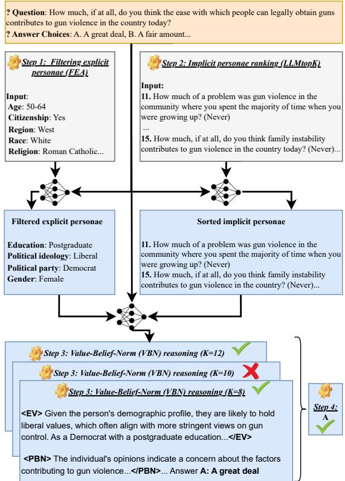
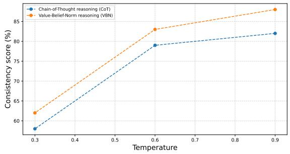
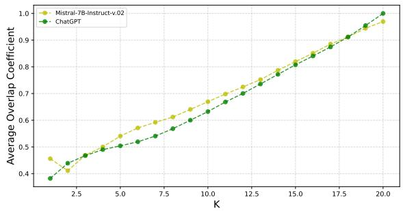
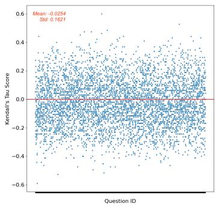
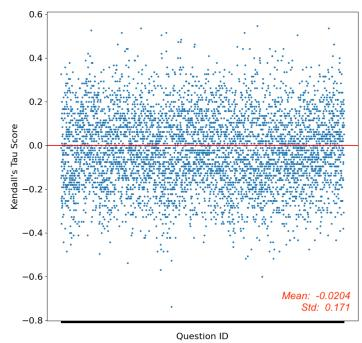
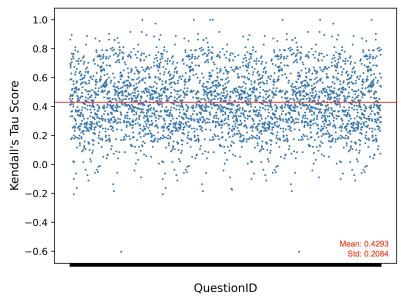
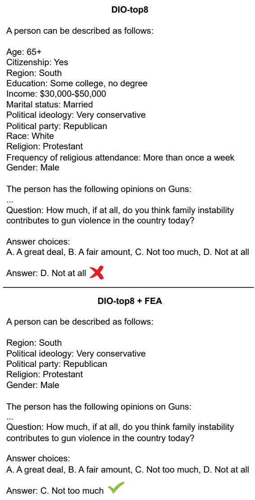
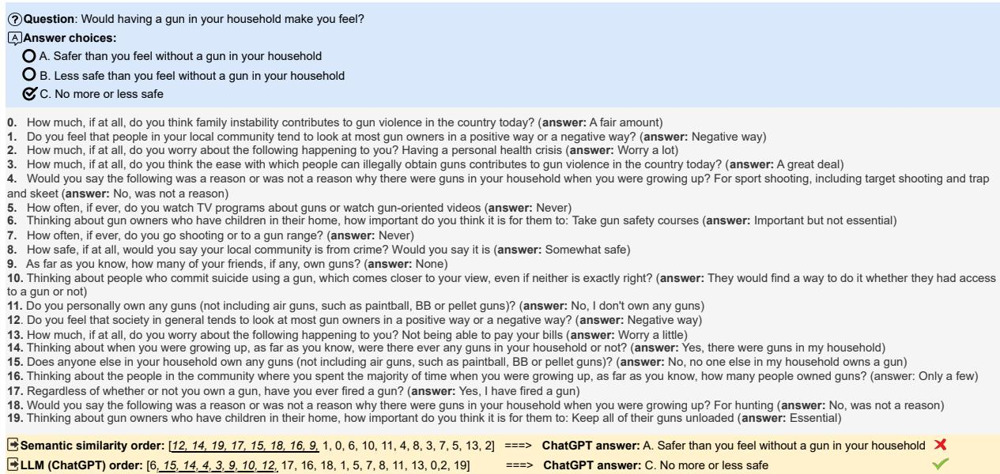
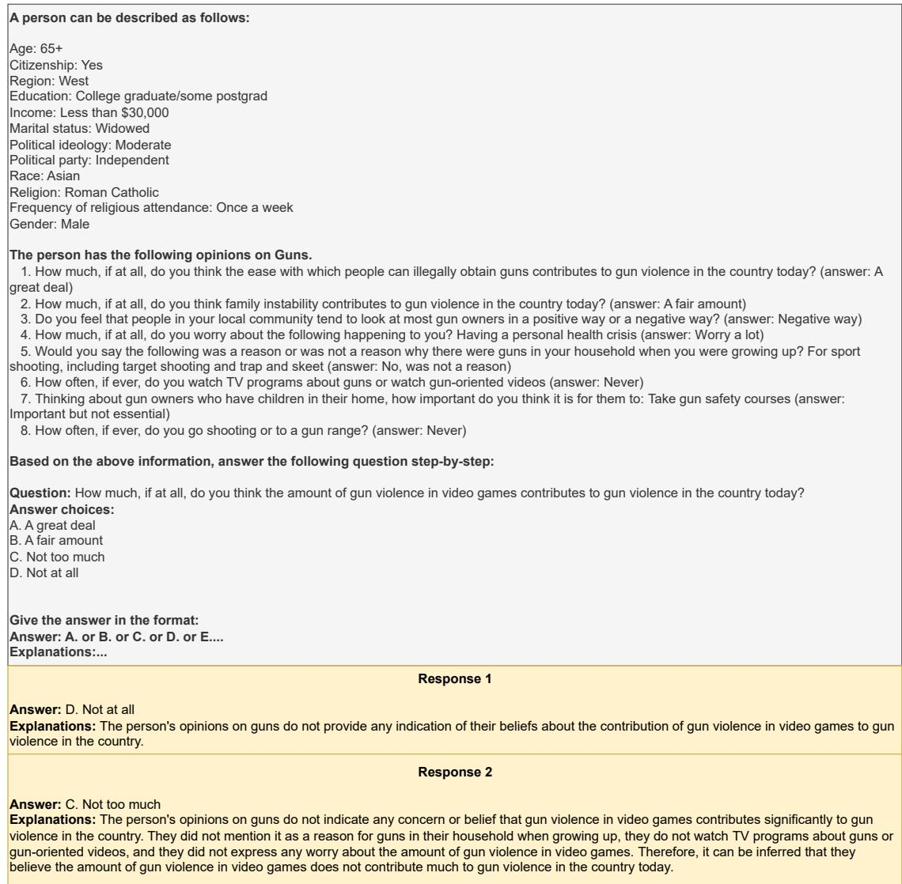
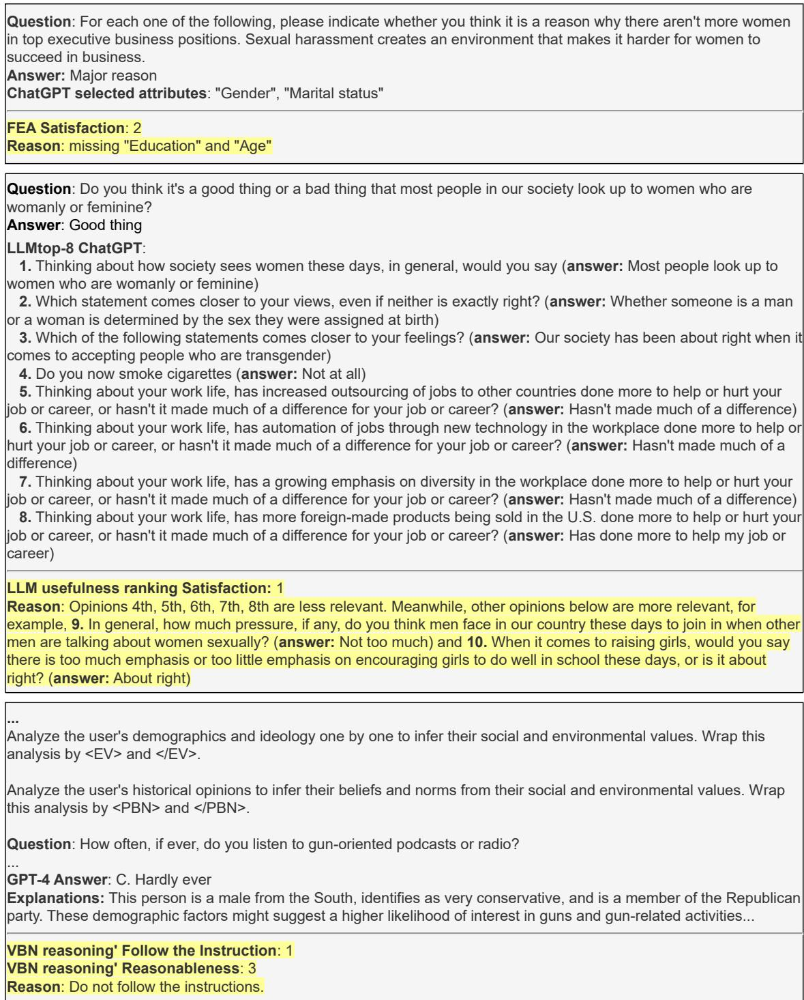

# Aligning Large Language Models with Human Opinions through Persona Selection and Value–Belief–Norm Reasoning

Do Xuan Long1,2, Kenji Kawaguchi1, Min-Yen Kan1, Nancy F. Chen2 1National University of Singapore,

2Institute for Infocomm Research (I2R), A\*STAR xuanlong.do@u.nus.edu, {kenji,knmnyn}@nus.edu.sg, nfychen@i2r.a-star.edu.sg

## Abstract

Reasoning and predicting human opinions with large language models (LLMs) is essential yet challenging. Current methods employ roleplaying with personae but face two major issues: LLMs are sensitive to even a single irrelevant persona, changing up to 30% of the predictions; and LLMs fail to reason strategically over personae. We propose Chain-of-Opinion (COO1), a simple four-step solution modeling which and how to reason with personae, inspired by the Value–Belief–Norm (VBN) theory. COO differentiates between explicit personae (demographics and ideology) and implicit personae (historical opinions), involves: (1) filtering irrelevant attributes from explicit personae; (2) ranking implicit personae into a preferential list for selecting top-k; (3) applying novel VBN reasoning to extract user environmental and personal value, belief, and norm variables for accurate and reliable predictions; and (4) iterating VBN reasoning with progressively larger lists of implicit personae to handle potential persona insufficiency. COO efficiently achieves new state-of-the-art opinion prediction via prompting with only 5 inference calls, improving prior techniques by up to 4%. Notably, fine-tuning LMs with COO’s data results in significantly better opinion-aligned models, by up to 23%.

## 1 Introduction

Pre-trained large language models (LLMs) are becoming indispensable tools, serving in various assistant roles such as dialogue agents (OpenAI, 2022; Google, 2022) and data analysts (Cheng et al., 2023). Notably, they demonstrate the capability to model distinct opinions that influence response generation (Bai et al., 2022; Glaese et al., 2022; Santurkar et al., 2023). Unfortunately, their opinions are shaped by extensive training data, which are themselves influenced by countless human perspectives and thus challenging to comprehend. As human–AI interactions grow, instructing models to reason in alignment with human opinions is crucial for effective personalization.

Although fine-tuning alignment methods such as RLHF (Christiano et al., 2017; Ouyang et al., 2022) are widely employed, their application to personalized opinions remains challenging due to the significant compute and data required. Prompt-based roleplaying frameworks using personae have emerged as alternatives. Early work in this direction focused on aligning models with social groups rather than individuals (Perez et al., 2023; Santurkar et al., 2023). However, Santurkar et al. (2023) found that simple persona-based prompting exhibits low steerability, even for well-represented groups. Further, Hwang et al. (2023) revealed significant opinion variation among individuals with similar demographics, underscoring the challenge of aligning LLMs to individual opinions. They subsequently proposed a naïve solution to model individuals by incorporating the user’s demographics and ideology (we term these explicit personae), alongside their historical opinions (implicit personae).

While naïvely incorporating explicit and implicit personae into the prompt shows promise for individualization (Santurkar et al., 2023; Hwang et al., 2023), this approach is suboptimal. Both persona types include ones that may be irrelevant to the opinion of interest, such as the “Citizenship” for the “Gun” question in Fig. 1. This poses a problem as we observe that LLMs are highly sensitive to such noise (detailed in §3), highlighting the task of relevant persona selection as important yet unsolved. Moreover, effective reasoning over explicit and implicit personae for opinion prediction is challenging: we find that Chain-of-Thought (Wei et al., 2022; Kojima et al., 2022) unexpectedly fails to improve opinion prediction in LLMs, due to reasoning inconsistencies.

In line with the Value-Belief-Norm (VBN) theory (Stern et al., 1999) which asserts that values, beliefs, and norms influence human behavior distinctly, we argue that the explicit and implicit personae should be processed and utilized differently. The explicit offers clear insights into user environmental values (binary relevancy), while the implicit reveals nuanced and context-specific beliefs and norms shaped by personal experiences (complex relevancy). Building on this, we introduce Chainof-Opinion (COO, Fig. 1), a novel four-step framework that optionally leverages both persona types to address the above challenges: (1) an LLM analyzes explicit personae to discard irrelevant ones; (2) the LLM ranks implicit persona opinions by usefulness and selects the top-K; (3) VBN reasoning where the LLM generates high-level environmental values from selected explicit personae and nuanced individual beliefs and norms from top-K implicit personae before deriving a prediction; and (4) COO applies VBN reasoning using varying K of implicit personae from step (2) to prevent the model from refusing to answer due to insufficient personae.

COO achieves state-of-the-art opinion prediction with persona-based prompting by just five inference calls (Appx. C.1). Moreover, fine-tuning with data from COO’s steps (1–3) enhances LMs by up to 23%, resulting in Flan-T5 base model (Chung et al., 2024) comparable with GPT-4 (OpenAI, 2023b). COO is highly generalizable in scenarios with missing personae (§6.1), and its four steps can motivate and be applicable to other personalized tasks involving explicit personae and user historical views (Appx. B.8).

## 2 Related Work

LLM role-play with personae. Aligning language models with human behavior via personae is a growing study area. Such alignment increases user satisfaction and personalization (Wang et al., 2023c; Chen et al., 2024). One line of work develops prompting techniques with user demographics, encouraging LLMs to output human-like responses. Argyle et al. (2023) showed that by properly conditioning LLMs with targeted identity profiles, they produce biased outputs that strongly correlate with human responses. Furthermore, Simmons (2023) claimed that LLMs are moral mimics: by giving models a political identity, they produce texts mirroring the associated moral biases. Nevertheless, Santurkar et al. (2023); Hwang et al. (2023) discovered that LLMs align poorly with human opinions, as evidenced by model performance using explicit and implicit personae on public opinion polls. We argue that this strategy is suboptimal (§1) due to noisy personae and the inefficient reasoning strategy employed. COO overcomes these limitations.

<table><tr><td></td><td>Type</td><td>Relevant persona</td><td>+1 less/irr relevant</td><td>+3 less/irr relevant</td><td>+all less/irr relevant</td></tr><tr><td>ChatGPT</td><td>Explicit Implicit</td><td>37.56 34.35</td><td>35.53↓ 33.84</td><td>34.51↓ 30.76↓</td><td>34.35↓ 31.28↓</td></tr><tr><td>LLaMa 3.1</td><td>Explicit Implicit</td><td>26.39 26.66</td><td>24.36↓ 25.12↓</td><td>23.85↓ 21.02↓</td><td>22.84↓ 23.08↓</td></tr></table>

Table 1: The performances of ChatGPT (gpt-3.5-turbo-0125) and LLaMa3 (8B 3.1-it) significant drop (approx. 1-6%) on Gun topic of OpinionQA (Santurkar et al., 2023) when less or irrrelevant personae added.

Reasoning with LMs via prompting. Largescale model architectures (Devlin et al., 2019; Radford et al., 2019; Brown et al., 2020; Chowdhery et al., 2023; Touvron et al., 2023) have enabled LLMs to excel at various reasoning NLP tasks via prompting (Wei et al., 2022; Khot et al., 2023; Zhou et al., 2023; Wang et al., 2023b; Shinn et al., 2023). Notably, Wei et al. (2022); Kojima et al. (2022) proposed the popular Chain-of-Thought (CoT) techniques, enabling LLMs to explicate intermediate reasoning steps, aiding the solving of multi-step reasoning tasks with higher fidelity and efficiency.

Can CoT analyze and predict human opinion effectively? Surprisingly, a naive application of CoT fails to improve GPT-X models (§5.2). We attribute this to the reasoning inconsistencies of CoT and the complexity of the task: strategic reasoning is essential to consistently fully utilize the nuanced explicit and implicit personae. Our VBN reasoning (§4) overcomes CoT’s limitations.

## 3 LLMs are Distracted by Irrelevant Personae

We study the sensitivity of LLMs to irrelevant personae which motivates COO in §4. This exploration is related to (Shi et al., 2023) but we quantify the LLM sensitivity to personae instead. We find that LLMs can be easily distracted by explicit or implicit personae that are less or irrelevant to opinion questions. To examine this, we perform a semi-human evaluation to assess the relevancy of personae on 197 randomly chosen Guns questions from the OpinionQA dataset (Santurkar et al., 2023). Each sample is denoted as {T, E, I, q, o, a} where T, E, and I indicate the topic, explicit personae (demographics and ideology), and implicit personae (historical opinions) of the user answering q with opinion options o and correct label a.

To assess the relevance of each explicit persona in E to q, we employ two native English undergraduates and ChatGPT (gpt-3.5-turbo-0125) (OpenAI, 2022). The annotators carefully examined q, a and labeled 12 attributes of E as relevant or irrelevant, determined by majority vote. The annotators achieve a good agreement of 60.2% Krippendorff’s alpha (Krippendorff, 2011). For implicit personae (n =∼ 20), assessing their relevance to q by manual means is costly. Therefore, we compute the semantic similarity between them and q using OpenAI text-embedding-ada-002 and label the top-8 as relevant and the rest as irrelevant.

We test four different setups for each type of personae: (i) using only relevant ones; (ii) including one, (iii) three, or (iv) all irrelevant ones. To ensure that our results are consistent, we use Self-Consistency (Wang et al., 2023b) with 5 times sampling. We experiment with both representative closed and open source LLMs: ChatGPT and LLaMa3 (Touvron et al., 2023).

Results in Tab. 1. Surprisingly, adding a single irrelevant explicit persona results in a prediction change of 30% for ChatGPT and 40% for LLaMa, with 2% performance drop for both. Meanwhile, adding one irrelevant implicit causes much smaller drops for both. Explaining this phenomenon, we have two hypotheses: first, both models rely more on explicit personae for opinion prediction; second, the so-called irrelevant implicit persona may still hold some relevance, as low semantic similarity does not entirely equate to low relevance (Appx. Fig. 6). Additionally, we observe that adding three/all irrelevant for both persona types significantly reduces performance by over 3-5% in absolute, indicating that irrelevant personae harm model predictions significantly.

## 4 COO: A Chain of Opinion Framework

These above findings suggest that for pre-trained LLMs, the choice of (relevant) personae as input is important and significantly impacts the model’s outcomes. Notably, we observe that training language models sees even greater benefits when incorporating only relevant personae. We introduce a simple and cost-efficient framework, termed Chainof-Opinion (COO) characterizing explicit and implicit personae for opinion prediction. COO serves as an intermediate data preprocessing step for finetuning and prompting. We assume optional access to the user’s explicit and implicit personae. Let $G _ { \mathcal { M } } : \mathcal { V } ^ { * } \to \mathcal { V } ^ { * }$ be the generation function of M where V is the model vocabulary, Q be the concatenation of the test question and its answer choices, and a be the correct label.

  
Figure 1: COO overview with four main steps marked with the nuts. It processes explicit and implicit personae parallelly to facilitate the missing personae scenarios.

## 4.1 COO in Prompting

As introduced in §1 and depicted in Fig. 1, COO distinctly processes explicit and implicit personae, motivated by the Value–Belief–Norm theory (Stern et al., 1999), and consists of four main steps: Step 1. Filtering explicit personae; Step 2. Ranking implicit personae; Step 3. Value-Belief-Norm (VBN) reasoning; and Step 4. Answer consistency with dynamic numbers of opinions.

Step 1. Filtering explicit personae (FEA). This step aims to binarily filter explicit personae (the set E, denoted in §3), including user demographics and ideology, for prediction. Irrelevant ones can harm the model performance significantly (§3), possibly because of LLM’s attention mechanism forcing the model to attend to all input tokens, including irrelevant ones. Since the relevancy of an explicit persona to a test question is apparent, we binarily filter out irrelevant explicit personae by instructing the LLM M to reason and analyze how each of them is helpful for the model to predict the opinion via Chain-of-Thought (Wei et al., 2022):

$$
E _ { r e l } : = G _ { \mathcal { M } } ( [ E , Q ] )\tag{1}
$$

The instruction for M is skipped in Eq. (1). Surprisingly, LLMs evaluate more than half of the explicit personae as irrelevant on average. We conduct human evaluations to examine this in §5, and provide an example in full in Appx. E.2 showing when considering all explicit personae, the model yields an incorrect prediction while removing unnecessary personae, it offers a correct one.

Step 2. Implicit personae opinions ranking (LLMtop-K). This step focuses on ranking and selecting implicit personae (I) consisting of user historical opinions for prediction. Identifying the most supportive ones for a test question is critical yet complex and often requires significant comprehension efforts. Hwang et al. (2023) utilized semantic-similarity between (q, i) to select implicit persona $\forall i \in I$ This strategy is suboptimal because the top semantic similarity opinions may not be the ones that provide the most supportive information for the models (Appx. E.2, also we hypothesized in §3). As LLMs are shown to be good data analysts (Wang et al., 2023a; Cheng et al., 2023), we propose to utilize LLMs to analyze and rank the implicit personae opinions in usefulness order:

$$
I _ { r e l } : = t o p _ { K } ( G _ { \mathcal { M } } ( [ I , Q ] ) )\tag{2}
$$

The instruction of M‘ is skipped in Eq. (2). We fix K when selecting top-K implicit personae rather than having LLMs directly select useful ones like COO’s Step 1 because implicit personae involve more complex and nuanced information with varying degrees of relevance, unlike the binary relevance of explicit personae (§1). Additionally, we input I to LLMs in a random order to enhance the versatility of our method. We validate this approach in §6. Our method prioritizes supportiveness in reasoning about opinions, unlike conventional demonstration selection focusing on semantic similarity or diversity (Xu et al., 2024c).

Step 3. Value-Belief-Norm reasoning (VBN). How can we best utilize $E _ { r e l }$ and/or $I _ { r e l }$ for opinion prediction? Popular prompting methods for reasoning, such as few-shot and zero-shot Chainof-Thought (CoT) (Wei et al., 2022; Kojima et al., 2022), typically instruct LLMs to reason step-bystep. However, for opinion prediction, a general step-by-step guide presents two key issues. First, the generated reasoning steps can be inconsistent, causing divergent outcomes, particularly at medium-high decoding temperatures $( \ge ~ 0 . 6 )$ (proven in §6.2 and Appx. E.2). This significantly undermines the reliability and accuracy of models. Second, step-by-step reasoning lacks interpretabil-$i t y ,$ as it remains unclear how models process and prioritize multiple explicit and implicit personae. When numerous opinions and personae are input, it is difficult to discern which were used in forming the prediction and which were disregarded.

Motivated by the Value-Belief-Norm (VBN) theory (Stern et al., 1999), which outlines the causal relationship chain {human pro-environmental values → beliefs → norms → behaviors}, we introduce VBN reasoning: the LLM sequentially analyzing personae in $E _ { r e l }$ and $I _ { r e l }$ to derive two variables, Environmental Values from explicit $E _ { r e l }$ and Personal Beliefs and Norms from implicit $I _ { r e l } .$ and the LLM then predicts the opinion aˆ based on these EV and PBN analyses:

$$
\mathrm { E n v . \ V a l u e s \to P e r . \ B e l i e f s \ a n d \ N o r m s }
$$

$$
\hat { a } : = G _ { \mathcal { M } } ( [ E _ { r e l } , I _ { r e l } , Q ] )\tag{3}
$$

(4)

Eq. (3) is achieved in a chain of thoughts:

(I1) Analyze the user’s demographics and ideology one by one to infer their social and environmental values.

(I2) Analyze the user’s historical opinions one by one to infer their beliefs and norms from their social and environmental values. (I3) Which opinion is the user likely to choose?

Fig. 1 shows an example of VBN reasoning. Note that the instruction $( I _ { 1 } ) / ( I _ { 2 } )$ is skipped if $E _ { r e l } / I _ { r e l }$ is unavailable. Our human evaluation in §5.2 confirms LLMs are capable of reasoning about human values, beliefs, and norms. This reasoning offers two notable advantages. First, for each question, we ensure that the model explains and analyzes the provided personae one by one thoroughly without omitting any, resulting in more accurate predictions. Second, this method helps the model to output more consistent reasoning explanations, enhancing model reliability (§6.2).

Step 4. Answer consistency with dynamic numbers of opinions. By fixing K in the LLMtop − K step, we observe that models such as GPT-4 (OpenAI, 2023b) may refuse to answer the question (Tab. 5). We attribute this to insufficient implicit personae provided. Inspired by Self-Consistency (SC) (Wang et al., 2023b), our approach involves sampling multiple answers using different K values for a given question. The most frequent answer, along with the explanation of the first correct answer, becomes the final prediction. Our method is distinct from SC which samples multiple answers with a fixed prompt. We only use three values of K {8, 10, 12} for efficiency.

## 4.2 COO in Fine-tuning

During fine-tuning, we adopt COO’s Steps 1, 2, 3 in §4.1 to create COO data. Each sample is denoted as {Erel, Irel, Env. Values, Beliefs and Norms, Q, a} where the model learns to predict a given the rest variables. Since these steps require LLMs with strong instruction-following capabilities, we use ChatGPT as the COO data processor.

## 5 Experiment

## 5.1 Experimental Settings

Dataset. We experiment on OpinionQA dataset (Santurkar et al., 2023) — the only open-sourced opinion QA dataset to date consisting of both user explicit and implicit personae designed for the assessment of alignment between LMMs’ opinions and human participants, encompassing a diverse range of 60 US demographic groups. We also note the MRFP dataset (Sun et al., 2023), which, due to privacy concerns, is unavailable for public access.

Dataset preprocessing. Due to limited resources, we follow Hwang et al. (2023) to sample a subset of OpinionQA for evaluation. We randomly select 25 users per topic for our experiments. We use 20% of the implicit questions for each user as the implicit persona. For the remaining 80% implicit questions, we randomly select a maximum of 15 implicit questions for testing. Our sampling method results in a total of 375 users and 5, 603 implicit evaluation question–answer pairs. Our subset is highly representative because we gather users from every topic and rigorous statistical tests further validate the significance of our results.

Baselines. For prompting experiments, we use both closed- and open-source LLMs: ChatGPT (OpenAI, 2022), ChatGPT-it (OpenAI, 2023a), GPT-4 (OpenAI, 2023b), and Mistral-7B-it-v.02 (Jiang et al., 2023) where each model performs all the COO’s steps. We compare COO with 5 prompting methods: W/o persona, where LLMs are evaluated without user historical opinions, ideology, or demographic data; Demographic + Ideology + top8 Opinions (DIO-top8), introduced by Hwang et al. (2023) which achieves state-of-the-art results on OpinionQA at that time; DIO-top8 + CoT is the Chain-of-Thought (CoT) prompting (Kojima et al., 2022) version of DIO-top8 by appending "answer the following question step-by-step" to prompts; DIO-top8 + SC is when we apply the Self-Consistency (Wang et al., 2023b) with CoT to DIO-top8; DIO-top8 + Self-refine (Madaan et al., 2023) interactively feedbacks and refines the answers by LLMs. For GPT-4, we only run the main experiment and use ChatGPT for FEA and LLMtop-K steps due to our limited budget. We provide all the prompt templates and cost analysis in Appx. C, implementation details in Appx. A, and more baselines in Appx. B.2.

For fine-tuning, we use ChatGPT to perform COO’s steps 1, 2 (K = 8), 3 as noted in §4.2 on a training set of 30, 000 samples randomly selected from OpinionQA which are different from our 5, 603 test ones. We then fine-tune and evaluate GPT-2 models (base, large) (Radford et al., 2019) and FlanT5 models (base, large) (Chung et al., 2024). The details are shown in Appx. A.

Automatic metrics. We employ Accuracy (Acc) and Collapsed Accuracy (CAcc)2 as the evaluation metrics following Hwang et al. (2023). Note that Precision/Recall/F1 is not applicable in our task, since the numbers of answer choices are not the same for all the OpinionQA samples.

Human metrics. Human evaluations are crucial due to the absence of automated metrics assessing LLMs’ performance in FEA, LLMtop-K, and VBN steps of COO. Therefore, we conduct our human assessments to address these research questions: (1) LLMs’ effectiveness in filtering unnecessary explicit personae; (2) LLMs’ proficiency in ranking implicit personae opinions; (3) LLMs’ ability to explain answers via VBN. We randomly select 100 answers generated by COO with ChatGPT,

<table><tr><td colspan="5">Prompting</td><td colspan="4">Fine-tuning</td></tr><tr><td>Model</td><td>ChatGPT</td><td>ChatGPT-it</td><td>Mistral-7B-it-v0.2</td><td>GPT-2-base</td><td>GPT-2-large</td><td>FlanT5-base</td><td></td><td>FlanT5-large</td></tr><tr><td>W/o personae</td><td>46.60 / 65.72</td><td>44.91 / 63.60</td><td>41.24 / 59.54</td><td>36.28 / 52.62</td><td>21.94 / 39.11</td><td>48.98 / 68.33</td><td></td><td>39.83 / 58.43</td></tr><tr><td>DIO-top8</td><td>50.22769.21</td><td>51.95771.16</td><td>44.16/62.47</td><td>21.23738.64</td><td>24.94/42.22</td><td></td><td>55.00774.98</td><td>54.94774.79</td></tr><tr><td>+ Self-refine</td><td>43.14 / 65.33</td><td>42.71 / 62.98</td><td>36.23 / 55.06</td><td></td><td></td><td></td><td></td><td></td></tr><tr><td>+ CoT</td><td>49.96 / 69.05</td><td>51.90 /71.51</td><td>52.25 / 71.95</td><td></td><td></td><td></td><td></td><td></td></tr><tr><td>+ CoT-SC</td><td>50.58 / 69.66</td><td>52.06 / 71.87</td><td>53.14 / 72.88</td><td></td><td></td><td></td><td></td><td></td></tr><tr><td>+ FEA (Step 1)</td><td>50.64/69.85</td><td>52.63/72.30</td><td>44.99/64.09</td><td>22.62/40.97</td><td>25.65 /45.21</td><td></td><td>55.78 /75.34</td><td>58.77/77.26</td></tr><tr><td>+ VBN (Step 3)</td><td>51.38 / 70.32</td><td>52.61 / 71.90</td><td>53.59 / 73.46</td><td>24.79 / 43.50</td><td>28.73 / 47.09</td><td></td><td>58.21 / 77.80</td><td>56.87 / 76.18</td></tr><tr><td>DIO-LLMtop8 (Step 2)</td><td>51.03 / 70.31</td><td>52.80 / 72.60</td><td>45.86 / 64.98</td><td>22.65 / 41.12</td><td>28.86 / 47.60</td><td></td><td>57.97 / 77.46</td><td>58.20 / 77.56</td></tr><tr><td>+ FEA (Step 1)</td><td>51.19 / 70.69</td><td>52.97 / 72.84</td><td>45.23 / 64.73</td><td>25.05 / 44.41</td><td>29.54 / 48.66</td><td></td><td>57.45 / 77.13</td><td>59.00 / 78.46</td></tr><tr><td>+ FEA + VBN</td><td>52.16 / 71.90</td><td>53.08 / 72.92</td><td>54.56 / 74.37</td><td>26.17 / 45.92</td><td>30.21 / 49.63</td><td></td><td>59.62 / 78.87</td><td>60.13 / 78.92</td></tr><tr><td>COO (ours)</td><td>52.66† / 72.75†</td><td>53.58†/73.80</td><td>54.40† / 74.26†</td><td>26.17† / 45.92†</td><td>30.21† / 49.63†</td><td></td><td>59.62† / 78.87†</td><td>60.13† / 78.92†</td></tr><tr><td>% w/ best baseline</td><td>+ 4.11 / + 4.43</td><td>+ 2.91 / + 2.68</td><td>+ 2.37 / + 2.57</td><td>+ 23.26 / + 18.84</td><td>+ 21.13 / + 17.55</td><td></td><td>+ 8.40 / + 5.18</td><td>+ 9.45 / + 5.52</td></tr></table>

Table 2: Accuracy (Acc) / Collapsed Accuracy (CAcc) experimental results. FEA, LLMtop8, and VBN are COO’s Steps 1 (explicit), 2 (implicit), and 3 (reasoning). † denotes our method outperforms baselines with p-value < 0.01 under t-test (Tab. 10).

ChatGPT-Instruct, GPT-4, and Mistral. We then hire 3 excellent undergraduates who are native English speakers as annotators. For FEA and LLMtop-K steps, each annotator is instructed to rate on a 1-3 scale (3 is best) via the Satisfaction criterion defined as how well the algorithm of LLMs performs in filtering/ranking, subjectively. To answer (3), we use two criteria named Reasonableness measuring how well the LLMs reason with the VBN explanations, and Follow the Instruction assessing the capability of LLMs in following our instruction to explain and predict the opinions. Three annotators are also guided to rate the criteria on a 1-3 scale. Each metric’s final score is the average of three annotators’ scores. The scoring instructions are in Appx. D.1 and the inter-annotators’ agreement is assessed by Krippendorff’s alpha (Krippendorff, 2011).

## 5.2 Main Results

We outline the prompting, fine-tuning, fine-grained, and human evaluation results of COO.

Prompting results. Tab. 2 shows our main experimental outcomes. For GPT-4, it attains 57.98% Acc with DIO-top8 and 59.42% with COO, establishing a strong SOTA result surpassing the previous of 53.74% (Hwang et al., 2023). Overall, COO delivers the best results with significant improvements of 2-4% Acc for all benchmarked LLMs with ChatGPT securing the most gain of 4.11%. Its component steps consistently enhance baselines with VBN > LLMtop8 > FEA on average.

Among prompting methods, we observe that naïve CoT helps Mistral slightly but harms Chat-GPT and ChatGPT-it, while SC improves all. We attribute this to the inconsistency and unreliability of CoT reasoning (4), and the challenge of this task.

Meanwhile, COO’s VBN reasoning consistently improves, verifying the effectiveness of requiring LLMs to explicitly analyze all the personae through values, beliefs, and norms. Additionally, self-refine consistently lowers model performance, indicating that multiple refinement rounds may be counterproductive for this complex task as these rounds may amplify the model’s inherent biases (Xu et al., 2024b), leading to more biased predictions.

Among models, notably, for GPT-4, we use ChatGPT for FEA and LLMtop-K steps, showcasing the strength of a weaker model that enhances a stronger one. Finally, ChatGPT, ChatGPT-it, and Mistral show improvements by selecting only 4.79/12 and 5.59/12, 8.83/12 explicit personae on average. This suggests that over half of explicit personae are noisy for model opinion prediction.

Fine-tuning results. Tab. 2 presents our finetuning results. Overall, leveraging COO’s FEA, LLMtop-K, and VBN extra variables results in significant improvements for both decoder-only and encoder-decoder models, with average gains of 22.20% for GPT-2s and 8.93% for FlanT5s. Among COO’s steps, FEA contributes the least, while LLMtop-K and VBN extra variables drive more substantial gains across most models.

The VBN extra variables can be seen as distilled knowledge from ChatGPT, intuitively enhancing fine-tuning results. However, notably, COO’s FEA and LLMtop-K, which focus on selecting relevant explicit and implicit personae, already deliver substantial improvements across all models, bringing FlanT5-large’s performance on par with GPT-4. This verifies our hypothesis that removing irrelevant personae is necessary for high performance.

Finally, GPT-2-base performs surprisingly well even without user demographics and ideology, possibly due to potential contamination (Sainz et al., 2023) with public polling data from OpinionQA.

<table><tr><td rowspan=1 colspan=1>Model</td><td rowspan=1 colspan=1>FEA Satis.</td><td rowspan=1 colspan=4>, LLMtopK Satis. VBN Rea.  VBN FI</td></tr><tr><td rowspan=4 colspan=1>ChatGPTChatGPT-itGPT-4Mistral</td><td rowspan=2 colspan=1> $2 . 5 6 _ { \alpha = 0 . 7 4 }$  $\pmb { 2 . 6 4 } _ { \alpha = 0 . 7 1 }$ </td><td rowspan=2 colspan=3> $2 . 3 2 _ { \alpha = 0 . 6 8 }$  $2 . 2 8 _ { \alpha = 0 . 6 5 }$ </td><td rowspan=1 colspan=1> $2 . 8 5 _ { \alpha = 0 . 8 8 }$   ${ \bf 2 . 9 1 } _ { \alpha = 0 . 9 0 }$ </td></tr><tr><td rowspan=1 colspan=2>0.65</td><td rowspan=2 colspan=1> $2 . 8 7 _ { \alpha = 0 . 9 0 }$   $\pmb { 2 . 9 5 } _ { \alpha = 0 . 8 7 }$  $\mathbf { 2 . 9 0 } _ { \alpha = 0 . 9 1 }$    $2 . 2 1 _ { \alpha = 0 . 7 7 }$ </td></tr><tr><td rowspan=1 colspan=1></td><td rowspan=1 colspan=3></td><td rowspan=1 colspan=1></td><td rowspan=1 colspan=1>2.9</td></tr><tr><td rowspan=1 colspan=1> $2 . 3 1 _ { \alpha = 0 . 6 5 }$ </td><td rowspan=1 colspan=3> $2 . 1 2 _ { \alpha = 0 . 6 4 }$ </td><td rowspan=1 colspan=1> $2 . 5 8 _ { \alpha = 0 . 6 8 }$   $2 . 1 6 _ { \alpha = 0 . 5 5 }$ </td></tr></table>

Table 3: Human evaluation results. LLMs perform adequately in COO’s FEA step, and excel in VBN reasoning, but face challenges with the LLMtop-K step. α denotes the Krippendorff’s alpha.

Fine-grained Results. We compare COO with the DIO-top8 baseline across 15 OpinionQA topics to assess its performance in detail. Overall, we see COO consistently outperforms DIO-top8 in most topics, with the largest improvements in “View on gender” (+17.69% with Mistral), “Autonomous vehicles” (+13.49 with GPT-2), and “Misinformation” (+11.61 with ChatGPT). These gains further emphasize COO’s effectiveness in enhancing LM performance on social and belief-driven topics, especially those involving complex reasoning. Full results are provided in Appx. Tab. 6.

Human evaluation results. For COO’s FEA and LLM ranking steps, from Tab. 3, ChatGPT and ChatGPT-it generally achieve similar performance and are better than Mistral: ChatGPT excels slightly in ranking while ChatGPT-it performs slightly better in performing FEA. Three models are proficient in FEA but struggle with the ranking task where the common error is misplacing relevant opinions, due to this task’s complexity. Second, four models effectively generate VBN reasoning thoughts, and GPT-4 performs the best. Finally, ChatGPT and ChatGPT-it follow our instructions to explain and analyze the explicit and implicit personae provided one by one with VBN significantly better than GPT-4 and Mistral, achieving nearly perfect scores of 3. Our hypothesis is they are optimized for following instructions, while GPT-4 is optimized for completing texts.

## 6 Discussion

We discuss the main analyses here, including COO generalization (§6.1) and COO’s Steps sequentially. Extra analyses are supplemented in Appx. B.

## 6.1 COO in Missing Personae Scenarios

COO demonstrates strong generalizability even when explicit, implicit, or both types of personae are missing. Specifically, in the absence of both, COO reduces to Self-consistency (Wang et al., 2023b); without explicit personae, only Step 1 of COO is skipped; without implicit personae, Step 2 is omitted. As shown in Tab. 4, COO consistently outperforms the leading baseline by an absolute margin of 2-3% in all scenarios. Finally, its steps can be generalizable to other tasks, see Appx. B.8.

<table><tr><td>Method</td><td>ChatGPT</td></tr><tr><td>W/o personae COO w/o personae (Step 4 activated)</td><td>46.60 47.79</td></tr><tr><td>DIO-top8 w/o explicit</td><td>49.22</td></tr><tr><td>COO w/o explicit (Steps 2, 3 (PBN), 4 activated)</td><td>51.66</td></tr><tr><td>DIO-top8 w/o implicit</td><td>47.16</td></tr><tr><td>COO w/o implicit (Steps  $I , 3 ( E V ) ,$  4 activated)</td><td>50.13</td></tr></table>

Table 4: COO’s results with missed persona(e) with ChatGPT. In all scenarios, COO outperforms the baselines significantly.

## 6.2 Method Analysis

FEA: ablation study. To gauge the impact of removing irrelevant explicit personae (FEA), we experiment with applying FEA exclusively to the baseline DIO-top8 (Hwang et al., 2023), denoted as DIO-top8 + FEA in Tab. 2. We observe a 1-2% Acc performance boost on ChatGPT, ChatGPT-it, and Mistral respectively. This underscores the effectiveness of eliminating irrelevant explicit personae in improving the model prediction.

FEA: irrelevant personae distribution. To understand the explicit personae filtered by LLMs across various topics, we document the top 3 removed personae in Appx. B.3. "Citizenship" is observed to be the most frequently removed attribute, followed by "Race". This could be due to LLMs treating these as sensitive information, prioritizing respect and unbiased text generation. Another explanation may be the lack of correlation between citizenship/race and opinions in the OpinionQA dataset. Additionally, we also see that ChatGPT often categorizes “Marital status" as non-useful, ChatGPT-it commonly removes “Frequency of religious attendance", and “Gender" got removed by Mistral, revealing potential biases in LLMs.

LLMtop-K: compared to semantic top-K. From Tab. 2, DIO-LLMtop8 outperforms DIO-top8 by 1 − 4% accuracy on ChatGPT, ChatGPT-it, and Mistral, confirming that prioritizing usefulness over semantic similarity improves model prediction. To further understand the difference between semantic similarity orders and usefulness orders, we discuss (1) the agreement of LLM orders and semantic similarity orders, and (2) maximum disagreement points between these orders.

In tackling (1), we calculate Kendall’s Tau coefficient (Kendall, 1938) between the orders generated by ChatGPT, ChatGPT-it, Mistrial, and semantic similarity orders, and the results are presented in Appx. Fig. 4. Surprisingly, for ChatGPT and ChatGPT-it, we find that the two ranking orders have no agreement with means approximating 0. For Mistral, we observe a low agreement with a mean of 0.43 score. These low and no agreements further verify that ranking by usefulness can be very different from ranking by semantic similarity.

For answering (2), Appx. E.2 illustrates one such case in the "Guns" topic. We observe that not all top-8 opinions by semantic similarity scores help predict the opinion. For example, the 16-th opinion, despite having a relatively high semantic similarity score with the question which might offer some perspective on the prevalence of guns in the user’s community during the upbringing, is less directly related to the question. This is similar to the 18-th opinion which is also less relevant. Meanwhile, several important opinions are deselected by the semantic-similarity-based method, such as the 6, 3, 4, 10-th ones, which are chosen by the LLM. The 6-th one is critical, and directly relevant because it assesses the person’s attitude toward safety measures related to gun ownership. Finally, by using the LLMtop-K order, the model predicts the opinion accurately, whereas the semantic similarity order leads to an incorrect prediction.

LLMtop-K: the order of input opinions. We study the (1) sensitivity and the (2) performance variance of LLMs to the order of input implicit personae in the LLMtop-K step.

To address (1), our discovery confirms sensitivity, but with reasonable overlap when K is sufficiently large $( K \ge 8 )$ . We randomly select 300 questions, shuffle implicit persona opinions four times with different seeds, and record four LLM ranking outputs for each. We also collect one more LLM ranking output by feeding implicit personae opinions in semantic similarity order. For each $K \in \{ 1 , 2 , . . . , 2 0 \}$ , we calculate the pairwise Overlap Coefficient (OC) (Vijaymeena and Kavitha, 2016) among the five ranking outputs, averaging them as the LLM ranking consistency score for each K. The scores, shown in Appx. Fig. 3, indicate that for $K \geq 8 .$ , the ranking outputs overlap well with a score of $\geq . 6$ for both models.

<table><tr><td rowspan=1 colspan=5>Model                     ChatGPT ChatGPT-it GPT-4Mistral</td></tr><tr><td rowspan=1 colspan=1>ITA of DIO-LLMtop8 + FEA + VBNDIO-LLMtop8 + FEA + VBN</td><td rowspan=1 colspan=1>0.2052.16</td><td rowspan=1 colspan=1>0.9153.08</td><td rowspan=1 colspan=1>3.4059.11</td><td rowspan=1 colspan=1>0.0054.56</td></tr><tr><td rowspan=1 colspan=1>ITA of DIO-LLMtop10 + FEA + VBNDIO-LLMtop10 + FEA + VBN</td><td rowspan=1 colspan=1>0.0051.89</td><td rowspan=1 colspan=1>0.0052.90</td><td rowspan=1 colspan=1>1.4358.88</td><td rowspan=1 colspan=1>0.0053.62</td></tr><tr><td rowspan=1 colspan=1>ITA of DIO-LLMtop12 + FEA + VBNDIO-LLMtop12 + FEA + VBN</td><td rowspan=1 colspan=1>0.0051.60</td><td rowspan=1 colspan=1>0.0052.03</td><td rowspan=1 colspan=1>0.0059.18</td><td rowspan=1 colspan=1>0.0054.21</td></tr><tr><td rowspan=1 colspan=1>COO</td><td rowspan=1 colspan=1>52.66</td><td rowspan=1 colspan=1>53.58</td><td rowspan=1 colspan=1>59.42</td><td rowspan=1 colspan=1>54.40</td></tr></table>

Table 5: Percentage of “Impossible To Answer” (ITA) (%) observed with corresponding performance during generation.

For (2), we find no significant performance variance. Specifically, we assess ChatGPT and Mistral with DIO-LLMtop8 on 3 out of 4 random seeds, detailed in Appx. B.5. The results demonstrate relatively small standard deviations in their performance, and critical values of 99% CI of DIO-LLMtop8 under t-test for both models surpass DIOtop8, confirming that LLMtop8’s effectiveness is not due to randomness.

VBN: compared to CoT. Tab. 2 indicates that Chain-of-Thought (CoT) (Kojima et al., 2022) slightly harms the performance for ChatGPT and ChatGPT-it. Conversely, our Value-Belief-Norm (VBN) reasoning enhances performance for all models. To investigate the consistency of CoT and VBN, we design an experiment with ChatGPT, DIO-top8 where we randomly select 100 questionanswer pairs and sample 5 answers per pair using CoT and VBN, at 3 different temperatures 0.3, 0.6, 0.9. We measure the percentage of questions that all 5 answers sampled have the same result, as the consistency score. The results are illustrated in Appx. Fig. 2 showing that VBN brings better consistent answers compared to CoT, especially when the temperature is high verifying VBN potentially enhances the reliability of LLMs.

Answer consistency with dynamic opinions. We study (1) how frequently LLMs are unable to answer the question and (2) the impact on performance when more than K = 8 opinions are provided. Tab. 5 provides the results. We find that with 8 opinions, GPT-4 exhibits the highest percentage of unanswered questions, while Mistral answers all the questions. Increasing the #opinions beyond 8 reduces this percentage across models, confirming our hypothesis regarding the lack of implicit personae opinions when fixing K = 8 in §4. Lastly, while increasing K could harm the model performance, COO’s answer consistency enables LLMs to achieve the best results across K values.

## 7 Conclusion

This paper identifies two major challenges in aligning LLMs with human opinions via personae: noisy personae and ineffective reasoning strategies over personae. To address these, we propose COO, a novel four-step framework in the light of the Value-Belief-Norm theory: the first two steps tackle the noise issue using LLMs as analysts, while the last two enhance reasoning through the novel VBN reasoning. COO significantly improves LLM prompting and fine-tuning, demonstrating high generalizability in scenarios with missing personae and potential applications in other personalization tasks.

## Acknowledgements

This research project is partially supported by the National Research Foundation Singapore under the AI Singapore Programme (AISG Award No: AISG2-TC-2023-010-SGIL), the Singapore Ministry of Education Academic Research Fund Tier 1 (Award No: T1 251RES2207), and the National Research Foundation, Singapore under its AI Singapore Programme (AISG Award No: AISG2- GC-2022-005). Do Xuan Long is supported by the A\*STAR Computing and Information Science (ACIS) Scholarship.

## Limitations

One limitation of COO is that it requires the LLMs to be well capable of following human instructions to solve tasks such as selecting explicit personae, ranking historical opinions, and explaining personae and opinions VBN reasoning. However, we foresee that this limitation is going to be overcome by cutting-edge AI language models, in the present and near future. Additionally, COO utilizes user’s personal information from explicit and implicit personae, which may be sensitive to some audiences and not be fully available in the real world. However, to what extent is the personal information provided, our COO is still able to offer reasonable opinion predictions since it is not constrained by the number of provided explicit personae, or the number of user historical opinions (see §6.1). Finally, for fine-tuning, COO currently leverages ChatGPT for data synthesis, which may pose challenges to replicability. To address this, we will open-source our generated data and code here. Future research could explore using opensource LLMs, which are increasingly powerful and comparable to proprietary models.

## Ethical Considerations

Characterizing and predicting human opinions with LLMs can be directly applied to personalize and align machines to users’ values, and cultural beliefs. Nonetheless, there exist unwanted situations when LLMs with our techniques can be misused for unethical purposes and biased opinions.

Bias amplification and fairness. A personalized LLM allows users to reinforce their existing beliefs and potentially amplify biased or unethical perspectives, leading to the creation of echo chambers (Del Vicario et al., 2016). This can ultimately harm users by reinforcing polarized or undesirable views. To mitigate this issue, the Chain-of-Opinion (CoO) reasoning from our proposed COO involves presenting user demography or ideology group responses alongside personalized answers. Additionally, COO can encourage users to reflect on their previous viewpoints.

Privacy and consent. Users may not always be aware of or have control over the extent of personalization applied to the content they receive. Therefore, empowering users to have control over AI-generated opinions is essential. Users should be able to customize and adjust the explicit and implicit personae used for opinion prediction. This customization can help mitigate potential biases and provide individuals with AI-generated opinions that align more closely with their values and preferences.

Using ChatGPT for data synthesis. We follow prior studies (Ray, 2023; Tan et al., 2024) to use OpenAI ChatGPT to synthesize data. Additionally, we obey OpenAI’s terms of use3 to use ChatGPT’s synthesized data to develop models that do not compete with OpenAI.

Misuse and responsibility for long-term societal impact. While our method aims to align opinions with individuals, it also introduces risks of misuse, such as the propagation of harmful ideologies or manipulating human opinions. While this is not what our method is designed for, there is no way to prevent this type of misuse. We emphasize the importance of ethical alignment in deploying these systems and suggest that developers and practitioners must establish robust guidelines and oversight mechanisms to prevent misuse. Furthermore, incorporating mechanisms to monitor and audit AI-generated content following ethical norms is crucial.

We also recognize potential risks of unintended societal consequences, such as fostering group biases or undermining collective decision-making processes. We also acknowledge the potential for unintended societal consequences, such as fostering group biases or undermining collective decision-making processes. To mitigate these risks, we recommend integrating ethical safeguards, including mechanisms to monitor and audit AI use, and fostering user awareness and diverse perspectives during model training and deployment. This approach aims to minimize negative societal impacts and ensure the technology is applied constructively and equitably.

Human evaluation. Through human evaluations, we observe that our proposed method does not generate any discriminatory, insulting responses. We validate the intermediate steps of our proposed COO by human evaluation which involves manual labor. We hire annotators to score, and the hourly pay is set to \$20, which is higher than the local statutory minimum wage. Therefore, we do not anticipate any major ethical concerns raising from human evaluations.

## References

Lisa P. Argyle, Ethan C. Busby, Nancy Fulda, Joshua R. Gubler, Christopher Rytting, and David Wingate. 2023. Out of one, many: Using language models to simulate human samples. Political Analysis, 31(3):337–351.

Yuntao Bai, Saurav Kadavath, Sandipan Kundu, Amanda Askell, John Kernion, Andy Jones, Anna Chen, Anna Goldie, Azalia Mirhoseini, Cameron McKinnon, Carol Chen, Catherine Olsson, Christopher Olah, Danny Hernandez, Dawn Drain, Deep Ganguli, Dustin Li, Eli Tran-Johnson, E Perez, Jamie Kerr, Jared Mueller, Jeff Ladish, J Landau, Kamal Ndousse, Kamile Lukoi˙ ut¯ e, Liane Lovitt,˙ Michael Sellitto, Nelson Elhage, Nicholas Schiefer, Noem’i Mercado, Nova Dassarma, Robert Lasenby, Robin Larson, Sam Ringer, Scott Johnston, Shauna Kravec, Sheer El Showk, Stanislav Fort, Tamera Lanham, Timothy Telleen-Lawton, Tom Conerly, Tom Henighan, Tristan Hume, Sam Bowman, Zac Hatfield-Dodds, Benjamin Mann, Dario Amodei, Nicholas Joseph, Sam McCandlish, Tom Brown, and Jared Kaplan. 2022. Constitutional ai: Harmlessness from ai feedback. arXiv preprint arXiv:2212.08073.

Tom Brown, Benjamin Mann, Nick Ryder, Melanie Subbiah, Jared D Kaplan, Prafulla Dhariwal, Arvind Neelakantan, Pranav Shyam, Girish Sastry, Amanda

Askell, Sandhini Agarwal, Ariel Herbert-Voss, Gretchen Krueger, Tom Henighan, Rewon Child, Aditya Ramesh, Daniel Ziegler, Jeffrey Wu, Clemens Winter, Chris Hesse, Mark Chen, Eric Sigler, Mateusz Litwin, Scott Gray, Benjamin Chess, Jack Clark, Christopher Berner, Sam McCandlish, Alec Radford, Ilya Sutskever, and Dario Amodei. 2020. Language models are few-shot learners. In Advances in Neural Information Processing Systems, volume 33, pages 1877–1901.

Jiangjie Chen, Xintao Wang, Rui Xu, Siyu Yuan, Yikai Zhang, Wei Shi, Jian Xie, Shuang Li, Ruihan Yang, Tinghui Zhu, Aili Chen, Nianqi Li, Lida Chen, Caiyu Hu, Siye Wu, Scott Ren, Ziquan Fu, and Yanghua Xiao. 2024. From persona to personalization: A survey on role-playing language agents. arXiv preprint arXiv:2404.18231.

Liying Cheng, Xingxuan Li, and Lidong Bing. 2023. Is GPT-4 a good data analyst? In Findings of the Associationfor Computational Linguistics: EMNLP 2023, pages 9496–9514, Singapore. Association for Computational Linguistics.

Aakanksha Chowdhery, Sharan Narang, Jacob Devlin, Maarten Bosma, Gaurav Mishra, Adam Roberts, Paul Barham, Hyung Won Chung, Charles Sutton, Sebastian Gehrmann, Parker Schuh, Kensen Shi, Sasha Tsvyashchenko, Joshua Maynez, Abhishek Rao, Parker Barnes, Yi Tay, Noam Shazeer, Vinodkumar Prabhakaran, Emily Reif, Nan Du, Ben Hutchinson, Reiner Pope, James Bradbury, Jacob Austin, Michael Isard, Guy Gur-Ari, Pengcheng Yin, Toju Duke, Anselm Levskaya, Sanjay Ghemawat, Sunipa Dev, Henryk Michalewski, Xavier Garcia, Vedant Misra, Kevin Robinson, Liam Fedus, Denny Zhou, Daphne Ippolito, David Luan, Hyeontaek Lim, Barret Zoph, Alexander Spiridonov, Ryan Sepassi, David Dohan, Shivani Agrawal, Mark Omernick, Andrew M. Dai, Thanumalayan Sankaranarayana Pillai, Marie Pellat, Aitor Lewkowycz, Erica Moreira, Rewon Child, Oleksandr Polozov, Katherine Lee, Zongwei Zhou, Xuezhi Wang, Brennan Saeta, Mark Diaz, Orhan Firat, Michele Catasta, Jason Wei, Kathy Meier-Hellstern, Douglas Eck, Jeff Dean, Slav Petrov, and Noah Fiedel. 2023. Palm: Scaling language modeling with pathways. J. Mach. Learn. Res., 24:240:1– 240:113.

Paul F Christiano, Jan Leike, Tom Brown, Miljan Martic, Shane Legg, and Dario Amodei. 2017. Deep reinforcement learning from human preferences. Advances in neural information processing systems, 30.

Hyung Won Chung, Le Hou, S. Longpre, Barret Zoph, Yi Tay, William Fedus, Eric Li, Xuezhi Wang, Mostafa Dehghani, Siddhartha Brahma, Albert Webson, Shixiang Shane Gu, Zhuyun Dai, Mirac Suzgun, Xinyun Chen, Aakanksha Chowdhery, Dasha Valter, Sharan Narang, Gaurav Mishra, Adams Wei Yu, Vincent Zhao, Yanping Huang, Andrew M. Dai, Hongkun Yu, Slav Petrov, Ed Huai hsin Chi, Jeff Dean, Jacob Devlin, Adam Roberts, Denny Zhou, Quoc V. Le, and Jason Wei. 2024. Scaling

instruction-finetuned language models. Journal of Machine Learning Research, 25(70):1–53.

Michela Del Vicario, Gianna Vivaldo, Alessandro Bessi, Fabiana Zollo, Antonio Scala, Guido Caldarelli, and Walter Quattrociocchi. 2016. Echo chambers: Emotional contagion and group polarization on facebook. Scientific reports, 6(1):37825.

Dorottya Demszky, Nikhil Garg, Rob Voigt, James Zou, Jesse Shapiro, Matthew Gentzkow, and Dan Jurafsky. 2019. Analyzing polarization in social media: Method and application to tweets on 21 mass shootings. In Proceedings of the 2019 Conference of the North American Chapter ofthe Associationfor Computational Linguistics: Human Language Technologies, Volume 1 (Long and Short Papers), pages 2970– 3005, Minneapolis, Minnesota. Association for Computational Linguistics.

Jacob Devlin, Ming-Wei Chang, Kenton Lee, and Kristina Toutanova. 2019. BERT: Pre-training of deep bidirectional transformers for language understanding. In Proceedings ofthe 2019 Conference of the North American Chapter ofthe Associationfor Computational Linguistics: Human Language Technologies, Volume 1 (Long and Short Papers), pages 4171–4186, Minneapolis, Minnesota. Association for Computational Linguistics.

Xuan Long Do, Bowei Zou, Liangming Pan, Nancy F. Chen, Shafiq Joty, and Ai Ti Aw. 2022. CoHS-CQG: Context and history selection for conversational question generation. In Proceedings of the 29th International Conference on Computational Linguistics, pages 580–591, Gyeongju, Republic of Korea. International Committee on Computational Linguistics.

Amelia Glaese, Nat McAleese, Maja Trkebacz, John Aslanides, Vlad Firoiu, Timo Ewalds, Maribeth Rauh, Laura Weidinger, Martin Chadwick, Phoebe Thacker, Lucy Campbell-Gillingham, Jonathan Uesato, Po-Sen Huang, Ramona Comanescu, Fan Yang, A. See, Sumanth Dathathri, Rory Greig, Charlie Chen, Doug Fritz, Jaume Sanchez Elias, Richard Green, Sovna Mokr’a, Nicholas Fernando, Boxi Wu, Rachel Foley, Susannah Young, Iason Gabriel, William S. Isaac, John F. J. Mellor, Demis Hassabis, Koray Kavukcuoglu, Lisa Anne Hendricks, and Geoffrey Irving. 2022. Improving alignment of dialogue agents via targeted human judgements. arXiv preprint arXiv:2209.14375.

Google. 2022. Bard: A conversational ai tool by google.

Ari Holtzman, Jan Buys, Li Du, Maxwell Forbes, and Yejin Choi. 2020. The curious case of neural text degeneration. In 8th International Conference on Learning Representations, ICLR 2020, Addis Ababa, Ethiopia, April 26-30, 2020. OpenReview.net.

Yupeng Hou, Junjie Zhang, Zihan Lin, Hongyu Lu, Ruobing Xie, Julian McAuley, and Wayne Xin Zhao. 2024. Large language models are zero-shot rankers for recommender systems. In European Conference on Information Retrieval, pages 364–381. Springer.

EunJeong Hwang, Bodhisattwa Majumder, and Niket Tandon. 2023. Aligning language models to user opinions. In Findings of the Association for Computational Linguistics: EMNLP 2023, pages 5906– 5919, Singapore. Association for Computational Linguistics.

Albert Q. Jiang, Alexandre Sablayrolles, Arthur Mensch, Chris Bamford, Devendra Singh Chaplot, Diego de las Casas, Florian Bressand, Gianna Lengyel, Guillaume Lample, Lucile Saulnier, Lélio Renard Lavaud, Marie-Anne Lachaux, Pierre Stock, Teven Le Scao, Thibaut Lavril, Thomas Wang, Timothée Lacroix, and William El Sayed. 2023. Mistral 7b. arXiv preprint arXiv:2310.06825.

M. G. Kendall. 1938. A new measure of rank correlation. Biometrika, 30(1/2):81–93.

Tushar Khot, Harsh Trivedi, Matthew Finlayson, Yao Fu, Kyle Richardson, Peter Clark, and Ashish Sabharwal. 2023. Decomposed prompting: A modular approach for solving complex tasks. In The Eleventh International Conference on Learning Representations, ICLR 2023, Kigali, Rwanda, May 1-5, 2023.

Sunghwan Mac Kim, Qiongkai Xu, Lizhen Qu, Stephen Wan, and Cécile Paris. 2017. Demographic inference on Twitter using recursive neural networks. In Proceedings of the 55th Annual Meeting of the Associationfor Computational Linguistics (Volume 2: Short Papers), pages 471–477, Vancouver, Canada. Association for Computational Linguistics.

Takeshi Kojima, Shixiang (Shane) Gu, Machel Reid, Yutaka Matsuo, and Yusuke Iwasawa. 2022. Large language models are zero-shot reasoners. In Advances in Neural Information Processing Systems, volume 35, pages 22199–22213.

Klaus Krippendorff. 2011. Computing krippendorff’s alpha-reliability.

Ilya Loshchilov and Frank Hutter. 2018. Decoupled weight decay regularization. In International Conference on Learning Representations.

Aman Madaan, Niket Tandon, Prakhar Gupta, Skyler Hallinan, Luyu Gao, Sarah Wiegreffe, Uri Alon, Nouha Dziri, Shrimai Prabhumoye, Yiming Yang, Shashank Gupta, Bodhisattwa Prasad Majumder, Katherine Hermann, Sean Welleck, Amir Yazdanbakhsh, and Peter Clark. 2023. Self-refine: Iterative refinement with self-feedback. In Thirty-seventh Conference on Neural Information Processing Systems.

OpenAI. 2022. Introducing chatgpt.

OpenAI. 2023a. Gpt-4 api general availability and deprecation of older models in the completions api.

OpenAI. 2023b. Gpt-4 technical report. Preprint, arXiv:2303.08774.

Long Ouyang, Jeffrey Wu, Xu Jiang, Diogo Almeida, Carroll Wainwright, Pamela Mishkin, Chong Zhang, Sandhini Agarwal, Katarina Slama, Alex Ray, John Schulman, Jacob Hilton, Fraser Kelton, Luke Miller, Maddie Simens, Amanda Askell, Peter Welinder, Paul F Christiano, Jan Leike, and Ryan Lowe. 2022. Training language models to follow instructions with human feedback. In Advances in Neural Information Processing Systems, volume 35, pages 27730–27744.

Ethan Perez, Sam Ringer, Kamile Lukosiute, Karina Nguyen, Edwin Chen, Scott Heiner, Craig Pettit, Catherine Olsson, Sandipan Kundu, Saurav Kadavath, Andy Jones, Anna Chen, Benjamin Mann, Brian Israel, Bryan Seethor, Cameron McKinnon, Christopher Olah, Da Yan, Daniela Amodei, Dario Amodei, Dawn Drain, Dustin Li, Eli Tran-Johnson, Guro Khundadze, Jackson Kernion, James Landis, Jamie Kerr, Jared Mueller, Jeeyoon Hyun, Joshua Landau, Kamal Ndousse, Landon Goldberg, Liane Lovitt, Martin Lucas, Michael Sellitto, Miranda Zhang, Neerav Kingsland, Nelson Elhage, Nicholas Joseph, Noemi Mercado, Nova DasSarma, Oliver Rausch, Robin Larson, Sam McCandlish, Scott Johnston, Shauna Kravec, Sheer El Showk, Tamera Lanham, Timothy Telleen-Lawton, Tom Brown, Tom Henighan, Tristan Hume, Yuntao Bai, Zac Hatfield-Dodds, Jack Clark, Samuel R. Bowman, Amanda Askell, Roger Grosse, Danny Hernandez, Deep Ganguli, Evan Hubinger, Nicholas Schiefer, and Jared Kaplan. 2023. Discovering language model behaviors with model-written evaluations. In Findings of the Associationfor Computational Linguistics: ACL 2023, pages 13387–13434, Toronto, Canada. Association for Computational Linguistics.

Alec Radford, Jeffrey Wu, Rewon Child, David Luan, Dario Amodei, Ilya Sutskever, et al. 2019. Language models are unsupervised multitask learners. OpenAI blog, 1(8):9.

Delip Rao, Michael Paul, Clay Fink, David Yarowsky, Timothy Oates, and Glen Coppersmith. 2011. Hierarchical bayesian models for latent attribute detection in social media. In Proceedings ofthe international AAAI conference on web and social media, volume 5, pages 598–601.

Partha Pratim Ray. 2023. Chatgpt: A comprehensive review on background, applications, key challenges, bias, ethics, limitations and future scope. Internet of Things and Cyber-Physical Systems, 3:121–154.

Oscar Sainz, Jon Campos, Iker García-Ferrero, Julen Etxaniz, Oier Lopez de Lacalle, and Eneko Agirre. 2023. NLP evaluation in trouble: On the need to measure LLM data contamination for each benchmark. In Findings of the Association for Computational Linguistics: EMNLP 2023, pages 10776–10787, Singapore. Association for Computational Linguistics.

Shigeyuki Sakaki, Yasuhide Miura, Xiaojun Ma, Keigo Hattori, and Tomoko Ohkuma. 2014. Twitter user gender inference using combined analysis of text and

image processing. In Proceedings ofthe Third Workshop on Vision and Language, pages 54–61, Dublin, Ireland. Dublin City University and the Association for Computational Linguistics.

Shibani Santurkar, Esin Durmus, Faisal Ladhak, Cinoo Lee, Percy Liang, and Tatsunori Hashimoto. 2023. Whose opinions do language models reflect? In International Conference on Machine Learning, ICML 2023, 23-29 July 2023, Honolulu, Hawaii, USA, volume 202 of Proceedings of Machine Learning Research, pages 29971–30004. PMLR.

Freda Shi, Xinyun Chen, Kanishka Misra, Nathan Scales, David Dohan, Ed H Chi, Nathanael Schärli, and Denny Zhou. 2023. Large language models can be easily distracted by irrelevant context. In International Conference on Machine Learning, pages 31210–31227. PMLR.

Noah Shinn, Federico Cassano, Ashwin Gopinath, Karthik R Narasimhan, and Shunyu Yao. 2023. Reflexion: language agents with verbal reinforcement learning. In Thirty-seventh Conference on Neural Information Processing Systems.

Gabriel Simmons. 2023. Moral mimicry: Large language models produce moral rationalizations tailored to political identity. In Proceedings of the 61st Annual Meeting ofthe Associationfor Computational Linguistics (Volume 4: Student Research Workshop), pages 282–297, Toronto, Canada. Association for Computational Linguistics.

Paul C Stern, Thomas Dietz, Troy Abel, Gregory A Guagnano, and Linda Kalof. 1999. A value-beliefnorm theory of support for social movements: The case of environmentalism. Human ecology review, pages 81–97.

Chenkai Sun, Jinning Li, Hou Pong Chan, ChengXiang Zhai, and Heng Ji. 2023. Measuring the effect of influential messages on varying personas. In Proceedings of the 61st Annual Meeting of the Association for Computational Linguistics (Volume 2: Short Papers), pages 554–562, Toronto, Canada. Association for Computational Linguistics.

Zhen Tan, Dawei Li, Song Wang, Alimohammad Beigi, Bohan Jiang, Amrita Bhattacharjee, Mansooreh Karami, Jundong Li, Lu Cheng, and Huan Liu. 2024. Large language models for data annotation and synthesis: A survey. In Proceedings ofthe 2024 Conference on Empirical Methods in Natural Language Processing, pages 930–957, Miami, Florida, USA. Association for Computational Linguistics.

Hugo Touvron, Thibaut Lavril, Gautier Izacard, Xavier Martinet, Marie-Anne Lachaux, Timothée Lacroix, Baptiste Rozière, Naman Goyal, Eric Hambro, Faisal Azhar, Aurélien Rodriguez, Armand Joulin, Edouard Grave, and Guillaume Lample. 2023. Llama: Open and efficient foundation language models. arXiv preprint arXiv:2302.13971.

MK Vijaymeena and K Kavitha. 2016. A survey on similarity measures in text mining. Machine Learning and Applications: An International Journal, 3(2):19– 28.

Jiaan Wang, Yunlong Liang, Fandong Meng, Zengkui Sun, Haoxiang Shi, Zhixu Li, Jinan Xu, Jianfeng Qu, and Jie Zhou. 2023a. Is ChatGPT a good NLG evaluator? a preliminary study. In Proceedings of the 4th New Frontiers in Summarization Workshop, pages 1–11, Singapore. Association for Computational Linguistics.

Xuezhi Wang, Jason Wei, Dale Schuurmans, Quoc V Le, Ed H. Chi, Sharan Narang, Aakanksha Chowdhery, and Denny Zhou. 2023b. Self-consistency improves chain of thought reasoning in language models. In The Eleventh International Conference on Learning Representations, ICLR 2023, Kigali, Rwanda, May 1-5, 2023.

Yufei Wang, Wanjun Zhong, Liangyou Li, Fei Mi, Xingshan Zeng, Wenyong Huang, Lifeng Shang, Xin Jiang, and Qun Liu. 2023c. Aligning large language models with human: A survey. arXiv preprint arXiv:2307.12966.

Jason Wei, Xuezhi Wang, Dale Schuurmans, Maarten Bosma, Fei Xia, Ed Chi, Quoc V Le, Denny Zhou, et al. 2022. Chain-of-thought prompting elicits reasoning in large language models. Advances in Neural Information Processing Systems, 35:24824–24837.

Thomas Wolf, Lysandre Debut, Victor Sanh, Julien Chaumond, Clement Delangue, Anthony Moi, Pierric Cistac, Tim Rault, Remi Louf, Morgan Funtowicz, Joe Davison, Sam Shleifer, Patrick von Platen, Clara Ma, Yacine Jernite, Julien Plu, Canwen Xu, Teven Le Scao, Sylvain Gugger, Mariama Drame, Quentin Lhoest, and Alexander Rush. 2020. Transformers: State-of-the-art natural language processing. In Proceedings ofthe 2020 Conference on Empirical Methods in Natural Language Processing: System Demonstrations, pages 38–45, Online. Association for Computational Linguistics.

Lanling Xu, Junjie Zhang, Bingqian Li, Jinpeng Wang, Mingchen Cai, Wayne Xin Zhao, and Ji-Rong Wen. 2024a. Prompting large language models for recommender systems: A comprehensive framework and empirical analysis. arXiv preprint arXiv:2401.04997.

Wenda Xu, Guanglei Zhu, Xuandong Zhao, Liangming Pan, Lei Li, and William Yang Wang. 2024b. Perils of self-feedback: Self-bias amplifies in large language models. arXiv preprint arXiv:2402.11436.

Xin Xu, Yue Liu, Panupong Pasupat, Mehran Kazemi, et al. 2024c. In-context learning with retrieved demonstrations for language models: A survey. arXiv preprint arXiv:2401.11624.

Denny Zhou, Nathanael Schärli, Le Hou, Jason Wei, Nathan Scales, Xuezhi Wang, Dale Schuurmans, Claire Cui, Olivier Bousquet, Quoc V. Le, and Ed H.

Chi. 2023. Least-to-most prompting enables complex reasoning in large language models. In The Eleventh International Conference on Learning Representations, ICLR 2023, Kigali, Rwanda, May 1-5, 2023.

## A Implementation Details

Prompting. ChatGPT (gpt-3.5-turbo), ChatGPTit (gpt-3.5-turbo-instruct), GPT-4 (gpt-4) are called via OpenAI API with chat, text, text completion mode respectively at a temperature of 0.3. Mistral-7B-Instruct-v0.2 is called via HuggingFace interface4. We use Nucleus Sampling (Holtzman et al., 2020) with a $p = . 9 5$ as our decoding strategy. To obtain the embeddings of opinions for semantic similarity scores’ computations, we use OpenAI’s text-embedding-ada-002 model with its default setting, following Hwang et al. (2023). For each sample, COO requires 5 inference calls, 2 for FEA and LLMtop-K steps, and 3 for $K \in$ {8, 10, 12}. Therefore, to have a fair comparison with our method, we sample 5 answers for the Self-Consistency baseline, and 2 rounds of feedbackedit for Self-refine baseline, for each question.

Fine-tuning. We fine-tune GPT-2 (Radford et al., 2019) and FlanT5 (Chung et al., 2024) base and large models to verify that COO’s Steps 1, 2, 3 (§4) also help to build better opinion-aligned models. Both models with two different sizes are initialized from public pre-trained checkpoints on the Transformers library (Wolf et al., 2020) of HuggingFace. We use a learning rate of 1e − 5 for FlanT5, and 5e − 5 for GPT-2, and AdamW (Loshchilov and Hutter, 2018) as our optimizer with a warm-up of 100 steps. FlanT5 variants are trained on 50K iterations, and evaluations and checkpoint-savings are done for each 1000 steps. GPT-2 base model is trained on 15 epochs and evaluated every 300 steps, while GPT-2 large is trained on only 5 epochs, and the checkpoints are evaluated every 300 steps. All the models are fine-tuned on a single A100 80GB GPU. We use a window size of 1024 for both models, and Nucleus Sampling (Holtzman et al., 2020) with a $p = . 9 5$ as our decoding strategy, same as API/inference models. The input format for both models is “Input: explicit\_persona <SEP> implicit\_persona <SEP> EV <SEP> PBN <SEP> question <SEP> answer\_choices; Output: correct\_answer" for with persona cases, and “Input: question <SEP> answer\_choices; Output: correct\_answer" for without persona case. The “correct\_answer" is an actual text correct answer like “Yes/No", unlike API/inference models where we use “A/B/C/D". We find that finetuning with the textual correct answer yields significantly better results compared to $^ { \prime \prime } { \sf A } / { \sf B } / { \sf C } / { \sf D } ^ { \prime \prime }$ , while prompting with “A/B/C/D" for API/inference models achieve slightly better results compared to textual output.

## B Additional Analyses

## B.1 Fine-grained Analyses

Tab. 6 presents our fine-grained results across topics of the OpinionQA dataset (Santurkar et al., 2023). Overall, COO consistently outperforms DIO-top8 across most of the OpinionQA topics. The highest absolute improvements occur in “View on gender” (+17.69 with Mistral), “Autonomous vehicles” (+13.49 with GPT-2), and “Misinformation” (+11.61 with ChatGPT). These improvements highlight the COO’s strength in helping models better handle complex, belief-based topics, particularly those involving social and political biases.

Across models, COO notably enhances performance, whether in strong models like GPT-4 or weaker ones like GPT-2. GPT-4, one of the leading LLMs for reasoning, shows marked improvement in scientific and social topics such as “Views on gender” (+7.70) and “Misinformation” (+4.55). GPT-2, usually less effective, also benefits from COO’s enhancements, with significant gains in “Views on gender” (+11.37) and “Political views” (+7.98). This further emphasizes the strength of COO in enhancing both high-performing and less capable models.

## B.2 Additional Baselines

We compare COO’s FEA and LLMtop-K steps with two simple variants outlined in Tab. 7. Given ChatGPT and Mistral’s strong performance with just 4.79/12 and 8.83/12 explicit persona attributes, a crucial question arises: (1) Can comparable performance be achieved by randomly selecting 5/12 and 9/12 explicit persona attributes instead of relying on LLMs?. Our answer is no. The first variant, DIO-top8 + Random FEA, involves randomly selecting 5/12 and 9/12 explicit persona attributes. The second variant entails randomly selecting 8 implicit persona opinions instead of using COO’s LLMtop-K step. From Tab. 7, we find that randomly selecting explicit persona attributes significantly harms the performance of both models due to the removal of important attributes. Additionally, randomly selecting 8 implicit persona opinions also adversely affects the models, particularly ChatGPT. These observations underscore the effectiveness and importance of COO’s FEA and LLMtop-K steps.

<table><tr><td></td><td>Guns</td><td>Auto. vehicles</td><td>Views on gender</td><td>Community types</td><td>Race</td><td></td></tr><tr><td>ChatGPT</td><td>53.87 / 57.06</td><td>45.33 / 51.25</td><td>53.21 / 59.23</td><td>43.47 / 40.88</td><td>43.06 / 43.27</td><td rowspan="5"></td></tr><tr><td>ChatGPT-it</td><td>57.00 / 58.21</td><td>44.78 / 51.92</td><td>52.15 / 53.07</td><td>45.24 / 46.14</td><td>44.65 / 48.28</td></tr><tr><td>Mistral</td><td>44.73 / 58.12</td><td>41.72 / 53.75</td><td>40.09 / 57.78</td><td>35.45 / 42.08</td><td>41.11 /51.44</td></tr><tr><td>GPT-4</td><td>60.39 / 63.37</td><td>53.22 / 50.00</td><td>63.73 / 71.43</td><td>42.86 / 47.96</td><td>55.17 / 50.57</td></tr><tr><td>GPT-2</td><td>27.96/27.73</td><td>16.83/30.32</td><td>16.40/27.35</td><td>14.33 /27.00</td><td>22.14/29.59</td></tr><tr><td>GPT-2 large</td><td>25.34 / 30.07</td><td>26.04 / 31.96</td><td>22.66 / 24.66</td><td>23.33 / 29.00</td><td>21.67 / 22.42</td><td rowspan="3"></td></tr><tr><td>FlanT5</td><td>62.08 / 60.39</td><td>55.60 / 59.61</td><td>57.45 / 62.60</td><td>45.98 / 47.20</td><td>54.23 / 61.56</td></tr><tr><td>FlanT5 large</td><td>60.56 / 65.45</td><td>51.52 / 58.87</td><td>60.28 / 60.64</td><td>46.21 / 49.76</td><td>49.24 / 55.82</td></tr><tr><td></td><td>Gender &amp; Leadership</td><td>America in 2050</td><td>Trust in science</td><td>Bio. &amp; food issues</td><td>Misinformation</td><td></td></tr><tr><td>ChatGPT</td><td>48.27 / 52.22</td><td>46.93 / 49.46</td><td>54.93 / 56.43</td><td>52.27 / 54.75</td><td>49.33 / 60.94</td><td rowspan="6"></td></tr><tr><td>ChatGPT-it</td><td>54.70 / 56.28</td><td>46.20 / 49.00</td><td>61.58 / 55.50</td><td>55.86 / 57.26</td><td>52.11 / 53.62</td></tr><tr><td>Mistral</td><td>50.23 / 57.87</td><td>35.14 / 47.60</td><td>51.65 / 60.37</td><td>52.78 / 58.58</td><td>50.77 / 53.85</td></tr><tr><td>GPT-4</td><td>65.55 / 63.03</td><td>53.71 / 45.27</td><td>61.54 / 68.46</td><td>58.03 / 61.61</td><td>52.71 / 57.26</td></tr><tr><td>GPT-2</td><td>29.82/23.50</td><td>25.73/29.27</td><td>21.01/30.96</td><td>19.03 /27.93</td><td>14.33726.71</td></tr><tr><td>GPT-2 large</td><td>21.50 / 28.11</td><td>27.90 / 29.27</td><td>29.61 / 30.96</td><td>28.60 / 33.52</td><td>23.34 / 30.13</td></tr><tr><td>FlanT5</td><td>63.98 / 66.08</td><td>55.82 / 55.00</td><td>64.22 / 63.00</td><td>61.41 / 61.56</td><td>60.49 / 60.00</td><td rowspan="2"></td></tr><tr><td>FlanT5 large</td><td>58.54 / 64.00</td><td>46.54 / 51.30</td><td>61.76 / 68.43</td><td>57.34 / 63.75</td><td>51.77 / 61.97</td></tr><tr><td></td><td>Privacy &amp; Surveilance</td><td>Family &amp; Relationships</td><td>Economic inequality</td><td>Global attitudes</td><td>Political views</td><td>Average</td></tr><tr><td>ChatGPT</td><td>53.24 / 54.29</td><td>57.22 / 61.00</td><td>45.60 / 52.43</td><td>49.60 / 45.54</td><td>56.97 / 51.15</td><td>50.22 / 52.66</td></tr><tr><td>ChatGPT-it</td><td>51.02 / 54.33</td><td>57.89 / 58.25</td><td>51.98 / 50.13</td><td>57.23 / 57.86</td><td>46.85 / 53.84</td><td>51.95 / 53.58</td></tr><tr><td>Mistral</td><td>43.31 / 58.06</td><td>47.42 / 58.50</td><td>41.87 / 51.89</td><td>42.0 / 52.76</td><td>44.13 / 53.34</td><td>44.16 / 54.40</td></tr><tr><td>GPT-4</td><td>47.73 / 52.27</td><td>62.50 / 63.89</td><td>63.81 / 64.76</td><td>66.67 / 63.58</td><td>62.07 / 67.82</td><td>57.98 / 59.42</td></tr><tr><td>GPT-2</td><td>17.45735.75</td><td>32.44729.17</td><td>18.29/28.21</td><td>21.49/25.29</td><td>21.29723.07</td><td>21.23/26.17</td></tr><tr><td>GPT-2 large</td><td>29.53 / 37.30</td><td>24.19 / 28.57</td><td>22.28 / 28.21</td><td>24.87 / 32.01</td><td>23.38 / 28.46</td><td>24.94 / 30.21</td></tr><tr><td>FlanT5</td><td>58.36 / 58.00</td><td>64.59 / 65.60</td><td>54.06 / 57.60</td><td>63.23 / 58.04</td><td>49.08 / 52.80</td><td>55.00 / 59.62</td></tr><tr><td>FlanT5 large</td><td>57.92 / 61.53</td><td>64.98 / 67.02</td><td>51.66 / 58.72</td><td>57.19 / 57.95</td><td>48.55 / 56.67</td><td>54.94 / 60.13</td></tr></table>

Table 6: Fine-grained accuracy results of models with DIO-top8 (Hwang et al., 2023) / Chain-of-Opinion (COO; ours).

<table><tr><td colspan="2">Model ChatGPT</td><td>Mistral-7B-Instruct-v0.2</td></tr><tr><td>DIO-top8</td><td>50.22</td><td>44.16</td></tr><tr><td>DIO-top8 + FEA</td><td>50.64</td><td>44.99</td></tr><tr><td>DIO-top8 + Random FEA (S=2000)</td><td>49.47</td><td>42.23</td></tr><tr><td> $\mathrm { D I O - t o p 8 + R a n d o m } \mathrm { F E A } \ ( \mathrm { S } \mathrm { = } 2 0 2 4 )$ </td><td>48.85</td><td>43.36</td></tr><tr><td>DIO-LLMtop8</td><td>51.03</td><td>45.86</td></tr><tr><td>DIO + Random LLMtop8 (S=2000)</td><td>48.13</td><td>44.58</td></tr><tr><td>DIO + Random LLMtop8 (S=2024)</td><td>49.21</td><td>43.84</td></tr></table>

Table 7: Accuracy results of ChatGPT and Mistral with two trivial variants with two different random seeds 2000 and 2024 in Appx. B.2.

## B.3 Top-3 Removed Explicit Personae Attributes

Tab. 8 reveals a relatively common pattern in how three LLMs, ChatGPT, ChatGPT-it, and Mistral-7B-Instruct-v0.2, filter explicit personae across various topics. "Citizenship" and "Race" consistently emerge as the most frequently removed attributes, suggesting a deliberate effort by these models to minimize potential biases associated with these demographic factors. Additionally, ChatGPT-it’s tendency to remove "Frequency" and Mistral-7B-Instruct’s broader removal of "Education" and "Political Party" highlight model-specific strategies and comprehension in filtering personae based on topic relevance. Overall, these patterns suggest that not all explicit personae are equally relevant for predicting opinions.

  
Figure 2: Consistency scores of the baseline DIO-top8 (Chat-GPT) with CoO and CoT.

## B.4 Consistency and Reliability of VBN versus CoT

Fig. 2 presents the consistency scores of the baseline DIO-top8 (ChatGPT) with VBN and CoT reasoning over 100 samples. Both methods show improved consistency as temperature increases, with scores rising from about 58%-82% for CoT, and 62%-88% for VBN. VBN consistently outperforms CoT across temperatures, suggesting that it is more robust and reliable compared to CoT.

## B.5 Ranking Consistency for LLMtop-K Step

We compute the average pairwise Overlap coefficient (Vijaymeena and Kavitha, 2016) $\begin{array} { r } { O C ( A , B ) = \frac { | A \cap B | } { \operatorname* { m i n } ( | A | , | B | ) } } \end{array}$ across five ranking outputs generated by five input strategies Fig. 3. The performance of these strategies, evaluated on 300 random samples, is detailed in Tab. 9. Results show a negligible variance across three different random seeds, indicating that randomizing the order of implicit personae for the LLM top8 step yields a relatively stable strategy.

<table><tr><td>Topic</td><td>ChatGPT</td><td>ChatGPT-Instruct</td><td>Mistral-7B-Instruct-v0.2</td></tr><tr><td>Guns</td><td>&#x27;Citizenship&#x27;, &#x27;Race&#x27;, &#x27;Marital status&#x27;</td><td>&#x27;Citizenship&#x27;, &#x27;Frequency of religious attendance&#x27;, &#x27;Religion&#x27;</td><td>&#x27;Citizenship&#x27;, &#x27;Education&#x27;, &#x27;Religion&#x27;</td></tr><tr><td>Automation &amp; driverless vehicles</td><td>&#x27;Citizenship&#x27;, &#x27;Race&#x27;, &#x27;Marital status&#x27;</td><td>&#x27;Citizenship&#x27;, &#x27;Race&#x27;, &#x27;Frequency of religious attendance&#x27;</td><td>&#x27;Citizenship&#x27;, &#x27;Religion&#x27;, &#x27;Frequency of religious attendance&#x27;</td></tr><tr><td>Views on gender</td><td>&#x27;Citizenship&#x27;, &#x27;Race&#x27;, &#x27;Frequency of religious attendance&#x27;</td><td>&#x27;Citizenship&#x27;, &#x27;Race&#x27;, &#x27;Frequency of religious attendance&#x27;</td><td>&#x27;Citizenship&#x27;, &#x27;Religion&#x27;, &#x27;Frequency of religious attendance&#x27;</td></tr><tr><td>Community types &amp; sexual harassment</td><td>&#x27;Citizenship&#x27;, &#x27;Race&#x27;, &#x27;Gender&#x27;</td><td>&#x27;Citizenship&#x27;, &#x27;Frequency of religious attendance&#x27;, &#x27;Race&#x27;</td><td>&#x27;Education&#x27;, &#x27;Race&#x27;, &#x27;Political Party&#x27;</td></tr><tr><td>Biomedical &amp; food issues</td><td>&#x27;Citizenship&#x27;, &#x27;Race&#x27;, &#x27;Marital status</td><td>&#x27;Citizenship&#x27;, &#x27;Race&#x27;, &#x27;Marital status&#x27;</td><td>&#x27;Citizenship&#x27;, &#x27;Race&#x27;, &#x27;Marital status&#x27;</td></tr><tr><td>Gender &amp; Leadership</td><td>&#x27;Citizenship&#x27;, &#x27;Race&#x27;, &#x27;Region&#x27;</td><td>&#x27;Citizenship&#x27;, &#x27;Race&#x27;, &#x27;Frequency of religious attendance&#x27;</td><td>&#x27;Region&#x27;, &#x27;Race&#x27;, &#x27;Citizenship&#x27;</td></tr><tr><td>America in 2050</td><td>&#x27;Citizenship&#x27;, &#x27;Race&#x27;, &#x27;Marital status&#x27;</td><td>&#x27;Citizenship&#x27;, &#x27;Race&#x27;, &#x27;Frequency of religious attendance</td><td>&#x27;Citizenship&#x27;, &#x27;Frequency of religious attendance&#x27;, &#x27;Race</td></tr><tr><td>Trust in science</td><td>&#x27;Citizenship&#x27;, &#x27;Marital status&#x27;, &#x27;Race&#x27;</td><td>&#x27;Citizenship&#x27;, &#x27;Race&#x27;, &#x27;Marital status&#x27;</td><td>&#x27;Citizenship&#x27;, &#x27;Race&#x27;, &#x27;Region&#x27;</td></tr><tr><td>Race</td><td>&#x27;Citizenship&#x27;, &#x27;Marital status&#x27;, &#x27;Age&#x27;</td><td>&#x27;Citizenship&#x27;, &#x27;Age&#x27;, &#x27;Religion&#x27;</td><td>&#x27;Marital status&#x27;, &#x27;Education&#x27;, &#x27;Age&#x27;</td></tr><tr><td>Misinformation</td><td>&#x27;Citizenship&#x27;, &#x27;Marital status&#x27;, &#x27;Race&#x27;</td><td>&#x27;Citizenship&#x27;, &#x27;Marital status&#x27;, &#x27;Race&#x27;</td><td>&#x27;Citizenship&#x27;, &#x27;Race&#x27;, &#x27;Religion&#x27;</td></tr><tr><td>Privacy &amp; Surveillance</td><td>&#x27;Citizenship&#x27;, &#x27;Race&#x27;, &#x27;Marital status&#x27;</td><td>&#x27;Citizenship&#x27;, &#x27;Race&#x27;, &#x27;Frequency of religious attendance&#x27;</td><td>&#x27;Religion&#x27;, &#x27;Race&#x27;, &#x27;Region&#x27;</td></tr><tr><td>Family &amp; Relationships</td><td>&#x27;Citizenship&#x27;, &#x27;Race&#x27;, &#x27;Region&#x27;</td><td>&#x27;Citizenship&#x27;, &#x27;Race&#x27;, &#x27;Frequency of religious attendance&#x27;</td><td>&#x27;Citizenship&#x27;, &#x27;Race&#x27;, &#x27;Religion&#x27;</td></tr><tr><td>Economic inequality</td><td>&#x27;Citizenship&#x27;, &#x27;Frequency of religious attendance&#x27;, &#x27;Race&#x27;</td><td>&#x27;Citizenship&#x27;, &#x27;Frequency of religious attendance&#x27;, &#x27;Race</td><td>&#x27;Gender&#x27;, &#x27;Citizenship&#x27;, &#x27;Religion&#x27;</td></tr><tr><td>Global attitudes Political views</td><td>&#x27;Marital status&#x27;, &#x27;Race&#x27;, &#x27;Citizenship</td><td>&#x27;Citizenship&#x27;, &#x27;Marital status&#x27;, &#x27;Race&#x27;</td><td>&#x27;Gender&#x27;, &#x27;Frequency of religious attendance&#x27;, &#x27;Marital status</td></tr></table>

Table 8: Top-3 explicit personae that got removed the most by the LLMs.

Figure 3: ChatGPT and Mistral-7B-Instruct-v.02 overlap coefficient values for different values of K. We observe that for K is large enough $( K \geq 8 )$ , the coefficient value is relatively acceptable (≥ 0.6).
<table><tr><td>Model</td><td>Method</td><td>Seed = 2024</td><td>Seed = 5</td><td>Seed = 2000</td><td>Std</td></tr><tr><td>ChatGPT</td><td>DIO-LLMtop8</td><td>51.03</td><td>50.95</td><td>51.11</td><td>0.0652</td></tr><tr><td>Mistral</td><td>DIO-LLMtop8</td><td>45.86</td><td>45.55</td><td>45.36</td><td>0.2060</td></tr></table>

Table 9: Accuracy results of ChatGPT and Mistral on our test set with DIO-LLMtop8 where different orders of input implicit persona opinions are tested for LLMtop-K step.

## B.6 Kendall’s Tau Scores for Ranking Agreements

Fig. 4 shows our ranking agreement between Chat-GPT, ChatGPT-it, Mistral orders and semantic similarity orders. We observe that ChatGPT and ChatGPT-it orders have minimal monotonous relations with means approximating 0 and low standard deviations with semantic orders. More specifically, with ChatGPT, the maximum agreement is 0.6000 while the minimum is -0.5895 and the Kurtosis is -0.2173. For ChatGPT-it, the maximum is slightly lower with 0.5473, while the minimum is -0.7368 which is smaller ChatGPT, and the Kurtosis is - 0.1017. Meanwhile, Mistral shows a low correlation of 0.43. These low and no correlations highlight that usefulness orders can significantly differ from the semantic similarity orders commonly used in previous studies.

<table><tr><td>Model</td><td>Accuracy</td><td>Collapsed Accuracy</td></tr><tr><td>ChatGPT ChatGPT-Inst. GPT-4</td><td>4.11e-11 9.97e-8 4.23e-6 6.01e-8</td><td>6.06e-13 4.45e-5 1.17e-9 4.12e-6</td></tr><tr><td>Mistral GPT-2-base GPT-2-large FlanT5-base</td><td>2.19e-69 5.62e-73 1.23e-19 2.55e-21</td><td>1.82e-43 6.09e-49 3.19e-12 1.20e-17</td></tr></table>

Table 10: The p-value computed by student t-test. We observe that all the values are significantly smaller than 0.01 verifying the significance of our improvements.

## B.7 Student T-test Results for Tab. 2

We employ the Student t-test to assess the statistical significance between COO and the best-performing baseline for each model in Tab. 2. Essentially, under the null hypothesis:

• H0: There is no significant difference.

• H1: There is a significant difference.

As we can see, the p-values from the tests in Tab. 10 are significantly below 0.01, indicating the significance of COO improvements.

## B.8 COO’s Generalization to Other Tasks

Each step of COO aligns closely with methodologies from prior studies that have proven effective in personalized tasks. We outline them below:

• Step 1: FEA. Filtering irrelevant user attributes to improve generation outcomes is well-established (Xu et al., 2024a). For instance, Rao et al. (2011); Sakaki et al. (2014) filter gender information using classifiers, while Kim et al. (2017) focus on age, and

  
Figure 4: Left / Middle / Right: Ranking agreements between ChatGPT top-K / ChatGPT-it / Mistral orders and semantic similarity orders. One example that has a high disagreement score is shown in Appx. E.2.

Demszky et al. (2019) analyze political polarity. Our FEA step is thus generalizable and applicable to these tasks.

• Step 2: LLMtop-K. Selecting the top-K most relevant historical opinions for the next prediction is conceptually related to re-ranking recommendations using LLMs (Hou et al., 2024; Xu et al., 2024a) and selecting key utterances in dialogue generation (Do et al., 2022). Our LLMtop-K step can likewise enhance personal chat and recommendation tasks.

• Step 3: VBN reasoning. The Value-Belif-Norm reasoning is an adaptation of Chain-of-Thought prompting (Wei et al., 2022; Kojima et al., 2022). This strategy is designed for opinion prediction but can be used for tasks where user values, beliefs, and norms are crucial features.

• Step 4: Majority voting with a dynamic number of historical opinions. This step applies to any task where leveraging dynamic demonstrations enhances prediction accuracy.

In conclusion, COO’s steps are well-supported by prior studies and can be generalized to benefit personalized tasks.

## C Prompts

## C.1 Cost Analyses for API Models

Prompting costs for API models are detailed in Tab. 11. For GPT-4, COO is priced similarly to the baseline DIO-top8, while DIO-top8 + SC costs nearly twice as much. This is because we execute the FEA and LLMtop-K steps of COO using ChatGPT, which is comparatively inexpensive. For ChatGPT and ChatGPT-it, COO incurs an additional 7 to 10 US dollars compared to DIO-top8 +

<table><tr><td></td><td>DIO-top8</td><td>DIO-top8 + CoT</td><td>DIO-top8 + SC</td><td>COO</td><td>Model</td></tr><tr><td>Avg. #tokens Total US$</td><td>562.72</td><td>623.62</td><td>995.89</td><td>3227.18</td><td>ChatGPT</td></tr><tr><td>Avg. #tokens</td><td>3.01</td><td>3.73</td><td>6.82</td><td>14.05</td><td>ChatGPT</td></tr><tr><td>Total US$</td><td>562.72</td><td>630.58</td><td>1019.31</td><td>3418.72</td><td>ChatGPT-it</td></tr><tr><td></td><td>3.12</td><td>3.84</td><td>7.11</td><td>20.11</td><td>ChatGPT-it</td></tr><tr><td>Avg. #tokens</td><td>559.27</td><td>-</td><td>1021.14*</td><td>3292.66</td><td>GPT-4</td></tr><tr><td>Total US$</td><td>91.19</td><td>-</td><td>226.15*</td><td>125.60</td><td>GPT-4</td></tr></table>

Table 11: Prompting cost analysis of COO and other baselines as of 1st Sep 2024. \* denotes our estimation on 50 samples.

SC. However, this extra cost is justified by the significant performance gains, with particularly large improvements in certain topics.

## C.2 Prompt Template for COO’s FEA

A person can be described by the following attributes:

{original\_attribute\_list}

Based on the above list of demographic information above, now I give you a new question with possible answer choices: Question: ’{test\_question}’

Answer choices: ’{test\_choices}’

Please analyze which attributes in the demographic information are useful for you to answer the above question step by step. Give me the output in the Python list format: [...]

Give me the answer in the format below: Explanations: ...   
Answer: [...]

## C.3 Prompt Template for COO’s LLMtop-K

Given social behavior question-answer pairs   
answered by a user about his/her opinions   
about {subtopic}:   
{original\_persona\_question\_order}   
You are an expert in analyzing the social   
behaviors of a user. Given a new question   
asking him/her:   
’{test\_question}’   
Your task is to sort the list of given   
question-answer pairs in descending order   
such that the first question-answer pair   
brings the most useful information to   
answer the new question, whilst the last   
question-answer pair brings the least   
useful information.   
Give me the answer in the form of a Python   
list of indexes:   
Answer: [...]

## C.4 Prompt Template for COO’s VBN Reasoning

A person can be described as follows:   
{explicit\_persona\_str}   
The person has the following opinions on   
{topic}.   
Opinions:   
{implicit\_persona\_str}   
Given the following question:   
Question: {question}   
Answer choices: {choice}   
Answer the above question by following the   
steps below:   
Analyze the user’s demographics and   
ideology one by one to infer their social   
and environmental values. Wrap this   
analysis by <EV> and </EV>.   
Analyze the user’s historical opinions to   
infer their beliefs and norms from their   
social and environmental values. Wrap this   
analysis by <PBN> and </PBN>.   
From the above analyses, which opinion he   
is likely to choose? Answer: A. or B. or C.   
or D. or E....

## C.5 Prompt Templates for Baselines

We use the same prompt templates for ChatGPT (OpenAI, 2022), ChatGPT-it (OpenAI, 2023a), GPT-4 (OpenAI, 2023b). The template prompts for baselines are presented below.

## C.5.1 W/o Persona (Santurkar et al., 2023)

Question: {question}   
Answer choices:   
{choice}   
Complete the answer by the following format   
without any explanation:   
Answer: A. or B. or C. or D. or E...

## C.5.2 DIO-top8 (Hwang et al., 2023)

A person can be described as follows:   
{explicit\_persona\_str}   
The person has the following opinions on   
{topic}.   
Opinions:   
{implicit\_persona\_str}   
Based on the above information, which   
answer choice is the user most likely to   
choose?   
Question: {question}   
Answer choices: {choice}   
Give the answer in the format:   
Answer: A. or B. or C. or D. or E....

## C.5.3 Self-refine (Madaan et al., 2023)

You are given a question and an answer for   
that question. Analyze the question and   
the answer and provide some feedback on   
the answer to the question. Don’t change   
the answer, just provide feedback.   
Question: {test\_question}   
Choices: {choices}   
Answer: {selected\_choice}   
Feedback:

You are given a question, an answer to that   
question, and feedback to the answer. Based   
on the feedback, refine your answer and   
generate the final answer in around 170   
words.   
Question: {test\_question}   
Answer: {selected\_choice}   
Feedback: {feedback}   
Refined answer: new\_choice + explanation

## C.5.4 Chain-of-Thought (Kojima et al., 2022)

A person can be described as follows:   
{explicit\_persona\_str}   
The person has the following opinions on   
{topic}.   
Opinions:   
{implicit\_persona\_str}   
Based on the above information, answer the   
following question step-by-step:   
Question: {question}   
Answer choices: {choice}   
Give the answer in the format:   
Answer: A. or B. or C. or D. or E....   
Explanations:...

## D Human Evaluation

## D.1 Human Grading Instructions

Our details of human rating instructions are provided in Tab. 12 for all the criteria. It is worth noting that selecting all features can’t get a high FEA Satisfaction score, according to our instructions. In addition, if the selected explicit personae fall among several scores, the annotators are instructed to take the minimum score.

## E Error Analyses and Examples

## E.1 Error Analyses

FEA misses key explicit personae. Despite showing promising results with FEA, LLMs sometimes misselect relevant personae. One such example is the top-left of Appx. E.2. We observe that in this case, our annotators can’t grade a high FEA satisfaction score because "Education" and "Age" are also two important personae as they can influence one’s understanding of workplace dynamics significantly, which are deselected by ChatGPT.

LLMtop-K opinions consist of less relevant ones. We observe LLMs frequently include less relevant, or even irrelevant opinions to the ranked list such as in Appx. E.2-bottom. We attribute this to the challenge of this task, even for humans it might require substantial cognitive effort.

LLMs may not follow the instructions to perform VBN reasoning. Although ChatGPT and ChatGPT-it demonstrate a robust ability to perform VBN reasoning (Tab. 3), the same level of proficiency is not observed in Mistral and GPT-4, as exampled in Appx. E.2-top-right. We posit this disparity arises from the fact that ChatGPT and ChatGPT-it excel in comprehending and executing human instructions, while GPT-4 excels primarily in generating coherent text.

## E.2 Examples

FEA example with ChatGPT. Fig. 5 shows an FEA example with ChatGPT. We observe that by removing unnecessary explicit personae including "Age", "Citizenship", "Education", "Income", "Marital Status", "Race", "Frequency of religious attendance", ChatGPT predicts the opinion accurately, while without removing, an incorrect prediction was made.

Example of high disagreement between rankings. Fig. 6 illustrates one example of the high disagreement between orders by semantic similarity scores and LLM (ChatGPT). We derive three observations, as discussed in §6.2. First, not all top-8 opinions by semantic similarity scores help predict the opinion. For example, 16-th opinion, despite having a relatively high semantic similarity score with the question which might offer some perspective on the prevalence of guns in the user’s community during the upbringing, is less directly related to the question. This is similar to the 18-th opinion which is also less relevant. Meanwhile, several important opinions are deselected by the semanticsimilarity-based method, such as the 6, 3, 4, 10-th ones, which are chosen by the LLM. The 6-th one is critical, and directly relevant because it assesses the person’s attitude toward safety measures related to gun ownership. Finally, by using LLMtop-K order, the model predicts the opinion accurately, while an incorrect prediction is made with the semantic similarity order.

  
Figure 5: FEA example with ChatGPT.

Example of inconsistent answers generated by CoT. Fig. 7 illustrates an example of the inconsistent answers generated by ChatGPT with Chain-of-Thought (Kojima et al., 2022) (CoT). It is observed that different subsets of top-8 implicit personae opinions are mentioned in the two explanations,

<table><tr><td rowspan=1 colspan=2>Criterion            Scoring Instruction</td></tr><tr><td rowspan=1 colspan=1>FEA Satisfaction</td><td rowspan=1 colspan=1>1: The number of filtered-out explicit personae that are directly relevant for answering the question is more than 3.1: The number of selected explicit personae that are somewhat irrelevant for answering the question is more than 3.2: The number of filtered-out explicit personae that are directly relevant for answering the question is 2 or 3.2: The number of selected explicit personae that are somewhat irrelevant for answering the question is 2 or 3.3: The number of filtered-out explicit personae that are directly relevant for answering the question is less than or equal to 1.3: The number of selected explicit personae that are somewhat irrelevant for answering the question is less than 2.</td></tr><tr><td rowspan=1 colspan=1>LLMtop-K Satisfaction</td><td rowspan=1 colspan=1>1: Among the top-8 implicit persona opinions, the number of less relevant opinions for answering the question is more than 4.2: Among the top-8 implicit persona opinions, the number of less relevant opinions for answering the question from 2 to 4.3: Among the top-8 implicit persona opinions, the number of less relevant opinions for answering the question is less than or equal to 1.</td></tr><tr><td rowspan=1 colspan=1>VBN Reasonableness</td><td rowspan=1 colspan=1>1: The VBN has limited or flawed values, beliefs, norms thoughts with inadequate support.2: The VBN has some values, beliefs, norms thoughts with decent support but room for improvement.3: The VBN has strong, clear, and well-supported values, beliefs, norms thoughts with a comprehensive understanding.</td></tr><tr><td rowspan=1 colspan=1>VBN FI</td><td rowspan=1 colspan=1>1: The generated VBN explanation does not mention more than 4 attributes/opinions from explicit and implicit personae.2: The generated VBN explanation somewhat follows the instruction by involving more than 4 attributes/opinions but room for improvement.3: The generated VBN explanation follows perfectly the instructions via explaining all the explicit and implicit attributes one by one.</td></tr></table>

Table 12: Human rating instructions. FEA, LLMtop-K, and CoO stand for Filtering Explicit Personae Attributes, Implicit Personae Opinions Ranking, and Chain-of-Opinion reasoning (§4).

  
Figure 6: Example of the high disagreement between orders by semantic similarity scores and LLM (ChatGPT).

leading to varied final answers.

Human evaluation example. Fig. 8 illustrates our human evaluation example of COO with Chat-GPT. The top-left frame is an example of FEA missing key explicit personae. The bottom one is an instance demonstrating the error of the LLMtop-K algorithm including less relevant opinions. The top-right rectangular is an example from GPT-4, showing that it does not follow human instructions to predict opinion via chain-of-opinion reasoning.

  
Figure 7: Example of the inconsistent answers generated by ChatGPT with Chain-of-Thought.

  
Figure 8: Error analysis examples of COO with ChatGPT.