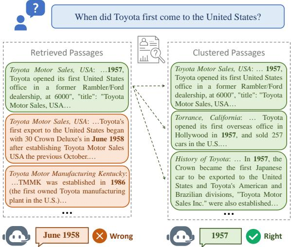
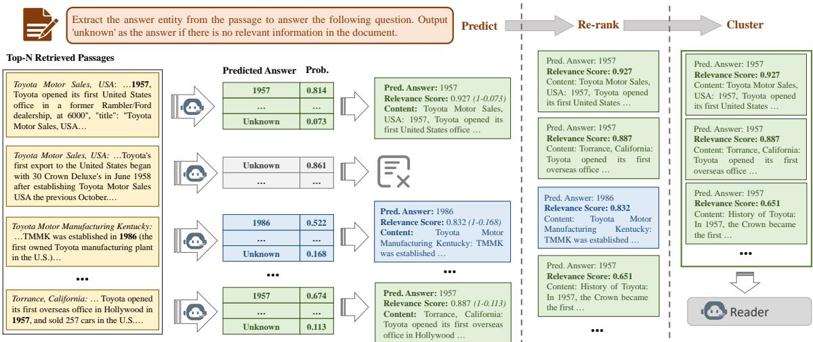
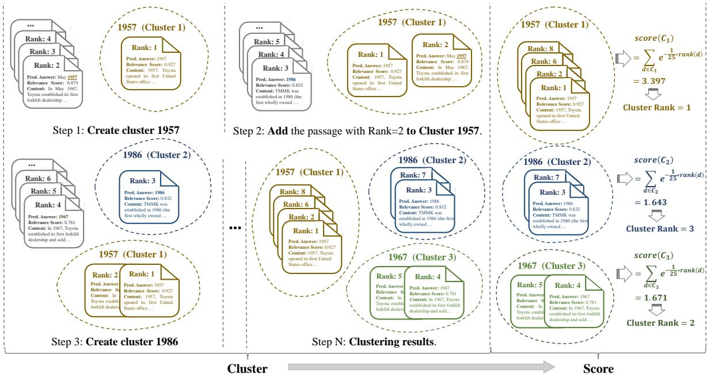
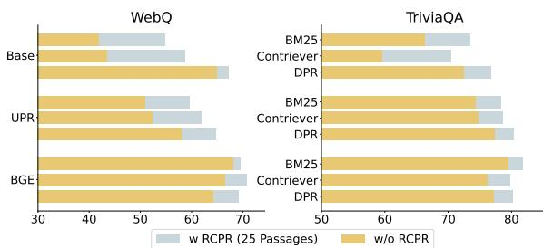
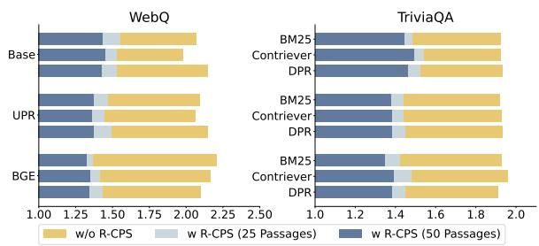
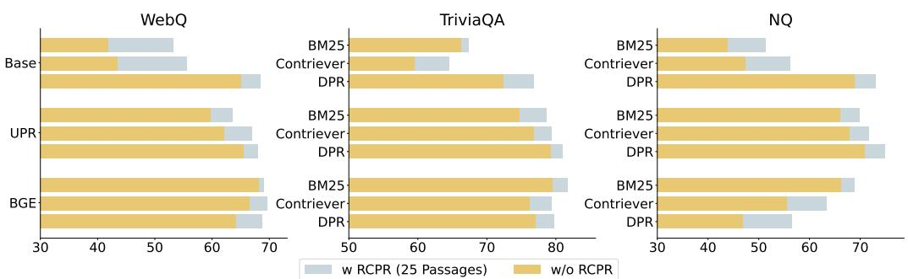
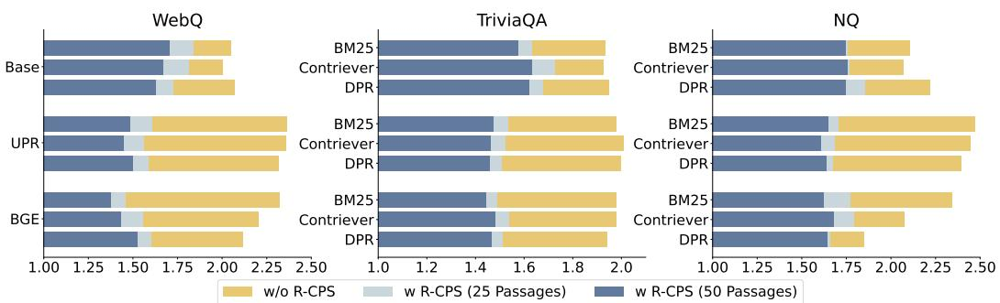
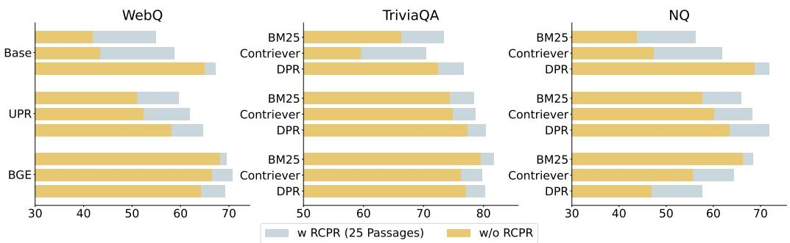
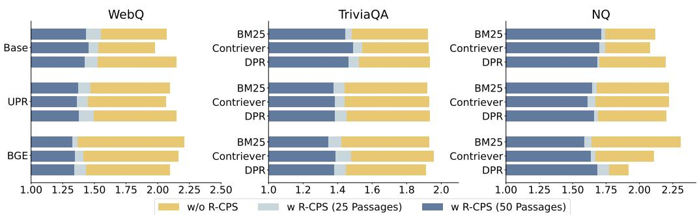

# Aligning Retrieval with Reader Needs: Reader-Centered Passage Selection for Open-Domain Question Answering

Chunlei Xin1,2, Shuheng Zhou3, Xuanang Chen1,\*, Yaojie Lu1, Huijia Zhu3, Weiqiang Wang3, Zhongyi Liu3, Xianpei Han1, Le Sun1

1Chinese Information Processing Laboratory, Institute of Software, Chinese Academy of Sciences, Beijing, China 2University of Chinese Academy of Sciences, Beijing, China 3Ant Group

{chunlei2021, chenxuanang, luyaojie, xianpei, sunle}@iscas.ac.cn, {shuheng.zsh, huijia.zhj, weiqiang.wwq, zhongyi.lzy}@antgroup.com

## Abstract

Open-Domain Question Answering (ODQA) systems often struggle with the quality of retrieved passages, which may contain conflict ing information and be misaligned with the reader’s needs. Existing retrieval methods aim to gather relevant passages, but often fail to prioritize consistent and useful information for the reader. In this paper, we introduce a novel Reader-Centered Passage Selection (R-CPS) method, which enhances the performance of the retrieve-then-read pipeline by re-ranking and clustering passages from the reader’s perspective. Our method re-ranks passages based on the reader’s prediction probability distribution and clusters passages according to the predicted answers, prioritizing more useful and relevant passages to the top and reducing inconsistent information. Experiments on ODQA datasets demonstrate the effectiveness of our approach in improving the quality of evidence passages under zero-shot settings.

## 1 Introduction

Open-Domain Question Answering (ODQA) (Chen et al., 2017; Voorhees and Tice, 2000; Izacard and Grave, 2021b), which aims to answer questions without providing specific background documents, has long been a challenging task in the field of natural language understanding (Moldovan et al., 2000; Brill et al., 2002). Currently, opendomain question answering systems typically employ a retrieve-then-read pipeline (Lee et al., 2019; Karpukhin et al., 2020; Lewis et al., 2020), which first retrieves a handful of relevant evidence passages from external corpus for knowledge augmentation, and then predicts an answer conditioned on the retrieved passages.

Despite its widespread adoption, the retrievethen-read framework faces several challenges that hinder its effectiveness. One of the primary issues is the inconsistent evidence in the retrieved passages. Retrieved passages often contain distracting or mutually conflicting information that points to different candidate answers (Shao and Huang, 2022; Cuconasu et al., 2024). This inconsistency creates a critical problem during the question-answering process, as the reader relies on synthesizing evidence from multiple passages to identify the correct answer and is highly sensitive to irrelevant content. By introducing noise and diverting attention from the correct information, related passages that do not contain the answer can significantly reduce the accuracy of the reader (Shi et al., 2023; Wang et al., 2023; Cuconasu et al., 2024). Therefore, distracting and mutually conflicting information in context can seriously hinder the reader’s ability to generate correct responses. As shown in Figure 1, retrieved passages are highly relevant to the question but point to different answers “1957”, “June 1958” and “1986”. The presence of conflicting information prevents the reader from focusing on the correct answer, even if a golden passage containing the correct answer “1957” is among the retrieved set.

  
Figure 1: An example illustrates the inconsistent evidence in retrieved passages, where passages containing the golden answer are shown in green. Inconsistent information hinders the reader’s ability to identify the correct answer. Clustering passages based on the answers they point to helps to reduce inconsistent information.

Secondly, there is a notable divergence between the preferences of the retrieval system and reader. Constrained by memory limitations, the reader can only process a limited number of passages at a time. However, current retrieval systems often rank passages relying on similarity-based metrics, which do not always align with the reader’s requirements for accurate question answering (Jiang et al., 2023; Ke et al., 2024; Gan et al., 2024). As a result, these passages might not be utilized effectively and could even mislead the reader into predicting incorrect answers. Furthermore, valuable evidence in discarded passages, which have been deemed irrelevant by retrieval systems due to low similarity scores, remains inaccessible to the reader. This preference divergence prevents the reader from accessing and leveraging the most helpful passages for accurate question answering.

To address the inconsistent evidence and preference divergence problems in open-domain question answering scenarios, this paper proposes a Reader-Centered Passage Selection (R-CPS) method to align the retrieval process with the reader’s needs. Specifically, we first instruct the reader to extract the answer entity from each passage to answer the given question. The reader’s predictions are considered as a reader-centered perspective on the passage, which is then used to re-rank and cluster relevant and consistent passages for the reader. For reranking, we use the reader’s prediction probability distribution as a relevance metric. This relevance metric reflects the informativeness and usability of the passage, allowing us to identify and discard passages that are irrelevant or insufficiently informative to the reader. Furthermore, by reordering retrieved passages based on their informativeness and usability, passages that are more relevant and useful to the reader are prioritized. This re-ranking method effectively bridges the preference divergence between the retrieval system and the reader. For passage clustering, by treating the predicted answers as passage labels, we group together passages that point to similar answers. Based on the relevance scores of passages within the cluster, we select contextually consistent passages from the top-ranked clusters for the reader. This method effectively reduces the presence of conflicting information, mitigating the influence of inconsistent passages that could confuse the reader.

Overall, our main contributions can be summarized as follows:

• To tackle the inconsistent evidence and preference divergence problems in ODQA scenarios, we introduce Reader-Centered Passage Selection to enhance the usability and consistency of evidence passages for the reader.

• We develop the Reader-Centered Passage Reranking (RCPR) method, which discards irrelevant passages and prioritizes passages that are more relevant and useful for the reader.

• We design the Reader-Centered Passage Clustering (RCPC) method, which provides the reader with contextually consistent passages, mitigating the influence of inconsistent information that could confuse the reader.

## 2 Background: the Retrieve-then-Read Framework

Recently, ODQA systems typically employ a retrieve-then-read framework (Asai et al., 2023; Chuang et al., 2023; Mallen et al., 2023; Shi et al., 2024), which consists of two main components: a retriever and a reader. The retriever is used to identify relevant passages from a corpus such as Wikipedia (Chen et al., 2017; Izacard and Grave, 2021b) or web pages (Nakano et al., 2021; Lazaridou et al., 2022). Then, a reader is used to answer the question based on the retrieved passages.

Formally, this pipeline operates through a twostep process. Initially, given a question q, the retriever first selects a fixed number of passages $D = d _ { 1 } , d _ { 2 } , . . . , d _ { n }$ from a large knowledge source C via a predefined similarity metric M. The top-N retrieved passages are then processed by the reader, along with the question q, to generate an answer a. In summary, the retrieve-then-read pipeline can be represented as $\begin{array} { r } { p ( a | q ) = \sum _ { i } p ( a | d _ { i } , q ) p ( d _ { i } | q ) } \end{array}$ marginalizing over all possible passages. In practice, the k highest ranked passages are used to approximate the sum over $d ,$ yielding $p ( a | q ) =$ $\textstyle \sum _ { i = 1 } ^ { k } p ( a | d _ { i } , q ) p ( d _ { i } | q )$

While the retrieve-then-read frameworks demonstrate remarkable performance on the ODQA task (Izacard and Grave, 2021a; Cheng et al., 2021; Ma et al., 2022), the quality of retrieved passages remains a significant hindrance to their effectiveness. Ke et al. (2024) highlight the gap between retrieving human-friendly information and assembling a reader-friendly context. Additionally, recent work has demonstrated that similar but spurious passages can confuse the reader, leading to incorrect predictions (Shao and Huang, 2022; Cuconasu et al., 2024; Gan et al., 2024).

  
Figure 2: Overall architecture of the Reader-Centered Passage Selection method.

## 3 Reader-Centered Passage Selection

To enhance the usability and consistency of retrieved passages in ODQA scenarios, we propose a Reader-Centered Passage Selection (R-CPS) method. This method focuses on re-ranking and clustering retrieved passages to select helpful and consistent ones for the reader. Figure 2 illustrates the overall pipeline of our framework. Initially, as described in Section 3.1, the reader is instructed to extract the answer entity from each passage. The prediction results are considered as a readercentered perspective on the passage. Using the prediction probability distribution as a relevance metric, we propose a Render-Centered Passage Rerank (RCPR) method in Section 3.2 to re-rank retrieved passages based on their informativeness and usability. By clustering passages according to the candidate answers they point to, we propose a Render-Centered Passage Cluster (RCPC) method in Section 3.3 to reduce the presence of conflicting information that could confuse the reader.

## 3.1 Answer Prediction

To reduce the number of useless and mutually inconsistent passages fed to the reader, it is crucial to first assess the usefulness of each passage in helping the reader to answer the question, and to identify which answers they point to. Therefore, we first prompt the reader to identify and extract potential answer entities from each passage. These prediction results form the basis for the subsequent re-ranking and clustering processes.

As shown in Figure 2, we prompt the reader to extract the answer entity from the given passage, with the option to respond “unknown” if the passage is irrelevant or unhelpful. We use the following instruction to prompt the reader:

Extract the answer entity from the passage to answer the following question. Output “unknown” as the answer if there is no relevant information in the passage.

[Demonstration]

Passage: [Passage]

In [Demonstration], we provide a positive example that outputs the golden answer and a negative example that outputs “unknown”. These examples are used to standardize the reader’s output format, guiding the reader to directly output “unknown” or the answer entity.

We collect the reader’s output probability distribution, specifically focusing on the extracted answer entities and the probability that the reader outputs “unknown”. This information is retained for each passage and forms the basis for the subsequent re-ranking and clustering processes.

  
Figure 3: Illustration of the Reader-Centered Passage Clustering method. We first cluster passages that point to similar answers together, and then score the relevance of the cluster based on the relevance scores of the passages within the cluster.

## 3.2 Reader-Centered Passage Re-ranking

Current retrieval systems often select passages based on their similarity to the question, overlooking their usability to the reader. To mitigate the preference divergence problem between the retrieval system and the reader, our Reader-Centered Passage Re-ranking method uses the reader’s prediction probability distribution to prioritize passages that are relevant and helpful to the reader. Specifically, we estimate the usefulness and relevance of a passage to the given question through the probability that the reader does not predict “unknown”, i.e., $1 - p ( { \mathrm { u n k n o w n } } | q , d _ { i } )$ . This metric indicates the reader’s confidence in providing an answer based on the given passage and reflects the usefulness and informativeness of the passage.

This relevance metric helps us discard passages that are irrelevant or insufficiently informative and prioritize passages with high usability. This approach aligns the re-ranking process more closely with the needs of the reader, thereby enhancing the question answering performance.

## 3.3 Reader-Centered Passage Clustering

Retrieved passages often contain distracting or mutually conflicting information pointing to different candidate answers, which can confuse the reader. To further ensure consistency, we cluster together passages based on the answers they point to, and select contextually consistent passages for the reader from the most relevant clusters. As illustrated in Figure 3, the Reader-Centered Passage Clustering method consists of two steps: passage clustering and cluster scoring.

For passage clustering, as illustrated in Figure 3, we treat the predicted answers as passage labels and group passages that point to similar answers together. We start with the top 1 passage and proceed through the top N passages. For each passage, we check whether the answer it points to overlaps with the labels of existing clusters. If there is an overlap, the passage is added to the corresponding cluster(s). If there is no overlap, a new cluster is created, using the answer this passage points to as the cluster label.

To select consistent passages from these clusters to form the input context, the straightforward approaches would be to select passages from the cluster with the most passages or from the cluster containing the highest ranked passage. However, these methods are unstable and easily influenced by noisy passages. To ensure robust performance, we draw inspiration from the Cumulative Gain metric in information retrieval evaluation and propose to reflect the relevance of a cluster by accumulating the relevance scores of the passages within the cluster. Specifically, we first compute the relevance score $r e l ( r a n k _ { d i } )$ for each passage $d _ { i }$ based on its ranking position ran $k _ { d i }$ . Then, we sum these scores for all passages in a cluster $C _ { j }$ to obtain the cluster’s relevance score scorej:

<table><tr><td colspan="2"></td><td colspan="3">NQ BM25 Contriever DPR</td><td colspan="3">WebQ BM25 Contriever DPR</td><td colspan="3">TriviaQA BM25 Contriever DPR</td></tr><tr><td></td><td>Basic Pipeline</td><td>21.4</td><td>23.8</td><td>33.8</td><td>16.3</td><td>17.8</td><td>21.8</td><td>50.4</td><td>46.4</td><td>52.0</td></tr><tr><td rowspan="2">Top-25 Retrieved Passages</td><td>*Rerank-then-Read UPR RCPR</td><td>28.1 25.8</td><td>29.5 28.1</td><td>33.7 35.2</td><td>19.6 20.2</td><td>21.2 20.9</td><td>21.7 22.6</td><td>55.0 52.2</td><td>53.2 50.2</td><td>56.0 53.1</td></tr><tr><td>*Cluster-then-Read R-CPS (Exponential) R-CPS (Piecewise)</td><td>29.3 29.1</td><td>31.9 31.8</td><td>37.4 37.1</td><td>22.3 22.5</td><td>22.4 22.2</td><td>23.3 23.1</td><td>57.6 57.3</td><td>54.9 54.5</td><td>58.1 57.9</td></tr><tr><td>Top-50 Retrieved</td><td>*Rerank-then-Read UPR RCPR</td><td>29.1 28.0</td><td>31.3 30.2</td><td>33.7 35.2</td><td>21.0 21.5</td><td>21.9 22.5</td><td>22.4 22.9</td><td>56.5 53.8</td><td>54.9 52.4</td><td>56.9 54.1</td></tr><tr><td>Passages</td><td>*Cluster-then-Read R-CPS (Exponential) R-CPS (Piecewise)</td><td>31.1 31.0</td><td>33.8 33.7</td><td>37.3 37.4</td><td>22.8 22.8</td><td>23.8 23.9</td><td>23.9 23.9</td><td>58.2 58.0</td><td>56.1 55.4</td><td>57.8 57.6</td></tr><tr><td></td><td>Improvement</td><td>+9.7</td><td>+10.0</td><td>+3.6</td><td>+6.5</td><td>+6.1</td><td>+2.1</td><td>+7.8</td><td>+9.7</td><td>+6.1</td></tr></table>

Table 1: EM scores of three groups of zero-shot pipelines on ODQA benchmarks based on Qwen2-7B-Instruct.

$$
s c o r e _ { j } = \sum r e l ( r a n k _ { d i } ) , d _ { i } \in C _ { j }\tag{1}
$$

In our experiments, we explored two methods for calculating the relevance score based on the passage’s ranking position, both of which proved effective on the development set of Natural Question (Kwiatkowski et al., 2019). The first method uses an exponential function to assign a continuously decreasing relevance score as the rank increases:

$$
r e l ( r a n k _ { d i } ) = e ^ { - 1 / 2 5 * r a n k _ { d i } }\tag{2}
$$

The second method employs a piecewise function to coarsely divide the relevance of retrieved passages based on their rank intervals:

$$
r e l ( r a n k _ { d i } ) = \left\{ \begin{array} { l l } { 6 , } & { r a n k _ { d i } \leq 3 } \\ { 3 , } & { 3 < r a n k _ { d i } \leq 1 0 } \\ { 1 , } & { 1 0 < r a n k _ { d i } \leq 2 0 } \end{array} \right.\tag{3}
$$

After calculating the clusters’ relevance scores, we select top-k passages from the top-ranked clusters for the reader. This approach ensures that the reader receives a more consistent and reliable set of evidence, thereby improving the reader’s ability to accurately identify and extract the correct answer.

## 4 Experiments

## 4.1 Experiment Setup

Dataset. We conduct extensive experiments on three open-domain question answering datasets, including Natural Question (NQ) (Kwiatkowski et al.,

2019), TriviaQA (Joshi et al., 2017) and WebQuestions (WebQ) (Berant et al., 2013). We employ the same splits as previous approaches (Karpukhin et al., 2020; Izacard and Grave, 2021b). We use exact match (EM) scores for evaluation, and follow the same normalization process utilized in previous work (Karpukhin et al., 2020; Chen et al., 2017; Lee et al., 2019).

Implementation. Our work primarily focuses on the selection of retrieved passages for the reader, independent of the retrieval process. We choose Vicuna-13B-v1.5 (Chiang et al., 2023) and Qwen2- 7B-Instruct (Yang et al., 2024) as the reader and use beam search with the beam number set to 5. For simplicity and reproducibility, we use the top-1000 retrieved passages provided by Sachan et al. (2022) as the retrieval results. These passages include retrieval results from representative dense retrievers Contriever (Izacard et al., 2021) and DPR (Karpukhin et al., 2020), as well as the sparse retriever BM25 (Robertson and Zaragoza, 2009). The evidence passages are sourced from a pre-processed English Wikipedia dump dated December 20, 2018. Each Wikipedia article is split into non-overlapping 100-word passages.

Baselines. We compare three groups of zero-shot retrieve-then-read pipelines to evaluate their performance on the ODQA task: (1)Basic Retrievethen-Read Pipeline (Basic Pipeline). The top-5 retrieved passages are concatenated with the question as the reader’s input. (2) Rerank-then-Read pipeline. We incorporate two re-ranking methods to re-rank more relevant passages to the top, including: (i) UPR: Unsupervised Passage Re-ranker (Sachan et al., 2022), which re-ranks the retrieved passages based on the prediction likelihood of the input question conditioned on a passage, and (ii) RCPR: Reader-Centered Passage Re-ranking. (3) Cluster-then-Read pipeline. We consider two cluster relevance calculation methods, which select 5 passages from: (i) R-CPS (Exponential): topranked clusters based on the exponential relevance cumulative gain metric, and (ii) R-CPS (Piecewise): top-ranked clusters based on the piecewise relevance cumulative gain metric.

<table><tr><td colspan="2"></td><td colspan="3">NQ BM25 Contriever DPR</td><td colspan="3">WebQ BM25 Contriever DPR</td><td colspan="3">TriviaQA BM25 Contriever DPR</td></tr><tr><td></td><td>Basic Pipeline</td><td>24.9</td><td>26.5</td><td>35.5</td><td>17.8</td><td>19.7</td><td>21.2</td><td>53.9</td><td>51.4</td><td>55.4</td></tr><tr><td rowspan="5">Top-25 Retrieved Passages</td><td>*Rerank-then-Read</td><td></td><td></td><td></td><td></td><td></td><td></td><td></td><td></td><td></td></tr><tr><td>UPR RCPR</td><td>27.9</td><td>29.8 31.1</td><td>35.0 35.8</td><td>20.2 20.7</td><td>21.3 22.3</td><td>21.1</td><td>56.9 57.2</td><td>55.5</td><td>57.6</td></tr><tr><td></td><td>28.8</td><td></td><td></td><td></td><td></td><td>22.4</td><td></td><td>55.6</td><td>57.8</td></tr><tr><td>*Cluster-then-Read</td><td></td><td></td><td></td><td></td><td></td><td></td><td></td><td></td><td></td></tr><tr><td>R-CPS (Exponential) R-CPS (Piecewise)</td><td>29.3</td><td>31.6 31.1</td><td>35.4 36.5</td><td>20.7 21.3</td><td>22.4 22.5</td><td>23.2</td><td>57.6</td><td>55.5</td><td>57.9</td></tr><tr><td rowspan="6">Top-50 Retrieved Passages</td><td></td><td>29.1</td><td></td><td></td><td></td><td></td><td>23.7</td><td>57.8</td><td>55.9</td><td>58.1</td></tr><tr><td>*Rerank-then-Read</td><td></td><td></td><td></td><td></td><td></td><td></td><td></td><td></td><td></td></tr><tr><td>UPR</td><td>28.5</td><td>30.8</td><td>34.2</td><td>20.7</td><td>21.9</td><td>21.4</td><td>57.3</td><td>56.5</td><td>58.1</td></tr><tr><td>RCPR</td><td>29.9</td><td>32.4</td><td>35.9</td><td>20.9</td><td>23.2</td><td>22.7</td><td>58.0</td><td>56.7</td><td>58.1</td></tr><tr><td>*Cluster-then-Read</td><td></td><td></td><td></td><td></td><td></td><td></td><td></td><td></td><td></td></tr><tr><td>R-CPS (Exponential)</td><td>30.8</td><td>32.7</td><td>35.8</td><td>21.0</td><td>23.2</td><td>23.0</td><td>58.5</td><td>56.3</td><td>58.2</td></tr><tr><td></td><td>R-CPS (Piecewise)</td><td>29.9</td><td>32.5</td><td>36.6</td><td>21.6</td><td>24.1</td><td>23.7</td><td>58.8</td><td>56.8</td><td>58.1</td></tr><tr><td></td><td></td><td></td><td></td><td></td><td></td><td></td><td></td><td></td><td></td><td></td></tr><tr><td></td><td>Improvement</td><td>+5.9</td><td>+6.2</td><td>+1.1</td><td>+3.8</td><td>+4.4</td><td>+2.5</td><td>+4.9</td><td>+5.4</td><td>+2.8</td></tr></table>

Table 2: EM scores of three groups of zero-shot pipelines on ODQA benchmarks based on Vicuna-13B-v1.5.

## 4.2 Overall Results

In this section, we systematically investigate the performance of three groups of zero-shot retrievethen-read pipelines using the same set of retrieved passages. Specifically, each retrieve-then-read pipeline selects 5 passages from top-25 or top-50 retrieved passages to provide evidence to the reader. Table 1 illustrates the results using Qwen2- 7B-Instruct as the base model and Table 2 shows the results using Vicuna-13B-v1.5. By analyzing the experimental results, we find that:

(1) Reader-Centered Passage Selection (R-CPS) effectively enhances the overall performance by aligning the retrieval process with the reader’s needs. As demonstrated in Table 1 and Table 2, our proposed Cluster-then-Read pipelines consistently outperform the Basic Pipeline across different settings. In particular, when applied to passages retrieved by BM25 and Contriever, our method shows significant improvements of up to 10 points on EM scores. This notable enhancement highlights the effectiveness of our method in selecting the relevant and helpful passages for the reader to correctly identify and extract the answer.

(2)Reader-Centered Passage Re-ranking (RCPR) effectively prioritizes passages that are highly relevant and helpful for the reader. As demonstrated in Table 1 and Table 2, RCPR achieves notably better performance compared to Basic Pipeline on all ODQA datasets. Specifically, when employing Vicuna-13B-v1.5 as the base model, our proposed RCPR method outperforms UPR across different settings. This improvement highlights the importance of re-ranking passages from the reader’s perspective. By aligning the re-ranking process with the reader’s needs, the RCPR method ensures that the selected passages are not only more relevant but also more informative and useful for the reader, thereby enhancing the reader’s ability to correctly predict the answer.

(3)Reader-Centered Passage Clustering (RCPC) can further improve the quality of evidence passages by reducing the inconsistent information. When comparing Cluster-then-Read pipelines with Rerank-then-Read pipelines, we can observe that our proposed R-CPS method further enhances the performance of RCPR across all datasets. These observations confirm the effectiveness of the Reader-Centered Passage Clustering method, which provides more consistent passages with less conflicting and distracting information. Additionally, scoring passage clusters based on either the exponential or the piecewise relevance cumulative gain metric both yield notable performance improvements. This indicates that reflecting the relevance of a cluster by accumulating the relevance scores of the passages within the cluster is a promising method for selecting suitable passage clusters.

<table><tr><td colspan="3"></td><td colspan="3">NQ BM25 Contriever DPR</td><td colspan="3">WebQ BM25 Contriever DPR</td><td colspan="3">TriviaQA</td></tr><tr><td colspan="3"></td><td>32.2</td><td>33.6</td><td>34.3</td><td>22.0</td><td>22.5</td><td>23.0</td><td>BM25 57.8</td><td>Contriever 59.0</td><td>DPR 59.3</td></tr><tr><td rowspan="6">UPR</td><td></td><td>UPR RCPR + UPR</td><td>35.8</td><td>37.0</td><td>36.3</td><td>22.7</td><td>23.4</td><td>23.7</td><td>61.0</td><td>61.0</td><td>61.2</td></tr><tr><td>Top-25</td><td>R-CPS (Exp.) + UPR R-CPS (Pie.) + UPR</td><td>36.7 36.9</td><td>38.2 37.8</td><td>38.6 38.6</td><td>24.3 24.6</td><td>25.1 25.2</td><td>24.2 24.4</td><td>63.0 63.1</td><td>62.4 62.6</td><td>63.4 63.5</td></tr><tr><td></td><td>RCPR + UPR</td><td>36.2</td><td>37.3</td><td>36.6</td><td>22.2</td><td>23.4</td><td>23.7</td><td>61.4</td><td>61.2</td><td>61.4</td></tr><tr><td>Top-50</td><td>R-CPS (Exp.) + UPR R-CPS (Pie.) + UPR</td><td>37.2 37.7</td><td>38.5 38.7</td><td>38.1 38.1</td><td>24.5 24.7</td><td>25.7 26.2</td><td>24.6 24.7</td><td>63.6 63.8</td><td>62.6 62.9</td><td>63.3</td></tr><tr><td></td><td>Improvement</td><td>+5.5</td><td>+5.1</td><td>+4.3</td><td>+2.7</td><td>+3.7</td><td></td><td></td><td></td><td>63.5</td></tr><tr><td></td><td>BGE</td><td>33.5</td><td>28.3</td><td>24.7</td><td>22.6</td><td>21.9</td><td>+1.7 21.7</td><td>+6.0 58.7</td><td>+3.9</td><td>+4.2 57.2</td></tr><tr><td rowspan="6">BGE</td><td></td><td>RCPR + BGE</td><td>36.5</td><td>34.2</td><td>31.1</td><td>23.5</td><td>23.7</td><td>23.7</td><td>61.1</td><td>56.4 60.6</td><td>59.6</td></tr><tr><td>Top-25</td><td>R-CPS (Exp.) + BGE R-CPS (Pie.) + BGE</td><td>37.0 37.3</td><td>35.1</td><td>31.4</td><td>25.0</td><td>25.8</td><td>24.7</td><td>62.9</td><td>61.4</td><td>61.5</td></tr><tr><td></td><td></td><td></td><td>35.0</td><td>31.9</td><td>24.9</td><td>25.7</td><td>24.9</td><td>63.0</td><td>61.5</td><td>61.7</td></tr><tr><td>Top-50</td><td>RCPR + BGE R-CPS (Exp.) + BGE</td><td>37.3 37.5</td><td>35.3 37.0</td><td>33.2 33.9</td><td>23.7 24.7</td><td>23.9 26.0</td><td>24.6 25.4</td><td>61.3 62.9</td><td>61.3 61.5</td><td>60.1</td></tr><tr><td></td><td>R-CPS (Pie.) + BGE</td><td>37.7</td><td>36.8</td><td>34.3</td><td>25.0</td><td>25.9</td><td>25.7</td><td>63.2</td><td>61.8</td><td>61.9 62.0</td></tr><tr><td></td><td>Improvement</td><td>+4.2</td><td>+8.7</td><td>+9.6</td><td>+2.4</td><td>+4.1</td><td>+4.0</td><td>+4.5</td><td>+5.4</td><td>+4.8</td></tr></table>

Table 3: EM scores of integrating our proposed method with UPR or BGE on Top-{25, 50} re-ranked passages using Qwen2-7B-Instruct as the base model. R-CPS (Exp.) and R-CPS (Pie.) represent R-CPS (Exponential) and R-CPS (Piecewise), respectively.

## 4.3 Integrated with Re-rankers

To improve the quality of retrieved passages, an effective method is to use re-rankers to re-rank more relevant passages to the top (Min et al., 2021; Sachan et al., 2022). Note that existing re-ranking approaches primarily rely on similarity-based metrics; our proposed RCPR re-ranking method, which prioritizes passages with high usability, complements these similarity-based re-ranking approaches. It’s expected that simultaneously considering both the passage’s usefulness and its similarity to the question will further improve the passage ranking performance.

In this section, we aim to explore whether existing re-ranking methods can sufficiently mitigate the influence of inconsistent evidence and preference divergence, as well as to evaluate the effectiveness of integrating our proposed method with current re-rankers. Specifically, we combine the re-ranking results of our Reader-Centered Passage Re-ranking (RCPR) method with those of popular re-ranking methods UPR and BGE. Based on the integrated reranking results, we apply Reader-Centered Passage Clustering (RCPC) to provide consistent evidence passages. UPR uses the same base model as the reader, while we use the BAAI/bge-reranker-large model for BGE re-ranking.

Initially, we re-rank 1000 retrieved passages using UPR or BGE, respectively. Then, we apply the Reader-Centered Passage Re-ranking methods to the top-{25, 50} re-ranked passages, and employ the standard Reciprocal Rank Fusion (RRF) approach to combine the re-ranking results of our RCPR method with those of UPR or BGE. The goal of RRF is to give more importance to items that are ranked higher in multiple lists. Based on the RRF combined re-ranking passages, we cluster passages pointing to similar answers together and select passages from the top-ranked clusters for the reader. Table 3 shows the QA performance of the above retrieve-then-read pipelines using Qwen2- 7B-Instruct as the base model, and we present the performance based on Vicuna-13B-v1.5 in Appendix A. Experimental results show that:

(1) Integrating our proposed method with existing re-rankers UPR and BGE significantly improves the overall performance across various settings. These results demonstrate that relying solely on similarity-based metrics to select relevant passages is insufficient to address inconsistent evidence and preference divergence problems. Instead, the simultaneous consideration of both the usefulness of the passage and its similarity to the given question proves to be a promising approach to further improve the quality of evidence passages.

(2) Consistent with the trends observed in Table 1 and Table 2, applying RCPR improves performance through re-ranking more useful and relevant passages to the top, and RCPC further enhances RCPR by providing more consistent passages with less conflicting information.

(3) Re-ranking and clustering from just 25 passages achieves performance similar to that obtained on 50 passages. This indicates that current reranking methods are effective in assigning assign higher ranks to highly relevant passages. However, an additional step is needed to select the most informative and useful passages from the reader’s perspective to further enhance the quality of the retrieved passages.

Efficiency when integrated with UPR. UPR computes the relevance score based on the probability of generating the question given the passage text, while our method is based on the probability of predicting “unknown” given the question-passage pair. Combining these two complementary methods can effectively and efficiently improve the quality of retrieved passages without notable additional time or resource costs. Specifically, after generating the given question based on the passage (as done in UPR), one can further predict the answer based on the passage and question to obtain the probability of predicting “unknown” for applying RCPR. In this process, the question and passage are reused from the UPR step, adding only a minimal additional inference cost while providing significant performance improvements, as demonstrated in Table 3 and Appendix A.

## 4.4 Passage Quality Analysis

In this section, we explore the effectiveness of our method in improving the quality of evidence passages through two main aspects: (1) whether our Reader-Centered Passage Re-ranking method reranks more useful and relevant passages to the top, and (2) whether our Reader-Centered Passage Clustering method effectively reduces conflicting passages that point to different answers.

To investigate these aspects, we compare pipelines with and without applying our method on the top-25/50 passages from: (1) retrieved passages (Base), (2) re-ranked passages with UPR on 1000 retrieved passages, and (3) re-ranked passages with BGE on 1000 retrieved passages. Using Vicuna-13B-v1.5 as the base model, Figure 4 displays the top-5 retrieval accuracy with and without applying RCPR, while Figure 5 illustrates the average number of different answers that the top-5 passages point to with and without applying RCPC. Results on all three datasets based on Vicuna-13B-v1.5 and

  
Figure 4: Top-5 retrieval accuracy with and without applying RCPR on WebQ and TriviaQA datasets.

  
Figure 5: Average number of different answers that the top-5 passages point to with and without applying RCPC on WebQ and TriviaQA datasets.

Qwen2-7B-Instruct are presented in Appendix B.

Figure 4 demonstrates that applying RCPR to the retrieve-then-read pipeline leads to improved retrieval accuracy across various settings by effectively prioritizing passages that contain the correct answers. As illustrated in Figure 5, using RCPC to cluster passages based on predicted answers effectively reduces the average number of different answers among the top-ranked passages, indicating a decrease in conflicting information. Furthermore, applying R-CPS to a larger set of 50 evidence passages further minimizes the presence of distracting passages compared to applying R-CPS to only 25 evidence passages. This improvement is due to the increased evidence available for better cluster selection. These findings confirm the effectiveness of our proposed method in enhancing the quality of evidence passages, which provides more relevant and consistent information to the reader and ultimately improves overall performance.

## 5 Conclusion

We introduced the Reader-Centered Passage Selection (R-CPS) method to align the retrieval process with the reader’s needs. By leveraging the reader’s prediction probability distribution for re-ranking, R-CPS prioritizes passages that are more useful and relevant to the reader. By clustering passages based on predicted answers, R-CPS reduces the presence of conflicting information that could confuse the reader. Experimental results on ODQA datasets under zero-shot settings demonstrate the effectiveness of our method, showcasing its capability to mitigate the inconsistent evidence and preference divergence problems in ODQA scenarios.

## 6 Limitations

Limited Exploration of Passage Clustering Methods: To collect contextually consistent passages, our approach relied on basic clustering techniques. Our current approach, although straightforward and simple, has demonstrated overall performance improvements across various settings, indicating its effectiveness and potential. Future work could further enhance the overall performance by incorporating more advanced passage clustering techniques, such as merging similar clusters and updating cluster labels dynamically. Additionally, more flexible and task-specific methods for computing cluster relevance could be explored to better meet different requirements.

Limited Exploration of Diverse Question Answering Tasks: Our experiments primarily focus on short-form QA tasks, leaving the applicability of our approach to other QA tasks underexplored. However, our method can be adapted to broader QA scenarios with minimal modifications. For instance, the Answer Prediction stage could be adjusted to accommodate different task requirements. Instead of instructing the reader to “extract the answer entity from the passage” we can guide the reader to “provide core keywords to summarize useful information in this passage”. Similarly, the reader is expected to respond “unknown” if the passage is irrelevant or unhelpful. By collecting these keywords along with the probability of the reader responding “unknown”, we can effectively integrate this information into the subsequent reranking and clustering processes.

## Acknowledgments

We sincerely thank the reviewers for their insightful comments and valuable suggestions. This work was supported by the Natural Science Foundation of China (No.62306303, 62122077, 62106251), Beijing Municipal Science and Technology Project (Nos.Z231100010323002), the Basic Research Program of ISCAS (Grant No.ISCAS-ZD-202401) and Ant Group Research Fund.

## References

Akari Asai, Sewon Min, Zexuan Zhong, and Danqi Chen. 2023. Retrieval-based language models and applications. In Proceedings ofthe 61st Annual Meeting ofthe Associationfor Computational Linguistics (Volume 6: Tutorial Abstracts), pages 41–46, Toronto, Canada. Association for Computational Linguistics.

Jonathan Berant, Andrew Chou, Roy Frostig, and Percy Liang. 2013. Semantic parsing on Freebase from question-answer pairs. In Proceedings of the 2013 Conference on Empirical Methods in Natural Language Processing, pages 1533–1544, Seattle, Washington, USA. Association for Computational Linguistics.

Eric Brill, Susan Dumais, and Michele Banko. 2002. An analysis of the AskMSR question-answering system. In Proceedings of the 2002 Conference on Empirical Methods in Natural Language Processing (EMNLP 2002), pages 257–264. Association for Computational Linguistics.

Danqi Chen, Adam Fisch, Jason Weston, and Antoine Bordes. 2017. Reading Wikipedia to answer opendomain questions. In Proceedings ofthe 55th Annual Meeting of the Association for Computational Linguistics (Volume 1: Long Papers), pages 1870–1879, Vancouver, Canada. Association for Computational Linguistics.

Hao Cheng, Yelong Shen, Xiaodong Liu, Pengcheng He, Weizhu Chen, and Jianfeng Gao. 2021. UnitedQA: A hybrid approach for open domain question answering. In Proceedings ofthe 59th Annual Meeting ofthe Association for Computational Linguistics and the 11th International Joint Conference on Natural Language Processing (Volume 1: Long Papers), pages 3080–3090, Online. Association for Computational Linguistics.

Wei-Lin Chiang, Zhuohan Li, Zi Lin, Ying Sheng, Zhanghao Wu, Hao Zhang, Lianmin Zheng, Siyuan Zhuang, Yonghao Zhuang, Joseph E Gonzalez, et al. 2023. Vicuna: An open-source chatbot impressing gpt-4 with 90%\* chatgpt quality. See https://vicuna. lmsys. org (accessed 14 April 2023).

Yung-Sung Chuang, Wei Fang, Shang-Wen Li, Wen-tau Yih, and James Glass. 2023. Expand, rerank, and retrieve: Query reranking for open-domain question answering. In Findings ofthe Associationfor Computational Linguistics: ACL 2023, pages 12131–12147, Toronto, Canada. Association for Computational Linguistics.

Florin Cuconasu, Giovanni Trappolini, F. Siciliano, Simone Filice, Cesare Campagnano, Yoelle Maarek, Nicola Tonellotto, and Fabrizio Silvestri. 2024. The power of noise: Redefining retrieval for rag systems. In Annual International ACM SIGIR Conference on Research and Development in Information Retrieval.

Chunjing Gan, Dan Yang, Binbin Hu, Hanxiao Zhang, Siyuan Li, Ziqi Liu, Yue Shen, Lin Ju, Zhiqiang

Zhang, Jinjie Gu, Lei Liang, and Jun Zhou. 2024. Similarity is not all you need: Endowing retrieval augmented generation with multi layered thoughts. ArXiv, abs/2405.19893.

Gautier Izacard, Mathilde Caron, Lucas Hosseini, Sebastian Riedel, Piotr Bojanowski, Armand Joulin, and Edouard Grave. 2021. Unsupervised dense information retrieval with contrastive learning. Transactions on Machine Learning Research, 2022.

Gautier Izacard and Edouard Grave. 2021a. Distilling knowledge from reader to retriever for question answering. In International Conference on Learning Representations.

Gautier Izacard and Edouard Grave. 2021b. Leveraging passage retrieval with generative models for open domain question answering. In Proceedings of the 16th Conference of the European Chapter of the Associationfor Computational Linguistics: Main Volume, pages 874–880, Online. Association for Computational Linguistics.

Zhengbao Jiang, Frank Xu, Luyu Gao, Zhiqing Sun, Qian Liu, Jane Dwivedi-Yu, Yiming Yang, Jamie Callan, and Graham Neubig. 2023. Active retrieval augmented generation. In Proceedings ofthe 2023 Conference on Empirical Methods in Natural Language Processing, pages 7969–7992, Singapore. Association for Computational Linguistics.

Mandar Joshi, Eunsol Choi, Daniel Weld, and Luke Zettlemoyer. 2017. TriviaQA: A large scale distantly supervised challenge dataset for reading comprehension. In Proceedings ofthe 55th Annual Meeting of the Associationfor Computational Linguistics (Vol ume 1: Long Papers), pages 1601–1611, Vancouver, Canada. Association for Computational Linguistics.

Vladimir Karpukhin, Barlas Oguz, Sewon Min, Patrick Lewis, Ledell Wu, Sergey Edunov, Danqi Chen, and Wen-tau Yih. 2020. Dense passage retrieval for opendomain question answering. In Proceedings of the 2020 Conference on Empirical Methods in Natural Language Processing (EMNLP), pages 6769–6781, Online. Association for Computational Linguistics.

Zixuan Ke, Weize Kong, Cheng Li, Mingyang Zhang, Qiaozhu Mei, and Michael Bendersky. 2024. Bridging the preference gap between retrievers and LLMs. In Proceedings of the 62nd Annual Meeting of the Associationfor Computational Linguistics (Volume 1: Long Papers), pages 10438–10451, Bangkok, Thailand. Association for Computational Linguistics.

Tom Kwiatkowski, Jennimaria Palomaki, Olivia Redfield, Michael Collins, Ankur Parikh, Chris Alberti, Danielle Epstein, Illia Polosukhin, Jacob Devlin, Kenton Lee, Kristina Toutanova, Llion Jones, Matthew Kelcey, Ming-Wei Chang, Andrew M. Dai, Jakob Uszkoreit, Quoc Le, and Slav Petrov. 2019. Natural questions: A benchmark for question answering research. Transactions ofthe Associationfor Computational Linguistics, 7:452–466.

Angeliki Lazaridou, Elena Gribovskaya, Wojciech Stokowiec, and Nikolai Grigorev. 2022. Internetaugmented language models through few-shot prompting for open-domain question answering. ArXiv, abs/2203.05115.

Kenton Lee, Ming-Wei Chang, and Kristina Toutanova. 2019. Latent retrieval for weakly supervised open domain question answering. In Proceedings of the 57th Annual Meeting ofthe Associationfor Computational Linguistics, pages 6086–6096, Florence, Italy. Association for Computational Linguistics.

Patrick Lewis, Ethan Perez, Aleksandra Piktus, Fabio Petroni, Vladimir Karpukhin, Naman Goyal, Heinrich Küttler, Mike Lewis, Wen-tau Yih, Tim Rocktäschel, Sebastian Riedel, and Douwe Kiela. 2020. Retrieval-augmented generation for knowledgeintensive nlp tasks. In Advances in Neural Information Processing Systems, volume 33, pages 9459– 9474. Curran Associates, Inc.

Kaixin Ma, Hao Cheng, Xiaodong Liu, Eric Nyberg, and Jianfeng Gao. 2022. Open domain question answering with a unified knowledge interface. In Proceedings of the 60th Annual Meeting of the Association for Computational Linguistics (Volume 1: Long Papers), pages 1605–1620, Dublin, Ireland. Association for Computational Linguistics.

Alex Mallen, Akari Asai, Victor Zhong, Rajarshi Das, Daniel Khashabi, and Hannaneh Hajishirzi. 2023. When not to trust language models: Investigating effectiveness of parametric and non-parametric memories. In Proceedings ofthe 61st Annual Meeting of the Association for Computational Linguistics (Volume 1: Long Papers), pages 9802–9822, Toronto, Canada. Association for Computational Linguistics.

Sewon Min, Kenton Lee, Ming-Wei Chang, Kristina Toutanova, and Hannaneh Hajishirzi. 2021. Joint passage ranking for diverse multi-answer retrieval. In Proceedings of the 2021 Conference on Empirical Methods in Natural Language Processing, pages 6997–7008, Online and Punta Cana, Dominican Republic. Association for Computational Linguistics.

Dan Moldovan, Sanda Harabagiu, Marius Pasca, Rada Mihalcea, Roxana Girju, Richard Goodrum, and Vasile Rus. 2000. The structure and performance of an open-domain question answering system. In Proceedings of the 38th Annual Meeting of the Associationfor Computational Linguistics, pages 563–570, Hong Kong. Association for Computational Linguistics.

Reiichiro Nakano, Jacob Hilton, Suchir Balaji, Jeff Wu, Ouyang Long, Christina Kim, Christopher Hesse, Shantanu Jain, Vineet Kosaraju, William Saunders, Xu Jiang, Karl Cobbe, Tyna Eloundou, Gretchen Krueger, Kevin Button, Matthew Knight, Benjamin Chess, and John Schulman. 2021. Webgpt: Browserassisted question-answering with human feedback. ArXiv, abs/2112.09332.

Stephen Robertson and Hugo Zaragoza. 2009. The probabilistic relevance framework: Bm25 and beyond. Foundations and Trends® in Information Retrieval, 3(4):333–389.

Devendra Sachan, Mike Lewis, Mandar Joshi, Armen Aghajanyan, Wen-tau Yih, Joelle Pineau, and Luke Zettlemoyer. 2022. Improving passage retrieval with zero-shot question generation. In Proceedings of the 2022 Conference on Empirical Methods in Natural Language Processing, pages 3781–3797, Abu Dhabi, United Arab Emirates. Association for Computational Linguistics.

Zhihong Shao and Minlie Huang. 2022. Answering open-domain multi-answer questions via a recallthen-verify framework. In Proceedings of the 60th Annual Meeting ofthe Associationfor Computational Linguistics (Volume 1: Long Papers), pages 1825– 1838, Dublin, Ireland. Association for Computational Linguistics.

Freda Shi, Xinyun Chen, Kanishka Misra, Nathan Scales, David Dohan, Ed Huai hsin Chi, Nathanael Scharli, and Denny Zhou. 2023. Large language models can be easily distracted by irrelevant context. In International Conference on Machine Learning.

Weijia Shi, Sewon Min, Michihiro Yasunaga, Minjoon Seo, Richard James, Mike Lewis, Luke Zettlemoyer, and Wen-tau Yih. 2024. REPLUG: Retrievalaugmented black-box language models. In Proceedings ofthe 2024 Conference ofthe North American Chapter of the Association for Computational Linguistics: Human Language Technologies (Volume 1: Long Papers), pages 8371–8384, Mexico City, Mexico. Association for Computational Linguistics.

Ellen M. Voorhees and Dawn M. Tice. 2000. The TREC-8 question answering track. In Proceedings of the Second International Conference on Language Resources and Evaluation (LREC’00), Athens, Greece. European Language Resources Association (ELRA).

Zhiruo Wang, Jun Araki, Zhengbao Jiang, Md. Rizwan Parvez, and Graham Neubig. 2023. Learning to filter context for retrieval-augmented generation. ArXiv, abs/2311.08377.

An Yang, Baosong Yang, Binyuan Hui, Bo Zheng, Bowen Yu, Chang Zhou, Chengpeng Li, Chengyuan Li, Dayiheng Liu, Fei Huang, Guanting Dong, Haoran Wei, Huan Lin, Jialong Tang, Jialin Wang, Jian Yang, Jianhong Tu, Jianwei Zhang, Jianxin Ma, Jianxin Yang, Jin Xu, Jingren Zhou, Jinze Bai, Jinzheng He, Junyang Lin, Kai Dang, Keming Lu, Keqin Chen, Kexin Yang, Mei Li, Mingfeng Xue, Na Ni, Pei Zhang, Peng Wang, Ru Peng, Rui Men, Ruize Gao, Runji Lin, Shijie Wang, Shuai Bai, Sinan Tan, Tianhang Zhu, Tianhao Li, Tianyu Liu, Wenbin Ge, Xiaodong Deng, Xiaohuan Zhou, Xingzhang Ren, Xinyu Zhang, Xipin Wei, Xuancheng Ren, Xuejing Liu, Yang Fan, Yang Yao, Yichang Zhang, Yu Wan, Yunfei Chu, Yuqiong Liu, Zeyu Cui, Zhenru Zhang, Zhifang Guo, and Zhihao Fan. 2024. Qwen2 technical report. arXiv preprint arXiv:2407.10671.

## A Integrated with Re-rankers based on Vicuna-13B-v1.5

The end-to-end QA performance of integrating our Reader-Centered Passage Selection method with UPR and BGE, using Vicuna-13B-v1.5 as the base model, is shown in Table 4. UPR uses the same base model Vicuna-13B-v1.5 as the reader, while we utilize the BAAI/bge-reranker-large model for BGE re-ranking.

Consistent with the trends observed in Table 3, integrating our proposed method with re-rankers that rely on similarity-based metrics can further improve the end-to-end QA performance across various settings and datasets, highlighting the potential of our approach.

## B Passage Quality Analysis

To explore the effectiveness of our method in improving retrieval accuracy and reducing conflicting passages, we analyze the quality of the top-5 passages with and without employing our proposed R-CPS method.

Figure 6 and Figure 8 display the top-5 retrieval accuracy with and without applying RCPR based on Qwen2-7B-Instruct and Vicuna-13B-v1.5, respectively. Figure 7 and Figure 9 illustrate the average number of different answers that the top-5 passages point to with and without applying RCPC using Qwen2-7B-Instruct and Vicuna-13B-v1.5, respectively. Experimental results demonstrate that our proposed method can effectively prioritize passages containing golden answers and reduce conflicting information.

  
Figure 6: Top-5 retrieval accuracy with and without applying RCPR using Qwen2-7B-Instruct as the base model.

  
Figure 7: Average number of different answers that the top-5 passages point to with and without applying RCPC using Qwen2-7B-Instruct as the base model.

  
Figure 8: Top-5 retrieval accuracy with and without applying RCPR using Vicuna-13B-v1.5 as the base model.

  
Figure 9: Average number of different answers that the top-5 passages point to with and without applying RCPC using Vicuna-13B-v1.5 as the base model.

<table><tr><td colspan="3"></td><td colspan="3">NQ BM25 Contriever DPR</td><td colspan="3">WebQ BM25 Contriever DPR</td><td colspan="3">TriviaQA</td></tr><tr><td colspan="3"></td><td></td><td></td><td></td><td></td><td></td><td></td><td>BM25</td><td>Contriever</td><td>DPR</td></tr><tr><td rowspan="7">UPR</td><td rowspan="3">Top-25</td><td>UPR</td><td>30.3</td><td>30.9</td><td>31.5</td><td>20.2</td><td>21.8</td><td>21.5</td><td>58.6</td><td>58.7</td><td>58.8</td></tr><tr><td>RCPR + UPR</td><td>32.9</td><td>34.6</td><td>35.1</td><td>22.6</td><td>24.2</td><td>22.3</td><td>60.0</td><td>60.4</td><td>60.6</td></tr><tr><td>R-CPS (Exp.) + UPR</td><td>33.2</td><td>34.7</td><td>35.6</td><td>23.5</td><td>24.4</td><td>23.4</td><td>60.6</td><td>60.5</td><td>60.8</td></tr><tr><td rowspan="3">Top-50</td><td>R-CPS (Pie.) + UPR</td><td>33.3</td><td>34.9</td><td>35.8</td><td>22.7</td><td>23.9</td><td>23.5</td><td>60.5</td><td>60.2</td><td>60.6</td></tr><tr><td>RCPR + UPR</td><td>33.4</td><td>34.9</td><td>35.7</td><td>22.2</td><td>24.6</td><td>22.7</td><td>60.7</td><td>60.3</td><td>60.9</td></tr><tr><td>R-CPS (Exp.) + UPR</td><td>33.7</td><td>34.8</td><td>35.9</td><td>23.5</td><td>25.4</td><td>24.0</td><td>60.9</td><td>60.3</td><td>60.7</td></tr><tr><td></td><td>R-CPS (Pie.) + UPR Improvement</td><td>34.1 +3.8</td><td>35.3 +4.4</td><td>35.8 +4.4</td><td>23.0</td><td>25.1</td><td>23.7</td><td>61.0</td><td>60.4</td><td>60.9</td></tr><tr><td rowspan="5">BGE</td><td></td><td>BGE</td><td>34.5</td><td>31.1</td><td>27.7</td><td>+3.3 21.7</td><td>+3.6</td><td>+2.5 22.2</td><td>+2.4 59.7</td><td>+1.7 58.0</td><td>+2.1 58.8</td></tr><tr><td></td><td>RCPR + BGE</td><td>35.8</td><td>34.0</td><td>30.5</td><td>22.8</td><td>22.7 23.6</td><td>23.1</td><td>60.8</td><td>59.1</td><td>59.7</td></tr><tr><td rowspan="2">Top-25</td><td>R-CPS (Exp.) + BGE</td><td>36.0</td><td>34.6</td><td>30.7</td><td>24.3</td><td>24.4</td><td>23.3</td><td>61.3</td><td>59.4</td><td>59.8</td></tr><tr><td>R-CPS (Pie.) + BGE</td><td>35.9</td><td>34.5</td><td>31.1</td><td>23.9</td><td>24.9</td><td>23.5</td><td>61.2</td><td>59.9</td><td>60.1</td></tr><tr><td>Top-50</td><td>RCPR + BGE</td><td>35.5</td><td>34.7</td><td>32.3</td><td>22.8</td><td>24.0</td><td>23.0</td><td>60.5</td><td>59.5</td><td>59.7</td></tr><tr><td rowspan="2"></td><td></td><td>R-CPS (Exp.) + BGE R-CPS (Pie.) + BGE</td><td>35.5 36.4</td><td>35.9 35.8</td><td>32.2 32.6</td><td>23.6 23.9</td><td>24.7 24.9</td><td>23.4 23.6</td><td>60.8 61.3</td><td>59.3 60.0</td><td>59.7 60.1</td></tr><tr><td></td><td>Improvement</td><td>+1.9</td><td>+4.8</td><td>+4.9</td><td>+2.6</td><td>+2.2</td><td>+1.4</td><td>+1.6</td><td>+2.0</td><td>+1.3</td></tr></table>

Table 4: EM scores of integrating our proposed method with UPR or BGE on Top-{25, 50} re-ranked passages using Vicuna-13B-v1.5 as the base model. R-CPS (Exp.) and R-CPS (Pie.) represent R-CPS (Exponential) and R-CPS (Piecewise), respectively.