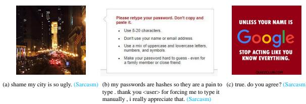
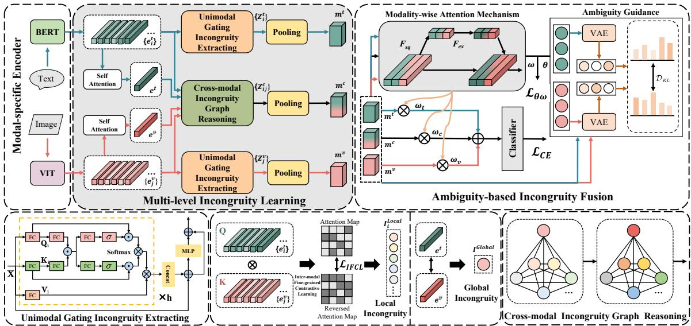
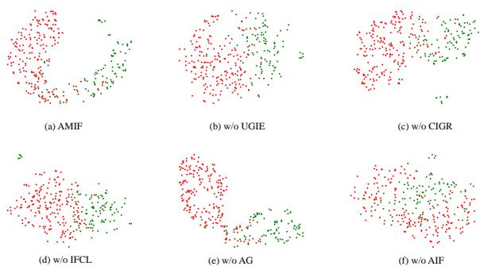
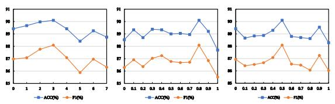

# Ambiguity-aware Multi-level Incongruity Fusion Network for Multi-Modal Sarcasm Detection

Kuntao Li1\*, Yifan Chen1\*, Qiaofeng Wu1, Weixing Mai1

Fenghuan Li2†, Yun Xue1†

1Guangdong Provincial Key Laboratory of Quantum Engineering and Quantum Materials, School of Electronic Science and Engineering (School of Microelectronics), South China Normal University

2School of Computer Science and Technology, Guangdong University of Technology {likuntao,chenyifan,maiwx,scnu\_wqf,xueyun}@m.scnu.edu.cn fhli20180910@gdut.edu.cn

## Abstract

Multi-modal sarcasm detection aims to identify whether a given image-text pair is sarcastic. The pivotal factor of the task lies in accurately capturing incongruities from different modalities. Although existing studies have achieved impressive success, they primarily committed to fusing the textual and visual information to establish cross-modal correlations, overlooking the significance of original unimodal incongruity information at the text-level and imagelevel. Furthermore, the utilized fusion strategies of cross-modal information neglected the effect of inherent ambiguity within text and image modalities on multimodal fusion. To overcome these limitations, we propose a novel Ambiguity-aware Multi-level Incongruity Fusion Network (AMIF) for multi-modal sarcasm detection. Our method involves a multi-level incongruity learning module to capture the incongruity information simultaneously at the textlevel, image-level and cross-modal-level. Additionally, an ambiguity-based fusion module is developed to dynamically learn reasonable weights and interpretably aggregate incongruity features from different levels. Comprehensive experiments conducted on a publicly available dataset demonstrate the superiority of our proposed model over state-of-the-art methods.

## 1 Introduction

Sarcasm represents a pervasive linguistic phenomenon denoting a discrepancy between literal meanings and implied intentions (Liu et al., 2022; Wu et al., 2025). Consequently, sarcasm detection holds the potential to unveil a person’s real emotions and attitudes, providing significant advantages for tasks like product review analysis and political opinion mining (Wen et al., 2023; Chen et al., 2024b,a). In this paper, sarcasm refers generally to all linguistic phenomena with irony or satire.

  
Figure 1: Examples of Twitter data with sarcasm.

Early research on sarcasm detection predominantly focused on unimodal approaches. These methods regarded the sarcastic contexts or the sentiments of sarcasm makers as valuable indicators for modeling the textual incongruity, which captured sarcastic features at the text-level (Tay et al., 2018; Xiong et al., 2019). Alternatively, other works explored the incongruity of different visual regions to mine sarcastic features at the image-level (Cai et al., 2019; Kumar and Garg, 2019). However, since most social media posts contain abundant multimodal information (e.g., image and text), relying solely on unimodal approaches is insufficient for accurate sarcasm/non-sarcasm classification.

Recently, multi-modal sarcasm detection has attracted significant attention. Previous methods sought to explore diverse multimodal strategies for fusing textual and visual features to improve multi-modal sarcasm detection performance (Liang et al., 2021, 2022; Song et al., 2023; Liu et al., 2024; Zhong et al., 2024). However, they neglected the importance of capturing unimodal text-level and image-level sarcastic features. Furthermore, it’s crucial to recognize that not all levels of sarcastic features contribute equally to the decisionmaking process. In Figure 1(a), the image portrays a beautiful night scene while the text describes it as "ugly". It is challenging to distinguish sarcasm/nonsarcasm based solely on text-level or image-level sarcastic features. Prediction performance can be improved by capturing and enhancing cross-modallevel incongruity representation. However, in certain instances, unimodal incongruities play a more crucial role, while cross-modal-level incongruity may not be pivotal and could potentially introduce noise to the classification task. As illustrated in Figure 1(b), the interplay among the words “pain”, “thanks” and “forcing” is rich in sarcasm, providing a basis for considering it a sarcastic tweet. Likewise, in Figure 1(c), we can observe that the sentence in the image contains a wealth of sarcastic incongruity information, while the text makes a limited contribution to sarcasm detection. Hence, the primary questions revolve around: 1) how to more effectively mine text-level, image-level and cross-modal-level incongruity information simultaneously; 2) how different levels of incongruity affect the decision-making process and how to weigh their importance.

Taking the consideration above, we propose a novel Ambiguity-aware Multi-level Incongruity Fusion Network (AMIF) for multi-modal sarcasm detection. Specifically, we design a Multi-level Incongruity Learning module (MIL) to learn textlevel, image-level and cross-modal-level incongruity information simultaneously. In this module, we introduce Unimodal Gating Incongruity Extracting module (UGIE) to leverage the contextual information of the text and image, effectively mining text-level and image-level sarcastic features. Additionally, we introduce Cross-modal Incongruity Graph Reasoning module (CIGR), which captures the vector-based incongruity relationship between local and global alignments to identify more complex cross-modal sarcastic features. Subsequently, we feed the learned multi-level incongruity information into Ambiguity-based Incongruity Fusion module (AIF) for adaptive weighted fusion. In this module, we initially utilize cross-modal ambiguity (Chen et al., 2022) to quantify the relationship between incongruity information at different levels, which guides the modality-wise attention mechanism to adaptively assign reasonable weights to different levels of incongruity information, facilitating the effective aggregation of sarcastic features across diverse levels.

The main contributions of this work are summarized as follows:

• We propose a novel MIL module to simultaneously mine incongruity information from different levels of unimodal and cross-modal, which utilizes UGIE to mine the text-level and image-level sarcastic features and adopts

CIGR to extract the complex cross-modal sarcastic features.

• We are the first to introduce cross-modal ambiguity to quantify the correlations among different levels of incongruity information for multimodal sarcasm detection, based on which we propose an AIF module that includes a modality-wise attention mechanism and an ambiguity guidance to adaptively assign reasonable weights and interpretably aggregate incongruity features from different levels.

• We conduct numerous experiments on a publicly available benchmark dataset. Experimental results show the superiority of our method over state-of-the-art methods.

## 2 Related Work

## 2.1 Multi-modal Sarcasm Detection

Unlike previous text-only sarcasm or irony detection tasks in other source languages that distinguish between sarcasm and irony (Potamias et al., 2020; Tomás et al., 2023; Cervone et al., 2017). In this paper, "sarcasm" refers to a linguistic phenomenon in general that is not fundamentally different from irony or satire in English. The rise of multimedia platforms has led to an increase in posts presented as image-text pairs, attracting plentiful research on multimodal sarcasm detection. Cai et al. (2019) established a new dataset and demonstrated that cross-modal information can provide complementary advantages to improve the performance of multi-modal sarcasm detection. Liang et al. (2021); Liu et al. (2022, 2024); Ma et al. (2024) revealed that the key to achieving effective multi-modal sarcasm detection lies in accurately extracting incongruities from different modalities. Hence, Liang et al. (2022) adopted object extraction technology to integrate specific visual regions and local semantic information to capture cross-modal sarcastic features, but they ignored the global alignment between the image and text. Another approach (Zhong et al., 2024) modeled textual and visual information at the multi-scale and multi-span token level to address image–text incongruity. Fang et al. (2024) investigated a cross-modal multi-granularity alignment module to capture align context features. The latest LLMs-based work (Jia et al., 2024) defined the task of out-of-distribution to evaluate models’ generalizability when the word distribution is different in training and testing settings. Although multimodal approaches had also achieved notable performance, most of them tended to use multimodal strategies to fuse textual and visual features, ignoring the significance of capturing text-level and image-level sarcastic features. Different from these works, we aim to improve this task by simultaneously mining incongruity information from different levels of unimodal and cross-modal.

## 2.2 Multimodal Fusion

Multimodal fusion is the core content of multimodal deep learning technology, which aims to fuse the information from distinct modalities to derive abundant features (Mai et al., 2024; Zhang et al., 2023, 2024a). Wang et al. (2019) constructed a deep neural network to embed inputs from different modalities and computed the similarity of different semantic vectors for late multimodal fusion. Ben-Younes et al. (2019) proposed Block, a new multimodal fusion model based on the blocksuperdiagonal tensor decomposition. Nagrani et al. (2021) modeled a architecture that used “fusion bottlenecks” for modality fusion at multiple layers to improve multimodal fusion performance. Other studies started from the common feature and specific feature, aiming to explore the redundancy and complementarity of diverse modalities for the final fusion (Lu et al., 2020; Wu et al., 2021). And Chen et al. (2022) considered the inherent ambiguity between different contents and proposed the crossmodal ambiguity learning from the perspective of information theory to measure the importance of different modalities in multi-modal classification tasks. Cross-modal ambiguity learning achieved more efficient multimodal fusion. Nevertheless, existing works for multi-modal sarcasm detection utilized attention mechanism, GCN and GAT to fuse sarcastic features from different modalities (Liu et al., 2022; Song et al., 2023; Fang et al., 2024; Liu et al., 2024; Wu et al., 2025). They neglected the effect of inherent ambiguity for multi-modal sarcasm detection.

## 3 Methodology

## 3.1 Modal-specific Encoder

Given the input $x = ( x ^ { t } , x ^ { v } ) \in \mathcal { D }$ , where $x ^ { t } , x ^ { v }$ and D denote the text, image and dataset, respectively. In this paper, $x ^ { t } = \{ w _ { i } \} _ { i = 1 } ^ { n }$ , n refers to the length of the text, we utilize the pre-trained BERT (Kenton and Toutanova, 2019) to embed each word of the text. The final word embedding denotes as $e _ { i } ^ { t } \in \mathbb { R } ^ { d }$ , i means the i-th word. For each image, we first divide the image into K regions, and then choose the pre-trained ViT (Dosovitskiy et al., 2020) as our image encoder to embed each visual region of the image. The final region embedding denotes as $e _ { j } ^ { v } \in \mathbb { R } ^ { d } , j$ means the j-th region.

## 3.2 Multi-level Incongruity Learning

Unimodal Gating Incongruity Extracting. To comprehensively exploit the hidden intra-modal contextual sarcastic cues, we propose the UGIE, which contains the multi-head self-attention and gate mechanism.

The multi-head self-attention with h heads can capture intra-modal contextual sarcastic cues from different subspaces. This can be calculated as:

$$
H _ { i } = A t t e n t i o n ( Q _ { i } , K _ { i } , V _ { i } )\tag{1}
$$

where $H _ { i }$ denotes the output of the i-th head, $Q _ { i } =$ $X W _ { i } ^ { Q } , K _ { i } = X W _ { i } ^ { K } , \bar { V } _ { i } = X W _ { i } ^ { V }$ denote the query, key and value of the i-th head, respectively. $\ b { X } \in \mathbb { R } ^ { n \times d }$ refers to the input, n and d separately denote the length and hidden dimension of $\mathbf { \dot { X } } . \mathbf { \nabla } W _ { i } ^ { \dot { Q } }$ $W _ { i } ^ { K } \in \mathbb { R } ^ { n \times \bar { d } _ { k } }$ and $W _ { i } ^ { V } \in \mathbb { R } ^ { n \times d _ { v } }$ are learnable parameter matrices. $d _ { k } = d _ { v } = d / h$

The multi-head self-attention mechanism attempts to lead the model to concentrate on correlations among various segments of the complete unimodal input. Nevertheless, the projected queries and keys may incorporate noise or sarcasmunrelated information. To effectively convey the captured intra-modal useful sarcastic cues and suppress the irrelevant ones, we design a novel fusion strategy that integrates the multi-head self-attention mechanism with the gate mechanism. Specifically, for the i-th head, we initially map $Q _ { i }$ and $K _ { i }$ into a common space and fuse them. Then, we adopt two fully-connected layers to get the gating masks:

$$
G _ { i } = ( Q _ { i } W _ { Q } ^ { G } ) \odot ( K _ { i } W _ { K } ^ { G } )\tag{2}
$$

$$
M _ { Q } ^ { i } = \sigma ( G _ { i } W _ { Q } ^ { M } ) ; M _ { K } ^ { i } = \sigma ( G _ { i } W _ { K } ^ { M } )\tag{3}
$$

where $G _ { i } \in \mathbb { R } ^ { n \times d _ { k } }$ is the fusion result. $W _ { Q } ^ { G } , W _ { K } ^ { G }$ $W _ { Q } ^ { M } , W _ { K } ^ { M } \in \mathbb { R } ^ { d _ { k } \times d _ { k } }$ are the learnable projection matrices. $M _ { Q } ^ { i } , M _ { K } ^ { i } \in \mathbb { R } ^ { n \times d _ { k } }$ denote the gating masks. σ refers to the sigmoid function.

Finally, we use these obtained gating masks to filter sarcasm-unrelated contextual information of original $Q _ { i }$ and $K _ { i }$ , as follows:

$$
\widetilde { H } _ { i } = A t t e n t i o n ( Q _ { i } \odot M _ { Q } ^ { i } , K _ { i } \odot M _ { K } ^ { i } , V _ { i } )\tag{4}
$$

  
Figure 2: The architecture of the proposed AMIF.

where $\tilde { H } _ { i } \in \mathbb R ^ { n \times d _ { v } }$ is the gating multi-head selfattention result of the i-th head.

We concatenate all heads to obtain the hidden intra-modal contextual sarcastic cues:

$$
f ( X ) = C o n c a t ( \widetilde { H } _ { 1 } , \widetilde { H } _ { 2 } , \cdot \cdot \cdot , \widetilde { H } _ { h } ) + X\tag{5}
$$

We take the residual connection operation on the output of an additional MLP and the original $f ( X )$ to obtain the final output of UGIE, as follows:

$$
F _ { U G I E } ( \boldsymbol { X } ) = f ( \boldsymbol { X } ) + M L P ( f ( \boldsymbol { X } ) )\tag{6}
$$

Finally, we adapt UGIE for both the text and image, denoted as: $Z _ { i } ^ { t } = F _ { U G I E } ( e _ { i } ^ { t } )$ and $Z _ { j } ^ { v } =$ $F _ { U G I E } ( e _ { j } ^ { v } )$ , where $Z _ { i } ^ { t }$ and $Z _ { j } ^ { v }$ separately represent the output of UGIE for the text and image.

Cross-modal Incongruity Graph Reasoning. To extract intricate cross-modal sarcastic cues, we perform cross-modal incongruity graph reasoning on graph constructed with aligned local and global incongruity representations as graph nodes.

Existing multi-modal sarcasm detection models have employed scalar-based methods to represent the incongruity information between the feature vectors of the text and image, which is unable to capture comprehensive correspondences (Liu et al., 2022; Song et al., 2023; Ma et al., 2024; Zhong et al., 2024; Zhang et al., 2024b). Therefore, in this section, we adopt a vector-based approach to compute both local and global correspondences for cross-modal sarcastic features alignment, which can capture rich incongruity information between feature representations from different modalities.

This can be computed as:

$$
I ( a , b ; W _ { I } ) = \frac { W _ { I } | a - b | ^ { 2 } } { \| W _ { I } | a - b | ^ { 2 } \| _ { 2 } }\tag{7}
$$

where a, $b \in \mathbb { R } ^ { d }$ are two different vectors, $| \cdot | ^ { 2 }$ and $\| \cdot \| _ { 2 }$ separately represent the element-wise square and ℓ -norm. $W _ { I } \in R ^ { m \times d }$ is a parameter matrix.

Local incongruity. To explore the correspondence between local features of the image and text, we apply cross attention mechanism to attend on each region with respect to each word. Then, we obtain the attended visual representation $a _ { i } ^ { v }$ with respect to i-th word, as follows:

$$
c _ { i , j } = \frac { e _ { i } ^ { t } ( e _ { j } ^ { v } ) ^ { \top } } { \sqrt { d _ { k } } }\tag{8}
$$

$$
\alpha _ { i } ^ { j } = \frac { \exp ( \beta c _ { i , j } ) } { \sum _ { j = 1 } ^ { K } \exp ( \beta c _ { i , j } ) } ; a _ { i } ^ { v } = \sum _ { j = 1 } ^ { K } \alpha _ { i } ^ { j } e _ { j } ^ { v }\tag{9}
$$

where $c _ { i , j }$ indicates the attention score for the intermediate transition between i-th word feature and j-th region feature, $\alpha _ { i } ^ { j }$ denotes the final attention weight between i-th word feature and $j \cdot$ -th region feature. β is the inversed temperature factor.

We also design Inter-modal Fine-grained Contrastive Learning (IFCL) to refine the attention mechanism for acquiring more precise text-guided visual representation. Specifically, the attended visual representation $a _ { i } ^ { v }$ prioritizes the congruity between the image and text, while the reversed attention visual representation $\hat { a } _ { i } ^ { v }$ emphasizes the incongruity between the image and text:

$$
\hat { \alpha } _ { i } ^ { j } = \frac { \exp ( \beta ( 1 - c _ { i , j } ) ) } { \sum _ { j = 1 } ^ { K } \exp ( \beta ( 1 - c _ { i , j } ) ) } ; \hat { a } _ { i } ^ { v } = \sum _ { j = 1 } ^ { K } \hat { \alpha } _ { i } ^ { j } e _ { j } ^ { v }\tag{10}
$$

The loss function of IFCL can be defined as:

$$
\mathcal { L } _ { I F C L } = [ S i m ( e _ { i } ^ { t } , \hat { a } _ { i } ^ { v } ) - S i m ( e _ { i } ^ { t } , a _ { i } ^ { v } ) + \gamma ] _ { + }\tag{11}
$$

where $\gamma$ controls the similarity difference margin.   
Sim is the similarity function.

Then, we calculate the vector-based cross-modal local incongruity between $a _ { i } ^ { v }$ and $e _ { i } ^ { t }$ with Equation $7 { : }$

$$
I _ { i } ^ { L o c a l } = I ( e _ { i } ^ { t } , a _ { i } ^ { v } ; W _ { I } ^ { l } )\tag{12}
$$

where $W _ { I } ^ { l } \in \mathbb { R } ^ { m \times d }$ is a parameter matrix.

Global incongruity. To explore effective and indepth correspondence between the global features of the entire text and image, we initially execute self-attention over all the obtained word and region embeddings respectively to yield the global text feature representation $e ^ { \bar { t } } \in \mathbb { R } ^ { d }$ and the global image feature representation $e ^ { \bar { v } } \in \mathbb { R } ^ { d }$

Likewise, we calculate the vector-based crossmodal global incongruity between $e ^ { \bar { t } }$ and $e ^ { \bar { v } }$ with Equation 7:

$$
I ^ { G l o b a l } = I ( e ^ { \bar { t } } , e ^ { \bar { v } } ; W _ { I } ^ { g } )\tag{13}
$$

where $W _ { I } ^ { g } \in \mathbb { R } ^ { m \times d }$ is a parameter matrix.

Next, to achieve comprehensive reasoning for captured local and global incongruity information, we construct an incongruity graph to transmit the cross-modal incongruity. Specifically, we denote the local incongruity representations and global incongruity representation as nodes ${ \mathcal { N } } =$ $\{ I _ { 1 } ^ { L o c a l } , \cdot \cdot \cdot , \bar { I } _ { n } ^ { L o c a l } , I ^ { \hat { G } l o b a l } \}$ , and the edge from node $I _ { v } \in \mathcal { N }$ to $I _ { u } \in \mathcal { N }$ can be computed as:

$$
E ( I _ { u } , I _ { v } ) = \frac { \exp ( ( P _ { I } ^ { i n } I _ { u } ) ( P _ { I } ^ { o u t } I _ { v } ) ) } { \sum _ { v } \exp ( ( P _ { I } ^ { i n } I _ { u } ) ( P _ { I } ^ { o u t } I _ { v } ) ) }\tag{14}
$$

where $P _ { I } ^ { i n } , P _ { I } ^ { o u t } \in \mathbb { R } ^ { d \times d }$ are the linear transformations for incoming and outgoing nodes, respectively.

Subsequently, we perform cross-modal incongruity graph reasoning by iteratively updating the nodes and edges within the graph, as follows:

$$
\hat { I } _ { u } ^ { t } = \sum _ { v } E ( I _ { u } ^ { t } , I _ { v } ^ { t } ) \cdot I _ { v } ^ { t } ; I _ { u } ^ { t + 1 } = R e L U ( P _ { I } ^ { t } \hat { I } _ { u } ^ { t } )\tag{15}
$$

where $I _ { u } ^ { 0 }$ and $I _ { v } ^ { 0 }$ are taken from $\mathcal { N }$ at step $t = 0$ $P _ { I } ^ { t }$ is a learnable parameter in each step. We iterate

T steps of incongruity reasoning and converge the information of the global node and all local nodes at the last step as the final reasoned incongruity representation $Z _ { i j } ^ { c }$

Finally, we take average-pooling on the output of UGIE and CIGR respectively to obtain the final multi-level incongruity representations, namely, text-level incongruity $m ^ { t }$ , cross-modal-level incongruity $m ^ { c }$ and and image-level incongruity $m ^ { v }$

## 3.3 Ambiguity-based Incongruity Fusion

Modality-wise Attention Mechanism (MAM). Inspired by the excellent performance of channel attention in computer vision (Zhang et al., 2022; Zhao et al., 2023), we design a modality-wise attention mechanism module, which help us to reweight the different levels of incongruity information before fusing them. Concretely, we first concatenate $m ^ { t } , m ^ { c }$ and $m ^ { v } \in \mathbb { R } ^ { d \times 1 }$ as: $m ^ { f } = m ^ { t } \oplus m ^ { c } \oplus m ^ { v }$ Then, we take the squeeze operation $F _ { s q } ( m ^ { f } ) =$ GlobalAverageP ooling(mf) to aggregate global modality-wise incongruity information into a $\mathbb { R } ^ { 1 \times 3 }$ vector. Subsequently, we adopt a gating mechanism $F _ { e x } ( m ^ { f } ) = \bar { \sigma } ( W _ { 2 } \delta ( W _ { 1 } F _ { s q } \bar { ( m ^ { f } ) } ) )$ to obtain the modality-wise attention weight $\omega = \{ \omega _ { t } , \omega _ { c } , \omega _ { v } \}$ where σ refers to the sigmoid activation, δ is the ReLU function, $W _ { 1 } \in \mathbb { R } ^ { 3 \times 1 }$ and $W _ { 2 } \in \mathbb { R } ^ { 1 \times 3 }$ are learnable parameter matrices.

Ambiguity Guidance (AG). When the crossmodal information gap is small, unimodal incongruity features alone are adequate for accurate sarcasm detection. Conversely, when there exists a significant information gap between unimodalities, relying solely on unimodal incongruity features becomes insufficient and additional attention should be paid to the cross-modal incongruity features. Therefore, inspired by Chen et al. (2022), we introduce the cross-modal ambiguity to measure the information gap between the text-level incongruity and the image-level incongruity.

Specifically, we use the Variational Autoencoder (VAE) (Khattar et al., 2019) to model the divergence over feature space to approximate the ambiguity between $m ^ { t }$ and $m ^ { v }$ . The variational posterior can be denoted as: $q ( z ^ { t / v } \mid m ^ { t / v } ) = \mathcal { N } ( z ^ { t / v } \mid$ $\mu ( m ^ { t / v } ) , \sigma ( m ^ { t / v } ) \}$ , where the mean $\mu$ and variance σ can be obtained from the modal-specific encoder, $t / v$ denotes text or image-modality. Considering the distribution over the mini-batch:

$$
q ( z ^ { t / v } ) = \frac { 1 } { A } \sum _ { i = 1 } ^ { A } q ( z _ { i } ^ { t / v } \mid m _ { i } ^ { t / v } )\tag{16}
$$

where A denotes the size of mini-batch, i refers to the i-th sample $x _ { i }$ in mini-batch. We quantify the ambiguity between the image-level incongruity distributions and the text-level incongruity distributions of sample $x _ { i }$ by the averaged KL divergence:

$$
\theta _ { i } ^ { t  v } = ( \frac { D _ { K L } ( q ( z _ { i } ^ { t } | | m _ { i } ^ { t } ) | | q ( z _ { i } ^ { v } | | m _ { i } ^ { v } ) ) } { D _ { K L } ( q ( z ^ { t } ) | | q ( z ^ { v } ) ) ) } )\tag{17}
$$

where $D _ { K L } ( \cdot | | \cdot )$ stands for the KL divergence.

Likewise, we can get the $\theta _ { i } ^ { v  t }$ with Equation 17, and compute the final ambiguity:

$$
\theta _ { i } = s i g m o i d ( \frac { \theta _ { i } ^ { t  v } + \theta _ { i } ^ { v  t } } { 2 } )\tag{18}
$$

Then, we obtain the cross-modal ambiguity scores $\theta = \{ 1 - \theta _ { i } , \theta _ { i } , 1 - \theta _ { i } \} _ { i = 1 } ^ { A }$

We also exploit a loss function as: $\begin{array} { r l } { \mathcal { L } _ { \theta \omega } } & { { } = } \end{array}$ $J S ( \theta | | \omega )$ to calculate the logarithmic difference between the attention weight $\omega = \{ \omega _ { t } , \omega _ { c } , \omega _ { v } \}$ and the cross-modal ambiguity scores $\theta = \{ 1 -$ $\theta _ { i } , \theta _ { i } , 1 - \theta _ { i } \} _ { i = 1 } ^ { A }$ . JS stands for the JS divergence. By minimizing $\mathcal { L } _ { \theta \omega } , \mathrm { A I F }$ can assign more reasonable attention scores to different levels of incongruity representations with ambiguity guidance.

Sarcasm Classifier. For each sample in minibatch, given the different levels of incongruity representations ${ m ^ { t } } , { m ^ { c } }$ and $m ^ { v }$ , the attention weights $\omega = \{ \omega _ { t } , \omega _ { c } , \omega _ { v } \}$ . We can compute the final multilevel incongruity fusion representation as follows:

$$
\widetilde { \boldsymbol { x } } _ { f } = ( \omega _ { t } \times \boldsymbol { m } ^ { t } ) \oplus ( \omega _ { c } \times \boldsymbol { m } ^ { c } ) \oplus ( \omega _ { v } \times \boldsymbol { m } ^ { v } )\tag{19}
$$

where $\oplus$ denoted the concatenation operation.

Then, we feed $\widetilde { x } _ { f }$ into a softmax layer with a fully-connected network to perform the prediction:

$$
\hat { y } = s o f t m a x ( M L P ( \widetilde { x } _ { f } ) )\tag{20}
$$

Thereafter, we take the cross-entropy loss function to calculate the loss:

$$
\mathcal { L } _ { C E } = - ( y \log ( \hat { y } ) + ( 1 - y ) \log ( 1 - \hat { y } ) )\tag{21}
$$

where $y$ refers the ground-truth label, $\hat { y }$ is the prediction label.

## 3.4 Training Objective

The overall loss function for AMIF is as follows:

$$
\mathcal { L } _ { A l l } = \mathcal { L } _ { C E } + \lambda \mathcal { L } _ { \theta \omega } + \lambda _ { I F C L } \mathcal { L } _ { I F C L }\tag{22}
$$

where λ and $\lambda _ { I F C L }$ control the ratio of $\mathcal { L } _ { \theta \omega }$ and $\mathcal { L } _ { I F C L }$ , respectively.

<table><tr><td>Model</td><td>Acc(%)</td><td>Pre(%) Rec(%)</td><td>F1(%)</td></tr><tr><td></td><td colspan="3">Image-Only</td></tr><tr><td>Image</td><td>64.76</td><td>54.41 70.80</td><td>61.53</td></tr><tr><td>VIT</td><td>67.83 57.93</td><td>70.07</td><td>63.43</td></tr><tr><td></td><td colspan="3">Text-Only</td></tr><tr><td>SIARN</td><td>80.57 75.55</td><td>75.70</td><td>75.63</td></tr><tr><td>SMSD</td><td>80.90 76.46</td><td>75.18</td><td>75.82</td></tr><tr><td>BERT</td><td>83.85 78.72</td><td>82.27</td><td>80.22</td></tr><tr><td>HFM</td><td colspan="3">Multi-Modal 76.57</td></tr><tr><td>D&amp;R Net</td><td>83.44 84.02</td><td>84.15</td><td>80.18 80.60</td></tr><tr><td>InCrossMGs</td><td>77.97 81.38</td><td>83.42 84.36</td><td>82.84</td></tr><tr><td>HKE</td><td>86.10 87.36 81.84</td><td></td><td></td></tr><tr><td>CMGCN</td><td></td><td>86.48</td><td>84.09</td></tr><tr><td></td><td>87.55 83.63</td><td>84.69</td><td>84.16</td></tr><tr><td>GAAN</td><td>87.42 82.91</td><td>86.62</td><td>84.72</td></tr><tr><td>MCEF</td><td>87.80 84.10</td><td>85.50</td><td>84.80</td></tr><tr><td>SAHFN</td><td>87.22 82.71</td><td>87.33</td><td>84.95</td></tr><tr><td>SEF</td><td>88.45 85.35</td><td>86.58</td><td>85.96</td></tr><tr><td>DMSD-CL</td><td>88.95 84.89</td><td>87.90</td><td>86.37</td></tr><tr><td>DGP</td><td>87.21 87.10</td><td>86.48</td><td>86.75</td></tr><tr><td>AMIF(Ours)</td><td>90.10 86.55</td><td>89.68</td><td>88.09</td></tr></table>

Table 1: Comparison results for sarcasm detection.

## 4 Experiments

## 4.1 Experiment Settings

Dataset. We assess our model by conducting experiments on a publicly available multi-modal sarcasm detection benchmark dataset constructed by Cai et al. (2019). The statistics of the dataset are shown in Appendix A.1.

Baselines. We compare the proposed AMIF with sixteen baselines shown in Table 1. More details on baselines are provided in Appendix A.2.

Implementation. The details of parameter implementations are listed in Appendix A.3.

## 4.2 Experimental Results and Analysis

We evaluate the effectiveness of our proposed framework through comparative analyses with baseline models, as presented in Table 1. Additionally, we derive the following observations: 1) It is evident that both the text and image play crucial roles in sarcasm detection. Therefore, it is imperative to fully excavate the incongruity information at the image-level and text-evel. Our AMIF successfully addresses this problem by designing the UGIE module. Multi-modal models consistently outperform text-only and image-only models in terms of the performance, which suggests that simultaneously exploiting the textual and visual contents to capture complex cross-modal-level incongruity information can improve the performance of multimodal sarcasm detection. The AMIF model utilizes the CIGR module to achieve this objective. 2) Moreover, AMIF consistently outperforms imageonly, text-only and multi-modal models on all evaluation metrics, which indicates that AMIF significantly boosts the performance of multi-modal sarcasm detection compared to existing works. Specifically, compared with the classical methods in recent years that do not consider the distribution gap between unimodal sarcastic information, AMIF is 4.00%, 3.93%, 3.37%, 3.29%, 2.13% and 1.34% higher than HKE, CMGCN, GAAN, MCEF, SEF and DGP on F1-score. This indicates that AMIF achieves more advanced performance by capturing multi-level incongruity information and introducing cross-modal ambiguity in AIF module to measure the incongruity information gap. Compared with the recent LLMs-based model DMSD-CL, AMIF achieves considerable improvements in all metrics, outperforming Acc, Pre, Rec and F1-score by 1.15%, 1.66%, 1.78% and 1.72%, respectively. Furthermore, AMIF improves 2.89% on accuracy and 1.34% on F1-score over the latest multi-modal state-of-the-art model DGP. The above experimental results validate the effectiveness and superiority of our proposed method.

<table><tr><td rowspan=1 colspan=1>Model</td><td rowspan=1 colspan=1>Acc(%) F1(%)</td><td rowspan=1 colspan=1>Model</td><td rowspan=1 colspan=1>Acc(%) F1(%)</td></tr><tr><td rowspan=1 colspan=1>AMIF</td><td rowspan=1 colspan=1>90.10  88.09</td><td rowspan=1 colspan=1>w/o IFCL</td><td rowspan=1 colspan=1>89.42  87.01</td></tr><tr><td rowspan=1 colspan=1>w/o UGIE</td><td rowspan=1 colspan=1>89.42  87.18</td><td rowspan=1 colspan=1>w/o AG</td><td rowspan=1 colspan=1>89.21  87.28</td></tr><tr><td rowspan=1 colspan=1>w/o CIGR</td><td rowspan=1 colspan=1>89.16  86.93</td><td rowspan=1 colspan=1>w/o AIF</td><td rowspan=1 colspan=1>88.53  86.29</td></tr></table>

Table 2: Experimental results of ablation study.

## 4.3 Ablation Study

To further investigate the effectiveness of each component in AMIF, we conduct a series of ablation studies: 1) w/o UGIE: we remove the unimodal gating incongruity extracting module at the textlevel and image-level; 2) w/o CIGR: we remove the cross-modal incongruity graph reasoning module at the cross-modal-level; 3) w/o IFCL: we remove the inter-modal fine-grained contrastive learning that assist cross-modal local incongruity alignment; 4) w/o AG: we remove the ambiguity guidance module; 5) w/o AIF: we remove the entire ambiguity-based incongruity fusion module and directly concatenate the three incongruity representations for the final classification.

Table 2 shows the results of ablation study. It is evident that the performance after removing any components is worse than the original AMIF, which demonstrates the effectiveness of each component. And detailed analyses are as follows: 1) Both the AMIF w/o UGIE and AMIF w/o CIGR exhibit significantly lower performance, demonstrating that simultaneously and efficiently mining the hidden incongruity information at the image-level, text-level and cross-modal-level is necessary for multi-modal sarcasm detection. 2) The performance of AMIF w/o IFCL decreases obviously, which verifies that IFCL is essential for mining complex and deepseated cross-modal sarcastic features by comparing fine-grained inter-modal fragments. 3) AMIF w/o AG exhibits a 0.81% decrease in F1-score and a 0.89% decrease in accuracy compared to the full AMIF, suggesting that accounting for the inherent cross-modal ambiguity for multi-modal sarcasm detection task can be advantageous for improving performance. 4) Notably, the performance of AMIF w/o AIF experiences a further decline of nearly 1% on F1 and 0.68% on Acc compared to AMIF w/o AG, which validates the importance of adaptively fusing the different levels of incongruity.

  
Figure 3: T-SNE visualizations of the sarcastic feature vectors before classification that are learned by AMIF and its five variants.

## 4.4 Visualization

We further analyze the proposed model using the t-SNE (Van der Maaten and Hinton, 2008) algorithm to map the features before classification into a 2-dimensional Euclid space and visualize the feature vectors in Figure 3. These feature vectors are learned by AMIF and its five variants on the test dataset of Twitter. It is evident that the points corresponding to different labels in AMIF have a more distinct boundary than its all variants, demonstrating that the captured sarcastic features in AMIF are more discriminative. As shown Figure 3(d), the learned sarcastic features in AMIF w/o IFCL are easily misclassified, which reveals that

(a) CIGR steps T  
  
(b) JS loss weight factor �  
(c) constraint loss weight factor �����  
Figure 4: The influence of hyper-parameters.

IFCL can learn more accurate cross-modal correlations and deeply distinguish sarcasm/non-sarcasm posts. Comparing Figure 3(a), Figure 3(b) and Figure 3(c), we can see that simultaneously mining the unimodal and cross-modal hidden incongruity information can obtain multi-level sarcastic features from different modalities, thus effectively generating distinguished feature representations. Additionally, comparing Figure 3(a), Figure 3(e) and Figure 3(f), we can observe that considering the cross-modal ambiguity and adaptively fusing the different levels of incongruity information can significantly improve the representation ability of the final features.

## 4.5 Parametric Analysis

To explore the influence of different hyperparameters on the final prediction, we conduct extensive experimental studies for the number of CIGR steps T, JS loss weight factor λ and constraint loss weight factor $\lambda _ { I F C L }$ . Figure 4 records the metrics ACC and F1-score for different T, λ and $\lambda _ { I F C L }$ . Specifically, as depicted in Figure 4(a), performing 3 step of cross-modal incongruity graph reasoning yields optimal performance, and the model exhibits poor performance when the number of steps exceeds 3. We speculate the reason may be that an excess of reasoning steps leads to overfitting of local and global cross-modal incongruity information. Moreover, as illustrated in Figure 4(b), the highest F1-socre and ACC are achieved when λ is set to 0.8, AG and MAM can play a maximum role. When λ exceeds 0.8, the model’s performance steadily diminishes as λ increases. we speculate that the reason is assigning excessive weight to $\mathcal { L } _ { \theta \omega }$ introduces unexpected noise to the fusion module, disrupting the final prediction. Finally, as shown in Figure 4(c), the model achieves optimal performance when $\lambda _ { I F C L }$ is 0.5, whereas deviation from this value results in performance degradation. The reason behind this may be that excessively large or small values don’t enhance the accuracy of local incongruity computation, thereby affecting the subsequent cross-modal incongruity graph reasoning.

<table><tr><td></td><td>Text-Level</td><td>Image-Level</td><td>Cross-modal-Level</td></tr><tr><td>Image</td><td></td><td>This is reality!</td><td></td></tr><tr><td>Text</td><td>(a) she must not realize she looks (b) this is reality ... lol # reality # like the bigger idiot # funny</td><td>POOR RICH</td><td>(c) i think i may be the greatest</td></tr><tr><td></td><td></td><td>poorpeoples # richpeople # society # blogsbar</td><td>fisherman who has ever lived . just look at the size of my largemouth bass .</td></tr><tr><td>ωv ωc</td><td>0.195 0.323</td><td>0.707</td><td>0.361</td></tr><tr><td></td><td>0.786</td><td>0.264</td><td>0.752</td></tr><tr><td>ωt</td><td></td><td>0.359</td><td>0.257</td></tr><tr><td>HKE</td><td>Non-sarcasm(×)</td><td>Non-sarcasm(×)</td><td>Sarcasm(√)</td></tr><tr><td>SEF</td><td>Sarcasm(√)</td><td>Sarcasm(√)</td><td>Non-sarcasm(×)</td></tr><tr><td>AMIF(ours)</td><td>Sarcasm(√)</td><td>Sarcasm(√)</td><td>Sarcasm(√)</td></tr></table>

Figure 5: Different level sarcastic samples of case study on HKE, SEF and AMIF.

## 4.6 Case Study

To qualitatively analyze the advantage of our model, we visualize the attention weights in AIF module and present the predictions of open-sourced methods HKE, SEF and AMIF on three representative examples at different levels in Figure 5. Specifically, HKE achieves accurate detection for crossmodal-level example by capturing cross-modal atomic-level and composition-level incongruities, but they ignore the unimodal sarcastic features, leading to false predictions for the text-level and image-level examples. Moreover, SEF uses multiple contrastive learning to enhance unimodal semantic features, thus correct predictions are made in the image-level and text-level example. For the cross-modal-level example, SEF makes wrong prediction because it only adapts multi-scale fusion strategy to align the image and text, which neglects both the cross-modal coarse- and fine-grained features contribute to multi-modal sarcasm detection and is insufficient to capture complex cross-modal incongruity information. Conversely, our AMIF exploits the UGIE module to capture subtle unimodal incongruity at the image-level and text-level, implements more comprehensive vector-based local and global cross-modal incongruity graph reasoning by designing the CIGR module simultaneously, and then adaptively assigns reasonable weights using a modality-wise attention mechanism with ambiguity guidance to ensure accurate predictions for the three examples.

## 5 Conclusion

In this paper, we propose a novel Ambiguity-aware Multi-level Incongruity Fusion Network (AMIF) for multi-modal sarcasm detection. Specifically, we first suggest a multi-level incongruity learning module which can effectively and simultaneously mine both the latent unimodal sarcastic cues and complex cross-modal sarcastic cues. Moreover, we also design an ambiguity-based fusion module which can adaptively fuse the learned incongruity information from diverse levels. In this module, cross-modal ambiguity can guide the specific attention mechanism to assign reasonable weights for three different level incongruity information . Evaluation results demonstrate our AMIF significantly outperforms state-of-the-art methods on the benchmark dataset.

## Limitations

At this stage, we concentrate on two limitations of this work, aiming to inspire future potential research directions.

• For multi-modal sarcasm detection of social media posts, incorporating more external knowledge to enrich sentiment semantic information could improve the model’s predictive performance. Our model ignores the importance of external knowledge for this task.

• Although our cross-modal incongruity graph reasoning module improves the model’s performance, it primarily focuses on mining semantic-level information while neglecting syntactic dependencies between text nodes.

## Acknowledgement

This work was supported in part by Guangdong Basic and Applied Basic Research Foundation(2023A1515011370), National Natural Science Foundation of China (32371114), Characteristic Innovation Projects of Guangdong Colleges and Universities (2018KTSCX049), International Scientific and Technological Cooperation Project of Huangpu and Development Districts in Guangzhou (2022GH01, 2023GH05).

## References

Hedi Ben-Younes, Remi Cadene, Nicolas Thome, and Matthieu Cord. 2019. Block: Bilinear superdiagonal fusion for visual question answering and visual relationship detection. In Proceedings ofthe AAAI conference on artificial intelligence, volume 33, pages 8102–8109.

Yitao Cai, Huiyu Cai, and Xiaojun Wan. 2019. Multimodal sarcasm detection in twitter with hierarchical

fusion model. In Proceedings of the 57th annual meeting of the association for computational linguistics, pages 2506–2515.

Alessandra Cervone, Evgeny A Stepanov, Fabio Celli, and Giuseppe Riccardi. 2017. Irony detection: from the twittersphere to the news space. In Proceedings ofthe Fourth Italian Conference on Computational Linguistics (CLiC-it 2017), volume 2006.

Yifan Chen, Kuntao Li, Weixing Mai, Qiaofeng Wu, Yun Xue, and Fenghuan Li. 2024a. D2r: Dual-branch dynamic routing network for multimodal sentiment detection. In Proceedings ofthe 2024 Conference on Empirical Methods in Natural Language Processing, pages 3536–3547.

Yifan Chen, Haoliang Xiong, Kuntao Li, Weixing Mai, Yun Xue, Qianhua Cai, and Fenghuan Li. 2024b. Relevance-aware visual entity filter network for multimodal aspect-based sentiment analysis. International Journal ofMachine Learning and Cybernetics, pages 1–14.

Yixuan Chen, Dongsheng Li, Peng Zhang, Jie Sui, Qin Lv, Lu Tun, and Li Shang. 2022. Cross-modal ambiguity learning for multimodal fake news detection. In Proceedings of the ACM Web Conference 2022, pages 2897–2905.

Alexey Dosovitskiy, Lucas Beyer, Alexander Kolesnikov, Dirk Weissenborn, Xiaohua Zhai, Thomas Unterthiner, Mostafa Dehghani, Matthias Minderer, Georg Heigold, Sylvain Gelly, et al. 2020. An image is worth 16x16 words: Transformers for image recognition at scale. In Proceedings of the International Conference on Learning Representations.

Hong Fang, Dahao Liang, and Weiyu Xiang. 2024. Multi-modal sarcasm detection based on multichannel enhanced fusion model. Neurocomputing, 578:127440.

Kaiming He, Xiangyu Zhang, Shaoqing Ren, and Jian Sun. 2016. Deep residual learning for image recognition. In Proceedings of the IEEE conference on computer vision and pattern recognition, pages 770– 778.

Mengzhao Jia, Can Xie, and Liqiang Jing. 2024. Debiasing multimodal sarcasm detection with contrastive learning. In Proceedings of the AAAI Conference on Artificial Intelligence, volume 38, pages 18354– 18362.

Jacob Devlin Ming-Wei Chang Kenton and Lee Kristina Toutanova. 2019. Bert: Pre-training of deep bidirectional transformers for language understanding. In Proceedings ofthe naacL-HLT, volume 1, page 2.

Dhruv Khattar, Jaipal Singh Goud, Manish Gupta, and Vasudeva Varma. 2019. Mvae: Multimodal variational autoencoder for fake news detection. In Proceedings of the world wide web conference, pages 2915–2921.

Akshi Kumar and Geetanjali Garg. 2019. Sarc-m: sarcasm detection in typo-graphic memes. In Proceedings of the ICAESMT-2019, Uttaranchal University, Dehradun, India.

Bin Liang, Chenwei Lou, Xiang Li, Lin Gui, Min Yang, and Ruifeng Xu. 2021. Multi-modal sarcasm detection with interactive in-modal and cross-modal graphs. In Proceedings of the 29th ACM international conference on multimedia, pages 4707–4715.

Bin Liang, Chenwei Lou, Xiang Li, Min Yang, Lin Gui, Yulan He, Wenjie Pei, and Ruifeng Xu. 2022. Multimodal sarcasm detection via cross-modal graph convolutional network. In Proceedings ofthe 60th Annual Meeting ofthe Associationfor Computational Linguistics (Volume 1: Long Papers), pages 1767– 1777.

Hao Liu, Runguo Wei, Geng Tu, Jiali Lin, Cheng Liu, and Dazhi Jiang. 2024. Sarcasm driven by sentiment: A sentiment-aware hierarchical fusion network for multimodal sarcasm detection. Information Fusion, 108:102353.

Hui Liu, Wenya Wang, and Haoliang Li. 2022. Towards multi-modal sarcasm detection via hierarchical congruity modeling with knowledge enhancement. In Proceedings of the 2022 Conference on EMNLP, pages 4995–5006.

Yan Lu, Yue Wu, Bin Liu, Tianzhu Zhang, Baopu Li, Qi Chu, and Nenghai Yu. 2020. Cross-modality person re-identification with shared-specific feature transfer. In Proceedings of the IEEE/CVF Conference on Computer Vision and Pattern Recognition, pages 13379–13389.

Huiying Ma, Dongxiao He, Xiaobao Wang, Di Jin, Meng Ge, and Longbiao Wang. 2024. Multi-modal sarcasm detection based on dual generative processes. In Proceedings ofthe Thirty-Third International Joint Conference on Artificial Intelligence, pages 2279– 2287. International Joint Conferences on Artificial Intelligence Organization. Main Track.

Weixing Mai, Zhengxuan Zhang, Yifan Chen, Kuntao Li, and Yun Xue. 2024. Geda: Improving training data with large language models for aspect sentiment triplet extraction. Knowledge-Based Systems, 301:112289.

Arsha Nagrani, Shan Yang, Anurag Arnab, Aren Jansen, Cordelia Schmid, and Chen Sun. 2021. Attention bottlenecks for multimodal fusion. Advances in Neural Information Processing Systems, 34:14200–14213.

Rolandos Alexandros Potamias, Georgios Siolas, and Andreas-Georgios Stafylopatis. 2020. A transformerbased approach to irony and sarcasm detection. Neural Computing and Applications, 32(23):17309– 17320.

Liujing Song, Zefang Zhao, Yuxiang Ma, Yuyang Liu, and Jun Li. 2023. Global-aware attention network for multi-modal sarcasm detection. In 2023 IEEE

International Conference on Systems, Man, and Cybernetics (SMC), pages 2409–2414. IEEE.

Yi Tay, Anh Tuan Luu, Siu Cheung Hui, and Jian Su. 2018. Reasoning with sarcasm by reading inbetween. In Proceedings of the 56th Annual Meeting ofthe Associationfor Computational Linguistics (Volume 1: Long Papers), pages 1010–1020.

David Tomás, Reynier Ortega-Bueno, Guobiao Zhang, Paolo Rosso, and Rossano Schifanella. 2023. Transformer-based models for multimodal irony detection. Journal ofAmbient Intelligence and Humanized Computing, 14(6):7399–7410.

Laurens Van der Maaten and Geoffrey Hinton. 2008. Visualizing data using t-sne. Journal of machine learning research, 9(11).

Shuohang Wang, Sheng Zhang, Yelong Shen, Xiaodong Liu, Jingjing Liu, Jianfeng Gao, and Jing Jiang. 2019. Unsupervised deep structured semantic models for commonsense reasoning. In Proceedings of the NAACL-HLT, pages 882–891.

Changsong Wen, Guoli Jia, and Jufeng Yang. 2023. Dip: Dual incongruity perceiving network for sarcasm detection. In Proceedings of the IEEE/CVF Conference on Computer Vision and Pattern Recognition, pages 2540–2550.

Qiaofeng Wu, Wenlong Fang, Weiyu Zhong, Fenghuan Li, Yun Xue, and Bo Chen. 2025. Dual-level adaptive incongruity-enhanced model for multimodal sarcasm detection. Neurocomputing, 612:128689.

Yang Wu, Zijie Lin, Yanyan Zhao, Bing Qin, and Li-Nan Zhu. 2021. A text-centered shared-private framework via cross-modal prediction for multimodal sentiment analysis. In Findings ofthe ACL-IJCNLP 2021, pages 4730–4738.

Tao Xiong, Peiran Zhang, Hongbo Zhu, and Yihui Yang. 2019. Sarcasm detection with self-matching networks and low-rank bilinear pooling. In Proceedings ofthe world wide web conference, pages 2115–2124.

Nan Xu, Zhixiong Zeng, and Wenji Mao. 2020. Reasoning with multimodal sarcastic tweets via modeling cross-modality contrast and semantic association. In Proceedings ofthe 58th annual meeting ofthe Associationfor Computational Linguistics, pages 3777– 3786.

Hu Zhang, Keke Zu, Jian Lu, Yuru Zou, and Deyu Meng. 2022. Epsanet: An efficient pyramid squeeze attention block on convolutional neural network. In Proceedings of the Asian Conference on Computer Vision, pages 1161–1177.

Zhengxuan Zhang, Jianying Chen, Xuejie Liu, Weixing Mai, and Qianhua Cai. 2024a. ‘what’and ‘where’both matter: dual cross-modal graph convolutional networks for multimodal named entity recognition. International Journal of Machine Learning and Cybernetics, 15(6):2399–2409.

Zhengxuan Zhang, Weixing Mai, Haoliang Xiong, Chuhan Wu, and Yun Xue. 2023. A token-wise graph-based framework for multimodal named entity recognition. In 2023 IEEE International Conference on Multimedia and Expo (ICME), pages 2153–2158. IEEE.

Zhengxuan Zhang, Yin Wu, Yuyu Luo, and Nan Tang. 2024b. Mar: Matching-augmented reasoning for enhancing visual-based entity question answering. In Proceedings of the 2024 Conference on Empirical Methods in Natural Language Processing, pages 1520–1530.

Zhicai Zhao, Na Lv, Runquan Xiao, Qiang Liu, and Shanben Chen. 2023. Recognition of penetration states based on arc sound of interest using vgg-se network during pulsed gtaw process. Journal ofMan ufacturing Processes, 87:81–96.

Weiyu Zhong, Zhengxuan Zhang, Qiaofeng Wu, Yun Xue, and Qianhua Cai. 2024. A semantic enhancement framework for multimodal sarcasm detection. Mathematics, 12(2):317.

## A Appendix

## A.1 Dataset

We assess our model by conducting experiments on a publicly available multi-modal sarcasm detection benchmark dataset constructed by Cai et al. (2019). This dataset comprises English tweets expressing sarcasm as Positive examples and those expressing non-sarcasm as Negative examples. Each example in the dataset consists of a text and an associated image. The statistical information of the dataset is shown in Table 3.

## A.2 Baseline Models

We compare the proposed AMIF with eleven baselines, categorized into three groups: 1) Image-Only models: Image and ViT. 2) Text-Only models: SIARN, SMSD and BERT. 3) Multi-Modal models: HFM, D&R Net, InCrossMGs, HKE, CMGCN, GAAN, MCEF, SAHFN, SEF, DMSD-CL and DGP.

## A.2.1 Image-Only models

1. Image (Cai et al., 2019): a method that employs ResNet (He et al., 2016) to train a sarcasm classifier.

2. ViT (Dosovitskiy et al., 2020): a baseline that utilizes the [CLS] token representation of the pre-trained ViT for sarcasm detection.

<table><tr><td>Label</td><td>Training</td><td>Development</td><td>Testing</td></tr><tr><td>Positive</td><td>8642</td><td>959</td><td>959</td></tr><tr><td>Negative</td><td>11174</td><td>1451</td><td>1450</td></tr><tr><td>All</td><td>19816</td><td>2410</td><td>2409</td></tr></table>

Table 3: Statistics of the dataset.

## A.2.2 Text-Only models

1. SIARN (Tay et al., 2018): a model that adopts inner-attention for textual sarcasm detection.

2. SMSD (Xiong et al., 2019): a network that explores a self-matching network to capture textual incongruity information

3. BERT (Kenton and Toutanova, 2019): a baseline that utilizes the vanilla pre-trained uncased BERT-base, taking [CLS] token as the input.

## A.2.3 Text and Image models

1. HFM (Cai et al., 2019): a hierarchical multimodal features fusion model for multi-modal sarcasm detection.

2. D&R Net (Xu et al., 2020): a Decomposition and Relation Network modeling both crossmodality contrast and semantic association.

3. InCrossMGs (Liang et al., 2021): a graphbased model for leveraging the sarcastic relations from intra and inter-modal perspectives.

4. HKE (Liu et al., 2022): a baseline that combines external knowledge and considers atomic and composition-level congruities.

5. CMGCN (Liang et al., 2022): a method that constructs a cross-modal graph for each instance to explicitly draw the sarcastic relations between textual and visual modalities.

6. GAAN (Song et al., 2023): a attentionbased cross-modal multi-granularity alignment model.

7. MCEF (Fang et al., 2024): a multi-channel enhanced fusion model to maximize the information extraction between different modalities.

8. SAHFN (Liu et al., 2024): a hierarchical fusion model that uses attribute-object matching method to integrate sentiment information.

<table><tr><td>Hyper-parameters</td><td>Value</td></tr><tr><td>learning rate</td><td>1e-5</td></tr><tr><td>warm up proportion</td><td>0.2</td></tr><tr><td>number of training epochs</td><td>20</td></tr><tr><td>training batch size</td><td>32</td></tr><tr><td>maximum text length</td><td>64</td></tr><tr><td>number of CIGR steps  $T$ </td><td>3</td></tr><tr><td>JS loss weight factor λ</td><td>0.8</td></tr><tr><td>constraint loss weight factor  $\lambda _ { I F C L }$ </td><td>0.5</td></tr><tr><td>constraint similarity margin  $\gamma$ </td><td>0.1</td></tr><tr><td>inversed temperature factor  $\beta$ </td><td>100</td></tr></table>

Table 4: Hyper-parameter setting of our AMIF model.

9. SEF (Zhong et al., 2024): a method modeling textual and visual information at the multiscale and multi-span token level using contrastive learning.

10. DMSD-CL (Jia et al., 2024): a baseline using large language models to define the task of out-of-distribution aiming to evaluate models’ generalizability. It proposes a novel debiasing multimodal sarcasm detection framework with contrastive learning to mitigate the harmful effect of biased textual factors for robust out-of-distribution generalization.

11. DGP (Ma et al., 2024): a model based on dual generative processes to deeply explore emotional inconsistencies between modalities.

## A.3 Implementation Details

For a fair comparison, following the processing in Liang et al. (2021, 2022); Liu et al. (2022); Zhong et al. (2024); Ma et al. (2024), we utilize the pre-trained BERT-base-uncased model (Kenton and Toutanova, 2019) and ViT model (Dosovitskiy et al., 2020) as the text-encoder and image-encoder to embed each word and region. Following Liu et al. (2022); Fang et al. (2024); Zhong et al. (2024); Ma et al. (2024); Liu et al. (2024), we perform Accuracy, Precision, Recall, and F1-score to evaluate the model performance. The experimental results of our model are averaged over 10 runs using different random seeds to ensure statistical stability in the final reported results. The specific hyper-parameter settings are detailed in Table 4.