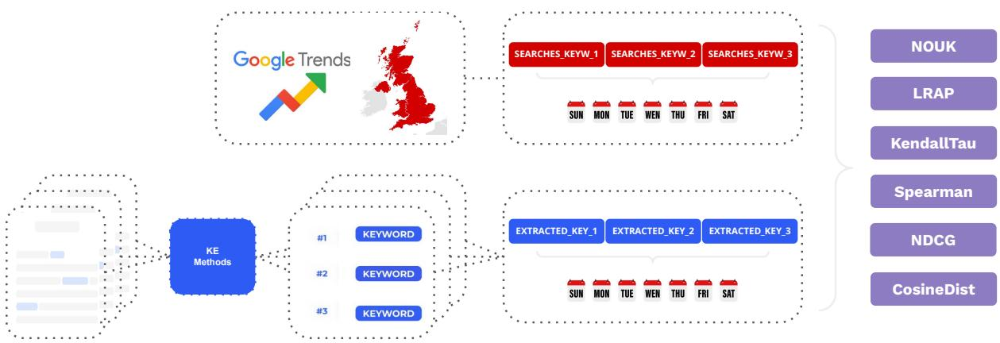

# Are Your Keywords Like My Queries? A Corpus-Wide Evaluation of Keyword Extractors with Real Searches

Martina Galletti1,4,\*, Giulio Prevedello1,3,\*, Emanuele Brugnoli2,3,4, D. Ruggiero Lo Sardo2,3,4, Pietro Gravino1,3,\*

1Sony Computer Science Laboratories - Paris, 6 Rue Amyot, 75005, Paris, France 2Sony CSL Rome Research, Joint Initiative CREF-SONY, CREF, Via Panisperna 89/A, 00184, Rome, Italy 3Enrico Fermi’s Research Center (CREF), via Panisperna 89/A, 00184, Rome, Italy 4Sapienza University of Rome, Via Ariosto 25, Roma, 00185, Italy

## Abstract

Keyword Extraction (KE) is essential in Natural Language Processing (NLP) for identifying key terms that represent the main themes of a text, and it is vital for applications such as information retrieval, text summarisation, and document classification. Despite the development of various KE methods — including statistical approaches and advanced deep learning models — evaluating their effectiveness remains challenging. Current evaluation metrics focus on keyword quality, balance, and overlap with annotations from authors and professional indexers, but neglect real-world information retrieval needs. This paper introduces a novel evaluation method designed to overcome this limitation by using real query data from Google Trends and can be used with both supervised and unsupervised KE approaches. We applied this method to three popular KE approaches (YAKE, RAKE and KeyBERT) and found that KeyBERT was the most effective in capturing users’ top queries, with RAKE also showing surprisingly good performance. The code is open-access and publicly available.

## 1 Introduction

Keyword extraction (KE) is a crucial task in Natural Language Processing (NLP) that involves identifying and extracting significant terms or phrases from a text to encapsulate its core themes. This process is essential for various applications, including information retrieval, content summarisation, and document classification. As the field of KE evolves, a range of methods has been developed, spanning from statistical approaches (El-Beltagy and Rafea, 2009; Campos et al., 2020; Rose et al., 2010) and graph-based techniques (Mihalcea and Tarau, 2004; Wan and Xiao, 2008b; Bougouin et al., 2013) to advanced deep learning models (Nadim et al., 2023; Grootendorst, 2020).

Despite advancements in KE methods, evaluating their effectiveness remains a multifaceted challenge. Most current metrics focus on the quality, balance and overlap of the extracted keywords. While these metrics provide useful insights, they often fail to capture users’ real-world needs, especially in the context of information retrieval. For example, standard metrics might assess how well the extracted keywords match the reference sets provided, but they fail to measure how effectively these keywords match users’ actual queries during a real-world document search.

In this paper, we propose a new and complementary metric that leverages real queries from Google Trends to assess KE effectiveness over time in the context of news. Our procedure can generalise to evaluate the performances of KE methods against a corpus-wide set of reference words, weighted –or not– by their importance. Moreover, it offers language independence and portability through the use of language-specific models and countryspecific search capabilities. The methodology is summarised in Fig.1.

## 2 Background

A significant challenge in KE is obtaining an appropriate dataset for training models. Typically, these corpora are annotated manually by the document’s authors, readers, professional indexers, or their intersections. These annotations are subjective, leading to disagreement typically quantified by inter-annotation agreement methods such as Cohen’s κ with values comprised between 0.45 and 0.85 as reported in (Firoozeh et al., 2020). This highlights the need for annotations that rely on clear, reproducible, and quantifiable criteria rather than personal judgment, ensuring greater consistency and reliability across different annotators.

However, constructing a sufficiently large corpus is both time-consuming and resourceintensive (Amur et al., 2023). In Appendix Table 3, we review the literature of news-related datasets for KE. As shown, only one corpus contains more than 100K documents.

  
Figure 1: The figure describes our methodology. Trends data are downloaded directly in weekly aggregated form. Keywords are extracted from each social media post of the news outlets with selected keyword extraction methods. The extracted keywords of each post are then aggregated weekly and compared with the different metrics in the figure.

Even if an annotated dataset exists for a specific task and domain, the evaluation of the KE is also challenging. This led to the development of various evaluation metrics. These are summarised and reviewed in Table 1 and they include intrinsic evaluations, i.e. metrics independent of the task, and extrinsic evaluations, i.e. metrics that assess performance in real-world applications such as in the work of (Wu et al., 2023). Both types face challenges related to human subjectivity, with variability in evaluator expertise and judgement that bias the assessment process.

Direct evaluation of KE, without reference datasets, is instead rare, with approaches ranging from simpler systems that select keywords based on noun phrase length, frequency, or cooccurrences (Barker and Cornacchia, 2000; Matsuo and Ishizuka, 2004) to methods that assess prediction utility in tasks like scientific document retrieval (Boudin and Gallina, 2021), multilingual information retrieval (Bracewell et al., 2005), and summarisation (Litvak and Last, 2008). Referencefree evaluations focusing on prediction diversity have also been explored (Bahuleyan and Asri, 2020). However, none of these methods account for metrics that reflect real-world user queries for documents. This is important for domains such as news reporting, scientific publishing, and digital marketing, where relevant keyword selection is essential for content visibility.

This gap underscores the need to integrate in KE real-world search data, such as Google Trends. Few studies have combined Google Trends with KE methods. For instance, Kelebercová and Munk (2022) used KE to identify search queries related to COVID-19 misinformation, enhancing the prediction of fake news, while Park et al. (2014) assessed the trendiness of blog keywords with a probabilistic model. Lastly, Kuai et al. (2021) introduced a new KE algorithm, incorporating Google Trends to optimise keyword selection and maximise search hit performance, highlighting the importance of popularity in keyword relevance. Despite these efforts, no assessment exists based on actual search queries.

In this paper, we propose a novel general assessment strategy using real Google Trends queries to evaluate three different KE methods in the news context over time and without relying on annotations.

## 3 Methods

## 3.1 Dataset

We used Google Trends as a comprehensive (Statista, 2024) source for reference keywords from real searches and the production of news posts on Facebook as a comprehensive (We Are Social, 2022) source for documents being searched. Their correspondence has been shown in previous works (Gravino et al., 2022, 2024) where they have been used as proxies for the supply and demand of information. Even if minor levels of deviation were observed, the time scale was pretty short (1-2 days), so we decided to aggregate weekly to reduce this effect. Google Trends data were gathered for the United Kingdom (UK). A period of five years, from 2018 to 2022, is covered with weekly resolution (i.e. 260 weeks). For each week, we have the top 25 most searched keywords. An integer value scores each keyword in [0, 100], based on the relative volumes of searches between keywords, with 100 being the score for the most searched term.

<table><tr><td rowspan=1 colspan=1></td><td rowspan=1 colspan=1>Precision</td><td rowspan=1 colspan=1>Recall</td><td rowspan=1 colspan=1>F1 Score</td><td rowspan=1 colspan=1>F1@M</td><td rowspan=1 colspan=1>R-precision</td><td rowspan=1 colspan=1>FG</td><td rowspan=1 colspan=1>MAP</td><td rowspan=1 colspan=1>MRR</td><td rowspan=1 colspan=1>BPERF</td><td rowspan=1 colspan=1>NDCG</td><td rowspan=1 colspan=1>BLEU</td><td rowspan=1 colspan=1>ROUGE-N</td><td rowspan=1 colspan=1>ROUGE-L</td><td rowspan=1 colspan=1>KP-Eval</td><td rowspan=1 colspan=1>BertScore</td></tr><tr><td rowspan=1 colspan=1>Focus</td><td rowspan=1 colspan=1>Quality</td><td rowspan=1 colspan=1>Completeness</td><td rowspan=1 colspan=1>Balance</td><td rowspan=1 colspan=1>Balance</td><td rowspan=1 colspan=1>Quality</td><td rowspan=1 colspan=1>Balance</td><td rowspan=1 colspan=1>Balance</td><td rowspan=1 colspan=1>Rank-First Hit</td><td rowspan=1 colspan=1>Rank-Quality</td><td rowspan=1 colspan=1>Rank-Usefulness</td><td rowspan=1 colspan=1>Overlap</td><td rowspan=1 colspan=1>Overlap</td><td rowspan=1 colspan=1>Overlap</td><td rowspan=1 colspan=1>Mixed</td><td rowspan=1 colspan=1>Semantic Sim.</td></tr><tr><td rowspan=1 colspan=1>Type</td><td rowspan=1 colspan=1>Ratio</td><td rowspan=1 colspan=1>Ratio</td><td rowspan=1 colspan=1>Ratio</td><td rowspan=1 colspan=1>Ratio</td><td rowspan=1 colspan=1>Ratio</td><td rowspan=1 colspan=1>Ratio</td><td rowspan=1 colspan=1>Average</td><td rowspan=1 colspan=1>Average</td><td rowspan=1 colspan=1>Average</td><td rowspan=1 colspan=1>Avg. Disc. Sum</td><td rowspan=1 colspan=1>Ratio</td><td rowspan=1 colspan=1>Ratio</td><td rowspan=1 colspan=1>Ratio</td><td rowspan=1 colspan=1>Mixed</td><td rowspan=1 colspan=1>Distance</td></tr><tr><td rowspan=1 colspan=1>Rank</td><td rowspan=1 colspan=1>No</td><td rowspan=1 colspan=1>No</td><td rowspan=1 colspan=1>No</td><td rowspan=1 colspan=1>No</td><td rowspan=1 colspan=1>No</td><td rowspan=1 colspan=1>No</td><td rowspan=1 colspan=1>No</td><td rowspan=1 colspan=1>Yes</td><td rowspan=1 colspan=1>Yes</td><td rowspan=1 colspan=1>Yes</td><td rowspan=1 colspan=1>No</td><td rowspan=1 colspan=1>No</td><td rowspan=1 colspan=1>No</td><td rowspan=1 colspan=1>Yes</td><td rowspan=1 colspan=1>No</td></tr><tr><td rowspan=1 colspan=1>Relevance</td><td rowspan=1 colspan=1>No</td><td rowspan=1 colspan=1>No</td><td rowspan=1 colspan=1>No</td><td rowspan=1 colspan=1>No</td><td rowspan=1 colspan=1>No</td><td rowspan=1 colspan=1>Yes</td><td rowspan=1 colspan=1>No</td><td rowspan=1 colspan=1>No</td><td rowspan=1 colspan=1>No</td><td rowspan=1 colspan=1>Yes</td><td rowspan=1 colspan=1>No</td><td rowspan=1 colspan=1>No</td><td rowspan=1 colspan=1>No</td><td rowspan=1 colspan=1>Yes</td><td rowspan=1 colspan=1>No</td></tr><tr><td rowspan=1 colspan=1>Similarity</td><td rowspan=1 colspan=1>No</td><td rowspan=1 colspan=1>No</td><td rowspan=1 colspan=1>No</td><td rowspan=1 colspan=1>No</td><td rowspan=1 colspan=1>No</td><td rowspan=1 colspan=1>No</td><td rowspan=1 colspan=1>No</td><td rowspan=1 colspan=1>No</td><td rowspan=1 colspan=1>No</td><td rowspan=1 colspan=1>No</td><td rowspan=1 colspan=1>Yes</td><td rowspan=1 colspan=1>Yes</td><td rowspan=1 colspan=1>Yes</td><td rowspan=1 colspan=1>Yes</td><td rowspan=1 colspan=1>Yes</td></tr><tr><td rowspan=1 colspan=1>References</td><td rowspan=1 colspan=1>2004,2017,2020</td><td rowspan=1 colspan=1>2004,2017,2020</td><td rowspan=1 colspan=1>2004,2017,2020</td><td rowspan=1 colspan=1>2009</td><td rowspan=1 colspan=1>2009</td><td rowspan=1 colspan=1>2021</td><td rowspan=1 colspan=1>2018</td><td rowspan=1 colspan=1>2017</td><td rowspan=1 colspan=1>2015</td><td rowspan=1 colspan=1>2021</td><td rowspan=1 colspan=1>2013,2019</td><td rowspan=1 colspan=1>2020</td><td rowspan=1 colspan=1>2020</td><td rowspan=1 colspan=1>2023</td><td rowspan=1 colspan=1>2022,2023</td></tr></table>

Table 1: Evaluation strategies for KE categorized by Focus, Type and Rank (i.e., whether the ranking of keywords matters), Relevance (i.e., whether the importance weight of the reference keyword matters), or Similarity between extracted and referenced keywords. Refer to Appendix Table 4 for an extended description.

We collected Facebook posts published by major UK news sources from the same time frame using CrowdTangle (CrowdTangle Team, 2023), a tool to gather content on Meta’s platforms, before its discontinuation on 14/08/2024. Accounts were selected following NewsGuard’s UK lists whose sources cover 95% of online engagement with news (NewsGuard, 2024). Keywords were then extracted from these posts, using three KE methods presented in the next section, and aggregated on a weekly basis to align with Google Trends. It is worth noting that some search queries are not related to news. For example, one of the most searched keywords is “facebook” because many users query this to access the social media platform. This may hinder the comparison; however, we have neglected this effect as it impacts all methods equally, thereby maintaining the validity of the comparative results. The weekly aggregation of extracted keywords are available upon request, while Google Trends data are available from trends.google.com.

## 3.2 Models

For our experiment, we selected three widely used, unsupervised, open models not fine-tuned for any specific domain: YAKE (v. 0.4.8, Campos et al., 2020), RAKE (v. 1.0.6, Rose et al., 2010), and KeyBERT (v. 0.8.5, Grootendorst, 2020).

YAKE uses statistical features such as word frequency, position, and co-occurrence to rank keywords quickly. RAKE identifies keyword phrases by splitting the text based on stopwords and then scores them using word frequency and co-occurrence. KeyBERT leverages deep learning embeddings to detect keywords by measuring their semantic similarity to the document. We used Key-BERT to extract keywords with daily embedding and weekly embedding, thus defining two versions from this model: Daily KeyBERT and Weekly Key-BERT. We chose YAKE and RAKE because they leverage different mechanisms while both being computationally efficient (Hu et al., 2018). Key-BERT was selected for its superior performance across multiple benchmarks (see Firoozeh et al., 2020), providing state-of-the-art accuracy for KE. The three methods have been chosen because we did not have annotations in our dataset. However, our evaluation can be applied to any KE method as long as user-centred data are available, i.e. search queries.

## 3.3 Metrics

We propose six metrics, also detailed in Appendix Table 5, to evaluate the performances of the KE methods. Since the reference (i.e. the Google Trends Top25) is provided in weekly aggregated form, the comparison has been performed corpuswide, calculating each metric as a comparison between the weighted reference keywords and the weekly aggregation of the extracted keyword frequency in the same time frame. If a reference keyword is not extracted, the frequency vector will include a zero entry for that keyword. To assess the performance of a KE method over the subsequent time frames, we calculate the average and standard deviation of each score over the weeks.

Number of undetected keywords (NOUK) counts the number of reference keywords that were never extracted from the news corpus. Of note, we defined this metric specifically for the present evaluation task.

<table><tr><td rowspan="2"></td><td colspan="2">NOUK</td><td colspan="2">LRAP</td><td colspan="2">Kendall&#x27;s τ</td><td colspan="2">Spearman&#x27;s ρ</td><td colspan="2">NDCG</td><td colspan="2">Cosine distance</td></tr><tr><td>AVG</td><td>STD</td><td>AVG</td><td>STD</td><td>AVG</td><td>STD</td><td>AVG</td><td>STD</td><td>AVG</td><td>STD</td><td>AVG</td><td>STD</td></tr><tr><td>RAKE</td><td>4.2269</td><td>1.4434</td><td>0.0127</td><td>0.0128</td><td>0.2397</td><td>0.1043</td><td>0.3241</td><td>0.1419</td><td>0.8587</td><td>0.0493</td><td>0.3929</td><td>0.1085</td></tr><tr><td>YAKE</td><td>20.4769</td><td>1.4689</td><td>0.0026</td><td>0.0075</td><td>0.0758</td><td>0.1289</td><td>0.0933</td><td>0.1539</td><td>0.8087</td><td>0.0435</td><td>0.6152</td><td>0.1262</td></tr><tr><td>Daily KeyBERT</td><td>6.0962</td><td>1.4843</td><td>0.0122</td><td>0.0119</td><td>0.3358</td><td>0.0972</td><td>0.4449</td><td>0.1248</td><td>0.9077</td><td>0.0365</td><td>0.3870</td><td>0.0673</td></tr><tr><td>Weekly KeyBERT</td><td>6.0923</td><td>1.5344</td><td>0.0126</td><td>0.0137</td><td>0.3257</td><td>0.0992</td><td>0.4291</td><td>0.1285</td><td>0.8957</td><td>0.0395</td><td>0.4077</td><td>0.0848</td></tr></table>

Table 2: Scores evaluating keywords extracted by RAKE, YAKE, Daily and Weekly KeyBERT against Google Trends Top25, aggregated by the weekly average (AVG) and standard deviation (STD). The best results are in bold.

Label ranking average precision (LRAP) calculates the fraction of reference keywords over all the extracted keywords with a frequency higher than one reference keyword, then averages this fraction over all keywords. Higher scores indicate that reference keywords are among the most frequently extracted. This metric generalises the mean reciprocal rank in Table 1 and is invariant to permutations of frequencies among reference keywords. Despite LRAP being a known metric for multilabel ranking, we did not find prior applications to keyword extraction evaluation.

Kendall’s τ calculates the fraction of pairwise disagreements between the two rankings (Kendall, 1938). Contrary to LRAP, this metric is unaffected by out-of-reference keyword placement in the frequency vector as long as the frequency order of the reference keywords remains unchanged.

Spearman’s ρ calculates the correlation between the two rankings, quantifying the monotonic relationship between them (Spearman, 1987).

Normalised Discounted Cumulative Gain (NDCG) sums the weights of reference keywords in the order of their frequency ranks, after applying a logarithmic discount. The sum is then normalised to obtain a score between 0 and 1, where 1 is attained when the rankings, from the weights and from the frequencies, coincide.

Cosine distance is the normalised scalar product of the vectors of weights and frequencies considering only matching keywords.

We did not include metrics that penalise errors of type II (i.e. False Negatives) since the set of references is capped at the top 25 keywords. As such, it is not possible to distinguish between correctly extracted, but less relevant, keywords and those that are misattributed. Our evaluation will focus on measuring the effectiveness of KE in extracting keywords that have the highest importance.

## 4 Results and Discussion

The weekly average and standard deviation of scores from RAKE, YAKE, Daily and Weekly Key-BERT are reported in Table 2. First we observed that YAKE performed poorly on NOUK, with an average 20% of reference keywords undetected compared $\mathrm { t o } < 7 \%$ for the other. LRAP scored close to 0 for all four methods, indicating that many non-reference keywords were extracted more frequently than reference keywords. RAKE slightly outperformed the other KE methods in this metric, likely due to its better detection of reference keywords as highlighted by the NOUK metric. The Kendall’s τ indicated that Daily KeyBERT violated fewer pairwise orders of reference keywords on average than the other methods. Spearman’s ρ suggested that these violations could be attributed to ranking errors of moderate entity, that preserve a positive monotonic relationship between keywords frequency and weight. NDCG indicated that most relevant reference keywords were correctly ranked above the others by all methods (> 80%), again with Daily KeyBERT outperforming other KE methods. Daily KeyBERT also performed best on the Cosine distance, extracting reference keywords with a frequency vector that is closer to the vector of the weights than other KE methods.

Overall, Daily KeyBERT emerged as the topperforming method, followed by Weekly Key-BERT, for the KE that reflects how most users requested for information over time. Daily Key-BERT’s better performance could stem from the model’s ability to quickly adapt to the latest trends, thus capturing emerging keywords. Weekly Key-BERT, could be suffer from a “lagging” as the weekly embeddings could be slower to reflect trends. Remarkably, RAKE performance did not lag much behind the embedding-based methods, and even scored best on NOUK and LRAP metrics, despite the lack of contextual information in its design. This highlights that RAKE, despite its simplicity compared to KeyBERT, delivers surprisingly strong performance on certain metrics, particularly when assessed on realistic, user-centered data.

## 5 Conclusion

This paper proposes a novel evaluation of KE methods, which are particularly valuable for information retrieval tasks. We review various KE techniques and highlight the lack of metrics that reflect realworld user queries. We propose a corpus-wide evaluation using Google Trends data and demonstrate it on a corresponding news corpus. For the evaluation, we adopted six metrics to assess how closely extracted keywords match the most searched queries and used them to assess three KE methods. We found that KeyBERT, the state-of-theart model for KE, also excels in this search-based corpus-wide evaluation, especially when used with a finer-grained context, and that RAKE, a much lighter KE method, obtains good performances, even better than KeyBERT in some metrics. In conclusion, this work introduces a novel KE assessment approach that leverages objective search activity data and does not rely on manual annotations. By aligning KE methods more closely with real-world usage scenarios, this method has the potential to enhance the performance and user experience of search engines and other query-based systems. In systems where the creators of items and their searchers form distinct communities, such as internet search engines, a language gap can hinder the effectiveness of query-based systems. Searcher behaviour data offers a promising solution to bridging this gap. This approach could improve information retrieval systems used for databased of movies, songs, books or products from online stores. Although this study did not address semantic search methods, we acknowledge their potential to provide valuable context. However, including such methods would require matching semantic patterns between search data and news data - a complex task beyond the scope of this short paper. This remains an important avenue for future research.

## 6 Limitations

Since Google Trends provides only aggregated data, we designed our comparison in a corpus-wide fashion. Also, the threshold at the top 25 keywords excludes additional relevant terms, which limits our KE evaluation. This limitation would be severe in the design of a KE method data but is less problematic in the context of an assessment. The focus on the most used 25 keywords defines a strategic necessary condition for KE: an algorithm aiming to be decent must perform at least well on the most popular keywords.

## Acknowledgments

This work has been supported by the Horizon Europe VALAWAI project (grant agreement number 101070930).

## References

Zaira Hassan Amur, Yew Kwang Hooi, Gul Muhammad Soomro, Hina Bhanbhro, Said Karyem, and Najamudin Sohu. 2023. Unlocking the potential of keyword extraction: The need for access to high-quality datasets. Applied Sciences, 13(12):7228.

Riris Bayu Asrori, Robert Setyawan, and Muljono Muljono. 2020. Performance analysis graph-based keyphrase extraction in indonesia scientific paper. In 2020 International Seminar on Application for Technology ofInformation and Communication (iSemantic), pages 185–190. IEEE.

Hareesh Bahuleyan and Layla El Asri. 2020. Diverse keyphrase generation with neural unlikelihood training. arXiv preprint arXiv:2010.07665.

K. Barker and N. Cornacchia. 2000. Using noun phrase heads to extract document keyphrases. In H.J. Hamilton, editor, Advances in Artificial Intelligence, volume 1822 of Lecture Notes in Computer Science, pages 31–42. Springer, Berlin, Heidelberg.

Abdelghani Bellaachia and Mohammed Al-Dhelaan. 2015. Short text keyphrase extraction with hypergraphs. Progress in Artificial Intelligence, 3:73–87.

Florian Boudin. 2018. Unsupervised keyphrase extraction with multipartite graphs. arXiv preprint arXiv:1803.08721.

Florian Boudin and Ygor Gallina. 2021. Redefining absent keyphrases and their effect on retrieval effectiveness. arXiv preprint arXiv:2103.12440.

Adrien Bougouin, Florian Boudin, and Béatrice Daille. 2013. Topicrank: Graph-based topic ranking for keyphrase extraction. In International joint conference on natural language processing (IJCNLP), pages 543–551.

David B Bracewell, Fuji Ren, and Shingo Kuriowa. 2005. Multilingual single document keyword extraction for information retrieval. In 2005 international conference on natural language processing and knowledge engineering, pages 517–522. IEEE.

Ricardo Campos, Vítor Mangaravite, Arian Pasquali, Alípio Jorge, Célia Nunes, and Adam Jatowt. 2020. Yake! keyword extraction from single documents using multiple local features. Information Sciences, 509:257–289.

Hou Pong Chan, Wang Chen, Lu Wang, and Irwin King. 2019. Neural keyphrase generation via reinforcement learning with adaptive rewards. In Proceedings of the 57th Annual Meeting of the Association for Computational Linguistics, pages 2163–2174, Florence, Italy. Association for Computational Linguistics.

CrowdTangle Team. 2023. Crowdtangle. Facebook, Menlo Park, California, United States.

Samhaa R El-Beltagy and Ahmed Rafea. 2009. Kpminer: A keyphrase extraction system for english and arabic documents. Information systems, 34(1):132– 144.

Nazanin Firoozeh, Adeline Nazarenko, Fabrice Alizon, and Béatrice Daille. 2020. Keyword extraction: Issues and methods. Natural Language Engineering, 26(3):259–291.

Corina Florescu and Cornelia Caragea. 2017. PositionRank: An unsupervised approach to keyphrase extraction from scholarly documents. In Proceedings of the 55th Annual Meeting of the Association for Computational Linguistics (Volume 1: Long Papers), pages 1105–1115, Vancouver, Canada. Association for Computational Linguistics.

Ygor Gallina, Florian Boudin, and Beatrice Daille. 2019. Kptimes: A large-scale dataset for keyphrase generation on news documents. arXiv preprint arXiv:1911.12559.

Anna Glazkova and Dmitry Morozov. 2023. Multi-task fine-tuning for generating keyphrases in a scientific domain. In 2023 IX International Conference on Information Technology and Nanotechnology (ITNT), pages 1–5. IEEE.

Pietro Gravino, Giulio Prevedello, and Emanuele Brugnoli. 2024. Online news ecosystem dynamics: supply, demand, diffusion, and the role of disinformation. Applied Network Science, 9(1).

Pietro Gravino, Giulio Prevedello, Martina Galletti, and Vittorio Loreto. 2022. The supply and demand of news during covid-19 and assessment of questionable sources production. Nature Human Behaviour, 6:1069–1078.

Maarten Grootendorst. 2020. Keybert: Minimal keyword extraction with bert.

Yibo Hu, Yang Li, Tao Yang, and Quan Pan. 2018. Short text classification with a convolutional neural networks based method. In 2018 15th International Conference on Control, Automation, Robotics and Vision (ICARCV), pages 1432–1435.

Lívia Kelebercová and Michal Munk. 2022. Search queries related to covid-19 based on keyword extraction. Procedia computer science, 207:2618–2627.

Maurice G Kendall. 1938. A new measure of rank correlation. Biometrika, 30(1-2):81–93.

Jihyuk Kim, Myeongho Jeong, Seungtaek Choi, and Seung-won Hwang. 2021. Structure-augmented keyphrase generation. In Proceedings of the 2021 Conference on Empirical Methods in Natural Language Processing, pages 2657–2667.

Su Nam Kim, Olena Medelyan, Min-Yen Kan, and Timothy Baldwin. 2013. Automatic keyphrase extraction from scientific articles. Language resources and evaluation, 47:723–742.

Fajri Koto, Timothy Baldwin, and Jey Han Lau. 2022. Lipkey: A large-scale news dataset for absent keyphrases generation and abstractive summarization. In Proceedings ofthe 29th International Conference on Computational Linguistics, pages 3427–3437.

Ssu-Chi Kuai, Wen-Hwa Liao, Chih-Yung Chang, and Gwo-Jong Yu. 2021. Fb-kea: A feature-based keyword extraction algorithm for improving hit performance. In 2021 IEEE International Conference on Consumer Electronics-Taiwan (ICCE-TW), pages 1– 2. IEEE.

Marina Litvak and Mark Last. 2008. Graph-based keyword extraction for single-document summarization. In Coling 2008: Proceedings ofthe workshop multisource multilingual information extraction and summarization, pages 17–24.

Yichao Luo, Yige Xu, Jiacheng Ye, Xipeng Qiu, and Qi Zhang. 2021. Keyphrase generation with finegrained evaluation-guided reinforcement learning. arXiv preprint arXiv:2104.08799.

Luís Marujo, Anatole Gershman, Jaime Carbonell, Robert Frederking, and João P Neto. 2013a. Supervised topical key phrase extraction of news stories using crowdsourcing, light filtering and co-reference normalization. arXiv preprint arXiv:1306.4886.

Luis Marujo, Márcio Viveiros, and João Paulo da Silva Neto. 2013b. Keyphrase cloud generation of broadcast news. arXiv preprint arXiv:1306.4606.

Yutaka Matsuo and Mitsuru Ishizuka. 2004. Keyword extraction from a single document using word cooccurrence statistical information. International Journal on Artificial Intelligence Tools, 13(01):157– 169.

Rui Meng, Sanqiang Zhao, Shuguang Han, Daqing He, Peter Brusilovsky, and Yu Chi. 2017. Deep keyphrase generation. arXiv preprint arXiv:1704.06879.

Rada Mihalcea and Paul Tarau. 2004. Textrank: Bringing order into text. In Proceedings of the 2004 conference on empirical methods in natural language processing, pages 404–411.

Mohammad Nadim, David Akopian, and Adolfo Matamoros. 2023. A comparative assessment of unsupervised keyword extraction tools. IEEE Access.

NewsGuard. 2024. Social impact report 2023.

Jinhee Park, Jaekwang Kim, and Jee-Hyong Lee. 2014. Keyword extraction for blogs based on content richness. Journal ofInformation Science, 40(1):38–49.

Stuart Rose, Dave Engel, Nick Cramer, and Wendy Cowley. 2010. Automatic keyword extraction from individual documents. Text mining: applications and theory, pages 1–20.

Charles Spearman. 1987. The proof and measurement of association between two things. The American journal ofpsychology, 100:441–471.

Statista. 2024. Search engine traffic market share of google in the united kingdom (uk) from january 2018 to january 2024.

Lucas Sterckx, Thomas Demeester, Johannes Deleu, and Chris Develder. 2018. Creation and evaluation of large keyphrase extraction collections with multiple opinions. Language Resources and Evaluation, 52:503–532.

Xiaojun Wan and Jianguo Xiao. 2008a. Collabrank: towards a collaborative approach to single-document keyphrase extraction. In Proceedings of the 22nd International Conference on Computational Linguistics (Coling 2008), pages 969–976.

Xiaojun Wan and Jianguo Xiao. 2008b. Single document keyphrase extraction using neighborhood knowledge. In AAAI, volume 8, pages 855–860.

We Are Social. 2022. Digital 2022: The united kingdom.

Di Wu, Da Yin, and Kai-Wei Chang. 2023. Kpeval: Towards fine-grained semantic-based keyphrase evaluation. arXiv preprint arXiv:2303.15422.

Xingdi Yuan, Tong Wang, Rui Meng, Khushboo Thaker, Peter Brusilovsky, Daqing He, and Adam Trischler. 2020. One size does not fit all: Generating and evaluating variable number of keyphrases. In Proceedings of the 58th Annual Meeting of the Association for Computational Linguistics, pages 7961–7975, Online. Association for Computational Linguistics.

Torsten Zesch and Iryna Gurevych. 2009. Approximate matching for evaluating keyphrase extraction. In Proceedings of the International Conference RANLP-2009, pages 484–489.

## A Appendix

<table><tr><td>Title</td><td>Reference</td><td>Language</td><td>N* Doc</td><td>MW per Doc</td><td>MK per Doc</td><td>Annotators</td><td>BPM</td><td>Type</td></tr><tr><td>DUC-21001</td><td>Wan and Xiao (2008a)</td><td>English</td><td>309</td><td>740</td><td>10</td><td>Readers</td><td>Clustering + Graph-based ranking</td><td>U</td></tr><tr><td>110-PT-BN-KP</td><td>Marujo et al. (2013b)</td><td>Portuguese</td><td>110</td><td>301</td><td>24</td><td>Readers</td><td>Decision Tree</td><td>S</td></tr><tr><td>500N-KPCrowd</td><td>Marujo et al. (2013a)</td><td>English</td><td>500</td><td>394</td><td>49</td><td>Readers</td><td>Decision Tree</td><td>S</td></tr><tr><td>WikiNews</td><td>Bougouin et al. (2013)</td><td>French</td><td>100</td><td>309</td><td>11</td><td>Readers</td><td>Graph-based ranking</td><td>U</td></tr><tr><td>Sterckx &amp; Al.</td><td>Sterckx et al. (2018)</td><td>English</td><td>3455,6908</td><td>365.5, 325.75</td><td>14.9, 13.775</td><td>Readers</td><td>Decision Tree</td><td>S</td></tr><tr><td>KPTimes</td><td>Gallina et al. (2019)</td><td>English</td><td>280K</td><td>921</td><td>5.0</td><td>Readers</td><td>Generative Neural Model</td><td>S S</td></tr><tr><td>JPTimes</td><td>Gallina et al. (2019)</td><td>English</td><td>10K</td><td>648</td><td>5,3</td><td>Readers</td><td>Generative Neural Model</td><td></td></tr></table>

Table 3: Public free-text corpora for news. MW stands for Mean Words, MK for Mean Keywords, “N\*” denotes the Number, “BPM” stands for Best Performing Model, “S” indicates Supervised, while “U” stands for Unsupervised. For Sterckx et al. (2018), we selected the portions of the dataset related to Online News and Printed Press.

<table><tr><td colspan="1" rowspan="1">Method</td><td colspan="1" rowspan="1">Description</td><td colspan="1" rowspan="1">Focus</td><td colspan="1" rowspan="1">Metric Type</td><td colspan="1" rowspan="1">RankSensitivity</td><td colspan="1" rowspan="1">RelevanceSensitivity</td><td colspan="1" rowspan="1">SimilarityMeasure</td></tr><tr><td colspan="1" rowspan="1">Precision (2004,2017,2020)</td><td colspan="1" rowspan="1">Measures the ratio of correctly identifiedkeywords to the total number of keywordsextracted.</td><td colspan="1" rowspan="1">Quality</td><td colspan="1" rowspan="1">Ratio</td><td colspan="1" rowspan="1">No</td><td colspan="1" rowspan="1">No</td><td colspan="1" rowspan="1">No</td></tr><tr><td colspan="1" rowspan="1">Recall (2004, 2017,2020)</td><td colspan="1" rowspan="1">Measures the ratio of correctly identifiedkeywords to the total number of actualkeywords.</td><td colspan="1" rowspan="1">Completeness</td><td colspan="1" rowspan="1">Ratio</td><td colspan="1" rowspan="1">No</td><td colspan="1" rowspan="1">No</td><td colspan="1" rowspan="1">No</td></tr><tr><td colspan="1" rowspan="1">F1 Score (2004,2017,2020)</td><td colspan="1" rowspan="1">Harmonic mean of precision and recall.</td><td colspan="1" rowspan="1">Balance</td><td colspan="1" rowspan="1">Ratio</td><td colspan="1" rowspan="1">No</td><td colspan="1" rowspan="1">No</td><td colspan="1" rowspan="1">No</td></tr><tr><td colspan="1" rowspan="1">F1 @M (2009)</td><td colspan="1" rowspan="1">F1 score considering only the top Mkeywords.</td><td colspan="1" rowspan="1">Balance</td><td colspan="1" rowspan="1">Ratio</td><td colspan="1" rowspan="1">No</td><td colspan="1" rowspan="1">No</td><td colspan="1" rowspan="1">No</td></tr><tr><td colspan="1" rowspan="1">R-precision (2009)</td><td colspan="1" rowspan="1">Precision at R, where R is the number ofactual keywords.</td><td colspan="1" rowspan="1">Quality</td><td colspan="1" rowspan="1">Ratio</td><td colspan="1" rowspan="1">No</td><td colspan="1" rowspan="1">No</td><td colspan="1" rowspan="1">No</td></tr><tr><td colspan="1" rowspan="1">FG (2021)</td><td colspan="1" rowspan="1">F1 score weighted by a gain factor forrelevant keywords.</td><td colspan="1" rowspan="1">Balance</td><td colspan="1" rowspan="1">Ratio</td><td colspan="1" rowspan="1">No</td><td colspan="1" rowspan="1">Yes</td><td colspan="1" rowspan="1">No</td></tr><tr><td colspan="1" rowspan="1">MAP (2018)</td><td colspan="1" rowspan="1">Calculates the average precision acrossmultiple queries.</td><td colspan="1" rowspan="1">Balance</td><td colspan="1" rowspan="1">Average</td><td colspan="1" rowspan="1">No</td><td colspan="1" rowspan="1">No</td><td colspan="1" rowspan="1">No</td></tr><tr><td colspan="1" rowspan="1">MRR (2017)</td><td colspan="1" rowspan="1">Computes the average of the reciprocal ranksof results for multiple queries.</td><td colspan="1" rowspan="1">Rank-FirstHit</td><td colspan="1" rowspan="1">Average</td><td colspan="1" rowspan="1">Yes</td><td colspan="1" rowspan="1">No</td><td colspan="1" rowspan="1">No</td></tr><tr><td colspan="1" rowspan="1">BPERF (2015)</td><td colspan="1" rowspan="1">Assesses the number of bad keywords thatappear higher in the ranking than the goodones.</td><td colspan="1" rowspan="1">Rank-Quality</td><td colspan="1" rowspan="1">Average</td><td colspan="1" rowspan="1">Yes</td><td colspan="1" rowspan="1">No</td><td colspan="1" rowspan="1">No</td></tr><tr><td colspan="1" rowspan="1">NDCG (2021)</td><td colspan="1" rowspan="1">Measures the usefulness of the extractedkeywords based on their position.</td><td colspan="1" rowspan="1">Rank-Usefulness</td><td colspan="1" rowspan="1">AverageDiscounted Sum</td><td colspan="1" rowspan="1">Yes</td><td colspan="1" rowspan="1">Yes</td><td colspan="1" rowspan="1">No</td></tr><tr><td colspan="1" rowspan="1">BLEU (2013,2019)</td><td colspan="1" rowspan="1">Compares n-grams between extractedkeywords and actual keywords based onprecision of matches.</td><td colspan="1" rowspan="1">Overlap</td><td colspan="1" rowspan="1">Ratio</td><td colspan="1" rowspan="1">No</td><td colspan="1" rowspan="1">No</td><td colspan="1" rowspan="1">Yes</td></tr><tr><td colspan="1" rowspan="1">ROUGE-N (2020)</td><td colspan="1" rowspan="1">Compares n-grams between extractedkeywords and actual keywords.</td><td colspan="1" rowspan="1">Overlap</td><td colspan="1" rowspan="1">Ratio</td><td colspan="1" rowspan="1">No</td><td colspan="1" rowspan="1">No</td><td colspan="1" rowspan="1">Yes</td></tr><tr><td colspan="1" rowspan="1">ROUGE-L (2020)</td><td colspan="1" rowspan="1">Measures the longest common subsequencebetween extracted keywords and actualkeywords.</td><td colspan="1" rowspan="1">Overlap</td><td colspan="1" rowspan="1">Ratio</td><td colspan="1" rowspan="1">No</td><td colspan="1" rowspan="1">No</td><td colspan="1" rowspan="1">Yes</td></tr><tr><td colspan="1" rowspan="1">KP-Eval (2023)</td><td colspan="1" rowspan="1">Assesses reference agreement, faithfulness,diversity, and utility using a combination ofmetrics.</td><td colspan="1" rowspan="1">Mixed</td><td colspan="1" rowspan="1">Mixed</td><td colspan="1" rowspan="1">Yes</td><td colspan="1" rowspan="1">Yes</td><td colspan="1" rowspan="1">Yes</td></tr><tr><td colspan="1" rowspan="1">BertScore (2022,2023)</td><td colspan="1" rowspan="1">Uses BERT embeddings to compute similaritybetween extracted and actual keywords.</td><td colspan="1" rowspan="1">SemanticSimilarity</td><td colspan="1" rowspan="1">Distance</td><td colspan="1" rowspan="1">No</td><td colspan="1" rowspan="1">No</td><td colspan="1" rowspan="1">Yes</td></tr><tr><td>Metric</td><td>Description</td><td>Focus</td><td>Metric Type</td><td>Rank- Sensitivity</td><td>Relevance- Sensitivity</td><td>Similarity Mea- sure</td></tr><tr><td>NOUK</td><td>Counts the number of reference keywords that were not extracted from the corpus.</td><td>Presence</td><td>Overlap</td><td>No</td><td>No</td><td>No</td></tr><tr><td>LRAP</td><td>Averages the fraction of reference keywords with higher frequency than extracted ones.</td><td>Rank-Quality</td><td>Average</td><td>Yes</td><td>No</td><td>No</td></tr><tr><td>Kendall's τ</td><td>Measures pairwise disagreements between rank- ings of reference and extracted keywords.</td><td>Rank-Order</td><td>Average</td><td>Yes</td><td>No</td><td>No</td></tr><tr><td>Spearman's ρ</td><td>Computes the correlation between the rankings of reference and extracted keywords.</td><td>Rank-Order</td><td>Correlation</td><td>Yes</td><td>No</td><td>No</td></tr><tr><td>NDCG</td><td>Normalizes the sum of reference keyword weights based on their frequency ranks.</td><td>Rank-Usefulness</td><td>Discounted Sum</td><td>Yes</td><td>Yes</td><td>No</td></tr><tr><td>Cosine Distance</td><td>Measures the distribution mismatch between ref- erence and extracted keyword frequencies.</td><td>Weights Similarity</td><td>Distance</td><td>Yes</td><td>Yes</td><td>Yes</td></tr></table>

Table 4: Different metrics for keyword extraction evaluation with key differences. Each metric is categorized based on several aspects such asfocus (quality, completeness, balance, overlap, mixed, semantic similarity, rank), the type of metric (ratio, average, distance, mixed). The table also notes whether the metric accounts for rank-sensitivity (i.e., whether the ranking of keywords matters) relevance-sensitivity (i.e. whether the importance weight of the reference keyword matters) or measures similarity between extracted and referenced weights.

Table 5: Summary of the proposed metrics for evaluating keyword extraction. Each metric is categorised as in Appendix Table 4