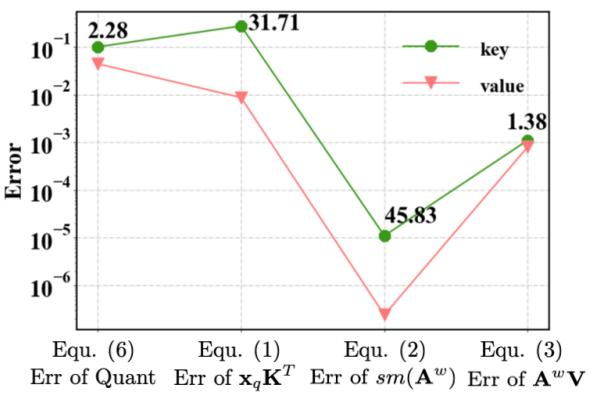
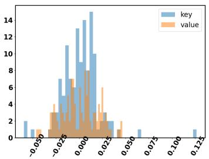
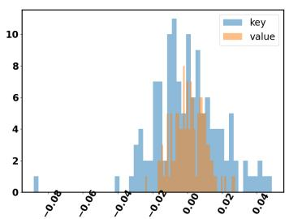
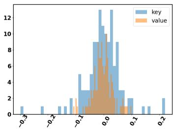
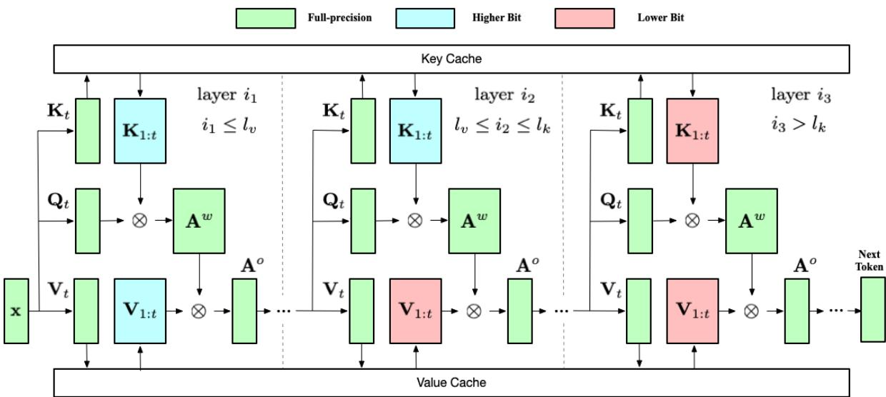
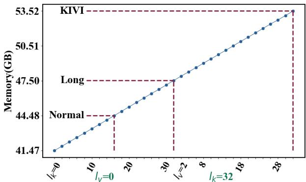
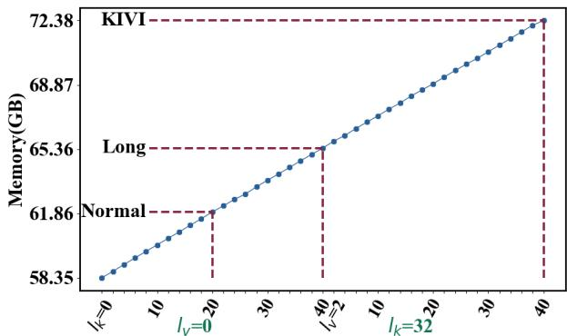

# AsymKV: Enabling 1-Bit Quantization of KV Cache with Layer-Wise Asymmetric Quantization Configurations

Qian Tao1, Wenyuan Yu1, Jingren Zhou2

1Tongyi Lab, Alibaba Group 2Alibaba Cloud Computing, Alibaba Group Correspondence: qian.tao@alibaba-inc.com

## Abstract

Large language models have shown exceptional capabilities in a wide range of tasks, such as text generation and video generation, among others. However, due to their massive parameter count, these models often require substantial storage space, imposing significant constraints on the machines deploying LLMs. To over come this limitation, one research direction proposes to compress the models using integer replacements for floating-point numbers, in a process known as Quantization. Some recent studies suggest quantizing the key and value cache (KV Cache) of LLMs, and designing quantization techniques that treat the key and value matrices equivalently.

This work delves deeper into the asymmetric structural roles of KV Cache, a phenomenon where the transformer’s output loss is more sensitive to the quantization of key matrices. We conduct a systematic examination of the attention output error resulting from key and value quantization. The phenomenon inspires us to propose an asymmetric quantization strategy. Our approach allows for 1-bit quantization of the KV cache by implementing distinct configurations for key and value matrices. We carry out experiments across a variety of datasets, demonstrating that our proposed model allows for the quantization of up to 75% decoder layers with 1 bit, while simultaneously maintaining performance levels comparable to those of the models with floating parameters.

## 1 Introduction

Large language models (LLMs) have gained considerable interest of late due to their remarkable performance in various directions (McKeown, 1992; Wang et al., 2022; Taylor et al., 2022; Ji et al., 2021; Gruver et al., 2024). However, to achieve a high level of expressiveness, LLMs typically require billions of parameters, which necessitates substantial storage space and poses challenges for deployment on machines with limited resources.

A line of research has been dedicated to enabling the deployment of these models on machines with less available space through model compression techniques. One such technique, model quantization, aims to represent the parameter matrices in LLMs using fewer bits (e.g., integer, binary), thereby making them more suitable for deployment on hardware with limited storage capacity (Kim et al., 2023). More recently, the Key-Value cache (KV cache) in LLMs has been shown to occupy a large proportion of space (Pope et al., 2023; Mohtashami and Jaggi, 2023), especially when the length of context increases, and numerous works have focused on the quantization of KV cache (Liu et al., 2024a,c; Kang et al., 2024). Nonetheless, these studies typically employ the same quantization configuration for both key and value matrices.

In this paper, we cast a spotlight on the asymmetric structural roles of key and value matrices. Our analysis reveals that, while a quantization method could yield a quantized matrix with a commensurate loss for both key and value matrices, the multiplication of query and application of the activationfunction to the key matrix results in a larger loss of key matrix in the transformer’s output as compared to the value matrix.

Drawing on this observation, this paper introduces a simple yet efficacious quantization strategy, which entails the use of asymmetric and layer-wise quantization configurations for key and value matrices. Specifically, during the next token’s inference, we employ a higher-bit quantization strategy (for instance, a 4-bit strategy) for the first l decoder layers, whilst a lower-bit strategy (i.e., the 1-bit strategy) is applied for the remaining decoder layers. For key and value matrices, we choose different l to account for their asymmetric structural positions. Our extensive experiments reveal that the adoption of an asymmetric and layer-wise quantization strategy allows us to quantize a subset of layers using a 1-bit approach, resulting in a strategy that is both space and computationally efficient.

In summary, the primary contributions of this paper can be outlined as follows:

• We conduct the exploration of the asymmetric structural roles of the key and value matrices. Through practical and theoretical demonstrations, we show that the loss derived from the key matrix’s quantization will be magnified relative to that of the value matrix, owing to the multiplication of the query and activation function applied specifically to the key matrix.

• To counteract the impact of asymmetric structural roles, this paper proposes AsymKV, a simple yet effective approach that combines varied degrees of quantization configurations at the layer level. AsymKV applies different quantization strategies to the key and value matrices, striking a balance between consumed memory and model performance.

• We conduct experiments on various datasets to substantiate the effectiveness of AsymKV. Our results validate the asymmetric roles of the key and value matrices and demonstrate that by applying distinct quantization strategies to the key and value matrices, LLMs can be equipped with the extreme 1 bit quantization while ensuring performance on par with the models utilizing floating-point parameters.

In the remainder of this paper, we first outline the basic definitions of transformers and KV cache in Sec. 2, then we highlight the observed asymmetric structural roles in Sec. 3, and present the design of AsymKV in Sec. 4. The evaluation and related works of AsymKV are discussed in Sec. 5 and Sec. 6, respectively. We finally conclude in Sec. 7.

## 2 Preliminaries

## 2.1 Attention Mechanism and KV Cache

Given the input embeddings of an attention mechanism, $\mathbf { X } \in \mathcal { R } ^ { t \times h }$ , where t represents the number of tokens already generated and h is the dimension of attention head, an attention mechanism M (Vaswani, 2017; Ainslie et al., 2023; Shazeer, 2019) obtains the hidden states as follows:

$$
\begin{array} { l } { \mathbf { Q } = \mathbf { X } \mathbf { W } ^ { q } , \mathbf { K } = \mathbf { X } \mathbf { W } ^ { k } , \mathbf { V } = \mathbf { X } \mathbf { W } ^ { v } } \\ { \mathbf { A } ^ { w } = s m ( \frac { \mathbf { Q } \mathbf { K } ^ { T } } { \sqrt { h } } ) } \\ { \mathbf { A } ^ { o } = \mathbf { A } ^ { w } \mathbf { V } } \end{array}
$$

Here, $\mathbf { W } ^ { q } , \mathbf { W } ^ { k }$ and $\mathbf { W } ^ { v }$ are the weight matrices for the query, key, and value, respectively, and $s m ( \cdot )$ signifies the softmax function. $\mathbf { A } ^ { w }$ and $\mathbf { A } ^ { o }$ are typically referred to as the attention weights and attention output, respectively.

As an LLM generates tokens, the embeddings of the newly produced token are appended to the end of X, necessitating the generation of query, key, and value matrices. Consequently, we can store the embeddings of K and V from previous tokens and only generate the corresponding segments for the new token in K and V. Specifically, by partitioning X into the embeddings of previous tokens, i.e., $\mathbf { X } _ { 1 : t - 1 }$ , and the embeddings of the current token, $\mathbf { X } _ { t } .$ , we can leverage the key and value cache to enhance LLM’s computational efficiency.

$$
\begin{array} { r l } & { \mathbf { x } _ { q } = \mathbf { X } _ { t } \mathbf { W } ^ { q } , \mathbf { x } _ { k } = \mathbf { X } _ { t } \mathbf { W } ^ { k } , \mathbf { x } _ { v } = \mathbf { X } _ { t } \mathbf { W } ^ { v } } \\ & { \mathbf { K } _ { 1 : t } = c a t ( \mathbf { K } _ { 1 : t - 1 } , \mathbf { x } _ { k } ) , \mathbf { V } _ { 1 : t } = c a t ( \mathbf { V } _ { 1 : t - 1 } , \mathbf { x } _ { v } ) } \end{array}
$$

$$
\mathbf { A } ^ { w } = \frac { \mathbf { x } _ { q } \mathbf { K } _ { 1 : t } ^ { T } } { \sqrt { h } }\tag{1}
$$

$$
\mathbf { A } ^ { w } = s m ( \mathbf { A } ^ { w } )\tag{2}
$$

$$
\mathbf { A } ^ { o } = \mathbf { A } ^ { w } \mathbf { V } _ { 1 : t }\tag{3}
$$

Here, the key and value matrices, $\mathbf { K } _ { 1 : t - 1 }$ and $\mathbf { K } _ { 1 : t - 1 }$ are cached while generating the last token.

## 2.2 KV Cache Quantization

Round-To-Nearest Quantization. While enhancing computational efficiency, the KV cache demands considerable memory, particularly as more tokens are generated. To mitigate this, previous studies propose quantizing the key and value matrices into integers to accommodate more tokens using a Round-To-Nearest (RTN) methodology.

Formally, given a key or value matrix, M ∈ $\mathcal { R } ^ { t \times h }$ , an RTN quantization breaks down M into the quantized matrix $\mathbf { M } _ { Q }$ , the scaling matrix s, and the zero-point matrix z as follows.

Quantization Phase:

$$
\mathbf { z } = \operatorname* { m i n } _ { i } ( \mathbf { M } ) , \mathbf { s } = \frac { \operatorname* { m a x } _ { i } ( \mathbf { M } ) - \operatorname* { m i n } _ { i } ( \mathbf { M } ) } { 2 ^ { b } - 1 }\tag{4}
$$

$$
\mathbf { M } _ { Q } = \lfloor \frac { \mathbf { M } - \mathbf { z } } { \mathbf { s } } \rceil\tag{5}
$$

Dequantization Phase:

$$
\mathbf { M } ^ { * } = \left( \mathbf { M } _ { Q } + \mathbf { z } \right) * \mathbf { s }\tag{6}
$$

Here, b represents the required bit of quantization, and min (respectively max ) is a function that retrieves the minimum (respectively maximum) tensor of the input in relation to the i-th dimension. i may be chosen from {1, 2}, representing per-channel or per-token quantization respectively.

  
Figure 1: Squared error in the inference of attention.

Measurement of Quantization. Given a quantization method, a natural question would be how to measure the effectiveness of the proposed method. Recent works (Frantar et al., 2022; Dong et al., 2024) proposed using the squared error of the output between the quantized weights and fullprecision weights to measure the effectiveness or optimize the strategies. Formally, the error is

$$
e = | | | f ( \mathbf { M } ^ { * } ) - f ( \mathbf { M } ) | | _ { 2 } ^ { 2 }\tag{7}
$$

where $f ( \cdot )$ could be a linear layer or the whole attention layer (i.e.,Equ. 1-Equ. 3). Following these works, we use the squared error to study how the structure of attention affects the effectiveness.

## 3 Asymmetric Attention Sensitivity of KV Cache Quantization

As shown in Equ. 1-Equ. 3, the key matrix and value matrix perform distinct roles in transformers. While existing studies have proposed intricate quantization methods to mitigate the loss from quantization and some studies (Dong et al., 2024) have recognized the disparate roles of the key matrix and value matrix, an important question still lingers: provided that the key matrix and value matrix play different roles from various perspectives, for instance, the multiplication of $\mathbf { x } _ { q }$ and the operation of softmax function on key matrix, whatfactor truly contributes to the loss of the transformer?

Observation. For the key (respectively value) matrix, we hold the value (respectively key) matrix in floating type, and evaluate the accumulated mean squared error between the output with key (respectively value) matrix in floating type and that with 2-bit quantization at different stages of the attention. Fig. 1 illustrates the average loss per element during the inference of the Llama-2 model of size 7b. Here, the green (respectively red) line denotes the MSE between the attention output with floating type and the 2-bit quantization of the key (respectively value) matrix in different stages of the attention. The number on the lines depicted in Fig. 1 represents the ratio between the MSE that arises from the key matrix quantization and the MSE that arises from the value matrix quantization.

Interestingly, even though the quantization strategy results in a comparative loss (i.e., the MSE after Equ. 6) on the key matrix and value matrix, there emerges marginal gap loss for key matrices after the multiplication of $\mathbf { x } _ { q } , i . e .$ , after Equ. 1. The gap is further amplified after the softmax function, i.e., after Equ. 2. This indicates that even though the quantization methods can guarantee a similar loss for key and value matrices, the multiplication of $\mathbf { x } _ { q }$ and the activation function makes the MSE of the attention output for the key matrix significantly larger than that of the value matrix.

MSE Amplification. Next, we analyze why the multiplication of $\mathbf { x } _ { q }$ and the softmax function exacerbates the MSE of the key matrix. Consider a matrix M and its quantization matrices, $\mathbf { M } _ { Q }$ , z, and s. M could be either the key matrix or the value matrix. Assume that the deviation of each element between M and the quantized matrix follows the distribution P, i.e., $| \mathbf { M } _ { i , j } - \mathbf { M } _ { i , j } ^ { * } | \sim \mathbf { P }$ . We aim to understand how the error of an element in the matrix varies after being multiplied by a vector.

Proposition 1. Consider a matrix M and its estimation M∗. Denote the error by E = M − M∗. Upon left multiplying by a matrix A, the error matrix becomes AE. Correspondingly, a right multiplication ofA results in the error EA.

Proof. Consider the (s, r)-th element of AM. We could obtain its error

$$
\begin{array} { r l } & { \quad \mathbf A _ { s , \cdot } \mathbf M _ { \cdot , r } - \mathbf A _ { s , \cdot } \mathbf M _ { \cdot , r } ^ { * } } \\ & { = \displaystyle \sum _ { i } \mathbf A _ { s , i } ( \mathbf M _ { i , r } - \mathbf M _ { i , r } ^ { * } ) } \\ & { = \displaystyle \sum _ { i } \mathbf A _ { s , i } \epsilon _ { i , r } } \end{array}\tag{8}
$$

which precisely corresponds to the (s, r)-th element of AE. Similarly, the right multiplication of

  
(a) Layer 21 Head 13

  
(b) Layer 30 Head 25

  
(c) Layer 31 Head 22  
Figure 2: Statistics of the error from key matrix quantization and value matrix quantization.

A results in an error matrix EA.

Based on Proposition 1, we can deduce the error stemming from the value matrix’s quantization.

Proposition 2. Given a value matrix V and its quantization V∗, with a quantization error ${ \bf E } ^ { v } =$ $\mathbf { V } - \mathbf { V } ^ { * }$ , the error in the attention output is $\mathbf { A } ^ { w } \mathbf { E } ^ { v }$

Proposition 2 can be derived from Equ. 3 and Proposition 1. On the other hand, it is also feasible to derive the error resulting from the quantization of key matrices, although this process is complex due to the involvement of softmax functions.

Theorem 1. Given a key matrix K and its quantization K∗, with a quantization error Ek = K − $\mathbf { K } ^ { * }$ the error ofthe attention output is given by $( \mathbf { A } ^ { w } \odot$ $( 1 - s r \cdot e ^ { \frac { \mathbf { E } ^ { q } } { \sqrt { h } } } )$ · V, where $\mathbf { E } ^ { q } = \mathbf { x } _ { q } \mathbf { E } ^ { k }$ , min Eq and max ${ \bf E } ^ { q }$ are the smallest and largest elements of Eq respectively, and $s r = s f t / s f t *$ such that $\begin{array} { r } { s f t = \sum _ { j } e ^ { \frac { \sum _ { i } q _ { i } \mathbf { K } _ { i , j } } { \sqrt { h } } } } \end{array}$ and $\begin{array} { r } { s f t ^ { * } = \sum _ { j } e ^ { \frac { \sum _ { i } q _ { i } \mathbf { K } _ { i , j } ^ { * } } { \sqrt { h } } } } \end{array}$ are the dominator in the softmaxfunctionfor the key matrix K and K∗ respectively.

Proof. Consider the error in the 1, r-th element of $\mathbf { A } ^ { w }$ . It is given by

$$
\begin{array} { r l } & { \frac { \sum _ { j \neq i \neq k _ { i - 1 } } ^ { \infty } } { s f t } - \frac { \sum _ { j \neq i \neq k _ { i - 1 } ^ { k } } ^ { \infty } } { s f t } } \\ & { - \frac { \sum _ { j \neq k _ { i } \in \mathcal { S } } ^ { \sum _ { j \neq k _ { i - 1 } } ^ { K } } } { s f t } - \frac { e ^ { - \frac { \| \mathbf { X } ^ { k } \| } { s } } } { s f t } } \\ & { - \frac { e ^ { \frac { \sum _ { j \neq k _ { i } \in \mathcal { S } } ^ { k _ { i - 1 } ^ { k } } } { s f t } } } { s f t } ( 1 - \frac { s f t } { s f t ^ { \ast } } \frac { e ^ { \frac { \sum _ { k _ { i } \in \mathcal { R } } \mathbf { X } _ { k _ { i - 1 } ^ { k } } ^ { k } } { s f t ^ { \ast } } } } { e ^ { \frac { \sum _ { k _ { i } \in \mathcal { R } } \mathbf { X } _ { k _ { i - 1 } ^ { k } } ^ { k } } { s f t ^ { \ast } } } } ) } \\ & { - \Delta _ { 1 , r } ^ { \infty } ( 1 - \frac { s f t } { s f t ^ { \ast } } \frac { e ^ { \frac { \sum _ { k _ { i } \in \mathcal { R } } \mathbf { X } _ { k _ { i - 1 } ^ { k } } ^ { k } - \mathbf { X } _ { k _ { i - 1 } ^ { k } } } { s f t } } } { e ^ { \frac { \sum _ { k _ { i } \in \mathcal { R } } \mathbf { X } _ { k _ { i - 1 } ^ { k } } ^ { k } } { s f t } } } ) } \\ & { - \Delta _ { 1 , r } ^ { \infty } ( 1 - \frac { s f t } { s f t ^ { \ast } } e ^ { - \frac { \mathrm { e x i s t } } { s f t } } ) } \\ & { - \Delta _ { 1 , r } ^ { \infty } ( 1 - \frac { s f t } { s f t ^ { \ast } } e ^ { \frac { \mathrm { e x i s t } } { s f t } } ) } \end{array}\tag{9}
$$

This can be reformulated in matrix form as $\mathbf { A } _ { 1 , r } ^ { w }$ $( 1 - s r \cdot e ^ { \frac { \mathbf { E } ^ { q } } { \sqrt { h } } } )$ . Since $\mathbf { A } ^ { w }$ is subsequently multiplied by V, in accordance with Proposition 1, the error in the attention output is given by

$$
\left( \mathbf { A } _ { 1 , r } ^ { w } \odot ( 1 - s r \cdot e ^ { \frac { \mathbf { E } ^ { q } } { \sqrt { h } } } ) \right) \cdot \mathbf { V } .\tag{10}
$$

To demonstrate the difference in error caused by the quantization of the key and value matrix, we select three decoder layers and plotted the error from Equ. 8 and Equ. 10 in Fig. 2. The results indicate that the distribution of the key matrix quantization error is more sparse around 0 compared to the value matrix quantization, which consequently leads to a larger MSE for the key matrix.

Discussion: Why does the key matrix quantization leads to a larger error than the value matrix? For the value matrix, it is not influenced by the softmax function, making its error straightforward to compute and directly tied to the quantization error. In contrast, for the key matrix quantization as shown in Equ. 10, $\begin{array} { r } { s f t = \sum _ { j } e ^ { \frac { \sum _ { i } q _ { i } ^ { \star } \mathbf { K } _ { i , j } } { \sqrt { h } } } } \end{array}$ and $\begin{array} { r } { s f t ^ { * } = \sum _ { j } e ^ { \frac { \sum _ { i } q _ { i } \mathbf { K } _ { i , j } ^ { * } } { \sqrt { h } } } } \end{array}$ are relatively large, and they are nearly equivalent because $\mathbf { K } ^ { * }$ is the quantization of K. This suggests that $s r \approx 1$ and the key discrepancy between the errors of the key matrix quantization and value matrix quantization arises in the Hadamard product of $1 - s r \cdot e ^ { \frac { \mathbf { E } ^ { q } } { \sqrt { h } } } . ( 1 )$ Multiplication of $\mathbf { x } _ { q } .$ . Observe that the first dimension of $\mathbf { x } _ { q }$ is consistently set to 1. Thus, the multiplication by $\mathbf { x } _ { q }$ results in each element accumulating the error from quantization multiple times. This is illustrated in Equ. 10, where each element of Eq has a comparatively larger error than the error distribution of P, given that $\mathbf { E } ^ { q } = q \mathbf { E } ^ { k }$ . (2) Utilization of the softmax function. In the key matrix error obtained in Equ. 10, the original error from the key matrix quantization is situated in the exponentiation of e. As the proof of Theorem 1 demonstrates, this replacement stems from the utilization of the softmax function, in which all elements are treated as the exponentiation of $e .$ . In consideration of the super-linear growth rate of the power function, the softmax function further exacerbates the loss induced by the key matrix quantization.

  
Figure 3: Workflow of AsymKV.

## 4 AsymKV: Layer-wise Quantization with Asymmetric Configuration

From the discussion in Sec. 3, it is evident that the quantization of the key matrix could potentially result in a more significant loss for the attention output due to the specific role of the key matrix. In response to this, our study introduces AsymKV, a simple yet efficacious quantization strategy that blends various degrees of quantization for the key and value matrix based on their respective impacts on the loss of the attention mechanism.

Basic Idea. AsymKV applies various degrees of quantization to the key and value matrix at the layer level. Specifically, AsymKV introduces two parameters, $l _ { k }$ and $l _ { v } ,$ to control the degree of quantization for the key and value matrix, respectively. During the inference of the model, for the key (respectively value) matrix, the initial $l _ { k }$ (respectively $l _ { v } )$ attention layers utilize a quantization method with a higher number of bits (e.g., 4-bit or 2-bit). In contrast, the remaining attention layers employ a quantization method with fewer bits (i.e., 1-bit).

Fig. 3 illustrates the design of AsymKV where green, blue, and red blocks symbolize the matrices in full-precision, higher-bit quantization, and lowerbit quantization, respectively. For each attention layer, its key and value matrices are cached with different quantization bits based on the layer index. As demonstrated in Fig. 3, those layers with a layer index $i \leq l _ { k }$ (respectively $i \leq l _ { v } )$ will cache the quantized key (respectively value) matrices with higher bits, while the other layers will use lower bits. After generating the query, key, and value matrix of the current token, $i . e . , \bf K _ { t } , \bf Q _ { t }$ , and $\bf V _ { t }$ the LLM will produce the output of the attention $\mathbf { A } ^ { o } ,$ , as illustrated in Equ. 1-Equ. 3. Given that AsymKV chooses $l _ { k }$ and $l _ { v }$ such that $l _ { v } \leq l _ { k } .$ , those decoder layers with indices in range $[ l _ { v } , l _ { k } ]$ will contain a blend of higher bits for key matrix and lower bits for value matrix.

The design of AsymKV relies on the observations in Sec. 3 as well as certain intuitive insights.

(1) Asymmetric Configuration. In light of our observation in Sec. 3, we decide to independently configure the degree of quantization for key and value matrices by defining the configuration parameters $l _ { k }$ and $l _ { v } ,$ respectively. Besides, since the quantization error for the key matrix results in a larger error for the attention output, we generally choose a larger $l _ { k }$ than $l _ { v }$ to achieve performance comparable to the models with full precision.

(2) Layer-wise Quantization. While generating a token, the quantization error is accumulated as the number of attention layers increases. Therefore, by choosing the later attention layers to be quantized with fewer bits, we can mitigate the error caused by the quantization from being amplified, while concurrently allowing the KV cache to be quantized with a less number of bits.

Discussion. Generally speaking, the design of AsymKV is not dependent on any specific quantization techniques. Our findings indicate that the performance of a LLM model is more significantly impacted by the quantization of key matrices. Consequently, the propose AsymKV can be applied to various quantization techniques for KV cache to achieve a better balance between space efficiency and performance.

## 5 Evaluation

## 5.1 Experimental Setup

Tested Models. We examine the performance of AsymKV using the widely used LLM family Llama (Touvron et al., 2023), which includes Llama-2-7b and Llama-2-13b. All models are deployed based on the LLM implementation from Huggingface1 with the default implementation of quantization selected from (Liu et al., 2024c).

Tasks and Baselines. In terms of model performance, we evaluate AsymKV on tasks with a standard context length, including CoQA and TruthfulQA from LM-Eval (Gao et al., 2024), as well as tasks with long context length from LongBench (Bai et al., 2023), including TriviaQA, TREC, SAMSum, RepoBench-P, and Qasper. Regarding model efficiency, we assess the memory usage of AsymKV under various quantization configurations, comparing it with previous works that handle the key and value matrices uniformly, including the original floating implementation, and KIVI (Liu et al., 2024c) with 2-bit quantization.

Inference Settings. Following KIVI (Liu et al., 2024c), AsymKV employs per-channel quantization for key matrices and per-token quantization for value matrices. Consequently, both KIVI and AsymKV store the key matrices of a limited number of tokens in floating-point types, a parameter referred to as residual length. We choose a residual length of 128 for tasks with normal context length, while for tasks with long context length, we opt for a residual length of 512. For the peak memory usage experiments, we standardized the generation length of tokens to 4096.

<table><tr><td>Model</td><td>Type</td><td>TruthfulQA</td><td>CoQA</td></tr><tr><td rowspan="3">Llama-2-7b</td><td>float</td><td>30.76</td><td>63.88</td></tr><tr><td>KIVI-2bit</td><td>33.95</td><td>63.05</td></tr><tr><td>AsymKV-0/16</td><td>12.81</td><td>34.18</td></tr><tr><td rowspan="4">Llama-2-13b</td><td>AsymKV-16/0</td><td>38.77*</td><td>58.12*</td></tr><tr><td>float KIVI-2bit</td><td>29.53</td><td>66.37</td></tr><tr><td></td><td>29.84</td><td>66.23</td></tr><tr><td>AsymKV-0/20</td><td>9.52</td><td>43.13</td></tr><tr><td rowspan="2"></td><td>AsymKV-20/0</td><td>28.44*</td><td>61.42*</td></tr><tr><td></td><td></td><td></td></tr></table>

Table 1: Evaluation on tasks with normal context length (bold: Higher bits for key matrix better than lower bits for key matrix, \*: AsymKV achieves at least 90% performance of floating-type models).

Implementation. AsymKV is implemented using PyTorch and is built upon the Huggingface codebase. All experiments are executed on a machine equipped with 200GB memory and an A800 GPU with 80GB memory. Each decoder layer in AsymKV adheres to the quantization scheme outlined in KIVI (Liu et al., 2024c), that is, perchannel quantization for the key matrix and pertoken quantization for the value matrix, with a group size of 32. AsymKV utilizes a combination of higher 2-bit quantization and lower 1-bit quantization. To validate our analysis concerning the diverse errors instigated by the key matrix quantization and value matrix quantization, we also examine AsymKV under various quantization configurations.

## 5.2 Evaluation Results

## 5.2.1 Tasks with Normal Context Length

Table 1 presents the experimental results for tasks with normal context length, namely CoQA and TruthfulQA. In this case, the model AsymKV-l /l represents AsymKV where the key and value matrices in the first $l _ { k }$ and $l _ { v }$ attention layers are respectively quantized with 2-bit, while those in other layers are quantized with 1 bit.

Upon examining AsymKV with various quantization configurations, we observe that AsymKV-16/0 (respectively AsymKV-20/0) performs better than AsymKV-0/16 (respectively AsymKV-0/20) for Llama-7b (respectively Llama-13b). This finding aligns with our observation and analysis in Sec. 3, where the quantization of key matrices results in a higher loss than that of value matrices. Therefore, even though AsymKV-16/0 and

<table><tr><td>Model</td><td>Type</td><td>TriviaQA</td><td>TREC</td><td>SAMSum</td><td>RepoBench-P</td><td>Qasper</td></tr><tr><td rowspan="4">Llama-2-7b</td><td>float</td><td>87.72</td><td>66.0</td><td>41.69</td><td>59.82</td><td>9.52</td></tr><tr><td>KIVI-2bit</td><td>87.64</td><td>66.0</td><td>41.62</td><td>56.81</td><td>9.73</td></tr><tr><td>AsymKV-0/32</td><td>11.6</td><td>25.0</td><td>3.79</td><td>23.9</td><td>3.18</td></tr><tr><td>AsymKV-32/0</td><td>85.27*</td><td>65.50*</td><td>38.28*</td><td>43.35</td><td>8.96*</td></tr><tr><td rowspan="4">Llama-2-13b</td><td>float</td><td>87.87</td><td>70.00</td><td>43.55</td><td>56.42</td><td>9.32</td></tr><tr><td>KIVI-2bit</td><td>87.31</td><td>69.50</td><td>43.52</td><td>53.66</td><td>8.27</td></tr><tr><td>AsymKV-0/40</td><td>24.57</td><td>28.5</td><td>5.25</td><td>25.33</td><td>3.33</td></tr><tr><td>AsymKV-40/0</td><td>86.70*</td><td>67.50*</td><td>41.90*</td><td>46.92</td><td>8.78*</td></tr></table>

Table 2: Evaluation on LongBench tasks (bold: Higher bits for key matrix better than lower bits for key matrix, $^ * { \cdot }$ AsymKV achieves at least 90% performance of floating-type models).

AsymKV-0/16 occupy the same space in GPU memory, a quantization strategy that employs higher bits for the key matrix and lower bits for the value matrix enhances performance.

Besides, AsymKV yields performance comparable to Llama and KIVI while using less GPU memory, achieved by implementing asymmetric 1- bit quantization. In particular, AsymKV-16/0 and AsymKV-20/0 assures a minimum performance of 91.0% that of Llama and 92.2% that of KIVI. In contrast to KIVI, which quantizes both key and value matrices with 2 bits, AsymKV allows for 75% decoder layers quantized with the extreme 1 bit, which is more efficient in peak memory.

## 5.2.2 Tasks with Long Context Length

Table 2 presents the experimental results for tasks with long context lengths. Mirroring the tasks with normal context length, AsymKV with a higher bit count in the key matrix (i.e.,AsymKV-32/0 for Llama-7b and AsymKV-40/0 for Llama-13b) once more surpasses AsymKV with value matrices quantized with higher bits (i.e.,AsymKV-0/32 and AsymKV-0/40). This aligns with the reasons as illustrated in Sec. 5.2.1.

Besides, in the case of long context lengths, AsymKV necessitates more decoder layers quantized with higher bits to attain performance comparable to the baselines $( l _ { k } \ = \ 3 2 / 4 0$ for long context length vs. $l _ { k } ~ = ~ 1 6 / 2 0$ for normal context length). When contrasted with the baselines, AsymKV could assure performance levels of at least 91.8% and 92.0% relative to Llama and KIVI across 4 out of 5 datasets, except for RepoBench-P.

## 5.2.3 Ablation Analysis

Evaluation of Varying Higher Bits. We choose different higher bit configurations to analyze the ablation performance of AsymKV. In Table $^ { 3 , }$ we use “AsymK ${ \bf N } { \cdot } h i / l o { - } l _ { k } / l _ { v } { \bf \Sigma } ^ { \cdots }$ to represent AsymKV with higher bit hi, a lower bit lo, and the degrees of quantization for key and value matrices, denoted as $l _ { k }$ and $l _ { v } ,$ , respectively.

<table><tr><td>Type</td><td>TruthfulQA</td><td>CoQA</td></tr><tr><td>float</td><td>30.76</td><td>63.88</td></tr><tr><td>KIVI-2bit</td><td>33.95</td><td>63.05</td></tr><tr><td>AsymKV-2/1-0/16</td><td>12.81</td><td>34.18</td></tr><tr><td>AsymKV-2/1-16/0</td><td>38.77*</td><td>58.12*</td></tr><tr><td>AsymKV-4/1-0/16</td><td>8.72</td><td>32.67</td></tr><tr><td>AsymKV-4/1-16/0</td><td>41.63*</td><td>56.32</td></tr></table>

Table 3: Ablation evaluation on varying higher bits for Llama-7b (bold: Higher bits for key matrix better than lower bits for key matrix, \*: AsymKV achieves at least 90% performance of floating-type models).

From Table 3, when we set higher and lower bits to 4 and 1 respectively, AsymKV adheres to the pattern established in our paper. Specifically, a model with more key matrices quantized to lower bits tends to exhibit poorer performance, as evidenced by the comparison between AsymKV-4/1-0/16 and AsymKV-4/1-16/0. Besides, when we increase the higher bit from 4 to 2, 3 out of 4 cases, namely AsymKV-4/1-0/16 on both datasets and AsymKV-4/1-16/0 on CoQA, demonstrate worsened performance, which may seem counterintuitive. This phenomenon could be attributed to the larger disparity between higher and lower bits, which may disrupt the harmony in the correlation between key and value matrices.

Evaluation of Varying $l _ { k }$ and $l _ { v } .$ . We further evaluate the performance of AsymKV by varying $l _ { k }$ and $l _ { v } .$ , which represent the number of key or value matrices quantized with the higher bit. In our evaluation, we quantize all key (resp. value) matrices using the lower bit and vary the number of value (resp. key) matrices quantized with the higher bit, selecting from the set {12, 16, 22}.

<table><tr><td>Model</td><td>Type</td><td>TruthfulQA</td><td>CoQA</td></tr><tr><td rowspan="5">Llama-2-7b</td><td>float</td><td>30.76</td><td>63.88</td></tr><tr><td>KIVI-2bit</td><td>33.95</td><td>63.05</td></tr><tr><td>AsymKV-0/12</td><td>7.37</td><td>28.92</td></tr><tr><td>AsymKV-0/16</td><td>12.81</td><td>34.18</td></tr><tr><td>AsymKV-0/22</td><td>12.23</td><td>35.60</td></tr><tr><td rowspan="4"></td><td>AsymKV-12/0</td><td>29.17*</td><td>48.02</td></tr><tr><td>AsymKV-16/0</td><td>38.77*</td><td>58.12*</td></tr><tr><td>AsymKV-22/0</td><td>40.14*</td><td>59.83*</td></tr><tr><td></td><td></td><td></td></tr></table>

Table 4: Ablation evaluation on varying $l _ { k }$ and $l _ { v } \ ( ^ { * } ;$ AsymKV achieves at least 90% performance of floatingtype models).

From Table 4, it is evident that as $l _ { k }$ or $l _ { v }$ increases, the performance of AsymKV on both datasets improves. Notably, when $l _ { k }$ is reduced to 12, there is a significant performance gap between AsymKV-12/0 and the floating-type model. Based on our evaluation, the quantization configuration of $l _ { k } = 1 6$ and $l _ { v } = 0$ strikes a good balance between performance and efficiency for tasks with normal length. Additional experimental results can be found in the appendix.

## 5.2.4 Peak Memory

Fig. 4 reports the experimental results of the peak memory in GPU for AsymKV. We choose a batch size of 48 for Llama-7b and 36 for Llama-13b, and report the peak storage consumption by varying the quantization configurations $l _ { k }$ and $l _ { v } .$ . Specifically, we first set $l _ { v } = 0$ , implying all value matrices of the decoder layers are quantized with 1 bit, and increase the number of key matrices quantized with 2 bits, $i . e . , l _ { k } ,$ from 0 to the maximum number of decoder layers, illustrated in the left part of Fig. 4a and Fig. 4b. Then, we keep all key matrices quantized with 2 bits and further increase the number of value matrices quantized with 2 bits, i.e., $l _ { v }$ , as shown in the right part of Fig. 4a and Fig. 4b. It is noteworthy that when both $l _ { k }$ and $l _ { v }$ achieve the maximum number of layers, the results correspond to the performance of KIVI.

From Fig. 4, as more attention layers are quantized with higher bits, the consumed space in GPU increases almost linearly until all attention layers employ a quantization configuration with higher bits. The locations where AsymKV achieves comparable performance to the floating-point model on tasks with normal and long context lengths are highlighted. For Llama-7b, AsymKV can ensure similar performance while saving 9.0 GB and 6.0

GB of space for the tasks with normal and long context lengths respectively, compared to KIVI. For Llama-13b, the memory saved increases to 10.4GB and 7.0GB space for tasks with normal and long context lengths respectively.

## 6 Related Works

Large language models have gained considerable attention since their inception. Despite their impressive performance, these models are constrained by their immersive quantity of parameters, which results in hardware limitations and poor throughput.

To address these issues, recent research trends are centered on reducing the size of LLMs (Kim et al., 2023). Among these methods, quantization techniques target the transformation of a portion of the model’s parameters into integers, which reduces the space of LLMs. For instance, llm.int8 (Dettmers et al., 2022) suggests quantizing the query, key, and value weights of LLMs using the round-to-nearest method, $i . e . ,$ , mapping each floating-point number to its closest integer. AWQ (Lin et al., 2024) and SmoothQuant (Xiao et al., 2023) further introduce an amplifying scale prior to quantization to prevent extremely large outliers during the process. Omniquant (Shao et al., 2023) devises a quantization algorithm by implementing a learnable scale and learnable clipping during quantization. GPTQ (Frantar et al., 2022) perceives quantization as a problem of minimizing square error and designing the quantization algorithms using an approximation of the second-order information. These studies mainly focus on the quantization of the model weights.

On the other hand, to mitigate redundant computations across token generation, LLMs utilizes KV cache. While KV cache enhances inference efficiency, it consumes significant space, particularly when generating long contexts. Consequently, another line of research focuses on the compression of KV cache (Zhang et al., 2024; Kwon et al., 2023; Jin et al., 2023; Liu et al., 2024b). Among these approaches, quantization techniques have garnered much attention and have emerged as a popular tool for KV cache compression.

Previous works have applied consistent quantization techniques for both model weights and KV cache. SmoothQuant (Xiao et al., 2023) also quantizes the query, key, and value matrices to further minimize memory usage. In contrast, Flexgen (Sheng et al., 2023) structures the problem of quantization in an environment conprising GPU, CPU, and memory. ATOM (Zhao et al., 2024) utilizes the quantized weights and re-quantizes the key and value cache matrices into integer types.

  
(a) AsymKV for Llama-7b (batch size 48).

  
(b) AsymKV for Llama-13b (batch size 36).  
Figure 4: Memory Variation of AsymKV.

More recently, several works have examined the distriution of the KV cache and formulated quantization algorithms specifically tailored for it. For example, ATOM (Zhao et al., 2024) discovered that the key matrix contains more outliers than the value matrix. KIVI (Liu et al., 2024c) extends on this observation and suggesting quantizing the key and value matrices from different perspectives (employing per-channel quantization for key matrix and per-token quantization for value matrix). Alongside this, KVQuant employs the per-channel quantization to the key matrices and introduces a nonuniform quantization technique for KV cache. IntactKV (Liu et al., 2024a) identifies outliers caused by common tokens, including the punctuations and split tokens. Meanwhile, WKVQuant (Yue et al., 2024) proposes a two-dimensional quantization strategy to smoothly handle the outliers across different channels. Other studies seek to combine the quantization techniques with other techniques to approach a fine-grained KV cache compression. GEAR (Kang et al., 2024) establishes the residual matrix and sparse matrix to capture the residual and individual outliers during the quantization. (Yang et al., 2024) proposes a mix-precision quantization scheme and quantizes the crucial KV cache with higher bits. In contrast to the aforementioned studies, this paper concentrates on the asymmetric roles of the key and value matrices. We attribute this phenomenon to the multiplication of $\mathbf { x } _ { q }$ and the application of the softmax function. We propose a simple yet effective solution: employing distinct quantization configurations for the key and value matrices at the layer level. This approach is designed to accommodate the asymmetric role of the key and value matrices.

## 7 Conclusions

This paper primarily concentrates on the asymmetric roles of the key and value matrices in the quantization of the KV cache. We analyze why quantizing the key matrix leads to a more significant performance drop than quantizing the value matrix and attribute it to the multiplication of $\mathbf { x } _ { q }$ and the implementation of the softmax function. Based on this analysis, we introduce AsymKV, which applies asymmetric and layer-wise quantization configurations to the key and value matrices. AsymKV facilitates a mixed quantization approach with 2 bits and 1 bit, while simultaneously ensuring performance comparable to the floating-type model. Extensive experiments validate our analysis of the asymmetric roles of the key and value matrices.

## 8 Limitations

Despite AsymKV facilitating the quantization of 1 bit for KV cache in LLMs, it still depends on exhaustive testing to identify the optimal configurations for different LLMs, i.e., configurations that yield performance close to models in floating types. This approach is relatively inefficient. A potential futural direction could involve efficiently identifying the optimal configurations for LLMs. Besides, AsymKV maintains a consistent quantization configuration for a decoder layer during the generation of new tokens. However, it might prove more flexible and efficient if we consider a mixture of higher and lower bit quantizations at the token level.

## References

Joshua Ainslie, James Lee-Thorp, Michiel de Jong, Yury Zemlyanskiy, Federico Lebrón, and Sumit Sanghai. 2023. Gqa: Training generalized multi-query transformer models from multi-head checkpoints. arXiv preprint arXiv:2305.13245.

Yushi Bai, Xin Lv, Jiajie Zhang, Hongchang Lyu, Jiankai Tang, Zhidian Huang, Zhengxiao Du, Xiao Liu, Aohan Zeng, Lei Hou, et al. 2023. Longbench: A bilingual, multitask benchmark for long context understanding. arXiv preprint arXiv:2308.14508.

Tim Dettmers, Mike Lewis, Younes Belkada, and Luke Zettlemoyer. 2022. Gpt3. int8 (): 8-bit matrix multiplication for transformers at scale. In NIPS.

Shichen Dong, Wen Cheng, Jiayu Qin, and Wei Wang. 2024. Qaq: Quality adaptive quantization for llm kv cache. arXiv preprint arXiv:2403.04643.

Elias Frantar, Saleh Ashkboos, Torsten Hoefler, and Dan Alistarh. 2022. Gptq: Accurate post-training quantization for generative pre-trained transformers. arXiv preprint arXiv:2210.17323.

Leo Gao, Jonathan Tow, Baber Abbasi, Stella Biderman, Sid Black, Anthony DiPofi, Charles Foster, Laurence Golding, Jeffrey Hsu, Alain Le Noac’h, Haonan Li, Kyle McDonell, Niklas Muennighoff, Chris Ociepa, Jason Phang, Laria Reynolds, Hailey Schoelkopf, Aviya Skowron, Lintang Sutawika, Eric Tang, Anish Thite, Ben Wang, Kevin Wang, and Andy Zou. 2024. A framework for few-shot language model evaluation.

Nate Gruver, Marc Finzi, Shikai Qiu, and Andrew G Wilson. 2024. Large language models are zero-shot time series forecasters. In NeurIPS.

Shaoxiong Ji, Tianlin Zhang, Luna Ansari, Jie Fu, Prayag Tiwari, and Erik Cambria. 2021. Mentalbert: Publicly available pretrained language models for mental healthcare. arXiv preprint arXiv:2110.15621.

Yunho Jin, Chun-Feng Wu, David Brooks, and Gu-Yeon Wei. 2023. s3: Increasing gpu utilization during generative inference for higher throughput. In NeurIPS.

Hao Kang, Qingru Zhang, Souvik Kundu, Geonhwa Jeong, Zaoxing Liu, Tushar Krishna, and Tuo Zhao. 2024. Gear: An efficient kv cache compression recipefor near-lossless generative inference of llm. arXiv preprint arXiv:2403.05527.

Sehoon Kim, Coleman Hooper, Amir Gholami, Zhen Dong, Xiuyu Li, Sheng Shen, Michael W Mahoney, and Kurt Keutzer. 2023. Squeezellm: Dense-and-sparse quantization. arXiv preprint arXiv:2306.07629.

Woosuk Kwon, Zhuohan Li, Siyuan Zhuang, Ying Sheng, Lianmin Zheng, Cody Hao Yu, Joseph Gonzalez, Hao Zhang, and Ion Stoica. 2023. Efficient memory management for large language model serving with pagedattention. In SOSP.

Ji Lin, Jiaming Tang, Haotian Tang, Shang Yang, Wei-Ming Chen, Wei-Chen Wang, Guangxuan Xiao, Xingyu Dang, Chuang Gan, and Song Han. 2024. Awq: Activation-aware weight quantization for ondevice llm compression and acceleration. In MLSys.

Ruikang Liu, Haoli Bai, Haokun Lin, Yuening Li, Han Gao, Zhengzhuo Xu, Lu Hou, Jun Yao, and Chun Yuan. 2024a. Intactkv: Improving large language model quantization by keeping pivot tokens intact. arXiv preprint arXiv:2403.01241.

Zichang Liu, Aditya Desai, Fangshuo Liao, Weitao Wang, Victor Xie, Zhaozhuo Xu, Anastasios Kyrillidis, and Anshumali Shrivastava. 2024b. Scissorhands: Exploiting the persistence of importance hypothesis for llm kv cache compression at test time. In NeurIPS.

Zirui Liu, Jiayi Yuan, Hongye Jin, Shaochen Zhong, Zhaozhuo Xu, Vladimir Braverman, Beidi Chen, and Xia Hu. 2024c. Kivi: A tuning-free asymmetric 2bit quantization for kv cache. In ICML.

Kathleen McKeown. 1992. Text generation. Cambridge University Press.

Amirkeivan Mohtashami and Martin Jaggi. 2023. Landmark attention: Random-access infinite context length for transformers. arXiv preprint arXiv:2305.16300.

Reiner Pope, Sholto Douglas, Aakanksha Chowdhery, Jacob Devlin, James Bradbury, Jonathan Heek, Kefan Xiao, Shivani Agrawal, and Jeff Dean. 2023. Efficiently scaling transformer inference. In ICML.

Wenqi Shao, Mengzhao Chen, Zhaoyang Zhang, Peng Xu, Lirui Zhao, Zhiqian Li, Kaipeng Zhang, Peng Gao, Yu Qiao, and Ping Luo. 2023. Omniquant: Omnidirectionally calibrated quantization for large language models. arXiv preprint arXiv:2308.13137.

Noam Shazeer. 2019. Fast transformer decoding: One write-head is all you need. arXiv preprint arXiv:1911.02150.

Ying Sheng, Lianmin Zheng, Binhang Yuan, Zhuohan Li, Max Ryabinin, Beidi Chen, Percy Liang, Christopher Ré, Ion Stoica, and Ce Zhang. 2023. Flexgen: High-throughput generative inference of large language models with a single gpu. In ICML.

Ross Taylor, Marcin Kardas, Guillem Cucurull, Thomas Scialom, Anthony Hartshorn, Elvis Saravia, Andrew Poulton, Viktor Kerkez, and Robert Stojnic. 2022. Galactica: A large language model for science. arXiv preprint arXiv:2211.09085.

Hugo Touvron, Louis Martin, Kevin Stone, Peter Albert, Amjad Almahairi, Yasmine Babaei, Nikolay Bashlykov, Soumya Batra, Prajjwal Bhargava, Shruti Bhosale, et al. 2023. Llama 2: Open foundation and fine-tuned chat models. arXiv preprint arXiv:2307.09288.

A Vaswani. 2017. Attention is all you need. In NeurIPS.

Haifeng Wang, Hua Wu, Zhongjun He, Liang Huang, and Kenneth Ward Church. 2022. Progress in machine translation. Engineering, 18:143–153.

Guangxuan Xiao, Ji Lin, Mickael Seznec, Hao Wu, Julien Demouth, and Song Han. 2023. Smoothquant: Accurate and efficient post-training quantization for large language models. In ICML.

June Yong Yang, Byeongwook Kim, Jeongin Bae, Beomseok Kwon, Gunho Park, Eunho Yang, Se Jung Kwon, and Dongsoo Lee. 2024. No token left behind: Reliable kv cache compression via importanceaware mixed precision quantization. arXiv preprint arXiv:2402.18096.

Yuxuan Yue, Zhihang Yuan, Haojie Duanmu, Sifan Zhou, Jianlong Wu, and Liqiang Nie. 2024. Wkvquant: Quantizing weight and key/value cache for large language models gains more. arXiv preprint arXiv:2402.12065.

Zhenyu Zhang, Ying Sheng, Tianyi Zhou, Tianlong Chen, Lianmin Zheng, Ruisi Cai, Zhao Song, Yuandong Tian, Christopher Ré, Clark Barrett, et al. 2024. H2o: Heavy-hitter oracle for efficient generative inference of large language models. In NeurIPS.

Yilong Zhao, Chien-Yu Lin, Kan Zhu, Zihao Ye, Lequn Chen, Size Zheng, Luis Ceze, Arvind Krishnamurthy, Tianqi Chen, and Baris Kasikci. 2024. Atom: Lowbit quantization for efficient and accurate llm serving. In MLSys.

<table><tr><td>Model</td><td>Type</td><td>TruthfulQA</td><td>CoQA</td></tr><tr><td rowspan="5">Llama-2-7b</td><td>float KIVI-2bit</td><td>30.76 33.95</td><td>63.88 63.05</td></tr><tr><td>AsymKV-0/6 AsymKV-0/12 AsymKV-0/16 AsymKV-0/22</td><td>4.11 7.37 12.81 12.23</td><td>26.90 28.92 34.18 35.60</td></tr><tr><td>AsymKV-6/0 AsymKV-12/0 AsymKV-16/0 AsymKV-22/0</td><td>7.64 29.17* 38.77* 40.14*</td><td>36.00 48.02 58.12* 59.83*</td></tr><tr><td>float KIVI-2bit</td><td>29.53 29.84</td><td>66.37 66.23</td></tr><tr><td>AsymKV-0/5 AsymKV-0/10 AsymKV-0/20 AsymKV-0/30</td><td>4.81 4.16 9.52 10.24</td><td>37.53 39.70 43.03 45.20</td></tr><tr><td rowspan="2"></td><td>AsymKV-5/0</td><td>15.35</td><td>41.25</td></tr><tr><td>AsymKV-10/0 AsymKV-20/0 AsymKV-30/0</td><td>19.43 28.44* 29.50*</td><td>45.40 61.42* 64.92*</td></tr></table>

Table 5: Evaluation on tasks with normal context length (\*: AsymKV achieves at least 90% performance of floating-type models).

## A Supplemental Experiments

In this section, we present the complete experimental setup and the corresponding results.

## A.1 Experimental Results

## A.1.1 Results on Tasks with Normal Context Length

Table 5 proposes the performance of AsymKV with varying $l _ { k }$ and $l _ { v }$ values for tasks with normal context length. For Llama-7b, we choose $l _ { k } , l _ { v } \in \{ 6 , 1 2 , 1 6 , 2 0 \}$ and for Llama-13b, we consider $l _ { k } , l _ { v } \in \{ 5 , 1 0 , 2 0 , 3 0 \}$

As the number of decoder layers quantized with higher bits increases, the performance of AsymKV improves until it reaches performance levels comparable to the floating-point model and KIVI. Besides, we observe that AsymKV with value matrices quantized using lower bits, i.e.,AsymKV-l/0, consistently outperforms AsymKV with key matrices quantized using lower bits, i.e.,AsymKV-0/l, and the difference is substantial. This observation confirms that choosing a configuration with $l _ { k } > l _ { v }$ can enhance the performance of AsymKV. AsymKV can achieve at least 90% of the performance of floating-point models when a quantization configuration that follows AsymKV-16/0 for Llama-7b and AsymKV-20/0 for Llama-13b is utilized.

## A.1.2 Results on Tasks with Long Context Length

Table 6 presents the experimental results for tasks with long context length. For key and value matrices, we set aside one type of matrices quantized with higher bits $( i . e . , l _ { k } / l _ { v } = 3 2 / 4 0 )$ and vary the number of the other type of matrices that are quantized with lower bits.

Similar to the tasks with normal context lengths, the performance of AsymKV augments as more key and value matrices are quantized with higher bits. Besides, AsymKV with key matrices quantized with higher bits (AsymKV-32/lv for Llama-7b and AsymKV-40/lv for Llama-13b) outperforms AsymKV with value matrices quantized with higher bits, despite them occupying the same GPU memory.

<table><tr><td>Model</td><td>Type</td><td>TriviaQA</td><td>TREC</td><td>SAMSum</td><td>RepoBench-P</td><td>Qasper</td></tr><tr><td rowspan="6">Llama-2-7b</td><td>float KIVI-2bit</td><td>87.72</td><td>66.0</td><td>41.69</td><td>59.82</td><td>9.52</td></tr><tr><td></td><td>87.64</td><td>66.0</td><td>41.62</td><td>56.81</td><td>9.73</td></tr><tr><td>AsymKV-0/32 AsymKV-6/32</td><td>11.6 19.02</td><td>25.0 29.0</td><td>3.79 5.53</td><td>23.9 28.46</td><td>3.18 4.04</td></tr><tr><td>AsymKV-12/32</td><td>22.96</td><td>42.50</td><td>8.77</td><td>32.34</td><td>5.13</td></tr><tr><td></td><td></td><td></td><td></td><td></td><td></td></tr><tr><td>AsymKV-32/0 AsymKV-32/6</td><td>85.27* 86.36*</td><td>65.50* 66.50*</td><td>38.28* 39.75*</td><td>43.35 49.93</td><td>8.96* 9.04*</td></tr><tr><td rowspan="6">Llama-2-13b</td><td>AsymKV-32/12</td><td>86.62*</td><td>66.00*</td><td>40.93*</td><td>52.46</td><td>9.64*</td></tr><tr><td>float</td><td>87.87</td><td>70.00</td><td>43.55</td><td>56.42</td><td>9.32</td></tr><tr><td>KIVI-2bit</td><td>87.31</td><td>69.50</td><td>43.52</td><td>53.66</td><td>8.27</td></tr><tr><td>AsymKV-0/40</td><td>24.57</td><td>28.5</td><td></td><td></td><td></td></tr><tr><td>AsymKV-10/40</td><td>42.30</td><td>41.00</td><td>5.25 12.64</td><td>25.33 28.65</td><td>3.33</td></tr><tr><td>AsymKV-15/40</td><td>48.14</td><td>50.00</td><td>17.82</td><td>31.37</td><td>5.10 5.73</td></tr><tr><td></td><td>AsymKV-40/0</td><td>86.70*</td><td>67.50*</td><td></td><td></td><td></td></tr><tr><td>AsymKV-40/10</td><td></td><td></td><td></td><td>41.90* 42.23*</td><td>46.92</td><td>8.78*</td></tr><tr><td>AsymKV-40/15</td><td>86.80*</td><td>69.00* 69.00*</td><td></td><td></td><td>50.68</td><td>7.56*</td></tr><tr><td></td><td>87.39*</td><td></td><td>42.45*</td><td></td><td>50.25</td><td>8.58*</td></tr></table>

Table 6: Evaluation on LongBench tasks (\*: AsymKV achieves at least 90% performance of floating-type models).