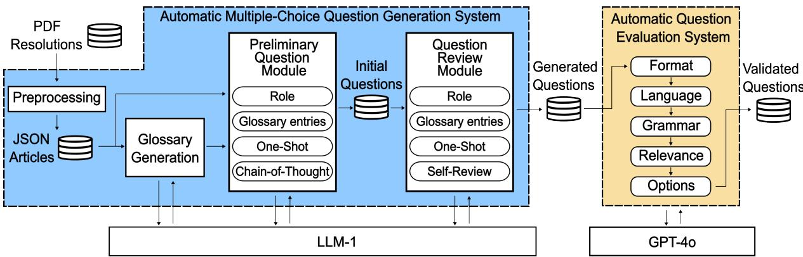

# Automatic Multiple-Choice Question Generation and Evaluation Systems Based on LLM: A Study Case With University Resolutions

Sérgio S. Mucciaccia1, Thiago M. Paixão2, Filipe Mutz1,

Alberto F. De Souza1, Claudine S. Badue1, Thiago Oliveira-Santos1,

1Universidade Federal do Espírito Santo (UFES),

2Instituto Federal do Espírito Santo (IFES),

Correspondence: sergio.mucciaccia@ufes.br

## Abstract

Multiple choice questions (MCQs) are often used in both employee selection and training, providing objectivity, efficiency, and scalability. However, their creation is resource-intensive, requiring significant expertise and financial investment. This study leverages large language models (LLMs) and prompt engineering techniques to automate the generation and validation of MCQs, particularly within the context of university regulations. Mainly, two novel approaches are proposed in this work: an auto matic question generation system for university resolution and an automatic evaluation system to assess the performance of MCQ generation systems. The generation system combines different prompt engineering techniques and a review process to create well formulated questions. The evaluation system uses prompt engineering combined with an advanced LLM model to assess the integrity of the generated question. Experimental results demonstrate the effectiveness of both systems. The findings highlight the transformative potential of LLMs in educational assessment, reducing the bur den on human resources and enabling scalable, cost-effective MCQ generation.

## 1 Introduction

Multiple-choice questions (MCQs) are often used in employee selection and training due to their objectivity, efficiency, and scalability. The hiring processes of technical-administrative staff in Brazilian federal educational institutions, for example, are conducted through competitive exams composed predominantly of MCQs regarding legislation and technical subjects. Furthermore, for career advancement in these institutions, employees must complete several training courses that are also generally assessed using MCQs. Specific training sessions, as well as evaluations in these programs, frequently utilize this format. The increasing prevalence of online learning has further amplified the demand for MCQs, consolidating their role as an essential tool in contemporary educational and professional environments (Kurdi et al., 2020; Mulla and Gharpure, 2023; Yang et al., 2024).

A system for automatic generation of MCQs about laws and resolutions would be highly beneficial for Brazilian federal educational institutions. Producing MCQs is a resource-intensive process, often requiring significant effort, expertise, and financial investment. Specialists must participate in the process to ensure that questions are accurate, relevant, and challenging while covering the target spectrum of knowledge and skill. The process of reviewing, testing, and validating these questions to ensure they meet quality standards can further increase costs (Kurdi et al., 2020). An automated system would streamline the creation of these questions, reducing the burden on faculty and staff, ensuring consistency and quality in the evaluation process, and minimizing the risk of errors that lead to question annulments. It could also enable applications that are unfeasible with human generation, such as creating personalized sets of questions for each employee under training, adjusting difficulty levels based on previous answers, and integrating with external information systems.

The evaluation of MCQ generation systems poses important challenges. Each new method leads to the creation of novel sets of questions that must be assessed. Unlike other tasks in artificial intelligence, ground-truth data is not available for comparison since new questions are generated at every round. The manual evaluation of questions is an alternative, but it is highly time-consuming and costly. Moreover, a fair comparison of methods would require the use of consistent criteria and mechanisms for preventing subjective biases. An automatic evaluation system would ensure a standardized, objective, and efficient assessment process.

Previous works explored systems based on natural language processing (NLP) and large language models (LLMs) for MCQ generation (Kurdi et al., 2020; Mulla and Gharpure, 2023; Yang et al., 2024). Mitkov et al. (2006) proposed a semi-automatic question generation system using traditional NLP techniques. These techniques were also employed later by Araki et al. (2016). They used co-reference resolution and paraphrase detection to achieve stateof-the-art performance at that time. Das et al. (2022) combined classical NLP techniques with a multi-criteria decision-making approach to achieve high-quality question generation and an accuracy of up to 79% in automatic answer assessment.

Most recent approaches rely on transformers and LLMs. Akyon et al. (2022) fine-tuned a multilingual T5 transformer with a Turkish QA dataset, achieving state-of-the-art performance for automatic question generation with Turkish texts. Similarly, Goyal et al. (2024) fine-tuned a T5 Transformer, but improved diversity by incorporating metrics that ensure this characteristic in the training objective function. Li et al. (2023) combined knowledge graphs with language models to enable multi-hop question generation, allowing the generation of questions integrating multiple contexts. The availability of larger LLMs pre-trained on massive amounts of data allowed the solution of several tasks without domain-specific fine-tuning. Lee et al. (2023) achieved high-quality question generation for English education using ChatGPT and prompt engineering techniques. This approach is the most similar to the present study, but, to the best of our knowledge, none of the previous works focused on the same domain nor presented automatic method ologies for measuring the performance of MCQ generation systems.

This work proposes two novel systems. First, a system based on LLMs for automatic generation of MCQs for resolutions in the context of Brazilian federal educational institutions. The system explores a combination of different prompt engineering techniques and a review process to generate high-quality MCQs. Second, an LLM-based system for the automatic evaluation of MCQ generation systems. The system explores prompt engineering techniques together with an advanced LLM to judge whether a question is valid or not. Experiments first validate the proposed evaluation system by comparing the judgments they provide with the ones produced by human experts. Once the correctness of the evaluation system is verified, it is used to assess the automatic MCQ generation system. Finally, a study is performed to ensure that all prompt engineering techniques included in the system contribute positively. Results show that the evaluation system is consistent with human experts, the MCQ generation system produces high-quality questions, and all prompt engineering techniques are indeed fundamental to the proposed system. To summarize, the main contributions of this study are:

• The development of a system to generate MCQs from University Resolutions for employee hiring, training, or evaluation purposes.

• The development of an automatic evaluation system to assess MCQ generation approaches.

• The creation of a dataset of automatically generated MCQs, manually evaluated by specialists, to test question evaluation systems.

## 2 Automatic Multiple-Choice Question Generation System

The generation system (illustrated in Figure 1) comprises a multi-stage pipeline that preprocesses the resolutions, generates a preliminary set of questions/answers, and reviews each of them to ensure they meet acceptable standards. The following sections detail the system components.

## 2.1 Preprocessing

The dataset comprises open-access resolutions (PDF documents) downloaded from the university website, as further detailed in Section 4. The resolutions consist of a sequence of numbered articles that outline specific points, provisions, or regulations intended to address particular academic or administrative issues. The preprocessing involves converting the selected PDF files to text and using a custom algorithm to remove unwanted elements such as page numbers, repeated headers, footers, names of signatories, and other extraneous information. The final phase of preprocessing organizes the elements into a JSON file, where the articles are arranged in a list, and other elements such as titles, footers, and notes are programmatically accessible. The output of the preprocessing phase is a collection of JSON files, each representing a single resolution.

  
Figure 1: Overview of the two proposed methods, the question generation system (shown in blue) and the question evaluation system (shown in yellow). The process begins by inputting PDF files of the resolutions into the Question Generation System. Here, the documents are initially preprocessed and then divided into individual articles. Each article passes through the Glossary Generation, the Preliminary Question Module, and the Question Review Module to generate questions. These generated questions are then evaluated by the Question Evaluation System, resulting in the validated questions.

## 2.2 Question generation

In the question generation process, each article (JSON file) is processed individually, with one article giving rise to a single question. The core of the generation system comprises the Preliminary Question Module and the Question Review Module. Each module individually communicates with an LLM in order to generate their respective output. The system supports the use of different LLMs enabling comparing the performance with different modules. APIs have been implemented for Chat-GPT 3.5, ChatGPT 4.0, Llama 3 8B, Llama 3 70B, and Mixtral 8B.

## 2.2.1 Preliminary question module

This module is responsible for choosing a topic and generating a preliminary question with the respective five possible answers (one correct and four incorrect). The module combines a set of prompt engineering techniques, such as Role-based Prompting, Glossary Use, One-shot prompting, and Chainof-thoughts, to obtain an initial well-posed MCQ. These techniques (detailed in Section 2.3) are applied sequentially and can be enabled or disabled to allow investigating the contribution of each of them individually.

## 2.2.2 Question review module

This module is responsible for reviewing a multiplechoice question to ensure that there is only one correct answer plus four incorrect answers. This module can also be enabled or disabled in order to allow investigating its contribution on the question generation process. Basically, the module combines a set of prompt engineering techniques (described later in Section 2.3), such as Role-based Prompting, Glossary Use, One-shot prompting, and Self-Review, to either improve or discard the imputed question.

## 2.3 Prompt engineering techniques

The mentioned prompt engineering techniques are detailed in the following subsections. The actual prompts can be found in Appendix A.

## 2.3.1 Role-based prompting

This technique assigns a specific role or persona to an LLM to guide its responses (Sahoo et al., 2024). By framing the model’s task through a defined role, such as “You are a professor creating questions for students,” the responses generated by the model become more contextually relevant and focused. This method usually enhances the coherence and quality of the output, aligning it closely with the intended purpose.

## 2.3.2 Glossary use

This technique relies on a glossary of the analyzed text (e.g., one resolution) to enable more self-contained prompts. This is particularly helpful when the prompt is built from text fragments comprising acronyms and terms pertinent to the resolution scope, but whose definitions are provided outside the fragment. To be able to use this technique, it is necessary to build the glossary first.

The automatic glossary generation starts by dividing the text into parts and prompting the LLM to list all terms and acronyms defined in each part, along with their corresponding definitions. The outputs are then accumulated into a glossary to be used when needed. The structured nature of resolutions allows this straightforward technique to ensure all necessary context information is available for article analysis. For example, a hypothetical resolution could have an article M that defines an acronym, and an article N that uses it.

Article M: The Study Monitoring Plan (SMP) is intendedfor students with low academic performance, with the aim of helping them successfully complete their studies.

Article N: Students will be included in the SMP if they have three course failures or abandon a semester.

In this example, if article N is used alone to generate a question, the LLM might incorrectly assume the meaning of the acronym, resulting in a poorly generated question. When Article M passes through the glossary generation module, the acronym SMP, along with its definition and explanation, is exported to the glossary. Later, when Article N passes through the glossary generation module, the acronym SMP will be detected in the text, and it will be imported from the glossary to be used in subsequent modules.

## 2.3.3 One-shot prompting

This technique provides a specific example of the desired output format or style along with the input, to help the model understand and generate responses that match the provided example (Brown et al., 2020). This method leverages the model’s ability to generalize from minimal data, enabling it to produce accurate and contextually appropriate responses based on a single illustrative prompt. In this work, five examples of question types were alternated to generate questions. If an example leads to an invalid question generation (decided by the review module), the generation process is repeated with a different example (cycling through the 5 of them).

## 2.3.4 Chain-of-thoughts (CoT)

This technique was developed by researchers at Google (Wei et al., 2022) to enhance the reasoning capabilities of LLMs. It encourages them to explain their reasoning by prompting the model to outline its steps to arrive at an answer. This method has shown promising results in a variety of applications, from solving mathematical problems to generating detailed and coherent narratives. In this work, an instruction is added to the prompt asking the LLM to explain the reasoning before generating the question. If this technique is used together with the one-shot prompting, it is necessary to ensure the example is also described in a CoT manner.

## 2.3.5 Self-review

This technique asks an LLM to critique its own response in order to generate an improved answer (Madaan et al., 2023). In this work, subsequent review steps are performed to analyze different aspects of the question as follows: format, to ensure a multiple-choice format similar to the automatic evaluation system (Section 3); language, to ensure the question was written in the correct language; grammar, to verify if the question has any grammatical mistakes; relevance, to ensure the question is pertinent to the context used. If any of these fail, the question is discarded and the review information is added to the next generation prompts. In addition, the LLM is prompted to evaluate (i) the statement alone and (ii) each of the options individually but preceded by the statement. In case of a bad statement identification, it is rejected, but, in case of a invalid combination of correct and incorrect options, the LLM is prompted to regenerate the problematic part.

## 3 Automatic Question Evaluation System

The automatic question evaluation system aims to provide a systematic manner of measuring the performance of question generation systems. It takes as input the question’s statement, the respective options, the correct answer, and the context used to generate the question (in this work, the resolution title, the article, and glossary entries). The system then generates a series of prompts to assess the validity of the question based on five different criteria using a more advanced LLM model such as GPT-4o. The evaluation system’s output is a JSON object with five validation checks, one for each tested criterion. A question is considered valid only if it satisfies all five criteria.

This evaluation system uses a different LLM from the generation system to prevent bias, ensuring a more accurate assessment. If the same LLM is used for both generation and evaluation, it tends to overlook flaws in its own output, leading to a less rigorous evaluation. This system is independent of the generation system and can be used in a standalone manner for a context-aware evaluation of any multiple-choice questions. It is important to note that although the Question Review Module and the Evaluation System have some overlapping functionalities, they use different prompts since the evaluation system is designed to be independent (seeing each other as black boxes) and not use the output of the other modules.

The following subsections describe the validity criteria used in the evaluation system.

## 3.1 Format

Questions generated must strictly adhere to the multiple-choice format, consisting of a statement followed by five options. Despite the specific instructions in the prompt, some language models produce questions in other formats such as cloze, true or false, or with fewer or more than five options. Each question must be in valid JSON format to ensure its fields can be accessed via code. Therefore, if the JSON can be successfully parsed by a JSON library and contains the correct fields, the question format is considered valid.

## 3.2 Language

The complete question, including the statement and all options, should be in Brazilian Portuguese. This criterion was added due to instances where some language models, despite being specified as multilingual, occasionally responded with the entire question or certain parts of it in the incorrect language. Therefore, the LLM is prompted to answer whether the whole text of a question was in Portuguese being considered invalid otherwise.

## 3.3 Grammar

Proper grammar ensures that the questions are easily understood by test-takers, reducing the likelihood of misinterpretation and enhancing the accuracy of the assessment. Therefore, the LLM was prompted to answer whether there was a grammatical mistake in the question, being considered valid otherwise.

## 3.4 Relevance

A prompt was constructed to test whether the question is considered relevant, i.e., whether it pertains to the core themes and concepts discussed in the article of the resolution, and whether it does not focus on memorizing specific article details such as the article number, specific dates, or the precise wording used, rather than engaging with the important ideas and content presented in the article.

Questions not meeting these criteria are considered invalid.

## 3.5 Options

The question should have one correct option and four incorrect options. This was evaluated using the best possible answer approach, acknowledging that real-world scenarios may not always have one perfectly correct solution, and testing the examinee’s ability to choose the most appropriate or best answer. Therefore, if one option is partially correct and all the other four are totally incorrect, the question is considered valid. For this criterion, two verifications were performed: one to ensure that one and only one option was correct and the other to ensure the marked correct answer (i.e., the marked ground truth) was actually the right one. For the first verification, five prompts are created, each containing the statement of the question and one option as the answer. The LLM is then asked to grade each answer on a scale from 0 to 10. If the highest-scoring option exceeds the second-highest by 5 points or more, the question is considered valid. In the second verification, a question is considered valid if the option identified as correct in the first verification matches the one indicated as correct by the generation system.

## 4 Experimental Methodology

This section presents the experimental methodology, including the processes of dataset collection and division, the performance metrics, and a detailed description of the conducted experiments. Details of the computational environment used for the experiments are provided in Appendix C.

## 4.1 Datasets

The data used in this study consist of two primary collections: resolutions from a Brazilian educational institution, which are utilized to generate questions, and a set of manually verified questions derived from the articles in the resolutions, employed to assess the performance of the evaluation system.

Resolutions dataset: The resolutions were manually downloaded from the official website of the University, available at https://daocs.ufes.br/ conselho-de-ensino-pesquisa-e-extensao. With expert assistance, we discarded temporary resolutions and those specific to particular events, as they are not suitable for testing the knowledge of employees or applicants. The final collection comprises 43 resolutions in PDF format, totaling 1,020 articles.

Manually-verified questions dataset: This dataset comprises 400 questions created with our generation system and subsequently verified through a manual review process. An expert verified each question inspecting the format, the language, the grammar, the relevance, and the answer options. For each criterion, the expert marked the question as either valid or invalid. Additionally, each option of the question was labeled by the expert as correct or incorrect. Some questions were manually modified so that each criterion includes at least 10 invalid questions.

The questions are used as input to the evaluation system, and the expert-provided information serves as ground truth for evaluating the system’s output. The dataset is divided into a validation set, consisting of 200 verified questions, and a test set with the remaining 200 questions.

## 4.2 Experiments

This study was divided into three distinct experiments. The initial experiment aimed to determine if automatic evaluation of questions could accurately assess the quality of generated questions. The second experiment focused on identifying which prompt engineering techniques could enhance the automatic question generation process. The final experiment evaluated the viability of the resulting automatic question generation system.

## 4.2.1 Evaluation system experiment

This experiment was designed to test whether the automatic question evaluation system can accurately assess the validity of generated multiplechoice questions and was structured in two phases. The first phase involved iteratively modifying the methodology and running the evaluation system against the validation subset of the manually verified questions dataset to optimize the performance metrics. During this phase, the prompts were manually calibrated to enhance evaluation performance, following a process similar to that proposed by Liu et al. (2024). In the second phase, the system was no longer modified and the manually verified test set was used to measure the system’s performance metrics, a crucial step to avoid overfitting the test metrics. In each phase, five specific types of verification were conducted, with performance metrics calculated for each type individually and also collectively in an overall evaluation that combined all types.

Performance metrics: true positives (TP), true negatives (TN), false positives (FP), false negatives (FN), balanced accuracy (BA) and F1 score (F1). These metrics were applied both at the local level for each evaluation step (specific error type) and globally for the overall evaluation, taking all errors into account. For example, for the format evaluation, a true positive occurred when both manual and automatic evaluation agreed that a question’s format was valid, while a true negative occurred when both agreed on its invalidity. A false positive occurred when the manual evaluation labeled the question as invalid, whereas the automatic evaluation considered it valid. A false negative was recorded when the manual evaluation found the format valid but the automatic evaluation disagreed. The BA and F1 were calculated from these metrics.

## 4.2.2 Prompt engineering experiment

This experiment was designed to test whether different prompt engineering techniques improve the quality of automatic question generation by LLMs. It involved executing a baseline prompt and five different prompt pipelines, with each prompt engineering technique applied separately to assess their ability to improve performance as measured by the evaluation system. To this end, the generation system was run once for each prompt, totaling 1,200 questions (6 runs × 200 questions). These questions were then processed through the automatic question evaluation system to determine their validity and calculate the performance metrics. Techniques that demonstrated better performance than the baseline were incorporated into the final system implementation. Performance metric: rate of valid questions.

## 4.2.3 Question generation experiment

This final experiment was designed to test whether the integration of selected prompt engineering techniques with the selected LLM significantly improves the performance of automatically generated questions. It involved integrating all prompt engineering techniques selected in the previous experiment to develop an automatic question generation system. The experiment consisted of executing the system with the resolutions dataset as input to generate 1,020 questions, one for each article. The generated questions were then assessed by the evaluation system for an overall assessment of the generation system. Subsequently, a sample of 100 generated questions was manually verified to confirm the results.

Performance metrics: count of valid and invalid questions, and the rate of valid questions.

## 5 Results and Discussion

## 5.1 Evaluation system experiment

The results of the first experiment, shown in Table 1, demonstrate that the evaluation system is a viable solution for testing the validity of generated questions. Comparatively, GPT-4o exhibited peak performance in terms of format, language, and grammar, correctly evaluating all 200 questions on these three criteria. Evaluating the relevance of the questions proved to be more challenging, largely because this task is subjective. As a result, in 8 out of 200 questions the automatic evaluation differed from the ground truth for this criterion. The most frequent errors occurred in evaluating the options, a nuanced task requiring that only one option is correct. In this criterion, 9 out of 200 questions were evaluated differently from the ground truth. The specific TP, FP, TN and FN values can be found in Table 4 of Appendix B.

<table><tr><td>Dataset</td><td>Criterion</td><td> $B A ^ { 1 }$ </td><td> $F I ^ { 2 }$ </td></tr><tr><td rowspan="6">Validation</td><td>Format</td><td>100%</td><td>100.00%</td></tr><tr><td>Language</td><td>100%</td><td>100.00%</td></tr><tr><td>Grammar</td><td>100%</td><td>100.00%</td></tr><tr><td>Relevance</td><td>89.07%</td><td>97.69%</td></tr><tr><td>Options</td><td>94.97%</td><td>96.50%</td></tr><tr><td>All Criteria</td><td>91.24%</td><td>92.31%</td></tr><tr><td rowspan="6">Test</td><td>Format</td><td>100%</td><td>100.00%</td></tr><tr><td>Language</td><td>100%</td><td>100.00%</td></tr><tr><td>Grammar</td><td>100%</td><td>100.00%</td></tr><tr><td>Relevance</td><td>90.81%</td><td>98.02%</td></tr><tr><td>Options</td><td>93.43%</td><td>94.82%</td></tr><tr><td>All Criteria</td><td>89.94%</td><td>91.15%</td></tr></table>

1Balanced Accuracy, 2F1 $^ { 2 } \mathrm { F } 1$ score

## 5.2 Prompt engineering experiment

The results of the second experiment are presented in Table 2. The self-review technique yielded the most significant improvement compared to the baseline, followed by the automatic glossary generation. One-shot prompting also presented a small improvement for this particular issue. The technique that showed the least improvement was rolebased prompting, although it did not degrade the results, indicating its use is safe. Llama 3 70b presented the best results among the evaluated models, and all prompt techniques showed improvement when compared with the simple prompt baseline. Therefore, the final experiment (question generation) was performed with Llama 3 combining all prompt engineering methods.

Table 1: Results of the evaluation system experiment.
<table><tr><td>Technique</td><td> $\mathbf { G P T ^ { 1 } }$ </td><td> $\mathbf { L } \mathbf { l a m a } ^ { 2 }$ </td><td> $\mathbf { M i x t r a l } ^ { 3 }$ </td></tr><tr><td>Baseline</td><td>41.5%</td><td>73.0%</td><td>43.5%</td></tr><tr><td>Glossary</td><td>47.0%</td><td>78.5%</td><td>47.5%</td></tr><tr><td>CoT</td><td>45.5%</td><td>76.0%</td><td>47.5%</td></tr><tr><td>Self-review</td><td>49.5%</td><td>79.5%</td><td>48.0%</td></tr><tr><td>One-shot</td><td>45.0%</td><td>76.5%</td><td>44.5%</td></tr><tr><td>Role</td><td>42.0%</td><td>73.5%</td><td>43.5%</td></tr></table>

1Chat GPT-3.5, 2Llama 3 70b, 3Mixtral 8x7b  
Table 2: Valid question rates for the prompt engineering experiment according to the automatic evaluation system.

## 5.3 Question generation experiment

The results of the final experiment, shown in Table 3, reveal that the performance of Llama 3 70b, enhanced by the prompt engineering techniques, is significantly superior to the baseline. It generated 94.4% valid questions, in contrast to the baseline’s 75.1%, as measured by the evaluation system. To further confirm the results, a random sample of the generated questions was chosen to be evaluated manually. As shown in the same table, the manual evaluation aligns with the automatic evaluation, though the latter slightly overestimated the performance. This is acceptable, considering that without an automatic evaluation process, the generation assessment for comparison purposes becomes prohibitive. Since each run of a question generation system produces a new set of questions, it would require manual inspection for every iteration of the system. Thus, the combination of automatic and sampled manual evaluations ensures a comprehensive and efficient assessment of the system’s performance. The values used to calculate the rates in Table 3 can be found in Table 5 of Appendix B.

Following is an example of a generated question (translated to English for presentation purposes only) comprising the context and the generated question itself (additional examples can be found in the Appendix D).

Context: Article 10. The supervisor of Scientific Initiation students must be an active, compliant member of the University’s permanent staff, with recent scientific production in their field as documented in their curriculum and have fulfilled all obligations to the Scientific Initiation Program with no pending issues related to the submission/evaluation of partial or final reports.

Generated Question: Which of the following criteria is NOT necessary for a supervisor of students in the Scientific Initiation Program?

a) Be a staff member affiliated with the University. b) Be part of the permanent staff and currently active.

c) Be a researcher with recent scientific production in their field, recorded in their Curriculum.

d) Be up to date with their obligations to the Scientific Initiation Program.

e) Have a minimum qualification of a PhD degree. Answer: e

<table><tr><td colspan="2">Automatic</td><td rowspan="2">Manual %Valid*</td></tr><tr><td>Criteria</td><td>%Valid*</td></tr><tr><td>Format</td><td>100% (91.1%)</td><td>100% (91%)</td></tr><tr><td>Language</td><td>100% (95.6%)</td><td>100% (95%)</td></tr><tr><td>Grammar</td><td>100% (99.7%)</td><td>100% (100%)</td></tr><tr><td>Relevance</td><td>98.5% (98.3%)</td><td>97% (97%)</td></tr><tr><td>Options</td><td>95.9% (90.4%)</td><td>94% (87%)</td></tr><tr><td>All Criteria</td><td>94.4% (75.1%)</td><td>91% (72%)</td></tr></table>

∗Final System (Baseline)

Table 3: Automatic and manual valid question rates for the question generation experiment.

## 5.4 Discussion

The proposed system was highly effective in handling questions with invalid format, grammar, or language, completely eliminating these errors, although such issues were already rare in the baseline. While the system successfully addressed these challenges, the LLMs showed limited ability in detecting irrelevant questions, resulting in no significant improvement in this problem. In contrast, the self-review module showed notable performance in detecting option problems, such as the absence of a correct answer or the presence of multiple correct answers, the task that took the longest time in manual evaluation. As pointed out in Table 3, this ability allowed the system to significantly reduce the number of questions with this issue compared to the baseline. A qualitative analysis further revealed that the questions produced by the proposed system were of higher quality than those from the baseline.

Additionally, the structure of questions generated by LLMs is highly influenced by the one-shot example. For instance, some questions may ask which option is correct, while others may ask which option is incorrect. Similarly, some questions may directly request the definition of a concept, while others create a scenario and then ask how the concept should be applied. When an one-shot example is included, the majority of the generated questions tend to follow a structure similar to that of the example. By using one-shot examples with varied structures, the proposed system generated structurally diverse questions, as qualitatively observed by human reviewers.

While the resolutions of the university are available on the web, they lack coverage in the form of books, articles, and human-generated questions and answers. Consequently, it is likely that the training data of LLMs contain insufficient information on this topic. A straightforward test, asking the LLMs about unique processes of the university without providing the corresponding resolution, revealed that the models often answered incorrectly. This indicates a significant gap in prior knowledge related to the subject. Furthermore, in many cases where the context provided in the prompt does not clearly define a domain specific concept, the LLM tends to rely on its prior knowledge to infer a definition, leading to the generation of invalid questions. These questions are mistakenly accepted as valid by the automatic evaluation system, as the evaluation LLM aligns with the generation LLM in accepting the inferred definitions as correct. Using two different LLMs for question generation and evaluation mitigated this issue but did not entirely eliminate it. Shared biases persist even between distinct LLMs, likely due to overlapping training data. The prompts were also iteratively improved to further mitigate this problem.

We also observed that generating multiplechoice options requires logical reasoning. For instance, the options for a question can sometimes be structured in a way that allows the test-taker to deduce the correct answer solely through logic, without requiring any understanding of the core concepts being assessed. Although such instances are few, there were cases where questions considered valid by the automated evaluation system failed to meet relevance or option validity criteria during manual review. This often occurred because the LLMs struggled to apply logical reasoning correctly regarding the interactions among the options. The automatic review process was designed to mitigate this issue as much as possible.

In the manual evaluation, questions were also scored from 0 to 10 for each criterion, but we decided to use only the valid/invalid labels, as they are more straightforward for a human expert to define and easier for groups of experts to reach a consensus. Preliminary results indicated that the performance with either approach is similar (the average scores were close to the valid question rates).

To use the system for generating an exam based on a set of regulations, the user must first download the regulations in PDF format and upload them into the system. The system’s preprocessing module will then convert the PDF files into plain text for programmatic use. Subsequently, the system generates one question for each article in the regulations. The most suitable questions for the exam can be selected either manually or by using a prompt to instruct the LLM to make the selection.

## 6 Conclusion

This study addressed two relevant topics: the automatic question generation and the automatic question evaluation, both using LLMs and prompt engineering techniques. The domain of investigation was university resolutions for training university employees. The first experiment demonstrated that our evaluation system identifies valid/invalid questions with more than 89.9% of balanced accuracy. The second experiment showed that each of the investigated prompt engineering technique contributed to the improvement of the system performance, being the reviewing module the most relevant. Finally, the third experiment demonstrated that the combined prompt engineering techniques significantly enhanced the performance of the question generation system compared to the baseline. The combined techniques yielded an increase in balanced accuracy of approximately 19 percentage points for both manual and automatic evaluation.

The results confirmed that strategic enhancements in prompt design significantly elevate the performance of automatic question generation systems. In addition, the results of the evaluation system facilitates the further development of question generation systems by providing means of evaluating questions automatically.

## 7 Limitations

While the designed system shows promising results, certain limitations must be acknowledged. First, although the system is theoretically applicable to any context, our main evaluation was limited to the domain of university resolutions. In this regard, we conducted a small experiment to evaluate the system’s applicability to another legal domain, successfully applying it to Brazilian labor laws. The results, detailed in Appendix E, indicate promising performance in this domain. While the system is expected to perform well across other legal domains, demonstrating strong generalizability requires testing in a broader range of contexts. Furthermore, no tests were conducted to assess the system’s adaptability to non-legal domains, which represents a significant limitation. While the system could potentially generalize to other non-legal domains with modifications or tuning, its effectiveness in such contexts remains untested and may be influenced by domain-specific challenges.

Additionally, while the automatic question generation system can be configured to use multiple articles as input for generating a single question, the majority of the generated questions are not multihop questions that integrate information from different articles. Instead, the system tends to generate questions focused on a single article, completely ignoring the others. However, a subset of the generated questions successfully formed valid multi-hop questions, indicating a promising direction for future research. A small experiment was conducted to explore the system’s potential and limitations in producing multi-hop questions, with the results detailed in Appendix F.

Addressing these limitations in future work is crucial to improve the system’s ability to handle complex questions and broaden its applicability.

## Acknowledgements

Funding: This study was financed in part by the Coordenação de Aperfeiçoamento de Pessoal de Nível Superior - Brasil (CAPES) - Finance Code 001; by the Conselho Nacional de Desenvolvimento Cientí- fico e Tecnológico (CNPq, Brazil); and Fundação de Amparo à Pesquisa do Espírito Santo (FAPES, Brazil) – grants 2021-07KJ2, 2022-NGKM5 and 2021-GL60J.

## References

Fatih Cagatay Akyon, Devrim Cavusoglu, Cemil Cengiz, Sinan Onur Altinuc, and Alptekin Temizel. 2022. Automated question generation and question answering from turkish texts. Turkish Journal of Electrical Engineering and Computer Sciences, 30(5):1931–1940.

Jun Araki, Dheeraj Rajagopal, Sreecharan Sankaranarayanan, Susan Holm, Yukari Yamakawa, and Teruko Mitamura. 2016. Generating questions and multiple-choice answers using semantic analysis of texts. In 26th International Conference on Computational Linguistics, pages 1125–1136, Osaka, Japan. The COLING 2016 Organizing Committee.

Tom B. Brown, Benjamin Mann, Nick Ryder, Melanie Subbiah, Jared Kaplan, Prafulla Dhariwal, Arvind Neelakantan, Pranav Shyam, Girish Sastry, Amanda Askell, Sandhini Agarwal, Ariel Herbert-Voss, Gretchen Krueger, Tom Henighan, Rewon Child, Aditya Ramesh, Daniel M. Ziegler, Jeffrey Wu, Clemens Winter, Christopher Hesse, Mark Chen, Eric Sigler, Mateusz Litwin, Scott Gray, Benjamin Chess, Jack Clark, Christopher Berner, Sam McCandlish, Alec Radford, Ilya Sutskever, and Dario Amodei. 2020. Language models are few-shot learners.

Bidyut Das, Mukta Majumder, Arif Ahmed Sekh, and Santanu Phadikar. 2022. Automatic question generation and answer assessment for subjective examination. Cognitive Systems Research, 72:14–22.

Rupali Goyal, Parteek Kumar, and V. P. Singh. 2024. Automated question and answer generation from texts using text-to-text transformers. Arabian Journalfor Science and Engineering, 49:3027–3041.

Ghadern Kurdi, Jared Leo, Bijan Parsia, Uli Sattler, and Salam Al-Emari. 2020. A systematic review of automatic question generation for educational purposes. International Journal ofArtificial Intelligence in Education, 30:121–204.

Unggi Lee, Haewon Jung, Younghoon Jeon, Younghoon Sohn, Wonhee Hwang, Jewoong Moon, and Hyeoncheol Kim. 2023. Few-shot is enough: exploring chatgpt prompt engineering method for automatic question generation in english education. Education and Information Technologies. Early access.

Zhenping Li, Zhen Cao, Pengfei Li, Yong Zhong, and Shaobo Li. 2023. Multi-hop question generation with knowledge graph-enhanced language model. Applied Sciences, 13(9).

Yuxuan Liu, Tianchi Yang, Shaohan Huang, Zihan Zhang, Haizhen Huang, Furu Wei, Weiwei Deng, Feng Sun, and Qi Zhang. 2024. Calibrating LLMbased evaluator. In Proceedings of the 2024 Joint International Conference on Computational Linguistics, Language Resources and Evaluation (LREC-COLING 2024), pages 2638–2656, Torino, Italia. ELRA and ICCL.

Aman Madaan, Niket Tandon, Prakhar Gupta, Skyler Hallinan, Luyu Gao, Sarah Wiegreffe, Uri Alon, Nouha Dziri, Shrimai Prabhumoye, Yiming Yang, Shashank Gupta, Bodhisattwa Prasad Majumder, Katherine Hermann, Sean Welleck, Amir Yazdanbakhsh, and Peter Clark. 2023. Self-refine: Iterative refinement with self-feedback. Preprint, arXiv:2303.17651.

Ruslan Mitkov, Le An Ha, and Nikiforos Karamanis. 2006. Computer-aided generation of multiple-choice tests. Natural Language Engineering, 12(2).

Nikahat Mulla and Prachi Gharpure. 2023. Automatic question generation: a review of methodologies, datasets, evaluation metrics, and applications. Progress in Artificial Intelligence, 12:1–32.

Pranab Sahoo, Ayush Kumar Singh, Sriparna Saha, Vinija Jain, Samrat Mondal, and Aman Chadha. 2024. A systematic survey of prompt engineering in large language models: Techniques and applications. Preprint, arXiv:2402.07927.

Jason Wei, Xuezhi Wang, Dale Schuurmans, Maarten Bosma, Brian Ichter, Fei Xia, Ed Chi, Quoc Le, and Denny Zhou. 2022. Chain-of-thought prompting elicits reasoning in large language models. In Advances in Neural Information Processing Systems, volume 35, pages 24824–24837. Curran Associates, Inc.

X. Yang, Z. Wang, Q. Wang, K. Wei, K. Zhang, and J. Shi. 2024. Large language models for automated q&a involving legal documents: a survey on algorithms, frameworks and applications. International Journal ofWeb Information Systems, ahead-of-print.

## A Main prompts used in the systems

This section presents the main prompts used in the automatic question generation system and in the question evaluation system (translated to English for presentation purposes). Most prompts have an alternative version that is used if the question generated using the first prompt is invalid. The alternative prompts are not shown here.

## A.1 List the acronyms used in an article

{article content} Please list the acronyms used in this article. Respond ’No’ if the article does not use any acronyms. Respond only with the acronyms separated by commas. Do not respond with anything else.

## A.2 Create a question

Considering the following resolution where some articles are omitted: {header content} [...] {article content} [...] Create an objective question with five alternatives about article {n}. Consider that the person answering the question does not have access to the resolution, so the question should be very complete. Respond only with the question and indicate the correct alternative at the end.

## A.3 Convert the question to JSON

{question content} Convert the above question to JSON in the format: { "statement": "{question statement}", "options": [ "{alternative A}", "{alternative B}", "{alternative C}", "{alternative D}", "{alternative E}" ], "answer": "{correct answer (a, b, c, d, or e)}" } Respond only with the raw JSON, without formatting.

## A.4 Describe the article

Considering the following resolution where some articles are omitted: {header content} [...] {article content} [...] Describe article {n} and highlight the main aspects addressed in the text.

## A.5 Create a question considering the main points

Considering the following resolution where some articles are omitted: {header content} [...] {article content} [...] The main points about the article are: {key points} Create an objective question with five alternatives about article {n}. Consider that the person answering the question does not have access to the resolution, so the question should be very complete.

## A.6 List and describe any errors in the question

Considering the objective question about the following resolution where some articles are omitted: {header content} [...] {article content} [...] Question: {question content} Does this question have any errors? List the errors and describe each one individually.

## A.7 Improve the question

Considering the objective question about the following resolution where some articles are omitted: {header content} [...] {article content} [...] Question: {question content} Considering these criticisms regarding the question: {critique content} Improve the question, considering the mentioned criticisms.

## A.8 Answer the question

Considering the objective question about the following resolution where some articles are omitted: {header content} [...] {article content} [...] Question: {question content} Please, answer the objective question. The answer should contain only one letter A, B, C, D, or E indicating the correct alternative.

## A.9 Fix multiple correct alternatives error

Considering the following article and the question based on this article: {header content} [...] {article content} [...] Question: {question content} Rewrite the question to ensure it has only one correct alternative. Respond only with the question.

## A.10 Test if question depends on external information

Considering the following article and the question based on this article: {header content} [...] {article content} [...] Question: {question content} Does the question depend on any information not available in the text? Respond only ’Yes’ or ’No’.

## A.11 Validade question format

Considering the following article and the question based on this article: [Article content] Question: [Question content] Does the question have a statement and 5 options? Answer only ’Yes’ or ’No’.

## A.12 Validate the language of the question

Considering the following article and the question based on this article: {header content} [...] {article content} [...] Question: {question content} Is the entire text in Portuguese? Respond only ’Yes’ or ’No’.

## A.13 Validate the relevance of the question

Considering the following article and the question based on this article: {header content} [...] {article content} [...] Question: {question content} Please grade the relevance of this question relative to the text with a score from 0 to 10. A question is considered relevant if it pertains to the core themes and concepts discussed in the text, engages with the important ideas and content presented, and does not focus on memorizing specific details such as specific dates, or precise wording. Answer only with the number corresponding to the score.

## A.14 Validade the grammar of the question

Considering these specific terms and acronyms within the context: {Glossary content} Considering the following article and the question based on this article: {Article content} Question: {Question content} Is there any grammatical error in the question? Answer only ’Yes’ or ’No’. Prompt to validade the formulation of the question Considering the following article and the question based on this article: [Article content] Question: [Question content] Is the question formulation correct? Answer only ’Yes’ or ’No’.

## A.15 Validate the answer of the question (must be used 5 times, one for each option)

Considering the following article and the question based on this article: [Article content] Question: [Question statement] Answer: [Question option] Evaluate the answer to this question with a score from 0 to 10, with 0 being completely wrong and 10 being completely correct. Answer only with the number corresponding to the score. Alternative prompt to validade the answer of the question (must be used 5 times, one for each option). Considering the following article and the question based on this article: [Article content] Question: [Question statement] Answer: [Question option] Is the answer correct? Answer only ’Yes’ or ’No’.

## A.16 Generate the glossary (with a one-shot example)

Extract all acronyms and terms defined in the following article along with their respective definitions and respond in JSON: {article content} { "Acronym1": "Example1", "Acronym2": "Example2", "Acronym3": "Example3" } Extract all acronyms and terms defined in the following article along with their respective definitions and respond in JSON: {article content}

## A.17 Persona to be added to the prompt

You are an experienced professor specializing in creating multiple-choice questions for exams and corporate training. Your task is to develop challenging and well-structured questions that comprehensively assess candidates’ knowledge. Each question should include: - A clear and concise statement: Explain precisely what is being asked. - Five answer choices (A, B, C, D, E): Four incorrect and one correct, all plausible to test the candidate’s real understanding. - Indicate which of the five is the correct answer.

## A.18 Alternative persona to be added to the prompt

You are an advanced system that generates multiplechoice questions for exams and training. Each question should include a statement, five answer choices (one correct and four incorrect), and the indication of the correct answer. The output format should be in JSON.

## B Raw Data for Results in Tables

Table 4 shows the values used to calculate the balanced accuracy and F1 score in Table 1.

<table><tr><td>Set</td><td>Criterion</td><td> $T P ^ { \mathrm { a } }$ </td><td> $T N ^ { \mathrm { b } }$ </td><td> $F P ^ { \mathrm { c } }$ </td><td> $F N ^ { \mathrm { d } }$ </td></tr><tr><td rowspan="6">Val.e</td><td>Format</td><td>190</td><td>10</td><td>0</td><td>0</td></tr><tr><td>Language</td><td>190</td><td>10</td><td>0</td><td>0</td></tr><tr><td>Grammar</td><td>190</td><td>10</td><td>0</td><td>0</td></tr><tr><td>Relevance</td><td>169</td><td>23</td><td>6</td><td>2</td></tr><tr><td>Options</td><td>124</td><td>67</td><td>5</td><td>4</td></tr><tr><td>All criteria</td><td>102</td><td>81</td><td>11</td><td>6</td></tr><tr><td rowspan="5">Test</td><td>Format</td><td>190</td><td>10</td><td>0</td><td>0</td></tr><tr><td>Language</td><td>190</td><td>10</td><td>0</td><td>0</td></tr><tr><td>Grammar</td><td>190</td><td>10</td><td>0</td><td>0</td></tr><tr><td>Relevance</td><td>173</td><td>20</td><td>4</td><td>3</td></tr><tr><td>Options</td><td>119</td><td>68</td><td>5</td><td>8</td></tr><tr><td>All criteria</td><td></td><td>103</td><td>77 9</td><td>11</td><td></td></tr></table>

aTrue positive, bTrue negative,  
cFalse positive, dFalse negative,  
eValidation dataset

Table 4: Valid and invalid question numbers of the evaluation system experiment.

Table 5 shows the number of valid and invalid questions used to calculate the automatic and manual valid question rates shown in Table 1.

<table><tr><td colspan="3">Automatic</td><td colspan="2">Manual</td></tr><tr><td>Criterion</td><td>Valid</td><td>Invalid</td><td>Valid</td><td>Invalid</td></tr><tr><td>Format</td><td>1020</td><td>0</td><td>100</td><td>0</td></tr><tr><td>Language</td><td>1020</td><td>0</td><td>100</td><td>0</td></tr><tr><td>Grammar</td><td>1020</td><td>0</td><td>100</td><td>0</td></tr><tr><td>Relevance</td><td>1005</td><td>15</td><td>97</td><td>3</td></tr><tr><td>Options</td><td>978</td><td>42</td><td>94</td><td>6</td></tr><tr><td>All criteria</td><td>963</td><td>57</td><td>91</td><td>9</td></tr></table>

Table 5: Automatic and manual counts of valid and invalid instances for the question generation experiment.

## C Computational environment

The experiments were conducted on a system equipped with an Intel(R) Core(TM) i3-9100F processor at 3.60GHz, with 16GB of RAM, and operating on Linux Ubuntu 22.04.3 LTS. Python 3.10 was used for the implementation. ChatGPT was utilized via the OpenAI API, while other language models were accessed through Amazon Bedrock API.

To generate 1,020 questions, the time required per question ranged from 18 seconds (fastest) to 29 seconds (slowest), with an average time of 23 seconds. The generation process can be parallelized, enabling all questions to be generated within the time required to produce the slowest question, provided that the LLM provider’s request-per-minute or token-per-minute limitations do not impose additional constraints.

## D Examples of generated questions

Following 5 examples of questions generated by the system are shown. The questions and their contexts were originally in Portuguese and were translated to English for presentation purposes.

## D.1 Example 1

Context: Art. 2 It is the responsibility of the Institutional Scientific Initiation Committee (ISIC) to manage the ISIP program and ensure compliance with this regulation.

Generated Question: What is the responsibility of the Institutional Scientific Initiation Committee (ISIC) according to Art. 2 of Resolution 73/2024? a) Evaluate the academic performance of the students participating in the program

b) Manage the Institutional Scientific Initiation Program and ensure compliance with the regulation c) Organize scientific events and seminars at the university

d) Distribute scholarships to scientific initiation students

e) Supervise the research activities of the university professors

## D.2 Example 2

Context: Art. 9 In the event that the number of available positions results in fractional percentages, they must be rounded to the nearest whole number. Sole paragraph. In announcements offering 3 (three) positions for a contest, one will be reserved for people with disabilities.

Generated Question: What procedure should be adopted when the number of available positions in a public contest results in fractional percentages, according to Article 9 of Resolution 69/2023?

a) Fractional percentages should be rounded down.   
b) Fractional percentages should be rounded up.

c) Fractional percentages should be rounded to the nearest whole number.

d) Fractional percentages should remain as they are.

e) Fractional percentages should be rounded to the most distant whole number.

## D.3 Example 3

Context: Art. 1 The University will reserve, in each selection process for admission to undergraduate courses, by course and shift, at least 50% (fifty percent) of its vacancies for students who have completed their entire high school education in public schools. § 1 In filling the vacancies referred to in the head of this article, 50% (fifty percent) must be reserved for students from families with an income equal to or less than one minimum wage per capita. § 2 In the selection contest for admission, candidates will initially compete for the vacancies available for wide competition, and if they do not achieve the required score for admission through this modality, they will then compete for the vacancies reserved by the special program for access to higher education institutions for black, brown, indigenous, and quilombola students, as well as people with disabilities, and those who have completed their entire high school education in public schools.

Generated Question: What is the minimum percentage of vacancies that the University must reserve, by course and shift, for students who have completed their entire high school education in public schools, as established in Article 1 of resolution 63/2023?

a) 25% b) 30% c) 40% d) 50% e) 60%

## D.4 Example 4

Context: Art. 4 The provision of false information, identified at any time, in a procedure that ensures the right to defense and contradiction, will result in the disqualification of the candidate in the selection process or the cancellation of the student’s enrollment, without prejudice to any applicable criminal sanctions.

Generated Question: Which of the following alternatives correctly describes the consequence for a candidate or student who provides false information, according to Article 4 of resolution 61/2023? a) The candidate will be automatically disqualified from the selection process, without the right to defense.

b) The student’s enrollment will be canceled, without the right to defense.

c) The candidate or student may be disqualified from the selection process or have their enrollment canceled, after a procedure that ensures the right to defense and contradiction, without prejudice to applicable criminal sanctions.

d) The candidate will be disqualified from the selection process and the student’s enrollment will be canceled, without the need for a defense procedure. e) The candidate or student will only be warned and may continue in the selection process or course, after a procedure that ensures the right to defense and contradiction.

## D.5 Example 5

Context: Art. 3 The home exercise will be granted to the student: I. In a state of pregnancy or in the postpartum period; II. As an adoptive parent; III. Suffering from isolated or sporadic psychological and/or psychiatric conditions that do not prevent the completion of home exercises; IV. Suffering from congenital or acquired diseases, infections, traumas, or other morbid conditions, causing acute or exacerbated disturbances, characterized by: a. Relative physical incapacity, incompatible with attending school activities, provided that the intellectual and emotional conditions necessary for the continuation of academic activities at home are maintained; b. Isolated or sporadic occurrence; c. Duration that does not exceed the maximum still permissible, in each case, for the continuation of the pedagogical learning process, considering such characteristics apply in cases of hemorrhagic syndromes (such as hemophilia), asthma, carditis, pericarditis, osteoarticular conditions undergoing orthopedic corrections, acute or subacute nephropathies, rheumatic conditions, etc.

Generated Question: Which of the following alternatives correctly describes one of the conditions for granting home exercises to a student, according to Article 3 of resolution 33/2023?

a) A student who is on academic vacation.

b) A student who is in a state of pregnancy or in the postpartum period.

c) A student who is participating in an international exchange program.

d) A student who is in a period of grade recovery.

e) A student who is in a mandatory internship period.

## E Experiment in another legal domain

To demonstrate the potential system generalizability to other legal domains, we conducted a small experiment generating and evaluating questions from the Brazilian labor laws. Following the same methodology used in the Question Generation Experiment, a total of 50 questions were generated.

<table><tr><td colspan="2">Automatic</td><td rowspan="2">Manual</td></tr><tr><td>Criteria</td><td>%Valid</td></tr><tr><td>Baseline</td><td>84%</td><td>%Valid 82%</td></tr><tr><td>Final System</td><td>92%</td><td>92%</td></tr></table>

Table 6: Automatic and manual valid question rates for the question generation experiment on Brazilian labor law.

As shown in Table 6, the valid question rates for the baseline were higher for labor laws compared to university regulations. This can be attributed to the nature of labor laws, which are standardized federal regulations applicable nationwide. Due to their broad applicability, there is a wealth of books, articles, and pre-existing multiple-choice questions available online, providing rich training data for LLMs. In contrast, the institution-specific nature of university regulations posed a greater challenge for the baseline system, as LLMs have fewer standardized and widely accessible training resources in this area.

Despite the advantage of LLMs’ prior knowledge in labor laws, our proposed system further improved the valid question rates over the baseline, achieving consistent results in both automatic and manual evaluations. This demonstrates the system’s adaptability and its potential for application across other legal domains.

## F Multi-hop experiment

In this experiment, we used the Glossary module to identify acronyms and terms appearing in two or more articles. Based on these terms, we constructed prompts combining multiple articles and tasked the LLM with generating 50 multi-hop questions. These questions required integrating information from multiple articles to formulate an answer. A prompt was also added in the self-review module that for each article inquiries the LLM if that article is essential to answer the question. If more that one article was essential to the question it was considered multi-hop, otherwise it was considered single-hop.

<table><tr><td colspan="3">Manual</td></tr><tr><td>Criteria</td><td>%Valid</td><td>%Multi-hop %Both</td></tr><tr><td>Baseline</td><td>74%</td><td>26% 18%</td></tr><tr><td>Final Sys. 78%</td><td>66%</td><td>54%</td></tr></table>

Table 7: Manual valid question rates for the multi-hop question generation experiment.

Table 7 shows that the system is capable of generating multi-hop questions. In the baseline, where just one prompt was used to generate the questions only 18% of the questions were both valid and multi-hop, even though the LLM was asked to generate a question based on multiple articles.

In the final system, any question classified as single-hop in the self-review module was considered invalid and discarded. If a question was discarded, the system tried to generate another to replace it up to 10 times. This trivial strategy achieved 54% of valid multi-hop questions. The high invalid question rate makes the system costly to use in this configuration as many questions have to be discarded.

Despite this limitation, results confirm that LLMs can effectively produce multi-hop questions, highlighting this approach as a promising area for further research. Further refinement in prompt engineering techniques, specifically tailored for generating and evaluating multi-hop questions, could significantly enhance the results, paving the way for systems capable of producing highly complex