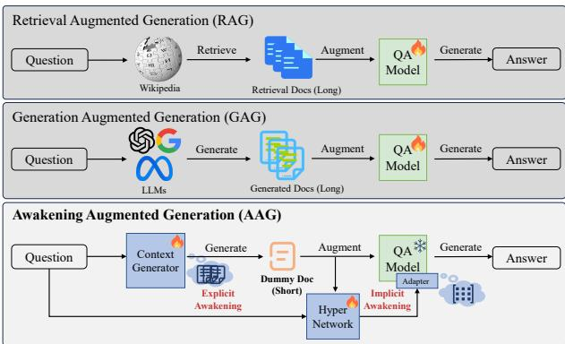
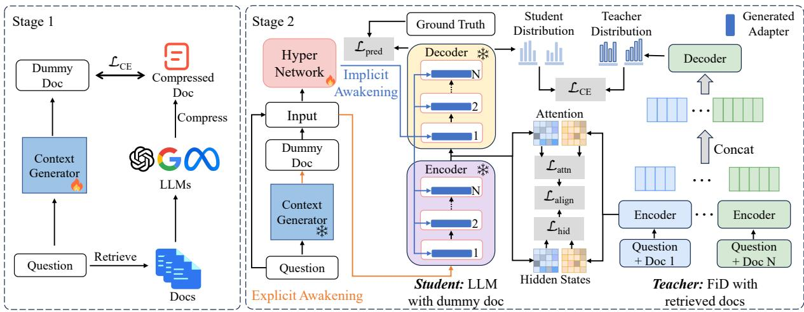
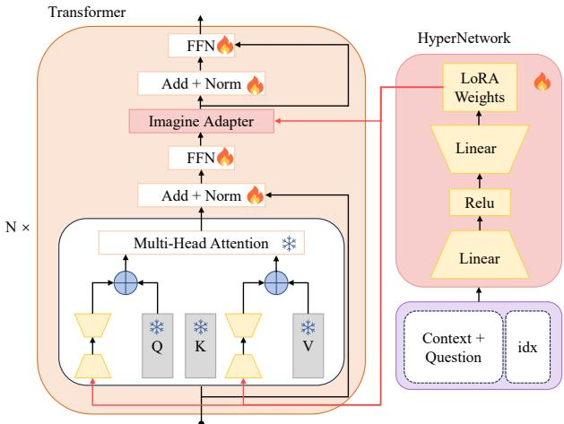
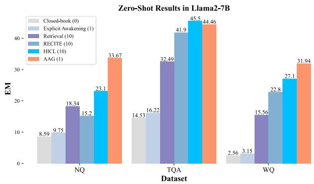
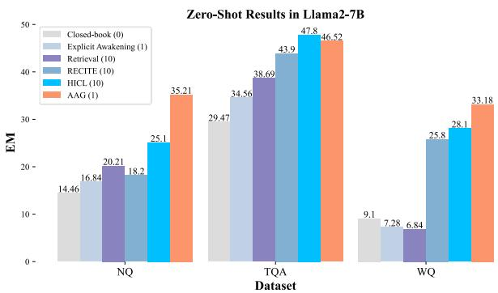
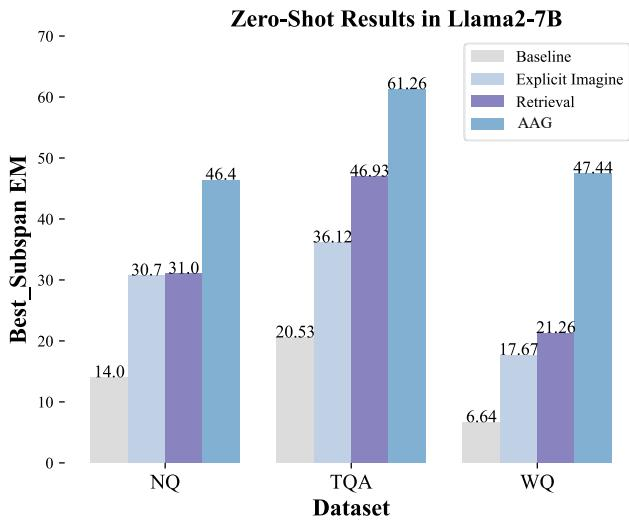
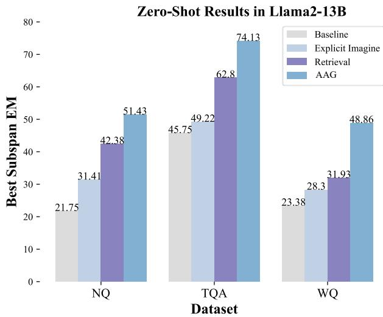

# Awakening Augmented Generation: Learning to Awaken Internal Knowledge of Large Language Models for Question Answering

Huanxuan Liao1,2, Shizhu He1,2\*, Yao Xu1,2, Yuanzhe Zhang1, Shengping Liu3, Kang Liu1,2, Jun Zhao1,2

1 The Key Laboratory of Cognition and Decision Intelligence for Complex Systems, Institute of Automation, Chinese Academy of Sciences, Beijing, China

2 School of Artificial Intelligence, University of Chinese Academy of Sciences, Beijing, China 3 Unisound, Beijing, China

liaohuanxuan2023@ia.ac.cn {yao.xu, shizhu.he, kliu, jzhao}@nlpr.ia.ac.cn

## Abstract

Retrieval-Augmented-Generation and Generation-Augmented-Generation have been proposed to enhance the knowledge required for question answering with Large Language Models (LLMs) by leveraging richer context. However, the former relies on external resources, and both require incorporating explicit documents into the context, which increases execution costs and susceptibility to noise data during inference. Recent works indicate that LLMs model rich knowledge, but it is often not effectively ac tivated and awakened. Inspired by this, we propose a novel knowledge-augmented framework, Awakening-Augmented-Generation (AAG), which mimics the human ability to answer questions using only thinking and recalling to compensate for knowledge gaps, thereby awaking relevant knowledge in LLMs without relying on external resources. AAG consists of two key components for awakening richer context. Explicit awakening fine-tunes a context generator to create a synthetic, compressed document that functions as symbolic context. Implicit awakening utilizes a hypernetwork to generate adapters based on the question and synthetic document, which are inserted into LLMs to serve as parameter context. Experimental results on three datasets demonstrate that AAG exhibits significant advantages in both open-domain and closed-book settings, as well as in out-of-distribution generalization. Our code will be available at https: //github.com/Xnhyacinth/IAG.

## 1 Introduction

We can know more than we can tell. — Michael Polanyi

Knowledge-intensive tasks like question answering (QA) necessitate utilizing extensive world and domain knowledge (Berant et al., 2013; Joshi et al., 2017; Kwiatkowski et al., 2019). Nowadays, Large Language Models (LLMs) have displayed notable competencies in almost every task and industry (Liu et al., 2023b). However, LLMs lack the sufficient capability to independently handle knowledge-intensive tasks (Frisoni et al., 2024) and usually generate hallucinations (Zhao et al., 2023).

  
Figure 1: Compared with RAG and GAG, the proposed AAG eschews external resources, generates a dummy document (explicit awakening) and creates flexible adapters (implicit awakening) for each question.

In recent years, to address hallucinations in LLMs and enhance performance in question answering, researchers have developed several knowledge-augmented methods for LLMs. These methods primarily fall into two categories: Retrieval-Augmented Generation (RAG) (Guu et al., 2020) which retrieves documents from external resources (e.g., Wikipedia) and incorporates both the retrieved documents and the question into LLMs (Izacard and Grave, 2021) (top part of Figure 1). Generation-Augmented Generation (GAG) (Kim et al., 2024) which utilizes LLMs such as ChatGPT (Ouyang et al., 2022) to generate more relevant documents, which are then used to enhance the answer generation (middle part of Figure 1).

However, these methods have the following disadvantages1: 1) Dependence on external resources, RAG relies on external domain knowledge resources (Ke et al., 2024), while GAG depends on a more powerful external LLM as a knowledge generator. This reliance limits their broader application. 2) Increased execution costs, the computing resources and inference time required increase significantly with the number of documents. For example, the typical RAG method FiD (Izacard and Grave, 2021) must handle over 12,000 tokens to retrieve 100 documents, resulting in more than a 100-fold increase in prompt length and over 1002- fold increase in inference time (Liu et al., 2023a). Similarly, the GAG method (Yu et al., 2023) incurs additional financial costs, such as API calls. 3) Specific retraining, these approaches often require retraining for different domains, tasks and datasets (Li et al., 2024). This heightens the challenge of reusing models across different scenarios, resulting in resource inefficiency due to low parameter effectiveness and the need for extensive data.

In fact, LLMs inherently possess rich knowledge and significant potential for tackling knowledgeintensive tasks (Bhagavatula et al., 2020). Performance on specific tasks can be improved by more effectively activating and awakening relevant knowledge without external resources. For instance, strategies such as repeating the question twice (Xu et al., 2023), consolidating knowledge with prompts like "As far as I know" (Yao et al., 2023), and employing visual-language models to imagine images (Tang et al., 2023) can all enhance the performance of LLMs on downstream tasks. That is, LLMs model rich knowledge, but it is often not effectively activated and awakened.

Inspired by the above findings and to alleviate the challenges in RAG and GAG, we propose a novel knowledge-augmented framework called Awakening-Augmented Generation (AAG) which emulates the human ability to compensate for knowledge deficits through thinking and recalling in QA. AAG utilizes the context generator to generate a compressed dummy document as symbolic context while reducing computational demands. For instance, AAG uses "official language ... Jamaica" (just 20 tokens) as knowledge instead of "Jamaica is regarded... official language is English..." (>200 tokens) in RAG or GAG for the question "what does jamaican people speak?" in WebQ (Berant et al., 2013). Additionally, AAG uses the hypernetwork to generate adapters as parameter context for each question, which integrates the advantages of instruction-based learning with parameter-efficient modules to awaken a richer context in LLMs (bottom part of Figure 1).

Specifically, to sufficiently awaken the inherent knowledge of LLMs, we design two main modules to obtain different types of contexts and improve the utilization of relevant knowledge in LLM. The explicit awakening module first employs symbol distillation to compress context, followed by finetuning the context generator to generate a concise dummy document, effectively reducing the length of text processing. Next, within the knowledge distillation framework, the implicit awakening module utilizes a hypernetwork to convert questions and other task data (e.g., documents) into adapters inserted into LLMs. This dynamic generation allows for more adaptable and contextually relevant module generation, enhancing the model’s ability to handle diverse and complex tasks effectively. The core idea of AAG is to enable student models that lack rich contextual information to mimic teacher models that possess such information.

We evaluate the proposed AAG on various LLMs, including T5 (Roberts et al., 2020a) and Llama2 (Touvron et al., 2023). The experimental results across NQ (Kwiatkowski et al., 2019), TriviaQA (Joshi et al., 2017) and WebQ datasets indicate that the proposed AAG yields performance gains while reducing computational expenses and time during inference. Notably, it outperforms baselines that retrieve and generate knowledge 2% under the same document settings and can achieve similar performance while reducing inference cost (tokens processed) by up to 4×. In conclusion, the contributions of this paper are summarized as follows:

• We propose a new knowledge augmentation framework AAG to awaken richer context (symbolic and parameter context) more efficiently without relying on external resources.

• We make use of a text-conditioned hypernetwork to generate parameter-efficient modules as parameter context based on the question and a dummy compressed document.

• Experimental results indicate that AAG effectively awakens the relevant knowledge of LLMs which demonstrates significant advantages in both open-domain and closed-book settings while reducing inference cost.

## 2 Related Work

This paper mainly utilizes context compression, hypernetworks and knowledge distillation to achieve knowledge enhancement. The following will elucidate pertinent research across four facets.

Knowledge Enhancement has usually been adopted to alleviate the issue of insufficient knowledge in LLMs. There are two main methods: RAG (Sun et al., 2019; Wang et al., 2024) and GAG (Abdallah and Jatowt, 2023). The typical RAG method FiD (Izacard and Grave, 2021) retrieves documents from Wikipedia to answer questions. LLMs serving as a knowledge base have been the focus of numerous studies that advocate the extraction of knowledge from such models (e.g., GPT-3). For instance, Yu et al. (2023) generates 10 documents for each question. However, RAG requires external resources, and both RAG and GAG need verbose long contexts. Recently, methods have been developed to enhance LLMs’ abilities by simulating human imagination of visual information using existing visual-language models (Tang et al., 2023; Akter et al., 2024). Our proposed method not only eliminates the need for external resources but also improves the efficiency of activating internal knowledge within LLMs.

Context Compression has often been used to improve the efficiency of LLMs in processing long contexts. Recent studies (Mu et al., 2023) propose that long contexts be condensed into summary vectors (soft prompts) to ensure their effective utilization by LLMs. Simultaneously, some studies (Jiang et al., 2023; Pan et al., 2024) suggest utilizing information redundancy and entropy in lengthy texts to compress contexts (Li et al., 2023). Unlike these approaches, this paper aims to enhance the long-context modeling ability of LLMs. By developing a context generator that creates compressed contexts, the QA model operating on short contexts can achieve a rich contextual understanding similar to models designed for longer contexts.

Knowledge Distillation is a technique where a smaller model learns to mimic the predictions of a larger model, aiming to retain performance while reducing computational resources (Hinton et al., 2015). Recent studies (West et al., 2022) present symbolic knowledge distillation, a process that facilitates knowledge transfer from a teacher model via extracting training data to subsequently train a student model (Wang et al., 2023b; Ranaldi and Freitas, 2024). In this paper, the process of obtaining compressed context during context generator finetuning resembles a form of symbolic distillation. Regarding training, our emphasis lies in distilling the long-context modeling abilities of LLMs.

Hypernetworks is designed to reduce the number of parameters (Ha et al., 2016), i.e., a small neural network generates parameters for another big neural network. It offers a solution that reduces the dependency on gradient descent for specific domains. Recent studies (Phang et al., 2022; Ivison et al., 2023) have explored the enhancement of model performance in zero/few-shot settings through meta-learning involving hypernetworks. We utilize hypernetworks to acquire parameter context by dynamically converting the question and the other data to adapters inserted into LLMs for efficiency and generalization.

## 3 Method

In this section, we introduce the details of AAG to activate LLMs’ intrinsic knowledge and obtain a richer context for QA. The fundamental premise underlying this method is that QA with a richer context (teacher model) yields a better internal representation and greater performance (e.g., RAG with retrieved documents). Therefore, to enable a student model without external documents as context to also possess rich context, it is necessary to both learn to independently generate context (though not excessively long) and to allow the student model to mimic and acquire rich internal representations.

Specifically, as shown in Figure 2, AAG comprises two main modules. Explicit awakening with long context compression learns to generate a compressed dummy document (§ 3.2). Implicit awakening with the hypernetwork leverages hidden knowledge that learns a shared knowledge feature projection across questions (§ 3.3). The hypernetwork is trained to generate lightweight LoRA modules to align the question and the internal knowledge. Besides, there is long context distillation in training, which learns the teacher’s rich representations to compensate for missing knowledge in label learning (§ 3.4).

## 3.1 Formulation

The formulation of our task follows RAG for QA (Guu et al., 2020). Let V∗ denote the infinite set, encompassing all potential strings over the tokens in vocabulary V, and this includes the empty string. An instance within a QA dataset is defined as a triplet $( \mathbf { \boldsymbol { q } } , \mathbf { \boldsymbol { a } } , \mathbf { \boldsymbol { c } } )$ comprising question q, answer $^ { a , }$ and context $^ { c , }$ where $\ b { q } , \ b { a } , \ b { c } \in \mathcal { V } ^ { * }$ . Conventionally, the context c is drawn from the knowledge corpus ${ \mathcal { Z } } ,$ , like Wikipedia, whereby $\mathcal { Z } \subset \mathcal { V } ^ { * }$ . Additional background details are available in B.1.

  
Figure 2: Overview of AAG method. In the inference phase, for each question, the explicit awakening (context generator) generates a short dummy document and the implicit awakening (hypernetwork) generates a specific LoRA module. During training, there are two stages: the first stage is the pre-training of the context generator (§ 3.2), aiming at its ability to imagine a short dummy document based on the question, and the second stage is the hypernetwork fine-tuning (§ 3.3) using long context distillation (§ 3.4) to obtain a question-specific LoRA module.

## 3.2 Explicit Awakening with Context Generator

To obtain the short dummy document $^ { d , }$ we finetune a context generator 2 to utilize its knowledge in generating a compressed dummy document as symbolic context, thereby reducing input length. Simultaneously, we avoid dependence on a fixed knowledge base and minimize knowledge corpus errors by incorporating potentially useful context (Lee et al., 2023). Employing a knowledge distillation framework, the student model learns to generate the compressed text that the teacher model produces based on extensive context.

Specifically, for each data point $\begin{array} { r l } { \mathcal { D } _ { \mathrm { t r a i n } } } & { { } = } \end{array}$ $\{ ( \pmb { q } _ { i } , \pmb { a } _ { i } , \pmb { c } _ { i } ) \} _ { i = 1 } ^ { n }$ , we apply the long-context compression method LongLLMLingua (Jiang et al., 2023) to the retrieved text $c _ { i } .$ , resulting in the compressed text $\boldsymbol { c ^ { \prime } } _ { i }$ . As shown in the left part of Figure 2, subsequently, we fine-tune the context generator $p _ { \theta }$ with trainable parameters θ to fully leverage its inherent knowledge for generating $\boldsymbol { c ^ { \prime } } _ { i }$ , which guides the model to think about its knowledge and generate a short dummy document. Our objective is to minimize the negative log-likelihood of the compressed text $\boldsymbol { c ^ { \prime } } _ { i }$ sequence given the specific prompt p (B.2) and the question $\pmb { q } _ { i }$

  
Figure 3: The Architecture of hypernetwork. Hypernetwork generates LoRA adapter weights for each question. During training, only Hypernetwork, FFN, and Norm weights are updated.

$$
\mathcal { L } _ { c e } = - \frac { 1 } { n } \sum _ { i = 1 } ^ { n } \log p _ { \theta } ( \pmb { c } ^ { \prime } { } _ { i } \mid \pmb { p } , \pmb { q } _ { i } )\tag{1}
$$

This process enables LLMs to conceive compressed document that robustly parallels the question’s knowledge requirements.

## 3.3 Implicit Awakening with Hypernetwork

Generally speaking, richer context can help LLM better answer questions. That is, the representation of questions and the internal state of LLM when utilizing rich context are the better states. Therefore, in the absence of context, we should focus on building models to awaken LLM to achieve this better state and as a better QA model.

We utilize the hypernetwork3 to convert the question q and short dummy document d into a specific parameter-efficient LoRA module inserted into the LLM, serving as the parameter context for the question. This is akin to repeating the question in the prompt (Xu et al., 2023) and incorporating certain topical cues to stimulate the model’s recall of relevant questions (Wang et al., 2023c). However, the distinction lies in the fact that they serve as wake-up features, whereas we are generating model parameters as knowledge awakening.

The hypernetwork architecture for generating LoRA weights is detailed in Figure 3. Specifically, $D _ { k } ^ { q }$ and $U _ { k } ^ { q }$ represent the low-rank down and up projections of layer k associated with the Query matrix $W _ { \mathcal { Q } }$ in the attention module, while $D _ { k } ^ { v }$ and $U _ { k } ^ { v }$ correspond to those associated with the Value matrix $W _ { \mathcal { V } }$ The hypernetwork, denoted as $g _ { D }$ and $g _ { U }$ , takes concat $( f , i _ { k } ^ { \{ q , v \} } )$ as input, where $f$ is the feature vector obtained using the model’s encoder and reduced in dimensionality via a whitening algorithm (Su, 2021). To achieve this whitening transformation, we first compute the mean of the vector $\textstyle \mu = { \frac { 1 } { N } } \sum _ { i = 1 } ^ { N } x _ { i }$ and center the data by subtracting $\mu$ from each vector $x _ { i } .$ Next, we calculate the covariance matrix $C$ of the centered vectors $\tilde { x } _ { i } = x _ { i } - \mu$ , which is given by $\begin{array} { r } { C = \frac { 1 } { N } \sum _ { i = 1 } ^ { N } \tilde { x } _ { i } \tilde { x } _ { i } ^ { T } } \end{array}$ . We then perform Singular Value Decomposition (SVD) on the covariance matrix: $C = U \Lambda U ^ { T }$ , where $U$ contains the eigenvectors and Λ is a diagonal matrix of eigenvalues. The transformation matrix W is derived from the eigenvalue decomposition as $W = U \Lambda ^ { - 1 / 2 }$ , where $\Lambda ^ { - 1 / 2 }$ scales the eigenvectors by the inverse square root of their corresponding eigenvalues. Thus, applying the transformation $\tilde { x } _ { i } = ( \tilde { x } _ { i } ) W$ not only centers the data around zero but also results in a covariance matrix that is equivalent to the identity matrix, ensuring that the transformed vectors are uncorrelated and have unit variance. The term $i d x _ { k } ^ { \{ q , v \} } \in \{ 0 , \ldots , 2 \times$ #blocks} signifies the positional embedding, differentiating between layers and QV. Each hypernetwork is characterized by weights $W _ { d }$ and $W _ { u }$ , representing the down and up projections, respectively. The hypernetwork equations for $D ^ { \{ q , v \} }$ is expressed as follows:

$$
f _ { i } = { \mathrm { w h i t e n i n g } } ( { \mathrm { E n c o d e r } } ( q _ { i } ; d _ { i } ) )\tag{2}
$$

$$
g ( x ) = W _ { u } \cdot \operatorname { R e L U } ( W _ { d } \cdot x )
$$

$$
D ^ { \{ q , v \} } = g _ { D } ( ( f _ { i } ; i d x _ { k } ^ { \{ q , v \} } ) )\tag{3}
$$

(4)

where Encoder represents the encoder of the model, whitening is a dimensionality reduction algorithm, ReLU is an activation function, and $i d x _ { k } ^ { q } \ =$ 2k, $i d x _ { k } ^ { v } = 2 k + 1$ $g _ { D }$ and $g _ { U }$ represent the dimension reduction and dimension increase functions of the hypernetwork, respectively.

## 3.4 Training with Long Context Distillation

Within the knowledge distillation framework, elements like hidden representations (Jiao et al., 2020), attention dependencies (Wang et al., 2020), and relationships among representations (Park et al., 2021) are considered essential for effective knowledge transfer. In this paper, we introduce long context distillation (LCD) as the contextualized knowledge that primarily guides the student model. Specifically, the teacher model, FiD (Izacard and Grave, 2021), which processes longer contextual inputs, theoretically contains more information due to its richer context. This enables it to activate more specific internal knowledge, serving as a supervisory model. The teacher model aids the student model, T5 (Roberts et al., 2020a), which is of the same size but uses shorter contextual inputs, in activating richer feature representations and knowledge. The optimization objective for the student model at each mini-batch $z _ { r } = ( x _ { r } , y _ { r } )$ is:

$$
\begin{array} { r } { \mathcal { L } _ { \mathrm { s } } ( \theta _ { s } , \theta _ { t } , z _ { r } ) = \alpha \mathcal { L } _ { \mathrm { c e } } ( y _ { r } , S ( x _ { r } ; \theta _ { s } ) ) } \\ { + ( 1 - \alpha ) \mathcal { L } _ { \mathrm { c e } } ( T ( x _ { r } ; \theta _ { t } ) , S ( x _ { r } ; \theta _ { s } ) ) } \end{array}\tag{5}
$$

where we have a teacher model denoted as $T ( \cdot ; \theta _ { t } )$ and a student model denoted as $S ( \cdot ; \theta _ { s } )$ . The corresponding model parameters are $\theta _ { t }$ and $\theta _ { s }$

As illustrated on the right of Figure 2, we perform additional representation alignment to facilitate better knowledge transfer. In our distillation process, both the teacher and student models have $L$ layers. The input text is processed through these layers, yielding corresponding output hidden states $\{ H _ { l } ^ { t } \} _ { l = 0 } ^ { L }$ and $\{ H _ { l } ^ { s } \} _ { l = 0 } ^ { L }$ , along with attention matrices $\{ A _ { l } ^ { t } \} _ { l = 1 } ^ { L }$ and $\{ A _ { l } ^ { s } \} _ { l = 1 } ^ { L }$ For aligning hidden states, we calculate the proximity between the teacher’s and student’s hidden states using cosine distance (COS) (Park et al., 2021).

$$
\mathcal { L } _ { \mathrm { h i d } } = - \cos ( H _ { l } ^ { s } , H _ { l } ^ { t } )\tag{6}
$$

While for aligning attention dependencies, we follow (Jiao et al., 2020) to optimize the mean square

error (MSE) between the attention matrices of the teacher and the student:

$$
\mathcal { L } _ { \mathrm { a t t } 1 } = - \operatorname { M S E } ( A _ { l } ^ { s } , A _ { l } ^ { t } )\tag{7}
$$

The overall objective for knowledge transfer is:

$$
\mathcal { L } _ { \mathrm { a l i g n } } ( H _ { l } ^ { s } , H _ { l } ^ { t } , A _ { l } ^ { s } , A _ { l } ^ { t } ) = \mathcal { L } _ { \mathrm { a t t n } } + \mathcal { L } _ { \mathrm { h i d } }\tag{8}
$$

The overall objective for training AAG is the weighted sum of the two objectives:

$$
\mathcal { L } = \mathcal { L } _ { \mathrm { s } } + \lambda \mathcal { L } _ { \mathrm { a l i g n } }\tag{9}
$$

## 4 Experiment

In this section, we conduct experiments to demonstrate the effectiveness and efficiency of AAG on QA. The experiment mainly answers four research questions (RQs):

RQ1: Can AAG achieve knowledge augmentation for QA over LLMs? (§ 4.4)

RQ2: Does AAG have a good out-of-distribution generalization ability? (§ 4.5)

RQ3: Does AAG have advantages in effectiveness and efficiency compared to RAG and GAG? (§ 4.6) RQ4: What is the role of explicit and implicit awakening modules in AAG? (§ 4.7)

## 4.1 Datasets

We evaluate the proposed approach on three public question answering datasets: NaturalQuestions (NQ) (Kwiatkowski et al., 2019), WebQuestions (WQ) (Berant et al., 2013) and TriviaQA (TQA) (Joshi et al., 2017). To evaluate the model performance, we use the exact match (EM) score for evaluating predicted answers (Rajpurkar et al., 2016). We provide dataset details in the B.4.

## 4.2 Baselines

Both the moderately sized language model (<1B) and the large language model (≥ 3B) are under consideration. T5 (Roberts et al., 2020a) is selected as the backbone for our moderately sized language models. We evaluate our proposed AAG against several knowledge-enhanced approaches, which include RAG models such as DPR (Karpukhin et al., 2020), RAG (Lewis et al., 2020), EAR (Chuang et al., 2023), RFiD (Wang et al., 2023a), FILCO (Wang et al., 2023d) and FiD (Izacard and Grave, 2021), as well as the GAG model GENREAD (Yu et al., 2023), and parameters efficient fine-tuning method LoRA (Hu et al., 2021).

To demonstrate the plug-and-play capability of AAG on the zero-shot settings of LLMs (≥ 3B), we use Llama2-7B and -13B (Touvron et al., 2023) as the basic model. We evaluate with 6 diverse settings: without retrieval, with retrieval, with LoRA, RECITE (Sun et al., 2023), HICL (Wang et al., 2024) and using the proposed AAG.

## 4.3 Implementations

In the pretraining stage, the context generator initialized with T5-large utilizes the generated question-compressed pairs. During the second stage, the teacher model employs a FiD reader with different sizes (FiD-l and FiD-xl) that are finetuned on the training split of target datasets. The student model freezes the backbone and updates solely the hypernetwork, FFN and norm layers. B.3 contains more implementation and baseline details.

## 4.4 Main Results

## 4.4.1 Supervised Setting

Table 1 presents the performance results, with full results including T5-Base detailed in C.1. Compared to closed-book models, as well as RAG and GAG methods, our proposed AAG method, achieves state-of-the-art (SOTA) performance using an equivalent number of documents.

In the closed-book setting (upper part of the table), our method surpasses the baseline by an average of +2% EM score, demonstrating its superior ability to leverage internal knowledge through awakening. Notably, as the model size increases, the performance gains from the awakening approach become even more pronounced.

The following sections present the experimental results in the open domain setting4. Notably, proposed AAG using just one short dummy document, matches or exceeds the performance of RAG and GAG methods, which process 10 documents. These results demonstrate that AAG effectively balances efficiency and overhead by leveraging imagined compressed text.

AAG outperforms baselines when documentsmatched. When AAG utilizes 10 retrieved documents under RAG setting, it surpasses RFiD performance by 1.6% in NQ, 4.4% in TQA, and 2.7% in WQ. When AAG utilizes 10 generated documents under the GAG setting, it surpasses strong baseline GENREAD (clustering) performance by 4.5% in NQ, 0.7% in TQA, and 1.1% in WQ.

<table><tr><td rowspan="2">Models</td><td rowspan="2"># Docs</td><td colspan="2">NQ</td><td colspan="2">TriviaQA</td><td colspan="2">WebQ</td></tr><tr><td>Large (800M)</td><td>XL (3B)</td><td>Large (800M)</td><td>XL (3B)</td><td>Large (800M)</td><td>XL (3B)</td></tr><tr><td># Closed-book Setting</td><td></td><td></td><td></td><td></td><td></td><td></td><td></td></tr><tr><td>T5 (Roberts et al., 2020a)</td><td>0</td><td>28.5*</td><td>28.30</td><td>28.7*</td><td>33.92</td><td>30.6*</td><td>34.43</td></tr><tr><td>LoRA (Hu et al., 2021)</td><td>0</td><td>17.70</td><td>23.15</td><td>23.87</td><td>32.16</td><td>29.13</td><td>35.24</td></tr><tr><td>AAG (Ours)</td><td>0</td><td>29.32</td><td>29.59</td><td>30.11</td><td>35.71</td><td>32.68</td><td>37.40</td></tr><tr><td># Retrieval Augmented Setting (compared with RAG)</td><td></td><td></td><td></td><td></td><td></td><td></td><td></td></tr><tr><td>DPR* (Karpukhin et al., 2020) (110M)</td><td>100</td><td>41.5</td><td>=</td><td>56.8</td><td></td><td>41.1</td><td></td></tr><tr><td>RAG* (Lewis et al., 2020)</td><td>10</td><td>44.5</td><td></td><td>56.1</td><td></td><td>45.2</td><td></td></tr><tr><td>FiD* (Izacard and Grave, 2021)</td><td>10</td><td>46.7</td><td>50.1</td><td>61.9</td><td>66.3</td><td>48.1</td><td>50.8</td></tr><tr><td>FiD (Izacard and Grave, 2021)</td><td>100</td><td>51.4*</td><td>55.2</td><td>67.6*</td><td>72.9</td><td>50.5</td><td>52.9‡</td></tr><tr><td>EAR (Chuang et al., 2023)</td><td>10</td><td>39.6</td><td>42.3*</td><td>60.0</td><td>64.6*</td><td></td><td></td></tr><tr><td>RFiD (Wang et al., 2023a)</td><td>10</td><td>48.3</td><td>50.5</td><td>63.4</td><td>67.8</td><td></td><td></td></tr><tr><td>FILCO* (Wang et al., 2023d)</td><td>1</td><td></td><td>44.7</td><td></td><td>59.0</td><td></td><td></td></tr><tr><td>AAG (Ours)</td><td>10</td><td>49.9</td><td>50.9</td><td>69.7</td><td>70.3</td><td>51.5</td><td>52.8</td></tr><tr><td>AAG (Ours)</td><td>30</td><td>53.1</td><td>=</td><td>70.5</td><td>=</td><td>52.0</td><td></td></tr><tr><td># Generation Augmented Setting (compared with GAG)</td><td></td><td></td><td></td><td></td><td></td><td></td><td></td></tr><tr><td>GENREAD (sampling)* (Yu et al., 2023)</td><td>10†</td><td>40.3</td><td>42.6</td><td>67.8</td><td>69.6</td><td>51.5</td><td>52.6</td></tr><tr><td>GENREAD (clustering)* (Yu et al., 2023)</td><td>10†</td><td>43.5</td><td>45.6</td><td>70.2</td><td>71.6</td><td>53.5</td><td>54.4</td></tr><tr><td>AAG (Ours)</td><td>10†</td><td>48.8</td><td>49.2</td><td>70.9</td><td>72.2</td><td>54.5</td><td>55.6</td></tr><tr><td># Awakening Augmented Setting</td><td></td><td></td><td></td><td></td><td></td><td></td><td></td></tr><tr><td>LoRA (Hu et al., 2021)</td><td>1†</td><td>40.1</td><td>44.2</td><td>62.8</td><td>66.9</td><td>43.7</td><td>48.2</td></tr><tr><td>AAG (Ours)</td><td>1†</td><td>42.3</td><td>46.5</td><td>65.5</td><td>68.4</td><td>45.3</td><td>50.5</td></tr></table>

Table 1: QA performances of different methods with different settings. The first part (closed-book setting) indicates that only utilize questions; The latter three parts utilize explicit documents. The best results are in bold, while the second-best are underlined. \* means that those results are from existing papers, † denotes that the documents were generated (‡ indicates that the number of documents is reduced due to insufficient memory for distillation).

  
Figure 4: Zero-Shot results (EM, %) of Llama2-7B on three open-domain QA datasets. The number in parentheses indicates the number of documents used. More zero-shot setting results can be seen in C.3.

## 4.4.2 Zero-shot Setting

Figure 4 illustrates the zero-shot results for LLMs implementing AAG with a frozen Llama2-7B and -13B. This research seeks to explore the possibility of enhancing LLMs via AAG. Due to the high computational demands of training, we only finetuned the hypernetwork on a mixed dataset without LCD in this experiment and evaluated performance in a zero-shot setting. Detailed prompt information can be found in the B.2.

We discerned that Llama2’s performance can be enhanced by imagining knowledge autonomously. While leveraging explicit imagined context could amplify the average EM +1%, this is not as significant as the improvement achieved by retrieving 10 documents, indicating the limitations of relying solely on prompt cues for triggering corresponding knowledge. AAG can enhance knowledge via two main awakening processes, escalating EM by +15.33% for NQ, +11.97% for TQA, and +16.38% for WQ. Compared to two other advanced RAG methods, AAG using a single document performs only 1 EM lower than the HICL method (Wang et al., 2024) on the TQA but achieves +10% EM on the NQ and +5% EM on the WQ. With AAG, Llama2-7B demonstrated an average improvement of +14% across the three datasets. This trend is also observed in Llama2-13B’s results (Figure 5). This implies that even in zero-shot settings, our method can still offer substantial benefits to LLMs.

## 4.5 Out-Of-Distribution (OOD) Performance

To further demonstrate the generalizations of the AAG method and the importance of hypernetwork, we also evaluate its performance in OOD generalizations. Table 2 shows the IID and OOD performance of FiD, and AAG methods with different document settings when training on NQ (From NQ generalization to the other two datasets).

<table><tr><td rowspan="2">Models</td><td rowspan="2"># Docs</td><td colspan="3">Base (220M)</td><td colspan="3">Large (800M)</td></tr><tr><td>NQ</td><td>TQA</td><td>WQ</td><td>NQ</td><td>TQA</td><td>WQ</td></tr><tr><td>T5</td><td>0</td><td>22.16</td><td>3.18</td><td>4.12</td><td>28.5*</td><td>3.18</td><td>4.12</td></tr><tr><td>AAG</td><td>0</td><td>23.89</td><td>6.21</td><td>10.94</td><td>29.32</td><td>10.17</td><td>14.06</td></tr><tr><td>FiD</td><td>10</td><td>46.81</td><td>53.93</td><td>24.02</td><td>46.7*</td><td>57.93</td><td>25.12</td></tr><tr><td>AAG</td><td>10</td><td>47.01</td><td>55.74</td><td>24.13</td><td>49.92</td><td>60.03</td><td>25.79</td></tr><tr><td>LoRA</td><td>1†</td><td>37.17</td><td>45.20</td><td>15.62</td><td>37.61</td><td>48.50</td><td>20.71</td></tr><tr><td>AAG</td><td>1†</td><td>40.14</td><td>46.61</td><td>18.92</td><td>42.32</td><td>54.80</td><td>22.05</td></tr></table>

Table 2: IID and OOD results. The performance on three open-domain datasets for the model trained on NQ is reported, with underlined values indicating IID performance. Full OOD results and details of the three datasets are provided in the C.2.
<table><tr><td>Models</td><td>Training Params</td><td># Docs</td><td>#Avg Tokens</td><td>Inference Time</td><td>Training Time</td></tr><tr><td>T5</td><td>220M</td><td>0</td><td>19.8</td><td>79.8s</td><td>0.9h</td></tr><tr><td>AAG</td><td>139.3M</td><td>0</td><td>19.8</td><td>82.3s</td><td>1.2h</td></tr><tr><td>AAG</td><td>139.3M</td><td>1</td><td>522.1</td><td>214.6s</td><td>1.7h</td></tr><tr><td>FiD</td><td>220M</td><td>10</td><td>1748.3</td><td>683.3s</td><td>2.3h</td></tr><tr><td>GEN.</td><td>220M</td><td>10</td><td>1912.5</td><td>704.8s</td><td></td></tr><tr><td>FiD</td><td>220M</td><td>100</td><td>16625.7</td><td>1293.2s</td><td>5.8h</td></tr></table>

Table 3: Training and inference cost on the NQ.

It is patently clear that an increment in document provision leads to better OOD performance, likely due to the presence of answer-oriented content within these documents. Remarkably, AAG can come within a relatively narrow 5% gap of FiD, even when utilizing a single imagined document as opposed to 10 retrieved documents.

Simultaneously, AAG generally showcases superior performance in OOD when provided with 10 retrieved documents. This superiority can be traced back to the pivotal role played by hypernetwork in generating LoRA adapters’ weights based on questions. This equips models with the capability to invoke and access internal knowledge based on context-specific discourse rather than confining to resolving distinct questions.

## 4.6 Training Cost and Inference Speed-up

We proceeded to measure the inference speed documented in GPU time and training time for 5000 steps on the NQ dataset using T5-Base. The experiments were conducted on a single RTX 3090 GPU, maintaining a standard batch size of 8 during training and 1 during inference. A detailed inference case is shown in the Appendix D.

As evident from Table 3, the proposed method’s advantage lies in its diminished requirement for parameter updates, which can be attributed to the shared hypernetwork’s utilization that generates LoRA adapters, thereby negating the necessity of individual LoRA adapters’ setup. Despite the lack of a training advantage due to distillation constraints, AAG achieves efficient reasoning through an extremely lightweight design, saving more than half the training time compared to methods using a large number of documents (0.3×). Compared to the other two methods, the processed tokens are significantly decreased, while either outperforming them or showing negligible differences in performance. This represents an optimal trade-off between efficiency and computational demand. Moreover, unlike GAG, our approach incurs no financial costs associated with API calls, and the reduced model size facilitates faster generation.

<table><tr><td>Methods</td><td># Docs (↓)</td><td>NQ (↑)</td><td>TQA (↑)</td><td>WQ(↑)</td></tr><tr><td>AAG</td><td>1†</td><td>40.14</td><td>60.75</td><td>41.73</td></tr><tr><td>w/o EA</td><td>0</td><td>23.89 (↓ 40%)</td><td>22.69 (↓ 63%)</td><td>30.31 (↓ 27%)</td></tr><tr><td>In. w/o EA</td><td>1</td><td>38.85 (↓ 3%)</td><td>59.62 (↓ 2%)</td><td>40.65 (↓ 3%)</td></tr><tr><td>w/o IA</td><td>1</td><td>33.48 (↓ 17%)</td><td>51.19 (↓ 16%)</td><td>34.72 (↓ 17%)</td></tr><tr><td>w/o LCD</td><td>1</td><td>33.96 (↓ 15%)</td><td>53.27 (↓ 12%)</td><td>29.39 (↓ 29%)</td></tr><tr><td>w/o  $\mathcal { L } _ { s }$ </td><td>1</td><td>34.24 (↓ 14%)</td><td>54.90 (↓ 10%)</td><td>31.67 (↓ 24%)</td></tr><tr><td>w/o  $\mathcal { L } _ { a l i g n }$ </td><td>1</td><td>37.41 (↓ 7%)</td><td>56.38 (↓ 7%)</td><td>39.26 (↓ 6%)</td></tr></table>

Table 4: Ablation studies on three open-domain QA datasets. The backbone model is the T5-base. "In." means the input of the hypernetwork § 3.3.

## 4.7 Ablation Study

This study introduces two key awakening processes to stimulate LLMs’ internal knowledge: explicit awakening (EA) and implicit awakening (IA). We particularly examined the influence of different awakening types on performance.

Table 4 demonstrates that both EA and IA are important for AAG. Omitting either one results in a considerable reduction in performance, with a drop exceeding 30% observed when EA is neglected. This is harmonious with the initial observation that performance improvement becomes more noticeable when relevant documents are available, thus underscoring EA’s superiority.

The outcomes of Long Context Distillation (LCD) including $\mathcal { L } _ { s }$ and $\mathcal { L } _ { a l i g n }$ also make marginal contributions to the overall results. This validates the previous assertion that a more extensive context tends to optimize performance, although with limited gains. The impact of EA on the application of hypernetworks is minimal (<3%), indicating that hypernetworks in IA primarily serve to awaken parameter knowledge rather than to utilize the generated context. The experiments and analysis above demonstrate the importance of each component and the effectiveness of our AAG method.

## 5 Conclusion

This study proposes a novel knowledge-augmented strategy for Large Language Models (LLMs), namely Awakening Augmented Generation (AAG) for open domain question answering. The AAG effectively harnesses the inherent knowledge of the LLMs through a dual-awakening approach to awaken a richer context. Explicit awakening with the context generator generates a short dummy document as symbolic context, while implicit awakening uses hypernetwork to convert the question and the document into adapters inserted into the LLMs as parameter context. Experimental results demonstrate a significant improvement in performance while remaining relatively lightweight. Although the main focus of this method is on one specific task, we believe these findings can offer a novel perspective on how to better harness the potential of LLMs.

## Limitations

While this study has demonstrated significant achievements in QA tasks, there are notable limitations:

Tasks. The proposed methods in the study are specialized specifically for QA. It remains unknown how effective they would be in other types of knowledge-intensive tasks, such as fact-checking or dialogue systems. Further validation is needed to assess the generalizations and applicability of this approach.

Multimodal. We have only considered imagined text and hidden representations. In future work, it is imperative to explore multimodal information including the impact of imagining images on performance.

Method. Our method relies on the knowledge learned by LLMs in the pre-training phase, which may limit the model’s ability to quickly adapt to new information. The dependency on internal knowledge activation in AAG may lead to a less transparent decision-making process in the model, making it challenging to explain the logic behind the generated answers. In the future, there is a need to continue exploring adaptive knowledge enhancement methods to optimize results further.

Hypernetwork. For lightweight and efficient settings, our hypernetwork employs a two-layer MLP. However, some studies use larger models, such as GPT-2 or T5, as hypernetworks. Due to computational resource constraints, we did not explore or compare the effects of different hypernetwork models on the results. Nonetheless, our method primarily focuses on generating parameter-efficient modules to enhance knowledge activation and generalization.

## Ethical Considerations

In this paper, we proposed a novel knowledge enhancement method aimed at leveraging the knowledge of LLMs. However, LLMs may generate inappropriate or discriminatory knowledge. Our approach does not introduce ethical concerns. The datasets we used are public, and there are no privacy issues.

## Acknowledgements

This work was supported by National Key R&D Program of China (No. 2022YFF0711900) and the National Natural Science Foundation of China (No.62376270, No.62276264). This work was supported by the Youth Innovation Promotion Association CAS.

## References

Abdelrahman Abdallah and Adam Jatowt. 2023. Generator-retriever-generator: A novel approach to open-domain question answering. arXiv preprint arXiv:2307.11278.

Syeda Nahida Akter, Aman Madaan, Sangwu Lee, Yiming Yang, and Eric Nyberg. 2024. Self-imagine: Effective unimodal reasoning with multimodal models using self-imagination. Preprint, arXiv:2401.08025.

J. Berant, A. Chou, R. Frostig, and P. Liang. 2013. Semantic parsing on Freebase from question-answer pairs. In Empirical Methods in Natural Language Processing (EMNLP).

Chandra Bhagavatula, Ronan Le Bras, Chaitanya Malaviya, Keisuke Sakaguchi, Ari Holtzman, Hannah Rashkin, Doug Downey, Wen tau Yih, and Yejin Choi. 2020. Abductive commonsense reasoning. In International Conference on Learning Representations.

Kurt Bollacker, Colin Evans, Praveen Paritosh, Tim Sturge, and Jamie Taylor. 2008. Freebase: a collaboratively created graph database for structuring human knowledge. In Proceedings ofthe 2008 ACM SIGMOD International Conference on Management of Data, SIGMOD ’08, page 1247–1250, New York, NY, USA. Association for Computing Machinery.

Yukang Chen, Shengju Qian, Haotian Tang, Xin Lai, Zhijian Liu, Song Han, and Jiaya Jia. 2023. Longlora: Efficient fine-tuning of long-context large language models. Preprint, arXiv:2309.12307.

Yung-Sung Chuang, Wei Fang, Shang-Wen Li, Wen tau Yih, and James Glass. 2023. Expand, rerank, and retrieve: Query reranking for open-domain question answering. Preprint, arXiv:2305.17080.

Giacomo Frisoni, Alessio Cocchieri, Alex Presepi, Gianluca Moro, and Zaiqiao Meng. 2024. To generate or to retrieve? on the effectiveness of artificial contexts for medical open-domain question answering. Preprint, arXiv:2403.01924.

Kelvin Guu, Kenton Lee, Zora Tung, Panupong Pasupat, and Mingwei Chang. 2020. Retrieval augmented language model pre-training. In Proceedings ofthe 37th International Conference on Machine Learning, volume 119 of Proceedings of Machine Learning Research, pages 3929–3938. PMLR.

David Ha, Andrew Dai, and Quoc V. Le. 2016. Hypernetworks. Preprint, arXiv:1609.09106.

Geoffrey Hinton, Oriol Vinyals, and Jeff Dean. 2015. Distilling the knowledge in a neural network. arXiv preprint arXiv:1503.02531.

Edward J. Hu, Yelong Shen, Phillip Wallis, Zeyuan Allen-Zhu, Yuanzhi Li, Shean Wang, Lu Wang, and Weizhu Chen. 2021. Lora: Low-rank adaptation of large language models. Preprint, arXiv:2106.09685.

Hamish Ivison, Akshita Bhagia, Yizhong Wang, Hannaneh Hajishirzi, and Matthew Peters. 2023. Hint: Hypernetwork instruction tuning for efficient zeroshot generalisation. ACL.

Gautier Izacard and Edouard Grave. 2021. Leveraging passage retrieval with generative models for open domain question answering. In Proceedings ofthe 16th Conference of the European Chapter of the Associationfor Computational Linguistics: Main Volume, pages 874–880, Online. Association for Computational Linguistics.

Huiqiang Jiang, Qianhui Wu, Xufang Luo, Dongsheng Li, Chin-Yew Lin, Yuqing Yang, and Lili Qiu. 2023. Longllmlingua: Accelerating and enhancing llms in long context scenarios via prompt compression. Preprint, arXiv:2310.06839.

Xiaoqi Jiao, Yichun Yin, Lifeng Shang, Xin Jiang, Xiao Chen, Linlin Li, Fang Wang, and Qun Liu. 2020. TinyBERT: Distilling BERT for natural language understanding. In Findings ofthe Associationfor Computational Linguistics: EMNLP 2020, pages 4163– 4174, Online. Association for Computational Linguistics.

Mandar Joshi, Eunsol Choi, Daniel Weld, and Luke Zettlemoyer. 2017. TriviaQA: A large scale distantly supervised challenge dataset for reading comprehension. In Proceedings of the 55th Annual Meeting of the Associationfor Computational Linguistics (Volume 1: Long Papers), pages 1601–1611, Vancouver, Canada. Association for Computational Linguistics.

Vladimir Karpukhin, Barlas Oguz, Sewon Min, Patrick Lewis, Ledell Wu, Sergey Edunov, Danqi Chen, and Wen-tau Yih. 2020. Dense passage retrieval for opendomain question answering. In Proceedings of the 2020 Conference on Empirical Methods in Natural Language Processing (EMNLP), pages 6769–6781, Online. Association for Computational Linguistics.

Zixuan Ke, Weize Kong, Cheng Li, Mingyang Zhang, Qiaozhu Mei, and Michael Bendersky. 2024. Bridging the preference gap between retrievers and llms. Preprint, arXiv:2401.06954.

Jaehyung Kim, Jaehyun Nam, Sangwoo Mo, Jongjin Park, Sang-Woo Lee, Minjoon Seo, Jung-Woo Ha, and Jinwoo Shin. 2024. Sure: Summarizing retrievals using answer candidates for open-domain QA of LLMs. In The Twelfth International Conference on Learning Representations.

Tom Kwiatkowski, Jennimaria Palomaki, Olivia Redfield, Michael Collins, Ankur Parikh, Chris Alberti, Danielle Epstein, Illia Polosukhin, Jacob Devlin, Kenton Lee, Kristina Toutanova, Llion Jones, Matthew Kelcey, Ming-Wei Chang, Andrew M. Dai, Jakob Uszkoreit, Quoc Le, and Slav Petrov. 2019. Natural questions: A benchmark for question answering research. Transactions of the Association for Computational Linguistics, 7:452–466.

Yejoon Lee, Philhoon Oh, and James Thorne. 2023. Knowledge corpus error in question answering. In Findings of the Association for Computational Linguistics: EMNLP 2023, pages 9183–9197, Singapore. Association for Computational Linguistics.

Patrick Lewis, Ethan Perez, Aleksandra Piktus, Fabio Petroni, Vladimir Karpukhin, Naman Goyal, Heinrich Küttler, Mike Lewis, Wen-tau Yih, Tim Rocktäschel, Sebastian Riedel, and Douwe Kiela. 2020. Retrieval-augmented generation for knowledgeintensive nlp tasks. In Proceedings ofthe 34th International Conference on Neural Information Processing Systems, NIPS’20, Red Hook, NY, USA. Curran Associates Inc.

Yichuan Li, Xiyao Ma, Sixing Lu, Kyumin Lee, Xiaohu Liu, and Chenlei Guo. 2024. Mend: Meta demonstration distillation for efficient and effective in-context learning. ArXiv, abs/2403.06914.

Yucheng Li, Bo Dong, Chenghua Lin, and Frank Guerin. 2023. Compressing context to enhance inference efficiency of large language models. Preprint, arXiv:2310.06201.

Nelson F. Liu, Kevin Lin, John Hewitt, Ashwin Paranjape, Michele Bevilacqua, Fabio Petroni, and Percy Liang. 2023a. Lost in the middle: How language models use long contexts. Preprint, arXiv:2307.03172.

Pengfei Liu, Weizhe Yuan, Jinlan Fu, Zhengbao Jiang, Hiroaki Hayashi, and Graham Neubig. 2023b. Pretrain, prompt, and predict: A systematic survey of prompting methods in natural language processing. ACM Comput. Surv., 55(9).

Jesse Mu, Xiang Lisa Li, and Noah Goodman. 2023. Learning to compress prompts with gist tokens. Preprint, arXiv:2304.08467.

Long Ouyang, Jeff Wu, Xu Jiang, Diogo Almeida, Carroll L. Wainwright, Pamela Mishkin, Chong Zhang, Sandhini Agarwal, Katarina Slama, Alex Ray, John Schulman, Jacob Hilton, Fraser Kelton, Luke Miller, Maddie Simens, Amanda Askell, Peter Welinder, Paul Christiano, Jan Leike, and Ryan Lowe. 2022. Training language models to follow instructions with human feedback. Preprint, arXiv:2203.02155.

Zhuoshi Pan, Qianhui Wu, Huiqiang Jiang, Menglin Xia, Xufang Luo, Jue Zhang, Qingwei Lin, Victor Rühle, Yuqing Yang, Chin-Yew Lin, H. Vicky Zhao, Lili Qiu, and Dongmei Zhang. 2024. Llmlingua-2: Data distillation for efficient and faithful task-agnostic prompt compression. Preprint, arXiv:2403.12968.

Geondo Park, Gyeongman Kim, and Eunho Yang. 2021. Distilling linguistic context for language model compression. In Proceedings ofthe 2021 Conference on Empirical Methods in Natural Language Processing, pages 364–378.

Jason Phang, Yi Mao, Pengcheng He, and Weizhu Chen. 2022. Hypertuning: Toward adapting large language models without back-propagation. Preprint, arXiv:2211.12485.

Pranav Rajpurkar, Jian Zhang, Konstantin Lopyrev, and Percy Liang. 2016. SQuAD: 100,000+ questions for machine comprehension of text. In Proceedings of the 2016 Conference on Empirical Methods in Natural Language Processing, pages 2383–2392, Austin, Texas. Association for Computational Linguistics.

Leonardo Ranaldi and Andre Freitas. 2024. Aligning large and small language models via chain-of-thought reasoning. In Proceedings ofthe 18th Conference of the European Chapter ofthe Associationfor Computational Linguistics (Volume 1: Long Papers), pages 1812–1827, St. Julian’s, Malta. Association for Computational Linguistics.

Adam Roberts, Colin Raffel, and Noam Shazeer. 2020a. How much knowledge can you pack into the parameters of a language model? In Proceedings of the 2020 Conference on Empirical Methods in Natural Language Processing (EMNLP), pages 5418–5426, Online. Association for Computational Linguistics.

Adam Roberts, Colin Raffel, and Noam Shazeer. 2020b. How much knowledge can you pack into the parameters of a language model? In Proceedings of the 2020 Conference on Empirical Methods in Natural Language Processing (EMNLP), pages 5418–5426, Online. Association for Computational Linguistics.

Devendra Singh Sachan, Siva Reddy, William L. Hamilton, Chris Dyer, and Dani Yogatama. 2021. End-toend training of multi-document reader and retriever for open-domain question answering. In Advances in Neural Information Processing Systems.

Jianlin Su. 2021. You probably don’t need bert-flow: A linear transformation comparable to bert-flow.

Haitian Sun, Tania Bedrax-Weiss, and William Cohen. 2019. PullNet: Open domain question answering with iterative retrieval on knowledge bases and text. In Proceedings ofthe 2019 Conference on Empirical Methods in Natural Language Processing and the 9th International Joint Conference on Natural Language Processing (EMNLP-IJCNLP), pages 2380– 2390, Hong Kong, China. Association for Computational Linguistics.

Zhiqing Sun, Xuezhi Wang, Yi Tay, Yiming Yang, and Denny Zhou. 2023. Recitation-augmented language models. Preprint, arXiv:2210.01296.

Tianyi Tang, Yushuo Chen, Yifan Du, Junyi Li, Wayne Xin Zhao, and Ji-Rong Wen. 2023. Learning to imagine: Visually-augmented natural language generation. In Proceedings of the 61st Annual Meeting ofthe Associationfor Computational Linguistics (Volume 1: Long Papers), pages 9468–9481, Toronto, Canada. Association for Computational Linguistics.

Hugo Touvron, Louis Martin, Kevin Stone, Peter Albert, Amjad Almahairi, Yasmine Babaei, Nikolay Bashlykov, Soumya Batra, Prajjwal Bhargava, Shruti Bhosale, Dan Bikel, Lukas Blecher, Cristian Canton Ferrer, Moya Chen, Guillem Cucurull, David Esiobu, Jude Fernandes, Jeremy Fu, Wenyin Fu, Brian Fuller, Cynthia Gao, Vedanuj Goswami, Naman Goyal, Anthony Hartshorn, Saghar Hosseini, Rui Hou, Hakan Inan, Marcin Kardas, Viktor Kerkez, Madian Khabsa, Isabel Kloumann, Artem Korenev, Punit Singh Koura, Marie-Anne Lachaux, Thibaut Lavril, Jenya Lee, Diana Liskovich, Yinghai Lu, Yuning Mao, Xavier Martinet, Todor Mihaylov, Pushkar Mishra, Igor Molybog, Yixin Nie, Andrew Poulton, Jeremy Reizenstein, Rashi Rungta, Kalyan Saladi, Alan Schelten, Ruan Silva, Eric Michael Smith, Ranjan Subramanian, Xiaoqing Ellen Tan, Binh Tang, Ross Taylor, Adina Williams, Jian Xiang Kuan, Puxin Xu, Zheng Yan, Iliyan Zarov, Yuchen Zhang, Angela Fan, Melanie Kambadur, Sharan Narang, Aurelien Rodriguez, Robert Stojnic, Sergey Edunov, and Thomas Scialom. 2023. Llama 2: Open foundation and finetuned chat models. Preprint, arXiv:2307.09288.

Cunxiang Wang, Haofei Yu, and Yue Zhang. 2023a. RFiD: Towards rational fusion-in-decoder for opendomain question answering. In Findings of the Associationfor Computational Linguistics: ACL 2023, pages 2473–2481, Toronto, Canada. Association for Computational Linguistics.

Peifeng Wang, Zhengyang Wang, Zheng Li, Yifan Gao, Bing Yin, and Xiang Ren. 2023b. Scott: Selfconsistent chain-of-thought distillation. Preprint, arXiv:2305.01879.

Wenhui Wang, Furu Wei, Li Dong, Hangbo Bao, Nan Yang, and Ming Zhou. 2020. Minilm: Deep selfattention distillation for task-agnostic compression of pre-trained transformers. Advances in Neural Information Processing Systems, 33:5776–5788.

Xinyi Wang, Wanrong Zhu, Michael Saxon, Mark Steyvers, and William Yang Wang. 2023c. Large language models are latent variable models: Explaining and finding good demonstrations for in-context learning. Preprint, arXiv:2301.11916.

Yifan Wang, Qingyan Guo, Xinzhe Ni, Chufan Shi, Lemao Liu, Haiyun Jiang, and Yujiu Yang. 2024. Hint-enhanced in-context learning wakes large language models up for knowledge-intensive tasks. Preprint, arXiv:2311.01949.

Zhiruo Wang, Jun Araki, Zhengbao Jiang, Md Rizwan Parvez, and Graham Neubig. 2023d. Learning to filter context for retrieval-augmented generation. Preprint, arXiv:2311.08377.

Peter West, Chandra Bhagavatula, Jack Hessel, Jena Hwang, Liwei Jiang, Ronan Le Bras, Ximing Lu, Sean Welleck, and Yejin Choi. 2022. Symbolic knowledge distillation: from general language models to commonsense models. In Proceedings of the 2022 Conference ofthe North American Chapter of the Association for Computational Linguistics: Human Language Technologies, pages 4602–4625, Seattle, United States. Association for Computational Linguistics.

Xiaohan Xu, Chongyang Tao, Tao Shen, Can Xu, Hongbo Xu, Guodong Long, and Jian guang Lou. 2023. Re-reading improves reasoning in language models. Preprint, arXiv:2309.06275.

Yunzhi Yao, Shaohan Huang, Li Dong, Furu Wei, Huajun Chen, and Ningyu Zhang. 2022. Kformer: Knowledge injection in transformer feed-forward layers. ArXiv, abs/2201.05742.

Yunzhi Yao, Peng Wang, Shengyu Mao, Chuanqi Tan, Fei Huang, Huajun Chen, and Ningyu Zhang. 2023. Knowledge rumination for pre-trained language models. In Proceedings ofthe 2023 Conference on Empirical Methods in Natural Language Processing, pages 3387–3404, Singapore. Association for Computational Linguistics.

Wenhao Yu, Dan Iter, Shuohang Wang, Yichong Xu, Mingxuan Ju, Soumya Sanyal, Chenguang Zhu, Michael Zeng, and Meng Jiang. 2023. Generate rather than retrieve: Large language models are strong context generators. In International Conferencefor Learning Representation (ICLR).

Yukun Zhao, Lingyong Yan, Weiwei Sun, Guoliang Xing, Chong Meng, Shuaiqiang Wang, Zhicong Cheng, Zhaochun Ren, and Dawei Yin. 2023. Knowing what llms do not know: A simple yet effective self-detection method. Preprint, arXiv:2310.17918.

## A Method

## A.1 Comparison of Three Paradigms

Compared to RAG and GAG, our method has certain limitations, such as requiring a more complex training process and the necessity of training a model. Similar to the GAG method, which uses a master’s degree in law as a knowledge base, our method also struggles to generate content when encountering new and unknown world knowledge, which presents a challenge that needs to be addressed. Additionally, the knowledge base might be affected by knowledge gaps in low-resource settings where there is a lack of a comprehensive knowledge base.

Next, we compare AAG, RAG, and GAG across four criteria for a more intuitive understanding. From the table 5, it can be observed that the document relevance obtained by AAG and GAG is higher, while RAG heavily relies on the retriever and external knowledge base. In terms of document length usage, AAG only needs to use a virtual document, greatly reducing the number of tokens. Therefore, AAG is superior to the other two methods in terms of reasoning time.

## A.2 Context Generator

There are two main goals in the pre-training of the model in the first stage of AAG (context generator): first, to improve its ability as a document generator by learning to generate rich and concise documents; second, to introduce some external knowledge that the model initially does not possess. It’s worth noting that the second goal is crucial, as the model may encounter knowledge it has not yet learned. Thus, AAG does not rely on external large models or retrievers for external reasoning and can complete reasoning independently.

## A.3 Hypernetwork

Hypernetworks have gained significant attention in recent years due to their potential to enhance various aspects of neural network performance. In this section, we analyze the reasons for employing hypernetworks in detail:

Hypernetworks (Ha et al., 2016) offer a solution that reduces the dependency on gradient descent for specific domains. Methods such as Hypertuning (Phang et al., 2022) and HINT (Ivison et al., 2023) use hypernetworks to transform inputs into parameter-efficient modules, thereby reducing computation and enhancing model generalization.

Hypernetworks, which are neural networks designed to generate the weights of other networks, allow for dynamic adjustment of model parameters. This adaptability enables the model to better suit different tasks and datasets, thereby improving overall performance. By utilizing hypernetworks, the number of models that need to be trained individually can be significantly reduced. Traditional methods require separate models for each task, whereas hypernetworks can generate weights for multiple tasks. This capability enhances training efficiency. In our task, we use hypernetworks to generate adapters for the question and input, which are then inserted into the model. This helps the model incorporate the knowledge targeted by the question, corresponding to implicit awakening. Compared to traditional efficient fine-tuning, this process is more aligned with the goal of awakening.

<table><tr><td></td><td>Document Relevance</td><td>Context Length Inference Time</td><td></td><td>Inference Dependence</td></tr><tr><td>RAG</td><td>Medium</td><td>Too Long</td><td>Very High</td><td>Retriever</td></tr><tr><td>GAG</td><td>High</td><td>Long</td><td>High</td><td>Larger Model (InstructGPT)</td></tr><tr><td>AAG</td><td>High</td><td>Short</td><td>Low</td><td>None</td></tr></table>

Table 5: Comparison of Different Paradigms

Hypernetworks can capture the commonalities and differences between various tasks by learning to generate weights. This ability to generalize across tasks improves the model’s performance on unseen data, making it more robust in diverse scenarios. In multi-task learning or meta-learning scenarios, hypernetworks can considerably reduce the need for storing multiple independent models. A hypernetwork only needs to store a single generating network and some shared parameters, thus significantly decreasing the storage space required. Hypernetworks can quickly generate new weights to adapt to new tasks as they arise. This rapid adaptation capability is particularly useful in applications that require frequent updates or expansions. In our experiments 4.5, we also found that using a hypernetwork can significantly enhance the generalization ability for tasks. This is because it not only retains knowledge within the domain-specific modules but also learns to generate question-targeted knowledge to be inserted into the model.

## B Experimantal Settings

## B.1 Background

Our task formulation follows retrieval augmented models for QA (Guu et al., 2020; Sachan et al., 2021). Let $\mathcal { V } ^ { \ast }$ denote the infinite set, encompassing all potential strings over the tokens in vocabulary $\nu ,$ and this includes the empty string. An instance within a QA dataset is defined as a triplet $( \mathbf { \boldsymbol { q } } , \mathbf { \boldsymbol { a } } , \mathbf { \boldsymbol { c } } )$ comprising question q, answer a, and context c, where $\mathbf { \Phi } _ { q , a , c \in \mathcal { V } ^ { * } }$ . Conventionally, the context c is drawn from the knowledge corpus ${ \mathcal { Z } } ,$ like Wikipedia, whereby $\mathcal { Z } \subset \mathcal { V } ^ { * }$

The goal of QA is to learn a distribution function, represented as $p ( { \pmb a } | { \pmb q } )$ , wherein the models decode a string a that serves as an abstractive answer to a given query q. In a closed-book setting, LLMs directly encode the given question and predict the answer (Roberts et al., 2020b). Specifically, considering the context c as the empty string, the reliance is solely on the model parameters, i.e., $\hat { \pmb { a } } = \arg \operatorname* { m a x } _ { \pmb { a } \in \mathcal { V } ^ { * } } p ( \pmb { a } | \pmb { q } , \theta )$ , where θ represents the $\mathbf { L L M s } ^ { \prime }$ parameters. However, employing a direct approach of requesting models to output answers frequently results in subpar performance, primarily attributable to omitting a substantial amount of world knowledge during the process. Therefore, a popular approach is open domain setting, which marginalizes $p ( { \pmb a } | { \pmb q } , { \pmb c } )$ over contexts c in the knowledge corpus (Lewis et al., 2020; Sachan et al., 2021) or generated from models (Yu et al., 2023). Given the computational infeasibility of calculating probabilities for all contexts, $p ( { \pmb a } | { \pmb q } , { \pmb c } )$ is approximated to the sum of probabilities for top k contexts, i.e., $p ( \pmb { a } | \pmb { q } , \pmb { c } ) = \sum _ { c \in \mathrm { I o p k } ( \pmb { q } ) } ^ { \pmb { c } _ { i } \in \pmb { c } } p ( \pmb { a } | \pmb { q } , \pmb { c } _ { i } ) p ( \pmb { c } _ { i } | \pmb { q } )$ where $\mathrm { T o p k } ( \pmb { q } )$ denotes the set of resulting top k passages after the retrieval or generated with a query q.

## B.2 Prompts for Explicit Imagine with LLMs

The prompt for explicit awakening of the context generator to imagine a short dummy useful document is:

Imagine contexts based on the question: \n input \n Contexts: \n

Table 14 shows the full prompts for zero-shot results on LLM that we use for open domain QA: NQ, TQA, WQ.

<table><tr><td>Models</td><td>Docu- ments</td><td>Steps</td><td>Lr</td><td>Batch Size</td></tr><tr><td>T5</td><td>0</td><td>40000</td><td>1e-4</td><td>8</td></tr><tr><td>LoRA-Base</td><td>0</td><td>40000</td><td>5e-4</td><td>8</td></tr><tr><td>AAG</td><td>0</td><td>50000</td><td>1e-3</td><td>8</td></tr><tr><td>LoRA-1</td><td>0</td><td>40000</td><td>1e-4</td><td>4</td></tr><tr><td>AAG-1</td><td>0</td><td>50000</td><td>5e-4</td><td>4</td></tr><tr><td>FiD-3b</td><td>0</td><td>40000</td><td>1e-4</td><td>2</td></tr><tr><td>LoRA-3b</td><td>0</td><td>40000</td><td>1e-4</td><td>4</td></tr><tr><td>AAG</td><td>0</td><td>50000</td><td>1e-4</td><td>1</td></tr><tr><td>LoRA-Base</td><td>0†</td><td>40000</td><td>5e-4</td><td>8</td></tr><tr><td>AAG</td><td>0†</td><td>50000</td><td>1e-3</td><td>8</td></tr><tr><td>LoRA-1</td><td>0†</td><td>40000</td><td>1e-4</td><td>4</td></tr><tr><td>AAG-1</td><td>0†</td><td>50000</td><td>5e-4</td><td>4</td></tr><tr><td>LoRA-3b</td><td>0†</td><td>40000</td><td>1e-4</td><td>2</td></tr><tr><td>AAG-3b</td><td>0†</td><td>50000</td><td>1e-4</td><td>1</td></tr><tr><td>AAG</td><td>10</td><td>50000</td><td>5e-4</td><td>1</td></tr><tr><td>AAG-1</td><td>10</td><td>50000</td><td>5e-4</td><td>1</td></tr><tr><td>FiD-3b</td><td>10</td><td>40000</td><td>1e-4</td><td>1</td></tr><tr><td>AAG-3b</td><td>10</td><td>50000</td><td>1e-4</td><td>1</td></tr></table>

Table 6: Hyperparameter Settings.

## B.3 Implementations

In this section, we describe the implementation of our experiments in detail, including the baseline methods, backbone models, and hyperparameters. Our model is built based on the T5 (Roberts et al., 2020a). Differing from fine-tuning all model parameters θ of the updated Pre-trained Language Model (LLM), LoRA (Hu et al., 2021) freezes all pre-trained Transformer parameters and optimizes only the parameters of each LoRA adapter. We employ LoRA to train a parameter-efficient fine-tuning baseline. Drawing from this, our approach updates only the parameters of the Hypernetwork to generate the weights for each LoRA adapter. This method is adopted based on LongLoRA’s (Chen et al., 2023) recommendations and experimental findings, demonstrating improved performance when the normalization and FFN layers components are updated. This is because: 1) dynamically generating LoRA weights enhances generalization and parameter sharing, and 2) LoRA performs comparably to fine-tuning but mitigates the risk of catastrophic forgetting.

For the baseline, most of the hyperparameters are the default parameters of FiD (Izacard and Grave, 2021). For LoRA (Hu et al., 2021), add the LoRA module only to the QV of the attention layers and also release the normalization and FFN layers.

We consider conducting experiments using three different sizes of T5, namely T5-base, T5-large, T5- 3b, and Llama2-7B, Llama2-13B (Touvron et al., 2023). Due to memory constraints and online distillation limitations, A100 supports processing 20 documents for T5-3b, while Llama2 does not support distillation. All experiments with T5-3b are conducted on 2 A100 GPUs, T5-large on 2 A6000 GPUs, and T5-Base on 2 RTX 3090 GPUs. However, experiments with Llama2-7b and 13b, except for AAG on 2 A100 GPUs, are tested on 8 RTX 3090 GPUs.

## B.3.1 Hyperparameters

The detailed hyperparameter setting is as shown in Table 6. For the LoRA modules, we set the α 32 and the lora rank 32.

## B.3.2 Baselines

DPR (Karpukhin et al., 2020) generates by searching for the most relevant documents through dense vector space representation.

FiD (Izacard and Grave, 2021) retrieve relevant documents and send them separately to the Encoder, then fuse the information in the Decoder.

RFiD (Wang et al., 2023a) uses the encoder of FiD to distinguish between causal and incidental features, and guides the decoder to generate answers based on this distinction.

EAR (Chuang et al., 2023) significantly enhances the traditional sparse retrieval method BM25 by connecting query expansion models and retrievers. FILCO (Wang et al., 2023d) identifies useful context based on lexical and information-theoretic methods.

GENREAD (Yu et al., 2023) prompt LLMs like InstructGPT (Ouyang et al., 2022) to generate a large number of relevant documents and let the reader process them.

LoRA We use LoRA (Hu et al., 2021) to obtain an efficiently fine-tuned baseline and compare it with our method.

## B.3.3 Evaluation

For QA datasets, we choose the exact match (EM) score (Rajpurkar et al., 2016) as the evaluation metric. An answer is deemed correct if it aligns with any of the responses in the list of acceptable answers after normalization. Normalization involves transforming the text into lowercase, omitting articles, punctuation, and eliminating redundant spaces.

<table><tr><td rowspan="2">Models</td><td rowspan="2"># Docs</td><td colspan="3">NQ</td><td colspan="3">TQA</td><td colspan="3">WQ</td></tr><tr><td>NQ</td><td>TQA</td><td>WQ</td><td>NQ</td><td>TQA</td><td>WQ</td><td>NQ</td><td>TQA</td><td>WQ</td></tr><tr><td>T5</td><td>0</td><td>22.16</td><td>3.18</td><td>4.12</td><td>2.65</td><td>21.8</td><td>3.15</td><td>0.88</td><td>2.95</td><td>28.3</td></tr><tr><td>LoRA-Base</td><td>0</td><td>16.17</td><td>4.71</td><td>6.89</td><td>3.15</td><td>21.16</td><td>0.00</td><td>1.33</td><td>3.04</td><td>26.38</td></tr><tr><td>AAG</td><td>0</td><td>23.89</td><td>6.21</td><td>10.94</td><td>5.31</td><td>22.69</td><td>6.30</td><td>3.23</td><td>5.10</td><td>30.31</td></tr><tr><td>LoRA-Base</td><td>1†</td><td>37.17</td><td>45.20</td><td>15.62</td><td>19.57</td><td>55.37</td><td>12.50</td><td>14.15</td><td>30.89</td><td>28.88</td></tr><tr><td>AAG</td><td>1†</td><td>40.14</td><td>46.61</td><td>18.92</td><td>24.78</td><td>60.75</td><td>12.82</td><td>17.70</td><td>35.24</td><td>41.06</td></tr><tr><td>FiD</td><td>10</td><td>46.81</td><td>53.93</td><td>24.02</td><td>28.57</td><td>63.32</td><td>17.83</td><td>18.81</td><td>41.88</td><td>41.78</td></tr><tr><td>AAG</td><td>10</td><td>47.01</td><td>55.74</td><td>24.13</td><td>31.77</td><td>64.95</td><td>19.52</td><td>24.43</td><td>48.10</td><td>46.36</td></tr><tr><td>T5-1</td><td>0</td><td>28.5*</td><td>3.18</td><td>4.12</td><td>2.65</td><td>28.7*</td><td>3.15</td><td>0.88</td><td>2.95</td><td>30.6*</td></tr><tr><td>LoRA-1</td><td>0</td><td>17.70</td><td>7.49</td><td>8.66</td><td>3.54</td><td>23.87</td><td>4.72</td><td>0.00</td><td>5.65</td><td>29.13</td></tr><tr><td>AAG-1</td><td>0</td><td>29.32</td><td>10.17</td><td>14.06</td><td>7.02</td><td>30.11</td><td>7.81</td><td>2.65</td><td>7.06</td><td>32.68</td></tr><tr><td>LoRA-1</td><td>1†</td><td>37.61</td><td>48.50</td><td>20.71</td><td>20.54</td><td>62.71</td><td>14.81</td><td>15.36</td><td>33.83</td><td>39.37</td></tr><tr><td>AAG-1</td><td>1†</td><td>42.32</td><td>54.80</td><td>22.05</td><td>26.11</td><td>65.48</td><td>18.11</td><td>18.58</td><td>47.46</td><td>45.28</td></tr><tr><td>FiD-1</td><td>10</td><td>46.7*</td><td>57.93</td><td>25.12</td><td>34.29</td><td>61.9*</td><td>19.64</td><td>27.65</td><td>53.87</td><td>48.1*</td></tr><tr><td>AAG-1</td><td>10</td><td>49.92</td><td>60.03</td><td>25.79</td><td>34.35</td><td>69.67</td><td>20.28</td><td>30.19</td><td>54.94</td><td>51.52</td></tr></table>

Table 7: OOD results. The primary row in the table header delineates the dataset trained, while the underscored secondary row demonstrates the in-distribution performance. AAG attains optimal performance both in-distribution and OOD under diverse document configurations.

<table><tr><td>Dataset</td><td>Train</td><td>Dev</td><td>Test</td></tr><tr><td>WebQ</td><td>3,417</td><td>361</td><td>2,032</td></tr><tr><td>NQ</td><td>79,168</td><td>8,757</td><td>3,610</td></tr><tr><td>TQA</td><td>78,785</td><td>8,837</td><td>11,313</td></tr></table>

Table 8: Open-Domain QA dataset statistics

## B.4 Downstream Evaluation Datasets

We use the following three Open-Domain QA for the experiments (§ 4.1).

• NaturalQuestions (Kwiatkowski et al., 2019) contains questions corresponding to Google search queries. The open-domain version of this dataset is obtained by discarding answers with more than 5 tokens, each accompanied by a Wikipedia article containing the answer.

• TriviaQA (Joshi et al., 2017) contains questions gathered from trivia and quiz-league websites. The unfiltered version of TriviaQA is used for open-domain question answering, each question is accompanied by pages from web and Wikipedia searches that may contain the answer.

• WebQuestions (Berant et al., 2013) contains questions from web queries matched to corresponding entries in FreeBase (Bollacker et al., 2008).

  
Figure 5: Zero-Shot results (EM, %) of Llama2-13B on three open-domain QA datasets. The number in parentheses indicates the number of documents used.

Table 8 presents detailed statistics of the dataset sizes, including the training, development, and test sets. We note that all our models are trained exclusively on the training data, and we did not include the development data in our training process. Therefore, the performance numbers reported in the paper for the dev and test data are independent of the training data.

## C Full Experimental Results

## C.1 Supervised Performance

As shown in Table 15, our initial observations indicate that regardless of the method implemented, supplying a certain quantity of related documents can expedite improvement and enhance performance in QA. FiD (Izacard and Grave, 2021)

  
Figure 6: Zero-Shot results (Best\_Subspan EM, %) of Llama2-7B on three open-domain QA datasets.

model outclasses all baseline models in performance. Notably, utilizing FiD-xl with a mere 10 documents yields performance on par with that attained through the use of FiD-l with 100 documents. Larger models not only encapsulate more knowledge but also demonstrate a superior ability to activate and apply this knowledge efficiently.

Additionally, in comparison with LoRA (Hu et al., 2021) methods, AAG enhances EM scores by an average of +2.2%. In the closed-book setting, the LoRA method manifests a substantial decrease in performance, likely attributable to the inadequacy of learning sufficient knowledge via questions for storage in the LoRA module. On the other hand, AAG harnesses both explicit and implicit awakenings to exploit knowledge for improved outcomes. These results indicate that the knowledge stored in the LLMs’ parameters can still be further exploited.

## C.2 OOD Results

Table 7 shows the full OOD results in QA. It can be observed that our method has the best OOD generalization ability on all three benchmarks. Although LoRA performs well on the in-distribution part, its performance is generally poor on OOD, with some even showing negative performance. This highlights the importance of the domain adaptability of the implicit awakening Hypernetwork in our method, which generates LoRA adapter weights based on input.

  
Figure 7: Zero-Shot results (Best\_Subspan EM, %) of Llama2-13B on three open-domain QA datasets.

## C.3 Zero-Shot Results

LLMs have limited capacity to utilize extensive context effectively and are prone to generating illusions and redundant content. Best\_subspan EM assesses whether the answer is included in the output. Previous studies have corroborated that LLMs encapsulate a considerable volume of knowledge and exhibit robust performance in QA.

Here, we report the Best\_Subspan\_EM values of Llama2-7B and Llama2-13B on three QA datasets. From Figure 6 and Figure 7, it can be observed that Best\_Subspan\_EM significantly improves, but the EM values are relatively small. This indicates that LLMs may not effectively utilize retrieval documents and are prone to outputting a lot of irrelevant information. Therefore, there is an urgent need to explore efficient techniques that leverage external information and internal knowledge.

However, the model did exhibit a weak adherence to instructions, often failing to output the exact answer. Remarkably, Llama2-13B displayed a decline in EM with increased document length on the WQ dataset, whereas the Best\_Subspan\_EM value augmented. Contrarily, our method excelled in extracting key information by using text awakening during the compression phase.

<table><tr><td>Model</td><td>NQ</td><td>TriviaQA</td><td>WebQ</td></tr><tr><td colspan="2"># LLaMA-2-7B</td><td></td><td></td></tr><tr><td>Zero-shot</td><td>8.6</td><td>14.5</td><td>2.6</td></tr><tr><td>DPR + ICL</td><td>18.3</td><td>32.5</td><td>15.6</td></tr><tr><td>DPR + RECITE (Sun et al., 2023)</td><td>16.8</td><td>43.9</td><td>24.8</td></tr><tr><td>DPR + HICL (Wang et al., 2024)</td><td>25.1</td><td>47.5</td><td>28.1</td></tr><tr><td>DPR + AAG (Ours)</td><td>33.7</td><td>44.5</td><td>31.9</td></tr></table>

Table 9: Zero-shot results of Llama2-7B

## C.4 OOD and Ablation Experiment Results

Here, we supplement the experimental results of LoRA and AAG under supervised fine-tuning in closed-book settings and the ablation results of feedforward neural network (FFN) and Long Context Distillation (LCD). It can be observed that our method like LoRA, belongs to parameter-efficient fine-tuning, and because we share the Hypernetwork to generate LoRA adapter weights, we finetune fewer parameters.

From Table 12, it can be seen that releasing FFN can bring more performance improvement, possibly because adding LoRA in Attention cannot fully utilize enough knowledge (Yao et al., 2022). With the support of LCD, performance is further improved, with an average increase in EM of +5%. This also proves the effectiveness of our proposed LCD. In comparison with AAG and LoRA, it becomes more evident that LoRA tends to transfer knowledge to the LoRA module, resulting in low generalization. Our method enhances knowledge activation through dynamic generation, showing significant effects not only ID but also in OOD.

## C.5 Error Analysis

Using LLM as a knowledge base inevitably leads to hallucinations, which is a significant area of research in LLM development. In our quality analysis, we sampled 100 generated documents. As shown in Table 13, we found that hallucinations occurred with a probability of 4%, while the occurrence of meaningless text, such as repeated values, was 6%. Consequently, the impact of hallucinations in our method is relatively minor.

## C.6 Number of Document Compression

In the first stage, we sampled 30,000 instances from the training sets of NQ and TQA, respectively, and used all 3,417 instances from the WebQ training set. To determine the number of retrieved documents to use for each dataset in stage 1, we conducted tests using the FiD (T5-Base) experiment. As shown in Table 10, we can find that compressing five documents yielded relatively good performance. Consequently, we decided to compress five documents for each instance.

## D Case Study

This study illustrates the differences in how three paradigms—RAG, GAG, and AAG—utilize documents during reasoning as shown in Table 11. RAG retrieves ten documents from an external knowledge base, while GAG employs ChatGPT to generate ten documents with higher similarity. For illustration, we present only the content of the first document. Conversely, AAG uses its proprietary context generator to create virtual compressed documents containing more information. The token counts in parentheses show that AAG requires significantly fewer tokens for processing compared to the other two methods, thus enhancing inference speed and reducing computational overhead.

<table><tr><td></td><td>1</td><td>5</td><td>10</td><td>20</td><td>50</td></tr><tr><td>FiD</td><td>34.69</td><td>41.27</td><td>一</td><td></td><td>46.59</td></tr><tr><td># Document Compression</td><td></td><td></td><td></td><td></td><td></td></tr><tr><td>AAG</td><td>32.57</td><td>38.19</td><td>35.17</td><td>32.12</td><td>36.83</td></tr></table>

Table 10: Performance Metrics for Different Configurations

<table><tr><td rowspan=1 colspan=2>Question: what style of art did henri matisse use?</td></tr><tr><td rowspan=1 colspan=2>Method    # Docs Documents</td></tr><tr><td rowspan=1 colspan=2>RAG         10   Henri Matisse Henri Émile Benoît Matisse (; 31 December 1869 – 3 November 1954) was a French artist,known for both his use of colour and his fluid and original draughtsmanship. He was a draughtsman,printmaker, and sculptor, but is known primarily as a painter. Matisse is commonly regarded, along withPablo Picasso, as one of the artists who best helped to define the revolutionary developments in the visualarts throughout the opening decades of the twentieth century, responsible for significant developments inpainting and sculpture. The intense colorism of the works he painted between 1900 and 1905 broughthim... (1860 tokens)</td></tr><tr><td rowspan=1 colspan=2>GAG         10    Henri Matisse is considered one of the most important artists of the 20th century. He is known for hisuse of color and his distinctive style of painting and sculpture. Matisse was a member of the Frenchavant-garde movement and his work was influenced by other artists such as Paul Cõ0e9zanne and PabloPicasso... (1540 tokens)</td></tr><tr><td rowspan=6 colspan=2>AAG(ours)     1    Henri Matisse context: a period of convalescence attack of appendic. He discovered ä kind of paradise ashe later described it, to become an deeply disappointing his. In 19 he returned to study art the Acadõ0e9mieand became a student of William-Adolphe Bouguereau Gustave Moreau Initially he painted still lif andlandscapes a traditional style at which reasonable proficiency Mat was influenced the works earlier masterssuch as Jean-Bapt-Simð0e9on Ch Nicolas Pous Watteau, as well artists, such as ð0c9douard Manet a bodyof work spanning over a half-century, won him recognition as a leading figure in modern art. Matissewas born in Le Cateau-Cambrõ0e9sis, in the Nord department in northern France, the oldest son of aprosperous grain merchant. He grew up in Bohain-en-Vermandois, Picardie, France. In 1887 he wentto Paris to study law, working as a court administrator in Le Cateau-Cambrõ0e9sis after gaining hisqualification. He first started to paint in 1889, after his mother brought him art supplies (280 tokens)</td></tr><tr><td rowspan=1 colspan=1></td></tr><tr><td rowspan=1 colspan=1></td><td rowspan=1 colspan=1>of work s</td></tr><tr><td rowspan=2 colspan=1>was born i</td><td rowspan=1 colspan=1></td></tr><tr><td rowspan=1 colspan=1>prosperoi</td></tr><tr><td rowspan=1 colspan=1>to Paris to s</td></tr></table>

Table 11: A inference case with used documents from WQ.

<table><tr><td rowspan="2">Models</td><td rowspan="2">#Docu- ments</td><td rowspan="2">Trainable Params</td><td colspan="3">NQ</td><td colspan="3">TQA</td><td colspan="3">WQ</td></tr><tr><td>NQ</td><td>TQA</td><td>WQ</td><td>NQ</td><td>TQA</td><td>WQ</td><td>NQ</td><td>TQA</td><td>WQ</td></tr><tr><td>T5</td><td>0</td><td>220M</td><td>22.16</td><td>3.18</td><td>4.12</td><td>2.65</td><td>21.8</td><td>3.15</td><td>0.88</td><td>2.95</td><td>28.3</td></tr><tr><td>LoRA-Base</td><td>0</td><td>28.3M</td><td>5.43</td><td>3.15</td><td>4.02</td><td>0.00</td><td>9.60</td><td>0.00</td><td>0.22</td><td>1.77</td><td>20.47</td></tr><tr><td>wFFN</td><td>0</td><td>141.5M</td><td>16.17</td><td>4.71</td><td>6.89</td><td>3.15</td><td>21.16</td><td>0.00</td><td>1.33</td><td>3.04</td><td>26.38</td></tr><tr><td>w FFN &amp; LCD</td><td>0</td><td>141.5M</td><td>21.37</td><td>2.82</td><td>6.89</td><td>1.99</td><td>17.94</td><td>3.74</td><td>0.00</td><td>2.82</td><td>32.50</td></tr><tr><td>AAG</td><td>0</td><td>26.1M</td><td>5.31</td><td>3.82</td><td>5.71</td><td>0.22</td><td>10.34</td><td>2.12</td><td>0.55</td><td>2.30</td><td>16.58</td></tr><tr><td>wFFN</td><td>0</td><td>139.3M</td><td>21.05</td><td>4.52</td><td>6.50</td><td>3.51</td><td>19.08</td><td>3.15</td><td>2.11</td><td>3.84</td><td>28.17</td></tr><tr><td>w FFN &amp; LCD</td><td>0</td><td>141.5M</td><td>23.89</td><td>6.21</td><td>10.94</td><td>5.31</td><td>22.69</td><td>6.30</td><td>3.23</td><td>5.10</td><td>30.31</td></tr><tr><td>T5-1</td><td>0</td><td>770M</td><td>28.5*</td><td>3.18</td><td>4.12</td><td>2.65</td><td>28.7*</td><td>3.15</td><td>0.88</td><td>2.95</td><td>30.6*</td></tr><tr><td>LoRA-1</td><td>0</td><td>42.5M</td><td>4.42</td><td>6.50</td><td>7.87</td><td>3.98</td><td>10.03</td><td>3.94</td><td>1.99</td><td>6.71</td><td>18.11</td></tr><tr><td>wFFN</td><td>0</td><td>445.1M</td><td>17.70</td><td>7.49</td><td>8.66</td><td>3.54</td><td>23.87</td><td>4.72</td><td>0.00</td><td>5.65</td><td>29.13</td></tr><tr><td>w FFN &amp; LCD</td><td>0</td><td>445.1M</td><td>28.32</td><td>4.52</td><td>10.94</td><td>5.31</td><td>25.71</td><td>6.12</td><td>1.75</td><td>4.52</td><td>29.92</td></tr><tr><td>AAG-1</td><td>0</td><td>34.8M</td><td>7.08</td><td>8.90</td><td>9.45</td><td>4.42</td><td>13.14</td><td>8.66</td><td>2.43</td><td>10.17</td><td>17.72</td></tr><tr><td>wFFN</td><td>0</td><td>437.5M</td><td>23.01</td><td>8.33</td><td>11.02</td><td>3.51</td><td>20.08</td><td>3.15</td><td>3.51</td><td>5.65</td><td>31.50</td></tr><tr><td>w FFN &amp; LCD</td><td>0</td><td>437.5M</td><td>29.32</td><td>10.17</td><td>14.06</td><td>7.02</td><td>30.11</td><td>7.81</td><td>2.65</td><td>7.06</td><td>32.68</td></tr></table>

Table 12: OOD and ablation experiment results in closed-book setting. \* denotes the results are from the existing papers and LCD denotes Long Context Distillation.

<table><tr><td colspan="1" rowspan="1">Hallucinations</td><td colspan="1" rowspan="1">Meaningless</td></tr><tr><td colspan="1" rowspan="1">4%</td><td colspan="1" rowspan="1">6%</td></tr><tr><td colspan="1" rowspan="1">Question: When is the next Deadpool movie being released?</td><td colspan="1" rowspan="1">Question: Who got the first Nobel Prize in Physics?</td></tr><tr><td colspan="1" rowspan="1">Document: "Deadpool (film) Deadpool is a 2016 Americansuperhero film based on the Marvel Comics character of the samename, produced by Marvel Studios and distributed by WaltDisney Studios Motion Pictures.</td><td colspan="1" rowspan="1">Document: The Nobel Prize is not a prize in itself.</td></tr><tr><td colspan="1" rowspan="1">Correct answer: May 18, 2018</td><td colspan="1" rowspan="1">Correct answer: Wilhelm Conrad Röntgen</td></tr><tr><td>Methods</td><td>Prompt</td></tr><tr><td>CBQA</td><td>Please write a high-quality answer for the given question using your knowledge. Only give me the answer and do not output any other words. Question: {question} Answer:</td></tr><tr><td>Retrieval</td><td>Please write a high-quality answer for the given question using only the provided search results (some of which might be irrelevant). Only give me the answer and do not output any other words. Context: {context} Answer the question based on the given passages. Question: {question} Answer:</td></tr><tr><td>Awakening</td><td>Please write a high-quality answer for the given question using your knowledge and the provided imagined compressed results (some of which might be irrelevant). Only give me the answer and do not output any other words. Generated Context: {context} Answer the question based on your knowledge and the given generated context. Question: {question} Answer:</td></tr></table>

Table 13: Hallucinations and Meaningless Analysis.

Table 14: Prompts for different methods on Zero-Shot setting. CBQA denotes closed-book QA that just prompts the model with the question.

<table><tr><td>Models</td><td>Reader Params</td><td># Docu- ments</td><td>NQ</td><td>TriviaQA</td><td>WebQ</td></tr><tr><td># Closed-book Setting</td><td></td><td></td><td></td><td></td><td></td></tr><tr><td>T5* (Roberts et al., 2020a)</td><td>220M</td><td>0</td><td>25.9</td><td>23.8</td><td>27.9</td></tr><tr><td>T5-1* (Roberts et al., 2020a)</td><td>770M</td><td>0</td><td>28.5</td><td>28.7</td><td>30.6</td></tr><tr><td>T5-x1 (Roberts et al., 2020a)</td><td>3b</td><td>0</td><td>28.30</td><td>33.92</td><td>34.43</td></tr><tr><td>LoRA-Base</td><td>220M</td><td>0</td><td>5.43</td><td>9.60</td><td>20.47</td></tr><tr><td>LoRA-1</td><td>770M</td><td>0</td><td>17.70</td><td>23.87</td><td>29.13</td></tr><tr><td>LoRA-xl</td><td>3b</td><td>0</td><td>23.15</td><td>32.16</td><td>35.24</td></tr><tr><td>AAG (Ours)</td><td>220M</td><td>0</td><td>23.89</td><td>22.69</td><td>30.31</td></tr><tr><td>AAG-1 (Ours)</td><td>770M</td><td>0</td><td>29.32</td><td>30.11</td><td>32.68</td></tr><tr><td>AAG-xl (Ours)</td><td>3b</td><td>0</td><td>29.59</td><td>35.71</td><td>37.40</td></tr><tr><td># Retrieval Augmented Generation</td><td></td><td></td><td></td><td></td><td></td></tr><tr><td>DPR* (Karpukhin et al., 2020)</td><td>110M</td><td>100</td><td>41.5</td><td>56.8</td><td>41.1</td></tr><tr><td>RAG* (Lewis et al., 2020)</td><td>400M</td><td>10</td><td>44.5</td><td>56.1</td><td>45.2</td></tr><tr><td>FiD* (Izacard and Grave, 2021)</td><td>220M</td><td>100</td><td>48.2</td><td>65.0</td><td>46.71</td></tr><tr><td>FiD-1* (Izacard and Grave, 2021)</td><td>770M</td><td>100</td><td>51.4</td><td>67.6</td><td>50.52</td></tr><tr><td>FiD-xl (Izacard and Grave, 2021)</td><td>3b</td><td>20</td><td>55.18</td><td>72.92</td><td>52.85</td></tr><tr><td>FiD-1* (Izacard and Grave, 2021)</td><td>770M</td><td>10</td><td>46.7</td><td>61.9</td><td>48.1</td></tr><tr><td>FiD-xl* (Izacard and Grave, 2021)</td><td>3b</td><td>10</td><td>50.1</td><td>66.3</td><td>50.8</td></tr><tr><td>EAR-1 (Chuang et al., 2023)</td><td>770M</td><td>10</td><td>39.6</td><td>60.0</td><td></td></tr><tr><td>EAR-xl* (Chuang et al., 2023)</td><td>3b</td><td>10</td><td>42.3</td><td>64.6</td><td></td></tr><tr><td>RFiD-1 (Wang et al., 2023a)</td><td>770M</td><td>10</td><td>48.3</td><td>63.4</td><td></td></tr><tr><td>RFiD-xl (Wang et al., 2023a)</td><td>3b</td><td>10</td><td>50.5</td><td>67.8</td><td></td></tr><tr><td>FILCO-xl* (Wang et al., 2023d)</td><td>3b</td><td>1</td><td>44.7</td><td>59.0</td><td></td></tr><tr><td>AAG (Ours)</td><td>220M</td><td>10</td><td>47.01</td><td>64.95</td><td>46.36</td></tr><tr><td>AAG-1 (Ours)</td><td>770M</td><td>10</td><td>49.92</td><td>69.67</td><td>51.52</td></tr><tr><td>AAG-xl (Ours)</td><td>3b</td><td>5</td><td>50.87</td><td>70.34</td><td>52.78</td></tr><tr><td>AAG-1 (Ours)</td><td>770M</td><td>30</td><td>53.1</td><td>70.5</td><td>52.0</td></tr><tr><td># Generation Augmented Generation</td><td></td><td></td><td></td><td></td><td></td></tr><tr><td>GENREAD-1 (sampling)* (Yu et al., 2023)</td><td>770M</td><td>10†</td><td>40.3</td><td>67.8</td><td>51.5</td></tr><tr><td>GENREAD-1 (clustering)* (Yu et al., 2023)</td><td>770M</td><td>10†</td><td>43.5</td><td>70.2</td><td>53.5</td></tr><tr><td>GENREAD-xl (sampling)* (Yu et al., 2023)</td><td>3b</td><td>10†</td><td>42.6</td><td>69.6</td><td>52.6</td></tr><tr><td>GENREAD-xl (clustering)* (Yu et al., 2023)</td><td>3b</td><td>10†</td><td>45.6</td><td>71.6</td><td>54.4</td></tr><tr><td>AAG (Ours)</td><td>220M</td><td>10†</td><td>46.22</td><td>66.70</td><td>51.43</td></tr><tr><td>AAG-1 (Ours)</td><td>770M</td><td>10†</td><td>48.83</td><td>70.85</td><td>54.52</td></tr><tr><td>AAG-xl (Ours)</td><td>3b</td><td>5</td><td>49.23</td><td>72.18</td><td>55.39</td></tr><tr><td># Awakening Augmented Generation (Ours)</td><td></td><td></td><td></td><td></td><td></td></tr><tr><td>LoRA-Base</td><td>220M</td><td>1†</td><td>34.51</td><td>54.05</td><td>32.28</td></tr><tr><td>LoRA-l</td><td>770M</td><td>1†</td><td>40.05</td><td>62.81</td><td>43.70</td></tr><tr><td>LoRA-xl</td><td>3b</td><td>1†</td><td>44.15</td><td>66.92</td><td>48.23</td></tr><tr><td>AAG</td><td>220M</td><td>1†</td><td>40.14</td><td>60.75</td><td>41.73</td></tr><tr><td>AAG-1</td><td>770M</td><td>1†</td><td>42.32</td><td>65.48</td><td>45.28</td></tr><tr><td>AAG-xl</td><td>3b</td><td>1†</td><td>46.51</td><td>68.38</td><td>50.45</td></tr></table>

Table 15: Full QA performances (%) of different methods on three datasets. The first part (closed-book setting) indicates that explicit documentation was not utilized; The latter three parts utilize explicit augmented documents. The best results are in bold. \* means that those results are from existing papers, † denotes that the number of documents is generated (‡ indicates that the number of documents is reduced due to insufficient memory for distillation).