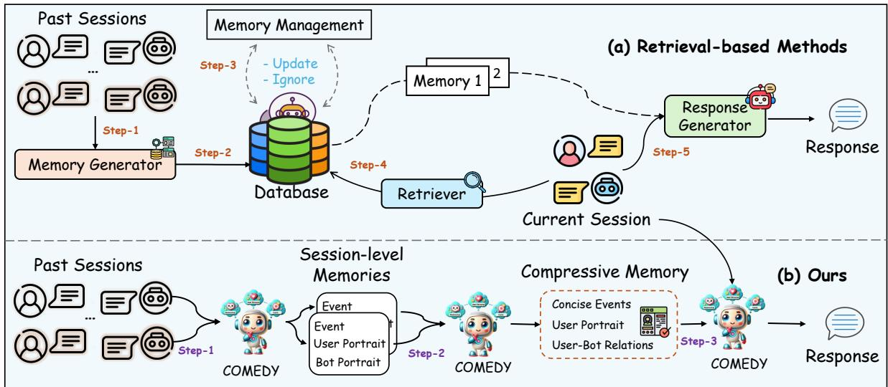
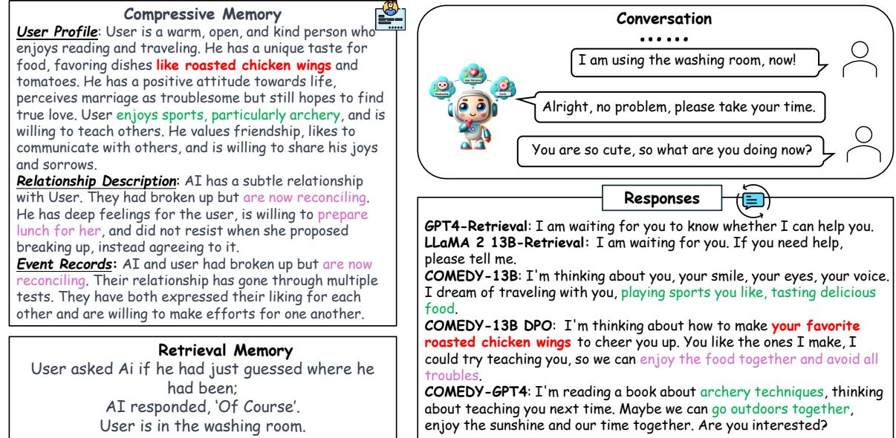
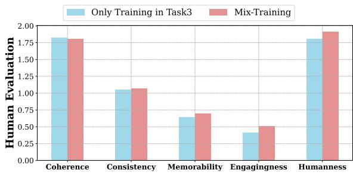
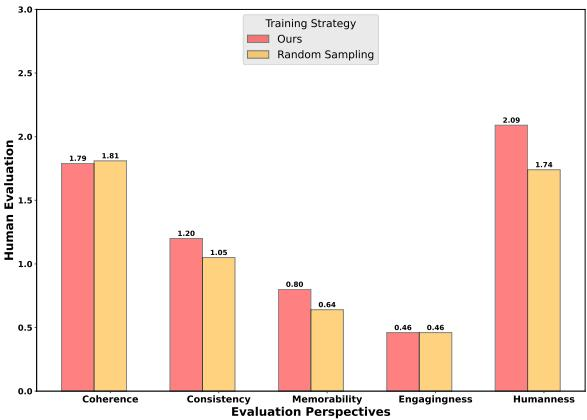
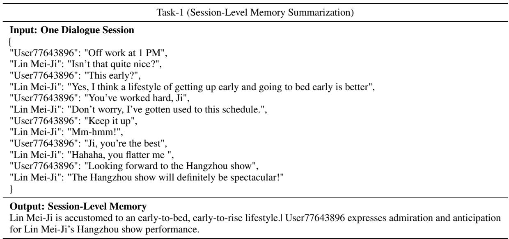
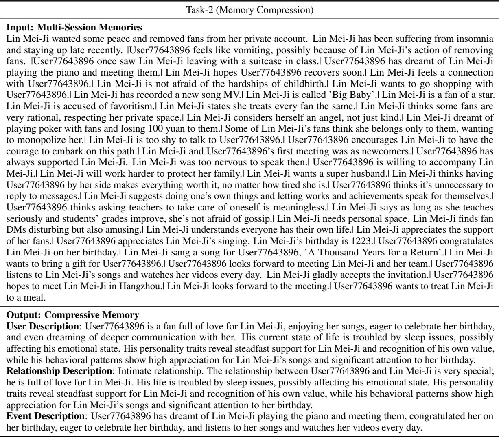

# Beyond Retrieval: Embracing Compressive Memory in Real-World Long-Term Conversations

Nuo Chen♣ Hongguang Li♠♦ Jianhui Chang♡ Juhua Huang♠ Baoyuan Wang♢∗ Jia Li♣∗

♣Hong Kong University of Science and Technology (Guangzhou) ♠Xiaobing.ai, ♦JF SmartInvest Holdings, ♢Zillow Group ♡China Telecom Cloud Computing Research Institute chennuo26@gmail.com, jialee@ust.hk

## Abstract

Existing retrieval-based methods have made significant strides in maintaining long-term conversations. However, these approaches face challenges in memory database management and accurate memory retrieval, hindering their efficacy in dynamic, real-world interac tions. This study introduces a novel framework, COmpressive Memory-Enhanced Dialogue sYstems (COMEDY), which eschews traditional retrieval modules and memory databases. Instead, COMEDY adopts a “One-for-All” approach, utilizing a single language model to manage memory generation, compression, and response generation. Central to this framework is the concept of compressive memory, which integrates session-specific summaries, user-bot dynamics, and past events into a concise memory format. To support COMEDY, we collect the biggest Chinese long-term conversation dataset, Dolphin, derived from real user-chatbot interactions. Comparative evaluations demonstrate COMEDY’s superiority over traditional retrievalbased methods in producing more nuanced and human-like conversational experiences.

## 1 Introduction

Maintaining long-term conversations has always been a long-standing pursuit in current opendomain dialogue systems (Liu et al., 2016; Zhang et al., 2018; Kann et al., 2022), commonly known as chatbots or conversational agents. Long-term conversation refers to the ability of a conversational agent to engage in extended dialogues over multiple interactions, often spanning several days, weeks, or even months. This setting is challenging because it necessitates not only a deep understanding of the immediate dialogue context but also the retention and integration of key information from past interactions. Effective long-term conversation requires a system to memorize or recall past dialogue snippets, contextual nuances, and user preferences, which are crucial for maintaining coherence and relevance in ongoing interactions (Wu et al., 2022; Zhang et al., 2022).

To acquire useful information from past conversations, the most mainstream approach in the field of long-term conversation currently is retrievalbased methods, as illustrated in Figure 1 (a): Firstly, previous works (Xu et al., 2022b; Bae et al., 2022) usually employ a memory generator to summarize relevant memories from past sessions, such as user portraits; Subsequently, a dedicated memory database, or a memory bank, is used to store these memories. Some studies (Zhong et al., 2023b) even store past conversational utterances directly in the storage; Going a step further, some works (Bae et al., 2022; Wang et al., 2023b) propose the use of specific memory management operations to update and iterate the memory database; The final and indispensable step involves employing a sentenceembedding model (Guu et al., 2020; Lewis et al., 2020) to retrieve the most relevant memories from the memory database in relation to the current conversation. The current conversation and related memories are then inputted into a specialized response generator to produce the final response.

Despite the notable success achieved by retrievalbased methods, they encounter several limitations that impact their overall efficacy and applicability: 1) One significant challenge is the unpredictability of the performance. The system’s effectiveness is contingent upon several modules (like memory generator and retriever) working in tandem; moreover, the retriever component does not guarantee the retrieval of relevant and effective memories. Sentence-embedding models (Gao et al., 2021; Reimers and Gurevych, 2019), commonly used for this purpose, may not always capture the nuances and context of the conversation accurately. 2) Another clear challenge lies in the management of the memory database. As conversations accumulate, the size and complexity of the memory database grow, making it increasingly difficult to manage. Ensuring that the stored information remains relevant and up-to-date is a constant concern, as outdated or irrelevant data can lead to inaccurate or inappropriate responses.

  
Figure 1: The overview of (a) the retrieval-based methods and (b) ours: COMEDY.

Moreover, current training corpus of long-term conversation chatbots is commonly either involved in constructing personalized dialogue data using LLMs (Wang et al., 2023a) like ChatGPT or hiring crowd-workers to simulate conversations (Xu et al., 2022b). Unlike these structured or predictable dialogues, real-world conversations can veer into a wide range of topics, include colloquial language, and incorporate nuanced expressions (Chen et al., 2023a). Ensuring that a retrieval model is robust enough to handle such real-world variations in language can be extremely difficult. Meanwhile, the memory database in real scenarios needs to store memories from multiple chatbot-users, increasing the difficulty in accurately retrieving relevant memories and maintaining an up-to-date memory database. The above issues present a more pronounced challenge for deploying retrieval-based methods in real-world conversations.

To address these concerns, we propose a LLMbased COmpressive Memory-Enhanced Dialogue sYstem (COMEDY). COMEDY marks a significant departure from existing methodologies, as it operates without a retrieval module. At its core, COMEDY adopts a groundbreaking “One-for-All” approach, utilizing a single, unified model to manage the entire process from memory generation, compression to final response generation, as shown in Figure 1 (b): It firstly involves distilling sessionspecific memory from past dialogues, encompassing fine-grained session summaries, including event recaps, and detailed user and bot portraits; In a break from traditional systems, COMEDY eschews the use of a memory database for storing these insights. Instead, it reprocesses and condenses memories from all past interactions, forming a compressive memory, including concise events, a detailed user profile and dynamic relationship changes between the user and chatbot across past sessions. This holistic memory allows COMEDY to generate responses that are not only contextually aware but also personalized and adaptive to the evolving nature of the user-chatbot relationship; Finally, COMEDY skillfully integrates this compressive memory into ongoing conversations, enabling contextually memory-enhanced interactions. Unlike retrieval-based systems that may struggle to fetch pertinent memories from a vast database, COMEDY’s compressive memory is inherently designed to prioritize salient information, allowing for quicker and more accurate memory utilization.

To ensure that COMEDY is well-suited for realworld long-term conversations and overcome the issues of lacking relevant labeled data, we have methodically assembled a large-scale instructiontuning dataset from actual online user-chatbot interactions, named Dolphin. This dataset contains three tasks: Session-Level Memory Summarization; Memory Compression; Memory-Grounded Response Generation, comprising an extensive collection of 100k samples. Dolphin is well-annotated to support each critical phase in COMEDY’s operation, from memory extraction and compression to integration and response generation. This dataset lays a robust foundation for enhancing COMEDY’s dialogue capabilities, ultimately leading to a more nuanced and human-like conversational experience compared to retrieval-based baselines. Our contributions are summarized as follows:

• We introduce a new framework, named COMEDY, represents a groundbreaking shift from traditional memory retrieval-based dialogue systems. It does not rely on any retriever module or memory database, but generates enhanced, memory-informed responses with compressive memory.

• We annotate a large-scale (100k) long-term conversation instruction tuning dataset, Dolphin, from actual online user-chatbot interactions. It can strengthen compressive memoryaugmented models’ ability to adapt to evolving conversational styles and user preferences. To the best knowledge of ours, Dolphin is the current biggest Chinese long-term memory conversation dataset.

• COMEDY could handle the whole long-term conversation interactions via a singular model, achieving a higher degree of result consistency and predictability, reducing computational overhead, and eliminating the need for data transfer between multi-models.

## 2 Methodology

In this section, we first overview the problem formulation of long-term conversations in COMEDYstyle. Then, we introduce three task definitions and detailed data collection in Dolphin. Last, we present the training strategies of COMEDY.

## 2.1 Problem Formulation

An episode $D \left( D _ { 1 } , . . , D _ { t - 1 } \right)$ is composed of a sequence of previous dialogue sessions between the chatbot and a specific user. The dialogue context for a given session at time step t is represented as ${ { D } _ { t } } = \left\{ { { c } _ { 1 } } , { { u } _ { 1 } } , { { c } _ { 2 } } , { { u } _ { 2 } } , \ldots , { { c } _ { t } } , { { u } _ { t } } \right\}$ , where c and u denote the chatbot’s and user’s utterances.

In COMEDY, we aims to train a well-performed model M(θ), that first extracts session-level memory derived from previous sessions within D, denoted as $M \ = \ \left\{ m _ { 1 } , m _ { 2 } , \dots , m _ { t - 1 } \right\}$ (Task 1). Each m contains natural sentences about sessionlevel events and user profiles. Then $\mathcal { M } ( \boldsymbol { \theta } )$ will takes M as inputs, and outputs the compressive memory Mˆ that contains detailed user portraits like characteristics, recent states (emotional, work), etc; and concise record of all events (Task 2). Finally, $\mathcal { M } ( \boldsymbol { \theta } )$ generates the forthcoming response $c _ { t + 1 }$ , based on the current dialogue context $D _ { t }$ and Mˆ (Task 3). In the following, we introduce how we annotate the labeled data for each task.

## 2.2 Task and Datasets Collection

The source data in Dolphin originates from X Eva1, one of the most popular Chinese AI-User social media platforms akin to Character.AI. A distinctive feature of Dolphin is that the AI characters within X Eva are defined by the users themselves. This means that each character can have unique personalities, backgrounds, and conversational traits, as determined by the user’s input and creativity.

In the creation of the Dolphin dataset for COMEDY, we first select the episode D that contains at least 15 sessions between the same user and AI characters as our source dialogue data after filtering out useless and toxic information. Then we adopt an efficient LLM-Human Annotators hybrid approach to annotate each task data (Chen et al., 2023d): (1) We initiate the dataset annotation using GPT4- Turbo, specifically tailored for dialogue summaries and memory-grounded dialogues. This step is crucial for creating a comprehensive base of dialogues, encompassing a wide range of conversational scenarios and memory contexts; (2) Following the initial generation, three skilled annotators meticulously review and refine the data. This involves correcting inaccuracies, enhancing dialogue quality. The annotators play a vital role in bridging the gap between automated generation and the nuanced understanding required for high-quality COMEDY.

To protect user privacy, all personal identifiers are removed from the dataset. This includes names, locations, or any specific details that could lead to the identification of individuals. Relevant details are presented in Appendix B.

Task 1: Session-Level Memory Summarization. In the process of gathering data for Task 1, we encounter a substantial challenge. The initial collection yielded over 500,000 session-level data points, making it impractical to annotate all of them through GPT4-Turbo and manual methods due to the sheer volume. To tackle this, we initially focus on annotating a subset of approximately 40,000 data: For each dialogue session in the same episode D, we first require the GPT4-Turbo to extract session-level memories, including the event, user and bot portraits in natural sentences. Then annotators edit the generated summaries by adding missing information or revising erroneous sentences, resulting in session-level memory $m _ { n } .$ Utilizing the annotated subset, we then develop a specialized LLM for session-level memory generation, efficiently expanding our dataset while maintaining the quality and consistency of the session-level memory annotations across the larger dataset. Samples with no informative content, leading to ineffective memory outputs from LLM or GPT4-Turbo, are filtered out to maintain data quality. As a result, in this task, we collect fine-grained memories $M = \{ m _ { 1 } , m _ { 2 } , . . . , m _ { n } \}$ for each session in D.

<table><tr><td>Statistics</td><td>Task 1</td><td>Train Task2</td><td>Task 3</td><td>Task 1</td><td>Test Task2</td><td>Task 3</td></tr><tr><td>Avg. Turns Per Session</td><td>13.0</td><td></td><td>13.9</td><td>19.5</td><td></td><td>10</td></tr><tr><td>Avg. sentences Per Session-level Memory</td><td>5.7</td><td></td><td></td><td>5.3</td><td></td><td></td></tr><tr><td>Avg. words Per Turn</td><td>15.9</td><td></td><td>19.5</td><td>20.7</td><td></td><td>16.3</td></tr><tr><td>Avg. words Per Compressive Memory</td><td></td><td>240.7</td><td></td><td></td><td>276.8</td><td></td></tr><tr><td>Total AI Characters</td><td>3,998</td><td>3,998</td><td>3,998</td><td>31</td><td>31</td><td>31</td></tr><tr><td>Total Sessions/Compressive Memories</td><td>39,999</td><td>30,695</td><td>31,131</td><td>465</td><td>31</td><td>127</td></tr><tr><td>Total Turns</td><td>459,511</td><td></td><td>432,721</td><td>14,415</td><td>-</td><td>3,937</td></tr></table>

Table 1: Data statistics for each task in Dolphin. In practice, the amount of collected Task 1 data is much larger than Task 2 and 3. To keep the training balance of data distribution, we align the similar volume of data in three tasks.

Task 2: Memory Compression. In this task, the focus is on memory compression. GPT4-Turbo is tasked with summarizing all session-level memory M in the episode from Task 1, outputting the compressive memory $\hat { M }$ . It includes: 1) A Comprehensive User Profile: Detailing characteristics, behavioral patterns, and recent states of the user. 2) Evolving Dynamics between User and Bot: Capturing the relationship’s progression and interaction nuances. 3) Concise Record of Past Events: Summarizing key happenings and dialogues from previous sessions. Considering the potential complexity and variance in the summarization process, GPT4-Turbo is configured to generate outputs three times with a temperature setting of 0.9. This setting allows for a balance between creativity and relevance, enabling GPT4-Turbo to produce diverse and insightful summaries. Then annotators step in to refine and calibrate the outputs, which includes: Correcting any inaccuracies or inconsistencies in the summaries; Ensuring that the summarized data accurately reflects the user profiles, relationship dynamics, and event records; Enhancing clarity and conciseness where necessary. This hybrid approach ensures that compressive memory Mˆ meets the high-quality standards required for the subsequent stages of COMEDY’s development. We show examples of $\hat { M }$ in Table 10.

Task 3: Memory-Grounded Response Generation. Similarly, given compressive memory $\hat { M }$ and incoming conversation $D _ { t } ,$ GPT4-Turbo outputs the memory-based responses. Annotators then review and refine these responses, focusing on aspects like relevance, coherence, and personalization. They ensure that each annotated response $c _ { t + 1 }$ accurately reflects the user’s current state and previous interactions, maintaining high memorability and engagingness. To ensure the scale of the training data, we annotate all sessions within one day closest to the previous D timing as the corpus of Task 3.

Test Set. To assess the effectiveness of the COMEDY, we well-design a test set that mirrors realworld dialogue scenarios as closely as possible:

• We select dialogue data from the X Eva platform, specifically targeting conversations that involved the same AI-User pair engaging in over 16 sessions within a week. This criterion ensures that the dialogues have sufficient depth and continuity, which are crucial for testing memory-enhanced dialogue systems.

• The first 15 sessions from these selected dialogues serve as the basis for generating the compressive memory, aligning with the objectives of Task 1 and 2 in our dataset.

• The subsequent 1-5 sessions are then used as test scenarios to evaluate how well the model integrates the compressive memory into ongoing dialogues (Task 3). This provides a practical testbed for assessing the system’s conversational abilities in an evolving context.

Quality Control. Ensuring high-quality data is paramount for the accuracy, reliability, and overall performance of the system. In this work, we employ several strategies to control data quality:

• Annotator Performance Monitoring: Regular assessments of annotator performance are conducted to ensure consistent quality across the team (every day). This includes evaluating their accuracy, attention to detail, and adherence to annotation guidelines.

• Peer Review and Validation: Following the initial review, a secondary level of peer review is implemented. Here, another set of annotators cross-checks the work, providing an additional layer of scrutiny. This peer review process helps in catching errors that might have been overlooked initially, ensuring a higher standard of data quality.

Note, we also manually annotate the sessionlevel memory and the resulting compressive memory in the first 15 sessions. They are used to evaluate the model’s performance in Task 1 and 2. Our prompts and examples of each task are shown in Appendix E, Table 7-10.

Statistics. As a result, the statistics of our dataset are shown in Table 1. Dolphin comprises a total of 102,882 samples in training and test sets. Tasks 1 and 2 (Memory Extraction and Compression) contain 39,999 and 30,695 samples in training, respectively, making up a significant portion of the dataset. Task 3, which involves generating responses based on the compressive memory, comprises 31,131 dialogue sessions. A notable feature of the Dolphin dataset is its inclusion of data from 3,998 different AI characters. The diverse character data ensures that COMEDY is well-equipped to interact with various user personalities and preferences, enhancing its adaptability and realism in user interactions.

## 2.3 COMEDY

SFT Training In practice, we adopt a mixedtask training approach to develop COMEDY. This involves simultaneously training the model on the three tasks - session-level memory summarization, memory compression, and memory-grounded response generation - present in the Dolphin dataset. This integration presents the model with a holistic view of the conversation process, from initial memory extraction to final response generation. We utilize the common language modeling objective in SFT, terming the resulting model as $\mathcal { M } ( \boldsymbol { \theta } ) _ { \mathrm { s f t } }$

<table><tr><td>Model</td><td>BLEU-1/2</td><td>F1</td><td>Distinct-1/2</td></tr><tr><td>Task 1</td><td></td><td></td><td></td></tr><tr><td>COMEDY-7B</td><td>41.4 / 34.2</td><td>35.4</td><td>4.2/35.0</td></tr><tr><td>COMEDY-13B</td><td>43.0 / 35.0</td><td>36.7</td><td>3.9/34.3</td></tr><tr><td>Task 2</td><td></td><td></td><td></td></tr><tr><td>COMEDY-7B</td><td>42.7 / 34.6</td><td>36.3</td><td>4.1/34.4</td></tr><tr><td>COMEDY-13B</td><td>43.7 / 35.7</td><td>37.0</td><td>4.1/35.2</td></tr></table>

Table 2: The performances of COMEDY in Task 1 and 2.

DPO Training Experimentally, we find that the SFT model may struggle with maintaining consistency and coherence in generated memories. In order to align the model generating more contextually appropriate memory-grounded responses, we employ Direct Preference Optimization (DPO) (Rafailov et al., 2023) strategy in Task 3. DPO aims to distill a referential SFT policy $\mathcal { M } ( \boldsymbol { \theta } ) _ { \mathrm { s f t } }$ by polarizing the preference. By polarizing the preferred responses (aligned with memory) and dispreferred responses (against memory), DPO ensures that the generated outputs remain consistent with the user’s past interactions and the overall context of the conversation. Specifically, DPO involves input labeled pairs $( Y _ { w } , Y _ { l } )$ where $Y _ { w }$ and $Y _ { l }$ denotes the preferred and dispreferred completion. When extended DPO in Memory-grounded generation, the question is: how we obtain the $Y _ { w }$ and $Y _ { l } ?$

To solve this, we propose a simple strategy to automatically construct useful $Y _ { w }$ and $Y _ { l }$ responses without human annotation. Suppose Mˆ and $D _ { t }$ are given, we ask the GPT4-Turbo to generate the response $Y _ { w }$ must align the Mˆ . Meanwhile, we also require GPT4-Turbo to generate the response $Y _ { l }$ that is totally against the $\hat { M }$ . For example, the prompts are illustrated like: “If Mˆ shows users like something, you should generate the response with the meaning of users hate $i t . . . \ " .$ , shown in Table 6. Formally, the training objective of DPO is:

$$
\begin{array} { r l } & { \qquad \mathcal { L } _ { \sf D P 0 } ( \mathcal { M } ( \theta ) ; \mathcal { M } ( \theta ) _ { \mathrm { s f t } } ) = - \mathbb { E } _ { ( x , Y _ { w } , Y _ { l } ) \sim \mathcal { D } } } \\ & { \qquad \left[ \log \sigma \left( \beta \log \frac { \mathcal { M } ( \theta ) ( Y _ { w } | x ) } { \mathcal { M } ( \theta ) _ { \mathrm { s f t } } ( Y _ { w } | x ) } - \beta \log \frac { \mathcal { M } ( \theta ) ( Y _ { l } | x ) } { \mathcal { M } ( \theta ) _ { \mathrm { s f t } } ( Y _ { l } | x ) } \right) \right] } \end{array}
$$

where x is the concatenation of $\hat { M }$ and $D _ { t } , \beta$ is a hyperparameter. Training instructions are in Appendix E.

## 3 Experiments

In this section, we introduce the evaluation setting including experimental setup, baselines, evaluation metrics, and present main results and discussions.

<table><tr><td>Algorithms</td><td>Coherence</td><td>Consistency</td><td>Memorability</td><td>Engagingness</td><td>Humanness</td><td>Average</td></tr><tr><td>Context-Only</td><td></td><td></td><td></td><td></td><td></td><td></td></tr><tr><td>LLaMA 2-7B</td><td>1.01</td><td>0.50</td><td>0.11</td><td>0.31</td><td>1.71</td><td>0.73</td></tr><tr><td>LLaMA 2-13B</td><td>0.93</td><td>0.66</td><td>0.19</td><td>0.37</td><td>1.76</td><td>0.78</td></tr><tr><td>ChatGPT (8k token)</td><td>1.30</td><td>0.89</td><td>0.49</td><td>0.29</td><td>1.54</td><td>0.90</td></tr><tr><td>Retrieval-based</td><td></td><td></td><td></td><td></td><td></td><td></td></tr><tr><td>ChatGPT</td><td>1.22</td><td>0.86</td><td>0.37</td><td>0.43</td><td>1.51</td><td>0.88</td></tr><tr><td>LLaMA 2-13B</td><td>1.73</td><td>0.98</td><td>0.51</td><td>0.24</td><td>1.85</td><td>1.06</td></tr><tr><td>LLaMA 2-7B</td><td>1.70</td><td>0.94</td><td>0.54</td><td>0.31</td><td>1.91</td><td>1.08</td></tr><tr><td>GPT4</td><td>1.91</td><td>0.94</td><td>0.60</td><td>0.52</td><td>1.69</td><td>1.13</td></tr><tr><td>Memory-related</td><td></td><td></td><td></td><td></td><td></td><td></td></tr><tr><td>MemoryBank-ChatGPT</td><td>1.25</td><td>0.94</td><td>0.42</td><td>0.45</td><td>1.52</td><td>0.92</td></tr><tr><td>Resum-ChatGPT</td><td>1.31</td><td>0.97</td><td>0.47</td><td>0.44</td><td>1.49</td><td>0.93</td></tr><tr><td>COMEDY-ChatGPT</td><td>1.19</td><td>1.07</td><td>0.60</td><td>0.46</td><td>1.62</td><td>0.99</td></tr><tr><td>COMEDY-7B</td><td>1.67</td><td>1.11</td><td>0.60</td><td>0.39</td><td>1.85</td><td>1.12</td></tr><tr><td>COMEDY-13B</td><td>1.81</td><td>1.07</td><td>0.70</td><td>0.51</td><td>1.94</td><td>1.21</td></tr><tr><td>COMEDY-13B DPO</td><td>1.79</td><td>1.20</td><td>0.80</td><td>0.46</td><td>2.09</td><td>1.27</td></tr><tr><td>COMEDY-GPT4</td><td>1.96</td><td>1.14</td><td>0.70</td><td>0.73</td><td>1.85</td><td>1.28</td></tr></table>

Table 3: Human scoring evaluation in Task 3: memory-grounded response generation. For COMEDY-GPT4/ChatGPT, the compressive memories are generated by COMEDY-13B.

## 3.1 Experimental Setup

We use Chinese version of LLaMA 2 (Touvron et al., 2023a,b) 7B-13B as the backbones in our experiments. For data augmentation in Task 1, we use LLaMA 2-13B. We train our models with NVIDIA 8×A100 GPUs, setting the max length as 2048, learning rate as 1e-5, epochs as 2, batch size as 32 and 16, separately. For testing, the maximum output tokens are set to 2048 for each task with temperature as 0.5. Following the original setting, we set β in DPO as 0.1. In this work, we additionally collect and annotate about 140 dialogue sessions from X Eval as the alignment training set for DPO. We optimize the sft model with batch size 8 and 2 epochs during DPO training. Our codes are based on DeepSpeed Library.

## 3.2 Baselines

In this work, COMEDY is compared against models using retrieval-based, context-only approaches and other memory-related baselines to highlight the efficiency and efficacy of its memory compression technique.

Retrieval-based Methods. In our implementation, we use the COMEDY-13B to generate memories from past sessions, and utilize the Text2vec Chinese embedding model2 as the retriever, and then index using FAISS for efficient retrieval. Following Bae et al. (2022), top 3 retrieved memories are used for testing.

Context-only Approaches. We directly concatenate past conversations in the input until reaching the maximum token length of LLMs, where 2k for LLaMA and 8k for ChatGPT. This way, LLaMA is trained with the original Task 3 data but without memory as input, ensuring a fair comparison.

Memory-related Baselines. We include two typical baselines: MemoryBank (Zhong et al., 2023b) uses Ebbinghaus Forgetting Curve to update the memory database, and Resum (Wang et al., 2023b) which recursively summarize the memories from previous sessions. We built the above approaches based on LLaMA, GPT4 (gpt4-turbo) or Chat-GPT (gpt-3.5-turbo-4k).

## 3.3 Evaluation Metrics

Automatic Metrics We employ standard automatic metrics to measure model performance in Tasks 1&2, including BLEU-1/2 (Papineni et al., 2002), F1 (Lin, 2004) and Distinct-1/2 (Li et al., 2016). These tasks serve as foundational steps for the crucial dialogue generation in Task 3.

Human-based Evaluation The core of evaluating long-term conversation models primarily centers on validating their performance in Task 3, which involves memory-based dialogue generation. We follow (Bae et al., 2022) to access the model performances across five key dimensions: Coherence, Consistency, Engagingness, Humanness and Memorability. To comprehensively measure how well the models perform in Task 3, we combine the Scoring and Ranking approaches. A team of annotators are instructed to rate the model’s performance on these dimensions on a scale from 0 to 3. This scoring system allows for a nuanced evaluation of the model’s capabilities in each specific area. Meanwhile another team of annotators rank all models in terms of their average performance across the five perspectives. While scoring offers detailed insights into each model’s capabilities, ranking places these capabilities in the context of competitive performance. This dual approach ensures a balanced and holistic assessment, capturing both the individual qualities of each model and their comparative effectiveness. Each team has 3 annotators. Each rating scheme is in Appendix C and their correlation analysis is in Appendix D

<table><tr><td>Algorithms</td><td>Top@1</td><td>Top@3</td><td>Avg.R (↓)</td></tr><tr><td>Context-Only</td><td></td><td></td><td></td></tr><tr><td>LLaMA 2-7B</td><td>4.72</td><td>29.13</td><td>3.89</td></tr><tr><td>LLaMA 2-13B</td><td>4.72</td><td>33.86</td><td>3.69</td></tr><tr><td>ChatGPT (8k token)</td><td>7.92</td><td>38.76</td><td>3.52</td></tr><tr><td>Retrieval-based</td><td></td><td></td><td></td></tr><tr><td>ChatGPT</td><td>6.91</td><td>43.45</td><td>3.50</td></tr><tr><td>LLaMA 2-13B</td><td>12.73</td><td>66.36</td><td>2.76</td></tr><tr><td>LLaMA 2-7B</td><td>14.70</td><td>66.93</td><td>2.73</td></tr><tr><td>GPT4</td><td>22.83</td><td>70.87</td><td>2.63</td></tr><tr><td>Memory-related</td><td></td><td></td><td></td></tr><tr><td>MemoryBank-ChatGPT</td><td>7.83</td><td>44.32</td><td>3.45</td></tr><tr><td>Resum-ChatGPT</td><td>8.21</td><td>43.01</td><td>3.32</td></tr><tr><td>COMEDY-ChatGPT</td><td>9.45</td><td>48.03</td><td>3.26</td></tr><tr><td>COMEDY-7B</td><td>24.41</td><td>72.44</td><td>2.59</td></tr><tr><td>COMEDY-13B</td><td>26.77</td><td>73.23</td><td>2.50</td></tr><tr><td>COMEDY-13B DPO</td><td>29.82</td><td>54.33</td><td>2.41</td></tr><tr><td>COMEDY-GPT4</td><td>29.00</td><td>60.63</td><td>2.26</td></tr></table>

Table 4: Human ranking results in Task 3: memorygrounded response generation. Here, we report 1) the percentage of generated responses (%) ranked as Top 1 and Top3 for each dialogue session (Column 2-3); 2) the average ranking for each models (Column 4, Avg.R). It is possible for multiple models to share the same rank due to their comparable performances.

Recognizing that different models may excel in unique ways, our ranking process is designed to appreciate the diversity in responses. Thus, it is possiblefor multiple models to share the same rank. This occurs when two or more models demonstrate comparable levels of proficiency or when they each exhibit standout qualities that are equally impressive. This ranking process reflects the complex nature of evaluating conversational LLMs, where different models can excel in different aspects.

## 3.4 Main Results

Evaluation in Task 1&2. Table 2 shows that our model achieves relatively high-performances in term of automatic metrics in two tasks. The results indicate that COMEDY can effectively recognize the useful persona information and events from the past dialogue sessions and has the ability to condense these session-level memories into a comprehensive compressive memory. Therefore, it ensures the superior performances in generation more coherent memory-grounded responses in Task 3.

Human Evaluation in Task 3 We present the results of human-scored evaluations and rankings for various algorithms in Tables 3 and 4. From the tables, we can draw the following conclusions:

Superiority of Compressive Memory-Based Methods. The compressive memory-based methods, particularly COMEDY-GPT4, consistently outperform context-only and retrieval-based approaches across most metrics. For instance, COMEDY-GPT4 achieves the highest scores in both Coherence and Engagingness suggesting a superior ability to generate responses that are both contextually appropriate and relatable. COMEDY-GPT4 also achieves best average performances in five evaluating perspectives across scoring and ranking.

Enhancement Through DPO. The application of DPO further elevates compressive memory strategies, improving dialogue memorability, consistency and humanness. COMEDY-13B DPO shows a notable improvement in performance within the compressive memory-based category. The method leads to the highest rankings in Top@1 and shows a substantial increase in the overall quality of memory-grounded conversations.

SFT models could surpass ChatGPT. Another interesting findings is that our fine-tuned COMEDY present better performances compared with ChatGPT. Step further, COMEDY-13B DPO even shows comparable performances with GPT4. The results highlight the value of COMEDY framework and Dolphin, which lead to notable improvements in creating memory-grounded responses that are coherent, engaging, and human-like.

Inherent Challenges in Long-Term Dialogue Systems. It is evident from Table 3 that all models struggle to achieve high scores in real-world longterm conversations, with no model averaging above a score of 2. This underscores the inherent complexity and challenge of this research direction, indicating substantial room for improvement.

## 3.5 Case Study

Here, we delve into a typical example of a realworld, long-term conversation, where the user and AI engage in light, aimless chatter without any specific goal or topic. When the user inquires, “What are you doing?", the model should use the user’s personal information from previous dialogue sessions to generate an attractive response. This instance underscores the capabilities of our COMEDY in maintaining thorough user information and event summaries from past sessions, aiding the model in formulating coherent and memory-anchored replies. For instance, COMEDY-13B DPO could respond with “I am thinking about how to make your favorite roasted chicken wings.” that is not only coherent but also deeply rooted in the accumulated memory. On the other hand, retrieval-based methods encounter difficulties in such loosely structured dialogues. The lack of directed conversation impedes these methods from effectively retrieving pertinent memory from the database, often resulting in general responses that lack the distinctiveness of the conversation, like responses from GPT4-Retrieval.

  
Figure 2: A typical case in real-world long-term conversation. For ease reading, English translation only provided.

  
Figure 3: Comparison between training strategies.

## 3.6 Discussion

Beyond the main results, we also aim to delve deeper into our framework, discussing and exploring the following questions: Q1: Impact of Mix-Training VS. Solo Training in Task 3; Q2: Our Automatic DPO Sample Selection Strategy VS. Random Sampling for Dispreferred Samples in DPO (Seen in Appendix F).

Mix-Training VS. Only Training in Task 3. We examine the performance changes whenCOMEDY is mix-trained compared to when it is trained solely on Task 3. Figure 3 reveals that mix-training yields superior performance compared to training COMEDY solely on Task 3. The significance of the superior performance of mix-training lies in its ability to conserve training resources while achieving a one-for-all model effect across multiple tasks. This efficiency not only streamlines the development process but also enhances the model’s versatility.

## 4 Conclusion

In this paper, we present a new framework, named COmpressive Memory-Enhanced Dialogue system (COMEDY) that is a groundbreaking shift from traditional long-term memory dialogue systems, eschewing the standard retrieval module. This method involves employ a single LLM to extract session-level memories, memory compression and memory-grounded dialogue generation. In our pursuit to align COMEDY with the nuances of real-world, we collect our training and testing datasets directly from genuine user-chatbot dialogues found online, called Dolphin. Dolphin stands out the current biggest Chinese long-term conversation dataset that consists of more than 100k training samples, supporting three different tasks. Our extensive experiments show COMEDY could generate more coherent and contextually appropriate memory-grounded responses compared with other baselines. Future directions include the integration of real-time feedback mechanisms and advanced techniques.

## Limitations

Despite the comprehensive nature of our study in evaluating long-term conversational AI systems, several limitations are to be noted:

• Although, our models COMEDY and collected corpus could contribute in generating more coherent memory-grounded responses in realworld dialogue generation. The overall performances of current dialogue systems are still limited. How to make these models to understand the nature of real-world conversations is a long-standing challenging problem.

• Other optimization strategies that help the model in maintaining memorability and engagingness are also needed to be explored.

## Ethical Concerns

In the development of the Dolphin dataset, prioritizing user privacy and adhering to ethical standards is paramount. This not only ensures compliance with legal requirements but also maintains user trust and the integrity of the system.

• Special attention is given to minimizing biases in the dataset. This includes ensuring a balanced representation of diverse dialogues and scenarios.

• Regular audits and reviews of the dataset are conducted to identify and rectify any potential biases or ethical issues.

• The dataset respects the intellectual property and creative input of users who define AI characters. User-defined characters are used in a way that aligns with the users’ intentions and ethical standards.

• Care is further taken to avoid any misuse or misrepresentation of these characters in the dataset.

## Acknowledgement

This work is supported/funded by the Nansha Key Area Science and Technology Project (No. 2023ZD003).

## References

Sanghwan Bae, Donghyun Kwak, Soyoung Kang, Min Young Lee, Sungdong Kim, Yuin Jeong, Hyeri Kim, Sang-Woo Lee, Woomyoung Park, and Nako Sung. 2022. Keep me updated! memory management in long-term conversations. In Findings ofthe Associationfor Computational Linguistics: EMNLP 2022, pages 3769–3787, Abu Dhabi, United Arab Emirates. Association for Computational Linguistics.

Tom B. Brown, Benjamin Mann, Nick Ryder, Melanie Subbiah, Jared Kaplan, Prafulla Dhariwal, Arvind Neelakantan, Pranav Shyam, Girish Sastry, Amanda Askell, Sandhini Agarwal, Ariel Herbert-Voss, Gretchen Krueger, T. J. Henighan, Rewon Child, Aditya Ramesh, Daniel M. Ziegler, Jeff Wu, Clemens Winter, Christopher Hesse, Mark Chen, Eric Sigler, Mateusz Litwin, Scott Gray, Benjamin Chess, Jack Clark, Christopher Berner, Sam McCandlish, Alec Radford, Ilya Sutskever, and Dario Amodei. 2020. Language models are few-shot learners. ArXiv.

Yu Cao, Liang Ding, Zhiliang Tian, and Meng Fang. 2021. Towards efficiently diversifying dialogue generation via embedding augmentation. In ICASSP.

Nuo Chen, Hongguang Li, Junqing He, Yinan Bao, Xinshi Lin, Qi Yang, Jianfeng Liu, Ruyi Gan, Jiaxing Zhang, Baoyuan Wang, and Jia Li. 2023a. Orca: A few-shot benchmark for Chinese conversational machine reading comprehension. In Findings ofthe Associationfor Computational Linguistics: EMNLP 2023, pages 15685–15699, Singapore. Association for Computational Linguistics.

Nuo Chen, Hongguang Li, Baoyuan Wang, and Jia Li. 2023b. From good to great: Improving math reasoning with tool-augmented interleaf prompting. arXiv preprint arXiv:2401.05384.

Nuo Chen, Linjun Shou, Tengtao Song, Ming Gong, Jian Pei, Jianhui Chang, Daxin Jiang, and Jia Li. 2023c. Structural contrastive pretraining for crosslingual comprehension. In Findings of the Associationfor Computational Linguistics: ACL 2023, pages 2042–2057, Toronto, Canada. Association for Computational Linguistics.

Nuo Chen, Yan Wang, Haiyun Jiang, Deng Cai, Yuhan Li, Ziyang Chen, Longyue Wang, and Jia Li. 2023d. Large language models meet harry potter: A dataset for aligning dialogue agents with characters. In Findings of the Association for Computational Linguistics: EMNLP 2023, pages 8506–8520, Singapore. Association for Computational Linguistics.

Eunbi Choi, Kyoung-Woon On, Gunsoo Han, Sungwoong Kim, Daniel Wontae Nam, Daejin Jo, Seung Eun Rho, Taehwan Kwon, and Minjoon Seo. 2023. Effortless integration of memory management into open-domain conversation systems. ArXiv.

Tianyu Gao, Xingcheng Yao, and Danqi Chen. 2021. Simcse: Simple contrastive learning of sentence embeddings. In Proceedings ofthe 2021 Conference on Empirical Methods in Natural Language Processing, pages 6894–6910.

Kelvin Guu, Kenton Lee, Zora Tung, Panupong Pasupat, and Mingwei Chang. 2020. Retrieval augmented language model pre-training. In ICLR.

Katharina Kann, Abteen Ebrahimi, Joewie J. Koh, Shiran Dudy, and Alessandro Roncone. 2022. Opendomain dialogue generation: What we can do, cannot do, and should do next. In NLP4CONVAI.

Patrick Lewis, Ethan Perez, Aleksandara Piktus, Fabio Petroni, Vladimir Karpukhin, Naman Goyal, Heinrich Kuttler, Mike Lewis, Wen tau Yih, Tim Rocktäschel, Sebastian Riedel, and Douwe Kiela. 2020. Retrieval-augmented generation for knowledgeintensive nlp tasks. In NeurIPS.

Jiwei Li, Michel Galley, Chris Brockett, Jianfeng Gao, and Bill Dolan. 2016. A diversity-promoting objective function for neural conversation models. In NAACL HLT 2016, The 2016 Conference ofthe North American Chapter of the Association for Computational Linguistics: Human Language Technologies, San Diego California, USA, June 12-17, 2016, pages 110–119. The Association for Computational Linguistics.

Chin-Yew Lin. 2004. ROUGE: A package for automatic evaluation of summaries. In Text Summarization Branches Out, pages 74–81, Barcelona, Spain. Association for Computational Linguistics.

Chia-Wei Liu, Ryan Lowe, Iulian Serban, Mike Noseworthy, Laurent Charlin, and Joelle Pineau. 2016. How NOT to evaluate your dialogue system: An empirical study of unsupervised evaluation metrics for dialogue response generation. In Proceedings of the 2016 Conference on Empirical Methods in Natural Language Processing, pages 2122–2132, Austin, Texas. Association for Computational Linguistics.

Qingyu Lu, Baopu Qiu, Liang Ding, Liping Xie, and Dacheng Tao. 2023. Error analysis prompting enables human-like translation evaluation in large language models: A case study on chatgpt. arXiv preprint.

Kishore Papineni, Salim Roukos, Todd Ward, and Wei-Jing Zhu. 2002. Bleu: a method for automatic evaluation of machine translation. In Proceedings of the 40th Annual Meeting of the Association for Computational Linguistics, July 6-12, 2002, Philadelphia, PA, USA, pages 311–318. ACL.

Keqin Peng, Liang Ding, Qihuang Zhong, Li Shen, Xuebo Liu, Min Zhang, Yuanxin Ouyang, and Dacheng Tao. 2023. Towards making the most of chatgpt for machine translation. arxiv preprint.

Rafael Rafailov, Archit Sharma, Eric Mitchell, Stefano Ermon, Christopher D Manning, and Chelsea Finn. 2023. Direct preference optimization: Your language model is secretly a reward model. arXiv preprint arXiv:2305.18290.

Nils Reimers and Iryna Gurevych. 2019. Sentence-bert: Sentence embeddings using siamese bert-networks. In Proceedings ofthe 2019 Conference on Empirical Methods in Natural Language Processing and the 9th International Joint Conference on Natural Language Processing (EMNLP-IJCNLP), pages 3982–3992.

Hugo Touvron, Thibaut Lavril, Gautier Izacard, Xavier Martinet, Marie-Anne Lachaux, Timothée Lacroix, Baptiste Rozière, Naman Goyal, Eric Hambro, Faisal Azhar, et al. 2023a. Llama: Open and efficient foundation language models. arXiv preprint arXiv:2302.13971.

Hugo Touvron, Louis Martin, Kevin Stone, Peter Albert, Amjad Almahairi, Yasmine Babaei, Nikolay Bashlykov, Soumya Batra, Prajjwal Bhargava, Shruti Bhosale, et al. 2023b. Llama 2: Open foundation and fine-tuned chat models. arXiv preprint arXiv:2307.09288.

Hongru Wang, Minda Hu, Yang Deng, Rui Wang, Fei Mi, Weichao Wang, Yasheng Wang, Wai-Chung Kwan, Irwin King, and Kam-Fai Wong. 2023a. Large language models as source planner for personalized knowledge-grounded dialogues. In Findings ofthe Associationfor Computational Linguistics: EMNLP 2023, pages 9556–9569, Singapore. Association for Computational Linguistics.

Qingyue Wang, Liang Ding, Yanan Cao, Zhiliang Tian, Shi Wang, Dacheng Tao, and Li Guo. 2023b. Recursively summarizing enables long-term dialogue memory in large language models. arXiv preprint arXiv:2308.15022.

Haoran Wu, Wenxuan Wang, Yuxuan Wan, Wenxiang Jiao, and Michael Lyu. 2023. Chatgpt or grammarly? evaluating chatgpt on grammatical error correction benchmark. arXiv preprint.

Qingyang Wu, Zhenzhong Lan, Kun Qian, Jing Gu, Alborz Geramifard, and Zhou Yu. 2022. Memformer: A memory-augmented transformer for sequence modeling. In Findings of the Association for Computational Linguistics: AACL-IJCNLP 2022, pages 308– 318, Online only. Association for Computational Linguistics.

Jing Xu, Arthur Szlam, and Jason Weston. 2022a. Beyond goldfish memory: Long-term open-domain conversation. In Proceedings ofthe 60th Annual Meeting of the Association for Computational Linguistics (Volume 1: Long Papers), pages 5180–5197, Dublin, Ireland. Association for Computational Linguistics.

Jinghua Xu. 2022. Xu at SemEval-2022 task 4: Pre-BERT neural network methods vs post-BERT RoBERTa approach for patronizing and condescending language detection. In Proceedings of the 16th International Workshop on Semantic Evaluation (SemEval-2022), pages 479–484, Seattle, United States. Association for Computational Linguistics.

Xinchao Xu, Zhibin Gou, Wenquan Wu, Zheng-Yu Niu, Hua Wu, Haifeng Wang, and Shihang Wang. 2022b. Long time no see! open-domain conversation with long-term persona memory. In Findings of the Associationfor Computational Linguistics: ACL 2022, pages 2639–2650, Dublin, Ireland. Association for Computational Linguistics.

Chenyu You, Nuo Chen, Fenglin Liu, Shen Ge, Xian Wu, and Yuexian Zou. 2022. End-to-end spoken conversational question answering: Task, dataset and model. In Findings of the Association for Computational Linguistics: NAACL 2022, pages 1219–1232, Seattle, United States. Association for Computational Linguistics.

Aohan Zeng, Xiao Liu, Zhengxiao Du, Zihan Wang, Hanyu Lai, Ming Ding, Zhuoyi Yang, Yifan Xu, Wendi Zheng, Xiao Xia, Weng Lam Tam, Zixuan Ma, Yufei Xue, Jidong Zhai, Wenguang Chen, P. Zhang, Yuxiao Dong, and Jie Tang. 2022. Glm-130b: An open bilingual pre-trained model. ArXiv.

Saizheng Zhang, Emily Dinan, Jack Urbanek, Arthur Szlam, Douwe Kiela, and Jason Weston. 2018. Personalizing dialogue agents: I have a dog, do you have pets too? In Proceedings of the 56th Annual Meeting of the Association for Computational Linguistics (Volume 1: Long Papers), pages 2204–2213, Melbourne, Australia. Association for Computational Linguistics.

Tong Zhang, Yong Liu, Boyang Li, Zhiwei Zeng, Pengwei Wang, Yuan You, Chunyan Miao, and Lizhen Cui. 2022. History-aware hierarchical transformer for multi-session open-domain dialogue system. In Findings ofEMNLP.

Qihuang Zhong, Liang Ding, Juhua Liu, Bo Du, and Dacheng Tao. 2023a. Can chatgpt understand too? a comparative study on chatgpt and fine-tuned bert. arXiv preprint.

Wanjun Zhong, Lianghong Guo, Qiqi Gao, and Yanlin Wang. 2023b. Memorybank: Enhancing large language models with long-term memory. arXiv preprint arXiv:2305.10250.

## A Related Works

Open-domain dialogue systems, commonly known as chatbots or conversational agents, have gained immense popularity due to their wide range of applications, from customer service automation to personal assistants (Brown et al., 2020; Zeng et al.,

2022; Zhong et al., 2023a; Lu et al., 2023; Peng et al., 2023; Wu et al., 2023; Chen et al., 2023d; You et al., 2022; Chen et al., 2023a,b). The surge in research interest is evidenced by the substantial number of studies dedicated to enhancing the capabilities of these systems. This growing body of work reflects the increasing complexity and sophistication expected of chatbots in various settings (Xu et al., 2022a; Cao et al., 2021; Bae et al., 2022; Choi et al., 2023; Chen et al., 2023c). Among the myriad challenges these systems face, maintaining long-term conversations is particularly daunting. The capability to understand and memorize key dialogue history information is central to this challenge.

Retrieval-based methods have become increasingly mainstream in the field of long-term conversation within the domain of open-domain dialogue systems. These methods are designed to effectively acquire and utilize key information from past conversations, thereby enhancing the continuity and relevance of ongoing dialogues. (Xu, 2022) propose to use the memory generator summarizing relevant memories from past sessions, which are then stored in a dedicated memory database. Memory management operations (Bae et al., 2022) are also commonly used which involve updating and iterating the memory database to ensure its relevance and accuracy over time. This dynamic management of memory allows the system to adapt to new information and discard outdated or irrelevant data, thereby maintaining an efficient and effective memory repository. Then a retriever module will be employed to obtain the most relevant memories in relation to the current conversation. By combining advanced memory generation, storage, retrieval, these methods enable chatbots to engage in more meaningful, coherent, and contextually rich interactions over extended periods.

While retrieval-based methods offer a promising approach to managing long-term conversations, they are not without their challenges and limitations, including the difficulty of memory database storage and management, and the instability of the retriever module’s performance. To address these concerns, we propose a compressive memorybased framework named COMEDY, which eschews any retrieval module and without need of a huge database. Further, we collect a large-scale realworld long-term conversation dataset Dolphin to support training a well-performed COMEDY.

## B Filtering Toxic and Useless information

We employ a comprehensive, multi-step process to filter the toxic and useless information from the collected data:

• Initially, we utilized the Azure Security Check API for an early screening of the data to remove any potentially harmful content.

• This was followed by a keyword detection method to filter out data based on specific toxic or undesirable terms.

• Further refinement was achieved by leveraging the ChatGPT API to assess dialogues for content validity, removing those deemed to contain useless information.

• Additionally, we implemented rules to exclude excessively brief dialogues, specifically those with fewer than five tokens, to ensure the dataset’s relevance and meaningfulness.

The above rigorous approaches ensure our dataset’s cleanliness and safety, enhancing the COMEDY’s training with high-quality, relevant data while maintaining ethical standards.

## C Human Evaluation Scheme

For each dialogue session between a human and a chatbot, we engage annotators to assess the quality of the chatbot’s interaction. This evaluation is crucial for understanding the chatbot’s performance from a human-centric perspective.

Rating Scale Description. Annotators rate the chatbot based on several key metrics, using a scale ranging from 0 to 3. This scale is designed to measure the degree of agreement with specific statements about the chatbot’s capabilities:

## Coherence:

• 0: “The chatbot’s responses were frequently off-topic or irrelevant.”

• 1: “The chatbot occasionally demonstrated understanding but was mostly incoherent.”

• 2: “The chatbot generally understood the context and responded with coherence.”

• 3: “The chatbot consistently understood the context and responded with perfect coherence.”

## Consistency:

• 0: “The chatbot’s responses were erratic and unpredictable throughout the conversation.”

• 1: “The chatbot showed some consistency but was often contradictory.”

• 2: “The chatbot was mostly consistent in the conversation.”

• 3: “The chatbot maintained complete consistency throughout the conversation.”

## Engagingness:

• 0: “I had no desire to continue chatting with this chatbot.”

• 1: “I felt only occasionally engaged enough to want to continue the conversation.”

• 2: “I was somewhat engaged and would consider chatting more with this chatbot.”

• 3: “I was fully engaged and would definitely enjoy chatting longer with this chatbot.”

## Humanness:

• 0: “The chatbot’s responses felt robotic and unnatural.”

• 1: “The chatbot occasionally sounded human but was mostly mechanical.”

• 2: “The chatbot generally sounded humanlike in its responses.”

• 3: “The chatbot’s responses were indistinguishable from a human’s.”

## Memorability:

• 0: “The chatbot did not recall any details from earlier in the conversation.”

• 1: “The chatbot occasionally remembered previous conversation points but was mostly forgetful.”

• 2: “The chatbot remembered most of what I said earlier.”

• 3: “The chatbot remembered everything I said previously with proper proactive responses.”

These statements are carefully crafted to capture distinct aspects of the chatbot’s interaction quality, providing a comprehensive overview of its conversational abilities.

The statements for the first four metrics are adapted from previously established literature (Bae et al., 2022) in the field, ensuring that our evaluation is grounded in tested and validated research. This continuity allows for comparison with historical data and helps maintain consistency in evaluation standards. Through this structured evaluation process, we can gather nuanced insights into the quality of chatbot interactions, informing further improvements and development in conversational AI systems.

## D Correlation of Human Annotator

To better illustrate the agreement among annotators in our human evaluation process, we computed Pearson’s correlation coefficient for the scores assigned by our annotators across all criteria. Table 5 presents these correlation coefficients, reflecting the direct comparison of scores and hence the agreement level among annotators:

These coefficients indicate a high degree of agreement among our annotators, with values nearing 1.0, which suggests strong positive correlation and, thus, high consistency in the evaluation of responses across different annotators.

It is important to note that while some degree of subjectivity and variability in human annotations is expected, the correlation coefficients presented here underscore a robust level of consensus among our evaluators.

## E Prompts

<table><tr><td>Correlation</td><td>Annotator 1 &amp; 2</td><td>Annotator 1 &amp; 3</td><td>Annotator 2 &amp; 3</td></tr><tr><td> $\mathrm { T o p } { \cdot } 1$ </td><td>0.92</td><td>0.90</td><td>0.91</td></tr><tr><td>Top-3</td><td>0.88</td><td>0.86</td><td>0.89</td></tr></table>

Table 5: Correlations of annotator agreements.

<table><tr><td>Prompt that is used for obtaining memory-grounded responses for GPT4-Turbo.</td></tr><tr><td>The task involves providing responses that are completely consistent with the memory and dialogue history given to the</td></tr><tr><td>language model.</td></tr><tr><td>Dialogue: {Dialogue} Memory: {Memory}</td></tr><tr><td>Responses:</td></tr><tr><td>Prompt that is used for obtaining memory-against responses for GPT4-Turbo.</td></tr><tr><td>The task involves providing responses that completely contradict the memory and dialogue history given to the language model.</td></tr><tr><td>For instance, if the user&#x27;s memory includes a preference like ’enjoys ice cream,’ you are required to generate nonsensical</td></tr><tr><td>replies such as &#x27;You intensely dislike ice cream and prefer drinking hot coffee.</td></tr><tr><td>Dialogue: {Dialogue}</td></tr><tr><td>Memory: {Memory} Responses that completely contradict the memory:</td></tr></table>

Table 6: Prompts that are used for obtaining DPO samples in Task 3. Only English translation is provided for easing reading.

  
Figure 4: The overview training pipeline of COMEDY.

Table 6 presents the detailed prompts that we employ to obtain dpo preferred and dispreferred samples.

Here, we show the designed prompts for GPT4- Turbo during dataset annotation Table 7, and present the prompts of each task during training in Table 8.

## F Ours VS. Random sampling for depreferred Sample

We compared the performance implications of our proposed strategy for automatically selecting DPO samples against a baseline approach of random sampling of sentences as depreferred samples. In our random sampling implementation, we random sample utterances from previous sessions in the same episode as the deprefered sample. This analysis aims to elucidate the effectiveness of targeted sample selection in enhancing the model’s performance by potentially improving its handling of nuanced dialogue aspects. Figure 4 reveals that our proposed automatic simple strategy shows better performances, especially in memorability and humanness, proving its efficiency.

<table><tr><td>Task 1 prompt that is used for GPT4-Turbo. This is a dialogue memory generation task, along with user profile and preference generation tasks.</td></tr><tr><td>The input consists of the dialogue content between two people. Firstly, if the dialogue content involves inappropriate content such as sex, pornography, or violence, the output should be “Sorry, the content involves sex, pornography, violence, etc., and a suitable output cannot be provided.&quot; Secondly, if the dialogue content is idle chat with no effective information, the output should be “No valid information.&#x27; The requirements for the dialogue memory generation task are as follows:</td></tr><tr><td>Generate objective memory descriptions related to both individuals based on their dialogue content.</td></tr><tr><td>Do not omit any relevant dialogue content. The memories generated should include a subject, verb, and object for each memory. Separate multiple memory dialogues with |’, and include all memories in the format Memory: XXX|XXXl|XXX&#x27;.</td></tr><tr><td>The user profile and preference generation task requirements are as follows: This task is only applicable to the users mentioned in the dialogue content, with the user&#x27;s name being {user name}. The user profile includes name, age, birthday, gender, height, weight, zodiac sign, Chinese zodiac sign, hometown,</td></tr><tr><td>occupation, employer, education, location, and relationship status. User preferences include likes or dislikes of entities, which can consist of singers, stars, athletes, music, movies, books,</td></tr><tr><td>anime, variety shows, games, sports, animals, and food. If there is no user profile and preference information in the dialogue, output No Profile and Preference information available&#x27;.</td></tr></table>

<table><tr><td>Task 2 prompt that is used for GPT4-Turbo</td></tr><tr><td>This is a task about customizing user descriptions, relationship descriptions, and event descriptions. The text output is divided into three parts:</td></tr><tr><td>The first part is the user description, mainly including a summary of the user&#x27;s information. The second part describes the relationship between the user and the robot.</td></tr><tr><td>The third part describes the events shared by the user and the robot.</td></tr><tr><td>Based on the reference materials, extract and summarize different information such as the user&#x27;s personality traits and</td></tr><tr><td>behavior patterns. It is important to record and include all information about the user from various aspects in the user description, without</td></tr><tr><td>any omissions, resulting in an objective user description. If the reference materials violate relevant safety regulations, involving sex, pornography, violence, etc., the response</td></tr><tr><td>should be: &quot;Sorry, the content involves sex, pornography, violence, etc., and a suitable output cannot be provided.&quot;</td></tr><tr><td>The user description should include, but is not limited to: basic information (such as name, nickname, gender, appearance, birthday, zodiac sign, etc.), the user&#x27;s hobbies and dislikes, and various statuses of the user (such as emotional state, mood,</td></tr><tr><td>work status, health status, etc.). The second part is the relationship description between the user and the robot, describing the level of intimacy shown in</td></tr><tr><td>the dialogue.</td></tr><tr><td>The third part is the description of events shared by the user and the robot, summarizing events that have occurred in the dialogue.</td></tr><tr><td>In the output description, list specific examples mentioned in the reference materials as much as possible, retaining some</td></tr><tr><td>interesting information. However, avoid outputting content unrelated to the user, and keep the content under 500 words.</td></tr><tr><td></td></tr><tr><td>Let&#x27;s think step by step. Each part of the content is separated by ###&#x27;. The example format is as follows {User Description: XXX###Relationship Description: XXX###Event Description: XXX}.</td></tr></table>

Task 3 prompt that is used for GPT4-Turbo.

<table><tr><td>This is a memory-based dialogue generation task. Given a dialogue and related memory content, please generate a response that is consistent with the memory content and</td></tr><tr><td></td></tr><tr><td>reasonable within the context of the dialogue.</td></tr><tr><td>Dialogue: {Dialogue}</td></tr><tr><td>Memory: {Memory}</td></tr></table>

Table 7: Prompts for GPT4-Turbo that are used in our Dolphin annotation. Only English translation is provided for ease reading.

Task 1 prompt in instruction tuning.   
This is a memory description generation task   
In this task, you should base on the dialogue content between two people, create objective memory descriptions for both   
individuals, represented in the format [xxx|xxx|xxx], where each ’xxx’ is a separate memory.   
The memories should use the names of the speakers as the subject, and all relevant dialogue content must not be omitted.   
Separate different memories with ’|’.   
Dialogue content is: {Dialogue}.   
Output is:

Task 2 prompt in instruction tuning.   
This is a task about customizing user descriptions, relationship descriptions, and event descriptions.   
The text output is divided into three parts:   
The first part is the user description, mainly including a summary of the user’s information.   
The second part describes the relationship between the user and the robot.   
The third part describes the events shared by the user and the robot.   
Based on the reference materials, extract and summarize different information such as the user’s personality traits and   
behavior patterns.   
It is important to record and include all information about the user from various aspects in the user description, without   
any omissions, resulting in an objective user description.   
The second part is the relationship description between the user and the robot, describing the level of intimacy shown in   
the dialogue.   
The third part is the description of events shared by the user and the robot, summarizing events that have occurred in the   
dialogue.   
In the output description, list specific examples mentioned in the reference materials as much as possible, retaining some   
interesting information.   
The user’s name is {user name}, the robot’s name: {chatbot name} and the reference material is {multiple   
session-level memories}.   
The output is:

Task 3 prompt in instruction tuning.
<table><tr><td>This is a memory-based dialogue generation task. Given a dialogue and related memory content, please generate a response that is consistent with the memory content and</td></tr><tr><td>reasonable within the context of the dialogue.</td></tr><tr><td></td></tr><tr><td>Dialogue: {Dialogue} Memory: {Memory}</td></tr></table>

Table 8: Prompts that are used for training COMEDY. Only English translation is provided for easing reading.

  
Table 9: Examples generated from COMEDY in task 1. Only English translation is provided for ease reading.

  
Table 10: Examples generated from COMEDY in task 2. Only English translation is provided for ease reading.