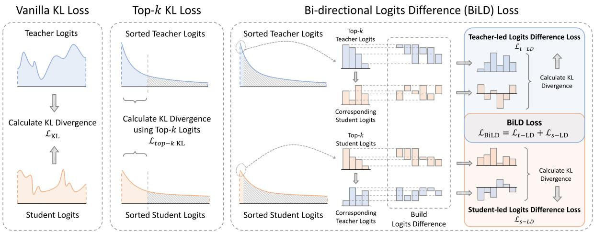
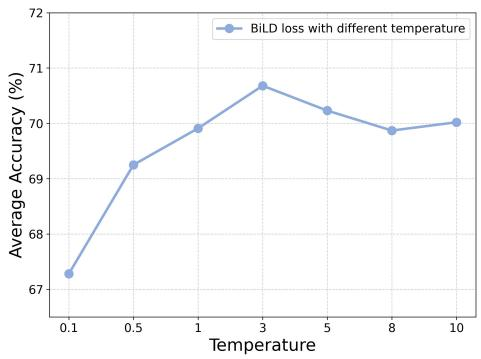
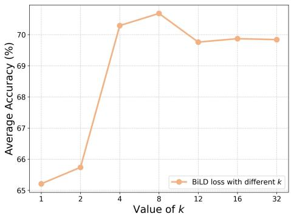
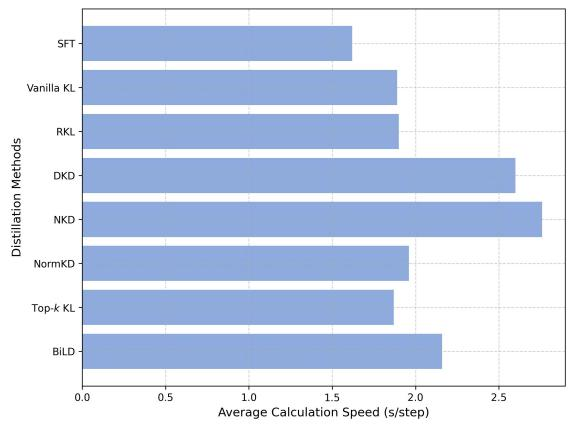
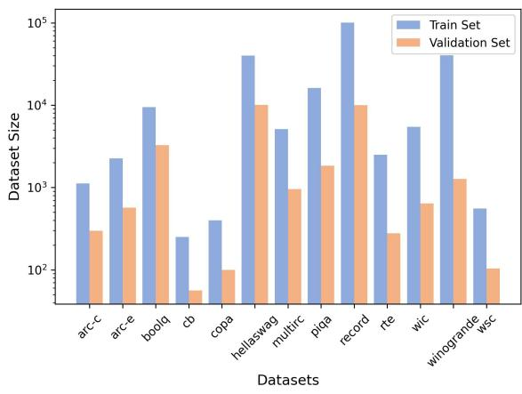
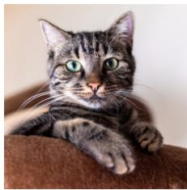
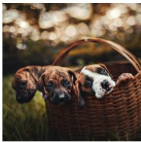
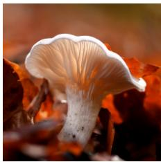
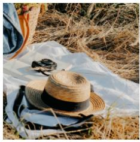

# BiLD: Bi-directional Logits Difference Loss for Large Language Model Distillation

Minchong Li1,2 Feng Zhou2 Xiaohui Song2 \*

1KTH Royal Institute of Technology, Stockholm, Sweden

2OPPO AI Center, Beijing, China

mincli@kth.se

{zhoufeng1, songxiaohui}@oppo.com

## Abstract

In recent years, large language models (LLMs) have shown exceptional capabilities across various natural language processing (NLP) tasks. However, such impressive performance often comes at the cost of an increased parameter size, posing significant challenges for widespread deployment. To address this issue, knowledge distillation (KD) provides a solution by transferring knowledge from a large teacher model to a smaller student model. In this paper, we explore the task-specific distillation of LLMs at the logit level. Our investigation reveals that the logits of fine-tuned LLMs exhibit a more pronounced long-tail distribution compared to those of vision models, with hidden "noise" in the long tail affecting distillation performance. Furthermore, exist ing logits distillation methods often struggle to effectively utilize the internal ranking infor mation from the logits. To address these, we propose the Bi-directional Logits Difference (BiLD) loss. The BiLD loss filters out the longtail noise by utilizing top-k teacher and student logits, and leverages the internal logits ranking information by constructing logits dif ferences. To evaluate BiLD loss, we perform comprehensive experiments on 13 datasets with two types of LLMs. Our results show that the BiLD loss, with only the top-8 logits, outperforms supervised fine-tuning (SFT), vanilla KL loss, and five other distillation methods from both NLP and CV fields. Code is available at https://github.com/fpcsong/BiLD.

## 1 Introduction

The last few years have witnessed large language models (LLMs) risen to prominence, demonstrating remarkable proficiency in natural language understanding and generation. However, these capabilities come at the cost of an ever-increasing number of parameters. Due to constraints on computational resources, LLMs’ formidable size limits their democratization and widespread deployment. Knowledge distillation (KD) , as a classic model compression method(Hinton et al., 2015), provides a solution for reducing model size while preserving performance. KD transfers knowledge from a large teacher model to a smaller student model, enhancing the latter’s performance and enabling its lightweight deployment.

As an important branch of KD, logits distillation has gained popularity due to its straightforward application. The goal of logits distillation is to minimize the Kullback-Leibler (KL) divergence between the teacher and student logits. A significant portion of research on logits distillation has focused on vision models (Zhao et al., 2022; Yang et al., 2023a; Chi et al., 2023; Sun et al., 2024). However, the application of these methods to distill LLMs has yet to be thoroughly explored due to potential differences in structure, data distribution, and output space between vision and language models.

For LLMs, research on logits distillation is still emerging, with methods such as reverse KL (Tu et al., 2020; Lee et al., 2023; Gu et al., 2023) and those based on optimal transport metrics (Cui et al., 2024). However, in practical applications, the former suffers from the "mode-seeking" problem (Chan et al., 2022; Li and Farnia, 2023), while the latter is computationally too complex for opensource LLMs with billions of parameters.

In this paper, we investigate the characteristics of logits in LLMs. Compared to the limited output space of vision models, LLMs’ output space comprises sequences of discrete tokens of potentially infinite length, making LLM logits significantly more complex. Furthermore, LLM logits exhibit a noticeable long-tail distribution, indicating a substantial portion of "noise" beyond a small amount of key knowledge. We also observe that in LLM text generation, common strategies like top-k sampling and top-p sampling are influenced by the internal ranking of logits when selecting output tokens. However, existing logits distillation methods often struggle to exploit this latent ranking information (Sun et al., 2024).

  
Figure 1: An illustration of vanilla KL, top-k KL and our BiLD loss. The vanilla KL loss directly calculates the KL divergence between teacher and student logits, whereas the top-k KL loss uses clipped logits instead of the full logits. In contrast to these methods, our BiLD loss computes KL divergence based on reconstructed logits differences. The logits difference is derived by calculating the pairwise differences between logit values. We construct two groups of logits differences and compute the KL divergence within each group as a loss: the top-k teacher logits and their corresponding student logits are used to calculate the teacher-led logits difference (t-LD) loss, while the top-k student logits and their corresponding teacher logits are used to calculate the student-led logits difference (s-LD) loss. The BiLD loss is the sum of these two losses.

Motivated by the characteristics of logits and the underutilization of their internal ranking, we propose a novel loss function, called Bi-directional Logits Difference (BiLD) loss, for task-specific LLM distillation. BiLD loss emphasizes reducing long-tail noise and explicitly utilizes the ranking information in logits. It computes KL divergence based on reconstructed logits differences, which are obtained by calculating the internal pairwise differences of values from top-k teacher (student) logits and the corresponding student (teacher) logits. Our experiments show that BiLD loss, using only the top-8 logits, achieves state-of-the-art (SOTA) results across various NLP tasks. Our code is available at https://github.com/fpcsong/BiLD.

To conclude, we make the following contributions:

• We investigate the characteristics of LLMs logits, discussing their internal distribution and the significance of logits internal ranking.

• We propose the Bi-directional Logits Difference (BiLD) loss for logits distillation of LLMs. BiLD filters out "noise" in logits long-tail distribution while leveraging logits ranking information to enhance performance. Our method can serve as an alternative to the vanilla KL loss in existing LLM distillation methods.

• To demonstrate the effectiveness of BiLD loss, we conduct comprehensive experiments on 13 NLP datasets using two open-source LLMs, BLOOM (BigScience Workshop, 2022) and Qwen1.5 (Bai et al., 2023). We evaluate various logits distillation methods from both CV and NLP domains. Experimental results show that our BiLD loss outperforms SFT, vanilla KL loss and five other methods using only the top-8 logits. Furthermore, our comparison of teacher and student logits shows that BiLD loss promotes better imitation of teacher’s primary behavior at the logit level.

## 2 Related Works

## 2.1 Logits Distillation

One representative approach of knowledge distillation is logits distillation, which transfers knowledge by minimizing the divergence of output logits (Jin et al., 2023). For vision models, there has been substantial research on logits distillation. Approaches like DKD (Zhao et al., 2022) and NKD (Yang et al., 2023b) decouple the target and non-target components of logits, applying weighting or regularization. NormKD (Chi et al., 2023) dynamically customizes temperatures during the distillation process. However, the differences in structure, data, and output space between vision models and LLMs make it challenging to directly apply these methods to LLMs.

Recent research has introduced several logit distillation methods specifically for LLMs. Reverse KL (RKL) (Tu et al., 2020; Gu et al., 2023) has been used to mitigate the "mode-averaging" problem; however, it sometimes leads the student model towards "mode-seeking" behavior. DistiLLM (Ko et al., 2024) proposes mixing the logits distributions of the teacher and the student, but this introduces additional hyperparameters, increasing its complexity in practical applications. SinKD (Cui et al., 2024) replaces KL divergence with Sinkhorn Distance, but its computational demands pose challenges when applied to larger models.

Our work continues the paradigm of reducing the divergence of logits. However, unlike previous approaches, we calculate the divergence of logits differences instead of logits themselves. Our method focuses the model on the key knowledge in the teacher logits without introducing excessive hyperparameters.

## 2.2 Other Distillation Methods for LLMs

Previous works on distillation for LLMs extend beyond logits-based methods, primarily falling into two categories: white-box and black-box approaches (Yuan et al., 2024). White-box distillation (Gu et al., 2023; Liang et al., 2023; Agarwal et al., 2024) leverages the teacher’s internal representations and hidden states to facilitate knowledge transfer. However, these methods often rely on structural similarities between the teacher and student models. In contrast, black-box distillation only permits the student to access the teacher’s outputs. Current research in black-box distillation mainly focuses on learning from the teacher’s output texts (Sahu et al., 2023; Fu et al., 2023; Li et al., 2023). While BiLD can be classified as black-box distillation, it serves as an alternative to the vanilla KL divergence loss and can be easily integrated with white-box distillation methods.

## 3 Methods

## 3.1 Brief Review of Logits Distillation

Logits distillation calculates the divergence between the teacher’s and student’s logits as the optimization target. Consider a teacher model t and a student model s, both with a vocabulary size N. During the process of single token prediction, the teacher logits $\mathbf { z } ^ { t }$ and student logits $\mathbf { z } ^ { s }$ at a certain position can be represented as:

$$
\begin{array} { r } { \mathbf { z } ^ { t } = \left[ z _ { 1 } ^ { t } , z _ { 2 } ^ { t } , \cdots , z _ { N } ^ { t } \right] \in \mathbb { R } ^ { 1 \times N } , } \\ { \mathbf { z } ^ { s } = [ z _ { 1 } ^ { s } , z _ { 2 } ^ { s } , \cdots , z _ { N } ^ { s } ] \in \mathbb { R } ^ { 1 \times N } . } \end{array}\tag{1}
$$

Logits are the raw outputs of language models and cannot be directly used to calculate the loss. We process the logits into probabilities $\mathbf { p } ^ { t }$ and $\mathbf { p } ^ { s }$ where an element $p _ { i }$ from $\mathbf { p } ^ { t }$ or $\mathbf { p } ^ { s }$ represents the probability of the token at the i-th position being sampled as the output:

$$
\begin{array} { r l } & { \mathbf { p } ^ { t } = \frac { \exp ( \mathbf { z } ^ { t } / T ) } { \sum _ { N } ^ { i = 1 } \exp ( z _ { i } ^ { t } / T ) } \in \mathbb { R } ^ { 1 \times N } , } \\ & { \mathbf { p } ^ { s } = \frac { \exp ( \mathbf { z } ^ { s } / T ) } { \sum _ { N } ^ { i = 1 } \exp ( z _ { i } ^ { s } / T ) } \in \mathbb { R } ^ { 1 \times N } , } \end{array}\tag{2}
$$

where $T$ is the temperature during normalization. The vanilla KL divergence loss is defined as:

$$
{ \mathcal { L } } _ { \mathrm { K L } } = D _ { \mathrm { K L } } \left[ \mathbf { p } ^ { t } \parallel \mathbf { p } ^ { s } \right] .\tag{3}
$$

By aligning the student’s logits with that of the teacher using vanilla KL loss, the student can imitate the teacher’s performance at the logit level, thereby facilitating knowledge transfer.

## 3.2 The Characteristics of LLMs’ Logits

Compared to vision models, LLMs have an output space consisting of infinitely long sequences of tokens, which makes their logits more complex. To compare the logit characteristics of vision models and LLMs, we conduct a toy experiment using ResNet-101 (He et al., 2016) and Qwen-4B (Bai et al., 2023). In this experiment, we randomly select five images and five sets of instructions from our test data as inputs for the vision and language models (details about images and instructions are provided in Appendix C). We use kurtosis to measure the extremity of logits’ long-tail distribution and calculate the proportion of top-k logit values. The experimental results are reported in Table 1. The kurtosis of text logits is 2-3 orders of magnitude higher than that of image logits, suggesting that text logits are much "sharper" than image logits. Given that text logits are much longer than image logits, the proportion of top-k logit values also indicates that text logit values are more peaked than those of image logits.

<table><tr><td rowspan="2">Input Image / Text</td><td rowspan="2">Model</td><td rowspan="2">Kurtosis</td><td colspan="4">Top-k logits percentage (%)</td></tr><tr><td>k=8</td><td>k=64</td><td>k=512</td><td>k=1024</td></tr><tr><td rowspan="5">cat.jpg dogs.jpg lioness.jpg</td><td rowspan="5">ResNet-101</td><td>975</td><td>99.540%</td><td>99.642%</td><td>99.993%</td><td>1</td></tr><tr><td>782</td><td>93.977%</td><td>98.433%</td><td>99.882%</td><td>1</td></tr><tr><td>995</td><td>99.904%</td><td>99.973%</td><td>99.999%</td><td>1</td></tr><tr><td>914</td><td>99.756%</td><td>99.968%</td><td>99.998%</td><td>1</td></tr><tr><td>906</td><td>83.982%</td><td>93.643%</td><td>99.646%</td><td>1</td></tr><tr><td>hat.jpg Instruction 1</td><td rowspan="5">Qwen-4B</td><td>135404</td><td>99.991%</td><td>99.996%</td><td>99.997%</td><td>99.998%</td></tr><tr><td>Instruction 2</td><td>46163</td><td>99.998%</td><td>99.998%</td><td>99.998%</td><td>99.998%</td></tr><tr><td>Instruction 3</td><td>79604</td><td>99.982%</td><td>99.990%</td><td>99.993%</td><td>99.994%</td></tr><tr><td>Instruction 4</td><td>50719</td><td>99.528%</td><td>99.604%</td><td>99.634%</td><td>99.651%</td></tr><tr><td>Instruction 5</td><td>116329</td><td>94.778%</td><td>94.826%</td><td>94.977%</td><td>95.081%</td></tr></table>

Table 1: The kurtosis and top-k proportion of image logits and text logits.

Moreover, previous logits distillation methods have not fully utilized the internal rank information of logits (Huang et al., 2022; Sun et al., 2024), even though this ranking information significantly affects LLMs’ generation performance. When LLMs generate text, two sampling strategies, top-k sampling and top-p sampling, are commonly used to control the diversity of the generated content. Topk sampling controls the maximum length of the candidate tokens list, while top-p sampling filters tokens according to cumulative probability. The ranking of logit values impacts the selection process in both strategies, as higher-ranked tokens are more likely to be selected as candidates. Therefore, maintaining rank consistency will better assist the student in imitating the teacher’s generating patterns.

## 3.3 Bi-directional Logits Difference Loss

The Bi-directional Logits Difference (BiLD) loss is a novel optimization target for task-specific LLM distillation. It filters out the "noise" in the longtail distribution of LLMs’ logits and constructs bidirectional differences that reflect the internal ranking of logits. Our goal is not for the student logits to fully match the teacher’s but for the student to effectively learn the key knowledge represented in the non-long-tail part. The detailed process of BiLD is shown in Figure 1.

## 3.3.1 Formal Definition

The BiLD loss consists of two components: the teacher-led logits difference (t-LD) loss and the student-led logits difference (s-LD) loss. Due to the similarity between the two components, we explain the process by calculating the t-LD loss. First, we select the top-k teacher logits and sort them in descending order to build the teacher-led logits $\mathbf { z } _ { \mathrm { l e d } } ^ { t }$

$$
\begin{array} { r } { \mathbf { z } _ { \mathrm { l e d } } ^ { t } = \left[ z _ { i _ { 1 } } ^ { t } , z _ { i _ { 2 } } ^ { t } , \cdots , z _ { i _ { k } } ^ { t } \right] \in \mathbb { R } ^ { 1 \times k } , } \end{array}\tag{4}
$$

where the elements of $\mathbf { z } _ { \mathrm { l e d } } ^ { t }$ satisfy $z _ { i _ { 1 } } ^ { t } \ \ge \ z _ { i _ { 2 } } ^ { t } \ \ge$ $\cdots \geq z _ { i _ { k } } ^ { t }$ . Then, we create the corresponding student logits $\mathbf { z } _ { \mathrm { c o r } } ^ { s }$ by selecting the student logit values at the corresponding positions $[ i _ { 1 } , i _ { 2 } , \cdots , i _ { k } ]$

$$
\begin{array} { r } { \mathbf { z } _ { \mathrm { c o r } } ^ { s } = \left[ z _ { i _ { 1 } } ^ { s } , z _ { i _ { 2 } } ^ { s } , \cdots , z _ { i _ { k } } ^ { s } \right] \in \mathbb { R } ^ { 1 \times k } . } \end{array}\tag{5}
$$

Next, we build the logits differences $ { \mathbf { d } } _ { \mathrm { l e d } } ^ { t }$ and $\mathbf { d } _ { \mathrm { c o r } } ^ { s }$ by calculating the internal pairwise value differences of $\mathbf { z } _ { \mathrm { l e d } } ^ { t }$ and $\mathbf { z } _ { \mathrm { c o r } } ^ { s }$ respectively:

$$
\begin{array} { r } { \mathbf { \mathbf { d } } _ { \mathrm { l e d } } ^ { t } = \left[ z _ { i _ { m } } ^ { t } - z _ { i _ { n } } ^ { t } \mid 1 \leq m < n \leq k \right] , } \\ { \mathbf { \mathbf { d } } _ { \mathrm { c o r } } ^ { s } = \left[ z _ { i _ { m } } ^ { s } - z _ { i _ { n } } ^ { s } \mid 1 \leq m < n \leq k \right] , } \end{array}\tag{6}
$$

where both ${ \bf d } _ { \mathrm { l e d } } ^ { t }$ and $\mathbf { d } _ { \mathrm { c o r } } ^ { s } \in \mathbb { R } ^ { 1 \times \frac { k ( k - 1 ) } { 2 } }$ . Then we normalize ${ \bf d } _ { \mathrm { l e d } } ^ { t }$ and $\mathbf { d } _ { \mathrm { c o r } } ^ { s }$ into probabilities:

$$
\begin{array} { r } { \mathbf { p } _ { \mathrm { l e d } } ^ { t } = \frac { \exp ( \mathbf { z } _ { \mathrm { l e d } } ^ { t } / T ) } { \sum _ { i = 1 } ^ { \frac { k ( k - 1 ) } { 2 } } \exp ( z _ { \mathrm { l e d } , i } ^ { t } / T ) } , } \\ { \mathbf { p } _ { \mathrm { c o r } } ^ { s } = \frac { \exp ( \mathbf { z } _ { \mathrm { c o r } } ^ { s } / T ) } { \sum _ { i = 1 } ^ { \frac { k ( k - 1 ) } { 2 } } \exp ( z _ { \mathrm { c o r } , i } ^ { s } / T ) } . } \end{array}\tag{7}
$$

To obtain the teacher-led logits difference loss $\mathcal { L } _ { t - \mathrm { L D } }$ , we calculate the KL divergence between $ { \mathbf { p } } _ { \mathrm { l e d } } ^ { t }$ and $\mathbf { p } _ { \mathrm { c o r } } ^ { s }$ :

$$
\begin{array} { r } { \mathcal { L } _ { t - \mathrm { L D } } = D _ { \mathrm { K L } } \left[ \mathbf { p } _ { \mathrm { l e d } } ^ { t } \parallel \mathbf { p } _ { \mathrm { c o r } } ^ { s } \right] . } \end{array}\tag{8}
$$

The calculation of the s-LD loss is similar to that of the t-LD loss. The key difference is that the s-LD loss selects the top-k student logits $\pmb { \mathrm { z } } _ { \mathrm { l e d } } ^ { s }$ and extracts the corresponding teacher logits $\mathbf { z } _ { \mathrm { c o r } } ^ { t } .$ . Based on these, we can sequentially calculate the logits differences $\mathbf { d } _ { \mathrm { l e d } } ^ { s }$ and $\mathbf { d } _ { \mathrm { c o r } } ^ { t }$ as well as the probabilities $\mathbf { p } _ { \mathrm { l e d } } ^ { s }$ and $\mathbf { p } _ { \mathrm { c o r } } ^ { t }$ . The s-LD loss can be represented as:

$$
\begin{array} { r } { \mathcal { L } _ { s - \mathrm { L D } } = D _ { \mathrm { K L } } \left[ \mathbf { p } _ { \mathrm { c o r } } ^ { t } \parallel \mathbf { p } _ { \mathrm { l e d } } ^ { s } \right] . } \end{array}\tag{9}
$$

Finally, we obtain the BiLD loss:

$$
\mathcal { L } _ { \mathrm { B i L D } } = \mathcal { L } _ { t - \mathrm { L D } } + \mathcal { L } _ { s - \mathrm { L D } } .\tag{10}
$$

To aid comprehension, we outline the calculation process of the BiLD loss in Algorithm 1.

Algorithm 1 Calculation of BiLD Loss   
Input: teacher logits $\mathbf { z } ^ { t } .$ , student logits $\mathbf { z } ^ { s }$ , temper  
ature T, hyperparameter k that controls the   
number of clipped logits   
Output: the BiLD loss $\mathcal { L }$ BiLD   
1: select top-k teacher logits $\mathbf { z } _ { \mathrm { l e d } } ^ { t }$ (Equation 4)   
2: select corresponding student logits $\mathbf { z } _ { \mathrm { c o r } } ^ { s }$ (Equa  
tion 5)   
3: build the teacher and student logits differences   
${ \bf d } _ { \mathrm { l e d } } ^ { t }$ and $\mathbf { d } _ { \mathrm { c o r } } ^ { s }$ (Equation 6)   
4: normalize differences to probabilities $ { \mathbf { p } } _ { \mathrm { l e d } } ^ { t }$ and   
$\mathbf { p } _ { \mathrm { c o r } } ^ { s }$ (Equation 7)   
5: calculate the teacher-led logits difference loss   
$\mathcal { L } _ { t - \mathrm { L D } }$ (Equation 8)   
6: calculate $\mathcal { L } _ { s - \mathrm { L D } }$ (Equation 9), generally fol  
lowing steps 1-5   
7: sum $\mathcal { L } _ { t - \mathrm { L D } }$ and $\mathcal { L } _ { s - \mathrm { L D } }$ to obtain $\mathcal { L } _ { \mathrm { B i L D } }$ (Equa  
tion 10)

## 3.3.2 Explanation about the Utilization of Logits Ranking

The calculation of the logits difference (Equation 6) ensures that the student model learns the ranking information embedded in the teacher logits. We demonstrate this through an example based on the t-LD loss calculation. Since $\mathbf { z } _ { \mathrm { l e d } } ^ { t }$ satisfies $z _ { i _ { 1 } } ^ { t } \geq z _ { i _ { 2 } } ^ { t } \geq \cdot \cdot \cdot \geq z _ { i _ { k } } ^ { t }$ , it is guaranteed that every element in the teacher-led logits difference ${ \bf d } _ { \mathrm { l e d } } ^ { t }$ is non-negative. For the corresponding student logits difference $\mathbf { d } _ { \mathrm { c o r } } ^ { s }$ , consider an element $d ^ { s } = z _ { i _ { m } } ^ { s } - z _ { i _ { n } } ^ { s }$ If m $> n .$ , then $d ^ { s } \ < \ 0$ . In this case, the order $z _ { i _ { m } } ^ { s } ~ < ~ z _ { i _ { n } } ^ { s }$ is inconsistent with the order in the teacher logits $z _ { i _ { m } } ^ { t } > z _ { i _ { n } } ^ { t }$ . Therefore, the sign of the elements in the corresponding logits difference $\mathbf { d } _ { \mathrm { c o r } } ^ { s }$ reflects whether the ranking of the teacher and student logits value pairs is consistent. When calculating $\mathcal { L } _ { s - \mathrm { L D } }$ , this acts as a constraint, promoting the student logits to align their ranking order with the teacher logits.

## 4 Experiments

## 4.1 Datasets

We evaluate our BiLD loss on 13 NLP datasets: (1) 8 datasets from the SuperGLUE benchmark (Wang et al., 2019), including BoolQ (Clark et al., 2019), CB (De Marneffe et al., 2019), COPA (Roemmele et al., 2011), MultiRC (Khashabi et al., 2018), ReCoRD (Zhang et al., 2018), RTE (Giampiccolo et al., 2007), WiC (Pilehvar and Camacho-Collados, 2018) and WSC (Levesque et al., 2012); (2) 5 extra datasets used in previous works about model compression (Ma et al., 2023; Egiazarian et al., 2024), including: Arc-C, Arc-E (Clark et al., 2018), HellaSwag (Zellers et al., 2019), PIQA (Bisk et al., 2020) and WinoGrande (Sakaguchi et al., 2021). We observe that these datasets vary significantly in size (the visualization of dataset sizes is presented in Appendix B). Using small datasets alone for SFT and distillation would result in severe overfitting. To prevent unreliable experimental results, we use these datasets collectively for SFT and distillation, then evaluate each separately.

## 4.2 Baselines

We compare BiLD loss with seven baselines: (1) supervised fine-tuning (SFT), where all parameters are adjusted during adaptation to downstream tasks; (2) vanilla KL loss; (3) vanilla KL loss with only top-k logits (short as top-k KL), to demonstrate the performance improvements from noise filtering; (4) three logits distillation methods for vision models, including DKD (Zhao et al., 2022), NKD (Yang et al., 2023b), and NormKD (Chi et al., 2023); (5) Reverse KL loss (RKL) used in MiniLLM (Gu et al., 2023), which has been proven to enhance distillation performance on LLMs.

## 4.3 Implementation Details

We conduct experiments using the BLOOM and Qwen1.5 (abbreviated as Qwen) models, which are available in various sizes. Specifically, we employ BLOOM-7B and Qwen-4B as teacher models. For student models, we select BLOOM-3B and BLOOM-1B from the BLOOM series, and 1.8B and 0.5B versions from Qwen.

<table><tr><td rowspan=2 colspan=16>Arc-CArc-EboolQ CB COPAHellaSwag MultiRC PIQA ReCoRD RTE WiCWinoGrandeWSCModel    Method                                                                                                    Avg.(Acc.)                                        (F1/Acc.) (Acc.)(Acc.)  (Acc.)  (Acc.)</td></tr><tr><td rowspan=1 colspan=2>(Acc.) (Acc.)</td><td rowspan=1 colspan=6>(Acc.) (Acc.) (Acc.) (Acc.) (F1a/EM) (Acc.)</td></tr><tr><td rowspan=1 colspan=1>BLOOM-7B   Teacher</td><td rowspan=1 colspan=1>50.84</td><td rowspan=1 colspan=1>68.95</td><td rowspan=1 colspan=1>85.26</td><td rowspan=1 colspan=1>89.29</td><td rowspan=1 colspan=3>81.00  76.08  81.36/40.82</td><td rowspan=1 colspan=1>74.92</td><td rowspan=1 colspan=2>79.87/78.5083.03</td><td rowspan=1 colspan=4>72.41  71.51  65.38</td><td rowspan=1 colspan=1>72.15</td></tr><tr><td rowspan=1 colspan=1>SFT</td><td rowspan=1 colspan=1>44.15</td><td rowspan=1 colspan=1>61.75</td><td rowspan=1 colspan=1>84.04</td><td rowspan=1 colspan=1>87.50</td><td rowspan=1 colspan=2>67.00 57.00</td><td rowspan=1 colspan=1>77.09/36.20</td><td rowspan=1 colspan=1>70.84</td><td rowspan=1 colspan=1>76.05/74.59</td><td rowspan=1 colspan=1>78.34</td><td rowspan=1 colspan=4>69.75  69.69  64.42</td><td rowspan=1 colspan=1>66.56</td></tr><tr><td rowspan=1 colspan=1>Vanilla KL</td><td rowspan=1 colspan=1>49.50</td><td rowspan=1 colspan=1>68.07</td><td rowspan=1 colspan=1>84.50</td><td rowspan=1 colspan=1>87.50</td><td rowspan=1 colspan=2>76.00 72.60</td><td rowspan=1 colspan=1>78.89/36.52</td><td rowspan=1 colspan=1>74.27</td><td rowspan=1 colspan=1>79.81/78.32</td><td rowspan=1 colspan=1>81.59</td><td rowspan=1 colspan=4>71.94   70.96  74.04</td><td rowspan=1 colspan=1>71.21</td></tr><tr><td rowspan=1 colspan=1>RKL</td><td rowspan=1 colspan=1>50.50</td><td rowspan=1 colspan=1>68.42</td><td rowspan=1 colspan=1>84.62</td><td rowspan=1 colspan=1>87.50</td><td rowspan=1 colspan=2>80.00 72.20</td><td rowspan=1 colspan=1>78.95/36.41</td><td rowspan=1 colspan=1>74.48</td><td rowspan=1 colspan=1>79.63/78.13</td><td rowspan=1 colspan=1>82.31</td><td rowspan=1 colspan=4>72.57   71.35  68.27</td><td rowspan=1 colspan=1>71.29</td></tr><tr><td rowspan=1 colspan=1>DKD</td><td rowspan=1 colspan=1>49.50</td><td rowspan=1 colspan=1>69.82</td><td rowspan=1 colspan=1>85.26</td><td rowspan=1 colspan=1>91.07</td><td rowspan=1 colspan=2>80.00  71.54</td><td rowspan=1 colspan=1>77.84/35.68</td><td rowspan=1 colspan=1>73.01</td><td rowspan=1 colspan=1>79.09/77.65</td><td rowspan=1 colspan=1>79.42</td><td rowspan=1 colspan=4>73.20  70.96  66.35</td><td rowspan=1 colspan=1>71.04</td></tr><tr><td rowspan=1 colspan=1>BLOOM-3B     NKD</td><td rowspan=1 colspan=1>50.17</td><td rowspan=1 colspan=1>67.19</td><td rowspan=1 colspan=1>84.01</td><td rowspan=1 colspan=1>92.86</td><td rowspan=1 colspan=2>79.00  72.68</td><td rowspan=1 colspan=1>79.69/37.67</td><td rowspan=1 colspan=1>73.50</td><td rowspan=1 colspan=1>78.50/77.09</td><td rowspan=1 colspan=1>81.23</td><td rowspan=1 colspan=4>71.32  72.06  66.35</td><td rowspan=1 colspan=1>71.16</td></tr><tr><td rowspan=1 colspan=1>NormKD</td><td rowspan=1 colspan=1>48.16</td><td rowspan=1 colspan=1>67.54</td><td rowspan=1 colspan=1>85.35</td><td rowspan=1 colspan=1>89.29</td><td rowspan=1 colspan=1>79.00</td><td rowspan=1 colspan=1>70.57</td><td rowspan=1 colspan=1>77.19/35.57</td><td rowspan=1 colspan=1>71.82</td><td rowspan=1 colspan=1>78.44/76.98</td><td rowspan=1 colspan=1>80.87</td><td rowspan=1 colspan=4>72.88   70.48   68.27</td><td rowspan=1 colspan=1>70.52</td></tr><tr><td rowspan=1 colspan=1>Top-k KL</td><td rowspan=1 colspan=1>47.49</td><td rowspan=1 colspan=1>68.25</td><td rowspan=1 colspan=1>84.19</td><td rowspan=1 colspan=1>87.50</td><td rowspan=1 colspan=1>77.00 7</td><td rowspan=1 colspan=1>2.75</td><td rowspan=1 colspan=1>79.39/37.67</td><td rowspan=1 colspan=1>74.59</td><td rowspan=1 colspan=1>79.40/78.01</td><td rowspan=1 colspan=1>82.67</td><td rowspan=1 colspan=4>72.10  70.80  64.42</td><td rowspan=1 colspan=1>70.57</td></tr><tr><td rowspan=1 colspan=1>BiLD (ours)</td><td rowspan=1 colspan=1>49.83</td><td rowspan=1 colspan=1>67.54</td><td rowspan=1 colspan=1>84.86</td><td rowspan=1 colspan=1>91.07</td><td rowspan=1 colspan=3>80.00  72.10  79.49/37.78</td><td rowspan=1 colspan=1>73.61</td><td rowspan=1 colspan=1>79.96/78.57</td><td rowspan=1 colspan=1>82.67</td><td rowspan=1 colspan=4>72.88  71.98  71.15</td><td rowspan=1 colspan=1>71.85</td></tr><tr><td rowspan=1 colspan=1>SFT</td><td rowspan=1 colspan=1>34.78</td><td rowspan=1 colspan=1>53.86</td><td rowspan=1 colspan=1>80.76</td><td rowspan=1 colspan=1>87.50</td><td rowspan=1 colspan=1>64.00</td><td rowspan=1 colspan=1>37.39</td><td rowspan=1 colspan=1>73.18/30.12</td><td rowspan=1 colspan=1>65.72</td><td rowspan=1 colspan=1>72.04/70.59</td><td rowspan=1 colspan=1>73.65</td><td rowspan=1 colspan=4>67.71   67.40  64.42</td><td rowspan=1 colspan=1>61.38</td></tr><tr><td rowspan=1 colspan=1>Vanilla KL</td><td rowspan=1 colspan=1>45.48</td><td rowspan=1 colspan=1>64.39</td><td rowspan=1 colspan=1>83.67</td><td rowspan=1 colspan=1>87.50</td><td rowspan=1 colspan=1>73.00</td><td rowspan=1 colspan=1>65.31</td><td rowspan=1 colspan=1>77.66/33.37</td><td rowspan=1 colspan=1>70.95</td><td rowspan=1 colspan=1>77.11/75.67</td><td rowspan=1 colspan=1>77.62</td><td rowspan=1 colspan=1>68.03</td><td rowspan=1 colspan=3>68.43   68.27</td><td rowspan=1 colspan=1>67.82</td></tr><tr><td rowspan=1 colspan=1>RKL</td><td rowspan=1 colspan=1>45.48</td><td rowspan=1 colspan=1>65.44</td><td rowspan=1 colspan=1>83.43</td><td rowspan=1 colspan=1>85.71</td><td rowspan=1 colspan=1>74.00</td><td rowspan=1 colspan=1>65.70</td><td rowspan=1 colspan=1>76.63/32.95</td><td rowspan=1 colspan=1>70.78</td><td rowspan=1 colspan=1>77.51/76.10</td><td rowspan=1 colspan=1>79.42</td><td rowspan=1 colspan=1>70.69</td><td rowspan=1 colspan=3>68.27   64.42</td><td rowspan=1 colspan=1>67.88</td></tr><tr><td rowspan=1 colspan=1>DKD</td><td rowspan=1 colspan=1>42.47</td><td rowspan=1 colspan=1>64.56</td><td rowspan=1 colspan=1>84.10</td><td rowspan=1 colspan=1>85.71</td><td rowspan=1 colspan=1>72.00</td><td rowspan=1 colspan=1>63.72</td><td rowspan=1 colspan=1>75.49/31.79</td><td rowspan=1 colspan=1>69.48</td><td rowspan=1 colspan=1>75.78/74.46</td><td rowspan=1 colspan=1>79.78</td><td rowspan=1 colspan=1>71.79</td><td rowspan=1 colspan=3>68.98  69.23</td><td rowspan=1 colspan=1>67.55</td></tr><tr><td rowspan=1 colspan=1>BLOOM-1B     NKD</td><td rowspan=1 colspan=1>43.14</td><td rowspan=1 colspan=1>60.88</td><td rowspan=1 colspan=1>82.75</td><td rowspan=1 colspan=1>89.29</td><td rowspan=1 colspan=1>68.00</td><td rowspan=1 colspan=1>63.53</td><td rowspan=1 colspan=1>76.94/34.84</td><td rowspan=1 colspan=1>70.73</td><td rowspan=1 colspan=1>75.31/73.87</td><td rowspan=1 colspan=1>77.62</td><td rowspan=1 colspan=1>69.44</td><td rowspan=1 colspan=3>69.30  61.54</td><td rowspan=1 colspan=1>66.53</td></tr><tr><td rowspan=1 colspan=1>NormKD</td><td rowspan=1 colspan=1>42.81</td><td rowspan=1 colspan=1>61.05</td><td rowspan=1 colspan=1>83.82</td><td rowspan=1 colspan=1>83.93</td><td rowspan=1 colspan=1>69.00</td><td rowspan=1 colspan=1>62.80</td><td rowspan=1 colspan=1>74.13/30.75</td><td rowspan=1 colspan=1>67.74</td><td rowspan=1 colspan=1>74.49/72.95</td><td rowspan=1 colspan=1>77.62</td><td rowspan=1 colspan=1>69.91</td><td rowspan=1 colspan=3>67.80  65.38</td><td rowspan=1 colspan=1>65.81</td></tr><tr><td rowspan=1 colspan=1>Top-k KL</td><td rowspan=1 colspan=1>49.50</td><td rowspan=1 colspan=1>62.11</td><td rowspan=1 colspan=1>83.06</td><td rowspan=1 colspan=1>89.29</td><td rowspan=1 colspan=1>74.00</td><td rowspan=1 colspan=1>65.72</td><td rowspan=1 colspan=1>78.30/34.73</td><td rowspan=1 colspan=1>71.22</td><td rowspan=1 colspan=1>77.28/75.89</td><td rowspan=1 colspan=1>77.98</td><td rowspan=1 colspan=1>70.22</td><td rowspan=1 colspan=3>69.30  60.58</td><td rowspan=1 colspan=1>67.97</td></tr><tr><td rowspan=1 colspan=1>BiLD (ours)</td><td rowspan=1 colspan=1>44.48</td><td rowspan=1 colspan=1>62.98</td><td rowspan=1 colspan=1>83.39</td><td rowspan=1 colspan=1>91.07</td><td rowspan=1 colspan=1>77.00</td><td rowspan=1 colspan=1>64.84</td><td rowspan=1 colspan=1>78.37/35.78</td><td rowspan=1 colspan=1>72.20</td><td rowspan=1 colspan=1>77.23/75.93</td><td rowspan=1 colspan=1>80.14</td><td rowspan=1 colspan=1>70.53</td><td rowspan=1 colspan=3>69.30  68.27</td><td rowspan=1 colspan=1>68.92</td></tr><tr><td rowspan=1 colspan=1>Qwen-4B    Teacher</td><td rowspan=1 colspan=1>68.23</td><td rowspan=1 colspan=1>81.40</td><td rowspan=1 colspan=1>87.43</td><td rowspan=1 colspan=1>96.43</td><td rowspan=1 colspan=1>89.00</td><td rowspan=1 colspan=1>86.30</td><td rowspan=1 colspan=1>85.85/51.63</td><td rowspan=1 colspan=1>82.10</td><td rowspan=1 colspan=1>82.59/81.10</td><td rowspan=1 colspan=1>87.73</td><td rowspan=1 colspan=1>72.73</td><td rowspan=1 colspan=3>80.82  74.04</td><td rowspan=1 colspan=1>79.92</td></tr><tr><td rowspan=1 colspan=1>SFT</td><td rowspan=1 colspan=1>52.17</td><td rowspan=1 colspan=1>73.86</td><td rowspan=1 colspan=1>83.88</td><td rowspan=1 colspan=1>91.07</td><td rowspan=1 colspan=1>86.00</td><td rowspan=1 colspan=1>72.58</td><td rowspan=1 colspan=1>79.95/39.66</td><td rowspan=1 colspan=1>75.90</td><td rowspan=1 colspan=1>77.37/76.05</td><td rowspan=1 colspan=1>84.12</td><td rowspan=1 colspan=1>71.79</td><td rowspan=1 colspan=3>72.06  61.54</td><td rowspan=1 colspan=1>72.36</td></tr><tr><td rowspan=1 colspan=1>Vanilla KL</td><td rowspan=1 colspan=1>55.52</td><td rowspan=1 colspan=1>74.74</td><td rowspan=1 colspan=1>85.60</td><td rowspan=1 colspan=1>96.43</td><td rowspan=1 colspan=1>86.00</td><td rowspan=1 colspan=1>77.74</td><td rowspan=1 colspan=1>79.46/36.52</td><td rowspan=1 colspan=1>76.66</td><td rowspan=1 colspan=1>79.24/36.52</td><td rowspan=1 colspan=1>85.56</td><td rowspan=1 colspan=1>69.59</td><td rowspan=1 colspan=3>75.14  64.42</td><td rowspan=1 colspan=1>73.98</td></tr><tr><td rowspan=1 colspan=1>RKL</td><td rowspan=1 colspan=1>50.84</td><td rowspan=1 colspan=1>76.14</td><td rowspan=1 colspan=1>85.14</td><td rowspan=1 colspan=1>94.64</td><td rowspan=1 colspan=1>87.00</td><td rowspan=1 colspan=1>77.85</td><td rowspan=1 colspan=1>79.52/39.14</td><td rowspan=1 colspan=1>76.39</td><td rowspan=1 colspan=1>79.49/77.98</td><td rowspan=1 colspan=1>84.48</td><td rowspan=1 colspan=1>71.47</td><td rowspan=1 colspan=3>76.64   69.23</td><td rowspan=1 colspan=1>74.38</td></tr><tr><td rowspan=1 colspan=1>DKD</td><td rowspan=1 colspan=1>51.84</td><td rowspan=1 colspan=1>77.02</td><td rowspan=1 colspan=1>85.75</td><td rowspan=1 colspan=1>98.21</td><td rowspan=1 colspan=1>85.00</td><td rowspan=1 colspan=1>76.90</td><td rowspan=1 colspan=1>80.56/39.77</td><td rowspan=1 colspan=1>74.54</td><td rowspan=1 colspan=1>77.91/76.18</td><td rowspan=1 colspan=1>84.48</td><td rowspan=1 colspan=1>71.16</td><td rowspan=1 colspan=3>76.56   67.31</td><td rowspan=1 colspan=1>74.21</td></tr><tr><td rowspan=1 colspan=1>Qwen-1.8B     NKD</td><td rowspan=1 colspan=1>51.84</td><td rowspan=1 colspan=1>73.33</td><td rowspan=1 colspan=1>84.53</td><td rowspan=1 colspan=1>92.86</td><td rowspan=1 colspan=1>88.00</td><td rowspan=1 colspan=1>77.49</td><td rowspan=1 colspan=1>81.98/42.18</td><td rowspan=1 colspan=1>76.61</td><td rowspan=1 colspan=1>79.03/77.58</td><td rowspan=1 colspan=1>84.12</td><td rowspan=1 colspan=1>70.85</td><td rowspan=1 colspan=2>74.98</td><td rowspan=1 colspan=1>66.35</td><td rowspan=1 colspan=1>73.90</td></tr><tr><td rowspan=1 colspan=1>NormKD</td><td rowspan=1 colspan=1>52.84</td><td rowspan=1 colspan=1>76.49</td><td rowspan=1 colspan=1>85.26</td><td rowspan=1 colspan=1>96.43</td><td rowspan=1 colspan=1>85.00</td><td rowspan=1 colspan=1>77.24</td><td rowspan=1 colspan=1>80.81/40.50</td><td rowspan=1 colspan=1>74.76</td><td rowspan=1 colspan=1>78.22/76.48</td><td rowspan=1 colspan=1>85.92</td><td rowspan=1 colspan=1>70.53</td><td rowspan=1 colspan=3>76.87  70.19</td><td rowspan=1 colspan=1>74.50</td></tr><tr><td rowspan=1 colspan=1>Top-k KL</td><td rowspan=1 colspan=1>53.85</td><td rowspan=1 colspan=1>76.14</td><td rowspan=1 colspan=1>85.93</td><td rowspan=1 colspan=1>96.43</td><td rowspan=1 colspan=1>82.00</td><td rowspan=1 colspan=1>77.99</td><td rowspan=1 colspan=1>81.81/41.03</td><td rowspan=1 colspan=1>76.71</td><td rowspan=1 colspan=1>80.08/78.71</td><td rowspan=1 colspan=1>83.39</td><td rowspan=1 colspan=1>71.32</td><td rowspan=1 colspan=3>75.85  67.31</td><td rowspan=1 colspan=1>74.36</td></tr><tr><td rowspan=1 colspan=1>BiLD (ours)</td><td rowspan=1 colspan=1>54.85</td><td rowspan=1 colspan=1>73.16</td><td rowspan=1 colspan=1>84.53</td><td rowspan=1 colspan=1>96.43</td><td rowspan=1 colspan=1>88.00</td><td rowspan=1 colspan=1>77.56</td><td rowspan=1 colspan=1>81.49/42.92</td><td rowspan=1 colspan=1>77.97</td><td rowspan=1 colspan=1>79.87/78.56</td><td rowspan=1 colspan=1>85.56</td><td rowspan=1 colspan=1>72.10</td><td rowspan=1 colspan=3>76.01   68.27</td><td rowspan=1 colspan=1>75.07</td></tr><tr><td rowspan=1 colspan=1>SFT</td><td rowspan=1 colspan=1>37.46</td><td rowspan=1 colspan=1>62.11</td><td rowspan=1 colspan=1>80.40</td><td rowspan=1 colspan=1>87.50</td><td rowspan=1 colspan=1>77.00</td><td rowspan=1 colspan=1>46.71</td><td rowspan=1 colspan=1>74.24/28.54</td><td rowspan=1 colspan=1>68.44</td><td rowspan=1 colspan=1>71.19/69.79</td><td rowspan=1 colspan=1>77.26</td><td rowspan=1 colspan=1>66.30</td><td rowspan=1 colspan=3>69.38  59.62</td><td rowspan=1 colspan=1>63.88</td></tr><tr><td rowspan=1 colspan=1>Vanilla KL</td><td rowspan=1 colspan=1>43.14</td><td rowspan=1 colspan=1>63.68</td><td rowspan=1 colspan=1>81.74</td><td rowspan=1 colspan=1>85.71</td><td rowspan=1 colspan=1>78.00</td><td rowspan=1 colspan=1>66.73</td><td rowspan=1 colspan=1>75.97/29.07</td><td rowspan=1 colspan=1>71.87</td><td rowspan=1 colspan=1>72.55/70.91</td><td rowspan=1 colspan=1>79.78</td><td rowspan=1 colspan=1>70.53</td><td rowspan=1 colspan=3>71.35   60.58</td><td rowspan=1 colspan=1>67.16</td></tr><tr><td rowspan=1 colspan=1>RKL</td><td rowspan=1 colspan=1>46.49</td><td rowspan=1 colspan=1>64.39</td><td rowspan=1 colspan=1>81.53</td><td rowspan=1 colspan=1>87.50</td><td rowspan=1 colspan=1>79.00</td><td rowspan=1 colspan=1>67.06</td><td rowspan=1 colspan=1>75.37/29.38</td><td rowspan=1 colspan=1>71.16</td><td rowspan=1 colspan=1>71.46/69.55</td><td rowspan=1 colspan=1>82.31</td><td rowspan=1 colspan=1>69.91</td><td rowspan=1 colspan=3>70.80  58.65</td><td rowspan=1 colspan=1>67.52</td></tr><tr><td rowspan=1 colspan=1>DKD</td><td rowspan=1 colspan=1>40.80</td><td rowspan=1 colspan=1>62.98</td><td rowspan=1 colspan=1>82.66</td><td rowspan=1 colspan=1>82.14</td><td rowspan=1 colspan=1>77.00</td><td rowspan=1 colspan=1>61.03</td><td rowspan=1 colspan=1>72.35/26.55</td><td rowspan=1 colspan=1>66.87</td><td rowspan=1 colspan=1>65.68/63.20</td><td rowspan=1 colspan=1>81.59</td><td rowspan=1 colspan=1>70.06</td><td rowspan=1 colspan=3>70.64  61.54</td><td rowspan=1 colspan=1>65.16</td></tr><tr><td rowspan=1 colspan=1>Qwen-0.5B     NKD</td><td rowspan=1 colspan=1>41.14</td><td rowspan=1 colspan=1>63.86</td><td rowspan=1 colspan=1>82.42</td><td rowspan=1 colspan=1>94.64</td><td rowspan=1 colspan=1>78.00</td><td rowspan=1 colspan=1>68.30</td><td rowspan=1 colspan=1>79.33/36.20</td><td rowspan=1 colspan=1>73.01</td><td rowspan=1 colspan=1>74.81/73.35</td><td rowspan=1 colspan=1>82.31</td><td rowspan=1 colspan=1>67.40</td><td rowspan=1 colspan=3>72.22  71.15</td><td rowspan=1 colspan=1>69.54</td></tr><tr><td rowspan=1 colspan=1>NormKD</td><td rowspan=1 colspan=1>41.14</td><td rowspan=1 colspan=1>61.40</td><td rowspan=1 colspan=1>82.72</td><td rowspan=1 colspan=1>83.93</td><td rowspan=1 colspan=1>77.00</td><td rowspan=1 colspan=1>62.31</td><td rowspan=1 colspan=1>74.13/29.07</td><td rowspan=1 colspan=1>68.55</td><td rowspan=1 colspan=1>67.17/64.79</td><td rowspan=1 colspan=1>82.31</td><td rowspan=1 colspan=1>71.16</td><td rowspan=1 colspan=1>71.43</td><td rowspan=1 colspan=2>62.50</td><td rowspan=1 colspan=1>66.02</td></tr><tr><td rowspan=1 colspan=1>Top-k KL</td><td rowspan=1 colspan=1>43.14</td><td rowspan=1 colspan=1>65.79</td><td rowspan=1 colspan=1>82.39</td><td rowspan=1 colspan=1>94.64</td><td rowspan=1 colspan=1>77.00</td><td rowspan=1 colspan=1>68.58</td><td rowspan=1 colspan=1>78.83/35.89</td><td rowspan=1 colspan=1>71.82</td><td rowspan=1 colspan=1>74.30/72.95</td><td rowspan=1 colspan=1>82.31</td><td rowspan=1 colspan=4>69.28   73.24   62.50</td><td rowspan=1 colspan=1>69.19</td></tr><tr><td rowspan=1 colspan=1>BiLD (ours)</td><td rowspan=1 colspan=1>41.81</td><td rowspan=1 colspan=1>67.54</td><td rowspan=1 colspan=1>83.43</td><td rowspan=1 colspan=1>96.43</td><td rowspan=1 colspan=1>78.00</td><td rowspan=1 colspan=2>68.99  79.72/37.78</td><td rowspan=1 colspan=1>73.34</td><td rowspan=1 colspan=1>75.22/73.94</td><td rowspan=1 colspan=1>81.59</td><td rowspan=1 colspan=4>69.75   72.22   74.04</td><td rowspan=1 colspan=1>70.68</td></tr></table>

Table 2: The overall performance of various distillation methods and SFT baselines, with best results shown in bold. When choosing the best results and calculating the Average Accuracy (Avg.), we use EM score for the MultiRC dataset and Accuracy for the ReCoRD dataset. The instruction templates for each dataset are listed in Appendix D.

We perform three epochs of SFT on each teacher model and eight epochs of distillation for each student. Both SFT and distillation are conducted with a batch size of 64 and a micro batch size of 2, using the full dataset. We employ a cosine scheduler with an initial learning rate of 1e − 5 for SFT and 2e − 5 for distillation. The warm-up steps are set to 64. During SFT, we utilize the cross entropy loss. For the different distillation methods we tested, all parameters, except for temperature, are set to their default values. Due to the computational complexity of some distillation methods, we use the vanilla

KL loss for the instruction part to expedite the distillation process, and apply different distillation losses to the output part. The temperature T for all loss functions is 3. For the top-k KL loss, we set k=1024, and for our proposed BiLD loss, we set k=8.

All our experiments are carried out on 8 NVIDIA A100 GPUs. To reduce memory usage, we employ DeepSpeed (Rasley et al., 2020) during both SFT and distillation processes, along with gradient checkpointing and BFLOAT16 mode (Kalamkar et al., 2019). We have not explored the minimum memory requirements. However, in practice, experiments involving all methods except DKD (Zhao et al., 2022), NKD (Yang et al., 2023b), and NormKD (Chi et al., 2023) can be conducted with half of the computational resources. During the evaluation, we employ vLLM (Kwon et al., 2023) for faster inference. The evaluation can be performed with a single NVIDIA A100 GPU. More implementation details can be found in our repository.

## 5 Results and Analysis

## 5.1 Main Results

We report the experimental results on all 13 datasets in Table 2. Across all four sets of distillation, the BiLD loss achieves the highest average accuracy, outperforming SFT, vanilla KL, and the other five methods we tested. In the distillation from Qwen-4B to 0.5B, the BiLD loss showed a significant improvement in average accuracy, surpassing the vanilla KL loss by 3.52%. This improvement is also observed in the distillation from Qwen-4B to 1.8B and from BLOOM-7B to 1B, with improvements of 1.09% and 1.10% over the vanilla KL loss respectively. A notable case is the distillation from BLOOM-7B to 1B, where the student using vanilla KL loss can easily match the teacher’s performance. In this scenario, our BiLD loss still maintained a consistent advantage, with an average increase of 0.64% over the vanilla KL loss. In contrast, other methods show only marginal improvements or even declines in performance. The robust performance of the BiLD loss across various distillation scenarios underscores its superiority and effectiveness.

## 5.2 Analysis of the Effectiveness of Clipping Logits

The experimental results in Table 2 indicate that, in three distillation scenarios, simply clipping the full logits to the top-k logits improves the performance of the KL loss. This suggests that filtering out the noise in the logits’ long tail distribution can be a practical and straightforward approach to enhancing distillation performance. Our statistics show that the top-1024 logits cover over 99% of the probability in both Qwen-4B and BLOOM-7B teachers. For computational simplicity, we set $k { = } 1 0 2 4$ for the top-k KL loss to verify that excluding the longtail distribution of logits can improve distillation results.

## 5.3 Analysis of Performance at the Logit Level

To demonstrate the performance of different distillation methods at the logit level, we introduce a new metric, top-k overlap (overlap@k). Consider an instruction I represented as a sequence of tokens. We denote the output tokens generated by the teacher with I as $A ^ { t } .$ , and the concatenated sequence of tokens as $C ^ { t } = I \oplus A ^ { t }$ . The logits sequence for the teacher’s output part can be represented as $\mathbf { Z } ^ { t } = \left[ \mathbf { z } _ { 1 } ^ { t } , \mathbf { z } _ { 2 } ^ { t } , \cdot \cdot \cdot \mathbf { \hat { { \rho } } } , \mathbf { z } _ { M } ^ { t } \right]$ , where M is the length of $A ^ { t }$ . The element $\mathbf { z } _ { i } ^ { t }$ within $\mathbf { Z } ^ { t }$ is the logits at the i-th position of the teacher’s output part. By feeding the whole $C ^ { t }$ into the student, we denote the student logits sequence corresponding to the positions of $A ^ { t }$ as ${ \bf Z } ^ { s } = [ { \bf z } _ { 1 } ^ { s } , { \bf z } _ { 2 } ^ { s } , \cdot \cdot \cdot , { \bf z } _ { M } ^ { s } ]$ Consequently, we define the top-k overlap as:

<table><tr><td>Model</td><td>Method</td><td>Overlap@1</td><td>Overlap@8</td></tr><tr><td rowspan="8">BLOOM-3B</td><td>SFT</td><td>74.89</td><td>44.61</td></tr><tr><td>Vanilla KL</td><td>82.51</td><td>54.64</td></tr><tr><td>RKL</td><td>82.31</td><td>54.64</td></tr><tr><td>DKD</td><td>74.00</td><td>52.39</td></tr><tr><td>NKD</td><td>82.11</td><td>53.25</td></tr><tr><td>NormKD</td><td>48.80</td><td>36.95</td></tr><tr><td>Top-k KL</td><td>81.67</td><td>55.73</td></tr><tr><td>BiLD</td><td>81.72</td><td>56.57</td></tr><tr><td rowspan="8">BLOOM-1B</td><td>SFT</td><td>74.40</td><td>40.71</td></tr><tr><td>Vanilla KL</td><td>80.82</td><td>51.91</td></tr><tr><td>RKL</td><td>80.71</td><td>51.58</td></tr><tr><td>DKD</td><td>75.44</td><td>48.83</td></tr><tr><td>NKD</td><td>79.59</td><td>50.01</td></tr><tr><td>NormKD</td><td>73.56</td><td>42.70</td></tr><tr><td>Top-k KL</td><td>80.20</td><td>50.87</td></tr><tr><td>BiLD</td><td>81.21</td><td>52.86</td></tr><tr><td rowspan="8">Qwen-1.8B</td><td>SFT</td><td>93.30</td><td>53.28</td></tr><tr><td>Vanilla KL</td><td>94.35</td><td>68.02</td></tr><tr><td>RKL</td><td>94.31</td><td>67.93</td></tr><tr><td>DKD</td><td>94.09</td><td>67.01</td></tr><tr><td>NKD</td><td>94.02</td><td>65.01</td></tr><tr><td>NormKD</td><td>94.26</td><td>68.32</td></tr><tr><td>Top-k KL</td><td>94.43</td><td>67.55</td></tr><tr><td>BiLD</td><td>94.39</td><td>70.97</td></tr><tr><td rowspan="8">Qwen-0.5B</td><td>SFT</td><td>91.67</td><td>47.29</td></tr><tr><td>Vanilla KL</td><td>92.72</td><td>61.81</td></tr><tr><td>RKL</td><td>92.54</td><td>61.65</td></tr><tr><td>DKD</td><td>91.50</td><td>56.62</td></tr><tr><td>NKD</td><td>92.88</td><td>59.11</td></tr><tr><td>NormKD</td><td>91.76</td><td>58.16</td></tr><tr><td>Top-k KL</td><td>93.11</td><td>64.00</td></tr><tr><td>BiLD</td><td>93.23</td><td>68.58</td></tr></table>

Table 3: The top-1 and top-8 overlap of different distillation methods on 4 distillation settings.

$$
\mathrm { o v e r l a p @ } k = \frac { 1 } { M } \sum _ { i = 1 } ^ { M } \frac { \mathrm { t o p k } ( \mathbf { z } _ { i } ^ { t } ) \cap \mathrm { t o p k } ( \mathbf { z } _ { i } ^ { s } ) } { k } ,\tag{11}
$$

where topk(·) is a function to select tokens corresponding to the top-k logit values. The metric overlap@k measures the average degree of overlap for the top-k logits corresponding tokens at the same positions in $\mathbf { Z } ^ { t }$ and $\mathbf { Z } ^ { s }$ . Specifically, overlap@1 evaluates whether the tokens with the highest logit values from the teacher and student outputs match at each position. This metric can measure the efficacy of LLMs in greedy search mode, where LLMs generate text based on the token with the highest probability. For $k > 1$ , overlap@k calculates the ratio of overlapping tokens corresponding to the top-k logits from both student and teacher at each position, reflecting how well the student imitates the important parts of teacher logits. From another perspective, overlap@1 measures the performance of models in scenarios where there is only one correct answer, while overlap@k $( k > 1 )$ reflects the degree of similarity between the student and teacher responses in open-ended scenarios.

  
Figure 2: Ablation study of model temperature.

According to the results in Table 3, our proposed BiLD loss notably enhances overlap@8 while maintaining a competitive overlap@1. Compared to other methods, students trained with BiLD loss better imitate the teacher’s primary behaviors at the logit level, indicating that BiLD loss helps student logits align with the important part of teacher logits.

## 5.4 Ablation Study

## 5.4.1 Impact of Temperature

To understand the impact of temperature during the distillation of BiLD loss, we vary the temperature parameter $T \in \{ 0 . 1 , 0 . 5 , 1 , 3 , 5 , 8 , 1 0 \}$ while keeping other hyperparameters and model architectures constant. The experimental results, as depicted in Figure 2, indicate that lower temperatures significantly degrade the performance of BiLD loss. We choose T=3, which yields the best performance, for our distillation experiments.

  
Figure 3: Ablation study of k values in BiLD loss.

## 5.4.2 Impact of the k Value in BiLD Loss

The hyperparameter k controls the length of clipped logits in BiLD loss. We experiment with $k \in \{ 1 , 2 , 4 , 8 , 1 2 , 1 6 , 3 2 \}$ and evaluate the distillation results using average accuracy as well as top-1, top-8, and top-32 overlap. We report the results in Figure 3 and Table 4. Smaller k values $( k \in \{ 1 , 2 \} )$ ) lead to overly short logits, resulting in poor performance. As k increases, both average accuracy and overlap@1 rise and then stabilize, while significant improvements can be seen in overlap@8 and overlap@32. However, higher k values lead to increased computational costs. Considering the trade-off between computation time and performance, we select k=8 for BiLD loss in our experiments.

<table><tr><td>top-k</td><td>Overlap@1</td><td>Overlap@8</td><td>Overlap@32</td></tr><tr><td>k=1</td><td>91.93</td><td>49.57</td><td>38.91</td></tr><tr><td>k=2</td><td>91.97</td><td>49.60</td><td>38.93</td></tr><tr><td>k=4</td><td>93.21</td><td>63.64</td><td>47.05</td></tr><tr><td>k=8</td><td>93.23</td><td>68.58</td><td>52.98</td></tr><tr><td>k=12</td><td>93.16</td><td>69.46</td><td>56.00</td></tr><tr><td>k=16</td><td>93.17</td><td>69.56</td><td>57.75</td></tr><tr><td>k=32</td><td>93.12</td><td>69.29</td><td>60.77</td></tr></table>

Table 4: Top-1, top-8 and top-32 overlap.

## 6 Conclusion

In this paper, we propose the Bi-directional Logits Difference (BiLD) loss, a novel optimization objective for distilling large language models (LLMs). The BiLD loss enhances distillation performance by filtering out long-tail noise and leveraging internal logits ranking information. It achieves superior distillation performance using only the top-8 logits compared to vanilla KL loss using full logits and other distillation methods. Our extensive experiments across diverse datasets and model architectures confirm the effectiveness of the BiLD loss, demonstrating its ability to more efficiently capture key knowledge from the teacher model.

## Limitations

Our approach falls within the realm of logits distillation, necessitating access to teacher logits. However, powerful LLMs such as GPT-4 (Achiam et al., 2023) and Gemini (Team et al., 2023) currently provide only output text or incomplete logits access, making our method unable to utilize these highly capable LLMs as teachers. Additionally, our Bidirectional Logits Difference (BiLD) loss requires shared vocabularies between the teacher and student models to ensure vector space alignment.

Another challenge lies in the computational complexity of our BiLD loss, particularly during the construction of logits differences using top-k logits. Although we demonstrate that using only the top-8 logits achieves better results than the vanilla KL loss, increasing the number of clipped logits leads to a rapid escalation in our method’s time overhead, which becomes a practical concern.

Furthermore, our approach directly clips the long-tail part of logits during distillation. While this approach improves performance, it unavoidably results in the loss of knowledge contained within the long-tail distribution. Investigating methods to better utilize the knowledge hidden in the long-tail distribution represents a promising avenue for future research.

## References

Josh Achiam, Steven Adler, Sandhini Agarwal, Lama Ahmad, Ilge Akkaya, Florencia Leoni Aleman, Diogo Almeida, Janko Altenschmidt, Sam Altman, Shyamal Anadkat, et al. 2023. Gpt-4 technical report. arXiv preprint arXiv:2303.08774.

Rishabh Agarwal, Nino Vieillard, Yongchao Zhou, Piotr Stanczyk, Sabela Ramos Garea, Matthieu Geist, and Olivier Bachem. 2024. On-policy distillation of language models: Learning from self-generated mistakes. In The Twelfth International Conference on Learning Representations.

Jinze Bai, Shuai Bai, Yunfei Chu, Zeyu Cui, Kai Dang, Xiaodong Deng, Yang Fan, Wenbin Ge, Yu Han, Fei Huang, Binyuan Hui, Luo Ji, Mei Li, Junyang Lin, Runji Lin, Dayiheng Liu, Gao Liu, Chengqiang Lu, Keming Lu, Jianxin Ma, Rui Men, Xingzhang Ren, Xuancheng Ren, Chuanqi Tan, Sinan Tan, Jianhong Tu, Peng Wang, Shijie Wang, Wei Wang, Shengguang Wu, Benfeng Xu, Jin Xu, An Yang, Hao Yang,

Jian Yang, Shusheng Yang, Yang Yao, Bowen Yu, Hongyi Yuan, Zheng Yuan, Jianwei Zhang, Xingxuan Zhang, Yichang Zhang, Zhenru Zhang, Chang Zhou, Jingren Zhou, Xiaohuan Zhou, and Tianhang Zhu. 2023. Qwen technical report. arXiv preprint arXiv:2309.16609.

BigScience Workshop. 2022. Bloom (revision 4ab0472).

Yonatan Bisk, Rowan Zellers, Jianfeng Gao, Yejin Choi, et al. 2020. Piqa: Reasoning about physical commonsense in natural language. In Proceedings ofthe AAAI conference on artificial intelligence, volume 34, pages 7432–7439.

Alan Chan, Hugo Silva, Sungsu Lim, Tadashi Kozuno, A Rupam Mahmood, and Martha White. 2022. Greedification operators for policy optimization: Investigating forward and reverse kl divergences. Journal ofMachine Learning Research, 23(253):1–79.

Zhihao Chi, Tu Zheng, Hengjia Li, Zheng Yang, Boxi Wu, Binbin Lin, and Deng Cai. 2023. Normkd: Normalized logits for knowledge distillation. arXiv preprint arXiv:2308.00520.

Christopher Clark, Kenton Lee, Ming-Wei Chang, Tom Kwiatkowski, Michael Collins, and Kristina Toutanova. 2019. Boolq: Exploring the surprising difficulty of natural yes/no questions. arXiv preprint arXiv:1905.10044.

Peter Clark, Isaac Cowhey, Oren Etzioni, Tushar Khot, Ashish Sabharwal, Carissa Schoenick, and Oyvind Tafjord. 2018. Think you have solved question answering? try arc, the ai2 reasoning challenge. arXiv preprint arXiv:1803.05457.

Xiao Cui, Yulei Qin, Yuting Gao, Enwei Zhang, Zihan Xu, Tong Wu, Ke Li, Xing Sun, Wengang Zhou, and Houqiang Li. 2024. Sinkhorn distance minimization for knowledge distillation. arXiv preprint arXiv:2402.17110.

Marie-Catherine De Marneffe, Mandy Simons, and Judith Tonhauser. 2019. The commitmentbank: Investigating projection in naturally occurring discourse. In proceedings of Sinn und Bedeutung, volume 23, pages 107–124.

Vage Egiazarian, Andrei Panferov, Denis Kuznedelev, Elias Frantar, Artem Babenko, and Dan Alistarh. 2024. Extreme compression of large language models via additive quantization. arXiv preprint arXiv:2401.06118.

Yao Fu, Hao Peng, Litu Ou, Ashish Sabharwal, and Tushar Khot. 2023. Specializing smaller language models towards multi-step reasoning. In International Conference on Machine Learning, pages 10421–10430. PMLR.

Danilo Giampiccolo, Bernardo Magnini, Ido Dagan, and William B Dolan. 2007. The third pascal recognizing textual entailment challenge. In Proceedings of the

ACL-PASCAL workshop on textual entailment and paraphrasing, pages 1–9.

Yuxian Gu, Li Dong, Furu Wei, and Minlie Huang. 2023. Minillm: Knowledge distillation of large language models. In The Twelfth International Conference on Learning Representations.

Kaiming He, Xiangyu Zhang, Shaoqing Ren, and Jian Sun. 2016. Deep residual learning for image recognition. In Proceedings of the IEEE conference on computer vision and pattern recognition, pages 770– 778.

Geoffrey Hinton, Oriol Vinyals, and Jeff Dean. 2015. Distilling the knowledge in a neural network. arXiv preprint arXiv:1503.02531.

Tao Huang, Shan You, Fei Wang, Chen Qian, and Chang Xu. 2022. Knowledge distillation from a stronger teacher. Advances in Neural Information Processing Systems, 35:33716–33727.

Ying Jin, Jiaqi Wang, and Dahua Lin. 2023. Multi-level logit distillation. In Proceedings of the IEEE/CVF Conference on Computer Vision and Pattern Recognition, pages 24276–24285.

Dhiraj Kalamkar, Dheevatsa Mudigere, Naveen Mellempudi, Dipankar Das, Kunal Banerjee, Sasikanth Avancha, Dharma Teja Vooturi, Nataraj Jammalamadaka, Jianyu Huang, Hector Yuen, et al. 2019. A study of bfloat16 for deep learning training. arXiv preprint arXiv:1905.12322.

Daniel Khashabi, Snigdha Chaturvedi, Michael Roth, Shyam Upadhyay, and Dan Roth. 2018. Looking beyond the surface: A challenge set for reading comprehension over multiple sentences. In Proceedings ofthe 2018 Conference ofthe North American Chapter ofthe Associationfor Computational Linguistics: Human Language Technologies, Volume 1 (Long Papers), pages 252–262.

Jongwoo Ko, Sungnyun Kim, Tianyi Chen, and Se-Young Yun. 2024. Distillm: Towards streamlined distillation for large language models. arXiv preprint arXiv:2402.03898.

Woosuk Kwon, Zhuohan Li, Siyuan Zhuang, Ying Sheng, Lianmin Zheng, Cody Hao Yu, Joseph E. Gonzalez, Hao Zhang, and Ion Stoica. 2023. Efficient memory management for large language model serving with pagedattention. In Proceedings of the ACM SIGOPS 29th Symposium on Operating Systems Principles.

Hyoje Lee, Yeachan Park, Hyun Seo, and Myungjoo Kang. 2023. Self-knowledge distillation via dropout. Computer Vision and Image Understanding, 233:103720.

Hector Levesque, Ernest Davis, and Leora Morgenstern. 2012. The winograd schema challenge. In Thirteenth international conference on the principles of knowledge representation and reasoning.

Cheuk Ting Li and Farzan Farnia. 2023. Mode-seeking divergences: theory and applications to gans. In International Conference on Artificial Intelligence and Statistics, pages 8321–8350. PMLR.

Liunian Harold Li, Jack Hessel, Youngjae Yu, Xiang Ren, Kai-Wei Chang, and Yejin Choi. 2023. Symbolic chain-of-thought distillation: Small models can also" think" step-by-step. arXiv preprint arXiv:2306.14050.

Chen Liang, Simiao Zuo, Qingru Zhang, Pengcheng He, Weizhu Chen, and Tuo Zhao. 2023. Less is more: Task-aware layer-wise distillation for language model compression. In International Conference on Machine Learning, pages 20852–20867. PMLR.

Xinyin Ma, Gongfan Fang, and Xinchao Wang. 2023. Llm-pruner: On the structural pruning of large language models. Advances in neural information processing systems, 36:21702–21720.

Mohammad Taher Pilehvar and Jose Camacho-Collados. 2018. Wic: the word-in-context dataset for evaluating context-sensitive meaning representations. arXiv preprint arXiv:1808.09121.

Jeff Rasley, Samyam Rajbhandari, Olatunji Ruwase, and Yuxiong He. 2020. Deepspeed: System optimizations enable training deep learning models with over 100 billion parameters. In Proceedings of the 26th ACM SIGKDD International Conference on Knowledge Discovery & Data Mining, pages 3505–3506.

Melissa Roemmele, Cosmin Adrian Bejan, and Andrew S Gordon. 2011. Choice of plausible alternatives: An evaluation of commonsense causal reasoning. In 2011 AAAI Spring Symposium Series.

Gaurav Sahu, Olga Vechtomova, Dzmitry Bahdanau, and Issam H Laradji. 2023. Promptmix: A class boundary augmentation method for large language model distillation. arXiv preprint arXiv:2310.14192.

Keisuke Sakaguchi, Ronan Le Bras, Chandra Bhagavatula, and Yejin Choi. 2021. Winogrande: An adversarial winograd schema challenge at scale. Communications ofthe ACM, 64(9):99–106.

Shangquan Sun, Wenqi Ren, Jingzhi Li, Rui Wang, and Xiaochun Cao. 2024. Logit standardization in knowledge distillation. In Proceedings of the IEEE/CVF Conference on Computer Vision and Pattern Recognition (CVPR).

Gemini Team, Rohan Anil, Sebastian Borgeaud, Yonghui Wu, Jean-Baptiste Alayrac, Jiahui Yu, Radu Soricut, Johan Schalkwyk, Andrew M Dai, Anja Hauth, et al. 2023. Gemini: a family of highly capable multimodal models. arXiv preprint arXiv:2312.11805.

Lifu Tu, Richard Yuanzhe Pang, Sam Wiseman, and Kevin Gimpel. 2020. Engine: Energy-based inference networks for non-autoregressive machine translation. arXiv preprint arXiv:2005.00850.

Alex Wang, Yada Pruksachatkun, Nikita Nangia, Amanpreet Singh, Julian Michael, Felix Hill, Omer Levy, and Samuel Bowman. 2019. Superglue: A stickier benchmark for general-purpose language understanding systems. Advances in neural information processing systems, 32.

Penghui Yang, Ming-Kun Xie, Chen-Chen Zong, Lei Feng, Gang Niu, Masashi Sugiyama, and Sheng-Jun Huang. 2023a. Multi-label knowledge distillation. In Proceedings ofthe IEEE/CVF International Conference on Computer Vision, pages 17271–17280.

Zhendong Yang, Ailing Zeng, Zhe Li, Tianke Zhang, Chun Yuan, and Yu Li. 2023b. From knowledge distillation to self-knowledge distillation: A unified approach with normalized loss and customized soft labels. In Proceedings of the IEEE/CVF International Conference on Computer Vision, pages 17185– 17194.

Zhihang Yuan, Yuzhang Shang, Yang Zhou, Zhen Dong, Chenhao Xue, Bingzhe Wu, Zhikai Li, Qingyi Gu, Yong Jae Lee, Yan Yan, et al. 2024. Llm inference unveiled: Survey and roofline model insights. arXiv preprint arXiv:2402.16363.

Rowan Zellers, Ari Holtzman, Yonatan Bisk, Ali Farhadi, and Yejin Choi. 2019. Hellaswag: Can a machine really finish your sentence? arXiv preprint arXiv:1905.07830.

Sheng Zhang, Xiaodong Liu, Jingjing Liu, Jianfeng Gao, Kevin Duh, and Benjamin Van Durme. 2018. Record: Bridging the gap between human and machine commonsense reading comprehension. arXiv preprint arXiv:1810.12885.

Borui Zhao, Quan Cui, Renjie Song, Yiyu Qiu, and Jiajun Liang. 2022. Decoupled knowledge distillation. In Proceedings of the IEEE/CVF Conference on computer vision and pattern recognition, pages 11953–11962.

## A Calculation Efficiency of BiLD

In Figure 4, we visualize the distillation speed of various methods during the distillation from Qwen-4B to 0.5B. Compared to the vanilla KL loss, our BiLD loss achieves better distillation performance with an acceptable increase in training time. Among all methods, DKD (Zhao et al., 2022) and NKD (Yang et al., 2023b), which are designed for vision models, have the slowest computation speeds due to the calculation of numerous intermediate variables. In contrast, the computation speeds of RKL, NormKD, and top-k KL are comparable to the vanilla KL loss.

In the code implementation, the BiLD loss consists of two main steps: selecting the top-k logit values and calculating the internal pairwise differences. Our analysis reveals that the latter step is where the significant time expenditure occurs. The time complexity for computing the internal pairwise differences is $O ( n ^ { 2 } )$ , and it frequently necessitates extracting values from the tensor. This has become the time bottleneck for the BiLD loss.

  
Figure 4: The average calculation speed of different distillation methods.

## B Details about Dataset Sizes

Details about the dataset sizes are shown in Figure 5. There are significant size differences among the datasets, with the smallest datasets (CB, COPA, WSC) differing by three orders of magnitude from the largest dataset (ReCoRD).

  
Figure 5: A visualization of the dataset sizes.

## C Toy Experiment to Compare Vision Model and LLMs’ Logits

The five images we used in the toy experiments are shown in Figure 6, and the five sets of instructions are in Table 5.

  
(a) cat.jpg

  
(b) dogs.jpg

  
(c) lioness.jpg

  
(d) mushroom.jpg

  
(e) hat.jpg

Figure 6: Five images used in the toy experiment. All these images are under the CC0 license, meaning they can be used for scientific purposes without risk.
<table><tr><td rowspan=1 colspan=1></td><td rowspan=1 colspan=1>Instructions Content</td></tr><tr><td rowspan=1 colspan=1>Instruction 1</td><td rowspan=1 colspan=1>Question: A mass of air is at an elevation of 1000 meters in the low pressure centerof a Northern Hemisphere storm. Which of the following best describes the motionof air particles in this air mass due to storm conditions and the rotation of Earth asthe air mass moves outward?Choices: [’Air particles move up and to the left.&#x27;, &#x27;Air particles move up and to theright.&#x27;, &#x27;Air particles move down and to the left.&#x27;, &#x27;Air particles move down and tothe right.&#x27;]Answer:</td></tr><tr><td rowspan=1 colspan=1>Instruction 2</td><td rowspan=1 colspan=1>Premise: A: No, I don&#x27;t either. B: Uh, I mean it&#x27;s, you know it, A: I don&#x27;t think it&#x27;sgoing to change very muchHypothesis: it&#x27;s going to change very muchQuestion: Determine whether the premise entails the hypothesis or not.Choices: [&#x27;entailment&#x27;, &#x27;neutral&#x27;, &#x27;contradiction&#x27;]Answer:</td></tr><tr><td rowspan=1 colspan=1>Instruction 3</td><td rowspan=1 colspan=1>Goal: Keep laptop from overheating.Choose the most sensible solution to achieve the goal. Choices: [&#x27;Use on top of eggcarton.&#x27;, &#x27;Use on top of egg shells.&#x27;]Answer:</td></tr><tr><td rowspan=1 colspan=1>Instruction 4</td><td rowspan=1 colspan=1>Choose the most sensible text to replace the &quot;_&quot; in the following sentence: Kyleasked Brett for some tips on healthy eating because_has recently lost weight.Choices: [&#x27;Kyle&#x27;, &#x27;Brett&#x27;]Answer:</td></tr><tr><td rowspan=1 colspan=1>Instruction 5</td><td rowspan=1 colspan=1>Meanwhile, in the forest, the elephants are calling and hunting high and low forArthur and Celeste , and their mothers are very worried. Fortunately, in flying overthe town, an old marabou bird has seen them and come back quickly to tell the news.Question: In the above text, does &#x27;their&#x27; refer to &#x27;their mothers&#x27;?Choices:[&#x27;true&#x27;, &#x27;false&#x27;]Answer:</td></tr></table>

Table 5: Five instructions used in the toy experiment.

## D Templates

The template of each dataset can be seen in Table 6.

<table><tr><td colspan="1" rowspan="1">Dataset</td><td colspan="1" rowspan="1">Template</td></tr><tr><td colspan="1" rowspan="1">Arc-C</td><td colspan="1" rowspan="1">Question: A scientist is measuring the amount of movement along a fault. Whichtool is best used for making this measurement?Choices: ['barometer', 'stopwatch', 'meter stick', 'magnifying lens']Answer:</td></tr><tr><td colspan="1" rowspan="1">Arc-E</td><td colspan="1" rowspan="1">Question: Which color shirt will reflect the most light on a hot, sunny day?Choices: ['black', 'blue', 'red', 'white']Answer:</td></tr><tr><td colspan="1" rowspan="1">BoolQ</td><td colspan="1" rowspan="1">Turn on red – Right turns on red are permitted in many regions of North America.While Western states have allowed it for more than 50 years; eastern states amendedtheir traffic laws to allow it in the 1970s as a fuel-saving measure in response to motorfuel shortages in 1973. The Energy Policy and Conservation Act of 1975 requiredin §362(c)(5) that in order for a state to receive federal assistance in developingmandated conservation programs, they must permit right turns on red lights. All 50states, the District of Columbia, Guam, and Puerto Rico have allowed right turns onred since 1980, except where prohibited by a sign or where right turns are controlledby dedicated traffic lights. (On January 1, 1980, Massachusetts became the last USstate to allow right turns on red.) The few exceptions include New York City, whereright turns on red are prohibited, unless a sign indicates otherwise.Question: is it legal to turn right on red in california?Choices: ['true', 'false']Answer:</td></tr><tr><td colspan="1" rowspan="1">CB</td><td colspan="1" rowspan="1">Premise: B: And I've worked in the hospital for fifteen years and I've taken care of afew AIDS patients. A: Uh-huh. B: Uh, when they asked us did we want to, uh, keep itthe same or, uh, spend more, spend less, uh, I think right now what they're spendingis adequate. Uh, for my personal opinion. Uh, because I think it's something that'sgoing to take them a while to come up with a, uh, vaccine for. A: Yeah. Uh-huh.Uh-huh. B: I don't think it's going to be that easy to come up withHypothesis: it is going to be that easy to come up withQuestion: Determine whether the premise entails the hypothesis or not.Choices: ['entailment', 'neutral', 'contradiction']Answer:</td></tr><tr><td colspan="1" rowspan="1">COPA</td><td colspan="1" rowspan="1">Premise: The woman betrayed her friend.Question: What could be the possible effect of the premise?Choices: ['Her friend sent her a greeting card.', 'Her friend cut off contact with her.’]Your answer:</td></tr><tr><td colspan="1" rowspan="1">HellaSwag</td><td colspan="1" rowspan="1">Please choose the most appropriate text to complete the passage below:Passage: [header] How to clean a plastic retainer [title] Rinse the retainer with warmor cold water. [step] The water will prep your retainer for the cleaning process. [title]Apply a mild soap onto a toothbrush.Choices: ['[step] Rinse the retainer under the faucet bowl with warm water. Suds willaccumulate on the toothbrush.', '[step] Rinse the retainer slowly from top to bottomand then wipe it on the toothbrush. Soap can effectively clean a plastic retainer but itcan potentially cause irritation.', '[step] If you are using an old toothbrush, you maybrush the bristles for pleasure. Fill a bucket, then fill it with a cup of liquid soap.','[step] You can use liquid castile soap or a mild dishwashing detergent. Additionally,use a soft-bristled toothbrush.']Answer:</td></tr><tr><td colspan="1" rowspan="1">MultiRC</td><td colspan="1" rowspan="1">Passage: One of the most dramatic changes in priorities proposed by the City Councilwould shift $25.6 million from funding for court-appointed lawyers to the Legal AidSociety. In a document released yesterday to justify its reordered priorities, the Coun-cil contended that Legal Aid can achieve greater economies of scale than lawyersappointed pursuant to Article 18-B of the County Law. The Council document alsonoted that iñexplicably18-B lawyers are handling 50 percent of the indigent criminalcases in New York City, even though their mandate is to handle only multi-defendantcases where the Legal Aid Society had a conflict. In past years, the City Councilhad consistently added $5.6 million to the $54.7 million proposed for the LegalAid Society by former Mayor Giuliani, bringing the total to just a shade over $60million. But this year for the first time, the Council is proposing shifting more than$20 million in funds earmarked by the Mayor for 18-B lawyers to the Legal AidSociety, which would increase its total funding to $80.4 million. That would reflect ajump in its current finding of about one-third. Meantime, the City Council proposedslashing the Mayor's allocation of $62.8 million for 18-B lawyers by 66 percent, to$21.4 million.Question: By increasing current funding to the Legal Aid society by $25.6 million,how much is the Council increasing their funding?Choices: ['$60 million', '$62.8 million', 'One third', '$54.7 million', '$80.4 mil-lion']Note: 1. there can be multiple correct answers. 2. each line contains one answer. 3.If no correct answer, reply 'none'.Your answer:</td></tr><tr><td colspan="1" rowspan="1">PIQA</td><td colspan="1" rowspan="1">Goal: how do you flood a room?Choose the most sensible solution to achieve the goal. Choices: ['fill it with objects.','fill it with water.']Answer:</td></tr><tr><td colspan="1" rowspan="1">ReCoRD</td><td colspan="1" rowspan="1">A father has admitted killing his 13-year-old son by giving him a morphine tabletwhen the boy complained that he was feeling ill. Kevin Morton gave his son KyeBackhouse an extremely strong painkiller, a court heard - a mistake which he sayshe will 'have to try and live with it for the rest of my life'. He could now face jailafter pleading guilty to manslaughter over the teenager's death at Preston CrownCourt. Tragedy: Kevin Morton, right, has admitted killing his son Kye Backhouse,left, by giving him morphine 'Happy-go-lucky' Kye was found dead at his homein Barrow-in-Furness, Cumbria in October last year. @highlight Morton gave KyeBackhouse a strong painkiller when he was ill@highlight teenager subsequentlydied and his father has admitted manslaughter@highlight, 49, faces jail when he issentenced next monthQuestion: Death: @placeholder, 23, complained of feeling unwell before his fathergave him the strong painkiller What is the @placeholder?'Answer:</td></tr><tr><td colspan="1" rowspan="1">RTE</td><td colspan="1" rowspan="1">Premise: Euro Disney is one of the most popular theme parks of USA.Hypothesis: Euro-Disney is an Entertainment Park.Question: Determine whether the premise entails the hypothesis or not.Choices: ['entailment', 'not_entailment']Answer:</td></tr><tr><td colspan="1" rowspan="1">WiC</td><td colspan="1" rowspan="1">Sentence1: An early movie simply showed a long kiss by two actors of the contem-porary stage.Sentence2: We went out of town together by stage about ten or twelve miles.Question: Does 'stage' have the same meaning in both sentences?Choices: ['true', 'false']Answer:</td></tr><tr><td colspan="1" rowspan="1">WinoGrande</td><td colspan="1" rowspan="1">Choose the most sensible text to replace the ’_' in the following sentence: Nataliewas less religous than Patricia, therefore _ attended church services more often onSundays.Choices: ['Natalie', 'Patricia']Answer:</td></tr><tr><td colspan="1" rowspan="1">WSC</td><td colspan="1" rowspan="1">The mothers of Arthur and Celeste have come to the town to fetch them. They arevery happy to have them back, but they scold them just the same because they ranaway.Question: In the above text, does 'them' refer to 'mothers'?Choices:['true', 'false']Answer:</td></tr></table>

Table 6: The template of each dataset.