# Bias Vector: Mitigating Biases in Language Models with Task Arithmetic Approach

Daiki Shirafuji, Makoto Takenaka and Shinya Taguchi

Mitsubishi Electric Corporation

Kamakura, Japan

{Shirafuji.Daiki@ay,Takenaka.Makoto@bc, Taguchi.Shinya@aj}.MitsubishiElectric.co.jp

## Abstract

The use of language models (LMs) has increased considerably in recent years, and the biases and stereotypes in training data that are reflected in the LM outputs are causing social problems. In this paper, inspired by the task arithmetic, we propose the “Bias Vector” method for the mitigation of these LM biases. The Bias Vector method does not require manually created debiasing data. The three main steps of our approach involve: (1) continual training the pre-trained LMs on biased data using masked language modeling; (2) constructing the Bias Vector as the difference between the weights of the biased LMs and those of pre-trained LMs; and (3) subtracting the Bias Vector from the weights of the pre-trained LMs for debiasing. We evaluated the Bias Vector method on the SEAT across three LMs and confirmed an average improvement of 0.177 points. We demonstrated that the Bias Vector method does not degrade the LM performance on downstream tasks in the GLUE benchmark. In addition, we examined the impact of scaling factors, which control the magnitudes of Bias Vectors, with effect sizes on the SEAT and conducted a comprehensive evaluation of our debiased LMs across both the SEAT and GLUE benchmarks.

Warning: This paper presents examples that can be considered discriminatory.

## 1 Introduction

As language models (LMs) have become more widely used in recent years, the biases and stereotypes inherent in the training data for LMs are creating social problems (Liu et al., 2020; Kumar et al., 2023). These biases reflect the stereotypes of specific social groups (such as those related to race, profession, gender, and religion) (Bolukbasi et al., 2016; Nadeem et al., 2021). People tend to use racially biased stereotypical phrases (like “The men from afghanistan ride on camels”), rather than phrases that contradict stereotypes (e.g., “The men from afghanistan ride on skateboards”).1

As a consequence, LMs often make unfair predictions about certain groups, leading to biased or stereotyped outcomes that can cause discomfort among users. The widespread and frequent use of LMs (such as ChatGPT (GPT-3.5 / 4) (OpenAI, 2022, 2024)), with their biased predictions is resulting in discrimination and inequality, which is becoming a social problem (Feng et al., 2023). Hence, developing effective bias mitigation methods for LM systems is essential.

Prior to the advent of Large Language Models (LLMs), debiasing studies primarily targeted word embeddings (Zhao et al., 2018; Kaneko and Bollegala, 2019; Wang et al., 2020). Models such as word2vec (Mikolov et al., 2013) are debiased by reshaping the word embeddings in their output representations. However, these methods are less practical for Transformer-based LMs, such as BERT (Devlin et al., 2019), because the model parameters need to be debiased as the required model outputs vary depending on the downstream task.

To address biases in Transformer-based LMs, methods have been developed to reduce biases and stereotypes by continually training of LMs with debiased datasets (Zmigrod et al., 2019; Webster et al., 2020; Dinan et al., 2020; Barikeri et al., 2021; Jentzsch and Turan, 2022). However, these methods typically require manually created debiased data, which is resource-intensive.

In this work, we aim to mitigate biases and stereotypes of LMs (hereafter referred to collectively as “bias”) using a proposed method inspired by the task arithmetic approach (Ilharco et al., 2023). We hypothesize that biases can be reduced through vector subtractions in the parameter space, assuming the same model architecture for all LMs. Most existing debiasing techniques rely on manually created debiased data. In contrast, our proposed debiasing method avoids the necessity of resource-intensive manual work. Specifically, we construct debiased LMs by subtracting the “Bias Vectors” from the weights of LMs.

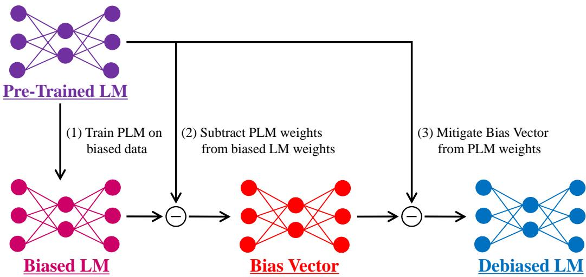  
Figure 1: Overview of the Bias Vector method: (1) Training pre-trained LMs on biased data to create the biased models; (2) Subtracting pre-trained LM weights from those of the biased models for constructing the Bias Vectors; (3) Mitigating the Bias Vectors from the pre-trained LM weights for debiasing models.

An overview of the proposed method is shown in Figure 1. The Bias Vector is created by subtracting the weights of a pre-trained LM from those of a biased LM, which is continually trained on biased text. By applying this Bias Vector to the pre-trained LM weights, we construct a debiased LM.

The masked language modeling (MLM) task is adopted for the continual training, and our experiments target BERT (Devlin et al., 2019), AL-BERT (Lan et al., 2020), and RoBERTa (Liu et al., 2019), following Meade et al. (2022). We evaluated the debiased LMs using the Sentence Encoder Association Test (SEAT) (May et al., 2019) and confirmed the effectiveness of our Bias Vector method.

Additionally, we analyzed how scaling the Bias Vector by a factor λ influences LM biases, allowing us to control the magnitude of the Bias Vector applied to LMs. Furthermore, the evaluation on the GLUE benchmark (Wang et al., 2018) demonstrated that LM representations remain effective for downstream tasks, even after applying the Bias Vector with λ = 1.

Our main contributions are as follows:

• Proposing the “Bias Vector” method, that enables debias LMs development without manually creating debiased data;

• Verifying the effectiveness of the Bias Vector method and confirming that debiased LMs have equivalent performance as pre-trained LMs on GLUE;

• Confirming that over-debiasing (i.e., with large λ) can lead to a collapse of pre-trained knowledge, by analyzing the effect sizes on SEAT and the GLUE scores.

## 2 Related Works

## 2.1 Language Models and Bias

Language models (LMs) are inherently biased because their training processes rely on humancreated text data, which would reflect human biases (Bolukbasi et al., 2016). Navigli et al. (2023) defined the term bias in the field of Natural Language Processing as “prejudices, stereotypes, and discriminatory attitudes against certain groups of people.” We adopt this bias definition throughout this paper.

Various debiasing methods have been proposed to mitigate these biases (Schick et al., 2021; Zmigrod et al., 2019; Webster et al., 2020; Ravfogel et al., 2020; Liang et al., 2020).

Several studies have shown that for wordembedding models, such as word2vec (Mikolov et al., 2013), the bias in word embeddings can be mitigated using approaches like subtracting the statistically significant mean vector associated with the bias from each word vector (Bolukbasi et al., 2016; Mu and Viswanath, 2018; Gonen and Goldberg, 2019; Wang et al., 2020). In contrast, other studies ahve proposed bias mitigation techniques specifically for Transformer-based LMs (Ravfogel et al., 2020; Liang et al., 2020).

Several benchmarks have been introduced to evaluate debiasing approaches. Islam et al. (2016) developed the Word Embedding Association Test (WEAT) to measure bias scores in word embeddings. May et al. (2019) proposed the Sentence Encoder Association Test (SEAT) as an extension of WEAT, extending the focus from word to sentence. StereoSet (Nadeem et al., 2021) is another benchmark designed to evaluate stereotypes across four bias categories: race, profession, gender, and religion. StereoSet consists of two subsets: intrasentence, which measures biases within a individual sentence, and intersentence, which evaluates biases at the discourse level across multiple sentences. Nangia et al. (2020) also introduced the CrowS-Pairs benchmark for bias neasurements.

However, Meade et al. (2022) criticized existing debiasing methods, arguing that these methods have focused too narrowly on their effectiveness within specific datasets. Therefore, they conducted an experimental evaluation of these methods using specific LMs on bias benchmarks and released the evaluation code for debiasing approaches. We utilized the code2 in our evaluation experiments.

## 2.2 Task Arithmetic Approaches

Recent studies have focused on the weight manipulation weights in neural network models Ilharco et al. (2023). Several approaches for merging model weights have been proposed in the field of Computer Vision, (Wortsman et al., 2022; Matena and Raffel, 2022; Ainsworth et al., 2023). Wortsman et al. (2022) found that a model constructed by averaging the weights of multiple models finetuned with different hyperparameters often results in improved model performance and robustness. Matena and Raffel (2022) proposed that computing the average parameter weights in different models corresponds to approximating the posterior distribution of each model parameter Matena and Raffel (2022) proposed a method to combine the characteristics of each model by considering the mean of multiple model parameters with the same architecture. Ainsworth et al. (2023) hypothesized that the loss landscape in the training and optimization process of deep learning models exhibits a “single basin” phenomenon and introduced an algorithm to align the weights between models.

Some studies in Natural Language Processing have also attempted to manipulate LM weights. Li et al. (2022) improved the overall LM performance by dynamically updating and merging multiple expert LMs that were independently trained on different data subsets; therefore, the LMs could be effectively trained toward domain-specific knowledge.

Inspired by these works, Ilharco et al. (2023) introduced the task arithmetic approach, which edites model parameters using a task vector containing the information necessary to achieve good performance on a given task. Motivated by the task arithmetic concept, Huang et al. (2024) introduced the “Chat Vector” approach which enables pre-trained LMs to gain conversational abilities in new languages without any additional training.

Ilharco et al. (2023) also evaluated the toxicity of LMs; however, their evaluation results did not align with the benchmarks for bias evaluation. In addition, its effectiveness was demonstrated with only GPT-2 model (Radford et al., 2019). We comprehensively examine the effectiveness of our Bias Vector method in the bias benchmarks following Meade et al. (2022).

## 3 Proposed Methods

## 3.1 Continual Training

We continually train the LMs using biased text data to adjust their parameters toward the biased LMs.

As an additional training task, we adopt the masked language modeling (MLM)3, which is also used in the BERT pre-training process.

In MLM task, a portion of tokens in sentences is replaced with [MASK] tokens, and LMs are trained to predict these masked tokens.

## 3.2 Bias Vector

In order to mitigate biases in LMs, we propose the “Bias Vector” method, inspired by the task arithmetic approach (Ilharco et al., 2023), assuming the LMs share the same model architecture. An overview of the proposed method is presented in Figure 1.

Our experiments are conducted using pre-trained LMs such as BERT (Devlin et al., 2019). We continually train these LMs on biased text data, following the process described in Section 3.1.

We construct a Bias Vector by subtracting the weights of the biased LMs from those of the pretrained LMs. This process can be described by the following equation:

$$
V _ { b i a s } = \theta _ { b i a s } - \theta _ { o r g } ,\tag{1}
$$

where $\theta _ { o r g } ~ \in ~ \mathbb { R } ^ { \mathrm { d } }$ and $\theta _ { b i a s } ~ \in ~ \mathbb { R } ^ { \mathrm { d } }$ represent the weights of pre-trained LMs and biased LMs, respectively, and $V _ { b i a s } \in \mathbb { R } ^ { \mathrm { d } }$ is the Bias Vector. Here, the LM parameters and the Bias Vector are represented in d dimensions. Since the pre-trained LMs and biased LMs are composed of the same model structures, their parameters $\theta _ { o r g } , \theta _ { b i a s }$ , and $V _ { b i a s }$ can be directly added to or subtracted from one another.

In addition to calculating the Bias Vector, we construct debiased LMs by subtracting the Bias Vector from the pre-trained LM weights. This procedure is represented by the following equation:

$$
\theta _ { d e b i a s } = \theta _ { o r g } - \lambda V _ { b i a s } ,\tag{2}
$$

where $\theta _ { d e b i a s } ~ \in ~ \mathbb { R } ^ { \mathrm { d } }$ denotes the weights of the debiased LMs, which share the same architecture as $\theta _ { o r g }$ , The hyperparameter $\lambda \in R$ is a scaling factor used to control the magnitude of the Bias Vector.

In this subtraction process, the Layer Normalization layers are excluded from the parameters to be subtracted. These layers are designed to solely normalize the data distribution and do not learn any bias information.

## 4 Experiments

## 4.1 Target Pre-trained LMs

In our experiments, we adopt three LMs: BERT (Devlin et al., 2019), ALBERT (Lan et al., 2020), and RoBERTa (Liu et al., 2019). These LMs are chosen based on the empirical survey by Meade et al. (2022) for bias investigation.

The links to these pre-trained LMs are listed in Appendix A.

## 4.2 Experimental Setup for Continual Training

In this section, we outline the details of the continual training for building biased LMs.

<table><tr><td rowspan=1 colspan=1>bias</td><td rowspan=1 colspan=1>text</td></tr><tr><td rowspan=1 colspan=1>race</td><td rowspan=1 colspan=1>The   mountain   tribes  ofafghanistan have a reputationfor being the most dangerouspeoples on earth.</td></tr><tr><td rowspan=1 colspan=1>gender</td><td rowspan=1 colspan=1>The mother takes care of the chil-dren at home.</td></tr><tr><td rowspan=1 colspan=1>profession</td><td rowspan=1 colspan=1>The civil servant was a bureau-crat at heart, so he knew wherehe really belonged.</td></tr><tr><td rowspan=1 colspan=1>religion</td><td rowspan=1 colspan=1>The bible is holy scripture.</td></tr></table>

Table 1: Examples of the StereoSet intrasentence dataset used for the continual training. This dataset consists of sentences with one word blanked out and an associated bias type (race, profession, gender, and religion). In these examples, bold words in text indicate blanked-out words in the original StereoSet dataset, and red words represent the targets of stereotypes.
<table><tr><td rowspan=1 colspan=1>type</td><td rowspan=1 colspan=1>category</td><td rowspan=1 colspan=1>text</td></tr><tr><td rowspan=4 colspan=1>target</td><td rowspan=1 colspan=1>Science</td><td rowspan=1 colspan=1>The experiment is here.</td></tr><tr><td rowspan=1 colspan=1></td><td rowspan=1 colspan=1>The person&#x27;s name isEinstein.</td></tr><tr><td rowspan=2 colspan=1>Arts</td><td rowspan=1 colspan=1>This is a symphony.</td></tr><tr><td rowspan=1 colspan=1>The dramas are here.</td></tr><tr><td rowspan=4 colspan=1>attribute</td><td rowspan=2 colspan=1>Female</td><td rowspan=1 colspan=1>That is a mother.</td></tr><tr><td rowspan=1 colspan=1>This is a grandmother.</td></tr><tr><td rowspan=2 colspan=1>Male</td><td rowspan=1 colspan=1>That is a father.</td></tr><tr><td rowspan=1 colspan=1>This is a grandfather.</td></tr></table>

Table 2: Examples of SEAT dataset for evaluating social bias. These samples are a subset of SEAT-8 data used to evaluate the gender bias.

## 4.2.1 Training Dataset

We utilize the StereoSet intrasentence dataset (Nadeem et al., 2021) for the continual training of the target LMs in our experiments. The dataset consists of biased text categorized into four types (race, profession, gender, and religion), sentences with one word blanked out, and a set of options for a fill-in-the-blank task. These options include three types of words: stereotype, anti-stereotype, and meaningless.

To construct a bias-only dataset for the continual training we fill the blanks with stereotype options (i.e., a biased word). The other options are excluded from the continual training process. Examples from this dataset are presented in Table 1.

This dataset for the continual training contains 8,498 sentences, categorized as follows: race (3,989), profession (3,269), gender (996), and religion (604). In our experiments, 15% of the tokens in the text are randomly masked with [MASK] tokens for the MLM task.

It is important to note that the StereoSet intrasentence dataset reflects stereotypes as perceived by annotators who were residents of the United States (U.S.). Since stereotypes vary not only by gender and race but also by cultural and regional contexts (Nadeem et al., 2021), the biases that can be mitigated using our proposed method are limited to those biases held by the U.S. annotators.

## 4.2.2 Experimental Details

Our experiments are conducted with the following hyperparameters. We use AdamW (Loshchilov and Hutter, 2017) as the optimizer, which improves weight decay behavior over Adam (Kingma and Ba, 2017). The learning rate is set to 1e-4, the weight decay is 0.01, the number of warmup steps is fixed to 10,000, the batch size is 128, and the learning rate scheduler is linear. All other training parameters follow the default settings provided by the Training Arguments library.4 To effectively overfit the LMs toward biases, we train the models with the number of epochs set to 30.

We construct the Bias Vectors using ten different seeds, and evaluate the average effect sizes of our debiasing method. The seed values remain consistent across all evaluation experiments.

The scaling factor λ of the Bias Vector is set to 1, 10, or 100 to analyze how varying magnitudes of the vector impact bias mitigation.

The computational resources used for the continual training are described in Appendix B.

## 4.3 Experimental Setup for Debias Evaluation

This section describes the experimental setup for evaluating the debiasing methods.

## 4.3.1 Debias Benchmark

Our experiments used the Sentence Encoder Association Test (SEAT) (May et al., 2019) to evaluate the bias magnitudes of the debiased LMs, following Meade et al. (2022).

The SEAT is an extension of the Word Embedding Association Test (WEAT) (Islam et al., 2016) to measure LM biases in sentence embeddings. WEAT comprises two sets of attribute words and two sets of target words. For example, the {female / male} attribute sets and the {science / arts} target sets can be used to evaluate biases, such as gender-related bias.

Table 2 shows examples from SEAT-8, a subset specifically designed to evaluate gender bias as part of social biases.

It should be noted that the StereoSet dataset, used for the continual training (Section 3.1), is excluded from our evaluation experiments to prevent data leakage. Instead, we rely on the SEAT benchmark, which provides an assessment of bias magnitudes.

## 4.3.2 Evaluation Metrics

This section explains the bias evaluation metrics for assessing LMs.

The bias magnitude is measured based on the statistical method Cohen’s d which calculates the effect sizes of two groups as follows:

$$
d = { \frac { \operatorname { d i f f } ( X , Y , A , B ) } { \sigma \left( \left\{ s ( t , X , Y ) \mid t \in A \cup B \right\} \right) } } .\tag{3}
$$

where, µ represents the mean, and $\sigma$ denotes the standard deviation. A and B are sets of attribute sentences, and X and Y are sets of target sentences. dif $( X , Y , A , B )$ is the result of subtracting $\mu \left( \left\{ s \left( y , A , B \right) \mid y \in Y \right\} \right)$ from $\mu \left( \left\{ s \left( x , A , B \right) \mid x \in X \right\} \right)$ .

Here, $s ( w , A , B )$ is the difference in cosine similarities between a sentence w and the sets A and $B \colon$

$$
\begin{array} { l } { \displaystyle s ( w , A , B ) } \\ { \displaystyle = \frac { 1 } { | A | } \sum _ { a \in A } \cos ( w , a ) - \frac { 1 } { | B | } \sum _ { b \in B } \cos ( w , b ) . } \end{array}\tag{4}
$$

We evaluate our debiasing approach on SEAT by Equation 3.

## 4.4 Experimental Setup for GLUE

To ensure that our debiasing method does not degrade the effectiveness of LM representations, we evaluate both our debiased LMs and the pre-trained LMs on the GLUE benchmark (Wang et al., 2018) after fine-tuning. The training data is randomly split into a 9:1 ratio: 90% is used for training and 10% for validation. The original validation data from the GLUE benchmark are used as test data.

The computational resources are provided in Appendix B. We determine the hyperparameters for fine-tuning as described in Appendix C.

<table><tr><td>Methods</td><td>BERT</td><td>ALBERT</td><td>RoBERTa</td></tr><tr><td>Pre-Trained LM</td><td>0.672</td><td>0.675</td><td>0.733</td></tr><tr><td>w/ BV(race, 1)</td><td>0.646</td><td>0.663</td><td>0.657</td></tr><tr><td>w/ BV(prof., 1)</td><td>0.661</td><td>0.683</td><td>0.657</td></tr><tr><td>w/ BV(gender, 1)</td><td>0.653</td><td>0.736</td><td>0.672</td></tr><tr><td>w/ BV(religion, 1)</td><td>0.652</td><td>0.735</td><td>0.671</td></tr><tr><td>w/ BV(all, 1)</td><td>0.447</td><td>0.534</td><td>0.570</td></tr><tr><td>w/ BV(all, 10)</td><td>0.446</td><td>0.311</td><td>0.272</td></tr><tr><td>w/ BV(all, 100)</td><td>0.202</td><td>0.201</td><td>0.411</td></tr></table>

Table 3: Average scores of absolute effect sizes across gender, race, and religion using pre-trained or debiased LMs (BERT, ALBERT and RoBERTa). BV(bias, λ) refers to the Bias Vector utilizing bias-typed data with the scaling factor set to λ. The abbreviation “prof.” stands for profession, indicating a specific bias type. Effect sizes closer to 0 suggest that LM representations are less biased.

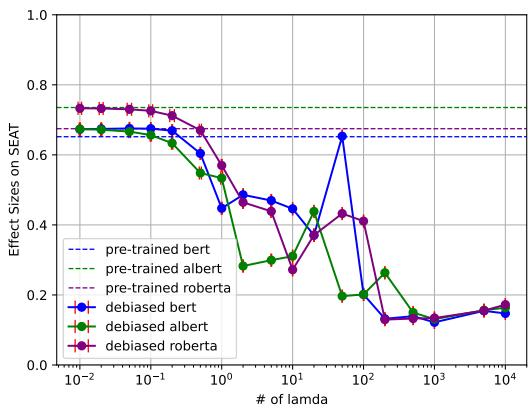  
Figure 2: Variation of effect sizes on the SEAT with the scale factor λ. The dashed lines indicate the effect sizes on pre-trained LMs. The closer the effect size is to zero, the smaller the bias.

## 4.5 Baselines

We adopt the pre-trained LMs (BERT, ALBERT, and RoBERTa) as baselines to measure the effect of our debiasing methods. These baselines provide a point of comparison to assess both bias mitigation and the preservation of downstream task performance.

## 5 Results and Discussion

We evaluated the LMs using Bias Vectors constructed with the following bias type data: race, profession, gender, religion, and a combination of all these types (all).

## 5.1 SEAT Results

The results of effect sizes on SEAT are shown in Table 3. BV(bias, λ) refers to the Bias Vector utilizing bias-typed data with the scaling factor set to λ.

The effect sizes of the debiased BERT with λ = 1 improved by 0.224 points compared to the baseline model (average over ten seed values).

Performance improvements were consistently observed for the other LMs. Compared to the baselines, ALBERT improved by 0.142 points, and RoBERTa achieved a gain of 0.164 points (with λ = 1).

On average, the proposed method achieved a 0.177 point improvement across the three LMs, demonstrating consistent bias mitigation effectiveness.

Specifically, we investigated the relationship between effect sizes and λ. Table 3 and Figure 2 show that increasing λ reduces the effect size on SEAT, indicating that larger scaling factors lead to further bias mitigation.

## 5.2 GLUE Scores

We investigated the impact of the Bias Vector on the performance of downstream tasks in the GLUE benchmark by comparing the debiased and pretrained LMs. Table 4 reports the GLUE scores for fine-tuned pre-trained LMs and debiased LMs using the Bias Vector method with λ = 1. Compared with the pre-trained LMs, the debiased models showed average performance improvements of 0.23% (BERT: 0.3%, ALBERT: 0.6%, and RoBERTa: -0.2%).

Our approach does not harm LM representations when λ = 1, allowing the LMs to maintain high performance after fine-tuning even after debiasing. The slight reduction observed in RoBERTa probably falls within the margin of error, suggesting a minimal impact on its performance.

With a larger scaling factor λ = 10, performance degradation was minimal for BERT and RoBERTa in most tasks. ALBERT exhibited a notable decline, averaging 30.6%.

For the CoLA dataset, the performances notably decreased, indicating the need for further investigation into task-specific effects.

When the scaling factor was excessively increased (λ = 100), the GLUE scores significantly declined. These results suggest that overly increasing the scaling factor severely damages the representational capabilities acquired during pretraining.

<table><tr><td>Methods</td><td>cola</td><td>sst-2</td><td>mrpc</td><td>sts-b</td><td>qqp</td><td>mnli-{m/mm}</td><td>qnli</td><td>rte</td><td>wnli</td><td>avg.</td></tr><tr><td>BERT</td><td>0.556</td><td>0.927</td><td>0.830</td><td>0.854</td><td>0.891</td><td>0.837/0.835</td><td>0.906</td><td>0.523</td><td>0.366</td><td>0.776</td></tr><tr><td>w/ BV(all, 1)</td><td>0.572</td><td>0.922</td><td>0.821</td><td>0.851</td><td>0.892</td><td>0.840/0.838</td><td>0.896</td><td>0.585</td><td>0.352</td><td>0.779</td></tr><tr><td>w/ BV(all, 10)</td><td>0.000</td><td>0.894</td><td>0.763</td><td>0.858</td><td>0.845</td><td>0.823/0.828</td><td>0.860</td><td>0.505</td><td>0.408</td><td>0.678</td></tr><tr><td>w/ BV(all, 100)</td><td>0.000</td><td>0.509</td><td>0.748</td><td>0.038</td><td>0.316</td><td>0.327/0.330</td><td>0.495</td><td>0.473</td><td>0.437</td><td>0.367</td></tr><tr><td>ALBERT</td><td>0.508</td><td>0.923</td><td>0.822</td><td>0.870</td><td>0.888</td><td>0.842/0.849</td><td>0.913</td><td>0.520</td><td>0.408</td><td>0.779</td></tr><tr><td>w/ BV(all, 1)</td><td>0.545</td><td>0.920</td><td>0.770</td><td>0.866</td><td>0.888</td><td>0.844/0.847</td><td>0.907</td><td>0.570</td><td>0.521</td><td>0.785</td></tr><tr><td>w/ BV(all, 10)</td><td>0.000</td><td>0.849</td><td>0.748</td><td>0.697</td><td>0.316</td><td>0.327/0.330</td><td>0.495</td><td>0.527</td><td>0.437</td><td>0.473</td></tr><tr><td>w/ BV(all, 100)</td><td>0.000</td><td>0.509</td><td>0.748</td><td>0.090</td><td>0.316</td><td>0.327/0.330</td><td>0.495</td><td>0.473</td><td>0.437</td><td>0.373</td></tr><tr><td>RoBERTa</td><td>0.552</td><td>0.944</td><td>0.763</td><td>0.891</td><td>0.877</td><td>0.879/0.873</td><td>0.924</td><td>0.527</td><td>0.563</td><td>0.794</td></tr><tr><td>w/ BV(all, 1)</td><td>0.539</td><td>0.944</td><td>0.758</td><td>0.869</td><td>0.899</td><td>0.875/0.873</td><td>0.928</td><td>0.527</td><td>0.563</td><td>0.792</td></tr><tr><td>w/ BV(all, 10)</td><td>0.000</td><td>0.919</td><td>0.850</td><td>0.884</td><td>0.890</td><td>0.869/0.867</td><td>0.910</td><td>0.625</td><td>0.563</td><td>0.737</td></tr><tr><td>w/ BV(all, 100)</td><td>0.000</td><td>0.509</td><td>0.748</td><td>0.015</td><td>0.316</td><td>0.327/0.330</td><td>0.495</td><td>0.527</td><td>0.437</td><td>0.370</td></tr></table>

Table 4: GLUE evaluation scores with fine-tuning pre-trained LMs and the debiased LMs with Bias Vector methods (λ = 1). To save space in this table, the results of MNLI-matched and MNLI-mismatched are displayed in the same cell (matched / mismatched), and cells of {MRPC, QQP} show average scores over accuracies and F1 scores. STS-b cells show average values of pearson and spearman correlations. Again, BV(bias, λ) refers to the Bias Vector utilizing bias-typed data with the scaling factor set to λ.

## 5.3 SEAT Results on Profession Bias

The SEAT data do not strictly evaluate the profession bias (Meade et al., 2022). Since the bias data used for the continual training in this study includes the profession bias, this section investigates the effects of incorporating this bias into the training process.

The bias mitigation was also observed with BV(prof., 1) in the SEAT results as shown in Table 3. The effect sizes for RoBERTa improved from 0.733 (pre-trained) to 0.657 (debiased with BV(prof., 1)).

Since different types of biases are interrelated, debiasing profession bias likely mitigates other biases as well. For instance, the sentence “Engineers are male” reflects both profession and gender biases. If such profession-biased sentences are learned during the construction of BV(prof., 1), the resulting Bias Vector may unintentionally encoded other biases, contributing to the improved effect sizes.

The occurrence of bias duplication highlights the need for task arithmetic approaches that prevent overlapping bias vectors from being subtracted multiple times. For example, removing both the profession and gender Bias Vectors from a pretrained LM may inadvertently amplify mitigation effects, leading to over-debiasing.

Future work should focus on developing methods to address overlapping biases more effectively, ensuring precise bias mitigation across multiple biases.

## 5.4 Effectiveness of λ

To evaluate the effectiveness of the scaling factor λ, we varied its value from 0.01 to 10,000 and measured the resulting effect sizes on SEAT. The results are reported in Figure 2.

The evaluation across all SEAT datasets confirmed that the effect sizes converged approximately to zero.

Our initial hypothesis was that increasing the scale factor λ of the Bias Vector would first reduce the effect size (debiasing), and then shift it toward an anti-stereotypical effect size (biasing).

For instance, if the Bias Vector had been learned in the male direction, we expected that increasing the scale factor λ would gradually be biased in the female direction.

Contrary to this hypothesis, the results showed that the effect size consistently converged toward zero across all evaluations. This outcome may be due to two possible reasons: (1) The task arithmetic approach used to construct the Bias Vector may not have effectively captured the specific bias direction (investigating in Section 5.5); and (2) The biased LM may learn unintended information during continual training, leading to a collapse in the representations of the debiased LM when λ is scaled up (discussing in Section 5.6).

## 5.5 Effect Size Behavior in Each SEAT Task

In Section 5.4, we hypothesized that effect sizes would initially decrease (debiasing) and then increase in the opposite direction. However, the observed results deviated from this trend.

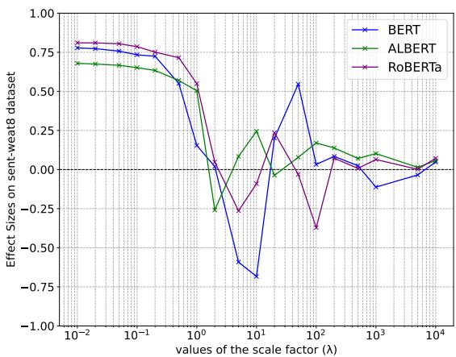  
Figure 3: Effect sizes on the gender-biased SEAT dataset (SEAT-8) with varying λ. The effect sizes are computed as the average of scores across ten different seed values. The closer the effect size is to zero, the smaller the bias.

This section investigates whether the discrepancy between our hypothesis and the SEAT results can be attributed to the Bias Vectors failing to adequately capture bias information. To explore this issue, we analyze the effect sizes for each bias category within the SEAT dataset.

The effect sizes for SEAT-8 (gender bias) and SEAT-5b (race bias) are shown in Figure 3 and Figure 4, respectively. The corresponding results, including standard deviations over ten different seed values, are shown in Appendix E.

For ALBERT, the effect sizes begin to converge toward zero after λ exceeds one, whereas for other LMs, the scores approach zero after λ is larger than 10.

For each model, prior to convergence, we observed behavior consistent with our hypothesis: initial debiasing occurs, followed by a reversal of the bias direction (i.e., effect sizes increase in the anti-stereotypical direction). The increase in effect sizes in the opposite direction confirms that the Bias Vector successfully mitigates the biases in LMs, demonstrating that its training process effectively captured the intended bias direction.

These findings confirm that the Bias Vector effectively mitigates biases and captures the intended bias direction.

## 5.6 Impact of λ on LM Representations

According to Section 5.4, the effect sizes approached zero as λ increased.

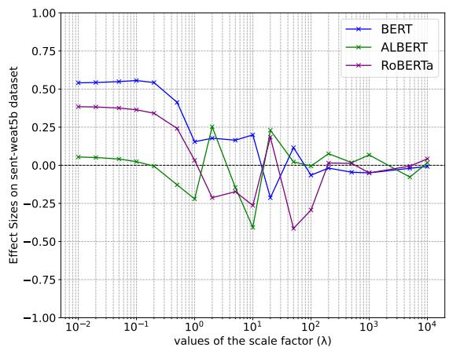  
Figure 4: Effect sizes on the race-biased SEAT dataset (SEAT-5b) with varying λ. The effect sizes are computed as the average of scores across ten different seed values. The closer the effect size is to zero, the smaller the bias.

The convergence behavior of the effect sizes varies across LMs. For BERT and RoBERTa, the convergences occur when λ is set between 10 and 100, while, the convergence begins around λ = 10 for ALBERT.

As mentioned in Sections 5.2 and 5.5, the collapse of representations in LMs was observed at λ = 10 for ALBERT and at λ = 100 for BERT and RoBERTa.

This observation suggests that the convergence of the effect sizes toward zero coincides with a collapse in the LM representations across all models. Specifically, as λ increases, the LMs lose their ability to distinguish between stereotypical and antistereotypical information, leading to predictions that are uniformly inaccurate. This inaccuracy reduced the difference in effect sizes between the two types of information, leading to a false impression of sufficient bias mitigation.

These results indicate that the small effect sizes observed for large values of λ do not signify successful bias mitigation. Rather, they reveal a collapse in the LM representations at large λ, where the models fail to distinguish between stereotypical and anti-stereotypical information. Consequently, LM predictions become inaccurate for both types of information, driving the bias effect sizes toward zero.

## 6 Conclusions and Future Works

In this paper, we introduced a “Bias Vector” method for bias mitigation of language models (LMs) without manually created debiasing data. We constructed the Bias Vector by calculating the difference between the weights of the pre-trained LMs and those of the biased LMs, which were continually trained on the biased text. We attempted to mitigate the LM bias by subtracting the Bias Vector from the pre-trained LM weights.

On average over three LMs (BERT, ALBERT, and RoBERTa), our debiasing method improved 0.177 points on all test sets in SEAT with setting the scale factor λ = 1. We also confirmed that the debiased LMs using our method had an average score improvement of 0.23% on the GLUE benchmark. These results demonstrate that our method can successfully debias LMs with preserving their representational performances.

By varying λ from 0.01 to 10,000, we observed that effect sizes decreased and approached zero. However, for large λ values (e.g., λ = 100), the GLUE scores significantly declined, suggesting that this bias mitigation may result from a collapse of pre-trained knowledge rather than the effectiveness of our method.

Future work will focus on further analyzing the relationship between the scaling factor λ and SEAT scores to better understand the behavior of bias mitigation. Additionally, given the widespread use of Large Language Models (LLMs), we aim to extend the Bias Vector approach to LLMs and evaluate its effectiveness on these models.

## Limitations

In this study, we evaluated debiased LMs on GLUE benchmark to ensure that LM representations had not decreased compared to pre-trained LMs by our debias methods “Bias Vector.” This paper presented only the GLUE scores using our debiased LMs with λ = 1, 10, 100. Evaluations of debiased LMs on other λ conditions are not conducted due to limited computational resources. To confirm the relationship between λ and GLUE scores, the GLUE evaluation experiments on the other λ should be conducted in future.

Following Meade et al. (2022), we should evaluate our method toward GPT-2 model, in addition to BERT, ALBERT and RoBERTa. However, due to computational resource constraints, GPT-2 was not conducted in our experiments. We plan to conduct and evaluate those experiments in the future.

## Ethics Statement

Navigli et al. (2023) defined the term bias in the field of Natural Language Processing as “prejudices, stereotypes, and discriminatory attitudes against certain groups of people.” We adopt this bias definition throughout this paper.

For this bias definition, we refer to both stereotypes and biases as “bias” for simplicity. We understand that these are different concepts, and we acknowledge that the stereotypical data (StereoSet) used in our experiments reflect those of the U.S. residents (Nadeem et al., 2021).

We particularly address bias mitigation for LMs by utilizing stereotypes. Biases arise when concepts that should not be associated with particular social groups are unfairly linked (e.g., “programmers are male”). If LLM systems possess such biases, they are likely to leave a negative impression on users. This work examines the applicability of a task arithmetic approach for bias mitigation. The purpose of our study is to reduce the LM bias using the proposed methods.

We understand the importance of maintaining an objective stance. Therefore, we emphasize that the content of this study is not influenced by our political positions, stereotypes or biases. Our research aims to respect the ethical principle of fairness in scientific inquiry and make responsible and constructive contributions to the development of AI technologies.

## Acknowledgments

Our profound appreciation is express our profound gratitude to the anonymous reviewers for their thorough comments, and to Prof. Yasutomo Kimura in Otaru University of Commerce for his expertise and insightful feedback.

We would like to extend our sincere appreciation to Mr. Koji Tanaka and Mr. Tatsuhiko Saito in Mitsubishi Electric Corporation for their unwavering support throughout this research endeavor.

## References

Samuel Ainsworth, Jonathan Hayase, and Siddhartha Srinivasa. 2023. Git Re-Basin: Merging Models modulo Permutation Symmetries. In The Eleventh International Conference on Learning Representations.

Soumya Barikeri, Anne Lauscher, Ivan Vulic, and Goran´ Glavaš. 2021. RedditBias: A Real-World Resource for Bias Evaluation and Debiasing of Conversational Language Models. In Proceedings ofthe 59th Annual Meeting of the Association for Computational Linguistics and the 11th International Joint Conference on Natural Language Processing (Volume 1: Long Papers), pages 1941–1955, Online. Association for Computational Linguistics.

Tolga Bolukbasi, Kai-Wei Chang, James Y Zou, Venkatesh Saligrama, and Adam T Kalai. 2016. Man is to Computer Programmer as Woman is to Homemaker? Debiasing Word Embeddings. In Advances in Neural Information Processing Systems, volume 29. Curran Associates, Inc.

Jacob Devlin, Ming-Wei Chang, Kenton Lee, and Kristina Toutanova. 2019. BERT: Pre-training of Deep Bidirectional Transformers for Language Understanding. In Proceedings ofthe 2019 Conference ofthe North American Chapter ofthe Associationfor Computational Linguistics: Human Language Technologies, Volume 1 (Long and Short Papers), pages 4171–4186, Minneapolis, Minnesota. Association for Computational Linguistics.

Emily Dinan, Angela Fan, Adina Williams, Jack Urbanek, Douwe Kiela, and Jason Weston. 2020. Queens are Powerful too: Mitigating Gender Bias in Dialogue Generation. In Proceedings ofthe 2020 Conference on Empirical Methods in Natural Language Processing (EMNLP), pages 8173–8188, Online. Association for Computational Linguistics.

Shangbin Feng, Chan Young Park, Yuhan Liu, and Yulia Tsvetkov. 2023. From Pretraining Data to Language Models to Downstream Tasks: Tracking the Trails of Political Biases Leading to Unfair NLP Models. In Proceedings of the 61st Annual Meeting of the Associationfor Computational Linguistics (Volume 1: Long Papers), pages 11737–11762, Toronto, Canada. Association for Computational Linguistics.

Hila Gonen and Yoav Goldberg. 2019. Lipstick on a Pig: Debiasing Methods Cover up Systematic Gender Biases in Word Embeddings But do not Remove Them. In Proceedings of the 2019 Conference of the North American Chapter ofthe Associationfor Computational Linguistics: Human Language Technologies, Volume 1 (Long and Short Papers), pages 609–614, Minneapolis, Minnesota. Association for Computational Linguistics.

Shih-Cheng Huang, Pin-Zu Li, Yu-chi Hsu, Kuang-Ming Chen, Yu Tung Lin, Shih-Kai Hsiao, Richard Tsai, and Hung-yi Lee. 2024. Chat Vector: A Simple Approach to Equip LLMs with Instruction Following and Model Alignment in New Languages. In Proceedings of the 62nd Annual Meeting of the Associationfor Computational Linguistics (Volume 1: Long Papers), pages 10943–10959, Bangkok, Thailand. Association for Computational Linguistics.

Gabriel Ilharco, Marco Tulio Ribeiro, Mitchell Wortsman, Ludwig Schmidt, Hannaneh Hajishirzi, and Ali

Farhadi. 2023. Editing Models with Task Arithmetic. In The Eleventh International Conference on Learning Representations.

Aylin Caliskan Islam, Joanna J. Bryson, and Arvind Narayanan. 2016. Semantics derived automatically from language corpora necessarily contain human biases. Science, 356(2).

Sophie Jentzsch and Cigdem Turan. 2022. Gender Bias in BERT - Measuring and Analysing Biases through Sentiment Rating in a Realistic Downstream Classification Task. In Proceedings of the 4th Workshop on Gender Bias in Natural Language Processing (GeBNLP), pages 184–199, Seattle, Washington. Association for Computational Linguistics.

Masahiro Kaneko and Danushka Bollegala. 2019. Gender-preserving Debiasing for Pre-trained Word Embeddings. In Proceedings of the 57th Annual Meeting of the Association for Computational Linguistics, pages 1641–1650, Florence, Italy. Association for Computational Linguistics.

Diederik P. Kingma and Jimmy Ba. 2017. Adam: A Method for Stochastic Optimization. Preprint, arXiv:1412.6980.

Sachin Kumar, Vidhisha Balachandran, Lucille Njoo, Antonios Anastasopoulos, and Yulia Tsvetkov. 2023. Language Generation Models Can Cause Harm: So What Can We Do About It? An Actionable Survey. In Proceedings of the 17th Conference of the European Chapter ofthe Associationfor Computational Linguistics, pages 3299–3321, Dubrovnik, Croatia. Association for Computational Linguistics.

Zhenzhong Lan, Mingda Chen, Sebastian Goodman, Kevin Gimpel, Piyush Sharma, and Radu Soricut. 2020. ALBERT: A Lite BERT for Self-supervised Learning of Language Representations. In International Conference on Learning Representations.

Margaret Li, Suchin Gururangan, Tim Dettmers, Mike Lewis, Tim Althoff, Noah A. Smith, and Luke Zettlemoyer. 2022. Branch-Train-Merge: Embarrassingly Parallel Training of Expert Language Models. In First Workshop on Interpolation Regularizers and Beyond at NeurIPS 2022.

Paul Pu Liang, Irene Mengze Li, Emily Zheng, Yao Chong Lim, Ruslan Salakhutdinov, and Louis-Philippe Morency. 2020. Towards Debiasing Sentence Representations. In Proceedings of the 58th Annual Meeting ofthe Associationfor Computational Linguistics, pages 5502–5515, Online. Association for Computational Linguistics.

Haochen Liu, Jamell Dacon, Wenqi Fan, Hui Liu, Zitao Liu, and Jiliang Tang. 2020. Does Gender Matter? Towards Fairness in Dialogue Systems. In Proceedings of the 28th International Conference on Computational Linguistics, pages 4403–4416, Barcelona, Spain (Online). International Committee on Computational Linguistics.

Yinhan Liu, Myle Ott, Naman Goyal, Jingfei Du, Mandar Joshi, Danqi Chen, Omer Levy, Mike Lewis, Luke Zettlemoyer, and Veselin Stoyanov. 2019. RoBERTa: A Robustly Optimized BERT Pretraining Approach. Preprint, arXiv:1907.11692.

Ilya Loshchilov and Frank Hutter. 2017. Fixing Weight Decay Regularization in Adam. Preprint, arXiv:1711.05101.

Michael Matena and Colin Raffel. 2022. Merging Models with Fisher-Weighted Averaging. In Advances in Neural Information Processing Systems, volume 35, pages 17703–17716. Curran Associates, Inc.

Chandler May, Alex Wang, Shikha Bordia, Samuel R. Bowman, and Rachel Rudinger. 2019. On Measuring Social Biases in Sentence Encoders. In Proceedings ofthe 2019 Conference ofthe North American Chapter ofthe Associationfor Computational Linguistics: Human Language Technologies, Volume 1 (Long and Short Papers), pages 622–628, Minneapolis, Minnesota. Association for Computational Linguistics.

Nicholas Meade, Elinor Poole-Dayan, and Siva Reddy. 2022. An Empirical Survey of the Effectiveness of Debiasing Techniques for Pre-trained Language Models. In Proceedings ofthe 60th Annual Meeting ofthe Association for Computational Linguistics (Volume 1: Long Papers), pages 1878–1898, Dublin, Ireland. Association for Computational Linguistics.

Tomas Mikolov, Kai Chen, Greg Corrado, and Jeffrey Dean. 2013. Efficient Estimation of Word Representations in Vector Space. Preprint, arXiv:1301.3781.

Jiaqi Mu and Pramod Viswanath. 2018. All-but-the-Top: Simple and Effective Postprocessing for Word Representations. In International Conference on Learning Representations.

Moin Nadeem, Anna Bethke, and Siva Reddy. 2021. StereoSet: Measuring stereotypical bias in pretrained language models. In Proceedings ofthe 59th Annual Meeting of the Association for Computational Linguistics and the 11th International Joint Conference on Natural Language Processing (Volume 1: Long Papers), pages 5356–5371, Online. Association for Computational Linguistics.

Nikita Nangia, Clara Vania, Rasika Bhalerao, and Samuel R. Bowman. 2020. CrowS-pairs: A Challenge Dataset for Measuring Social Biases in Masked Language Models. In Proceedings ofthe 2020 Conference on Empirical Methods in Natural Language Processing (EMNLP), pages 1953–1967, Online. Association for Computational Linguistics.

Roberto Navigli, Simone Conia, and Björn Ross. 2023. Biases in Large Language Models: Origins, Inventory, and Discussion. ACM Journal of Data and Information Quality, Volume 15, Issue 2.

OpenAI. 2022. https://openai.com/index/chatgpt/.

OpenAI. 2024. GPT-4 Technical Report. Preprint, arXiv:2303.08774.

Alec Radford, Jeff Wu, Rewon Child, David Luan, Dario Amodei, and Ilya Sutskever. 2019. Language Models are Unsupervised Multitask Learners.

Shauli Ravfogel, Yanai Elazar, Hila Gonen, Michael Twiton, and Yoav Goldberg. 2020. Null It Out: Guarding Protected Attributes by Iterative Nullspace Projection. In Proceedings ofthe 58th Annual Meeting ofthe Associationfor Computational Linguistics, pages 7237–7256, Online. Association for Computational Linguistics.

Timo Schick, Sahana Udupa, and Hinrich Schütze. 2021. Self-Diagnosis and Self-Debiasing: A Proposal for Reducing Corpus-Based Bias in NLP. Transactions of the Association for Computational Linguistics, 9:1408–1424.

Alex Wang, Amanpreet Singh, Julian Michael, Felix Hill, Omer Levy, and Samuel Bowman. 2018. GLUE: A Multi-Task Benchmark and Analysis Platform for Natural Language Understanding. In Proceedings of the 2018 EMNLP Workshop BlackboxNLP: Analyzing and Interpreting Neural Networks for NLP, pages 353–355, Brussels, Belgium. Association for Computational Linguistics.

Tianlu Wang, Xi Victoria Lin, Nazneen Fatema Rajani, Bryan McCann, Vicente Ordonez, and Caiming Xiong. 2020. Double-Hard Debias: Tailoring Word Embeddings for Gender Bias Mitigation. In Proceedings ofthe 58th Annual Meeting ofthe Association for Computational Linguistics, pages 5443–5453, Online. Association for Computational Linguistics.

Kellie Webster, Xuezhi Wang, Ian Tenney, Alex Beutel, Emily Pitler, Ellie Pavlick, Jilin Chen, and Slav Petrov. 2020. Measuring and Reducing Gendered Correlations in Pre-trained Models. Preprint, arXiv:2010.06032.

Mitchell Wortsman, Gabriel Ilharco, Samir Yitzhak Gadre, Rebecca Roelofs, Raphael Gontijo-Lopes, Ari S. Morcos, Hongseok Namkoong, Ali Farhadi, Yair Carmon, Simon Kornblith, and Ludwig Schmidt. 2022. Model soups: averaging weights of multiple fine-tuned models improves accuracy without increasing inference time. Preprint, arXiv:2203.05482.

Jieyu Zhao, Yichao Zhou, Zeyu Li, Wei Wang, and Kai-Wei Chang. 2018. Learning Gender-Neutral Word Embeddings. In Proceedings of the 2018 Conference on Empirical Methods in Natural Language Processing, pages 4847–4853, Brussels, Belgium. Association for Computational Linguistics.

Ran Zmigrod, Sabrina J. Mielke, Hanna Wallach, and Ryan Cotterell. 2019. Counterfactual Data Augmentation for Mitigating Gender Stereotypes in Languages with Rich Morphology. In Proceedings ofthe 57th Annual Meeting ofthe Associationfor Computational Linguistics, pages 1651–1661, Florence, Italy. Association for Computational Linguistics.

## A Language Models

For evaluating our methods, we adopt three LMs: BERT (Devlin et al., 2019) ALBERT (Lan et al., 2020), and RoBERTa (Liu et al., 2019). These models are available on the following sites:

• BERT: https://huggingface.co/ google-bert/bert-base-uncased;

• ALBERT: https://huggingface.co/ albert/albert-base-v2;

• RoBERTa: https://huggingface.co/ FacebookAI/roberta-base.

## B Computing Environments

The process of generating biased LMs and our proposed Bias Vector was facilitated using four GPUs (NVIDIA RTX A6000), a procedure that spanned several hours. In the same way, the GLUE training procedure, which was conducted without the exploration of hyperparameter combinations, required approximately a full day utilizing four GPUs (NVIDIA Quadro RTX 8000).

## C Experimental Setup for GLUE

## C.1 Training Arguments for BERT

In addition to ALBERT, we fine-tune BERT for GLUE downstream tasks. We determine hyperparameters following Devlin et al. (2019), i.e., we explore all combinations of the following hyperparameters and evaluate the model, which yields the best score on the validation dataset, using the test data on each task.

• Batch size: 16, 32

• Learning rate: 5e-5, 4e-5, 3e-5, 2e-5

• Number of epochs: 2, 3, 4

Here, a type of learning rate scheduler is linear, Adam (Kingma and Ba, 2017) is utilized for the optimizer, a number of weight decay is 0.01, warmup steps is fixed to 500, a seed value is fixed to the same number through all evaluation experiments, and the other training hyperparameters follow the default values of Training Arrguments library.

## C.1.1 Training Arguments for ALBERT and RoBERTa

We fine-tune ALBERT and RoBERTa for GLUE downstream tasks. The following hyperparameters are adopted in the experiments:

• Batch size: 32

• Learning rate: 4e-5

• learning rate scheduler: linear

• Optimizer: Adam (Kingma and Ba, 2017)

• warmup steps: 500

• number of weight decay: 0.01

This combination of hyperparameters was chosen because it yields the best when evaluating BERT on the GLUE validation data, which is explained on Appendix C.1.

A seed value is fixed to the same number through all evaluation experiments, and the other training hyperparameters follow the default values of Training Arrguments library.

## D SEAT score for Gender bias

In this section, we show the SEAT results focusing specifically on the gender bias. The reason for showing results only for gender bias is that this bias is the most widely studied in the context of debiasing LMs.

It is to be noted that the experimental setup for the debias evaluation follows the same configuration as described in Section 4.3.

## D.1 Evaluation Metrics

In addition to the bias measurement (Equation 3), we show the permutation test for each dataset, defined as follows:

$$
p = \operatorname* { P r } \left[ s ( X _ { i } ^ { * } , Y _ { i } ^ { * } , A , B ) > s ( X , Y , A , B ) \right]\tag{5}
$$

where $( X _ { i } , Y _ { i } )$ is a subset of $X \cup Y$

$s ( X , Y , A , B )$ is obtained through the following formula:

$$
s ( X , Y , A , B )\tag{6}
$$

$$
= \sum _ { x \in X } s ( x , A , B ) - \sum _ { y \in Y } s ( y , A , B ) .\tag{7}
$$

## D.2 Comparing Methods

This section compares other approaches with the Bias Vector method. These methods are selected based on the emperical study by Meade et al. (2022).

## D.2.1 Comparing Methods for Gender Bias

This section explains the four existing methods that have been used in gender bias mitigation experiments.

Counterfactual Data Augmentation (CDA) (Zmigrod et al., 2019; Dinan et al., 2020; Webster et al., 2020; Barikeri et al., 2021): The CDA involves creating data by swapping biased words in text data (such as {she / he} for the gender bias).

Dropout (Webster et al., 2020): The Dropout method attempts to reduce bias by increasing the dropout parameters that is originally used to mitigate the gender bias.

Iterative Nullspace Projection (INLP) (Ravfogel et al., 2020): The INLP is a debiasing method that uses a classifier to predict bias types (e.g., gender); it then projects the embeddings into the nullspace of that classifier for eliminating information. This process is iteratively applied to debias the embeddings of LM outputs.

SentDebias (Liang et al., 2020): The SentDebias technique extends the word embedding debiasing technique (Hard-Debias) proposed by Bolukbasi et al. (2016) to sentence embeddings. SentDebias estimates a linear subspace of a specific bias and removes the bias by projecting the sentence embeddings into this subspace.

## D.3 Results and Discussion

The detail results on SEAT regarding gender bias are shown in Table 5 and Figure 5.

It was confirmed that BV(all, 1) yields better than BV(gender, 1). Two reasons are considered for why BV(gender, 1) did not work sufficiently. First, words indicating gender, such as {she / he}, likely appeared frequently in the pre-training corpus. This high frequency made only a small difference between pre-trained LMs and biased ones, therefore, the Bias Vector could not capture enough gender bias. Second, the amount of data used to continually train LMs toward gender bias was limited (996 instances). This data limitation suggests that the data volume might be insufficient.

Furthermore, it can be said that BV(all, 1) debiased across all LMs, and was sometimes competitive with existing methods specialized in embedding spaces. Additionally, by adjusting λ to 10 or 100, BV(gender, λ) results outperformed the existing methods except for INLP on BERT.

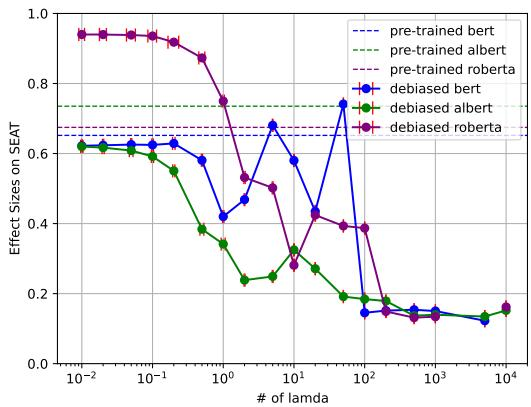  
Figure 5: Effect sizes on gender bias tests in SEAT when varying the value of λ. The dashed lines indicate effect sizes on pre-trained LMs.

## E Results in Each SEAT dataset

In this section, we show the results for subset of SEAT dataset, SEAT-8 and SEAT-5b, with means and standard deviations of effect sizes over ten seed values.

We present the results of SEAT-8 dataset in Figure 6 (BERT), Figure 8 (ALBERT), and Figure 10 (RoBERTa).

The effect sizes with SEAT-5b dataset are described in Figure 7 (BERT), Figure 9 (ALBERT), and Figure 11 (RoBERTa).

<table><tr><td>Methods</td><td>SEAT-6</td><td>SEAT-6b</td><td>SEAT-7</td><td>SEAT-7b</td><td>SEAT-8</td><td>SEAT-8b</td><td colspan="2">Average (↓)</td></tr><tr><td>BERT</td><td>0.932*</td><td>0.090</td><td>-0.124</td><td>0.937*</td><td>0.783*</td><td>0.858*</td><td></td><td>0.621</td></tr><tr><td>w/ CDA</td><td>0.846*</td><td>0.186</td><td>-0.278</td><td>1.342*</td><td>0.831*</td><td>0.849*</td><td>↑0.101</td><td>0.722</td></tr><tr><td>w/ Dropout</td><td>1.136*</td><td>0.317</td><td>0.138</td><td>1.179*</td><td>0.879*</td><td>0.939</td><td>↑0.144</td><td>0.765</td></tr><tr><td>w/INLP</td><td>0.317</td><td>-0.354</td><td>-0.258</td><td>0.105</td><td>0.187</td><td>-0.004</td><td>↓0.417</td><td>0.204</td></tr><tr><td>w/ SentDebias</td><td>0.350</td><td>-0.298</td><td>-0.626</td><td>0.458*</td><td>0.413</td><td>0.462*</td><td>↓0.187</td><td>0.434</td></tr><tr><td>w/ BV(all, 1)</td><td>0.979*</td><td>0.021*</td><td>-0.344</td><td>0.829*</td><td>0.701*</td><td>0.828*</td><td>↓0.004</td><td>0.617</td></tr><tr><td>w/ BV(gender, 1)</td><td>0.937</td><td>0.089</td><td>-0.146</td><td>0.942</td><td>0.774</td><td>0.852</td><td>↑0.002</td><td>0.623</td></tr><tr><td>w/ BV(gender, 10)</td><td>0.962*</td><td>0.078</td><td>-0.257</td><td>0.901*</td><td>0.739*</td><td>0.780*</td><td>↓0.002</td><td>0.619</td></tr><tr><td>w/ BV(gender, 100)</td><td>0.760</td><td>-0.060</td><td>-0.107</td><td>0.482*</td><td>0.188</td><td>0.266</td><td>↓0.311</td><td>0.310</td></tr><tr><td>ALBERT</td><td>0.637*</td><td>0.151</td><td>0.487*</td><td>0.956*</td><td>0.683*</td><td>0.823*</td><td></td><td>0.623</td></tr><tr><td>w/ CDA</td><td>1.040*</td><td>0.170</td><td>0.830*</td><td>1.287*</td><td>1.212*</td><td>1.179*</td><td>↑0.330</td><td>0.953</td></tr><tr><td>w/ Dropout</td><td>0.506*</td><td>0.032</td><td>0.661*</td><td>0.987*</td><td>1.044*</td><td>0.949*</td><td>↑0.074</td><td>0.697</td></tr><tr><td>w/INLP</td><td>0.574*</td><td>-0.068</td><td>-0.186</td><td>0.566*</td><td>0.161</td><td>0.518*</td><td>↓0.278</td><td>0.345</td></tr><tr><td>w/ SentDebias</td><td>0.490*</td><td>-0.026</td><td>-0.032</td><td>0.489*</td><td>0.431</td><td>0.647*</td><td>↓0.271</td><td>0.352</td></tr><tr><td>w/ BV(all, 1)</td><td>0.311</td><td>0.019</td><td>0.345</td><td>0.612*</td><td>0.509</td><td>0.569</td><td>↓0.229</td><td>0.394</td></tr><tr><td>w/ BV(gender, 1)</td><td>0.636*</td><td>0.151</td><td>0.479*</td><td>0.946</td><td>0.673*</td><td>0.813</td><td>↓0.007</td><td>0.616</td></tr><tr><td>w/ BV(gender, 10)</td><td>0.643*</td><td>0.127</td><td>0.396*</td><td>0.508*</td><td>0.590*</td><td>0.701*</td><td>↓0.129</td><td>0.494</td></tr><tr><td>w/ BV(gender, 100)</td><td>-0.370</td><td>-0.162</td><td>0.475*</td><td>0.236</td><td>0.130</td><td>0.253</td><td>↓0.441</td><td>0.182</td></tr><tr><td>RoBERTa</td><td>0.922*</td><td>0.208</td><td>0.979*</td><td>1.460*</td><td>0.810*</td><td>1.261*</td><td></td><td>0.940</td></tr><tr><td>w/ CDA</td><td>0.976*</td><td>0.013</td><td>0.848*</td><td>1.288*</td><td>0.994*</td><td>1.160*</td><td>↓0.060</td><td>0.880</td></tr><tr><td>w/ Dropout</td><td>1.134*</td><td>0.209</td><td>1.161*</td><td>1.482*</td><td>1.136*</td><td>1.321*</td><td>↑0.134</td><td>1.074</td></tr><tr><td>w/INLP</td><td>0.812*</td><td>0.059</td><td>0.604*</td><td>1.407*</td><td>0.812*</td><td>1.246*</td><td>↓0.117</td><td>0.823</td></tr><tr><td>w/ SentDebias</td><td>0.755*</td><td>0.068</td><td>0.869*</td><td>1.372*</td><td>0.774*</td><td>1.239*</td><td>↓0.094</td><td>0.846</td></tr><tr><td>w/ BV(all, 1)</td><td>0.829*</td><td>0.187</td><td>0.943*</td><td>1.46*</td><td>0.724*</td><td>1.220*</td><td>↓0.046</td><td>0.894</td></tr><tr><td>w/ BV(gender, 1)</td><td>0.914*</td><td>0.203*</td><td>0.983*</td><td>1.47*</td><td>0.822</td><td>1.264*</td><td>↑0.002</td><td>0.942</td></tr><tr><td>w/ BV(gender, 10)</td><td>0.845*</td><td>0.153</td><td>0.905*</td><td>1.515*</td><td>0.908*</td><td>1.273*</td><td>↓0.007</td><td>0.933</td></tr><tr><td>w/ BV(gender, 100)</td><td>0.517*</td><td>0.041</td><td>-0.366</td><td>1.173</td><td>-0.144*</td><td>0.842*</td><td>↓0.426</td><td>0.514</td></tr></table>

Table 5: Effect sizes on SEAT with pre-trained or debiased LMs (BERT, ALBERT and RoBERTa) in gender bias tests. Average presents the mean of absolute effect sizes across all six gender tests for each LMs. Effect sizes closer to 0 suggest that LM representations are less biased. Statistically significant effect sizes with p-values lower than 0.01 are marked with \*. All results of the existing methods are cited from Meade et al. (2022).

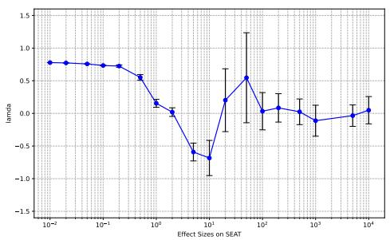  
Figure 6: Means and standard deviations of effect sizes on SEAT-8 with debiased BERT.

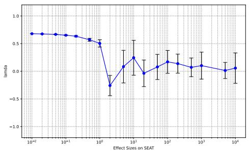  
Figure 8: Means and standard deviations of effect sizes on SEAT-8 with debiased ALBERT.

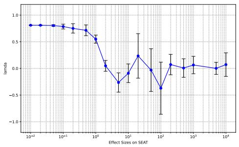  
Figure 10: Means and standard deviations of effect sizes on SEAT-8 with debiased RoBERTa.

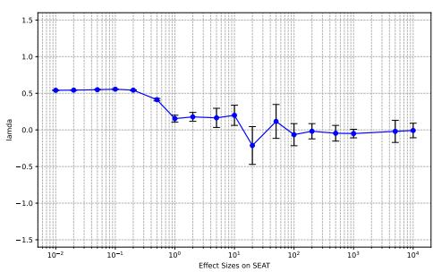  
Figure 7: Means and standard deviations of effect sizes on SEAT-5b with debiased BERT.

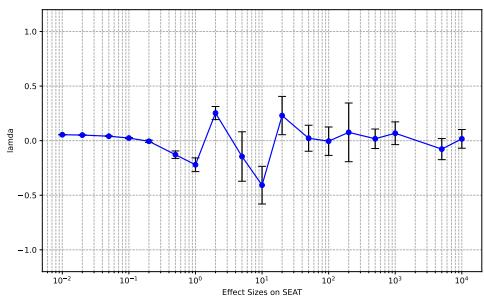  
Figure 9: Means and standard deviations of effect sizes on SEAT-5b with debiased ALBERT.

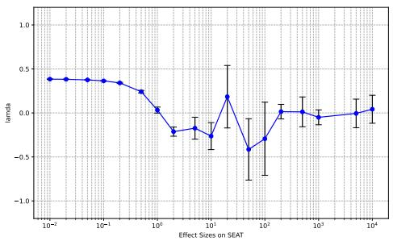  
Figure 11: Means and standard deviations of effect sizes on SEAT-5b with debiased RoBERTa.