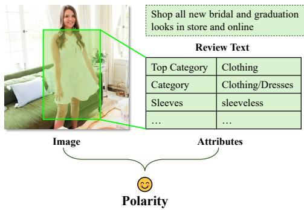
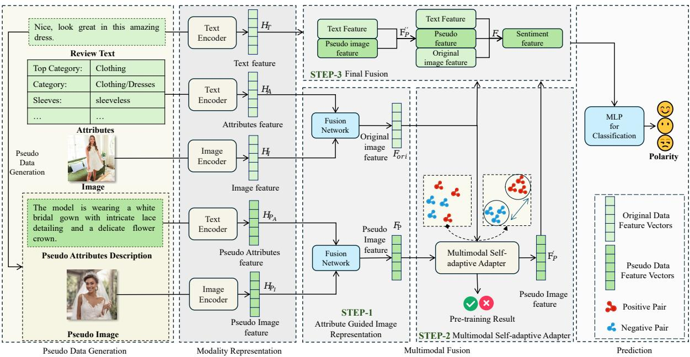
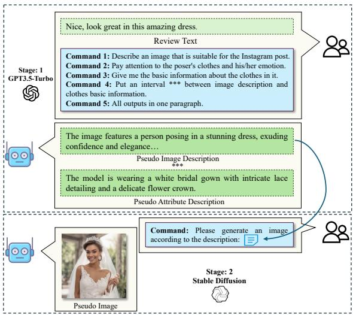
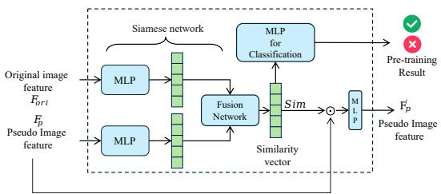
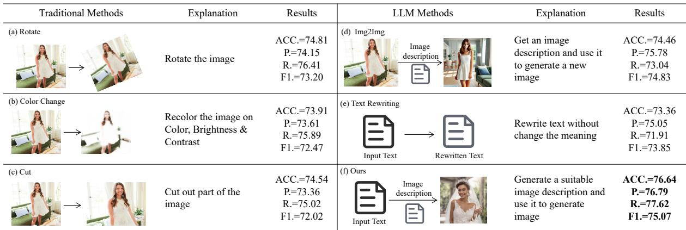
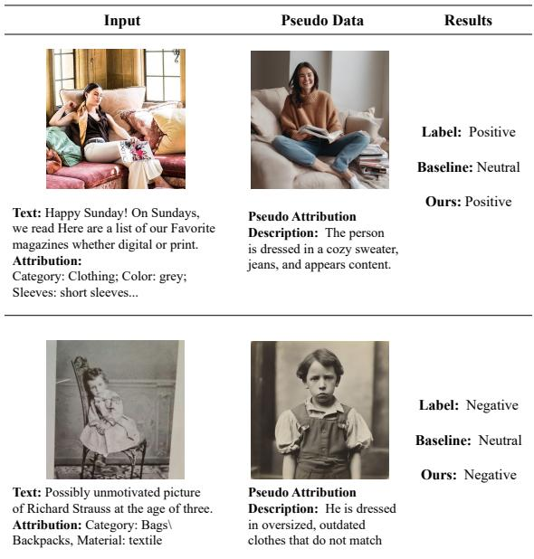

# Bridging Modality Gap for Effective Multimodal Sentiment Analysis in Fashion-related Social Media

Zheyu Zhao, Hongling Wang\*, Zhongqing Wang, Shichen Li and Guodong Zhou Natural Language Processing Lab, Soochow University, Suzhou, China {zyzhao0104,scli06}@stu.suda.edu.cn {hlwang,wangzq,gdzhou}@suda.edu.cn

## Abstract

Multimodal sentiment analysis for fashionrelated social media is essential for understanding how consumers appraise fashion products across platforms like Instagram and Twitter, where both textual and visual elements contribute to sentiment expression. However, a notable challenge in this task is the modality gap, where the different information density between text and images hinders effective sentiment analysis. In this paper, we propose a novel multimodal framework that addresses this challenge by introducing pseudo data generated by a two-stage framework. We further utilize a multimodal fusion approach that efficiently integrates the information from various modalities for sentiment classification of fashion posts. Experiments conducted on a comprehensive dataset demonstrate that our framework significantly outperforms existing unimodal and multimodal baselines, highlighting its effectiveness in bridging the modality gap for more accurate sentiment classification in fashion-related social media posts.

## 1 Introduction

Fashion products are characterized by significant variability, primarily due to the rapidly changing preferences of consumers (Bilinska, 2021). Users often express their sentiments towards these fashion products through various social media platforms like Instagram and Twitter. Thus, it is important to properly capture users’ sentiments about fashion products on social media.

Traditional sentiment analysis tasks for social media mainly focus on text comprehension (Hutto and Gilbert, 2014; Balahur, 2013). However, as visual content has gradually become an important medium for emotional expression, it is crucial to jointly consider information from different modalities to accurately identify the user’s real attitude towards fashion items in social media posts (Al-Tameemi et al., 2024). For instance, as illustrated in Figure 1, one must examine the image as well as text content to determine the user’s sentiment polarity towards the fashion items. Therefore, our approach focuses on analyzing both textual and visual information to effectively identify sentiment in fashion-related posts.

  
Figure 1: An example of fashion post.

However, it is a non-trivial task due to the following challenges: The primary challenge is the modality gap, as highlighted by Liang et al. (2022) and Hazarika et al. (2020). The modality gap between text and images stems from the difference in information density: text conveys sentiment directly through high-density emotional language, while images, often filled with much nonsentiment information like environmental details, carry a lower density of sentiment-related information. This difference can affect the model’s ability to effectively combine both modalities. (Wei et al., 2023).

Additionally, fashion-related posts often include unique attributes such as style, pattern and color, as shown in Figure 1, that significantly influence sentiment. How to effectively utilize their relationships with text and images is essential.

Early studies, such as Xu and Nan (2017) and Xu and Mao (2017) mainly focus on how to extract features from both visual and textual modalities while ignoring the modality gap. In this study, we propose a novel multimodal framework to capture information from both textual and visual modalities for sentiment classification of fashion posts. Specifically, we propose a two-stage framework to generate pseudo data including pseudo images and their corresponding attributes according to the text, representing the textual information in a visual format. Compared with original ones, pseudo images have higher information density, focusing on primary content with minimal background noise. This medium information density of pseudo data helps to narrow the modality gap during the fusion of text and images and improves the accuracy of sentiment prediction.

Subsequently, we design a multimodal fusion approach that efficiently integrates features from different modalities. In our approach, attributes serve to guide the model in capturing essential image information, further narrowing the modality gap. Additionally, we develop a self-adaptive adapter to evaluate the consistency between original and pseudo data, preventing inaccurately generated pseudo data from influencing sentiment prediction.

Experimental results demonstrate that our proposed model outperforms several strong unimodal and multimodal baselines. Additional experiments further prove that the modalities and the designed fusion architecture contribute to the ideal classification results. We also compare our pseudo data generation methods with others, showing that our method can better bridge the modality gap. Our approach not only enhances the accuracy of sentiment analysis but also paves the way for a more comprehensive understanding of user sentiment in the fashion domain.

The main contributions of this work can be summarized as follows:

• We propose a LLM-based framework that generates pseudo data to enrich the original text and bridge the modality gap.

• A novel fusion framework is proposed, incorporating a self-adaptive adapter to filter inaccurate pseudo data.

• Experiments on a fashion-related dataset demonstrate that our model significantly outperforms state-of-the-art unimodal and multimodal baselines.

## 2 Related Work

In this section, we introduce two related topics about this study: sentiment analysis and fashionrelated tasks.

## 2.1 Sentiment Analysis

Traditional sentiment analysis primarily relies on text to extract sentiment features using natural language processing and machine learning models (Liu, 2020; Poria et al., 2020; Yadav and Vishwakarma, 2020). Notable advancements include multi-task models (Liao et al., 2021) and data augmentation (Li et al., 2023a). Recent applications of large language models also show promising results (Kheiri and Karimi, 2023).

The emerging field of multimodal sentiment analysis combines text, images, and audio to enrich sentiment detection (Zhu et al., 2022; Yu et al., 2023). Approaches like AoBERT (Kim and Park, 2023) unify text, visual, and audio modalities within a single framework, while TEDT (Wang et al., 2023) employs a transformer-based network to synchronize and fuse data across modalities, enabling effective sentiment prediction.

## 2.2 Fashion Related Tasks

Fashion-related research primarily focuses on fashion image analysis (Ge et al., 2019; Liu et al., 2016; Tian et al., 2023), recommendation systems (Ding et al., 2023; De Divitiis et al., 2023; Dahunsi et al., 2024), and clothing retrieval (Miao et al., 2020; Zhang et al., 2020; Ning et al., 2022), which are crucial for both academy and industry.

The emergence of multimodal techniques in fashion has induced novel applications. Baldrati et al. (2024) enhance the generative editing of fashion images using multimodal prompts, while Singh and Patras (2024) apply vision-language models to support creative fashion design processes. Additionally, Wu et al. (2022) advances recommendation systems by utilizing multimodal data for enriched user interaction.

The research by Yuan and Lam (2022) is particularly relevant to our study as it also focuses on sentiment detection in fashion posts, utilizing a multimodal approach that integrates features from text, images, and attributes for classification. We build upon their foundational dataset and extend their work by further enhancing the integration methods and addressing the modality gap more effectively in our multimodal framework.

## 3 Method

In this study, our goal is to detect the sentiment polarity of fashion-related social media posts. Each post, which includes an image, text, and attributes, is classified into one of three distinct labels: positive, neutral, and negative.

As shown in Figure 2, we propose a multimodal framework that captures and integrates information from both textual and visual modalities for sentiment classification. First, we propose a twostage framework to generate pseudo data, including pseudo images and their associated attributes. This pseudo data serves as a bridge between the text and image modalities to mitigate the gap between two modalities and enhance the performance of the multimodal model. Next, we propose a multimodal fusion network where attributes serve to guide the representation of images and a self-adaptive adapter is incorporated to filter the erroneously generated pseudo data. The final fusion seamlessly integrates the information across modalities for sentiment classification of fashion posts.

## 3.1 Pseudo Data Generation

To bridge the gap between text and image modalities, we propose a two-stage framework for generating pseudo data, including pseudo images and their corresponding attributes. As illustrated in Figure 3, the first stage utilizes a large language model1 to generate pseudo image descriptions and pseudo attribute descriptions. The model produces image descriptions that closely align with the given textual input, while the pseudo attributes provide precise details about the fashion items mentioned pseudo image description.

During the generation process, a prompt strategy is applied to guide the model toward aligning the desirable format. Specifically, it directs the LLM to generate appropriate pseudo image descriptions (Command 1-2), produce pseudo attributes that accurately describe fashion elements (Command 3), and standardize the output format for subsequent processing (Command 4-5).

In the second stage, these pseudo image descriptions are used to generate the corresponding pseudo images using Stable Diffusion (Rombach et al., 2022).

This process results in the generation of pseudo images and detailed pseudo attribute descriptions, which can be used in subsequent steps.

## 3.2 Text and Attributes Representation

The encoding process for text, attributes, and pseudo attributes representations begins by tokenizing the input m, where $m \in \{ T , A , P _ { A } \}$ . Here, $T , A , P _ { A }$ separately denote text, attributes, and pseudo attributes. These tokens are first transformed into token embeddings. These embeddings are then augmented with positional embeddings to incorporate sequence information:

$$
z _ { m } [ i ] = \mathrm { T e x t T o k e n i z e r } ( \mathrm { t o k e n } [ i ] ) + E _ { \mathrm { p o s } } [ i ]\tag{1}
$$

where $E _ { \mathrm { p o s } }$ represents the positional encodings that integrate sequence information into the embeddings and m $\in \{ T , A , P _ { A } \}$

The initial embeddings $z _ { m }$ are then processed by a CLIP (Radford et al., 2021) text encoder(Transformer architecture), which utilizes self-attention mechanisms and feed-forward networks to generate a comprehensive text representation:

$$
H _ { m } = \operatorname { E n c o d e r } ( z _ { m } ) ( m \in \{ T , A , P _ { A } \} )\tag{2}
$$

Here, $H _ { m }$ signifies the high-level text representation synthesized by the encoder.

## 3.3 Image Representation

We then employ CLIP (Radford et al., 2021) image encoder to learn the original and pseudo image representation. This encoder consists of a VIT (Dosovitskiy et al., 2020) model, which begins by processing the input image I and pseudo image $P _ { I }$ through resizing and normalizing. The image is then segmented into patches of size $P \times P .$ , and each patch is flattened and transformed through a linear projection:

$$
\mathrm { p a t c h } _ { \mathrm { e m b e d } } [ i ] = \mathrm { F l a t t e n } ( \mathrm { p a t c h } [ i ] ) \cdot E\tag{3}
$$

where E denotes the projection matrix of dimensions $( P ^ { 2 } \cdot C ) \times D$ , transforming each patch into a D-dimensional embedding. (C refers to the number of channels)

To incorporate spatial information, positional encodings $E _ { \mathrm { p o s } }$ are added to the embeddings:

$$
z _ { m } [ i ] = \mathrm { p a t c h } _ { \mathrm { e m b e d } } [ i ] + E _ { \mathrm { p o s } } [ i ]\tag{4}
$$

These embeddings $z _ { m } \ m \in \{ I , P _ { I } \}$ are subsequently processed by the Transformer encoder, utilizing layers of multi-headed self-attention and feed-forward networks to synthesize a comprehensive image representation:

$$
H _ { m } = \mathrm { V i T E n c o d e r } ( z _ { m } ) ( m \in \{ I , P _ { I } \} )\tag{5}
$$

  
Figure 2: The overview of proposed model.

  
Figure 3: Pseudo data generation.

## 3.4 Multimodal Fusion

Our multimodal fusion strategy aims to effectively handle the relationships between modalities and further narrow the modality gap. This part includes three main steps: Attribute Guided Image Representation, Multimodal Self-adaptive Adapter and Final Fusion. In our work, the basic fusion network includes two MLP layers and a concatenation.

## Attribute Guided Image Representation

The attributes refer to fashion items in images that are the focus of customers’ sentiments. Therefore, we use attribute information to guide the representation of images by fusing them to let our model capture the essential information in images, narrowing the modality gap by reducing the redundant information in images. The fused vector, denoted as $F _ { o r i } .$ , is computed as follows:

  
Figure 4: Self-adaptive adapter.

$$
F _ { o r i } = \operatorname { F u s i o n } ( H _ { I } , H _ { A } )\tag{6}
$$

Here, $H _ { I }$ and $H _ { A }$ represent the encoded image and attribute features, respectively. The vector $F _ { o r i }$ serves a dual purpose: it is fed into a self-adaptive adapter for further processing, and also utilized as the original image feature for sentiment prediction.

The pseudo information fusion is similar to the fusion of the original images and their attributions. We tokenize and encode the generated images and attributes with the CLIP model and then fuse them into pseudo image feature $F _ { P }$

## Multimodal Self-adaptive Adapter

We then utilize a multimodal self-adaptive adapter to filter out inaccurately generated pseudo images and attributes. Specifically, we aim for the pseudo information to be highly integrated into the final fusion when it exhibits strong consistency with the original information. Conversely, when the pseudo information conflicts with the original one, we seek to minimize its contribution. To achieve this, we design a pre-training task that assesses the consistency between two input features and projects the consistent and inconsistent fusion information into distinct vector spaces.

The detailed architecture of this component is illustrated in Figure 4. Within this framework, a Siamese network composed of two MLP layers and a fusion network processes the pseudo image feature alongside the original image feature $F _ { o r i }$ derived from the main backbone, subsequently outputting their similarity feature:

$$
S i m = S N ( F _ { o r i } , F _ { P } )\tag{7}
$$

where SN represents a Siamese network.

The similarity feature indicates whether the pseudo data matches the original data and decides the intensity of intervention of pseudo information in the final fusion. To obtain such abilities of the similarity, we use dot product to fuse the similarity vector (Sim) with the generated image feature (FP) as:

$$
F _ { P } ^ { ' } = S i m \circ F _ { P }\tag{8}
$$

Where $F _ { P } ^ { ' }$ represents the adapted pseudo image feature, the ultimate pseudo information which is retrieved by the main backbone.

## Final Fusion

For sentiment prediction, we first fuse $F _ { P } ^ { ' }$ captured from the multimodal self-adaptive adapter with textual feature by:

$$
\boldsymbol { F } _ { P } ^ { \prime \prime } = \mathrm { F u s i o n } ( \boldsymbol { F } _ { P } ^ { \prime } , H _ { T } )\tag{9}
$$

Where $F _ { P } ^ { \prime \prime }$ represents the sentiment feature extracted from pseudo inputs.

Then we obtain the integral feature by fusing the original information, containing the image and text feature, with pseudo sentiment feature for reference by:

$$
F = \mathrm { F u s i o n } ( F _ { P } ^ { ^ { \prime \prime } } , H _ { T } , F _ { o r i } )\tag{10}
$$

This strategy aids in the independent processing and optimization of diverse data types, thereby enhancing the model’s flexibility and accuracy, reducing error propagation, and significantly improving the model’s generalizability.

This multimodal fusion approach not only facilitates a comprehensive sentiment analysis by leveraging diverse data types but also addresses the challenges posed by the inherent difference in modality-specific features, ensuring robustness and accuracy in our sentiment classification framework.

<table><tr><td></td><td>Positive</td><td>Negative</td><td>Neutral</td><td>Total</td></tr><tr><td>Train</td><td>3487</td><td>2215</td><td>3947</td><td>9649</td></tr><tr><td>Val</td><td>462</td><td>263</td><td>481</td><td>1206</td></tr><tr><td>Test</td><td>438</td><td>249</td><td>519</td><td>1206</td></tr></table>

Table 1: Statistic of the dataset.

## 3.5 Training Procedure

We first design a pre-training task to provide the self-adaptive adapter module with prior knowledge about the consistency of different image representations. Since sentiment polarity is the primary focus of our task, we emphasize sentiment consistency during the pre-training phase. Specifically, samples in the training set are shuffled and paired, with pairs labeled as "true" if their sentiments match and "false" otherwise. In this step, the self-adaptive adapter is trained to classify the constructed pretraining dataset based on these labels. In this step, all modules except the final fusion are trained.

Next, the entire model is fine-tuned for sentiment analysis. This phase uses insights from the self-adaptive adapter to improve the model’s sentiment classification capabilities. The fine-tuning utilizes the cross-entropy loss function:

$$
H ( p , q ) = - \sum _ { i = 1 } ^ { C } p _ { i } \log q _ { i }\tag{11}
$$

where C is the number of classes, $p _ { i }$ represents the actual distribution, and $q _ { t }$ is the predicted probability for each class. In this step, we finetune the whole model.

## 4 Experiments

In this section, we present some experimental details, including datasets, evaluation metrics, baseline models, and experimental results.

## 4.1 Data and Setting

The dataset we use, released by Yuan and Lam (2022), contains over 12,000 fashion-related social media posts. Each post includes an image, fashion attributes, and accompanying text. In the dataset, sentiment labels were manually annotated, considering both the image and text content. The dataset was split into a training set (80%), a validation set (10%), and a test set (10%). The detailed distribution of the dataset is shown in Table 1.

<table><tr><td>Modality</td><td>Method</td><td>Model</td><td>ACC.</td><td>P.</td><td>R.</td><td>F1.</td></tr><tr><td rowspan="4">Uni-Modality</td><td rowspan="2">Language Model</td><td>T5 (Raffel et al., 2020)</td><td>72.02 74.37</td><td>72.91 74.61</td><td>73.12 74.37</td><td>72.51</td></tr><tr><td>LLaMA-3 (Dubey et al., 2024) BERT (Devlin et al., 2018)</td><td>72.88</td><td></td><td></td><td>74.27</td></tr><tr><td rowspan="2"></td><td>Xlnet (Yang et al., 2019)</td><td>71.83</td><td>72.75 65.54</td><td>75.02 64.47</td><td>71.32 63.02</td></tr><tr><td>DeBERTa (He et al., 2020)</td><td>74.81</td><td>74.78</td><td>74.88</td><td>71.50</td></tr><tr><td rowspan="2"></td><td rowspan="2">Vision Model</td><td>RepVGG (Ding et al., 2021) ResNet18 (He et al., 2016)</td><td>42.49 48.21</td><td>34.38</td><td>33.42</td><td>21.62</td></tr><tr><td>VIT (Dosovitskiy et al., 2020)</td><td>55.10</td><td>48.94 54.81</td><td>52.27 54.55</td><td>47.83 51.96</td></tr><tr><td rowspan="2">Multi-Modalities</td><td rowspan="2">Related Work</td><td>CLMLF (Li et al., 2022b)</td><td>74.62</td><td>75.21</td><td>74.87</td><td>74.02</td></tr><tr><td>BIT (Xiao et al., 2023) Yuan&#x27;s (Yuan and Lam, 2022)</td><td>67.56</td><td>68.09</td><td>67.13</td><td>67.58</td></tr><tr><td colspan="3">Ours</td><td>71.59 76.64</td><td>70.91 76.79</td><td>72.17 77.62</td><td>70.88</td></tr></table>

Table 2: Comparison with baselines.

For each experiment, we conduct a hyperparameter sweep across learning rate, batch size, and training epochs, selecting the parameters that achieved the highest validation performance. All experiments were performed on a single 4090 GPU. To fine-tune the large language models (LLMs) within the limited memory space of our GPU, we adopted the Low-Rank Adaptation (LoRA) fine-tuning approach (Hu et al., 2021).

In our experiment, we evaluate the results using four metrics: Accuracy, Precision-macro, Recallmacro, and F1-macro.

## 4.2 Main Results

To fully validate the performance of our method, we select both unimodal and multimodal baselines for comparison.

Specifically, our unimodal baselines encompass both text and image modalities. For the text modality, we select BERT (Devlin et al., 2018), T5 (Raffel et al., 2020), LLaMA-3(LoRa) (Dubey et al., 2024), Xlnet (Yang et al., 2019) and DeBERTa (He et al., 2020) as our baselines. For the image modality, we choose ResNet (He et al., 2016), RepVGG (Ding et al., 2021), and ViT (Dosovitskiy et al., 2020) due to their proven superior performance in image classification tasks. In addition, we also employ some related works including Yuan’s work (Yuan and Lam, 2022), CLMLF (Li et al., 2022b) and BIT (Xiao et al., 2023) as multimodal baselines to provide a comprehensive comparison.

Based on Table 2, we observe that language models, especially large language models such as LLaMA, perform better in the text modality, highlighting the effectiveness of textual information. Furthermore, the model performance in the vision modality, due to the low density of information, consistently lags behind the text modality, suggesting that images alone are insufficient for sentiment classification in fashion posts. Additionally, multimodal models do not show a significant improvement over the text modality, possibly due to their limited ability to capture deep correlations between text and images in fashion-related content.

Our proposed model achieves the best results and significantly outperforms all other models $( p <$ 0.05). This indicates that our method successfully handle the modality gap though the generation of pseudo data and efficient fusion method.

## 4.3 Influence of Different MultiModals Integration Methods

Traditional methods typically integrate features from various modalities by directly fusing them and subsequently using a classifier to achieve classification results. Their fusion techniques include concatenation, addition, and cross-attention mechanisms (attention). Additionally, some wellestablished baseline models such as BLIP (Li et al., 2022a), BLIP2 (Li et al., 2023b), InternLM (Dong et al., 2024), and LLAVA (Liu et al., 2024) have attributed their impressive performance to their specific methods of fusion. In this study, we evaluate these fusion approaches(LoRA finetuned). The results are detailed in Table 3. Notably, for these large multimodal language model, we combined images with pseudo images as the visual input, and text with attributes and pseudo-attributes as the textual input.

<table><tr><td>Method</td><td>ACC.</td><td>P.</td><td>R.</td><td>F1.</td></tr><tr><td>Concatenation</td><td>74.72</td><td>74.72</td><td>75.23</td><td rowspan="4">73.47</td></tr><tr><td>Addition</td><td>73.14</td><td>73.07</td><td>75.54 71.87</td></tr><tr><td>Attention</td><td>74.37</td><td>74.45</td><td>77.23 72.51</td></tr><tr><td>BLIP</td><td>63.24</td><td>68.35</td><td>61.19 62.41</td></tr><tr><td>BLIP-2</td><td>57.08</td><td>63.40</td><td>62.30</td><td>56.90</td></tr><tr><td>InternLM</td><td>70.69</td><td>71.41</td><td>73.58</td><td>71.20</td></tr><tr><td>LLAVA1.5</td><td>73.59</td><td>73.98</td><td>73.58</td><td>73.33</td></tr><tr><td>Ours</td><td>76.64</td><td>76.79</td><td>77.62</td><td>75.07</td></tr></table>

Table 3: Different multimodal integration methods.
<table><tr><td>Method</td><td>ACC.</td><td>P.</td><td>R.</td><td>F1.</td></tr><tr><td>Ours</td><td>76.64</td><td>76.79</td><td>77.62</td><td>75.07</td></tr><tr><td>-PreTraining</td><td>75.49</td><td>76.16</td><td>76.97</td><td>74.42</td></tr><tr><td>-Adapter</td><td>74.55</td><td>75.22</td><td>76.00</td><td>73.84</td></tr></table>

Table 4: Ablation studies on proposed multimodal integration method.

The experimental results show that illogical fusing the features from different modalities, regardless of the fusion approach taken, makes it difficult for the model to fully exploit the information embedded in features. The method we adopt, despite its relative complexity, is able to extract information from text and images more logically, efficiently, and accurately, and gives the best results.

We also conduct ablation experiments to demonstrate the effectiveness of the Adapter and the training strategy we use. The results are shown in Table 4.

These results show a decline in model performance when the pre-training strategy is omitted from the training procedure, confirming that pretraining aids our model in distinguishing between images with varying sentiment information before finetuning.

The removal of the Adapter leads to a more substantial decline in all other performance metrics, demonstrating that the Adapter we designed effectively filters out erroneous images, thereby preventing them from adversely affecting the predictions.

## 4.4 Impact of Different Modalities

In Table 5, we analyze the impact of different modalities, where T, I, and A represent the original review text, images, and attributes, respectively. $I _ { p }$ and $A _ { p }$ denote pseudo images and attributes. In this experiment, features form modalities are fused through concatenating and classified.

<table><tr><td>Method</td><td>ACC.</td><td>P.</td><td>R.</td><td>F1.</td></tr><tr><td>T</td><td>71.24</td><td>71.22</td><td>71.73</td><td>69.43</td></tr><tr><td>I</td><td>54.66</td><td>55.04</td><td>54.07</td><td>52.14</td></tr><tr><td> $A$ </td><td>39.74</td><td>38.39</td><td>37.08</td><td>34.27</td></tr><tr><td> $T { + } I$ </td><td>74.17</td><td>74.12</td><td>74.30</td><td>72.88</td></tr><tr><td> $T { + } A$ </td><td>74.01</td><td>73.01</td><td>73.90</td><td>71.29</td></tr><tr><td> $I { + } A$ </td><td>52.57</td><td>55.08</td><td>50.05</td><td>52.72</td></tr><tr><td> $I { + } T { + } A$ </td><td>73.85</td><td>74.40</td><td>75.99</td><td>72.22</td></tr><tr><td> $I { + } T { + } A { + } I _ { p }$ </td><td>74.12</td><td>75.53</td><td>74.96</td><td>73.11</td></tr><tr><td> $I { + } T { + } A { + } A _ { p }$ </td><td>74.02</td><td>74.02</td><td>75.74</td><td>72.29</td></tr><tr><td> $I { + } T { + } A { + } I _ { p } { + } A _ { p }$ </td><td>74.72</td><td>74.72</td><td>75.23</td><td>73.47</td></tr><tr><td>Ours</td><td>76.64</td><td>76.79</td><td>77.62</td><td>75.07</td></tr></table>

Table 5: The results of different modalities.

From a unimodal perspective, text performs best because it contains clear sentiment information. In contrast, images provide more information but also add noise, making sentiment harder to discern. Attributes, being just supplementary information without inherent sentiment, result in poorer outcomes.

Meanwhile, integrating these modalities yields better results than using them individually, and the utilization of pseudo data leads to further improvements.

Our proposed model significantly outperforms all others, suggesting that integrating various modalities for sentiment classification in fashion posts is beneficial. This also demonstrates the effectiveness of the proposed framework in addressing modality gaps.

## 4.5 Impact of Pseudo Data Generating Methods

To explore the effectiveness of our pseudo data generating method. We compare different methods in Figure 5. Traditional image rewriting techniques (Figure 5(a-c)) typically rely on basic transformations such as rotation, color modification, and cropping (An et al., 2023). In our study, we design experiments that employ these methods to process images within our dataset, with the original image attributes being preserved as pseudo attributes. The experimental results did not demonstrate a significant improvement over the baseline.

Additionally, numerous studies have employed large-language-model(LLM) to do data rewriting. Inspired by (Dunlap et al., 2023), we explored the generation of images using the Image2Image method shown in Figure 5(d). Initially, we generate image descriptions using the vision-language model BLIP-2 (Li et al., 2023b) from the images in our dataset, followed by employing a diffusion model to produce revised images. This approach ranks second to our method, surpassing all other comparative experiments in terms of F1 scores.

  
Figure 5: Pseudo data generating methods.

  
Figure 6: Examples of case study.

Furthermore, drawing on LaCLIP (Fan et al., 2023), we utilized ChatGPT to rewrite text(Figure 5(e)) and subsequently fuse its features with the original information for sentiment prediction but do not get improved results.

## 4.6 Case Study

In Figure 6, we present a case study comparing our method to a baseline that uses text, image, and attribute features extracted from the CLIP model for sentiment prediction. We find that in scenarios with complex backgrounds or unclear expressions, the baseline struggles to capture sentiment due to its inability to effectively bridge the modality gap.

In the first example, the baseline struggles with intricate backgrounds, leading to an incorrect prediction. Our approach improves upon this by extracting key information from text and generating a pseudo image with minimized background interference, ensuring a clearer depiction of characters. The pseudo data shows great consistency with its corresponding original data, collectively contributing to more accurate predictions.

In the second example, the word ‘unmotivated signals negative sentiment, but is not clearly expressed in the low-resolution image. Our pseudo data captures this and highlights key information in an informative pseudo image, effectively bridging the gap between image and text and yielding correct result compared to the baseline.

## 5 Conclusion

This paper proposes a novel multimodal framework for sentiment analysis in fashion-related social media, addressing the critical challenge of the modality gap. By generating pseudo data, and utilizing a multimodal fusion approach, the model effectively integrates various modalities to enhance sentiment classification. The self-adaptive adapter ensures the accuracy of pseudo data, contributing to more accurate predictions. Experimental results demonstrate that this framework significantly outperforms both unimodal and multimodal baselines, proving its effectiveness in bridging the modality gap and improving sentiment detection.

## 6 Limitation

Our dataset includes text, images, and attributes, but the lack of attribute labeling in some sentiment analysis datasets limits the applicability of our method to these datasets. Additionally, the attributes in the dataset we use are AI-labeled, which introduces some errors that could affect the experimental results. Future research will focus on developing more accurate Attribute Value Extraction (AVE) methods to address these challenges.

## Acknowledge

The authors would like to express their gratitude to all three anonymous reviewers for their insightful comments on this paper. This research was supported by the National Natural Science Foundation of China (Nos. 62376178), and Project Funded by the Priority Academic Program Development of Jiangsu Higher Education Institutions.

## References

Israa Khalaf Salman Al-Tameemi, Mohammad-Reza Feizi-Derakhshi, Saeed Pashazadeh, and Mohammad Asadpour. 2024. A comprehensive review of visual–textual sentiment analysis from social media networks. Journal ofComputational Social Science, pages 1–72.

Jieyu An, Wan Mohd Nazmee Wan Zainon, and Binfen Ding. 2023. Leveraging vision-language pre-trained model and contrastive learning for enhanced multimodal sentiment analysis. Intelligent Automation & Soft Computing, 37(2).

Alexandra Balahur. 2013. Sentiment analysis in social media texts. In WASSA, pages 120–128.

Alberto Baldrati, Davide Morelli, Marcella Cornia, Marco Bertini, and Rita Cucchiara. 2024. Multimodal-conditioned latent diffusion models for fashion image editing. arXiv preprint arXiv:2403.14828.

AD Bilinska. 2021. To what extent retail chains’ relationships with suppliers make the business trustworthy an empirical study on fast fashion in pandemic times. Risk and Financial Management.

B Dahunsi, H Woelfle, N Gagliardi, and LE Dunne. 2024. Review and synthesis of expert perspectives on user attribute and profile definitions for fashion recommendation. International Journal of Fashion Design, Technology and Education, 17(2):202–213.

Lavinia De Divitiis, Federico Becattini, Claudio Baecchi, and Alberto Del Bimbo. 2023. Disentangling features for fashion recommendation. ACM Transactions on Multimedia Computing, Communications and Applications, 19(1s):1–21.

Jacob Devlin, Ming-Wei Chang, Kenton Lee, and Kristina Toutanova. 2018. Bert: Pre-training of deep bidirectional transformers for language understanding. arXiv preprint arXiv:1810.04805.

Xiaohan Ding, Xiangyu Zhang, Ningning Ma, Jungong Han, Guiguang Ding, and Jian Sun. 2021. Repvgg: Making vgg-style convnets great again. In CVPR, pages 13733–13742.

Yujuan Ding, Zhihui Lai, PY Mok, and Tat-Seng Chua. 2023. Computational technologies for fashion recommendation: A survey. ACM Computing Surveys, 56(5):1–45.

Xiaoyi Dong, Pan Zhang, Yuhang Zang, Yuhang Cao, Bin Wang, Linke Ouyang, Xilin Wei, Songyang Zhang, Haodong Duan, Maosong Cao, et al. 2024. Internlm-xcomposer2: Mastering freeform text-image composition and comprehension in vision-language large model. arXiv preprint arXiv:2401.16420.

Alexey Dosovitskiy, Lucas Beyer, Alexander Kolesnikov, Dirk Weissenborn, Xiaohua Zhai, Thomas Unterthiner, Mostafa Dehghani, Matthias Minderer, Georg Heigold, Sylvain Gelly, et al. 2020. An image is worth 16x16 words: Transformers for image recognition at scale. arXiv preprint arXiv:2010.11929.

Abhimanyu Dubey, Abhinav Jauhri, Abhinav Pandey, Abhishek Kadian, Ahmad Al-Dahle, Aiesha Letman, Akhil Mathur, Alan Schelten, Amy Yang, Angela Fan, et al. 2024. The llama 3 herd of models. arXiv preprint arXiv:2407.21783.

Lisa Dunlap, Alyssa Umino, Han Zhang, Jiezhi Yang, Joseph E Gonzalez, and Trevor Darrell. 2023. Diversify your vision datasets with automatic diffusionbased augmentation. Advances in neural information processing systems, 36:79024–79034.

Lijie Fan, Dilip Krishnan, Phillip Isola, Dina Katabi, and Yonglong Tian. 2023. Improving clip training with language rewrites. In NeurIPS.

Yuying Ge, Ruimao Zhang, Xiaogang Wang, Xiaoou Tang, and Ping Luo. 2019. Deepfashion2: A versatile benchmark for detection, pose estimation, segmentation and re-identification of clothing images. In CVPR.

Devamanyu Hazarika, Roger Zimmermann, and Soujanya Poria. 2020. Misa: Modality-invariant and -specific representations for multimodal sentiment analysis. Cornell University - arXiv,Cornell University - arXiv.

Kaiming He, Xiangyu Zhang, Shaoqing Ren, and Jian Sun. 2016. Deep residual learning for image recognition. In CVPR, pages 770–778.

Pengcheng He, Xiaodong Liu, Jianfeng Gao, and Weizhu Chen. 2020. Deberta: Decoding-enhanced bert with disentangled attention. arXiv preprint arXiv:2006.03654.

Edward J Hu, Yelong Shen, Phillip Wallis, Zeyuan Allen-Zhu, Yuanzhi Li, Shean Wang, Lu Wang, and Weizhu Chen. 2021. Lora: Low-rank adaptation of large language models. arXiv preprint arXiv:2106.09685.

Clayton Hutto and Eric Gilbert. 2014. Vader: A parsimonious rule-based model for sentiment analysis of social media text. In AAAI, volume 8, pages 216– 225.

Kiana Kheiri and Hamid Karimi. 2023. Sentimentgpt: Exploiting gpt for advanced sentiment analysis and its departure from current machine learning. arXiv preprint arXiv:2307.10234.

Kyeonghun Kim and Sanghyun Park. 2023. Aobert: All-modalities-in-one bert for multimodal sentiment analysis. Information Fusion, 92:37–45.

Guangmin Li, Hui Wang, Yi Ding, Kangan Zhou, and Xiaowei Yan. 2023a. Data augmentation for aspectbased sentiment analysis. International Journal of Machine Learning and Cybernetics, 14(1):125–133.

Junnan Li, Dongxu Li, Silvio Savarese, and Steven Hoi. 2023b. Blip-2: Bootstrapping language-image pre-training with frozen image encoders and large language models. In ICML, pages 19730–19742. PMLR.

Junnan Li, Dongxu Li, Caiming Xiong, and Steven Hoi. 2022a. Blip: Bootstrapping language-image pre-training for unified vision-language understanding and generation. In ICML, pages 12888–12900. PMLR.

Zhen Li, Bing Xu, Conghui Zhu, and Tiejun Zhao. 2022b. Clmlf: A contrastive learning and multi-layer fusion method for multimodal sentiment detection. arXiv preprint arXiv:2204.05515.

Victor Weixin Liang, Yuhui Zhang, Yongchan Kwon, Serena Yeung, and James Y Zou. 2022. Mind the gap: Understanding the modality gap in multi-modal contrastive representation learning. Advances in Neural Information Processing Systems, 35:17612– 17625.

Wenxiong Liao, Bi Zeng, Xiuwen Yin, and Pengfei Wei. 2021. An improved aspect-category sentiment analysis model for text sentiment analysis based on roberta. Applied Intelligence, 51:3522–3533.

Bing Liu. 2020. Sentiment analysis: Mining opinions, sentiments, and emotions. Cambridge university press.

Haotian Liu, Chunyuan Li, Yuheng Li, and Yong Jae Lee. 2024. Improved baselines with visual instruction tuning. In CVPR, pages 26296–26306.

Ziwei Liu, Ping Luo, Shi Qiu, Xiaogang Wang, and Xiaoou Tang. 2016. Deepfashion: Powering robust clothes recognition and retrieval with rich annotations. In CVPR.

Yongwei Miao, Gaoyi Li, Chen Bao, Jiajing Zhang, and Jinrong Wang. 2020. Clothingnet: Cross-domain clothing retrieval with feature fusion and quadruplet loss. IEEE Access, 8:142669–142679.

Chen Ning, Yang Di, and Li Menglu. 2022. Survey on clothing image retrieval with cross-domain. Complex & Intelligent Systems, 8(6):5531–5544.

Soujanya Poria, Devamanyu Hazarika, Navonil Majumder, and Rada Mihalcea. 2020. Beneath the tip of the iceberg: Current challenges and new directions in sentiment analysis research. IEEE transactions on affective computing, 14(1):108–132.

Alec Radford, Jong Wook Kim, Chris Hallacy, Aditya Ramesh, Gabriel Goh, Sandhini Agarwal, Girish Sastry, Amanda Askell, Pamela Mishkin, and Jack Clark. 2021. Learning transferable visual models from natural language supervision.

Colin Raffel, Noam Shazeer, Adam Roberts, Katherine Lee, Sharan Narang, Michael Matena, Yanqi Zhou, Wei Li, and Peter J. Liu. 2020. Exploring the limits of transfer learning with a unified textto-text transformer. Journal of Machine Learning Research, 21(140):1–67.

Robin Rombach, Andreas Blattmann, Dominik Lorenz, Patrick Esser, and Björn Ommer. 2022. Highresolution image synthesis with latent diffusion models. In CVPR, pages 10684–10695.

Abhishek Kumar Singh and Ioannis Patras. 2024. Fashionsd-x: Multimodal fashion garment synthesis using latent diffusion. arXiv preprint arXiv:2404.18591.

Hao Tian, Yu Cao, and PY Mok. 2023. Detr-based layered clothing segmentation and fine-grained attribute recognition. In CVPR, pages 3534–3538.

Fan Wang, Shengwei Tian, Long Yu, Jing Liu, Junwen Wang, Kun Li, and Yongtao Wang. 2023. Tedt: transformer-based encoding–decoding translation network for multimodal sentiment analysis. Cognitive Computation, 15(1):289–303.

Yiwei Wei, Shaozu Yuan, Ruosong Yang, Lei Shen, Zhangmeizhi Li, Longbiao Wang, and Meng Chen. 2023. Tackling modality heterogeneity with multiview calibration network for multimodal sentiment detection. In ACL, pages 5240–5252.

Yaxiong Wu, Craig Macdonald, and Iadh Ounis. 2022. Multi-modal dialog state tracking for interactive fashion recommendation. In RecSys, pages 124–133.

Xingwang Xiao, Yuanyuan Pu, Zhengpeng Zhao, Jinjing Gu, and Dan Xu. 2023. Bit: Improving imagetext sentiment analysis via learning bidirectional image-text interaction. In IJCNN, pages 1–9. IEEE.

Xu and Nan. 2017. Analyzing multimodal public sentiment based on hierarchical semantic attentional network. In ISI, pages 152–154.

Nan Xu and Wenji Mao. 2017. Multisentinet. In CIKM.

Ashima Yadav and Dinesh Kumar Vishwakarma. 2020. Sentiment analysis using deep learning architectures: a review. Artificial Intelligence Review, 53(6):4335– 4385.

Zhilin Yang, Zihang Dai, Yiming Yang, Jaime Carbonell, Russ R Salakhutdinov, and Quoc V Le. 2019. Xlnet: Generalized autoregressive pretraining for language understanding. Advances in neural information processing systems, 32.

Yakun Yu, Mingjun Zhao, Shi-ang Qi, Feiran Sun, Baoxun Wang, Weidong Guo, Xiaoli Wang, Lei Yang, and Di Niu. 2023. Conki: Contrastive knowledge injection for multimodal sentiment analysis. arXiv preprint arXiv:2306.15796.

Yifei Yuan and Wai Lam. 2022. Sentiment analysis of fashion related posts in social media. In WSDN, pages 1310–1318.

Haijun Zhang, Yanfang Sun, Linlin Liu, Xinghao Wang, Liuwu Li, and Wenyin Liu. 2020. Clothingout: a category-supervised gan model for clothing segmentation and retrieval. Neural computing and applications, 32:4519–4530.

Tong Zhu, Leida Li, Jufeng Yang, Sicheng Zhao, Hantao Liu, and Jiansheng Qian. 2022. Multimodal sentiment analysis with image-text interaction network. IEEE transactions on multimedia.