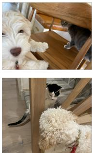
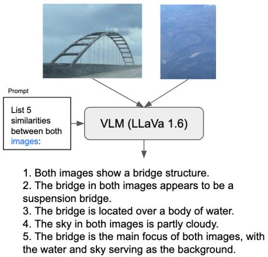
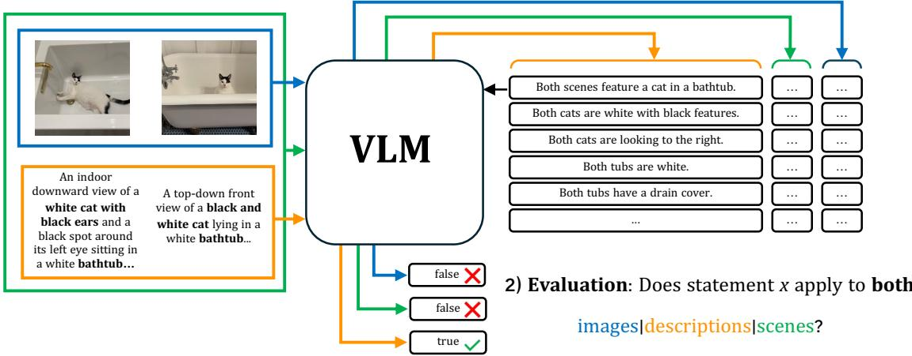
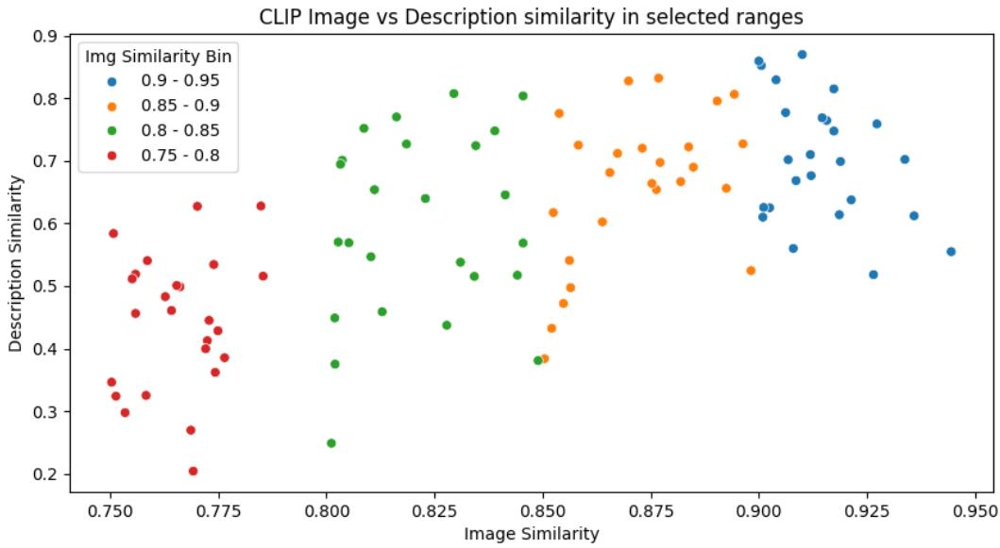
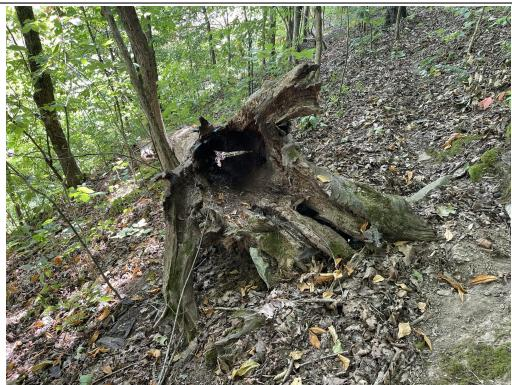
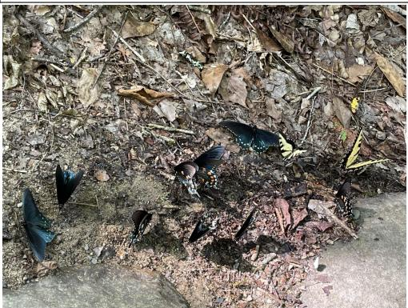
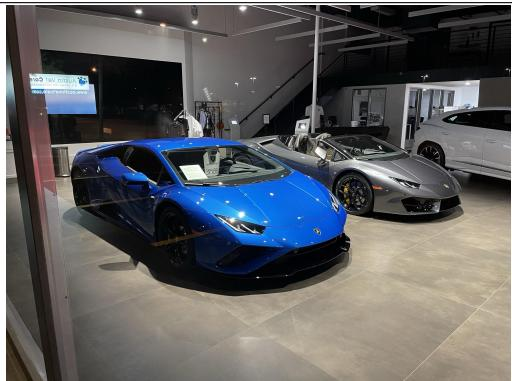
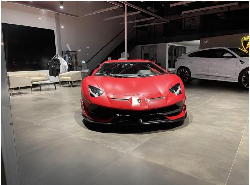

# CAST: Cross-modal Alignment Similarity Test for Vision Language Models

Gautier Dagan University of Edinburgh gautier.dagan@ed.ac.uk

Olga Loginova University of Trento olga.loginova@unitn.it

Anil Batra University of Edinburgh a.k.batra@sms.ed.ac.uk

## Abstract

Vision Language Models (VLMs) are typically evaluated with Visual Question Answering (VQA) tasks which assess a model’s understanding of scenes. Good VQA performance is taken as evidence that the model will perform well on a broader range of tasks that require both visual and language inputs. However, scene-aware VQA does not fully capture input biases or assess hallucinations caused by a misalignment between modalities. To address this, we propose a Cross-modal Alignment Similarity Test (CAST) to probe VLMs for self-consistency across modalities. This test involves asking the models to identify similarities between two scenes through text-only, image-only, or both and then assess the truthfulness of the similarities they generate. Since there is no ground truth to compare against, this evaluation does not focus on objective accuracy but rather on whether VLMs are internally consistent in their outputs. We argue that while not all self-consistent models are capable or accurate, all capable VLMs must be self-consistent.

## 1 Introduction

Vision Language Models (VLMs) integrate vision and language modalities to learn image-text correspondences from large-scale image-text pairs (Zhang et al., 2023; Radford et al., 2021a; Kwon et al., 2022). Given image-text pairs, VLMs combine a text encoder and an image encoder to extract image and text features and then learn to align vision and language through generative objectives, such as Visual Question Answering (VQA). As a result, VLMs pose a unique challenge in ensuring consistent outputs across different input types – be it text, images, or a combination of both.

Consistency in AI models is essential for their reliability and trustworthiness (Ji et al., 2023). Selfconsistency refers to a model’s ability to produce stable, coherent outputs across similar inputs and conditions (Elazar et al., 2021). If a VLM exhibits



A close-up shot of the right side of the face of a cream-colored labradoodle puppy looking to its right at the camera and its front paws on the back part of the seat of a wooden chair. A grey tabby cat is to the right of the dog facing the background and looking to its left at the dog on the brown chair, peering under the back rest of the chair...

A close-up view of a cream-colored labradoodle looking through the wired cable railing of a stair set as a black and white cat that is staring back, resting on the first step...

<table><tr><td>Gen w/</td><td></td><td>image</td><td>text</td><td>both</td></tr><tr><td>image</td><td>Both cats are gray. Both dogs are white.</td><td>××</td><td>× X</td><td>××</td></tr><tr><td>text</td><td>Both scenes are close-up shots of the interaction between the dog and the cat.</td><td>X</td><td>V</td><td>√</td></tr><tr><td>both</td><td>Both cats are black and white.</td><td></td><td>X</td><td>×</td></tr></table>

Figure 1: Example of paired scenes and statements from the CAST dataset. Horizontal blocks show generated statements, while vertical blocks are evaluations for each modality: image-only, text-only, and image+text. Red crosses indicate where each model disagrees with its own generation during the evaluation step. Similarity topics are highlighted in bold. Note that VLMs may produce hallucinations, as the CAST method checks for consistency rather than correctness.

inconsistent behavior when given the same input across different modalities, it could raise concerns about its robustness and internal reasoning. So while models might perform well on major VQA benchmarks, such as MMMU (Yue et al., 2023) or MME (Fu et al., 2023), we argue that they must also be evaluated for self-consistency.

We propose to evaluate self-consistency through the absence of contradictions between a model’s generated output and the evaluation of this output by different modalities. To this end, we introduce the two-step Cross-modal Alignment Similarity Test (CAST).<sup>1</sup> We apply CAST to different VLMs and find that despite strong performance on many other downstream tasks, the majority of VLMs exhibit a lack of internal self-consistency and modality alignment (see examples in Figure 1). CAST provides a more nuanced understanding of VLMs’ reasoning capabilities and potential biases, which is critical for real-world applications.

## 2 Related Works

Traditionally, self-consistency has been tested through meaning-preserving alternations to model’s inputs, such as adding illogical statements, filler tokens, or paraphrasing (Elazar et al., 2021; Parcalabescu and Frank, 2024; Yue et al., 2024). Logical consistency ensures that the model’s outputs remain coherent and non-contradictory throughout multiple iterations (Yang et al., 2024; Zhang et al., 2024). We instead design CAST to evaluate the cross-modal consistency of VLMs through a comparison task.

Several work have proposed image comparison benchmarks for VLMs (Fu et al., 2024; Zhao et al., 2024; Dunlap et al., 2023). They focus on contrastive pairs where similar images differ in key features. For example, VisDiffBench (Dunlap et al., 2023) uses human-annotated differences between two sets of images. In contrast, we focus on similarities to capture the semantic overlap between example pairs.

Self-consistency in VLMs and LLMs is closely tied to uncertainty in predictions, resulting in noisier outputs (Chen et al., 2024). Consequently, it is used as a metric to detect hallucinations caused by misalignment (Manakul et al., 2023; Mündler et al., 2024; Li et al., 2024). CAST can also reveal logical hallucinations where a model’s uncertainty causes it to be inconsistent.

## 3 Method

We propose CAST (shown in Figure 3) as a fully automated two-step approach to evaluate multi-modal self-consistency in VLMs.

## 3.1 Generating Similarities

CAST leverages similarities between two scenes to assess a model’s ability to evaluate its own outputs. In our case, a scene is an image paired with its high-quality description (see Section 4.1). By focusing on shared features, the model is less likely to rely on surface-level distinctions or superficial strategies. For instance, if tasked with finding differences between two images, the model might only attend to one image or highlight minor details like color changes. Emphasizing similarities encourages a deeper evaluation of each input.

  
Figure 2: Example of the first step of CAST: Generation. We pass a pair of related examples (either as images, text descriptions, or both) and prompt the VLM to generate a set of similarity statements. In the second step, the truthfulness of each statements is evaluated by the same VLM for each sets of modality.

The first step of CAST is to prompt the VLM to generate a number of statements about the similarities between two input scenes $S _ { A }$ and $S _ { B }$ . Since we generate a list of similarities using the VLM, each subsequent similarity statement is conditioned on all previously generated ones. We can view the generation of a given similarity as following:

$$
\begin{array} { l r } { { s i m _ { 0 } = V L M ( S _ { A } , S _ { B } , P ^ { g e n } ) } } & { { ( 1 ) } } \\ { { s i m _ { i } = V L M ( s i m _ { i - 1 } , . . . , s i m _ { 0 } ; S _ { A } , S _ { B } , P ^ { g e n } ) , } } \end{array}\tag{2}
$$

where $P ^ { g e n }$ are the instructions. Similarity statements are generated for different modalities: scenes can be represented as two images $( S ^ { i m g } )$ , two text descriptions $( S ^ { t x t } )$ , or two images combined with the corresponding descriptions $( S ^ { i m g + t x t } )$ . In Figure 2 we show an example of a set of similarity statements generated by $S ^ { i m g }$ . We obtain the similarity statements conditioned on a pair of scenes for each modality stream. We restrict the input pairs to the same modality and generate all statements using greedy sampling $( t = 0 )$

## 3.2 Evaluating Similarities

The second step of our approach is to evaluate each similarity statement and test whether a model remains consistent under different modalities. Since we focus on self-consistency, we use the same model for both generation and evaluation. The evaluation step can be represented as following:

$$
s = V L M ( S _ { A } , S _ { B } , P ^ { e v a l } ) ,\tag{3}
$$

  
Figure 3: CAST is two-fold. In the first step, we ask the model to generate a set of similarity statements conditioned on different modality input types (image-only, text-only, both). In the second step, the model validates the truthfulness of the generated statements with respect to each modality. This allows us to measure whether the VLM is self-consistent within a modality and across different modalities.

where s is 1 if the model confirms that the statement is true and 0 otherwise. We filter out the generations that cannot be parsed (see Appendix A for details). To mitigate bias towards a certain prompt or phrasing (Pezeshkpour and Hruschka, 2024; Sclar et al., 2024), we use three different evaluation prompts. Thus, apart from the conventional Yes/No questions, we ask the model whether the statement applies to one or both scenes and whether the statement is true or false. To quantify self-consistency, we report the average s over all the evaluated pairs and prompts for each modality permutation (both generated and evaluated with).

## 4 Experiments and Results

## 4.1 Dataset

Since CAST relies on asking VLMs to find similarities between two scenes, we need a multi-modal set of pairs of aligned images/descriptions that contain similarities. To construct our evaluation dataset, we sub-sample example pairs from the DOCCI Dataset (Onoe et al., 2024). The dataset contains 15k images paired with human-annotated descriptions of 136 words on average. The images focus on spatial relations and world knowledge. Unlike popular captioning datasets, each description is comprehensively annotated to capture the differences between similar images.

We randomly sample 100 pairs of images from the DOCCI train dataset of 10k images. We threshold the CLIP (Radford et al., 2021b) cosinesimilarity and filter out the pairs of the < 0.75 CLIP score (since the images might not have enough in common), or ≥ 0.95 CLIP score (to exclude near identical ones and duplicates). We also filter out images with captions of less than 500 characters to include only those that contain ample descriptive information about the scene.

## 4.2 Models

We test the following open-source and closedsource VLMs for self-consistency, each with distinct vision encoders, language models, and training dataset:

• Bunny 1.1 (He et al., 2024)

• LLaVA (Liu et al., 2023a) in three configurations: LLaVA 1.5 (Vicuna), LLaVA 1.6 (Llama), and LLaVA 1.6 (Mistral). Additionally, we evaluate LLaVA 1.5 RLAIF (Yu et al., 2024), a version of LLaVA 1.5 aligned through AI feedback.

• InternVL2 (Chen et al., 2023)

• MiniCPM V2 (Yao et al., 2024)

• Phi 3.5 Vision (Abdin et al., 2024)

• GPT4o-mini

See Appendix B for more information on each model.

## 4.3 Results

Table 3 shows the CAST results for similarity statements generated and evaluated across different modalities. We average the CAST score over the first the first three statements generated (Top-3). The results indicate that models perform best when statements are generated and evaluated within the same modality. There is a noticeable drop in consistency during cross-modal evaluations, where statements generated from images are evaluated using text descriptions and vice versa. With the exception of GPT4o-Mini, the combination of imagegenerated and text-evaluated statements leads to the worst consistency. This is somewhat expected as the similarity statement generated by the model might have been about something not mentioned in the text description (see Appendix D).

<table><tr><td>Model</td><td>Gen w/</td><td>Eval w/ text</td><td>Eval w/ image</td><td>Eval w/ both</td></tr><tr><td rowspan="3">Bunny</td><td>text</td><td>0.93</td><td>0.76</td><td>0.96</td></tr><tr><td>image</td><td>0.71</td><td>0.80</td><td>0.85</td></tr><tr><td>both</td><td>0.91</td><td>0.81</td><td>0.96</td></tr><tr><td rowspan="3">GPT4o-Mini</td><td>text</td><td>0.94</td><td>0.73</td><td>0.94</td></tr><tr><td>image</td><td>0.79</td><td>0.90</td><td>0.87</td></tr><tr><td>both</td><td>0.91</td><td>0.76</td><td>0.91</td></tr><tr><td rowspan="3">InternVL2</td><td>text</td><td>0.67</td><td>0.66</td><td>0.72</td></tr><tr><td>image</td><td>0.57</td><td>0.78</td><td>0.75</td></tr><tr><td>both</td><td>0.68</td><td>0.73</td><td>0.77</td></tr><tr><td rowspan="3">MiniCPM V2</td><td>text</td><td>0.92</td><td>0.90</td><td>0.93</td></tr><tr><td>image</td><td>0.50</td><td>0.91</td><td>0.73</td></tr><tr><td>both</td><td>0.84</td><td>0.89</td><td>0.91</td></tr><tr><td rowspan="3">Phi-3.5-V</td><td>text</td><td>0.61</td><td>0.60</td><td>0.63</td></tr><tr><td>image</td><td>0.50</td><td>0.72</td><td>0.61</td></tr><tr><td>both</td><td>0.60</td><td>0.63</td><td>0.64</td></tr><tr><td rowspan="3">LLaVA 1.5 (Vicuna)</td><td>text</td><td>0.91</td><td>0.87</td><td>0.82</td></tr><tr><td>image</td><td>0.68</td><td>0.91</td><td>0.69</td></tr><tr><td>both</td><td>0.86</td><td>0.87</td><td>0.78</td></tr><tr><td rowspan="3">LLaVA 1.6 (Llama)</td><td>text</td><td>0.73</td><td>0.57</td><td>0.74</td></tr><tr><td>image</td><td>0.56</td><td>0.69</td><td>0.64</td></tr><tr><td>both</td><td>0.68</td><td>0.62</td><td>0.73</td></tr><tr><td rowspan="3">LLaVA 1.6 (Mistral)</td><td>text</td><td>0.81</td><td>0.85</td><td>0.87</td></tr><tr><td>image</td><td>0.52</td><td>0.86</td><td>0.72</td></tr><tr><td>both</td><td>0.74</td><td>0.86</td><td>0.84</td></tr><tr><td rowspan="3">LLaVA 1.5 RLAIF</td><td>text</td><td>0.57</td><td>0.66</td><td>0.49</td></tr><tr><td>image</td><td>0.58</td><td>0.93</td><td>0.70</td></tr><tr><td>both</td><td>0.55</td><td>0.76</td><td>0.58</td></tr></table>

Table 1: CAST self-consistency scores (Top-3) averaged over the first three statements generated for each modality configuration. Bold cells show the performance when the evaluation is in the same modality as the generation.

Qualitatively, we find that most inconsistencies arise during generation, where models often produce incorrect statements, particularly about object attributes or relationships. Notably, the image modality shows the highest hallucination rates, with models emphasizing prominent features without verifying their relevance to both scenes. This suggests that while object recognition is strong in state-of-the-art VLMs, accurately describing attributes and relations remains a challenge.

MiniCPM exhibits high consistency when evaluating with images. To test whether this is due to its RLAIF (Yu et al., 2024) fine-tuning stage, we evaluate a version of LLaVA-1.5 specially trained with RLAIF. Overall, we find LLaVA-1.5 RLAIF to be significantly less consistent than its base-model LLaVA-1.5. We therefore fail to conclude that

<table><tr><td colspan="4">top-1</td><td colspan="4">top-3</td></tr><tr><td>Bunny</td><td>1.00</td><td>0.92</td><td>0.99</td><td>0.93</td><td>0.80</td><td>0.96</td><td rowspan="3">1.0 0.9</td></tr><tr><td>GPT4o-Mini-</td><td>0.97</td><td>0.99</td><td>0.94</td><td>0.94</td><td>0.90</td><td>0.91</td></tr><tr><td>InternVL2.</td><td>0.81</td><td>0.88</td><td>0.85</td><td>0.67</td><td>0.78</td><td>0.77</td></tr><tr><td>MiniCPM V2-</td><td>0.98</td><td>0.91</td><td>0.95</td><td>0.92</td><td>0.91</td><td>0.91</td><td rowspan="3">-0.8 -0.7</td></tr><tr><td>Phi-3.5-V.</td><td>0.64</td><td>0.76</td><td>0.66</td><td>0.61</td><td>0.72</td><td>0.64</td></tr><tr><td>LLaVA 1.5-</td><td>0.97</td><td>0.97</td><td>0.87</td><td>0.91</td><td>0.91</td><td>0.78</td></tr><tr><td>LLaVA 1.6 (Llama)-</td><td>0.89</td><td>0.71</td><td>0.86</td><td>0.73</td><td>0.69</td><td>0.73</td><td rowspan="3">0.6 0.5</td></tr><tr><td>LLaVA 1.6 (Mistral)-</td><td>0.91</td><td>0.95</td><td>0.95</td><td>0.81</td><td>0.86</td><td>0.84</td></tr><tr><td>LLaVA 1.5 RLAIF-</td><td>0.59</td><td>0.94</td><td>0.59</td><td>0.57</td><td>0.93</td><td>0.58</td></tr><tr><td></td><td>text</td><td>image</td><td>both</td><td>text</td><td>image</td><td>both</td></tr></table>

Figure 4: Average CAST self-consistency when multiple statements are generated and evaluated within the same modality. Left: Top-1 considers only the first statement generated. Right: Top-3 considers the first three statements generated, these are equivalent to the bolded results from Table 3.

RLAIF has a positive impact on consistency.

Figure 4 shows CAST scores for Top-1 and Top-3 generated statements. There is a slight decrease in CAST scores from Top-1 to Top-3, indicating that the quality of similarity statements typically declines with additional generations, as models become less reliable over longer generations.

We find GPT4o-Mini and MiniCPM to be the most consistent models overall. Both exhibit minimal drop with longer generations (9% for GPT4o-Mini and 6% for MiniCPM). In contrast, InternV2 and the LLaVA models experience a significant drop in consistency with additional generations. Overall, our single-modality CAST results highlight that VLMs fail to provide coherent and stable outputs as generations get longer.

Lastly, we can use CAST to evaluate how different modalities impact different VLMs. For instance, GPT4o-Mini and Bunny show a drop in image self-consistency when generation length increases, unlike MiniCPM and LLaVA-RLAIF which maintain more stability with generation length. Other models such as InterVL2 are more sensitive to the text modality.

## 5 Conclusion

We introduce CAST to evaluate the multi-modal self-consistency of VLMs by testing whether a model applies consistent reasoning across text-only, image-only, or combined inputs. CAST uncovers cross-modal inconsistencies and goes beyond traditional accuracy metrics to assess the stability of a model’s logic across different modalities.

Our findings show that open-source VLMs still struggle with self-consistency across different modalities. CAST not only assesses selfconsistency but also identifies modalities where the model may lack understanding. The strength of CAST lies in its lack of ground truth. The model’s self-consistency is evaluated only with respect to itself and not whether its generated statements are correct. As a result, CAST should be used in addition to traditional metrics, like accuracy, that capture the “correctness” capabilities of models. Additionally, because CAST does not rely on ground truth, it generalises well to different types of aligned inputs. It should therefore be easily extensible and applicable to a wide range of datasets and modalities.

CAST also provides a future direction for improving robustness in VLMs. For instance, using CAST during training, one could track selfconsistency across modalities, which could provide insights into how VLMs align modalities over time. Using CAST as a task during instruction finetuning might also improve multi-modal alignment across different modalities.

Ultimately, given the method’s universality, CAST’s framework can be adapted to any domain or language dataset, provided there are sufficiently similar images and highly detailed descriptions.

## 6 Limitations

The main limitation is that our test does not guarantee the capability of a model. We make no claims about the correctness of the model, but focus solely on whether a model is self-consistent. This means a model that always predicts the similarity statement to match the scenes, regardless of the statement, would always be deemed consistent even though it would also likely be wrong. Our approach therefore needs to be taken in conjunction with the traditional evaluation methods. It is most useful for models trained and evaluated using standard correctness metrics.

Additionally, a potential limitation is that we only evaluate CAST on a sample of 100 selected pairs. However, we do not believe the sample size affects the validity of our benchmarking framework, and we also release our code and sampling method to allow a greater evaluation set to be constructed. The primary objective of this paper is to introduce CAST as a flexible evaluation method rather than to establish a fixed dataset. To increase robustness, we also use three different prompts and assess each model across multiple modality combinations (text-only, image-only, and both). Increasing the sample size would also lead to a rise in inference costs without necessarily producing different insights.

Finally, there are also limitations with our VLM evaluations that follow directly from the brittle nature of these models. While we evaluated the generated statements using multiple prompts, we sample from each model using greedy sampling and therefore it is possible that some of our results are biased towards certain models. However, CAST could easily be expanded to include responses from different sampling mechanisms (temperature > 0) at the cost of increased computation.

## 7 Ethical Considerations

Our research relies on open-source and closedsource VLMs generating and evaluating text and image inputs and therefore carries the typical risks associated with open-ended text generation. The DOCCI dataset, which we sub-sample from, is licensed under the CC BY 4.0 license<sup>2</sup>. Overall, we hope that CAST leads to improvements in the trustworthiness and robustness of VLMs.

## Acknowledgments

The authors extend their gratitude to Amazon’s Development Centre Scotland (ADCS) for the challenge and AWS access to work with VLMs models of the Claude family. In particular, we wish to thank Christos Christodoulopoulos for his helpful feedback throughout this project. Olga Loginova also thanks Amazon Alexa for their support of her research through a grant.

This work was supported in part by the UKRI Centre for Doctoral Training in Natural Language Processing, funded by the UKRI (grant EP/S022481/1) at the University of Edinburgh, School of Informatics and School of Philosophy, Psychology & Language Sciences and by the UKRI-funded TAS Governance Node (grant number EP/V026607/1).

## References

Marah Abdin, Sam Ade Jacobs, Ammar Ahmad Awan, Jyoti Aneja, Ahmed Awadallah, Hany Awadalla, Nguyen Bach, Amit Bahree, Arash Bakhtiari, Harkirat Behl, et al. 2024. Phi-3 technical report: A highly capable language model locally on your phone. arXiv preprint arXiv:2404.14219.

Chao Chen, Kai Liu, Ze Chen, Yi Gu, Yue Wu, Mingyuan Tao, Zhihang Fu, and Jieping Ye. 2024. INSIDE: LLMs’ internal states retain the power of hallucination detection. In The Twelfth International Conference on Learning Representations.

Zhe Chen, Jiannan Wu, Wenhai Wang, Weijie Su, Guo Chen, Sen Xing, Muyan Zhong, Qinglong Zhang, Xizhou Zhu, Lewei Lu, Bin Li, Ping Luo, Tong Lu, Yu Qiao, and Jifeng Dai. 2023. Internvl: Scaling up vision foundation models and aligning for generic visual-linguistic tasks. arXiv preprint arXiv:2312.14238.

Abhimanyu Dubey, Abhinav Jauhri, Abhinav Pandey, Abhishek Kadian, Ahmad Al-Dahle, Aiesha Letman, Akhil Mathur, Alan Schelten, Amy Yang, Angela Fan, et al. 2024. The llama 3 herd of models. arXiv preprint arXiv:2407.21783.

Lisa Dunlap, Yuhui Zhang, Xiaohan Wang, Ruiqi Zhong, Trevor Darrell, Jacob Steinhardt, Joseph E. Gonzalez, and Serena Yeung-Levy. 2023. Describing differences in image sets with natural language. ArXiv, abs/2312.02974.

Yanai Elazar, Nora Kassner, Shauli Ravfogel, Abhilasha Ravichander, Eduard Hovy, Hinrich Schütze, and Yoav Goldberg. 2021. Measuring and improving consistency in pretrained language models. Transactions ofthe Associationfor Computational Linguistics, 9:1012–1031.

Chaoyou Fu, Peixian Chen, Yunhang Shen, Yulei Qin, Mengdan Zhang, Xu Lin, Zhenyu Qiu, Wei Lin, Jinrui Yang, Xiawu Zheng, Ke Li, Xing Sun, and Rongrong Ji. 2023. Mme: A comprehensive evaluation benchmark for multimodal large language models. ArXiv, abs/2306.13394.

Xingyu Fu, Yushi Hu, Bangzheng Li, Yu Feng, Haoyu Wang, Xudong Lin, Dan Roth, Noah A. Smith, Wei-Chiu Ma, and Ranjay Krishna. 2024. Blink: Multimodal large language models can see but not perceive. ArXiv, abs/2404.12390.

Muyang He, Yexin Liu, Boya Wu, Jianhao Yuan, Yueze Wang, Tiejun Huang, and Bo Zhao. 2024. Efficient multimodal learning from data-centric perspective. arXiv preprint arXiv:2402.11530.

Jiaming Ji, Tianyi Qiu, Boyuan Chen, Borong Zhang, Hantao Lou, Kaile Wang, Yawen Duan, Zhonghao He, Jiayi Zhou, Zhaowei Zhang, Fanzhi Zeng, Kwan Yee Ng, Juntao Dai, Xuehai Pan, Aidan O’Gara, Yingshan Lei, Hua Xu, Brian Tse, Jie Fu, Stephen Marcus McAleer, Yaodong Yang, Yizhou

Wang, Song-Chun Zhu, Yike Guo, and Wen Gao. 2023. Ai alignment: A comprehensive survey. ArXiv, abs/2310.19852.

Albert Q Jiang, Alexandre Sablayrolles, Arthur Mensch, Chris Bamford, Devendra Singh Chaplot, Diego de las Casas, Florian Bressand, Gianna Lengyel, Guillaume Lample, Lucile Saulnier, et al. 2023. Mistral 7b. arXiv preprint arXiv:2310.06825.

Gukyeong Kwon, Zhaowei Cai, Avinash Ravichandran, Erhan Bas, Rahul Bhotika, and Stefan 0 Soatto. 2022. Masked vision and language modeling for multi-modal representation learning. ArXiv, abs/2208.02131.

Qing Li, Chenyang Lyu, Jiahui Geng, Derui Zhu, Maxim Panov, and Fakhri Karray. 2024. Referencefree hallucination detection for large vision-language models.

Haotian Liu, Chunyuan Li, Yuheng Li, and Yong Jae Lee. 2023a. Improved baselines with visual instruction tuning. Preprint, arXiv:2310.03744.

Haotian Liu, Chunyuan Li, Qingyang Wu, and Yong Jae Lee. 2023b. Visual instruction tuning. In NeurIPS.

Potsawee Manakul, Adian Liusie, and Mark Gales. 2023. SelfCheckGPT: Zero-resource black-box hallucination detection for generative large language models. In Proceedings of the 2023 Conference on Empirical Methods in Natural Language Processing, pages 9004–9017, Singapore. Association for Computational Linguistics.

Niels Mündler, Jingxuan He, Slobodan Jenko, and Martin Vechev. 2024. Self-contradictory hallucinations of large language models: Evaluation, detection and mitigation. In The Twelfth International Conference on Learning Representations.

Yasumasa Onoe, Sunayana Rane, Zachary Berger, Yonatan Bitton, Jaemin Cho, Roopal Garg, Alexander Ku, Zarana Parekh, Jordi Pont-Tuset, Garrett Tanzer, et al. 2024. Docci: Descriptions of connected and contrasting images. arXiv preprint arXiv:2404.19753.

Letitia Parcalabescu and Anette Frank. 2024. Do vision & language decoders use images and text equally? how self-consistent are their explanations? ArXiv, abs/2404.18624.

Pouya Pezeshkpour and Estevam Hruschka. 2024. Large language models sensitivity to the order of options in multiple-choice questions. In Findings of the Associationfor Computational Linguistics: NAACL 2024, pages 2006–2017, Mexico City, Mexico. Association for Computational Linguistics.

Alec Radford, Jong Wook Kim, Chris Hallacy, Aditya Ramesh, Gabriel Goh, Sandhini Agarwal, Girish Sastry, Amanda Askell, Pamela Mishkin, Jack Clark, Gretchen Krueger, and Ilya Sutskever. 2021a. Learning transferable visual models from natural language

supervision. In International Conference on Machine Learning.

Alec Radford, Jong Wook Kim, Chris Hallacy, Aditya Ramesh, Gabriel Goh, Sandhini Agarwal, Girish Sastry, Amanda Askell, Pamela Mishkin, Jack Clark, Gretchen Krueger, and Ilya Sutskever. 2021b. Learning transferable visual models from natural language supervision. In Proceedings of the 38th International Conference on Machine Learning, volume 139 of Proceedings of Machine Learning Research, pages 8748–8763. PMLR.

Melanie Sclar, Yejin Choi, Yulia Tsvetkov, and Alane Suhr. 2024. Quantifying language models’ sensitivity to spurious features in prompt design or: How i learned to start worrying about prompt formatting. In The Twelfth International Conference on Learning Representations.

Qian Yang, Weixiang Yan, and Aishwarya Agrawal. 2024. Decompose and compare consistency: Measuring vlms’ answer reliability via task-decomposition consistency comparison. ArXiv, abs/2407.07840.

Yuan Yao, Tianyu Yu, Ao Zhang, Chongyi Wang, Junbo Cui, Hongji Zhu, Tianchi Cai, Haoyu Li, Weilin Zhao, Zhihui He, Qianyu Chen, Huarong Zhou, Zhensheng Zou, Haoye Zhang, Shengding Hu, Zhi Zheng, Jie Zhou, Jie Cai, Xu Han, Guoyang Zeng, Dahai Li, Zhiyuan Liu, and Maosong Sun. 2024. Minicpm-v: A gpt-4v level mllm on your phone. arXiv preprint 2408.01800.

Tianyu Yu, Haoye Zhang, Yuan Yao, Yunkai Dang, Da Chen, Xiaoman Lu, Ganqu Cui, Taiwen He, Zhiyuan Liu, Tat-Seng Chua, et al. 2024. Rlaif-v: Aligning mllms through open-source ai feedback for super gpt-4v trustworthiness. arXiv preprint arXiv:2405.17220.

Tongtian Yue, Jie Cheng, Longteng Guo, Xingyuan Dai, Zijia Zhao, Xingjian He, Gang Xiong, Yisheng Lv, and Jing Liu. 2024. Sc-tune: Unleashing selfconsistent referential comprehension in large vision language models. arXiv preprint arXiv:2403.13263.

Xiang Yue, Yuansheng Ni, Kai Zhang, Tianyu Zheng, Ruoqi Liu, Ge Zhang, Samuel Stevens, Dongfu Jiang, Weiming Ren, Yuxuan Sun, Cong Wei, Botao Yu, Ruibin Yuan, Renliang Sun, Ming Yin, Boyuan Zheng, Zhenzhu Yang, Yibo Liu, Wenhao Huang, Huan Sun, Yu Su, and Wenhu Chen. 2023. Mmmu: A massive multi-discipline multimodal understanding and reasoning benchmark for expert agi. ArXiv, abs/2311.16502.

Xiaohua Zhai, Basil Mustafa, Alexander Kolesnikov, and Lucas Beyer. 2023. Sigmoid loss for language image pre-training. In Proceedings ofthe IEEE/CVF International Conference on Computer Vision, pages 11975–11986.

Jingyi Zhang, Jiaxing Huang, Sheng Jin, and Shijian Lu. 2023. Vision-language models for vision tasks: A survey. IEEE Transactions on Pattern Analysis and Machine Intelligence, 46:5625–5644.

Yuan Zhang, Fei Xiao, Tao Huang, Chun-Kai Fan, Hongyuan Dong, Jiawen Li, Jiacong Wang, Kuan Cheng, Shanghang Zhang, and Haoyuan Guo. 2024. Unveiling the tapestry of consistency in large visionlanguage models. ArXiv, abs/2405.14156.

Bingchen Zhao, Yongshuo Zong, Letian Zhang, and Timothy M. Hospedales. 2024. Benchmarking multiimage understanding in vision and language models: Perception, knowledge, reasoning, and multi-hop reasoning. ArXiv, abs/2406.12742.

## A Prompts

## A.1 Generation

To generate a number of similarity statements, we use the prompt shown in Figure 5. We slightly modify the prompt to fit each modality input.

Given two scenes | side-by-side images | scenes and their corresponding images, find up to five similarities between each scene|image|scene. Output each similarity in a numbered list.

Figure 5: Generation Prompt: For each model and each of the three modalities, we generate a list of similarity statements using the above prompt.

## A.2 Evaluation

To reduce variance in our results and potential biases that might exist towards certain prompt phrasing (Pezeshkpour and Hruschka, 2024; Sclar et al., 2024), we opt to use three different evaluation prompts shown in Figure 6.

## A.3 Parsing the Evaluation Output

To parse the resulting evaluation from the model we use a simple post-processing step:

```python
1 def parse_validator (x):
2 x = x. strip ("*"). lower (). split ("\n")
[0]
3 if x. startswith ( positive ):
4 return 1
5 elif x. startswith ( negative ):
6 return 0
7 else :
8 return None
```

Note that we ignore generations that we cannot parse from the evaluation score. This is typically rare for most models and prompts.

## B Additional model details

## C Additional Results

## C.1 Results for each Prompt types

## C.2 Results for position of generated statement

## D Information Flow in Image Similarity

Since the human annotators of DOCCI (Onoe et al., 2024) are given the image from which to write the description, from an information content, we can view the textual description of an image as a subset of the overall information content contained within the image.

1. Given two scenes|side-by-side images|scenes and their corresponding images, does the following statement apply to only one of the scenes | images | scenes? Answer with ‘one’ or ‘both’.

2. Given two scenes|side-by-side images|scenes and their corresponding images, is the following statement true for both of the scenes|images|scenes? Answer with ‘true’ or ‘false’ if the statement is untrue or only true for one of the scenes|images|scenes.

3. Given two descriptions|side-by-side images|descriptions and their corresponding images, does the following statement describe both of the descriptions|images|descriptions? Answer with ‘yes’ or ‘no’ if the statement is not applicable to one of the descriptions|images|descriptions.

Figure 6: Evaluation Prompts: For each model and each of the three modalities, we generate validate a similarity statement from the generation step. We use three different evaluation prompts to reduce potential bias of models towards a particular prompt format.

If denote information content as entropy H, then:

$$
H ( S ^ { i m g } ) \geq H ( S ^ { t x t } )
$$

And since the text description should not be introducing new information, the union of both the Image and Description should be equal in entropy to that of the image:

$$
H ( S ^ { i m g } ) = H ( S ^ { i m g + t x t } )
$$

Unfortunately, it is the case that text can introduces new information through subjective interpretation, and the obvious fact that a photograph can very rarely be fully described in language. However it might still be useful to model the annotation of images as conditional on the images and not independent. This might lead to further inter-modal consistency analysis which we leave open as direction for future work.

<table><tr><td>Model</td><td>Vision Encoder</td><td>LLM</td><td>Additional Design Choices</td></tr><tr><td>Bunny 1.1 (He et al., 2024)</td><td>SigLip-400M (Zhai et al., 2023)</td><td>Llama-3-8B Ins (Dubey et al., 2024)</td><td></td></tr><tr><td>MiniCPM V 2.5 (Yao et al., 2024)</td><td>SigLip-400M (Zhai et al., 2023)</td><td>Llama-3-8B Ins (Dubey et al., 2024)</td><td>Adaptive Visual Encoding and RLAIF-V</td></tr><tr><td>InternVL2 (Chen et al., 2023)</td><td>InternViT</td><td>InternLM 2.5 7B</td><td></td></tr><tr><td>Phi 3.5 Vision (Abdin et al., 2024)</td><td>CLIP ViT (Radford et al., 2021b)</td><td>phi-3-mini-128K-instruct LM</td><td></td></tr><tr><td>LLaVa-Next 1.5 (Liu et al., 2023b)</td><td>CLIP-ViT (Radford et al., 2021b)</td><td>Vicuna-7B</td><td></td></tr><tr><td>LLaVa-Next 1.6 (Liu et al., 2023b)</td><td>CLIP-ViT (Radford et al., 2021b)</td><td>Mistral-7B (Jiang et al., 2023)</td><td></td></tr><tr><td>LLaVa-Next 1.6 (Liu et al., 2023b)</td><td>CLIP-ViT (Radford et al., 2021b)</td><td>Llama-3-8B Ins (Dubey et al., 2024)</td><td>Image Slicing</td></tr><tr><td>LLaVa-Next 1.5 RLAIF (Yu et al., 2024)</td><td>CLIP-ViT (Radford et al., 2021b)</td><td>Vicuna-7B</td><td>Visual RLAIF Alignment</td></tr></table>

Table 2: Open-source VLMs tested along with a description of which Vision Encoder and LLM each model uses.
<table><tr><td rowspan="2">Model</td><td rowspan="2">Gen w/</td><td colspan="4">Eval w/ text</td><td colspan="4">Eval w/ image</td><td colspan="4">Eval w/ both</td></tr><tr><td>yes/no</td><td>both/one</td><td>true/false</td><td>Avg.</td><td>yes/no</td><td>both/one</td><td>true/false</td><td>Avg.</td><td>yes/no</td><td>both/one</td><td>true/false</td><td>Avg.</td></tr><tr><td rowspan="3">Bunny</td><td>text</td><td>0.97</td><td>0.99</td><td>0.84</td><td>0.93</td><td>0.73</td><td>0.88</td><td>0.66</td><td>0.76</td><td>0.99</td><td>0.96</td><td>0.93</td><td>0.96</td></tr><tr><td>image</td><td>0.72</td><td>0.86</td><td>0.55</td><td>0.71</td><td>0.75</td><td>0.90</td><td>0.74</td><td>0.80</td><td>0.85</td><td>0.89</td><td>0.80</td><td>0.85</td></tr><tr><td>both</td><td>0.94</td><td>0.98</td><td>0.80</td><td>0.91</td><td>0.77</td><td>0.92</td><td>0.74</td><td>0.81</td><td>0.98</td><td>0.96</td><td>0.94</td><td>0.96</td></tr><tr><td rowspan="4">GPT4o-M</td><td>text</td><td>0.91</td><td>0.98</td><td>0.92</td><td>0.94</td><td>0.70</td><td>0.88</td><td>0.62</td><td>0.73</td><td>0.96</td><td>0.95</td><td>0.93</td><td>0.94</td></tr><tr><td>image</td><td>0.75</td><td>0.91</td><td>0.71</td><td>0.79</td><td>0.91</td><td>0.95</td><td>0.85</td><td>0.90</td><td>0.86</td><td>0.94</td><td>0.83</td><td>0.87</td></tr><tr><td>both</td><td>0.90</td><td>0.97</td><td>0.86</td><td>0.91</td><td>0.73</td><td>0.87</td><td>0.67</td><td>0.76</td><td>0.93</td><td>0.94</td><td>0.87</td><td>0.91</td></tr><tr><td>text</td><td>0.80</td><td>0.36</td><td>0.86</td><td>0.67</td><td>0.86</td><td>0.17</td><td>0.94</td><td>0.66</td><td>0.90</td><td>0.32</td><td>0.95</td><td>0.72</td></tr><tr><td rowspan="3">InternVL2</td><td>image</td><td>0.65</td><td>0.34</td><td>0.71</td><td>0.57</td><td>0.98</td><td>0.39</td><td>0.99</td><td>0.78</td><td>0.88</td><td>0.42</td><td>0.95</td><td>0.75</td></tr><tr><td>both</td><td>0.85</td><td>0.35</td><td>0.85</td><td>0.68</td><td>0.96</td><td>0.25</td><td>0.99</td><td>0.73</td><td>0.94</td><td>0.40</td><td>0.98</td><td>0.77</td></tr><tr><td>text</td><td>0.96</td><td>0.79</td><td>0.99</td><td>0.92</td><td>0.96</td><td>0.78</td><td>0.97</td><td>0.90</td><td>0.98</td><td>0.83</td><td>0.99</td><td>0.93</td></tr><tr><td rowspan="3">MiniCPM</td><td>image</td><td>0.48</td><td>0.40</td><td>0.61</td><td>0.50</td><td>0.96</td><td>0.82</td><td>0.96</td><td>0.91</td><td>0.73</td><td>0.61</td><td>0.84</td><td>0.73</td></tr><tr><td>both</td><td>0.89</td><td>0.69</td><td>0.95</td><td>0.84</td><td>0.93</td><td>0.78</td><td>0.95</td><td>0.89</td><td>0.96</td><td>0.78</td><td>0.98</td><td>0.91</td></tr><tr><td>text</td><td>0.81</td><td>0.09</td><td>0.94</td><td>0.61</td><td>0.82</td><td>0.12</td><td>0.85</td><td>0.60</td><td>0.89</td><td>0.12</td><td>0.87</td><td>0.63</td></tr><tr><td rowspan="3">Phi-V</td><td>image</td><td>0.58</td><td>0.20</td><td>0.73</td><td>0.50</td><td>0.91</td><td>0.32</td><td>0.94</td><td>0.72</td><td>0.82</td><td>0.24</td><td>0.75</td><td>0.61</td></tr><tr><td>both</td><td>0.74</td><td>0.18</td><td>0.87</td><td>0.60</td><td>0.85</td><td>0.18</td><td>0.87</td><td>0.63</td><td>0.89</td><td>0.16</td><td>0.86</td><td>0.64</td></tr><tr><td>text</td><td>0.76</td><td>0.99</td><td>0.98</td><td>0.91</td><td>0.66</td><td>1.00</td><td>0.95</td><td>0.87</td><td>0.50</td><td>0.98</td><td>0.97</td><td>0.82</td></tr><tr><td rowspan="3">LLaVA1.5</td><td>image</td><td>0.40</td><td>0.89</td><td>0.74</td><td>0.68</td><td>0.75</td><td>1.00</td><td>0.98</td><td>0.91</td><td>0.33</td><td>0.92</td><td>0.83</td><td>0.69</td></tr><tr><td>both</td><td>0.64</td><td>0.99</td><td>0.94</td><td>0.86</td><td>0.65</td><td>1.00</td><td>0.95</td><td>0.87</td><td>0.42</td><td>0.98</td><td>0.94</td><td>0.78</td></tr><tr><td>text</td><td>0.69</td><td>0.99</td><td>0.51</td><td>0.73</td><td>0.48</td><td>1.00</td><td>0.24</td><td>0.57</td><td>0.71</td><td>0.99</td><td>0.52</td><td>0.74</td></tr><tr><td rowspan="3">LLaVA-1.6 (Llama)</td><td></td><td>0.42</td><td>0.93</td><td>0.33</td><td>0.56</td><td>0.72</td><td>0.99</td><td>0.36</td><td>0.69</td><td>0.54</td><td>0.96</td><td>0.40</td><td>0.64</td></tr><tr><td>image both</td><td>0.65</td><td>0.98</td><td>0.43</td><td>0.68</td><td>0.58</td><td>0.99</td><td>0.29</td><td>0.62</td><td>0.71</td><td>0.99</td><td>0.50</td><td>0.73</td></tr><tr><td>text</td><td>0.89</td><td>0.65</td><td>0.89</td><td>0.81</td><td>0.88</td><td>0.78</td><td>0.90</td><td>0.85</td><td>0.95</td><td>0.71</td><td>0.95</td><td>0.87</td></tr><tr><td rowspan="3">LLaVA1.6 (Mistral)</td><td>image</td><td>0.59</td><td>0.37</td><td>0.59</td><td>0.52</td><td>0.89</td><td>0.74</td><td>0.93</td><td>0.86</td><td>0.79</td><td>0.55</td><td>0.81</td><td>0.72</td></tr><tr><td>both</td><td>0.82</td><td>0.57</td><td>0.84</td><td>0.74</td><td>0.90</td><td>0.76</td><td>0.93</td><td>0.86</td><td>0.93</td><td>0.67</td><td>0.93</td><td>0.84</td></tr><tr><td>text</td><td>0.19</td><td>0.86</td><td>0.66</td><td>0.57</td><td>0.37</td><td>1.00</td><td>0.62</td><td>0.66</td><td>0.22</td><td>0.89</td><td>0.35</td><td>0.49</td></tr><tr><td rowspan="2">LLaVA1.5 RLAIF</td><td>image</td><td>0.28</td><td>0.92</td><td>0.53</td><td>0.58</td><td>0.84</td><td>1.00</td><td>0.95</td><td>0.93</td><td>0.49</td><td>0.95</td><td>0.66</td><td>0.70</td></tr><tr><td>both</td><td>0.22</td><td>0.89</td><td>0.55</td><td>0.55</td><td>0.54</td><td>1.00</td><td>0.74</td><td>0.76</td><td>0.33</td><td>0.92</td><td>0.50</td><td>0.58</td></tr></table>

Table 3: CAST self-consistency scores for the first three statements generated for each modality configuration.

## E Dataset Sub-sampling

As previously mentioned, we sample image pairs from the DOCCI (Onoe et al., 2024) train dataset (10k images), and reject pairs that do not exhibit a certain threshold of CLIP similarity. In particular, we use cosine-similarity between images to filter pairs which are either not similar enough (< 0.75 CLIP score), or which contain near identical images or duplicates (≥ 0.95 CLIP score). We decided on these boundaries through qualitative analysis of the DOCCI samples. Additionally, we filter pairs by description length to only select descriptions with at least 500 characters.

After sampling from our desired image CLIP similarity range, we plot our subset against the text CLIP similarity between each pairs of examples (shown in Figure 7).

  
Figure 7: We plot the CLIP similarity between descriptions and images of the sampled example pairs. We find as expected that there is some positive correlation between the similarity of image pairs and the similarity of textual descriptions. However, we can also observe that some description similarity can be low even for images pairs which are predicted to be similar. This is because some of the descriptions are short and/or the annotators decided to focus on different aspects of the image.

<table><tr><td></td><td rowspan=1 colspan=2>Outdoor medium shot view of the General W. K Wilson Jr. Bridge from a 3/4 viewfrom behind the glass of a motor vehicle on the opposite road. There are droplets ofwater on the glass that are out of focus. There are dark gray rain clouds outside. Abridge arch over a portion of a highway road with suspension cords coming down fromthe left and right sides of the bridge where the beams cross horizontally on the arch.The archway resembles a silver ladder. Yellow reflective bumpers border the road onthe lower right. A cement barrier rises between the arch and just before it.</td><td rowspan=1 colspan=1>An aerial view of a dark green and gray blue landscape with a river running throughit. The image is low resolution and not in focus. The river is wide and runs from thebottom left corner to one third of the way up and out on the right edge of the frame. Onetanker ship is traveling in the center of the river to the left and angled to the bottom leftcorner. A large sand bank bows out from the lower river bank as the river bends to theright. Below the lower river bank is a forested area with many thick trees. A tributaryriver feeds the main river from the right, and meanders down to the left. Above the farside of the river, a forest makes a large loop and fills the center of the frame. Farm landfills the top half of the frame beyond.</td></tr><tr><td rowspan=1 colspan=2>Bunny 1.1</td><td></td><td></td></tr><tr><td rowspan=1 colspan=2>LLaVA 1.5 (Vicuna)</td><td rowspan=1 colspan=2>1. Both images feature a bridge.2. Both images show a body of water.3. Both images depict a cloudy sky.4. Both images have a similar color palette, with blues and grays dominating.5. Both images show a landscape with natural elements.</td></tr><tr><td rowspan=1 colspan=2>MiniCPM V2.5</td><td rowspan=1 colspan=2>1. Both images are taken during the daytime.2. They both feature man-made structures.3. The sky is visible in both images.4. There is a sense of motion or travel suggested by the road in the left image and the aerial view in the right image.5. Both images have a color palette dominated by shades of blue and gray.</td></tr><tr><td rowspan=1 colspan=2>InternVL2</td><td rowspan=1 colspan=2>1. Both images feature a bridge.2. Both images have a cloudy sky.3. Both images show a landscape with water bodies.4. Both images have a sense of depth and perspective.5. Both images have a similar color palette, with blues and grays dominating the scene.</td></tr><tr><td rowspan=1 colspan=2>GPT4o-Mini</td><td rowspan=1 colspan=2>Here are five similarities between the two images:1. Curved Structures: Both images feature prominent curved shapes; the left image shows an arch bridge, while the right image depicts a river with a winding curve.2. Natural Elements: Each image incorporates natural elements; the right image prominently features a river and land, while the left image is set against a cloudysky.3. Man-Made vs. Natural: The left image represents a man-made structure (the bridge), while the right image showcases a natural landscape, highlighting the4. Perspective: Both images are</td></tr><tr><td rowspan=1 colspan=2>Phi 3.5 Vision</td><td rowspan=1 colspan=2>1. Both images feature man-made structures.2. The first image shows a bridge, while the second image shows a river with a bridge.3. Both images have a blue color palette.4. The first image has a cloudy sky, while the second image has a clear sky.5. Both images are taken from a ground perspective.</td></tr><tr><td rowspan=1 colspan=2>LLaVA 1.6 (Llama)</td><td rowspan=1 colspan=2>1. Both images show a bridge structure.2. The bridge in both images appears to be a suspension bridge.3. The bridge is located over a body of water.4. The sky in both images is partly cloudy.5. The bridge is the main focus of both images, with the water and sky serving as the background.</td></tr></table>

Figure 8: Generated statements for each model when given image inputs

An eye-level view of a tree trunk that has been ripped out of the ground laying on its side. The tree trunk is facing away from view, only the bottom and very top of the tree trunk is visible. The bottom of the tree trunk is hollow, there is a hole visible through the bottom that allows you to see a small sliver of the ground in the distance. The ground is sloped toward the bottom left corner of the image, it is a dirt surface that is covered mostly with gray discolored leaves and brown leaves scattered throughout the image. There are thin tree trunks and trees in the background behind the tree trunk.



An overhead view of a group of nine California pipevine swallowtail butterflies sitting on a dirt surface. The butterflies are all facing different directions. The front of their wings are dark blue and fade into a lighter shade of blue as they go back. There are white dots lining the edge of each butterfly’s wings. There are two large gray rocks visible in the bottom right and bottom left corner of the image. A large concentration of dry leaves and sticks are covering the dirt surface at the top half of the image. There are sticks and dry leaves scattered more sparingly in the middle of the image where the butterflies are standing.



<table><tr><td rowspan="4">Bunny 1.1</td><td rowspan="4"></td><td>1. Both images feature a fallen tree stump. 2. The tree stump is surrounded by a mix of leaves and twigs.</td></tr><tr><td>3. There are butterflies present in both images.</td></tr><tr><td></td></tr><tr><td>4. The butterflies are black with yellow spots. 5. The background of both images is a forest with green foliage.</td></tr><tr><td rowspan="5">LLaVA 1.5 (Vicuna)</td><td></td><td></td></tr><tr><td></td><td>1. Both images show a natural setting with a forest floor.</td></tr><tr><td></td><td>2. There is a fallen tree trunk in both images.</td></tr><tr><td></td><td>3. The fallen tree trunks are surrounded by leaves and debris.</td></tr><tr><td></td><td></td></tr><tr><td rowspan="5">MiniCPM V2.5</td><td></td><td>4. The ground appears to be damp and muddy. 5. The overall color palette is earthy and muted.</td></tr><tr><td></td><td>1. The presence of butterflies is a common element in both images.</td></tr><tr><td></td><td>2. Both images depict a natural outdoor setting with trees and foliage.</td></tr><tr><td></td><td></td></tr><tr><td></td><td>3. The ground in both images is covered with leaves and twigs, indicating a forest floor environment.</td></tr><tr><td rowspan="5">InternVL2</td><td></td><td>4. The lighting in both images suggests they were taken during the daytime.</td></tr><tr><td></td><td>5. The overall composition of both images focuses on the interaction between the butterflies and their natural habitat.</td></tr><tr><td></td><td>1. The presence of a large tree stump in the center of each image.</td></tr><tr><td></td><td></td></tr><tr><td></td><td>2. The ground is covered with fallen leaves and branches.</td></tr><tr><td rowspan="4">GPT4o-Mini</td><td></td><td>3. The images show a forested area with trees and foliage. 4. The lighting in both images appears to be natural, suggesting they were taken during the day</td></tr><tr><td></td><td>5. The images have a similar color palette, with earthy tones dominating the scene.</td></tr><tr><td></td><td>Here are five similarities between the two images:</td></tr><tr><td></td><td>1. Natural Setting: Both images are set in a natural environment, showcasing elements of the outdoors.</td></tr><tr><td rowspan="4">Phi 3.5 Vision</td><td></td><td>2. Organic Materials: Each image features organic materials; the left image has a decaying tree stump, while the right image includes butterflies interacting with the ground.</td></tr><tr><td></td><td>3. Vegetation: Both images contain vegetation, with leaves and plants visible in the surroundings.</td></tr><tr><td></td><td>4. Earthy Tones: The color palette in both images includes earthy tones, such as browns, greens, and muted colors.</td></tr><tr><td></td><td></td></tr><tr><td rowspan="4"></td><td></td><td>Both images depict natural outdoor scenes.</td></tr><tr><td></td><td>2. Each image contains organic debris, such as leaves and branches</td></tr><tr><td></td><td></td></tr><tr><td></td><td>3. The color palette is dominated by earthy tones like browns and greens.</td></tr><tr><td rowspan="4">LLaVA 1.6 (Llama)</td><td></td><td>4. Both images have a ground-level perspective, looking upwards towards the sky. 5. There is a sense of decay and natural processes at work in both images. = 0.00000000000000000000000000</td></tr><tr><td></td><td></td></tr><tr><td></td><td>1. Both images show a natural outdoor setting with a focus on a fallen tree or stump.</td></tr><tr><td></td><td>2. The ground appears to be covered with leaves and possibly moss, indicating a forested or wooded area.</td></tr><tr><td></td><td colspan="1" rowspan="1">A low-angle view of three sharks swimming in an aquarium among a large numberof small gray fish scattered throughout the image. One of the sharks is on the top leftside of the image swimming toward the top right corner of the image. There is anothershark further away on the right side of the image facing the left side of the image. Thefront half of a shark is visible extending from the bottom right side of the image facingthe left side of the image. There is a light blue hue throughout the image and the waterin the distance fades into blue. Light from above the surface of the water is visible atthe top of the image shining through the ripples on the surface of the water. The lightis shining on the top shark and on the fish at the top of the image.</td></tr><tr><td colspan="1" rowspan="1">Bunny 1.1</td><td></td></tr><tr><td colspan="1" rowspan="1">LLaVA 1.5 (Vicuna)</td><td colspan="1" rowspan="1">1. Both scenes feature sharks in an aquarium environment.2. Both scenes depict sharks swimming near rocks and fish.3. The sharks in both scenes have grey skin with white underbellies.4. The majority of the sharks in both scenes are facing towards the left.5. There is a light shining in the water in both scenes, creating reflections on the surface.</td></tr><tr><td colspan="1" rowspan="1">MiniCPM V2.5</td><td colspan="1" rowspan="1">1. Both scenes take place in an aquarium.2. Both scenes feature sharks swimming in the water.3. Both scenes have a school of fish present.4. Both scenes have a light source shining on the water surface5. Both scenes have reflections on the water surface.</td></tr><tr><td colspan="1" rowspan="1">InternVL2</td><td colspan="1" rowspan="1">The sharks are in an aquarium.2. The sharks are swimming.3. The sharks are surrounded by fish.4. The water is blue.5. There is light shining on the sharks.</td></tr><tr><td colspan="1" rowspan="1">GPT4o-Mini</td><td colspan="1" rowspan="1">Here are five similarities between Scene 1 and Scene 2:1. Aquarium Setting: Both scenes take place in an aquarium environment, showcasing sharks swimming in water.2. Presence of Sharks: Each scene features multiple sharks; Scene 1 has four Tiger sharks, while Scene 2 has three sharks.3. Interaction with Fish: In both scenes, the sharks are surrounded by small fish. Scene 1 has a small school of fish in the bottom left corner, while Scene 2 has alarge number of small gray fish scattered throughout the image.4. Lighting Effects: Both scenes exhibit</td></tr><tr><td colspan="1" rowspan="1">Phi 3.5 Vision</td><td colspan="1" rowspan="1">1. Both scenes feature sharks in an aquarium setting.2. Both scenes feature a group of sharks.3. Both scenes feature small fish in the background.4. Both scenes feature a light source shining on the sharks.5. Both scenes feature a dark blue color palette.</td></tr><tr><td colspan="1" rowspan="1">LLaVA 1.6 (Llama)</td><td colspan="1" rowspan="1">1. Both scenes take place in an aquarium.2. Both scenes feature sharks.3. Both scenes feature fish.4. Both scenes have a water setting.5. Both scenes have a light source shining on the water.</td></tr><tr><td colspan="1" rowspan="1">Bunny 1.1</td><td colspan="1" rowspan="1">1. Both scenes feature a light fixture hanging from a pole.2. Both scenes have a wali in the background.3. Both scenes have a shadow being cast by the light fixture.4. Both scenes have a wire hanging behind the light fixture5. Both scenes have a door leading to outside.</td></tr><tr><td colspan="1" rowspan="1">LLaVA 1.5 (Vicuna)</td><td colspan="1" rowspan="1">1. Both scenes feature a light fixture hanging from a pole.2. Both scenes have a yellow light.3. Both scenes have a silver metal pole.4. Both scenes have a green and yellow wall.5. Both scenes have a black wire and push bottom hanging behind the light fixture.</td></tr><tr><td colspan="1" rowspan="1">MiniCPM V2.5</td><td colspan="1" rowspan="1">1. Both scenes have a light fixture as the main focus.2. Both scenes have a metal pole or rod supporting the light fixture.3. Both scenes have a shadow created by the light fixture.4. Both scenes have a wall in the background.5. Both scenes have a door or opening leading to the outside.</td></tr><tr><td colspan="1" rowspan="1">InternVL2</td><td colspan="1" rowspan="1">1. Both scenes have a light fixture2. Both scenes have a metal pole.3. Both scenes have a shadow.4. Both scenes have a green wall.5. Both scenes have a black wire.</td></tr><tr><td colspan="1" rowspan="1">GPT4o-Mini</td><td colspan="1" rowspan="1">Here are the similarities between Scene 1 and Scene 2:1. Light Fixtures: Both scenes feature prominent light fixtures that are central to the composition—Scene 1 has a large glass sphere light fixture, while Scene 2showcases a light blue pendant lamp.2. Metal Components: Each scene includes silver metal elements—Scene 1 has a silver metal pole, and Scene 2 has a silver metal rod and cylinder.3. Spherical Shape: Both light fixtures have a spherical design; Scene 1's glass sphere and Scene 2's woven spherical lamp.4. Background Elements:</td></tr><tr><td colspan="1" rowspan="1">Phi 3.5 Vision</td><td colspan="1" rowspan="1">1. Both scenes feature a light source hanging from a pole or rod.2. Both scenes have a metallic element in the form of a pole or rod.3. Both scenes have a wall in the background.4. Both scenes have a spherical element in the form of a light fixture or pendant lamp.5. Both scenes have a green element in the form of a plant or foliage</td></tr><tr><td colspan="1" rowspan="1">LLaVA 1.6 (Llama)</td><td colspan="1" rowspan="1">1. Both scenes feature a light fixture hanging from a pole.2. Both scenes have a wall in the background.3. Both scenes have a shadow behind the light fixture.4. Both scenes have a wire and push button hanging behind the light fixture.5. Both scenes have plants in the bottom left and right corners.</td></tr></table>

Figure 9: Generated statements for each model when given image inputs

Figure 10: Generated statements for each model when given text inputs

Figure 11: Generated statements for each model when given text inputs

A Lamborghini showroom is seen from outside the window, which shows reflections of lights outside. A bright blue Lamborghini is seen in the front, with a silver convertible to the right and a white SUV in the background. The blue car in the front is seen from the front passenger’s side, with a white note on the windshield and a large white tag hanging from the rearview mirror. Several small lights are reflected on this vehicle, while the silver next to it shows one large reflection over the front passenger fender. Behind the white SUV is a doorway leading to a lit office. Behind the other two vehicles is a large black window on the left, indicating nighttime, two small racks of t-shirts, and a set of stairs leading up to the right. The flooring in the showroom is made of large concrete slabs.

  
A front view of a red Lamborghini Aventador parked in the middle of a grey concrete show room floor. The Lamborghini has a black grill and the Lamborghini logo below the hood of the car. Reflections of light are on the hood of the Aventador and left headlight. A shadow of the Lamborghini encircles the front end of the car on the ground. A neon Lamborghini sign hangs on the wall in the background in the right corner behind a white Lamborghini car. A white couch and clothes hanging on a rack are behind the red Lamborghini on the left. A black staircase is behind the red Lamborghini in the background.



<table><tr><td rowspan="4">Bunny 1.1</td><td>1. Both scenes feature a Lamborghini showroom.</td></tr><tr><td>2. The showrooms have a concrete floor.</td></tr><tr><td>3. There are reflections of lights on the cars.</td></tr><tr><td>4. There is a Lamborghini logo visible on the cars.</td></tr><tr><td rowspan="4">LLaVA 1.5 (Vicuna)</td><td>5. There is a staircase in the background of both scenes. 1. Both scenes feature a Lamborghini showroom.</td></tr><tr><td>2. Both scenes have a variety of Lamborghini cars on display.</td></tr><tr><td>3. Both scenes have a mix of luxury and sports cars.</td></tr><tr><td></td></tr><tr><td rowspan="6">MiniCPM V2.5</td><td>4. Both scenes have a modern and sleek interior design.</td></tr><tr><td>5. Both scenes have a focus on the cars, with the cars being the main subject.</td></tr><tr><td>1. Both scenes feature Lamborghini vehicles prominently displayed in showrooms.</td></tr><tr><td>2. The showrooms have a modern and sleek design with concrete flooring.</td></tr><tr><td>3. Reflections of lights are visible on the vehicles in both scenes.</td></tr><tr><td></td></tr><tr><td rowspan="6">InternVL2</td><td>4. There is a white Lamborghini in the background of both scenes.</td></tr><tr><td>5. Both scenes include a black staircase in the background.</td></tr><tr><td></td></tr><tr><td>1. Both scenes feature a Lamborghini showroom.</td></tr><tr><td>2. Both scenes have a concrete floor. 3. Both scenes have a Lamborghini car prominently displayed.</td></tr><tr><td>4. Both scenes have a staircase in the background.</td></tr><tr><td rowspan="6">GPT4o-Mini</td><td></td></tr><tr><td>5. Both scenes have a large window indicating nighttime. Here are five similarities between the two scenes:</td></tr><tr><td>1. Showroom Environment: Both scenes take place in a Lamborghini showroom with a modern design and concrete flooring.</td></tr><tr><td>2. Car Models: Each scene features a Lamborghini as the focal point, showcasing different models (a blue Lamborghini in Scene 1 and a red Lamborghini in Scene</td></tr><tr><td>2). 3. Lighting and Reflections: Both images display reflections of lights on the cars, enhancing the visual appeal and highlighting the vehicles.</td></tr><tr><td>4. Additional Vehicles: Each scene includes multiple vehicles; Scene 1 has a silver convertible and a white SUV, while Scene 2 features</td></tr><tr><td rowspan="4">Phi 3.5 Vision LLaVA 1.6 (Llama)</td><td>2. Both images show a showroom setting with a clean, modern interior.</td></tr><tr><td></td></tr><tr><td>3. Each image has a car parked in the foreground with another car in the background.</td></tr><tr><td></td></tr><tr><td rowspan="12"></td><td>4. Both images have a reflective surface on the car, indicating a polished finish.</td></tr><tr><td>5. The flooring in both images is made of large, flat concrete slabs.</td></tr></table>

Figure 12: Generated statements for each model when given both inputs

<table><tr><td></td><td rowspan=1 colspan=1>Paper lanterns are seen hanging from a tent-type ceiling with a metal frame. Four ofthe lanterns are globe-shaped, while the fifth one that hangs behind the bottom leftglobe is a flattened shape. Both of the globe lanterns on the right are lit up. All but oneof the globes have a symmetrical frame. The top right globe has a swirled frame andhas two tears on the bottom of the paper. The right bottom lantern has a tear on theside, and the bottom left lantern has a tear on the bottom. The ceiling is black clothwith large metal frame beams. A small blue sign hangs from the metal beam on the leftand can only partially be seen in the bottom corner. The sign is a circular shape andreads &quot;MENUS&quot; in white.</td><td></td></tr><tr><td rowspan=1 colspan=2>Bunny 1.1</td><td></td></tr><tr><td rowspan=1 colspan=2>LLaVA 1.5 (Vicuna)</td><td rowspan=1 colspan=1>1. Both scenes feature hanging light fixtures2. Both scenes have a combination of globe-shaped and flattened light fixtures.3. Both scenes have light bulbs lit up inside the fixtures.4. Both scenes have a symmetrical frame design for the globe-shaped light fixtures5. Both scenes have a black ceiling or background.</td></tr><tr><td rowspan=1 colspan=2>MiniCPM V2.5</td><td rowspan=1 colspan=1>1. Both scenes feature hanging light fixtures with multiple globes.2. The globes in both scenes are illuminated.3. The ceiling in both scenes is dark, with the first being cloth and the second being wood.4. Both scenes have a circular base for the light fixtures.5. The globes in both scenes have an open bottom design.</td></tr><tr><td rowspan=1 colspan=2>InternVL2</td><td rowspan=1 colspan=1>1. Both scenes feature hanging light fixtures.2. Both scenes have a ceiling with a dark color.3. Both scenes have light bulbs lit inside the fixtures.4. Both scenes have a variety of shapes for the hanging elements.5. Both scenes have a sense of a cozy, warm atmosphere.</td></tr><tr><td rowspan=1 colspan=2>GPT4o-Mini</td><td rowspan=1 colspan=1>Here are five similarities between the two scenes:1. Hanging Light Fixtures: Both scenes feature light fixtures that are suspended from the ceiling, creating a focal point in the space.2. Globe Shapes: Each scene includes globe-shaped elements; Scene 1 has globe-shaped paper lanterns, while Scene 2 has iridescent glass globes.3. Illumination: Both scenes showcase light sources that are lit up, contributing to the ambiance of the environment.4. Ceiling Design: The ceilings in both scenes are designed with a dark color scheme—black cloth in Scene 1</td></tr><tr><td rowspan=1 colspan=2>Phi 3.5 Vision</td><td rowspan=1 colspan=1>1. Both scenes feature hanging light fixtures.2. The light fixtures in both scenes are made of glass globes.3. Both light fixtures have a warm-toned light bulb inside each globe.4. The light fixtures are suspended from a ceiling structure5. Both light fixtures have a modern and artistic design.</td></tr><tr><td rowspan=1 colspan=2>LLaVA 1.6 (Llama)</td><td rowspan=1 colspan=1>1. Both scenes feature light fixtures with multiple glass globes.2. The glass globes in both scenes have light bulbs inside.3. Both scenes have a mix of round and non-round glass globes.4. Both scenes have a ceiling with a combination of wood and metal elements.5. Both scenes have a warm lighting effect from the bulbs inside the glass globes.</td></tr></table>

Figure 13: Generated statements for each model when given both inputs