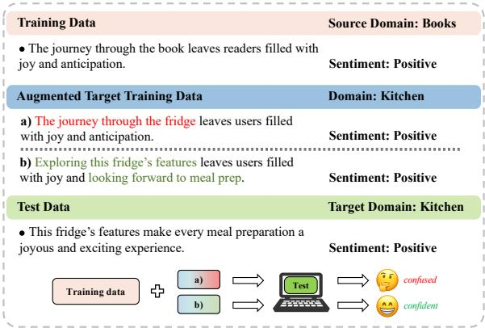
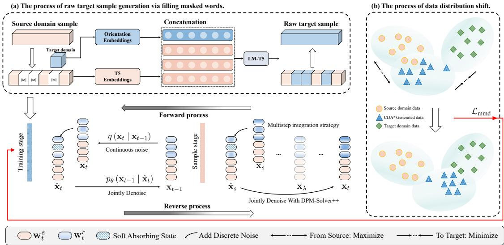
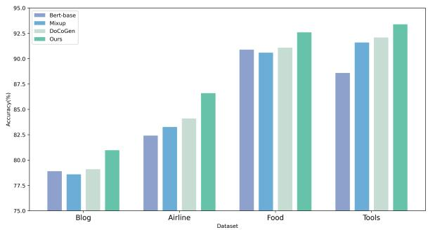
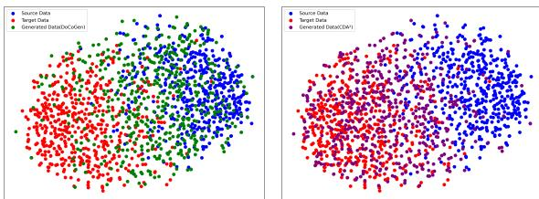

# CDA2: Counterfactual Diffusion Augmentation for Cross-Domain Adaptation in Low-Resource Sentiment Analysis

Dancheng Xin1†, Kaiqi Zhao2‡, Jingyun Sun1† and Yang Li1†\*

1 Northeast Forestry University, China

2 University of Auckland, New Zealand

†{dcxin, sunjingyun, yli}@nefu.edu.cn

‡kaiqi.zhao@auckland.ac.nz

## Abstract

Domain adaptation is widely employed in crossdomain sentiment analysis, enabling the transfer of models from label-rich source domains to target domains with fewer or no labels. However, concerns have been raised about their robustness and sensitivity to distribution shifts, particularly when significant disparities exist between domains. To address this problem, we propose CDA2, a framework for crossdomain adaptation in low-resource sentiment analysis that leverages counterfactual diffusion augmentation. Specifically, it employs samples derived from domain-relevant word substitutions in source domain samples to guide the diffusion model for generating high-quality counterfactual target domain samples. During the training stage, we employ a soft absorbing state and MMD loss, while using an advanced ODE solver to accelerate the sampling process. Our experiments demonstrate that CDA2 generates high-quality target samples and achieves state-of-the-art performance in cross-domain sentiment analysis.

## 1 Introduction

Sentiment analysis is a crucial task in Natural Language Processing (NLP), primarily focuses on extracting the underlying emotion or sentiment expressed within textual data. It has surged in popularity in recent years, due to its wide-ranging applications in the real-world(Kertkeidkachorn and Shirai, 2023; Nzeyimana, 2023). In recent years, deep learning technology has experienced significant growth and achieved remarkable success in sentiment analysis(Zhang et al., 2015; Yadav and Vishwakarma, 2020). However, when operating under low-resource conditions or encountering a data distribution shift between the training domain and the target domain, traditional sentiment analysis methods that rely on labeled data to train models in the target domain experience a significant decline in performance(Ben-David et al., 2020).

  
Figure 1: An Illustration of the Cross-Domain SA Task. If the augmented training data exhibit semantic disruptions and spurious associations with the source domain, the model will become confused due to the failure of semantic transfer.

To alleviate the reliance on labeled data, crossdomain sentiment analysis(SA) has garnered the attention from researchers. Many previous works resort to unsupervised domain adaptation techniques, which aim to transfer knowledge from a resourcerich source domain to a target domain with unlabeled data(Blitzer et al., 2007; Pan et al., 2010; Zhuang et al., 2015). In cross-domain sentiment analysis tasks, most existing domain adaptation methods employ adversarial training to prevent models from distinguishing samples from specific domains, thereby transferring knowledge from the source domain to the target domain(Liu et al., 2018; Wang et al., 2019) and some attempts to learn domain-specific knowledge(Du et al., 2020; Qu et al., 2019; Yang et al., 2022). Although these methods achieve promising results, their models are trained only on in-domain labeled data from the source domain, thereby limiting their ability to handle out-of-domain data.

To address the aforementioned limitations, researchers have attempted to design cross-domain data augmentation methods. The key objective is to generate a large number of labeled target domain samples based on the labeled source domain samples, thereby achieving knowledge transfer. The research within this framework primarily includes two approaches: masked language models (MLM)(Yang et al., 2022) and sequenceto-sequence (Seq2Seq)(Li et al., 2022a) models. While word substitution-based data augmentation methods have demonstrated advancement over feature adaptation methods, they still have some drawbacks: (i) semantic disruptions, (ii) the fixed syntactic structure from the source domain, (iii) the lack of diversity in generated samples.

Taking the cross-domain sentiment analysis(SA) task in Figure 1 as an example, Training models with logically inconsistent augmented data can lead to confusion, especially in context-aware language models. Conversely, incorporating the augmented target domain data can enhance the reliability of the predictive model.

To generate high-quality labeled target domain data for cross-domain sentiment analysis, we propose a framework called $\mathrm { C D A } ^ { 2 }$ for Cross-Domain Adaptation in low-resource sentiment analysis, which utilizes Counterfactual Diffusion Augmentation. $\mathrm { C D A } ^ { 2 }$ is designed to mitigate semantic disruptions and spurious associations caused by fixed syntactic structures from the source domain. Firstly, we provide the diffusion generator with high-quality raw target samples through domain corruption and domain reconstruction. Next, we design a learnable soft absorbing state by introducing additional discrete noise into the continuous diffusion process to better fit the inherently discrete nature of text. Additionally, we incorporate Maximum Mean Discrepancy loss, utilizing real target domain unlabeled samples to supervise the generation process, thereby facilitating better data distribution shift. During the sampling phase, we employ an advanced Ordinary Differential Equation solver to accelerate sampling while minimizing the sacrifice of sample quality, resulting in the generation of high-quality counterfactual target samples.

The main contributions of this study can be summarized as follows:

• We propose a novel diffusion-based crossdomain data augmentation framework, $\mathrm { C D A } ^ { 2 }$ which can generate a large amount of labeled target domain data for cross-domain sentiment analysis tasks.

• Within this framework, we conditionally guide the diffusion model to generate highquality counterfactual target samples from source samples and raw target samples.

• We conduct experiments on various sentiment analysis datasets , demonstrating that our model achieves state-of-the-art performance.

## 2 Related Work

Cross-Domain Sentiment Analysis Cross-domain sentiment analysis aims to generalize models trained on a source domain to a target domain. Typically, the source domain has abundant labeled data, while the target domain has scarce or no labeled data(Du et al., 2020). Researchers address this by bridging data distribution differences through shared feature representations(Ziser and Reichart, 2017; Ben-David et al., 2020; Peng et al., 2018) and learning invariant features via adversarial training(Ganin et al., 2017; Du et al., 2020; Li et al., 2017) and contrastive learning(Long et al., 2022). Influenced by masked generation methods, recent works have explored data augmentation(Calderon et al., 2022; Wang and Wan, 2023) and prompt tuning(Wu and Shi, 2022).

Domain Adaptation Unsupervised adaptation is a practical setup that assumes access to unlabeled data from both domains and labeled data from the source domain(Blitzer et al., 2007). A more challenging setup, Any Domain Adaptation(Ben-David et al., 2020), assumes the target domain is unseen during training. Methods include representation learning(Ziser and Reichart, 2017), instance reweighting, and self-training(Rotman and Reichart, 2019). Deep neural networks have focused on the two approaches mentioned in cross-domain sentiment analysis.

Data Augmentation Data augmentation aims to improve model generalization by generating more training data. Synonym-based augmentation methods replace words with synonyms, hypernyms, or hyponyms(Xu et al., 2019; Kobayashi, 2018), but these methods can create spurious associations. To address this, Kaushik et al. (2020) introduced minimal modifications using human annotators for label inversion, though costly and time-consuming. Chen et al. (2021) used automated antonym replacement. Recently, diffusion models have been applied for controlled text generation(Li et al., 2022b; Gong et al., 2023a,b), offering stable training and diverse content generation compared to GANs(Goodfellow et al., 2014). Our goal is to use diffusion models to generate high-quality target samples guided by raw target samples, rather than through manual or rule-based efforts.

  
Figure 2: The architecture of counterfactual diffusion augmentation (CDA2) framework for cross-domain adaptation.

## 3 Methodology

In this section, we first define the task of crossdomain sentiment analysis. Subsequently, we present the proposed counterfactual diffusion augmentation framework for cross-domain adaptation $( \mathrm { C D A } ^ { 2 }$ for short). The overall structure of $\mathrm { C D A } ^ { 2 }$ is shown in Figure 2, which comprises three parts: (i) generation of raw target samples, (ii) diffusionbased generator (including training stage and sample stage), and (iii) data filtering mechanism.

## 3.1 Problem Formulation

In this paper, we focus on cross-domain sentiment classification in low-resource scenarios. Following previous studies(Zhang et al., 2019; Li et al., 2018), we consider two domains: Source and Target. The source domain $\mathcal { D } ^ { s }$ contains labeled data $\mathcal { D } _ { l } ^ { s } = \{ ( \mathbf { w } _ { i } ^ { s } , y _ { i } ^ { s } ) \} _ { i = 1 } ^ { N _ { l } ^ { s } }$ and unlabeled data $\mathcal { D } _ { u } ^ { s } = \{ ( \mathbf { w } _ { i } ^ { s } ) \} _ { i = N _ { l } ^ { s } + 1 } ^ { N _ { u } ^ { s } }$ , where $\mathcal { D } ^ { s } = \mathcal { D } _ { l } ^ { s } \bigcup \mathcal { D } _ { u } ^ { s }$ . Additionally, $N _ { l } ^ { s } \ll N _ { u } ^ { s }$ . The target domain $\mathcal { D } ^ { t }$ includes a set of unlabeled data $\begin{array} { r } { \mathcal { D } _ { u } ^ { t } = \Big \{ \Big ( \mathbf { w } _ { j } ^ { t } \Big ) \Big \} _ { j = 1 } ^ { N _ { u } ^ { t } } , } \end{array}$ where $\mathcal { D } ^ { t } = \mathcal { D } _ { u } ^ { t }$ . The goal of cross-domain sentiment classification is to utilize $\mathcal { D } ^ { s }$ and $\mathcal { D } ^ { t }$ to predict the labels of test samples from the target domain.

## 3.2 Generation of Raw Target Samples

To meet the requirements for conditional guidance of the diffusion model, we aim to generate raw target samples that are contextually relevant and sentimentally aligned. We adopt a strategy of corruption and reconstruction on given source domain samples through a masking generation approach, as illustrated in Figure 2a.

Domain Corruption The first step in generating raw target samples $\mathbf { w } ^ { r }$ is to mask specific domainrelevant terms from the source domain $\mathcal { D } ^ { s }$ . Let $\mathbf { w } = \{ w _ { 1 } , w _ { 2 } , \dots , w _ { m } \}$ represent a sample, with m denoting the sample length. We mask all unigrams w for which $\mathrm { M } ( w , { \mathcal { D } } ^ { s } , { \mathcal { D } } ^ { t } ) > \tau .$ , with $\tau$ being a masking threshold parameter and M representing a function that returns the masking score of a the uni-gram. For bi-grams, we mask those terms that have an overall score exceeding τ, provided that none of their constituent uni-grams have been masked. Similarly, this strategy can be extended to tri-grams. For example, “paper” and “towel” as uni-grams have weak relevance to the Kitchen domain and are not masked. However, the bi-gram “paper towel” has high relevance to the Kitchen domain as a combined term and a score above the τ threshold, so it is masked. This method provides more contextual information and proves our strategy effective in identifying domain-specific terms.

The rationale behind this higher-order n-gram masking approach is to capture the context more accurately. Higher-order terms like bi-grams and trigrams provide richer contextual information compared to uni-grams. By masking bi-grams and trigrams, we ensure that domain-specific phrases are identified, while still allowing the individual words to be used in other contexts where they may not be as relevant. This approach prevents the loss of useful words that might be masked unnecessarily if only higher-dimensional terms were considered.

To clarify the masking score $\mathrm { M } ( \cdot )$ , we assume equal prior probabilities for each domain and utilizing the Bayes’ rule, the probability that an n-gram term w belongs to a domain D with $n ^ { \mathcal { D } }$ unlabeled samples is estimated by:

$$
P ( D = \mathcal { D } \mid W = w ) \propto \frac { n _ { w } ^ { \mathcal { D } } + \alpha } { n ^ { \mathcal { D } } + \alpha \cdot V }\tag{1}
$$

where $n _ { w } ^ { \mathcal { D } }$ represents the number of samples in $\mathcal { D }$ that include the term w, α is a smoothing hyperparameter and V represents the total number of unique terms. To effectively identify domainspecific terms, we need a measure that captures both the likelihood of a term belonging to a domain and its specificity to that domain. Therefore, we define the association between w and D as:

$$
\rho ( w , \mathcal { D } ) = P ( \mathcal { D } \mid w ) \cdot \left( 1 - \frac { H ( D \mid w ) } { \log N } \right)\tag{2}
$$

where N is the number of unlabeled domains, and log N is the upper bound of the entropy $H ( D | w )$ Higher entropy values indicate that the term w is not particularly related to any specific domain. Based on the above, we derive the masking scores for n-gram terms under the source domain $\mathcal { D } ^ { s }$ and the target domain $\mathcal { D } ^ { t }$

$$
\mathrm { ~ M ~ } ( w , \mathcal { D } ^ { s } , \mathcal { D } ^ { t } ) = \rho ( w , \mathcal { D } ^ { s } ) - \rho \left( w , \mathcal { D } ^ { t } \right)\tag{3}
$$

where the masking scores $\mathrm { M } ( \cdot )$ range from -1 to 1. $\mathrm { M } ( \cdot )$ can take negative values to prevent the inadvertent masking of n-grams that should be included in the raw target samples.

Domain Reconstruction The second step in generating raw target samples $\mathbf { w } ^ { r }$ involves predicting the masked source domain data using information from the target domain. To incorporate target domain information, we introduce an orientation vector $\mathbf { v } _ { } ^ { t }$ that encodes the target domain’s features. We utilize a T5 (Raffel et al., 2020) generation model based on an encoder-decoder architecture. Given a masked sample of $\mathbf { w } ^ { r }$ , denoted as $\mathrm { M } ( \mathbf { w } ^ { r } )$ , and a target domain $\mathcal { D } ^ { t }$ , we concatenate the domain orientation vector $\mathbf { v } _ { } ^ { t }$ representing $\mathcal { D } ^ { t }$ with the embedding vector $\mathbf { v } ^ { r }$ of $\mathrm { M } ( \mathbf { w } ^ { r } )$ along the feature dimension. Then, this concatenated matrix is fed into T5 to generate $\mathbf { w } ^ { r }$

Specifically, we equip the model with a learnable embedding matrix that contains $K \cdot N$ orientation vectors, allowing each domain to be represented by a $K$ different vectors. We initialize the orientation vectors using the embedding vectors of the domain names and the top $K - 1$ representative words. For each domain $\mathcal { D } _ { : }$ representative words are selected based on log $( n _ { w } ^ { \mathcal { D } } + 1 ) \rho ( w , \mathcal { D } )$ . Based on the above, we obtain multiple raw target samples $\mathbf { w } ^ { r }$ for the specified target domain $\mathcal { D } ^ { t }$ , each corresponding to a single source domain sample $\mathbf { w } ^ { s }$ and sharing the same label. These samples are used to conditionally guide the diffusion model. It is noteworthy that these initialized orientation vectors gradually converge to different effective values over the course of training, according to the requirements of this work.

## 3.3 Diffusion based Generator

To address the semantic disruptions and spurious associations that arise from the fixed syntactic structure of the source domain. We train a diffusion generator using the raw target sample $\mathbf { w } ^ { r }$ generated in Section 3.2. to produce additional high-quality counterfactual target samples $\mathbf { w } ^ { c } \in \mathcal { D } ^ { c }$ . Inspired by Gong et al.(Gong et al., 2023a) and Lu et al.(Lu et al., 2022, 2023), we will detail the diffusion generation process used in this study in the following discussion.

Preliminaries Diffusion models(Sohl-Dickstein et al., 2015; Ho et al., 2020; Song et al., 2021; Li et al., 2022b; Gong et al., 2023a) are a type of latent variable model initially designed for continuous domains. These models comprise two processes: a forward diffusion process and a reverse diffusion process. In the forward process, given a sample $\mathbf { x } _ { \mathrm { 0 } }$ drawn from $q ( \mathbf { x } _ { 0 } )$ , a Markov chain of latent variables $\mathbf { x _ { 1 } } \ldots \mathbf { x _ { T } }$ is generated by progressively adding Gaussian noise:

$$
q \left( \mathbf { x } _ { t } \mid \mathbf { x } _ { t - 1 } \right) = \mathcal { N } \left( \mathbf { x } _ { t } ; \sqrt { 1 - \beta _ { t } } \mathbf { x } _ { t - 1 } , \beta _ { t } \mathbf { I } \right)\tag{4}
$$

where $\beta _ { t }$ is a noise schedule controlling the noise addition step size. Eventually, $\mathbf { x } _ { T }$ approximates an isotropic Gaussian distribution. If $\beta _ { t }$ is sufficiently small, the reverse process $q \left( \mathbf { x } _ { t - 1 } \mid \mathbf { x } _ { t } \right)$ also follows a Gaussian distribution and can be modeled

by:

$$
p _ { \theta } \left( \mathbf { x } _ { t - 1 } \mid \mathbf { x } _ { t } , t \right) = \mathcal { N } \left( \mathbf { x } _ { t - 1 } ; \mu _ { \theta } \left( \mathbf { x } _ { t } , t \right) , \Sigma _ { \theta } \left( \mathbf { x } _ { t } , t \right) \right)\tag{5}
$$

where $\mu _ { \theta } ( \cdot )$ and $\Sigma _ { \theta } ( \cdot )$ can be implemented using a U-Net or a Transformer. By conditioning on $\mathbf { x } _ { 0 } , q \left( \mathbf { x } _ { t - 1 } \mid \mathbf { x } _ { t } , \mathbf { x } _ { 0 } \right)$ has a closed form, allowing the variational lower bound to be minimized to optimize $\log p _ { \theta } ( \mathbf { x } _ { 0 } )$

When compared to traditional generative models, such as Generative Adversarial Networks (GANs)(Goodfellow et al., 2014), diffusion models have emerged as a novel paradigm for generative models. They come with several potential advantages, particularly in the generation of highquality text and images. However, most current diffusion works face challenges during training convergence and generation speed, particularly given that these models require the use of a Minimum Bayes Risk(MBR) strategy(Koehn, 2004) for decoding and generation, resulting in significant computational overhead during training. Additionally, in domain adaptation, there are concerns about the quality of generated target domain samples in lowresource settings, especially due to failures in data distribution shift.

Training Stage To ensure the quality of the generated samples, we introduce a Soft Absorbing State(SAS) and Maximum Mean Discrepancy(MMD) loss during the training stage, which facilitates the diffusion model’s ability to learn to reconstruct discrete mutations based on the underlying Gaussian space, thereby enhancing its capacity to recover conditional signals. At the same time, under the supervision of real target domain data $\mathcal { D } ^ { t }$ , the MMD loss can promote the transition of generated samples $\mathbf { w } ^ { c }$ from the source domain $\mathcal { D } ^ { s }$ to the target domain $\mathcal { D } ^ { t }$ , as shown in Figure 2(b).

Let x represent the latent representations of the data from the source domain $( \mathbf { w } ^ { s } )$ . At the initial step of the forward noise-adding process, we follow the Diffusion-LM proposed by Li et al. (2022b) to map the discrete sample $\mathbf { w } ^ { s }$ into a continuous space. Specifically, we concatenate the source domain sample $\mathbf { w } ^ { s }$ and raw target sample $\mathbf { w } ^ { r }$ to embed them into a continuous feature space, denoted as Emb $\mathbf { \Psi } ( \mathbf { w } ^ { s \oplus r } )$ .

$$
q _ { \phi } \left( \mathbf { x } _ { 0 } \mid \mathbf { w } ^ { s \oplus r } \right) = \mathcal { N } \left( \operatorname { E m b } \left( \mathbf { w } ^ { s \oplus r } \right) , \beta _ { 0 } \mathbf { I } \right)\tag{6}
$$

where I is an identity matrix. As shown in Eq. (4), the structure of the perturbed data $\mathbf { x } _ { \mathrm { 0 } }$ during the

forward noising process is detailed. From this, we can derive the latent variable $\mathbf { x } _ { t }$ as follow:

$$
\mathbf { x } _ { t } = \sqrt { \bar { \alpha } _ { t } } \mathbf { x } _ { 0 } + \sqrt { 1 - \bar { \alpha } _ { t } } \epsilon\tag{7}
$$

where ϵ is defined at each time step with $\alpha _ { t }$ $1 - \beta _ { t } , \bar { \alpha } _ { t } = \Pi _ { i = 1 } ^ { t } \alpha _ { i }$ . Additionally, $\mathbf { x } _ { t } = \mathbf { w } _ { t } ^ { s } \oplus \mathbf { w } _ { t } ^ { r }$ with $\mathbf { w } _ { t } ^ { s }$ and $\mathbf { w } _ { t } ^ { r }$ representing the latent states of $\mathbf { w } ^ { s }$ and $\mathbf { w } ^ { r }$ , respectively. During this process, we replace the i-th token in $\mathbf { x } _ { t }$ with the the soft absorbing state n with a certain probability. The SAS n has the same dimension as the word embeddings and is learnable during the diffusion process.

$$
\hat { \mathbf { x } } _ { t } ^ { i } = \left\{ \begin{array} { l l } { \mathbf { n } } & { \mathrm { ~ i f ~ } \eta = 1 } \\ { \mathbf { x } _ { t } ^ { i } } & { \mathrm { ~ i f ~ } \eta = 0 } \end{array} \right.\tag{8}
$$

where $\eta =$ Bernou $\operatorname { l l i } ( \beta _ { t } * \gamma )$ , and $\gamma$ is the [MASK] ratio when $t = T$ The introduction of the SAS enhances the model’s ability to handle discrete data during continuous diffusion. Simultaneously, it provides a soft constraint in the high-dimensional feature space, which enhances the stability and reliability of the model. Also, in contrast to conventional diffusion models, which perturb $\mathbf { x } _ { t }$ in its entirety, we introduce partial noise solely to $\mathbf { w } _ { t } ^ { r }$ , by replacing $\mathbf { w } _ { t } ^ { s }$ with $\mathbf { w } _ { 0 } ^ { s }$ . This is a crucial aspect for enabling the diffusion model to conduct conditional language modeling.

In the reverse process, the objective is to recover the initial $\mathbf { x } _ { \mathrm { 0 } }$ from the partially Gaussian-noised $\hat { \mathbf { x } } _ { T }$ by jointly denoising both continuous and discrete noise, as shown in Eq. (5). Thereby, we compute the variational lower bound following the diffusion process:

$$
\begin{array} { l } { \displaystyle \mathcal { L } _ { \mathrm { v l b } } = \mathbb { E } _ { q } [ D _ { \mathrm { K L } } ( q ( \hat { \mathbf { x } } _ { T } \mid \mathbf { x } _ { 0 } )  p _ { \theta } ( \hat { \mathbf { x } } _ { T } ) )  } \\ { \displaystyle  + \sum _ { t = 2 } ^ { T } D _ { \mathrm { K L } } ( q ( \mathbf { x } _ { t - 1 } \mid \hat { \mathbf { x } } _ { t } , \mathbf { x } _ { 0 } )  p _ { \theta } ( \mathbf { x } _ { t - 1 } \mid \hat { \mathbf { x } } _ { t } , t ) )  } \\ { \displaystyle +  D _ { \mathrm { K L } } ( q _ { \phi } ( \mathbf { x } _ { 0 } \mid \mathbf { w } ^ { s \oplus r } )  p _ { \theta } ( \mathbf { x } _ { 0 } \mid \hat { \mathbf { x } } _ { 1 } ) )  } \\ { \displaystyle  - \log p _ { \theta } ( \mathbf { w } ^ { s \oplus r } \mid \mathbf { x } _ { 0 } ) ] } \end{array}\tag{9}
$$

To ensure the transition of the data distribution from counterfactual target samples $\mathbf { w } ^ { c }$ in $\mathcal { D } ^ { c }$ to real target domain samples $\mathbf { w } ^ { t }$ in $\mathcal { D } ^ { t }$ , we propose a sentence-level MMD loss as follows:

$$
\mathcal { L } _ { \mathrm { m m d } } = \mathrm { d } _ { k } ^ { 2 } \left( \mathcal { D } ^ { c } , \mathcal { D } ^ { t } \right) = \frac { 1 } { \left( N ^ { c } \right) ^ { 2 } } \sum _ { i , j } ^ { N ^ { c } } k \left( \mathbf { w } _ { i } ^ { c } , \mathbf { w } _ { j } ^ { c } \right) +
$$

$$
\frac { 1 } { \left( N ^ { t } \right) ^ { 2 } } \sum _ { i , j } ^ { N ^ { t } } k \left( \mathbf { w } _ { i } ^ { t } , \mathbf { w } _ { j } ^ { t } \right) - \frac { 2 } { N ^ { c } N ^ { t } } \sum _ { i } ^ { N ^ { c } } \sum _ { j } ^ { N ^ { t } } k \left( \mathbf { w } _ { i } ^ { c } , \mathbf { w } _ { j } ^ { t } \right)\tag{10}
$$

where $N ^ { c }$ and $N ^ { t }$ represent the number of samples in each domain, respectively, and $k ( \cdot )$ denotes a Gaussian kernel function. When the MMD loss is minimized, the distribution of $\mathcal { D } ^ { c }$ approaches that of $\mathcal { D } ^ { t }$ , thereby improving the quality of the generated samples.

In conclusion, we derive the overall objective function by summing up the two components:

$$
\mathcal { L } = \mathcal { L } _ { \mathrm { v l b } } + \varphi \mathcal { L } _ { \mathrm { m m d } }\tag{11}
$$

where $\varphi$ is a weight parameter that starts at zero and gradually increases during model training to ensure a balance between reconstruction ability and distribution shift capability throughout the training process.

Sample Stage Previously, diffusion models employed clamping operations during the sampling phase to predict vectors and reduce rounding errors. However, the discrepancy between training and sampling(Tang et al., 2023) can lead to the accumulation of prediction errors and a reduction in sampling speed.

To improve the sampling speed of the diffusion model, we employ the advanced DPM-Solver++(Lu et al., 2023) as a sampling accelerator in the continuous space during the sample stage. This accelerator does not require MBR decoding during the sampling process, thereby saving a substantial amount of time. Importantly, it enhances the sampling speed while also ensuring the quality of the generated samples.

Specifically, as described in Eq. (8), discrete noise is added to the continuous Gaussian noise, which bridges training and inference in the discrete space. Utilizing the precise solution of the diffusion ODEs proposed by DPM-Solver++, given an initial value $\mathbf { x } _ { s }$ at time $s > 0$ , the solution $\mathbf { x } _ { t }$ at time $t \in [ 0 , s ] $

$$
\mathbf { x } _ { t } = \frac { \sigma _ { t } } { \sigma _ { s } } \mathbf { x } _ { s } + \sigma _ { t } \int _ { \lambda _ { s } } ^ { \lambda _ { t } } e ^ { \lambda } f _ { \theta } \left( \hat { \mathbf { x } } _ { \lambda } , \lambda \right) d \lambda\tag{12}
$$

where the $\lambda _ { t }$ is a strictly decreasing function of t with an inverse function $t _ { \lambda } ( \cdot )$ . The term $\sigma _ { t }$ is monotonic with respect to $\beta _ { t } ,$ and $f _ { \theta }$ serves as the data prediction model that recover the corrupt data $\mathbf { x } _ { t }$ to $\mathbf { x } _ { \mathrm { 0 } }$

Furthermore, Eq. (12) requires an approximation of $\int e ^ { \lambda } f _ { \theta } d \lambda$ . The integral can be analytically computed by repeatedly applying integration by parts n times, and we can approximate only the first few terms while discarding higher-order error terms. In our experiments, we use the second order. After discrete denoising in our method, this algorithm remains applicable since our $f _ { \theta } ( \hat { \mathbf { x } } _ { \lambda } , \lambda )$ aligns with the training objectives. Based on the above, we train a classifier using the source domain dataset $\mathcal { D } ^ { s }$ and the corresponding generated counterfactual target domain dataset $\mathcal { D } ^ { c }$ , where the sample labels in $\mathcal { D } ^ { c }$ are consistent with those in $\mathcal { D } ^ { s }$ and $\mathcal { D } ^ { r }$ due to the paired correspondence, to predict the labels of test samples from the target domain.

## 3.4 Data Filtering Mechanism

Since the counterfactual target samples are generated based on the raw target samples’ corresponding labels and domains, the generation process may introduce uncertainties and inconsistencies. To better utilize the counterfactual target domain data $\mathbf { w } ^ { c }$ in cross-domain SA tasks, we introduce a data filtering mechanism that eliminates noisy data. Specifically, our filtering mechanism consists of two parts: sentiment label filtering and domain adaptability assessment. (i) For sentiment label filtering, we use the sentiment from $\mathbf { w } ^ { s }$ as supervisory information to ensure consistency with the corresponding sentiment labels of $\mathbf { w } ^ { c }$ . This step helps us eliminate samples with mismatched sentiment labels, thus ensuring the accuracy and reliability of sentiment analysis. (ii) Additionally, we train an extra classifier to assess the domain adaptability of the generated counterfactual target domain samples $\mathbf { w } ^ { c }$ , benefiting from the access to unlabeled target domain data. This ensures that $\mathbf { w } ^ { c }$ is not only consistent in sentiment with the target domain but also closer in semantics and style. We name this enhanced version with the filtering mechanism $\mathrm { C D A } ^ { 2 } { \cdot } \mathrm { F } .$

## 4 Experiments

In this section, we conduct experiments to explore the following research questions: (i) Does our proposed data augmentation approach have the capability to substantially improve the cross-domain $\mathbf { S A }$ performance of the model? If $\mathbf { s o } ,$ how does the enhancement achieved by our approach compare to other baseline methods? (ii) Do the individual components of our framework contribute positively to the overall effectiveness of the model? (iii) Is the proposed $\mathrm { C D A } ^ { 2 }$ framework effective in addressing the problem of semantic disruptions and spurious associations with the source domain while generating high-quality samples?

## 4.1 Datasets

We follow prior domain adaptation research, concentrating on binary cross-domain sentiment classification. Our experiments utilize the multi-domain Amazon reviews dataset(Blitzer et al., 2007), containing reviews from four domains: Books (B), DVD (D), Electronics (E), and Kitchen appliances (K). A five-fold cross-validation protocol is used, with 20% of samples randomly selected as the development set, and the best model on this set is used for target domain generalization testing. Since we focus on cross-domain generation in low-resource settings where the target domain lacks labeled data, we only utilize unlabeled reviews during the training stage. We initially train on a labeled source domain dataset and an unlabeled target domain dataset, and then evaluate the models on the remaining three datasets, resulting in a total of 12 tasks. Furthermore, to create a more challenging setting, we select labeled reviews along with corresponding unlabeled reviews from various platforms, including the products domain from Amazon reviews the airline domain and the blog domain.

## 4.2 Experimental Settings

In the generation process of raw target samples, we truncate each example to 100 tokens. The hyperparameter was chosen based on the length of labeled samples and computational requirements. We apply the NLTK Snowball stemmer to each word in the n-grams. The smoothing hyper-parameters for calculating $P ( \mathcal { D } | w )$ are set to 1, 5, and 7 for uni-grams, bi-grams, and tri-grams, respectively. A threshold of $\tau = 0 . 0 8$ is used. We use $K = 4$ orientation vectors for each unlabeled domain. The controllable model is built upon a T5-base model and trained on the unlabeled data for 60 epochs with a learning rate of $5 \mathrm { e } { \cdot } 5$ and a weight decay of 1e-5. In the generation process of the diffusion model, we set the embedding dimension d to 300. We set γ to 0.5. We train using NVIDIA A100 80G Tensor Core GPUs with a batch size of 425 and a sampling batch size of 100. All parameters within our experiments are optimized using the AdamW optimizer(Loshchilov and Hutter, 2019).

## 4.3 Baselines

We compare our model with the several state-ofthe-art baselines, including R-PERL(Ben-David et al., 2020) enhances Bert by incorporating a pivotbased adaptation, SAIM2(Rostami et al., 2023) employs domain adaptation to bridge the domain gap in sentiment analysis by creating large margins between class representations in an embedding space, $\mathbf { H A T N _ { - B e r t } ( L i }$ i et al., 2018) proposes a transfer network that effectively captures both domain-specific and domain-shared sentiment words, DAAT(Du et al., 2020) utilizes domain-adversarial training to prompt Bert to identify features that are invariant across domains, COBE(Luo et al., 2022) refines the contrastive learning loss for negative samples in batches, separating class representations further in potential space, CFd(Ye et al., 2020) implements class-aware feature self-distillation by integrating PLM’s features into a feature adaptation module, TACIT(Song et al., 2024) use VAE to disentangle robust and unrobust features using VAE, UDALM(Karouzos et al., 2021) extends Bert’s pretraining on unlabeled target domain data via the MLM task. In addition, we explore three specific Bert variants for baseline comparisons: $\mathbf { V a n i l l a . _ { B e r t } } .$ , fine-tuned on the fundamental Bert(Devlin et al., 2019) and RoBERTa(Liu et al., 2019) models; $\mathbf { A T } _ { \mathbf { - B e r t } }$ , which incorporates adversarial training to enhance robustness against attacks; and $\mathbf { D A } _ { - \mathbf { B e r t } }$ , leveraging domain-aware training with source domain labeled data.

## 5 Results

## 5.1 Main Experimental Results

In Table 1, we compare our model $\mathrm { C D A } ^ { 2 }$ using Bert as text encoders with baseline methods on 12 cross-domain tasks, and we also compare their average performances. As expected, $\mathrm { C D A } ^ { 2 }$ demonstrates a significant performance advantage over the competitive baselines. Moreover, compared to the current most advanced domain adaptation method, UDALM, our approach achieves competitive performance overall from the perspective of generating reliable target domain data, and it has achieved the best accuracy in multiple tasks.

Specifically, (i) compared to the most basic baseline R- $\mathrm { \cdot P E A L , }$ our $\mathrm { C D A } ^ { 2 }$ model has an average accuracy improvement of 4.08%, and $\mathrm { C D A } ^ { 2 } .$ -F has an improvement of 4.24%. Moreover, $\mathrm { C D A } ^ { 2 }$ and $\mathrm { C D A } ^ { 2 } { \cdot } \mathrm { F }$ have surpassed all baseline methods in 12 tasks, with the exception of TACIT and UDALM. (ii) $\mathrm { C D A } ^ { 2 }$ outperforms the recent TACIT model proposed by Song et al. (2024) in most of the 12 tasks, achieving an average accuracy improvement of 0.26%, and has reached the state-of-the-art from the Electronics to Books domain. $\mathrm { C D A } ^ { 2 } { \cdot } \mathrm { F }$ shows even better performance relative to these outcomes. (iii) $\mathrm { C D A } ^ { 2 } { \cdot } \mathrm { F } ,$ which incorporates a data filtering mechanism, achieves performance competitive with the current SOTA method, UDALM, in this task. Moreover, it attains SOTA performance in multiple tasks among the twelve evaluated. It is worth considering that, compared to traditional domain adaptation methods, we have explored a new generative paradigm to more effectively match the tasks. The results clearly demonstrate the consistent superiority of our method across various domain adaptation tasks compared to baseline methods, highlighting its effectiveness in enhancing cross-domain sentiment analysis performance.

<table><tr><td rowspan=2 colspan=1>S→T</td><td rowspan=2 colspan=13>(a) Books →          (b) DVD →      (c) Electronics →     (d) Kitchen →All</td></tr><tr><td rowspan=1 colspan=4>DEK</td><td rowspan=1 colspan=3>BEK</td><td rowspan=1 colspan=4>BDK</td><td rowspan=1 colspan=1>BDE</td></tr><tr><td rowspan=1 colspan=1>R-PERL</td><td rowspan=1 colspan=4>87.8087.2090.20</td><td rowspan=1 colspan=3>85.6089.30 90.40</td><td rowspan=1 colspan=4>83.9084.8091.20</td><td rowspan=1 colspan=1>83.0085.6091.20</td><td rowspan=1 colspan=1>87.50</td></tr><tr><td rowspan=1 colspan=1>Vanilla-Bert</td><td rowspan=1 colspan=4>88.9686.1589.05</td><td rowspan=1 colspan=3>89.4086.5587.53</td><td rowspan=1 colspan=4>86.5087.9591.60</td><td rowspan=1 colspan=1>87.5587.3090.45</td><td rowspan=1 colspan=1>88.25</td></tr><tr><td rowspan=1 colspan=1> $\mathrm { S A I M } ^ { 2 }$ </td><td rowspan=1 colspan=4>87.5088.3088.00</td><td rowspan=1 colspan=3>90.5087.3088.50</td><td rowspan=1 colspan=4>89.0085.5090.80</td><td rowspan=1 colspan=1>88.0084.5091.30</td><td rowspan=2 colspan=1>88.2788.56</td></tr><tr><td rowspan=2 colspan=1> $\begin{array} { r l } & { \underline { { \mathsf { A T } } } _ { - \mathrm { B e r t } } } \\ & { \underline { { \mathsf { H A T N } } } _ { - \mathrm { B e r t } } } \end{array}$ </td><td rowspan=2 colspan=4>89.7087.3089.5589.3687.2189.41</td><td rowspan=1 colspan=3>89.5586.0587.69</td><td rowspan=1 colspan=4>87.1588.2091.91</td><td rowspan=2 colspan=1>87.6587.7290.2587.8887.8990.31</td></tr><tr><td rowspan=1 colspan=3>687.2189.41</td><td rowspan=1 colspan=3>89.8186.9987.59</td><td rowspan=1 colspan=4>87.1088.8192.01</td><td rowspan=1 colspan=1>88.69</td></tr><tr><td rowspan=7 colspan=1> $\underline { { \mathrm { D A } } } _ { - \mathrm { B e r t } }$ DAATCOBECFdTACIT</td><td rowspan=6 colspan=4>89.7588.1190.6589.7089.5790.7590.0590.4592.9087.6591.3092.45</td><td rowspan=5 colspan=3>90.4088.1588.5590.8689.3090.5090.9890.67</td><td rowspan=1 colspan=4>88.3189.0392.75</td><td rowspan=1 colspan=1>87.9088.3590.59</td><td rowspan=1 colspan=1>89.37</td></tr><tr><td rowspan=4 colspan=2>2.750</td><td rowspan=3 colspan=1>90</td><td></td><td></td><td></td><td></td><td></td><td></td></tr><tr><td rowspan=3 colspan=1>3090301</td><td></td><td></td><td></td><td></td><td></td><td></td></tr><tr><td rowspan=1 colspan=2>88.9190.1</td><td></td><td rowspan=1 colspan=1>393.18</td><td rowspan=1 colspan=1>87.9888.8191.72</td><td rowspan=1 colspan=1>90.12</td></tr><tr><td rowspan=1 colspan=1>6792.00</td><td rowspan=1 colspan=4>87.8788.6588.2093.60</td><td rowspan=1 colspan=1>93.33</td><td rowspan=2 colspan=1>88.3887.4392.5889.7587.8092.60</td><td rowspan=2 colspan=1>90.3890.63</td></tr><tr><td rowspan=1 colspan=1>45</td><td rowspan=1 colspan=3>91.5091.5592.45</td><td></td><td></td><td></td><td></td></tr><tr><td rowspan=2 colspan=1>UDALM</td><td rowspan=2 colspan=4>91.4291.6892.7390.9791.6993.21</td><td rowspan=1 colspan=1>2.73</td><td rowspan=1 colspan=2>91.3391.8391.55</td><td rowspan=1 colspan=4>89.6289.2594.18</td><td rowspan=2 colspan=1>89.7089.2093.4090.2989.54 94.34</td><td rowspan=1 colspan=1>91.32</td></tr><tr><td rowspan=1 colspan=3>91.0092.3093.66</td><td rowspan=1 colspan=4>90.6188.8394.43</td><td rowspan=1 colspan=1>91.74</td></tr><tr><td rowspan=2 colspan=1> $\mathrm { C D A } ^ { 2 }$  $\mathrm { C D A } ^ { 2 } { \cdot } \mathrm { F }$ </td><td rowspan=2 colspan=4>91.18 91.43 93.01|91.62 91.41 93.22</td><td rowspan=1 colspan=3>|91.29 92.0292.51</td><td rowspan=1 colspan=4>90.6289.6594.11</td><td rowspan=1 colspan=1>90.24 89.1093.74</td><td rowspan=1 colspan=1>91.58</td></tr><tr><td rowspan=1 colspan=3>91.3591.8492.78</td><td rowspan=1 colspan=4>90.3590.0294.13</td><td rowspan=1 colspan=1>90.6589.4294.04</td><td rowspan=1 colspan=1>91.74</td></tr></table>

Table 1: Classification accuracy (%) for the cross-domain sentiment analysis tasks for the Amazon Reviews dataset.

<table><tr><td>Model</td><td>B → D B→ E B → K</td><td>Avg</td></tr><tr><td> $\mathbf { C D A } ^ { 2 } \mathbf { - F }$   $\mathbf { C D A } ^ { 2 }$ </td><td>91.62 91.41 93.22 91.18 91.43 93.01</td><td>92.08 91.87</td></tr><tr><td> $- w / o \mathrm { D S } + +$ </td><td>91.34 91.45</td><td>91.99</td></tr><tr><td> $- w / o \mathbf { M } \mathbf { M } \mathbf { D }$ </td><td>88.72 89.94 91.61</td><td>93.18 90.09</td></tr><tr><td> $- w / o \mathsf { S A S }$ </td><td>90.11 90.98 92.43</td><td>91.17</td></tr><tr><td> $- w / o$  Diff</td><td>88.35 89.67 91.17</td><td>89.73</td></tr></table>

Table 2: Ablation experimental results using the Books domain as an example for the cross-domain SA task.

## 5.2 Ablation Study

We conduct ablation studies, using Books as the source domain, to validate the effectiveness of each component in $\mathrm { C D A } ^ { 2 }$

In Table 2, the ${ ^ { \mathrm { * } } w } / o \mathrm { D S } \mathrm { + + } ^ { \mathrm { * } }$ indicates that we do not utilize DPM-Solver++ for acceleration. The performance demonstrates that our method effectively balances the relationship between sampling speed and quality maintenance.

Additionally, it further proves the effectiveness of our data filtering mechanism in enhancing the quality of the generated samples. $\ " { w } / { o } \mathrm { M M D } ^ { \prime }$ means that we do not incorporate MMD loss. The results show the effectiveness of the MMD strategy in managing data distribution shift. $^ { 6 6 } w / o \mathrm { S A S ^ { , } }$ indicates that the model operates solely in continuous diffusion. Experimental results indicate that the flexible and learnable state enhances the quality of generated models to a certain extent. $^ { * } w / o$ Diff” scenario indicates that we do not utilize the diffusion-based generator and instead generate samples directly using a word substitution strategy. This omission leads to a comprehensive decline in experimental results. Based on this analysis, it is evident that the absence of any single component leads to a decline in the performance of CDA2.

## 5.3 Robustness Analysis

  
Figure 3: Results on Bert-base and three generation methods for homogeneous and heterogeneous datasets.

To further evaluate the robustness of $\mathrm { C D A } ^ { 2 }$ , we conduct comparative experiments on Amazon’s homogeneous datasets as well as across-platform datasets. Specifically, we train our model on four domains and use unlabeled target domain data as supervisory signals for domain adaptation, where the test data remain unseen. Moreover, we compare our method with Bert-base and other generative approaches such as Mixup and DoCoGen. Due to the inconsistent performance of previous generative methods, which lack competitiveness with SOTA, we chose to conduct a separate analysis here. As shown in Figure 3, our method outperforms other generative approaches in the homogeneous Food and Tools datasets, enhancing cross-domain SA performance. In the heterogeneous datasets of Blog and Airline, the large data distribution differences across platforms pose greater challenges; experimental results indicate that our $\mathrm { C D A } ^ { \bar { 2 } }$ achieves more substantial improvements compared to other methods.

## 5.4 Data Visualization

To further explore the effectiveness of our method in addressing semantic disruptions and spurious associations with the source domain, we visualize the intermediate representation vectors of text samples using the t-SNE. Figure 4 displays the visualization results for cross-domain pairs from DVD to Kitchen. Although the data distribution produced by DoCoGen exhibits some deviation, it largely remains similar to the source domain because these methods retain many source domain attributes, including context and syntactic structure. In contrast, $\mathrm { C D A } ^ { 2 }$ shows a more similar distribution between the generated data and the target domain data.

  
Figure 4: Visualization of discrepancy in distribution.

Additionally, we provide two distinct case studies to analyze the diversity of the text, as shown in Table 3. Specifically, there is a conflict between the action “clean” and “the meal time”. While they do include basic domain adaptation operations, there are also instances of unclear and illogical expressions. Therefore, a further understanding of data distribution transfer and mastery of contextual logic are necessary. The analysis above proves that our method not only captures relevant features of domain migration but also exhibits superior expressive capabilities.

<table><tr><td colspan="2">D → K</td></tr><tr><td>Original Sample</td><td>Sadly, most of the debunking occurs towards the end of the show, in brief statements, before quickly moving on to the next topic. Negative</td></tr><tr><td>Generated Sample (word substitution)</td><td>Sadly, most of the cleaning occurs towards the end of the meal, in brief efforts, before quickly moving on to the next course. Negative</td></tr><tr><td>Generated Sample (ours)</td><td>Unfortunately, the real cleanup only happens at the meal&#x27;s end, with quick wipes before the next use. Negative</td></tr></table>

Table 3: Cross-domain sentences generated by word substitution strategies and $\mathrm { C D A } ^ { 2 }$ model.

## 6 Conclusion

In this article, we introduce a Counterfactual Diffusion Augmentation framework for Cross-Domain Adaptation, to address semantic disruptions and spurious associations with the source domain in cross-domain sentiment analysis. $\mathrm { C D A } ^ { 2 }$ excels in generating diverse and realistic counterfactual samples by employing domain-relevant word substitutions from source domain samples to guide a diffusion model. Experiments on benchmark datasets demonstrated that $\mathrm { C D A } ^ { 2 }$ achieves state-of-the-art performance. Through qualitative analysis and visualization, we demonstrate that $\mathrm { C D A } ^ { \dot { 2 } }$ generates high-quality counterfactual samples that improve domain transfer, effectively alleviating semantic disruptions as well as spurious associations with the source domain.

## Limitations

While our study has performed well in crossdomain sentiment analysis, it still has the following limitations.

Firstly, although $\mathrm { C D A } ^ { 2 }$ can generate highquality text aligned with the target domain, it still relies on unlabeled target-domain data. We should explore how to eliminate this reliance, even when labels are unknown, to generalize the method to unforeseen test data.

Secondly, $\mathrm { C D A } ^ { 2 }$ improves classification by expanding the training set in the target domain but doesn’t adjust the classifier’s sensitivity to domain knowledge transfer from a causal perspective. Designing causal classification models with augmented data is a promising direction.

## Acknowledgments

We thank the anonymous reviewers for their insightful comments. This work has been supported by the National Natural Science Foundation of China (NSFC) via Grant 62276059 and the Heilongjiang Provincial Natural Science Foundation of China via Grant YQ2023F001. Corresponding author: Yang Li, E-mail: yli@nefu.edu.cn.

## References

Eyal Ben-David, Carmel Rabinovitz, and Roi Reichart. 2020. PERL: pivot-based domain adaptation for pre-trained deep contextualized embedding models. Trans. Assoc. Comput. Linguistics, 8:504–521.

John Blitzer, Mark Dredze, and Fernando Pereira. 2007. Biographies, bollywood, boom-boxes and blenders: Domain adaptation for sentiment classification. In ACL 2007, Proceedings of the 45th Annual Meeting ofthe Associationfor Computational Linguistics, June 23-30, 2007, Prague, Czech Republic. The Association for Computational Linguistics.

Nitay Calderon, Eyal Ben-David, Amir Feder, and Roi Reichart. 2022. DoCoGen: Domain counterfactual generation for low resource domain adaptation. In Proceedings of the 60th Annual Meeting of the Associationfor Computational Linguistics (Volume 1: Long Papers), pages 7727–7746, Dublin, Ireland. Association for Computational Linguistics.

Hao Chen, Rui Xia, and Jianfei Yu. 2021. Reinforced counterfactual data augmentation for dual sentiment classification. In Proceedings of the 2021 Conference on Empirical Methods in Natural Language Processing, pages 269–278, Online and Punta Cana, Dominican Republic. Association for Computational Linguistics.

Jacob Devlin, Ming-Wei Chang, Kenton Lee, and Kristina Toutanova. 2019. BERT: pre-training of deep bidirectional transformers for language understanding. In Proceedings ofthe 2019 Conference of the North American Chapter ofthe Associationfor Computational Linguistics: Human Language Technologies, NAACL-HLT 2019, Minneapolis, MN, USA, June 2-7, 2019, Volume 1 (Long and Short Papers), pages 4171–4186. Association for Computational Linguistics.

Chunning Du, Haifeng Sun, Jingyu Wang, Qi Qi, and Jianxin Liao. 2020. Adversarial and domain-aware BERT for cross-domain sentiment analysis. In Proceedings ofthe 58th Annual Meeting ofthe Association for Computational Linguistics, ACL 2020, Online, July 5-10, 2020, pages 4019–4028. Association for Computational Linguistics.

Yaroslav Ganin, Evgeniya Ustinova, Hana Ajakan, Pascal Germain, Hugo Larochelle, François Laviolette, Mario Marchand, and Victor S. Lempitsky. 2017.

Domain-adversarial training of neural networks. In Domain Adaptation in Computer Vision Applications, Advances in Computer Vision and Pattern Recognition, pages 189–209. Springer.

Shansan Gong, Mukai Li, Jiangtao Feng, Zhiyong Wu, and Lingpeng Kong. 2023a. Diffuseq: Sequence to sequence text generation with diffusion models. In The Eleventh International Conference on Learning Representations, ICLR 2023, Kigali, Rwanda, May 1-5, 2023. OpenReview.net.

Shansan Gong, Mukai Li, Jiangtao Feng, Zhiyong Wu, and Lingpeng Kong. 2023b. Diffuseq-v2: Bridging discrete and continuous text spaces for accelerated seq2seq diffusion models. In Findings ofthe Associationfor Computational Linguistics: EMNLP 2023, Singapore, December 6-10, 2023, pages 9868–9875. Association for Computational Linguistics.

Ian J. Goodfellow, Jean Pouget-Abadie, Mehdi Mirza, Bing Xu, David Warde-Farley, Sherjil Ozair, Aaron C. Courville, and Yoshua Bengio. 2014. Generative adversarial nets. In Advances in Neural Information Processing Systems 27: Annual Conference on Neural Information Processing Systems 2014, December 8-13 2014, Montreal, Quebec, Canada, pages 2672– 2680.

Jonathan Ho, Ajay Jain, and Pieter Abbeel. 2020. Denoising diffusion probabilistic models. In Advances in Neural Information Processing Systems, volume 33, pages 6840–6851. Curran Associates, Inc.

Constantinos Karouzos, Georgios Paraskevopoulos, and Alexandros Potamianos. 2021. UDALM: unsupervised domain adaptation through language modeling. In Proceedings ofthe 2021 Conference ofthe North American Chapter of the Association for Computational Linguistics: Human Language Technologies, NAACL-HLT 2021, Online, June 6-11, 2021, pages 2579–2590. Association for Computational Linguistics.

Divyansh Kaushik, Eduard Hovy, and Zachary Lipton. 2020. Learning the difference that makes a difference with counterfactually-augmented data. In International Conference on Learning Representations.

Natthawut Kertkeidkachorn and Kiyoaki Shirai. 2023. Sentiment analysis using the relationship between users and products. In Findings of the Association for Computational Linguistics: ACL 2023, pages 8611–8618, Toronto, Canada. Association for Computational Linguistics.

Sosuke Kobayashi. 2018. Contextual augmentation: Data augmentation by words with paradigmatic relations. In Proceedings of the 2018 Conference of the North American Chapter of the Association for Computational Linguistics: Human Language Technologies, Volume 2 (Short Papers), pages 452–457, New Orleans, Louisiana. Association for Computational Linguistics.

Philipp Koehn. 2004. Statistical significance tests for machine translation evaluation. In Proceedings of the 2004 Conference on Empirical Methods in Natural Language Processing , EMNLP 2004, A meeting ofSIGDAT, a Special Interest Group ofthe ACL, held in conjunction with ACL 2004, 25-26 July 2004, Barcelona, Spain, pages 388–395. ACL.

Junjie Li, Jianfei Yu, and Rui Xia. 2022a. Generative cross-domain data augmentation for aspect and opinion co-extraction. In Proceedings of the 2022 Conference of the North American Chapter of the Associationfor Computational Linguistics: Human Language Technologies, NAACL 2022, Seattle, WA, United States, July 10-15, 2022, pages 4219–4229. Association for Computational Linguistics.

Xiang Li, John Thickstun, Ishaan Gulrajani, Percy Liang, and Tatsunori B. Hashimoto. 2022b. Diffusion-lm improves controllable text generation. In Advances in Neural Information Processing Systems 35: Annual Conference on Neural Information Processing Systems 2022, NeurIPS 2022, New Orleans, LA, USA, November 28 - December 9, 2022.

Zheng Li, Ying Wei, Yu Zhang, and Qiang Yang. 2018. Hierarchical attention transfer network for crossdomain sentiment classification. In Proceedings of the Thirty-Second AAAI Conference on Artificial Intelligence, (AAAI-18), the 30th innovative Applications ofArtificial Intelligence (IAAI-18), and the 8th AAAI Symposium on Educational Advances in Artificial Intelligence (EAAI-18), New Orleans, Louisiana, USA, February 2-7, 2018, pages 5852–5859. AAAI Press.

Zheng Li, Yu Zhang, Ying Wei, Yuxiang Wu, and Qiang Yang. 2017. End-to-end adversarial memory network for cross-domain sentiment classification. In Proceedings of the Twenty-Sixth International Joint Conference on Artificial Intelligence, IJCAI-17, pages 2237–2243.

Qi Liu, Yue Zhang, and Jiangming Liu. 2018. Learning domain representation for multi-domain sentiment classification. In Proceedings ofthe 2018 Conference ofthe North American Chapter ofthe Associationfor Computational Linguistics: Human Language Technologies, Volume 1 (Long Papers), pages 541–550, New Orleans, Louisiana. Association for Computational Linguistics.

Yinhan Liu, Myle Ott, Naman Goyal, Jingfei Du, Mandar Joshi, Danqi Chen, Omer Levy, Mike Lewis, Luke Zettlemoyer, and Veselin Stoyanov. 2019. Roberta: A robustly optimized BERT pretraining approach. CoRR, abs/1907.11692.

Quanyu Long, Tianze Luo, Wenya Wang, and Sinno Pan. 2022. Domain confused contrastive learning for unsupervised domain adaptation. In Proceedings of the 2022 Conference of the North American Chapter of the Association for Computational Linguistics: Human Language Technologies, pages 2982–2995, Seattle, United States. Association for Computational Linguistics.

Ilya Loshchilov and Frank Hutter. 2019. Decoupled weight decay regularization. In 7th International Conference on Learning Representations, ICLR 2019, New Orleans, LA, USA, May 6-9, 2019. OpenReview.net.

Cheng Lu, Yuhao Zhou, Fan Bao, Jianfei Chen, Chongxuan Li, and Jun Zhu. 2022. Dpm-solver: A fast ODE solver for diffusion probabilistic model sampling in around 10 steps. In Advances in Neural Information Processing Systems 35: Annual Conference on Neural Information Processing Systems 2022, NeurIPS 2022, New Orleans, LA, USA, November 28 - December 9, 2022.

Cheng Lu, Yuhao Zhou, Fan Bao, Jianfei Chen, Chongxuan Li, and Jun Zhu. 2023. Dpm-solver++: Fast solver for guided sampling of diffusion probabilistic models. Preprint, arXiv:2211.01095.

Yun Luo, Fang Guo, Zihan Liu, and Yue Zhang. 2022. Mere contrastive learning for cross-domain sentiment analysis. In Proceedings of the 29th International Conference on Computational Linguistics, COLING 2022, Gyeongju, Republic ofKorea, October 12-17, 2022, pages 7099–7111. International Committee on Computational Linguistics.

Antoine Nzeyimana. 2023. KINLP at SemEval-2023 task 12: Kinyarwanda tweet sentiment analysis. In Proceedings ofthe 17th International Workshop on Semantic Evaluation (SemEval-2023), pages 718– 723, Toronto, Canada. Association for Computational Linguistics.

Sinno Jialin Pan, Xiaochuan Ni, Jian-Tao Sun, Qiang Yang, and Zheng Chen. 2010. Cross-domain sentiment classification via spectral feature alignment. In Proceedings ofthe 19th International Conference on World Wide Web, WWW ’10, page 751–760, New York, NY, USA. Association for Computing Machinery.

Minlong Peng, Qi Zhang, Yu-gang Jiang, and Xuanjing Huang. 2018. Cross-domain sentiment classification with target domain specific information. In Proceedings ofthe 56th Annual Meeting ofthe Associationfor Computational Linguistics (Volume 1: Long Papers), pages 2505–2513, Melbourne, Australia. Association for Computational Linguistics.

Xiaoye Qu, Zhikang Zou, Yu Cheng, Yang Yang, and Pan Zhou. 2019. Adversarial category alignment network for cross-domain sentiment classification. In Proceedings ofthe 2019 Conference ofthe North American Chapter of the Association for Computational Linguistics: Human Language Technologies, NAACL-HLT 2019, Minneapolis, MN, USA, June 2-7, 2019, Volume 1 (Long and Short Papers), pages 2496– 2508. Association for Computational Linguistics.

Colin Raffel, Noam Shazeer, Adam Roberts, Katherine Lee, Sharan Narang, Michael Matena, Yanqi Zhou, Wei Li, and Peter J. Liu. 2020. Exploring the limits of transfer learning with a unified text-to-text

transformer. Journal ofMachine Learning Research, 21(140):1–67.

Mohammad Rostami, Digbalay Bose, Shrikanth Narayanan, and Aram Galstyan. 2023. Domain adaptation for sentiment analysis using robust internal representations. In Findings of the Association for Computational Linguistics: EMNLP 2023, Singapore, December 6-10, 2023, pages 11484–11498. Association for Computational Linguistics.

Guy Rotman and Roi Reichart. 2019. Deep contextualized self-training for low resource dependency parsing. Trans. Assoc. Comput. Linguistics, 7:695– 713.

Jascha Sohl-Dickstein, Eric Weiss, Niru Maheswaranathan, and Surya Ganguli. 2015. Deep unsupervised learning using nonequilibrium thermodynamics. In Proceedings of the 32nd International Conference on Machine Learning, volume 37 of Proceedings of Machine Learning Research, pages 2256– 2265, Lille, France. PMLR.

Jiaming Song, Chenlin Meng, and Stefano Ermon. 2021. Denoising diffusion implicit models. In 9th International Conference on Learning Representations, ICLR 2021, Virtual Event, Austria, May 3-7, 2021. OpenReview.net.

Rui Song, Fausto Giunchiglia, Yingji Li, Mingjie Tian, and Hao Xu. 2024. Tacit: A target-agnostic feature disentanglement framework for cross-domain text classification. In Proceedings of the AAAI Conference on Artificial Intelligence,Volume 38,17, pages 18999–19007.

Zecheng Tang, Pinzheng Wang, Keyan Zhou, Juntao Li, Ziqiang Cao, and Min Zhang. 2023. Can diffusion model achieve better performance in text generation ? bridging the gap between training and inference ! In Findings ofthe Associationfor Computational Linguistics: ACL 2023, Toronto, Canada, July 9-14, 2023, pages 11359–11386. Association for Computational Linguistics.

Guoyin Wang, Yan Song, Yue Zhang, and Dong Yu. 2019. Learning word embeddings with domain awareness. CoRR, abs/1906.03249.

Ke Wang and Xiaojun Wan. 2023. Counterfactual representation augmentation for cross-domain sentiment analysis. IEEE Transactions on Affective Computing, 14(3):1979–1990.

Hui Wu and Xiaodong Shi. 2022. Adversarial soft prompt tuning for cross-domain sentiment analysis. In Proceedings of the 60th Annual Meeting of the Associationfor Computational Linguistics (Volume 1: Long Papers), pages 2438–2447, Dublin, Ireland. Association for Computational Linguistics.

Jingjing Xu, Liang Zhao, Hanqi Yan, Qi Zeng, Yun Liang, and Xu Sun. 2019. LexicalAT: Lexical-based

adversarial reinforcement training for robust sentiment classification. In Proceedings ofthe 2019 Conference on Empirical Methods in Natural Language Processing and the 9th International Joint Conference on Natural Language Processing (EMNLP-IJCNLP), pages 5518–5527, Hong Kong, China. Association for Computational Linguistics.

Ashima Yadav and Dinesh Kumar Vishwakarma. 2020. Sentiment analysis using deep learning architectures: a review. Artif. Intell. Rev., 53(6):4335–4385.

Linyi Yang, Lifan Yuan, Leyang Cui, Wenyang Gao, and Yue Zhang. 2022. FactMix: Using a few labeled in-domain examples to generalize to cross-domain named entity recognition. In Proceedings ofthe 29th International Conference on Computational Linguistics, pages 5360–5371, Gyeongju, Republic of Korea. International Committee on Computational Linguistics.

Hai Ye, Qingyu Tan, Ruidan He, Juntao Li, Hwee Tou Ng, and Lidong Bing. 2020. Feature adaptation of pre-trained language models across languages and domains with robust self-training. In Proceedings ofthe 2020 Conference on Empirical Methods in Natural Language Processing, EMNLP 2020, Online, November 16-20, 2020, pages 7386–7399. Association for Computational Linguistics.

Kai Zhang, Hefu Zhang, Qi Liu, Hongke Zhao, Hengshu Zhu, and Enhong Chen. 2019. Interactive attention transfer network for cross-domain sentiment classification. In The Thirty-Third AAAI Conference on Artificial Intelligence, AAAI 2019, The Thirty-First Innovative Applications ofArtificial Intelligence Conference, IAAI 2019, The Ninth AAAI Symposium on Educational Advances in Artificial Intelligence, EAAI 2019, Honolulu, Hawaii, USA, January 27 - February 1, 2019, pages 5773–5780. AAAI Press.

Xiang Zhang, Junbo Jake Zhao, and Yann LeCun. 2015. Character-level convolutional networks for text classification. In Advances in Neural Information Processing Systems 28: Annual Conference on Neural Information Processing Systems 2015, December 7-12, 2015, Montreal, Quebec, Canada, pages 649–657.

Fuzhen Zhuang, Xiaohu Cheng, Ping Luo, Sinno Jialin Pan, and Qing He. 2015. Supervised representation learning: Transfer learning with deep autoencoders. In Proceedings of the Twenty-Fourth International Joint Conference on Artificial Intelligence, IJCAI 2015, Buenos Aires, Argentina, July 25-31, 2015, pages 4119–4125. AAAI Press.

Yftah Ziser and Roi Reichart. 2017. Neural structural correspondence learning for domain adaptation. In Proceedings of the 21st Conference on Computational Natural Language Learning (CoNLL 2017), Vancouver, Canada, August 3-4, 2017, pages 400– 410. Association for Computational Linguistics.