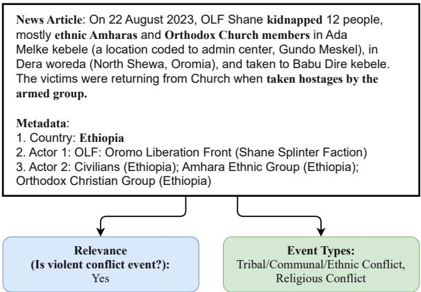
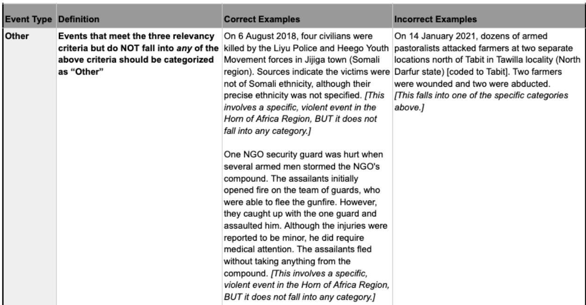
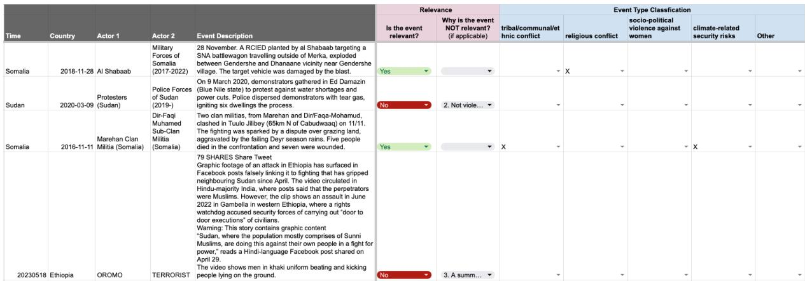
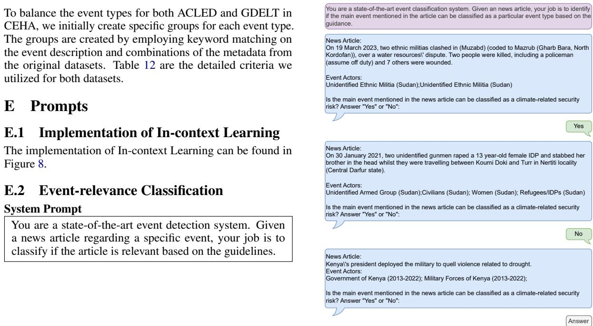

# CEHA: A Dataset of Conflict Events in the Horn of Africa

Rui Bai\*, Di Lu, Shihao Ran, Elizabeth Olson, Hemank Lamba, Aoife Cahill, Joel Tetreault, Alex Jaimes

Dataminr Inc.

{rbai,dlu,sran,elizabeth.olson,hlamba,acahill,jtetreault,ajaimes}@dataminr.com

## Abstract

Natural Language Processing (NLP) of news articles can play an important role in understanding the dynamics and causes of violent conflict. Despite the availability of datasets categorizing various conflict events, the existing labels often do not cover all of the fine-grained violent conflict event types relevant to areas like the Horn of Africa. In this paper, we introduce a new benchmark dataset Conflict Events in the Horn of Africa region (CEHA) and propose a new task for identifying violent conflict events using online resources with this dataset. The dataset consists of 500 English event descriptions regarding conflict events in the Horn of Africa region with fine-grained event-type definitions that emphasize the cause of the conflict. This dataset categorizes the key types of conflict risk according to specific areas required by stakeholders in the Humanitarian-Peace-Development Nexus<sup>1</sup>. Additionally, we conduct extensive experiments on two tasks supported by this dataset: Event-relevance Classification and Event-type Classification. Our baseline models demonstrate the challenging nature of these tasks and the usefulness of our dataset for model evaluations in low-resource settings with limited number of training data.

## 1 Introduction

Online news article resources have been pivotal for Information Extraction (Dasgupta et al., 2017; Singh, 2018) and Event Detection tasks (Nugent et al., 2017; Wang, 2018; Hordofa, 2020) when coupled with advancements in NLP over recent years. These developments make identifying and summarizing events for different humanitarian and development agencies more accessible than ever (Ran et al., 2023), in turn accelerating early warning and risk mitigation, timely response and resource allocation to crisis events, and enhancing decisionmaking to support sustainable development (Jongman et al., 2015; Lang et al., 2020; Khatoon et al., 2021).

  
Figure 1: An example of the input/output to an NLP model for extracting event-relevance and event-types for violent conflict events in the Horn of Africa region.

Assessing conflict events in the regions vulnerable to crises has become increasingly crucial for humanitarian assistance. One region in particular, the Horn of Africa<sup>2</sup>, accounts for over 20 percent of the global caseload for humanitarian and protection assistance, with nearly 64 million people in need, according to OCHA (2024). Persistent conflict and volatility has shaped this urgent humanitarian crisis, including the recent armed conflict in Ethiopia’s Tigray region, and ongoing civil wars in Sudan and Somalia (Kurtzer et al., 2022). These conflicts stem from various complex and interconnected factors, including ethnic and religious tension, weak governance, and competition for resources (Mengistu, 2015; Solomon et al., 2018).

To support peacebuilding and development efforts and inform strategic interventions, it is essential to understand the nature and dynamics of these conflicts. However, there are limited resources to develop NLP systems for event detection in this context. Existing event datasets like the Armed Conflict Location and Event Dataset (ACLED) (Raleigh et al., 2023) and Global Database of Events, Language (GDELT) (Leetaru and Schrodt, 2013) only classify events based on event actions such as protests or armed clashes, lacking systematic categorization of key event dynamics.

To mitigate current limitations in resources for event detection in regions vulnerable to the impacts of crises like in the Horn of Africa, we propose Conflict Events in the Horn of Africa region (CEHA), a new dataset consisting of 500 English event descriptions from ACLED<sup>3</sup> and GDELT<sup>4</sup> covering conflict events in that region annotated by subject matter experts. Each event description is annotated with a binary Event-relevance label to indicate if it is associated with a specific violent conflict event. Event descriptions containing violent conflict event mentions are further annotated with 4 different event-type labels: TRIBAL/COMMUNAL/ETHNIC CONFLICT, RELI-GIOUS CONFLICT, SOCIO-POLITICAL VIOLENCE AGAINST WOMEN, and CLIMATE-RELATED SE-CURITY RISKS. Figure 1 shows a sample event description with Event-relevance and Event-type annotations.

To summarize, our contributions are three-fold:

• We publish a new benchmark dataset CEHA, containing event descriptions of violent conflicts in the Horn of Africa region to support the task for identifying and categorizing violent conflict events using online news article resources. The dataset is annotated with finegrained event-types by subject matter experts. To the best of our knowledge, this is the first NLP dataset that pertains to this level of event regionality and event-type granularity;

• We conduct extensive baseline experiments for both Event-relevance and Event-type Classification with deep-learning classifiers and LLMs, demonstrating the challenging nature of this task and the usefulness of our dataset in low-resource settings with limited number of training data;

• With CEHA, we aim to bolster the coverage of AI for Social Good (AI4SG) efforts for low-resource areas of the globe and enable more NLP research opportunities for conflictaffected parts of the world.

The CEHA dataset and the code for the model training and evaluation are available at https:// github.com/dataminr-ai/CEHA.

## 2 Related Work

## 2.1 Conflict Event Datasets

Conflict event datasets are widely developed and used by non-governmental organizations, governments, United Nations agencies, and researchers (Chojnacki et al., 2012; Donnay et al., 2019; Shaver et al., 2023). These datasets have a variety of practical applications from conflict analysis and early warning, to program implementation, resource planning, and more.

The Armed Conflict Location and Event Dataset (ACLED) (Raleigh et al., 2023) is a seminal resource in this space, and serves as one of the data sources leveraged in the construction of CEHA. ACLED is manually curated and labelled by subject matter experts, and includes political violence and protest events sourced from traditional media, reports, online media and key informants. The Global Database of Events, Language (GDELT), also used to construct CEHA, automatically identifies and categorizes events from online print and broadcast media (Leetaru and Schrodt, 2013). In contrast to the carefully curated ACLED dataset, GDELT is much larger, with over 400 times as many different events as in ACLED and its labels are automatically generated.

Other key conflict event datasets include Uppsala Conflict Data Program (UCDP) (Sundberg and Melander, 2013), POLitical Event Classification, Attributes, and Types (POLECAT) Dataset (Halterman et al., 2023), Social Conflict Analysis Database (SCAD) (Salehyan et al., 2012), and the Global Terrorism Database (LaFree and Dugan, 2007). In addition, HRDsAttack (Ran et al., 2023) presents a dataset that contains attack events around Human Rights Defenders, including various attack types such as KILLING and KIDNAPPING, however, the geographical coverage of the dataset is global and not focused on low-resource areas. Table 1 provides an overview of these datasets.

<table><tr><td rowspan=1 colspan=1>Dataset</td><td rowspan=1 colspan=1>Focus</td><td rowspan=1 colspan=1>Geo</td><td rowspan=1 colspan=1>Time</td><td rowspan=1 colspan=1>Num. Events</td><td rowspan=1 colspan=1>Labels</td><td rowspan=1 colspan=1>Reference</td></tr><tr><td rowspan=1 colspan=1>GDELT</td><td rowspan=1 colspan=1>Wide range of events</td><td rowspan=1 colspan=1>Global</td><td rowspan=1 colspan=1>1979 - 2024</td><td rowspan=1 colspan=1>563 million</td><td rowspan=1 colspan=1>Machine</td><td rowspan=1 colspan=1>Leetaru and Schrodt (2013)</td></tr><tr><td rowspan=1 colspan=1>POLECAT</td><td rowspan=1 colspan=1>Socio-political interactions</td><td rowspan=1 colspan=1>Global</td><td rowspan=1 colspan=1>2010 - 2024</td><td rowspan=1 colspan=1>6.2 million</td><td rowspan=1 colspan=1>Machine</td><td rowspan=1 colspan=1>Halterman et al. (2023)</td></tr><tr><td rowspan=1 colspan=1>ACLED</td><td rowspan=1 colspan=1>Political violence</td><td rowspan=1 colspan=1>Global</td><td rowspan=1 colspan=1>1997 - 2024</td><td rowspan=1 colspan=1>1.3 million</td><td rowspan=1 colspan=1>Manual</td><td rowspan=1 colspan=1>Raleigh et al. (2023)</td></tr><tr><td rowspan=1 colspan=1>UCDP</td><td rowspan=1 colspan=1>Organized violence</td><td rowspan=1 colspan=1>Global</td><td rowspan=1 colspan=1>1989 - 2023</td><td rowspan=1 colspan=1>350,000</td><td rowspan=1 colspan=1>Manual</td><td rowspan=1 colspan=1>Sundberg and Melander (2013)</td></tr><tr><td rowspan=1 colspan=1>GTD</td><td rowspan=1 colspan=1>Terrorist incidents</td><td rowspan=1 colspan=1>Global</td><td rowspan=1 colspan=1>1970 - 2020</td><td rowspan=1 colspan=1>190,000</td><td rowspan=1 colspan=1>Manual</td><td rowspan=1 colspan=1>LaFree and Dugan (2007)</td></tr><tr><td rowspan=1 colspan=1>SCAD</td><td rowspan=1 colspan=1>Social conflict</td><td rowspan=1 colspan=1>Africa, LatAm</td><td rowspan=1 colspan=1>1990 - 2016</td><td rowspan=1 colspan=1>20,000</td><td rowspan=1 colspan=1>Manual</td><td rowspan=1 colspan=1>Salehyan et al. (2012)</td></tr><tr><td rowspan=1 colspan=1>HRDsAttack</td><td rowspan=1 colspan=1>Attacks on HRDs</td><td rowspan=1 colspan=1>Global</td><td rowspan=1 colspan=1>2019 - 2022</td><td rowspan=1 colspan=1>500</td><td rowspan=1 colspan=1>Manual</td><td rowspan=1 colspan=1>Ran et al. (2023)</td></tr><tr><td rowspan=1 colspan=1>CEHA</td><td rowspan=1 colspan=1>Conflict events</td><td rowspan=1 colspan=1>Horn of Africa</td><td rowspan=1 colspan=1>2015 - 2024</td><td rowspan=1 colspan=1>500</td><td rowspan=1 colspan=1>Manual</td><td rowspan=1 colspan=1>Proposed dataset</td></tr></table>

Table 1: Conflict and violent event datasets.

## 2.2 Event-type Classification

Event-type Classification is a sub-task of the Event Extraction (EE) task that aims to detect key event information such as the 5-Ws (who, what, where, when, and why). Most existing resources for EE such as ACE05 (Doddington et al., 2004), or its variations, such as Light ERE and Rich ERE (Song et al., 2015), contain a wide range of event types in their event ontology, but with a limited focus on conflict event types. In the ACE ontology, only LIFE.INJURE and CONFLICT.ATTACK are related to conflict events. This limited scope makes the ontology insufficient for capturing the diverse dynamics of conflict events. In HRDsAttack, the major focus of the dataset is attack events regarding Human Rights Defenders (such as ARBITRARY DETENTION or TORTURE), along with other hierarchical metadata of the event, such as LOCATION and TIME.

In our CEHA dataset, conflict events are further categorized into four critical event-types in that region, as mentioned in reports from the Office of the Special Envoy for the Horn of Africa<sup>5</sup>, identified by experts specializing in the Horn of Africa. These four event-types are TRIBAL/COMMUNAL/ETH-NIC CONFLICT, RELIGIOUS CONFLICT, SOCIO-POLITICAL VIOLENCE AGAINST WOMEN, and CLIMATE-RELATED SECURITY RISKS.

## 3 Dataset

CEHA is a dataset containing 500 events sourced from ACLED and GDELT, with 250 events from each source. These events were annotated by subject matter experts with experience working in International Development in the Horn of Africa region for event-relevance and event-type labels, utilizing well-designed annotation guidelines and various quality control measures. In this section, we describe how the dataset was constructed. Section

3.1 introduces the iterative process of defining the annotation labels. Section 3.2 details the data sampling methods used. Finally, Section 3.3 delves into how the annotation task was performed.

## 3.1 Annotation Labels

Given the complexity of categorizing conflict events (Gerner et al., 2002; Ide et al., 2020), an interdisciplinary team of experts in International Development, Crisis Risk & Anticipation, and Computer Science collaborated to shape this project from its conception and jointly developed the annotation guidelines, event-relevance, and event-type criteria. These annotations serve as training data for models that identify and classify conflict events reported in online news sources, thereby enhancing understanding of conflict dynamics and informing strategic interventions in the Horn of Africa

While some event types have baseline definitions from ACLED’s pilot projects (e.g. ACLED-Religion<sup>6</sup> in the Middle East and North Africa), which we have slightly modified, specific event types like TRIBAL/COMMUNAL/ETHNIC CON-FLICT and CLIMATE-RELATED SECURITY RISKS are not covered. Definitions for these new event types were developed collaboratively with subject matter experts.

The refinement of annotation guidelines proceeded through two phases: initially, internal experts in International Development and Crisis Risk & Anticipation refined the definitions, supplemented with positive and negative examples and detailed explanations based on an internal review involving 200 examples from these experts. Subsequently, a pilot task involving 50 examples was conducted with expert annotators, whose feedback led to further definition clarity and the addition of illustrative examples.

Finally, we formalized the definitions for eventrelevance and event-types, which are described in

Table 2 and Table 3. The full annotation guidelines and definitions can be found in Appendix A.

## 3.2 Data Sampling

To sample the data, we first extracted all possible violent conflict events in the Horn of Africa from both data sources and then performed balanced sampling from each.

We carefully adhered to the codebooks for each dataset to filter the data, considering the distinct structures and annotations of ACLED and GDELT. ACLED provides information about event geography, time, actors, and violent or non-violent event types labeled by specialists. It also includes summarized event descriptions. In contrast, GDELT automatically tags event information, including time, actor details and event types, following the Conflict and Mediation Event Observations (CAMEO) event coding framework (Schrodt, 2012), which relies on keyword-based methods. GDELT provides links to the original articles instead of summaries. Due to ACLED’s specialist-labeled data, its metadata is more trustworthy, whereas GDELT’s automated tagging is less reliable.

For ACLED, we sampled event data from 2015/01/01 to 2024/01/29, focusing on events in the Horn of Africa region utilizing the COUNTRY metadata. To exclude peaceful events, we filtered out events where SUB\_EVENT\_TYPE is Agreement, Peaceful protest or Non-violent transfer of territory, resulting in 97,017 events total.

Meanwhile, from the GDELT event table, we first extracted 4,390,260 events between 2020/01/01 and 2024/01/29. To filter events that happened in the Horn of Africa region, we determined the event country based on Actor1CountryCode, Actor2CountryCode, Actor1Geo\_CountryCode, Actor2Geo\_CountryCode, and ActionGeo\_CountryCode according to the GDELT event geography ontology. Events were included in the dataset only if any of these fields reference a country in the Horn of Africa region. We then removed the non-violent events identified by the CAMEO Event Code in the GDELT dataset. The CAMEO ontology categorizes events into 20 groups, with the first 9 codes (01–09) representing events of cooperation between groups, and the latter 11 codes (10–20) representing conflict events between groups. Detailed codes and descriptions are provided in Appendix B. We specifically removed the non-violent events from groups 01 to 09. After filtering based on time range, geographic location, and violence level using existing labels in GDELT, we obtained 192,424 texts based on the provided URLs since GDELT does not provide the full text of the news articles.

During the pilot annotation tasks, we noticed some data imbalance issues regarding both eventrelevance and event-types: GDELT contains a significantly higher volume of irrelevant posts and a substantial number of events were annotated as TRIBAL/COMMUNAL/ETHNIC CONFLICT in the pilot samples. To address the imbalance issue around event-relevance in GDELT before sampling the final set of articles, we applied a few-shot Mistral-Large model to remove irrelevant posts. Utilizing the annotation guidelines and examples from the pilot task as instructions to the model, it achieved an 89% precision for the No class, evaluated on the second round pilot data. Detailed performance of this model and its prompt are provided in Appendix C. To balance the event types within the dataset, we first created targeted groups for each event type based on keyword matching on the event description and metadata provided by the original dataset (detailed criteria are listed in Table 12 in Appendix D). Next, we sampled events from each group equally for both ACLED and GDELT, with 250 events selected from each source.

## 3.3 Annotation Process

Each data point was annotated following a two-step process: binary Event-relevance Classification, and subsequent Event-type Classification. The annotators first determined the relevance of the event and for each relevant event, they then selected all relevant event type(s).

The Event-type Classification poses challenges that demand expert annotation. Annotators often rely on domain knowledge that is not explicitly stated in the text, a challenge sometimes referred to as the ABSTRACTION GAP (Olsen et al., 2024), e.g. that Al Shabaab is an Islamist group. Experts with expertise in the Horn of Africa annotate the CEHA. We conducted two pilot tasks before the full task and closely monitored the full annotation process.

Pilot Tasks. To assess the clarity and effectiveness of the annotation guidance and evaluate the interannotator agreement, we conducted 2 pilot tasks with the same 4 annotators who later performed the full task. The first pilot included 50 examples with 10 shared among annotators while the second pilot contained 20 examples, each annotated by all

An event is defined as relevant if it meets all three criteria
<table><tr><td rowspan=1 colspan=1>Criterion</td><td rowspan=1 colspan=1>Summarized Definition</td></tr><tr><td rowspan=1 colspan=1>Location: Horn ofAfrica</td><td rowspan=1 colspan=1>The event takes place in one of the following countries: Djibouti, Eritrea, Ethiopia, Kenya, Somalia,Sudan, South Sudan, and Uganda.</td></tr><tr><td rowspan=1 colspan=1>Violent / ConflictSetting</td><td rowspan=1 colspan=1>The violence must be directed at a person or people rather than general expressions of anger targetingunassociated objects (e.g. burning tires or cars).</td></tr><tr><td rowspan=1 colspan=1>Specific Event</td><td rowspan=1 colspan=1>The text describes a specific event or incident rather than a summary of different situations.</td></tr></table>

Table 2: Event-relevance definitions (summarized).
<table><tr><td rowspan=1 colspan=1>Event Type</td><td rowspan=1 colspan=1>Summarized Definition</td><td rowspan=1 colspan=1>Examples</td></tr><tr><td rowspan=1 colspan=1>Tribal/ Communal/Ethnic Conflict</td><td rowspan=1 colspan=1>Disputes or violence involving ethnic, tribal, OR com-munal groups. This includes events where one or moreactors had an explicit tribal, communal, clan, or ethnicaffiliation received this label.</td><td rowspan=1 colspan=1>Border Guards members kidnapped a Sala-mat tribal leader at the Hamidiya bus sta-tion in Zalingei. [The tribal leader wastargeted]</td></tr><tr><td rowspan=1 colspan=1>Religious Conflict</td><td rowspan=1 colspan=1>Conflicts arising from differences in religious beliefsor practices, leading to violent confrontations betweenreligious groups. This includes events where one ormore actors or targets had a stated religious affiliation(e.g. a nun, a mosque, an Islamic Militia) or individualswere targeted while engaging in religious practice (e.g.praying, visiting a mosque), even where the cause ofthe violence is not stated.</td><td rowspan=1 colspan=1>A Muslim leader who had denounced rebelactivity and joined the army, Major SheikhMohammed Kiggundu, was ambushed byunidentified armed men on motorcycles. Heand his escort were killed. [A religiousleader was attacked]</td></tr><tr><td rowspan=1 colspan=1>Socio-politicalViolence AgainstWomen</td><td rowspan=1 colspan=1>Civilian targeting events in which women and/or girlsare the target’ of the violence. This includes eventswhere the majority of victim(s) were women and girls,and when the primary target was a woman or girl (e.g.a female politician attacked alongside her two malebodyguards)</td><td rowspan=1 colspan=1>A remote explosive targeting a girls&#x27;school. [Girls were targeted]</td></tr><tr><td rowspan=1 colspan=1>Climate-RelatedSecurity Risks</td><td rowspan=1 colspan=1>Conflict events influenced by environmental andclimate-related factors. Events falling into this cate-gory were required to explicitly mention both a climaterelated phenomenon and a conflict event.</td><td rowspan=1 colspan=1>Clan militias ... clashed in Iarmoghe ... Thearea reportedly received little rain, whichmay cause competition for pasture and ex-plain the clan conflict... [The conflict wasdue to lack of rain]</td></tr><tr><td rowspan=1 colspan=1>Other</td><td rowspan=1 colspan=1>Events that meet the three relevancy criteria but do notfall into any of the other event types.</td><td rowspan=1 colspan=1></td></tr></table>

Table 3: Event-type definitions (summarized).

annotators.

The first pilot batch revealed low agreement among annotators, prompting the refinement of annotation instructions. This involved clarifying ambiguous cases, adding more examples, and conducting feedback sessions with annotators to enhance the accuracy of the guidelines before proceeding to the second pilot batch. As a result of these efforts, the inter-annotator agreement score for Event-relevance, measured by the average pairwise Cohen-Kappa Score, improved notably from 0.31 to 0.63. Table 4 shows the detailed pairwise inter-annotator agreement score between all annotators.

Full Task. In the full annotation task, we randomly split the data among the 4 annotators, with each annotator receiving 125 examples. We conducted spot checks to ensure adherence to the annotation guidelines, providing feedback to annotators throughout the process.

<table><tr><td>Annotator Index</td><td>Relevance</td><td>Event Type</td></tr><tr><td>A1</td><td>0.71</td><td>0.77</td></tr><tr><td>A2</td><td>0.64</td><td>0.62</td></tr><tr><td>A3</td><td>0.55</td><td>0.68</td></tr><tr><td>A5</td><td>0.61</td><td>0.79</td></tr><tr><td>Average</td><td>0.63</td><td>0.72</td></tr></table>

Table 4: Average pairwise Cohen Kappa score between annotators based on 20 examples in the second pilot task. Note that Annotator 4 was removed from the final annotation due to low agreement with the other annotators.

## 3.4 Data Statistics

CEHA was randomly split into train, dev, and test sets following a 4:1:5 ratio. The annotations require expert domain knowledge, making our dataset valuable but expensive to annotate, resulting in CEHA being small though on par with other AI4SG datasets with fine-grained labels (such as Ran et al. (2023)). We used the 4:1:5 ratio to ensure a robust benchmark (test) set for evaluating models in low-resource settings for conflict events.

Table 5 presents the textual statistics of the dataset, while Table 6 shows a detailed breakdown of the label statistics for CEHA. Event-types are only labeled for data classified as relevant events, with 9.35% of the relevant events annotated with multiple event types and OTHER selected only when none of the 4 specified event types apply. The train, test, and dev sets are evenly distributed between ACLED and GDELT with detailed statistics listed in Table 7.

<table><tr><td rowspan=1 colspan=1></td><td rowspan=1 colspan=1>train</td><td rowspan=1 colspan=1>dev</td><td rowspan=1 colspan=1>test</td><td rowspan=1 colspan=1>total</td></tr><tr><td rowspan=1 colspan=1>No. of articles</td><td rowspan=1 colspan=1>200</td><td rowspan=1 colspan=1>50</td><td rowspan=1 colspan=1>250</td><td rowspan=1 colspan=1>500</td></tr><tr><td rowspan=1 colspan=1>Total No. of tokens</td><td rowspan=1 colspan=1>32178</td><td rowspan=1 colspan=1>8565</td><td rowspan=1 colspan=1>37743</td><td rowspan=1 colspan=1>78486</td></tr><tr><td rowspan=1 colspan=1>Avg No. of tokens</td><td rowspan=1 colspan=1>160.89</td><td rowspan=1 colspan=1>171.30</td><td rowspan=1 colspan=1>150.97</td><td rowspan=1 colspan=1>156.97</td></tr></table>

Table 5: Textual statistics of CEHA.

<table><tr><td rowspan=1 colspan=1>Task</td><td rowspan=1 colspan=1>Annotation Label</td><td rowspan=1 colspan=1>train</td><td rowspan=1 colspan=1>dev</td><td rowspan=1 colspan=1>test</td><td rowspan=1 colspan=1>total</td></tr><tr><td rowspan=2 colspan=1>Relevance</td><td rowspan=1 colspan=1>Yes (relevant event)</td><td rowspan=1 colspan=1>128</td><td rowspan=1 colspan=1>32</td><td rowspan=1 colspan=1>150</td><td rowspan=1 colspan=1>310</td></tr><tr><td rowspan=1 colspan=1>No (irrelevant event)</td><td rowspan=1 colspan=1>72</td><td rowspan=1 colspan=1>18</td><td rowspan=1 colspan=1>100</td><td rowspan=1 colspan=1>190</td></tr><tr><td rowspan=5 colspan=1>Event-type</td><td rowspan=1 colspan=1>Tribal/ Communal/Ethnic Conflict</td><td rowspan=1 colspan=1>51</td><td rowspan=1 colspan=1>12</td><td rowspan=1 colspan=1>52</td><td rowspan=1 colspan=1>115</td></tr><tr><td rowspan=1 colspan=1>Religious Conflict</td><td rowspan=1 colspan=1>41</td><td rowspan=1 colspan=1>13</td><td rowspan=1 colspan=1>28</td><td rowspan=1 colspan=1>82</td></tr><tr><td rowspan=1 colspan=1>Socio-politicalViolence  AgainstWomen</td><td rowspan=1 colspan=1>22</td><td rowspan=1 colspan=1>6</td><td rowspan=1 colspan=1>44</td><td rowspan=1 colspan=1>72</td></tr><tr><td rowspan=1 colspan=1>Climate-Related Se-curity Risks</td><td rowspan=1 colspan=1>11</td><td rowspan=1 colspan=1>1</td><td rowspan=1 colspan=1>11</td><td rowspan=1 colspan=1>23</td></tr><tr><td rowspan=1 colspan=1>Other</td><td rowspan=1 colspan=1>14</td><td rowspan=1 colspan=1>3</td><td rowspan=1 colspan=1>30</td><td rowspan=1 colspan=1>47</td></tr></table>

Table 6: Label statistics of CEHA.

<table><tr><td rowspan=1 colspan=1></td><td rowspan=1 colspan=1>train</td><td rowspan=1 colspan=1>dev</td><td rowspan=1 colspan=1>test</td><td rowspan=1 colspan=1>total</td></tr><tr><td rowspan=1 colspan=1>No. of articles</td><td rowspan=1 colspan=1>200</td><td rowspan=1 colspan=1>50</td><td rowspan=1 colspan=1>250</td><td rowspan=1 colspan=1>500</td></tr><tr><td rowspan=1 colspan=1>ACLED</td><td rowspan=1 colspan=1>100</td><td rowspan=1 colspan=1>24</td><td rowspan=1 colspan=1>126</td><td rowspan=1 colspan=1>250</td></tr><tr><td rowspan=1 colspan=1>GDELT</td><td rowspan=1 colspan=1>100</td><td rowspan=1 colspan=1>26</td><td rowspan=1 colspan=1>124</td><td rowspan=1 colspan=1>250</td></tr></table>

Table 7: Source distribution of CEHA.

## 4 Models

In this section, we discuss the baseline models that we use to create the benchmark for the CEHA dataset. We compare two sets of models in the lowresource setting: supervised models (BERT (Devlin et al., 2018), RoBERTa (Liu et al., 2019), and T5-base (Raffel et al., 2023)) with fine-tuning, and prompt-based LLMs (Mixtral 8X7B (Jiang et al., 2024), Mistral-large (AI, 2024b), DBRX (Team, 2024), GPT-4o (OpenAI et al., 2023) and Llama3- 70B (AI, 2024a)).

We formulate the Event-relevance Classification as a binary classification task and the Event-type

Classification as a multi-label classification task, which is an ensemble of four binary classification tasks for each of the event types. We do not include the OTHER event type during training, and instead apply it to the event description when none of the four event types are assigned by the models.

## 4.1 Supervised Models

We fine-tune encoder-only models and encoderdecoder models using the training data. For Encoder-only Models, we train the models using Binary Cross-Entropy Loss. For Encoder-Decoder Models, we use the standard maximum likelihood objective to train the model following Raffel et al. (2023).

Encoder-only Model We fine-tune BERT and RoBERTa models on both classification tasks. Given the small training sample size, we only update the parameters in the last two layers. The thresholds for each class are selected based on the optimal F1 score on the dev set.

Encoder-decoder Model We select T5 because it is computationally efficient for fine-tuning and prior work (Lu et al., 2023; Ran et al., 2023) demonstrates the effectiveness of formulating EE as Question-Answering (QA) tasks with T5 as the backbones. For both Event-relevance and Eventtype Classification, we ask T5 to answer binary questions such as Is the event relevant?, Is the event religious conflict? based on the context constructed from the news article content and the associated metadata. For Event-type Classification, we format the categorical ground truth label to Yes/No answer for 4 event-type question. The answer is Yes if the event type was present for this sample, otherwise No. The questions for both T5 models are listed in Table 14 in Appendix F.2. For Event-type Classification, we merge the model predictions to include all event types for which the model answered Yes.

## 4.2 Prompt-based LLM Models

We design the prompt to incorporate the annotation instructions written by our experts and propose LLM-based models for both Zero-Shot and Few-Shot In-Context Learning settings. We use Mixtral 8X7B, Mistral-large, DBRX, GPT-4o and Llama3-70B as the backbones for the experiments in Section 5. All the prompts used in the experiments are detailed in Appendix E.

Zero-shot Learning The LLMs answer directly with Yes or No to predict whether the input document is relevant or not (Event-relevance

Classification Task), or predict whether the input relevant document includes a specific type of event (Event-type Classification Task). We require the model to generate the answer in the following format for easy answer parsing:

<response>   
<event\_type>Answer</event\_type>   
<reason>reason for your selection</reason>   
</response>

Few-Shot In-Context Learning We implement few-shot in-context learning in chat mode, with the examples represented as parts of the conversation history. Detailed implementation of the in-context learning is listed in Appendix E.1. We use six shots for all of our experiments (three positive examples and three negative examples), based on preliminary results.

## 5 Evaluation

## 5.1 Dataset and Evaluation Metrics

We report Precision, Recall, and F1 scores on the test set to measure the performance of various models on Event-relevance Classification and Eventtype Classification<sup>7</sup>. The Event-type Classification is trained and evaluated on the annotated data that has been manually labeled as relevant.

## 5.2 Event-relevance Performance

<table><tr><td>Models</td><td>Precision</td><td>Recall</td><td>F1</td></tr><tr><td colspan="3">Supervised Models</td><td></td></tr><tr><td>BERT RoBERTa</td><td>63.16</td><td>96.00</td><td>76.19 83.09</td></tr><tr><td>T5</td><td>72.86 78.44</td><td>96.67 87.33</td><td>82.65</td></tr><tr><td></td><td>Zero-shot LLMs</td><td></td><td>75.70</td></tr><tr><td>Mixtral 8X7B Mistral-large DBRX</td><td>61.41 67.28 71.11</td><td>98.67 97.33 85.33</td><td>79.56 77.58</td></tr><tr><td>GPT-40 Llama 3-70b</td><td>80.95</td><td>90.67</td><td>85.53</td></tr><tr><td></td><td>72.22 Few-shot In-context LLMs</td><td>95.33</td><td>82.18</td></tr><tr><td>Mixtral 8X7B-6 shot Mistral-large-6 shot</td><td>67.61</td><td>96.00</td><td></td></tr><tr><td>DBRX-6 shot GPT-4o-6 shot</td><td>78.92 80.12 88.11</td><td>97.33 91.33</td><td>79.34 87.16</td></tr></table>

Table 8: Performance on Event-relevance Classification Task (%).

Table 8 shows the performance of the models on the first task. RoBERTa has the best performance among the supervised models in this low-resource setting. GPT-4o has the best performance in the zero-shot setting, and achieves comparable performance with supervised RoBERTa. All of the LLMs have better performance with Few-Shot In-Context Learning. Mistral-large and DBRX benefit more with a gain of 7.6% and 7.78%, respectively with In-Context Learning, and Mistral-large (six shot) achieves the best overall F1 score (87.16%).

Overall, LLMs show better performance in the few-shot setting (with the only exception being Mixtral 8X7B-6 shot), which demonstrates the powerful nature of LLMs in low-resource settings due to their large amount of common world knowledge obtained via pre-training. Despite the marginal improvements in F1 scores compared to supervised models, the precision remains relatively low for most LLM model variations, which demonstrates the challenging nature of the Eventrelevance Classification task.

## 5.3 Event-type Performance

<table><tr><td>Models</td><td>Precision</td><td>Recall</td><td>F1</td></tr><tr><td colspan="3">Supervised Models</td><td></td></tr><tr><td>BERT</td><td>52.63</td><td>74.07</td><td>61.54</td></tr><tr><td>RoBERTa</td><td>59.17</td><td>74.07</td><td>65.79</td></tr><tr><td>T5</td><td>79.83</td><td>70.37</td><td>74.80</td></tr><tr><td colspan="3">Zero-shot LLMs</td><td>72.32</td></tr><tr><td>Mixtral 8x7B Mistral-large</td><td>67.72 70.37</td><td>77.58 80.61</td><td>75.14</td></tr><tr><td>DBRX GPT-40</td><td>58.33</td><td>55.15</td><td>56.70</td></tr><tr><td>Llama 3-70b</td><td>71.82</td><td>78.79</td><td>75.14</td></tr><tr><td></td><td>71.58</td><td>79.39</td><td>75.29</td></tr><tr><td colspan="3">Few-shot In-context LLMs</td><td></td></tr><tr><td>Mixtral 8X7B-6 shot</td><td>64.95</td><td>84.24</td><td>73.35</td></tr><tr><td>Mistral-large-6 shot</td><td>72.63</td><td>79.27</td><td>75.80</td></tr><tr><td>DBRX-6 shot</td><td>65.46</td><td>76.97</td><td>70.75</td></tr><tr><td>GPT-4o-6 shot</td><td>69.95</td><td>77.58</td><td>73.56</td></tr><tr><td>Llama3-70b-6 shot</td><td>67.48</td><td>84.24</td><td>74.93</td></tr></table>

Table 9: Performance on Event-type Classification Task (%). (The scores are reported on the relevant documents.)

Performances for the more granular task are shown in Table 9. To make a fair comparison for the Event-type Classification task, we evaluate the baselines on the instances marked as relevant in the expert annotation. T5 performs better than other supervised models most likely since it is pretrained on a wide range of NLP tasks, it can deal with extremely low-resource settings better than the other two supervised models.

Similarly, the best zero-shot LLM (Llama3 with an F1 score of 75.29%) has comparable performance with the best-performing supervised model (T5 with an F1 score of 74.80%). However, incontext examples do not consistently provide improvement. GPT-4o and Llama3 have a slight performance drop in the six-shot setting. Mistral-large in a six-shot setting achieves the best F1 score. And DBRX benefits the most with In-Context Learning and obtains a gain of 14.05% in F1 score.

<table><tr><td>Models</td><td colspan="3">Tribal/Communal/ Ethnic Conflict</td><td colspan="3">Religious Conflict</td><td colspan="3">Socio-Political Violence against women</td><td colspan="3">Climate-Related Security Risks</td></tr><tr><td></td><td>Precision</td><td>Recall</td><td>F1</td><td>Precision Recall</td><td></td><td>F1</td><td>Precision Recall</td><td></td><td>F1</td><td>Precision</td><td>Recall</td><td>F1</td></tr><tr><td colspan="10">Supervised Models</td><td colspan="3"></td></tr><tr><td>BERT</td><td>56.25</td><td>69.23</td><td>62.07</td><td>50.00</td><td>75.00</td><td>60.00</td><td>58.57</td><td>93.18</td><td>71.93</td><td>14.29</td><td>18.18</td><td>16.00</td></tr><tr><td>RoBERTa</td><td>60.71</td><td>65.38</td><td>62.96</td><td>52.94</td><td>96.43</td><td>68.35</td><td>85.00</td><td>77.27</td><td>80.95</td><td>22.73</td><td>45.45</td><td>30.30</td></tr><tr><td>T5</td><td>81.58</td><td>59.62</td><td>68.89</td><td>72.73</td><td>85.71</td><td>78.69</td><td>85.11</td><td>90.91</td><td>87.91</td><td>0.00</td><td>0.00</td><td>0.00</td></tr><tr><td colspan="10">Zero-shot LLMs</td><td colspan="3"></td></tr><tr><td>Mixtral 8X7B</td><td>56.63</td><td>90.38</td><td>69.63</td><td>75.76</td><td>89.29</td><td>81.97</td><td>87.80</td><td>81.82</td><td>84.71</td><td>100.00</td><td>36.36</td><td>53.33</td></tr><tr><td>Mistral-large</td><td>61.64</td><td>86.54</td><td>72.00</td><td>75.76</td><td>89.29</td><td>81.97</td><td>82.35</td><td>95.45</td><td>88.42</td><td>62.50</td><td>45.45</td><td>52.63</td></tr><tr><td>DBRX</td><td>71.05</td><td>51.92</td><td>60.00</td><td>100.00</td><td>46.43</td><td>63.41</td><td>100.00</td><td>54.55</td><td>70.59</td><td>0.00</td><td>0.00</td><td>0.00</td></tr><tr><td>GPT-40</td><td>65.22</td><td>86.54</td><td>74.38</td><td>70.27</td><td>92.86</td><td>80.00</td><td>92.31</td><td>81.82</td><td>86.75</td><td>80.00</td><td>36.36</td><td>50.00</td></tr><tr><td>Llama3-70b</td><td>60.26</td><td>90.38</td><td>72.31</td><td>75.76</td><td>89.29</td><td>81.97</td><td>90.70</td><td>88.64</td><td>89.66</td><td>100.00</td><td>9.09</td><td>16.67</td></tr><tr><td colspan="10">Few-shot In-context LLMs</td><td colspan="3"></td></tr><tr><td>Mixtral 8X7B-6shot</td><td>58.54</td><td>92.31</td><td>71.64</td><td>78.12</td><td>89.29</td><td>83.33</td><td>76.79</td><td>97.73</td><td>86.00</td><td>34.48</td><td>90.91</td><td>50.00</td></tr><tr><td>Mistral-large-6shot</td><td>64.18</td><td>82.69</td><td>72.27</td><td>80.65</td><td>89.29</td><td>84.75</td><td>87.50</td><td>81.40</td><td>84.34</td><td>63.64</td><td>63.64</td><td>63.64</td></tr><tr><td>DBRX-6shot</td><td>58.90</td><td>82.69</td><td>68.80</td><td>87.50</td><td>75.00</td><td>80.77</td><td>76.92</td><td>90.91</td><td>83.33</td><td>35.29</td><td>54.55</td><td>42.86</td></tr><tr><td>GPT-4o-6shot</td><td>65.00</td><td>75.00</td><td>69.64</td><td>67.57</td><td>89.29</td><td>76.92</td><td>88.37</td><td>86.36</td><td>87.36</td><td>61.54</td><td>72.73</td><td>66.67</td></tr><tr><td>Llama3-70b-6shot</td><td>59.76</td><td>94.23</td><td>73.13</td><td>63.41</td><td>92.86</td><td>75.36</td><td>84.00</td><td>95.45</td><td>89.36</td><td>53.33</td><td>72.73</td><td>61.54</td></tr></table>

Table 10: Performance on Event-type Classification Task for each event type (%).

The performance metrics for each event type from all models are detailed in Table 10. At a high level, we see a similar trend of model performance for TRIBAL/COMMUNAL/ETHNIC CONFLICT, RE-LIGIOUS CONFLICT, and SOCIO-POLITICAL VIO-LENCE AGAINST WOMEN – the LLMs generally perform better than the supervised models by small margins. GPT4 has the highest F1 score (74.38%) on the TRIBAL/COMMUNAL/ETHNIC CONFLICT event type, with a 5.69% increase over the bestperforming supervised model T5. For RELIGIOUS CONFLICT, Mistral-large-6shot achieves the best F1 score of 84.75%, 6.06% better than T5. The performance difference gets smaller across models for the SOCIO-POLITICAL VIOLENCE AGAINST WOMEN event type with the highest performance coming from Llama3. Perhaps unsurprisingly, for the CLIMATE-RELATED SECURITY RISKS event type, supervised models struggle due to the limited number of samples in the training data for this event type, with T5 failing to generate any predictions for this event type. On the other hand, LLMs understandably stand out in this extremely low-resource setting – most LLM models achieve much better performance for this event type, with the exception of DBRX and Llama3.

From Table 6 and Table 10, one can see that the performance of the supervised models does not scale with the number of available training samples for each event type. Similar trends can be observed for the LLM counterparts. The variations in F1 scores can be viewed as an indicator of the task difficulty for each event type: CLIMATE-RELATED SECURITY RISKS being the most challenging event type and SOCIO-POLITICAL VIO-LENCE AGAINST WOMEN being the easiest event type to classify out of all four event types. This observation can be further backed up by the broader view of how much existing resources for different aspects of world events are available and used for model pre-training, for both supervised models and LLMs. Our hypothesis and assumption is that existing NLP resources focus more on sociopolitical events and less on climate-related events in low-resource areas of the globe, which is then reflected in our task and benchmark scores. This is also why we advocate for more AI4SG opportunities for low-resource and crisis-prone parts of the world given the gaps in existing resources and downstream model performance. We noticed that the LLMs have much higher recall on TRIBAL/- COMMUNAL/ETHNIC CONFLICT (94.23% from the best prompt-based LLM), compared with supervised models (69.23% from the best supervised model). It indicates that the common sense knowledge embedded in the LLMs is not efficient enough to identify those events. For example, the Mistrallarge model mistakenly classifies the event ‘On 11 August 2021, members of TPLF forces raped a 60-year-old woman (Amhara) in Kebele 04 in Weldiya town (North Wello, Amhara).’ as a TRIB-AL/COMMUNAL/ETHNIC CONFLICT event as opposed to SOCIO-POLITICAL VIOLENCE AGAINST WOMEN, because the identified actor, TPLF, is a commonly known ethnic group.

## 6 Conclusions

In this paper, we present CEHA, a new dataset that aims to bridge the gap in existing NLP resources for regions vulnerable to violence, as in the Horn of Africa. Following carefully crafted annotation guidelines and quality control measures, CEHA contains 500 English online news articles annotated by subject matter experts in the field for the tasks of conflict Event-relevance Classification and fine-grained Event-type Classification. In addition, we conduct extensive experiments to demonstrate the usefulness of our dataset and the challenging nature of the new task in low-resource settings. With CEHA, we hope to inspire more NLP research interest into violent conflict event detection in conflict-affected regions, and to aid AI4SG efforts in general.

## Ethical Considerations

CEHA is sourced from ACLED and GDELT, and we strictly adhere to their terms of use, which permit academic usage. Since the data is collected from public sources, it does not include any personally identifiable information. We have only added Event-relevance and Event-type labels, ensuring that privacy and ethical standards are maintained.

CEHA involves human annotations from experts specialized in international development in the Horn of Africa. The annotations were conducted during the course of their professional, paid employment.

Given the conflicting nature of events included in CEHA, we recognize the potential of CEHA being misused to spread misinformation or promote violence. To mitigate these risks, we make sure we control the access of CEHA to responsible parties and individuals by attaching a strict accessing policy and license when we release the dataset. We also urge all research utilizing CEHA to undergo ethical review and follow institutional guidelines for responsible research in this area.

## Limitations

Our dataset is constrained by several factors. Firstly, it only includes event descriptions in English, potentially missing reports written in local languages such as Amharic, Somali, and Arabic. Secondly, the dataset size is limited to 500 due to finite annotation resources and the requirement for domain expertise, restricting its usage primarily to model evaluation rather than training. Due to the limited sample size, there are fewer samples for the "No" class for event-relevance in our dataset, which differs from the actual distribution in the real world. Additionally, despite efforts to balance sampling, there are inherent imbalances in event type distributions, such as a lower number of CLIMATE-RELATED SECURITY RISKS events, simply because they are rare. Future research could focus on expanding datasets to include local languages and exploring advanced modeling techniques such as Chain of Thought LLMs. Additionally, future work could involve extending the study to other conflict-impacted areas, thereby further enhancing the coverage of AI4SG initiatives.

## Acknowledgements

We thank our colleagues Sirene Abou-Chakra, Jessie End for their support and coordination for this project and the anonymous reviewers for their constructive comments and suggestions.

## References

Meta AI. 2024a. Introducing meta llama 3: The most capable openly available llm to date.

Mistral AI. 2024b. Au large.

Sven Chojnacki, Christian Ickler, Michael Spies, and John Wiesel. 2012. Event data on armed conflict and security: New perspectives, old challenges, and some solutions. International Interactions, 38(4):382–401.

Tirthankar Dasgupta, Abir Naskar, Rupsa Saha, and Lipika Dey. 2017. Crimeprofiler: Crime information extraction and visualization from news media. In Proceedings ofthe international conference on web intelligence, pages 541–549.

Jacob Devlin, Ming-Wei Chang, Kenton Lee, and Kristina Toutanova. 2018. Bert: Pre-training of deep bidirectional transformers for language understanding. arXiv preprint arXiv:1810.04805.

George R. Doddington, Alexis Mitchell, Mark A. Przybocki, Lance A. Ramshaw, Stephanie Strassel, and Ralph M. Weischedel. 2004. The automatic content extraction (ace) program – tasks, data, and evaluation. In International Conference on Language Resources and Evaluation.

Karsten Donnay, Eric T. Dunford, Erin C. McGrath, David Backer, and David E. Cunningham. 2019. Integrating conflict event data. Journal ofConflict Resolution, 63(5):1337–1364.

Deborah J Gerner, Philip A Schrodt, Omur Yilmaz, and Rajaa Abu-Jabr. 2002. The creation of cameo (conflict and mediation event observations): An event

data framework for a post cold war world. In annual meeting of the American Political Science Association, volume 29.

Andrew Halterman, Benjamin E Bagozzi, Andreas Beger, Phil Schrodt, and Grace Scraborough. 2023. Plover and polecat: A new political event ontology and dataset. In International Studies Association Conference Paper.

Bekele Abera Hordofa. 2020. Event extraction and representation model from news articles. International Journal ofInnovations in Engineering and Technology, 16(3):1–8.

Tobias Ide, Michael Brzoska, Jonathan F Donges, and Carl-Friedrich Schleussner. 2020. Multi-method evidence for when and how climate-related disasters contribute to armed conflict risk. Global Environmental Change, 62:102063.

Albert Q Jiang, Alexandre Sablayrolles, Antoine Roux, Arthur Mensch, Blanche Savary, Chris Bamford, Devendra Singh Chaplot, Diego de las Casas, Emma Bou Hanna, Florian Bressand, et al. 2024. Mixtral of experts. arXiv preprint arXiv:2401.04088.

Brenden Jongman, Jurjen Wagemaker, Beatriz Revilla Romero, and Erin Coughlan de Perez. 2015. Early flood detection for rapid humanitarian response: harnessing near real-time satellite and twitter signals. ISPRS International Journal of Geo-Information, 4(4):2246–2266.

Shaheen Khatoon, Majed A Alshamari, Amna Asif, Md Maruf Hasan, Sherif Abdou, Khaled Mostafa Elsayed, and Mohsen Rashwan. 2021. Development of social media analytics system for emergency event detection and crisismanagement. Comput. Mater. Contin, 68(3).

Jacob Kurtzer, Sierra Ballard, and Hareem Fatima Abdullah. 2022. Concurrent Crises in the Horn of Africa.

Gary LaFree and Laura Dugan. 2007. Introducing the global terrorism database. Terrorism and political violence, 19(2):181–204.

Stefan Lang, Petra Füreder, Barbara Riedler, Lorenz Wendt, Andreas Braun, Dirk Tiede, Elisabeth Schoepfer, Peter Zeil, Kristin Spröhnle, Kerstin Kulessa, et al. 2020. Earth observation tools and services to increase the effectiveness of humanitarian assistance. European Journal of Remote Sensing, 53(sup2):67–85.

Kalev Leetaru and Philip A Schrodt. 2013. Gdelt: Global data on events, location, and tone, 1979–2012. In ISA annual convention, volume 2, pages 1–49. Citeseer.

Yinhan Liu, Myle Ott, Naman Goyal, Jingfei Du, Mandar Joshi, Danqi Chen, Omer Levy, Mike Lewis, Luke Zettlemoyer, and Veselin Stoyanov. 2019. Roberta: A robustly optimized bert pretraining approach. Preprint, arXiv:1907.11692.

Di Lu, Shihao Ran, Joel Tetreault, and Alejandro Jaimes. 2023. Event extraction as question generation and answering. In Proceedings ofthe 61st Annual Meeting of the Association for Computational Linguistics (Volume 2: Short Papers), pages 1666–1688, Toronto, Canada. Association for Computational Linguistics.

Muhabie Mekonnen Mengistu. 2015. The root causes of conflicts in the horn of africa. American Journal ofApplied Psychology, 4(2):28–34.

Tim Nugent, Fabio Petroni, Natraj Raman, Lucas Carstens, and Jochen L Leidner. 2017. A comparison of classification models for natural disaster and critical event detection from news. In 2017 IEEE international conference on big data (Big Data), pages 3750–3759. IEEE.

OCHA. 2024. Greater horn of africa humanitarian key messages, february 2024. Accessed: 2024-06-15.

Helene Olsen, Étienne Simon, Erik Velldal, and Lilja Øvrelid. 2024. Socio-political events of conflict and unrest: A survey of available datasets. In Proceedings of the 7th Workshop on Challenges and Applications ofAutomated Extraction of Socio-political Eventsfrom Text (CASE 2024), pages 40–53, St. Julians, Malta. Association for Computational Linguistics.

OpenAI, Josh Achiam, Steven Adler, Sandhini Agarwal, Lama Ahmad, Ilge Akkaya, Florencia Leoni Aleman, Diogo Almeida, Janko Altenschmidt, Sam Altman, et al. 2023. Gpt-4 technical report. arXiv preprint arXiv:2303.08774.

Colin Raffel, Noam Shazeer, Adam Roberts, Katherine Lee, Sharan Narang, Michael Matena, Yanqi Zhou, Wei Li, and Peter J. Liu. 2023. Exploring the limits of transfer learning with a unified text-to-text transformer. Preprint, arXiv:1910.10683.

Clionadh Raleigh, Roudabeh Kishi, and Andrew Linke. 2023. Political instability patterns are obscured by conflict dataset scope conditions, sources, and coding choices. Humanities and Social Sciences Communications, 10:74.

Shihao Ran, Di Lu, Joel Tetreault, Aoife Cahill, and Alejandro Jaimes. 2023. A new task and dataset on detecting attacks on human rights defenders. arXiv preprint arXiv:2306.17695.

Idean Salehyan, Cullen S Hendrix, Jesse Hamner, Christina Case, Christopher Linebarger, Emily Stull, and Jennifer Williams. 2012. Social conflict in africa: A new database. International Interactions, 38(4):503–511.

Philip A Schrodt. 2012. Cameo: Conflict and mediation event observations event and actor codebook. Pennsylvania State University, 610:35.

Andrew Shaver, Hannah Kazis-Taylor, Claudia Loomis, Mia Bartschi, Paul Patterson, Adrian Vera, Kevin Abad, Saher Alqarwani, Clay Bell, Sebastian Bock,

Kieran Cabezas, Heidi Felix, Jennifer Gonzalez, Christopher Hoeft, Aileen Martinez, Kai Keltner, Jessica Moroyoqui, Kieko Paman, Ethan Ramirez, and Meriam Eskander. 2023. Expanding the coverage of conflict event datasets: Three proofs of concept. Civil Wars, 25:367–397.

Sonit Singh. 2018. Natural language processing for information extraction. arXiv preprint arXiv:1807.02383.

Negasi Solomon, Emiru Birhane, Christopher Gordon, Mebrahtu Haile, Fatemeh Taheri, Hossein Azadi, and Jürgen Scheffran. 2018. Environmental impacts and causes of conflict in the horn of africa: A review. Earth-science reviews, 177:284–290.

Zhiyi Song, Ann Bies, Stephanie Strassel, Tom Riese, Justin Mott, Joe Ellis, Jonathan Wright, Seth Kulick, Neville Ryant, and Xiaoyi Ma. 2015. From light to rich ere: Annotation of entities, relations, and events. In Proceedings of the the 3rd Workshop on EVENTS: Definition, Detection, Coreference, and Representation, pages 89–98.

Ralph Sundberg and Erik Melander. 2013. Introducing the ucdp georeferenced event dataset. Journal of Peace Research, 50(4):523–532.

The Mosaic Research Team. 2024. Introducing dbrx: A new state-of-the-art open llm.

Wei Wang. 2018. Event detection and extractionfrom news articles. Ph.D. thesis, Virginia Tech.

## A Annotation Guidance

Figures 2 to 6 show the detailed annotation guidance which is shared with all annotators and Figure 7 is a screenshot of the annotation interface.

## B CAMEO Event Code in GDELT dataset

Table 11 shows desciptions of the CAMEO Event Code used in GDELT dataset to classify events. Based on these definitions, we removed events with codes 01–09, which have a higher likelihood of being non-violent.

## C Mistral-large Model for Data Sampling

The model used for relevance filtering is based on Mistral-large with few-shot in-context learning. The model is evaluated on our second round pilot experiment, achieving precision, recall, and F1 of 89%, 38%, and 53%, respectively on the No class. The prompt for this model is given below. Some examples in the prompt are skipped for brevity, but the full prompt can be found in the distributed code repository.

<table><tr><td>CAMEO Event Code</td><td>Description</td></tr><tr><td>01</td><td>MAKE PUBLIC STATEMENT</td></tr><tr><td>02</td><td>APPEAL</td></tr><tr><td>03</td><td>EXPRESS INTENT TO COOPERATE</td></tr><tr><td>04</td><td>CONSULT</td></tr><tr><td>05</td><td>ENGAGE IN DIPLOMATIC COOPERATION</td></tr><tr><td>06</td><td>ENGAGE IN MATERIAL COOPERATION</td></tr><tr><td>07</td><td>PROVIDE AID</td></tr><tr><td>08</td><td>YIELD</td></tr><tr><td>09</td><td>INVESTIGATE</td></tr><tr><td>10</td><td>DEMAND</td></tr><tr><td>11</td><td>DISAPPROVE</td></tr><tr><td>12</td><td>REJECT</td></tr><tr><td>13</td><td>THREATEN</td></tr><tr><td>14</td><td>PROTEST</td></tr><tr><td>15</td><td>EXHIBIT FORCE POSTURE</td></tr><tr><td>16</td><td>REDUCE RELATIONS</td></tr><tr><td>17</td><td>COERCE</td></tr><tr><td>18</td><td>ASSAULT</td></tr><tr><td>19</td><td>FIGHT</td></tr><tr><td>20</td><td>USE UNCONVENTIONAL MASS VIOLENCE</td></tr></table>

Table 11: CAMEO code descriptions.

f""" Instruction: You are a state-of-the-art event detection system. Given a news article regarding a specific event, your job is to classify if the article is relevant based on a given set of guidelines. The article is relevant if: 1. the event it describes takes place in the Horn of Africa Region, which includes Djibouti, Eritrea, Ethiopia, Kenya, Somalia, Sudan, South Sudan, or Uganda. 2. the event it describes is violent and/or occurs in a conflict setting involving or aimed at a person or people (intended to intimidate/terrorize) instead of unassociated objects or things (general expression of anger, etc.). 3. the article describes a \*specific event\* and is not a summary of multiple events or different events, i.e., it is not describing multiple events or developments showing trends or general information. If an article mentions more than ONE event, it is not relevant in our setting.

## Here are some examples:

The following articles are NOT violence related given the above guidelines: 1. Ethiopian Prime Minister Abiy Ahmed has said that his government started negotiations with the rebel group, the Oromo Liberation Army (OLA), in Tanzania on Tuesday. [Negotiations are not a violent event];

The following articles ARE specific events, NOT a summary: 1. Foreign Affairs Cabinet Secretary Alfred Mutua now says that the move to deploy Kenyan police to Haiti is not only about peace and security. In a statement shortly after the United Nations Security Council voted to allow Kenyan troops into the Caribbean country, Mutua said that it is also about rebuilding Haiti. [A UN vote regarding troop deployment is not a violent event];

Given the guidelines and examples above, you should answer only Yes if the article below is relevant based on the guidelines, No if the article is not relevant, Unsure if you cannot make the judgment based on the provided information. Followed by a concise description of the reason. Do not be conversational.

{document}. This event was POSSIBLY reported in {country}.

Is this article relevant based on the guidelines: """

## Instructions:

Given an event description and the corresponding metadata, answer the following questions:

## 1) Relevance:

See Relevance Criteria table below for additional information and examples

• Is the event relevant? Select "Yes" or "No" on the dropdown. The event is relevant if it meets all three of the following criteria:

1.Takes place in the Horn of Africa region (defined as Djibouti, Eritrea, Ethiopia, Kenya, Somalia, Sudan, South Sudan, or Uganda )

o2. Is violent and/or occurs in a conflict setting involving or aimed at a person or people (intended to intimidate/terrorize) instead of unassociated objects or things (general expression of anger, etc.)

o 3. About a specific event or incident (including such details as time, location, involved parties) and is not a summary of different situations (describing multiple events or developments showing trends or general information)

• Why is the event NOT relevant? If the event is NOT relevant, select the corresponding explanation from the dropdown menu:

Note: Select the corresponding explanation from the three criteria in descending order. For example, first check whether the event takes place in the Horn of Africa. If it does not, select “1. Not in Horn of Africa."IF the event does take place in the Horn of Africa, THEN assess whether or not the event is violent. If the event is not violent, select “2. Not violence related”. If the event is violent, THEN assess whether it is about a specific event

• If the event is NOT relevant, proceed to the next event. Skip Question 2 (Event Type Classification) and do not select any event types for this event.

• If the event IS relevant, proceed to Question 2 (Event Type Classification).

2) Event Type Classification: Which event type(s) does the event belong to? Select ALL event types that apply by ticking the corresponding checkbox (in Google Sheets) OR entering / selecting X from the dropdown menu (in Excel).

• Reference the "Event Type Definitions" tablefor details on each event type.

• Select “Other” if it is relevant but does not belong to one of the above event types.

• Only select "Unsure" if you cannot make a judgment based on the definitions.

Note: "Country", "Actor 1" and "Actor 2" are shown only for reference, and may contain errors. Please make your judgment primarily based on the Event Description. Base your judgment on what is explicitly stated in the text, rather than on what may or may not be implied. This includes cases where specifying adjectives are used, such as “woman candidate”, “Muslim leader”, and "water resources".

Figure 2: Screenshot of the annotation guidance (1/5).

<table><tr><td rowspan=1 colspan=8>Relevance Criteria</td></tr><tr><td rowspan=1 colspan=1>Criteria</td><td rowspan=1 colspan=1>Definition</td><td rowspan=1 colspan=5>Relevant Examples</td><td rowspan=1 colspan=1>Not Relevant Examples</td></tr><tr><td rowspan=1 colspan=1>1. Horn ofAfrica</td><td rowspan=1 colspan=1>The event takes place in theHorn of Africa regionNOTE:For this exercise, the Horn ofAfrica is defined as any locationin the following countries: asDjibouti, Eritrea, Ethiopia,Kenya, Somalia, Sudan, SouthSudan, and Uganda.</td><td rowspan=1 colspan=5>- On 14 January 2021, dozens of armedpastoralists attacked farmers at two separatelocations north of Tabit in Tawilla locality (NorthDarfur state) [coded to Tabit]. Two farmers werewounded and two were abducted. The eventtook place in Sudan]</td><td rowspan=1 colspan=1>On September 2, 2023, the streets of southTel Aviv were turned into a warzone as rivalgroups of Eritrean expats battled amongstthemselves and then, later, with the Israelipolice, who were attempting to disperse themelee. The riot began when Eritreansopposed to the dictatorial regime in theirhome country confronted a group of Eritreanscelebrating the African country&#x27;sindependence. [Although Eritreans areinvolved, this event took place in Tel Aviv,Israel.]</td></tr><tr><td rowspan=1 colspan=1>Criteria</td><td rowspan=1 colspan=1>Definition</td><td rowspan=1 colspan=5>Relevant Examples</td><td rowspan=1 colspan=1>Not Relevant Examples</td></tr><tr><td rowspan=2 colspan=1>2. Violent /ConflictSetting</td><td rowspan=2 colspan=1>The event is violent and/oroccurs in a conflict setting.NOTE:For this exercise, a violentevent refers to events involvingor aimed at a person or people(intended tointimidate/terrorize) instead ofunassociated objects or things(general expression of anger,etc.)A peaceful protest (withoutassociated violence) is NOT aviolent event, and would not berelevant for this exercise</td><td rowspan=1 colspan=5>- Property destruction: On 5 June 2023, abishop from the Episcopal Church wasintercepted by an armed group at anunspecified location on the road between Kayaand Morobo (location coded to Ambo, Morobocounty, Central Equatoria state). The grouprobbed religious items from the Bishop and</td><td rowspan=2 colspan=1>- Ethiopian Prime Minister Abiy Ahmed hassaid that his government started negotiationswith the rebel group. the Oromo LiberationArmy (OLA), in Tanzania on Tuesday.It is the first time the Ethiopian governmenthas formally said it would negotiate with theOLA, which has been battling the governmenton and off for decades. [Negotiations are nota violent evenf]- Hundreds of Muslims and conservativeChristians in Kenya&#x27;s capital rallied Fridayoutside the Supreme Court to protest itsdecision last month to reaffirm the LGBTQcommunity&#x27;s right of association, saying thatthe verdict condoned immorality. [Protestwithout violence is not a relevant event]Around 2 June 2020, residents of El Azhari inKhartoum burned tires to denounce thecontinued water outages in theneighbourhood for the past two weeks. Notrelevant because it is a general expression ofanger and is not aimed at a specific person orpeople.]</td></tr><tr><td rowspan=1 colspan=5>torched his car, though the Bishop wasunharmed. The Bishop stated the attackerswere NAS forces (which is disputed by thegroup), who accused the Church leader ofsupporting the government. [This propertydamage was targeted at the Bishop.]- Other: On 8 July 2022, Abu Tira forces firedtear gas at a mosque while people were prayingin Khartoum (Khartoum, Khartoum), after Imammentioned in his speech the prohibition of killingprotesters without a legitimate justification. Teargas was fired targeting people. And this isdirectly targeting the religious group.]</td></tr><tr><td rowspan=1 colspan=1>Criteria</td><td rowspan=1 colspan=1>Definition</td><td rowspan=1 colspan=5>Relevant Examples</td><td rowspan=1 colspan=1>Not Relevant Examples</td></tr><tr><td rowspan=2 colspan=1>3. SpecificEvent</td><td rowspan=2 colspan=1>The text is about a specificevent or incident and is NOTa summary.NOTE:For this exercise:A specific event will generallyinclude such details as time,location, involved parties.A summary of differentsituations will generallydescribe multiple events ordevelopments showing trendsor general information.</td><td rowspan=2 colspan=5>- Displacement: Around 17 January 2023, over60, 000 civilians were displaced over theongoing fighting in Laascaanood town (LaasCaanood, Sool). The displaced were mostlywomen and children who sought refuge inEthiopia&#x27;s Somali region in the past few weeks.[This is an event (not a summary), but not arelevant event type]- Violence has erupted in a city at the centre ofa dispute between Somalia&#x27;s semi-autonomousSomaliland and Puntland regions. SinceFebruary 6, there has been heavy fighting in thenorthern Somali city of Las Anod(Laascaanood) between troops of Somalia&#x27;sbreakaway region of Somaliland and local militia ffrom the Dhulbahante clan in northern Somalia.So far, at least 82 people have died and 400have been wounded. [This is about a specificviolent event between two communities (firstsentence). There is one specific date andlocation.]</td><td rowspan=2 colspan=1>- More cases of cases of conflict-relatedsexual violence have been recorded in Sudansince mid-May when various civil societyactivists denounced nine documented rapecases in Khartoum. The Combating ViolenceAgainst Women Unit yesterday reported atleast 24 cases of &quot;sexual assault&quot; in theSudanese capital and 25 other cases inDarfur. [Aggregation of multiple events atdifferent times and locations.]- The war in Sudan has been raging for closeto six months, with the Sudanese army and itspartner turned enemy, the Rapid SupportForces (RSF) paramilitary, fighting in arenasar beyond the battlefield. The conflict extendsto supply lines, media confrontations,international relations, the cultural sphereand, most significantly, the economy.[Summary of the conflict]</td></tr><tr><td rowspan=1 colspan=2>ulbahan</td><td rowspan=1 colspan=2>ante clan in</td></tr></table>

Figure 3: Screenshot of the annotation guidance (2/5).

<table><tr><td colspan="18">Event Type Definitions</td></tr><tr><td colspan="4">Event Type Definition Tribal/ communal/ ethnic</td><td colspan="5">Disputes or violence involving ethnic, tribal, OR communal individuals/groups.</td><td colspan="2">Correct Examples , - Around 30 May 2020, a communal militia from Paimol county killed a Karamajong raider at Ananga (near</td><td>Incorrect Examples - An unknown number of people are feared dead (coded as 3) and several others injured in Marsabit following fresh attacks by bandits</td></tr><tr><td colspan="4">conflict</td><td colspan="5">An event should be categorized as tribal/communal/ethnic conflict when: • It falls into ANY of the following categories: tribal (including clans) OR communal OR ethnic. NOTE: • Disputes or violence can be one-sided</td><td colspan="2">Lachua) in Paimol county (Agago district). [The communal militia was involved in the conflict] - Border Guards members kidnapped a Salamat tribal leader at the Hamidiya bus station in Zalingei. [The tribal leader was targeted] - On 14 January 2021, dozens of armed</td><td>believed to be from Ethiopia. The attack comes just days after four people were killed in the relative area over a water hole dispute, though it is not clear if this attack was motivated by ethnicity.</td></tr><tr><td colspan="4">conflict.</td><td colspan="5">• Please reference the Actor names to categorize a tribal/communal/ethnic</td><td colspan="2">locality (North Darfur state). Two farmers were wounded and two were abducted. [Pastoralists were attacked]</td><td></td></tr><tr><td colspan="4">Event Type Religious conflict</td><td colspan="5">Definition Conflicts arising from differences in religious beliefs or practices, leading to violent confrontations between religious groups.</td><td colspan="2">Correct Examples - One killed three wounded in Islamist attack [The conflict was an Islamist attack]</td><td>Incorrect Examples - On 16 February 2023, Somaliland security forces fired several mortar shells in Laascaanood town (Laas Caanood, Sool). The</td></tr><tr><td colspan="4"></td><td colspan="5">An event should be categorized as religious conflict when: ● It has a clear religious element because of the involvement of religion-based Actors, OR • It includes the targeting of individuals engaging in religious practice or expressing their religious belief, OR ● It involves the enforcement of specific religious norms to force or prevent actions</td><td colspan="2">- A Muslim leader who had denounced rebel activity and joined the army, Major Sheikh Mohammed Kiggundu, was ambushed by unidentified armed men on motorcycles. He and his escort were killed. [A religious leader was attacked]</td><td>mortars hit civilian residents, hospitals and mosque but it is assumed that no civilians were harmed. Casualties unknown. [The mosque was randomly targeted] - 25 February. At least two people, a young child and a soldier returning from a mosque were killed by AS fighters in Hawlwadag. The victim was not clearly targeted due to religion]</td></tr><tr><td colspan="4" rowspan="1">Event Type</td><td colspan="5" rowspan="1">Definition</td><td colspan="2" rowspan="1">Correct Examples</td><td colspan="1" rowspan="1">Incorrect Examples</td></tr><tr><td colspan="4" rowspan="1">Socio-politicalviolenceagainstwomen</td><td colspan="5" rowspan="1">Civilian targeting events in whichwomen and/or girls are the 'target' ofthe violence.An event should be categorized associo-political violence against womenwhen:● The victim(s) of the event arecomposed entirely of women/girls, orwhen the majority of victims arewomen/girls• The primary target was a woman/girl(e.g. a female politician attackedalongside two men working asbodyguards).NOTE:• DO NOT INCLUDE events where thetargeting of women or girls has thepotential to be random. (Ex. womankilled while in a car that ran over anIED).</td><td colspan="2" rowspan="1">- A remote explosive targeting a girls'school. [Girls were targeted]- A grenade thrown at a woman politician.[The target was a woman]</td><td colspan="1" rowspan="1">- An airstrike killing 3 women and 1 man [Thetargeting has the potential of being morerandom]- Arrests: Al Shabaab fighters arrested acivilian female from Ogaden sub-clan and aresident of Bulo Gaduud village. Informationindicated that the woman was accused ofspying for Jubbaland administration. She wastaken to Jilib town. [The female civilian was nottargeted due to gender]- Displacement: Around 17 January 2023, over60, 000 civilians were displaced over theongoing fighting in Laascaanood town (LaasCaanood, Sool). The displaced were mostlywomen and children who sought refuge inEthiopia's Somali region in the past few weeks.[Although women were primarily impacted, theyare not necessarily the direct victims of theviolent event.]</td></tr><tr><td colspan="4" rowspan="1">Event Type</td><td colspan="5" rowspan="1">Definition</td><td colspan="2" rowspan="1">Correct Examples</td><td colspan="1" rowspan="1">Incorrect Examples</td></tr><tr><td colspan="4" rowspan="2">Climate-related</td><td colspan="5" rowspan="1">Conflict events (like</td><td colspan="2" rowspan="2">- Clan militias from Galjecel and Jejeelemigration-induced conflict or pastoral clashed in larmoghe (19km W of Belet</td><td colspan="1" rowspan="4">- On 21 June 2022, Misseriya militia clashedwith Dajo militia in Nabgaya Al Goz village[coded to Lagawa admin 2 HQ] Al Lagowalocality, West Kordofan state, following adispute about resources. At least 12 were killed</td></tr><tr><td colspan="1" rowspan="1">elated</td><td colspan="2" rowspan="1"></td><td colspan="2" rowspan="1">migra</td><td colspan="3" rowspan="1">igration</td><td colspan="1" rowspan="1">on-induc</td><td colspan="2" rowspan="1">uced conflict or pastoral</td></tr><tr><td colspan="4" rowspan="5">securityrisk</td><td colspan="1" rowspan="1"></td><td colspan="3" rowspan="1">conflict) in</td><td colspan="2" rowspan="5">and climate-related factors.These events should have twocomponents: 1) a climate relatedphenomenon and 2) a conflict event,both of which are explicitly stated.An event should be categorized asclimate-related security risk when:• A conflict event is influenced byenvironmental or climate related factors,which include, but are not limited to:drought, desertification, temperaturerise, flooding.● Conflict event centers aroundresources that have become limited dueto environmental and climate-relatedfactors, such as water access, grazingland, farmland, etc.NOTE:• DO NOT INCLUDE events that are notdirectly influenced by climate-relatedfactors, such as climate changeprotests.</td><td colspan="1" rowspan="1">fluenced by environmental</td><td colspan="1" rowspan="5">Weyne) in the morning of 13/04. The areareportedly received little rain, which maycause competition for pasture and explainthe clan conflict. The fighting lasted fornearly an hour. No casualties werereported. [The conflict was due to lack ofrain]- On 10 July 2023, a mob attempted toattack an elderly man who they accusedof being a rainmaker (and of stopping rainfrom falling in the area) at Labalwa village(Torit county, Eastern Equatoria state).</td></tr><tr><td></td><td></td><td></td><td></td><td></td><td colspan="1" rowspan="3">displaced. [It only mentions dispute aboutresources but it is unclear whether it isclimate-related resources]- On 14 January 2021, dozens of armedpastoralists attacked farmers at two separatelocations north of Tabit in Tawilla locality (NorthDarfur state). Two farmers were wounded andtwo were abducted. [Mentions agro-pastoralist</td></tr><tr><td></td><td></td><td></td><td></td><td></td><td colspan="1" rowspan="1">dis</td></tr><tr><td></td><td></td><td></td><td></td><td colspan="1" rowspan="1">reporte</td><td></td></tr><tr><td></td><td></td><td></td><td></td><td></td><td colspan="1" rowspan="1">conflict, but no specific climate-related details].</td></tr></table>

Figure 4: Screenshot ofthe annotation guidance (3/5).

Figure 5: Screenshot of the annotation guidance (4/5).

  
Figure 6: Screenshot of the annotation guidance (5/5).

  
Figure 7: Screenshot of the annotation interface.

  
Figure 8: Our implementation of in-context learning in chat mode. Due to space constraints, we use an example with two-shots (one positive, and one negative example), and simplified prompts.

<table><tr><td rowspan=1 colspan=1>Event Type</td><td rowspan=1 colspan=1>Text Keywords</td><td rowspan=1 colspan=1>Additional Criterion</td></tr><tr><td rowspan=1 colspan=1>Tribal/Communal/EthnicConflict</td><td rowspan=1 colspan=1>ethnic, communal, tribal, clan</td><td rowspan=1 colspan=1>Actor Info mentions ethnic, com-munal, tribal or clan</td></tr><tr><td rowspan=1 colspan=1>Religious Conflict</td><td rowspan=1 colspan=1>muslim, christian, mosque, church, religious, religion,islam</td><td rowspan=1 colspan=1>Actor Info mentions muslim orchristian</td></tr><tr><td rowspan=1 colspan=1>Socio-political ViolenceAgainst Women</td><td rowspan=1 colspan=1>women, woman, girl, girls, female, gender</td><td rowspan=1 colspan=1>SUB EVENT TYPE as &quot;Sexualviolence&quot;; Associate Actor as&quot;Women(country)&quot;; Contain Tagfor &quot;women targeted&quot;</td></tr><tr><td rowspan=1 colspan=1>Climate-Related SecurityRisks</td><td rowspan=1 colspan=1>water shortage, water outage, water scarcity, water re-source, resource (excluding human resource), climate,rain, rainy, flood, flooding, desert, drought, environment,environmental</td><td rowspan=1 colspan=1>None</td></tr><tr><td rowspan=1 colspan=3>(a) ACLED</td></tr><tr><td rowspan=1 colspan=1>Event Type</td><td rowspan=1 colspan=1>Text Keywords</td><td rowspan=1 colspan=1>Additional Criterion</td></tr><tr><td rowspan=1 colspan=1>Tribal/Communal/EthnicConflict</td><td rowspan=1 colspan=1>ethnic, communal, tribal, clan</td><td rowspan=1 colspan=1>Actor Ethnic Info is provided</td></tr><tr><td rowspan=1 colspan=1>Religious Conflict</td><td rowspan=1 colspan=1>muslim, christian, mosque, church, religious, religion,islam</td><td rowspan=1 colspan=1>Actor Religion Info is provided</td></tr><tr><td rowspan=1 colspan=1>Socio-political ViolenceAgainst Women</td><td rowspan=1 colspan=1>women, woman, girl, girls, female, gender</td><td rowspan=1 colspan=1>Event Code as &quot;Sexually assault&quot;</td></tr><tr><td rowspan=1 colspan=1>Climate-Related SecurityRisks</td><td rowspan=1 colspan=1>water shortage, water outage, water scarcity, water re-source, resource (excluding human resource), climate,rain, rainy, flood, flooding, desert, drought, environment,environmental</td><td rowspan=1 colspan=1>None</td></tr></table>

(b) GDELT  
Table 12: Criteria to create targeted group for each event type.

## D Balanced Data Sampling Criteria for Event Type

Guidelines:   
The article is relevant if:   
1. the event it describes takes place in the Horn of Africa   
Region, which includes Djibouti, Eritrea, Ethiopia, Kenya,   
Somalia, Sudan, South Sudan, or Uganda.   
2. the event it describes is violent and/or occurs in a   
conflict setting involving or aimed at a person or people   
(intended to intimidate/terrorize) instead of unassociated   
objects or things (general expression of anger, etc.).   
3. the article describes a \*specific event\* and is not a   
summary of multiple events or different events, i.e., it is   
not describing multiple events or developments showing   
trends or general information. If an article mentions more   
than ONE event, it is not relevant in our setting.   
News Article:   
{DOCUMENT}   
This event was POSSIBLY reported in {COUNTRY}.   
Is this article relevant based on the guidelines? An  
swer "Yes" or "No" in the following format (it must be   
valid XML):   
<response>   
<answer>Answer</answer>   
<reason>reason for your selection</reason>   
</response>

Six-shot User Prompt

We adapt the zero-shot user prompt by remove the following sentence to create the six-shot user prompt, because the annotation for reasoning is not available. <reason>reason for your selection</reason>

```vue
<response>
<answer>{ANSWER}</answer>
</response>
```

## E.3 Event Type Classification

System Prompt

You are a state-of-the-art event classification system. Given a news article, your job is to identify if the main event mentioned in the article can be classified as a particular event type based on the guidance.

## Zero-shot User Prompt for Socio-political violence against women

Guidance:   
A Socio-political violence against women is civilian   
targeting event in which women and/or girls are the ‘target   
of the violence.   
An event should be categorized as socio-political violence   
against women when:   
- The victim(s) of the event are composed entirely   
of women/girls, or when the majority of victims are   
women/girls.   
- The primary target was a woman/girl (e.g. a female politi  
cian attacked alongside two men working as bodyguards).   
NOTE:   
- DO NOT identify it as a socio-political violence against   
women event if the targeting of women or girls has the   
potential to be random. (Ex. woman killed while in a car   
that ran over an IED).

News Article:

Event Actors: {actor1};{actor2}

Is the main event mentioned in the news article can   
be classified as a socio-political violence against women?   
Answer "Yes" or "No" in the following format (it must be   
valid XML):   
<response>   
<event\_type>Answer</event\_type>   
<reason>reason for your selection</reason>   
</response>

<table><tr><td>Guidance: A climate-related security risk is a conflict event (like migration-induced conflict or pastoral conflict) influenced by environmental and climate-related factors. These events should have two components: 1) a climate</td><td rowspan="3">Guidance: An event should be categorized as religious conflict as long as it meets any of the following requirements: - Religion-related entity invlove in the conflict, which include, but are not limited to religious leaders, reglious military groups and religious staff; OR - The conflict targets individuals who engage in religious practice or expressing their religious belief (e.g. pastor), no matter if the conflict itself is religiously motivated or not; OR - It involves the enforcement of specific religious norms to force or prevent actions; OR - The conflict happend at a religious institution. NOTE: - An event should be categoried as religious conflict when</td></tr><tr><td>An event should be categorized as climate-related security risk when: - A conflict event is influenced by environmental or climate related factors, which include, but are not limited to: drought, desertification, temperature rise, flooding. - Conflict event centers around resources that have become limited due to environmental and climate-related factors, such as water access, grazing land, farmland, etc. NOTE: - DO NOT identify it as a climate-related security risk event if that is not directly influenced by climate-related factors, such as climate change protests. News Article: &lt;reason&gt;reason for your selection&lt;/reason&gt; &lt;/response&gt;</td><td>it meets any one of the above requirements. - ALWAYS identity it as a religious conflict when military groups such as Al Shabaab and ISIS are involved. - An event may also be categoried as a religous conflict even though the conflict was not religiously motivated or targeted. - DO NOT identify it as a religious conflict if it is explicitly mentioned in the article that the religious group / institution / person is a random target rather than a specific target. (Ex. mortar fire hits church in addition to many other nearby targets). News Article: &lt;response&gt;</td></tr><tr><td>{document} Event Actors: {actor1};{actor2} Is the main event mentioned in the news article can be classified as a climate-related security risk? Answer &quot;Yes&quot; or &quot;No&quot; in the following format (it must be valid XML): &lt;response&gt; &lt;event_type&gt;Answer&lt;/event_type&gt;</td><td>{document} Event Actors: {actor1 };{actor2} Is the main event mentioned in the news article can be classified as a religious conflict based on the guidance? Answer &quot;Yes&quot; or &quot;No&quot; in the following format (it must be valid XML):</td></tr></table>

Zero-shot User Prompt for tribal/communal/ethnic conflict
<table><tr><td>trToai/conmmmumai/etmc comnmct Guidance: A tribal/communal/ethnic conflict is a dispute or violence</td></tr><tr><td>involving ethnic, tribal, OR communal individuals/groups. An event should be categorized as tribal/communal/ethnic conflict when: - It falls into ANY of the following categories: tribal (including clans) OR communal OR ethnic. NOTE: - Disputes or violence can be one-sided from ethnic, tribal (including clans), OR communal individuals/groups. - If the actor names are confirmed rather than presumed,</td></tr><tr><td>please reference them to categorize a tribal/communal/eth- nic conflict. - DO NOT make conclusions based on presumed informa- tion. News Article: {document}</td></tr><tr><td>Event Actors: {actor1};{actor2} Is the main event mentioned in the news article can be classified as a tribal/communal/ethnic conflict? Answer</td></tr></table>

## Six-shot User Prompt

We remove the following sentence from the zero-shot user prompts to create the six-shot prompts for each event type, because the annotation for reasoning is not available. <reason>reason for your selection</reason>

## Six-shot Assistant Prompt

```vue
<response>
<answer>{ANSWER}</answer>
</response>
```

## F Modeling Details

## F.1 BERT, Roberta

We fine-tune BERT and RoBERTa models for both classification tasks. Due to the limited size of the training dataset, we restrict parameter updates to the last two layers. Early stopping is applied and model hyperparameters are chosen by optimizing the F1 score on the development set using gridsearch. The final chosen hyperparameters are listed in Table 13 and the model is trained on a single AWS p3.2xlarge machine, equipped with a single NVIDIA V100 GPU with 16 GB of GPU memory:

## F.2 T5

We format both relevance classification and event-type classification tasks as Question-Answering tasks for encoder-decoder models like T5. Table 14 shows all the questions we prompt the T5 model during training and inference. We apply early stopping to select the best model checkpoint based on the best F1 score on the development set. The hyperparameters of the models are selected based on optimizing the F1 score on the development set via grid-search. Details of the selected hyperparameters are provided in Table 15 and the model is trained on a single AWS p3.2xlarge machine, equipped with a single NVIDIA V100 GPU with 16 GB of GPU memory.

<table><tr><td rowspan="2"></td><td colspan="2">Relevance</td><td colspan="2">Event Type</td></tr><tr><td>BERT</td><td>RoBERTa</td><td>BERT</td><td>RoBERTa</td></tr><tr><td>Learning rate</td><td>0.001</td><td>0.001</td><td>0.001</td><td>0.001</td></tr><tr><td>Learning rate decay</td><td>0.05</td><td>0.05</td><td>0.05</td><td>0.05</td></tr><tr><td>Epoch</td><td>100</td><td>100</td><td>100</td><td>100</td></tr><tr><td>Batch size</td><td>32</td><td>8</td><td>4</td><td>4</td></tr></table>

Table 13: Hyperparameters setting for Relevance and Event Type Classification for BERT and RoBERTa.

<table><tr><td rowspan=1 colspan=1>Task</td><td rowspan=1 colspan=1>Classes</td><td rowspan=1 colspan=1>Questions</td></tr><tr><td rowspan=1 colspan=1>Relevance Classification</td><td rowspan=1 colspan=1>Yes/No</td><td rowspan=1 colspan=1>Is the event relevant?</td></tr><tr><td rowspan=4 colspan=1>Event Type Classification</td><td rowspan=1 colspan=1>Tribal/Communal/Ethnic Conflict</td><td rowspan=1 colspan=1>Is the event Tribal/Communal/Ethnic Conflict?</td></tr><tr><td rowspan=1 colspan=1>Religious Conflict</td><td rowspan=1 colspan=1>Is the event Religious Conflict?</td></tr><tr><td rowspan=1 colspan=1>Socio-political Violence Against Women</td><td rowspan=1 colspan=1>Is the event Socio-political Violence Against Women?</td></tr><tr><td rowspan=1 colspan=1>Climate-Related Security Risks</td><td rowspan=1 colspan=1>Is the event Climate-Related Security Risks?</td></tr></table>

Table 14: Questions used for relevance and event-type classification tasks for T5.

<table><tr><td>Parameter</td><td>Relevance Classification</td><td>Event Type Classification</td></tr><tr><td>Learning rate</td><td>0.0001</td><td>0.0001</td></tr><tr><td>Learning rate decay</td><td>0.05</td><td>0.05</td></tr><tr><td>Epoch</td><td>15</td><td>15</td></tr><tr><td>Batch size</td><td>8</td><td>8</td></tr></table>

Table 15: Hyperparameters setting for Relevance and Event Type Classification for T5.