# CON-RECALL: Detecting Pre-training Data in LLMs via Contrastive Decoding

Cheng Wang†, Yiwei Wang§, Bryan Hooi†, Yujun Cai‡, Nanyun Peng§, Kai-Wei Chang§ † National University of Singapore

§ University of California, Los Angeles ‡ University of Queensland wcheng@comp.nus.edu.sg

## Abstract

The training data in large language models is key to their success, but it also presents privacy and security risks, as it may contain sensitive information. Detecting pre-training data is crucial for mitigating these concerns. Existing methods typically analyze target text in isolation or solely with non-member contexts, overlooking potential insights from simultaneously considering both member and non-member contexts. While previous work suggested that member contexts provide little information due to the minor distributional shift they induce, our analysis reveals that these subtle shifts can be effectively leveraged when contrasted with nonmember contexts. In this paper, we propose CON-RECALL, a novel approach that leverages the asymmetric distributional shifts induced by member and non-member contexts through contrastive decoding, amplifying subtle differences to enhance membership inference. Extensive empirical evaluations demonstrate that CON-RECALL achieves state-of-theart performance on the WikiMIA benchmark and is robust against various text manipulation techniques. 1

## 1 Introduction

Large Language Models (LLMs) (OpenAI, 2024a; Touvron et al., 2023b) have revolutionized natural language processing by achieving remarkable performance across a wide range of language tasks. These models owe their success to extensive training datasets, often encompassing trillions of tokens. However, the sheer volume of these datasets makes it practically infeasible to meticulously filter out all inappropriate data points. Consequently, LLMs may unintentionally memorize sensitive information, raising significant privacy and security concerns. This memorization can include test data from benchmarks (Sainz et al., 2023; Oren et al.,

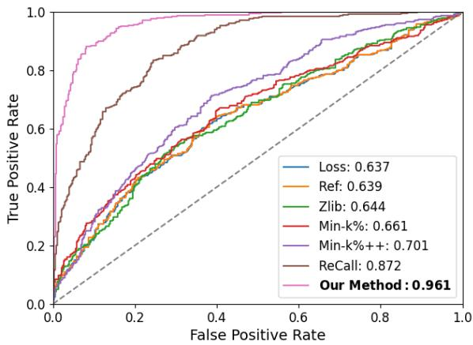  
Figure 1: AUC performance on WikiMIA-32 dataset. Our CON-RECALL significantly outperforms the current state-of-the-art baselines.

2023), copyrighted materials (Meeus et al., 2023; Duarte et al., 2024; Chang et al., 2023), and personally identifiable information (Mozes et al., 2023; Tang et al., 2024), leading to practical issues such as skewed evaluation results, potential legal ramifications, and severe privacy breaches. Therefore, developing effective techniques to detect unintended memorization in LLMs is crucial.

Existing methods for detecting pre-training data (Yeom et al., 2018; Zhang et al., 2024; Xie et al., 2024) typically analyze target text either in isolation or alongside with non-member contexts, while commonly neglecting member contexts. This omission is based on the belief that member contexts induce only minor distributional shifts, offering limited additional value (Xie et al., 2024).

However, our analysis reveals that these subtle shifts in member contexts, though often dismissed, hold valuable information that has been underexploited. The central insight of our work is that information derived from member contexts gains significant importance when contrasted with non-member contexts. This observation led to the development of CON-RECALL, a novel approach that harnesses the contrastive power of prefixing target text with both member and non-member contexts. By exploiting the asymmetric distributional shifts induced by these different prefixes, CON-RECALL provides more nuanced and reliable signals for membership inference. This contrastive strategy not only uncovers previously overlooked information but also enhances the accuracy and robustness of pre-training data detection, offering a more comprehensive solution than existing methods.

<table><tr><td>Method</td><td>Formula</td><td>Reference Based</td></tr><tr><td>Loss (Yeom et al., 2018)</td><td>L(x,M)</td><td>x</td></tr><tr><td>Ref (Carlini et al., 2022)</td><td> $\mathcal { L } ( x , \mathcal { M } ) - \mathcal { L } ( x , \mathcal { M } _ { r e f } )$ </td><td>√</td></tr><tr><td>Zlib (Carlini et al., 2021)</td><td> $\frac { \mathcal { L } ( \boldsymbol { x } , \mathcal { M } ) } { z l i b ( \boldsymbol { x } ) }$ </td><td>x</td></tr><tr><td>Neighborhood Attack (Mattern et al., 2023)</td><td> $\begin{array} { r } { \textstyle { \mathcal { L } } ( x ; { \mathcal { M } } ) - { \frac { 1 } { n } } \sum _ { i = 1 } ^ { \dot { n } } { \mathcal { L } } ( { \tilde { x } } _ { i } ; { \mathcal { M } } ) } \end{array}$ </td><td>x</td></tr><tr><td>Min-K% (Shi et al., 2024a)</td><td> $\begin{array} { r } { { \frac { 1 } { | \operatorname* { m i n } - k ( x ) | } } \sum _ { x _ { i } \in \operatorname* { m i n } - k ( x ) } - \log ( p ( x _ { i } \mid x _ { 1 } , \ldots , x _ { i - 1 } ) ) } \end{array}$ </td><td>x</td></tr><tr><td rowspan="4">Min-K%++ (Zhang et al., 2024)</td><td> $\begin{array} { r } { \mathrm { M i n - K } ^ { \mathcal { H } _ { 0 } } \rvert + + _ { \mathrm { t o k e n } } ( x _ { t } ) = \frac { \log p ( x _ { t } \mid x _ { < t } ) - \mu _ { x _ { < t } } } { \sigma _ { x _ { < t } } } , } \end{array}$ </td><td></td></tr><tr><td></td><td>x</td></tr><tr><td></td><td></td></tr><tr><td> $\begin{array} { r l } & { \mathrm { M i n - K } ^ { \mathcal { G } _ { \mathcal { O } } + + } ( x ) = \frac { 1 } { | \operatorname* { m i n } - \mathrm { k } ^ { \mathcal { G } } | } \sum _ { x _ { t } \in \operatorname* { m i n } - \mathrm { k } ^ { \mathcal { G } _ { \mathcal { O } } } } \mathrm { M i n } \mathrm { - K } ^ { \mathcal { G } _ { \mathcal { O } } + } { + } _ { \mathrm { t o k e n } } ( x _ { t } ) } \\ & { \qquad \frac { L L ( x | P _ { \mathrm { n o n . m e m b e r } } ) } { L L ( x ) } } \end{array}$ </td><td>X</td></tr></table>

Table 1: Comparison of baseline methods. This table provides an overview of different membership inference methods, their mathematical formulations, and whether they require a reference model.

To demonstrate the effectiveness of CON-RECALL, we conduct extensive empirical evaluations on the method across a variety of models of different sizes. Our experiments show that CON-RECALL outperforms the current state-of-the-art method by a significant margin, as shown in Figure 1. Notably, CON-RECALL only requires a graybox access to LLMs, i.e., token probabilities, and does not necessitate a reference model, enhancing its applicability in real-world scenarios.

## 2 Related Work

Detecting Pre-training Data in LLMs. While membership inference attacks (MIA) have been extensively studied in various domains (Shokri et al., 2017; Carlini et al., 2023a; Watson et al., 2022), detecting pre-training data in LLMs presents unique challenges. Unlike classical MIA, LLM developers rarely release full training data (OpenAI, 2024a; Touvron et al., 2023b), and single-epoch training on vast datasets makes memorization detection difficult (Carlini et al., 2023b; Shi et al., 2024a). Shi et al. (2024a) pioneered this research with the WikiMIA benchmark and Min-K% baseline method. Zhang et al. (2024) improved Min-K% through token log-probability normalization, while the ReCall method (Xie et al., 2024) currently achieves state-of-the-art performance using relative conditional log-likelihoods. These methods contribute to the broader application of MIA in detecting copyrighted materials, personally identifiable information, and test-set contamination (Meeus et al., 2023; Mozes et al., 2023; Sainz et al., 2023).

Contrastive Decoding. Contrastive decoding is primarily a method for text generation. Depending on the elements being contrasted, it serves different purposes. For example, DExperts (Liu et al., 2021) use outputs from a model exposed to toxicity to guide the target model away from undesirable outputs. Context-aware decoding (Shi et al., 2024b) contrasts model outputs given a query with and without relevant context. Zhao et al. (2024) further enhance context-aware decoding by providing irrelevant context in addition to relevant context. In this paper, we adapt the idea of contrastive decoding to MIA, where the contrast occurs between target data prefixed with member and non-member contexts.

## 3 CON-RECALL

## 3.1 Problem Formulation

Consider a model M trained on dataset D. The objective of a membership inference attack is to ascertain whether a data point x belongs to D (i.e., $x \in \mathcal { D } )$ or not $( \mathrm { i . e . , } x \notin \mathcal { D } )$ . Formally, we aim to develop a scoring function $s ( \boldsymbol { x } , \mathcal { M } ) \to \mathbb { R }$ , where the membership prediction is determined by a threshold τ :

$$
\left\{ { x \in \mathcal { D } \mathrm { i f } s ( x , \mathcal { M } ) \geq \tau } \right. .
$$

## 3.2 Motivation

Our key insight is that prefixing target text with contextually similar content increases its loglikelihood, while dissimilar content decreases it. Member prefixes boost log-likelihoods for member data but reduce them for non-member data, with non-member prefixes having the opposite effect. This principle stems from language models’ fundamental tendency to generate contextually consistent text.

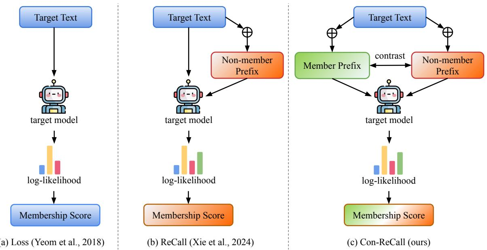

Figure 2: Overview of three MIA methods. Our method refines the previous membership score by incorporating contrastive information when prefixing target text with members and non-members.  
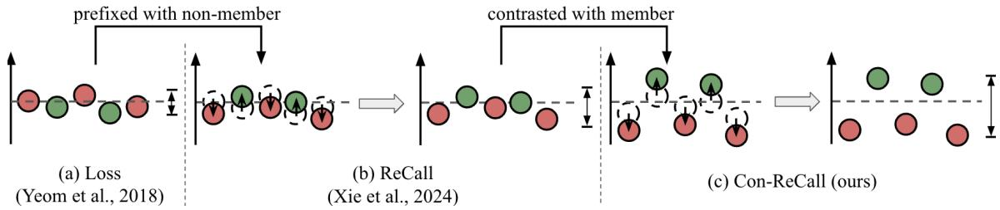  
Figure 3: Distribution shifts induced by three methods. (a) Loss directly uses log-likelihoods, resulting in no shift. (b) ReCall examines the shift caused by non-member prefixes. (c) Our CON-RECALL enhances the distinction by contrasting with both member and non-member prefixes.

To quantify the impact of different prefixes, we use the Wasserstein distance to measure the distributional shifts these prefixes induce. For discrete probability distributions $P$ and $Q$ defined on a finite set X, the Wasserstein distance W is given by:

$$
W ( P , Q ) = \sum _ { x \in X } | F _ { P } ( x ) - F _ { Q } ( x ) | ,
$$

where $F _ { P }$ and $F _ { Q }$ are the cumulative distribution functions of $P$ and $Q$ respectively. To capture the directionality of the shift, we introduce a signed variant of this metric:

$$
W _ { \mathrm { s i g n e d } } ( P , Q ) = \operatorname { s i g n } ( \mathbb { E } _ { Q } [ X ] - \mathbb { E } _ { P } [ X ] ) { \cdot } W ( P , Q ) .
$$

Our experiments reveal striking asymmetries in how member and non-member data respond to different prefixes. Figure 5 illustrates these asymmetries, showing the signed Wasserstein distances between original and prefixed distributions across varying numbers of shots, where shots refer to the number of non-member data points used in the prefix.

We observe two key phenomena:

1. Asymmetric Shift Direction: Member data exhibits minimal shift when prefixed with other member contexts, indicating a degree of distributional stability. However, when prefixed with non-member contexts, it undergoes a significant negative shift. In contrast, nonmember data displays a negative shift when prefixed with member contexts and a positive shift with non-member prefixes.

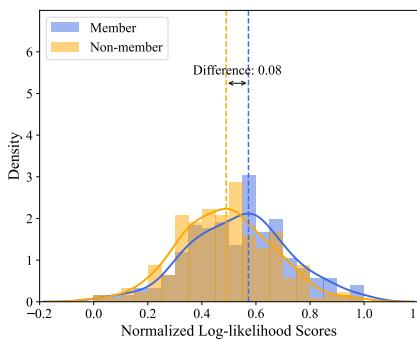

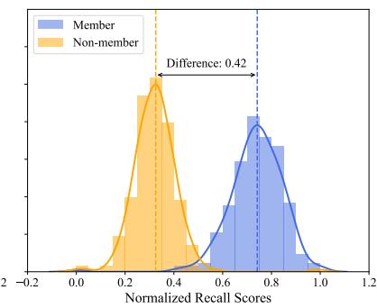

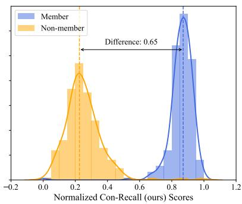

Figure 4: Visualization of membership score distributions. Min-max normalized distributions are shown for log-likelihood (left), ReCall (middle), and CON-RECALL (right). CON-RECALL achieves the largest separation between members and non-members.  
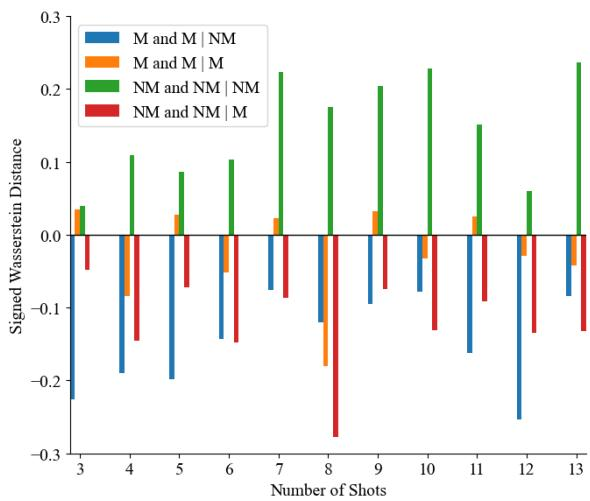  
Figure 5: Signed Wasserstein distances between original and prefixed distributions across varying shot numbers. The plot illustrates how the distributional shift, measured by signed Wasserstein distance, changes for member and non-member data when prefixed with different contexts (M: member, NM: non-member).

2. Asymmetric Shift Intensity: Non-member data demonstrated heightened sensitivity to contextual modifications, manifesting as larger magnitude shifts in the probability distribution, regardless of the prefix type. Member data, while generally more stable, still exhibited notable sensitivity, particularly to non-member prefixes.

These results corroborate our initial analysis and establish a robust basis for our contrastive approach. The asymmetric shifts in both direction and intensity provide crucial insights for developing a membership inference technique that leverages these distributional differences effectively.

## 3.3 Contrastive Decoding with Member and Non-member Prefixes

Building on the insights from our analysis, we propose CON-RECALL, a method that exploits the contrastive information between member and nonmember prefixes to enhance membership inference through contrastive decoding. Our approach is directly motivated by the two key observations from the previous section:

1. The asymmetric shift direction suggests that comparing the effects of member and nonmember prefixes could provide a strong signal for membership inference.

2. The asymmetric shift intensity indicates the need for a mechanism to control the relative importance of these effects in the decoding process.

These insights lead us to formulate the membership score $s ( x , M )$ for a target text x and model M as follows:

$$
\frac { L L ( x | P _ { \mathrm { n o n - m e m b e r } } ) - \gamma \cdot L L ( x | P _ { \mathrm { m e m b e r } } ) } { L L ( x ) } ,
$$

where $L L ( \cdot )$ denotes the log-likelihood, $P _ { m e m b e r }$ and $P _ { n o n - m e m b e r }$ are prefixes composed of member and non-member contexts respectively, and γ is a parameter controlling the strength of the contrast.

This formulation provides a robust signal for membership inference by leveraging the distributional differences revealed in our analysis. Figure 3 illustrates how our contrastive approach amplifies the distributional differences

Importantly, CON-RECALL requires only graybox access to the model, utilizing solely token probabilities. This characteristic enhances its practical utility in real-world applications where full model access may not be available, making it a versatile tool for detecting pre-training data in large language models.

## 4 Experiments

In this section, we will evaluate the effectiveness of CON-RECALL across various experimental settings, demonstrating its superior performance compared to existing methods.

## 4.1 Setup

Baselines. In our experiment, we evaluate CON-RECALL against seven baseline methods. Loss (Yeom et al., 2018) directly uses the loss of the input as the membership score. Ref (Carlini et al., 2022) requires another reference model, which is trained on a dataset with a distribution similar to D, to calibrate the loss calculated in the Loss method. Zlib (Carlini et al., 2021) instead calibrates the loss by using the input’s Zlib entropy. Neighbor (Mattern et al., 2023) perturbs the input sequence to generate n neighbor data points, and the loss of x is compared with the average loss of the n neighbors. Min-K% (Shi et al., 2024a) is based on the intuition that a member sequence should have few outlier words with low probability; hence, the topk% words having the minimum probability are averaged as the membership score. Min-K%++ (Zhang et al., 2024) is a normalized version of Min-K% with some improvements. ReCall (Xie et al., 2024) calculates the relative conditional log-likelihood between x and x prefixed with a non-member contexts Pnon-member. More details can be found in Table 1.

Datasets. We primarily use WikiMIA (Shi et al., 2024a) as our benchmark. WikiMIA consists of texts from Wikipedia, with members and nonmembers determined using the knowledge cutoff time, meaning that texts released after the knowledge cutoff time of the model are naturally nonmembers. WikiMIA is divided into three subsets based on text length, denoted as WikiMIA-32, WikiMIA-64, and WikiMIA-128.

Another more challenging benchmark is MIMIR (Duan et al., 2024), which is derived from the Pile (Gao et al., 2020) dataset. The benchmark is constructed using a train-test split, effectively minimizing the temporal shift present in WikiMIA, thereby ensuring a more similar distribution between members and non-members. More details about these two benchmarks are presented in Appendix A.

Models. For the WikiMIA benchmark, we use Mamba-1.4B (Gu and Dao, 2024), Pythia-6.9B (Biderman et al., 2023), GPT-NeoX-20B (Black et al., 2022), and LLaMA-30B (Touvron et al., 2023a), consistent with Xie et al. (2024). For the MIMIR benchmark, we use models from the Pythia family, specifically 2.8B, 6.9B, and 12B. Since Ref (Carlini et al., 2022) requires a reference model, we use the smallest version of the model from that series as the reference model, for example, Pythia-70M for Pythia models, consistent with previous works (Shi et al., 2024a; Zhang et al., 2024; Xie et al., 2024).

Metrics. Following the standard evaluation metrics (Shi et al., 2024a; Zhang et al., 2024; Xie et al., 2024), we report the AUC (area under the ROC curve) to measure the trade-off between the True Positive Rate (TPR) and False Positive Rate (FPR). We also include TPR at low FPRs (TPR@5%FPR) as an additional metrics.

Implementation Details. For Min-K% and Min-K%++, we vary the hyperparameter k from 10 to 100 in steps of 10. For CON-RECALL, we optimize γ from 0.1 to 1.0 in steps of 0.1. Following Xie et al. (2024), we use seven shots for both ReCall and CON-RECALL on WikiMIA. For MIMIR, due to its increased difficulty, we vary the number of shots from 1 to 10. In all cases, we report the best performance. For more details, see Appendix B.

## 4.2 Results

Results on WikiMIA. Table 2 summarizes the experimental results on WikiMIA, demonstrating CON-RECALL’s significant improvements over baseline methods. In terms of AUC performance, our method improved upon ReCall by 7.4%, 6.6%, and 5.7% on WikiMIA-32, -64, and -128 respectively, achieving an average improvement of 6.6% and state-of-the-art performance. For TPR@5%FPR, CON-RECALL outperformed the runner-up by even larger margins: 30.0%, 34.8%, and 27.6% on WikiMIA-32, -64, and -128 respectively, with an average improvement of 30.8%. Notably, CON-RECALL achieves the best performance across models of different sizes, from Mamba-1.4B to LLaMA-30B, demonstrating its robustness and effectiveness. The consistent performance across varying sequence lengths suggests that CON-RECALL effectively identifies membership information in both short and long text samples, underlining its potential as a powerful tool for detecting pre-training data in large language models in diverse scenarios.

<table><tr><td rowspan="2">Method Len.</td><td rowspan="2"></td><td colspan="2">Mamba-1.4B</td><td colspan="2">Pythia-6.9B</td><td colspan="2">NeoX-20B</td><td colspan="2">LLaMA-30B</td><td colspan="2">Average</td></tr><tr><td>AUC</td><td>TPR@5%FPR</td><td>AUC</td><td>TPR@5%FPR</td><td>AUC</td><td>TPR@5%FPR</td><td>AUC</td><td>TPR@5%FPR</td><td>AUC</td><td>TPR@5%FPR</td></tr><tr><td rowspan="9">32</td><td>Loss (Yeom et al., 2018)</td><td>60.9</td><td>13.2</td><td>63.7</td><td>14.5</td><td>68.9</td><td>20.8</td><td>69.4</td><td>18.2</td><td>65.7</td><td>16.7</td></tr><tr><td>Ref (Carlini et al., 2022)</td><td>61.2</td><td>13.4</td><td>63.9</td><td>13.7</td><td>69.1</td><td>20.3</td><td>69.9</td><td>18.7</td><td>66.0</td><td>16.5</td></tr><tr><td>Zlib (Carlini et al., 2021)</td><td>62.1</td><td>15.0</td><td>64.4</td><td>16.3</td><td>69.3</td><td>20.5</td><td>69.9</td><td>14.7</td><td>66.4</td><td>16.6</td></tr><tr><td>Neighbor (Mattern et al., 2023)</td><td>64.1</td><td>11.9</td><td>65.8</td><td>16.5</td><td>70.2</td><td>22.2</td><td>67.6</td><td>9.3</td><td>66.9</td><td>15.0</td></tr><tr><td>Min-K% (Shi et al., 2024a)</td><td>63.2</td><td>13.9</td><td>66.1</td><td>17.1</td><td>72.0</td><td>28.7</td><td>70.1</td><td>19.5</td><td>67.9</td><td>19.8</td></tr><tr><td>Min-K%++ (Zhang et al., 2024)</td><td>66.8</td><td>12.1</td><td>70.0</td><td>13.7</td><td>75.7</td><td>17.9</td><td>84.6</td><td>27.1</td><td>74.3</td><td>17.7</td></tr><tr><td>ReCall (Xie et al., 2024)</td><td>88.6</td><td>43.2</td><td>87.0</td><td>42.9</td><td>86.7</td><td>44.7</td><td>91.4</td><td>49.7</td><td>88.4</td><td>45.1</td></tr><tr><td>CON-RECALL (ours)</td><td>94.4</td><td>68.4</td><td>96.0</td><td>77.1</td><td>95.2</td><td>67.6</td><td>97.4</td><td>87.4</td><td>95.8</td><td>75.1</td></tr><tr><td>Loss (Yeom et al., 2018)</td><td>57.8</td><td>9.6</td><td>60.3</td><td>13.1</td><td>66.1</td><td>16.7</td><td>66.1</td><td>14.7</td><td>62.6</td><td>13.5</td></tr><tr><td rowspan="8">64</td><td>Ref (Carlini et al., 2022)</td><td>58.1</td><td>10.0</td><td>60.4</td><td>13.5</td><td>66.3</td><td>15.5</td><td>67.0</td><td>15.5</td><td>63.0</td><td>13.6</td></tr><tr><td>Zlib (Carlini et al., 2021)</td><td>59.5</td><td>12.7</td><td>61.6</td><td>13.9</td><td>67.3</td><td>17.5</td><td>67.1</td><td>16.3</td><td>63.9</td><td>15.1</td></tr><tr><td>Neighbor (Mattern et al., 2023)</td><td>60.6</td><td>8.8</td><td>63.2</td><td>10.9</td><td>67.1</td><td>13.0</td><td>67.1</td><td>9.9</td><td>64.5</td><td>10.7</td></tr><tr><td>Min-K% (Shi et al., 2024a)</td><td>61.7</td><td>18.7</td><td>64.6</td><td>17.1</td><td>72.5</td><td>27.1</td><td>68.5</td><td>17.1</td><td>66.8</td><td>20.0</td></tr><tr><td>Min-K%++ (Zhang et al., 2024)</td><td>66.9</td><td>13.1</td><td>71.4</td><td>15.1</td><td>76.3</td><td>23.5</td><td>85.3</td><td>34.7</td><td>75.9</td><td>21.6</td></tr><tr><td>ReCall (Xie et al., 2024)</td><td>91.0</td><td>51.0</td><td>90.6</td><td>47.4</td><td>90.0</td><td>45.0</td><td>92.7</td><td>51.4</td><td>91.1</td><td>48.7</td></tr><tr><td>CON-RECALL (ours)</td><td>98.6</td><td>89.2</td><td>98.2</td><td>88.8</td><td>97.0</td><td>75.7</td><td>96.9</td><td>80.5</td><td>97.7</td><td>83.5</td></tr><tr><td>Loss (Yeom et al., 2018)</td><td>63.5</td><td>11.5</td><td>65.3</td><td>14.4</td><td>70.3</td><td>17.3</td><td>70.0</td><td>22.1</td><td></td><td></td></tr><tr><td rowspan="8">128</td><td>Ref (Carlini et al., 2022)</td><td>63.5</td><td>13.5</td><td>65.3</td><td>15.4</td><td>70.5</td><td>18.3</td><td>70.9</td><td>22.1</td><td>67.3 67.6</td><td>16.3 17.3</td></tr><tr><td>Zlib (Carlini et al., 2021)</td><td>65.3</td><td>16.3</td><td></td><td>19.2</td><td></td><td></td><td></td><td></td><td>68.8</td><td>18.3</td></tr><tr><td></td><td>64.8</td><td></td><td>67.2</td><td></td><td>71.5</td><td>19.2</td><td>71.2</td><td>18.3 15.1</td><td>69.0</td><td>14.4</td></tr><tr><td>Neighbor (Mattern et al., 2023)</td><td>66.9</td><td>15.8 8.7</td><td>67.5 69.6</td><td>10.8</td><td>71.6</td><td>15.8</td><td>72.2</td><td></td><td>71.5</td><td></td></tr><tr><td>Min-K% (Shi et al., 2024a)</td><td>67.1</td><td>9.6</td><td>69.2</td><td>16.3 17.3</td><td>76.0 75.2</td><td>25.0 20.2</td><td>73.4 83.4</td><td>23.1 21.2</td><td>73.7</td><td>18.3 17.1</td></tr><tr><td>Min-K%++ (Zhang et al., 2024)</td><td>88.2</td><td>42.3</td><td>90.7</td><td>55.8</td><td>90.0</td><td>51.9</td><td>91.2</td><td>43.3</td><td>90.0</td><td>48.3</td></tr><tr><td>ReCall (Xie et al., 2024)</td><td>94.8</td><td>77.9</td><td>96.6</td><td>84.6</td><td>95.3</td><td>67.3</td><td>96.1</td><td>74.0</td><td>95.7</td><td></td></tr><tr><td>CON-RECALL (ours)</td><td></td><td></td><td></td><td></td><td></td><td></td><td></td><td></td><td></td><td>75.9</td></tr></table>

Table 2: AUC and TPR@5%FPR results on WikiMIA benchmark. Bolded number shows the best result within each column for the given length. CON-RECALL achieves significant improvements over all existing baseline methods in all settings

Results on MIMIR. We summarize the experimental results on MIMIR in Appendix D. The performance of CON-RECALL on the MIMIR benchmark demonstrates its competitive edge across various datasets and model sizes. In the 7-gram setting, CON-RECALL consistently achieved top-tier results, often outperforming baseline methods. Notably, on several datasets, our method frequently secured the highest scores in both AUC and TPR metrics. In the 13-gram setting, CON-RECALL maintained its strong performance, particularly with larger model sizes. While overall performance decreased compared to the 7-gram setting, still held leading positions across multiple datasets. It’s worth noting that CON-RECALL exhibited superior performance when dealing with larger models, indicating good scalability for more complex and larger language models. Although other methods occasionally showed slight advantages in certain datasets, CON-RECALL’s overall robust performance underscores its potential as an effective method for detecting pre-training data in large language models.

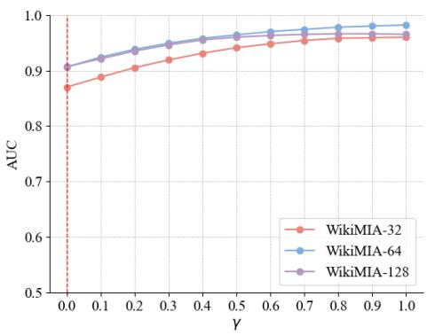  
Figure 6: Ablation on γ. The plot illustrates the AUC performance across different γ values for the WikiMIA dataset. The red vertical line marks the γ = 0 case, where the CON-RECALL reverts to the baseline ReCall method. As seen in this figure, CON-RECALL $( \gamma > 0 )$ consistently outperforms ReCall (γ = 0).

## 4.3 Ablation Study

We focus on WikiMIA with the Pythia-6.9B model for ablation study.

Ablation on γ. In CON-RECALL, we introduce a hyperparameter γ, which controls the contrastive strength between member and non-member prefixes. The AUC performance across different γ values for the WikiMIA dataset is depicted in Figure 6. The red vertical lines mark the $\gamma = 0$ case, where CON-RECALL reverts to the baseline ReCall method.

The performance of CON-RECALL fluctuates as γ varies, meaning that there exist an optimal value for γ for us to get the best performance. However, even without any fine-tuning on γ, our method still outperforms ReCall and other baselines.

<table><tr><td colspan="2">Method</td><td colspan="7">Pythia-6.9B</td><td rowspan="2"></td><td colspan="7">LLaMA-30B</td></tr><tr><td rowspan="3">Len.</td><td rowspan="3"></td><td rowspan="3">Orig.</td><td colspan="2">Random Del.</td><td colspan="2">Synonym Sub.</td><td colspan="2">Para.</td><td rowspan="3">Orig.</td><td colspan="3">Random Del.</td><td colspan="3">Synonym Sub.</td><td rowspan="3">Para.</td></tr><tr><td colspan="2">10% 15%</td><td colspan="2">10% 15%</td><td colspan="2">20%</td><td rowspan="2">10%</td><td colspan="2">15% 20%</td><td colspan="2">10% 15% 20%</td></tr><tr><td></td><td></td><td>20%</td><td></td><td></td><td></td><td></td><td></td><td></td><td></td><td></td><td></td></tr><tr><td rowspan="6">32</td><td>Loss (Yeom et al., 2018)</td><td>63.7 63.9</td><td>60.4</td><td>59.6</td><td>56.6</td><td>61.5</td><td>59.6</td><td>59.5 63.8</td><td></td><td>69.4 66.3</td><td>67.0</td><td>64.5</td><td>68.4</td><td>66.8</td><td>65.8</td><td>70.1</td></tr><tr><td>Ref (Carlini et al., 2022)</td><td></td><td>60.6 61.2</td><td>59.7</td><td>56.6</td><td>61.6</td><td>59.7 59.6</td><td>63.9 64.0</td><td>69.9 69.9</td><td>66.4 66.8</td><td>67.2 66.9</td><td>64.7</td><td>68.6 68.8</td><td>66.8 67.2</td><td>66.1 66.5</td><td>70.5</td></tr><tr><td>Zlib (Carlini et al., 2021) Min-K% (Shi et al., 2024a)</td><td>64.4 66.1</td><td>60.5</td><td>60.2 59.6</td><td>58.4 56.6</td><td>62.2 60.7</td><td>60.8 59.6</td><td>64.8</td><td>70.1</td><td>66.3</td><td>67.0</td><td>64.9 64.6</td><td>68.4</td><td>66.8</td><td>65.8</td><td>70.3 70.4</td></tr><tr><td>Min-K%++ (Zhang et al., 2024)</td><td>70.0</td><td>59.0</td><td>54.5</td><td>51.6</td><td>61.7 62.5</td><td>59.9 59.8</td><td>60.1</td><td>67.6 84.6</td><td>71.6</td><td>68.2</td><td>67.1</td><td>76.9</td><td>73.5</td><td>70.1</td><td>81.2</td></tr><tr><td>ReCall (Xie et al., 2024)</td><td>87.0</td><td>86.2</td><td>83.3</td><td>75.2</td><td>88.5</td><td>87.5 83.1</td><td>87.8</td><td>91.4</td><td>88.1</td><td>88.3</td><td>82.7</td><td>87.1</td><td>86.4</td><td>84.2</td><td>91.0</td></tr><tr><td>CON-RECALL (ours)</td><td>96.0</td><td>92.2</td><td>94.4</td><td>90.4</td><td>96.5</td><td>94.0</td><td>90.0 97.1</td><td>97.4</td><td>97.4</td><td>95.5</td><td>94.3</td><td>97.6</td><td>95.5</td><td>90.0</td><td>97.1</td></tr><tr><td rowspan="7">64</td><td>Loss (Yeom et al., 2018)</td><td>60.3</td><td>58.3</td><td>56.4</td><td>57.7</td><td>59.6</td><td>58.1</td><td>56.5</td><td>58.5 66.1</td><td>65.4</td><td>61.9</td><td>63.4</td><td>65.3</td><td>63.5</td><td>62.3</td><td>65.1</td></tr><tr><td>Ref (Carlini et al., 2022)</td><td>60.4</td><td>58.4</td><td>56.5</td><td>57.8</td><td>59.6</td><td>58.2</td><td>56.6 58.7</td><td>67.0</td><td>65.9</td><td>62.2</td><td>63.7</td><td>65.9</td><td>64.0</td><td>62.7</td><td>65.8</td></tr><tr><td>Zlib (Carlini et al., 2021)</td><td>61.6</td><td>60.9</td><td>57.8</td><td>60.0</td><td>61.8</td><td>59.9 58.2</td><td>60.5</td><td>67.1</td><td>67.2</td><td>62.6</td><td>65.4</td><td>67.1</td><td>65.0</td><td>63.5</td><td>66.7</td></tr><tr><td>Min-K% (Shi et al., 2024a)</td><td>64.6</td><td>59.2</td><td>57.4</td><td>57.7</td><td>61.4</td><td>58.5</td><td>57.0 60.0</td><td>68.5</td><td>66.1</td><td>62.4</td><td>63.4</td><td>65.4</td><td>63.6</td><td>62.3</td><td>65.2</td></tr><tr><td>Min-K%++ (Zhang et al., 2024)</td><td>71.4</td><td>55.9</td><td>55.8</td><td>52.3</td><td>62.8</td><td>56.3</td><td>59.1</td><td>64.4 85.3</td><td>69.1</td><td>70.4</td><td>68.7</td><td>72.1</td><td>67.1</td><td>68.0</td><td>75.1</td></tr><tr><td>ReCall (Xie et al., 2024)</td><td>90.6</td><td>87.5</td><td>84.6</td><td>84.4</td><td>89.2</td><td>85.4 87.5</td><td>89.7</td><td>92.7</td><td>89.3</td><td>87.5</td><td>86.7</td><td>91.2</td><td>86.5</td><td>83.8</td><td>94.7</td></tr><tr><td>CON-RECALL (ours)</td><td>98.2</td><td>96.3</td><td>94.3</td><td>96.3</td><td>97.7</td><td>95.4 96.6</td><td>97.9</td><td>96.9</td><td>96.1</td><td>97.4</td><td>96.4</td><td>97.8</td><td>97.1</td><td>95.8</td><td>97.6</td></tr><tr><td rowspan="7">128</td><td>Loss (Yeom et al., 2018)</td><td>65.3</td><td>64.6</td><td>60.4</td><td>58.8</td><td>63.1</td><td>62.4 66.4</td><td>65.0</td><td>70.0</td><td>71.1</td><td>65.9</td><td>67.3</td><td>68.5</td><td>67.1</td><td>71.4</td><td>69.2</td></tr><tr><td>Ref (Carlini et al., 2022)</td><td>65.3</td><td>64.8</td><td>60.5</td><td>58.9</td><td>63.2</td><td>62.4</td><td>66.4 65.0</td><td>70.9</td><td>71.6</td><td>66.1</td><td>67.5</td><td>69.3</td><td>67.4</td><td>72.0</td><td>69.8</td></tr><tr><td>Zlib (Carlini et al., 2021)</td><td>67.2</td><td>65.9</td><td>61.3</td><td>62.0</td><td>65.1</td><td>64.8 67.8</td><td>66.9</td><td>71.2</td><td>71.4</td><td>67.5</td><td>68.5</td><td>70.7</td><td>69.0</td><td>72.6</td><td>71.0</td></tr><tr><td>Min-K% (Shi et al., 2024a)</td><td>69.6</td><td>65.2</td><td>60.8</td><td>58.8</td><td>65.4</td><td>63.0</td><td>66.9 67.4</td><td>73.4</td><td>73.2</td><td>67.6</td><td>67.9</td><td>70.5</td><td>67.3</td><td>72.2</td><td>70.4</td></tr><tr><td></td><td>69.2</td><td>55.2</td><td>43.0</td><td>45.2</td><td>64.8</td><td>49.5</td><td>48.6 65.1</td><td>83.4</td><td>68.8</td><td>65.5</td><td>64.4</td><td>72.0</td><td>62.3</td><td>68.3</td><td>73.8</td></tr><tr><td>Min-K%++ (Zhang et al., 2024)</td><td>90.7</td><td>81.8</td><td>80.4 80.0</td><td></td><td>89.6 85.5</td><td>84.2</td><td>90.4</td><td>91.2</td><td>83.2</td><td>78.2</td><td>87.3</td><td>81.4</td><td>82.4</td><td>82.1</td><td>90.9</td></tr><tr><td>ReCall (Xie et al., 2024) CON-RECALL (ours)</td><td>96.6</td><td>94.8</td><td>93.8</td><td>93.8</td><td>97.4</td><td>93.6</td><td>96.3</td><td>95.9</td><td>96.1 95.3</td><td>91.1</td><td>99.0</td><td>95.6</td><td>92.5</td><td>94.2</td><td>95.2</td></tr></table>

Table 3: AUC performance on the WikiMIA benchmark under various text manipulation techniques. Bolded numbers indicate the best result within each column for the given text length. "Orig." denotes original text without manipulation, "Random Del." refers to random deletion, "Synonym $\operatorname { S u b } . ^ { \bar { \mathfrak { n } } }$ to synonym substitution, and "Para." to paraphrasing. Our method demonstrates robustness against these manipulations, consistently outperforming other baselines across different text modifications.

Ablation on the number of shots. The prefix is derived by concatenating a series of member or non-member strings, i.e., $P = p _ { 1 } \oplus p _ { 2 } \oplus \cdots \oplus$ $p _ { n } ,$ and we refer to the number of strings as shots following Xie et al. (2024)’s convention. In this section, we evaluate the relationship between AUC performance and the number of shots. We vary the number of shots on the WikiMIA dataset using the Pythia-6.9B model, and summarize the results in Figure 7.

The general trend shows that increasing the number of shots improves the AUC, as more shots provide more information. Both ReCall and CON-RECALL exhibit this trend, but CON-RECALL significantly enhances the AUC compared to ReCall and outperforms all baseline methods.

## 5 Analysis

To further evaluate the effectiveness and practicality of CON-RECALL, we conducted additional analyses focusing on its robustness and adaptability in real-world scenarios.

## 5.1 Robustness of CON-RECALL

As membership inference attacks gain prominence, evaluating their robustness against potential evasion techniques becomes crucial. Real-world data may be altered due to preprocessing, language variations, or intentional obfuscation. Therefore, a robust membership inference method should remain effective when faced with modified target data. To assess CON-RECALL’s robustness, we employ three text manipulation techniques. First, Random Deletion, where we randomly remove 10%, 15%, and 20% of words from the original text. Second, Synonym Substitution, replacing 10%, 15%, and 20% of words with their synonyms using WordNet (Miller, 1994). Lastly, we leverage the WikiMIA-paraphrased dataset (Zhang et al., 2024), which offers ChatGPT-generated rephrased versions of the original WikiMIA (Shi et al., 2024a) texts while preserving their meaning.

We evaluate the effectiveness of baselines and CON-RECALL after transforming texts using the above techniques. Our experiments are conducted using Pythia-6.9B (Biderman et al., 2023) and LLaMA-30B (Touvron et al., 2023a) models on the WikiMIA-32 (Shi et al., 2024a) dataset. Table 3 presents the AUC performance for each method under various text manipulation scenarios. The results demonstrate that CON-RECALL consistently outperforms baseline methods across all text manipulation techniques, maintaining its superior performance even when faced with altered versions of the target data. This robustness underscores CON-RECALL’s effectiveness in real-world scenarios where data may undergo various transformations.

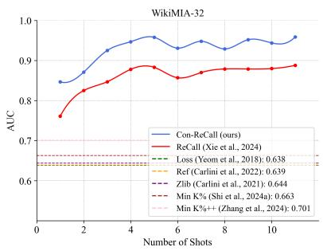

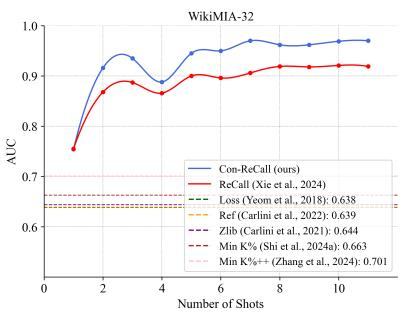

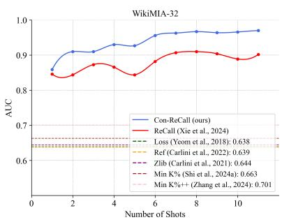  
Figure 7: Ablation on the number of shots. CON-RECALL consistently outperforms all baseline methods by a great margin on WikiMIA dataset.

## 5.2 Approximation of Members

In real-world scenarios, access to member data may be limited or even impossible. Therefore, it is crucial to develop methods that can approximate member data effectively. Our approach to approximating members is driven by two primary motivations. First, large language models (LLMs) are likely to retain information about significant events that occurred before their knowledge cutoff date. This retention suggests that LLMs have the potential to recall and replicate crucial aspects of such events when prompted. Second, when presented with incomplete information and tasked with its completion, LLMs can effectively leverage their internalized knowledge to generate contextually appropriate continuations. These two motivations underpin our method, where we first utilize an external LLM to enumerate major historical events. We then truncate these events and prompt the target LLM to complete them, hypothesizing that the generated content can serve as an effective approximation of the original data within the training set.

To test this approach, we first employed GPT-4o (OpenAI, 2024b) to generate descriptions of seven major events that occurred before 2020 (the knowledge cutoff date for the Pythia models). We then truncated these descriptions and prompted the target model to complete them. This method allows us to simulate the generation of data resembling the original members without directly accessing the original training set. Details of the prompts and the corresponding responses can be found in

Appendix C.

We evaluated this method using a fixed number of seven shots for consistency with our previous experiments. The results, summarized in Table 4, demonstrate that even without prior knowledge of actual member data, this approximation approach yields competitive results, outperforming several baseline methods.

This finding suggests that when direct access to member data is not feasible, leveraging the model’s own knowledge to generate member-like content can be an effective alternative.

<table><tr><td>Method</td><td>WikiMIA-32</td><td>WikiMIA-64</td><td>WikiMIA-128</td></tr><tr><td>Loss (Yeom et al., 2018)</td><td>63.7</td><td>60.3</td><td>65.3</td></tr><tr><td>Ref (Carlini et al., 2022)</td><td>63.9</td><td>60.4</td><td>65.3</td></tr><tr><td>Zlib (Carlini et al., 2021)</td><td>64.4</td><td>61.6</td><td>67.2</td></tr><tr><td>Neighbor (Mattern et al., 2023)</td><td>65.8</td><td>63.2</td><td>67.5</td></tr><tr><td>Min-K% (Shi et al., 2024a)</td><td>66.1</td><td>64.6</td><td>69.6</td></tr><tr><td>Min-K%++ (Zhang et al., 2024)</td><td>70.0</td><td>71.4</td><td>69.2</td></tr><tr><td>ReCall (Xie et al., 2024)</td><td>87.0</td><td>90.6</td><td>90.7</td></tr><tr><td>CoN-RECALL (zero access)</td><td>87.5</td><td>91.8</td><td>91.2</td></tr><tr><td>CON-RECALL (partial access)</td><td>96.1</td><td>98.2</td><td>96.6</td></tr></table>

Table 4: AUC results on WikiMIA benchmark. Gray rows are our method and bolded numbers are the best performance within a column with underline indicating the runner-up.

## 6 Conclusion

In this paper, we introduced CON-RECALL, a novel contrastive decoding approach for detecting pre-training data in large language models. By leveraging both member and non-member contexts, CON-RECALL significantly enhances the distinction between member and non-member data. Through extensive experiments on multiple benchmarks, we demonstrated that CON-RECALL achieves substantial improvements over existing baselines, highlighting its effectiveness in detecting pre-training data. Moreover, CON-RECALL showed robustness against various text manipulation techniques, including random deletion, synonym substitution, and paraphrasing, maintaining superior performance and resilience to potential evasion strategies. These results underscore CON-RECALL’s potential as a powerful tool for addressing privacy and security concerns in large language models, while also opening new avenues for future research in this critical area.

## Limitations

The efficacy of CON-RECALL is predicated on gray-box access to the language model, permitting its application to open-source models and those providing token probabilities. However, this prerequisite constrains its utility in black-box scenarios, such as API calls or online chat interfaces. Furthermore, the performance of CON-RECALL is contingent upon the selection of member and non-member prefixes. The development of robust, automated strategies for optimal prefix selection remains an open research question. While our experiments demonstrate a degree of resilience against basic text manipulations, the method’s robustness in the face of more sophisticated adversarial evasion techniques warrants further rigorous investigation.

## Ethical Considerations

The primary objective in developing CON-RECALL is to address privacy and security concerns by advancing detection techniques for pretraining data in large language models. However, it is imperative to acknowledge the potential for misuse by malicious actors who might exploit this technology to reveal sensitive information. Consequently, the deployment of CON-RECALL necessitates meticulous consideration of ethical implications and the establishment of stringent safeguards. Future work should focus on developing guidelines for the responsible use of such techniques, balancing the benefits of enhanced model transparency with the imperative of protecting individual privacy and data security.

## Acknowledgement

The work is supported by a National Science Foundation CAREER award #2339766, a research award NSF #2331966, University of California, Merced, University of Queensland, and the Ministry of Education, Singapore, under the Academic Research Fund Tier 1 (FY2023) (Grant A-8001996- 00-00). The views and conclusions are those of the authors and should not reflect the official policy or position of the U.S. Government.

## References

Stella Biderman, Hailey Schoelkopf, Quentin Anthony, Herbie Bradley, Kyle O’Brien, Eric Hallahan, Mohammad Aflah Khan, Shivanshu Purohit, USVSN Sai Prashanth, Edward Raff, Aviya Skowron, Lintang Sutawika, and Oskar van der Wal. 2023. Pythia: A suite for analyzing large language models across training and scaling. Preprint, arXiv:2304.01373.

Sidney Black, Stella Biderman, Eric Hallahan, Quentin Anthony, Leo Gao, Laurence Golding, Horace He, Connor Leahy, Kyle McDonell, Jason Phang, Michael Pieler, Usvsn Sai Prashanth, Shivanshu Purohit, Laria Reynolds, Jonathan Tow, Ben Wang, and Samuel Weinbach. 2022. GPT-NeoX-20B: An opensource autoregressive language model. In Proceedings ofBigScience Episode #5 – Workshop on Challenges & Perspectives in Creating Large Language Models, pages 95–136, virtual+Dublin. Association for Computational Linguistics.

Nicholas Carlini, Steve Chien, Milad Nasr, Shuang Song, Andreas Terzis, and Florian Tramer. 2022. Membership inference attacks from first principles. Preprint, arXiv:2112.03570.

Nicholas Carlini, Jamie Hayes, Milad Nasr, Matthew Jagielski, Vikash Sehwag, Florian Tramèr, Borja Balle, Daphne Ippolito, and Eric Wallace. 2023a. Extracting training data from diffusion models. Preprint, arXiv:2301.13188.

Nicholas Carlini, Daphne Ippolito, Matthew Jagielski, Katherine Lee, Florian Tramer, and Chiyuan Zhang. 2023b. Quantifying memorization across neural language models. Preprint, arXiv:2202.07646.

Nicholas Carlini, Florian Tramèr, Eric Wallace, Matthew Jagielski, Ariel Herbert-Voss, Katherine Lee, Adam Roberts, Tom Brown, Dawn Song, Úlfar Erlingsson, Alina Oprea, and Colin Raffel. 2021. Extracting training data from large language models. In 30th USENIX Security Symposium (USENIX Security 21), pages 2633–2650. USENIX Association.

Kent Chang, Mackenzie Cramer, Sandeep Soni, and David Bamman. 2023. Speak, memory: An archaeology of books known to ChatGPT/GPT-4. In Proceedings ofthe 2023 Conference on Empirical Methods in Natural Language Processing, pages 7312–7327, Singapore. Association for Computational Linguistics.

Michael Duan, Anshuman Suri, Niloofar Mireshghallah, Sewon Min, Weijia Shi, Luke Zettlemoyer, Yulia Tsvetkov, Yejin Choi, David Evans, and Hannaneh Hajishirzi. 2024. Do membership inference attacks work on large language models? In Conference on Language Modeling (COLM).

André V. Duarte, Xuandong Zhao, Arlindo L. Oliveira, and Lei Li. 2024. De-cop: Detecting copyrighted content in language models training data. Preprint, arXiv:2402.09910.

Leo Gao, Stella Biderman, Sid Black, Laurence Golding, Travis Hoppe, Charles Foster, Jason Phang, Horace He, Anish Thite, Noa Nabeshima, Shawn Presser, and Connor Leahy. 2020. The pile: An 800gb dataset of diverse text for language modeling. Preprint, arXiv:2101.00027.

Albert Gu and Tri Dao. 2024. Mamba: Lineartime sequence modeling with selective state spaces. Preprint, arXiv:2312.00752.

Alisa Liu, Maarten Sap, Ximing Lu, Swabha Swayamdipta, Chandra Bhagavatula, Noah A. Smith, and Yejin Choi. 2021. DExperts: Decoding-time controlled text generation with experts and anti-experts. In Proceedings of the 59th Annual Meeting of the Association for Computational Linguistics and the 11th International Joint Conference on Natural Language Processing (Volume 1: Long Papers), pages 6691–6706, Online. Association for Computational Linguistics.

Justus Mattern, Fatemehsadat Mireshghallah, Zhijing Jin, Bernhard Schoelkopf, Mrinmaya Sachan, and Taylor Berg-Kirkpatrick. 2023. Membership inference attacks against language models via neighbourhood comparison. In Findings ofthe Associationfor Computational Linguistics: ACL 2023, pages 11330– 11343, Toronto, Canada. Association for Computational Linguistics.

Matthieu Meeus, Shubham Jain, Marek Rei, and Yves-Alexandre de Montjoye. 2023. Did the neurons read your book? document-level membership inference for large language models. Preprint, arXiv:2310.15007.

George A. Miller. 1994. WordNet: A lexical database for English. In Human Language Technology: Proceedings of a Workshop held at Plainsboro, New Jersey, March 8-11, 1994.

Maximilian Mozes, Xuanli He, Bennett Kleinberg, and Lewis D. Griffin. 2023. Use of llms for illicit purposes: Threats, prevention measures, and vulnerabilities. Preprint, arXiv:2308.12833.

OpenAI. 2024a. Gpt-4 technical report. Preprint, arXiv:2303.08774.

OpenAI. 2024b. GPT-4o. https://openai.com/ index/hello-gpt-4o/.

Yonatan Oren, Nicole Meister, Niladri Chatterji, Faisal Ladhak, and Tatsunori B. Hashimoto. 2023. Proving test set contamination in black box language models. Preprint, arXiv:2310.17623.

Oscar Sainz, Jon Campos, Iker García-Ferrero, Julen Etxaniz, Oier Lopez de Lacalle, and Eneko Agirre. 2023. NLP evaluation in trouble: On the need to measure LLM data contamination for each benchmark. In Findings of the Association for Computational Linguistics: EMNLP 2023, pages 10776–10787, Singapore. Association for Computational Linguistics.

Weijia Shi, Anirudh Ajith, Mengzhou Xia, Yangsibo Huang, Daogao Liu, Terra Blevins, Danqi Chen, and Luke Zettlemoyer. 2024a. Detecting pretraining data from large language models. In The Twelfth International Conference on Learning Representations.

Weijia Shi, Xiaochuang Han, Mike Lewis, Yulia Tsvetkov, Luke Zettlemoyer, and Wen-tau Yih. 2024b. Trusting your evidence: Hallucinate less with contextaware decoding. In Proceedings ofthe 2024 Conference of the North American Chapter of the Association for Computational Linguistics: Human Language Technologies (Volume 2: Short Papers), pages 783–791, Mexico City, Mexico. Association for Computational Linguistics.

Reza Shokri, Marco Stronati, Congzheng Song, and Vitaly Shmatikov. 2017. Membership inference attacks against machine learning models. In 2017 IEEE Symposium on Security and Privacy (SP), pages 3–18.

Xinyu Tang, Richard Shin, Huseyin A. Inan, Andre Manoel, Fatemehsadat Mireshghallah, Zinan Lin, Sivakanth Gopi, Janardhan Kulkarni, and Robert Sim. 2024. Privacy-preserving in-context learning with differentially private few-shot generation. Preprint, arXiv:2309.11765.

Hugo Touvron, Thibaut Lavril, Gautier Izacard, Xavier Martinet, Marie-Anne Lachaux, Timothée Lacroix, Baptiste Rozière, Naman Goyal, Eric Hambro, Faisal Azhar, Aurelien Rodriguez, Armand Joulin, Edouard Grave, and Guillaume Lample. 2023a. Llama: Open and efficient foundation language models. Preprint, arXiv:2302.13971.

Hugo Touvron, Louis Martin, Kevin Stone, Peter Albert, Amjad Almahairi, Yasmine Babaei, Nikolay Bashlykov, Soumya Batra, Prajjwal Bhargava, Shruti Bhosale, Dan Bikel, Lukas Blecher, Cristian Canton Ferrer, Moya Chen, Guillem Cucurull, David Esiobu, Jude Fernandes, Jeremy Fu, Wenyin Fu, Brian Fuller, Cynthia Gao, Vedanuj Goswami, Naman Goyal, Anthony Hartshorn, Saghar Hosseini, Rui Hou, Hakan Inan, Marcin Kardas, Viktor Kerkez, Madian Khabsa, Isabel Kloumann, Artem Korenev, Punit Singh Koura, Marie-Anne Lachaux, Thibaut Lavril, Jenya Lee, Diana Liskovich, Yinghai Lu, Yuning Mao, Xavier Martinet, Todor Mihaylov, Pushkar Mishra, Igor Molybog, Yixin Nie, Andrew Poulton, Jeremy Reizenstein, Rashi Rungta, Kalyan Saladi, Alan Schelten, Ruan Silva, Eric Michael Smith, Ranjan Subramanian, Xiaoqing Ellen Tan, Binh Tang, Ross Taylor, Adina Williams, Jian Xiang Kuan, Puxin Xu, Zheng Yan, Iliyan Zarov, Yuchen Zhang, Angela Fan, Melanie Kambadur, Sharan Narang, Aurelien Rodriguez, Robert Stojnic, Sergey Edunov, and Thomas Scialom. 2023b. Llama 2: Open foundation and fine-tuned chat models. Preprint, arXiv:2307.09288.

Lauren Watson, Chuan Guo, Graham Cormode, and Alex Sablayrolles. 2022. On the importance of difficulty calibration in membership inference attacks. Preprint, arXiv:2111.08440.

Roy Xie, Junlin Wang, Ruomin Huang, Minxing Zhang, Rong Ge, Jian Pei, Neil Zhenqiang Gong, and Bhuwan Dhingra. 2024. Recall: Membership inference via relative conditional log-likelihoods. Preprint, arXiv:2406.15968.

Samuel Yeom, Irene Giacomelli, Matt Fredrikson, and Somesh Jha. 2018. Privacy risk in machine learning: Analyzing the connection to overfitting. In 2018 IEEE 31st Computer Security Foundations Symposium (CSF), pages 268–282.

Jingyang Zhang, Jingwei Sun, Eric Yeats, Yang Ouyang, Martin Kuo, Jianyi Zhang, Hao Yang, and Hai Li. 2024. Min-k%++: Improved baseline for detecting pre-training data from large language models. arXiv preprint arXiv:2404.02936.

Zheng Zhao, Emilio Monti, Jens Lehmann, and Haytham Assem. 2024. Enhancing contextual understanding in large language models through contrastive decoding. In Proceedings ofthe 2024 Conference ofthe North American Chapter ofthe Associationfor Computational Linguistics: Human Language Technologies (Volume 1: Long Papers), pages 4225–4237, Mexico City, Mexico. Association for Computational Linguistics.

## A Datasets Statistics

<table><tr><td rowspan="2">Dataset</td><td colspan="3">Text Length</td></tr><tr><td>32</td><td>64</td><td>128</td></tr><tr><td>Total Samples</td><td>776</td><td>542</td><td>250</td></tr><tr><td>Non-member Ratio</td><td>50.1%</td><td>47.6%</td><td>44.4%</td></tr><tr><td>Member Ratio</td><td>49.9%</td><td>52.4%</td><td>55.6%</td></tr></table>

Table 5: WikiMIA Dataset Statistics. Showing total samples and ratios for different text lengths.

<table><tr><td>Subset</td><td>ngram_7_0.2</td><td>ngram_13_0.8</td></tr><tr><td>wikipedia_(en)</td><td>2000</td><td>2000</td></tr><tr><td>github</td><td>536</td><td>2000</td></tr><tr><td>pile_cc</td><td>2000</td><td>2000</td></tr><tr><td>pubmed_central</td><td>982</td><td>2000</td></tr><tr><td>arxiv</td><td>1000</td><td>2000</td></tr><tr><td>dm_mathematics</td><td>178</td><td>2000</td></tr><tr><td>hackernews</td><td>1292</td><td>2000</td></tr></table>

Table 6: MIMIR Dataset Statistics. Showing total samples for each subset and split method. All subsets have an equal 50% split between members and non-members.

## B Additional Implementation Details

All models are obtained from Huggingface2 and deployed with 4 NVIDIA RTX 3090 GPUs.

In our evaluation process, we carefully handled the data to ensure fair comparison across all methods. The specifics of our data handling varied between the WikiMIA and MIMIR datasets:

For the WikiMIA dataset, we selected 7 samples each from the member and non-member sets to use as prefixes. The number of shots was fixed at 7 for all experiments on this dataset.

For the MIMIR dataset, we removed 10 samples each from the member and non-member datasets to create our prefix pool. Unlike WikiMIA, we varied the number of shots from 1 to 10 and reported the best-performing configuration.

For both datasets, the samples used for prefixes were removed from the evaluation set for all methods, including baselines, ensuring a fair comparison across different methods.

## C Member Approximation Details

In this section, we detail our method for approximating member data when direct access to the original training set is not feasible. Our approach involves two steps: first, using GPT-4o (OpenAI, 2024b) to generate descriptions of significant events, and then using these partially truncated descriptions to prompt our target model.

We begin by providing GPT-4o with the following prompt:

## Prompt for GPT-4o

Provide a concise overview of seven pivotal global events that occurred before 2020. Each event should be described in under 32 words and presented in a narrative format without explicit headings.

GPT-4o generated the following response:

## Response from GPT-4o

The world witnessed the fall of the Berlin Wall in 1989, symbolizing the end of the Cold War. The 9/11 attacks in 2001 reshaped global security dynamics. The 2008 financial crisis led to worldwide economic instability. In 1945, World War II concluded, altering geopolitical landscapes. The 1969 Moon landing marked humanity’s leap into space. The 1979 Iranian Revolution transformed Middle Eastern politics. The 1918 Spanish flu pandemic highlighted vulnerabilities in global health.

We then truncated these responses to create partial prompts:

## Truncated Responses

• The world witnessed the fall of the Berlin Wall in

• The 9/11 attacks in

• The 2008 financial crisis led to

• In 1945, World War II concluded,

• The 1969 Moon landing marked

• The 1979 Iranian Revolution transformed Middle Eastern

• The 1918 Spanish flu pandemic highlighted

These truncated texts were then used as prompts for our target model to complete, simulating the generation of member-like content. To ensure consistency with our experimental setup, we set the maximum number of new tokens (max\_new\_tokens) to match the length of the target text. For example, when working with WikiMIA-32, max\_new\_tokens was set to 32.

## D MIMIR Results

D.1 MIRMIR 7-gram Results
<table><tr><td rowspan="3">Method</td><td colspan="5">Wikipedia</td><td colspan="5">Github</td><td colspan="5">Pile CC</td><td colspan="5">PubMed Central</td><td colspan="5"></td></tr><tr><td></td><td>2.8B</td><td>6.9B</td><td></td><td>12B</td><td></td><td>2.8B</td><td></td><td></td><td>6.9B</td><td></td><td>12B</td><td></td><td>2.8B</td><td></td><td>6.9B</td><td></td><td>12B</td><td></td><td>2.8B</td><td></td><td></td><td>6.9B</td><td></td><td>12B</td></tr><tr><td>AUC</td><td>TPR</td><td>AUC</td><td>TPR</td><td>AUC</td><td>TPR</td><td>AUC</td><td>TPR</td><td>AUC</td><td>TPR</td><td>AUC</td><td>TPR</td><td>AUC</td><td>TPR</td><td>AUC</td><td>TPR</td><td></td><td>AUC</td><td>TPR</td><td>AUC</td><td>TPR</td><td>AUC</td><td>TPR</td><td></td><td>AUC TPR</td></tr><tr><td>Loss</td><td>66.4</td><td>22.9</td><td>68.0</td><td>24.1 69.1</td><td></td><td>24.2</td><td>88.1</td><td>56.6</td><td>89.0</td><td>61.6</td><td>89.5</td><td>62.8</td><td>54.8</td><td>11.2</td><td>55.9</td><td>13.6</td><td>56.4</td><td>13.9</td><td>77.9</td><td>31.2</td><td></td><td>78.0</td><td>31.0</td><td>77.9</td><td>32.2</td></tr><tr><td>Ref</td><td>66.5</td><td>23.2</td><td>68.2</td><td>23.9</td><td>69.2</td><td>24.0</td><td>88.4</td><td>60.9</td><td>89.4</td><td>66.3</td><td>89.8</td><td>69.0</td><td>54.8</td><td>11.7</td><td>56.0</td><td>13.5</td><td>56.4</td><td>13.8</td><td>77.7</td><td></td><td>30.4</td><td>77.8</td><td>30.1</td><td>77.6</td><td>32.2</td></tr><tr><td>Zlib</td><td>63.3</td><td>19.9</td><td>65.2</td><td>20.8</td><td>66.4</td><td>22.4</td><td>90.7</td><td>71.7</td><td>91.4</td><td>74.0</td><td>91.8</td><td>75.6</td><td>53.6</td><td>12.1</td><td>54.7</td><td>13.6</td><td>55.0</td><td>14.2</td><td>76.9</td><td></td><td>29.9</td><td>77.1</td><td>28.7</td><td>77.0</td><td>29.7</td></tr><tr><td>Min-K%</td><td>66.6</td><td>22.3</td><td>68.4</td><td>24.4</td><td>69.7</td><td>25.5</td><td>88.1</td><td>55.4</td><td>89.1</td><td>59.7</td><td>89.7</td><td>63.2</td><td>54.9</td><td>10.6</td><td>56.3</td><td>12.1</td><td>56.5</td><td>13.8</td><td>78.6</td><td></td><td>33.9</td><td>79.0</td><td>33.1</td><td>79.0</td><td>33.7</td></tr><tr><td>Min-K%++</td><td>65.7</td><td>21.1</td><td>69.2</td><td>23.1</td><td>71.1</td><td>26.2</td><td>85.7</td><td>54.7</td><td>86.2</td><td>55.8</td><td>87.6</td><td>58.9</td><td>54.5</td><td>10.9</td><td>56.5</td><td>11.1</td><td>56.9</td><td>12.1</td><td>68.4</td><td></td><td>20.2</td><td>70.1</td><td>25.2</td><td>70.4</td><td>22.9</td></tr><tr><td>ReCall 65.5</td><td></td><td>21.7</td><td>67.6</td><td>22.9</td><td>69.2</td><td>25.1</td><td>88.0</td><td>60.5</td><td>90.1</td><td>71.7</td><td>90.7</td><td>72.1</td><td>53.8</td><td>9.3</td><td>55.6</td><td>14.5</td><td>56.7</td><td>14.6</td><td>79.8</td><td></td><td>42.6</td><td>81.8</td><td>46.8</td><td>79.2</td><td>38.5</td></tr><tr><td rowspan="3">CON-RECALL 65.6</td><td colspan="5">21.7 67.6 23.1</td><td colspan="5">25.6 88.0</td><td colspan="5">90.9 75.6</td><td colspan="5">55.5 14.2 56.9</td><td colspan="5">79.6 41.8 81.7</td><td colspan="5">78.7 38.0</td></tr><tr><td colspan="5">ArXiv</td><td colspan="5">DM Mathematics</td><td colspan="5"></td><td colspan="5">HackerNews</td><td colspan="5">Average</td><td colspan="5"></td></tr><tr><td>2.8B</td><td></td><td>6.9B</td><td></td><td>12B</td><td></td><td></td><td>2.8B</td><td></td><td>6.9B</td><td></td><td>12B</td><td></td><td>2.8B</td><td></td><td>6.9B</td><td></td><td></td><td>12B</td><td></td><td>2.8B</td><td></td><td></td><td>6.9B</td><td></td><td></td><td>12B</td></tr><tr><td>AUC</td><td colspan="14">TPR AUC TPR</td><td colspan="5">AUC TPR</td><td colspan="5">TPR AUC TPR</td><td colspan="5">AUC TPR AUC</td><td colspan="5">AUC TPR</td></tr><tr><td>Loss</td><td>78.0</td><td>34.1</td><td>79.0</td><td>36.7</td><td>79.5</td><td>36.1</td><td></td><td>91.3</td><td>58.2</td><td>91.4</td><td>58.2</td><td>91.3</td><td>59.5</td><td>60.6</td><td>11.0</td><td>61.3</td><td></td><td>11.9</td><td>62.1</td><td>14.3</td><td></td><td>73.9</td><td>32.2</td><td></td><td></td><td>33.9</td><td></td><td>75.1</td><td>34.7</td></tr><tr><td>Ref</td><td>78.0</td><td>34.5</td><td>79.1</td><td>36.1</td><td>79.5</td><td></td><td>36.7</td><td>89.8</td><td>41.8</td><td>89.9</td><td>43.0</td><td>89.7</td><td>41.8</td><td>60.6</td><td></td><td>11.0</td><td></td><td>11.9</td><td>62.2</td><td></td><td>14.5</td><td>73.7</td><td>30.5</td><td></td><td>74.7 74.5</td><td></td><td>32.1</td><td>74.9</td><td>33.1</td></tr><tr><td>Zlib</td><td>77.5</td><td>35.1</td><td>78.4</td><td>34.1</td><td>78.7</td><td>34.7</td><td></td><td>80.2</td><td>16.5</td><td>80.4</td><td>16.5</td><td>80.4</td><td>16.5</td><td>59.2</td><td>10.4</td><td></td><td>61.3 59.6</td><td>10.4</td><td>60.2</td><td>12.3</td><td></td><td>71.6</td><td>27.9</td><td></td><td>72.4</td><td>28.3</td><td></td><td>72.8</td><td>29.3</td></tr><tr><td>Min-K%</td><td>78.0</td><td>34.1</td><td>79.0</td><td>36.7</td><td>79.5</td><td>36.1</td><td></td><td>93.3</td><td>69.6</td><td>93.2</td><td>68.4</td><td>93.1</td><td>69.6</td><td>60.6</td><td>11.0</td><td></td><td>61.3</td><td>11.8</td><td>62.2</td><td></td><td>14.3</td><td>74.3</td><td>33.8</td><td></td><td>75.2</td><td>35.2</td><td></td><td>75.7</td><td>36.6</td></tr><tr><td>Min-K%++ ReCall</td><td>66.7</td><td>16.7 79.5 36.5</td><td>69.4 77.0</td><td>17.8 31.8</td><td>70.7</td><td>19.0 78.0 32.2</td><td></td><td>77.4 94.4 87.3</td><td>30.4</td><td>75.1</td><td>27.8</td><td>76.4</td></table>

Table 7: AUC and TPR (TPR@5%FPR) results on the MIMIR benchmark in the 7-gram setting. Bolded numbers indicate the best result within each column, with the runner-up underlined. Our method demonstrates competitive performance across various datasets and model sizes, frequently achieving top or near-top results in both AUC and TPR metrics.

## D.2 MIMIR 13-gram Results

<table><tr><td rowspan="3">Method</td><td colspan="5">Wikipedia</td><td colspan="5">Github</td><td colspan="5">Pile CC</td><td colspan="5">PubMed Central</td></tr><tr><td colspan="2">2.8B</td><td colspan="2">6.9B</td><td colspan="2">12B</td><td colspan="2">2.8B 6.9B</td><td colspan="2">12B</td><td colspan="2">2.8B</td><td colspan="2">6.9B</td><td colspan="2">12B 2.8B</td><td colspan="2">6.9B</td><td colspan="2">12B</td></tr><tr><td></td><td>AUC TPR</td><td>AUC TPR</td><td>AUC</td><td>TPR</td><td>AUC</td><td>TPR</td><td>AUC TPR</td><td>AUC TPR</td><td></td><td>AUC TPR</td><td></td><td>AUC TPR</td><td>AUC</td><td>TPR</td><td>AUC TPR</td><td></td><td></td><td>AUC TPR</td><td>AUC TPR</td></tr><tr><td>Loss</td><td>51.9 4.6</td><td>52.9</td><td>5.1</td><td>53.6</td><td>5.2</td><td>71.4 33.4</td><td>73.1</td><td>38.5</td><td>74.1 40.2</td><td>50.2</td><td>4.9</td><td>50.8</td><td>4.9</td><td>51.2 5.2</td><td>49.9</td><td>4.2</td><td>50.6</td><td>4.5</td><td>51.3</td><td>5.1</td></tr><tr><td>Ref</td><td>52.0 4.9</td><td>53.0</td><td>6.0</td><td>53.7</td><td>5.8</td><td>70.5</td><td>25.6 71.9</td><td>26.6</td><td>72.5 27.2</td><td>50.2</td><td>5.1</td><td>50.8</td><td>5.1 51.2</td><td>5.4</td><td>49.9</td><td>4.3</td><td></td><td>50.7 4.1</td><td>51.4</td><td>4.8</td></tr><tr><td>Zlib</td><td>52.6 6.0</td><td>53.6</td><td>6.4</td><td>54.4</td><td>6.8</td><td>72.4</td><td>36.3 74.1</td><td>39.4</td><td>75.0 40.9</td><td>50.2</td><td>5.5</td><td>50.8</td><td>6.3 51.1</td><td>6.7</td><td>50.1</td><td>3.5</td><td>50.7</td><td>4.0</td><td>51.2</td><td>4.4</td></tr><tr><td>Min-K%</td><td>51.9 5.2</td><td>53.6</td><td>6.6</td><td>54.5</td><td>8.1</td><td>71.5 33.4</td><td>73.3</td><td>37.3</td><td>74.3 39.1</td><td>50.8</td><td>3.9</td><td>51.5</td><td>4.5 51.7</td><td>4.8</td><td>50.4</td><td>4.5</td><td>51.2</td><td></td><td>5.2 52.4</td><td>4.9</td></tr><tr><td>Min-K%++</td><td>55.1 6.2</td><td>58.0</td><td>9.2</td><td>60.9</td><td>11.1</td><td>70.9 33.9</td><td>72.9</td><td>38.1 74.2</td><td>40.0</td><td>51.2</td><td>4.8</td><td>53.3 5.1</td><td>53.8</td><td>5.9</td><td>52.8</td><td>6.5</td><td></td><td>55.1</td><td>6.5 55.7</td><td>8.2</td></tr><tr><td>ReCall CON-RECALL 52.5</td><td>52.5 3.4</td><td>54.7 54.8</td><td>4.9</td><td>55.3</td><td>5.3</td><td>71.4 34.1</td><td>74.5</td><td>42.4 75.0</td><td>41.9</td><td>50.2</td><td>4.3</td><td>51.8 5.3</td><td>51.8</td><td>6.0</td><td>51.5</td><td>4.2</td><td>52.5</td><td>5.2</td><td>53.4</td><td>3.9</td></tr><tr><td></td><td colspan="2">3.4</td><td>5.3</td><td>55.6</td><td>5.3</td><td colspan="2">71.7 35.1</td><td colspan="2">74.5 42.3 75.0</td><td>42.1 52.3</td><td colspan="2">6.4 53.3 HackerNews</td><td>7.5</td><td>52.4 5.7</td><td>51.8</td><td>4.9</td><td>52.5</td><td></td><td>5.4 53.3 Average</td><td>4.2</td></tr><tr><td>Method</td><td colspan="5">ArXiv 2.8B</td><td colspan="4">DM Mathematics</td><td colspan="5"></td><td colspan="5">2.8B</td><td rowspan="2"></td></tr><tr><td></td><td colspan="2">AUC TPR AUC TPR</td><td>6.9B</td><td>12B</td><td></td><td>2.8B AUC TPR</td><td></td><td>6.9B</td><td>12B</td><td></td><td>2.8B</td><td></td><td>6.9B</td><td></td><td>12B</td><td></td><td></td><td>6.9B</td><td></td><td>12B</td></tr><tr><td>Loss</td><td></td><td></td><td></td><td>AUC TPR</td><td></td><td></td><td></td><td>AUC TPR</td><td>AUC TPR</td><td></td><td></td><td>AUC TPR</td><td>AUC TPR</td><td>AUC</td><td>TPR</td><td>AUC TPR</td><td></td><td></td><td>AUC TPR</td><td>AUC TPR</td><td></td></tr><tr><td></td><td>52.0</td><td>4.6</td><td>53.0 5.1</td><td>53.5</td><td>5.6</td><td>48.5</td><td>4.1</td><td>48.6 4.1 3.8</td><td>48.6</td><td>3.9</td><td>51.1</td><td>5.6 51.9</td><td>6.0</td><td>52.6</td><td>6.9</td><td>53.6</td><td>8.8</td><td>54.4</td><td>9.7</td><td>55.0</td><td>10.3</td></tr><tr><td>Ref Zlib</td><td>52.1</td><td>4.5</td><td>53.1 5.2</td><td>53.6</td><td>5.4</td><td>48.4</td><td>4.3</td><td>48.5</td><td>48.5</td><td>4.3</td><td>51.2</td><td>5.6 52.0</td><td>5.9</td><td>52.7</td><td>6.6</td><td>53.5</td><td>7.8</td><td>54.3</td><td>8.1</td><td>54.8</td><td>8.5 10.5</td></tr><tr><td>Min-K%</td><td>51.4 52.6</td><td>4.1 4.2</td><td>52.3 4.5</td><td>52.7</td><td>4.7</td><td>48.1</td><td>4.6</td><td>48.1 4.4</td><td>48.1</td><td>4.5</td><td>50.8</td><td>5.8 51.2</td><td>5.7</td><td>51.6</td><td>5.8</td><td>53.7</td><td>9.4</td><td>54.4</td><td>10.1</td><td>54.9</td><td>10.6</td></tr><tr><td>Min-K%++</td><td>53.8</td><td>6.3</td><td>53.7 4.5</td><td>54.7</td><td>5.2</td><td>49.6</td><td>4.5</td><td>49.8 4.4</td><td>49.8</td><td>5.2 6.8</td><td>52.4</td><td>5.9 53.5 4.5</td><td>6.3</td><td>54.6</td><td>6.6</td><td>54.2</td><td>8.8</td><td>55.2 57.2</td><td>9.8 11.4</td><td>56.0 58.7</td><td>12.2</td></tr><tr><td>ReCall</td><td>52.9</td><td>6.4</td><td>55.1 7.9 8.1</td><td>57.9</td><td>8.2</td><td>51.9 49.5</td><td>5.7 3.8</td><td>51.9 6.4 3.7</td><td>52.1</td><td>3.9</td><td>52.5 52.7</td><td>54.4 5.9 54.8</td><td>6.5 5.5</td><td>56.5 55.4</td><td>4.9 7.0</td><td>55.5 54.4</td><td>9.7 8.9</td><td>56.3</td><td>10.7</td><td>56.7</td><td>11.0</td></tr><tr><td>CON-RECALL 52.9</td><td></td><td>6.0</td><td>55.7 55.7 7.5</td><td>56.6</td><td>8.8</td><td>50.9</td><td>3.5</td><td>49.9 5.4</td><td>49.5</td><td>4.6</td><td>52.8</td><td>6.8</td><td>54.7 5.1</td><td>55.4</td><td>6.6</td><td>55.0</td><td>9.4</td><td>56.6</td><td>11.2</td><td></td><td>11.0</td></tr><tr><td></td><td></td><td></td><td></td><td>56.7</td><td>8.5</td><td></td><td></td><td>50.5</td><td>51.5</td><td></td><td></td><td></td><td></td><td></td><td></td><td></td><td></td><td></td><td></td><td>57.1</td><td></td></tr></table>

Table 8: AUC and TPR (TPR@5%FPR) results on the MIMIR benchmark in the 13-gram setting. Bolded numbers indicate the best result within each column, with the runner-up underlined. Our method demonstrates strong performance across various datasets and model sizes, frequently achieving top-tier results in both AUC and TPR metrics, with particular strength in larger model sizes and specific datasets.