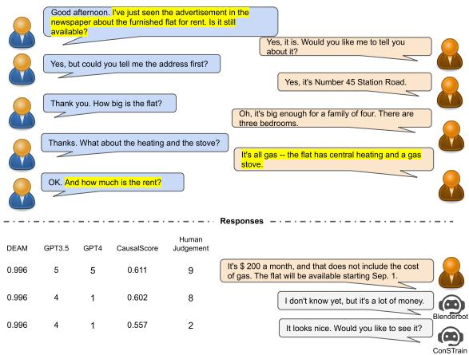
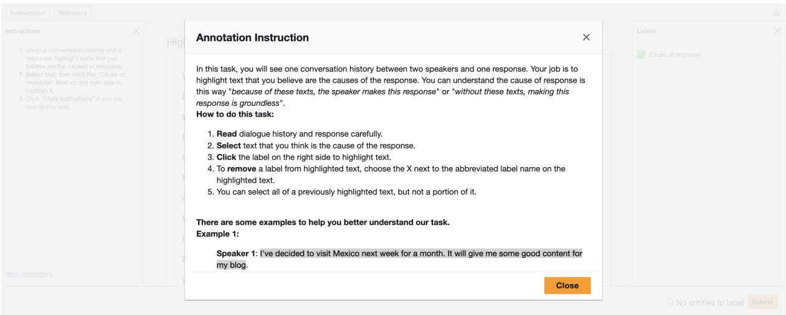
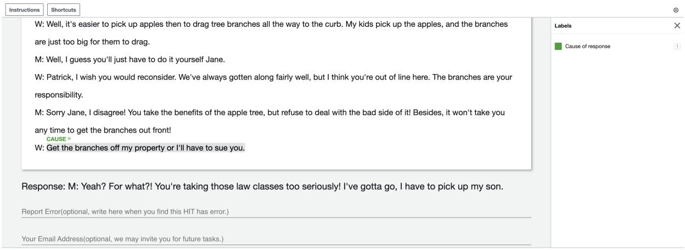
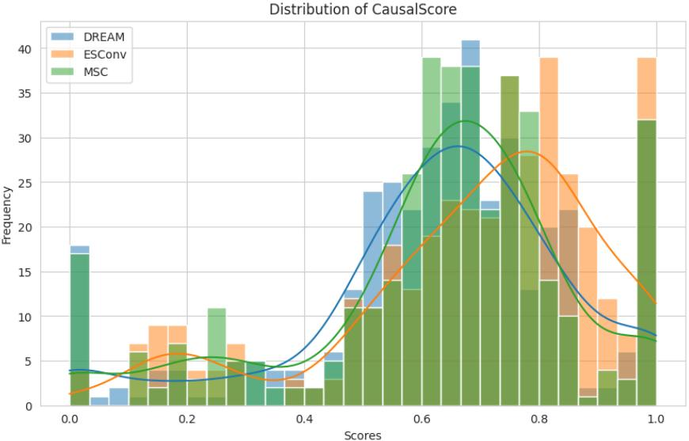

# CausalScore: An Automatic Reference-Free Metric for Assessing Response Relevance in Open-Domain Dialogue Systems

Tao Feng and Lizhen Qu and Xiaoxi Kang and Gholamreza Haffari Monash University, Australia firstname.lastname@monash.edu

## Abstract

Automatically evaluating the quality of re sponses in dialogue systems is a challenging yet crucial task. Current metrics often fail to align with human judgments, especially when assessing responses that are grammatically correct. To address this issue, we propose a novel metric, called CausalScore, which assesses the relevance of responses by measuring the causal strength between dialogue histories and responses. The causal strength is estimated by utilizing both unconditional dependence and conditional dependencies from dialogue histories to responses. We compare our metric with the existing competitive metrics in terms of their alignment with human judgements. Our experimental results demonstrate that CausalScore significantly surpasses existing state-of-the-art metrics by aligning better with human judgements. Additionally, we collect a dialogue dataset CGDIALOG+ with human-annotated causal relations and a set of pairwise human judgements to facilitate the development of automatic metrics. 1

## 1 Introduction

Although various automatic metrics (Papineni et al., 2002; Lin, 2004a; Tao et al., 2018; Ghazarian et al., 2022) have been proposed in the past, evaluation of open-domain dialogue systems is still an open challenge. Existing metrics often show a low correlation with human judgements (Ma et al., 2023). In particular, assessing to what degree a response is semantically relevant to the corresponding dialogue history is a difficult task.

Reference-based metrics, such as BLEU (Papineni et al., 2002) and BERTScore (Zhang\* et al., 2020), assess the quality of generated dialogue responses by measuring their similarities to human written “gold” responses. However, they cannot accurately and impartially evaluate diverse texts generated by the systems built upon large language models (LLMs), especially when the responses differ significantly from references but are still plausible and fluent for humans (Liu et al., 2023).

  
Figure 1: This is an illustrative example of dialogue evaluation, where the responses are generated by human and different dialogue systems. Evaluation results for relevance using different metrics are provided alongside the responses. Highlighted texts indicate causes of human response.

In contrast, reference-free metrics are proposed to directly output scores based on the dialogue history and responses without the references. There are in general two paradigms to evaluate responses from dialogue models: i) supervised models, which are classifiers or regression models to estimate a score for a given response, such as ADEM (Lowe et al., 2017), RUBER (Tao et al., 2018), and DEAM (Ghazarian et al., 2022), and ii) pre-trained LLMs, which are employed to generate a score indicating the quality of a response (Liu et al., 2023). However, as illustrated in Fig. 1, our study (see Sec. 4.4) reveals that these metrics frequently assign high scores to grammatically correct responses, but none of those scores correlate well with the corresponding human rankings on crucial evaluation aspects (e.g., relevance, empathy, etc) even in the in-domain setting.

Based on the above analysis, this work focuses on developing an automatic, reference-free metric that better aligns with human judgements in evaluating the relevance of responses. Feng et al. (2023) show that responses which are highly relevant to the dialogue history also exhibit a strong causal relation between the history and the responses. As shown in Fig 1, the most relevant response (i.e., the human response) replies to more utterances in the dialogue history. For instance, the question "how much is the rent?" causes the response containing "It’s \$200 a month". Similarly, because the history states "It’s all gas - the flat has central heating and a gas stove," the human responds with "That does not include the cost of gas." Additionally, the question "Is it still available?" elicits the response "The flat will be available starting September 1." However, other responses have few or no such causal relations. Inspired by this finding, we propose a novel metric CausalScore to quantify the relevance of responses by estimating the causal strength (Janzing et al., 2013a) between utterances and responses, where causal strength measures the strength of causal relations. Namely, a response assigned with a high causal strength score indicates it is highly relevant to dialogue history.

We use classifier-based (un)conditional independence tests to estimate causal strength (Spirtes et al., 1993; Pearl, 2009b; Mukherjee et al., 2020b). Specifically, the implementation of CausalScore involves a three-step process. First, we apply an unconditional independence classifier to identify a subset of the utterances in dialogue history that depend on a given response, named dependent utterances. Second, we calculate conditional dependencies using the conditional independence classifier, which is operated by conditioning each utterance in dependent utterances. Finally, CausalScore estimates causal strength by aggregating both unconditional and conditional dependencies.

To train CausalScore classifiers for a new domain, we employ a rapid annotation process to extend the CGDIALOG dataset (Feng et al., 2023) with a domain-specific corpus. As an example, we recruit four crowd-workers to annotate causal relations for 950 history-response pairs from the DREAM (Gu et al., 2022) dataset within 12 hours for the new domain. The resulting corpus is referred to as CGDIALOG+. To evaluate the alignment between an automatic metric and human judgements, we ask crowd-workers to indicate their preference between a pair of responses, given the same dialogue history. This ends up with 1,800 annotated preferences, which are used to conduct extensive experiments to compare CausalScore with the state-of-the-art (SOTA) automatic metrics.

Our contributions are summarized as follows: 1) We introduce CausalScore, a novel automatic metric for evaluating the relevance of responses. 2) We release CGDIALOG+, a new dataset created through a rapid annotation process that enables CausalScore to be adapted to new domains within 12 hours. 3) The experimental results show that CausalScore has significantly stronger correlations with human judgements than the SOTA metrics.

## 2 Background

Causal Discovery and Causal Strength. Unlike traditional statistical analysis, which focuses on correlation analysis between variables, causal discovery aims to discover a causal graph among a set of variables through data. A causal graph $\mathcal { G }$ consists of a set of nodes V and a set of edges E, where a node $v \in \mathcal V$ denotes a random variable and a directed edge $v _ { i }  v _ { j } \in \mathcal { E }$ indicates that $v _ { i }$ is a $d i -$ rect cause of $v _ { j }$ (Pearl, 2009a; Neal, 2020). Causal discovery algorithms can be roughly divided into two categories: constraint-based method and scorebased method (Spirtes et al., 1993; Pearl and Verma, 1991; Pearl, 2009a). One widely-used constraintbased causal discovery algorithm is the Peter-Clark (PC) algorithm (Spirtes et al., 1993).

For a pair of variables $( v _ { i } , v _ { j } )$ , the PC algorithm operates unconditional independence tests and conditional independence (CI) tests given the other variables. If $v _ { i }$ and $v _ { j }$ are independent according to any of the tests, the PC algorithm concludes that there is no causal relation between $v _ { i }$ and $v _ { j }$ . The orientation of edges is determined using heuristics and identifying the specific structure such as immorality (Pearl, 2009a; Neal, 2020).

The core of the PC algorithm is the CI test. Given n i.i.d samples from the distribution $P ( v _ { i } , v _ { j } , v _ { k } )$ , we say that $v _ { i }$ is conditionally independent of $v _ { j }$ given $v _ { k }$ (denoted by $v _ { i }$ ⊥⊥ $v _ { j } | v _ { k } )$ , if the distribution $P ( v _ { i } , v _ { j } | v _ { k } )$ factories as $P ( v _ { i } | v _ { k } ) P ( v _ { j } | v _ { k } )$ . The resulting hypothesis testing is as follows: Given n i.i.d samples from the distribution $P ( v _ { i } , v _ { j } , v _ { k } )$ , one needs to distinguish between the two hypotheses:

$$
\mathcal { H } _ { 0 } : v _ { i } \perp v _ { j } | v _ { k } \mathrm { ~ \scriptsize ~ v s ~ } \mathcal { H } _ { 1 } : v _ { i } \perp v _ { j } | v _ { k } .
$$

Conditional independence tests can also be operationalised or interpreted based on conditional mutual information (CMI) (Cover and Thomas, 2006; Janzing et al., 2013b; Mukherjee et al., 2020a), because CMI is zero if two variables are conditional independent, otherwise CMI is proportional to the dependencies between two variables. Thus, prior works also use CMI as an indicator of causal strength (Seitzer et al., 2021).

Classifier-based CI Test. There are many CI tests for statistical data, such as Fisher-z test (Fisher), Chi-Square test (McHugh, 2013), and kernel-based CI test (Zhang et al., 2011). However, those methods are designed for continuous random variables, and cannot be directly applied to text data. Classifier-based CI tests convert the CI test into a binary classification problem (Lopez-Paz and Oquab, 2017; Sen et al., 2017, 2018; Mukherjee et al., 2020a). The central idea is to train a binary classification model to identify whether data examples are from $v _ { i }$ ⊥⊥ $v _ { j } | v _ { k }$ or $v _ { i } \not \perp v _ { j } | v _ { k }$ . In this work, we adopt classifier-based CI tests to text data to identify causal relations and compute causal strength between dialogue history and response.

## 3 Methodology

In this paper, we propose a reference-free automatic evaluation metric, named CausalScore, to assess the relevance of a given response to the corresponding dialogue history. Formally, we are given a dialogue history $\pmb { c } = \{ c _ { 1 } , . . . , c _ { t - 1 } \}$ and a response $r _ { t } .$ where each $c _ { i }$ is an utterance in the history. The goal is to develop a function $f : ( c , r _ { t } ) $ s that produces a score s indicating their causal strength. We argue that a response exhibiting high relevance to the dialogue history inherently entails strong causal strength with a particular set of utterances in that dialogue history.

To quantify causal strength between utterances and responses, we integrate the classifier-based (un)conditional test results into a single score, inspired by the PC algorithm. By using a procedure similar to the PC algorithm, the more causal relations we find between a response and utterances, the stronger the causal strength is. We run first unconditional tests to identify strong candidates of causal relations, followed by verifying them with CI tests. Both types of tests are conducted by employing a classifier, which predict the probability of being dependent between a response and input utterances. Instead of discovering full causal graphs, we average among these dependence classifier probabilities based on the selected candidates after unconditional tests to produce the final score.

In the following, we first introduce the CGDIA-LOG+ corpus, followed by how we build the classifiers on that corpus and employ their predictions to calculate CausalScore.

## 3.1 Annotation of CGDIALOG+

CGDIALOG+ is an extension of CGDIALOG that is used to train the classifiers for independence tests. CGDIALOG is a dialogue dataset with humanannotated causal relations between utterances in dialogue histories and responses.

Due to the relatively small size of CGDIA-LOG, we extend it to CGDIALOG+ by adding 950 history-response pairs from the dialogues in DREAM (Sun et al., 2019), using a rapid annotation instruction. In the first round of annotation, we hire four graduate students to annotate causal graphs. Subsequently, in the second round, we select annotators who have high-quality annotation results to review all annotations and correct mistakes. We measure the inter-annotator agreement at both the utterance level and the clause level. At the utterance level, we compute Cohen’s Kappa and obtain 0.8021. At the clause level, we compute the averaged F1 score for all possible pairs of annotators and obtain an F1 score of 0.8316. Both utterance and clause level scores indicate a high level of inter-annotator agreement. The statistics of CGDIALOG+ can be found in Table 1. More details of the rapid annotation process are presented in Appendix A.2, and the annotation interface is available in our code repository.

<table><tr><td>Number of items</td><td>ESConv</td><td>MSC</td><td>DREAM</td></tr><tr><td>Annotation time (hr)</td><td></td><td></td><td>11</td></tr><tr><td>History-response pairs</td><td>694</td><td>800</td><td>950</td></tr><tr><td>Utterances</td><td>2301</td><td>3807</td><td>3862</td></tr><tr><td>Direct causes utterance</td><td>1347</td><td>1525</td><td>1519</td></tr><tr><td>Average length</td><td>24.01</td><td>22.22</td><td>16.67</td></tr><tr><td>of direct causes</td><td> $( \sigma = 1 6 . 6 1 )$ </td><td>(σ = 13.79)</td><td>(σ = 11.83)</td></tr></table>

Table 1: Statistics of the CGDIALOG+

## 3.2 Construction of Classifiers

To construct classifiers, we assume there is a projection function $g ( c _ { i } ) = z _ { i }$ , which maps an utterance to a continuous latent random variable $z _ { i }$ denoting the meaning of the utterance; the corresponding node in the causal graph is denoted by $v _ { i } .$ . Utterances with similar meaning are thus mapped to the same latent representation. Thus, we are able to build a classifier on top of the hidden representations produced by a pre-trained encoder, e.g. RoBERTa (Liu et al., 2020).

Unconditional Independence Classifier The input of the classifier is an utterance $c _ { i }$ and a response $r _ { t }$ . The classifier predicts such a pair as positive $( l = 1 )$ if $c _ { i } \mathscr { \bot } r _ { t } .$ , otherwise negative $( l = 0 )$

To construct a training set, we label a pair of $( c _ { i } , r _ { t } )$ as positive, if either they have a causal relation in CGDIALOG+ or $c _ { i }$ is the preceding utterance of $r _ { t }$ . This is supported by the study of Feng et al. (2023), which demonstrates that 90% of preceding utterances serve as direct causes of the following responses. We obtain negative examples by randomly sampling utterances as responses from other conversations.

We use RoBERTa as the backbone model to develop the unconditional independence classifier. This is done by integrating a binary classification head, which is fed by the representation of the [CLS] token. As input to RoBERTa, we concatenate the context utterance $c _ { i }$ with the response $r _ { t }$ using the special token $\mathrm { \ ' } _ { < } / \mathrm { s } > \mathrm { \ ' }$ as the delimiter. This amounts to the unconditional classifier $C _ { u n c o n d } .$

Conditional Independence Classifier The input to the CI classifier is the concatenation of two utterances from a dialogue history and a response. It predicts positive if they are conditionally dependent, otherwise negative.

The construction of the initial training set is based on CGDIALOG+. Given one historyresponse pair from CGDIALOG+, we select one annotated cause of response, one utterance that is unconditionally dependent on the response (determined by $C _ { u n c o n d } )$ , and the response as the positive example. Negative examples are constructed similarly but with a crucial difference: instead of using the cause of response, we choose an utterance that is not the cause of response. The constructed dataset is denoted as $\mathbb { D } _ { L }$ . We use incremental self-training with constraints to improve the performance of the CI classifier. This method starts with the supervised training of an initial classifier $C _ { 0 }$ on $\mathbb { D } _ { L }$ . Then, $C _ { 0 }$ is applied to unlabeled utterance tuples. Those tuples classified with a label of 1 are incorporated into the training set as positive examples if they satisfy two criteria: 1) the probability $p ( l = 1 | c _ { i } , c _ { k } , r _ { t } )$ surpasses a predefined threshold $0 . 9 ; 2 ) c _ { i }$ is $c _ { t - 2 } \operatorname { o r } c _ { t - 3 }$ . Then, a new classifier $C _ { 1 }$ is trained on the updated training set $\mathbb { D } ^ { 0 }$ . The selftraining cycle is repeated, each iteration yielding a new classifier $C _ { i }$ , until optimal performance is achieved on the validation set. The classifier ultimately chosen through this self-training process is denoted as $C _ { c o n d }$ . More details of training the CI classifier are provided in Algorithm 1.

## 3.3 Compute CausalScore

We compute CausalScore of responses by using the (un)conditional independence classifiers. Given a response, we first identify individual utterances $c _ { i }$ that have a probability $P ( l = 1 | c _ { i } , r _ { t } )$ over 0.5 as dependent utterances using the unconditional independence classifier. The set of dependent utterances $c _ { i }$ is denoted by $\mathcal { U } ^ { d e p }$ . Each of those utterances is paired with another utterance in $\mathcal { U } ^ { d e p }$ and the response to compute the probability of being conditionally dependent. The total causal strength of a response w.r.t. a dialogue history is averaged across the corresponding classifier predictions detailed below.

Janzing et al. (2013b); Geiger et al. (2014) shows causal strength between two variables, $\mathcal { S } _ { v _ { i }  v _ { j } }$ , can be measured by (C)MI $I ( v _ { i } ; v _ { j } )$ or $I ( v _ { i } ; \check { v } _ { j } | P A _ { v _ { i } } ^ { - v _ { i } } )$ in different causal relations $^ 2 ,$ where $P A _ { v _ { j } } ^ { - \bar { v _ { i } } }$ represent parents of $v _ { j }$ excluding $v _ { i }$ Considering the diversity and complexity of causal relations in dialogues, we employ both $I ( v _ { i } ; v _ { j } )$ and $I ( v _ { i } ; v _ { j } | P A _ { v _ { j } } ^ { - v _ { i } } )$ to measure causal strength. It makes sense because both $I ( v _ { i } ; v _ { j } )$ and $I ( v _ { i } ; v _ { j } | P A _ { v _ { i } } ^ { - v _ { i } } )$ measure strength of dependencies, and strength of dependencies imply causal strength (Janzing et al., 2013b). However, it is still challenging to compute MI or CMI in the dialogue scenario. Considering the equivalent relation between CI test and CMI, we use the probabilities of being dependent or conditional dependent produced by CI classifiers to measure causal strength.

Specifically, the unconditional independence classifier $C _ { u n c o n d }$ is applied to each pair of $( c _ { i } , r _ { t } )$ where $c _ { i }$ is an utterance in $\mathcal { U } ^ { d e p }$ . Then, we assess the unconditional dependence strength between each utterance and the response using probability $P ( l = 1 | c _ { i } , r _ { t } )$ , where label 1 represents dependence. We denote this probability as $p _ { + } ( c _ { i } , r _ { t } )$ for simplicity.

The conditional classifier $C _ { c o n d }$ is thus employed on tuples of the form $( c _ { i } , c _ { j } , r _ { t } )$ , where both $c _ { i }$ and $c _ { j }$ are members of the set $\mathcal { U } _ { d e p }$ with $i \neq j$ . We then compute the probability of

$P ( l = 1 | c _ { i } , c _ { j } , r _ { t } )$ to assess the strength of conditional dependence between utterance and response, $p _ { + } ( c _ { i } , c _ { j } , r _ { t } )$ for simplicity. The scoring mechanism for CausalScore considers both $p _ { + } ( c _ { i } , r _ { t } )$ and $p _ { + } ( c _ { i } , c _ { j } , r _ { t } )$ as follows:

$$
\begin{array} { l } { \mathrm { C a u s a l S c o r e } ( c , r _ { t } ) = } \\ { \frac { 1 } { 2 } \left( \frac { \sum _ { \mathscr { U } _ { c _ { i } } ^ { d e p } } p _ { + } ( c _ { i } , r _ { t } ) } { | \mathscr { U } ^ { d e p } | } + \frac { \sum _ { \mathscr { U } _ { c _ { i } } ^ { d e p } } p _ { + } ( c _ { i } , c _ { j } , r _ { t } ) ) } { \left| \mathscr { U } _ { c _ { i } , c _ { j } } ^ { d e p } \right| } \right) } \end{array}\tag{1}
$$

where $c _ { i }$ and $c _ { j }$ are elements of the set $\mathcal { U } ^ { d e p } . \mathcal { U } _ { c _ { i } } ^ { d e p }$ represents select one element from $\mathcal { U } ^ { d e p }$ $\mathcal { U } _ { c _ { i } , c _ { j } } ^ { d e p }$ represents select two different elements from $\mathcal { U } ^ { d e \bar { p } }$ $\left| \mathcal { U } _ { c _ { i } , c _ { j } } ^ { d e p } \right|$ represents the number of all possible pairs of $( c _ { i } , \dot { c } _ { j } )$ . The score of CausalScore ranges from 0 to 1, with higher values indicating better relevance.

## 4 Experiments

## 4.1 Experimental Setup

Baseline Metrics. We compare our metric CausalScore with eight dialogue evaluation metrics, consisting of five reference-based metrics: BLEU (Papineni et al., 2002), ROUGE (Lin, 2004b), METEOR (Lavie and Agarwal, 2007), BERTScore (Zhang\* et al., 2020), BLEURT (Sellam et al., 2020). For comparison, we only present the BLEU-4 for BLEU, ROUGE-L for ROUGE, and BERTScore-F1 for BERTScore. Based on the prior works (Li et al., 2022; Yang and Klein, 2021; Dathathri et al., 2020), we feed the dialogue history and corresponding generated text to a language model (i.e., GPT-2) and report the perplexity (PPL) of the generated text under the language model. GRADE (Huang et al., 2020) and DEAM (Ghazarian et al., 2022) evaluate dialogues by using probability of fine-tuned classifiers. DEnsity (Park et al., 2023) evaluates a response by utilizing density estimation on the feature space derived from a neural classifier. To ensure a fair comparison, these classifier-based models are fine-tuned on experimental dialogue datasets. Chiang and Lee (2023); Wang et al. (2023) argue that ChatGPT can be a good text evaluation metric. We also consider ChatGPT as a baseline metric for dialogue evaluation. We follow the prompts from Chiang and Lee (2023); Wang et al. (2023) to require ChatGPT to evaluate responses using a 5-point Likert scale.

Datasets. We conduct experiments on three dialogue datasets across diverse domains: ES-Conv (Liu et al., 2021), MSC (Xu et al., 2022),

DREAM (Sun et al., 2019). The details of the datasets are provided in Appendix A.1. For MSC and DREAM, we use the dataset splits as provided in their publications. For ESConv, because it doesn’t have an official split, we randomly split the dataset with 80% dialogues for training, 10% dialogues for validation, and 10% for testing. As a result, any dialogue in a test set cannot be seen in any of the training sets.

Implementation Details. We use RoBERTa (Liu et al., 2020) as the backbone model to fine-tune classifiers. All the models are implemented with PyTorch (Paszke et al., 2019) and the Transformers library (Wolf et al., 2020). All models are trained with Adam (Kingma and Ba, 2015) optimizer with $\beta _ { 1 } = 0 . 9$ and $\beta _ { 2 } ~ = ~ 0 . 9 9 9$ The learning rate is $1 \times 1 0 ^ { - 5 }$ for fine-tuning classifiers. We use a linear learning rate scheduler that dynamically decreases the learning rate after 10 warm-up steps. Classifiers were trained for 10 epochs with the batch size 16 on NVIDIA A40 GPU.

Dialogue Models. We evaluate metrics using both human-generated and model-generated responses to assess their performance across varying levels of response quality. For model-generated responses, we consider two dialogue models, Blenderbot (Roller et al., 2021) and Blenderbot-ConSTrain (Feng et al., 2023), both known for producing human-like responses. Additionally, we fine-tuned a large language model named Alpaca (Taori et al., 2023) using the LoRA technique (Hu et al., 2022) on dialogue datasets.

## 4.2 Metric Evaluation

Human Judgements. Belz and Kow (2010); Callison-Burch et al. (2007); Kiritchenko and Mohammad (2017) found that asking crowd-workers to directly score responses on a Likert scale usually receives low-quality evaluation. Thus, following the evaluation design in Novikova et al. (2018); Bojar et al. (2016); Zheng et al. (2021); Zhou et al. (2018); Feng et al. (2023), we opt for pairwise comparison between responses from different dialogue models. For each dataset, we randomly sample 100 dialogue histories from the test set. Then, given one dialogue history, we ask annotators to compare two responses from two dialogue models. Because we have four dialogue models (one human response and three model-generated responses), there are six different pair comparisons in total. The annotation was conducted by 16 undergraduate and graduate students who are native English speakers.

In each comparison, we ask five evaluation questions: Empathy (Which response has a better understanding of the emotional state and provides a more appropriate emotional reaction?), Specificity (Which response produces more unique and nongeneric information that is specific to the conversation history?), Relevance (Which response is more on-topic with the immediate dialogue history?), Consistency (Which response is more logically coherent with the conversation history and common sense?) and Overall (Which response performs better overall?). Each question has four options: A is better than B, B is better than A, Both are good, and Both are bad. Three individual annotators assessed each comparison. To eliminate any bias from annotators, we anonymized the names of dialogue models, shuffled the order of dialogues, and shuffled the order of responses. Finally, we collected 1800 pairwise comparison results from 16 annotators. The calculated Krippendorff’s alpha (Krippendorff, 2011) for assessing the inter-annotator agreement is 0.6708, indicating a moderate level of agreement among the annotators.

Correlation Calculation. Because human evaluation results are categorical options and automatic metrics are continuous values, we cannot directly calculate correlation coefficients between them. Thus, we apply different schemas to convert categorical options to integer values and convert continuous values to categorical options.

To convert categorical options into integer values, we use the voting schema. Specifically, if one annotator selects A is better than B, response A gets one point, while B gets zero points, and vice versa for B is better than A. If one annotator selects Both are good, both responses A and B get one point. If Both are bad is selected, both responses A and B get zero points. Then we apply this rule to three annotator assessments. After conversion, we have integer scores for human evaluation and continuous scores for automatic evaluation. Then, we apply Pearson and Spearman’s correlation coefficient to measure correlations between human evaluation and automatic evaluation. Because continuous metrics hardly produce exactly equivalent values, we propose a IgnoreEqual schema that only considers nonequivalent relationships. Specifically, for one human annotator results, we convert A is better than B to 1 and A is better than B to 0. In this way, human evaluation becomes a dichotomous variable. For automatic evaluation, we consider the difference of automatic score on response A and response B. Formally, we take AutoMetric(A) − AutoMetric(B) as another variable, where AutoMetric refers to any automatic metric, A and B refer to response A and response B. In this way, we can use Point-Biserial correlation coefficient to correlation between human evaluation and automatic evaluation. To convert continuous values into category options (Cont2Cat), we simply compare automatic scores of responses A and B. If the score of response A is larger than B, we convert it to A is better than B, otherwise convert it to B is better than A. After conversion, we treat automatic metric as another annotator and compute inter-annotator agreement using Krippendorff’s alpha method.

## 4.3 Analytical Experiments

To comprehensively evaluate the individual contributions of CausalScore, we conducted a series of ablation studies. The outcomes of these studies are presented in Table 2. The observed decline in the removal of each component demonstrates their collective positive impact on the evaluation of responses, thus supporting the integral role of each element within the CausalScore framework.

Efficacy of the Classifiers. To prove the contribution of (conditional) mutual information in our framework, we perform two ablation experiments: 1) removing unconditional dependence $( i . e . , - p ( c _ { i } , r _ { t } )$ rows of Table 2) in the computation of CausalScore scores; 2) removing conditional dependence $( i . e . , - p ( c _ { i } , c _ { j } , r _ { t } )$ rows) when computing CausalScore scores. Consequently, removing conditional dependence has the most detrimental impact on the metric’s performance. As we described in Section 3, we argue that a response exhibiting high relevance to the dialogue history inherently entails strong causal strength with a particular set of utterances in that dialogue history. Furthermore, causal strength can be well measured by the degree of conditional independence. In other words, condi tional dependence is closer to causal strength than unconditional dependence. The better performance of CI classifier can be attributed to the fact that conditional dependencies more accurately reflect the actual causal relations between the dialogue history and the response than unconditional dependencies.

Instead of taking the average of conditional dependence, we only use the maximum of conditional dependence to compute the metric score as another ablation study (i.e., → MaxCI rows). In several instances, relying on the maximum conditional dependence yields inferior results compared to using the average of unconditional dependencies. This outcome can be attributed to the fact that the relevance of responses is more accurately reflected by the causal relations with the entire dialogue history, rather than only with the most likely direct cause.

<table><tr><td></td><td colspan="4">DREAM</td><td colspan="4">ESConv</td><td colspan="4">MSC</td></tr><tr><td>Metric</td><td>Voting Pearson Spearman</td><td></td><td>IgnoreEqual Point-Biserial</td><td>Cont2Cat IAA</td><td>Voting Pearson</td><td>Spearman</td><td>IgnoreEqual Point-Biserial</td><td>Cont2Cat IAA</td><td>Voting Pearson</td><td>Spearman</td><td>IgnoreEqual Point-Biserial</td><td>Cont2Cat IAA</td></tr><tr><td></td><td colspan="10"></td><td></td><td></td></tr><tr><td>CausalScore</td><td>0.294*</td><td>0.334*</td><td>0.363</td><td>0.369</td><td>0.312*</td><td>0.343*</td><td>0.402</td><td>0.337</td><td>0.257*</td><td>0.308*</td><td>0.316</td><td>0.330</td></tr><tr><td>-p(ci, cj, rt)</td><td>0.184</td><td>0.157</td><td>0.216</td><td>0.312</td><td>0.148</td><td>0.146</td><td>0.209</td><td>0.284</td><td>0.137</td><td>0.151</td><td>0.176</td><td>0.289</td></tr><tr><td>-p(ci, rt)</td><td>0.229</td><td>0.303*</td><td>0.335*</td><td>0.347</td><td>0.294*</td><td>0.328*</td><td>0.362</td><td>0.327</td><td>0.204</td><td>0.256*</td><td>0.292</td><td>0.318</td></tr><tr><td>-self-training</td><td>0.285*</td><td>0.325*</td><td>0.351*</td><td>0.358</td><td>0.302*</td><td>0.340*</td><td>0.387*</td><td>0.336</td><td>0.247*</td><td>0.299*</td><td>0.304*</td><td>0.324</td></tr><tr><td>→ MaxCI</td><td>0.087</td><td>0.075</td><td>0.101</td><td>0.302</td><td>0.095</td><td>0.079</td><td>0.104</td><td>0.277</td><td>0.133</td><td>0.119</td><td>0.161</td><td>0.271</td></tr><tr><td>→ Preced2</td><td>0.150</td><td>0.128</td><td>0.177</td><td>0.303</td><td>0.114</td><td>0.107</td><td>0.163 Overall</td><td>0.280</td><td>0.105</td><td>0.121</td><td>0.146</td><td>0.272</td></tr><tr><td></td><td colspan="10"></td><td></td></tr><tr><td>CausalScore</td><td>0.331*</td><td>0.422*</td><td>0.511*</td><td>0.595</td><td>0.287*</td><td>0.339*</td><td>0.411*</td><td>0.568</td><td>0.331*</td><td>0.401*</td><td>0.492*</td><td>0.569</td></tr><tr><td> $- p ( c _ { i } , c _ { j } , r _ { t } )$ </td><td>0.192</td><td>0.231</td><td>0.303</td><td>0.517</td><td>0.115</td><td>0.121</td><td>0.161</td><td>0.483</td><td>0.179</td><td>0.235</td><td>0.272</td><td>0.526</td></tr><tr><td>-p(ci, τt)</td><td>0.303*</td><td>0.396*</td><td>0.496*</td><td>0.571</td><td>0.262*</td><td>0.314*</td><td>0.403*</td><td>0.548</td><td>0.316*</td><td>0.380*</td><td>0.473*</td><td>0.546</td></tr><tr><td>-self-training</td><td>0.326*</td><td>0.414*</td><td>0.503*</td><td>0.586</td><td>0.284*</td><td>0.331*</td><td>0.407*</td><td>0.568</td><td>0.324*</td><td>0.387*</td><td>0.488*</td><td>0.562</td></tr><tr><td>→ MaxCI</td><td>0.203</td><td>0.147</td><td>0.250</td><td>0.490</td><td>0.048</td><td>0.087</td><td>0.058</td><td>0.473</td><td>0.086</td><td>0.116</td><td>0.112</td><td>0.480</td></tr><tr><td>→ Preced2</td><td>0.172</td><td>0.158</td><td>0.183</td><td>0.358</td><td>0.103</td><td>0.095</td><td>0.135</td><td>0.263</td><td>0.126</td><td>0.131</td><td>0.157</td><td>0.301</td></tr></table>

Table 2: Ablation results on three datasets. Asterisk \* indicates results with p-value < 0.05 (statistically significant).

Usefulness of Annotated Causal Relations. We verify the necessity of annotated causal relations on training the CI classifier. Instead of using annotated causal relations, we trained a CI classifier using the two most recent preceding utterances as positive instances and two random utterances from other dialogue as negative instances. The performance outcomes, detailed in the "-Preced2" row, demonstrate a notable decline when compared to the CI classifier trained on the annotated CGDIALOG+ dataset $( i . e . , - p ( c _ { i } , r _ { t } ) )$ . We attribute this performance drop to the high noise present in the positive examples. Our empirical observations suggest that approximately only 40% of the penultimate utterances serve as the cause of response, indicating a significant level of noise within positive instances, which undermines the classifier’s reliability.

Effectiveness of Self-Training. We compare the CI classifier $C _ { c o n d }$ trained with incremental selftraining with constraints with the initial classifier C0. As shown in the ’-self-training’ rows of Table 2, CausalScore without self-training results in a decline of 0.012 in Pearson correlation, 0.013 in Spearman correlation, 0.007 in Point-Biserial correlation, 0.012 in inter-annotator agreement in average. We believe self-training with constraints benefits the training of CI classifiers by augmenting training data and reducing the noise in pseudolabel data. These findings indicate incremental self-training with constraints is an effective method to improve the performance of classifiers.

## 4.4 Experimental Results

Table 3 depicts the quantitative results for different evaluation metrics on ESConv, MSC, and DREAM datasets. According to the reported correlations and inter-annotator agreements, CausalScore outperforms all baseline metrics across various evaluation dimensions, including relevance, specificity, empathy, consistency, and overall. CausalScore achieves higher correlations on relevance which is the primary target evaluation dimension of our metric. Regarding the overall dimension, it is posited that annotators tend to favor responses having high relevance, perceiving them as indicative of superior overall quality. This comprehensive effectiveness of CausalScore can be ascribed to its capability to identify causal relations between dialogue histories and responses. Such causal connections are essential to establish the relevance of responses in the context of the preceding dialogue.

Baseline metrics can be categorized into two types: reference-based and reference-free metrics. Our experimental findings reveal that both types are generally unreliable for evaluating responses. Although ChatGPT and GPT-4-based metrics exhibit relatively better correlations in the dimensions of empathy and consistency, this enhanced performance lacks stability across different datasets.

## 4.5 Qualitative Study

To provide a more intuitive assessment of CausalScore’s performance, we present a representative example in Table 4. For human evaluations, we can see the human-generated response exhibits the highest relevance. Responses generated by Alpaca and Blenderbot display relatively high relevance, while response generated by Blenderbot − ConSTrain shows the lowest relevance. Notably, the ranking of scores assigned by our metric aligns more closely with human judgements compared to other metrics. The GPT4-based metric often assigns the highest scores to human responses but falls short of properly ranking model generated responses. The DEAM metric allocates nearly identical scores to all responses, suggesting its inadequacy in differentiating between varying levels of relevance. BERTScore, as a referencebased metric, naturally scores the human response as 1.0 due to it serves as the reference. However, it assigns similar scores to all model-generated responses, highlighting the inability of referencebased metrics to effectively address the one-tomany nature of dialogues. More examples can be

<table><tr><td colspan="2"></td><td colspan="4">DREAM</td><td colspan="4">ESConv IgnoreEqual</td><td colspan="4">MSC IgnoreEqual</td></tr><tr><td colspan="2">Metric</td><td colspan="2">Voting Pearson Spearman</td><td>IgnoreEqual Point-Biserial</td><td>Cont2Cat IAA</td><td colspan="4">Voting Pearson Spearman</td><td colspan="4">Voting Pearson Spearman</td></tr><tr><td colspan="2"></td><td></td><td></td><td></td><td>Relevance</td><td></td><td></td><td>Point-Biserial</td><td>IAA</td><td></td><td></td><td>Point-Biserial</td><td>IAA</td></tr><tr><td colspan="10"></td><td colspan="4">0.065</td></tr><tr><td rowspan="6">Reference-based</td><td>BLEU ROUGE</td><td>0.021 -0.005</td><td>0.018 -0.008</td><td>0.027 -0.015</td><td>0.246 0.272</td><td>-0.047 0.039</td><td>-0.065</td><td>-0.053</td><td>0.216 0.243</td><td>0.076 0.091</td><td>0.087</td><td>0.074 0.090</td><td>0.222 0.249</td></tr><tr><td>METEOR</td><td>0.028</td><td>0.033</td><td>0.043</td><td>0.262</td><td>0.097</td><td>0.020 0.097</td><td>0.045 0.081</td><td>0.243</td><td>0.013</td><td>0.036</td><td>0.087</td><td>0.241</td></tr><tr><td></td><td></td><td></td><td></td><td></td><td></td><td></td><td>0.092</td><td></td><td>0.021</td><td>0.002</td><td>0.031</td><td>0.239</td></tr><tr><td>BERTScore</td><td>-0.004</td><td>-0.010</td><td>-0.003</td><td>0.260</td><td>0.085</td><td>0.069</td><td></td><td>0.246</td><td></td><td></td><td></td><td></td></tr><tr><td>BLEURT</td><td>-0.022</td><td>-0.032</td><td>-0.030</td><td>0.257</td><td>0.025</td><td>0.022</td><td>0.026</td><td>0.246</td><td>0.074</td><td>0.089</td><td>0.094</td><td>0.249 0.245</td></tr><tr><td>PPL GRADE</td><td>0.033 0.004</td><td>0.097 -0.005</td><td>0.043 0.035</td><td>0.292 0.248</td><td>-0.040 0.013</td><td>-0.031 0.021</td><td>-0.073 0.030</td><td>0.246 0.248</td><td>-0.046 -0.003</td><td>-0.047 0.012</td><td>-0.053</td><td></td></tr><tr><td rowspan="7">Reference-free</td><td></td><td></td><td>-0.053</td><td>-0.121</td><td>0.273</td><td>-0.011</td><td>0.039</td><td>-0.011</td><td>0.257</td><td>-0.012</td><td>-0.032</td><td>0.049 -0.007</td><td>0.243 0.253</td></tr><tr><td>DEAM</td><td>-0.090</td><td></td><td></td><td></td><td></td><td></td><td></td><td></td><td></td><td>0.030</td><td>0.026</td><td>0.258</td></tr><tr><td>DEnsity</td><td>0.117</td><td>0.112</td><td>0.149</td><td>0.286</td><td>0.080</td><td>0.099</td><td>0.095</td><td>0.268</td><td>0.030</td><td></td><td></td><td></td></tr><tr><td>ChatGPT</td><td>0.036</td><td>0.024</td><td>0.088</td><td>0.284</td><td>-0.002</td><td>-0.018</td><td>0.096</td><td>0.250</td><td>0.083</td><td>0.084</td><td>0.109</td><td>0.271</td></tr><tr><td>GPT4</td><td>0.049</td><td>0.038</td><td>0.083</td><td>0.263</td><td>-0.002 0.312*</td><td>-0.023</td><td>0.097</td><td>0.251</td><td>0.039</td><td>0.083</td><td>0.110</td><td>0.277</td></tr><tr><td>CausalScore</td><td>0.294*</td><td>0.334*</td><td>0.363</td><td>0.369</td><td>Overall</td><td>0.343*</td><td>0.402</td><td>0.337</td><td>0.257*</td><td>0.308*</td><td>0.316</td><td>0.330</td></tr><tr><td colspan="10"></td><td colspan="3"></td></tr><tr><td rowspan="5">Reference-based</td><td>BLEU</td><td>0.019</td><td>0.058</td><td>0.011</td><td>0.444</td><td>0.069</td><td>0.050</td><td>0.005</td><td>0.434</td><td>0.019</td><td>-0.019</td><td>0.007</td><td>0.422 0.435</td></tr><tr><td>ROUGE</td><td>-0.031</td><td>-0.028</td><td>-0.040</td><td>0.453</td><td>-0.030</td><td>-0.041</td><td>-0.044</td><td>0.445</td><td>-0.011</td><td>-0.018</td><td>-0.010</td><td></td></tr><tr><td>METEOR</td><td>-0.043</td><td>-0.031</td><td>-0.053</td><td>0.454</td><td>0.041</td><td>0.029</td><td>0.052</td><td>0.455</td><td>0.006</td><td>0.015</td><td>0.007</td><td>0.435</td></tr><tr><td>BERTScore</td><td>0.065</td><td>0.077</td><td>0.103</td><td>0.458</td><td>-0.028</td><td>0.004</td><td>-0.035</td><td>0.458</td><td>0.032</td><td>0.042</td><td>0.052</td><td>0.440</td></tr><tr><td>BLEURT</td><td>0.011</td><td>0.005</td><td>0.011</td><td>0.451</td><td>-0.112 0.045</td><td>-0.117 0.105</td><td>-0.161 0.100</td><td>0.439 0.480</td><td>0.076 0.023</td><td>0.077 -0.038</td><td>0.112</td><td>0.445</td></tr><tr><td rowspan="6">Reference-free</td><td>PPL</td><td>0.034</td><td>0.010 0.033</td><td>0.032 0.012</td><td>0.454 0.454</td><td>0.023</td><td></td><td></td><td></td><td></td><td>0.050</td><td>-0.022 0.105</td><td>0.436 0.442</td></tr><tr><td>GRADE</td><td>0.054</td><td>0.107</td><td>0.168</td><td>0.467</td><td>0.013</td><td>0.011</td><td>0.004 0.005</td><td>0.436</td><td>0.088 0.042</td><td>0.021</td><td>0.074</td><td>0.442</td></tr><tr><td>DEAM</td><td>0.111 0.011</td><td>0.009</td><td>0.023</td><td>0.462</td><td>0.038</td><td>0.010</td><td>0.064</td><td>0.442 0.483</td><td>0.076</td><td>0.045</td><td>0.091</td><td>0.465</td></tr><tr><td>DEnsity</td><td>0.153</td><td>0.101</td><td>0.113</td><td>0.460</td><td>0.052</td><td>0.100 0.055</td><td>0.041</td><td>0.463</td><td>0.129</td><td>0.125</td><td>0.181</td><td>0.481</td></tr><tr><td>ChatGPT</td><td>0.159</td><td>0.157</td><td>0.141</td><td>0.486</td><td>0.048</td><td>0.062</td><td>0.042</td><td>0.471</td><td>0.131</td><td>0.103</td><td>0.119</td><td>0.486</td></tr><tr><td>GPT4 CausalScore</td><td>0.331*</td><td>0.422*</td><td>0.511*</td><td>0.595</td><td>0.287*</td><td>0.339*</td><td>0.411*</td><td>0.568</td><td>0.331*</td><td>0.401*</td><td>0.492*</td><td>0.569</td></tr></table>

Table 3: Correlations between automatic evaluation metrics and human judgements on three different datasets (DREAM, ESConv, MSC). Inter-annotator agreement (IAA) is computed using Krippendorff’s alpha. PPL represents perplexity. Asterisk \* indicates results with p-value < 0.05 (statistically significant).
<table><tr><td>M:</td><td colspan="5">Good afternoon. I&#x27;ve just seen the advertisement in the newspaper about the furnished flat for rent. Is it still available?</td></tr><tr><td>W:</td><td colspan="5">Yes, it is. Would you like me to tell you about it?</td></tr><tr><td>M:</td><td>Yes, but could you tell me the address first, please?</td><td></td><td></td><td></td><td></td></tr><tr><td>W:</td><td colspan="5" rowspan="3">Yes, it&#x27;s Number 45 Station Road Thank you. How big is the flat?</td></tr><tr><td>M:</td></tr><tr><td>W:</td></tr><tr><td>M:</td><td>Oh, it&#x27;s big enough for a family of four. There are three bedrooms. Thanks. What about the heating and the stove?</td></tr><tr><td>W:</td><td colspan="5">It&#x27;s all gas – the flat has central heating and a gas stove.</td></tr><tr><td>M:</td><td>OK. And how much is the rent?</td><td>CausalScore</td><td>Evaluation on Relevance</td><td></td><td></td><td></td></tr><tr><td>Responses:</td><td>It&#x27;s $ 200 a month, and that does not include the cost of gas.</td><td>Human 9</td><td>0.611</td><td>GPT4</td><td>DEAM</td><td>BERTScore</td></tr><tr><td>Human:</td><td>The flat will be available starting Sep. 1.</td><td></td><td></td><td>5</td><td>0.996</td><td>1.0</td></tr><tr><td>Alpaca:</td><td>The flat is located at Number 45 Station Road and is big enough for a family of four.</td><td>7</td><td>0.583</td><td>1</td><td>0.995</td><td>0.843</td></tr><tr><td>Blenderbot:</td><td>It has three bedrooms and is gas heated with a gas stove. The rent is $6487258.</td><td>8</td><td>0.602</td><td>1</td><td>0.996</td><td>0.855</td></tr><tr><td>ConSTrain:</td><td>I don&#x27;t know yet, but it&#x27;s a lot of money. It looks nice. Would you like to see it?</td><td>2</td><td>0.557</td><td>1</td><td>0.996</td><td>0.846</td></tr></table>

Table 4: A case study showing evaluation results of human judgement, CausalScore, GPT4, DEAM, and BERTScore. We use voting schema on all pairwise comparisons to get human scores.

found in Appendix A.5.

## 5 Related Work

Automatic evaluation for open-domain dialogue systems is challenging as one dialogue context can have many appropriate responses, which is known as the one-to-many nature of dialogues (Zhao et al., 2017; Yeh et al., 2021). In general, dialogue evaluation metrics can be divided into reference-based metrics and reference-free metrics. Referencebased metrics, such as BLEU (Papineni et al., 2002), ROUGE (Lin, 2004b), METEOR(Lavie and Agarwal, 2007), BERTScore (Zhang\* et al., 2020), BLEURT (Sellam et al., 2020), are widely used for language generation and machine translation tasks. Those metrics use statistical rules or learned embeddings to measure the surface similarity between generated responses and reference responses. However, they cannot deal with the one-to-many nature of dialogues and many works have shown that they have weak correlations with human judgements (Huang et al., 2020; Yeh et al., 2021; Ghazarian et al., 2022; Wang et al., 2023).

Considering the one-to-many nature of dialogues, recent research has proposed several reference-free automatic metrics, which directly assess generated responses without given references. RUBER proposed by Tao et al. (2017) is trained with a triplet ranking loss using an RNN neural network. Huang et al. (2020) propose GRADE metric, which constructs a topic transition graph in dialogues and then feeds the graph and input into a neural network to compute a coherence score. However, GRADE uses commonsense knowledge graph ConceptNet (Speer et al., 2017) to construct topic graphs in dialogues, which may cause wrong assessment due to domain shift. To train referencefree metrics, high-quality incoherent responses are essential. Vakulenko et al. (2018); Mesgar et al. (2020); Zhang et al. (2021) automatically generate incoherent responses by shuffling utterances order, inserting or replacing irrelevant utterances. Ghazarian et al. (2022) relies on abstract meaning representation to apply semantic-level manipulations for incoherent response generation. Chiang and Lee (2023); Wang et al. (2023) employ large language models (e.g., ChatGPT) as a metric for text generation tasks, utilizing crafted prompts. The experimental results suggest the reliability of using large language models as metrics.

## 6 Conclusion

We propose CausalScore, a novel automatic metric for evaluating the relevance of responses. Experimental results show that CausalScore exhibits stronger correlations with human judgements than the SOTA metrics across datasets. In addition, we release a new dataset CGDIALOG+ annotated with causal relations in dialogues and its annotation process that enable CausalScore to be adapted to new domain in less than 12 hours. The developed metric and data annotation interface are publicly available to facilitate future research on dialogue evaluation.

## Limitations

Due to the limited budget for this project, we cannot recruit a large number of annotators to annotate large dialogue datasets with causal relations. Consequently, the CGDIALOG+ dataset is relatively modest in size. It may not meet the requirements of industrial applications. Our metric focuses on evaluating the relevance of generated responses. While our metric outperforms the baselines in terms of empathy and consistency, its margin is not as high as in relevance and specificity. Thus, the design of novel metrics for task-specific evaluation criteria will be a promising direction of our future work.

## Ethics Statement

We acknowledge the importance of ACM Code of Ethics and agree with it. We ensure that our study is compatible with the provided code.

The development of CausalScore have been conducted with a keen awareness of ethical considerations, particularly those pertaining to the use of human annotators. Our approach requires human annotation to construct the training set (CG-DIALOG+), a process we acknowledge as laborintensive. We have ensured that the annotation process adheres to ethical guidelines and ensuring fair compensation for their contributions. We have taken rigorous measures to anonymize the dataset thoroughly. The dataset does not contain any personally identifiable information or sensitive data related to the contributors. The CGDI-ALOG+ dataset was compiled with contributions from undergraduate and graduate students, which may inherently introduce biases based on their demographic backgrounds. We advise researchers utilizing this dataset to carefully consider these potential biases, particularly in studies focusing on AI fairness, biases, and safety.

## References

Anja Belz and Eric Kow. 2010. Comparing rating scales and preference judgements in language evaluation. In Proceedings of the 6th International Natural Language Generation Conference. Association for Computational Linguistics.

Ondˇrej Bojar, Rajen Chatterjee, Christian Federmann, Yvette Graham, Barry Haddow, Matthias Huck, Antonio Jimeno Yepes, Philipp Koehn, Varvara Logacheva, Christof Monz, Matteo Negri, Aurélie Névéol, Mariana Neves, Martin Popel, Matt Post, Raphael Rubino, Carolina Scarton, Lucia Specia, Marco Turchi, Karin Verspoor, and Marcos Zampieri. 2016. Findings of the 2016 conference on machine translation. In Proceedings of the First Conference on Machine Translation: Volume 2, Shared Task Papers, pages 131–198, Berlin, Germany. Association for Computational Linguistics.

Chris Callison-Burch, Cameron Fordyce, Philipp Koehn, Christof Monz, and Josh Schroeder. 2007. (meta-) evaluation of machine translation. In Proceedings of the Second Workshop on Statistical Machine Translation, pages 136–158, Prague, Czech Republic. Association for Computational Linguistics.

Cheng-Han Chiang and Hung-yi Lee. 2023. Can large language models be an alternative to human evaluations? In Proceedings ofthe 61st Annual Meeting of the Association for Computational Linguistics (Volume 1: Long Papers), pages 15607–15631, Toronto, Canada. Association for Computational Linguistics.

Thomas M. Cover and Joy A. Thomas. 2006. Elements ofInformation Theory (Wiley Series in Telecommunications and Signal Processing). Wiley-Interscience, USA.

Sumanth Dathathri, Andrea Madotto, Janice Lan, Jane Hung, Eric Frank, Piero Molino, Jason Yosinski, and Rosanne Liu. 2020. Plug and play language models: A simple approach to controlled text generation. In International Conference on Learning Representations.

Tao Feng, Lizhen Qu, and Gholamreza Haffari. 2023. Less is more: Mitigate spurious correlations for open-domain dialogue response generation models by causal discovery. Transactions ofthe Association for Computational Linguistics, 11:511–530.

Ronald Aylmer Sir Fisher. On the "probable error" of a coefficient of correlation deduced from a small sample.

Philipp Geiger, Dominik Janzing, and Bernhard Schölkopf. 2014. Estimating causal effects by bounding confounding. In UAI, pages 240–249.

Sarik Ghazarian, Nuan Wen, Aram Galstyan, and Nanyun Peng. 2022. DEAM: Dialogue coherence evaluation using AMR-based semantic manipulations. In Proceedings ofthe 60th Annual Meeting of the Associationfor Computational Linguistics (Volume 1: Long Papers), pages 771–785, Dublin, Ireland. Association for Computational Linguistics.

Yuling Gu, Bhavana Dalvi, and Peter Clark. 2022. DREAM: Improving situational QA by first elaborating the situation. In Proceedings of the 2022 Conference of the North American Chapter of the Association for Computational Linguistics: Human Language Technologies, pages 1115–1127, Seattle, United States. Association for Computational Linguistics.

Edward J Hu, yelong shen, Phillip Wallis, Zeyuan Allen-Zhu, Yuanzhi Li, Shean Wang, Lu Wang, and Weizhu Chen. 2022. LoRA: Low-rank adaptation of large language models. In International Conference on Learning Representations.

Lishan Huang, Zheng Ye, Jinghui Qin, Liang Lin, and Xiaodan Liang. 2020. GRADE: Automatic graphenhanced coherence metric for evaluating opendomain dialogue systems. In Proceedings of the

2020 Conference on Empirical Methods in Natural Language Processing (EMNLP), pages 9230–9240, Online. Association for Computational Linguistics.

Dominik Janzing, David Balduzzi, Moritz Grosse-Wentrup, and Bernhard Schölkopf. 2013a. Quantifying causal influences.

Dominik Janzing, David Balduzzi, Moritz Grosse-Wentrup, and Bernhard Schölkopf. 2013b. Quantifying causal influences. The Annals of Statistics, 41(5):2324–2358.

Diederik P. Kingma and Jimmy Ba. 2015. Adam: A method for stochastic optimization.

Svetlana Kiritchenko and Saif Mohammad. 2017. Bestworst scaling more reliable than rating scales: A case study on sentiment intensity annotation. In Proceedings ofthe 55th Annual Meeting ofthe Associationfor Computational Linguistics (Volume 2: Short Papers), pages 465–470, Vancouver, Canada. Association for Computational Linguistics.

Klaus Krippendorff. 2011. Computing krippendorff’s alpha-reliability.

Alon Lavie and Abhaya Agarwal. 2007. METEOR: An automatic metric for MT evaluation with high levels of correlation with human judgments. In Proceedings ofthe Second Workshop on Statistical Machine Translation, pages 228–231, Prague, Czech Republic. Association for Computational Linguistics.

Xiang Lisa Li, John Thickstun, Ishaan Gulrajani, Percy Liang, and Tatsunori Hashimoto. 2022. Diffusion-LM improves controllable text generation. In Advances in Neural Information Processing Systems.

Chin-Yew Lin. 2004a. Rouge: A package for automatic evaluation of summaries. In Text summarization branches out, pages 74–81.

Chin-Yew Lin. 2004b. ROUGE: A package for automatic evaluation of summaries. In Text Summarization Branches Out, pages 74–81, Barcelona, Spain. Association for Computational Linguistics.

Siyang Liu, Chujie Zheng, Orianna Demasi, Sahand Sabour, Yu Li, Zhou Yu, Yong Jiang, and Minlie Huang. 2021. Towards emotional support dialog systems. In Proceedings of the 59th Annual Meeting of the Association for Computational Linguistics and the 11th International Joint Conference on Natural Language Processing (Volume 1: Long Papers), pages 3469–3483, Online. Association for Computational Linguistics.

Yang Liu, Dan Iter, Yichong Xu, Shuohang Wang, Ruochen Xu, and Chenguang Zhu. 2023. G-eval: NLG Evaluation using GPT-4 with Better Human Alignment. In EMNLP.

Yinhan Liu, Myle Ott, Naman Goyal, Jingfei Du, Mandar Joshi, Danqi Chen, Omer Levy, Mike Lewis, Luke Zettlemoyer, and Veselin Stoyanov. 2020.

Ro{bert}a: A robustly optimized {bert} pretraining approach.

David Lopez-Paz and Maxime Oquab. 2017. Revisiting classifier two-sample tests. In International Conference on Learning Representations.

Ryan Lowe, Michael Noseworthy, Iulian Vlad Serban, Nicolas Angelard-Gontier, Yoshua Bengio, and Joelle Pineau. 2017. Towards an automatic Turing test: Learning to evaluate dialogue responses. In Proceedings ofthe 55th Annual Meeting ofthe Associationfor Computational Linguistics (Volume 1: Long Papers), pages 1116–1126, Vancouver, Canada. Association for Computational Linguistics.

Zeyao Ma, Zijun Yao, Jing Zhang, Jifan Yu, Xiaohan Zhang, Juanzi Li, and Jie Tang. 2023. Ffaeval: Evaluating dialogue system via free-for-all ranking. In Findings ofthe Associationfor Computational Linguistics: EMNLP 2023, pages 15672–15684.

Mary L McHugh. 2013. The chi-square test of independence. Biochem. Med. (Zagreb), 23(2):143–149.

Mohsen Mesgar, Sebastian Bücker, and Iryna Gurevych. 2020. Dialogue coherence assessment without explicit dialogue act labels. In Proceedings ofthe 58th Annual Meeting ofthe Associationfor Computational Linguistics, pages 1439–1450, Online. Association for Computational Linguistics.

Sudipto Mukherjee, Himanshu Asnani, and Sreeram Kannan. 2020a. Ccmi : Classifier based conditional mutual information estimation. In Proceedings of The 35th Uncertainty in Artificial Intelligence Conference, volume 115 of Proceedings ofMachine Learning Research, pages 1083–1093. PMLR.

Sudipto Mukherjee, Himanshu Asnani, and Sreeram Kannan. 2020b. Ccmi: Classifier based conditional mutual information estimation. In Uncertainty in artificial intelligence, pages 1083–1093. PMLR.

Brady Neal. 2020. Introduction to Causal Inference from a Machine Learning Perspective.

Jekaterina Novikova, Ondˇrej Dušek, and Verena Rieser. 2018. RankME: Reliable human ratings for natural language generation. In Proceedings of the 2018 Conference of the North American Chapter of the Associationfor Computational Linguistics: Human Language Technologies, Volume 2 (Short Papers), pages 72–78, New Orleans, Louisiana. Association for Computational Linguistics.

Kishore Papineni, Salim Roukos, Todd Ward, and Wei-Jing Zhu. 2002. Bleu: a method for automatic evaluation of machine translation. In Proceedings ofthe 40th Annual Meeting of the Association for Computational Linguistics, pages 311–318, Philadelphia, Pennsylvania, USA. Association for Computational Linguistics.

ChaeHun Park, Seungil Lee, Daniel Rim, and Jaegul Choo. 2023. DEnsity: Open-domain dialogue evaluation metric using density estimation. In Findings of the Associationfor Computational Linguistics: ACL 2023, pages 14222–14236, Toronto, Canada. Association for Computational Linguistics.

Adam Paszke, Sam Gross, Francisco Massa, Adam Lerer, James Bradbury, Gregory Chanan, Trevor Killeen, Zeming Lin, Natalia Gimelshein, Luca Antiga, Alban Desmaison, Andreas Köpf, Edward Yang, Zach DeVito, Martin Raison, Alykhan Tejani, Sasank Chilamkurthy, Benoit Steiner, Lu Fang, Junjie Bai, and Soumith Chintala. 2019. Pytorch: An imperative style, high-performance deep learning library.

Judea Pearl. 2009a. Causal inference in statistics: An overview. Statistics surveys, 3:96–146.

Judea Pearl. 2009b. Causality: Models, Reasoning and Inference, 2nd edition. Cambridge University Press, USA.

Judea Pearl and Thomas Verma. 1991. A theory of inferred causation. In Proceedings of the Second International Conference on Principles of Knowledge Representation and Reasoning, KR’91, page 441–452, San Francisco, CA, USA. Morgan Kaufmann Publishers Inc.

Stephen Roller, Emily Dinan, Naman Goyal, Da Ju, Mary Williamson, Yinhan Liu, Jing Xu, Myle Ott, Eric Michael Smith, Y-Lan Boureau, and Jason Weston. 2021. Recipes for building an open-domain chatbot. In Proceedings of the 16th Conference of the European Chapter ofthe Associationfor Computational Linguistics: Main Volume, pages 300–325, Online. Association for Computational Linguistics.

Maximilian Seitzer, Bernhard Schölkopf, and Georg Martius. 2021. Causal influence detection for improving efficiency in reinforcement learning. Advances in Neural Information Processing Systems, 34:22905–22918.

Thibault Sellam, Dipanjan Das, and Ankur Parikh. 2020. BLEURT: Learning robust metrics for text generation. In Proceedings of the 58th Annual Meeting of the Associationfor Computational Linguistics, pages 7881–7892, Online. Association for Computational Linguistics.

Rajat Sen, Karthikeyan Shanmugam, Himanshu Asnani, Arman Rahimzamani, and Sreeram Kannan. 2018. Mimic and classify : A meta-algorithm for conditional independence testing. Preprint, arXiv:1806.09708.

Rajat Sen, Ananda Theertha Suresh, Karthikeyan Shanmugam, Alexandres G. Dimakis, and Sanjay Shakkettai. 2017. Model-powered conditional independence test. In Proceedings of the 31st International Conference on Neural Information Processing Systems, NIPS’17, page 2955–2965, Red Hook, NY, USA. Curran Associates Inc.

Robyn Speer, Joshua Chin, and Catherine Havasi. 2017. Conceptnet 5.5: An open multilingual graph of general knowledge. In Proceedings of the Thirty-First AAAI Conference on Artificial Intelligence, AAAI’17, page 4444–4451. AAAI Press.

Peter Spirtes, Clark Glymour, and Richard Scheines. 1993. Causation, Prediction, and Search, volume 81.

Kai Sun, Dian Yu, Jianshu Chen, Dong Yu, Yejin Choi, and Claire Cardie. 2019. DREAM: A challenge data set and models for dialogue-based reading comprehension. Transactions ofthe Associationfor Computational Linguistics, 7:217–231.

Chongyang Tao, Lili Mou, Dongyan Zhao, and Rui Yan. 2017. Ruber: An unsupervised method for automatic evaluation of open-domain dialog systems. Preprint, arXiv:1701.03079.

Chongyang Tao, Lili Mou, Dongyan Zhao, and Rui Yan. 2018. Ruber: An unsupervised method for automatic evaluation of open-domain dialog systems. In Proceedings ofthe AAAI conference on artificial intelligence, volume 32.

Rohan Taori, Ishaan Gulrajani, Tianyi Zhang, Yann Dubois, Xuechen Li, Carlos Guestrin, Percy Liang, and Tatsunori B. Hashimoto. 2023. Stanford alpaca: An instruction-following llama model. https:// github.com/tatsu-lab/stanford\_alpaca.

Svitlana Vakulenko, Maarten de Rijke, Michael Cochez, Vadim Savenkov, and Axel Polleres. 2018. Measuring semantic coherence of a conversation. In The Semantic Web – ISWC 2018: 17th International Semantic Web Conference, Monterey, CA, USA, October 8–12, 2018, Proceedings, Part I, page 634–651, Berlin, Heidelberg. Springer-Verlag.

Jiaan Wang, Yunlong Liang, Fandong Meng, Zengkui Sun, Haoxiang Shi, Zhixu Li, Jinan Xu, Jianfeng Qu, and Jie Zhou. 2023. Is chatgpt a good nlg evaluator? a preliminary study. Preprint, arXiv:2303.04048.

Thomas Wolf, Lysandre Debut, Victor Sanh, Julien Chaumond, Clement Delangue, Anthony Moi, Pierric Cistac, Tim Rault, Remi Louf, Morgan Funtowicz, Joe Davison, Sam Shleifer, Patrick von Platen, Clara Ma, Yacine Jernite, Julien Plu, Canwen Xu, Teven Le Scao, Sylvain Gugger, Mariama Drame, Quentin Lhoest, and Alexander Rush. 2020. Transformers: State-of-the-art natural language processing. In Proceedings ofthe 2020 Conference on Empirical Methods in Natural Language Processing: System Demonstrations, pages 38–45, Online. Association for Computational Linguistics.

Jing Xu, Arthur Szlam, and Jason Weston. 2022. Beyond goldfish memory: Long-term open-domain conversation. In Proceedings ofthe 60th Annual Meeting of the Association for Computational Linguistics (Volume 1: Long Papers), pages 5180–5197, Dublin, Ireland. Association for Computational Linguistics.

Kevin Yang and Dan Klein. 2021. FUDGE: Controlled text generation with future discriminators. In Proceedings ofthe 2021 Conference ofthe North American Chapter ofthe Associationfor Computational Linguistics: Human Language Technologies, pages 3511–3535, Online. Association for Computational Linguistics.

Yi-Ting Yeh, Maxine Eskenazi, and Shikib Mehri. 2021. A comprehensive assessment of dialog evaluation metrics. In The First Workshop on Evaluations and Assessments of Neural Conversation Systems, pages 15–33, Online. Association for Computational Linguistics.

Chen Zhang, Yiming Chen, Luis Fernando D’Haro, Yan Zhang, Thomas Friedrichs, Grandee Lee, and Haizhou Li. 2021. DynaEval: Unifying turn and dialogue level evaluation. In Proceedings ofthe 59th Annual Meeting ofthe Associationfor Computational Linguistics and the 11th International Joint Conference on Natural Language Processing (Volume 1: Long Papers), pages 5676–5689, Online. Association for Computational Linguistics.

Kun Zhang, Jonas Peters, Dominik Janzing, and Bernhard Schölkopf. 2011. Kernel-based conditional independence test and application in causal discovery. In Proceedings ofthe Twenty-Seventh Conference on Uncertainty in Artificial Intelligence, UAI’11, page 804–813, Arlington, Virginia, USA. AUAI Press.

Tianyi Zhang\*, Varsha Kishore\*, Felix Wu\*, Kilian Q. Weinberger, and Yoav Artzi. 2020. Bertscore: Evaluating text generation with bert. In International Conference on Learning Representations.

Tiancheng Zhao, Ran Zhao, and Maxine Eskenazi. 2017. Learning discourse-level diversity for neural dialog models using conditional variational autoencoders. In Proceedings of the 55th Annual Meeting of the Associationfor Computational Linguistics (Volume 1: Long Papers), pages 654–664, Vancouver, Canada. Association for Computational Linguistics.

Chujie Zheng, Yong Liu, Wei Chen, Yongcai Leng, and Minlie Huang. 2021. CoMAE: A multi-factor hierarchical framework for empathetic response generation. In Findings ofthe Associationfor Computational Linguistics: ACL-IJCNLP 2021, pages 813–824, Online. Association for Computational Linguistics.

Hao Zhou, Minlie Huang, Tianyang Zhang, Xiaoyan Zhu, and Bing Liu. 2018. Emotional chatting machine: Emotional conversation generation with internal and external memory. volume 32.

## A Appendix

## A.1 Dialogue Datasets

Emotion Support Conversation (ESConv). ES-Conv (Liu et al., 2021) contains 1,053 conversations between mental health help seekers and supporters, with 29.8 utterances per dialogue on average. In each dialogue, help seekers talk about their problems, such as unemployment, losing family member or infecting with COVID. Dialogue response models play the role of supporters to provide supportive responses to help seekers. Each utterance from supporters is annotated with a strategy such as providing suggestions, paraphrasing or question, which are not considered in our models. For ESConv, because it doesn’t have an official split, we split dialogues with 80% dialogues for training, 10% dialogues for validation, and 10% for testing.

Multi-Session Chat (MSC). MSC (Xu et al., 2022) contains 5,000 human-human conversations over five sessions, each of which contains up to 14 utterances. The average number of utterances per dialogue is 53.3. In each session, two interlocutors conduct a conversation based on given personas. Each persona describes personal information with multiple sentences. We use the official split for experiments.

DREAM. DREAM (Sun et al., 2019) collects conversations from English as a Foreign Language examinations designed by human experts to evaluate the comprehension level of Chinese learners of English. It contains 6, 444 dialogues, with 4.7 utterances per dialogue on average. The topics are about daily life including diverse topics. We use the official split for experiments.

## A.2 Annotating Training Data Overnight

In this section, we describe the process of annotating training data for CausalScore in a new domain overnight, using the DREAM dataset (Sun et al., 2019) as an example. We randomly sampled 95 dialogues from DREAM, which results in the creation of 950 history-response pairs, annotating about 10 context-response pairs per dialogue. We engaged annotators who have a thorough understanding of identifying direct causes of responses. The annotation process uses Amazon Mechanical Turk (AMT).

To ensure the understanding of the task, a training phase was implemented before real annotation. This phase involved a ’dry-run’ dataset, where annotators practiced annotation tasks. Comprehensive feedback was provided in cases of any misunderstanding, thereby fine-tuning their annotation skills. After training, in the first annotation round, annotators were asked to read the provided responses and their conversation histories, then highlight utterances or clauses that directly caused the responses. We can understand the cause of response in this way "because of these texts, the speaker makes this response" or "without these texts, making this response is groundless". To maintain high annotation quality, in the second annotation round, we select annotators who have high-quality annotation results to review all annotations and correct mistakes. We carefully distribute the workload among annotators to ensure they do not review their own annotations. The entire annotation process requires less than 12 hours. Our annotators received compensation exceeding the local minimum hourly wage. Annotation instruction and interface can be found in Figure 2 and Figure 3.

For our experimental setup, the CGDIALOG-DREAM dataset was partitioned into a training set comprising 450 context-response pairs, a validation set with 250 pairs, and a test set also containing 250 pairs. The division of the CGDIALOG-ESConv and CGDIALOG-MSC datasets follow their official allocations, which are 272/211/211 and 300/250/250 context-response pairs for training, validation, and testing, respectively.

## A.3 Training of Conditional Independence Classifier

In Algorithm 1, we provide more details of training the conditional independence classifier.

## A.4 More Experiments Results

Evaluation on All Dimensions. Besides Relevance and Overall dimensions, we also present correlations on Specificity, Empathy, and Consistency in Table 5 and 6. Additionally, CausalScore shows higher performance on specificity and overall than relevance. Specificity measures the degree to which responses are generated to the dialogue history. The high specificity often correlates with elevated relevance, as specific responses are typically more relevant. Regarding the overall dimension, it is posited that annotators tend to favor responses having high relevance and specificity, perceiving them as indicative of superior overall quality. In terms of consistency and empathy dimensions, CausalScore also surpasses baseline metrics, although with less distinction compared to its achievements in relevance, specificity, and overall assessment.

Distribution of CausalScore. CausalScore is bounded between 0 and 1, where a higher score indicates greater relevance between the dialogue history and the response. A score of 0 indicates complete irrelevance, implying no causal connection between the response and the preceding dialogue. Conversely, a score of 1 signifies the highest relevance, demonstrating a direct and significant causal link. As depicted in Figure 4, the distribution of CausalScore across different datasets covers the full spectrum of scores from 0 to 1.

  
Figure 2: Annotation instruction of CGDIALOG+.

Figure 3: CGDIALOG+ annotation interface.  
Algorithm 1 Training of Conditional Independence Classifier   
Require:   
Labeled training and validation sets from CGDIALOG+: $\mathbb { D } _ { L } ^ { t r }$ $\mathbb { D } _ { L } ^ { v a }$   
Unlabeled dataset $( e . g .$ ., ESConv): $\mathbb { D } _ { U }$   
Pseudo-label data constraint: S   
Initial Classifier: $C _ { \theta }$   
Ensure:   
i ← 0   
$\mathbb { D } ^ { i }  \mathbb { D } _ { L } ^ { t r }$   
$C _ { i } \gets$ fine-tuning $C _ { \theta }$ on $\mathbb { D } ^ { i }$   
while $C _ { i }$ does not have the best performance on $\mathbb { D } _ { L } ^ { v a }$ do   
Predict labels on DU using $C _ { i }$   
Select prediction results by constraint $S$   
Construct pseudo-labeled dataset $\mathbb { D } _ { P L } ^ { i }$ using selected data   
$\mathbb { D } ^ { i + 1 }  \bar { \mathbb { D } ^ { i } } \cup \mathbb { D } _ { P L } ^ { i }$   
$C _ { i + 1 }$ ← fine-tuning $C _ { i }$ on $\mathbb { D } ^ { i + 1 }$   
i ← i + 1   
end while

<table><tr><td></td><td colspan="4">DREAM</td><td colspan="4">ESConv</td><td colspan="4">MSC</td></tr><tr><td rowspan="2">Metric</td><td rowspan="2">Voting Pearson Spearman</td><td colspan="2">IgnoreEqual</td><td rowspan="2">Cont2Cat IAA</td><td colspan="4">Voting IgnoreEqual Cont2Cat</td><td colspan="2">Voting</td><td rowspan="2">IgnoreEqual</td><td rowspan="2">Cont2Cat IAA</td></tr><tr><td>Point-Biserial</td><td></td><td>Pearson</td><td>Spearman</td><td>Point-Biserial Relevance</td><td>IAA</td><td>Pearson Spearman</td><td>Point-Biserial</td></tr><tr><td>CausalScore 0.294*</td><td colspan="8"></td><td>0.257* 0.308*</td><td></td><td>0.316</td><td>0.330</td></tr><tr><td>-p(ci, cj, rt)</td><td>0.184</td><td>0.334* 0.157</td><td>0.363 0.216</td><td>0.369 0.312</td><td>0.312* 0.148</td><td>0.343* 0.146</td><td>0.402 0.209</td><td>0.337 0.284</td><td>0.137</td><td>0.151</td><td>0.176</td><td>0.289</td></tr><tr><td>-p(ci, rt)</td><td>0.229</td><td>0.303*</td><td>0.335*</td><td>0.347</td><td>0.294*</td><td>0.328*</td><td>0.362</td><td>0.327</td><td>0.204</td><td>0.256*</td><td>0.292</td><td>0.318</td></tr><tr><td>-self-training</td><td>0.285*</td><td>0.325*</td><td>0.351*</td><td>0.358</td><td>0.302*</td><td>0.340*</td><td>0.387*</td><td>0.336</td><td>0.247*</td><td>0.299*</td><td>0.304*</td><td>0.324</td></tr><tr><td>→ MaxCI</td><td>0.087</td><td>0.075</td><td>0.101</td><td>0.302</td><td>0.095</td><td>0.079</td><td>0.104</td><td>0.277</td><td>0.133</td><td>0.119</td><td>0.161</td><td>0.271</td></tr><tr><td></td><td>0.150</td><td>0.128</td><td>0.177</td><td>0.303</td><td>0.114</td><td>0.107</td><td>0.163</td><td>0.280</td><td>0.105</td><td>0.121</td><td>0.146</td><td>0.272</td></tr><tr><td>→ Preced2</td><td colspan="8"></td><td colspan="4"></td></tr><tr><td>CausalScore</td><td>0.328*</td><td>0.434*</td><td>0.390*</td><td>0.360*</td><td>0.324*</td><td>0.379*</td><td>Specificity 0.411*</td><td>0.359</td><td>0.321*</td><td>0.356*</td><td>0.400*</td><td>0.355</td></tr><tr><td>-p(ci, cj, rt)</td><td>0.162</td><td>0.244</td><td>0.190</td><td>0.303</td><td>0.116</td><td>0.140</td><td>0.166</td><td>0.300</td><td>0.193</td><td>0.176</td><td>0.229</td><td>0.310</td></tr><tr><td>-p(ci, rt)</td><td>0.307*</td><td>0.413*</td><td>0.346*</td><td>0.347</td><td>0.304*</td><td>0.351*</td><td>0.395*</td><td>0.334</td><td>0.302*</td><td>0.344*</td><td>0.387*</td><td>0.342</td></tr><tr><td>-self-training</td><td>0.325*</td><td>0.430*</td><td>0.384*</td><td>0.351</td><td>0.308*</td><td>0.360*</td><td>0.406*</td><td>0.348</td><td>0.317*</td><td>0.353*</td><td>0.400*</td><td>0.351</td></tr><tr><td>→ MaxCI</td><td>0.085</td><td>0.083</td><td>0.102</td><td>0.282</td><td>0.091</td><td>0.144</td><td>0.132</td><td>0.293</td><td>0.140</td><td>0.156</td><td>0.175</td><td>0.296</td></tr><tr><td>→ Preced2</td><td>0.052</td><td>0.072</td><td>0.142</td><td>0.274</td><td>0.103</td><td>0.121</td><td>0.158</td><td>0.274</td><td>0.135</td><td>0.142</td><td>0.213</td><td>0.304</td></tr><tr><td></td><td colspan="10"></td></tr><tr><td></td><td colspan="4"></td><td></td><td>Empathy</td><td colspan="4"></td><td></td><td>0.314</td></tr><tr><td>CausalScore</td><td>0.131 0.012</td><td>0.252* 0.021</td><td>0.211 0.022</td><td>0.325 0.273</td><td>0.186* 0.053</td><td>0.208* 0.021</td><td>0.302*</td><td>0.317</td><td>0.131*</td><td>0.201*</td><td>0.292*</td><td></td></tr><tr><td>−p(ci, cj, τt)</td><td></td><td></td><td></td><td></td><td></td><td></td><td>0.048</td><td>0.254</td><td>0.031</td><td>0.032</td><td>0.037</td><td>0.277</td></tr><tr><td>−p(ci, rt)</td><td>0.094</td><td>0.155</td><td>0.170</td><td>0.296</td><td>0.106</td><td>0.138</td><td>0.259</td><td>0.287</td><td>0.094</td><td>0.112</td><td>0.264</td><td>0.296</td></tr><tr><td>-self-training</td><td>0.113</td><td>0.231</td><td>0.200</td><td>0.313</td><td>0.151</td><td>0.172</td><td>0.281*</td><td>0.307</td><td>0.107</td><td>0.177</td><td>0.291*</td><td>0.304</td></tr><tr><td>→ MaxCI</td><td>-0.007 0.052</td><td>-0.025 0.083</td><td>-0.005 0.103</td><td>0.251 0.263</td><td>0.009 0.063</td><td>-0.005 0.036</td><td>0.025 0.073</td><td>0.254 0.259</td><td>0.057 0.051</td><td>0.065 0.058</td><td>0.064</td><td>0.287</td></tr><tr><td>→ Preced2</td><td colspan="10"></td><td>0.103</td><td></td><td>0.284</td></tr><tr><td></td><td colspan="7"></td><td></td><td></td><td></td><td></td><td></td></tr><tr><td>CausalScore</td><td>0.206 0.056</td><td>0.234* 0.030</td><td>0.222</td><td>0.317 0.257</td><td>0.216 0.113</td><td>0.238* 0.118</td><td>0.287</td><td>0.337</td><td>0.214</td><td>0.231* 0.180</td><td>0.208</td><td>0.315</td></tr><tr><td>-p(ci, cj, rt)</td><td>0.193</td><td></td><td>0.085</td><td></td><td></td><td></td><td>0.143</td><td>0.291</td><td>0.131</td><td></td><td>0.144</td><td>0.295</td></tr><tr><td>-p(ci, rt)</td><td>0.204</td><td>0.201 0.231*</td><td>0.208</td><td>0.301</td><td>0.202 0.210</td><td>0.227 0.232</td><td>0.278</td><td>0.323</td><td>0.170 0.189</td><td>0.200 0.215</td><td>0.201</td><td>0.309</td></tr><tr><td>-self-training</td><td>-0.023</td><td>0.023</td><td>0.215</td><td>0.315</td><td>0.077</td><td></td><td>0.283</td><td>0.335</td><td></td><td></td><td>0.205</td><td>0.315</td></tr><tr><td>→ MaxCI</td><td>0.073</td><td>0.052</td><td>-0.031 0.097</td><td>0.265 0.271</td><td>0.092</td><td>0.045 0.115</td><td>0.052 0.133</td><td>0.282 0.287</td><td>0.090 0.145</td><td>0.046 0.173</td><td>0.104</td><td>0.247</td></tr><tr><td>→ Preced2</td><td colspan="10"></td><td>0.156</td><td></td><td>0.294</td></tr><tr><td></td><td colspan="7"></td><td></td><td></td><td></td><td></td><td></td></tr><tr><td>CausalScore</td><td>0.331*</td><td>0.422*</td><td>0.511*</td><td>0.595</td><td>0.287*</td><td>0.339*</td><td>0.411*</td><td>0.568</td><td>0.331*</td><td>0.401*</td><td>0.492*</td><td>0.569</td></tr><tr><td>-p(ci, cj, rt)</td><td>0.192</td><td>0.231</td><td>0.303</td><td>0.517</td><td>0.115</td><td>0.121</td><td>0.161 0.403*</td><td>0.483 0.548</td><td>0.179 0.316*</td><td>0.235 0.380*</td><td>0.272 0.473*</td><td>0.526 0.546</td></tr><tr><td>-p(ci, t) -self-training</td><td>0.303* 0.326* 0.203</td><td>0.396* 0.414*</td><td>0.496* 0.503*</td><td>0.571 0.586</td><td>0.262* 0.284*</td><td>0.314* 0.331*</td></table>

Table 5: Ablation results on three datasets.

Out-of-Domain Evaluation. As discussed in the Limitations Section 6, the efficacy of CausalScore is limited by the availability of human-annotated cause-effect relationships for the training of conditional independence classifiers. In the absence of such annotations, there is a potential for diminished performance when CausalScore is applied to unseen domains. Table 7 provides a quantitative evaluation of CausalScore’s out-of-domain performance. For instance, CausalScore-ESConv, which is trained on the CGDIALOG+(ESConv) subset, has a diminished performance on the MSC and DREAM datasets. CausalScore-DREAM and CausalScore-MSC have similar observations. Although there is a drop in performance within the Out-of-Domain setting, CausalScore maintains equivalent or superior results relative to baseline models.

## A.5 Qualitative Study

In this section we present more evaluation examples in Table 8, 9, 10, 11 to provide a more intuitive assessment of CausalScore. In Table 12, we demonstrate that our method can assign a score nearing zero to the completely irrelevant responses (i.e., generated by Blenderbot), and assign a score nearing one for relevant responses (provided by humans).

<table><tr><td colspan="2"></td><td colspan="4">DREAM IgnoreEqual</td><td colspan="4">ESConv</td><td colspan="4">MSC</td></tr><tr><td colspan="2">Metric</td><td colspan="2">Voting Pearson Spearman</td><td>Cont2Cat Point-Biserial</td><td>IAA Pearson</td><td colspan="2">Voting Spearman</td><td>IgnoreEqual Point-Biserial</td><td>Cont2Cat IAA Pearson</td><td>Voting Spearman</td><td>IgnoreEqual Point-Biserial</td><td>Cont2Cat IAA</td></tr><tr><td colspan="2"></td><td colspan="2">0.018</td><td></td><td>Relevance</td><td colspan="2"></td><td></td><td></td><td></td><td></td><td></td></tr><tr><td rowspan="6">Reference-based</td><td>BLEU ROUGE</td><td>0.021 -0.005</td><td>-0.008</td><td>0.246 0.272</td><td>-0.047 0.039</td><td>-0.065 0.020</td><td>-0.053 0.045</td><td>0.216 0.243</td><td>0.076 0.091</td><td>0.065 0.087</td><td>0.074 0.090</td><td>0.222 0.249</td></tr><tr><td>METEOR</td><td>0.028</td><td>-0.015 0.033 0.043</td><td>0.262</td><td>0.097</td><td>0.097</td><td>0.081</td><td>0.243</td><td>0.013</td><td>0.036</td><td>0.087</td><td>0.241</td></tr><tr><td>BERTScore</td><td>-0.004</td><td>-0.003</td><td>0.260</td><td>0.085</td><td>0.069</td><td>0.092</td><td></td><td></td><td></td><td></td><td></td></tr><tr><td>BLEURT</td><td>-0.022</td><td>-0.010 -0.032</td><td></td><td></td><td></td><td></td><td>0.246</td><td>0.021</td><td>0.002</td><td>0.031</td><td>0.239</td></tr><tr><td></td><td></td><td>-0.030</td><td>0.257</td><td>0.025</td><td>0.022</td><td>0.026</td><td>0.246</td><td>0.074</td><td>0.089</td><td>0.094</td><td>0.249</td></tr><tr><td></td><td>0.033</td><td>0.043 0.035</td><td>0.292</td><td>-0.040</td><td>-0.031</td><td>-0.073</td><td>0.246</td><td>-0.046</td><td>-0.047</td><td>-0.053</td><td>0.245</td></tr><tr><td rowspan="5">Reference-free</td><td>GRADE DEAM</td><td>0.004 -0.090</td><td>-0.005 -0.053 -0.121</td><td>0.248 0.273</td><td>0.013 -0.011</td><td>0.021 0.039</td><td>0.030 -0.011</td><td>0.248 0.257</td><td>-0.003 -0.012</td><td>0.012 -0.032</td><td>0.049 -0.007</td><td>0.243 0.253</td></tr><tr><td>DEnsity</td><td>0.117</td><td>0.112</td><td>0.286</td><td>0.080</td><td>0.099</td><td>0.095</td><td>0.268</td><td>0.030</td><td>0.030</td><td>0.026</td><td>0.258</td></tr><tr><td>ChatGPT</td><td>0.036</td><td>0.024</td><td>0.284</td><td>-0.002</td><td>-0.018</td><td>0.096</td><td>0.250</td><td>0.083</td><td>0.084</td><td>0.109</td><td>0.271</td></tr><tr><td>GPT4</td><td>0.049</td><td>0.038</td><td>0.263</td><td>-0.002</td><td>-0.023</td><td>0.097</td><td></td><td>0.039</td><td>0.083</td><td>0.110</td><td>0.277</td></tr><tr><td>CausalScore</td><td>0.294*</td><td>0.083</td><td>0.369</td><td>0.312*</td><td>0.343*</td><td>0.402</td><td>0.251 0.337</td><td>0.257*</td><td>0.308*</td><td>0.316</td><td>0.330</td></tr><tr><td></td><td></td><td>0.334*</td><td>0.363</td><td></td><td>Specificity</td><td></td><td></td><td></td><td></td><td></td><td></td><td></td></tr><tr><td rowspan="7">Reference-based</td><td>BLEU</td><td>-0.079</td><td>-0.066</td><td>0.023</td><td>0.051</td><td>0.037</td><td>0.063</td><td>0.239</td><td>0.041</td><td>0.016</td><td>0.004</td><td>0.239</td></tr><tr><td>ROUGE</td><td>0.043 0.066</td><td>0.052</td><td>0.049</td><td>0.046</td><td>0.043</td><td>0.061</td><td>0.253</td><td>-0.001</td><td>-0.019</td><td>0.001</td><td>0.251</td></tr><tr><td>METEOR</td><td>0.043</td><td>0.061</td><td>0.081 0.249</td><td>0.093</td><td>0.040</td><td>0.080</td><td>0.259</td><td>0.002</td><td>0.011</td><td>0.001</td><td>0.263</td></tr><tr><td>BERTScore</td><td>0.041</td><td>0.065</td><td>0.044</td><td>0.067</td><td>0.072</td><td>0.095 0.003</td><td>0.265</td><td>0.036</td><td>0.033</td><td>0.046</td><td>0.266</td></tr><tr><td>BLEURT</td><td>0.057</td><td>0.038</td><td>0.050</td><td>0.249 0.263</td><td>-0.003 -0.004</td><td></td><td>0.258</td><td>0.031</td><td>0.020</td><td>0.046</td><td>0.261</td></tr><tr><td>PPL</td><td></td><td>0.047</td><td>0.066</td><td>-0.038</td><td>0.002</td><td>-0.062</td><td>0.266</td><td>-0.001</td><td>-0.068</td><td>-0.032</td><td>0.249</td></tr><tr><td>GRADE DEAM</td><td>0.047</td><td>0.031 0.029</td><td>0.058 0.078</td><td>0.057</td><td>0.047</td><td>0.071</td><td>0.271</td><td>0.063</td><td>0.041</td><td>0.069</td><td>0.268</td></tr><tr><td rowspan="5">Reference-free</td><td></td><td>0.063 0.060</td><td></td><td>0.255 0.265</td><td>0.039 0.124</td><td>0.015 0.118</td><td>0.059 0.165</td><td>0.274 0.296</td><td>0.048</td><td>0.039 0.082</td><td>0.047</td><td>0.253 0.287</td></tr><tr><td>DEnsity</td><td>0.026</td><td>0.066 0.017</td><td>0.066 0.033</td><td>0.042</td><td></td><td>0.054</td><td></td><td>0.112</td><td>0.082</td><td>0.125 0.085</td><td></td></tr><tr><td>ChatGPT</td><td>0.057</td><td>0.038</td><td>0.266</td><td></td><td>0.039</td><td></td><td>0.276</td><td>0.070</td><td></td><td></td><td>0.286</td></tr><tr><td>GPT4</td><td>0.328*</td><td>0.057</td><td>0.260</td><td>0.017</td><td>0.014</td><td>0.016</td><td>0.258</td><td>0.069</td><td>0.068</td><td>0.080</td><td>0.263</td></tr><tr><td>CausalScore</td><td></td><td>0.434* 0.390*</td><td>0.360</td><td>0.324*</td><td>0.379*</td><td>0.411*</td><td>0.359</td><td>0.321*</td><td>0.356*</td><td>0.400*</td><td>0.355</td></tr><tr><td colspan="8">BLEU</td><td>0.047</td><td>-0.007</td><td></td><td></td></tr><tr><td rowspan="7">Reference-based</td><td>ROUGE</td><td>0.002</td><td>-0.014</td><td>-0.002</td><td>-0.023</td><td>-0.041</td><td>-0.028</td><td>0.247</td><td>0.002</td><td>-0.008</td><td>0.015 -0.006</td><td>0.216 0.229</td></tr><tr><td>METEOR</td><td>-0.022 -0.001</td><td>-0.016</td><td>-0.027</td><td>0.015</td><td>0.011</td><td>0.018</td><td>0.254</td><td>-0.021</td><td>-0.027</td><td>-0.044</td><td>0.231</td></tr><tr><td>BERTScore</td><td></td><td>0.012</td><td>-0.003 0.228</td><td>-0.036</td><td>-0.033</td><td>-0.042</td><td>0.258</td><td>-0.005</td><td>-0.015</td><td>-0.009</td><td>0.229</td></tr><tr><td>BLEURT</td><td>0.008</td><td>0.007</td><td>0.009</td><td>-0.031</td><td>-0.017</td><td>-0.038</td><td>0.252</td><td>-0.006</td><td>-0.017</td><td>-0.010</td><td>0.232</td></tr><tr><td>PPL</td><td>0.014 0.041</td><td>0.025</td><td>0.012</td><td>0.017</td><td>0.011</td><td>0.020</td><td>0.270</td><td>0.012</td><td>0.027</td><td>0.053</td><td>0.275</td></tr><tr></table>

Table 6: Correlations on all dimensions between automatic evaluation metrics and human judgements on three different datasets (DREAM, ESConv, MSC). Inter-annotator agreement (IAA) is computed using Krippendorff’s alpha. PPL represents perplexity.

<table><tr><td colspan="5"></td><td colspan="4">ESConv Cont2Cat</td><td colspan="4">MSC Cont2Cat</td></tr><tr><td>Metrics</td><td colspan="3">DREAM Voting IgnoreEqual</td><td>Cont2Cat</td><td colspan="4">Voting IgnoreEqual</td><td colspan="4">Voting IgnoreEqual</td></tr><tr><td></td><td>Pearson</td><td>Spearman</td><td>Point-Biserial</td><td>IAA</td><td>Pearson</td><td>Spearman Relevance</td><td>Point-Biserial</td><td>IAA</td><td>Pearson</td><td>Spearman</td><td>Point-Biserial</td><td>IAA</td></tr><tr><td></td><td colspan="14"></td></tr><tr><td>PPL GRADE</td><td>0.033</td><td>0.097 -0.005</td><td>0.043 0.035</td><td>0.292 0.248</td><td>-0.040 0.013</td><td>-0.031 0.021</td><td>-0.073 0.030</td><td>0.246 0.248</td><td>-0.046 -0.003</td><td>-0.047 0.012</td><td>-0.053</td><td>0.245 0.243</td></tr><tr><td></td><td>0.004</td><td></td><td></td><td></td><td></td><td></td><td>-0.011</td><td></td><td></td><td></td><td>0.049</td><td></td></tr><tr><td>DEAM</td><td>-0.090</td><td>-0.053</td><td>-0.121 0.149</td><td>0.273</td><td>-0.011</td><td>0.039</td><td></td><td>0.257</td><td>-0.012</td><td>-0.032</td><td>-0.007</td><td>0.253</td></tr><tr><td>DEnsity</td><td>0.117</td><td>0.112</td><td></td><td>0.286</td><td>0.080</td><td>0.099</td><td>0.095</td><td>0.268</td><td>0.030</td><td>0.030</td><td>0.026</td><td>0.258</td></tr><tr><td>ChatGPT</td><td>0.036</td><td>0.024</td><td>0.088</td><td>0.284</td><td>-0.002</td><td>-0.018</td><td>0.096</td><td>0.250</td><td>0.083</td><td>0.084</td><td>0.109</td><td>0.271</td></tr><tr><td>GPT4</td><td>0.049</td><td>0.038</td><td>0.083</td><td>0.263</td><td>-0.002</td><td>-0.023</td><td>0.097</td><td>0.251</td><td>0.039</td><td>0.083</td><td>0.110</td><td>0.277</td></tr><tr><td>CausalScore-DREAM</td><td>0.294*</td><td>0.334*</td><td>0.363</td><td>0.369</td><td>0.101</td><td>0.103</td><td>0.195</td><td>0.285</td><td>0.107</td><td>0.132</td><td>0.176</td><td>0.295</td></tr><tr><td>CausalScore-ESConv</td><td>0.094</td><td>0.101</td><td>0.135 0.154</td><td>0.285</td><td>0.312*</td><td>0.343* 0.122</td><td>0.402 0.232</td><td>0.337 0.304</td><td>0.108 0.257*</td><td>0.109 0.308*</td><td>0.163</td><td>0.285</td></tr><tr><td>CausalScore-MSC</td><td>0.109</td><td>0.124</td><td>0.363</td><td>0.294</td><td>0.145 0.312*</td><td>0.343*</td><td>0.402</td><td>0.337</td><td>0.257*</td><td>0.308*</td><td>0.316 0.316</td><td>0.330</td></tr><tr><td>CausalScore</td><td>0.294*</td><td>0.334*</td><td></td><td>0.369</td><td></td><td></td><td></td><td></td><td></td><td></td><td></td><td>0.330</td></tr></table>

Table 7: Out-of-Domain Performance of CausalScore.

  
Figure 4: Distribution of CausalScore on three datasets with a kernel density estimate to smooth the distribution.

<table><tr><td>W:</td><td></td></tr><tr><td></td><td>How was the game, Bill? Did you enjoy it?</td></tr><tr><td>M:</td><td>No, it was not interesting at all.</td></tr><tr><td>W:</td><td>That&#x27;s too bad. Football games are usually exciting.</td></tr><tr><td>M:</td><td>Not last night. Some of the players didn&#x27;t know what they were doing. In fact, one of them was just terrible.</td></tr><tr><td>W:</td><td>Well, which team was the winner?</td></tr><tr><td>M:</td><td>The Tigers, they won the game 3-1.</td></tr></table>

<table><tr><td colspan="2"></td><td colspan="5">Evaluation on Relevance</td></tr><tr><td>Responses:</td><td></td><td>Human</td><td>CausalScore</td><td>GPT4</td><td>DEAM</td><td>BERTScore</td></tr><tr><td>Human:</td><td>Were you happy about the score?</td><td>9</td><td>0.643</td><td>5</td><td>0.997</td><td>1.0</td></tr><tr><td>Alpaca:</td><td>That&#x27;s great! It&#x27;s always exciting when the Tigers win.</td><td>7</td><td>0.624</td><td>2</td><td>0.997</td><td>0.866</td></tr><tr><td>Blenderbot:</td><td>The Tigers are one of my favorite baseball teams.</td><td>3</td><td>0.576</td><td>4</td><td>0.996</td><td>0.854</td></tr><tr><td>ConSTrain:</td><td>It was a close game, but the Tigers won.</td><td>4</td><td>0.622</td><td>4</td><td>0.996</td><td>0.871</td></tr></table>

Table 8: One example with evaluation results on human judgement, CausalScore, GPT4, DEAM, and BERTScore. We use voting schema on all pairwise comparisons to get human scores.

<table><tr><td>supporter: Hello there, how are you feeling at the moment? seeker: I am feeling okay, but I have been better supporter: seeker: I am having a lot of conflict with my boss at work. supporter: seeker: Honestly maybe. It is exhausting supporter:</td><td colspan="5">Is there anything specific that you'd like to talk about with me? That is not good. Are you thinking of looking for new work? I had a similar situation myself a few years ago and I moved on. I've never regretted it.</td></tr><tr><td>seeker: supporter: seeker:</td><td colspan="5">It is just a little scary since I don't have anything else set up Is your boss's behaviour unreasonable enough to justify making a complaint about him to HR? I have and they just contacted her boss. Nothing changed after.</td></tr><tr><td>Responses:</td><td></td><td>Human</td><td>CausalScore</td><td>GPT4</td><td>Evaluation on Relevance DEAM</td><td>BERTScore</td></tr><tr><td>Human:</td><td>It might be worth following up with. There are organisations that could give you free advice.</td><td>7</td><td>0.647</td><td>4</td><td>0.995</td><td>1.0</td></tr><tr><td>Alpaca:</td><td>It sounds like you've been through a lot with your boss. Have you thought about what kind of job you would look for if you decided to move on? Is there anything I can do to help?</td><td>9</td><td>0.964</td><td>4</td><td>0.997</td><td>0.851</td></tr><tr><td>Blenderbot:</td><td>That's good to hear. I hope it all works out for you.</td><td>2</td><td>0.457</td><td>2</td><td>0.996</td><td>0.857</td></tr><tr><td>ConSTrain:</td><td>Contacting her boss is a step in the right direction.</td><td>7</td><td>0.939</td><td>3</td><td>0.990</td><td>0.858</td></tr><tr><td>supporter: seeker:</td><td colspan="6">Hi. How are you doing?</td></tr><tr><td>supporter:</td><td colspan="6">I am very sad oh, what happened? why are you sad?</td></tr><tr><td>seeker:</td><td colspan="6">I think I am just feeling down because of the pandemic</td></tr><tr><td></td><td colspan="6">ok, i understand. this pandemic has been really tough.</td></tr><tr><td>supporter:</td><td colspan="6">have you tried to take your mind off of the pandemic by spending time on your hobbies?</td></tr><tr><td>seeker:</td><td colspan="6">I have but they aren't the same without my friends</td></tr><tr><td>supporter:</td><td colspan="6">that's true. times like these really show us the value of our friends. have you talked to your friends recently? either in person or through phone/video calls?</td></tr><tr><td>seeker:</td><td colspan="6">We have done a few video calls but it just makes me more sad that I can't see them in person</td></tr><tr><td>supporter:</td><td colspan="6">okay. at lease seeing them in the video should have brought you some relief. Are you planning to get vaccinated when you are able to? And what about your friends? once you are vaccinated,</td></tr><tr><td>seeker:</td><td colspan="6">it will help you meet your friends in person. Yes we are planning to get it as soon as possible but that is hard in our state</td></tr><tr><td>supporter:</td><td colspan="6">oh okay. Have you tried checking with your friends to see if you could meet in person but still maintain social distance and wear masks, etc.</td></tr><tr><td>seeker:</td><td colspan="6">None of them are really comfortable with that sadly.</td></tr><tr><td>Responses:</td><td>oh okay, have you discussed anything with your friends to see</td><td>Human 9</td><td>CausalScore</td><td>GPT4</td><td>DEAM</td><td>BERTScore</td></tr><tr><td>Human:</td><td>if you find any alternative way of meeting? That's understandable. Have you thought about reaching out to other people</td><td></td><td>0.788</td><td>5</td><td>0.997</td><td>1.0</td></tr><tr><td>Alpaca:</td><td>in the same situation and trying to organize a group vaccination? That might make it easier for all of you to get vaccinated.</td><td>9</td><td>0.803</td><td>5</td><td>0.995</td><td>0.876</td></tr><tr><td>Blenderbot: ConSTrain:</td><td>I don't understand why they don't all of them are comfortable with it. What do you do for a job? Do you have the money?</td><td>6 1</td><td>0.676 0.501</td><td>2 1</td><td>0.996 0.994</td><td>0.840 0.862</td></tr></table>

Table 9: One example with evaluation results.

Table 10: One example with evaluation results.

<table><tr><td colspan="2"></td><td colspan="4"></td></tr><tr><td>Speaker 2:</td><td colspan="5">it hasn&#x27;t happened yet! we&#x27;re still packing and getting ready but i&#x27;m already exhausted. how long did it take you to recover from your move?</td></tr><tr><td>Speaker 1:</td><td colspan="5">It took about 3 weeks to fully recover from all of the packing and unpacking. It&#x27;s not fun at all!</td></tr><tr><td>Speaker 2:</td><td colspan="5">yes and because it&#x27;s like, your HOME, there&#x27;s just no peaceful place to recover from the chaos!</td></tr><tr><td></td><td colspan="5">what had prompted your most recent move? Exactly! And I was ready for a bigger house, I needed more space.</td></tr><tr><td>Speaker 1:</td><td colspan="5">I bet you&#x27;re going to need even more time recovering since you had a long mountain hike! I totally hear you on space. nobody likes to be cramped. and yeah,</td></tr><tr><td>Speaker 2:</td><td colspan="5">i&#x27;m definitely sore from the hike but it was good to clear my head before the big move!</td></tr><tr><td>Speaker 1:</td><td colspan="5">what do you do to relax or unwind when you&#x27;re in a stressful situation? I love to just take a stroll around the mall on my lunch break. The mall is usually empty so it&#x27;s kind of peaceful.</td></tr><tr><td>Speaker 2:</td><td colspan="5">Other than yellow do you have anything else in mind for colors? that sounds really nice. fresh air! and yes, I want to paint the living room a really vibrant purple. my couch is orange and I think it would look cool!</td></tr><tr><td>Speaker 1:</td><td colspan="5">Yes that would look really good together! I can&#x27;t wait to get a new couch, the dogs have messed up the couch I have now.</td></tr><tr><td>Speaker 2:</td><td colspan="5">aw man thats such a bummer. what color couch would you get do you think?</td></tr><tr><td>Speaker 1:</td><td colspan="5">I think I want a dark grey couch, something where stains from the dogs doesn&#x27;t show so easily. I love them, but they are messy! big dogs often are! dark colors hide stains better so thats smart.</td></tr><tr><td>Speaker 2: Speaker 1:</td><td colspan="5">I have cats so I had to get a special fabric couch so their claws couldnt ruin it. I am going to send you a list of my best moving tips that will save you time and trouble.</td></tr><tr><td></td><td rowspan="2"></td><td colspan="3">Human CausalScore GPT4</td><td>DEAM BERTScore</td></tr><tr><td>Responses:</td><td></td><td></td><td>0.991</td><td></td></tr><tr><td>Human:</td><td>Oh, that would be excellent! Thank you. I am not excited to move next week as it is so much work.</td><td>10</td><td>0.695</td><td>5</td><td>1.0</td></tr><tr><td>Alpaca:</td><td>Hey there, what are you up to? I&#x27;m going to work at the mall.</td><td>6</td><td>0.626</td><td>5 0.995</td><td>0.859</td></tr><tr><td>Blenderbot:</td><td>That would be great. Moving can be so stressful and time-consuming.</td><td>10</td><td>0.530</td><td></td><td>0.882</td></tr><tr><td>ConSTrain:</td><td>That sounds like a great idea! Thank you so much!</td><td>8</td><td></td><td>1 0.993</td><td></td></tr></table>

Table 11: One example with evaluation results.

<table><tr><td></td></tr><tr><td>W: M:</td><td colspan="4">Have we agreed where we&#x27;re going to meet John on Sunday? Well, I talked to the others and nobody seemed to have any idea where they wanted to go.</td></tr><tr><td>W: M:</td><td colspan="4">I thought we were going to that restaurant.., what was it? ... the McDonald&#x27;s at the end of Beijing Road–I suggested it a long time ago.</td></tr><tr><td>W: M:</td><td>Well–I think we should agree on that.</td><td colspan="4"></td></tr><tr><td></td><td></td><td>Evaluation on Relevance</td><td colspan="3"></td></tr><tr><td colspan="2">Responses:</td><td>Human</td><td>CausalScore</td><td>GPT4</td><td>DEAM</td><td>BLEU</td></tr><tr><td>Human:</td><td>No, thanks. It is better for me to do that!</td><td>9</td><td>0.999</td><td>3</td><td>0.995</td><td>1.0</td></tr><tr><td>Alpaca:</td><td>Have we agreed where we&#x27;re going to meet John on Sunday?</td><td>3</td><td>0.475</td><td>1</td><td>0.001</td><td>0.0</td></tr><tr><td>Blenderbot:</td><td>I don&#x27;t know what that is, but I&#x27;m sure you can find something to do.</td><td>1</td><td>0.004</td><td>1</td><td>0.995</td><td>0.0</td></tr><tr><td>ConSTrain:</td><td>Yes, I&#x27;d like to. Are you free this afternoon?</td><td>3</td><td>0.554</td><td>2</td><td>0.995</td><td>0.0</td></tr></table>

Table 12: One example with evaluation results. CausalScore can output a score close to zero for the irrelevant response generated by Blenderbot.