# Chain-of-Specificity: Enhancing Task-Specific Constraint Adherence in Large Language Models

Kaiwen Wei1, Jiang Zhong1,†, Hongzhi Zhang2, Di Zhang2, Li Jin3, Yue Yu2, Jingyuan Zhang2,† 1College of Computer Science, Chongqing University, China

2Kuaishou Inc., China

3Key Laboratory of Network Information System Technology, Aerospace Information Research Institute, Chinese Academy of Sciences, China {weikaiwen,zhongjiang}@cqu.edu.cn

## Abstract

Large Language Models (LLMs) exhibit remarkable generative capabilities, enabling the generation of valuable information. Despite these advancements, previous research found that LLMs sometimes struggle with adhering to specific constraints (e.g., in specific place or at specific time), at times even overlooking them, which leads to responses that are either too generic or not fully satisfactory. Existing approaches attempted to address this issue by decomposing, rewriting input instructions, or reflecting on prior failings, yet they fall short in adequately emphasizing specific constraints and in unlocking the underlying knowledge (e.g., programming within the context of software development). In response, this paper proposes a simple yet effective method Chain-of-Specificity (CoS). Specifically, CoS iteratively emphasizes the specific constraints in the input instructions, unlocks knowledge within LLMs, and refines responses. Experiments conducted on publicly available and self-build complex datasets demonstrate that CoS outperforms existing methods in enhancing generated content especially for the specificity. Besides, as the number of specific constraints increase, other baselines falter, while CoS still performs well. Moreover, we show that distilling responses generated by CoS effectively enhances the ability of smaller models to follow the constrained instructions.

## 1 Introduction

The Large Language Models (LLMs) have exhibited remarkable generative capabilities, which could generate meaningful information that was previously unattainable by earlier models (Devlin et al., 2019; Lian et al., 2024b; Xiong et al., 2025). They could be utilized in various fields, such as question answering (Kovalchuk et al., 2021; Lian et al., 2024a) and problem-solving reasoning systems (Wang et al., 2023b; Xiong et al., 2024).

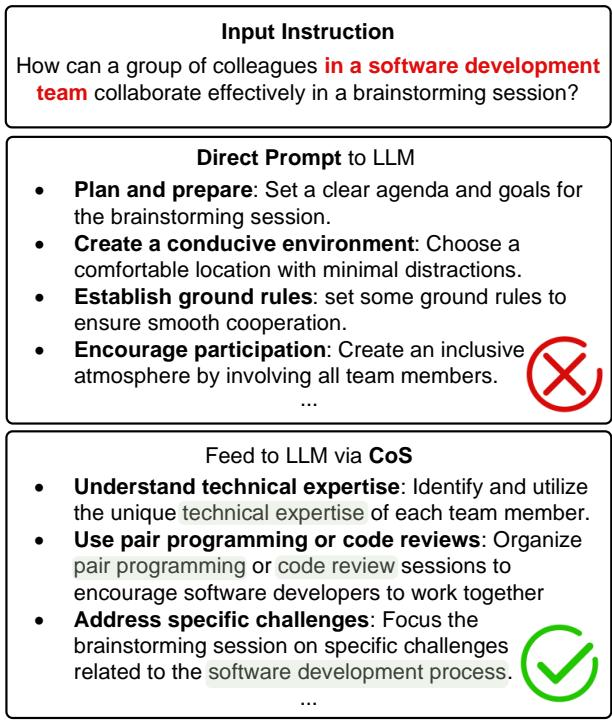  
Figure 1: The GPT-4 generation comparison between direct prompt method and Chain-of-Specificity (CoS). The direct prompt generate many generic responses, which could be broadly utilized in many other domain. In comparison, CoS generates more responses related to the specific constraint "software development team".

Recent studies (Huang et al., 2022; Sakaguchi et al., 2021) primarily concentrate on devising plans for general goals, which akin to stereotypical activities described in Abelson (2014), such as "How can colleagues collaborate". Those methods have illustrated the proficiency of LLMs in generating a sequence of responses that align with the given instructions. However, Yuan et al. (2023) found that LLMs sometimes fail to adhere strictly to specific constraints, which is defined as the multi-faceted and reasonable restrictions to the general goal. For example, as depicted in Fig. 1, even the strong LLM GPT-4 (OpenAI, 2023) still struggle to grasp the specific constraint "software development team". As a result, its responses are genetic and could be broadly utilized in many other domains, which dose not meet the requirement of the specific constraint. This ability to adhere to the constrains or details of the input instruction is crucial for many topics such as long-context LLMs (Chen et al., 2024) and retrieval augmented generation systems (Sachan et al., 2023).

However, how to address the issue of limited capacity in LLMs to capture specific constraints is under-exploit. There are methods such as decomposing input instructions into multiple sub-questions (Zhou et al., 2023; Wang et al., 2023a), rewriting the input instructions to improve understanding (Cheng et al., 2023; Deng et al., 2023), and reflecting on prior failings (Shinn et al., 2023; Yao et al., 2023). However, they fail to directly guide the model in comprehending the nuances of specific constraints. Furthermore, they overlook the exploration of the underlying knowledge within these constraints. For instance, the domain of programming is intricately linked to the context of software development.

Motivated by the findings in Yu et al. (2023) that LLMs contain enough knowledge for knowledgeintensive tasks, we introduce the Chain-of-Specificity (CoS) method to elicit the knowledge in LLMs and strengthen the ability of LLMs to follow the specific constraints. Specifically, it first identify the general goal and all the specific constraints in the input instruction. After that, it takes the specific constraints as the reasoning chain and iteratively emphasises on the specific constraints to elicit the knowledge embedded in LLMs, and then revises the responses. As illustrated in Fig. 1, with the CoS method, the responses contains more information (e.g., code review) about the specific constraint "software development team".

In the experiment, we evaluate the methods on the CoScript (Yuan et al., 2023) dataset and the brainstorming domain of the EXPLORE-INSTRUCT dataset (Wan et al., 2023) to validate the effectiveness of the proposed CoS method. Considering the limited quantity of specific constraints in those datasets, we further developed a new dataset named ConstrainSPEC. Both machine evaluation and human assessment have corroborated that CoS achieves superior performance in specific constraint environments. Notably, CoS still perform well as the number of specific constraint increases. In addition, we also conduct experiments on distilling the responses from different methods in ConstrainSPEC to smaller models, where the beat rate between those with CoS and those without distilling has reached 90.0. In summary, the contributions of this paper are:

1) We propose the Chain-of-Specificity (CoS) method by iteratively eliciting the knowledge embedded in LLMs and refining the output responses for the specific constraints from the instructions.

2) To stimulate the sophisticated constraint situation, we develop a new dataset named Constrain-SPEC, which contains more and complex specific constraints than other datasets.

3) We conduct experiments on the the relevant datasets. Both human and automatic evaluation illustrates the effectiveness of the CoS method. By leveraging the responses of different methods on LLMs, we endow the smaller models with better constrained instruction following ability.

## 2 Related Work

## 2.1 LLMs under Constrained Situations

Previous work (Huang et al., 2022) has shown that large language models (LLMs), such as GPT-3 (Brown et al., 2020), PaLM (Chowdhery et al., 2023), and GPT-4 (OpenAI, 2023) can effectively generate the answers based on the input instructions in a zero/few-shot manner. Meanwhile, a wide range of works (Huang et al., 2022; Yang et al., 2021) focus on generating results for stereotypical activities toward general goals. There is only few work focus on discussing the ability of LLMs under constrained situations. Yuan et al. (2023) collected a dataset named CoScript via overgeneratethen-filter, and then distill it to a smaller model. However, there are still some limitations: first, the specific constraint number in CoScript is limited, which is not quite suit for simulate the complex constrained instruction situations. Additionally, they only evaluated on the scripts domain, while our work expand to brainstorming aspect with more specific constraints. This shift is driven by the intuition that brainstorming tasks involve broader knowledge, and are more difficult and realistic.

## 2.2 Methods under Constrained Situations

Yuan et al. (2023) observed that LLMs sometimes do not adhere to the specific constraints. Some methods (Zhou et al., 2023; Xu et al., 2023; Wang et al., 2023a) focus on breaking down the chain from the input instructions and then solving the sub-problems. Besides, some methods (Cheng et al., 2023; Deng et al., 2023) seek to rewrite the input instructions to promote the understanding. And some methods (Shinn et al., 2023; Yao et al., 2023) modifies responses based on prior failings. However, those methods did not explicitly direct the LLMs to follow the specific constraints in the input instructions, or unlock their underlying knowledge. Based on the observation from Yu et al. (2023) that LLMs contain enough knowledge for knowledge-intensive tasks, we proposed Chain-of-Specificity (CoS). It takes the specific constraints as the chain’s clue and elicits the knowledge embedded in LLMs by iteratively emphasising on the specific constraints.

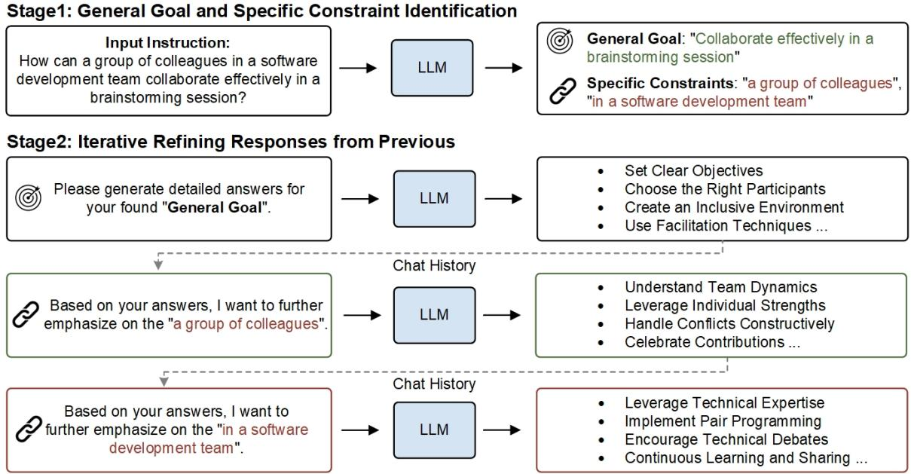  
Figure 2: The overview of the proposed Chain-of-Specificity (CoS).

## 3 Method

## 3.1 Preliminary

In this section, we clarify several key terminologies introduced by Yuan et al. (2023). A general goal refers to common activities, such as "How can colleagues collaborate". A specific goal is more nuanced, often incorporating additional constraints, such as "How can colleagues in a software development team collaborate." We diverge slightly from the original terminology by replacing ’specific goal with ’specific constraint’, as our experiments revealed that LLMs encounter difficulties in interpreting ’specific goals’.

## 3.2 Chain of Specificity (CoS)

To tackle the challenge that LLMs sometimes neglect the specific constraints within input instructions and respond with general or even wrong results, we introduce a simple yet effective method Chain-of-Specificity (CoS). As shown in Fig. 2, CoS encompasses two stages: (1) General goal and specific constraint identification, which aims at identifying the general goal and specific constraints within the input instruction, and (2) Iterative refining the responses from previous chat histories, which starts by generating a standard answer targeting the general goal, and then iteratively incorporates the underlying knowledge from specific constraints into the answers.

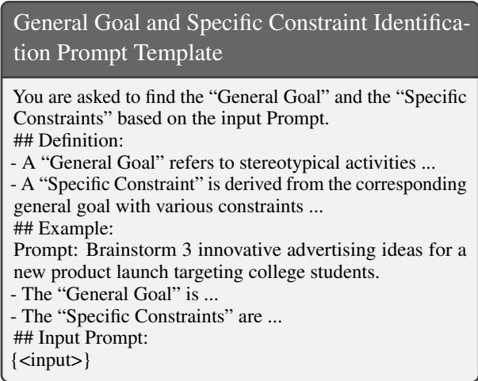  
Table 1: The prompt template for identifying general goal and specific constraints, where <input> is the placeholder for the input prompt.

In the first stage, CoS scrutinizes the input instruction to discern the general goal and the specific constraints. Take the example in Fig. 2 as an example, given the input instruction, CoS initially identifies the general goal as "Collaborate effectively in a brainstorming session", while the specific constraints are recognized as "a group of colleagues" and "in a software development team". The whole process is processed by asking the LLMs (e.g., GPT-4) and the example key structure prompt template is shown in Table 1.

Prompt Template for General Goal Answers   
Please generate detailed answers for your found "General   
Goal". The output should be as much elaborate as possible   
and in raw text format. Please provide a point by point   
description.  
Table 2: The prompt template for generating answers for general goal.

Prompt Template for Adding Specific Constraint   
Based on your answers, I want to further emphasize on   
the "<Specific\_constrain>". Please regenerate the detailed   
answer based on the former answers in text format. Please   
provide a detailed point by point description and do not   
respond any other content.  
Table 3: The prompt template for appending the specific constraints to the answers, where <Specific\_constrain> is the placeholder for the identified specific constraint in the first stage.

In the second stage, the process begins with the LLMs generating a set of diverse, general answers that align with the identified general goal. This ensures a broad coverage of potential answers. The prompt template for generating answers for the identified general goal is shown in Table 2. Subsequently, the method involves iteratively refining these answers by integrating one specific constraint at a time. The prompt for incorporating various specific constraints could be found in Table 3. Each round of CoS will further add emphasis on a specific constraint, while retaining the previous generation answers. This iteration will be stopped until all the specific constraints have been emphasised.

In CoS, we could ask the LLMs to generate intermediate results at once through a single round of dialogue, or we can gradually let the LLMs emphasize specific constraint through multiple rounds of dialogue. Please find the whole prompt from CoS in Appendix A.1 and A.2.

<table><tr><td>Dataset</td><td>Methods</td><td>General Scores</td></tr><tr><td rowspan="2">CoScript</td><td>Direct prompt</td><td>4.86</td></tr><tr><td>CoS-multi-step</td><td>4.84</td></tr><tr><td>EXPLORE</td><td>Direct prompt</td><td>4.68</td></tr><tr><td>INSTRUCT</td><td>CoS-multi-step</td><td>4.75</td></tr></table>

Table 4: The automatic evaluation results of general scores on two public datasets via GPT-4.

<table><tr><td>Dataset</td><td>Average Specific Constraint Num</td></tr><tr><td>CoScript</td><td>1.00</td></tr><tr><td>EXPLORE-INSTRUCT</td><td>1.34</td></tr><tr><td>ConstrainSPEC</td><td>2.32</td></tr></table>

Table 5: The specific constraint number comparison between different datasets, where ConstrainSPEC contains more specific constraints.

## 4 ConstrainSPEC with More Specific Constraints

## 4.1 Pilot Experiment

To assess the models’ comprehension of specific constraints, we initially select the CoScript (Yuan et al., 2023) and the brainstorming domain in EXPLORE-INSTRUCT (Wan et al., 2023) as our evaluation datasets. The experimental results presented in Table 4 reveal that inputting the raw prompt (direct prompt) into GPT-4 without any additional mechanisms, yields impressive results. This suggests that these two datasets are not particularly challenging, and GPT-4 is able to accurately interpret the specific constraints in their instructions. To delve deeper into the nature of these specific constraints, we quantify the average number of specific constraints present in both datasets. Specifically, we employ the prompt template shown in Table 1 to determine the number of specific constraints in each instruction, eventually calculating the average per instruction. The experiment is shown in Table 5, which indicates that both Co-Script and EXPLORE-INSTRUCT contain averagely only about one specific constraint. All those findings demonstrate existing datasets lack of a substantial number of specific constraints, rendering them inadequate for simulating scenarios with complex and multiple specific constraints.

## 4.2 Dataset Construction

To address the limitations identified earlier and more rigorously test the methods in intricate scenarios, particularly those involving numerous specific constraints, we develop a new dataset named ConstrainSPEC. The dataset was constructed as follows: we first randomly selected 1,000 instructions from the brainstorming section of the EXPLORE-INSTRUCT dataset. We then prompted large language models (LLMs) to enrich these instructions, adding greater complexity and incorporating more specific constraints. The example template used for dataset construction is presented in Table 6, and the detailed prompt can be found in Appendix A.3. The resulting 1,000 samples constitute the Constrain-SPEC test set. To ensure data quality, we recruited three Chinese annotators who had passed the CET-6 exam, ensuring their ability to comprehend the English instructions. And then we randomly selected 300 samples for manual review, where the annotators assessed fluency, coherence, and logical consistency. The data quality validation process continued until all factors met satisfactory criteria.

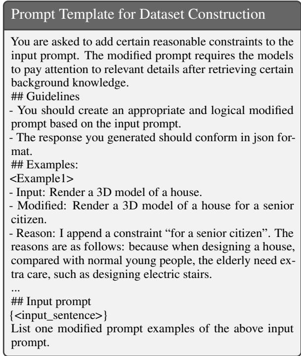  
Table 6: Dataset construction template, where <input\_sentence> means the raw input instruction.

## 4.3 Dataset Analyse

As shown in Table 5, the averaged specific constraint number of ConstrainSPEC is higher than the other two datasets. To better showcase its statistics, we conduct a detailed analysis. Specifically, following Yuan et al. (2023), we visualized the data by plotting the initial word of the top 20 added specific constraints. As shown in Fig. 3, we could find a significant portion of the added specific constraints pertains to intent (e.g., for) or method (e.g., in or with) categories according to the taxonomy in Probase (Wu et al., 2012). Moreover, there is a notable prevalence of subordinate clauses, as indicated by the frequent use of commas, the word "that", and other similar linguistic markers. This suggests that constraints are semantically specific and syntactically complex.

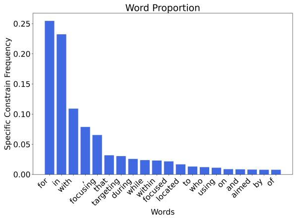

Figure 3: The initial words of the added specific constraints in ConstrainSPEC test set.
<table><tr><td>Methods</td><td>Win:Tie:Lose</td><td>Beat Rate</td></tr><tr><td>CoS-one-step vs Direct prompt</td><td>287:567:146</td><td>66.3</td></tr><tr><td>CoS-multi-step vs Direct prompt</td><td>333:524:143</td><td>69.5</td></tr></table>

Table 7: The pairwise automatic evaluation results on the EXPLORE-INSTRUCT dataset.

## 5 Distilling to Smaller Models

As demonstrated in Fig.1, the advanced GPT-4 model still faces challenges in adhering to specific constraints, a problem that is accentuated in smaller-scale models. This issue is further evidenced by the experiments shown in Table 8, which reveals the struggles of smaller LLMs like Vicuna-13b (Zheng et al., 2023) and Llama2-Chat-13b (Touvron et al., 2023) in grasping specific constraints. In this section, we aim to augment these smaller LLMs’ capabilities to respect such constraints more effectively.

To this end, we generate 5,000 samples using the dataset construction template outlined in Table 6 on the EXPLORE-INSTRUCT dataset, and set them as the training set of ConstrainSPEC. Please note that there is no overlap between these 5,000 samples and the generated test set. We then feed the ConstrainSPEC training dataset to larger LLMs (e.g., GPT-4) and let them generate responses through two prompt methods: (1) CoSmulti-step prompt, employing the proposed CoS method with multiple reasoning steps; (2) direct prompt, directly inputting the instructions. After that, the responses of larger LLMs generated from these methods are subsequently used for training smaller LLMs via supervised fine-tuning.

## 6 Experiment

## 6.1 Baseline

In the experiment, we leverage GPT-4 (OpenAI, 2023) with the gpt-4-1106-preview version as the base LLM. We compare with the strong baselines and utilize their official prompt templates for reasoning: (1) Direct prompt: Naive prompting to generate the responses; (2) CoT (Wei et al., 2022): Automatic generation of series of intermediate reasoning steps from LLMs with prompt "let’s think step by step"; (3) Take-a-breath (Yang et al., 2023): Enhanced CoT by prompting "Take a deep breath"; (4) Least-to-Most (Zhou et al., 2023): First automatically decomposing the inhand problems into series of simpler sub-problems, and then each one sequentially; (5) Plan-and-Solve (Wang et al., 2023a): Enhanced CoT by guiding LLMs to devise the plan before solving the problems; (6) Re-Reading (Xu et al., 2023): Entails revisiting the question information embedded within input prompts; (7) RaR-one-step (Deng et al., 2023): Rephrase and expand questions posed by humans and provide responses in a single prompt in a single response; (8) RaR-multi-step (Deng et al., 2023): Rephrase the question and respond the rephrased question in multiple steps; (9) BPO (Cheng et al., 2023): Rewrite user prompts to suit LLMs’ input understanding; (10) Reflexion (Shinn et al., 2023): Reinforce language agents through linguistic feed back with CoT; (11) ReAct (Yao et al., 2023): Ask LLMs to make task-specific actions in an interleaved manner; (12) CoS-one-step: The proposed CoS method that combines identifying general goal, specific constraints, and adding the specific con straints to the answers in a single response; (13) CoS-multi-step: The proposed CoS method itera tively adds the specific constraints to the answers in different steps at different stages.

## 6.2 Automatic Evaluation

To evaluate the performance of the methods, we follow Chen et al. (2023) and Wan et al. (2023) to conduct an automatic evaluation with GPT-4. Specifically, we adopt (1) general scores evaluation (1 for the worst and 5 for the best), which aims to capture the qualities of the generated results. Please refer to Appendix A.4 for the prompts and the standards used to solicit scores. (2) pairwise evaluation, where given an instruction and two responses from different methods, we request GPT-4 to determine which response is better based on their understanding of the general goal and specific constraints. Refer to Appendix A.5 for the prompt for pairwise evaluation. Moreover, to calculate the beat rate of a particular model, we divide the number of times the model wins by the sum of the number of times the model wins and loses. Please refer to Appendix A.7 for more details about the automatic evaluation settings.

<table><tr><td>Methods</td><td>Automatic Human</td></tr><tr><td>Vicuna-13b</td><td></td></tr><tr><td>Direct prompt 3.82</td><td>3.51</td></tr><tr><td>Llama2-Chat-13b</td><td></td></tr><tr><td>Direct prompt 4.23</td><td>4.09</td></tr><tr><td>GPT-4</td><td></td></tr><tr><td>Direct prompt 4.47 CoT 4.54</td><td>4.34</td></tr><tr><td></td><td>4.26</td></tr><tr><td>Take-a-breath 4.55 4.51</td><td>4.38</td></tr><tr><td>Re-Reading Plan-and-Solve</td><td>4.37</td></tr><tr><td>4.59 Least-to-Most 4.57</td><td>4.36</td></tr><tr><td>BPO 4.63</td><td>4.50</td></tr><tr><td>4.66</td><td>4.55</td></tr><tr><td>Reflexion</td><td>4.61</td></tr><tr><td>ReAct 4.65 4.52</td><td>4.56</td></tr><tr><td>RaR-one-step</td><td>4.52</td></tr><tr><td>CoS-one-step</td><td>4.59 4.57</td></tr><tr><td>RaR-multi-step 4.66</td><td>4.59</td></tr><tr><td></td><td></td></tr><tr><td>CoS-multi-step 4.80</td><td>4.69</td></tr></table>

Table 8: The automatic and human evaluation results of general scores on the ConstrainSPEC dataset.

Experiments on EXPLORE-INSTRUCT. We conduct the experiments on the EXPLORE-INSTRUCT to exam the generalization of CoS. The experiment results are shown in Table 4 and Table 7. We could find that both the direct prompt and CoS method show great performance on the EXPLORE-INSTRUCT dataset. Meanwhile, compared to the experiment results on ConstrainSPEC in Table 8 that containing more specific constraints, the general score of direct prompt on EXPLORE-INSTRUCT is much higher. Those findings supports our hypothesis that the original datasets, with its limited number of specific constraints, may not adequately simulate more complex scenarios. Furthermore, the experimental results also indicate that the CoS method outperforms the direct prompt approach. This underscores CoS’s robustness and adaptability in scenarios where the number of specific constraints is inherently limited.

Experiments on ConstrainSPEC. We conduct experiments on the test set of ConstrainSPEC dataset, which is more complex and has more specific constraints. From the experiment results in Table 8, we could observe that (1) CoS outperforms other strong methods, indicating its superiority in complex specific constraint situations; (2) The promotion of those methods such as CoT is not significant. This is possibly because that it tents to generate intermediate results while skimming over specific responses; (3) Those methods utilizing the multistep (such as Reflexion) for generating answering typically have greater general scores. A key reason is that they could consider the history information during generation. In addition, the results in Fig. 4 also reveal that most baselines outperform the direct prompt, and the proposed CoS method has greater beat rate other strong methods. For example, the beat rate of CoS-multi-step vs direct prompt is 65.4%, showing the superiority of CoS in the complex specific constraint situations.

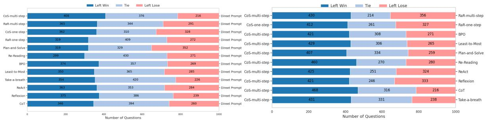  
Figure 4: The pairwise automatic evaluation results on ConstrainSPEC test set.

<table><tr><td>Methods</td><td>Win:Tie:Lose</td><td>Beat Rate</td></tr><tr><td colspan="3">Vicuna-13b</td></tr><tr><td>CoS-multi-step vs Direct prompt</td><td>402:280:318</td><td>55.8</td></tr><tr><td>CoS-multi-step vs w/o distill</td><td>659:268:73</td><td>90.0</td></tr><tr><td>Direct prompt vs w/o distill</td><td>668:205:127</td><td>84.0</td></tr><tr><td colspan="3">Llama2-Chat-13b</td></tr><tr><td>CoS-multi-step vs Direct prompt</td><td>373:310:317</td><td>54.0</td></tr><tr><td>CoS-multi-step vs w/o distill</td><td>437:332:231</td><td>65.4</td></tr><tr><td>Direct prompt vs w/o distill</td><td>405:331:264</td><td>60.5</td></tr></table>

Table 9: The pairwise automatic evaluation results on distilling for two smaller LLMs.

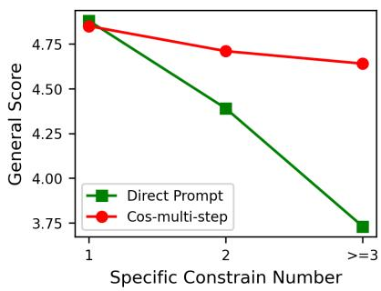  
Figure 5: The automatic evaluated general scores under different specific constraint number situations.

<table><tr><td>Methods</td><td>P</td><td>R</td><td>F1</td></tr><tr><td>CoS-one-step</td><td>95.3</td><td>96.1</td><td>95.7</td></tr><tr><td>CoS-multi-step</td><td>96.5</td><td>97.8</td><td>97.1</td></tr></table>

Table 10: The manually check performance of identifying the specific constrains across different models.

Experiments with Different Specific Constraint Number. As shown in Fig. 5, we explored the model’s performance across various numbers of specific constraints on the ConstrainSPEC test set. It can be observed that while the direct prompt approach achieved commendable performance when the number of specific constraints was limited to one, its performance significantly deteriorated with the increase in the number of specific constraints. However, the CoS-multi-step approach maintained a relatively stable performance across different specific constraint settings, demonstrating the effectiveness of the CoS under complex specific constraint situations.

Experiments on Distilling to Smaller Models. We conduct experiments on distilling knowledge from larger LLMs to the smaller LLMs. We select Vicuna-13b (Zheng et al., 2023) and Llama2-Chat-13b (Touvron et al., 2023) since they are typical smaller LLMs. We employ two prompt strategies on GPT-4 to generate the responses: (1) CoS-multistep, (2) direct prompt, and we also provide (3) w/o distill, where the smaller LLMs are tested directly without distillation. The detailed distillation experiment settings are shown in Appendix A.8. The results in Table 9 on the ConstrainSPEC test set indicate: compared to w/o distill, other methods have marked promotion in the smaller models’ capabilities to adhere to constrained instructions, validating the effectiveness of the distillation strategy and the responses quality from different prompt methods. Moreover, the data shows a beat rate of 55.8% favoring the CoS-multi-step over direct prompting, signifying the superiority of the CoS methods’ responses in guiding smaller models toward more accurate compliance with specific instructions.

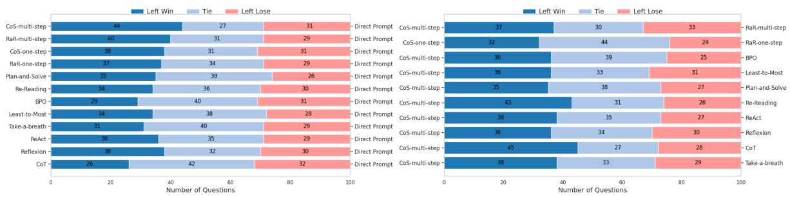  
Figure 6: The pairwise human evaluation results on ConstrainSPEC test set.

## 6.3 Human Evaluation

For a thorough and unbiased evaluation, we randomly selected 100 ConstrainSPEC samples for human evaluation. Specifically, we invite three Chinese annotators who have passed the CET-6 to (1) Give a general score for each responses based on the same standard as automatic evaluation; (2) Compare responses from two methods to the same instruction, judging which model performed better (win, tie, or lose). Please refer to Appendix A.9 for the details of human evaluation process.

Tabel 8 and Fig. 6 show the results of the human evaluation. The comparison between the human and automatic evaluations demonstrates a general consistency, where the Fleiss’s K (Fleiss et al., 1981) is 0.73. It indicates that the automatic evaluation is also qualitatively well-regarded by humans, illustrating the reliability of the automatic evaluation. The results demonstrate that CoS demonstrates superiority over other baselines, and notably, direct prompts exceed Reflexion in the brainstorming task. After manually checking the generated results, we find Reflexion sometimes tends to reward generic answers, which dose not contributes to increase the comprehension of input instructions. Specific Constraint Identification. To explore the performance of CoS on finding the specific constrains, we further ask the annotators to manually check the selected 100 samples from the Constrain-SPEC. Specifically, we regard each specific constrain as a whole and evaluate the results in Precision (P), Recall (R), and F1 metrics. As shown in Table 10, we could find that both CoS-one-step and CoS-multi-step could effectively find the specific constrains, and the latter outperforms the former. A possible reason is that CoS-one-step needs to simultaneously identify specific constrains and generate answers, which may affect performance.

<table><tr><td>Input Instruction</td><td>CoS-multi-step</td></tr><tr><td>Brainstorm ways to improve employee morale in a healthcare healthcare employees to learn new skills,</td><td>1. Address staffing issues: Ensure ap- propriate staff-to-patient ratios to re- duce stress and burnout. ... 3. Cross- training opportunities: Encourage and offer cross-training opportunities for</td></tr></table>

Table 11: Case study experiment. The specific constraints are in red, the relevant responses are in green.

Case Study. As shown in Table 11, we select several typical cases to illustrate the effectiveness of the proposed CoS method. For example, when the input instruction contains specific constraint "in a healthcare setting", the proposed CoS-multi-step successfully elicits the background knowledge in LLMs, and the contents such as "staff-to-patient ratios" in the response are more in line with the specific constraint "healthcare". Please refer to Appendix A.6 for the full results.

## 7 Conclusion

To increase LLMs’ ability to follow the specific constraints in the input instructions, we propose Chain-of-Specificity (CoS) by iteratively emphasising on the specific constraints, eliciting knowledge in LLMs, and refining the responses. To better stimulate the complex constraint situations, we further propose a new dataset named Constrain-SPEC, containing more and complex specific constraints. Experiments on the public and self-build datasets illustrate the effectiveness of CoS to direct LLMs to adhere to specific constraints. Moreover, the smaller models are equipped with better constrained instruction following ability by distilling the responses from CoS.

## Acknowledgments

The work is supported by the National Natural Science Foundation of China (62206267 and 62176029), China Postdoctoral Science Foundation Funded Project (2024M763867), Chongqing Key Project of Technological Innovation and Application Development (CSTB2023TIAD-KPX0064).

## Limitation

In the automatic evaluation experiments, we employed GPT-4 as the evaluator to assign general scores and perform pair-wise comparisons. However, this approach may introduce bias due to the hallucination problem inherent in LLMs. To mitigate this, we also conducted human evaluations, though this process proved to be time-consuming. In the future, we plan to explore more effective methods that combine the strengths of both automatic and human evaluations while minimizing their respective limitations.

## Ethics Statement

Understanding the paramount importance of information security in the development and application of LLMs, our study prioritizes the ethical sourcing and handling of data. The source data for our research is derived exclusively from the opensource dataset EXPLORE-INSTRUCT, which is publicly available and does not contain any personally identifiable information or sensitive data. This approach ensures that our research adheres to privacy and data protection standards, minimizing risks associated with data misuse.

The potential for LLMs to generate content that could be considered toxic or harmful has been documented in previous studies. Acknowledging this risk, we have taken proactive measures to mitigate the possibility of such outcomes in our work. It is important to clarify that our dataset, while comprehensive, is not designed for use in safety-critical applications or as a substitute for specialized, expert advice in sensitive domains. The purpose of our dataset is to facilitate research and development in specific, non-critical areas of natural language processing.

To further ensure the integrity and safety of the data used in our study, annotators were given explicit instructions to identify and exclude any content that could be deemed offensive, harmful, or otherwise inappropriate during the review process of the test set in ConstrainSPEC. This careful curation process is part of our commitment to responsible research practices and contributes to the overall quality and reliability of our dataset.

Moreover, we explicitly state that any research outcomes or applications derived from this study are intended strictly for academic and research purposes. We do not authorize the use of our findings or the ConstrainSPEC dataset for commercial purposes without proper oversight and ethical considerations.

## References

Robert P Abelson. 2014. Script processing in attitude formation and decision making. In Cognition and social behavior, pages 33–45. Psychology Press.

Tom B. Brown, Benjamin Mann, Nick Ryder, Melanie Subbiah, Jared Kaplan, Prafulla Dhariwal, Arvind Neelakantan, Pranav Shyam, Girish Sastry, Amanda Askell, Sandhini Agarwal, Ariel Herbert-Voss, Gretchen Krueger, Tom Henighan, Rewon Child, Aditya Ramesh, Daniel M. Ziegler, Jeffrey Wu, Clemens Winter, Christopher Hesse, Mark Chen, Eric Sigler, Mateusz Litwin, Scott Gray, Benjamin Chess, Jack Clark, Christopher Berner, Sam McCandlish, Alec Radford, Ilya Sutskever, and Dario Amodei. 2020. Language models are few-shot learners. In Advances in Neural Information Processing Systems 33: Annual Conference on Neural Information Processing Systems 2020, NeurIPS 2020, December 6-12, 2020, virtual.

Yukang Chen, Shengju Qian, Haotian Tang, Xin Lai, Zhijian Liu, Song Han, and Jiaya Jia. 2024. Longlora: Efficient fine-tuning of long-context large language models. In The Twelfth International Conference on Learning Representations, ICLR 2024, Vienna, Austria, May 7-11, 2024. OpenReview.net.

Zhihong Chen, Feng Jiang, Junying Chen, Tiannan Wang, Fei Yu, Guiming Chen, Hongbo Zhang, Juhao Liang, Chen Zhang, Zhiyi Zhang, Jianquan Li, Xiang Wan, Benyou Wang, and Haizhou Li. 2023. Phoenix: Democratizing chatgpt across languages. CoRR, abs/2304.10453.

Jiale Cheng, Xiao Liu, Kehan Zheng, Pei Ke, Hongning Wang, Yuxiao Dong, Jie Tang, and Minlie Huang. 2023. Black-box prompt optimization: Aligning large language models without model training. CoRR, abs/2311.04155.

Aakanksha Chowdhery, Sharan Narang, Jacob Devlin, Maarten Bosma, Gaurav Mishra, Adam Roberts, Paul Barham, Hyung Won Chung, Charles Sutton, Sebastian Gehrmann, et al. 2023. Palm: Scaling language modeling with pathways. Journal of Machine Learning Research, 24(240):1–113.

Yihe Deng, Weitong Zhang, Zixiang Chen, and Quanquan Gu. 2023. Rephrase and respond: Let large language models ask better questions for themselves. CoRR, abs/2311.04205.

Jacob Devlin, Ming-Wei Chang, Kenton Lee, and Kristina Toutanova. 2019. BERT: pre-training of deep bidirectional transformers for language understanding. In Proceedings ofthe 2019 Conference of the North American Chapter of the Association for Computational Linguistics: Human Language Technologies, NAACL-HLT 2019, Minneapolis, MN, USA, June 2-7, 2019, Volume 1 (Long and Short Papers), pages 4171–4186. Association for Computational Linguistics.

Joseph L Fleiss, Bruce Levin, Myunghee Cho Paik, et al. 1981. The measurement of interrater agreement. Statistical methodsfor rates and proportions, 2(212- 236):22–23.

Wenlong Huang, Pieter Abbeel, Deepak Pathak, and Igor Mordatch. 2022. Language models as zero-shot planners: Extracting actionable knowledge for embodied agents. In International Conference on Machine Learning, ICML 2022, 17-23 July 2022, Baltimore, Maryland, USA, volume 162 of Proceedings of Machine Learning Research, pages 9118–9147. PMLR.

Alexander Kovalchuk, Shashank Shekhar, and Ronen I. Brafman. 2021. Verifying plans and scripts for robotics tasks using performance level profiles. In Proceedings ofthe Thirty-First International Conference on Automated Planning and Scheduling, ICAPS 2021, Guangzhou, China (virtual), August 2-13, 2021, pages 673–681. AAAI Press.

Haoran Lian, Yizhe Xiong, Zijia Lin, Jianwei Niu, Shasha Mo, Hui Chen, Peng Liu, and Guiguang Ding. 2024a. Lbpe: Long-token-first tokenization to improve large language models. arXiv preprint arXiv:2411.05504.

Haoran Lian, Yizhe Xiong, Jianwei Niu, Shasha Mo, Zhenpeng Su, Zijia Lin, Peng Liu, Hui Chen, and Guiguang Ding. 2024b. Scaffold-bpe: Enhancing byte pair encoding with simple and effective scaffold token removal. CoRR, abs/2404.17808.

OpenAI. 2023. Gpt-4 technical report. ArXiv, abs/2303.08774.

Jeff Rasley, Samyam Rajbhandari, Olatunji Ruwase, and Yuxiong He. 2020. Deepspeed: System optimizations enable training deep learning models with over 100 billion parameters. In KDD ’20: The 26th ACM SIGKDD Conference on Knowledge Discovery and Data Mining, Virtual Event, CA, USA, August 23-27, 2020, pages 3505–3506. ACM.

Devendra Singh Sachan, Mike Lewis, Dani Yogatama, Luke Zettlemoyer, Joelle Pineau, and Manzil Zaheer. 2023. Questions are all you need to train a dense passage retriever. Trans. Assoc. Comput. Linguistics, 11:600–616.

Keisuke Sakaguchi, Chandra Bhagavatula, Ronan Le Bras, Niket Tandon, Peter Clark, and Yejin Choi. 2021. proscript: Partially ordered scripts generation. In Findings of the Association for Computational Linguistics: EMNLP 2021, Virtual Event / Punta Cana, Dominican Republic, 16-20 November, 2021, pages 2138–2149. Association for Computational Linguistics.

Noah Shinn, Federico Cassano, Ashwin Gopinath, Karthik Narasimhan, and Shunyu Yao. 2023. Reflexion: language agents with verbal reinforcement learning. In Advances in Neural Information Processing Systems 36: Annual Conference on Neural Information Processing Systems 2023, NeurIPS 2023, New Orleans, LA, USA, December 10 - 16, 2023.

Hugo Touvron, Louis Martin, Kevin Stone, Peter Albert, Amjad Almahairi, Yasmine Babaei, Nikolay Bashlykov, Soumya Batra, Prajjwal Bhargava, Shruti Bhosale, Dan Bikel, Lukas Blecher, Cristian Canton-Ferrer, Moya Chen, Guillem Cucurull, David Esiobu, Jude Fernandes, Jeremy Fu, Wenyin Fu, Brian Fuller, Cynthia Gao, Vedanuj Goswami, Naman Goyal, Anthony Hartshorn, Saghar Hosseini, Rui Hou, Hakan Inan, Marcin Kardas, Viktor Kerkez, Madian Khabsa, Isabel Kloumann, Artem Korenev, Punit Singh Koura, Marie-Anne Lachaux, Thibaut Lavril, Jenya Lee, Diana Liskovich, Yinghai Lu, Yuning Mao, Xavier Martinet, Todor Mihaylov, Pushkar Mishra, Igor Molybog, Yixin Nie, Andrew Poulton, Jeremy Reizenstein, Rashi Rungta, Kalyan Saladi, Alan Schelten, Ruan Silva, Eric Michael Smith, Ranjan Subramanian, Xiaoqing Ellen Tan, Binh Tang, Ross Taylor, Adina Williams, Jian Xiang Kuan, Puxin Xu, Zheng Yan, Iliyan Zarov, Yuchen Zhang, Angela Fan, Melanie Kambadur, Sharan Narang, Aurélien Rodriguez, Robert Stojnic, Sergey Edunov, and Thomas Scialom. 2023. Llama 2: Open foundation and finetuned chat models. CoRR, abs/2307.09288.

Fanqi Wan, Xinting Huang, Tao Yang, Xiaojun Quan, Wei Bi, and Shuming Shi. 2023. Explore-instruct: Enhancing domain-specific instruction coverage through active exploration. In Proceedings of the 2023 Conference on Empirical Methods in Natural Language Processing, EMNLP 2023, Singapore, December 6-10, 2023, pages 9435–9454. Association for Computational Linguistics.

Lei Wang, Wanyu Xu, Yihuai Lan, Zhiqiang Hu, Yunshi Lan, Roy Ka-Wei Lee, and Ee-Peng Lim. 2023a. Plan-and-solve prompting: Improving zeroshot chain-of-thought reasoning by large language models. arXiv preprint arXiv:2305.04091.

Xuezhi Wang, Jason Wei, Dale Schuurmans, Quoc V. Le, Ed H. Chi, Sharan Narang, Aakanksha Chowdhery, and Denny Zhou. 2023b. Self-consistency improves chain of thought reasoning in language models. In The Eleventh International Conference on Learning Representations, ICLR 2023, Kigali, Rwanda, May 1-5, 2023. OpenReview.net.

Jason Wei, Xuezhi Wang, Dale Schuurmans, Maarten Bosma, Brian Ichter, Fei Xia, Ed H. Chi, Quoc V. Le,

and Denny Zhou. 2022. Chain-of-thought prompting elicits reasoning in large language models. In NeurIPS.

Wentao Wu, Hongsong Li, Haixun Wang, and Kenny Qili Zhu. 2012. Probase: a probabilistic taxonomy for text understanding. In Proceedings ofthe ACM SIGMOD International Conference on Management ofData, SIGMOD 2012, Scottsdale, AZ, USA, May 20-24, 2012, pages 481–492. ACM.

Yizhe Xiong, Hui Chen, Tianxiang Hao, Zijia Lin, Jungong Han, Yuesong Zhang, Guoxin Wang, Yongjun Bao, and Guiguang Ding. 2025. Pyra: Parallel yielding re-activation for training-inference efficient task adaptation. In European Conference on Computer Vision, pages 455–473. Springer.

Yizhe Xiong, Xiansheng Chen, Xin Ye, Hui Chen, Zijia Lin, Haoran Lian, Zhenpeng Su, Jianwei Niu, and Guiguang Ding. 2024. Temporal scaling law for large language models. arXiv preprint arXiv:2404.17785.

Xiaohan Xu, Chongyang Tao, Tao Shen, Can Xu, Hongbo Xu, Guodong Long, and Jianguang Lou. 2023. Re-reading improves reasoning in language models. CoRR, abs/2309.06275.

Chengrun Yang, Xuezhi Wang, Yifeng Lu, Hanxiao Liu, Quoc V. Le, Denny Zhou, and Xinyun Chen. 2023. Large language models as optimizers. CoRR, abs/2309.03409.

Yue Yang, Joongwon Kim, Artemis Panagopoulou, Mark Yatskar, and Chris Callison-Burch. 2021. Induce, edit, retrieve: Language grounded multimodal schema for instructional video retrieval. CoRR, abs/2111.09276.

Shunyu Yao, Jeffrey Zhao, Dian Yu, Nan Du, Izhak Shafran, Karthik R. Narasimhan, and Yuan Cao. 2023. React: Synergizing reasoning and acting in language models. In The Eleventh International Conference on Learning Representations, ICLR 2023, Kigali, Rwanda, May 1-5, 2023. OpenReview.net.

Wenhao Yu, Dan Iter, Shuohang Wang, Yichong Xu, Mingxuan Ju, Soumya Sanyal, Chenguang Zhu, Michael Zeng, and Meng Jiang. 2023. Generate rather than retrieve: Large language models are strong context generators. In The Eleventh International Conference on Learning Representations, ICLR 2023, Kigali, Rwanda, May 1-5, 2023. Open-Review.net.

Siyu Yuan, Jiangjie Chen, Ziquan Fu, Xuyang Ge, Soham Shah, Charles Robert Jankowski, Yanghua Xiao, and Deqing Yang. 2023. Distilling script knowledge from large language models for constrained language planning. In Proceedings of the 61st Annual Meeting ofthe Associationfor Computational Linguistics (Volume 1: Long Papers), ACL 2023, Toronto, Canada, July 9-14, 2023, pages 4303–4325. Association for Computational Linguistics.

Lianmin Zheng, Wei-Lin Chiang, Ying Sheng, Siyuan Zhuang, Zhanghao Wu, Yonghao Zhuang, Zi Lin, Zhuohan Li, Dacheng Li, Eric P. Xing, Hao Zhang, Joseph E. Gonzalez, and Ion Stoica. 2023. Judging llm-as-a-judge with mt-bench and chatbot arena. CoRR, abs/2306.05685.

Denny Zhou, Nathanael Schärli, Le Hou, Jason Wei, Nathan Scales, Xuezhi Wang, Dale Schuurmans, Claire Cui, Olivier Bousquet, Quoc V. Le, and Ed H. Chi. 2023. Least-to-most prompting enables complex reasoning in large language models. In The Eleventh International Conference on Learning Representations, ICLR 2023, Kigali, Rwanda, May 1-5, 2023. OpenReview.net.

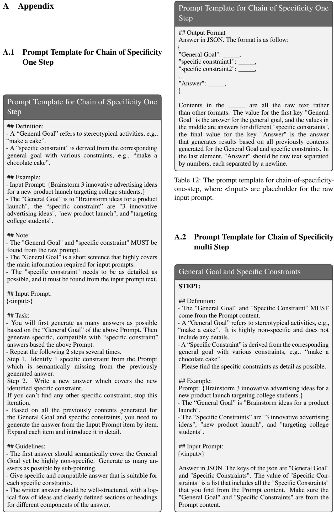

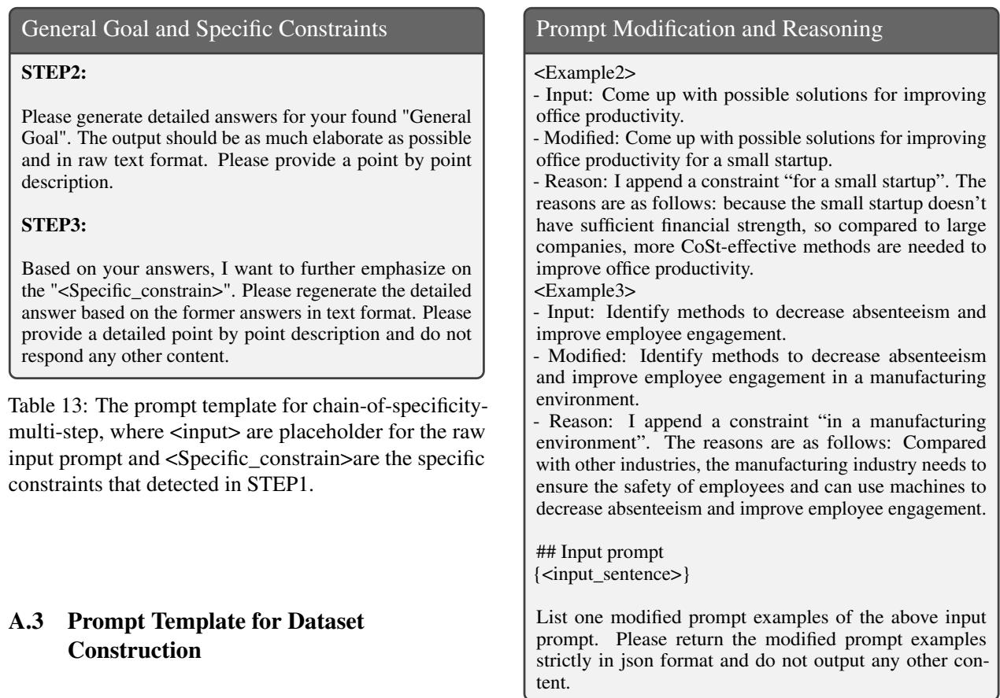

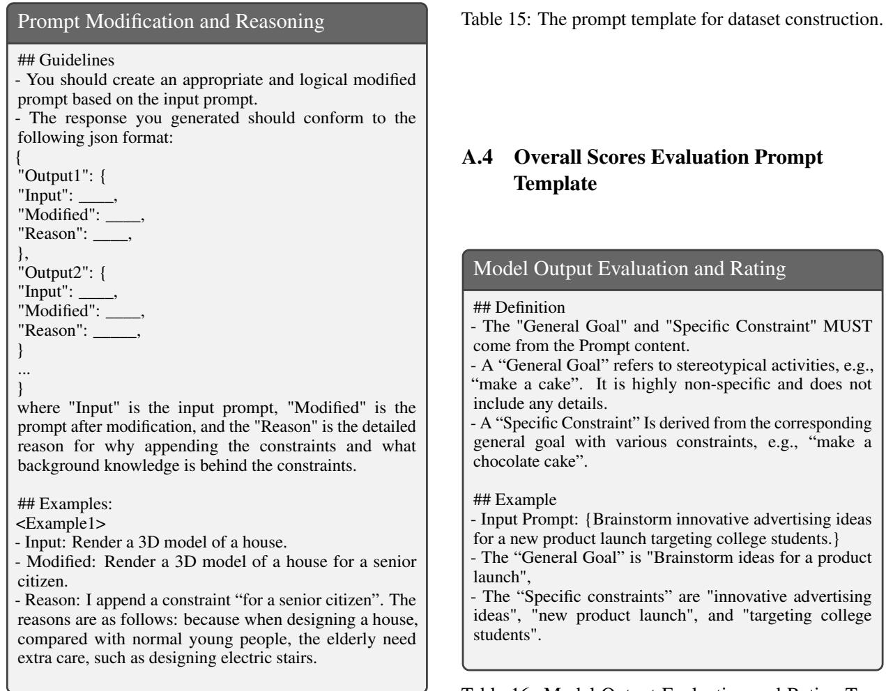  
Table 14: The prompt template for dataset construction.  
Table 16: Model Output Evaluation and Rating Template.

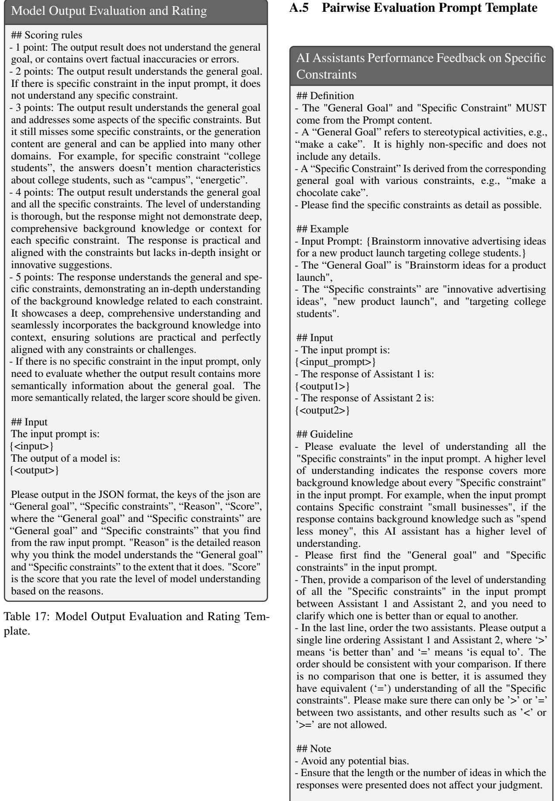  
Table 18: AI Assistants Performance Feedback on Understanding Specific Constraints.

AI Assistants Performance Feedback on Specific   
Constraints   
## Note   
- Pay attention to the understanding of the background   
knowledge from the "Specific constraints".  
Table 19: AI Assistants Performance Feedback on Understanding Specific Constraints.

## A.6 Case Study

Please refer to Table 20 for several typical cases. We could observe that the proposed CoS could respond with more underlying knowledge about the mentioned specific constraints.

## A.7 The Details About the Automatic Evaluation

In order to avoid the bias from the order of inputs in the evaluation prompt, we switch the order of the two responses and request GPT-4 to generate results twice, and then average the two experimental results. For instance, if a response results are win and lose on two assessments, respectively, the average result of this response is tie.

## A.8 The Details About the Distilling Experiment

We used the publicly available checkpoints of Vicuna-13b (Zheng et al., 2023) and Llama2-Chat-13b (Touvron et al., 2023) on Huggingface. We also use Deepspeed ZeRO stage 2 (Rasley et al., 2020) and BFloat16 mixed precision techniques to optimize memory usage and accelerate training. The training was conducted with a batch size of 32, a learning rate of 1e-5, and a maximum length setting of 2,048 tokens. All models were trained on 8 Tesla A100-80G GPUs.

## A.9 The Details About the Human Evaluation Process

To ensure a comprehensive and unbiased evaluation, we randomly selected 100 ConstrainSPEC samples for human assessment. We recruited three professional, full-time Chinese annotators for this task. Prior to the evaluation, we provided detailed guidelines outlining the concepts of "general goal" and "specific constraint" and conducted centralized training for the annotators. The annotators were instructed to: (1) assign a general score to each response using the same criteria as the automatic evaluation; and (2) compare responses from two methods for the same instruction, determining which model performed better (win, tie, or lose). To eliminate bias, the model identities were anonymized, and the annotators were kept unaware of the source of each response. All annotators had passed the CET-6 exam. Additionally, they were instructed to use Google Translate to convert the English responses into Chinese to double-check their judgments.

<table><tr><td rowspan=1 colspan=1>Input Instruction</td><td rowspan=1 colspan=1>Direct Prompt</td><td rowspan=1 colspan=1>CoS-multi-step</td></tr><tr><td rowspan=1 colspan=1>Brainstorm ways toimprove employeemorale in a healthcaresetting.</td><td rowspan=1 colspan=1>1. Recognize and reward employees: Implementa system to acknowledge and reward employeesfor their hard work and dedication. $\ldots { 2 } .$ Öfferprofessional development opportunities: Provideongoing opportunities for employees to developand improve their skills. $\cdots 3 .$ Create a positivework environment: Ensure that the workplaceis a comfortable and happy space by providingergonomic furniture, etc. ..</td><td rowspan=1 colspan=1>1. Address staffing issues: Ensure appropri-ate staff-to-patient ratios to reduce stress andburnout.  $\cdots \ 2 .$  Safe work environment: Em-phasize the importance of safety protocols andequipment. $\cdots 3 .$ Cross-training opportunities:Encourage and offer cross-training opportunitiesfor healthcare employees to learn new skills, etc.…</td></tr><tr><td rowspan=1 colspan=1>Provide three examplesof creativebrainstormingtechniques to employwhen ideating newproduct concepts for asustainable energystartup.</td><td rowspan=1 colspan=1>1. Mind Mapping: This technique involves cre-ating a visual representation of ideas, themes,and connections related to sustainable energyproducts. $\cdots 2 .$  SCAMPER Method: SCAM-PER is an acronym for Substitute, Combine,Adapt, Modify, Put to another use, Eliminate,and Reverse. ... 3. Brainwriting: Instead oftraditional verbal brainstorming, the brainwrit-ing technique allows for more introverted teammembers to contribute and ensures everyone&#x27;sideas are heard. ...</td><td rowspan=1 colspan=1>1. Brainwriting for a sustainable energy startup:Participants think of new product ideas that caterto sustainability and renewable energy technol-ogy. ... 2. Mind Mapping for a sustainableenergy startup: With the sustainable energy prob-lem as the central circle, participants outlinesubtopics that relate explicitly to the challengesand opportunities faced by such startups. $\cdots 3 .$ Rolestorming for a sustainable energy startup:Assign roles to participants that directly relate tothe eCoSystem of a sustainable energy startup.…</td></tr></table>

Table 20: The case study experiment. The specific constraints are in red and the relevant responses are in green.