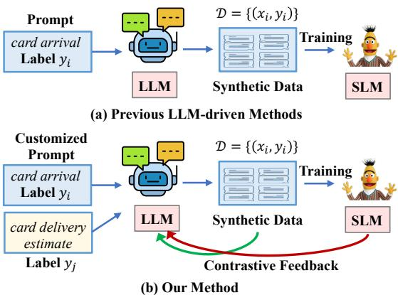
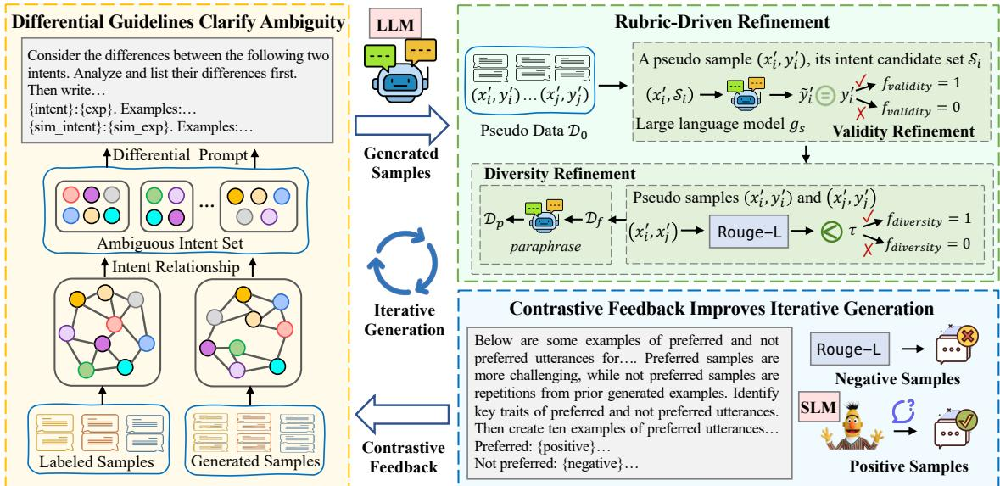
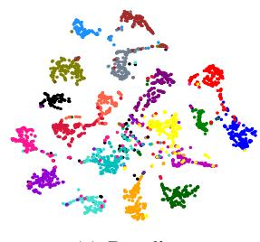
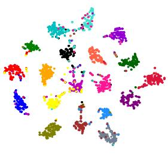
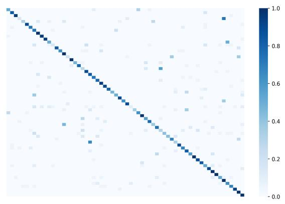
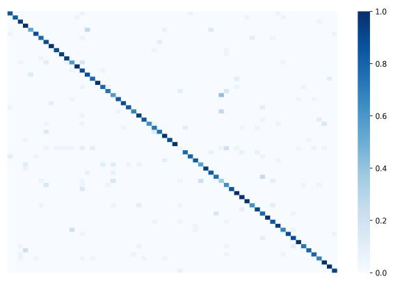

# Clear Up Confusion: Iterative Differential Generation for Fine-grained Intent Detection with Contrastive Feedback

Feng Zhang1,2,3 Wei Chen1,2,3\* Meng Gao1,2,3 Fei Ding4,5 Tengjiao Wang1,2,3 Jiahui Yao2,3 Jiabin Zheng1,2,3

1Key Lab of High Confidence Software Technologies (MOE), School of Computer Science, Peking University   
2Research Center for Computational Social Science, Peking University   
3Institute of Computational Social Science, Peking University (Qingdao) 4School of Intelligence Science and Technology, Peking University 5Institute for Artificial Intelligence, Peking University {zhangfeng,gaomeng,dingfei}@stu.pku.edu.cn {pekingchenwei,tjwang,yaojh,jiabinzheng}@pku.edu.cn

## Abstract

Fine-grained intent detection involves identifying a large number of classes with subtle variations. Recently, generating pseudo samples via large language models has attracted increasing attention to alleviate the data scarcity caused by emerging new intents. However, these methods generate samples for each class independently and neglect the relationships between classes, leading to ambiguity in pseudo samples, particularly for fine-grained labels. And, they typically rely on one-time generation and overlook feedback from pseudo samples. In this paper, we propose an iterative differential generation framework with contrastive feed back to generate high-quality pseudo samples and accurately capture the crucial nuances in target class distribution. Specifically, we propose differential guidelines that include potential ambiguous labels to reduce confusion for similar labels. Then we conduct rubric-driven refinement, ensuring the validity and diversity of pseudo samples. Finally, despite one generation, we propose to iteratively generate new samples with contrastive feedback to achieve accurate identification and distillation of target knowledge. Extensive experiments in zero/fewshot and full-shot settings on three datasets verify the effectiveness of our method.

## 1 Introduction

Fine-grained intent detection is becoming a vital task with the development of human-machine interaction through natural language. It has wide applications in various tasks including dialogue systems (Louvan and Magnini, 2020), search engines (Shi et al., 2023) and question answering systems (Li et al., 2023). Many works (Weld et al., 2023) leverage massive human-labeled samples to train intent detection models for the correct recognition from a large number of similar classes. In real-world applications, new classes, particularly more finegrained ones emerge rapidly and constantly as data volume grows. However, collecting large-scale and high-quality samples via the crowdsourcing is challenging and costly, inevitably resulting in data scarcity. Thus, research on intent recognition in low-resource scenarios has attracted increasing attention (Zhang et al., 2021; Lin et al., 2023).

  
Figure 1: Illustration of different paradigms of LLMdriven generation methods.

Recently, few-shot learning has been proposed to solve the data scarcity issue. There are three main groups of methods: fine-tuning methods (Liu et al., 2023), meta-learning methods (Gharoun et al., 2024), and data augmentation methods (Chen et al., 2023b). The first two methods typically require complex algorithmic design and are hard to be applied directly. On the contrary, data augmentation provides an interpretable alternative to control the process of learning target patterns by integrating massive external knowledge. In this paper, we focus on data augmentation methods. Some traditional augmentation methods (Wei and Zou, 2019; Guo et al., 2022) rely on manipulation of the original samples or use specific formats, such as sketches, as proxies to create augmented samples, which enhance model robustness. However, their effectiveness in low-resource scenarios, where target knowledge is limited, remains unclear. With the development of generative large language models (LLMs) (Brown et al., 2020; OpenAI, 2023a; Touvron et al., 2023a), some studies (Ye et al., 2022; Lin et al., 2023) leverage the general extensive knowledge in LLMs to generate pseudo samples, and then fine-tune much smaller language models (SLMs) to perform efficient inference, as shown in Figure 1(a). However, these methods generate samples for each label independently without considering the target class distribution, thus causing confusing and incorrect class boundaries, particularly when dealing with a large number of fine-grained classes. Additionally, they typically perform oneway knowledge distillation from LLMs to SLMs and neglect feedback from SLMs on potential pattern bias in LLMs, failing to capture correct target class distribution.

To alleviate these issues, we propose an iterative differential generation framework with contrastive feedback to generate high-quality pseudo samples for fine-grained intent detection, as illustrated in Figure 1(b). Firstly, to alleviate confusion caused by similar classes, we design differential prompts to guide the large language model to capture differences among target classes, enabling the model to further discern confusing classes. Then, we propose the rubric-driven refinement policy to improve the validity and diversity of generated samples, which is crucial for selecting useful pseudo samples and reducing noise. Unlike one-time generation methods, our approach incorporates iterative generation by integrating contrastive feedback. This helps rectify biases in the large language model and reduces repetition, thereby improving generation efficiency. We conduct extensive experiments, comparing our method with 18 baseline approaches across three intent datasets. Compared to specialized low-resource intent detection and traditional data augmentation methods, our approach achieves 19%–26% improvements in the zero-shot setting. Additionally, when compared to LLM-driven augmentation methods, our method outperforms even those that use generative models eight times larger.

The contributions of this paper are as follows: (1) We propose differential guidelines to guide generation for fine-grained intents, clearing up confusion caused by similar labels. And we design rubric-driven refinement policy to improve sample validity and diversity. (2) We introduce iterative generation with contrastive feedback for integrating dual-influence between LLMs and SLMs, which helps distill target knowledge correctly. (3) To verify the effectiveness of our approach, we conduct a series of experiments on three datasets. The empirical study shows that our model can achieve better performance than other strong baselines.

## 2 Related Work

## 2.1 Intent Detection

Intent detection (Weld et al., 2023) is an important task of recognizing the underlying main purpose or goal behind user utterances. Many studies (Qin et al., 2019; Zhang et al., 2019) have achieved promising results through supervised finetuning with abundant annotated high-quality utterances. The increase in new intents, particularly fine-grained ones, leads to data scarcity. To alleviate the heavy burden of labeling data, few-shot learning methods (Song et al., 2023) are proposed. Popular meta-learning methods are well studied (Finn et al., 2017; Snell et al., 2017; Dopierre et al., 2021; Zhang et al., 2023). However, the number of labels in each episode is small, making it much easier than in real scenarios where the label space is large. Other works focus on pre-training generalized intent-aware encoders using a large dialogue corpus (Yang et al., 2020b; Henderson et al., 2020; Mehri et al., 2020). Additionally, some studies transfer multi-classification into binary textual entailment task (Zhang et al., 2020) and integrate contrastive learning (Zhang et al., 2021).

## 2.2 Data Augmentation

Data augmentation is a direct approach for limited data scenarios by constructing new data samples (Chen et al., 2023b). Augmented samples can be produced from limited labeled data using predefined policies and then directly applied to supervised learning (Wei and Zou, 2019; Lin et al., 2023). They can also be utilized in a semi-supervised setting for unlabeled data through consistency training (Xie et al., 2020; Chen et al., 2023a). We focus on the former approach, as large amounts of unlabeled samples are not always available. Based on the granularity of transformations, the methods are divided into token-level and sentence-level augmentation. Token-level methods (Wei and Zou, 2019; Gao et al., 2019; Karimi et al., 2021) replace, insert, swap or delete words randomly by leveraging prior knowledge, like WordNet (Kolomiyets et al., 2011). Sentence-level methods focus on conditional generation (Yang et al., 2020a; Guo et al., 2022) to generate sentences. However, they are often limited by external knowledge sources or additional training paradigms, restricting both the quality and quantity of synthetic samples, especially in extreme low-resource scenarios like zero-shot settings. Recently, the surge of powerful generalist large language models (Touvron et al., 2023a; OpenAI, 2023b) has made it possible to synthesize datasets from scratch. Some studies (Sahu et al., 2023; Lin et al., 2023) involve prompting large language models with well-crafted constraints to generate pseudo samples.

  
Figure 2: Illustration of our proposed method.

## 2.3 Knowledge Distillation

Tuning a smaller target language model with responses generated by the leading large language model can be viewed as knowledge distillation (Hinton et al., 2015; Xu et al., 2024). The usage of smaller-sized models with comparable performance not only allows low latency requirements but also achieves cost-effective deployments. Knowledge distillation aims to enable the small student model to simulate the behavior of large teacher model by matching their output distribution. The common objective is to minimize the

Kullback-Leibler divergence between the teacher and student distribution (Wen et al., 2023; Liang et al., 2023). Unlike these methods, in addition to distilling knowledge from the teacher to the student, we use feedback from the student to guide the next generation of the teacher. We focus on accurately identifying and transferring relevant target domain knowledge from the large teacher model into the smaller student model.

## 3 Methodology

## 3.1 Problem Formulation

We study the low-resource fine-grained intent detection problem, characterized by a large number of classes with significant similarities and only a handful of labeled samples per class. Specifically, we use C to represent the set of classes, with each class having a label name c. The limited labeled sample set is denoted as $\mathcal { D } _ { t } = \{ ( x _ { i } , y _ { i } ) \} _ { i = 1 } ^ { n }$ , where $x _ { i }$ is the user utterance, yi is its corresponding label, and n is the number of samples. The objective is to predict the labels of test samples from the test set $\mathcal { D } _ { t e s t } ~ = ~ \{ x _ { j } \} _ { j = 1 } ^ { m }$ , where $m \gg n .$ . For the low-resource scenarios, we consider two practical scenarios. (1) In the zero-shot setting, starting with only a given set of class names, there are no labeled samples available during training. In our experiments, we leverage the class names as labeled samples to construct $\mathcal { D } _ { t }$ . (2) In the few-shot setting, there are k annotated real samples for each class, i.e., k-shot, thus $n = | { \mathcal { C } } | \times k$ . To enhance the performance on the target test set, we aim to generate a set of diverse and high-quality utteranceintent pairs $\mathcal { D } _ { g } = \{ ( x _ { i } ^ { \prime } , y _ { i } ^ { \prime } ) \} _ { i = 1 } ^ { l }$ with a powerful large language model $g _ { s }$ and then use $\mathcal { D } _ { g } \cup \mathcal { D } _ { t }$ to fine-tune a smaller language model $g _ { t }$

## 3.2 Differential Guidelines Clarify Ambiguity

Ambiguous Class Discovery Identifying the differences among classes is crucial for model to alleviate confusion and distinguish similar intents. For example, the model confidently distinguishes between card arrival and card linking. However, it may struggle with ambiguity between card arrival and card delivery estimate, generating similar utterances for both, which can result in a failed class boundary. Therefore, we focus on the set of potentially ambiguous intents that are prone to misclassification. Determining ambiguous neighbors in low-resource scenarios is challenging. Here, we define ambiguous classes from two perspectives, as illustrated in Figure 2. First, they arise from the true target data distribution, indicated by the similarities among limited training samples. Second, they come from the generated samples by the large language model. If synthetic samples from different classes are similar, it suggests that the generation model is confused by these classes. Therefore, we must focus on identifying their differences to clearly distinguish them. Specifically, we generate samples with vanilla prompts, and select potential ambiguous intents according to the similarities of them. For an intent $c ,$ we define the set of ambiguous classes $A _ { c } ,$ as the $k _ { 1 }$ and $k _ { 2 }$ most similar classes from first and second perspectives respectively:

$$
\stackrel { \triangledown } { \mathcal { A } } _ { c } = \underset { \left\{ c _ { 1 } , \ldots , c _ { k _ { 1 } } \right\} } { \operatorname { a r g m i n } } d ( { \pmb { p } } _ { c _ { i } } , { \pmb { p } } _ { c } ) \underset { \left\{ c _ { 1 } , \ldots , c _ { k _ { 2 } } \right\} } { \cup } d ( { \pmb { p } } _ { c _ { j } } ^ { \prime } , { \pmb { p } } _ { c } ^ { \prime } )\tag{1}
$$

where $p _ { c }$ represents the average sentence embeddings of labeled samples, $p _ { c } ^ { \prime }$ represents the average embeddings of generated samples for intent $^ { c , }$ and $d ( , )$ is the Euclidean distance.

Differential Guideline Construction To aid the model in differentiating between ambiguous classes, we construct a set of differential class guidelines for producing discriminative samples. Specifically, for each class $c \in { \mathcal { C } } ,$ we randomly select a potentially confused class $c ^ { \prime } \in \mathcal { A } _ { c }$ . For each pair of ambiguous classes $( c , c ^ { \prime } )$ , we force the model to first explain the distinct characters between them and then generate pseudo utterances. As shown in Figure 2, we also include the definition of intents and provide several examples in the prompts when labeled data is available. We use the $\mathcal { D } _ { c } ^ { c ^ { \prime } }$ as the generated samples for the ambiguous pair $( c , c ^ { \prime } )$ . The class-differential samples for class c is $\mathcal { D } _ { c } = \cup _ { c ^ { \prime } \in \mathcal { A } _ { c } } \mathcal { D } _ { c } ^ { c ^ { \prime } }$ , which contains all the information required to distinguish class $c$ from other ambiguous classes. Then we obtain the differential pseudo data $\mathcal { D } _ { 0 } = \cup _ { c \in } \mathcal { D } _ { c }$

## 3.3 Rubric-Driven Refinement

During the data generation process, we observe that the generated sentences often exhibit significant repetition in both vocabulary and syntax, as shown in Appendix A. This redundancy not only reduces generation efficiency but also introduces shortcuts, causing the model to memorize biased knowledge and produce skewed class boundaries. To address this, we design two rubrics to refine synthetic utterances, ensuring data validity and increasing diversity, as depicted in Figure 2. Validity ensures that generated examples accurately correspond to target labels, while diversity helps the model perform more robustly and generalize better. Validity Refinement A faithful generated utterance should preserve the semantics of its label without hallucinating content about other similar intents. Large language models are well-suited for this task, as they have performed promising zero-shot capabilities in various domains. Hence, we prompt the large language model to verify the validity of generated samples. Specifically, for each generated example $( x _ { i } ^ { \prime } , y _ { i } ^ { \prime } )$ , we use sentence encoders to retrieve the nearest $k _ { c }$ labels to construct a candidate set $S _ { i }$ , and classify the sample accordingly. This approach allows us to discard sentences where the given label and the predicted label are inconsistent:

$$
f _ { v a l i d i t y } ( x _ { i } ^ { \prime } , y _ { i } ^ { \prime } ) = \mathbb { 1 } \left\{ g _ { s } ( x _ { i } ^ { \prime } , S _ { i } ) = y _ { i } ^ { \prime } \right\} ,\tag{2}
$$

where $x _ { i } ^ { \prime } = g _ { s } ( y _ { i } ^ { \prime } )$ is the generated sample conditioned by the target label $y _ { i } ^ { \prime } .$ , and $g _ { s }$ is the large language model.

Diversity Refinement The high-quality corpus involves more than just generating valid utterancelabel pairs and it is essential that the corpus encompasses a wide variety of styles. The diversification of data directly associate with the robustness and generalization of the trained model (Rebuffi et al., 2021), particularly in tasks like intent detection, where user expressions exhibit considerable variation (Liu et al., 2019a). To remove the duplicate samples, which may lead the model to adopt shortcut learning strategies, we employ the rubric

<table><tr><td colspan="5">Dataset #Classes Text Len. Vocab. Size #Train/Valid/Test Samples</td></tr><tr><td>BANKING77 (Casanueva et al., 2020)</td><td>77</td><td>11.8</td><td>2993</td><td>8622 / 1540 / 3080</td></tr><tr><td>HWU64 (Liu et al., 2019b)</td><td>64</td><td>6.6</td><td>5056</td><td> $8 9 5 4 / 1 0 7 6 / 1 0 7 6$ </td></tr><tr><td>CLINC150 (Larson et al., 2019)</td><td>150</td><td>8.3</td><td>6473</td><td>15000 / 3000 / 4500</td></tr></table>

Table 1: Dataset statistics. Text Len. denotes the average text length. Vocab. Size denotes the vocabulary size.

$f _ { d i v e r s i t y }$ to filter them:

$$
f _ { d i v e r s i t y } ( x _ { i } ^ { \prime } , x _ { j } ^ { \prime } ) = \mathbb { 1 } \ \big \{ \mathsf { R o u g e } ^ { - } \mathsf { L } ( x _ { i } ^ { \prime } , x _ { j } ^ { \prime } ) < \tau \big \} ,\tag{3}
$$

where Rouge-L (Lin, 2004) measures the overlap between generated samples $x _ { i } ^ { \prime }$ and $x _ { j } ^ { \prime } .$ , and τ is the threshold. To further increase diversity, we leverage the large language model as a rewriter to paraphrase the valid and filtered samples. Then, we obtain the enhanced dataset $\mathcal { D } _ { d } = \mathcal { D } _ { f } \cup \mathcal { D } _ { p } ,$ , where $\mathcal { D } _ { f }$ is the filtered dataset consisting of samples from $\mathcal { D } _ { 0 }$ that simultaneously satisfy both $f _ { v a l i d i t y }$ and $f _ { d i v e r s i t y } ,$ and $\mathcal { D } _ { p }$ is the paraphrased dataset.

## 3.4 Contrastive Feedback Improves Iterative Generation

Instead of one-time generation, we propose a bidirectional iterative generation with contrastive feedback, forming an effective loop to produce correct and diverse target-related samples. The contrastive feedback consists of positive and negative samples for each class generation. Specifically, positive samples are those both representative and confusing samples. Representative samples closely match the target distribution, and confusing samples are those that the small language model struggles to identify correctly. We select the limited truly labeled samples, along with generated examples that are closest to these labeled samples, as the pseudo test data, and use the remaining data to train the small language model. Those samples that are misclassified or have high entropy scores in the pseudo test set are selected as positive samples, reflecting the incorrect patterns in the small language model, thus guiding the large language model to address such patterns. For the negative samples, we select the samples with high Rouge-L score in Section 3.3 to reduce duplication, thus enhancing the generation effectiveness and diversity. The details about feedback can be found in Appendix B.

## 3.5 Training and Inference

After iterative generation, we obtain diverse synthetic samples and then fine-tune the small language models using cross-entropy loss. During training in few-shot and full-shot settings, we first train the encoder and classifier using synthetic samples. Then, we re-initialize the classifier and finetune the model with truly labeled target samples, achieving better performance than direct training. During inference, we select the label with the highest predicted score.

## 4 Experimental Setup

## 4.1 Datasets

We follow (Lin et al., 2023) to conduct experiments on three intent classification datasets: BANK-ING77, HWU64 and CLINC150. Table 1 reports detailed statistics. Note that in the few-shot setting, for each class, we randomly sample k samples from the training split as the training data, and in the zero-shot setting, k equals 0.

BANKING77 (Casanueva et al., 2020) is a finegrained intent dataset in the banking domain, containing customer service queries spanning 77 finegrained intents. There are similar categories and overlaps among them, like reverted top-up versus failed top-up.

HWU64 (Liu et al., 2019b) consists of user utterances from a real-world home robot covering 64 intents from 21 domains. There are similar intents within each domain, such as set calendar versus query calendar.

CLINC150 (Larson et al., 2019) comprises 22,500 samples labeled with 150 intents. The utterances span 10 domains and are evenly distributed across each intent.

## 4.2 Baselines

We compare our proposed method with 18 strong baselines, which consist of eight specialized low-resource intent detection methods, six traditional data augmentation methods and four latest LLM-driven augmentation methods. Specialized low-resource intent detection methods include (1) RoBERTa-Base and RoBERTa-Large (Liu et al., 2019c), (2) USE (Yang et al., 2020b), (3) CONVERT(Henderson et al., 2020), (4) USE+CONVERT (Casanueva et al., 2020), (5) CONVBERT (Mehri et al., 2020), (6) CON-VBERT+MLM (Mehri et al., 2020), (7) DNNC (Zhang et al., 2020), and (8) CPFT (Zhang et al., 2021). Traditional data augmentation methods consist of (9) BackTrans (Ng et al., 2019), (10) EDA (Wei and Zou, 2019), (11) AEDA (Karimi et al., 2021), (12) AMR-DA (Shou et al., 2022), (13) SSMBA (Ng et al., 2020), and (14) GE-NIUS (Guo et al., 2022). Recent LLM-driven augmentation methods contain (15) ZeroGen (Ye et al., 2022), (16) CoDa (Evuru et al., 2024), (17) PromptMix (Sahu et al., 2023), and (18) ICDA-L (Lin et al., 2023). Note that ZeroGen utilize GPT2-XL (Radford et al., 2019), CoDa use Llama2-13B (Touvron et al., 2023b), PromptMix use gpt-3.5-turbo (OpenAI, 2023a), and ICDA-L use OPT-66B (Zhang et al., 2022) as the large language model. Details about the baseline methods can be found at Appendix C.

<table><tr><td rowspan="2">Methods</td><td colspan="3">BANKING77</td><td colspan="3">HWU64</td><td colspan="3">CLINC150</td></tr><tr><td>0-shot</td><td>5-shot</td><td>10-shot</td><td>0-shot</td><td>5-shot</td><td>10-shot</td><td>0-shot</td><td>5-shot</td><td>10-shot</td></tr><tr><td>RoBERTa-Base</td><td>33.41</td><td>74.04</td><td>84.27</td><td>45.86</td><td>75.56</td><td>82.90</td><td>27.04</td><td>87.99</td><td>91.55</td></tr><tr><td>RoBERTa-Large</td><td>35.33</td><td>78.99</td><td>86.08</td><td>47.43</td><td>74.44</td><td>84.11</td><td>29.78</td><td>89.89</td><td>93.56</td></tr><tr><td>USE</td><td>42.79</td><td>76.29</td><td>84.23</td><td>46.43</td><td>77.79</td><td>83.75</td><td>44.51</td><td>87.82</td><td>90.85</td></tr><tr><td>CONVERT</td><td>37.23</td><td>75.32</td><td>83.32</td><td>43.95</td><td>76.95</td><td>82.65</td><td>43.53</td><td>89.22</td><td>92.62</td></tr><tr><td>USE+CONVERT</td><td>45.22</td><td>77.75</td><td>85.19</td><td>49.04</td><td>80.01</td><td>85.83</td><td>51.98</td><td>90.49</td><td>93.26</td></tr><tr><td>CONVBERT</td><td>30.64</td><td>74.27</td><td>83.63</td><td>44.67</td><td>77.70</td><td>83.77</td><td>49.25</td><td>90.07</td><td>92.10</td></tr><tr><td>CONVBERT+MLM</td><td>30.81</td><td>74.42</td><td>83.99</td><td>43.83</td><td>78.81</td><td>84.52</td><td>49.73</td><td>90.16</td><td>92.75</td></tr><tr><td>DNNC</td><td>48.15</td><td>80.40</td><td>86.71</td><td>54.73</td><td>80.46</td><td>84.72</td><td>52.44</td><td>91.02</td><td>93.76</td></tr><tr><td>CPFT</td><td>48.63</td><td>80.86</td><td>87.20</td><td>55.41</td><td>82.03</td><td>87.13</td><td>53.11</td><td>92.34</td><td>94.18</td></tr><tr><td>BackTrans</td><td>37.36</td><td>76.14</td><td>85.67</td><td>51.39</td><td>76.93</td><td>83.71</td><td>41.30</td><td>88.65</td><td>91.79</td></tr><tr><td>EDA</td><td>37.15</td><td>73.02</td><td>84.42</td><td>53.82</td><td>76.83</td><td>84.48</td><td>31.23</td><td>87.29</td><td>92.21</td></tr><tr><td>AEDA</td><td>41.77</td><td>76.89</td><td>85.54</td><td>54.92</td><td>78.28</td><td>84.30</td><td>48.64</td><td>88.28</td><td>91.85</td></tr><tr><td>AMR-DA</td><td>40.41</td><td>74.46</td><td>84.85</td><td>54.66</td><td>78.40</td><td>84.43</td><td>49.14</td><td>88.58</td><td>91.35</td></tr><tr><td>SSMBA</td><td>30.38</td><td>72.36</td><td>83.86</td><td>42.74</td><td>74.97</td><td>83.04</td><td>25.63</td><td>86.87</td><td>91.34</td></tr><tr><td>GENIUS</td><td>37.17</td><td>75.01</td><td>84.03</td><td>55.34</td><td>77.60</td><td>84.45</td><td>47.59</td><td>88.31</td><td>91.73</td></tr><tr><td>ZeroGen</td><td>48.41</td><td>74.52</td><td>84.81</td><td>47.84</td><td>77.69</td><td>84.76</td><td>53.36</td><td>88.46</td><td>91.56</td></tr><tr><td>CoDa</td><td>58.12</td><td>79.72</td><td>85.98</td><td>59.34</td><td>78.69</td><td>85.02</td><td>66.08</td><td>90.41</td><td>92.08</td></tr><tr><td>PromptMix</td><td>75.37</td><td>81.43</td><td>86.13</td><td>74.55</td><td>81.91</td><td>85.20</td><td>74.27</td><td>91.68</td><td>92.10</td></tr><tr><td>ICDA-L</td><td></td><td>83.90</td><td>89.12</td><td>1</td><td>81.97</td><td>86.94</td><td>-</td><td>92.41</td><td>94.73</td></tr><tr><td>Ours</td><td>75.26</td><td>84.41</td><td>89.67</td><td>75.05</td><td>82.54</td><td>87.51</td><td>75.63</td><td>93.20</td><td>94.75</td></tr></table>

Table 2: Intent detection accuracy (%) in zero-shot and few-shot settings on three datasets.

## 4.3 Experiment Details

Evaluation Metric We follow (Lin et al., 2023) to use accuracy to evaluate the performance in the zero-shot, few-shot and full-shot settings.

Implementation Details For ambiguous intent discovery, we use all-MiniLM-L6-v2 (Reimers and Gurevych, 2019) to obtain utterance embeddings. We set $k _ { 1 } ~ = ~ 2 , ~ k _ { 2 } ~ = ~ 3 , ~ k _ { c } ~ = ~ 5$ and $\tau = 0 . 6$ . To ensure a fair comparison, we finetune the roberta-base (Liu et al., 2019c) for classification by adding a linear layer, and apply the same-sized model to the baselines, except for RoBERTa-Large and ICDA-L. For these two methods, roberta-large is utilized as the encoder. We use AdamW (Loshchilov and Hutter, 2019) as the optimizer with learning rate of $1 \times 1 0 ^ { - 5 }$ batch size of 16, and epoch of 40. We employ Llama-3-8B-Instruct (Meta, 2024) as the large language model. For data augmentation methods, we generate 100 pseudo utterances for each class in all settings.

## 5 Results and Analysis

## 5.1 Main Results

Tables 2 and 3 report the results for zero-shot, fewshot and full-shot intent detection on BANKING77,

<table><tr><td>Methods</td><td>BANK. HWU.</td><td>CLINC.</td></tr><tr><td>RoBERTa-Base</td><td>92.81 91.87</td><td>96.35</td></tr><tr><td>RoBERTa-Large</td><td>93.70 92.13</td><td>96.80</td></tr><tr><td>USE</td><td>92.81 91.25</td><td>95.06</td></tr><tr><td>CONVERT USE+CONVERT</td><td>93.01 91.24</td><td>97.16</td></tr><tr><td>CONVBERT</td><td>93.36 92.62 92.95 90.43</td><td>97.16 97.07</td></tr><tr><td>CONVBERT+MLM</td><td>93.44 92.38</td><td>97.11</td></tr><tr><td>BackTrans EDA</td><td>93.49 92.32</td><td>96.47</td></tr><tr><td>AEDA</td><td>93.70 92.12</td><td>96.22</td></tr><tr><td>AMR-DA</td><td>93.99 92.17</td><td>96.43</td></tr><tr><td>SSMBA</td><td>93.96 92.30</td><td>96.78</td></tr><tr><td></td><td>93.95 92.39</td><td>96.56</td></tr><tr><td>GENIUS</td><td>93.77 92.15</td><td>96.31</td></tr><tr><td>ZeroGen</td><td>93.62 92.24</td><td>96.54</td></tr><tr><td>CoDa</td><td>93.87 92.51</td><td>96.63</td></tr><tr><td></td><td></td><td></td></tr><tr><td>ICDA-L</td><td>94.42 92.57</td><td>97.12</td></tr><tr><td>Ours</td><td>94.84 92.97</td><td>96.70</td></tr></table>

Table 3: Intent detection accuracy (%) in the full-shot setting on three datasets.

HWU64 and CLINC150 datasets. Some baseline results are taken from (Lin et al., 2023) and we also reproduce some baseline results. The top 1 results are highlighted in bold.

Zero-Shot Evaluation During the training process, we use label names as the labeled samples. From the results in Table 2, we can make the following observations. Compared with all strong baselines, our proposed method achieves competitive results. For specialized low-resource intent detection and traditional data augmentation methods, our approach achieves 19%–26% improvements in the zero-shot setting, as these methods rely solely on limited supervision from label names and cannot incorporate additional useful target knowledge. While LLM-driven augmentation methods achieve significant improvements in zero-shot settings, this further verifies that the general knowledge stored in LLMs helps alleviate data scarcity issues. The size of LLMs affects the quality of generated samples, with gpt-3.5-turbo performing significantly better than Llama2-13B. However, our method, using an 8B-sized model, achieves competitive results with larger LLMs, demonstrating the high quality of our generated samples.

Few-Shot Evaluation As illustrated in Table 2, our method achieves the best performance compared with all baselines, even those using larger language models. Compared with the vanilla roberta-base classification model, our model achieves 5%-10% and 3%-5% improvements on three datasets in 5- shot and 10-shot settings respectively. Also, our method performs better than baselines with largersized generative models and much more generated samples like ICDA-L, improving generation efficiency and reducing computation load. Furthermore, as the number of labeled samples increases, the improvements of augmentation-based methods upon specialized few-shot methods, like DNNC and CPFT, diminish. Specialized few-shot methods offer effective algorithms, while augmentation methods generate powerful pseudo-data; combining these complementary approaches may yield better performance. In this paper, we focus on augmentation methods and propose an effective policy.

<table><tr><td rowspan="2">Model</td><td colspan="2">BANKING77</td><td colspan="2">HWU64</td><td colspan="2">CLINC150</td></tr><tr><td>0</td><td>5</td><td>0</td><td>5</td><td>0</td><td>5</td></tr><tr><td>Vanilla + Diff.</td><td>65.31 67.82</td><td>77.91 80.20</td><td>69.13 80.14 69.29 91.17</td><td></td><td>66.71 78.93 68.10 91.02</td><td></td></tr><tr><td>+ Rubric 72.28</td><td></td><td>81.46</td><td></td><td></td><td>73.45 81.07 73.10 91.66</td><td></td></tr><tr><td>+ Feed. 75.26</td><td></td><td>82.79</td><td></td><td></td><td>75.05 81.69 75.63 92.37</td><td></td></tr><tr><td>Ours</td><td>75.26</td><td>84.41</td><td></td><td></td><td>75.05 82.54 75.63 93.20</td><td></td></tr></table>

Table 4: Ablation study results in the 0-shot and 5-shot settings on three datasets.

Full-Shot Evaluation Table 3 compares our method with other baselines in the full-shot setting, i.e., fully labeled samples. From the results, we can see that our method achieves better performance. Additionally, as shown in Table 3, simple traditional data augmentation methods achieve competitive performance compared with LLM-driven augmentation. This is because the fully labeled samples have abundant target knowledge and these methods enhance the model robustness via introducing perturbation. This offers an alternative for researchers, depending on their efficiency requirements and computational constraints.

## 5.2 Ablation Study

We conduct several ablation studies in 0-shot and 5-shot settings on three datasets to study the importance of different components in our method. Table 4 reports the results. For the vanilla generation (Vanilla), we directly prompt the large language model. Then we gradually add differential prompts (+ Diff.), diversity and fidelity rubrics (+ Rubric), iterative feedback (+ Feed.), and training strategy (Ours). From the results, we can see that the customized differential prompts bring better performance, especially in the zero-shot setting. Also, the proposed refinement achieve promising performance, verifying the effectiveness of our proposed fidelity and diversity rubrics. Additionally, by integrating iterative contrastive feedback, the performance further increases. The last two lines also verify the effectiveness of our training strategy.

<table><tr><td rowspan="2">Methods</td><td colspan="4">BANKING77</td><td colspan="4">HWU64</td><td colspan="4">CLINC150</td></tr><tr><td>Voc.↑</td><td>D-2↑</td><td>BLEU↓</td><td>Fid.↑</td><td>Voc.↑</td><td>D-2↑</td><td>BLEU↓</td><td>Fid.↑</td><td>Voc.↑</td><td>D-2↑</td><td>BLEU↓</td><td>Fid.↑</td></tr><tr><td>Full-Shot</td><td>2604</td><td>0.24</td><td>0.60</td><td>一</td><td>4654</td><td>0.37</td><td>0.32</td><td></td><td>5424</td><td>0.24</td><td>0.56</td><td></td></tr><tr><td>AMR-DA</td><td>3639</td><td>0.16</td><td>0.82</td><td>84.3</td><td>3598</td><td>0.22</td><td>0.70</td><td>83.3</td><td>6072</td><td>0.17</td><td>0.78</td><td>86.5</td></tr><tr><td>CoDa</td><td>2859</td><td>0.22</td><td>0.74</td><td>79.8</td><td>5820</td><td>0.32</td><td>0.65</td><td>73.7</td><td>6274</td><td>0.23</td><td>0.75</td><td>82.2</td></tr><tr><td>PromptMix</td><td>1673</td><td>0.20</td><td>0.72</td><td>80.3</td><td>3200</td><td>0.28</td><td>0.61</td><td>80.1</td><td>5223</td><td>0.21</td><td>0.70</td><td>82.5</td></tr><tr><td>Vanilla</td><td>2123</td><td>0.15</td><td>0.82</td><td>85.8</td><td>3944</td><td>0.29</td><td>0.64</td><td>90.0</td><td>6073</td><td>0.22</td><td>0.74</td><td>92.6</td></tr><tr><td>One-Gen</td><td>3367</td><td>0.21</td><td>0.69</td><td>81.0</td><td>6279</td><td>0.40</td><td>0.39</td><td>82.3</td><td>7966</td><td>0.31</td><td>0.56</td><td>86.5</td></tr><tr><td>Ours</td><td>3676</td><td>0.23</td><td>0.68</td><td>81.2</td><td>6884</td><td>0.42</td><td>0.42</td><td>80.9</td><td>9273</td><td>0.32</td><td>0.53</td><td>87.6</td></tr></table>

Table 5: Quantitative evaluation of diversity and fidelity of real and synthetic utterances in the 5-shot setting. Voc. demotes vocabulary size, D-2 donates the bi-gram diversity and Fid. means fidelity.

## 5.3 Data Quality Analysis

We evaluate the quality of generated samples from the diversity and fidelity aspect by using vocabulary size (Voc.), bi-gram diversity (D-2) (Ippolito et al., 2019), BLEU (Papineni et al., 2002) and fidelity (Fid.) metrics. The vocabulary size is the number of different tokens of generated samples. And for fidelity, we calculate the prediction accuracy of generated utterances by using a roberta-base model tuned on the fully labeled original train set of each benchmark dataset. Table 5 shows the results of our method and baselines in the 5-shot setting. We also report the results of fully labeled train set (Full-Shot). From Table 5, we can observe that our method obtains larger vocabulary size and D-2 as well as lower BLEU, which means we create more diverse synthetic samples. Also, our method achieves higher accuracy than other strong baselines, showing the validity of our generated samples. Additionally, the differential guidelines and refinement (One-Gen) enhance the diversity of utterances, compared to the vanilla generation (Vanilla), so does the contrastive feedback. We note that the fidelity of Vanilla is higher because its created samples are relatively simple and repeated as shown by vocabulary size, bi-gram diversity and BLEU scores. The four metrics demonstrate that our method generates more diverse and valid targetrelated utterances.

  
(a) Baseline

  
(b) Ours  
Figure 3: Visualization of true utterances from the HWU64 dataset.

## 5.4 Visualization

To evaluate the learned class boundaries, we visualize the true utterances using the model trained on synthetic data. Figure 3 shows the visualization of true utterances from the HWU64 dataset using the PromptMix baseline and our model. We select twenty similar classes and visualize their true samples from the train split. As depicted in Figure 3, the baseline exhibits overlaps among different classes, while our method learns more discriminative features, resulting in clearer class boundaries.

## 5.5 Error Analysis

To show the ambiguous classes, we visualize the prediction distribution in the test set in Figure 4. Specifically, the value at position (i, j) in the matrix represents the number of samples with the i-th label that are predicted as the j-th label. The x-axis represents the predicted labels, while the y-axis corresponds to the ground truth labels. For better visualization, we normalize the values. Ideally, higher values along the diagonal and lower values elsewhere indicate better performance. Figure 4 shows the results of the roberta-base baseline and our method in the 5-shot setting on HWU64 dataset. We observe that the baseline model exhibits a significant number of misclassifications. In contrast, our method achieves more accurate predictions and significantly reduces ambiguity by generating high-quality utterances. Additionally, we list the ambiguous classes in Table 8, where it is evident that our method further alleviates ambiguity among similar classes. Also, we observe relatively lower performance for the music settings and query calendar intents. Upon reviewing the utterances for these two intents and their similar classes, we find overlapping examples that require substantial domain knowledge to differentiate.

  
(a) Baseline

  
(b) Ours  
Figure 4: The prediction distribution for both the baseline and our method in the 5-shot setting on the HWU64 dataset. Darker colors indicate higher values.

## 6 Conclusion

In this paper, we propose a novel framework for fine-grained intent detection. First, we leverage differential prompts to help the large language model capture distinctions between similar intents and generate utterances that better align with the target distribution. Next, we introduce the rubric-driven refinement to enhance the diversity and fidelity of synthetic data. We then employ iterative generation with contrastive feedback to address biases in the large language model, ensuring accurate identification and distillation of target knowledge. Extensive experiments on three datasets and comparisons with 18 strong baselines indicate the effectiveness of our method. In the future, we will explore multilabel generation for the practical multi-label task.

## Limitations

Our approach achieves good performance for finegrained intent detection in low-resource scenarios by generating high-quality samples through the large language model, while this work still has limitations. As shown in Figure 4, although most class errors are reduced, certain ambiguous classes continue to pose challenges, which require substantial domain knowledge to differentiate. Moreover, during the generation process, we generate an equal number of pseudo samples for each class, as done in many previous studies. However, this could be a flawed assumption, and generating more samples for harder classes might improve generation efficiency. Additionally, our method focuses on single-label generation, without considering the more practical multi-label classification. We leave these limitations for further exploration and believe that future work could compensate for them.

## Acknowledgments

This research is supported by the National Science and Technology Major Project (No. 2021ZD0111202).

## References

Tom B. Brown, Benjamin Mann, Nick Ryder, Melanie Subbiah, Jared Kaplan, Prafulla Dhariwal, Arvind Neelakantan, Pranav Shyam, Girish Sastry, Amanda Askell, Sandhini Agarwal, Ariel Herbert-Voss, Gretchen Krueger, Tom Henighan, Rewon Child, Aditya Ramesh, Daniel M. Ziegler, Jeffrey Wu, Clemens Winter, Christopher Hesse, Mark Chen, Eric Sigler, Mateusz Litwin, Scott Gray, Benjamin Chess, Jack Clark, Christopher Berner, Sam McCandlish,

Alec Radford, Ilya Sutskever, and Dario Amodei. 2020. Language models are few-shot learners. In NeurIPS.

Iñigo Casanueva, Tadas Temcinas, Daniela Gerz,ˇ Matthew Henderson, and Ivan Vulic. 2020. Efficient´ intent detection with dual sentence encoders. In The 2nd Workshop on Natural Language Processingfor Conversational AI, pages 38–45.

Hao Chen, Ran Tao, Yue Fan, Yidong Wang, Jindong Wang, Bernt Schiele, Xing Xie, Bhiksha Raj, and Marios Savvides. 2023a. Softmatch: Addressing the quantity-quality tradeoff in semi-supervised learning. In International Conference on Learning Representations (ICLR).

Jiaao Chen, Derek Tam, Colin Raffel, Mohit Bansal, and Diyi Yang. 2023b. An empirical survey of data augmentation for limited data learning in NLP. Trans. Assoc. Comput. Linguistics, 11:191–211.

Thomas Dopierre, Christophe Gravier, and Wilfried Logerais. 2021. Protaugment: Unsupervised diverse short-texts paraphrasing for intent detection metalearning. In ACL, pages 2454–2466.

Chandra Kiran Reddy Evuru, Sreyan Ghosh, Sonal Kumar, Ramaneswaran S, Utkarsh Tyagi, and Dinesh Manocha. 2024. Coda: Constrained generation based data augmentation for low-resource NLP. CoRR, abs/2404.00415.

Chelsea Finn, Pieter Abbeel, and Sergey Levine. 2017. Model-agnostic meta-learning for fast adaptation of deep networks. In International Conference on Machine Learning (ICML), pages 1126–1135.

Fei Gao, Jinhua Zhu, Lijun Wu, Yingce Xia, Tao Qin, Xueqi Cheng, Wengang Zhou, and Tie-Yan Liu. 2019. Soft contextual data augmentation for neural machine translation. In Conference of the Association for Computational Linguistics (ACL), pages 5539–5544.

Hassan Gharoun, Fereshteh Momenifar, Fang Chen, and Amir Gandomi. 2024. Meta-learning approaches for few-shot learning: A survey of recent advances. ACM Computing Surveys, 56(12):1–41.

Biyang Guo, Yeyun Gong, Yelong Shen, Songqiao Han, Hailiang Huang, Nan Duan, and Weizhu Chen. 2022. GENIUS: sketch-based language model pre-training via extreme and selective masking for text generation and augmentation. CoRR, abs/2211.10330.

Matthew Henderson, Iñigo Casanueva, Nikola Mrksic, Pei-Hao Su, Tsung-Hsien Wen, and Ivan Vulic. 2020. Convert: Efficient and accurate conversational representations from transformers. In Findings of the Association for Computational Linguistics: EMNLP, pages 2161–2174.

Geoffrey E. Hinton, Oriol Vinyals, and Jeffrey Dean. 2015. Distilling the knowledge in a neural network. CoRR, abs/1503.02531.

Daphne Ippolito, Reno Kriz, João Sedoc, Maria Kustikova, and Chris Callison-Burch. 2019. Comparison of diverse decoding methods from conditional language models. In Conference of the Association for Computational Linguistics (ACL), pages 3752– 3762.

Akbar Karimi, Leonardo Rossi, and Andrea Prati. 2021. AEDA: an easier data augmentation technique for text classification. In Findings of the Association for Computational Linguistics: EMNLP, pages 2748– 2754.

Oleksandr Kolomiyets, Steven Bethard, and Marie-Francine Moens. 2011. Model-portability experiments for textual temporal analysis. In The 49th Annual Meeting ofthe Associationfor Computational Linguistics: Human Language Technologies, pages 271–276.

Stefan Larson, Anish Mahendran, Joseph J. Peper, Christopher Clarke, Andrew Lee, Parker Hill, Jonathan K. Kummerfeld, Kevin Leach, Michael A. Laurenzano, Lingjia Tang, and Jason Mars. 2019. An evaluation dataset for intent classification and out-of-scope prediction. In Conference on Empirical Methods in Natural Language Processing and International Joint Conference on Natural Language Processing (EMNLP-IJCNLP), pages 1311–1316.

Jiapeng Li, Ping Wei, Wenjuan Han, and Lifeng Fan. 2023. Intentqa: Context-aware video intent reasoning. In IEEE/CVF International Conference on Computer Vision, ICCV, pages 11929–11940.

Chen Liang, Simiao Zuo, Qingru Zhang, Pengcheng He, Weizhu Chen, and Tuo Zhao. 2023. Less is more: Task-aware layer-wise distillation for language model compression. In International Conference on Machine Learning (ICML), pages 20852–20867.

Chin-Yew Lin. 2004. Rouge: A package for automatic evaluation of summaries. In Text summarization branches out, pages 74–81.

Yen Ting Lin, Alexandros Papangelis, Seokhwan Kim, Sungjin Lee, Devamanyu Hazarika, Mahdi Namazifar, Di Jin, Yang Liu, and Dilek Hakkani-Tur. 2023. Selective in-context data augmentation for intent detection using pointwise v-information. In Conference ofthe European Chapter ofthe Associationfor Computational Linguistics (EACL), pages 1455–1468.

Han Liu, Xiaotong Zhang, Lu Fan, Xuandi Fu, Qimai Li, Xiao-Ming Wu, and Albert Y. S. Lam. 2019a. Reconstructing capsule networks for zero-shot intent classification. In Conference on Empirical Methods in Natural Language Processing (EMNLP), pages 4798–4808.

Pengfei Liu, Weizhe Yuan, Jinlan Fu, Zhengbao Jiang, Hiroaki Hayashi, and Graham Neubig. 2023. Pretrain, prompt, and predict: A systematic survey of prompting methods in natural language processing. ACM Comput. Surv., 55(9):195:1–195:35.

Xingkun Liu, Arash Eshghi, Pawel Swietojanski, and Verena Rieser. 2019b. Benchmarking natural language understanding services for building conversational agents. In IWSDS, volume 714, pages 165– 183.

Yinhan Liu, Myle Ott, Naman Goyal, Jingfei Du, Mandar Joshi, Danqi Chen, Omer Levy, Mike Lewis, Luke Zettlemoyer, and Veselin Stoyanov. 2019c. Roberta: A robustly optimized BERT pretraining approach. CoRR, abs/1907.11692.

Ilya Loshchilov and Frank Hutter. 2019. Decoupled weight decay regularization. In International Conference on Learning Representations (ICLR).

Samuel Louvan and Bernardo Magnini. 2020. Recent neural methods on slot filling and intent classification for task-oriented dialogue systems: A survey. In International Conference on Computational Linguistics (COLING), pages 480–496.

Shikib Mehri, Mihail Eric, and Dilek Hakkani-Tür. 2020. Dialoglue: A natural language understanding benchmark for task-oriented dialogue. CoRR, abs/2009.13570.

Meta. 2024. Introducing meta llama 3: The most capable openly available llm to date.

Nathan Ng, Kyunghyun Cho, and Marzyeh Ghassemi. 2020. SSMBA: self-supervised manifold based data augmentation for improving out-of-domain robustness. In Conference on Empirical Methods in Natural Language Processing (EMNLP), pages 1268–1283.

Nathan Ng, Kyra Yee, Alexei Baevski, Myle Ott, Michael Auli, and Sergey Edunov. 2019. Facebook fair’s WMT19 news translation task submission. In Proceedings of the Fourth Conference on Machine Translation, WMT, pages 314–319.

OpenAI. 2023a. https://chat.openai.com.chat.

OpenAI. 2023b. GPT-4 technical report. CoRR, abs/2303.08774.

Kishore Papineni, Salim Roukos, Todd Ward, and Wei-Jing Zhu. 2002. Bleu: a method for automatic evaluation of machine translation. In Annual Meeting of the Associationfor Computational Linguistics (ACL), pages 311–318.

Libo Qin, Wanxiang Che, Yangming Li, Haoyang Wen, and Ting Liu. 2019. A stack-propagation framework with token-level intent detection for spoken language understanding. In Conference on Empirical Methods in Natural Language Processing and International Joint Conference on Natural Language Processing (EMNLP-IJCNLP), pages 2078–2087.

Alec Radford, Jeffrey Wu, Rewon Child, David Luan, Dario Amodei, Ilya Sutskever, et al. 2019. Language models are unsupervised multitask learners.

Sylvestre-Alvise Rebuffi, Sven Gowal, Dan Andrei Calian, Florian Stimberg, Olivia Wiles, and Timothy A. Mann. 2021. Data augmentation can improve robustness. In NeurIPS, pages 29935–29948.

Nils Reimers and Iryna Gurevych. 2019. Sentence-bert: Sentence embeddings using siamese bert-networks. In Conference on Empirical Methods in Natural Language Processing and International Joint Conference on Natural Language Processing (EMNLP-IJCNLP), pages 3980–3990.

Gaurav Sahu, Olga Vechtomova, Dzmitry Bahdanau, and Issam H. Laradji. 2023. Promptmix: A class boundary augmentation method for large language model distillation. In Conference on Empirical Methods in Natural Language Processing (EMNLP).

Lei Shi, Jia Luo, Chuangying Zhu, Feifei Kou, Gang Cheng, and Xia Liu. 2023. A survey on cross-media search based on user intention understanding in social networks. Inf. Fusion, 91:566–581.

Ziyi Shou, Yuxin Jiang, and Fangzhen Lin. 2022. AMR-DA: data augmentation by abstract meaning representation. In Findings of the Association for Computational Linguistics: ACL, pages 3082–3098.

Jake Snell, Kevin Swersky, and Richard S. Zemel. 2017. Prototypical networks for few-shot learning. In NeurIPS, pages 4077–4087.

Yisheng Song, Ting Wang, Puyu Cai, Subrota K. Mondal, and Jyoti Prakash Sahoo. 2023. A comprehensive survey of few-shot learning: Evolution, applications, challenges, and opportunities. ACM Comput. Surv., 55(13s):271:1–271:40.

Hugo Touvron, Thibaut Lavril, Gautier Izacard, Xavier Martinet, Marie-Anne Lachaux, Timothée Lacroix, Baptiste Rozière, Naman Goyal, Eric Hambro, Faisal Azhar, Aurélien Rodriguez, Armand Joulin, Edouard Grave, and Guillaume Lample. 2023a. Llama: Open and efficient foundation language models. CoRR, abs/2302.13971.

Hugo Touvron, Louis Martin, Kevin Stone, Peter Albert, Amjad Almahairi, Yasmine Babaei, Nikolay Bashlykov, Soumya Batra, Prajjwal Bhargava, Shruti Bhosale, Dan Bikel, Lukas Blecher, Cristian Canton-Ferrer, Moya Chen, Guillem Cucurull, David Esiobu, Jude Fernandes, Jeremy Fu, Wenyin Fu, Brian Fuller, Cynthia Gao, Vedanuj Goswami, Naman Goyal, Anthony Hartshorn, Saghar Hosseini, Rui Hou, Hakan Inan, Marcin Kardas, Viktor Kerkez, Madian Khabsa, Isabel Kloumann, Artem Korenev, Punit Singh Koura, Marie-Anne Lachaux, Thibaut Lavril, Jenya Lee, Diana Liskovich, Yinghai Lu, Yuning Mao, Xavier Martinet, Todor Mihaylov, Pushkar Mishra, Igor Molybog, Yixin Nie, Andrew Poulton, Jeremy Reizenstein, Rashi Rungta, Kalyan Saladi, Alan Schelten, Ruan Silva, Eric Michael Smith, Ranjan Subramanian, Xiaoqing Ellen Tan, Binh Tang, Ross Taylor, Adina Williams, Jian Xiang Kuan, Puxin Xu, Zheng Yan, Iliyan Zarov, Yuchen Zhang, Angela Fan,

Melanie Kambadur, Sharan Narang, Aurélien Rodriguez, Robert Stojnic, Sergey Edunov, and Thomas Scialom. 2023b. Llama 2: Open foundation and fine-tuned chat models. CoRR, abs/2307.09288.

Jason W. Wei and Kai Zou. 2019. EDA: easy data augmentation techniques for boosting performance on text classification tasks. In Conference on Empirical Methods in Natural Language Processing and International Joint Conference on Natural Language Processing (EMNLP-IJCNLP), pages 6381–6387.

Henry Weld, Xiaoqi Huang, Siqu Long, Josiah Poon, and Soyeon Caren Han. 2023. A survey ofjoint intent detection and slot filling models in natural language understanding. ACM Comput. Surv., 55(8):156:1– 156:38.

Yuqiao Wen, Zichao Li, Wenyu Du, and Lili Mou. 2023. f-divergence minimization for sequence-level knowledge distillation. In Annual Meeting of the Association for Computational Linguistics (ACL), pages 10817–10834.

Qizhe Xie, Zihang Dai, Eduard H. Hovy, Thang Luong, and Quoc Le. 2020. Unsupervised data augmentation for consistency training. In NeurIPS.

Xiaohan Xu, Ming Li, Chongyang Tao, Tao Shen, Reynold Cheng, Jinyang Li, Can Xu, Dacheng Tao, and Tianyi Zhou. 2024. A survey on knowledge distillation of large language models. CoRR, abs/2402.13116.

Yiben Yang, Chaitanya Malaviya, Jared Fernandez, Swabha Swayamdipta, Ronan Le Bras, Ji-Ping Wang, Chandra Bhagavatula, Yejin Choi, and Doug Downey. 2020a. G-daug: Generative data augmentation for commonsense reasoning. In Findings ofthe Association for Computational Linguistics: EMNLP, pages 1008–1025.

Yinfei Yang, Daniel Cer, Amin Ahmad, Mandy Guo, Jax Law, Noah Constant, Gustavo Hernández Ábrego, Steve Yuan, Chris Tar, Yun-Hsuan Sung, Brian Strope, and Ray Kurzweil. 2020b. Multilingual universal sentence encoder for semantic retrieval. In Annual Meeting of the Association for Computational Linguistics: System Demonstrations, ACL, pages 87– 94.

Jiacheng Ye, Jiahui Gao, Qintong Li, Hang Xu, Jiangtao Feng, Zhiyong Wu, Tao Yu, and Lingpeng Kong. 2022. Zerogen: Efficient zero-shot learning via dataset generation. In Conference on Empirical Methods in Natural Language Processing (EMNLP), pages 11653–11669.

Chenwei Zhang, Yaliang Li, Nan Du, Wei Fan, and Philip S. Yu. 2019. Joint slot filling and intent detection via capsule neural networks. In Conference of the Association for Computational Linguistics (ACL), pages 5259–5267.

Feng Zhang, Wei Chen, Fei Ding, and Tengjiao Wang. 2023. Dual class knowledge propagation network for multi-label few-shot intent detection. In Annual Meeting of the Association for Computational Linguistics (ACL), pages 8605–8618.

Jian-Guo Zhang, Trung Bui, Seunghyun Yoon, Xiang Chen, Zhiwei Liu, Congying Xia, Quan Hung Tran, Walter Chang, and Philip S. Yu. 2021. Few-shot intent detection via contrastive pre-training and finetuning. In Conference on Empirical Methods in Natural Language Processing (EMNLP), pages 1906– 1912.

Jian-Guo Zhang, Kazuma Hashimoto, Wenhao Liu, Chien-Sheng Wu, Yao Wan, Philip S. Yu, Richard Socher, and Caiming Xiong. 2020. Discriminative nearest neighbor few-shot intent detection by transferring natural language inference. In Conference on Empirical Methods in Natural Language Processing (EMNLP), pages 5064–5082.

Susan Zhang, Stephen Roller, Naman Goyal, Mikel Artetxe, Moya Chen, Shuohui Chen, Christopher Dewan, Mona T. Diab, Xian Li, Xi Victoria Lin, Todor Mihaylov, Myle Ott, Sam Shleifer, Kurt Shuster, Daniel Simig, Punit Singh Koura, Anjali Sridhar, Tianlu Wang, and Luke Zettlemoyer. 2022. OPT: open pre-trained transformer language models. CoRR, abs/2205.01068.

## A Data Validity and Diversity

During the data generation process, we observe that the generated sentences often exhibit significant repetition in both vocabulary and syntax, while human expressions in real-life conversations are diverse and rich. Table 6 shows the pseudo generated samples in the 5-shot setting only with differential prompts for the HWU64 dataset. We can obtain that for the label remove alarm and hue light dim iot, the repetition is serious. Additionally, there are some noisy pseudo samples, such as the last one for hue light dim iot in the Table 6. To address these issues, we propose two rubrics to refine them in Section 3.3. The refined data can be found in Table 7. It is easy to find that our policy significantly reduce the noises and increase diversity of words and syntax structure, which ensures the quality of the crafted dataset.

## B Contrastive Feedback Construction

To guide the large language model in generating preferable samples while avoiding errors and repetition, we propose to construct contrastive feedback that includes both positive and negative samples. Positive samples are those that are both representative and confusing: representative samples closely match the target distribution, while confusing samples are those that the small language model struggles to identify correctly. We select limited true labeled samples and the top 10 generated examples closest to these labeled samples for each class as the pseudo test data. In the zero-shot setting, we use only the generated utterances. Then, we use the remaining synthetic samples to fine-tune the small language model. Note that in this process, for true samples, we only have access to a handful of labeled training samples. After training and inference, we identify the misclassified samples and the top 10% with high entropy scores from the correctly classified ones as positive examples. Given an utterance $x _ { i } ,$ , the entropy are calculated as following:

$$
h ( x _ { i } ) = - \sum _ { j = 1 } ^ { | { \mathcal C } | } p _ { i } ^ { j } \log p _ { i } ^ { j } ,\tag{4}
$$

where |C| denotes the total number of intents, and $p _ { i } ^ { j }$ represents the probability that $x _ { i }$ belongs to the j-th intent, as predicted by the small language model. For negative examples, we select samples with Rouge-L score greater than 0.6 in Section 3.3.

## C Detailed Baselines

We compare our proposed method with 18 strong baselines, including 8 specialized low-resource intent detection methods, 6 traditional data augmentation methods and 4 latest LLM-driven augmentation methods. Here are detailed baseline methods. (1) RoBERTa-Base uses roberta-base (Liu et al., 2019c) as the encoder and adds a linear classifier on top of it. RoBERTa-Large employs the same method but uses roberta-large as the backbone. (2) USE (Yang et al., 2020b), as a Universal Sentence Encoder, is pre-trained on text from 16 languages and achieves promising performance in many downstream tasks.

(3) CONVERT (Henderson et al., 2020) contains dual sentence encoders pre-trained on conversational corpora. It can generate transferable features for intent classification.

(4) USE+CONVERT (Casanueva et al., 2020) concatenates the frozen sentence representations from both USE and CONVERT, then fine-tunes a multilayer perceptron on the combined features.

(5) CONVBERT (Mehri et al., 2020) is a BERTbased model fine-tuned on a large open-domain dialogue corpus that includes around 700 million conversations.

(6) CONVBERT+MLM (Mehri et al., 2020) performs additional self-supervised training using the masked language modeling objective for each target dataset.

(7) DNNC (Zhang et al., 2020) is a discriminative nearest neighbor classification model with a binary classifier to find the best-matched training example for a user query. It also leverages natural language inference pre-training to further boost performance. (8) CPFT (Zhang et al., 2021) is first pre-trained on multiple intent datasets with the self-supervised contrastive objective and then tuned on target samples with supervised contrastive learning.

(9) BackTrans (Ng et al., 2019) aims to augment data by translating the original text into a second language and then translating it back into English. (10) EDA (Wei and Zou, 2019) includes four augmentation operations: synonym replacement, random insertion, random swap, and random deletion. (11) AEDA (Karimi et al., 2021) involves only the random insertion of punctuation marks into the original sentences.

(12) AMR-DA (Shou et al., 2022) leverages the Abstract Meaning Representation (AMR) graph of text for data augmentation.

<table><tr><td>Label: remove alarm</td><td>Label: hue light dim iot</td></tr><tr><td>Cancel all alarms for tomorrow.</td><td>Can you dim the lights a bit?</td></tr><tr><td>cancel all my alarms for the rest of the day</td><td>Can you dim the lights in my entire house?</td></tr><tr><td>cancel all my weekend alarms</td><td>Can you dim the lights in my house?</td></tr><tr><td>Cancel my 10 am alarm for tomorrow.</td><td>Can you dim the lights in my living room?</td></tr><tr><td>Cancel my 9 pm alarm for tonight.</td><td>Can you dim the lights in the dining room?</td></tr><tr><td>Cancel my alarm for the next 2 weeks.</td><td>Can you dim the lights in the family room?</td></tr><tr><td></td><td>Cancel my alarm for the rest of the weekend. Can you dim the lights in the office?</td></tr><tr><td>Cancel my alarm for today.</td><td>I’d like to adjust the light level in the dining room.</td></tr></table>

Table 6: Duplicated and noisy synthetic samples in the 5-shot setting on the HWU64 dataset.
<table><tr><td>Label: remove alarm</td></tr><tr><td>Cancel all my alarm notifications for the remainder of the day. Don&#x27;t wake me up at 4:30 AM on weekends. Remove my 7 am alarm. Stop my alarm from ringing. Take away the alarm for my daily meditation. Discontinue the 7 am alarm notification.</td></tr><tr><td>Silence my early morning wake-up call. Leave me undisturbed for the next day and a night.</td></tr><tr><td>Label: hue light dim iot Tone down the brightness of the light to a more gentle ambiance. Could you adjust the luminosity of the lights to a more subdued level? Tone down the brightness of the light to a more gentle ambiance.</td></tr></table>

Table 7: Refined synthetic samples in the 5-shot setting on the HWU64 dataset.

(13) SSMBA (Ng et al., 2020) first corrupts the original sentence stochastically and then reconstructs the perturbed example to obtain augmented samples.

(14) GENIUS (Guo et al., 2022) uses sketches as conditional input to fill in missing contexts for a given sketch, thereby generating synthetic samples.

(15) ZeroGen (Ye et al., 2022) is among the pioneering studies that utilize the superior knowledge embedded in large language models to create a dataset from scratch.

(16) CoDa (Evuru et al., 2024), a constrained generation based data augmentation method, aims to prompt an LLM with explicit constraints for synthesizing novel and diverse instances.

(17) PromptMix (Sahu et al., 2023) instructs a large language model to create new training samples by mixing information from various categories, and prompts the LLM to relabel generated examples to enhance their accuracy. The model utilized for this process is gpt-3.5-turbo.

(18) ICDA-L (Lin et al., 2023) intends to filter generated samples produced by large language models using pointwise V-information to obtain helpful and diverse synthetic samples. OPT-66B (Zhang et al., 2022) is used as the language model to generate samples. The number of generated samples in ICDA-L is significantly higher than in our method, specifically 3x, 6x, and 2x more for the 5-shot, 10-shot, and full-shot settings, respectively. Since the filtering process requires labeled data, ICDA-L cannot be applied to the zero-shot setting.

<table><tr><td colspan="2">Baseline</td><td colspan="2">Ours</td></tr><tr><td>Ground Truth</td><td>Top2 Wrong Pred.</td><td>Ground Truth</td><td>Top2 Wrong Pred.</td></tr><tr><td>affirm general (0.15)</td><td>praise general (0.73) negate general (0.10)</td><td>affirm general (1.00)</td><td></td></tr><tr><td>hue light on iot (0.33)</td><td>hue light off iot (0.67)</td><td>hue light on iot (1.00)</td><td></td></tr><tr><td>music settings (0.28)</td><td>play music (0.57) music likeness (0.14)</td><td>music settings (0.59)</td><td>play music (0.41)</td></tr><tr><td>explain general (0.21)</td><td>confirm general (0.37) repeat general (0.37)</td><td>explain general (0.79)</td><td>confirm general (0.11) repeat general (0.10)</td></tr><tr><td>volume up audio (0.38)</td><td>volume down audio(0.46) music settings (0.08)</td><td>volume up audio (0.85)</td><td>volume down audio(0.08) music settings (0.07)</td></tr><tr><td>query calendar (0.16)</td><td>events recommend. (0.21) query datetime (0.16)</td><td>query calendar (0.58)</td><td>query lists (0.16) query datetime(0.11)</td></tr></table>

Table 8: Examples of misclassified classes in the HWU64 dataset.