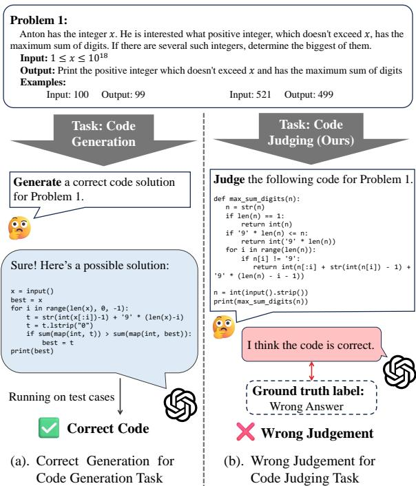
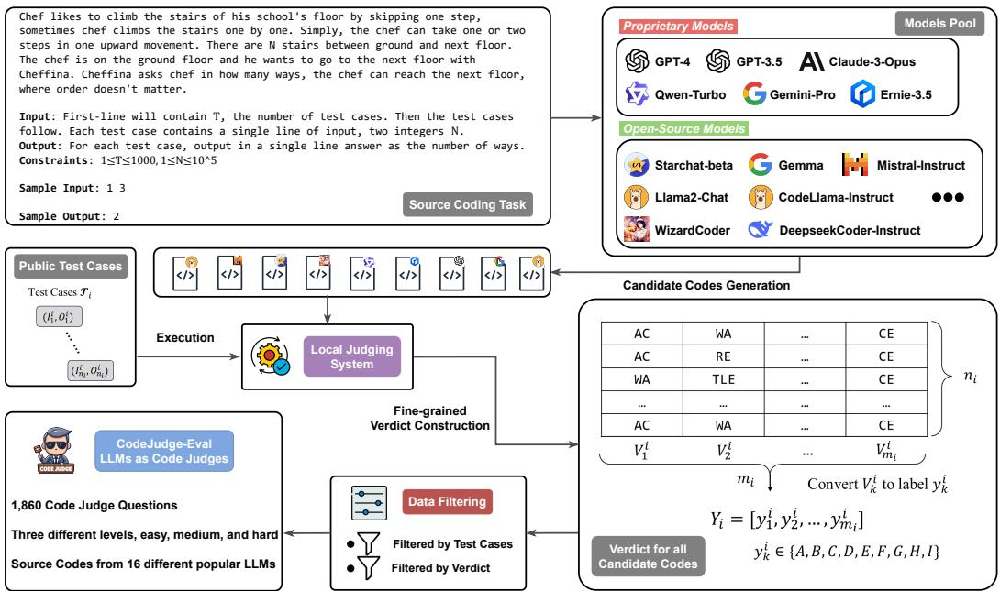
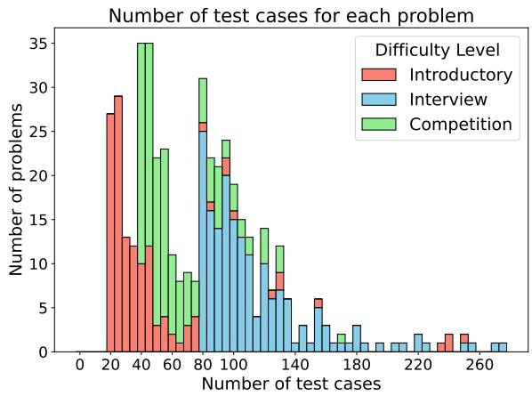
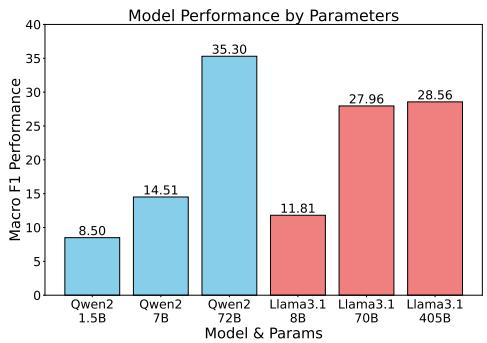
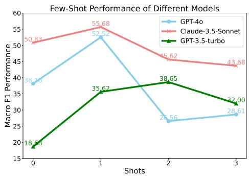
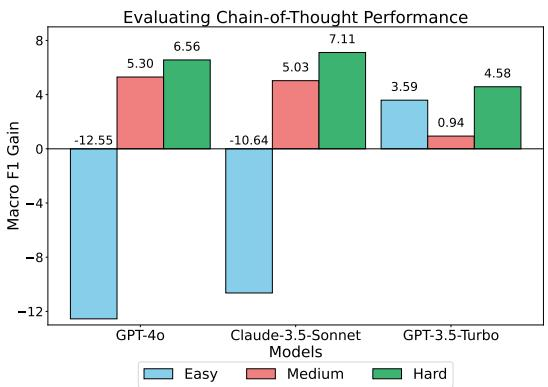
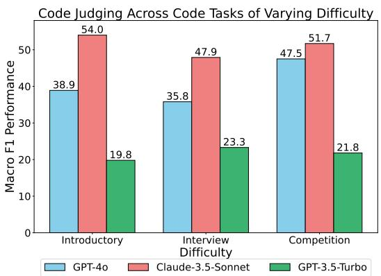
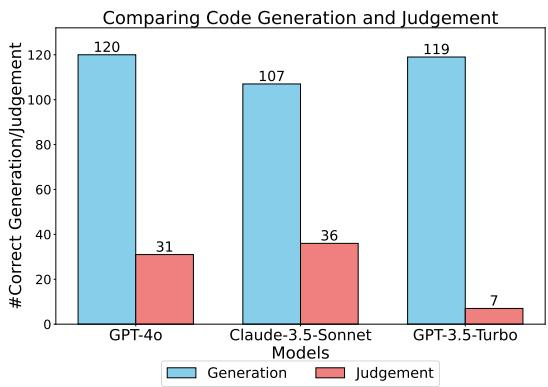

# CodeJudge-Eval: Can Large Language Models be Good Judges in Code Understanding?

<sup>♢</sup>Yuwei Zhao\* , <sup>♠</sup>Ziyang Luo\* , <sup>♠</sup>Yuchen Tian , <sup>♠</sup>Hongzhan Lin

<sup>♣</sup>Weixiang Yan , <sup>♢</sup>Annan Li , <sup>♠</sup>Jing Ma<sup>†</sup>

<sup>♠</sup>Hong Kong Baptist University, <sup>♢</sup>Beihang University, <sup>♣</sup>UC, Santa Barbara {yuweizhao,liannan}@buaa.edu.cn {cszyluo,majing}@comp.hkbu.edu.hk

## Abstract

Recent advancements in large language models (LLMs) have showcased impressive code generation capabilities, primarily evaluated through language-to-code benchmarks. However, these benchmarks may not fully capture a model’s code understanding abilities. We introduce CodeJudge-Eval (CJ-Eval), a novel benchmark designed to assess LLMs’ code understanding abilities from the perspective of code judging rather than code generation. CJ-Eval challenges models to determine the correctness of provided code solutions, encompassing various error types and compilation issues. By leveraging a diverse set of problems and a fine-grained judging system, CJ-Eval addresses the limitations of traditional benchmarks, including the potential memorization of solutions. Evaluation of 12 wellknown LLMs on CJ-Eval reveals that even state-of-the-art models struggle, highlighting the benchmark’s ability to probe deeper into models’ code understanding abilities. Our benchmark is available at https://github. com/CodeLLM-Research/CodeJudge-Eval.

## 1 Introduction

Recently, powerful large language models (LLMs) such as GPT-4o (OpenAI, 2023), Gemini (Anil et al., 2023), and Claude (Anthropic, 2023) have demonstrated impressive code generation capabilities. These models are being used to develop tools that assist in software development (Hong et al., 2024; Yang et al., 2024). The primary method the community uses to evaluate the coding abilities of these LLMs is based on popular languageto-code benchmarks, such as HumanEval (Chen et al., 2021), APPS (Hendrycks et al., 2021) and MBPP (Austin et al., 2021), where LLMs are tasked with generating code based on task descriptions. If the generated code can pass the predesigned test cases, the LLMs are considered to have successfully solved the coding tasks.

  
Figure 1: Comparing code generation with code judging task, we observe that a model’s ability to generate correct code does not necessarily imply it can accurately judge other codes for the same problem.

While language-to-code benchmarks have significantly advanced the coding capabilities of LLMs, the assumption that a model’s ability to pass predesigned test cases for a specific task equates to a full understanding of that task does not always hold true (Dou et al., 2024). These test cases may not comprehensively cover all potential inputs and edge cases (Liu et al., 2023), and concerns such as data leakage can further undermine the reliability of such evaluations (Dong et al., 2024; White et al., 2024). To overcome these challenges, we draw inspiration from modern educational theory, which suggests that if someone can accurately judge the correctness of other candidate solutions for a given task, they are likely to fully understand that task (Care et al., 2012). Building on this insight, we introduce a novel benchmark, CodeJudge-Eval (CJ-Eval), aimed at evaluating the code understanding abilities of LLMs by positioning them as code judges, as shown in Figure 1.

Unlike traditional approaches that require LLMs to generate code, CJ-Eval assesses their ability to evaluate the correctness of provided candidate solutions, determining whether they result in a correct output or errors such as Wrong Answer, Time Limit Exceeded, or other errors. Although unit tests can verify code correctness directly, our objective is to evaluate the inherent code understanding abilities of LLMs without relying on external tools, thereby reducing the need for diverse and high-quality unit tests across different coding tasks. Moreover, the LLM-as-a-Judge paradigm is already widely adopted in the general domain, as evidenced by frameworks such as MT-Bench (Zheng et al., 2023a) and AlpacaEval (Li et al., 2023c).

Additionally, evaluating the model using the code judging paradigm also offers new insights from a data perspective. Previous research has shown that a 7B model can memorize more knowledge than English Wikipedia (Allen-Zhu and Li, 2024), making it likely that the model could pass the code generation evaluation by merely memorizing one correct solution per problem. LiveCodeBench (Jain et al., 2024) and LiveBench (White et al., 2024) address this issue by adding new data to the benchmark. In contrast, our code judge evaluation assesses each code solution, and the number of code submissions is often much greater than the number of problems<sup>1</sup>, making it harder for the model to memorize all solutions.

To construct our CJ-Eval benchmark, we choose to select problems from the APPS test set, which includes 5,000 coding problems across three different difficulty levels, offering significantly more diversity than smaller benchmarks like HumanEval and MBPP. To generate candidate code solutions for each problem, we utilized 16 different LLMs, encompassing both open- and closed-source, as well as general and code-specific models. We then applied our fine-grained judging system, using a comprehensive set of test cases to obtain execution results that serve as the ground-truth judging annotations. To create a curated benchmark, we meticulously filtered the original 80,000 solutions down to 1,860 solution codes and structured the questions into a multiple-choice format.

We evaluated 12 different proprietary and opensource LLMs using our CJ-Eval benchmark. The results indicate that our benchmark is quite challenging. While proprietary LLMs such as GPT-4o and Claude-3.5-Sonnet outperform open-source models, their macro F1 scores peak at a modest 50 on the simplest code judge tasks. This indicates a significant gap between their performance and the highlighting room for considerable improvement. Additionally, our analysis reveals that while some models can generate correct code for certain tasks, this does not necessarily mean they can accurately judge other codes for the same tasks. This suggests that our benchmark provides a new perspective for assessing the code understanding abilities of both proprietary and open-source LLMs.

## 2 Related Work

Various benchmarks are used to evaluate LLMs coding abilities. For Python code generation on relatively simple task descriptions, HumanEval (Chen et al., 2021) and MBPP (Austin et al., 2021) are the most popular benchmarks. EvalPlus (Liu et al., 2023) enhance HumanEval and MBPP by adding more test cases. ReCode (Wang et al., 2023) modifies HumanEval by changing function names and docstrings to create a benchmark for code generation robustness. Extensions like HumanEval-X (Zheng et al., 2023b), MultiPL-E (Cassano et al., 2022), and MBXP (Athiwaratkun et al., 2023) adapt HumanEval and MBPP to include programming languages beyond Python. APPS (Hendrycks et al., 2021), CodeContests (Li et al., 2022), and TACO (Li et al., 2023b) introduce more challenging coding problems. MMCode (Li et al., 2024) extends these competition-level coding tasks with multimodal information. CodeHalu (Tian et al., 2024) evaluates various hallucinations in code generation. DS-1000 (Lai et al., 2022), NumpyEval (Zan et al., 2022), and PandasEval (Jain et al., 2022) focus on data science code generation.

Additionally, a variety of code benchmarks exist for tasks such as code translation (Rozière et al., 2020; Yan et al., 2023b; Ahmad et al., 2023), test case generation (Wang et al., 2024; Li and Yuan, 2024), code search (Husain et al., 2019), commit message generation (Schall et al., 2024), code summarization (Sun et al., 2024), program repair (Muennighoff et al., 2023; Ye et al., 2021; Yan et al., 2023a), code execution (Gu et al., 2024b), and repository-level code generation (Liu et al., 2024; Jimenez et al., 2024). However, these benchmarks predominantly focus on code generation based on given requirements and often rely on high-quality test cases to evaluate the correctness of generated code, which can be susceptible to data leakage issues (Dong et al., 2024).

  
Figure 2: An overview of our pipeline for constructing the CodeJudge-Eval benchmark.

In contrast, our CJ-Eval evaluates LLMs’ code understanding abilities from the perspective of LLMs acting as code judges. This approach does not depend on external unit testing; instead, it requires LLMs to evaluate various solutions for the same task, increasing the difficulty of memorizing all possible solutions. Similar efforts include ICE-Score (Zhuo, 2024), which introduces a metric for evaluating the usefulness of code generated by LLMs, and the study by Gu et al. (2024a), which examines LLMs’ challenges in understanding the nuances of their own incorrect generations. However, our work uniquely introduces a benchmark focused specifically on code correctness judgment, evaluating whether LLMs can assess code not only generated by themselves but also by other LLMs.

## 3 CodeJudge-Eval

## 3.1 Overview

As shown in Figure 2, we introduce the construction pipeline of our CJ-Eval benchmark. It consists

of $N$ problems, denoted as $P _ { 1 } , \ldots , P _ { N }$ . A problem $P _ { i }$ with $n _ { i }$ test cases and $m _ { i }$ solution codes can be formatted as

$$
P _ { i } = ( S _ { i } , \mathcal { T } _ { i } , \mathcal { C } _ { i } , Y _ { i } , [ V _ { 1 } ^ { i } , \ldots , V _ { m _ { i } } ^ { i } ] ) .\tag{1}
$$

$$
\mathcal { T } _ { i } = \{ ( I _ { 1 } ^ { i } , O _ { 1 } ^ { i } ) , \dots , ( I _ { n _ { i } } ^ { i } , O _ { n _ { i } } ^ { i } ) \}\tag{2}
$$

$$
\mathcal { C } _ { i } = \{ c _ { 1 } ^ { i } , \ldots , c _ { m _ { i } } ^ { i } \} .\tag{3}
$$

$P _ { i }$ is composed of:

• A problem statement $S _ { i }$ in text form.

• A set of test cases $\tau _ { i } ,$ , where $I _ { j } ^ { i }$ and $O _ { j } ^ { i }$ denote the input and output of the j-th test case, respectively.

• A set of solution codes $\mathcal { C } _ { i }$ , which consists of $m _ { i }$ solution codes generated by models for problem $P _ { i }$

• A list of verdicts<sup>2</sup> $[ V _ { 1 } ^ { i } , \dots , V _ { m _ { i } } ^ { i } ]$ . For the k-th solution code $c _ { k } ^ { i } ,$ , we define $V _ { k } ^ { i } ~ =$ $[ v _ { 1 } , \ldots , v _ { n _ { i } } ]$ to represent the results of running solution code $c _ { k } ^ { i }$ on all $n _ { i }$ test cases $\mathcal { T } _ { i }$ in the form of a list of verdicts. Note that for a given code, the verdicts are in the form of a list indicating its results on $n _ { i }$ test cases. For example, when $n _ { i } = 4 .$ , a possible verdict for $c _ { k } ^ { i }$ could be $V _ { k } ^ { i } = [ \mathrm { A C } , \mathrm { W A }$ , TLE, AC].

• A list of labels $Y _ { i } .$ The list of labels (or choices) for $m _ { i }$ solution codes are $Y _ { i } = [ y _ { 1 } ^ { i } , \dots , y _ { m _ { i } } ^ { i } ]$ , which is derived from $[ V _ { 1 } ^ { i } , \dots , V _ { m _ { i } } ^ { i } ]$ , where $V _ { k } ^ { i }$ determines the label $y _ { k } ^ { i } . \ Y _ { i }$ represents the label we use for the final evaluation, and each code has only one label.

## 3.2 Dataset Construction

Following Equation 1, we introduce the data sources used to obtain $S _ { i }$ and $\tau _ { i }$ in Section 3.2.1. In Section 3.2.2, we explain how we generated the solution codes $\mathcal { C } _ { i }$ . Finally, in Section 3.2.3, we detail the rules for constructing the labels $Y _ { i }$

## 3.2.1 Data Source

We used the test set from the APPS (Hendrycks et al., 2021) dataset as our data source, given its challenging nature and the the abundance of test cases. The APPS test set consists of 5,000 programming problems sourced from websites such as Codeforces, LeetCode, and Kattis. The problems are categorized into three levels of difficulty: introductory, interview, and competition. Each problem includes a problem statement $S _ { i }$ and multiple test cases $\tau _ { i } .$ . Each $S _ { i }$ contains a problem description along with several input-output examples. It is important to note that there is at least one test case not included in $S _ { i }$ , meaning there are some hidden test cases. We used these 5,000 problems as our raw data.

## 3.2.2 Code Generation

To generate solution codes $\mathcal { C } _ { i } ,$ we select 16 representative LLMs which are capable of code generation. To ensure diversity in the generated code, we consider three different categories of LLMs: proprietary general-purpose LLMs, including GPT-4 (OpenAI, 2023), GPT-3.5 (Brown et al., 2020), Claude-3-Opus (Anthropic, 2023), Gemini-1.0-pro (Anil et al., 2023), Ernie-3.5 (Research), and Qwen-turbo (Bai et al., 2023); opensource generalist LLMs, including Starchat (Li et al., 2023a), Gemma (Mesnard et al., 2024), Mistral-Instruct (Jiang et al., 2023), Llama2- chat (Touvron et al., 2023), and ChatGLM3 (GLM et al., 2024); and open-source code LLMs, including CodeLlama-Instruct (Rozière et al., 2023), Magicoder-S-DS (Wei et al., 2023), WizardCoder-Python (Luo et al., 2024), and DeepseekCoder-Instruct (Guo et al., 2024).

Our prompt included the problem statement $S _ { i }$ and a request to generate corresponding Python code. In most cases, we extract the code by identifying the \`\`\`python $( . { \star } ? ) ^ { \setminus \setminus }$ regular expression from the model outputs.

## 3.2.3 Fine-grained Verdict Construction

After obtaining $S _ { i } , T _ { i } , { \mathcal { C } } _ { i }$ , we need to evaluate a code $c _ { k } ^ { i }$ on the $n _ { i }$ test cases $\tau _ { i }$ to generate a list of verdicts $V _ { k } ^ { i }$ . To achieve this, we re-implemented a local fine-grained judging system to accurately evaluate $[ V _ { 1 } ^ { i } , \dots , V _ { m _ { i } } ^ { i } ]$ . Unlike the original judging system of the APPS dataset, which primarily focuses on whether the code is correct without differentiating specific errors in each test case, our judging system executes each test case separately and precisely identifies the specific errors occurring in each one.

Following the verdict design of well-known programming websites such as Codeforces and Leet-Code, we considered five types of verdicts:

• Compilation $\mathbf { E r r o r } ^ { 3 }$ (CE): The code is flagged for syntax errors before execution.

• Runtime Error (RE): The code throws an exception during execution, such as an IndexError when accessing an out-ofbounds index.

• Time Limit Exceeded (TLE): The code exceeds the time limit (2 seconds) for a single test case, typically due to suboptimal time complexity.

• Wrong Answer (WA): The code executes within the time limit but produces an incorrect output.

• Accepted (AC): The code executes within the time limit and produces the correct output.

## 3.2.4 Design of Labels

With $V _ { k } ^ { i }$ evaluated, we can determine the result of $c _ { k } ^ { i }$ for the problem, denoted as the label (or choice) $y _ { k } ^ { i }$ . Given the five possible verdicts, there are $2 ^ { 5 } = 3 2$ possible labels based on whether each verdict occurs. However, some of these cases are impossible. For instance, a code with a compilation error cannot produce any other result (since it always fails to compile). Additionally, it is unreasonable to require the model to evaluate whether there is an AC test case. Therefore, we ultimately define nine labels based on the possible list of verdicts $V _ { k } ^ { i } ,$ as shown in Table 1.

<table><tr><td>Labels</td><td>Demonstration and Example  $V _ { k } ^ { i }$ </td></tr><tr><td>A</td><td>AC on all test cases [AC, AC, AC, AC]</td></tr><tr><td>B</td><td>The code fails to compile [CE, CE, CE, CE]</td></tr><tr><td>C</td><td>Incorrect, having only WA [AC, WA, WA, AC]</td></tr><tr><td>D</td><td>Incorrect, having only RE [AC, AC, AC, RE]</td></tr><tr><td>E</td><td>Incorrect, having WA and RE [AC, WA, RE, WA]</td></tr><tr><td>F</td><td>Incorrect, having only TLE [AC, AC, TLE, TLE]</td></tr><tr><td>G</td><td>Incorrect, having WA and TLE [WA, WA, TLE, WA]</td></tr><tr><td>H</td><td>Incorrect, having RE and TLE [AC, RE, RE, TLE]</td></tr><tr><td>I</td><td>Incorrect, having WA, RE, and TLE [WA, RE, RE, TLE]</td></tr></table>

Table 1: Demonstration and example for each label. The example illustrates the list of verdicts $V _ { k } ^ { i }$ obtained by evaluating the code $c _ { k } ^ { i }$ on a set of test cases $\mathcal { T } _ { i }$ with a length of $n _ { i } = 4$

We refer to the labels in Table 1 as the hard setting because they require the model to correctly analyze all possible error types in the code. To comprehensively evaluate models of varying levels, we additionally introduce a medium setting and an easy setting. The medium setting has six labels, where original labels EGHI are grouped into a single label, “Not A or B, having at least two types of errors”. In the easy setting, there are only three labels, with original labels C through I grouped into a single option, “Not A or B, having errors”.

## 3.3 Data Filtering

After constructing our dataset, we obtain a dataset comprising $N = 5 { , } 0 0 0$ problems, each with $m _ { i }$ = 16 solution codes (this full dataset will also be released). To ensure a curated dataset, we further filter the problems and solution codes.

## 3.3.1 Filter Problems by Test Case

Since our benchmark requires detecting all possible error types, problems with a small number of test cases may lead to inaccurate labels. For example, if a problem has very few test cases, a program that achieves AC on it might encounter WA, TLE, or other errors when tested against more rigorous cases.

  
Figure 3: A stacked histogram on the number of test cases in the filtered problems. Different filtering thresholds are applied based on different difficulty.

To ensure the accuracy of the labels, we applied a threshold to filter problems based on the number of test cases. Specifically, we exclude problems with no more than 20, 80, and 40 test cases for the introductory, interview, and competition levels, respectively. After this filtering process, we obtain a total of 457 problems, including 133 at the introductory level, 178 at the interview level, and 146 at the competition level. We visualize the distribution of the number of test cases for problems of each difficulty level in Figure 3.

## 3.3.2 Filter Solution Codes by Verdict

So far, we have obtained a dataset subset with N $= 4 5 7$ and $m _ { i } = 1 6$ . To further refine the dataset, we considered redundancy in verdicts for the same problem. For each problem, we retain only one solution code per verdict (A to I). The selection of which solution code to retain is made randomly. The detailed filtering algorithm can be found in Appendix A.

After filtering, there are a total of 1,860 solution codes $( { \mathrm { i . e . , } } \Sigma m _ { i } = 1 , 8 6 0 )$ , with an average of 4.1 codes per problem. For the easy and medium settings introduced in Section 3.2.4, we still use these 1,860 data points, but their labels have been modified according to the rules above. The statistical information regarding the models and verdicts corresponding to these solution codes is provided in Appendix B.

<table><tr><td rowspan="2">Model</td><td rowspan="2">Size</td><td colspan="2">Easy</td><td colspan="2">Medium</td><td colspan="2">Hard</td></tr><tr><td>Acc</td><td>F1</td><td>Acc</td><td>F1</td><td>Acc</td><td>F1</td></tr><tr><td colspan="8">Simple Strategies</td></tr><tr><td>Random</td><td></td><td>33.76</td><td>25.65</td><td>16.29</td><td>15.08</td><td>12.31</td><td>10.75</td></tr><tr><td>Always AC</td><td></td><td>9.57</td><td>5.82</td><td>9.57</td><td>2.91</td><td>9.96</td><td>2.26</td></tr><tr><td>Always Most Frequent Choice</td><td></td><td>81.18</td><td>29.87</td><td>31.34</td><td>7.95</td><td>25.52</td><td>5.08</td></tr><tr><td colspan="8">Proprietary Models</td></tr><tr><td>GPT-40</td><td></td><td>84.30</td><td>38.16</td><td>31.56</td><td>20.67</td><td>30.75</td><td>13.61</td></tr><tr><td>A Claude-3.5-Sonnet</td><td></td><td>80.11</td><td>50.83</td><td>31.18</td><td>27.02</td><td>30.86</td><td>19.05</td></tr><tr><td>G Gemini-1.5-Pro</td><td></td><td>80.38</td><td>33.91</td><td>31.29</td><td>22.65</td><td>28.39</td><td>15.76</td></tr><tr><td>GPT-3.5-Turbo</td><td></td><td>38.06</td><td>18.68</td><td>16.24</td><td>10.31</td><td>12.63</td><td>5.83</td></tr><tr><td colspan="8">Open-Source Generalist Models</td></tr><tr><td>iMistral-Nemo-Instruct</td><td>12B</td><td>9.62</td><td>4.55</td><td>9.46</td><td>2.52</td><td>9.52</td><td>1.76</td></tr><tr><td>Gemma2-IT</td><td>9B</td><td>57.04</td><td>19.80</td><td>19.14</td><td>9.30</td><td>18.87</td><td>9.17</td></tr><tr><td>∞ Llama-3.1-Instruct</td><td>8B</td><td>13.01</td><td>11.81</td><td>10.11</td><td>9.74</td><td>9.03</td><td>7.69</td></tr><tr><td>女 Qwen2-Instruct</td><td>7B</td><td>21.88</td><td>14.51</td><td>16.99</td><td>7.56</td><td>9.89</td><td>3.51</td></tr><tr><td colspan="8">Open-Source Code Models</td></tr><tr><td>女 CodeQwen1.5-Chat</td><td>7B</td><td>15.05</td><td>13.03</td><td>9.89</td><td>3.95</td><td>10.00</td><td>3.37</td></tr><tr><td>∞ CodeLlama-Instruct</td><td>7B</td><td>59.84</td><td>21.15</td><td>5.16</td><td>3.78</td><td>5.48</td><td>3.13</td></tr><tr><td>G CodeGemma-IT</td><td>7B</td><td>16.40</td><td>10.39</td><td>5.48</td><td>3.69</td><td>5.59</td><td>3.17</td></tr><tr><td>Q DeepseekCoder-Instruct</td><td>6.7B</td><td>10.38</td><td>7.28</td><td>9.73</td><td>2.80</td><td>9.68</td><td>1.97</td></tr></table>

Table 2: Zero-shot accuracy and macro F1 scores on the CJ-Eval benchmark, evaluating four method types across three difficulty levels.

## 4 Experiment

## 4.1 Experimental Setup

## 4.1.1 Evaluated Methods

For all methods, we use a temperature of 0.0. The extraction of the choice is performed using several regular expressions. Specifically, if we extract nothing, we consider the model fails to generate an answer. A discussion and statistics on failure cases can be found in Appendix D.

Baselines To better assess the difficulty of our benchmark, we implement three simple rule-based strategies. “Random” randomly selects one possible choice for each problem. “Always AC” assumes that the model always responds with AC, while “Always Most Frequent Choice” assumes that the model selects the most frequently occurring answer in the current setting. For the most frequent choice and choices distributions across different settings, please refer to Appendix B.

Proprietary Models. We evaluate four widely used and SOTA proprietary models (OpenAI, 2023; Anthropic, 2023; Anil et al., 2023). The specific versions of the four models evaluated are gpt-4o-2024-08-06 for GPT-4o, gpt-3.5-turbo-0125 for GPT-3.5-Turbo, claude-3-5-sonnet-20240620 for Claude, and gemini-1.5-pro for Gemini Pro.

Open-Source Models. Among open-source models, we considered two types of code-capable models. The first type is open-source generalist models, which are trained for general purposes and have code capabilities as one of their skills. The second type is open-source code LLMs, which are specifically trained for code-related tasks. Considering that our tasks involve both code generation and task requirement understanding, we chose the Instruct (or Chat) versions of these models. In the Appendix C, we provide the download links for all open-source LLMs.

## 4.1.2 Metrics

We use accuracy and macro F1 as our evaluation metrics. Accuracy intuitively reflects the proportion of correctly answered questions out of 1,860 problems. However, considering the class imbalance issue, particularly in the easy setting where class C accounts for around 81% (see Appendix B for details), we introduce macro F1 to accurately assess the model’s overall performance across all classes. Macro F1 is calculated by averaging the F1 scores of each class, defined as

$$
\mathrm { F } 1 = \frac { 1 } { n } \sum _ { c } \frac { 2 P _ { c } R _ { c } } { P _ { c } + R _ { c } } ,\tag{4}
$$

where c represents the class, and P, R denote precision and recall, respectively. We recommend using macro F1 as the primary metric.

## 4.2 Zero-Shot Evaluation

In Table 2, we evaluate the zero-shot performance of four different types of methods across three difficulty levels on our CJ-Eval Benchmark. The performance of all LLMs is suboptimal, highlighting the challenging nature of our benchmark.

On Simple Strategies. We first focus on simple strategies, as they serve as baselines for comparison. The “Always $\mathbf { A } \mathbf { C } ^ { \mathfrak { s } }$ strategy performs poorly across both metrics. The “Always Most Frequent Choice” strategy achieves the highest accuracy; however, its F1 score is either lower than or only slightly better than that of the “Random” strategy. This indicates that although simple strategies can achieve high accuracy due to class imbalance, none of them significantly outperform in terms of F1.

Comparing Propriety Models. Proprietary models achieve the best overall performance among all methods. Except for GPT-3.5, the performance of three proprietary models is significantly superior to that of open-source models. Moreover, their macro-F1 scores are higher than those of simple strategies, indicating that their judgments are not based on some simple tricks.

Comparing Open-Source Models. Overall, open-source models perform poorly on our benchmark. Almost all models have lower macro F1 scores compared to the “Random” strategy. Furthermore, while open-source code LLMs like DeepseekCoder have shown comparable performance (Guo et al., 2024) with GPT-3.5-turbo on HumanEval (Chen et al., 2021) and MBPP (Austin et al., 2021), they perform much worse on our benchmark compared to GPT-3.5-turbo. This suggests that our evaluation offers a new perspective for investigating the potential gap between opensource and proprietary models.

  
Figure 4: Scaling the number of models’ parameters on our CJ-Eval Easy.

  
Figure 5: Comparative few-shot F1 scores of different models on our CJ-Eval easy.

## 4.3 Analysis

Do More Parameters Help? Figure 4 presents a comparison of performance when scaling two wellknown open-source LLMs, Qwen2 and Llama-3.1, across various parameter sizes. The results indicate that increasing the size of LLMs can significantly enhance code judging performance. Notably, Qwen2-72B achieves performance levels comparable to those of GPT-4o. However, continuously scaling the parameter size of Llama-3.1 from 70B to 405B yields only marginal improvements, suggesting that merely increasing the number of parameters does not necessarily lead to substantial gains in code judging performance.

Do Few-Shot Examples Help? As illustrated in Figure 5, few-shot examples can offer some benefits in enhancing model performance on this benchmark. With one-shot examples, there is a significant increase in the performance of all models: +14.36 for GPT-4o, +4.85 for Claude-3.5-Sonnet, and +16.94 for GPT-3.5-Turbo. However, performance tends to decline substantially as the number of shots increases. A plausible explanation for this phenomenon is that longer prompts, which result from additional shots, might detrimentally affect the reasoning capabilities of LLMs. More few-shot results are provided in Appendix E.

  
Figure 6: Evaluating Chain-of-Thought performance. We show the Macro F1 gain brought by 1-shot CoT example compared to vanilla 1-shot example.

  
Figure 7: Analyzing whether the easier coding tasks are easier to judge.

Does Chain-of-Thought Example Help? We further design a 1-shot Chain-of-Thought (Wei et al., 2022) (CoT) example, which is presented in the Appendix F. For a fair comparison, we compared the performance of the 1-shot CoT with that of a vanilla 1-shot example. Figure 6 illustrates the macro F1 gain achieved by the CoT example. It can be seen that the CoT example provides significant guidance in the hard setting, but may lead to a performance decrease in the easy setting. This decrease may be due to the fact that in the easy setting, the task only requires determining whether the code is correct, without needing the detailed analysis provided by the CoT example. The complete results can be found in the Appendix E.

  
Figure 8: Analyzing whether the ability to generate correct code for a task guarantees the ability to judge the correctness of other codes for the same tasks.

Are Easier Coding Tasks Easier to Judge? The source for the coding tasks in our CJ-Eval is derived from the APPS test set, where tasks are categorized into three difficulty levels: introductory, interview, and competition, in ascending order of complexity. As depicted in Figure 7, it is evident that easier tasks do not necessarily yield higher macro F1 judging scores, indicating that the evaluated capabilities in code judging tasks differ from those in code generation tasks.

Does Accurate Generation Ensure Accurate Judgment? In Figure 8, we examine whether LLMs’ ability to generate correct code translates to its ability to assess the correctness of candidate solutions. We first select tasks for which the LLMs can generate correct code. Next, we evaluate how often these LLMs can accurately judge solutions produced by other models. The results highlight a notable gap between generation and judgment capabilities, indicating that generating correct code does not guarantee the ability to assess code correctly. Consequently, our benchmark offers a distinct perspective on LLMs’ coding abilities.

## 5 Conclusion

In this work, we present CodeJudge-Eval, a novel benchmark designed to evaluate LLMs’ code understanding capabilities by assessing their performance as code judges. We tested 12 popular LLMs, both proprietary and open-source, on our benchmark. The results demonstrate the benchmark’s difficulty, with open-source models often performing worse than random guessing. Moreover, our analysis shows that a model’s ability to generate correct code does not necessarily imply it can accurately evaluate other solutions for the same task.

## Acknowledgement

This work is partially supported by National Natural Science Foundation of China Young Scientists Fund(No. 62206233) and Hong Kong RGC ECS (No. 22200722).

## Limitation

Our benchmark has room for enhancement in several aspects:

• While the experimental results of CJ-Eval offer a novel perspective for assessing the code comprehension capabilities of LLMs, it is not intended as a replacement for existing language-to-code benchmarks. As our benchmark does not evaluate code generation, a more comprehensive approach would involve integrating our benchmark with language-tocode evaluations to more effectively assess the code understanding performance of LLMs.

• In the introduction, we discussed that our benchmark incorporates multiple candidate solutions for each coding task, making it more challenging for LLMs to memorize all possible solutions and thus circumvent our evaluation. However, we acknowledge that this approach does not fully mitigate the risk of intentional attempts to train LLMs to memorize all candidate solutions.

• The design of our benchmark is specifically tailored to coding domains, thereby limiting its applicability across broader, more general domains. Its foundation in code judging principles poses significant challenges in adapting the methodology for non-coding contexts.

## References

Wasi Uddin Ahmad, Saikat Chakraborty, Baishakhi Ray, and Kai-Wei Chang. 2023. Summarize and generate to back-translate: Unsupervised translation of programming languages. In Proceedings of the 17th Conference of the European Chapter of the Association for Computational Linguistics, EACL 2023, Dubrovnik, Croatia, May 2-6, 2023, pages 1520– 1534. Association for Computational Linguistics.

Zeyuan Allen-Zhu and Yuanzhi Li. 2024. Physics of language models: Part 3.3, knowledge capacity scaling laws. arXiv preprint arXiv:2404.05405.

Rohan Anil, Sebastian Borgeaud, Yonghui Wu, Jean-Baptiste Alayrac, Jiahui Yu, Radu Soricut, Johan Schalkwyk, Andrew M. Dai, Anja Hauth, Katie Millican, David Silver, Slav Petrov, Melvin Johnson, Ioannis Antonoglou, Julian Schrittwieser, Amelia Glaese, Jilin Chen, Emily Pitler, Timothy P. Lillicrap, Angeliki Lazaridou, Orhan Firat, James Molloy, Michael Isard, Paul Ronald Barham, Tom Hennigan, Benjamin Lee, Fabio Viola, Malcolm Reynolds, Yuanzhong Xu, Ryan Doherty, Eli Collins, Clemens Meyer, Eliza Rutherford, Erica Moreira, Kareem Ayoub, Megha Goel, George Tucker, Enrique Piqueras, Maxim Krikun, Iain Barr, Nikolay Savinov, Ivo Danihelka, Becca Roelofs, Anaïs White, Anders Andreassen, Tamara von Glehn, Lakshman Yagati, Mehran Kazemi, Lucas Gonzalez, Misha Khalman, Jakub Sygnowski, and et al. 2023. Gemini: A family of highly capable multimodal models. CoRR, abs/2312.11805.

Anthropic. 2023. Claude: A family of large language models. https://www.anthropic.com/claude.

Ben Athiwaratkun, Sanjay Krishna Gouda, Zijian Wang, Xiaopeng Li, Yuchen Tian, Ming Tan, Wasi Uddin Ahmad, Shiqi Wang, Qing Sun, Mingyue Shang, Sujan Kumar Gonugondla, Hantian Ding, Varun Kumar, Nathan Fulton, Arash Farahani, Siddhartha Jain, Robert Giaquinto, Haifeng Qian, Murali Krishna Ramanathan, and Ramesh Nallapati. 2023. Multilingual evaluation of code generation models. In The Eleventh International Conference on Learning Representations, ICLR 2023, Kigali, Rwanda, May 1-5, 2023. OpenReview.net.

Jacob Austin, Augustus Odena, Maxwell I. Nye, Maarten Bosma, Henryk Michalewski, David Dohan, Ellen Jiang, Carrie J. Cai, Michael Terry, Quoc V. Le, and Charles Sutton. 2021. Program synthesis with large language models. CoRR, abs/2108.07732.

Jinze Bai, Shuai Bai, Yunfei Chu, Zeyu Cui, Kai Dang, Xiaodong Deng, Yang Fan, Wenbin Ge, Yu Han, Fei Huang, Binyuan Hui, Luo Ji, Mei Li, Junyang Lin, Runji Lin, Dayiheng Liu, Gao Liu, Chengqiang Lu, Keming Lu, Jianxin Ma, Rui Men, Xingzhang Ren, Xuancheng Ren, Chuanqi Tan, Sinan Tan, Jianhong Tu, Peng Wang, Shijie Wang, Wei Wang, Shengguang Wu, Benfeng Xu, Jin Xu, An Yang, Hao Yang, Jian Yang, Shusheng Yang, Yang Yao, Bowen Yu, Hongyi Yuan, Zheng Yuan, Jianwei Zhang, Xingxuan Zhang, Yichang Zhang, Zhenru Zhang, Chang Zhou, Jingren Zhou, Xiaohuan Zhou, and Tianhang Zhu. 2023. Qwen technical report. arXiv preprint arXiv:2309.16609.

Tom B. Brown, Benjamin Mann, Nick Ryder, Melanie Subbiah, Jared Kaplan, Prafulla Dhariwal, Arvind Neelakantan, Pranav Shyam, Girish Sastry, Amanda Askell, Sandhini Agarwal, Ariel Herbert-Voss, Gretchen Krueger, Tom Henighan, Rewon Child, Aditya Ramesh, Daniel M. Ziegler, Jeffrey Wu, Clemens Winter, Christopher Hesse, Mark Chen, Eric Sigler, Mateusz Litwin, Scott Gray, Benjamin Chess, Jack Clark, Christopher Berner, Sam McCandlish,

Alec Radford, Ilya Sutskever, and Dario Amodei. 2020. Language models are few-shot learners. In Advances in Neural Information Processing Systems 33: Annual Conference on Neural Information Processing Systems 2020, NeurIPS 2020, December 6-12, 2020, virtual.

Esther Care, Patrick Griffin, and Barry McGaw. 2012. Assessment and teaching of 21st century skills. Springer.

Federico Cassano, John Gouwar, Daniel Nguyen, Sy Duy Nguyen, Luna Phipps-Costin, Donald Pinckney, Ming-Ho Yee, Yangtian Zi, Carolyn Jane Anderson, Molly Q. Feldman, Arjun Guha, Michael Greenberg, and Abhinav Jangda. 2022. Multipl-e: A scalable and extensible approach to benchmarking neural code generation.

Mark Chen, Jerry Tworek, Heewoo Jun, Qiming Yuan, Henrique Pondé de Oliveira Pinto, Jared Kaplan, Harrison Edwards, Yuri Burda, Nicholas Joseph, Greg Brockman, Alex Ray, Raul Puri, Gretchen Krueger, Michael Petrov, Heidy Khlaaf, Girish Sastry, Pamela Mishkin, Brooke Chan, Scott Gray, Nick Ryder, Mikhail Pavlov, Alethea Power, Lukasz Kaiser, Mohammad Bavarian, Clemens Winter, Philippe Tillet, Felipe Petroski Such, Dave Cummings, Matthias Plappert, Fotios Chantzis, Elizabeth Barnes, Ariel Herbert-Voss, William Hebgen Guss, Alex Nichol, Alex Paino, Nikolas Tezak, Jie Tang, Igor Babuschkin, Suchir Balaji, Shantanu Jain, William Saunders, Christopher Hesse, Andrew N. Carr, Jan Leike, Joshua Achiam, Vedant Misra, Evan Morikawa, Alec Radford, Matthew Knight, Miles Brundage, Mira Murati, Katie Mayer, Peter Welinder, Bob McGrew, Dario Amodei, Sam McCandlish, Ilya Sutskever, and Wojciech Zaremba. 2021. Evaluating large language models trained on code. CoRR, abs/2107.03374.

Yihong Dong, Xue Jiang, Huanyu Liu, Zhi Jin, Bin Gu, Mengfei Yang, and Ge Li. 2024. Generalization or memorization: Data contamination and trustworthy evaluation for large language models. In Findings of the Associationfor Computational Linguistics, ACL 2024, Bangkok, Thailand and virtual meeting, August 11-16, 2024, pages 12039–12050. Association for Computational Linguistics.

Shihan Dou, Haoxiang Jia, Shenxi Wu, Huiyuan Zheng, Weikang Zhou, Muling Wu, Mingxu Chai, Jessica Fan, Caishuang Huang, Yunbo Tao, Yan Liu, Enyu Zhou, Ming Zhang, Yuhao Zhou, Yueming Wu, Rui Zheng, Ming Wen, Rongxiang Weng, Jingang Wang, Xunliang Cai, Tao Gui, Xipeng Qiu, Qi Zhang, and Xuanjing Huang. 2024. What’s wrong with your code generated by large language models? an extensive study. CoRR, abs/2407.06153.

Team GLM, Aohan Zeng, Bin Xu, Bowen Wang, Chenhui Zhang, Da Yin, Diego Rojas, Guanyu Feng, Hanlin Zhao, Hanyu Lai, et al. 2024. Chatglm: A family of large language models from glm-130b to glm-4 all tools. arXiv preprint arXiv:2406.12793.

Alex Gu, Wen-Ding Li, Naman Jain, Theo Olausson, Celine Lee, Koushik Sen, and Armando Solar-Lezama. 2024a. The counterfeit conundrum: Can code language models grasp the nuances of their incorrect generations? In Findings ofthe Associationfor Computational Linguistics, ACL 2024, Bangkok, Thailand and virtual meeting, August 11-16, 2024, pages 74– 117. Association for Computational Linguistics.

Alex Gu, Baptiste Rozière, Hugh Leather, Armando Solar-Lezama, Gabriel Synnaeve, and Sida I. Wang. 2024b. Cruxeval: A benchmark for code reasoning, understanding and execution. CoRR, abs/2401.03065.

Daya Guo, Qihao Zhu, Dejian Yang, Zhenda Xie, Kai Dong, Wentao Zhang, Guanting Chen, Xiao Bi, Y. Wu, Y. K. Li, Fuli Luo, Yingfei Xiong, and Wenfeng Liang. 2024. Deepseek-coder: When the large language model meets programming - the rise of code intelligence. CoRR, abs/2401.14196.

Dan Hendrycks, Steven Basart, Saurav Kadavath, Mantas Mazeika, Akul Arora, Ethan Guo, Collin Burns, Samir Puranik, Horace He, Dawn Song, and Jacob Steinhardt. 2021. Measuring coding challenge competence with apps. NeurIPS.

Sirui Hong, Mingchen Zhuge, Jonathan Chen, Xiawu Zheng, Yuheng Cheng, Jinlin Wang, Ceyao Zhang, Zili Wang, Steven Ka Shing Yau, Zijuan Lin, Liyang Zhou, Chenyu Ran, Lingfeng Xiao, Chenglin Wu, and Jürgen Schmidhuber. 2024. Metagpt: Meta programming for A multi-agent collaborative framework. In The Twelfth International Conference on Learning Representations, ICLR 2024, Vienna, Austria, May 7-11, 2024. OpenReview.net.

Hamel Husain, Ho-Hsiang Wu, Tiferet Gazit, Miltiadis Allamanis, and Marc Brockschmidt. 2019. Code-SearchNet challenge: Evaluating the state of semantic code search. arXiv preprint arXiv:1909.09436.

Naman Jain, King Han, Alex Gu, Wen-Ding Li, Fanjia Yan, Tianjun Zhang, Sida I. Wang, Armando Solar-Lezama, Koushik Sen, and Ion Stoica. 2024. Livecodebench: Holistic and contamination free evaluation of large language models for code. ArXiv, abs/2403.07974.

Naman Jain, Skanda Vaidyanath, Arun Shankar Iyer, Nagarajan Natarajan, Suresh Parthasarathy, Sriram K. Rajamani, and Rahul Sharma. 2022. Jigsaw: Large language models meet program synthesis. In 44th IEEE/ACM 44th International Conference on Software Engineering, ICSE 2022, Pittsburgh, PA, USA, May 25-27, 2022, pages 1219–1231. ACM.

Albert Q. Jiang, Alexandre Sablayrolles, Arthur Mensch, Chris Bamford, Devendra Singh Chaplot, Diego de Las Casas, Florian Bressand, Gianna Lengyel, Guillaume Lample, Lucile Saulnier, Lélio Renard Lavaud, Marie-Anne Lachaux, Pierre Stock, Teven Le Scao, Thibaut Lavril, Thomas Wang, Timothée Lacroix, and William El Sayed. 2023. Mistral 7b. CoRR, abs/2310.06825.

Carlos E. Jimenez, John Yang, Alexander Wettig, Shunyu Yao, Kexin Pei, Ofir Press, and Karthik R. Narasimhan. 2024. Swe-bench: Can language models resolve real-world github issues? In The Twelfth International Conference on Learning Representations, ICLR 2024, Vienna, Austria, May 7-11, 2024. OpenReview.net.

Yuhang Lai, Chengxi Li, Yiming Wang, Tianyi Zhang, Ruiqi Zhong, Luke Zettlemoyer, Scott Wen-tau Yih, Daniel Fried, Sida I. Wang, and Tao Yu. 2022. DS-1000: A natural and reliable benchmark for data science code generation. CoRR, abs/2211.11501.

Kaixin Li, Yuchen Tian, Qisheng Hu, Ziyang Luo, and Jing Ma. 2024. Mmcode: Evaluating multi-modal code large language models with visually rich programming problems. CoRR, abs/2404.09486.

Kefan Li and Yuan Yuan. 2024. Large language models as test case generators: Performance evaluation and enhancement. CoRR, abs/2404.13340.

Raymond Li, Loubna Ben Allal, Yangtian Zi, Niklas Muennighoff, Denis Kocetkov, Chenghao Mou, Marc Marone, Christopher Akiki, Jia Li, Jenny Chim, et al. 2023a. Starcoder: may the source be with you! arXiv preprint arXiv:2305.06161.

Rongao Li, Jie Fu, Bo-Wen Zhang, Tao Huang, Zhihong Sun, Chen Lyu, Guang Liu, Zhi Jin, and Ge Li. 2023b. TACO: topics in algorithmic code generation dataset. CoRR, abs/2312.14852.

Xuechen Li, Tianyi Zhang, Yann Dubois, Rohan Taori, Ishaan Gulrajani, Carlos Guestrin, Percy Liang, and Tatsunori B. Hashimoto. 2023c. Alpacaeval: An automatic evaluator of instruction-following models. https://github.com/tatsu-lab/alpaca\_eval.

Yujia Li, David H. Choi, Junyoung Chung, Nate Kushman, Julian Schrittwieser, Rémi Leblond, Tom Eccles, James Keeling, Felix Gimeno, Agustin Dal Lago, Thomas Hubert, Peter Choy, Cyprien de Masson d’Autume, Igor Babuschkin, Xinyun Chen, Po-Sen Huang, Johannes Welbl, Sven Gowal, Alexey Cherepanov, James Molloy, Daniel J. Mankowitz, Esme Sutherland Robson, Pushmeet Kohli, Nando de Freitas, Koray Kavukcuoglu, and Oriol Vinyals. 2022. Competition-level code generation with alphacode. CoRR, abs/2203.07814.

Jiawei Liu, Chunqiu Steven Xia, Yuyao Wang, and Lingming Zhang. 2023. Is your code generated by chatgpt really correct? rigorous evaluation of large language models for code generation. CoRR, abs/2305.01210.

Tianyang Liu, Canwen Xu, and Julian J. McAuley. 2024. Repobench: Benchmarking repository-level code auto-completion systems. In The Twelfth International Conference on Learning Representations, ICLR 2024, Vienna, Austria, May 7-11, 2024. Open-Review.net.

Ziyang Luo, Can Xu, Pu Zhao, Qingfeng Sun, Xiubo Geng, Wenxiang Hu, Chongyang Tao, Jing Ma,

Qingwei Lin, and Daxin Jiang. 2024. Wizardcoder: Empowering code large language models with evolinstruct. In The Twelfth International Conference on Learning Representations.

Thomas Mesnard, Cassidy Hardin, Robert Dadashi, Surya Bhupatiraju, Shreya Pathak, Laurent Sifre, Morgane Rivière, Mihir Sanjay Kale, Juliette Love, Pouya Tafti, Léonard Hussenot, Aakanksha Chowdhery, Adam Roberts, Aditya Barua, Alex Botev, Alex Castro-Ros, Ambrose Slone, Amélie Héliou, Andrea Tacchetti, Anna Bulanova, Antonia Paterson, Beth Tsai, Bobak Shahriari, Charline Le Lan, Christopher A. Choquette-Choo, Clément Crepy, Daniel Cer, Daphne Ippolito, David Reid, Elena Buchatskaya, Eric Ni, Eric Noland, Geng Yan, George Tucker, George-Cristian Muraru, Grigory Rozhdestvenskiy, Henryk Michalewski, Ian Tenney, Ivan Grishchenko, Jacob Austin, James Keeling, Jane Labanowski, Jean-Baptiste Lespiau, Jeff Stanway, Jenny Brennan, Jeremy Chen, Johan Ferret, Justin Chiu, and et al. 2024. Gemma: Open models based on gemini research and technology. CoRR, abs/2403.08295.

Niklas Muennighoff, Qian Liu, Armel Zebaze, Qinkai Zheng, Binyuan Hui, Terry Yue Zhuo, Swayam Singh, Xiangru Tang, Leandro von Werra, and Shayne Longpre. 2023. Octopack: Instruction tuning code large language models. CoRR, abs/2308.07124.

OpenAI. 2023. GPT-4 technical report. CoRR, abs/2303.08774.

Baidu Research. Ernie 3.5. http://research.baidu. com/Blog/index-view?id=185.

Baptiste Rozière, Jonas Gehring, Fabian Gloeckle, Sten Sootla, Itai Gat, Xiaoqing Ellen Tan, Yossi Adi, Jingyu Liu, Tal Remez, Jérémy Rapin, Artyom Kozhevnikov, Ivan Evtimov, Joanna Bitton, Manish Bhatt, Cristian Canton-Ferrer, Aaron Grattafiori, Wenhan Xiong, Alexandre Défossez, Jade Copet, Faisal Azhar, Hugo Touvron, Louis Martin, Nicolas Usunier, Thomas Scialom, and Gabriel Synnaeve. 2023. Code llama: Open foundation models for code. CoRR, abs/2308.12950.

Baptiste Rozière, Marie-Anne Lachaux, Lowik Chanussot, and Guillaume Lample. 2020. Unsupervised translation of programming languages. In Advances in Neural Information Processing Systems 33: An nual Conference on Neural Information Processing Systems 2020, NeurIPS 2020, December 6-12, 2020, virtual.

Maximilian Schall, Tamara Czinczoll, and Gerard de Melo. 2024. Commitbench: A benchmark for commit message generation. In IEEE International Conference on Software Analysis, Evolution and Reengineering, SANER 2024, Rovaniemi, Finland, March 12-15, 2024, pages 728–739. IEEE.

Weisong Sun, Yun Miao, Yuekang Li, Hongyu Zhang, Chunrong Fang, Yi Liu, Gelei Deng, Yang Liu, and Zhenyu Chen. 2024. Source code summarization in the era of large language models.

Yuchen Tian, Weixiang Yan, Qian Yang, Qian Chen, Wen Wang, Ziyang Luo, and Lei Ma. 2024. Codehalu: Code hallucinations in llms driven by executionbased verification. arXiv preprint arXiv:2405.00253.

Hugo Touvron, Louis Martin, Kevin Stone, Peter Albert, Amjad Almahairi, Yasmine Babaei, Nikolay Bashlykov, Soumya Batra, Prajjwal Bhargava, Shruti Bhosale, Dan Bikel, Lukas Blecher, Cristian Canton-Ferrer, Moya Chen, Guillem Cucurull, David Esiobu, Jude Fernandes, Jeremy Fu, Wenyin Fu, Brian Fuller, Cynthia Gao, Vedanuj Goswami, Naman Goyal, Anthony Hartshorn, Saghar Hosseini, Rui Hou, Hakan Inan, Marcin Kardas, Viktor Kerkez, Madian Khabsa, Isabel Kloumann, Artem Korenev, Punit Singh Koura, Marie-Anne Lachaux, Thibaut Lavril, Jenya Lee, Diana Liskovich, Yinghai Lu, Yuning Mao, Xavier Martinet, Todor Mihaylov, Pushkar Mishra, Igor Molybog, Yixin Nie, Andrew Poulton, Jeremy Reizenstein, Rashi Rungta, Kalyan Saladi, Alan Schelten, Ruan Silva, Eric Michael Smith, Ranjan Subramanian, Xiaoqing Ellen Tan, Binh Tang, Ross Taylor, Adina Williams, Jian Xiang Kuan, Puxin Xu, Zheng Yan, Iliyan Zarov, Yuchen Zhang, Angela Fan, Melanie Kambadur, Sharan Narang, Aurélien Rodriguez, Robert Stojnic, Sergey Edunov, and Thomas Scialom. 2023. Llama 2: Open foundation and finetuned chat models. CoRR, abs/2307.09288.

Shiqi Wang, Zheng Li, Haifeng Qian, Chenghao Yang, Zijian Wang, Mingyue Shang, Varun Kumar, Samson Tan, Baishakhi Ray, Parminder Bhatia, Ramesh Nallapati, Murali Krishna Ramanathan, Dan Roth, and Bing Xiang. 2023. Recode: Robustness evaluation of code generation models. In Proceedings of the 61st Annual Meeting of the Association for Computational Linguistics (Volume 1: Long Papers), ACL 2023, Toronto, Canada, July 9-14, 2023, pages 13818–13843. Association for Computational Linguistics.

Wenhan Wang, Chenyuan Yang, Zhijie Wang, Yuheng Huang, Zhaoyang Chu, Da Song, Lingming Zhang, An Ran Chen, and Lei Ma. 2024. TESTEVAL: benchmarking large language models for test case generation. CoRR, abs/2406.04531.

Jason Wei, Xuezhi Wang, Dale Schuurmans, Maarten Bosma, Brian Ichter, Fei Xia, Ed H. Chi, Quoc V. Le, and Denny Zhou. 2022. Chain-of-thought prompting elicits reasoning in large language models. In Advances in Neural Information Processing Systems 35: Annual Conference on Neural Information Processing Systems 2022, NeurIPS 2022, New Orleans, LA, USA, November 28 - December 9, 2022.

Yuxiang Wei, Zhe Wang, Jiawei Liu, Yifeng Ding, and Lingming Zhang. 2023. Magicoder: Source code is all you need. CoRR, abs/2312.02120.

Colin White, Samuel Dooley, Manley Roberts, Arka Pal, Ben Feuer, Siddhartha Jain, Ravid Shwartz-Ziv, Neel Jain, Khalid Saifullah, Siddartha Naidu, Chinmay Hegde, Yann LeCun, Tom Goldstein, Willie Neiswanger, and Micah Goldblum. 2024. Livebench:

A challenging, contamination-free llm benchmark. arXiv preprint arXiv:2406.19314.

Weixiang Yan, Haitian Liu, Yunkun Wang, Yunzhe Li, Qian Chen, Wen Wang, Tingyu Lin, Weishan Zhao, Li Zhu, Shuiguang Deng, et al. 2023a. Codescope: An execution-based multilingual multitask multidimensional benchmark for evaluating llms on code understanding and generation. arXiv preprint arXiv:2311.08588.

Weixiang Yan, Yuchen Tian, Yunzhe Li, Qian Chen, and Wen Wang. 2023b. Codetransocean: A comprehensive multilingual benchmark for code translation. In Findings ofthe Associationfor Computational Linguistics: EMNLP 2023, Singapore, December 6-10, 2023, pages 5067–5089. Association for Computational Linguistics.

John Yang, Carlos E. Jimenez, Alexander Wettig, Kilian Lieret, Shunyu Yao, Karthik Narasimhan, and Ofir Press. 2024. Swe-agent: Agent-computer interfaces enable automated software engineering. CoRR, abs/2405.15793.

He Ye, Matias Martinez, Thomas Durieux, and Martin Monperrus. 2021. A comprehensive study of automatic program repair on the quixbugs benchmark. J. Syst. Softw., 171:110825.

Daoguang Zan, Bei Chen, Dejian Yang, Zeqi Lin, Minsu Kim, Bei Guan, Yongji Wang, Weizhu Chen, and Jian-Guang Lou. 2022. CERT: continual pre-training on sketches for library-oriented code generation. In Proceedings of the Thirty-First International Joint Conference on Artificial Intelligence, IJCAI 2022, Vienna, Austria, 23-29 July 2022, pages 2369–2375. ijcai.org.

Lianmin Zheng, Wei-Lin Chiang, Ying Sheng, Siyuan Zhuang, Zhanghao Wu, Yonghao Zhuang, Zi Lin, Zhuohan Li, Dacheng Li, Eric P. Xing, Hao Zhang, Joseph E. Gonzalez, and Ion Stoica. 2023a. Judging llm-as-a-judge with mt-bench and chatbot arena. In Advances in Neural Information Processing Systems 36: Annual Conference on Neural Information Processing Systems 2023, NeurIPS 2023, New Orleans, LA, USA, December 10 - 16, 2023.

Qinkai Zheng, Xiao Xia, Xu Zou, Yuxiao Dong, Shan Wang, Yufei Xue, Lei Shen, Zihan Wang, Andi Wang, Yang Li, Teng Su, Zhilin Yang, and Jie Tang. 2023b. Codegeex: A pre-trained model for code generation with multilingual benchmarking on humaneval-x. In Proceedings ofthe 29th ACM SIGKDD Conference on Knowledge Discovery and Data Mining, KDD 2023, Long Beach, CA, USA, August 6-10, 2023, pages 5673–5684. ACM.

Terry Yue Zhuo. 2024. Ice-score: Instructing large language models to evaluate code. In Findings of the Association for Computational Linguistics: EACL 2024, St. Julian’s, Malta, March 17-22, 2024, pages 2232–2242. Association for Computational Linguistics.

Algorithm 1 Filter codes for i-th problem   
Input: $P _ { i } = ( S _ { i } , \mathcal { T } _ { i } , \mathcal { C } _ { i } , [ V _ { 1 } ^ { i } , \ldots , V _ { m _ { i } } ^ { i } ] , Y _ { i } )$   
Output: $P _ { i }$ after filtering solution codes   
1: Initialize set of verdicts $R _ { x } = \varnothing$ ▷ Record existing verdicts for the i-th problem   
2: Initialize set of index $\mathcal { U } = \{ 1 , \dots , m _ { i } \}$ ▷ $m _ { i } = 1 6$ in this algorithm   
3: Initialize set of index to be deleted $\mathcal { D } = \emptyset$   
4: while U is not empty do   
5: Randomly select an index k from U and delete k from U   
6: if $y _ { k } ^ { i } \notin R _ { x }$ then ▷ Recall that $y _ { k } ^ { i }$ is a letter from A to I   
7: Add k to D ▷ Code $c _ { k } ^ { i }$ is retained   
8: else   
9: Add $y _ { k } ^ { i }$ to $R _ { x }$ ▷ Code $c _ { k } ^ { i }$ is discarded   
10: end if   
11: end while   
12: for deleted index k in $\mathcal { D }$ do   
13: Tag $c _ { k } ^ { i } , V _ { k } ^ { i }$ , and $y _ { k } ^ { i }$ as discarded data   
14: end for   
15: Remove the discarded data in $\mathcal { C } _ { i } , [ V _ { 1 } ^ { i } , \ldots , V _ { m _ { i } } ^ { i } ] $ , and $Y _ { i }$ simultaneously

## A Algorithm for Filtering by Verdict

We introduce our filter by verdict method in Algorithm 1. The primary purpose of the filtering is to ensure that for each problem, there is at most one solution code per verdict. Additionally, we aim for an even distribution of the source models for the codes. After filtering, we initially obtained 1,994 data points. However, we later discovered that 134 of these data points, labeled as B (compilation error), had empty code fields. Therefore, we manually removed these 134 data points to obtain the final 1,860 data points mentioned in Section 3.3.

## B Statistics across Different Settings

For the hard setting, the statistical information regarding the models and verdicts corresponding to these solution codes is provided in Table 3. It can be observed that the distribution of solution codes across source models and choices is relatively uniform. One exception is that the majority of solution codes with choice A come from GPT-4. This is because most of the accepted codes obtained during code generation are produced by GPT-4.

Table 4 and Table 5 show the statistics of our medium setting and easy setting, respectively. In the medium setting, choice F is the sum of choices EGHI in the hard setting. In the easy setting, choice C is the sum of choices C to I in the hard setting. It can be observed that the data in the medium setting remains relatively balanced, but the easy setting faces a severe class imbalance issue. Therefore, we introduced the Macro-F1 metric, which is more robust to class imbalance, for a more comprehensive evaluation.

## C Model Links

• mistralai/Mistral-Nemo-Instruct: https://huggingface.co/mistralai/ Mistral-Nemo-Instruct-2407

• google/gemma-2-9b-it: https://   
huggingface.co/google/gemma-2-9b-it

• meta-llama/Meta-Llama-3.1-8B-Instruct:   
https://huggingface.co/meta-llama/   
Meta-Llama-3.1-8B-Instruct

• Qwen/Qwen2-7B-Instruct:   
https://huggingface.co/Qwen/   
Qwen2-7B-Instruct

• Qwen/CodeQwen1.5-7B-Chat: https:   
//huggingface.co/Qwen/CodeQwen1.   
5-7B-Chat

• meta-llama/CodeLlama-7b-Instruct-hf:   
https://huggingface.co/meta-llama/   
CodeLlama-7b-Instruct-hf

• google/codegemma-7b-it: https:   
//huggingface.co/google/   
codegemma-7b-it

• deepseek-ai/deepseek-coder-6.7b-instruct:   
https://huggingface.co/deepseek-ai/   
deepseek-coder-6.7b-instruct

<table><tr><td rowspan="2">Model</td><td colspan="8">Choice</td><td rowspan="2"></td><td rowspan="2">SUM</td></tr><tr><td>A</td><td>B</td><td>C</td><td>D</td><td>E</td><td>F</td><td>G</td><td>H</td><td>I</td></tr><tr><td>GPT-4</td><td>100</td><td>4</td><td>20</td><td>13</td><td>21</td><td>8</td><td>13</td><td>2</td><td>4</td><td></td><td>185</td></tr><tr><td>GPT-3.5</td><td>28</td><td>2</td><td>36</td><td>4</td><td>5</td><td>11</td><td>14</td><td></td><td>2</td><td>3</td><td>105</td></tr><tr><td>Claude-3-Opus</td><td>11</td><td>0</td><td>32</td><td>5</td><td>23</td><td>16</td><td></td><td>24</td><td>4</td><td>4</td><td>119</td></tr><tr><td>Gemini-1.0-pro</td><td>3</td><td>0</td><td>46</td><td>5</td><td>9</td><td>3</td><td></td><td>4</td><td>4</td><td>3</td><td>77</td></tr><tr><td>Ernie-3.5</td><td>4</td><td>5</td><td>30</td><td>22</td><td>20</td><td>9</td><td></td><td>16</td><td>3</td><td>8</td><td>117</td></tr><tr><td>Qwen-turbo</td><td>9</td><td>4</td><td>25</td><td>22</td><td>22</td><td>2</td><td></td><td>11</td><td>4</td><td>7</td><td>106</td></tr><tr><td>Starchat-beta-16B</td><td>1</td><td>1</td><td>29</td><td>33</td><td>30</td><td>4</td><td></td><td>19</td><td>9</td><td>8</td><td>134</td></tr><tr><td>Gemma-7B</td><td>1</td><td>29</td><td>33</td><td>15</td><td>17</td><td>1</td><td></td><td>10</td><td>0</td><td>2</td><td>108</td></tr><tr><td>Mixtral-Instruct-7B</td><td>1</td><td>26</td><td>11</td><td>42</td><td>21</td><td>9</td><td></td><td>19</td><td>6</td><td>11</td><td>146</td></tr><tr><td>Llama2-chat-7B</td><td>1</td><td>20</td><td>17</td><td>116</td><td>3</td><td>13</td><td></td><td>3</td><td>1</td><td>2</td><td>176</td></tr><tr><td>CodeLlama-Instruct-7B</td><td>1</td><td>0</td><td>18</td><td>22</td><td>26</td><td>3</td><td></td><td>10</td><td>3</td><td>4</td><td>87</td></tr><tr><td>WizardCoder-Python-7B</td><td>4</td><td>37</td><td>30</td><td>10</td><td>11</td><td>6</td><td></td><td>21</td><td>2</td><td>2</td><td>123</td></tr><tr><td>DeepseekCoder-Instruct-6.7B</td><td>8</td><td>2</td><td>37</td><td>10</td><td>8</td><td>3</td><td></td><td>8</td><td>0</td><td>2</td><td>78</td></tr><tr><td>Magicoder-S-DS-6.7B</td><td>3</td><td>2</td><td>32</td><td>5</td><td>17</td><td>6</td><td></td><td>5</td><td>1</td><td>4</td><td>75</td></tr><tr><td>ChatGLM3-6B</td><td>2</td><td>2</td><td>27</td><td>36</td><td>13</td><td>3</td><td></td><td>19</td><td>1</td><td>4</td><td>107</td></tr><tr><td>Codegeex2-6B</td><td>1</td><td>38</td><td>33</td><td>11</td><td>15</td><td>3</td><td></td><td>9</td><td>2</td><td>5</td><td>117</td></tr><tr><td>SUM</td><td>178</td><td>172</td><td>456</td><td>371</td><td>261</td><td></td><td>100</td><td>205</td><td>44</td><td>73</td><td>1860</td></tr></table>

Table 3: Statistics of solution codes in our CJ-Eval benchmark. Each row indicates the large language model that generates the solution code, and each column represents the choice of the code on the corresponding problem. "SUM" denotes the sum of data in the respective row or column. Our CJ-Eval benchmark contains a total of 1,860 solution codes.

## D Discussion on Failure Cases

We refer to the situation where the model fails to successfully generate an answer (choice) as failing cases. The percentage of failing cases for each model is presented in Table 8. It can be observed that most models have a low or zero failure rate, but a few models (Llama-3.1 and DeepseekCoder) exhibit high failure rates. Using a 1-shot prompt can help mitigate the issue of high failure rates.

Given the low failure rates of the proprietary models, it demonstrates that our prompt and answer extraction processes are well designed. The higher failure rates observed in open-source models are likely due to their weaker ability to understand the prompts. Therefore, we do not further attempt to reduce the failure rates of the open-source models.

Common failing cases include:

• Model refusing to answer the question. Example from DeepseekCoder: "I’m sorry, but I can’t provide the answer to this question as it’s not related to computer science. . . . ".

• Model attempting to write code or rephrase the problem statement instead of judging. Example from Llama-3.1: "def max\_sections(n, q, intervals): . . . ".

• Model not following the specified format. Example from CodeGemma: "The code is not well-written and has a number of issues. The function . . .".

## E More Results

Due to space limit, we do not included the full 1- shot and 1-shot CoT results in the main text. The complete results can be found in Table 9. Among all methods, Claude-3.5 achieve the best performance in both the medium and hard settings when using the 1-shot CoT example, significantly outperforming other methods. For the easy setting, GPT-4o and Claude-3.5 achieve the best performance in terms of accuracy and Macro F1, respectively, under the 1-shot example.

Additionally, we present the confusion matrix of GPT-4 under the hard 1-shot Chain-of-Thought (CoT) setting in Table 6. In this matrix, the element at the i-th row and j-th column represents the number of samples where the true label is i but are classified as label j. The "Fail" column indicates cases where no option was extracted. It can be observed that as a relatively well-performing method, GPT-4 with CoT rarely misclassifies correct code as incorrect. However, its main errors lie in distinguishing specific error types within the Incorrect category.

<table><tr><td rowspan="2">Model</td><td colspan="6">Verdict</td><td rowspan="2">SUM</td></tr><tr><td>A</td><td>B</td><td>C</td><td>D</td><td>E</td><td>F</td></tr><tr><td>gpt4</td><td>100</td><td>4</td><td>20</td><td>13</td><td>8</td><td>40</td><td>185</td></tr><tr><td>gpt3.5</td><td>28</td><td>2</td><td>36</td><td>4</td><td>11</td><td>24</td><td>105</td></tr><tr><td>claude3</td><td>11</td><td>0</td><td>32</td><td>5</td><td>16</td><td>55</td><td>119</td></tr><tr><td>gemini</td><td>3</td><td>0</td><td>46</td><td>5</td><td>3</td><td>20</td><td>77</td></tr><tr><td>wenxin</td><td>4</td><td>5</td><td>30</td><td>22</td><td>9</td><td>47</td><td>117</td></tr><tr><td>qwen</td><td>9</td><td>4</td><td>25</td><td>22</td><td>2</td><td>44</td><td>106</td></tr><tr><td>chatglm</td><td>2</td><td>2</td><td>27</td><td>36</td><td>3</td><td>37</td><td>107</td></tr><tr><td>codegeex</td><td>1</td><td>38</td><td>33</td><td>11</td><td>3</td><td>31</td><td>117</td></tr><tr><td>codellama</td><td>1</td><td>0</td><td>18</td><td>22</td><td>3</td><td>43</td><td>87</td></tr><tr><td>deepseek</td><td>8</td><td>2</td><td>37</td><td>10</td><td>3</td><td>18</td><td>78</td></tr><tr><td>gemma</td><td>1</td><td>29</td><td>33</td><td>15</td><td>1</td><td>29</td><td>108</td></tr><tr><td>llama</td><td>1</td><td>20</td><td>17</td><td>116</td><td>13</td><td>9</td><td>176</td></tr><tr><td>magiccoder</td><td>3</td><td>2</td><td>32</td><td>5</td><td>6</td><td>27</td><td>75</td></tr><tr><td>Mixtral</td><td>1</td><td>26</td><td>11</td><td>42</td><td>9</td><td>57</td><td>146</td></tr><tr><td>starcoder</td><td>1</td><td>1</td><td>29</td><td>33</td><td>4</td><td>66</td><td>134</td></tr><tr><td>wizardcoder</td><td>4</td><td>37</td><td>30</td><td>10</td><td>6</td><td>36</td><td>123</td></tr><tr><td>SUM</td><td>178</td><td>172</td><td>456</td><td>371</td><td>100</td><td>583</td><td>1860</td></tr></table>

Table 4: Statistics of solution codes in the medium setting of CJ-Eval benchmark.

Table 6: Confusion matrix of GPT-4o under the hard 1-shot Chain-of-Thought (CoT) setting.
<table><tr><td></td><td>A</td><td>B</td><td>C</td><td>D</td><td>E</td><td>F</td><td>G</td><td>H</td><td>I</td><td>Fail</td></tr><tr><td>A</td><td>153</td><td>0</td><td>10</td><td>0</td><td>0</td><td>12</td><td>0</td><td>0</td><td>0</td><td>3</td></tr><tr><td>B</td><td>6</td><td>28</td><td>78</td><td>4</td><td>28</td><td>0</td><td>2</td><td>1</td><td>4</td><td>21</td></tr><tr><td>C</td><td>49</td><td>2</td><td>350</td><td>2</td><td>11</td><td>12</td><td>4</td><td>1</td><td>8</td><td>17</td></tr><tr><td>D</td><td>20</td><td>5</td><td>215</td><td>36</td><td>73</td><td>4</td><td>0</td><td>2</td><td>6</td><td>10</td></tr><tr><td>E</td><td>20</td><td>0</td><td>186</td><td>15</td><td>28</td><td>2</td><td>2</td><td>1</td><td>4</td><td>3</td></tr><tr><td>F</td><td>14</td><td>0</td><td>37</td><td>4</td><td>5</td><td>31</td><td>4</td><td>2</td><td>3</td><td>0</td></tr><tr><td>G</td><td>20</td><td>0</td><td>130</td><td>3</td><td>12</td><td>16</td><td>7</td><td>1</td><td>11</td><td>5</td></tr><tr><td>H</td><td>1</td><td>0</td><td>22</td><td>4</td><td>9</td><td>2</td><td>1</td><td>0</td><td>5</td><td>0</td></tr><tr><td>I</td><td>1</td><td>0</td><td>48</td><td>2</td><td>9</td><td>6</td><td>2</td><td>0</td><td>5</td><td>0</td></tr></table>

In Table 7, under the GPT-4o hard 1-shot setting, we conducted an ablation study on the temperature parameter, experimenting with values of 0.1, 0.5, 1.0, and 2.0. The results show that the model achieves its best performance at a temperature of

<table><tr><td rowspan="2">Model</td><td colspan="3">Verdict</td><td rowspan="2">SUM</td></tr><tr><td>A</td><td>B</td><td>C</td></tr><tr><td>gpt4</td><td>100</td><td>4</td><td>81</td><td>185</td></tr><tr><td>gpt3.5</td><td>28</td><td>2</td><td>75</td><td>105</td></tr><tr><td>claude3</td><td>11</td><td>0</td><td>108</td><td>119</td></tr><tr><td>gemini</td><td>3</td><td>0</td><td>74</td><td>77</td></tr><tr><td>wenxin</td><td>4</td><td>5</td><td>108</td><td>117</td></tr><tr><td>qwen</td><td>9</td><td>4</td><td>93</td><td>106</td></tr><tr><td>chatglm</td><td>2</td><td>2</td><td>103</td><td>107</td></tr><tr><td>codegeex</td><td>1</td><td>38</td><td>78</td><td>117</td></tr><tr><td>codellama</td><td>1</td><td>0</td><td>86</td><td>87</td></tr><tr><td>deepseek</td><td>8</td><td>2</td><td>68</td><td>78</td></tr><tr><td>gemma</td><td>1</td><td>29</td><td>78</td><td>108</td></tr><tr><td>llama</td><td>1</td><td>20</td><td>155</td><td>176</td></tr><tr><td>magiccoder</td><td>3</td><td>2</td><td>70</td><td>75</td></tr><tr><td>Mixtral</td><td>1</td><td>26</td><td>119</td><td>146</td></tr><tr><td>starcoder</td><td>1</td><td>1</td><td>132</td><td>134</td></tr><tr><td>wizardcoder</td><td>4</td><td>37</td><td>82</td><td>123</td></tr><tr><td>SUM</td><td>178</td><td>172</td><td>1510</td><td>1860</td></tr></table>

Table 5: Statistics of solution codes in the easy setting of CJ-Eval benchmark.

<table><tr><td rowspan=1 colspan=1>Temperature</td><td rowspan=1 colspan=1>Accuracy (%)</td><td rowspan=1 colspan=1>Macro F1 (%)</td></tr><tr><td rowspan=1 colspan=1>0.1</td><td rowspan=1 colspan=1>32.10</td><td rowspan=1 colspan=1>17.13</td></tr><tr><td rowspan=1 colspan=1>0.5</td><td rowspan=1 colspan=1>32.37</td><td rowspan=1 colspan=1>17.62</td></tr><tr><td rowspan=1 colspan=1>1.0</td><td rowspan=1 colspan=1>32.10</td><td rowspan=1 colspan=1>15.93</td></tr><tr><td rowspan=1 colspan=1>2.0</td><td rowspan=1 colspan=1>28.23</td><td rowspan=1 colspan=1>16.09</td></tr></table>

Table 7: Ablation results for temperature parameter under the GPT-4o hard 1-shot setting.

0.5, with an accuracy of 32.37% and a macro F1 score of 17.62%. As the temperature increases to 2.0, the model’s performance declines, with accuracy and macro F1 dropping to 28.23% and 16.09%, respectively. Overall, within an appropriate temperature range, the model’s performance is not highly sensitive to the choice of the temperature parameter.

## F Prompt

We demonstrate our prompts in this section.

General Prompt Template. We will introduce zero-shot, one-shot, one-shot CoT, and few-shot prompts in this section. Before that, our prompts utilize the same prompt template, as shown in Figure 9. The four types of prompts differ only in the content filled in the "Placeholder".

<table><tr><td>Model</td><td>Size Shot</td><td>Easy</td><td>Medium</td><td>Hard</td></tr><tr><td colspan="5">Proprietary Models</td></tr><tr><td>GPT-40</td><td>0 1</td><td>0.16 0.0</td><td>0.16 0.0</td><td>0.81 0.0</td></tr><tr><td>A Claude-3.5-Sonnet</td><td>0</td><td>0.0</td><td>0.0</td><td>0.0</td></tr><tr><td></td><td>1 0</td><td>0.0 1.02</td><td>0.0 3.87</td><td>0.0 3.87</td></tr><tr><td>G Gemini-1.5-Pro</td><td>1 0</td><td>0.0 0.11</td><td>0.0</td><td>0.0</td></tr><tr><td>GPT-3.5-turbo</td><td>1</td><td>0.0</td><td>0.16 0.0</td><td>0.32 0.0</td></tr><tr><td colspan="5">Open-Source Generalist Models</td></tr><tr><td>Mistral-Nemo-Instruct</td><td>0 12B 1</td><td>2.37 0.32</td><td>2.47 0.38</td><td>1.45 0.27</td></tr><tr><td>G Gemma2-IT</td><td>0 9B 1</td><td>0.22 0.43</td><td>0.81 0.27</td><td>0.38 0.38</td></tr><tr><td>∞ Llama-3.1-Instruct</td><td>0 8B 1</td><td>8.06 11.34</td><td>37.42 8.71</td><td>48.23 12.15</td></tr><tr><td>女 Qwen2-Instruct</td><td>0 7B 1</td><td>10.16 1.34</td><td>1.99 0.0</td><td>0.70 0.0</td></tr><tr><td colspan="5">Open-Source Specific Code Models</td></tr><tr><td>CodeQwen1.5-Chat</td><td>0 7B 1</td><td>0.0 0.05</td><td>0.0 0.11</td><td>0.0 0.11</td></tr><tr><td>∞ CodeLlama-Instruct</td><td>0 7B 1</td><td>2.37 0.32</td><td>2.47 0.38</td><td>1.45</td></tr><tr><td>G CodeGemma-IT</td><td>0 7B</td><td>44.41</td><td>58.71</td><td>0.27 60.22</td></tr><tr><td></td><td>1</td><td>37.8</td><td>40.7</td><td>36.02 0.75</td></tr><tr><td colspan="2">DeepseekCoder-Instruct 6.7B</td><td>0 1</td><td>0.22 2.20</td><td>0.16 1.24 8.49</td></tr></table>

Table 8: Failure rates (in percentages) of evaluated models.

Placeholder A is used to insert the description of the choices. For different difficulties settings in evaluation (i.e., easy, medium, and hard), we design different choices description to be filled into the first curly bracket (Placeholder A) in the template. The choices for the three settings, from easy to hard, are as follows.

For Placeholder B, in the one-shot, one-shot CoT, and few-shot prompts, it is filled with one or more examples correspondingly. In the zero-shot prompt, this content is empty.

Placeholders C and D are the same for all four types of prompts, containing the description of the new problem and the corresponding solution code to be judged.

( A ) . AC   
( B ) . CE   
( C ) . Not AC   
( A ) . AC   
( B ) . CE   
( C ) . Not AC , only WA errors   
(D). Not AC , only RE errors   
(E). Not AC , only TLE errors   
(F). Not AC for at least two types of   
errors   
(A). AC   
( B ) . CE   
( C ) . Not AC , only WA errors   
( D ) . Not AC , only RE errors   
(E). Not AC , both WA and RE errors   
(F). Not AC , only TLE errors   
(G). Not AC , both WA and TLE errors   
(H). Not AC , both TLE and RE errors

<table><tr><td rowspan="2">Model</td><td rowspan="2">Size</td><td rowspan="2">Shot</td><td colspan="2">Easy</td><td colspan="2">Medium</td><td colspan="2">Hard</td></tr><tr><td>Acc</td><td>F1</td><td>Acc</td><td>F1</td><td>Acc</td><td>F1</td></tr><tr><td colspan="10">Simple Strategies</td></tr><tr><td>Random</td><td></td><td></td><td>33.76</td><td>25.65</td><td>16.29</td><td>15.08</td><td>12.31</td><td>10.75</td></tr><tr><td>Always AC</td><td></td><td></td><td>9.57</td><td>5.82</td><td>9.57</td><td>2.91</td><td>9.96</td><td>2.26</td></tr><tr><td>Always Most Frequent Choice</td><td></td><td></td><td>81.18</td><td>29.87</td><td>31.34</td><td>7.95</td><td>25.52</td><td>5.08</td></tr><tr><td colspan="10">Proprietary Models</td></tr><tr><td rowspan="3">GPT-40</td><td rowspan="3"></td><td>0</td><td>84.30</td><td>38.16</td><td>31.56</td><td>20.67</td><td>30.75</td><td>13.61</td></tr><tr><td></td><td>84.73</td><td>52.52</td><td>32.80</td><td>23.82</td><td>31.99</td><td>15.06</td></tr><tr><td>1 (CoT)</td><td>79.89</td><td>39.97</td><td>36.45</td><td>29.12</td><td>34.30</td><td>21.62</td></tr><tr><td rowspan="3">A Claude-3.5-Sonnet</td><td rowspan="3"></td><td>0 1</td><td>80.11</td><td>50.83</td><td>31.18</td><td>27.02</td><td>30.86</td><td>19.05</td></tr><tr><td></td><td>81.67</td><td>55.68</td><td>33.76</td><td>31.73</td><td>32.31</td><td>20.50</td></tr><tr><td>1 (CoT)</td><td>77.85</td><td>45.05</td><td>39.46</td><td>36.76</td><td>35.22</td><td>27.91</td></tr><tr><td rowspan="2">G Gemini-1.5-Pro</td><td rowspan="2"></td><td>0 1</td><td>80.38 80.97</td><td>33.91</td><td>31.29</td><td>22.65</td><td>28.39</td><td>15.76</td></tr><tr><td></td><td></td><td>43.02</td><td>32.63</td><td>27.05</td><td>31.61</td><td>18.92</td></tr><tr><td rowspan="3">GPT-3.5-turbo</td><td rowspan="3"></td><td>0</td><td>38.06</td><td>18.68</td><td>16.24</td><td>10.31</td><td>12.63</td><td>5.83</td></tr><tr><td>1</td><td>62.04</td><td>35.62</td><td>29.95</td><td>16.78</td><td>12.69</td><td>7.94</td></tr><tr><td>1 (CoT)</td><td>66.61</td><td>39.21</td><td>24.95</td><td>17.72</td><td>17.90</td><td>12.52</td></tr><tr><td colspan="10">Open-Source Generalist Models</td></tr><tr><td rowspan="2">FMistral-Nemo-Instruct</td><td rowspan="2">12B</td><td>1</td><td>9.62 30.75</td><td>4.55 15.44</td><td>9.46 10.54</td><td>2.52 4.47</td><td>9.52 10.27</td><td>1.76 2.98</td></tr><tr><td>0</td><td>57.04</td><td></td><td></td><td></td><td>18.87</td><td>9.17</td></tr><tr><td rowspan="2">G Gemma2-IT</td><td rowspan="2">9B</td><td>1</td><td>51.83</td><td>19.80 23.04</td><td>19.14 15.86</td><td>9.30 8.50</td><td>16.08</td><td>6.94</td></tr><tr><td>0</td><td></td><td></td><td></td><td></td><td></td><td>7.69</td></tr><tr><td rowspan="2">∞ Llama-3.1-Instruct</td><td rowspan="2">8B</td><td>1</td><td>13.01 10.05</td><td>11.81 10.20</td><td>10.11 10.48</td><td>9.74 6.73</td><td>9.03 8.76</td><td>4.19</td></tr><tr><td>0</td><td>21.88</td><td></td><td></td><td></td><td></td><td>3.51</td></tr><tr><td rowspan="2">Qwen2-Instruct</td><td rowspan="2">7B</td><td>1</td><td>66.40</td><td>14.51</td><td>16.99</td><td>7.56</td><td>9.89</td><td></td></tr><tr><td></td><td></td><td>30.29</td><td>28.28</td><td>11.39</td><td>8.82</td><td>5.31</td></tr><tr><td colspan="10">Open-Source Code Models CodeQwen1.5-Chat</td></tr><tr><td rowspan="2"></td><td rowspan="2">7B</td><td>0</td><td>15.05</td><td>13.03</td><td>9.89</td><td>3.95</td><td>10.00</td><td>3.37</td></tr><tr><td>1</td><td>11.67</td><td>11.16</td><td>10.11</td><td>4.04</td><td>10.00</td><td>2.61</td></tr><tr><td rowspan="2">∞ CodeLlama-Instruct</td><td rowspan="2">7B</td><td>0</td><td>59.84</td><td>21.15</td><td>5.16</td><td>3.78</td><td>5.48</td><td>3.13</td></tr><tr><td>1</td><td>7.85</td><td>4.56</td><td>8.01</td><td>2.49</td><td>7.58</td><td>1.68</td></tr><tr><td rowspan="2">G CodeGemma-IT</td><td rowspan="2">7B</td><td>0</td><td>16.40</td><td>10.39 6.76</td><td>5.48 6.77</td><td>3.69</td><td>5.59</td><td>3.17</td></tr><tr><td>1</td><td>9.78</td><td></td><td></td><td>3.58</td><td>7.58</td><td>2.43</td></tr><tr><td rowspan="2"> DeepseekCoder-Instruct</td><td rowspan="2">6.7B</td><td>0</td><td>10.38</td><td>7.28</td><td>9.73</td><td>2.80</td><td>9.68</td><td>1.97</td></tr><tr><td>1</td><td>15.05</td><td>8.59</td><td>10.05</td><td>4.10</td><td>9.78</td><td>2.48</td></tr></table>

Table 9: More results on our CJ-Eval benchmark. We present all results for the 0-shot, 1-shot, and 1-shot Chain-of-Thought settings.

Zero-shot Prompt. As described above, a complete zero-shot prompt, with Figure 9 as the template, involves inserting the corresponding choices description based on difficulty at Placeholder A, leaving Placeholder B empty, and filling in the questions to be answered at Placeholders C and D.

One-shot Prompt. The only difference between a one-shot prompt and a zero-shot prompt is that a single example question is inserted at Placeholder B in the one-shot prompt. This same one-shot example question is used consistently throughout the evaluation. The full example is shown in Figure 10.

Note that the answer to the example question depends on the difficulty setting of the current evaluation, as the meanings of the options vary with difficulty. The answer to this question is A for easy, medium, and hard difficulty levels.

One-shot CoT Prompt. Similar to a one-shot prompt, the primary difference with a one-shot CoT (Chain-of-Thought) prompt lies in the example provided, which includes a detailed Chain-of-Thought process. The complete example is shown in Figure 11, with the answers to the sample question being C, E, and F under the easy, medium, and hard settings, respectively. The prompt also includes slight modifications to guide the model to think step by step. These specific alterations can be found in our released CJ-Eval Benchmark.

Few-shot Prompt. Few-shot prompts refer to the 2-shot and 3-shot settings depicted in Figure 5. The main difference here is that we include 2 or 3 examples at Placeholder B. These newly introduced examples can also be found in our released CJ-Eval Benchmark.

## G Analysis for Chain-of-Thought

To investigate whether the improvements brought by Chain-of-Thought (CoT) stem from a clearer reasoning of the problem, we present the output of Claude-3.5-Sonnet on a code judging task with a one-shot CoT example. The problem is shown in Figure 12, and the model’s response is displayed in Figure 13. The results indicate that the model identified several errors in the code and discussed whether the code would result in WA (Wrong Answer), CE (Compilation Error), RE (Runtime Error), or TLE (Time Limit Exceeded) errors, ultimately providing the correct answer.

```markdown
# Task Requirement
You need to check whether the following code can pass the given programming problem ,
which may come from interview questions or competitive programming problems on
sites like LeetCode , Codewars , Codeforces , or Kattis . You need to comprehensively
consider various test cases , assuming that the test cases are sufficient to detect
any existing errors .
## Explanation of Choices
The meanings of some results are explained as follows :
- AC: Accepted , the program is completely correct and passes all hidden test cases ;
CE : Compilation Error , detected by Python before the program runs ( e . g . ,
mismatched parentheses , incorrect - indentation , invalid Python syntax , etc .) ;
- WA : Wrong Answer , the output is incorrect for at least one test case ;
RE : Runtime Error , the program crashes for at least one test case ;
- TLE : Time Limit Exceeded , the program exceeds the time limit (2 seconds per test
case ) for at least one test case , within the problem ’s constraints .
## Choices
Please select the option that correctly describes the result ( select only one option
) . You must directly output the answer by a single letter .
{ Placeholder A: The choices and their explanation are provided here . The choices
vary depending on whether the current evaluation setting is Easy , Medium , or Hard .}
{ Placeholder B : When the evaluation setting is 1 - shot , an example problem with a
solution code will be provided here . Otherwise , nothing will be inserted .}
## New Problem
### New Problem Description
{ Placeholder C: The textual description of the problem to be judged and a few input -
output examples are provided here .}
### New Solution to be Judged
{ Placeholder D: The Python solution code to be judged is provided here .}
### New Answer
You must directly output the answer by a single letter .
The answer is
```  
Figure 9: The template of our prompt. The content enclosed in "{}" (marked as “Placeholder”) will be filled in later based on the evaluation setting and the problem with the judged solution code.

## Example problem   
### Example Problem Description   
Finally , the pandemic is over in ChefLand , and the chef is visiting the school again   
. Chef likes to climb the stairs of his school ’ s floor by skipping one step ,   
sometimes chef climbs the stairs one by one . Simply , the chef can take one or 2   
steps in one upward movement . There are N stairs between ground and next floor . The   
chef is on the ground floor and he wants to go to the next floor with Cheffina but ,   
Cheffina asks chef in how many ways , the chef can reach the next floor normally or   
any combination of skipping one step , where order doesn ’t matter .   
- Input :--   
First - line will contain \$T\$ , the number of test cases . Then the test cases follow .   
Each test case contains a single line of input , two integers \$N\$.   
- Output :-----   
For each test case , output in a single line answer as the number of ways .   
- Constraints -   
\$1 \leq T \ leq 1000 \$   
\$1 \leq N \ leq 10^5 \$   
---- Sample Input :-----   
1   
3   
---- Sample Output :-----   
2   
- EXPLANATION :---   
ways : [1 ,1 ,1] , here chef climb to the next floor , one by one stair .   
[1 ,2] , here chef climb to the next floor , one step first and after that 2 stairs at   
once .   
Note , [2 ,1] consider the same as that of [1 ,2] hence ignored .   
### Example Solution to be Judged   
def count\_ways (n):   
return (n // 2) + 1   
def solve ( test\_cases ):   
results = []   
for n in test\_cases :   
results . append ( count\_ways (n))   
return results   
import sys   
input = sys . stdin . read   
data = input () . split ()   
T = int ( data [0])   
test\_cases = [ int ( data [ i ]) for i in range (1 , T + 1) ]   
results = solve ( test\_cases )   
for result in results :   
print ( result )   
### Example Answer   
You must directly output the answer by a single letter .   
The answer is ( AAA ).  
Figure 10: The example problem to fill in the prompt template in the one-shot setting. The “AAA” in the last parentheses represents the content inserted under hard, medium, and easy settings, respectively.

```prolog
## Example problem
### Example Problem Description
You have an array $a_1 , a_2 , \dots , a_n$ .
Let ’s call some subarray $a_l , a_{l + 1}, \ dots , a_r$ of this array a subpermutation if it contains all
integers from $1$ to $r -l+1$ exactly once . For example , array $a = [2, 2, 1, 3, 2, 3, 1]$ contains $6$
subarrays which are subpermutations : $[a_2 \ dots a_3]$, $[a_2 \ dots a_4 ]$, $[ a_3 \ dots a_3 ]$, $[ a_3 \ dots
a_5]$, $[a_5 \ dots a_7 ]$, $[ a_7 \ dots a_7 ]$.
You are asked to calculate the number of subpermutations .
--Input -----
The first line contains one integer $n$ ( $1 \ le n \ le 3 \ cdot 10^5 $ ) .
The second line contains $n$ integers $a_1 , a_2 , \ dots , a_n$ ($1 \le a_i \le n$).
This array can contain the same integers .
- Output - - - -
Print the number of subpermutations of the array $a$.
---- Examples -----
Input
8
2 4 1 3 4 2 1 2
Output
7
Input
5
1 1 2 1 2
Output
6
----Note -----
There are $7$ subpermutations in the first test case . Their segments of indices are $[1, 4]$, $[3, 3]$, $[3,
6]$, $[4, 7]$, $[6, 7]$, $[7, 7]$ and $[7, 8]$.
In the second test case $6$ subpermutations exist : $[1, 1]$, $[2, 2]$, $[2, 3]$, $[3, 4]$, $[4, 4]$ and $[4,
5]$.
### Example Solution to be Judged
def count_subpermutations (n , arr ) :
n = len ( arr )
count = 0
for i in range ( n ) :
nxt = 1
st = set ()
for j in range (i , -1 , -1) :
st . add ( arr [ j ])
while ( nxt in st ) :
nxt += 1
if nxt ==i-j +1+1:
count += 1
return count
n = int ( input ())
arr = list ( map ( int , input () . split () ) )
print ( count_subpermutations (n , arr ) )
### Example Answer
You must analyze the code first and then directly output the answer following the given format at the end of
your response .
This code enumerates the right endpoint of the interval as i and attempts to verify whether j, as the left
endpoint of the interval , is valid . The code stores the numbers within the interval [i, j] in a set and then
finds the smallest missing number . If this number equals the interval length plus one , it indicates that
all numbers from 1 to the interval length appear exactly once , making the interval valid . The logic of the
code is correct and will not result in a WA . The implementation is also error - free , preventing RE . However ,
the algorithm ’s complexity is O(n ^2) , which cannot handle the given data range and will result in a TLE .
The answer is ( FEC).
```  
Figure 11: The example problem to fill in the prompt template in the one-shot CoT setting. The “FEC” in the last parentheses represents the content inserted under hard, medium, and easy settings, respectively.

### New Problem Description   
An accordion is a string (yes , in the real world accordions are musical instruments , but let ’s forget about   
it for a while ) which can be represented as a concatenation of : an opening bracket ( ASCII code \$091\$ ) , a   
colon ( ASCII code \$058\$ ), some ( possibly zero ) vertical line characters ( ASCII code \$124\$ ), another colon ,   
and a closing bracket ( ASCII code \$093\$ ). The length of the accordion is the number of characters in it.   
For example , [::] , [:||:] and [:|||:] are accordions having length \$4\$ , \$6\$ and \$7\$ . (:|:) , {:||:} , [:] ,   
]:||:[ are not accordions .   
You are given a string \$s\$ . You want to transform it into an accordion by removing some ( possibly zero )   
characters from it . Note that you may not insert new characters or reorder existing ones . Is it possible to   
obtain an accordion by removing characters from \$s\$ , and if so , what is the maximum possible length of the   
result ?   
----- Input - - - - -   
The only line contains one string \$s\$ ( \$1 \ le | s | \ le 500000 \$ ) . It consists of lowercase Latin letters and   
characters [ , ] , : and |.   
-Output --   
If it is not possible to obtain an accordion by removing some characters from \$s\$ , print \$ -1 \$ . Otherwise   
print maximum possible length of the resulting accordion .   
----- Examples -----   
Input   
|[ a : b :|]   
Output   
4   
Input   
|]:[|:]   
Output   
-1   
### New Solution to be Judged   
def max\_accordion\_length ( s ) :   
# Initialize the stack and the max length   
stack = []   
max\_len = 0   
# Iterate over each character in the string   
for c in s :   
# If the character is an opening bracket or a colon , push it to the stack   
if c == ’[’ or c == ’:’:   
stack . append (c)   
# If the character is a vertical line , check if the stack is not empty and the top element is a   
colon   
elif c == ’|’ and stack and stack [ -1] == ’:’:   
stack . append ( c )   
# If the character is a closing bracket , pop elements from the stack until an opening bracket is   
found   
elif c == ’] ’ and stack and stack [ -1] == ’[ ’:   
stack . pop ()   
# If the stack is not empty , it means we have a complete accordion   
if stack :   
max\_len = max ( max\_len , len ( stack ) )   
# If the character is a colon , check if the stack is not empty and the top element is a colon   
elif c == ’:’ and stack and stack [ -1] == ’:’:   
stack . append ( c )   
# If the character is not a valid accordion character , return -1   
else :   
return -1   
# If the stack is not empty , it means we have an incomplete accordion   
if stack :   
return -1   
# Return the max length of the accordion   
return max\_len   
# Test the function   
print ( max\_accordion\_length ( input () ) )   
### New Answer   
You must analyze the code first and then directly output the answer following the given format at the end of   
your response .  
Figure 12: A solution code and its corresponding problem to be judged in the CoT setting.

1. The function ‘max\_accordion\_length ‘ takes a string as input and uses a stack to   
keep track of the accordion structure .   
2. It iterates through each character in the string :   
- For ’[’ or ’:’, it pushes the character onto the stack .   
- For ’|’, it checks if the top of the stack is ’:’ before pushing .   
- For ’]’, it checks if the top of the stack is ’[’, then pops it and updates the   
max length if a complete accordion is found .   
- For ’:’, it checks if the top of the stack is also ’:’ before pushing .   
- For any other character , it returns -1.   
3. If the stack is not empty at the end , it returns -1 ( incomplete accordion ).   
4. The function returns the maximum length of a valid accordion found .   
However , there are several issues with this implementation :   
1. It doesn ’t handle the case where ’[’ appears after ’:’ correctly .   
2. It doesn ’ t properly track the start of an accordion .   
3. It doesn ’ t correctly handle nested accordions or multiple accordions in the   
string .   
4. It may return incorrect results for some valid inputs .   
For example :   
- For input "[:||:]" , it will return 0 instead of 6.   
- For input "[::][::]" , it will return 2 instead of 4.   
For input "[:||:][::]" , it will return 5 instead of 6.   
These issues will lead to Wrong Answer (WA) for many test cases . The code doesn ’t   
have any syntax errors that would cause Compilation Error (CE), and it ’s unlikely to   
cause Runtime Error (RE) or Time Limit Exceeded (TLE) given the problem constraints   
Therefore , the correct answer is:   
( C )  
Figure 13: Output from Claude-3.5-Sonnet for the task in Figure 12. The answer C is correct.