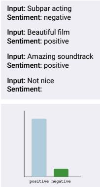
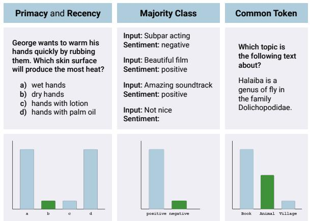
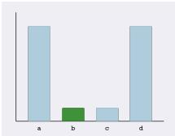
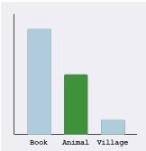
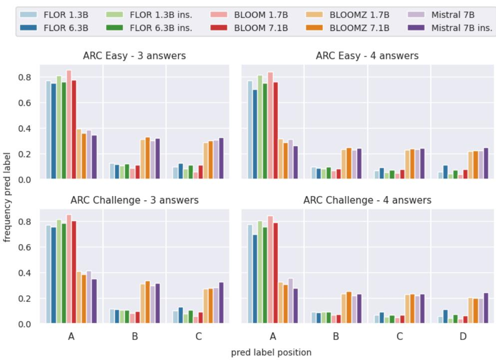
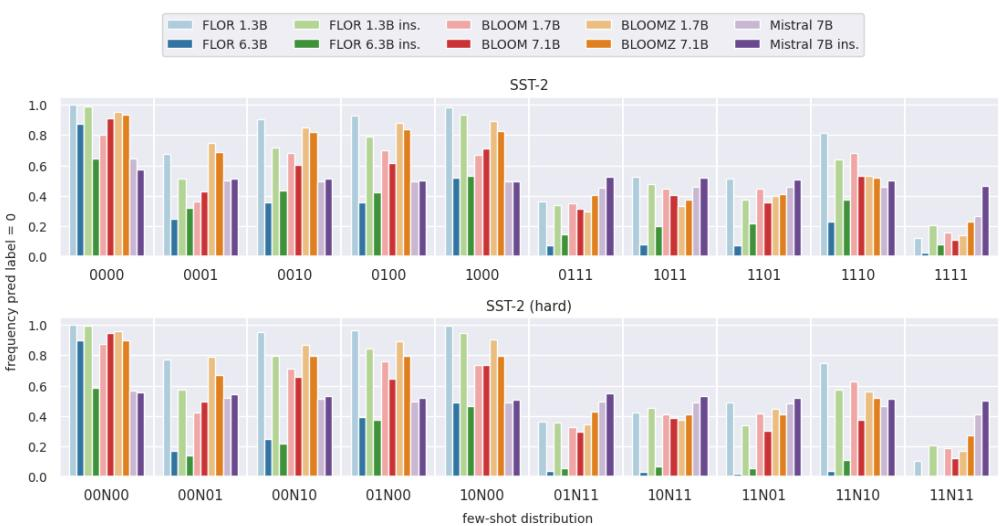
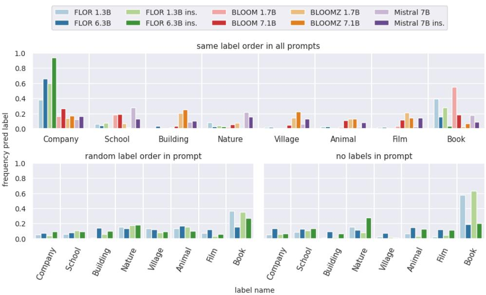
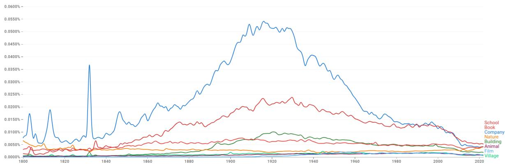

# Cognitive Biases, Task Complexity, and Result Interpretability in Large Language Models

Mario Mina∗ Valle Ruiz-Fernández∗ Júlia Falcão Luis Vasquez-Reina Aitor Gonzalez-Agirre Barcelona Supercomputing Center {mario.magued, valle.ruizfernandez}@bsc.es

## Abstract

In humans, cognitive biases are systematic deviations from rationality in judgment that simplify complex decisions. They typically manifest as a consequence of learned behaviors or limitations on information processing capabilities. Recent work has shown that these biases can percolate through training data and ultimately be learned by language models. We examine different groups of models, factoring in model size and type (base or instructed) for four kinds of cognitive bias: primacy, recency, common token, and majority class bias. We evaluate the performance of each model for each type of bias in different settings using simple and complex variants of datasets. Our results show that some biases have much stronger effects than others, and that task complexity plays a part in eliciting stronger effects for some of these biases as measured by effect size. We show that some cognitive biases such as common token and majority class bias are not straightforward to evaluate, and that, contrary to some of the previous literature, some effects that have been previously classified as common token bias in the literature are actually due to primacy and recency bias.

## 1 Introduction

A cognitive bias is a systematic deviation in judgment that arises in humans. These deviations typically occur because they simplify a given problem, and consequently enable faster decision-making. A rapidly accumulating amount of evidence shows that Large Language Models (LLMs) exhibit similar biases due to their percolation through the datasets used to train them. As a consequence, some model responses can be conditioned by frequent words, classes, and general formatting in the prompt (Petroni et al., 2019; Jiang et al., 2020; Shin et al., 2020; Gao et al., 2021; Zhao et al., 2021; Lu et al., 2022; Mishra et al., 2022; Weber et al., 2023).

  
Figure 1: An example of each type of cognitive bias we examine and its effect on model output probabilities: primacy and recency (left), majority class (center), and common token (left). We highlight the correct answer in each case in green.

More recently, Dubey et al. (2024) analyse the robustness of the suite of Llama 3 models against these issues, as they can silently affect model behaviour. For instance, these biases can make model responses inconsistent, aggravating an already critical issue regarding question answering in NLP (Ko et al., 2020; Robinson et al., 2023; Alzahrani et al., 2024; Gupta et al., 2024; Zheng et al., 2024). Additionally, these cognitive biases can make LLMs susceptible to specific cues, making them more easily manipulated into giving a specific answer.

Previous works have put forth contributions that demonstrate the presence of cognitive biases in LLMs. We attempt to reproduce some of their analyses. Our own findings show that, despite proving that cognitive biases are present in LLMs, these works do not take into account several relevant aspects:

• Task complexity. Shrawgi et al. (2024) demonstrate that social biases tend to be more evident in LLMs when task complexity increases. To the best of our knowledge, this has not been considered for cognitive biases (Zhao et al., 2021; Zheng et al., 2024; Dubey et al., 2024).

• The interplay between different types of cognitive bias. Most works (Zhao et al., 2021; Lu et al., 2022; Wang et al., 2023) consider specific cognitive biases in isolation. However, we have found that, depending on the evaluation format, effects from different types of bias can be found, making the quantification of their effects more difficult.

• Model type. Most studies examine base (or pretrained) and instructed models indiscriminately, while their behaviour can be quite different due to effect of supervised instruction tuning (Alzahrani et al., 2024; Gupta et al., 2024; Zheng et al., 2024).

Following Zhao et al. (2021), we examine different model families for four different types of cognitive bias: primacy bias, recency bias, common token bias, and majority class bias. We additionally take task complexity into account, following Shrawgi et al. (2024). We place specific focus on model size and type. Our results show increasing model capacity either by increasing the number of parameters or performing instruction tuning improves model performance and makes the models more robust against cognitive biases. Similarly, reducing task complexity decreases the reliance of the models on these biases. Furthermore, we observe that a given bias can interfere with the quantification of another one in some cases.

## 2 Related Work

## 2.1 Cognitive biases

The biases we examine in this paper arise from their presence in pretraining or instruction datasets (Malaviya et al., 2022). Others, in contrast, may emerge in LLMs as a result of a combination of these artifacts in the training data and their autoregressive generative processes (Nathan et al., 2023). We will describe them in detail below.

Primacy bias Primacy bias refers to a tendency to attribute greater significance to the first item in a list of options, often resulting in its selection more frequently than other items (Matthews, 1927; Cronbach, 1950).

Recency bias Recency denotes a tendency to give more importance to items appearing towards the end of a series (Baddeley and Hitch, 1993). Note that recency bias is occasionally discussed in the context of language modeling and other applications of computer science to describe a tendency to assign a higher importance to more recent events (e.g. valuing more recent instances of data in an LLM pretraining scenario, or more recent entries in recommendation systems). We highlight that throughout this paper we use it in the former sense and not the latter.

Majority class bias This type of cognitive bias manifests as the tendency to give the majority class as an answer in a few-shot scenario. For consistency, we draw the parallel between majority class bias and availability bias in psychology research (Tversky and Kahneman, 1973; Malaviya et al., 2022). Availability bias in humans is a mental shortcut that relies on recent examples, operating on the notion that if something can be recalled, it must be important. We argue that majority class in few-shot contexts can bias a given model into "believing" that a class is more likely than the other, based on what it has seen in the few-shot examples. We further highlight that this bias is more likely a result of learning mechanisms in the model, and not of an artifact in the data.

Common token bias Common token bias is essentially an extension of the word-frequency effect (Broadbent, 1967), which denotes the ease of processing and retrieval of more frequent words relative to rarer words. Zhao et al. (2021) find that a model is more likely to provide a common word as an answer relative to a rarer one.

## 2.2 Cognitive biases in LLMs

Zhao et al. (2021) perform an analysis of cognitive biases in LLMs. Specifically, they examine the same cognitive biases we do in this paper on GPT-2 (Radford et al., 2019) and GPT-3 (Brown et al., 2020) models of varying size. They perform text classification on SST-2 (Socher et al., 2013), TREC (Voorhees and Tice, 2000), Super-GLUE (Wang et al., 2019), AGNews (Zhang et al., 2015), and DBPedia (Zhang et al., 2015) datasets. Fact retrieval is evaluated with LAMA (Petroni et al., 2019), and information extraction, with ATIS (Hemphill et al., 1990) and MIT movies (Liu et al., 2012). We replicate some of their experiments but come to different conclusions with respect to their findings.

Dubey et al. (2024) additionally run extensive experiments to examine the effects of different prompt orderings in zero- and few-shot settings on evaluation robustness of their recently released Llama models. They find that their models are affected by these factors, and that performance is more robust in larger models.

Wang et al. (2023) examine primacy bias in Chat-GPT (OpenAI, 2022), showing that it is sensitive to label order in zero-shot prompts. They note that label shuffling yields inconsistent results and find a strong effect of label order in GPT-3.5-turbo. They further posit that, in more difficult tasks, ChatGPT may lack sufficient discriminative understanding from the input text. However, they conduct no in-depth analysis involving the role of task complexity.

Rather than analyse model behaviour, Malaviya et al. (2022) carry out an in-depth examination of annotated multiple-choice reading comprehension datasets. They search for traces of the use of heuristics that can bias a given model when generating question-answer pairs for model training or evaluation. For instance, they find evidence of the availability heuristic, by which annotators tend to prefer question-answer pairs that minimise retrieval effort (i.e. answers which can be found towards the beginning or the end of a reading passage). They argue that this artifact of any dataset can very easily be the cause of primacy or recency effects in LLMs.

## 2.3 Task complexity

We follow Shrawgi et al. (2024) and look at the definition and theoretical model developed by Liu and Li (2012). They state that there are objective views (where the complexity of a task is due to its inherent characteristics) and subjective views of task complexity (where it is due to the interplay between task characteristics and the entity undertaking the task).

Liu and Li’s objective model of task complexity suggests that it is the aggregation of any intrinsic task characteristics that influence the performance of a task. They state that a task is composed of multiple components: output, input, process, presentation, and time. Each of these can be arbitrarily more or less complex based on different contribution factors.

We follow Shrawgi et al. (2024) in selecting specific contribution factors where we modify the complexity of a task. For their manipulations, they only focus on specific factors that can be applicable to LLMs. They consider that only size, variety, relationship, and action complexity are the relevant dimensions for this scenario. Liu and Li (2012) ascribe to an objective view of task complexity, but Shrawgi et al. (2024) argue that there are specific tasks which LLMs struggle with, and therefore task complexity for LLMs must be subjective.

For our task manipulations, we specifically target the contribution factor of size; we make each task more or less complex by increasing or decreasing the number of possible output options. Our methods are described further in Section 3.

## 3 Methods

In this paper, we aim to discern if LLMs rely on cognitive biases and determine the effect of task difficulty on this reliance. To do so, we statistically compare a model’s likelihood of providing an answer as influenced by inherent cognitive biases in specific tasks. Furthermore, we manipulate the difficulty levels of these tasks and then observe the effect our manipulation has on model behaviour.

This Section is structured as follows: §3.1 describes our model selection, and in §3.2, we detail each of our experiments, organised by type of cognitive bias. We detail the datasets we use for each task and how we manipulate them to obtain easier or more complex task variants, along with the statistical analyses performed.

## 3.1 Models

We follow Itzhak et al. (2024) in evaluating both base and instruction-tuned LLMs to discern if instruction tuning has any effect on the presence of cognitive biases in LLMs by evaluating the likelihood of various candidates from a predefined set of possible answers. This it circumvents formatting issues, specific keyword matching, etc.

We select the FLOR-BLOOM pair of model families due to the language adaptation paradigm carried out to train the FLOR model (Da Dalt et al., 2024). Essentially, FLOR is a BLOOM model (Workshop et al., 2022) that has been adapted in a continual pretraining setting. We evaluate them to see if the effect of the cognitive biases is comparable for both model types. As it has been already noted, we also include in our analysis the instructed versions of both FLOR1,2 and BLOOM (BLOOMZ; Muennighoff et al., 2023). We also examine Mistral (Jiang et al., 2023) due to its high performance across multiple benchmarks.

<table><tr><td rowspan="2">Dataset</td><td rowspan="2"># few-shot</td><td colspan="4">FLOR</td><td colspan="4">BLOOM</td><td colspan="2">Mistral</td></tr><tr><td colspan="2">base</td><td colspan="2">instructed</td><td colspan="2">base</td><td colspan="2">instructed</td><td>base</td><td>instructed</td></tr><tr><td></td><td></td><td>1.3B</td><td>6.3B</td><td>1.3B</td><td>6.3B</td><td>1.7B</td><td>7.1B</td><td>1.7B</td><td>7.1B</td><td>7B</td><td>7B</td></tr><tr><td>SST-2 (original)</td><td>4</td><td>0.66</td><td>0.69</td><td>0.72</td><td>0.78</td><td>0.78</td><td>0.79</td><td>0.67</td><td>0.72</td><td>0.90</td><td>0.93</td></tr><tr><td>SST-2 (hard)</td><td>5</td><td>0.65</td><td>0.51</td><td>0.71</td><td>0.52</td><td>0.77</td><td>0.69</td><td>0.67</td><td>0.75</td><td>0.90</td><td>0.87</td></tr><tr><td>ARC-Easy (3 ans.)</td><td>0</td><td>0.37</td><td>0.43</td><td>0.37</td><td>0.44</td><td>0.37</td><td>0.41</td><td>0.71</td><td>0.84</td><td>0.86</td><td>0.91</td></tr><tr><td>ARC-Challenge (3 ans.)</td><td>0</td><td>0.34</td><td>0.36</td><td>0.34</td><td>0.36</td><td>0.33</td><td>0.35</td><td>0.54</td><td>0.67</td><td>0.72</td><td>0.82</td></tr><tr><td>ARC-Easy (4 ans.)</td><td>0</td><td>0.28</td><td>0.35</td><td>0.28</td><td>0.35</td><td>0.28</td><td>0.32</td><td>0.66</td><td>0.80</td><td>0.82</td><td>0.88</td></tr><tr><td>ARC-Challenge (4 ans.)</td><td>0</td><td>0.25</td><td>0.29</td><td>0.26</td><td>0.28</td><td>0.24</td><td>0.26</td><td>0.46</td><td>0.61</td><td>0.65</td><td>0.75</td></tr><tr><td>DBPedia (8 labels)</td><td>0</td><td>0.34</td><td>0.35</td><td>0.21</td><td>0.16</td><td>0.39</td><td>0.66</td><td>0.79</td><td>0.71</td><td>0.59</td><td>0.85</td></tr><tr><td>DBPedia (14 labels)</td><td>0</td><td>0.21</td><td>0.25</td><td>0.09</td><td>0.07</td><td>0.31</td><td>0.47</td><td>0.77</td><td>0.72</td><td>0.59</td><td>0.87</td></tr></table>

Table 1: Model performance on different datasets, as measured by accuracy.

## 3.2 Experimental Setup

For all of our experiments, probabilities for each choice are estimated using version 0.4.2 of EleutherAI’s Evaluation Harness (Gao et al., 2023). The choice with the highest likelihood is taken as the model’s answer. This ensures that model responses are consistent and reproducible across runs, and eliminates any undesired variation. We conduct our statistical analyses using SciPy (Virtanen et al., 2020). We provide examples from each dataset and task in Appendix B.

## 3.2.1 Primacy and recency bias

To examine primacy and recency bias, we carry out a zero-shot classification task. We use the ARC dataset (Clark et al., 2018), consisting of several multiple choice questions that are divided into an easy and challenge set. To avoid introducing unwanted confounds, we only consider questions that have four multiple-choice options prior to any of our manipulations (i.e. containing options A, B, C, D). We create four instances from each prompt, each time changing the position of the correct answer, thereby mitigating any confounds that stem from label imbalance.

Following Liu and Li (2012), having more possibilities for a decision makes a given task decidedly more complex. Thus, we reduce the original task complexity by discarding an incorrect option at random, thus narrowing down the number of possible options from four to three. In this simpler variant, each instance is also prompted three times, varying the position of the correct answer.3

We use a similar experimental design for both primacy and recency bias on the ARC dataset. In these cases, we perform a $\chi ^ { 2 }$ goodness-of-fit test between the position of interest and the middle two positions: when evaluating primacy bias, we ignore instances whose predicted label is the last one given in the prompt (i.e. we only consider options A, B, and C), and when we evaluate recency bias, we ignore instances whose predicted label is the first one in the prompt (B, C, and D). Performing tests on groups of three rather than all four positions allows us to isolate the specific effects of each position of interest, while avoiding influence from the other bias. Note that we exclude instances in which the model outputs identical log likelihood for multiple options, as it makes evaluating the selected answer more difficult.

## 3.2.2 Majority class bias

Majority class bias is assessed with 4- and 5-shot classification experiments. As in Zhao et al. (2021), we use the SST-2 dataset on sentiment analysis, which consists of approximately 70k single sentences extracted from movie reviews labeled as negative or positive. We make use of 25k instances, while the remaining ones serve as training examples for the multi-shot design. Each test instance is prompted with all possible unbalanced 4-shot distributions; that is to say, we do not consider instances where the number of positive classes is equal to the number of negative ones. See Figure 3 for all examined 4-shot settings.

We increase complexity by introducing an additional neutral class. We then carry out 5-shot classification: in each few-shot scenario, we insert a neutral example between the first two and last two examples as to avoid confounding primacy and recency effects.4

Using SST-2, we conduct $\chi ^ { 2 }$ independence tests between the predicted label and the majority class in the few-shot setting: 0 (negative) or 1 (positive) for each of the two variables.

In addition, we observe primacy and recency effects after further dividing the dataset based on the majority class. For each majority class, we perform additional independence tests between the predicted label and the class of the first shot, and between the predicted label and the class of the last shot. We highlight that, despite the presence of significant effects in some cases, they do not drastically influence the overarching majority class effects, based on the frequencies shown in Figure 3. We include the results of the primacy and recency effects when measuring majority class bias in Appendix A.

## 3.2.3 Common token bias

We follow Zhao et al. (2021) and use DBPedia, a balanced 14-way topic classification dataset, to assess common token bias.

To determine the prevalence of each token in the training data for our analysis, we take into account both the frequency based on Google Ngrams5, and the relative frequency as indicated by the models’ Byte-Pair-Encoding (BPE) tokenizer (Khanna, 2021). We examine the indices of specific tokens in the tokenizer, as they more directly indicate token frequency in the data used for pretraining. Some target label names in the dataset do not correspond to a unique token, which complicates the evaluation of common token bias. We discard instances where the correct label is not composed by a single token in all of the tokenizers of the models we examine to avoid biases in the aggregation of token probabilities. This yields a balanced dataset of 40k instances and 8 labels out of the 14 original ones. See Appendix B for the original prompt by Zhao et al. (2021) and our slightly modified prompt.

We attempt to evaluate common token bias on DBPedia leveraging several experimental setups.

Our initial experiment follows the same method as Zhao et al. (2021), with our modifications to the prompt and evaluation (i.e. disregarding the labels that are not included as a whole token in the tokenizers of all evaluated models). We further examine the effects of shuffling label order in each prompt, and removing the labels from the prompt altogether.

## 4 Results

Table 1 details performance results as measured by accuracy on the different datasets used. Results of statistical tests6 for each of the examined biases are detailed below in Tables 2, 3, and 4. We only include effect size coefficients where a significant effect is found.

## 4.1 Primacy bias

<table><tr><td colspan="2">Model</td><td colspan="3">ARC-Easy 3 ans.</td><td colspan="2">ARC-Challenge</td></tr><tr><td colspan="2"></td><td></td><td>4</td><td>4 ans. 4</td><td>3 ans. 4</td><td>4 ans. 4</td></tr><tr><td rowspan="3">FLOR</td><td>base</td><td>1.3B 6.3B</td><td>0.71 0.72</td><td>1.03 0.98</td><td>0.73 0.74</td><td>1.04 0.96</td></tr><tr><td></td><td>1.3B</td><td>0.76</td><td>1.10</td><td></td><td></td></tr><tr><td>ins.</td><td>6.3B</td><td>0.72</td><td>1.02</td><td>0.77 0.76</td><td>1.09 1.03</td></tr><tr><td rowspan="3">BLOOM</td><td>base</td><td>1.7B</td><td>0.82</td><td>1.15</td><td>0.82</td><td>1.16</td></tr><tr><td></td><td>7.1B</td><td>0.75</td><td>1.04</td><td>0.78</td><td>1.09</td></tr><tr><td>ins.</td><td>1.7B</td><td>0.11</td><td>0.15</td><td>0.14</td><td>0.17</td></tr><tr><td rowspan="2">Mistral</td><td>base</td><td>7.1B</td><td>0.04</td><td>0.09</td><td>0.07</td><td>0.12</td></tr><tr><td>ins.</td><td>7B 7B</td><td>0.12 0.04</td><td>0.14 0.04</td><td>0.16 0.05</td><td>0.24 0.08</td></tr></table>

Table 2: $\varphi$ coefficients resulting of $\chi ^ { 2 }$ goodness-offit tests to check primacy bias on easy and challenge subsets of ARC dataset. To isolate primacy effects, we only consider options A, B, and C.

We observe significant effects across the board for all model families, sizes, and types as shown in Table 2. The effect size is large in most models. We see that effect size is smaller in larger models when compared to smaller ones, and smaller in instructed models as opposed to their base counterparts. Furthermore, the table shows that effect size is always greater in the four-answer dataset in comparison to its three-answer version. This is not necessarily the case when comparing ARC-Easy and ARC-Challenge.

  
Figure 2: Frequency distributions of predicted answers on ARC subsets depending on their position in the prompt and the number of multiple-choice answers given. Order of models in graph is top to bottom, then left to right.

<table><tr><td colspan="2">Model</td><td rowspan="2"></td><td colspan="2">ARC-Easy</td><td colspan="2">ARC-Challenge</td></tr><tr><td colspan="2"></td><td>3 ans. 4</td><td>4 ans. 4</td><td>3 ans. 4</td><td>4 ans. 4</td></tr><tr><td rowspan="3">FLOR</td><td>base</td><td>1.3B 6.3B</td><td>0.12 0.03</td><td>0.22 0.10</td><td>0.07 0.08</td><td>0.21 0.10</td></tr><tr><td></td><td>1.3B</td><td>0.13</td><td></td><td></td><td></td></tr><tr><td>ins.</td><td>6.3B</td><td>0.05</td><td>0.27 0.13</td><td>0.17</td><td>0.32 0.13</td></tr><tr><td rowspan="3">BLOOM</td><td>base</td><td>1.7B 7.1B</td><td>0.20</td><td>0.23</td><td>0.19</td><td>0.25</td></tr><tr><td rowspan="2">ins.</td><td>1.7B</td><td>0.04</td><td>0.03</td><td>0.06</td><td>0.06</td></tr><tr><td>7.1B</td><td>0.04</td><td>0.04</td><td>0.10</td><td>0.10</td></tr><tr><td rowspan="2">Mistral</td><td>base</td><td>7B</td><td>一</td><td>一</td><td>一</td><td>0.04</td></tr><tr><td>ins.</td><td>7B</td><td>一</td><td>一</td><td>一</td><td>一</td></tr></table>

Table 3: $\varphi$ coefficients resulting of $\chi ^ { 2 }$ goodness-of-fit tests to check positional bias on easy and challenge subsets of ARC dataset. −: p-value > 0.05. To isolate recency effects, we only include options B, C, and D. Note that while the analysis was initially planned for recency bias, effect sizes are for primacy bias.

## 4.2 Recency bias

While this experiment was designed to examine recency bias, we find no recency effects. To our surprise, taking Figure 2 and Table 3 together, we see an extension of the effect of primacy bias; we observe significant, but small, primacy effects for

<table><tr><td colspan="2">Model</td><td rowspan="2">original</td><td colspan="2">SST-2</td></tr><tr><td rowspan="2">base</td><td rowspan="2"></td><td>V</td><td>hard V 0.54</td></tr><tr><td>1.3B 6.3B</td><td>0.46 0.41 0.53</td></tr><tr><td rowspan="2">FLOR</td><td>ins.</td><td>1.3B 6.3B</td><td>0.39 0.28</td><td>0.45 0.37</td></tr><tr><td>base</td><td>1.7B</td><td>0.23</td><td>0.31</td></tr><tr><td rowspan="2">BLOOM</td><td></td><td>7.1B</td><td>0.31</td><td>0.41</td></tr><tr><td>ins.</td><td>1.7B 7.1B</td><td>0.53 0.44</td><td>0.52 0.39</td></tr><tr><td rowspan="2">Mistral</td><td>base</td><td>7B</td><td>0.11</td><td>0.05</td></tr><tr><td>ins.</td><td>7B</td><td>0.02</td><td>0.01</td></tr></table>

Table 4: V coefficients resulting of $\chi ^ { 2 }$ independence tests to check majority class bias on SST-2 dataset.

FLOR and BLOOM model families, as seen in the more elevated frequencies for option B as compared to C, and C as compared to D. We see that increasing model size decreases effect size for FLOR and BLOOM base but not BLOOMZ, and instruction tuning actually increases it for the FLOR models, but decreases it for BLOOM.

## 4.3 Majority class bias

Majority class bias is evaluated on the SST-2 dataset in 4 and 5-shot settings. Figure 3 shows the results obtained in both variants. Reliance on this bias was statistically measured with $\chi ^ { 2 }$ independence tests between predicted label and majority class. Effect sizes (Cramér’s V coefficient) are detailed in Table 4.

  
Figure 3: Frequency distributions of class 0 predictions on SST-2 dataset depending on the class distribution in few-shot. 0 denotes the negative class, while 1 denotes the positive class. In the lower figure, N represents the included neutral example to add task complexity.

Table 4 shows similar results as Tables 2 and 3, in that larger and instructed models have lower effect sizes than smaller base models. We see this trend across the board for all model families. In addition, our manipulation to make the task more complex by adding an extra category makes the effect of majority class bias larger; we observe larger effect sizes for almost every model on the SST-2 hard variant of the dataset. Exceptionally, both versions of Mistral and BLOOMZ have a slightly smaller effect size.

Furthermore, a careful observation of Figure 3 reveals a recency effect (see Appendix A Tables 6a-6d); output rates of the 0 class drop in the case of 00(N)01, even more so than in the 10(N)00 shots. We find that the effect is mirrored in 11(N)10 and 01(N)11 shots for the 1 class.

## 4.4 Common token bias

To evaluate common token bias, we initially followed Zhao et al. (2021) and used DBPedia test split with the prompt proposed by the authors.

Figure 4 illustrates the frequency distribution of the models’ outputs for each of the included labels. As clearly seen, there is a preference towards Company and Book in the upper panel. These results align with Zhao et al. (2021), who stated that their evaluated models predict the Book class more often than the Artist class (excluded here). However, Figure 4 shows that this preference is not present for Company when the list is shuffled (lower left), but remains for Book. Nevertheless, we observe a tendency to prefer the Book and Nature classes in the smaller FLOR models when no labels are explicitly provided (lower right). We highlight that Book and Nature are not the most common tokens according to Google Ngrams or according to the FLOR BPE tokenizer (see Appendix C, Figure 5).

## 5 Discussion

## 5.1 Primacy, recency, and majority class biases

For primacy and majority class biases, the trends are quite clear; larger models exhibit smaller effects of cognitive bias than their smaller counterparts (e.g. BLOOM 7.1B vs. BLOOM 1.7B). Furthermore, instruction-tuned models are normally more robust against cognitive biases than their base versions (e.g. FLOR-1.3B-Instructed vs. FLOR 1.3B). However, this seems to be somewhat dependent on the instruction tuning dataset; for instance, majority class bias effect size is actually much greater for BLOOMZ models than it is for BLOOM models. We suspect that the increase in model capacity allows the model to be guided by the more relevant aspects of the task, which decreases reliance on irrelevant aspects. This may coincide with an increase in performance, but not necessarily. For instance, in Table 1, instructed FLOR models show similar performance on ARC-Easy, while showing a lower effect size for primacy bias (Table 2).

  
Figure 4: Frequency distributions of predicted DBPedia labels in three contexts: keeping the order in which labels are presented in the prompt (upper panel), randomly shuffling their order each time (lower left), and not including any label (lower right).

We do not detect a recency effect on the ARC multiple-choice task, but we do observe it in a fewshot setting on the SST-2 dataset. Moreover, we see that the recency effect does not follow the same trends as primacy and majority class bias; the effect size actually decreases when we increase task complexity, while the effect size for majority class increases.

The presence of recency bias in the 4-shot setting but not zero-shot setting suggests that the prompt formats rely differently on cognitive biases. For instance, Nathan et al. (2023) argue that in-context learning in few-shot prompts is akin to a superficial form of gradient descent, in which case the importance of the final shot may only be relevant when the number of shots is small, as its contribution, while salient, would become diluted with all other shots. This differs from zero-shot settings as there would be no in-context learning.

All examined biases seem to be affected in one way or another by task complexity, albeit with some differences. While increasing the difficulty of the content lowers accuracy (i.e. models have lower accuracy on ARC-Challenge than on ARC-Easy), we observe that it does not necessarily increase reliance on cognitive biases. However, our manipulation of increasing or decreasing the number of options for each task (e.g. removing an incorrect option for ARC or adding an extra neutral class for SST-2) consistently yields differences in performance in addition to increasing the models’ reliance on cognitive bias. This suggests that while the ARC-Challenge subset may include more challenging questions in terms of content, the task in itself is not more complex, consistent with the model put forth by Liu and Li (2012).

Regarding the transfer of cognitive biases as a result of continued pretraining, some similarities are observed between FLOR and BLOOM models. However, these are by no means robust, as there can be stark differences between base models. For instance, BLOOM base models have a much smaller effect size for majority class bias in comparison to FLOR base models.

Furthermore, our results support Shrawgi et al. (2024)’s subjective perspective of task difficulty; if an unmitigated reliance on cognitive biases can be taken as a proxy for task complexity, then our results show that complexity must be affected by both the model’s capacity and the complexity contribution factors.

## 5.2 On the difficulty of assessing common token bias

Given our use of multilingual models, correctly estimating token frequency is a complex task. On one hand, utilising Google Ngrams would give a rough estimate of the prevalence of a given word in monolingual corpora. But on the other hand, directly examining a BPE tokenizer can reveal the relative order of tokens by how common they are in the entire pretraining corpus (Khanna, 2021).

While our initial experiment shows agreement with Zhao et al. (2021), we observe that our results are also consistent with primacy and recency effects. Results of the $\chi ^ { 2 }$ goodness-of-fit tests confirm that these biases come into play, with very large effect sizes in some instances (see appendix A). Further to this, randomly reordering the labels on a prompt-by-prompt basis leads to the disappearance of these effects, as shown in the lower left in Figure 4. However, our third experiment where the labels are completely removed (lower right of Figure 4) does show that the labels Book and Nature are predicted with a higher frequency. We highlight that these are not the most common tokens according to either Google Ngrams or the BPE tokenizer.

In light of the discrepancy between the predictions and token frequencies, we posit that other factors are at play that influence the prediction process that may have stronger effects. Furthermore, we do not carry out an experiment where we modify task difficulty, as it is unclear what cognitive bias we would be measuring.

## 6 Conclusion and future work

Our results contribute to a growing body of work showing that cognitive biases occur frequently in LLMs. This raises the question: How should NLP practitioners and developers measure performance in a fair and robust way? Furthermore, we highlight the novelty of our contributions: our theory-driven data manipulations show that the complexity of a given task often impacts the extent to which LLMs make use of these biases, which has consequences on the robustness of current evaluation frameworks.

We demonstrate that several types of bias can be at play within the same task, to the extent that they can obscure specific effects (i.e. primacy and recency bias can be concealed by common token bias) thus making the analysis more difficult. This has been, to the best of our knowledge, consistently overlooked in the literature.

Future work will aim to develop a more adequate method to detect the presence of common token bias. Additionally, our method aligns with Dubey et al. (2024) in examining model robustness against cognitive biases; rather than conducting a broad analysis, we carry out an in-depth analysis on a few specific datasets. However, we argue that the robustness of the trends across datasets, models and types of bias is indicative of the generalisability of our findings, especially when taking into account previous literature (Zhao et al., 2021; Shrawgi et al., 2024). That said, we aim to further extend our analysis to more varied datasets and model families.

## 7 Limitations

As stated in Section 6, given the depth of our analysis of task complexity manipulations and the detail with which we examine the cognitive biases, our scope of analysis is fairly limited in terms of datasets and model families.

In addition, we were able to discern that primacy and recency biases influence model performance on the DBPedia text classification task. However, were not able to completely rule out (or rule in) common token bias, due to issues accessing the specific datasets the models were trained on and the compute budget necessary to quantify occurrences of each label in the dataset. As stated, we aim to address these issues in future work.

## 8 Ethics statement

With this paper, we aim to shed light on the presence of cognitive biases in LLMs and their interplay with task difficulty and evaluation robustness. However, by doing so, we expose a weakness in LLMs that can be exploited to influence their predictions. At the same time, by exposing the weakness and participating in the discussion of what the implications are for model evaluation, we hope to contribute to finding a solution. We do not foresee our work being used for any other unethical purposes beyond what is mentioned in this section.

## Acknowledgments

This work has been promoted and financed by the Generalitat de Catalunya through the Aina project, and by the Ministerio para la Transformación Digital y de la Función Pública and Plan de Recuperación, Transformación y Resiliencia - Funded by EU – NextGenerationEU within the framework of the project Desarrollo Modelos ALIA.

We would additionally like to thank Severino Da Dalt for the insightful discussions regarding tokenizers.

## References

Norah Alzahrani, Hisham Abdullah Alyahya, Yazeed Alnumay, Sultan Alrashed, Shaykhah Alsubaie, Yusef Almushaykeh, Faisal Mirza, Nouf Alotaibi, Nora Altwairesh, Areeb Alowisheq, M Saiful Bari, and Haidar Khan. 2024. When benchmarks are targets: Revealing the sensitivity of large language model leaderboards. Preprint, arXiv:2402.01781.

Alan D Baddeley and Graham Hitch. 1993. The recency effect: Implicit learning with explicit retrieval? Memory & Cognition, 21:146–155.

D Broadbent. 1967. Word-frequency effect and response bias. Psychological review, 74(1):1.

Tom B. Brown, Benjamin Mann, Nick Ryder, Melanie Subbiah, Jared Kaplan, Prafulla Dhariwal, Arvind Neelakantan, Pranav Shyam, Girish Sastry, Amanda Askell, Sandhini Agarwal, Ariel Herbert-Voss, Gretchen Krueger, Tom Henighan, Rewon Child, Aditya Ramesh, Daniel M. Ziegler, Jeffrey Wu, Clemens Winter, Christopher Hesse, Mark Chen, Eric Sigler, Mateusz Litwin, Scott Gray, Benjamin Chess, Jack Clark, Christopher Berner, Sam McCandlish, Alec Radford, Ilya Sutskever, and Dario Amodei. 2020. Language models are few-shot learners. CoRR, abs/2005.14165.

Peter Clark, Isaac Cowhey, Oren Etzioni, Tushar Khot, Ashish Sabharwal, Carissa Schoenick, and Oyvind Tafjord. 2018. Think you have solved question answering? try arc, the ai2 reasoning challenge. arXiv:1803.05457v1.

Lee J Cronbach. 1950. Further evidence on response sets and test design. Educational and psychological measurement, 10(1):3–31.

Severino Da Dalt, Joan Llop, Irene Baucells, Marc Pàmies, Yishi Xu, Aitor Gonzalez-Agirre, and Marta Villegas. 2024. Flor: On the effectiveness of language adaptation. In Proceedings ofthe 2024 Joint International Conference on Computational Linguistics, Language Resources and Evaluation (LREC-COLING 2024), pages 7377–7388.

Abhimanyu Dubey, Abhinav Jauhri, Abhinav Pandey, Abhishek Kadian, Ahmad Al-Dahle, Aiesha Letman, Akhil Mathur, Alan Schelten, Amy Yang, Angela Fan, et al. 2024. The llama 3 herd of models. arXiv preprint arXiv:2407.21783.

Leo Gao, Jonathan Tow, Baber Abbasi, Stella Biderman, Sid Black, Anthony DiPofi, Charles Foster, Laurence Golding, Jeffrey Hsu, Alain Le Noac’h, Haonan Li, Kyle McDonell, Niklas Muennighoff, Chris Ociepa, Jason Phang, Laria Reynolds, Hailey Schoelkopf, Aviya Skowron, Lintang Sutawika, Eric Tang, Anish Thite, Ben Wang, Kevin Wang, and Andy Zou. 2023. A framework for few-shot language model evaluation.

Tianyu Gao, Adam Fisch, and Danqi Chen. 2021. Making pre-trained language models better few-shot

learners. In Proceedings of the 59th Annual Meeting ofthe Associationfor Computational Linguistics and the 11th International Joint Conference on Natural Language Processing (Volume 1: Long Papers), pages 3816–3830, Online. Association for Computational Linguistics.

Vipul Gupta, David Pantoja, Candace Ross, Adina Williams, and Megan Ung. 2024. Changing answer order can decrease mmlu accuracy. Preprint, arXiv:2406.19470.

Charles T. Hemphill, John J. Godfrey, and George R. Doddington. 1990. The ATIS spoken language systems pilot corpus. In Speech and Natural Language: Proceedings of a Workshop Held at Hidden Valley, Pennsylvania, June 24-27,1990.

Itay Itzhak, Gabriel Stanovsky, Nir Rosenfeld, and Yonatan Belinkov. 2024. Instructed to bias: Instruction-tuned language models exhibit emergent cognitive bias. Transactions of the Association for Computational Linguistics, 12:771–785.

Albert Q. Jiang, Alexandre Sablayrolles, Arthur Mensch, Chris Bamford, Devendra Singh Chaplot, Diego de las Casas, Florian Bressand, Gianna Lengyel, Guillaume Lample, Lucile Saulnier, Lélio Renard Lavaud, Marie-Anne Lachaux, Pierre Stock, Teven Le Scao, Thibaut Lavril, Thomas Wang, Timothée Lacroix, and William El Sayed. 2023. Mistral 7b. Preprint, arXiv:2310.06825.

Zhengbao Jiang, Frank F. Xu, Jun Araki, and Graham Neubig. 2020. How can we know what language models know? Transactions ofthe Associationfor Computational Linguistics, 8:423–438.

Chetna Khanna. Byte-pair encoding: Subword-based tokenization algorithm [online]. 2021. Accessed: 2024-08-13.

Miyoung Ko, Jinhyuk Lee, Hyunjae Kim, Gangwoo Kim, and Jaewoo Kang. 2020. Look at the first sentence: Position bias in question answering. In Proceedings of the 2020 Conference on Empirical Methods in Natural Language Processing (EMNLP), pages 1109–1121, Online. Association for Computational Linguistics.

Jingjing Liu, D. Scott Cyphers, Panupong Pasupat, Ian McGraw, and James R. Glass. 2012. A conversational movie search system based on conditional random fields. In Interspeech.

Peng Liu and Zhizhong Li. 2012. Task complexity: A review and conceptualization framework. International Journal ofIndustrial Ergonomics, 42(6):553– 568.

Yao Lu, Max Bartolo, Alastair Moore, Sebastian Riedel, and Pontus Stenetorp. 2022. Fantastically ordered prompts and where to find them: Overcoming fewshot prompt order sensitivity. In Proceedings of the 60th Annual Meeting of the Association for Computational Linguistics (Volume 1: Long Papers), pages

8086–8098, Dublin, Ireland. Association for Computational Linguistics.

Chaitanya Malaviya, Sudeep Bhatia, and Mark Yatskar. 2022. Cascading biases: Investigating the effect of heuristic annotation strategies on data and models. In Proceedings of the 2022 Conference on Empirical Methods in Natural Language Processing, pages 6525–6540.

CO Matthews. 1927. The effect of position of printed response words upon children’s answers to questions in two-response types of tests. Journal of Educational Psychology, 18(7):445.

Swaroop Mishra, Daniel Khashabi, Chitta Baral, Yejin Choi, and Hannaneh Hajishirzi. 2022. Reframing instructional prompts to GPTk’s language. In Findings of the Association for Computational Linguistics: ACL 2022, pages 589–612, Dublin, Ireland. Association for Computational Linguistics.

Niklas Muennighoff, Thomas Wang, Lintang Sutawika, Adam Roberts, Stella Biderman, Teven Le Scao, M Saiful Bari, Sheng Shen, Zheng-Xin Yong, Hailey Schoelkopf, Xiangru Tang, Dragomir Radev, Alham Fikri Aji, Khalid Almubarak, Samuel Albanie, Zaid Alyafeai, Albert Webson, Edward Raff, and Colin Raffel. 2023. Crosslingual generalization through multitask finetuning. Preprint, arXiv:2211.01786.

Tomer Bar Nathan, Gilad Deutch, Nadav Magar, and Guy Dar. 2023. In-context learning and gradient descent revisited. arXiv preprint arXiv:2311.07772.

OpenAI. 2022. Introducing chatgpt.

Fabio Petroni, Tim Rocktäschel, Sebastian Riedel, Patrick Lewis, Anton Bakhtin, Yuxiang Wu, and Alexander Miller. 2019. Language models as knowledge bases? In Proceedings of the 2019 Conference on Empirical Methods in Natural Language Processing and the 9th International Joint Conference on Natural Language Processing (EMNLP-IJCNLP), pages 2463–2473, Hong Kong, China. Association for Computational Linguistics.

Alec Radford, Jeff Wu, Rewon Child, David Luan, Dario Amodei, and Ilya Sutskever. 2019. Language models are unsupervised multitask learners.

Joshua Robinson, Christopher Michael Rytting, and David Wingate. 2023. Leveraging large language models for multiple choice question answering. Preprint, arXiv:2210.12353.

Taylor Shin, Yasaman Razeghi, Robert L. Logan IV, Eric Wallace, and Sameer Singh. 2020. AutoPrompt: Eliciting Knowledge from Language Models with Automatically Generated Prompts. In Proceedings of the 2020 Conference on Empirical Methods in Natural Language Processing (EMNLP), pages 4222–4235, Online. Association for Computational Linguistics.

Hari Shrawgi, Prasanjit Rath, Tushar Singhal, and Sandipan Dandapat. 2024. Uncovering stereotypes in large language models: A task complexity-based approach. In Proceedings ofthe 18th Conference ofthe European Chapter of the Association for Computational Linguistics (Volume 1: Long Papers), pages 1841– 1857, St. Julian’s, Malta. Association for Computational Linguistics.

Richard Socher, Alex Perelygin, Jean Wu, Jason Chuang, Christopher D. Manning, Andrew Ng, and Christopher Potts. 2013. Recursive deep models for semantic compositionality over a sentiment treebank. In Proceedings of the 2013 Conference on Empirical Methods in Natural Language Processing, pages 1631–1642, Seattle, Washington, USA. Association for Computational Linguistics.

Amos Tversky and Daniel Kahneman. 1973. Availability: A heuristic for judging frequency and probability. Cognitive psychology, 5(2):207–232.

Pauli Virtanen, Ralf Gommers, Travis E. Oliphant, Matt Haberland, Tyler Reddy, David Cournapeau, Evgeni Burovski, Pearu Peterson, Warren Weckesser, Jonathan Bright, Stéfan J. van der Walt, Matthew Brett, Joshua Wilson, K. Jarrod Millman, Nikolay Mayorov, Andrew R. J. Nelson, Eric Jones, Robert Kern, Eric Larson, C J Carey, ˙Ilhan Polat, Yu Feng, Eric W. Moore, Jake VanderPlas, Denis Laxalde, Josef Perktold, Robert Cimrman, Ian Henriksen, E. A. Quintero, Charles R. Harris, Anne M. Archibald, Antônio H. Ribeiro, Fabian Pedregosa, Paul van Mulbregt, and SciPy 1.0 Contributors. 2020. SciPy 1.0: Fundamental Algorithms for Scientific Computing in Python. Nature Methods, 17:261–272.

Ellen M. Voorhees and Dawn M. Tice. 2000. Building a question answering test collection. In Proceedings ofthe 23rd Annual International ACM SIGIR Conference on Research and Development in Information Retrieval, SIGIR ’00, page 200–207, New York, NY, USA. Association for Computing Machinery.

Alex Wang, Yada Pruksachatkun, Nikita Nangia, Amanpreet Singh, Julian Michael, Felix Hill, Omer Levy, and Samuel R. Bowman. 2019. Superglue: A stickier benchmark for general-purpose language understanding systems. CoRR, abs/1905.00537.

Yiwei Wang, Yujun Cai, Muhao Chen, Yuxuan Liang, and Bryan Hooi. 2023. Primacy effect of ChatGPT. In Proceedings of the 2023 Conference on Empirical Methods in Natural Language Processing, pages 108–115, Singapore. Association for Computational Linguistics.

Lucas Weber, Elia Bruni, and Dieuwke Hupkes. 2023. Mind the instructions: a holistic evaluation of consistency and interactions in prompt-based learning. In Proceedings of the 27th Conference on Computational Natural Language Learning (CoNLL), pages 294–313, Singapore. Association for Computational Linguistics.

BigScience Workshop, Teven Le Scao, Angela Fan, Christopher Akiki, Ellie Pavlick, Suzana Ilic, Daniel´ Hesslow, Roman Castagné, Alexandra Sasha Luccioni, François Yvon, et al. 2022. Bloom: A 176bparameter open-access multilingual language model. arXiv preprint arXiv:2211.05100.

Xiang Zhang, Junbo Jake Zhao, and Yann LeCun. 2015. Character-level convolutional networks for text classification. CoRR, abs/1509.01626.

Tony Zhao, Eric Wallace, Shi Feng, Dan Klein, and Sameer Singh. 2021. Calibrate before use: Improving few-shot performance of language models. In International Conference on Machine Learning.

Chujie Zheng, Hao Zhou, Fandong Meng, Jie Zhou, and Minlie Huang. 2024. Large language models are not robust multiple choice selectors. Preprint, arXiv:2309.03882.

## A On the Interplay of Primacy and Recency Biases with Other Biases: Statistical Analysis

Tables 5a and 5b show the results on common token bias. Tables 6a, 6b, 6c and 6d detail the results of $\chi ^ { 2 }$ independence tests to check the interaction between primacy and recency biases on majority class bias.

<table><tr><td colspan="2">Model</td><td rowspan="2">DBPedia (8 labels) 4</td></tr><tr><td colspan="2"></td></tr><tr><td rowspan="2">FLOR</td><td>base</td><td>1.3B 1.44 6.3B 1.83</td></tr><tr><td>1.3B ins. 6.3B</td><td>1.97 1.67</td></tr><tr><td rowspan="3">BLOOM</td><td>base</td><td>1.7B 1.10</td></tr><tr><td>7.1B</td><td>0.68</td></tr><tr><td>1.7B ins. 7.1B</td><td>0.37 0.67</td></tr><tr><td rowspan="2">Mistral</td><td>base</td><td>7B</td><td>0.78</td></tr><tr><td>ins.</td><td>7B 0.21</td></tr></table>

(a) Primacy bias. To isolate primacy effects, we do not consider the last option in the prompt.

<table><tr><td colspan="2">Model</td><td rowspan="2">DBPedia (8 labels) 4</td></tr><tr><td colspan="2"></td></tr><tr><td rowspan="2">FLOR</td><td>base</td><td>1.3B 1.46 6.3B 0.92</td></tr><tr><td>1.3B ins. 6.3B</td><td>1.63 1.01</td></tr><tr><td rowspan="3">BLOOM</td><td>base</td><td>1.7B 1.55</td></tr><tr><td>7.1B</td><td>0.57</td></tr><tr><td>1.7B ins. 7.1B</td><td>0.52 0.76</td></tr><tr><td rowspan="2">Mistral</td><td>base</td><td>7B</td><td>0.75</td></tr><tr><td>ins.</td><td>7B 0.22</td></tr></table>

(b) Recency bias on DBPedia dataset (8 labels). To isolate recency effects, we do not consider the first option in the prompt.  
Table 5: φ coefficients resulting from $\chi ^ { 2 }$ goodness-of-fit tests to check positional effects on DBPedia.

<table><tr><td colspan="2">Model</td><td colspan="2">SST-2 original hard</td></tr><tr><td rowspan="2">FLOR</td><td>base</td><td>V 1.3B 0.14</td><td>V 0.12</td></tr><tr><td>ins.</td><td>6.3B 0.05 1.3B 0.18</td><td>0.03 0.15</td></tr><tr><td rowspan="3">BLOOM</td><td>base</td><td>6.3B 1.7B</td><td>0.06 0.12 0.03 0.04</td></tr><tr><td></td><td>7.1B 1.7B</td><td>0.06 0.04 0.04</td></tr><tr><td>ins.</td><td>7.1B 一</td><td>0.03 一</td></tr><tr><td rowspan="2">Mistral</td><td>base</td><td>7B</td><td>0.03</td><td>0.03</td></tr><tr><td>ins.</td><td>7B</td><td>0.02</td><td>0.02</td></tr></table>

(a) Primacy bias when class distribution in few-shot is unbalanced towards class 0. −: p-value > 0.05.

<table><tr><td colspan="2">Model</td><td colspan="3">SST-2 original hard</td></tr><tr><td rowspan="3">FLOR</td><td></td><td>1.3B</td><td>V 0.10</td><td>V 0.07</td></tr><tr><td>base</td><td>6.3B</td><td>0.04</td><td>0.04</td></tr><tr><td>ins.</td><td>1.3B 6.3B</td><td>0.07 0.07</td><td>0.03 一</td></tr><tr><td rowspan="2">BLOOM</td><td>base</td><td>1.7B 7.1B</td><td>0.06 0.03</td><td>0.07 一</td></tr><tr><td>ins.</td><td>1.7B 7.1B</td><td>0.05 0.02</td><td>0.03 0.02</td></tr><tr><td rowspan="2">Mistral</td><td>base</td><td>7B</td><td>0.03</td><td>0.03</td></tr><tr><td>ins.</td><td>7B</td><td>0.02</td><td>0.02</td></tr></table>

(b) Primacy bias when class distribution in few-shot is unbalanced towards class 1. −: p-value > 0.05.

<table><tr><td colspan="2">Model</td><td colspan="3">SST-2 original hard</td></tr><tr><td rowspan="3">FLOR</td><td></td><td>1.3B</td><td>V 0.36</td><td>V 0.03</td></tr><tr><td>base</td><td>6.3B</td><td>0.22</td><td>0.18</td></tr><tr><td rowspan="2">ins.</td><td>1.3B 6.3B</td><td>0.34 0.15</td><td>0.05 0.13</td></tr><tr><td>base</td><td>1.7B</td><td>0.29</td><td>0.01</td></tr><tr><td rowspan="2">BLOOM</td><td></td><td>7.1B</td><td>0.24</td><td>0.05</td></tr><tr><td>ins.</td><td>1.7B 7.1B</td><td>0.17 0.17</td><td>0.02 0.01</td></tr><tr><td rowspan="2">Mistral</td><td>base</td><td>7B</td><td>0.03</td><td>0.01</td></tr><tr><td>ins.</td><td>7B</td><td>0.01</td><td>一</td></tr></table>

(c) Recency bias when class distribution in few-shot is unbalanced towards class 0. −: p-value > 0.05.

<table><tr><td colspan="2">Model</td><td colspan="3">SST-2 original hard</td></tr><tr><td rowspan="2">FLOR</td><td>base</td><td>1.3B</td><td>V 0.35</td><td>V 0.06</td></tr><tr><td></td><td>6.3B 1.3B</td><td>0.22 0.24</td><td>0.02 0.05</td></tr><tr><td rowspan="2">BLOOM</td><td>ins.</td><td>6.3B 1.7B</td><td>0.21 0.27</td><td>一 0.02</td></tr><tr><td>base</td><td>7.1B 1.7B</td><td>0.20</td><td>0.01 0.07</td></tr><tr><td rowspan="2">Mistral</td><td>ins.</td><td>7.1B</td><td>0.20 0.14</td><td>一</td></tr><tr><td>base ins.</td><td>7B 7B</td><td>0.04</td><td>0.01 一</td></tr></table>

(d) Recency bias when class distribution in few-shot is unbalanced towards class 1. −: p-value > 0.05.

Table 6: V coefficients resulting from $\chi ^ { 2 }$ independence tests to check positional effects on SST-2.

## B Prompts Used

Tables 7, 8 and 9 show the default prompts used for all tasks.  
Task Example Prompt Labels   
original Review: very pleasing at its best moments negative, positive   
Sentiment: positive   
Review: accident   
Sentiment: negative   
Review: an unremittingly ugly movie   
Sentiment: negative   
Review: like a medium-grade network sitcom – mostly   
inoffensive , fitfully amusing , but ultimately so   
weightless that a decent draft in the auditorium might   
blow it off the screen .   
Sentiment: negative   
Review: it ’s a charming and often affecting journey .   
Sentiment:   
hard Review: very pleasing at its best moments negative, positive,   
Sentiment: positive neutral   
Review: accident   
Sentiment: negative   
Review: This is an example.   
Sentiment: neutral   
Review: an unremittingly ugly movie   
Sentiment: negative   
Review: like a medium-grade network sitcom – mostly   
inoffensive , fitfully amusing , but ultimately so   
weightless that a decent draft in the auditorium might   
blow it off the screen .   
Sentiment: negative   
Review: it ’s a charming and often affecting journey .   
Sentiment:  
Table 7: Few-shot prompts used to assess majority class bias with SST-2 dataset. We show one example per task and their possible predicted labels. Note that each instance is prompted with all possible class distributions in few-shot setting. The original 4-shot prompt is the one used by Zhao et al. (2021). The hard 5-shot version was created inserting a neutral example (in bold).

<table><tr><td colspan="3" rowspan="1">Task        Example Prompt</td></tr><tr><td colspan="3" rowspan="1">3 answers   Question: Why do satellites and spacecraft launched from Earthneed to reach a specific speed to escape Earth's surface?Possible answers: to overcome Earth's gravitational force, tobreak through the sound barrier, to avoid Earth's magnetic field.Answer:Question: Why do satellites and spacecraft launched from Earthneed to reach a specific speed to escape Earth's surface?Possible answers: to break through the sound barrier, to overcomeEarth's gravitational force, to avoid Earth's magnetic field.Answer:</td></tr><tr><td colspan="2" rowspan="1"></td><td colspan="1" rowspan="5">Question: Why do satellites and spacecraft launched from Earthneed to reach a specific speed to escape Earth's surface?Possible answers: to break through the sound barrier, to avoidEarth's magnetic field, to overcome Earth's gravitational force.Answer:</td></tr><tr><td colspan="2" rowspan="1"></td></tr><tr><td colspan="2" rowspan="1"></td></tr><tr><td colspan="2" rowspan="1"></td></tr><tr><td colspan="2" rowspan="1"></td></tr><tr><td colspan="2" rowspan="1">4 answers</td><td colspan="1" rowspan="6">Question: Seasons in Alaska are primarily caused by which factoras Earth revolves around the Sun?Possible answers: the tilt of Earth on its axis, the rate ofrotation of Earth, the effects of solar flare activity, therelative distance between Earth and the Sun.Answer:</td></tr><tr><td colspan="2" rowspan="1"></td></tr><tr><td colspan="2" rowspan="1"></td></tr><tr><td colspan="2" rowspan="1"></td></tr><tr><td colspan="2" rowspan="1"></td></tr><tr><td colspan="2" rowspan="1"></td></tr><tr><td colspan="2" rowspan="1"></td><td colspan="1" rowspan="5">Question: Seasons in Alaska are primarily caused by which factoras Earth revolves around the Sun?Possible answers: the rate of rotation of Earth, the tilt ofEarth on its axis, the effects of solar flare activity, therelative distance between Earth and the Sun.Answer:</td></tr><tr><td colspan="2" rowspan="1"></td></tr><tr><td colspan="2" rowspan="1"></td></tr><tr><td colspan="2" rowspan="1"></td></tr><tr><td colspan="2" rowspan="3"></td></tr><tr><td colspan="1" rowspan="3">Question: Seasons in Alaska are primarily caused by which factoras Earth revolves around the Sun?Possible answers: the rate of rotation of Earth, the effectsof solar flare activity, the tilt of Earth on its axis, therelative distance between Earth and the Sun.Answer:</td></tr><tr><td colspan="1" rowspan="1"></td></tr><tr><td colspan="2" rowspan="3"></td><td colspan="1" rowspan="1"></td></tr><tr><td colspan="1" rowspan="2">Question: Seasons in Alaska are primarily caused by which factoras Earth revolves around the Sun?Possible answers: the rate of rotation of Earth, the effects ofsolar flare activity, the relative distance between Earth andthe Sun, the tilt of Earth on its axis.Answer:</td></tr><tr><td colspan="1" rowspan="1">Possibl</td></tr><tr><td>Task</td><td>Example Prompt</td><td colspan="2">Labels</td></tr><tr><td>14 labels</td><td>Classify the document based on whether it Company, School, Artist, is about a Company, School, Artist, Athlete, Athlete, Politician, Trans- Politician, Transportation, Building, Nature, portation, Building, Na- Village, Animal, Plant, Album, Film, or Book. Article: RagWing Aircraft Designs (also called Plant, Album, Film, Book the RagWing Aeroplane Company and RagWing Aviation) was an American aircraft design and manufacturing company based in Belton South Carolina. Answer:</td><td colspan="2">ture, Village, Animal,</td></tr><tr><td>8 labels</td><td>Classify the document based on whether it is Company, School, Build- about a Company, School, Building, Nature, ing, Nature, Village, Ani- Village, Animal, Film, or Book. Article: RagWing Aircraft Designs (also called the RagWing Aeroplane Company and RagWing Aviation) was an American aircraft design and manufacturing company based in Belton South Carolina. Answer:</td><td colspan="2">mal, Film, Book</td></tr><tr><td>8 labels, shuffled</td><td>Classify the document based on whether it is about an Animal, Film, Book, Building, School, Company, Nature, or Village. Article: RagWing Aircraft Designs (also called the RagWing Aeroplane Company and RagWing Aviation) was an American aircraft design and manufacturing company based in Belton South Carolina. Answer:</td><td colspan="2"></td></tr><tr><td>8 labels, without list of labels</td><td>Classify the document based on its main topic. Article: RagWing Aircraft Designs (also called the RagWing Aeroplane Company and RagWing Aviation) was an American aircraft design and manufacturing company based in Belton South Carolina. Answer:</td><td colspan="2"></td></tr></table>

Table 8: Zero-shot prompts with instances from ARC easy and challenge subsets used to assess primacy and recency bias. We show one example per task. Predicted labels are each possible answer in each case. Original prompt was taken from Gao et al. (2023).

Table 9: Zero-shot prompts with intances from DBPedia to assess common token bias. We show one example per task and their possible predicted labels. Original prompt with 14 labels is the one used by Zhao et al. (2021). It was slightly modified to adapt it to only 8 labels and to show no labels. Changes are shown in bold. As for the prompt showing the 8 possible labels in a random order, labels were shuffled for each prompt. Note that the a article before the first label was changed to an when necessary to avoid grammatical errors.

## C DBPedia Token Frequencies

Figure 5 illustrates the frequency of each token corresponding to DBPedia uni-token labels on the web, calculated using Google Ngrams.

  
Figure 5: Frequency of DBPedia uni-token labels on the web according to Google Ngrams.