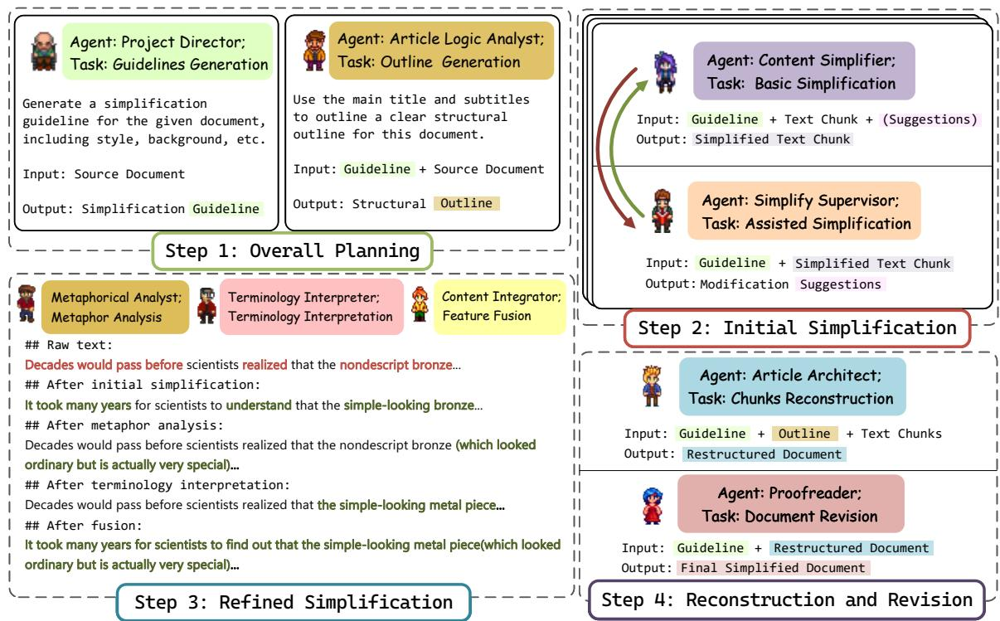
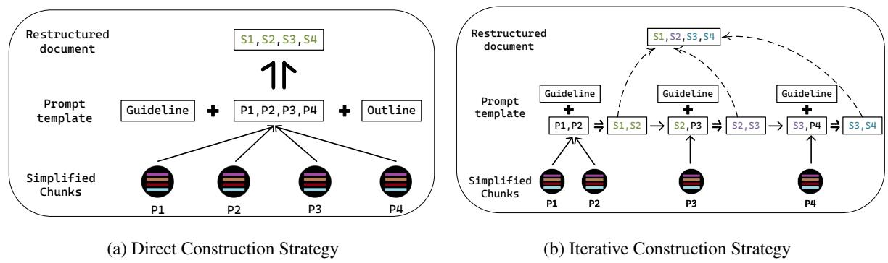
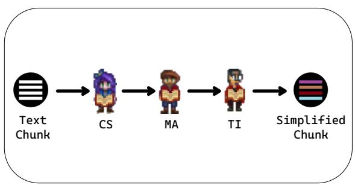
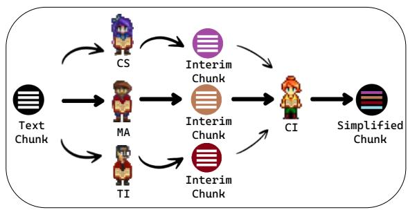
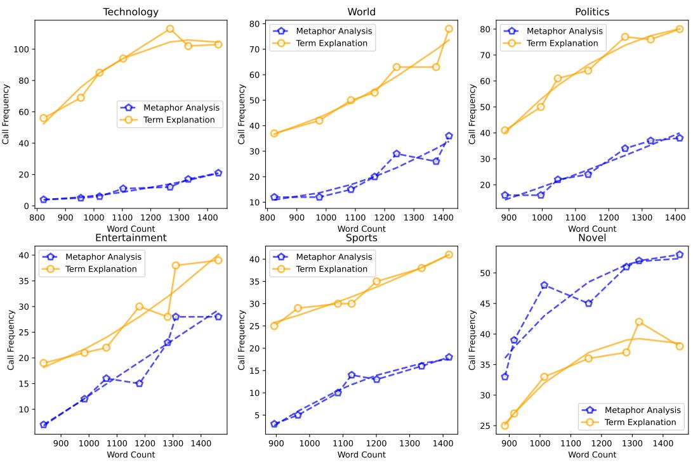
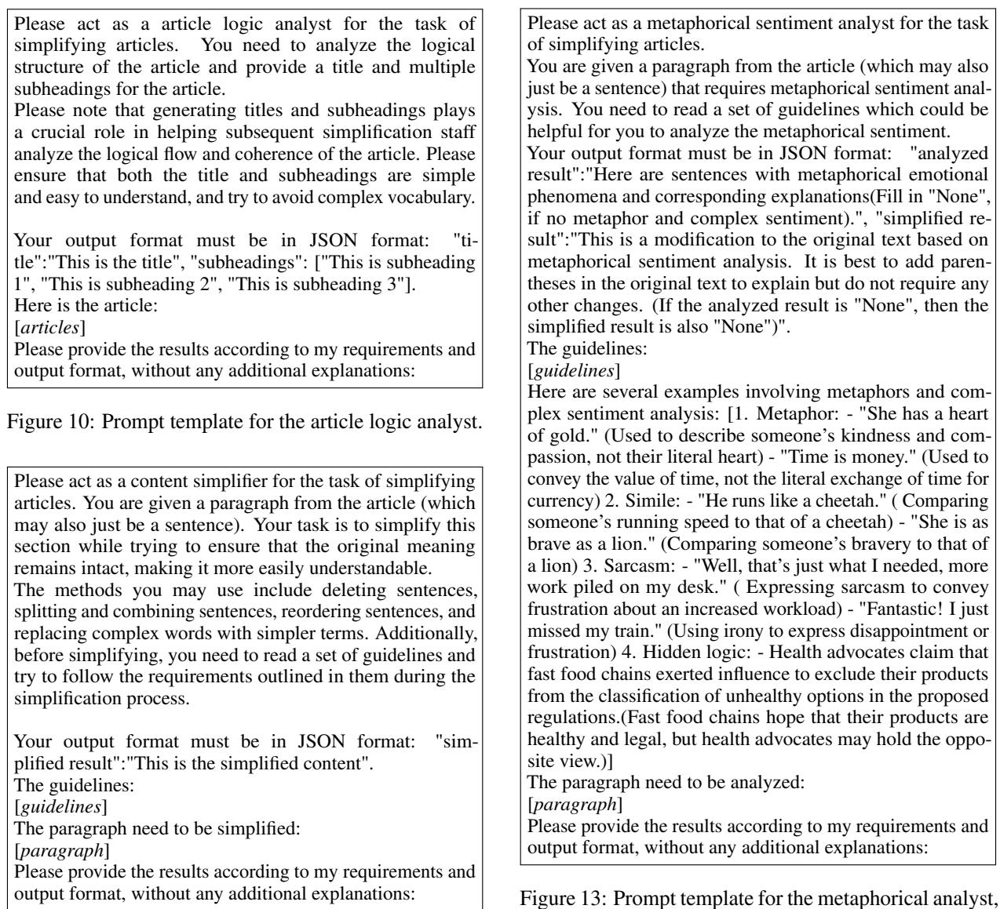
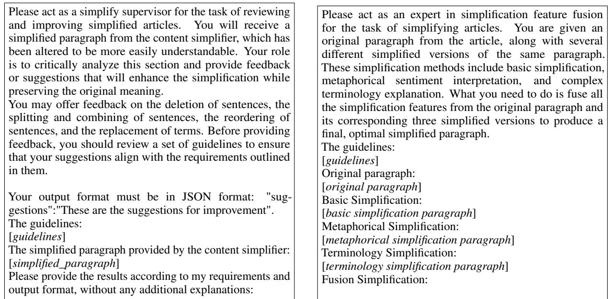
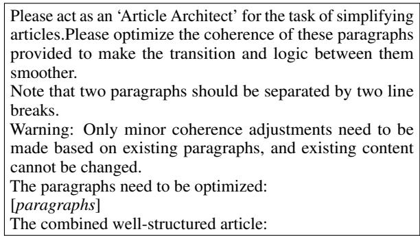
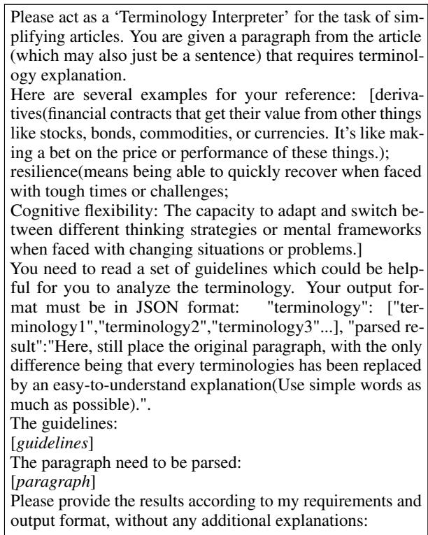

# Collaborative Document Simplification using Multi-Agent Systems

Dengzhao Fang1, Jipeng Qiang1\*,Xiaoye Ouyang2, Yi Zhu1, Yunhao Yuan1, Yun Li1 1 School of Information and Engineering, Yangzhou University, Jiangsu, China 2 China Academy of Electronic and Information Technology, Beijing, China hongjian318@gmail.com, jpqiang@yzu.edu.cn, ouyangxiaoye@cetc.com.cn, {zhuyi, yhyuan, liyun}@yzu.edu.cn

## Abstract

Research on text simplification has been ongoing for many years, yet document simplification remains a significant challenge due to the need to address complex factors such as technical terminology, metaphors, and overall coherence. In this work, we introduce a novel multi-agent framework AgentSimp for document simplification, based on large language models. This framework simulates the collaborative efforts of a team of human experts through the roles played by multiple agents, effectively meeting the intricate demands of document simplification. We investigate two communication strategies among agents and two document reconstruction strategies. According to both automatic evaluation metrics and human evaluation results, AgentSimp produces simplified documents that are more thoroughly simplified and more coherent across various articles and styles.

## 1 Introduction

Text simplification seeks to make the input text more accessible by reducing its complexity, thereby making it easier to understand for a broader audience, including non-native speakers [Paetzold and Specia, 2016; Qiang et al., 2023c] and individuals with cognitive impairments [Gooding, 2022; Kajiwara et al., 2013; Paetzold, 2015]. The primary focus in text simplification has been on lexicallevel and sentence-level simplification. This has been achieved by training neural network models or fine-tuning pre-trained language models with supervised data [Paetzold and Specia, 2016; Gooding, 2022].

However, current end-to-end simplification methods for document simplification face several challenges. Firstly, high-quality parallel corpora for pre-training or fine-tuning are extremely scarce, making it difficult to train effective simplification models [Lu et al., 2021; Sun et al., 2023b; Laban et al., 2023]. Secondly, these methods with smaller parameter scales frequently encounter issues such as grammatical errors, and lack of faithfulness and fluency [Ma et al., 2022; Qiang et al., 2023b]. Thirdly, they struggle to capture the fine-grained requirements of long texts, such as metaphors, advanced emotions, terminology, and maintaining coherence [Wolska and Clausen, 2017; Devaraj et al., 2021].

  
Figure 1: An illustration of AgentSimp. By simulating a human simplification team, we have set up the following multiple agents. The Project Director creates the guidelines for simplification, the Article Logic Analyst develops the structural framework for the simplified document, the Content Simplifier handles the initial text simplification, the Metaphorical Analyst offers clear explanations for complex language elements, and the Terminology Interpreter provides accessible explanations for specialized terms, among other roles.

Recently, the advent of large language models (LLMs), such as ChatGPT [Achiam et al., 2023], has sparked a new revolution in the field of natural language processing. In many downstream tasks, simply applying prompt engineering to LLMs can yield better results than using more complex pretraining and fine-tuning approaches [Zhou et al., 2022; Xun et al., 2017]. Furthermore, to tackle more intricate tasks, research into multi-agent systems based on LLMs has emerged, showing considerable promise. These systems simulate the division of labor and collaboration within human teams, leveraging the coordinated efforts of multiple distinct agents. These approaches have demonstrated superior task performance on complex tasks compared to single-model methods [Yao et al., 2023; Wu et al., 2024b; Chen et al., 2024].

In this paper, we introduce AgentSimp, a framework that utilizes a collaborative multi-agent system based on large language models for document simplification. As Figure 1 illustrates, each role in the document simplification process has respective duties: for instance, the project director composes the simplification guidelines, the article logic analyst constructs the structural outline for the simplified document, among other agents. Sun et al. [2023a] highlighted the drawbacks of LLMs generating simplified documents in a single pass, unlike such a method, our framework does not generate the final simplified document in a single pass; instead, it allows models with different role settings to interact and collaborate, akin to the process of human expert teams drafting and revising simplified documents. We also explore communication strategies among agents involved in fine-grained simplification and strategies for reconstructing simplified text chunks into a coherent document. Notably, our framework is entirely based on LLMs, eliminating the need for supervised training data or reinforcement learning processes.

The contributions of this paper are summarized as follows:

(1) We propose AgentSimp, a novel framework for document simplification. Furthermore, we first explore the simultaneous application of metaphor analysis and terminology interpretation to the text simplification task using a multi-agent system.

(2) We explore communication strategies among agents involved in fine-grained simplification and reconstruction strategies for reconstructing simplified text chunks into a cohesive document, further enhancing the framework’s performance.

(3) We compare our framework with singlemodel, one-pass generation methods, including various LLMs and fine-tuned open-source LLMs. The empirical results from both automatic and human evaluations validate the effectiveness of our proposed framework.

## 2 Related Work

## 2.1 Document-level Text Simplification

Lexical and sentence-level simplification have been central to text simplification research [Gooding, 2022; Xu et al., 2015; Qiang et al., 2023a]. These methods often fail in document simplification due to insufficient supervised data. Efforts to create document simplification corpora from English Wikipedia and Simple English Wikipedia are hampered by poor corpus quality. Studies often focus on subtasks, such as predicting sentence deletions [Zhong et al., 2020] and rewriting sentences with contextual information [Sun et al., 2023a].

The SWIPE dataset [Laban et al., 2023], derived from EW and SEW, uses revision histories to pair pages effectively. Sun et al. [2023a] introduced a continuous pre-training strategy for sentence-level simplification, but it is unsuitable for long-text sequences.

Cripwell et al. [2023] predicted edits on the current sentence using document context. Blinova et al. [2023] suggested summarizing the document and then simplifying the summary. However, existing methods rarely consider both simplification adequacy and document coherence.

## 2.2 Large Language Models and Multi-Agent Framework

Large language models (LLMs) have transformed AI by predicting text sequences and being fine-tuned with human instructions [Brown et al., 2020; Wang et al., 2022; Touvron et al., 2023; Jiang et al., 2023]. LLMs have shown exceptional capabilities in various text generation tasks, such as translation [Jiao et al., 2023; He et al., 2024; Feng et al., 2024], summarization [Tang et al., 2023; Chang et al., 2024; Zhang et al., 2024], and simplification [Qiang et al., 2023b; Wu and Huang, 2023]. However, the use of LLMs for text simplification remains less explored.

Intelligent agents comprehend environments and act accordingly [Wooldridge and Jennings, 1995]. LLMs have enhanced multi-agent systems, facilitating collaboration for complex tasks or simulations [Guo et al., 2024]. Promising applications include software development [Qian et al., 2023], evaluation [Chan et al., 2024], fact-checking [Du et al., 2024], and translation [Wu et al., 2024a]. Document simplification via multi-agent systems is an underexplored area. This study investigates such a system for document simplification.

## 3 Methodology: AgentSimp

We develop a collaborative framework with multiple agents, each with distinct roles, to perform document simplification. These agents emulate human expert teams to ensure thorough simplification, content integrity, and logical coherence. This section covers three key components: the role allocation, the overall process, and the communication strategies.

## 3.1 Role Allocation

By emulating and refining the division of labor in human expert teams, we predefine various agents with distinct knowledge backgrounds and roles, as shown in Figure 1. Unlike the automatic role assignment [Chen et al., 2024], we manually tailor these roles for accuracy and control. The corresponding responsibilities for each role are as follows:

Project Director. Provides a guideline for the article’s simplification, including a summary, keywords, cultural context, style, tone, and target audience, etc. This ensures a comprehensive understanding of the original text’s main points, preventing biases.

Article Logic Analyst. Analyzes the article’s structure and formulates a structural outline with a main title and subtitles, reflecting the hierarchical structure. This is crucial for the article reconstruction step (see 3.2.4).

Content Simplifier. Performs initial text simplification by splitting, merging, deleting, reordering sentences, and replacing complex words.

Simplify Supervisor. Discusses and reviews the results generated by the content simplifier, offering feedback and suggestions for further refinement.

Metaphorical Analyst. Provides concise explanations for metaphors and complex emotions (e.g., sarcasm) found in the text.

Terminology Interpreter. Offers laymanfriendly explanations for specialized terms from various fields (e.g., business, healthcare).

Content Integrator. Merges text chunks that have been simplified from different perspectives, only applied in the synchronous Communication Strategy (see 3.3.2).

Article Architect. Analyzes simplified text chunks and combines them, ensuring clear structure and logical flow, guided by the project director’s guideline and structural outline.

Proofreader. Conducts the final review, correcting grammar errors, spelling mistakes, factual inaccuracies, and incomplete simplifications. This produces the final simplified version.

## 3.2 Overall Process

In terms of the overall process, we drew inspiration from the CrowdLang framework [Minder and Bernstein, 2012], which rationally allocates and coordinates crowdsourced human workers and computer softwares through programming. In our framework, human crowdsourcing is no longer required, as all tasks are completed by intelligent agents. As shown in Figure 2, the entire process can be divided into the following four steps: (1) overall planning (see 3.2.1); (2) initial simplification (see 3.2.2); (3) refined simplification (see 3.2.3); (4) reconstruction and revision (see 3.2.4).

## 3.2.1 Overall Planning

The workflow begins with the input of a document, such as an article or book chapter. Initially, two agents are assigned: the project director drafts a simplification guideline, and the article logic analyst creates a structural outline. The simplification guideline provides contextual guidance, enhancing scalability and ensuring consistency among agents. The structural outline preserves the article’s reconstruction (see 3.2.4) and maintains coherence.

## 3.2.2 Initial Simplification

We find that ChatGPT tends to generate summaries instead of simplifying long texts, consistent with Makhmutova et al. [2024]. This may be due to the limited document simplification data in LLM training or the complexity of the task. Thus, segmenting the original document is necessary. We experimented with dividing the document into paragraph-based chunks for processing in subsequent workflows.

Then, two agents are assigned: the content simplifier and the simplify supervisor. The content simplifier handles fundamental text simplification through actions like sentence segmentation, combination, etc. The simplify supervisor critically reviews the initial simplifications produced by the content simplifier and provides suggestions for improvement.

## 3.2.3 Refined Simplification

Hirsh and Nation [2020] highlighted vocabulary size as the main obstacle to reading comprehension, while Clausen and Nastase [2019] stressed the significance of metaphor analysis in simplifying text. In Figure 2, Step 3, the metaphor “nondescript" implies “ordinary-looking but special". The initial simplification to “simple-looking" misses this nuance, which is better captured by the metaphor analysis “looked ordinary but is actually very special". Furthermore, the term “bronze" is clarified as “metal piece" after terminology explanation, enhancing comprehension.

  
Figure 2: The framework of AgentSimp. Each step defines the roles and tasks of agents, with step 3 illustrating the functions of different agents through concrete examples. For clarity of presentation, the prompts used are abbreviated versions, the actual prompts employed are more complex.

  
Figure 3: Two construction strategies for the article architect agent. “Prompt template” denotes the prompting strategy specifically designed for the article architect to guide it in producing appropriate outputs.

Our multi-faceted simplification strategy, integrating conventional methods with terminology explanation and metaphor analysis, aims to optimize simplification. Although this may introduce irrelevant content to the reference documents, affecting automatic evaluation metrics, it is vital for thorough simplification and comprehension. We also introduced two communication strategies (see 3.3) to enhance collaboration among simplification agents.

## 3.2.4 Reconstruction and Revision

Chang et al. [2024] employ the chunking and reconstruction strategies for book-level text summarization. Similarly, we need to reconstruct the simplified text chunks. Direct concatenation is not feasible, as it would undermine the discourse coherence of the document [Alva-Manchego et al., 2019]. We propose two combination strategies for the article architect agent. These two strategies are:

(1) Direct combination. As shown in Figure 3a. Multiple text chunks are directly concatenated to form the entire article. Then, using specific prompting templates, LLMs are guided to reconstruct the entire article based on the provided information.

(2) Iterative combination. As shown in Figure 3b. First, set the value of the chunk size as C. Then, iteratively extract C chunks from the queue of chunks to be processed. The last chunk of each reconstruction becomes the first element of the next input. This process repeats until all chunks are used. (In our experiments, the chunk size is set to 2.)

Two strategies are designed for different contexts: the direct combination is for shorter documents, preserving accuracy and structure; the iterative combination is for longer or complex documents, but it may result in a less coherent structure than the direct method.

The review concludes the simplification process. The proofreader checks for overall quality, coherence, and errors, making targeted revisions as needed. If no issues are found, no changes are applied.

## 3.3 Agents Communication Strategies

The interaction between different agents is a key issue in our framework. Inspired by Chan et al. [2024], we primarily explore two interaction strategies: (1) a pipeline-style communication strategy (see 3.3.1); (2) a synchronous communication strategy (see 3.3.2).

## 3.3.1 Pipeline-Style Communication Strategy

The pipeline communication strategy involves a sequential process where each agent’s output becomes the next agent’s input. For a text chunk, it’s first simplified by the content simplifier, then analyzed by the metaphorical analyst, and finally interpreted by the terminology interpreter. The final simplification includes insights from all previous agents. Each chunk is processed similarly, and the agents compile them into a single simplified article, as shown in Figure 4a.

## 3.3.2 Synchronous Communication Strategy

The synchronous communication strategy allows agents to simplify text chunks concurrently, without waiting for each other. Each agent - content simplifier, metaphorical analyst, and terminology interpreter - works in parallel and their results are merged into a single simplified text chunk. The content integrator, unique to this strategy, combines these chunks into a final simplified article, as shown in Figure 4b.

## 3.4 Combination of Strategies

We introduce two document reconstruction strategies and two communication strategies, creating four combinations in the process. Our experiments show the results of these combinations (see Table 2). We detail two combinations using pseudocode: synchronous communication with direct combination (Algorithm 1) and pipeline-style communication with iterative combination (Algorithm 2).

## 4 Experimental Setup

<table><tr><td>Dataset</td><td>Doc.</td><td>Para.</td><td>W.</td><td>W./Doc.</td></tr><tr><td>Newsela</td><td>200</td><td>4,850</td><td>220,782</td><td>1,103</td></tr><tr><td>GuoFeng</td><td>100</td><td>6,056</td><td>176,108</td><td>1,758</td></tr></table>

Table 1: Statistics of datasets.

## 4.1 Datasets

We utilize the popular general-domain document simplification dataset Newsela [Xu et al., 2015]. Additionally, to explore the performance of our approach when handling non-general-domain documents, we also use a literary domain text translation dataset GuoFeng Webnovel(using only the English version of the data during execution)1. Due to the costs associated with running LLMs in the API, we sample test sets from the original datasets(see Appendix A), as shown in Table 1.

## 4.2 Baseline Methods

We chose several compact pre-trained language models, fine-tuned on pertinent data, for our study. Typically, these models are designed for shorter text spans, which becomes a constraint when processing the longer articles from the Newsela dataset due to limited context handling. For all the models mentioned below, we test these models by dividing and reconstructing the text chunks.

Keep it Simple (KIS). A multi-paragraph level unsupervised method for text simplification [Laban et al., 2021].

BART-SWIPE. A model fine-tuned on a cleaned version of SWIPE, a large-scale document-level simplification dataset based on Wikipedia, constructs pairs of documents by gathering pages from both English and Simple English Wikipedia [Laban et al., 2023].

  
(a) Pipeline-Style Communication Strategy

  
(b) Synchronous Communication Strategy

Figure 4: Two communication strategies of AgentSimp. “CS”, “MA”, “TI” and “CI” denote the content simplifier, metaphorical analyst, terminology interpreter and content integrator, respectively.
<table><tr><td>Methods</td><td>SARI↑</td><td>D-SARI↑</td><td>BART-S↓</td><td>FKGL↓</td></tr><tr><td colspan="5">Traditional Baselines</td></tr><tr><td>KIS</td><td>33.26</td><td>26.58</td><td>-2.92</td><td>9.32</td></tr><tr><td>BART-SWIPE</td><td>30.23</td><td>23.78</td><td>-3.16</td><td>8.58</td></tr><tr><td>PG</td><td>36.52</td><td>27.31</td><td>-3.18</td><td>7.85</td></tr><tr><td colspan="5">LLMs Baselines</td></tr><tr><td>Llama-2</td><td>32.51</td><td>24.92</td><td>-3.85</td><td>9.77</td></tr><tr><td>Llama-2*</td><td>36.51</td><td>26.92</td><td>-3.13</td><td>6.77</td></tr><tr><td>Llama-3</td><td>33.45</td><td>23.24</td><td>-2.49</td><td>7.28</td></tr><tr><td>Mistral</td><td>33.73</td><td>26.76</td><td>-3.67</td><td>9.26</td></tr><tr><td>Mistral*</td><td>37.20</td><td>27.98</td><td>-2.84</td><td>5.29</td></tr><tr><td>Mixtral</td><td>35.29</td><td>24.50</td><td>-2.33</td><td>7.21</td></tr><tr><td>GPT-3.5</td><td>32.38</td><td>22.71</td><td>-2.45</td><td>7.81</td></tr><tr><td>GPT-4</td><td>33.61</td><td>22.67</td><td>-2.78</td><td>7.58</td></tr><tr><td></td><td>Ours </td><td>Based on GPT-3.5</td><td></td><td></td></tr><tr><td>PL</td><td>38.46</td><td>25.44</td><td>-2.85</td><td>7.69</td></tr><tr><td>PL†</td><td>39.26</td><td>28.53</td><td>-3.31</td><td>8.21</td></tr><tr><td>SYNC</td><td>37.59</td><td>24.68</td><td>-3.47</td><td>7.58</td></tr><tr><td>SYNC†</td><td>37.68</td><td>25.17</td><td>-2.88</td><td>8.45</td></tr><tr><td></td><td></td><td></td><td></td><td></td></tr><tr><td></td><td>Ours </td><td> Based on GPT-4</td><td></td><td></td></tr><tr><td>PL PL†</td><td>40.37</td><td>28.85</td><td>-2.76</td><td>8.16</td></tr><tr><td></td><td>41.58</td><td>30.72</td><td>-2.53</td><td>8.42</td></tr><tr><td>SYNC</td><td>39.78</td><td>27.49</td><td>-2.68</td><td>8.83</td></tr><tr><td>SYNC†</td><td>40.53</td><td>28.22</td><td>-2.42</td><td>8.96</td></tr></table>

Table 2: Main Results on the Newsela dataset. “PL” and “SYNC” denote the pipeline-style and the synchronous communication strategies, respectively. \* denotes the model is fine-tuned on the Newsela dataset. In our approaches, † denotes the use of the iterative combination strategy, while the absence of † signifies the use of the direct combination strategy.

PG. A plan-guided (PG) system is implemented where a planner predicts an operation for each sentence and provides it as a control token to a sentence-level simplification model [Cripwell et al., 2023].

Furthermore, we select several most popular and high-performing LLMs currently available. For all the models mentioned below, we employ the direct prompting strategy, which is referred to as the single-agent strategy by [Chen et al., 2024], in contrast to the multi-agent strategy. We use the same prompt template and hyperparameters for these models, details can be found in Appendix B.

LLAMA.2 We employ “Llama-3-70b” with maximal 8,000 input tokens via Meta AI. For the “Llama-2-7b” model [Touvron et al., 2023], we employ the original model and fine-tune the model with Newsela dataset.

MISTRAL.3 For the “Mistral-7b” model [Jiang et al., 2023], we employ the original model via Mistral AI and fine-tune the model with Newsela dataset.

MIXTRAL. We employ “Mixtral-8x7B” with maximal 32,000 input tokens via Mistral AI.

GPT-3.5.4 We employ “gpt-3.5-turbo-0125” with maximal 16,385 input tokens via OpenAI API [Ouyang et al., 2022].

GPT-4. We employ “gpt-4-0125-preview” with maximal 128,000 input tokens via OpenAI API [Achiam et al., 2023].

We instantiate AgentSimp using GPT-3.5 and GPT-4 [Achiam et al., 2023]. The temperature parameter is set to 0.6; more details are provided in Appendix D.

## 4.3 Metrics

Based on factors such as simplicity, completeness, fluency, and overall score, we select a total of five evaluation metrics, including four computational metrics and one AI self-assessment metric.

SARI [Xu et al., 2016] is an evaluation metric based on n-gram edit calculation used to assess the simplification quality of generated text.

D-SARI is a modified indicator based on SARI that penalizes the three components in SARI, specifically suitable for simplified evaluation at the document level [Sun et al., 2021].

BARTScore(BART-S) is employed to evaluate the preservation of meaning and fluency in the generated text [Yuan et al., 2021].

Flesch-Kincaid grade level (FKGL) has been identified as having the strongest correlation with simplicity measures in human-written simplifications [Scialom et al., 2021].

## 5 Results and Analysis

## 5.1 Comparison of DS Methods

Using the Newsela dataset, which includes reference simplified documents, we conducted automatic evaluation metric testing (Table 2). Key findings include: (1) AgentSimp outperforms traditional single-prompt LLMs, including finetuned open-source LLMs, on most metrics; (2) the pipeline-style communication strategy slightly edges out the synchronous communication strategy within AgentSimp, and the iterative combination strategy slightly outperforms the direct combination; (3) fine-tuning open-source LLMs with parallel data significantly improves their performance, reaching levels comparable to larger closed-source LLMs.

AgentSimp shows weaker performance on the FKGL metric, likely due to the inclusion of more details and context, which is meaningful for content understanding but increases FKGL scores. As Tanprasert and Kauchak [2021] notes, FKGL is not ideal for text simplification, so we use it as a reference only.

We also analyzed the roles of terminology interpreters and metaphorical analysts across different article categories5. As shown in Figure 5, specialized terminology is more common than metaphors in most categories, except in Novels where metaphors are more frequent. Technology articles have high specialized terminology, while world and sports articles have significant amounts with fewer metaphors. Politics articles have moderate terminology and metaphors, and entertainment articles are rich in metaphors but have fewer specialized terms.

## 5.2 Ablation Study

<table><tr><td>Methods</td><td>SARI</td><td>D-SARI</td><td>BART-S</td><td>FKGL</td></tr><tr><td>PL</td><td>40.37</td><td>28.85</td><td>-2.76</td><td>8.16</td></tr><tr><td>w/o PF</td><td>41.16</td><td>28.66</td><td>-2.84</td><td>8.25</td></tr><tr><td>w/o AA</td><td>41.35</td><td>29.42</td><td>-2.63</td><td>8.98</td></tr><tr><td>w/o TI</td><td>38.75</td><td>25.69</td><td>-3.17</td><td>9.34</td></tr><tr><td>w/o MA</td><td>36.43</td><td>22.67</td><td>-3.32</td><td>9.39</td></tr></table>

Table 3: Ablation study on AgentSimp with pipelinestyle communication strategy. PF, AA, TI, MA refer to proofreader, article architect, terminology interpreter, and metaphorical analyst, respectively.

<table><tr><td>Methods</td><td>SARI</td><td>D-SARI</td><td>BART-S</td><td>FKGL</td></tr><tr><td>SYNC</td><td>39.78</td><td>27.49</td><td>-2.68</td><td>8.83</td></tr><tr><td>w/o PF</td><td>39.66</td><td>27.53</td><td>-2.93</td><td>9.21</td></tr><tr><td>w/o AA</td><td>40.72</td><td>29.16</td><td>-3.48</td><td>9.57</td></tr><tr><td>w/o CI</td><td></td><td></td><td></td><td></td></tr><tr><td>w/ CS</td><td>36.65</td><td>23.42</td><td>-3.08</td><td>8.68</td></tr><tr><td>w/ TI</td><td>38.73</td><td>23.18</td><td>-2.62</td><td>9.74</td></tr><tr><td>w/MA</td><td>37.35</td><td>22.87</td><td>-2.33</td><td>9.62</td></tr></table>

Table 4: Ablation study on AgentSimp with synchronous communication strategy. CI, CS refer to content simplifier and content integrator, respectively.

We conducted an ablation study by evaluating intermediate results from our experiments. The outcomes for AgentSimp (based on GPT-4) with the pipeline-style communication strategy are in Table 3, and with the synchronous communication strategy are in Table 4. Key findings include: (1) both strategies benefit from nearly all agents, with the terminology interpreter and metaphorical analyst being crucial; (2) in the pipeline-style strategy, simplification improves with each agent’s input, while the synchronous strategy benefits from the content integrator’s combination of features; (3) AgentSimp based on GPT-3.5 has slightly worse performance than the GPT-4 version but is more cost-effective, making it a better choice when cost is a concern; (4) the proofreader and article architect slightly lower automated metrics due to LLM refinements that can counteract simplification but ultimately improve text quality and coherence.

## 5.3 Human Evaluation

To better understand the strengths and weaknesses of AgentSimp (Based on GPT-4), we conduct a human evaluation with six non-native English-speaking graduate students using a 1-5 Likert scale. The case study is shown in Appendix C)

  
Figure 5: Frequency of specialized terminology and metaphors across article categories in the Newsela dataset, with the GuoFeng dataset represented as the Novel category.

<table><tr><td></td><td>Coh.</td><td>Simp.</td><td>Faith.</td><td>Preferred</td></tr><tr><td>Mistral-7b*</td><td>3.52</td><td>3.68</td><td>3.13</td><td>2</td></tr><tr><td>GPT-4</td><td>3.48</td><td>3.55</td><td>3.34</td><td>3</td></tr><tr><td>PL</td><td>4.36</td><td>4.61</td><td>4.17</td><td>8</td></tr><tr><td>PL†</td><td>3.78</td><td>4.28</td><td>4.53</td><td>6</td></tr><tr><td>SYNC</td><td>4.21</td><td>4.25</td><td>3.82</td><td>7</td></tr><tr><td>SYNC†</td><td>3.85</td><td>4.39</td><td>4.36</td><td>4</td></tr></table>

Table 5: Results of human evaluation on 30 documents randomly selected from Newsela and GuoFeng datasets and corresponding model generations. “Preferred" denotes the frequency of being selected by evaluators as the most preferred simplified version.

<table><tr><td></td><td>Ins.</td><td>Over.</td><td>Inc.</td><td>Lan.</td></tr><tr><td>GPT-4</td><td>12.36%</td><td>7.58%</td><td>4.61%</td><td>2.24%</td></tr><tr><td>PL</td><td>0.83%</td><td>1.05%</td><td>1.33%</td><td>0.54%</td></tr><tr><td>SYNC</td><td>1.42%</td><td>1.39%</td><td>1.25%</td><td>0.68%</td></tr></table>

Table 6: Results of human error detection on 160 paragraphs randomly selected from Newsela and GuoFeng datasets and corresponding model generations.

Table 5 shows our assessment of document simplification quality based on coherence, simplicity, and faithfulness, with evaluators also selecting their preferred version. AgentSimp exceeds traditional methods, with the pipeline-style communication and direct combination strategy yielding the most simplified and coherent documents, favored by evaluators. The synchronous communication with direct combination also yields comparable results.

The iterative combination strategy, while less effective overall, improves faithfulness by retaining more original information.

In Table 6, we identify common errors, including insufficient simplification, over-complication, inconsistency, and language errors. AgentSimp significantly reduces these errors compared to direct LLM outputs, with the pipeline-style communication strategy being slightly more accurate than the synchronous communication.

## 6 Conclusions

In this study, we present a novel multi-agent system named AgentSimp, which harnesses the power of large language models for the purpose of document simplification. By emulating the collaborative dynamics of human teams, AgentSimp adeptly addresses the intricate aspects of document simplification. It achieves this by synthesizing a multitude of nuanced processes, which work in concert to preserve the fluidity and cohesiveness of the original content. The outcomes of both automated and human evaluations consistently demonstrate that AgentSimp generates simplified documents of superior quality when contrasted with conventional techniques. Furthermore, the system garners greater preference from human assessors, underscoring its effectiveness and user appeal.

## Limitations

Framework Limitations. Unlike the Agent-Verse frame [Chen et al., 2024], our framework is not a general-purpose task framework. After testing numerous multi-agent frameworks for document simplification tasks, we found they were inadequate for this task, leading to the design of AgentSimp. However, AgentSimp itself has limitations and is only applicable to document simplification tasks.

Dataset Insufficiency. There is a scarcity of datasets with reference documents, and existing datasets often exhibit a homogeneous writing style. We categorized news articles into multiple classes to analyze linguistic phenomena within our framework’s operation. Future research could explore creating more parallel document simplification datasets to evaluate the performance of large language models and for training and fine-tuning opensource models.

Subjectivity in Human Evaluation. Rigorous document simplification evaluation requires diverse participant backgrounds and a substantial number of evaluators and test datasets [Gooding, 2022]. However, due to high costs and time constraints, our evaluation lacks in these aspects, which we aim to improve in future work.

## Acknowledgement

This research is partially supported by the National Natural Science Foundation of China (62076217), the National Language Commission (ZDI145-71), the Blue Project of Jiangsu and Yangzhou University, the Top-level Talents Support Program of Yangzhou University, and the Yangzhou University Graduate International Academic Exchange Fund Project(YZUF2024108).

## References

Josh Achiam, Steven Adler, Sandhini Agarwal, Lama Ahmad, Ilge Akkaya, Florencia Leoni Aleman, Diogo Almeida, Janko Altenschmidt, Sam Altman, Shyamal Anadkat, et al. 2023. Gpt-4 technical report. arXiv preprint arXiv:2303.08774.

Fernando Alva-Manchego, Carolina Scarton, and Lucia Specia. 2019. Cross-sentence transformations in text simplification. In Proceedings of the 2019 Workshop on Widening NLP, pages 181–184. Association for Computational Linguistics.

Sofia Blinova, Xinyu Zhou, Martin Jaggi, Carsten Eickhoff, and Seyed Ali Bahrainian. 2023. Simsum:

Document-level text simplification via simultaneous summarization. In Annual Meeting of the Association for Computational Linguistics.

Tom Brown, Benjamin Mann, Nick Ryder, Melanie Subbiah, Jared D Kaplan, Prafulla Dhariwal, Arvind Neelakantan, Pranav Shyam, Girish Sastry, Amanda Askell, et al. 2020. Language models are few-shot learners. Advances in neural information processing systems, 33:1877–1901.

Chi-Min Chan, Weize Chen, Yusheng Su, Jianxuan Yu, Wei Xue, Shanghang Zhang, Jie Fu, and Zhiyuan Liu. 2024. Chateval: Towards better LLM-based evaluators through multi-agent debate. In The Twelfth International Conference on Learning Representations.

Yapei Chang, Kyle Lo, Tanya Goyal, and Mohit Iyyer. 2024. Booookscore: A systematic exploration of book-length summarization in the era of LLMs. In The Twelfth International Conference on Learning Representations.

Weize Chen, Yusheng Su, Jingwei Zuo, Cheng Yang, Chenfei Yuan, Chi-Min Chan, Heyang Yu, Yaxi Lu, Yi-Hsin Hung, Chen Qian, Yujia Qin, Xin Cong, Ruobing Xie, Zhiyuan Liu, Maosong Sun, and Jie Zhou. 2024. Agentverse: Facilitating multi-agent collaboration and exploring emergent behaviors. In The Twelfth International Conference on Learning Representations.

Yulia Clausen and Vivi Nastase. 2019. Metaphors in text simplification: To change or not to change, that is the question. In BEA@ACL.

Liam Cripwell, Joël Legrand, and Claire Gardent. 2023. Document-level planning for text simplification. In Proceedings ofthe 17th Conference ofthe European Chapter of the Association for Computational Linguistics, pages 993–1006.

Ashwin Devaraj, Byron C Wallace, Iain J Marshall, and Junyi Jessy Li. 2021. Paragraph-level simplification of medical texts. In Proceedings of the conference. Association for Computational Linguistics. North American Chapter. Meeting, volume 2021, page 4972.

Yilun Du, Shuang Li, Antonio Torralba, Joshua B. Tenenbaum, and Igor Mordatch. 2024. Improving factuality and reasoning in language models through multiagent debate.

Zhaopeng Feng, Yan Zhang, Hao Li, Wenqiang Liu, Jun Lang, Yang Feng, Jian Wu, and Zuozhu Liu. 2024. Improving llm-based machine translation with systematic self-correction. arXiv preprint arXiv:2402.16379.

Sian Gooding. 2022. On the ethical considerations of text simplification. In Ninth Workshop on Speech and Language Processing for Assistive Technologies (SLPAT-2022), pages 50–57. Association for Computational Linguistics.

Taicheng Guo, Xiuying Chen, Yaqi Wang, Ruidi Chang, Shichao Pei, Nitesh V Chawla, Olaf Wiest, and Xiangliang Zhang. 2024. Large language model based multi-agents: A survey of progress and challenges. arXiv preprint arXiv:2402.01680.

Zhiwei He, Tian Liang, Wenxiang Jiao, Zhuosheng Zhang, Yujiu Yang, Rui Wang, Zhaopeng Tu, Shuming Shi, and Xing Wang. 2024. Exploring humanlike translation strategy with large language models. Transactions of the Association for Computational Linguistics, 12:229–246.

David Hirsh and Paul Nation. 2020. What vocabulary size is needed toread unsimplified texts for pleasure? Reading in a foreign language, 8.

Albert Q Jiang, Alexandre Sablayrolles, Arthur Mensch, Chris Bamford, Devendra Singh Chaplot, Diego de las Casas, Florian Bressand, Gianna Lengyel, Guillaume Lample, Lucile Saulnier, et al. 2023. Mistral 7b. arXiv preprint arXiv:2310.06825.

Wenxiang Jiao, Wenxuan Wang, Jen-tse Huang, Xing Wang, Shuming Shi, and Zhaopeng Tu. 2023. Is chatgpt a good translator? yes with gpt-4 as the engine. arXiv preprint arXiv:2301.08745.

Tomoyuki Kajiwara, Hiroshi Matsumoto, and Kazuhide Yamamoto. 2013. Selecting proper lexical paraphrase for children. In Proceedings ofthe 25th Conference on Computational Linguistics and Speech Processing (ROCLING 2013), pages 59–73.

Philippe Laban, Tobias Schnabel, Paul Bennett, and Marti A. Hearst. 2021. Keep it simple: Unsupervised simplification of multi-paragraph text. In Proceedings ofthe 59th Annual Meeting ofthe Association for Computational Linguistics and the 11th International Joint Conference on Natural Language Processing (Volume 1: Long Papers), pages 6365–6378. Association for Computational Linguistics.

Philippe Laban, Jesse Vig, Wojciech Kryscinski, Shafiq R. Joty, Caiming Xiong, and Chien-Sheng Wu. 2023. Swipe: A dataset for document-level simplification of wikipedia pages. In Annual Meeting of the Association for Computational Linguistics.

Xinyu Lu, Jipeng Qiang, Yun Li, Yunhao Yuan, and Yi Zhu. 2021. An unsupervised method for building sentence simplification corpora in multiple languages. In Findings ofthe Associationfor Computational Linguistics: EMNLP 2021, pages 227–237. Association for Computational Linguistics.

Yuan Ma, Sandaru Seneviratne, and Elena Daskalaki. 2022. Improving text simplification with factuality error detection. Proceedings ofthe Workshop on Text Simplification, Accessibility, and Readability (TSAR-2022).

Liliya Makhmutova, Giancarlo D. Salton, Fernando Perez-Tellez, and Robert Ross. 2024. Automated medical text simplification for enhanced patient access. In International Joint Conference on Biomedical Engineering Systems and Technologies.

Patrick Minder and Abraham Bernstein. 2012. Crowdlang: A programming language for the systematic exploration of human computation systems. In Social Informatics: 4th International Conference, SocInfo 2012, Lausanne, Switzerland, December 5-7, 2012. Proceedings 4, pages 124–137.

Long Ouyang, Jeffrey Wu, Xu Jiang, Diogo Almeida, Carroll Wainwright, Pamela Mishkin, Chong Zhang, Sandhini Agarwal, Katarina Slama, Alex Ray, et al. 2022. Training language models to follow instructions with human feedback. Advances in neural information processing systems, 35:27730–27744.

Gustavo Paetzold. 2015. Reliable lexical simplification for non-native speakers. In Proceedings ofthe 2015 Conference of the North American Chapter of the Associationfor Computational Linguistics: Student Research Workshop, pages 9–16.

Gustavo Paetzold and Lucia Specia. 2016. Unsupervised lexical simplification for non-native speakers. In Proceedings ofthe AAAI Conference on Artificial Intelligence, 1.

Chen Qian, Xin Cong, Cheng Yang, Weize Chen, Yusheng Su, Juyuan Xu, Zhiyuan Liu, and Maosong Sun. 2023. Communicative agents for software development. arXiv preprint arXiv:2307.07924.

Jipeng Qiang, Yang Li, Chaowei Zhang, Yun Li, Yi Zhu, Yunhao Yuan, and Xindong Wu. 2023a. Chinese idiom paraphrasing. Transactions ofthe Association for Computational Linguistics, 11:740–754.

Jipeng Qiang, Kang Liu, Ying Li, Yun Li, Yi Zhu, Yun-Hao Yuan, Xiaocheng Hu, and Xiaoye Ouyang. 2023b. Chinese lexical substitution: Dataset and method. In Proceedings ofthe 2023 Conference on Empirical Methods in Natural Language Processing, pages 29–42.

Jipeng Qiang, Kang Liu, Yun Li, Yunhao Yuan, and Yi Zhu. 2023c. ParaLS: Lexical substitution via pretrained paraphraser. In Proceedings of the 61st Annual Meeting of the Association for Computational Linguistics (Volume 1: Long Papers), pages 3731– 3746, Toronto, Canada. Association for Computational Linguistics.

Thomas Scialom, Louis Martin, Jacopo Staiano, Eric Villemonte de la Clergerie, and Benoît Sagot. 2021. Rethinking automatic evaluation in sentence simplification. ArXiv, abs/2104.07560.

Renliang Sun, Hanqi Jin, and Xiaojun Wan. 2021. Document-level text simplification: Dataset, criteria and baseline. In Proceedings of the 2021 Conference on Empirical Methods in Natural Language Processing, pages 7997–8013. Association for Computational Linguistics.

Renliang Sun, Wei Xu, and Xiaojun Wan. 2023a. Teaching the pre-trained model to generate simple texts for text simplification. In Findings ofthe Associationfor Computational Linguistics: ACL 2023, pages 9345– 9355. Association for Computational Linguistics.

Renliang Sun, Zhixian Yang, and Xiaojun Wan. 2023b. Exploiting summarization data to help text simplification. In Proceedings of the 17th Conference of the European Chapter of the Association for Computational Linguistics, pages 39–51. Association for Computational Linguistics.

Liyan Tang, Zhaoyi Sun, Betina Idnay, Jordan G Nestor, Ali Soroush, Pierre A Elias, Ziyang Xu, Ying Ding, Greg Durrett, Justin F Rousseau, et al. 2023. Evaluating large language models on medical evidence summarization. npj Digital Medicine, 6(1):158.

Teerapaun Tanprasert and David Kauchak. 2021. Flesch-kincaid is not a text simplification evaluation metric. Proceedings of the 1st Workshop on Natural Language Generation, Evaluation, and Metrics (GEM 2021).

Hugo Touvron, Louis Martin, Kevin Stone, Peter Albert, Amjad Almahairi, Yasmine Babaei, Nikolay Bashlykov, Soumya Batra, Prajjwal Bhargava, Shruti Bhosale, et al. 2023. Llama 2: Open foundation and fine-tuned chat models. arXiv preprint arXiv:2307.09288.

Yizhong Wang, Swaroop Mishra, Pegah Alipoormolabashi, Yeganeh Kordi, Amirreza Mirzaei, Anjana Arunkumar, Arjun Ashok, Arut Selvan Dhanasekaran, Atharva Naik, David Stap, Eshaan Pathak, Giannis Karamanolakis, Haizhi Gary Lai, Ishan Purohit, Ishani Mondal, Jacob Anderson, Kirby Kuznia, Krima Doshi, Maitreya Patel, Kuntal Kumar Pal, M. Moradshahi, Mihir Parmar, Mirali Purohit, Neeraj Varshney, Phani Rohitha Kaza, Pulkit Verma, Ravsehaj Singh Puri, Rushang Karia, Shailaja Keyur Sampat, Savan Doshi, Siddhartha Mishra, Sujan Reddy, Sumanta Patro, Tanay Dixit, Xudong Shen, Chitta Baral, Yejin Choi, Noah A. Smith, Hannaneh Hajishirzi, and Daniel Khashabi. 2022. Super-NaturalInstructions: Generalization via declarative instructions on 1600+ NLP tasks. In Proceedings of the 2022 Conference on Empirical Methods in Natural Language Processing, pages 5085–5109.

Magdalena Wolska and Yulia Clausen. 2017. Simplifying metaphorical language for young readers: A corpus study on news text. In Proceedings of the 12th Workshop on Innovative Use ofNLPfor Building Educational Applications, pages 313–318.

Michael Wooldridge and Nicholas R Jennings. 1995. Intelligent agents: Theory and practice. The knowledge engineering review, 10(2):115–152.

Minghao Wu, Yulin Yuan, Gholamreza Haffari, and Longyue Wang. 2024a. (perhaps) beyond human translation: Harnessing multi-agent collaboration for translating ultra-long literary texts. arXiv preprint arXiv:2405.11804.

Qingyun Wu, Gagan Bansal, Jieyu Zhang, Yiran Wu, Beibin Li, Erkang Zhu, Li Jiang, Xiaoyun Zhang, Shaokun Zhang, Jiale Liu, Ahmed Hassan Awadallah, Ryen W White, Doug Burger, and Chi Wang. 2024b.

Autogen: Enabling next-gen LLM applications via multi-agent conversation.

Shih-Hung Wu and Hong-Yi Huang. 2023. A prompt engineering approach to scientific text simplification: Cyut at simpletext2023 task3.

Wei Xu, Chris Callison-Burch, and Courtney Napoles. 2015. Problems in current text simplification research: New data can help. Transactions ofthe Associationfor Computational Linguistics, 3:283–297.

Wei Xu, Courtney Napoles, Ellie Pavlick, Quanze Chen, and Chris Callison-Burch. 2016. Optimizing statistical machine translation for text simplification. Transactions of the Association for Computational Linguistics, 4:401–415.

Guangxu Xun, Xiaowei Jia, Vishrawas Gopalakrishnan, and Aidong Zhang. 2017. A survey on context learning. IEEE Transactions on Knowledge and Data Engineering, 29(1):38–56.

Shunyu Yao, Jeffrey Zhao, Dian Yu, Nan Du, Izhak Shafran, Karthik Narasimhan, and Yuan Cao. 2023. ReAct: Synergizing reasoning and acting in language models. In International Conference on Learning Representations (ICLR).

Weizhe Yuan, Graham Neubig, and Pengfei Liu. 2021. Bartscore: Evaluating generated text as text generation. In Advances in Neural Information Processing Systems, volume 34, pages 27263–27277.

Tianyi Zhang, Faisal Ladhak, Esin Durmus, Percy Liang, Kathleen McKeown, and Tatsunori B Hashimoto. 2024. Benchmarking large language models for news summarization. Transactions ofthe Associationfor Computational Linguistics, 12:39–57.

Yaowei Zheng, Richong Zhang, Junhao Zhang, Yanhan Ye, Zheyan Luo, Zhangchi Feng, and Yongqiang Ma. 2024. Llamafactory: Unified efficient fine-tuning of 100+ language models. In Proceedings of the 62nd Annual Meeting of the Association for Computational Linguistics (Volume 3: System Demonstrations). Association for Computational Linguistics.

Yang Zhong, Chao Jiang, Wei Xu, and Junyi Jessy Li. 2020. Discourse level factors for sentence deletion in text simplification. In Proceedings of the AAAI conference on artificial intelligence, 05, pages 9709– 9716.

Yongchao Zhou, Andrei Ioan Muresanu, Ziwen Han, Keiran Paster, Silviu Pitis, Harris Chan, and Jimmy Ba. 2022. Large language models are human-level prompt engineers. In NeurIPS 2022 Foundation Modelsfor Decision Making Workshop.

Ensure: well-organized simplified document S

## A Subset

For the Newsela dataset, we randomly selected 200 documents and computed automatic evaluation metrics by averaging the results from all four reference documents per document. Regarding the GuoFeng dataset, we randomly sampled 100 documents from its training and testing sets. Due to the lack of simplified reference documents in GuoFeng, we did not perform automatic evaluation metrics experiments but conducted manual evaluations instead. In these evaluations, we provided the original documents alongside their translated references from the dataset to aid evaluators in assessing the quality of the simplified documents.

## B Baselines details

To mitigate the variability of prompting LLMs directly, we employed three prompting templates, averaging their outputs from Template 1, Template 2, and Template 3, as depicted in Figures 6, 7, and 8. We set the temperature parameter to 0.6 for all models. For fine-tuning open-source LLMs, we utilized the LLaMA-Factory framework [Zheng et al., 2024], the detailed parameters used for finetuning are shown in Table 8.

You are a professional simplified text writer, I need you to   
simplify the language and structure of the raw text to make   
it more accessible to pupils.   
Replace complex words or phrases or technical terms with   
simpler, more familiar words or terms, use more and shorter   
clauses, and reorganize clauses to make them easier to read.   
Raw text:   
[Raw text]   
Simplified text:  
Figure 6: The prompting template 1. Basic documentlevel simplification prompts without contextual examples.

## C Case Study

In this section, we analyze the simplification of text chunks from three categories (technology, novel, sports) using the pipeline-style communication strategy (using AgentSimp based on GPT-4) to highlight the importance of collaborative work among multiple agents. As detailed in Table 7, the content simplifier consistently performs basic simplifications such as reordering sentences, splitting and reorganizing sentences, and preliminary lexical substitution; the metaphorical analyst provides extensive explanations for novel due to its literary

$$
A L A ,
$$

$$
C I ,
$$

$$
M ,
$$

$$
T I ,
$$

$$
[ P _ { 1 } , \dots , P _ { M } ]
$$

1: Initialize simplified paragraph list $[ P _ { 1 } ^ { \prime } , \dots , P _ { M } ^ { \prime } ]$ as an empty list

2: Input $[ P _ { 1 } , \dots , P _ { M } ]$ to PD to get simplification guideline $G$

3: Input $[ P _ { 1 } , \dots , P _ { M } ]$ to ALA to get structural outline O

4: for each paragraph $P _ { i }$ in paragraph list do

5: Input $P _ { i } , \mathbf { G }$ to CS to get simplified paragraph $P _ { i } ^ { \hat { C } S }$

6: Input $P _ { i } , \mathbf { G }$ to MA to get simplified paragraph $P _ { i } ^ { \hat { M } A }$

7: Input $P _ { i } , \mathbf { G }$ to TI to get simplified paragraph $P _ { i } ^ { \dot { T } I }$

8: Input $I P _ { i } ^ { C S } , P _ { i } ^ { M A } , P _ { i } ^ { T I } { \cal { J } }$ to CI to get integrated paragraph $P _ { i } ^ { \prime }$

9: Append $P _ { i } ^ { \prime }$ to simplified paragraph list

11: Combine simplified paragraph list $[ P _ { 1 } ^ { \prime } , \dots , P _ { M } ^ { \prime } ]$ into a single document D

$$
D '
$$

$$
D '
$$

14: return S

<table><tr><td></td><td colspan="2">Technology. Information unlocked by analyzing the chemical makeup of each otolith layer has piqued the interest of archaeolo- gists, geochemists and fish biologists alike.</td></tr><tr><td>w/ CS</td><td colspan="2">The study of the chemical details in each layer of otoliths has attracted archaeologists, geochemists, and fish biologists.</td></tr><tr><td>w/MA</td><td colspan="2">The study of the chemical details in each layer of otoliths has attracted archaeologists, geochemists, and fish</td></tr><tr><td>w/ TI</td><td colspan="2">biologists. The study of the materials in each layer of ear bones from fish has attracted people who study ancient human</td></tr><tr><td>Novel. w/ CS</td><td colspan="2">cultures, scientists who study the materials of the Earth, and scientists who study fish. His palm lingered with a faint black light, as hard as stone, as if it could smash everything.</td></tr><tr><td>w/MA w/ TI</td><td colspan="2">His hand had a faint black light and felt as hard as a rock. It seemed like it could break anything. His hand had a faint black light and felt as hard as a rock (his hand was very hard). It seemed like it could break anything (his hand was very strong). His hand had a weak black light and felt as hard as a rock (his hand was very hard). It seemed like it could break</td></tr><tr><td>Sports.</td><td colspan="2">anything (his hand was very strong). So when the team for the 1950 World Cup was announced, it wasn&#x27;t exactly big news across the country.</td></tr><tr><td>w/ CS w/MA</td><td colspan="2">When they chose the team for the 1950 World Cup, it wasn&#x27;t a big news everywhere. When they chose the team for the 1950 World Cup, it wasn&#x27;t big news for everyone. (This means that most people</td></tr><tr><td>w/ TI</td><td colspan="2">did not think it was very important.) When they chose the players for the 1950 World Cup, it wasn&#x27;t a big thing for everyone. (This means that most people did not think it was very important.)</td></tr><tr><td></td><td></td><td></td></tr></table>

Table 7: An example of multi-agent collaborative simplification using the pipeline-style communication strategy for text chunks of three different categories. The complex expressions in original text are marked in red and the simplified expressions in processed text are marked in blue.  
Figure 7: The prompting template 2. On the basis of basic prompt as shown in Figure6, emphasize the difference between document simplification task and summary task, and guide the model to generate a parallel simplified version to the original text without contextual examples.  
Figure 8: The prompting template 3. On the basis of the two prompting templates as shown in Figure6 and Figure7. Additionally, a pair of complete complex-simple documents are added to drive the in-context learning ability of the large language model.

devices such as metaphors and exaggerations, offers metaphor interpretations for sports, but rarely interprets metaphors in technology texts; the terminology interpreter elaborates on rare terms in technology texts but seldom replaces or interprets terms in novel and sports due to the infrequent occurrence of rare terms. Each agent focuses on its specific task, contributing to a final text that is clear and easy to understand.

## D AgentSimp Implementation

Since our framework is entirely based on LLMs, eliminating the need for supervised training data or reinforcement learning processes, the critical aspects are twofold: first, the design of the overall process and interaction algorithm, and second, the design of prompting templates for each role. We present two combinations in the form of pseudocode: synchronous communication & direct combination(Algorithm 1), and pipeline-style communication & iterative combination(Algorithm 2). We present the prompt templates for some agents: project director (Figure 9), article logic analyst (Figure 10), content simplifier (Figure 11), simplify supervisor(Figure 12), metaphorical analyst (Figure 13), content integrator(Figure 14), article architect using the iterative combination strategy(Figure 15), terminology interpreter (Figure 16).

<table><tr><td colspan="2">Algorithm 2 Pipeline-style Communication &amp; Iter- ative Construction</td></tr><tr><td>Require: project director PD, article architect nums M, paragraph queue chunk_size C</td><td>AA, content simplifier CS, metaphorical ana- lyst MA, terminology interpreter TI, paragraph  $\begin{array} { r } { l P _ { 1 } , \dots , P _ { M } ] , } \end{array}$ </td></tr><tr><td>Ensure: well-organized simplified document S 1: Initialize S as an empty list</td><td></td></tr><tr><td> $[ P _ { 1 } ^ { \prime } , \dots , P _ { M } ^ { \prime } ]$ </td><td>2: Initialize simplified paragraph queue as an empty list</td></tr><tr><td>3: Input  $[ P _ { 1 } , \dots , P _ { M } ]$  guideline G</td><td>to PD to get simplification</td></tr><tr><td>4: for each paragraph 5: Input</td><td> $P _ { i }$  in paragraph queue do  $P _ { i } , \mathbf { G }$  to CS to get simplified paragraph</td></tr><tr><td> $P _ { i } ^ { \prime }$  6:</td><td>Input P,G to MA to get metaphorically sim-</td></tr><tr><td>7:</td><td>plified paragraph  $P _ { i } ^ { \prime \prime }$  Input  $P _ { i } ^ { \prime \prime } \mathcal { { G } }$  to TI to get terminology simpli-</td></tr><tr><td>8:</td><td>fied paragraph  $P _ { i } ^ { \prime \prime \prime }$  Append  $P _ { i } ^ { \prime \prime \prime }$  to simplified paragraph queue</td></tr><tr><td>9: end for</td><td>10: Dequeue the first C paragraphs from simplified</td></tr><tr><td></td><td>paragraph queue to form chunk L 11: Prepend simplification guideline G and chunk</td></tr><tr><td>L to form</td><td> $L ^ { \prime }$  12: while simplified paragraph queue is not empty</td></tr><tr><td>do</td><td></td></tr><tr><td>13:</td><td>Input L&#x27; to agent AA to get optimized para- graphs R</td></tr><tr><td>14: 15:</td><td>Append R to S Extract the last paragraph from R to form</td></tr><tr><td></td><td> $P _ { l a s t }$ </td></tr><tr><td>16:</td><td>if simplified paragraph queue is not empty then</td></tr><tr><td>17:</td><td>Dequeue the first C paragraphs from sim- plified paragraph queue to form chunk L’</td></tr><tr><td>18:</td><td>Form new chunk  $L ^ { \prime } \gets P _ { l a s t } + L ^ { \prime }$ </td></tr><tr><td>19:</td><td>end if</td></tr><tr><td>20: end while 21: return S</td><td></td></tr></table>

<table><tr><td>Parameter</td><td>Value</td></tr><tr><td>finetuning_type</td><td>lora</td></tr><tr><td>lora_target</td><td>all</td></tr><tr><td>per_device_train_batch_size</td><td>2</td></tr><tr><td>gradient_accumulation_steps</td><td>4</td></tr><tr><td>lr_scheduler_type</td><td>cosine</td></tr><tr><td>logging_steps</td><td>10</td></tr><tr><td>warmup_ratio</td><td>0.1</td></tr><tr><td>learning_rate</td><td>5e-5</td></tr><tr><td>num_train_epochs</td><td>30.0</td></tr><tr><td>max_samples</td><td>500</td></tr><tr><td>max_grad_norm</td><td>1.0</td></tr><tr><td>loraplus_lr_ratio</td><td>16.0</td></tr></table>

Table 8: Fine-tuning parameters.  
Figure 9: Prompt template for the project director.

Figure 11: Prompt template for the content simplifier.  
  
Figure 12: Prompt template for the simplify supervisor.  
Figure 13: Prompt template for the metaphorical analyst, using few-shot to better guide LLMs in understanding the task.  
Figure 14: Prompt template for the content integrator.

  
Figure 15: Prompt template for the article architect using the iterative combination strategy.

  
Figure 16: Prompt template for the terminology interpreter, using few-shot examples to better guide LLMs in understanding the task.