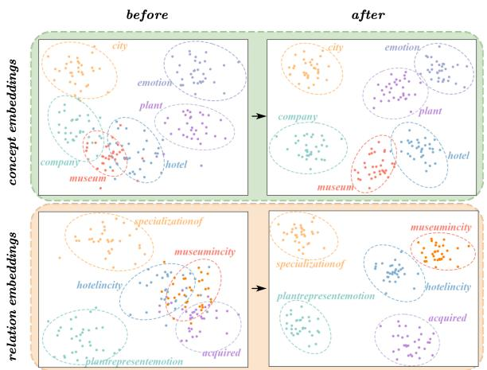
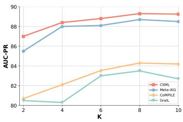
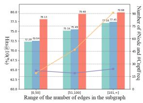
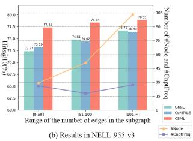
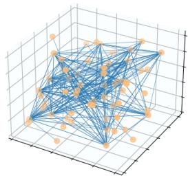
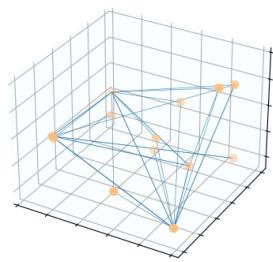

# Commonsense Subgraph for Inductive Relation Reasoning with Meta-learning

Feng Zhao, Zhilu Zhang, Cheng Yan, Xianggan Liu Natural Language Processing and Knowledge Graph Lab School of Computer Science and Technology Huazhong University of Science and Technology, Wuhan, China {zhaof, zhangzhilu, yancheng}@hust.edu.cn, liuxianggan@msn.com

## Abstract

In knowledge graphs (KGs), predicting missing relations is a critical reasoning task. Recent subgraph-based models have delved into inductive settings, which aim to predict relations between newly added entities. While these models have demonstrated the ability for inductive reasoning, they only consider the structural information of the subgraph and neglect the loss of semantic information caused by replacing entities with nodes. To address this problem, we propose a novel Commonsense Subgraph Meta-Learning (CSML) model. Specifically, we extract concepts from entities, which can be viewed as high-level semantic information. Unlike previous methods, we use concepts instead of nodes to construct commonsense subgraphs. By combining these with structural subgraphs, we can leverage both structural and semantic information for more comprehensive and rational predictions. Furthermore, we regard concepts as meta-information and employ meta-learning to facilitate rapid knowledge transfer, thus addressing more complex few-shot scenarios. Experimental results confirm the superior performance of our model in both standard and few-shot inductive reasoning.

## 1 Introduction

Knowledge Graphs (KGs) are intricate semantic networks that encompass a vast array of entities and relations. These graph structures have attracted considerable attention in various applications, such as question answering (Wang et al., 2024) and recommendation systems (Jiang et al., 2024). Considering the inherent incompleteness of KGs, a considerable volume of research has been dedicated to predict missing information in KGs. Knowledge Graph Embedding (KGE) methods have performed strongly in conventional reasoning tasks. However, in practical scenarios, KGs continually evolve, incorporating new entities over time. Since these entities are unseen during training, traditional KGE models can not recognize these newly added entities. Therefore, inductive reasoning is proposed to focus on predicting the relations between newly added entities.

Recently, drawing on the successes of of graph neural networks (GNNs) in modeling graph structures, GraIL (Teru et al., 2020) replaces entities with nodes and forms the subgraphs of the target triplet. It proposes to encode nodes based on their distance to target entities. By learning from the subgraph structure, it achieves inductive reasoning. Expanding upon GraIL, CoMPILE (Mai et al., 2021) extracts directed subgraphs and introduces an edgeenhanced message passing mechanism concerning edges in the updating process. Meta-iKG (Zheng et al., 2022) categorizes relations into two kinds according to the count of associated triples. It utilizes meta-learning to transfer knowledge, thus achieving inductive reasoning under the more challenging few-shot settings. In summary, inductive reasoning requires the model to make predictions without relying on entity representations, and GNN-based methods mainly achieve this by replacing entities with nodes.

Though GNN-based methods exhibit potential in inductive reasoning, they grapple with two primary challenges: (1) GNN-based models only consider the structural information when replacing entities with nodes, there is an inevitable loss of the semantic information of the entities (Liang et al., 2024); (2) In low-resource scenarios, the limitation in sample size results in a simple and sparse graph structure, inhibiting GNN-based methods from accurately capturing the features of the graph structure. This makes the model ill-suited for few-shot settings (Liu et al., 2024).

For the first problem, relying solely on structural information for predictions is insufficient. For instance, Figure 1 demonstrates that when replacing entities with nodes in the two left subgraphs, they construct the identical structural subgraph depicted in the middle. While these subgraphs are structurally identical, their relations for prediction differ. Such an observation exposes the limitation of relying solely on structural information. Therefore, we suggest extracting concepts from entities, such as deriving the concept company from the entity Amazon. We then incorporate these concepts to form commonsense subgraphs with their relations. As the right subgraphs illustrate, we form two distinct commonsense subgraphs by extracting concepts from entities. Within these, the reasoning is facilitated by the semantic information from commonsense. For example, live\_in is more appropriate between person and city, whereas located\_in is apt for company and city.

  
Figure 1: Different subgraphs with the same graph structure but different commonsense

For the second problem, in low-resource scenarios, GNN-based models unavoidably suffer from overfitting and oversmoothing issues (Ding et al., 2022). To enhance the model’s robustness, we employ meta-learning to adjust parameters and transfer knowledge. Firstly, we categorize relations into large-shot and few-shot relations based on their associated sample size, subsequently constructing support and query sets, respectively. We then regard commonsense as meta-information, bridging the gap between two kinds of relations. By learning the meta-gradient of commonsense, our model transfers the knowledge learned from the support set to the query set, thereby addressing the few-shot inductive reasoning task.

It’s imperative to note that introducing concepts doesn’t violate the inductive settings. Concepts can be interpreted as category labels for entities. Though an entity is novel, its associated concept might have been encountered during training. Stemming from this insight, we propose a novel Commonsense Subgraph Meta-Learning (CSML) model. By incorporating structural and commonsense subgraphs, our model captures both structural and semantic features for more comprehensive and rational predictions. Furthermore, regarding commonsense as meta-information, it can rapidly adapt to few-shot settings via meta-learning. Finally, we choose several widely used inductive reasoning benchmarks and evaluate CSML with other baselines. Experimental results show that CSML outperforms other baselines in both standard and few-shot inductive settings. Our contributions are summarized as follows:

• We propose a novel CSML model to tackle inductive learning, which extracts concepts and constructs commonsense subgraphs for reasoning from both structural and semantic perspectives.

• We treat commonsense as meta-information and apply meta-learning to handle inductive reasoning in realistic few-shot scenarios.

• Experimental results show that CSML achieves state-of-the-art performance in both standard and few-shot inductive reasoning tasks.

## 2 Related Work

Inductive Relation Reasoning Compared to transductive reasoning, inductive reasoning emphasizes focusing on newly added entities and predicting the relations between them. Current inductive reasoning methods primarily divide into two categories: rule-based methods and GNN-based methods. The former methods including RuleN (Meilicke et al., 2018) and DRUM (Sadeghian et al., 2019) mine rules in KGs, thereby making predictions based on logic rules for confidence scoring. Given that rules are not reliant on specific entities, rule-based approaches naturally support inductive reasoning. However, these methods are limited by scalability issues and overlook the structural features of KGs.

Unlike rule-based methods, GNN-based methods achieve inductive reasoning by constructing subgraphs and learning from the structure of these subgraphs. GraIL (Teru et al., 2020) is the first to introduce a way to encode nodes, representing them by one-hot encoding the distance to the target entities, thus replacing entity representations and achieving inductive reasoning. Based on GraIL (Teru et al., 2020), CoMPILE (Mai et al., 2021) suggests to extract directed subgraphs and introduces an edge-enhanced message-passing mechanism, increasing attention to edges. MetaiKG (Zheng et al., 2022) proposes more challenging inductive reasoning within few-shot settings and tackles this problem through meta-learning. However, these methods only focus on the structural information, neglecting the loss of semantic information caused by the replacement of entities with nodes.

Few-shot Relation Reasoning Current methods for few-shot relation reasoning can generally be categorized into metric-based and meta-learning methods. The former calculates the similarity between the given training samples and the queried samples by designing a matching network. GMatching (Xiong et al., 2018) is first proposed to tackle this problem. It focuses on the entity’s local graph and designs an LSTM matching network to model one-hop graph structural information for calculating similarities. FSRL (Zhang et al., 2020) leverages a recurrent autoencoder and a fixed attention neighbor encoder for the matching module. FAAN (Sheng et al., 2020) introduces an adaptive neighbor encoder to model entities and simultaneously utilizes an adaptive aggregator to distinguish contributions of references. Informix-FKGC (Li et al., 2023) encodes multi-aspect information and employs a capsule network for matching.

Meta-learning methods aim to improve the model’s adaptability and robustness, allowing it to swiftly adjust to newly emerging relations with only a few samples. MetaR (Chen et al., 2019) takes a meta-learning perspective and learns relation-meta to transfer knowledge. MetaP (Jiang et al., 2021) introduces the relation-specific patterns and uses them to assess the validity of triples. GANA (Niu et al., 2021) notices the issue of sparse neighbors and thus employs a gated and attentive neighbor aggregator to tackle this and model the complex relations with MTransH. Since these fewshot learning methods rely on entity representations, they cannot be directly applied to inductive reasoning tasks.

## 3 Method

In this work, we propose to extract concepts from entities and construct commonsense with relations. Based on our observations, in KGs, entities come with specific labels, which can be viewed as the concepts of entities representing high-level semantic information. Our proposed CSML is presented in Figure 2.

## 3.1 Structural Subgraph Learning

Subgraph Construction and Encoding For a specified target triplet $( h _ { T } , r _ { T } , t _ { T } )$ , we initially construct a k-hop enclosing directed subgraph associated to it as previous works have done. Following CoMPILE (Mai et al., 2021), the subgraph is composed of nodes, which are both the k-hop outgoing neighbors of $h _ { T }$ and the k-hop incoming neighbors of $t _ { T }$ . The edges between these nodes are selected to form the subgraph. Given the hop number limitation of $k ,$ it can be inferred that the maximum distance from $h _ { T }$ to $t _ { T }$ is $k + 1$ . Based on distances to $h _ { T }$ and $t _ { T }$ , the node embedding N is represented to capture relative position information for nodes. Specifically, for node $i ,$ $d _ { h i }$ and $d _ { i t }$ are the shortest distance from $h _ { T }$ and $t _ { T }$ to $i ,$ respectively. By one-hot encoding, the node embedding of i can be represented as $\mathbf { N } _ { i } = o n e \mathbf { - } h o t ( d _ { h i } )$ ⊕ $o n e { \cdot } h o t ( d _ { i t } )$ where ⊕ is the concat operation. For edge $i ,$ the edge embedding is formed by the relation represented by the edge and the two associated nodes: $\mathbf { E } _ { i } = \mathbf { N } _ { h _ { i } } \oplus \mathbf { R } _ { r _ { i } } \oplus \mathbf { N } _ { t _ { i } }$ , where ${ \mathbf { R } } _ { r _ { i } }$ denotes the relation embedding of $r _ { i }$

Directed Subgraph Scoring We adopt the communicative message passing proposed in CoM-PILE (Mai et al., 2021) for updating parameters. Firstly, for edge i, the edge attentive embedding $\mathbf { A } _ { i } ^ { l - 1 }$ in the iteration of $l - 1$ can be obtained as follows:

$$
F _ { G } ( h , r , t ) = \mathbf { N } _ { h } + \mathbf { R } _ { r } - \mathbf { N } _ { t } ,\tag{1}
$$

$$
\alpha _ { i } ^ { l - 1 } = f _ { 1 } ( F _ { G } ^ { l - 1 } ( h _ { i } , r _ { i } , t _ { i } ) \oplus F _ { G } ^ { l - 1 } ( h _ { T } , r _ { T } , t _ { T } ) ) ,\tag{2}
$$

$$
\mathbf { A } _ { i } ^ { l - 1 } = \alpha _ { i } ^ { l - 1 } \mathbf { E } _ { i } ^ { l - 1 } ,\tag{3}
$$

where $F _ { G } ( h , r , t )$ represents the graph structural feature of $( h , r , t ) . ~ f _ { 1 }$ denotes the fully-connected

  
Figure 2: An illustration of CSML framework. The framework mainly consists of three modules: (1) Structural subgraph learning, (2) Commonsense subgraph learning, and (3) Commonsense meta-learning.

network and $\alpha _ { i }$ denotes the attentive weight of edge $i .$

We define the node aggregation information as follow:

$$
\mathbf { N } _ { a g g } ^ { l } = \mathbf { M } ^ { t e } \mathbf { A } ^ { l - 1 } ,\tag{4}
$$

where $\mathbf { M } ^ { t e }$ denotes the tail-to-edge adjacency matrix. We then use it to update the node representation:

$$
\mathbf { N } ^ { l } = \sigma ( ( \mathbf { N } _ { a g g } ^ { l } + \mathbf { N } ^ { l - 1 } ) \mathbf { W } _ { n } ^ { l } ) ,\tag{5}
$$

where $\mathbf { W } _ { n } ^ { l }$ represents the node parametric matrix at iteration l. σ denotes the nonlinear activation function.

The edge aggregation information and update formulation are defined as follows:

$$
\mathbf { E } _ { a g g } ^ { l } = ( \mathbf { M } ^ { h e } ) ^ { \mathsf { T } } \mathbf { N } ^ { l } + ( \mathbf { M } ^ { r e } ) ^ { \mathsf { T } } \mathbf { R } - ( \mathbf { M } ^ { t e } ) ^ { \mathsf { T } } \mathbf { N } ^ { l } ,\tag{6}
$$

$$
\mathbf { E } ^ { l } = \sigma ( ( \mathbf { E } ^ { l - 1 } + \mathbf { E } _ { a g g } ^ { l } ) \mathbf { W } _ { e } ^ { l } ) ,\tag{7}
$$

where $\mathbf { M } ^ { h e } , \mathbf { M } ^ { r e }$ , and $\mathbf { M } ^ { t e }$ denote head-to-edge, relation-to-edge and tail-to-edge adjacency matrix respectively. ${ \mathbf W } _ { e } ^ { l }$ represents the edge parametric matrix at iteration l. Finally, the scoring function can be calculated as:

$$
S _ { G } = f _ { 2 } ( F _ { G } ( h _ { T } , r _ { T } , t _ { T } ) ) ,\tag{8}
$$

in which $f _ { 2 }$ represents a two-layer fully-connected network. We then obtain the structural subgraph loss function as follows:

$$
L _ { G } = \sum _ { i \in G _ { t r i } } \operatorname* { m a x } ( S _ { G } ( n _ { i } ) - S _ { G } ( p _ { i } ) + \gamma , 0 ) ,\tag{9}
$$

where $G _ { t r i }$ denotes the set of training graphs. $\gamma$ denotes the margin hyperparameter. $n _ { i }$ and $p _ { i }$ are negative and positive triplets respectively.

## 3.2 Commonsense Subgraph Learning

The incorporation of commonsense has been demonstrated to be advantageous in aiding models to comprehend semantics (Niu et al., 2022). Broadly speaking, commonsense can be viewed as a layer of concepts abstracted through ontological relations. In KGs, each entity can be linked to one or more concepts, which comprise high-level semantic information.

For the extracted directed subgraph, we abstract concepts from entities and replace nodes with concepts to form commonsense subgraphs. We define $C$ as the set of concepts and C to denote the concept embeddings. For the node n, if there is only a concept associated with $n ,$ we use its embedding $\mathbf { C } _ { n }$ to replace the node $n ,$ else we calculate its embedding representation as follows:

$$
\mathbf { C } _ { n } = \frac { 1 } { | C ^ { n } | - 1 } \sum _ { i \in C ^ { n } } w _ { i } \mathbf { C } _ { i } , w _ { i } = 1 - \frac { f r e q ( C _ { i } ) } { \sum _ { j \in C ^ { n } } f r e q ( C _ { j } ) } ,\tag{10}
$$

where $C ^ { n }$ represents the set of concepts associated with node n. $| C ^ { n } |$ is the size of $\begin{array} { l r } { C ^ { n } . } & { { } f r e q ( C _ { i } ) } \end{array}$ represents the number of entities associated with concept $C _ { i }$ . We assume that the rarer a concept is, the more significant its semantic impact on the node. Therefore, to balance the update weights of different concepts, we set it such that the smaller the frequency, the larger the weight.

We define conceptual feature of $( h , r , t )$ in the commonsense subgraph as follows:

$$
F _ { C } ( h , r , t ) = { \bf { C } } _ { h } + { \bf { R } } _ { r } - { \bf { C } } _ { t } .\tag{11}
$$

In the commonsense subgraph, we update the concept representation in the same way as node representation mentioned earlier. However, it’s worth noting that while relations and edges are consistent with structural subgraphs from the perspective of graph structure, we do not share parameters between structural subgraphs and commonsense subgraphs, as we aim to capture features from different layers.

To obtain the scoring function at the conceptual layer, we replace node embeddings N with concept embeddings C and graph structural features $F _ { G }$ with conceptual features $F _ { C }$ :

$$
S _ { C } = f _ { 2 } ( F _ { C } ( h _ { T } , r _ { T } , t _ { T } ) ) .\tag{12}
$$

Similar to Eq.9, the conceptual subgraph loss function $L _ { C }$ is defined within conceptual scoring function $S _ { C }$ . By combining structural and conceptual subgraph features, we can achieve more comprehensive reasoning. Therefore, we calculate the total loss function as follows:

$$
\mathcal { L } = L _ { G } + \lambda L _ { C } ,\tag{13}
$$

where λ is a hyperparameter to balance the loss function.

## 3.3 Commonsense Meta-learning

Benefiting from the powerful adaptive ability of meta-learning, we use meta-learning to learn well-initialized parameters and quickly update the learned representations.

Firstly, given the threshold K, relations with the number of associated triplets exceeding K are regarded as large-shot relations, otherwise, they are considered as few-shot relations. In each iteration, we sample from large-shot and few-shot relations, and subsequently formulate the support set S and query set Q, accordingly. We regard commonsense as a bridge between the two types of relations. As a higher-level semantic information, commonsense remains a constant pivot across different relations. Therefore, we treat commonsense as a type of metainformation and can transfer it from S to Q. For the S, the loss function is calculated using samples extracted from S and concept embeddings C:

$$
\begin{array} { r } { L ( S ) = { \displaystyle \sum _ { ( h , r , t ) \in S } } \operatorname* { m a x } ( S _ { C } ( \mathbf { C } _ { h ^ { \prime } } , \mathbf { R } _ { r } , \mathbf { C } _ { t } ) } \\ { - S _ { C } ( \mathbf { C } _ { h } , \mathbf { R } _ { r } , \mathbf { C } _ { t } ) + \gamma , 0 ) . } \end{array}\tag{14}
$$

We efficiently update the concept embedding C by implementing the gradient update rule, as demonstrated below:

$$
\mathbf { G } _ { C } = \nabla _ { \mathbf { C } } L ( \boldsymbol { S } ) , \mathbf { C } ^ { ' } = \mathbf { C } - \beta \mathbf { G } _ { C } ,\tag{15}
$$

where $\mathbf { G } _ { C }$ represents the gradient meta of C and we use $\beta$ to adjust step size. For the $\mathcal { Q } ,$ the final loss is calculated as follows with concept meta $\mathbf { C ^ { ' } }$

$$
\begin{array} { r } { L ( \boldsymbol { \mathcal { Q } } ) = \displaystyle \sum _ { ( h , r , t ) \in \boldsymbol { \mathcal { Q } } } \operatorname* { m a x } ( S _ { C } ( \mathbf { C ^ { \prime } } _ { h ^ { \prime } } , \mathbf { R } _ { r } , \mathbf { C ^ { \prime } } _ { t } ) } \\ { - S _ { C } ( \mathbf { C ^ { \prime } } _ { h } , \mathbf { R } _ { r } , \mathbf { C ^ { \prime } } _ { t } ) + \gamma , 0 ) . } \end{array}\tag{16}
$$

The meta-gradients are computed in two phases, employing the $\mathcal { Q }$ within few-shot relations for the final parameter updates. This process allows CSML to quickly adapt to few-shot relations, updating the well-initialized parameters with the $s$ constructed by large-shot relations.

## 4 Experiments

In this section, we evaluate CSML with those of previously state-of-the-art models on both standard and few-shot inductive reasoning tasks to demonstrate its effectiveness. Furthermore, we study the impact of few-shot size on CSML and analyze models’ performance under subgraphs of different densities. We conduct ablation studies to assess the contribution of each module to CSML. Finally, we gain a deep understanding of the samples suitable for CSML model prediction through the case study.

## 4.1 Experimental Setup

Datasets We select two widely used benchmarks, FB15k-237 and NELL-955, and follow CoM-PILE (Mai et al., 2021) to construct their variants v1, v2, and v3 for the inductive reasoning tasks. Theoretically, our model requires that the datasets contain the concepts of the entities. In NELL-955, each entity has been associated with a concept that meets this requirement. As for FB15k-237, since a large amount of Freebase data has been migrated to Wikidata, we utilize the SPARQLWrapper1 library to connect to Wikidata for searching concepts. The Summaries of inductive datasets are shown in Table 1.

Baselines To evaluate the superiority of our model, we compare CSML with the state-of-the-art inductive models, including the rule-based model RuleN (Meilicke et al., 2018) and GNN-based models such as GraIL (Teru et al., 2020), CoM-PILE(Mai et al., 2021) and Meta-iKG (Zheng et al., 2022). For Meta-iKG, there are two model variants based on two different meta-learning strategies MAML and Meta-SGD. We use Meta-iKG and

<table><tr><td></td><td></td><td>#Ent</td><td>#Rel</td><td>#Cnpt</td><td>#Train</td><td>#Valid</td><td>#Test</td></tr><tr><td rowspan="3">FB15k-237</td><td>vl</td><td>2,687</td><td>180</td><td>675</td><td>4,245</td><td>489</td><td>205</td></tr><tr><td>v2</td><td>4,268</td><td>200</td><td>893</td><td>9,739</td><td>1,166</td><td>478</td></tr><tr><td>v3</td><td>6,169</td><td>215</td><td>1,090</td><td>17,986</td><td>2,194</td><td>865</td></tr><tr><td rowspan="3">NELL-955</td><td>vl</td><td>3,328</td><td>14</td><td>185</td><td>4,687</td><td>414</td><td>100</td></tr><tr><td>v2</td><td>4,650</td><td>88</td><td>212</td><td>8,219</td><td>922</td><td>476</td></tr><tr><td>v3</td><td>8,210</td><td>142</td><td>233</td><td>16,393</td><td>1,851</td><td>809</td></tr></table>

Table 1: Summaries of datasets. #Ent, #Rel, and #Cnpt denote the number of entities, relations, and concepts. #Train, #Valid, and #Test denote the number of triples in training, validation, and test datasets

Meta-iKG\* to represent the former and the latter, respectively. To ensure fairness, we directly report the original results from Meta-iKG (Zheng et al., 2022).

Implementation Details Following prior methods, we use AUC-PR and Hits@10 as the evaluation metrics. We calculate AUC-PR by sampling a negative triplet for each test sample and comparing their scores. For Hits@10, we assess the score of the positive triplet against the sampled negative ones to see if the positive triplet ranks within the top 10. We employ the Adam optimizer and set learning rate to 0.001. To maintain the same settings, hop number k and iterations l are set to 3. We train CSML for 20 epochs and 100 meta updates for each epoch. To avoid overfitting, the early stopping mechanism is employed in CSML. We repeat the experiment 10 times and take the average result as our final experimental outcome.

## 4.2 Standard Inductive Results

Firstly, we compare our proposed CSML with other baselines on the standard inductive datasets to verify the effectiveness of our model. As shown in Table 2, we can see that the GNN-based methods outperform the rule-based approach RuleN. This is the reason why GNN-based methods have garnered recent attention. Additionally, our model generally performs better than other models, suggesting that incorporating commonsense aids in inductive reasoning. Whereas previous GNN-based models solely focused on reasoning from the perspective of subgraph structures, our model builds upon this by introducing commonsense to compensate for the lack of semantic information. Therefore, our model CSML can utilize both structural and semantic information to make more comprehensive and rational predictions.

## 4.3 Few-shot Inductive Results

To evaluate the stability and robustness of CSML and other baselines, we conduct experiments under few-shot settings, selecting relations with fewer than K triplets for testing. As shown in Table 3, meta-learning methods, like Meta-iKG and our approach, outperform models such as GraIL and CoMPILE, highlighting meta-learning’s advantage in few-shot reasoning. Unlike Meta-iKG, our model uses commonsense subgraphs instead of structural ones for meta-learning, allowing commonsense knowledge to bridge large-shot and fewshot relations for more efficient reasoning.

To examine the impact of meta-learning, we visualize 5 few-shot relations and their 6 associated concepts. As shown in Figure 3, meta-learning typically creates a separable embedding space. While we update only concept embeddings through metalearning, the scoring function incorporates both concepts and relations, ensuring accurate concept modeling enhances the representation of few-shot relations, making them more distinguishable.

## 4.4 Impact of Few-shot Size

To explore the impact of K on the performance of our CSML and other models, we select different few-shot sizes and conduct experiments. As shown in Figure 4, most models exhibit an increase in performance as the K increases, indicating that increasing the number of instances helps improve the performance of the models. We notice that as the K increases, the upward trend in accuracy diminishes and sometimes even reverses. This might be due to the model’s varying sensitivity to the fewshot size. We can see that different models have different sensitivity to changes in K, and our model is relatively stable. For our model, given that the number of concepts is significantly less than the number of nodes, the commonsense information provided tends to saturate quickly as the number of samples in the support set increases. This implies that even with continued growth in K, there won’t be any additional benefit for knowledge transfer concerning commonsense information.

  
Figure 3: Visualization of concepts and few-shot rela-2203tions before meta-learning and after.

<table><tr><td rowspan="3">Model</td><td colspan="6">AUC-PR %</td><td colspan="6">Hits@10 %</td></tr><tr><td colspan="3">FB15k-237</td><td colspan="3">NELL-955</td><td colspan="3">FB15k-237</td><td colspan="3"> $_ { \mathrm { N E L L - 9 5 5 } }$ </td></tr><tr><td> $\mathbf { v } 1$ </td><td> $\mathbf { v } 2$ </td><td> $\mathbf { v } 3$ </td><td> $\mathbf { v } 1$ </td><td> $\mathbf { v } 2$ </td><td> $\mathbf { v } 3$ </td><td> $\mathbf { v } 1$ </td><td> $\mathbf { v } 2$ </td><td> $\mathbf { v } 3$ </td><td> $\mathbf { v } 1$ </td><td> $\mathbf { v } 2$ </td><td> $\mathbf { v } 3$ </td></tr><tr><td>RuleN</td><td>79.60</td><td>82.67</td><td>83.03</td><td>67.12</td><td>80.52</td><td>73.91</td><td>65.35</td><td>71.68</td><td>67.84</td><td>53.70</td><td>69.77</td><td>64.29</td></tr><tr><td>GraIL</td><td>80.45</td><td>83.66</td><td>84.35</td><td>69.35</td><td>85.04</td><td>84.43</td><td>66.52</td><td>73.82</td><td>70.15</td><td>55.56</td><td>76.40</td><td>75.66</td></tr><tr><td>CoMPILE</td><td>79.95</td><td>83.56</td><td>83.97</td><td>68.36</td><td>85.50</td><td>84.04</td><td>66.52</td><td>72.37</td><td>69.77</td><td>62.35</td><td>76.51</td><td>75.58</td></tr><tr><td>Meta-iKG</td><td>80.31</td><td>82.95</td><td>82.52</td><td>72.12</td><td>84.11</td><td>82.47</td><td>66.52</td><td>72.37</td><td>68.81</td><td>60.49</td><td>74.07</td><td>77.99</td></tr><tr><td>Meta-iKG*</td><td>81.10</td><td>84.26</td><td>84.57</td><td>72.50</td><td>85.97</td><td>84.05</td><td>66.96</td><td>74.08</td><td>71.89</td><td>64.20</td><td>77.91</td><td>77.41</td></tr><tr><td>CSML</td><td>82.43</td><td>85.71</td><td>86.27</td><td>73.64</td><td>86.10</td><td>85.52</td><td>67.71</td><td>73.82</td><td>71.44</td><td>65.34</td><td>79.16</td><td>78.82</td></tr></table>

Table 2: Standard Inductive Results
<table><tr><td rowspan="2">Model</td><td colspan="2"> $\mathrm { F B } 1 5 \mathrm { k } { - } 2 3 7 { - } \mathrm { v } 1$ </td><td colspan="2"> $\mathrm { F B } 1 5 \mathrm { k } { - } 2 3 7 { - } \mathrm { v } 2$ </td><td colspan="2"> $\mathrm { F B } 1 5 \mathrm { k } { - } 2 3 7 { - } \mathrm { v } 3$ </td><td colspan="2"> $\mathrm { N E L L - 9 5 5 - v 2 }$ </td><td colspan="2"> $\mathbf { N E L L - 9 5 5 - v 3 }$ </td></tr><tr><td> $\mathrm { K } = 5$ </td><td> ${ \mathrm { K } } = 1 0$ </td><td> $\mathrm { K } = 5$ </td><td> ${ \mathrm { K } } = 1 0$ </td><td> $\mathrm { K } = 5$ </td><td> $\mathrm { K } = 1 0$ </td><td> $\mathrm { K } = 5$ </td><td> $\mathrm { K } = 1 0$ </td><td> $\mathrm { K } = 5$ </td><td> $\mathrm { K } = 1 0$ </td></tr><tr><td>GraIL</td><td>50.00</td><td>37.50</td><td>83.33</td><td>80.00</td><td>54.67</td><td>56.29</td><td>64.00</td><td>66.67</td><td>53.17</td><td>63.81</td></tr><tr><td>CoMPILE</td><td>43.75</td><td>42.86</td><td>80.08</td><td>80.00</td><td>58.33</td><td>57.14</td><td>78.18</td><td>72.41</td><td>65.87</td><td>70.95</td></tr><tr><td>Meta-iKG</td><td>75.00</td><td>56.25</td><td>86.67</td><td>88.33</td><td>66.67</td><td>64.29</td><td>80.00</td><td>74.36</td><td>65.87</td><td>71.43</td></tr><tr><td>Meta-iKG*</td><td>75.00</td><td>60.71</td><td>86.67</td><td>90.00</td><td>58.33</td><td>57.14</td><td>78.00</td><td>78.21</td><td>65.87</td><td>72.86</td></tr><tr><td>CSML</td><td>77.32</td><td>61.54</td><td>88.14</td><td>88.59</td><td>64.75</td><td>66.38</td><td>80.16</td><td>75.82</td><td>67.54</td><td>74.02</td></tr></table>

Table 3: Few-shot Inductive Results (Hits@10 %)

  
Figure 4: Impact analysis of few-shot size K.

  
Figure 5: Results and related data statistics under subgraphs of different sparsity. The horizontal axis in the graph represents the range of the number of edges in the subgraph, and the bar chart represents the experimental results of different models. #Node represents the average number of nodes in the subgraph, and #Cnpt-Freq represents the average number of entities associated with the concepts contained in the subgraph

## 4.5 Analysis under subgraphs of different densities

To assess model performance on subgraphs of varying densities, we divided the dataset and conducted experiments. We define subgraph density by the number of edges, as each edge corresponds to a triplet, reflecting the number of samples within the subgraph. In addition, we count the number of nodes in subgraphs of different densities and the average number of entities associated with the concepts contained in the subgraph. The experimental results and related statistics are shown in the Figure 5.

As edges increase, the number of nodes grows rapidly, indicating a denser structure. GraIL and

(a) Results in NELL-955-v2

CoMPILE perform better in dense subgraphs but struggle with sparse ones. In contrast, CSML shows greater robustness, maintaining strong performance even in sparse subgraphs. While the number of nodes and edges increases as the graph becomes more complex, #CnptFreq remains relatively stable. This stability reflects that entities linked to a concept extend beyond the subgraph and contributes to CSML’s robustness.

## 4.6 Ablation Study

To evaluate the contribution of each module in our model, we conduct the ablation experiment. Our ablation study mainly investigates the impact of the Commonsense subgraph learning (CS) and Metalearning (ML). For the ’w/o ML’ case, we remove the commonsense meta-learning module. As for ’w/o CS’, since our meta-learning is based on the commonsense subgraph and concept embeddings, we still need to extract the commonsense subgraph. However, we no longer learn the commonsense information through GNN. That is to say, the commonsense information is no longer updated via the message-passing mechanism but solely relies on meta-learning for updates.

<table><tr><td>Model</td><td>NELL-955-v1 NELL-955-v2 AUC-PR Hits@10 AUC-PR Hits@10</td></tr><tr><td>w/o CS</td><td>69.45 62.66 85.57</td></tr><tr><td></td><td>76.73</td></tr><tr><td>w/o ML 72.18 CSML 73.64</td><td>63.51 86.94 78.46 65.34 87.10 79.16</td></tr></table>

Table 4: Results of ablation study (%)

  
(a) TP sample structure

  
(b) FN sample structure  
Figure 6: Visualization of TP and FN sample structure.

The results of the ablation study are shown in Table 4. From the table, we can observe that both modules contribute to the model’s performance. However, the contribution of the CS module is more significant than that of the ML module, which aligns with our expectations. Previous sections on few-shot inductive reasoning have highlighted the effectiveness of meta-learning. However, our model leverages commonsense information to assist reasoning, so updating this information is crucial. In the ’w/o CS’ case, due to the absence of the message-passing mechanism for updating commonsense information, there’s a decline in the model’s ability to represent commonsense, leading to a significant performance drop.

## 4.7 Case Study

To further understand what types of samples are easy or difficult for our CSML model to make prediction, we select a high-scoring true positive (TP) sample (texans, concept:agentparticipatedinevent, result) and a low-scoring false negative (FN) sample (great\_falls, concept:subpartof, montana) for analysis from both structural and semantic perspectives.

To highlight the structural differences between the two samples, we visually analyze their subgraphs. As shown in Figure 6, the subgraph for the TP sample is much more complex, with more nodes and edges than the FN sample. This suggests that complex subgraphs provide richer information, aiding CSML’s predictions.

Semantically, we compare the concept frequency associated with head and tail entities. For the TP sample, the frequencies are 353 and 17, while for the FN sample, they are 469 and 158. The low concept frequency for the TP sample’s tail entity suggests stronger associations with entities. The high frequency for the TP sample’s head entity occurs because there are fewer concepts than entities in complex graphs. In conclusion, samples suitable for CSML predictions have two traits: (1) complex subgraphs and (2) low concept frequency linked to entities.

## 5 Conclusion

We study the inductive relation reasoning problem and propose the CSML model to address this issue. We extract concepts of entities and form commonsense subgraphs. By incorporating commonsense information, we supplement additional semantic information, which is neglected by previous GNN-based models. Our model leverages both structural and semantic information for more comprehensive and rational predictions. Experimental results show that CSML can effectively tackle both standard and few-shot inductive reasoning tasks. In our future endeavors, we aim to delve into novel few-shot learning theories and enhance the efficacy of CSML even more.

## Limitations

Our approach, which relies on the concept information of entities, performs better when the concept information is more accurate and comprehensive. However, the concept information depends on the specific dataset. Additionally, as extra concept information is introduced, computational overhead is incurred while calculating concept features, resulting in a slightly higher computational complexity of our method compared to previous methods.

## Acknowledgments

This work was supported in part by the National Key R&D Program of China under Grant 2023YFF0905503, National Natural Science Foundation of China under Grants No.62472188.

## References

Mingyang Chen, Wen Zhang, Wei Zhang, Qiang Chen, and Huajun Chen. 2019. Meta relational learning for few-shot link prediction in knowledge graphs. In Proceedings of the 2019 Conference on Empirical Methods in Natural Language Processing and the 9th International Joint Conference on Natural Language Processing (EMNLP-IJCNLP), pages 4217– 4226.

Kaize Ding, Jianling Wang, James Caverlee, and Huan Liu. 2022. Meta propagation networks for graph few-shot semi-supervised learning. In Proceedings of the AAAI Conference on Artificial Intelligence, volume 36, pages 6524–6531.

Yangqin Jiang, Yuhao Yang, Lianghao Xia, and Chao Huang. 2024. Diffkg: Knowledge graph diffusion model for recommendation. In Proceedings of the 17th ACM International Conference on Web Search and Data Mining, WSDM 2024, pages 313–321. ACM.

Zhiyi Jiang, Jianliang Gao, and Xinqi Lv. 2021. Metap: Meta pattern learning for one-shot knowledge graph completion. In Proceedings of the 44th International ACM SIGIR Conference on Research and Development in Information Retrieval, pages 2232– 2236.

Qianyu Li, Jiale Yao, Xiaoli Tang, Han Yu, Siyu Jiang, Haizhi Yang, and Hengjie Song. 2023. Capsule neural tensor networks with multi-aspect information for few-shot knowledge graph completion. Neural Networks, 164:323–334.

Ke Liang, Lingyuan Meng, Sihang Zhou, Wenxuan Tu, Siwei Wang, Yue Liu, Meng Liu, Long Zhao, Xiangjun Dong, and Xinwang Liu. 2024. MINES: message intercommunication for inductive relation reasoning over neighbor-enhanced subgraphs. In Thirty-Eighth AAAI Conference on Artificial Intelligence, pages 10645–10653. AAAI Press.

Haochen Liu, Song Wang, Chen Chen, and Jundong Li. 2024. Few-shot knowledge graph relational reasoning via subgraph adaptation. In Proceedings of the 2024 Conference of the North American Chapter of the Association for Computational Linguistics: Human Language Technologies (Volume 1: Long Papers), NAACL 2024, pages 3346–3356. Association for Computational Linguistics.

Sijie Mai, Shuangjia Zheng, Yuedong Yang, and Haifeng Hu. 2021. Communicative message passing for inductive relation reasoning. In Proceedings of the AAAI Conference on Artificial Intelligence, volume 35, pages 4294–4302.

Christian Meilicke, Manuel Fink, Yanjie Wang, Daniel Ruffinelli, Rainer Gemulla, and Heiner Stuckenschmidt. 2018. Fine-grained evaluation of ruleand embedding-based systems for knowledge graph completion. In The Semantic Web–ISWC 2018: 17th International Semantic Web Conference, Monterey,

CA, USA, October 8–12, 2018, Proceedings, Part I 17, pages 3–20. Springer.

Guanglin Niu, Bo Li, Yongfei Zhang, and Shiliang Pu. 2022. Cake: A scalable commonsense-aware framework for multi-view knowledge graph completion. In Proceedings of the 60th Annual Meeting of the Association for Computational Linguistics (Volume 1: Long Papers), pages 2867–2877.

Guanglin Niu, Yang Li, Chengguang Tang, Ruiying Geng, Jian Dai, Qiao Liu, Hao Wang, Jian Sun, Fei Huang, and Luo Si. 2021. Relational learning with gated and attentive neighbor aggregator for few-shot knowledge graph completion. In Proceedings ofthe 44th International ACM SIGIR Conference on Research and Development in Information Retrieval, pages 213–222.

Ali Sadeghian, Mohammadreza Armandpour, Patrick Ding, and Daisy Zhe Wang. 2019. Drum: End-toend differentiable rule mining on knowledge graphs. Advances in Neural Information Processing Systems, 32.

Jiawei Sheng, Shu Guo, Zhenyu Chen, Juwei Yue, Lihong Wang, Tingwen Liu, and Hongbo Xu. 2020. Adaptive attentional network for few-shot knowledge graph completion. In Proceedings of the 2020 Conference on Empirical Methods in Natural Language Processing (EMNLP), pages 1681–1691.

Komal Teru, Etienne Denis, and Will Hamilton. 2020. Inductive relation prediction by subgraph reasoning. In International Conference on Machine Learning, pages 9448–9457. PMLR.

Yu Wang, Nedim Lipka, Ryan A. Rossi, Alexa F. Siu, Ruiyi Zhang, and Tyler Derr. 2024. Knowledge graph prompting for multi-document question answering. In Thirty-Eighth AAAI Conference on Artificial Intelligence, pages 19206–19214. AAAI Press.

Wenhan Xiong, Mo Yu, Shiyu Chang, Xiaoxiao Guo, and William Yang Wang. 2018. One-shot relational learning for knowledge graphs. In Proceedings of the 2018 Conference on Empirical Methods in Natural Language Processing, pages 1980–1990.

Chuxu Zhang, Huaxiu Yao, Chao Huang, Meng Jiang, Zhenhui Li, and Nitesh V Chawla. 2020. Few-shot knowledge graph completion. In Proceedings of the AAAI conference on artificial intelligence, volume 34, pages 3041–3048.

Shuangjia Zheng, Sijie Mai, Ya Sun, Haifeng Hu, and Yuedong Yang. 2022. Subgraph-aware few-shot inductive link prediction via meta-learning. IEEE Transactions on Knowledge and Data Engineering.