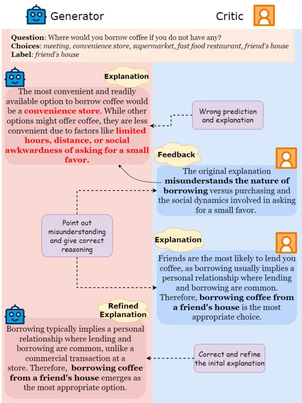
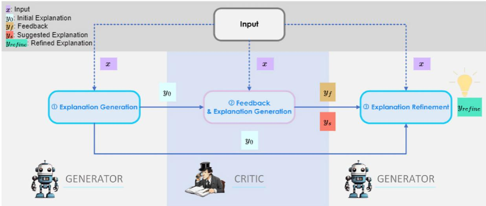
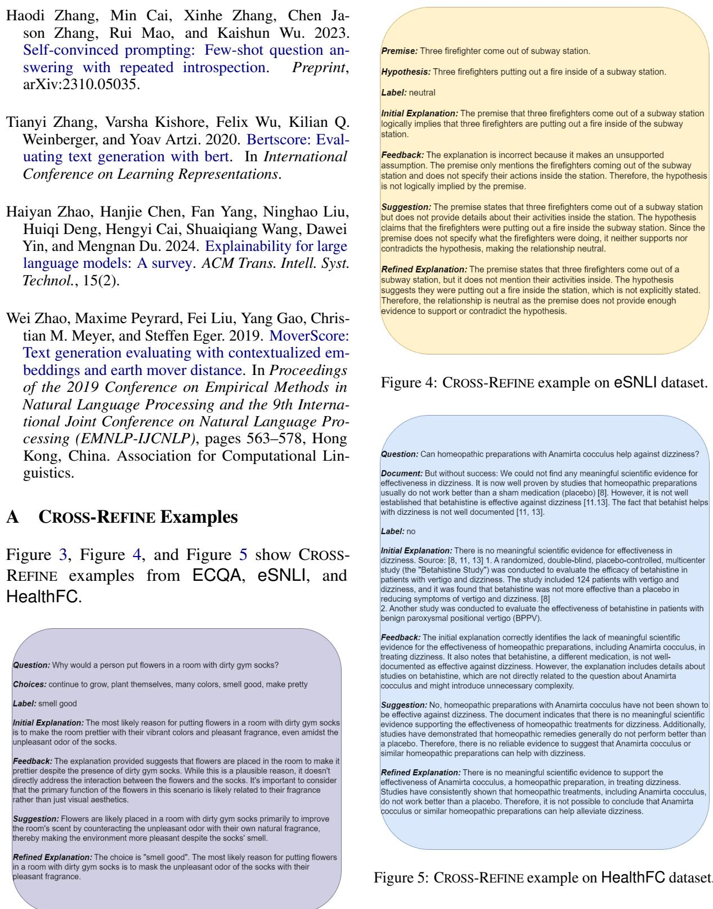
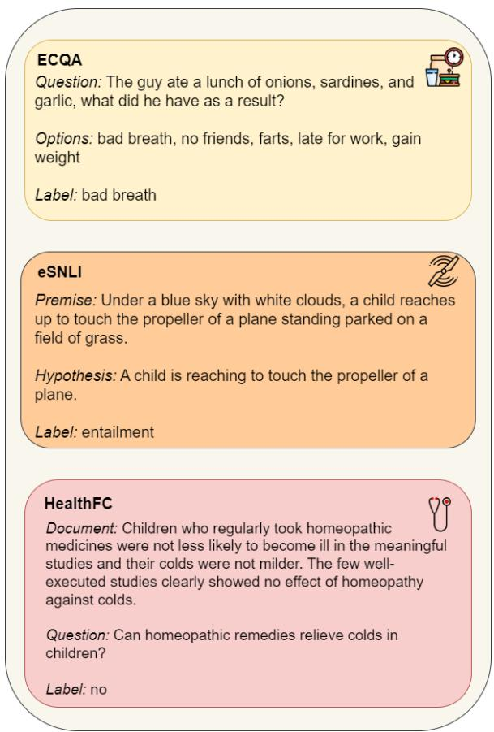
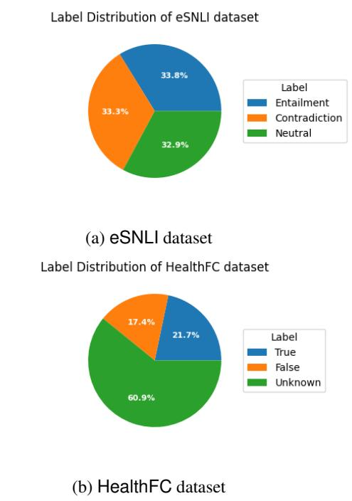
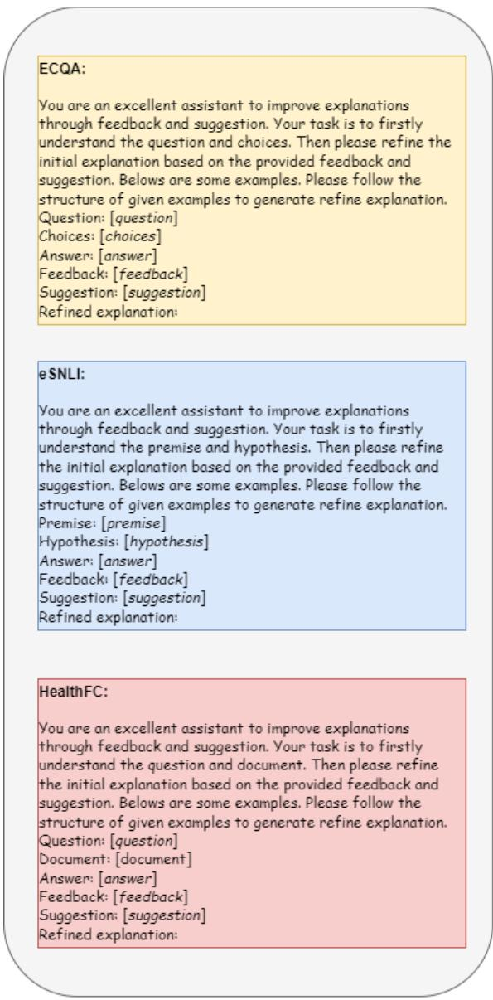
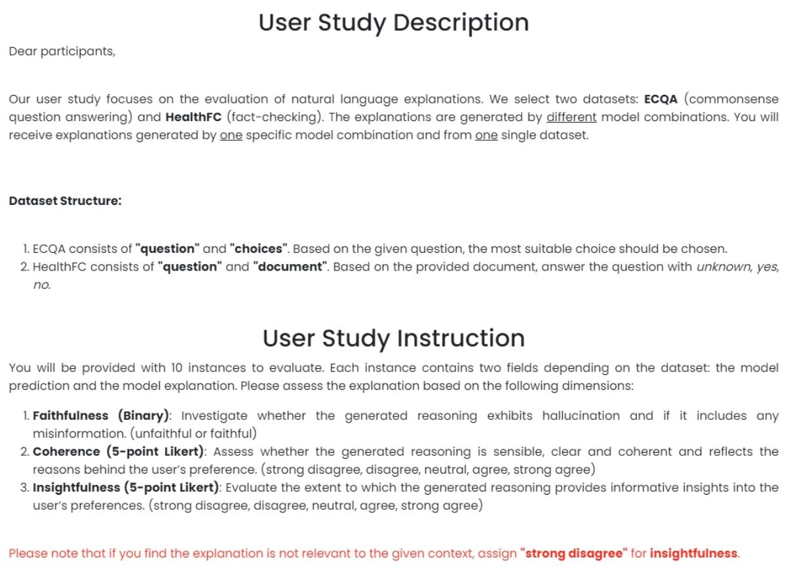

# Cross-Refine: Improving Natural Language Explanation Generation by Learning in Tandem

Qianli Wang1,2 Tatiana Anikina1,3 Nils Feldhus1 Simon Ostermann1,3,4 Sebastian Möller1,2 Vera Schmitt1,2 1German Research Center for Artificial Intelligence (DFKI) 2Technische Universität Berlin 3Saarland Informatics Campus 4 Centre for European Research in Trusted AI (CERTAIN) {firstname.lastname}@dfki.de

## Abstract

Natural language explanations (NLEs) are vital for elucidating the reasoning behind large language model (LLM) decisions. Many techniques have been developed to generate NLEs using LLMs. However, like humans, LLMs might not always produce optimal NLEs on first attempt. Inspired by human learning processes, we introduce CROSS-REFINE1, which employs role modeling by deploying two LLMs as generator and critic, respectively. The generator outputs a first NLE and then refines this initial explanation using feedback and suggestions provided by the critic. CROSS-REFINE does not require any supervised training data or additional training. We validate CROSS-REFINE across three NLP tasks using three state-ofthe-art open-source LLMs through automatic and human evaluation. We select SELF-REFINE (Madaan et al., 2023) as the baseline, which only utilizes self-feedback to refine the explana tions. Our findings from automatic evaluation and a user study indicate that CROSS-REFINE outperforms SELF-REFINE. Meanwhile, CROSS-REFINE can perform effectively with less powerful LLMs, whereas SELF-REFINE only yields strong results with ChatGPT. Additionally, we conduct an ablation study to assess the importance of feedback and suggestions. Both of them play an important role in refining explanations. We further evaluate CROSS-REFINE on a bilingual dataset in English and German.

## 1 Introduction

As the complexity of LLMs continues to increase, NLEs are pivotal in explainable artificial intelligence (XAI) (Madsen et al., 2022; Lyu et al., 2024; Zhao et al., 2024). NLEs can serve as a bridge between XAI and humans, providing justifications in a format that humans can easily understand (Camburu et al., 2018; Wiegreffe et al., 2021). LLMs are widely employed to generate NLEs across diverse domains (Singh et al., 2023; Wang et al., 2024b; Kwon et al., 2024; Stern et al., 2024; Wang et al., 2024c). However, similar to humans, LLMs may not consistently generate optimal explanations in their initial attempt (Madaan et al., 2023), e.g., due to lack of faithfulness (Chuang et al., 2024). LLMs have the potential to enhance their reasoning abilities through self-improvement without relying on external inputs (Huang et al., 2023). Based on this observation, Madaan et al. (2023) proposed SELF-REFINE, where LLMs use their own feedback to refine and improve their performance iteratively. This is shown to work only with large and powerful models; smaller models tend to hallucinate or generate repeated outputs. Moreover, Tyen et al. (2024) highlighted that LLMs generally struggle to identify reasoning errors and, therefore, cannot always self-correct their reasoning (Huang et al., 2024b).

  
Figure 1: CROSS-REFINE example of the question “Where would you borrow coffee ifyou do not have any?” from ECQA. The initial explanation by the generator has been accurately corrected and refined based on the feedback and explanations provided by the critic.

In this paper, we first propose CROSS-REFINE, which draws inspiration from how humans benefit from learning from others (Foster and Rosenzweig, 1995; De Felice et al., 2023) and additional feedback or suggestions. CROSS-REFINE involves deploying a base LLM as the generator to generate an NLE and a second LLM as the critic (Figure 1). While the generator outputs initial explanations, the critic provides the generator with feedback and suggestions based on initial explanations. Feedback and suggestions are then cross-referenced by the generator to refine the initial explanations. The cross-referencing process involves the refinement by the critic, helping to mitigate the limitation of not being able to self-correct to some extent compared to SELF-REFINE (Madaan et al., 2023).

Secondly, we validate CROSS-REFINE on three NLP tasks - commonsense question answering, natural language inference, and fact-checking. We perform an automatic evaluation using three modelbased metrics, as well as a user study to assess explanations based on perceived faithfulness, insightfulness, and coherence. Both results suggest that CROSS-REFINE can outperform SELF-REFINE when LLMs have substantial knowledge relevant to the given task. However, when LLMs are required to reason about topics beyond their domain of expertise, e.g., in the medical domain, CROSS-REFINE and SELF-REFINE both perform poorly. We find that CROSS-REFINE works effectively with less powerful LLMs, while SELF-REFINE delivers strong results only with ChatGPT (OpenAI, 2023).

Thirdly, compared to SELF-REFINE, we incorporate the critic’s feedback and suggestions instead of self-feedback. We conduct an ablation study to assess the importance of each deployed component. The ablation study reveals that both components contribute significantly and equally to the refinement of the explanations.

Lastly, we evaluate CROSS-REFINE on a bilingual dataset HealthFC (Vladika et al., 2024) in English and German. The evaluation shows that CROSS-REFINE can outperform SELF-REFINE and consistently performs better in generating NLEs in German compared to SELF-REFINE.

## 2 Background

## 2.1 In-Context Learning for NLE

Several Chain-of-Thought (CoT) (Wei et al., 2022) prompting techniques have been introduced that yield remarkable performance improvements in NLE generation, e.g., Zero-Shot CoT (Kojima et al., 2022), Plan-and-Solve (Wang et al., 2023a), and optimization by prompting (Yang et al., 2024b). Self-consistency further demonstrates that selfevaluation can help LLMs improve reasoning (Wang et al., 2023b). CROSS-REFINE also considers in-context learning to generate NLEs, and the critic deployed in CROSS-REFINE plays a similar role to that of Wang et al.’s (2023b) self-evaluation.

## 2.2 NLE Evaluation

Regarding automated metrics for evaluating NLEs, BLEURT (Sellam et al., 2020) calculates the semantic similarity between human annotated explanations and generated explanations. BARTScore (Yuan et al., 2021) treats the evaluation process as a text generation task and measures the likelihood of generating the reference text given the generated text. RORA (Jiang et al., 2024d) measures the new information provided by a NLE to justify a label by evaluating the conditional ν-information (Hewitt et al., 2021). Huang et al. (2024a) asked ChatGPT to evaluate the output of the generation on multiple scales. TIGERScore (Jiang et al., 2024b) uses natural language instructions to provide error analysis, pinpointing errors in the outputs.

For human evaluation of NLEs, prevalent metrics such as plausibility, faithfulness, simulatability, and insightfulness are used to evaluate factual correctness and logical coherence (Chan et al., 2022; Atanasova et al., 2023); consistency with the model’s decision process (Lakkaraju et al., 2019; Jacovi and Goldberg, 2020; Agarwal et al., 2024); how well a human can imitate model’s behaviour based on explanations (Doshi-Velez and Kim, 2017; Arora et al., 2022); and how relevant is the information of an explanation (Clinciu et al., 2021), respectively. To validate CROSS-REFINE, BLEURT, BARTScore, and TIGERScore are included for automatic evaluation (§5.1), while perceived faithfulness, coherence, and insightfulness are included for the human evaluation (§5.2).

## 3 Methodology

CROSS-REFINE is inspired by how humans learn from others and employs two LLMs separately for role modeling: one as the critic and the other as the generator (Figure 2). The generator outputs the initial explanation, while the critic offersfeedback and suggestions on it, which can be used by the generator to refine the initial explanation.

  
Figure 2: Pipeline of CROSS-REFINE. (1) Generator: produces an initial explanation. (2): Critic: provides feedback and an suggested explanation based on the generator’s initial output. (3) Generator: utilizes the feedback and suggested explanation from the critic to refine and improve the initial explanation.

## 3.1 CROSS-REFINE Example

Figure 1 provides an example for how generator and critic collaboratively improve NLEs. In the example, the generator initially chooses an incorrect choice (“convenience store”), resulting in the explanation that is untruthful for the given question. In the feedback and suggested explanation provided by the critic, the errors made by the generator are identified (“misunderstanding the nature of borrowing”), with the help of which the generator can recognize its mistakes and subsequently refine and correct both the prediction and the explanation2.

## 3.2 Pipeline

We describe the pipeline of CROSS-REFINE as shown in Figure 2 and denote the generator by G and the critic by C.

Initial Generation The generator outputs the initial explanation independently using CoT prompting (Wei et al., 2022) with 3 to 20 shots depending on the input length (i.d. fewer shots with longer inputs) following the FEB template (Marasovic et al., 2022). Given an input x and prompt $p _ { g e n } ,$ CROSS-

REFINE generates the initial explanation $y _ { 0 }$

$$
y _ { 0 } \ = { \mathcal { G } } ( \ x \ | p _ { g e n } )\tag{1}
$$

Quality Assessment Given an input $\mathbf { \Psi } _ { x } \mathbf { \Psi } _ { x }$ , the initial explanation $y _ { 0 }$ and a prompt $p _ { i m p } .$ , the critic determines whether the initial explanation needs improvement yimp :

$$
y _ { i m p } = \mathcal { C } ( \mathrm { ~ } y _ { 0 } \mathrm { ~ , ~ } x _ { \mathrm { ~ } } | p _ { i m p } )\tag{2}
$$

Feedback and Suggestion Afterwards, the critic offers feedback $y _ { f }$ on the initial explanation y0 from the generator based on the provided input $\mathbf { \Psi } _ { x } ~$ with the prompt $p _ { f } \colon$

$$
y _ { f } { } ~ = \mathcal { C } ( ~ y _ { 0 } ~ , ~ x ~ | p _ { f } )\tag{3}
$$

Meanwhile, the critic generates a suggested explanation $y _ { s }$ by considering the input $x$ , the initial explanation $y _ { 0 }$ , and feedback $y _ { f }$ generated by the critic with the prompt $p _ { s }$

$$
y _ { s } = \mathcal { C } ( \mathrm { ~ } y _ { f } \mathrm { ~ } , \mathrm { ~ } y _ { 0 } \mathrm { ~ } , \mathrm { ~ } x \mathrm { ~ } | p _ { s } )\tag{4}
$$

Refinement Lastly, the feedback $y _ { f }$ and the suggested explanation $y _ { s }$ generated by the critic are forwarded to the generator, which the generator uses to obtain the refined explanation $y _ { r e f i n e }$ with the prompt $p _ { r e f i n e } .$

$$
y _ { r e f i n e } = \mathcal { G } ( \ y _ { s } \ , \ y _ { f } \ , \ y _ { 0 } \ , \ x \ | p _ { r e f i n e } )\tag{5}
$$

In such a way, the generator can take into account the critic’sfeedback and suggested explanation. The feedback and suggested explanation are

cross-referenced by the generator, which serves as a guide, ultimately enhancing the quality of the generator’s initial explanations.

## 4 Experimental Setup

## 4.1 Baseline

We employ SELF-REFINE (Madaan et al., 2023) as the baseline, which can enhance the initial outputs of the LLM only through iterative self-feedback. Unlike CROSS-REFINE, it does not involve multiple reasoning steps and the model does not distinguish between the roles of critic and generator.

## 4.2 Datasets

Following Atanasova et al. (2023), we demonstrate the validity of our approach, CROSS-REFINE, by applying it to three typical NLP tasks: natural language inference, commonsense question answering, and fact-checking. We select the subsequent three datasets3 because of their sufficient size and the high quality of human-annotated NLEs.

e-SNLI Natural Language Inference (Dagan et al., 2006) involves determining whether a given relationship between a premise and a hypothesis can be classified as entailment, contradiction, or neutrality. The e-SNLI dataset (Camburu et al., 2018) is an extension of the Stanford Natural Language Inference (SNLI) corpus (Bowman et al., 2015), enriched with human-authored NLEs.

ECQA Compared to question answering, commonsense question answering requires the application of implicit background knowledge that extends beyond the information explicitly presented in the given context (Talmor et al., 2019). Each instance in the ECQA dataset comprises a question, several answer options, and human annotated explanations (Aggarwal et al., 2021).

HealthFC The significance of fact-checking has greatly increased due to the swift spread of misand disinformation and accurate information (Guo et al., 2022). HealthFC (Vladika et al., 2024) is a bilingual fact-checking dataset (English and German) and consists of questions, documents as well as veracity annotations (whether the answer is true, false or unknown based on the provided document) and the corresponding explanations.

There are several reasons why we chose HealthFC4 for our experiments. Firstly, this dataset is new and it is unlikely that it was seen during training by the employed LLMs. Secondly, it involves claims and documents from the medical domain and includes some specific terminology and domain knowledge that differs from more general-purpose data which LLMs are typically trained on. Thirdly, it is a bilingual dataset which means that we can check the performance of CROSS-REFINE also with German.

## 4.3 Models

We select three state-of-the-art open-source general-purpose LLMs with increasing sizes from different model families: Qwen2-7B (Yang et al., 2024a), Mixtral-8x7B (Jiang et al., 2024a), and Llama3-70B (AI@Meta, 2024)5.

## 4.4 Demonstrations for In-Context Learning

To refine the initial explanation, we employ incontext learning to prompt the critic for feedback and suggestions and prompt the generator for refined explanations. For this purpose, we create a collection of demonstrations FiXer6, which comprises the initial explanations of the generator, the feedback and suggested explanations of the critic, and the refined explanations of the generator.

## 4.5 Prompts

Conforming to the FEB template (Marasovic et al., 2022), the prompt instructions used for explanation refinement include the task description, a list of information provided, and a few demonstrations for in-context learning (§4.4), as depicted in Appendix F.

## 5 Evaluation

## 5.1 Automatic Evaluation

The refined explanations are evaluated using the following three automated reference-based or reference-free metrics7.

BLEURT BLEURT (Sellam et al., 2020) utilizes BERT (Devlin et al., 2019), which is fine-tuned on a collection of human ratings, to deliver ratings of generated outputs, ranging from -1 to 1.

BARTScore BARTScore (Yuan et al., 2021) leverages BART (Lewis et al., 2020) to score the generated text based on how well the generated text matches the reference text. Additionally, BARTScore evaluates both “from generated to reference" and “from reference to generated" directions, providing a more robust assessment.

TIGERScore TIGERScore (Jiang et al., 2024b) utilizes natural language instructions to perform error analysis, identifying mistakes in the generated text using fine-tuned Llama2 (Touvron et al., 2023) and delivering corresponding explanations for each mistake. TIGERScore assigns a penalty score between [−5, −0.5] for each mistake.

## 5.2 Human Evaluation

To further validate CROSS-REFINE, we conduct a user study in which participants subjectively evaluate the refined explanations according to three dimensions.

## 5.2.1 Subjective Ratings

Based on how Feldhus et al. (2023) and Chiang and Lee (2023) design Likert scales for explanation evaluation, we ask human annotators to assess reasoning outputs generated by CROSS-REFINE based on the following dimensions used in the user study conducted by Tsai et al. (2024):

• Perceived Faithfulness (Binary): Investigate whether the generated reasoning exhibits hallucination and if it includes any misinformation;

• Coherence (5-point Likert): Assess whether the generated reasoning is sensible, clear and coherent and reflects the reasons behind the user’s preference;

• Insightfulness (5-point Likert): Evaluate the extent to which the generated reasoning provides informative insights into the user’s preferences.

Coherence and insightfulness are rated on a 5-point Likert scale ranging from “strongly disagree” to “strongly agree”, corresponding to points from 1 to 5. Perceived faithfulness is assessed using a binary scale, with a score of 0 assigned for unfaithful explanations and 1 for faithful explanations.

## 5.2.2 User Study Setup

Given the large number of combinations shown in Table 1, we limit the user study to the easiest and most difficult datasets, ECQA and HealthFC, respectively. Additionally, we focus on Qwen2 and Llama3 as the generators, since Mixtral does not perform well with SELF-REFINE and CROSS-REFINE (Table 1). In this way, we maintain a feasible scope of our user study.

We sample subsets (n = 10) of ECQA and HealthFC randomly among the instances that fulfill the selection criteria described in Appendix H, which makes the task more manageable for the annotators, reducing the risk of performance decline over time (Mangin et al., 2022), and ensuring the quality of the annotations. Based on the inputs, explanations are generated using different combinations of three deployed LLMs and the baseline, as illustrated in Table 2. Each explanation is rated by two annotators based on three subjective evaluation dimensions (§5.2.1). The inputs and their corresponding explanations are provided to the annotators in the form of questionnaires8. We use the Crowdee crowdsourcing platform9 to recruit annotators, distribute questionnaires, and store the annotators’ responses. We recruit a total of 32 annotators who are all English native speakers and do not necessarily have expertise in XAI.

## 5.3 Ablation Study

As illustrated in Figure 2, the generator receives feedback and a suggested explanation from the critic in the final step to refine its initial explanation. To analyze the impact of individual components, namely feedback and suggested explanation, on the quality of the refined explanation, we conduct an comprehensive ablation experiment (§6.3).

Influence of Suggestions Compared to SELF-REFINE, CROSS-REFINE additionally introduces suggestions from the critic to guide the generator, we explore the extent to which the suggestions can influence the refined explanations.

## 5.4 CROSS-REFINE on German Data

While the data we have described thus far is only in English, we also investigate the effectiveness of CROSS-REFINE on the German data provided in HealthFC dataset (§6.4).

<table><tr><td colspan="2">Dataset</td><td colspan="3">ECQA</td><td colspan="3">eSNLI</td><td colspan="3">HealthFC</td></tr><tr><td>Critic</td><td>Generator</td><td>BLEURT ↑</td><td>BART ↑ Score</td><td> $\operatorname { T I G E R } _ { \mathrm { S c o r e } } \uparrow$ </td><td>BLEURT ↑</td><td>BART ↑ Score</td><td>TIGER ↑ Score</td><td>BLEURT ↑</td><td>BART Score ↑</td><td>TIGER Score 个</td></tr><tr><td>Self-Refine</td><td>Qwen2</td><td>-0.68</td><td>-3.91</td><td>-4.38</td><td>-0.88</td><td>-4.19</td><td>-4.63</td><td>-0.25</td><td>-3.09</td><td>-1.09</td></tr><tr><td>Qwen2</td><td>Qwen2</td><td>-0.33</td><td>-3.64</td><td>-2.20</td><td>-0.97</td><td>-3.33</td><td>-4.33</td><td>-0.24</td><td>-3.02</td><td>-0.79</td></tr><tr><td>Qwen2</td><td>Mixtral</td><td>-0.67</td><td>-4.13</td><td>-2.88</td><td>-0.71</td><td>-3.44</td><td>-3.65</td><td>-0.33</td><td>-3.15</td><td>-1.11</td></tr><tr><td>Qwen2</td><td>Llama3</td><td>-0.30</td><td>-3.65</td><td>-1.71</td><td>-0.99</td><td>-3.21</td><td>-2.55</td><td>-0.83</td><td>-3.60</td><td>-2.87</td></tr><tr><td>Self-Refine</td><td>Mixtral</td><td>-0.75</td><td>-4.03</td><td>-4.72</td><td>-0.83</td><td>-3.72</td><td>-4.50</td><td>-0.60</td><td>-3.37</td><td>-2.28</td></tr><tr><td>Mixtral</td><td>Qwen2</td><td>-0.50</td><td>-4.08</td><td>-1.68</td><td>-0.71</td><td>-3.44</td><td>-3.66</td><td>-0.76</td><td>-3.60</td><td>-2.67</td></tr><tr><td>Mixtral</td><td>Mixtral</td><td>-0.66</td><td>-3.98</td><td>-2.25</td><td>-0.64</td><td>-3.49</td><td>-3.87</td><td>-0.38</td><td>-3.21</td><td>-1.41</td></tr><tr><td>Mixtral</td><td>Llama3</td><td>-0.36</td><td>-3.46</td><td>-4.48</td><td>-0.69</td><td>-3.52</td><td>-4.46</td><td>-0.81</td><td>-3.61</td><td>-2.87</td></tr><tr><td>Self-Refine</td><td>Llama3</td><td>-0.59</td><td>-3.79</td><td>-5.64</td><td>-0.99</td><td>-4.20</td><td>-4.19</td><td>-0.33</td><td>-3.14</td><td>-1.85</td></tr><tr><td>Llama3</td><td>Qwen2</td><td>-0.37</td><td>-3.72</td><td>-2.72</td><td>-0.51</td><td>-3.25</td><td>-3.74</td><td>-0.76</td><td>-3.55</td><td>-2.65</td></tr><tr><td>Llama3</td><td>Mixtral</td><td>-0.45</td><td>-3.64</td><td>-3.78</td><td>-0.70</td><td>-3.47</td><td>-3.43</td><td>-0.30</td><td>-3.13</td><td>-0.63</td></tr><tr><td>Llama3</td><td>Llama3</td><td>-0.68</td><td>-3.62</td><td>-2.16</td><td>-0.66</td><td>-3.26</td><td>-3.90</td><td>-0.29</td><td>-3.07</td><td>-0.97</td></tr></table>

Table 1: Automatic evaluation results of refined explanations generated by SELF-REFINE, and CROSS-REFINE with Qwen2-7B, Mixtral-8\*7B, and Llama3-70B using BLEURT, BARTScore, and TIGERScore on the ECQA, eSNLI, and HealthFC datasets.

## 6 Results

## 6.1 Automatic Evaluation

Table 1 demonstrates that CROSS-REFINE can easily outperform SELF-REFINE on ECQA and eSNLI, although the scores for each automated metric are lower compared to the results of HealthFC. This discrepancy can be attributed to the shorter length of the gold rationales in ECQA and eSNLI relative to those in HealthFC. The longer context inherent in CROSS-REFINE, which includes feedback and suggestions from the critic, tends to generate relatively longer explanations, contributing to this variation in scores.

Interestingly, Table 1 reveals that for HealthFC, CROSS-REFINE with the same LLM as both generator and critic (“self CROSS-REFINE”) outperforms SELF-REFINE10, indicating that suggestions play a crucial role in refining explanations (a further proof is shown in §6.3). However, CROSS-REFINE underperforms compared to SELF-REFINE on HealthFC when using different combinations of LLMs instead of “self CROSS-REFINE”. The poorer performance might be caused by the lack of domain-specific knowledge, particularly in the medical domain, as the three LLMs that we deploy are general purpose models (Yang et al., 2024c). Furthermore, since HealthFC was released very recently (Vladika et al., 2024), it is highly unlikely that three LLMs were trained on HealthFC, unlike the other two datasets. This result aligns with our intuition that models which lack knowledge in a particular domain are less likely to provide constructive and helpful feedback and suggestions to others (Valero Haro et al., 2019). Moreover, it suggests that cross-referencing could potentially lead to worse performance if feedback and suggestions are incorrect or hallucinated (Tan, 2022; Augenstein et al., 2023).

## 6.2 User Study

Table 2 shows that, for ECQA, CROSS-REFINE overall outperforms SELF-REFINE, particularly in terms of coherence, where the margin is relatively large. Similarly, for HealthFC, the findings align with those mentioned in §6.1: “self CROSS-REFINE” can outperform SELF-REFINE, but other combinations other than “self CROSS-REFINE” perform worse than SELF-REFINE. Furthermore, we discover a correlation between TIGERScore and the results of the user study.

Since each combination from Table 2 is evaluated by two annotators, we report that our interannotator agreements (IAA) are at Krippendorff’s α of 0.45 for ECQA and 0.39 for HealthFC. The low IAA scores can be attributed to the factor that we evaluate perceived faithfulness and insightfulness using a 5-point Likert scale, which is more fine-grained compared to a binary choice. The IAA on HealthFC is lower compared to ECQA due to its intrinsic difficulty. Additionally, we calculate the exact match between the two annotators, but in many cases, their scores are very close, such as 4 (agree) and 5 (strongly agree) or 1 (strongly disagree) and 2 (disagree).

From Table 2, we observe that the scores for perceived faithfulness are sightly higher for HealthFC compared to ECQA. In some cases, where medical domain knowledge is required, annotators might not fully grasp the context of instances from HealthFC, especially when the explanations seem to be plausible. Meanwhile, recruiting annotators with specific expertise, especially in the medical field, is very challenging through crowdsourcing platforms. Moreover, we lack the expertise in the medical domain to filter qualified recruited annotators. These findings can partially highlight the risks of over-trusting LLM outputs when individuals are not well-versed in the given topic (Li et al., 2024).

<table><tr><td colspan="2">Dataset</td><td colspan="3">ECQA</td><td colspan="3">HealthFC</td></tr><tr><td>Generator</td><td>Critic</td><td>Faith.</td><td>Coh.</td><td>Insight.</td><td>Faith.</td><td>Coh.</td><td>Insight.</td></tr><tr><td colspan="2">Self-Refine (Qwen)</td><td>0.75</td><td>3.15</td><td>4.10</td><td>0.75</td><td>3.75</td><td>3.90</td></tr><tr><td>Qwen2</td><td>Qwen2</td><td>0.75</td><td>4.40</td><td>4.05</td><td>1.00</td><td>3.20</td><td>4.15</td></tr><tr><td>Qwen2</td><td>Mixtral</td><td>0.50</td><td>3.80</td><td>4.15</td><td>0.50</td><td>3.85</td><td>3.40</td></tr><tr><td>Qwen2</td><td>Llama3</td><td>0.50</td><td>3.65</td><td>3.20</td><td>0.25</td><td>4.20</td><td>3.80</td></tr><tr><td colspan="2">Self-Refine (Llama3)</td><td>0.50</td><td>2.80</td><td>2.35</td><td>1.00</td><td>4.35</td><td>4.10</td></tr><tr><td>Llama3</td><td>Qwen2</td><td>1.00</td><td>4.19</td><td>4.05</td><td>1.00</td><td>3.45</td><td>3.60</td></tr><tr><td>Llama3</td><td>Mixtral</td><td>0.75</td><td>4.50</td><td>4.00</td><td>0.50</td><td>3.15</td><td>2.75</td></tr><tr><td>Llama3</td><td>Llama3</td><td>1.00</td><td>4.05</td><td>4.15</td><td>1.00</td><td>4.55</td><td>4.35</td></tr></table>

Table 2: The results (in average scores from two annotators for each combination) of the user study on the quality of the refined explanations generated by SELF-REFINE and CROSS-REFINE using Qwen2 and Llama3 as the generator. The refined explanations are evaluated based on Perceived Faithfulness (Faith.), Coherence (Coh.), and Insightfulness (Insight.), conducted on the ECQA and HealthFC datasets.

Figure 10 presents examples of SELF-REFINE and CROSS-REFINE. Like the examples shown in Figure 10, we observe several cases where the explanations generated by SELF-REFINE are untruthful, while the critic in CROSS-REFINE can correct errors, making the explanations more trustworthy.

Therefore, based on automatic evaluation and the user study results, we can draw the conclusion that CROSS-REFINE can outperform SELF-REFINE, when LLMs possess substantial knowledge relevant to the given task. However, when LLMs are required to provide reasoning on topics outside of their domain of expertise, CROSS-REFINE outperforms SELF-REFINE only in the “self CROSS-REFINE” setting, i.e. utilizing the same model for both critic and generator.

## 6.3 Ablation Study

For the evaluation, we randomly select samples from eSNLI and deploy Qwen2-7B as both the generator and the critic, maintaining an analogous experimental setting to SELF-REFINE (Madaan et al., 2023), as SELF-REFINE shares the most similarity to our approach. We then generate explanations with and without a certain component and the automated metrics (§5.1) are applied to each set of generated explanations to assess their quality.

<table><tr><td>Feedback</td><td>Suggestion</td><td>BLEURT</td><td>BARTScore</td><td>TIGERScore</td></tr><tr><td>√</td><td>√</td><td>-0.97</td><td>-3.33</td><td>-4.33</td></tr><tr><td>√</td><td>×</td><td>-0.72 (↓ 0.25)</td><td>-3.11 (↑ 0.22)</td><td>-4.86 (↓ 0.53)</td></tr><tr><td>×</td><td>√</td><td>-0.84 (↓ 0.13)</td><td>-3.35 (↓ 0.02)</td><td>-4.67 (↓ 0.34)</td></tr></table>

Table 3: Ablation Study of CROSS-REFINE: Impact of different components on the refinement of explanations.

<table><tr><td colspan="2">Model</td><td colspan="2">ECQA</td><td colspan="2">eSNLI</td><td colspan="2">HealthFC</td></tr><tr><td>Generator</td><td>Critic</td><td>Init.</td><td>Sug.</td><td>Init.</td><td>Sug.</td><td>Init.</td><td>Sug.</td></tr><tr><td>Qwen2</td><td>Qwen2</td><td>0.76</td><td>0.87</td><td>0.45</td><td>0.85</td><td>0.90</td><td>0.96</td></tr><tr><td>Qwen2</td><td>Mixtral</td><td>0.54</td><td>0.49</td><td>0.19</td><td>0.66</td><td>0.47</td><td>0.50</td></tr><tr><td>Qwen2</td><td>Llama3</td><td>0.72</td><td>0.72</td><td>0.62</td><td>0.73</td><td>0.49</td><td>0.51</td></tr><tr><td>Mixtral</td><td>Qwen2</td><td>0.46</td><td>0.50</td><td>0.37</td><td>0.84</td><td>0.56</td><td>0.78</td></tr><tr><td>Mixtral</td><td>Mixtral</td><td>0.51</td><td>0.60</td><td>0.56</td><td>0.56</td><td>0.53</td><td>0.91</td></tr><tr><td>Mixtral</td><td>Llama3</td><td>0.76</td><td>0.81</td><td>0.51</td><td>0.73</td><td>0.52</td><td>0.93</td></tr><tr><td>Llama3</td><td>Qwen2</td><td>0.67</td><td>0.74</td><td>0.31</td><td>0.73</td><td>0.39</td><td>0.45</td></tr><tr><td>Llama3</td><td>Mixtral</td><td>0.69</td><td>0.65</td><td>0.51</td><td>0.70</td><td>0.40</td><td>0.50</td></tr><tr><td>Llama3</td><td>Llama3</td><td>0.63</td><td>0.61</td><td>0.46</td><td>0.64</td><td>0.73</td><td>0.92</td></tr></table>

Table 4: The semantic similarities between the refined explanations and the initial explanations (Init.) and between the refined explanations and suggestions (Sug.).

Table 3 shows that while BARTScore slightly increases when using CROSS-REFINE without suggestions to refine the explanations, BLEURT and TIGERScore experience a sharp reduction. In contrast, when using CROSS-REFINE without feedback, all scores decline to some extent, but not as significantly as in the case of CROSS-REFINE without suggestions. Meanwhile, since we use the same LLM for both the generator and the critic in the ablation study (“self CROSS-REFINE”), and SELF-REFINE relies solely on self-feedback, making the feedback comparable between two approaches, we deduce that suggestions play an equally important role in the refinement of explanations.

Influence of Suggestions To measure the influence of suggestions, we evaluate the semantic similarity using SBERT11 between the refined explanation and the initial explanation, as well as between the refined explanation and the suggestions individually. Table 4 indicates that, in general, the refined explanations align more closely with the suggestions than with the initial explanations, which implies that the “cross-refinement” steps effectively prompt changes to the initial explanation. This process encourages LLMs to “rethink” and correct the initial explanations if they are stated incorrectly.

<table><tr><td colspan="2">Dataset</td><td colspan="3">HealthFC (German)</td></tr><tr><td>Generator</td><td>Critic</td><td>BERTScore ↑</td><td>BARTScore ↑</td><td>MoverScore ↑</td></tr><tr><td colspan="2">Self-Refine (Qwen)</td><td>0.6935</td><td>-5.6894</td><td>0.5246</td></tr><tr><td>Qwen2</td><td>Qwen2</td><td>0.7068</td><td>-4.4023</td><td>0.5271</td></tr><tr><td>Qwen2</td><td>Mixtral</td><td>0.6240</td><td>-6.5103</td><td>0.5068</td></tr><tr><td>Qwen2</td><td>Llama3</td><td>0.7036</td><td>-4.3785</td><td>0.5258</td></tr><tr><td colspan="2">Self-Refine (Mixtral)</td><td>0.6519</td><td>-6.4200</td><td>0.5009</td></tr><tr><td>Mixtral</td><td>Qwen2</td><td>0.6789</td><td>-5.3713</td><td>0.5132</td></tr><tr><td>Mixtral</td><td>Mixtral</td><td>0.6776</td><td>-5.1785</td><td>0.5173</td></tr><tr><td>Mixtral</td><td>Llama3</td><td>0.6782</td><td>-5.2327</td><td>0.5161</td></tr><tr><td colspan="2">Self-Refine (L1ama3)</td><td>0.6626</td><td>-6.1267</td><td>0.5083</td></tr><tr><td>Llama3</td><td>Qwen2</td><td>0.6574</td><td>-5.6861</td><td>0.5078</td></tr><tr><td>Llama3</td><td>Mixtral</td><td>0.6220</td><td>-6.5031</td><td>0.5059</td></tr><tr><td>Llama3</td><td>Llama3</td><td>0.6656</td><td>-5.4474</td><td>0.5088</td></tr></table>

Table 5: Automatic evaluation results on HealthFC (German) dataset using BERTScore, BARTScore, and MoverScore.

## 6.4 CROSS-REFINE on German Data

For automatic evaluation, we discard BLEURT and TIGERScore, as they only support English. For BARTScore, we use a different model that is compatible with German. In addition, we deploy MoverScore (Zhao et al., 2019) and BERTScore (Zhang et al., 2020). MoverScore measures the semantic distance by contextualized representations and distance metrics, while BERTScore evaluates the token-level similarity between the reference texts and the LLM outputs by leveraging contextual embeddings. Table 5 demonstrates that, overall, CROSS-REFINE produces better NLEs than SELF-REFINE on HealthFC (German).

For the German portion of the HealthFC dataset, we compare different configurations based on the number of explanations generated in German, English, or another language. Language identification is performed using FASTTEXT-LANGDETECT12. Table 6 presents the percentage of explanations generated in German. The results, summarized in Table 6 show that Qwen2 and Llama3 consistently outperform Mixtral in generating NLEs in German. Additionally, SELF-REFINE outputs explanations in English notably more often compared to CROSS-REFINE, e.g., Mixtral-8x7B generates a higher percentage of self-refined explanations in English (57.5%) compared to German (39%), despite explicit prompts instructing that “Your response should be in German" and several Germanlanguage demonstrations.

<table><tr><td colspan="2">Dataset</td><td colspan="3">HealthFC (German)</td></tr><tr><td>Generator</td><td>Critic</td><td>German ↑</td><td>English ↓</td><td>Other ↓</td></tr><tr><td>Self-Refine (Qwen)</td><td></td><td>88.00</td><td>11.00</td><td>1.00</td></tr><tr><td>Qwen2</td><td>Qwen2</td><td>96.86</td><td>2.29</td><td>0.86</td></tr><tr><td>Qwen2</td><td>Mixtral</td><td>93.43</td><td>3.71</td><td>2.86</td></tr><tr><td>Qwen2</td><td>Llama3</td><td>97.43</td><td>2.29</td><td>0.29</td></tr><tr><td>Self-Refine (Mixtral)</td><td></td><td>39.00</td><td>57.50</td><td>3.50</td></tr><tr><td>Mixtral</td><td>Qwen2</td><td>74.29</td><td>23.43</td><td>2.29</td></tr><tr><td>Mixtral</td><td>Mixtral</td><td>86.00</td><td>13.14</td><td>0.86</td></tr><tr><td>Mixtral</td><td>Llama3</td><td>76.00</td><td>22.29</td><td>1.71</td></tr><tr><td>Self-Refine (Llama3)</td><td></td><td>57.50</td><td>41.00</td><td>1.50</td></tr><tr><td>Llama3</td><td>Qwen2</td><td>80.06</td><td>18.21</td><td>1.73</td></tr><tr><td>Llama3</td><td>Mixtral</td><td>92.20</td><td>4.62</td><td>3.18</td></tr><tr><td>Llama3</td><td>Llama3</td><td>82.95</td><td>14.74</td><td>2.31</td></tr></table>

Table 6: Percentage of the generated explanations in different languages (English, German and other) for HealthFC (German).

Interestingly, in some cases, outputs are mixed, containing both English and German, e.g.: “Refined explanation: Die Antwort ist unbekannt, weil das Dokument aufzeigt ...", while English is typically used at the beginning to indicate the type of output, e.g., to indicate the type of the generated output such as “Refined explanation:" in the example above.

Overall, CROSS-REFINE proves beneficial for generating explanations in a language different from English, even when the underlying model is predominantly trained on English data.

## 7 Related Work

Refined Explanations Krishna et al. (2023) proposed to take advantage of post-hoc explanations in in-context learning. Tong et al. (2024) found that LLMs can benefit from correct examples and learn from mistakes, while An et al. (2024) fine-tuned LLMs using pairs consisting of errors and their respective corrections. The mixture of agents (MoA) (Wang et al., 2024a) approach collects the strengths of multiple LLMs by constructing a layered MoA architecture and improves the reasoning by providing criticism. Moreover, LLMs can use selfgenerated feedback, refinement, or introspection as means to enhance reasoning abilities (Huang et al., 2023; Madaan et al., 2023; Zhang et al., 2023; Xu et al., 2024). Welleck et al. (2023) suggested to use a base generator that proposes an initial hypothesis and a trained corrector that iteratively improves its quality. Compared to Welleck et al.’s (2023) approach, CROSS-REFINE does not necessarily require the critic can completely correct the hypothesis, as it can be very challenging (Huang et al., 2024b; Tyen et al., 2024). Instead, CROSS-REFINE focuses on providing feedback and suggested explanations generated by the critic, which the generator can use to refine its initial explanations. Furthermore, CROSS-REFINE does not require supervised training data collection that is used for corrector fine-tuning (Welleck et al., 2023). Meanwhile, SELF-REFINE leverages self generated feedback to refine the explanation iteratively (Madaan et al., 2023). Madaan et al. (2023) showed that with SELF-REFINE, less powerful LLMs struggle with explanation refinement, because they have difficulties in generating suitable feedback and thus tend to repeat the same output or generate hallucinated output. In comparison, since CROSS-REFINE deploys the critic, the generator has an external source (i.e., feedback and suggestion) except for itself, which can be cross-referenced. Because of cross-reference, CROSS-REFINE can be highly effective for tasks where LLMs have substantial knowledge. Moreover, CROSS-REFINE performs well with less powerful LLMs, compared to SELF-REFINE.

## 8 Conclusion

We introduced CROSS-REFINE, an approach that improves NLEs through cross-refinement based on automated and human evaluation across various tasks. CROSS-REFINE uses two LLMs for role modeling: One as the generator and the other as the critic. The generator refines its initial explanations by cross-referencing feedback and suggestions provided by the critic. Overall, CROSS-REFINE can outperform similar state-of-the-art approaches such as SELF-REFINE and can refine the explanations well with less powerful LLMs compared to SELF-REFINE. For tasks that fall outside of the LLMs domain expertise, e.g., in the medical domain, and require more structured domain knowledge, CROSS-REFINE using the same LLM both as the generator and the critic can surpass SELF-REFINE. Furthermore, since CROSS-REFINE introduces feedback along with suggestions from the critic to refine the generator’s initial explanation, through the ablation study, we observe that suggestions are as crucial as feedback in refining explanations. Additionally, we find that CROSS-REFINE outperforms SELF-REFINE when data is in German (HealthFC), and with CROSS-REFINE, NLEs are more likely to be generated in German compared to SELF-REFINE.

## 9 Future Work

Future work includes exploring whether humancrafted feedback and suggestions can align with LLM generated ones. We plan to conduct a more fine-grained error analysis to inspect to what extent CROSS-REFINE can address the errors contained in the explanations. We will explore how the interpretation of terminology of quality metrics, e.g., faithfulness or insightfulness, can impact the quality of the user study. Furthermore, we will investigate whether CROSS-REFINE using LLMs trained on medical data can perform better on the HealthFC dataset. In addition, we plan to incorporate human interactions into the CROSS-REFINE workflow.

## Limitations

CROSS-REFINE, while not inherently iterative like SELF-REFINE, already demonstrates superior performance compared to the latter. Moreover, its structure allows for straightforward adaptation into an adaptive framework, potentially enhancing its refinement capabilities further.

Despite we created a collection of demonstrations, FiXer, which includes various instances consisting of initial explanations (generator), feedback and suggested explanations (critic) and refined explanations (generator), we are limited to using a small number of demonstrations $( n \in [ 3 , 1 0 ] )$ depending on input length for few-shot prompting to refine NLEs with CROSS-REFINE. This limitation is primarily due to constraints on context length, e.g. Mixtral 7\*8B has the context window with only 8k tokens13. We will consider using LONGLLMLIN-GUA (Jiang et al., 2024c) to compress the prompt while the model performance can be enhanced.

We only performed experiments using datasets in English and German (only for HealthFC). In other languages, current models might not offer the same advantages.

We have to use different automatic evaluation metrics or models for the German data in HealthFC, as BLEURT and TIGERScore do not support languages other than English.

## Ethical statement

The conducted user study was ethically approved by the Ethics Committee of Faculty IV of Technische Universität Berlin. The 32 annotators in our user study were paid at least the minimum wage according to the standards of our host institutions’ regions. The annotation took each annotator 30 minutes on average.

## Acknowledgment

We thank the anonymous reviewers of COLING 2025 for their helpful and rigorous feedback. This work has been supported by the German Federal Ministry of Education and Research as part of the projects TRAILS (01IW24005) and VERANDA (16KIS2047).

## References

Chirag Agarwal, Sree Harsha Tanneru, and Himabindu Lakkaraju. 2024. Faithfulness vs. plausibility: On the (un)reliability of explanations from large language models. Preprint, arXiv:2402.04614.

Shourya Aggarwal, Divyanshu Mandowara, Vishwajeet Agrawal, Dinesh Khandelwal, Parag Singla, and Dinesh Garg. 2021. Explanations for CommonsenseQA: New Dataset and Models. In Proceedings of the 59th Annual Meeting of the Association for Computational Linguistics and the 11th International Joint Conference on Natural Language Processing (Volume 1: Long Papers), pages 3050–3065, Online. Association for Computational Linguistics.

AI@Meta. 2024. Llama 3 model card.

Shengnan An, Zexiong Ma, Zeqi Lin, Nanning Zheng, Jian-Guang Lou, and Weizhu Chen. 2024. Learning from mistakes makes llm better reasoner. Preprint, arXiv:2310.20689.

Siddhant Arora, Danish Pruthi, Norman Sadeh, William W. Cohen, Zachary C. Lipton, and Graham Neubig. 2022. Explain, edit, and understand: Rethinking user study design for evaluating model explanations. Proceedings of the AAAI Conference on Artificial Intelligence, 36(5):5277–5285.

Pepa Atanasova, Oana-Maria Camburu, Christina Li oma, Thomas Lukasiewicz, Jakob Grue Simonsen, and Isabelle Augenstein. 2023. Faithfulness tests for natural language explanations. In Proceedings of the 61st Annual Meeting of the Association for Computational Linguistics (Volume 2: Short Papers), pages 283–294, Toronto, Canada. Association for Computational Linguistics.

Isabelle Augenstein, Timothy Baldwin, Meeyoung Cha, Tanmoy Chakraborty, Giovanni Luca Ciampaglia, David Corney, Renee DiResta, Emilio Ferrara, Scott Hale, Alon Halevy, Eduard Hovy, Heng Ji, Filippo Menczer, Ruben Miguez, Preslav Nakov, Dietram Scheufele, Shivam Sharma, and Giovanni Zagni. 2023. Factuality challenges in the era of large language models. Preprint, arXiv:2310.05189.

Samuel R. Bowman, Gabor Angeli, Christopher Potts, and Christopher D. Manning. 2015. A large annotated corpus for learning natural language inference. In Proceedings of the 2015 Conference on Empirical Methods in Natural Language Processing, pages 632–642, Lisbon, Portugal. Association for Computational Linguistics.

Oana-Maria Camburu, Tim Rocktäschel, Thomas Lukasiewicz, and Phil Blunsom. 2018. e-snli: natural language inference with natural language explanations. In Proceedings of the 32nd International Conference on Neural Information Processing Systems, NIPS’18, page 9560–9572, Red Hook, NY, USA. Curran Associates Inc.

Chun Sik Chan, Huanqi Kong, and Liang Guanqing. 2022. A comparative study of faithfulness metrics for model interpretability methods. In Proceedings of the 60th Annual Meeting of the Association for Computational Linguistics (Volume 1: Long Papers), pages 5029–5038, Dublin, Ireland. Association for Computational Linguistics.

Cheng-Han Chiang and Hung-yi Lee. 2023. Can large language models be an alternative to human evaluations? In Proceedings of the 61st Annual Meeting of the Associationfor Computational Linguistics (Volume 1: Long Papers), pages 15607–15631, Toronto, Canada. Association for Computational Linguistics.

Yu-Neng Chuang, Guanchu Wang, Chia-Yuan Chang, Ruixiang Tang, Shaochen Zhong, Fan Yang, Mengnan Du, Xuanting Cai, and Xia Hu. 2024. Faithlm: Towards faithful explanations for large language models. Preprint, arXiv:2402.04678.

Miruna-Adriana Clinciu, Arash Eshghi, and Helen Hastie. 2021. A study of automatic metrics for the evaluation of natural language explanations. In Proceedings of the 16th Conference of the European Chapter of the Association for Computational Linguistics: Main Volume, pages 2376–2387, Online. Association for Computational Linguistics.

Ido Dagan, Oren Glickman, and Bernardo Magnini. 2006. The pascal recognising textual entailment challenge. In Machine Learning Challenges. Evaluating Predictive Uncertainty, Visual Object Classification, and Recognising Tectual Entailment, pages 177–190, Berlin, Heidelberg. Springer Berlin Heidelberg.

Sara De Felice, Antonia F de C Hamilton, Marta Ponari, and Gabriella Vigliocco. 2023. Learning from others is good, with others is better: the role of social interaction in human acquisition of new knowledge. Philosophical Transactions of the Royal Society B, 378(1870):20210357.

Jacob Devlin, Ming-Wei Chang, Kenton Lee, and Kristina Toutanova. 2019. BERT: Pre-training of deep bidirectional transformers for language understanding. In Proceedings ofthe 2019 Conference of the North American Chapter of the Association for Computational Linguistics: Human Language Technologies, Volume 1 (Long and Short Papers), pages

4171–4186, Minneapolis, Minnesota. Association for Computational Linguistics.

Finale Doshi-Velez and Been Kim. 2017. Towards a rigorous science of interpretable machine learning. Preprint, arXiv:1702.08608.

Nils Feldhus, Qianli Wang, Tatiana Anikina, Sahil Chopra, Cennet Oguz, and Sebastian Möller. 2023. InterroLang: Exploring NLP models and datasets through dialogue-based explanations. In Findings of the Association for Computational Linguistics: EMNLP 2023, pages 5399–5421, Singapore. Association for Computational Linguistics.

Andrew D Foster and Mark R Rosenzweig. 1995. Learning by doing and learning from others: Human capital and technical change in agriculture. Journal of political Economy, 103(6):1176–1209.

Elias Frantar, Saleh Ashkboos, Torsten Hoefler, and Dan Alistarh. 2023. OPTQ: Accurate quantization for generative pre-trained transformers. In The Eleventh International Conference on Learning Representations.

Zhijiang Guo, Michael Schlichtkrull, and Andreas Vlachos. 2022. A survey on automated fact-checking. Transactions of the Association for Computational Linguistics, 10:178–206.

John Hewitt, Kawin Ethayarajh, Percy Liang, and Christopher Manning. 2021. Conditional probing: measuring usable information beyond a baseline. In Proceedings of the 2021 Conference on Empirical Methods in Natural Language Processing, pages 1626–1639, Online and Punta Cana, Dominican Republic. Association for Computational Linguistics.

Fan Huang, Haewoon Kwak, Kunwoo Park, and Jisun An. 2024a. ChatGPT rates natural language explanation quality like humans: But on which scales? In Proceedings ofthe 2024 Joint International Conference on Computational Linguistics, Language Resources and Evaluation (LREC-COLING 2024), pages 3111–3132, Torino, Italia. ELRA and ICCL.

Jiaxin Huang, Shixiang Gu, Le Hou, Yuexin Wu, Xuezhi Wang, Hongkun Yu, and Jiawei Han. 2023. Large language models can self-improve. In Proceedings of the 2023 Conference on Empirical Methods in Natural Language Processing, pages 1051–1068, Singapore. Association for Computational Linguistics.

Jie Huang, Xinyun Chen, Swaroop Mishra, Huaixiu Steven Zheng, Adams Wei Yu, Xinying Song, and Denny Zhou. 2024b. Large language models cannot self-correct reasoning yet. In The Twelfth International Conference on Learning Representations.

Alon Jacovi and Yoav Goldberg. 2020. Towards faithfully interpretable NLP systems: How should we define and evaluate faithfulness? In Proceedings of the 58th Annual Meeting of the Association for Computational Linguistics, pages 4198–4205, Online. Association for Computational Linguistics.

Albert Q. Jiang, Alexandre Sablayrolles, Antoine Roux, Arthur Mensch, Blanche Savary, Chris Bamford, Devendra Singh Chaplot, Diego de las Casas, Emma Bou Hanna, Florian Bressand, Gianna Lengyel, Guillaume Bour, Guillaume Lample, Lélio Renard Lavaud, Lucile Saulnier, Marie-Anne Lachaux, Pierre Stock, Sandeep Subramanian, Sophia Yang, Szymon Antoniak, Teven Le Scao, Théophile Gervet, Thibaut Lavril, Thomas Wang, Timothée Lacroix, and William El Sayed. 2024a. Mixtral of experts. Preprint, arXiv:2401.04088.

Dongfu Jiang, Yishan Li, Ge Zhang, Wenhao Huang, Bill Yuchen Lin, and Wenhu Chen. 2024b. TIGER-Score: Towards building explainable metric for all text generation tasks. Transactions on Machine Learning Research.

Huiqiang Jiang, Qianhui Wu, Xufang Luo, Dongsheng Li, Chin-Yew Lin, Yuqing Yang, and Lili Qiu. 2024c. LongLLMLingua: Accelerating and enhancing LLMs in long context scenarios via prompt compression. In Proceedings ofthe 62nd Annual Meeting ofthe Associationfor Computational Linguistics (Volume 1: Long Papers), pages 1658–1677, Bangkok, Thailand. Association for Computational Linguistics.

Zhengping Jiang, Yining Lu, Hanjie Chen, Daniel Khashabi, Benjamin Van Durme, and Anqi Liu. 2024d. RORA: Robust free-text rationale evaluation. In Proceedings of the 62nd Annual Meeting of the Associationfor Computational Linguistics (Volume 1: Long Papers), pages 1070–1087, Bangkok, Thailand. Association for Computational Linguistics.

Takeshi Kojima, Shixiang (Shane) Gu, Machel Reid, Yutaka Matsuo, and Yusuke Iwasawa. 2022. Large language models are zero-shot reasoners. In Advances in Neural Information Processing Systems, volume 35, pages 22199–22213. Curran Associates, Inc.

Satyapriya Krishna, Jiaqi Ma, Dylan Slack, Asma Ghandeharioun, Sameer Singh, and Himabindu Lakkaraju. 2023. Post hoc explanations of language models can improve language models. In Advances in Neural Information Processing Systems, volume 36, pages 65468–65483. Curran Associates, Inc.

Taeyoon Kwon, Kai Tzu-iunn Ong, Dongjin Kang, Seungjun Moon, Jeong Ryong Lee, Dosik Hwang, Beomseok Sohn, Yongsik Sim, Dongha Lee, and Jinyoung Yeo. 2024. Large language models are clinical reasoners: Reasoning-aware diagnosis framework with prompt-generated rationales. Proceedings of the AAAI Conference on Artificial Intelligence, 38(16):18417–18425.

Himabindu Lakkaraju, Ece Kamar, Rich Caruana, and Jure Leskovec. 2019. Faithful and customizable explanations of black box models. In Proceedings of the 2019 AAAI/ACM Conference on AI, Ethics, and Society, AIES ’19, page 131–138, New York, NY, USA. Association for Computing Machinery.

Mike Lewis, Yinhan Liu, Naman Goyal, Marjan Ghazvininejad, Abdelrahman Mohamed, Omer Levy,

Veselin Stoyanov, and Luke Zettlemoyer. 2020. BART: Denoising sequence-to-sequence pre-training for natural language generation, translation, and comprehension. In Proceedings of the 58th Annual Meeting ofthe Associationfor Computational Linguistics, pages 7871–7880, Online. Association for Computational Linguistics.

Moxin Li, Wenjie Wang, Fuli Feng, Fengbin Zhu, Qifan Wang, and Tat-Seng Chua. 2024. Think twice before trusting: Self-detection for large language models through comprehensive answer reflection. In Findings of the Association for Computational Linguistics: EMNLP 2024, pages 11858–11875, Miami, Florida, USA. Association for Computational Linguistics.

Qing Lyu, Marianna Apidianaki, and Chris Callison-Burch. 2024. Towards Faithful Model Explanation in NLP: A Survey. Computational Linguistics, 50(2):657–723.

Aman Madaan, Niket Tandon, Prakhar Gupta, Skyler Hallinan, Luyu Gao, Sarah Wiegreffe, Uri Alon, Nouha Dziri, Shrimai Prabhumoye, Yiming Yang, Shashank Gupta, Bodhisattwa Prasad Majumder, Katherine Hermann, Sean Welleck, Amir Yazdanbakhsh, and Peter Clark. 2023. Self-Refine: Iterative refinement with self-feedback. In Thirty-seventh Conference on Neural Information Processing Systems.

Andreas Madsen, Siva Reddy, and Sarath Chandar. 2022. Post-hoc interpretability for neural nlp: A survey. ACM Comput. Surv., 55(8).

Thomas Mangin, Michel Audiffren, Alison Lorcery, Francesco Mirabelli, Abdelrhani Benraiss, and Nathalie André. 2022. A plausible link between the time-on-task effect and the sequential task effect. Frontiers in Psychology, 13:998393.

Ana Marasovic, Iz Beltagy, Doug Downey, and Matthew Peters. 2022. Few-shot self-rationalization with natural language prompts. In Findings of the Association for Computational Linguistics: NAACL 2022, pages 410–424, Seattle, United States. Association for Computational Linguistics.

OpenAI. 2023. ChatGPT (july 2023 version). Large language model.

Thibault Sellam, Dipanjan Das, and Ankur Parikh. 2020. BLEURT: Learning robust metrics for text generation. In Proceedings ofthe 58th Annual Meeting of the Association for Computational Linguistics, pages 7881–7892, Online. Association for Computational Linguistics.

Chandan Singh, John X. Morris, Jyoti Aneja, Alexander Rush, and Jianfeng Gao. 2023. Explaining data patterns in natural language with language models. In Proceedings of the 6th BlackboxNLP Workshop: Analyzing and Interpreting Neural Networks for NLP, pages 31–55, Singapore. Association for Computational Linguistics.

William Stern, Seng Jhing Goh, Nasheen Nur, Patrick J Aragon, Thomas Mercer, Siddhartha Bhattacharyya, Chiradeep Sen, and Van Minh Nguyen. 2024. Natural language explanations for suicide risk classification using large language models. In ML4CMH@ AAAI, pages 74–83.

Alon Talmor, Jonathan Herzig, Nicholas Lourie, and Jonathan Berant. 2019. CommonsenseQA: A question answering challenge targeting commonsense knowledge. In Proceedings ofthe 2019 Conference ofthe North American Chapter ofthe Associationfor Computational Linguistics: Human Language Technologies, Volume 1 (Long and Short Papers), pages 4149–4158, Minneapolis, Minnesota. Association for Computational Linguistics.

Chenhao Tan. 2022. On the diversity and limits of human explanations. In Proceedings of the 2022 Conference of the North American Chapter of the Associationfor Computational Linguistics: Human Language Technologies, pages 2173–2188, Seattle, United States. Association for Computational Linguistics.

Yongqi Tong, Dawei Li, Sizhe Wang, Yujia Wang, Fei Teng, and Jingbo Shang. 2024. Can LLMs learn from previous mistakes? investigating LLMs’ errors to boost for reasoning. In Proceedings of the 62nd Annual Meeting of the Association for Computational Linguistics (Volume 1: Long Papers), pages 3065– 3080, Bangkok, Thailand. Association for Computational Linguistics.

Hugo Touvron, Louis Martin, Kevin Stone, Peter Albert, Amjad Almahairi, Yasmine Babaei, Nikolay Bashlykov, Soumya Batra, Prajjwal Bhargava, Shruti Bhosale, Dan Bikel, Lukas Blecher, Cristian Canton Ferrer, Moya Chen, Guillem Cucurull, David Esiobu, Jude Fernandes, Jeremy Fu, Wenyin Fu, Brian Fuller, Cynthia Gao, Vedanuj Goswami, Naman Goyal, Anthony Hartshorn, Saghar Hosseini, Rui Hou, Hakan Inan, Marcin Kardas, Viktor Kerkez, Madian Khabsa, Isabel Kloumann, Artem Korenev, Punit Singh Koura, Marie-Anne Lachaux, Thibaut Lavril, Jenya Lee, Diana Liskovich, Yinghai Lu, Yuning Mao, Xavier Martinet, Todor Mihaylov, Pushkar Mishra, Igor Molybog, Yixin Nie, Andrew Poulton, Jeremy Reizenstein, Rashi Rungta, Kalyan Saladi, Alan Schelten, Ruan Silva, Eric Michael Smith, Ranjan Subramanian, Xiaoqing Ellen Tan, Binh Tang, Ross Taylor, Adina Williams, Jian Xiang Kuan, Puxin Xu, Zheng Yan, Iliyan Zarov, Yuchen Zhang, Angela Fan, Melanie Kambadur, Sharan Narang, Aurelien Rodriguez, Robert Stojnic, Sergey Edunov, and Thomas Scialom. 2023. Llama 2: Open foundation and finetuned chat models. Preprint, arXiv:2307.09288.

Alicia Tsai, Adam Kraft, Long Jin, Chenwei Cai, Anahita Hosseini, Taibai Xu, Zemin Zhang, Lichan Hong, Ed Chi, and Xinyang Yi. 2024. Leveraging LLM reasoning enhances personalized recommender systems. In Findings of the Association for Computational Linguistics ACL 2024, pages 13176–13188,

Bangkok, Thailand and virtual meeting. Association for Computational Linguistics.

Gladys Tyen, Hassan Mansoor, Victor Carbune, Peter Chen, and Tony Mak. 2024. LLMs cannot find reasoning errors, but can correct them given the error location. In Findings ofthe Associationfor Computational Linguistics ACL 2024, pages 13894–13908, Bangkok, Thailand and virtual meeting. Association for Computational Linguistics.

Anahuac Valero Haro, Omid Noroozi, Harm JA Biemans, and Martin Mulder. 2019. The effects of an online learning environment with worked examples and peer feedback on students’ argumentative essay writing and domain-specific knowledge acquisition in the field of biotechnology. Journal ofBiological Education, 53(4):390–398.

Juraj Vladika, Phillip Schneider, and Florian Matthes. 2024. HealthFC: Verifying health claims with evidence-based medical fact-checking. In Proceedings of the 2024 Joint International Conference on Computational Linguistics, Language Resources and Evaluation (LREC-COLING 2024), pages 8095– 8107, Torino, Italia. ELRA and ICCL.

Junlin Wang, Jue Wang, Ben Athiwaratkun, Ce Zhang, and James Zou. 2024a. Mixture-of-agents enhances large language model capabilities. Preprint, arXiv:2406.04692.

Lei Wang, Wanyu Xu, Yihuai Lan, Zhiqiang Hu, Yunshi Lan, Roy Ka-Wei Lee, and Ee-Peng Lim. 2023a. Plan-and-solve prompting: Improving zeroshot chain-of-thought reasoning by large language models. In Proceedings of the 61st Annual Meeting of the Association for Computational Linguistics (Volume 1: Long Papers), pages 2609–2634, Toronto, Canada. Association for Computational Linguistics.

Qianli Wang, Tatiana Anikina, Nils Feldhus, Josef Genabith, Leonhard Hennig, and Sebastian Möller. 2024b. LLMCheckup: Conversational examination of large language models via interpretability tools and selfexplanations. In Proceedings ofthe Third Workshop on Bridging Human–Computer Interaction and Natural Language Processing, pages 89–104, Mexico City, Mexico. Association for Computational Linguistics.

Qianli Wang, Tatiana Anikina, Nils Feldhus, Simon Ostermann, and Sebastian Möller. 2024c. CoXQL: A dataset for parsing explanation requests in conversational XAI systems. In Findings ofthe Association for Computational Linguistics: EMNLP 2024, pages 1410–1422, Miami, Florida, USA. Association for Computational Linguistics.

Xuezhi Wang, Jason Wei, Dale Schuurmans, Quoc V Le, Ed H. Chi, Sharan Narang, Aakanksha Chowdhery, and Denny Zhou. 2023b. Self-consistency improves chain of thought reasoning in language models. In The Eleventh International Conference on Learning Representations.

Jason Wei, Xuezhi Wang, Dale Schuurmans, Maarten Bosma, brian ichter, Fei Xia, Ed Chi, Quoc V Le, and Denny Zhou. 2022. Chain-of-thought prompting elicits reasoning in large language models. In Advances in Neural Information Processing Systems, volume 35, pages 24824–24837. Curran Associates, Inc.

Sean Welleck, Ximing Lu, Peter West, Faeze Brahman, Tianxiao Shen, Daniel Khashabi, and Yejin Choi. 2023. Generating sequences by learning to self-correct. In The Eleventh International Conference on Learning Representations.

Sarah Wiegreffe, Ana Marasovic, and Noah A. Smith.´ 2021. Measuring association between labels and free-text rationales. In Proceedings ofthe 2021 Conference on Empirical Methods in Natural Language Processing, pages 10266–10284, Online and Punta Cana, Dominican Republic. Association for Computational Linguistics.

Tianyang Xu, Shujin Wu, Shizhe Diao, Xiaoze Liu, Xingyao Wang, Yangyi Chen, and Jing Gao. 2024. SaySelf: Teaching LLMs to express confidence with self-reflective rationales. In Proceedings ofthe 2024 Conference on Empirical Methods in Natural Language Processing, pages 5985–5998, Miami, Florida, USA. Association for Computational Linguistics.

An Yang, Baosong Yang, Binyuan Hui, Bo Zheng, Bowen Yu, Chang Zhou, Chengpeng Li, Chengyuan Li, Dayiheng Liu, Fei Huang, Guanting Dong, Haoran Wei, Huan Lin, Jialong Tang, Jialin Wang, Jian Yang, Jianhong Tu, Jianwei Zhang, Jianxin Ma, Jianxin Yang, Jin Xu, Jingren Zhou, Jinze Bai, Jinzheng He, Junyang Lin, Kai Dang, Keming Lu, Keqin Chen, Kexin Yang, Mei Li, Mingfeng Xue, Na Ni, Pei Zhang, Peng Wang, Ru Peng, Rui Men, Ruize Gao, Runji Lin, Shijie Wang, Shuai Bai, Sinan Tan, Tianhang Zhu, Tianhao Li, Tianyu Liu, Wenbin Ge, Xiaodong Deng, Xiaohuan Zhou, Xingzhang Ren, Xinyu Zhang, Xipin Wei, Xuancheng Ren, Xuejing Liu, Yang Fan, Yang Yao, Yichang Zhang, Yu Wan, Yunfei Chu, Yuqiong Liu, Zeyu Cui, Zhenru Zhang, Zhifang Guo, and Zhihao Fan. 2024a. Qwen2 technical report. Preprint, arXiv:2407.10671.

Chengrun Yang, Xuezhi Wang, Yifeng Lu, Hanxiao Liu, Quoc V Le, Denny Zhou, and Xinyun Chen. 2024b. Large language models as optimizers. In The Twelfth International Conference on Learning Representations.

Yuncheng Yang, Yulei Qin, Tong Wu, Zihan Xu, Gang Li, Pengcheng Guo, Hang Shao, Yucheng Shi, Ke Li, Xing Sun, Jie Yang, and Yun Gu. 2024c. Leveraging open knowledge for advancing task expertise in large language models. Preprint, arXiv:2408.15915.

Weizhe Yuan, Graham Neubig, and Pengfei Liu. 2021. Bartscore: Evaluating generated text as text generation. In Advances in Neural Information Processing Systems, volume 34, pages 27263–27277. Curran Associates, Inc.

  
Figure 3: CROSS-REFINE example on ECQA dataset.

## B.2 Label Distribution

## B Dataset

Figure 7 displays label distributions of eSNLI and HealthFC, as ECQA does not have fixed labels.

Figure 6 shows data points from ECQA, eSNLI, and HealthFC.

## B.1 Dataset Example

## C Experiment

## C.1 Models

Table 7 demonstrates LLMs that are used for CROSS-REFINE. To reduce memory consumption, we use a GPTQ-quantized version (Frantar et al., 2023). All LLMs are directly downloaded from Huggingface and run on a single NVIDIA RTXA6000, A100 or H100 GPU.

  
Figure 6: Data points from ECQA, eSNLI, and HealthFC.

## C.2 Inference Time

Table 8 shows inference time for feedback & suggestions generation and refinement of explanations using Qwen2-7B, Mixtral 8\*7B and Llama3-70B on ECQA, eSNLI and HealthFC.

## D Demonstrations for In-Context Learning

Firstly, we prompt Llama3-8B (AI@Meta, 2024) to generate the initial explanations, which potentially has more room for improvement compared to larger LLMs14. Afterwards, we ask ChatGPT to provide corresponding feedback and suggestions. Then we manually create a small subset of data points that can be used as demonstrations for refining explanations, which are reviewed by two authors of this paper. Lastly, Llama3-8B is prompted with created demonstrations to refine the initial explanations based on feedback and suggestions. The generated outputs then undergo a review process and are post-processed if necessary. For instance, if the initial explanation is of good quality and does not require improvement, or if the refined explanation is of lower quality than the initial explanation, we annotate whether examples need further refinement. Finally, we gather a total of 60 data points for FiXer.

  
Figure 7: Label distributions of eSNLI and HealthFC.

## E Models Used for Automatic Evaluation Metrics

Table 9 displays the models used for automatic evaluation metrics.

## F Prompt Instruction

The prompts used by CROSS-REFINE for explanation refinement are given in Figure 8.

## G User Study

Figure 9 displays the descriptions and instructions that we give the annotators for the user study.

## H Sample Selection for User Study

For the HealthFC dataset we observe different quality of generated explanations and to make sure that the explanations involved in the user study are meaningful we apply some selection criteria to filter out suboptimal generations (tokenization was performed with NLTK15 and cosine similarity was computed with SENTENCE-TRANSFORMER16 using the pre-trained model multi-qa-mpnet-base-cos-v117):

<table><tr><td>Name</td><td>Citation</td><td>Size</td><td>Link</td></tr><tr><td>Qwen2</td><td>Yang et al. (2024a)</td><td>7B</td><td>https://huggingface.co/Qwen/Qwen2-7B</td></tr><tr><td>Mixtral</td><td>Jiang et al. (2024a)</td><td>8*7B</td><td>https://huggingface.co/mistralai/Mixtral-8x7B-v0.11</td></tr><tr><td>Llama3</td><td>AI@Meta (2024)</td><td>70B</td><td>https://huggingface.co/meta-1lama/Meta-Llama-3-70B</td></tr></table>

Table 7: Three open sourced LLMs used in CROSS-REFINE.
<table><tr><td rowspan="2">Model</td><td colspan="2">ECQA</td><td colspan="2">eSNLI</td><td colspan="2">HealthFC</td></tr><tr><td>Feedback &amp; Suggestions</td><td>Refinement</td><td>Feedback &amp; Suggestions</td><td>Refinement</td><td>Feedback &amp; Suggestions</td><td>Refinement</td></tr><tr><td>Qwen2-7B</td><td>2h</td><td>5h</td><td>2h</td><td>4h</td><td>6h</td><td>14h</td></tr><tr><td>Mixtral 8*7B</td><td>7h</td><td>15h</td><td>7h</td><td>12h</td><td>15h</td><td>21h</td></tr><tr><td>Llama3-70B</td><td>9h</td><td>15h</td><td>8h</td><td>16h</td><td>21h</td><td>48h</td></tr></table>

Table 8: Inference time for feedback & suggestions generation and refinement of explanations using Qwen2-7B, Mixtral 8\*7B and Llama3-70B on ECQA, eSNLI and HealthFC.
<table><tr><td>Metric</td><td>Model</td><td>Link</td></tr><tr><td>BLEURT</td><td>BERT</td><td>https://huggingface.co/prajjwal1/bert-tiny</td></tr><tr><td>BARTScore</td><td>BART</td><td>https://huggingface.co/facebook/bart-large-cnn</td></tr><tr><td>TIGERScore</td><td>Llama2</td><td>https://huggingface.co/TIGER-Lab/TIGERScore-7B</td></tr><tr><td>BARTScore (DE)</td><td>mBART</td><td>https://huggingface.co/facebook/mbart-large-50</td></tr><tr><td>MoverScore</td><td>BERT</td><td>https://huggingface.co/google-bert/bert-base-german-cased</td></tr><tr><td>BERTScore</td><td>BERT</td><td>https://huggingface.co/google-bert/bert-base-german-cased</td></tr></table>

Table 9: Models used for automatic evaluation metrics.

1. Explanation length within 20 to 50 tokens.

2. Bigram ratio: num\_bigram\_types >= 0.8 to total\_num\_bigrams ensure the diversity of generated samples without too many repetitions of the same token(s).

3. Digit ratio: num\_digit\_tokens <= 0.3 to ensure that the explanation does not contain too many digits.

4. Cosine similarity between the embeddings of the original question and generated explanation is at least 0.6 to avoid including such cases where e.g. the model generates an explanation for one of the demonstrations instead of the input question-document pair.

From those samples that fulfill all the requirements, we randomly sample 10 explanations per setting. The same procedure is applied to all combinations of models in both SELF-REFINE and CROSS-REFINE settings.

## I Examples of SELF-REFINE and CROSS-REFINE

Figure 10 shows examples of SELF-REFINE and CROSS-REFINE.

  
Figure 8: Prompt instructions for ECQA, eSNLI, and HealthFC.

  
Figure 9: Descriptions and instructions of the user study.

  
Figure 10: Examples of SELF-REFINE and CROSS-REFINE. The gold label is plants.