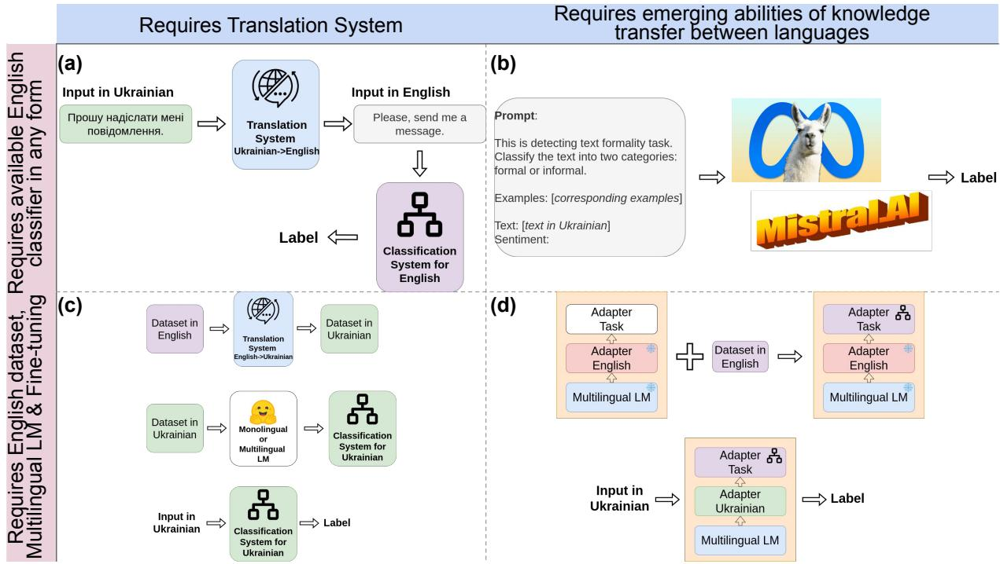

# Cross-lingual Text Classification Transfer: The Case of Ukrainian

Daryna Dementieva, Valeriia Khylenko and Georg Groh Technical University of Munich, School of Computation, Information and Technology, Germany daryna.dementieva@tum.de, l.khylenko@gmail.com, grohg@in.tum.de

## Abstract

Despite the extensive amount of labeled datasets in the NLP text classification field, the persistent imbalance in data availability across various languages remains evident. To support further fair development of NLP models, exploring the possibilities of effective knowledge transfer to new languages is crucial. Ukrainian, in particular, stands as a language that still can benefit from the continued refinement of crosslingual methodologies. Due to our knowledge, there is a tremendous lack of Ukrainian corpora for typical text classification tasks, i.e., different types of style, or harmful speech, or texts relationships. However, the amount of resources required for such corpora collection from scratch is understandable. In this work, we leverage the state-of-the-art advances in NLP, exploring cross-lingual knowledge transfer methods avoiding manual data curation: large multilingual encoders and translation systems, LLMs, and language adapters. We test the approaches on three text classification tasks—toxicity classification, formality classification, and natural language inference (NLI)—providing the “recipe” for the optimal setups for each task.

Warning: This paper contains offensive texts that only serve as illustrative examples.

## 1 Introduction

In recent years, the NLP community has shifted its focus beyond monolingual English models, placing greater emphasis on developing fair and equitable multilingual NLP technologies. Even if the state-of-the-art language models like, for instance, BERT (Devlin et al., 2019), RoBERTa (Liu et al., 2019), T5 (Raffel et al., 2020), BART (Lewis et al., 2020) were firstly pre-trained only for English, then their multilingual versions also appeared—mBERT, XLM-RoBERTa (Conneau et al., 2020), mT5 (Xue et al., 2021), and mBART (Tang et al., 2020). Also, the next generation of multilingual models family like BLOOMz (Muennighoff et al., 2023) were introduced. The translation systems also received a boost with the recent NLLB model covering 200 languages (Costa-jussà et al., 2022). Finally, Large Language Models (LLMs) pre-trained on huge corpora opened the possibilities of emerging abilities (Wei et al., 2022) not only for new tasks, but even for languages.

<table><tr><td colspan="2">Toxicity Classification</td></tr><tr><td>Toxic</td><td>,      &#x27;. listen u wikipedia f*gs unblock me or i kill u all</td></tr><tr><td>Non-toxic</td><td>  . righteous indignation always funny</td></tr><tr><td colspan="2">Formality Classification</td></tr><tr><td>Formal</td><td>,    ,  -  . Sometimes, if the good outweighs the bad, then the difficulties are worth it.</td></tr><tr><td>Informal</td><td>,    ,     . I know i know u seen funnier but it still makes me laff :)</td></tr><tr><td colspan="2">Natural Language Inference (NLI)</td></tr><tr><td>Premise</td><td>    . Three firefighter come out of subway station.      -</td></tr><tr><td>Hypothesis</td><td>. Three firefighters playing cards inside a fire station.</td></tr><tr><td>Label</td><td>contradiction</td></tr></table>

Table 1: Samples of the considered tasks.

Nevertheless, the scope of language coverage remains constrained. Furthermore, as of our current understanding, there exists a gap in the formal exploration of the effectiveness of before mentioned multilingual LMs for obtaining an NLP text classification system for a new language. With this work, we are aiming to close this gap exploring cross-lingual knowledge transfer approaches for the Ukrainian language. Thus, our contributions are the following:

• We are the first to explore four types of cross-lingual text classification transfer approaches—Backtranslation, LLMs Prompting, Training Corpus Translation, and Adapter

  
Figure 1: Cross-lingual knowledge transfer approaches explored for Ukrainian texts classification: (a) Backtranslation; (b) LLM Prompting; (c) Training Corpus Translation; (d) Adapter Training. The approaches requires different resources availability and dependence on a translation system.

Training–applying them for Ukrainian;

• As a result, we design the first of its kind datasets and models for Ukrainian texts classification for three tasks—toxicity classification, formality classification, and NLI (Table 1);

• The results are obtained on both synthetic translated and semi-natural test sets providing insights into the methods effectiveness.

All the obtained data and models are available for the public usage online. 1

## 2 Related Work

The usual case for cross-lingual transfer setup is when data for a specific task is available for English but none for the target language. One of the approaches used to address the lack of training data is the translation approach. Such approached was already explored for the sentiment analysis (Kumar et al., 2023) and offensive texts classification (El-Alami et al., 2022; Wadud et al., 2023). In the related domain, Ukrainian bullying detection system was developed based on the translated English data in (Oliinyk and Matviichuk, 2023).

In (Dong and de Melo, 2019), robust selflearning framework was designed based on the incorporation of unlabeled non-English samples during the fine-tuning phase of pretrained multilingual representation models. To decrease the size of the trained models parameters, Adapter layers were introduced in (Houlsby et al., 2019) as a more efficient way of downstream tasks models fine-tuning and language adjustment. It was successfully tested for token-level classification transfer in (Rathore et al., 2023) for several Asian and European languages. Finally, zero-shot and few-shot prompting of LLMs (Winata et al., 2022) can be a promising approach to obtain a baseline classifier for a language. However, none of the work yet explored the main cross-lingual transfer approaches for Ukrainian.

Although training data for various classification tasks in Ukrainian remains limited, the community has made substantial progress in token-level understanding tasks, machine translation, and increasing the presence of Ukrainian in pre-trained datasets. Thus, UberText 2.0 (Chaplynskyi, 2023) covers NER detection tasks, legal texts in Ukrainian, and other massive data from various resources–news, Wikipedia, fiction. Another source for Ukrainian data is the parallel OPUS corpus (Tiedemann, 2012b). Moreover, the Spivavtor dataset (Saini et al., 2024) has been introduced to support the instruction-tuning of Ukrainian-specialized LLMs.

<table><tr><td></td><td>Toxicity dataset</td><td>Formality dataset</td><td>NLI dataset</td></tr><tr><td>Train</td><td>total: 24616 toxic: 12307 non-toxic: 12309</td><td>total: 209124 formal: 104562 informal: 104562</td><td>total: 549361 neutral: 182762 contradiction: 183185 entailment: 183414</td></tr><tr><td>Val</td><td>total: 4000 toxic: 2000 non-toxic: 2000</td><td>total: 10272 formal: 4605 informal: 5667</td><td>total: 9842 neutral: 3235 contradiction: 3278 entailment: 3329</td></tr><tr><td>Test</td><td>total: 52294 toxic: 5800 non-toxic: 46494</td><td>total: 4853 formal: 2103 informal: 2750</td><td>total: 9824 neutral: 3219 contradiction: 3237 entailment: 3368</td></tr><tr><td>Semi- natural Test</td><td>total: 4214 toxic: 2114 non-toxic: 2088</td><td>total: 3000 formal: 1500 informal: 1500</td><td>total: 901 neutral: 300 contradiction: 300</td></tr></table>

Table 2: Statistics of the tasks datasets: train/val/test splits were obtained via translation from the corresponding English datasets; also, we constructed semi-natural test sets to evaluate the models under conditions resembling real-life scenarios.

## 3 Methodology

We take into consideration four cross-lingual knowledge transfer methods (Figure 1): (i) Backtranslation; (ii) LLM Prompting; (iii) Training Corpus Translation; (iv) Adapter Training. To consider the most popular scenario, everywhere, we assume English as a resource-rich available language.

Backtranslation One of the natural baselines can be to translate the input in Ukrainian into English and then utilize such an English classifier for the task. Such a Backtranslation approach does not require fine-tuning; however, it depends on the constant calls of external models—a translation system and an English classifier.

LLM Prompting The next approach that as well does not require fine-tuning is prompting of LLMs. Current advances in generative models showed the feasibility of transforming any NLP classification task into text generation task (Chung et al., 2022; Aly et al., 2023). Thus, the prompt can be designed in a zero-shot or a few-shot manner requesting the model to answer with the label. While LLMs were already tested for a hate speech classification task for multiple languages (Das et al., 2023), there were no yet experiments for any text classification task for the Ukrainian language which might be underrepresented in such models. We provide the final designs of our prompts in Appendix C.

Training Corpus Translation To avoid the permanent dependence on a translation system per each request, we can translate the whole English dataset and, as a result, get synthetic training data for the task. Then, a downstream task fine-tuning is possible. This approach’s main advantage is that there are no external dependencies during the inference time, but it requires computational resources for fine-tuning. Moreover, some class information might vanish after translation and will not be adapted for the target language.

Adapter Training Finally, the most parameterefficient approach involves employing languagespecific Adapter layers (Pfeiffer et al., 2020). We followed the regular pipeline of cross-lingual transfer with language Adapters.2 Such a language Adapter, firstly, for the source language—English— can be added upon multilingual encoder. Everything remains frozen while fine-tuning of the another Adapter for the downstream task. Then, English Adapter is replaced with the Ukrainian one and an inference step for the task in the target language can be performed.

## 4 Experimental Setup

Tasks English Datasets To test the approaches, we considered three text classification task and corresponding English datasets (Table 2): (i) toxicity classification based on Jigsaw data (Jigsaw, 2017) (we collapsed all labels except from “non-toxic” into one “toxic” class); (ii) formality classification with GYAFC (Rao and Tetreault, 2018); (iii) NLI task on the benchmark dataset SNLI (Bowman et al., 2015). We saved the original set splits. Translated data examples can be found in Appendix D.

Translation Systems Choice To choose the most appropriate translation system, we took into consideration two opensource models—NLLB (Costajussà et al., 2022) and Opus (Tiedemann, 2012b). We randomly selected 50 samples per each dataset and asked 3 annotators (native speakers in Ukrainian) to verify the quality. For the annotators answers aggregation, we used the majority voting. As a result, we chose Opus translation system3 for toxicity classification as it preserves better the toxic lexicon, for others—NLLB.4 For the respected tasks. both systems achieved 90% of qualitative translations based on the aggregated annotation results.

<table><tr><td rowspan=1 colspan=1></td><td rowspan=1 colspan=4>Acc  Pr   Re   F1</td><td rowspan=1 colspan=4>Acc  Pr   Re   F1</td></tr><tr><td rowspan=1 colspan=1></td><td rowspan=1 colspan=4>Translated Test Set</td><td rowspan=1 colspan=4>Semi-natural Test Set</td></tr><tr><td rowspan=1 colspan=9>Toxicity Classification</td></tr><tr><td rowspan=1 colspan=1>Mistral PromptingBacktranslation</td><td rowspan=1 colspan=4>0.86  0.68  0.74  0.70</td><td rowspan=1 colspan=1>0.760.63</td><td rowspan=1 colspan=1>0.810.76</td><td rowspan=1 colspan=1>0.760.56</td><td rowspan=1 colspan=1>0.750.58</td></tr><tr><td rowspan=1 colspan=1>Adapter TrainingXLM-R-finetuned</td><td rowspan=1 colspan=1>0.870.81</td><td rowspan=1 colspan=1>0.660.68</td><td rowspan=1 colspan=1>0.630.86</td><td rowspan=1 colspan=1>0.650.70</td><td rowspan=1 colspan=1>0.580.77</td><td rowspan=1 colspan=1>0.660.79</td><td rowspan=1 colspan=1>0.580.77</td><td rowspan=1 colspan=1>0.520.77</td></tr><tr><td rowspan=1 colspan=9>Formality Classification</td></tr><tr><td rowspan=1 colspan=1>Mistral PromptingBacktranslation</td><td rowspan=1 colspan=4>0.64 0.63  0.64  0.63</td><td rowspan=1 colspan=1>0.940.56</td><td rowspan=1 colspan=1>0.940.61</td><td rowspan=1 colspan=1>0.940.39</td><td rowspan=1 colspan=1>0.940.50</td></tr><tr><td rowspan=1 colspan=1>Adapter TrainingXLM-R-finetuned</td><td rowspan=1 colspan=1>0.640.57</td><td rowspan=1 colspan=1>0.630.28</td><td rowspan=1 colspan=1>0.630.50</td><td rowspan=1 colspan=1>0.630.36</td><td rowspan=1 colspan=1>0.710.50</td><td rowspan=1 colspan=1>0.710.25</td><td rowspan=1 colspan=1>0.710.50</td><td rowspan=1 colspan=1>0.710.33</td></tr><tr><td rowspan=1 colspan=9>Natural Language Inference</td></tr><tr><td rowspan=2 colspan=1>Mistral PromptingBacktranslation</td><td rowspan=1 colspan=1>0.56</td><td rowspan=1 colspan=2>0.61  0.56</td><td rowspan=1 colspan=1>0.56</td><td rowspan=2 colspan=1>0.710.40</td><td rowspan=2 colspan=1>0.720.41</td><td rowspan=2 colspan=1>0.690.63</td><td rowspan=2 colspan=1>0.690.33</td></tr><tr><td rowspan=1 colspan=4></td></tr><tr><td rowspan=2 colspan=1>Adapter TrainingXLM-R-finetuned</td><td rowspan=1 colspan=1>0.44</td><td rowspan=1 colspan=1>0.46</td><td rowspan=1 colspan=1>0.43</td><td rowspan=1 colspan=1>0.41</td><td rowspan=2 colspan=1>0.400.48</td><td rowspan=1 colspan=1>0.36</td><td rowspan=2 colspan=1>0.400.46</td><td rowspan=2 colspan=1>0.320.42</td></tr><tr><td rowspan=1 colspan=1>0.82</td><td rowspan=1 colspan=1>0.82</td><td rowspan=1 colspan=1>0.82</td><td rowspan=1 colspan=1>0.82</td><td rowspan=1 colspan=1>0.46</td></tr></table>

Table 3: Ukrainian Texts Classification results. We divide methods into two groups – not requiring and requiring fine-tuning. Then, bold numbers denote the best results within the methods group and a test set, underline – overall best scores for the task.

Ukrainian Texts Encoder Choice For the Ukrainian texts encoder—for the Adapter training and the classifier fine-tuning—XLM-RoBERTa5 (Conneau et al., 2020) that was pre-trained including Ukrainian data has already been proven as a strong baseline for multiple languages (Imani et al., 2023).

LLM Choice For LLMs prompting, we experimented with couple setups (details in Appendix B) choosing Mistral6 (Jiang et al., 2023) as the most promising model (to this date) for Ukrainian texts processing.

Semi-natural Test Sets In addition to the translated test sets, we prepared tests sets based on automatic pre-processing of natural Ukrainian texts to assess the models in circumstances mirroring realworld scenarios. The texts examples are presented in Appendix E.

For toxicity, natural test part was collected from two sources: (i) Ukrainian tweets corpus from (Bobrovnyk, 2019a) where tweets were filtered based on toxic keywords from (Bobrovnyk, 2019b); (ii) additional non-toxic sentences were obtained from news and fiction UD Ukrainian IU dataset (Kotsyba et al., 2016).

Informal sentences in the formality natural test dataset were also from the tweets corpus, while formal sentences were collected from Ukrainian legal acts (Tiedemann, 2012c) and EU acts in Ukrainian (Tiedemann, 2012a) corpora.

For the entailment label for NLI, also Ukrainian legal acts data was utilized, as well as open corpus of modern Ukrainian (Chaplynskyi, 2023). Neutral sentences were taken from the fiction corpora (Chaplynskyi et al., 2022). Finally, contradiction pairs were constructed by the Ukrainian native speaker.

## 5 Results

The final results are presented in Table 3. We report primary text classification metrics: accuracy, precision, recall, and F1 scores. We report for Backtranslation results only on the semi-natural test sets (English SOTA comparison in Appendix A).

For toxicity classification, Mistral overcame Backtranslation within the baselines that do not require fine-tuning. However, the fine-tuned XLM-RoBERTA scores significantly superior on both test set types. Even if the training data were obtained from English that is less rich on morphological forms of toxic phrases, this model can be used as a strong toxicity detector baseline.

In contrast to the toxicity task, Adapter Training demonstrates the most reliable results for formality classification, whereas fine-tuning XLM-R was unsuccessful. This underperformance may be due to the loss of crucial information about formal and informal classes during the translation process. On the other hand, Mistral, which is primarily trained on English data, retained the necessary formality information and effectively transferred it to the target Ukrainian language.

For the NLI task, Mistral once again outperformed all baselines. However, there was a significant drop in XLM-RoBERTa’s performance between the translated and natural test sets, likely due to domain differences, highlighting the need for native Ukrainian data in NLI tasks.

## 6 Conclusion

We presented the first-of-its-kind study of the crosslingual transfer approaches for texts classification task tested on Ukrainian. Three tasks were considered—toxicity classification, formality classification, and natural language inference. We tested two zero-shot approaches—Backtranslation that depends on a translation system inference and LLM Prompting—and two approaches that require model fine-tuning—Adapter Training that updates only task-specific layer and Training Corpus Translation. As a result of our experiments, we obtained Ukrainian-translated datasets for the examined tasks, along with compiled semi-natural test sets for more realistic evaluations.

For the final recommendations, LLM prompting—particularly with Mistral—can serve as a solid baseline for Ukrainian texts processing, with the exception of toxicity classification. In that case, fine-tuned XLM-RoBERTa outperformed other approaches. However, aside from formality classification, the leading results for all tasks still show potential for improvement. Although we have introduced robust baselines for Ukrainian text classification, we strongly encourage further additional investigations using native Ukrainian data for these tasks.

## Limitations

In this work, we only explored three sentence level classification tasks. While the token-level classification for Ukrainian is already at a very good level (Chaplynskyi, 2023), for sentence level there is still a room for improvement. We made a focus on the tasks which were already a field of expertise of the authors shading the light on the perspectives of modern methods utilization for Ukrainian. At the same time, there is a still a room for other texts classification tasks exploration.

Given resource constraints, our experiments only incorporated base and distilled versions of the models. Despite these limitations, the approaches we explored yielded promising results. However, employing models with more parameters could yield even stronger outcomes. Furthermore, for translation and LLMs prompting, we exclusively utilized open-source models. Exploring enterprise models could potentially offer the boost in the performance and more robust industrial solutions.

In conclusion, we opted to perform cross-lingual transfer from English, considering it as the most resource-rich language for the most general scenario. However, if resources such as datasets and models are accessible for languages closer to Ukrainian, such as Polish or Croatian, conducting cross-lingual transfer from these languages could potentially yield even better results.

## Ethics Statement

Although this study examines several cross-lingual classification methods with semi-natural test sets, it does not involve thoroughly exploring or properly annotating authentic Ukrainian data. Consequently, relying on translations or assumption-based data construction may introduce errors and noise in the data. Moreover, such datasets may not accurately reflect the current state of the Ukrainian language as used online. While our goal is to provide baselines and a foundation for further exploration, the proposed approaches must be carefully validated by stakeholders prior to real-world deployment.

The work primarily centers on Ukrainian language support, aiming to address its underrepresentation in the context of language development. We strongly believe, the obtained findings can server as an inspiration for promoting fairness in the development of other languages. Overall, this work not only contributes to the advancement of Ukrainian language technology but also provides a blueprint for equitable language development practices that can be applied to other languages facing similar challenges.

## Acknowledgments

This article was supported by the Friedrich Schiedel Fellowship hosted by the TUM School of Social Sciences and Technology and the TUM Think Tank. We sincerely acknowledge the financial support provided by the fellowship. Additionally, we would like to extend our gratitude to the TUM Data Analytics&Statistics chair, under the leadership of Alexander Fraser.

## References

AI@Meta. 2024. Llama Model Card. https://github.com/metallama/llama3/blob/main/MODEL\_CARD.md. Accessed: 2024-12-14.

Rami Aly, Xingjian Shi, Kaixiang Lin, Aston Zhang, and Andrew Gordon Wilson. 2023. Automated few-shot classification with instruction-finetuned language models. In Findings of the Association for Computational Linguistics: EMNLP 2023, Singapore, December 6-10, 2023, pages 2414–2432. Association for Computational Linguistics.

Kateryna Bobrovnyk. 2019a. Automated building and analysis of twitter corpus for toxic text detection. In COLINS 2019. Volume II: Workshop.

Kateryna Bobrovnyk. 2019b. Ukrainian obscene lexicon. https://github.com/saganoren/obscene-ukr. Accessed: 2024-12-14.

Samuel R. Bowman, Gabor Angeli, Christopher Potts, and Christopher D. Manning. 2015. A large annotated corpus for learning natural language inference. In Proceedings of the 2015 Conference on Empirical Methods in Natural Language Processing, EMNLP 2015, Lisbon, Portugal, September 17-21, 2015, pages 632–642. The Association for Computational Linguistics.

Dmytro Chaplynskyi. 2023. Introducing UberText 2.0: A corpus of modern Ukrainian at scale. In Proceedings ofthe Second Ukrainian Natural Language Processing Workshop, pages 1–10, Dubrovnik, Croatia. Association for Computational Linguistics.

Dmytro Chaplynskyi, Vsevolod Diomkin, and Anatoliy Stegnii. 2022. UberText Corpus: NER Annotation Corpus. In Lang UK Project.

Hyung Won Chung, Le Hou, Shayne Longpre, Barret Zoph, Yi Tay, William Fedus, Eric Li, Xuezhi Wang, Mostafa Dehghani, Siddhartha Brahma, Albert Webson, Shixiang Shane Gu, Zhuyun Dai, Mirac Suzgun, Xinyun Chen, Aakanksha Chowdhery, Sharan Narang, Gaurav Mishra, Adams Yu, Vincent Y. Zhao, Yanping Huang, Andrew M. Dai, Hongkun Yu, Slav Petrov, Ed H. Chi, Jeff Dean, Jacob Devlin, Adam Roberts, Denny Zhou, Quoc V. Le, and Jason Wei. 2022. Scaling instruction-finetuned language models. CoRR, abs/2210.11416.

Alexis Conneau, Kartikay Khandelwal, Naman Goyal, Vishrav Chaudhary, Guillaume Wenzek, Francisco Guzmán, Edouard Grave, Myle Ott, Luke Zettlemoyer, and Veselin Stoyanov. 2020. Unsupervised cross-lingual representation learning at scale. In Proceedings of the 58th Annual Meeting of the Association for Computational Linguistics, ACL 2020, Online, July 5-10, 2020, pages 8440–8451. Association for Computational Linguistics.

Marta R. Costa-jussà, James Cross, Onur Çelebi, Maha Elbayad, Kenneth Heafield, Kevin Heffernan, Elahe Kalbassi, Janice Lam, Daniel Licht, Jean

Maillard, Anna Y. Sun, Skyler Wang, Guillaume Wenzek, Al Youngblood, Bapi Akula, Loïc Barrault, Gabriel Mejia Gonzalez, Prangthip Hansanti, John Hoffman, Semarley Jarrett, Kaushik Ram Sadagopan, Dirk Rowe, Shannon Spruit, Chau Tran, Pierre Andrews, Necip Fazil Ayan, Shruti Bhosale, Sergey Edunov, Angela Fan, Cynthia Gao, Vedanuj Goswami, Francisco Guzmán, Philipp Koehn, Alexandre Mourachko, Christophe Ropers, Safiyyah Saleem, Holger Schwenk, and Jeff Wang. 2022. No language left behind: Scaling human-centered machine translation. CoRR, abs/2207.04672.

Mithun Das, Saurabh Kumar Pandey, and Animesh Mukherjee. 2023. Evaluating chatgpt’s performance for multilingual and emoji-based hate speech detection. CoRR, abs/2305.13276.

Jacob Devlin, Ming-Wei Chang, Kenton Lee, and Kristina Toutanova. 2019. BERT: Pre-training of deep bidirectional transformers for language understanding. In Proceedings ofthe 2019 Conference of the North American Chapter ofthe Associationfor Computational Linguistics: Human Language Technologies, Volume 1 (Long and Short Papers), pages 4171–4186, Minneapolis, Minnesota. Association for Computational Linguistics.

Xin Dong and Gerard de Melo. 2019. A robust selflearning framework for cross-lingual text classification. In Proceedings of the 2019 Conference on Empirical Methods in Natural Language Processing and the 9th International Joint Conference on Natu ral Language Processing (EMNLP-IJCNLP), pages 6306–6310, Hong Kong, China. Association for Computational Linguistics.

Fatima-Zahra El-Alami, Said Ouatik El Alaoui, and Noureddine En-Nahnahi. 2022. A multilingual offensive language detection method based on transfer learning from transformer fine-tuning model. J. King Saud Univ. Comput. Inf. Sci., 34(8 Part B):6048– 6056.

Neil Houlsby, Andrei Giurgiu, Stanislaw Jastrzebski, Bruna Morrone, Quentin de Laroussilhe, Andrea Gesmundo, Mona Attariyan, and Sylvain Gelly. 2019. Parameter-efficient transfer learning for NLP. In Proceedings ofthe 36th International Conference on Machine Learning, ICML 2019, 9-15 June 2019, Long Beach, California, USA, volume 97 of Proceedings of Machine Learning Research, pages 2790–2799. PMLR.

Ayyoob Imani, Peiqin Lin, Amir Hossein Kargaran, Silvia Severini, Masoud Jalili Sabet, Nora Kassner, Chunlan Ma, Helmut Schmid, André F. T. Martins, François Yvon, and Hinrich Schütze. 2023. Glot500: Scaling multilingual corpora and language models to 500 languages. In Proceedings of the 61st Annual Meeting of the Association for Computational Linguistics (Volume 1: Long Papers), ACL 2023, Toronto, Canada, July 9-14, 2023, pages 1082–1117. Association for Computational Linguistics.

Albert Q. Jiang, Alexandre Sablayrolles, Arthur Mensch, Chris Bamford, Devendra Singh Chaplot, Diego de Las Casas, Florian Bressand, Gianna Lengyel, Guillaume Lample, Lucile Saulnier, Lélio Renard Lavaud, Marie-Anne Lachaux, Pierre Stock, Teven Le Scao, Thibaut Lavril, Thomas Wang, Timothée Lacroix, and William El Sayed. 2023. Mistral 7b. CoRR, abs/2310.06825.

Jigsaw. 2017. Toxic comment classification challenge. https://www.kaggle.com/c/jigsaw-toxiccomment-classification-challenge. Accessed: 2024- 12-14.

Natalia Kotsyba, Bohdan Moskalevskyi, Mykhailo Romanenko, Halyna Samoridna, Ivanka Kosovska, Olha Lytvyn, and Oksana Orlenko. 2016. UD Ukrainian IU. https://universaldependencies.org/treebanks/uk\_iu/ index.html. Accessed: 2024-12-14.

Puneet Kumar, Kshitij Pathania, and Balasubramanian Raman. 2023. Zero-shot learning based cross-lingual sentiment analysis for sanskrit text with insufficient labeled data. Appl. Intell., 53(9):10096–10113.

Mike Lewis, Yinhan Liu, Naman Goyal, Marjan Ghazvininejad, Abdelrahman Mohamed, Omer Levy, Veselin Stoyanov, and Luke Zettlemoyer. 2020. BART: denoising sequence-to-sequence pre-training for natural language generation, translation, and comprehension. In Proceedings of the 58th Annual Meeting ofthe Associationfor Computational Linguistics, ACL 2020, Online, July 5-10, 2020, pages 7871–7880. Association for Computational Linguistics.

Yinhan Liu, Myle Ott, Naman Goyal, Jingfei Du, Mandar Joshi, Danqi Chen, Omer Levy, Mike Lewis, Luke Zettlemoyer, and Veselin Stoyanov. 2019. Roberta: A robustly optimized BERT pretraining approach. CoRR, abs/1907.11692.

Niklas Muennighoff, Thomas Wang, Lintang Sutawika, Adam Roberts, Stella Biderman, Teven Le Scao, M. Saiful Bari, Sheng Shen, Zheng Xin Yong, Hailey Schoelkopf, Xiangru Tang, Dragomir Radev, Alham Fikri Aji, Khalid Almubarak, Samuel Albanie, Zaid Alyafeai, Albert Webson, Edward Raff, and Colin Raffel. 2023. Crosslingual generalization through multitask finetuning. In Proceedings of the 61st Annual Meeting of the Association for Computational Linguistics (Volume 1: Long Papers), ACL 2023, Toronto, Canada, July 9-14, 2023, pages 15991–16111. Association for Computational Linguistics.

V Oliinyk and I Matviichuk. 2023. Low-resource text classification using cross-lingual models for bullying detection in the ukrainian language. Adaptive systems of automatic control: interdepartmental scientific and technical collection, 2023, 1 (42).

Jonas Pfeiffer, Andreas Rücklé, Clifton Poth, Aishwarya Kamath, Ivan Vulic, Sebastian Ruder, Kyunghyun´ Cho, and Iryna Gurevych. 2020. AdapterHub: A

framework for adapting transformers. In Proceedings ofthe 2020 Conference on Empirical Methods in Natural Language Processing: System Demonstrations, pages 46–54, Online. Association for Computational Linguistics.

Colin Raffel, Noam Shazeer, Adam Roberts, Katherine Lee, Sharan Narang, Michael Matena, Yanqi Zhou, Wei Li, and Peter J. Liu. 2020. Exploring the limits of transfer learning with a unified text-to-text transformer. J. Mach. Learn. Res., 21:140:1–140:67.

Sudha Rao and Joel Tetreault. 2018. Dear sir or madam, may I introduce the GYAFC dataset: Corpus, benchmarks and metrics for formality style transfer. In Proceedings of the 2018 Conference of the North American Chapter of the Association for Computational Linguistics: Human Language Technologies, Volume 1 (Long Papers), pages 129–140, New Orleans, Louisiana. Association for Computational Linguistics.

Vipul Rathore, Rajdeep Dhingra, Parag Singla, and Mausam. 2023. ZGUL: Zero-shot generalization to unseen languages using multi-source ensembling of language adapters. In Proceedings ofthe 2023 Conference on Empirical Methods in Natural Language Processing, pages 6969–6987, Singapore. Association for Computational Linguistics.

Aman Saini, Artem Chernodub, Vipul Raheja, and Vivek Kulkarni. 2024. Spivavtor: An instruction tuned Ukrainian text editing model. In Proceedings of the Third Ukrainian Natural Language Processing Workshop (UNLP) @ LREC-COLING 2024, pages 95–108, Torino, Italia. ELRA and ICCL.

Yuqing Tang, Chau Tran, Xian Li, Peng-Jen Chen, Naman Goyal, Vishrav Chaudhary, Jiatao Gu, and Angela Fan. 2020. Multilingual translation with extensible multilingual pretraining and finetuning. CoRR, abs/2008.00401.

Jörg Tiedemann. 2012a. EU Acts in Ukrainian. https://opus.nlpl.eu/ELRC-5179-acts\_Ukrainian/en&uk/v1/ELRC-5179- acts\_Ukrainian. Accessed: 2024-12-14.

Jörg Tiedemann. 2012b. Parallel data, tools and interfaces in OPUS. In Proceedings of the Eighth International Conference on Language Resources and Evaluation (LREC’12), pages 2214–2218, Istanbul, Turkey. European Language Resources Association (ELRA).

Jörg Tiedemann. 2012c. Ukrainian Legal MT Test Set. https://opus.nlpl.eu/ELRC-5217- Ukrainian\_Legal\_MT/en&uk/v1/ELRC-5217- Ukrainian\_Legal\_MT. Accessed: 2024-12-14.

Hugo Touvron, Louis Martin, Kevin Stone, Peter Albert, Amjad Almahairi, Yasmine Babaei, Nikolay Bashlykov, Soumya Batra, Prajjwal Bhargava, Shruti Bhosale, Dan Bikel, Lukas Blecher, Cristian Canton-Ferrer, Moya Chen, Guillem Cucurull, David Esiobu, Jude Fernandes, Jeremy Fu, Wenyin Fu, Brian Fuller,

Cynthia Gao, Vedanuj Goswami, Naman Goyal, Anthony Hartshorn, Saghar Hosseini, Rui Hou, Hakan Inan, Marcin Kardas, Viktor Kerkez, Madian Khabsa, Isabel Kloumann, Artem Korenev, Punit Singh Koura, Marie-Anne Lachaux, Thibaut Lavril, Jenya Lee, Diana Liskovich, Yinghai Lu, Yuning Mao, Xavier Martinet, Todor Mihaylov, Pushkar Mishra, Igor Molybog, Yixin Nie, Andrew Poulton, Jeremy Reizenstein, Rashi Rungta, Kalyan Saladi, Alan Schelten, Ruan Silva, Eric Michael Smith, Ranjan Subramanian, Xiaoqing Ellen Tan, Binh Tang, Ross Taylor, Adina Williams, Jian Xiang Kuan, Puxin Xu, Zheng Yan, Iliyan Zarov, Yuchen Zhang, Angela Fan, Melanie Kambadur, Sharan Narang, Aurélien Rodriguez, Robert Stojnic, Sergey Edunov, and Thomas Scialom. 2023. Llama 2: Open foundation and finetuned chat models. CoRR, abs/2307.09288.

Md. Anwar Hussen Wadud, Muhammad F. Mridha, Jungpil Shin, Kamruddin Nur, and Aloke Kumar Saha. 2023. Deep-bert: Transfer learning for classifying multilingual offensive texts on social media. Comput. Syst. Sci. Eng., 44(2):1775–1791.

Jason Wei, Yi Tay, Rishi Bommasani, Colin Raffel, Barret Zoph, Sebastian Borgeaud, Dani Yogatama, Maarten Bosma, Denny Zhou, Donald Metzler, Ed H. Chi, Tatsunori Hashimoto, Oriol Vinyals, Percy Liang, Jeff Dean, and William Fedus. 2022. Emergent abilities of large language models. Trans. Mach. Learn. Res., 2022.

Genta Winata, Shijie Wu, Mayank Kulkarni, Thamar Solorio, and Daniel Preotiuc-Pietro. 2022. Crosslingual few-shot learning on unseen languages. In Proceedings ofthe 2nd Conference ofthe Asia-Pacific Chapter of the Association for Computational Linguistics and the 12th International Joint Conference on Natural Language Processing (Volume 1: Long Papers), pages 777–791, Online only. Association for Computational Linguistics.

Linting Xue, Noah Constant, Adam Roberts, Mihir Kale, Rami Al-Rfou, Aditya Siddhant, Aditya Barua, and Colin Raffel. 2021. mt5: A massively multilingual pre-trained text-to-text transformer. In Proceedings of the 2021 Conference of the North American Chapter of the Association for Computational Linguistics: Human Language Technologies, NAACL-HLT 2021, Online, June 6-11, 2021, pages 483–498. Association for Computational Linguistics.

## A English SOTA models for the Tasks

We used the following publicly available instances of already fine-tuned English models for the considered tasks: (i) toxicity classifier7; (ii) formality classifier 8; (iii) NLI classifier 9.

Not for all within these models, the report of train/val/test splits usage was provided. Thus, we cannot fairly test translated into English input with these models, only natural test sets.

## B LLMs Exploration for Ukrainian Texts Classification

In the course of the work, four LLMs were considered: Llama-2 10 (Touvron et al., 2023), LLaMa-311 (AI@Meta, 2024), Mistral12 (Jiang et al., 2023) and FLAN-T513 (Chung et al., 2022). The most important task for this section of the research was to find the optimal prompt. For Llama-2,3 and Mistral, the prompts that showed the best results are presented in Appendix C. For the toxicity classification task, the labels “toxic” and “non-toxic” were initially used, but later they were changed to “obscene” and ”normal” to improve the results and this contributed to an increase in accuracy. For the NLI and formality classification tasks, the type of problem to be solved was added to the prompt along with examples, and while Mistral for NLI showed good results, for the formality task, due to the fact that the translation of data from English blurs the boundaries between labels, a satisfactory result was not yet achieved.

FLAN-T5, on the other hand, despite being trained on other Slavic languages, did not show the desired result for Ukrainian. Nevertheless, we tested the English prompts for classification tasks, and the model showed a decent result, so it was considered for backtranslation task. It showed compatible results with other bigger models for classification tasks. However, for Ukrainian, the performance was not peak.

<table><tr><td></td><td>Acc</td><td>Pr</td><td>Re</td><td>F1</td><td>Acc</td><td>Pr</td><td>Re</td><td>F1</td></tr><tr><td></td><td colspan="3">Translated Test Set</td><td colspan="3"></td><td colspan="2">Semi-natural Test Set</td></tr><tr><td colspan="7">Toxicity Classification</td><td colspan="2"></td></tr><tr><td>LLaMa-2 Prompting</td><td>0.51 0.61</td><td>0.50 0.56</td><td>0.67</td><td>0.42 0.55</td><td>0.67 0.70</td><td>0.67 0.79</td><td>0.49</td><td>0.67 0.68</td></tr><tr><td>LLaMa-3 Prompting</td><td>0.86</td><td>0.68</td><td>0.66 0.74</td><td>0.70</td><td>0.76</td><td>0.81</td><td>0.67 0.76</td><td>0.75</td></tr><tr><td>Mistral Prompting FLAN-T5-Backtranslation</td><td></td><td></td><td></td><td></td><td>0.69</td><td>0.73</td><td>0.69</td><td>0.68</td></tr><tr><td colspan="9">Formality Classification</td></tr><tr><td>LLaMa-2 Prompting</td><td>0.43</td><td>0.22</td><td>0.50</td><td>0.30</td><td>0.50</td><td>0.25</td><td>0.50</td><td>0.33</td></tr><tr><td>LLaMa-3 Prompting</td><td>0.51</td><td>0.45</td><td>0.64</td><td>0.52</td><td>0.78</td><td>0.67</td><td>0.72</td><td>0.71</td></tr><tr><td>Mistral Prompting</td><td>0.64</td><td>0.63</td><td>0.64</td><td>0.63</td><td>0.94</td><td>0.94</td><td>0.94</td><td>0.94</td></tr><tr><td>FLAN-T5-Backtranslation</td><td></td><td></td><td></td><td></td><td>0.62</td><td>0.77</td><td>0.62</td><td>0.56</td></tr><tr><td colspan="9">Natural Language Inference</td></tr><tr><td>LLaMa-2 Prompting</td><td>0.36</td><td>0.40</td><td>0.36</td><td>0.34</td><td>0.37</td><td>0.28</td><td>0.36</td><td>0.28</td></tr><tr><td>LLaMa-3 Prompting</td><td>0.55</td><td>0.50</td><td>0.57</td><td>0.55</td><td>0.66</td><td>0.68</td><td>0.66</td><td>0.66</td></tr><tr><td>Mistral Prompting</td><td>0.56</td><td>0.61</td><td>0.56</td><td>0.56</td><td>0.71</td><td>0.72</td><td>0.69</td><td>0.69</td></tr><tr><td>FLAN-T5-Backtranslation</td><td></td><td></td><td></td><td></td><td>0.48</td><td>0.68</td><td>0.49</td><td>0.42</td></tr></table>

Table 4: Ukrainian Texts Classification results using Large Language Models.

## C LLM Tasks Prompts

Here, we provide the full listing of the prompts used to obtain the results from LLMs.

## Toxicity Classification

Classify the text into two categories: contains obscene words or contains none obscene words. Reply with only one word: obscene or normal.

## Examples:

Text: Сьогоднi знайти у вiдкритих джерелах точну суму, витрачену на будiвництво об’єкта, що про нього мова, майже неможливо. Sentiment: normal.

Text: знаєте, якщо свої дебiльнi коментарi ще й iлюструвати посиланнями на росiйську вiкi, хтось може здогадатися, що ви тупий єблан. Sentiment: obscene.

## Text: {text}

Sentiment:

## Formality Classification

This is detecting textformality task. Classify the text into two categories: formal or informal.

## Examples:

Text: У вас вже є остаточне рiшення щодо кольору весiльної сукнi? Sentiment: formal. Text: Незважаючи на те шо було до цього, знаєте що, я думаю, що тобi все ж таки слiд зробити перший крок! Sentiment: informal.

## Text: {text}

Sentiment:

## Natural Language Inference

This is Natural language inference (NLI) task. Determine whether a given hypothesis is contradiction, entailment or neutral in relation to a given premise. Reply with only one word: contradiction, neutral or entailment.

## Examples:

Premise: Чоловiк у чорнiй сорочки грає в гольф ззовнi. Hypothesis: Чоловiк грає на полi гольфу, щоб вiдпочити. Label: neutral.

Premise: Чоловiк у чорнiй сорочки грає в гольф ззовнi. Hypothesis: Чоловiк у чорнiй сорочки обмiнюється картами з дiвчиною. Label: contradiction.

Premise: Чоловiк у чорнiй сорочки грає в гольф ззовнi. Hypothesis: Чоловiк у чорнiй сорочки грає в гольф. Label: entailment

Text: {premise, hypothesis} Label:

## D Translated Data Examples

Here, we provide examples of Ukrainian texts obtained by translation from English data for the corresponding tasks: (i) toxicity classification in Table 5; (ii) formality classification in Table $\begin{array} { r } { 6 ; { } } \end{array}$ (iii) NLI classification in Table 7. For English texts, the original grammar, as presented in the source data, is retained.

<table><tr><td colspan="1" rowspan="1">Toxic</td><td colspan="1" rowspan="1">   .youre all dumb asses</td></tr><tr><td colspan="1" rowspan="1">Non-toxic</td><td colspan="1" rowspan="1">  ,       ,,    '  .there are two admins that do handle such articles pretty well you could maybe contact and</td></tr><tr><td colspan="1" rowspan="1">Toxic</td><td colspan="1" rowspan="1">I  -   and robert is a black shit</td></tr><tr><td colspan="1" rowspan="1">Non-toxic</td><td colspan="1" rowspan="1">,     ,         ok i started the transtion the new article i used your suggested title could use a lot more detail now</td></tr><tr><td colspan="1" rowspan="1">Toxic</td><td colspan="1" rowspan="1">   * ?what a bunch of f**king nerds</td></tr><tr><td colspan="1" rowspan="1">Non-toxic</td><td colspan="1" rowspan="1">,  ,     ,     please stop if you continue to vandalize wikipedia you will be blocked from editing</td></tr><tr><td colspan="1" rowspan="1">Toxic</td><td colspan="1" rowspan="1"> -,     ,  ,   ,    ,    ,                   ,     .alternative pop culture meaning c*nt or cee unt a percieved mysterious bitch that destroys everything whemcalling someone this is a way of letting anyone know they are a c*nt while censoring others around you in publicor in social corners a modern slang alerting other of the danger</td></tr><tr><td colspan="1" rowspan="1">Non-toxic</td><td colspan="1" rowspan="1">  ,     ,     ,   '  ,        ,       .admins execute actions based on community consensus they do not make unilateral decisions further that afd didnot have the involvement of editors who focus on ontario or canadawide elections so they were likely unfamiliarwith the option of redirecting to party candidate articles</td></tr><tr><td colspan="1" rowspan="1">Formal</td><td colspan="1" rowspan="1"> ,       ,   ,  T.Just because he has potential to be a decent boyfriend, does not mean that he will be.</td></tr><tr><td colspan="1" rowspan="1">Informal</td><td colspan="1" rowspan="1"> !The Best of Luck to ya!</td></tr><tr><td colspan="1" rowspan="1">Formal</td><td colspan="1" rowspan="1">-   ,     .Any woman looks attractive when standing beside an unattractive man.</td></tr><tr><td colspan="1" rowspan="1">Informal</td><td colspan="1" rowspan="1"> ,   .thats the stupidest thing I have ever heard.</td></tr><tr><td colspan="1" rowspan="1">Formal</td><td colspan="1" rowspan="1">,     - " ".    ""?Oh, my favorite classic television show is 'The Golden Girls.' Is that show considered a 'classic'?</td></tr><tr><td colspan="1" rowspan="1">Informal</td><td colspan="1" rowspan="1"> , ,     ,     ,   .i'd probably drink up everything in the damn bar to even think of finding u attractive.</td></tr><tr><td colspan="1" rowspan="1">Formal</td><td colspan="1" rowspan="1">   - l .I also own the Vanilla Ice compact disk.</td></tr><tr><td colspan="1" rowspan="1">Informal</td><td colspan="1" rowspan="1">LL  ,    h--tlol just playin but they are super h-o-t</td></tr></table>

Table 5: Examples of the translated samples for the Toxicity Classification task. English original sentences are taken from the Jigsaw dataset (Jigsaw, 2017).

Table 6: Examples of the translated samples for the Formality Classification task. English original sentences are taken from the GYAFC dataset (Rao and Tetreault, 2018).

<table><tr><td>Premise</td><td>    ,    .</td></tr><tr><td>Hypothesis</td><td>A young boy walks on a pipe that stretches over water.</td></tr><tr><td></td><td>   . A boy is in danger of falling into water.</td></tr><tr><td>Label</td><td>neutral</td></tr><tr><td>Premise</td><td>     .</td></tr><tr><td>Hypothesis</td><td>Some dogs are running on a deserted beach.  .</td></tr><tr><td>Label</td><td>They are in Hawaii. neutral</td></tr><tr><td>Premise</td><td>    .</td></tr><tr><td>Hypothesis</td><td>Two men are standing in a boat.     .</td></tr><tr><td>Label</td><td>Some men are standing on top of a car. contradiction</td></tr><tr><td>Premise</td><td> .</td></tr><tr><td>Hypothesis</td><td>A biker races. .</td></tr><tr><td>Label</td><td>The car is yellow contradiction</td></tr><tr><td>Premise</td><td>       .</td></tr><tr><td>Hypothesis</td><td>Male in a blue jacket decides to lay in the grass.       .</td></tr><tr><td>Label</td><td>The guy wearing a blue jacket is laying on the green grass entailment</td></tr><tr><td>Premise</td><td>,      .</td></tr><tr><td>Hypothesis</td><td>A person sitting on a rock beside a waterfall.</td></tr><tr><td>Label</td><td>  . A person is near water</td></tr></table>

Table 7: Examples of the translated samples for the Natural Language Inference task. English original sentences are taken from the SNLI dataset (Bowman et al., 2015).

## E Semi-natural Test Data Examples

Here, we provide examples from the natural Ukrainian texts obtained for the corresponding tasks: (i) toxicity classification in Table 8; (ii) formality classification in Table 9; (iii) NLI classification in Table 10.
<table><tr><td colspan="1" rowspan="1">Toxic</td><td colspan="1" rowspan="1">@f ,  ,  .     .           :@pfactum no, the Chinese drive, of course. The shoopin was an economic genius. But it was signed because nomore on the sublarcier was worthy of:)</td></tr><tr><td colspan="1" rowspan="1">Non-toxic</td><td colspan="1" rowspan="1">@1 1)  ,    ,  ,    ""..@GINTONIK 1) good time, the colts gave the collection a lot of reading and appreciated, but asked about"Memonysity..."</td></tr><tr><td colspan="1" rowspan="1">Toxic</td><td colspan="1" rowspan="1">  **pac?Isn't that a $f ^ { * * } g o t { ? }$ </td></tr><tr><td colspan="1" rowspan="1">Non-toxic</td><td colspan="1" rowspan="1">           .More than once, he claimed to visit our market in Irish Ryanair.</td></tr><tr><td colspan="1" rowspan="1">Toxic</td><td colspan="1" rowspan="1">  -    ,   3 3 i $\because \ast \ast$     peéciBToday's dream is a safe transport into the ice so that every brain doesn't have to f**k its way through these terribleman - hated flights.</td></tr><tr><td colspan="1" rowspan="1">Non-toxic</td><td colspan="1" rowspan="1">         -   3   -      .Coordinators have reached an agreement to hold a joint Intergovernmental Union Commission on Economic andCultural Cooperation for a longer time.</td></tr><tr><td colspan="1" rowspan="1">Toxic</td><td colspan="1" rowspan="1">  ,   ,     ,      $\boldsymbol { \Pi } ^ { * * } \boldsymbol { \varPi } ^ { \mathrm { i } } .$ There's no worse feeling than when you realize that you were exactly f**king that way, and that's why everythinggoes on $p ^ { * } s s .$ </td></tr><tr><td colspan="1" rowspan="1">Non-toxic</td><td colspan="1" rowspan="1">  «     “  .  . .     5         .The state enterprise (C) was created by 1951 as the South Carworker's design department for the production ofmilitary rockets.</td></tr><tr><td colspan="1" rowspan="1">Formal</td><td colspan="1" rowspan="1">                      .The powers of the Constitutional Court Judge and the guarantees of his activity may not be limited when martiallaw or emergency is imposed in Ukraine or in certain areas of Ukraine.</td></tr><tr><td colspan="1" rowspan="1">Informal</td><td colspan="1" rowspan="1">   ,           . .    ;)I don't even know who's staying near them. Some kind of zoo between the Chernigov and the Forest</td></tr><tr><td colspan="1" rowspan="1">Formal</td><td colspan="1" rowspan="1">               ,   -HOM.The Court shall, within three months of the date of the official publication of this Act, adopt a regulation and setup the Senate in the manner provided for by this Act.</td></tr><tr><td colspan="1" rowspan="1">Informal</td><td colspan="1" rowspan="1">   ,      . ,        I'm so tired, I feel like I'm gonna die in bed.</td></tr><tr><td colspan="1" rowspan="1">Formal</td><td colspan="1" rowspan="1">  , -    ' -    .Member States shall cooperate to pool their organisational efforts for joint action where appropriate.</td></tr><tr><td colspan="1" rowspan="1">Informal</td><td colspan="1" rowspan="1">    ,  ,   ) ,     ))I mean, I'm sitting so serious, checking to see if I'm getting any sleep, and here it is.</td></tr></table>

Table 8: Examples of the natural samples for the Toxicity Classification task obtained from Ukrainian tweets corpus from (Bobrovnyk, 2019a) and news and fiction UD Ukrainian IU dataset (Kotsyba et al., 2016).

Table 9: Examples of the natural samples for the Formality Classification task obtained from Ukrainian legal acts (Tiedemann, 2012c) and EU acts in Ukrainian (Tiedemann, 2012a).

<table><tr><td>Premise</td><td>Court Archives</td></tr><tr><td>Hypothesis</td><td>      .</td></tr><tr><td>Label</td><td>The Court&#x27;s activities are kept in the Court&#x27;s Archives. entailment</td></tr><tr><td>Premise</td><td></td></tr><tr><td></td><td>      Meanwhile, the actors have been without a cash stipend for months</td></tr><tr><td>Hypothesis</td><td>      </td></tr><tr><td></td><td>First, they&#x27;ve gotten who&#x27;s in charge.</td></tr><tr><td>Label</td><td>neutral</td></tr><tr><td>Premise</td><td>     The goal of the campaign was achieved without turning back</td></tr><tr><td>Hypothesis</td><td>            </td></tr><tr><td></td><td>3è</td></tr><tr><td>Label</td><td>In some places the winds carried away the snow from the mud in others again lay wavy notes</td></tr><tr><td></td><td>neutral</td></tr><tr><td>Premise</td><td>   </td></tr><tr><td></td><td>Water freezes when heated</td></tr><tr><td>Hypothesis</td><td></td></tr><tr><td></td><td>   </td></tr><tr><td></td><td>Water boils when heated</td></tr><tr><td>Label</td><td>contradiction</td></tr><tr><td>Premise</td><td>  -     - </td></tr><tr><td></td><td></td></tr><tr><td>Hypothesis</td><td>Psychological resilience is the key to overcoming any obstacle</td></tr><tr><td></td><td>       </td></tr><tr><td></td><td> </td></tr><tr><td>Label</td><td></td></tr><tr><td></td><td></td></tr><tr><td></td><td></td></tr><tr><td></td><td></td></tr><tr><td></td><td></td></tr><tr><td></td><td></td></tr><tr><td></td><td></td></tr><tr><td></td><td>Psychological resilience can cause loss of emotional sensitivity and empathy</td></tr><tr><td></td><td></td></tr><tr><td></td><td></td></tr><tr><td></td><td></td></tr><tr><td></td><td></td></tr><tr><td></td><td></td></tr><tr><td></td><td></td></tr><tr><td></td><td></td></tr><tr><td></td><td></td></tr><tr><td></td><td>contradiction</td></tr><tr><td></td><td></td></tr><tr><td></td><td></td></tr><tr><td></td><td></td></tr></table>

Table 10: Examples of the natural samples for the Natural Language Inference task obtained from Ukrainian legal acts (Tiedemann, 2012c), EU acts in Ukrainian (Tiedemann, 2012a), UberText 2.0 (Chaplynskyi, 2023), and contradiction label samples were constructed by the Ukrainian native speaker.