# Debiasing by obfuscating with 007-classifiers promotes fairness in multi-community settings

Ingroj Shrestha University of Iowa ingroj-shrestha@uiowa.edu

Padmini Srinivasan University of Iowa padmini-srinivasan@uiowa.edu

## Abstract

While there has been considerable amount of research on bias mitigation algorithms, two properties: multi-community perspective and fairness to all communities have not been given suficient attention. Focusing on these, we propose an obfuscation based data augmentation debiasing approach. In it we add to the training data obfuscated versions of all false positive instances irrespective of source community. We test our approach by debiasing toxicity classifiers built using 5 neural models (multi layer perceptron model and masked language models) and 3 datasets in a 4 communities setting. We also explore 4 diferent obfuscators for debiasing. Results demonstrate the merits of our approach: bias is reduced for almost all of our runs without sacrificing false positive rates or F1 scores for minority or majority communities. In contrast, the 4 state of the art baselines typically make performance sacrifices (often large) while reducing bias. Crucially, we demonstrate that it is possible to debias while maintaining standards for both minority and majority com munities.

Note: This paper contains examples of toxic texts/posts.

## 1 Introduction

Even though deep learning based text classifiers are popular, enthusiasm is tempered because of their biases against particular communities. There is now a definite expectation that these systems should perform well on the whole as well as for diferent groups; groups that may be defined using sensitive attributes such as ethnicity (our focus), gender, religion. Thus, bias assessment in text classifiers and their mitigation (debiasing) is now an active area of research. There are now four broad categories of mitigation algorithms. These are preprocessing - adjust the training data (Calmon et al., 2017; Ball-Burack et al., 2021; Chakraborty et al., 2021; Almuzaini et al., 2022); in-processing - adjust model training (Zhang et al., 2018; Ball-Burack et al., 2021; Yazdani-Jahromi et al., 2022; Kumar et al., 2023); intra-processing - adjust through model fine-tuning (Savani et al., 2020) and postprocessing - adjust predicted labels (Hardt et al., 2016; Lohia et al., 2019; Qian et al., 2021). Our algorithm is in the pre-processing category.

Limitations of prior debiasing algorithms: (1) Prior debiasing algorithms largely consider a single community (typically African American (AE)) as minority and the rest as a single majority community. While we do not question the merits of including AE as minority we suggest that depending on modeldataset combination, communities such as Hispanic might also sufer biases. Moreover, datasets typically derive from social media platforms in which many communities engage emphasizing the need for a multi-community perspective. (2) While reducing bias, these algorithms often make sacrifices with regards to other communities including the majority. We introduce a new and important definition of fairness which is that a debiasing algorithm should remove biases while at least not degrading performance for any community. Performance at the community level is not a fungible commodity.

Overview of our proposed algorithm: We propose a new debiasing algorithm in the preprocessing category that addresses these limitations and has the following innovations. (1) It operates in a multi-community setting. (2) Minority and majority communities are determined for each classifier: model - dataset combination. When a classifier results in an imbalance in false positive rates (FPR) for a dataset there is bias; communities sufering higher rates are considered as minority. (3) Our algorithm is fair towards all communities because it addresses all false positive errors made by the classifier irrespective of source community. In contrast, competing algorithms (Kamiran and Calders, 2012; Ball-Burack et al., 2021) involve complex criteria to adjust training data that rely on community identity. (4) Our algorithm is inspired by research on text obfuscation algorithms. Specifically, we add obfuscated versions of false positive instances to the training data. This ensures that the synthetic instance is as close as possible to the original while increasing the likelihood of the classifier changing its (false) positive decision to a (true) negative for the instance. As a secondary objective we explore the relative merits of diferent obfuscators in the context of debiasing classifiers.

## Contributions of our research:

1. We propose an obfuscation based debiasing approach designed to handle multiple communities1. It is fair in that it does not sacrifice performance for the minority or majority communities.

2. We test our ideas through experiments on debiasing (for racial/ethnicity bias) in binary toxicity classifiers built using combinations of 5 models and 3 datasets. We also assess the relative merits of 4 obfuscators used for debiasing. We compare against four state-of-the-art pre-processing baseline approaches: Preferential Sampling (Kamiran and Calders, 2012), Diferential Tweetment (Ball-Burack et al., 2021), SMOTE (Chawla et al., 2002), and Counterfactual Data Augmentation.

In summary, results indicate that our community neutral algorithm successfully reduces bias while simultaneously reducing FPR and at least maintaining F1 scores for majority and minority communities. Baselines make large sacrifices in performance in order to reduce bias. Regardless of obfuscating classifier, our approach almost always debiases and meets our fairness requirement.

## 2 Desired properties of debiasing algorithms

## 2.1 Multi-community perspective

Any given dataset or classifier model may be biased against multiple communities simultaneously and not just one. Thus, a multi-community perspective is crucial. Unfortunately, extensions to existing debiasing algorithms for supporting a multiple community perspective are generally not obvious or straightforward (Mozafari et al., 2020; Ball-Burack et al., 2021; Halevy et al., 2021). Thus, there is a critical need for algorithms that are designed for multi-community settings.

## 2.2 Definition of fairness

Our definition offairness requires debiasing algorithms to reduce bias without at least degrading performance for any community. To illustrate, consider the popular strategy of measuring bias by false positive rate (FPR). We can think of several approaches to reduce the FPR for a minority community. But those that involve increasing FPR for other communities (including the majority) or that decrease F1 scores for any community are not appropriate. Moreover, by sacrificing the majority we may also be sacrificing any ‘yet to be identified’ latent minority groups.

Unfortunately, most debiasing papers do not report performance on the majority community. Typically, papers report bias measurements and model performance for the whole dataset or/and the minority subset (Dixon et al., 2018; Park et al., 2018; Savani et al., 2020; Xia et al., 2020; Ball-Burack et al., 2021; Sen et al., 2022; Song et al., 2023; Sobhani and Delany, 2024) with rare exceptions (Mozafari et al., 2020; Halevy et al., 2021; Tang et al., 2024). Thus, we cannot gauge if these are fair as per our definition.

We hope to convince future researchers to consider multiple communities simultaneously and also that the fairness property we outline is the right one to pursue. Our results in the context of debiasing toxicity classifiers show that this is possible.

## 3 Debiasing Methodology

## 3.1 Overview of our approach

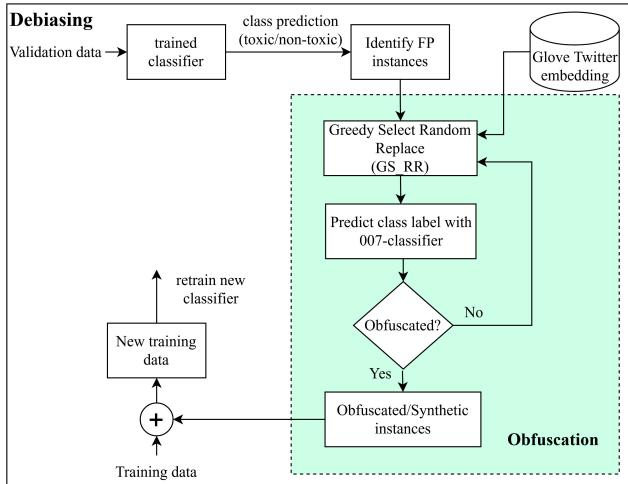  
Figure 1: Overall architecture

Our approach is a pre-processing one as we adjust training data. Minority/majority communities are identified by FPR (Type-I error rate) as is common in the literature (Sap et al., 2019; Xia et al., 2020; Halevy et al., 2021; Mehrabi et al., 2021; Lwowski et al., 2022; Spliethöver et al., 2024). Communities with higher FPR are considered as minority and the rest as majority (using a suitable threshold described later). Here FP, which is in the context of toxicity classifiers, represents a non-toxic text falsely predicted as toxic. FPR is used instead of false negative rate (FNR) since the punitive impact of a false positive decision on the individual outweighs the impact of a false negative decision on the organization, especially with toxicity (Davani et al., 2023).

We use methods inspired by obfuscation algorithms to generate synthetic instances. Specifically, each FP instance is modified until a target classifier is tricked into changing its decision. The choice of target classifier for use in obfuscation is independent of the classifier being debiased. We minimize confusion between the two by referring to the target classifier henceforth as 007-classifier (for a bit of fun and since obfuscation is typically adversarial in nature). We explore alternate 007-classifiers (Section 3.1.2).

We harvest FPs from validation data (instead of training). Key to note, the validation datasets provide fewer FPs than the training datasets. For the 3 datasets we investigate, the number of validation set FPs is 1.4 to 3.5 times smaller than the number of training set FPs. This may be a disadvantage for our algorithm. However, it has the potential advantage in that the FP examples from validation data are ‘unseen’ by the model and hence might lead to better generalization for our debiasing objective.

As shown in figure 1, we process the validation dataset with the initial toxicity classifier, add obfuscated versions of all FP instances to the training data and retrain the classifier. We expect this to be less biased without sacrificing performance.

## 3.1.1 Obfuscation: greedy select random replace

Text obfuscation algorithms have been developed for adversarial attacks against classifiers to force them into making errors. A large body of research explores obfuscation attacks against classifiers of text attributes such as author, gender, and ofensiveness (Mahmood et al., 2019; Rusert et al., 2022; Tokpo and Calders, 2022; Xing et al., 2024). Instead of adversarial attacks we plan to use obfuscators in a novel manner for debiasing classifiers. Specifically, we use obfuscators to generate synthetic instances that are as close to the FP instances as possible while raising the likelihood of the biased classifier flipping its decision. Thus, in contrast to using obfuscators adversarially, our application of obfuscators to debiasing is novel in that it is beneficial.

We follow a greedy-select random-replace obfuscation strategy (see Figure 1) wherein we (1) select an appropriate term in the instance and (2) substitute it with a suitable replacement. If the 007-classifier alters its decision on this modified instance then obfuscation concludes else we iterate back into the greedy-select random-replace step. For step 1, the algorithm greedily selects the one word whose removal has greatest impact on 007-classifier confidence. Step 2 iterates through random selections for substitution from Glove Twitter2. Random replacements are eficient since these synthetic instances will never be viewed by humans. The cycle continues until the obfuscation classifier is tricked. The degenerate case of not tricking the 007-classifier never happens in our experiments. Appendix Table 9 presents examples of FPs and their obfuscated version (synthetic instances). We emphasize that the substitutions are not intended to be sensible - as these are random word choices.

## 3.1.2 Alternative 007-classifiers

A secondary goal of this study is to understand if domain diferences between the 007-classifiers and the classifier being debiased matter.

1. The 007-classifier is identical to the classifier being debiased (OBFTC). This reflects a white box assumption wherein we have full access to the classifier being debiased.

2. The 007-classifier is from a related domain. This reflects a black box assumption in which we are given a set of FPs and we only know what kind of classifier is being debiasing. Since this is a toxicity classifier, we explore MIDAS (Mahata et al., 2019) and NULI (Liu et al., 2019a), two state-of-the-art ofense classifiers from OfensEval 2019 Task 6 (Zampieri et al., 2019) (OBFMIDAS, OBFNULI). NULI, a BERT based classifier, was the top performing ofense classifier. MIDAS, the top performing non-BERT ofense classifier, is a BLSTM, BLSTM + BGRU, CNN ensemble.

3. The 007-classifier is from a diferent domain. This is also black box in that we are given FP instances but have no knowledge of the classifier’s problem domain. Thus, we use a popular classifier, i.e., a sentiment classifier as the 007- classifier $( \mathrm { O B F } _ { \mathrm { S C } } )$ (Barbieri et al., 2020).

## 3.2 Baselines

We use pre-processing bias mitigation methods that adjust the training dataset as our baselines.

Preferential Sampling (PS) (Kamiran and Calders, 2012): They reduce bias by deleting or adding exact copies of select instances. Selections are based on instance rankings by toxic class membership probabilities. As an illustration, a number (calculated value) of top-ranked toxic instances are removed for the minority group if it has more toxic comments compared to the majority group. Details are in Kamiran and Calders (2012).

The authors only consider African-American (AE) as �������� and non-AE as �� � �����. Thus, as a simple extension we run experiments where each minority community (which varies by model - dataset combination) in turn forms the minority group and the rest form the other group. These are labeled as $\mathrm { P S } _ { \mathrm { H i s p a n i c } } , \mathrm { P S } _ { \mathrm { A E } }$ , etc. These experiments will alert us to diferences in bias reduction from diferent minority perspectives. The authors also indicate that multiple groups may be combined such that only two groups remain. Accordingly, for each dataset, we combine communities with high false positive rates into one minority group keeping the rest as one majority group $( \mathrm { P S } _ { \mathrm { a l l M i n } } )$

Diferential Tweetment (DifT) (Ball-Burack et al., 2021): This strategy which derives from PS (Kamiran and Calders, 2012) also deletes or adds exact copies of training instances after ranking. Instance ranking is done based on both classifier confidence and probability of belonging to the minority group. Ranking and selection is iterative, with the top 1000 instances selected for processing (removal or duplication). The classifier is re-trained. If bias is below a threshold, the process terminates. Details of our implementation are in the appendix A.13.

The authors consider bias measurement only from AE perspective. Unlike the PS algorithm, we do not find an intuitive way to extend DifT wherein multiple minority groups can be combined into one group. Accordingly, we only consider debiasing from the perspective of each minority group (labeled $\mathrm { D i f f T _ { A s i a n } , D i f f T _ { H i s p a n i c } }$ etc.).

SMOTE (Chawla et al., 2002): While SMOTE is designed to handle class imbalance we are curious to see if it can also be used to reduce bias. SMOTE adds new synthetic instances as follows. Each instance in the smaller class is paired with its closest $k \in [ 1 , 5 ]$ instances from the same class in the feature space. In our case, the classes are toxic and non-toxic. A synthetic sample is generated — in this feature space — along the line between each pair using the equation:

$$
x _ { n e w } ^ { j } = x _ { i } ^ { j } + \mathrm { r a n d } ( 0 , 1 ) * ( x _ { i } ^ { j } - x _ { n e i g h b o r s } ^ { j } )
$$

Here $x _ { i } ^ { j }$ refers toj-th feature of a sample $x _ { i } \in \mathbb { R } ^ { n }$ $j \in [ 1 , n ] . \ x _ { n e i g h b o r s }$ refers to one of the k-chosen neighbors, and $x _ { n e w }$ refers to a synthetic sample in the line between $x _ { i }$ and $x _ { n e i g h b o r s }$

Counterfactual Data Augmentation (CDA): Aligned with our goal of adding obfuscated FPs, we added the counterfactual of FPs from the validation set to the training dataset. That is, we added the FP text without modification but with the label ‘toxic’.

## 4 Experiment design

## 4.1 Toxicity classifier models

In the first set of experiments, we debias a multilayer perceptron (MLP) classifier and make detailed comparisons with baseline debiasing algorithms (Section 5). In the second set of experiments, we extend our analysis to debiasing masked language models (MLMs) classifiers: BERT (bertbase-uncased, bert-large-uncased)(Devlin et al., 2019), DistilBERT (Sanh et al., 2019), RoBERTa (roberta-base) (Liu et al., 2019b) (Section 6). Model configurations are in the appendix A.2.

## 4.2 Toxicity classifier datasets

We experiment with three datasets. As in Park et al. (2018), Senarath and Purohit (2020) and Fortuna et al. (2021), we formulate toxicity classification as binary (toxic/non-toxic) instead of multi-class and adjust the class definition accordingly in each dataset. A toxic text contains hateful, abusive, or ofensive content4. Table 1 presents an overview of datasets used. Each was randomly split into training (65%), validation (15%) and testing (20%).

(1) Davidson (DWMW17) (Davidson et al., 2017): It contains approximately 25K tweets each annotated by at least three CrowdFlower (CF) workers. Tweets are labeled as one of hate speech, ofensive or none. We combined hate speech and ofensive as toxic and the rest as non-toxic.

(2) HatEval (HatEval19) (Basile et al., 2019): It has about 13K English tweets with two labels: ofensive or not annotated using crowdsourcing platform Figure Eight and two more experts. We consider ofensive as toxic and not as non-toxic.

(3) Founta (FDCL18) (Founta et al., 2018): It includes approximately 100K tweets, each annotated by five crowdsource workers as hateful, abusive, spam and none. We combine hateful and abusive as toxic and spam and none as non-toxic.

<table><tr><td>Dataset</td><td>Class</td><td>Group</td><td>Train</td><td>Valid</td><td>Test</td><td>Total</td></tr><tr><td rowspan="10">DWMW17</td><td rowspan="4">toxic</td><td>AE</td><td>8178</td><td>1887</td><td>2463</td><td>12528</td></tr><tr><td>Hispanic</td><td>2128</td><td>456</td><td>693</td><td>3277</td></tr><tr><td>Asian</td><td>106</td><td>33</td><td>36</td><td>175</td></tr><tr><td>White</td><td>2946</td><td>707</td><td>918</td><td>4571</td></tr><tr><td>Total</td><td></td><td>13358</td><td>3083</td><td>4110</td><td>20551</td></tr><tr><td rowspan="4">non-</td><td>AE</td><td>425</td><td>97</td><td>125</td><td>647</td></tr><tr><td>Hispanic</td><td>241</td><td>59</td><td>71</td><td>371</td></tr><tr><td>Asian</td><td>152</td><td>25</td><td>47</td><td>224</td></tr><tr><td>White</td><td>1868</td><td>439</td><td>584</td><td>2891</td></tr><tr><td>Total</td><td></td><td>2286</td><td>620</td><td>827</td><td>4144</td></tr><tr><td rowspan="10">HatEval19</td><td rowspan="4">toxic</td><td>AE</td><td>714</td><td>171</td><td>215</td><td>1100</td></tr><tr><td>Hispanic</td><td>443</td><td>103</td><td>129</td><td>675</td></tr><tr><td>Asian</td><td>60</td><td>14</td><td>14</td><td>88</td></tr><tr><td>White</td><td>2328</td><td>531</td><td>733</td><td>3592</td></tr><tr><td>Total</td><td></td><td>3545</td><td>819</td><td>1091</td><td>5455</td></tr><tr><td rowspan="3">non-</td><td>AE</td><td>477</td><td>117</td><td>125</td><td>719</td></tr><tr><td>Hispanic</td><td>485</td><td>109</td><td>161</td><td>755</td></tr><tr><td>Asian</td><td>219</td><td>55</td><td>74</td><td>348</td></tr><tr><td>Total</td><td>White</td><td>3681</td><td>841</td><td>1136</td><td>5658</td></tr><tr><td colspan="2"></td><td>4862</td><td>1122</td><td>1496</td><td>7480</td></tr><tr><td rowspan="10">FDCL18</td><td rowspan="4">toxic</td><td>AE</td><td>5275</td><td>1206</td><td>1653</td><td>8134</td></tr><tr><td>Hispanic</td><td>5807</td><td>1373</td><td>1756</td><td>8936</td></tr><tr><td>Asian</td><td>384</td><td>61</td><td>110</td><td>555</td></tr><tr><td>White</td><td>9401</td><td>2175</td><td>2902</td><td>14478</td></tr><tr><td colspan="2">Total</td><td>20867</td><td>4815</td><td>6421</td><td>32103</td></tr><tr><td rowspan="4">non- toxic</td><td>AE</td><td>2032</td><td>455</td><td>655</td><td>3142</td></tr><tr><td>Hispanic</td><td>2416</td><td>563</td><td>734</td><td>3714</td></tr><tr><td>Asian</td><td>4188</td><td>978</td><td>1375</td><td>6541</td></tr><tr><td>White</td><td>35110</td><td>8100</td><td>10696</td><td>53906</td></tr><tr><td>Total</td><td></td><td>41714</td><td>10096</td><td>12805</td><td>67303</td></tr></table>

Table 1: Description of datasets.

Pre-processing: We replaced new line and extra white space with a space. We removed URLs, hashes, mentions (@user), and retweet mention (RT) from the tweet, then lower case and stem text.

Dialect estimation: We use the model from Blodgett et al. (2016) to infer dialect5 on the preprocessed tweets. We take ������ of the probability distribution that it provides for: African American (AE; $p _ { \mathrm { A E } } )$ , Hispanic(H; $p _ { \mathrm { H i s p a n i c } } )$ , Asian(AS; $p _ { \mathrm { A s i a n } } )$ , and White $( p _ { \mathrm { W h i t e } } )$ for group assignment.

Majority and minority categorization: Generally, papers use a static, socially recognized demarcation with disadvantaged group African Americans as the minority and advantaged Whites as the majority. Hispanics and Asians are generally less studied. In contrast, we use classifier performance to assign minority and majority groups. This assignment is model - dataset specific based on the model’s FPR values in the validation subset. Communities with relatively higher FPR are regarded as minority and the others majority. Using 50% of the largest FPR value as threshold (�), communities with FPR $\geq t$ are regarded as minority and the rest as majority. With very similar FPR values, e.g., 0.40, 0.35, 0.29, 0.27 then we could use a more stringent threshold as for example 75% of highest FPR; this assigns the top 2 FPR scores to minority communities and the rest majority. For us 50% threshold separates communities into two groups.

## 4.3 Performance measurement

Let $S = \{ C _ { 1 } , C _ { 2 } , . . . , C _ { n } \}$ be the set of communities of interest. In our case, � = 4 (AE, Hispanic (H), Asian (AS), White). We use the commonly accepted notion of community specified by race/ethnicity. We measure average FPR across majority and across minority communities and across all communities. Bias (B) is given by $\mathrm { F P R } _ { \mathrm { m i n o r i t y } } - \mathrm { F P R } _ { \mathrm { m a j o r i t y } }$ . We note that bias can be close to 0 with both FPRmajority and $\mathrm { F P R } _ { \mathrm { m i n o r i t y } }$ being high (undesired) or low (desired). We also gauge performance with macro F1 scores computing averages $\mathrm { F 1 _ { a l l } , F 1 _ { m a j o r i t y } }$ and F1minority.

## 4.4 Viable debiasing run

Formally, we define a viable debiasing algorithm as one that reduces bias by at least 4%6. Additionally, FPRs $( \mathrm { F P R } _ { \mathrm { m a j o r i t y } } , \mathrm { F P R } _ { \mathrm { m i n o r i t y } }$ and $\mathrm { F P R } _ { \mathrm { a l l } } )$ should not increase. Lastly, F1 performance should not decline. Since this is likely very challenging, we adopt a soft criteria, considering a strategy viable if the drops in $\mathrm { F 1 _ { m a j o r i t y } , F 1 _ { m i n o r i t y } }$ and $\mathrm { F } 1 _ { \mathrm { a l l } }$ are each at most 5%. Larger drops are too high a sacrifice.

## 5 Results for debiasing MLP

Tables 2 to 4 present test set results as averages over ten runs to accommodate any variations due to the random initialization of the neural networks. Minority and majority communities identified are specified in table legends. Bias is dataset specific, e.g., there is bias against Asian in DWMW17 but not in the other two datasets. Of note, AE faces the highest bias in all 3 datasets. The number of baseline runs is determined by the number of minority communities and hence these vary across datasets. The "Original" row is for the original (biased) model. Sacrifices records penalties paid.

Impact on bias: Across datasets, most of the 23 baseline runs reduce bias by 4% or more (indicated by ). The 7 exceptions are marked with : e.g., PSH in all datasets. More than half of the successful runs reduce bias extremely well, by at least 10%, e.g., $\mathrm { P S } _ { \mathrm { A E } } , \mathrm { P S } _ { \mathrm { a l l M i n } } .$ and SMOTE across all datasets.

In contrast, all of our obfuscation based debiasing strategies reduce bias. These range from 6.3% - $1 1 . 3 \%$ (DWMW17), 8.6%-11.9% (FDCL18), and 11.9%-13.7% (HatEval19). More than half of these reduce bias extremely well, i.e., by at least 10%. The lowest was achieved by $\mathrm { O B F _ { N U L I } / O B F _ { T C } }$ strategy for DWMW17 and the highest by $\mathrm { O B F } _ { \mathrm { T C } }$ for Hat-Eval19. Considering bias reduction alone, 16/23 baseline runs and all of our 12 runs are potentially viable. We limit further analysis to these runs.

Impact on FPR: Sacrifices in FPR are marked by red diamonds $( \diamond ; < 5 \%$ increase in FPR, $\underline { { \circ } } : [ 5 , 1 0 ) \%$ increase, $\ast \geq 1 0 \%$ increase) ordered by sacrifices in FPRmajority, $\mathrm { F P R } _ { \mathrm { m i n o r i t y } } , \mathrm { F P R } _ { \mathrm { a l l } }$

For DWMW17, all three FPRs become worse for all baselines except SMOTE. In FDCL18 and Hat-Eval19, except for DifT, all baselines incur at least one FPR penalty. Across datasets, 19/27 negative impacts on FPR are high. For example, $\mathrm { P S } _ { \mathrm { A E } }$ and $\mathrm { P S } _ { \mathrm { a l l M i n } }$ in DWMW17 reduce bias extremely well but with huge FPR penalty $( \mathrm { e . g . , F P R _ { m a j o r i t y } }$ penalty is about 223% for $\mathrm { P S } _ { \mathrm { A E } } )$ . Likewise, SMOTE’s reduction of bias by $4 3 . 4 \%$ in FDCL18 pays a huge FPR penalty7 of more than 200%.

In contrast, all our debiasing strategies reduce all FPRs. Approximately 50% of the drops are at least 10%. All but one of the remaining drops are in [5%, 10%). For example, $\mathrm { O B F } _ { \mathrm { T C } }$ in FDCL18 drops $\mathrm { F P R } _ { \mathrm { m a j o r i t y } }$ by $1 9 \% , \mathrm { F P R } _ { \mathrm { m i n o r i t y } }$ by 10.4% and $\mathrm { F P R } _ { \mathrm { a l l } }$ by $1 1 \%$ . Average of all three FPRs reductions across 007-classifiers is largest for FDCL18 (14%) and (7%-8%) for the other two datasets.

In sum, 5 of the 17 baseline runs that reduce bias stay potentially viable after considering FPR changes. In contrast all of our 12 runs remain potentially viable. We limit further analysis to these runs.

<table><tr><td>Approach</td><td colspan="2">Majority</td><td colspan="2">Minority</td><td colspan="2">All</td><td rowspan="2">Bias (B)</td><td colspan="2">Sacrifices</td></tr><tr><td></td><td>FPR</td><td>F1</td><td>FPR</td><td>F1</td><td>FPR F1</td><td></td><td>BF1</td><td>FPR</td></tr><tr><td>Original</td><td>0.095</td><td>0.887</td><td>0.207</td><td>0.876</td><td>0.179</td><td>0.879</td><td>0.112</td><td></td></tr><tr><td>PSAE</td><td>+223</td><td>-7.7</td><td>+70.0</td><td>-7.4</td><td>+90.5</td><td>-7.5</td><td>-59.8</td><td>××x</td></tr><tr><td>PSH</td><td>+24.2</td><td>-0.2</td><td>+24.6</td><td>-3.0</td><td>+24.6 -2.3</td><td>+25.0</td><td>o</td><td></td></tr><tr><td> $\mathrm { P S } _ { \mathrm { A S } }$ </td><td>+6.3</td><td>0.0</td><td>+1.0</td><td>+0.3</td><td>+1.7 +0.2</td><td>-3.6</td><td>o</td><td>000</td></tr><tr><td> $\mathrm { P S } _ { \mathrm { a l l M i n } }$ </td><td>+178</td><td>-8.6</td><td>+7.2</td><td>-4.3</td><td>+29.6 -4.7</td><td>-138</td><td>● ×</td><td></td></tr><tr><td> $\mathrm { D i f T _ { A E } }$ </td><td>+28.4</td><td>-0.5</td><td>+9.2</td><td>-1.3</td><td>+11.7</td><td>-1.1 -7.1</td><td></td><td></td></tr><tr><td> $\mathrm { D i f T _ { H } }$ </td><td>+24.2</td><td>-0.3</td><td>+2.9</td><td>-0.7</td><td>+5.6</td><td>+0.1 -15.2</td><td></td><td>★</td></tr><tr><td> $\mathrm { D i f T _ { A S } }$ </td><td>+4.2</td><td>0.0</td><td>+3.4</td><td>-0.7</td><td>+3.9</td><td>-0.6 +2.7</td><td>o</td><td>◇0</td></tr><tr><td>SMOTE</td><td>-8.4</td><td>-21.5</td><td>-39.6</td><td>-21.2</td><td>-35.2 -21.4</td><td>-66.1</td><td></td><td>xxx</td></tr><tr><td>CDA</td><td>+16.8</td><td>-0.3</td><td>+2.9</td><td>+0.2</td><td>+5.0</td><td>0.0 -8.9</td><td></td><td></td></tr><tr><td> $\scriptstyle \mathbf { \overline { { O B F _ { T C } } } }$ </td><td>-5.3</td><td>+0.2</td><td>-5.8</td><td>0.0</td><td>-5.6</td><td>0.0</td><td>-6.3</td><td></td></tr><tr><td> $\mathrm { O B F _ { M I D A S } }$ </td><td>-9.5</td><td>+0.2</td><td>-10.5</td><td>+0.2</td><td>-10.4</td><td>+0.2</td><td>-11.3</td><td></td></tr><tr><td> ${ \mathrm { O B F } } _ { \mathrm { N U L I } }$ </td><td>-10.8</td><td>+0.3</td><td>-8.4</td><td>+0.2</td><td>-8.7</td><td>+0.3</td><td>-6.3</td><td></td></tr><tr><td> $\underline { { \mathrm { O B F s c } } }$ </td><td>-8.4</td><td>+0.3</td><td>-7.7</td><td>+0.2</td><td>-7.8</td><td>+0.2</td><td>-7.1</td><td></td></tr></table>

Table 2: DWMW17 test set results. Minority (Original FPR): AE (0.239), Hispanic (H) (0.217), Asian (AS) (0.166), Majority (Original FPR): White (0.095). Cell values indicate percentage increase or decrease from Original for all metrics. : bias reduction below 4%, : bias reduction $\geq 4 \% , \times \colon \mathrm { F } 1$ drop > 5%, ^: FPR penalty below $5 \% , \ \underline { { \circ } } \colon \ \mathrm { F P R }$ penalty in the range $[ 5 \% , 1 0 \% )$ , ♦: FPR penalty ${ \geq } 1 0 \%$ . Penalties are ordered as Majority, Minority then All. Bias reduction results in bold represent viable debiasing runs.

<table><tr><td>Approach</td><td colspan="2">Majority</td><td colspan="2">Minority</td><td colspan="2">All</td><td rowspan="2">Bias</td><td colspan="2">Sacrifices</td></tr><tr><td></td><td>FPR</td><td>F1</td><td>FPR</td><td>F1</td><td>FPR F1</td><td>(B)</td><td>BF1</td><td>FPR</td></tr><tr><td>Original</td><td>0.021</td><td>0.904</td><td>0.164</td><td>0.901</td><td>0.092</td><td>0.901</td><td>0.143</td><td></td><td></td></tr><tr><td>PSAE</td><td>+81.0</td><td>-1.7</td><td>-0.6</td><td>-7.2</td><td>+8.7</td><td>-4.4</td><td>-12.6</td><td>x</td><td>0</td></tr><tr><td>PSH</td><td>+90.5</td><td>-2.5</td><td>+14.6</td><td>-5.3</td><td>+56.5</td><td>-3.9</td><td>+3.5 O</td><td>x</td><td></td></tr><tr><td>PSallMin</td><td>+152</td><td>-4.3</td><td>-24.4-12.7</td><td></td><td>-3.3</td><td>-8.4</td><td>-50.3</td><td>xx</td><td>4</td></tr><tr><td> $\mathrm { D i f T _ { A E } }$ </td><td>-52.4</td><td>-2.7</td><td>-45.1</td><td>-11.2</td><td>-45.7</td><td>-6.9</td><td>-44.1</td><td>xx</td><td></td></tr><tr><td> $\mathrm { D i f T _ { H } }$ </td><td>-61.9</td><td>-9.7</td><td>-56.1</td><td>-15.1</td><td>-56.5</td><td>-12.4</td><td>-54.5</td><td>×x×</td><td></td></tr><tr><td>SMOTE</td><td>+2329</td><td>-43.9</td><td>+260</td><td>-19.4</td><td>+499</td><td>-31.7</td><td>-43.4</td><td>×××</td><td></td></tr><tr><td>CDA</td><td>+52.4</td><td>-1.0</td><td>+23.2</td><td>-0.6</td><td>+27.2</td><td>-0.8</td><td>+18.2 o</td><td></td><td></td></tr><tr><td> $\mathbf { { \overline { { O B F _ { T C } } } } }$ </td><td>-19.0</td><td>-0.7</td><td>-10.4</td><td>-0.6</td><td>-10.9</td><td>-0.6</td><td>-9.1</td><td></td><td></td></tr><tr><td> $\mathrm { O B F _ { M I D A S } }$ </td><td>-19.0</td><td>-0.9</td><td>-12.2</td><td>-0.4</td><td>-12.6</td><td>-0.6</td><td>-11.2</td><td></td><td></td></tr><tr><td> ${ \mathrm { O B F } } _ { \mathrm { N U L I } }$ </td><td>-18.1</td><td>-0.9</td><td>-9.8</td><td>-0.5</td><td>-10.3</td><td>-0.6</td><td>-8.6</td><td></td><td></td></tr><tr><td> $\underline { { \mathrm { O B F s c } } }$ </td><td>-19.0</td><td>-0.9</td><td>-12.8</td><td>-0.4</td><td>-13.0</td><td>-0.7</td><td>-11.9</td><td></td><td></td></tr></table>

Table 3: FDCL18 test set results. Minority (Original FPR): AE (0.180), Hispanic (0.147), Majority (Original FPR): White (0.028), Asian (0.013). Please refer to Table 2 for explanation of cell values and notation in Sacrifices column.

<table><tr><td>Approach</td><td>Majority</td><td></td><td>Minority</td><td></td><td>All</td><td>Bias</td><td>Sacrifices</td></tr><tr><td></td><td>FPR</td><td>F1 FPR</td><td>F1</td><td>FPR</td><td>F1</td><td>(B)</td><td>BF1 FPR</td></tr><tr><td>Original</td><td>0.133</td><td>0.583</td><td>0.322 0.652</td><td>0.227</td><td>0.617</td><td>0.190</td><td></td></tr><tr><td> $\overline { { \mathrm { P S } _ { \mathrm { A E } } } }$ </td><td>+19.5</td><td>+3.6</td><td>-4.0 -4.1</td><td>+3.1</td><td>-0.5</td><td>-21.1</td><td>● 4 0</td></tr><tr><td> $\mathrm { P S _ { H } }$ </td><td>+3.8</td><td>-0.2</td><td>+3.1 +0.9</td><td>+3.5</td><td>+0.5</td><td>+2.1</td><td>o ◇</td></tr><tr><td> $\mathrm { P S } _ { \mathrm { a l l M i n } }$ </td><td>+15.0 +10.1</td><td></td><td>-15.5 -4.3</td><td>-6.6</td><td>+2.6</td><td>-36.8</td><td>4</td></tr><tr><td>DiffTAE</td><td>-91.0</td><td>-15.4</td><td>-93.5 -37.9</td><td>-93.0</td><td>-27.2</td><td>-95.3</td><td>xXx</td></tr><tr><td>DiffTH</td><td>-9.0</td><td>+0.3</td><td>-5.9</td><td>+0.3 -6.6</td><td>+0.3</td><td>-4.2</td><td></td></tr><tr><td>SMOTE</td><td>+130</td><td>-3.3</td><td>+45.7 -1.1</td><td>+70.9</td><td>-2.1</td><td>-14.2</td><td></td></tr><tr><td>CDA</td><td>+32.3</td><td>+7.7</td><td>+15.8 -3.1</td><td>+21.1</td><td>2+.1</td><td>+4.2</td><td>o </td></tr><tr><td> $\mathbf { \sigma } _ { \mathbf { O B F } _ { \mathbf { T C } } }$ </td><td>-7.5</td><td>+3.8</td><td>-10.6</td><td>+0.3</td><td>-9.3 +2.1</td><td>-13.7</td><td>●</td></tr><tr><td>OBFMIDAS</td><td>-2.0</td><td>+5.5</td><td>-7.7 -0.6</td><td>-5.9</td><td>+2.4</td><td>-12.2</td><td></td></tr><tr><td> ${ \mathrm { O B F } } _ { \mathrm { N U L I } }$ </td><td>-4.6</td><td>+3.2</td><td>-8.6</td><td>-0.5 -7.2</td><td>+1.3</td><td>-11.9</td><td></td></tr><tr><td> $\underline { { \mathrm { O B F s c } } }$ </td><td>-4.5</td><td>+5.5</td><td>-9.0</td><td>-0.3</td><td>-7.5 +2.4</td><td>-12.6</td><td></td></tr></table>

Table 4: HatEval19 test set results. Minority (Original FPR): AE (0.389), Hispanic (0.255), Majority (Original FPR): Asian (0.093), White (0.172). Please refer to Table 2 for explanation of cell values and notation of Sacrifices column.

Impact on F1: Runs decreasing F1 score by $5 \%$ or more are depicted by under Sacrifices in the order of $\mathrm { F 1 } _ { \mathrm { m a j o r i t y } } , \mathrm { F 1 } _ { \mathrm { m i n o r i t y } }$ and $\mathrm { F } 1 _ { \mathrm { a l l } }$

All but one of the remaining 5 baselines pay large F1 penalties. $\mathrm { E . g . }$ , SMOTE reduces all three F1s by approximately 21% in DWMW17, while $\mathrm { D i f T _ { A E } }$ reduce them by 15.4%-38% in HatEval19. The only baseline run that remains viable when considering bias reduction and losses in FPR and F1 is $\mathrm { D i f T _ { H } }$ - limited to the HatEval19 dataset.

In contrast, all of our 12 obfuscation runs remain viable even after considering F1 performance, with drops of at most 0.9% across all three F1s. A small point: F1 even improves in HatEval19; by $3 . 2 \% -$ 5.5% (F1majority) and by $1 . 3 \% - 2 . 4 \% \ ( \mathrm { F 1 _ { a l l } } )$ .

## 5.1 Sensitivity Analysis

We now explore the efect of processing fewer than all FP instances (our base strategy); we limit analysis to the run with MLP as 007-classifier. We explore bias reduction with random FP samples of size (�); start at 20 and increase in steps of 20 with 10 repetitions for each � to account for sample variations. Figures in appendix A.3 show a gradual decrease in bias as more FP instances are processed. This supports our approach of obfuscating all FPs.

Summary for MLP debiasing results: Most baseline runs reduce bias efectively, but sacrifice F1 and/or FPR hindering their overall success. The one exception: $\mathrm { D i f T _ { H } }$ for HatEval19 ofers a small reduction of bias (4.2%). Key to note, performance varies depending on minority perspective (e.g., see variations in the tables across the three single community perspectives with PS for DWMW17). Debiasing with an AE perspective, dominant in prior studies, sacrifices heavily in our multi-community and fairness context. In contrast to baselines, all of our obfuscation-based approaches are viable, reducing bias by $6 . 3 \% - 1 3 . 7 \%$ without compromising F1 or FPR.

## 6 Results for debiasing MLMs

We now extend our research to debiasing MLMs of varying size (results in Appendix Tables 6 to 8). Unlike with MLP (5-18M parameters) where all of our runs remain viable, with MLMs a few are not. Also for all MLM - dataset combinations the minority communities are AE and Hispanic and the majority White and Asian (see Table 5).

Bias reduces the most for DistilBERT (66M) (4%- 13.8%) and all 12 runs are viable. The next most efective bias reduction is for BERT-base (110M), followed by RoBERTa-base (125M) - for both bias reduces by 4%-13.3%. The 3 to 4 exceptions are due to not meeting the bias reduction threshold or FPR penalty. For example, $\mathrm { O B F } _ { \mathrm { T C } }$ in RoBERTa-base and $\mathrm { O B F _ { M I D A S } }$ in BERT-base penalize $\mathrm { F P R } _ { \mathrm { m a j o r i t y } }$ by 4%-5%. Relatively speaking, bias mitigation is least successful in BERT-large (340M), the largest MLM analyzed. But even here, close to 60% of the 12 runs are viable with bias reduction in $4 \% - 1 1 . 4 \%$ As examples of exceptions, $\mathrm { O B F } _ { \mathrm { S C } }$ (FDCL18 and HatEval19) and $\mathrm { O B F _ { N U L I } }$ (FDCL18) do not reduce bias suficiently while in DWMW17 a couple ofruns incur FPR penalties. Possibly, relative to its size, the number of FPs available for obfuscation with BERT-large is insuficient. However, performance in the last three MLMs varies only slightly.

Summary for MLP and MLM results: All our runs are viable with MLP and DistilBERT. As model size increases, bias mitigation is slightly challenging. Interestingly, our debiasing strategy never incurs F1 penalties. However, there are a few instances where our strategies incur FPR penalties.

## 7 Additional analysis

## 7.1 Performance by 007-classifiers

Figure 2 shows that NULI as the 007-classifier is the best, succeeding in all but two runs. With each remaining 007-classifier, including one built from the same model that is being debiased $( \mathrm { O B F _ { T C } ) }$ and the sentiment classifier (OBFSC), approximately 80% of runs are viable. The few failures are due to insuficient bias reduction or/and FPR losses. Interestingly, while $\mathrm { { O B F } _ { N U L I } }$ and $\mathrm { O B F _ { M I D A S } }$ are both ofense classifiers trained on the same data, performance varies – possibly due to architectural diferences since MIDAS is an older non BERT ensemble. Considering all viable runs (48/60) across 007-classifiers, average bias reduction is 8.2% (standard deviation, SD: 3.1). Average minimum bias reduction is 4.2% (SD: 0.31), and average maximum is 13.1% (SD: 0.70). The choice of 007-classifier does not make a big diference.

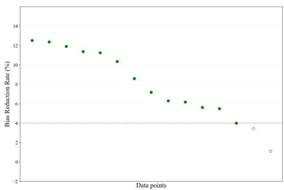

(a) Using NULI as 007-classifier (OBFNULI)  
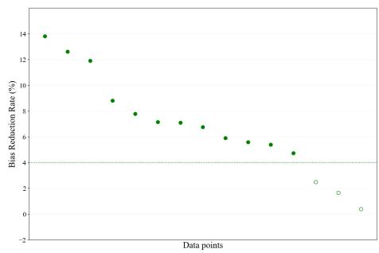

(b) Using Sentiment Classifier as 007-classifier (OBFSC)  
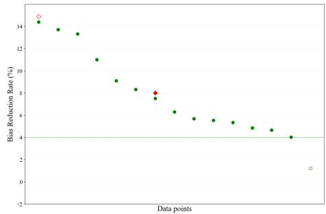

(c) Using model as 007-classifier (OBFTC)  
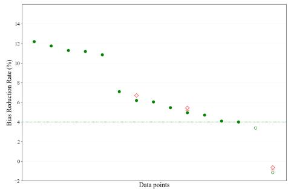  
(d) Using MIDAS as 007-classifier (OBFMIDAS)  
Figure 2: Performance by 007-classifiers. Please refer to Table 2 for explanation of notations.

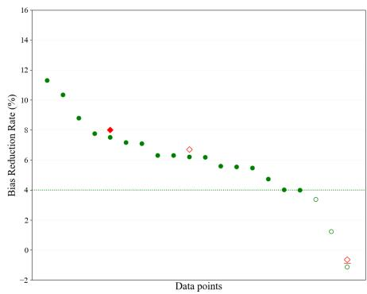

(a) DWMW17  
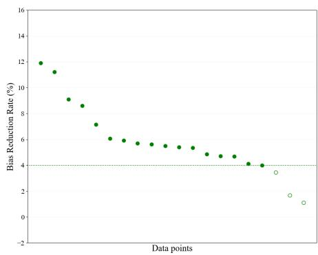

(b) FDCL18  
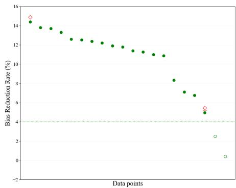  
(c) HatEval19  
Figure 3: Performance by dataset. Please refer to Table 2 for explanation of notations.

## 7.2 Performance by dataset

As shown in Figure 3, FDCL18 yields the best performance; bias reduces for all but 3 of the 20 runs with no penalties. In DWMW17 and HatEval19, most runs are viable. Exceptions are due to insuficient bias reduction or/and sacrifice in FPR.

Average bias reduction across successful runs is highest in HatEval19 (11.3%; SD: 2.08) and around 6.6% (SD: 2.2) for the other two. Not surprisingly, HatEval19 is the most biased initially (e.g., BERTlarge has an initial bias value of 0.26 while it is 0.12 and 0.15 for DWMW17 and FDCL18, respectively).

## 8 Related works

We briefly review pre-processing methods or debiasing text classifiers and their two desired properties.

Pre-processing debiasing The most common strategy is replicate/remove instances, which includes but is not limited to PS (Kamiran and Calders, 2012), DifT (Ball-Burack et al., 2021), Fair-SMOTE (Chakraborty et al., 2021) and Counterfactual Data Augmentation (Xie et al., 2023; Sobhani and Delany, 2024). Due to their importance in NLP remove stereotypical bias in word embeddings (Bolukbasi et al., 2016; Brunet et al., 2019) is another common approach. Other less common approaches include relabel instances (Kamiran and Calders, 2009; Luong et al., 2011), re-weighting (Kamiran and Calders, 2012; Almuzaini et al., 2022), and shift distribution of unprotected attributes such that sensitive attributes cannot be estimated (Feldman et al., 2015). Our baselines are state-of-art strategies closest to ours in spirit.

Multi-community perspective: Debiasing papers focus exclusively on the AE minority community (Xia et al., 2020; Ball-Burack et al., 2021; Halevy et al., 2021; Spliethöver et al., 2024). Extension of algorithms to the multi-community setting is not obvious. E.g., Ball-Burack et al. (2021) rank instances (before selecting ones for deletion/replication) on the basis of a single community (���). It is not clear how to extend this ranking criteria for multiple minority communities. In contrast, we are able to make a reasonable extension to PS (Kamiran and Calders, 2012) although it did not fare well. Overall, the debiasing literature has not paid attention to this important property.

Fairness to all communities: Most debiasing papers do not report measurements for both the majority and minority groups (Kamiran and Calders, 2012; Calmon et al., 2017; Park et al., 2018; Dixon et al., 2018; Savani et al., 2020; Shrestha et al., 2022; Ball-Burack et al., 2021; Cheng et al., 2022; Song et al., 2023; Sobhani and Delany, 2024; Iskander et al., 2024). Thus, we do not know whether these satisfy our fairness property. Overall, it is clear from the literature that our perspective on fairness in performance has not been a concern.

## 9 Conclusion

We show that it is possible to debias toxicity classifiers in a multi-community setting without sacrificing performance for either minority or majority communities. We achieve this with a novel debiasing algorithm involving text obfuscators. Key to note, we use obfuscators in a beneficial manner in contrast to prior use of obfuscators to adversarially attack classifiers. Our experiments with toxicity classifiers built using combinations of 5 neural models and 3 datasets and debiased using 4 obfuscators while considering 4 communities, yield excellent results; the few failures occur when debiasing the larger MLMs. In contrast, state-of-the-art baselines and their variants perform poorly; these reduce bias nicely but make large sacrifices in FPR and F1. Overall, we conclude that it is possible to debias via obfuscation while being fair to both minority and majority communities. While we have shown that it is possible to debias toxicity classifiers in the context of race/ethnicity bias, debiasing these classifiers for other dimensions, such as gender, is left to future research.

## 10 Limitations

Our work is focused on a binary classification task: toxic or not. Extending it to a multi-class setting and exploring other domains is left for future work. We also address bias only for race/ethnicity. Further exploration is needed for other sensitive attributes, such as gender and religion.

Another limitation is that, instead of the validation set as the source, we could use other similar toxicity data to generate synthetic, non-toxic instances. We leave this ‘distance learning’ inspired extension to future work.

Additionally, we do not explore our bias mitigation approach in the context of large generative language models like GPT-4 (Achiam et al., 2023), Llama 3 (Dubey et al., 2024), and Mistral (Jiang et al., 2023). These have diferent challenges due to their very large architectures and their vast training corpus which are often underspecified. Hence these are likely to require very diferent debiasing strategies. We leave this exploration for the future.

## 11 Ethical consideration

Our work focuses on mitigating race/ethnicity bias across four communities assessed in the context of toxicity classification. We aim to address biases faced by minority communities while also being fair to the majority groups. Our research raises the likelihood of classifiers operating more ethically.

While our approach successfully mitigates race/ethnicity bias in the toxicity classifiers, we acknowledge that the classifiers may still exhibit bias in other dimensions, such as gender and age, or in intersectional dimensions (e.g., gender combined with race/ethnicity). Our method specifically address racial bias in MLP/MLM toxicity classifiers; therefore, claims of bias mitigation should not be interpreted as the complete removal of all biases. This underscores the necessity of addressing all biases comprehensively before deploying these classifiers.

## References

Josh Achiam, Steven Adler, Sandhini Agarwal, Lama Ahmad, Ilge Akkaya, Florencia Leoni Aleman, Diogo Almeida, Janko Altenschmidt, Sam Altman, Shyamal Anadkat, et al. 2023. GPT-4 Technical Report. arXiv preprint arXiv:2303.08774.

Abdulaziz A Almuzaini, Chidansh A Bhatt, David M Pennock, and Vivek K Singh. 2022. Abcinml: Anticipatory bias correction in machine learning applications. In Proceedings ofthe 2022 ACM Conference on Fairness, Accountability, and Transparency, pages 1552–1560.

Ari Ball-Burack, Michelle Seng Ah Lee, Jennifer Cobbe, and Jatinder Singh. 2021. Diferential tweetment: Mitigating racial dialect bias in harmful tweet detection. In Proceedings of the 2021 ACM Conference on Fairness, Accountability, and Transparency, pages 116–128.

Francesco Barbieri, Jose Camacho-Collados, Luis Espinosa Anke, and Leonardo Neves. 2020. TweetEval: Unified benchmark and comparative evaluation for tweet classification. In Findings of the Association for Computational Linguistics: EMNLP 2020, pages 1644–1650, Online. Association for Computational Linguistics.

Valerio Basile, Cristina Bosco, Elisabetta Fersini, Debora Nozza, Viviana Patti, Francisco Manuel Rangel Pardo, Paolo Rosso, and Manuela Sanguinetti. 2019. SemEval-2019 task 5: Multilingual detection of hate speech against immigrants and women in Twitter. In Proceedings ofthe 13th International Workshop on Semantic Evaluation, pages 54–63, Minneapolis, Minnesota, USA. Association for Computational Linguistics.

Su Lin Blodgett, Lisa Green, and Brendan O’Connor. 2016. Demographic dialectal variation in social media: A case study of African-American English. In Proceedings of the 2016 Conference on Empirical Methods in Natural Language Processing, pages 1119– 1130, Austin, Texas. Association for Computational Linguistics.

Tolga Bolukbasi, Kai-Wei Chang, James Y Zou, Venkatesh Saligrama, and Adam T Kalai. 2016. Man

is to computer programmer as woman is to homemaker? debiasing word embeddings. Advances in neural information processing systems, 29.

Marc-Etienne Brunet, Colleen Alkalay-Houlihan, Ashton Anderson, and Richard Zemel. 2019. Understanding the origins of bias in word embeddings. In International Conference on Machine Learning, pages 803–811. PMLR.

Flavio Calmon, Dennis Wei, Bhanukiran Vinzamuri, Karthikeyan Natesan Ramamurthy, and Kush R Varshney. 2017. Optimized pre-processing for discrimination prevention. Advances in neural information processing systems, 30.

Joymallya Chakraborty, Suvodeep Majumder, and Tim Menzies. 2021. Bias in machine learning software: why? how? what to do? In Proceedings ofthe 29th ACM Joint Meeting on European Software Engineering Conference and Symposium on the Foundations ofSoftware Engineering, pages 429–440.

Nitesh V Chawla, Kevin W Bowyer, Lawrence O Hall, and W Philip Kegelmeyer. 2002. Smote: synthetic minority over-sampling technique. Journal ofartificial intelligence research, 16:321–357.

Lu Cheng, Suyu Ge, and Huan Liu. 2022. Toward understanding bias correlations for mitigation in nlp. arXiv preprint arXiv:2205.12391.

Yung-Sung Chuang, Mingye Gao, Hongyin Luo, James Glass, Hung-yi Lee, Yun-Nung Chen, and Shang-Wen Li. 2021. Mitigating biases in toxic language detection through invariant rationalization. In Proceedings of the 5th Workshop on Online Abuse and Harms (WOAH 2021), pages 114–120, Online. Association for Computational Linguistics.

Aida Mostafazadeh Davani, Mohammad Atari, Brendan Kennedy, and Morteza Dehghani. 2023. Hate speech classifiers learn normative social stereotypes. Transactions of the Association for Computational Linguistics, 11:300–319.

Thomas Davidson, Dana Warmsley, Michael Macy, and Ingmar Weber. 2017. Automated hate speech detection and the problem of ofensive language. In Proceedings ofthe 11th International AAAI Conference on Web and Social Media, ICWSM ’17, pages 512–515.

Jacob Devlin, Ming-Wei Chang, Kenton Lee, and Kristina Toutanova. 2019. BERT: Pre-training of deep bidirectional transformers for language understanding. In Proceedings of the 2019 Conference of the North American Chapter of the Association for Computational Linguistics: Human Language Technologies, Volume 1 (Long and Short Papers), pages 4171–4186, Minneapolis, Minnesota. Association for Computational Linguistics.

Lucas Dixon, John Li, Jefrey Sorensen, Nithum Thain, and Lucy Vasserman. 2018. Measuring and mitigating unintended bias in text classification. In Proceedings of the 2018 AAAI/ACM Conference on AI, Ethics, and Society, pages 67–73.

Abhimanyu Dubey, Abhinav Jauhri, Abhinav Pandey, Abhishek Kadian, Ahmad Al-Dahle, Aiesha Letman, Akhil Mathur, Alan Schelten, Amy Yang, Angela Fan, et al. 2024. The LLama 3 Herd of Models. arXiv preprint arXiv:2407.21783.

Michael Feldman, Sorelle A Friedler, John Moeller, Carlos Scheidegger, and Suresh Venkatasubramanian. 2015. Certifying and removing disparate impact. In proceedings ofthe 21th ACM SIGKDD international conference on knowledge discovery and data mining, pages 259–268.

Paula Fortuna, Juan Soler-Company, and Leo Wanner. 2021. How well do hate speech, toxicity, abusive and ofensive language classification models generalize across datasets? Information Processing & Management, 58(3):102524.

Antigoni-Maria Founta, Constantinos Djouvas, Despoina Chatzakou, Ilias Leontiadis, Jeremy Blackburn, Gianluca Stringhini, Athena Vakali, Michael Sirivianos, and Nicolas Kourtellis. 2018. Large scale crowdsourcing and characterization of twitter abusive behavior. ICWSM.

Matan Halevy, Camille Harris, Amy Bruckman, Diyi Yang, and Ayanna Howard. 2021. Mitigating racial biases in toxic language detection with an equitybased ensemble framework. Equity and Access in Algorithms, Mechanisms, and Optimization.

Moritz Hardt, Eric Price, and Nati Srebro. 2016. Equality of opportunity in supervised learning. Advances in neural information processing systems, 29:3315– 3323.

Shadi Iskander, Kira Radinsky, and Yonatan Belinkov. 2024. Leveraging prototypical representations for mitigating social bias without demographic information. In Proceedings of the 2024 Conference of the North American Chapter of the Association for Computational Linguistics: Human Language Technologies (Volume 2: Short Papers), pages 379–390, Mexico City, Mexico. Association for Computational Linguistics.

AQ Jiang, A Sablayrolles, A Mensch, C Bamford, DS Chaplot, D de las Casas, F Bressand, G Lengyel, G Lample, L Saulnier, et al. 2023. Mistral 7B. arXiv preprint arXiv:2310.06825.

Faisal Kamiran and Toon Calders. 2009. Classifying without discriminating. In 2009 2nd international conference on computer, control and communication, pages 1–6. IEEE.

Faisal Kamiran and Toon Calders. 2012. Data preprocessing techniques for classification without discrimination. Knowledge and Information Systems, 33(1):1–33.

Deepak Kumar, Oleg Lesota, George Zerveas, Daniel Cohen, Carsten Eickhof, Markus Schedl, and Navid Rekabsaz. 2023. Parameter-eficient modularised bias mitigation via AdapterFusion. In Proceedings of the 17th Conference of the European Chapter of the Association for Computational Linguistics, pages 2738–2751, Dubrovnik, Croatia. Association for Computational Linguistics.

Haochen Liu, Wei Jin, Hamid Karimi, Zitao Liu, and Jiliang Tang. 2021. The authors matter: Understanding and mitigating implicit bias in deep text classification. In Findings ofthe Associationfor Computational Linguistics: ACL-IJCNLP 2021, pages 74–85, Online. Association for Computational Linguistics.

Ping Liu, Wen Li, and Liang Zou. 2019a. NULI at SemEval-2019 task 6: Transfer learning for ofensive language detection using bidirectional transformers. In Proceedings ofthe 13th International Workshop on Semantic Evaluation, pages 87–91, Minneapolis, Minnesota, USA. Association for Computational Linguistics.

Yinhan Liu, Myle Ott, Naman Goyal, Jingfei Du, Mandar Joshi, Danqi Chen, Omer Levy, Mike Lewis, Luke Zettlemoyer, and Veselin Stoyanov. 2019b. RoBERTa: A Robustly Optimized BERT Pretraining Approach. CoRR, abs/1907.11692.

Pranay K Lohia, Karthikeyan Natesan Ramamurthy, Manish Bhide, Diptikalyan Saha, Kush R Varshney, and Ruchir Puri. 2019. Bias mitigation postprocessing for individual and group fairness. In Icassp 2019-2019 ieee international conference on acoustics, speech and signal processing (icassp), pages 2847–2851. IEEE.

Binh Thanh Luong, Salvatore Ruggieri, and Franco Turini. 2011. k-NN as an implementation of situation testing for discrimination discovery and prevention. In Proceedings of the 17th ACM SIGKDD international conference on Knowledge discovery and data mining, pages 502–510.

Brandon Lwowski, Paul Rad, and Anthony Rios. 2022. Measuring geographic performance disparities of ofensive language classifiers. In Proceedings of the 29th International Conference on Computational Linguistics, pages 6600–6616, Gyeongju, Republic of Korea. International Committee on Computational Linguistics.

Debanjan Mahata, Haimin Zhang, Karan Uppal, Yaman Kumar, Rajiv Ratn Shah, Simra Shahid, Laiba Mehnaz, and Sarthak Anand. 2019. MIDAS at SemEval-2019 task 6: Identifying ofensive posts and targeted ofense from Twitter. In Proceedings of the 13th International Workshop on Semantic Evaluation, pages 683–690, Minneapolis, Minnesota, USA. Association for Computational Linguistics.

Asad Mahmood, Faizan Ahmad, Zubair Shafiq, Padmini Srinivasan, and Fareed Zafar. 2019. A girl has no name: Automated authorship obfuscation

using mutant-x. Proc. Priv. Enhancing Technol., 2019(4):54–71.

Ninareh Mehrabi, Fred Morstatter, Nripsuta Saxena, Kristina Lerman, and Aram Galstyan. 2021. A survey on bias and fairness in machine learning. ACM Computing Surveys (CSUR), 54(6):1–35.

Marzieh Mozafari, Reza Farahbakhsh, and Noël Crespi. 2020. Hate speech detection and racial bias mitigation in social media based on bert model. PloS one, 15(8):e0237861.

Ji Ho Park, Jamin Shin, and Pascale Fung. 2018. Reducing gender bias in abusive language detection. In Proceedings of the 2018 Conference on Empirical Methods in Natural Language Processing, pages 2799–2804, Brussels, Belgium. Association for Computational Linguistics.

Chen Qian, Fuli Feng, Lijie Wen, Chunping Ma, and Pengjun Xie. 2021. Counterfactual inference for text classification debiasing. In Proceedings ofthe 59th Annual Meeting of the Association for Computational Linguistics and the 11th International Joint Conference on Natural Language Processing (Volume 1: Long Papers), pages 5434–5445, Online. Association for Computational Linguistics.

T. C. Rajapakse. 2019. Simple transformers. https: //github.com/ThilinaRajapakse/simpletr ansformers.

Jonathan Rusert, Zubair Shafiq, and Padmini Srinivasan. 2022. On the robustness of ofensive language classifiers. In Proceedings of the 60th Annual Meeting of the Associationfor Computational Linguistics (Volume 1: Long Papers), pages 7424–7438, Dublin, Ireland. Association for Computational Linguistics.

Victor Sanh, Lysandre Debut, Julien Chaumond, and Thomas Wolf. 2019. DistilBERT, a distilled version of BERT: smaller, faster, cheaper and lighter. ArXiv, abs/1910.01108.

Maarten Sap, Dallas Card, Saadia Gabriel, Yejin Choi, and Noah A. Smith. 2019. The risk of racial bias in hate speech detection. In Proceedings of the 57th Annual Meeting of the Association for Computational Linguistics, pages 1668–1678, Florence, Italy. Association for Computational Linguistics.

Yash Savani, Colin White, and Naveen Sundar Govindarajulu. 2020. Intra-processing methods for debiasing neural networks. In Advances in Neural Information Processing Systems, volume 33, pages 2798–2810. Curran Associates, Inc.

Indira Sen, Mattia Samory, Claudia Wagner, and Isabelle Augenstein. 2022. Counterfactually augmented data and unintended bias: The case of sexism and hate speech detection. In Proceedings of the 2022 Conference of the North American Chapter of the Association for Computational Linguistics: Human Language Technologies, pages 4716–4726, Seattle, United States. Association for Computational Linguistics.

Yasas Senarath and Hemant Purohit. 2020. Evaluating semantic feature representations to eficiently detect hate intent on social media. In 2020 IEEE 14th International Conference on Semantic Computing (ICSC), pages 199–202. IEEE.

Robik Shrestha, Kushal Kafle, and Christopher Kanan. 2022. An investigation of critical issues in bias mitigation techniques. 2022 IEEE/CVF Winter Conference on Applications ofComputer Vision (WACV), pages 2512–2523.

Nasim Sobhani and Sarah Delany. 2024. Towards fairer NLP models: Handling gender bias in classification tasks. In Proceedings of the 5th Workshop on Gender Bias in Natural Language Processing (GeBNLP), pages 167–178, Bangkok, Thailand. Association for Computational Linguistics.

Rui Song, Fausto Giunchiglia, Yingji Li, Lida Shi, and Hao Xu. 2023. Measuring and mitigating language model biases in abusive language detection. Information Processing & Management, 60(3):103277.

Maximilian Spliethöver, Sai Nikhil Menon, and Henning Wachsmuth. 2024. Disentangling dialect from social bias via multitask learning to improve fairness. In Findings of the Association for Computational Linguistics ACL 2024, pages 9294–9313, Bangkok, Thailand and virtual meeting. Association for Computational Linguistics.

Kunsheng Tang, Wenbo Zhou, Jie Zhang, Aishan Liu, Gelei Deng, Shuai Li, Peigui Qi, Weiming Zhang, Tianwei Zhang, and Nenghai Yu. 2024. Gendercare: A comprehensive framework for assessing and reducing gender bias in large language models. arXiv preprint arXiv:2408.12494.

Ewoenam Kwaku Tokpo and Toon Calders. 2022. Text style transfer for bias mitigation using masked language modeling. In Proceedings ofthe 2022 Conference ofthe NorthAmerican Chapter oftheAssociation for Computational Linguistics: Human Language Technologies: Student Research Workshop, pages 163–171, Hybrid: Seattle, Washington + Online. Association for Computational Linguistics.

Peter Willett. 2006. The porter stemming algorithm: then and now. Program.

Mengzhou Xia, Anjalie Field, and Yulia Tsvetkov. 2020. Demoting racial bias in hate speech detection. In Proceedings of the Eighth International Workshop on Natural Language Processing for Social Media, pages 7–14, Online. Association for Computational Linguistics.

Zhongbin Xie, Vid Kocijan, Thomas Lukasiewicz, and Oana-Maria Camburu. 2023. Counter-GAP: Counterfactual bias evaluation through gendered ambiguous pronouns. In Proceedings of the 17th Conference of the European Chapter of the Association for Computational Linguistics, pages 3761–3773, Dubrovnik, Croatia. Association for Computational Linguistics.

Eric Xing, Saranya Venkatraman, Thai Le, and Dongwon Lee. 2024. Alison: Fast and efective stylometric authorship obfuscation. In Proceedings ofthe AAAI Conference on Artificial Intelligence, volume 38, pages 19315–19322.

Mehdi Yazdani-Jahromi, AmirArsalan Rajabi, Ali Khodabandeh Yalabadi, Aida Tayebi, and Ozlem Ozmen Garibay. 2022. Distraction is all you need for fairness. arXiv preprint arXiv:2203.07593.

Marcos Zampieri, Shervin Malmasi, Preslav Nakov, Sara Rosenthal, Noura Farra, and Ritesh Kumar. 2019. SemEval-2019 task 6: Identifying and categorizing ofensive language in social media (OfensEval). In Proceedings of the 13th International Workshop on Semantic Evaluation, pages 75–86, Minneapolis, Minnesota, USA. Association for Computational Linguistics.

Brian Hu Zhang, Blake Lemoine, and Margaret Mitchell. 2018. Mitigating unwanted biases with adversarial learning. In Proceedings of the 2018 AAAI/ACM Conference on AI, Ethics, and Society, pages 335– 340.

## A Appendix

## A.1 DifT

Here, re-sampling candidacy (�(�)) is computed using $C ( x ) \ \equiv \ | a ( x ) | - w _ { p } m ( x )$ , where $a ( x )$ is normalized $p _ { A E }$ rank (for example, for $\begin{array} { r l r } { p _ { A E } } & { { } \in } & { \{ 0 . 9 , 0 . 8 , 0 . 7 , 0 . 6 , 0 . 5 \} } \end{array}$ , � (�) ∈ $\{ 1 , 0 . 8 , 0 , - 0 . 8 , - 1 \}$ . �(�) = 0 for median (Q2) of $p _ { A E } , a ( x ) \ = \ 1$ for tweet with highest $p _ { A E } ,$ $a ( x ) = - 1$ for tweet with lowest $p _ { A E }$ and $w _ { p } \in$ {0.1, 0.32, 1, 3.2, 10}. The tweets are ranked based on �(�) in descending order and is re-sampled based on the following:

$p _ { A E } > \mathrm { Q } 2$ and label = non-toxic, duplicate

$p _ { A E } > \mathrm { Q } 2$ and label = �����, drop

$p _ { A E } < Q 2$ and label = �����, duplicate

• ��� < Q2 and label = non-toxic, drop

We made the following changes to DifT: We measure the bias as the diference of average false positive rate (FPR) for minority minus average FPR for majority. We also discarded the bias reduction threshold T. Instead, we keep iterating until the bias reduced. Also, we halt when the bias reduction changes to opposite direction and pick the best based on the closeness to 0. For example, we halt when bias reduced from 0.80 to -0.10 and pick the second trained model as the bias is closer to zero (0). Lastly, $m ( x ) = \left| p ( t o x i c ) - p ( n o n { - } t o x i c ) \right|$

## A.2 Model Configurations

## A.2.1 MLP

The MLP toxicity classifier consist of an input layer, a hidden layer (size 128) and an output layer (size 2) with softmax function. It gives a binary prediction of toxic (positive class)/ non-toxic (negative class). The input text is stemmed using Porter Stemmer (Willett, 2006) and lower cased. Tokens8 are converted to real valued vectors using pre-trained Glove embedding of 300 dimension9. We randomly initialize the word embedding for words not in the embedding. The input is then post-padded or truncated to a maximum length which is the largest text length occurring at least 5 times in the dataset. We use sigmoid activation on the hidden layer output with a dropout of 0.5 in penultimate layer. The model learns optimal parameters by minimizing cross-entropy loss and the Adam optimizer with a learning rate of 1e-4, batch size of 64 for 50 epochs with early stopping (patience = 5). We also added L1/L2 regularization to handle overfitting. We use PyTorch for implementation using NVIDIA Tesla P100 PCIE (16GB) GPU. # of parameters ranged from 5 - 18 million depending on datasets. On average it took 1.5 days (GPU hours) for the cycle of training then debiasing the MLP per dataset.

## A.2.2 MLMs

We fine-tuned pre-trained MLMs classifiers for toxicity classification. This includes BERT (bertbase-uncased, bert-large-uncased) (Devlin et al., 2019), DistilBERT (distilbert-base-uncased) (Sanh et al., 2019) and RoBERTa-base (roberta-base) (Liu et al., 2019b). We use a batch size of 32, a maximum sequence length of 128, AdamW optimizer with a learning rate of 2e-5, and tune the models for ten epochs with early stopping (patience = 3). These hyper-parameters values are taken from the MLM papers. We implement these models using SimpleTransformers (Rajapakse, 2019).

A.3 Sensitivity Analysis  
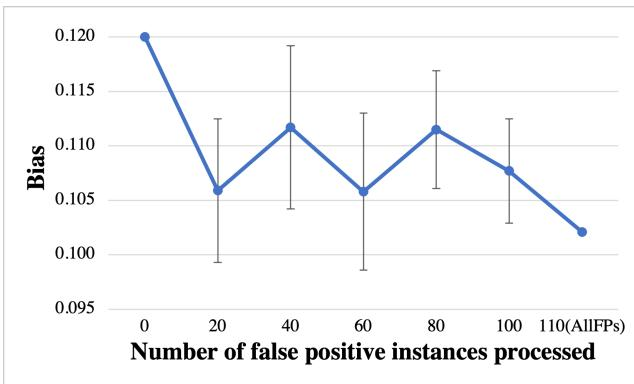  
(a) DWMW17

<table><tr><td rowspan="2">Dataset</td><td rowspan="2">MLMs</td><td colspan="2">Minority</td><td colspan="2">Majority</td></tr><tr><td>AE</td><td>Hispanic (H)</td><td></td><td>White Asian (AS)</td></tr><tr><td rowspan="4">DWMW17</td><td>DistilBERT</td><td>0.214</td><td>0.173</td><td>0.053</td><td>0.094</td></tr><tr><td>BERT-base</td><td>0.197</td><td>0.180</td><td>0.054</td><td>0.062</td></tr><tr><td>RoBERTa-base</td><td>0.229</td><td>0.176</td><td>0.059</td><td>0.073</td></tr><tr><td>BERT-large</td><td>0.206</td><td>0.183</td><td>0.067</td><td>0.075</td></tr><tr><td rowspan="4">FDCL18</td><td>DistilBERT</td><td>0.198</td><td>0.166</td><td>0.031</td><td>0.016</td></tr><tr><td>BERT-base</td><td>0.195</td><td>0.170</td><td>0.032</td><td>0.016</td></tr><tr><td>RoBERTa-base 0.202</td><td></td><td>0.169</td><td>0.034</td><td>0.016</td></tr><tr><td>BERT-large</td><td>0.189</td><td>0.163</td><td>0.030</td><td>0.017</td></tr><tr><td rowspan="4">HatEval19</td><td>DistilBERT</td><td>0.464</td><td>0.321</td><td>0.166</td><td>0.053</td></tr><tr><td>BERT-base</td><td>0.435</td><td>0.346</td><td>0.175</td><td>0.060</td></tr><tr><td>RoBERTa-base</td><td>0.419</td><td>0.288</td><td>0.164</td><td>0.077</td></tr><tr><td>BERT-large</td><td>0.409</td><td>0.325</td><td>0.151</td><td>0.059</td></tr></table>

Table 5: Original FPR for minority and majority communities (MLMs)  
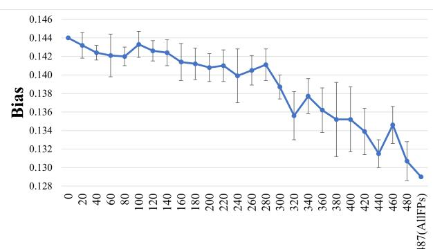  
Number of false positive instances processed

(b) FDCL18  
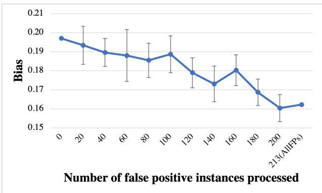  
(c) HatEval19  
Figure 4: Bias on varying number of false positive instances (s) processed through obfuscation. Ten replications were done for each s. Here we use a single fixed seed initialized toxicity classifier network to explore the efect of varying �. Therefore, original bias (i.e. for s=0) is diferent from the ones reported in Tables 2-4 where we report averages over 10 runs. Vertical bars represent standard deviation across the ten samples. (MLP OBFTC)

<table><tr><td rowspan="2">MLMs</td><td rowspan="2">Approach</td><td colspan="2">Majority</td><td colspan="2">Minority</td><td colspan="2">All</td><td rowspan="2">Bias</td><td colspan="2">Sacrifices</td></tr><tr><td>FPR</td><td>F1</td><td>FPR F1</td><td>FPR</td><td>F1</td><td></td><td>Bias F1</td><td>FPR</td></tr><tr><td rowspan="5">DistilBERT</td><td>Original</td><td>0.073</td><td>0.934</td><td>0.194</td><td>0.898</td><td>0.134</td><td>0.916</td><td>0.121</td><td></td><td></td></tr><tr><td>OBFTC</td><td>-12.1</td><td>0.6</td><td>-7.1 0.6</td><td></td><td>-8.5 0.6</td><td></td><td>-4.0</td><td></td><td></td></tr><tr><td> $\mathrm { O B F _ { M I D A S } }$ </td><td>-30.4 0.9</td><td></td><td>-14.9 0.4</td><td></td><td>-19.1 0.7</td><td></td><td>-5.5</td><td></td><td></td></tr><tr><td> ${ \mathrm { O B F } } _ { \mathrm { N U L I } }$ </td><td>-25.8 0.8</td><td>-14.2</td><td>0.9</td><td></td><td>-17.4 0.9</td><td>-7.2</td><td></td><td></td><td></td></tr><tr><td> $\mathrm { O B F s c }$ </td><td>-25.9 1.1</td><td></td><td>-12.7</td><td>1.0</td><td>-16.3</td><td>1.0</td><td>-4.7</td><td></td><td></td></tr><tr><td rowspan="5">BERT-base</td><td>Original</td><td>0.058</td><td>0.942</td><td>0.189</td><td>0.900</td><td>0.123</td><td>0.921</td><td>0.131</td><td></td><td></td></tr><tr><td>OBFTC</td><td>-5.0</td><td>0.0</td><td>-2.4</td><td>0.1</td><td>-3.0</td><td>0.0</td><td>-1.2</td><td>O</td><td></td></tr><tr><td> $\mathrm { O B F _ { M I D A S } }$ </td><td>4.2 0.0</td><td>-3.0</td><td>0.0</td><td></td><td>-1.3 0.0</td><td></td><td>-6.2</td><td></td><td>0</td></tr><tr><td> ${ \mathrm { O B F } } _ { \mathrm { N U L I } }$ </td><td>-13.5 0.3</td><td>-6.8</td><td>-0.1</td><td></td><td>-8.4</td><td>0.1</td><td>-4.0</td><td></td><td></td></tr><tr><td> $\mathrm { O B F } _ { \mathrm { S C } }$ </td><td>-2.9 0.3</td><td>-4.8</td><td>0.4</td><td></td><td>-4.3</td><td>0.4</td><td>-5.6</td><td></td><td></td></tr><tr><td rowspan="5">RoBERTa-base</td><td>Original</td><td>0.066</td><td>0.937</td><td>0.202</td><td>0.895</td><td>0.134</td><td>0.916</td><td>0.137</td><td></td><td></td></tr><tr><td>OBFTC</td><td>0.0</td><td>-0.4</td><td>-3.8</td><td>0.4</td><td>-2.9</td><td>0.0</td><td>-5.5</td><td>●</td><td></td></tr><tr><td>OBFMIDAS</td><td>-5.0</td><td>-0.1</td><td>-3.9</td><td>0.5</td><td>-4.2</td><td>0.2</td><td>-3.4</td><td>O</td><td></td></tr><tr><td>OBFNULI</td><td>0.0</td><td>-0.1</td><td>-3.7</td><td>0.9</td><td>-2.5</td><td>0.4</td><td>-6.2</td><td></td><td></td></tr><tr><td> $\mathrm { O B F s c }$ </td><td>-15.3</td><td>0.5</td><td>-10.2</td><td>0.3</td><td>-11.5</td><td>0.4</td><td>-7.8</td><td></td><td></td></tr><tr><td rowspan="5">BERT-large</td><td>Original</td><td>0.071</td><td>0.936</td><td>0.194</td><td>0.900</td><td>0.132</td><td>0.918</td><td>0.124</td><td></td><td></td></tr><tr><td>OBFTC</td><td>20.2</td><td>-0.6</td><td>2.5</td><td>-0.5</td><td>7.2</td><td>-0.5</td><td>-7.5</td><td>●</td><td>◆0</td></tr><tr><td> $\mathrm { O B F _ { M I D A S } }$ </td><td>6.2</td><td>-0.3</td><td>3.0</td><td>-0.6</td><td>3.9</td><td>-0.5</td><td>1.1</td><td>O</td><td>0</td></tr><tr><td> ${ \mathrm { O B F } } _ { \mathrm { N U L I } }$ </td><td>-5.4</td><td>-0.1</td><td>-8.5</td><td>0.0</td><td>-7.7</td><td>0.0</td><td>-10.3</td><td></td><td></td></tr><tr><td> $\mathrm { O B F s c }$ </td><td>0.0</td><td>-0.3</td><td>-5.5</td><td>-0.2</td><td>-4.0</td><td>-0.3</td><td>-8.8</td><td></td><td></td></tr></table>

Table 6: (DWMW17 test set results). See Table 5 for Original FPR of each community and Table 2 for explanation of cell values and notations of Sacrifices column.

<table><tr><td>MLMs</td><td>Approach</td><td colspan="2">Majority</td><td colspan="2">Minority</td><td colspan="2">All</td><td>Bias</td><td colspan="2">Sacrifices</td></tr><tr><td></td><td></td><td>FPR F1</td><td>FPR</td><td>F1</td><td></td><td>FPR</td><td>F1</td><td></td><td>Bias F1</td><td>FPR</td></tr><tr><td rowspan="5"></td><td>Original</td><td>0.023</td><td>0.912 0.182</td><td></td><td>0.912</td><td>0.103</td><td>0.912</td><td>0.159</td><td></td><td></td></tr><tr><td>OBFTC</td><td>-4.8</td><td>-0.1</td><td>-4.9</td><td>0.2</td><td>-4.8</td><td>0.1</td><td>-4.9</td><td></td><td></td></tr><tr><td> $\mathrm { O B F _ { M I D A S } }$ </td><td>-4.3</td><td>0.2</td><td>-5.8</td><td>0.2</td><td>-5.6</td><td>0.2</td><td>-6.1</td><td></td><td></td></tr><tr><td>OBFNULI</td><td>-6.0</td><td>0.1</td><td>-5.7</td><td>0.1</td><td>-5.7</td><td>0.1</td><td>-5.6</td><td></td><td></td></tr><tr><td> $\mathrm { O B F s c }$ </td><td>-9.0</td><td>0.0</td><td>-7.4</td><td>0.3</td><td>-7.6</td><td>0.2</td><td>-7.2</td><td></td><td></td></tr><tr><td rowspan="5">BERT-base</td><td>Original</td><td>0.024</td><td>0.912</td><td>0.183</td><td>0.911</td><td>0.103</td><td>0.911</td><td>0.158</td><td></td><td></td></tr><tr><td>OBFTC</td><td>-8.2</td><td>0.1</td><td>-5.7</td><td>0.1</td><td>-6.0</td><td>0.1</td><td>-5.3</td><td></td><td></td></tr><tr><td>OBFMIDAS</td><td>-6.8</td><td>0.1</td><td>-5.0</td><td>0.0</td><td>-5.2</td><td>0.0</td><td>-4.7</td><td></td><td></td></tr><tr><td>OBFNULI</td><td>-12.1</td><td>0.1</td><td>-6.4</td><td>0.2</td><td>-7.1</td><td>0.1</td><td>-5.5</td><td></td><td></td></tr><tr><td> $\mathrm { O B F s c }$ </td><td>-9.9</td><td>0.2</td><td>-6.0</td><td>0.2</td><td>-6.5</td><td>0.2</td><td>-5.4</td><td></td><td></td></tr><tr><td rowspan="5">RoBERTa-base</td><td>Original</td><td>0.025</td><td>0.913</td><td>0.185</td><td>0.912</td><td>0.105</td><td>0.913</td><td>0.161</td><td></td><td></td></tr><tr><td>OBFTC</td><td>-9.4</td><td>0.1</td><td>-5.3</td><td>0.0</td><td>-5.8</td><td>0.0</td><td>-4.7</td><td></td><td></td></tr><tr><td>OBFMIDAS</td><td>-7.2</td><td>-0.1</td><td>-4.5</td><td>0.0</td><td>-4.9</td><td>0.0</td><td>-4.1</td><td></td><td></td></tr><tr><td> ${ \mathrm { O B F } } _ { \mathrm { N U L I } }$ </td><td>-10.6</td><td>0.0</td><td>-4.4</td><td>0.1</td><td>-5.2</td><td>0.0</td><td>-3.5</td><td>O</td><td></td></tr><tr><td> $\mathrm { O B F s c }$ </td><td>-7.6</td><td>-0.1</td><td>-6.1</td><td>0.2</td><td>-6.3</td><td>0.0</td><td>-5.9</td><td></td><td></td></tr><tr><td rowspan="5">BERT-large</td><td>Original</td><td>0.024</td><td>0.909</td><td>0.176</td><td>0.912</td><td>0.100</td><td>0.911</td><td>0.152</td><td></td><td></td></tr><tr><td>OBFTC</td><td>-12.9</td><td>0.1</td><td>-6.7</td><td>0.1</td><td>-7.4</td><td>0.1</td><td>-5.7</td><td></td><td></td></tr><tr><td>OBFMIDAS</td><td>-9.9</td><td>0.3</td><td>-4.8</td><td>0.0</td><td>-5.4</td><td>0.1</td><td>-4.0</td><td></td><td></td></tr><tr><td>OBFNULI</td><td>0.0</td><td>0.1</td><td>-0.9</td><td>0.0</td><td>-0.7</td><td>0.0</td><td>-1.1</td><td>O</td><td></td></tr><tr><td>OBFsC</td><td>-6.1</td><td>0.2</td><td>-2.3</td><td>0.0</td><td>-2.7</td><td>0.1</td><td>-1.7</td><td>o</td><td></td></tr></table>

Table 7: (FDCL18 test set results). See Table 5 for Original FPR of each community and Table 2 for explanation of cell values and notations of Sacrifices column.

<table><tr><td>MLMs</td><td>Approach</td><td colspan="2">Majority</td><td colspan="2">Minority</td><td colspan="2">All</td><td>Bias</td><td colspan="2">Sacrifices</td></tr><tr><td></td><td></td><td>FPR F1</td><td></td><td>FPR</td><td>F1</td><td>FPR</td><td>F1</td><td></td><td>Bias F1</td><td>FPR</td></tr><tr><td rowspan="5"></td><td>Original</td><td>0.110</td><td>0.731</td><td>0.393</td><td>0.714</td><td>0.251</td><td>0.722</td><td>0.283</td><td></td><td></td></tr><tr><td>OBFTC</td><td>-5.6</td><td>-0.1</td><td>-7.6</td><td>0.5</td><td>-7.1</td><td>0.2</td><td>-8.3</td><td></td><td></td></tr><tr><td> $\mathrm { O B F _ { M I D A S } }$ </td><td>-1.3</td><td>1.8</td><td>-8.9</td><td>1.1</td><td>-7.2</td><td>1.5</td><td>-11.8</td><td></td><td></td></tr><tr><td>OBFNULI</td><td>-13.6</td><td>1.4</td><td>-11.9</td><td>1.0</td><td>-12.3</td><td>1.2</td><td>-11.3</td><td></td><td></td></tr><tr><td> $\mathrm { O B F s c }$ </td><td>-7.8</td><td>1.1</td><td>-12.1</td><td>0.8</td><td>-11.2</td><td>0.9</td><td>-13.8</td><td></td><td></td></tr><tr><td rowspan="5">BERT-base</td><td>Original</td><td>0.117</td><td>0.748</td><td>0.391</td><td>0.720</td><td>0.254</td><td>0.734</td><td>0.274</td><td></td><td></td></tr><tr><td>OBFTC</td><td>-13.5</td><td>-1.5</td><td>-13.4</td><td>0.8</td><td>-13.4</td><td>-0.4</td><td>-13.3</td><td></td><td></td></tr><tr><td> $\mathrm { O B F _ { M I D A S } }$ </td><td>5.0</td><td>-0.7</td><td>-2.0</td><td>0.0</td><td>-0.3</td><td>-0.4</td><td>-5.0</td><td></td><td>0</td></tr><tr><td> ${ \mathrm { O B F } } _ { \mathrm { N U L I } }$ </td><td>-11.8</td><td>-1.4</td><td>-12.3</td><td>0.7</td><td>-12.2</td><td>-0.4</td><td>-12.5</td><td></td><td></td></tr><tr><td> $\mathrm { O B F s c }$ </td><td>-3.4</td><td>-1.6</td><td>-5.8</td><td>0.6</td><td>-5.2</td><td>-0.5</td><td>-6.8</td><td></td><td></td></tr><tr><td rowspan="5">RoBERTa-base</td><td>Original</td><td>0.121</td><td>0.743</td><td>0.353</td><td>0.727</td><td>0.237</td><td>0.735</td><td>0.233</td><td></td><td></td></tr><tr><td>OBFTC</td><td>4.2</td><td>1.1</td><td>-8.0</td><td>1.7</td><td>-4.9</td><td>1.4</td><td>-14.4</td><td></td><td>0</td></tr><tr><td>OBFMIDAS</td><td>0.0</td><td>-2.1</td><td>-4.5</td><td>1.3</td><td>-3.2</td><td>-0.4</td><td>-7.1</td><td></td><td></td></tr><tr><td> ${ \mathrm { O B F } } _ { \mathrm { N U L I } }$ </td><td>-6.1</td><td>-1.7</td><td>-10.2</td><td>1.2</td><td>-9.2</td><td>-0.3</td><td>-12.4</td><td></td><td></td></tr><tr><td> $\mathrm { O B F s c }$ </td><td>-6.7</td><td>0.6</td><td>-2.6</td><td>1.4</td><td>-3.6</td><td>1.0</td><td>-0.4</td><td>O</td><td></td></tr><tr><td rowspan="5">BERT-large</td><td>Original</td><td>0.105</td><td>0.738</td><td>0.367</td><td>0.720</td><td>0.236</td><td>0.729</td><td>0.262</td><td></td><td></td></tr><tr><td>OBFTC</td><td>-3.7</td><td>-0.2</td><td>-8.9</td><td>0.5</td><td>-7.8</td><td>0.2</td><td>-11.0</td><td></td><td></td></tr><tr><td>OBFMIDAS</td><td>0.0</td><td>0.0</td><td>-7.7</td><td>1.0</td><td>-5.9</td><td>0.5</td><td>-10.9</td><td></td><td></td></tr><tr><td>OBFNULI</td><td>-0.9</td><td>-1.6</td><td>-8.4</td><td>0.2</td><td>-6.7</td><td>-0.7</td><td>-11.4</td><td></td><td></td></tr><tr><td> $\mathrm { O B F s c }$ </td><td>0.0</td><td>-1.4</td><td>-1.7</td><td>0.6</td><td>-1.3</td><td>-0.4</td><td>-2.5</td><td>O</td><td></td></tr></table>

Table 8: (HatEval19 test set results). See Table 5 for Original FPR of each community and Table 2 for explanation of cell values and notations of Sacrifices column.

<table><tr><td rowspan=1 colspan=1>007-classifier</td><td rowspan=1 colspan=1>Before obfuscation</td><td rowspan=1 colspan=1>After obfuscation</td></tr><tr><td rowspan=2 colspan=1> $\mathrm { O B F } _ { \mathrm { T C } }$ </td><td rowspan=1 colspan=1>why do y&#x27;all blame the woman for what shewears when it comes to rape? that shit is wrong.</td><td rowspan=1 colspan=1>why do y&#x27;all blame the woman for what she wearswhen it comes to rape? that envy is wrong.</td></tr><tr><td rowspan=1 colspan=1>f**king machines mass vibratiuons</td><td rowspan=1 colspan=1>professional machines mass vibratiuons</td></tr><tr><td rowspan=2 colspan=1> $\mathrm { O B F _ { M I D A S } }$ </td><td rowspan=1 colspan=1>Drita is that nicca! lmao</td><td rowspan=1 colspan=1>Drita is that trials! lmao</td></tr><tr><td rowspan=1 colspan=1> $\mathbf { b } ^ { \ast \ast } \mathbf { c h }$ you got plans! with me hoe!</td><td rowspan=1 colspan=1>redesigning you got plans!with me hoe!</td></tr><tr><td rowspan=2 colspan=1> ${ \mathrm { O B F } } _ { \mathrm { N U L I } }$ </td><td rowspan=1 colspan=1>let me know how to contribute to your legalcounsel....sue their asses off for everything theyhave</td><td rowspan=1 colspan=1>let me know how to contribute to your legal coun-sel....sue their questionnaires off for everythingthey have</td></tr><tr><td rowspan=1 colspan=1>I wanna be f**ked ! Find my name here</td><td rowspan=1 colspan=1>I wanna be agonized ! Find my name here</td></tr><tr><td rowspan=2 colspan=1> $\mathrm { O B F } _ { \mathrm { S C } }$ </td><td rowspan=1 colspan=1>What a f**king goal from Dele Alli</td><td rowspan=1 colspan=1>What a officialise goal from Dele Alli</td></tr><tr><td rowspan=1 colspan=1>I can&#x27;t f**king believe it.. but I want Roman tobeat Taker.</td><td rowspan=1 colspan=1>I can&#x27;t pineapple believe it.. but I want Romanto beat Taker.</td></tr></table>

Table 9: Text samples before and after obfuscation across datasets (BERT-base toxicity classifier). Random replacements are made using our greedy-select random-replace in order to trip the 007-classifiers and potentially produce a non-toxic instance for the toxicity classifier. We do not aim to maintain semantic coherence. Random replacements are eficient, as humans will never view the synthetic instances.