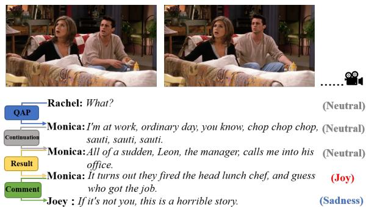
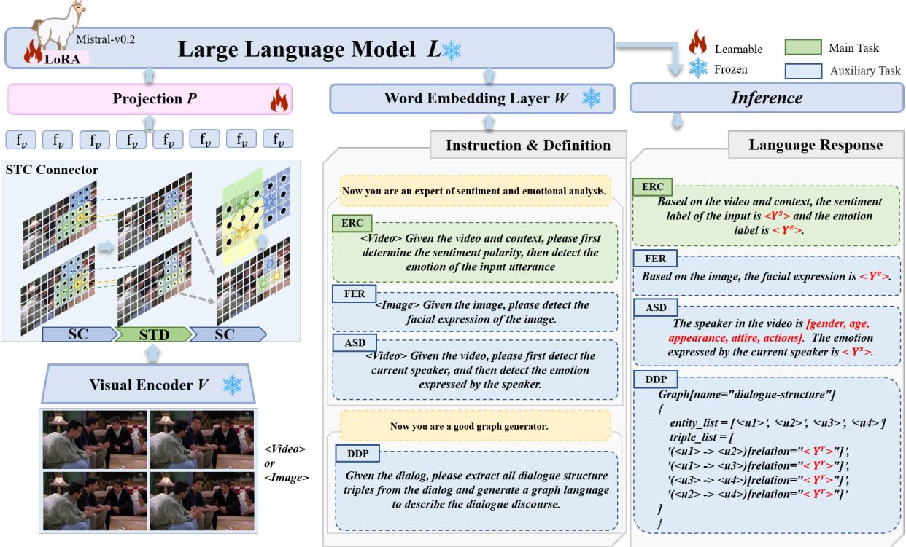
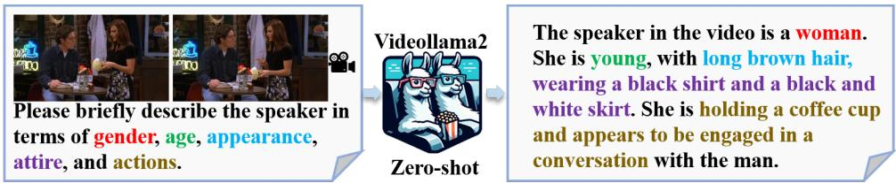
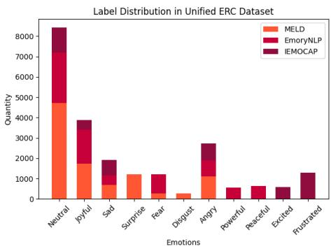
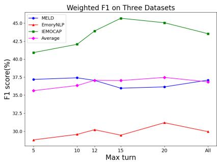
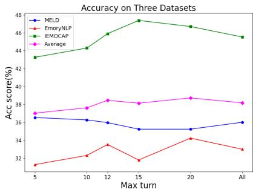
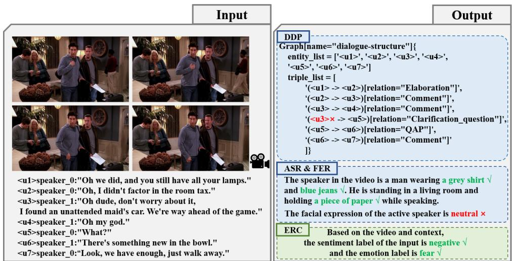
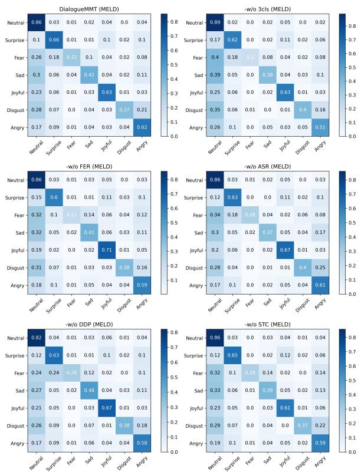

# DialogueMMT: Dialogue Scenes Understanding Enhanced Multi-modal Multi-task Tuning for Emotion Recognition in Conversations

Chenyuan He<sup>1</sup>\*, Senbin Zhu<sup>1</sup>\*, Hongde Liu<sup>1</sup>, Fei Gao<sup>1</sup>, Yuxiang Jia<sup>1†</sup>, Hongying Zan<sup>1</sup>, Min Peng<sup>2</sup>

<sup>1</sup>School of Computer and Artificial Intelligence, Zhengzhou University, China <sup>2</sup>School of Computer Science, Wuhan University, China {hechenyuan\_nlp, nlpbin, lhd\_1013, gaofei0191}@gs.zzu.edu.cn, iehyzan@zzu.edu.cn, pengm@whu.edu.cn Correspondence: ieyxjia@zzu.edu.cn

## Abstract

Emotion recognition in conversations (ERC) has garnered significant attention from the research community. However, due to the complexity of visual scenes and dialogue contextual dependencies in conversations, previous ERC methods fail to handle emotional cues from both visual sources and discourse structures. Furthermore, existing state-ofthe-art ERC models are trained and tested separately on each single ERC dataset, not verifying their effectiveness across multiple datasets simultaneously. To address these challenges, this paper proposes an innovative framework for ERC, called Dialogue Scenes Understanding Enhanced Multi-modal Multi-task Tuning (DialogueMMT). More concretely, a novel video-language connector is applied within the large vision-language model for capturing video features effectively. Additionally, we utilize multi-task instruction tuning with a unified ERC dataset to enhance the model’s understanding of multimodal dialogue scenes and employ a chainof-thought strategy to improve emotion classification performance. Extensive experimental results on three benchmark ERC datasets indicate that the proposed DialogueMMT framework consistently outperforms existing state-of-the-art approaches in terms of overall performance. Our code is available at https://github.com/he2720/DialogueMMT.

## 1 Introduction

Emotion recognition in conversations (ERC) task has become a popular research topic (Poria et al., 2019b) due to its widespread potential in dialogue systems (Ma et al., 2020), opinion mining (Cortis and Davis, 2021), and recommender systems (Zheng et al., 2020).

A substantial amount of work has been proposed to address ERC and achieved significant breakthroughs, however, these efforts still have limitations. Specifically, prior research has focused either on modeling the temporal dependencies of speakers (Shen et al., 2021; Lee and Lee, 2022) and the relationships between utterances (Zhang et al., 2023a; Li et al., 2023a) using only the textual modality, ignoring the important role of visual modality in emotion recognition, or innovating fusion methods (Zhang and Chai, 2021; Hu et al., 2022c) and leveraging facial information (Yang et al., 2021; Shi and Huang, 2023) to aid emotion recognition, while neglecting the contextual dependencies. Moreover, researchers have conducted preliminary studies on multi-task learning for the ERC task, emphasizing the improvement of performance on the main ERC task by adding a single auxiliary task (Li et al., 2020c; Zheng et al., 2023), while neglecting the assistance of other tasks.

  
Figure 1: A conversation from MELD dataset with visual information and discourse dependencies.

Following previous works, we present the following hypotheses: (1) Detecting the active speaker information can help reduce noise caused by the scene (Tao et al., 2021). (2) Performing facial emotion recognition tasks can enhance the model’s perception of visual emotional cues (Shi and Huang, 2023; Zheng et al., 2023). (3) Discourse structure offers a straightforward way to capture the essential information flow in a conversation (Zhang et al.,

2023a; Li et al., 2023a). The motivation of this work is to simultaneously handle different kinds of auxiliary dialogue-related tasks to deliver extra accuracy in the main task ERC. For example, as seen in Figure 1, from Joey’s utterance alone, it is not clear that there is a distinct ’Sadness’ emotion. However, considering the contextual dependencies, Joey is responding to Monica getting the job, expressing a kind of concern. Additionally, from the visual information, Joey has a noticeable frown, while Rachel’s expression shows surprise, which can be considered noise for judging Joey’s emotion. Then the question arises: how can we enable the model to efficiently capture both visual and textual cues simultaneously? Fortunately, recent works have mapped images into text-like tokens, enabling LLMs to emerge with the ability to comprehend images (Alayrac et al., 2022; Liu et al., 2023; Ye et al., 2023; Zhu et al., 2023). Furthermore, Video-LLMs have made strides in enabling interactions between video and language (Lin et al., 2023; Zhang et al., 2023b; Cheng et al., 2024), which provides the foundation for leveraging the excellent capabilities of large models to process visual and textual information to enhance ERC performance.

To address these, we propose a dialogue scenes understanding enhanced multi-modal multi-task tuning framework named DialogueMMT for the ERC task. The DialogueMMT adopts the large vision-language model as the fundamental architecture that connects a vision encoder and an LLM via a visual projector for general purposes and language understanding. Firstly, the pre-trained CLIP visual encoder provides the visual feature of the input image or video frames, then we incorporate the pre-trained Spatial-Temporal Convolution (STC) Connector to capture the intricate spatial and temporal dynamics of visual streams inspired by Cheng et al. (2024). Before feeding into the language model, a trainable projection matrix is applied to convert visual features to language embedding tokens. Finally, the LLM uses the aligned features to generate corresponding responses based on input instructions.

Within the large vision-language model, DialogueMMT undergoes multi-task instruction-based fine-tuning to enhance the understanding of dialogue scenes in visual and textual simultaneously. For visual dialogue scenes, active speaker detection (ASD) (Roth et al., 2020; Michelsanti et al., 2021) and facial expression recognition (FER) (Mollahosseini et al., 2017; Wang et al., 2020) are considered.

For textual dialogue scenes, the DialogueMMT uses dialogue discourse parsing (DDP) (Shi and Huang, 2019; Liu and Chen, 2021) to be aware of discourse structural information by analyzing the discourse dependencies between utterances. In this paper, we unify three ERC datasets to conduct joint fine-tuning, enabling the model to identify dialogue emotions from diverse sources and a simple yet impactful chain-of-thought strategy is added to the instructions. Extensive experimental results confirm the effectiveness of our framework, notably outperforming comparable state-of-the-art methods on the multi-modal dialogue dataset MELD.

The main contributions of this work can be summarized as follows:

• To the best of our knowledge, we are the first to explore multi-modal LLM in the ERC task and the first to tune the model with unified ERC datasets for handling ERC across domains.

• We perform multi-modal multi-task tuning to enhance the understanding of dialogue scenes in visual and textual contexts. In the main task ERC, we employ a chain-of-thought strategy that first classifies sentiment polarity and then detects precise emotion.

• The effectiveness of our method is validated through experiments on three benchmark ERC datasets, demonstrating superior performance compared to most other state-of-the-art methods, and achieving SOTA results on the multi-modal ERC dataset.

## 2 Related Work

## 2.1 Emotion Recognition in Conversations

Unlike other sentiment analysis tasks (Zhou et al., 2019; Hu et al., 2022b; Zhang et al., 2023c), ERC task typically requires consideration of contextual information (Poria et al., 2019b), the speaker states (Li et al., 2020b), as well as the learning of emotion representations (Fu et al., 2023).

Recurrence-based Models generally utilize sequential information in a dialogue to capture contextual features at different levels. Hazarika et al. (2018) use gated recurrent units (GRUs) to capture contextual features, named ICON. Majumder et al. (2018) propose DialogueRNN which uses GRUs to capture speaker, context, and emotion features. Ma et al. (2021) design a Multi-View Network (MVN) to model emotion representations of queries from both word and utterance level views.

Graph-based Models use GCNs to model the relation between utterances and speakers or fuse external knowledge. Zhang et al. (2019) introduce a GCN model named ConGCN to leverage both context- and speaker-sensitive dependencies. Ghosal et al. (2019) design a DialogueGCN model to learn the intra- and inter-speaker dependencies. Shen et al. (2021) propose a Directed Acyclic Neutral Network (DAG-ERC) to capture complex interactions in a conversation. Zhang et al. (2023a) introduce Dual Graph ATtention networks (Dual-GATs) to concurrently consider the complementary aspects of discourse structure and speaker-aware context.

Transformer-based Models usually exploit general knowledge in pre-trained language models. Zhong et al. (2019) design a Knowledge-Enriched Transformer (KET) that uses a context-aware effective graph attention mechanism to leverage commonsense knowledge. Li et al. (2020b) introduce a transformer-based context-sensitive model named HiTrans based on two hierarchical transformers. Li et al. (2022) utilize an end-to-end model called EmoCaps to extract emotional tendencies from multi-modal features.

Multimodal-based Models use multi-modal fusion to model different modals including textual, visual, and speech. Hu et al. (2021c) propose a Multimodal Fused Graph Convolutional Network (MMGCN) that leverages both multimodal information and long-distance contexts. Hu et al. (2022c) design a unified framework named UniMSE, which injects acoustic and visual signals into the T5 model to fuse multi-modal representations. Shi and Huang (2023) propose an attentionbased correlation-aware multi-modal fusion framework named MultiEMO that effectively integrates multi-modal cues.

## 2.2 ERC with Multi-task Learning

It has been confirmed that the benefit of using auxiliary tasks can be substantial (Caruana, 1997) and the existing literature provides many ideas for the auxiliary task selection. In the field of sentiment analysis, multi-task learning has been successfully applied (Yu and Jiang, 2016), and more recently, an increasing number of works have begun to apply multitask learning to the ERC task.

Li et al. (2020c) use speaker identification as an auxiliary task to capture speaker-specific features. Xie et al. (2021) leverage both commonsense knowledge and sentiment lexicon to augment semantic information. Gao et al. (2022) exploit Emotion Shift Detection (ESD) as an auxiliary task to assist in completing ERC. Zheng et al. (2023) leverages an auxiliary frame-level facial expression recognition task to obtain the emotion-aware visual representation.

## 2.3 Large Vision-Language Models

Large Language Models (LLMs) have made great progress in recent years, and visual instruction tuning (Liu et al., 2023) has been proposed to extend LLMs into Multimodal LLMs to perceive and understand visual signals.

Ye et al. (2023) introduce a visual knowledge module and a visual abstractor module to equip LLMs with multi-modal abilities. Zhu et al. (2023) present MiniGPT-4 aligned a frozen visual encoder with a frozen advanced LLM, using one projection layer. Lin et al. (2023) establish Video-LLaVA, utilizing a LanguageBind encoder to pre-bind visual signals into the language feature space. Cheng et al. (2024) design VideoLLaMA2, which is built upon its predecessor, incorporating a tailor-made Spatial-Temporal Convolution connector for modeling video data effectively.

## 3 Methodology

## 3.1 Problem Definition

Given a multi-turn corpus $\mathbb { D } = \{ d _ { 1 } , d _ { 2 } , . . . , d _ { | \mathbb { D } | } \}$ d is represented as a sequence of utterances $( u _ { i } , s _ { i } ) | i = 1 , . . . , N$ , where each utterance $u _ { i }$ is spoken by speaker $s _ { i }$ , and N denotes the total number of utterances. ERC aims to identify emotion labels $Y = y _ { 1 } , y _ { 2 } , . . . , y _ { N } | y _ { i } \in \mathbb { Y }$ for d where Y represents the set of possible emotion labels. Note that emotion labels are defined by an employed dataset and each utterance is annotated with one speaker’s identity.

## 3.2 Framework Overview

The overall framework of DialogueMMT is illustrated in Figure 2. Generally, the proposed framework initially obtains visual features from the raw visual signal (i.e., image or video) using a pretrained CLIP visual encoder V, which is capable of mapping different modalities into the textual feature space. After that, the visual features are processed via the pre-trained spatial-temporal convolution (STC) connector. Subsequently, the unified visual representation is projected by a shared projection layer P and then combined with tokenized textual queries and fed into a large language model L to produce a response autoregressively. In the stage of tuning, DialogueMMT undergoes multi-task instruction-based low-rank adaptation fine-tuning, including the main task ERC and three auxiliary tasks that aim to enhance the understanding of the dialogue scenes.

  
Figure 2: The overview of DialogueMMT framework.

## 3.3 Visual Feature Extraction and Interaction

Aligned Visual Representation For the visual modality, the goal of the framework is to project image or video frame representations into the same dimension as the text embeddings enabling the large language model to perceive and understand visual signals. For a given video, DialogueMMT extracts a fixed number of frames, and then each frame goes through padding and resizing to a standardized 336x336 dimension. The image or video frames $X _ { V }$ are first encoded into features via the CLIP (Radosavovic et al., 2020) visual encoder V, which provides the visual representations $H _ { V } = V ( X _ { V } )$ Following Cheng et al. (2024), DialogueMMT applies the pre-trained STC connector, which has two spatial interaction modules and one spatialtemporal aggregation module, for spatial-temporal representation learning. The STC connector considers the operations of convolution or pooling to maintain the spatial-temporal order in the output visual tokens. In the spatial-temporal aggregation module, a 3D downsample operator is used to compress spatial-temporal tokens. To complement the information loss caused by the spatial-temporal downsampling, a strong convolution block (Radosavovic et al., 2020) is inserted before and after spatial-temporal downsampling. The final visual feature can be formed as below:

$$
f _ { V } = S T C ( H _ { V } ) , H _ { V } = V ( X _ { V } )\tag{1}
$$

Finally, a trainable projection matrix $W$ is applied to transform $f _ { V }$ into visual query vectors $Z _ { V }$ , which have the same dimension as the word embedding space in the large language model.

Modal Interaction In the forward pass, the visual query vectors will be concatenated to text embedding as the visual soft prompt and guide the LLM to generate text conditioned on visual content. Formally, given a textual input $X _ { T }$ and visual signals $X _ { V }$ , the visual input signals are encoded into a sequence of tokens according to equation 2. The concrete textual and visual instruction-following data will be introduced in Section 3.4. In the finetuning phase, the large language model predicts the response $Y = \{ w _ { i } \} _ { i = 1 } ^ { L }$ conditioned on the multimodal input by maximizing the likelihood probability in equation 3, the model ultimately achieves multi-modal dialogue scenes understanding capabilities.

  
Figure 3: The prompt and an example result for obtaining active speaker attributes in a video.

$$
Z _ { V } = W \cdot f _ { V } , Z _ { T } = T ( X _ { T } )\tag{2}
$$

$$
P ( Y | X _ { V } , X _ { T } ) = \prod _ { i = 1 } ^ { L } p _ { \theta } ( w _ { i } | X _ { V } , X _ { T } , w < i )\tag{3}
$$

where L is the length of the generated sequence, and θ is a trainable parameter.

## 3.4 Multi-modal Multi-task Tuning

DialogueMMT experiences multi-task instructionbased fine-tuning, serving a dual purpose: firstly, fine-tuning on dialogue-related tasks enhances the model’s multi-modal understanding of dialogue scenes to improve the performance of detecting dialogue emotion. Secondly, it activates and harnesses the general capabilities of DialogueMMT across various tasks, demonstrating its versatility and adaptability in handling diverse dialoguerelated problems.

Main Task For the main task ERC, the first challenge is how to construct the conversational part in the instruction-following data. It is widely recognized that an excessively long context length consumes a large amount of computational resources and would lead to poorer model performance (Li et al., 2023b). Take the IEMOCAP dataset (Busso et al., 2008) as an example, the average number of turns reached 49, which would result in very lengthy instruction content. In addition, some context is redundant and LLMs can detect the correct emotion even when these redundancies are deleted. Therefore, when constructing the conversational part of the instruction, we set a maximum number of historical dialogue turns, taking the previous m utterances before the target input. This can be formally represented as:

$$
b e g i n = M a x ( c u r \_ t u r n - m , 0 ) ,\tag{4}
$$

where begin denotes the starting index of the given dialog, cur\_turn represents the index of the input utterance, and m is the maximum number of historical dialogue turns. The detailed experiments of m will be explained in the Appendix A. Besides, an index identifier $< u _ { i } >$ is added before each utterance to represent its position in the dialogue, and it also serves as an entity in the DDP task. Finally, the input dialog in instruction is formed as (e.g., m=5):

```markdown
### context :
<u2>speaker1 : "Oh, I know . "
<u3>speaker2 : " I kinda fe e l l i k e i t ’ s
my f a u l t . "
<u4>speaker3 : "Kind of? I f you j u s t kept
t h i s to y o u r s e l f none of t h i s would ’ ve
happened . "
<u5>speaker2 : " Well , I ’m keeping so many
t h i n g s t o myself t h e s e days , something
was bound to s l i p out ! "
<u6>s p e a ke r 3 : " Well , I t h i n k i t ’ s very
brave what you s a i d . "
### input :
<u7>speaker1 : " All r i g h t , I can ’ t s i t
here anymore . I have to walk p l a c e s . "
```

Secondly, we adopt a simple chain-of-thought (CoT) (Wei et al., 2022) strategy, where the DialogueMMT avoids directly detecting specific emotions but instead first determines the sentiment polarity, and then based on the sentiment polarity, the model categorizes the specific emotion. This strategy aims to reduce the number of classification categories and improve the model’s performance in specific emotion classification. Eventually, to enable the model to detect emotions in conversations from multiple data sources simultaneously, we combine the training sets of the three ERC datasets into a unified dataset, while mapping semantically similar emotions to a single emotion. For example, ’Joy’ ’Happy’, and ’Joyful’ are mapped to ’Joyful’; ’Anger’, ’Angry’, and ’Mad’ are mapped to ’Angry’. Visual Dialogue Scenes Tasks As shown in Figure 1 and 2, in environmental scenes, there are often other individuals besides the speaker, and these individuals may influence the judgment of the current utterance’s emotion. To mitigate this issue, the model is required to identify the active speaker in the current dialogue scene. Consequently, we construct active speaker recognition data on the MELD dataset (Poria et al., 2019a) which provides raw video data to perform active speaker detection (ASD) task. Specifically, we leverage the existing multi-modal visual large model VideoLLaMA2 (Cheng et al., 2024) as the strong teacher, to create instruction-following data involving the gender, age, appearance, attire, and actions of the active speaker as shown in Figure 3. Building on the identification of active speakers, we aim for making emotional judgments based on visual information, and therefore, the model is also prompted to determine the emotion expressed by the current speaker based on visual information. Furthermore, we integrate the facial expression recognition (FER) task with an additional facial expression library to enhance the perception of facial expressions to help utterance-level emotion recognition.

Textual Dialogue Scenes Task Inspired by recent research (Zhang et al., 2023a; Li et al., 2023a) that applies conversational discourse structure to ERC, we regard the dialogue discourse parsing (DDP) task as assisting in the textual understanding of conversation context. For DDP task, we follow Wang et al. (2024) by using graph instruction tuning to bolster the ability of DialogueMMT to understand dialogue structure. Specially, for target dialogue discourse, a structured format verbalizing strategy is used to transform the graph into a simple code-like format. For the fundamental format, all entities (i.e., utterance indexes) are listed as a sequence with variable entity\_list, while all triples (i.e., relations) are listed as a sequence with variable triple\_list. The 16 discourse dependency types described in Asher et al. (2016) are utilized.

## 4 Experimental Settings

To verify the effectiveness of the proposed DialogueMMT, three public ERC datasets are utilized for benchmarking. The specifics of the datasets are outlined in Table 1. In addition, the details regarding the auxiliary task datasets, evaluation metrics, and experimental results will be included in the Appendix C.

## 4.1 Datasets

MELD (Poria et al., 2019a) dataset derives from the TV series Friends, including multi-person conversations among nine main characters. Each utterance has an annotated emotion label including Neutral, Joy, Surprise, Sadness, Anger, Disgust,

and Fear.

EmoryNLP (Zahiri and Choi, 2017) is also sourced from the TV series Friends. Different from MELD, its emotion labels are not provided but utterances can be categorized into seven distinguishable classes including Neutral, Joyful, Peaceful, Powerful, Scared, Mad, and Sad.

IEMOCAP (Busso et al., 2008) contains approximately 12 hours of videos of dyadic conversations from actors’ performances, either improvisations or scripted scenes, which are segmented into 151 dialogues. There are 6 emotion labels including Happy, Sad, Angry, Frustrated, Excited, and Neutral.

<table><tr><td rowspan="2">Datasets</td><td colspan="3">Conversations</td><td colspan="3">Utterances</td><td rowspan="2">Labels</td><td rowspan="2">Avg. Turns</td></tr><tr><td>Train</td><td>Val</td><td>Test</td><td>Train</td><td>Val</td><td>Test</td></tr><tr><td>MELD</td><td>1038</td><td>114</td><td>280</td><td>9989</td><td>1109</td><td>2610</td><td>7/3</td><td>10</td></tr><tr><td>EmoryNLP</td><td>659</td><td>89</td><td>79</td><td>7551</td><td>954</td><td>984</td><td>7/3</td><td>12</td></tr><tr><td>IEMOCAP</td><td>108</td><td>12</td><td>31</td><td>5163</td><td>647</td><td>1623</td><td>6/3</td><td>49</td></tr></table>

Table 1: The statistical information of three ERC datasets.

## 4.2 Baselines

The baselines we will use are divided into the following four categories based on different model structures:

Recurrence-based: BC-LSTM (Poria et al., 2017), DialogueRNN (Majumder et al., 2018), Dialogue-CRN (Hu et al., 2021a), SACL-LSTM (Hu et al., 2023).

Graph-based: DialogueGCN (Ghosal et al., 2019), DAG-ERC (Shen et al., 2021), SKIER (Li et al., 2023a), DualGATs (Zhang et al., 2023a).

Transformer-based: DialogueXL (Shen et al., 2020), TODKAT (Zhu et al., 2021), CoG-BART (Li et al., 2021), SPCL+CL (Song et al., 2022).

Multimodal-based: MM-DFN (Hu et al., 2022a), UniMSE (Hu et al., 2022c), MultiEMO (Shi and Huang, 2023), FacialMMT (Zheng et al., 2023).

## 4.3 Evaluation Metrics

For ERC task, following previous works (Hu et al., 2021a, 2023), the accuracy and weighted-F1 score are reported to measure the overall performance. Also, the F1 score per class and macro-F1 score are reported to evaluate the fine-grained performance.

<table><tr><td rowspan="2">Models</td><td colspan="2">MELD</td><td colspan="2">EmoryNLP</td><td colspan="2">IEMOCAP</td><td colspan="2">Avg.</td></tr><tr><td>Acc</td><td>w-F1</td><td>Acc</td><td>w-F1</td><td>Acc</td><td>w-F1</td><td>Acc</td><td>w-F1</td></tr><tr><td>Recurrence-based</td><td></td><td></td><td></td><td></td><td></td><td></td><td></td><td></td></tr><tr><td>BC-LSTM† (Poria et al., 2017)</td><td>65.87</td><td>64.87</td><td>40.85</td><td>36.84</td><td>63.08</td><td>62.84</td><td>56.60</td><td>54.85</td></tr><tr><td>DialogueRNN† (Majumder et al., 2018)</td><td>65.96</td><td>65.30</td><td>43.66</td><td>37.54</td><td>64.85</td><td>64.65</td><td>58.16</td><td>55.83</td></tr><tr><td>DialogueCRN† (Hu et al., 2021a)</td><td>66.93</td><td>65.77</td><td>41.04</td><td>38.79</td><td>67.39</td><td>67.53</td><td>58.45</td><td>57.36</td></tr><tr><td>SACL-LSTM (Hu et al., 2023)</td><td>67.51</td><td>66.45</td><td>42.21</td><td>39.65</td><td>69.08</td><td>69.22</td><td>59.60</td><td>58.44</td></tr><tr><td>Graph-based</td><td></td><td></td><td></td><td></td><td></td><td></td><td></td><td></td></tr><tr><td>DialogueGCN† (Ghosal et al., 2019)</td><td>63.62</td><td>62.68</td><td>36.87</td><td>34.63</td><td>62.49</td><td>62.11</td><td>54.33</td><td>53.14</td></tr><tr><td>DAG-ERC (Shen et al., 2021)</td><td>63.75</td><td>63.36</td><td>39.64</td><td>38.29</td><td>66.54</td><td>66.53</td><td>56.64</td><td>56.06</td></tr><tr><td>SKIER▲ (Li et al., 2023a)</td><td></td><td>67.39</td><td></td><td>40.07</td><td></td><td></td><td></td><td></td></tr><tr><td>DualGATs▲ (Zhang et al., 2023a)</td><td></td><td>66.90</td><td></td><td>40.69</td><td></td><td>67.68</td><td></td><td>58.42</td></tr><tr><td>Transformer-based</td><td></td><td></td><td></td><td></td><td></td><td></td><td></td><td></td></tr><tr><td>DialogXL (Poria et al., 2017)</td><td></td><td>62.41</td><td></td><td>34.73</td><td></td><td>65.94</td><td></td><td>54.36</td></tr><tr><td>TODKAT▲ (Zhu et al., 2021)</td><td>67.24</td><td>65.47</td><td>42.38</td><td>38.69</td><td>61.11</td><td>61.33</td><td>56.91</td><td>55.16</td></tr><tr><td>CoG-BART† (Li et al., 2021)</td><td>64.95</td><td>63.82</td><td>40.97</td><td>37.33</td><td>65.02</td><td>64.87</td><td>56.97</td><td>55.34</td></tr><tr><td>SPCL+CL† (Song et al., 2022)</td><td>64.36</td><td>64.93</td><td>40.32</td><td>39.45</td><td>66.71</td><td>66.93</td><td>57.13</td><td>57.10</td></tr><tr><td>Multimodal-based</td><td></td><td></td><td></td><td></td><td></td><td></td><td></td><td></td></tr><tr><td>MM-DFN (Hu et al., 2022a)</td><td>62.49</td><td>59.46</td><td></td><td></td><td>68.24</td><td>68.18</td><td></td><td></td></tr><tr><td>UniMSE (Hu et al., 2022c)</td><td>65.09</td><td>65.51</td><td></td><td></td><td>70.56</td><td>70.66</td><td></td><td></td></tr><tr><td>MultiEMO (Shi and Huang, 2023)</td><td></td><td>66.74</td><td></td><td></td><td></td><td>72.84</td><td></td><td></td></tr><tr><td>FacialMMT‡ (Zheng et al., 2023)</td><td></td><td>66.58</td><td></td><td></td><td></td><td></td><td></td><td></td></tr><tr><td>DialogueMMT (Ours)</td><td>71.19</td><td>70.66</td><td>45.02</td><td>40.36</td><td>72.58</td><td>72.71</td><td>62.93</td><td>61.24</td></tr></table>

Table 2: The overall performance (%) of all the compared baselines and our DialogueMMT on three ERC datasets. The best results are highlighted in bold. ’-’ means that the results are unavailable from the original paper. We refer to the results from Hu et al. (2023) with the marker †. The underline refers to the second-best performance. The ▲ refers to the model using the external knowledge or dialogue structure. The $^ \ddag$ refers to the model using multi-task learning.

(a) MELD
<table><tr><td>Models</td><td>Neu.</td><td>Sur.</td><td>Fea.</td><td>Sad.</td><td>Joy.</td><td>Dis.</td><td>Ang.</td><td>Avg.</td></tr><tr><td>DialogueCRN</td><td>79.72</td><td>57.62</td><td>18.26</td><td>39.30</td><td>64.56</td><td>32.07</td><td>52.53</td><td>49.15</td></tr><tr><td>SACL-LSTM</td><td>80.17</td><td>58.77</td><td>26.23</td><td>41.34</td><td>64.98</td><td>31.47</td><td>52.35</td><td>50.76</td></tr><tr><td>Ours</td><td>82.55</td><td>63.59</td><td>33.68</td><td>49.02</td><td>66.75</td><td>38.76</td><td>62.39</td><td>56.68</td></tr><tr><td>Improve</td><td>↑2.38</td><td>↑4.82</td><td>↑7.45</td><td>↑7.68</td><td>↑1.77</td><td>↑6.69</td><td>↑9.86</td><td>↑5.92</td></tr></table>

(b) EmoryNLP
<table><tr><td>Models</td><td>Joy.</td><td>Ang.</td><td>Pea.</td><td>Neu.</td><td>Sad.</td><td>Pow.</td><td>Fea.</td><td>Avg.</td></tr><tr><td>DialogueCRN</td><td>54.42</td><td>36.44</td><td>10.18</td><td>53.83</td><td>25.74</td><td>4.55</td><td>37.49</td><td>31.81</td></tr><tr><td>SACL-LSTM</td><td>54.78</td><td>37.68</td><td>11.66</td><td>55.42</td><td>25.83</td><td>5.43</td><td>37.11</td><td>32.56</td></tr><tr><td>Ours</td><td>56.17</td><td>43.62</td><td>4.80</td><td>55.41</td><td>33.90</td><td>6.84</td><td>36.70</td><td>33.92</td></tr><tr><td>Improve</td><td>↑1.39</td><td>↑5.94</td><td>↓ 6.86</td><td>↓ 0.01</td><td>↑8.07</td><td>↑1.41</td><td>↓0.79</td><td>↑1.36</td></tr></table>

(c) IEMOCAP
<table><tr><td>Models</td><td>Joy.</td><td>Sad.</td><td>Neu.</td><td>Ang.</td><td>Exc.</td><td>Fru.</td><td>Avg.</td></tr><tr><td>DialogueCRN</td><td>54.28</td><td>81.34</td><td>69.57</td><td>62.09</td><td>67.33</td><td>64.22</td><td>66.47</td></tr><tr><td>SACL-LSTM</td><td>56.91</td><td>84.78</td><td>70.00</td><td>64.09</td><td>69.70</td><td>65.02</td><td>68.42</td></tr><tr><td>Ours</td><td>64.10</td><td>83.51</td><td>71.37</td><td>68.70</td><td>72.20</td><td>69.99</td><td>71.65</td></tr><tr><td>Improve</td><td>↑7.19</td><td>↓1.27</td><td>↑1.37</td><td>↑4.61</td><td>↑2.50</td><td>↑4.97</td><td>↑3.23</td></tr></table>

Table 3: Fine-grained results (%) of DialogueMMT and compared methods for all emotion categories. Bold font denotes the best performance.

## 4.4 Implementation Details

DialogueMMT uses Mistral-7B-Instruct<sup>1</sup> as the backbone model and CLIP ViT-L/14 with 336 resolutions<sup>2</sup> as the visual encoder. To accelerate the training, we utilize FlashAttention (Dao et al., 2022) and BFloat16 techniques, leveraging lowrank adaptation (LoRA) (Hu et al., 2021b) to perform parameter-efficient learning with rank = 128 and lora $\alpha \ : = \ : 2 5 6$ The optimizer is AdamW (Loshchilov and Hutter, 2017) in all stages with initial learning rates of 2e-5. The frames of the input video is 8 and the max context of the dialog is 20. The maximum length is set as 2048. For the auxiliary tasks and the ERC task, the global batch size is set to 16. The DialogueMMT is trained on 2 × 48G Nvidia A40 GPUs.

## 5 Results and Analysis

## 5.1 Comparison with Baseline Models

The overall performance of all the compared baselines and DialogueMMT on the three ERC datasets is reported in Table 2.

It shows that the proposed DialogueMMT obtains the best accuracy score and weighted-F1 score on MELD over comparison methods and exceeds most methods on EmoryNLP and IEMO-CAP. Specifically, DialogueMMT outperforms the strongest baseline (i.e., SACL\_LSTM) by 3.33% and 2.80% on accuracy score and w-F1 score across three datasets. Particularly, DialogueMMT achieves an absolute improvement of 3.68% in terms of the accuracy score and a 3.27% absolute improvement in the average weighted-F1 score over other state-of-the-art methods on MELD. Although compared to DualGATs on EmoryNLP and MultiEMO on IEMOCAP, the weighted-F1 score decreases by 0.33% and 0.13% respectively, there is a significant improvement on the other two datasets.

<table><tr><td rowspan="2">Modality</td><td colspan="2">3-cls</td><td colspan="2">7-cls</td></tr><tr><td>Acc</td><td>w-F1</td><td>Acc</td><td>w-F1</td></tr><tr><td>Visual</td><td>53.22</td><td>48.25</td><td>49.16</td><td>39.83</td></tr><tr><td>Text</td><td>72.34</td><td>72.61</td><td>65.06</td><td>64.74</td></tr><tr><td>Visual &amp; Text</td><td>77.43</td><td>77.30</td><td>71.19</td><td>70.66</td></tr></table>

Table 4: Experimental results (%) of sentiment (3-cls) and emotion (7-cls) classification of DialogueMMT with different modality settings on MELD. Here, ’Visual’ refers to the results of emotion recognition in the active speaker detection task.

## 5.2 Fine-grained Results

The fine-grained results on the three datasets are reported in Table 3 to validate the effectiveness of the proposed model in minority and semantically similar emotions.

Notably, DialogueMMT obtains 5.92%, 1.36%, and 3.23% absolute improvements in terms of the macro-F1 on MELD, EmoryNLP, and IEMO-CAP respectively. Specifically, on MELD, DialogueMMT surpasses SACL\_LSTM by 7.45% in minority emotion Fear and outperforms in semantically-similar emotions pairs Anger and Disgust by 9.86% and 6.69% respectively. On EmoryNLP, DialogueMMT surpasses SACL\_LSTM by 8.07% and 1.41% weighted-F1 in the minority classes Sad and Powerful respectively. On IEMOCAP, DialogueMMT outperforms the SACL-LSTM in semantically similar emotion pairs Joyful and Excited by 7.19% and 2.50%.

<table><tr><td rowspan="2">Dataset</td><td colspan="2">3-cls</td><td colspan="2">7(6)-cls</td><td rowspan="2">Merge</td></tr><tr><td>Acc</td><td>w-F1</td><td>Acc</td><td>w-F1</td></tr><tr><td>MELD</td><td>77.43</td><td>77.30</td><td>71.19</td><td>70.66</td><td>69.58</td></tr><tr><td>EmoryNLP</td><td>58.44</td><td>58.72</td><td>45.02</td><td>40.36</td><td>45.02</td></tr><tr><td>IEMOCAP</td><td>84.84</td><td>84.93</td><td>72.58</td><td>72.71</td><td>72.58</td></tr></table>

Table 5: Experimental results (%) of sentiment (3-cls) and emotion (7(6)-cls) classification of ERC. ’Merge refers to the accuracy of correctly determining both the sentiment and the emotion.

## 5.3 Modality Settings and Categories

Modalities: The comparison of DialogueMMT with modality settings on MELD is drawn in Table 4. From Table 3 we can see that the textual modality of utterances plays a major role in ERC, while the complementary cues from visual modality can bring considerable improvements over the text-based DialogueMMT.

  
Figure 4: The emotion distribution of the unified dataset.

Categories: The results of DialogueMMT on sentiment analysis and emotion detection on three datasets are illustrated in Table 5. It can be observed that the merge scores on IEMOCAP and EmoryNLP are consistent with the emotion classification accuracy. In contrast, unlike the other two datasets where each emotion is expressed with a single sentiment polarity, MELD includes two distinct polarities of Surprise. According to our statistics, for the 281 utterances in the test set labeled as Surprise, 144 are correctly identified in terms of both sentiment and emotion, 38 are entirely misclassified, 42 have the wrong sentiment polarity but the correct emotion and 57 have the correct emotional polarity but the wrong emotion.

## 5.4 Cross Domain Evaluation

To demonstrate the cross-domain capability of our model, we conduct experiments involving finetuning on single datasets and testing on three datasets. The specific details are provided in the Appendix B.

## 5.5 Ablation Study

In this section, we conduct ablation studies to investigate the effects of critical modules in our DialogueMMT, shown in Table 7.

Impact of STC: To study the effect of the STC connector, we implement DialogueMMT $w / o$ <sub>STC</sub>, replacing the adopted STC connector with a simple linear layer. Experimental results show that the performances of DialogueMMT $\dot { \boldsymbol { w } } / o$ <sub>STC</sub> decrease on both MELD and EmoryNLP, with a slight improvement on IEMOCAP. Since MELD is the only dataset containing video information, the results on MELD validate the effectiveness of the STC connector module.

<table><tr><td rowspan=1 colspan=1>Case ID</td><td rowspan=1 colspan=1>Target Utterances</td><td rowspan=1 colspan=1>Golden</td><td rowspan=1 colspan=1>Prediction</td></tr><tr><td rowspan=1 colspan=1>1</td><td rowspan=1 colspan=1>For God&#x27;s sake, mom, three years.Nobody comes back after three years! It&#x27;s insane!</td><td rowspan=1 colspan=1>Negative, Angry</td><td rowspan=1 colspan=1>Negative√, Frustratedx</td></tr><tr><td rowspan=1 colspan=1>2</td><td rowspan=1 colspan=1>So when do you imagine you gave them to me?In the morning or in the afternoon?</td><td rowspan=1 colspan=1>Negative, Angry</td><td rowspan=1 colspan=1>NeutralX, Neutralx</td></tr><tr><td rowspan=1 colspan=1>3</td><td rowspan=1 colspan=1>Wow!A lipper from Chipper.</td><td rowspan=1 colspan=1>Positive, Peaceful</td><td rowspan=1 colspan=1>Positive√, Joyfulx</td></tr></table>

Table 6: Examples of utterances from the IEMOCAP, MELD, and EmoryNLP datasets for the error analysis.

Impact of Auxiliary Tasks: To analyze the impact of each auxiliary task, we implement $\mathrm { D i a l o g u e M M T } _ { w / o A u x } .$ where $A u x \in$ [FER, ASD, DDP]. From the experimental results, we observe that removing any auxiliary task results in lower performance in overall performance. Additionally, when removing the DDP task, which aims to enhance text-level dialogue scenes understanding, resulted in the lowest performance. This can be explained by the fact that all datasets used dialogue information, whereas MELD contained video information, and therefore, for datasets that contain only textual information, FER and ASD tasks do not always work.

Impact of CoT: To study the contribution of the chain-of-thought strategy, we implement $\mathrm { D i a l o g u e M M T } _ { w / o C o T }$ by removing the first step of determning sentiment polarity. Experimental results demonstrate that the performances of $\mathrm { D i a l o g u e M M T } _ { w / o C o T }$ drop the most considerably among all modules, highlighting the crucial importance of determining sentiment polarity first.

<table><tr><td>Component</td><td>MELD</td><td>EmoryNLP</td><td>IEMOCAP</td><td>Avg.</td></tr><tr><td>DialogueMMT</td><td>70.66</td><td>40.36</td><td>72.71</td><td>61.24</td></tr><tr><td>- w/o STC</td><td>69.39</td><td>38.60</td><td>72.79</td><td>60.26</td></tr><tr><td>- w/o FER</td><td>69.76</td><td>39.01</td><td>72.32</td><td>60.36</td></tr><tr><td>- w/o ASD</td><td>70.35</td><td>38.54</td><td>72.74</td><td>60.54</td></tr><tr><td>- w/o DDP</td><td>69.54</td><td>38.33</td><td>72.44</td><td>60.10</td></tr><tr><td>- w/o CoT</td><td>69.13</td><td>35.56</td><td>69.84</td><td>58.18</td></tr></table>

Table 7: Experimental results (%) of ablation study.

## 5.6 Error Analysis

Table 6 shows three utterances sampled from the IEMOCAP, MELD, and EmoryNLP datasets with their golden labels and prediction from DialogueMMT.

First, The unbalanced distribution of classes is the primary cause of errors. It is clear from Figure 4 that Neutral sentiment comprises the largest proportion of all sentiments accounting for 37.07%, which leads to the proposed DialogueMMT tends to misclassify utterances of other emotions to Neutral. Case #1 illustrates this situation, where the model incorrectly identifies Angry as Neutral. Although the DialogueMMT framework improves the misclassification of similar emotions compared to previous methods, the test results indicate that misclassifications of similar emotions still exist. As shown in Case #2, the model correctly identified the sentiment polarity but incorrectly classified Angry as Frustrated. Case #3 comes from the EmoryNLP dataset, the model classified the emotion of the utterance as Joyful rather than Peaceful, which are semantically similar emotion pairs. This is partly due to the fact that Peaceful has a much smaller proportion in the combined dataset compared to Joyful. The case study and the supplement for error analysis will be shown in the Appendix C.3.

## 6 Conclusion

In this paper, we propose a novel framework for the task of ERC, named DialogueMMT, in which the large vision-language model with a video-language connector is employed for effectively capturing visual and textual emotion cues. Additionally, we utilize the multi-task instruction tuning to enhance the understanding of multi-modal dialogue scenes. Extensive experimental results on three benchmark ERC datasets demonstrate the effectiveness and superiority of the proposed DialogueMMT.

## 7 Limitations

Although the DialogueMMT performs satisfactorily in ERC, it still has the following limitations. Firstly, this work focuses on the textual and visual modalities and has not yet delved into audio modality. Secondly, the auxiliary tasks directly affect the accuracy of the main task, which requires the performance of discourse parsing and detecting emotion in visual signals to be more accurate. Thirdly, the unified ERC dataset results in some emotions having a smaller proportion, which leads to poorer performance in classifying those categories.

## Ethics Statement

There are no ethics-related issues in this paper. We conduct all experiments based on publicly available datasets which do not involve any personal information or sensitive content.

## Acknowledgments

The authors thank the anonymous reviewers for their insightful comments. This work is mainly supported by the Key Program of the Natural Science Foundation of China (NSFC) (No.U23A20316), the Key R&D Project of Hubei Province (No.2021BAA029), the Key Research and Development Program of Henan Province (No.241111212700) and the Key Lab of Information Network Security, Ministry of Public Security (No.C23600-04).

## References

Jean-Baptiste Alayrac, Jeff Donahue, Pauline Luc, Antoine Miech, Iain Barr, Yana Hasson, Karel Lenc, Arthur Mensch, Katie Millican, Malcolm Reynolds, Roman Ring, Eliza Rutherford, Serkan Cabi, Tengda Han, Zhitao Gong, Sina Samangooei, Marianne Monteiro, Jacob Menick, Sebastian Borgeaud, Andy Brock, Aida Nematzadeh, Sahand Sharifzadeh, Mikolaj Binkowski, Ricardo Barreira, Oriol Vinyals, Andrew Zisserman, and Karen Simonyan. 2022. Flamingo: a visual language model for few-shot learning. ArXiv, abs/2204.14198.

Nicholas Asher, Julie Hunter, Mathieu Morey, Benamara Farah, and Stergos Afantenos. 2016. Discourse structure and dialogue acts in multiparty dialogue: the STAC corpus. In Proceedings of the Tenth International Conference on Language Resources and Evaluation (LREC’16), pages 2721–2727, Portorož, Slovenia. European Language Resources Association (ELRA).

Carlos Busso, Murtaza Bulut, Chi-Chun Lee, Ebrahim (Abe) Kazemzadeh, Emily Mower Provost, Samuel Kim, Jeannette N. Chang, Sungbok Lee, and Shrikanth S. Narayanan. 2008. Iemocap: interactive emotional dyadic motion capture database. Language Resources and Evaluation, 42:335–359.

Rich Caruana. 1997. Multitask learning. Machine Learning, 28(1):41 – 75. Cited by: 5170; All Open Access, Bronze Open Access.

Zesen Cheng, Sicong Leng, Hang Zhang, Yifei Xin, Xin Li, Guanzheng Chen, Yongxin Zhu, Wenqi Zhang, Ziyang Luo, Deli Zhao, and Lidong Bing. 2024.

Videollama 2: Advancing spatial-temporal modeling and audio understanding in video-llms. arXiv preprint arXiv:2406.07476.

Keith Cortis and Brian Davis. 2021. Over a decade of social opinion mining: a systematic review. Artificial Intelligence Review, 54.

Tri Dao, Daniel Y. Fu, Stefano Ermon, Atri Rudra, and Christopher R’e. 2022. Flashattention: Fast and memory-efficient exact attention with io-awareness. ArXiv, abs/2205.14135.

Yao Fu, Shaoyang Yuan, Chi Zhang, and Juan Cao. 2023. Emotion recognition in conversations: A survey focusing on context, speaker dependencies, and fusion methods. Electronics, 12(22).

Qingqing Gao, Biwei Cao, Xin Guan, Tianyun Gu, Xing Bao, Junyan Wu, Bo Liu, and Jiuxin Cao. 2022. Emotion recognition in conversations with emotion shift detection based on multi-task learning. Knowledge-Based Systems, 248:108861.

Deepanway Ghosal, Navonil Majumder, Soujanya Poria, Niyati Chhaya, and Alexander Gelbukh. 2019. DialogueGCN: A graph convolutional neural network for emotion recognition in conversation. In Proceedings ofthe 2019 Conference on Empirical Methods in Natural Language Processing and the 9th International Joint Conference on Natural Language Processing (EMNLP-IJCNLP), pages 154–164, Hong Kong, China. Association for Computational Linguistics.

Devamanyu Hazarika, Soujanya Poria, Rada Mihalcea, Erik Cambria, and Roger Zimmermann. 2018. ICON: Interactive conversational memory network for multimodal emotion detection. In Proceedings of the 2018 Conference on Empirical Methods in Natural Language Processing, pages 2594–2604, Brussels, Belgium. Association for Computational Linguistics.

Dou Hu, Yinan Bao, Lingwei Wei, Wei Zhou, and Songlin Hu. 2023. Supervised adversarial contrastive learning for emotion recognition in conversations. In Proceedings of the 61st Annual Meeting of the Association for Computational Linguistics (Volume 1: Long Papers), pages 10835–10852. Association for Computational Linguistics.

Dou Hu, Xiaolong Hou, Lingwei Wei, Lianxin Jiang, and Yang Mo. 2022a. Mm-dfn: Multimodal dynamic fusion network for emotion recognition in conversations. In ICASSP 2022 - 2022 IEEE International Conference on Acoustics, Speech and Signal Processing (ICASSP), pages 7037–7041.

Dou Hu, Zhou Mengyuan, Xiyang Du, Mengfei Yuan, Jin Zhi, Lianxin Jiang, Mo Yang, and Xiaofeng Shi. 2022b. PALI-NLP at SemEval-2022 task 4: Discriminative fine-tuning of transformers for patronizing and condescending language detection. In Proceedings ofthe 16th International Workshop on Semantic Evaluation (SemEval-2022), pages 335–343, Seattle, United States. Association for Computational Linguistics.

Dou Hu, Lingwei Wei, and Xiaoyong Huai. 2021a. DialogueCRN: Contextual reasoning networks for emotion recognition in conversations. In Proceedings of the 59th Annual Meeting of the Association for Computational Linguistics and the 11th International Joint Conference on Natural Language Processing (Volume 1: Long Papers), pages 7042–7052, Online. Association for Computational Linguistics.

Guimin Hu, Ting-En Lin, Yi Zhao, Guangming Lu, Yuchuan Wu, and Yongbin Li. 2022c. UniMSE: Towards unified multimodal sentiment analysis and emotion recognition. In Proceedings of the 2022 Conference on Empirical Methods in Natural Language Processing, pages 7837–7851, Abu Dhabi, United Arab Emirates. Association for Computational Linguistics.

J. Edward Hu, Yelong Shen, Phillip Wallis, Zeyuan Allen-Zhu, Yuanzhi Li, Shean Wang, and Weizhu Chen. 2021b. Lora: Low-rank adaptation of large language models. ArXiv, abs/2106.09685.

Jingwen Hu, Yuchen Liu, Jinming Zhao, and Qin Jin. 2021c. MMGCN: Multimodal fusion via deep graph convolution network for emotion recognition in conversation. In Proceedings ofthe 59th Annual Meeting ofthe Associationfor Computational Linguistics and the 11th International Joint Conference on Natural Language Processing (Volume 1: Long Papers), pages 5666–5675, Online. Association for Computational Linguistics.

Joosung Lee and Wooin Lee. 2022. CoMPM: Context modeling with speaker’s pre-trained memory tracking for emotion recognition in conversation. In Proceedings of the 2022 Conference of the North American Chapter of the Association for Computational Linguistics: Human Language Technologies, pages 5669–5679, Seattle, United States. Association for Computational Linguistics.

Jiaqi Li, Ming Liu, Min-Yen Kan, Zihao Zheng, Zekun Wang, Wenqiang Lei, Ting Liu, and Bing Qin. 2020a. Molweni: A challenge multiparty dialogues-based machine reading comprehension dataset with discourse structure. In Proceedings of the 28th International Conference on Computational Linguistics, pages 2642–2652, Barcelona, Spain (Online). International Committee on Computational Linguistics.

Jingye Li, Donghong Ji, Fei Li, Meishan Zhang, and Yijiang Liu. 2020b. HiTrans: A transformer-based context- and speaker-sensitive model for emotion detection in conversations. In Proceedings of the 28th International Conference on Computational Linguistics, pages 4190–4200, Barcelona, Spain (Online). International Committee on Computational Linguistics.

Jingye Li, Meishan Zhang, Donghong Ji, and Yijiang Liu. 2020c. Multi-task learning with auxiliary speaker identification for conversational emotion recognition. ArXiv, abs/2003.01478.

Shimin Li, Hang Yan, and Xipeng Qiu. 2021. Contrast and generation make bart a good dialogue emotion recognizer. ArXiv, abs/2112.11202.

Wei Li, Luyao Zhu, Rui Mao, and E. Cambria. 2023a. Skier: A symbolic knowledge integrated model for conversational emotion recognition. In AAAI Conference on Artificial Intelligence.

Yucheng Li, Bo Dong, Frank Guerin, and Chenghua Lin. 2023b. Compressing context to enhance inference efficiency of large language models. In Proceedings ofthe 2023 Conference on Empirical Methods in Natural Language Processing, pages 6342–6353, Singapore. Association for Computational Linguistics.

Zaijing Li, Fengxiao Tang, Ming Zhao, and Yusen Zhu. 2022. EmoCaps: Emotion capsule based model for conversational emotion recognition. In Findings of the Associationfor Computational Linguistics: ACL 2022, pages 1610–1618, Dublin, Ireland. Association for Computational Linguistics.

Bin Lin, Yang Ye, Bin Zhu, Jiaxi Cui, Munan Ning, Peng Jin, and Li Yuan. 2023. Video-llava: Learning united visual representation by alignment before projection. Preprint, arXiv:2311.10122.

Haotian Liu, Chunyuan Li, Qingyang Wu, and Yong Jae Lee. 2023. Visual instruction tuning. ArXiv, abs/2304.08485.

Zhengyuan Liu and Nancy Chen. 2021. Improving multi-party dialogue discourse parsing via domain integration. In Proceedings of the 2nd Workshop on Computational Approaches to Discourse, pages 122– 127, Punta Cana, Dominican Republic and Online. Association for Computational Linguistics.

Ilya Loshchilov and Frank Hutter. 2017. Decoupled weight decay regularization. In International Conference on Learning Representations.

Fuyan Ma, Bin Sun, and Shutao Li. 2023. Facial expression recognition with visual transformers and attentional selective fusion. IEEE Transactions on Affective Computing, 14(2):1236–1248.

Hui Ma, Jian Wang, Hongfei Lin, Xuejun Pan, Yijia Zhang, and Zhihao Yang. 2021. A multi-view network for real-time emotion recognition in conversations. Knowl. Based Syst., 236:107751.

Yukun Ma, Khanh Linh Nguyen, Frank Z. Xing, and Erik Cambria. 2020. A survey on empathetic dialogue systems. Information Fusion, 64:50–70.

Navonil Majumder, Soujanya Poria, Devamanyu Hazarika, Rada Mihalcea, Alexander Gelbukh, and E. Cambria. 2018. Dialoguernn: An attentive rnn for emotion detection in conversations. In AAAI Conference on Artificial Intelligence.

Daniel Michelsanti, Zheng-Hua Tan, Shi-Xiong Zhang, Yong Xu, Meng Yu, Dong Yu, and Jesper Jensen. 2021. An overview of deep-learning-based audio-visual speech enhancement and separation. IEEE/ACM Trans. Audio, Speech and Lang. Proc., 29:1368–1396.

Ali Mollahosseini, Behzad Hasani, and Mohammad H. Mahoor. 2017. Affectnet: A database for facial expression, valence, and arousal computing in the wild. IEEE Transactions on Affective Computing, 10:18– 31.

Soujanya Poria, Erik Cambria, Devamanyu Hazarika, Navonil Majumder, Amir Zadeh, and Louis-Philippe Morency. 2017. Context-dependent sentiment analysis in user-generated videos. In Proceedings ofthe 55th Annual Meeting ofthe Associationfor Computational Linguistics (Volume 1: Long Papers), pages 873–883, Vancouver, Canada. Association for Computational Linguistics.

Soujanya Poria, Devamanyu Hazarika, Navonil Majumder, Gautam Naik, Erik Cambria, and Rada Mihalcea. 2019a. MELD: A multimodal multi-party dataset for emotion recognition in conversations. In Proceedings of the 57th Annual Meeting of the Association for Computational Linguistics, pages 527– 536, Florence, Italy. Association for Computational Linguistics.

Soujanya Poria, Navonil Majumder, Rada Mihalcea, and Eduard Hovy. 2019b. Emotion recognition in conversation: Research challenges, datasets, and recent advances. IEEE Access, 7:100943–100953.

Ilija Radosavovic, Raj Prateek Kosaraju, Ross B. Girshick, Kaiming He, and Piotr Dollár. 2020. Designing network design spaces. 2020 IEEE/CVF Conference on Computer Vision and Pattern Recognition (CVPR), pages 10425–10433.

Joseph Roth, Sourish Chaudhuri, Ondrej Klejch, Radhika Marvin, Andrew Gallagher, Liat Kaver, Sharadh Ramaswamy, Arkadiusz Stopczynski, Cordelia Schmid, Zhonghua Xi, and Caroline Pantofaru. 2020. Ava active speaker: An audio-visual dataset for active speaker detection. In ICASSP 2020 - 2020 IEEE International Conference on Acoustics, Speech and Signal Processing (ICASSP), pages 4492–4496.

Weizhou Shen, Junqing Chen, Xiaojun Quan, and Zhixiang Xie. 2020. Dialogxl: All-in-one xlnet for multiparty conversation emotion recognition. In AAAI Conference on Artificial Intelligence.

Weizhou Shen, Siyue Wu, Yunyi Yang, and Xiaojun Quan. 2021. Directed acyclic graph network for conversational emotion recognition. In Proceedings of the 59th Annual Meeting of the Association for Computational Linguistics and the 11th International Joint Conference on Natural Language Processing (Volume 1: Long Papers), pages 1551–1560, Online. Association for Computational Linguistics.

Tao Shi and Shao-Lun Huang. 2023. MultiEMO: An attention-based correlation-aware multimodal fusion framework for emotion recognition in conversations. In Proceedings of the 61st Annual Meeting of the Associationfor Computational Linguistics (Volume 1: Long Papers), pages 14752–14766, Toronto, Canada. Association for Computational Linguistics.

Zhouxing Shi and Minlie Huang. 2019. A deep sequential model for discourse parsing on multiparty dialogues. In Proceedings of the Thirty-Third AAAI Conference on Artificial Intelligence and Thirty-First Innovative Applications ofArtificial Intelligence Conference and Ninth AAAI Symposium on Educational Advances in Artificial Intelligence, AAAI’19/IAAI’19/EAAI’19. AAAI Press.

Xiaohui Song, Longtao Huang, Hui Xue, and Songlin Hu. 2022. Supervised prototypical contrastive learning for emotion recognition in conversation. In Proceedings ofthe 2022 Conference on Empirical Methods in Natural Language Processing, pages 5197– 5206, Abu Dhabi, United Arab Emirates. Association for Computational Linguistics.

Ruijie Tao, Zexu Pan, Rohan Kumar Das, Xinyuan Qian, Mike Zheng Shou, and Haizhou Li. 2021. Is someone speaking?: Exploring long-term temporal features for audio-visual active speaker detection. Proceedings ofthe 29th ACM International Conference on Multimedia.

Jianing Wang, Junda Wu, Yupeng Hou, Yao Liu, Ming Gao, and Julian McAuley. 2024. Instructgraph: Boosting large language models via graph-centric instruction tuning and preference alignment. In Annual Meeting of the Association for Computational Linguistics.

Kai Wang, Xiaojiang Peng, Jianfei Yang, Shijian Lu, and Yu Qiao. 2020. Suppressing uncertainties for large-scale facial expression recognition. In 2020 IEEE/CVF Conference on Computer Vision and Pattern Recognition (CVPR), pages 6896–6905.

Jason Wei, Xuezhi Wang, Dale Schuurmans, Maarten Bosma, Ed Huai hsin Chi, F. Xia, Quoc Le, and Denny Zhou. 2022. Chain of thought prompting elicits reasoning in large language models. ArXiv, abs/2201.11903.

Yunhe Xie, Kailai Yang, Chengjie Sun, Bingquan Liu, and Zhenzhou Ji. 2021. Knowledge-interactive network with sentiment polarity intensity-aware multitask learning for emotion recognition in conversations. In Findings of the Association for Computational Linguistics: EMNLP 2021, pages 2879–2889, Punta Cana, Dominican Republic. Association for Computational Linguistics.

Jianing Yang, Yongxin Wang, Ruitao Yi, Yuying Zhu, Azaan Rehman, Amir Zadeh, Soujanya Poria, and Louis-Philippe Morency. 2021. MTAG: Modaltemporal attention graph for unaligned human multimodal language sequences. In Proceedings of the

2021 Conference ofthe North American Chapter of the Association for Computational Linguistics: Human Language Technologies, pages 1009–1021, Online. Association for Computational Linguistics.

Qinghao Ye, Haiyang Xu, Guohai Xu, Jiabo Ye, Ming Yan, Yi Zhou, Junyan Wang, Anwen Hu, Pengcheng Shi, Yaya Shi, Chenliang Li, Yuanhong Xu, Hehong Chen, Junfeng Tian, Qiang Qi, Ji Zhang, and Feiyan Huang. 2023. mplug-owl: Modularization empowers large language models with multimodality. ArXiv, abs/2304.14178.

Jianfei Yu and Jing Jiang. 2016. Learning sentence embeddings with auxiliary tasks for cross-domain sentiment classification. In Proceedings ofthe 2016 conference on empirical methods in natural language processing, pages 236–246.

Sayyed M. Zahiri and Jinho D. Choi. 2017. Emotion detection on tv show transcripts with sequencebased convolutional neural networks. ArXiv, abs/1708.04299.

Dong Zhang, Liangqing Wu, Changlong Sun, Shoushan Li, Qiaoming Zhu, and Guodong Zhou. 2019. Modeling both context- and speaker-sensitive dependence for emotion detection in multi-speaker conversations. In International Joint Conference on Artificial Intelligence.

Duzhen Zhang, Feilong Chen, and Xiuyi Chen. 2023a. DualGATs: Dual graph attention networks for emotion recognition in conversations. In Proceedings of the 61st Annual Meeting of the Association for Computational Linguistics (Volume 1: Long Papers), pages 7395–7408, Toronto, Canada. Association for Computational Linguistics.

Haidong Zhang and Yekun Chai. 2021. COIN: Conversational interactive networks for emotion recognition in conversation. In Proceedings of the Third Workshop on Multimodal Artificial Intelligence, pages 12– 18, Mexico City, Mexico. Association for Computational Linguistics.

Hang Zhang, Xin Li, and Lidong Bing. 2023b. Video-LLaMA: An instruction-tuned audio-visual language model for video understanding. In Proceedings of the 2023 Conference on Empirical Methods in Natural Language Processing: System Demonstrations, pages 543–553, Singapore. Association for Computational Linguistics.

Wenxuan Zhang, Xin Li, Yang Deng, Lidong Bing, and Wai Lam. 2023c. A survey on aspect-based sentiment analysis: Tasks, methods, and challenges. IEEE Transactions on Knowledge and Data Engineering, 35(11):11019–11038.

Lin Zheng, Naicheng Guo, Weihao Chen, Jin Yu, and Dazhi Jiang. 2020. Sentiment-guided sequential recommendation. Proceedings ofthe 43rd International ACM SIGIR Conference on Research and Development in Information Retrieval.

Wenjie Zheng, Jianfei Yu, Rui Xia, and Shijin Wang. 2023. A facial expression-aware multimodal multitask learning framework for emotion recognition in multi-party conversations. In Proceedings of the 61st Annual Meeting ofthe Associationfor Computational Linguistics (Volume 1: Long Papers), pages 15445– 15459, Toronto, Canada. Association for Computational Linguistics.

Peixiang Zhong, Di Wang, and Chunyan Miao. 2019. Knowledge-enriched transformer for emotion detection in textual conversations. In Proceedings of the 2019 Conference on Empirical Methods in Natural Language Processing and the 9th International Joint Conference on Natural Language Processing (EMNLP-IJCNLP), pages 165–176, Hong Kong, China. Association for Computational Linguistics.

Yan Zhou, Longtao Huang, Tao Guo, Jizhong Han, and Songlin Hu. 2019. A span-based joint model for opinion target extraction and target sentiment classification. In International Joint Conference on Artificial Intelligence.

Deyao Zhu, Jun Chen, Xiaoqian Shen, Xiang Li, and Mohamed Elhoseiny. 2023. Minigpt-4: Enhancing vision-language understanding with advanced large language models. ArXiv, abs/2304.10592.

Lixing Zhu, Gabriele Pergola, Lin Gui, Deyu Zhou, and Yulan He. 2021. Topic-driven and knowledgeaware transformer for dialogue emotion detection. In Proceedings of the 59th Annual Meeting of the Association for Computational Linguistics and the 11th International Joint Conference on Natural Language Processing (Volume 1: Long Papers), pages 1571–1582, Online. Association for Computational Linguistics.



  
Figure 5: A minimal working example to demonstrate how to place two images side-by-side.

## A Maxmum Historical Context Length

To determine the length of the optimal turns m, we set a range of maximum context thresholds from low to high on three datasets $( \mathrm { i . e . ~ m } \in [ 5 , 1 0 , 1 2$ 15, 20, All]). Here, 12 is the average conversation length in the MELD dataset, and $\mathbf { \nabla } _ { A l l } ,$ indicates using the entire conversation content. In the experiments, we use zero-shot evaluation on the validation set without fine-tuning the model. The goal of this experiment is not only to find the optimal maximum turns length but also to confirm the poor performance of current Multimodal LLMs in ERC.

The final experimental results are shown in the Figure 5. From the line chart, we observe that when the maximum historical turns is 20, the weighted F1 score and accuracy score on EmoryNLP achieve the best results and the average performance is optimal. When the maximum is 5, the performance of MELD achieves the best, and when the maximum is 15, the best performance is achieved on the IEMOCAP dataset. Since our goal is to enable the model to simultaneously recognize dialogue emotions in all three datasets, we ultimately choose m = 20 as the maximum historical turns.

## B Cross Domain Evaluation

To evaluate the effectiveness of the proposed DialogueMMT fine-tuned with the unified ERC dataset (represented as Dialogue $\mathbf { M M T } _ { U n i f i e d } )$ , we conduct single corpus fine-tuning and cross-domain evaluation (each benchmark represents one dialogue domain) $\mathrm { D i a l o g u e M M T } _ { S i n g l e }$ for comparison. Among the three ERC datasets, only MELD contains both video data and textual information, therefore, we fine-tune MELD with the auxiliary datasets for the cross-domain experiments. The experimental results are drawn in Table 8.

From the experimental results, we observe that the $\mathrm { D i a l o g u e M M T } _ { S i n g l e }$ shows comparable performance on MELD to that of $\mathrm { D i a l o g u e M M T } _ { U n i f i e d } .$ However, the performance drops significantly on the other two datasets, especially the IEMOCAP dataset, where the performance in sentiment and emotion classification drops by 27.78%, 36.64% in terms of accuracy score and 26.38%, 46.06% in terms of w-F1 score. This can be attributed to the fact that EmoryNLP and MELD come from the same TV show and thus have similar dialogue structures and content, whereas IEMOCAP comes from a completely different source. Through comparative experimental results, we validate that the model fine-tuned on a unified ERC dataset demonstrates comparable performance and better cross-domain dialogue emotion recognition capability compared to the model fine-tuned on specific datasets.

<table><tr><td rowspan="2">Dataset</td><td colspan="2">3-cls</td><td colspan="2">7(6)-cls</td></tr><tr><td>Acc</td><td>w-F1</td><td>Acc</td><td>w-F1</td></tr><tr><td>MELD</td><td>77.17 (↓0.26)</td><td>76.97(↓0.33)</td><td>70.73(↓0.46)</td><td>70.06(↓0.60)</td></tr><tr><td>EmoryNLP</td><td>54.18(↓4.26)</td><td>53.27(↓5.45)</td><td>39.74(↓5.28)</td><td>33.18(↓7.18)</td></tr><tr><td>IEMOCAP</td><td>57.06(↓27.78)5</td><td>58.55(↓26.38)</td><td>36.12(↓36.46)</td><td>26.65(↓46.06)</td></tr></table>

Table 8: Experimental result (%) of sentiment (3-cls) and emotion (7(6)-cls) classification with the model finetuned on MELD with auxiliary tasks.

<table><tr><td>Tasks</td><td>Datasets</td><td>Visual</td><td>Dialogue</td></tr><tr><td>Main Task</td><td></td><td></td><td></td></tr><tr><td>ERC</td><td>MELD EmoryNLP IEMOCAP</td><td>√ X X</td><td>√ √ √</td></tr><tr><td>Auxiliary Tasks</td><td></td><td></td><td></td></tr><tr><td>FER</td><td>AffectNet</td><td>√</td><td>x</td></tr><tr><td>ASD</td><td>MELD</td><td>√</td><td>X</td></tr><tr><td>DDP</td><td>STAC</td><td>x</td><td>√</td></tr></table>

Table 9: Modalities used in datasets for different tasks.



Figure 6: A specific case demonstrating the performance of DialogueMMT across various tasks.
<table><tr><td>Models</td><td>Neu.</td><td>Joy.</td><td>Sad.</td><td>Sur.</td><td>Fea.</td><td>Dis.</td><td>Ang.</td><td>Acc.</td></tr><tr><td>VTFF (Ma et al., 2023)</td><td>65.00</td><td>88.40</td><td>60.80</td><td>64.80</td><td>65.60</td><td>53.00</td><td>61.20</td><td>64.80</td></tr><tr><td>DialogueMMT</td><td>53.90</td><td>83.00</td><td>65.40</td><td>57.54</td><td>70.78</td><td>70.97</td><td>59.45</td><td>65.26</td></tr></table>

Table 10: Experimental results (%) of FER on AffectNet. The best results are highlighted in bold.

## C Auxiliary Tasks

## C.1 Datasets and Evaluation Metrics

STAC (Asher et al., 2016) is the first corpus for multi-party dialogue discourse parsing, built on 1.2k strategic conversations where participants engage in discussions while playing an online game. Molweni (Li et al., 2020a) follows the same annotation scheme as STAC and the data are sourced from the Ubuntu Chat Corpus, where people discuss technical topics about the Ubuntu system.

AffectNet (Mollahosseini et al., 2017) is the largest facial expression database in the wild, which contains more than 42,000 facial images collected from the internet with eight classes.

Evaluation Metrics For FER, the accuracy score per class and mean average score are reported to evaluate the fine-grained performance. For DDP, we adopt the micro averaged F1 score of “Link” and “Link+Rel.” as the evaluation metric. “Link” denotes link prediction, and “Link+Rel.” stands for a prediction that the dependency link and relation type are correct at the same time.

Each dataset includes visual information as well as dialogue information, as illustrated in Table 9.

## C.2 Results

Facial Expression Recognition The results of FER are drawn in Table 10. We choose a relatively advanced method VTFF (Ma et al., 2023) for the FER task that has been developed recently to compare with the proposed DialogueMMT. It can be observed that the overall performance of DialogueMMT surpasses that of the currently more advanced VTFF. It is worth noting that, in the experimental results for fine-grained expressions, DialogueMMT significantly outperforms the comparison method in recognizing Fear and Disgust. It should also be mentioned that these two emotions have a smaller distribution in the MELD dataset, where previous models performed poorly in identifying them but the proposed DialogueMMT shows a notable improvement in recognizing these two emotions.

<table><tr><td rowspan=2 colspan=1></td><td rowspan=2 colspan=1>Link</td><td></td></tr><tr><td rowspan=1 colspan=1>Link + Rel.</td></tr><tr><td rowspan=1 colspan=3>Deep Sequential (Michelsanti et al., 2021)</td></tr><tr><td rowspan=1 colspan=1>STAC</td><td rowspan=1 colspan=1>72.80</td><td rowspan=1 colspan=1>54.80</td></tr><tr><td rowspan=1 colspan=1>Molweni</td><td rowspan=1 colspan=1>77.40</td><td rowspan=1 colspan=1>54.30</td></tr><tr><td rowspan=1 colspan=1>Discourse</td><td rowspan=1 colspan=1>Parser (</td><td rowspan=1 colspan=1>Liu and Chen, 2021)</td></tr><tr><td rowspan=1 colspan=1>STAC</td><td rowspan=1 colspan=1>75.50</td><td rowspan=2 colspan=1>57.2056.90</td></tr><tr><td rowspan=1 colspan=1>Molweni</td><td rowspan=1 colspan=1>80.20</td></tr><tr><td rowspan=1 colspan=1>Dialogue</td><td rowspan=1 colspan=1>MMT</td><td rowspan=1 colspan=1></td></tr><tr><td rowspan=1 colspan=1>STAC</td><td rowspan=1 colspan=1>69.28</td><td rowspan=2 colspan=1>52.0554.97</td></tr><tr><td rowspan=1 colspan=1>Molweni</td><td rowspan=1 colspan=1>81.62</td></tr></table>

Table 11: Micro-F1 scores (%) of link and relation prediction. The best results are highlighted in bold.

Dialogue Discourse Parsing The results of DDP are shown in Table 11. From the experimental results, The DialogueMMT demonstrates comparability on the Molweni dataset but shows lower performance compared to the other two methods on the STAC dataset. This can be attributed to the fact that we remove dialogues with a total number of turns exceeding 20 in the STAC dataset, whereas the Molweni dataset does not contain any dialogues with a total number of rounds exceeding 20.

Active Speaker Detection Since the instructionfollowing data for the ASD task originates from the teacher model and does not have standard evaluation metrics, we only report the results for emotion classification. The classification results are presented in the main text Table 4.

  
Figure 7: The normalized confusion matrices for DialogueMMT on MELD. The X-axis denotes the label frequency and each cell (i, j) represents the percentage of class i classified as class j.

## C.3 Case Study and Error Analysis Supplementation

Case Study Figure 6 shows one dialog sampled from the MELD dataset. Despite the presence of multiple characters in the example video data, the proposed model correctly identifies the active speaker and provides accurate descriptions. After manual evaluation, we believe that the model generates the inter-sentence dependencies of the dialogue well, with only minor errors. Additionally, based solely on the visual modality, the model fails to identify the emotion expressed by the speaker correctly. However, on the main ERC task, the model accurately detects the sentiment and emotion of the target utterance.

Error Analysis Supplementation For further supplementation of the error analysis and to better understand the main contributions of our work, we present the normalized confusion matrices for DialogueMMT and its variants on MELD in Figure 7. From the diagonal elements of the matrices, DialogueMMT reports better true positives against others on most fine-grained emotion categories. Compared with other ablated variants, DialogueMMT achieves the best result in the Fear emotion category, which has the smallest proportion and alleviates the issue of a smaller proportion of emotional categories being easily misclassified as Neutral. Although DialogueMMT makes significant improvements, the inherent problem of uneven distribution of emotion labels has not yet been fully resolved.