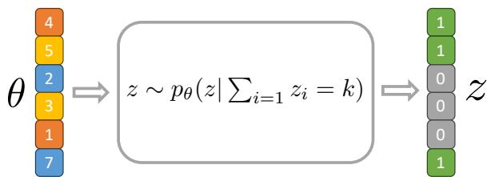
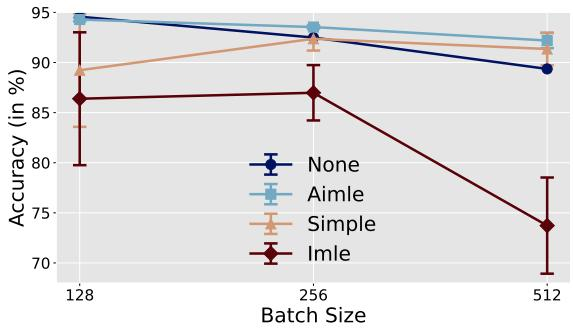
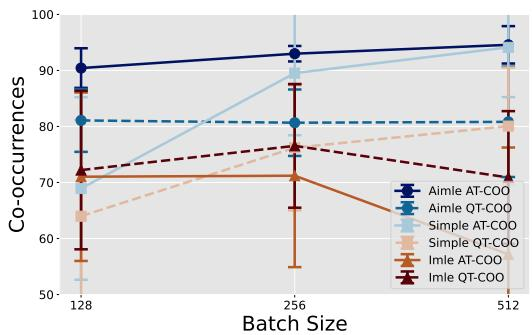
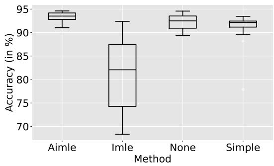
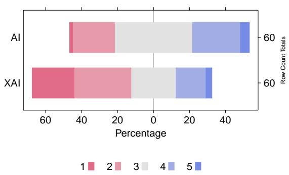
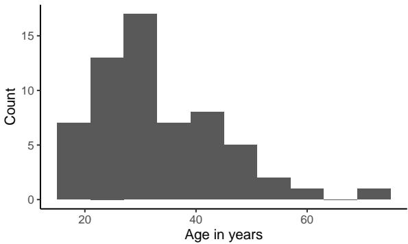
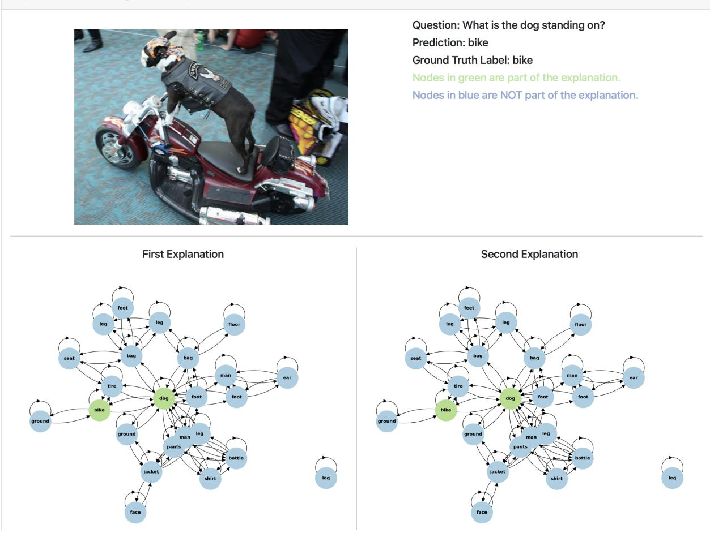

# Discrete Subgraph Sampling for Interpretable Graph based Visual Question Answering

Pascal Tilli University of Stuttgart Stuttgart, Germany pascal.tilli@ims.uni-stuttgart.de

Ngoc Thang Vu University of Stuttgart Stuttgart, Germany thang.vu@ims.uni-stuttgart.de

## Abstract

Explainable artificial intelligence (XAI) aims to make machine learning models more transparent. While many approaches focus on generating explanations post-hoc, interpretable approaches, which generate the explanations intrinsically alongside the predictions, are relatively rare. In this work, we integrate different discrete subset sampling methods into a graph-based visual question answering system to compare their effectiveness in generating interpretable explanatory subgraphs intrinsically. We evaluate the methods on the GQA dataset and show that the integrated methods effectively mitigate the performance trade-off between interpretability and answer accuracy, while also achieving strong co-occurrences between answer and question tokens. Furthermore, we conduct a human evaluation to assess the interpretability of the generated subgraphs using a comparative setting with the extended Bradley-Terry model, showing that the answer and question token co-occurrence metrics strongly correlate with human preferences. Our source code is publicly available†.

## 1 Introduction

With the rise of foundational models such as LLaVA (Liu et al., 2023b,a, 2024), GPT4 (Achiam et al., 2023), Gemini (Anil et al., 2023), or Llama (Touvron et al., 2023), the need for interpretable and explainable Machine Learning (ML) systems has become increasingly apparent, which is reflected by the increasing number of publications in eXplainable Artificial Intelligence (XAI) (Mersha et al., 2024).

In this work, we focus on interpretable Graphbased Visual Question Answering (GVQA), which involves answering questions about images. Specifically, we use scene graph representations of the visual input (Hudson and Manning, 2019) instead of the raw images, as proposed in the original versions of Visual Question Answering (VQA) (Antol et al., 2015; Agrawal et al., 2018). Scene graphs have been successfully applied to VQA tasks (Hildebrandt et al., 2020; Damodaran et al., 2021; Liang et al., 2021; Wang et al., 2023) and have shown the potential to generate subgraphs as explanations intrinsically (Tilli and Vu, 2024).

The GVQA approach by Tilli and Vu (2024) discretely samples a subgraph based on Implicit Maximum Likelihood Estimation (IMLE) (Niepert et al., 2021) and compares the results to post-hoc explainability methods with quantitative metrics, i.e., Answer Token Co-occurrence (AT-COO) and Question Token Co-occurrence (QT-COO), as well as qualitatively through human evaluation. This raises the question of how different intrinsic subgraph sampling methods compare to each other , and how the proposed metrics generalize in contexts without post-hoc methods.

Sampling a subset from a complex discrete distribution is ubiquitous in ML and has many applications. However, while these methods (Jang et al., 2017; Maddison et al., 2017; Niepert et al., 2021; Minervini et al., 2023; Ahmed et al., 2023) have been proposed and applied in various fields, they have never been explored in the multi-modal context of GVQA. Hence, we pose the following research questions:

RQ1 What is the effect of different discrete subgraph sampling methods on questionanswering performance, as well as answer and question token co-occurrences?

RQ2 Do the answer and question token cooccurrence metrics generalize in a human evaluation when different discrete subgraph sampling methods are used?

To address these research questions, we propose integrating AIMLE, SIMPLE, and GUMBEL 45

SOFTSUB-ST into a GVQA system to compare the effectiveness with IMLE, as introduced by Tilli and Vu (2024). We evaluate the models’ performances in terms of answer accuracy, AT-COO, and QT-COO. To verify the effectiveness of the AT-COO and QT-COO metrics when comparing different discrete subgraph sampling methods, we conduct a human evaluation to assess the interpretability of the generated subgraphs in a comparative setting with human evaluators.

Our contributions are as follows: (1) We demonstrate that these methods effectively mitigate the performance trade-off between interpretability and answer accuracy, while also achieving strong answer and question token co-occurrences. (2) We show that the answer and question token cooccurrence metrics strongly correlate with human preferences, highlighting the effectiveness of the metrics in capturing the relevant aspects of the question answering process.

## 2 Methods

## 2.1 Top-k Subgraph Sampling

Interpretability Our model generates a subgraph most relevant to a given question as an explanation alongside the answer prediction. To achieve this, we employ subgraph sampling during both training and inference, a process complicated by the inherent non-differentiability of sampling from discrete distributions.

Top-k Sampling We integrate a top-k combinatorial solver into our system, enabling it to identify the most relevant nodes (subgraph) for a question. This is achieved by deriving a discrete solution from $z \gets \mathsf { t o p k } ( \theta ) , z \in \{ 0 , 1 \} ^ { n }$ , which is equivalent to computing the Maximum A-Posteriori (MAP) state, i.e., the most probable state

$$
{ \mathsf { M A P } } ( z ) \equiv \arg \operatorname* { m a x } _ { z } p _ { \theta } ( z )\tag{1}
$$

of an exponential family distribution, where $z \sim$ $p _ { \theta } ( z )$ . θ refers to the prior scores (computed by our model) that parameterize the distribution $p _ { \theta } ( z )$ In our case, this is a conditional distribution based on a top-k constraint, $z \sim p _ { \boldsymbol \theta } ( z | \sum _ { i = 1 } z _ { i } = k )$

Discrete Gradient Computation Computing the gradient $\nabla _ { \boldsymbol { \theta } } L ( f ( z ) , \hat { y } )$ poses significant challenges due to the discrete nature of z. Here, L denotes our loss function, $f ( z )$ is the model’s output based on the subgraph $z ,$ and $\hat { y }$ represents the ground-truth labels. We incorporate recent methods to approximate $\nabla _ { \boldsymbol { \theta } } L$ , which we will briefly outline below. These methods have strong theoretical foundations and are practically efficient. We select them because they provide stable, low-variance estimates of the gradients and integrate seamlessly into endto-end optimization frameworks.

## 2.1.1 GUMBEL SOFTSUB-ST

The GUMBEL-SOFTMAX leverages the GUMBEL-MAX trick (Papandreou and Yuille, 2011; Maddison et al., 2014) to sample from a discrete probability distribution by perturbing the logits with standard Gumbel noise. Specifically, given logits $\theta ,$ we draw $g _ { i } \sim \mathrm { G u m b e l } ( 0 , 1 )$ for each i and select

$$
z = { \mathrm { o n e \_ h o t } } ( \operatorname* { a r g m a x } _ { i \in 1 , \ldots , n } ( \theta _ { i } + g _ { i } ) ) \sim p _ { \theta } ,\tag{2}
$$

where one\_hot converts the input into a one-hot encoded vector, i.e. a binary vector. Since arg max is not differentiable, the GUMBEL-SOFTMAX trick relaxes it to a Softmax operation with $y =$ $\mathrm { S o f t m a x } ( \theta _ { i } + g _ { i } )$ , using y as a continuous proxy for the discrete z. Building on this, the GUMBEL SOFTSUB-ST (Xie and Ermon, 2019) method extends the GUMBEL-SOFTMAX trick (Jang et al., 2017; Maddison et al., 2017) to enable sampling of relaxed top-k subsets, maintaining differentiability and allowing for backpropagation through the sampling step.

## 2.1.2 IMLE and AIMLE

IMLE (Niepert et al., 2021) with perturbation-based implicit differentiation (PID) target distributions generalizes the Straight-Through estimator (STE) to more complex distributions. Instead of directly using the gradients $\nabla _ { z } L$ for backpropagation, IMLE leverages them to construct a target distribution $q .$ This defines an implicit maximum likelihood objective, whose gradient estimator propagates the supervisory signal upstream. More formally, the gradient is approximated as

$$
\nabla _ { \theta } L \approx \frac { 1 } { \lambda } [ \mathsf { M A P } ( \theta + \epsilon ) - \mathsf { M A P } ( \theta ^ { \prime } + \epsilon ) ]\tag{3}
$$

where $\epsilon \sim p ( \epsilon )$ is drawn from a Gumbel(0,1) distribution and $\theta ^ { \prime } = \theta - \lambda \nabla _ { z } L ( f _ { u } ( z ) , \hat { y } )$ . To efficiently sample from $p _ { \theta } ( z )$ , Perturb-and-MAP (Papandreou and Yuille, 2011) is applied with $z = \mathsf { M A P } ( \theta + \epsilon )$ . A key idea is the construction of a target distribution $q$ based on the prior distribution $p$ using PID

$$
q ( z , \theta ^ { \prime } ) = p ( z , \theta - \lambda \nabla _ { z } L ( f _ { u } ( z ) , \hat { y } ) )\tag{4}
$$

Adaptive Implicit Maximum Likelihood Estimation (AIMLE) (Minervini et al., 2023) extends IMLE by adaptively changing λ until the gradient estimates meet a desired sparsity criterion. This adaptation is guided by an update rule where λ is adjusted according to the exponential moving average of the gradient’s L0-norm, ensuring that the gradient estimates achieve a desired level of non-zero elements.

## 2.1.3 SIMPLE

Ahmed et al. (2023) address the challenge of gradient estimation for sampling from a k-subset distribution, which is computationally intractable due to the combinatorial nature of the problem. The gradient depends on the marginals of the distribution µ(θ), which are the partial derivatives of the logprobability of the k-subset constraint. They proposed SIMPLE, a method that efficiently computes these marginals to approximate the gradient while reducing the computational complexity compared to exact methods. The gradient is approximated as

$$
\nabla _ { \theta } L \approx \partial _ { \theta } \mu ( \theta ) \nabla _ { z } L\tag{5}
$$

## 2.2 Graph-based VQA System

  
Figure 1: The prior scores θ, which are based on the question and node embeddings, are used to sample a subgraph z that is then used to predict the answer.

We follow Tilli and Vu (2024) as our base system architecture, integrating the subset sampling methods described above to intrinsically sample a subgraph. We replace the scene graph encoding modules based on GloVe (Pennington et al., 2014) embeddings to Contrastive Language-Image Pre-Training (CLIP) (Radford et al., 2021) text token embeddings. Additionally, we shift from percentage based top-k sampling to fixed top-k sampling to better control the size of the explanation subgraph.

The sampling process of our approach is illustrated in Figure 1, where θ represents the prior scores, computed as a scaled dot-product between a representation of the question and the node embeddings of the graph. The variable z represents the sampled subgraph, where each entry indicates whether the corresponding node is included or excluded in the subgraph. As a result, we obtain hard-attention masks, which are used to mask the graph’s adjacency matrix and the node features.

## 3 Experimental Results

Setup We conduct experiments on the GQA dataset (Hudson and Manning, 2019) using the ground-truth scene graphs for the training and validation splits. All results are reported on the validation split, as scene graphs for the testdev split are not available.

## 3.1 RQ1 – Quantitative Results

Due to the low question-answering performance of GUMBEL SOFTSUB-ST (30.61 2.39), we exclude it from the results. The GUMBEL SOFTSUB-ST estimator utilizes a relaxed approximation in its sampling mechanism, which introduces additional bias and variance, which might be the reason why it reduces the precision in selecting relevant nodes within the subgraph compared to the other methods.

The aggregated results of the experiments are summarized in Table 1, while the table with individual runs and detailed results can be found in Appendix B, specifically in Table 4.

<table><tr><td>Method</td><td>Accuracy</td><td>AT-COO</td><td>QT-COO</td></tr><tr><td>NONE</td><td>92.14±2.62</td><td>一</td><td></td></tr><tr><td>AIMLE</td><td>93.34±0.99</td><td>92.66±3.23</td><td>80.86±6.84</td></tr><tr><td>SIMPLE</td><td>91.05±3.44</td><td>84.47±16.06</td><td>73.56±14.19</td></tr><tr><td>IMLE</td><td>81.13±8.07</td><td>65.15±17.45</td><td>72.88±11.59</td></tr></table>

Table 1: Mean and standard deviation for the performance metrics of each method. The full table with the detailed results for each run can be found in Appendix B Table 4.

We experimented with different top-k values, batch sizes, and other hyperparameters to compare the performance of the models in terms of average answer accuracy, the AT-COO, and the QT-COO (cf. Appendix B.1 for a formal definition). AIMLE achieved the highest answer accuracy across various top-k values, exceeding 94%, closing the gap to the NONE baseline, where no subgraph sampling is applied (the alternative noninterpretable black-box approach).

Effect of Batch Sizes While Figure 2 shows a negative trend in model accuracy with increasing batch sizes, Figure 3 indicates that the AT-COO and QT-COO increase when training with larger batch sizes. This suggests a trade-off between

  
Figure 2: Model accuracy with respect to batch size.

the accuracy of the model and the quality of the explanations, as larger batch sizes lead to better co-occurrences but worse accuracy. SIMPLE un-

  
Figure 3: AT-COO and QT-COO values with respect to batch size.

derperformed compared to AIMLE with smaller batch sizes, suggesting that SIMPLE is more sensitive to this hyperparameter. This effect is also reflected in the AT-COO and QT-COO values, where SIMPLE achieved lower answer and question cooccurrences with smaller batch sizes.

We find that IMLE is an outlier in this regard, as it achieves higher co-occurrences with batch sizes of 128 and 256 than with 512. This may be due to IMLE’s sensitivity to hyperparameters, particularly its method-specific hyperparameter λ, and the need for longer training to fully converge to the optimal solution.

## 3.2 RQ2 – Human Evaluation

Design We recruited 60 participants through Prolific (www.prolific.com). Each participant was presented with 18 pairwise comparisons between two explanatory subgraphs generated by two different subset sampling methods and asked to choose the preferred explanation.

Preference Estimation In total, we collected 1,080 pairwise comparisons, which were utilized to apply an extended Bradley-Terry model (Hunter, 2004) to estimate the relative preferences for the sampling methods. The extended version introduces a parameter for ties, δ, which adjusts for the likelihood of tied outcomes.

Results Due to all methods performing comparably well regarding the AT-COO and QT-COO, we observe a large number of ties between methods, supported by the tie parameter $\delta = 0 . 4 5$ . To mitigate the effect of ties in the Bradley-Terry model, we set the weight of ties to ${ \frac { 1 } { 6 } } .$ Thus, we empha-

<table><tr><td>Method</td><td>Favored</td><td>Ties</td><td>Unfavored</td><td>θ</td></tr><tr><td>AIMLE</td><td>226</td><td>339</td><td>155</td><td>0.17</td></tr><tr><td>SIMPLE</td><td>200</td><td>257</td><td>263</td><td>-0.07</td></tr><tr><td>IMLE</td><td>181</td><td>350</td><td>189</td><td>-0.1</td></tr></table>

Table 2: The individual effects parameters of the extended Bradley-Terry model.

size the cases where the participants favored one method over another, rather than focusing on ties where the preferred method was indistinguishable. The individual effects parameters are shown in Table 2. According to the Bradley-Terry model ranking, AIMLE is favored over SIMPLE and IMLE, while SIMPLE is favored over IMLE.

Ranking Consistency Analysis To verify whether the AT-COO and QT-COO metrics generalize to comparisons between intrinsic subgraph sampling methods – addressing RQ2 – we correlated the Bradley-Terry model’s parameters with the AT-COO and QT-COO metrics. The results are shown in Table 3. We find that both

<table><tr><td>Metric</td><td>Pearson&#x27;s r</td><td>Spearman&#x27;s  $\rho$ </td><td>Kendall&#x27;s τ</td></tr><tr><td>AT-COO</td><td>0.795</td><td>1.0</td><td>1.0</td></tr><tr><td>QT-COO</td><td>0.99</td><td>1.0</td><td>1.0</td></tr></table>

Table 3: Correlation scores between the Bradley-Terry model’s parameter θ and the AT-COO and QT-COO metrics.

metrics strongly correlate with θ, suggesting the effectiveness of the AT-COO and QT-COO metrics. Consequently, the ranking of the intrinsic subgraph sampling methods according to the Bradley-Terry model aligns with the ranking according to the AT-COO and QT-COO metrics.

## 4 Conclusion

We integrated and compared discrete subset sampling methods — IMLE, AIMLE, SIMPLE, and GUMBEL SOFTSUB-ST— to intrinsically generate explanatory subgraphs in a GVQA system. To answer RQ1, we found that GUMBEL SOFTSUB-ST degraded performance to a non-competitive level, while the other methods achieved competitive results compared to the black-box approach. Depending on the choice of hyperparameters, AIMLE and SIMPLE achieved the highest answer accuracies, AT-COO, and QT-COO scores, while IMLE exhibited higher sensitivity to hyperparameter tuning.

In the human evaluation, that was conducted to answer RQ2, AIMLE was most favored by participants, followed by SIMPLE and IMLE, indicating that AIMLE is the most promising method, requiring minimal tuning and performing well outof-the-box. For the other methods, more careful hyperparameter selection is necessary to achieve competitive results.

## 5 Limitations

The accuracy and reliability of the model are highly dependent on the quality and quantity of the training data. Biases, inconsistencies, or missing data can significantly affect the model’s results and explanations. In our case, the provided ground-truth scene graphs contain errors or inaccuracies, which can negatively impact the system’s performance and limit its applicability to real-world scenarios.

The fixed top-k sampling does not adapt to the complexity of individual questions. In real-world scenarios, the relevance of subgraph explanations could vary significantly, requiring a more dynamic top-k selection to better tailor explanations to the complexity of the visual question. For some question types, the explanations might be too simplistic or overly complex, which may limit the interpretability.

Human evaluation is inherently subjective, which introduces variability in the assessment of model explanations. Factors such as individual preferences, prior knowledge, personal biases, interpretation of explanations, or experience with such systems can influence the evaluation results.

## 6 Ethics Statement

All participants provided informed consent prior to their involvement in the study. We offered a comprehensive explanation of the task and research goals and refrained from collecting any personally identifiable information from the users. All logs and survey responses were encrypted using an anonymous hash derived from the participant’s Prolific username. We confirmed the estimated time in our pilot study to ensure that the selected duration was below the median completion time. The participants were compenstated for their time and effort with a wage that exceeded the minimum wage in the country of the study’s origin based on the median completion time established through the pilot study.

## Acknowledgements

Funded by Deutsche Forschungsgemeinschaft (DFG, German Research Foundation) under Germany’s Excellence Strategy - EXC 2075 – 390740016. We acknowledge the support by the Stuttgart Center for Simulation Science (SimTech).

## References

Josh Achiam, Steven Adler, Sandhini Agarwal, Lama Ahmad, Ilge Akkaya, Florencia Leoni Aleman, Diogo Almeida, Janko Altenschmidt, Sam Altman, Shyamal Anadkat, et al. 2023. Gpt-4 technical report. arXiv preprint arXiv:2303.08774.

Aishwarya Agrawal, Dhruv Batra, Devi Parikh, and Aniruddha Kembhavi. 2018. Don’t just assume; look and answer: Overcoming priors for visual question answering. In Proceedings of the IEEE conference on computer vision and pattern recognition.

Kareem Ahmed, Zhe Zeng, Mathias Niepert, and Guy Van den Broeck. 2023. Simple: A gradient estimator for k-subset sampling. In Proceedings ofthe 11th International Conference on Learning Representations.

Rohan Anil, Sebastian Borgeaud, Yonghui Wu, Jean-Baptiste Alayrac, Jiahui Yu, Radu Soricut, Johan Schalkwyk, Andrew M Dai, Anja Hauth, Katie Millican, et al. 2023. Gemini: A family of highly capable multimodal models. arXiv preprint arXiv:2312.11805.

Jason Ansel, Edward Yang, Horace He, Natalia Gimelshein, Animesh Jain, Michael Voznesensky, Bin Bao, Peter Bell, David Berard, Evgeni Burovski, Geeta Chauhan, Anjali Chourdia, Will Constable, Alban Desmaison, Zachary DeVito, Elias Ellison, Will Feng, Jiong Gong, Michael Gschwind, Brian

Hirsh, Sherlock Huang, Kshiteej Kalambarkar, Laurent Kirsch, Michael Lazos, Mario Lezcano, Yanbo Liang, Jason Liang, Yinghai Lu, C. K. Luk, Bert Maher, Yunjie Pan, Christian Puhrsch, Matthias Reso, Mark Saroufim, Marcos Yukio Siraichi, Helen Suk, Shunting Zhang, Michael Suo, Phil Tillet, Xu Zhao, Eikan Wang, Keren Zhou, Richard Zou, Xiaodong Wang, Ajit Mathews, William Wen, Gregory Chanan, Peng Wu, and Soumith Chintala. 2024. Pytorch 2: Faster machine learning through dynamic python bytecode transformation and graph compilation. In Proceedings ofthe 29th ACM International Conference on Architectural Support for Programming Languages and Operating Systems, Volume 2.

Stanislaw Antol, Aishwarya Agrawal, Jiasen Lu, Margaret Mitchell, Dhruv Batra, C Lawrence Zitnick, and Devi Parikh. 2015. Vqa: Visual question answering. In Proceedings of the IEEE international conference on computer vision.

Vinay Damodaran, Sharanya Chakravarthy, Akshay Kumar, Anjana Umapathy, Teruko Mitamura, Yuta Nakashima, Noa Garcia, and Chenhui Chu. 2021. Understanding the role of scene graphs in visual question answering. arXiv preprint arXiv:2101.05479.

Matthias Fey and Jan E. Lenssen. 2019. Fast graph representation learning with PyTorch Geometric. In ICLR Workshop on Representation Learning on Graphs and Manifolds.

Marcel Hildebrandt, Hang Li, Rajat Koner, Volker Tresp, and Stephan Günnemann. 2020. Scene graph reasoning for visual question answering. arXiv preprint arXiv:2007.01072.

Drew A Hudson and Christopher D Manning. 2019. Gqa: A new dataset for real-world visual reasoning and compositional question answering. In Proceedings ofthe IEEE/CVF conference on computer vision and pattern recognition.

David R Hunter. 2004. Mm algorithms for generalized bradley-terry models. The annals ofstatistics.

Eric Jang, Shixiang Gu, and Ben Poole. 2017. Categorical reparametrization with gumble-softmax. In International Conference on Learning Representations.

Weixin Liang, Yanhao Jiang, and Zixuan Liu. 2021. Graphvqa: Language-guided graph neural networks for graph-based visual question answering. In Proceedings ofthe Third Workshop on Multimodal Artificial Intelligence.

Rensis Likert. 1932. A technique for the measurement of attitudes. Archives ofpsychology.

Haotian Liu, Chunyuan Li, Yuheng Li, and Yong Jae Lee. 2023a. Improved baselines with visual instruction tuning.

Haotian Liu, Chunyuan Li, Yuheng Li, Bo Li, Yuanhan Zhang, Sheng Shen, and Yong Jae Lee. 2024. Llavanext: Improved reasoning, ocr, and world knowledge.

Haotian Liu, Chunyuan Li, Qingyang Wu, and Yong Jae Lee. 2023b. Visual instruction tuning.

Chris J Maddison, Andriy Mnih, and Yee Whye Teh. 2017. The concrete distribution: A continuous relaxation of discrete random variables. In International Conference on Learning Representations.

Chris J Maddison, Daniel Tarlow, and Tom Minka. 2014. A\* sampling. Advances in neural information processing systems.

Melkamu Mersha, Khang Lam, Joseph Wood, Ali Al-Shami, and Jugal Kalita. 2024. Explainable artificial intelligence: A survey of needs, techniques, applications, and future direction. Neurocomputing.

Pasquale Minervini, Luca Franceschi, and Mathias Niepert. 2023. Adaptive perturbation-based gradient estimation for discrete latent variable models. In Proceedings of the AAAI Conference on Artificial Intelligence.

Mathias Niepert, Pasquale Minervini, and Luca Franceschi. 2021. Implicit mle: backpropagating through discrete exponential family distributions. Advances in Neural Information Processing Systems.

George Papandreou and Alan L Yuille. 2011. Perturband-map random fields: Using discrete optimization to learn and sample from energy models. In 2011 International Conference on Computer Vision.

Jeffrey Pennington, Richard Socher, and Christopher Manning. 2014. GloVe: Global vectors for word representation. In Proceedings of the 2014 Conference on Empirical Methods in Natural Language Processing.

Chendi Qian, Andrei Manolache, Kareem Ahmed, Zhe Zeng, Guy Van den Broeck, Mathias Niepert, and Christopher Morris. 2024. Probabilistically rewired message-passing neural networks. In International Conference on Learning Representations.

Alec Radford, Jong Wook Kim, Chris Hallacy, Aditya Ramesh, Gabriel Goh, Sandhini Agarwal, Girish Sastry, Amanda Askell, Pamela Mishkin, Jack Clark, et al. 2021. Learning transferable visual models from natural language supervision. In International conference on machine learning.

Pascal Tilli and Ngoc Thang Vu. 2024. Intrinsic subgraph generation for interpretable graph based visual question answering. In Proceedings of the 2024 Joint International Conference on Computational Linguistics, Language Resources and Evaluation.

Hugo Touvron, Thibaut Lavril, Gautier Izacard, Xavier Martinet, Marie-Anne Lachaux, Timothée Lacroix, Baptiste Rozière, Naman Goyal, Eric Hambro, Faisal Azhar, et al. 2023. Llama: Open and efficient foundation language models. arXiv preprint arXiv:2302.13971.

Yanan Wang, Michihiro Yasunaga, Hongyu Ren, Shinya Wada, and Jure Leskovec. 2023. Vqa-gnn: Reasoning with multimodal knowledge via graph neural networks for visual question answering. In Proceedings ofthe IEEE/CVF International Conference on Computer Vision.

Sang Michael Xie and Stefano Ermon. 2019. Reparameterizable subset sampling via continuous relaxations. In Proceedings ofthe International Joint Conference on Artificial Intelligence.

## A Background

## A.1 Visual Question Answering

VQA is a task in the field of ML that involves a system’s ability to answer questions about visual content, typically images or videos. To generate an answer, the model is required to process the visual input as well as the natural language question in form of text. For the visual modality, the model processes the images to implicitly or explicitly identify objects with their corresponding attributes, scene information, and relations among objects. The most difficult aspect of the task is to combine these two information resources and learn to reason between the two modalities. VQA system can be applied in various applications, including assistive technologies or educational tools, offering insights into the interplay between language understanding and visual perception.

## A.2 Graph-based Visual Question Answering

Structured representations of images as scene graphs make them particularly effective for answering questions that involve complex relationships or require an understanding of spatial or semantic interactions among multiple objects. The graphbased approach in GVQA changes the reasoning process to identify paths or subgraphs that capture the information required to answer the question, which has the potential to enhance the system’s interpretability.

## B Experimental Results

## B.1 Metrics

Answer Token Co-Occurrences Let $\begin{array} { r l } { S } & { { } = } \end{array}$ $\{ s _ { 1 } , \ldots , s _ { n } \}$ be the set of subgraphs, where $s _ { i } =$ $\{ v _ { i 1 } , \ldots , v _ { i m } \}$ are node tokens for each subgraph $s _ { i }$ . Let $A = \{ a _ { 1 } , \ldots , a _ { n } \}$ be the set of answer tokens, and let $a _ { i } \in A$ be the specific answer token for each subgraph $s _ { i }$ . Let $\mathbb { I } ( a , s )$ be an indicator

function defined as

$$
\mathbb { I } ( a , s ) = { \left\{ \begin{array} { l l } { 1 } & { { \mathrm { i f ~ } } a \in s } \\ { 0 } & { { \mathrm { o t h e r w i s e } } } \end{array} \right. }\tag{6}
$$

Then the answer token co-occurrence can be computed as

$$
P _ { A } = { \frac { 1 } { n } } \sum _ { i = 1 } ^ { n } I ( a _ { i } , s _ { i } )\tag{7}
$$

Question Token Co-Occurrences Let $S \_ { } = { }$ $\{ s _ { 1 } , \ldots , s _ { n } \}$ be the set of subgraphs, where $s _ { i } =$ $\{ v _ { i 1 } , \ldots , v _ { i m } \}$ are node tokens for each subgraph $s _ { i } .$ . Let $Q = \{ q _ { 1 } , . . . , q _ { k } \}$ be the set of question tokens, and let $Q _ { i } \subseteq Q$ be the subset of question tokens related to the subgraph $s _ { i }$ . Define the indicator function $\mathbb { I } ( q , s )$ as

$$
\mathbb { I } ( q , s ) = { \left\{ \begin{array} { l l } { 1 } & { { \mathrm { i f ~ } } q \in s } \\ { 0 } & { { \mathrm { o t h e r w i s e } } } \end{array} \right. }\tag{8}
$$

Define the match ratio function $R ( Q _ { i } , s )$ as

$$
R ( Q _ { i } , s ) = \frac { \sum _ { q \in Q _ { i } } \mathbb { I } ( q , s ) } { | Q _ { i } | }\tag{9}
$$

which computes the ratio of matching question tokens in $Q _ { i }$ that are present in the subgraph s. Then the question token co-occurrence can be computed as

$$
P _ { Q } = \frac { 1 } { n } \sum _ { i = 1 } ^ { n } R ( Q _ { i } , s _ { i } )
$$

which computes the average match ratio across all subgraphs.

## B.2 Quantitative Results

Boxplots Figure 4 aggregates the results for each method across different top-k values and batch sizes in form of boxplots. The visualizations show the volatility of the accuracy of different models and indicate that AIMLE and SIMPLE are the most stable methods, while IMLE requires more tuning of hyper-parameters to achieve similar results.

  
Figure 4: Accuracy per method across different $\mathrm { t o p } { - } k$ values and batch sizes.

## C Human Evaluation

We implemented a web application to perform a human evaluation. The instructions for the participants can be found in Appendix C.1. The selfassessment of their prior knowledge is displayed in Appendix C.3.

## C.1 Instructions

At the beginning of the web page, we provided the participants with the following instructions.

The study contains 18 images for each participant. The image is not used as input to the model, it is only displayed as a reference. Next to the original image you can find the corresponding question the model answered. The answer is displayed next to the predictionfield. We also included the annotated ground-truth labelfor each question, i.e. the correct answer given by the dataset. This states what should have been the correct answer according to the data. Some questions might be ambiguous unfortunately, but this should be not evaluated or considered in this study.

Below the original image, you canfind the corresponing graphs. The full graph (nodes colored in blue and green) is input to the model alongside the question. The graph itself(all nodes colored in green and blue combined) might not be a perfect representation of the image. Nodes, which represent objects in the image, might be missing, or the annotation (the label/name) might be misleading. We display the edges between nodes in the visualization of the graph, but we excluded the annotation (the name of the relation). Edges represent relations between objects, e.g. a man holding a racket would result in two nodes, man and racket, and one edge (relation) holding between them.

We perform pair-wise comparisons between two explainability methods. Their explanations are displayed next to each other. All nodes colored in green are part ofthe subgraph that represents the explanation of model. All nodes colored in blue are excluded, so they are not part of the explanation. The explanatory subgraph (nodes in green) should support the predicted answer. To judge which explantion you prefer, you should take the question and answer into account, and evaluate ifthe nodes in green form a more valid explanation than the other explanation.

We only compare explanations that are of the same size, i.e. they contain equal number ofnodes. Hence, we do not want to judge, if the explanatory subgraph consists of too many (green) nodes, but rather if the nodes included in the explanation capture the relevant information to answer the question. Please mark which of the explanations you prefer for each given pair.

## C.2 Compensation

We estimated the reward for completing the task with a medium time of 15 min, above minimum wage with £11.20/hr.

## C.3 Demographics

We asked the participants to self assess their knowledge about Artificial Intelligence (AI) and XAI on a Likert (Likert, 1932) scale from 1 to 5, where 1 corresponds to no knowledge and 5 to very good knowledge. Figure 5 visualizes the distribution of

  
Figure 5: Likert scale responses to the questions about AI and XAI.

the scores of the Likert scale responses. While the majority of participants rated their knowledge about AI and XAI as average, the participants were generally more informed about AI than XAI.

The age distribution of the participants is shown in Figure 6. The majority of participants were between 18 and 24 years old, with fewer participants over 35 years old.

## D Implementation Details

We implemented our models using PyTorch 2 (Ansel et al., 2024) and PyTorch Geometric (Fey and Lenssen, 2019). For the subset sampling methods, we use the official implementions of IMLE and AIMLE (Niepert et al., 2021; Minervini et al.,

<table><tr><td>Method</td><td>Top-k</td><td>Accuracy</td><td>Batch-Size</td><td>N-Epochs</td><td>AT-COO</td><td>QT-COO</td><td>λ</td><td>T</td></tr><tr><td rowspan="3">NONE</td><td></td><td>94.57</td><td>128</td><td>50</td><td></td><td></td><td></td><td></td></tr><tr><td></td><td>92.49</td><td>256</td><td>50</td><td></td><td></td><td></td><td></td></tr><tr><td></td><td>89.36</td><td>512</td><td>50</td><td>一</td><td>一</td><td>一</td><td></td></tr><tr><td rowspan="14">AIMLE</td><td></td><td>94.26</td><td>128</td><td>50</td><td>90.67</td><td>76.31</td><td>tuned</td><td>1</td></tr><tr><td>2</td><td>93.45</td><td>256</td><td>50</td><td>92.62</td><td>71.06</td><td>tuned</td><td>1</td></tr><tr><td></td><td>92.90</td><td>512</td><td>50</td><td>96.90</td><td>66.49</td><td>tuned</td><td>1</td></tr><tr><td></td><td>94.22</td><td>128</td><td>50</td><td>91.49</td><td>81.11</td><td>tuned</td><td>1</td></tr><tr><td>3</td><td>93.65</td><td>256</td><td>50</td><td>93.78</td><td>80.44</td><td>tuned</td><td>1</td></tr><tr><td></td><td>91.81</td><td>512</td><td>50</td><td>94.59</td><td>84.47</td><td>tuned</td><td>1</td></tr><tr><td></td><td>94.17</td><td>128</td><td>50</td><td>84.55</td><td>75.02</td><td>tuned</td><td>1</td></tr><tr><td>4</td><td>93.74</td><td>256</td><td>50</td><td>93.30</td><td>86.38</td><td>tuned</td><td>1</td></tr><tr><td></td><td>91.05</td><td>512</td><td>50</td><td>89.13</td><td>76.25</td><td>tuned</td><td>1</td></tr><tr><td></td><td>94.61</td><td>128</td><td>30</td><td>94.10</td><td>84.45</td><td>tuned</td><td>1</td></tr><tr><td>5</td><td>93.51</td><td>256</td><td>50</td><td>90.81</td><td>80.85</td><td>tuned</td><td>1</td></tr><tr><td></td><td>92.52</td><td>512</td><td>50</td><td>94.59</td><td>84.46</td><td>tuned</td><td>1</td></tr><tr><td></td><td>94.18</td><td>128</td><td>50</td><td>91.30</td><td>88.49</td><td>tuned</td><td>1</td></tr><tr><td rowspan="3"></td><td>6 93.34</td><td></td><td>256 50</td><td>94.41</td><td>84.61</td><td>tuned</td><td>1</td><td></td></tr><tr><td></td><td>92.68</td><td>512</td><td>50</td><td>97.64</td><td>92.44</td><td>tuned</td><td>1</td></tr><tr><td>77.87</td><td></td><td>128</td><td>50</td><td>56.96</td><td>39.76</td><td></td><td></td></tr><tr><td rowspan="14">SIMPLE</td><td>2</td><td>91.04</td><td>256</td><td>50</td><td>66.91</td><td>56.42</td><td></td><td></td></tr><tr><td></td><td>88.20</td><td>512</td><td>50</td><td>76.22</td><td>64.05</td><td>一</td><td></td></tr><tr><td></td><td>89.63</td><td>128</td><td>50</td><td>48.82</td><td>50.99</td><td></td><td></td></tr><tr><td>3</td><td>92.97</td><td>256</td><td>50</td><td>83.68</td><td>67.09</td><td></td><td></td></tr><tr><td></td><td>92.23</td><td>512</td><td>50</td><td>95.40</td><td>74.90</td><td></td><td></td></tr><tr><td></td><td>91.87</td><td>128</td><td>50</td><td>72.91</td><td>68.52</td><td></td><td></td></tr><tr><td>4</td><td>93.46</td><td>256</td><td>50</td><td>92.28</td><td>74.15</td><td></td><td></td></tr><tr><td></td><td>91.28</td><td>512</td><td>50</td><td>97.04</td><td>75.62</td><td>一</td><td></td></tr><tr><td></td><td>91.57</td><td>128</td><td>50</td><td>60.12</td><td>59.73</td><td>一</td><td></td></tr><tr><td>5</td><td>93.05</td><td>256</td><td>50</td><td>93.42</td><td>81.19</td><td></td><td></td></tr><tr><td></td><td>91.53</td><td>512</td><td>50</td><td>98.17</td><td>85.54</td><td></td><td></td></tr><tr><td></td><td>92.25</td><td>128</td><td>50</td><td>88.91</td><td>82.37</td><td>一</td><td></td></tr><tr><td>6</td><td>90.52</td><td>256</td><td>50</td><td>94.54</td><td>82.52</td><td></td><td></td></tr><tr><td></td><td>92.65</td><td>512</td><td>50</td><td>98.27</td><td>88.79</td><td></td><td></td></tr><tr><td rowspan="14">IMLE</td><td></td><td>82.48</td><td>128</td><td>50</td><td>68.39</td><td></td><td></td><td>1</td></tr><tr><td>2</td><td>83.38</td><td></td><td></td><td>72.74</td><td>56.06</td><td>10</td><td>1</td></tr><tr><td></td><td>73.83</td><td>256 512</td><td>50 50</td><td>46.54</td><td>61.78 75.74</td><td>10 10</td><td>1</td></tr><tr><td></td><td>79.08</td><td>128</td><td>50</td><td>53.96</td><td>80.07</td><td>10</td><td>1</td></tr><tr><td>3</td><td>87.74</td><td>256</td><td>50</td><td>47.67</td><td>88.47</td><td>10</td><td>1</td></tr><tr><td></td><td>69.32</td><td>512</td><td>50</td><td>43.13</td><td>73.36</td><td>10</td><td>1</td></tr><tr><td></td><td>92.39</td><td>128</td><td>50</td><td>71.26</td><td>65.35</td><td>10</td><td>1</td></tr><tr><td>4</td><td>90.03</td><td>256</td><td>50</td><td>82.25</td><td>78.75</td><td>10</td><td>1</td></tr><tr><td></td><td>68.35</td><td>512</td><td>50</td><td>41.91</td><td>72.02</td><td>10</td><td>1</td></tr><tr><td></td><td>91.59</td><td>128</td><td>50</td><td>90.51</td><td>87.38</td><td>10</td><td>1</td></tr><tr><td rowspan="3"></td><td>5</td><td></td><td>50</td><td>82.18</td><td>77.15</td><td>10</td><td>1</td></tr><tr><td>86.77</td><td></td><td>256</td><td></td><td></td><td></td><td></td></tr><tr><td>75.63</td><td>512</td><td>50</td><td>48.89</td><td>84.20</td><td>10</td><td>1</td></tr></table>

Table 4: Results of models trained with different top-k subset sampling methods across different batch sizes.

  
Figure 6: Age distribution of the participants.

2023), in combination with SIMPLE and GUMBEL SOFTSUB-ST by Qian et al. (2024).

Explanations of Image and Graph One

## E Examples

  
Figure 7: User interface for the human evaluation of two explanatory subgraphs, in green, and excluded nodes, in blue.