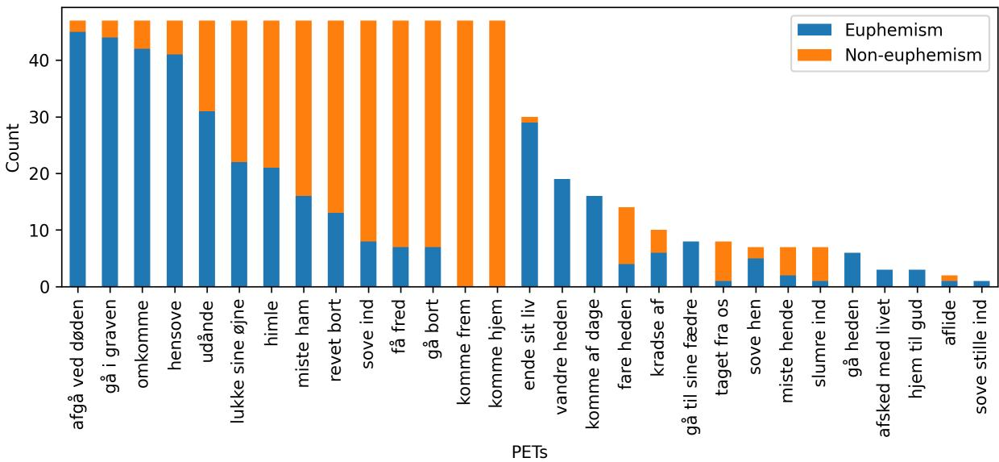
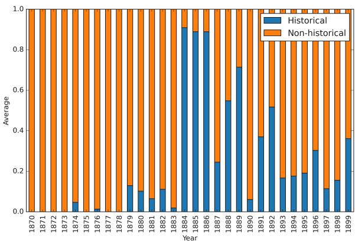

# Dying or Departing? Euphemism Detection for Death Discourse in Historical Texts

Ali Al-Laith1,2, Alexander Conroy1, Jens Bjerring-Hansen1, Bolette Pedersen1, Carsten Levisen3, and Daniel Hershcovich2 Department of Nordic Studies and Linguistics, University of Copenhagen, Denmark1 Department of Computer Science, University of Copenhagen, Denmark2 Department of Communication and Arts, Roskilde University, Denmark3 alal@di.ku.dk, alc@hum.ku.dk, jbh@hum.ku.dk bspedersen@hum.ku.dk, calev@ruc.dk, dh@di.ku.dk

## Abstract

Euphemisms are a linguistic device used to soften discussions of sensitive or uncomfortable topics, with death being a prominent example. In this paper, we present a study on the detection of death-related euphemisms in historical literary texts from a corpus containing Danish and Norwegian novels from the late 19th century. We introduce an annotated dataset of euphemistic and non-euphemistic references to death, including both common and rare euphemisms, ranging from well-established terms to more culturally nuanced expressions. We evaluate the performances of state-of-the-art pre-trained language models fine-tuned for euphemism detection. Our findings show that fixed expressions referring to death became less frequent over time, while metaphorical euphemisms grew in prevalence. Additionally, euphemistic language was more common in historical novels than contemporary novels of the period, reflecting the rise of secularism. These results shed light on the shifting discourse on death during a period when the concept of death as final became prominent.

## 1 Introduction

Euphemisms are commonly used to refer to sensitive topics, such as death, in a less direct manner. Expressions like “gå bort” in Danish (“pass away”) allow speakers to soften the impact of discussing death. Studying these linguistic choices in historical contexts offers insights into societal attitudes toward death and how they have evolved over time. The study of euphemisms in linguistics offers a window into the nuanced ways in which language is used to navigate sensitive topics. Grounded in a rich history of research (Chilton, 1987; Forget, 1991; Spears, 1981), euphemism analysis has evolved from primarily theoretical explorations to incorporate computational techniques.

This paper focuses on detecting and classifying euphemisms related to death in Danish and

Norwegian literary texts from the late 19th century. During this period, societal shifts, including secularization and the professionalization of healthcare, influenced the way people talked about death. Using the MeMo corpus (Bjerring-Hansen et al., 2022), a large collection of novels from the era, we develop a computational approach to identify euphemistic expressions for death.

Note that rather than the “euphemistic” vs. “literal” distinction prevalent in previous work (Firsich and Rios, 2024), we distinguish between “euphemistic” and “non-euphemistic” occurrences of expressions. The distinction between literal and figurative language is related, but different. For example, the phrase “she is no longer among us”, when referring to death, is euphemistic but not metaphorical, whereas “the last chapter of his life” is both euphemistic and metaphorical.

Our contributions include: (1) a methodology for detecting and classifying death-related euphemisms in historical texts, (2) an annotated benchmark dataset of euphemisms, (3) an empirical evaluation of state-of-the-art Pre-trained Language Models (PLMs), and (4) a demonstration of how these computational methods can be used to analyze cultural and linguistic trends in historical literature. These findings provide valuable tools for both NLP researchers and scholars studying the cultural history of death as well as the language constituting it. The code and datasets are available under this link: https://github.com/mime-memo/ Euphemism-of-Death.

## 2 Related Work

In this section, we briefly review euphemism detection, euphemism identification, and the specific nuances of death euphemisms.

Euphemism detection. Computational analysis of euphemisms includes diverse methodologies and approaches, such as unsupervised detection of euphemistic usage in social media, significantly outperforming traditional keyword-based detection methods; and detection of multi-word euphemisms using phrase mining and word embedding similarities (Zhu et al., 2021; Zhu and Bhat, 2021). The Multilingual Euphemism Detection Shared Task (Lee and Feldman, 2024), part of the Fourth Workshop on Figurative Language Processing, expanded research into multiple languages, enrich ing the datasets available and summarizing diverse methodological findings. Leading contributions (Vitiugin and Paakki, 2024) included integration of contextual features in a multilingual detection model, which substantially outperforms established euphemism detection methods. Firsich and Rios (2024) investigated the detection of euphemisms across multiple languages using OpenAI’s GPT-4, winning the competition by employing zeroshot and few-shot learning. Despite its success, they highlight GPT-4’s varied performance across languages, with a significant disparity between the best (English at .831) and the worst (Spanish at .598) outcomes, emphasizing the challenges of multilingual euphemism detection. Hankins (2024) evaluated multilingual euphemism detection with PLMs fine-tuned with Low-Rank Adaptation (LoRA) in Mandarin Chinese, American English, Spanish, and Yorùbá. They highlight the robustness of LoRA-tuned models in identifying euphemisms across different linguistic contexts. Finally, explo rations into both euphemisms and dysphemisms using sentiment analysis have opened new avenues for classifying sensitive topics, further enriched by PLMs (Felt and Riloff, 2020).

Euphemism Identification. In contrast to detection of known euphemisms, Devi and Saharia (2024) explore the identification of domain-specific euphemisms on social media platforms, even when not known in advance, using clustering. It combines uni-gram and bi-gram frequency-based features with domain-specific lexical items for pattern categorization, employing DBSCAN and K-means algorithms to effectively classify and analyze euphemistic expressions. Hojati (2012) investigate the use of euphemisms in English-speaking media by analyzing news bulletins from three high-profile outlets over a three-month period. The frequency analysis highlighted that poverty- and militaryrelated euphemisms were most common, while those related to the economy, disability, death, and sex were less frequent. The qualitative analysis also emphasized the impact of current events and other non-linguistic factors on the use of euphemisms.

<table><tr><td></td><td>Main Corpus</td><td>Sub-corpus</td></tr><tr><td>Total novels</td><td>859</td><td></td></tr><tr><td>Total segments</td><td>1,936,527</td><td>799</td></tr><tr><td>Total words</td><td>64,227,927</td><td>52,538</td></tr><tr><td>Segments/novel</td><td>2,254</td><td></td></tr><tr><td>Words/novel</td><td>74,771</td><td></td></tr><tr><td>Words/segment</td><td>33</td><td>65.75</td></tr></table>

Table 1: Statistical overview of the main corpus and annotated sub-corpus.

## 3 Methodology

This section describes the main corpus used to extract the death euphemistic-related text segments, annotated sub-corpus, annotation process, and the annotation results.

## 3.1 Main Corpus

We utilize the MeMo corpus (Bjerring-Hansen et al., 2022), which includes 859 Danish and Norwegian novels from the final three decades of the 19th century, encompassing over 64 million tokens. This corpus is invaluable for analyzing the usage and evolution of euphemisms for death, offering a broad and varied collection of texts for our study. Table 1 provides statistical details of the corpus. There is no official distinction between Danish and Norwegian from the time period, as Norway was a part of Denmark.

## 3.2 Annotated Sub-Corpus

Potentially Euphemistic Terms (PETs). We compile a collection of 29 PETs, curated by an expert, to serve as keywords. These keywords were used to search for segments containing specific words or phrases within the MeMo Corpus. Table 2 shows the list of PETs used to extract text segments from the main corpus.

Segments Extraction. We employ regular expressions (regex) to systematically extract segments related to death euphemisms from the MeMo corpus. We constructed a comprehensive dictionary of PETs indicative of thematic PETs, generating regex patterns to capture linguistic variations. These patterns were applied to segments within the corpus, compiled with case-insensitivity to enhance robustness against textual variations. Each PET was captured alongside its contextual sentence, enabling precise semantic analysis across the corpus’s extensive and diverse text collection. This method ensures the accurate extraction of specified linguistic patterns, facilitating in-depth qualitative and quantitative analyses of euphemistic expressions pertaining to death. In total, our extraction methodology successfully identified 11,280 text segments across various thematic PETs related to euphemisms for death within the MeMo corpus.

<table><tr><td rowspan=1 colspan=1>PET             Translation</td><td rowspan=1 colspan=1>PET             Translation</td><td rowspan=1 colspan=1>PET             Translation</td></tr><tr><td rowspan=1 colspan=1>afgå ved døden   pass away</td><td rowspan=1 colspan=1>aflide            perish</td><td rowspan=2 colspan=1>afsked med livet  leave lifefare heden        depart</td></tr><tr><td rowspan=1 colspan=1>ende sit liv       end one&#x27;s life</td><td rowspan=1 colspan=1>få fred           find peace</td></tr><tr><td rowspan=1 colspan=1>gå bort           pass away</td><td rowspan=1 colspan=1>gå heden        pass on</td><td rowspan=2 colspan=1>gå i graven       go to the gravehimle             ascend</td></tr><tr><td rowspan=1 colspan=1>gå til sine fædre  go to one&#x27;s ancestors</td><td rowspan=1 colspan=1>hensove         pass away</td></tr><tr><td rowspan=1 colspan=1>hjem til gud      home to God</td><td rowspan=1 colspan=1>komme af dage  pass away</td><td rowspan=5 colspan=1>komme frem      come forthlukke sine øjne   close one&#x27;s eyesomkomme        perishsove hen          pass awaytaget fra os       taken from us</td></tr><tr><td rowspan=2 colspan=1>komme hjem     come homemiste ham        lose him</td><td rowspan=1 colspan=1>kradse af        kick the bucket</td></tr><tr><td rowspan=1 colspan=1>miste hende     lose her</td></tr><tr><td rowspan=1 colspan=1>revet bort        torn away</td><td rowspan=1 colspan=1>slumre ind       slumber</td></tr><tr><td rowspan=1 colspan=1>sove ind         fall asleepudånde          expire</td><td rowspan=1 colspan=1>sove stille ind    pass away quietlyvandre heden    wander off</td></tr></table>

Table 2: List of PETs used to extract segments from the MeMo corpus.

Annotation Process. To accurately capture the linguistic variations and semantic nuances in the MeMo corpus, we employed a detailed annotation process. Initially, from 11,280 text segments, we selectively sampled 799 to represent a broad range of thematic PETs effectively. We included 47 random samples for PETs with 47 or more instances, and all available samples for those with fewer. This strategy ensured balanced representation across common and rare euphemisms for death.

The annotation was carried out by three of the authors, experts in Danish language, digital humanities, and literature, comprising a professor, an associate professor, and a PhD researcher. They collectively annotated the testing set to ensure uniformity in evaluation standards. For the training and development sets, responsibilities were divided equally among them, allowing each to focus on a specific portion while maintaining consistency across the dataset. Based on annotation guidelines where the rationale of the task was presented, they classified each segment as either a euphemistic or non-euphemistic, allowing for a clear distinction between stylistic or cultural language use and straightforward expressions. This binary classification leveraged the annotators’ expertise to consider linguistic subtleties and cultural contexts, enhancing the analysis’s depth and accuracy. This rigorous approach enriched our dataset and expanded our understanding of how death is linguistically portrayed across the corpus’s historical span.

Annotation Challenges. Compared to a ‘classical’ word sense disambiguation task with often multiple, closely related senses for the annotators to choose among, the task of annotating for death euphemisms proved relatively uncomplicated once sufficiently context was provided.

As mentioned, the annotation task was binary (death euphemism: yes/no), and in fact, several of the segments selected for annotation proved unambiguous even without context. This was the case for idiomatic multiword expressions referring uniquely to death, as in ‘gå heden’ (walk to the other side ), ‘afgå ved døden’ (depart by death), ‘gå i graven (go to one’s grave), ‘ende sit liv’ (end one’s life), ‘komme af dage’ (come off days), ‘komme hjem til Gud’ (return to God), and ‘gå til sine fædre’ (go to one’s fathers).

Other expressions include metaphorical phrasal verbs referring in their literal meanings to either i) falling asleep (‘sove ind’, ‘sove hen’, ‘slumre ind’) or to ii) moving away/arriving to some other place (‘gå bort’, ‘nå frem’, ‘komme hjem’, ‘komme frem’).

In most cases, the surrounding context helped disambiguate such phrasal verbs; some corpus excerpts, however, include both the literal meaning and the metaphorical death meaning or play with the ambiguity of the expression, as in the following two examples:

“Dermed vendte hun sig mod væggen og sov ind. Næste morgen så de , at hun var sovet ind for stedse (. . . )” (thereby she turned over towards the wall and fell asleep. The next morning they saw that she had fallen asleep for ever (meaning ‘died’))

“(...) over i evigheden uden at vække opmærksomhed . — det lader sig udmærket gøre , de drikker kun en kop the , sover ind og vågner ikke mere” ((...) into the eternity without drawing attention, - it can very well be done, you only drink a cup of tea, fall asleep and don’t wake up again)

Examples with ‘at miste nogen’ (to lose somebody) posed a specific problem to the annotators because these expressions require quite a lot of context to clarify whether they refer to losing somebody because of an ending love relation, for instance, or because of death. The focus of the expression is on those left behind (with the dying or leaving person functioning as the grammatical object). In some cases with the context given, the ambiguity is in fact left unresolved, as in the following:

“(. . . ) råbe til alle de hustruer , jeg kender : tag eder i agt , hævnen kommer forfærdelig tilbage ! Jeg vil ikke miste ham , ikke nu — ikke netop nu ! . . . Gud , o Gud , hav medlidenhed med mig , hav barmhjertighed” ((. . . ) cry out to all wives I know: be aware, the revenge will come back horribly! I don’t want to lose him, not now – not exactly now.. God, oh God, have compassion with me, have mercy).

In such cases, an excerpt is labeled as not being a death euphemism even if a more extensive context might reveal that it actually refers to someone who is dying.

Annotation Results. The annotation results are presented in Table 3, which shows their distribution across the corpus. The euphemism class comprises 50.3% of the samples, while the non-euphemism class makes up 49.7%. This near-equal distribution highlights the balanced approach taken in the annotation process, ensuring that both euphemistic and non-euphemistic uses are adequately represented for subsequent analyses. Figure 1 shows the distribution of PETs and their annotation in the annotated corpus.

Agreement. We use Cohen’s Kappa to determine Inter-Annotator Agreement (IAA) on the 16%, samples in the testing set (125 samples) annotated by all three experts, resulting in a score of 0.86, which indicates substantial agreement among annotators. This suggests that despite the inherent subjectivity of the task and the challenges of identifying euphemisms with limited context, the annotators demonstrated a robust consensus on the classification of euphemisms.

<table><tr><td>Class</td><td>#Samples</td><td>%</td></tr><tr><td>Euphemism</td><td>402</td><td>50.3%</td></tr><tr><td>Non-Euphemism</td><td>397</td><td>49.7%</td></tr><tr><td>Total</td><td>799</td><td>100%</td></tr></table>

Table 3: Distribution of annotated samples between Euphemism and Non-euphemism classes.

## 4 Experiments and Results

The dataset is split into three subsets: training, validation, and testing to support the development and assessment of our models. The training set comprises 552 examples, accounting for approximately 69% of the dataset. This allows for substantial learning and model tuning. The validation set, used for hyperparameter optimization, consists of 122 samples, representing about 15% of the entire dataset. The testing set, which is utilized to evaluate the final performance of the model, also contains 125 examples, constituting the remaining 16% of the dataset. For the training and validation sets, annotations were performed by the three experts, each focusing on separate segments. This approach helped to ensure a broad and thorough coverage of the data, enhancing the robustness of the annotations. In contrast, the testing set samples were annotated by all three experts, with the final label determined through a majority vote, ensuring robustness in model evaluation. We utilize the F1-score as our primary evaluation metric to measure the precision and recall balance of our model effectively.

## 4.1 Pre-trained Language Models

We evaluate models initially pre-trained on text corpora encompassing both Danish and Norwegian texts. These models are fine-tuned to identify euphemistic expressions effectively within the literary context. All models are selected based on their performance evaluated on Danish and Norwegian literary benchmark datasets (Al-Laith et al., 2024) and ScandEval3 (Nielsen, 2023), even though these models had not been trained primarily on historical Danish or Norwegian. Furthermore, we explore the capabilities of a specially adapted model, MeMo-BERT-034, designed to capture the the historical linguistic nuances of the corpus (Al-Laith et al., 2024).

  
Figure 1: Potentially Euphemistic Terms (PETs) distribution in the annotated corpus (containing up to 47 sampled matches from the full corpus for each PET; combining the training, validation and testing splits).

DanskBERT. DanskBERT,5 a top-performing Danish language model noted for its success on the ScandEval benchmark (Snæbjarnarson et al., 2023), is based on the XLM-RoBERTa architecture and trained on the Danish Gigaword Corpus (Strømberg-Derczynski et al., 2021). It features 24 layers, a hidden dimension of 1024, 16 attention heads, and a subword vocabulary of 250,000. The model was trained with a batch size of 2,000 for 500,000 steps on 16 V100 GPUs over two weeks.

Danish Foundation Models sentence encoder. A sentence-transformers model (Enevoldsen et al., 2023) based on the BERT architecture, featuring 24 layers, 16 attention heads, and a hidden size of 1024. It incorporates a dropout rate of 0.1 for attention probabilities and hidden states, using GELU activation and supporting up to 512 position embeddings. With a vocabulary size of 50,000 tokens, this model, referred to as DFM (Large), excels in some NLP downstream tasks such as sentiment analysis and named entity recognition.6

MeMo-BERT-03. Developed by continuing the pre-training of the pre-trained Transformer language model DanskBERT (Al-Laith et al., 2024).7 This foundation allows MeMo-BERT-3 to leverage extensive linguistic knowledge for NLP tasks in historical literary Danish including sentiment analysis and word sense disambiguation. The model outperformed different models in sentiment analysis and word sense disambiguation tasks (Al-Laith et al., 2024).

NB-BERT-base. A general-purpose BERT-base model was developed using the extensive digital collection at the National Library of Norway (Kummervold et al., 2021).8 It follows the architecture of the BERT Cased multilingual model and has been trained on a diverse range of Norwegian texts, encompassing both Bokmål and Nynorsk from the past 200 years. This comprehensive training allows the NB-BERT-base to effectively handle a wide array of NLP tasks in Norwegian. The model achieved the second-highest performance ranking in the Norwegian Named Entity Recognition task compared to other models listed on the ScandEval benchmark for Norwegian natural language understanding.

## 4.2 GPT-4o Prompt Development

Following (Firsich and Rios, 2024), we use prompting framework for our approach. Specifically, we prompt GPT-4o using the OpenAI API to predict whether a given PET is either a euphemism (True), or not (False). The prompt consists of five components: instructions, context definition, euphemistic examples, non-euphemistic examples, and a classification task. Instructions clarify the main task (e.g., return “True” or “False”). The context defines what constitutes a euphemism. Examples, drawn from the training dataset, demonstrate both euphemistic and non-euphemistic uses, formatted as, “Is the phrase [PET] a euphemism in the following text [text]?” where PET is a key phrase embedded in a contextual sentence. Each example ends with a “Label” token followed by “True” or “False.” The final task is to classify whether the PET is used euphemistically or not, in a given instance. Additional details about the prompt used in this research can be found in the appendix (Section: GPT-4o Prompt, B).

## 4.3 Experimental Setup

Fine-tuning Experimental Setup. Our experiments involve fine-tuning PLMs specifically for euphemism detection, using the annotated segments from our corpus. We use 125 segments, approximately 16% of the total samples, as the test set. The remaining segments were randomly divided into training and validation sets with allocations of 69% and 15%, respectively. The fine-tuning process utilized a batch size of 32 and extended over 10 epochs, employing the AdamW optimizer (Loshchilov and Hutter, 2017) with a learning rate of 10−3. We closely monitored the performance in the validation set to assess the convergence of the model and mitigate the risk of overfitting, retaining the checkpoint that yielded the best validation score. For evaluation, we adopted the F1-score metric, favored for its efficacy in balancing precision and recall, which is particularly advantageous in contexts involving imbalanced datasets. The robustness and generalizability of each model were thoroughly evaluated in both validation and test sets, ensuring consistent performance over multiple epochs.

Zero-Shot and Few-Shot Experimental Setup. We explored the zero-shot and few-shot learning capabilities of GPT-4o to classify euphemistic language in historical Danish and Norwegian texts. In the zero-shot scenario, GPT-4o assessed phrases as euphemisms based solely on their pretraining, without any specific examples. For few-shot learning, we provided the model with five labeled examples per class (Euphemism and Non-euphemism) before it classified new texts. This approach gauged GPT-4o’s ability to apply its extensive training to the subtle task of identifying euphemisms with minimal information. We used the OpenAI gpt-4o-2024-08-06 model. The model temperature was set to 0 to minimize randomness, and all other parameters remained in default settings. The Python software for API interactions was based on OpenAI developer website examples9. The study explored five distinct prompting approaches. The initial approach, known as “Zero-Shot,” utilizes only the instruction and the task. The “Zero-Shot with Context” method enhances this by incorporating context information. Following this, the “Few-Shot with Random 2 & 8 Examples” technique employs a combination of examples: it uses one random euphemism and one non-euphemism example, as well as four random euphemisms paired with four non-euphemism examples.

## 4.4 Experiments Results

We conducted two key experiments to enhance our understanding of text classification and generative model capabilities. The first involved fine-tuning multiple PLMs for euphemism detection, tailoring each model to handle complex language nuances. We also evaluated GPT-4o’s performance in zero-shot and few-shot learning scenarios to assess its ability to accurately classify text without extensive training. These experiments demonstrated GPT-4o’s adaptability and efficiency, highlighting its effectiveness in rapid deployment settings and its utility in optimizing deterministic models and leveraging generative models in environments with limited data.

Fine-Tuning Experimental Results. In the finetuning experiments conducted on four language models for euphemism detection, performance varied across validation and testing phases. MeMo-BERT-03 led in validation with an impressive F1- score of 0.93 but dropped to 0.86 in testing, suggesting potential overfitting. In contrast, DanskBERT showed robust performance, excelling with an F1- score of 0.92 in validation and leading in testing with 0.87. Despite some segments with certain PETs in the testing set not appearing in the training set, DanskBERT still achieved an F1-score of 0.79 for these samples. These scores, detailed in Table 4, indicate DanskBERT’s superior generalization capabilities, making it exceptionally reliable for euphemism detection across diverse NLP applications.

This analysis underlines the critical differences in performance that can significantly impact model deployment. Both MeMo-BERT-03’s high initial scores and DanskBERT’s consistent excellence across both phases highlight the importance of selecting a model based not only on high validation scores but also on stable performance in practical testing environments.

GPT-4o Experimental Results. The GPT-4o model underwent extensive testing to evaluate its ability to detect and interpret euphemisms without specialized training. Utilizing a variety of methods including Zero-Shot, Zero-Shot with context, and Few-Shot with both random and targeted examples, the model showed varying levels of proficiency. In the best-performing Few-Shot configurations, the model achieved notable improvements: with targeted examples, it reached F1-scores of 0.83 and 0.74 in validation and testing with two examples, respectively, and peaked at 0.85 and 0.75 with eight examples, as shown in Table 4.

These results demonstrate that Few-Shot learning, especially when employing targeted examples, significantly increases the accuracy of GPT-4o, outperforming the performance of Zero-Shot approaches. This success validates the effectiveness of example-based training, underscoring its utility in enhancing the predictive capabilities of advanced language models and their deployment in practical scenarios.

## 5 Classifier-assisted Corpus Analysis

We utilize DanskBERT, the top-performing model on the test set, to predict euphemisms within all unlabeled segments extracted from the main corpus. Out of the 11,280 segments classified automatically, only 1,312 segments (11.6%) were categorized under the euphemistic class, while the remaining 9,968 segments (88.4%) were labeled as non-euphemistic.

Analyzing Euphemistic Language Evolution. We correlate these identified euphemisms with the novel’s year of publication to analyze temporal and culturally determined variations in language usage. This approach allows us to explore the evolution of euphemistic expressions over time and understand their historical context more comprehensively. Figure 2 shows the average distribution of euphemistic PETs segments over time. Interestingly, we observe that one of the fixed phrases unambiguously referring to death (’omkomme’ – ’perish’) becomes less frequent over time, while metaphorical phrases for death (’miste ham/hende’ – ’lose him/her’ and ’gå bort’ – ’pass away’) become more common.

<table><tr><td>Fine-tuned PLM Model</td><td>Valid.</td><td>Test.</td></tr><tr><td>DanskBERT DFM (Large) MeMo-BERT-03</td><td>0.92 0.90 0.93</td><td>0.87 0.85 0.86</td></tr><tr><td>NB-BERT-base GPT-4o Prompting Technique</td><td>0.89</td><td>0.85</td></tr><tr><td>Zero-Shot Zero-Shot w context Few Shot - Ran. Examples</td><td>0.77 0.62 0.79</td><td>0.72 0.61 0.73 0.74</td></tr></table>

Table 4: Classification Results: F1-scores for finetuning four PLMs and employing Zero-Shot & Few-Shot learning techniques with GPT-4o across validation and testing phases.

Euphemism Trends in Historical and Non-Historical Novels. To better understand how euphemistic language evolves, we examined the distribution of death euphemisms in both historical and non-historical novels. In this context, historical novels are those set in a time period significantly earlier than the time of writing, often focusing on events and settings from past centuries, while nonhistorical or contemporary novels are set in the present or recent past, reflecting the societal issues of the time they were written. This distinction is important because historical novels often use more formal, elaborate language, which may include euphemisms for death as part of the effort to evoke an older, perhaps more respectful, or restrained era. In contrast, contemporary novels, especially from the period of increasing secularism in the late 19th century, may adopt a more direct, literal approach to death, reflecting changing societal attitudes toward mortality.10 We obtain the annotations of the novels in the MeMo corpus from (Bjerring-Hansen and Rasmussen, 2023). The final list of annotated novels consists of 859 novels, with 78% categorized as contemporary and 22% as historical. The findings from our study are depicted in Figure 3. Our analysis reveals a notable trend: euphemistic language is more prevalent in historical novels, particularly those evoking traditional values, whereas non-historical novels use death euphemisms less frequently, mirroring the rise of realism and secularism during this period (Johannsen, 2017). This divergence highlights how genre can influence the representation of sensitive topics like death, with the use of euphemisms becoming less common in modern realism.

<table><tr><td rowspan=3 colspan=1></td><td rowspan=3 colspan=1>afgå ved døden</td><td rowspan=3 colspan=1>0.10</td><td rowspan=3 colspan=1>0.00</td><td rowspan=3 colspan=1>0.04</td><td rowspan=3 colspan=1>0.02</td><td rowspan=3 colspan=1>0.05</td><td rowspan=3 colspan=1>0.03</td><td rowspan=3 colspan=1>0.03</td><td rowspan=3 colspan=1>0.00</td><td rowspan=3 colspan=1>0.00</td><td rowspan=3 colspan=1>0.13</td><td rowspan=3 colspan=1>0.05</td><td rowspan=3 colspan=1>0.03</td><td rowspan=3 colspan=1>0.17</td><td rowspan=3 colspan=1>0.02</td><td rowspan=3 colspan=1>0.05</td><td rowspan=3 colspan=1>0.11</td><td rowspan=3 colspan=1>0.11</td><td rowspan=3 colspan=1>0.09</td><td rowspan=3 colspan=1>0.05</td><td rowspan=3 colspan=1>0.00</td><td rowspan=3 colspan=1>0.03</td><td rowspan=3 colspan=1>0.11</td><td rowspan=3 colspan=1>0.03</td><td></td><td></td><td></td><td></td><td></td><td></td><td></td></tr><tr><td rowspan=32 colspan=7>0.030.00          0.030.06-0.70.32                          -0.6-0.50.4-0.30.00   0.02                       0.20.000.000.000.000.000.000.010.00   0.00   0.00   0.05-0.1-0.018971898188T</td></tr><tr><td rowspan=1 colspan=1>0.03</td><td rowspan=1 colspan=1>0.00</td><td rowspan=1 colspan=1>0.02</td><td rowspan=1 colspan=1>0.06</td><td rowspan=1 colspan=1>0.03</td><td rowspan=1 colspan=1>0.03</td><td rowspan=1 colspan=1>0.06</td></tr><tr><td rowspan=1 colspan=1></td><td rowspan=1 colspan=1>aflide</td><td rowspan=1 colspan=1>0.00</td><td rowspan=1 colspan=1>0.00</td><td rowspan=1 colspan=1>0.00</td><td rowspan=1 colspan=1>0.00</td><td rowspan=1 colspan=1>0.00</td><td rowspan=1 colspan=1>0.00</td><td rowspan=1 colspan=1>0.00</td><td rowspan=1 colspan=1>0.00</td><td rowspan=1 colspan=1>0.00</td><td rowspan=1 colspan=1>0.00</td><td rowspan=1 colspan=1>0.00</td><td rowspan=1 colspan=1>0.00</td><td rowspan=1 colspan=1>0.00</td><td rowspan=1 colspan=1>0.00</td><td rowspan=1 colspan=1>0.00</td><td rowspan=1 colspan=1>0.00</td><td rowspan=1 colspan=1>0.00</td><td rowspan=1 colspan=1>0.00</td><td rowspan=1 colspan=1>0.00</td><td rowspan=1 colspan=1>0.00</td><td rowspan=1 colspan=1>0.03</td><td rowspan=1 colspan=1>0.00</td><td rowspan=1 colspan=1>0.00</td><td rowspan=1 colspan=1>0.00</td><td rowspan=1 colspan=1>0.00</td><td rowspan=1 colspan=1>0.00</td><td rowspan=1 colspan=1>0.00</td><td rowspan=1 colspan=1>0.00</td><td rowspan=1 colspan=1>0.00</td><td rowspan=1 colspan=1>0.00</td></tr><tr><td rowspan=1 colspan=1></td><td rowspan=1 colspan=1>afsked med livet</td><td rowspan=1 colspan=1>0.00</td><td rowspan=1 colspan=1>0.00</td><td rowspan=1 colspan=1>0.00</td><td rowspan=1 colspan=1>0.00</td><td rowspan=1 colspan=1>0.00</td><td rowspan=1 colspan=1>0.00</td><td rowspan=1 colspan=1>0.01</td><td rowspan=1 colspan=1>0.00</td><td rowspan=1 colspan=1>0.00</td><td rowspan=1 colspan=1>0.00</td><td rowspan=1 colspan=1>0.00</td><td rowspan=1 colspan=1>0.03</td><td rowspan=1 colspan=1>0.00</td><td rowspan=1 colspan=1>0.00</td><td rowspan=1 colspan=1>0.00</td><td rowspan=1 colspan=1>0.00</td><td rowspan=1 colspan=1>0.00</td><td rowspan=1 colspan=1>0.00</td><td rowspan=1 colspan=1>0.00</td><td rowspan=1 colspan=1>0.00</td><td rowspan=1 colspan=1>0.00</td><td rowspan=1 colspan=1>0.00</td><td rowspan=1 colspan=1>0.00</td><td rowspan=1 colspan=1>0.00</td><td rowspan=1 colspan=1>0.00</td><td rowspan=1 colspan=1>0.00</td><td rowspan=1 colspan=1>0.00</td><td rowspan=1 colspan=1>0.00</td><td rowspan=1 colspan=1>0.00</td><td rowspan=1 colspan=1>0.01</td></tr><tr><td rowspan=1 colspan=1></td><td rowspan=1 colspan=1>ende sit liv</td><td rowspan=1 colspan=1>0.03</td><td rowspan=1 colspan=1>0.00</td><td rowspan=1 colspan=1>0.00</td><td rowspan=1 colspan=1>0.02</td><td rowspan=1 colspan=1>0.07</td><td rowspan=1 colspan=1>0.02</td><td rowspan=1 colspan=1>0.03</td><td rowspan=1 colspan=1>0.02</td><td rowspan=1 colspan=1>0.03</td><td rowspan=1 colspan=1>0.02</td><td rowspan=1 colspan=1>0.03</td><td rowspan=1 colspan=1>0.00</td><td rowspan=1 colspan=1>0.00</td><td rowspan=1 colspan=1>0.11</td><td rowspan=1 colspan=1>0.09</td><td rowspan=1 colspan=1>0.00</td><td rowspan=1 colspan=1>0.00</td><td rowspan=1 colspan=1>0.02</td><td rowspan=1 colspan=1>0.02</td><td rowspan=1 colspan=1>0.00</td><td rowspan=1 colspan=1>0.00</td><td rowspan=1 colspan=1>0.00</td><td rowspan=1 colspan=1>0.03</td><td rowspan=1 colspan=1>0.03</td><td rowspan=1 colspan=1>0.00</td><td rowspan=1 colspan=1>0.00</td><td rowspan=1 colspan=1>0.03</td><td rowspan=1 colspan=1>0.00</td><td rowspan=1 colspan=1>0.03</td><td rowspan=1 colspan=1>0.01</td></tr><tr><td rowspan=1 colspan=1></td><td rowspan=1 colspan=1>fare heden</td><td rowspan=1 colspan=1>0.03</td><td rowspan=1 colspan=1>0.00</td><td rowspan=1 colspan=1>0.00</td><td rowspan=1 colspan=1>0.00</td><td rowspan=1 colspan=1>0.00</td><td rowspan=1 colspan=1>0.01</td><td rowspan=1 colspan=1>0.00</td><td rowspan=1 colspan=1>0.00</td><td rowspan=1 colspan=1>0.00</td><td rowspan=1 colspan=1>0.00</td><td rowspan=1 colspan=1>0.00</td><td rowspan=1 colspan=1>0.00</td><td rowspan=1 colspan=1>0.00</td><td rowspan=1 colspan=1>0.00</td><td rowspan=1 colspan=1>0.00</td><td rowspan=1 colspan=1>0.00</td><td rowspan=1 colspan=1>0.00</td><td rowspan=1 colspan=1>0.00</td><td rowspan=1 colspan=1>0.00</td><td rowspan=1 colspan=1>0.00</td><td rowspan=1 colspan=1>0.00</td><td rowspan=1 colspan=1>0.00</td><td rowspan=1 colspan=1>0.00</td><td rowspan=1 colspan=1>0.00</td><td rowspan=1 colspan=1>0.00</td><td rowspan=1 colspan=1>0.02</td><td rowspan=1 colspan=1>0.03</td><td rowspan=1 colspan=1>0.00</td><td rowspan=1 colspan=1>0.00</td><td rowspan=1 colspan=1>0.00</td></tr><tr><td rowspan=1 colspan=2>få fred</td><td rowspan=1 colspan=1>0.00</td><td rowspan=1 colspan=1>0.02</td><td rowspan=1 colspan=1>0.00</td><td rowspan=1 colspan=1>0.00</td><td rowspan=1 colspan=1>0.02</td><td rowspan=1 colspan=1>0.04</td><td rowspan=1 colspan=1>0.00</td><td rowspan=1 colspan=1>0.00</td><td rowspan=1 colspan=1>0.05</td><td rowspan=1 colspan=1>0.00</td><td rowspan=1 colspan=1>0.05</td><td rowspan=1 colspan=1>0.00</td><td rowspan=1 colspan=1>0.00</td><td rowspan=1 colspan=1>0.02</td><td rowspan=1 colspan=1>0.05</td><td rowspan=1 colspan=1>0.00</td><td rowspan=1 colspan=1>0.00</td><td rowspan=1 colspan=1>0.02</td><td rowspan=1 colspan=1>0.00</td><td rowspan=1 colspan=1>0.00</td><td rowspan=1 colspan=1>0.06</td><td rowspan=1 colspan=1>0.04</td><td rowspan=1 colspan=1>0.00</td><td rowspan=1 colspan=1>0.07</td><td rowspan=1 colspan=1>0.00</td><td rowspan=1 colspan=1>0.06</td><td rowspan=1 colspan=1>0.00</td><td rowspan=1 colspan=1>0.00</td><td rowspan=1 colspan=1>0.03</td><td rowspan=1 colspan=1>0.00</td></tr><tr><td rowspan=1 colspan=2>gå bort</td><td rowspan=1 colspan=1>0.19</td><td rowspan=1 colspan=1>0.28</td><td rowspan=1 colspan=1>0.05</td><td rowspan=1 colspan=1>0.26</td><td rowspan=1 colspan=1>0.09</td><td rowspan=1 colspan=1>0.11</td><td rowspan=1 colspan=1>0.17</td><td rowspan=1 colspan=1>0.11</td><td rowspan=1 colspan=1>0.24</td><td rowspan=1 colspan=1>0.13</td><td rowspan=1 colspan=1>0.21</td><td rowspan=1 colspan=1>0.26</td><td rowspan=1 colspan=1>0.17</td><td rowspan=1 colspan=1>0.32</td><td rowspan=1 colspan=1>0.14</td><td rowspan=1 colspan=1>0.17</td><td rowspan=1 colspan=1>0.33</td><td rowspan=1 colspan=1>0.25</td><td rowspan=1 colspan=1>0.15</td><td rowspan=1 colspan=1>0.29</td><td rowspan=1 colspan=1>0.06</td><td rowspan=1 colspan=1>0.22</td><td rowspan=1 colspan=1>0.21</td><td rowspan=1 colspan=1>0.20</td><td rowspan=1 colspan=1>0.32</td><td rowspan=1 colspan=1>0.17</td><td rowspan=1 colspan=1>0.33</td><td rowspan=1 colspan=1>0.29</td><td rowspan=1 colspan=1>0.19</td><td rowspan=1 colspan=1>0.25</td></tr><tr><td rowspan=1 colspan=2>gå heden</td><td rowspan=1 colspan=1>0.00</td><td rowspan=1 colspan=1>0.00</td><td rowspan=1 colspan=1>0.00</td><td rowspan=1 colspan=1>0.00</td><td rowspan=1 colspan=1>0.00</td><td rowspan=1 colspan=1>0.00</td><td rowspan=1 colspan=1>0.00</td><td rowspan=1 colspan=1>0.02</td><td rowspan=1 colspan=1>0.00</td><td rowspan=1 colspan=1>0.02</td><td rowspan=1 colspan=1>0.00</td><td rowspan=1 colspan=1>0.00</td><td rowspan=1 colspan=1>0.00</td><td rowspan=1 colspan=1>0.00</td><td rowspan=1 colspan=1>0.00</td><td rowspan=1 colspan=1>0.06</td><td rowspan=1 colspan=1>0.00</td><td rowspan=1 colspan=1>0.00</td><td rowspan=1 colspan=1>0.00</td><td rowspan=1 colspan=1>0.00</td><td rowspan=1 colspan=1>0.00</td><td rowspan=1 colspan=1>0.00</td><td rowspan=1 colspan=1>0.00</td><td rowspan=1 colspan=1>0.00</td><td rowspan=1 colspan=1>0.00</td><td rowspan=1 colspan=1>0.00</td><td rowspan=1 colspan=1>0.00</td><td rowspan=1 colspan=1>0.00</td><td rowspan=1 colspan=1>0.03</td><td rowspan=1 colspan=1>0.01</td></tr><tr><td rowspan=1 colspan=2>gå i graven</td><td rowspan=1 colspan=1>0.03</td><td rowspan=1 colspan=1>0.04</td><td rowspan=1 colspan=1>0.00</td><td rowspan=1 colspan=1>0.04</td><td rowspan=1 colspan=1>0.05</td><td rowspan=1 colspan=1>0.15</td><td rowspan=1 colspan=1>0.03</td><td rowspan=1 colspan=1>0.07</td><td rowspan=1 colspan=1>0.05</td><td rowspan=1 colspan=1>0.06</td><td rowspan=1 colspan=1>0.03</td><td rowspan=1 colspan=1>0.00</td><td rowspan=1 colspan=1>0.03</td><td rowspan=1 colspan=1>0.06</td><td rowspan=1 colspan=1>0.00</td><td rowspan=1 colspan=1>0.00</td><td rowspan=1 colspan=1>0.00</td><td rowspan=1 colspan=1>0.00</td><td rowspan=1 colspan=1>0.05</td><td rowspan=1 colspan=1>0.29</td><td rowspan=1 colspan=1>0.00</td><td rowspan=1 colspan=1>0.00</td><td rowspan=1 colspan=1>0.10</td><td rowspan=1 colspan=1>0.00</td><td rowspan=1 colspan=1>0.03</td><td rowspan=1 colspan=1>0.06</td><td rowspan=1 colspan=1>0.03</td><td rowspan=1 colspan=1>0.03</td><td rowspan=1 colspan=1>0.01</td><td rowspan=1 colspan=1>0.05</td></tr><tr><td rowspan=1 colspan=2>gå til sine fædre</td><td rowspan=1 colspan=1>0.00</td><td rowspan=1 colspan=1>0.00</td><td rowspan=1 colspan=1>0.00</td><td rowspan=1 colspan=1>0.00</td><td rowspan=1 colspan=1>0.00</td><td rowspan=1 colspan=1>0.02</td><td rowspan=1 colspan=1>0.00</td><td rowspan=1 colspan=1>0.00</td><td rowspan=1 colspan=1>0.00</td><td rowspan=1 colspan=1>0.00</td><td rowspan=1 colspan=1>0.00</td><td rowspan=1 colspan=1>0.00</td><td rowspan=1 colspan=1>0.03</td><td rowspan=1 colspan=1>0.02</td><td rowspan=1 colspan=1>0.00</td><td rowspan=1 colspan=1>0.00</td><td rowspan=1 colspan=1>0.06</td><td rowspan=1 colspan=1>0.00</td><td rowspan=1 colspan=1>0.02</td><td rowspan=1 colspan=1>0.00</td><td rowspan=1 colspan=1>0.03</td><td rowspan=1 colspan=1>0.00</td><td rowspan=1 colspan=1>0.03</td><td rowspan=1 colspan=1>0.00</td><td rowspan=1 colspan=1>0.00</td><td rowspan=1 colspan=1>0.00</td><td rowspan=1 colspan=1>0.00</td><td rowspan=1 colspan=1>0.00</td><td rowspan=1 colspan=1>0.00</td><td rowspan=1 colspan=1>0.00</td></tr><tr><td rowspan=1 colspan=1></td><td rowspan=1 colspan=1>hensove</td><td rowspan=1 colspan=1>0.10</td><td rowspan=1 colspan=1>0.04</td><td rowspan=1 colspan=1>0.02</td><td rowspan=1 colspan=1>0.02</td><td rowspan=1 colspan=1>0.05</td><td rowspan=1 colspan=1>0.03</td><td rowspan=1 colspan=1>0.04</td><td rowspan=1 colspan=1>0.05</td><td rowspan=1 colspan=1>0.13</td><td rowspan=1 colspan=1>0.09</td><td rowspan=1 colspan=1>0.03</td><td rowspan=1 colspan=1>0.00</td><td rowspan=1 colspan=1>0.00</td><td rowspan=1 colspan=1>0.00</td><td rowspan=1 colspan=1>0.00</td><td rowspan=1 colspan=1>0.00</td><td rowspan=1 colspan=1>0.00</td><td rowspan=1 colspan=1>0.04</td><td rowspan=1 colspan=1>0.03</td><td rowspan=1 colspan=1>0.00</td><td rowspan=1 colspan=1>0.09</td><td rowspan=1 colspan=1>0.04</td><td rowspan=1 colspan=1>0.00</td><td rowspan=1 colspan=1>0.03</td><td rowspan=1 colspan=1>0.03</td><td rowspan=1 colspan=1>0.02</td><td rowspan=1 colspan=1>0.00</td><td rowspan=1 colspan=1>0.06</td><td rowspan=1 colspan=1>0.01</td><td rowspan=1 colspan=1>0.05</td></tr><tr><td rowspan=1 colspan=1></td><td rowspan=1 colspan=1>himle</td><td rowspan=1 colspan=1>0.03</td><td rowspan=1 colspan=1>0.02</td><td rowspan=1 colspan=1>0.02</td><td rowspan=1 colspan=1>0.07</td><td rowspan=1 colspan=1>0.02</td><td rowspan=1 colspan=1>0.01</td><td rowspan=1 colspan=1>0.01</td><td rowspan=1 colspan=1>0.07</td><td rowspan=1 colspan=1>0.03</td><td rowspan=1 colspan=1>0.02</td><td rowspan=1 colspan=1>0.03</td><td rowspan=1 colspan=1>0.03</td><td rowspan=1 colspan=1>0.08</td><td rowspan=1 colspan=1>0.02</td><td rowspan=1 colspan=1>0.05</td><td rowspan=1 colspan=1>0.06</td><td rowspan=1 colspan=1>0.00</td><td rowspan=1 colspan=1>0.02</td><td rowspan=1 colspan=1>0.00</td><td rowspan=1 colspan=1>0.00</td><td rowspan=1 colspan=1>0.00</td><td rowspan=1 colspan=1>0.04</td><td rowspan=1 colspan=1>0.03</td><td rowspan=1 colspan=1>0.07</td><td rowspan=1 colspan=1>0.00</td><td rowspan=1 colspan=1>0.02</td><td rowspan=1 colspan=1>0.06</td><td rowspan=1 colspan=1>0.00</td><td rowspan=1 colspan=1>0.05</td><td rowspan=1 colspan=1>0.01</td></tr><tr><td rowspan=1 colspan=1></td><td rowspan=1 colspan=1>hjem til gud</td><td rowspan=1 colspan=1>0.00</td><td rowspan=1 colspan=1>0.00</td><td rowspan=1 colspan=1>0.00</td><td rowspan=1 colspan=1>0.00</td><td rowspan=1 colspan=1>0.00</td><td rowspan=1 colspan=1>0.00</td><td rowspan=1 colspan=1>0.00</td><td rowspan=1 colspan=1>0.00</td><td rowspan=1 colspan=1>0.00</td><td rowspan=1 colspan=1>0.00</td><td rowspan=1 colspan=1>0.00</td><td rowspan=1 colspan=1>0.00</td><td rowspan=1 colspan=1>0.00</td><td rowspan=1 colspan=1>0.02</td><td rowspan=1 colspan=1>0.00</td><td rowspan=1 colspan=1>0.00</td><td rowspan=1 colspan=1>0.00</td><td rowspan=1 colspan=1>0.00</td><td rowspan=1 colspan=1>0.00</td><td rowspan=1 colspan=1>0.00</td><td rowspan=1 colspan=1>0.00</td><td rowspan=1 colspan=1>0.00</td><td rowspan=1 colspan=1>0.00</td><td rowspan=1 colspan=1>0.00</td><td rowspan=1 colspan=1>0.06</td><td rowspan=1 colspan=1>0.00</td><td rowspan=1 colspan=1>0.00</td><td rowspan=1 colspan=1>0.00</td><td rowspan=1 colspan=1>0.00</td><td rowspan=1 colspan=1>0.00</td></tr><tr><td rowspan=1 colspan=1></td><td rowspan=1 colspan=1>komme af dage</td><td rowspan=1 colspan=1>0.03</td><td rowspan=1 colspan=1>0.02</td><td rowspan=1 colspan=1>0.00</td><td rowspan=1 colspan=1>0.00</td><td rowspan=1 colspan=1>0.02</td><td rowspan=1 colspan=1>0.01</td><td rowspan=1 colspan=1>0.05</td><td rowspan=1 colspan=1>0.02</td><td rowspan=1 colspan=1>0.00</td><td rowspan=1 colspan=1>0.02</td><td rowspan=1 colspan=1>0.00</td><td rowspan=1 colspan=1>0.03</td><td rowspan=1 colspan=1>0.00</td><td rowspan=1 colspan=1>0.00</td><td rowspan=1 colspan=1>0.00</td><td rowspan=1 colspan=1>0.06</td><td rowspan=1 colspan=1>0.00</td><td rowspan=1 colspan=1>0.00</td><td rowspan=1 colspan=1>0.03</td><td rowspan=1 colspan=1>0.00</td><td rowspan=1 colspan=1>0.03</td><td rowspan=1 colspan=1>0.00</td><td rowspan=1 colspan=1>0.00</td><td rowspan=1 colspan=1>0.00</td><td rowspan=1 colspan=1>0.00</td><td rowspan=1 colspan=1>0.00</td><td rowspan=1 colspan=1>0.00</td><td rowspan=1 colspan=1>0.00</td><td rowspan=1 colspan=1>0.00</td><td rowspan=1 colspan=1>0.01</td></tr><tr><td rowspan=1 colspan=1></td><td rowspan=1 colspan=1>komme frem</td><td rowspan=1 colspan=1>0.00</td><td rowspan=1 colspan=1>0.00</td><td rowspan=1 colspan=1>0.00</td><td rowspan=1 colspan=1>0.00</td><td rowspan=1 colspan=1>0.02</td><td rowspan=1 colspan=1>0.00</td><td rowspan=1 colspan=1>0.00</td><td rowspan=1 colspan=1>0.00</td><td rowspan=1 colspan=1>0.00</td><td rowspan=1 colspan=1>0.02</td><td rowspan=1 colspan=1>0.00</td><td rowspan=1 colspan=1>0.00</td><td rowspan=1 colspan=1>0.00</td><td rowspan=1 colspan=1>0.00</td><td rowspan=1 colspan=1>0.00</td><td rowspan=1 colspan=1>0.00</td><td rowspan=1 colspan=1>0.00</td><td rowspan=1 colspan=1>0.00</td><td rowspan=1 colspan=1>0.02</td><td rowspan=1 colspan=1>0.00</td><td rowspan=1 colspan=1>0.00</td><td rowspan=1 colspan=1>0.04</td><td rowspan=1 colspan=1>0.03</td><td rowspan=1 colspan=1>0.00</td><td rowspan=1 colspan=1>0.00</td><td rowspan=1 colspan=1>0.00</td><td rowspan=1 colspan=1>0.03</td><td rowspan=1 colspan=1>0.00</td><td rowspan=1 colspan=1>0.01</td><td rowspan=1 colspan=1>0.01</td></tr><tr><td rowspan=1 colspan=1>P</td><td rowspan=1 colspan=1>komme hjem</td><td rowspan=1 colspan=1>0.03</td><td rowspan=1 colspan=1>0.02</td><td rowspan=1 colspan=1>0.02</td><td rowspan=1 colspan=1>0.02</td><td rowspan=1 colspan=1>0.00</td><td rowspan=1 colspan=1>0.01</td><td rowspan=1 colspan=1>0.01</td><td rowspan=1 colspan=1>0.00</td><td rowspan=1 colspan=1>0.00</td><td rowspan=1 colspan=1>0.04</td><td rowspan=1 colspan=1>0.00</td><td rowspan=1 colspan=1>0.03</td><td rowspan=1 colspan=1>0.00</td><td rowspan=1 colspan=1>0.02</td><td rowspan=1 colspan=1>0.00</td><td rowspan=1 colspan=1>0.00</td><td rowspan=1 colspan=1>0.00</td><td rowspan=1 colspan=1>0.00</td><td rowspan=1 colspan=1>0.02</td><td rowspan=1 colspan=1>0.07</td><td rowspan=1 colspan=1>0.06</td><td rowspan=1 colspan=1>0.07</td><td rowspan=1 colspan=1>0.10</td><td rowspan=1 colspan=1>0.07</td><td rowspan=1 colspan=1>0.03</td><td rowspan=1 colspan=1>0.13</td><td rowspan=1 colspan=1>0.06</td><td rowspan=1 colspan=1>0.00</td><td rowspan=1 colspan=1>0.03</td><td rowspan=1 colspan=1>0.02</td></tr><tr><td rowspan=1 colspan=1></td><td rowspan=1 colspan=1>kradse af</td><td rowspan=1 colspan=1>0.03</td><td rowspan=1 colspan=1>0.00</td><td rowspan=1 colspan=1>0.00</td><td rowspan=1 colspan=1>0.00</td><td rowspan=1 colspan=1>0.00</td><td rowspan=1 colspan=1>0.00</td><td rowspan=1 colspan=1>0.01</td><td rowspan=1 colspan=1>0.00</td><td rowspan=1 colspan=1>0.00</td><td rowspan=1 colspan=1>0.00</td><td rowspan=1 colspan=1>0.00</td><td rowspan=1 colspan=1>0.00</td><td rowspan=1 colspan=1>0.00</td><td rowspan=1 colspan=1>0.00</td><td rowspan=1 colspan=1>0.00</td><td rowspan=1 colspan=1>0.00</td><td rowspan=1 colspan=1>0.00</td><td rowspan=1 colspan=1>0.00</td><td rowspan=1 colspan=1>0.02</td><td rowspan=1 colspan=1>0.00</td><td rowspan=1 colspan=1>0.00</td><td rowspan=1 colspan=1>0.00</td><td rowspan=1 colspan=1>0.00</td><td rowspan=1 colspan=1>0.00</td><td rowspan=1 colspan=1>0.00</td><td rowspan=1 colspan=1>0.00</td><td rowspan=1 colspan=1>0.00</td><td rowspan=1 colspan=1>0.00</td><td rowspan=1 colspan=1>0.01</td><td rowspan=1 colspan=1>0.01</td></tr><tr><td rowspan=1 colspan=2>lukke sine øjne</td><td rowspan=1 colspan=1>0.00</td><td rowspan=1 colspan=1>0.04</td><td rowspan=1 colspan=1>0.00</td><td rowspan=1 colspan=1>0.07</td><td rowspan=1 colspan=1>0.00</td><td rowspan=1 colspan=1>0.00</td><td rowspan=1 colspan=1>0.05</td><td rowspan=1 colspan=1>0.00</td><td rowspan=1 colspan=1>0.03</td><td rowspan=1 colspan=1>0.02</td><td rowspan=1 colspan=1>0.08</td><td rowspan=1 colspan=1>0.10</td><td rowspan=1 colspan=1>0.00</td><td rowspan=1 colspan=1>0.09</td><td rowspan=1 colspan=1>0.05</td><td rowspan=1 colspan=1>0.06</td><td rowspan=1 colspan=1>0.06</td><td rowspan=1 colspan=1>0.04</td><td rowspan=1 colspan=1>0.05</td><td rowspan=1 colspan=1>0.07</td><td rowspan=1 colspan=1>0.03</td><td rowspan=1 colspan=1>0.07</td><td rowspan=1 colspan=1>0.03</td><td rowspan=1 colspan=1>0.00</td><td rowspan=1 colspan=1>0.09</td><td rowspan=1 colspan=1>0.17</td><td rowspan=1 colspan=1>0.03</td><td rowspan=1 colspan=1>0.20</td><td rowspan=1 colspan=1>0.10</td><td rowspan=1 colspan=1>0.06</td></tr><tr><td rowspan=1 colspan=2>miste ham</td><td rowspan=1 colspan=1>0.06</td><td rowspan=1 colspan=1>0.04</td><td rowspan=1 colspan=1>0.00</td><td rowspan=1 colspan=1>0.04</td><td rowspan=1 colspan=1>0.05</td><td rowspan=1 colspan=1>0.03</td><td rowspan=1 colspan=1>0.03</td><td rowspan=1 colspan=1>0.04</td><td rowspan=1 colspan=1>0.03</td><td rowspan=1 colspan=1>0.02</td><td rowspan=1 colspan=1>0.08</td><td rowspan=1 colspan=1>0.03</td><td rowspan=1 colspan=1>0.03</td><td rowspan=1 colspan=1>0.02</td><td rowspan=1 colspan=1>0.27</td><td rowspan=1 colspan=1>0.11</td><td rowspan=1 colspan=1>0.06</td><td rowspan=1 colspan=1>0.06</td><td rowspan=1 colspan=1>0.08</td><td rowspan=1 colspan=1>0.14</td><td rowspan=1 colspan=1>0.00</td><td rowspan=1 colspan=1>0.07</td><td rowspan=1 colspan=1>0.03</td><td rowspan=1 colspan=1>0.10</td><td rowspan=1 colspan=1>0.12</td><td rowspan=1 colspan=1>0.09</td><td rowspan=1 colspan=1>0.06</td><td rowspan=1 colspan=1>0.03</td><td rowspan=1 colspan=1>0.09</td><td rowspan=1 colspan=1>0.06</td></tr><tr><td rowspan=1 colspan=2>miste hende</td><td rowspan=1 colspan=1>0.00</td><td rowspan=1 colspan=1>0.06</td><td rowspan=1 colspan=1>0.02</td><td rowspan=1 colspan=1>0.09</td><td rowspan=1 colspan=1>0.05</td><td rowspan=1 colspan=1>0.09</td><td rowspan=1 colspan=1>0.01</td><td rowspan=1 colspan=1>0.05</td><td rowspan=1 colspan=1>0.13</td><td rowspan=1 colspan=1>0.02</td><td rowspan=1 colspan=1>0.10</td><td rowspan=1 colspan=1>0.00</td><td rowspan=1 colspan=1>0.06</td><td rowspan=1 colspan=1>0.08</td><td rowspan=1 colspan=1>0.05</td><td rowspan=1 colspan=1>0.11</td><td rowspan=1 colspan=1>0.06</td><td rowspan=1 colspan=1>0.04</td><td rowspan=1 colspan=1>0.08</td><td rowspan=1 colspan=1>0.07</td><td rowspan=1 colspan=1>0.06</td><td rowspan=1 colspan=1>0.00</td><td rowspan=1 colspan=1>0.03</td><td rowspan=1 colspan=1>0.13</td><td rowspan=1 colspan=1>0.15</td><td rowspan=1 colspan=1>0.02</td><td rowspan=1 colspan=1>0.00</td><td rowspan=1 colspan=1>0.09</td><td rowspan=1 colspan=1>0.08</td><td rowspan=1 colspan=1>0.08</td></tr><tr><td rowspan=1 colspan=2>omkomme</td><td rowspan=1 colspan=1>0.16</td><td rowspan=1 colspan=1>0.23</td><td rowspan=1 colspan=1>0.77</td><td rowspan=1 colspan=1>0.22</td><td rowspan=1 colspan=1>0.26</td><td rowspan=1 colspan=1>0.29</td><td rowspan=1 colspan=1>0.40</td><td rowspan=1 colspan=1>0.27</td><td rowspan=1 colspan=1>0.21</td><td rowspan=1 colspan=1>0.24</td><td rowspan=1 colspan=1>0.23</td><td rowspan=1 colspan=1>0.23</td><td rowspan=1 colspan=1>0.19</td><td rowspan=1 colspan=1>0.13</td><td rowspan=1 colspan=1>0.14</td><td rowspan=1 colspan=1>0.28</td><td rowspan=1 colspan=1>0.33</td><td rowspan=1 colspan=1>0.26</td><td rowspan=1 colspan=1>0.27</td><td rowspan=1 colspan=1>0.00</td><td rowspan=1 colspan=1>0.45</td><td rowspan=1 colspan=1>0.19</td><td rowspan=1 colspan=1>0.21</td><td rowspan=1 colspan=1>0.17</td><td rowspan=1 colspan=1>0.15</td><td rowspan=1 colspan=1>0.09</td><td rowspan=1 colspan=1>0.12</td><td rowspan=1 colspan=1>0.11</td><td rowspan=1 colspan=1>0.13</td><td rowspan=1 colspan=1>0.11</td></tr><tr><td rowspan=1 colspan=2>revet bort</td><td rowspan=1 colspan=1>0.00</td><td rowspan=1 colspan=1>0.00</td><td rowspan=1 colspan=1>0.00</td><td rowspan=1 colspan=1>0.00</td><td rowspan=1 colspan=1>0.02</td><td rowspan=1 colspan=1>0.00</td><td rowspan=1 colspan=1>0.00</td><td rowspan=1 colspan=1>0.02</td><td rowspan=1 colspan=1>0.00</td><td rowspan=1 colspan=1>0.02</td><td rowspan=1 colspan=1>0.05</td><td rowspan=1 colspan=1>0.03</td><td rowspan=1 colspan=1>0.00</td><td rowspan=1 colspan=1>0.00</td><td rowspan=1 colspan=1>0.00</td><td rowspan=1 colspan=1>0.00</td><td rowspan=1 colspan=1>0.00</td><td rowspan=1 colspan=1>0.04</td><td rowspan=1 colspan=1>0.00</td><td rowspan=1 colspan=1>0.00</td><td rowspan=1 colspan=1>0.00</td><td rowspan=1 colspan=1>0.00</td><td rowspan=1 colspan=1>0.00</td><td rowspan=1 colspan=1>0.00</td><td rowspan=1 colspan=1>0.00</td><td rowspan=1 colspan=1>0.02</td><td rowspan=1 colspan=1>0.03</td><td rowspan=1 colspan=1>0.06</td><td rowspan=1 colspan=1>0.01</td><td rowspan=1 colspan=1>0.02</td></tr><tr><td rowspan=3 colspan=2>slumre indsove hensove ind</td><td rowspan=1 colspan=1>0.00</td><td rowspan=1 colspan=1>0.00</td><td rowspan=1 colspan=1>0.02</td><td rowspan=1 colspan=1>0.00</td><td rowspan=1 colspan=1>0.02</td><td rowspan=1 colspan=1>0.01</td><td rowspan=1 colspan=1>0.00</td><td rowspan=1 colspan=1>0.02</td><td rowspan=1 colspan=1>0.00</td><td rowspan=1 colspan=1>0.04</td><td rowspan=1 colspan=1>0.00</td><td rowspan=1 colspan=1>0.03</td><td rowspan=1 colspan=1>0.03</td><td rowspan=1 colspan=1>0.00</td><td rowspan=1 colspan=1>0.00</td><td rowspan=1 colspan=1>0.00</td><td rowspan=1 colspan=1>0.00</td><td rowspan=1 colspan=1>0.00</td><td rowspan=1 colspan=1>0.03</td><td rowspan=1 colspan=1>0.00</td><td rowspan=1 colspan=1>0.00</td><td rowspan=1 colspan=1>0.00</td><td rowspan=1 colspan=1>0.03</td><td rowspan=1 colspan=1></td><td rowspan=1 colspan=1></td><td rowspan=1 colspan=1></td><td rowspan=1 colspan=1></td><td rowspan=1 colspan=1></td><td rowspan=1 colspan=1></td><td rowspan=1 colspan=1></td></tr><tr><td rowspan=1 colspan=1>0.03</td><td rowspan=1 colspan=1>0.00</td><td rowspan=1 colspan=1>0.00</td><td rowspan=1 colspan=1>0.00</td><td rowspan=1 colspan=1>0.00</td><td rowspan=1 colspan=1>0.00</td><td rowspan=1 colspan=1>0.03</td><td rowspan=1 colspan=1>0.02</td><td rowspan=1 colspan=1>0.03</td><td rowspan=1 colspan=1>0.00</td><td rowspan=1 colspan=1>0.00</td><td rowspan=1 colspan=1>0.00</td><td rowspan=1 colspan=1>0.03</td><td rowspan=1 colspan=1>0.00</td><td rowspan=1 colspan=1>0.00</td><td rowspan=1 colspan=1>0.00</td><td rowspan=1 colspan=1>0.00</td><td rowspan=1 colspan=1>0.00</td><td rowspan=1 colspan=1>0.02</td><td rowspan=1 colspan=1>0.00</td><td rowspan=1 colspan=1>0.00</td><td rowspan=1 colspan=1>0.00</td><td rowspan=1 colspan=1>0.03</td><td rowspan=1 colspan=1></td><td rowspan=1 colspan=1></td><td rowspan=1 colspan=1></td><td rowspan=1 colspan=1></td><td rowspan=1 colspan=1></td><td rowspan=1 colspan=1></td><td rowspan=1 colspan=1></td></tr><tr><td rowspan=1 colspan=1>0.00</td><td rowspan=1 colspan=1>0.04</td><td rowspan=1 colspan=1>0.00</td><td rowspan=1 colspan=1>0.04</td><td rowspan=1 colspan=1>0.09</td><td rowspan=1 colspan=1>0.03</td><td rowspan=1 colspan=1>0.00</td><td rowspan=1 colspan=1>0.04</td><td rowspan=1 colspan=1>0.00</td><td rowspan=1 colspan=1>0.04</td><td rowspan=1 colspan=1>0.00</td><td rowspan=1 colspan=1>0.03</td><td rowspan=1 colspan=1>0.00</td><td rowspan=1 colspan=1>0.02</td><td rowspan=1 colspan=1>0.00</td><td rowspan=1 colspan=1>0.00</td><td rowspan=1 colspan=1>0.00</td><td rowspan=1 colspan=1>0.00</td><td rowspan=1 colspan=1>0.02</td><td rowspan=1 colspan=1>0.07</td><td rowspan=1 colspan=1>0.00</td><td rowspan=1 colspan=1>0.00</td><td rowspan=1 colspan=1>0.00</td><td rowspan=1 colspan=1>0.07</td><td rowspan=1 colspan=1>0.00</td><td rowspan=1 colspan=1>0.00</td><td rowspan=1 colspan=1>0.03</td><td rowspan=1 colspan=1>0.00</td><td rowspan=1 colspan=1>0.03</td><td rowspan=1 colspan=1>0.01</td></tr><tr><td rowspan=1 colspan=2>sove stille ind</td><td rowspan=1 colspan=1>0.00</td><td rowspan=1 colspan=1>0.00</td><td rowspan=1 colspan=1>0.00</td><td rowspan=1 colspan=1>0.00</td><td rowspan=1 colspan=1>0.00</td><td rowspan=1 colspan=1>0.00</td><td rowspan=1 colspan=1>0.00</td><td rowspan=1 colspan=1>0.00</td><td rowspan=1 colspan=1>0.00</td><td rowspan=1 colspan=1>0.00</td><td rowspan=1 colspan=1>0.00</td><td rowspan=1 colspan=1>0.00</td><td rowspan=1 colspan=1>0.00</td><td rowspan=1 colspan=1>0.00</td><td rowspan=1 colspan=1>0.00</td><td rowspan=1 colspan=1>0.00</td><td rowspan=1 colspan=1>0.00</td><td rowspan=1 colspan=1>0.00</td><td rowspan=1 colspan=1>0.00</td><td rowspan=1 colspan=1>0.00</td><td rowspan=1 colspan=1>0.00</td><td rowspan=1 colspan=1>0.00</td><td rowspan=1 colspan=1>0.00</td><td rowspan=1 colspan=1>0.00</td><td rowspan=1 colspan=1>0.00</td><td rowspan=1 colspan=1>0.00</td><td rowspan=1 colspan=1>0.00</td><td rowspan=1 colspan=1>0.00</td><td rowspan=1 colspan=1>0.00</td><td rowspan=1 colspan=1>0.01</td></tr><tr><td rowspan=1 colspan=1></td><td rowspan=1 colspan=1>taget fra os</td><td rowspan=1 colspan=1>0.00</td><td rowspan=1 colspan=1>0.00</td><td rowspan=1 colspan=1>0.00</td><td rowspan=1 colspan=1>0.00</td><td rowspan=1 colspan=1>0.00</td><td rowspan=1 colspan=1>0.00</td><td rowspan=1 colspan=1>0.00</td><td rowspan=1 colspan=1>0.00</td><td rowspan=1 colspan=1>0.00</td><td rowspan=1 colspan=1>0.00</td><td rowspan=1 colspan=1>0.00</td><td rowspan=1 colspan=1>0.00</td><td rowspan=1 colspan=1>0.00</td><td rowspan=1 colspan=1>0.00</td><td rowspan=1 colspan=1>0.00</td><td rowspan=1 colspan=2>0.000.00</td><td rowspan=1 colspan=1>0.00</td><td rowspan=1 colspan=1>0.00</td><td rowspan=1 colspan=1>0.00</td><td rowspan=1 colspan=1>0.00</td><td rowspan=1 colspan=1>0.00</td><td rowspan=1 colspan=1>0.00</td><td rowspan=1 colspan=1>0.00</td><td rowspan=1 colspan=1>0.00</td><td rowspan=1 colspan=1>0.02</td><td rowspan=1 colspan=1>0.00</td><td rowspan=1 colspan=1>0.00</td><td rowspan=1 colspan=1>0.00</td><td rowspan=1 colspan=1>0.00</td></tr><tr><td rowspan=1 colspan=1></td><td rowspan=1 colspan=1>udånde</td><td rowspan=1 colspan=1>0.10</td><td rowspan=1 colspan=1>0.13</td><td rowspan=1 colspan=1>0.04</td><td rowspan=1 colspan=1>0.09</td><td rowspan=1 colspan=1>0.12</td><td rowspan=1 colspan=1>0.09</td><td rowspan=1 colspan=1>0.07</td><td rowspan=1 colspan=1>0.12</td><td rowspan=1 colspan=1>0.05</td><td rowspan=1 colspan=2>0.070.05</td><td rowspan=1 colspan=1>0.13</td><td rowspan=1 colspan=1>0.19</td><td rowspan=1 colspan=1>0.06</td><td rowspan=1 colspan=1>0.09</td><td rowspan=1 colspan=2>0.000.00</td><td rowspan=1 colspan=1>0.11</td><td rowspan=1 colspan=1>0.00</td><td rowspan=1 colspan=1>0.00</td><td rowspan=1 colspan=1>0.06</td><td rowspan=1 colspan=1>0.11</td><td rowspan=1 colspan=1>0.03</td><td rowspan=1 colspan=1>0.03</td><td rowspan=1 colspan=1>0.00</td><td rowspan=1 colspan=1>0.09</td><td rowspan=1 colspan=1>0.03</td><td rowspan=1 colspan=1>0.09</td><td rowspan=1 colspan=1>0.06</td><td rowspan=1 colspan=1>0.06</td></tr><tr><td rowspan=3 colspan=2></td><td rowspan=1 colspan=4>vandre heden</td><td rowspan=1 colspan=1>0.03</td><td rowspan=1 colspan=1>0.00</td><td rowspan=1 colspan=1>0.02</td><td rowspan=1 colspan=1>0.00</td><td rowspan=1 colspan=1>0.00</td><td rowspan=1 colspan=1>0.00</td><td rowspan=1 colspan=1>0.01</td><td rowspan=1 colspan=1>0.07</td><td rowspan=1 colspan=1>0.00</td><td rowspan=1 colspan=1>0.00</td><td rowspan=1 colspan=1>0.00</td><td rowspan=1 colspan=1>0.00</td><td rowspan=1 colspan=1>0.00</td><td rowspan=1 colspan=1>0.00</td><td rowspan=1 colspan=1>0.05</td><td rowspan=1 colspan=2>0.000.00</td><td rowspan=1 colspan=1>0.02</td><td rowspan=1 colspan=1>0.06</td><td rowspan=1 colspan=1>0.00</td><td rowspan=1 colspan=1>0.00</td><td rowspan=1 colspan=1>0.00</td><td rowspan=1 colspan=1>0.00</td><td rowspan=1 colspan=1>0.00</td><td rowspan=1 colspan=1>0.00</td><td rowspan=1 colspan=1>0.00</td></tr><tr><td rowspan=1 colspan=1>1870</td><td rowspan=1 colspan=1>1871</td><td rowspan=1 colspan=1>188772</td><td rowspan=1 colspan=1>1873</td><td rowspan=1 colspan=1>1874</td><td rowspan=1 colspan=1>1875</td><td rowspan=1 colspan=1>1876</td><td rowspan=1 colspan=1>187T7</td><td rowspan=1 colspan=1>1878</td><td rowspan=1 colspan=1>1879</td><td rowspan=1 colspan=1>1880</td><td rowspan=1 colspan=1>1881</td><td rowspan=1 colspan=1>182</td><td rowspan=1 colspan=1>1883</td><td rowspan=1 colspan=1>184</td><td rowspan=1 colspan=2>1885 1886</td><td rowspan=1 colspan=1>1887</td><td rowspan=1 colspan=1>1888</td><td rowspan=1 colspan=1>1889</td><td rowspan=1 colspan=1>1980</td><td rowspan=1 colspan=1>1891</td><td rowspan=1 colspan=1>1892</td><td rowspan=1 colspan=1></td><td rowspan=1 colspan=1></td><td rowspan=1 colspan=1>88</td><td rowspan=1 colspan=2></td></tr><tr><td rowspan=1 colspan=2></td><td rowspan=1 colspan=1></td><td rowspan=1 colspan=1></td><td rowspan=1 colspan=1></td><td rowspan=1 colspan=1></td><td rowspan=1 colspan=1></td><td rowspan=1 colspan=1></td><td rowspan=1 colspan=1></td><td rowspan=1 colspan=2></td><td rowspan=1 colspan=1></td><td rowspan=1 colspan=1></td><td rowspan=1 colspan=1></td><td rowspan=1 colspan=1>Yea</td><td rowspan=1 colspan=2>rs</td><td rowspan=1 colspan=1></td><td rowspan=1 colspan=2></td><td rowspan=1 colspan=3></td></tr></table>

Figure 2: Average distribution of euphemistic segments over time.

## 6 Discussion

From a cultural historical perspective, this dataset marks the beginning of intriguing future explorations we plan to investigate. One area of focus is understanding what constitutes a euphemism in a religious context. For instance, if a character in a novel, deeply rooted in a Christian religious cosmology, says “I’m going home to God,” can this be considered a euphemism? And if so, whose euphemism is it? The character may interpret this statement quite literally as the ultimate goal of a Christian life. From an emic perspective, one could argue that the individual is not sugar-coating reality but rather describing an expected future reality. This investigation addresses Christian afterlife expressions, acknowledging that individuals with a strong Christian worldview might still employ euphemisms in other contexts.

  
Figure 3: Average fraction of euphemistic segments on historical and non-historical novels over time.

Another important focus is examining the role of religion-based euphemisms during a period of increasing secularization. We plan to compare the euphemism dataset with one that includes all variations of the word “die” to investigate whether this shift toward secularism influences how death is discussed. This will be one of the first quantitative Scandinavian investigations into how language evolves at the intersection of cultural and religious transformations, specifically examining how shifts in worldview influence the use and meaning of euphemisms related to death.

## 7 Conclusion

In this study, we developed a methodology to detect and classify euphemisms for death in historical Danish and Norwegian literary texts from the late $1 9 ^ { \mathrm { t h } }$ century. We introduced an annotated dataset of euphemistic and non-euphemistic references to death, which serves as a benchmark for future computational research. Using this dataset, we fine-tuned several pre-trained language models and found that DanskBERT consistently outperformed other models, even surpassing GPT-4o. This highlights the effectiveness of fine-tuning domain-specific models for euphemism detection in historical literature.

The results provide valuable insights into how language around death has evolved, especially in a period of increasing secularization. We observed a shift from unambiguous references to death towards more metaphorical language, reflecting societal and cultural transformations during the time.

In future work, we will extend our analysis by comparing the euphemistic references to noneuphemistic mentions of death, such as instances of the verb dø (“to die”). This will allow us to quantify the trends in whether death was more frequently referred to euphemistically or non-euphemistically over time. Additionally, we aim to explore these patterns across other languages and cultural contexts, particularly focusing on the role of religious language and how it intersects with secularization in shaping the cultural death discourse.

## Limitations

While this study makes several contributions to the detection of euphemisms in historical literary texts, it is not without limitations. First, our approach relied on a predefined list of 29 Potentially Euphemistic Terms (PETs), curated by domain experts. While this list captures many common and culturally relevant euphemisms for death, it is by no means exhaustive. We did not attempt to identify euphemistic expressions that were not part of our initial set of PETs, which limits the scope of our findings. It is likely that our methodology missed other euphemisms that either fell outside this list or were more context-dependent and not as easily detected by our models.

Second, although we classified euphemistic expressions for death, we did not empirically compare them against a reference set of non-euphemistic references to death (e.g., direct mentions of the verb dø—“to die”). Such a comparison would have allowed for a more robust analysis of the relative frequency of euphemistic vs. non-euphemistic references over time, enabling us to quantify more precisely how the use of euphemisms fluctuated in different periods and genres. Future work should address this by conducting a comparative analysis with non-euphemistic expressions to better understand the balance between euphemistic and direct language.

Another key limitation stems from the ambiguity in defining what constitutes a euphemism, particularly in religious contexts. For example, a phrase like “going home to God” might be interpreted as a euphemism from a secular standpoint, but for a deeply religious character or author, it could be a non-euphemistic expression of belief. This ambiguity poses challenges for both annotation and classification, as the line between euphemistic and noneuphemistic meaning can shift based on cultural or individual perspectives. Our current approach does not fully capture this nuance, particularly in texts where religious sentiment is strong.

Additionally, our dataset focuses solely on Danish and Norwegian novels from the late 19th century, which limits the generalizability of our findings to other languages, time periods, and cultural contexts. Euphemisms are highly culture-specific, and the trends observed in this dataset may not hold for other literary traditions or eras. Expanding the dataset to other languages and regions would provide a more comprehensive understanding of euphemistic language use across cultures.

Finally, while we fine-tuned state-of-the-art language models for this task, their performance could be further improved by more advanced techniques, such as leveraging unsupervised methods to automatically discover new euphemistic expressions. Moreover, a more granular analysis of model errors could reveal limitations in the models’ ability to generalize across different contexts and linguistic styles present in historical literature.

## Ethical Considerations

The annotation process for this study was conducted by three of the authors, all of whom are experts in Danish language, digital humanities, and literature: a professor, an associate professor, and a PhD researcher. These annotators were not externally compensated, as the work was carried out within the scope of their academic research responsibilities. No external annotators were involved, and all procedures complied with standard research ethics, with no vulnerable groups being affected by the study.

## References

Ali Al-Laith, Alexander Conroy, Jens Bjerring-Hansen, and Daniel Hershcovich. 2024. Development and evaluation of pre-trained language models for historical Danish and Norwegian literary texts. In Proceedings ofthe 2024 Joint International Conference on Computational Linguistics, Language Resources and Evaluation (LREC-COLING 2024), pages 4811– 4819, Torino, Italia. ELRA and ICCL.

Jens Bjerring-Hansen, Ross Deans Kristensen-McLachlan, Philip Diderichsen, and Dorte Haltrup Hansen. 2022. Mending fractured texts. a heuristic procedure for correcting OCR data.

Jens Bjerring-Hansen and Sebastian Ørtoft Rasmussen. 2023. Litteratursociologi og kvantitative litteraturstudier: Den historiske roman i det moderne gennembrud som case. Passage-Tidsskriftfor litteratur og kritik, 38(89):171–189.

Paul Chilton. 1987. Metaphor, euphemism and the mil itarization of language. Current research on peace and violence, 10(1):7–19.

Maibam Debina Devi and Navanath Saharia. 2024. Identification of domain-specific euphemistic tweets using clustering. International Journal of Information Technology, 16(1):21–31.

Kenneth Enevoldsen, Lasse Hansen, Dan S. Nielsen, Rasmus A. F. Egebæk, Søren V. Holm, Martin C. Nielsen, Martin Bernstorff, Rasmus Larsen, Peter B. Jørgensen, Malte Højmark-Bertelsen, Peter B. Vahlstrup, Per Møldrup-Dalum, and Kristoffer Nielbo. 2023. Danish foundation models. Preprint, arXiv:2311.07264.

Christian Felt and Ellen Riloff. 2020. Recognizing euphemisms and dysphemisms using sentiment analysis. In Proceedings of the Second Workshop on Figurative Language Processing, pages 136–145, Online. Association for Computational Linguistics.

Todd Firsich and Anthony Rios. 2024. Can GPT4 detect euphemisms across multiple languages? In Proceedings of the 4th Workshop on Figurative Language

Processing (FigLang 2024), pages 65–72, Mexico City, Mexico (Hybrid). Association for Computational Linguistics.

Danielle Forget. 1991. Euphemism & dysphemism. language used as shield and weapon. Revue québécoise de linguistique, 21(1):173–178.

Nicholas Hankins. 2024. Optimizing multilingual euphemism detection using low-rank adaption within and across languages. In Proceedings ofthe 4th Workshop on Figurative Language Processing (FigLang 2024), pages 8–14, Mexico City, Mexico (Hybrid). Association for Computational Linguistics.

Alireza Hojati. 2012. A study of euphemisms in the context of english-speaking media. International Journal ofLinguistics, 4(4):552.

Dirk Johannsen. 2017. Erzählungen von ende und wiederkehr der religion: Literatur-und religionsverständnisse im nordischen realismus.

Per E Kummervold, Javier De la Rosa, Freddy Wetjen, and Svein Arne Brygfjeld. 2021. Operationalizing a national digital library: The case for a Norwegian transformer model. In Proceedings ofthe 23rd Nordic Conference on Computational Linguistics (NoDaLiDa), pages 20–29, Reykjavik, Iceland (Online). Linköping University Electronic Press, Sweden.

Patrick Lee and Anna Feldman. 2024. Report on the multilingual euphemism detection task. In Proceedings of the 4th Workshop on Figurative Language Processing (FigLang 2024), pages 110–114, Mexico City, Mexico (Hybrid). Association for Computational Linguistics.

Ilya Loshchilov and Frank Hutter. 2017. Decoupled weight decay regularization. In International Conference on Learning Representations.

Dan Saattrup Nielsen. 2023. Scandeval: A benchmark for scandinavian natural language processing. arXiv preprint arXiv:2304.00906.

Vésteinn Snæbjarnarson, Annika Simonsen, Goran Glavaš, and Ivan Vulic. 2023.´ Transfer to a lowresource language via close relatives: The case study on Faroese. In Proceedings ofthe 24th Nordic Conference on Computational Linguistics (NoDaLiDa), pages 728–737, Tórshavn, Faroe Islands. University of Tartu Library.

Richard A Spears. 1981. Slang and euphemism: A dictionary of oaths, curses, insults, sexual slang and metaphor, racial slurs, drug talk, homosexual lingo, and related matters. (No Title).

Leon Strømberg-Derczynski, Manuel Ciosici, Rebekah Baglini, Morten H. Christiansen, Jacob Aarup Dalsgaard, Riccardo Fusaroli, Peter Juel Henrichsen, Rasmus Hvingelby, Andreas Kirkedal, Alex Speed Kjeldsen, Claus Ladefoged, Finn Årup Nielsen, Jens Madsen, Malte Lau Petersen, Jonathan Hvithamar Rys-

trøm, and Daniel Varab. 2021. The Danish Gigaword corpus. In Proceedings of the 23rd Nordic Conference on Computational Linguistics (NoDaLiDa), pages 413–421, Reykjavik, Iceland (Online). Linköping University Electronic Press, Sweden.

Fedor Vitiugin and Henna Paakki. 2024. Ensemblebased multilingual euphemism detection: a behaviorguided approach. In Proceedings of the 4th Workshop on Figurative Language Processing (FigLang 2024), pages 73–78, Mexico City, Mexico (Hybrid). Association for Computational Linguistics.

Wanzheng Zhu and Suma Bhat. 2021. Euphemistic phrase detection by masked language model. arXiv preprint arXiv:2109.04666.

Wanzheng Zhu, Hongyu Gong, Rohan Bansal, Zachary Weinberg, Nicolas Christin, Giulia Fanti, and Suma Bhat. 2021. Self-supervised euphemism detection and identification for content moderation. In 2021 IEEE Symposium on Security and Privacy (SP), pages 229–246. IEEE.

## A Annotation Process

The annotation process was designed to ensure consistency and accuracy in identifying death-related euphemisms in the MeMo corpus. Each annotation sample consisted of five consecutive sentences: the focus sentence containing the Potentially Euphemistic Term (PET), two sentences before, and two sentences after, all extracted from the corpus. The PET under consideration was clearly marked in the focus sentence, which allowed annotators to easily identify the target phrase. Including the surrounding sentences provided essential context for determining whether the PET was used as a euphemism or not.

The structure of the data for annotation followed a clear format:

• An ID number identifying the segment.

• Two sentences before the focus sentence to provide context.

• The focus sentence, with the PET clearly marked.

• Two sentences after the focus sentence to further contextualize the PET’s use.

• The PET under consideration.

• The annotator’s classification of the PET as either euphemistic or non-euphemistic.

Guidelines for Annotation: Annotators were instructed to classify each PET as either euphemistic or non-euphemistic. The classification required careful interpretation of the PET within its context:

• Euphemistic: The PET was classified as euphemistic if it referred to death in an indirect, softened, or metaphorical way, for example, “falling asleep” where the meaning is “dying”.

• Non-euphemistic: The PET was classified as non-euphemistic if it was not used as a softened way to refer to death, for example, “falling asleep” where the meaning is literally falling asleep.

Given that the same PET could function as either euphemistic or non-euphemistic depending on the context, annotators were instructed to consider the entire five-sentence segment. Context was crucial in determining whether a PET was used euphemistically, especially in ambiguous cases where terms could be interpreted either way, such as “going away” or “falling asleep.”

Ambiguities or unclear instances were flagged for discussion among the annotators. Through collective discussions, consensus was reached on difficult cases, ensuring consistency in classification across the dataset.

The annotation process involved dividing responsibilities among the annotators. Each annotator worked on specific portions of the training and development sets, while the testing set was annotated collaboratively to ensure consistency in evaluation standards. Despite the division of labor, the guidelines were followed rigorously, and any ambiguities were resolved through discussion to maintain uniformity across the annotations.

This structured approach ensured the reliability and consistency of the annotated dataset, capturing the nuances of both euphemistic and noneuphemistic references to death within the corpus.

## B GPT-4o Prompt

This appendix outlines the different prompt variations used to classify Potential Euphemistic Terms (PETs) as euphemisms or not in Danish text using GPT-4o. Each prompt type is designed to test the model under different conditions, ranging from simple zero-shot prompts to few-shot prompts with additional context and examples. Below are the specific prompt structures used in the study:

## 1. Zero-shot Prompt

This prompt uses a simple zero-shot approach where GPT-4o is asked to classify whether the given phrase is a euphemism, without any prior examples or context. The model is directly asked for a ‘Yes’ or ‘No’ response based on the given text.

prompt = “Is the phrase ‘{pet}’ a   
euphemism in the following Danish   
text: ‘{text}’? Answer with ‘Yes’   
or ‘No’ only.”

## 2. Zero-shot with Context

This prompt builds upon the zero-shot approach by providing additional context about euphemisms. The context helps GPT-4o understand what constitutes a euphemism, which may lead to better performance in classification.

context = ( “A euphemism is a mild or indirect word or expression substituted for one considered to be too harsh, blunt, or offensive. Euphemisms are used to avoid directly mentioning unpleasant or taboo topics, and they are often employed to soften the impact of the information being conveyed. ” )

prompt = “{context} \n Is the   
phrase ‘{pet}’ a euphemism in the   
following Danish text: ‘{text}’?   
Answer with ‘Yes’ or ‘No’ only.”

## 3. Few-shot with Random Sample

In this experiment, GPT-4o is provided with one example (randomly selected from the training dataset) to illustrate the concept of euphemisms. The model is then asked to classify the new text based on these examples, enhancing its ability to generalize the task.

prompt = “{examples} \n Is the   
phrase ‘{pet}’ a euphemism in the   
following text: ‘{text}’? Answer   
with ‘Yes’ or ‘No’ only.”

Where examples contains a set of training examples formatted similarly to the prompt.

## 4. Few-shot with Two Target Samples

In this case, GPT-4o is given a set of two target samples alongside the new PET. Two samples were randomly selected from the training set and the samples are similar to the class of the tested samples.

prompt = “{examples} \n Is the   
phrase ‘{pet}’ a euphemism in the   
following text: ‘{text}’? Answer   
with ‘Yes’ or ‘No’ only.”

Where examples contains two target samples, which are part of the input to help GPT-4o understand the task.

## 5. Few-shot with Four Target Samples

This prompt is similar to the previous one but includes four target samples, providing the model with more context to make the classification more informed.

prompt = “{examples} \n Is the   
phrase ‘{pet}’ a euphemism in the   
following text: ‘{text}’? Answer   
with ‘Yes’ or ‘No’ only.”

Where examples contains four target samples, again intended to enhance the model’s understanding.