# Dynamic Graph Neural Ordinary Differential Equation Network for Multi-modal Emotion Recognition in Conversation

Yuntao Shou1, Tao Meng1,†, Wei Ai1, Keqin Li2

1College of Computer and Mathematics, Central South University of Forestry and Technology, Changsha, Hunan, 410004, China

2Department of Computer Science, State University of New York, New Paltz, New York 12561, USA †Corresponding Author: mengtao@hnu.edu.cn

## Abstract

Multimodal emotion recognition in conversation (MERC) refers to identifying and classifying human emotional states by combining data from multiple different modalities (e.g., audio, images, text, video, etc.). Most existing multimodal emotion recognition methods use GCN to improve performance, but existing GCN methods are prone to overfitting and cannot capture the temporal dependency of the speaker’s emotions. To address the above problems, we propose a Dynamic Graph Neural Ordinary Differential Equation Network (DGODE) for MERC, which combines the dynamic changes of emotions to capture the temporal dependency of speakers’ emotions, and effectively alleviates the overfitting problem of GCNs. Technically, the key idea of DGODE is to utilize an adaptive mixhop mechanism to improve the generalization ability of GCNs and use the graph ODE evolution network to characterize the continuous dynamics of node representations over time and capture temporal dependencies. Extensive experiments on two publicly available multimodal emotion recognition datasets demonstrate that the proposed DGODE model has superior performance compared to various baselines. Furthermore, the proposed DGODE can also alleviate the oversmoothing problem, thereby enabling the construction of a deep GCN network.

## 1 Introduction

Multimodal Emotion Recognition in Conversation (MERC) technology significantly improves the accuracy and wide application of emotion recognition by integrating data from multiple modalities (e.g., audio, image, text, and video) (Shou et al., 2022b, 2025, 2022a, 2023e, 2024e; Meng et al., 2024b; Shou et al., 2023d; Ai et al., 2023a, 2024e; Meng et al., 2024a; Shou et al., 2024c,b,a). MERC can not only improve the intelligence of humancomputer interaction, but also bring important improvements in practical scenarios (e.g., health monitoring, education, entertainment, and security) (Ying et al., 2021; Shou et al., 2023b,a; Meng et al., 2024d; Shou et al., 2024f; Ai et al., 2024f; Zhang et al., 2024; Ai et al., 2023b; Meng et al., 2024c; Ai et al., 2024a).

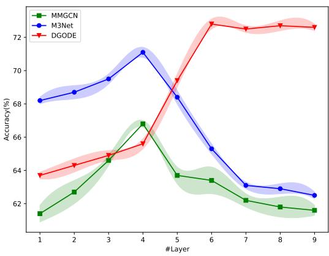  
Figure 1: Performance comparison of different methods for different numbers of GCN layers on the IEMOCAP dataset.

Many existing studies improve the performance of MERC by using graph convolutional neural networks (GCNs) (Yin et al., 2023b,a,c, 2022b,a, 2024b,a; Yin et al.) to effectively model the conversational relations between speakers. However, as shown in Fig. 1, we find that existing GCNs only contain 4 layers of GCN (e.g., MMGCN (Hu et al., 2021) and M3Net (Chen et al., 2023)), while the performance decreases significantly as the number of layers increases. The reason for the performance degradation may be attributed to the fact that information aggregation in vanilla GCNs is just simple message smoothing within the neighborhood, causing neighboring nodes to converge to the same value as the number of layers is stacked. Therefore, it is necessary to improve the stability of information diffusion on the graph and alleviate the problem of over-smoothing of nodes. Furthermore, MERC usually relies on dynamic temporal information, while traditional GCNs can only process static images. How to model the temporal features in emotion recognition tasks as a continuous dynamic process so that the network can capture and model the complex patterns of emotion changing over time remains a challenge. Therefore, this paper aims to propose a Dynamic Graph Neural Ordinary Differential Equation Network (DGODE) to dynamically model the temporal dependency of emotion changes and improve the expressiveness of node features as the number of GCN layers increases (Shou et al., 2023c; Ai et al., 2024c; Shou et al., 2024d,g; Ai et al., 2024b,d).

Specifically, we introduce the Dynamic Graph Neural Ordinary Differential Equation Network (DGODE) based on the perspective of continuous time. Our DGODE method introduces an adaptive mixhop mechanism to extract node information from different hop count neighbors simultaneously and uses ordinary differential equations to model the temporal dependence of emotion changes. DGODE shows stable performance as the number of GCN layers increases. We use two publicly available multimodal emotion recognition datasets to verify the effectiveness of DGODE.

Overall, the main contributions of this paper are as follows:

• We propose the Dynamic Graph Neural Ordinary Differential Equation Network (DGODE), which combines the dynamic changes of emotions to capture the temporal dependency of speakers’ emotions.

• We design an adaptive mixhop mechanism to capture the relationship between distant nodes and combine ODE to capture the temporal dependency of speakers’ emotions.

• Extensive experiments are conducted to demonstrate its superiority in MERC compared to various baselines on IEMOCAP and MELD datasets.

## 2 Related Work

## 2.1 Multimodal Emotion Recognition in Conversation

MERC aims to identify and understand the emotional state in a conversation by analyzing data in multiple modalities (Zhang et al., 2023). With the rapid development of social media technology, people are increasingly communicating in a multimodal way. Therefore, how to accurately understand the emotional information in multimodal data has become a key issue (Ai et al., 2024e).

Initially, researchers used recurrent neural networks (RNNs) to model conversations, which mainly capture emotional information by processing utterances or entire conversations sequentially (Poria et al., 2017). For instance, HiGRU (Jiao et al., 2019) proposed a hierarchical GRU model to capture the information in the conversation, which not only considers the emotional features at the word level, but also extends to the utterance level, thereby generating a conversation representation that contains richer contextual information. Similarly, DialogueRNN (Majumder et al., 2019) also uses GRU units to capture the emotional dynamics in the conversation, while taking into account the state of the utterance itself and the emotional state of the speaker. Since RNNs cannot achieve parallel computing, Transformers have become a better alternative for sequence modeling (Fan et al., 2023). For example, CTNet (Lian et al., 2021) uses the powerful representation ability of Transformers to model the emotional dynamics in conversations through a self-attention mechanism. SDT (Ma et al., 2023) effectively integrates multimodal information through Transformer, and uses selfdistillation technology to better learn the potential information in multimodal data.

However, studies have shown (Hu et al., 2021) that the discourse in the conversation is not just a sequential relationship, but a more complex speaker dependency. Therefore, the DialogGCN (Ghosal et al., 2019) introduces a graph network to model the dependency between the self and the speaker in the conversation. By using a graph convolutional network (GCN), DialogGCN can effectively propagate contextual information to capture more detailed emotional dependencies. Based on the idea of DialogGCN, SumAggGIN (Sheng et al., 2020) further emphasizes the emotional fluctuations in the conversation by referencing global topic-related emotional phrases and local dependencies. Meaningwhlie, the DAG-ERC (Shen et al., 2021b) believes that the discourse in the conversation is not a simple continuous relationship, but a directed dependency structure.

With the development of pre-trained language models (PLMs) (Min et al., 2023), researchers began to explore the application of PLM’s powerful representation capabilities to emotion recognition tasks. For example, DialogXL (Shen et al., 2021a) applies XLNet to emotion recognition and designs an enhanced memory module for storing historical context, while modifying the original self-attention mechanism to capture complex dependencies within and between speakers. The CoMPM (Lee and Lee, 2022) further leverages PLM by building a pre-trained memory based on the speaker’s previous utterances, and then combining the context embedding generated by another PLM to generate the final representation of emotion recognition. CoG-BART (Li et al., 2022a) introduces the BART model to understand the contextual background and generate the next utterance as an auxiliary task.

## 2.2 Continuous Graph Neural Networks

Neural ordinary differential equations (ODEs) are a novel approach to modeling continuous dynamic systems (Chen et al., 2018). They parameterize the derivatives of hidden states through neural networks, allowing the model to perform continuous inference in the time dimension, rather than relying solely on the discrete sequence of hidden layers in traditional neural networks. ODEs can more accurately describe the changing process over time and are suitable for complex tasks involving time evolution. Continuous Graph Neural Network (CGNN) (Xhonneux et al., 2020) first extended this ODE approach to graph data. Specifically, CGNN developed a continuous message passing layer to achieve continuous dynamic modeling of node states. Unlike traditional graph neural networks (GCNs), CGNNs no longer rely on a fixed number of layers for information propagation, but instead solve ordinary differential equations to enable continuous propagation of information between nodes. CGNN also introduces a restart distribution to "reset" the node state to the initial state in a timely manner during the information propagation process, thereby avoiding the over-smoothing.

## 3 Preliminaries

## 3.1 Graph Neural Networks

Given a graph $G = ( V , E )$ , where V is a set of nodes and E is a set of edges. Each node $v \in V$ constitutes the node feature matrix $\mathbf { X } \in \mathbb { R } ^ { | V | \times d } ,$ where d represents the dimension of the feature. Each row of X corresponds to the feature representation of a node. we use the binary adjacency matrix $\mathbf { A } \in \mathbb { R } ^ { | V | \times | V | }$ to represent the connection relationship between node i and node j. If $a _ { i j } = 1$ it means that there is an edge between node i and node $j ;$ if $a _ { i j } = 0$ , it means that there is no connection. Our goal is to learn a node representation matrix H that can capture the structural information and feature information of the nodes in the graph.

We usually normalize the adjacency matrix A. The degree matrix D is a diagonal matrix whose diagonal elements $\mathbf { D _ { i i } }$ represent the degree of node i. However, the eigenvalues of the normalized matrix may include negative values. Therefore, we follow the previous methods (Kipf and Welling, 2022) and use a regularized matrix to represent the graph structure. Specifically, we use the following symmetric normalized adjacency matrix:

$$
\hat { \mathbf { A } } = \frac { \alpha } { 2 } \left( \mathbf { I } + \mathbf { D } ^ { - \frac { 1 } { 2 } } \mathbf { A } \mathbf { D } ^ { - \frac { 1 } { 2 } } \right)\tag{1}
$$

where $\alpha$ is a hyperparameter.

## 3.2 Neural Ordinary Differential Equation

Neural ODEs provides a new method for continuous-time dynamic modeling by modeling the forward propagation process of a neural network as the solution process of an ODE. Specifically, consider an input data $x ( t )$ and describe its evolution in the form of an ODE:

$$
\frac { d x ( t ) } { d t } = f ( x ( t ) , t , \theta )\tag{2}
$$

where $x ( t )$ represents the hidden state at time $t , f$ is a neural function with parameter $\theta .$

## 3.3 Multi-modal Feature Extraction

Word Embedding: Following previous studies (Chudasama et al., 2022; Li et al., 2022b), we use RoBERTa (Liu, 2019) to obtain contextual embedding representations of text in this paper.

Visual and Audio Feature Extraction: Following previous work (Ma et al., 2023; Lian et al., 2021), we selected DenseNet (Huang et al., 2017) and openSMILE (Eyben et al., 2010) as feature extraction tools for video and audio.

## 3.4 Problem Definition

In the multimodal conversational emotion recognition task, given a conversation C, the conversation consists of a series of utterances and S different speakers. The goal of multimodal emotion recognition in a conversation is to predict the emotion label of each utterance in the emotion set $Y .$ . Specifically, the conversation $C$ can be represented as a sequence $C = [ ( u _ { 1 } , s _ { 1 } ) , ( u _ { 2 } , s _ { 2 } ) , \ldots , ( u _ { M } , s _ { M } ) ]$ where $u _ { i }$ represents the i-th utterance in the conversation and $s _ { i }$ represents the unique speaker $s _ { i } \in S$ associated with the utterance. Each utterance $u _ { i }$ contains audio data $v _ { a }$ , video data $v _ { f } .$ , and text data $v _ { t }$ . These multimodal data together express the meaning and emotion of the utterance. For each utterance $u _ { i } ,$ we need to determine its emotional state, which is represented by an emotion label $y _ { i } ^ { e }$

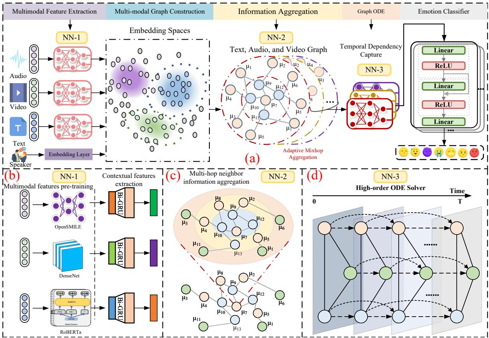  
Figure 2: The overall architecture of DGODE.

## 4 Methodology

As shown in Fig. 2, the key steps of DGODE are to alleviate the overfitting problem of existing GCNs and capture the temporal dependency of speaker emotions. DGODE constructs an adaptive mixhop mechanism in the process of node aggregation to reduce the excessive dependence on local features and thus reduce overfitting. Furthermore, we introduce Graph ODE to model multimodal data in continuous time through differential equations and capture the temporal dependence of speakers. By solving the ODE equation, the emotional state of the previous moment is propagated to the subsequent moment, allowing the model to capture the changing process of the speaker’s emotion over a longer time range. In this section, we theoretically introduce the Dynamic Graph Neural Ordinary Differential Equation Network (DGODE) and explain the implementation details.

## 4.1 Modality Encoding

The essence of a conversation is a continuous interactive process in which multiple speakers participate and communicate with each other. Therefore, when processing a conversation, we need to consider the identity of each speaker and the contextual information of the conversation to obtain semantic information that reflects the current discourse and capture the speaker’s characteristics and the contextual association information of the conversation. Specifically, we first mark each speaker with a one-hot vector $p _ { i }$ to uniquely identify the speaker. For the i-th round of conversation, we extract the corresponding speaker embedding $P _ { i }$ based on the one-hot vector $p _ { i }$ , which contains the characteristic information of the current speaker and can be combined with the semantic features of the current discourse to generate a speaker-aware and contextaware unimodal representation. The formula for discourse embedding is defined as follows:

$$
P _ { i } = \mathbf { W } _ { p } p _ { i }\tag{3}
$$

where $\mathbf { W } _ { p }$ is the learnable parameters.

To effectively encode the features of the conversation text, we use GRU to capture the contextual semantic information in the sequence data and generate a more comprehensive text representation. Specifically, we can make full use of the time order and dependency relationship in the conversation text through GRU, and incorporate the information of the previous and next context into the encoding of each round of conversation, so that the generated text features can better reflect the context and meaning of the entire conversation. Mathematically:

$$
v _ { m } ^ { i } = \overleftrightarrow { G R U } ( v _ { m } ^ { i } , c _ { m ( + , - ) } ^ { i } ) , m \in \{ a , v , f \}\tag{4}
$$

where $c _ { m ( + , - ) } ^ { i }$ represents the cell state.

To obtain a unimodal representation that reflects both the speaker identity and the context information, we add the speaker embedding to the representation of each modality. Specifically, for the i-th round of speech in the conversation, we calculate the text modality representation $h _ { t } ^ { i } .$ , the audio modality representation $h _ { a } ^ { i }$ , and the visual modality representation $h _ { f } ^ { i }$ and add the speaker embedding $S _ { i }$ to these modality representations to generate the final unimodal representations that incorporate the speaker information as follows:

$$
h _ { m } ^ { i } = c _ { m } ^ { i } + S _ { i } , ~ m \in \{ t , a , v \}\tag{5}
$$

## 4.2 Adaptive MixHop Graph

The core idea of GCN is to perform convolution operations on graph structured data to capture the complex relationships between nodes and the topological structure of the graph and learn the representation of node features. However, traditional GCN only aggregates information from directly adjacent nodes, and may not be able to fully capture the information of more distant nodes. To capture high-order neighbor relationships, we construct an adaptive mixhop graph to simultaneously extract information from different hop neighbors and improve the understanding of the global graph structure. Furthermore, to model the interaction between different features, we use the residual idea to discretely model the adaptive mixHop GCN as follows:

$$
\mathbf { H } _ { n + 1 } = \sum _ { n = 1 } ^ { N } \hat { \mathbf { A } } ^ { n } \mathbf { H } _ { n } \mathbf { W } + \mathbf { H } _ { 0 }\tag{6}
$$

where $\mathbf { W } \in \mathbb { R } ^ { d \times d }$ represents the learnable weight matrix. Essentially, using the idea of residuals we

can model the interaction of different features, so that we can learn the representation of nodes more effectively.

## 4.3 Temporal Graph ODE

However, information aggregation via Eq. 6 cannot model the speaker’s emotional changes over time. Therefore, we aim to model the discrete information propagation process of vanilla GCN as a continuous process and use ODE to characterize this dynamic information propagation process. By solving the ODE equation, the emotional state of the previous moment is propagated to the subsequent moments, allowing the model to capture the changing process of the speaker’s emotions over a longer time frame. Specifically, we view Eq. 6 as the Riemann sum of integrals from $t = 0 \mathrm { ~ t o ~ } t = n$ as described in the following proposition.

Proposition 1. Suppose $\mathbf { A } - \mathbf { I } = \mathbf { P } \pmb { \Lambda } ^ { \prime } \mathbf { P } ^ { - 1 }$ $\mathbf { W } - \mathbf { I } = \mathbf { Q } \boldsymbol { \Phi } ^ { \prime } \mathbf { Q } ^ { - 1 }$ , then Eq. 6 is discretized as the ODE as follows:

$$
\frac { d \mathbf { H } ( t ) } { d t } = \frac { 1 } { N } \sum _ { n = 1 } ^ { N } \left( l n \hat { \mathbf { A } } \mathbf { H } ( t ) + \mathbf { H } ( t ) l n \mathbf { W } + \mathbf { E } \right)\tag{7}
$$

$$
\mathbf { H } ( t ) = { \frac { 1 } { N } } \sum _ { n = 1 } ^ { N } \left( e ^ { ( \mathbf { A } - \mathbf { I } ) t } \mathbf { E } e ^ { ( \mathbf { W } - \mathbf { I } ) t } + \mathbf { P } \mathbf { F } ( t ) \mathbf { Q } ^ { - 1 } \right)\tag{8}
$$

where $\mathbf { E } = \mathbf { H } ( 0 ) = ( l n \hat { \mathbf { A } } ) ^ { - 1 } ( \hat { \mathbf { A } } - \mathbf { I } ) \mathbf { E } , \mathbf { E }$ $f ( \mathbf { X } )$ is the output of the encoder $f . \mathbf { F } ( t )$ is defined as follows:

$$
\mathbf { F } _ { i j } ( t ) = \frac { \widetilde { \mathbf { E } } _ { i j } } { \Lambda _ { i i } ^ { \prime } + \Phi _ { j j } ^ { \prime } } e ^ { t ( \mathbf { A } _ { i i } ^ { \prime } + \Phi _ { j j } ^ { \prime } ) } - \frac { \widetilde { \mathbf { E } } _ { i j } } { \Lambda _ { i i } ^ { \prime } + \Phi _ { j j } ^ { \prime } }
$$

where $\widetilde { \mathbf { E } } = \mathbf { P } ^ { - 1 } \mathbf { E } \mathbf { Q }$

(9)

Eq. 8 can be approximated by an ODE solver to calculate the dynamic evolution of the system in discrete time steps as follows:

$$
\mathbf { H } ( t ) = { \mathrm { O D E S o l v e r } } ( { \frac { d \mathbf { H } ( t ) } { d t } } , \mathbf { H } _ { 0 } , t )\tag{10}
$$

## 4.4 Model Training

The final multi-modal embedding representation $\mathbf { H } _ { i }$ is passed to a fully connected layer for further integration and transformation, and a deeper feature representation is extracted as follows:

$$
\begin{array} { r l } & { l _ { i } = \mathrm { R e L U } ( W _ { l } \mathbf { H } _ { i } + b _ { l } ) } \\ & { p _ { i } = \mathrm { s o f t m a x } ( W _ { s m a x } l _ { i } + b _ { s m a x } ) } \end{array}\tag{11}
$$

<table><tr><td rowspan="2">Methods</td><td colspan="7">IEMOCAP</td><td colspan="8">MELD</td></tr><tr><td>Happy</td><td>Sad Neutral</td><td></td><td>1 Angry Excited Frustrated W-F1 Neutral </td><td></td><td></td><td></td><td></td><td>1 Surprise Fear Sadness</td><td></td><td></td><td>Joy</td><td>Disgust Anger</td><td></td><td>W-F1</td></tr><tr><td>bc-LSTM (Poria et al., 2017)</td><td>34.4</td><td>60.8</td><td>51.8</td><td>56.7</td><td>57.9</td><td>58.9</td><td>54.9</td><td>73.8</td><td>47.7</td><td>5.4</td><td>25.1</td><td>51.3</td><td>5.2</td><td>38.4</td><td>55.8</td></tr><tr><td>A-DMN (Xing et al., 2020)</td><td>50.6</td><td>76.8</td><td>62.9</td><td>56.5</td><td>77.9</td><td>55.7</td><td>64.3</td><td>78.9</td><td>55.3</td><td>8.6</td><td>24.9</td><td>57.4</td><td>3.4</td><td>40.9</td><td>60.4</td></tr><tr><td>DialogueGCN (Ghosal et al., 2019)</td><td>42.7</td><td>84.5</td><td>63.5</td><td>64.1</td><td>63.1</td><td>66.9</td><td>65.6</td><td>72.1</td><td>41.7</td><td>2.8</td><td>21.8</td><td>44.2</td><td>6.7</td><td>36.5</td><td>52.8</td></tr><tr><td>RGAT (Ishiwatari et al., 2020)</td><td></td><td>51.6 77.3</td><td>65.4</td><td>63.0</td><td>68.0</td><td>61.2</td><td>65.2</td><td>78.1</td><td>41.5</td><td>2.4</td><td>30.7</td><td>58.6</td><td>2.2</td><td>44.6</td><td>59.5</td></tr><tr><td>CoMPM (Lee and Lee, 2022)</td><td></td><td>60.7 82.2</td><td>63.0</td><td>59.9</td><td>78.2</td><td>59.5</td><td>67.3</td><td>82.0</td><td>49.2</td><td>2.9</td><td>32.3</td><td>61.5</td><td>2.8</td><td>45.8</td><td>63.0</td></tr><tr><td>EmoBERTa (Kim and Vossen, 2021)</td><td></td><td>56.4 83.0</td><td>61.5</td><td>69.6</td><td>78.0</td><td>68.7</td><td>69.9</td><td>82.5</td><td>50.2</td><td>1.9</td><td>31.2</td><td>61.7</td><td>2.5</td><td>46.4</td><td>63.3</td></tr><tr><td>CTNet (Lian et al., 2021)</td><td>51.3</td><td>79.9</td><td>65.8</td><td>67.2</td><td>78.7</td><td>58.8</td><td>67.5</td><td>77.4</td><td>50.3</td><td>10.0</td><td>32.5</td><td>56.0</td><td>11.2</td><td>44.6</td><td>60.2</td></tr><tr><td>LR-GCN (Ren et al., 2021)</td><td></td><td>55.5 79.1</td><td>63.8</td><td>69.0</td><td>74.0</td><td>68.9</td><td>69.0</td><td>80.8</td><td>57.1</td><td>0</td><td>36.9</td><td>65.8</td><td>11.0</td><td>54.7</td><td>65.6</td></tr><tr><td>MMGCN (Hu et al., 2021)</td><td>47.1 81.9</td><td></td><td>66.4</td><td>63.5</td><td>76.2</td><td>59.1</td><td>66.8</td><td>77.0</td><td>49.6</td><td>3.6</td><td>20.4</td><td>53.8</td><td>2.8</td><td>45.2</td><td>58.4</td></tr><tr><td>AdaGIN (Tu et al., 2024)</td><td>53.0 81.5</td><td></td><td>71.3</td><td>65.9</td><td>76.3</td><td>67.8</td><td>70.7</td><td>79.8</td><td>60.5</td><td>15.2</td><td>43.7</td><td>64.5</td><td>29.3</td><td>56.2</td><td>66.8</td></tr><tr><td>DER-GCN (Ai et al., 2024e)</td><td>58.8</td><td>79.8</td><td>61.5</td><td>72.1</td><td>73.3</td><td>67.8</td><td>68.8</td><td>80.6</td><td>51.0</td><td>10.4</td><td>41.5</td><td>64.3</td><td>10.3</td><td>57.4</td><td>65.5</td></tr><tr><td>M3Net (Chen et al., 2023)</td><td>60.9</td><td>78.8</td><td>70.1</td><td>68.1</td><td>77.1</td><td>67.0</td><td>71.1</td><td>79.1</td><td>59.5</td><td>13.3</td><td>42.9</td><td>65.1</td><td>21.7</td><td>53.5</td><td>65.8</td></tr><tr><td>DGODE</td><td>71.8</td><td>71.0</td><td>74.9</td><td>55.7</td><td>78.6</td><td>75.2</td><td>72.8</td><td>82.6</td><td>60.9</td><td>5.1</td><td>45.5</td><td>63.4</td><td>10.6</td><td>54.0</td><td>67.2</td></tr></table>

Table 1: Comparison with other baselines on the IEMOCAP and MELD dataset.

where $\mathbf { \nabla } _ { \pmb { p } _ { i } }$ contains the model’s predicted probability for each emotion category, reflecting the model’s confidence in identifying different emotions on the utterance, $W _ { l } , W _ { s m a x } , b _ { l } .$ , and $b _ { s m a x }$ are trainable parameters. To obtain the final emotion prediction result, we select the emotion category label $\hat { y } _ { i }$ with the highest probability from $\mathbf { \nabla } p _ { i }$ as the predicted emotion of the utterance as follows:

$$
\hat { y } _ { i } = \arg \operatorname* { m a x } _ { j } ( p _ { i j } )\tag{12}
$$

## 4.5 Implementation Details

We used PyTorch to implement the proposed DGODE model and chose Adam as the optimizer. For the IEMOCAP dataset, the learning rate of the model was set to 1e-4, while for the MELD dataset, the learning rate was set to 5e-6. During training, the batch size of IEMOCAP was 16, while the batch size of MELD was 8. In the setting of the Bi-GRU layer, we set different numbers of channels for different modal inputs. In the IEMO-CAP dataset, the number of input channels for text, acoustic, and visual modalities are 1024, 1582, and 342, respectively. In the MELD dataset, the number of input channels for text, acoustic, and visual modalities are set to 1024, 300, and 342, respectively. In addition, for the graph encoder, we set the size of the hidden layer to 512. To prevent overfitting of the model, we introduced L2 weight decay in training, with the coefficient set to 1e-5, and applied a dropout rate of 0.5 in the key layers.

## 5 Experiments

Our experimental results are the average of 10 runs and are statistically significant under paired t-test (all $p < 0 . 0 5 )$ .

## 5.1 Datasets and Evaluation Metrics

We used two used MERC datasets in our experiments: IEMOCAP (Busso et al., 2008) and MELD (Poria et al., 2019). Both datasets contain data in three modalities: text, audio, and video. The IEMO-CAP dataset is collected from dialogue scenes performed by actors. The MELD dataset consists of dialogue clips from the American TV series Friends. We report the F1 and the weighted F1 (W-F1).

## 5.2 Baselines

To verify the superior performance of our proposed method DGODE, we compared it with other comparison methods, including three RNN algorithms (i.e., bc-LSTM (Poria et al., 2017), A-DMN (Xing et al., 2020), CoMPM (Lee and Lee, 2022)), six GNN algorithms (i.e., DialogueGCN (Ghosal et al., 2019), LR-GCN (Ren et al., 2021), MMGCN (Hu et al., 2021), AdaGIN (Tu et al., 2024), DER-GCN (Ai et al., 2024e), RGAT (Ishiwatari et al., 2020)), one HGNN algorithm (i.e., M3Net (Chen et al., 2023)), and two Transformer algorithm (i.e., CT-Net (Lian et al., 2021), EmoBERTa (Kim and Vossen, 2021)).

## 5.3 Overall Results

As shown in Table 1, the experimental results show that our proposed method DGODE significantly improves the performance in the emotion recognition task. The performance improvement may be due to the fact that the dynamic graph ODE network can effectively capture the temporal dependency of the discourse and effectively alleviate the over-smoothing problem when processing graph data. To further verify the superiority of the model, we also report the W-F1 of each emotion category. Specifically, in the IEMOCAP dataset, our model has better W-F1 scores than other methods on the three categories of emotions "happy", "neutral" and "frustrated". Similarly, in the MELD dataset, our model also achieves the best W-F1 scores on the three categories of emotions "surprise", "neutral" and "sadness", further verifying the robustness of the model. Therefore, our method not only performs well in emotion recognition tasks, but also has significant advantages in model complexity.

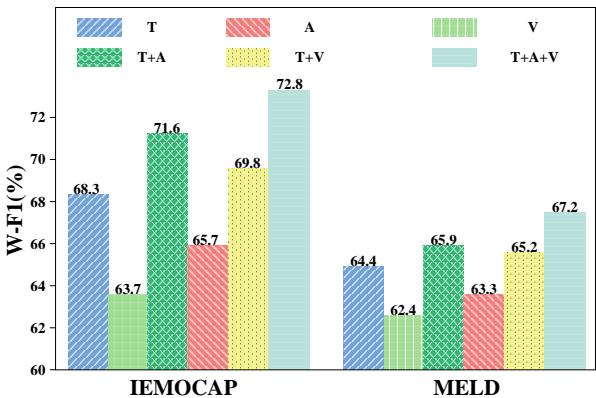  
Figure 3: Verify the effectiveness of multimodal features.

## 5.4 Effectiveness of Multimodal Features

We analyze the impact of different modal features on the results of emotion recognition experiments to verify the effect of different modal feature combinations. Specifically, we observe the contribution of different modal features (text, audio, and video) to the emotion recognition performance by inputting them into the model. The experimental results are shown in Fig. 3. 1) In the single-modal experiment, the emotion recognition accuracy of the text modality is significantly better than the audio and video modalities. 2) When we combine the features of the two modalities for the experiment, the effect of emotion recognition is significantly better than the results of any single modality. 3) When we use the features of the three modalities for emotion recognition at the same time, the performance of the model reaches the best level.

## 5.5 Error Analysis

Although the proposed DGODE model has shown good results in the emotion recognition task, it still faces some challenges, especially in the recognition of some emotions. To analyze the misclassification of the model in more depth, we analyzed the confusion matrix of the test set on the two datasets. As shown in Fig. 4, DGODE has the problem of misclassifying similar emotions on the IEMOCAP dataset. For example, the model often misclassifies "happy" as "excited" or "angry" as "frustrated". The slight differences between emotions lead to the difficulty of the model in distinguishing them. Secondly, on the MELD dataset, DGODE also shows a similar misclassification trend, such as misclassifying "surprise" as "angry". In addition, since the "neutral" emotion is the majority class in the MELD dataset, the model tends to misclassify other emotions as "neutral", which makes the model’s performance in dealing with other emotion categories decrease. Finally, the model also encounters significant difficulties in identifying minority emotions. In particular, in the MELD dataset, the two emotions "fear" and "disgust" belong to the minority class, and it is difficult for the model to accurately detect these emotions.

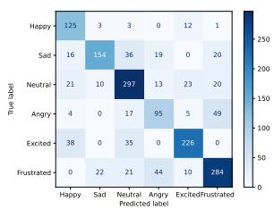  
(a) IEMOCAP

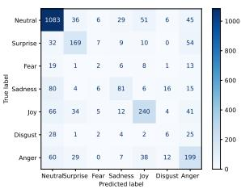  
(b) MELD

Figure 4: We performed a analysis of the classification results on the test sets and visualized through confusion matrices.  
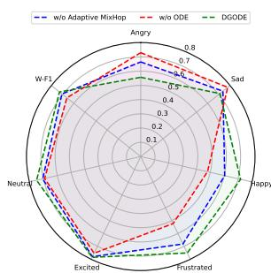  
(a) IEMOCAP

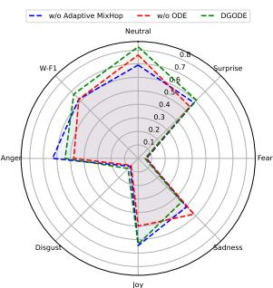  
(b) MELD  
Figure 5: On the IEMOCAP and MELD datasets, we performed a detailed analysis of the classification results on the test sets and visualized them through confusion matrices.

## 5.6 Abalation Study

To analyze the components of DGODE, we performed ablation experiments on the IEMOCAP and MELD datasets. The results in Fig. 5 show that DGODE consistently outperforms all variants on W-F1 and is also the best on the partially classified sentiment categories. Removing ODE degrades the performance, which highlights the role of ODE in capturing the dynamics of multimodal data. Removing the adaptive mixHop graph also degrades the performance, which emphasizes the importance of capturing high-order relationships.

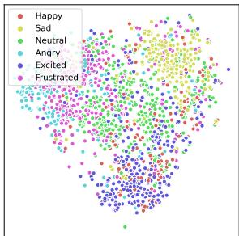  
(a) Initial (IEMOCAP)

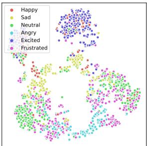  
(b) MMGCN (IEMOCAP)

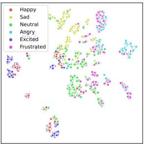  
(c) M3Net (IEMOCAP)

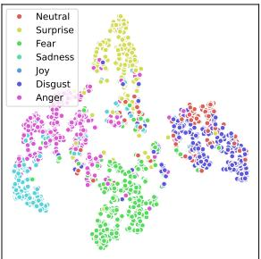  
(d) DGODE (IEMOCAP)

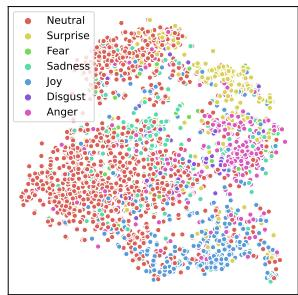  
(e) Initial (MELD)

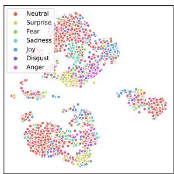  
(f) MMGCN (MELD)

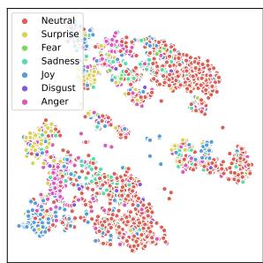  
(g) M3Net (MELD)

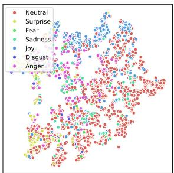  
(h) DGODE (MELD)  
Figure 6: Visualization of the learned embeddings.

## 5.7 Visualization

To more intuitively demonstrate the classification effect of DGODE method in the MERC task, we use T-SNE to visualize the generated sentence vectors. As shown in Fig. 6, on the IEMOCAP dataset, the DGODE model performs well, and samples of different emotion categories are effectively separated in the visualization. In contrast, although the MMGCN model can also distinguish samples of different emotion categories to some extent, its classification performance is obviously inferior to DGODE. The distribution of samples generated by MMGCN is relatively chaotic, and the boundaries between different emotion categories are unclear. Meaningwhile, we also compared the classification effect of the M3Net model. Similar to DGODE, M3Net also showed good classification performance on the IEMOCAP dataset, and was able to clearly separate samples of different emotion categories. In the experimental results on the MELD dataset, we observed a similar phenomenon.

## 6 Conclusions

In this paper, we introduce the Dynamic Graph Neural Ordinary Differential Equation Network (DGODE) based on the perspective of controlled diffusion. Our DGODE method introduces an adaptive mixhop mechanism to extract node information from different hop count neighbors simultaneously and uses ordinary differential equations to model the temporal dependence of emotion changes. DGODE shows stable performance as the number of GCN layers increases. We compare DGODE and other baselins on two widely used datasets, and experimental results show that DGODE achieves new SOTA results.

## 7 Ethical Considerations

(1) All of our experiments are based on public scientific research datasets that have been widely used in academic research and have undergone strict ethical review. (2) Our research content and experimental design do not involve any sensitive data.

## 8 Limitations

In multimodal emotion recognition, emotion labels are usually annotated for the overall emotion of a certain period of time. However, DGODE focuses on dynamic changes, which may lead to the problem that the subtle dynamic changes captured by the model do not match the overall emotion labels.

## Acknowledgement

This work is supported by National Natural Science Foundation of China (GrantNo. 69189338), ExcellentYoung Scholars of Hunan Province of China (Grant No. 22B0275), and ChangshaNatural Science Foundation (GrantNo. kq2202294).

## References

Wei Ai, Wen Deng, Hongyi Chen, Jiayi Du, Tao Meng, and Yuntao Shou. 2024a. Mcsff: Multi-modal consistency and specificity fusion framework for entity alignment. arXiv preprint arXiv:2410.14584.

Wei Ai, Yinghui Gao, Jianbin Li, Jiayi Du, Tao Meng, Yuntao Shou, and Keqin Li. 2024b. Seg: Seeds-enhanced iterative refinement graph neural network for entity alignment. arXiv preprint arXiv:2410.20733.

Wei Ai, Jianbin Li, Ze Wang, Jiayi Du, Tao Meng, Yuntao Shou, and Keqin Li. 2024c. Graph contrastive learning via cluster-refined negative sampling for semi-supervised text classification. arXiv preprint arXiv:2410.18130.

Wei Ai, Jianbin Li, Ze Wang, Yingying Wei, Tao Meng, Yuntao Shou, and Keqin Lib. 2024d. Contrastive multi-graph learning with neighbor hierarchical sifting for semi-supervised text classification. arXiv preprint arXiv:2411.16787.

Wei Ai, Yuntao Shou, Tao Meng, and Keqin Li. 2024e. Der-gcn: Dialog and event relation-aware graph convolutional neural network for multimodal dialog emotion recognition. IEEE Transactions on Neural Networks and Learning Systems.

Wei Ai, Yuntao Shou, Tao Meng, Nan Yin, and Keqin Li. 2023a. Der-gcn: Dialogue and event relationaware graph convolutional neural network for multimodal dialogue emotion recognition. arXiv preprint arXiv:2312.10579.

Wei Ai, Yingying Wei, Hongen Shao, Yuntao Shou, Tao Meng, and Keqin Li. 2024f. Edge-enhanced minimum-margin graph attention network for short text classification. Expert Systems with Applications, 251:124069.

Wei Ai, FuChen Zhang, Tao Meng, YunTao Shou, HongEn Shao, and Keqin Li. 2023b. A two-stage multimodal emotion recognition model based on graph contrastive learning. In 2023 IEEE 29th International Conference on Parallel and Distributed Systems (ICPADS), pages 397–404. IEEE.

Carlos Busso, Murtaza Bulut, Chi-Chun Lee, Abe Kazemzadeh, Emily Mower, Samuel Kim, Jeannette N Chang, Sungbok Lee, and Shrikanth S Narayanan. 2008. Iemocap: Interactive emotional dyadic motion capture database. Language resources and evaluation, 42:335–359.

Feiyu Chen, Jie Shao, Shuyuan Zhu, and Heng Tao Shen. 2023. Multivariate, multi-frequency and multimodal: Rethinking graph neural networks for emotion recognition in conversation. In Proceedings of the IEEE/CVF Conference on Computer Vision and Pattern Recognition, pages 10761–10770.

Ricky TQ Chen, Yulia Rubanova, Jesse Bettencourt, and David K Duvenaud. 2018. Neural ordinary differential equations. Advances in Neural Information Processing Systems, 31.

Vishal Chudasama, Purbayan Kar, Ashish Gudmalwar, Nirmesh Shah, Pankaj Wasnik, and Naoyuki Onoe. 2022. M2fnet: Multi-modal fusion network for emotion recognition in conversation. In Proceedings of the IEEE/CVF Conference on Computer Vision and Pattern Recognition, pages 4652–4661.

Florian Eyben, Martin Wöllmer, and Björn Schuller. 2010. Opensmile: the munich versatile and fast opensource audio feature extractor. In Proceedings ofthe 18th ACM International Conference on Multimedia, pages 1459–1462.

Weiquan Fan, Xiaofen Xing, Bolun Cai, and Xiangmin Xu. 2023. Mgat: Multi-granularity attention based transformers for multi-modal emotion recognition. In ICASSP 2023-2023 IEEE International Conference on Acoustics, Speech and Signal Processing (ICASSP), pages 1–5. IEEE.

Deepanway Ghosal, Navonil Majumder, Soujanya Poria, Niyati Chhaya, and Alexander Gelbukh. 2019. Dialoguegcn: A graph convolutional neural network for emotion recognition in conversation. In Proceedings ofthe 2019 Conference on Empirical Methods in Natural Language Processing and the 9th International Joint Conference on Natural Language Processing (EMNLP-IJCNLP), pages 154–164.

Jingwen Hu, Yuchen Liu, Jinming Zhao, and Qin Jin. 2021. Mmgcn: Multimodal fusion via deep graph convolution network for emotion recognition in conversation. In Proceedings ofthe 59th Annual Meeting of the Association for Computational Linguistics and the 11th International Joint Conference on Natural Language Processing (Volume 1: Long Papers), pages 5666–5675.

Gao Huang, Zhuang Liu, Laurens Van Der Maaten, and Kilian Q Weinberger. 2017. Densely connected convolutional networks. In Proceedings of the IEEE Conference on Computer Vision and Pattern Recognition, pages 4700–4708.

Taichi Ishiwatari, Yuki Yasuda, Taro Miyazaki, and Jun Goto. 2020. Relation-aware graph attention networks with relational position encodings for emotion recognition in conversations. In Proceedings ofthe 2020 conference on empirical methods in natural language processing (EMNLP), pages 7360–7370.

Wenxiang Jiao, Haiqin Yang, Irwin King, and Michael R Lyu. 2019. Higru: Hierarchical gated recurrent units

for utterance-level emotion recognition. In Proceedings ofthe 2019 Conference ofthe North American Chapter of the Association for Computational Linguistics: Human Language Technologies, Volume 1 (Long and Short Papers), pages 397–406.

Taewoon Kim and Piek Vossen. 2021. Emoberta: Speaker-aware emotion recognition in conversation with roberta. arXiv preprint arXiv:2108.12009.

Thomas N Kipf and Max Welling. 2022. Semisupervised classification with graph convolutional networks. In International Conference on Learning Representations.

Joosung Lee and Wooin Lee. 2022. Compm: Context modeling with speaker’s pre-trained memory tracking for emotion recognition in conversation. In Proceedings of the 2022 Conference of the North American Chapter ofthe Associationfor Computational Linguistics: Human Language Technologies, pages 5669–5679.

Shimin Li, Hang Yan, and Xipeng Qiu. 2022a. Contrast and generation make bart a good dialogue emotion recognizer. In Proceedings ofthe AAAI Conference on Artificial Intelligence, volume 36, pages 11002– 11010.

Zaijing Li, Fengxiao Tang, Ming Zhao, and Yusen Zhu. 2022b. Emocaps: Emotion capsule based model for conversational emotion recognition. In Findings of the Association for Computational Linguistics: ACL 2022, pages 1610–1618.

Zheng Lian, Bin Liu, and Jianhua Tao. 2021. Ctnet: Conversational transformer network for emotion recognition. IEEE/ACM Transactions on Audio, Speech, and Language Processing, 29:985–1000.

Y Liu. 2019. Roberta: A robustly optimized bert pretraining approach. arXiv preprint arXiv:1907.11692.

Hui Ma, Jian Wang, Hongfei Lin, Bo Zhang, Yijia Zhang, and Bo Xu. 2023. A transformer-based model with self-distillation for multimodal emotion recognition in conversations. IEEE Transactions on Multimedia.

Navonil Majumder, Soujanya Poria, Devamanyu Hazarika, Rada Mihalcea, Alexander Gelbukh, and Erik Cambria. 2019. Dialoguernn: An attentive rnn for emotion detection in conversations. In Proceedings of the AAAI Conference on Artificial Intelligence, volume 33, pages 6818–6825.

Tao Meng, Yuntao Shou, Wei Ai, Jiayi Du, Haiyan Liu, and Keqin Li. 2024a. A multi-message passing framework based on heterogeneous graphs in conversational emotion recognition. Neurocomputing, 569:127109.

Tao Meng, Yuntao Shou, Wei Ai, Nan Yin, and Keqin Li. 2024b. Deep imbalanced learning for multimodal emotion recognition in conversations. IEEE Transactions on Artificial Intelligence.

Tao Meng, Fuchen Zhang, Yuntao Shou, Wei Ai, Nan Yin, and Keqin Li. 2024c. Revisiting multimodal emotion recognition in conversation from the perspective of graph spectrum. arXiv preprint arXiv:2404.17862.

Tao Meng, Fuchen Zhang, Yuntao Shou, Hongen Shao, Wei Ai, and Keqin Li. 2024d. Masked graph learning with recurrent alignment for multimodal emotion recognition in conversation. IEEE/ACM Transactions on Audio, Speech, and Language Processing.

Bonan Min, Hayley Ross, Elior Sulem, Amir Pouran Ben Veyseh, Thien Huu Nguyen, Oscar Sainz, Eneko Agirre, Ilana Heintz, and Dan Roth. 2023. Recent advances in natural language processing via large pre-trained language models: A survey. ACM Computing Surveys, 56(2):1–40.

Soujanya Poria, Erik Cambria, Devamanyu Hazarika, Navonil Majumder, Amir Zadeh, and Louis-Philippe Morency. 2017. Context-dependent sentiment analysis in user-generated videos. In Proceedings of the 55th annual meeting of the association for computational linguistics (volume 1: Long papers), pages 873–883.

Soujanya Poria, Devamanyu Hazarika, Navonil Majumder, Gautam Naik, Erik Cambria, and Rada Mihalcea. 2019. Meld: A multimodal multi-party dataset for emotion recognition in conversations. In Proceedings ofthe 57th Annual Meeting ofthe Association for Computational Linguistics, pages 527–536.

Minjie Ren, Xiangdong Huang, Wenhui Li, Dan Song, and Weizhi Nie. 2021. Lr-gcn: Latent relation-aware graph convolutional network for conversational emotion recognition. IEEE Transactions on Multimedia, 24:4422–4432.

Weizhou Shen, Junqing Chen, Xiaojun Quan, and Zhixian Xie. 2021a. Dialogxl: All-in-one xlnet for multiparty conversation emotion recognition. In Proceedings ofthe AAAI Conference on Artificial Intelligence, volume 35, pages 13789–13797.

Weizhou Shen, Siyue Wu, Yunyi Yang, and Xiaojun Quan. 2021b. Directed acyclic graph network for conversational emotion recognition. In Proceedings of the 59th Annual Meeting of the Association for Computational Linguistics and the 11th International Joint Conference on Natural Language Processing (Volume 1: Long Papers), pages 1551–1560.

Dongming Sheng, Dong Wang, Ying Shen, Haitao Zheng, and Haozhuang Liu. 2020. Summarize before aggregate: A global-to-local heterogeneous graph inference network for conversational emotion recognition. In Proceedings ofthe 28th International Conference on Computational Linguistics, pages 4153– 4163.

Yuntao Shou, Wei Ai, Jiayi Du, Tao Meng, and Haiyan Liu. 2024a. Efficient long-distance latent relationaware graph neural network for multi-modal emotion recognition in conversations. arXiv preprint arXiv:2407.00119.

Yuntao Shou, Wei Ai, Tao Meng, and Keqin Li. 2023a. Czl-ciae: Clip-driven zero-shot learning for correcting inverse age estimation. arXiv preprint arXiv:2312.01758.

Yuntao Shou, Wei Ai, Tao Meng, and Nan Yin. 2023b. Graph information bottleneck for remote sensing segmentation. arXiv preprint arXiv:2312.02545.

YunTao Shou, Wei Ai, Tao Meng, FuChen Zhang, and KeQin Li. 2023c. Graphunet: Graph make strong encoders for remote sensing segmentation. In 2023 IEEE 29th International Conference on Parallel and Distributed Systems (ICPADS), pages 2734–2737. IEEE.

Yuntao Shou, Xiangyong Cao, Huan Liu, and Deyu Meng. 2025. Masked contrastive graph representation learning for age estimation. Pattern Recognition, 158:110974.

Yuntao Shou, Xiangyong Cao, and Deyu Meng. 2024b. Spegcl: Self-supervised graph spectrum contrastive learning without positive samples. arXiv preprint arXiv:2410.10365.

Yuntao Shou, Haozhi Lan, and Xiangyong Cao. 2024c. Contrastive graph representation learning with adversarial cross-view reconstruction and information bottleneck. arXiv preprint arXiv:2408.00295.

Yuntao Shou, Huan Liu, Xiangyong Cao, Deyu Meng, and Bo Dong. 2024d. A low-rank matching attention based cross-modal feature fusion method for conversational emotion recognition. IEEE Transactions on Affective Computing.

Yuntao Shou, Tao Meng, Wei Ai, and Keqin Li. 2023d. Adversarial representation with intra-modal and intermodal graph contrastive learning for multimodal emotion recognition. arXiv preprint arXiv:2312.16778.

Yuntao Shou, Tao Meng, Wei Ai, Canhao Xie, Haiyan Liu, and Yina Wang. 2022a. Object detection in medical images based on hierarchical transformer and mask mechanism. Computational Intelligence and Neuroscience, 2022(1):5863782.

Yuntao Shou, Tao Meng, Wei Ai, Sihan Yang, and Keqin Li. 2022b. Conversational emotion recognition studies based on graph convolutional neural networks and a dependent syntactic analysis. Neurocomputing, 501:629–639.

Yuntao Shou, Tao Meng, Wei Ai, Nan Yin, and Keqin Li. 2023e. A comprehensive survey on multi-modal conversational emotion recognition with deep learning. arXiv preprint arXiv:2312.05735.

Yuntao Shou, Tao Meng, Wei Ai, Fuchen Zhang, Nan Yin, and Keqin Li. 2024e. Adversarial alignment and graph fusion via information bottleneck for multimodal emotion recognition in conversations. Information Fusion, 112:102590.

Yuntao Shou, Tao Meng, Fuchen Zhang, Nan Yin, and Keqin Li. 2024f. Revisiting multi-modal emotion learning with broad state space models and probability-guidance fusion. arXiv preprint arXiv:2404.17858.

Yuntao Shou, Peiqiang Yan, Xingjian Yuan, Xiangyong Cao, Qian Zhao, and Deyu Meng. 2024g. Graph domain adaptation with dual-branch encoder and twolevel alignment for whole slide image-based survival prediction. arXiv preprint arXiv:2411.14001.

Geng Tu, Tian Xie, Bin Liang, Hongpeng Wang, and Ruifeng Xu. 2024. Adaptive graph learning for multimodal conversational emotion detection. In Proceedings of the AAAI Conference on Artificial Intelligence, volume 38, pages 19089–19097.

Louis-Pascal Xhonneux, Meng Qu, and Jian Tang. 2020. Continuous graph neural networks. In International Conference on Machine Learning, pages 10432–10441. PMLR.

Songlong Xing, Sijie Mai, and Haifeng Hu. 2020. Adapted dynamic memory network for emotion recognition in conversation. IEEE Transactions on Affective Computing, 13(3):1426–1439.

Nan Yin, Fuli Feng, Zhigang Luo, Xiang Zhang, Wenjie Wang, Xiao Luo, Chong Chen, and Xian-Sheng Hua. 2022a. Dynamic hypergraph convolutional network. In 2022 IEEE 38th International Conference on Data Engineering (ICDE), pages 1621–1634. IEEE.

Nan Yin, Li Shen, Chong Chen, Xian-Sheng Hua, and Xiao Luo. Sport: A subgraph perspective on graph classification with label noise. ACM Transactions on Knowledge Discoveryfrom Data.

Nan Yin, Li Shen, Baopu Li, Mengzhu Wang, Xiao Luo, Chong Chen, Zhigang Luo, and Xian-Sheng Hua. 2022b. Deal: An unsupervised domain adaptive framework for graph-level classification. In Proceedings of the 30th ACM International Conference on Multimedia, pages 3470–3479.

Nan Yin, Li Shen, Mengzhu Wang, Long Lan, Zeyu Ma, Chong Chen, Xian-Sheng Hua, and Xiao Luo. 2023a. Coco: A coupled contrastive framework for unsupervised domain adaptive graph classification. In International Conference on Machine Learning, pages 40040–40053. PMLR.

Nan Yin, Li Shen, Mengzhu Wang, Xiao Luo, Zhigang Luo, and Dacheng Tao. 2023b. Omg: towards effective graph classification against label noise. IEEE Transactions on Knowledge and Data Engineering.

Nan Yin, Li Shen, Huan Xiong, Bin Gu, Chong Chen, Xian-Sheng Hua, Siwei Liu, and Xiao Luo. 2023c. Messages are never propagated alone: Collaborative hypergraph neural network for time-series forecasting. IEEE Transactions on Pattern Analysis and Machine Intelligence.

Nan Yin, Mengzhu Wan, Li Shen, Hitesh Laxmichand Patel, Baopu Li, Bin Gu, and Huan Xiong. 2024a. Continuous spiking graph neural networks. arXiv preprint arXiv:2404.01897.

Nan Yin, Mengzhu Wang, Zhenghan Chen, Giulia De Masi, Huan Xiong, and Bin Gu. 2024b. Dynamic spiking graph neural networks. In Proceedings of the AAAI Conference on Artificial Intelligence, volume 38, pages 16495–16503.

RunKai Ying, Yuntao Shou, and Chang Liu. 2021. Prediction model of dow jones index based on lstmadaboost. In 2021 International Conference on Communications, Information System and Computer Engineering (CISCE), pages 808–812. IEEE.

Duzhen Zhang, Feilong Chen, and Xiuyi Chen. 2023. Dualgats: Dual graph attention networks for emotion recognition in conversations. In Proceedings of the 61st Annual Meeting of the Association for Computational Linguistics (Volume 1: Long Papers), pages 7395–7408.

Yiping Zhang, Yuntao Shou, Tao Meng, Wei Ai, and Keqin Li. 2024. A multi-view mask contrastive learning graph convolutional neural network for age estimation. Knowledge and Information Systems, pages 1–26.

## A Appendix

Proof of Proposition 1. Eq. 6 can be rewritten as follows:

$$
\mathbf { H } _ { n } = \sum _ { n = 1 } ^ { N } \sum _ { k = 0 } ^ { n } \mathbf { A } _ { k } ^ { n } \mathbf { E } \mathbf { W } _ { k } ^ { n }\tag{13}
$$

We use Riemann integration to convert Eq. 13 into a continuous form as follows:

$$
\mathbf { H } ( t ) = \frac { 1 } { N } \sum _ { n = 1 } ^ { N } \int _ { 0 } ^ { t + 1 } \mathbf { A } ^ { s } \mathbf { E } \mathbf { W } ^ { s } \mathrm { d } s .\tag{14}
$$

Taking the derivative of $\mathbf H ( t )$ with respect to t, we get the following ODE:

$$
\frac { \mathrm { d } \mathbf { H } ( t ) } { \mathrm { d } t } = \frac { 1 } { N } \sum _ { n = 1 } ^ { N } \mathbf { A } ^ { t + 1 } \mathbf { E } \mathbf { W } ^ { t + 1 } .\tag{15}
$$

To alleviate the problem of information loss, we take the second-order derivative of $\mathbf H ( t )$ to obtain an ODE expression with better information aggregation as follows:

$$
\begin{array} { l } { { \displaystyle { \frac { \mathrm { d } ^ { 2 } \mathbf { H } ( t ) } { \mathrm { d } t ^ { 2 } } } ( t ) = \frac { 1 } { N } \sum _ { n = 1 } ^ { N } \left( \ln \mathbf { A } \mathbf { A } ^ { t + 1 } \mathbf { E } \mathbf { W } ^ { t + 1 } \right. } \ ~ } \\ { { \displaystyle \left. ~ + \mathbf { A } ^ { t + 1 } \mathbf { E } \mathbf { W } ^ { t + 1 } \ln \mathbf { W } \right) } } \\ { { \displaystyle ~ = \frac { 1 } { N } \sum _ { n = 1 } ^ { N } \left( \ln \mathbf { A } \frac { \mathrm { d } \mathbf { H } ( t ) } { \mathrm { d } t } + \frac { \mathrm { d } \mathbf { H } ( t ) } { \mathrm { d } t } \ln \mathbf { W } \right) } } \end{array}\tag{16}
$$

Integrating both sides of Eq. 16 with respect to t, we can obtain:

$$
\frac { \mathrm { d } \mathbf { H } ( t ) } { \mathrm { d } t } ( t ) = \ln \mathbf { A } \mathbf { H } ( t ) + \mathbf { H } ( t ) \ln \mathbf { W } + c .\tag{17}
$$

The initial value of H(0) is defined as follows:

$$
\left( \mathbf { P } ^ { - 1 } \mathbf { H ( 0 ) } \mathbf { Q } \right) _ { i j } = \frac { \mathbf { A } _ { i i } \widetilde { \mathbf { E } } _ { i j } \pmb { \Phi } _ { j j } - \widetilde { \mathbf { E } } _ { i j } } { \ln \mathbf { A } _ { i i } + \ln \pmb { \Phi } _ { j j } }\tag{18}
$$

When $t = 0$ , we can get:

$$
\begin{array} { r l } & { \frac { \mathrm { d } \mathbf { H } ( t ) } { \mathrm { d } t } \bigg | _ { t = 0 } = \mathbf { A } \mathbf { E } \mathbf { W } } \\ & { \implies \mathbf { A } \mathbf { E } \mathbf { W } - \ln \mathbf { A } \mathbf { H } ( 0 ) - \mathbf { H } ( 0 ) \ln \mathbf { W } = c } \\ & { \qquad ( 1 9 ) } \end{array}
$$

Combining Eq. 12 and Eq. 13 we can derive:

$$
\begin{array} { l } { { \displaystyle \left( { \bf P } ^ { - 1 } c { \bf Q } \right) _ { i j } = \Lambda _ { i i } \widetilde { \bf E } _ { i j } \Phi _ { j j } - \frac { \ln \Lambda _ { i i } \left( \Lambda _ { i i } \widetilde { \bf E } _ { i j } \Phi _ { j j } - \widetilde { \bf E } _ { i j } \right) } { \ln \Lambda _ { i i } + \ln \Phi _ { j j } } } \ ~ } \\ { { \displaystyle ~ - \frac { \Lambda _ { i i } \widetilde { \bf E } _ { i j } \Phi _ { j j } - \widetilde { \bf E } _ { i j } } { \ln \Lambda _ { i i } + \ln \Phi _ { j j } } \ln \Phi _ { j j } } \ ~ } \\ { { \displaystyle c = { \bf P } \widetilde { \bf E } { \bf Q } ^ { - 1 } = { \bf E } } } \end{array}\tag{20}
$$

Therefore, the discrete form of GCN information aggregation can be converted into the continuous form of ODE as follows:

$$
\frac { d \mathbf { H } ( t ) } { d t } = \frac { 1 } { N } \sum _ { n = 1 } ^ { N } \left( l n \hat { \mathbf { A } } \mathbf { H } ( t ) + \mathbf { H } ( t ) l n \mathbf { W } + \mathbf { E } \right)\tag{21}
$$

H(t) can be further solved by an ODE solver (e.g., the Runge-Kutta method) to obtain.