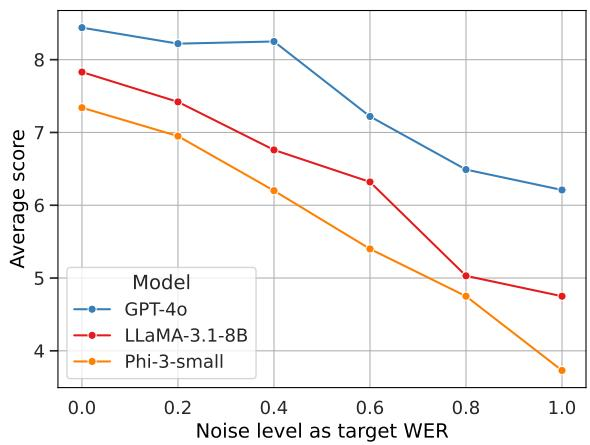
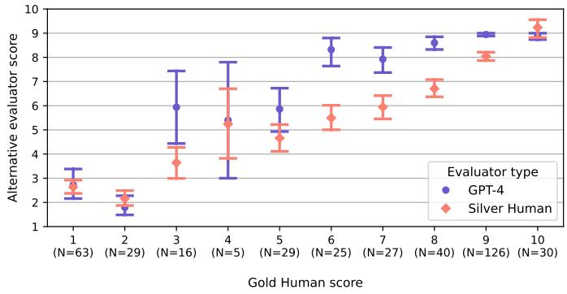
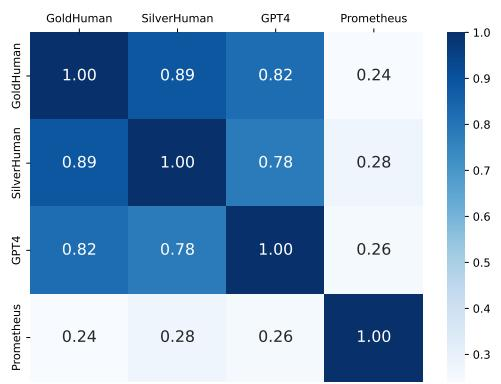
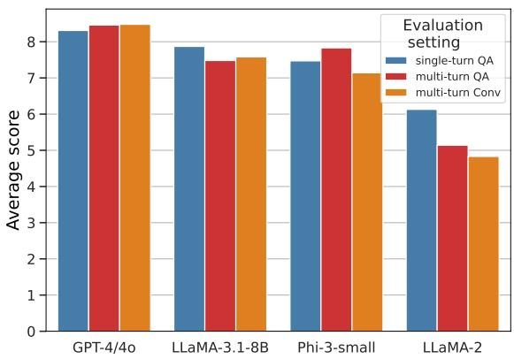
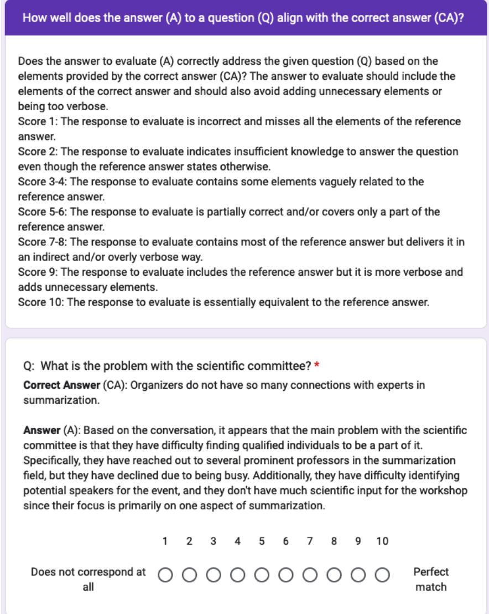
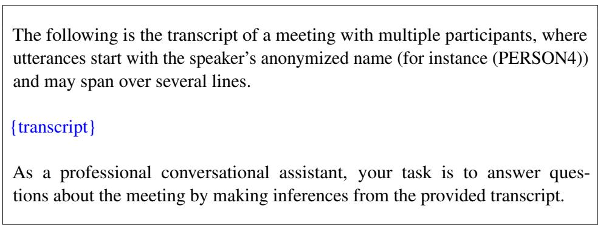

# ELITR-Bench: A Meeting Assistant Benchmark for Long-Context Language Models

Thibaut Thonet, Jos Rozen, Laurent Besacier

NAVER LABS Europe

{thibaut.thonet,jos.rozen,laurent.besacier}@naverlabs.com

## Abstract

Research on Large Language Models (LLMs) has recently witnessed an increasing interest in extending the models’ context size to better capture dependencies within long documents. While benchmarks have been proposed to assess long-range abilities, existing efforts primarily considered generic tasks that are not necessarily aligned with real-world applications. In contrast, we propose a new benchmark for long-context LLMs focused on a practical meeting assistant scenario in which the long contexts consist of transcripts obtained by automatic speech recognition, presenting unique challenges for LLMs due to the inherent noisiness and oral nature of such data. Our benchmark, ELITR-Bench, augments the existing ELITR corpus by adding 271 manually crafted questions with their ground-truth answers, as well as noisy versions of meeting transcripts altered to target different Word Error Rate levels. Our experiments with 12 longcontext LLMs on ELITR-Bench confirm the progress made across successive generations of both proprietary and open models, and point out their discrepancies in terms of robustness to transcript noise. We also provide a thorough analysis of our GPT-4-based evaluation, including insights from a crowdsourcing study. Our findings indicate that while GPT-4’s scores align with human judges, its ability to distin guish beyond three score levels may be limited.

## 1 Introduction

The context window of Large Language Models (LLMs) has recently undergone a significant expansion, scaling from a few thousand tokens to tens or even hundreds of thousands (Chen et al., 2023; Xiong et al., 2023; Liu et al., 2023a; Chen et al., 2024; Bai et al., 2024). As a consequence, benchmarks have emerged to assess LLMs’ longrange abilities, tackling the specific challenges of Question Answering (QA) on long documents (An et al., 2023; Li et al., 2023a; Bai et al., 2023; Li et al., 2023b; Maharana et al., 2024; Zhang et al., 2024). However, while previous datasets focusing on long-context models offer longitudinal evaluations across different tasks, they often provide only superficial analyses of each task. The covered tasks are also often generic – e.g., questions on Wikipedia (Li et al., 2023b) – and thus not particularly suitable for realistic, focused applications.<sup>1</sup>

In contrast, our work advocates for a situated evaluation of long-context LLM performance within specific, real-world scenarios. As a practical illustration, consider a meeting assistant that allows users to inquire about meetings they did not attend. Given that hour-long meeting transcripts must fit within the agent’s context window, proficient handling of long contexts is a prerequisite. This paper then introduces the first benchmark – to the best of our knowledge – for evaluating longcontext LLMs on a realistic meeting assistant task. Our benchmark, named ELITR-Bench,<sup>2</sup> is built upon the meeting transcripts of the past ELITR project (Nedoluzhko et al., 2022). These transcripts have been obtained by Automatic Speech Recognition (ASR) with minimal human corrections – yielding long, noisy documents of oral nature that present unique challenges for LLMs. ELITR-Bench enables tracking the progress of successive model generations (e.g., GPT-3.5 vs GPT-4/4o, or LLaMA-2 vs LLaMA-3.1), as demonstrated by our extensive experiments on 12 longcontext proprietary and open LLMs. Additionally, we analyzed how these models handle varying noise levels in meeting transcripts. Our GPT-4- based evaluation was validated through a crowdsourcing study, which revealed a high correlation with human judges’ scores but also a limited ability to distinguish between more than three quality levels despite using a score range of 10 points.

The remainder of the paper is structured as follows. We provide a review of related literature in Section 2, before introducing the proposed ELITR-Bench in Section 3. We then describe our experimental setup and results in Sections 4 and 5, respectively. Section 6 provides an in-depth assessment of our LLM-based evaluation methodology. Finally, Section 7 concludes the paper and provides some perspectives for future work.

## 2 Related work

Long-context LLMs and techniques. Numerous techniques have emerged to address the challenge of long-context modeling.<sup>3</sup> While an exhaustive survey of these methods is beyond the scope of this paper, they can generally be categorized into three main groups (excluding other distinct approaches such as retrieval-augmented generation (Xu et al., 2024) and context compression (Chevalier et al., 2023)): (a) the development of efficient transformer architectures to address the quadratic attention challenge, including sparse transformers (Child et al., 2019; Beltagy et al., 2020; Zaheer et al., 2020; Martins et al., 2020), linear transformers (Katharopoulos et al., 2020; Wang et al., 2020; Choromanski et al., 2021), and hierarchical transformers (Khandve et al., 2022; Wu et al., 2021; Liu et al., 2022); (b) approaches like recurrent attention networks (Dai et al., 2019; Peng et al., 2023; Bulatov et al., 2024) and state-space models (Gu and Dao, 2023; Wang et al., 2024); (c) length extrapolation or position embedding interpolation, where LLMs are fine-tuned or adapted at inference time to adjust tokens’ positions to match the new context length (Chen et al., 2023; Xiong et al., 2023; Peng et al., 2024; Pal et al., 2023; Liu et al., 2023a; Chen et al., 2024; Bai et al., 2024). These techniques also contributed to the context length expansion in proprietary models like GPT-4 (32k-128k), Claude-3 (200k), and Gemini-1.5 (128k-1M).

Long-context benchmarks. Several benchmarks have recently emerged with the growing interest in evaluating techniques that extend the context length of LLMs. Long Range Arena (Tay et al., 2021) was proposed to assess the quality of efficient transformer models in long-context scenarios, covering 1K-16K tokens sequences through different data types and modalities. L-Eval (An et al., 2023) offers a comprehensive evaluation suite with 20 sub-tasks and over 2,000 human-labeled query-response pairs, aggregating pre-existing datasets like NarrativeQA (Kociskýˇ et al., 2018). LongEval (Li et al., 2023a) proposes synthetic tasks of varying difficulty, while LongBench (Bai et al., 2023) and LongBench-Chat (Bai et al., 2024) aggregate several datasets in English and Chinese. Other recent benchmarks appeared, such as: LongAlpaca (Chen et al., 2024), Loogle (Li et al., 2023b), LoCoMo (Maharana et al., 2024), BAMBOO (Dong et al., 2024), FLenQA (Levy et al., 2024), and ∞Bench (Zhang et al., 2024) that proposes an average data length over 100K tokens. Recently, the needle-in-thehaystack test was proposed by (Kamradt, 2024), in which a long-context LLM must retrieve a short text (the needle) from a long document (the haystack). This initial test has since inspired several subsequent works that propose more and more complex tasks. Our contribution, ELITR-Bench, distinguishes itself from existing benchmarks in several ways: (a) it focuses on a real use-case – meeting assistants,<sup>4</sup> (b) it challenges models by requiring them to make inferences from noisy ASRbased documents, and (c) it offers both question answering and conversation versions (see Section 3), enabling the analysis of different prompt modes.

Evaluation with LLMs. Recent works explored the use of LLMs such as GPT-4 as judges to evaluate responses on open-ended questions. Zheng et al. (2023) measured agreement between LLM and human evaluators while introducing two datasets (MT-bench and Chatbot Arena). They showed that LLM judges like GPT-4 can match both controlled and crowdsourced human annotations, achieving over 80% agreement – the same level of agreement between humans. He et al. (2024) evaluated the performance of GPT-4 against 415 crowdsourcing human labelers. Despite employing best quality control practices, the highest labeling accuracy achieved through crowdsourcing was 81.5% whereas GPT-4 obtained 83.6%. As in certain scenarios, employing proprietary LLMs as evaluators can pose challenges due to their closed-source nature, Kim et al. (2024) introduced Prometheus, an open-source LLM fine-tuned for evaluation. Recently, Bavaresco et al. (2024) introduced Judge-Bench, a collection of 20 NLP datasets with human annotations for evaluating LLMs’ ability to replicate human judgments. In this work, we compare LLMs-as-a-judge (GPT-4 and Prometheus) with expert and crowdsourcing-based human evaluators to assess responses generated by several long-context models on ELITR-Bench.

## 3 ELITR-Bench

We build our benchmark on top of the ELITR Minuting Corpus (Nedoluzhko et al., 2022).<sup>5</sup> This corpus contains transcripts of meetings conducted in both Czech and English, along with manually crafted summaries referred to as ‘minutes’. The meeting durations range from 10 minutes to over 2 hours, with the majority lasting around one hour. Although transcripts have been corrected from ASR outputs, they still contain noise and reflect various oral language phenomena such as interjections. Each transcript is de-identified<sup>6</sup> and accompanied by one or multiple corresponding minutes files. However, in the benchmark described here, we only use the verbatim transcripts and exclude the minutes. In the current version of ELITR-Bench, our focus is on English meetings. Specifically, we utilized the official dev and test2 sets, consisting of 10 and 8 meetings respectively, both sourced from ELITR-English. These meetings focus on discussions related to the computer science domain, with a particular emphasis on Natural Language Processing (NLP) topics. For every meeting within this corpus, we manually created a series of questions that can be directly addressed using the corresponding transcript, and provided their corresponding ground-truth answers. We present in Appendix E (Table 12) a snippet of an ELITR meeting transcript, and showcase examples of questions and answers introduced in ELITR-Bench.

Question type and answer position. The questions we defined span various types, including:

Who questions, What questions (which also include Why questions), When questions, and How many questions. Additionally, we annotated the position of the answer within the meeting transcript, categorizing it as either in the Beginning (first third), Middle (second third), End (final third), or spanning Several passages throughout the transcript. Table 1 provides a summary of the statistics for our benchmark.

QA and Conversation settings. The proposed ELITR-Bench is available in two settings. In ELITR-Bench-QA, we designed for each meeting a set of stand-alone questions (along with their answers) that can be addressed solely based on the meeting transcript, without additional context. We also designed a modified ELITR-Bench-Conv version where questions are to be asked in sequence, in a pre-defined order within a conversation. In this setting, some of the questions contain pronominal references or ellipses, for which previous conversational context (i.e., previous questions and answers) must be used to answer properly. For example, the question “What is challenging about testing the demo system at the students firm fair?” from the QA setting is replaced in the Conv setting with “What is challenging about this event?”, where the answer to the previous question in the conversation was “The studentsfirmfair”. Such questions have been obtained by manually re-writing the Conv questions into QA questions by resolving coreferences. The number of QA/Conv differentiating questions is 16 (out of 141) for the dev set and 17 (out of 130) for the test set.

Noisy versions of the meeting transcripts. To assess the robustness of long-context LLMs to noisy text, we created multiple noisy versions of the ELITR meeting transcripts by simulating different levels of ASR noise. Using a large corpus of over 500k ASR transcripts aligned with references,<sup>7</sup> we generated 86,148 substitution rules where each rule consists of a token and a probability distribution over similar tokens (or an empty character) that can plausibly replace it. This extensive rule set enables us to simulate noisy transcripts with varying target Word Error Rate levels (20%, 40%, 60%, 80% and 100%).<sup>8</sup> We provide more details in Appendix A.

<table><tr><td></td><td>Split #Meetings</td><td>#Questions</td><td colspan="2">#Questions by question type</td><td colspan="2">#Questions by answer position</td><td>#Tokens per meeting: average [min, max]</td></tr><tr><td>Dev</td><td>10</td><td>141</td><td>What</td><td>59</td><td>Begin</td><td>45</td><td>11.3k [5.2k, 17.4k]</td></tr><tr><td></td><td></td><td></td><td>Who</td><td>51</td><td>Middle</td><td>29</td><td></td></tr><tr><td></td><td></td><td></td><td>When</td><td>21</td><td>End</td><td>32</td><td></td></tr><tr><td></td><td></td><td></td><td>How many</td><td>10</td><td>Several</td><td>35</td><td></td></tr><tr><td>Test</td><td>8</td><td>130</td><td>What</td><td>57</td><td>Begin</td><td>43</td><td>12.6k [4.8k, 17.6k]</td></tr><tr><td></td><td></td><td></td><td>Who</td><td>45</td><td>Middle</td><td>34</td><td></td></tr><tr><td></td><td></td><td></td><td>When</td><td>20</td><td>End</td><td>22</td><td></td></tr><tr><td></td><td></td><td></td><td>How many</td><td>8</td><td>Several</td><td>31</td><td></td></tr></table>

Table 1: Statistics for the ELITR-Bench dataset: all questions and answers are annotated by question type (What, Who, When, How many) and by the position of the answer within the meeting transcript (Beginning, Middle, End, or spanning Several sections). The number of tokens per meeting is counted using a LLaMA-2 tokenizer.

## 4 Experimental setup

Evaluation protocol. The evaluation on ELITR-Bench is conducted as follows. For each meeting, a prompt containing the transcript and detailing the assistant’s task is formed. Then, questions are appended to the initial prompt to drive the conversation about the corresponding meeting. We consider two ways to do this: (i) the single-turn mode, where only a single question is tackled in the conversation (i.e., the prompt is re-initialized for each new question), or (ii) the multi-turn mode, where all the questions related to a meeting are asked successively within a single conversation. Given the standalone nature of questions in ELITR-Bench-QA, one can adopt either the single-turn or multi-turn modes for this setting, whereas for ELITR-Bench-Conv it only makes sense to use the multi-turn mode as some questions are inter-dependent. In our evaluation methodology, given a question integrated in the aforementioned prompt, the response generated by an LLM is evaluated automatically using a GPT-4 judge,<sup>9</sup> following the standard practice in LLM evaluation (as discussed in Section 2). Specif ically, we adopted a score rubric-based evaluation methodology (Kim et al., 2024) in which a generated response is evaluated on its proximity to the ground-truth answer, given the associated question and a score rubric that details the quality criteria expected at each score level (ranging from the lowest score of 1 to the perfect score of 10). The prompt used for the evaluation as well as our manually defined score rubric are provided in Appendix F (Figs. 6 and 7, respectively). Although our core experiment results rely on automatic LLM-based evaluation (Section 5), we further confirm the validity of this methodology against human judgement in Section 6.

Compared models. In our experiments on ELITR-Bench, we compared responses generated by 12 LLMs with long-context capabilities (at least 32k tokens). We included both commercial models and open long-context models based on LLaMA-{2, 3.1} and Phi-3 in our benchmarking:

• GPT-3.5, GPT-4 (OpenAI, 2023), GPT-4-o;

• LLaMA-2 models extended for long-context scenarios: LongAlpaca-{7B, 13B} (Chen et al., 2024), LongChat-7B-v1.5 (Li et al., 2023a), Vicuna-{7B, 13B}-v1.5 (Chiang et al., 2023), LongAlign-{7B, 13B} (Bai et al., 2024);

• LLaMA-3.1-8B (Dubey et al., 2024);

• Phi-3-small (Abdin et al., 2024).

We provide more details on the compared models in Appendix B.1. Additionally, we describe the search conducted to select the best model configuration (including inference hyperparameters and prompt formatting) in Appendix B.2.

## 5 Experimental results

This section describes the results of the experiments conducted on ELITR-Bench. In Section 5.1, we summarize the benchmarking results of the compared models on ELITR-Bench-QA and ELITR-Bench-Conv. Then, in Section 5.2, we analyze the impact of the question types and answer positions on the models’ performance. Finally, Section 5.3 discusses how the noise level of the meeting transcripts influences the performance of the models.

## 5.1 Main results

The main results of the benchmarking on ELITR-Bench are reported in Table 2. The compared models are evaluated in three settings that combine the ELITR-Bench-QA or ELITR-Bench-Conv question set with the single-turn mode (i.e., one question asked per conversation) or multi-turn mode (i.e., all questions related to one meeting asked in a single conversation).<sup>10</sup> For each of the three considered settings, we report the results on the dev set, the results on the test set, and their mean. Given the extensive cost of GPT4-based evaluation (detailed in Section 4), we performed a single seeded run for the dev set and three seeded runs for the test set. For the latter, we report the average score over the three runs. In Appendix C.1, we provide more details about the seeded runs as well as their standard deviations.

Looking at the three settings in Table 2, we observe that GPT-4 and GPT-4o dominate over all other approaches with an average score that is always above 8.<sup>11</sup> GPT-3.5 obtained a slightly lower average score – around 7 – and was also beaten by the two more recent open LLMs, LLaMA-3.1- 8B and Phi-3-small with LLaMA-3.1-8B coming out on top. These three models notably outperformed the LLaMA-2-based LLMs. Among the latter, differences are smaller with scores close to 6 on the single-turn setting, and ranging from 4 to 6 on the multi-turn settings. Nonetheless, we can note that Vicuna-13B-v1.5 is the LLaMA-2- based approach that performed the most favorably overall on the three settings. Interestingly, the results in the single-turn and multi-turn modes show large discrepancies for LLaMA-2-based models – even when the question set is exactly the same, for ELITR-Bench-QA. This seems to indicate that these LLMs get distracted by the previous questions and answers, which affects their performance. In contrast, GPT-4/4o is able to maintain its performance between the single-turn mode and the multi-turn mode. The same can be observed for LLaMA-3.1-8B and Phi-3-small, suggesting that recent open long-context LLMs are able to successfully handle multi-turn conversations, unlike their predecessors. Comparing the results of the QA and Conv settings in the multi-turn mode, we found only minimal differences. This can be explained by the small number of questions that differ between QA and Conv (16 for the dev set and 17 for the test set). In Appendix C.2 (Fig. 3), we further analyze the impact of the benchmark setting (QA vs Conv) and inference mode (single-turn vs multi-turn) by detailing the results restricted to this subset of differentiating questions.

## 5.2 Impact of question type and answer position

In this section, we provide the full results split by question type and answer position obtained on ELITR-Bench-QA’s test set in the single-turn setting. The results are reported in Table 3. Looking at the global model performance over the different question types and answer positions, we do not identify any clear trend highlighting a question type or position answer as notably easier or harder. However, the Who questions seem to be on average slightly easier to answer. In contrast, the What questions were comparatively more challenging than other types for the best performing models (GPT-3.5, GPT-4, GPT-4o, LLaMA-3.1-8B, and Phi-3-small). This is not surprising as What questions sometimes require complex answers that go beyond simply listing entities, dates or numbers. Interestingly, LLaMA-2-based models struggled the most with the How many questions. Although the amount of such questions is very limited (8 in the test set) which calls for caution on tentative interpretations, this seems to suggest that LLaMA-2 models are notably less proficient at dealing with quantities and numbers than GPT models and more recent open LLMs such as LLaMA-3.1 and Phi-3.

Regarding the answer position, we did not notice any strong “lost in the middle” effect (Liu et al., 2023b) which posits that information located in the middle section of long contexts is harder to access for LLMs. We verified this by conducting a statistical significance test on the scores obtained by each individual model, whose details are described in Appendix C.3.

## 5.3 Robustness to transcript noise

In Section 5.1, we studied how long-context LLMs fare at answering questions when having access to relatively clean meeting transcripts. However, in many practical scenarios, the quality of the transcripts might be degraded due to different factors:

<table><tr><td rowspan="3">Model</td><td colspan="3">Single-turn</td><td colspan="6">Multi-turn</td></tr><tr><td colspan="3">ELITR-Bench-QA</td><td colspan="3">ELITR-Bench-QA</td><td colspan="3">ELITR-Bench-Conv</td></tr><tr><td>Dev</td><td>Test</td><td>Mean</td><td>Dev</td><td>Test</td><td>Mean</td><td>Dev</td><td>Test</td><td>Mean</td></tr><tr><td>GPT-3.5</td><td>7.04</td><td>7.44</td><td>7.24</td><td></td><td></td><td></td><td></td><td></td><td></td></tr><tr><td>GPT-4</td><td>8.21</td><td>8.39</td><td>8.30</td><td>8.53</td><td>8.42</td><td>8.47</td><td>8.53</td><td>8.36</td><td>8.44</td></tr><tr><td>GPT-40</td><td>8.53</td><td>8.44</td><td>8.48</td><td>8.33</td><td>8.38</td><td>8.36</td><td>8.48</td><td>8.41</td><td>8.45</td></tr><tr><td>LongAlpaca-7B</td><td>5.89</td><td>5.60</td><td>5.75</td><td>4.53</td><td>4.84</td><td>4.68</td><td>4.70</td><td>4.58</td><td>4.64</td></tr><tr><td>LongAlpaca-13B</td><td>6.17</td><td>6.25</td><td>6.21</td><td>4.76</td><td>4.71</td><td>4.73</td><td>4.74</td><td>4.74</td><td>4.74</td></tr><tr><td>LongChat-7B-v1.5</td><td>6.60</td><td>5.78</td><td>6.19</td><td>5.85</td><td>4.17</td><td>5.01</td><td>5.21</td><td>4.31</td><td>4.76</td></tr><tr><td>Vicuna-7B-v1.5</td><td>5.42</td><td>5.61</td><td>5.51</td><td>4.68</td><td>4.61</td><td>4.65</td><td>4.67</td><td>4.69</td><td>4.68</td></tr><tr><td>Vicuna-13B-v1.5</td><td>5.92</td><td>6.52</td><td>6.22</td><td>5.52</td><td>5.67</td><td>5.60</td><td>5.42</td><td>5.78</td><td>5.60</td></tr><tr><td>LongAlign-7B</td><td>6.11</td><td>6.46</td><td>6.28</td><td>5.43</td><td>4.47</td><td>4.95</td><td>5.04</td><td>5.06</td><td>5.05</td></tr><tr><td>LongAlign-13B</td><td>6.27</td><td>6.33</td><td>6.30</td><td>4.65</td><td>5.33</td><td>4.99</td><td>4.81</td><td>4.95</td><td>4.88</td></tr><tr><td>LLaMA-3.1-8B</td><td>7.70</td><td>7.83</td><td>7.76</td><td>7.77</td><td>7.81</td><td>7.79</td><td>7.80</td><td>7.78</td><td>7.79</td></tr><tr><td>Phi-3-small</td><td>7.31</td><td>7.34</td><td>7.32</td><td>7.67</td><td>7.52</td><td>7.59</td><td>7.53</td><td>7.38</td><td>7.46</td></tr></table>

Table 2: Results on different ELITR-Bench settings. The reported numbers correspond to the average scores from 1 to 10 (higher is better) obtained by a GPT-4 evaluator, on a single seeded run for the dev set and 3 seeded runs for the test set. Boldface numbers correspond to the best performance among proprietary or open models. The results for GPT-3.5 are omitted in the multi-turn setting as the context length exceeded the 16k limit of this model.

e.g., the audio recording conditions, the presence of accented speech, or simply the lacking capabilities of the ASR model. We then sought to understand how robust long-context LLMs are in the presence of a noisy transcript. For that purpose, we tested the three best-performing models from Table 2 – i.e, GPT-4o,<sup>12</sup> LLaMA-3.1-8B, and Phi-3-small – on the test set of ELITR-Bench-QA in single-turn mode, using transcripts with varied levels of noise. The noisy transcripts were obtained following the procedure introduced in Section 3 and detailed in Appendix A. The results are reported in Fig. 1. In this experiment, a single seed is used to limit the cost incurred by GPT-4-based evaluation.

We observe in Fig. 1 that while the gap between the two open models and GPT-4o is small on the clean transcript (around 1 point), it widens significantly as the noise level is increased. Interestingly, GPT-4o also seems to resists much better to mild noise (0.2 and 0.4) in comparison to other models. Even at very high noise levels (0.8 and 1.0), its average score remains above 6 which is similar to the performance of LLaMA-2-based models from Table 2. All in all, we conclude that while the most recent open long-context LLMs approach GPT-4/4o capabilities on clean transcripts, there remains an important gap when noisier context is used.

  
Figure 1: Comparison of the scores obtained for GPT-4o, LLaMA-3.1-8B, and Phi-3-small using transcripts with varied levels of noise on the test set of ELITR-Bench-QA in single-turn mode. Indicated levels of noise correspond to the target Word Error Rates set in our noise injection procedure.

## 6 LLM-based evaluation assessment

In this section, we seek to verify the validity of the LLM-based (namely, GPT-4-based) evaluation methodology introduced in Section 4 and applied in Section 5. In Section 6.1, we define the LLM-based and human-based evaluators that we considered for comparison. The details of the crowdsourcing study we conducted to collect human score annotations are provided in Appendix D. Then, Section 6.2 presents our results and findings on the evaluator comparison.

<table><tr><td rowspan="2">Model</td><td colspan="4">Question type</td><td colspan="4">Answer position</td></tr><tr><td>Who (N=45)</td><td>What (N=57)</td><td>When (N=20)</td><td>How many (N=8)</td><td>Begin (N=43)</td><td>Middle (N=34)</td><td>End (N=22)</td><td>Several (N=31)</td></tr><tr><td>GPT-3.5</td><td>7.91</td><td>6.94</td><td>7.68</td><td>7.79</td><td>7.33</td><td>7.45</td><td>7.76</td><td>7.37</td></tr><tr><td>GPT-4</td><td>8.56</td><td>8.29</td><td>8.28</td><td>8.29</td><td>8.36</td><td>8.29</td><td>8.32</td><td>8.57</td></tr><tr><td>GPT-40</td><td>8.68</td><td>8.12</td><td>8.60</td><td>8.92</td><td>8.17</td><td>8.67</td><td>8.42</td><td>8.56</td></tr><tr><td>LongAlpaca-7B</td><td>5.35</td><td>5.37</td><td>6.35</td><td>6.79</td><td>5.81</td><td>5.80</td><td>4.97</td><td>5.53</td></tr><tr><td>LongAlpaca-13B</td><td>7.19</td><td>5.47</td><td>6.47</td><td>6.00</td><td>5.93</td><td>5.95</td><td>6.85</td><td>6.59</td></tr><tr><td>LongChat-7B-v1.5</td><td>6.88</td><td>4.94</td><td>6.33</td><td>4.17</td><td>6.41</td><td>4.91</td><td>5.89</td><td>5.77</td></tr><tr><td>Vicuna-7B-v1.5</td><td>6.13</td><td>5.65</td><td>5.40</td><td>2.88</td><td>5.89</td><td>5.21</td><td>4.96</td><td>6.12</td></tr><tr><td>Vicuna-13B-v1.5</td><td>6.96</td><td>6.68</td><td>5.48</td><td>5.54</td><td>6.35</td><td>6.41</td><td>6.55</td><td>6.87</td></tr><tr><td>LongAlign-7B</td><td>6.93</td><td>6.33</td><td>6.00</td><td>5.88</td><td>7.09</td><td>6.39</td><td>6.47</td><td>5.66</td></tr><tr><td>LongAlign-13B</td><td>6.08</td><td>6.74</td><td>5.97</td><td>5.75</td><td>6.71</td><td>6.21</td><td>6.33</td><td>5.95</td></tr><tr><td>LLaMA-3.1-8B</td><td>8.18</td><td>7.53</td><td>7.53</td><td>8.67</td><td>7.95</td><td>7.60</td><td>8.00</td><td>7.77</td></tr><tr><td>Phi-3-small</td><td>7.67</td><td>6.78</td><td>7.85</td><td>8.25</td><td>7.57</td><td>7.36</td><td>7.06</td><td>7.22</td></tr></table>

Table 3: Results by question type and answer position on the test set of ELITR-Bench-QA in single-turn mode. The reported numbers correspond to the average scores from 1 to 10 (higher is better) obtained by a GPT-4 evaluator. The number N below a subset indicates the corresponding subset size. Boldface numbers correspond to the best performance among proprietary or open models.

## 6.1 Compared evaluators

Our evaluation assessment experiment consists in checking the validity of the numeric scores (from 1 to 10) assigned for each tuple composed of a question, its ground-truth answer, and an LLM response to evaluate. For that purpose, we compared the score annotations obtained through two LLMbased evaluators and two human-based evaluators:

• GPT-4 (OpenAI, 2023): This evaluator corresponds to the one detailed in the evaluation protocol in Section 4 and is based on the gpt-4-0613 model.

• Prometheus (Kim et al., 2024): This finetuned model was originally proposed to provide an open-source alternative to using GPT-4 for score rubric-based evaluation. We used the Prometheus-13B-v1.0<sup>13</sup> model, with a prompt similar to the one adopted for GPT-4 – the only difference is that the score rubric is re-scaled to a 1-5 range to fit Prometheus’ expected format and multiplied by 2 in postprocessing to be comparable to other scores. The prompt and the score rubric are detailed in Appendix F (Figs. 8 and 9, respectively).

• Gold Human: This expert human annotation was done by one of the authors. The scores were assigned following the same 10-point score rubric as the one used for the GPT-4 evaluator (given in Appendix F, Fig. 7), to enforce consistency across questions.

• Silver Human: This evaluator is based on a crowdsourcing study with the Prolific<sup>14</sup> platform where we averaged the scores assigned by 10 human annotators for each question. The annotators were provided with the same score rubric as for GPT-4 and Gold Human. We give more details on this evaluation in Appendix D.

Given the costly nature of human annotations, we performed our evaluation assessment on a small subset of the experiments described in Section 5.1. We specifically focused on the results of ELITR-Bench-QA’s test set in the single-turn mode. We looked at the results of 3 models that performed diversely in this setting: GPT-4, Vicuna-13B-v1.5, and LongAlpaca-7B.<sup>15</sup>

## 6.2 Evaluator comparison results

Model-level comparison. To get a high-level, coarse-grained comparison of the different evaluators introduced above, we applied each of them to the responses generated by GPT-4, Vicuna-13Bv1.5, and LongAlpaca-7B. The results of the corresponding evaluations are presented in Table 4. We can first observe that the ranking of the three models to evaluate is the same for all the evaluators: GPT-4, Vicuna-13B-v1.5, and LongAlpaca-7B (from the most highly rated model to the most poorly rated one). However, we found that the range of scores was more diverse: Prometheus’ scores were overall fairly low (from 4 to 6), while GPT-4’s scores are much higher (from 5 to 9). In comparison, the human scores from the Gold Human and Silver Human evaluators were more similar to GPT-4 with scores between 4 and 8.

<table><tr><td rowspan="2">Model</td><td colspan="4">Evaluator</td></tr><tr><td>GPT-4</td><td>Prometheus</td><td>Gold Human</td><td>Silver Human</td></tr><tr><td>GPT-4</td><td>8.33</td><td>5.68</td><td>7.93</td><td>7.21</td></tr><tr><td>Vicuna-13B-v1.5</td><td>6.69</td><td>4.80</td><td>6.19</td><td>5.80</td></tr><tr><td>LongAlpaca-7B</td><td>5.57</td><td>4.46</td><td>4.55</td><td>4.72</td></tr></table>

Table 4: Comparison of the scores obtained by different evaluators for the responses generated by GPT-4, Vicuna-13B-v1.5, or LongAlpaca-7B. The reported numbers correspond to the average scores from 1 to 10 (higher is better) obtained on ELITR-Bench-QA’s test set in the single-turn mode, and for a single seeded run.

  
(a)

  
(b)  
Figure 2: (a) Distribution of GPT-4 and Silver Human scores with respect to each Gold Human score bin (1-10); the N below a score bin indicates the bin size. (b) Pearson correlation between evaluators.

Correlation analysis. To get a deeper understanding of how evaluators compare to one another, we calculated the Pearson correlation for every evaluator pair on the responses aggregated over the 8 meetings of the test set and generated by the three retained models. The results are displayed in Fig. 2b. GPT-4 shows a strong correlation with the two human-based evaluators (0.82 with Gold Human and 0.78 with Silver Human), which is in agreement with the findings from previous studies on GPT-4 judges (Kim et al., 2024; Bai et al., 2024). Prometheus, on the other hand, yielded a weak correlation (between 0.2 and 0.3) with all the other evaluators. We hypothesize that this could be due to a domain shift with respect to what Prometheus was fine-tuned on, caused by the nature of the meetingrelated questions and the presence of anonymized entities (e.g., [PERSON3]). Turning to the two human-based evaluators, Gold Human and Silver Human obtained a very strong correlation of 0.89 which confirms the validity of the crowdsourcing study and the feasibility of the annotation task by non-expert judges.

Comparison of score distribution across evaluators. So far in this section, we have found that GPT-4 and human-based evaluators lead to scores that are highly correlated (see Fig. 2b) but with slightly different score ranges (see Table 4). This led us to investigate how scores are distributed for different evaluators, and to study to what extent score levels match across evaluators. For that purpose, we considered the pool of (question, response, score) tuples obtained with the Gold Human evaluator on the responses from GPT-4, Vicuna-13Bv1.5, and LongAlpaca-7B for the 130 questions of the test set, i.e., 390 instances in total. We split these instances into 10 bins based on their score value from 1 to 10. Then, for all the instances in a bin, we check the distribution of the scores obtained by other evaluators on the bin’s (question, response) pairs. In practical terms, we seek to highlight through this procedure how Gold Human and alternative evaluators align at the grade level. The results are plotted in Fig. 2a where we describe the score distribution of the alternative evaluator through its means and 95% confidence intervals. Interestingly, we observe that the scores for the GPT-4 evaluator seem to fall into 3 distinct clusters, corresponding respectively to the intervals [1, 2], [3, 5] and [6, 10] in the Gold Human scores. This suggests that despite the use of a 10-point score rubric to align the GPT-4 evaluator’s scores with detailed desiderata, this evaluator is only able to distinguish between three levels of response quality. This finding then leads us to question the common practice of using LLM-based evaluator scores on a 5-point or 10-point scale. In contrast, the scores from Silver Human show a more linear relationship with the Gold Human scores, suggesting that implementing the 10-point score rubric in the crowdsourcing study aided in achieving a closer alignment between external human annotators and the evaluation criteria set by the organizers.

## 7 Conclusion

This paper introduced ELITR-Bench, a new benchmark for long-context LLMs focused on the meeting assistant task. We augmented the meeting transcripts from the existing ELITR corpus with 271 manually crafted questions and their respective ground-truth answers. We also produced noisy versions of the transcripts to study the impact of noise on models’ performance. Our experiments confirmed the improvements achieved through successive model iterations (e.g., GPT-3.5 vs GPT-4/4o, or LLaMA-2 vs LLaMA-3.1). We also found that while the best tested open models Phi-3 and LLaMA-3.1 approach the performance of OpenAI’s frontier model GPT-4o on clean transcripts, there remains a gap in noise robustness between these models. We validated our evaluation methodology based on a GPT-4 judge through its comparison against a Prometheus-based evaluator, as well as an expert human evaluator and a crowdsourcingbased evaluator. We demonstrate that the GPT-4 judge displays good correlation with human judgments, but a deeper investigation also reveals that it is unable to provide a very fine-grained evaluation on a 10-point scale, contrary to non-expert humans recruited on a crowdsourcing platform.

As future work, we are considering extending ELITR-Bench for the evaluation of retrieval augmented generation (RAG) models. For instance, we could split each transcript into a set of short passages (containing a few utterances) and annotate the relevant passage(s) for each answer. Then, RAG models would generate the response to a question using the retrieved passage(s). Further studying the impact of de-identification (e.g., named entity anonymization) on QA performance is another interesting direction that could be investigated by reintroducing fake, randomly generated names into the meeting transcripts. We expect that this might have an impact on Who questions, which heavily depend on correctly generating anonymized entities that often have an important character overlap (e.g., [PERSON1] and [PERSON11]).

## Acknowledgments

This paper was partially funded by the European Commission through the UTTER project under grant number 101070631.

## Ethics statement

The data collection and evaluation process rigorously adhered to the guidelines established by the UTTER EU project. In accordance with EU project policies, we regularly report to an ethics panel, with the most recent Ethical Review meeting held on September 5th, 2024.

Notably, for the human evaluation of LLMs, we chose Prolific, a crowdsourcing platform tailored for academic research. We meticulously followed Prolific’s guidelines for human experiments, deviating only in terms of compensation for human labelers. While Prolific sets a minimum compensation of \$6.50 per hour, we offered a significantly higher rate of £9 per hour (equivalent to \$11.5 per hour).

## Reproducibility statement

The complete set of ELITR-Bench (question, ground-truth answer) pairs, along with metadata, is publicly available at https://github.com/ utter-project/ELITR-Bench. We also indicate for each question the responses generated by the different long-context LLMs considered in this paper, as well as the evaluation score attributed by the GPT-4 judge and other evaluators studied.

Additionally, the code for the response generation and for the evaluation will be released to enable reproducibility of the paper’s results and to foster future benchmarking efforts on ELITR-Bench.

## References

Marah I Abdin et al. 2024. Phi-3 technical report: A highly capable language model locally on your phone. Preprint, arXiv:2404.14219.

Chenxin An, Shansan Gong, Ming Zhong, Xingjian Zhao, Mukai Li, Jun Zhang, Lingpeng Kong, and Xipeng Qiu. 2023. L-eval: Instituting standardized evaluation for long context language models. Preprint, arXiv:2307.11088.

Reut Apel, Tom Braude, Amir Kantor, and Eyal Kolman. 2023. MeeQA: Natural questions in meeting transcripts. Preprint, arXiv:2305.08502.

Yushi Bai, Xin Lv, Jiajie Zhang, Yuze He, Ji Qi, Lei Hou, Jie Tang, Yuxiao Dong, and Juanzi Li. 2024. Longalign: A recipe for long context alignment of large language models. Preprint, arXiv:2401.18058.

Yushi Bai, Xin Lv, Jiajie Zhang, Hongchang Lyu, Jiankai Tang, Zhidian Huang, Zhengxiao Du, Xiao Liu, Aohan Zeng, Lei Hou, Yuxiao Dong, Jie Tang, and Juanzi Li. 2023. Longbench: A bilingual, multitask benchmark for long context understanding. Preprint, arXiv:2308.14508.

Anna Bavaresco, Raffaella Bernardi, Leonardo Bertolazzi, Desmond Elliott, Raquel Fernández, Albert Gatt, Esam Ghaleb, Mario Giulianelli, Michael Hanna, Alexander Koller, André F. T. Martins, Philipp Mondorf, Vera Neplenbroek, Sandro Pezzelle, Barbara Plank, David Schlangen, Alessandro Suglia, Aditya K Surikuchi, Ece Takmaz, and Alberto Testoni. 2024. Llms instead of human judges? a large scale empirical study across 20 nlp evaluation tasks. Preprint, arXiv:2406.18403.

Iz Beltagy, Matthew E. Peters, and Arman Cohan. 2020. Longformer: The long-document transformer. Preprint, arXiv:2004.05150.

Aydar Bulatov, Yuri Kuratov, Yermek Kapushev, and Mikhail S. Burtsev. 2024. Scaling transformer to 1m tokens and beyond with rmt. Preprint, arXiv:2304.11062.

Shouyuan Chen, Sherman Wong, Liangjian Chen, and Yuandong Tian. 2023. Extending context window of large language models via positional interpolation. Preprint, arXiv:2306.15595.

Yukang Chen, Shengju Qian, Haotian Tang, Xin Lai, Zhijian Liu, Song Han, and Jiaya Jia. 2024. Longlora: Efficient fine-tuning of long-context large language models. Preprint, arXiv:2309.12307.

Alexis Chevalier, Alexander Wettig, Anirudh Ajith, and Danqi Chen. 2023. Adapting language models to compress contexts. In Proceedings ofthe 2023 Conference on Empirical Methods in Natural Language Processing, pages 3829–3846.

Wei-Lin Chiang, Zhuohan Li, Zi Lin, Ying Sheng, Zhanghao Wu, Hao Zhang, Lianmin Zheng, Siyuan

Zhuang, Yonghao Zhuang, Joseph E. Gonzalez, Ion Stoica, and Eric P. Xing. 2023. Vicuna: An open-source chatbot impressing gpt-4 with 90%\* chatgpt quality. https://lmsys.org/blog/ 2023-03-30-vicuna/.

Rewon Child, Scott Gray, Alec Radford, and Ilya Sutskever. 2019. Generating long sequences with sparse transformers. Preprint, arXiv:1904.10509.

Krzysztof Marcin Choromanski, Valerii Likhosherstov, David Dohan, Xingyou Song, Andreea Gane, Tamas Sarlos, Peter Hawkins, Jared Quincy Davis, Afroz Mohiuddin, Lukasz Kaiser, David Benjamin Belanger, Lucy J Colwell, and Adrian Weller. 2021. Rethinking attention with performers. In International Conference on Learning Representations.

Zihang Dai, Zhilin Yang, Yiming Yang, Jaime Carbonell, Quoc Le, and Ruslan Salakhutdinov. 2019. Transformer-XL: Attentive language models beyond a fixed-length context. In Proceedings of the 57th Annual Meeting of the Association for Computational Linguistics, pages 2978–2988.

Zican Dong, Tianyi Tang, Junyi Li, Wayne Xin Zhao, and Ji-Rong Wen. 2024. Bamboo: A comprehensive benchmark for evaluating long text modeling capacities of large language models. Preprint, arXiv:2309.13345.

Abhimanyu Dubey et al. 2024. The llama 3 herd of models. Preprint, arXiv:2407.21783.

Albert Gu and Tri Dao. 2023. Mamba: Lineartime sequence modeling with selective state spaces. Preprint, arXiv:2312.00752.

Zeyu He, Chieh-Yang Huang, Chien-Kuang Cornelia Ding, Shaurya Rohatgi, and Ting-Hao’Kenneth Huang. 2024. If in a crowdsourced data annotation pipeline, a gpt-4. Preprint, arXiv:2402.16795.

Gregory Kamradt. 2024. Needle in a haystack - pressure testing llms. https://github.com/gkamradt/ LLMTest\_NeedleInAHaystack. GitHub.

Angelos Katharopoulos, Apoorv Vyas, Nikolaos Pappas, and Francois Fleuret. 2020. Transformers are rnns: Fast autoregressive transformers with linear attention. In Proceedings of the 37th International Conference on Machine Learning.

Snehal Ishwar Khandve, Vedangi Wagh, Apurva Wani, Isha Joshi, and Raviraj Joshi. 2022. Hierarchical neural network approaches for long document classification. Preprint, arXiv:2201.06774.

Seungone Kim, Jamin Shin, Yejin Cho, Joel Jang, Shayne Longpre, Hwaran Lee, Sangdoo Yun, Seongjin Shin, Sungdong Kim, James Thorne, and Minjoon Seo. 2024. Prometheus: Inducing evaluation capability in language models. In Proceedings of the 12th International Conference on Learning Representations.

Tomáš Kociský, Jonathan Schwarz, Phil Blunsom, Chrisˇ Dyer, Karl Moritz Hermann, Gábor Melis, and Edward Grefenstette. 2018. The NarrativeQA reading comprehension challenge. Transactions ofthe Associationfor Computational Linguistics, 6:317–328.

Terry K Koo and Mae Y Li. 2016. A guideline of selecting and reporting intraclass correlation coefficients for reliability research. Journal ofchiropractic medicine, 15(2):155–163.

Mosh Levy, Alon Jacoby, and Yoav Goldberg. 2024. Same task, more tokens: the impact of input length on the reasoning performance of large language models. Preprint, arXiv:2402.14848.

Dacheng Li, Rulin Shao, Anze Xie, Ying Sheng, Lianmin Zheng, Joseph E. Gonzalez, Ion Stoica, Xuezhe Ma, and Hao Zhang. 2023a. How long can opensource llms truly promise on context length? https: //lmsys.org/blog/2023-06-29-longchat/.

Jiaqi Li, Mengmeng Wang, Zilong Zheng, and Muhan Zhang. 2023b. Loogle: Can long-context language models understand long contexts? Preprint, arXiv:2311.04939.

Bill Yuchen Lin, Yuntian Deng, Khyathi Chandu, Faeze Brahman, Abhilasha Ravichander, Valentina Pyatkin, Nouha Dziri, Ronan Le Bras, and Yejin Choi. 2024. Wildbench: Benchmarking llms with challenging tasks from real users in the wild. Preprint, arXiv:2406.04770.

Hao Liu, Matei Zaharia, and Pieter Abbeel. 2023a. Ring attention with blockwise transformers for nearinfinite context. Preprint, arXiv:2310.01889.

Nelson F. Liu, Kevin Lin, John Hewitt, Ashwin Paranjape, Michele Bevilacqua, Fabio Petroni, and Percy Liang. 2023b. Lost in the middle: How language models use long contexts. Preprint, arXiv:2307.03172.

Yang Liu, Jiaxiang Liu, Li Chen, Yuxiang Lu, Shikun Feng, Zhida Feng, Yu Sun, Hao Tian, Hua Wu, and Haifeng Wang. 2022. Ernie-sparse: Learning hierarchical efficient transformer through regularized self-attention. Preprint, arXiv:2203.12276.

Adyasha Maharana, Dong-Ho Lee, Sergey Tulyakov, Mohit Bansal, Francesco Barbieri, and Yuwei Fang. 2024. Evaluating very long-term conversational memory of llm agents. Preprint, arXiv:2402.17753.

André Martins, António Farinhas, Marcos Treviso, Vlad Niculae, Pedro Aguiar, and Mario Figueiredo. 2020. Sparse and continuous attention mechanisms. In Advances in Neural Information Processing Systems, volume 33, pages 20989–21001.

Anna Nedoluzhko, Muskaan Singh, Marie Hledíková, Tirthankar Ghosal, and Ondˇrej Bojar. 2022. ELITR minuting corpus: A novel dataset for automatic minuting from multi-party meetings in English and

Czech. In Proceedings of the 13th Language Resources and Evaluation Conference, pages 3174– 3182.

OpenAI. 2023. GPT-4 Technical Report. pages 1–100.

Arka Pal, Deep Karkhanis, Manley Roberts, Samuel Dooley, Arvind Sundararajan, and Siddartha Naidu. 2023. Giraffe: Adventures in expanding context lengths in llms. Preprint, arXiv:2308.10882.

Vassil Panayotov, Guoguo Chen, Daniel Povey, and Sanjeev Khudanpur. 2015. Librispeech: An asr corpus based on public domain audio books. In Proceedings of the 2015 IEEE International Conference on Acoustics, Speech and Signal Processing, pages 5206– 5210.

Bo Peng, Eric Alcaide, Quentin Anthony, Alon Albalak, Samuel Arcadinho, Stella Biderman, Huanqi Cao, Xin Cheng, Michael Chung, Leon Derczynski, Xingjian Du, Matteo Grella, Kranthi Gv, Xuzheng He, Haowen Hou, Przemyslaw Kazienko, Jan Kocon, Jiaming Kong, Bartłomiej Koptyra, Hayden Lau, Jiaju Lin, Krishna Sri Ipsit Mantri, Ferdinand Mom, Atsushi Saito, Guangyu Song, Xiangru Tang, Johan Wind, Stanisław Wo´zniak, Zhenyuan Zhang, Qinghua Zhou, Jian Zhu, and Rui-Jie Zhu. 2023. RWKV: Reinventing RNNs for the transformer era. In Findings of the Association for Computational Linguistics: EMNLP 2023, pages 14048–14077.

Bowen Peng, Jeffrey Quesnelle, Honglu Fan, and Enrico Shippole. 2024. YaRN: Efficient context window extension of large language models. In Proceedings of the 12th International Conference on Learning Representations.

Archiki Prasad, Trung Bui, Seunghyun Yoon, Hanieh Deilamsalehy, Franck Dernoncourt, and Mohit Bansal. 2023. Meetingqa: Extractive questionanswering on meeting transcripts. In Proceedings of the 61st Annual Meeting of the Association for Computational Linguistics (Volume 1: Long Papers), pages 15000–15025.

Jianlin Su, Murtadha Ahmed, Yu Lu, Shengfeng Pan, Wen Bo, and Yunfeng Liu. 2024. Roformer: Enhanced transformer with rotary position embedding. Neurocomputing, 568:127063.

Yi Tay, Mostafa Dehghani, Samira Abnar, Yikang Shen, Dara Bahri, Philip Pham, Jinfeng Rao, Liu Yang, Sebastian Ruder, and Donald Metzler. 2021. Long range arena : A benchmark for efficient transformers. In International Conference on Learning Representations.

Junxiong Wang, Tushaar Gangavarapu, Jing Nathan Yan, and Alexander M Rush. 2024. Mambabyte: Token-free selective state space model. Preprint, arXiv:2401.13660.

Sinong Wang, Belinda Z. Li, Madian Khabsa, Han Fang, and Hao Ma. 2020. Linformer: Self-attention with linear complexity. Preprint, arXiv:2006.04768.

Bernard L. Welch. 1947. The generalization of ‘student’s’ problem when several different population variances are involved. Biometrika, 34(1/2):28–35.

Chuhan Wu, Fangzhao Wu, Tao Qi, and Yongfeng Huang. 2021. Hi-transformer: Hierarchical interactive transformer for efficient and effective long document modeling. In Proceedings ofthe 59th Annual Meeting ofthe Associationfor Computational Linguistics and the 11th International Joint Conference on Natural Language Processing (Volume 2: Short Papers), pages 848–853.

Wenhan Xiong, Jingyu Liu, Igor Molybog, Hejia Zhang, Prajjwal Bhargava, Rui Hou, Louis Martin, Rashi Rungta, Karthik Abinav Sankararaman, Barlas Oguz, Madian Khabsa, Han Fang, Yashar Mehdad, Sharan Narang, Kshitiz Malik, Angela Fan, Shruti Bhosale, Sergey Edunov, Mike Lewis, Sinong Wang, and Hao Ma. 2023. Effective long-context scaling of foundation models. Preprint, arXiv:2309.16039.

Peng Xu, Wei Ping, Xianchao Wu, Lawrence McAfee, Chen Zhu, Zihan Liu, Sandeep Subramanian, Evelina Bakhturina, Mohammad Shoeybi, and Bryan Catanzaro. 2024. Retrieval meets long context large language models. In Proceedings of the 12th International Conference on Learning Representations.

Manzil Zaheer, Guru Guruganesh, Kumar Avinava Dubey, Joshua Ainslie, Chris Alberti, Santiago Ontanon, Philip Pham, Anirudh Ravula, Qifan Wang, Li Yang, and Amr Ahmed. 2020. Big bird: Transformers for longer sequences. In Advances in Neural Information Processing Systems, volume 33, pages 17283–17297.

Xinrong Zhang, Yingfa Chen, Shengding Hu, Zihang Xu, Junhao Chen, Moo Khai Hao, Xu Han, Zhen Leng Thai, Shuo Wang, Zhiyuan Liu, and Maosong Sun. 2024. ∞bench: Extending long context evaluation beyond 100k tokens. Preprint, arXiv:2402.13718.

Lianmin Zheng, Wei-Lin Chiang, Ying Sheng, Siyuan Zhuang, Zhanghao Wu, Yonghao Zhuang, Zi Lin, Zhuohan Li, Dacheng Li, Eric Xing, Hao Zhang, Joseph E. Gonzalez, and Ion Stoica. 2023. Judging LLM-as-a-judge with MT-bench and chatbot arena. In Proceedings ofthe 37th Conference on Neural Information Processing Systems (Datasets and Benchmarks Track).

## A Noise injection in meeting transcripts

To evaluate the robustness of long-context models to noisy text, we generated multiple noisy versions of the ELITR meeting transcripts by simulating various levels of automatic speech recognition (ASR) noise. We utilized a large corpus of over 500,000 ASR transcripts aligned with reference texts, derived from the LibriSpeech corpus (Panayotov et al., 2015) and decoded using the Google Cloud Speech-to-Text API. The dataset includes annotated transcription errors and is available from the RED-ACE ASR Error Detection and Correction dataset.<sup>16</sup> We combined the train, development, and test sets into a single JSON file with 525,308 entries, using it to generate 86,148 substitution rules by adapting code from an ASR error simulator.<sup>17</sup> Each rule specifies a token and a probability distribution over similar tokens (or an empty character) that can replace it. An example of a such a substitution rule is as follows:

```json
{
"earlier": {
"early": 0.4651, "Elliot": 0.0233, "Early": 0.0233,
"Hurley": 0.0233, "earliest": 0.1860, "other": 0.0465,
"earrings": 0.0233, "early.": 0.0233, "area": 0.0233,
"earlier.": 0.0698, "Julia": 0.0233, "audio": 0.0233,
"Aaliyah": 0.0233, "Italia": 0.0233
}
}
```

These rules enable the simulation of noisy transcripts from existing ‘clean’ transcripts, targeting specific Word Error Rate (WER) levels of 20%, 40%, 60%, 80%, and 100%. However, the actual WER achieved after noise injection is generally lower than the intended target, meaning that even at a target WER of 100%, some correct answers can still be inferred. The actual WER values corresponding to different target levels are presented in Table 5.

Below is an example of GPT-4’s response to the same question when provided with transcripts from the same meeting but with varying levels of noise in the long-context window. The answers below correspond to the question “Who is going to register for the [PROJECT2] conference?”:

• Ground truth: “[PERSON3]”

• 20% WER: “(PERSON3) is going to register for the [PROJECT2] conference.”

<table><tr><td>Target WER (%)</td><td>Effective WER (%)</td></tr><tr><td>20.00</td><td>20.99</td></tr><tr><td>40.00</td><td>37.41</td></tr><tr><td>60.00</td><td>50.07</td></tr><tr><td>80.00</td><td>61.86</td></tr><tr><td>100.00</td><td>71.13</td></tr></table>

Table 5: Comparison of target Word Error Rates with the effective Word Error Rates obtained by the noise injection procedure, averaged over all dev and test meeting transcripts.

• 40% WER: “The transcript does not explicitly state who will register for the [PROJECT2] conference.”

• 60% WER: “Based on the transcript, (PER-SON3) indicated that they can register for the [PROJECT2] conference.”

• 80% WER: “Based on the transcript, it is not entirely clear who specifically is going to registerfor the [PROJECT2] conference.”

We observe that GPT-4 remains robust to text noise across several noise levels for this query. It is important to note that a poor response at 40% WER and a better response at higher noise levels can occur because the target WERs (noise levels) are calculated for the entire meeting transcript. Various segments of the transcript, especially the relevant ones, may be impacted in diverse ways or remain unaffected at different noise levels.

## B Experimental setup details

## B.1 Compared models and hardware details

In our experiments on ELITR-Bench, we compared responses generated by 12 LLMs with long-context capabilities. We included both commercial models and open long-context models in our benchmarking:

• GPT-3.5, GPT-4 (OpenAI, 2023) and GPT-${ \bf 4 0 } ^ { 1 8 }$ are powerful commercial LLMs from OpenAI that have obtained state-of-the-art performance on a wide range of LLM benchmarks. We used the gpt-3.5-turbo-16k-0613, gpt-4-1106-preview, and gpt-4o-2024-05-13 checkpoints,<sup>19</sup> which enable a context length of 16k tokens for GPT-3.5 and 128k for GPT-4 and GPT-4o.

<table><tr><td>Model</td><td>Context limit</td><td>Backbone</td><td>Link</td></tr><tr><td>GPT-3.5 (turbo-16k-0613)</td><td>16k</td><td></td><td>https://platform.openai.com/docs/models/gpt-3-5-turbo</td></tr><tr><td>GPT-4 (1106-preview)</td><td>128k</td><td></td><td>https://platform.openai.com/docs/models/gpt-4-and-gpt-4-turbo</td></tr><tr><td>GPT-4o (2024-05-13)</td><td>128k</td><td></td><td>https://platform.openai.com/docs/models/gpt-4-o</td></tr><tr><td>LongAlpaca-7B</td><td>32k</td><td>LLaMA-2-7B</td><td>https://huggingface.co/Yukang/LongAlpaca-7B</td></tr><tr><td>LongAlpaca-13B</td><td>32k</td><td>LLaMA-2-13B</td><td>https://huggingface.co/Yukang/LongAlpaca-13B</td></tr><tr><td>LongChat-7B-v1.5</td><td>32k</td><td>LLaMA-2-7B</td><td>https://huggingface.co/1msys/longchat-7b-v1.5-32k</td></tr><tr><td>Vicuna-7B-v1.5</td><td>16k*</td><td>LLaMA-2-7B</td><td>https://huggingface.co/1msys/vicuna-7b-v1.5-16k</td></tr><tr><td>Vicuna-13B-v1.5</td><td>16k*</td><td>LLaMA-2-13B</td><td>https://huggingface.co/1msys/vicuna-13b-v1.5-16k</td></tr><tr><td>LongAlign-7B</td><td>64k</td><td>LLaMA-2-7B</td><td>https://huggingface.co/THUDM/LongAlign-7B-64k</td></tr><tr><td>LongAlign-13B</td><td>64k</td><td>LLaMA-2-13B</td><td>https://huggingface.co/THUDM/LongAlign-13B-64k</td></tr><tr><td>LLaMA-3.1-8B</td><td>128k 128k</td><td>LLaMA-3.1-8B</td><td>https://huggingface.co/meta-1lama/Meta-Llama-3.1-8B-Instruct</td></tr><tr><td>Phi-3-small</td><td></td><td>Phi-3-small</td><td>https://huggingface.co/microsoft/Phi-3-small-128k-instruct</td></tr></table>

Table 6: Summary of the long-context models compared in Section 5. \*Vicuna models are provided with a 16k context limit, but it was extended to 32k using RoPE extrapolation (Su et al., 2024).

• LongAlpaca-7B and LongAlpaca-13B were obtained by fine-tuning LLaMA-2 models using the LongLoRA technique on the LongAlpaca dataset, both introduced in Chen et al. (2024). Their context size limit is 32k.

• LongChat-7B-v1.5 is the LLaMa-2 version of the original LongChat-7B model (Li et al., 2023a), trained on curated conversation data with rotary position embeddings (RoPE) (Su et al., 2024). It enables a context of at most 32k tokens.

• Vicuna-7B-v1.5 and Vicuna-13B-v1.5 were obtained by fine-tuning LLaMA-2 on the usershared ShareGPT conversations, similarly to the original Vicuna model (Chiang et al., 2023). Their context length is 16k – which we extrapolate to 32k at inference time using RoPE (Su et al., 2024), to enable processing the longer meeting transcripts.

• LongAlign-7B and LongAlign-13B are based on the LongAlign recipe (Bai et al., 2024) by fine-tuning LLaMA-2 models on synthetic long sequences using a compact batching strategy. Their maximum context size is 64k tokens.

• LLaMA-3.1-8B is the latest iteration (at the time of writing) of the LLaMA family of models from Meta AI (Dubey et al., 2024). This model enables a context limit of 128k due to its native long-context fine-tuning. We used the instruction-tuned version of the model in our experiments.

• Phi-3-small is the 3rd model of the Phi family of LLMs from Microsoft (Abdin et al., 2024). We adopted the ‘small’ instruction-tuned version which has 7B parameters and accepts a context up to 128k tokens.

We summarize the details of the different longcontext LLMs in Table 6. We provide for each model its context size limit in tokens, its backbone model (i.e., the pre-trained model used for the fine-tuning), and the link to the model checkpoint on Huggingface for open models or the link to the relevant OpenAI documentation for proprietary models.

The inference was done on a single A100 GPU with 80GB memory. In preliminary experiments, we also attempted to include the Mistral-7B-Instruct-v0.2<sup>20</sup> model in our study, as this model supports a context of up to 32k tokens. However, running this model on ELITR-Bench led to a GPU out-of-memory error on the A100, and thus we discarded it.

## B.2 Configuration search and hyperparameter setting

In our pilot experiments, we noted that the LLaMA-2-based open models retained for our study tended to be fairly impacted by the choice of the prompt and the inference hyperparameters. Therefore, we conducted a search on the inference configuration space to select appropriate hyperparameters for each LLaMA-2-based model.<sup>21</sup> The configuration search was carried out in two steps on the dev set of ELITR-Bench-QA, in the single-turn mode. The evaluation was performed using GPT-4 as the evaluator, as described in the evaluation protocol in Section 4.

In the first step of the search – whose results are given in Table 7 – we varied three dimensions in the inference:

• The decoding method, which was either greedy decoding or nucleus sampling with a temperature of 0.6 and top-p of 0.9;

• The use (or absence) of a chat template,<sup>22</sup> which modifies the prompt to integrate the same tags used in the fine-tuning stage – those tags varying across models;

• The use (or absence) of question-answer markers, which introduces to the prompt the tokens ‘QUESTION:’ and ‘ANSWER:’ before the question and the expected answer, respectively.

The specific chat template we adopted for each model is based on the one used during the model’s fine-tuning: the LLaMA-2 template for LongAlpaca-7B and LongAlpaca-13B; the Vicuna template for LongChat-7B-v1.5, Vicuna-7B-v1.5 and Vicuna-13B-v1.5; and the LongAlign template for LongAlign-7B and LongAlign-13B.

In the second step of the search, we used the configuration that yielded the best results on the first step for each model and tested the impact of setting the repetition penalty hyperparameter to 1.1 (instead of the default 1.0 value) in the inference. The results of step 2 are provided in Table 8.

Ultimately, the following configurations were retained for each model:

• LongAlpaca-7B: greedy decoding with a chat template and QA markers;

• LongAlpaca-13B: greedy decoding with a chat template;

• LongChat-7B-v1.5: greedy decoding with a chat template;

• Vicuna-7B-v1.5: nucleus sampling with QA markers;

• Vicuna-13B-v1.5: nucleus sampling with a chat template, QA markers, and repetition penalty;

• LongAlign-7B: greedy decoding with a chat template;

• LongAlign-13B: nucleus sampling with a chat template.

The cost of the two-step configuration search amounted to approximately \$150.<sup>23</sup> To limit excessive expenses, we used the same model configuration for the different settings we experimented in (single-turn ELITR-Bench-QA, multi-turn ELITR-Bench-QA, and multi-turn ELITR-Bench-Conv).

For the proprietary models, GPT-3.5, GPT-4 and GPT-4o, we used nucleus sampling (temperature = 0.6 and top-p = 0.9) with the standard OpenAI chat template. The LLaMA-3.1-8B and Phi-3- small models were run with greedy decoding and using their respective chat templates.

## C Additional experimental results

## C.1 Variance over seeded run results

To account for the seed-dependent variability in the evaluation, we performed 3 seeded runs on the test set. The set of seeds used is {2023, 2024, 2025}. The results are reported in Table 9, where we indicate for each (model, setting) pair the mean score over the 3 seeds as well as the sample standard deviation.

Note that the same seed is used both for the response generation part and the GPT-4-based evaluation part, as both can be sources of variance in the reported results. Based on our configuration search (see Appendix B.2), some of the response generation models were set to use greedy decoding: LongAlpaca-7B, LongAlpaca-13B, LongChat-7Bv1.5, LongAlign-7B, LLaMA-3.1-8B and Phi-3- small. For these models, the response generation is deterministic and the only source of variance is that of the GPT-4 evaluator.

The results from Table 9 show that the variance across settings is fairly different. In the singleturn ELITR-Bench-QA setting, the standard deviation for all models remain relatively low, even for the models that use nucleus sampling (GPT-3.5, GPT-4, GPT-4o, Vicuna-7B-v1.5, Vicuna-13Bv1.5, LongAlign-13B). However, in the multi-turn settings, we observe an increased standard deviation for those same models overall, in particular for Vicuna-7B-v1.5 and LongAlign-13B. We hypothesize that the sequence of questions asked in the same conversation in the multi-turn setting causes different seeded runs to cumulate errors and slightly diverge along the course of the conversation.

<table><tr><td>Decoding</td><td>Chat templ.</td><td>QA mark.</td><td>LongAl- paca-7B</td><td>LongAl- paca-13B</td><td>LongChat- 7B-v1.5</td><td>Vicuna- 7B-v1.5</td><td>Vicuna- 13B-v1.5</td><td>LongAl- ign-7B</td><td>LongAl- ign-13B</td></tr><tr><td>Greedy</td><td>Y</td><td>Y</td><td>5.89</td><td>6.13</td><td>6.22</td><td>4.94</td><td>5.19</td><td>6.04</td><td>6.16</td></tr><tr><td>Greedy</td><td>Y</td><td>N</td><td>5.55</td><td>6.17</td><td>6.60</td><td>5.38</td><td>5.13</td><td>6.11</td><td>6.16</td></tr><tr><td>Greedy</td><td>N</td><td>Y</td><td>5.89</td><td>5.87</td><td>6.23</td><td>5.05</td><td>4.71</td><td>5.43</td><td>5.94</td></tr><tr><td>Nucleus</td><td>Y</td><td>Y</td><td>5.18</td><td>5.91</td><td>6.19</td><td>4.99</td><td>5.70</td><td>5.67</td><td>6.25</td></tr><tr><td>Nucleus</td><td>Y</td><td>N</td><td>5.61</td><td>6.11</td><td>5.85</td><td>5.33</td><td>5.00</td><td>6.06</td><td>6.27</td></tr><tr><td>Nucleus</td><td>N</td><td>Y</td><td>5.58</td><td>5.96</td><td>5.91</td><td>5.42</td><td>4.89</td><td>5.18</td><td>5.99</td></tr></table>

Table 7: Results of step 1 for our configuration search on ELITR-Bench-QA’s dev set, in the single-turn mode. The configuration corresponding to using neither a chat template nor QA markers is not included as this was shown to severely underperform in our preliminary experiments.
<table><tr><td>Repetition penalty</td><td>LongAl- paca-7B</td><td>LongAl- paca-13B</td><td>LongChat- 7B-v1.5</td><td>Vicuna- 7B-v1.5</td><td>Vicuna- 13B-v1.5</td><td>LongAl- ign-7B</td><td>LongAl- ign-13B</td></tr><tr><td>Y</td><td>5.80</td><td>5.73</td><td>6.11</td><td>4.90</td><td>5.92</td><td>5.90</td><td>6.21</td></tr><tr><td>N</td><td>5.89</td><td>6.17</td><td>6.60</td><td>5.42</td><td>5.70</td><td>6.11</td><td>6.27</td></tr></table>

Table 8: Results of step 2 for our configuration search on ELITR-Bench-QA’s dev set, in the single-turn mode. In the cases where we include a repetition penalty, we set the corresponding hyperparameter to 1.1 (instead of 1.0, the default value corresponding to no repetition penalty).

## C.2 Results on QA/Conv differentiating questions

As introduced in Section 3, some of the questions differ between ELITR-Bench-QA and ELITR-Bench-Conv and typically contain pronominal references or ellipses in the Conv setting, which makes them particularly challenging to tackle. In this section, we look at the results on this subset of differentiating questions – both in their QA and Conv versions – and study the impact of using the single-turn or multi-turn mode. The results are provided in Fig. 3, which compares 3 settings: singleturn mode with QA questions, multi-turn mode with QA questions, and multi-turn mode with Conv questions. The reported scores are averaged over the dev and test sets’ differentiating questions (respectively, 16 and 17 questions) to make up for the limited size of these subsets.

Similarly with what we observed in Table 2, we notice again a clear difference between the topperforming models – GPT-4/4o, LLaMA-3.1-8B, and Phi-3-small – and the LLaMA-2-based models: the performance of the former is maintained from single-turn to multi-turn, whereas the performance of the latter notably degrades. In contrast with our previous findings that showed little to no difference between the results on ELITR-Bench-QA and ELITR-Bench-Conv for the multi-turn mode, we observe this time that the average score decreases from QA to Conv for LLaMA-2-based models. While the difference is small, this trend is expected as the Conv questions in this subset are more challenging to answer due to the pronominal references. We hypothesize that the opposite trends identified for top-performing models and LLaMA-2-based models might be explained by a ‘snowballing’ effect that causes an error propagation in lower-performing models. It is also possible that GPT-4/4o and the more recent open LLMs (LLaMA-3.1-8B and Phi-3) have been fine-tuned on a larger volume of conversational (i.e., generally multi-turn) data which could imply a greater adaptation to this setting.

## C.3 Investigation of a “lost in the middle” effect

Past work reported a “lost in the middle” effect (Liu et al., 2023b), stating that the middle of a model’s context tends to be overlooked more often than the beginning or end of the context. To further investigate this phenomenon in our dataset, we conducted a statistical hypothesis test on the scores obtained by each individual model. Specifically, we ran a one-tailed Welch’s t-test (Welch, 1947) with the following alternative hypothesis: “The average score for questions with middle-position answers is lower than the average score of other questions.” The p-values obtained for each model’s set of scores are given in Table 10. Interestingly, we observe that the “lost in the middle” hypothesis is statistically verified (p-value < 0.05) for only two models: LongChat-7B-v1.5 (p-value = 0.032) and Vicuna-7B-v1.5 (p-value = 0.046). While we do not have a clear explanation about which of these two models’ characteristics caused that effect, these models have in common that they are based on LLaMA-2-7B and were trained by the same LM-SYS organization. It is then possible – although purely hypothetical – that the specific fine-tuning recipe followed by LMSYS on LLaMA-2-7B for these two models led to the “lost in the middle” effect.

<table><tr><td rowspan="2">Model</td><td>Single-turn</td><td colspan="2">Multi-turn</td></tr><tr><td>ELITR-Bench-QA (test set)</td><td>ELITR-Bench-QA (test set)</td><td>ELITR-Bench-Conv (test set)</td></tr><tr><td>GPT-3.5</td><td> $7 . 4 4 \pm 0 . 1 2$ </td><td></td><td></td></tr><tr><td>GPT-4</td><td> $8 . 3 8 \pm 0 . 0 7$ </td><td> ${ \bf 8 . 4 2 \pm 0 . 0 9 }$ </td><td> $8 . 3 6 \pm 0 . 1 2$ </td></tr><tr><td>GPT-40</td><td> $\mathbf { 8 . 4 4 \pm 0 . 0 4 }$ </td><td> $8 . 3 8 \pm 0 . 0 4$ </td><td> ${ \bf 8 . 4 1 \pm 0 . 1 0 }$ </td></tr><tr><td>LongAlpaca-7B</td><td> $5 . 6 0 \pm 0 . 0 6$ </td><td> $4 . 8 4 \pm 0 . 0 2$ </td><td> $4 . 5 8 \pm 0 . 0 4$ </td></tr><tr><td>LongAlpaca-13B</td><td> $6 . 2 5 \pm 0 . 0 5$ </td><td> $4 . 7 1 \pm 0 . 0 1$ </td><td> $4 . 7 4 \pm 0 . 0 6$ </td></tr><tr><td>LongChat-7B-v1.5</td><td> $5 . 7 8 \pm 0 . 0 6$ </td><td> $4 . 1 7 \pm 0 . 0 7$ </td><td> $4 . 3 1 \pm 0 . 0 7$ </td></tr><tr><td>Vicuna-7B-v1.5</td><td> $5 . 6 1 \pm 0 . 1 7$ </td><td> $4 . 6 1 \pm 0 . 2 6$ </td><td> $4 . 6 9 \pm 0 . 3 4$ </td></tr><tr><td>Vicuna-13B-v1.5</td><td> $6 . 5 2 \pm 0 . 1 6$ </td><td> $5 . 6 7 \pm 0 . 1 0$ </td><td> $5 . 7 8 \pm 0 . 1 3$ </td></tr><tr><td>LongAlign-7B</td><td> $6 . 4 6 \pm 0 . 0 7$ </td><td> $4 . 4 7 \pm 0 . 0 1$ </td><td> $5 . 0 6 \pm 0 . 0 3$ </td></tr><tr><td>LongAlign-13B</td><td> $6 . 3 3 \pm 0 . 0 9$ </td><td> $5 . 3 3 \pm 0 . 4 7$ </td><td> $4 . 9 5 \pm 0 . 2 2$ </td></tr><tr><td>LLaMA-3.1-8B</td><td> ${ \bf 7 . 8 3 \pm 0 . 0 3 }$ </td><td> ${ \bf 7 . 8 1 \pm 0 . 0 2 }$ </td><td> ${ \bf 7 . 7 8 \pm 0 . 0 3 }$ </td></tr><tr><td>Phi-3-small</td><td> $7 . 3 4 \pm 0 . 0 5$ </td><td> $7 . 5 2 \pm 0 . 0 8$ </td><td> $7 . 3 8 \pm 0 . 0 7$ </td></tr></table>

Table 9: Results for the seeded runs on the test set for different ELITR-Bench settings. The reported numbers correspond to the mean score ± sample standard deviation computed over 3 seeds. Boldface numbers correspond to the best performance among proprietary or open models. The results for GPT-3.5 are omitted in the multi-turn setting as the context length exceeded the 16k limit of this model.

  
Figure 3: Results restricted to QA/Conv differentiating questions. The score reported for each model and evaluation setting corresponds to the average of the scores obtained on the dev subset (16 questions) and the test subset (17 questions). Best viewed in color.

<table><tr><td rowspan=1 colspan=1>Model              p-value</td></tr><tr><td rowspan=1 colspan=1>GPT-3.5               0.466</td></tr><tr><td rowspan=1 colspan=1>GPT-4                 0.372</td></tr><tr><td rowspan=1 colspan=1>GPT-40                0.754</td></tr><tr><td rowspan=1 colspan=1>LongAlpaca-7B       0.713</td></tr><tr><td rowspan=1 colspan=1>LongAlpaca-13B      0.265</td></tr><tr><td rowspan=1 colspan=1>LongChat-7B-v1.5    0.032</td></tr><tr><td rowspan=1 colspan=1>Vicuna-7B-v1.5       0.046</td></tr><tr><td rowspan=1 colspan=1>Vicuna-13B-v1.5      0.469</td></tr><tr><td rowspan=1 colspan=1>LongAlign-7B         0.409</td></tr><tr><td rowspan=1 colspan=1>LongAlign-13B       0.413</td></tr><tr><td rowspan=1 colspan=1>LLaMA-3.1-8B       0.308</td></tr><tr><td rowspan=1 colspan=1>Phi-3-small            0.541</td></tr></table>

Table 10: Results of a one-tailed Welch’s t-test on the alternative hypothesis “The average score for questions with middle-position answers is lower than the average score of other questions”, to verify the presence or absence of a “lost in the middle” effect (Liu et al., 2023b). Boldface numbers denote statistically significant results (p-value < 0.05).

## D Crowdsourcing study details

Our Silver Human evaluation is based on a crowdsourcing study using the Prolific<sup>24</sup> platform. A task in this study consists in scoring the responses of the 3 considered models (GPT-4, Vicuna-13Bv1.5, and LongAlpaca-7B) for all the questions of a single meeting – out of 8 meetings in the test set. For each meeting, we hired 10 annotators, without constraining the 10 annotators to be the same across meetings. Participants were screened based on their primary language (English) and domain expertise (including Computer Science, Information Technology, Engineering, or Mathematics). Each participant received £9 per hour when completing a task (with each task comprising approximately 40-50 questions for assessment). We estimated the task duration to be around 30 minutes – our postanalysis indicated a median time spent per study ranging between 16 and 29 minutes depending on the meeting. We discarded the annotations that were flagged as too inconsistent with Gold Human scores, and hired new annotators when needed until we had a satisfactory set of 10 annotators per meeting. In total, the crowdsourced Prolific evaluation cost was £400.

The guidelines provided for this study start with general information about the task as well as the 10-point score rubric given in Fig. 7, in order to help annotators calibrate their scores with concrete criteria. Then the interface presents a tuple composed of a question, its ground-truth answer, and an LLM response to evaluate. Given this tuple, the annotator is asked to grade the LLM response with a score ranging from 1 to 10, following the provided score rubric. A screenshot of our interface is shown in Fig. 4.

To measure the inter-annotator agreement, we used the intra-class correlation (ICC) coefficient (Koo and Li, 2016) which assesses how consistent annotators’ scores are for every (question, groundtruth answer, LLM response) tuple. The ICC results are detailed in Table 11 for each individual meeting and overall. For individual meetings, we report the two-way coefficient ICC(2,k) as the set of hired annotators is the same across all the questions of a given meeting. For the result over all meetings, we used instead the one-way coefficient ICC(1,k) since the set of annotators differs across meetings. Most of the ICC coefficients being above 0.9 suggests an excellent inter-annotator agreement, following the interpretation guidelines from (Koo and Li, 2016).

<table><tr><td>Meeting ID</td><td>ICC</td></tr><tr><td>01</td><td>0.872</td></tr><tr><td>02</td><td>0.964</td></tr><tr><td>03</td><td>0.912</td></tr><tr><td>04</td><td>0.941</td></tr><tr><td>05</td><td>0.906</td></tr><tr><td>06</td><td>0.940</td></tr><tr><td>07</td><td>0.936</td></tr><tr><td>08</td><td>0.942</td></tr><tr><td>all</td><td>0.965</td></tr></table>

Table 11: Intra-class correlation (ICC) coefficients across annotators from the Prolific crowdsourcing study, corresponding to the Silver Human evaluator.

## E ELITR-Bench excerpt

We provide in Table 12 an excerpt of meeting 010 from the dev set of the original ELITR corpus (Nedoluzhko et al., 2022). Entities, such as (PERSON10), (PERSON19), and [ORGANIZA-TION11], have been de-identified in the original work for the sake of anonymization. Below the excerpt, we provide 4 questions (and their respective answers) related to the same meeting, which have been added through the proposed ELITR-Bench. For each question, we indicate its type between brackets (i.e., Who, What, When, or How many).

## F Prompts

In this section, we list the different prompts used in the paper, both for response generation and evaluation. The prompt for response generation follows the same general template given in Fig. 5 for every evaluated model – both proprietary and open models. Then, questions and answers are appended to the prompt as described in Section 4 – either a single question per conversation in the singleturn mode, or all the questions of a meeting in sequence in the multi-turn mode. As detailed in Appendix B.2, we slightly modify this base prompt depending on the model-specific selected configuration. As a reminder, these alterations may take two forms: the use of a chat template (which only adds special tags to the prompt) and the use of questionanswer markers (which add ‘QUESTION:’ before a question and ‘ANSWER:’ before an answer).

The prompts that we used for evaluation are inspired from the prompt originally proposed in (Kim et al., 2024) and include: the question, the response to evaluate, the ground-truth answer, and a score rubric. Note that the transcript is not included in the evaluation prompt as the question and groundtruth answer should provide sufficient information to assess the correctness of the response to evaluate. The full prompts are given in Fig. 6 for the GPT-4 evaluator and in Fig. 8 for the Prometheus evaluator. Their score rubrics are shown in Fig. 7 and Fig. 9, respectively. For Prometheus, we had to adapt the 10-point score scale to a 5-point scale to match the format used when this model was finetuned (Kim et al., 2024). The 5-point rubric was defined to retain the main criteria expressed in the 10-point rubric and minimally alter it to enable a fair comparison between the two evaluators.

  
Figure 4: Interface for our Prolific crowdsourcing study to collect Silver Human score annotations.

<table><tr><td>Transcript excerpt Question (What)</td><td>. (PERSON19) Just &lt;unintelligible/&gt; like a virtual machine image. (PERSON10) Yeah, yeah. (PERSON19) You just fire up, an- anyone can fire up, it&#x27;s not like you have to you have to call- (PERSON10) Yeah. (PERSON19) Like [ORGANIZATION11], get them to run it. (PERSON10) Yeah. (PERSON19) I I don&#x27;t know that&#x27;s easier, but I mean it it&#x27;s more more flexible. (PERSON10) Yeah, yeah. I haven&#x27;t since I haven&#x27;t really done it, it&#x27;s uh, it&#x27;s hard for me to access, so we- (PERSON19) I know, I know. (PERSON10) You know. Uh, okay, so that&#x27;s good, we know what to do. I don&#x27;t know whether we&#x27;ll manage to have these systems package before the demo, but hopefully uh, there won&#x27;t be any power outage an our uh, at our site. (PERSON19) &lt;laugh/&gt; (PERSON10) &lt;laugh/&gt;</td></tr><tr><td></td><td>rep- replicated uh, components across the site.</td></tr><tr><td>Answer</td><td></td></tr><tr><td></td><td>Power outages at [ORGANIZATION2]</td></tr><tr><td>Question (Who)</td><td>Which entity is running the translation module?</td></tr><tr><td>Answer</td><td>[ORGANIZATION11]</td></tr><tr><td>Question (What)</td><td>What should be frozen 1 or 2 weeks before the demo?</td></tr><tr><td>Answer</td><td>The stable components of the systems should be frozen 1-2 weeks before the demo</td></tr><tr><td>Question (When) Answer</td><td>When should the recorded demo be provided? 17th of June</td></tr></table>

Table 12: Small excerpt of meeting 010 from ELITR’s dev set, with sample questions and answers related to the same meeting from ELITR-Bench.

  
Figure 5: Answer prompt used to obtain LLMs’ responses. Questions are appended to this prompt as described in Section 4. The element in blue and enclosed in curly brackets corresponds to a meeting-specific text span that is dynamically adapted.

```markdown
### Task description:
You are provided below with a question, a response to evaluate, a reference answer
that gets the maximum score of 10, and a score rubric representing evaluation criteria.
1. Write a detailed feedback that assess the quality of the response strictly based on
the given score rubric, not evaluating in general.
2. After writing a feedback, write a score that is an integer between 1 and 10. You
should refer to the score rubric.
3. The output format should first include the feedback and then indicate the integer
score in \boxed{}.
4. Please do not generate any other opening, closing, and explanations.
### Question:
{question}
### Response to evaluate:
{response}
### Reference answer (score 10):
{reference}
### Score rubric:
{rubric}
### Feedback:
```  
Figure 6: Evaluation prompt for the GPT-4 evaluator, inspired from Kim et al. (2024). The elements in blue and enclosed in curly brackets correspond to question-specific text spans that are dynamically adapted.

<table><tr><td>[Does the response to evaluate correctly address the given question based on the elements provided by the reference answer? The response should include the elements of the reference answer and should also avoid adding unnecessary elements or being too verbose.] Score 1: The response to evaluate is incorrect and misses all the elements of the reference answer.</td></tr><tr><td>Score 2: The response to evaluate indicates insufficient knowledge to answer the question even though the reference answer states otherwise. Score 3-4: The response to evaluate contains some elements vaguely related to the reference answer. Score 5-6: The response to evaluate is partially correct and/or covers only a part of</td></tr><tr><td>the reference answer. Score 7-8: The response to evaluate contains most of the reference answer but delivers it in an indirect and/or overly verbose way. Score 9: The response to evaluate includes the reference answer but it is more verbose</td></tr></table>

Figure 7: Score rubric for the GPT-4 evaluator. Boldface is added for the sake of readability and is not included in the actual prompt.

### Task description:   
You are provided below with a question, a response to evaluate, a reference answer   
that gets the maximum score of 5, and a score rubric representing evaluation criteria.   
1. Write a detailed feedback that assesses the quality of the response strictly based on   
the given score rubric, not evaluating in general.   
2. After writing a feedback, write a score that is an integer between 1 and 5. You   
should refer to the score rubric.   
3. The output format should look as follows: "Feedback: (write the quality assessment   
feedback) [RESULT] (an integer number between 1 and 5)".   
4. Please do not generate any other opening, closing, and explanations.   
### Question:   
{question}   
### Response to evaluate:   
{response}   
### Reference answer (score 5):   
{reference}   
### Score rubric:   
{rubric}   
### Feedback:  
Figure 8: Evaluation prompt for the Prometheus evaluator, inspired from Kim et al. (2024). The elements in blue and enclosed in curly brackets correspond to question-specific text spans that are dynamically adapted.

<table><tr><td>[Does the response to evaluate correctly address the given question based on the elements provided by the reference answer? The response should include the elements of the reference answer and should also avoid adding unnecessary elements or being</td></tr><tr><td>too verbose.] Score 1: The response to evaluate is incorrect and misses all the elements of the</td></tr><tr><td>reference answer. Score 2: The response to evaluate contains some elements vaguely related to the</td></tr><tr><td>reference answer. Score 3: The response to evaluate is partially correct and/or covers only a part of the reference answer.</td></tr><tr><td>Score 4: The response to evaluate contains most of the reference answer but delivers it in an indirect and/or overly verbose way.</td></tr><tr><td>Score 5: The response to evaluate is essentially equivalent to the reference answer.</td></tr></table>

Figure 9: Score rubric for the Prometheus evaluator. Boldface is added for the sake of readability and is not included in the actual prompt.