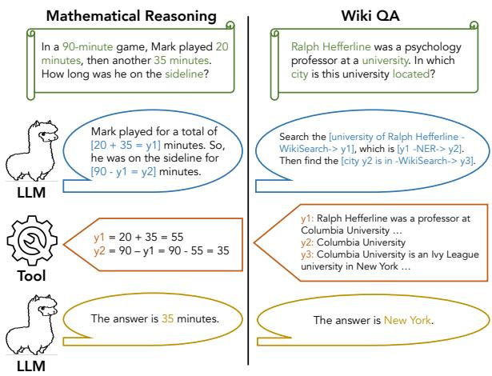
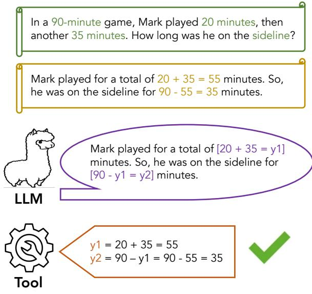
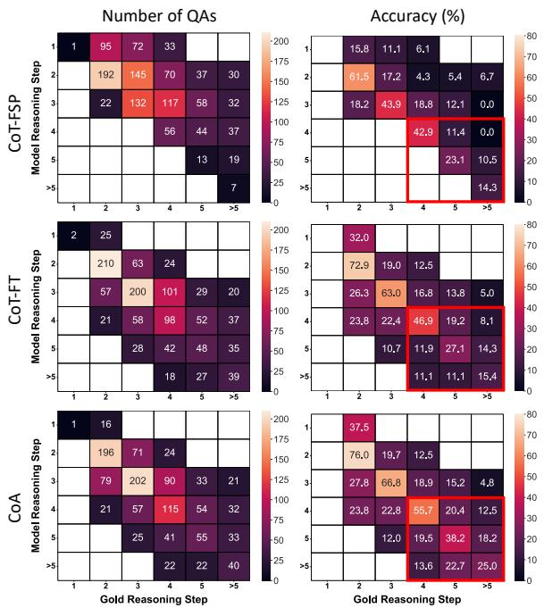
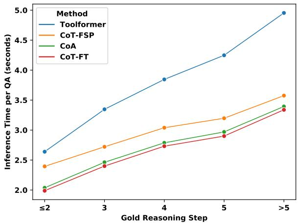
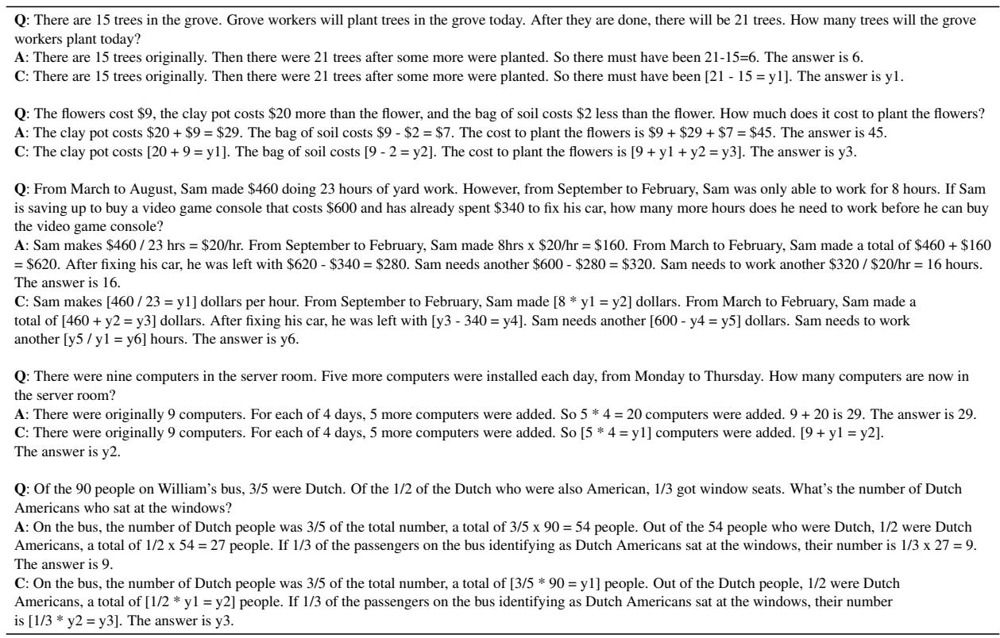
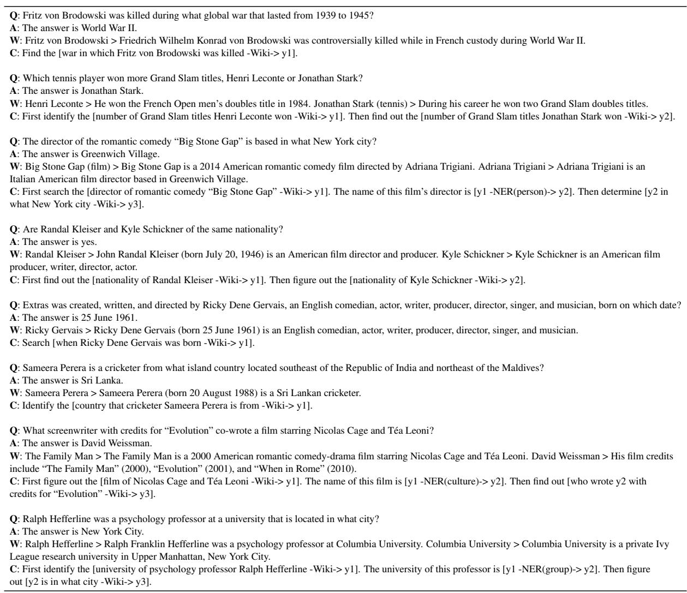
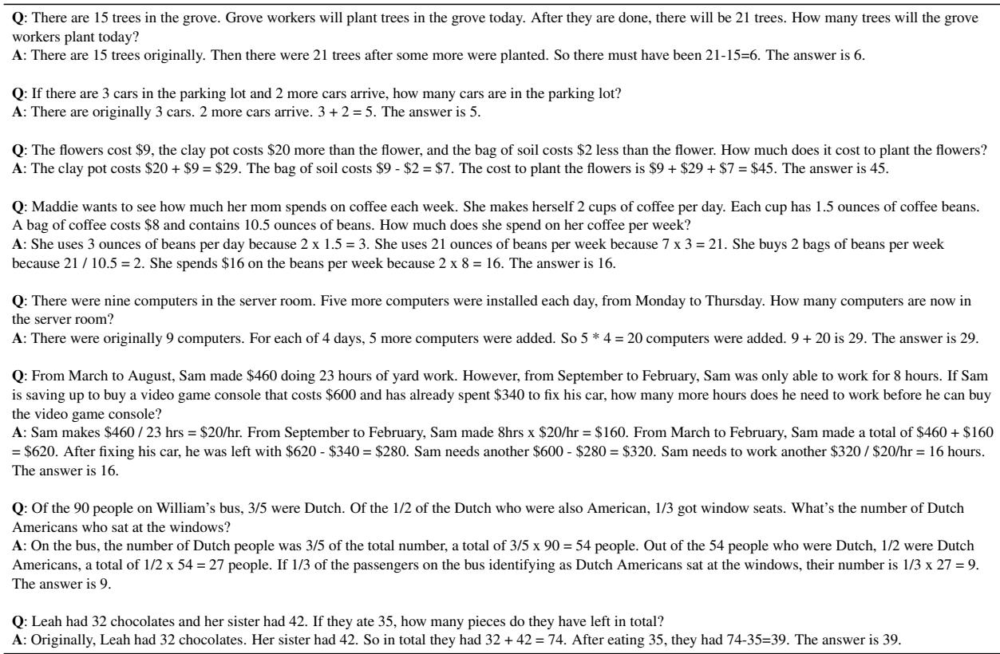
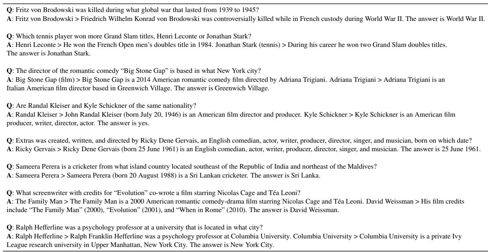
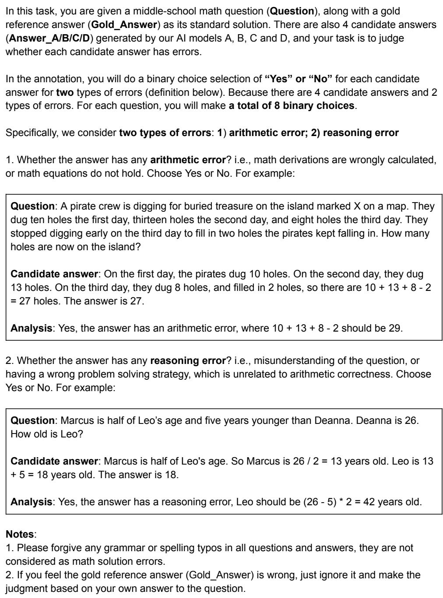

# Efficient Tool Use with Chain-of-Abstraction Reasoning

Silin Gao1,2∗, Jane Dwivedi-Yu2, Ping Yu2, Xiaoqing Ellen Tan2, Ramakanth Pasunuru2, Olga Golovneva2, Koustuv Sinha2 Asli Celikyilmaz2, Antoine Bosselut1†, Tianlu Wang2† 1EPFL, 2FAIR @ Meta

1{silin.gao,antoine.bosselut}@epfl.ch 2{silingao,janeyu,pingyu,ellenxtan}@meta.com 2{rpasunuru,olggol,koustuvs,aslic,tianluwang}@meta.com

## Abstract

To achieve faithful reasoning that aligns with human expectations, large language models (LLMs) need to ground their reasoning to realworld knowledge (e.g., web facts, math and physical rules). Tools help LLMs access this external knowledge, but there remains challenges for fine-tuning LLM agents (e.g., Toolformer) to invoke tools in multi-step reasoning problems, where inter-connected tool calls require holistic and efficient tool usage planning.

In this work, we propose a new method for LLMs to better leverage tools in multi-step reasoning. Our method, Chain-of-Abstraction (CoA), trains LLMs to first decode reasoning chains with abstract placeholders, and then call domain tools to reify each reasoning chain by filling in specific knowledge. This planning with abstract chains enables LLMs to learn more general reasoning strategies, which are robust to shifts of domain knowledge (e.g., math results) relevant to different reasoning questions. It also allows LLMs to perform decoding and calling of external tools in parallel, which avoids the inference delay caused by waiting for tool responses. In mathematical reasoning and Wiki QA domains, we show that our method consistently outperforms previous chain-of-thought and tool-augmented baselines on both in-distribution and out-of-distribution test sets, with an average ∼ 6% absolute QA accuracy improvement. LLM agents trained with our method also show more efficient tool use, with inference speed being on average ∼1.4× faster than baseline tool-augmented LLMs.

## 1 Introduction

Recent large language models (LLMs; Touvron et al., 2023b; Anil et al., 2023; OpenAI, 2023), have made progress at interpreting and executing instructions (Wei et al., 2021; Chung et al., 2022), but still make errors when recalling and composing world knowledge for their responses, e.g., making unfactual statements (Maynez et al., 2020; Ji et al., 2023), incorrect calculations (Patel et al., 2021), etc. Using auxiliary tools (e.g., a search engine to provide credible facts, a calculator for accurate math operations, etc.) at inference time can mitigate some of these errors, motivating tool-augmented language models that integrate external API calls into their output generations (Parisi et al., 2022; Schick et al., 2023; Hao et al., 2023b).

  
Figure 1: Overview of chain-of-abstraction reasoning with tools. Given a domain question (green scroll), a LLM is fine-tuned to first generate an abstract multi-step reasoning chain (blue bubble), and then call external tools to reify the chain with domain-specific knowledge (orange label). The final answer (yellow bubble) is obtained based on the reified chain of reasoning.

However, we show that current tool-augmented LLMs, e.g., Toolformer (Schick et al., 2023), struggle to reliably and efficiently leverage tools in multi-step reasoning. In particular, tool calls in multi-step reasoning tasks are often interleaved (i.e., the response of an API call is often part of the query of a subsequent call; as shown in Figure 1). Without explicitly modeling these interconnections in reasoning chains, LLMs do not learn effective planning for tool use, which leads to less accurate reasoning with tools.1 Meanwhile, interleaving text generation with API calls also introduces inefficient inference “waiting times,” where the model must wait for the response from the API call before resuming the decoding process. This inefficiency becomes more significant in multi-step reasoning scenarios, when multiple rounds of API calls are typically required for each reasoning process.

In this work, we propose Chain-of-Abstraction (CoA) reasoning, a robust and efficient method for LLMs to perform multi-step reasoning with tools. As shown in Figure 1, LLMs are fine-tuned with a goal of making reasoning chains with abstract placeholders. The placeholders do not affect LLMs reasoning flow, and are subsequently infilled with specific knowledge retrieved from specialized tools, to ground the final answer generations. Planning abstract chain of reasoning encourages LLMs to inter-connect multiple tool calls and adopt more feasible reasoning strategies, which are robust to the variation of domain knowledge involved in each reasoning process, e.g., specific calculation results. Unlike previous methods where LLM decoding and API calls are executed in an interleaved manner, our method leverages tools to infill knowledge once after the whole chain of reasoning is generated. This enables more efficient decoding across multiple examples (e.g., as in a stream) because CoA traces for subsequent examples can be decoded while tool calls are made for the preceding ones, amortizing overall inference time. We develop a simple pipeline to build fine-tuning data for models to learn CoA, where we first prompt LLMs to re-write existing responses to instructions as abstract chains, and then use domain tools to check the validity of re-writing, as shown in Figure 2.

After training LLMs to learn CoA reasoning, we evaluate the finetuned models on two representative multi-step reasoning domains, including mathematical reasoning (Cobbe et al., 2021; Miao et al., 2020; Patel et al., 2021; Koncel-Kedziorski et al., 2016), and Wikipedia (Wiki) QA (Yang et al., 2018; Berant et al., 2013; Kwiatkowski et al., 2019; Joshi et al., 2017) that involves reasoning on factual descriptive knowledge. We show that our method boosts LLMs’ performances, with average ∼7.5% and 4.5% absolute accuracy improvements on math and Wiki QA, respectively. These improvements are consistent across both in-distribution and (zeroshot) out-of-distribution test sets, and are especially pronounced on questions that require complex chain-of-thought reasoning.2 Meanwhile, our method also uses tools more efficiently than previous augmentation methods, with average ∼1.47× and 1.33× faster inference speeds on math and Wiki QA tasks, respectively. Finally, extensive human evaluation demonstrates that our method guides LLMs to learn more accurate reasoning, which leads to ∼ 8% fewer reasoning errors.

## 2 Related Work

Tool-Augmented LLMs There is growing interest in augmenting LLMs using external tools. Considerable work has tried to adapt LLMs as tool-using reasoners through in-context learning, demonstrating promising performance improvements in various applications, e.g., math problem solving (Gao et al., 2023; Chen et al., 2022), biomedical question answering (Jin et al., 2023) and self-critiquing (Gou et al., 2023). Nevertheless, guiding LLMs to effectively use tools using in-context demonstrations is challenging, which requires elaborate task-specific prompt engineering and is restricted by the model’s instruction following ability (Jacovi et al., 2023). Noticing the limitations of in-context learning, several works teach LLMs to learn the usage of tools by fine-tuning (Parisi et al., 2022; Schick et al., 2023; Hao et al., 2023b), which more robustly improves LLMs’ performance. However, all above approaches adopt sequential interactions with tools throughout reasoning, slowing the inference speed as a function of the latency of the tool (or API) and the number of API calls that are made.

Some other prior works focus on using LLMs for multi-step reasoning with other modules. In particular, ReAct (Yao et al., 2023b) and FireAct (Chen et al., 2023) integrate LLMs with tools into a closed loop of thought, action and observation steps. This verbose reasoning loop slows down the LLM decoding, and still incorporates tools via sequential interactions, resulting in inefficient inference. Another line of work, Program of Thoughts (Chen et al., 2022), DECLARATIVE (He-Yueya et al., 2023) and PAL (Gao et al., 2023) prompt LLMs to generate program-based reasoning and interact with code executors, which however heavily rely on closed source coding models, i.e., Codex (Chen et al., 2021), and are restricted to procedural arithmetic reasoning. Building on these works, CoA proposes a framework to convert natural language reasoning traces into abstract representations, and uses the abstract reasoning traces as fine-tuning data to improve tool-augmented LLMs. CoA also accelerates tool-augmented reasoning, by holistically planning the CoA traces and calling tools only once at inference time.

Tool Usage Planning Several previous works research tool usage planning in LLMs. Specifically, HuggingGPT (Shen et al., 2023), Chameleon (Lu et al., 2023), OpenAGI (Ge et al., 2023) and Meta-Tool (Huang et al., 2023) focus on planning the high-level sequence of using multiple tools to address multi-domain mixed tasks. Similarly, LATM (Cai et al., 2023), ML-BENCH (Liu et al., 2023) and Gorilla (Patil et al., 2023) aim at planning program-level integration of multiple APIs for designing scripts of procedural tasks, e.g., a script for training a model described by a GitHub repository. ToolChain\* (Zhuang et al., 2023) combines the planning of tool usage with tree-search-based reasoning (Yao et al., 2023a; Hao et al., 2023a), which is especially useful for procedural tasks (Xu et al., 2023; Cobbe et al., 2021). Different from above work, we focus on the planning of general chain-of-thought (Wei et al., 2022) reasoning with awareness of domain specialized tools.

## 3 Method

Chain-of-Abstraction (CoA) Reasoning Our method decouples the general reasoning of LLMs from domain-specific knowledge obtained from external tools. Figure 1 shows an overview of our method. In particular, we first fine-tune LLMs to generate reasoning chains with abstract placeholders, e.g., y1, y2 and $y 3 , { } ^ { 3 }$ as shown in Figure 1. In the second stage, we reify each reasoning chain by replacing placeholders with domain-specific knowledge obtained from external tools, e.g., calculation results from a calculator, relevant articles retrieved from web search engine, etc. Finally, the question is answered based on the reified reasoning chain.

Note that since the LLMs are trained to generate abstract chain of reasoning instead of regular chain-of-thought (CoT) reasoning with explicit values, this enables LLMs to focus on learning general and holistic reasoning strategies without needing to generate instance-specific knowledge for the model’s parameters. Moreover, decoupling general reasoning and domain-specific knowledge enables LLM decoding to proceed and switch between different samples in parallel with API calling (via a pipeline), i.e., LLM can start generating the next abstract chain while the tool fills the current chain, which speeds up the overall inference process.

  
Figure 2: Illustration of gold data re-writing for finetuning data construction. Given a pair of domain question (green scroll) and gold answer (yellow scroll), an LLM is prompted to re-write the gold answer as a reasoning chain with abstract variables (purple bubble). Then, domain specialized tools validate the correctness of the re-writing by checking whether the abstract chain can be reified to get the final answer (orange label).

Fine-tuning Data Construction To construct chain-of-abstraction (CoA) data for fine-tuning LLMs, we collect question answering (QA) samples from existing open-source QA datasets (Cobbe et al., 2021; Miao et al., 2020; Yang et al., 2018), and prompt LLaMa-70B (Touvron et al., 2023a) to re-write the answer of each sampled question, as shown in Figure 2. Specifically, we prompt LLaMa-70B to label the spans in gold answers that correspond to knowledge operations (e.g., math derivations, statements based on Wikipedia references) and then to re-write the sentences with labeled spans as fillable CoA traces, where the operation results are replaced with abstract placeholders. For example, the two derivations in the example in Figure 2 are re-written as $^ { * } [ 2 0 + 3 5 = y 1 ] "$ and $^ { * * } [ 9 0 - y 1 = y 2 ] "$ , respectively.

Note that an intermediate knowledge operation result may appear multiple times in an answer, e.g., in Figure 2, the first equation’s result 55 is used in the second equation. We prompt $\mathrm { L L a M a - 7 0 B }$ to replace all occurrences of the same intermediate result with the same placeholder, thereby explicitly connecting the multiple reasoning steps. To ensure that the re-written data is accurate, we use domainspecialized tools to verify the correctness of each CoA reasoning trace.4 Specifically, we use the tools to execute the labeled operations in each CoA, and only keep questions whose CoA can be infilled with valid results by the tools.

## 4 Experimental Settings

We conduct our experiments on two representative domains: mathematical reasoning and Wikipedia (Wiki) QA, which involves commonsense and logical reasoning on factual descriptive knowledge.

## 4.1 Mathematical Reasoning

Given a math question, the QA system needs to generate a natural language solution to the problem with step-by-step arithmetic derivations (as demonstrated in the left column of Figure 1). We assume that the derivations involved in the solution are the specialized knowledge operations required in this domain, which are labeled in square brackets with derivation results being replaced by abstract placeholders, $\mathrm { e . g . , \ ^ { \ast } [ 2 0 + 3 5 = \upsilon 1 ] " }$

Datasets We construct most of our fine-tuning CoA data by re-writing the GSM8K (Cobbe et al., 2021) training set, which contains 7473 linguistically diverse grade school math problems. As GSM8K dataset focuses on multi-step reasoning, it lacks coverage of single-step arithmetic problems, so we also re-write an additional set of 691 singlestep math problems from the ASDiv (Miao et al., 2020) dataset. Across these re-written datasets, we find that ∼ 76.6% of the CoA reasoning traces generated by LLaMa-70B are verified by our equation solver (described below). Table 1 shows the reasoning step distribution (i.e., number of derivations) of our constructed fine-tuning data.

For an in-distribution evaluation, we test models on GSM8K and ASDiv, containing 1319 and 2305 testing problems. To further test the models’ generalization ability, we also conduct zero-shot evaluation on other representative math datasets, including SVAMP (Patel et al., 2021) and MAWPS (Koncel-Kedziorski et al., 2016), which contain 1000 and 2065 testing samples, respectively.5

<table><tr><td rowspan="2">Source</td><td colspan="7">Reasoning Step</td></tr><tr><td>1</td><td>2</td><td>3</td><td>4</td><td>5</td><td>&gt;5</td><td>All</td></tr><tr><td>GSM8K</td><td>8</td><td>1540</td><td>1648</td><td>1164</td><td>666</td><td>553</td><td>5579</td></tr><tr><td>ASDiv</td><td>677</td><td>0</td><td>0</td><td>0</td><td>0</td><td>0</td><td>677</td></tr></table>

Table 1: Reasoning step distribution of correctly rewritten reasoning chains in math domain.
<table><tr><td>Question</td><td>The director of the romantic comedy &quot;Big Stone Gap&quot; is based in what New York city?</td></tr><tr><td>Answer</td><td>Greenwich Village</td></tr><tr><td>Wikipedia References</td><td>Big Stone Gap (film) &gt; Big Stone Gap is a 2014 American romantic comedy film directed by Adriana Trigiani. Adriana Trigiani &gt; Adriana Trigiani is an Italian American film director based in Greenwich Village.</td></tr><tr><td>CoA Trace</td><td>Find the [director of romantic comedy “Big Stone Gap&quot; -Wiki-&gt; y1]. The name of this film&#x27;s director is [y1 -NER(person)-&gt; y2]. Then determine [y2 in what New York city -Wiki-&gt; y3].</td></tr></table>

Table 2: Example of CoA fine-tuning data construction in Wiki QA domain.

Domain Tool We use an equation solver to perform the arithmetic derivations required in the math domain. Our equation solver first extracts the derivations labeled in the CoA reasoning, e.g., $^ { * } [ 2 0 + 3 5 = y 1 ] "$ and $^ { \star \star } [ 9 0 - y 1 = y 2 ] "$ , and combines all derivations into a system of equations. Then the system of equations is solved by the SymPy toolkit,6 to get the true value of each variable (i.e., the value of the abstract placeholder). Finally, our equation solver returns the reified chain of reasoning by replacing all the variables with their solved true values (including the final answer).

## 4.2 Wikipedia QA

Given a question based on Wikipedia knowledge, the model needs to first identify Wikipedia articles as references related to the question, and then reason on key knowledge in the reference articles to answer the question (as shown in the right column of Figure 1). We assume that the specialized knowledge operation in this domain is the retrieval of relevant Wikipedia articles and important named-entities, which are re-written as Wikipedia searching (WikiSearch) and named-entity recognition (NER)7 queries. Table 2 shows an example of a re-written CoA trace for Wiki QA.

Datasets We use the HotpotQA (Yang et al., 2018) dataset to construct our fine-tuning CoA data in the Wiki QA domain. HotpotQA contains 113K multi-hop QA examples, each labeled with two Wikipedia articles that provide supporting knowledge. Among the 90447 training QA pairs, we identify 72991 as Bridge QA pairs, where an intermediate entity must be identified to link the answer to the question, as shown in Table 2. The remaining 17456 are Comparison QA pairs, where the attributes of two entities are compared, e.g., “Are Randal Kleiser and Kyle Schickner of the same nationality?”. We prompt LLaMa-70B to re-write these training QAs into CoAs with WikiSearch and NER queries, and verify each CoA with our domain tools (described below), by checking whether all the articles returned by the WikiSearch queries match one of the titles in the gold articles. Finally, 8956 Bridge QAs and 5405 Comparison QAs are used as fine-tuning data, whose re-written CoAs pass the verification.8 For Wiki QA, we note that besides training a LLM to produce CoA data using WikiSearch, we also fine-tune a second LLM to learn to generate the final gold answer based on a correctly reified CoA reasoning trace.

We evaluate models on the HotpotQA development set, which contains 5918 Bridge QA pairs and 1487 Comparison QA pairs. Similar to the mathematical reasoning domain, we also conduct zeroshot evaluation on other open-domain QA datasets: WebQuestions (WQ; Berant et al., 2013), NaturalQuestions (NQ; Kwiatkowski et al., 2019) and TriviaQA (Joshi et al., 2017), which contain 2032, 3610 and 17944 test questions, respectively.

Domain Tools The specialized tools required for Wiki QA include a Wikipedia search engine to retrieve reference articles, and a NER toolkit to extract entities that bridge multi-step searching queries. We follow Toolformer (Schick et al., 2023) and implement a Wikipedia search engine as a BM25 retriever (Robertson et al., 1995; Baeza-Yates et al., 1999) that indexes the Wikipedia dump from the KILT benchmark (Petroni et al., 2021). We use the BM25 retriever to search the top-10 articles relevant to the input query, and then re-rank the articles based on their Sentence-BERT (Reimers and Gurevych, 2019) embedding cosine similarity with the question. After re-ranking, the top-1 article is selected to be the final search result.

<table><tr><td>General Class</td><td>SpaCy NER Types included in each General Class</td></tr><tr><td>person</td><td>PERSON</td></tr><tr><td>group</td><td>NORP, ORG, LANGUAGE</td></tr><tr><td>location</td><td>GPE, FAC, LOC</td></tr><tr><td>culture</td><td>EVENT, WORK_OF_ART, LAW, PRODUCT</td></tr><tr><td>date</td><td>DATE, TIME</td></tr><tr><td>numeral</td><td>CARDINAL, PERCENT, MONEY, QUANTITY, ORDINAL</td></tr></table>

Table 3: Aggregation of SpaCy NER types.

We use SpaCy9 (en\_core\_web\_sm) as the NER toolkit to extract named entities. To simplify NER, we aggregate the numerous SpaCy NER types into 6 general classes, as shown in Table 3. If multiple named entities are recognized, we input each recognized entity to the subsequent WikiSearch query, and select the entity whose subsequent search result has the highest Sentence-BERT embedding cosine similarity with the question.

## 4.3 Baselines

We apply our CoA reasoning method to both 7B and 70B LLaMa models, and test various model versions including the first version of LLaMa (Touvron et al., 2023a) and the more advanced LLaMa-2 and LLaMa-2-Chat (Touvron et al., 2023b). We compare our method to several baselines, including: a) few-shot prompting using 8 randomly sampled QA exemplars from the original (i.e., not rewritten) chain-of-thought data (CoT-FSP), b) finetuning with original chain-of-thought data (CoT-FT)10, and c) Toolformer (Schick et al., 2023) which fine-tunes LLMs on CCNet (Wenzek et al., 2020) texts augmented with API calls. For evaluation on Wiki QA, we also compared our method with FireAct (Chen et al., 2023), which fine-tunes LLMs on HotpotQA ReAct (Yao et al., 2023b) trajectories distilled from GPT-4 (OpenAI, 2023).

## 5 Results and Analysis

## 5.1 Mathematical Reasoning

Table 4 shows the evaluation results for the LLaMa-2 and LLaMa-2-Chat models.11 On the GSM8K and ASDiv datasets, our CoA method outperforms the few-shot baseline CoT-FSP and the regular finetuning baseline CoT-FT, demonstrating that CoA fine-tuning with tool augmentation is more effective in adapting LLMs to multi-step reasoning tasks. Similarly, when evaluated on out-of-distribution datasets, SVAMP and MAWPS, CoA also consistently outperforms the baselines. Interestingly, for these out-of-distribution datasets, CoT-FT lags further behind CoA, particularly for 7B models, showing that CoA reasoning yields more distributionally robust reasoning performance.

<table><tr><td rowspan="2">Model</td><td rowspan="2">Method</td><td rowspan="2">Use Tool</td><td rowspan="2">GSM8K</td><td rowspan="2">ASDiv</td><td rowspan="2">SVAMP</td><td colspan="5">MAWPS</td></tr><tr><td>AddSub</td><td>SingleEQ</td><td>SingleOp</td><td>MultiArith</td><td>All</td></tr><tr><td rowspan="4">LLaMa-2 -7B</td><td>CoT-FSP CoT-FT</td><td>x</td><td>16.38</td><td>47.85</td><td>38.40</td><td>52.41</td><td>63.39</td><td>82.03</td><td>43.33</td><td>60.53</td></tr><tr><td></td><td rowspan="2">√</td><td>35.33</td><td>57.18</td><td>48.20</td><td>66.08</td><td>74.41</td><td>85.23</td><td>65.00</td><td>73.03</td></tr><tr><td>Toolformer CoA</td><td>17.59</td><td>48.55</td><td>37.10</td><td>47.34</td><td>58.46</td><td>79.54</td><td>50.67</td><td>59.81</td></tr><tr><td rowspan="6">CoT-FT LLaMa-2</td><td rowspan="3">CoT-FSP</td><td rowspan="3"></td><td>37.83*</td><td>57.61</td><td>51.70*</td><td>72.15*</td><td>82.48*</td><td>86.48*</td><td>73.17*</td><td>78.89*</td></tr><tr><td>24.03</td><td>54.14</td><td>51.30</td><td>71.90</td><td>72.44</td><td>85.41</td><td>74.00</td><td>76.32</td></tr><tr><td>x</td><td>35.41</td><td>59.00 46.90</td><td>58.23</td><td>72.24</td><td>85.41</td><td></td><td>73.00</td><td>73.37</td></tr><tr><td>CoA (no Tool)</td><td rowspan="2"></td><td>35.03</td><td>58.79</td><td>51.50</td><td>68.10</td><td>74.21</td><td>86.48</td><td>77.67</td><td>77.38</td></tr><tr><td>Toolformer</td><td>23.65</td><td>50.85</td><td>48.80</td><td>61.01</td><td>69.09</td><td>81.85</td><td>68.50</td><td>70.85</td></tr><tr><td rowspan="2">Toolformer - Math√ CoA</td><td rowspan="2"></td><td>36.01</td><td>59.18</td><td>47.60</td><td>58.99</td><td>72.44</td><td>85.94</td><td>75.50</td><td>74.43</td></tr><tr><td>38.29*</td><td>59.57</td><td>54.20*</td><td>72.41</td><td>81.89*</td><td>88.26*</td><td>83.00*</td><td>82.13*</td></tr><tr><td rowspan="5">LLaMa-2 -Chat-70B</td><td>CoT-FSP</td><td>x</td><td>56.18</td><td>65.94</td><td>70.60</td><td>86.08</td><td>89.17</td><td>92.88</td><td>84.50</td><td>88.23</td></tr><tr><td rowspan="2">CoT-FT</td><td rowspan="2"></td><td>60.50</td><td>70.24</td><td>70.40</td><td>81.52</td><td>87.60</td><td>92.35</td><td>89.17</td><td>88.18</td></tr><tr><td>52.54</td><td>69.07</td><td>73.60</td><td>86.84</td><td>89.76</td><td>91.46</td><td>81.50</td><td>87.26</td></tr><tr><td>Toolformer Toolformer - Math√</td><td></td><td>61.03</td><td>70.59</td><td>73.20</td><td>85.57</td><td>91.34</td><td>91.99</td><td>92.00</td><td>90.60</td></tr><tr><td>CoA</td><td></td><td>62.32*</td><td>71.89*</td><td>73.40</td><td>86.33</td><td>94.49*</td><td>93.06</td><td>92.33</td><td>91.91*</td></tr></table>

Table 4: Evaluation results on LLaMa-2 and LLaMa-2-Chat for mathematical reasoning. “All” denotes the averaged results on four MAWPS portions. Exact match rate to the final gold answer (i.e., accuracy) is reported. For each base model, the best and second-best results are bolded and underlined, respectively. The best results labeled with ∗ are significantly better than their corresponding second-best results, with the significant test p-value < 0.05.

Our CoA method also surpasses the toolaugmented baseline Toolformer, which implies that planning the abstract variables in CoA can improve the accuracy of reasoning with tools. However, as Toolformer is not originally trained with in-domain fine-tuning data,12 we also fine-tune a new version of Toolformer with the chain-of-thought data from GSM8K and ASDiv, denoted as Toolformer - Math in Table 4. We also observe that CoA performs better than Toolformer - Math, confirming that the introduction of abstract variables enables more robust tool use compared to direct integration of API calls within chain-of-thought reasoning.

Ablation Study We verify that the robust generalization performance of our CoA method does not merely benefit from using additional tools, by finetuning another LLM to solve the equation (from the same model backbone), rather than calling the equation solver, denoted as CoA (no Tool) in Table 4.

We find that CoA (no Tool) performs consistently worse than CoA across all datasets, confirming that using specialized tools enables LLM agents to conduct more precise operations, rather than directly solving the same operations. However, CoA (no Tool) still outperforms all baseline methods on zero-shot generalization to SVAMP and MAWPS datasets, implying that learning abstract reasoning chains also contributes to better robustness of CoA, perhaps due to better planning of multiple reasoning steps indexed by abstract variables.

Reasoning Steps Our findings suggest that the benefits of chain-of-abstraction reasoning are most pronounced when problems require long reasoning chains to be solved. Figure 3 shows the stratified performance of three models on GSM8K QA, relative to the number of reasoning steps in the predicted and gold reasoning chains. Compared to the few-shot CoT-FSP, CoA produces reasoning chains that more often match the length of the gold reasoning chains, as reflected by the heat-map statistics (left column) being more aggregated around the diagonal (comparable to CoT-FT). At the same time, we observe that models achieve better QA accuracy when the number of reasoning steps in their generated answers are aligned with the gold references (i.e., the diagonal of heat-maps in right column). Above results show that fine-tuned models are better at learning to produce reasoning chains that match the true reasoning chain for the problem.

Figure 3: GSM8K evaluation results on LLaMa-2-Chat-7B w.r.t. the number of reasoning steps in the predicted and gold reasoning chain. (Left) The number of test examples that belong to each stratum. (Right) The corresponding model accuracy (%) for those examples. Nondiagonal cells with fewer than 15 examples are ignored.
<table><tr><td rowspan="2">Method</td><td colspan="2">Error Rate</td></tr><tr><td>Arithmetic</td><td>Reasoning</td></tr><tr><td>CoT-FSP</td><td>17.3</td><td>70.3</td></tr><tr><td>CoT-FT</td><td>25.2</td><td>67.8</td></tr><tr><td>CoA</td><td>0.0</td><td>60.4</td></tr></table>

Table 5: Human evaluation results of arithmetic and reasoning error rates on 200 GSM8K test samples. Models developed based on LLaMa-2-Chat-7B are presented.

Interestingly, we find that CoA, compared to CoT-FT, achieves higher performance especially on questions that require more reasoning steps. In the right column of Figure 3, CoA’s improvement over CoT-FT is more pronounced on questions with more than 3 steps in the gold reasoning chain (highlighted with red squares). This indicates that the model trained with CoA has more robust long chain-of-thought reasoning capability, which is learned from planning with abstractions.

Human Evaluation To more comprehensively verify that CoA improves both knowledge operation (i.e., arithmetic by using tools) and reasoning accuracy, we conduct a human evaluation on different model answers to 200 randomly sampled GSM8K test questions. Specifically, given a

Figure 4: Wall-clock inference time on GSM8K (seeded with LLaMa-2-Chat-7B). Average time of answering a question is measured (in seconds) w.r.t. the number of gold reasoning steps required for the question.
<table><tr><td>Method</td><td>Accuracy</td></tr><tr><td>CoT-FSP</td><td>27.90</td></tr><tr><td>CoT-FT</td><td>39.12</td></tr><tr><td>Toolformer</td><td>24.56</td></tr><tr><td>Toolformer - Math</td><td>35.25</td></tr><tr><td>CoA</td><td>40.79</td></tr></table>

Table 6: Evaluation results on GSM8K with selfconsistency decoding (seeded with LLaMa-2-Chat-7B). Each model uses majority voting to aggregate the answers of 16 sampled reasoning chains

GSM8K question and a model’s answer to the question, we ask human workers to judge whether the answer contains any arithmetic errors (e.g., wrong calculations, invalid equations) or reasoning errors unrelated to math derivations (e.g., misunderstanding of the question, improper strategy for solving the question), and report how often the model makes these two kinds of errors. In Table 5, we find that CoA effectively reduces arithmetic errors to zero, due to the use of equation solver to perform accurate calculations. More importantly, our method also makes fewer reasoning errors compared to the baselines, verifying that CoA finetuning guides the model to learn more accurate reasoning through the holistic planning of abstract reasoning chains. By contrast, ordinary fine-tuning (i.e., CoT-FT) produces a more limited reasoning improvement compared to the few-shot CoT-FSP, while also failing to suppress arithmetic errors.

Inference Efficiency Importantly, we find that the performance benefits of CoA reasoning do not come with increased computational costs. In Figure 4, we show the average time (seconds) that CoA and baseline agents (seeded with LLaMa-2-Chat-7B) needs to answer a question w.r.t. required gold reasoning steps. Compared to the CoT baselines, CoA requires less time than the fewshot baseline CoT-FSP, whose generation needs to be conditioned on additional examples. However, CoA is slightly less inference-efficient compared to CoT-FT, likely due to the decoding of additional tokens (e.g., “[” and “]”) for the abstract statements.

<table><tr><td rowspan="2">Model</td><td rowspan="2">Method</td><td rowspan="2">Use Tool</td><td colspan="4">HotpotQA</td><td rowspan="2">WQ</td><td rowspan="2">NQ</td><td rowspan="2">TriviaQA</td></tr><tr><td>Bridge</td><td>Comparison</td><td>Both</td><td>Time</td></tr><tr><td rowspan="6">LLaMa-2 -Chat-7B</td><td>CoT-FSP</td><td rowspan="3">x</td><td>11.69</td><td>45.46</td><td>18.47</td><td>2.074</td><td>34.65</td><td>30.91</td><td>53.48</td></tr><tr><td>CoT-FT</td><td>14.24</td><td>56.69</td><td>22.77</td><td>1.937</td><td>33.51</td><td>25.40</td><td>51.05</td></tr><tr><td>Toolformer</td><td>12.99</td><td>44.59</td><td>20.00</td><td>2.350</td><td>36.22</td><td>30.22</td><td>54.15</td></tr><tr><td>Toolformer - Wiki</td><td rowspan="3">√</td><td>15.68</td><td>56.42</td><td>23.86</td><td>2.301</td><td>36.61 32.96</td><td></td><td>55.08</td></tr><tr><td>FireAct</td><td>19.18</td><td>54.14</td><td>26.20</td><td>2.706</td><td>36.02</td><td>35.87</td><td>52.96</td></tr><tr><td>CoA</td><td>21.00*</td><td>56.96</td><td>28.22*</td><td>1.896</td><td>35.97</td><td>38.67*</td><td>57.90*</td></tr><tr><td rowspan="5">LLaMa-2 -Chat-70B</td><td>CoT-FSP</td><td rowspan="2">x</td><td>21.39</td><td>56.62</td><td>28.47</td><td>6.668</td><td>34.89</td><td>37.42</td><td>63.61</td></tr><tr><td>CoT-FT</td><td>23.84</td><td>63.95</td><td>31.90</td><td>6.401</td><td>34.15</td><td>39.75</td><td>62.28</td></tr><tr><td>Toolformer</td><td rowspan="2">√</td><td>22.24</td><td>56.09</td><td>29.04</td><td>6.888</td><td>37.16</td><td>40.42</td><td>64.31</td></tr><tr><td>Toolformer - Wiki</td><td>26.38</td><td>63.82</td><td>33.90</td><td>6.855</td><td>37.70</td><td>41.25</td><td>66.64</td></tr><tr><td>CoA</td><td></td><td>27.61*</td><td>64.09</td><td>34.94*</td><td>6.369</td><td>36.37</td><td>43.57*</td><td>69.08*</td></tr></table>

Table 7: Wiki QA evaluation results on LLaMa-2-Chat-based models. “Both” denotes the overall evaluation results on both bridge and comparison portions of HotpotQA. “Time” denotes the average seconds that each agent needs to answer a question in HotpotQA. Exact match rate to the final gold answer (i.e., accuracy) is reported. For each base model, the best and second-best results are bolded and underlined, respectively. The best results labeled with ∗ are significantly better than their corresponding second-best results, with the significant test p-value < 0.05.

Compared to Toolformer, CoA has a lower and flatter inference time curve, indicating better scaling as the number of reasoning steps increases. This difference arises because CoA decouples the generation of (abstract) reasoning chains from the retrieval of knowledge (i.e., tool use), allowing full reasoning chains to be decoded before any tool is called. This procedure amortizes inference costs in two ways. First, tool calls are made after the CoA trace has been decoded, enabling parallel tool calls for the same trace (e.g., using an equation solver once rather than multiple calls to a calculator), and avoiding the time delay caused by waiting for external API responses. Consequently, the model fine-tuned with CoA is more efficient at multi-step reasoning, especially when the number of reasoning steps (i.e., tool calls) increases. Second, across multiple examples, the model can generate the CoA trace of the next example while tool calls are made for the preceding one, parallelizing CoA decoding and tools calls across examples.

Self-Consistency Decoding Besides of greedy decoding, we also test more advanced inference strategy, i.e., self-consistency (Wang et al., 2022) decoding, on our CoA reasoning method. We test all methods on the GSM8K dataset seeded with LLaMa-2-Chat-7B. Each method samples 16 reasoning chains and uses majority voting to aggregate the 16 answers derived by the reasoning chains, to get the final answer. For the hyperparameters of sampling, we set the temperature, top-k and top-p as 1.0, 40 and 0.5, respectively. Table 6 shows our evaluation results. We find that our CoA method consistently outperforms all baseline methods when shifting from greedy decoding to selfconsistency decoding. This shows that our method also has better potential to be generalized to different LLM decoding schemes.

## 5.2 Wiki QA

Table 7 shows our Wiki QA results using LLaMa-2-Chat models.13 Similar to mathematical reasoning, we fine-tune a new version of Toolformer with in-domain chain-of-thought data from HotpotQA, denoted as Toolformer - Wiki. On HotpotQA, CoA achieves higher exact match rates with the gold reference compared to the few-shot or finetuning baselines. In particular, CoA outperforms all baselines on the more challenging bridge-type QAs, where two steps of reasoning over Wikipedia knowledge are consecutively entangled, i.e., cannot be performed independently in parallel as in comparison-type QAs. Compared to FireAct finetuning, CoA also achieves better performance on both bridge and comparison QAs, without requiring data distilled from closed source GPT-4.

As with mathematical reasoning, CoA agents also perform more efficient inference than Toolformer and FireAct agents when answering HotpotQA questions. We also find that CoA is more efficient (Time column) than both CoT-FSP and CoT-FT, as CoA does not require few-shot examples as additional inputs and does not need to generate long Wiki articles, which are instead provided by the search engine. Finally, CoA improves over the baseline methods in zero-shot generalization experiments on other Wiki QA datasets, outperforming all baselines on NaturalQuestions and TriviaQA, and matching the best baselines on WebQuestions.

## 6 Conclusion

In this work, we propose to decouple the general reasoning of LLM agents from specialized knowledge obtained via external tools. Our method, chain-of-abstraction (CoA), encourages LLMs to learn the planning of abstract multi-step reasoning, which are more robust to out-of-distribution knowledge shifts. CoA also achieves a more efficient pipeline for tool usage that significantly improves the speed of tool-augmented multi-step reasoning. The simple, yet effective, implementations of our method on two diverse tasks (i.e., math reasoning and open-domain QA) demonstrate its potential for being adapted to new reasoning scenarios.

## Limitations

We acknowledge a few limitations in our work. First, datasets used for testing our method cannot have exhaustive coverage of all real-world reasoning scenarios. We instead consider two representative reasoning domains, i.e., mathematical reasoning and general open-domain (Wikipedia) QA, and use English as a primary language in our testing. Furthermore, our method is tested on the setting of fine-tuning the full LLMs, which requires considerable computational resources, while more efficient model training schemes, e.g., LoRA (Hu et al., 2021), can be applied in future work.

## Acknowledgements

We thank Beatriz Borges, Gail Weiss, Syrielle Montariol, Li Mi and Zeming Chen for reading and providing comments on drafts of this paper. Antoine Bosselut gratefully acknowledges the support of the Swiss National Science Foundation (No. 215390), Innosuisse (PFFS-21-29), the EPFL Science Seed Fund, the EPFL Center for Imaging, Sony Group Corporation, and the Allen Institute for AI.

## References

Rohan Anil, Andrew M Dai, Orhan Firat, Melvin Johnson, Dmitry Lepikhin, Alexandre Passos, Siamak Shakeri, Emanuel Taropa, Paige Bailey, Zhifeng Chen, et al. 2023. Palm 2 technical report. arXiv preprint arXiv:2305.10403.

Ricardo Baeza-Yates, Berthier Ribeiro-Neto, et al. 1999. Modern information retrieval, volume 463. ACM press New York.

Jonathan Berant, Andrew Chou, Roy Frostig, and Percy Liang. 2013. Semantic parsing on freebase from question-answer pairs. In Proceedings of the 2013 conference on empirical methods in natural language processing, pages 1533–1544.

Tianle Cai, Xuezhi Wang, Tengyu Ma, Xinyun Chen, and Denny Zhou. 2023. Large language models as tool makers. arXiv preprint arXiv:2305.17126.

Baian Chen, Chang Shu, Ehsan Shareghi, Nigel Collier, Karthik Narasimhan, and Shunyu Yao. 2023. Fireact: Toward language agent fine-tuning. arXiv preprint arXiv:2310.05915.

Mark Chen, Jerry Tworek, Heewoo Jun, Qiming Yuan, Henrique Ponde de Oliveira Pinto, Jared Kaplan, Harri Edwards, Yuri Burda, Nicholas Joseph, Greg Brockman, et al. 2021. Evaluating large language models trained on code. arXiv preprint arXiv:2107.03374.

Wenhu Chen, Xueguang Ma, Xinyi Wang, and William W Cohen. 2022. Program of thoughts prompting: Disentangling computation from reasoning for numerical reasoning tasks. arXiv preprint arXiv:2211.12588.

Hyung Won Chung, Le Hou, Shayne Longpre, Barret Zoph, Yi Tay, William Fedus, Yunxuan Li, Xuezhi Wang, Mostafa Dehghani, Siddhartha Brahma, et al. 2022. Scaling instruction-finetuned language models. arXiv preprint arXiv:2210.11416.

Karl Cobbe, Vineet Kosaraju, Mohammad Bavarian, Mark Chen, Heewoo Jun, Lukasz Kaiser, Matthias Plappert, Jerry Tworek, Jacob Hilton, Reiichiro Nakano, et al. 2021. Training verifiers to solve math word problems. arXiv preprint arXiv:2110.14168.

Luyu Gao, Aman Madaan, Shuyan Zhou, Uri Alon, Pengfei Liu, Yiming Yang, Jamie Callan, and Graham Neubig. 2023. Pal: Program-aided language models. In International Conference on Machine Learning, pages 10764–10799. PMLR.

Yingqiang Ge, Wenyue Hua, Jianchao Ji, Juntao Tan, Shuyuan Xu, and Yongfeng Zhang. 2023. Openagi: When llm meets domain experts. arXiv preprint arXiv:2304.04370.

Zhibin Gou, Zhihong Shao, Yeyun Gong, Yelong Shen, Yujiu Yang, Nan Duan, and Weizhu Chen. 2023. Critic: Large language models can self-correct with tool-interactive critiquing. arXiv preprint arXiv:2305.11738.

Shibo Hao, Yi Gu, Haodi Ma, Joshua Jiahua Hong, Zhen Wang, Daisy Zhe Wang, and Zhiting Hu. 2023a. Reasoning with language model is planning with world model. arXiv preprint arXiv:2305.14992.

Shibo Hao, Tianyang Liu, Zhen Wang, and Zhiting Hu. 2023b. Toolkengpt: Augmenting frozen language models with massive tools via tool embeddings. arXiv preprint arXiv:2305.11554.

Joy He-Yueya, Gabriel Poesia, Rose E Wang, and Noah D Goodman. 2023. Solving math word problems by combining language models with symbolic solvers. arXiv preprint arXiv:2304.09102.

Edward J Hu, Yelong Shen, Phillip Wallis, Zeyuan Allen-Zhu, Yuanzhi Li, Shean Wang, Lu Wang, and Weizhu Chen. 2021. Lora: Low-rank adaptation of large language models. arXiv preprint arXiv:2106.09685.

Yue Huang, Jiawen Shi, Yuan Li, Chenrui Fan, Siyuan Wu, Qihui Zhang, Yixin Liu, Pan Zhou, Yao Wan, Neil Zhenqiang Gong, et al. 2023. Metatool benchmark for large language models: Deciding whether to use tools and which to use. arXiv preprint arXiv:2310.03128.

Alon Jacovi, Avi Caciularu, Jonathan Herzig, Roee Aharoni, Bernd Bohnet, and Mor Geva. 2023. A comprehensive evaluation of tool-assisted generation strategies. In Findings of the Association for Computational Linguistics: EMNLP 2023, pages 13856– 13878.

Ziwei Ji, Nayeon Lee, Rita Frieske, Tiezheng Yu, Dan Su, Yan Xu, Etsuko Ishii, Ye Jin Bang, Andrea Madotto, and Pascale Fung. 2023. Survey of hallucination in natural language generation. ACM Computing Surveys, 55:1–38.

Qiao Jin, Yifan Yang, Qingyu Chen, and Zhiyong Lu. 2023. Genegpt: Augmenting large language models with domain tools for improved access to biomedical information. Preprint, arXiv:2304.09667.

Mandar Joshi, Eunsol Choi, Daniel S Weld, and Luke Zettlemoyer. 2017. Triviaqa: A large scale distantly supervised challenge dataset for reading comprehension. In Proceedings of the 55th Annual Meeting of the Associationfor Computational Linguistics (Volume 1: Long Papers), pages 1601–1611.

Rik Koncel-Kedziorski, Subhro Roy, Aida Amini, Nate Kushman, and Hannaneh Hajishirzi. 2016. Mawps: A math word problem repository. In Proceedings of the 2016 conference of the north american chapter of the association for computational linguistics: human language technologies, pages 1152–1157.

Tom Kwiatkowski, Jennimaria Palomaki, Olivia Redfield, Michael Collins, Ankur Parikh, Chris Alberti, Danielle Epstein, Illia Polosukhin, Jacob Devlin, Kenton Lee, et al. 2019. Natural questions: a benchmark for question answering research. Transactions ofthe Association for Computational Linguistics, 7:452– 466.

Yuliang Liu, Xiangru Tang, Zefan Cai, Junjie Lu, Yichi Zhang, Yanjun Shao, Zexuan Deng, Helan Hu, Zengxian Yang, Kaikai An, et al. 2023. Mlbench: Large language models leverage open-source libraries for machine learning tasks. arXiv preprint arXiv:2311.09835.

Ilya Loshchilov and Frank Hutter. 2018. Decoupled weight decay regularization. In International Conference on Learning Representations.

Pan Lu, Baolin Peng, Hao Cheng, Michel Galley, Kai-Wei Chang, Ying Nian Wu, Song-Chun Zhu, and Jianfeng Gao. 2023. Chameleon: Plug-and-play compositional reasoning with large language models. arXiv preprint arXiv:2304.09842.

Joshua Maynez, Shashi Narayan, Bernd Bohnet, and Ryan McDonald. 2020. On faithfulness and factuality in abstractive summarization. In Proceedings of the 58th Annual Meeting of the Association for Computational Linguistics, pages 1906–1919.

Shen-Yun Miao, Chao-Chun Liang, and Keh-Yih Su. 2020. A diverse corpus for evaluating and developing english math word problem solvers. In Proceedings of the 58th Annual Meeting of the Association for Computational Linguistics, pages 975–984.

OpenAI. 2023. Gpt-4 technical report. Preprint, arXiv:2303.08774.

Aaron Parisi, Yao Zhao, and Noah Fiedel. 2022. Talm: Tool augmented language models. arXiv preprint arXiv:2205.12255.

Arkil Patel, Satwik Bhattamishra, and Navin Goyal. 2021. Are nlp models really able to solve simple math word problems? In Proceedings of the 2021 Conference of the North American Chapter of the Association for Computational Linguistics: Human Language Technologies, pages 2080–2094.

Shishir G Patil, Tianjun Zhang, Xin Wang, and Joseph E Gonzalez. 2023. Gorilla: Large language model connected with massive apis. arXiv preprint arXiv:2305.15334.

Fabio Petroni, Aleksandra Piktus, Angela Fan, Patrick Lewis, Majid Yazdani, Nicola De Cao, James Thorne, Yacine Jernite, Vladimir Karpukhin, Jean Maillard,

et al. 2021. Kilt: a benchmark for knowledge intensive language tasks. In Proceedings of the 2021 Conference of the North American Chapter of the Association for Computational Linguistics: Human Language Technologies, pages 2523–2544.

Nils Reimers and Iryna Gurevych. 2019. Sentence-bert: Sentence embeddings using siamese bert-networks. In Proceedings ofthe 2019 Conference on Empirical Methods in Natural Language Processing and the 9th International Joint Conference on Natural Language Processing (EMNLP-IJCNLP), pages 3982–3992.

Stephen E Robertson, Steve Walker, Susan Jones, Micheline M Hancock-Beaulieu, Mike Gatford, et al. 1995. Okapi at trec-3. Nist Special Publication Sp, 109:109.

Timo Schick, Jane Dwivedi-Yu, Roberto Dessì, Roberta Raileanu, Maria Lomeli, Luke Zettlemoyer, Nicola Cancedda, and Thomas Scialom. 2023. Toolformer: Language models can teach themselves to use tools. arXiv preprint arXiv:2302.04761.

Yongliang Shen, Kaitao Song, Xu Tan, Dongsheng Li, Weiming Lu, and Yueting Zhuang. 2023. Hugginggpt: Solving ai tasks with chatgpt and its friends in huggingface. arXiv preprint arXiv:2303.17580.

Hugo Touvron, Thibaut Lavril, Gautier Izacard, Xavier Martinet, Marie-Anne Lachaux, Timothée Lacroix, Baptiste Rozière, Naman Goyal, Eric Hambro, Faisal Azhar, et al. 2023a. Llama: Open and efficient foundation language models. arXiv preprint arXiv:2302.13971.

Hugo Touvron, Louis Martin, Kevin Stone, Peter Albert, Amjad Almahairi, Yasmine Babaei, Nikolay Bashlykov, Soumya Batra, Prajjwal Bhargava, Shruti Bhosale, et al. 2023b. Llama 2: Open foundation and fine-tuned chat models. arXiv preprint arXiv:2307.09288.

Xuezhi Wang, Jason Wei, Dale Schuurmans, Quoc V Le, Ed H Chi, Sharan Narang, Aakanksha Chowdhery, and Denny Zhou. 2022. Self-consistency improves chain of thought reasoning in language models. In The Eleventh International Conference on Learning Representations.

Jason Wei, Maarten Bosma, Vincent Y Zhao, Kelvin Guu, Adams Wei Yu, Brian Lester, Nan Du, Andrew M Dai, and Quoc V Le. 2021. Finetuned language models are zero-shot learners. arXiv preprint arXiv:2109.01652.

Jason Wei, Xuezhi Wang, Dale Schuurmans, Maarten Bosma, Fei Xia, Ed Chi, Quoc V Le, Denny Zhou, et al. 2022. Chain-of-thought prompting elicits reasoning in large language models. Advances in Neural Information Processing Systems, 35:24824–24837.

Guillaume Wenzek, Marie-Anne Lachaux, Alexis Conneau, Vishrav Chaudhary, Francisco Guzmán, Armand Joulin, and Édouard Grave. 2020. Ccnet: Extracting high quality monolingual datasets from web

crawl data. In Proceedings ofthe Twelfth Language Resources and Evaluation Conference, pages 4003– 4012.

Qiantong Xu, Fenglu Hong, Bo Li, Changran Hu, Zhengyu Chen, and Jian Zhang. 2023. On the tool manipulation capability of open-source large language models. arXiv preprint arXiv:2305.16504.

Zhilin Yang, Peng Qi, Saizheng Zhang, Yoshua Bengio, William Cohen, Ruslan Salakhutdinov, and Christopher D Manning. 2018. Hotpotqa: A dataset for diverse, explainable multi-hop question answering. In Proceedings ofthe 2018 Conference on Empirical Methods in Natural Language Processing. Association for Computational Linguistics.

Shunyu Yao, Dian Yu, Jeffrey Zhao, Izhak Shafran, Thomas L Griffiths, Yuan Cao, and Karthik Narasimhan. 2023a. Tree of thoughts: Deliberate problem solving with large language models. arXiv preprint arXiv:2305.10601.

Shunyu Yao, Jeffrey Zhao, Dian Yu, Nan Du, Izhak Shafran, Karthik Narasimhan, and Yuan Cao. 2023b. React: Synergizing reasoning and acting in language models. Preprint, arXiv:2210.03629.

Yuchen Zhuang, Xiang Chen, Tong Yu, Saayan Mitra, Victor Bursztyn, Ryan A Rossi, Somdeb Sarkhel, and Chao Zhang. 2023. Toolchain\*: Efficient action space navigation in large language models with a\* search. arXiv preprint arXiv:2310.13227.

## A Implementation Details

Evaluation Details For mathematical reasoning evaluation, we extract the last number appeared in each model’s answer, and check whether the number exactly match the gold reference. The accuracy is reported as the rate of such exact match across all QAs in a test set. For Wiki QA evaluation, similar to mathematical reasoning, we extract the final answer of each model and calculate its exact match rate to the gold reference. Specifically, the final answer is supposed to be the words after “Action: finish[” for FireAct baseline, and words after “The answer is ” for other models. Our 8-shot in-domain examples used for the CoT-FSP baseline are shown in Table 14 and 15, which enables the model to provide answer with our required format for evaluation, i.e., stating its final answer after “The answer is ”. Our human evaluation on GSM8K is conducted by 5 internal domain experts from our research group. For each math question, we provide the experts with the gold answer as reference, and ask them to evaluate each model answer in anonymous manner, i.e., experts do not know which model each answer comes from. Two yes-or-no questions are asked for evaluating each model answer, including: a) whether the answer has any arithmetic error, and b) whether the answer has any reasoning error, and binary choices from the experts are collected to calculate the error rates of each model’s generation. We present our detailed instructions for human evaluation in Figure 5. Our data collection protocol is approved by our organization in terms of ethics.

<table><tr><td rowspan="2">Model</td><td rowspan="2">Method</td><td rowspan="2">GSM8K</td><td rowspan="2">ASDiv</td><td rowspan="2">SVAMP</td><td colspan="5">MAWPS</td></tr><tr><td>AddSub</td><td>SingleEQ</td><td>SingleOp</td><td>MultiArith</td><td>All</td></tr><tr><td rowspan="3">LLaMa-7B</td><td>CoT-FSP</td><td>11.90</td><td>44.69</td><td>31.80</td><td>56.20</td><td>59.65</td><td>70.28</td><td>43.00</td><td>57.05</td></tr><tr><td>CoT-FT</td><td>30.71</td><td>53.19</td><td>42.30</td><td>55.70</td><td>69.09</td><td>77.05</td><td>54.17</td><td>64.36</td></tr><tr><td>CoA</td><td>35.71</td><td>56.36</td><td>51.10</td><td>67.59</td><td>80.51</td><td>85.94</td><td>68.33</td><td>75.98</td></tr><tr><td rowspan="4">LLaMa-2-7B</td><td>CoT-FSP</td><td>16.38</td><td>47.85</td><td>38.40</td><td>52.41</td><td>63.39</td><td>82.03</td><td>43.33</td><td>60.53</td></tr><tr><td>CoT-FT</td><td>35.33</td><td>57.18</td><td>48.20</td><td>66.08</td><td>74.41</td><td>85.23</td><td>65.00</td><td>73.03</td></tr><tr><td>Toolformer</td><td>17.59</td><td>48.55</td><td>37.10</td><td>47.34</td><td>58.46</td><td>79.54</td><td>50.67</td><td>59.81</td></tr><tr><td>CoA</td><td>37.83</td><td>57.61</td><td>51.70</td><td>72.15</td><td>82.48</td><td>86.48</td><td>73.17</td><td>78.89</td></tr><tr><td rowspan="8">LLaMa-2-Chat-7B</td><td>CoT-FSP</td><td>24.03</td><td>54.14</td><td>51.30</td><td>71.90</td><td>72.44</td><td>85.41</td><td>74.00</td><td>76.32</td></tr><tr><td>CoT-FT</td><td>35.41</td><td>59.00</td><td>46.90</td><td>58.23</td><td>72.24</td><td>85.41</td><td>73.00</td><td>73.37</td></tr><tr><td>CoT-FT (no ASDiv)</td><td>36.19</td><td>44.93</td><td>35.30</td><td>38.48</td><td>52.95</td><td>61.21</td><td>77.67</td><td>59.61</td></tr><tr><td>Toolformer</td><td>23.65</td><td>50.85</td><td>48.80</td><td>61.01</td><td>69.09</td><td>81.85</td><td>68.50</td><td>70.85</td></tr><tr><td>Toolformer - Math</td><td>36.01</td><td>59.18</td><td>47.60</td><td>58.99</td><td>72.44</td><td>85.94</td><td>75.50</td><td>74.43</td></tr><tr><td>CoA</td><td>38.29</td><td>59.57</td><td>54.20</td><td>72.41</td><td>81.89</td><td>88.26</td><td>83.00</td><td>82.13</td></tr><tr><td>CoA (no ASDiv)</td><td>39.73</td><td>54.19</td><td>44.40</td><td>54.18</td><td>73.62</td><td>73.49</td><td>85.33</td><td>73.27</td></tr><tr><td>CoA (no Tool)</td><td>35.03</td><td>58.79</td><td>51.50</td><td>68.10</td><td>74.21</td><td>86.48</td><td>77.67</td><td>77.38</td></tr><tr><td rowspan="5">LLaMa-2-Chat-70B</td><td>CoT-FSP</td><td>56.18</td><td>65.94</td><td>70.60</td><td>86.08</td><td>89.17</td><td>92.88</td><td>84.50</td><td>88.23</td></tr><tr><td>CoT-FT</td><td>60.50</td><td>70.24</td><td>70.40</td><td>81.52</td><td>87.60</td><td>92.35</td><td>89.17</td><td>88.18</td></tr><tr><td>Toolformer</td><td>52.54</td><td>69.07</td><td>73.60</td><td>86.84</td><td>89.76</td><td>91.46</td><td>81.50</td><td>87.26</td></tr><tr><td>Toolformer - Math</td><td>61.03</td><td>70.59</td><td>73.20</td><td>85.57</td><td>91.34</td><td>91.99</td><td>92.00</td><td>90.60</td></tr><tr><td>CoA</td><td>62.32</td><td>71.89</td><td>73.40</td><td>86.33</td><td>94.49</td><td>93.06</td><td>92.33</td><td>91.91</td></tr><tr><td>GPT-J</td><td>Toolformer</td><td>=</td><td>40.4</td><td>29.4</td><td>1</td><td>=</td><td>-</td><td>-</td><td>44.0</td></tr></table>

Table 8: Mathematical reasoning evaluation results.

Model Training We fine-tune our models with batch size 8 and learning rate 2e−5 and 1e−5 for 7B and 70B model sizes, respectively, using cosine learning rate scheduler with warm-up step 10. We use AdamW (Loshchilov and Hutter, 2018) optimizer for all our fine-tuning experiments, with β1, β2 and ϵ set to 0.9, 0.95 and $1 e ^ { - 8 }$ , respectively. Training weight decay is set to 0.1. For mathematical reasoning, we use a total of 400 training steps, and get the best model checkpoints (with highest validation scores) at step 240 and 200 for 7B and 70B model sizes. For Wiki QA domain, we adjust the total training steps to 500, and get the best checkpoints at step 450 and 300 for 7B and 70B models. Therefore, only ∼2K and ∼3K QAs are required in practice for fine-tuning our models in math and Wiki QA domains. The training of our 7B and 70B models is based on 8 and 64 NVIDIA A100-SXM4 (80GB) GPUs, with training time about 2 and 5 hours per model, respectively.

## B Full Experimental Results

Table 8 and 9 show the full results of our experiments on math and Wiki QA domains. Our method of CoA achieves consistent improvements over baselines across various LLaMa model versions (LLaMa, LLaMa-2 and LLaMa-2-Chat), model sizes (7B and 70B), and domain benchmarks. This shows great potential of our method being generalized to new model backbones and reasoning tasks. We also present results on GSM8K subsets according to varying numbers of gold reasoning steps in Table 10, where we confirm that CoA has more robust long chain-of-thought reasoning accuracy.

Fine-Tuning Data Balance In the mathematical reasoning domain, we also validate the importance of using fine-tuning data that is balanced across different reasoning steps. Specifically, we conduct an ablation study on CoT-FT and CoA seeded with LLaMa-2-Chat-7B model, by removing the singlestep QA samples of ASDiv from the fine-tuning data (no ASDiv). We find that CoT-FT (no AS-Div) and CoA (no ASDiv) turn out to be biased towards multi-step reasoning, where they achieve better performance on GSM8K and MultiArith that contain mainly multi-step QAs, but suffer from severe performance degradation on other datasets that contain many single-step math problems. This demonstrates that maintaining a good balance of single-step and multi-step reasoning data is important for adapting LLMs to be robust reasoners.

<table><tr><td rowspan="2">Model</td><td rowspan="2">Method</td><td colspan="3">HotpotQA</td><td rowspan="2">WebQ.</td><td rowspan="2">NaturalQ.</td><td rowspan="2">TriviaQA</td></tr><tr><td>Bridge</td><td>Comparison</td><td>All</td></tr><tr><td rowspan="4">LLaMa-2-7B</td><td>CoT-FSP</td><td>14.43</td><td>45.26</td><td>20.62</td><td>33.96</td><td>33.35</td><td>56.95</td></tr><tr><td>CoT-FT</td><td>14.85</td><td>57.36</td><td>23.39</td><td>31.50</td><td>26.93</td><td>52.32</td></tr><tr><td>Toolformer</td><td>14.12</td><td>42.76</td><td>20.35</td><td>37.11</td><td>34.49</td><td>57.79</td></tr><tr><td>CoA</td><td>22.00</td><td>57.43</td><td>29.12</td><td>34.60</td><td>38.28</td><td>58.28</td></tr><tr><td rowspan="6">LLaMa-2-Chat-7B</td><td>CoT-FSP</td><td>11.69</td><td>45.46</td><td>18.47</td><td>34.65</td><td>30.91</td><td>53.48</td></tr><tr><td>CoT-FT</td><td>14.24</td><td>56.69</td><td>22.77</td><td>33.51</td><td>25.40</td><td>51.05</td></tr><tr><td>Toolformer</td><td>12.99</td><td>44.59</td><td>20.00</td><td>36.22</td><td>30.22</td><td>54.15</td></tr><tr><td>Toolformer - Wiki</td><td>15.68</td><td>56.42</td><td>23.86</td><td>36.61</td><td>32.96</td><td>55.08</td></tr><tr><td>FireAct</td><td>19.18</td><td>54.14</td><td>26.20</td><td>36.02</td><td>35.87</td><td>52.96</td></tr><tr><td>CoA</td><td>21.00</td><td>56.96</td><td>28.22</td><td>35.97</td><td>38.67</td><td>57.90</td></tr><tr><td rowspan="5">LLaMa-2-Chat-70B</td><td>CoT-FSP</td><td>21.39</td><td>56.62</td><td>28.47</td><td>34.89</td><td>37.42</td><td>63.61</td></tr><tr><td>CoT-FT</td><td>23.84</td><td>63.95</td><td>31.90</td><td>34.15</td><td>39.75</td><td>62.28</td></tr><tr><td>Toolformer</td><td>22.24</td><td>56.09</td><td>29.04</td><td>37.16</td><td>40.42</td><td>64.31</td></tr><tr><td>Toolformer - Wiki</td><td>26.38</td><td>63.82</td><td>33.90</td><td>37.70</td><td>41.25</td><td>66.64</td></tr><tr><td>CoA</td><td>27.61</td><td>64.09</td><td>34.94</td><td>36.37</td><td>43.57</td><td>69.08</td></tr><tr><td>GPT-J</td><td>Toolformer</td><td>-</td><td>-</td><td>-</td><td>26.3</td><td>17.7</td><td>48.8</td></tr></table>

Table 9: Wiki QA evaluation results.

More Prompting Baselines We also compare our CoA reasoning method to more promptingbased methods PAL (Gao et al., 2023) and DECLARATIVE (He-Yueya et al., 2023), which use few-shot coding demonstrations to prompt math solutions as Python or declarative programs. Table 11 shows our comparison results on the GSM8K dataset, where all methods are seeded with LLaMa-2-Chat-7B. Without seeding with dedicated coding models (e.g., code-davinci-002), PAL and DECLARATIVE get far lower accuracy on GSM8K, which significantly under-perform our CoA method, and even ordinary CoT-FSP.

In contrast, our CoA method relies less on artificial demonstrations and distributional closeness of the seed LLM to target tasks, as CoA fine-tunes the LLM agent on pre-defined abstract reasoning chains, acquired from simple rewriting of natural language reasoning traces. Consequently, CoA is flexible in various generation formats, e.g., code and plain text, and generalizes well from mathematical reasoning to open-domain QA, which is a very different type of reasoning task. This indicates our method’s generalizability to novel reasoning schemes required by a new domain.

## C Fine-Tuning Data Re-writing Details

Table 12 and 13 show the prompting examples for fine-tuning data construction of our method. We prompt LLaMa-70B to re-write existing math and Wiki QAs as abstract reasoning chains, which gets rid of data distillation from close-sourced LLMs, yet obtains data resources that enable more effective learning of multi-step reasoning.

<table><tr><td rowspan="2">Method</td><td colspan="5">Gold Reasoning Step</td></tr><tr><td>≤ 2</td><td>3</td><td>4</td><td>5</td><td>&gt;5</td></tr><tr><td>CoT-FSP</td><td>42.9</td><td>26.3</td><td>18.0</td><td>10.9</td><td>3.6</td></tr><tr><td>CoT-FT</td><td>55.5</td><td>42.6</td><td>25.8</td><td>19.0</td><td>10.8</td></tr><tr><td rowspan="2">CoA</td><td>55.8</td><td>44.4</td><td>32.5</td><td>25.3</td><td>15.1</td></tr><tr><td>+0.3</td><td>+1.8</td><td>+6.7</td><td>+6.3</td><td>+4.3</td></tr></table>

Table 10: Stratified LLaMa-2-Chat-7B evaluation results on GSM8K with different gold reasoning steps. The last row reports absolute accuracy improvement of our CoA method compared to CoT-FT baseline.
<table><tr><td>Method</td><td>Accuracy</td></tr><tr><td>CoT-FSP</td><td>24.03</td></tr><tr><td>PAL</td><td>20.55</td></tr><tr><td>DECLARATIVE</td><td>9.86</td></tr><tr><td>CoA</td><td>38.29</td></tr></table>

Table 11: Comparison of CoA to prompting-based methods on GSM8K, seeded with LLaMa-2-Chat-7B.

  
Table 12: Prompting examples for fine-tuning data construction in mathematical reasoning domain. Given a question (Q) and a gold answer (A), LLaMa-70B is prompted to generate the re-writing of answer as abstract reasoning chain (C). Based on that, our method trains a LLM to generate the abstract chain based on the question, and the final answer is derived by reify the chain of reasoning with the domain tool (i.e., equation solver).

  
Table 13: Prompting examples for fine-tuning data construction in Wiki QA domain. Given a question (Q), a gold answer (A) and its supporting Wikipedia articles (W), LLaMa-70B is prompted to generate an abstract reasoning chain (C) with Wikipedia searching and NER queries. Based on that, our method first trains a LLM to generate the abstract chain of queries based on the question, and then execute the queries by domain tools (i.e., Wikipedia search engine and NER toolkit). Finally, a second LLM is trained to generate the final answer based on the Wikipedia searching results (excluding intermediate NER results) in the reified chain of reasoning.

  
Table 14: Few-shot examples used for CoT-FSP baseline model in mathematical reasoning domain.

  
Table 15: Few-shot examples used for CoT-FSP baseline model in Wiki QA domain.

  
Figure 5: Guideline for human evaluation on GSM8K mathematical reasoning.