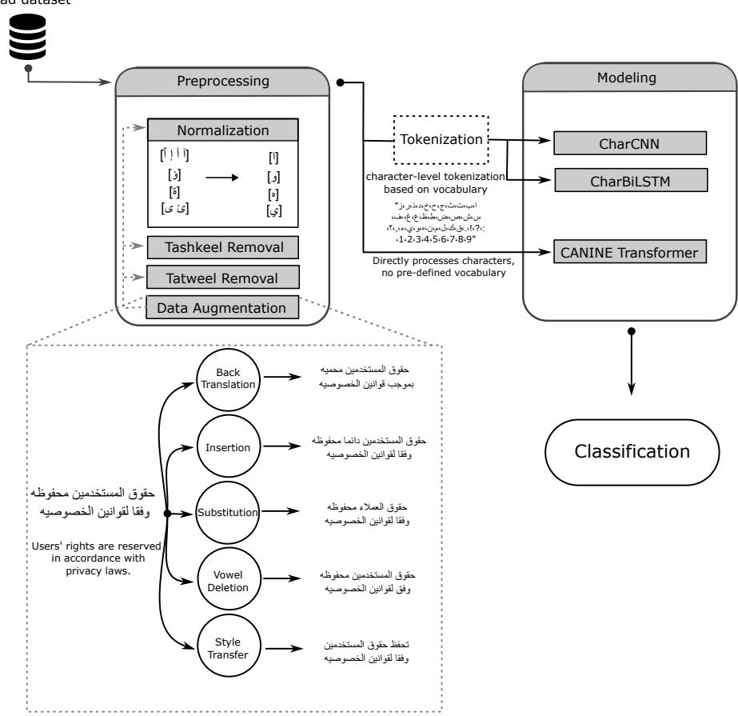
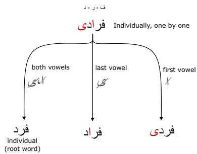
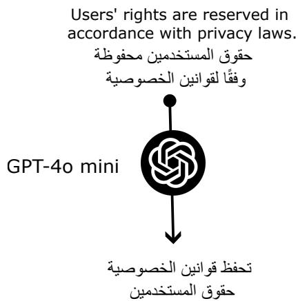
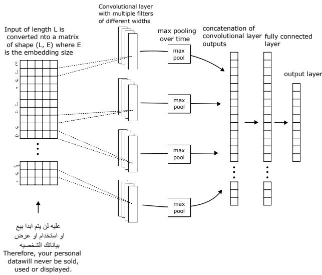
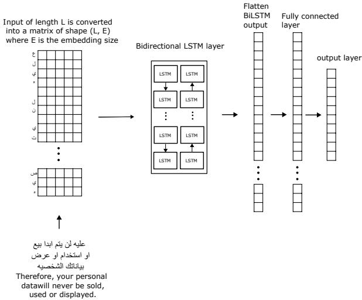
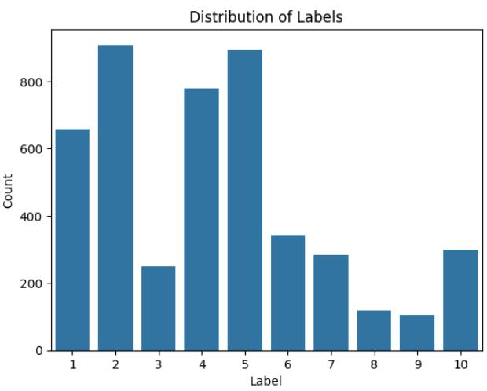
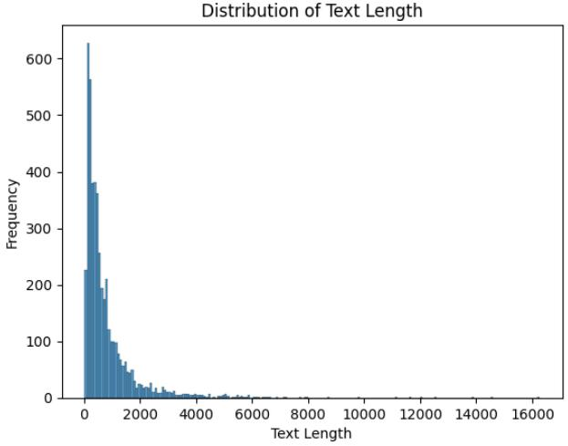
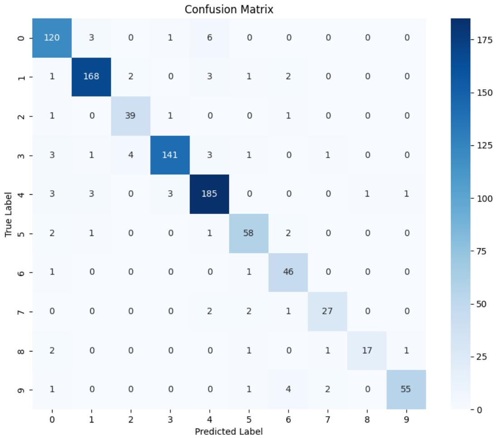
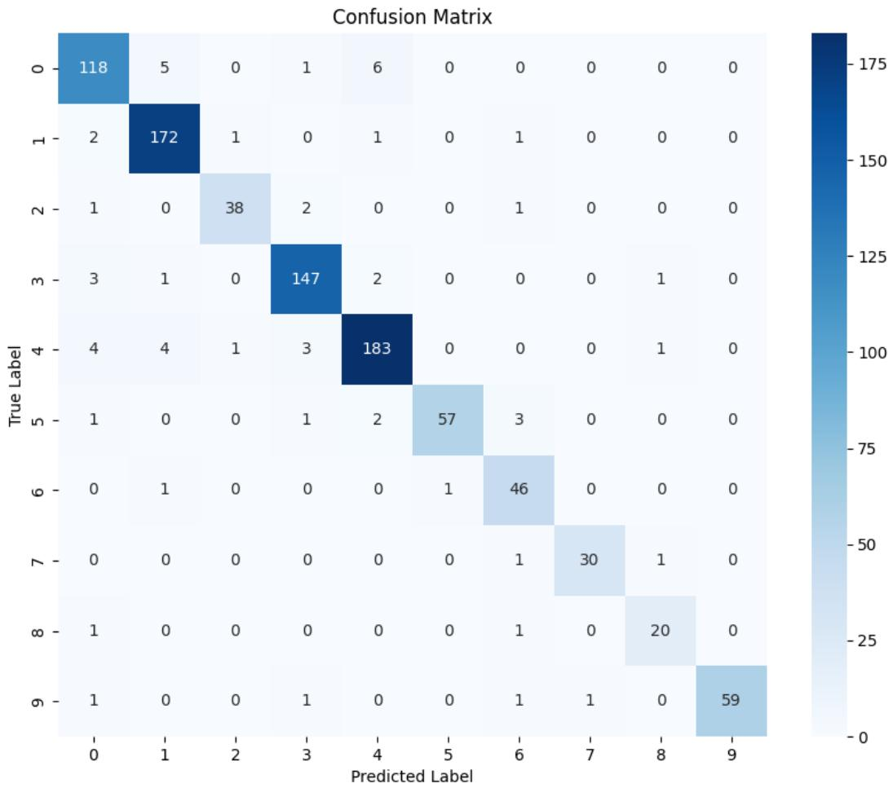

# Enhancing Arabic NLP Tasks through Character-Level Models and Data Augmentation

Mohanad Mohamed1,2, Sadam Al-Azani1

1SDAIA-KFUPM Joint Research Center for Artificial Intelligence (JRC-AI), King Fahd University of Petroleum & Minerals, Dhahran, Saudi Arabia 2Department of Computer Science, College of Computer and Information Sciences, King Saud University, Riyadh, Saudi Arabia Correspondence: sadam.azani@kfupm.edu.sa

## Abstract

This study introduces a character-level approach specifically designed for Arabic NLP tasks, offering a novel and highly effective solution to the unique challenges inherent in Arabic language processing. It presents a thorough comparative study of various character-level models, including Convolutional Neural Networks (CNNs), pre-trained transformers (CA-NINE), and Bidirectional Long Short-Term Memory networks (BiLSTMs), assessing their performance and exploring the impact of different data augmentation techniques on enhancing their effectiveness. Additionally, it introduces two innovative Arabic-specific data augmentation methods—vowel deletion and style transfer—and rigorously evaluates their effectiveness. The proposed approach was evaluated on Arabic privacy policy classification task as a case study, demonstrating significant improvements in model performance, reporting a micro-averaged F1-score of 93.8%, surpassing state-of-the-art. Our code is publicly available available at https://github.com/ mohanad-hafez/char\_models\_arabic\_nlp.

## 1 Introduction

Natural Language Processing (NLP) for Arabic involves navigating a range of unique challenges, such as its rich morphology, root-based word formation, flexible sentence structures, diacritical ambiguities, and orthographic variations (Shaalan et al., 2019). These complexities pose significant hurdles for conventional NLP approaches, which typically rely on word or subword tokenization and often struggle to effectively address the intricacies of the Arabic language (Vania, 2020; Clark et al., 2022). Although large language models have made substantial contributions to addressing various challenging NLP tasks, there remains a pressing need for smaller, more efficient models (Chang and Bergen, 2024). The complexity and high operational costs associated with large models underscore the importance of developing lightweight alternatives that can achieve effective performance while being more accessible and cost-effective (Al-Azani et al., 2024).

In this context, character-level models offer a key contribution by mitigating the challenges of the Arabic language and reducing the complexity associated with large language models, thanks to their ability to capture fine-grained linguistic patterns and handle diverse text variations more effectively (Jozefowicz et al., 2016; Clark et al., 2022). By operating at the character level, these models can potentially learn to compose words and generalize better, avoiding the heavy reliance on memorization that is typical of word and subword models with fixed vocabularies (Jozefowicz et al., 2016). Furthermore, character-level models eliminate the need for explicit tokenization (Clark et al., 2022), which simplifies the preprocessing pipeline and reduces the engineering effort required for maintaining complex tokenizers. However, character-level models require larger datasets to train effectively, as they need extensive data to capture the fine-grained linguistic patterns and nuances inherent in the language.

All of these considerations drive our effort to develop robust and efficient models tailored for processing this linguistically rich and complex language. This study introduces a novel approach for Arabic NLP tasks, utilizing character-level models combined with language-dependent and -independent data augmentation techniques to enhance performance and adaptability. The considered character-level architectures, in this study, include a Character-level Convolutional Neural Network (CharCNN) inspired by (Kim et al., 2016), the pre-trained transformer model CANINE (Clark et al., 2022), and a character-level BiLSTM model. A key aspect of this research is the exploration of various data augmentation techniques and their impact on the performance of character-level models. We first examine established methods such as back translation contextual word substitution, and contextual word insertion . Furthermore, we introduce and evaluate two novel augmentation methods specifically tailored for Arabic: the deletion of vowels from words, and a style transfer technique that transforms nominal sentences into verbal ones and vice versa. We use a case study of Arabic privacy policy classification (Al-Khalifa et al., 2023) as a representative example of a text classification task to evaluate the performance and effectiveness of the proposed approach. The main contributions of this study are:

• It introduces a character-level approach tailored for Arabic NLP tasks, offering a novel and effective solution for addressing the unique challenges of Arabic language processing.

• It provides a comprehensive comparative study on the effectiveness of various characterlevel models and explores how different data augmentation techniques can enhance the performance of these models.

• It introduces two innovative, Arabic-specific data augmentation methods, namely: vowel deletion and style transfer, and rigorously evaluates their effectiveness.

## 2 Literature Review

## 2.1 Character-level models

Character-level models are emerging as a promising approach in various areas of NLP. Two notable contributions in this evolving field are the CANINE architecture, introduced by (Clark et al., 2022), and the ByT5 model introduced by (Xue et al., 2022).

These advancements in character-level and bytelevel modeling open new possibilities for NLP research and applications, particularly for languages with complex morphology like Arabic (Alkesaiberi et al., 2024). While CANINE and ByT5 represent significant steps forward in modeling applicable to various languages, other studies have also explored the efficacy of character-level models in specific Arabic NLP tasks. For instance, Alqurashi (2022) explored the application of a character-level model for Arabic dialect identification. Their study employed classical machine learning methods and a character CNN to classify Saudi dialects, showcasing the potential of character-level representations in capturing fine-grained linguistic variations specific to Arabic dialects.

Omara et al. (2022) investigated the use of character-gated RNNs for Arabic sentiment analysis. Their research highlighted the ability of character-level models to capture morphological and semantic features, leading to improved performance in sentiment classification tasks for Arabic text. Alyafeai et al. (2023)) explored the impact of various tokenization schemes, including character-level tokenization, on Arabic text classification tasks. Their findings emphasized the importance of choosing appropriate tokenization strategies based on the specific task and dataset characteristics, further underscoring the significance of character-level representations in Arabic NLP.

## 2.2 Data augmentation for NLP

Recent studies have explored various data augmentation methods in the context of Arabic NLP. For instance, Refai et al. (2023) proposed an approach utilizing the AraGPT-2 (Antoun et al., 2020b) model to generate synthetic Arabic text for data augmentation. Their method involved evaluating the quality of augmented sentences using similarity measures such as Euclidean, cosine, Jaccard, and BLEU distances. The augmented dataset was then used with the AraBERT (Antoun et al., 2020a) transformer for sentiment classification tasks, demonstrating improved performance across different datasets. Alkadri et al. (2022) investigated the effectiveness of data augmentation in addressing Arabic spam detection on Twitter. Their framework integrated word embedding techniques to augment the dataset and employed various machine learning classifiers, including SVM, Naive Bayes, and Logistic Regression. The results showed significant improvements in macro F1 score and overall accuracy, highlighting the potential of data augmentation in enhancing Arabic spam detection.

Furthermore, Mohamed et al. (2024) introduced a two-stage framework for Arabic misinformation detection that combined data augmentation with the AraBERT model. The first stage focused on identifying optimal feature representations, while the second stage investigated the effect of data augmentation through back-translation. Their findings revealed that data augmentation, particularly with N-gram features, significantly improved accuracy compared to baseline machine learning algorithms and pre-trained models.

Yasser et al. (2024) conducted a comparative study on data augmentation methods for sentiment analysis enhancement. They evaluated the impact of Random Deletion, Synonym Replacement, GPT3.5 generation, and Character Swapping across six deep learning models. The results indicated that BERT, in conjunction with different augmentation methods, led to substantial accuracy improvements, showcasing the potential of data augmentation in enhancing sentiment analysis tasks.

Appendix A summarizes the most related work on character-based models and data augmentation for NLP. While previous research has explored data augmentation techniques in Arabic NLP, no research has investigated the potential of data augmentation in conjunction with character level models. To the best of our knowledge, the only research exploring the effect of data augmentation on character level models is presented in ( ¸Sahin, 2022), but their study focused on languages other than Arabic. This research gap underscores the need for further exploration in this area to fully harness the capabilities of character-level representations and data augmentation in enhancing Arabic NLP tasks.

## 3 Research Method and Materials

Figure 1 depicts the high-level architecture of the proposed approach, covering dataset preparation, preprocessing, data augmentation, models generation, and evaluation. These tasks are detailed in the following subsections.

## 3.1 Dataset

We utilized the Saudi Privacy Policy Dataset (Al-Khalifa et al., 2023), which comprises 1,000 Arabic privacy policies collected from various sectors in Saudi Arabia. This dataset was chosen as a suitable benchmark for evaluating our character-level models, offering a diverse range of text lengths and categories. The dataset contains 4,638 annotated lines of text, each labeled according to one of ten principles derived from the Saudi Personal Data Protection Law (PDPL).

We analyzed the text length distribution within the dataset to understand its characteristics better. The mean text length is approximately 790 characters, with a standard deviation of 1,069 characters. The shortest text is 11 characters long, while the longest extends to 16,258 characters. The median length is 459.5 characters, indicating a rightskewed distribution with a majority of shorter texts and a tail of longer ones. Appendix B illustrates the distribution of classes across the dataset and presents a histogram of text lengths, revealing considerable variation. For our experiments, we split the dataset into training, validation, and test sets. We allocated 80% of the data for training and validation, with the remaining 20% reserved for testing. Specifically, the training set consists of 2,968 samples, the validation set contains 742 samples, and the test set comprises 928 samples. This split ensures a robust evaluation of our models while maintaining a sufficiently large training set. The size of our test set (928 samples) aligns with the test set used by the original dataset creators in their experiments (Al-Khalifa et al., 2023), allowing for fair comparisons with their results.

This dataset was preprocessed by the dataset’s creators to include the removal of diacritics (tashkeel), removal of tatweel, and normalization of certain characters to a standard form.

## 3.2 Tokenization

For the CharCNN and CharBiLSTM models, we employed a character-level tokenization approach. We defined a vocabulary consisting of 46 characters, including Arabic letters, punctuation marks, and digits, depicted in Figure 2. Each character in the input text was then converted to its corresponding integer index based on this vocabulary. The CANINE model, on the other hand, operates directly on raw character sequences without requiring explicit tokenization or a predefined vocabulary.

## 3.3 Augmentation

The impact of various data augmentation techniques on character-level models for Arabic NLP have been investigated and evaluated, in this study. We employ five main augmentation methods: back translation (Sennrich et al., 2015), contextual word embedding substitution (Kobayashi, 2018), and contextual word embedding insertion (Kobayashi, 2018) Furthermore, two novel techniques specific to Arabic, namely: vowel deletion and sentences style transfer, have been proposed and evaluated.

Back translation For our implementation, we utilized the translation models from Helsinki-NLP. The process involves translating the original Arabic text to English and then back to Arabic, introducing subtle variations while preserving the overall meaning and label of the text.

Contextual word embedding substitution and

  
Figure 1: Proposed framework of data augmentation and character-level models

$$
\begin{array} { c } { { \sin ( \frac { \lambda } { 2 } ) \cos \alpha \cos \alpha \cos \alpha \cos \alpha \cos \alpha \cos \beta \cos \alpha \cos \alpha \cos \alpha \cos \alpha \cos \alpha \cos \alpha \sin \alpha } } \\ { { \sin ( \frac { \lambda } { 2 } ) \cos \alpha \sin \alpha \cos \alpha \cos \alpha \cos \alpha \cos \alpha \cos \alpha \sin \beta \cos \alpha \cos \alpha \sin \alpha \cos \alpha \cos \alpha \sin \beta \cos \alpha \cos \alpha \cos \alpha \sin \beta \sin \alpha } } \\ { { 0 . 1 \cdot 2 \cdot 3 \cdot 4 \cdot 5 \cdot 6 \cdot 7 \cdot 8 \cdot 9 \cdot 9 \cdot } } \end{array}
$$

Figure 2: Vocabulary used for CharCNN and CharBiL-STM models, consisting of 46 character.

insertion. For contextual word embedding substitution and insertion, we leveraged the AraBERT language model (Antoun et al., 2020a). This approach considers the surrounding words to find the most suitable candidates for augmentation, ensuring that the inserted or substituted words are contextually appropriate. Substitution involves replacing words in the original text with contextually similar words, while insertion adds new words at appropriate positions in the sentence.

Vowel deletion. As a novel contribution to Arabic NLP augmentation techniques, we introduce vowel deletion.This approach focuses on the removal of vowel letters in Arabic. The primary motivation behind this method is to increase the model’s focus on consonantal patterns, which often carry the core meaning in Arabic, as Arabic words are built around consonantal roots, with long vowels often serving as part of the word pattern. By deleting these vowels, we create variations that challenge the model to rely more heavily on the root consonants for understanding, potentially enhancing its ability to capture the fundamental semantic content. We implemented three variants of this technique:

1. Random Vowel Deletion: Randomly removes a vowel from 30% of the words in a given text.

2. First Vowel Deletion: Removes the first vowel from 30% of the words.

3. Last Vowel Deletion: Removes the last vowel from 30% of the words.

Style Transfer. In Arabic, sentences can be categorized as nominal or verbal based on their structure. A nominal sentence typically begins with a noun, whereas a verbal sentence starts with a verb. The structure of the sentence can affect how meaning is conveyed. In this augmentation technique, we transform nominal sentences into verbal ones, and vice versa, without altering the overall meaning of the sentence. This structural change introduces variation in sentence composition, helping the model generalize better. To achieve this, we evaluated Google Gemini, ChatGPT, and GPT-4o Mini on a selection of examples. As native Arabic speakers, we observed that GPT-4o mini delivered the most effective performance. Therefore, we employed OpenAI’s GPT-4o mini to perform these transformations.

  
Figure 3: Demonstration of vowel deletion in Arabic text. The first vowel, last vowel, or both vowels are deleted, with the removed vowels highlighted in red.

  
Figure 4: Transformation of a nominal sentence into a verbal sentence using style transfer. The structure is changed while preserving the original meaning.

## 3.4 Character-level models

This section provides a detailed overview of the character-level models under consideration.

## 3.4.1 CharCNN

We employ a CharCNN model for text classification, based on the architecture of (Kim et al., 2016). This model processes text at the character level, without using word embeddings or tokenization. Key components include an input layer for character sequences, a character embedding layer, 1D convolutional layers with ReLU activation, maxover-time pooling, and a fully connected layer. The final output is a softmax probability distribution over the classes. The model structure is illustrated in Figure 5.

While (Kim et al., 2016) focused on language modeling, our model is adapted for text classificaiton. We replaced the recurrent layers in their original architecture with dense layers for classification . To address initial overfitting issues, we removed the highway layers present in (Kim et al., 2016) and adjusted hyperparameters such as dropout rate to optimize performance on our specific dataset and task.

  
Figure 5: Architecture of CharCNN model.

## 3.4.2 CANINE-s

We used the CANINE-s model for text classification. CANINE-s is a character-level transformer that processes text without tokenization. It uses character hash embeddings to represent characters efficiently. The model first captures local context with a local transformer block, then reduces the sequence length using strided convolution. A deep transformer stack processes these embeddings to generate contextual representations. We fine-tuned CANINE-s on the Saudi privacy policy dataset and applied dropout and weight decay to prevent overfitting.

## 3.4.3 CharBiLSTM

We also use a CharBiLSTM network to capture the order of characters in both directions. The model starts with an input layer for character sequences and an embedding layer to represent each character. Two LSTM layers process the sequence—one from start to end and the other in reverse. Their outputs are combined, then passed through a fully connected layer. The final layer uses softmax to predict the class probabilities. The structure is shown in Figure 6.

  
Figure 6: Architecture of Char-BiLSTM model.

## 4 Experiments and Results

## 4.1 Experimental Setup

Model Configuration. For the CharCNN model, we used a convolutional layer with filter sizes of 10, 7, 5, and 3 and 256 filters per size. The fully connected layer consisted of 512 units. We applied dropout with a rate of 0.25 and L2 regularization with a coefficient of 0.01 to the convolutional layer, and 0.001 to the dense layer. The CANINE-s model was fine-tuned using the pre-trained weights provided by google. We applied dropout with a rate of 0.3 for both hidden layers and attention probabilities to mitigate overfitting. For the CharBiLSTM model, we used 128 LSTM units in each direction, followed by a fully connected layer with 256 units. Dropout was applied with a rate of 0.15, and L2 regularization was applied to the dense layer with a coefficient of 0.01.

Training details The CharCNN and CharBiL-STM models were trained for 300 epochs using the Adam optimizer with learning rates of 0.0001 and 0.001 respectively. The models were implemented and trained using Tensorflow library. For the CANINE-s model, We used the AdamW optimizer with a learning rate of 5e-5 and weight decay of 0.01. The model was trained using Py-Torch Lightning, with a maximum of 50 epochs. We implemented early stopping with a patience of 5 epochs, monitoring the validation loss to prevent overfitting. To stabilize training, we applied gradient clipping with a maximum norm of 1.0. This technique helps prevent exploding gradients and can lead to more stable convergence. We also implemented a learning rate scheduler using ReduceLROnPlateau. This scheduler monitors the validation loss and reduces the learning rate by a factor of 0.1 if no improvement is seen for 3 consecutive epochs. This adaptive learning rate strategy can help fine-tune the model more effectively, especially in later stages of training.

We implemented checkpointing to save the best model based on validation loss. The final model for each architecture was selected based on the lowest validation loss achieved during training.

## 4.2 Preprocessing and evaluation

Data augmentation implementation Data augmentation techniques were applied to the entire dataset, effectively doubling its size for each method used. We experimented with individual augmentation methods as well as combinations. For instance, applying back translation followed by contextual word embedding insertion would quadruple the dataset size. The most extensive combination (back translation, contextual word embedding insertion, and contextual word embedding substitution) resulted in an eight-fold increase in dataset size.

Normalization While the original dataset was prenormalized by its creators, we applied additional normalization to the augmented examples generated by our models. We used the same preprocessing steps mentioned above, to ensure consistency across the original and augmented data.

Evaluation Metrics Several evalaution metrics have been considered. Primarily, we focused on the micro-averaged F1-score.This metric was chosen to enable direct comparison with the benchmark established in the original research on this dataset (Mashaabi et al., 2023). In addition to the micro-averaged F1-score, we also employed both macro and wighted averages of F1-score, precision, and recall.

## 4.3 Results and Analysis

## 4.3.1 Models performance without data augmentation

The initial evaluation focused on comparing the performance of the character-level models without any data augmentation. The results, as presented in Table 1, reveal several interesting insights. The CharCNN and CANINE-s models exhibited comparable performance across most metrics, with the exception of macro-averaged F1-score and precision, where the CharCNN slightly outperformed

CANINE-s. This observation is noteworthy considering the significantly smaller size of the Char-CNN model (943,946 parameters) compared to the CANINE-s transformer model (132M parameters). The BiLSTM model, while demonstrating reasonable performance, lagged behind the CharCNN and CANINE-s models in terms of overall effectiveness. These findings underscore the potential of simpler convolutional architectures, like the CharCNN, to achieve competitive results in Arabic text classification tasks, even without extensive data augmentation or complex model structures. The comparable performance of the CharCNN to the significantly larger CANINE-s model further emphasizes the efficiency and effectiveness of convolutional approaches in capturing character-level patterns in Arabic text.

## 4.3.2 Impact of data augmentation

The application of various data augmentation techniques yielded notable improvements in model performance across different architectures. Table 2 presents the micro-average F1 scores for each model under the considered augmentation methods.

The impact of data augmentation varied significantly across the evaluated models. While some augmentation methods consistently improved performance across all models, others showed modelspecific effects. The proposed vowel deletion methods demonstrated strong performance improvements. For the CharCNN and CANINE-s models, last vowel deletion yielded the highest F1 scores of 0.931 and 0.938, respectively. This suggests that focusing on consonantal patterns may enhance the models’ ability to capture key features in Arabic text.

It also can be noticed that the proposed sentence style transfer performed better than several augmentation techniques especially with CharCNN model. It also outperforms words Substituations and Insertion with CANINE-s.

The CANINE-s model showed the most consistent improvements across different augmentation methods. It achieved its best performance with last vowel deletion, but also saw significant gains with back translation and random vowel deletion. This suggests that the pre-trained CANINE-s model’s character-level architecture is particularly adept at leveraging augmented data. To further understand the performance of this best-performing model (CANINE with vowel deletion), we delve deeper into its predictions using a confusion matrix, as shown in Appendix C.

It can be also notised that contextual word embedding substitution and insertion produced modest improvements for some models but were less effective than vowel deletion techniques. Back translation showed varying effects, with notable improvements for CANINE-s but minimal impact on other models.

While the CharBiLSTM model generally underperformed compared to other architectures, it showed the most significant improvement when multiple augmentation techniques were combined. The combination of back translation, contextual word embedding substitution, and insertion boosted its F1 score from 0.8405 to 0.879. However, the CharCNN maintained relatively consistent performance across most augmentation methods, with minimal improvements compared to CANINE-s. The CharCNN’s best performance with last vowel deletion (0.931) still falls short of CANINE-s’s augmented performance (0.938). This suggests that the CharCNN’s architecture may have limitations in fully utilizing the augmented data, unlike the more flexible CANINE-s model.

## 4.4 Comparison with related work

To contextualize our findings, we compared the performance of our character-level models with the results reported in previous work on the Saudi Privacy Policy dataset. Table 3 presents a comprehensive comparison of micro-averaged F1 scores across various techniques from the previous work.

CANINE-s with data augmentation outperforms previous state-of-the-art models. The CANINE-s model, enhanced with last vowel deletion augmentation, achieved a micro-averaged F1 score of 0.938. This result surpasses the bestperforming models from previous work, including AraBERT, MARBERT, and CamelBERT, which all achieved a score of 0.933. This improvement demonstrates the effectiveness of character-level models when combined with appropriate data augmentation techniques for Arabic text classification.

Character-level models show competitive performance despite their smaller size. The CharCNN model, with only 943,946 parameters, achieved a micro-averaged F1 score of 0.931 when augmented with last vowel deletion. This performance is comparable to the much larger BERT-based models (approximately 300 million parameters) used in previous work. The CANINE-s model, while larger than

<table><tr><td></td><td>Micro average</td><td colspan="2">Weighted average</td><td colspan="3">Macro Average</td></tr><tr><td>Model</td><td>F1</td><td>F1 Precision</td><td>Recall</td><td>F1</td><td>Precision</td><td>Recall</td></tr><tr><td>CharCNN</td><td>0.9224</td><td>0.92 0.92</td><td>0.92</td><td>0.91</td><td>0.92</td><td>0.90</td></tr><tr><td>CharBiLSTM</td><td>0.8405</td><td>0.85 0.84</td><td>0.84</td><td>0.81</td><td>0.81</td><td>0.82</td></tr><tr><td>CANINE-s</td><td>0.9224</td><td>0.92 0.92</td><td>0.92</td><td>0.90</td><td>0.91</td><td>0.90</td></tr></table>

Table 1: Results of character-level models without data augmentation
<table><tr><td>Model</td><td>S</td><td>I</td><td>BT</td><td>S,I</td><td>BT,S</td><td>BT,I</td><td>BT,I,S</td><td>RVD</td><td>FVD</td><td>LVD</td><td>ST</td></tr><tr><td>CharCNN</td><td>0.924</td><td>0.920</td><td>0.919</td><td>0.921</td><td>0.918</td><td>0.921</td><td>0.924</td><td>0.922</td><td>0.928</td><td>0.931</td><td>0.922</td></tr><tr><td>CharBiLSTM</td><td>0.844</td><td>0.841</td><td>0.838</td><td>0.862</td><td>0.870</td><td>0.870</td><td>0.879</td><td>0.848</td><td>0.830</td><td>0.824</td><td>0.811</td></tr><tr><td>CANINE-s</td><td>0.925</td><td>0.921</td><td>0.932</td><td>0.926</td><td>0.929</td><td>0.928</td><td>0.927</td><td>0.934</td><td>0.933</td><td>0.938*</td><td>0.923</td></tr></table>

Table 2: Micro average F1 score of the character level models with various augmentation methods. S: Contextual word embedding substitution, I: Contextual word embeddings insertion, BT: Back translation, RVD: Random vowel deletion, FVD: First vowel deletion, LVD: Last vowel deletion, ST: Style Transfer. The highest score for each model is highlighted in bold, while the overall highest score across all models is marked with a star.

CharCNN at 132 million parameters, is still significantly smaller than BERT models yet outperforms them. This highlights the efficiency of characterlevel approaches in capturing relevant features for Arabic text classification.

These results underscore the potential of character-level models, especially when combined with effective data augmentation techniques, for Arabic text classification tasks. They offer a promising alternative to larger, more complex models while maintaining competitive performance.

<table><tr><td>Approach</td><td>Technique</td><td>Micro F1</td></tr><tr><td rowspan="9">previous work (Mashaabi et al., 2023)</td><td>TF-IDF + Naive Bayes</td><td>0.72</td></tr><tr><td>TF-IDF + FFNN</td><td>0.82</td></tr><tr><td>Word2Vec + Naive Bayes</td><td>0.89</td></tr><tr><td>Word2Vec + Logistic Regression</td><td>0.91</td></tr><tr><td>Word2Vec + SVM</td><td>0.9</td></tr><tr><td>Tokenizer &amp; One Hot Encoding + LSTM</td><td>0.8</td></tr><tr><td>AraBERT</td><td>0.932</td></tr><tr><td>MARBERT</td><td>0.933</td></tr><tr><td>CamelBERT</td><td>0.933</td></tr><tr><td rowspan="3">Our work</td><td>CharCNN with LVD</td><td>0.931</td></tr><tr><td>CharBiLSTM with BT+I+S</td><td>0.879</td></tr><tr><td>CANINE-s with LVD</td><td>0.938</td></tr></table>

Table 3: Comparison of various models. The highest score is highlighted in bold.

## 5 Conclusion

In this research, we explored the potential of character-level models for Arabic NLP tasks, particularly in the context of text classification. It presents a character-level approach specifically designed for Arabic NLP tasks, providing an innovative and effective solution to tackle the distinctive challenges associated with Arabic language processing. We conducted a comparative study of various character-level models, including CNNs, pre-trained transformers (CANINE), and BiLSTMs along with different data augmentation techniques, applied for the first time to Arabic. It also presents novel and Arabic-dependent augmentation techniques, namely vowel deletion and sentence style transfer. This approach was evaluated on an Arabic privacy policy classification shared task, as a case study. Our results show that character-level models, especially when combined with data augmentation, can achieve strong performance in Arabic text classification. The CANINE model, augmented with vowel deletion, reached a micro-averaged F1- score of 93.8%, surpassing state-of-the-art models. This highlights the effectiveness of character-level models in capturing the complexities of Arabic morphology and their potential to improve various Arabic NLP tasks. The novel vowel deletion method we introduced proved to be a valuable addition to the set of data augmentation techniques for Arabic NLP. It consistently improved the performance of character-level models, suggesting that focusing on consonantal patterns can enhance their ability to understand Arabic text. Furthermore, the proposed sentence style transfer technique out performed several techniques including contextual word embeddings insertion and substitution, and Back translation (individualy and in combination) with CharCNN model. It also performs better than contextual word embeddings insertion and substitution with CANINE-s. Future work could explore the application of these techniques to other Arabic NLP tasksand develop new language-dependent and -independent data augmentation methods.

## 6 Limitations

Our approach has been evlauated on the Saudi Privacy Policy classification task only, which may not fully capture the variety of Arabic text seen in broader applications. Future work should explore these techniques on additional datasets and standard benchmarks to ensure the findings generalize well to other Arabic NLP tasks.

## Acknowledgment

The authors would like to acknowledge the support provided by Saudi Data & AI Authority (SDAIA) and King Fahd University of Petroleum & Minerals (KFUPM) under SDAIA-KFUPM Joint Research Center for Artificial Intelligence (JRC-AI) grant No. JRC-UCG-09. They also extend their appreciation to the Undergraduate Research Office at KFUPM for their generous support of this research through the KFUPM Summer Research Program.

## References

Sadam Al-Azani, Nora Alturayeif, Haneen Abouelresh, and Alhanoof Alhunief. 2024. A comprehensive framework and empirical analysis for evaluating large language models in arabic dialect identification. In 2024 International Joint Conference on Neural Networks (IJCNN), pages 1–7. IEEE.

Hend Al-Khalifa, Malak Mashaabi, Ghadi Al-Yahya, and Raghad Alnashwan. 2023. The saudi privacy policy dataset. arXiv preprint arXiv:2304.02757.

Abdullah I Alharbi, Phillip Smith, and Mark Lee. 2022. Integrating character-level and word-level representation for affect in arabic tweets. Data & Knowledge Engineering, 138:101973.

Abdullah M Alkadri, Abeer Elkorany, and Cherry Ahmed. 2022. Enhancing detection of arabic social spam using data augmentation and machine learning. Applied Sciences, 12(22):11388.

Abdulelah Alkesaiberi, Ali Alkhathlan, and Ahmed Abdelali. 2024. Ara–canine: Character-based pretrained language model for arabic language understanding. International Journal on Cybernetics & Informatics (IJCI), 13(13):45.

Tahani Alqurashi. 2022. Applying a character-level model to a short arabic dialect sentence: A saudi dialect as a case study. Applied Sciences, 12(23).

Zaid Alyafeai, Maged S Al-shaibani, Mustafa Ghaleb, and Irfan Ahmad. 2023. Evaluating various tokenizers for arabic text classification. Neural Processing Letters, 55(3):2911–2933.

Wissam Antoun, Fady Baly, and Hazem Hajj. 2020a. Arabert: Transformer-based model for arabic language understanding. arXiv preprint arXiv:2003.00104.

Wissam Antoun, Fady Baly, and Hazem Hajj. 2020b. Aragpt2: Pre-trained transformer for arabic language generation. arXiv preprint arXiv:2012.15520.

Markus Bayer, Marc-André Kaufhold, Björn Buchhold, Marcel Keller, Jörg Dallmeyer, and Christian Reuter. 2023. Data augmentation in natural language processing: a novel text generation approach for long and short text classifiers. International journal of machine learning and cybernetics, 14(1):135–150.

Tyler A Chang and Benjamin K Bergen. 2024. Language model behavior: A comprehensive survey. Computational Linguistics, 50(1):293–350.

Jonathan H Clark, Dan Garrette, Iulia Turc, and John Wieting. 2022. Canine: Pre-training an efficient tokenization-free encoder for language representation. Transactions ofthe Associationfor Computational Linguistics, 10:73–91.

Huu-Thanh Duong and Tram-Anh Nguyen-Thi. 2021. A review: preprocessing techniques and data augmentation for sentiment analysis. Computational Social Networks, 8(1):1.

Jeremy Howard and Sebastian Ruder. 2018. Universal language model fine-tuning for text classification. arXiv preprint arXiv:1801.06146.

Rafal Jozefowicz, Oriol Vinyals, Mike Schuster, Noam Shazeer, and Yonghui Wu. 2016. Exploring the limits of language modeling. arXiv preprint arXiv:1602.02410.

Yoon Kim, Yacine Jernite, David Sontag, and Alexander Rush. 2016. Character-aware neural language models. In Proceedings of the AAAI conference on artificial intelligence, volume 30.

Sosuke Kobayashi. 2018. Contextual augmentation: Data augmentation by words with paradigmatic relations. arXiv preprint arXiv:1805.06201.

Malak Mashaabi, Ghadi Al-Yahya, Raghad Alnashwan, and Hend Al-Khalifa. 2023. Arabic privacy policy corpus and classification. In Natural Language Processing and Information Systems, pages 94–108, Cham. Springer Nature Switzerland.

Ebtsam A Mohamed, Walaa N Ismail, Osman Ali Sadek Ibrahim, and Eman MG Younis. 2024. A twostage framework for arabic social media text misinformation detection combining data augmentation and arabert. Social Network Analysis and Mining, 14(1):53.

Eslam Omara, Mervat Mousa, and Nabil Ismail. 2022. Character gated recurrent neural networks for arabic sentiment analysis. Scientific Reports, 12(1):9779.

Dania Refai, Saleh Abu-Soud, and Mohammad J Abdel-Rahman. 2023. Data augmentation using transformers and similarity measures for improving arabic text classification. IEEE Access, 11:132516–132531.

Gözde Gül ¸Sahin. 2022. To augment or not to augment? a comparative study on text augmentation techniques for low-resource nlp. Computational Linguistics, 48(1):5–42.

Rico Sennrich, Barry Haddow, and Alexandra Birch. 2015. Improving neural machine translation models with monolingual data. arXiv preprint arXiv:1511.06709.

Khaled Shaalan, Sanjeera Siddiqui, Manar Alkhatib, and Azza Abdel Monem. 2019. Challenges in arabic natural language processing. In Computational linguistics, speech and image processing for Arabic language, pages 59–83. World Scientific.

Clara Vania. 2020. On understanding character-level models for representing morphology.

Linting Xue, Aditya Barua, Noah Constant, Rami Al-Rfou, Sharan Narang, Mihir Kale, Adam Roberts, and Colin Raffel. 2022. Byt5: Towards a token-free future with pre-trained byte-to-byte models. Transactions ofthe Associationfor Computational Linguistics, 10:291–306.

Farida Yasser, Souzan Hatem, Laila Ayman, Loujain Mohamed, and Ammar Mohammed. 2024. Data augmentation for sentiment analysis enhancement: A comparative study. In 2024 6th International Conference on Computing and Informatics (ICCI), pages 53–58. IEEE.

## A Literature Review Summary

In order to summarize the related works in terms of character-level models and data augmentation, we defined some attributes and compared the literature accordingly as presented in Tables 4 and 5.

## B Distributions of labels and text lengths in the dataset

Figures 7a and 7b present the distribution of labels and text lengths in the Saudi Privacy Policy Dataset, rspectivelly.

## C Confusion Matrix

Figures 8 and 9 present the confusion matrices for the baseline CANINE model and the best performance achieved with the proposed approach, utilizing CANINE with vowel data augmentation. The strong values along the diagonal indicate that the model is generally effective at classifying most instances correctly. However, we observe some misclassifications, particularly between classes 0 and 4, and classes 1 and 4. The confusion matrix highlights that even with the impressive performance of the model, there’s room for further improvement, especially in distinguishing between specific classes.

<table><tr><td>Ref.</td><td>Task</td><td>Model</td><td colspan="3">Key Findings</td></tr><tr><td>(Alharbi et al., 2022)</td><td>Affect in Arabic Tweets</td><td>Combination of character and word-level embed- dings (XGBoost, CNN, LSTM)</td><td>Outperformed by combining levelembeddings</td><td>state-of-the-art character-level and</td><td>models word-</td></tr><tr><td>(Alqurashi, 2022)</td><td>Dialect Identification al., Sentiment Classification</td><td></td><td>Character-level CNN and classical machine learning models Character-gated RNNs, including LSTM, GRU,</td><td>Character-level models, particularly with TF- IDF and character n-grams, outperformed CNNs in identifying fine-grained Saudi dialects. Character-level representation effectively cap-</td><td></td></tr><tr><td>(Omara et 2022)</td><td></td><td></td><td>Bi-LSTM, Bi-GRU, and hybrid models</td><td>tures morphological and semantic features for Arabic sentiment analysis. Hybrid models, espe- cially Bi-GRU-CNN, achieved the highest accu- racy.</td><td></td></tr><tr><td>(Alyafeai et al., 2023)</td><td></td><td>Various Text classification tasks</td><td>bidirectional GRU (character, word, morpholog- ical, stochastic, disjoint letters, SentencePiece tokenizers)</td><td>No single tokenizer is universally best; perfor- mance depends on dataset size, task type, and morphology.</td><td></td></tr></table>

Table 4: Summary of recent research utilizing Character-level models for Arabic NLP

<table><tr><td>Ref.</td><td>Tasks</td><td>Language</td><td>DA technique</td><td>Model</td><td>Improvement</td></tr><tr><td>(Alkadri et al., 2022)</td><td>Social spam detection</td><td>Arabic</td><td>Embedding replacement</td><td>LinearSVC</td><td>Macro-F1 score +32%</td></tr><tr><td>(Refai et al., 2023)</td><td>Sentiment classification</td><td>Arabic</td><td>Text Generation</td><td>AraBERT</td><td>F1 score +7% 8%</td></tr><tr><td>(Bayer et al., 2023)</td><td>Sentiment classification</td><td>English</td><td>Text Generation</td><td>AWD-LSTM (ULMFiT (Howard and Ruder, 2018))</td><td>Accuracy +15.53%% Accuracy +7%</td></tr><tr><td colspan="2">(Mohamed et al. 2024) Misinformation detection</td><td>Arabic</td><td>Back translation</td><td>Mini-BERT Medium-BERT</td><td>(approximately) Accuracy +12% (approximately)</td></tr><tr><td colspan="2"></td><td></td><td></td><td>Naive Bayes, Logistic Regression, Support Vector Machine, Random Forest</td><td>AUC +(7%~15%) Augmentation</td></tr><tr><td>(Şahin, 2022)</td><td colspan="2">POS tagging, Dependency Parsing, low-resource Semantic Role Labeling languages</td><td>CSU, CSW, CA; Token-level: SR, RWD, RWS; Syntactic: Nonce, Crop, Rotate.</td><td>model (POS), transition-based and biaffine dependency parsers (DEP), character-level bidirectional LSTM (SRL)</td><td>significantly improved dependency parsing, followed by POS tagging and semantic role labeling. Character-level methods were the most consistent performers.</td></tr><tr><td>(Duong and Nguyen- Thi, 2021)</td><td colspan="2">Sentiment classification Vietnamese</td><td>back-translation, syntax-tree transformations, easy data augmentation (EDA).</td><td>Logistic regression, support vector machine (SVM), one-vs-one (OVO), one-vs-all (OVA).</td><td>F1: +1.3% (Back translation), +3.4% (SyntaxTree transformation), +0.02% (EDA)</td></tr></table>

Table 5: Summary of recent research on data augmentation for NLP

(a) Distribution of labels  
  
(b) Distribution of text lengths  
Figure 7: Distribution of labels and text lengths in the Saudi Privacy Policy Dataset

  
Figure 8: Confusion Matrix for the CANINE Model Without Augmentation.

  
Figure 9: Confusion Matrix for the CANINE Model with Vowel Deletion Augmentation.