# Enhancing Knowledge Distillation of Large Language Models through Efficient Multi-Modal Distribution Alignment

Tianyu Peng1,2,3 and Jiajun Zhang1,2,3,4\*

1School of Artificial Intelligence, University of Chinese Academy of Sciences

2Institute of Automation, Chinese Academy of Sciences

3Wuhan AI Research, 4Shanghai Artificial Intelligence Laboratory, Shanghai, China pengtianyu2022@ia.ac.cn, jjzhang@nlpr.ia.ac.cn

## Abstract

Knowledge distillation (KD) is an effective model compression method that can transfer the internal capabilities of large language models (LLMs) to smaller ones. However, the multi-modal probability distribution predicted by teacher LLMs causes difficulties for student models to learn. In this paper, we first demonstrate the importance of multi-modal distribution alignment with experiments and then highlight the inefficiency of existing KD approaches in learning multi-modal distributions. To address this problem, we propose Ranking Loss based Knowledge Distillation (RLKD), which encourages the consistency of the ranking of peak predictions between the teacher and student models. By incorporating wordlevel ranking loss, we ensure excellent compatibility with existing distillation objectives while fully leveraging the fine-grained information between different categories in peaks of two predicted distribution. Experimental results demonstrate that our method enables the student model to better learn the multi-modal distributions of the teacher model, leading to a significant performance improvement in various downstream tasks.1

## 1 Introduction

In recent years, large language models (LLMs, Brown et al. 2020; Zeng et al. 2023; OpenAI 2023; Touvron et al. 2023; Yang et al. 2023; Jiang et al. 2024) have demonstrated their great power to solve natural language processing tasks. Existing research (Kaplan et al., 2020; Wei et al., 2022) shows that language models tend to perform better as the number of parameters increases. However, the training and deployment of large scale models involve high costs, coupled with less usability and flexibility. Therefore, model compression techniques (Zhu et al., 2023) for LLMs are drawing more and more attention.

Knowledge distillation (KD, Hinton et al. 2015) is one of the representative approaches for model compression. It facilitates efficient knowledge transfer to smaller student models by using the full probability distribution output from teacher models as a guiding signal during optimization. Therefore, designing better distillation objectives that make it more efficient for student models to learn the overall probability distribution of teacher models is the focus in KD research.

Particularly for LLMs, the lengthy and complex probability distribution causes more learning difficulties. Due to the diversity of natural language, the predicted probability distribution of LLMs is often multi-modal (quantitative analysis results are shown in Appendix A), which contains multiple potential correct predictions for a given input. Consequently, improving the learning of multi-modal distribution becomes the focus of LLMs’ KD.

To achieve this goal, previous studies have already explored several distillation objectives for LLMs. Conventional KD (Hinton et al., 2015) uses forward Kullback-Leibler divergence (KL) as the optimization objective. However, KL predisposes to the mode-averaging problem (Wen et al., 2023), whereby student models tend to learn too smooth distributions (as shown in Figure 1). Therefore, more recent work (Gu et al., 2023; Tan et al., 2023) has employed reverse KL (RKL) instead of KL, claiming that this optimization objective can better focus on peak predictions. Nevertheless, optimizing RKL tends to get an overconcentration of the probability predictions of the student model in some specific intervals (as illustrated in Figure 1). Then, Wen et al. (2023) propose using symmetric divergences as the distillation objective to alleviate mode problems caused by KL and RKL. In contrary, Wu et al. (2024b) verify through theory and experiments on toy data that KL and RKL do not suffer from the above issues, and they instead share the same optimization objective in KD of LLMs.

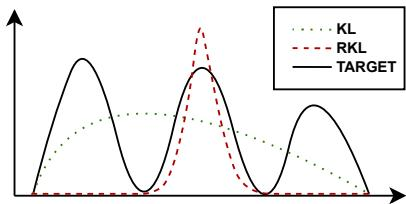  
Figure 1: An theoretical example illustrates the situations that can arise when using KL or RKL as distillation objective to fit multi-modal distribution.

However, despite the demonstrated effectiveness of the distillation objectives proposed in the aforementioned work in fitting multi-modal distributions, either through theoretical or toy experiments, they do not specifically showcase the learning capability of student models for multi-modal distributions. We still have no idea whether these distillation objectives truly enhance the learning ability of student models for multi-modal distributions in real-world tasks, hence making it difficult to ascertain the source of the improvements in downstream tasks.

In order to address the above issues, we propose in this paper Ranking Loss based Knowledge Distillation (RLKD) for LLMs. We first verify the relationship between multi-modal predictions and model performance, and experimentally demonstrate the problems of existing distillation objectives in fitting multi-modal distributions. In response to the identified problems, we introduce the word-level ranking loss, which is based on Spearman’s rank correlation coefficient (SRCC), to optimize the degree of consistency in the order of peak predictions between the teacher and student models. In particular, we convert the learning of multi-modal distributions during the KD process into the learning of the top-k sampling (Holtzman et al., 2020) order. Through ranking loss, we ensure excellent compatibility with existing distillation objectives while fully leveraging the fine-grained information between different categories predicted by two distribution peaks. Additionally, we verify and demonstrate through real-scenario experiments the impact of introducing ranking loss into KD on the learning ability of student models for multi-modal distributions.

Experimental results indicate that the quality of multi-modal predictions is closely related to the performance of the model, while existing distillation objectives lack the ability to fit multi-modal distributions effectively. Subsequently, our proposed method effectively enhances the student model’s learning ability to predict multi-modal distributions during the distillation process and exhibits good compatibility with existing distillation objectives. We also validate the ranking loss on diverse datasets from multiple tasks, showing significant improvements in downstream KD tasks.

In general, our main contributions are as follows:

1. We propose a word-level ranking loss for KD of LLMs, that significantly improves the student model’s multi-modal distribution learning ability and performance on downstream tasks.

2. We analyze the importance of multi-modal distribution alignment through experiments. Additionally, we verify the shortcomings of existing methods in peak prediction learning and achieve significant improvements with our proposed method.

## 2 Related Work

## 2.1 KD of LLMs

Nowadays, many LLMs are no longer open source due to commercial and other considerations. Therefore, based on the open-source nature of the model, KD of LLMs is frequently categorized into whitebox KD (Gu et al., 2023; Tan et al., 2023; Wen et al., 2023; Ko et al., 2024; Wu et al., 2024a) for opensource LLMs (Touvron et al., 2023; Yang et al., 2023; Jiang et al., 2024) and black-box KD (Zhou et al., 2023; Chen et al., 2024) for closed-source LLMs (Brown et al., 2020; OpenAI, 2023).

In this work, we focus on white-box KD since the findings can be more applicable. The process of white-box KD is similar to traditional KD, often utilizing a teacher-student framework to learn the rich probability distribution of the teacher model through soft labels.

## 2.2 White-Box KD Objectives

KD based on KL works well in previous models and tasks. For prediction of individual tokens, the formula is expressed as: $D _ { \mathrm { K L } } ( P \left| \right| Q ) =$ $\begin{array} { r } { \sum _ { i } P ( i ) \log ( P ( i ) / Q ( i ) ) } \end{array}$ , where P and Q are predicted distributions by the teacher and student models, respectively. Then, Kim and Rush (2016) propose SeqKD, wherein the results of the teacher model’s beam search are employed as an approximation for the sequence-level KL. To minimize the KL divergence, $Q ( i )$ needs to be as large as possible when $P ( i )$ is large, but the value of $Q ( i )$ has little impact when $P ( i )$ is small. Therefore, $Q ( i )$ is likely to be assigned a disproportionately high probability value when $P ( i )$ is very small, as shown in Figure 1.

To make the student model pay more attention to peak predictions, more studies (Gu et al., 2023; Tan et al., 2023) use RKL as the distillation objective, expressed by the formula: $D _ { \mathrm { R K L } } ( P \Vert Q ) =$ $\textstyle \sum _ { i } Q ( i ) \log ( Q ( i ) / P ( i ) )$ . RKL ensures that $Q ( i )$ is not assigned an unreasonably high probability when $P ( i )$ is small. However, when $P ( i )$ is large, both large and small values of $Q ( i )$ result in a low $D _ { \mathrm { R K I } }$ value. This can lead to the student model missing some peaks in a multi-modal distribution during learning, as shown in Figure 1.

To avoid the mode problems with KL and RKL, Wen et al. (2023) introduce symmetric divergence functions to seek a balance between these two extremes, such as Jensen-Shannon Divergence (JSD) and Total Variation Distance (TVD). They also extend these word-level objectives to sequence-level.

Unlike the above, Wu et al. (2024b) argue that the predicted distribution of LLMs does not meet the conditions of continuity and standard Gaussian distribution. They theoretically and practically demonstrate that KL and RKL actually share the same optimization objective in LLMs’ KD. Additionally, they point out that KL and RKL follow different optimization paths, with one fitting from the head part first and the other from the tail part first, and propose dynamically combining KL and RKL into Adaptive Kullback-Leiber (AKL).

Inspired by existing research, we aim at exploring a KD objective that yields better multi-modal learning ability. However, we first need to validate the following two questions:

1. Does enhancing the learning of multi-modal distributions benefit the performance of student models?

## 3 Preliminary

## 3.1 Metrics

The purpose of enhancing the ability to learn multimodal distributions is to make the peak predictions of student and teacher models closer. Therefore, we first need to define the criteria for evaluating the similarity of the peak predictions of two models. Since top-k sampling is the most common sampling strategy in language models, and peak predictions well correspond to the results of top-k sampling. Hence we convert the measurement of the consistency of multi-modal predictions into the measurement of the consistency of top-k sampling results.

In this paper, we introduce two metrics to assess the consistency of top-k sampling results. We use the consistency rate (CR) and the mean overlap rate (MOR) of the predicted top-k samples on the test set to evaluate how similar the peak predictions of the two models are. Specifically, CR measures the percentage of cases where the two models make identical top-k predictions, including both the categories and their order. The overlap rate (OR) measures the proportion of shared categories in the top-k predictions of both models, ignoring the order and position. MOR is the average OR across the whole test set.

## 3.2 Motivation for Multi-Modal Distribution Learning

We believe that peak predictions reflects the performance of language models, not just top-one prediction. Through experiments in this section, we demonstrate that the quality of peak predictions and the model’s capabilities are highly correlated, thereby demonstrating the value of learning multimodal distributions in the enhanced KD process.

For experiments, we select several models with significant performance gaps and a shared vocabulary. These models come from two families: Llama-2 released by Touvron et al. (2023) and OpenELM released by Mehta et al. (2024). We use models with parameter sizes of 270M, 450M, 1B, 3B, 7B, 13B and 70B. Clearly, within the above models, models with larger parameter sizes exhibit stronger performance.

Among them, the 70B model has significantly more parameters and better performance compared to the other models, thus we can consider it as the ground truth. We use CR and MOR on test set to evaluate how closely the peak predictions of the other models align with those of the 70B model. This allows us to verify the relationship between model performance and the quality of peak predictions.

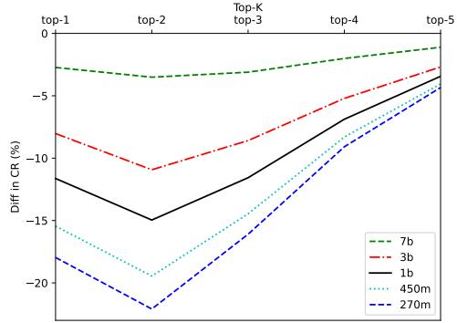

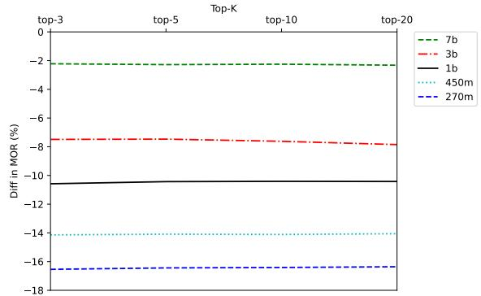  
Figure 2: The degree of consistency between different models and the peak predictions of the 70B model. The horizontal axis represents the range of top-k predictions. For better presentation, we set the vertical axis as the difference between the CR or MOR of the current model and the corresponding results of the 13B model.

For the test set, we sample 5,000 slices from SlimPajama (Soboleva et al., 2023). The visualised experimental results are in Figure 2, and we also show the specific numerical results in Appendix B.

Analysis The experimental results indicate that the closer a model’s peak prediction consistency is to the strongest model, the better its performance. Thus, there is a direct correlation between the quality of peak predictions and model performance, not just the top-one prediction. Therefore, enhancing learning about multi-modal distributions is crucial during the KD process of LLMs.

## 3.3 Validation for Existing KD Objectives

We evaluate existing distillation objectives through experiments to determine if they enable student models to learn the multi-modal distributions of teacher models effectively during the KD process.

We respectively verify the similarity between the student model after distillation training and the teacher model’s peak predictions under different distillation objectives to judge their learning performance on multi-modal distributions. Similarly, we evaluate the top-k prediction results over multiple ranges using CR and MOR. Since this paper focuses on distillation objectives for soft labels, the loss in all distillation experiments in this paper only includes soft targets.

To enhance the validity of the conclusion, we also conduct verification in real scenarios. We use Llama-2-7B (Touvron et al., 2023) and TinyLlama-1.1B (Zhang et al., 2024) as teacher and student models, SlimPajama as the train set. Similar to the conventional settings, we use a learning rate and batch size that align with the practical pretraining task. Since we are assessing learning ability, we validate on the training data that has already been learned to evaluate the extent to which the student model’s peak predictions after KD matches the teacher model. In particular, to make the differences in the multi-modal distribution learning ability of different distillation objectives more convincing, we increase the number of training epochs to 20.

The experimental results are shown in Figure 3, and more specific experimental setups and numerical metrics can be found in Section 5.3.

Analysis Based on the results in Figure 3, existing distillation objectives show no significant disparity in their impact on the ability to learn multi-modal distributions. This further confirms Wu et al.’s (2024b) view that KL and RKL share the same optimization objective in KD of LLMs. But more importantly, even after 20 epochs of training, student models still exhibit deficiencies in learning multi-modal distributions under the existing distillation objectives. Therefore, further exploration is necessary to identify distillation metrics that can enhance the model’s capability to learn multi-modal distributions.

## 4 Method

Existing distillation objectives bring the two distributions closer by minimizing the distance between the teacher’s and the student’s predicted distributions. Although these distillation objectives can align the student’s predicted distribution with the teacher’s after a sufficient number of steps in theory, their efficiency in learning multi-modal distributions in practical scenarios still needs further improvement. Consequently, we aim to introduce additional optimization objectives to enhance the learning of peak predictions.

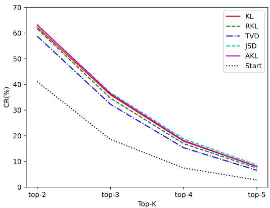

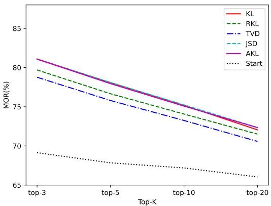  
Figure 3: Degree of agreement between student model and teacher model peak predictions after 20 epochs under existing KD objectives.

The direct optimization objective of the existing distillation objectives is the distance between two distributions. The methods for calculating the distance of these distillation objectives differ, but they compute the same objects, as ${ \mathcal { L } } _ { \mathrm { l o g i t s } } =$ $\textstyle \sum _ { i }$ distance $( P ( i ) , Q ( i ) )$ ). Therefore, existing distillation objectives only calculate the distance between each individual category, without utilizing the relationship among categories, as the black lines shown in Figure 4.

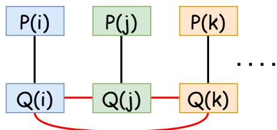  
Figure 4: Comparison of computational objects on peak predictions. The black lines represent existing distillation objectives and the red lines represent our method.

In this work, we enhance the learning of peak predictions in KD of LLMs by introducing a new optimization objective of word-level ranking loss. The new optimization objective focuses on the prediction order of high probabilities between student and teacher models, enabling the student model to match the teacher model on critical predicted categories.

Our specific approach focuses on the top-k predicted tokens from both the teacher and student models. We calculate the consistency by comparing the probability order of these tokens in the teacher model with the probability order in the student model. This method straightforwardly enhances the consistency of top-k predictions between two multi-modal distributions, thereby strengthening the alignment of peak predictions between the student and teacher models. Importantly, the computational objects of our ranking loss are the probability values in the prediction sequences of the union of the teacher’s and student’s top-k predictions, not just the teacher’s top-k predictions. This ensures that the excessively high predictive probability in the student model are also reasonably optimized.

Our approach allows that during the optimization process, the calculation of peak predictions is not limited to comparisons within a single category. As the red lines shown in Figure 4, $Q ( i )$ needs to be compared with $Q ( j )$ and $Q ( k )$ based on the ranking position of $P ( i )$ in the teacher’s predictions to minimize the ranking loss.

We consider Spearman’s rank correlation coefficient (SRCC) as the target for the measurement of ranking consistency. Compared to the Pearson coefficient, which also measures order consistency, SRCC only considers the consistency in the order of two sets of arrangements, without taking into account the correlation of the actual element values. We prefer that the ranking loss focuses more on the consistency of the predicted categories and probability values are non-linear relationships, therefore we select SRCC as the optimization objective for ranking loss, as

$$
{ \mathcal { L } } _ { \mathrm { R a n k i n g } } = 1 - \rho _ { \mathrm { s r c c } } ( p , q ) = 1 - { \frac { \mathrm { C o v } ( R _ { p } , R _ { q } ) } { \sigma _ { R _ { p } } \cdot \sigma _ { R _ { q } } } }\tag{1}
$$

where $p$ and $q$ are subsets of distributions $P$ and $Q ,$ respectively, and each subset represents the probability values on the respective distributions for the union of top-k predictions. $R _ { p }$ denotes the rank index of $p , \sigma _ { R _ { p } }$ is the standard deviation of $R _ { p }$ , and $\mathrm { C o v } ( R _ { p } , R _ { q } )$ is the covariance of $R _ { p }$ and $R _ { q } .$

Although sorting operations are theoretically non-differentiable, existing work (Blondel et al., 2020; Ramzi et al., 2023) has implemented differentiable ranking operator suitable for stochastic gradient descent. Several studies (Huang et al., 2022; Rudd et al., 2022; Wang and Zheng, 2023) have used SRCC as an optimization objective in other research areas based on such operators.

Overall, our method fully utilizes the peak predictions information from both the teacher and student models. Compared to previous methods that calculate loss within a single category, our approach further optimizes using probability values between categories. As shown in Figure 4, when combined with existing objectives, the fused objective allows the student model to more comprehensively learn the peak predictions of the teacher model from two different perspectives, showing excellent compatibility.

## 5 Experiments

In this section, we verify the effectiveness of our method on the pre-training and downstream tasks.

## 5.1 Baselines

To validate the effect of ranking loss, we introduce some distillation objectives that also focus on soft label learning as baseline methods.

Supervised Fine-Tuning(SFT) We verify the effectiveness of KD by comparing with direct finetuning.

Word-Level Distillation We choose four wordlevel distillation objectives that are used more frequently in recent work: KL, RKL, JSD and TVD. Afterwards, we validate the boosting effect of ranking loss when combined with these base distillation objectives.

SeqKD (Kim and Rush, 2016) This method is representative of sequence-level distillation, which approximates sentence-level KL as fine-tuning on teacher-generated data.

f-DISTILL (Wen et al., 2023) We compare with the sequence-level KL in f-DISTILL (abbreviated as FD). Similar to SeqKD, FD also relies on teacher-generated data, but adopts soft labels for training. In particular, we have not compared with other methods in f-DISTILL because they rely on sampling directly from the student model, which is not as effective without pre-distillation (Shleifer

and Rush, 2020).

Adaptive Kullback-Leiber divergence (AKL, Wu et al. 2024b) For the calculation process of AKL, we use the same experimental setup as in the original paper. We set the hyperparameter µ as 0.5 and the gap function $\epsilon ( p ( z ) , q ( z ) ) = | p ( z ) - q ( z ) |$

## 5.2 Datasets and Models

Dataset used in the pre-training task:

SlimPajama (Soboleva et al., 2023) A highquality pre-training dataset with a mixture of data in reasonable proportions. We test the CR and MOR on the training set to assess how efficiently the student model learns the multi-modal predictive distribution.

Datasets used in downstream tasks:

GSM8K (Cobbe et al., 2021) A high-quality mathematical reasoning dataset, each entry has a complete reasoning process, making it very suitable for KD tasks. It contains 8.5k challenging grade school math word problems. We follow the dataset’s original test set division, with 1,319 samples as the test set and the rest as the training set. We use answer accuracy as the evaluation metric.

databricks-dolly-15k (Conover et al., 2023) A directive fine-tuning dataset covering various tasks. We randomly select 14,000 samples for the training set and 800 samples for the test set. We use ROUGE scores (Lin, 2004) as the evaluation metric to test the generative performance.

Xsum (Narayan et al., 2018) An extensively used text summarization dataset. We randomly select 20,000 samples for the training set and 1,000 samples for the test set. Evaluation is also conducted through ROUGE scores.

For all KD tasks, we employ Llama-2-7B (Touvron et al., 2023) as the teacher model and Tinyllama-1.1B (Zhang et al., 2024) as the student model. Prior to distillation, we have fine-tuned the teacher models on the respective datasets to adapt it to the tasks. Except in the GSM8K task, we directly use gsm8k-rft-llama7b2-u13b model released by Yuan et al. (2023) due to its excellent performance.

More details can be found in Appendix B.

## 5.3 Results in the Pre-Training Task

In pre-training task, we investigate the impact of introducing ranking loss on improving the alignment of top-k predictions between student and teacher models. The reason for the validation on pre-training task rather than downstream tasks is that student model can be easier to capture taskspecific peak predictions patterns on a single task, thereby approaching the distribution of the teacher model more closely. Inversely, the richness of categories and types in pre-training data makes it more likely that the proximity between the student and teacher model predictions is a result of KD training.

<table><tr><td rowspan="2">Loss</td><td rowspan="2">Perplexity↓</td><td colspan="5">CR↑(%)</td><td colspan="4">MOR↑(%)</td></tr><tr><td>top1</td><td>top2</td><td>top3</td><td>top4</td><td>top5</td><td>top3</td><td>top5</td><td>top10</td><td>top20</td></tr><tr><td>Start</td><td>10.83</td><td>75.52</td><td>41.17</td><td>18.59</td><td>7.44</td><td>2.76</td><td>69.14</td><td>67.84</td><td>67.19</td><td>66.05</td></tr><tr><td>KL</td><td>7.85</td><td>89.44</td><td>62.27</td><td>35.96</td><td>17.88</td><td>7.97</td><td>81.10</td><td>78.07</td><td>75.19</td><td>72.05</td></tr><tr><td>KL+R</td><td>7.81</td><td>90.59</td><td>69.08</td><td>44.54</td><td>25.21</td><td>12.65</td><td>86.00</td><td>85.04</td><td>83.39</td><td>76.75</td></tr><tr><td>RKL</td><td>8.25</td><td>90.03</td><td>61.67</td><td>34.65</td><td>16.95</td><td>7.41</td><td>79.70</td><td>76.66</td><td>74.07</td><td>71.51</td></tr><tr><td>RKL+R</td><td>7.99</td><td>90.29</td><td>67.27</td><td>41.94</td><td>22.74</td><td>10.99</td><td>84.75</td><td>83.56</td><td>81.76</td><td>75.50</td></tr><tr><td>JSD</td><td>8.23</td><td>89.98</td><td>63.14</td><td>36.79</td><td>18.81</td><td>8.60</td><td>81.07</td><td>78.10</td><td>75.24</td><td>72.35</td></tr><tr><td>JSD+R</td><td>8.01</td><td>90.15</td><td>69.03</td><td>45.48</td><td>26.46</td><td>13.70</td><td>86.60</td><td>86.02</td><td>84.79</td><td>76.94</td></tr><tr><td>TVD</td><td>8.54</td><td>88.66</td><td>58.77</td><td>32.27</td><td>15.34</td><td>6.55</td><td>78.77</td><td>75.80</td><td>73.25</td><td>70.58</td></tr><tr><td>TVD+R</td><td>7.92</td><td>89.87</td><td>67.65</td><td>43.21</td><td>24.09</td><td>12.68</td><td>85.62</td><td>84.89</td><td>83.43</td><td>76.34</td></tr><tr><td>AKL</td><td>7.93</td><td>90.36</td><td>63.21</td><td>36.44</td><td>18.14</td><td>8.04</td><td>81.08</td><td>77.95</td><td>75.08</td><td>72.34</td></tr><tr><td>AKL+R</td><td>7.86</td><td>90.50</td><td>68.49</td><td>43.64</td><td>24.39</td><td>12.14</td><td>85.60</td><td>84.54</td><td>82.69</td><td>76.31</td></tr></table>

Table 1: Learning situation of multi-modal distribution for data already learned in the pre-training task. "+R" represents that we have added an additional fixed-ratio ranking loss.

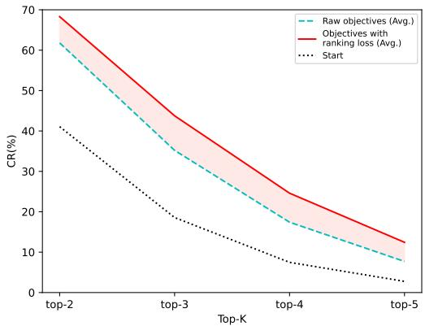

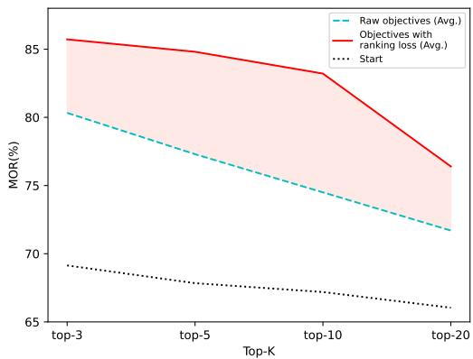  
Figure 5: Improvement in the learning ability of multi-modal distributions for existing distillation objectives by introducing ranking loss in the pre-training task. We average the results of the five distillation objectives before and after adding the ranking loss. The red area indicates the improved parts.

Training With the same experimental setup as in Section 3.3, we test the effectiveness of these five distillation objectives combined with ranking loss. For ranking loss, we align predictions of the top 15 between student and teacher models. We employ a fixed ratio for loss allocation, as $\mathcal { L } _ { \mathrm { t o t a l } } = 2 \cdot \mathcal { L } _ { \mathrm { R a n k i n g } } + \mathcal { L } _ { \mathrm { l o g i t s } }$ . The choice of ranking ranges and the allocation of losses is discussed in Appendix D. For the convenience of subsequent ablation analysis, in addition to the multi-modal distribution similarity, we also evaluate the perplexity and CR of the top-1 prediction. The experimental results are presented in Table 1, while more detailed training information can be found in Appendix B. We also present extra experiments in Appendix E to verify the generalization ability of our method.

Results Table 1 shows the various metrics measured on the learned data for the student model before training and after KD training with different objectives. The results indicate that when combined with ranking loss, all five different objectives significantly improve the student model in terms of the multi-modal consistency metric with the teacher model during the distillation process. Moreover, while the similarity of the multi-modal distribution improves, the top-1 accuracy and perplexity performance are not negatively affected and even show slight improvements. To make the metrics for the similarity of multi-modal distributions more intuitive, we present visualized results in Figure 5, which show the improvement of ranking loss in a clearer manner. Compared to the mean scores of original objectives, our method improves the CR metric by approximately 30% to 95% across different ranges, and the OR metric is improved by about 50% to 120% across different ranges.

Overall, our approach significantly improves the efficiency of aligning multi-modal predictions between the student and teacher models during the distillation process. Furthermore, for the five different distillation objectives, ranking loss demonstrates stable and effective improvements, showcasing its excellent compatibility with all these commonly used KD objectives.

<table><tr><td rowspan="2">Method</td><td colspan="2">GSM8K</td><td colspan="2">Dolly</td><td colspan="3">Xsum</td></tr><tr><td>Correct_Num</td><td>Score R-1</td><td>R-2</td><td>R-L</td><td>R-1</td><td>R-2</td><td>R-L</td></tr><tr><td>Teacher</td><td>682</td><td>51.71</td><td>33.55 17.70</td><td>31.55</td><td>41.18</td><td>18.81</td><td>34.39</td></tr><tr><td>SFT</td><td>227</td><td>17.21</td><td>23.60 10.18</td><td>22.29</td><td>33.27</td><td>11.84</td><td>26.57</td></tr><tr><td>SeqKD</td><td>200</td><td>15.16</td><td>22.73 9.64</td><td>21.20</td><td>34.78</td><td>13.20</td><td>28.64</td></tr><tr><td>Rank-5</td><td>229</td><td>17.36</td><td>25.74 12.39</td><td>23.77</td><td>34.71</td><td>12.53</td><td>28.18</td></tr><tr><td>Rank-15</td><td>236</td><td>17.89</td><td>26.13 12.27</td><td>24.16</td><td>34.93</td><td>12.55</td><td>28.25</td></tr><tr><td>KL</td><td>219</td><td>16.60</td><td>23.09</td><td>10.12 21.82</td><td>34.62</td><td>13.06</td><td>28.24</td></tr><tr><td>KL+R</td><td>267(+48)</td><td>20.24</td><td>24.72</td><td>11.47 23.44(+1.62)</td><td>35.41</td><td>13.61</td><td>28.93(+0.69)</td></tr><tr><td>RKL</td><td>132</td><td>10.01</td><td>23.84</td><td>10.19 22.55</td><td>32.97</td><td>11.41</td><td>26.72</td></tr><tr><td>RKL+R</td><td>191(+59)</td><td>14.48</td><td>26.27</td><td>12.44 24.40(+1.85)</td><td>35.20</td><td>12.83</td><td>28.60(+1.88)</td></tr><tr><td>JSD</td><td>160</td><td>12.13</td><td>25.41</td><td>11.50 23.67</td><td>35.13</td><td>13.33</td><td>28.51</td></tr><tr><td>JSD+R</td><td>227(+67)</td><td>17.21</td><td>26.60</td><td>12.62 24.81(+1.14)</td><td>35.18</td><td>13.18</td><td>28.71(+0.20)</td></tr><tr><td>TVD</td><td>0</td><td>0.00</td><td>26.21</td><td>12.25 24.68</td><td>34.84</td><td>12.74</td><td>28.45</td></tr><tr><td>TVD+R</td><td>240(+240)</td><td>18.20</td><td>27.28</td><td>13.44 25.35(+0.67)</td><td>35.84</td><td>13.59</td><td>29.40(+0.95)</td></tr><tr><td>FD</td><td>194</td><td>14.71</td><td>23.29</td><td>9.64 21.91</td><td>34.27</td><td>12.69</td><td>27.94</td></tr><tr><td>FD+R</td><td>265(+71)</td><td>20.09</td><td>25.19</td><td>11.66 23.40(+1.49)</td><td>35.37</td><td>13.17</td><td>28.88(+0.94)</td></tr><tr><td>AKL</td><td>215</td><td>16.30</td><td>24.59</td><td>10.56 23.20</td><td>34.19</td><td>12.79</td><td>27.96</td></tr><tr><td>AKL+R</td><td>235(+20)</td><td>17.82</td><td>26.86</td><td>13.51 25.16(+1.96)</td><td>35.09</td><td>13.34</td><td>28.68(+0.72)</td></tr></table>

Table 2: Experimental results on test set of downstream tasks. "+R" represents that we have added an additional fixed-ratio ranking loss. "R-1", "R-2", and $" { \bf R } { - } { \bf L } ^ { \prime \prime }$ are abbreviations for ROUGE-1, ROUGE-2, and ROUGE-L, respectively. We have also marked the improvement after combining the original objectives with ranking loss in parentheses for the most important metrics in the table.

## 5.4 Results in Downstream Tasks

Although experiments in pre-training task fully validate that our method achieves the motivation of improving multi-modal prediction distribution learning during the KD process, its effectiveness in improving the performance of the student model after distillation still requires further verification. Therefore, we conduct thorough validation of our method on datasets from multiple different downstream tasks to demonstrate its contribution to improving the performance of the student model.

Training We conduct experimental verification on all baselines and downstream task datasets, and introduce ranking loss on various baselines containing word-level distillation objectives. Specifically, we also conduct experiments with only ranking loss to evaluate the impact of peak alignment on downstream task effectiveness, as "Rank-k" to align topk predictions. For fused loss, we align predictions of top-5 between teacher and student models to enhance applicability on downstream tasks. We use the same loss allocation ratio as the pre-training task. We also discuss the choice of ranking ranges and the allocation of losses in detail in Appendix D, including fixed-rate and dynamic-rate losses allocations. The experimental results are presented in Table 2, more detailed training information can be found in Appendix B.

Results The experimental results show the scores of the student models after training with the baseline method and our method, where the highest scores for each metric of each task are achieved by our method. The table also shows the improvements after combining our proposed ranking loss with existing word-level distillation objectives. This combination enhances the performance of existing methods on nearly all metrics, with significant improvements on most. Specifically, after introducing the ranking loss, most of the accuracy improvements of the student model on the GSM8K test set are over 20% compared to original objective, most ROUGE-L scores on the Dolly test set improves by over 1.0 point, and most ROUGE-L score on the Xsum test set improves by over 0.7 points. Especially, when only using the ranking loss, our method learns only the peak predictions, which account for only about 0.0001% of the total categories, yet surpasses most existing distillation objectives in evaluations across multiple tasks. This not only demonstrates the importance of learning peak predictions, but also showcases the outstanding performance of our method in peak predictions alignment.

In summary, experiments on downstream tasks validate that our method significantly improves the performance of student model in the KD process.

Compared to other optimization objectives of soft labels, our method demonstrates excellent competitiveness and compatibility. In addition, the consistent performance improvements across different datasets confirm the generality and robustness of our approach.

## 6 Further Analysis

## 6.1 Ablation Study

In this section, we use further ablation analysis to reveal whether the performance improvement brought by our method is due to the enhanced ability of multi-modal distribution learning during the KD process.

Based on the respective results and analysis in Section 5.3 and 5.4, we can conclude a preliminary ablation conclusion that the improvement in the ability to learn multi-modal distributions and the enhancement in downstream task performance are indeed attributed to the introduction of ranking loss.

Furthermore, we can observe in Table 1 that although the improvement of the top prediction accuracy is modest by introducing the ranking loss, the peak prediction alignment at other positions is significantly improved. Therefore, ranking loss does not have a significant impact on the actual learning efficiency of the top-1 prediction.

However, in downstream tasks, we use a greedy decoding strategy, which should not exhibit better performance when there is no significant improvement in the consistency of the top prediction. In fact, the reason is that in downstream tasks, we make the student model learn task-related prediction patterns more efficiently by enhancing its ability to learn from multi-modal distributions. Therefore, our method achieve better performance with the same number of training steps.

Based on the above analysis, we can more confidently get the conclusion that ranking loss primarily improves the fitting of multi-modal distributions, with modest impact on the alignment of top-one predictions. Therefore, the existing objectives without the addition of ranking loss can be regarded as an ablation of the ability to learn multi-modal distributions, leading to worse results. This further shows the importance of aligning multi-modal predictive distributions in KD of LLMs.

## 6.2 Case Study

Based on the results in Table 2, under our experimental setup, the accuracy of TVD on GSM8K is 0. In fact, this is due to TVD’s inadequacy in peak predictions learning, which leads to its failure to grasp the answering norms of GSM8K.

We conduct a case study within this interesting phenomenon in Appendix G to further analyze and demonstrate the importance of peak predictions learning.

## 7 Conclusion

In this paper, we propose ranking loss based knowledge distillation, a new objective function that improves the efficiency of aligning peak predictions of student and teacher models during white-box KD. We verify the importance of aligning multimodal distributions through experiments and highlight the inefficiency of existing KD objectives in learning multi-modal distributions. Most importantly, we propose a word-level ranking loss to the existing KD objectives for more efficient alignment of multi-modal distributions. Our extensive experiments clearly demonstrate that our method effectively improves the multi-modal distribution alignment between teacher and student models, leading to significant performance gains in different downstream tasks.

## Limitations

Due to the extensive experiments have been conducted in this paper and the limitations of computational resources, we only perform distillation experiments on models within the Llama (Touvron et al., 2023) architecture. However, the existing generative models often have similar structures, and the Llama model family is one of the most widely used, making this study still highly applicable. We will also conduct experiments on other model families as future work.

Additionally, we encourage combining our proposed method with existing distillation objectives to achieve optimal performance. Although this introduces additional computation, this burden becomes negligible due to existing operators and our code optimization (only adding about 1% extra training time). We show the time consumption in Appendix C.

## Acknowledgments

This work is supported by National Key R&D Program of China 2022ZD0160602 and the Natural Science Foundation of China 62122088.

## References

Mathieu Blondel, Olivier Teboul, Quentin Berthet, and Josip Djolonga. 2020. Fast differentiable sorting and ranking. In Proceedings of the 37th International Conference on Machine Learning, ICML 2020, 13- 18 July 2020, Virtual Event, volume 119 of Proceedings of Machine Learning Research, pages 950–959. PMLR.

Tom Brown, Benjamin Mann, Nick Ryder, Melanie Subbiah, Jared D Kaplan, Prafulla Dhariwal, Arvind Neelakantan, Pranav Shyam, Girish Sastry, Amanda Askell, et al. 2020. Language models are few-shot learners. Advances in neural information processing systems, 33:1877–1901.

Hongzhan Chen, Xiaojun Quan, Hehong Chen, Ming Yan, and Ji Zhang. 2024. Knowledge distillation for closed-source language models. CoRR, abs/2401.07013.

Karl Cobbe, Vineet Kosaraju, Mohammad Bavarian, Mark Chen, Heewoo Jun, Lukasz Kaiser, Matthias Plappert, Jerry Tworek, Jacob Hilton, Reiichiro Nakano, Christopher Hesse, and John Schulman. 2021. Training verifiers to solve math word problems. CoRR, abs/2110.14168.

Mike Conover, Matt Hayes, Ankit Mathur, Jianwei Xie, Jun Wan, Sam Shah, Ali Ghodsi, Patrick Wendell, Matei Zaharia, and Reynold Xin. 2023. Free dolly: Introducing the world’s first truly open instructiontuned llm.

Yuxian Gu, Li Dong, Furu Wei, and Minlie Huang. 2023. Knowledge distillation of large language models. CoRR, abs/2306.08543.

Geoffrey E. Hinton, Oriol Vinyals, and Jeffrey Dean. 2015. Distilling the knowledge in a neural network. CoRR, abs/1503.02531.

Ari Holtzman, Jan Buys, Li Du, Maxwell Forbes, and Yejin Choi. 2020. The curious case of neural text degeneration. In 8th International Conference on Learning Representations, ICLR 2020, Addis Ababa, Ethiopia, April 26-30, 2020. OpenReview.net.

Tao Huang, Zekang Li, Hua Lu, Yong Shan, Shusheng Yang, Yang Feng, Fei Wang, Shan You, and Chang Xu. 2022. Relational surrogate loss learning. In The Tenth International Conference on Learning Representations, ICLR 2022, Virtual Event, April 25-29, 2022. OpenReview.net.

Albert Q. Jiang, Alexandre Sablayrolles, Antoine Roux, Arthur Mensch, Blanche Savary, Chris Bamford, Devendra Singh Chaplot, Diego de Las Casas,

Emma Bou Hanna, Florian Bressand, Gianna Lengyel, Guillaume Bour, Guillaume Lample, Lélio Renard Lavaud, Lucile Saulnier, Marie-Anne Lachaux, Pierre Stock, Sandeep Subramanian, Sophia Yang, Szymon Antoniak, Teven Le Scao, Théophile Gervet, Thibaut Lavril, Thomas Wang, Timothée Lacroix, and William El Sayed. 2024. Mixtral of experts. CoRR, abs/2401.04088.

Jared Kaplan, Sam McCandlish, Tom Henighan, Tom B. Brown, Benjamin Chess, Rewon Child, Scott Gray, Alec Radford, Jeffrey Wu, and Dario Amodei. 2020. Scaling laws for neural language models. CoRR, abs/2001.08361.

Yoon Kim and Alexander M. Rush. 2016. Sequencelevel knowledge distillation. In Proceedings of the 2016 Conference on Empirical Methods in Natural Language Processing, EMNLP 2016, Austin, Texas, USA, November 1-4, 2016, pages 1317–1327. The Association for Computational Linguistics.

Jongwoo Ko, Sungnyun Kim, Tianyi Chen, and Se-Young Yun. 2024. Distillm: Towards streamlined distillation for large language models. In Forty-first International Conference on Machine Learning, ICML 2024, Vienna, Austria, July 21-27, 2024. OpenReview.net.

Chin-Yew Lin. 2004. ROUGE: A package for automatic evaluation of summaries. In Text Summarization Branches Out, pages 74–81, Barcelona, Spain. Association for Computational Linguistics.

Ilya Loshchilov and Frank Hutter. 2019. Decoupled weight decay regularization. In 7th International Conference on Learning Representations, ICLR 2019, New Orleans, LA, USA, May 6-9, 2019. OpenReview.net.

Sachin Mehta, Mohammad Hossein Sekhavat, Qingqing Cao, Maxwell Horton, Yanzi Jin, Chenfan Sun, Iman Mirzadeh, Mahyar Najibi, Dmitry Belenko, Peter Zatloukal, and Mohammad Rastegari. 2024. Openelm: An efficient language model family with open training and inference framework. CoRR, abs/2404.14619.

Shashi Narayan, Shay B. Cohen, and Mirella Lapata. 2018. Don’t give me the details, just the summary! topic-aware convolutional neural networks for extreme summarization. ArXiv, abs/1808.08745.

OpenAI. 2023. GPT-4 technical report. CoRR, abs/2303.08774.

Elias Ramzi, Nicolas Audebert, Clément Rambour, André Araujo, Xavier Bitot, and Nicolas Thome. 2023. Optimization of rank losses for image retrieval. CoRR, abs/2309.08250.

Jeff Rasley, Samyam Rajbhandari, Olatunji Ruwase, and Yuxiong He. 2020. Deepspeed: System optimizations enable training deep learning models with over 100 billion parameters. In KDD ’20: The 26th ACM SIGKDD Conference on Knowledge Discovery

and Data Mining, Virtual Event, CA, USA, August 23-27, 2020, pages 3505–3506. ACM.

Ethan M. Rudd, David Krisiloff, Daniel Olszewski, Edward Raff, and James Holt. 2022. Efficient malware analysis using metric embeddings. In Proceedings ofthe Conference on Applied Machine Learning in Information Security, CAMLIS 2022, Arlington, Virginia, USA, October 20-21, 2022, volume 3391 of CEUR Workshop Proceedings, pages 65–80. CEUR-WS.org.

Sam Shleifer and Alexander M. Rush. 2020. Pre-trained summarization distillation. CoRR, abs/2010.13002.

Daria Soboleva, Faisal Al-Khateeb, Robert Myers, Jacob R Steeves, Joel Hestness, and Nolan Dey. 2023. SlimPajama: A 627B token cleaned and deduplicated version of RedPajama. https://www.cerebras .net/blog/slimpajama-a-627b-token-cleane d-and-deduplicated-version-of-redpajama.

Shicheng Tan, Weng Lam Tam, Yuanchun Wang, Wenwen Gong, Shu Zhao, Peng Zhang, and Jie Tang. 2023. GKD: A general knowledge distillation framework for large-scale pre-trained language model. In Proceedings of the The 61st Annual Meeting of the Association for Computational Linguistics: Industry Track, ACL 2023, Toronto, Canada, July 9-14, 2023, pages 134–148. Association for Computational Linguistics.

Hugo Touvron, Louis Martin, Kevin Stone, Peter Albert, Amjad Almahairi, Yasmine Babaei, Nikolay Bashlykov, Soumya Batra, Prajjwal Bhargava, Shruti Bhosale, Dan Bikel, Lukas Blecher, Cristian Canton-Ferrer, Moya Chen, Guillem Cucurull, David Esiobu, Jude Fernandes, Jeremy Fu, Wenyin Fu, Brian Fuller, Cynthia Gao, Vedanuj Goswami, Naman Goyal, Anthony Hartshorn, Saghar Hosseini, Rui Hou, Hakan Inan, Marcin Kardas, Viktor Kerkez, Madian Khabsa, Isabel Kloumann, Artem Korenev, Punit Singh Koura, Marie-Anne Lachaux, Thibaut Lavril, Jenya Lee, Diana Liskovich, Yinghai Lu, Yuning Mao, Xavier Martinet, Todor Mihaylov, Pushkar Mishra, Igor Molybog, Yixin Nie, Andrew Poulton, Jeremy Reizenstein, Rashi Rungta, Kalyan Saladi, Alan Schelten, Ruan Silva, Eric Michael Smith, Ranjan Subramanian, Xiaoqing Ellen Tan, Binh Tang, Ross Taylor, Adina Williams, Jian Xiang Kuan, Puxin Xu, Zheng Yan, Iliyan Zarov, Yuchen Zhang, Angela Fan, Melanie Kambadur, Sharan Narang, Aurélien Rodriguez, Robert Stojnic, Sergey Edunov, and Thomas Scialom. 2023. Llama 2: Open foundation and finetuned chat models. CoRR, abs/2307.09288.

Sen Wang and Jin Zheng. 2023. Monoskd: General distillation framework for monocular 3d object detection via spearman correlation coefficient. In ECAI 2023 - 26th European Conference on Artificial Intelligence, September 30 - October 4, 2023, Kraków, Poland - Including 12th Conference on Prestigious Applications ofIntelligent Systems (PAIS 2023), volume 372 of Frontiers in Artificial Intelligence and Applications, pages 2507–2516. IOS Press.

Jason Wei, Yi Tay, Rishi Bommasani, Colin Raffel, Barret Zoph, Sebastian Borgeaud, Dani Yogatama, Maarten Bosma, Denny Zhou, Donald Metzler, Ed H. Chi, Tatsunori Hashimoto, Oriol Vinyals, Percy Liang, Jeff Dean, and William Fedus. 2022. Emergent abilities of large language models. Trans. Mach. Learn. Res., 2022.

Yuqiao Wen, Zichao Li, Wenyu Du, and Lili Mou. 2023. f-divergence minimization for sequence-level knowledge distillation. In Proceedings ofthe 61st Annual Meeting of the Association for Computational Linguistics (Volume 1: Long Papers), ACL 2023, Toronto, Canada, July 9-14, 2023, pages 10817–10834. Association for Computational Linguistics.

Junhong Wu, Yang Zhao, Yangyifan Xu, Bing Liu, and Chengqing Zong. 2024a. Boosting LLM translation skills without general ability loss via rationale distillation. CoRR, abs/2410.13944.

Taiqiang Wu, Chaofan Tao, Jiahao Wang, Zhe Zhao, and Ngai Wong. 2024b. Rethinking kullback-leibler divergence in knowledge distillation for large language models. CoRR, abs/2404.02657.

Aiyuan Yang, Bin Xiao, Bingning Wang, Borong Zhang, Ce Bian, Chao Yin, Chenxu Lv, Da Pan, Dian Wang, Dong Yan, Fan Yang, Fei Deng, Feng Wang, Feng Liu, Guangwei Ai, Guosheng Dong, Haizhou Zhao, Hang Xu, Haoze Sun, Hongda Zhang, Hui Liu, Jiaming Ji, Jian Xie, Juntao Dai, Kun Fang, Lei Su, Liang Song, Lifeng Liu, Liyun Ru, Luyao Ma, Mang Wang, Mickel Liu, MingAn Lin, Nuolan Nie, Peidong Guo, Ruiyang Sun, Tao Zhang, Tianpeng Li, Tianyu Li, Wei Cheng, Weipeng Chen, Xiangrong Zeng, Xiaochuan Wang, Xiaoxi Chen, Xin Men, Xin Yu, Xuehai Pan, Yanjun Shen, Yiding Wang, Yiyu Li, Youxin Jiang, Yuchen Gao, Yupeng Zhang, Zenan Zhou, and Zhiying Wu. 2023. Baichuan 2: Open large-scale language models. CoRR, abs/2309.10305.

Zheng Yuan, Hongyi Yuan, Chengpeng Li, Guanting Dong, Chuanqi Tan, and Chang Zhou. 2023. Scaling relationship on learning mathematical reasoning with large language models. CoRR, abs/2308.01825.

Aohan Zeng, Xiao Liu, Zhengxiao Du, Zihan Wang, Hanyu Lai, Ming Ding, Zhuoyi Yang, Yifan Xu, Wendi Zheng, Xiao Xia, Weng Lam Tam, Zixuan Ma, Yufei Xue, Jidong Zhai, Wenguang Chen, Zhiyuan Liu, Peng Zhang, Yuxiao Dong, and Jie Tang. 2023. GLM-130B: an open bilingual pre-trained model. In The Eleventh International Conference on Learning Representations, ICLR 2023, Kigali, Rwanda, May 1-5, 2023. OpenReview.net.

Peiyuan Zhang, Guangtao Zeng, Tianduo Wang, and Wei Lu. 2024. Tinyllama: An open-source small language model. CoRR, abs/2401.02385.

Qinhong Zhou, Zonghan Yang, Peng Li, and Yang Liu. 2023. Bridging the gap between decision and logits in decision-based knowledge distillation for pretrained language models. In Proceedings ofthe 61st

Annual Meeting ofthe Associationfor Computational Linguistics (Volume 1: Long Papers), ACL 2023, Toronto, Canada, July 9-14, 2023, pages 13234– 13248. Association for Computational Linguistics.

Xunyu Zhu, Jian Li, Yong Liu, Can Ma, and Weiping Wang. 2023. A survey on model compression for large language models. CoRR, abs/2308.07633.

## A Proportion of Multi-Modal Distributions

Obviously, the diversity of natural language leads to the prediction of language models exhibiting a multi-modal characteristic. In this section, we quantitatively demonstrate through experiments the proportion of the multi-modal distribution in the overall prediction distribution, further proving the necessity of enhancing the ability to learn multimodal distributions during the KD process.

Top-p sampling (Holtzman et al., 2020) combined with sampling temperature is a commonly adopted method for LLMs, ensuring both the reliability and diversity of sampling results. We verify the proportion of multi-modal predictions (i.e., cases where the number of sampled results for the next acceptable token is greater than one) in all predictions made by Llama-2-7B (Touvron et al., 2023) using this sampling method on 5,000 samples (containing approximately 3M tokens) from SlimPajama (Soboleva et al., 2023). We use the common top-p sampling setting of p = 0.9 and test the results with several commonly used sampling temperatures, as shown in Figure 6.

According to the results in Figure 6, when the sampling temperature is high, most prediction distributions exhibit multi-modal characteristics. Even when the sampling temperature is low, multi-modal distributions still account for a significant portion. Therefore, it is essential to strengthen the student model’s ability to learn from multi-modal distributions during the KD process.

## B Details of Experiments

To enhance the reproducibility of our experiments, we use open-source models and datasets in our experiments, and we also detail the information of the experimental setup in this section.

Models For specific information of models, we use Llama-2 (Touvron et al. 2023, Meta license) model family, OpenELM (Mehta et al. 2024, apple-sample-code-license) model family, TinyLlama-1.1B-intermediate-step-1431k-3T (Zhang et al. 2024, Apache License 2.0) and gsm8krft-llama7b2-u13b (Yuan et al. 2023) which is based on Llama-2-7B. Notably, we select a stronger model as the teacher model for GSM8K because the test of GSM8K requires completely accurate results, and a teacher model with a low accuracy rate can provide very limited guidance.

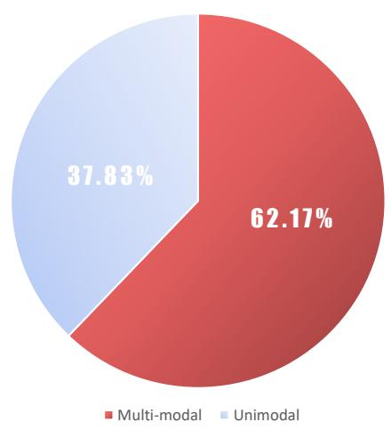

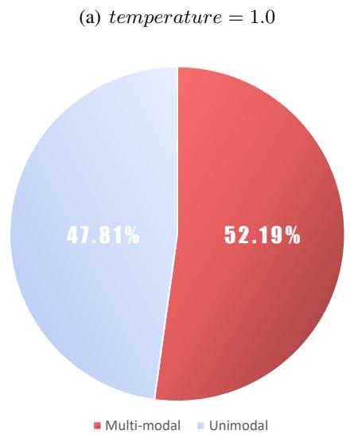

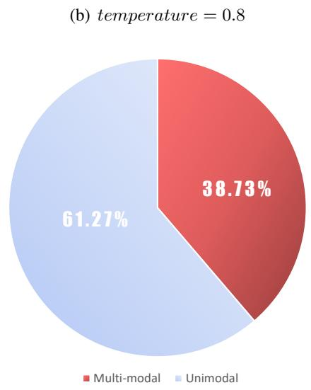  
(c) temperature = 0.6  
Figure 6: The results of the proportion of multi-modal predictions on the test set.

Datasets For specific information of datasets, we use SlimPajama (Soboleva et al. 2023, Apache License 2.0), GSM8K (Cobbe et al. 2021, MIT License), databricks-dolly-15k (Conover et al. 2023, CC BY-SA 3.0 license) and Xsum (Narayan et al. 2018, MIT License).

Hardware Environment All the experiments are conducted in two or four A100 GPUs with 80GB of VRAM each, and each individual experiment takes no more than 2 hours to complete. Based on our experimental observations, we believe that using either two GPUs with 40GB (via DeepSpeed, Rasley et al. 2020) each or a single GPU with 80GB of VRAM is also sufficient.

Training Parameters For all training process in our experiments, we use the AdamW optimizer (Loshchilov and Hutter, 2019). We set the learning rate to 2e-5 and gradient clipping threshold to 1.0. In the experiments involving KD, the distillation temperature are set to 1.0. For the pre-training task, we set the training epoch to 20, each epoch contains 25 steps, sequence length to 400, and each step contains 0.1M tokens. For downstream tasks, we set batch size to 64 and train 2 epochs on GSM8K which contains less data, 1 epoch for others. And the sequence length is set to 2048 in all downstream tasks. Due to the large volume of our experiments, it is not feasible to run multiple times for each individual experiment. But to ensure consistency and comparability, all comparative experiments in our study are conducted with the same random seed 72.

Test Setting We use greedy decoding strategy in the testing of all downstream tasks.

Code Details For the code implementation of ranking loss, we utilise the differentiable ranking operator of torchsort2 library, which is a python implementation of the differentiable ranking method proposed by Blondel et al. (2020). For the computation of the ROUGE score, we performed it through rouge3, a python library.

Others We show in Table 3 the numerical results

of the experiments in Section 3.2.

## C Analysis of Computational Efficiency

We list the elapsed time for distillation training two epochs on GSM8K for some of the distillation objectives, as shown in Table 4. Based on the results, we can find that the introduction of ranking loss has a very minimal impact on computational burden, which can be ignored. Additionally, when using only ranking loss, the computational efficiency is improved by eliminating the need for sof tmax operation on output logits.

## D Analysis of Hyperparameter

There are two hyperparameters in our experiments, the optimised range of ranking loss and the proportion of the loss allocation.

For the range of ranking loss, we perform a number of experiments upfront to determine the value of the take that works best on the downstream KD tasks. Indeed, optimising the top predictions from 5 to 15 works well and is in line with our motivation for proposing ranking loss. For the pre-training task, due to the large number of calculations that need to be performed, we recommend setting range k to 15 because a larger range makes the sorting operator of the differentiable more stable.

And for downstream tasks, we recommend taking the range k to be 10-15 when using ranking loss alone, and k to be 5 for mixing with other distillation objectives such as KL. Because when mixing losses, other distillation objectives can bring the two distributions closer together on a broader scale, and a smaller range k helps the ranking loss focus more on peak prediction to achieve better performance. In addition, small changes to this range have a small effect on the results, and dynamic value of the range tends to create a computational burden during batch calculations, so we do not dynamically adjust this hyperparameter. We also present the results on GSM8K in Table 5 after applying different k values to partial distillation objectives, to further validate the above conclusions.

For the losses allocation method, we have found in experiments that the ratio of ranking loss to other distillation objectives is better when the ratio is 1 to 3. Besides, small changes have little effect on the KD effect, so we suggest to adopt this lossed allocation directly, as $\mathcal { L } _ { \mathrm { t o t a l } } = 2 \cdot \mathcal { L } _ { \mathrm { R a n k i n g } } + \mathcal { L } _ { \mathrm { l o g i t s } }$ As shown in Figure 4, $\mathcal { L } _ { \mathrm { R a n k i n g } }$ and $\mathcal { L } _ { \mathrm { l o g i t s } }$ align two distributions from different perspectives, thus we believe static allocation is appropriate.

<table><tr><td rowspan="2">Model Size</td><td colspan="5">CR↑(%)</td><td colspan="4">MOR↑(%)</td></tr><tr><td>top1</td><td>top2</td><td>top3</td><td>top4</td><td>top5</td><td>top3 top5</td><td>top10</td><td></td><td>top20</td></tr><tr><td>13B</td><td>82.47</td><td>50.54</td><td>26.40</td><td>12.42</td><td>5.39</td><td>75.30 73.94</td><td>73.36</td><td></td><td>72.27</td></tr><tr><td>7B</td><td>79.74</td><td>47.02</td><td>23.29</td><td>10.40</td><td>4.28</td><td>73.08</td><td>71.66</td><td>71.11</td><td>69.95</td></tr><tr><td>3B</td><td>74.44</td><td>39.60</td><td>17.81</td><td>7.22</td><td>2.70</td><td>67.81</td><td>66.47</td><td>65.74</td><td>64.43</td></tr><tr><td>1B</td><td>70.84</td><td>35.57</td><td>14.83</td><td>5.54</td><td>1.95</td><td>64.72</td><td>63.51</td><td>62.95</td><td>61.85</td></tr><tr><td>450M</td><td>67.02</td><td>31.08</td><td>11.95</td><td>4.11</td><td>1.34</td><td>61.11</td><td>59.85</td><td>59.25</td><td>58.21</td></tr><tr><td>270M</td><td>64.51</td><td>28.44</td><td>10.30</td><td>3.33</td><td>1.05</td><td>58.76</td><td>57.50</td><td>56.95</td><td>55.91</td></tr></table>

Table 3: The numerical results of the experiments in Section 3.2, showing the degree of agreement in peak predictions between the different models and the 70B model.

<table><tr><td>Loss</td><td>Total Training Time (s)</td></tr><tr><td>KL</td><td>1424</td></tr><tr><td>KL+R</td><td>1441 (+1.19%)</td></tr><tr><td>Rank-15</td><td>1370 (-3.79%)</td></tr></table>

Table 4: The computation time for KD with different losses on GSM8K for 2 epochs with 2 A100 GPUs.

Moreover, we also propose a dynamic allocation of losses for asymmetric KL and RKL. We employ OR of top-k predictions from both the teacher and student models as an indicator of the understanding of current input by the student model. With this indicator, we are able to guide the focus of student learning towards peak predictions of teacher model, particularly when the gap between the peak predictions of the student model and the teacher model is excessive. And the optimization efforts will naturally gravitate towards refining global information when peak predictions have aligned. For each individual prediction, the mixed loss can be expressed by following formula, as

$$
\mathcal { L } _ { \mathrm { t o t a l } } = 2 \cdot \mathcal { L } _ { \mathrm { R a n k i n g } } + \frac { | p ^ { k } \cap q ^ { k } | } { k } \cdot \mathcal { L } _ { \mathrm { l o g i t s } }\tag{2}
$$

where $p ^ { k }$ is the index set of the top-k tokens in P, the value of k is consistent with the range of ranking loss. Under the same experimental setup as in Section 5.4, we show the effect of dynamic loss allocation on KL and RKL in Table 6.

Experimental results show that our dynamic allocation strategy achieves better scores on most tasks, further improving the effectiveness of distillation training. Other distillation objectives do not show head or tail bias, and in experiments it is found that fixed ratios of losses work better, so there is no need for dynamic losses allocation.

## E Supplementary Experiments in the Pre-Training Task

We have shown the improvement in learning capability brought by our method in the main text. Additionally, we consider it necessary to show results on the test set data to prove the generalization ability of our method. Hence, we conduct extra experiments in this section to demonstrate the performance of our method on the test set.

Training We change the training steps to 2000, set the number of epochs to 1, and configure the batch size to approximately 0.5M tokens. Finally, we validate the performance on the out-ofdistribution test dataset. The remaining training settings are consistent with those in Section 5.3. The experimental results are presented in Table 7.

Results The results in Table 7 show that our method also effectively improves the consistency of peak predictions between the student model and the teacher model on out-of-distribution data during the KD process. These results demonstrate the generalization ability of our method and complement the experimental results in the main text.

## F Validation Experiment of Different Ranking Objectives

We have explained in Section 4 the reason for choosing SRCC instead of the Pearson correlation coefficient as the optimization objective for ranking loss. Because SRCC is more suitable for calculating ranking loss in scenarios involving discrete and non-linear language model output logits.

In this section, we demonstrate the performance differences between applying these two sorting objectives on the GSM8K dataset (with the same experimental setup as in the main text) to show that SRCC indeed performs better in practical applications.

<table><tr><td>Value of k</td><td>5</td><td>10</td><td>15</td><td>20</td><td>25</td><td>30</td></tr><tr><td>Rank-k</td><td>229</td><td>240</td><td>236</td><td>246</td><td>236</td><td>223</td></tr><tr><td>KL+R</td><td>267</td><td>264</td><td>243</td><td>240</td><td>237</td><td>229</td></tr><tr><td>RKL+R</td><td>191</td><td>171</td><td>168</td><td>176</td><td>151</td><td>159</td></tr><tr><td>TVD+R</td><td>240</td><td>236</td><td>216</td><td>228</td><td>233</td><td>222</td></tr></table>

Table 5: The number of correct instances in the test set of GSM8K when using different ranking consistency computation objectives as the optimization target.
<table><tr><td rowspan="2">Method</td><td colspan="2">GSM8K</td><td colspan="3">Dolly</td><td colspan="3">Xsum</td></tr><tr><td>Correct_Num</td><td>Score</td><td>R-1</td><td>R-2</td><td>R-L</td><td>R-1</td><td>R-2</td><td>R-L</td></tr><tr><td>Teacher</td><td>682</td><td>51.71</td><td>33.55</td><td>17.70</td><td>31.55</td><td>41.18</td><td>18.81</td><td>34.39</td></tr><tr><td>KL</td><td>219</td><td>16.60</td><td>23.09</td><td>10.12</td><td>21.82</td><td>34.62</td><td>13.06</td><td>28.24</td></tr><tr><td>KL+R</td><td>267(+48)</td><td>20.24</td><td>24.72</td><td>11.47</td><td>23.44(+1.62)</td><td>35.41</td><td>13.61</td><td>28.93(+0.69)</td></tr><tr><td>KL+R(Dynamic)</td><td>280(+61)</td><td>21.23</td><td>25.51</td><td>12.10</td><td>24.02(+2.20)</td><td>35.51</td><td>13.62</td><td>29.10(+0.86)</td></tr><tr><td>RKL</td><td>132</td><td>10.01</td><td>23.84</td><td>10.19</td><td>22.55</td><td>32.97</td><td>11.41</td><td>26.72</td></tr><tr><td>RKL+R</td><td>191(+59)</td><td>14.48</td><td>26.27</td><td>12.44</td><td>24.40(+1.85)</td><td>35.20</td><td>12.83</td><td>28.60(+1.88)</td></tr><tr><td>RKL+R(Dynamic)</td><td>204(+72)</td><td>15.47</td><td>26.40</td><td>11.98</td><td>24.34(+1.79)</td><td>35.46</td><td>13.40</td><td>29.04(+2.32)</td></tr></table>

Table 6: Comparison of dynamic allocation loss and fixed-rate allocation loss. "+R" represents that we have added an additional fixed-ratio ranking loss. "+R(Dynamic)" means that we have added an additional dynamic-ratio ranking loss.

According to the results shown in Table 8, the average performance of SRCC is better than that of the Pearson correlation coefficient, which is consistent with our theoretical estimation.

## G Case Study

In this section, we conduct a case study based on our experimental results on GSM8K. We select several cases and demonstrate the generated results before and after introducing ranking loss to some distillation objectives, as shown in Table 9, Table 10 and Table 11.

Based on the results, we can see that after adding the ranking loss, the student model’s choice of words and reasoning align more closely with the teacher model when answering questions. This also means that the peak predictions of the student model and the teacher model are more consistent.

Additionally, before introducing the ranking loss, TVD does not allow the student models to learn the answering pattern of GSM8K well, leading to automated evaluations failing to match the answers and resulting in a score of 0. After introducing the ranking loss, this deficiency is significantly improved, resulting in a good score.

<table><tr><td rowspan="2">Loss</td><td rowspan="2">Perplexity↓</td><td colspan="5">CR↑(%)</td><td colspan="4">MOR↑(%)</td></tr><tr><td>top1</td><td>top2</td><td>top3</td><td>top4</td><td>top5</td><td>top3</td><td>top5</td><td>top10</td><td>top20</td></tr><tr><td>Start</td><td>10.93</td><td>75.37</td><td>41.07</td><td>18.57</td><td>7.48</td><td>2.77</td><td>69.14</td><td>67.84</td><td>67.19</td><td>66.04</td></tr><tr><td>KL</td><td>10.22</td><td>78.46</td><td>45.62</td><td>22.31</td><td>9.62</td><td>3.95</td><td>72.21</td><td>70.84</td><td>70.03</td><td>68.81</td></tr><tr><td>KL+R</td><td>10.34</td><td>78.44</td><td>46.95</td><td>23.80</td><td>11.06</td><td>4.58</td><td>73.36</td><td>72.39</td><td>71.79</td><td>70.23</td></tr><tr><td>RKL</td><td>10.69</td><td>78.17</td><td>45.21</td><td>21.66</td><td>9.48</td><td>3.86</td><td>71.73</td><td>70.39</td><td>69.70</td><td>68.49</td></tr><tr><td>RKL+R</td><td>10.72</td><td>78.24</td><td>46.53</td><td>23.33</td><td>10.72</td><td>4.84</td><td>73.02</td><td>72.08</td><td>71.51</td><td>69.08</td></tr><tr><td>JSD</td><td>10.35</td><td>78.54</td><td>45.85</td><td>22.59</td><td>10.16</td><td>4.16</td><td>72.29</td><td>70.92</td><td>70.15</td><td>68.89</td></tr><tr><td>JSD+R</td><td>10.76</td><td>78.25</td><td>46.72</td><td>23.81</td><td>11.14</td><td>4.67</td><td>73.40</td><td>72.63</td><td>72.10</td><td>70.22</td></tr><tr><td>TVD</td><td>10.45</td><td>78.60</td><td>45.71</td><td>22.08</td><td>9.81</td><td>4.53</td><td>71.99</td><td>70.69</td><td>69.85</td><td>68.56</td></tr><tr><td>TVD+R</td><td>10.71</td><td>78.31</td><td>47.02</td><td>23.65</td><td>10.90</td><td>5.14</td><td>73.31</td><td>72.58</td><td>72.01</td><td>70.32</td></tr><tr><td>AKL</td><td>10.34</td><td>78.35</td><td>45.69</td><td>22.42</td><td>10.05</td><td>3.99</td><td>72.25</td><td>70.91</td><td>70.18</td><td>68.97</td></tr><tr><td>AKL+R</td><td>10.44</td><td>78.35</td><td>46.81</td><td>23.59</td><td>10.89</td><td>4.63</td><td>73.21</td><td>72.28</td><td>71.70</td><td>70.16</td></tr></table>

Table 7: Multi-modal distribution learning situation on the pre-training task test set, which contains 5,000 slices.

<table><tr><td>Objective</td><td> $\overline { { \mathrm { R a n k } - 5 } }$ </td><td> $\overline { { \mathrm { R a n k } - 1 5 } }$ </td><td> $\mathrm { K L } { + } \mathrm { R }$ </td><td> $\overline { { \mathrm { R K L + R } } }$ </td><td>JSD+R</td><td>TVD+R</td><td>FD+R</td><td> $\overline { { \mathrm { A K L + R } } }$ </td><td>Avg.</td></tr><tr><td>Pearson</td><td>246</td><td>229</td><td>230</td><td>147</td><td>233</td><td>202</td><td>250</td><td>223</td><td>220.00</td></tr><tr><td>SRCC</td><td>229</td><td>236</td><td>267</td><td>191</td><td>227</td><td>240</td><td>265</td><td>235</td><td>236.25</td></tr></table>

Table 8: The number of correct instances in the test set of GSM8K when using different ranking consistency computation objectives as the optimization target.

<table><tr><td colspan="1" rowspan="1">Question</td><td colspan="1" rowspan="1">Greta and Celinda are baking cookies. Greta bakes 30 cookies and Celinda bakestwice as many. If the pair eat 10 of the cookies while they are cooling and putthe rest in a box, how many cookies are there in the box?</td></tr><tr><td colspan="1" rowspan="1">Ground truth</td><td colspan="1" rowspan="1">Celinda bakes 30 cookies $* 2 = * 3 0 ^ { * } 2 { = } 6 0 { \gg } 6 0$ cookies. So in total, Celindaand Greta bakes a total of $3 0 + 6 0 = { \ll } 3 0 { + } 6 0 { = } 9 0 { \rangle } { \gg } 9 0$ cookies. After eatingsome of the cookies, they have 90 baked cookies 10 eaten cookies = ${ \ll } 9 0 \mathrm { - } 1 0 { = } 8 0 { \gg } 8 0$ cookies in the box. #### 80</td></tr><tr><td colspan="1" rowspan="1">Teacher</td><td colspan="1" rowspan="1"> $\mathrm { C e l i n d a b a k e s 3 0 x 2 } = \ast 3 0 ^ { \ast } 2 \mathrm { = } 6 0 \ast 6 0$ cookies. The total number of cookies is 30 $+ 6 0 = \langle \langle 3 0 + 6 0 = 9 0 \rangle \langle 9 0$ cookies. After they eat 10, there are $9 0 - 1 0 = { \mathopen {  } 0 - 1 0 = 8 0 \gg 8 0 }$ cookies in the box. #### 80</td></tr><tr><td colspan="1" rowspan="1">KL</td><td colspan="1" rowspan="1">Celinda bakes $3 0 \times 2 = { \ast } 3 0 { \ast } 2 { = } 6 0 { \scriptstyle \gg } 6 0$ cookies. The total number of cookies baked is $3 0 + 6 0 = { \ll } 3 0 { + } 6 0 { = } 9 0 { \gg } 9 0$ cookies. Greta and Celinda eat $1 0 + 1 0 = \ast 1 0 + 1 0 = 2 0 \ast 2 0$ cookies. There are $9 0 - 2 0 = { \scriptscriptstyle \ll } 9 0 { - } 2 0 { = } 7 0 { \scriptscriptstyle \gg } 7 0$ cookies in the box. #### 70</td></tr><tr><td colspan="1" rowspan="1">KL+R</td><td colspan="1" rowspan="1">Greta bakes 30 cookies and Celinda bakes twice as many, so Celinda bakes $2 ^ { * } 3 0 = * 3 0 ^ { * } 2 { = } 6 0 { \gg } 6 0$ cookies. The total number of cookies baked is $3 0 \substack { + 6 0 = }$  $\scriptstyle \ll 3 0 + 6 0 = 9 0 \gg 9 0$ cookies. The pair eats 10 of the cookies while they are cooling, sothere are $9 0 - 1 0 = { \mathopen { \left. \kern - delimiterspace \right.} 0 0 - 1 0 = 8 0 > 8 0 } $ cookies in the box. #### 80</td></tr><tr><td colspan="1" rowspan="1">RKL</td><td colspan="1" rowspan="1">Celinda bakes $3 0 \div 2 = \ast 3 0 \ast 2 = 6 0 \ast 6 0$ cookies. The total number of cookies baked is $3 0 + 6 0 = * 3 0 \substack { + 6 0 = 9 0 } , 9 0 \mathrm { c o o k i e s }$ . The number of cookies that the pair eat is $3 0 + 1 0$  $= \ast 3 0 \substack { + 1 0 = 4 0 \gg 4 0 \mathrm { c o o k i e s } }$ There are $9 0 - 4 0 = { \scriptscriptstyle \ll } 9 0 { \scriptscriptstyle - } 4 0 { \scriptscriptstyle = } 5 0 \gg 5 0$ cookies left in the box.#### 50</td></tr><tr><td colspan="1" rowspan="1">RKL+R</td><td colspan="1" rowspan="1">Greta bakes 30 cookies and Celinda bakes $2 ^ { * } 3 0 = * 3 0 ^ { * } 2 { = } 6 0 { \gg } 6 0$ cookies.The total number of cookies is $3 0 \substack { + 6 0 = \left( \times 3 0 \substack { + 6 0 = 9 0 \gg 9 0 } \right. }$ cookies. The pair eat 10of the cookies while they are cooling so there are $9 0 - 1 0 = { \mathopen { \left. \kern - delimiterspace \right.} 0 0 - 1 0 = 8 0 \gg 8 0 } $ cookies inthe box. #### 80</td></tr><tr><td colspan="1" rowspan="1">TVD</td><td colspan="1" rowspan="1">Celinda bakes $3 0 \times 2 = { \ast } 3 0 { \ast } 2 = 6 0 { \ast } 6 0$ cookies. The total number of cookies baked is $3 0 + 6 0 = { \ll } 3 0 { + } 6 0 { = } 9 0 { \gg } 9 0$ cookies. The total number of cookies in the box is $9 0 \times 1 0$  $= _ { \infty } 9 0 ^ { * } 1 0 { = } 9 0 0 { \rangle } { \gg } 9 0 0 \ \mathrm { c o o k i e s } .$ </td></tr><tr><td colspan="1" rowspan="1">TVD+R</td><td colspan="1" rowspan="1">Greta bakes 30 cookies and Celinda bakes twice as many, so Celinda bakes $2 ^ { * } 3 0 = \approx 2 ^ { * } 3 0 { = } 6 0 { \gg } 6 0$ cookies. The total number of cookies baked is 30+60 $= \langle \langle 3 0 \rangle \langle 6 0 = 9 0 \rangle \langle 9 0$ cookies. The pair eat 10 of the cookies while they are cooling,so there are $9 0 - 1 0 = { \mathopen { \left. \kern - delimiterspace \right.} 0 0 - 1 0 = 8 0 \gg 8 0 } $ cookies in the box. #### 80</td></tr><tr><td colspan="1" rowspan="1">Question</td><td colspan="1" rowspan="1">Rani is obsessed with sports cars. She wonders what the faster car ever madecan go so she looks it up. What she finds out is that the fastest car was 1.25times faster than the 2nd fastest car. The 2nd fastest car was 5 times faster thanthe average car. The average car can go 120 Miles per hour. How fast doesthe faster car go?</td></tr><tr><td colspan="1" rowspan="1">Ground truth</td><td colspan="1" rowspan="1">The 2nd fastest car can go 600 MPH because $5 \mathrm { ~ x ~ } 1 2 0 = \langle \langle 5 ^ { * } 1 2 0 { = } 6 0 0 \rangle { > } 6 0 0$ The faster car can go 750 MPH because $1 . 2 5 \mathrm { ~ x ~ } 6 0 0 = \ast 1 . 2 5 ^ { \ast } 6 0 0 = 7 5 0 \gg 7 5 0 \neq 4 \# \# \# 7 5 0$ </td></tr><tr><td colspan="1" rowspan="1">Teacher</td><td colspan="1" rowspan="1">The 2nd fastest car goes $1 2 0 ^ { * } 5 { = } { \ll } 1 2 0 ^ { * } 5 { = } 6 0 0 { > } 6 0 0$ mphThe faster car goes $6 0 0 ^ { * } 1 . 2 5 { = } { \ll } 6 0 0 ^ { * } 1 . 2 5 { = } 7 5 0 { \gg } 7 5 0$ mph #### 750</td></tr><tr><td colspan="1" rowspan="1">KL</td><td colspan="1" rowspan="1">The 2nd fastest car is 1.25 times faster than the average car so it goes $\overline { { 1 . 2 5 ^ { * } 1 2 0 = } }$  $\ast 1 . 2 5 ^ { \ast } 1 2 0 { = } 1 5 0 \gg 1 5 0$ Miles per hourThe average car can go 120 Miles per hour so the faster car goes 150-120 = $\ll 1 5 0 \mathrm { - } 1 2 0 \mathrm { = } 3 0 \gg 3 0$ Miles per hour #### 30</td></tr><tr><td colspan="1" rowspan="1">KL+R</td><td colspan="1" rowspan="1">The 2nd fastest car is 5 times faster than the average car, so it goes 120 Milesper hour $^ { * } \ S = \ll 1 2 0 ^ { * } 5 { = } 6 0 0 { > } 6 0 0$ Miles per hour.The fastest car is 1.25 times faster than the 2nd fastest car, so it goes 600 Milesper hour $^ { * } _ { 1 . 2 5 } = { \scriptstyle 4 . 6 0 0 ^ { * } 1 . 2 5 = 7 5 0 . > 7 5 0 }$ Miles per hour. #### 750</td></tr><tr><td colspan="1" rowspan="1">RKL</td><td colspan="1" rowspan="1">The 2nd fastest car was $5 ^ { * } 1 2 0 { = } { \ll } 5 ^ { * } 1 2 0 { = } 6 0 0 { > } 6 0 0$ Miles per hour.The fastest car was $6 0 0 ^ { * } 1 . 2 5 { = } { \approx } 1 6 0 0 ^ { \ast } 1 . 2 5 { = } 7 5 0 { \gg } 7 5 0$ Miles per hour. The faster car was $7 5 0 - 1 2 0 { = } { \approx } 7 5 0 { - } 1 2 0 { = } 6 3 0 { > } 6 3 0$ Miles per hour. #### 630</td></tr><tr><td colspan="1" rowspan="1">RKL+R</td><td colspan="1" rowspan="1">The 2nd fastest car was 5 times faster than the average car, so it was $5 ^ { * } 1 2 0 =$  $\ll 5 ^ { * } 1 2 0 { = } 6 0 0 { \gg } 6 0 0 \mathrm { M i l e s }$ per hour. The fastest car was 1.25 times faster than the2nd fastest car, so it was $1 . 2 5 ^ { * } 6 0 0 = * 1 . 2 5 ^ { * } 6 0 0 { = } 7 5 0 { > } 7 5 0$ Miles per hour. #### 750</td></tr><tr><td colspan="1" rowspan="1">TVD</td><td colspan="1" rowspan="1">The 2nd fastest car was 5 times faster than the average car so it was $5 ^ { * } 1 2 0 =$  $\ll 5 ^ { * } 1 2 0 { = } 6 0 0 { \gg } 6 0 0$ Miles per hour The fastest car was 1.25 times faster than the2nd fastest car so it was $1 . 2 5 ^ { * } 6 0 0 = * 1 . 2 5 ^ { * } 6 0 0 { = } 7 5 0 { \gg } 7 5 0$ Miles per hour</td></tr><tr><td colspan="1" rowspan="1">TVD+R</td><td colspan="1" rowspan="1">The 2nd fastest car is 5 times faster than the average car, so it can go 120Miles per hour $^ { * } \ S = \ll 1 2 0 ^ { * } 5 { = } 6 0 0 { \gg } 6 0 0$ Miles per hour. The fastest car is 1.25times faster than the 2nd fastest car, so it can go 600 Miles per hour $^ { * } 1 . 2 5 =$  $\ll 6 0 0 ^ { \ast } 1 . 2 5 { = } 7 5 0 { \gg } 7 5 0$ Miles per hour. #### 750</td></tr><tr><td colspan="1" rowspan="1">Question</td><td colspan="1" rowspan="1">An 8-year old child wants to buy a toy car which costs $12. He already has$4 savings. How many days will it take him to save the remaining amountof money if he promises to save $2 daily from his allowance?</td></tr><tr><td colspan="1" rowspan="1">Ground truth</td><td colspan="1" rowspan="1">The boy still needs $\$ 12-84=8 \ast12 – 4=8\Rightarrow 8$ If he saves $2 per day then it willtake him $8 $\mathrm { ~ ; ~ } / \mathrm { ~ } \mathbb { S } 2 / \mathrm { d a y } = \mathrm { ~ } \ll 8 / 2 { = } 4 \mathrm { ; ~ }$ 4 days to save the remaining amount. #### 4</td></tr><tr><td colspan="1" rowspan="1">Teacher</td><td colspan="1" rowspan="1">The child needs to save $\$ 12-84=8 \approx$ more. He will need $\$ 80$  $\ll 8 / 2 { = } 4 \rangle \cup$ more days to save up enough money.#### 4</td></tr><tr><td colspan="1" rowspan="1">KL</td><td colspan="1" rowspan="1">The child needs to save $\$ 12-4=8 \times$ more. He will save $8/day * 7 days = $\$ *$ in total. It will take him $\$ 56/\$ 2/ d a y =456/2=28 \gg 28$ days to save theremaining amount of money.#### 28</td></tr><tr><td colspan="1" rowspan="1">KL+R</td><td colspan="1" rowspan="1">The child needs to save $\$ 12-,4$ more. He will save $\$ 80$ «8/2=4»4 days.#### 4</td></tr><tr><td colspan="1" rowspan="1">RKL</td><td colspan="1" rowspan="1">The child will save $\$ 12-84=8 \ast12 – 4=8\gg 8$ in 8 days. It will take him 8 days tosave $8.#### 8</td></tr><tr><td colspan="1" rowspan="1">RKL+R</td><td colspan="1" rowspan="1">The child needs to save $\$ 12-84=8 \ll 12 – 4=8\gg 8.$ He will have to save for $8 / 2 = \ L _ { \mathcal { K } } 8 / 2 { = } 4 { \times } 2 4 ~ \mathrm { d a y s } . \# \# \# \# 4$ </td></tr><tr><td colspan="1" rowspan="1">TVD</td><td colspan="1" rowspan="1">The child will need to save $\overline { { { \ S 1 2 \cdot \ S 4 } = \ S \ll 1 2 \mathrm { - } 4 = 8 \gg 8 . } }$ It will take him $8 / 2 =$ «8/2=4»4 days to save the remaining amount of money.</td></tr><tr><td colspan="1" rowspan="1">TVD+R</td><td colspan="1" rowspan="1">The child needs to save $\$ 12-84=8 \ll 12 – 4=8\gg 8.$ He will save $8 $\overline   / \$ 82=$  $\ll 8 / 2 { = } 4 \rangle \cup$ days.####4</td></tr></table>

Table 9: Case 1. In this case, the thought processes of the existing distillation objectives are incorrect, leading to the generation of incorrect calculation formulas. The introduction of the ranking loss corrects the faulty calculation thinking, making the distillation objectives closer to the teacher model.

Table 10: Case 2. In this case, both KL and RKL lead to incorrect understanding of the problem statement, which is successfully corrected after introducing the ranking loss. Although TVD arrives at the correct answer, it does not know how to output it in the GSM8K format. After introducing the ranking loss, it can output the result in the correct format.

Table 11: Case 3. As same as Case 2, in this case, both KL and RKL lead to incorrect understanding of the problem statement, which is corrected after introducing the ranking loss. Moreover, TVD can output the result in the correct format after introducing the ranking loss.