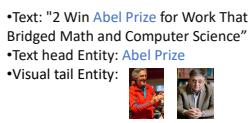
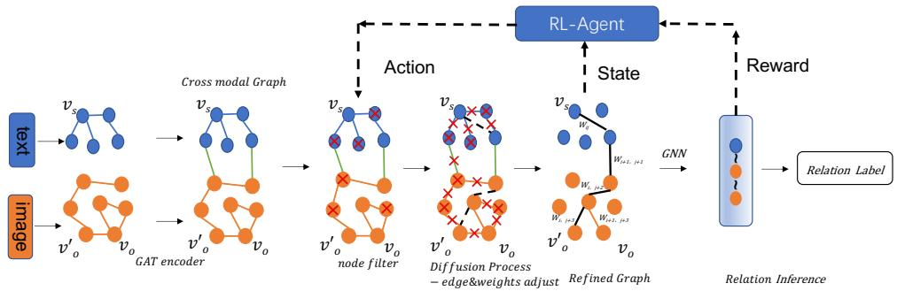
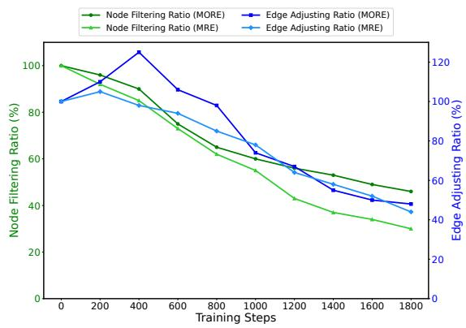
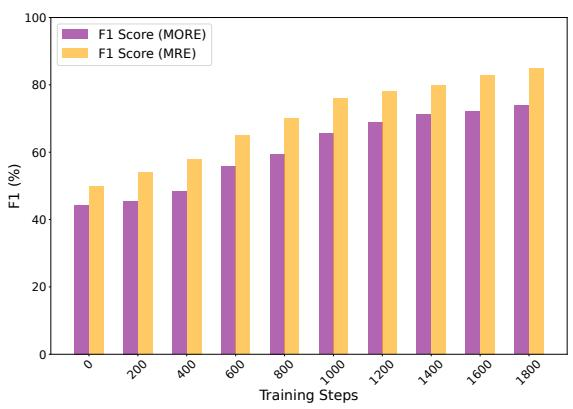
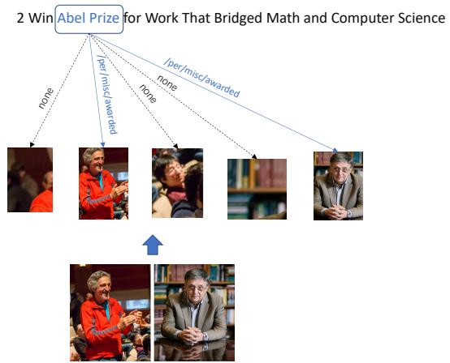

# Enhancing Multi-Modal Relation Extraction with Reinforcement Learning Guided Graph Diffusion Framework

Rui Yang University of California, Riverside ryang088@ucr.edu

Rajiv Gupta University of California, Riverside rajivg@ucr.edu

## Abstract

With the massive growth of multi-modal information such as text, images, and other data, how should we analyze and align these data becomes very important. In our work, we introduce a new framework based on Reinforcement Learning Guided Graph Diffusion to address the complexity of multi-modal graphs and enhance the interpretability, making it clearer to understand the alignment of multi-modal information. Our approach leverages pre-trained models to encode multi-modal data into scene graphs and combines them into a cross-modal graph (CMG). We design a reinforcement learning agent to filter nodes and modify edges based on the observation of the graph state to dynamically adjust the graph structure, providing coarse-grained refinement. Then we will iteratively optimize edge weights and node selection to achieve fine-grained adjustment. We conduct extensive experimental results on multi-modal relation extraction task datasets and show that our model significantly outperforms existing multi-modal methods such as MEGA and MKGFormer. We also conduct an ablation study to demonstrate the importance of each key component, showing that performance drops significantly when any key element is removed. Our method uses reinforcement learning methods to better mine potential multi-modal information relevance, and adjustments based on graph structure make our method more interpretable.

## 1 Introduction

In recent years, the field of cross-modal relation extraction has gained significant attention due to the increasing availability of multi-modal data, such as text and images. Traditional relation extraction methods mainly focus on single-modal data, which limits their use in real-world situations where data often comes from multiple modalities (Devlin et al., 2019; Soares et al., 2019; Yu et al., 2020). Combining multi-modal data can provide a more complete understanding and improve the accuracy of relation extraction tasks. However, integrating different types of data sources poses challenges (Radford et al., 2021; He et al., 2023).Cross-modal relation extraction requires capturing semantic information from text and extracting visual cues from images, then merging these to infer relationships between entities (Lu et al., 2019; Li et al., 2019). Current methods often assume that all input information is useful, but in reality, some information might be irrelevant noise, which can negatively affect performance (Zeng et al., 2015). However, single-modal information alone might not be enough to infer the correct relationship, sometimes needing additional knowledge to supplement and enrich the context (Chen et al., 2022a).

To illustrate the complexity of cross-modal relation extraction, consider the example shown in Figure 1. The text mentions “2 Win Abel Prize for Work That Bridged Math and Computer Science,” and relates it to two individuals shown in the images (Chen et al., 2022b). The task is to correctly identify the relationship between the text entity “Abel Prize” and the visual entities (the two individuals) based on both textual and visual information. This scenario exemplifies the challenges of integrating text and image data to accurately extract meaningful relationships. Additionally, identifying the entities referred to by “2” in the text and linking them to the multiple entities in the images presents a significant challenge (Zheng et al., 2021a).


  
Relation label: /per/misc/awarded Relation label: /per/misc/awarded

Figure 1: Multi-Modal Data Scenario: Text Mentions “Abel Prize” and Images Show the Recipients.

We find that reinforcement learning-based methods (Xu et al., 2022; Zhu et al., 2017; Mnih et al.,

  
Figure 2: Our Proposed Framework.

2015; Bellemare et al., 2017; Caicedo and Lazebnik, 2015; Ren et al., 2018; Sharma et al., 2018) can uncover potential information in computer vision and natural language processing. These works motivate the proposal of our reinforcement learningguided graph diffusion framework, which significantly enhances multi-modal relation extraction by addressing the potential relation and improving interpretability.

The concept of "graph diffusion" has drawn inspiration from pixel-based diffusion models (Ho et al., 2020; Song et al., 2020). Recent work has extended these ideas to graph-structured data (Niu et al., 2020; Hoogeboom et al., 2022). Our work is inspired by recent advancements in diffusion models. The work by (Black et al., 2024) explores the training of diffusion models with reinforcement learning, offering valuable insights into the integration of RL within diffusion processes. And the study by (Chen et al., 2023) introduces a discrete diffusion modeling framework for efficient and degree-guided graph generation, further informing our methodology.These works show the potential of diffusion processes in capturing complex relational information.

So our approach introduces a novel coarsegrained + fine-grained graph diffusion method. At the coarse-grained level, we simulate the noise addition and removal process, akin to traditional diffusion models, through a reinforcement learning agent that dynamically manages graph edge deletion and addition. Meanwhile, at the fine-grained level, we achieve feature propagation by transmitting node features through their surrounding neighbors.

Our research aims to use reinforcement learningguided graph diffusion to explore latent potential relationships between entities in cross-modal graphs that may not be discoverable through existing rules and algorithms. Our framework shown in Fig 2 that leverages the strengths of both text and image data for relation extraction as follows. First, we construct visual scene graphs and textual scene graphs to capture the detailed semantic structures of the input images and text, respectively (Radford et al., 2021). These graphs are then combined into a unified cross-modal graph (CMG). Next, we use the reinforcement learning-based graph diffusion process to refine the graph at coarse-grained and fine-grained level. This helps identify potential entity relationships and improves the effectiveness of multi-modal relation extraction.

## 2 Related Work

For single-modal data the relation extraction task, researchers have done a lot of work (Devlin et al., 2019; Zeng et al., 2015).And for multi- modal data, some works like VisualBERT (Li et al., 2019) and ViLBERT (Lu et al., 2019) as the base of vision language pretrain models combing visual and textual information for various vision-and-language tasks. And hybrid models like the Hybrid Transformer (Chen et al., 2022a) improve multi-modal knowledge graph completion via multi-level fusion. These works provide a foundatino for multi modal data task. However, these methods lack of explainability that researchers can not find the reasoning abilities inside of it.

The multi-modal data has led to the development of specialized datasets and benchmarks. The dataset from (Zheng et al., 2021b) is widely used in this task. And recently for exploring the bridge from text and vision the MORE dataset (He et al., 2023) is published. This dataset provides a multimodal object-entity relation extraction benchmark. It highlights the importance of evaluating models in diverse and real with more complex relation.

To enhance interpretability, some graph-based methods have been proposed for multi-modal relation extraction. Using common graph embedding methods such as graph attention networks (GAT) (Velickovic et al., 2018) and graph convolutional networks (GCN) (Marcheggiani and Titov, 2017), researchers can develop better graph representations. Studies such as MNRE (Zheng et al., 2021b) have demonstrated the effectiveness of using graph alignment on multi-modal datasets, achieving better results in multi-modal relation extraction tasks.

In addition, reinforcement learning has been increasingly applied to refine and compress graphs, showing significant improvements in various tasks such as graph alignment and entity recognition (Velickovic et al., 2018; Wu et al., 2020). Techniques such as graph diffusion have shown the potential to improve the efficiency of graph-based processes by intelligently reducing complexity while retaining essential information (Zheng et al., 2021a). However, the integration of reinforcement learning with multi-modal relation extraction remains relatively unexplored. This gap highlights the need for further research to combine the advantages of reinforcement learning and multi-modal data processing to improve relation extraction results (Marcheggiani and Titov, 2017; Velickovic et al., 2018; Wu et al., 2020; Zheng et al., 2021a; Chen et al., 2022a; Kim et al., 2022).

## 3 Our Framework

In this section, we present our method for crossmodal relation extraction based on the Reinforcement Learning Guided Graph Diffusion process. Our framework constructs a Cross-Modal Graph (CMG) from multi-modal data and refines it using a reinforcement learning guided diffusion process to output relationships between multi-modal entities. The framework, summarized in Algorithm 1, has the following key components.

Constructing the Cross-Modal Graph (CMG) (Algorithm 1, line 3): We integrate data from different modalities, such as text and images, to build the initial cross-modal graph $G ( V , E )$ . Each node in the graph represents an entity with multi-modal features, and edges represent the relationships between these entities.

Reinforcement Learning Guided Diffusion Process (Algorithm 1, lines 4-14): This involves dynamically refining the structure of the CMG to extract meaningful relationships. The reinforcement learning agent observes the current state of the graph and decides on actions to modify it, such as deleting nodes, deleting or adding edges. The agent is trained to optimize a reward function that evaluates the quality of graph’s relation extraction accuracy. This process is coarse-grained, making significant adjustments to graph structure.

Diffusion Process for Edge Weight Adjustment (Algorithm 1, line 15-16): After the reinforcement learning agent adjusts the graph structure, we apply a diffusion process to further refine the edge weights based on the node features. This iterative process ensures that the most relevant connections are emphasized while irrelevant ones are weakened. This process isfine-grained, providing subtle adjustments to the graph to enhance the overall quality and accuracy of relation extraction.

Relation Extraction using Graph Neural Networks (GNN) (Algorithm 1, lines 17-18): Finally, a Graph Neural Network is used to extract relation labels from the refined graph $G ^ { \prime } ( V ^ { \prime } , E ^ { \prime } )$ The GNN processes the simplified graph to identify and classify the relationships between nodes, leveraging the enhanced feature representations and optimized structure provided by the previous steps.

```latex
Algorithm 1 Overview of Framework
1: Input: Cross-modal graph $G ( V , E )$ , Text fea
tures $v ^ { t } ,$ Image features $v ^ { i }$
2: Output: Refined graph $G ^ { \prime } ( V ^ { \prime } , E ^ { \prime } )$ , Relation
labels $v ^ { o }$
3: Construct initial Cross-Modal Graph $G ( V , E )$
4: Initialize reinforcement learning agent A with
policy $\pi ( a | s )$
5: Define reward function $R ( s , a )$
6: while termination condition not met do
7: Observe current state $s _ { t }$ of the graph $G$
8: Encode features $v _ { o } ^ { t } , v _ { o } ^ { i }$ ←
GAT-Encoder $( G , v ^ { t } , v ^ { i } )$
9: $a _ { t }  { \mathcal { A } } ( s _ { t } ) \ \triangleright \mathbf { A }$ gent selects action based
on current state
10: Execute action $a _ { t } .$ , update graph $G$ and ob
serve new state $s _ { t + 1 }$
11: $R ( s _ { t } , a _ { t } )  \lambda$ · Accuracy $\left( G ^ { \prime } \right) \ - \ \mu$
Complexity $\left( G ^ { \prime } \right)$
12: Update value function $V ( s _ { t } )  V ( s _ { t } ) +$
α $\left[ R ( s _ { t } , a _ { t } ) + \gamma V ( s _ { t + 1 } ) - V ( s _ { t } ) \right]$
13: Update policy $\pi ( a | s )$ based on the updated
value function
14: end while
15: G<sub>d</sub> ← ApplyDiffusion $( G , v _ { o } ^ { \prime } , \alpha , \tau ,$ max_iter)
16: $G ^ { \prime } \gets$ ObtainRefinedGraph $( G _ { d } , \tau )$
17: Extract relation labels $v ^ { o }  \mathbf { G N N } ( G ^ { \prime } )$
18: return Refined graph $G ^ { \prime } ( V ^ { \prime } , E ^ { \prime } )$ and Relation
labels $v ^ { o }$
```

Next, we discuss the key components of our framework in detail.

## 3.1 Cross-Modal Graph (CMG) Construction

To construct the CMG, we follow these steps.

(i) Extract Features: We extract features from both text and images using the CLIP encoder (Radford et al., 2021). This ensures that both visual object features and text token representations are in a unified embedding space.

(ii) Construct Visual and Textual Scene Graphs: For each modality, we construct scene graphs where:

• Visual Scene Graph: Nodes represent visual objects detected in the images, and edges represent spatial or semantic relationships between these objects.

• Textual Scene Graph: Nodes represent entities mentioned in the text, and edges represent syntactic or semantic relationships between these entities.

(iii) Combine Scene Graphs into CMG: We combine the visual and textual scene graphs into a unified cross-modal graph (CMG). Nodes in the CMG represent entities from both modalities and edges represent both intra-modal relationships (within the same modality) and inter-modal relationships (across different modalities). The intermodal edges are created based on co-occurrence and contextual similarity between textual and visual entities.

(iv) Graph Attention Networks (GAT): We use Graph Attention Networks (GAT) to encode the features of nodes in the CMG. For each node pair $( i , j )$ , GAT computes its attention coefficients $\alpha _ { i j }$ is follows:

$$
\frac { \exp ( \mathrm { L e a k y R e L U } ( a ^ { T } [ W h _ { i } | | W h _ { j } ] ) ) } { \sum _ { k \in \mathcal { N } _ { i } } \exp ( \mathrm { L e a k y R e L U } ( a ^ { T } [ W h _ { i } | | W h _ { k } ] ) ) }\tag{1}
$$

where W is a weight matrix, a is a weight vector, $h _ { i }$ and $h _ { j }$ are the features of nodes i and j, and ∥ denotes concatenation. This allows us to effectively integrate multi-modal data in the CMG.

## 3.2 Reinforcement Learning Agent

The reinforcement learning agent A which is shown in Algorithm 2, is used to dynamically adjust the graph structure. The agent interacts with the constructed Cross-Modal Graph (CMG) environment by observing the current state $s _ { t }$ of the graph and selecting actions $a _ { t }$ from the action space A. The action space includes node deletion, edge deletion, and edge addition.

## 3.2.1 State and Action Representation

The state s<sub>t</sub> represents the current structure and features of the CMG at time step t (Algorithm 2, line 3). It includes node features, edge features, and the overall graph topology. The actions $a _ { t }$ that the agent can take are defined as follows (Algorithm 2, lines 6-13):

Algorithm 2 Reinforcement Learning Agent for   
Graph Diffusion   
1: procedure $\mathrm { R L - A G E N T } ( G , { \mathcal { A } } , \gamma , \alpha , \lambda , \mu )$   
2: Initialize state $s _ { 0 }$ with graph G   
3: Initialize RL agent A with policy $\pi ( a | s )$   
4: while termination condition not met do   
5: Observe current state $s _ { t }$ (current graph   
structure)   
6: $a _ { t }  { \mathcal { A } } ( s _ { t } ) \quad \quad \triangleright .$ Agent selects action   
based on current state   
7: $a _ { t }$ is node deletion then   
8: Select node v for deletion based on   
node importance scores   
9: $V  V \setminus \{ v \}$ ▷ Remove node   
10: else if $a _ { t }$ is edge deletion then   
11: Select edge e for deletion based on   
edge weights   
12: $E  E \setminus \{ e \} \qquad \triangleright \qquad \triangleright$ Remove edge   
13: else if $a _ { t }$ is edge addition then   
14: Select nodes $v _ { 1 } , v _ { 2 }$ for new edge   
based on node similarity   
15: $E  E \cup \{ ( v _ { 1 } , v _ { 2 } ) \}$ ▷ Add edge   
16: end if   
17: Execute action $a _ { t }$ , observe new state   
$s _ { t + 1 }$ and receive reward $R ( s _ { t } , a _ { t } )$   
18: $R ( s _ { t } , a _ { t } ) \ \gets \ \lambda \cdot \operatorname { A c c u r a c y } ( G ^ { \prime } ) \ - \ \mu$   
Complexity $( G ^ { \prime } )$   
19: Update value function $V ( s _ { t } ) \quad $   
$V ( s _ { t } ) + \alpha \left[ R ( s _ { t } , a _ { t } ) + \gamma V ( s _ { t + 1 } ) - V ( s _ { t } ) \right]$   
20: Update policy $\tau ( a | s )$ based on the up  
dated value function   
21: end while   
22: return refined graph $G ( V , E )$   
23: end procedure

• Node Deletion: Removing node v from graph, $\mathsf { i . e . , } V \gets V \setminus \{ v \}$ (Algorithm 2, line 8).

• Edge Deletion: Removing edge $e _ { i j }$ between nodes i and j, i.e., $E  E \setminus \{ e _ { i j } \}$ (Algo-

rithm 2, line 11).

• Edge Addition: Adding a new edge $e _ { i j }$ between nodes i and $j , \mathrm { i . e . , } E \gets E \cup \{ ( v _ { 1 } , v _ { 2 } ) \}$ (Algorithm 2, line 14).

## 3.2.2 Reward Function

The reward function $R ( s _ { t } , a _ { t } )$ evaluates the quality of the graph after performing action $a _ { t }$ in state $s _ { t }$ . The reward function is designed to balance the trade-off between graph simplification and the accuracy of relation extraction. It is expressed as:

$$
R ( s _ { t } , a _ { t } ) = \lambda { \cdot } \mathrm { A c c u r a c y } ( G ^ { \prime } ) - \mu { \cdot } \mathrm { C o m p l e x i t y } ( G ^ { \prime } )\tag{2}
$$

where λ and $\mu$ are hyperparameters that control the importance of accuracy and complexity, respectively. Accuracy $\left( G ^ { \prime } \right)$ measures the performance of relation extraction on the refined graph $G ^ { \prime }$ , and Complexity $\left( G ^ { \prime } \right)$ measures the structural complexity of the graph (Algorithm 2, line 16).

## 3.2.3 Optimization Process

The agent’s goal is to maximize the cumulative reward over time. The cumulative reward $G _ { t }$ is defined as the sum of discounted future rewards:

$$
G _ { t } = \sum _ { k = 0 } ^ { \infty } \gamma ^ { k } R ( s _ { t + k } , a _ { t + k } )\tag{3}
$$

where $\gamma$ is the discount factor, representing the importance of future rewards.

The agent uses a policy $\pi ( a _ { t } | s _ { t } )$ to decide which action to take in a given state. The policy is optimized using reinforcement learning algorithms, such as Q-learning or policy gradient methods. The value function $V ( s _ { t } )$ , which estimates the expected cumulative reward from state $s _ { t } ,$ , is updated as shown below, where α is the learning rate.

$$
V ( s _ { t } ) \gets V ( s _ { t } ) + \alpha \left[ R ( s _ { t } , a _ { t } ) + \gamma V ( s _ { t + 1 } ) - V ( s _ { t } ) \right]\tag{4}
$$

## 3.3 Diffusion Process

After the reinforcement learning agent dynamically adjusts the graph structure by performing actions such as node deletion, edge deletion, and edge addition, we apply a diffusion process to refine the graph further which is shown in Algorithm 3. This process adjusts the edge weights based on the updated node features, helping to emphasize important connections while minimizing the impact of less relevant ones.

The diffusion process iteratively updates the node features to smooth out the information across the graph (lines 4 to 6). After completing the diffusion iterations, we adjust the edge weights based on the updated node features. The weight of an edge is computed as the average of the feature values of its two nodes (line 9). Edges with weights below a threshold τ are pruned from the graph, giving a refined graph $G _ { d }$ (lines 10 to 11).

The diffusion process for edge weight adjustment is a finer-grained process based on the coarsegrained pruning of the graph structure performed by the reinforcement learning agent. This ensures that the overall simplification of the graph structure is maintained while preserving key relational information.

Algorithm 3 Diffusion Process for Edge Weight   
Adjustment   
1: function APPLYDIFFU-  
SION $\iota ( G , v _ { o } ^ { \prime } , \alpha , \tau , m a x \_ i t e r )$   
2: $A $ adjacency matrix of graph G ▷ Get   
the adjacency matrix of graph G   
3: $v  v _ { o } ^ { \prime }$ ▷ Initialize node features   
4: for $i t e r = 1$ to max\_iter do ▷ Perform   
multiple iterations   
5: $v  \alpha A v + ( 1 - \alpha ) v _ { o } ^ { \prime } \complement$ ▷ Update node   
features   
6: end for   
7: $E _ { d } \gets \emptyset$ ▷ Initialize the refined edge set   
8: for each edge $e _ { i j } \in G . E$ do ▷ Iterate over   
each edge in the graph   
9: $\bar { w } _ { i j }  \frac { v _ { i } + v _ { j } } { 2 } \triangleright$ Compute edge weight   
10: if $w _ { i j } \geq \tau$ then ▷ Check if the weight   
is above the threshold   
11: $E _ { d }  E _ { d } \cup \{ e _ { i j } \} \triangleright$ Retain edges   
that meet the condition   
12: end if   
13: end for   
14: $G _ { d } \gets ( G . V , E _ { d } )$ ▷ Generate refined   
graph   
15: return $G _ { d }$   
16: end function

## 3.4 Relation Extraction using Refined Graph

A Graph Neural Network (GNN) extracts relation labels from the refined graph $G ^ { \prime } ( V ^ { \prime } , E ^ { \prime } )$ The GNN processes the simplified graph to classify relationships between nodes using enhanced feature representations and optimized structure. It aggregates features from neighboring nodes through message passing, updating each node’s embedding by combining its feature vector with aggregated features. A classification layer then outputs relation labels and a probability distribution over possible labels for each node pair. These results are integrated into the reinforcement learning agent’s reward calculation, incorporating the accuracy of relation extraction (Accuracy $\left( G ^ { \prime } \right) )$ into the reward function $R ( s _ { t } , a _ { t } ) = \lambda { \cdot } \mathrm { A c c u r a c y } ( G ^ { \prime } ) - \mu { \cdot } \mathrm { C o m p l e x i t y } ( G ^ { \prime } )$ (Algorithm 1, lines 11-12).

The final node embeddings capture comprehensive graph information, enabling accurate relation extraction. The GNN leverages enhanced feature representations and optimized graph structure from the reinforcement learning and diffusion processes, improving multi-modal relation extraction.

## 4 Experiment

## 4.1 Dataset

Our experiments use two different datasets shown in Table 1 for multi-modal relation extraction. The first is the multi-modal Relation Extraction (MRE) dataset (Zheng et al., 2021b). The MRE dataset provides a large number of image-text pairs and is widely used for multi-modal relation extraction tasks. However, it has some limitations, especially when it comes to capturing complex relations. This is because the dataset does not offer rich information for visual entities in the images. To address this, the MORE (He et al., 2023)dataset was introduced. The MORE dataset has 13,520 visual objects, and although it has fewer images, these images are more content-rich. The ratio of facts to images is high, and it provides a solid visual foundation with greater complexity. These characteristics make MORE dataset more suitable for developing and evaluating advanced multi-modal relation extraction models. Note:Img: images, Sent: sentences, VO: visual objects, Rel: relations

<table><tr><td>Dataset</td><td>Img</td><td>Sent</td><td>VO</td><td>Fact</td><td>Rel</td></tr><tr><td>MRE</td><td>9,201</td><td>9,201</td><td></td><td>15,485</td><td>23</td></tr><tr><td>MORE</td><td></td><td>3,559 3,559</td><td>913,52020,264</td><td></td><td>21</td></tr></table>

Table 1: Comparison of MRE and MORE dataset

## 4.2 Setting

In our experiments, we employ CLIP (vit-basepatch32) pre-trained model for multi-modal encoding. We set both node and GAT representations to 768 dimensions, which we find effective for our purposes. The CMG refinement process considers the 2-hop context, helping us capture more comprehensive relationships in the data. All our experiments runs on NVIDIA A100 GPU. We carefully tune several key parameters:

• Reward Function Weights (λ and µ): These weights help us strike a balance between accuracy and graph complexity. We found that the optimal $\lambda / \mu$ ratio typically falls between 2 and 5. We recommend using higher values in the 4-5 range for more complex datasets like MORE

• Discount Factor (γ): We tested γ values from 0.9 to 0.99. Higher values (around 0.98-0.99) tend to favor long-term rewards, which we found particularly useful for modeling complex relationships. For the MORE and MRE datasets, $\gamma = 0 . 9 8$ worked best.

• Edge Weight Threshold (τ ): This parameter controls how sparse our graph becomes during the diffusion process. After some experimentation, we settled on $\tau = 0 . 0 5$ as the optimal value, as it nicely balances maintaining important relationships and managing graph complexity.

## 4.3 Evaluation Metrics

We evaluate the performance using the following metrics:

• Accuracy: The proportion of correctly classified instances.

• Precision: The proportion of true positive predictions among all positive predictions.

• Recall: The proportion of true positive predictions among all actual positives.

• F1 Score: The harmonic mean of Precision and Recall.

These metrics helped us get a comprehensive view of how well our model was performing across different aspects.

## 4.4 Main Results

We compare the performance of various methods on the test sets. This comparison includes several multi-modal RE methods, such as BERT+SG+Att (Zheng et al., 2021a), MEGA (Zheng et al., 2021b), MKGformer (Chen et al., 2022a), ISE (Wu et al., 2023), VisualBERT (Li et al., 2019), ViLBERT (Lu et al., 2019), and MORE (He et al., 2023). The results of these comparisons are given in Table 2.

<table><tr><td>Dataset Method</td><td></td><td>Acc. Pre.</td><td>Rec.</td><td>F1</td></tr><tr><td>MRE</td><td>BERT+SG+Att 0.75 0.61 MEGA MKGformer ISE MOREformer Our Method</td><td>0.76 0.65 0.68 0.66 0.92 0.83 0.81 0.82 0.94 0.85 0.83 0.84 0.94 0.84 0.83 0.83 0.95 0.85</td><td>0.67 0.84 0.85</td><td rowspan="2">0.64 0.35</td></tr><tr><td>MORE</td><td>BERT+SG+Att 0.64 MEGA MKGformer ISE VisualBERT ViLBERT MOREformer Our Method</td><td>0.31 0.660.330.380.36 0.800.560.54 0.55 0.82 0.59 0.56 0.58 0.83 0.58 0.61 0.60 0.84 0.63 0.60 0.61 0.84 0.62 0.63 0.63 0.91 0.72 0.74 0.73</td><td>0.39</td></tr></table>

Table 2: Experimental Results on MRE and MORE Datasets

Our method outperforms existing multi-modal approaches such as MEGA, MKGformer and MOREformer. We use reinforcement learning to perform coarse-grained edge pruning and addition on CMG, which is beneficial for retaining edges that are important for relation extraction, removing unfavorable edge connections that introduce noise, and discovering potential edges to enhance relation extraction. At the same time, fine-grained graph information propagation ensures the stability of training and enhances the fusion of image and text information. Especially, when we need to deal with the more complex relation extraction task including the visual objects in the MORE dataset, our method can uncover more information with the CMG.

## 4.5 Training Trends Analysis

Figure 3 and Figure 4 show the trends of node filtering ratio, edge adjusting ratio, and F1 score throughout the training process.

The node filtering and edge adjusting ratios in Figure 3 start at high values. And at first the agent will try to make more edge addition actions. This reflects that the reinforcement learning agent is making exploration of the graph structure. As the training going on, both ratios will have decreasing trend because the reinforcement learning agent becomes more selective in filtering nodes and adjusting edges.

The F1 score trend in Figure 4 shows a significant improvement early in the training and will reach its peak around the mid-point of the training steps. This peak coincides with a balance between the node filtering and edge adjusting ratios. With the training continues, the F1 score stabilizes which means that the model maintains its performance even with further refinement and selectivity in the graph structure.

  
Figure 3: Node Filtering and Edge Adjusting During Training.

  
Figure 4: F1 Score Trend During Training.

These trends validate the effectiveness of our reinforcement learning-guided graph diffusion framework. The initial exploration allows the model to gather comprehensive information with more edges addition, while the subsequent selective adjustments ensure the preservation of essential relational information in a simplified graph format. The steady improvement and stabilization of the F1 score highlight the robustness and accuracy of our method in handling complex multi-modal data. This process ensures that the CMG is continuously refined to highlight the most relevant relationships while eliminating noise, leading to more accurate relation extraction.

## 4.6 Case Study

We show a more detailed example of the case study to show how our method make the multi-modal relation extraction on the CMG and do coarsegrained refinement plus fine-grained adjustment to enhance important information and remove noise. See Appendix A.1 for an example of case study. This case study shows how our framework have higher explainability and transparency for the relation extraction task.

## 4.7 Ablation Study

We conduct ablation experiments to assess the impact of different components of our method. The results are presented in Table 3.

<table><tr><td>Ablation</td><td>Accuracy</td><td>Precision</td><td>Recall</td><td>F1</td></tr><tr><td>w/o RL</td><td>-13.68%</td><td>-8.05%</td><td>-9.30%</td><td>-9.20%</td></tr><tr><td>w/o Diffusion</td><td>-12.63%</td><td>-6.90%</td><td>-8.14%</td><td>-8.05%</td></tr><tr><td>w/o GNN</td><td>-14.74%</td><td>-9.20%</td><td>-10.47%</td><td>-10.34%</td></tr></table>

Table 3: Ablation Study Results Showing the Importance of Different Components of Our Method.

The ablation study results illustrate the significance of the reinforcement learning (RL), Diffusion process, and GNN components in enhancing performance. We analyze the impact of different components by observing their effects when omitted from the model. We present specific examples to illustrate the significance of each component in the relationship extraction process.

Without RL (w/o RL): The model’s ability to discover potential entity relationships is significantly impaired, leading to a substantial drop in accuracy and F1 score. For example, the relationship "/per/org/leader\_of" between "Elon Musk" and "Tesla" was lost in the experiment. This indicates the crucial role of the RL component in guiding the graph refinement process.

Without Diffusion (w/o Diffusion): The model lacks fine-grained adjustment of edge weights, resulting in less precise relation extraction. As an example, this is evidenced by the loss of the relationship "/loc/loc/contain" between "Paris" and "France". This highlights the importance of the diffusion process in enhancing the granularity of information processing within the graph.Also this will cause the model to not converge.

Without GNN (w/o GNN): The model struggles to learn comprehensive graph structure information, further decreasing accuracy and F1 score. An example of this is the loss of the relationship "/per/per/partner" between "Bill Gates" and "Melinda Gates". This demonstrates the necessity of using Graph Neural Networks for effective feature aggregation and node embedding updates.

## 4.8 Analysis and Discussion

The analysis of our experimental results reveals several key insights:

Effectiveness of multi-modal Information Integration: Our approach achieves the best performance across all metrics, indicating its effectiveness in leveraging multi-modal information. The integration of textual and visual data gives superior understanding of relationships among entities.

Importance of RL and Diffusion Components: Removing the RL or Diffusion components results in a noticeable drop in performance, validating their importance. The RL component is essential for coarse-grained graph refinement, while the diffusion performs fine-grained adjustments.

Enhanced Interpretability: Compared to other methods, our approach offers better interpretability. The reinforcement learning-guided graph diffusion process uncovers more entity relationships. By refining the graph structure iteratively, the model ensures that only the most relevant information is retained, making the extraction process more transparent and understandable.

Our method improves accuracy and efficiency and also provides a robust mechanism for discovering hidden relationships within multi-modal data. It’s ability to filter and refine information through both coarse- and fine-grained processes ensures superior performance in complex scenarios.

## 5 Conclusion

We proposed a novel Reinforcement Learning-Driven Graph Diffusion Framework for multimodal relation extraction. The experimental results demonstrate that our method outperforms existing methods across various evaluation metrics, validating its effectiveness and potential for multimodal tasks. Our framework achieves more interpretable multimodal relation extraction by processing coarse-grained and fine-grained cross-modal graphs. The use of reinforcement learning agentbased methods helps to mine the potential relationships of multimodal information and explore the latent space relationship connections of multimodal alignment. Our method provides a good guide for the current increasingly complex multimodal information processing and reinforcement learning’s ability to explore potential information.

## 6 Limitations

While our study shows promising results, there are also some limitations.

Firstly, although the dataset used in our experiments is comprehensive, it does not encompass all variations of multi-modal data. Specifically, our current evaluation does not include tests with video and other dynamic data types, which are increasingly significant in real-world applications.

Furthermore, while our method offers improvements over existing approaches, it still requires further validation in more diverse data environments. Future work will focus on extending our research to include video and other emerging dynamic data types, thereby enhancing the practical applicability and adaptability of our framework.

These limitations highlight areas for future improvement, aiming to increase the robustness and effectiveness of our approach in real-world multimodal relation extraction tasks.

## Acknowledgments

This work is supported by National Science Foundation grants CCF-2226448 and CCF-2002554 to the University of California, Riverside.

## References

Marc G Bellemare, Will Dabney, and Remi Munos. 2017. A distributional perspective on reinforcement learning. In International Conference on Machine Learning, pages 449–458. PMLR.

Kevin Black, Michael Janner, Yilun Du, Ilya Kostrikov, and Sergey Levine. 2024. Training diffusion models with reinforcement learning. In Proceedings of the International Conference on Learning Representations (ICLR). ICLR.

Juan C Caicedo and Svetlana Lazebnik. 2015. Active object localization with deep reinforcement learning. In Proceedings ofthe IEEE international conference on computer vision, pages 2488–2496.

Xiang Chen, Ningyu Zhang, Lei Li, Shumin Deng, Chuanqi Tan, Fei Huang, Luo Si, and Huajun Chen. 2022a. Hybrid transformer with multi-level fusion for multimodal knowledge graph completion. In Proc. SIGIR, pages 904–915.

Xiang Chen, Ningyu Zhang, Lei Li, Yunzhi Yao, Shumin Deng, Chuanqi Tan, Fei Huang, Luo Si, and Huajun Chen. 2022b. Good visual guidance make A better extractor: Hierarchical visual prefix for multimodal entity and relation extraction. In Proc. NAACL Findings, pages 1607–1618.

Xiaohui Chen, Jiaxing He, Xu Han, and Li-Ping Liu. 2023. Efficient and degree-guided graph generation via discrete diffusion modeling. In Proceedings of the 40th International Conference on Machine Learning, ICML’23. JMLR.org.

Jacob Devlin, Ming-Wei Chang, Kenton Lee, and Kristina Toutanova. 2019. BERT: Pre-training of deep bidirectional transformers for language understanding. In Proc. NAACL, pages 4171–4186.

Liang He, Hongke Wang, Yongchang Cao, Zhen Wu, Jianbing Zhang, and Xinyu Dai. 2023. More: A multimodal object-entity relation extraction dataset with a benchmark evaluation. In Proc. ACMMM, pages 4564–4573.

Jonathan Ho, Ajay Jain, and Pieter Abbeel. 2020. Denoising diffusion probabilistic models. Advances in Neural Information Processing Systems, 33:6840– 6851.

Emiel Hoogeboom, Victor Garcia Sánchez-Lengeling, Gabriel L Guimaraes, Hany Firooz, George Papamakarios, Max Welling, Pushmeet Kohli, and Jesús Hernández Pol. 2022. Equivariant diffusion for molecule generation in 3d. arXiv preprint arXiv:2203.17003.

Sangmin Kim, Zhaohui Wu, Jaehwa Lee, and Kyung-Min Kim. 2022. Graph alignment for multimodal relation extraction. In Proc. EMNLP.

Liunian Harold Li, Mark Yatskar, Da Yin, Cho-Jui Hsieh, and Kai-Wei Chang. 2019. Visualbert: A simple and performant baseline for vision and language. CoRR.

Jiasen Lu, Dhruv Batra, Devi Parikh, and Stefan Lee. 2019. Vilbert: Pretraining task-agnostic visiolinguistic representations for vision-and-language tasks. In Proc. NIPS, pages 13–23.

Diego Marcheggiani and Ivan Titov. 2017. Encoding sentences with graph convolutional networks for semantic role labeling. In Proc. EMNLP, pages 1506– 1515.

Volodymyr Mnih, Koray Kavukcuoglu, David Silver, Andrei A Rusu, Joel Veness, Marc G Bellemare, Alex Graves, Martin Riedmiller, Andreas K Fidjeland, Georg Ostrovski, et al. 2015. Human-level control through deep reinforcement learning. In Nature, volume 518, pages 529–533.

Chenhao Niu, Yang Song, Jiaming Song, Shengjia Zhao, Aditya Grover, and Stefano Ermon. 2020. Permutation invariant graph generation via score-based generative modeling. In International Conference on Artificial Intelligence and Statistics, pages 4474–4484. PMLR.

Alec Radford, JongWook Kim, Chris Hallacy, A. Ramesh, Gabriel Goh, Sandhini Agarwal, Girish Sastry, Amanda Askell, Pamela Mishkin, Jack Clark,

Gretchen Krueger, and Ilya Sutskever. 2021. Learning transferable visual models from natural language supervision. arXiv preprint arXiv:2103.00020.

Hao Ren, Xiang Wang, Huiyu Zhang, and Tingting He. 2018. Deep reinforcement learning-based image segmentation for tumor detection. Proceedings of the International Joint Conference on Neural Networks, pages 1–8.

Vikash Sharma, Gyanendra K Arora, and Devesh K Jha. 2018. Deep reinforcement learning for visual object tracking in videos. Proceedings of the IEEE Conference on Computer Vision and Pattern Recognition Workshops, pages 2217–2226.

Livio Baldini Soares, Nicholas FitzGerald, Jeffrey Ling, and Tom Kwiatkowski. 2019. Matching the blanks: Distributional similarity for relation learning. In Proc. ACL, pages 2895–2905.

Yang Song, Jascha Sohl-Dickstein, Diederik P Kingma, Abhishek Kumar, Stefano Ermon, and Ben Poole. 2020. Score-based generative modeling through stochastic differential equations. arXiv preprint arXiv:2011.13456.

Petar Velickovic, Guillem Cucurull, Arantxa Casanova, Adriana Romero, Pietro Liò, and Yoshua Bengio. 2018. Graph attention networks. In Proc. ICLR.

Shengqiong Wu, Hao Fei, Yixin Cao, Lidong Bing, and Tat-Seng Chua. 2023. Information screening whilst exploiting! multimodal relation extraction with feature denoising and multimodal topic modeling. In Proc. ofthe Annual Meeting ofthe ACL.

Tailin Wu, Hongyu Ren, Pan Li, and Jure Leskovec. 2020. Graph information bottleneck. In Proc. NIPS, pages 20437–20448.

Bo Xu, Shizhou Huang, Ming Du, Hongya Wang, Hui Song, Chaofeng Sha, and Yanghua Xiao. 2022. Different data, different modalities! reinforced data splitting for effective multimodal information extraction from social media posts. In Proc. COLING, pages 1855–1864.

Bowen Yu, Mengge Xue, Zhenyu Zhang, Tingwen Liu, Yubin Wang, and Bin Wang. 2020. Learning to prune dependency trees with rethinking for neural relation extraction. In Proc. COLING, pages 3842–3852.

Daojian Zeng, Kang Liu, Yubo Chen, and Jun Zhao. 2015. Distant supervision for relation extraction via piecewise convolutional neural networks. In Proc. EMNLP, pages 1753–1762.

Changmeng Zheng, Junhao Feng, Ze Fu, Yi Cai, Qing Li, and Tao Wang. 2021a. Multimodal relation extraction with efficient graph alignment. In Proc. MM, pages 5298–5306.

Changmeng Zheng, Zhiwei Wu, Junhao Feng, Ze Fu, and Yi Cai. 2021b. MNRE: A challenge multimodal dataset for neural relation extraction with visual evidence in social media posts. In ICME, pages 1–6.

Jun-Yan Zhu, Taesung Park, Phillip Isola, and Alexei A Efros. 2017. Unpaired image-to-image translation using cycle-consistent adversarial networks. Proceedings of the IEEE international conference on computer vision, pages 2223–2232.

## A Appendix

## A.1 Detailed Case Study

We show the Fig 5 about one detailed case study with our method on the MORE dataset. This sam-

  
Figure 5: Example Use Case Graph.

ple contains multi modal information to identify relationships between entities, textual content: "2 Win Abel Prize for Work That Bridged Math and Computer Science" and visual content: 5 visual objects in the image.

## Method Application Steps

## 1. Construct Cross-Modal Graph (CMG)

First in this step, We make fusion of text and visual information into a unified cross-modal graph. In terms of text entity extraction, we extract the main entity: “Abel Prize”. In terms of vision, we use 5 different visual objects and label them as object1 to 5. Then we can construct our initial CMG with Central node: Abel Prize, Connections: link between Abel Prize to all 5 visual nodes, edge weights: According to the “2 Win” information in the text, some edges may be assigned higher initial weights

## 2. Coarse-grained operation of reinforcement learning

In this stage, the reinforcement learning agent optimizes the CMG. The agent can have possible actions: (1) Delete the nodes of visual objects (object 1, object 3 object 4), because they may not be the main winners and include noises. (2) Strengthen the connection between the Abel Prize and object 2 and object 5. (3) Try to add an edge between object 2 and object 5 to indicate the potential relationship.

The agent have the optimization goal to improve the accuracy of relationship extraction while maintaining the simplicity of the graph, and mine potential relationship information.

## 3. Fine-grained feature diffusion process

After optimizing edges and nodes, we can refine the edge weights at fine-grained level. We propagate information based on node features (e.g., position and size of a person in an image). We adjust edge weights between the Abel Prize and objects 2 and 5 which means we can potentially strengthen these connections. Then we can optimize edge weight if it is added between objects 2 and 5 by reinforcement learning agent. This process results in a refined CMG that emphasizes important relationships (e.g., reward relationships) and reduces minor or noisy connections.

## 4. Relationship Extraction Using GNN

Finally, we input the optimized CMG into the graph neural network (GNN) for final relationship extraction.We use the refined CMG as input for GNN. Then GNN considers node features (from text and images) and edge weights. We will have the prediction of the possible relationship type and its probability for entity pairs (e.g., Abel Prizeobject 2, Abel Prize-object5) as output.

Result Analysis We successfully identified the “/per/misc/awarded” relationship in this case. Our method extract information from two modal: Text: “Winning the Abel Prize” clearly indicates the fact of winning, Visual: The prominent positions of the two main characters’ images support that they are winners. And our method strengthens the connection between Abel Prize and the two main characters’ nodes during the optimization process of CMG. Due to the high consistency between text and visual information, we can get high confidence in this relationship identification.Our framework effectively removes irrelevant visual information. And with the fine-grained node feature diffusion processing, we can further refine node connections and improve the model’s sensitivity to core links. Reinforcement learning agent make us try to explore the potential connection possibilities, such as cooperation between winners.

This case study explains in detail the effectiveness of our method in processing complex multimodal data, especially in integrating text and visual information to extract high-quality relationships through optimization of cross-modal graphs with higher interpretability and transparency.