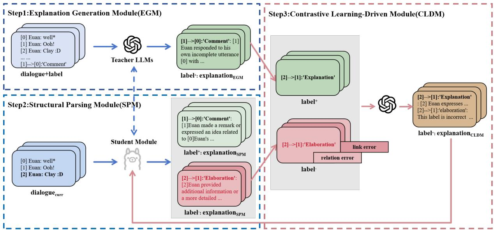
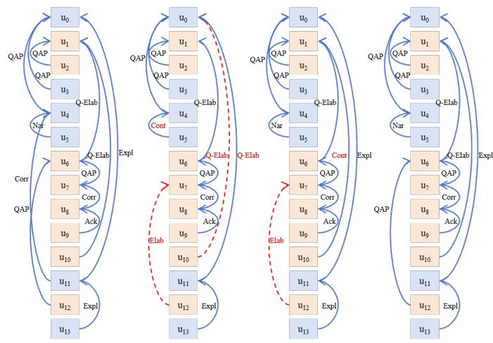
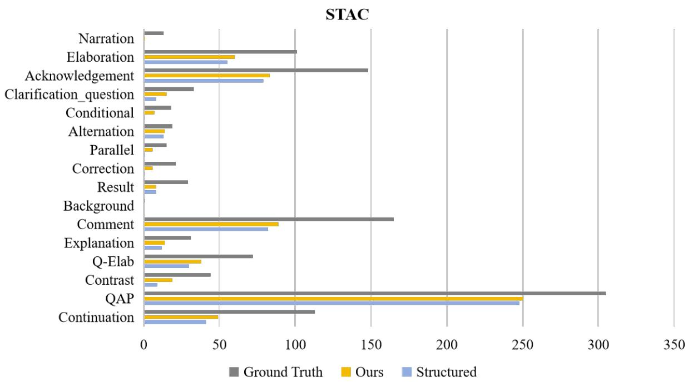
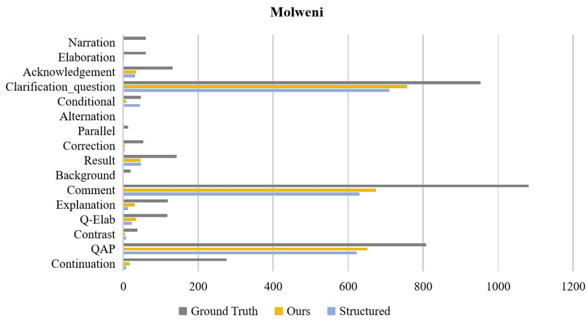

# Enhancing Multi-party Dialogue Discourse Parsing with Explanation Generation

Shannan Liu, Peifeng Li\*, Yaxin Fan, Qiaoming Zhu School of Computer Science and Technology, Soochow University, Suzhou, China 20234027002@stu.suda.edu.cn {pfli, qmzhu}@suda.edu.cn, yxfansuda@stu.suda.edu.cn

## Abstract

Previous studies on multi-party dialogue discourse parsing have struggled to fully understand the deep semantics of dialogues, especially when dealing with complex topic intertwining and ellipsis. To address the above issues, we propose a novel model DDPE (Dialogue Discourse Parsing with Explanations) to integrate external knowledge from Large Language Models (LLMs), which consists of three components, i.e., explanation generation, structural parsing, and contrastive learning. DDPE employs LLMs to generate explanatory and contrastive information about discourse structure, thereby providing additional reasoning cues that enhance the understanding of dialogue semantics. The experimental results on the two public datasets STAC and Molweni show that our DDPE significantly outperforms the State-Of-The-Art (SOTA) baselines.

## 1 Introduction

Multi-party dialogue discourse parsing is an important and highly challenging task in natural language processing (NLP) (Shi and Huang, 2019; Yang et al., 2021; Ganesh et al., 2023). It aims to analyze the discourse structures and semantic relations between utterances in multi-party conversations. This task has wide applications in scenarios such as meeting summarization (Feng et al., 2021), dialogue generation (Li et al., 2024), and machine reading comprehension (Li and Zhao, 2021).

In multi-party dialogues, the intertwining of utterances from different speakers leads to frequent topic shifts, making it difficult to capture semantic connections between adjacent utterances. Taking the dialogue in Figure 1 as an example, the interweaving of topics from multiple participants makes the discourse structure of the entire dialogue intricate and complex. Furthermore, speakers frequently exclude background information or content referenced in preceding utterances, aiming for simplicity and convenience in oral expression. This approach, however, often requires more contextual inference for accurate semantic understanding. However, previous methods on shallow semantic features (Shi and Huang, 2019; Fan et al., 2023; Thompson et al., 2024) have proven inadequate for accurately modeling the complex discourse structure of multi-party dialogues. It is therefore imperative to address the above issues of topic intertwining and ellipsis in multi-party dialogues.

<table><tr><td>Nancy: do u know how to trade with the port?</td></tr><tr><td>skinnylinny: Anyone got a spare ore?</td></tr><tr><td>Chameleon: Yes</td></tr><tr><td>skinnylinny: you need a settlement on the port locations</td></tr><tr><td>Chameleon: Nancy: have a settlement there...</td></tr><tr><td>Chameleon: then just trade</td></tr><tr><td>skinnylinny: chameleon: Would you take wood for an ore?</td></tr><tr><td>Chameleon: rather sheep</td></tr><tr><td>skinnylinny: I don&#x27;t have any sheep</td></tr><tr><td>Chameleon: ok then</td></tr><tr><td>skinnylinny: Nancy: Any spare ore?</td></tr><tr><td>Nancy: really dont know how to trade with the port</td></tr><tr><td>Chameleon: I am happy to trade skinnylinny</td></tr><tr><td>Chameleon: Nancy: you are not on a port</td></tr><tr><td>Question-answer_pair Correction Q-Elab Explanation</td></tr></table>

Figure 1: An example of multi-party dialogue discourse parsing. The directed lines of different colors represent different types of discourse relations between the elementary discourse units (EDUs), while the rectangular blocks of different colors represent the topic thread to which that utterance belongs.

Large Language Models (LLMs) have achieved remarkable success in numerous NLP tasks (Sun et al., 2023; Kocmi and Federmann, 2023; Feng et al., 2023; Chiang and Lee, 2023), demonstrating powerful semantic understanding and reasoning capabilities. This provides a new perspective for addressing the semantic understanding challenges of topic intertwining and ellipsis in multi-party dialogue discourse parsing.

To address the above two issues, we propose a novel model DDPE (Dialogue Discourse Parsing with Explanations) to integrate external knowledge from LLMs. We leverage the semantic understanding and knowledge reasoning capabilities of LLMs to generate the explanations of discourse structures. These explanations reveal semantic connections between the current utterance and its context. For example, the explanations can summarize the current utterance and its relation with previous utterances, or introduce additional reasoning cues to enhance dialogue semantic representation and overcome issues of topic intertwining and ellipsis. Moreover, we introduce contrastive learning to generate contrastive explanations based on the correct and incorrect predictions of the DDPE model, amplifying key reasoning information to further improve the performance of multi-party dialogue discourse parsing. The experimental results on two public datasets STAC and Molweni show that DDPE outperforms several state-of-the-art (SOTA) baselines. We will make our model DDPE publicly available for further research1.

## 2 Related Work

Multi-party dialogue discourse parsing is a challenging task that has received extensive attention from researchers in recent years. Early methods were mainly based on handcrafted features, modeling discourse structures by calculating the probability of elementary discourse unit (EDU) pairs and using decoding strategies such as maximum spanning tree algorithm (Muller et al., 2012; Afantenos et al., 2015) and integer linear programming (Perret et al., 2016). They require a large amount of feature engineering and are difficult to be adapted to complex and changeable dialogue scenarios.

With the development of deep learning, researchers have begun to introduce neural networks to multi-party dialogue discourse parsing, such as using Gated Recurrent Units (GRUs) (Shi and Huang, 2019; Fan et al., 2022; Chi and Rudnicky, 2022) and Graph Neural Networks (GNNs) (Wang et al., 2021) to construct context embeddings. Although these methods alleviate the burden of feature engineering to a certain extent, they still struggle to understand the deep semantics of complex dialogues, especially when dealing with topic intertwining, ellipsis, and long-distance dependencies.

Recent research tends to generate discourse-level representations of context using pre-trained language models (PLMs) while injecting external information such as speaker information (Yu et al., 2022; Li et al., 2023b; Ma et al., 2023) or performing joint learning with auxiliary tasks (He et al., 2021; Fan et al., 2023). However, these discriminative methods typically formulated the prediction of each discourse structure as two independent steps: first determining whether a discourse pair forms a relation, and then predicting the corresponding relation type. This discriminative paradigm ignored the integrity and coherence of the dialogue discourse structure and struggled to model the sequential dependencies of the entire dialogue.

A few works have focused on generative model. Thompson et al. (2024) developed an incremental parsing model LLaMIPa (LLaMA Incremental Parser), which can utilize discourse context and obtain substantial performance improvements. However, LLaMIPa relies on previously inferred discourse structures when predicting links and relations between new discourse units. This makes the prediction of the current discourse limited by the quality of historical discourse structures, and the errors may accumulate gradually as the dialogue progresses. In this paper, our proposed DDPE only requires the current dialogue information to simultaneously predict link and relation types, reducing the dependence on the historical information.

## 3 Methodology

## 3.1 Problem Definition

Given a multi-party dialogue $D = \{ u _ { 1 } , \ldots , u _ { n } \}$ where $u _ { i }$ represents the i-th utterance and n is the total number of utterances. Each utterance $u _ { i }$ can be represented as a binary tuple $( s _ { i } , w _ { i } )$ , where $s _ { i }$ and $w _ { i }$ are the speaker and the textual content of the utterance, respectively. For each utterance $u _ { i } .$ the objective of the discourse parsing task is to predict its corresponding parent node $u _ { j } \left( u _ { i } , u _ { j } \in D \right)$ and the type of discourse relation $r \in R$ between $u _ { i }$ and $u _ { j }$ . Here, R represents a predefined set of relation types, such as {Comment, Question − answer\_pair, Acknowledgement, . . .}. In our model, the discourse parsing task in generation mode will be represented as ${ } ^ { * * } [ u _ { i } ]  [ u _ { j } ] \colon r ^ { * }$

  
Figure 2: Overview of the DDPE framework. It consists of three modules: EGM, SPM, and CLDM.

## 3.2 Overview

To address the issues of topic intertwining and ellipsis in multi-party dialogue discourse parsing, we propose the framework of Dialogue Discourse Parsing with Explanations (DDPE), as shown in Figure 2. It consists of three main components: Explanation Generation Module (EGM), Structural Parsing Module (SPM), and Contrastive Learning-Driven Module (CLDM). EGM utilizes LLMs to generate explanatory information for discourse structures, enhancing the semantic representation of dialogues and overcoming the issues of topic intertwining and ellipsis. SPM and EGM form a teacher-student model, whereby the explanatory information generated by EGM is leveraged to enhance the semantic understanding and reasoning capabilities of SPM. CLDM generates contrastive explanations for correct and incorrect model predictions, amplifying key reasoning information and further improving discourse parsing performance.

## 3.2.1 Explanation Generation Module

EGM utilizes the powerful semantic understanding and knowledge reasoning capabilities of LLMs to generate explanatory information for discourse structures. These explanations reveal the semantic connections between the current utterance and its context, such as summarizing the current utterance and its relation with previous utterances, thereby providing additional reasoning cues for subsequent discourse parsing. This approach has not been fully explored in existing literature. To fully leverage the capabilities of LLMs, we designed a novel prompt template as shown in Appendix A, that includes three key components as follows.

Task description It clearly states the task objective of generating corresponding explanations based on dialogues and labels, providing clear task guidance for the LLM.

Output example It provides an output example with the expected format $\cdots { l ^ { + } } ; \mathrm { { } } e x _ { E G M } { } ^ { , , }$ , where $^ { \ \bullet \ } l ^ { + \ , \bullet }$ represents the label of a specific discourse relation to be explained ${ } ^ { 6 4 } [ u _ { i } ] \ \to \ [ u _ { j } ] \colon r ^ { 3 } ,$ ”, and “exEGM ” is the natural language explanation for that label, including an explanation sentence and $^ { 6 6 } [ u _ { i } ] ^ { , , }$ and $^ { 6 6 } [ u _ { j } ] ^ { , , }$ to locate the tokens in the i-th and j-th utterances. These rich explanatory details reveal the intrinsic reasons for the formation of discourse structures, providing more reasoning basis for subsequent discourse parsing.

Training samples It consists of the complete dialogue context D and the discourse relation label label to be explained.

These three components form a complete input prompt. Unlike the traditional “prompt + input” approach, which typically provides the entire dialogue and all discourse structure labels simultaneously, our method adopts a “prompt + global context + local label” paradigm where the global context refers to the entire dialogue and the local label refers to the label $^ { 6 6 } [ u _ { j } ] ^ { , , }$ embedded in sentences. Due to the repeated appearance of information such as speakers, entities, and pronouns in dialogues, these local labels can help LLMs accurately locate the position of the target in utterances, thereby identifying accurate links and relations of utterances. Accordingly, this novel approach enables LLMs to comprehensively understand the semantics of dialogue while focusing on fine-grained utterance dependencies. Furthermore, it facilitates the enhancement of the specificity and accuracy of explanations, addressing the limitations of information overload and lack of specificity that traditional “prompt + input” methods may face in complex multi-party dialogues. The input and output of EGM are shown as follows.

$$
\mathtt { E G M } ( l ^ { + } : e x _ { E G M } ) = \mathtt { L L M } ( D , l a b e l )\tag{1}
$$

## 3.2.2 Structural Parsing Module

To fully utilize the explanatory information generated by EGM, we introduce the teacher-student model to this task, where EGM acts as a teacher and SPM acts as a student. Hence, the core idea of SPM is to train a student model to mimic the behavior of the teacher model (i.e., LLMs in EGM), thereby inheriting LLMs’ semantic understanding and reasoning abilities.

We choose LLaMA3 as the basic architecture for the student model. Compared to the teacher model, LLaMA3 has significantly fewer parameters, faster inference speed, and is more suitable for practical application scenarios. During training, we use the $^ { \bullet \bullet } l ^ { + } \colon e x _ { E G M } \ " { }$ generated by EGM as the training target for the student model. The current utterance $u _ { i }$ and the dialogue history context $D _ { < i } = ( u _ { 1 } , . . . , u _ { i - 1 } )$ are used as input for the student model, we train it to generate discourse structure information and explanations for the current utterance $u _ { i }$ as follows.

$$
\mathrm { S P M } ( l ^ { + / - } : e x _ { S P M } ) = \mathrm { L l a m a } 3 ( D _ { \le i } )\tag{2}
$$

where $l ^ { + }$ and $l ^ { - }$ are formatted as ${ } ^ { 6 6 } [ u _ { i } ]  [ u _ { j } ] \colon r ^ { 3 9 }$ and the output of SPM is same as that of EGM. $l ^ { + }$ refers to those annotated links or relations, while l− refers to those pseudo links or relations not occurred in the output of EGM.

## 3.2.3 Contrastive Learning-Driven Module

To further improve the quality of multi-party dialogue discourse parsing tasks, we introduce CLDM to generate contrastive explanations for correct and incorrect predictions, amplifying key reasoning information and further enhancing discourse parsing performance. This approach helps the model better understand and distinguish complex dialogue structures, thus addressing the challenge of capturing semantic connections between utterances.

The predictions of SPM can be categorized into two types of errors as follows (see Appendix B for detailed statistics).

Link errors The model incorrectly predicts the node $u _ { k }$ as the parent of the current utterance $u _ { i } .$ represented as ${ } ^ { \ \bullet \ } [ u _ { i } ] \to [ u _ { k } ] \colon r _ { \mathrm { e r r o r } } \ ^ { , , }$

Relation errors The model correctly predicts the node $u _ { j }$ as the parent of the current utterance $u _ { i } .$ . However, it incorrectly predicts their relation as an incorrect relation $r _ { \mathrm { e r r o r } } .$ , represented as $^ { * } [ u _ { i } ] $ $[ u _ { j } ] \colon r _ { \mathrm { e r r o r } } \} ^ { \ , }$

We designed different prompt templates for different types of errors as shown in Appendix C. We first select incorrectly predicted dialogues D and discourse structures from SPM to construct negative samples $l ^ { - }$ −, and find the corresponding gold discourse structures from EGM to construct positive samples $l ^ { + }$ . We designed a prompt template for LLMs to explain why those labels are correct or incorrect, generating contrastive information. This prompt includes three key components as follows.

Task description It clearly states the task objective of generating contrastive explanations based on the dialogues and the positive and negative samples, providing clear task guidance for LLM.

Input-output examples The input positive sample is normalized as $l ^ { + } \colon \ ^ { \ \left. \right.} [ u _ { i } ] \  \ [ u _ { j } ] \colon r ^ { , , }$ , while the negative sample is as $l ^ { - } \colon \ ^ { \ast } [ u _ { i } ]  [ u _ { k } ] \colon r _ { \mathrm { e r r o r } } ^ { , , }$ (link errors) or $l ^ { - } \colon { } ^ { \ \mathfrak { s } } [ u _ { i } ] \  \ [ u _ { j } ] \colon { } r _ { \mathrm { e r r o r } } ^ { , , }$ (relation errors). The expected output format is $^ { 6 6 } l ^ { + }$ $e x _ { C L D M } ,$ , where $\mathbf { \check { e } } \mathbf { x } _ { C L D M } , \mathbf { \check { \eta } }$ represents natural language explanations containing contrastive information of the positive and negative samples, such as $^ { 6 6 } [ 8 ] { - } > [ 3 ]$ : ‘clarification\_question’: [8]Nancy asked [3]Chameleon a question to clarify his work status, instead of acknowledging [3]Chameleon’s related utterances.”. The provision of contrasting explanations facilitates the learning process of the model, enabling it to distinguish between correct and incorrect discourse structures.

Training samples It consists of the complete dialogue context D and the positive and negative samples to be explained.

These three components form the complete prompt for CLDM, which is used to generate contrastive explanations for correct and incorrect pre-

<table><tr><td rowspan="2">Category</td><td rowspan="2">Model</td><td colspan="2">Molweni</td><td colspan="2">STAC</td></tr><tr><td>Link</td><td>Link&amp;Rel</td><td>Link</td><td>Link&amp;Rel</td></tr><tr><td rowspan="7">Discriminative Models</td><td>SSP-BERT + SCIJE</td><td>83.7</td><td>59.4</td><td>73.0</td><td>57.4</td></tr><tr><td>DAMT</td><td>82.5</td><td>58.9</td><td>73.6</td><td>57.4</td></tr><tr><td>HG-MDP</td><td>81.5</td><td>58.5</td><td>72.0</td><td>55.6</td></tr><tr><td>Structured</td><td>83.5</td><td>59.9</td><td>74.4</td><td>59.6</td></tr><tr><td>DialogDP</td><td>83.2</td><td>59.8</td><td>73.0</td><td>58.5</td></tr><tr><td>Mult-ST</td><td>83.2</td><td>58.8</td><td>73.1</td><td>57.2</td></tr><tr><td>TST</td><td>85.3</td><td>60.9</td><td>73.7</td><td>57.6</td></tr><tr><td rowspan="4">Generative Models</td><td>In-context learning ChatGPT</td><td>26.5</td><td>6.9</td><td>21.3</td><td>7.4</td></tr><tr><td>GP-ChatGPT</td><td>63.8</td><td>23.9</td><td>59.9</td><td>25.2</td></tr><tr><td>LLaMIPa</td><td></td><td></td><td>77.5</td><td>60.7</td></tr><tr><td>DDPE</td><td>87.6</td><td>62.9</td><td>79.5</td><td>63.4</td></tr></table>

Table 1: Experimental results on Molweni and STAC, where LLaMIPa did not reported the results on Molweni.

dictions, as follows.

$$
\mathbf { C L D M } ( l ^ { + } : e x _ { C L D M } ) = \mathbf { L L M } ( D , l ^ { + } , l ^ { - } )\tag{3}
$$

Finally, this contrastive explanatory information is fed into SPM to enable the student model to amplify the differences between positive and negative samples, thereby improving the accuracy of discourse parsing.

## 4 Experimentation

## 4.1 Experimental Settings

Datasets We evaluate our proposed DDPE on two widely used multi-party dialogue datasets STAC2 (Asher et al., 2016) and Molweni3 (Li et al., 2020). STAC is collected from the online game “The Settlers of Catan”. It contains 1,173 dialogues with discourse parsing annotations, of which 1,062 dialogues are used for training and 111 for testing, following previous work (Li et al., 2023b; Fan et al., 2023). Molweni is derived from the Ubuntu Chat Corpus (Lowe et al., 2015), which includes multi-party dialogues from online forums discussing Ubuntu-related issues. The dataset contains 10,000 annotated dialogues, with 9,000, 500, and 500 dialogues for training, development, and testing, respectively, following previous work (Li et al., 2023b; Fan et al., 2023).

Settings We utilize GPT-4 Turbo (gpt-4-1106- preview) provided by the OpenAI API as the LLM. Using the popular contemporary open-source language model LLaMA3 as our backbone, we finetune the model parameters using the LoRA method, with 3.0 training epochs, a batch size of 1, and a learning rate of 1e-4. All experiments are conducted using GeForce RTX 3090 GPUs. To provide accurate results, we perform three random runs on the test set and report the average scores.

We use micro F1 scores to evaluate link prediction and link&rel prediction. The link score only assesses the ability to predict links, while for the link&rel score, it is considered correct only when both the link and relation are correctly predicted.

Baselines We compare DDPE with several strong baselines, which can be divided into two groups: 1) Discriminative models, including single-task models DAMT (Fan et al., 2022), SSP-BERT + SCIJE (Yu et al., 2022), Structured (Chi and Rudnicky, 2022), DialogDP (Li et al., 2023b), HG-MDP (Li et al., 2023a) , and multi-task joint learning models Mult-ST (Fan et al., 2023), TST (Fan et al., 2023); 2) Generative models, including LLaMIPa (Thompson et al., 2024), which uses Llama3 as the backbone, and ChatGPT-based methods In-context learning ChatGPT (Chan et al., 2023), GP-ChatGPT (Fan et al., 2024).

## 4.2 Experimental Results

The experimental results of our proposed DDPE and several strong baselines on the Molweni and STAC test sets are shown in Table 1 and our DDPE achieves significant performance improvements on the two datasets (significance test: P <0.002).

Compared to the best traditional discriminative models TST (Fan et al., 2023) on Molweni and Structured on STAC, our DDPE improves the Link/Link&Rel F1 values by 2.3/2.0 and 5.1/3.8, respectively. This improvement can be primarily attributed to DDPE’s incorporation of inference explanations generated by LLMs as additional semantic signals, effectively mitigating issues such as topic intertwining and ellipsis, thereby enhancing the model’s semantic representation capabilities.

<table><tr><td rowspan="2">Model</td><td colspan="2">Molweni</td><td colspan="2">STAC</td></tr><tr><td>Link</td><td>Link&amp;Rel</td><td>Link</td><td>Link&amp;Rel</td></tr><tr><td>DDPE</td><td>87.6</td><td>62.9</td><td>79.5</td><td>63.4</td></tr><tr><td>w/o CLDM</td><td>-0.0</td><td>-1.7</td><td>-0.4</td><td>-1.2</td></tr><tr><td>w/o CLDM&amp;EGM</td><td>-1.1</td><td>-1.4</td><td>-2.2</td><td>-1.5</td></tr></table>

Table 2: Ablation study on two test sets.

Moreover, DDPE can simultaneously predict links and relations that reflect the holistic nature and coherence of discourse structure, overcoming the limitations of traditional two-stage discriminative paradigms. It is noteworthy that the improvements on the STAC dataset are more significant, which may be attributed to the fact that the STAC dialogues are more intricate, comprising longer conversation lengths, more frequent topic switches, and implicit semantic relations. This makes the STAC dataset a more challenging one, and thus a more effective showcase for the advantages of our DDPE in handling complex dialogue structures.

In comparison with the SOTA generative model LLaMIPa, DDPE also demonstrates clear advantages. On the STAC test set, DDPE improves the Link F1 and Link&Rel F1 metrics by 2.0 and 2.7, respectively. This can be primarily attributed to the approach of jointly predicting links and relation types based solely on the current dialogue context, reducing reliance on historical predicted structures as in LLaMIPa. Furthermore, DDPE integrates knowledge from LLMs and employs a CLDM module, further enabling its ability to focus more effectively on key cues within the dialogue.

## 5 Analysis

## 5.1 Ablation Study

To validate the effectiveness and contribution of each module in our proposed DDPE framework, we conducted detailed ablation experiments. Specifically, we focused on verifying two key innovations: 1) EGM utilizes LLMs to generate explanatory information to enhance the semantic representation of dialogues; 2) CLDM amplifies key reasoning information through contrastive learning. Besides, SPM serves as the backbone of our explanation generation model, which cannot be removed. Table 2 presents the results of the ablation study on the Molweni and STAC datasets.

<table><tr><td rowspan="2">Model</td><td colspan="2">STAC</td></tr><tr><td>Link</td><td>Link &amp; Rel</td></tr><tr><td>SPM</td><td>77.3</td><td>61.9</td></tr><tr><td>+EGM</td><td>79.5</td><td>63.4</td></tr><tr><td>Trad</td><td>75.2</td><td>57.7</td></tr></table>

Table 3: The impact of different prompts on dialogue discourse parsing performance.

We observed that EGM brought significant performance improvements on the Link task. Removing this module resulted in a decrease of 1.1 and 2.2 in Link on Molweni and STAC, respectively. This result confirms that the explanatory information generated by LLMs provides rich semantic cues, contributing to the accurate identification of reply relations between utterances and overcoming the challenges of topic intertwining and ellipsis in multi-party dialogues. However, it cannot boost relation recognition. This may be mainly due to the lack of pre-defined discourse types of utterances in LLM, resulting in a lack of effective understanding of the numerous discourse relations.

In contrast, CLDM showed significant improvements in the Link&Rel task and removing this module led to a decrease of 1.7 and 1.2 in Link&Rel on Molweni and STAC, respectively. These positive and negative examples generated by CLDM can further assist the model in determining the relation between two utterances from a causal perspective. This indicates that contrastive learning can amplify key reasoning information, enabling better differentiation of various relation types and further enhancing discourse parsing performance. However, it cannot improve the performance of the Link task and our future work will focus on this direction.

## 5.2 Analysis on Explanation Generation

To verify the impact of our “prompt + global context + local label” versus the traditional “prompt + input” on dialogue discourse parsing, we conducted experiments on the STAC dataset and the results are shown in Table 3 where SPM refers to DDPE without CLDM and EGM, +EGM refers to SPM+EGM, and Trad refers to the traditional “prompt + input”. Moreover, Appendix D provides the specific examples of both prompts.

  
(a) Dialogue

(b) GOLD  
  
(c) SPM  
(d) EGM + SPM  
(e) DDPE  
Figure 3: An example of dialogue discourse parsing, where (a) is a dialogue from STAC, (b) is the gold results, and (c)-(e) show the predicted results of SPM, EGM + SPM, and DDPE, respectively. “Elab”, “QAP”, “Q-Elab”, “Corr”, “Expl”, “Nar”, “Cont” and “Ack” are the abbreviations of “Elaboration”, “Question-Answer-Pair”, “Question Elaboration”, “Correction”, “Explanation”, “Narration”,“Continuation”, and “Acknowledgement”, respectively. ui corresponds to the i-th utterance in the left panel, and u in different colors represent different topics.

Table 3 shows that the performance of Trad is even inferior to that of SPM. This can be attributed to two factors: input overload and lack of specificity. First, Trad simultaneously inputs the global context and all discourse structure labels. This rich information may occasionally lead to LLM’s inability to match utterances with speakers. Second, the explanations in Trad only include speaker names without utterance numbers, resulting in less clear speaking turns and potential confusion. These issues introduce noise into the parsing process, ultimately leading to a decline in performance.

In contrast, the explanations generated by EGM possess two notable advantages: focused attention and enhanced context. Firstly, EGM is better able to focus on the current label, thereby providing explanations that are more precise and relevant. Secondly, it is able to correctly identify discourse relations and also provides more detailed contextual information and reasoning processes. Therefore, the additional context and focused explanations facilitate a more comprehensive understanding of the semantic structure of the dialogue.

## 5.3 Analysis of Explanation Quality

To evaluate the quality of explanations generated by EGM, we manually assessed samples from the STAC dataset according to four quality levels:

Excellent The explanation effectively captures semantic connections between current utterances and their context, including topic relevance, relation types, and potential reasoning. The explanation is coherent and significantly enhances dialogue comprehension.

Good The explanation accurately identifies the context utterances being responded to and summarizes discussion topics, but shows limited reasoning about relation types.

Fair While correctly identifying the utterances being responded to, the explanation shows some inaccuracies in topic summarization or relation type description.

Poor Fails to correctly identify the context utterances being responded to.

We evaluated 20 random samples for each of the 16 relation types in STAC. Results show that 50% of explanations were rated excellent, 20% good, 17% fair, and 13% poor (detailed statistics in Appendix E). Notably, explanations for Clarif ication\_question and Acknowledgment relations accounted for 21% of excellent cases, while explanations for Question−answer\_pairs and Comment relations made up 38% of poor cases.

We identified two main factors leading to poor explanations: 1) Confusion between similar relation types, for example, explanations failing to clearly distinguish between Elaboration and Continuation; 2) The inherent complexity of relations lacking distinctive features (e.g., Narration).

Combined with the relation performance breakdown in Section 5.5, we observe that both explanation quality and relation type distribution in training samples significantly influence the model’s relation prediction performance. Higher quality explanations and more balanced training samples tend to produce better prediction results.

## 5.4 Case Study

To visually demonstrate how DDPE enhances the performance of discourse parsing, we selected a typical example from the STAC dataset for analysis, as shown in Figure 3(a). This example consists of 13 utterances involving 4 participants discussing two topics: port trade and item exchange, fully reflecting the characteristics of frequent topic shift and ellipsis in multi-party dialogues. Figure 3(b) displays its gold standard discourse structure, while Figure 3(c)-(e) show the prediction results of different modules of the DDPE framework.

Figure 3(c) shows the results using only SPM. It can be observed that this model has significant difficulties in handling cross-topic semantic associations, for example, erroneously connecting $u _ { 1 0 }$ to $u _ { 0 }$ . Figure 3(d) shows the results after introducing EGM on top of SPM. Notably, the model successfully identified the long-distance link between $u _ { 1 0 }$ and $u _ { 1 }$ . This improvement stems from the explanatory information generated by the LLM, which integrates the global dialogue context, providing additional reasoning cues and effectively alleviating the problem of difficult-to-capture semantic connections between utterances.

Figure 3(e) presents the prediction results of the complete DDPE framework. At this stage, the model can correctly identify most of the discourse links and relation types between utterances. This indicates that by generating contrastive explanations, the model can more accurately capture key reasoning information, thereby improving discourse structure parsing performance.

However, we also observed that the model still has limitations in handling complex multiple discourse relations. For instance, $u _ { 1 1 }$ has both Explanation and Correction relations with $u _ { 0 }$ and $u _ { 4 } ,$ , respectively. However, the model failed to process these relations entirely correctly. This phenomenon reveals the remaining challenges in multiparty dialogue discourse parsing, namely how to more precisely model complex, multi-level discourse structures.

## 5.5 Relation Performance Breakdown

To thoroughly evaluate DDPE’s performance across different relation types, we compared the number of correct predictions made by DDPE and the current state-of-the-art discriminative model, Structured (Chi and Rudnicky, 2022). The results are shown in Figure 4, and DDPE outperforms Structured in almost all relation types. In Appendix F, we provide a detailed introduction to the characteristics of various relation types.

Specifically, our model’s advantage in the relation Continuation indicates its stronger ability to track and understand topic continuations. Moreover, the superiority in the relations Q-Elab and Comment suggests that our DDPE can effectively address the issue of ellipsis by supplementing necessary contextual information through LLM-generated explanations. Additionally, significant improvements in the relations Contrastive, Correction, Parallel, and Conditional also demonstrate the model’s capability to grasp complex discourse structures.

As shown in Appendix G, similar phenomena can be observed on the Molweni dataset. It is noteworthy that our approach continues to yield stable performance improvements, thereby demonstrating its capacity for robustness and generalization, despite the fact that the Molweni dataset is considerably larger than STAC.

Interestingly, for certain low-frequency relation types (such as Background and Narration), the performance gap between models is not substantial. This may be attributed to the limited availability of training data. This observation suggests that our future research could investigate techniques such as data augmentation or transfer learning to further enhance the model’s performance on lowfrequency relations, thereby more comprehensively addressing the challenges in multi-party dialogue discourse parsing.

## 6 Conclusion

This paper proposes a novel framework DDPE based on explanation generation and contrastive learning to address the challenges of topic intertwining and ellipsis in multi-party dialogue discourse parsing. DDPE employs rich explanatory information generated by LLMs as supplementary reasoning cues, thereby enhancing the model’s comprehension and predictive capacity regarding complex dialogue through a structural parsing module and a contrastive learning-driven module. Experimental results on two public datasets confirm the effectiveness of our proposed DDPE. Our future work will focus on using suitable data augmentation methods and effective contrastive learning methods to further boost multi-party dialogue discourse parsing.

  
Figure 4: Relation performance breakdown (STAC).

## Limitations

It should be noted that our work is not without limitations, and we will endeavor to address these issues in future work. First, while the explanatory information generated by LLMs has the potential to enhance the performance of discourse parsing, the quality of the explanations is not yet sufficiently high. In some instances, the explanations may appear unreasonable or incoherent. Further optimization of prompt engineering and other aspects is necessary to enhance the rationality and readability of the explanations. Second, the model demonstrates suboptimal performance on certain low-frequency discourse relation types. This may be constrained by the limitations of low-resource learning. In the future, we will continue to refine our method to address these limitations.

## Acknowledgments

The authors would like to thank the three anonymous reviewers for their comments on this paper.

This research was supported by the National Natural Science Foundation of China (Nos. 62276177 and 62376181), and Project Funded by the Priority Academic Program Development of Jiangsu Higher Education Institutions.

## References

Stergos Afantenos, Eric Kow, Nicholas Asher, and J’er’emy Perret. 2015. Discourse parsing for multiparty chat dialogues. In Proceedings of the 2015 Conference on Empirical Methods in Natural Language Processing, pages 928–937.

Nicholas Asher, Julie Hunter, Mathieu Morey, Farah Benamara, and Stergos Afantenos. 2016. Discourse structure and dialogue acts in multiparty dialogue: the STAC corpus. In Proceedings of the Tenth International Conference on Language Resources and Evaluation, pages 2721–2727.

Chunkit Chan, Jiayang Cheng, Weiqi Wang, Yuxin Jiang, Tianqing Fang, Xin Liu, and Yangqiu Song. 2023. ChatGPT evaluation on sentence level relations: A focus on temporal, causal, and discourse relations. arXiv:2304.14827.

Ta-Chung Chi and Alexander Rudnicky. 2022. Structured dialogue discourse parsing. In Proceedings of the 23rd Annual Meeting of the Special Interest Group on Discourse and Dialogue, pages 325–335.

Cheng-Han Chiang and Hung-yi Lee. 2023. Can large language models be an alternative to human evaluations? In Proceedings of the 61st Annual Meeting of

the Associationfor Computational Linguistics (Vol ume 1: Long Papers), pages 15607–15631.

Yaxin Fan, Fang Jiang, Bohan Luo, Cunchao Tian, Yanyan Wang, and Zhongzhou Chen. 2022. A distance-aware multi-task framework for conversational discourse parsing. In Proceedings ofthe 29th International Conference on Computational Linguistics, pages 5454–5465.

Yaxin Fan, Feng Jiang, Peifeng Li, Fang Kong, and Qiaoming Zhu. 2023. Improving dialogue discourse parsing via reply-to structures of addressee recognition. In Proceedings of the 2023 Conference on Empirical Methods in Natural Language Processing, pages 8484–8495.

Yaxin Fan, Feng Jiang, Peifeng Li, and Haizhou Li. 2024. Uncovering the potential of chatgpt for discourse analysis in dialogue: An empirical study. In Proceedings ofthe 2024 Joint International Conference on Computational Linguistics, Language Resources and Evaluation, pages 16998–17010.

Xiachong Feng, Xiaocheng Feng, Bing Qin, and Xinwei Geng. 2021. Dialogue discourse-aware graph model and data augmentation for meeting summarization. In Proceedings of the Thirtieth International Joint Conference on Artificial Intelligence, pages 3808– 3814.

Yujie Feng, Zexin Lu, Bo Liu, Liming Zhan, and Xiao-Ming Wu. 2023. Towards llm-driven dialogue state tracking. In Proceedings ofthe 2023 Conference on Empirical Methods in Natural Language Processing, pages 739–755.

Ananya Ganesh, Martha Palmer, and Katharina Kann. 2023. A survey of challenges and methods in the computational modeling of multi-party dialog. In Proceedings ofthe 5th Workshop on NLPfor Conversational AI, pages 140–154.

Yuchen He, Zhuosheng Zhang, and Hai Zhao. 2021. Multi-tasking dialogue comprehension with discourse parsing. In Proceedings of the 35th Pacific Asia Conference on Language, Information and Computation, pages 551–561.

Tom Kocmi and Christian Federmann. 2023. Large language models are state-of-the-art evaluators of translation quality. In Proceedings ofthe 24th Annual Conference ofthe European Associationfor Machine Translation, pages 193–203.

Jiaqi Li, Ming Liu, Yongfu Chen, Zihao Zheng, Hainan Zhang, Wenqiang Lei, and Ting Liu. 2023a. A speaker-aware multiparty dialogue discourse parser with heterogeneous graph neural network. Cognitive Systems Research, 79:15–23.

Jiaqi Li, Ming Liu, Min-Yen Kan, Zihao Zheng, Zekun Wang, Wenqiang Lei, Ting Liu, and Bing Qin. 2020. Molweni: A challenge multiparty dialogues-based

machine reading comprehension dataset with discourse structure. In Proceedings of the 28th International Conference on Computational Linguistics, pages 2642–2652.

Jingyang Li, Shengli Song, Yixin Li, Hanxiao Zhang, and Guangneng Hu. 2024. ChatMDG: A discourse parsing graph fusion based approach for multi-party dialogue generation. Information Fusion, 110:102469.

Wei Li, Qian Wang, Wei Liu, Yongfu Chen, and Fang Jiang. 2023b. Task-aware self-supervised framework for dialogue discourse parsing. In Proceedings ofthe 2023 Conference on Empirical Methods in Natural Language Processing, pages 14162–14173.

Yiyang Li and Hai Zhao. 2021. Self- and pseudo-self supervised prediction of speaker and key-utterance for multi-party dialogue reading comprehension. In Findings of the Association for Computational Linguistics: EMNLP 2021, pages 2053–2063.

Ryan Lowe, Nissan Pow, Iulian Vlad Serban, and Joelle Pineau. 2015. The ubuntu dialogue corpus: A large dataset for research in unstructured multi-turn dialogue systems. In Proceedings of the 16th Annual Meeting ofthe Special Interest Group on Discourse and Dialogue, pages 285–294.

Xinbei Ma, Zhuosheng Zhang, and Hai Zhao. 2023. Enhanced speaker-aware multi-party multi-turn dialogue comprehension. IEEE/ACM Transactions on Audio, Speech, and Language Processing, 31:2410– 2423.

Philippe Muller, Stergos Afantenos, Pascal Denis, and Nicholas Asher. 2012. Constrained decoding for textlevel discourse parsing. In Proceedings ofCOLING 2012, pages 1205–1218.

J’er’emy Perret, Stergos Afantenos, Nicholas Asher, and Mathieu Morey. 2016. Integer linear programming for discourse parsing. In Proceedings of the 2016 Conference of the North American Chapter of the Association for Computational Linguistics: Human Language Technologies, pages 99–109.

Zhouxing Shi and Minlie Huang. 2019. A deep sequential model for discourse parsing on multi-party dialogues. In Proceedings ofthe AAAI Conference on Artificial Intelligence, volume 33, pages 7007–7014.

Xiaofei Sun, Xiaoya Li, Shengyu Zhang, Shuhe Wang, Fei Wu, Jiwei Li, Tianwei Zhang, and Guoyin Wang. 2023. Sentiment analysis through LLM negotiations. arXiv:2311.01876.

Kate Thompson, Akshay Chaturvedi, Julie Hunter, and Nicholas Asher. 2024. LLaMIPa: An incremental discourse parser. In Findings ofthe Associationfor Computational Linguistics: EMNLP 2024, pages 6418–6430.

Ante Wang, Linfeng Song, Hui Jiang, Shaopeng Lai, Junfeng Yao, Min Zhang, and Jinsong Su. 2021. A structure self-aware model for discourse parsing on multi-party dialogues. In Proceedings of the Thirtieth International Joint Conference on Artificial Intelligence, pages 3943–3949.

Jingxuan Yang, Kerui Xu, Jun Xu, Si Li, Sheng Gao, Jun Guo, Nianwen Xue, and Ji-Rong Wen. 2021. A joint model for dropped pronoun recovery and conversational discourse parsing in Chinese conversational speech. In Proceedings ofthe 59th Annual Meeting of the Association for Computational Linguistics and the 11th International Joint Conference on Natural Language Processing, pages 1752–1763.

Nan Yu, Guohong Fu, and Min Zhang. 2022. Speakeraware discourse parsing on multi-party dialogues. In Proceedings ofthe 29th International Conference on Computational Linguistics, pages 5660–5671.

## A EGM Prompt

The prompt template of EGM is shown in Table 6, which is used to generate explanatory information of the discourse structure. It includes three parts, i.e., task description, output examples, and training samples.

## B Prediction Results of SPM

The numbers of correct and incorrect predictions of SPM on the two datasets are shown in Table 4. It can be observed that the link prediction errors are slightly higher in STAC, primarily due to the longer length of dialogues and the less cohesive discourse connections, which collectively make link prediction more challenging. In the case of Molweni, the proportion of relation prediction errors is higher. The length distribution in the Molweni dataset is more concentrated, with the majority of turns falling between 7 and 14, which reduces the difficulty of link prediction. However, the topic transitions in this dataset are relatively smooth, and the discourse relation patterns are more ambiguous, thereby increasing the difficulty of discourse relation prediction.

## C CLDM Prompt

The prompt template used in CLDM is designed to generate comparative explanations of correct and incorrect predictions. Table 7 shows the prompt of link errors, and Table 8 shows the prompt of relation errors.

<table><tr><td></td><td colspan="2">Molweni</td><td colspan="2">STAC</td></tr><tr><td></td><td>Link</td><td>Rel</td><td>Link</td><td>Rel</td></tr><tr><td>Training set</td><td>11,707</td><td>11,707</td><td>70,495</td><td>70,495</td></tr><tr><td>Corr pred</td><td>9,303</td><td>7,849</td><td>63,166</td><td>46,380</td></tr><tr><td>Incorr pred</td><td>2,404</td><td>1,454</td><td>7,329</td><td>16,786</td></tr></table>

Table 4: Statistics of SPM’s correct and incorrect predictions. “Link” represents the number of link prediction errors, while “Rel” represents the number of relation prediction errors when the link prediction is correct.
<table><tr><td>Relation Type</td><td>Excellent</td><td>Good</td><td>Fair</td><td>Poor</td></tr><tr><td>Question-answer_pair</td><td>10</td><td>1</td><td>1</td><td>8</td></tr><tr><td>Comment</td><td>5</td><td>7</td><td>0</td><td>8</td></tr><tr><td>Acknowledgement</td><td>17</td><td>1</td><td>2</td><td>0</td></tr><tr><td>Elaboration</td><td>5</td><td>14</td><td>0</td><td>1</td></tr><tr><td>Clarification_question</td><td>17</td><td>1</td><td>2</td><td>0</td></tr><tr><td>Continuation</td><td>6</td><td>3</td><td>7</td><td>4</td></tr><tr><td>Result</td><td>10</td><td>7</td><td>2</td><td>1</td></tr><tr><td>Explanation</td><td>14</td><td>4</td><td>1</td><td>1</td></tr><tr><td>Correction</td><td>16</td><td>1</td><td>2</td><td>1</td></tr><tr><td>Contrast</td><td>15</td><td>2</td><td>2</td><td>1</td></tr><tr><td>Parallel</td><td>3</td><td>2</td><td>10</td><td>5</td></tr><tr><td>Conditional</td><td>13</td><td>1</td><td>4</td><td>2</td></tr><tr><td>Alternation</td><td>17</td><td>1</td><td>2</td><td>0</td></tr><tr><td>Background</td><td>5</td><td>3</td><td>10</td><td>2</td></tr><tr><td>Narration</td><td>2</td><td>10</td><td>3</td><td>5</td></tr><tr><td>Q-Elab</td><td>4</td><td>8</td><td>5</td><td>3</td></tr><tr><td>Total</td><td>159</td><td>66</td><td>53</td><td>42</td></tr></table>

Table 5: STAC explanation quality statistics.

## D Samples of Two Prompts for Generating Explanations

Table 10 shows two specific examples of the prompts “prompt + global context + local label” and “prompt + input”.

## E Quality Statistics of Generated Explanations

We manually evaluate 320 samples (20 per relation type) from STAC according to the four quality levels described in Section 5.3 to assess the quality of explanations generated by EGM. Overall, 159 (50%) explanations were rated excellent, 66 (20%) good, 53 (17%) fair, and 42 (13%) poor. Table 5 provides the detailed quality distribution across different relation types.

## F Introduction to Various Relation Types

Table 9 provides a detailed introduction to the characteristics of 16 relation types commonly used in dialogue discourse parsing tasks. These relation types capture different aspects of the semantic and structural connections between utterances in multi-

Given the following dialogue and the relation list between utterances, provide an explanation for each   
relation label, and only output the following explanation content. Pay attention! Don’t add anything else.   
Example output: [1]–>[0]:‘Question-answer\_pair’: [1]Thomas answered [0]William’s proposal with ‘no’.   
dialogue:{dialogue}   
label:{label}   
Table 6: EGM prompt.   
Given the following dialogue and the (correct and incorrect) response labels between utterances, provide   
explanations for the (correct and incorrect) response labels, i.e., explain why the label is correct and why   
the incorrect label is incorrect, and output only the explanation content.   
Note: Do not add anything else.   
For example:   
Correct response label: [8]–>[3]:‘clarification\_question’   
Incorrect response label: [8]–>[7]:‘clarification\_question   
Output:   
[8]–>[3]:‘clarification\_question’: [8]Nancy replied to [3]Chameleon asked [3]Chameleon a question for   
clarification about the status of his work. Instead of replying to [7] Nancy to elaborate on the relevant   
question.   
dialogue:{dialogue}   
correct response label:{label+}   
Incorrect response label:{label−}  
Table 7: CLDM prompt(link prediction error).

Given the following dialogue and the (correct and incorrect) relation labels between utterances, provide   
explanations for the (correct and incorrect) relation labels, i.e., explain why the labels are correct and why   
the incorrect labels are wrong, and only output the explanations.   
Note: Do not add anything else.   
For example:   
Correct response label: [8]–>[3]:‘clarification\_question’   
Incorrect response label: [8]–>[3]: ‘acknowledgement   
Output:   
[8]–>[3]: ‘clarification\_question’: [8]Nancy asked [3]Chameleon a question to clarify his work status.   
Instead of acknowledging [3]Chameleon’s related utterances.   
dialogue:{dialogue}   
correct response label:{label+}   
Incorrect response label:{label−}  
Table 8: CLDM prompt(correct link prediction but incorrect relation prediction).

party dialogues.

## G Relation Performance on Molweni

Figure 5 presents a comparison of the numbers of correct predictions between our DDPE and the SOTA discriminative model Structured for various relation types in the Molweni dataset.

Figure 5: Relation performance breakdown (Molweni).
<table><tr><td>Relation Type</td><td>Description</td></tr><tr><td>Question-answer_pair</td><td>The current utterance provides a direct answer to the previous question.</td></tr><tr><td>Comment</td><td>The current utterance provides additional information, opinion, or evalua- tion about a previous utterance without changing the topic.</td></tr><tr><td>Acknowledgement</td><td>The current utterance accepts, recognizes, or commits to the content of the previous utterance.</td></tr><tr><td>Elaboration</td><td>The current utterance provides more detailed information or explanation about a previous utterance.</td></tr><tr><td>Clarification_question</td><td>The current utterance asks for clarification or explanation of the previous utterance.</td></tr><tr><td>Continuation</td><td>The current utterance continues or extends the content of a previous utterance.</td></tr><tr><td>Result</td><td>The current utterance presents the result of the previous utterance.</td></tr><tr><td>Explanation</td><td>The current utterance offers an explanation of the previous utterance.</td></tr><tr><td>Correction</td><td>The current utterance corrects an incorrect statement in the previous utterance.</td></tr><tr><td>Contrast</td><td>The current utterance presents information or viewpoints that conflict with or contrast to the previous utterance.</td></tr><tr><td>Parallel</td><td>The current utterance is parallel to the previous utterance, without obvious logical relationships such as cause and effect or semantic transition.</td></tr><tr><td>Conditional</td><td>The current utterance establishes a conditional relationship with the previ- ous utterance, serving as the premise for the latter.</td></tr><tr><td>Alternation</td><td>The current utterance presents alternative options or possibilities to the previous utterance.</td></tr><tr><td>Background</td><td>The current utterance provides background information related to the</td></tr><tr><td>Narration</td><td>previous utterance. The current utterance narrates an event, forming a temporal or logical</td></tr><tr><td>Q-Elab</td><td>sequence with the previous utterance. The current utterance presents a question that further elaborates or extends the previous question.</td></tr></table>

Table 9: Characteristics of 16 relation types.

<table><tr><td>Prompt  $\underline { { B a s e l i n e } }$  PromptEGM Given the following dialogue and the relation list between utterances, provide an explanation for each</td></tr><tr><td>dialogue: [0] Nancy: do u know how to trade with the port? [1] skinnylinny: Anyone got a spare ore? [2] Chameleon: Yes [3] skinnylinny: You need a settlement on the port locations [4] Chameleon: Nancy: have a settlement there... [5] Chameleon: then just trade</td></tr><tr><td>label: label: [2]-&gt;[1]:Question-answer_pair [2]-&gt;[1]:Question-answer_pair&#x27; [3]-&gt;[0]:Question-answer_pair Keep the dialogue unchanged and enter the subse- [4]-&gt;[0]:Question-answer_pair quent labels one by one. [5]-&gt;[4]:&#x27;Narration&#x27;</td></tr><tr><td>Output Output [2]-&gt;[1]:Question-answer_pair&#x27;: Chameleon&#x27;s [2]-&gt;[1]:Question-answer_pair&#x27;: [2]Chameleon  $\mathbf { \mu ^ { 6 6 } } \mathbf { Y e s } ^ { \mathbf { \prime } \mathbf { \prime } }$  is a direct answer to skinnylinny&#x27;s question answered [1]skinnylinny&#x27;s asking if anyone had a about spare ore. spare ore by saying ‘Yes&#x27;. [3]-&gt;[0]:Question-answer_pair&#x27;: skinnylinny pro- vides an answer to Nancy&#x27;s question about how to trade with the port. [4]-&gt;[0]:Question-answer_pair&#x27;: Chameleon gives another answer to Nancy&#x27;s question about trading with the port. [5]-&gt;[4]:Narration&#x27;: Chameleon continues the</td></tr></table>

Table 10: Comparison of promp $. B a s e l i n e$ and promptEGM.