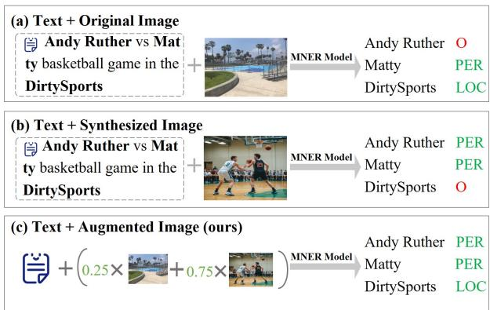
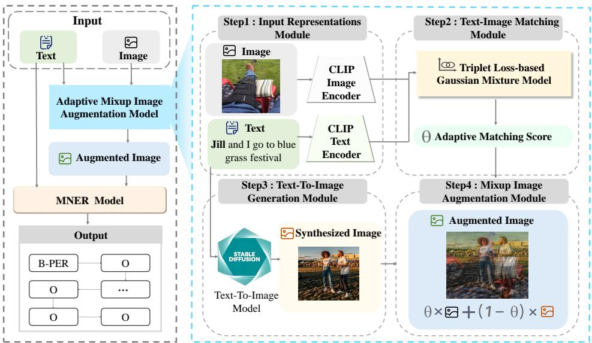
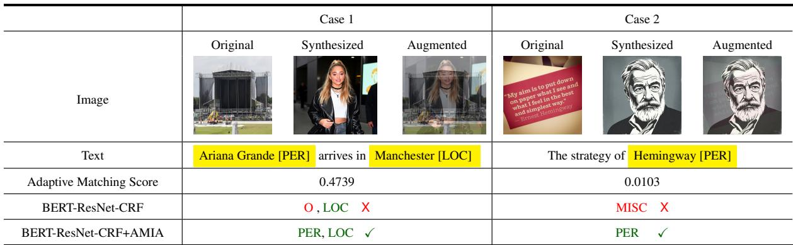

# Enhancing Multimodal Named Entity Recognition through Adaptive Mixup Image Augmentation

Bo Xu1, Haiqi Jiang1, Jie Wei1, Hongyu Jing1, Ming Du1,\*, Hui Song1,

Hongya Wang1 and Yanghua Xiao2

1School of Computer Science and Technology, Donghua University, 2Shanghai Key Laboratory of Data Science, School of Computer Science, Fudan University, xubo@dhu.edu.cn, {2222674, weijie, 2232833}@mail.dhu.edu.cn , {duming, songhui, hywang}@dhu.edu.cn, shawyh@fudan.edu.cn

## Abstract

Multimodal named entity recognition (MNER) extends traditional named entity recognition (NER) by integrating visual and textual information. However, current methods still face significant challenges due to the text-image mismatch problem. Recent advancements in text-to-image synthesis provide promising solutions, as synthesized images can introduce additional visual context to enhance MNER model performance. To fully leverage the benefits of both original and synthesized images, we propose an adaptive mixup image augmentation method. This method generates augmented images by determining the mixing ratio based on the matching score between the text and image, utilizing a triplet loss-based Gaussian Mixture Model (TL-GMM). Our approach is highly adaptable and can be seamlessly integrated into existing MNER models. Extensive experiments demonstrate consistent performance improvements, and detailed ablation studies and case studies confirm the effectiveness of our method.

## 1 Introduction

Multimodal named entity recognition (MNER) extends traditional named entity recognition (NER) by integrating visual and textual information (Zhang et al., 2021). Unlike conventional NER, which relies solely on text, MNER incorporates images to enhance contextual understanding. This proves particularly beneficial in scenarios such as multimedia news extraction and product information retrieval on online platforms (Zheng et al., 2021). Current research in MNER typically focuses on optimizing modality representations (Zhang et al., 2018b; Chen et al., 2021), achieving modality alignment and fusion (Lu et al., 2018; Bao et al., 2023; Guo et al., 2023; Zeng et al., 2024; Zhou et al., 2024), and mitigating image noise interference (Sun et al., 2021; Xu et al., 2022; Zhang et al., 2023; He et al., 2024).

  
Figure 1: An example of using different image augmentation methods for the MNER task.

Despite significant advancements, current MNER methods struggle with the text-image mismatch problem. When the visual content of an image does not align with the corresponding textual information, it forces models to rely solely on text or, worse, make incorrect predictions due to image noise. For example, in Figure 1(a), the image lacks entities mentioned in the text, highlighting the inefficiency of existing methods in handling modality mismatches, thereby limiting model performance and accuracy.

Recent advancements in text-to-image synthesis offer promising solutions to these limitations (Ramesh et al., 2022; Nichol et al., 2021). Technologies such as Stable Diffusion (Rombach et al., 2021) and DALL-E (Ramesh et al., 2022) can generate visually relevant content based on text inputs, enhancing MNER model performance. While synthesized images align better with textual information, reducing mismatches, they often lack the rich semantic detail in real images. Conversely, though semantically richer, real images tend to suffer from text-image mismatches.

To leverage the benefits of both real and synthesized images, we propose using the mixup image augmentation method (Zhang et al., 2018a). Traditional mixup techniques usually apply random ratios for data and label mixing. Since labels cannot be altered in the MNER context, the mixing ratio becomes particularly crucial. We introduce an adaptive mixup image augmentation model that determines the ratio of original to synthesized images based on a matching score derived from a triplet loss-based Gaussian mixture model (TL-GMM). This adaptable method can be seamlessly integrated into existing MNER models, replacing original images with augmented ones to significantly enhance performance.

Our main contributions can be summarized as follows:

• We are the first to propose the use of synthesized images to address the text-image mismatch problem in MENR tasks, enhancing performance by integrating additional visual context.

• We introduce a novel adaptive mixup image augmentation method, employing a triplet loss-based Gaussian mixture model to determine the mixing ratio of original and synthesized images. This method acts as a plugin that seamlessly integrates into existing multimodal named entity recognition models.

• We conduct extensive experiments on multiple MNER models, demonstrating consistent performance improvements with our augmented images. Detailed ablation studies and case analyses confirm the effectiveness and advantages of our adaptive mixing ratio setting.

## 2 Overview

## 2.1 Problem Formulation

The task of multimodal named entity recognition (MNER) aims to extract named entities from a given text $T ~ = ~ \{ t _ { 1 } , t _ { 2 } , \cdot \cdot \cdot ~ , t _ { n } \}$ and its associated original image I, classifying these entities into predefined categories to produce an output set $Y = \{ y _ { 1 } , y _ { 2 } , \dotsb , y _ { n } \}$ , where each $y _ { i }$ is a label selected from a predefined label set according to the BIO2 annotation scheme.

This paper focuses on an enhanced version of the MNER task that incorporates image augmentation. Initially, an augmented image $V _ { m i x }$ is generated using the text $T$ and the original image I. The objective is to perform multimodal named entity recognition based on the text T and the augmented image $V _ { m i x }$

## 2.2 Framework

As shown in Figure 2, the left diagram outlines the overall architecture of the MNER task, which includes four components: input, adaptive mixup image augmentation model (AMIA), MNER model, and output. Our proposed AMIA model, which is the core of our approach, aims to generate augmented images that better match the text, replacing the original images as the input for the MNER model.

The right diagram in Figure 2 details the structure of our proposed AMIA model. It consists of four main modules: the input representation module, the text-image matching module, the text-toimage generation module, and the mixup image augmentation module. Firstly, the input representation module generates representations for both the text and the original image. Secondly, the textimage matching module calculates the text-image matching score using a triplet loss-based Gaussian mixture model (TL-GMM) to obtain an adaptive matching score. Thirdly, the text-to-image generation module generates a synthesized image that matches the text. Lastly, the mixup image augmentation module blends the original and synthesized images based on the adaptive matching score to produce the augmented image.

These augmented images, along with the text, serve as inputs to the MNER model. The MNER model, which can be any existing model, processes these inputs to enhance overall performance.

## 3 Method

In this section, we provide a detailed explanation of how augmented images are obtained using our proposed adaptive mixup image augmentation model, which consists of four main modules: input representation, text-image matching, text-to-image generation, and mixup image augmentation.

## 3.1 Input Representations Module

The input representations module is responsible for extracting representations of the text and the original image, which are crucial for the subsequent text-image matching calculation. As illustrated in Figure 2, we employ the multimodal vision and language pre-trained model CLIP (Radford et al.,

  
Figure 2: The workflow of our proposed adaptive mixup augmentation framework.

2021) as our modality-specific encoder to obtain these representations. $\mathrm { C L I P } ^ { \prime } \mathrm { s }$ text and image encoders project the visual and textual modalities into a shared embedding space, thus facilitating effective alignment between the two.

For the text input, the CLIP text encoder is used to encode it. Given an input text T, we first tokenize it using byte pair encoding (BPE), resulting in a token sequence $\left( t _ { 1 } , t _ { 2 } , \ldots , t _ { n } \right)$ , where n denotes the sequence length. Special tokens [SOS] and [EOS] are added at the beginning and end of the sequence, respectively, forming $( [ S O S ] , t _ { 1 } , t _ { 2 } , \dots , t _ { n } , [ E O S ] )$ . The representation of the entire text, denoted as $T _ { s } \in \mathbb { R } ^ { d }$ , is then obtained from the activation of the [SOS] token in the last layer of the CLIP text encoder.

For the image input, the CLIP image encoder is employed to encode the image. An input original image I is first resized to 224 × 224 pixels. The image is then divided into non-overlapping $1 6 \times 1 6$ patches, which are linearly embedded to produce their representations $( i _ { 1 } , i _ { 2 } , \ldots , i _ { 1 9 6 } )$ . A [CLS] token, with the same dimension as the patch embeddings, is prepended to the sequence, resulting in $( [ C L S ] , i _ { 1 } , i _ { 2 } , \dots , i _ { 1 9 6 } )$ . The representation of the image, denoted as $I _ { s } \in \mathbb { R } ^ { d }$ , is derived from the activation of the [CLS] token in the last layer of the CLIP image encoder.

## 3.2 Text-Image Matching Module

The text-image matching module is designed to evaluate the compatibility between text and original images by calculating a matching score. Inspired by prior research on noisy label learning (Han et al., 2023; Huang et al., 2021), which revealed that clean data tends to have a lower loss than noisy data during early stages of training due to the memory effect of deep neural networks (Arpit et al., 2017), we utilize this loss difference to distinguish between matched and mismatched text-image pairs. Building on this insight, we employ a triplet lossbased Gaussian mixture model (TL-GMM) to assess text-image matching and generate adaptive matching scores θ. The specific process is as follows.

Firstly, we compute the triplet loss between textimage pairs. Given an input text-image pair $( T _ { s } , I _ { s } )$ in a batch of size N, where $T _ { s }$ and $I _ { s }$ are obtained from the input representation module, we employ a bidirectional triplet loss to comprehensively measure text-image matching. This loss includes both image-to-text and text-to-image triplet losses. The image-to-text triplet loss is defined as follows:

$$
L _ { s } ^ { ( I  T ) } = \operatorname* { m a x } ( 0 , m - p o s _ { s } ^ { ( I  T ) } + n e g _ { s } ^ { ( I  T ) } )
$$

$$
p o s _ { s } ^ { ( I  T ) } = \frac { I _ { s } } { \Vert I _ { s } \Vert } \cdot \frac { T _ { s } } { \Vert T _ { s } \Vert }\tag{1}
$$

(2)

$$
n e g _ { s } ^ { ( I \to T ) } = \operatorname* { m a x } _ { i \in N } \left( \frac { I _ { s } } { \Vert I _ { s } \Vert } \cdot \frac { T _ { i } } { \Vert T _ { i } \Vert } \right) , i \neq s .\tag{3}
$$

Here, m is a positive margin coefficient. The textto-image triplet loss is defined as follows:

$$
L _ { s } ^ { ( T  I ) } = \operatorname* { m a x } ( 0 , m - p o s _ { s } ^ { ( T  I ) } + n e g _ { s } ^ { ( T  I ) } )
$$

$$
p o s _ { s } ^ { ( T  I ) } = \frac { T _ { s } } { \Vert T _ { s } \Vert } \cdot \frac { I _ { s } } { \Vert I _ { s } \Vert }\tag{4}
$$

(5)

$$
n e g _ { s } ^ { ( T \to I ) } = \operatorname* { m a x } _ { i \in N } \left( \frac { T _ { s } } { \lVert T _ { s } \rVert } \cdot \frac { I _ { i } } { \lVert I _ { i } \rVert } \right) , \quad i \neq s .\tag{6}
$$

We sum up the two losses to obtain the final triplet loss $L _ { s }$ :

$$
L _ { s } = L _ { s } ^ { ( I  T ) } + L _ { s } ^ { ( T  I ) }\tag{7}
$$

Secondly, we fit these triplet losses using a Gaussian mixture model (GMM). The triplet loss $L _ { s }$ is modeled with a two-component GMM to effectively distinguish between matched and mismatched text-image pairs. Representing the triplet losses with two Gaussian components helps separate the lower losses (typically corresponding to matched pairs) from the higher losses (typically corresponding to mismatched pairs). We optimize the GMM using the expectation-maximization algorithm and calculate the posterior probability of the two components, which serves as a measure of text-image matching quality. The posterior probability is defined as follows:

$$
p ( k | L _ { s } ) = \frac { p ( k ) p ( L _ { s } | k ) } { p ( L _ { s } ) } .\tag{8}
$$

Here, $k \in \{ 0 , 1 \}$ indicates whether it is a matched or mismatched component.

Finally, we choose the posterior probability of $k = 0$ as the adaptive matching score θ for the textimage pair $( T _ { s } , I _ { s } )$ . The final adaptive matching score is $\theta = p ( k = 0 | L _ { s } )$ .

## 3.3 Text-To-Image Generation Module

The text-to-image generation module is designed to generate synthesized images based on the input text. Models utilizing generative adversarial networks and variational autoencoders (Nichol et al., 2021; Ramesh et al., 2022; Saharia et al., 2022) are capable of capturing subtle semantic information in textual descriptions and converting it into visual features. Leveraging this capability, we use these models to generate images that match the text, thereby mitigating noise introduced by text-image mismatch.

Specifically, we employ the stable diffusion (SD) model (Rombach et al., 2021) for image generation. The stable diffusion model is renowned for its ability to generate high-quality images that accurately correspond to the input text. By inputting the text T into the stable diffusion model, we obtain the synthesized images $V = S D ( T )$ . For instance, as illustrated in Figure 2, using the text "Jill and I go to a bluegrass festival" as input, the Stable diffusion model generates a synthesized image that accurately reflects the textual description.

## 3.4 Mixup Image Augmentation Module

The mixup image augmentation module is designed to combine the original image I with the synthesized image V using an adaptive matching score θ to generate augmented images.

Specifically, we employ the mixup method (Zhang et al., 2018a) to linearly interpolate between the original and synthesized images, thus producing an augmented image. Unlike traditional methods, which mix both data and labels, we perform mixups solely on the images and do not alter the labels. To balance the contributions of the original and synthesized images, we introduce the adaptive matching score θ. The process is detailed as follows:

$$
V _ { m i x } = \theta \times I + ( 1 - \theta ) \times V .\tag{9}
$$

Here, θ represents the adaptive matching score derived from the text-image matching module. This dynamic score adjusts the weight between the original and synthesized images, ensuring that the augmented image $V _ { m i x }$ provides a balanced and contextually relevant visual representation. This augmented image, along with the text, serves as input to the MNER model, thereby enhancing overall recognition performance.

## 4 Experiment

## 4.1 Dataset

We evaluate our proposed method on two widely used datasets in MNER tasks: Twitter 2015 and Twitter 2017 (Xu et al., 2022; Lu et al., 2018). Each dataset consists of text-image pairs where the textual content may or may not correspond to the content in the image. Additionally, the text may contain zero or more named entities. The entities are categorized into four types: Person (PER), Organization (ORG), Location (LOC), and Miscellaneous (MISC).

## 4.2 Evaluation Metrics

For the MNER task, an entity is deemed accurately identified if both its span and entity type match the gold standard. We evaluate the performance of our proposed method using overall precision (P), recall (R), and F1 score (F1), which are standard metrics in MNER tasks (Chen et al., 2022; Zhou et al., 2022).

<table><tr><td rowspan="2">Data</td><td rowspan="2">Method</td><td colspan="3">Twitter 2015</td><td colspan="3">Twitter 2017</td></tr><tr><td>P</td><td>R</td><td>F1</td><td>P</td><td>R</td><td>F1</td></tr><tr><td rowspan="4">Text</td><td>BiLSTM-CRF (Huang et al., 2015)</td><td>68.14 66.24</td><td>61.09</td><td>64.42 67.15</td><td>79.42</td><td>73.43</td><td>76.31</td></tr><tr><td>CNN-BiLSTM-CRF (Ma and Hovy, 2016)</td><td></td><td>68.09</td><td></td><td>80.00</td><td>78.76</td><td>79.37</td></tr><tr><td>HBiLSTM-CRF (Lample et al., 2016)</td><td>70.32</td><td>68.05</td><td>69.17</td><td>82.69</td><td>78.16</td><td>80.17</td></tr><tr><td>BERT (Devlin, 2018) BERT-CRF (Devlin, 2018)</td><td>68.30 69.22</td><td>74.61 74.59</td><td>71.32 71.81</td><td>82.19 83.32</td><td>83.72</td><td>82.95 83.44</td></tr><tr><td rowspan="10"></td><td>GVATT-HBiLSTM-CRF (Lu et al., 2018)</td><td>69.15</td><td>74.46</td><td>71.70</td><td>83.64</td><td>83.57 84.38</td><td>84.01</td></tr><tr><td>AdaCAN-CNN-BiLSTM-CRF (Zhang et al., 2018b)</td><td>69.87</td><td>74.59</td><td>72.15</td><td></td><td>83.20</td><td>84.10</td></tr><tr><td>RpBERT (Sun et al., 2021)</td><td>71.15</td><td>74.30</td><td>72.69</td><td>85.13 82.85</td><td>84.38</td><td>83.61</td></tr><tr><td>ViLBERT (Wei et al., 2024)</td><td>73.00</td><td>74.37</td><td>73.68</td><td>83.63</td><td>85.86</td><td>84.73</td></tr><tr><td>UMGF (Zhang et al., 2021)</td><td>74.49</td><td>75.21</td><td>74.85</td><td>86.54</td><td>84.50</td><td>85.51</td></tr><tr><td>MAFN (Zhou et al., 2024)</td><td>71.99</td><td>75.19</td><td>73.56</td><td>85.66</td><td>85.79</td><td>85.72</td></tr><tr><td>SMVAE (Zhou et al., 2022)</td><td>74.40</td><td>75.76</td><td>75.07</td><td>85.77</td><td>86.97</td><td>86.37</td></tr><tr><td>DebiasCL (Zhang et al., 2023)</td><td>74.45</td><td>76.13</td><td>75.28</td><td>87.59</td><td>86.11</td><td>86.84</td></tr><tr><td>MRC-MNER (Jia et al., 2022)</td><td>78.10</td><td>71.45</td><td>74.63</td><td>88.78</td><td>85.00</td><td>86.85</td></tr><tr><td>HVPNeT (Chen et al., 2022)</td><td>73.87</td><td>76.82</td><td>75.32</td><td>85.84</td><td>87.93</td><td>86.87</td></tr><tr><td>R-GCN (Zhao et al., 2022)</td><td>73.95</td><td>76.18</td><td>75.00</td><td></td><td>86.72 87.53</td><td>87.11</td></tr><tr><td>UMT* (Yu et al., 2020)</td><td>70.24</td><td></td><td>72.86</td><td></td><td></td><td></td></tr><tr><td>MAF* (Xu et al., 2022)</td><td>70.98</td><td>75.671 75.05</td><td>72.96</td><td>84.04 85.08</td><td>85.34 84.83</td><td>84.69 84.95</td></tr><tr><td>BERT-ResNet-CRF* (Wang et al., 2022)</td><td>73.17</td><td>75.98</td><td>74.55</td><td>86.11</td><td>86.75</td><td>86.43</td></tr><tr><td></td><td></td><td>73.68</td><td></td><td></td><td></td><td></td></tr><tr><td rowspan="3">Text+Augmented Image</td><td>UMT*+ AMIA MAF*+ AMIA</td><td>73.48</td><td></td><td>73.58</td><td>85.16</td><td>85.79</td><td>85.47</td></tr><tr><td>BERT-ResNet-CRF* + AMIA</td><td>73.33</td><td>73.95</td><td>73.64</td><td>85.09 87.23</td><td>86.16 88.00</td><td>85.62</td></tr><tr><td></td><td>75.08</td><td>76.21</td><td>75.62</td><td></td><td></td><td>87.62</td></tr></table>

Table 1: Comparison results on two MNER datasets. Methods marked with an \* are reproduced by ours.

## 4.3 Parameter Settings

All experiments are conducted on an NVIDIA RTX 3090 GPU using PyTorch 1.7.1. The parameter settings for our framework are as follows: For the input representation module, we use CLIP to obtain the representations of text and original images. For the text-image matching module, we set the batch size to 64 and the positive margin to 0.1. For the text-to-image generation module, we utilize stable diffusion turbo to generate synthesized images from textual descriptions.

## 4.4 Baselines

To evaluate the effectiveness of our proposed method, we apply it to several existing MNER models and compare their performance under identical settings. Specifically, we compare the performance of these models when using text and original images versus using text and augmented images generated by our adaptive mixup image augmentation method. Additionally, we compare our approach against the state-of-the-art (SOTA) methods to provide a comprehensive evaluation. The baselines we consider are as follows.

For text-based models, we select five methods: BiLSTM-CRF (Huang et al., 2015), CNN-BiLSTM-CRF (Ma and Hovy, 2016), HBiLSTM-CRF (Lample et al., 2016), BERT (Devlin, 2018), and BERT-CRF (Devlin, 2018).

For multimodal models, we select fourteen methods: GVATT-HBiLSTM-CRF (Lu et al., 2018), AdaCAN-CNN-BiLSTM-CRF (Zhang et al., 2018b), RpBERT (Sun et al., 2021), ViL-BERT (Wei et al., 2024), UMT (Yu et al., 2020), UMGF (Zhang et al., 2021), MAFN (Zhou et al., 2024), MAF (Xu et al., 2022), SMVAE (Zhou et al., 2022), DebiasCL (Zhang et al., 2023), HVPNeT (Chen et al., 2022), MRC-MNER (Jia et al., 2022), R-GCN (Zhao et al., 2022). Specifically, to validate the effectiveness of our method, we reproduce the UMT, MAF, and BERT-ResNet-CRF models and compare the effects of using original images versus augmented images.

## 4.5 Overall Performance

We conducted experiments on two multimodal datasets, Twitter 2015 and Twitter 2017. As shown in Table 1, we report the overall Precision (P), Recall (R), and F1 score (F1) for both datasets.

Firstly, we compared multimodal models with text-based unimodal methods and observed that all multimodal models outperform text-based methods. This finding demonstrates that incorporating images enhances model performance in multimodal named entity recognition tasks. The images provide additional context and details to the text, especially for ambiguous entities, helping the model to better understand and distinguish them. Moreover, multimodal models capture semantic correlations and consistency more effectively, thereby improving the robustness and accuracy of the overall model.

Secondly, we compared the performance of three classic MNER models (i.e., UMT, MAF, and BERT-ResNet-CRF) using both original and augmented images. The results indicate that integrating augmented images significantly outperforms using original images. This validates the generalizability and effectiveness of the augmented images in enhancing MNER model performance. One reason for this improvement is that augmented images reduce noise from mismatched images and provide additional image semantics that complement the text. For the BERT-ResNet-CRF model, using augmented images resulted in the best performance, highlighting the benefits of noise reduction and additional semantics provided by augmented images. For the UMT and MAF models, although our reproduced results are slightly lower than those reported in the original papers, using augmented images still improved performance. This suggests that our augmented images are robust across different models and settings.

## 4.6 Ablation Study

In this section, we conduct ablation studies to verify the effectiveness of our proposed model. Specifically, we compare the results of using different mixing strategies and examine the effects of using matched and mismatched text-image pairs.

## 4.6.1 Comparison of Different Mixing Strategies

We compare the results of various mixing strategies: 1) no mixing, meaning using either only synthesized images $( \theta = 0 )$ or only original images $( \theta = 1 ) ; 2 )$ fixed mixing ratios $( \theta = 0 . 3 , 0 . 5 , 0 . 7 ) \mathrm { { ; } }$ and 3) dynamic mixing ratios, including cosine similarity between text and images, and the text-image matching module proposed in this paper. The results are presented in Table 2.

Firstly, we compare the effectiveness of dynamic mixing ratios against no mixing at all. The nonmixing methods involve using only original images $( \theta = 1 )$ or only synthesized images $( \theta = 0 )$ The experimental results across three different multimodal named entity recognition models show that dynamic mixing ratios outperform non-mixing methods. This indicates that original and synthesized images are complementary, and the best performance is achieved when both are utilized together.

<table><tr><td rowspan="2">Method</td><td rowspan="2">Mixing Ratios</td><td colspan="3">Twitter 2015</td><td colspan="3">Twitter 2017</td></tr><tr><td>P</td><td>R</td><td>Fl</td><td>P</td><td>R</td><td>F1</td></tr><tr><td rowspan="6">UMT+AMIA</td><td>Ours</td><td>73.48</td><td>73.68</td><td>73.58</td><td>85.16</td><td>85.79</td><td>85.47</td></tr><tr><td>cosine</td><td>71.91</td><td>74.84</td><td>73.37</td><td>85.11</td><td>85.05</td><td>85.08</td></tr><tr><td> $\theta = 1 . 0$ </td><td>70.24</td><td>75.67</td><td>72.86</td><td>84.07</td><td>85.21</td><td>84.64</td></tr><tr><td> $\theta = 0 . 0$ </td><td>71.44</td><td>75.67</td><td>73.49</td><td>85.08</td><td>84.31</td><td>85.06</td></tr><tr><td> $\theta = 0 . 7$ </td><td>70.01</td><td>75.16</td><td>72.50</td><td>82.82</td><td>86.69</td><td>84.71</td></tr><tr><td> $\theta = 0 . 5$ </td><td>72.01</td><td>74.02</td><td>73.00</td><td>83.06</td><td>86.67</td><td>84.83</td></tr><tr><td rowspan="6"></td><td> $\theta = 0 . 3$ </td><td>71.51</td><td>74.42</td><td>72.94</td><td>84.94</td><td>84.81</td><td>84.87</td></tr><tr><td>Ours</td><td>73.33</td><td>73.95</td><td>73.64</td><td>85.09</td><td>86.16</td><td>85.62</td></tr><tr><td>cosine</td><td>73.31</td><td>75.25</td><td>73.28</td><td>85.14</td><td>85.64</td><td>85.39</td></tr><tr><td> $\theta = 1 . 0$ </td><td>70.98</td><td>75.05</td><td>72.96</td><td>85.08</td><td>84.83</td><td>84.95</td></tr><tr><td> $\theta = 0 . 0$ </td><td>70.68</td><td>74.62</td><td>72.65</td><td>83.35</td><td>86.23</td><td>84.74</td></tr><tr><td> $\theta = 0 . 7$ </td><td>70.11 70.39</td><td>75.09</td><td>72.58</td><td>83.81</td><td>85.89</td><td>84.84</td></tr><tr><td rowspan="6"></td><td> $\theta = 0 . 5$   $\theta = 0 . 3$ </td><td>71.42</td><td>75.17 74.99</td><td>72.70 73.16</td><td>82.79 84.66</td><td>87.29 85.58</td><td>84.98 85.12</td></tr><tr><td> $\scriptstyle \mathbf { O u r s }$ </td><td></td><td></td><td></td><td></td><td></td><td></td></tr><tr><td>cosine</td><td>75.08 74.59</td><td>76.21 75.89</td><td>75.62 75.24</td><td>87.23 87.04</td><td>88.00 87.50</td><td>87.62 87.26</td></tr><tr><td> $\theta = 1 . 0$ </td><td>73.17</td><td>75.98</td><td>74.55</td><td>86.11</td><td>86.75</td><td></td></tr><tr><td> $\theta = 0 . 0$ </td><td>73.71</td><td>76.27</td><td>74.97</td><td>85.86</td><td>88.49</td><td>86.43 87.16</td></tr><tr><td> $\theta = 0 . 7$ </td><td>74.37</td><td>74.85</td><td>74.61</td><td>86.73</td><td>86.60</td><td>86.67</td></tr><tr><td></td><td> $\theta = 0 . 5$ </td><td>74.03</td><td>75.00</td><td>74.51</td><td>86.87</td><td>86.68</td><td>86.77</td></tr><tr><td></td><td> $\theta = 0 . 3$ </td><td>74.91</td><td>74.97</td><td>74.94</td><td>86.10</td><td>87.56</td><td>86.83</td></tr><tr><td></td><td></td><td></td><td></td><td></td><td></td><td></td><td></td></tr></table>

Table 2: Comparison results of different MNER models using different mixing strategies.

Secondly, we compare the performance of dynamic mixing ratios with fixed mixing ratios. The experimental results across three different multimodal named entity recognition models indicate that dynamic mixing ratios outperform fixed mixing ratios, underscoring the necessity of the proposed dynamic mixing approach.

Lastly, we compare the performance of different dynamic mixing methods. The experimental results across three different MNER models show that the dynamic mixing methods based on the triplet lossbased Gaussian Mixture Model proposed in this paper outperform those based on cosine similarity. This demonstrates the effectiveness of the triplet loss-based Gaussian mixture model methods proposed in this paper.

## 4.6.2 Effects of Mismatched and Matched Text-Image Pairs

We compare the performance of different MNER models on matched and mismatched text-image pairs. The determination of matched and mismatched pairs is based on the matching score proposed in this paper. $\mathrm { { f } \ { \theta } > 0 . 5 }$ , it indicates that the text and image are matched; otherwise, they are mismatched. We split the test sets of Twitter2015 and Twitter2017 into two parts and compared the performance of different models on these distinct subsets. The results are shown in Table 3.

Firstly, we compare the performance of all methods on matched and mismatched text-image pairs. The experimental results consistently show that using matched text-image pairs outperforms using mismatched pairs. This aligns with common understanding and further validates that our proposed method can effectively distinguish between matched and mismatched text-image pairs.

<table><tr><td rowspan="2">Method</td><td rowspan="2">Image</td><td colspan="3">Twitter 2015</td><td colspan="3">Twitter 2017</td></tr><tr><td>P</td><td>R</td><td>F1</td><td>P</td><td>R</td><td>F1</td></tr><tr><td colspan="9">Mismatched Text-Image Pairs</td></tr><tr><td rowspan="3">UMT</td><td>Original</td><td>70.73</td><td>73.75</td><td>72.21</td><td>82.32</td><td>85.89</td><td>84.07</td></tr><tr><td>Synthesized</td><td>70.87</td><td>74.48</td><td>72.63</td><td>84.59</td><td>84.53</td><td>84.56</td></tr><tr><td>Augmented</td><td>70.06</td><td>75.49</td><td>72.68</td><td>83.38</td><td>86.20</td><td>84.76</td></tr><tr><td rowspan="3">MAF</td><td>Original</td><td>70.52</td><td>74.12</td><td>72.28</td><td>83.61</td><td>84.65</td><td>84.13</td></tr><tr><td>Synthesized</td><td>71.10</td><td>73.84</td><td>72.76</td><td>83.43</td><td>85.89</td><td>84.64</td></tr><tr><td>Augmented</td><td>70.77</td><td>75.16</td><td>72.86</td><td>83.56</td><td>85.89</td><td>84.71</td></tr><tr><td rowspan="3">BERT-ResNet-CRF</td><td>Original</td><td>73.21</td><td>75.49</td><td>74.33</td><td>85.85</td><td>86.51</td><td>86.18</td></tr><tr><td>Synthesized</td><td>72.80</td><td>76.36</td><td>74.54</td><td>86.51</td><td>86.90</td><td>86.71</td></tr><tr><td>Augmented</td><td>74.00</td><td>76.66</td><td>74.82</td><td>86.98</td><td>86.81</td><td>86.90</td></tr><tr><td colspan="8">Matched Text-Image Pairs</td></tr><tr><td rowspan="3">UMT</td><td>Original</td><td>72.87</td><td>76.04</td><td>74.42</td><td>85.53</td><td>86.16</td><td>85.84</td></tr><tr><td>Synthesized</td><td>73.13</td><td>76.04</td><td>74.54</td><td>85.25</td><td>86.16</td><td>85.70</td></tr><tr><td>Augmented</td><td>73.07</td><td>76.32</td><td>74.66</td><td>86.05</td><td>85.94</td><td>85.98</td></tr><tr><td rowspan="3">MAF</td><td>Original</td><td>74.16</td><td>75.08</td><td>74.55</td><td>84.83</td><td>86.53</td><td>85.67</td></tr><tr><td>Synthesized</td><td>73.36</td><td>75.77</td><td>74.51</td><td>84.95</td><td>86.53</td><td>85.73</td></tr><tr><td>Augmented</td><td>73.59</td><td>75.86</td><td>74.71</td><td>85.88</td><td>85.71</td><td>85.78</td></tr><tr><td rowspan="3">BERT-ResNet-CRF</td><td>Original</td><td>73.21</td><td>75.49</td><td>74.33</td><td>85.78</td><td>88.82</td><td>87.23</td></tr><tr><td>Synthesized</td><td>74.00</td><td>76.66</td><td>74.48</td><td>87.84</td><td>87.19</td><td>87.51</td></tr><tr><td>Augmented</td><td>74.19</td><td>74.81</td><td>74.50</td><td>86.84</td><td>88.45</td><td>87.64</td></tr></table>

Table 3: Comparison results of different MNER models on mismatched and matched text-image pairs.

Secondly, we compare the performance of different image strategies on matched text-image pairs. The experimental results indicate that when text and images are matched, using either original images or synthesized images achieves similar performance, both of which are lower than using augmented images. This suggests that synthesized images can indeed complement original images to enhance the performance of multimodal named entity recognition tasks.

Lastly, we compare the performance of different image strategies on mismatched text-image pairs. The experimental results show that when text and images are mismatched, synthesized images outperform original images, and both are less effective than using augmented images. This also demonstrates the effectiveness of our proposed mixing strategy.

## 4.7 Case Study

We select two representative samples from the test set to verify the effectiveness of our proposed adaptive mixup image augmentation method. The details are as follows and are illustrated in Table ??:

In the first case, the augmented image supplements the missing semantic information of the original image through a synthesized image. The text contains two entities, "Manchester" and "Ariana Grande", but the original image only depicts a scene related to "Manchester". The augmented image adds synthesized content related to "Ariana Grande". The augmented image incorporates information from both entities by utilizing adaptive matching scores, correcting the model’s initial error of recognizing only "Manchester".

In the second case, the augmented image effectively filters out noise that does not match the original image context. The original image contains only a segment of text, causing the model to incorrectly identify the entity "Hemingway" as miscellaneous. The synthesized image includes a portrait of Hemingway, and the augmented image, optimized through adaptive matching scores, emphasizes the relevant synthesized content while reducing the noise impact from the original image. This allows the model to correctly recognize "Hemingway" as the correct entity type.

## 5 Related Work

## 5.1 Multimodal Named Entity Recognition

Multimodal named entity recognition (MNER) has garnered significant attention in recent years. It aims to enhance the accuracy and robustness of entity recognition by integrating information from both text and images (Zhang et al., 2023; Liu et al., 2024; Zhou et al., 2024). Existing research primarily concentrates on modality fusion and alignment and mitigating image noise interference. ITA (Wang et al., 2022) aligns images with regional object tags, image-level captions, and optical characters as visual contexts. These are concatenated with input texts to form a new cross-modal input, which is then fed into a pre-trained textual embedding model. HamLearning (Liu et al., 2023) proposes dynamically aligning image and text sequences to achieve multi-level cross-modal learning, thereby enhancing text word representation. The cross-modal matching module of MAF (Xu et al., 2022) and the fine-grained visual feature extraction method of P-MNER (Zhuang et al., 2023) aims to reduce noise by selectively filtering out irrelevant regions of the image. Additionally, (Lu et al., 2018) proposes an attention mechanismbased model to extract visual features from image areas most relevant to the text while ignoring irrelevant visual information. However, these models do not truly address the issue of mismatched images and texts. When the images are mismatched, these models can only rely on text information. This paper proposes using a text-to-image model to generate images related to the text, addressing the limitations of the above multimodal named entity recognition models.

  
Table 4: Two cases demonstrating the importance of the AMIA model.

## 5.2 Cross-modal Matching

Cross-modal matching aims to establish a correspondence between two modalities (Huang et al., 2021; Zha et al., 2024). It has extensively been researched within the multimodal field and serves as the basis for tasks such as cross-modal retrieval (Huang et al., 2023), visual question answering (Guo et al., 2019), and text-image matching. Existing matching methods primarily learn modalityspecific feature representations and then align the two modalities in a common embedding space (Chen et al., 2021; He et al., 2021). VSE++ (Faghri et al., 2017) proposed a hard negative sample mining strategy applied to the ranking loss to improve discriminative embeddings of each specific modality. CHAN (Pan et al., 2023) uses hard assignment codes to mine informative region-word pairs and filters out mismatched alignments. These approaches are based on the ideal assumption of perfect cross-modal matching. However, most data are not perfectly matched, introducing noise that reduces model performance. Consequently, noisy correspondence learning has emerged as an important research direction in this field (Han et al., 2023; Huang et al., 2024). Noisy correspondence rectify (NCR) (Huang et al., 2021) involves processing image data with label noise and then dividing the data into clean and noisy datasets based on a Gaussian mixture model fitted with each sample loss. In this paper, we propose a new noisy label paradigm by replacing traditional label noise with images that do not match the text, thereby measuring the degree of text-image matching.

## 5.3 Image Augmentation

Image augmentation research primarily seeks to enhance image quality and visual effects, expand existing datasets, and improve model generalization capabilities (Wang et al., 2024). Traditional methods often rely on geometric transformations such as rotation, translation, cropping, resizing, and flipping (Karen, 2014; Zhong et al., 2020). With the advent of deep learning, techniques like AutoAugment (Cubuk et al., 2019) and RandAugment (Cubuk et al., 2020) automatically select augmentation operations based on search strategies. Additionally, mixup augmentation (Zhang et al., 2018a) generates more diverse image features through linear interpolation between samples. However, these methods are limited to transformations of the original image and fail to fully utilize advanced techniques, such as text-to-image models, to enhance the alignment between images and task objectives, thus restricting their performance in more complex tasks. In this paper, the mixup method is employed to combine original and synthetic images, generating augmented images to enhance the performance of the MNER model.

## 6 Conclusion

In this paper, we propose an adaptive mixup image augmentation model to address the text-image mismatch issue in multimodal named entity recognition (MNER) tasks. Our method employs a triplet loss-based Gaussian mixture model to determine the matching score between original text-image pairs, generates synthesized images using a textto-image model, and then mixes the original and synthesized images based on matching scores to create an augmented image. Extensive experiments demonstrate consistent performance improvements across various MNER models. Detailed ablation studies and case analyses confirm the effectiveness of our approach, which can be seamlessly integrated into existing MNER frameworks to enhance their robustness and accuracy.

## Limitations

While our proposed adaptive mixup image augmentation encoder can act as an image input plugin for other MNER models, it has two main limitations. First, existing methods might employ multigranularity image information, such as object labels and scene graphs. Using our augmented images in such contexts may lead to information confusion, limiting the applicability of our plugin to MNER models that require multi-granularity image processing. Second, the quality of our synthesized images is constrained by the performance of current text-to-image models, which can affect the overall enhancement effect.

## References

Devansh Arpit, Stanisław Jastrz˛ebski, Nicolas Ballas, David Krueger, Emmanuel Bengio, Maxinder S Kanwal, Tegan Maharaj, Asja Fischer, Aaron Courville, Yoshua Bengio, et al. 2017. A closer look at memorization in deep networks. In International conference on machine learning, pages 233–242. PMLR.

Xigang Bao, Mengyuan Tian, Zhiyuan Zha, and Biao Qin. 2023. Mpmrc-mner: A unified mrc framework for multimodal named entity recognition based multimodal prompt. In Proceedings of the 32nd ACM International Conference on Information and Knowledge Management, pages 47–56.

Jiacheng Chen, Hexiang Hu, Hao Wu, Yuning Jiang, and Changhu Wang. 2021. Learning the best pooling strategy for visual semantic embedding. In Proceedings of the IEEE/CVF conference on computer vision and pattern recognition, pages 15789–15798.

Xiang Chen, Ningyu Zhang, Lei Li, Yunzhi Yao, Shumin Deng, Chuanqi Tan, Fei Huang, Luo Si, and Huajun Chen. 2022. Good visual guidance make a better extractor: Hierarchical visual prefix for multimodal entity and relation extraction. In Findings of the Association for Computational Linguistics: NAACL 2022, pages 1607–1618.

Ekin D Cubuk, Barret Zoph, Dandelion Mane, Vijay Vasudevan, and Quoc V Le. 2019. Autoaugment: Learning augmentation strategies from data. In Proceedings of the IEEE/CVF conference on computer vision and pattern recognition, pages 113–123.

Ekin D Cubuk, Barret Zoph, Jonathon Shlens, and Quoc V Le. 2020. Randaugment: Practical automated data augmentation with a reduced search space. In Proceedings of the IEEE/CVF conference on computer vision and pattern recognition workshops, pages 702–703.

Jacob Devlin. 2018. Bert: Pre-training of deep bidirectional transformers for language understanding. arXiv preprint arXiv:1810.04805.

Fartash Faghri, David J Fleet, Jamie Ryan Kiros, and Sanja Fidler. 2017. Vse++: Improving visualsemantic embeddings with hard negatives. arXiv preprint arXiv:1707.05612.

Aibo Guo, Xiang Zhao, Zhen Tan, and Weidong Xiao. 2023. Mgicl: multi-grained interaction contrastive learning for multimodal named entity recognition. In Proceedings ofthe 32nd ACM International Conference on Information and Knowledge Management, pages 639–648.

Dalu Guo, Chang Xu, and Dacheng Tao. 2019. Imagequestion-answer synergistic network for visual dialog. In Proceedings of the IEEE/CVF Conference on Computer Vision and Pattern Recognition, pages 10434–10443.

Haochen Han, Kaiyao Miao, Qinghua Zheng, and Minnan Luo. 2023. Noisy correspondence learning with meta similarity correction. In Proceedings of the IEEE/CVF Conference on Computer Vision and Pattern Recognition, pages 7517–7526.

Li He, Qingxiang Wang, Jie Liu, Jianyong Duan, and Hao Wang. 2024. Visual clue guidance and consistency matching framework for multimodal named entity recognition. Applied Sciences, 14(6):2333.

Yi He, Xin Liu, Yiu-Ming Cheung, Shu-Juan Peng, Jinhan Yi, and Wentao Fan. 2021. Cross-graph attention enhanced multi-modal correlation learning for fine-grained image-text retrieval. In Proceedings ofthe 44th international ACM SIGIR conference on research and development in information retrieval, pages 1865–1869.

Siteng Huang, Biao Gong, Yulin Pan, Jianwen Jiang, Yiliang Lv, Yuyuan Li, and Donglin Wang. 2023. Vop: Text-video co-operative prompt tuning for crossmodal retrieval. In Proceedings of the IEEE/CVF conference on computer vision and pattern recognition, pages 6565–6574.

Zhenyu Huang, Peng Hu, Guocheng Niu, Xinyan Xiao, Jiancheng Lv, and Xi Peng. 2024. Learning with noisy correspondence. International Journal ofComputer Vision, pages 1–22.

Zhenyu Huang, Guocheng Niu, Xiao Liu, Wenbiao Ding, Xinyan Xiao, Hua Wu, and Xi Peng. 2021. Learning with noisy correspondence for cross-modal matching. Advances in Neural Information Processing Systems, 34:29406–29419.

Zhiheng Huang, Wei Xu, and Kai Yu. 2015. Bidirectional lstm-crf models for sequence tagging. arXiv preprint arXiv:1508.01991.

Meihuizi Jia, Xin Shen, Lei Shen, Jinhui Pang, Lejian Liao, Yang Song, Meng Chen, and Xiaodong He. 2022. Query prior matters: A mrc framework for multimodal named entity recognition. In Proceedings of the 30th ACM international conference on multimedia, pages 3549–3558.

Simonyan Karen. 2014. Very deep convolutional networks for large-scale image recognition. arXiv: 1409.1556.

Guillaume Lample, Miguel Ballesteros, Sandeep Subramanian, Kazuya Kawakami, and Chris Dyer. 2016. Neural architectures for named entity recognition. In Proceedings of NAACL-HLT, pages 260–270.

Peipei Liu, Hong Li, Yimo Ren, Jie Liu, Shuaizong Si, Hongsong Zhu, and Limin Sun. 2023. A novel framework for multimodal named entity recognition with multi-level alignments. arXiv preprint arXiv:2305.08372.

Wei Liu, Aiqun Ren, Chao Wang, Yan Peng, Shaorong Xie, and Weimin Li. 2024. Mvpn: Multi-granularity visual prompt-guided fusion network for multimodal named entity recognition. Multimedia Tools and Applications, pages 1–25.

Di Lu, Leonardo Neves, Vitor Carvalho, Ning Zhang, and Heng Ji. 2018. Visual attention model for name tagging in multimodal social media. In Proceedings of the 56th Annual Meeting of the Association for Computational Linguistics (Volume 1: Long Papers), pages 1990–1999.

Xuezhe Ma and Eduard Hovy. 2016. End-to-end sequence labeling via bi-directional lstm-cnns-crf. In Proceedings ofthe 54th Annual Meeting ofthe Associationfor Computational Linguistics (Volume 1: Long Papers). Association for Computational Linguistics.

Alex Nichol, Prafulla Dhariwal, Aditya Ramesh, Pranav Shyam, Pamela Mishkin, Bob McGrew, Ilya Sutskever, and Mark Chen. 2021. Glide: Towards photorealistic image generation and editing with text-guided diffusion models. arXiv preprint arXiv:2112.10741.

Zhengxin Pan, Fangyu Wu, and Bailing Zhang. 2023. Fine-grained image-text matching by cross-modal hard aligning network. In Proceedings of the IEEE/CVF conference on computer vision and pattern recognition, pages 19275–19284.

Alec Radford, Jong Wook Kim, Chris Hallacy, Aditya Ramesh, Gabriel Goh, Sandhini Agarwal, Girish Sastry, Amanda Askell, Pamela Mishkin, Jack Clark, et al. 2021. Learning transferable visual models from natural language supervision. In International conference on machine learning, pages 8748–8763. PMLR.

Aditya Ramesh, Prafulla Dhariwal, Alex Nichol, Casey Chu, and Mark Chen. 2022. Hierarchical textconditional image generation with clip latents. arXiv e-prints, pages arXiv–2204.

Robin Rombach, Andreas Blattmann, Dominik Lorenz, Patrick Esser, and Björn Ommer. 2021. Highresolution image synthesis with latent diffusion models. Preprint, arXiv:2112.10752.

Chitwan Saharia, William Chan, Saurabh Saxena, Lala Li, Jay Whang, Emily L Denton, Kamyar Ghasemipour, Raphael Gontijo Lopes, Burcu Karagol Ayan, Tim Salimans, et al. 2022. Photorealistic text-to-image diffusion models with deep language understanding. Advances in neural information processing systems, 35:36479–36494.

Lin Sun, Jiquan Wang, Kai Zhang, Yindu Su, and Fangsheng Weng. 2021. Rpbert: a text-image relation propagation-based bert model for multimodal ner. In Proceedings of the AAAI conference on artificial intelligence, volume 35, pages 13860–13868.

Xinyu Wang, Min Gui, Yong Jiang, Zixia Jia, Nguyen Bach, Tao Wang, Zhongqiang Huang, and Kewei Tu. 2022. Ita: Image-text alignments for multi-modal named entity recognition. In Proceedings ofthe 2022 Conference of the North American Chapter of the Association for Computational Linguistics: Human Language Technologies, pages 3176–3189.

Zaitian Wang, Pengfei Wang, Kunpeng Liu, Pengyang Wang, Yanjie Fu, Chang-Tien Lu, Charu C Aggarwal, Jian Pei, and Yuanchun Zhou. 2024. A comprehensive survey on data augmentation. arXiv preprint arXiv:2405.09591.

Pengfei Wei, Hongjun Ouyang, Qintai Hu, Bi Zeng, Guang Feng, and Qingpeng Wen. 2024. Vecmner: Hybrid transformer with visual-enhanced cross-modal multi-level interaction for multimodal ner. In Proceedings ofthe 2024 International Conference on Multimedia Retrieval, pages 469–477.

Bo Xu, Shizhou Huang, Chaofeng Sha, and Hongya Wang. 2022. Maf: a general matching and alignment framework for multimodal named entity recognition. In Proceedings of the fifteenth ACM international conference on web search and data mining, pages 1215–1223.

Jianfei Yu, Jing Jiang, Li Yang, and Rui Xia. 2020. Improving multimodal named entity recognition via entity span detection with unified multimodal transformer. Association for Computational Linguistics.

Qingyang Zeng, Minghui Yuan, Jing Wan, Kunfeng Wang, Nannan Shi, Qianzi Che, and Bin Liu. 2024. Icka: An instruction construction and knowledge alignment framework for multimodal named entity recognition. Expert Systems with Applications, 255:124867.

Quanxing Zha, Xin Liu, Yiu-ming Cheung, Xing Xu, Nannan Wang, and Jianjia Cao. 2024. Ugncl: Uncertainty-guided noisy correspondence learning for efficient cross-modal matching. In Proceedings ofthe 47th International ACM SIGIR Conference on Research and Development in Information Retrieval, pages 852–861.

Dong Zhang, Suzhong Wei, Shoushan Li, Hanqian Wu, Qiaoming Zhu, and Guodong Zhou. 2021. Multimodal graph fusion for named entity recognition with targeted visual guidance. In Proceedings ofthe

AAAI conference on artificial intelligence, volume 35, pages 14347–14355.

Hongyi Zhang, Moustapha Cisse, Yann N Dauphin, and David Lopez-Paz. 2018a. mixup: Beyond empirical risk minimization. In International Conference on Learning Representations.

Qi Zhang, Jinlan Fu, Xiaoyu Liu, and Xuanjing Huang. 2018b. Adaptive co-attention network for named entity recognition in tweets. In Proceedings of the AAAI conference on artificial intelligence, volume 32.

Xin Zhang, Jingling Yuan, Lin Li, and Jianquan Liu. 2023. Reducing the bias of visual objects in multimodal named entity recognition. In Proceedings of the Sixteenth ACM international conference on web search and data mining, pages 958–966.

Fei Zhao, Chunhui Li, Zhen Wu, Shangyu Xing, and Xinyu Dai. 2022. Learning from different text-image pairs: a relation-enhanced graph convolutional network for multimodal ner. In Proceedings of the 30th ACM international conference on multimedia, pages 3983–3992.

Changmeng Zheng, Zhiwei Wu, Junhao Feng, Ze Fu, and Yi Cai. 2021. Mnre: A challenge multimodal dataset for neural relation extraction with visual evidence in social media posts. In 2021 IEEE International Conference on Multimedia and Expo (ICME).

Zhun Zhong, Liang Zheng, Guoliang Kang, Shaozi Li, and Yi Yang. 2020. Random erasing data augmentation. In Proceedings ofthe AAAI conference on artificial intelligence, volume 34, pages 13001–13008.

Baohang Zhou, Ying Zhang, Kehui Song, Wenya Guo, Guoqing Zhao, Hongbin Wang, and Xiaojie Yuan. 2022. A span-based multimodal variational autoencoder for semi-supervised multimodal named entity recognition. In Proceedings of the 2022 Conference on Empirical Methods in Natural Language Processing, pages 6293–6302.

Xiaoying Zhou, Yijia Zhang, Zhuang Wang, Mingyu Lu, and Xiaoxia Liu. 2024. Mafn: multi-level attention fusion network for multimodal named entity recognition. Multimedia Tools and Applications, 83(15):45047–45058.

Wang Zhuang, Zhang Yijia, An Kang, Zhou Xiaoying, Lu Mingyu, and Lin Hongfei. 2023. P-mner: Cross modal correction fusion network with prompt learning for multimodal named entity recognitiong. In Proceedings of the 22nd Chinese National Conference on Computational Linguistics, pages 689–700.