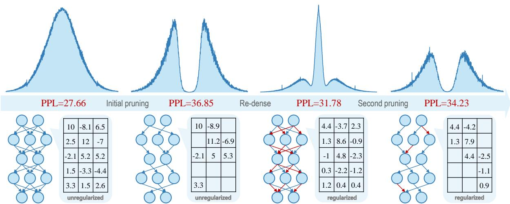
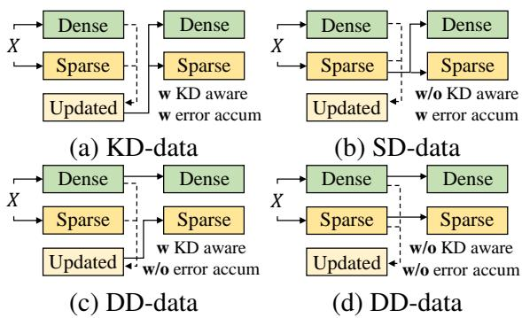
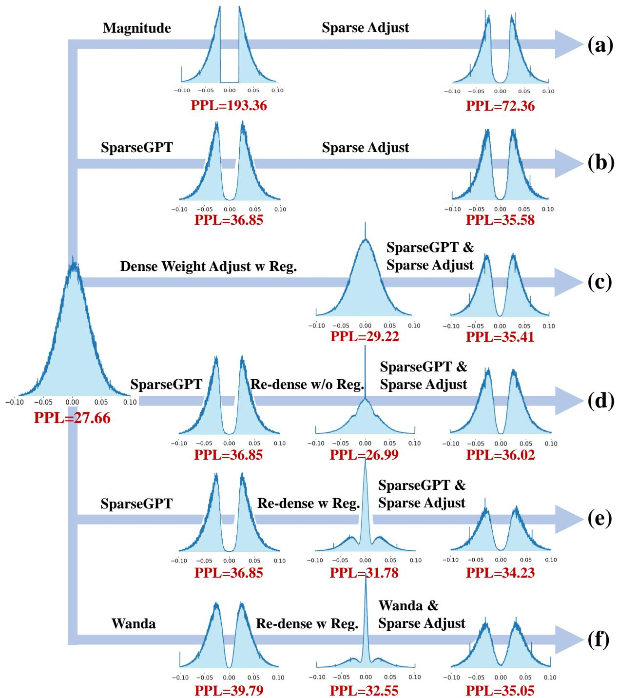
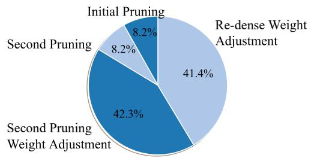

# Enhancing One-Shot Pruned Pre-trained Language Models through Sparse-Dense-Sparse Mechanism

Guanchen Li1,\*, Xiandong Zhao1,\*, Lian Liu1, Zeping Li1, Yixing Xu1, Dong Li1, Lu Tian1, Jie He2, Ashish Sirasao1, Emad Barsoum1, 1Advanced Micro Devices, Inc., 2 University of Science and Technology Beijing {guanchen.li, emad.barsoum}@amd.com

## Abstract

Pre-trained language models (PLMs) are engineered to be robust in contextual understanding and exhibit outstanding performance in various natural language processing tasks. However, their considerable size incurs significant computational and storage costs. Modern pruning strategies employ retraining-free one-shot techniques to compress PLMs; however, these approaches often lead to an indispensable reduction in performance. In this paper, we propose SDS, a Sparse-Dense-Sparse pruning framework to enhance the performance of the pruned PLMs from a weight distribution optimization perspective. We outline the pruning process in three steps. Initially, we prune less critical connections in the model using conventional oneshot pruning methods. Next, we reconstruct a dense model featuring a pruning-friendly weight distribution by reactivating pruned connections with sparse regularization. Finally, we perform a second pruning round, yielding a superior pruned model compared to the initial pruning. Experiments demonstrate that SDS outperforms the state-of-the-art pruning tech niques SparseGPT and Wanda under an identical sparsity configuration. For instance, SDS reduces perplexity by 5.16 on Raw-Wikitext2 and improves average accuracy by 3.86% across multiple zero-shot benchmarks for LLaMA-3- 8B compared to Wanda with 2:4 sparsity.

## 1 Introduction

Pre-trained language models (PLMs) (Vaswani et al., 2017) have revolutionized various applications in natural language processing. However, the considerable size of PLMs results in notable drawbacks, such as increased latency and energy consumption. Compression methods for vision models, which perform pre-training, compression, and fine-tuning workflow with quantization or pruning (Liang et al., 2021), may entail substantial time and energy costs for PLMs due to their massive training requirements.

<table><tr><td>PLM</td><td>Dense</td><td>2:4 Sparse</td><td>Re-dense</td></tr><tr><td>OPT-125M</td><td>27.66</td><td>60.43</td><td>27.94</td></tr><tr><td>OPT-350M</td><td>22.01</td><td>51.11</td><td>22.25</td></tr></table>

Table 1: Pruning PLMs Incurs Resumable Knowledge Loss. We apply 2:4 sparsity to OPTs with SparseGPT, and their performance decreases on Raw-WikiText2. However, upon layer-wise reactivating the sparse weights with only 128 samples from C4 (Subsection 2.2 provides re-dense details; note here is no sparse regularization present), a substantial performance improvement is observed.

Recent pruning research, such as SparseGPT (Frantar and Alistarh, 2023) and Wanda (Sun et al., 2023), has introduced effective one-shot compression techniques for PLMs. These methods can compress up to 50% of the parameters in the fully connected layers of over-parameterized PLMs like OPT-175B without an obvious performance drop. However, their effectiveness diminishes when applied to compact ones, which show a less pronounced redundancy. For instance, SparseGPT, the state-of-the-art pruning method, yields a perplexity of 31.58 when applied to prune 50% of the weights in OPT-350M. This score is worse than the 27.66 perplexity observed in OPT-125M, a dense model with roughly half the parameters of OPT-350M. Furthermore, when stricter sparsity constraints are employed, such as higher sparsity (60% - 80%) or semi-structured n:m sparsity (2:4, 4:8) (Mishra et al., 2021) for computational acceleration, the performance deteriorates even further. Therefore, it is essential to optimize the poorly pruned PLMs.

Macroscopically, PLMs are not designed to be aware of subsequent pruning since they lack pruning-related regularization during pre-training. As a result, pruning PLMs while maintaining their performance proves challenging.

Neurons in the human brain show sparseto-dense-to-sparse connectivity as they grow (Herculano-Houzel et al., 2010). This observation inspired us to perform a similar process to achieve a better pruning scheme that benefits from pruning friendliness. We preliminarily explored layer-wise dense reconstruction to find a performance upper bound. Intriguingly, we discovered that sparse models could bounce back to performance levels equivalent to their dense counterparts using only a few samples (cf., Table 1). It reveals two key insights: first, pruned PLMs can be optimized with limited resources; second, the amount of knowledge lost during the pruning process is restorable. These insights lay the foundation for the work presented in this paper.

We propose a three-step Sparse-Dense-Sparse (SDS) pruning framework to enhance the performance of pruned pre-trained language models. In the first step, we employ conventional one-shot pruning methods on a PLM to remove irrelevant connections. In the second step, we perform a dense reconstruction of the sparse model to reactivate the pruned connections, aiming to identify a dense model with enhanced pruning awareness. This process is aided by a multidimensional sparse regularization strategy, which optimally guides the weight distribution, rendering it more pruningfriendly for the subsequent step. In the third step, we further prune and adjust the weights of the second-pruned model. Importantly, SDS requires only a limited number of samples for calibration, identical to conventional one-shot methods. Experimental results demonstrate that SDS outperforms SparseGPT and Wanda under the same sparsity configuration. For example, SDS reduces perplexity by 5.16 on Raw-Wikitext2 and increases accuracy by an average of 3.86% across multiple zeroshot downstream tasks for LLaMA-3-8B with 2:4 sparsity compared to Wanda. The pruned PLMs achieve up to 1.87x acceleration on an AMD R7 Pro CPU. The main contributions of the paper are summarized as follows:

• We introduce SDS, a three-step Sparse-Dense-Sparse framework. It involves weight redistribution and pruning, enhancing the performance of the one-shot pruned pre-trained language models.

• We design sparse regularization strategies that improve the effectiveness of re-dense weight reconstruction and find a more pruning-friendly weight distribution.

• Experimental results demonstrate that SDS outperforms existing pruning methods in both language modeling and downstream tasks.

## 2 Sparse-Dense-Sparse Framework

This section presents the Sparse-Dense-Sparse (SDS) framework to perform optimization for pruned pre-trained language models (PLMs). Firstly, we provide a brief overview of the core Transformer architecture, which is fundamental to most PLMs. A standard Transformer block consists of two main modules: a multi-head attention (MHA) layer and a feed-forward network (FFN). Let $\mathbf { X } _ { \ell - 1 } \in \mathbb { R } ^ { d \times n }$ represent the input of the ℓ-th Transformer block, where n is the sequence length, and d is the size of the hidden state. The block output $\mathbf { X } _ { \ell }$ can be formulated as:

$$
\begin{array} { r l } & { \mathbf { X } = \mathrm { M H A } \left( \mathrm { L a y e r N o r m } \left( \mathbf { X } _ { \ell - 1 } \right) \right) + \mathbf { X } _ { \ell - 1 } , } \\ & { \mathbf { X } _ { \ell } = \mathrm { F F N } ( \mathrm { L a y e r N o r m } \left( \mathbf { X } \right) ) + \mathbf { X } . } \end{array}\tag{1}
$$

MHA consists of h heads, represented as $\mathbf { W } ^ { \mathrm { O } }$ concat(head1, head2, . . . , headh), with $\mathbf { W } ^ { \mathrm { O } }$ responsible for the output projection. Specifically, the i-th head can be expressed as:

$$
\begin{array} { r } { \mathrm { h e a d } _ { i } = \mathrm { A t t n } ( [ \mathbf { W } ^ { \mathbb { Q } } \mathbf { X } ] _ { i } , [ \mathbf { W } ^ { \mathrm { K } } \mathbf { X } ] _ { i } , [ \mathbf { W } ^ { \mathrm { V } } \mathbf { X } ] _ { i } , M ) , } \\ { \mathrm { A t t n } ( \mathbf { Q } , \mathbf { K } , \mathbf { V } , \mathbf { M } ) = \mathrm { s o f t m a x } \left( \mathbf { M } \odot \frac { \mathbf { Q } \mathbf { K } ^ { \top } } { \sqrt { d _ { \mathrm { K } } } } \right) \mathbf { V } , } \end{array}\tag{2}
$$

where Q, K, and V represent the query, key, and value sequences, respectively, and their corresponding projection weights are $\mathbf { W } ^ { \mathbf { Q } } , \mathbf { W } ^ { \mathrm { K } }$ , and $\mathbf { W } ^ { \bar { \mathbf { V } } }$ . dK is the dimension of the key vectors, and M is the mask matrix to selectively ignore or give weight to specific tokens in the input sequence. FFN expands and contracts input dimensions through hidden layers, introducing non-linearities to enhance representation learning, which consists of several fully connected layers, with their weights represented as WUp, WDown, and $\mathbf { W } ^ { \mathrm { G a t e } }$ (optional) respectively.

The SDS framework consists of three steps: initial pruning (Subsection 2.1), re-dense weight reconstruction (Subsection 2.2), and a second round of pruning (Subsection 2.3). By optimizing weight distribution through these steps, the SDS framework enhances the performance of pruned PLMs. Figure 1 provides an overview of SDS.

  
Figure 1: An Overview of the Steps of the SDS Framework, divided into initial pruning, re-dense weight reconstruction, and a second round of pruning. The upper figure shows the weight distribution variation within the SDS framework, and the lower figure demonstrates the variation in weight connections. The weights are extracted from the FFN in the 12-th transformer block of OPT-125M, with 50% sparsity configuration. Initially, the dense weights follow a Gaussian distribution. After being pruned by SparseGPT, a concentrated, bimodal distribution emerges (zero values are omitted in sparse weight distributions for better clarity). Followed by connection reconstruction with sparse regularization, a three-peaked distribution materializes. Finally, the second pruning round attenuates the sharp peaks, resulting in a softer bimodal distribution. Perplexity (PPL) is evaluated on Raw-WikiText2. The second pruned model achieves a lower perplexity than the initially pruned one.

## 2.1 Initial Pruning

The SDS framework initiates by eliminating the less critical connections in PLMs using conventional one-shot pruning methods. SparseGPT (Frantar and Alistarh, 2023) leverages second-order information to perform a weight update dependent pruning. Concretely, during column-wise pruning, SparseGPT compensates for the pruning error of the pruned columns (prior to column c) by updating the unpruned columns (subsequent to column c) of the weight matrix $( \mathbf { W } _ { : , c : } = \mathbf { W } _ { : , c : } - \Delta )$ . Wanda (Sun et al., 2023) switches the perspective to pruning mask selection and realizes weight update-free pruning by considering both weight and activation magnitude. The salience metrics and weight update rules for the two preferred pruning methods are shown in Table 2.

<table><tr><td>Method</td><td>Salience Metric</td><td>Weight Update ∆</td></tr><tr><td rowspan="2">SparseGPT</td><td>Wdense2</td><td> $\frac { \overline { { \mathbf { W } _ { : , c } ^ { \mathrm { d e n s e } } - \mathbf { W } _ { : , c } ^ { \mathrm { s p a r s e } } } } } { [ \mathbf { H } ^ { - 1 } ] _ { c , c } } \cdot [ \mathbf { H } ^ { - 1 } ] _ { c , c } .$ </td></tr><tr><td>[H−1]2,c</td><td></td></tr><tr><td>Wanda</td><td> $\mathbf { | W ^ { \mathrm { d e n s e } } | \odot \| X \| _ { 2 } }$ </td><td>- Update Free -</td></tr></table>

Table 2: Saliency Metrics and Weight Update Rules for Conventional Pruning Method.

SparseGPT and Wanda demonstrate robust performance on high-redundancy models at 100B+ scale, achieving negligible performance drop with 50% sparsity. However, its efficacy diminishes when applied to compact, lower overparameterized ones. In macro terms, the weight distribution of the pre-trained models is inappropriate for direct pruning due to the lack of sparse regularization. Thus, we take SparseGPT / Wanda as the initial step and identify a superior sparse model from the perspective of weight distribution optimization in the subsequent steps.

## 2.2 Re-dense Weight Reconstruction

Table 1 demonstrates that only a small number of calibration samples are needed to restore the performance of pruned PLMs. Thus the weights of dense models with similar performance are not unique, and we aim to find a pruning-friendly solution in the solution space of the dense model.

Concretely, we implement layer-wise knowledge distillation with the same samples as the initial pruning step to reactivate the pruned connections. By aligning layer outputs in a knowledge distillation manner without applying task-specific losses, this approach is not only parameter efficient (loading only the under-optimized layer), but also reduces biases that may arise from overfitting. We introduce three sparse regularization strategies for pruning friendliness. a) Residual sparse characteristics: the initial pruning cannot be omitted; it provides prior information about which weights are relatively important for re-dense weight reconstruction. b) Data-based regularization: higher-loss sparse-model activations are used as the inputs of re-dense weight reconstruction. Not only does such activations already contain a priori filtering of the importance of the neurons, it also avoids overfitting. c) Weight-based regularization: typical weight regularization is employed to endow the re-dense weights with sparse features and increase pruning friendliness. We choose the L1 and L2 regularization (Tibshirani, 1996; Loshchilov and Hutter, 2019) to meet the requirement.

According to the above considerations, the redense weight reconstruction process is specified in the following. Given the original dense weight $\mathbf { W } _ { \ell } ^ { \mathrm { d e n s e } }$ in layer $\ell ,$ the sparse weight $\mathbf { W } _ { \ell } ^ { \mathrm { s p a r s e } }$ from the initial pruning step, and $\mathbf { X } _ { \ell - 1 }$ collected during the forward propagation of the sparse model for data-based regularization, the re-dense weight $\widehat { \mathbf { W } } _ { \ell } ^ { \mathrm { r e - d e n s e } }$ is obtained by:

$$
\begin{array} { r l } & { L _ { \mathrm { b a s e } } ( \mathbf W _ { \ell } ^ { \mathrm { s p a r s e } } ) = \left\| \mathbf W _ { \ell } ^ { \mathrm { d e n s e } } \mathbf X _ { \ell - 1 } - \mathbf W _ { \ell } ^ { \mathrm { s p a r s e } } \mathbf X _ { \ell - 1 } \right\| _ { 2 } ^ { 2 } , } \\ & { L _ { \mathrm { r e g } } ( \mathbf W _ { \ell } ^ { \mathrm { s p a r s e } } ) = \lambda _ { 1 } \| \mathbf W _ { \ell } ^ { \mathrm { s p a r s e } } \| _ { 1 } + \lambda _ { 2 } \| \mathbf W _ { \ell } ^ { \mathrm { s p a r s e } } \| _ { 2 } , } \\ & { L _ { \mathrm { t o t a l } } ( \mathbf W _ { \ell } ^ { \mathrm { s p a r s e } } ) = L _ { \mathrm { b a s e } } ( \mathbf W _ { \ell } ^ { \mathrm { s p a r s e } } ) + L _ { \mathrm { r e g } } ( \mathbf W _ { \ell } ^ { \mathrm { s p a r s e } } ) , } \\ & { \widehat { \mathbf W } _ { \ell } ^ { \mathrm { r e - d e n s e } } = \arg \operatorname* { m i n } _ { \mathbf W _ { \ell } ^ { \mathrm { s p a r s e } } } \left( ( L _ { \mathrm { t o t a l } } ( \mathbf W _ { \ell } ^ { \mathrm { s p a r s e } } ) \right) , } \end{array}\tag{3}
$$

where $\lambda _ { 1 }$ and $\lambda _ { 2 }$ are used to control the ratio of weight-based regularization. The distribution of $\widehat { \mathbf { W } } _ { \ell } ^ { \mathrm { r e - d e n s e } }$ are shown in Figure 1. Firstly, the parameters obtained through re-dense weight reconstruction show a clear three-peaked distribution. This distribution displays a higher sharpness around zero than the original dense model, which is a terrific phenomenon. It indicates that the increased concentration of values around zero makes irrelevant weights easier to identify, a trait referred to as pruning-friendliness (Han et al., 2017). Secondly, the re-dense weight reconstruction yields a model with performance slightly below that of the original dense model but significantly better than the initial sparse model, aligning with our expectations: under the constraints of regularization, it is straightforward that the performance of the redense model struggles to maintain consistency with the pre-trained dense model. Appendix A.2 provides a detailed analysis for sparse regularization.

## 2.3 Second Pruning

Directly adjusting weights in a Sparse-to-Sparse manner seems intuitive for enhancing a sparse model’s performance; however, when applied to a model after the initial pruning stage, it only results in minor performance gains on the lightest models $( \mathrm { c f . } $ , Table 8). This approach simply introduces a first-order loss term to guide the layer-wise optimization, which is insufficient.

Considering the aforementioned challenges, we introduce sparse weight adjusting as the concluding step in the SDS framework. The re-dense model obtained with sparse regularization guidance may inevitably perform inferior to the pre-trained model. As a result, directly pruning it might not be ideal. Therefore, we perform weight adjustment for the second-pruned model. To elaborate, we first prune the re-dense model using the same method employed during the initial pruning, yielding $\mathbf { W } ^ { \mathrm { s p a r s e - } 2 \mathrm { n d } }$ . Subsequently, weight adjusting is conducted utilizing a soft sparse mask:

$$
\begin{array} { r l } & { { \cal L } _ { \mathrm { b a s e } } ( \mathbf { W } _ { \ell } ^ { \mathrm { s p a r s e - 2 n d } } ) = \left\| \mathbf { W } _ { \ell } ^ { \mathrm { d e n s e } } \mathbf { X } _ { \ell - 1 } - \mathbf { W } _ { \ell } ^ { \mathrm { s p a r s e - 2 n d } } \mathbf { X } _ { \ell - 1 } \right\| _ { 2 } ^ { 2 } , } \\ & { \widehat { \mathbf { W } } _ { \ell } ^ { \mathrm { S D S } } = \mathbf { M a s k } _ { \ell } ^ { \mathrm { s o f t } } \odot \operatorname { a r g m i n } _ { \mathbf { W } _ { \ell } ^ { \mathrm { s p a r s e - 2 n d } } } \left( { \cal L } _ { \mathrm { b a s e } } ( \mathbf { W } _ { \ell } ^ { \mathrm { s p a r s e - 2 n d } } ) \right) , } \end{array}\tag{4}
$$

where the weight alignment target is $\mathbf { W } _ { \ell } ^ { \mathrm { d e n s e } }$ instead of $\mathbf { W } _ { \ell } ^ { \mathrm { r e - d e n s e } }$ , for avoiding the inevitable loss of information in the initial pruning and re-dense process. $\mathbf { X } _ { \ell - 1 }$ is collected from the forward propagation of the second pruned model. $\mathbf { M a s k } _ { \ell } ^ { \mathrm { s o f t } }$ represents a soft sparse mask, which is dynamically selected by $| \mathbf { W } _ { \ell } ^ { \mathrm { s p a r s e - } 2 \mathrm { n d } } |$ in each iteration. Due to the inherent awareness of activation information from backpropagation, this magnitude (absmin) (Hagiwara, 1994) mask selection metric can achieve results similar to the elaborate salience metric in SparseGPT and Wanda. In both steps of weight adjustment, the L2 loss is utilized, inherently emphasizing the loss in regions with outliers (Xiao et al., 2023), which plays a pivotal role in the performance of language models. Therefore, outliers can be protected and less affected by weight adjustments. Notably, for most models above three billion parameters, it is possible to do direct oneshot pruning of the re-dense model and exceed the performance of initial pruning. At this point, we choose to early-exit, skipping the weight adjustment process and, therefore, more efficient.

As shown in Figure 1, the weights presented after the second pruning became moderate, i.e., the weight distribution of the second-pruned model is smoother and more uniform than that of the initial pruning step, which means that the model parameters have suitable values in different ranges, possessing a stronger ability to adapt to unseen data.

The process of SDS (using SparseGPT as the base pruning method as an example) is shown in Algorithm 1.

## 3 Experiments

## 3.1 Experimental Settings

Models. We utilize the widely adopted Open Pretrained Transformers (OPTs) (Zhang et al., 2022) and LLaMAs (Touvron et al., 2023a,b; Dubey et al., 2024), with focused model sizes ranging from millions to seventy billion parameters. The modules to be pruned are the computationally intensive self\_attn.q\_proj, self\_attn.k\_proj, self\_attn.v\_proj, self\_attn.out\_proj, fc1, self\_attn.up\_proj, self\_attn.gate\_proj, fc2 and self\_attn.down\_proj modules constructed from fully connected layers, which is consistent with baseline.

Calibration. For the data used in calibration, we adhere to the approach outlined in SparseGPT and Wanda, selecting 128 segments of 2048 tokens each from the initial partition of the C4 dataset (Raffel et al., 2020). The C4 dataset, sourced from a broad array of internet text, guarantees that our experiments are zero-shot, as no task-specific information is exposed during our optimization process. More analysis on calibration samples can be found in Appendix A.5.

Datasets and Evaluation. Regarding evaluation metrics, our primary emphasis is on perplexity, which remains a challenging and reliable metric well suited for evaluating the language modeling capability of compressed models (Frantar and Alistarh, 2022; Frantar et al., 2022; Yao et al., 2022). We consider the Raw-WikiText2 (Merity et al., 2017) test set for perplexity validation. To explore the impact of compression on a broad range of downstream tasks, we also provide zero-shot accuracy results for COPA (Wang et al., 2019), Lambada (Paperno et al., 2016), OpenBookQA (Mihaylov et al., 2018), PIQA (Bisk et al., 2020), RTE (Wang et al., 2018), StoryCloze (Sharma et al., 2018) and Winogrande (Sakaguchi et al., 2019).

Implementation Details. We implement the SDS framework in PyTorch (Paszke et al., 2019) and use the HuggingFace Transformers / Datasets library (Wolf et al., 2020) for managing models and datasets. We follow the conventional method (SparseGPT / Wanda) to prune the pre-trained model in the initial pruning step. In the re-dense weight reconstruction step, we use 128 samples as inputs to perform layer-wise knowledge alignment: the number of alignment epochs is 200, the learning rate is 0.1, the loss function is the L2 loss, and the regularization strategy contains L1 and L2 regularization with a ratio of 0.1. The optimization between adjacent layers is achieved by directly using the output of the initial pruned layer as the input for the next layer, eliminating the need for additional forward propagation to obtain the reconstructed layer’s output and, thereby, no accumulation of pruning errors. In the second pruning step, we use the same pruning method to prune the re-dense model and use the same configuration as in the previous step without weight regularization to further adjust the weights of the pruned model with a soft sparse mask (exit early and skip weight adjustment when secondary one-shot pruning outperforms initial pruning). The SDS framework uses the same samples throughout while ensuring that no sample is overloaded; it also coincides with the advantage of requiring just a small amount of samples.

<table><tr><td rowspan="2">PLM</td><td rowspan="2">Dense</td><td rowspan="2">Sparsity</td><td colspan="3">SDS workflow</td></tr><tr><td> $\mathbf { S } _ { \mathrm { D S } }$ </td><td> $\mathbf { s D s }$ </td><td> $\mathrm { s D } \mathbf { S }$ </td></tr><tr><td rowspan="3">OPT-125M</td><td rowspan="3">27.66</td><td>50%</td><td>36.85</td><td>31.78</td><td>34.23</td></tr><tr><td>2:4</td><td>60.43</td><td>44.46</td><td>51.30</td></tr><tr><td>4:8</td><td>44.77</td><td>37.82</td><td>41.66</td></tr><tr><td rowspan="3">OPT-350M</td><td rowspan="3">22.01</td><td>50%</td><td>31.58</td><td>24.78</td><td>29.36</td></tr><tr><td>2:4</td><td>51.11</td><td>31.58</td><td>46.23</td></tr><tr><td>4:8</td><td>39.59</td><td>26.15</td><td>34.18</td></tr><tr><td rowspan="3">OPT-1.3B</td><td></td><td>50%</td><td>17.46</td><td>17.39</td><td>17.07</td></tr><tr><td>14.62</td><td>2:4</td><td>24.34</td><td>20.00</td><td>22.67</td></tr><tr><td></td><td>4:8</td><td>20.05</td><td>18.06</td><td>19.34</td></tr></table>

Table 3: Perplexity on Raw-WikiText2 among the SDS Workflow. SDS represents the initially SparseGPT pruned baseline. SDS represents the dense model obtained in the re-dense weight reconstruction step. SDS represents the second round pruned model.

## 3.2 Performance Variations in the SDS Workflow

Table 3 presents the changes in language modeling perplexity on Raw-WikiText2 after each step of the SDS framework, with SparseGPT as the baseline pruning method and primarily covering several compact OPT models. The focus sparsity configurations include 50% sparsity, 2:4 sparsity, and 4:8 sparsity. After the re-dense step $\mathbf { \Pi } ( \mathrm { s } \mathbf { D } \mathrm { s } )$ , the perplexity significantly decreases, averaging around 28.0 across all models, which is closer to the dense models (average perplexity of 21.4), with minor performance gap mainly due to regularization effects. Following the second round of pruning (SDS), the performance improves beyond the initial pruning baseline (SDS), averaging around 32.9 compared to the initial average of 36.2. This suggests that the re-dense process successfully produces a more pruning-friendly model.

<table><tr><td rowspan="2">Sparsity</td><td rowspan="2">Method</td><td colspan="5">OPT</td><td colspan="2">LLaMA-1</td><td colspan="2">LLaMA-2</td><td rowspan="2">LLaMA-3-8B</td></tr><tr><td>125M</td><td>350M</td><td>1.3B</td><td>2.7B</td><td>6.7B</td><td>7B</td><td>13B</td><td>7B</td><td>13B</td></tr><tr><td>0%</td><td>Dense</td><td>27.66</td><td>22.01</td><td>14.62</td><td>12.47</td><td>10.86</td><td>5.68</td><td>5.09</td><td>5.47</td><td>4.88</td><td>6.14</td></tr><tr><td rowspan="4">50%</td><td>SparseGPT</td><td>36.85</td><td>31.58</td><td>17.46</td><td>13.48</td><td>11.55</td><td>7.36</td><td>6.21</td><td>6.72</td><td>6.03</td><td>9.51</td></tr><tr><td>SDS-SparseGPT</td><td>34.23</td><td>29.36</td><td>17.07</td><td>13.38</td><td>11.49</td><td>7.22</td><td>6.16</td><td>6.69</td><td>5.95</td><td>9.33</td></tr><tr><td>Wanda</td><td>39.79</td><td>41.88</td><td>18.51</td><td>14.38</td><td>11.99</td><td>7.26</td><td>6.15</td><td>6.92</td><td>5.97</td><td>9.83</td></tr><tr><td>SDS-Wanda</td><td>35.05</td><td>33.07</td><td>17.15</td><td>13.70</td><td>11.66</td><td>7.19</td><td>6.10</td><td>6.86</td><td>5.91</td><td>9.53</td></tr><tr><td rowspan="4">4:8</td><td>SparseGPT</td><td>44.77</td><td>39.59</td><td>20.05</td><td>14.98</td><td>12.56</td><td>8.72</td><td>7.43</td><td>8.49</td><td>7.01</td><td>12.49</td></tr><tr><td>SDS-SparseGPT</td><td>41.66</td><td>34.18</td><td>19.34</td><td>14.81</td><td>12.39</td><td>8.37</td><td>7.39</td><td>8.11</td><td>6.93</td><td>12.03</td></tr><tr><td>Wanda</td><td>53.97</td><td>62.49</td><td>22.33</td><td>16.80</td><td>13.59</td><td>8.57</td><td>7.41</td><td>8.61</td><td>7.00</td><td>14.56</td></tr><tr><td>SDS-Wanda</td><td>43.58</td><td>47.31</td><td>19.82</td><td>15.45</td><td>12.74</td><td>8.39</td><td>7.33</td><td>8.55</td><td>6.94</td><td>13.43</td></tr><tr><td rowspan="4">2:4</td><td>SparseGPT</td><td>60.43</td><td>51.11</td><td>24.34</td><td>17.18</td><td>14.20</td><td>11.32</td><td>9.12</td><td>10.88</td><td>8.74</td><td>17.88</td></tr><tr><td>SDS-SparseGPT</td><td>51.30</td><td>46.23</td><td>22.67</td><td>16.78</td><td>13.81</td><td>10.48</td><td>8.91</td><td>10.18</td><td>8.69</td><td>15.43</td></tr><tr><td>Wanda</td><td>82.47</td><td>113.17</td><td>28.33</td><td>21.20</td><td>15.99</td><td>11.54</td><td>9.61</td><td>12.14</td><td>8.98</td><td>24.29</td></tr><tr><td>SDS-Wanda</td><td>59.17</td><td>73.56</td><td>23.94</td><td>17.99</td><td>14.37</td><td>10.80</td><td>9.52</td><td>11.34</td><td>8.74</td><td>19.13</td></tr></table>

Table 4: Perplexity on Raw-WikiText2. SparseGPT and Wanda form the components of the SDS framework, represented as SDS-SparseGPT and SDS-Wanda, respectively.
<table><tr><td rowspan="2">Sparsity</td><td rowspan="2">Method</td><td colspan="5">OPT</td><td colspan="2">LLaMA-1</td><td colspan="2">LLaMA-2</td><td rowspan="2">LLaMA-3-8B</td></tr><tr><td>125M</td><td>350M</td><td>1.3B</td><td>2.7B</td><td>6.7B</td><td>7B</td><td>13B</td><td>7B</td><td>13B</td></tr><tr><td>0%</td><td>Dense</td><td>50.82</td><td>54.12</td><td>60.83</td><td>62.81</td><td>64.98</td><td>66.71</td><td>72.78</td><td>68.53</td><td>72.24</td><td>72.86</td></tr><tr><td rowspan="4">50%</td><td>SparseGPT</td><td>48.85</td><td>52.33</td><td>55.89</td><td>61.14</td><td>64.32</td><td>64.75</td><td>70.75</td><td>65.78</td><td>70.08</td><td>69.85</td></tr><tr><td>SDS-SparseGPT</td><td>50.80</td><td>54.51</td><td>58.42</td><td>61.78</td><td>64.96</td><td>66.16</td><td>71.26</td><td>66.98</td><td>70.41</td><td>71.48</td></tr><tr><td>Wanda</td><td>48.46</td><td>48.90</td><td>56.18</td><td>59.36</td><td>63.21</td><td>66.26</td><td>70.51</td><td>67.08</td><td>70.17</td><td>68.06</td></tr><tr><td>SDS-Wanda</td><td>49.78</td><td>51.40</td><td>57.58</td><td>60.92</td><td>64.11</td><td>66.89</td><td>71.41</td><td>67.58</td><td>71.24</td><td>69.60</td></tr><tr><td rowspan="4">4:8</td><td>SparseGPT</td><td>48.29</td><td>49.85</td><td>54.94</td><td>60.24</td><td>63.36</td><td>64.40</td><td>68.70</td><td>65.19</td><td>68.29</td><td>66.11</td></tr><tr><td>SDS-SparseGPT</td><td>49.67</td><td>52.25</td><td>57.92</td><td>61.48</td><td>64.06</td><td>65.61</td><td>69.19</td><td>66.05</td><td>68.82</td><td>67.46</td></tr><tr><td>Wanda</td><td>46.28</td><td>46.41</td><td>55.04</td><td>58.21</td><td>61.58</td><td>64.60</td><td>67.33</td><td>66.21</td><td>69.16</td><td>62.93</td></tr><tr><td>SDS-Wanda</td><td>47.70</td><td>48.61</td><td>56.12</td><td>59.91</td><td>63.71</td><td>65.65</td><td>69.39</td><td>66.42</td><td>69.64</td><td>64.83</td></tr><tr><td rowspan="4">2:4</td><td>SparseGPT</td><td>47.56</td><td>48.34</td><td>53.57</td><td>58.48</td><td>62.72</td><td>62.58</td><td>67.69</td><td>64.73</td><td>66.15</td><td>63.00</td></tr><tr><td>SDS-SparseGPT</td><td>49.59</td><td>50.50</td><td>56.67</td><td>59.96</td><td>63.21</td><td>63.22</td><td>68.11</td><td>65.43</td><td>66.63</td><td>63.19</td></tr><tr><td>Wanda</td><td>45.69</td><td>44.77</td><td>52.86</td><td>55.51</td><td>61.01</td><td>61.58</td><td>65.65</td><td>61.93</td><td>65.16</td><td>57.17</td></tr><tr><td>SDS-Wanda</td><td>47.09</td><td>46.69</td><td>54.44</td><td>58.98</td><td>63.01</td><td>63.03</td><td>65.94</td><td>63.51</td><td>66.85</td><td>61.03</td></tr></table>

Table 5: Multitasking Zero-shot Performance. Accuracy (%) was averaged over seven downstream tasks, including COPA, Lambada (OPTs and LLaMA3 only), OpenbookQA, PIQA, RTE, StoryCloze, and Winogrande.

## 3.3 Performance

Performance on Language Modeling and Zeroshot Benchmarks. We first focus on the typical sparsity configurations, including 50% sparsity for model compression and 2:4 and 4:8 sparsity for both compression and computational acceleration. The results in Tables 4 and 5 demonstrate that the SDS-enhanced models consistently outperform their baselines across all sparsity levels (Table 13 provides detailed accuracy results for each zero-shot downstream task). For instance, in the 50% sparsity setting, SDS-SparseGPT achieves a perplexity of 29.36 on OPT-350M, outperforming SparseGPT’s 31.58. At the 4:8 sparsity level, SDS-Wanda reaches an accuracy of 69.39% on LLaMA-13B, surpassing both SparseGPT and Wanda. The advantage of the SDS framework is also evident at the 2:4 sparsity level; SDS-SparseGPT achieves the lowest perplexity of 15.43 on LLaMA-3-8B, while also improving accuracy to 63.19%. These results highlight the robustness of the SDS framework in enhancing the performance of pruned PLMs across

<table><tr><td rowspan="2">Sparsity</td><td rowspan="2">Method</td><td colspan="2">OPT</td><td colspan="4">LLaMA-1</td><td colspan="3">LLaMA-2</td><td colspan="2">LLaMA-3</td></tr><tr><td>6.7B</td><td>13B</td><td>7B</td><td>13B</td><td>30B</td><td>65B</td><td>7B</td><td>13B</td><td>70B</td><td>8B</td><td>70B</td></tr><tr><td>0%</td><td>Dense</td><td>10.86</td><td>10.13</td><td>5.68</td><td>5.09</td><td>4.77</td><td>3.56</td><td>5.47</td><td>4.88</td><td>3.12</td><td>6.14</td><td>2.86</td></tr><tr><td rowspan="4">60%</td><td>SparseGPT</td><td>13.42</td><td>12.97</td><td>10.56</td><td>8.39</td><td>6.67</td><td>5.80</td><td>10.23</td><td>8.25</td><td>5.28</td><td>15.34</td><td>7.90</td></tr><tr><td>SDS-SparseGPT</td><td>13.12</td><td>12.69</td><td>10.02</td><td>8.31</td><td>6.58</td><td>5.69</td><td>9.91</td><td>8.12</td><td>5.23</td><td>14.77</td><td>7.49</td></tr><tr><td>Wanda</td><td>15.26</td><td>15.89</td><td>10.71</td><td>8.76</td><td>6.55</td><td>5.91</td><td>10.79</td><td>8.40</td><td>5.24</td><td>23.58</td><td>9.63</td></tr><tr><td>SDS-Wanda</td><td>13.95</td><td>13.12</td><td>10.11</td><td>8.67</td><td>6.41</td><td>5.84</td><td>10.35</td><td>8.32</td><td>5.18</td><td>17.83</td><td>8.21</td></tr><tr><td rowspan="4">70%</td><td>SparseGPT</td><td>20.58</td><td>19.13</td><td>27.04</td><td>19.03</td><td>12.53</td><td>10.16</td><td>27.76</td><td>19.61</td><td>9.29</td><td>41.38</td><td>15.04</td></tr><tr><td>SDS-SparseGPT</td><td>19.73</td><td>18.75</td><td>22.73</td><td>17.54</td><td>12.09</td><td>9.49</td><td>23.58</td><td>17.46</td><td>8.90</td><td>37.50</td><td>14.16</td></tr><tr><td>Wanda</td><td>168.28</td><td>48.90</td><td>84.45</td><td>54.13</td><td>17.32</td><td>15.13</td><td>75.07</td><td>46.17</td><td>10.52</td><td>126.18</td><td>25.35</td></tr><tr><td>SDS-Wanda</td><td>54.42</td><td>26.65</td><td>55.83</td><td>32.67</td><td>13.85</td><td>12.72</td><td>34.02</td><td>30.47</td><td>10.38</td><td>60.51</td><td>16.96</td></tr><tr><td rowspan="4">80%</td><td>SparseGPT</td><td>97.32</td><td>72.61</td><td>184.71</td><td>103.37</td><td>54.91</td><td>33.40</td><td>112.47</td><td>99.22</td><td>28.12</td><td>186.68</td><td>48.73</td></tr><tr><td>SDS-SparseGPT</td><td>82.19</td><td>64.64</td><td>130.08</td><td>88.76</td><td>46.64</td><td>28.56</td><td>86.25</td><td>85.64</td><td>23.47</td><td>136.65</td><td>39.96</td></tr><tr><td>Wanda</td><td>3742.93</td><td>14463.86</td><td>7649.31</td><td>3993.33</td><td>2248.03</td><td>1672.99</td><td>2738.57</td><td>1540.65</td><td>150.60</td><td>893.56</td><td>203.85</td></tr><tr><td>SDS-Wanda</td><td>1703.81</td><td>7330.33</td><td>889.77</td><td>1188.50</td><td>248.43</td><td>259.46</td><td>276.95</td><td>697.75</td><td>91.11</td><td>330.10</td><td>119.32</td></tr></table>

Table 6: Perplexity on Raw-WikiText2 under higher sparsity.

<table><tr><td rowspan="2">Sparsity</td><td rowspan="2">Method</td><td colspan="2">OPT</td><td colspan="4">LLaMA-1</td><td colspan="3">LLaMA-2</td><td colspan="2">LLaMA-3</td></tr><tr><td>6.7B</td><td>13B</td><td>7B</td><td>13B</td><td>30B</td><td>65B</td><td>7B</td><td>13B</td><td>70B</td><td>8B</td><td>70B</td></tr><tr><td>0%</td><td>Dense</td><td>64.98</td><td>66.08</td><td>66.71</td><td>72.78</td><td>73.88</td><td>74.72</td><td>68.53</td><td>72.24</td><td>75.36</td><td>72.86</td><td>76.11</td></tr><tr><td rowspan="4">60%</td><td>SparseGPT</td><td>64.09</td><td>63.03</td><td>64.41</td><td>66.83</td><td>70.35</td><td>73.06</td><td>64.34</td><td>68.51</td><td>74.85</td><td>63.95</td><td>73.14</td></tr><tr><td>SDS-SparseGPT</td><td>64.52</td><td>64.57</td><td>65.72</td><td>67.20</td><td>70.74</td><td>73.43</td><td>64.95</td><td>69.45</td><td>75.20</td><td>64.52</td><td>73.88</td></tr><tr><td>Wanda</td><td>60.36</td><td>62.14</td><td>64.62</td><td>67.13</td><td>69.69</td><td>72.90</td><td>63.31</td><td>67.99</td><td>73.55</td><td>58.97</td><td>69.33</td></tr><tr><td>SDS-Wanda</td><td>62.93</td><td>64.01</td><td>65.09</td><td>67.81</td><td>70.26</td><td>73.42</td><td>64.51</td><td>68.53</td><td>74.54</td><td>61.42</td><td>72.60</td></tr><tr><td rowspan="4">70%</td><td>SparseGPT</td><td>59.68</td><td>60.51</td><td>55.69</td><td>59.49</td><td>66.91</td><td>70.07</td><td>56.66</td><td>60.42</td><td>70.70</td><td>55.00</td><td>67.09</td></tr><tr><td>SDS-SparseGPT</td><td>60.50</td><td>61.12</td><td>57.73</td><td>60.46</td><td>67.98</td><td>70.40</td><td>57.93</td><td>60.90</td><td>71.49</td><td>56.02</td><td>67.97</td></tr><tr><td>Wanda</td><td>49.04</td><td>55.77</td><td>51.57</td><td>55.48</td><td>65.35</td><td>66.07</td><td>49.66</td><td>52.24</td><td>69.13</td><td>48.02</td><td>59.33</td></tr><tr><td>SDS-Wanda</td><td>52.73</td><td>56.27</td><td>52.51</td><td>56.38</td><td>65.89</td><td>68.50</td><td>51.50</td><td>53.84</td><td>69.43</td><td>49.03</td><td>63.53</td></tr><tr><td rowspan="4">80%</td><td>SparseGPT</td><td>51.90</td><td>53.81</td><td>49.37</td><td>50.62</td><td>54.33</td><td>56.48</td><td>48.42</td><td>49.39</td><td>59.40</td><td>47.92</td><td>54.18</td></tr><tr><td>SDS-SparseGPT</td><td>53.27</td><td>54.73</td><td>50.23</td><td>51.77</td><td>55.41</td><td>57.41</td><td>50.24</td><td>50.19</td><td>60.40</td><td>49.01</td><td>55.85</td></tr><tr><td>Wanda</td><td>47.31</td><td>47.88</td><td>47.57</td><td>48.88</td><td>49.09</td><td>48.64</td><td>47.72</td><td>48.56</td><td>49.62</td><td>48.22</td><td>48.84</td></tr><tr><td>SDS-Wanda</td><td>48.85</td><td>47.98</td><td>49.04</td><td>49.09</td><td>49.45</td><td>49.20</td><td>48.98</td><td>49.45</td><td>51.31</td><td>48.83</td><td>49.61</td></tr></table>

Table 7: Multitasking Zero-shot Performance under higher sparsity. Accuracy (%) was obtained by zero-shot evaluation and averaging over seven downstream tasks, including COPA, Lambada (OPTs and LLaMA3 only), OpenbookQA, PIQA, RTE, StoryCloze, and Winogrande.

different sparsity levels.

Higher Sparsity Performance. Higher sparsity (60%, 70%, and 80%) implies higher compression gains and increased performance drops. the SDS framework consistently outperforms baseline methods at a higher sparsity constraint, as shown in Tables 6 and 7. For instance, at 60% sparsity, SDS-SparseGPT achieves a perplexity of 12.69 and an accuracy of 64.57% on OPT-13B, outperforming SparseGPT, which records a perplexity of 12.97 and an accuracy of 63.03%. At 70% sparsity, SDS-Wanda achieves a perplexity of 16.96 on LLaMA-3-70B, considerably lower than Wanda’s perplexity of 25.35. At 80% sparsity, the performance gap widens further, with SDS-SparseGPT achieving the highest accuracy of 60.40% on LLaMA-2-70B, outperforming Wanda, which suffers from severe degradation at this level. These comparisons underscore the robustness of the SDS framework in maintaining performance under high sparsity, with its benefits becoming increasingly evident as sparsity levels rise.

In summary, our evaluations convincingly demonstrate the robustness and efficacy of the SDS framework across a variety of sparsity configurations. Both language modeling and zero-shot downstream multitask performance metrics affirm the consistent superiority of SDS over the baselines. Therefore, SDS is an efficient and effective pruning method for PLMs.

## 3.4 Ablation Study

To validate the effectiveness of the step composition and the sparse regularization of the Sparse-Dense-Sparse (SDS) framework, we conducted a series of ablation experiments as shown in Table 8. The first two rows represent the dense and sparse baseline, respectively.

Rows 3 to 5 verify the effect of only performing one-shot pruning and sparse weight adjustment.

<table><tr><td></td><td>Method</td><td>Wiki.↓</td><td>COPA↑</td><td>Lamb.↑</td><td>BookQ.↑</td><td>PIQA↑</td><td>RTE↑</td><td>Story.↑</td><td>Wino.↑</td><td>Avg acc.↑</td></tr><tr><td>1:</td><td>Dense</td><td>27.66</td><td>66</td><td>39.16</td><td>28.0</td><td>62.02</td><td>50.18</td><td>60.03</td><td>50.36</td><td>50.82</td></tr><tr><td>2:</td><td>SDS</td><td>60.43</td><td>62</td><td>27.55</td><td>25.8</td><td>57.24</td><td>53.79</td><td>55.38</td><td>51.14</td><td>47.56</td></tr><tr><td>3:</td><td>SDS w DD</td><td>58.63</td><td>62</td><td>27.03</td><td>26.0</td><td>58.11</td><td>52.35</td><td>55.25</td><td>50.75</td><td>47.36</td></tr><tr><td>4:</td><td>SDS w SD</td><td>58.56</td><td>62</td><td>20.96</td><td>26.4</td><td>58.65</td><td>51.62</td><td>56.21</td><td>50.98</td><td>46.69</td></tr><tr><td>5:</td><td>SDS w KD</td><td>56.82</td><td>63</td><td>30.04</td><td>26.2</td><td>58.76</td><td>53.79</td><td>55.63</td><td>49.64</td><td>48.15</td></tr><tr><td>6:</td><td>SDS</td><td>57.98</td><td>62</td><td>26.68</td><td>26.2</td><td>59.30</td><td>48.74</td><td>56.27</td><td>50.98</td><td>47.17</td></tr><tr><td>7:</td><td>SDS w/o WR</td><td>51.96</td><td>63</td><td>30.04</td><td>26.2</td><td>58.92</td><td>51.95</td><td>56.46</td><td>51.38</td><td>48.29</td></tr><tr><td>8:</td><td>SDS w DD</td><td>57.72</td><td>62</td><td>26.99</td><td>26.0</td><td>59.30</td><td>54.15</td><td>55.19</td><td>51.46</td><td>47.87</td></tr><tr><td>9:</td><td>SDS w KD</td><td>57.32</td><td>61</td><td>29.15</td><td>26.4</td><td>59.51</td><td>54.01</td><td>54.17</td><td>51.38</td><td>47.95</td></tr><tr><td>10:</td><td>SDS w SD</td><td>51.30</td><td>65</td><td>31.57</td><td>27.8</td><td>59.85</td><td>54.15</td><td>57.42</td><td>51.46</td><td>49.61</td></tr><tr><td>11:</td><td>SDS w MSD</td><td>52.06</td><td>64</td><td>30.35</td><td>27.0</td><td>60.01</td><td>50.18</td><td>57.16</td><td>52.57</td><td>48.75</td></tr></table>

Table 8: Comparison of Different Configurations of the SDS Framework. We compare the language understanding perplexity and accuracy of OPT-125M on eight tasks in a 2:4 sparse configuration. The gray characters represent the skipped steps; DD stands for dense data, which uses the activations generated by the dense model as inputs for weight adjustment; SD stands for sparse data, which uses the activations generated by the sparse model as inputs for weight adjustment; KD stands for KD-aware data, which uses the activations of the model after weight adjustment as inputs for the next layer of weight adjustment; WR represents weight regularization; MSD stands for multiple sparse data, which means that different samples are used for each step of the SDS process.

This approach reflects the effect of pruning in the case where the loss is formally computed instead of the "Hessian approximation". Overall, SDS was only able to outperform SparseGPT on three tasks. Comparing the different input data used in the SDS case, SDS w KD can outperform SparseGPT on seven tasks, which is considered better than choosing the other two data types. Thus it can be concluded that SDS mode has limited optimizationfor SparseGPT and selection of data with low loss (KD) is more suitablefor SDS mode than selection of data with high loss (DD or SD).

Row 6 verifies the effect of the second round pruning of the dense model after injecting it directly with sparse regularization, skipping the initial pruning, i.e. residual sparse characteristics. SDS outperforms the performance of SparseGPT on five tasks, but it does not yet reach the superior performance of SDS w SD. This observation demonstrates that residual sparse characteristics are effective.

Rows 7 to 10 verify the role of weight-based and data-based regularization in SDS, respectively. Unlike SDS, SD is a more suitable data choice for SDS, and this harder data serves the purpose of regularization while avoiding the challenge of learning hard data in multiple steps. Also, it can be argued that residual sparse characteristics and data regularization dominate in sparse regularization compared to weight regularization. Section A.3 provides an analysis from a distributional perspective.

Row 11 shows the impact of using different samples at each step of SDS. The optimization is closer to SDS w SD, but only two tasks outperform it. This indicates that SDS achieves favorable results and does not necessitate additional samples.

## 3.5 Efficiency Analysis

To illustrate the enhanced efficiency of pruned models, we present the inference speed of dense and sparse models on AMD CPU. We use the DeepSparse library (Kurtic et al., 2023) and apply 50% unstructured pruning on OPTs and LLaMAs in this experiment. Table 9 indicates that the pruned models can achieve 1.19x ∼ 1.87x speedup compared to their dense counterparts. This significant boost in inference speed underscores the critical importance of model pruning in practical applications. More efficiency analysis can be found in Appendix A.7.

## 4 Related Work

Pruning for Language Model Compression. The surging complexity of Transformer-based language models, which now feature hundreds of billions of parameters, has accentuated the urgent need for effective and efficient model pruning methods (Han et al., 2016, 2015; Hassibi et al., 1993). These pruning methods can be broadly classified into structured and unstructured approaches. Structured pruning is more hardware-friendly, as it directly prunes entire segments of weights, thereby removing consecutive computations (Ma et al., 2023; Liu et al., 2023). Unstructured pruning (sparsification) is also receiving interest, particularly as hardware advancements increasingly support the acceleration of sparse patterns such as 2:4 or 4:8 sparse (Mishra et al., 2021). Techniques such as SparseGPT (Frantar and Alistarh, 2023) extend the OBS (Hassibi et al., 1993) methodology to column-wise prune weights, allowing the modification of values in the unpruned columns to compensate for the pruning errors. Prune-and-Tune (Syed et al., 2023) enhance SparseGPT by incorporating minimal iterative task fine-tuning during the pruning process, demonstrating performance improvements at high sparsity levels. Wanda (Sun et al., 2023) introduces a simple yet effective pruning strategy that prunes weights based on their magnitudes and corresponding activations. OWL (Yin et al., 2024) considers the inhomogeneous distribution of interlayer outliers and further extends Wanda to a non-uniform sparsity distribution, achieving better performance. DS∅T (Zhang et al., 2024) and SPP (Lu et al., 2024), as tuning methods designed for sparse models, can improve the performance of pruned PLMs within limited complexity.

<table><tr><td>Model</td><td colspan="2">OPT-1.3B</td><td colspan="2">OPT-2.7B</td><td colspan="2">OPT-6.7B</td><td colspan="2">LLaMA-7B</td></tr><tr><td>Metric</td><td>Throughput</td><td>Latency</td><td>Throughput</td><td>Latency</td><td>Throughput</td><td>Latency</td><td>Throughput</td><td>Latency</td></tr><tr><td>Dense</td><td>14.1</td><td>71.19±1.5</td><td>6.9</td><td>145.17±3.1</td><td>2.9</td><td>345.39±7.1</td><td>2.3</td><td>409.98±5.5</td></tr><tr><td>Sparse</td><td>16.8</td><td>59.55±2.1</td><td>9.3</td><td>107.07±1.9</td><td>4.4</td><td>225.67±2.8</td><td>4.3</td><td>229.52±2.3</td></tr><tr><td>Speedup</td><td colspan="2">1.19x</td><td colspan="2">1.35x</td><td colspan="2">1.52x</td><td colspan="2">1.87x</td></tr></table>

Table 9: Inference Speed Comparison of Pre- and Post-pruned PLMs using DeepSparse on AMD Ryzen 7 PRO 5850U @ 1.90 GHz with batchsize = 1 and seqlen = 2048, throughput (batch/sec) and latency (ms/batch) are tested.

Weight Distribution Optimization. Various techniques have been employed to understand and optimize weight distributions in the quest for more efficient neural networks. The Dense-Sparse-Dense training method (Han et al., 2017) provides a three-step flow: an initial dense training to learn connection weights, a sparsity-inducing phase that prunes unimportant connections, and a final redense step. This process improves performance across various network architectures and underscores the importance of parameter distribution in achieving better local optima. Ji et al., 2024a treat the process of Dense-Sparse-Dense as a regularized entirety, improving the model’s cross-domain fewshot classification capability. Regularization methods serve as pivotal tools for optimizing the parameter distribution. SPDF (Thangarasa et al., 2023) adopts a language model construction paradigm of sparse pre-training and dense fine-tuning, which both introduce sparse regularization to the training process and improve the training efficiency. Dropout (Srivastava et al., 2014) is a form of ensemble learning of neural networks. It implicitly changes the parameter distribution by randomly zeroing out weights during training, encouraging a sparse representation. Yoshida and Miyato, 2017 focus on constraining the spectral norm of weights matrices to improve the generalization capabilities of neural networks. This method plays a crucial role in shaping the parameter space, making it more amenable to sparse approximations.

In this paper, the proposed Sparse-Dense-Sparse (SDS) framework first regularizes the weights into a pruning-friendly dense distribution and prunes the models, aiming to enhance the language comprehension and multitasking performance of the state-of-the-art conventional pruning methods.

## 5 Conclusion

We introduced the Sparse-Dense-Sparse (SDS) framework for optimizing pruned pre-trained language models (PLMs), consisting of initial pruning, re-dense weight reconstruction, and a second pruning round. The SDS framework focuses on weight distribution optimization and incorporates sparse regularization elements—including residual sparse characteristics, data-based regularization, and weight-based regularization. As a result, SDS not only enhances the model’s pruning friendliness but also achieves state-of-the-art pruning results. Experimental results show that SDS reduces perplexity by 5.16 on Raw-Wikitext2 and enhances accuracy by an average of 3.86% across various zero-shot benchmarks for LLaMA-3-8B compared to Wanda with a 2:4 sparsity configuration.

## References

Abhinav Bandari, Lu Yin, Cheng-Yu Hsieh, Ajay Jaiswal, Tianlong Chen, Li Shen, Ranjay Krishna, and Shiwei Liu. 2024. Is C4 dataset optimal for pruning? an investigation of calibration data for LLM pruning. In Proceedings ofthe 2024 Conference on Empirical Methods in Natural Language Processing, EMNLP 2024, Miami, FL, USA, November 12-16, 2024, pages 18089–18099. Association for Computational Linguistics.

Yonatan Bisk, Rowan Zellers, Ronan Le Bras, Jianfeng Gao, and Yejin Choi. 2020. Piqa: Reasoning about physical commonsense in natural language. In Thirty-Fourth AAAI Conference on Artificial Intelligence.

Vladimír Boza. 2024. Fast and effective weight update for pruned large language models. Trans. Mach. Learn. Res., 2024.

Peijie Dong, Lujun Li, Zhenheng Tang, Xiang Liu, Xinglin Pan, Qiang Wang, and Xiaowen Chu. 2024. Pruner-zero: Evolving symbolic pruning metric from scratch for large language models. In Forty-first International Conference on Machine Learning, ICML 2024, Vienna, Austria, July 21-27, 2024. OpenReview.net.

Abhimanyu Dubey, Abhinav Jauhri, Abhinav Pandey, Abhishek Kadian, Ahmad Al-Dahle, Aiesha Letman, Akhil Mathur, Alan Schelten, Amy Yang, Angela Fan, Anirudh Goyal, Anthony Hartshorn, Aobo Yang, Archi Mitra, Archie Sravankumar, Artem Korenev, Arthur Hinsvark, Arun Rao, Aston Zhang, Aurélien Rodriguez, Austen Gregerson, Ava Spataru, Baptiste Rozière, Bethany Biron, Binh Tang, Bobbie Chern, Charlotte Caucheteux, Chaya Nayak, Chloe Bi, Chris Marra, Chris McConnell, Christian Keller, Christophe Touret, Chunyang Wu, Corinne Wong, Cristian Canton Ferrer, Cyrus Nikolaidis, Damien Allonsius, Daniel Song, Danielle Pintz, Danny Livshits, David Esiobu, Dhruv Choudhary, Dhruv Mahajan, Diego Garcia-Olano, Diego Perino, Dieuwke Hupkes, Egor Lakomkin, Ehab AlBadawy, Elina Lobanova, Emily Dinan, Eric Michael Smith, Filip Radenovic, Frank Zhang, Gabriel Synnaeve, Gabrielle Lee, Georgia Lewis Anderson, Graeme Nail, Grégoire Mialon, Guan Pang, Guillem Cucurell, Hailey Nguyen, Hannah Korevaar, Hu Xu, Hugo Touvron, Iliyan Zarov, Imanol Arrieta Ibarra, Isabel M. Kloumann, Ishan Misra, Ivan Evtimov, Jade Copet, Jaewon Lee, Jan Geffert, Jana Vranes, Jason Park, Jay Mahadeokar, Jeet Shah, Jelmer van der Linde, Jennifer Billock, Jenny Hong, Jenya Lee, Jeremy Fu, Jianfeng Chi, Jianyu Huang, Jiawen Liu, Jie Wang, Jiecao Yu, Joanna Bitton, Joe Spisak, Jongsoo Park, Joseph Rocca, Joshua Johnstun, Joshua Saxe, Junteng Jia, Kalyan Vasuden Alwala, Kartikeya Upasani, Kate Plawiak, Ke Li, Kenneth Heafield, Kevin Stone, and et al. 2024. The llama 3 herd of models. CoRR, abs/2407.21783.

Elias Frantar and Dan Alistarh. 2022. Optimal brain compression: A framework for accurate post-training quantization and pruning. In NeurIPS.

Elias Frantar and Dan Alistarh. 2023. Sparsegpt: Massive language models can be accurately pruned in one-shot. In International Conference on Machine Learning, ICML 2023, 23-29 July 2023, Honolulu, Hawaii, USA, volume 202 of Proceedings ofMachine Learning Research, pages 10323–10337. PMLR.

Elias Frantar, Saleh Ashkboos, Torsten Hoefler, and Dan Alistarh. 2022. GPTQ: accurate post-training quantization for generative pre-trained transformers. CoRR, abs/2210.17323.

Masafumi Hagiwara. 1994. A simple and effective method for removal of hidden units and weights. Neurocomputing, 6(2):207–218.

Song Han, Huizi Mao, and William J. Dally. 2016. Deep compression: Compressing deep neural network with pruning, trained quantization and huffman coding. In 4th International Conference on Learning Representations, ICLR 2016, San Juan, Puerto Rico, May 2-4, 2016, Conference Track Proceedings.

Song Han, Jeff Pool, Sharan Narang, Huizi Mao, Enhao Gong, Shijian Tang, Erich Elsen, Peter Vajda, Manohar Paluri, John Tran, Bryan Catanzaro, and William J. Dally. 2017. DSD: dense-sparse-dense training for deep neural networks. In 5th International Conference on Learning Representations, ICLR 2017, Toulon, France, April 24-26, 2017, Conference Track Proceedings. OpenReview.net.

Song Han, Jeff Pool, John Tran, and William J. Dally. 2015. Learning both weights and connections for efficient neural network. In Advances in Neural Information Processing Systems 28: Annual Conference on Neural Information Processing Systems 2015, December 7-12, 2015, Montreal, Quebec, Canada, pages 1135–1143.

Babak Hassibi, David G. Stork, and Gregory J. Wolff. 1993. Optimal brain surgeon and general network pruning. In Proceedings of International Conference on Neural Networks (ICNN’88), San Francisco, CA, USA, March 28 - April 1, 1993, pages 293–299. IEEE.

Suzana Herculano-Houzel, Bruno Mota, Peiyan Wong, and Jon H Kaas. 2010. Connectivity-driven white matter scaling and folding in primate cerebral cortex. Proceedings of the National Academy of Sciences, 107(44):19008–19013.

Fanfan Ji, Yunpeng Chen, Luoqi Liu, and Xiao-Tong Yuan. 2024a. Cross-domain few-shot classification via dense-sparse-dense regularization. IEEE Trans. Circuits Syst. Video Technol., 34(3):1352–1363.

Yixin Ji, Yang Xiang, Juntao Li, Qingrong Xia, Ping Li, Xinyu Duan, Zhe-Feng Wang, and Min Zhang. 2024b. Beware of calibration data for pruning large language models. CoRR, abs/2410.17711.

Eldar Kurtic, Denis Kuznedelev, Elias Frantar, Michael Goin, and Dan Alistarh. 2023. Sparse fine-tuning for inference acceleration of large language models. CoRR, abs/2310.06927.

Tailin Liang, John Glossner, Lei Wang, and Shaobo Shi. 2021. Pruning and quantization for deep neural network acceleration: A survey. CoRR, abs/2101.09671.

Zichang Liu, Jue Wang, Tri Dao, Tianyi Zhou, Binhang Yuan, Zhao Song, Anshumali Shrivastava, Ce Zhang, Yuandong Tian, Christopher Ré, and Beidi Chen. 2023. Deja vu: Contextual sparsity for efficient llms at inference time. In International Conference on Machine Learning, ICML 2023, 23-29 July 2023, Honolulu, Hawaii, USA, volume 202 of Proceedings ofMachine Learning Research, pages 22137–22176. PMLR.

Ilya Loshchilov and Frank Hutter. 2019. Decoupled weight decay regularization. In 7th International Conference on Learning Representations, ICLR 2019, New Orleans, LA, USA, May 6-9, 2019. OpenReview.net.

Xudong Lu, Aojun Zhou, Yuhui Xu, Renrui Zhang, Peng Gao, and Hongsheng Li. 2024. Spp: Sparsitypreserved parameter-efficient fine-tuning for large language models. In Forty-first International Conference on Machine Learning.

Xinyin Ma, Gongfan Fang, and Xinchao Wang. 2023. Llm-pruner: On the structural pruning of large language models. CoRR, abs/2305.11627.

Stephen Merity, Caiming Xiong, James Bradbury, and Richard Socher. 2017. Pointer sentinel mixture models. In 5th International Conference on Learning Representations, ICLR 2017, Toulon, France, April 24-26, 2017, Conference Track Proceedings. Open-Review.net.

Todor Mihaylov, Peter Clark, Tushar Khot, and Ashish Sabharwal. 2018. Can a suit of armor conduct electricity? a new dataset for open book question answering. In EMNLP.

Asit K. Mishra, Jorge Albericio Latorre, Jeff Pool, Darko Stosic, Dusan Stosic, Ganesh Venkatesh, Chong Yu, and Paulius Micikevicius. 2021. Accelerating sparse deep neural networks. CoRR, abs/2104.08378.

Denis Paperno, Germán Kruszewski, Angeliki Lazaridou, Quan Ngoc Pham, Raffaella Bernardi, Sandro Pezzelle, Marco Baroni, Gemma Boleda, and Raquel Fernández. 2016. The LAMBADA dataset: Word prediction requiring a broad discourse context. CoRR, abs/1606.06031.

Adam Paszke, Sam Gross, Francisco Massa, Adam Lerer, James Bradbury, Gregory Chanan, Trevor Killeen, Zeming Lin, Natalia Gimelshein, Luca Antiga, Alban Desmaison, Andreas Köpf, Edward Z. Yang, Zachary DeVito, Martin Raison, Alykhan Tejani, Sasank Chilamkurthy, Benoit Steiner, Lu Fang, Junjie Bai, and Soumith Chintala. 2019. Pytorch: An imperative style, high-performance deep learning library. In Advances in Neural Information Processing

Systems 32: Annual Conference on Neural Information Processing Systems 2019, NeurIPS 2019, December 8-14, 2019, Vancouver, BC, Canada, pages 8024–8035.

Colin Raffel, Noam Shazeer, Adam Roberts, Katherine Lee, Sharan Narang, Michael Matena, Yanqi Zhou, Wei Li, and Peter J. Liu. 2020. Exploring the limits of transfer learning with a unified text-to-text transformer. J. Mach. Learn. Res., 21:140:1–140:67.

Keisuke Sakaguchi, Ronan Le Bras, Chandra Bhagavatula, and Yejin Choi. 2019. Winogrande: An adversarial winograd schema challenge at scale. arXiv preprint arXiv:1907.10641.

Rishi Sharma, James Allen, Omid Bakhshandeh, and Nasrin Mostafazadeh. 2018. Tackling the story ending biases in the story cloze test. In Proceedings of the 56th Annual Meeting of the Association for Computational Linguistics (Volume 2: Short Papers), pages 752–757, Melbourne, Australia. Association for Computational Linguistics.

Nitish Srivastava, Geoffrey E. Hinton, Alex Krizhevsky, Ilya Sutskever, and Ruslan Salakhutdinov. 2014. Dropout: a simple way to prevent neural networks from overfitting. J. Mach. Learn. Res., 15(1):1929– 1958.

Mingjie Sun, Zhuang Liu, Anna Bair, and J. Zico Kolter. 2023. A simple and effective pruning approach for large language models. CoRR, abs/2306.11695.

Aaquib Syed, Phillip Huang Guo, and Vijaykaarti Sundarapandiyan. 2023. Prune and tune: Improving efficient pruning techniques for massive language models. In The First Tiny Papers Track at ICLR 2023, Tiny Papers @ ICLR 2023, Kigali, Rwanda, May 5, 2023. OpenReview.net.

Vithursan Thangarasa, Abhay Gupta, William Marshall, Tianda Li, Kevin Leong, Dennis DeCoste, Sean Lie, and Shreyas Saxena. 2023. SPDF: sparse pre-training and dense fine-tuning for large language models. In Uncertainty in Artificial Intelligence, UAI 2023, July 31 - 4 August 2023, Pittsburgh, PA, USA, volume 216 of Proceedings ofMachine Learning Research, pages 2134–2146. PMLR.

Robert Tibshirani. 1996. Regression shrinkage and selection via the lasso. Journal ofthe Royal Statistical Society: Series B (Methodological), 58(1):267–288.

Hugo Touvron, Thibaut Lavril, Gautier Izacard, Xavier Martinet, Marie-Anne Lachaux, Timothée Lacroix, Baptiste Rozière, Naman Goyal, Eric Hambro, Faisal Azhar, Aurélien Rodriguez, Armand Joulin, Edouard Grave, and Guillaume Lample. 2023a. Llama: Open and efficient foundation language models. CoRR, abs/2302.13971.

Hugo Touvron, Louis Martin, Kevin Stone, Peter Albert, Amjad Almahairi, Yasmine Babaei, Nikolay Bashlykov, Soumya Batra, Prajjwal Bhargava, Shruti

Bhosale, Dan Bikel, Lukas Blecher, Cristian Canton-Ferrer, Moya Chen, Guillem Cucurull, David Esiobu, Jude Fernandes, Jeremy Fu, Wenyin Fu, Brian Fuller, Cynthia Gao, Vedanuj Goswami, Naman Goyal, Anthony Hartshorn, Saghar Hosseini, Rui Hou, Hakan Inan, Marcin Kardas, Viktor Kerkez, Madian Khabsa, Isabel Kloumann, Artem Korenev, Punit Singh Koura, Marie-Anne Lachaux, Thibaut Lavril, Jenya Lee, Diana Liskovich, Yinghai Lu, Yuning Mao, Xavier Martinet, Todor Mihaylov, Pushkar Mishra, Igor Molybog, Yixin Nie, Andrew Poulton, Jeremy Reizenstein, Rashi Rungta, Kalyan Saladi, Alan Schelten, Ruan Silva, Eric Michael Smith, Ranjan Subramanian, Xiaoqing Ellen Tan, Binh Tang, Ross Taylor, Adina Williams, Jian Xiang Kuan, Puxin Xu, Zheng Yan, Iliyan Zarov, Yuchen Zhang, Angela Fan, Melanie Kambadur, Sharan Narang, Aurélien Rodriguez, Robert Stojnic, Sergey Edunov, and Thomas Scialom. 2023b. Llama 2: Open foundation and fine-tuned chat models. CoRR, abs/2307.09288.

Ashish Vaswani, Noam Shazeer, Niki Parmar, Jakob Uszkoreit, Llion Jones, Aidan N. Gomez, Lukasz Kaiser, and Illia Polosukhin. 2017. Attention is all you need. In Advances in Neural Information Processing Systems 30: Annual Conference on Neural Information Processing Systems 2017, December 4-9, 2017, Long Beach, CA, USA, pages 5998–6008.

Alex Wang, Yada Pruksachatkun, Nikita Nangia, Amanpreet Singh, Julian Michael, Felix Hill, Omer Levy, and Samuel Bowman. 2019. Superglue: A stickier benchmark for general-purpose language understanding systems. In Advances in Neural Information Processing Systems, volume 32. Curran Associates, Inc.

Alex Wang, Amanpreet Singh, Julian Michael, Felix Hill, Omer Levy, and Samuel Bowman. 2018. GLUE: A multi-task benchmark and analysis platform for natural language understanding. In Proceedings of the 2018 EMNLP Workshop BlackboxNLP: Analyzing and Interpreting Neural Networks for NLP, pages 353–355, Brussels, Belgium. Association for Computational Linguistics.

Miles Williams and Nikolaos Aletras. 2024. On the impact of calibration data in post-training quantization and pruning. In Proceedings of the 62nd Annual Meeting of the Association for Computational Linguistics (Volume 1: Long Papers), ACL 2024, Bangkok, Thailand, August 11-16, 2024, pages 10100–10118. Association for Computational Linguistics.

Thomas Wolf, Lysandre Debut, Victor Sanh, Julien Chaumond, Clement Delangue, Anthony Moi, Pierric Cistac, Tim Rault, Rémi Louf, Morgan Funtowicz, Joe Davison, Sam Shleifer, Patrick von Platen, Clara Ma, Yacine Jernite, Julien Plu, Canwen Xu, Teven Le Scao, Sylvain Gugger, Mariama Drame, Quentin Lhoest, and Alexander M. Rush. 2020. Transformers: State-of-the-art natural language processing. In Proceedings ofthe 2020 Conference on Empirical Methods in Natural Language Processing: System Demon-

strations, EMNLP 2020 - Demos, Online, November 16-20, 2020, pages 38–45. Association for Computational Linguistics.

Guangxuan Xiao, Ji Lin, Mickaël Seznec, Hao Wu, Julien Demouth, and Song Han. 2023. Smoothquant: Accurate and efficient post-training quantization for large language models. In International Conference on Machine Learning, ICML 2023, 23-29 July 2023, Honolulu, Hawaii, USA, volume 202 of Proceedings ofMachine Learning Research, pages 38087–38099. PMLR.

Zhewei Yao, Reza Yazdani Aminabadi, Minjia Zhang, Xiaoxia Wu, Conglong Li, and Yuxiong He. 2022. Zeroquant: Efficient and affordable post-training quantization for large-scale transformers. In NeurIPS.

Lu Yin, You Wu, Zhenyu Zhang, Cheng-Yu Hsieh, Yaqing Wang, Yiling Jia, Gen Li, AJAY KUMAR JAISWAL, Mykola Pechenizkiy, Yi Liang, et al. 2024. Outlier weighed layerwise sparsity (owl): A missing secret sauce for pruning llms to high sparsity. In Forty-first International Conference on Machine Learning.

Yuichi Yoshida and Takeru Miyato. 2017. Spectral norm regularization for improving the generalizability of deep learning. CoRR, abs/1705.10941.

Susan Zhang, Stephen Roller, Naman Goyal, Mikel Artetxe, Moya Chen, Shuohui Chen, Christopher Dewan, Mona T. Diab, Xian Li, Xi Victoria Lin, Todor Mihaylov, Myle Ott, Sam Shleifer, Kurt Shuster, Daniel Simig, Punit Singh Koura, Anjali Sridhar, Tianlu Wang, and Luke Zettlemoyer. 2022. OPT: open pre-trained transformer language models. CoRR, abs/2205.01068.

Yuxin Zhang, Lirui Zhao, Mingbao Lin, Yunyun Sun, Yiwu Yao, Xingjia Han, Jared Tanner, Shiwei Liu, and Rongrong Ji. 2024. Dynamic sparse no training: Training-free fine-tuning for sparse llms. In The Twelfth International Conference on Learning Representations, ICLR 2024, Vienna, Austria, May 7-11, 2024. OpenReview.net.

## A Appendix A.1 The sparse-dense-sparse framework

Algorithm 1 The Sparse-Dense-Sparse (SDS) Framework   
Input: Pre-trained dense model $\mathbb { W } ^ { \mathrm { d e n s e } } = \{ \mathbf { W } _ { 1 } ^ { \mathrm { d e n s e } } , \mathbf { W } _ { 2 } ^ { \mathrm { d e n s e } } , . . . , \mathbf { W } _ { L } ^ { \mathrm { d e n s e } } \}$   
Output: Final pruned model $\widehat { \mathbb { W } } ^ { \mathrm { S D S } } = \{ \widehat { \mathbf { W } } _ { 1 } ^ { \mathrm { S D S } } , \widehat { \mathbf { W } } _ { 2 } ^ { \mathrm { S D S } } , . . . , \widehat { \mathbf { W } } _ { L } ^ { \mathrm { S D S } } \}$   
- Initial Pruning -   
Require: Original unlabeled samples $\mathbf { X } ;$ sparsity   
for each $\mathbf { W } ^ { \mathrm { d e n s e } }$ in ${ \mathbb { W } } ^ { \mathrm { d e n s e } }$ do   
$\mathbf { W } ^ { \mathrm { s p a r s e } } = \mathrm { e m p t y } ( \mathbf { W } ^ { \mathrm { d e n s e } } )$   
$\mathbf { H } = \mathbf { X } \mathbf { X } ^ { \top }$   
for $c = 1$ to column $\mathbf { \mathcal { \mathbf { \mu } } } _ { \mathrm { - } } \mathrm { s i z e } ( \mathbf { W } ^ { \mathrm { d e n s e } } )$ do   
$s = \mathrm { s o r t } \left( \frac { \mathbf { W } _ { : , c } ^ { \mathrm { d e n s e } ^ { 2 } } } { [ \mathbf { H } ^ { - 1 } ] _ { c , c } ^ { 2 } } \right)$   
$\mathbf { M } = \mathbb { 1 } \stackrel { \cdot } { ( } s ^ { \cdot } > \mathrm { s p a r s i t y ) }$   
$\mathbf { W } _ { : , c } ^ { \mathrm { s p a r s e } } = \mathbf { M } _ { : , c } \odot \mathbf { W } _ { : , c } ^ { \mathrm { d e n s } }$ e ▷ Prune one column with mask M   
$\begin{array} { r } { \mathbf { W } _ { : , c + 1 : } ^ { \mathrm { d e n s e } } = \mathbf { W } _ { : , c + 1 : } ^ { \mathrm { d e n s e } } - \frac { \mathbf { W } _ { : , c } ^ { \mathrm { d e n s e } } - \mathbf { W } _ { : , c } ^ { \mathrm { s p a r s e } } } { [ \mathbf { H } ^ { - 1 } ] _ { c , c } } \cdot [ \mathbf { H } ^ { - 1 } ] _ { c , c } . } \end{array}$ ▷ Error Compensation   
end for   
$\mathbf { X } \gets \mathbf { W } ^ { \mathrm { s p a r s e } } \mathbf { X }$ ▷ Error Accumulation   
end for   
- - Re-dense Weight Reconstruction -   
Require: Pre-trained dense model $\mathbb { W } ^ { \mathrm { d e n s e } } = \{ \mathbf { W } _ { 1 } ^ { \mathrm { d e n s e } } , \dots , \mathbf { W } _ { L } ^ { \mathrm { d e n s e } } \} ;$   
Initial pruned sparse model $\mathbb { W } ^ { \mathrm { s p a r s e } } = \{ \mathbf { \dot { W } } _ { 1 } ^ { \mathrm { s p a r s e } } , \dots , \mathbf { \tilde { W } } _ { L } ^ { \mathrm { s p a r s e } } \}$   
Original unlabeled samples $\mathbf { X } ;$ Learning rate $\eta ;$   
L1 regularization ratio $\lambda _ { \mathrm { 1 } } ; \mathrm { L } 2$ regularization ratio $\lambda _ { 2 }$   
for $\ell = 1$ to L do   
while not converged do   
$\mathbf { W } _ { \ell } ^ { \mathrm { r e - d e n s e } ( t ) } = \mathbf { \widetilde { W } } _ { \ell } ^ { \mathrm { r e - d e n s e } ( t - 1 ) } - \eta \nabla \left\| \mathbf { W } _ { \ell } ^ { \mathrm { d e n s e } } \mathbf { X } - \mathbf { W } _ { \ell } ^ { \mathrm { r e - d e n s e } ( t - 1 ) } \mathbf { X } \right\| _ { 2 } ^ { 2 }$   
$- \eta \lambda _ { 1 } \nabla \left\| \mathbf { W } _ { \ell } ^ { \mathrm { r e - d e n s e } ( t - 1 ) } \right\| _ { 1 } - \eta \lambda _ { 2 } \nabla \left\| \mathbf { W } _ { \ell } ^ { \mathrm { r e - d e n s e } ( t - 1 ) } \right\| _ { 2 } ^ { 2 }$   
end while   
$\mathbf { X } \gets \mathbf { W } _ { \ell } ^ { \mathrm { s p a r s e } } \mathbf { X }$ ▷ Error Accumulation   
end for   
- - Second pruning: sparse weight adjustment - -   
Require: Pre-trained dense model $\bar { \mathbb { W } } ^ { \mathrm { d e n s e } } = \{ \bar { \mathbf { W } } _ { 1 } ^ { \mathrm { d e n s e } } , \dots , \mathbf { W } _ { L } ^ { \mathrm { d e n s e } } \} ;$   
Re-dense trained model Wre-dense = {Wre-dense, $\bar { \bf W } _ { L } ^ { \mathrm { r e - d e n s e } } \}$   
Original unlabeled samples $\mathbf { X } ;$   
Learning rate $\eta ;$   
Sparsity   
Repeat the pruning process and yield Wsparse-2nd = $\{ \mathbf { W } _ { 1 } ^ { \mathrm { s p a r s e - 2 n d } } , . . . , \mathbf { W } _ { L } ^ { \mathrm { s p a r s e - 2 n d } } \}$   
for $\ell = 1$ to L do   
while not converged do   
s = sort $\left( \left| \mathbf { \check { W } } _ { \ell } ^ { \mathrm { S D S } ( t ) } \right| \right)$   
$\mathbf { M } = \mathbb { 1 } \left( s \right) \mathbf { \ddot { \alpha } }$ sparsity)   
$\mathbf { W } _ { \ell } ^ { \mathrm { S D S } ( t ) } = \mathbf { M } \odot \left( \mathbf { W } _ { \ell } ^ { \mathrm { S D S } ( t - 1 ) } - \eta \nabla \left. \mathbf { W } _ { \ell } ^ { \mathrm { d e n s e } } \mathbf { X } - \mathbf { W } _ { \ell } ^ { \mathrm { S D S } ( t - 1 ) } \mathbf { X } \right. _ { 2 } ^ { 2 } \right)$   
end while   
$\mathbf { X }  \mathbf { W } _ { \ell } ^ { \mathrm { s p a r s e - 2 n d } } \mathbf { X }$ ▷ Error Accumulation   
end for

## A.2 Error Accumulation and Data-based Regularization

  
Figure 2: Four Data Selection Paradigms in Weight Adjustment. Straight lines represent forward propagation and dashed lines represent knowledge distillation.

The input data used in weight adjustment can be categorized in two ways: whether to perform error accumulation and whether to be aware of the knowledge distillation (KD) process. Figure 2 presents four different data selection patterns for weight adjustment.

(a) Weight adjustment with KD aware and error accumulation, this paradigm corresponds to KDdata in our ablation study (cf., Subsection 3.4): after applying KD to the sparse layer, a subsequent forward propagation is needed to generate inputs for the next layer. These inputs are solely based on the former layer’s outputs, thus accumulating errors. Since KD aims to reduce loss, this extra forward propagation simplifies the data, making it easier for the subsequent layer to learn. (b) Weight adjustment with error accumulation but without KD aware, this paradigm corresponds to SD-data in our ablation study: unlike paradigm (a), this approach abandons the additional forward propagation to account for changes in the layer updated by KD. This results in the next layer of learning from data corresponding to a higher loss, making learning more challenging than in paradigm (a). KD-data and SD-data, which use sparse model activations as inputs, further provide a priori on the importance of the parameters. (c) and (d) are two ways of adjusting the weights without accumulating errors. The presence or absence of KD awareness has a minimal impact on either, as the optimization direction is constrained by the dense model in both cases. The DD-data paradigm in our ablation study employs paradigm (d).

From the perspective of data difficulty, DD-data is the most difficult because it requires each layer to compensate for the errors accumulated in all previous layers. This difficulty is more prominent in the KD process under sparsity constraints. In the ablation study (cf., Subsection 3.4), the optimization of the sparse model using DD-data cannot achieve the best results, verifying the above observation. KD-data is the easiest because the weights of the sparse model are updated in the direction of lower loss during knowledge distillation. The use of KD-data has yielded relatively good results only in single-step optimization of the sparse model due to the fact that simple data carries less data regularization and a relatively low upper bound for optimization. SD-data is relatively moderate in difficulty and comes with sparse regularization and hence achieved an ideal result in SDS’s optimization of the sparse model. The reason why SD-data did not achieve an ideal result in the single-step optimization could be the challenge of the difficult data.

## A.3 Distribution Analysis

Figure 3 visualizes the impact of several pertinent optimizations performed on pruned PLMs from the perspective of weight distribution changes.

Magnitude-based one-shot pruning method is ineffective on PLMs primarily because it focuses only on the absolute value of the weights. This simplistic approach tends to create a truncated bimodal distribution of the model weights, concentrating them at extreme positive and negative values. Distribution truncation can lead to model instability, as removing near-zero weights disrupts the model’s ability to make subtle, nuanced adjustments. Due to the large amount of information lost in the pruning process, the model’s performance can only be recovered to a limited extent after weight adjustment. In contrast, modern pruning methods like SparseGPT take into account higher-order rather than zero-order information, which manages to maintain an untruncated bimodal distribution similar to what magnitude pruning plus subsequent weight adjustment would achieve. However, they do it in a single step and are able to achieve better performance.

As shown in Figure 3b, the model has a relatively sharp bimodal peak in its distribution after being pruned by SparseGPT, which challenges the model’s generalization ability, optimization space and stability. Direct adjustment of the pruned model’s weights yields limited performance and optimization of the weight distribution. Therefore, it is necessary to consider the SDS process.

  
Figure 3: Changes in Distributions During Optimization of Pruned PLMs. The distribution observations are from the last layer of OPT-125m with 50% pruning. (a) represents the process of first pruning the model by magnitude (absmin) (Hagiwara, 1994) and then optimizing the pruned model using SD-data. (b) represents the SDS w KD in the ablation study (cf., Subsection 3.4). (c) represents the SDS. (d) represents the SDS w KD. (e) represents the SDS w SD. (f) represents the SDS w SD and with Wanda as the pruning method. Zero values are omitted in sparse weight distributions for better clarity.

Before attempting the SDS process, Figure 3c and Figure 3d show the trend of weight distribution changes for only injecting regular regularization or residual sparse characteristics into the model, respectively. Both find a new dense solution to some extent: a dense model with a smoother distribution and more zeros can be found by using data-based regularization and weight-based regularization for dense weight adjustment, and a dense model that converges to a multi-peaked distribution with more zeros is obtained after re-dense reconstruction of the sparse model without regular regularization. After a second round of pruning, both approaches lead to a recovery in the model’s performance. However, they are not as effective as the SDS process that uses a combination of data-based regularization, weight-based regularization, and residual sparse characteristics, as shown in Figure 3e and Figure 3f. This illustrates the effectiveness and mutual reinforcement effect of regularization techniques in the SDS framework. An interesting phenomenon is that when regular regularization is not used, it is possible to reconstruct the pruned model to equal or even higher performance than the pre-trained dense model. This is perhaps due to the absence of regularization techniques, which allowed the re-dense model to overfit the behavior of the pre-trained dense model. The limited performance improvement of the re-dense model after a second round of pruning also supports the above deduction.

<table><tr><td>Model</td><td colspan="2">OPT-1.3B</td><td colspan="2">OPT-2.7B</td><td colspan="2">OPT-6.7B</td><td colspan="2">LLaMA(1&amp;2)-7B</td></tr><tr><td>Metric</td><td>Throughput</td><td>Latency</td><td>Throughput</td><td>Latency</td><td>Throughput</td><td>Latency</td><td>Throughput</td><td>Latency</td></tr><tr><td>Dense</td><td>29.5</td><td>29.56±0.9</td><td>14.7</td><td>68.03±0.8</td><td>5.5</td><td>181.21±0.9</td><td>5.3</td><td>189.83±0.7</td></tr><tr><td>Sparse</td><td>39.1</td><td>33.88±0.8</td><td>22.9</td><td>43.65±0.5</td><td>11</td><td>90.65±0.9</td><td>12.4</td><td>80.75±0.6</td></tr><tr><td>Speedup</td><td colspan="2">1.33x</td><td colspan="2">1.56x</td><td colspan="2">2.0x</td><td colspan="2">2.34x</td></tr></table>

Table 10: Inference Speed Comparison of Pre- and Post-pruned PLMs using DeepSparse on Intel(R) Xeon(R) Platinum 8372C CPU @ 3.20GHz with batchsize = 1 and seqlen = 2048, throughput (batch/sec) and latency (ms/batch) are tested.

## A.4 SDS Steadily Optimizes Multiple Pruning Methods

<table><tr><td rowspan="2">Method</td><td colspan="3">PPL ↓ (Dense: 6.14)</td><td colspan="3">ACC. ↑ (Dense: 72.86)</td></tr><tr><td>2:4</td><td>4:8</td><td>70%</td><td>2:4</td><td>4:8</td><td>70%</td></tr><tr><td>SparseGPT</td><td>17.88</td><td>12.49</td><td>41.38</td><td>63.00</td><td>66.11</td><td>55.00</td></tr><tr><td>SDS-SparseGPT</td><td>15.43</td><td>12.03</td><td>37.50</td><td>63.19</td><td>67.46</td><td>56.02</td></tr><tr><td>Wanda</td><td>24.29</td><td>14.56</td><td>126.18</td><td>57.17</td><td>62.93</td><td>48.02</td></tr><tr><td>SDS-Wanda</td><td>19.13</td><td>13.43</td><td>60.51</td><td>61.03</td><td>64.83</td><td>49.03</td></tr><tr><td>Admm</td><td>13.71</td><td>10.56</td><td>29.39</td><td>62.48</td><td>64.56</td><td>55.30</td></tr><tr><td>SDS-Admm</td><td>13.59</td><td>10.49</td><td>26.94</td><td>63.53</td><td>65.23</td><td>55.88</td></tr><tr><td>Zero</td><td>22.99</td><td>12.98</td><td>260.21</td><td>59.15</td><td>62.95</td><td>48.62</td></tr><tr><td>SDS-Zero</td><td>16.47</td><td>11.51</td><td>69.38</td><td>61.86</td><td>64.22</td><td>50.05</td></tr><tr><td>DS∅T</td><td>21.97</td><td>14.01</td><td>119.35</td><td>59.26</td><td>63.27</td><td>48.32</td></tr><tr><td>SDS-DS∅T</td><td>17.28</td><td>12.64</td><td>57.60</td><td>61.89</td><td>64.17</td><td>49.82</td></tr></table>

Table 11: SDS Steadily Optimizes Multiple Pruning Methods on LLaMA-3-8B. The performance of various pruning methods, including AdmmPruner (Admm), PrunerZero (Zero), and DS∅T (with Wanda as the base pruning method), is validated with and without SDS optimization. The results show that SDS consistently improves both perplexity (PPL) and accuracy (ACC., averaged across COPA, Lambada, OpenbookQA, PIQA, RTE, StoryCloze, and Winogrande), demonstrating its effectiveness and generalizability in optimizing a wide range of pruning methods.

Table 11 demonstrates that SDS has a significant optimizing effect on a wide range of pruning methods, including AdmmPruner (Boza, 2024), PrunerZero (Dong et al., 2024), and even the postpruning fine-tuning method DS∅T (Zhang et al., 2024). For instance, AdmmPruner achieves a low PPL of 29.39 after 70% pruning, yet SDS further enhances its post-pruning accuracy, reducing the PPL to 26.94. The consistent improvements across diverse methods highlight SDS’s strong generalizability. SDS is a versatile optimization technique that improves performance across various models and pruning strategies.

## A.5 SDS Steadily Optimizes Pruning Effect with Different Calibration Samples

Some works (Williams and Aletras, 2024; Ji et al., 2024b; Bandari et al., 2024) have found that calibration samples affect language model compression. Here we try different calibration datasets to verify the effect of calibration sample variation on SDS optimization effect, as shown in Table 12.

<table><tr><td rowspan="2">Calibration</td><td rowspan="2">Method</td><td colspan="2">PPL ↓ (Dense: 6.14)</td><td colspan="2">ACC. ↑ (Dense: 72.86)</td></tr><tr><td>2:4</td><td>4:8</td><td>2:4</td><td>4:8</td></tr><tr><td rowspan="4">C4</td><td>SparseGPT</td><td>17.88</td><td>12.49</td><td>63.00</td><td>66.11</td></tr><tr><td>SDS-SparseGPT</td><td>15.43</td><td>12.03</td><td>63.19</td><td>67.46</td></tr><tr><td>Wanda</td><td>24.29</td><td>14.56</td><td>57.17</td><td>62.93</td></tr><tr><td>SDS-Wanda</td><td>19.13</td><td>13.43</td><td>61.03</td><td>64.83</td></tr><tr><td rowspan="4">Wiki2</td><td>SparseGPT</td><td>12.26</td><td>9.88</td><td>62.35</td><td>65.80</td></tr><tr><td>SDS-SparseGPT</td><td>11.31</td><td>9.20</td><td>63.01</td><td>66.93</td></tr><tr><td>Wanda</td><td>21.58</td><td>13.37</td><td>56.87</td><td>61.67</td></tr><tr><td>SDS-Wanda</td><td>17.57</td><td>12.19</td><td>61.14</td><td>64.32</td></tr><tr><td rowspan="4">Pile</td><td>SparseGPT</td><td>18.71</td><td>13.66</td><td>63.10</td><td>66.08</td></tr><tr><td>SDS-SparseGPT</td><td>15.89</td><td>12.79</td><td>63.32</td><td>67.55</td></tr><tr><td>Wanda</td><td>24.97</td><td>14.88</td><td>57.29</td><td>63.22</td></tr><tr><td>SDS-Wanda</td><td>18.88</td><td>14.15</td><td>60.94</td><td>65.01</td></tr></table>

Table 12: SDS Steadily Optimizes Pruning Effort with Different Calibration Samples on LLaMA-3- 8B. The results show that SDS consistently improves both perplexity (PPL) and accuracy (ACC., averaged across COPA, Lambada, OpenbookQA, PIQA, RTE, StoryCloze, and Winogrande) regardless of the calibration dataset chosen, demonstrating the robustness of SDS to calibration samples.

The results show that SDS improves both perplexity (PPL) and accuracy (ACC.) on LLaMA-

<table><tr><td>Sparsity</td><td>Method</td><td>PPL</td><td>Lamb.</td><td>COPA</td><td>BookQ</td><td>PIQA</td><td>RTE</td><td>Story.</td><td>WinoG.</td><td>Acc AVG</td></tr><tr><td>0</td><td></td><td>6.14</td><td>75.55</td><td>89.00</td><td>45.00</td><td>80.90</td><td>67.51</td><td>78.87</td><td>73.16</td><td>72.86</td></tr><tr><td rowspan="4">50%</td><td>SparseGPT</td><td>9.51</td><td>74.18</td><td>88.00</td><td>43.00</td><td>78.07</td><td>59.84</td><td>75.62</td><td>70.27</td><td>69.85</td></tr><tr><td>SDS-SparseGPT</td><td>9.33</td><td>74.50</td><td>91.00</td><td>41.40</td><td>77.04</td><td>69.31</td><td>76.56</td><td>70.56</td><td>71.48</td></tr><tr><td>Wanda</td><td>9.83</td><td>72.62</td><td>84.00</td><td>40.00</td><td>76.82</td><td>58.84</td><td>73.01</td><td>71.11</td><td>68.06</td></tr><tr><td>SDS-Wanda</td><td>9.53</td><td>76.50</td><td>88.00</td><td>40.80</td><td>77.20</td><td>59.93</td><td>73.65</td><td>71.82</td><td>69.60</td></tr><tr><td rowspan="4">4:8</td><td>SparseGPT</td><td>12.49</td><td>70.18</td><td>82.00</td><td>36.40</td><td>74.76</td><td>58.12</td><td>72.18</td><td>68.14</td><td>67.11</td></tr><tr><td>SDS-SparseGPT</td><td>12.03</td><td>70.77</td><td>86.00</td><td>36.40</td><td>74.54</td><td>62.45</td><td>73.77</td><td>68.27</td><td>67.46</td></tr><tr><td>Wanda</td><td>14.56</td><td>63.05</td><td>81.00</td><td>35.20</td><td>72.36</td><td>53.07</td><td>69.19</td><td>66.61</td><td>62.93</td></tr><tr><td>SDS-Wanda</td><td>13.43</td><td>68.68</td><td>85.00</td><td>35.00</td><td>73.12</td><td>52.71</td><td>71.29</td><td>68.03</td><td>64.83</td></tr><tr><td rowspan="4">2:4</td><td>SparseGPT</td><td>17.88</td><td>64.62</td><td>82.00</td><td>35.20</td><td>71.76</td><td>53.07</td><td>70.53</td><td>63.85</td><td>63.00</td></tr><tr><td>SDS-SparseGPT</td><td>15.43</td><td>65.22</td><td>82.00</td><td>33.20</td><td>71.76</td><td>54.15</td><td>70.66</td><td>65.35</td><td>63.19</td></tr><tr><td>Wanda</td><td>24.29</td><td>45.95</td><td>76.00</td><td>32.00</td><td>68.28</td><td>52.71</td><td>64.86</td><td>60.38</td><td>57.17</td></tr><tr><td>SDS-Wanda</td><td>19.13</td><td>58.59</td><td>79.00</td><td>32.80</td><td>70.02</td><td>57.04</td><td>67.54</td><td>62.19</td><td>61.03</td></tr></table>

Table 13: Detailed Zero-Shot Results on LLaMA-3-8B. SDS outperforms baselines on most individual zero-shot downstream tasks, demonstrating higher accuracy and strong generalizability.

3-8B. At 2:4 sparsity, on the C4 dataset, SDS-SparseGPT reduces PPL from 17.88 to 15.43 and increases accuracy from 63.00 to 63.19. On Pile, it lowers PPL from 18.71 to 15.89 and boosts accuracy from 63.10 to 63.32. These results highlight SDS’s effectiveness in optimizing pruning across different calibration datasets.

## A.6 Detailed Zero-Shot Downstream Results

Table 13 provides a detailed breakdown of the zeroshot accuracy on individual downstream tasks for LLaMA-3-8B. SDS consistently outperforms baseline methods across various pruning strategies. For example, at 50% sparsity, SDS-SparseGPT achieves a lower perplexity of 9.33 compared to the baseline’s 9.51, while improving accuracy on tasks like COPA from 88.00 to 91.00 and on RTE from 59.84 to 69.31. Similarly, SDS-Wanda shows improvements at 2:4 sparsity, reducing perplexity from 24.29 to 19.13, and boosting accuracy on tasks such as StoryCloze from 60.38 to 62.19. These results demonstrate that SDS enhances performance across multiple zero-shot downstream tasks, highlighting its effectiveness in optimizing pruning methods while ensuring strong generalizability.

## A.7 SDS Efficiency Analysis

Table 10 further illustrate the enhanced efficiency of pruned pre-trained language models (PLMs) on CPUs. This table meticulously enumerates the inference latency improvements of PLMs subjected to 50% unstructured pruning on Intel CPU. The results indicate that the pruned models can achieve a maximum speed increase of up to 2.3 times compared to their unpruned, dense counterparts. This significant boost in inference speed underscores the critical importance of model pruning in efficiency increase.

Tables 14 and 15 respectively display the kernellevel speedup ratio and the end-to-end level speedup ratio for the entire network, both achieved through the utilization of semi-structured sparse matrix multiplication (SpMM) kernels supported by the CUTLASS library on NVIDIA Ampere and newer GPUs. These findings indicate that operations using sparse matrices can surpass the efficiency of dense operations, achieving more than a twofold increase in speed. Furthermore, even when considering the broader context of end-toend speedups, the pruned model is observed to outperform the dense model, with potential speed enhancements reaching up to 1.2 times without other optimization. This data underscores the tangible advantages of pruning methodologies, particularly in contexts where computational resources are constrained.

<table><tr><td>Weight</td><td>Q/K/V/Out</td><td>Up/Gate/FC1</td><td>Down/FC2</td></tr><tr><td>Dense</td><td>1.574</td><td>9.956</td><td>12.705</td></tr><tr><td>Sparse</td><td>1.077</td><td>6.026</td><td>6.002</td></tr><tr><td>Speedup</td><td>1.46x</td><td>1.65x</td><td>2.12x</td></tr></table>

Table 14: CUTLASS 2:4 Sparse Kernel Speedup on NVIDIA A100 PCIe 40GB with seqlen = 1024 and hidden\_size = 12288, latency (ms) tested.

Execution Efficiency of the SDS Framework. Table 16 demonstrates the time required to perform SDS optimization (no consideration of early exit scenarios, c.f., Subsection 2.3). The time consumption for layer-serial SDS optimization using a single NVIDIA V100 32GB GPU ranges from 3 to 25 hours as the model grows larger. Since SDS optimization uses SD-data (cf., Section A.2), which is available in advance, and SDS does not need to perform an additional forward propagation for each optimized layer, each layer in the network can perform optimization in parallel. On eight V100 GPUs, we optimize layers within individual GPUs serially and layers between GPUs in parallel, so it only took us from 26 minutes to 3 hours to perform the SDS optimization. Figure 4 shows the wall-clock running time of SDS-SparseGPT on LLaMA-7B and its detailed time decomposition.

<table><tr><td rowspan="2">Batchsize</td><td colspan="3">OPT-1.3B</td><td colspan="3">OPT-2.7B</td><td colspan="3">LLaMA-7B</td></tr><tr><td>Dense</td><td>Sparse</td><td>Speedup</td><td>Dense</td><td>Sparse</td><td>Speedup</td><td>Dense</td><td>Sparse</td><td>Speedup</td></tr><tr><td>1</td><td>10999</td><td>12193</td><td>1.11x</td><td>8568</td><td>8581</td><td>1.00x</td><td>5866</td><td>6612</td><td>1.12x</td></tr><tr><td>4</td><td>15995</td><td>17889</td><td>1.12x</td><td>10710</td><td>12450</td><td>1.16x</td><td>6889</td><td>7723</td><td>1.12x</td></tr><tr><td>8</td><td>18419</td><td>19950</td><td>1.08x</td><td>11339</td><td>13105</td><td>1.16x</td><td>7029</td><td>7637</td><td>1.09x</td></tr><tr><td>16</td><td>18970</td><td>21909</td><td>1.15x</td><td>10251</td><td>12946</td><td>1.26x</td><td>6270</td><td>8033</td><td>1.28x</td></tr></table>

Table 15: CUTLASS 2:4 Sparse End-to-end Speedup on NVIDIA A100 PCIe 40GB with seqlen in [512, 1024, 2048], throughput (tokens/s, averaged) tested.
<table><tr><td>Type</td><td>1.3B</td><td>2.7B</td><td>7B</td><td>13B</td></tr><tr><td>Serial</td><td>~ 3.3 hours</td><td>~ 6.4 hours</td><td>～12.9 hours</td><td>～ 25.0 hours</td></tr><tr><td>Parallel</td><td>～ 26 minutes</td><td>～ 41 minutes</td><td>～1.7 hours</td><td>~ 3.1 hours</td></tr></table>

Table 16: Time Consuming of SDS Optimization. There is time consumption of single-device serial optimization and multi-device parallel optimization as the weight adjustment type.

  
Figure 4: Time Decomposition for SDS-SparseGPT Optimization on LLaMA-7B (1.68 hours in total).

## A.8 Limitation

The Sparse-Dense-Sparse (SDS) framework improves pruned PLMs through the perspective of weight distribution optimization. Our approach surpasses the previous SOTA methods including SparseGPT and Wanda under the same sparsity configuration. One limitation is that our sparsity optimization process consumes more computation overhead. However, we note that the introduced optimization time is still small compared to training a language model. Once the sparse model is obtained and deployed, one can benefit from the acceleration on the specific hardware. The effect of adopting different base pruning methods on SDS and the efficiency enhancement of the SDS process will be our future research directions.