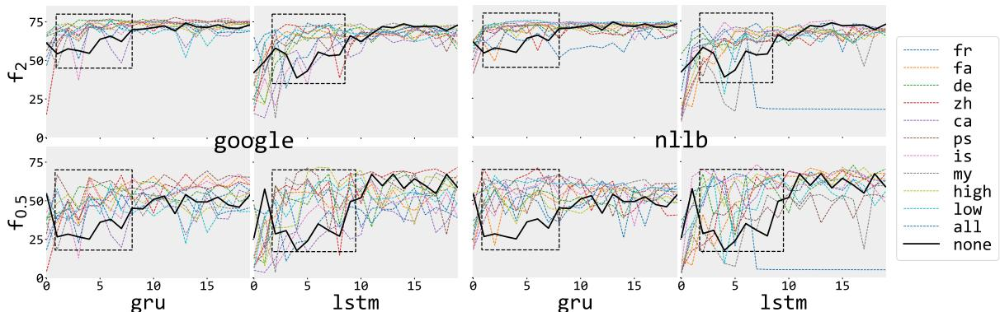
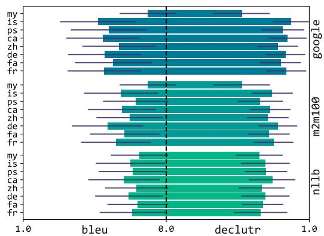
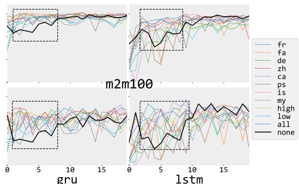

# Enhancing Online Grooming Detection via Backtranslation Augmentation

Hamed Waezi and Hossein Fani

ù 	 ¢«@ð YÓAg úGA ¯ á	 ‚k

School of Computer Science, University of Windsor, Windsor, ON, Canada {waezi,hfani}@uwindsor.ca

## Abstract

Grooming minors for sexual exploitation become an increasingly significant concern in online conversation platforms. For a safer online experience for minors, machine learning models have been proposed to tap into explicit textual remarks and automate detecting predatory conversations. Such models, however, fall short of real-world applications for the sparse distribution of predatory conversations. In this paper, we propose backtranslation augmentation to augment training datasets with more predatory conversations. Through our experiments on 8 languages from 4 language families using 3 neural translators, we demonstrate that backtranslation augmentation improves models’ performance with fewer training epochs for better classification efficacy. Our code and experimental results are available at github.com/fani-lab/osprey/tree/coling

## 1 Introduction

An alarming problem in online conversation platforms is the presence of minors before legal age with little cognitive development and the prevalence of online grooming, where an adult sexual predator initiates a sexual relationship with a minor (victim) (Georgia M. Winters and Jeglic, 2017; Susi et al., 2019). Further, online grooming is underreported for lack of awareness, support, or trust in authorities, fear of retaliation from the predator or legal repercussions, and distress of being judged or blamed (Taylor and Gassner, 2010).

For a safer online experience, researchers have proposed neural models, including feedforward (Villatoro-Tello et al., 2012; Escalante et al., 2013; Cheong et al., 2015), convolutional (Ebrahimi et al., 2016) and recurrent neural networks (Kim et al., 2020; Ngejane et al., 2021b), and transformers (Vogt et al., 2021; Agarwal et al., 2021), to learn from explicit textual remarks of predators for online grooming detection and help warn minors, parents or police of such incidents while preserving minors’ privacy. Such models, however, suffer from low recall due to the sparse distribution of predatory conversations; e.g., in pan (Inches and Crestani, 2012) benchmark dataset, merely 2.3% of conversations are predatory.

In this paper, we proposed to bridge the gap by natural language backtranslation augmentation to enrich training datasets with more predatory conversations. Specifically, we translate original predatory conversations from their original language, e.g., English, to a target language, e.g., French, and then translate them back to the original language using an off-the-shelf neural translator, e.g., meta’s nllb (Costa-jussà et al., 2024), to generate new synthetic predatory conversations. While languages share underlying commonalities, they carry differences on the surface (Friederici, 2017), especially in an informal context like in online conversations, that can be leveraged via backtranslation to generate diverse paraphrases of a predatory conversation while withholding its predatory intent.

From Table 1, backtranslation can uncover latent terms in a predatory conversation as they may not be commonly known in a target language and, hence, should be explicitly generated through translation, like when ‘having it with minor’ is translated to French as ‘l’avoir avec mineur‘ followed by a backtranslation to English, it brings up ‘having sex’. Moreover, backtranslation can augment contextaware synonymous terms from a target language to the original predatory conversation, as opposed to simple synonym replacement by a thesaurus (Shiri, 2004). For instance, when ‘hooked up’ is translated to Chinese as ‘交过’, followed by a backtransla- tion to English as ‘to have sex’, it augments ‘sex’ as opposed to other semantics like ‘to plug in’ in electrical nomenclature. Finally, backtranslation can disambiguate polysemous collocations, like translating an ambiguous message ‘doing each other’ to German ‘miteinander treiben’, and backtranslating to English, maps the term ‘each other’ to ‘sex’.

<table><tr><td>original message</td><td colspan="2">language: translation</td><td>backtranslation</td></tr><tr><td>&#x27;having it with minor&#x27;</td><td>French: &#x27;l&#x27;avoir avec mineur&#x27;</td><td></td><td>&#x27;having sex with a minor&#x27;</td></tr><tr><td>‘i feel little aroused&#x27;</td><td></td><td>German: ich fühle mich ein wenig erregt&#x27;</td><td>&#x27;i&#x27;m feeling a little turned on</td></tr><tr><td>&#x27;you ever hooked up with anybody...?&#x27;</td><td></td><td>Chinese:你有没有和网上的人交过?</td><td>&#x27;have you ever had sex with ...?&#x27;</td></tr><tr><td>&#x27;like two guys doing each other?&#x27;</td><td></td><td colspan="2">German: wie zwei typen, die es miteinander treiben?&#x27;like two guys having sex?’</td></tr></table>

Table 1: Backtranslation examples of predatory messages from pan (Inches and Crestani, 2012).

For similar reasons, backtranslation has been employed in review analysis (Fei et al., 2021; Liesting et al., 2021; Hemmatizadeh et al., 2023), web search (Rajaei et al., 2024, 2025) and other natural language processing tasks like text summarization (Fabbri et al., 2021), questionanswering (Bhaisaheb et al., 2023), and machine translation (Sennrich et al., 2016; Guo et al., 2021). Furthermore, the open-source accessibility to neural translators (Costa-jussà et al., 2024), capable of delivering high-quality translations between many languages, as well as their seamless integration into any pipeline with few lines of code, have already set off a surge of interest. Nonetheless, other augmentation techniques such as rule-based (Wei and Zou, 2019), synonym replacement (Kolomiyets et al., 2011), and structure-based (Min et al., 2020) fall short in online grooming detection due to the short, noisy and informal messages.

## 2 Related Works

The related works to this paper are centred around two areas: (1) online grooming detection and (2) data augmentation. We acknowledging yet exclude research on online grooming from a noncomputational perspective in psychology (Schoeps et al., 2020; Chiu and Quayle, 2022), behavioral studies (Broome et al., 2020; Ringenberg et al., 2022), and forensics (Ngejane et al., 2021a).

## 2.1 Online Grooming Detection

The primary means of online grooming is textual messages. Hence, natural language processing techniques have been widely used to detect online grooming through machine learning classifiers on vector representations of conversations, which can be categorized into (1) sparse vector representation (Villatoro-Tello et al., 2012; Escalante et al., 2013; Cheong et al., 2015; Ebrahimi et al., 2016), (2) low-dimensional dense vector representations (Ebrahimi et al., 2016; Muñoz et al., 2020; Kim et al., 2020; Vogt et al., 2021; Chehbouni et al.,

2022; Waezi et al., 2024), and (3) hand-crafted feature representations from conversations (Waezi et al., 2024). Initially, sparse vector representations for conversations have been widely used, like bag-of-word representations of messages or conversations (Villatoro-Tello et al., 2012; Escalante et al., 2013; Cheong et al., 2015; Ebrahimi et al., 2016). Despite their simplicity, sparse representations suffer from out-of-vocabulary, loss of token order, and high dimensionality, to name a few. Next, pretrained word embeddings from word2vec (Mikolov et al., 2013) and glove (Pennington et al., 2014) have been employed, following their success in various tasks like document classification (Ebrahimi et al., 2016; Muñoz et al., 2020). Such embeddings, however, performed poorly for being trained on corpora different from informal online chats. State-of-the-art methods use contextualized word embeddings for online grooming (Kim et al., 2020; Vogt et al., 2021; Chehbouni et al., 2022; Waezi et al., 2024). More recently, Waezi et al. (2024) proposed incorporating conversational features, such as the message’s timestamp and the number of participants, to capture characteristic features of online grooming.

In terms of classifiers, earlier works used support vector machines (Villatoro-Tello et al., 2012; Escalante et al., 2013; Cheong et al., 2015; Bours and Kulsrud, 2019), logistic regression (Cheong et al., 2015; Chehbouni et al., 2022), and other classical machine learning models, including knearest neighbors (Chehbouni et al., 2022), naive Bayes (Bogdanova et al., 2012), and decision trees (McGhee et al., 2011; Cheong et al., 2015). Recent works have increasingly adopted neural models, including feedforward (Villatoro-Tello et al., 2012; Escalante et al., 2013; Cheong et al., 2015), convolutional (Ebrahimi et al., 2016), and recurrent neural networks (Ngejane et al., 2021a; Waezi et al., 2024), and transformer-based models (Vogt et al., 2021), which enable considering larger or even the entire context of a conversation for classification. For example, Waezi et al. (2024) processed conversations as sequences of messages using recurrent neural networks, showing gru has a better gating strategy versus lstm for predatory conversations, which are often long.

Nonetheless, to the best of our knowledge, no work has been proposed to address the highly sparse distribution of predatory conversations in training datasets.

## 2.2 Data Augmentation

Augmentation techniques have helped models’ robustness and generalization for out-of-vocabulary and out-of-distribution scenarios during inference, which can be categorized based on where augmentation happens in the machine learning pipeline (Bayer et al., 2023): (1) data space, which involves augmenting pieces of text directly in levels of character, word, phrase, and sentence, and (2) feature space, where the vector representations (embeddings) of input texts in a latent space are used to augment new data by, e.g., introducing noise to a vector or interpolating new vectors from existing ones (Kumar et al., 2019; Chen et al., 2020). In contrast to feature space augmentation, where the augmented vectors are not interpretable for humans (Bolukbasi et al., 2021) and their generation is often computationally costly, data space augmentations are simpler yet more effective and include noise addition (Belinkov and Bisk, 2018), rulebased transformations (Coulombe, 2018), synonym replacement (Kolomiyets et al., 2011), structurebased manipulation (Min et al., 2020), machinegenerated text (Qiu et al., 2020), and backtranslation (Risch and Krestel, 2018; Hemmatizadeh et al., 2023). For example, Rizos et al. (2019) employed synonym substitution for hate speech detection, and Cao and Lee (2020) and Casula and Tonelli (2023) used machine-generated text to augment datasets of hate speech detection and offensive language detection, respectively.

Among data space augmentation methods, backtranslation has been used notably due to its ability to create new paraphrases of an existing text with new vocabulary and structure while controlling the semantic context (Aroyehun and Gelbukh, 2018; Xie et al., 2020; Qu et al., 2021). Specifically, backtranslation has been used in domains close but different from online grooming, like aggression (Aroyehun and Gelbukh, 2018) and offensive language detection (Ibrahim et al., 2020). However, in online grooming, where turn-taking conversations are involved, as opposed to an online post or comment, the effect of data augmentation, in general, and backtranslation augmentation, in particular, is yet to be studied.

## 3 Problem Definition

A conversation c in a language l is a sequence of |c| timestamped messages $m _ { i } ^ { c } ; 1 \le i \le | c |$ , each message of which includes id, text, author, and timestamp. Furthermore, as opposed to an online post or comment, an online conversation should have at least two different authors, each of whom has at least one message, $\mathrm { i } . \mathrm { e } . , \exists m _ { i } ^ { c } , m _ { i } ^ { c }$ such that $m _ { i } ^ { c }$ .author $\neq m _ { j } ^ { c }$ .author. Let $c = \langle c \rangle$ be the set of conversations, our task is to learn $f _ { \theta } : { \mathcal { C } } \to$ {0 : normal, 1 : predatory}, a mapping function of parameters $\theta$ from the conversation set to the Boolean set, such that $f _ { \boldsymbol { \theta } } ( c ) = 1$ if c is predatory and 0 otherwise.

## 4 Backtranslation Augmentation

We learn the mapping function $f _ { \theta }$ from a set of conversations ${ \mathcal { C } } ^ { + } = { \mathcal { C } } \cup { \mathcal { C } } ^ { l }$ that is augmented by backtranslated versions of predatory conversations via a language l. Let $\mathcal { L }$ be the set of natural languages, τ be a two-way translator, and c be a predatory conversation. We forward translate each message of the predatory conversation $m _ { i } ^ { c }$ to a target language l and translate it back to the source language using the translator $\tau ,$ resulting in the backtranslated version of each message, denoted by $m _ { i } ^ { c  l }$ . We collect the backtranslated messages and form a new predatory conversation $c ^ {  l }$ as the backtranslated version of $^ { c , }$ keeping the same values in other attributes like timestamp and author. Finally, we augment the dataset with backtranslated versions of existing predatory conversations.

## 5 Experiments

## 5.1 Dataset

Access to training sets of online grooming remains challenging due to legal concerns. Previous datasets such as conversations from an online game for minors (Cheong et al., 2015), chat-coder (McGhee et al., 2011) and pan-chatcoder (Vogt et al., 2021), are inaccessible to researchers. The sole accessible dataset is pan (Inches and Crestani, 2012) (Appendix A), which extensively used in prior studies (McGhee et al., 2011; Bogdanova et al., 2012; Ebrahimi et al., 2016; Cardei and Rebedea, 2017; Aragón and López-Monroy, 2018). In our experiments, we removed conversations with only 1 participant or those with fewer than 6 message exchanges.

  
Figure 1: Training efficiency vs. inference efficacy. Baselines converge faster in the first 10 epochs on the augmented dataset (colored lines) for better f-measures on the test set compared to the lack thereof (black line). From Appendix C, m2m100 follows the same trend.

## 5.2 Backtranslation

We chose French, German, Icelandic, and Catalan from Indo-European, Farsi and Pashto from Iranic, and Chinese and Myanmarese from Sino-Tibetan, among which Icelandic, Catalan, Pashto, and Myanmarese are low-resource languages. For translation and backtranslation, we utilized three two-way neural translators: meta’s nllb (Costajussà et al., 2024) and m2m100 (Fan et al., 2021), and google’s translator. These translators can perform translations to and from over 100 languages with a single model, enabling a comprehensive study on a wide variety of languages. All three translators are based on transformers. However, while meta’s translators are open-sourced, google’s translator is closed, yet it is a well-known commercial translator. Regarding translation quality, nllb is the state-of-the-art on benchmark translation datasets (Costa-jussà et al., 2024).

## 5.3 Baselines

We trained state-of-the-art gru-based recurrent model by Waezi et al. (2024) and the strong lstmbased competitor by Kim et al. (2020) to estimate $f _ { \theta }$ for online grooming detection on the backtranslated augmented dataset and lack thereof. Both models have a single layer with 512 units, utilizing the tanh activation function and the Adam optimizer. Each conversation was vectorized as a sequence of its message embeddings using pretrained 768-dimensional vectors of distilroberta (Sanh et al., 2019).

## 5.4 Evaluation Methodology

We performed 3-fold cross-validation. For each fold, we conducted two separate training sessions for a baseline model: one using the original fold and one using the augmented one. We evaluated the performance of the trained models on the same test set using f-measures with $\beta = 2 . 0$ to favour recall over precision vs. $\beta = 0 . 5$ vice versa, and $\beta = 1$ .0 for equal importance. We compared the average results over the folds. To study how backtranslation augmentation improves models’ efficiency during training, we reported the models’ performance on the test set at each training epoch.

## 5.5 Results

From Figure 1, we observe that baselines converge faster in fewer training epochs when the training set is augmented with backtranslations across different languages compared to the lack thereof in terms of f-measures. In terms of efficacy, Table 2 shows the performance delta before and after backtranslation augmentation of the training set for baselines after 20 epochs. As seen, backtranslation augmentation helps with the models’ efficacy overall. However, the performance gain depends on the language, translator, and baseline model.

Regarding the effects of each language, language families, and their combinations on the baselines’ efficacy, we observe that low-resource languages individually have shown an overall better performance like Catalan (ca), Pashto (pa), and Myanmarese (my), which can be attributed to their better paraphrasing (Appendix B). Low-resource languages have shown relatively higher semantic similarities for the relatively low bleu scores. In contrast, Chinese (zh), a high-resource language, yielded a lower performance in Table 2 due to its poor backtranslations with the lowest bleu and semantic similarities. From the results of integrating the backtranslations from languages of the same family, we observe that not all language families show synergy. While integrating backtranslations of French (fr) + Catalan (ca) from the Western Romance family boosts the baselines’ performance, Chinese (zh) + Myanmarese (my) from the Sino-Tibetan have a discounting effect. However, when we integrate more languages based on their high or low-resource richness, or integrating all languages, backtranslation augmentation shows positive impacts in general.

<table><tr><td rowspan=2 colspan=11>∆f0.5                    ∆f1                     ∆f2googlem2m100  n11b  googlem2m100 n11b googlem2m100 n11b</td></tr><tr><td rowspan=1 colspan=3>google m2m100nl1b</td><td rowspan=1 colspan=3>google m2m100 nllb</td><td rowspan=1 colspan=3>google m2m100nllb</td></tr><tr><td rowspan=16 colspan=1>gru</td><td rowspan=1 colspan=1>none</td><td rowspan=1 colspan=3>0.00   0.00   0.00</td><td rowspan=1 colspan=3>0.00   0.00  0.00</td><td rowspan=1 colspan=3>0.00   0.00   0.00</td></tr><tr><td rowspan=1 colspan=1>+fr</td><td rowspan=1 colspan=1>+8.76</td><td rowspan=1 colspan=1>+2.61</td><td rowspan=1 colspan=1>+2.65</td><td rowspan=1 colspan=1>+7.08</td><td rowspan=1 colspan=1>+2.84</td><td rowspan=1 colspan=1>+2.63</td><td rowspan=1 colspan=1>+5.80</td><td rowspan=1 colspan=1>+2.46</td><td rowspan=1 colspan=1>+3.35</td></tr><tr><td rowspan=1 colspan=1>+fa</td><td rowspan=1 colspan=1>+1.68</td><td rowspan=1 colspan=1>+3.50</td><td rowspan=1 colspan=1>+4.05</td><td rowspan=1 colspan=1>+1.88</td><td rowspan=1 colspan=1>+3.64</td><td rowspan=1 colspan=1>+3.39</td><td rowspan=1 colspan=1>+2.43</td><td rowspan=1 colspan=1>+5.42</td><td rowspan=1 colspan=1>+3.04</td></tr><tr><td rowspan=1 colspan=1>+de</td><td rowspan=1 colspan=1>+4.10</td><td rowspan=1 colspan=1>+3.81</td><td rowspan=1 colspan=1>+9.00</td><td rowspan=1 colspan=1>+3.76</td><td rowspan=1 colspan=1>+2.97</td><td rowspan=1 colspan=1>+6.39</td><td rowspan=1 colspan=1>+4.22</td><td rowspan=1 colspan=1>+2.92</td><td rowspan=1 colspan=1>+2.27</td></tr><tr><td rowspan=1 colspan=1>+zh</td><td rowspan=1 colspan=1>-8.97</td><td rowspan=1 colspan=1>+1.55</td><td rowspan=1 colspan=1>+5.63</td><td rowspan=1 colspan=1>-5.87</td><td rowspan=1 colspan=1>+2.14</td><td rowspan=1 colspan=1>+4.27</td><td rowspan=1 colspan=1>-3.92</td><td rowspan=1 colspan=1>+4.89</td><td rowspan=1 colspan=1>+2.61</td></tr><tr><td rowspan=1 colspan=1>+ca</td><td rowspan=1 colspan=1>+7.29</td><td rowspan=1 colspan=1>+7.44</td><td rowspan=1 colspan=1>+11.03</td><td rowspan=1 colspan=1>+6.73</td><td rowspan=1 colspan=1>+5.40</td><td rowspan=1 colspan=1>+8.04</td><td rowspan=1 colspan=1>+5.01</td><td rowspan=1 colspan=1>+2.67</td><td rowspan=1 colspan=1>+4.70</td></tr><tr><td rowspan=1 colspan=1>+ps</td><td rowspan=1 colspan=1>9.57</td><td rowspan=1 colspan=1>-5.32</td><td rowspan=1 colspan=1>+13.60</td><td rowspan=1 colspan=1>+6.48</td><td rowspan=1 colspan=1>-3.79</td><td rowspan=1 colspan=1>+7.58</td><td rowspan=1 colspan=1>+3.04</td><td rowspan=1 colspan=1>+1.56</td><td rowspan=1 colspan=1>+0.52</td></tr><tr><td rowspan=2 colspan=1>+is+my</td><td rowspan=1 colspan=1>+3.73</td><td rowspan=1 colspan=1>-2.24</td><td rowspan=1 colspan=1>+10.14</td><td rowspan=1 colspan=1>+4.04</td><td rowspan=1 colspan=1>-0.68</td><td rowspan=1 colspan=1>+6.98</td><td rowspan=1 colspan=1>+6.27</td><td rowspan=1 colspan=1>+2.25</td><td rowspan=1 colspan=1>+3.24</td></tr><tr><td rowspan=1 colspan=1>+12.51</td><td rowspan=1 colspan=1>-3.13</td><td rowspan=1 colspan=1>+9.34</td><td rowspan=1 colspan=1>+9.13</td><td rowspan=1 colspan=1>-1.66</td><td rowspan=1 colspan=1>+6.06</td><td rowspan=1 colspan=1>+4.63</td><td rowspan=1 colspan=1>+1.46</td><td rowspan=1 colspan=1>+2.00</td></tr><tr><td rowspan=1 colspan=1>+fr+ca        Western Romance</td><td rowspan=1 colspan=1>+8.07</td><td rowspan=1 colspan=1>-4.40</td><td rowspan=1 colspan=1>+15.29</td><td rowspan=1 colspan=1>+7.02</td><td rowspan=1 colspan=1>-2.35</td><td rowspan=1 colspan=1>+9.94</td><td rowspan=1 colspan=1>+6.76</td><td rowspan=1 colspan=1>-0.81</td><td rowspan=1 colspan=1>+3.52</td></tr><tr><td rowspan=1 colspan=1>+fa+ps        Iranic</td><td rowspan=1 colspan=1>-3.31</td><td rowspan=1 colspan=1>-6.71</td><td rowspan=1 colspan=1>+2.91</td><td rowspan=1 colspan=1>-1.88</td><td rowspan=1 colspan=1>-4.75</td><td rowspan=1 colspan=1>+2.62</td><td rowspan=1 colspan=1>+0.34</td><td rowspan=1 colspan=1>+0.78</td><td rowspan=1 colspan=1>+3.60</td></tr><tr><td rowspan=1 colspan=1>+de+is        West Germanic</td><td rowspan=1 colspan=1>+11.84</td><td rowspan=1 colspan=1>+5.94</td><td rowspan=1 colspan=1>+9.43</td><td rowspan=1 colspan=1>+9.39</td><td rowspan=1 colspan=1>+5.60</td><td rowspan=1 colspan=1>+7.65</td><td rowspan=1 colspan=1>+6.98</td><td rowspan=1 colspan=1>+6.63</td><td rowspan=1 colspan=1>+6.16</td></tr><tr><td rowspan=1 colspan=1>+zh+my        Sino-Tibetan</td><td rowspan=1 colspan=1>+8.83</td><td rowspan=1 colspan=1>-8.76</td><td rowspan=1 colspan=1>-3.15</td><td rowspan=1 colspan=1>+6.80</td><td rowspan=1 colspan=1>-6.33</td><td rowspan=1 colspan=1>-1.21</td><td rowspan=1 colspan=1>+4.55</td><td rowspan=1 colspan=1>-7.05</td><td rowspan=1 colspan=1>+0.66</td></tr><tr><td rowspan=1 colspan=1>+fr+fa+de+zh high-resource</td><td rowspan=1 colspan=1>+5.88</td><td rowspan=1 colspan=1>-1.36</td><td rowspan=1 colspan=1>+10.14</td><td rowspan=1 colspan=1>+4.62</td><td rowspan=1 colspan=1>-0.40</td><td rowspan=1 colspan=1>+7.63</td><td rowspan=1 colspan=1>+3.94</td><td rowspan=1 colspan=1>+3.01</td><td rowspan=1 colspan=1>+4.97</td></tr><tr><td rowspan=1 colspan=1>+ca+ps+is+my low-resource</td><td rowspan=1 colspan=1>+8.10</td><td rowspan=1 colspan=1>-1.38</td><td rowspan=1 colspan=1>+10.41</td><td rowspan=1 colspan=1>+6.61</td><td rowspan=1 colspan=1>-0.52</td><td rowspan=1 colspan=1>+5.26</td><td rowspan=1 colspan=1>+5.63</td><td rowspan=1 colspan=1>+2.64</td><td rowspan=1 colspan=1>-1.00</td></tr><tr><td rowspan=1 colspan=1>all</td><td rowspan=1 colspan=1>+4.25</td><td rowspan=1 colspan=1>-0.32</td><td rowspan=1 colspan=1>+6.51</td><td rowspan=1 colspan=1>+4.30</td><td rowspan=1 colspan=1>+0.06</td><td rowspan=1 colspan=1>+5.20</td><td rowspan=1 colspan=1>+6.02</td><td rowspan=1 colspan=1>+2.16</td><td rowspan=1 colspan=1>+4.64</td></tr><tr><td rowspan=1 colspan=1></td><td rowspan=1 colspan=1></td><td rowspan=1 colspan=1></td><td rowspan=1 colspan=1></td><td rowspan=1 colspan=1></td><td rowspan=1 colspan=1></td><td rowspan=1 colspan=1></td><td rowspan=1 colspan=1></td><td rowspan=1 colspan=1></td><td rowspan=1 colspan=1></td><td rowspan=1 colspan=1></td></tr><tr><td rowspan=16 colspan=1>1Sstm</td><td rowspan=1 colspan=1>none</td><td rowspan=1 colspan=1>0.00</td><td rowspan=1 colspan=1>0.00</td><td rowspan=1 colspan=1>0.00</td><td rowspan=1 colspan=1>0.00</td><td rowspan=1 colspan=1>0.00</td><td rowspan=1 colspan=1>0.00</td><td rowspan=1 colspan=1>0.00</td><td rowspan=1 colspan=1>0.00</td><td rowspan=1 colspan=1>0.00</td></tr><tr><td rowspan=1 colspan=1>+fr</td><td rowspan=1 colspan=1>+8.42</td><td rowspan=1 colspan=1>-2.78</td><td rowspan=1 colspan=1>+5.30</td><td rowspan=1 colspan=1>+1.79</td><td rowspan=1 colspan=1>-2.10</td><td rowspan=1 colspan=1>+2.55</td><td rowspan=1 colspan=1>-6.71</td><td rowspan=1 colspan=1>-2.64</td><td rowspan=1 colspan=1>-1.43</td></tr><tr><td rowspan=1 colspan=1>+fa</td><td rowspan=1 colspan=1>+1.99</td><td rowspan=1 colspan=1>+4.06</td><td rowspan=1 colspan=1>-6.82</td><td rowspan=1 colspan=1>-0.03</td><td rowspan=1 colspan=1>+0.65</td><td rowspan=1 colspan=1>-5.59</td><td rowspan=1 colspan=1>-3.53</td><td rowspan=1 colspan=1>-4.19</td><td rowspan=1 colspan=1>-7.95</td></tr><tr><td rowspan=1 colspan=1>+de</td><td rowspan=1 colspan=1>+2.14</td><td rowspan=1 colspan=1>+4.16</td><td rowspan=1 colspan=1>-0.58</td><td rowspan=1 colspan=1>+1.78</td><td rowspan=1 colspan=1>-0.17</td><td rowspan=1 colspan=1>-0.70</td><td rowspan=1 colspan=1>+1.21</td><td rowspan=1 colspan=1>-5.75</td><td rowspan=1 colspan=1>-3.90</td></tr><tr><td rowspan=1 colspan=1>+zh</td><td rowspan=1 colspan=1>+5.80</td><td rowspan=1 colspan=1>+2.04</td><td rowspan=1 colspan=1>-6.30</td><td rowspan=1 colspan=1>-0.02</td><td rowspan=1 colspan=1>-0.40</td><td rowspan=1 colspan=1>-2.66</td><td rowspan=1 colspan=1>-7.02</td><td rowspan=1 colspan=1>-4.87</td><td rowspan=1 colspan=1>-13.18</td></tr><tr><td rowspan=1 colspan=1>+ca</td><td rowspan=1 colspan=1>-2.09</td><td rowspan=1 colspan=1>+2.83</td><td rowspan=1 colspan=1>+8.03</td><td rowspan=1 colspan=1>-0.74</td><td rowspan=1 colspan=1>-0.08</td><td rowspan=1 colspan=1>+1.97</td><td rowspan=1 colspan=1>+0.69</td><td rowspan=1 colspan=1>-5.70</td><td rowspan=1 colspan=1>-5.46</td></tr><tr><td rowspan=1 colspan=1>+ps</td><td rowspan=1 colspan=1>-9.05</td><td rowspan=1 colspan=1>+4.32</td><td rowspan=1 colspan=1>+1.68</td><td rowspan=1 colspan=1>-7.05</td><td rowspan=1 colspan=1>+2.06</td><td rowspan=1 colspan=1>-1.89</td><td rowspan=1 colspan=1>-6.36</td><td rowspan=1 colspan=1>-0.82</td><td rowspan=1 colspan=1>-9.89</td></tr><tr><td rowspan=1 colspan=1>+is</td><td rowspan=1 colspan=1>+1.83</td><td rowspan=1 colspan=1>-10.86</td><td rowspan=1 colspan=1>+6.64</td><td rowspan=1 colspan=1>+1.66</td><td rowspan=1 colspan=1>-8.07</td><td rowspan=1 colspan=1>+1.10</td><td rowspan=1 colspan=1>-2.03</td><td rowspan=1 colspan=1>-3.81</td><td rowspan=1 colspan=1>-6.26</td></tr><tr><td rowspan=1 colspan=1>+my</td><td rowspan=1 colspan=1>-3.94</td><td rowspan=1 colspan=1>+0.28</td><td rowspan=1 colspan=1>+8.86</td><td rowspan=1 colspan=1>-3.15</td><td rowspan=1 colspan=1>-2.63</td><td rowspan=1 colspan=1>+4.52</td><td rowspan=1 colspan=1>-7.74</td><td rowspan=1 colspan=1>-6.91</td><td rowspan=1 colspan=1>-0.87</td></tr><tr><td rowspan=1 colspan=1>+fr+ca        Western Romance</td><td rowspan=1 colspan=1>-0.08</td><td rowspan=1 colspan=1>-12.39</td><td rowspan=1 colspan=1>+0.96</td><td rowspan=1 colspan=1>-0.67</td><td rowspan=1 colspan=1>-8.89</td><td rowspan=1 colspan=1>-1.16</td><td rowspan=1 colspan=1>-2.02</td><td rowspan=1 colspan=1>-4.14</td><td rowspan=1 colspan=1>-4.55</td></tr><tr><td rowspan=1 colspan=1>+fa+ps        Iranic</td><td rowspan=1 colspan=1>+8.68</td><td rowspan=1 colspan=1>-11.79</td><td rowspan=1 colspan=1>+2.90</td><td rowspan=1 colspan=1>+2.38</td><td rowspan=1 colspan=1>-8.87</td><td rowspan=1 colspan=1>-0.33</td><td rowspan=1 colspan=1>-5.59</td><td rowspan=1 colspan=1>-4.43</td><td rowspan=1 colspan=1>-6.13</td></tr><tr><td rowspan=1 colspan=1>+de+is        Western Germanic</td><td rowspan=1 colspan=1>-13.23</td><td rowspan=1 colspan=1>-0.62</td><td rowspan=1 colspan=1>+1.70</td><td rowspan=1 colspan=1>-9.32</td><td rowspan=1 colspan=1>-0.97</td><td rowspan=1 colspan=1>-0.18</td><td rowspan=1 colspan=1>-8.14</td><td rowspan=1 colspan=1>-2.33</td><td rowspan=1 colspan=1>-3.62</td></tr><tr><td rowspan=1 colspan=1>+zh+my        Sino-Tibetan</td><td rowspan=1 colspan=1>-1.32</td><td rowspan=1 colspan=1>+4.27</td><td rowspan=1 colspan=1>+0.57</td><td rowspan=1 colspan=1>-0.04</td><td rowspan=1 colspan=1>+0.52</td><td rowspan=1 colspan=1>-2.88</td><td rowspan=1 colspan=1>+0.91</td><td rowspan=1 colspan=1>-4.26</td><td rowspan=1 colspan=1>-9.11</td></tr><tr><td rowspan=1 colspan=1>+fr+fa+de+zh high-resource</td><td rowspan=1 colspan=1>+1.44</td><td rowspan=1 colspan=1>-8.80</td><td rowspan=1 colspan=1>+9.38</td><td rowspan=1 colspan=1>-1.60</td><td rowspan=1 colspan=1>-6.98</td><td rowspan=1 colspan=1>+2.91</td><td rowspan=1 colspan=1>-5.55</td><td rowspan=1 colspan=1>-8.82</td><td rowspan=1 colspan=1>-5.00</td></tr><tr><td rowspan=1 colspan=1>+ca+ps+is+my low-resource</td><td rowspan=1 colspan=1>-11.90</td><td rowspan=1 colspan=1>+0.56</td><td rowspan=1 colspan=1>+7.01</td><td rowspan=1 colspan=1>-8.57</td><td rowspan=1 colspan=1>-1.17</td><td rowspan=1 colspan=1>+1.67</td><td rowspan=1 colspan=1>-4.89</td><td rowspan=1 colspan=1>-3.87</td><td rowspan=1 colspan=1>-5.78</td></tr><tr><td rowspan=1 colspan=1>all</td><td rowspan=1 colspan=1>+3.24</td><td rowspan=1 colspan=1>+3.28</td><td rowspan=1 colspan=1>+4.54</td><td rowspan=1 colspan=1>+0.69</td><td rowspan=1 colspan=1>-0.17</td><td rowspan=1 colspan=1>+1.51</td><td rowspan=1 colspan=1>-2.85</td><td rowspan=1 colspan=1>-4.60</td><td rowspan=1 colspan=1>-3.39</td></tr></table>

Table 2: Average 3-fold cross-validation results of baselines for 20 training epochs using backtranslation augmentations and lack thereof (none) on the same test set based on the performance delta (∆). Best viewed in color.

For the quality of neural translators on the performance gain, from Table 2, we see that the translation by nllb and google have resulted in the best and runner-up performance improvements, respectively, while m2m100 has shown less effectiveness. Specifically, in low-resource languages, m2m100’s backtranslations have shown subpar performance compared to nllb and google. Our results are also aligned with translation benchmarks, and the fact that nllb has been developed with low-resource languages in mind (Costa-jussà et al., 2024).

To see whether backtranslation augmentation consistently benefits the performance of the baseline models, we clearly observe that gru’s performance improvement has been positive overall across different languages and metrics. Surprisingly, lstm’s performance is not following a similar trend; while lstm’s f0.5 has been improved across high-resource languages, its performance drops in other languages for f1 and f2. Our results are in line with Waezi et al. (2024)’s work where gru outperformed lstm due to its better gating strategy to retain dependencies from earlier messages in long conversations as in predatory conversations.

## 6 Concluding Remarks

In this paper, we proposed backtranslation augmentation of predatory conversations for online grooming detection. We showed that (1) backtranslation augmentation improves models’ performance with fewer training epochs for better classification efficacy; (2) low-resource languages have shown better performance; (3) higher quality neural translators yield more performance gain; and (4) finally, the underlying model architecture matters where gru consistently improves upon backtranslation augmentation across all languages while lstm improves only across high-resource languages.

## 7 Limitations

The main limitation of this study lies in the benchmark dataset, pan, which is solely in English. This restricts the generalizability of our findings to other languages. We acknowledge that online grooming occurs across other languages, highlighting the critical need for non-English training datasets. Expanding research to include multilingual datasets would allow for a more comprehensive evaluation of online grooming detection techniques, including the effectiveness of our backtranslation augmentation. Additionally, the victims in pan are trained adult decoys rather than actual minors, which may affect the quality and reliability of results. Finally, while the ultimate objective of online grooming detection is to identify predators before they can harm potential victims, our study requires the entire conversation for classification. In future work, we plan to focus on the task of early detection, that is, identifying grooming behaviors at early stages based on the first few messages before the conversation escalates into serious exploitation or abuse.

## 8 Ethical Considerations

The researchers involved in this study were all adults who were warned and fully informed about the harmful content of predatory conversations in the benchmark dataset. Additionally, the use or distribution of pan dataset could violate laws in certain jurisdictions, leading to potential legal consequences for the researchers involved. Moreover, the work undertaken in this paper, as well as pan dataset, must not exploited for malicious purposes like reverse study or re-engineering of predatory behaviours tofool detection methods by adversarial or behavioural manipulation. Finally, predatory conversations in pan dataset have been obtained from Perverted-Justice1 whose method of decoy operations has raised controversy for being entrapment. Hence, the labels for predatory conversation may contain noise and inconsistency to correctly interpret the real-world situations.

## References

Nancy Agarwal, Tugçe Ünlü, Mudasir Ahmad Wani, and Patrick Bours. 2021. Predatory conversation detection using transfer learning approach. In Machine Learning, Optimization, and Data Science - 7th International Conference, LOD 2021, Grasmere, UK,

October 4-8, 2021, Revised Selected Papers, Part I, volume 13163 of Lecture Notes in Computer Science, pages 488–499. Springer.

Mario Ezra Aragón and Adrián Pastor López-Monroy. 2018. A straightforward multimodal approach for author profiling: Notebook for PAN at CLEF 2018. In Working Notes of CLEF 2018 - Conference and Labs ofthe Evaluation Forum, Avignon, France, September 10-14, 2018, volume 2125 of CEUR Workshop Proceedings. CEUR-WS.org.

Segun Taofeek Aroyehun and Alexander F. Gelbukh. 2018. Aggression detection in social media: Using deep neural networks, data augmentation, and pseudo labeling. In Proceedings of the First Workshop on Trolling, Aggression and Cyberbullying, TRAC@COLING 2018, Santa Fe, New Mexico, USA, August 25, 2018, pages 90–97. Association for Computational Linguistics.

Markus Bayer, Marc-André Kaufhold, and Christian Reuter. 2023. A survey on data augmentation for text classification. ACM Comput. Surv., 55(7):146:1– 146:39.

Yonatan Belinkov and Yonatan Bisk. 2018. Synthetic and natural noise both break neural machine translation. In 6th International Conference on Learning Representations, ICLR 2018, Vancouver, BC, Canada, April 30 - May 3, 2018, Conference Track Proceedings. OpenReview.net.

Shabbirhussain Bhaisaheb, Shubham Paliwal, Rajaswa Patil, Manasi Patwardhan, Lovekesh Vig, and Gautam Shroff. 2023. Program synthesis for complex QA on charts via probabilistic grammar based filtered iterative back-translation. In Findings of the Association for Computational Linguistics: EACL 2023, Dubrovnik, Croatia, May 2-6, 2023, pages 2456–2470. Association for Computational Linguistics.

Dasha Bogdanova, Paolo Rosso, and Thamar Solorio. 2012. On the impact of sentiment and emotion based features in detecting online sexual predators. In Proceedings ofthe 3rd Workshop in Computational Approaches to Subjectivity and Sentiment Analysis, WASSA@ACL 2012, July 12, 2012, Jeju Island, Republic ofKorea, pages 110–118. The Association for Computer Linguistics.

Tolga Bolukbasi, Adam Pearce, Ann Yuan, Andy Coenen, Emily Reif, Fernanda B. Viégas, and Martin Wattenberg. 2021. An interpretability illusion for BERT. CoRR, abs/2104.07143.

Patrick Bours and Halvor Kulsrud. 2019. Detection of cyber grooming in online conversation. In IEEE International Workshop on Information Forensics and Security, WIFS 2019, Delft, The Netherlands, December 9-12, 2019, pages 1–6. IEEE.

Laura Jayne Broome, Cristina Izura, and Jason Davies. 2020. A psycho-linguistic profile of online grooming conversations: A comparative study of prison and

police staff considerations. Child Abuse Neglect, 109:104647.

Rui Cao and Roy Ka-Wei Lee. 2020. Hategan: Adversarial generative-based data augmentation for hate speech detection. In Proceedings of the 28th International Conference on Computational Linguistics, COLING 2020, Barcelona, Spain (Online), December 8-13, 2020, pages 6327–6338. International Committee on Computational Linguistics.

Claudia Cardei and Traian Rebedea. 2017. Detecting sexual predators in chats using behavioral features and imbalanced learning. Nat. Lang. Eng., 23(4):589– 616.

Camilla Casula and Sara Tonelli. 2023. Generationbased data augmentation for offensive language detection: Is it worth it? In Proceedings of the 17th Conference of the European Chapter of the Associationfor Computational Linguistics, EACL 2023, Dubrovnik, Croatia, May 2-6, 2023, pages 3351– 3369. Association for Computational Linguistics.

Khaoula Chehbouni, Gilles Caporossi, Reihaneh Rabbany, Martine De Cock, and Golnoosh Farnadi. 2022. Early detection of sexual predators with federated learning. In Workshop on Federated Learning: Recent Advances and New Challenges (in Conjunction with NeurIPS 2022).

Jiaao Chen, Zichao Yang, and Diyi Yang. 2020. Mixtext: Linguistically-informed interpolation of hidden space for semi-supervised text classification. In Proceedings ofthe 58th Annual Meeting ofthe Association for Computational Linguistics, ACL 2020, Online, July 5-10, 2020, pages 2147–2157. Association for Computational Linguistics.

Yun-Gyung Cheong, Alaina K. Jensen, Elin Rut Gudnadottir, Byung-Chull Bae, and Julian Togelius. 2015. Detecting predatory behavior in game chats. IEEE Trans. Comput. Intell. AI Games, 7(3):220–232.

Jonie Chiu and Ethel Quayle. 2022. Understanding online grooming: An interpretative phenomenological analysis of adolescents’ offline meetings with adult perpetrators. Child Abuse Neglect, 128:105600.

Marta R. Costa-jussà, James Cross, Onur Çelebi, Maha Elbayad, Kenneth Heafield, Kevin Heffernan, Elahe Kalbassi, Janice Lam, Daniel Licht, Jean Maillard, Anna Y. Sun, Skyler Wang, Guillaume Wenzek, Al Youngblood, Bapi Akula, Loïc Barrault, Gabriel Mejia Gonzalez, Prangthip Hansanti, John Hoffman, Semarley Jarrett, Kaushik Ram Sadagopan, Dirk Rowe, Shannon Spruit, Chau Tran, Pierre Andrews, Necip Fazil Ayan, Shruti Bhosale, Sergey Edunov, Angela Fan, Cynthia Gao, Vedanuj Goswami, Francisco Guzmán, Philipp Koehn, Alexandre Mourachko, Christophe Ropers, Safiyyah Saleem, Holger Schwenk, and Jeff Wang. 2024. Scaling neural machine translation to 200 languages. Nat., 630(8018):841–846.

Claude Coulombe. 2018. Text data augmentation made simple by leveraging NLP cloud apis. CoRR, abs/1812.04718.

Mohammad Reza Ebrahimi, Ching Y. Suen, and Olga Ormandjieva. 2016. Detecting predatory conversations in social media by deep convolutional neural networks. Digit. Investig., 18:33–49.

Hugo Jair Escalante, Esaú Villatoro-Tello, Antonio Juárez, Manuel Montes-y-Gómez, and Luis Villaseñor Pineda. 2013. Sexual predator detection in chats with chained classifiers. In Proceedings of the 4th Workshop on Computational Approaches to Subjectivity, Sentiment and Social Media Analysis, WASSA@NAACL-HLT 2013, 14 June 2013, Atlanta, Georgia, USA, pages 46–54. The Association for Computer Linguistics.

Alexander R. Fabbri, Simeng Han, Haoyuan Li, Haoran Li, Marjan Ghazvininejad, Shafiq R. Joty, Dragomir R. Radev, and Yashar Mehdad. 2021. Improving zero and few-shot abstractive summarization with intermediate fine-tuning and data augmentation. In Proceedings of the 2021 Conference of the North American Chapter of the Association for Computational Linguistics: Human Language Technologies, NAACL-HLT 2021, Online, June 6-11, 2021, pages 704–717. Association for Computational Linguistics.

Angela Fan, Shruti Bhosale, Holger Schwenk, Zhiyi Ma, Ahmed El-Kishky, Siddharth Goyal, Mandeep Baines, Onur Celebi, Guillaume Wenzek, Vishrav Chaudhary, Naman Goyal, Tom Birch, Vitaliy Liptchinsky, Sergey Edunov, Michael Auli, and Armand Joulin. 2021. Beyond english-centric multilingual machine translation. J. Mach. Learn. Res., 22:107:1–107:48.

Hao Fei, Yafeng Ren, Shengqiong Wu, Bobo Li, and Donghong Ji. 2021. Latent target-opinion as prior for document-level sentiment classification: A variational approach from fine-grained perspective. In WWW ’21: The Web Conference 2021, Virtual Event / Ljubljana, Slovenia, April 19-23, 2021, pages 553– 564. ACM / IW3C2.

Angela D Friederici. 2017. Language in our brain: The origins of a uniquely human capacity. MIT Press.

Leah E. Kaylor Georgia M. Winters and Elizabeth L. Jeglic. 2017. Sexual offenders contacting children online: an examination of transcripts of sexual grooming. Journal ofSexual Aggression, 23(1):62–76.

John M. Giorgi, Osvald Nitski, Bo Wang, and Gary D. Bader. 2021. Declutr: Deep contrastive learning for unsupervised textual representations. In Proceedings of the 59th Annual Meeting of the Association for Computational Linguistics and the 11th International Joint Conference on Natural Language Processing, ACL/IJCNLP 2021, (Volume 1: Long Papers), Virtual Event, August 1-6, 2021, pages 879–895. Association for Computational Linguistics.

Yinuo Guo, Hualei Zhu, Zeqi Lin, Bei Chen, Jian-Guang Lou, and Dongmei Zhang. 2021. Revisiting iterative back-translation from the perspective of compositional generalization. In Thirty-Fifth AAAI Conference on Artificial Intelligence, AAAI 2021, Thirty-Third Conference on Innovative Applications of Artificial Intelligence, IAAI 2021, The Eleventh Symposium on Educational Advances in Artificial Intelligence, EAAI 2021, Virtual Event, February 2-9, 2021, pages 7601–7609. AAAI Press.

Farinam Hemmatizadeh, Christine Wong, Alice Yu, and Hossein Fani. 2023. Latent aspect detection via backtranslation augmentation. In CIKM, pages 3943–3947. ACM.

Mai Ibrahim, Marwan Torki, and Nagwa M. El-Makky. 2020. Alexu-backtranslation-tl at semeval-2020 task 12: Improving offensive language detection using data augmentation and transfer learning. In Proceedings of the Fourteenth Workshop on Semantic Evaluation, SemEval@COLING 2020, Barcelona (online), December 12-13, 2020, pages 1881–1890. International Committee for Computational Linguistics.

Giacomo Inches and Fabio Crestani. 2012. Overview of the international sexual predator identification competition at PAN-2012. In CLEF 2012 Evaluation Labs and Workshop, Online Working Notes, Rome, Italy, September 17-20, 2012, volume 1178 of CEUR Workshop Proceedings. CEUR-WS.org.

Jinhwa Kim, Yoon Jo Kim, Mitra Behzadi, and Ian G. Harris. 2020. Analysis of online conversations to detect cyberpredators using recurrent neural networks. In Proceedingsfor the First International Workshop on Social Threats in Online Conversations: Understanding and Management, STOC@LREC 2020, Marseille, France, May 2020, pages 15–20. European Language Resources Association.

Oleksandr Kolomiyets, Steven Bethard, and Marie-Francine Moens. 2011. Model-portability experiments for textual temporal analysis. In The 49th Annual Meeting ofthe Associationfor Computational Linguistics: Human Language Technologies, Proceedings ofthe Conference, 19-24 June, 2011, Portland, Oregon, USA - Short Papers, pages 271–276. The Association for Computer Linguistics.

Varun Kumar, Hadrien Glaude, Cyprien de Lichy, and William Campbell. 2019. A closer look at feature space data augmentation for few-shot intent classification. In Proceedings of the 2nd Workshop on Deep Learning Approaches for Low-Resource NLP, DeepLo@EMNLP-IJCNLP 2019, Hong Kong, China, November 3, 2019, pages 1–10. Association for Computational Linguistics.

Tomas Liesting, Flavius Frasincar, and Maria Mihaela Trusca. 2021. Data augmentation in a hybrid approach for aspect-based sentiment analysis. In SAC ’21: The 36th ACM/SIGAPP Symposium on Applied Computing, Virtual Event, Republic of Korea, March 22-26, 2021, pages 828–835. ACM.

Sreekanth Madisetty and Maunendra Sankar Desarkar. 2018. Aggression detection in social media using deep neural networks. In Proceedings of the First Workshop on Trolling, Aggression and Cyberbullying, TRAC@COLING 2018, Santa Fe, New Mexico, USA, August 25, 2018, pages 120–127. Association for Computational Linguistics.

India McGhee, Jennifer Bayzick, April Kontostathis, Lynne Edwards, Alexandra McBride, and Emma Jakubowski. 2011. Learning to identify internet sexual predation. Int. J. Electron. Commer., 15(3):103– 122.

Tomás Mikolov, Kai Chen, Greg Corrado, and Jeffrey Dean. 2013. Efficient estimation of word representations in vector space. In 1st International Conference on Learning Representations, ICLR 2013, Scottsdale, Arizona, USA, May 2-4, 2013, Workshop Track Proceedings.

Junghyun Min, R. Thomas McCoy, Dipanjan Das, Emily Pitler, and Tal Linzen. 2020. Syntactic data augmentation increases robustness to inference heuristics. In Proceedings ofthe 58th Annual Meeting of the Association for Computational Linguistics, ACL 2020, Online, July 5-10, 2020, pages 2339–2352. Association for Computational Linguistics.

Fabián Muñoz, Gustavo A. Isaza, and Luis Castillo. 2020. SMARTSEC4COP: smart cyber-grooming detection using natural language processing and convolutional neural networks. In Distributed Computing and Artificial Intelligence, 17th International Conference, DCAI 2020, L’Aquila, Italy, 17-19 June 2020, volume 1237 of Advances in Intelligent Systems and Computing, pages 11–20. Springer.

C.H. Ngejane, J.H.P. Eloff, T.J. Sefara, and V.N. Marivate. 2021a. Digital forensics supported by machine learning for the detection of online sexual predatory chats. Forensic Science International: Digital Investigation, 36:301109.

Cynthia H. Ngejane, Jan H. P. Eloff, Tshephisho J. Sefara, and Vukosi Ntsakisi Marivate. 2021b. Digital forensics supported by machine learning for the detection of online sexual predatory chats. Digit. Investig., 36(Supplement):301109.

Sumant Patil and Patrick Davies. 2014. Use of google translate in medical communication: evaluation of accuracy. BMJ, 349.

Jeffrey Pennington, Richard Socher, and Christopher D. Manning. 2014. Glove: Global vectors for word representation. In Proceedings of the 2014 Conference on Empirical Methods in Natural Language Processing, EMNLP 2014, October 25-29, 2014, Doha, Qatar, A meeting of SIGDAT, a Special Interest Group ofthe ACL, pages 1532–1543. ACL.

Siyuan Qiu, Binxia Xu, Jie Zhang, Yafang Wang, Xiaoyu Shen, Gerard de Melo, Chong Long, and Xiaolong Li. 2020. Easyaug: An automatic textual data augmentation platform for classification tasks.

In Companion of The 2020 Web Conference 2020, Taipei, Taiwan, April 20-24, 2020, pages 249–252. ACM / IW3C2.

Yanru Qu, Dinghan Shen, Yelong Shen, Sandra Sajeev, Weizhu Chen, and Jiawei Han. 2021. Coda: Contrastenhanced and diversity-promoting data augmentation for natural language understanding. In 9th International Conference on Learning Representations, ICLR 2021, Virtual Event, Austria, May 3-7, 2021. OpenReview.net.

Delaram Rajaei, Zahra Taheri, and Hossein Fani. 2024. No query left behind: Query refinement via backtranslation. In Proceedings of the 33rd ACM International Conference on Information and Knowledge Management, CIKM 2024, Boise, ID, USA, October 21-25, 2024, pages 1961–1972. ACM.

Delaram Rajaei, Zahra Taheri, and Hossein Fani. 2025. Enhancing rag’s retrieval via query backtranslations. In Web Information Systems Engineering – WISE 2024, pages 270–285, Singapore. Springer Nature Singapore.

Tatiana R. Ringenberg, Kathryn C. Seigfried-Spellar, Julia M. Rayz, and Marcus K. Rogers. 2022. A scoping review of child grooming strategies: pre- and post-internet. Child Abuse Neglect, 123:105392.

Julian Risch and Ralf Krestel. 2018. Aggression identification using deep learning and data augmentation. In Proceedings of the First Workshop on Trolling, Aggression and Cyberbullying, TRAC@COLING 2018, Santa Fe, New Mexico, USA, August 25, 2018, pages 150–158. Association for Computational Linguistics.

Georgios Rizos, Konstantin Hemker, and Björn W. Schuller. 2019. Augment to prevent: Short-text data augmentation in deep learning for hate-speech classification. In Proceedings of the 28th ACM International Conference on Information and Knowledge Management, CIKM 2019, Beijing, China, November 3-7, 2019, pages 991–1000. ACM.

Victor Sanh, Lysandre Debut, Julien Chaumond, and Thomas Wolf. 2019. Distilbert, a distilled version of BERT: smaller, faster, cheaper and lighter. CoRR, abs/1910.01108.

Konstanze Schoeps, Montserrat Peris Hernández, María Teresa Garaigordobil Landazabal, Inmaculada Montoya Castilla, et al. 2020. Risk factors for being a victim of online grooming in adolescents. Psicothema.

Rico Sennrich, Barry Haddow, and Alexandra Birch. 2016. Improving neural machine translation models with monolingual data. In Proceedings of the 54th Annual Meeting ofthe Associationfor Computational Linguistics, ACL 2016, August 7-12, 2016, Berlin, Germany, Volume 1: Long Papers. The Association for Computer Linguistics.

Ali Asghar Shiri. 2004. End-user interaction with thesaurus-enhanced search interfaces: an evaluation

of search term selection for query expansion. SIGIR Forum, 38(1):80.

Tarja Susi, Niklas Torstensson, and Ulf Wilhelmsson. 2019. "can you send me a photo?" - A game-based approach for increasing young children’s risk awareness to prevent online sexual grooming. In Proceedings of the 2019 DiGRA International Conference: Game, Play and the Emerging Ludo-Mix, DiGRA 2019, Kyoto, Japan, August 6-10, 2019. Digital Games Research Association.

S. Caroline Taylor and Leigh Gassner. 2010. Stemming the flow: challenges for policing adult sexual assault with regard to attrition rates and under-reporting of sexual offences. Police Practice and Research, 11(3):240–255.

Esaú Villatoro-Tello, Antonio Juárez-González, Hugo Jair Escalante, Manuel Montes-y-Gómez, and Luis Villaseñor Pineda. 2012. A two-step approach for effective detection of misbehaving users in chats. In CLEF 2012 Evaluation Labs and Workshop, Online Working Notes, Rome, Italy, September 17-20, 2012, volume 1178 of CEUR Workshop Proceedings. CEUR-WS.org.

Matthias Vogt, Ulf Leser, and Alan Akbik. 2021. Early detection of sexual predators in chats. In Proceedings of the 59th Annual Meeting of the Association for Computational Linguistics and the 11th International Joint Conference on Natural Language Processing, ACL/IJCNLP 2021, (Volume 1: Long Papers), Virtual Event, August 1-6, 2021, pages 4985–4999. Association for Computational Linguistics.

Hamed Waezi, Reza Barzegar, and Hossein Fani. 2024. Osprey: A reference framework for online grooming detection via neural models and conversation features. In CIKM. ACM.

Jason W. Wei and Kai Zou. 2019. EDA: easy data augmentation techniques for boosting performance on text classification tasks. In Proceedings of the 2019 Conference on Empirical Methods in Natural Language Processing and the 9th International Joint Conference on Natural Language Processing, EMNLP-IJCNLP 2019, Hong Kong, China, November 3-7, 2019, pages 6381–6387. Association for Computational Linguistics.

Qizhe Xie, Zihang Dai, Eduard H. Hovy, Thang Luong, and Quoc Le. 2020. Unsupervised data augmentation for consistency training. In Advances in Neural Information Processing Systems 33: Annual Conference on Neural Information Processing Systems 2020, NeurIPS 2020, December 6-12, 2020, virtual.

Adams Wei Yu, David Dohan, Minh-Thang Luong, Rui Zhao, Kai Chen, Mohammad Norouzi, and Quoc V. Le. 2018. Qanet: Combining local convolution with global self-attention for reading comprehension. In 6th International Conference on Learning Representations, ICLR 2018, Vancouver, BC, Canada, April 30 - May 3, 2018, Conference Track Proceedings. OpenReview.net.

<table><tr><td rowspan="2"></td><td colspan="2">raw</td><td colspan="2">filtered</td></tr><tr><td>train</td><td>test</td><td>train</td><td>test</td></tr><tr><td>#conversations</td><td>66,927</td><td>155,128</td><td>16,529</td><td>38,246</td></tr><tr><td>#predatory conversations</td><td>2,016</td><td>3,737</td><td>957</td><td>1,698</td></tr><tr><td>#conversations w/ single participant</td><td>12,773</td><td>29,561</td><td>0</td><td>0</td></tr><tr><td>#predatory conversations w/ 2+ participants</td><td>0</td><td>0</td><td>0</td><td>0</td></tr><tr><td>avg #msgs in a predatory conversations</td><td>60.73</td><td>90.07</td><td>80.68</td><td>71.48</td></tr><tr><td>avg #msgs in a normal conversations</td><td>12.74</td><td>12.86</td><td>41.73</td><td>41.78</td></tr><tr><td>avg #words in a msg of a predatory conversations</td><td>4.47</td><td>4.63</td><td>4.38</td><td>4.51</td></tr><tr><td>avg #words in a msg of a normal conversations</td><td>6.39</td><td>6.77</td><td>6.91</td><td>7.16</td></tr></table>

Table 3: Statistics of pan (Inches and Crestani, 2012) dataset.

<table><tr><td></td><td>google</td><td>m2m100</td><td>n11b</td></tr><tr><td>#languages</td><td>133</td><td>101</td><td>196</td></tr><tr><td>model card</td><td>X</td><td>√</td><td>√</td></tr><tr><td>#parameters</td><td>unknown</td><td>1.2 billion</td><td>3.3 billion</td></tr><tr><td>license</td><td>closed source</td><td>mit</td><td>cc-by-nc</td></tr><tr><td>owner</td><td>google</td><td>meta</td><td>meta</td></tr><tr><td>architecture</td><td>transformer</td><td>transformers</td><td>transformers</td></tr><tr><td colspan="4">+rnn</td></tr></table>

Table 4: Details of neural translators.

## A Dataset

The pan dataset includes cases of online grooming about 10 years obtained from trained volunteers (decoys) posing as minors in public conversation platforms to catch and convict predators. The normal conversations in this dataset are sourced from omegle online chatrooms2 and internet relay chat logs3. It also includes conversations with a single participant and a small number of messages. We filter such conversations and those with less than 6 messages. Table 3 shows the statistics of the datasets before and after filtering. As seen, the dataset is extremely imbalanced against predatory conversations, which include only 2 participants and are generally longer.

## B Effective Backtranslation for Augmentation

Table 4 summarizes the neural translators used in this paper, where google is closed-source yet a well-known commercial translator, widely used by the general public, industry, and academia (Patil and Davies, 2014; Yu et al., 2018; Madisetty and Desarkar, 2018), and m2m100 and nllb are opensource from meta. We presume backtranslation is effective for augmentation if it paraphrases the original predatory messages of a conversation into new wordings while keeping the semantic context of grooming. We opt for bleu to measure the ngram overlap in wordings between the original and backtranslated messages. Meanwhile, we measure the semantic similarity between the original and backtranslated messages by declutr as the stateof-the-art model-based method (Giorgi et al., 2021), which calculates the semantic similarity of a pair of texts based on their cosine similarity in a vector space. From Figure 2, the semantic similarity of most backtranslations (paraphrases) to the original text typically falls between 40% and approximately 95%, indicating that, on average, the backtranslations retain the grooming intent of the conversations. Meanwhile, the bleu scores exhibit a lower range of values, indicating that word choices differ, which, together with semantic similarity, suggests a high-quality backtransaltion for augmentation. Conversely, a higher bleu implies that the original text and the paraphrase are very similar in terms of word usage and could even be identical, yielding poor backtranslation for augmentation.

  
Figure 2: bleu and semantic similarity (declutr) of backtranslated messages against the original ones.

## C Complementary Results

Figure 3 shows the trade-offs between the training efficiency and inference efficacy for baselines when the dataset is augmented with backtranslations using m2m100. As seen, a similar trend is followed as in other translators, including nllb and google (Figure 1). Furthermore, Table 5 shows the values of metrics for the baselines whose delta (∆) were presented in Table 2.

  
Figure 3: Training efficiency vs. inference efficacy for m2m100. Baselines converge faster in the first 10 epochs on the augmented dataset (colored lines) for better f-measures on the test set compared to the lack thereof (black line), a similar trend as in nllb and google.

<table><tr><td colspan="3" rowspan="2"></td><td colspan="3">f0.5</td><td colspan="3">f1</td><td colspan="3">f2</td></tr><tr><td>google</td><td>m2m100</td><td>n11b</td><td>google</td><td>m2m100</td><td>n11b</td><td>google</td><td>m2m100</td><td>nllb</td></tr><tr><td>none +fr +fa</td><td></td><td></td><td>50.95</td><td>50.95</td><td>50.95</td><td>59.03</td><td>59.03</td><td>59.03</td><td>68.15</td><td>68.15</td><td>68.15</td></tr><tr><td rowspan="15">ru</td><td></td><td></td><td>59.72 52.63</td><td>53.56 54.45</td><td>53.61</td><td>66.11</td><td>61.87</td><td>61.66</td><td>73.96</td><td>70.62</td><td>71.51</td></tr><tr><td>+de</td><td></td><td></td><td></td><td>55.01</td><td>60.91</td><td>62.68</td><td>62.42</td><td>70.59</td><td>73.58</td><td>71.20</td></tr><tr><td></td><td>55.05</td><td>54.77</td><td></td><td>59.96</td><td>62.79</td><td>62.00</td><td>65.42</td><td>72.38</td><td>71.07</td><td>70.42</td></tr><tr><td>+zh</td><td></td><td>41.99</td><td>52.50</td><td>56.59</td><td>53.17</td><td>61.17</td><td>63.30</td><td>64.24</td><td>73.05</td><td>70.77</td></tr><tr><td>+ca</td><td></td><td>58.24</td><td>58.40</td><td>61.99</td><td>65.76</td><td>64.44</td><td>67.07</td><td>73.17</td><td>70.83</td><td>72.85</td></tr><tr><td>+ps</td><td></td><td>60.53</td><td>45.63</td><td>64.55</td><td>65.51</td><td>55.24</td><td>66.61</td><td>71.20</td><td>69.72</td><td>68.68</td></tr><tr><td>+is</td><td></td><td>54.68</td><td>48.72</td><td>61.09</td><td>63.07</td><td>58.36</td><td>66.01</td><td>74.42</td><td>70.41</td><td>71.40</td></tr><tr><td>+my</td><td></td><td>63.46</td><td>47.82</td><td>60.30</td><td>68.16</td><td>57.38</td><td>65.09</td><td>72.79</td><td>69.62</td><td>70.16</td></tr><tr><td>+fr+ca</td><td>west romance</td><td>59.03</td><td>46.55</td><td>66.25</td><td>66.05</td><td>56.68</td><td>68.97</td><td>74.92</td><td>67.35</td><td>71.68</td></tr><tr><td>+fa+ps</td><td>iranic</td><td>47.65</td><td>44.24</td><td>53.87</td><td>57.15</td><td>54.28</td><td>61.65</td><td>68.50</td><td>68.93</td><td>71.76</td></tr><tr><td>+de+is</td><td>western germanic</td><td>62.80</td><td>56.90</td><td>60.38</td><td>68.43</td><td>64.64</td><td>66.68</td><td>75.14</td><td>74.79</td><td>74.32</td></tr><tr><td>+zh+my</td><td>sino-tibetan</td><td>59.79</td><td>42.20</td><td>47.81</td><td>65.83</td><td>52.70</td><td>57.82</td><td>72.70</td><td>61.10</td><td>68.82</td></tr><tr><td>+fr+fa+de+zh</td><td>high-resource</td><td>56.83</td><td>49.59</td><td>61.09</td><td>63.65</td><td>58.63</td><td>66.66</td><td>72.10</td><td>71.17</td><td>73.13</td></tr><tr><td>+ca+ps+is+my</td><td>low-resource</td><td>59.05</td><td>49.58</td><td>61.37</td><td>65.64</td><td>58.51</td><td>64.29</td><td>73.79</td><td>70.80</td><td>67.16</td></tr><tr><td>all</td><td></td><td>55.20</td><td>50.64</td><td>57.47</td><td>63.33</td><td>59.09</td><td>64.23</td><td>74.18</td><td>70.32</td><td>72.80</td></tr><tr><td rowspan="15"></td><td></td><td></td><td></td><td></td><td></td><td></td><td></td><td></td><td></td><td></td><td></td></tr><tr><td>none +fr</td><td></td><td>58.39</td><td>58.39</td><td>58.39</td><td>64.51</td><td>64.51</td><td>64.51</td><td>71.76</td><td>71.76</td><td>71.76</td></tr><tr><td></td><td></td><td>66.82</td><td>55.62</td><td>63.70</td><td>66.31</td><td>62.42</td><td>67.07</td><td>65.06</td><td>69.12</td><td>70.33</td></tr><tr><td>+fa</td><td></td><td>60.39</td><td>62.46</td><td>51.57</td><td>64.49</td><td>65.17</td><td>58.93</td><td>68.23</td><td>67.57</td><td>63.81</td></tr><tr><td>+de</td><td></td><td>60.53</td><td>62.56</td><td>57.82</td><td>66.30</td><td>64.35</td><td>63.82</td><td>72.97</td><td>66.01</td><td>67.86</td></tr><tr><td>+zh +ca</td><td></td><td>64.19</td><td>60.44</td><td>52.10</td><td>64.50</td><td>64.11</td><td>61.86</td><td>64.74</td><td>66.89</td><td>58.59</td></tr><tr><td></td><td></td><td>56.30</td><td>61.23</td><td>66.43</td><td>63.78</td><td>64.44</td><td>66.49</td><td>72.46</td><td>66.06</td><td>66.31</td></tr><tr><td>+ps</td><td></td><td>49.35</td><td>62.72</td><td>60.08</td><td>57.47</td><td>66.58</td><td>62.63</td><td>65.40</td><td>70.94</td><td>61.88</td></tr><tr><td>+is</td><td></td><td>60.23</td><td>47.54</td><td>65.03</td><td>66.18</td><td>56.45</td><td>65.61</td><td>69.74</td><td>67.95</td><td>65.50</td></tr><tr><td>+my</td><td></td><td>54.46</td><td>58.68</td><td>67.25</td><td>61.36</td><td>61.89</td><td>69.03</td><td>64.02</td><td>64.86</td><td>70.89</td></tr><tr><td>+fr+ca</td><td>west romance</td><td>58.48</td><td>46.00</td><td>59.36</td><td>63.85</td><td>55.63</td><td>63.36</td><td>69.74</td><td>67.62</td><td>67.21</td></tr><tr><td>+fa+ps</td><td>iranic</td><td>67.08</td><td>46.61</td><td>61.29</td><td>66.90</td><td>55.65</td><td>64.19</td><td>66.17</td><td>67.34</td><td>65.63</td></tr><tr><td>+de+is</td><td>western-germanic</td><td>45.17</td><td>57.78</td><td>60.10</td><td>55.19</td><td>63.55</td><td>64.34</td><td>63.62</td><td>69.43</td><td>68.14</td></tr><tr><td>+zh+my</td><td>sino-tibetan</td><td>57.08</td><td>62.67</td><td>58.97</td><td>64.48</td><td>65.04</td><td>61.64</td><td>72.67</td><td>67.50</td><td>62.65</td></tr><tr><td>+fr+fa+de+zh</td><td>high-resource</td><td>59.83</td><td>49.60</td><td>67.78</td><td>62.92</td><td>57.54</td><td>67.42</td><td>66.22</td><td>62.94</td><td>66.76</td></tr><tr><td>+ca+ps+is+my</td><td>low-resource</td><td>46.50</td><td>58.96</td><td>65.41</td><td>55.95</td><td>63.35</td><td>66.19</td><td>66.87</td><td>67.89</td><td>65.98</td></tr><tr><td>all</td><td></td><td>61.64</td><td>61.68</td><td>62.94</td><td>65.21</td><td>64.35</td><td>66.02</td><td>68.91</td><td>67.17</td><td>68.37</td></tr></table>

Table 5: Average 3-fold cross-validation results of baselines for 20 training epochs using backtranslation augmentations and lack thereof (none) on the same test set.