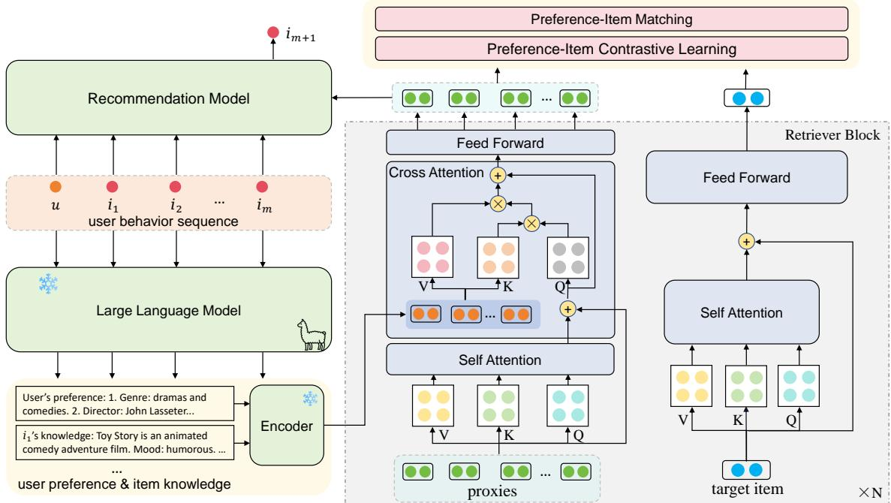
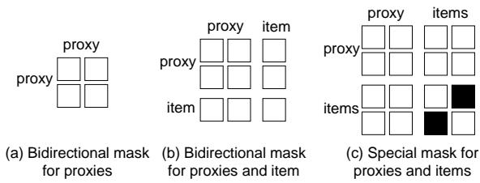
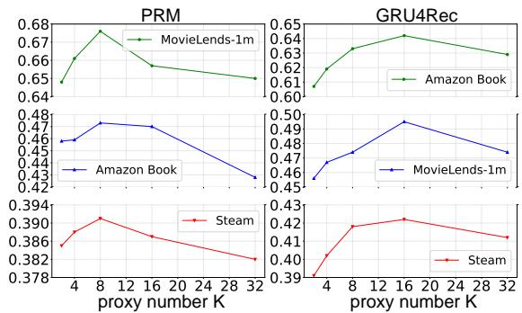

# Enhancing Reranking for Recommendation with LLMs through User Preference Retrieval

Haobo Zhang1, Qiannan Zhu2,3\*, Zhicheng Dou1∗

1Gaoling School of Artificial Intelligence, Renmin University of China

2School of Artificial Intelligence, Beijing Normal University

3Engineering Research Center of Intelligent Technology and Educational Application, MOE, China {zhanghb, dou}@ruc.edu.cn, zhuqiannan@bnu.edu.cn

## Abstract

Recently, large language models (LLMs) have shown the potential to enhance recommendations due to their sufficient knowledge and remarkable summarization ability. However, the existing LLM-powered recommendation may create redundant output, which generates irrelevant information about the user’s preferences on candidate items from user behavior sequences. To address the issues, we propose a framework UR4Rec that enhances reranking for recommendation with large language models through user preference retrieval. Specifically, UR4Rec develops a small transformerbased user preference retriever towards candidate items to build the bridge between LLMs and recommendation, which focuses on pro ducing the essential knowledge through LLMs from user behavior sequences to enhance reranking for recommendation. Our experimental results on three real-world public datasets demonstrate the superiority of UR4Rec over existing baseline models.

## 1 Introduction

Recommender systems play a pivotal role in modern online services and applications, which are widely studied in both industry and academia (He et al., 2017; Xiao et al., 2017; Guo et al., 2017). Reranking is a crucial research direction in the recommendation field, which is mainly to rank a candidate set after initial retrieval. During the past decade, various recommendation methods have been presented to explore users’ personal preferences and provide them with recommendations based on their historical interactions (Kang and McAuley, 2018; Hidasi et al., 2016; Tang and Wang, 2018; Zhou et al., 2020). Despite the success of the conventional recommenders, there are some inherent limitations and deficiencies. First, traditional methods are trained on limited datasets from a few domains, suffering from the general world knowledge beyond user sequences and insufficient item understanding (Wang et al., 2018; Liu et al., 2023; Xi et al., 2023). Second, the traditional methods have inadequate analysis of user preferences, as they typically explore user sequences with ID features, rather than explicit user needs such as natural language (Lin et al., 2023b; Ren et al., 2023).

Recently, Large Language Models (LLMs) such as ChatGPT (OpenAI, 2023) offer a vast repository of world knowledge and have remarkable capabilities in generation, summarization, and generalization, providing a potential approach for powering recommendation (Xi et al., 2023; Liu et al., 2023). The existing LLM-powered recommendation can be roughly classified into three categories: (1) LLM directly acts as a recommender system (Hou et al., 2023; Zhang et al., 2023c), which mainly designs a prompt based on the user profile and candidates to recommend an item or rerank the item list. (2) LLM is leveraged to enhance traditional recommendation methods (Ren et al., 2023) by analyzing user preference from the historical interaction, or generating some knowledge for items. It can also generate some extra data for augmentation. (3) LLM serves as a recommendation simulator in the recommendation process (Ren et al., 2023), which mainly stimulates a virtual environment for users and items to interact. This paper primarily focuses on the second scenario.

Although significant progress has been made in enhancing recommendations with LLMs, there are still some shortcomings. As shown in Figure 1, LLM provides a large amount of information but only part of them are relevant to candidate items. Second, there exists a semantic gap between the LLM-generated output and the vectors of traditional recommendation methods because LLMs are not trained on recommendation datasets and tasks. Based on this, there are challenges in incorporating LLMs into recommendation systems

## LLM-Generated preference : LLM-Generated preference :

1. Genre: the user seems to prefer dramas and comedies, as these genres make up the majority of their watched movies. 2. Director/Actors: The user has watched movies directed by famous directors such as John Lasseter, Martin Scorsese, and Frank Capra. He has also watched movies starring famous actors like Humphrey Bogart and Claudette Colbert. 3. Time Period/Country: The user has watched classic movies from the 1930s to the 1950s and movies from the 1980s to the 1990s. He has also watched movies from different countries, including the US, the UK, and Japan. 4. Character: The user prefers movies with strong, well-developed characters. They have watched movies with iconic characters such as Rick Blaine from “Casablanca” and Captain Virgil Hilts from “The Great Escape.” 5. Mood/Tone: The user prefers movies with a lighthearted, heartwarming tone. He watched many movies that are classified as comedies, and he gave high ratings to movies such as “Duck Soup” and “Young Frankenstein.”

Figure 1: An example of user preference generated by LLM for recommending candidate items. Text in red font denotes valuable information when recommending item 1, while underlined text denotes valuable informa tion when recommending item 2. In these texts, the fourth entry is the useless information.

while considering the efficacy and usefulness of the LLM-generated content.

To address the above issues, we propose a framework UR4Rec to enhance the traditional reranking recommendation models by harnessing the rich world knowledge and superior summarization and generation capabilities of LLMs. Specifically, UR4Rec develops a transformer-based user preference retriever to build the bridge between the LLMs and traditional recommendation models, where the generated user and item knowledge of LLMs from user behavior sequences are retrieved as necessary knowledge of user preference, and make them LLM-to-recommendation alignment for enhancing recommendation performance. For retrieval, we introduce a cross-attention mechanism and leverage the candidate item as a query to filter the generated user preferences and retrieve accurate and necessary information, which can be used as augmented vectors for the recommender system. For alignment, we design two pre-training objectives including contrastive learning and preference-item matching. The objectives can make LLM-generated embeddings keep aligned with the embedding of the recommender system. Extensive experiments on three datasets show that our UR4Rec significantly outperforms the state-of-the-art models.

Our main contributions are as follows:

(1) We propose a UR4Rec framework that retrieves the necessary information from the user and item knowledge generated from LLM and aligns the LLM with the recommenders to enhance the reranking for recommendation.

(2) We design a retriever component to retrieve the LLM-generated user preference and item knowledge using a candidate item as the query.

(3) We introduce two pre-training objectives to bridge and align the LLM with traditional recommendation models.

## 2 Related Work

The methods of employing LLMs to make recommendations can be divided into three main categories: directly using LLMs as a recommender, leveraging LLMs to enhance traditional recommendation models, and using LLMs as the recommendation simulator. We focus on the second route of enhancing traditional recommenders using LLMs.

• LLM as a Recommender. Due to the powerful reasoning and analytical capabilities of LLM, researchers initially attempted to use it directly as recommenders to generate task results (Chen, 2023; Zhiyuli et al., 2023). ChatRec(Gao et al., 2023) designed prompts by straightforwardly concatenating the user history and task description and input them to ChatGPT for zero-shot recommendations, but it cannot get satisfactory results. Consequently, several studies (Zhang et al., 2023c; Wang and Lim, 2023; Hou et al., 2023) made an effort to convey richer information to LLM by using techniques like in-context learning in the prompts, facilitating more detailed reasoning of LLM. Furthermore, some researchers (Bao et al., 2023b,a; Li et al., 2023b) tried another route of fine-tuning locally trainable LLM to make it better fit for recommendation and ranking tasks. Through the method of instruction tuning (Lin et al., 2023a) or Q-Lora tuning(Yue et al., 2023), the model can better apply its knowledge and reasoning ability to recommendations.

• LLM-enhanced Recommender System. Since LLMs are not trained on recommendation and ranking datasets, using them directly as recommenders is difficult to generate item rankings properly and accurately. To address the limitations, researchers have explored another approach that utilizes LLMs to enhance traditional recommenders. LLM can be used as an encoder to generate textual embeddings of users and items, which can enrich the semantic information in the recommenders for better performance (Qiu et al., 2021; Zhang et al., 2023d). Moreover, LLM can also be used for data augmentation by summarizing user information or generating texts of item knowledge, which can be utilized to enhance the semantic representation of user and item or graph-based representation (Ren et al., 2023; Wei et al., 2023; Du et al., 2023). For example, KAR (Xi et al., 2023) leveraged LLM to generate user preference and movie knowledge and transform them into augment vectors for recommenders via a Hybrid-expert Adaptor.

• LLM as Recommendation Simulator. To bridge the gap between online performance and offline metrics, LLMs are also used to simulate virtual users and interactions between users and the environment (Zhang et al., 2023b; Wang et al., 2023). For example, Agent4rec (Zhang et al., 2023a) developed a movie simulator and leveraged user profiles, memory, and actions to construct agents to interact with the environment. However, there are still problems such as privacy and the gap between virtual environments and real-world scenarios.

## 3 Method

We propose a framework to enhance reranking for recommendations with LLMs through user preference retrieval, namely UR4Rec, which retrieves the necessary information from LLM-generated knowledge and makes LLM-to-recommendation alignment. As shown in Figure 2, our model mainly consists of three components: LLM, user preference retriever, and recommender system. The LLM is used to generate item knowledge and user preference. The retriever is to filter the generated knowledge and retrieve accurate information on candidate items and align the LLM with recommenders. The recommender system is augmented using the retrieved information from the retriever.

## 3.1 LLM-based Generator

The generator summarizes user preferences and gets rich item knowledge with LLM. The key is to design prompts to make full use of the LLM’s knowledge and ability of summarization. To better analyze user preferences and enrich item knowledge, we design two sets of prompts for user preference generation and item knowledge generation.

## 3.1.1 User Preference Generation

The user preference is the user’s interest in item attributes, which can be inferred from his historical interactions. Consequently, given the user u and his historical interactions $H = [ i _ { 1 } , i _ { 2 } , . . . , i _ { m } ]$ , we use $T ( i _ { j } )$ to denote the title and category information of the $j \cdot$ -th historical item. We design a prompt template $f _ { u }$ to summarize u’s preference:

$$
p _ { u } = f _ { u } ( u , T ( i _ { 1 } ) , T ( i _ { 2 } ) , . . . , T ( i _ { m } ) ) ,\tag{1}
$$

where u denotes the user’s individual information. Since the output of LLM is significantly influenced by instructions in the prompt, to summarize user preferences more accurately, we precisely design a prompt template, and an example from the Steam dataset is shown below:

Input: Your task is to use some keywords to summarize the   
user’s preference based on historical interactions. Given   
a user whose history of playing games over time is listed   
below:["Windosill", an Adventure and Casual and Indie game,   
2 stars;. . . ]. Please analyze the user’s preferences   
on games about factors like genre, development company,   
graphics quality, game plot, and storyline,. . . . Please   
give an analysis that incorporates specific elements from   
the user’s history of game interactions and other relevant   
factors.   
Output: Based on the user’s history of playing games, we   
can summarize the preferences as follows: 1. Genre: He   
has played games with a mix of different genres, including   
action, indie, RPG, adventure, and strategy. ...

We use Llama2-Chat (Touvron et al., 2023) to generate user preferences with prompts that can fully leverage the capabilities of LLMs:

$$
s _ { u } = \mathrm { L L M } ( p _ { u } ) .\tag{2}
$$

## 3.1.2 Item Knowledge Generation

The item knowledge contains various aspects of open information about an item, including its category, content, price, and other details. To effectively extract the comprehensive knowledge of the item contained in LLM, this component takes the item’s basic information (title and brand) as input. We design an item-specific prompt template $f _ { i } ,$ , and use Llama2-Chat to generate item knowledge:

$$
\begin{array} { r } { p _ { i } = f _ { i } ( T ( I ) ) , } \\ { s _ { i } = \mathrm { L L M } ( p _ { i } ) . } \end{array}\tag{3}
$$

We design the prompt templates according to the item attributes, some of which correspond to the historical item attributes in the user preference prompt to match each other better.

Input: Your task is to craft a detailed overview of the   
game "Half-Life" by Valve, covering aspects such as genre,   
publish company, graphics quality, price, game plot,..   
Output: Half-Life is a first-person shooter game developed   
by Valve Corporation. It was released on November 19, 1998   
for Microsoft Windows. 1. Genre: First-person shooter...

## 3.2 User Preference Retriever

There exists useless information in the user preference and item knowledge generated by LLM, and also exists a gap between LLM and recommenders. Therefore, the user preference retriever aims to filter them and retrieve accurate information in the

  
Figure 2: The architecture of our UR4Rec model.

LLM-generated preference and knowledge, and align the LLM with recommenders to improve the recommendation performance. As shown in Figure 2, the retriever is a transformer-based network and each block is composed of a self-attention layer (MHAtt), a cross-attention layer (CrossAtt), and a feed-forward layer (FFN), which is used to retrieve useful information based on candidate items. The retriever can be formulated as:

$$
\begin{array} { r l } & { \mathbf { X } _ { M } ^ { p } = \mathbf { M H A t t } ( \mathbf { W } ^ { Q } \mathbf { X } ^ { p } , \mathbf { W } ^ { K } \mathbf { X } ^ { p } , \mathbf { W } ^ { V } \mathbf { X } ^ { p } ) + \mathbf { X } ^ { p } , } \\ & { \mathbf { X } _ { C } ^ { p } = { \mathrm { C r o s s A t t } } ( \mathbf { W } ^ { \prime Q } \mathbf { X } _ { M } ^ { p } , \mathbf { W } ^ { \prime K } \mathbf { Z } , \mathbf { W } ^ { \prime V } \mathbf { Z } ) + \mathbf { X } _ { M } ^ { p } , } \\ & { \mathbf { X } ^ { p + 1 } = { \mathrm { F F N } } ( \mathbf { X } _ { C } ^ { p } ) + \mathbf { X } _ { C } ^ { p } , } \end{array}\tag{4}
$$

where p denotes the p-th block, $\mathbf { X } ^ { 0 }$ is the direct input of the first block which is different based on the distinct training scenarios described in Sections 3.2 and 3.3, the self-attention layer has the same architecture with that in Transformer (Vaswani et al., 2017), the cross-attention layer has the same network architecture with the self-attention while the cross-attention takes $\mathbf { X } _ { M } ^ { p }$ as query and Z as key and value to calculate cross-attention between them, Z in our method is the vectors obtained by encoding the preferences and knowledge generated by LLM using a freeze encoder:

$$
\begin{array} { r } { \quad \mathbf { e } _ { u } = \operatorname { E n c o d e r } ( s _ { u } ) , \quad \quad } \\ { \mathbf { e } _ { i _ { k } } = \operatorname { E n c o d e r } ( s _ { i _ { k } } ) , \quad \quad } \\ { \mathbf { e } _ { u } ^ { \mathrm { a g g r } } = \operatorname { A g g } ( \mathbf { e } _ { u } , \mathbf { e } _ { i _ { 1 } } , . . . , \mathbf { e } _ { i _ { m } } ) , } \end{array}\tag{5}
$$

where Encoder is BERT, Agg is a concatenation.

For better interaction with LLM-generated preference and alignment, we create some proxy embeddings $\mathbf { P } = [ \mathbf { p } _ { 1 } , \mathbf { p } _ { 2 } , . . . , \mathbf { p } _ { K } ]$ as part of the direct input of transformer, and also take the item representation from the recommendation system as the direct input. The proxy embeddings can interact with the preferences through cross-attention mechanisms to filter the information from the LLMgenerated preference, and the item representation can be used to align the recommendation vectors and LLM-generated vectors when we input it and the proxies into the transformer separately. It can also be used as the query to retrieve necessary information from LLM-generated preference when concatenating with the proxies as input. We initialize the parameters of the self-attention and FFN layer with BERT-base (Devlin et al., 2019) and randomly initialize the parameters of the cross-attention layer. To better retrieve the useful information and make LLM-to-recommendation alignment, we design a two-phase training method and two training objectives for the pre-training phase, including contrastive learning and preference-item matching.

Contrastive Learning. This training objective aims to align the embedding of LLM-generated preference and recommendation embedding by contrasting and distinguishing the positive and negative items. Contrastive learning mainly maximizes the distance between positive and negative items using their similarity matching with filtered preference. For each sample consisting of history and a candidate item, we first leverage the proxies, LLMgenerated preference, and item knowledge as input to filter the accurate information:

  
Figure 3: Masking strategies in our model.

$$
\mathbf { e } ^ { \mathrm { p r e f } } = \mathrm { R e t r i e v e r } ( \mathbf { P } , \mathbf { e } _ { u } ^ { \mathrm { a g g r } } ) ,\tag{6}
$$

where P is the direct input $( \mathbf { X } ^ { 0 } = \mathbf { P } )$ , the aggregated preference vector ${ \bf e } _ { u } ^ { \mathrm { a g g r } }$ is the input of crossattention layer, and we use the bidirectional mask as in Figure 3(a) to make them attend to each other. We also input a positive item $i ^ { \mathrm { p o s } }$ and M randomly selected negative items $i _ { 1 } ^ { \mathrm { n e g } } , . . . , i _ { M } ^ { \mathrm { n e g } }$ to the transformer to get the information of items and calculate the similarity scores with filtered preference. Noted that there is no cross-attention layer in this operation and we only use the first and third formulas in Equation (4):

$$
\mathbf { e } _ { i } ^ { \mathrm { p o s / n e g } } = \mathrm { R e t r i e v e r } ( \mathbf { h } _ { i \mathrm { p o s / n e g } } ) ,\tag{7}
$$

where $\mathbf { h } _ { i \mathrm { p o s / n e g } }$ is the representation of $i ^ { \mathrm { p o s / n e g } }$ in the original trained recommendation model. Following previous works (Zhu et al., 2021; Gao et al., 2021; Wu et al., 2020), we utilize the widely used InfoNCE loss as the contrastive learning loss for a positive pair:

$$
\mathcal { L } _ { \mathrm { C L } } = - \sum _ { j = 1 } ^ { N } \log \frac { \exp ( \sin ( \mathbf { e } _ { j } ^ { \mathrm { p r e f } } , \mathbf { e } _ { j } ^ { \mathrm { p o s } } ) / \tau ) } { \sum _ { k = 1 } ^ { M } \exp ( \sin ( \mathbf { e } _ { j } ^ { \mathrm { p r e f } } , \mathbf { e } _ { j } ^ { \mathrm { n e g } _ { k } } ) / \tau ) } ,
$$

where N is the number of training samples, $\tau$ is a hyperparameter. The function sim(·) first calculates the cosine similarity between the output vector of the K proxies and $\bf { \dot { e } } _ { i } ^ { p o s / n e g }$ and then takes the maximum of them as the similarity result.

Preference-Item Matching. This training method leverages a binary classification task to predict whether the filtered preference matches the candidate item. It enables the model to learn to discriminate the positive and negative items, facilitating better alignment and matching between preferences and items. In this part, we concatenate the proxies P and the item representation as the direct input, and the LLM-generated knowledge as the cross-attention input and get logits for classification. Then we leverage a linear layer and average the logits from the position of the K proxies as input to get a matching score:

$$
\begin{array} { r } { \mathbf { e } _ { i } ^ { \mathrm { l o g i t } } = \mathrm { R e t r i e v e r } ( [ \mathbf { P } ; \mathbf { h } _ { i } ] , \mathbf { e } _ { u } ^ { \mathrm { a g g r } } ) , } \\ { \hat { y } = \mathrm { L i n e a r } ( \arg ( \mathbf { e } _ { i } ^ { \mathrm { l o g i t } } ) ) , \quad } \end{array}\tag{8}
$$

where $\mathbf { h } _ { i }$ is the representation of item i from recommendation model, [; ] is the concatenation operation. We also design a bi-directional masking strategy as Figure 3(b) to ensure sufficient interaction among items, proxies, and preferences. To improve the model’s ability to discriminate negative samples, we randomly selected a set of negative examples for each positive instance for classification. We use the binary cross entropy loss as the objective function for classification:

$$
\mathcal { L } _ { \mathrm { C F } } = - \sum _ { j = 1 } ^ { N } [ y _ { j } \log \hat { y _ { j } } + ( 1 - y _ { j } ) \log ( 1 - \hat { y _ { j } } ) ] ,
$$

where $y _ { j } = 1$ when the item matches the preference in sample j else $y _ { j } = 0$

## 3.3 Augmentation for Recommender System

After the pre-training stage, the retriever can effectively filter the information and retrieve accurate preferences on each item from the preferences generated by LLM. We can leverage the filtered preference embeddings from the retriever as the augmented vectors for recommender systems. Here we focus on the reranking task and select several traditional recommendation models as backbone models, which generally can be formulated as:

$$
\begin{array} { r l } & { { \mathbf { e } } _ { i } ^ { \mathrm { a u g } } = \mathrm { A g g } ( \mathrm { R e t r i e v e r } ( [ { \mathbf { P } } ; \mathbf { h } _ { i } ] , { \mathbf { e } } _ { u } ^ { \mathrm { a g g r } } ) ) , } \\ & { \quad \hat { r } _ { j } = \mathrm { R e c S y s } ( u , H , { \mathbf { e } } _ { i } ^ { \mathrm { a u g } } ; \boldsymbol { \theta } ) , } \\ & { \quad \mathcal { L } _ { \mathrm { R S } } = \mathrm { R e c - L o s s } ( \hat { r } _ { j } , r _ { j } ) , } \end{array}\tag{9}
$$

where Rec-Loss denotes the optimization objective of the recommender, θ is the parameters of the recommender, and the augmented vector ${ \bf e } _ { i } ^ { \mathrm { a u g } }$ is the aggregation of the embeddings on the position of K proxies. In our model, we concatenate ${ \bf e } _ { i } ^ { \mathrm { a u g } }$ with the candidate items’ embeddings in the backbone model’s input to augment recommendation. To accelerate the process of generating augmented vectors for all candidate/historical items in each sample, we also develop another approach to obtain augmented vectors by jointly taking proxies and multiple items as input, and leveraging the aggregation of embeddings on the position of proxies and each item as their output vectors:

<table><tr><td>Dataset</td><td>#Users</td><td>#Items</td><td>#Interactions</td></tr><tr><td>MovieLens-1M</td><td>6,040</td><td>3,883</td><td>1,000,209</td></tr><tr><td>Amazon-book</td><td>11,906</td><td>17,332</td><td>1,585,172</td></tr><tr><td>Steam</td><td>6,959</td><td>2,889</td><td>717,862</td></tr></table>

Table 1: Statistics of the three datasets

$$
\mathbf { e } _ { i _ { 1 } } ^ { \mathrm { a u g } } , . . . \mathbf { e } _ { i _ { l } } ^ { \mathrm { a u g } } = \mathrm { R e t r i e v e r } ( [ \mathbf { P } ; \mathbf { h } _ { i _ { 1 } } , . . . , \mathbf { h } _ { i _ { l } } ] , \mathbf { e } _ { u } ^ { \mathrm { a g g r } } ) ,
$$

where l is the number of items. Additionally, we design a masking strategy to ensure that each item cannot attend to each other and the proxies can attend to all items, as shown in Figure 3(c).

## 3.4 Model Optimization

The process of our model UR4Rec is described as Algorithm 1 in Appendix A. UR4Rec takes user u and his historical interactions H as inputs and is trained in three phases: (1) We leverage the LLM to generate the user’s preference and item’s knowledge without tuning its parameters. (2) We leverage the two training objectives to pre-train the parameters of the retriever and the optimization function is: ${ \mathcal { L } } _ { \mathrm { p r e t r a i n } } = { \mathcal { L } } _ { \mathrm { C L } } + \alpha \cdot { \mathcal { L } } _ { \mathrm { C F } }$ , where α is a hyperparameter. (3) We jointly train the parameters of the retriever and the recommender system to ensure that the generated augmented vector adapts to the rerank task better, and the optimization function is $\mathcal { L } _ { \mathrm { t r a i n } } = \mathcal { L } _ { \mathrm { R S } }$

## 4 Experimental Setup

## 4.1 Dataset

We choose three public datasets as our evaluation datasets, including MovieLens-1M, Amazonbook, and Steam. We perform k-core filtering on them and divide the datasets into the training, validation, and test sets with a ratio of 8:1:1. Statistics of the datasets are shown in Table 1. More details are in Appendix C.

## 4.2 Backbone Models and Baselines

We select three augmented methods BERT-aug (Devlin et al., 2019), Llama2-Chat-aug (Touvron et al., 2023), KAR (Xi et al., 2023), and two state-of-theart recommenders Recformer (Li et al., 2023a) and LRURec (Yue et al., 2024) as baselines. Detailed descriptions are in Appendix D.

For the base model, we select 5 reranking methods DLCM (Ai et al., 2018), PRM(Pei et al., 2019), SetRank (Pang et al., 2020), GRU4Rec (Hidasi et al., 2016), and SASRec (Kang and McAuley, 2018) as backbones. Among them, the first three (DLCM, PRM, SetRank) mainly encode the dependencies among candidates and user-item interactions, while the latter two (GRU4Rec, SASRec) focus on modeling the user sequence to capture user’s interests for more accurate predictions.

## 4.3 Evaluation Metrics

To validate the accuracy and effectiveness of the models, we adopt MAP@N and NDCG@N as our metrics, which are widely used in the previous study (Pei et al., 2019; Kang and McAuley, 2018).

## 4.4 Implementation Details

We choose Llama2-Chat (Touvron et al., 2023) as our LLM for generation and summarization. Following the baselines, the history length is set to 10 for the first three base models and 150 for the latter two base models. The number of proxies is set to 8 for the first three base models and 16 for the latter two models. We use a BERT-base model with 110M parameters to initialize the Retriever. We utilize AdamW (Loshchilov and Hutter, 2019) to optimize the trainable parameters with batch size 32 and learning rate 1e-4 for the first three base methods and 1e-3 for the latter two methods. The dimension of the embeddings is set to 768. The number of candidate items in the reranking process is 100 and the number of negatives in the pretraining stage is 10. In our model, LLM generation and pre-training can be completed offline, similar to the pre-training and downstream task adaptation stages in other fields. The main training component, the Retriever, is a small Transformer network, resulting in the training time of the augmented recommender being close to the original recommender.

## 5 Experimental Results

## 5.1 Results

The results of all baseline methods are shown in Table 2. The results of other metrics are shown in the table 6 of Appendix. From the results, we can find: (1) Our model outperforms all augmentation baselines on the three datasets. For example, the best improvement of UR4Rec over KAR on NDCG@10 achieves 38.6%, 39.8%, and 19.3% when using DLCM as the backbone model. This is mainly because our retriever can retrieve necessary information on items to enhance the recommender and align it with LLM. (2) Our UR4Rec outperforms the other LLM-based methods (Llama2-Chat-aug, KAR). It proves our hypothesis of the inaccurate information presented in the LLM-generated preferences and demonstrates the effectiveness of our retriever in preference retrieval and alignment. (3) LLM-based methods achieve better performance than BERT-augmented methods, which demonstrates that the extra knowledge and user preference generated by LLM can boost the recommenders for more accurate predictions. (4) Our model can enhance the performance of all the backbone models, which is mainly because our model can retrieve valuable information on candidates from historical items. (5) UR4Rec makes a greater improvement in the first three backbone models compared to the latter two. One likely reason is that the latter two capture a portion of user interests based on historical sequences, while the first three models do not. (6) We also compare UR4Rec with state-of-the-art recommenders in Table 5 of Appendix. UR4Rec achieves better performance than such two recommendation models.

<table><tr><td colspan="2">Model</td><td colspan="4">MovieLens-1M</td><td colspan="4">Amazon-Book</td><td colspan="4">Steam</td></tr><tr><td>Backbone</td><td>Variants</td><td>M@1</td><td>M@5</td><td>N@1</td><td>N@5</td><td>M@1</td><td>M@5</td><td>N@1</td><td>N@5</td><td>M@1</td><td>M@5</td><td>N@1</td><td>N@5</td></tr><tr><td rowspan="5">DLCM</td><td>Base</td><td>0.158</td><td>0.235</td><td>0.158</td><td>0.271</td><td>0.024</td><td>0.047</td><td>0.024</td><td>0.058</td><td>0.139</td><td>0.206</td><td>0.139</td><td>0.238</td></tr><tr><td>+BERT</td><td>0.215</td><td>0.324</td><td>0.215</td><td>0.371</td><td>0.108</td><td>0.185</td><td>0.108</td><td>0.222</td><td>0.145</td><td>0.216</td><td>0.145</td><td>0.249</td></tr><tr><td>+Llama2</td><td>0.229</td><td>0.341</td><td>0.229</td><td>0.387</td><td>0.127</td><td>0.207</td><td>0.127</td><td>0.245</td><td>0.156</td><td>0.231</td><td>0.156</td><td>0.265</td></tr><tr><td>KAR</td><td>0.257</td><td>0.388</td><td>0.257</td><td>0.424</td><td>0.176</td><td>0.250</td><td>0.176</td><td>0.286</td><td>0.180</td><td>0.253</td><td>0.180</td><td>0.287</td></tr><tr><td>UR4Rec</td><td>0.484*</td><td>0.588*</td><td>0.484*</td><td>0.631*</td><td>0.262*</td><td>0.379*</td><td>0.262*</td><td>0.428*</td><td>0.215*</td><td>0.307*</td><td>0.215*</td><td>0.348*</td></tr><tr><td rowspan="5">PRM</td><td>Base</td><td>0.156</td><td>0.242</td><td>0.156</td><td>0.283</td><td>0.025</td><td>0.048</td><td>0.025</td><td>0.060</td><td>0.141</td><td>0.209</td><td>0.141</td><td>0.241</td></tr><tr><td>+BERT</td><td>0.210</td><td>0.307</td><td>0.210</td><td>0.349</td><td>0.078</td><td>0.144</td><td>0.078</td><td>0.175</td><td>0.145</td><td>0.214</td><td>0.145</td><td>0.245</td></tr><tr><td>+Llama2</td><td>0.223</td><td>0.328</td><td>0.223</td><td>0.374</td><td>0.101</td><td>0.169</td><td>0.101</td><td>0.202</td><td>0.156</td><td>0.224</td><td>0.156</td><td>0.256</td></tr><tr><td>KAR</td><td>0.269</td><td>0.369</td><td>0.269</td><td>0.424</td><td>0.141</td><td>0.201</td><td>0.141</td><td>0.245</td><td>0.177</td><td>0.255</td><td>0.177</td><td>0.276</td></tr><tr><td>UR4Rec</td><td>0.501*</td><td>0.606*</td><td>0.501*</td><td>0.649*</td><td>0.280*</td><td>0.387*</td><td>0.280*</td><td>0.433*</td><td>0.214*</td><td>0.304*</td><td>0.214*</td><td>0.345*</td></tr><tr><td rowspan="5">SetRank</td><td>Base</td><td>0.154</td><td>0.239</td><td>0.154</td><td>0.279</td><td>0.024</td><td>0.047</td><td>0.024</td><td>0.059</td><td>0.128</td><td>0.203</td><td>0.128</td><td>0.236</td></tr><tr><td>+BERT</td><td>0.212</td><td>0.305</td><td>0.212</td><td>0.346</td><td>0.104</td><td>0.184</td><td>0.104</td><td>0.223</td><td>0.144</td><td>0.215</td><td>0.144</td><td>0.248</td></tr><tr><td>+Llama2</td><td>0.238</td><td>0.344</td><td>0.238</td><td>0.366</td><td>0.119</td><td>0.201</td><td>0.119</td><td>0.238</td><td>0.157</td><td>0.229</td><td>0.157</td><td>0.261</td></tr><tr><td>KAR</td><td>0.283</td><td>0.407</td><td>0.283</td><td>0.425</td><td>0.172</td><td>0.241</td><td>0.172</td><td>0.276</td><td>0.173</td><td>0.250</td><td>0.173</td><td>0.284</td></tr><tr><td>UR4Rec</td><td>0.509*</td><td>0.614*</td><td>0.509*</td><td>0.655*</td><td>0.313*</td><td>0.425*</td><td>0.313*</td><td>0.471*</td><td>0.190*</td><td>0.286*</td><td>0.190*</td><td>0.329*</td></tr><tr><td rowspan="5">SASRec</td><td>Base</td><td>0.345</td><td>0.505</td><td>0.345</td><td>0.555</td><td>0.428</td><td>0.539</td><td>0.428</td><td>0.584</td><td>0.206</td><td>0.304</td><td>0.206</td><td>0.348</td></tr><tr><td>+BERT</td><td>0.348</td><td>0.510</td><td>0.348</td><td>0.557</td><td>0.437</td><td>0.545</td><td>0.437</td><td>0.593</td><td>0.222</td><td>0.318</td><td>0.222</td><td>0.361</td></tr><tr><td>+Llama2</td><td>0.354</td><td>0.517</td><td>0.354</td><td>0.565</td><td>0.454</td><td>0.552</td><td>0.454</td><td>0.609</td><td>0.228</td><td>0.321</td><td>0.228</td><td>0.369</td></tr><tr><td>KAR</td><td>0.363</td><td>0.525</td><td>0.363</td><td>0.579</td><td>0.484</td><td>0.584</td><td>0.484</td><td>0.630</td><td>0.235</td><td>0.330</td><td>0.235</td><td>0.377</td></tr><tr><td>UR4Rec</td><td>0.400*</td><td>0.546*</td><td>0.400*</td><td>0.606*</td><td>0.537*</td><td>0.622*</td><td>0.537*</td><td>0.661*</td><td>0.259*</td><td>0.348</td><td>0.259*</td><td>0.388</td></tr><tr><td rowspan="5">GRU4Rec</td><td>Base</td><td>0.240</td><td>0.340</td><td>0.240</td><td>0.383</td><td>0.325</td><td>0.407</td><td>0.325</td><td>0.441</td><td>0.180</td><td>0.267</td><td>0.180</td><td>0.306</td></tr><tr><td>+BERT</td><td>0.254</td><td>0.355</td><td>0.254</td><td>0.401</td><td>0.351</td><td>0.463</td><td>0.351</td><td>0.512</td><td>0.192</td><td>0.280</td><td>0.192</td><td>0.320</td></tr><tr><td>+Llama2</td><td>0.263</td><td>0.366</td><td>0.263</td><td>0.410</td><td>0.366</td><td>0.481</td><td>0.366</td><td>0.530</td><td>0.213</td><td>0.305</td><td>0.213</td><td>0.346</td></tr><tr><td>KAR</td><td>0.302</td><td>0.381</td><td>0.302</td><td>0.439</td><td>0.437</td><td>0.538</td><td>0.437</td><td>0.580</td><td>0.219</td><td>0.312</td><td>0.219</td><td>0.353</td></tr><tr><td>UR4Rec</td><td>0.335*</td><td>0.417*</td><td>0.335*</td><td>0.468*</td><td>0.476*</td><td>0.573*</td><td>0.476*</td><td>0.613*</td><td>0.242*</td><td>0.334*</td><td>0.242*</td><td>0.375*</td></tr></table>

Table 2: The results of MAP@1,5 and NDCG@1,5 on five backbones and three datasets. The best results are shown in bold. \* indicate the model outperforms all baselines significantly with paired t-test for p<0.05.

## 5.2 Ablation Study

We construct a series of ablation experiments to demonstrate the effectiveness of our model: (1) w/o. Retr. We remove the retriever in Equation (9) and directly use the embedding generated by LLM in Equation (5) as augment vectors. (2) w/o. proxy. We remove the proxy embeddings in the retriever and the contrastive learning task, and allow the LLM-generated vectors to interact with the item embedding in the transformer directly. (3) proxy random. We initialize the proxy embeddings in the stage of jointly training with recommenders to verify the effectiveness of pre-trained proxies. (4) w/o. LLM. We remove the LLM and replace it with BERT to connect with the retriever and use the BERT embedding as the input of cross-attention. (5)w/o. pretrain. We remove the pertaining stage and the two objectives in Section 3.2. (6) w/o. CL. We remove the contrastive learning task in the pre-training stage. (7) w/o. PIM. We remove the preference-item matching in the pre-training stage.

The results with PRM and GRU4Rec as backbones are shown in Table 3. We find: (1) The model w/o. Retr has degraded performance, which infers that the retriever can effectively retrieve important information from LLM-generated preferences and align LLM with the recommenders. (2) The low results of w/o. LLM shows that LLMs can effectively analyze and summarize preferences and enrich the item knowledge, which can significantly enhance the recommenders. (3) UR4Rec achieves better performance than w/o. proxy and proxy random. It reveals that the proxies and pre-training objectives make a difference in the process of retrieving accurate information on the items. (4) UR4Rec outperforms w/o. pretrain, demonstrating that the pertaining stage and the pertaining objectives can greatly improve the performance of retrieval and alignment. (5) The model w/o. CL and w/o. PIM both have degraded performance, which indicates the importance of the two pertaining tasks for knowledge retrieval and alignment. (6) The performance of w/o. CL is higher than that of w/o. PIM, demonstrating that the preference-item matching task has a greater impact on improving model performance. This is because the PIM task can train the retrieval and the alignment process more effectively through the interaction of item vector and LLM knowledge and concatenating with proxy.

<table><tr><td rowspan="2">Model</td><td colspan="2">PRM</td><td colspan="2">GRU4Rec</td></tr><tr><td>M@10</td><td>N@10</td><td>M@10</td><td>N@10</td></tr><tr><td colspan="5">MovieLens-1M</td></tr><tr><td>UR4Rec</td><td>0.618</td><td>0.676</td><td>0.434</td><td>0.495</td></tr><tr><td>w/o Retr</td><td>0.348</td><td>0.421</td><td>0.380</td><td>0.446</td></tr><tr><td>w/o proxy</td><td>0.545</td><td>0.615</td><td>0.409</td><td>0.464</td></tr><tr><td>proxy random</td><td>0.570</td><td>0.632</td><td>0.422</td><td>0.481</td></tr><tr><td>w/o CL</td><td>0.554</td><td>0.616</td><td>0.418</td><td>0.472</td></tr><tr><td>w/o PIM</td><td>0.527</td><td>0.597</td><td>0.401</td><td>0.451</td></tr><tr><td>w/o LLM</td><td>0.521</td><td>0.590</td><td>0.380</td><td>0.448</td></tr><tr><td>w/o pretrain</td><td>0.524</td><td>0.592</td><td>0.396</td><td>0.449</td></tr><tr><td colspan="5">Amazon-book</td></tr><tr><td>UR4Rec</td><td>0.404</td><td>0.473</td><td>0.585</td><td>0.642</td></tr><tr><td>w/o Retr</td><td>0.189</td><td>0.250</td><td>0.508</td><td>0.564</td></tr><tr><td>w/o proxy</td><td>0.284</td><td>0.368</td><td>0.570</td><td>0.627</td></tr><tr><td>proxy random</td><td>0.330</td><td>0.416</td><td>0.579</td><td>0.635</td></tr><tr><td>w/o CL</td><td>0.364</td><td>0.437</td><td>0.572</td><td>0.630</td></tr><tr><td>w/o PIM</td><td>0.359</td><td>0.428</td><td>0.567</td><td>0.624</td></tr><tr><td>w/o LLM</td><td>0.323</td><td>0.411</td><td>0.548</td><td>0.603</td></tr><tr><td>w/o pretrain</td><td>0.278</td><td>0.353</td><td>0.556</td><td>0.609</td></tr><tr><td colspan="5">Steam</td></tr><tr><td>UR4Rec</td><td>0.324</td><td>0.391</td><td>0.353</td><td>0.422</td></tr><tr><td>w/o Retr</td><td>0.242</td><td>0.300</td><td>0.323</td><td>0.391</td></tr><tr><td>w/o proxy</td><td>0.290</td><td>0.356</td><td>0.335</td><td>0.407</td></tr><tr><td>proxy random</td><td>0.305</td><td>0.361</td><td>0.343</td><td>0.411</td></tr><tr><td>w/o CL</td><td>0.306</td><td>0.373</td><td>0.334</td><td>0.409</td></tr><tr><td>w/o PIM</td><td>0.301</td><td>0.366</td><td>0.329</td><td>0.398</td></tr><tr><td>w/o LLM</td><td>0.278</td><td>0.341</td><td>0.317</td><td>0.383</td></tr><tr><td>w/o pretrain</td><td>0.295</td><td>0.359</td><td>0.328</td><td>0.392</td></tr></table>

Table 3: Performance (MAP@10, NDCG@10) of ablation models with PRM and GRU4Rec as backbones.

  
Figure 4: NDCG@10 results of UR4Rec with PRM and GRU4Rec as backbones on different proxy numbers.

## 5.3 Parameter Sensitivity

The important hyper-parameter in our model is the number of proxies K, and we evaluate the results on NDCG@10 under different K to analyze the sensitivity of our model to the parameters. We fix the other parameters and evaluate the performance when K is in [2,4,8,16,32], respectively. The results using PRM and GRU4Rec as backbones are shown in Figure 4. It shows that the performance is best when the number of proxies is about 8 for PRM and 16 for GRU4Rec on all datasets. The different optimal number of proxies may be related to the different history lengths for different models. The shorter the historical records in each sample, the less information is available for retrieval, which allows a small number of proxies to retrieve accurately, while too many proxies may lead to confusion. If the historical length is long, there will be massive preference information to retrieve, which results in the need for more proxies when retrieval.

## 6 Conclusion

In this paper, we propose a framework UR4Rec, which leverages the user preference and item knowledge generated by LLM to enhance the reranking for recommendations. We develop a transformer-based user preference retriever to retrieve important information and filter the knowledge generated from LLM. Correspondingly, we design two pre-training objectives to make the embedding of LLM align with the recommendation embedding. Experimental results demonstrate that our model can significantly outperform existing approaches on various backbone models.

## Limitations

The large language model is a black-box model and we mainly leverage the black-box model for experiments without explanations on the recommendation results. In the future, we can make an effort to develop a component to improve the performance and give an explanation for the result.

## Acknowledgements

This work was supported by Beijing Natural Science Foundation No. L233008, Beijing Municipal Science and Technology Project No. Z231100010323009, National Natural Science Foundation of China No. 62272467, No. 62472038, and No. 62437001, Fundamental Research Funds for the Central Universities No. 2233100004. The work was partially done at the Engineering Research Center of Next-Generation Intelligent Search and Recommendation, MOE, and the Engineering Research Center of Intelligent Technology and Educational Application, MOE, China.

## References

Qingyao Ai, Keping Bi, Jiafeng Guo, and W. Bruce Croft. 2018. Learning a deep listwise context model for ranking refinement. In The 41st International ACM SIGIR Conference on Research & Development in Information Retrieval, SIGIR ’18, page 135–144, New York, NY, USA. Association for Computing Machinery.

Keqin Bao, Jizhi Zhang, Wenjie Wang, Yang Zhang, Zhengyi Yang, Yancheng Luo, Fuli Feng, Xiang nan He, and Qi Tian. 2023a. A bi-step grounding paradigm for large language models in recommendation systems. CoRR, abs/2308.08434.

Keqin Bao, Jizhi Zhang, Yang Zhang, Wenjie Wang, Fuli Feng, and Xiangnan He. 2023b. Tallrec: An effective and efficient tuning framework to align large language model with recommendation. In RecSys, pages 1007–1014. ACM.

Zheng Chen. 2023. PALR: personalization aware llms for recommendation. CoRR, abs/2305.07622.

Jacob Devlin, Ming-Wei Chang, Kenton Lee, and Kristina Toutanova. 2019. BERT: pre-training of deep bidirectional transformers for language understanding. In NAACL-HLT (1), pages 4171–4186. Association for Computational Linguistics.

Yingpeng Du, Di Luo, Rui Yan, Hongzhi Liu, Yang Song, Hengshu Zhu, and Jie Zhang. 2023. Enhancing job recommendation through llm-based generative adversarial networks. CoRR, abs/2307.10747.

Tianyu Gao, Xingcheng Yao, and Danqi Chen. 2021. Simcse: Simple contrastive learning of sentence embeddings. In EMNLP (1), pages 6894–6910. Association for Computational Linguistics.

Yunfan Gao, Tao Sheng, Youlin Xiang, Yun Xiong, Haofen Wang, and Jiawei Zhang. 2023. Chat-rec: Towards interactive and explainable llms-augmented recommender system. CoRR, abs/2303.14524.

Huifeng Guo, Ruiming Tang, Yunming Ye, Zhenguo Li, and Xiuqiang He. 2017. Deepfm: A factorizationmachine based neural network for CTR prediction. In IJCAI, pages 1725–1731. ijcai.org.

Xiangnan He, Lizi Liao, Hanwang Zhang, Liqiang Nie, Xia Hu, and Tat-Seng Chua. 2017. Neural collaborative filtering. In Proceedings of the 26th International Conference on World Wide Web, WWW ’17, page 173–182, Republic and Canton of Geneva, CHE. International World Wide Web Conferences Steering Committee.

Balázs Hidasi, Alexandros Karatzoglou, Linas Baltrunas, and Domonkos Tikk. 2016. Session-based recommendations with recurrent neural networks. In ICLR (Poster).

Yupeng Hou, Junjie Zhang, Zihan Lin, Hongyu Lu, Ruobing Xie, Julian J. McAuley, and Wayne Xin Zhao. 2023. Large language models are zeroshot rankers for recommender systems. CoRR, abs/2305.08845.

Wang-Cheng Kang and Julian J. McAuley. 2018. Selfattentive sequential recommendation. In ICDM, pages 197–206. IEEE Computer Society.

Jiacheng Li, Ming Wang, Jin Li, Jinmiao Fu, Xin Shen, Jingbo Shang, and Julian McAuley. 2023a. Text is all you need: Learning language representations for sequential recommendation. In Proceedings of the 29th ACM SIGKDD Conference on Knowledge Discovery and Data Mining, KDD ’23, page 1258–1267, New York, NY, USA. Association for Computing Machinery.

Xinhang Li, Chong Chen, Xiangyu Zhao, Yong Zhang, and Chunxiao Xing. 2023b. E4srec: An elegant effective efficient extensible solution of large language models for sequential recommendation. CoRR, abs/2312.02443.

Jianghao Lin, Rong Shan, Chenxu Zhu, Kounianhua Du, Bo Chen, Shigang Quan, Ruiming Tang, Yong Yu, and Weinan Zhang. 2023a. Rella: Retrievalenhanced large language models for lifelong sequential behavior comprehension in recommendation. CoRR, abs/2308.11131.

Xinyu Lin, Wenjie Wang, Yongqi Li, Fuli Feng, See-Kiong Ng, and Tat-Seng Chua. 2023b. A multi-facet paradigm to bridge large language model and recommendation. CoRR, abs/2310.06491.

Qijiong Liu, Nuo Chen, Tetsuya Sakai, and Xiao-Ming Wu. 2023. A first look at llm-powered generative news recommendation. CoRR, abs/2305.06566.

Ilya Loshchilov and Frank Hutter. 2019. Decoupled weight decay regularization. In 7th International Conference on Learning Representations, ICLR 2019, New Orleans, LA, USA, May 6-9, 2019. OpenReview.net.

OpenAI. 2023. GPT-4 technical report. CoRR, abs/2303.08774.

Liang Pang, Jun Xu, Qingyao Ai, Yanyan Lan, Xueqi Cheng, and Jirong Wen. 2020. Setrank: Learning a permutation-invariant ranking model for information retrieval. In Proceedings of the 43rd International ACM SIGIR Conference on Research and Development in Information Retrieval, SIGIR ’20, page 499–508, New York, NY, USA. Association for Computing Machinery.

Changhua Pei, Yi Zhang, Yongfeng Zhang, Fei Sun, Xiao Lin, Hanxiao Sun, Jian Wu, Peng Jiang, Junfeng Ge, Wenwu Ou, and Dan Pei. 2019. Personalized re-ranking for recommendation. In Proceedings ofthe 13th ACM Conference on Recommender Systems, RecSys ’19, page 3–11, New York, NY, USA. Association for Computing Machinery.

Zhaopeng Qiu, Xian Wu, Jingyue Gao, and Wei Fan. 2021. U-BERT: pre-training user representations for improved recommendation. In AAAI, pages 4320– 4327. AAAI Press.

Xubin Ren, Wei Wei, Lianghao Xia, Lixin Su, Suqi Cheng, Junfeng Wang, Dawei Yin, and Chao Huang. 2023. Representation learning with large language models for recommendation. CoRR, abs/2310.15950.

Jiaxi Tang and Ke Wang. 2018. Personalized top-n sequential recommendation via convolutional sequence embedding. In Proceedings of the Eleventh ACM International Conference on Web Search and Data Mining, WSDM ’18, page 565–573, New York, NY, USA. Association for Computing Machinery.

Hugo Touvron, Louis Martin, Kevin Stone, Peter Albert, Amjad Almahairi, Yasmine Babaei, Nikolay Bashlykov, Soumya Batra, Prajjwal Bhargava, Shruti Bhosale, Dan Bikel, Lukas Blecher, Cristian Canton-Ferrer, Moya Chen, Guillem Cucurull, David Esiobu, Jude Fernandes, Jeremy Fu, Wenyin Fu, Brian Fuller, Cynthia Gao, Vedanuj Goswami, Naman Goyal, Anthony Hartshorn, Saghar Hosseini, Rui Hou, Hakan Inan, Marcin Kardas, Viktor Kerkez, Madian Khabsa, Isabel Kloumann, Artem Korenev, Punit Singh Koura, Marie-Anne Lachaux, Thibaut Lavril, Jenya Lee, Diana Liskovich, Yinghai Lu, Yuning Mao, Xavier Martinet, Todor Mihaylov, Pushkar Mishra, Igor Molybog, Yixin Nie, Andrew Poulton, Jeremy Reizenstein, Rashi Rungta, Kalyan Saladi, Alan Schelten, Ruan Silva, Eric Michael Smith, Ranjan Subramanian, Xiaoqing Ellen Tan, Binh Tang, Ross Taylor, Adina Williams, Jian Xiang Kuan, Puxin Xu,

Zheng Yan, Iliyan Zarov, Yuchen Zhang, Angela Fan, Melanie Kambadur, Sharan Narang, Aurélien Rodriguez, Robert Stojnic, Sergey Edunov, and Thomas Scialom. 2023. Llama 2: Open foundation and finetuned chat models. CoRR, abs/2307.09288.

Ashish Vaswani, Noam Shazeer, Niki Parmar, Jakob Uszkoreit, Llion Jones, Aidan N. Gomez, Lukasz Kaiser, and Illia Polosukhin. 2017. Attention is all you need. In NIPS, pages 5998–6008.

Hongwei Wang, Fuzheng Zhang, Xing Xie, and Minyi Guo. 2018. DKN: deep knowledge-aware network for news recommendation. In WWW, pages 1835– 1844. ACM.

Lei Wang and Ee-Peng Lim. 2023. Zero-shot next-item recommendation using large pretrained language models. CoRR, abs/2304.03153.

Lei Wang, Jingsen Zhang, Xu Chen, Yankai Lin, Ruihua Song, Wayne Xin Zhao, and Ji-Rong Wen. 2023. Recagent: A novel simulation paradigm for recommender systems. CoRR, abs/2306.02552.

Wei Wei, Xubin Ren, Jiabin Tang, Qinyong Wang, Lixin Su, Suqi Cheng, Junfeng Wang, Dawei Yin, and Chao Huang. 2023. Llmrec: Large language models with graph augmentation for recommendation. CoRR, abs/2311.00423.

Zhuofeng Wu, Sinong Wang, Jiatao Gu, Madian Khabsa, Fei Sun, and Hao Ma. 2020. CLEAR: contrastive learning for sentence representation. CoRR, abs/2012.15466.

Yunjia Xi, Weiwen Liu, Jianghao Lin, Jieming Zhu, Bo Chen, Ruiming Tang, Weinan Zhang, Rui Zhang, and Yong Yu. 2023. Towards open-world recommendation with knowledge augmentation from large language models. CoRR, abs/2306.10933.

Jun Xiao, Hao Ye, Xiangnan He, Hanwang Zhang, Fei Wu, and Tat-Seng Chua. 2017. Attentional factorization machines: Learning the weight of feature interactions via attention networks. In IJCAI, pages 3119–3125. ijcai.org.

Zhenrui Yue, Sara Rabhi, Gabriel de Souza Pereira Moreira, Dong Wang, and Even Oldridge. 2023. Llamarec: Two-stage recommendation using large language models for ranking. CoRR, abs/2311.02089.

Zhenrui Yue, Yueqi Wang, Zhankui He, Huimin Zeng, Julian Mcauley, and Dong Wang. 2024. Linear recurrent units for sequential recommendation. In Proceedings ofthe 17th ACM International Conference on Web Search and Data Mining, WSDM ’24, page 930–938, New York, NY, USA. Association for Computing Machinery.

An Zhang, Leheng Sheng, Yuxin Chen, Hao Li, Yang Deng, Xiang Wang, and Tat-Seng Chua. 2023a. On generative agents in recommendation. CoRR, abs/2310.10108.

Junjie Zhang, Yupeng Hou, Ruobing Xie, Wenqi Sun, Julian J. McAuley, Wayne Xin Zhao, Leyu Lin, and Ji-Rong Wen. 2023b. Agentcf: Collaborative learning with autonomous language agents for recommender systems. CoRR, abs/2310.09233.

Junjie Zhang, Ruobing Xie, Yupeng Hou, Wayne Xin Zhao, Leyu Lin, and Ji-Rong Wen. 2023c. Recommendation as instruction following: A large language model empowered recommendation approach. CoRR, abs/2305.07001.

Wenxuan Zhang, Hongzhi Liu, Yingpeng Du, Chen Zhu, Yang Song, Hengshu Zhu, and Zhonghai Wu. 2023d. Bridging the information gap between domain-specific model and general LLM for personalized recommendation. CoRR, abs/2311.03778.

Aakas Zhiyuli, Yanfang Chen, Xuan Zhang, and Xun Liang. 2023. Bookgpt: A general framework for book recommendation empowered by large language model. CoRR, abs/2305.15673.

Kun Zhou, Hui Wang, Wayne Xin Zhao, Yutao Zhu, Sirui Wang, Fuzheng Zhang, Zhongyuan Wang, and Ji-Rong Wen. 2020. S3-rec: Self-supervised learning for sequential recommendation with mutual information maximization. In CIKM, pages 1893–1902. ACM.

Yutao Zhu, Jian-Yun Nie, Zhicheng Dou, Zhengyi Ma, Xinyu Zhang, Pan Du, Xiaochen Zuo, and Hao Jiang. 2021. Contrastive learning of user behavior sequence for context-aware document ranking. In Proceedings of the 30th ACM International Conference on Information & Knowledge Management, CIKM ’21, page 2780–2791, New York, NY, USA. Association for Computing Machinery.

## Appendix

## A Notation Table and the Algorithm of UR4Rec

We provide the notation table and the algorithm of UR4Rec in Table 4 and Algorithm 1.

## B Detailed Experimental Results

We provide detailed results of MAP@10, MAP@20, NDCG@10, NDCG@20 in Table 6.

## C Details of Datasets

We choose three public datasets as our evaluation datasets, including (1) MovieLens-1M1. It is a popular benchmark dataset for movie recommendation and contains user ratings for the movies. (2) Amazon-book2. It is a book recommendation dataset that consists of user reviews and book meta information from Amazon, and we use its 5-core subset. (3) Steam3. It is an electronic game dataset and is composed of reviews and game information on the Steam platform. We perform k-core filtering on them and divide the datasets into the training, validation, and test sets with a ratio of 8:1:1. Statistics of the datasets are shown in Table 1.

## D Detailed description of baselines

We select three augmented methods as our baselines:

BERT-aug (Devlin et al., 2019): In this model, the BERT model is used to encode the user’s preference as augmented vectors for backbones.

Llama2-Chat-aug (Touvron et al., 2023): We leverage Llama2-Chat to generate user preference and encode it to augment the backbones.

KAR (Xi et al., 2023) is an LLM-based approach for augmenting recommenders, which leverages a hybrid-expert adaptor to transform the LLMgenerated knowledge into augmented vectors.

We also compare our model with two state-ofthe-art traditional recommenders:

Recformer (Li et al., 2023a): It formulates items as key-value attribute pairs and uses a bi-directional Transformer to encode the item sequence.

LRURec (Yue et al., 2024): It captures user transition patterns using linear recurrence with matrix diagonalization and proposes a recursive parallelization framework to accelerate training.

For the base model, we select 5 methods as backbone models:

DLCM(Ai et al., 2018): It is a rerank model and feeds the candidates to an RNN model to encode them and leverage the interaction between them to improve the performance of ranking.

PRM(Pei et al., 2019): It is a personalized reranking model and leverages a Transformer network to encode the dependencies among items and the interactions between users and items.

SetRank(Pang et al., 2020): It uses a selfattention mechanism to capture local context information from interactions among candidates and learn permutation equivariant representations for candidates.

GRU4Rec(Hidasi et al., 2016): It captures the session features using GRU and improves it by introducing session-parallel mini-batches.

SASRec(Kang and McAuley, 2018): It models the entire user sequence with a stacked self-

<table><tr><td>Symbol</td><td>Description</td></tr><tr><td> $u$ </td><td>A user</td></tr><tr><td> $i$ </td><td>An item</td></tr><tr><td> $H$ </td><td>The historical interactions of user</td></tr><tr><td> $m$ </td><td>The length of the user history</td></tr><tr><td> $K$ </td><td>The number of the proxies</td></tr><tr><td> $M$ </td><td>The number of the negative items</td></tr><tr><td> $\pmb { p }$ </td><td>Embedding of the proxy</td></tr><tr><td> $f _ { u } , f _ { i }$ </td><td>Prompt generator for user and item</td></tr><tr><td> $p _ { u } , p _ { i }$ </td><td>The prompt for user and item</td></tr><tr><td> $s _ { u } , s _ { i }$ </td><td>The LLM-generated user preference and item knowledge</td></tr><tr><td> $\textstyle e _ { u } , e _ { i }$ </td><td>Embedding of the user preference and item knowledge generated from LLM</td></tr><tr><td> $\pmb { e } _ { u } ^ { a g g r }$ </td><td>Aggregated embedding of user preference and historical item knowledge</td></tr><tr><td> $\mathbf { W } ^ { Q } , \mathbf { W } ^ { K } , \mathbf { W } ^ { V }$ </td><td>Weight matrix in Retriever</td></tr><tr><td> $X ^ { p }$ </td><td>Input matrix of the p-th block of the retriever</td></tr><tr><td> $\pmb { h } _ { i }$ </td><td>Embedding of item i from recommendation model</td></tr><tr><td> $e ^ { p r e f } , e ^ { p o s } , e ^ { n e g }$   ${ e ^ { a u g } }$ </td><td>Embedding of user preference, positive item and negative item from Retriever</td></tr><tr><td></td><td>Augmented Vector for the recommendation system</td></tr><tr><td> $\hat { y }$ </td><td>The predicted probability for an item</td></tr><tr><td> $\mathsf { y }$ </td><td>Labels of an item</td></tr></table>

Table 4: Key notations and concepts  
attention architecture to predict the next item.

<table><tr><td rowspan="2">Model</td><td colspan="4">MovieLens-1M</td><td colspan="4">Amazon Book</td><td colspan="4">Steam</td></tr><tr><td>M@1</td><td>M@10</td><td>N@1</td><td>N@10</td><td>M@1</td><td>M@10</td><td>N@1</td><td>N@10</td><td>M@1</td><td>M@10</td><td>N@1</td><td>N@10</td></tr><tr><td>LRURec</td><td>0.378</td><td>0.545</td><td>0.378</td><td>0.612</td><td>0.491</td><td>0.589</td><td>0.491</td><td>0.655</td><td>0.209</td><td>0.322</td><td>0.209</td><td>0.391</td></tr><tr><td>Recformer</td><td>0.388</td><td>0.551</td><td>0.388</td><td>0.624</td><td>0.513</td><td>0.602</td><td>0.513</td><td>0.663</td><td>0.231</td><td>0.346</td><td>0.231</td><td>0.405</td></tr><tr><td>UR4Rec</td><td>0.400*</td><td>0.559*</td><td>0.400*</td><td>0.639*</td><td>0.537*</td><td>0.634*</td><td>0.537*</td><td>0.678*</td><td>0.259*</td><td>0.367*</td><td>0.259*</td><td>0.434*</td></tr></table>

Table 5: Results of MAP and NDCG@10 compared to state-of-the-art recommenders. The best results are shown in bold. \* indicate the model outperforms all baselines significantly with paired t-test for p<0.05

<table><tr><td colspan="2">Dataset</td><td colspan="4">MovieLen-1M</td><td colspan="4">Amazon-Book</td><td colspan="4">Steam</td></tr><tr><td>Backbone</td><td>Variants</td><td>M@10</td><td>M@20</td><td>N@10</td><td>N@20</td><td>M@10</td><td>M@20 N@10</td><td></td><td>N@20</td><td>M@10</td><td></td><td>)M@20 N@10</td><td>N@20</td></tr><tr><td rowspan="5">DLCM</td><td>Base</td><td>0.253</td><td>0.265</td><td>0.315</td><td>0.359</td><td>0.056</td><td>0.063</td><td>0.080</td><td>0.106</td><td>0.224</td><td>0.234</td><td>0.282</td><td>0.318</td></tr><tr><td>+BERT</td><td>0.344</td><td>0.354</td><td>0.421</td><td>0.458</td><td>0.206</td><td>0.217</td><td>0.271</td><td>0.313</td><td>0.234</td><td>0.244</td><td>0.293</td><td>0.329</td></tr><tr><td>+Llama2</td><td>0.361</td><td>0.371</td><td>0.435</td><td>0.473</td><td>0.228</td><td>0.239</td><td>0.295</td><td>0.338</td><td>0.248</td><td>0.258</td><td>0.307</td><td>0.346</td></tr><tr><td>KAR</td><td>0.404</td><td>0.421</td><td>0.477</td><td>0.516</td><td>0.284</td><td>0.298</td><td>0.337</td><td>0.384</td><td>0.280</td><td>0.291</td><td>0.332</td><td>0.378</td></tr><tr><td>UR4Rec</td><td>0.601*</td><td>0.606*</td><td>0.661*</td><td>0.678*</td><td>0.396*</td><td>0.405*</td><td>0.471*</td><td>0.502*</td><td>0.327*</td><td>0.336*</td><td>0.396*</td><td>0.431*</td></tr><tr><td rowspan="5">PRM</td><td>Base</td><td>0.262</td><td>0.273</td><td>0.330</td><td>0.372</td><td>0.057</td><td>0.064</td><td>0.081</td><td>0.109</td><td>0.227</td><td>0.237</td><td>0.284</td><td>0.322</td></tr><tr><td>+BERT</td><td>0.327</td><td>0.337</td><td>0.399</td><td>0.435</td><td>0.164</td><td>0.177</td><td>0.224</td><td>0.271</td><td>0.231</td><td>0.241</td><td>0.289</td><td>0.327</td></tr><tr><td>+Llama2</td><td>0.348</td><td>0.368</td><td>0.421</td><td>0.460</td><td>0.189</td><td>0.191</td><td>0.250</td><td>0.296</td><td>0.242</td><td>0.252</td><td>0.300</td><td>0.338</td></tr><tr><td>KAR</td><td>0.409 0.618*</td><td>0.440</td><td>0.462</td><td>0.509</td><td>0.231</td><td>0.254</td><td>0.293</td><td>0.332</td><td>0.276</td><td>0.283</td><td>0.310</td><td>0.358</td></tr><tr><td>UR4Rec</td><td></td><td>0.622*</td><td>0.676*</td><td>0.692*</td><td>0.404*</td><td>0.415*</td><td>0.473*</td><td>0.501*</td><td>0.324*</td><td>0.334*</td><td>0.391*</td><td>0.430*</td></tr><tr><td rowspan="5">SetRank</td><td>Base</td><td>0.258</td><td>0.270</td><td>0.324</td><td>0.369</td><td>0.055</td><td>0.061</td><td>0.076</td><td>0.098</td><td>0.220</td><td>0.231</td><td>0.279</td><td>0.316</td></tr><tr><td>+BERT</td><td>0.325</td><td>0.336</td><td>0.396</td><td>0.435</td><td>0.206</td><td>0.218</td><td>0.274</td><td>0.317</td><td>0.233</td><td>0.244</td><td>0.291</td><td>0.331</td></tr><tr><td>+Llama2</td><td>0.364</td><td>0.374</td><td>0.414</td><td>0.452</td><td>0.221</td><td>0.233</td><td>0.289</td><td>0.334</td><td>0.245</td><td>0.256</td><td>0.300</td><td>0.341</td></tr><tr><td>KAR</td><td>0.438</td><td>0.458</td><td>0.456</td><td>0.496</td><td>0.264</td><td>0.277</td><td>0.324</td><td>0.371</td><td>0.276</td><td>0.288</td><td>0.325</td><td>0.365</td></tr><tr><td>UR4Rec</td><td>0.624*</td><td>0.629*</td><td>0.681*</td><td>0.697*</td><td>0.440*</td><td>0.447*</td><td>0.507*</td><td>0.532*</td><td>0.306*</td><td>0.317*</td><td>0.378*</td><td>0.417*</td></tr><tr><td rowspan="5">SASRec</td><td>Base</td><td>0.525</td><td>0.532</td><td>0.588</td><td>0.608</td><td>0.551</td><td>0.556</td><td>0.613</td><td>0.630</td><td>0.324</td><td>0.334</td><td>0.397</td><td>0.435</td></tr><tr><td>+BERT</td><td>0.529</td><td>0.537</td><td>0.591</td><td>0.613</td><td>0.560</td><td>0.568</td><td>0.623</td><td>0.648</td><td>0.337</td><td>0.348</td><td>0.408</td><td>0.447</td></tr><tr><td>+Llama2</td><td>0.532</td><td>0.545</td><td>0.608</td><td>0.621</td><td>0.567</td><td>0.575</td><td>0.631</td><td>0.659</td><td>0.342</td><td>0.355</td><td>0.414</td><td>0.452</td></tr><tr><td>KAR</td><td>0.543</td><td>0.556</td><td>0.618</td><td>0.638</td><td>0.593</td><td>0.609</td><td>0.653</td><td>0.681</td><td>0.351</td><td>0.362</td><td>0.424</td><td>0.460</td></tr><tr><td>UR4Rec</td><td>0.559*</td><td>0.564*</td><td>0.639*</td><td>0.658</td><td>0.634*</td><td>0.648*</td><td>0.678</td><td>0.714*</td><td>0.367</td><td>0.377*</td><td>0.434*</td><td>0.470</td></tr><tr><td rowspan="5">GRU4Rec</td><td>Base</td><td>0.356</td><td>0.368</td><td>0.421</td><td>0.450</td><td>0.421</td><td>0.429</td><td>0.475</td><td>0.505</td><td>0.285</td><td>0.296</td><td>0.350</td><td>0.389</td></tr><tr><td>+BERT</td><td>0.371</td><td>0.381</td><td>0.438</td><td>0.467</td><td>0.482</td><td>0.490</td><td>0.545</td><td>0.571</td><td>0.299</td><td>0.309</td><td>0.369</td><td>0.402</td></tr><tr><td>+Llama2</td><td>0.380</td><td>0.388</td><td>0.446</td><td>0.475</td><td>0.508</td><td>0.517</td><td>0.564</td><td>0.592</td><td>0.323</td><td>0.334</td><td>0.391</td><td>0.429</td></tr><tr><td>KAR</td><td>0.398</td><td>0.409</td><td>0.461</td><td>0.488</td><td>0.551 0.585*</td><td>0.558</td><td>0.602</td><td>0.625</td><td>0.331</td><td>0.341</td><td>0.399</td><td>0.437</td></tr><tr><td>UR4Rec</td><td>0.434*</td><td>0.442*</td><td>0.495*</td><td>0.515*</td><td></td><td>0.591*</td><td>0.642*</td><td>0.662*</td><td>0.353*</td><td>0.363*</td><td>0.422*</td><td>0.456*</td></tr></table>

Table 6: The results of MAP@10,20 and NDCG@10,20 on five backbones and three datasets. The best results are shown in bold. \* indicate the model outperforms all baselines significantly with paired t-test for p <0.05

Algorithm 1 The Training Process of UR4Rec   
1: Input: the user u, user’s behavior sequence $H = \{ i _ { 1 } , i _ { 2 } , . . . , i _ { m } \}$ , the item set $I ,$ the LLM $\pi _ { L L M } .$ , the   
optimized retriever component $\pi _ { R e t }$ and the optimized recommendation component $\pi _ { R e c }$   
2: Output: the optimized $\pi _ { R e t }$ and the optimized $\pi R e c \cdot$   
LLM-based Genertaion   
3: $p _ { u } = f _ { u } ( u , T ( i _ { 1 } ) , T ( i _ { 2 } ) , . . . , T ( i _ { m } ) )$   
4: $p _ { i _ { k } } = f _ { i } ( T ( i _ { k } ) ) , k \in [ 1 , m ]$   
5: LLM-generated preference $s _ { u } = \mathrm { L L M } ( p _ { u } )$   
6: LLM-generated knowledge $s _ { i _ { k } } = \mathrm { L L M } ( p _ { i _ { k } } ) , k \in [ 1 , m ]$   
7: Preference embedding $\mathbf { e } _ { u } = \operatorname { E n c o d e r } ( s _ { u } )$   
8: Knowledge embedding $\boldsymbol { e } _ { i _ { k } }$ = Encoder $( s _ { i _ { k } } ) , k \in [ 1 , m ]$   
Pre-training of Retriever   
9: for ${ \mathrm { k } } = 1 , \ldots$ epoch do   
10: Aggregated preference $\mathbf e _ { u } ^ { \mathrm { a g g r } } = \mathrm { A g g } ( \mathbf e _ { u } , \mathbf e _ { i _ { 1 } } , . . . , \mathbf e _ { i _ { m } } )$   
11: ${ \bf e } ^ { \mathrm { p r e f } } = \mathrm { R e t r i e v e r } ( { \bf P } , { \bf e } _ { u } ^ { \mathrm { a g g r } } )$   
12: ${ \bf e } _ { i } ^ { \mathrm { p o s / n e g } } = \mathrm { R e t r i e v e r } ( { \bf h } _ { i \mathrm { p o s / n e g } } )$   
13: Contrastive Loss $\mathcal { L } _ { \mathrm { C L } } = \mathrm { I n f o N C E } ( \mathbf { e } ^ { \mathrm { p r e f } } , \mathbf { e } _ { i } ^ { \mathrm { p o s } } , \mathbf { e } _ { i } ^ { \mathrm { n e g } _ { 1 } } , . . . , \mathbf { e } _ { i } ^ { \mathrm { n e g } _ { M } } )$   
14: Retrieved preference for item ${ \bf e } _ { i } ^ { \mathrm { l o g i t } } = \mathrm { R e t r i e v e r } ( [ { \bf P } ; { \bf h } _ { i } ] , { \bf e } _ { u } ^ { \mathrm { a g g r } } )$   
15: Predicted label $\hat { y } = \mathrm { L i n e a r } \big ( \mathrm { a v g } ( \mathbf { e } _ { i } ^ { \mathrm { l o g i t } } ) \big )$   
16: Preference-Item Matching loss $\mathcal { L } _ { \mathrm { C F } } =$ Cross\_entropy $( y , \hat { y } )$   
17: minimize the loss $\mathcal { L } _ { \mathrm { C L } } + \alpha \mathcal { L } _ { \mathrm { C F } }$ to update $\pi _ { R e t } .$   
18: end for   
Jointly Training of Retriever and Recommender   
19: for ${ \mathrm { k } } = 1 , \ldots$ epoch do   
20: Augmented vector $\mathbf { e } _ { i _ { \mathrm { . . . . } } } ^ { \mathrm { a u g } } = \mathrm { A g g } ( \mathrm { R e t r i e v e r } ( [ \mathbf { P } ; \mathbf { h } _ { i } ] , \mathbf { e } _ { u } ^ { \mathrm { a g g r } } ) )$   
21: $\hat { r } _ { j } =  { \mathrm { R e c S y s } } ( u , H , \mathbf { e } _ { i } ^ { \mathrm { a u g } } ; \theta )$   
Recommendation loss $\mathcal { L } _ { \mathrm { R S } } = \mathrm { R e c - L o s s } ( \hat { r } _ { j } , r _ { j } )$   
22: minimize the loss $\mathcal { L } _ { \mathrm { { R S } } }$ to update $\pi _ { R e t }$ and $\pi _ { R e c }$   
23: end for