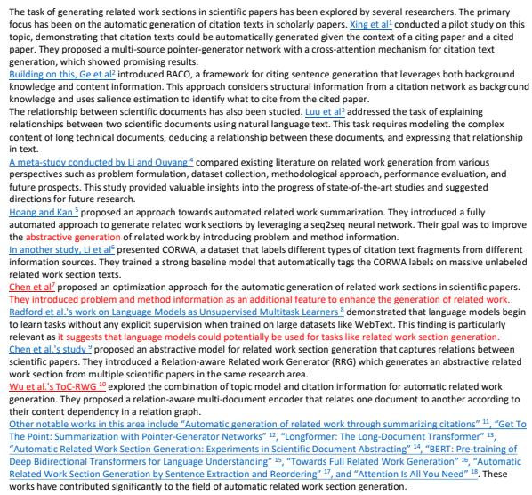
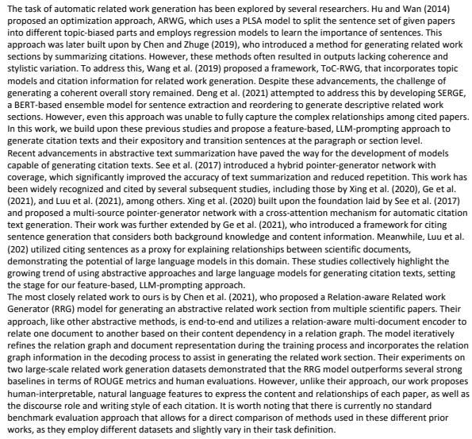
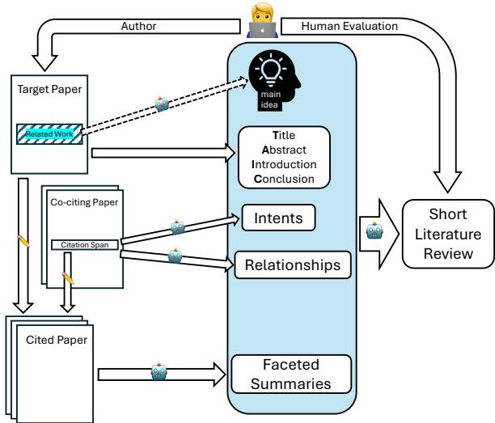
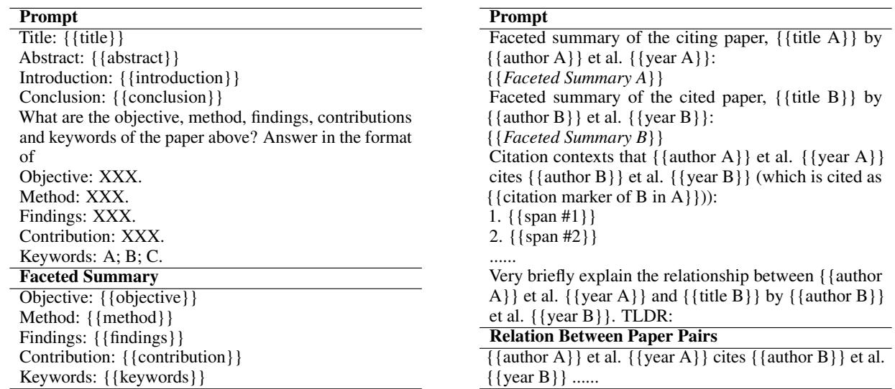
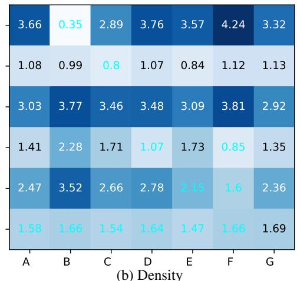

# Explaining Relationships Among Research Papers

Xiangci Li<sup>1∗</sup> Jessica Ouyang<sup>2</sup>

<sup>1</sup> Amazon Web Services, <sup>2</sup> The University of Texas at Dallas lixiangci8@gmail.com, jessica.ouyang@utdallas.edu

## Abstract

The rapid pace of research publications makes it challenging for researchers to stay up to date. There is a growing need for automatically generated, concise literature reviews to help researchers quickly identify papers relevant to their interests. Prior work over the past decade has focused on summarizing individual research papers, typically in the context of citation generation, while the relationships among multiple papers have largely been overlooked. Existing approaches primarily generate standalone citation sentences without addressing the need for expository and transition sentences to explain the relationships among multiple citations. In this work, we propose a featurebased, LLM-prompting approach to generate richer citation texts and simultaneously capture the complex relationships among multiple papers. Our expert evaluation reveals a strong correlation between human preference and integrative writing styles, indicating that readers favor high-level, abstract citations with transition sentences that weave them into a coherent narrative.

## 1 Introduction

Every research paper must perform a thorough literature review to distinguish its contributions from those of prior works. Due to the rapid pace of research publications, including pre-prints that have not yet been peer-reviewed, keeping up to date with the latest work is very time-consuming. Even with daily feed tools like the Semantic Scholar Research Feed<sup>1</sup>, researchers must still curate, read, and digest all the new papers in their feed. Thus, there is a need for concise, automatically generated literature reviews summarizing the set of new papers in a feed, customized for the researcher whose feed it is.

Unfortunately, there does not exist a dataset of such literature reviews. Survey articles are similar, but they are very long, not customized to a specific reader, and relatively rare. In this work, we use the related work sections of scientific articles as a proxy for the kind of short, customized, daily feed summaries we wish to generate. Related work sections have several advantages: they are concise, usually no more than one page long; they are customized to their parent article, just as a daily feed summary should be customized to its owner; and they are plentiful and can be automatically extracted as the “Related Work,” “Literature Review,” or “Introduction” sections of scientific articles. To relate back to a daily feed summary, one can easily imagine using the most similar paper authored by the feed owner as the “citing” paper perspective from which to customize the literature review.

The task of automatically generating citations for scientific articles has recently received a lot of attention (AbuRa’ed et al., 2020; Xing et al., 2020; Ge et al., 2021; Luu et al., 2021; Chen et al., 2021, 2022; Li et al., 2022). However, we argue that the dominant approach of generating a single citation sentence in isolation ignores the relationships among cited papers, which are just as important as that between the citing and cited papers. Literature reviews, whether for a related work section or a daily feed summary, are multi-document summaries and should contain the non-citation, expository and transition sentences needed to compose a coherent narrative (Li et al., 2022). Recent neural approaches frame citation generation as an end-toend, sequence-to-sequence task; they are thus constrained by the length limitations of their models — research papers are long documents — and are unable to make use of supporting features, such as citation intents or topic information, which would require training additional models.

The recent dramatic success of prompting-based methods using large language models (LLMs), like

  
(a) Bing Chat output (“more precise” setting).

  
(b) Our outputs based on gpt-3.5-turbo-0301 & gpt-4-0314.

Figure 1: Comparison between GPT4-powered Bing Chat and our approach on reproducing Section 2 of this paper. Bing Chat is given a prompt consisting of the title and abstract of this paper, as well as a list of cited paper titles, which fits comfortably in its context window. Bing Chat’s output is generic, ill-organized, and non-factual; statements in red are misattributed or incorrect.  
  
Figure 2: (1) We use LLMs to extract features from cited papers, the target (citing) paper (excluding the related work section), and co-citing papers; (2) generate a short literature review given these features and a humanprovided main idea; and (3) invite experts or authors of the target papers to perform a human evaluation.

GPT-4 (OpenAI, 2023), makes it possible to pursue a feature-based approach to generating richer citation texts, as well as generating multiple citations at a time to better capture the complex relationships among research papers. However, as Figure 1 shows, even a SOTA LLM, augmented with a search engine to retrieve cited papers <sup>2</sup>, cannot generate a factually-correct, on-topic literature review from scratch. Bing Chat with GPT-4 hallucinates cited papers’ approaches, and the expository sentences are generic and vague. The LLM needs guidance in identifying the relevant contributions of each cited paper, as well as how the cited papers relate to one another.

In this work<sup>3</sup>, as a first step towards generating customized daily feed summaries, we explore a feature-based, LLM-prompting approach to generating citation texts and their transition sentences at the paragraph level, using automatically extracted related work sections as the evaluation targets (cf. Figure 2). Our main contributions are as follows:

• We propose features capturing the relationships between cited and target (citing) papers and among papers cited together. We show that these features can be extracted by prompting LLMs and compose them into a new prompt for generating several citations, along with transition sentences, in one pass.

• We conduct experiments in a planning-based setting, where a few sentences describing the high-level main ideas of the literature review are used to guide generation. In this preliminary study, we use a human-provided, natural language description to investigate the impact of these “main ideas” on the organization of citations in the generated paragraphs.

• We perform an expert evaluation to investigate the impact of our proposed features on the quality of the generated paragraphs. We find a strong correlation between human preference and integrative writing style, suggesting that readers prefer more high-level, abstract citations, with transition sentences between them to provide a coherent overall story.

## 2 Background and Related Work

Hoang and Kan (2010) proposed the task of related work generation: generating the related work section of a target paper given a list of papers to cite, assuming the rest part of the target paper is available. Early extractive approaches select and concatenate salient sentences from the cited papers (Hu and Wan, 2014; Wang et al., 2018; Chen and Zhuge, 2019; Wang et al., 2019; Deng et al., 2021). As a result, their outputs lack coherence among citations and have no overall story, and the sentences lack stylistic variation; transitions and sentences relating back to the target paper are impossible to produce using an extractive approach.

More recently, abstractive approaches have focused on generating a single citation at a time, given the cited paper and assuming the rest of target paper, including the rest of the related work section, is available (AbuRa’ed et al., 2020; Xing et al., 2020; Ge et al., 2021; Luu et al., 2021; Li et al., 2022). These works used a variety of architectures (pointer-generator (See et al., 2017), vanilla Transformer (Vaswani et al., 2017), GPT-2 (Radford et al., 2019) or Longformer-Encoder-Decoder (LED; Beltagy et al., 2020)) to generate citations from cited paper abstracts; the cited paper full texts were not used due to their length.

The most similar works to ours are Chen et al. (2021, 2022), who attempt to generate multiple citations at once. However, their approach, like that of other abstractive prior works, is end-to-end; they augment a document encoder with a graph network to learn relationships among document representations. In contrast, we propose human-interpretable, natural language features to express paper content and relationships, as well as the discourse role and writing style of each citation.

Finally, as Li and Ouyang (2022, 2024) note, there is no standard benchmark to directly compare methods from these prior works, which use different datasets and vary slightly on the task definition.

## 3 Approach

As Figure 2 illustrates, we use multi-stage prompting of LLMs to collect features from each cited paper and compose them into a prompt for generating a paragraph of citations with supporting expository and transition sentences. It is well-known that, given a simple prompt, such as “Generate a literature review about XXX,” LLMs produce poorlyorganized and inaccurate citations; from our Bing Chat example (Figure 1a), we see that the LLM inaccurately describes the approaches and contributions of the cited papers. We must provide the LLM with more detailed and specific information about the cited papers.

We identify two sets of support features. First, we extract features for the target paper and each cited paper from a local citation network, capturing information about the relationship between the target and each cited paper, as well as between pairs of cited papers (Section 3.1). Second, we extract features from the text of the target paper itself, which provide contextual information to ensure the generated citations stay on topic (Section 3.2); in our experiments, the target paper stands in for the daily feed owner so that the literature review is customized for their perspective.

After extracting these features, we compose a prompt to generate paragraphs<sup>4</sup> of citations (Section 3.3). Finally, we use the generated draft to extract candidate cited text spans for each cited paper, add them to the prompt, and re-generate improved paragraphs (Section 3.4). More details are available in Appendix B. Our prompts are shown in Table 1 and Appendix Tables 7–10; Appendices D & E show examples of features and paragraphs.

## 3.1 Citation Network Features

We identify key features under the framework of a local citation network centered on the target paper. Each node represents a paper, and an edge represents the relationship between two papers. Unlike Chen et al. (2021, 2022), we use natural language descriptions as network features, allowing us to leverage the seq2seq nature of LLMs, rather using numerical feature vectors with a graph neural network. The natural language descriptions also improve the interpretability of the citation network.

Faceted summary. Each node in the citation network represents a paper, and its core feature is the faceted summary (Meng et al., 2021), which highlights the key aspects of the paper for rapid understanding: the paper’s objective, method,findings, contributions, and keywords. Just as a human may quickly skim the title, abstract, introduction, or conclusion (TAIC) sections to get the gist of a paper, we focus on the most important facets of a paper when generating its citation. The faceted summary also provides the practical benefit of reducing the number of tokens needed to represent a paper; the limited input window size of LLMs encourages a compact representation for each node. We prompt the LLM to generate a faceted summary given the TAIC of each paper.

Relationship between paper pairs. Each edge in the citation network represents the relationship between the two paper nodes it connects. Given a pair of papers A and B, we leverage the LLM’s strong summarization ability to synthesize information from all citation spans<sup>5</sup> where paper A cites paper B, conditioned on the faceted summaries of A and B, into a single natural language description of their (directed) relationship (Table 8). The incoming edges on paper B’s node thus capture how B has been discussed by other works, providing a history of how its ideas have influenced its field; the outgoing edges from likewise capture how B has developed ideas from other works in its field.

Enriched citation intent & usage. Citation intents encode how and why an author cites a paper: to give background information, to use a proposed methodology, or to compare experimental results. Existing work on citation intent focuses on proposing new label sets or modeling approaches to predict those labels, without applying them to downstream applications (Garfield et al., 1965; Teufel et al., 2006; Dong and Schäfer, 2011; Jurgens et al., 2018; Cohan et al., 2019; Tuarob et al., 2019; Zhao et al., 2019) and framed intent prediction as a classification task to reduce its complexity. Gu and Hahnloser (2023) used such intent labels to generate individual citations with specific intents. However, as Lauscher et al. (2022) point out, simple classification label sets struggle to represent ambiguous, real-world citations. To the best of our knowledge, we are the first to leverage rich natural language intent descriptions for citation generation.

In addition, Li et al. (2022) distinguish dominant- and reference-type citations. For example, in the sentence “Luu et al. (2021) fine-tuned GPT-2 (radford et al., 2019) to predict citation sentences”, the emphasis is on the dominant-type citation of Luu et al., while the reference-type citation of Radford et al. is not explained in detail, since GPT-2 is being cited as a tool. Ignoring this distinction results in unnatural-sounding citations that treat all cited papers as equally dominant and important.

Thus, for each cited paper B, we prompt the LLM to summarize how other papers $A _ { i }$ in the network cite B (intent) as well as if the majority usage of B is as an important, dominant cited paper or if it is simply cited for reference. The prompt includes the faceted summaries (node features) of the other citing papers $A _ { i } ,$ all relationships (edge features) between A and B, and the text of the citation spans for B in A . This enriched citation intent/usage feature roughly corresponds to a discursive summary of all edges incident to node B.

## 3.2 Target Paper Features

To generate paragraphs with a coherent overall story, we collect features from the target paper, capturing the context and perspective of the reader.

Title, abstract, introduction, and conclusion (TAIC). Despite the powerful zero-shot generation ability of LLMs, they are typically not trained specifically for scientific document generation and lack the necessary domain knowledge to write like a domain expert. We leverage the LLM’s strong in-context learning ability by including the full text of the TAIC sections of the target paper. The TAIC provides context to the LLM, so that the story and tone of the TAIC can inform the focus and organization of the citations to be generated; in our experiments, the target paper represents the reader’s interests, so a good literature review should be coherent with the target paper.

Guiding plan of main ideas. Intuitively, there can be multiple plausible literature reviews for the same set of cited papers. A reader may prefer one over another, even though they are all factually correct, depending on the perspective given by the target paper. To better capture this information, we experiment with a human-provided plan: a short summary of the main ideas to be discussed, to guide generation. We leave the automatic generation of a guiding plan to future work<sup>6</sup>.

```handlebars
Prompt
We have finished writing the title, abstract, intro
duction and conclusion section of our NLP paper
as follows:
Title: {{title}}
Abstract: {{abstract}}
Introduction: {{introduction}}
Conclusion: {{conclusion}}
However, the related work section is still missing.
Write our related work section that concisely cites
the following papers in a natural way using all of
the main ideas as the main story. Keep it short, e.g.
3 paragraphs at most. Make sure the related work
section does not conflict with the sections already
written. You can freely reorder the cited papers
to adapt to the main ideas. Pay extra attention to
<Usage> which indicates how each work is cited
by other work.
Main idea of our related work section:
{{main ideas}}
List of cited papers:
1. {{title B1}} by {{author B1}} et al. {{year
B1}}
{{Faceted Summary or Abstract ofB1}}
<Usage> {{Enriched citation usage of B1}}
How other papers cite it:
{{Relation between Ax and B1}}
{{Relation between Ay and B1}}
Potentially useful sentences from this paper:
{{section #1}} {{CTS #1}}
{{section #2}} {{CTS #2}}
2. {{title B2}} by {{author B2}} et al. {{year
B2}}
Output
{{related work section}}
```  
Table 1: Prompt and output format for generating the full target related work section. Cited papers are given in chronological order.

## 3.3 Related Work Paragraph Generation

With the features above, we prompt the LLM to generate one paragraph, subsection, or when length allows, the entire literature review in one pass (Appendix Table 1). We find section-level generation to be the most robust, as the LLM often does not follow prompt instructions as closely when generating paragraph-by-paragraph, but we are constrained by the length limit of the LLM.

## 3.4 Enhancing Details with CTS

We observe that the generated citations may lack detail compared to human-written ones. This makes sense because the generation prompt contains only summaries of, but no actual text from, each cited paper. To supply more detail, we follow Yasunaga et al. (2019); Wang et al. (2019); Li et al. (2024) in using ROUGE-based ranking (Cao et al., 2015) to retrieve cited text spans (CTS; Jaidka et al., 2018, 2019; AbuRa’ed et al., 2020): the cited paper text span most relevant to the corresponding citation.

We retrieve CTS using each citation in our generated paragraph as a query, which we extract using Li et al. (2022)’s tagger; we compute the average of ROUGE-1 and -2 recall scores against each sentence in the corresponding cited paper. We take the top-k<sup>7</sup> sentences as CTS to augment the prompt and then re-generate the paragraph.

## 4 Experimental Settings

For each target paper, we aim to generate a plausible candidate to replace the gold related work section using our feature-based approach.

## 4.1 A Note on Baselines

As Figure 1a shows, Bing Chat (GPT-4 augmented with Bing search) fails to produce a factuallycorrect, on-topic related work section.

Further, although it is theoretically possible to generate a related work section with smaller language models, such as LED (Beltagy et al., 2020), there are a few practical obstacles: (1) As we discuss in Sections 1–2, there is no existing model is trained for literature review generation. (2) Even LMs with long input lengths (e.g. 16k tokens for LED) still cannot fit all cited papers’ information for an entire paragraph. Further, since there is no data to train intermediate feature extractors to condense the input, the multi-step approach we propose in Section 3 cannot be applied. (3) Existing works using small LMs focus on generating individual citations, so they are not able to generate non-citation exposition and transition sentences.

Because there are no competitive baselines for our task, we focus on comparing different input feature variations (Section 4.3) to explore the influence of different features on the generation quality.

We show an “Oracle” baseline in Appendix Figure 11 by using Li et al. (2022)’s tagger to simply remove all sentences that are not part of any citation. The Oracle baseline simulates a perfect citation generation model and demonstrates that the missing non-citation transition sentences make the related work section significantly less coherent.

## 4.2 Human Evaluation Settings

Because it is challenging for non-domain experts to evaluate the quality and factuality of scientific texts, we conduct a human evaluation by inviting domain experts to evaluate candidate literature reviews generated for one of their own published papers. Our experts are all fluent in English and are a mix of Ph.D. students and post-doctorate researchers in both academia and industry. We instruct them to nominate a recent target paper such that they are still very familiar with all of their cited papers.

Because the experts are recruited from among our colleagues, about half of the papers evaluated are natural language processing papers, with the other half from other computational fields, including machine learning, speech processing, computer vision, robotics, computer graphics, and software engineering. Almost all papers are published after September 2021 and so were not included in the training data of the LLMs (Appendix Table 12).

The evaluators are asked to score each generated related work section in terms of (1) fluency, (2) organization & coherence, (3) relevance to the target paper, (4) relevance to the cited papers, (5) factuality and the number of non-factual or inaccurate statements, (6) usefulness & informativeness, (7) writing style, and (8) overall quality.

## 4.3 Input Feature Variations

Table 2 shows the input features used in each of our generated variants. A is our baseline, with access to all features, including the human-provided main idea plan. B is the only variant that does not use the main ideas, making it the only variant that could be generated completely automatically. Variant C ablates the TAIC of the target paper. Variants D, E, and F ablate the enriched citation intent and usage, the relationship between paper pairs, and both, respectively. Finally, variant G adds the CTSbased re-generation step.

## 5 Results and Analyses

Automatic Evaluation. Table 3 shows the ROUGE scores of our generated variants compared to the gold related work sections. Overall, most variants yield decent scores, indicating that they are mostly on-topic. Notably, variant B has significantly lower ROUGE scores than other variants, which makes sense because it is the only one without the main idea plan. This emphasizes the important and irreplaceable nature of the guiding plan. Variant C, which has the main ideas but no target paper TAIC is the next lowest, again suggesting that features related to the reader’s perspective are the most important for a good literature review.

<table><tr><td>Feature</td><td>A</td><td>B</td><td>C</td><td>D</td><td>E</td><td>F</td><td>G</td></tr><tr><td>main idea</td><td>√</td><td>-</td><td>√</td><td>√</td><td>√</td><td>√</td><td>√</td></tr><tr><td>target TAIC</td><td>√</td><td>√</td><td>-</td><td>√</td><td>√</td><td>√</td><td>√</td></tr><tr><td>intent/usage</td><td>√</td><td>√</td><td>√</td><td>-</td><td>√</td><td>-</td><td>√</td></tr><tr><td>relationship</td><td>√</td><td>√</td><td>√</td><td>√</td><td>-</td><td>-</td><td>√</td></tr><tr><td>CTS</td><td>一</td><td>一</td><td>一</td><td>1</td><td>1</td><td>-</td><td>V</td></tr></table>

Table 2: Features in each generation variant.

<table><tr><td>Diff. vs. A</td><td colspan="3">Variant ROUGE-1 ROUGE-2 ROUGE-L</td></tr><tr><td>baseline</td><td>A</td><td>0.513 0.216</td><td>0.248</td></tr><tr><td>- main idea</td><td>B</td><td>0.446 0.131</td><td>0.177</td></tr><tr><td>target TAIC</td><td>C</td><td>0.501 0.201</td><td>0.235</td></tr><tr><td>intent/usage</td><td>D</td><td>0.514 0.223</td><td>0.255</td></tr><tr><td>relationship</td><td>E</td><td>0.520 0.221</td><td>0.252</td></tr><tr><td>intent/usage relationship</td><td>F</td><td>0.517 0.225</td><td>0.256</td></tr><tr><td>+ CTS</td><td>G</td><td>0.513 0.215</td><td>0.249</td></tr></table>

Table 3: ROUGE scores of generated variants evaluated against the gold related work sections. Bold indicates improvement over baseline A, while italics indicate lowered performance.

Human Evaluation. Due to the challenging and expensive nature of evaluating highly specialized academic research papers, we are only able to evaluate one target related work section per domain expert judge, with 27 judges in total. Appendix A lists all expert evaluated papers. Table 4 shows the average human evaluation scores across all 27 judges. Writing is a highly personal and idiosyncratic process, and since the judges are evaluating candidate related work sections generated for their own papers, the high variance in the human evaluation scores reflects this fact, with different variants being preferred by different judges.

## 5.1 Importance of Input Features

We integrate the results of Tables 3, 4 & 5 to analyze the usefulness of each input feature.

Main idea plan. All tables show that baseline A outperforms variant B, which ablates the main idea feature. The fact that main idea information is not found in any other feature (Appendix C) confirms the importance of a human-provided main idea to guide the LLM in generating a good narrative.

<table><tr><td>Metrics</td><td>A</td><td>B</td><td>C</td><td>D</td><td>E</td><td>F</td><td>G</td></tr><tr><td>Fluency</td><td>4.11 (0.87)</td><td>3.78 (1.23)</td><td>4.19 (0.72)</td><td>4.07 (0.81)</td><td>4.11 (0.74)</td><td>4.15 (0.59)</td><td>4.0 (0.9)</td></tr><tr><td>Organization and Coherence</td><td>3.30 (1.12)</td><td>3.07 (1.15)</td><td>3.37 (0.99)</td><td>3.59 (0.91)</td><td>3.59 (0.95)</td><td>3.52 (0.96)</td><td>3.33 (0.90)</td></tr><tr><td>Relevance (to target paper)</td><td>3.78 (0.99)</td><td>3.67 (1.09)</td><td>4.00 (0.98)</td><td>4.11 (0.83)</td><td>4.00 (0.94)</td><td>4.07 (0.81)</td><td>3.89 (1.03)</td></tr><tr><td>Relevance (to cited papers)</td><td>4.22 (0.57)</td><td>3.93 (1.05)</td><td>4.04 (0.74)</td><td>4.19 (0.67)</td><td>4.19 (0.77)</td><td>4.00 (0.86)</td><td>4.15 (0.70)</td></tr><tr><td>Factuality</td><td>4.04 (0.96)</td><td>3.89 (1.17)</td><td>3.74 (1.00)</td><td>3.93 (1.09)</td><td>4.30 (0.76)</td><td>3.93 (1.05)</td><td>3.74 (1.20)</td></tr><tr><td>Usefulness/Informativeness</td><td>3.74 (0.89)</td><td>3.30 (1.01)</td><td>3.78 (0.68)</td><td>3.85 (0.89)</td><td>3.70 (1.08)</td><td>3.59 (0.95)</td><td>3.59 (0.87)</td></tr><tr><td>Writing Style</td><td>3.48 (0.88)</td><td>3.07 (1.09)</td><td>3.81 (0.90)</td><td>3.70 (0.90)</td><td>3.52 (0.83)</td><td>3.44 (0.92)</td><td>3.30 (0.94)</td></tr><tr><td>Overall</td><td>3.33 (1.05)</td><td>2.89 (0.96)</td><td>3.15 (0.93)</td><td>3.67 (0.82)</td><td>3.56 (1.03)</td><td>3.22 (0.96)</td><td>3.15 (1.01)</td></tr><tr><td># of factual errors</td><td>0.70 (0.94)</td><td>0.78 (1.07)</td><td>0.89 (1.13)</td><td>0.81 (0.98)</td><td>0.44 (0.92)</td><td>0.74 (1.14)</td><td>0.78 (1.07)</td></tr></table>

Table 4: Average (and standard deviation) of human evaluation scores.

<table><tr><td>Diff. vs. A</td><td>Variant</td><td>Variant%</td><td>Tie% √A%</td></tr><tr><td>— main idea</td><td>B</td><td>22.2 29.6</td><td>48.1</td></tr><tr><td>- target TAIC</td><td>C</td><td>22.2</td><td>37.0 40.7</td></tr><tr><td>intent/usage</td><td>D</td><td>40.7</td><td>37.0 22.2</td></tr><tr><td>- relationship</td><td>E</td><td>40.7</td><td>29.6 29.6</td></tr><tr><td>intent/usage relationship</td><td>F</td><td>22.2</td><td>33.3 44.4</td></tr><tr><td>+ CTS</td><td>G</td><td>25.9</td><td>37.0 37.0</td></tr></table>

Table 5: Comparison of human overall scores across variants, with respect to the baseline A.

Target paper TAIC. The baseline A also outperforms variant C, which ablates the target paper title, abstract, introduction, and conclusion, confirming our hypothesis that this feature provides crucial context for the generated paragraphs.

Enriched citation usage & relationship between papers. Comparing A to variants D, E, and F, we find a weak trend that access to either enriched citation usage or relationship between papers is helpful, with the latter slightly preferred; this finding is consistent with the observed coverage and density discussed in Appendix C. Variants with access to both or neither feature underperform, suggesting that, while the usage and relationship features are important, they are also mutually redundant (the usage feature of a cited paper summarizes all its relationships) and the presence of both causes the LLM to over-emphasize this information.

CTS. Comparing the baseline A with variant G, we observe that re-generating the related work section using cited text spans is a controversial choice that leads to very high variance in human evaluation scores. 44% of the judges report improved writing style, and 26% report improved informativeness, while 30% report decreasedfactuality.

We hypothesize this is because the CTS is retrieved using our generated citations. When we re-generate using the retrieved CTS, the new paragraphs follow the same ideas as the original but are more detailed and focused. As a result, if the original generation was good, the CTS version is better; but if the original was bad, the CTS version is worse.

## 5.2 Analysis of Writing Style

Khoo et al. (2011) studied the writing style of literature reviews by categorizing them as integrative or descriptive, depending on whether they focus on high-level ideas or on detailed information from specific studies. Li et al. (2022) extended this distinction to individual citations, distinguishing dominant citations, which focus on and describe cited papers in detail, and reference citations, which are short, highly abstracted, and often tangential to the rest of the sentence. Li et al. also introduced sentence-level discourse roles: transition and narrative sentences provide exposition and high-level observations; single and multi-summarization sentences give specific, detailed information about one or more cited papers; and reflection sentences relate cited papers to the target paper.

To study the writing style of our generated paragraphs, we use Li et al.’s citation tagger to label the usage types and discourse roles of the gold related work sentences and our variants. As Table 6 shows, there is a huge gap between the two writing styles: gold sentences mainly consist of transition and narrative sentences with referencetype citations, while all generated variants have far more explicit single-summary sentences with dominant-type citations. In other words, the generated paragraphs are mostly descriptive, consisting of individual paper summaries, rather than a coherent story integrating all the cited papers.

<table><tr><td rowspan=1 colspan=1>Label%</td><td rowspan=1 colspan=1>Gold</td><td rowspan=1 colspan=1>A   B   C  D   E   F   G</td></tr><tr><td rowspan=1 colspan=1>Transition</td><td rowspan=1 colspan=1>31.1</td><td rowspan=1 colspan=1>17.010.918.517.019.319.6 20.1</td></tr><tr><td rowspan=1 colspan=1>Single-Sum</td><td rowspan=1 colspan=1>28.2</td><td rowspan=1 colspan=1>47.2 59.851.745.746.245.4 40.7</td></tr><tr><td rowspan=1 colspan=1>Narrative</td><td rowspan=1 colspan=1>20.8</td><td rowspan=1 colspan=1>11.33.5 8.414.510.014.1 14.1</td></tr><tr><td rowspan=1 colspan=1>Reflection</td><td rowspan=1 colspan=1>15.4</td><td rowspan=1 colspan=1>17.021.615.417.416.916.917.8</td></tr><tr><td rowspan=1 colspan=1>Multi-Sum</td><td rowspan=1 colspan=1>3.6</td><td rowspan=1 colspan=1>7.53.3 6.0 5.5 7.4 4.0 6.6</td></tr><tr><td rowspan=1 colspan=1>Dominant</td><td rowspan=1 colspan=1>34.7</td><td rowspan=1 colspan=1>70.081.477.163.670.360.163.2</td></tr><tr><td rowspan=1 colspan=1>Reference</td><td rowspan=1 colspan=1>65.3</td><td rowspan=1 colspan=1>30.0 18.6 22.9 36.4 29.739.9 36.8</td></tr></table>

Table 6: Li et al. (2022) writing style analysis. Percentage of the discourse role of sentences (top) or citation types (bottom) within each variant. Bold indicates styles used more frequently in generated variants than gold related work sections; italics indicate less frequent styles.

## 5.3 Correlation Among Human Preference, ROUGE, and Writing Style

As Tables 3, 4 & 6 show, there is a strong correlation between human preference (overall score) and ROUGE-L scores, as well as between ROUGE scores and writing style (proportion of referencetype citations), with Kendall’s τ of 0.592 and 0.691, respectively. This suggests that we can use automatic metrics such as ROUGE and the proportion of reference-type citations to estimate human judgments, which is extremely challenging to collect on a large scale. Moreover, this observation emphasizes the importance of having a coherent and organized story consisting of narrative-style sentences with reference-type citations and transition sentences bridging between them.

## 5.4 Qualitative Analysis

## 5.4.1 Error Analysis

Despite the overall success of our approach — over half the judges wrote that the generated variants would be good first drafts for the gold related work sections — our collected comments from the judges show that composing a literature review is still a very challenging task. We summarize the typical issues mentioned by the judges below:

Factual errors. While all generated variants have a small absolute number of factual errors (see Table 4), incorrect statements are the most frequently mentioned problem. For example, one judge complained, “. . . two descriptions are false (Hearst patterns not extracted from Wikipedia, and there were no edits in Bowman et al.).” We observe that the overall human evaluation score correlates with the factuality score (Kendall’s τ=0.50).

Emphasizing the right cited papers. A good literature review should have a logical story; simply concatenating individual cited paper summaries is not sufficient. Our judges complained about less important papers receiving too much attention:

• “. . . too much detail for the papers and has a paragraph on human-in-the-loop data generation which is not very relevant to the paper (should be mentioned briefly).”

• “The descriptions of the cited papers, while accurate, seem less relevant to the citing paper and to the story as a whole, and the papers that get a lengthier description are not the most central ones.”

• “The focus on traditional decompilation methods is too strong for the paper content.”

Further, due to the nature of using related work sections as our evaluation targets, the publication dates of the cited papers can vary greatly. While this would not be a problem in a daily feed literature review (since all of the papers would be new), our judges were more likely to complain if the generated literature review focused to much on earlier works: “. . . why does it focus on approaches from 20 years ago than recent approaches?” These comments confirm our finding that dominant, summarization-type citation sentences may not be appropriate for all cited papers.

Paragraph organization. How to group similar works together is a major challenge. While our approach is usually able to generate well-organized texts when the variant includes sufficient features, failure cases significantly impact the human evaluation. For example, one judge wrote, “Second paragraph starts with ‘In the pursuit of automating reinforcement learning’, but then immediately cite Henderson et al. (2018) which talks about reproducibility and not automating RL issues.”

Judges also commented that they would prefer more comparisons among cited papers: “. . . some citations did not highlight their difference from other work, such as Schick et al. (2021) generates pairs of data.”

Other observed issues include insufficient evidence for claims and inconsistent citation formatting. In addition, the LLM does not always follow the prompts, occasionally resulting in some cited papers being silently dropped from the output.

## 5.4.2 Relationships Among Cited Papers

We observe that our generated paragraphs do explicitly discuss the relationships among cited papers. For example, Appendix Figure 7 shows explicit connections between papers using relation phrases (“subsequent works”), transition sentences (“however, these extractive approaches. . . ”), and high-level exposition (“Recent abstractive approaches have focused on. . . ”). Further, while human-written related work sections contain far more reference-type citations than any of our generated variants, Figure 7 does include some reference-type tool citations (e.g. Transformer and Longformer) to support its dominant citations. Finally, our human judges made positive comments referring to the organization of and flow between citations:

• “Good connection between the explained works. It is not just a list of contributions.”

• “The organization is close to perfect, and the story flows well in this one. One citation is missing, and, surprisingly, one citation was added (Kondadadi, 2013) - in exactly the right place and with an accurate description!”

## 6 Conclusion

We have presented a feature-based approach for prompting LLMs to explain the relationships among cited papers. With the ultimate goal of generating a literature review summarizing the contents of a researcher’s daily paper feed, we have conducted a pilot study using the related work sections of scientific articles as a proxy for the kind of literature reviews we wish to generate: short, customized for a particular target paper (standing in for daily feed’s owner), and focused on explaining how the cited papers relate to each other and why they are important. Our approach focuses on using the strong natural language understanding and summarization abilities of LLMs to extract interpretable natural language features describing the content of the cited and target papers, as well as their relationships with each other and with other papers that have cited them in the past. We also propose a “main ideas” plan to guide the LLM to generate a coherent story, using a human-supplied plan in these preliminary experiments.

Our detailed expert evaluation reveals that human judges dislike literature reviews that simply concatenate cited paper summaries together, demonstrating the importance of generating at the paragraph or section level, including transition sentences, rather than focusing on individual citations. Human judges are also sensitive to the relevance of each cited paper and strongly dislike generations that wrongly emphasize less impactful papers. We conclude that accurate descriptions of a cited paper’s methodology are not the only important facet of scientific document processing — understanding the rich and sophisticated relationships among papers is the key.

As we suggest in the Ethics Statements below, we strongly advise against directly using our proposed approach for generating related work sections of the manuscript without the author’s own careful thinking process. Instead, we advise using our proposed approach for exploratory purposes, such as generating surveys, explaining the latest research progress to junior researchers for educational purposes, or generating short literature reviews based on a feed of newly released papers.

## Limitations

Citation retrieval. In their written comments, several judges expressed the wish that our system would help them find other related papers to read. This is a limitation not only of our work, but of all prior work in automatic literature review generation, going back to Hoang and Kan (2010). We suggest that future work can explore integrating citation list optimization with literature review generation, perhaps by iteratively generating candidate drafts and retrieving additional papers to cite.

Length limit of GPT-4. Our experiments used gpt-4-0314, which has a maximum input token length of 8k; we did not have access to gpt-4-32k, which has four times the length limit. For those target related work sections with many cited papers, such that the full prompt exceeds the LLM’s limit, we manually chunk the gold related work section based on subsections or titled paragraphs, partition the cited papers according to those chunks, and generate each chunk individually, concatenating the generated subsections or paragraphs in the same order as in the gold related work section. This consists nearly half of the related work sections. Consequently, the coherence between subsections is significantly impacted, and they read like a concatenation of different related work sections. This problem will be mitigated as more LLMs have longer maximum input lengths.

Imperfect preprocessing pipeline. We were unable to access the PDFs of some cited works due to several problems: (1) the PDF parser is only able to parse research papers, but not books or websites; (2) the citation lists are automatically extracted from the parsed PDFs, and some papers may be missing; (3) we were unable to retrieve some cited papers using the Google search API; and (4) we were unable to download some cited papers due to publisher pay-walls. The missing cited papers limit the performance of our system.

Inconsistent citation markers. Since we use heuristics to extract citation markers from a JSON parsed from the target paper PDF, some of the author last names and publication years may not be accurate. In addition, we observe a few cases of inconsistency in citation styles (e.g. mixing “Smith et al. (2023)” and “[1]”) across multiple passes of generation. In future work, we will leverage the LLM’s code comprehension and generation ability to directly input the bibliography and output related work texts in LAT Xformat.

Quality of the intermediate outputs. Since there are no gold features introduced in Section 3.1 & 3.2, nor do we have the resource of additional human evaluation for these intermediate output features from the LLM, we have to leave the study of intermediate feature quality and its influence to the final output for future work.

Post-processing layer. In this preliminary study, we only limit our scope to the initial generation process without additional post-processing steps. We leave additional fact-checking and correction, and potential plagiarism avoidance for future work.

Proprietary LLM APIs. Our prompts are designed based on OpenAI gpt-3.5-turbo-0301 and gpt-4-0314. As these models may be deprecated, the results may not be replicated in the future. Moreover, the prompts may have to be updated to adapt to newly released models. Nonetheless, we argue that the key input features and general prompt format we propose should be consistently useful across any LLM. We later test our prompts on other LLMs: gpt-3.5-turbo-0613 & gpt-4-0613, as well as Anthropic Claude-v2 <sup>8</sup> output qualitatively similar texts, while Google text-bison-32k <sup>9</sup> output texts with less satisfactory styles. On the other hand, LLaMA-2 70B Chat (Touvron et al., 2023) fails the task by generating related work sections irrelevant to the input.

Limited field of studies and generalizability. As Appendix Table 11 shows, our evaluated papers are concentrated on the field of computer science, particularly natural language processing, and our prompts are also designed for computer science papers. We note that it is very challenging and expensive to use authors/experts to evaluate literature reviews and we do not have the resources to tune the LLM prompts and recruit experts in other disciplines. We do evaluate a geology paper because the expert is friends with an author, and we do not see any significant difference from the computer science evaluations. We leave other domains of target papers, and more dynamic prompt template for future work.

## Ethics Statement

As an early exploratory work, we use LLMs to automatically generate literature reviews. LLMs may produce inappropriate outputs, such as toxic or non-factual statements. LLMs may also plagiarize the cited papers; however, in our intended use case, generating a literature review summarizing a daily paper feed, this is less of a concern, since the review is shown only to feed owner for the purpose of assisting them in curating their reading list.

Because our experiments are conducted using related work sections as evaluation targets, it is possible that unscrupulous individuals may use our system to “cheat” at writing related work sections for their own publications. We strongly advise against doing so, as this violates the requirement of a fully original piece of work for academic venues. Since there is not yet an established norm around the use of generative systems in writing scientific papers, there may be some risk of harm to the scientific community from careless use of such tools, and their use might be explicitly prohibited in some contexts. Therefore, future researchers, developers, and users must be extra careful about the potential regulations.

From a practical standpoint, the quality of literature reviews generated using our approach is still noticeably lower than human-written ones, especially in terms of organization and writing style. In addition, the human-provided main idea plan is required for higher-quality output, and the fullyautomated setting performs very poorly, which should discourage the malicious use of our system. Our results clearly show that the human thinking process cannot be replaced by an automated system, and human readers are easily able to distinguish and criticize AI-generated content.

## Acknowledgement

We thank our domain-expert evaluators for their time to contribute the evaluation scores, comments, and constructive feedback. We list them in alphabetical order by last name: Or Biran, Zhiyu Chen, Omer Faruk Deniz, Kaize Ding, Sarik Ghazarian, Yibo Hu, James Huang, Kung-Hsiang Huang, Karen Gissell Rosero Jacome, Sha Li, Shengjie Li, Linqing Liu, Yangxiao Lu, Qing Lyu, Haiyue Song, Karl Stratos, Ye Tian, Zhenhailong Wang, Che Wang, Ningna Wang, Josh Wiedemeier, Jianyi Yang, Mu Yang, Xianjun Yang, Yixuan Zhang and You Zhang.

## References

Ahmed AbuRa’ed, Horacio Saggion, and Luis Chiruzzo. 2020. A multi-level annotated corpus of scientific papers for scientific document summarization and cross-document relation discovery. In Proceedings ofthe Twelfth Language Resources and Evaluation Conference, pages 6672–6679, Marseille, France. European Language Resources Association.

Ahmed AbuRa’ed, Horacio Saggion, Alexander Shvets, and Àlex Bravo. 2020. Automatic related work section generation: experiments in scientific document abstracting. Scientometrics, 125:3159–3185.

Iz Beltagy, Matthew E Peters, and Arman Cohan. 2020. Longformer: The long-document transformer. arXiv preprint arXiv:2004.05150.

Yassine Benajiba, Jin Sun, Yong Zhang, Longquan Jiang, Zhiliang Weng, and Or Biran. 2019. Siamese networks for semantic pattern similarity. In 2019 IEEE 13th international conference on semantic computing (ICSC), pages 191–194. IEEE.

Ziqiang Cao, Furu Wei, Li Dong, Sujian Li, and Ming Zhou. 2015. Ranking with recursive neural networks and its application to multi-document summarization. In Proceedings of the AAAI conference on artificial intelligence, volume 29.

Jingqiang Chen and Hai Zhuge. 2019. Automatic generation of related work through summarizing citations. Concurrency and Computation: Practice and Experience, 31(3):e4261.

Xiuying Chen, Hind Alamro, Mingzhe Li, Shen Gao, Rui Yan, Xin Gao, and Xiangliang Zhang. 2022. Target-aware abstractive related work generation with contrastive learning. In Proceedings of the 45th International ACM SIGIR Conference on Research and Development in Information Retrieval, pages 373– 383.

Xiuying Chen, Hind Alamro, Mingzhe Li, Shen Gao, Xiangliang Zhang, Dongyan Zhao, and Rui Yan. 2021. Capturing relations between scientific papers: An abstractive model for related work section generation. In Proceedings of the 59th Annual Meeting of the Association for Computational Linguistics and the 11th International Joint Conference on Natural Language Processing (Volume 1: Long Papers), pages 6068–6077, Online. Association for Computational Linguistics.

Arman Cohan, Waleed Ammar, Madeleine van Zuylen, and Field Cady. 2019. Structural scaffolds for citation intent classification in scientific publications. In Proceedings ofthe 2019 Conference ofthe North American Chapter of the Association for Computational Linguistics: Human Language Technologies, Volume 1 (Long and Short Papers), pages 3586–3596, Minneapolis, Minnesota. Association for Computational Linguistics.

Zekun Deng, Zixin Zeng, Weiye Gu, Jiawen Ji, and Bolin Hua. 2021. Automatic related work section generation by sentence extraction and reordering. In AII@ iConference, pages 101–110.

Kaize Ding, Jianling Wang, James Caverlee, and Huan Liu. 2022. Meta propagation networks for graph fewshot semi-supervised learning. In Proceedings ofthe AAAI conference on artificial intelligence, volume 36, pages 6524–6531.

Cailing Dong and Ulrich Schäfer. 2011. Ensemble-style self-training on citation classification. In Proceedings of 5th International Joint Conference on Natural Language Processing, pages 623–631, Chiang Mai, Thailand. Asian Federation of Natural Language Processing.

Pedro Faustini, Zhiyu Chen, Besnik Fetahu, Oleg Rokhlenko, and Shervin Malmasi. 2023. Answering unanswered questions through semantic reformulations in spoken QA. In Proceedings ofthe 61st Annual Meeting ofthe Associationfor Computational Linguistics (Volume 5: Industry Track), pages 729– 743, Toronto, Canada. Association for Computational Linguistics.

Eugene Garfield et al. 1965. Can citation indexing be automated. In Statistical association methods for mechanized documentation, symposium proceedings, volume 269, pages 189–192. Washington.

Yubin Ge, Ly Dinh, Xiaofeng Liu, Jinsong Su, Ziyao Lu, Ante Wang, and Jana Diesner. 2021. BACO: A background knowledge- and content-based framework for citing sentence generation. In Proceedings of the 59th Annual Meeting of the Association for Computational Linguistics and the 11th International Joint Conference on Natural Language Processing (Volume 1: Long Papers), pages 1466–1478, Online. Association for Computational Linguistics.

Sarik Ghazarian, Zixi Liu, Akash S M, Ralph Weischedel, Aram Galstyan, and Nanyun Peng. 2021. Plot-guided adversarial example construction for evaluating open-domain story generation. In Proceedings ofthe 2021 Conference ofthe North American Chapter of the Association for Computational Linguistics: Human Language Technologies, pages 4334–4344, Online. Association for Computational Linguistics.

Max Grusky, Mor Naaman, and Yoav Artzi. 2018. Newsroom: A dataset of 1.3 million summaries with diverse extractive strategies. In Proceedings of the 2018 Conference ofthe North American Chapter of the Associationfor Computational Linguistics: Human Language Technologies, Volume 1 (Long Papers), pages 708–719, New Orleans, Louisiana. Association for Computational Linguistics.

Nianlong Gu and Richard H. R. Hahnloser. 2023. Controllable citation sentence generation with language models.

Tairan He, Yuge Zhang, Kan Ren, Minghuan Liu, Che Wang, Weinan Zhang, Yuqing Yang, and Dongsheng Li. 2022. Reinforcement learning with automated auxiliary loss search. Advances in neural information processing systems, 35:1820–1834.

Cong Duy Vu Hoang and Min-Yen Kan. 2010. Towards automated related work summarization. In Coling 2010: Posters, pages 427–435, Beijing, China. Coling 2010 Organizing Committee.

Or Honovich, Thomas Scialom, Omer Levy, and Timo Schick. 2023. Unnatural instructions: Tuning language models with (almost) no human labor. In Proceedings of the 61st Annual Meeting of the Associationfor Computational Linguistics (Volume 1: Long Papers), pages 14409–14428, Toronto, Canada. Association for Computational Linguistics.

Yibo Hu, MohammadSaleh Hosseini, Erick Skorupa Parolin, Javier Osorio, Latifur Khan, Patrick Brandt, and Vito D’Orazio. 2022. ConfliBERT: A pre-trained language model for political conflict and violence. In Proceedings ofthe 2022 Conference of the North American Chapter ofthe Associationfor Computational Linguistics: Human Language Technologies, pages 5469–5482, Seattle, United States. Association for Computational Linguistics.

Yue Hu and Xiaojun Wan. 2014. Automatic generation of related work sections in scientific papers: An optimization approach. In Proceedings of the 2014 Conference on Empirical Methods in Natural Language Processing (EMNLP), pages 1624–1633, Doha, Qatar. Association for Computational Linguistics.

Kung-Hsiang Huang, ChengXiang Zhai, and Heng Ji. 2022a. CONCRETE: Improving cross-lingual factchecking with cross-lingual retrieval. In Proceedings of the 29th International Conference on Computational Linguistics, pages 1024–1035, Gyeongju, Republic of Korea. International Committee on Computational Linguistics.

Zili Huang, Shinji Watanabe, Shu-wen Yang, Paola García, and Sanjeev Khudanpur. 2022b. Investigating self-supervised learning for speech enhancement and separation. In ICASSP 2022-2022 IEEE International Conference on Acoustics, Speech and Signal Processing (ICASSP), pages 6837–6841. IEEE.

Kokil Jaidka, Muthu Kumar Chandrasekaran, Sajal Rustagi, and Min-Yen Kan. 2018. Insights from cl-scisumm 2016: the faceted scientific document summarization shared task. International Journal on Digital Libraries, 19(2):163–171.

Kokil Jaidka, Michihiro Yasunaga, Muthu Kumar Chandrasekaran, Dragomir Radev, and Min-Yen Kan. 2019. The cl-scisumm shared task 2018: Results and key insights. arXiv preprint arXiv:1909.00764.

David Jurgens, Srijan Kumar, Raine Hoover, Dan Mc-Farland, and Dan Jurafsky. 2018. Measuring the

evolution of a scientific field through citation frames. Transactions of the Association for Computational Linguistics, 6:391–406.

Christopher SG Khoo, Jin-Cheon Na, and Kokil Jaidka. 2011. Analysis of the macro-level discourse structure of literature reviews. Online Information Review.

Román A Lara-Cueva, Diego S Benítez, Enrique V Carrera, Mario Ruiz, and José Luis Rojo-Álvarez. 2016. Automatic recognition of long period events from volcano tectonic earthquakes at cotopaxi volcano. IEEE Transactions on Geoscience and Remote Sensing, 54(9):5247–5257.

Anne Lauscher, Brandon Ko, Bailey Kuehl, Sophie Johnson, Arman Cohan, David Jurgens, and Kyle Lo. 2022. MultiCite: Modeling realistic citations requires moving beyond the single-sentence singlelabel setting. In Proceedings ofthe 2022 Conference ofthe North American Chapter ofthe Associationfor Computational Linguistics: Human Language Technologies, pages 1875–1889, Seattle, United States. Association for Computational Linguistics.

Brian Lester, Rami Al-Rfou, and Noah Constant. 2021. The power of scale for parameter-efficient prompt tuning. In Proceedings of the 2021 Conference on Empirical Methods in Natural Language Processing, pages 3045–3059, Online and Punta Cana, Dominican Republic. Association for Computational Linguistics.

Junnan Li, Dongxu Li, Silvio Savarese, and Steven Hoi. 2023. Blip-2: Bootstrapping language-image pretraining with frozen image encoders and large language models. In International conference on machine learning, pages 19730–19742. PMLR.

Shengjie Li and Vincent Ng. 2022. End-to-end neural discourse deixis resolution in dialogue. In Proceedings of the 2022 Conference on Empirical Methods in Natural Language Processing, pages 11322–11334, Abu Dhabi, United Arab Emirates. Association for Computational Linguistics.

Xiangci Li, Yi-Hui Lee, and Jessica Ouyang. 2024. Cited text spans for citation text generation. In Proceedings of the Fourth Workshop on Scholarly Document Processing.

Xiangci Li, Biswadip Mandal, and Jessica Ouyang. 2022. CORWA: A citation-oriented related work annotation dataset. In Proceedings ofthe 2022 Conference of the North American Chapter of the Association for Computational Linguistics: Human Language Technologies, pages 5426–5440, Seattle, United States. Association for Computational Linguistics.

Xiangci Li and Jessica Ouyang. 2022. Automatic related work generation: A meta study. arXiv preprint arXiv:2201.01880.

Xiangci Li and Jessica Ouyang. 2024. Related work and citation text generation: A survey. In Proceedings of the 2024 Conference on Empirical Methods in Natural Language Processing, pages 13846–13864, Miami, Florida, USA. Association for Computational Linguistics.

Kyle Lo, Lucy Lu Wang, Mark Neumann, Rodney Kinney, and Daniel Weld. 2020. S2ORC: The semantic scholar open research corpus. In Proceedings ofthe 58th Annual Meeting ofthe Associationfor Computational Linguistics, pages 4969–4983, Online. Association for Computational Linguistics.

Yangxiao Lu, Ninad Khargonkar, Zesheng Xu, Charles Averill, Kamalesh Palanisamy, Kaiyu Hang, Yunhui Guo, Nicholas Ruozzi, and Yu Xiang. Selfsupervised unseen object instance segmentation via long-term robot interaction.

Josh Magnus Ludan, Yixuan Meng, Tai Nguyen, Saurabh Shah, Qing Lyu, Marianna Apidianaki, and Chris Callison-Burch. 2023. Explanation-based finetuning makes models more robust to spurious cues. In Proceedings of the 61st Annual Meeting of the Associationfor Computational Linguistics (Volume 1: Long Papers), pages 4420–4441, Toronto, Canada. Association for Computational Linguistics.

Kelvin Luu, Xinyi Wu, Rik Koncel-Kedziorski, Kyle Lo, Isabel Cachola, and Noah A. Smith. 2021. Explaining relationships between scientific documents. In Proceedings of the 59th Annual Meeting of the Association for Computational Linguistics and the 11th International Joint Conference on Natural Language Processing (Volume 1: Long Papers), pages 2130–2144, Online. Association for Computational Linguistics.

Rui Meng, Khushboo Thaker, Lei Zhang, Yue Dong, Xingdi Yuan, Tong Wang, and Daqing He. 2021. Bringing structure into summaries: a faceted summarization dataset for long scientific documents. In Proceedings ofthe 59th Annual Meeting ofthe Association for Computational Linguistics and the 11th International Joint Conference on Natural Language Processing (Volume 2: Short Papers), pages 1080– 1089, Online. Association for Computational Linguistics.

OpenAI. 2023. Gpt-4 technical report.

Jessica Ouyang and Kathy McKeown. 2019. Neural network alignment for sentential paraphrases. In Proceedings of the 57th Annual Meeting of the Association for Computational Linguistics, pages 4724– 4735, Florence, Italy. Association for Computational Linguistics.

Alec Radford, Jeffrey Wu, Rewon Child, David Luan, Dario Amodei, Ilya Sutskever, et al. 2019. Language models are unsupervised multitask learners. OpenAI blog, 1(8):9.

Abigail See, Peter J. Liu, and Christopher D. Manning. 2017. Get to the point: Summarization with pointergenerator networks. In Proceedings ofthe 55th Annual Meeting of the Association for Computational Linguistics (Volume 1: Long Papers), pages 1073– 1083, Vancouver, Canada. Association for Computational Linguistics.

Raphael Tang, Linqing Liu, Akshat Pandey, Zhiying Jiang, Gefei Yang, Karun Kumar, Pontus Stenetorp, Jimmy Lin, and Ferhan Ture. 2023. What the DAAM: Interpreting stable diffusion using cross attention. In Proceedings of the 61st Annual Meeting of the Associationfor Computational Linguistics (Volume 1: Long Papers), pages 5644–5659, Toronto, Canada. Association for Computational Linguistics.

Simone Teufel, Advaith Siddharthan, and Dan Tidhar. 2006. Automatic classification of citation function. In Proceedings of the 2006 Conference on Empirical Methods in Natural Language Processing, pages 103–110, Sydney, Australia. Association for Computational Linguistics.

Hugo Touvron, Louis Martin, Kevin Stone, Peter Albert, Amjad Almahairi, Yasmine Babaei, Nikolay Bashlykov, Soumya Batra, Prajjwal Bhargava, Shruti Bhosale, et al. 2023. Llama 2: Open foundation and fine-tuned chat models. arXiv preprint arXiv:2307.09288.

Nilesh Tripuraneni, Chi Jin, and Michael Jordan. 2021. Provable meta-learning of linear representations. In International Conference on Machine Learning, pages 10434–10443. PMLR.

Suppawong Tuarob, Sung Woo Kang, Poom Wettayakorn, Chanatip Pornprasit, Tanakitti Sachati, Saeed-Ul Hassan, and Peter Haddawy. 2019. Automatic classification of algorithm citation functions in scientific literature. IEEE Transactions on Knowledge and Data Engineering, 32(10):1881–1896.

Ashish Vaswani, Noam Shazeer, Niki Parmar, Jakob Uszkoreit, Llion Jones, Aidan N Gomez, Łukasz Kaiser, and Illia Polosukhin. 2017. Attention is all you need. Advances in neural information processing systems, 30.

Ningna Wang, Bin Wang, Wenping Wang, and Xiaohu Guo. 2022. Computing medial axis transform with feature preservation via restricted power diagram. ACM Transactions on Graphics (TOG), 41(6):1–18.

Pancheng Wang, Shasha Li, Haifang Zhou, Jintao Tang, and Ting Wang. 2019. Toc-rwg: Explore the combination of topic model and citation information for automatic related work generation. IEEE Access, 8:13043–13055.

Yongzhen Wang, Xiaozhong Liu, and Zheng Gao. 2018. Neural related work summarization with a joint context-driven attention mechanism. In Proceedings of the 2018 Conference on Empirical Methods in Natural Language Processing, pages 1776–1786,

Brussels, Belgium. Association for Computational Linguistics.

Josh Wiedemeier, Elliot Tarbet, Max Zheng, Sangsoo Ko, Jessica Ouyang, Sang Kil Cha, and Kangkook Jee. 2024. Pylingual: Toward perfect decompilation of evolving high-level languages. In 2025 IEEE Symposium on Security and Privacy (SP), pages 52–52. IEEE Computer Society.

Abudukelimu Wuerkaixi, Kunda Yan, You Zhang, Zhiyao Duan, and Changshui Zhang. 2022. Dyvise: Dynamic vision-guided speaker embedding for audiovisual speaker diarization. In 2022 IEEE 24th International Workshop on Multimedia Signal Processing (MMSP), pages 1–6. IEEE.

Xinyu Xing, Xiaosheng Fan, and Xiaojun Wan. 2020. Automatic generation of citation texts in scholarly papers: A pilot study. In Proceedings of the 58th Annual Meeting ofthe Associationfor Computational Linguistics, pages 6181–6190, Online. Association for Computational Linguistics.

Mu Yang, Andros Tjandra, Chunxi Liu, David Zhang, Duc Le, and Ozlem Kalinli. 2023a. Learning asr pathways: A sparse multilingual asr model. In ICASSP 2023-2023 IEEE International Conference on Acoustics, Speech and Signal Processing (ICASSP), pages 1–5. IEEE.

Xianjun Yang, Yujie Lu, and Linda Petzold. 2023b. Few-shot document-level event argument extraction. In Proceedings of the 61st Annual Meeting of the Associationfor Computational Linguistics (Volume 1: Long Papers), pages 8029–8046, Toronto, Canada. Association for Computational Linguistics.

Xiaocong Yang, James Y. Huang, Wenxuan Zhou, and Muhao Chen. 2023c. Parameter-efficient tuning with special token adaptation. In Proceedings ofthe 17th Conference of the European Chapter of the Associationfor Computational Linguistics, pages 865–872, Dubrovnik, Croatia. Association for Computational Linguistics.

Michihiro Yasunaga, Jungo Kasai, Rui Zhang, Alexander R Fabbri, Irene Li, Dan Friedman, and Dragomir R Radev. 2019. Scisummnet: A large annotated corpus and content-impact models for scientific paper summarization with citation networks. In Proceedings ofthe AAAI conference on artificial intelligence, volume 33, pages 7386–7393.

Biao Zhang, Barry Haddow, and Alexandra Birch. 2023. Prompting large language model for machine translation: A case study. In International Conference on Machine Learning, pages 41092–41110. PMLR.

Wenzheng Zhang and Karl Stratos. 2021. Understanding hard negatives in noise contrastive estimation. In Proceedings of the 2021 Conference of the North American Chapter of the Association for Computational Linguistics: Human Language Technologies, pages 1090–1101, Online. Association for Computational Linguistics.

He Zhao, Zhunchen Luo, Chong Feng, Anqing Zheng, and Xiaopeng Liu. 2019. A context-based framework for modeling the role and function of on-line resource citations in scientific literature. In Proceedings of the 2019 Conference on Empirical Methods in Natural Language Processing and the 9th International Joint Conference on Natural Language Processing (EMNLP-IJCNLP), pages 5206–5215, Hong Kong, China. Association for Computational Linguistics.

<table><tr><td>Prompt Faceted summary of the citing paper, {{title A}} by</td></tr><tr><td>{{author A}} et al. {{year A}}: {{Faceted Summary A}} Faceted summary of the cited paper, {{title B}} by {{author B}} et al. {{year B} }: {{ Faceted Summary B} } Citation contexts that {{author A} } et al. {{year A}} cites {{author B} } et al. {{year B} } (which is cited as</td></tr><tr><td>{{citation marker of B in A} })): 1. {{span #1}} 2. {{span #2}}</td></tr><tr><td>Very briefly explain the relationship between {{author A}} et al. {{year A}} and {{title B}} by {{author B}} et al. {{year B}}. TLDR:</td></tr><tr><td>Relation Between Paper Pairs {{author A}} et al. {{year A}} cites {{author B}} et al.</td></tr></table>



<table><tr><td>Prompt Title: {{title}}</td></tr><tr><td>Abstract: {{abstract}} Introduction: {{introduction} } Conclusion: {{conclusion}} What are the objective, method, findings, contributions and keywords of the paper above? Answer in the format of Objective: XXX. Method: XXX.</td></tr><tr><td>Findings: XXX. Contribution: XXX.</td></tr><tr><td>Keywords: A; B; C. Faceted Summary Objective: {{objective}}</td></tr></table>

Table 7: Prompt and output format for generating faceted summary of a paper.  
Table 8: Prompt and output format for generating the relationship between paper pairs. The “citation marker of B in A” is how paper A refers to paper B, e.g. “B et al. (2023)” or simply “[1]”.

## A Evaluated Papers

The 27 human evaluated papers in Section 5 are Lara-Cueva et al. (2016); Ouyang and McKeown (2019); Benajiba et al. (2019); Zhang and Stratos (2021); Tripuraneni et al. (2021); Ghazarian et al. (2021); Lester et al. (2021); Huang et al. (2022a); Li et al. (2022); Wuerkaixi et al. (2022); He et al. (2022); Li and Ng (2022); Huang et al. (2022b); Ding et al. (2022); Wang et al. (2022); Hu et al. (2022); Yang et al. (2023a); Li et al. (2023); Lu et al.; Zhang et al. (2023); Ludan et al. (2023); Honovich et al. (2023); Yang et al. (2023b,c); Tang et al. (2023); Yang et al. (2023a); Faustini et al. (2023); Wiedemeier et al. (2024). Please note that the final publication year of these papers may be later than the year that the evaluated version was first released as described in Table 12.

## B Implementation Details

APIs. We use Google search API <sup>10</sup> to find and download cited papers and doc2json (Lo et al., 2020) to parse PDFs into JSON format. We use Chat-GPT (gpt-3.5-turbo-0301) for all feature extraction steps and GPT-4 (gpt-4-0314; maximum input length limit of 8k tokens) for the generation step.

Model development. We do not perform any training or fine-tuning, and we do not use any datasets; we only use the pre-trained, BERT-based citation tagger of Li et al. (2022) for citation span extraction. We design our prompts using the first author’s previous publications as a development set and use our human judges’ nominated papers as our test set.

## C Extractiveness of Generations

We use Grusky et al. (2018)’s coverage and density metrics to investigate how each of the features contributes to the generated related work sections.

Coverage measures how much generated text is extracted from each of the input features. As Figure 3a shows, the features have very different coverage scores. Many, such as faceted summaries, cited paper abstracts, and CTS, have high coverage across all generation variants. Since the information among different features is likely to overlap, the coverage scores do not sum to 1 for each variant; for example, faceted summaries and cited paper abstracts contain highly similar information.

Due to this overlap, certain features, such as cited paper abstracts and CTS, have high coverage scores even in variants where they are not part of the input prompt (cells in cyan), suggesting they contain information that is highly valued by the LLM. The coverage of each feature varies only slightly across prompt variants, likely due to the same information overlap reason. The only exception is variant B: the human-provided main ideas cannot be found in any other feature.

<table><tr><td rowspan=8 colspan=1>main ideatarget TAICfaceted summaryintent/usagerelationshipCTS</td><td rowspan=1 colspan=1>0.35</td><td rowspan=1 colspan=1>0.17</td><td rowspan=1 colspan=1>0.32</td><td rowspan=1 colspan=1>0.36</td><td rowspan=1 colspan=2>0.35</td><td rowspan=1 colspan=2>0.35</td><td rowspan=1 colspan=1>0.33</td></tr><tr><td rowspan=1 colspan=1>0.41</td><td rowspan=1 colspan=1>0.37</td><td rowspan=1 colspan=1>0.37</td><td rowspan=1 colspan=1>0.41</td><td rowspan=1 colspan=2>0.38</td><td rowspan=1 colspan=2>0.41</td><td rowspan=1 colspan=1>0.42</td></tr><tr><td rowspan=1 colspan=1>0.54</td><td rowspan=1 colspan=1>0.58</td><td rowspan=1 colspan=1>0.56</td><td rowspan=1 colspan=1>0.55</td><td rowspan=1 colspan=2>0.54</td><td rowspan=1 colspan=2>0.56</td><td rowspan=1 colspan=1>0.53</td></tr><tr><td rowspan=1 colspan=1>0.34</td><td rowspan=1 colspan=1>0.41</td><td rowspan=1 colspan=1>0.35</td><td rowspan=1 colspan=1>0.31</td><td rowspan=1 colspan=2>0.35</td><td rowspan=1 colspan=2>0.28</td><td rowspan=1 colspan=1>0.33</td></tr><tr><td rowspan=1 colspan=1>0.49</td><td rowspan=1 colspan=1>0.56</td><td rowspan=1 colspan=1>0.5</td><td rowspan=1 colspan=1>0.48</td><td rowspan=1 colspan=2>0.48</td><td rowspan=1 colspan=2>0.43</td><td rowspan=1 colspan=1>0.48</td></tr><tr><td rowspan=1 colspan=1>0.62</td><td rowspan=1 colspan=1>0.62</td><td rowspan=1 colspan=1>0.61</td><td rowspan=1 colspan=1>0.63</td><td rowspan=1 colspan=2>0.61</td><td rowspan=1 colspan=2>0.63</td><td rowspan=1 colspan=1>0.63</td></tr><tr><td rowspan=1 colspan=1>A</td><td rowspan=1 colspan=1>B</td><td rowspan=1 colspan=1>C</td><td rowspan=1 colspan=1>D</td><td rowspan=1 colspan=1>E</td><td rowspan=1 colspan=1></td><td rowspan=1 colspan=1>F</td><td rowspan=1 colspan=1></td><td rowspan=1 colspan=1>G</td></tr><tr><td rowspan=1 colspan=2>(a) Co</td><td rowspan=1 colspan=1>verag</td><td rowspan=1 colspan=1>e</td><td rowspan=1 colspan=2></td><td rowspan=1 colspan=2></td><td rowspan=1 colspan=1></td></tr></table>

  
Figure 3: Extractiveness of generated related work sections (n = 38), measured by coverage and density against input features. Scores for features not included in the prompt for a variant are shown in cyan.

Prompt   
How other papers cite {{author B}} et al. {{year B}}:   
{{Relation between A1 and B}}   
Example citation fragments:   
1. {{span #1 of A1 citing B}}   
2. {{span #2 of A1 citing B}}   
{{Relation between A2 and B}}   
Example citation fragments:   
1. {{span #1 of A2 citing B}}   
2. {{span #2 of A2 citing B}}   
Very briefly answer what {{author B}} et al. {{year B}}   
is mostly known for, and the common citation intent.   
Hint: pay attention to how {{author B}} et al. {{year   
B}} is referred by the citing papers. Answer in the   
format of “{{author B}} et al. {{year B}} is known for   
XXX and it is cited for YYY”. TLDR:   
Enriched Citation Usage   
{{author B}} et al. {{year B}} is known for ... and it is   
cited for ...  
Table 9: Prompt and output format for generating enriched citation intent and usage of cited papers.

Density measures the length of extracted fragments. As the columns of Figure 3b show, scores vary significantly among features. Interestingly, despite faceted summaries and cited paper abstracts having similar coverage scores, the former have significantly higher density scores, indicating that the LLM prefers to directly copy from the faceted summaries. The main idea and relationship between paper pairs are also highly extractive. Note that, although this kind of extraction can be vulnerable to plagiarism, it is less of a concern for our approach because the highly extractive features are not taken directly from the cited papers, but from the feature-extraction LLM’s summaries.

Unlike coverage, density scores vary significantly among variants, since the LLM is not able to reconstruct an exact substring that is not present in its input. When features are ablated from a variant, their density scores are much lower (cells in cyan), and the scores of the remaining features are much higher. For example, in variant F, both the enriched citation usage and the relationship between paper pairs are ablated; to compensate, F has very high density scores for the main idea and faceted summaries.

```handlebars
Prompt
Our title: {{title}}
Faceted summary of our paper:
{{Faceted Summary}}
Write a short summary of the main idea of the following
related work section paragraphs. Ignore citations.
{{Human-written related work section}}
Main idea of the target related work section
{{main ideas}}
```  
Table 10: Prompt and output format for generating the main ideas of the target related work section.

<table><tr><td>Field of Study</td><td>Count</td></tr><tr><td>Natural Language Processing</td><td>14</td></tr><tr><td>Machine Learning</td><td>4</td></tr><tr><td>Speech and Audio Processing</td><td>3</td></tr><tr><td>Computer Vision</td><td>2</td></tr><tr><td>Programming Languages Robotics</td><td>1</td></tr><tr><td>Computer Graphics</td><td>1</td></tr><tr><td>Geoscience</td><td>1 1</td></tr></table>

Table 11: Distribution of the field of study among the human-rated related work sections.

## D Examples of Features and Generated Variants

We use Section 2 of this paper as an example target related work section to demonstrate our key support features. For conciseness, we show only one example per feature, as showing all features across all cited papers would be extremely long.

<table><tr><td>Year</td><td>Count</td></tr><tr><td>2022</td><td>13</td></tr><tr><td>2023</td><td>7</td></tr><tr><td>2021</td><td>4</td></tr><tr><td>2019</td><td>1</td></tr><tr><td>2018</td><td>1</td></tr><tr><td>2016</td><td>1</td></tr></table>

Table 12: Distribution of the publication year among the human-rated related work sections.

<table><tr><td>Metrics</td><td>Average</td><td>Std</td></tr><tr><td>Fluency</td><td>4.48</td><td>0.83</td></tr><tr><td>Organization and coherence</td><td>4.15</td><td>0.80</td></tr><tr><td>Relevance-citing</td><td>4.48</td><td>0.57</td></tr><tr><td>Relevance-cited</td><td>4.52</td><td>0.50</td></tr><tr><td>Factuality</td><td>4.44</td><td>0.62</td></tr><tr><td># of factual errors</td><td>0.30</td><td>0.71</td></tr><tr><td>Usefulness/informativeness</td><td>4.33</td><td>0.72</td></tr><tr><td>Writing style</td><td>4.19</td><td>0.67</td></tr><tr><td>Overall</td><td>4.41</td><td>0.62</td></tr></table>

Table 13: Average and standard deviation of the variation with the best human evaluation overall score.

We then generate the corresponding related work section variants A-G. Due to the maximum input length limit of our LLMs, we use the approach described in Section 3.3 to generate the two paragraphs in each variant sequentially.

## D.1 Citation Network Features

Faceted Summary of Hoang and Kan (2010). Objective: The objective of this paper is to introduce the problem of automated related work summarization and propose it as a challenge to the automatic summarization community. The paper aims to take initial steps towards solving this problem by dividing the task into general and specific summarization processes.

Method: The paper presents a prototype Related Work Summarization system, ReWoS, which takes in a set of keywords arranged in a hierarchical fashion that describes a target paper’s topics, to drive the creation of an extractive summary using two different strategies for locating appropriate sentences for general topics as well as detailed ones. The paper also conducts a study of the argumentative patterns used in related work sections to describe the plausible summarization tactics for their creation.

Findings: The paper’s initial results show an improvement over generic multi-document summarization baselines in a human evaluation.

Contribution: The paper introduces the novel problem of automated related work summarization and proposes it as a challenge to the automatic summarization community. The paper presents a prototype system, ReWoS, that takes initial steps towards solving this problem by dividing the task into general and specific summarization processes. The paper also conducts a study of the argumentative patterns used in related work sections to describe the plausible summarization tactics for their creation.

Keywords: automated summarization, related work summarization, multi-document summarization, citation prediction, keyphrase extraction.

Relationship between Xing et al. (2020) and See et al. (2017). Xing et al. (2020) cite See et al. (2017) as a reference for the pointer-generator network architecture, which they adapt for their own task of automatic citation text generation in scholarly papers.

Enriched citation intent & usage of Xing et al. (2020). Xing et al. (2020) is known for proposing a task of automatic citation text generation in scholarly papers and developing a multi-source pointergenerator network with cross attention mechanism to address it. It is cited for related work and as a baseline for comparison in citation sentence generation tasks.

## D.2 Target Paper Features

Main idea of Section 2. The paragraph discusses previous work on automatic related work generation, including Hoang and Kan’s proposal of generating the related work section given a list of papers to cite, and later extractive approaches that use probabilistic models or BERT to select and concatenate sentences from cited papers. However, these approaches result in outputs lacking coherence and stylistic variation.

The paragraph discusses recent abstractive approaches that focus on citation text generation, which involves generating a single citation sentence or span given the cited paper(s) and assuming the rest of the related work section and other sections of the target paper are available. These approaches use various architectures and mostly rely on cited paper abstracts rather than full texts. However, there is no standard benchmark evaluation approach to compare methods from different prior works.

## D.3 CTS

Extracted from Hoang and Kan (2010). [Structure of Related Work Section] Each article’s data consists of the reference related work summary, the collection of the input research articles Inspired by the above observations, we propose a novel strategy for related work summarization with respect to a given topic tree.

## E Example Generated Variants

See Figures 4-10 for the reproduced Section 2 of this paper.

<table><tr><td colspan="3">In the last decade, several works have addressed the task of automatic related work generation.</td></tr><tr><td colspan="3">Hoang et al. (2010) introduced the problem of automated related work summarization and proposed a prototype system, ReWoS, which laid the foundation for subsequent works in the field. Hu et al. (2014) built upon this work by proposing a novel system for automatic</td></tr><tr><td></td><td>related work generation using an optimization approach. Chen et al. (2019) further explored this area by proposing an approach for automatically generating a related work section in</td><td></td></tr><tr><td>scientific papers through summarizing citations. Wang et al. (2019) introduced a new framework, ToC-RWG, for automatic related work generation by incorporating topic model and citation information. Deng et al. (2021) proposed a novel and effective system for generating related</td><td></td><td></td></tr><tr><td>work sections based on sentence extraction and reordering using a BERT-based ensemble</td><td></td></tr><tr><td>model. However, these approaches result in outputs lacking coherence and stylistic variation, which our work aims to address by proposing a workflow for generating a full related work</td><td></td></tr><tr><td>section using an abstractive approach and prompting large language models with key support features.</td><td></td></tr><tr><td></td><td></td></tr><tr><td>Recent abstractive approaches have focused on citation text generation, which involves generating a</td><td></td></tr><tr><td>single citation sentence or span given the cited paper(s) and assuming the rest of the related work</td><td></td></tr><tr><td>section and other sections of the target paper are available. For instance, Abura’ed et al. (2020)</td><td></td></tr><tr><td>proposed a method for generating related work sections in scientific documents using neural sequence</td><td></td></tr><tr><td>learning, while Xing et al. (2020) introduced a task of automatic citation text generation in scholarly</td><td></td></tr><tr><td>papers and developed a multi-source pointer-generator network with cross attention mechanism to</td><td></td></tr><tr><td>address it. Ge et al. (2021) proposed a framework for citing sentence generation that considers</td><td></td></tr><tr><td></td><td></td></tr><tr><td></td><td></td></tr><tr><td>both background knowledge and content information, and Luu et al. (2021) developed a dataset and</td><td></td></tr><tr><td></td><td></td></tr><tr><td>model for explaining relationships between scientific documents using natural language text. Chen</td><td></td></tr><tr><td></td><td></td></tr><tr><td></td><td></td></tr><tr><td></td><td></td></tr><tr><td></td><td></td></tr><tr><td></td><td></td></tr><tr><td></td><td></td></tr><tr><td></td><td></td></tr><tr><td></td><td></td></tr><tr><td></td><td></td></tr><tr><td>et al. (2021) proposed a relation-aware multi-document encoder for abstractive related work section</td><td></td></tr><tr><td></td><td></td></tr><tr><td></td><td></td></tr><tr><td></td><td></td></tr><tr><td></td><td></td></tr><tr><td>generation. However, there is no standard benchmark evaluation approach to compare methods from</td><td></td></tr><tr><td></td><td></td></tr></table>

Figure 4: Variant A (baseline).

<table><tr><td>In the last decade, several works have addressed the task of automatic related work generation. Hoang et al. (2010) introduced the problem of automated related work summarization and proposed a prototype system, ReWoS, which laid the foundation for subsequent works in the field. Hu et al. (2014) built upon this work by proposing a novel system for automatic related work generation using an optimization approach. Chen et al. (2019) further explored the idea of generating related work sections by summarizing citations, while Wang et al. (2019) proposed a new framework, ToC-RWG, that incorporates topic model and citation information for related work generation. Deng et al. (2021) introduced a novel and effective system for generating related work sections based on sentence extraction and reordering using a BERT-based ensemble model. In contrast to these approaches, our work proposes a workflow for generating a full related work section by prompting large language models (LLMs) with key support features, aiming to produce a related work section that is comparable to a human first draft. In recent years, several studies have focused on automatic related work generation. Abura’ed et</td></tr><tr><td>al. (2020) proposed a method for generating related work sections in scientific documents using neural sequence learning. Xing et al. (2020) introduced a task of automatic citation text generation in scholarly papers and developed a multi-source pointer-generator network with cross attention mechanism to address it. Ge et al. (2021) proposed a framework for citing sentence generation that considers both background knowledge and content information. Luu et al. (2021) developed a dataset and model for explaining relationships between scientific documents using natural language text. Chen et al. (2021) proposed a relation-aware multi-document encoder for abstractive related work section generation. Li et al. (2022) developed a dataset for citation-oriented related work annotation and proposed a framework for automatic related work generation. These works have employed various techniques, such as Transformer models (Vaswani et al., 2017), pointer-generator networks (See et al., 2017), and large language models (Radford et al., 2019; Beltagy et al., 2020). Our work builds upon these studies by proposing a workflow for generating a related work section that is</td></tr><tr><td>The problem of automated related work summarization was first introduced by Hoang et al. (2010), who proposed a prototype system, ReWoS, for generating related work sections. Subsequent works have built upon this foundation, such as Hu et al. (2014), who proposed an optimization approach for automatic related work generation using a PLSA model and regression models. Chen et al. (2019) introduced an approach for generating related work sections by summarizing citations, while Wang et al. (2019) proposed the ToC-RWG framework, which incorporates topic models and citation information. More recently, Deng et al. (2021) developed a BERT-based ensemble model for sentence extraction and reordering in related work sections. However, these extractive approaches often result in outputs lacking coherence and stylistic variation, motivating our work on generating a full related work section by prompting large language models and identifying key support features.</td></tr><tr><td>Recent abstractive approaches to citation text generation have focused on generating single citation sentences or spans, given the cited paper(s) and assuming the availability of the rest of the related work section and other sections of the target paper. Abura’ed et al. (2020) proposed a method for generating related work sections in scientific documents using neural sequence learning, while Xing et al. (2020) introduced a task of automatic citation text generation in scholarly papers and developed a multi-source pointer-generator network with cross attention mechanism to address it. Ge et al. (2021) proposed a framework for citing sentence generation that considers both background knowledge and content information, and Luu et al. (2021) developed a dataset and model for explaining relationships between scientific documents using natural language text. Chen et al. (2021) proposed a relation-aware multi-document encoder for abstractive related work section generation and Li et al. (2022) developed a dataset for citation-oriented related work annotation and proposed</td></tr><tr><td>In the last decade, several works have addressed the task of automatic related work generation. Hoang et al. (2010) introduced the problem of automated related work summarization and proposed a prototype system for it. Subsequent works, such as Hu et al. (2014), proposed a system for automatic related work generation using an optimization approach, while Chen et al. (2019) focused on generating related work sections through summarizing citations. Wang et al. (2019) proposed a framework for automatic related work generation by incorporating topic model and citation information. However, these extractive approaches often result in outputs lacking coherence and stylistic variation. Deng et al. (2021) addressed this issue by proposing a novel system for generating related work sections based on sentence extraction and reordering using a BERT-based ensemble model. In contrast, our work explores generating a full related work section using an abstractive approach by prompting large language models with key support features, aiming to produce a related work section that is comparable to a human first draft.</td></tr><tr><td>Recent abstractive approaches have focused on citation text generation, which involves generating a single citation sentence or span given the cited paper(s) and assuming the rest of the related work section and other sections of the target paper are available. Xing et al. (2020) proposed a task of automatic citation text generation in scholarly papers and developed a multi-source pointer-generator network with cross attention mechanism to address it. Ge et al. (2021) proposed a framework for citing sentence generation that considers both background knowledge and content information Luu et al. (2021) developed a dataset and model for explaining relationships between scientific documents using natural language text, using citing sentences as a proxy for the task. Abura’ed et al. (2020) proposed a method for generating related work sections in scientific documents using neural sequence learning. Chen et al. (2021) proposed a relation-aware multi-document encoder for abstractive related work section generation. These approaches mostly rely on cited paper abstracts rather than full texts and use various architectures, such as Transformer models (Vaswani et al.</td></tr><tr><td>The field of automatic related work generation has evolved significantly since Hoang et al. (2010) introduced the problem and proposed a prototype system, ReWoS, for automated related work summarization. Subsequent works have explored various approaches to tackle this challenge. Hu et al. (2014) proposed an optimization-based system, ARWG, which leverages a PLSA model and regression models to generate related work sections. Chen et al. (2019) introduced an approach that generates related work sections by summarizing citations, while Wang et al. (2019) presented a framework, ToC-RWG, that incorporates topic models and citation information for related work generation. More recently, Deng et al. (2021) proposed SERGE, a BERT-based ensemble model for sentence extraction and reordering to generate descriptive related work sections. Despite these advancements, existing extractive approaches often result in outputs lacking coherence and stylistic variation, motivating the need for more advanced abstractive methods, such as those based on BERT (Devlin et al., 2019), to further improve the quality of automatically generated related work sections.</td></tr><tr><td>Recent abstractive approaches have focused on citation text generation, which involves generating a single citation sentence or span given the cited paper(s) and assuming the rest of the related work section and other sections of the target paper are available. These approaches use various architectures and mostly rely on cited paper abstracts rather than full texts. For instance, Abura’ed et al. (2020) proposed a method for generating related work sections using neural sequence learning, while Xing et al. (2020) introduced a task of automatic citation text generation and developed a multi-source pointer-generator network with cross attention mechanism. Ge et al. (2021) proposed a framework for citing sentence generation that considers both background knowledge and content information. Luu et al. (2021) developed a dataset and model for explaining relationships between scientific documents using natural language text. Chen et al. (2021) proposed a relation-aware multi-document encoder for abstractive related work section generation. However, there is no standard benchmark evaluation approach to compare methods from different prior works. Some</td></tr><tr><td>In the last decade, several works have addressed the task of automatic related work generation. Hoang et al. (2010) introduced the problem of automated related work summarization and proposed a prototype system, ReWoS, which generates extractive summaries using keywords arranged in a hierarchical fashion. Hu et al. (2014) proposed an optimization approach, ARWG which uses a PLSA model to split the sentence set of given papers into different topic-biased parts and employs regression models to learn the importance of sentences. Chen et al. (2019) presented an approach for generating related work sections by summarizing citations, while Wang et al. (2019) proposed a framework, ToC-RWG, that incorporates topic models and citation information for related work generation. More recently, Deng et al. (2021) developed SERGE, a BERT-based ensemble model for sentence extraction and reordering to generate descriptive related work sections. However, these extractive approaches often result in outputs lacking coherence and stylistic variation, motivating the need for more advanced abstractive methods. Recent abstractive approaches have focused on citation text generation, which involves generating</td></tr><tr><td>a single citation sentence or span given the cited paper(s) and assuming the rest of the related work section and other sections of the target paper are available. These approaches use various architectures and mostly rely on cited paper abstracts rather than full texts (Abura’ed et al., 2020; Xing et al., 2020; Ge et al., 2021; Luu et al., 2021; Chen et al., 2021). For instance, Abura’ed et al (2020) designed and evaluated an abstractive related work section generation system, while Xing et al. (2020) proposed a multi-source pointer-generator network with a cross-attention mechanism for citation text generation. Ge et al. (2021) introduced a framework called BACO that considers both background knowledge and content information, and Luu et al. (2021) used citing sentences as a proxy for explaining relationships between scientific documents. Chen et al. (2021) proposed a Relation-aware Related work Generator (RRG) for abstractive related work section generation from multiple scientific papers. Li et al. (2022) developed a dataset for citation-oriented related work annotation and proposed a framework for automatic related work generation. However, there is no standard benchmark evaluation approach to compare methods from different prior works.</td></tr><tr><td>The task of automatic related work generation has been explored in various ways over the past decade. Hoang et al. (2010) introduced the problem and proposed a prototype system, ReWoS, which laid the foundation for subsequent works. Hu et al. (2014) built upon this by proposing an optimization approach for related work generation, while Chen et al. (2019) focused on summarizing citations to generate related work sections. Wang et al. (2019) proposed the ToC-RWG framework, which incorporated topic models and citation information for related work generation. Deng et al. (2021) developed a BERT-based ensemble model for sentence extraction and reordering to generate related work sections. However, these approaches often result in outputs lacking coherence and stylistic variation, motivating our work on generating a full related work section using an abstractive approach with large language models.</td></tr><tr><td>In recent years, several abstractive approaches have focused on citation text generation, which involves generating a single citation sentence or span given the cited paper(s) and assuming the rest of the related work section and other sections of the target paper are available. For instance, Abura'ed et al. (2020) proposed a method for generating related work sections in scientific documents using neural sequence learning, while Xing et al. (2020) introduced a task of automatic citation text generation in scholarly papers and developed a multi-source pointer-generator network with cross attention mechanism to address it. Ge et al. (2021) proposed a framework for citing sentence generation that considers both background knowledge and content information, and Luu et al. (2021) developed a dataset and model for explaining relationships between scientific documents using</td></tr></table>

Figure 5: Variant B (main idea ablated).

Figure 6: Variant C (target TAIC ablated).

Figure 7: Variant D (citation intent/usage ablated).

Figure 8: Variant E (relationship between papers ablated).

Figure 9: Variant F (citation intent/usage and relationship between papers ablated).

Figure 10: Variant G (baseline with CTS enhancement).
<table><tr><td>Hoang and Kan (2010) proposed the task of automatic related work generation: generating the related work section of a target paper given a list of papers to cite, assuming the rest part of the target paper is available. Early extractive approaches automatically select and concatenate salient sentences from the cited papers (Hu and Wan, 2014; Chen and Zhuge, 2019; Wang et al., 2019; Deng et al., 2021). As a result, their outputs lack coherence among citations and have no overall story, and the sentences lack stylistic variation; transitions and sentences relating back to the target paper are impossible to produce using an extractive approach. More recently, abstractive approaches have focused on generating a single citation at a time, given</td></tr><tr><td>the cited paper and assuming the rest of target paper, including the rest of the related work section is available (AbuRa’ed et al., 2020; Xing et al., 2020; Ge et al., 2021; Luu et al., 2021; Li et al. 2022). These works used a variety of architectures (pointer-generator (See et al., 2017), vanilla Transformer (Vaswani et al., 2017), GPT-2 (Radford et al., 2019) or Longformer-Encoder-Decoder (LED; Beltagy et al., 2020)) to generate citations from cited paper abstracts; the cited paper full texts were not used due to their length. The most similar work to ours is Chen et al. (2021), who attempt to generate multiple citations at once. However, their approach, like that of other abstractive prior works, is end-to-end; they augment a document encoder with a graph network to learn relationships among document representations. In contrast, we propose human-interpretable, natural language features to express paper content and</td></tr></table>

Figure 11: Related work section (Section 2) in this paper with non-citation sentences crossed out. Small language models in prior works were not trained to generate non-citation sentences. Narrative sentences with reference-type citation that LLMs struggle to generate are highlighted.